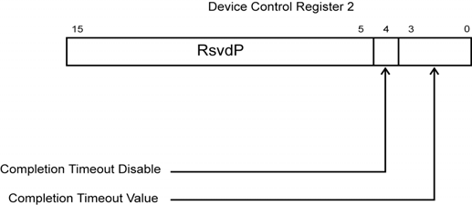
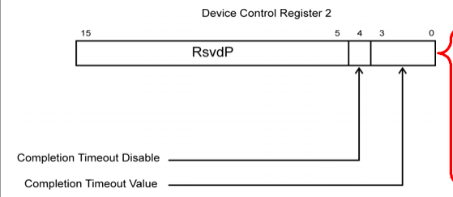

# 📘 第 15 章　错误检测与处理 (Chapter 15. Error Detection and Handling)

**MindShare PCI Express Technology 3.0 — Comprehensive Guide to Generations 1.x, 2.x and 3.0**

> 📁 **Source chunks**: `chunks/chunk0316.md` ... `chunks/chunk0322.md`
> 🎨 **Format**: 中英对照双语 · 中文灰底 (PCIe 6.2 Spec 模板)

---

## 📑 本章目录 (Table of Contents)

- [15.1 _16 Power Management_ — 错误检测与处理](#sec-15-1)
- [15.2 ACPI Spec Defines Overall PM — 错误检测与处理](#sec-15-2)
- [15.3 ACPI Driver Controls Non-Standard Embedded Devices — 错误检测与处理](#sec-15-3)
- [15.4 D2 State—Deep Sleep — 错误检测与处理](#sec-15-4)
- [15.5 PM Capabilities (PMC) Register — 错误检测与处理](#sec-15-5)
- [15.6 Introduction to Link Power Management — 错误检测与处理](#sec-15-6)
- [15.7 Transmitter Exit from Electrical Idle — 错误检测与处理](#sec-15-7)

## 15.1 Error Detection and Handling | 错误检测与处理

<table>
<thead><tr><th width="50%">🇬🇧 English</th><th width="50%" style="background-color:#e8e8e8">🇨🇳 中文</th></tr></thead>
<tbody><tr>
<td>

 

6. Now that the error handler knows that the first uncorrectable error at 5:0:0 was a Malformed TLP, it can check the Header Log register to see the header of the packet that was malformed, since this is one of the errors where a header is recorded. In reading the Header Log register it finds these four doublewords: 

 - 6000_8080h ‐ 1st DW 

 - 0000_04FFh ‐ 2nd DW 

 - FB80_1000h ‐ 3rd DW 

 - 0000_0001h ‐ 4th DW 

7. The evaluation of those 4 DWs identifies the malformed packet as: Memory Write, 4DW header, TC=0, TD=1, EP=0, Attr=0, AT=0, Length=80h (128 DWs or 512 bytes), Requester ID=0:0:0, Tag=4, Byte Enables=FFh, Address=1_FB80_1000h. The header of the packet all looks correct and every field uses valid encod‐ ings, so software must dig a little deeper to discover why this was treated as a Malformed TLP. In this example, let’s assume that after further inspection of config space on 5:0:0, software discovers that the Max Payload Size enabled for this Function is 256 bytes, but this packet contained 512 bytes. This is a condition that will be treated as a Malformed TLP by the target device, in this case 5:0:0. 

If you would like verify your knowledge of this error investigation process, go ahead and evaluate what the first uncorrectable error detected on 4:0:0 was. 

If you’re feeling adventurous and would like to check out this type of info on a real system, say your desktop or laptop, you can do so by downloading the MindShare Arbor software (www.mindshare.com/arbor). You can run this on an x86‐based machine and it will scan your system and display every visible PCI‐compatible device with its configuration space decoded for easy interpreta‐ tion. 

## _**16 Power Management**_ 

## **The Previous Chapter** 

The previous chapter discusses error types that occur in a PCIe Port or Link, how they are detected, reported, and options for handling them. Since PCIe is designed to be backward compatible with PCI error reporting, a review of the PCI approach to error handling is included as background information. Then we focus on PCIe error handling of correctable, non‐fatal and fatal errors. 

## **This Chapter** 

This chapter provides an overall context for the discussion of system power management and a detailed description of PCIe power management, which is compatible with the _PCI Bus PM Interface Spec_ and the _Advanced Configuration and Power Interface_ (ACPI). PCIe defines extensions to the PCI‐PM spec that focus primarily on Link Power and event management. An overview of the OnNow Initiative, ACPI, and the involvement of the Windows OS is also pro‐ vided. 

## **The Next Chapter** 

The next chapter details the different ways that PCIe Functions can generate interrupts. The old PCI model used pins for this, but side‐band signals are undesirable in a serial model so support for the in‐band MSI (Message‐Signaled Interrupts) mechanism was made mandatory. The PCI INTx# pin operation can still be emulated in support of a legacy system using PCIe INTx messages. Both the PCI legacy INTx# method and the newer versions of MSI/MSI‐X are described. 

## **Introduction** 

PCI Express power management (PM) defines four major areas of support: 

- **PCI‐Compatible PM** . PCIe power management is hardware and software compatible with the PCI‐PM and ACPI specs. This support requires that all Functions include the PCI Power Management Capability registers, allow‐ ing software to transition a Function between PM states under software control through the use of Configuration requests. This was modified in the 2.1 spec revision with the addition of Dynamic Power Allocation (DPA), another set of registers that added several substates to the D0 power state to give software a finer‐grained PM mechanism. 

- **Native PCIe Extensions** . These define autonomous, hardware‐based Active State Power Management (ASPM) for the Link, as well as mechanisms for waking the system, a Message transaction to report Power Management Events (PME), and a method for calculating and reporting the low‐power‐to‐active‐state latency. 

- **Bandwidth Management.** The 2.1 spec revision added the ability for hard‐ ware to automatically change either the Link width or Link data rate or both to improve power consumption. This allows high performance when needed and keeps power usage low when lower performance is acceptable. Even though Bandwidth Management is considered a Power Management topic, we describe this capability in the section “Dynamic Bandwidth Changes” on page 618 in the “Link Initialization & Training” chapter because it involves the LTSSM. 

- **Event Timing Optimization.** Peripheral devices that initiate bus master events or interrupts without regard to the system power state cause other system components to stay in high power states to service them, resulting in higher power consumption than would be necessary. This shortcoming was corrected in the 2.1 spec by adding two new mechanisms: Optimized Buffer Flush and Fill (OBFF), which lets the system inform peripherals about the current system power state, and Latency Tolerance Reporting (LTR), which allows devices to report the service delay they can tolerate at the moment. 

This chapter is segmented into several major sections: 

1. The first part is a primer on power management in general and covers the role of system software in controlling power management features. This discussion only considers the Windows Operating System perspective since it’s the most common one for PCs, and other OSs are not described. 
2. The second section, “Function Power Management” on page 713, discusses the method for putting Functions into their low‐power device states using the PCI‐PM capability registers. Note that some of the register definitions are modified or unused by PCIe Functions. 

3. “Active State Power Management (ASPM)” on page 735 describes the hard‐ ware‐based autonomous Link power management. Software determines which level of ASPM to enable for the environment, possibly by reading the recovery latency values that will be incurred for that Function, but after that the timing of the power transitions is controlled by hardware. Software doesn’t control the transitions and is unable to see which power state the Link is in. 

4. “Software Initiated Link Power Management” on page 760 discusses the Link power management that is forced when software changes the power state of a device. 

5. “Link Wake Protocol and PME Generation” on page 768 describes how Devices may request that software return them to the active state so they can service an event. When power has been removed from a Device, auxil‐ iary power must be present if it is to monitor events and signal a Wakeup to the system to get power restored and reactivate the Link. 

6. Finally, event‐timing features are described, including OBFF and LTR. 

## **Power Management Primer** 

The _PCI Bus PM Interface spec_ describes the power management registers required for PCIe. These permit the OS to manage the power environment of a Function directly. Rather than dive into a detailed description, let’s start by describing where this capability fits in the overall context of the system. 

## **Basics of PCI PM** 

This section provides an overview of how a Windows OS interacts with other major software and hardware elements to manage the power usage of individ‐ ual devices and the system as a whole. Table 16‐1 on page 706 introduces the major elements involved in this process and provides a very basic description of how they relate to each other. It should be noted that neither the PCI Power Management spec nor the ACPI spec dictate the PM policies that the OS uses. They do, however, define the registers (and some data structures) that are used to control the power usage of a Function. 

## **PCI Express Technology** 

_Table 16‐1: Major Software/Hardware Elements Involved In PC PM_ 

|**Element**|**Responsibility**|
|---|---|
|OS|Directs**overall system power management**by sending requests to the ACPI Driver, device driver, and the PCI Express Bus Driver. Applica‐ tions that are power conservation‐aware interact with the OS to accom‐ plish device power management.|
|ACPI Driver|Manages configuration, power management, and thermal control of embedded system devices that don’t adhere to an industry‐standard spec. Examples of this include chipset‐specific registers, system board‐specific registers to control power planes, etc. The PM registers within PCIe Functions (embedded or otherwise) are defined by the PCI PM spec and are therefore not managed by the ACPI driver, but rather by the PCI Express Bus Driver (see entry in this table).|

</td>
<td style="background-color:#e8e8e8">

|Device Driver|**Class driver** 可以与属于其编写要控制的设备 Class 内的任何设备一起工作。它不是为特定供应商编写的事实意味着它不具有设备接口的位级别知识。当它需要发出命令或检查设备的状态时，它会向由特定设备供应商提供的 **Miniport** 驱动程序发出请求。 设备驱动程序还不了解特定于该设备类型的特定总线实现的设备特性。例如，它不会理解 PCIe 函数的配置寄存器集。**PCI Express Bus Driver** 是与那些寄存器通信的对象。 当它从 OS 接收到控制 PCIe 设备电源状态的请求时，它会将请求传递给 PCI Express Bus Driver。 • 当从 OS 接收到断电其设备的请求时，设备驱动程序保存其关联函数的设备特定寄存器的内容（换句话说，上下文保存），然后将请求传递给 PCI Express Bus Driver 以更改设备的电源状态。 • 反之，当接收到重新为设备供电的请求时，设备驱动程序将请求传递给 PCI Express Bus Driver 以更改设备的电源状态。在 PCI Express Bus Driver 重新为设备供电后，设备驱动程序然后将上下文恢复到函数的设备特定寄存器。|
|Miniport Driver|**由设备供应商提供**，它接收来自 Class driver 的请求并将其转换为对设备寄存器集的正确系列访问。|

**第 16 章：电源管理**

_表 16-1：PC PM 中涉及的主要软件/硬件元素（续）_

|**元素**|**职责**|
|---|---|
|PCI Express Bus Driver|此驱动程序**对所有符合 PCI Express 的设备是通用的**。它**管理它们的电源状态和配置寄存器**，但不具有函数的设备特定寄存器集的知识（该知识由设备驱动程序用于与设备寄存器集通信的 Miniport Driver 拥有）。它从设备驱动程序接收请求以更改设备的电源管理逻辑的状态。例如： • 当接收到断电设备的请求时，此驱动程序负责保存函数的 PCI Express 配置寄存器的上下文。然后它禁用设备作为 Requester 运行或作为目标响应的能力，并写入函数的 PM 寄存器以更改其状态。 • 反之，当必须重新为设备供电时，PCI Express Bus Driver 写入 PCI Express 函数的 PM 寄存器以更改其状态，然后将函数的配置寄存器恢复到其原始状态。|
|PCI Express PM 寄存器，位于每个函数的配置空间中。|**这些寄存器的位置、格式和用法由 PCIe 规范定义**。PCI Express Bus Driver 理解此规范，因此是在函数的设备驱动程序请求时负责访问函数 PM 寄存器的实体。|
|System Board 电源平面和总线时钟控制逻辑|此逻辑的实现和控制通常是系统板设计特定的，因此**由 ACPI Driver 控制**（在 OS 指导下）。|

## **ACPI 规范定义总体 PM (ACPI Spec Defines Overall PM)**

ACPI (Advanced Configuration and Power Interface) 规范最初是几年前由几家公司共同编写的，旨在为计算平台中的 OSPM (OS-level Power Management) 提供行业标准。当时电源管理以专有方式在不同的平台上处理，这使得供应商难以协调他们的工作。此外，平台特定代码并不总是与 OS 操作完全兼容或不知道所有系统条件或策略考虑。ACPI 通过定义系统电源状态、硬件寄存器和软件交互以实现基于 OS 的电源管理来帮助这些领域。关于 ACPI 的详细描述超出了本书的范围，但对概念和术语的介绍将是有帮助的。

## **系统 PM 状态 (System PM States)**

表 16-2 在第 708 页定义了参考功耗的整个系统的可能状态。"Working"、"Sleep" 和 "Soft Off" 状态在 OnNow Design Initiative 文档中定义。

_表 16-2：由 OnNow Design Initiative 定义的系统 PM 状态_

|**Power** **State**|**Description**|
|---|---|
|Working (G0/S0)|系统完全运行。|
|Sleeping (G1)|系统似乎已关闭并且功耗已降低。返回到"Working"状态所需的时间与所选节能级别成反比。 • S1 — 缓存刷新，CPU 停止 • S2 — 与 S1 相同，只是现在 CPU 已断电。不常用，因为它并不比 S3 好多少。 • S3 —（也称为"挂起到 RAM"或"待机"）这与 S2 相同，只是系统上下文保存在内存中并且更多系统已关闭。当系统唤醒时，CPU 开始完整的引导过程，但发现在 CMOS 内存中设置了指示其从 RAM 重新加载上下文的标志，因此程序执行可以非常快速地恢复。 • S4 —（也称为"挂起到磁盘"或"休眠"）类似于 S3，除了现在系统将系统上下文复制到磁盘，然后从系统中移除电源，包括主存储器。这提供了更好的节能效果，但重新启动时间将更长，因为在恢复程序执行之前必须从磁盘恢复上下文。|
|Soft Off (G2/S5)|系统似乎已关闭并且功耗最小。它需要完全重新启动才能返回到"Working"状态，因为内存的内容已丢失，但仍有一些电源可用于执行唤醒，例如通过按下系统上的"Power"按钮。|
|Mechanical Off (G3)|系统已与所有电源断开连接，并且没有可用的电源。|

**第 16 章：电源管理**

## **设备 PM 状态 (Device PM States)**

ACPI 还定义了设备级别的 PM 状态，列于表 16-3 在第 709 页。表 16-3 在第 709 页以略微不同的形式呈现相同的信息。必须为 PCIe 设备实现支持这些设备状态的寄存器。

_表 16-3：OnNow 设备级 PM 状态的定义_

|**State**|**Description**|
|---|---|
|D0|**Mandatory**。设备完全运行并使用系统的全部功率。2.1 规范版本添加了另一组寄存器以支持 D0 下的 32 个子状态，称为 Dynamic Power Allocation 寄存器。|
|D1|**Optional**。低功耗状态，其中设备上下文可能丢失也可能不会丢失。没有给出此状态的定义，但它将表示比 D0 更低且比 D2 更高的功耗状态。|
|D2|**Optional**。大概是比 D1 更低的功耗状态，可实现更大的节能，但会产生更长的恢复延迟，并可能导致设备丢失一些上下文。|
|D3|**Mandatory**。设备准备好断电，并且无论电源是否实际关闭，上下文都可能会丢失。恢复时间将比 D2 长，但在此状态下可以正常地从设备中移除电源。|

## **设备上下文的定义 (Definition of Device Context)**

**概述 (General).** 在正常操作期间，设备的操作状态不断变化。设备驱动程序可能写入或读取其寄存器，或者设备上的本地处理器可能执行影响其与系统交互的代码。给定时刻的设备状态包括：

- 其配置寄存器的内容。

- 其本地存储器和 IO 寄存器的状态。

- 如果它包含处理器，那么当前程序指针和其他寄存器的内容将包括在内。

此状态信息称为 _设备上下文_ (device context)。如果将设备 PM 状态更改为更具攻击性的级别，则其中一些或全部可能会丢失。如果不维护上下文信息，则设备在返回到 D0（完全运行）状态时将无法正常运行。

**PME Context.** 如果 OS 启用调制解调器以唤醒系统进行来电，然后关闭系统电源，则设备唤醒上下文需要在该时间内在本地保留。芯片组保留足够的电源以允许它监视这些事件。为了支持此功能，PCIe 调制解调器必须实现包括以下内容的配置寄存器：

- PME 消息能力。

- PME 启用/禁用控制位。

- PME 状态位，指示设备是否已发送 PME 消息。

- 一个或多个设备特定的控制位，可选择性地启用或禁用各种可导致设备发送 PME 消息的设备特定事件。

- 相应的设备特定状态位，指示设备发出 PME 消息的原因。

## **设备类特定 PM 规范 (Device-Class-Specific PM Specs)**

**默认设备类规范 (Default Device Class Spec).** 如前所述，ACPI 提供了四种可能的设备电源状态（D0 到 D3）。它还定义了所有设备类型必须实现的最低 PM 状态，如表 16-4 在第 710 页所列。

_表 16-4：默认设备类 PM 状态_

|**State**|**Description**|
|---|---|
|D0|设备已打开，正在全功率运行，并且完全运行。|
|D1|此可选状态仅定义为比 D0 功耗更低。它不常用。|
|D2|此可选状态仅定义为比 D1 功耗更低。它不常用。|
|D3|设备消耗尽可能少的功率，主电源可以关闭。唯一的要求是，在电源仍然开启时，设备必须能够服务配置命令以重新进入 D0。可以在此状态下从设备中移除电源，并且设备将在恢复电源时经历硬件复位。|

**第 16 章：电源管理**

**设备类特定 PM 规范 (Device Class-Specific PM Specs).** 除了 _默认设备类规范_ 强制要求的电源状态之外，某些设备类可能需要中间电源状态（D1 和/或 D2）或在特定电源状态下表现出某些共同特征。

与特定设备类关联的规则可在 Microsoft 硬件开发人员网站上的 _设备类电源管理规范_ 中找到。例如，以下类的设备类电源管理规范存在：

- Audio

- Communications

- Display

- Input

- Network

- PC Card

- Storage

## **电源管理策略所有者 (Power Management Policy Owner)**

设备的 PM 策略所有者定义为对设备的 PM 状态进行决策的软件模块。在 Windows 环境中，策略所有者是与该类的设备关联的特定于类的驱动程序。

## **PCI Express 电源管理与 ACPI (PCI Express Power Management vs. ACPI)**

## **PCI Express 总线驱动程序访问 PM 寄存器 (PCI Express Bus Driver Accesses PM Registers)**

如表 16-1 在第 706 页和图 16-1 在第 712 页所示，PCI Express Bus Driver 了解 PM 配置寄存器的位置、格式和用法。当 OS 需要更改 PCIe 设备的电源状态或确定其状态和能力时，将调用它。其他示例包括：

- IEEE 1394 Bus Driver，它了解如何使用 1394 电源管理规范中定义的 PM 寄存器。

- USB Bus Driver，它了解如何使用 USB 电源管理规范中定义的 PM 寄存器。

</td>
</tr></tbody></table>

[⬆️ 返回目录](#-本章目录-table-of-contents)

---

## 15.2 Error Detection and Handling | 错误检测与处理

<table>
<thead><tr><th width="50%">🇬🇧 English</th><th width="50%" style="background-color:#e8e8e8">🇨🇳 中文</th></tr></thead>
<tbody><tr>
<td>

|Device Driver|The**Class driver**can work with any device that falls within the Class of devices that it was written to control. The fact that it’s not written for a specific vendor means that it doesn’t have bit‐level knowledge of the device’s interface. When it needs to issue a command to or check the sta‐ tus of the device, it issues a request to the**Miniport**driver supplied by the vendor of the specific device. The device driver also doesn’t understand device characteristics that are peculiar to a specific bus implementation of that device type. As an example, it won’t understand a PCIe Function’s configuration register set. The**PCI Express Bus Driver**is the one to communicate with those registers. When it receives requests from the OS to control the power state of a PCIe device, it passes the request to the PCI Express Bus Driver. • When a request to power down its device is received from the OS, the device driver saves the contents of its associated Function’s device‐specific registers (in other words, a context save) and then passes the request to the PCI Express Bus Driver to change the power state of the device. • Conversely, when a request to re‐power the device is received, the device driver passes the request to the PCI Express Bus Driver to change the power state of the device. After the PCI Express Bus Driver has re‐powered the device, the device driver then restores the context to the Function’s device‐specific registers.|
|Miniport Driver|**Supplied by the vendor of a device**, it receives requests from the Class driver and converts them into the proper series of accesses to the device’s register set.|

_Table 16‐1: Major Software/Hardware Elements Involved In PC PM (Continued)_ 

|**Element**|**Responsibility**|
|---|---|
|PCI Express Bus Driver|This driver is**generic to all PCI Express‐compliant devices**. It**manages** **their power states and configuration registers**, but does not have knowledge of a Function’s device‐specific register set (that knowledge is possessed by the Miniport Driver that the device driver uses to commu‐ nicate with the device’s register set). It receives requests from the device driver to change the state of the device’s power management logic. For example: • When a request to power down the device is received, this driver is responsible for saving the context of the Function’s PCI Express con‐ figuration registers. It then disables the ability of the device to act as a Requester or respond as a target and writes to the Function’s PM regis‐ ters to change its state. • Conversely, when the device must be re‐powered, the PCI Express Bus Driver writes to the PCI Express Function’s PM registers to change its state and then restores the Function’s configuration registers to their original state.|
|PCI Express PM regis‐ ters within each Func‐ tion’s configuration space.|**The location, format and usage of these registers is defined by the** **PCIe spec**. The PCI Express Bus Driver understands this spec and there‐ fore is the entity responsible for accessing a Function’s PM registers when requested to do so by the Function’s device driver.|
|System Board power plane and bus clock control logic|The implementation and control of this logic is typically system board design‐specific and is therefore**controlled by the ACPI Driver**(under OS direction).|

## **ACPI Spec Defines Overall PM** 

The ACPI (Advanced Configuration and Power Interface) spec was first written several years ago as a joint effort by several companies to provide industry stan‐ dards for OSPM (OS‐level Power Management) in compute platforms. Power management at that time was being handled in proprietary ways on different platforms and that made it difficult for vendors to coordinate their efforts. In addition, platform‐specific code wasn’t always fully compatible with OS opera‐ tions or aware of all the system conditions or policy considerations. ACPI helped in these areas by defining system power states, hardware registers and software interactions to accomplish OS‐based power management. A detailed description of ACPI is beyond the scope of this book, but an introduction to the concepts and terminology will be helpful. 

## **System PM States** 

Table 16‐2 on page 708 defines the possible states of the overall system with ref‐ erence to power consumption. The “Working”, “Sleep”, and “Soft Off” states are defined in the OnNow Design Initiative documents. 

_Table 16‐2: System PM States as Defined by the OnNow Design Initiative_ 

|**Power** **State**|**Description**|
|---|---|
|Working (G0/S0)|The system is fully operational.|
|Sleeping (G1)|The system appears to be off and power consumption has been reduced. The amount of time it takes to return to the “Working” state is inversely proportional to the selected level of power conservation. • S1 ‐ caches flushed, CPU halted • S2 ‐ same as S1 except that now CPU is powered off. Not commonly used because it’s not much better than S3. • S3 ‐ (also called “Suspend to RAM” or “Standby”) This is the same as S2 except that the system context is saved in memory and more of the system is shut down. When the system wakes up the CPU begins the full boot process but finds flags set in the CMOS mem‐ ory that direct it to reload the context from RAM instead, and thus program execution can be resumed very quickly. • S4 ‐ (also called “Suspend to Disk” or “Hibernate”) Similar to S3, except that now the system copies the system context to disk, and then removes power from the system, including main memory. This gives better power savings but the restart time will be longer because the context must be restored from the disk before resuming program execution.|
|Soft Off (G2/S5)|The system appears to be off and power consumption is minimal. It requires a full reboot to return to the “Working” state because the contents of memory have been lost, but there is still some power avail‐ able to do the wakeup, such as by pressing the “Power” button on the system.|
|Mechanical Off (G3)|The system has been disconnected from all power sources and no power is available.|

## **Device PM States** 

ACPI also defines the PM states at the device level, which are listed in Table 16‐3 on page 709. Table 16‐3 on page 709 presents the same information in a slightly different form. The registers that support these device states must be implemented for PCIe devices. 

_Table 16‐3: OnNow Definition of Device‐Level PM States_ 

|**State**|**Description**|
|---|---|
|D0|**Mandatory**. Device is fully operational and uses full power from the sys‐ tem. The 2.1 spec revision added another set of registers to support 32 substates under D0 referred to as Dynamic Power Allocation registers.|
|D1|**Optional**. Low‐power state in which device context may or may not be lost. No definition for this state is given, but it would represent a lower power state than D0 and higher than D2|
|D2|**Optional**. Presumably a lower power state than D1 that attains greater power savings, but would incur a longer recovery delay and may cause Device to lose some context.|
|D3|**Mandatory**. Device is prepared for loss of power and context may be lost whether the power actually goes off or not. Recovery time will be longer than for D2, but power can be removed from the device gracefully in this state.|

## **Definition of Device Context** 

**General.** During normal operation, the operational state of a Device is con‐ stantly changing. A device driver may write or read its registers, or a local processor on the Device may execute code that affects its interaction with the system. The state of the device at a given instant in time includes: 

- The contents of its configuration registers. 

- The state of its local memory and IO registers. 

- If it contains a processor, then the current program pointer and contents of its other registers would be included. 

This state information is referred to as the _device context_ . Some or all of this may be lost if the Device PM state is changed to a more aggressive level. If the context information is not maintained, the Device won’t operate cor‐ rectly when it returns to the D0 (fully operational) state. 

**PME Context.** If the OS enables a modem to wake the system for an incoming call and then powers down the system, the Device wake‐up con‐ text will need to be retained locally during that time. The chipset retains enough power to allow it to monitor for these events. To support this fea‐ ture, a PCIe modem must implement configuration registers including: 

- PME Message capability. 

- PME enable/disable control bit. 

- PME status bit indicating whether the device has sent a PME message. 

- ‐ One or more device‐specific control bits that selectively enable or dis‐ able various device‐specific events that can cause the device to send a PME message. 

- Corresponding device‐specific status bits that indicate why the device issued a PME message. 

## **Device-Class-Specific PM Specs** 

**Default Device Class Spec.** As mentioned earlier, ACPI gives four pos‐ sible device power states (D0 ‐ through ‐ D3). It also defines the minimum PM states that all device types must implement, as listed in Table 16‐4 on page 710. 

_Table 16‐4: Default Device Class PM States_ 

|**State**|**Description**|
|---|---|
|D0|Device is on, is running at full power, and is fully operational.|
|D1|This optional state is only defined as being lower power than D0. It is not commonly used.|
|D2|This optional state is only defined as being lower power than D1. It is not commonly used.|
|D3|Device consumes the minimum possible power and main power may be turned off. The only requirement is that, while power is still on, the device must be able to service a configuration command to re‐enter D0. Power can be removed from the device in this state, and the device will experi‐ ence a hardware reset when power is restored.|

**Device Class‐Specific PM Specs.** Above and beyond the power states mandated by the _Default Device Class Spec_ , certain device classes may require the intermediate power states (D1 and/or D2) or exhibit certain common characteristics in a particular power state. 

The rules associated with a particular device class are found in the _Device Class Power Management Specs_ available on Microsoft’s Hardware Develop‐ ers’ web site. For example, Device Class Power Management Specs exist for the following classes: 

- Audio 

- Communications 

- Display 

- Input 

- Network 

- PC Card 

- Storage 

## **Power Management Policy Owner** 

A Device’s PM policy owner is defined as the software module that makes deci‐ sions regarding the PM state of a device. In a Windows environment, the policy owner is the class‐specific driver associated with devices of that class. 

## **PCI Express Power Management vs. ACPI** 

## **PCI Express Bus Driver Accesses PM Registers** 

As indicated in Table 16‐1 on page 706 and Figure 16‐1 on page 712, the PCI Express Bus Driver understands the location, format and usage of the PM con‐ figuration registers. It’s called when the OS needs to change the power state of a PCIe device or determine its status and capabilities. Other examples include: 

- The IEEE 1394 Bus Driver, which understands how to use the PM registers defined in the 1394 Power Management spec. 

- The USB Bus Driver, which understands how to use the PM registers defined in the USB Power Management spec. 

</td>
<td style="background-color:#e8e8e8">

## **ACPI 驱动程序控制非标准嵌入式设备 (ACPI Driver Controls Non-Standard Embedded Devices)**

系统板上嵌入了寄存器集不遵守任何特定行业标准规范的设备。启动时，BIOS 通过 **ACPI tables**（也称为 **namespace**）向 OS 报告这些设备。当 OS 需要与这些设备中的任何一个通信时，它会调用 ACPI Driver，该 Driver 执行与设备关联的称为 **Control Method** 的处理程序。该处理程序也在 ACPI 表中找到，并由平台设计者使用称为 ACPI Source Language 或 **ASL** 的特殊解释性语言编写。然后将 ASL 代码编译为 ACPI Machine Language 或 **AML**。请注意，AML 不是特定于处理器的机器语言。它是 ASL 源代码的标记化（即压缩）版本。ACPI Driver 包含一个 AML 标记解释器，允许它"执行"Control Method。

_图 16-1：OS、设备驱动程序、总线驱动程序、PCI Express 寄存器和 ACPI 之间的关系_

**==> 图片 [348 x 236] 已省略 <==**

**----- Start of picture text -----** 
Microsoft OS Interface defined Interface defined by Microsoft by Microsoft Windows ACPI Written by Microsoft Device Driver Driver to ACPI spec Interface defined by Microsoft Written by Microsoft PCIe Bus AML Control Written by system to OS, PCIe, and PCI Driver Method board designer to ACPI PM specs and chip-specific specs Non-standard PCIe Function's PCIe Function's Embedded Register set defined Configuration PM Registers System Board by chip designer Registers Device Register set defined Register set defined by PCIe spec by PCI PM spec and extensions for PCIe **----- End of picture text -----** 

**第 16 章：电源管理**

## **函数电源管理 (Function Power Management)**

PCI Express 函数需要支持电源管理，并且必须实现多个寄存器和相关位字段，如下所述。

## **PM Capability 寄存器集 (The PM Capability Register Set)**

PCI-PM 规范定义了 Power Management Capability 配置寄存器。这些寄存器对于 PCI 是可选的，但对于 PCIe 是必需的，并且位于 PCI 兼容配置空间中，Capability ID 为 01h。软件可以执行以下序列来定位这些寄存器：

1. 函数的 **Configuration Status 寄存器**的位 4 应被设置，指示函数配置头的 dword 13d 第一个字节中的 Capabilities Pointer 有效。读取 **Capabilities Pointer 寄存器**会得到函数的链表能力寄存器的第一个偏移量。

2. 如果该偏移处的 dword 的最低有效字节包含 **Capability ID 01h**（请参见第 713 页的图 16-2），则这是 PM 寄存器集。紧跟 Capability ID 字节之后的字节是 _Pointer to Next Capability_ 字段，它给出配置空间中下一个 Capability 的偏移量（如果有）。非零值是有效指针，而值 00h 指示链表的结束。所有 PM 寄存器的描述可在第 724 页的"PCI-PM 寄存器的详细描述"中找到。

_图 16-2：PCI Power Management Capability 寄存器集_

**==> 图片 [367 x 62] 已省略 <==**

**----- Start of picture text -----** 
31 16 15 8 7 0 Power Management Capabilities Pointer to Capability ID (PMC) Next Capability 01h 1st Dword Bridge Support Data Register Extensions Control/Status Register 2nd Dword (PMCSR_BSE) (PMCSR) **----- End of picture text -----** 

## **设备 PM 状态 (Device PM States)**

每个 PCI Express 函数必须支持全开 D0 状态和全关 D3 状态，而 D1 和 D2 是可选的。以下各节描述了可能的 PM 状态。

## **D0 状态 — 全开 (D0 State—Full On)**

**Mandatory.** 在这种状态下，没有节能效果，设备完全运行。所有 PCIe 函数必须支持 D0 状态，从技术上讲有两个子状态：D0 Uninitialized 和 D0 Active。ASPM 硬件控制可以在设备处于此状态时更改链路电源。表 16-5 在第 714 页总结了 D0 状态下的 PM 策略。

**D0 Uninitialized.** 函数在基本复位后或在某些情况下在软件将其从 D3hot 转换为 D0 时进入 D0 Uninitialized。通常，寄存器返回到其默认状态。在此状态下，函数表现出以下特征：

- 它仅响应配置事务。

- 其 Command 寄存器启用位都返回到其默认状态，意味着它无法发起事务或充当内存或 IO 事务的目标。

**D0 Active.** 一旦函数已被软件配置和启用，它就处于 D0 Active 状态并完全运行。

_表 16-5：D0 电源管理策略_

|**Link** **PM** **State**|**Function** **PM** **State**|**Registers or** **State that must** **be valid**|**Power**|**Actions** **permitted to** **Function**|**Actions** **permitted by** **Function**|
|---|---|---|---|---|---|
|L0|D0 un-initialized|PME context **|< 10W|PCI Express config transac- tions.|None|
|L0 L0s (required)* L1 (optional)*|D0 active|all|full|Any PCI Express trans- action.|Any transac- tion, interrupt, or PME. **|
|L2/L3|D0 active|N/A***||||

* Active State Power Management

- ** If PME supported in this state.

- *** This combination of Bus/Function PM states not allowed.

## **动态功率分配 (DPA, Dynamic Power Allocation)**

**Optional**. 基础规范的 2.1 版本添加了另一个可选功能，为 D0 定义了另外 32 个子状态并描述了它们的特征。这旨在促进设备驱动程序、操作系统和执行中应用之间关于电源管理的协商，部分原因是某些函数的设备驱动程序不能很好地处理 PM。该模型的一个优点是设备在技术上仍保持在 D0 状态，因此可以以降低的能力继续操作，而不是像 D1 或更低状态那样离线。

DPA 寄存器仅在设备电源状态处于 D0 时适用，并且不适用于状态 D1-D3。最多可以定义 32 个子状态，并且它们必须从零到最大值连续编号。子状态 0 是初始默认值，表示函数能够消耗的最大功率。软件不需要按顺序在子状态之间转换，甚至不需要等到先前的转换完成后再请求子状态的另一个更改。因此，当函数完成子状态更改时，它必须检查配置的子状态，并且如果它们不匹配，则它必须开始更改为配置的值。支持 DPA 的寄存器（如图 16-3 在第 715 页所示）位于增强配置空间中。

_图 16-3：动态功率分配寄存器_

**==> 图片 [265 x 155] 已省略 <==**

**----- Start of picture text -----** 
31 0 Offset PCIe Enhanced Capability Header 000h DPA Capability Register 004h DPA Latency Indicator Register 008h DPA Control Register DPA Status Register 00Ch 010h DPA Power Allocation Array (Sized by number of substates) Up to 02Ch **----- End of picture text -----** 

DPA 能力寄存器（如图 16-4 在第 716 页所示）包含与子状态关联的多个有趣的值。Substate_Max 数指示描述了多少个子状态，并且数字必须从零连续递增到该值。给出了两个 Transition Latency Values，每个子状态将通过 Latency Indicator 寄存器与其中一个相关联；该寄存器包含每个可能子状态的一位；如果设置了该位，则使用 Transition Latency Value 1，否则使用 Value 0。延迟值给出从任何其他子状态转换到该子状态所需的最长时间。

子状态。延迟值乘以 Transition Latency Units 以毫秒为单位给出时间。类似地，Power Allocation Scale 值给出每个子状态中使用的功率的乘数，以瓦特表示。对于每个定义的子状态，DPA Power Allocation Array 中的 32 位字段描述了该状态下使用的功率。其中第一个位于偏移 010h，其余在后续 dwords 中实现。

_图 16-4：DPA Capability 寄存器_

**==> 图片 [311 x 104] 已省略 <==**

**----- Start of picture text -----** 
31 24 23 16 15 14 13 12 11 10 9 8 7 5 4 0 Xlcy1 Xlcy0 RsvdZ PAS RsvdZ RsvdZ Substate_Max Transition Latency Value 0 All fields not reserved are read-only Transition Latency Value 1 Power Allocation Scale (PAS) Transition Latency Unit (Tlunit) **----- End of picture text -----** 

DPA Control 寄存器的低 5 位由软件写入以设置新的子状态，当前子状态可以从 Status 寄存器读取，如图 16-5 在第 716 页所示。请注意，Status 寄存器的位 8 指示是否已启用 DPA 子状态的使用，但它被标记为 RW1C（Read, Write 1 to Clear），这意味着软件可以清除此位但不能设置它。DPA 在复位后默认启用，如果软件不打算使用 DPA，则需要通过向该位写入 1 来禁用它。

_图 16-5：DPA Status 寄存器_

**==> 图片 [298 x 93] 已省略 <==**

**----- Start of picture text -----** 
15 9 8 7 5 4 0 RsvdZ RsvdZ Substate Control Enabled (RW1C) Substate status (RO) **----- End of picture text -----** 

## **D1 状态 — 浅睡眠 (D1 State—Light Sleep)**

**Optional**. 在进入此状态之前，软件必须确保所有未完成的 non-posted 请求都已收到其相关的完成。这可以通过轮询 PCI Express Capability 块的 Device Status 寄存器中的 Transactions Pending 位来实现；当该位清零时，可以安全地进行。在这种轻节能状态下，函数不会发起请求，PME Messages 除外（如果已启用）。D1 状态的其他特征包括：

- 当设备进入 D1 状态时，链路被强制进入 L1 电源状态。

- 在此状态下接受配置和消息请求，但所有其他请求必须作为 Unsupported Requests 处理，并且所有完成可选择性地作为 Unexpected Completions 处理。

- 如果错误是由传入请求引起的并且启用了报告，则可以在此状态下发送 Error Message。如果发生不同类型的错误（例如 Completion timeout），则消息将不会发送，直到设备返回到 D0 状态。

- 函数可以重新激活链路并发送 PME 消息（如果支持并在此状态下已启用），以通知软件函数已发生需要恢复电源的事件。

- 函数可能在此状态下丢失其上下文。如果丢失并且设备支持 PME，则它必须至少在 D1 状态下维护其 PME 上下文（请参见第 710 页的"PME Context"）。

- 函数必须返回到 D0 Active PM 状态才能完全运行。

表 16-6 列出了 D1 状态下的 PM 策略。

_表 16-6：D1 电源管理策略_

</td>
</tr></tbody></table>

[⬆️ 返回目录](#-本章目录-table-of-contents)

---

## 15.3 Error Detection and Handling | 错误检测与处理

<table>
<thead><tr><th width="50%">🇬🇧 English</th><th width="50%" style="background-color:#e8e8e8">🇨🇳 中文</th></tr></thead>
<tbody><tr>
<td>

## **ACPI Driver Controls Non-Standard Embedded Devices** 

There are devices embedded on the system board whose register sets do not adhere to any particular industry standard spec. At boot time, the BIOS reports these devices to the OS via the **ACPI tables** , also referred to as the **namespace** . When the OS needs to communicate with any of these devices, it calls the ACPI Driver, which executes a handler called a **Control Method** associated with the device. The handler is also found in the ACPI tables and is written by the plat‐ form designer using a special interpretive language called ACPI Source Lan‐ guage, or **ASL** . The ASL code is then compiled into ACPI Machine Language, or **AML** . Note that AML is not a processor‐specific machine language. It’s a token‐ ized (i.e., compressed) version of the ASL source code. An ACPI Driver incorpo‐ rates an AML token interpreter that allows it to “execute” a Control Method. 

_Figure 16‐1: Relationship of OS, Device Drivers, Bus Driver, PCI Express Registers, and ACPI_ 

 

## **Function Power Management** 

PCI Express Functions are required to support power management, and several registers and related bit fields must be implemented as discussed below. 

## **The PM Capability Register Set** 

The PCI‐PM spec defines the Power Management Capability configuration reg‐ isters. These registers were optional for PCI, but required for PCIe, and are located in the PCI‐compatible configuration space with a Capability ID of 01h. Software can perform the following sequence to locate these registers: 

1. Bit 4 of the Function’s **Configuration Status register** should be set, indicat‐ ing that the Capabilities Pointer in the first byte of dword 13d of the Func‐ tion’s configuration Header is valid. Reading the **Capabilities Pointer register** gives the offset to the first of the Function’s linked list of capability registers. 

2. If the least significant byte of the dword at that offset contains **Capability ID 01h (** see Figure 16‐2 on page 713), this is the PM register set. The byte immediately following the Capability ID byte is the _Pointer to Next Capabil‐ ity_ field that gives the offset in configuration space of the next Capability (if there is one). A non‐zero value is a valid pointer, while a value of 00h indi‐ cates the end of the linked list. A description of all the PM registers can be found in “Detailed Description of PCI‐PM Registers” on page 724. 

_Figure 16‐2: PCI Power Management Capability Register Set_ 

 

## **Device PM States** 

Each PCI Express Function must support the full‐on D0 state and the full‐off D3 state, while D1 and D2 are optional. The sections that follow describe the possi‐ ble PM states. 

## **D0 State—Full On** 

**Mandatory.** In this state, no power conservation is in effect and the device is fully operational. All PCIe Functions must support the D0 state and there are technically two substates: D0 Uninitialized and D0 Active. ASPM hard‐ ware control can change the Link power while the Device is in this state. Table 16‐5 on page 714 summarizes the PM policies in the D0 state. 

**D0 Uninitialized.** A Function enters D0 Uninitialized after a Fundamen‐ tal Reset or, in some cases, when software transitions it from D3hot to D0. Usually, the registers are returned to their default state. In this state, the Function exhibits the following characteristics: 

- It only responds to configuration transactions. 

- Its Command register enable bits are all returned to their default states, meaning it cannot initiate transactions or act as the target of memory or IO transactions. 

**D0 Active.** Once the Function has been configured and enabled by soft‐ ware, it is in the D0 Active state and is fully operational. 

_Table 16‐5: D0 Power Management Policies_ 

|**Link** **PM** **State**|**Function** **PM** **State**|**Registers or** **State that must** **be valid**|**Power**|**Actions** **permitted to** **Function**|**Actions** **permitted by** **Function**|
|---|---|---|---|---|---|
|L0|D0 un‐initialized|PME context **|< 10W|PCI Express config transac‐ tions.|None|
|L0 L0s (required)* L1 (optional)*|D0 active|all|full|Any PCI Express trans‐ action.|Any transac‐ tion, interrupt, or PME. **|
|L2/L3|D0 active|N/A***||||

* Active State Power Management 

- ** If PME supported in this state. 

- *** This combination of Bus/Function PM states not allowed. 

## **Dynamic Power Allocation (DPA)** 

**Optional** . The 2.1 revision of the base spec added another optional capability that defines 32 more substates for D0 and describes their characteristics. This was intended to facilitate negotiation regarding power management between a 
device driver, OS, and an executing application, partly because some Functions don’t have device drivers that handle PM well. One advantage of this model is that the Device technically still remains in the D0 state and may therefore be able to continue operating in a reduced capacity instead of going offline as would be caused by a change to the D1 or lower state. 

DPA registers only apply when the Device power state is in D0 and aren’t appli‐ cable in states D1‐D3. Up to 32 substates can be defined, and they must be con‐ tiguously numbered from zero to the maximum value. Substate 0 is the initial default value and represents the maximum power the Function is capable of consuming. Software is not required to transition between substates in sequen‐ tial order or even wait until a previous transition is completed before requesting another change in the substate. Consequently, when a Function has completed a substate change it must check the configured substate and, if they don’t match, it must begin changing to the configured value. The registers to support DPA, illustrated in Figure 16‐3 on page 715, are found in the Enhanced configuration space. 

_Figure 16‐3: Dynamic Power Allocation Registers_ 

 

The DPA capability register, shown in Figure 16‐4 on page 716, contains several interesting values associated with the substates. The Substate_Max number indicates how many substates are described, and the numbers must increment contiguously from zero to that value. Two Transition Latency Values are given and each substate will be associated with one or the other by the Latency Indica‐ tor register. which contains one bit for each possible substate; if that bit is set Transition Latency Value 1 is used, otherwise Value 0 is used. The latency value gives the maximum time required to transition into that substate from any other 

substate. The latencies are multiplied by the Transition Latency Units to give the time in milliseconds. Similarly, the Power Allocation Scale value gives the multi‐ plier for the power used in each substate, expressed in watts. For each defined substate, a 32‐bit field in the DPA Power Allocation Array describes the power used for that state. The first one of these is located at offset 010h, and the rest are implemented in subsequent dwords. 

_Figure 16‐4: DPA Capability Register_ 

 

The low‐order five bits of the DPA Control register are written by software to set a new substate, and the current substate can be read from the Status register, as shown in Figure 16‐5 on page 716. Notice that bit 8 of the Status register indi‐ cates whether the use of DPA substates has been enabled but it’s labeled as RW1C (Read, Write 1 to Clear), meaning software can clear this bit but can’t set it. DPA is enabled by default after a reset, and software would need to disable it by writing a one to this bit if it did not intend to use DPA. 

_Figure 16‐5: DPA Status Register_ 

 

## **D1 State—Light Sleep** 

**Optional** . Before going into this state, software must ensure that all outstanding non‐posted Requests have received their associated Completions. This can be achieved by polling the Transactions Pending bit in the Device Status register of 
the PCI Express Capability block; when the bit is cleared to zero, it’s safe to pro‐ ceed. In this light power conservation state the Function won’t initiate Requests except PME Messages, if enabled. Other characteristics of the D1 state include: 

- Link is forced to the L1 power state when the Device goes into the D1 state. 

- Configuration and Message Requests are accepted in this state, but all other Requests must be handled as Unsupported Requests and all completions may optionally be handled as Unexpected Completions. 

- If an error is caused by an incoming Request and reporting it is enabled, an Error Message may be sent while in this state. If a different type of error occurs (such as a Completion timeout), the message won’t be sent until the Device is returned to the D0 state. 

- The Function may reactivate the Link and send a PME message, if sup‐ ported and enabled in this state, to notify software that the Function has experienced an event requiring that power be restored. 

- The Function may or may not lose its context in this state. If it does and the device supports PME, it must at least maintain its PME context (see “PME Context” on page 710) while in this state. 

- The Function must be returned to the D0 Active PM state in order to be fully operational. 

Table 16‐6 lists the PM policies while in the D1 state. 

_Table 16‐6: D1 Power Management Policies_

</td>
<td style="background-color:#e8e8e8">

|**Link** **PM** **State**|**Function** **PM** **State**|**Registers or** **State that** **must be valid**|**Power**|**Actions permitted to** **Function**|**Actions permitted** **by Function**|
|---|---|---|---|---|---|
|L1|D1|Device class-specific registers and PME context.*|D0 unini- tial- ized|Config Requests and Messages. Link transi- tions back to L0 to ser- vice the request.|PME Messages.** Though not typi- cally permitted, they would require the Link to transi- tion back to L0.|
|L2-L3||NA *||||

* This combination of Bus/Function PM states not allowed.

- ** If PME supported in this state.

## **D2 状态 — 深睡眠 (D2 State—Deep Sleep)**

**Optional**. 在进入此状态之前，软件必须确保所有未完成的 non-posted 请求都已收到其相关的完成。这可以通过轮询 PCI Express Capability 块的 Device Status 寄存器中的 Transactions Pending 位来实现；

当位清零时，可以安全地进行。这种电源状态提供比 D1 更深但比 D3hot 状态少的节能。与 D1 中一样，函数不会发起请求（PME Message 除外）或不充当配置以外请求的目标。软件仍必须能够在此状态下访问函数的配置寄存器。

D2 状态的其他特征包括：

- 在进入此状态之前，软件必须确保所有未完成的 non-posted 请求都已收到其相关的完成。这可以通过轮询 PCIe Capability 块的 Device Status 寄存器中的 Transactions Pending 位来实现。可能会发生完成永远不会返回的情况，在这种情况下，软件应等待足够长的时间以确保它们永远不会返回。

- 当设备转换为 D2 状态时，链路状态必须转换为 L1。

- • 在此状态下接受配置和消息请求，但所有其他请求必须作为 Unsupported Requests 处理，并且所有完成可选择性地作为 Unexpected Completions 处理。

- 如果错误是由传入请求引起的并且启用了报告，则可以在此状态下发送 Error Message。如果发生不同类型的错误（例如 Completion timeout），则消息将不会发送，直到设备返回到 D0 状态。

- 函数可以发送 PME 消息（如果支持并已启用），以通知软件它需要恢复电源以处理事件。

- 函数可能在此状态下丢失其上下文。如果丢失并且设备支持 PME 消息，则它必须至少为此目的维护其 PME 上下文。

- 函数必须返回到 D0 Active 状态才能完全运行。

表 16-7 在第 719 页说明了 D2 状态下的 PM 策略。

**第 16 章：电源管理**

_表 16-7：D2 电源管理策略_

|**Link** **PM** **State**|**Function** **PM** **State**|**Registers** **and/or State** **that must be** **valid**|**Power**|**Actions permitted** **to Function**|**Actions permitted** **by Function**|
|---|---|---|---|---|---|
|L1|D2|Device class-specific registers and PME con- text. *|next higher supported PM state orD0 uninitialized.|Config Requests and transactions permitted by device class (typi- cally none). This requires the Link to transition back to L0|PME Messages.* Though not typi- cally permitted, they would require the Link to transi- tion back to L0.|
|L2/L3||N/A**||||

- If PME supported in this state.

- ** This combination of Bus/Function PM states not allowed.

## **D3 — 全关 (D3—Full Off)**

**Mandatory**. 所有函数必须支持 D3 状态。这是最深的状态，节能最大化。当软件将此电源状态写入设备时，它进入 **D3hot** 状态，这意味着电源仍然存在。从设备中移除电源 (Vcc) 会将其置于 **D3cold** 状态，并将链路置于 L2（如果有辅助电源 (Vaux) 可用），如果没有则置于 L3。

**D3Hot 状态 (Mandatory).** 软件通过将适当的值写入其 Power Mgt Control and Status Register (PMCSR) 的 PowerState 字段，将函数置于 D3hot。在此状态下，函数只能发起 PME 或 PME_TO_ACK 消息，并且只能响应配置请求或 PME_Turn_Off 消息。软件必须能够在设备处于 D3hot 状态时访问函数的配置寄存器，即使只是为了能够将状态更改回 D0。D3hot 的其他特征包括：

- 在进入此状态之前，软件必须确保所有未完成的 non-posted 请求都已收到其相关的完成。这可以通过轮询 PCIe Capability 块的 Device Status 寄存器中的 Transactions Pending 位来实现。可能会发生完成永远不会返回的情况，在这种情况下，软件应等待足够长的时间以确保它们永远不会返回。

- 当函数更改为 D3hot 时，链路被强制进入 L1 状态。

## **PCI Express Technology**

- 允许函数发送 PME 消息以通知 PM 软件其需要返回到完全活动状态（假设它支持在 D3hot 状态下生成 PM 事件并已启用）。

- 函数上下文在进入此状态时可能会丢失，如果电源关闭，规范假定所有上下文都将丢失。另一方面，如果在软件启动返回 D0 之前电源从未关闭，则可以维护上下文。在早期规范版本中，这是不可能的；从 D3hot 更改为 D0 涉及软复位并且所有寄存器都重新初始化。但是，该规范的 1.2 版本添加了一个新的功能位，称为"No Soft Reset"，以指示函数在这种情况下不会执行软复位。为了能够在 D3hot 状态下生成 PME 消息，设备必须维护其 PME 上下文（请参见第 710 页的"PME Context"）。

函数在两种情况下退出 D3hot 状态：

- 如果从设备中移除了 Vcc，则它从 D3hot 转换到 D3cold。

- 软件可以写入函数的 PMCSR 寄存器的 PowerState 字段以将其 PM 状态更改为 D0。当编程退出 D3hot 并返回到 D0 时，函数返回到 D0 Uninitialized PM 状态。可能需要也可能不需要复位。表 16-8 在第 721 页列出了 D3hot 状态下的 PM 策略。

**第 16 章：电源管理**

_表 16-8：D3hot 电源管理策略_

|**Bus** **PM** **State**|**Function** **PM** **State**|**Registers** **and/or State** **that must** **be valid**|**Power**|**Actions permitted** **to Function**|**Actions permitted** **by Function**|
|---|---|---|---|---|---|
|L1|D3hot|PME con- text. **|next higher supported PM state orD0 uninitialized.|PCI Express config transactions & PME_Turn_Off broadcast message*** (These can only occur after the Link transitions back to its L0 state.|PME message** PME_TO_ACK message*** PM_Enter_L23 DLLP*** (These can occur only after the Link returns to L0)|
|L2/L3 Ready||L2/L3 Ready entered following the PME_Turn_Off handshake sequence, which prepares a device for power removal***||||
|L2/L3||NA *||||

- This combination of Bus/Function PM states not allowed.

** If PME supported in this state.

*** See "L2/L3 Ready Handshake Sequence" on page 764 for details regarding the sequence.

**D3Cold 状态 (Mandatory)**. 每个 PCI Express 函数在从函数中移除电源 (Vcc) 时进入 D3Cold PM 状态。当电源恢复时，设备必须被复位或生成内部复位，从而将其从 D3Cold 带至 D0 Uninitialized。能够生成 PME 的函数必须在此状态下以及转换为 D0 状态时维护 PME 上下文。由于移除电源才能进入此状态，因此如果函数要维护 PME 上下文，则必须具有可用的辅助电源。然后，当设备进入 D0 Uninitialized 时，它可以生成 PME 消息以通知系统唤醒事件（如果它有能力并已启用）。有关辅助电源的更多信息，请参见第 775 页的"Auxiliary Power"。

表 16-9 在第 722 页说明了 D3Cold 状态下的 PM 策略。

## **PCI Express Technology**

_表 16-9：D3cold 电源管理策略_

|**Bus** **PM** **State**|**Function** **PM** **State**|**Registers** **and/or State** **that must be** **valid**|**Power**|**Actions** **permitted to** **Function**|**Actions permitted** **by Function**|
|---|---|---|---|---|---|
|L2|D3cold|PME context*|AUX Power|Bus reset only|Signal Beacon or WAKE#**|
|L3||None|||None|

- If PME supported in this state.

** The method used to signal a wake to restore clock and power depends on the form factor.

## **函数 PM 状态转换 (Function PM State Transitions)**

图 16-6 说明了 PCIe 函数的 PM 状态转换。表 16-10 在第 723 页提供了每个转换的描述。表 16-11 在第 724 页从硬件和软件角度说明了从一个状态到另一个状态的转换。

_图 16-6：PCIe 函数 D 状态转换_

**==> 图片 [192 x 195] 已省略 <==**

**----- Start of picture text -----** 
Power On Reset D0 Un-initialized D0 Active D3 D1 D2 Hot D3 Vcc Cold Removed **----- End of picture text -----** 

**第 16 章：电源管理**

_表 16-10：函数状态转换的描述_

|**From State**|**To State**|**Description**|
|---|---|---|
|D0 Uninitialized|D0 Active|函数已完全配置并由其驱动程序启用。|
|D0 Active|D1|软件将 PMCSR PowerState 写入 D1。|
||D2|软件将 PMCSR PowerState 写入 D2。|
||D3hot|软件将 PMCSR PowerState 写入 D3hot。|
|D1|D0 Active|软件将 PMCSR PowerState 写入 D0。|
||D2|软件将 PMCSR PowerState 写入 D2。|
||D3hot|软件将 PMCSR PowerState 写入 D3hot。|
|D2|D0 Active|软件将 PMCSR PowerState 写入 D0。|
||D3hot|软件将 PMCSR PowerState 写入 D3hot。|
|D3hot|D3cold|从函数中移除电源。|
||D0 Uninitialized|软件将 PMCSR PowerState 写入 D0。|
|D3cold|D0 Uninitialized|将电源恢复到函数。|

_表 16-11：函数状态转换延迟_

|**Initial State**|**Next** **State**|**Minimum software-guaranteed delays**|
|---|---|---|
|D0|D1|0|
|D0 or D1|D2|从新状态设置到首次访问（包括配置访问）的 200μs。|
|D0, D1, or D2|D3hot|从新状态设置到首次访问的 10ms。|
|D1|D0|0|
|D2|D0|从新状态设置到首次访问的 200μs。|
|D3hot|D0|从新状态设置到首次访问的 10ms。|
|D3cold|D0||

## **PCI-PM 寄存器的详细描述 (Detailed Description of PCI-PM Registers)**

_PCI Bus PM Interface spec_ 定义了在 PCIe 函数中实现的 PM 寄存器（请参见图 16-7）。配置软件可以确定 PM 能力并控制其属性。

_图 16-7：PCI 函数的 PM 寄存器_

</td>
</tr></tbody></table>

[⬆️ 返回目录](#-本章目录-table-of-contents)

---

## 15.4 Error Detection and Handling | 错误检测与处理

<table>
<thead><tr><th width="50%">🇬🇧 English</th><th width="50%" style="background-color:#e8e8e8">🇨🇳 中文</th></tr></thead>
<tbody><tr>
<td>

|**Link** **PM** **State**|**Function** **PM** **State**|**Registers or** **State that** **must be valid**|**Power**|**Actions permitted to** **Function**|**Actions permitted** **by Function**|
|---|---|---|---|---|---|
|L1|D1|Device class‐specific registers and PME context.*|D0 unini‐ tial‐ ized|Config Requests and Messages. Link transi‐ tions back to L0 to ser‐ vice the request.|PME Messages.** Though not typi‐ cally permitted, they would require the Link to transi‐ tion back to L0.|
|L2‐L3||NA *||||

* This combination of Bus/Function PM states not allowed. 

- ** If PME supported in this state. 

## **D2 State—Deep Sleep** 

**Optional** . Before going into this state, software must ensure that all outstanding non‐posted Requests have received their associated Completions. This can be achieved by polling the Transactions Pending bit in the Device Status register of 

the PCI Express Capability block; when the bit is cleared to zero, it’s safe to pro‐ ceed. This power state provides deeper power conservation than D1 but less than the D3hot state. As in D1, the Function won’t initiate Requests (except a PME Message) or act as the target of Requests other than configuration. Soft‐ ware must still be able to access the Function’s configuration registers in this state. 

Other characteristics of the D2 state include: 

- Before going into this state, software must ensure that all outstanding non‐posted Requests have received their associated Completions. This can be achieved by polling the Transactions Pending bit in the Device Status register of the PCIe Capability block. It could happen that the Completions will never be returned and, in that case, software should wait long enough to ensure they never will be returned. 

- Link state must transition to L1 when the Device transitions to the D2 state. 

- • Configuration and Message Requests are accepted in this state, but all other Requests must be handled as Unsupported Requests and all completions may optionally be handled as Unexpected Completions. 

- If an error is caused by an incoming Request and reporting it is enabled, an Error Message may be sent while in this state. If a different type of error occurs (such as a Completion timeout), the message won’t be sent until the Device is returned to the D0 state. 

- Function may send a PME message, if supported and enabled, to notify software that it needs power restored to handle an event. 

- The Function may or may not lose its context in this state. If it does and the device supports PME messages, it must at least maintain its PME context for this purpose. 

- The Function must return to the D0 Active state to be fully operational. 

Table 16‐7 on page 719 illustrates the PM policies while in the D2 state. 
_Table 16‐7: D2 Power Management Policies_ 

|**Link** **PM** **State**|**Function** **PM** **State**|**Registers** **and/or State** **that must be** **valid**|**Power**|**Actions permitted** **to Function**|**Actions permitted** **by Function**|
|---|---|---|---|---|---|
|L1|D2|Device class‐specific registers and PME con‐ text. *|next higher supported PM state orD0 uninitialized.|Config Requests and transactions permitted by device class (typi‐ cally none). This requires the Link to transition back to L0|PME Messages.* Though not typi‐ cally permitted, they would require the Link to transi‐ tion back to L0.|
|L2/L3||N/A**||||

- If PME supported in this state. 

- ** This combination of Bus/Function PM states not allowed. 

## **D3—Full Off** 

**Mandatory** . All Functions must support the D3 state. This is the deepest state and power conservation is maximized. When software writes this power state to the Device, it goes to the **D3hot** state, meaning power is still applied. Remov‐ ing power (Vcc) from the Device puts it into the **D3cold** state and the Link into L2, if a secondary power source (Vaux) is available, or L3 if it’s not. 

**D3Hot State. (Mandatory** .) Software puts a Function into D3hot by writing the appropriate value into the PowerState field of its Power Mgt Control and Status Register (PMCSR). In this state, the Function can only initiate PME or PME_TO_ACK Messages, and can only respond to configuration Requests or the PME_Turn_Off Message. Software must be able to access the Function’s configuration registers while the device is in the D3hot state, if only to be able to change the state back to D0. Other characteristics of D3hot include: 

- Before going into this state, software must ensure that all outstanding non‐posted Requests have received their associated Completions. This can be achieved by polling the Transactions Pending bit in the Device Status register of the PCIe Capability block. It could happen that the Completions will never be returned and, in that case, software should wait long enough to ensure they never will be returned. 

- The Link is forced to the L1 state when the Function changes to D3hot. 

## **PCI Express Technology** 

- The Function is allowed to send a PME message to notify PM software of its need to be returned to the fully active state (assuming it supports genera‐ tion of PM events in the D3hot state and has been enabled to do so). 

- Function context may be lost when going to this state and if the power is turned off the spec assumes all context will be lost. On the other hand, if the power never goes off before software initiates a return to D0 the context could be maintained. In earlier spec versions that wasn’t possible; changing from D3hot to D0 involved a soft reset and all the registers were re‐initial‐ ized. However, the 1.2 revision of that spec added a new capability bit called “No Soft Reset” to indicate that the Function would not do a soft reset in that case. To be able to generate PME messages in the D3hot state, a Device must maintain its PME context (see “PME Context” on page 710). 

The Function exits from the D3hot state under two circumstances: 

- If Vcc is removed from the device, it transitions from D3hot to D3cold. 

- Software can write to the PowerState field of the Function’s PMCSR register to change its PM state to D0. When programmed to exit D3hot and return to D0, the Function returns to the D0 Uninitialized PM state. A reset may or may not be required. Table 16‐8 on page 721 lists the PM policies while in the D3hot state. 
_Table 16‐8: D3hot Power Management Policies_ 

|**Bus** **PM** **State**|**Function** **PM** **State**|**Registers** **and/or State** **that must** **be valid**|**Power**|**Actions permitted** **to Function**|**Actions permitted** **by Function**|
|---|---|---|---|---|---|
|L1|D3hot|PME con‐ text. **|next higher supported PM state orD0 uninitialized.|PCI Express config transactions & PME_Turn_Off broadcast message*** (These can only occur after the Link transitions back to its L0 state.|PME message** PME_TO_ACK message*** PM_Enter_L23 DLLP*** (These can occur only after the Link returns to L0)|
|L2/L3 Ready||L2/L3 Ready entered following the PME_Turn_Off handshake sequence, which prepares a device for power removal***||||
|L2/L3||NA *||||

- This combination of Bus/Function PM states not allowed. 

** If PME supported in this state. 

*** See “L2/L3 Ready Handshake Sequence” on page 764 for details regarding the sequence. 

**D3Cold State. Mandatory** . Every PCI Express Function enters the D3Cold PM state upon removal of power (Vcc) from the Function. When power is restored, the device must be reset or generate an internal reset, taking it from D3Cold to D0 Uninitialized. A Function capable of generating a PME must maintain PME context while in this state and when transitioning to the D0 state. Since power was removed to arrive at this state, the Function must have an auxiliary power source available if it is to maintain the PME context. Then, when the device goes to D0 Uninitialized, it can generate a PME message to inform the system of a wakeup event, if it’s capable and enabled to do so. For more on auxiliary power, refer to “Auxiliary Power” on page 775. 

Table 16‐9 on page 722 illustrates the PM policies while in the D3Cold state. 

## **PCI Express Technology** 

_Table 16‐9: D3cold Power Management Policies_ 

|**Bus** **PM** **State**|**Function** **PM** **State**|**Registers** **and/or State** **that must be** **valid**|**Power**|**Actions** **permitted to** **Function**|**Actions permitted** **by Function**|
|---|---|---|---|---|---|
|L2|D3cold|PME context*|AUX Power|Bus reset only|Signal Beacon or WAKE#**|
|L3||None|||None|

- If PME supported in this state. 

** The method used to signal a wake to restore clock and power depends on the form factor. 

## **Function PM State Transitions** 

Figure 16‐6 illustrates the PM state transitions for a PCIe Function. Table 16‐10 on page 723 provides a description of each transition. Table 16‐11 on page 724 illustrates the transitions from one state to another from both a hardware and a software perspective. 

_Figure 16‐6: PCIe Function D‐State Transitions_ 

 

_Table 16‐10: Description of Function State Transitions_ 

|**From State**|**To State**|**Description**|
|---|---|---|
|D0 Uninitialized|D0 Active|Function has been completely configured and enabled by its driver.|
|D0 Active|D1|Software writes the PMCSR PowerState to D1.|
||D2|Software writes the PMCSR PowerState to D2.|
||D3hot|Software writes the PMCSR PowerState to D3hot.|
|D1|D0 Active|Software writes the PMCSR PowerState to D0.|
||D2|Software writes the PMCSR PowerState to D2.|
||D3hot|Software writes the PMCSR PowerState to D3hot.|
|D2|D0 Active|Software writes the PMCSR PowerState to D0.|
||D3hot|Software writes the PMCSR PowerState to D3hot.|
|D3hot|D3cold|Power is removed from the Function.|
||D0 Uninitialized|Software writes the PMCSR PowerState to D0.|
|D3cold|D0 Uninitialized|Power is restored to the Function.|

_Table 16‐11: Function State Transition Delays_ 

|**Initial State**|**Next** **State**|**Minimum software‐guaranteed delays**|
|---|---|---|
|D0|D1|0|
|D0 or D1|D2|200s from new state setting to first access (including config accesses).|
|D0, D1, or D2|D3hot|10ms from new state setting to first access.|
|D1|D0|0|
|D2|D0|200s from new state setting to first access.|
|D3hot|D0|10ms from new state setting to first access.|
|D3cold|D0||

## **Detailed Description of PCI-PM Registers** 

The _PCI Bus PM Interface spec_ defines the PM registers (see Figure 16‐7) that are implemented in PCIe Functions. Configuration software can determine the PM capabilities and control its properties. 

_Figure 16‐7: PCI Function’s PM Registers_

</td>
<td style="background-color:#e8e8e8">

|**Capability ID** **01h** **Pointer to** **Next Capability** 1st Dword 2nd Dword 0 7 8 15 16 31 **Power Management Capabilities** **(PMC)** **Data Register** **Bridge Support** **Extensions** **(PMCSR_BSE)** **Control/Status Register** **(PMCSR)**|**Capability ID** **01h** **Pointer to** **Next Capability** 1st Dword 2nd Dword 0 7 8 15 16 31 **Power Management Capabilities** **(PMC)** **Data Register** **Bridge Support** **Extensions** **(PMCSR_BSE)** **Control/Status Register** **(PMCSR)**|**Capability ID** **01h** **Pointer to** **Next Capability** 1st Dword 2nd Dword 0 7 8 15 16 31 **Power Management Capabilities** **(PMC)** **Data Register** **Bridge Support** **Extensions** **(PMCSR_BSE)** **Control/Status Register** **(PMCSR)**|**Capability ID** **01h** **Pointer to** **Next Capability** 1st Dword 2nd Dword 0 7 8 15 16 31 **Power Management Capabilities** **(PMC)** **Data Register** **Bridge Support** **Extensions** **(PMCSR_BSE)** **Control/Status Register** **(PMCSR)**|
|---|---|---|---|
|**Power Management Capabilities** **(PMC)**||**Pointer to** **Next Capability**|**Capability ID** **01h**|
|**Data Register**|**Bridge Support** **Extensions** **(PMCSR_BSE)**|**Control/Status Register** **(PMCSR)**||

## **PM Capabilities (PMC) 寄存器 (PM Capabilities (PMC) Register)**

此 16 位只读寄存器的字段在表 16-12 中描述。

**第 16 章：电源管理**

_表 16-12：PMC 寄存器位分配_

|**Bit(s)**|**Description**|
|---|---|
|31:27|**PME_Support** 字段。指示函数能够在哪些 PM 状态下发送 PME 消息。位中的零表示在相应 PM 状态下不支持 PME 通知。 **Bit**  **对应于 PM 状态** 27 D0 28 D1 29 D2 30 D3hot 31 D3cold（函数需要辅助电源用于 PME 逻辑和通过信标或 WAKE# 引脚的唤醒信令） 支持从 D3cold 唤醒的系统还必须支持辅助电源，并且必须使用它来发出唤醒信号。 对于在根和交换机端口中实现的虚拟 PCI-PCI 桥，必须将位 31、30 和 27 设置为 1b。这是转发 PME 消息的端口所必需的。|
|26|**D2_Support** 位。1 = 函数支持 D2 PM 状态。|
|25|**D1_Support** 位。1 = 函数支持 D1 PM 状态。|

## **PCI Express Technology**

_表 16-12：PMC 寄存器位分配（续）_

|**Bit(s)**|**Description**|
|---|---|
|24:22|**Aux_Current** 字段。对于支持从 D3cold 状态生成 PME 消息的函数，此字段报告对函数的 3.3Vaux 电源（请参见第 775 页的"Auxiliary Power"）的当前需求（由保留 PME 上下文信息的函数逻辑提出）。此信息供软件用于确定可同时启用 PME 生成的函数数量（基于每个函数从系统 3.3Vaux 电源汲取的电流总量以及电源的供电能力）。 • 如果函数不支持从 D3cold PM 状态内进行 PME 通知，则此字段未实现并且在读取时始终返回零。或者，由 PCI Express 定义的新功能允许不支持 PME 的设备在 Device Control 寄存器中由 _Aux Power PM Enable_ 位启用时报告它们汲取的辅助电流。 • 如果函数实现 Data 寄存器（请参见第 731 页的"Data Register"），则此字段在读取时始终返回零。然后 Data 寄存器在报告函数的 3.3Vaux 电流要求时优先于此字段。 • 如果函数支持从 D3cold 状态进行 PME 通知并且不实现 Data 寄存器，则 Aux_Current 字段报告函数的 3.3Vaux 电流要求。编码如下：  **Bit**  **24 23 22 最大所需电流** 1 1 1 375mA 1 1 0 320mA 1 0 1 270mA 1 0 0 220mA 0 1 1 160mA 0 1 0 100mA 0 0 1 55mA 0 0 0 0mA|

**第 16 章：电源管理**

_表 16-12：PMC 寄存器位分配（续）_

|**Bit(s)**|**Description**|
|---|---|
|21|**设备特定初始化 (DSI)** 位。此位中的 1 指示在进入 D0 Uninitialized 状态后立即，该函数需要超出其 PCI 配置标头寄存器设置的额外配置，然后 Class 驱动程序才能使用该函数。 Microsoft OS 不使用此位。而是由 Class 驱动程序进行确定和初始化。|
|20|保留。|
|19|**PME Clock** 位。不适用于 PCI Express。必须硬连线为 0。|
|18:16|**Version** 字段。此字段指示函数符合的 PCI Bus PM Interface 规范的版本。 **Bit**  **18 17 16 符合的规范版本** 0 0 1 1.0 0 1 0 1.1（PCI Express 所需）|

## **PM Control and Status Register (PMCSR)**

此寄存器是所有 PCI Express 设备所需的，具有多种用途，如下所述。表 16-13 在第 728 页提供了 PMCSR 位字段的描述。

- 如果函数实现 PME 功能，则 PME Enable 位允许软件启用或禁用函数断言 PME 消息或 WAKE# 信号的能力，Status 位反映是否已发生 PME。

- 如果实现了可选的 Data 寄存器（请参见第 731 页的"Data Register"），则使用两个字段允许软件选择可通过 Data 寄存器读取的信息，并提供 Data 寄存器值的缩放乘数。

- 可以读取寄存器的 PowerState 字段以确定函数的当前 PM 状态，并可以写入以将函数置于新的 PM 状态。

## **PCI Express Technology**

_表 16-13：PM Control/Status Register (PMCSR) 位分配_

|**Bit(s)**|**Value** **at** **Reset**|**Read/** **Write**|**Description**|
|---|---|---|---|
|31:24|all zeros|Read Only|请参见第 731 页的"Data Register"。|
|23|zero|Read Only|在 PCI Express 中未使用|
|22|zero|Read Only|在 PCI Express 中未使用|
|21:16|all zeros|Read Only|保留|
|15|See Descrip tion.|Read, Write one to clear, Sticky RW1CS|**PME_Status** 位。**Optional**：仅当函数支持 PME 通知时实现，否则为零。 此位反映函数是否已经历 PME（即使此寄存器中的 PME_En 位已禁用函数发送 PME 消息的能力）。如果设置为 1，则函数已经历 PME。软件通过向其写入 1 来清除此位。 复位后，如果函数不支持 D3cold 中的 PME，则此位为零。如果函数支持 D3cold 中的 PME，则此位在初始 OS 引导时是不确定的，但之后反映函数是否已经历 PME。 如果函数支持来自 D3cold 的 PME，则该位的状态必须保持不变，即使电源丢失或函数被复位（粘性位）。这意味着辅助电源在这些条件下保持该逻辑处于活动状态（请参见第 775 页的"Auxiliary Power"）。|

**第 16 章：电源管理**

_表 16-13：PM Control/Status Register (PMCSR) 位分配（续）_

|**Bit(s)**|**Value** **at** **Reset**|**Read/** **Write**|**Description**|
|---|---|---|---|
|14:13|Device- specific|Read Only|**Data_Scale** 字段。**Optional**。如果函数未实现 Data 寄存器，则此字段硬连线返回零。 如果实现了 Data 寄存器，则 Data_Scale 字段是必需的，并且必须是表示其乘数的只读值。Data_Scale 字段的值和解释取决于由 Data_Select 字段选择要通过 Data 寄存器查看的数据项。|
|12:9|0000b|Read/ Write|**Data_Select** 字段。**Optional**。如果函数未实现 Data 寄存器，则此字段硬连线返回零。 如果实现了 Data 寄存器，则 Data_Select 是必需的读/写字段。放置在此寄存器中的值选择要在 Data 寄存器中查看的数据。然后该值必须乘以从 Data_Scale 字段读取的值。|

## **PCI Express Technology**

_表 16-13：PM Control/Status Register (PMCSR) 位分配（续）_

|**Bit(s)**|**Value** **at** **Reset**|**Read/** **Write**|**Description**|
|---|---|---|---|
|8|See Descrip tion.|Read/ Write|**PME_En** 位。**Optional**。 1 = 在事件发生时启用函数发送 PME 消息的能力。 0 = 禁用。 如果函数不支持从任何电源状态生成 PME，则此位在读取时始终返回零。 复位后，如果函数不支持来自 D3cold 的 PME，则此位为零。如果函数支持来自 D3cold 的 PME： • 此位在初始 OS 引导时是不确定的。 • 否则，它启用或禁用函数在发生 PME 时是否可以发送 PME 消息。 如果函数支持来自 D3cold 的 PME，则该位的状态必须在函数保持在 D3cold 状态期间以及从 D3cold 转换为 D0 Uninitialized 状态期间保持不变。这意味着 PME 逻辑必须使用辅助电源在这些条件下为此逻辑供电。|
|7:2|all zeros|Read Only|保留|
|1:0|00b|Read/ Write|**PowerState** 字段。**Mandatory**。软件使用此字段读取函数的当前 PM 状态或写入新的 PM 状态。如果软件选择函数不支持的 PM 状态，则写入正常完成，但数据被丢弃且不发生状态更改。  **1 0 PM 状态** 0 0 D0 0 1 D1 1 0 D2 1 1 D3hot|

**第 16 章：电源管理**

## **Data 寄存器 (Data Register)**

**Optional, read-only**。请参见第 732 页的图 16-8。Data 寄存器是一个 8 位只读寄存器，为软件提供以下信息：

- 在所选 PM 状态下消耗的功率；用于功率预算。

- 在所选 PM 状态下耗散的功率；用于管理热环境。

- 可以通过此寄存器报告任何类型的数据，但 PCI-PM 规范仅为其定义了功率消耗和功率耗散信息。

如果实现了 Data 寄存器，则还必须实现 PMCSR 寄存器的 Data_Select 和 Data_Scale 字段，并且不能实现 PMC 寄存器的 Aux_Current 字段。

**确定 Data 寄存器的存在 (Determining Presence of the Data Register).** 软件可以执行以下过程来检查 Data 寄存器的存在：

1. 将值 0000b 写入 PMCSR 寄存器的 Data_Select 字段。

2. 从 Data 寄存器或 PMCSR 寄存器的 Data_Scale 字段读取。非零值表示 Data 寄存器以及 PMCSR 寄存器的 Data_Scale 和 Data_Select 字段已实现。如果读取值为零，请转到步骤 4。

</td>
</tr></tbody></table>

[⬆️ 返回目录](#-本章目录-table-of-contents)

---

## 15.5 Error Detection and Handling | 错误检测与处理

<table>
<thead><tr><th width="50%">🇬🇧 English</th><th width="50%" style="background-color:#e8e8e8">🇨🇳 中文</th></tr></thead>
<tbody><tr>
<td>

|**Capability ID** **01h** **Pointer to** **Next Capability** 1st Dword 2nd Dword 0 7 8 15 16 31 **Power Management Capabilities** **(PMC)** **Data Register** **Bridge Support** **Extensions** **(PMCSR_BSE)** **Control/Status Register** **(PMCSR)**|**Capability ID** **01h** **Pointer to** **Next Capability** 1st Dword 2nd Dword 0 7 8 15 16 31 **Power Management Capabilities** **(PMC)** **Data Register** **Bridge Support** **Extensions** **(PMCSR_BSE)** **Control/Status Register** **(PMCSR)**|**Capability ID** **01h** **Pointer to** **Next Capability** 1st Dword 2nd Dword 0 7 8 15 16 31 **Power Management Capabilities** **(PMC)** **Data Register** **Bridge Support** **Extensions** **(PMCSR_BSE)** **Control/Status Register** **(PMCSR)**|**Capability ID** **01h** **Pointer to** **Next Capability** 1st Dword 2nd Dword 0 7 8 15 16 31 **Power Management Capabilities** **(PMC)** **Data Register** **Bridge Support** **Extensions** **(PMCSR_BSE)** **Control/Status Register** **(PMCSR)**|
|---|---|---|---|
|**Power Management Capabilities** **(PMC)**||**Pointer to** **Next Capability**|**Capability ID** **01h**|
|**Data Register**|**Bridge Support** **Extensions** **(PMCSR_BSE)**|**Control/Status Register** **(PMCSR)**||

## **PM Capabilities (PMC) Register** 

The fields of this 16‐bit read‐only register are described in Table 16‐12. 
_Table 16‐12: The PMC Register Bit Assignments_ 

|**Bit(s)**|**Description**|
|---|---|
|31:27|**PME_Support**field. Indicates in which PM states the Function is capable of sending a PME message. A zero in a bit indicates PME notification is not supported in the respective PM state. **Bit**  **Corresponds to PM State** 27 D0 28 D1 29 D2 30 D3hot 31 D3cold(Function requires aux power for PME logic and Wake signaling via beacon or WAKE# pin) Systems that support wake from D3coldmust also support aux power and must use it to signal the wakeup. Bits 31, 30, and 27 must be set to 1b for virtual PCI‐PCI Bridges imple‐ mented within Root and Switch Ports. This is required for ports that for‐ ward PME Messages.|
|26|**D2_Support**bit. 1 = Function supports the D2 PM state.|
|25|**D1_Support**bit. 1 = Function supports the D1 PM state.|

## **PCI Express Technology** 

_Table 16‐12: The PMC Register Bit Assignments (Continued)_ 

|**Bit(s)**|**Description**|
|---|---|
|24:22|**Aux_Current**field. For a Function that supports generation of the PME message from the D3coldstate, this field reports the current demand made upon the 3.3Vaux power source (see “Auxiliary Power” on page 775) by the Function’s logic that retains the PME context information. This infor‐ mation is used by software to determine how many Functions can simul‐ taneously be enabled for PME generation (based on the total amount of current each draws from the system 3.3Vaux power source and the power sourcing capability of the power source). • If the Function does not support PME notification from within the D3coldPM state, this field is not implemented and always returns zero when read. Alternatively, a new feature defined by PCI Express per‐ mits devices that do not support PMEs to report the amount of Aux current they draw when enabled by the_Aux Power PM Enable_bit within the Device Control register. • If the Function implements the Data register (see “Data Register” on page 731), this field always returns zeros when read. The Data register then takes precedence over this field in reporting the 3.3Vaux current requirements for the Function. • If the Function supports PME notification from the D3coldstate and does not implement the Data register, then the Aux_Current field reports the 3.3Vaux current requirements for the Function. It is encoded as follows:  **Bit**  **24 23 22 Max Current Required** 1 1 1 375mA 1 1 0 320mA 1 0 1 270mA 1 0 0 220mA 0 1 1 160mA 0 1 0 100mA 0 0 1 55mA 0 0 0 0mA|

_Table 16‐12: The PMC Register Bit Assignments (Continued)_ 

|**Bit(s)**|**Description**|
|---|---|
|21|**Device‐Specific Initialization (DSI)**bit. A one in this bit indicates that immediately after entry into the D0 Uninitialized state, the Function requires additional configuration above and beyond setup of its PCI con‐ figuration Header registers before the Class driver can use the Function. Microsoft OSs do not use this bit. Rather, the determination and initializa‐ tion is made by the Class driver.|
|20|Reserved.|
|19|**PME Clock**bit. Does not apply to PCI Express. Must be hardwired to 0.|
|18:16|**Version**field. This field indicates the version of the PCI Bus PM Interface spec that the Function complies with. **Bit**  **18 17 16 Complies with Spec Version** 0 0 1 1.0 0 1 0 1.1 (required by PCI Express)|

## **PM Control and Status Register (PMCSR)** 

This register, required for all PCI Express Devices, serves several purposes as described below. Table 16‐13 on page 728 provides a description of the PMCSR bit fields. 

- If the Function implements PME capability, a PME Enable bit permits soft‐ ware to enable or disable the Function’s ability to assert the PME message or WAKE# signal, and a Status bit reflects whether or not a PME has occurred. 

- If the optional Data register is implemented (see “Data Register” on page 731), two fields are used to permit software to select which information can be read through the Data register, and provide the scaling multi‐ plier for the Data register value. 

- The register’s PowerState field can be read to determine the current PM state of the Function and written to place the Function into a new PM state. 

## **PCI Express Technology** 

_Table 16‐13: PM Control/Status Register (PMCSR) Bit Assignments_ 

|**Bit(s)**|**Value** **at** **Reset**|**Read/** **Write**|**Description**|
|---|---|---|---|
|31:24|all zeros|Read Only|See “Data Register” on page 731.|
|23|zero|Read Only|Not used in PCI Express|
|22|zero|Read Only|Not used in PCI Express|
|21:16|all zeros|Read Only|Reserved|
|15|See Descrip tion.|Read, Write one to clear, Sticky RW1CS|**PME_Status**bit.**Optional**: only implemented if the Function supports PME notification, otherwise zero. This bit reflects whether the Function has experienced a PME (even if the PME_En bit in this register has dis‐ abled the Function’s ability to send a PME message). If set to one, the Function has experienced a PME. Soft‐ ware clears this bit by writing a one to it. After reset, this bit is zero if the Function doesn’t sup‐ port PME in D3cold. If the Function does support PME in D3cold, this bit is indeterminate at initial OS boot time but after that reflects whether the Function has experienced a PME. If the Function supports PME from D3cold, the state of this bit must persist even if power is lost or the Func‐ tion is reset (a sticky bit). This implies that an auxil‐ iary power source keeps this logic active during these conditions (see “Auxiliary Power” on page 775).|

_Table 16‐13: PM Control/Status Register (PMCSR) Bit Assignments (Continued)_ 

|**Bit(s)**|**Value** **at** **Reset**|**Read/** **Write**|**Description**|
|---|---|---|---|
|14:13|Device‐ specific|Read Only|**Data_Scale**field.**Optional**. If the Function does not implement the Data register this field is hardwired to return zeros. If the Data register is implemented, the Data_Scale field is mandatory and must be a read‐only value rep‐ resenting the multiplier for it. The value and interpre‐ tation of the Data_Scale field depends on the data item selected to be viewed through the Data register by the Data_Select field.|
|12:9|0000b|Read/ Write|**Data_Select**field.**Optional**. If the Function does not implement the Data register, this field is hardwired to return zeros. If the Data register is implemented, Data_Select is a mandatory read/write field. The value placed in this register selects the data to be viewed in the Data regis‐ ter. That value must then be multiplied by the value read from the Data_Scale field.|

## **PCI Express Technology** 

_Table 16‐13: PM Control/Status Register (PMCSR) Bit Assignments (Continued)_ 

|**Bit(s)**|**Value** **at** **Reset**|**Read/** **Write**|**Description**|
|---|---|---|---|
|8|See Descrip tion.|Read/ Write|**PME_En**bit.**Optional**. 1 = enable Function’s ability to send PME messages when an event occurs. 0 = disable. If the Function does not support the generation of PMEs from any power state, this bit always return zero when read. After reset, this bit is zero if the Function doesn’t sup‐ port PME from D3cold. If the Function supports PME from D3cold: • this bit is indeterminate at initial OS boot time. • otherwise, it enables or disables whether the Func‐ tion can send a PME message in case a PME occurs. If the Function supports PME from D3cold, the state of this bit must persist while the Function remains in the D3coldstate and during the transition from D3coldto the D0 Uninitialized state. This implies that the PME logic must use an aux power source to power this logic during these conditions.|
|7:2|all zeros|Read Only|Reserved|
|1:0|00b|Read/ Write|**PowerState**field.**Mandatory**. Software uses this field to read the current PM state of the Function or write a new PM state. If software selects a PM state not sup‐ ported by the Function, the write completes normally but the data is discarded and no state change occurs.  **1 0 PM State** 0 0 D0 0 1 D1 1 0 D2 1 1 D3hot|

## **Data Register** 

**Optional, read‐only** . Refer to Figure 16‐8 on page 732. The Data register is an 8‐bit, read‐only register that provides software with the following information: 

- Power consumed in the selected PM state; useful in power budgeting. 

- Power dissipated in the selected PM state; useful in managing the thermal environment. 

- Any type of data could be reported through this register, but the PCI‐PM spec only defines power consumption and power dissipation information for it. 

If the Data register is implemented, the Data_Select and Data_Scale fields of the PMCSR registers must also be implemented, and the Aux_Current field of the PMC register must not be implemented. 

**Determining Presence of the Data Register.** Software can perform the following procedure to check for the presence of the Data register: 

1. Write a value of 0000b into the Data_Select field of the PMCSR register. 

2. Read from either the Data register or the Data_Scale field of the PMCSR register. A non‐zero value indicates that the Data register as well as the Data_Scale and Data_Select fields of the PMCSR registers are imple‐ mented. If a value of zero is read, go to step 4.

</td>
<td style="background-color:#e8e8e8">

3. 如果 Data_Select 字段的当前值是 1111b 以外的值，请转到步骤 4。如果 Data_Select 字段的当前值为 1111b，则所有可能的 Data 寄存器值都已被扫描并返回零，这表明 Data 寄存器和 PMCSR 寄存器的 Data_Scale 和 Data_Select 字段都未实现。

4. 增加 Data_Select 字段的内容并返回步骤 2。由于数据选择字段只有 4 位，因此完整的扫描需要测试 16 个可能的 select 值并查看是否看到数据和缩放寄存器的任何非零值。

**Data 寄存器的操作 (Operation of the Data Register).** 返回的信息通常是函数在最坏情况下的功率消耗和功率耗散特性在各 PM 状态下的静态副本（如设备数据表中列出）。要使用 Data 寄存器，程序员使用以下序列：

1. 将值写入 PMCSR 寄存器的 Data_Select 字段（请参见第 733 页的表 16-14），以选择要通过 Data 寄存器查看的数据项。

2. 从 Data 寄存器和 PMCSR 寄存器的 Data_Scale 字段读取数据值。

3. 将值乘以缩放因子。

**多功能设备 (Multi-Function Devices).** 在多功能 PCI Express 设备中，每个函数必须提供其自己的功率信息。所有函数通用逻辑的功率信息通过函数零的 Data 寄存器报告（请参见表 16-14 中第 733 页的 Data Select Value = 8）。

**虚拟 PCI-to-PCI 桥功率数据 (Virtual PCI-to-PCI Bridge Power Data).** 规范未指定根复合体或交换机中 PCI-to-PCI 桥函数中的数据字段使用。但是，为了保持 PCI-PM 兼容性，桥必须报告它们消耗的功率信息。软件可以在交换机的每个端口读取虚拟 PPB Data 寄存器，以确定交换机在每个电源状态消耗的功率。

_图 16-8：PM 寄存器_

|**Capability ID** **01h** **Pointer to** **Next Capability** 1st Dword 2nd Dword 0 7 8 15 16 31 **Power Management Capabilities** **(PMC)** **Data Register** **Bridge Support** **Extensions** **(PMCSR_BSE)** **Control/Status Register** **(PMCSR)**|**Capability ID** **01h** **Pointer to** **Next Capability** 1st Dword 2nd Dword 0 7 8 15 16 31 **Power Management Capabilities** **(PMC)** **Data Register** **Bridge Support** **Extensions** **(PMCSR_BSE)** **Control/Status Register** **(PMCSR)**|**Capability ID** **01h** **Pointer to** **Next Capability** 1st Dword 2nd Dword 0 7 8 15 16 31 **Power Management Capabilities** **(PMC)** **Data Register** **Bridge Support** **Extensions** **(PMCSR_BSE)**|**Capability ID** **01h** **Pointer to** **Next Capability** 1st Dword 2nd Dword 0 7 8 15 16 31 **Power Management Capabilities** **(PMC)** **Data Register** **Bridge Support** **Extensions** **(PMCSR_BSE)** **Control/Status Register** **(PMCSR)**|
|---|---|---|---|
|**Power Management Capabilities** **(PMC)**||**Pointer to** **Next Capability**|**Capability ID** **01h**|
|**Data Register**|**Bridge Support** **Extensions** **(PMCSR_BSE)**|**Control/Status Register** **(PMCSR)**||

**第 16 章：电源管理**

_表 16-14：Data 寄存器解释_

|**Data Select Value**|**Data Reported in** **Data Register**|**Interpretation of Data** **Scale Field in PMCSR**|**Units/** **Accuracy**|
|---|---|---|---|
|00h|D0 中消耗的功率|00b = 未知 01b = 乘以 0.1 10b = 乘以 0.01 11b = 乘以 0.001|Watts|
|01h|D1 中消耗的功率|||
|02h|D2 中消耗的功率|||
|03h|D3 中消耗的功率|||
|04h|D0 中耗散的功率|||
|05h|D1 中耗散的功率|||
|06h|D2 中耗散的功率|||
|07h|D3 中耗散的功率|||
|08h|在多功能 PCI 设备中，Function 0 指示包中所有函数通用逻辑消耗的功率。|||
|09h-0Fh|保留供多功能设备中 Function 0 将来使用。|保留|TBD|
|08h-0Fh|在单功能设备和多功能设备中 Function 0 以外的函数中保留。|||

## **链路电源管理介绍 (Introduction to Link Power Management)**

我们刚刚看到软件如何将设备置于多个设备电源状态之一，现在让我们考虑 PCIe 如何也管理链路电源。设备电源和链路电源相互关联，如表 16-15 在第 734 页所示。另请注意下游和上游设备之间的关系，可以总结为：上游设备或链路不能处于比其下方更具攻击性的节能状态。原因是为了

便于及时传送来自端点的数据包，如果上游设备处于较低功率状态，则其流量将被延迟。每个关系描述如下：

**D0** — 设备已完全通电，通常处于 L0 链路状态。在不离开此状态的情况下，通过使用 DPA 子状态（请参见第 714 页的"Dynamic Power Allocation (DPA)"），以及使用基于硬件的链路电源管理（请参见第 735 页的"Active State Power Management (ASPM)"了解更多详细信息），可以使用一些节能。

**D1 和 D2** — 当软件将设备状态更改为 D1 或 D2 时，链路必须自动转换为 L1 状态。由于两个链路伙伴都参与此操作，因此存在握手机制以确保有序地完成操作。

**D3hot** — 当软件将设备置于 D3 状态时，链路会自动转换为 L1，就像转换为 D1 和 D2 状态一样。现在软件可以选择移除参考时钟和电源，将设备置于 D3cold。但在此之前，预期系统将启动握手过程，通过将链路置于 L2/L3 Ready 状态来准备链路。

**D3cold** — 在这种状态下，主电源和参考时钟已关闭。但是，辅助电源 (VAUX) 可能可用，允许设备向系统发出唤醒事件。如果可用，链路状态将处于 L2。如果主电源被移除但 VAUX 不可用，则链路将处于 L3。表 16-16 在第 735 页提供了有关链路电源状态的更多信息。

_表 16-15：设备和链路电源状态之间的关系_

|**Downstream** **Component D-State**|**Permissible Upstream** **Component D-State**|**Permissible** **Interconnect State**|
|---|---|---|
|D0|D0|L0, L0s & L1 (optional)|
|D1|D0-D1|L1|
|D2|D0-D2|L1|
|D3 hot|D0-D3 hot|L1, L2/L3 Ready|
|D3 cold|D0-D3 cold|L2 (AUX Pwr), L3|

**第 16 章：电源管理**

## _表 16-16：链路电源状态特性_

|**State**|**Description**|**Software** **Directed?**|**Active** **State** **Link PM**|**Ref.** **Clocks**|**Main** **Power**|**PLL**|**Vaux**|
|---|---|---|---|---|---|---|---|
|L0|Fully Active|Yes (D0)|On|On|On|On|On/Off|
|L0s|Standby|No|Yes (D0)|On|On|On|On/Off|
|L1|Low Power Standby|Yes* (D1-D3 hot)|Yes(option) (D0)|On|On|On/Off|On/Off|
|L2/L3 Ready|Staging for power removal|Yes PME_Turn_Off handshake|No|On|On|On/Off|On/Off|
|L2|Low Power Sleep|Yes**|No|Off|Off|Off|On|
|L3|Off (Zero Power)|N/A|N/A|Off|Off|Off|Off|

- L1 状态是由于 PM 软件将设备置于 D1、D2 或 D3 状态或由 ASPM 下的硬件控制而进入的。

- ** 规范将 L2 状态描述为软件定向。表中的其他 L 状态被列为软件定向，因为软件启动到这些状态的转换。例如，当软件启动设备电源状态更改为 D1、D2 或 D3 时，设备必须通过进入 L1 状态来响应。然后软件通过发起 PME_Turn_Off 消息来启动到 L2/L3 Ready 状态的转换。最后，软件在设备已转换为 L2/L3 Ready 状态后启动从设备中移除电源。由于 Vaux 电源在 L2 中可用，因此可以发出唤醒事件以通知软件。

## **活动状态电源管理 (ASPM, Active State Power Management)**

ASPM 是一种基于硬件的链路节能机制，仅在设备处于 D0 设备电源状态时适用。进入和退出 ASPM 状态由硬件根据实现特定的标准发起；软件无法控制或观察此操作，只能使用配置寄存器位启用或禁用它（请参见第 744 页的图 16-15）。

为 ASPM 定义了两个低功耗状态：

1. L0s (standby state) — 此状态提供大量节能，但仍允许快速的进入和退出延迟。这主要是通过将发送器置于电气空闲条件来实现的。在早期规范版本中，对该状态的支持以前是所有 PCIe 设备所必需的，但在 3.0 规范中它变为可选的。

2. L1 ASPM — L1 的目标是在可接受较长进入和退出延迟的情况下实现比 L0s 更大的节能。例如，在此状态下，两个发送器同时进入电气空闲。在 3.0 规范中，对该状态的支持仍然是可选的，就像在早期规范中一样。

## **电气空闲 (Electrical Idle)**

由于将发送器置于电气空闲是 ASPM 的核心部分，因此讨论其工作方式将会有所帮助。当发送器的差分信号 (TxD+ 和 TxD-) 进入电气空闲条件时，它停止信号传输，并将其电压保持在非常接近共模电压的位置，差分电压为 0V。信号转换消耗功率，因此在链路上停止它们可以节省功率，同时仍允许在 L0 状态期间相当快地恢复正常链路活动。根据节能程度，链路处于 L0s 或 L1 状态。在此期间，发送器可以选择保持低阻抗状态或通过关闭其端接逻辑变为高阻抗以节省更多功率。除了 L0s 和 L1 之外，当链路已被禁用时，电气空闲也将生效。

## **发送器进入电气空闲 (Transmitter Entry to Electrical Idle)**

希望进入电气空闲条件的发送器必须首先通知链路伙伴，以便缺乏进一步的信号不会被误解为错误。它们通过发送 EIOS (Electrical Idle Ordered-Set) 然后快速停止传输并将链路输出驱动器置于三态来执行此操作。EIOS 的外观取决于正在使用的编码方法，如以下各节所述。发送最后一个 EIOS 后，发送器必须在 8ns 内进入电气空闲并保持至少 20ns，无论数据速率如何。电气空闲期间允许的差分峰值电压必须在 0 和 20mV 峰值之间，无论数据速率如何，以减少接收器将线路上的噪声误解为有效信号的机会。（有关这些时序和电压参数的更多信息，请参见第 489 页的表 13-3。）

**第 16 章：电源管理**

**Gen1/Gen2 模式编码 (Gen1/Gen2 Mode Encoding).** 对于 Gen1/Gen2 模式，EIOS 形式如图 16-9 在第 737 页所示。必须发送所有四个符号，但接收器仅需要看到两个 IDL 控制字符即可识别此条件。

_图 16-9：Gen1/Gen2 模式 EIOS 模式_

**==> 图片 [134 x 100] 已省略 <==**

**----- Start of picture text -----** 
Encoding COM K28.5 IDL K28.3 IDL K28.3 IDL K28.3 **----- End of picture text -----** 

</td>
</tr></tbody></table>

[⬆️ 返回目录](#-本章目录-table-of-contents)

---

## 15.6 Error Detection and Handling | 错误检测与处理

<table>
<thead><tr><th width="50%">🇬🇧 English</th><th width="50%" style="background-color:#e8e8e8">🇨🇳 中文</th></tr></thead>
<tbody><tr>
<td>

3. If the current value of the Data_Select field is a value other than 1111b, go to step 4. If the current value of the Data_Select field is 1111b, all pos‐ sible Data register values have been scanned and returned zero, indicat‐ ing that neither the Data register nor the Data_Scale and Data_Select fields of the PMCSR registers are implemented. 

4. Increment the content of the Data_Select field and go back to step 2. Since the data select field is only 4 bits, a complete scan requires testing 16 possible select values and looking to see if any non‐zero values are seen for the data and scale registers. 

**Operation of the Data Register.** The information returned is typically a static copy of the Function’s worst‐case power consumption and power dis‐ sipation characteristics in the various PM states (as listed in the Device’s data sheet). To use the Data register, the programmer uses the following sequence: 

1. Write a value into the Data_Select field (see Table 16‐14 on page 733) of the PMCSR register to select the data item to be viewed through the Data register. 

2. Read the data value from Data register and the Data_Scale field of the PMCSR register. 

3. Multiply the value by the scaling factor. 

**Multi‐Function Devices.** In a multi‐function PCI Express device, each Function must supply its own power information. The power information for the logic common to all the Functions is reported through Function zero’s Data register (see Data Select Value = 8 in Table 16‐14 on page 733). 

**Virtual PCI‐to‐PCI Bridge Power Data.** The spec doesn’t specify data field use in PCI‐to‐PCI bridge Functions in a Root Complex or Switch. But, to maintain PCI‐PM compatibility, bridges must report the power information they consume. Software could read the virtual PPB Data registers at each port of a switch to determine the power consumed by the switch in each power state. 

_Figure 16‐8: PM Registers_ 

|**Capability ID** **01h** **Pointer to** **Next Capability** 1st Dword 2nd Dword 0 7 8 15 16 31 **Power Management Capabilities** **(PMC)** **Data Register** **Bridge Support** **Extensions** **(PMCSR_BSE)** **Control/Status Register** **(PMCSR)**|**Capability ID** **01h** **Pointer to** **Next Capability** 1st Dword 2nd Dword 0 7 8 15 16 31 **Power Management Capabilities** **(PMC)** **Data Register** **Bridge Support** **Extensions** **(PMCSR_BSE)** **Control/Status Register** **(PMCSR)**|**Capability ID** **01h** **Pointer to** **Next Capability** 1st Dword 2nd Dword 0 7 8 15 16 31 **Power Management Capabilities** **(PMC)** **Data Register** **Bridge Support** **Extensions** **(PMCSR_BSE)** **Control/Status Register** **(PMCSR)**|**Capability ID** **01h** **Pointer to** **Next Capability** 1st Dword 2nd Dword 0 7 8 15 16 31 **Power Management Capabilities** **(PMC)** **Data Register** **Bridge Support** **Extensions** **(PMCSR_BSE)** **Control/Status Register** **(PMCSR)**|
|---|---|---|---|
|**Power Management Capabilities** **(PMC)**||**Pointer to** **Next Capability**|**Capability ID** **01h**|
|**Data Register**|**Bridge Support** **Extensions** **(PMCSR_BSE)**|**Control/Status Register** **(PMCSR)**||

_Table 16‐14: Data Register Interpretation_ 

|**Data Select Value**|**Data Reported in** **Data Register**|**Interpretation of Data** **Scale Field in PMCSR**|**Units/** **Accuracy**|
|---|---|---|---|
|00h|Power consumed in D0|00b = unknown 01b = multiply by 0.1 10b = multiply by 0.01 11b = multiply by 0.001|Watts|
|01h|Power consumed in D1|||
|02h|Power consumed in D2|||
|03h|Power consumed in D3|||
|04h|Power dissipated in D0|||
|05h|Power dissipated in D1|||
|06h|Power dissipated in D2|||
|07h|Power dissipated in D3|||
|08h|In a multi‐function PCI device, Function 0 indi‐ cates power consumed by logic common to all Functions in the pack‐ age.|||
|09h‐0Fh|Reserved for future use of Function 0 in a multi‐function device.|Reserved|TBD|
|08h‐0Fh|Reserved in single‐func‐ tion devices and Func‐ tions other than Function 0 in a multi‐function device|||

## **Introduction to Link Power Management** 

We’ve just seen how software can put Devices into one of several device power states, now let’s consider how PCIe also manages Link power. Device power and Link power are related to each other, as shown in Table 16‐15 on page 734. Note also the relationship between downstream and upstream devices, which can be summarized by saying that an upstream Device or Link cannot be in a more aggressive power‐conserving state than the one below it. The reason is to 

facilitate timely delivery of packets from the Endpoints, whose traffic would be delayed if upstream devices were in a lower power state. Each relationship is described below: 

**D0** — Device is fully powered and typically in the L0 Link state. Some power conservation is available without leaving this state by using DPA substates (see “Dynamic Power Allocation (DPA)” on page 714), and by using the hard‐ ware‐based Link power management (see “Active State Power Management (ASPM)” on page 735 for more details). 

**D1 & D2** — When software changes the device state to D1 or D2, the Link must automatically transition to the L1 state. Since both Link partners are involved in this operation there is a handshake mechanism to ensure that things are done in an orderly fashion. 

**D3hot** — When software places a device into the D3 state, the Link automati‐ cally transitions to L1 just as it does when going to the D1 and D2 states. Soft‐ ware may now choose to remove the reference clock and power, putting the device into D3cold. But, before doing that, it’s expected that the system will ini‐ tiate a handshake process to prepare the Links by putting them into the L2/L3 Ready state. 

**D3cold** — In this state, main power and the reference clock have been turned off. However, auxiliary power (VAUX) may be available, allowing the device to sig‐ nal a wakeup event to the system. If it is, the Link state will be in L2. If main power is removed but VAUX is not available, the Link will be in L3. Table 16‐16 on page 735 provides additional information regarding the Link power states. 

_Table 16‐15: Relationship Between Device and Link Power States_ 

|**Downstream** **Component D‐State**|**Permissible Upstream** **Component D‐State**|**Permissible** **Interconnect State**|
|---|---|---|
|D0|D0|L0, L0s & L1 (optional)|
|D1|D0‐D1|L1|
|D2|D0‐D2|L1|
|D3 hot|D0‐D3 hot|L1, L2/L3 Ready|
|D3 cold|D0‐D3 cold|L2 (AUX Pwr), L3|

## _Table 16‐16: Link Power State Characteristics_ 

|**State**|**Description**|**Software** **Directed?**|**Active** **State** **Link PM**|**Ref.** **Clocks**|**Main** **Power**|**PLL**|**Vaux**|
|---|---|---|---|---|---|---|---|
|L0|Fully Active|Yes (D0)|On|On|On|On|On/Off|
|L0s|Standby|No|Yes (D0)|On|On|On|On/Off|
|L1|Low Power Standby|Yes* (D1‐D3 hot)|Yes(option) (D0)|On|On|On/Off|On/Off|
|L2/L3 Ready|Staging for power removal|Yes PME_Turn_Off handshake|No|On|On|On/Off|On/Off|
|L2|Low Power Sleep|Yes**|No|Off|Off|Off|On|
|L3|Off (Zero Power)|N/A|N/A|Off|Off|Off|Off|

- The L1 state is entered either due to PM software placing a device into the D1, D2, or D3 states or under hardware control with ASPM. 

- ** The spec describes the L2 state as being software directed. The other L‐states in the table are listed as software directed because software initiates the transition into these states. For example, when software initiating a device power state change to D1, D2, or D3 devices must respond by enter‐ ing the L1 state. Software then causes the transition to the L2/L3 Ready state by initiating a PME_Turn_Off message. Finally, software initiates the removal of power from a device after the device has transitioned to the L2/ L3 Ready state. Because Vaux power is available in L2, a wakeup event can be signaled to notify software. 

## **Active State Power Management (ASPM)** 

ASPM is a hardware‐based Link power conservation mechanism that only applies while the device is in the D0 device power state. Transitions into and out of ASPM states are initiated by hardware based on implementation‐specific cri‐ teria; software can’t control or observe this operation, it can only enable or dis‐ able it using configuration register bits (see Figure 16‐15 on page 744). 

Two low power states are defined for ASPM: 

1. L0s (standby state) — This state provide substantial power savings but still allows quick entry and exit latencies. The main way this is done is by put‐ ting the Transmitter into the Electrical Idle condition. Support for this state was previously required for all PCIe devices in the earlier spec versions, but in the 3.0 spec it became optional. 

2. L1 ASPM — The goal for L1 is to achieve greater power conservation than L0s for situations where longer entry and exit latencies are acceptable. For example, in this state both Transmitters go into Electrical Idle at the same time. Support for this state continues to be optional in the 3.0 spec as it was in the earlier specs. 

## **Electrical Idle** 

Since putting a Transmitter into Electrical Idle is a central part of ASPM, it will help to discuss how doing so works. When a Transmitter’s differential signals (TxD+ and TxD‐) goes into the Electrical Idle condition, it stops signaling and instead holds its voltage very close to the common mode voltage with a differ‐ ential voltage of 0 V. Signal transitions consume power, so stopping them on the Link gives power savings while still allowing a fairly quick resumption back to normal Link activity during which it is said to be in the L0 state. Depending on the degree of power savings, the Link is either in the L0s or L1 state. During this time, the transmitter may choose to remain in the low‐impedance state or change to high impedance by turning off its termination logic to save more power. In addition to L0s and L1, Electrical Idle will also be in effect when the Link has been disabled. 

## **Transmitter Entry to Electrical Idle** 

Transmitters that wish to enter the Electrical Idle condition must first inform the Link partner so the lack of further signaling won’t be misinterpreted as an error. They do that by sending the EIOS (Electrical Idle Ordered‐Set) and then quickly ceasing transmission and tri‐stating the Link output drivers. What the EIOS looks like depends on the encoding method in use, as described in the following sections. Once the last EIOS has been sent, the Transmitter must enter Electrical Idle within 8ns and remain in that mode for at least 20ns, regardless of the data rate. The differential peak voltage allowed during Electrical Idle must be between 0 and 20mV peak, again regardless of the data rate, to reduce the chance of the Receiver misinterpreting noise on the line as a valid signal. (See Table 13‐3 on page 489 for more on these timing and voltage parameters.) 
**Gen1/Gen2 Mode Encoding.** For Gen1/Gen2 mode, the EIOS takes the form shown in Figure 16‐9 on page 737. All four Symbols must be sent, but the Receiver only needs to see two IDL control characters to recognize this condition. 

_Figure 16‐9: Gen1/Gen2 Mode EIOS Pattern_ 

 

</td>
<td style="background-color:#e8e8e8">

**Gen3 模式编码 (Gen3 Mode Encoding).** 对于 Gen3 模式，EIOS 是一个 Ordered Set 块，由 Ordered Set Sync Header (01b) 后跟 16 个字节（均为 66h）组成，如图 16-10 在第 737 页所示。奇怪的是，如果发送器将直接进入电气空闲但不要求完成块，则允许在 Symbol 13 后停止（在 Symbol 14 或 15 中的任何位置）。原因是允许内部时钟因 128b/130b 编码而与 Symbol 边界不一致的情况。此截断不会在接收器处引起问题，因为它只需要看到 EIOS 的 Symbol 0-3 即可识别它。

_图 16-10：Gen3 模式 EIOS 模式_

**==> 图片 [110 x 153] 已省略 <==**

**----- Start of picture text -----** 
EIOS Sync Header 01 Byte 0 01100110 1 01100110 2 01100110 3 01100110 4 01100110 13 01100110 14 01100110 15 01100110 **----- End of picture text -----** 

## **发送器退出电气空闲 (Transmitter Exit from Electrical Idle)**

当发送器被指示退出电气空闲时，它采取的步骤取决于正在使用的数据速率（见下文）。但是，它必须在不到 8ns 的时间内通过发送 FTS 或 TS1/TS2 恢复传输，导致转换回 L0 全开状态。

**Gen1 模式.** 对于 2.5 GT/s，该过程很简单：它开始使用有效的差分信号发送 TS1 或 FTS，这些将用于通知接收方有关更改。接收方检测到电压高于 squelch 阈值并开始评估传入信号。

**Gen2 模式.** 当使用 5.0 GT/s 时，信号变化非常快，以至于它们没有时间达到更高的电压电平。这使得快速检测电压何时变化回操作值变得更加困难。为了使这更容易，定义了 EIEOS (Electrical Idle Exit Ordered Set) 以提供较低频率的序列。第 739 页的图 16-11 中所示的用于 8b/10b 编码的 EIEOS 使用重复的 K28.7 控制字符显示为 5 个 1 后跟 5 个 0 的重复字符串。这提供了允许更容易看到更高信号电压的低频信号。事实上，规范规定此模式保证接收器将正确检测电气空闲的退出，这是加扰数据无法做到的。EIEOS 将在以下条件下发送：

- 在进入 Configuration.Linkwidth.Start 或 Recovery.RcvrLock 状态后的第一个 TS1 之前。

- 在 Configuration.Linkwidth.Start、Recovery.RcvrLock 或 Recovery.RcvrCfg 状态下发送每 32 个 TS1 或 TS2 之后。在 Recovery.RcvrCfg 状态下发送 EIEOS 或接收到第一个 TS2 时，TS1/TS2 计数被重置为零。

**第 16 章：电源管理**

_图 16-11：Gen1/Gen2 模式 EIEOS 符号模式_

**==> 图片 [100 x 150] 已省略 <==**

**----- Start of picture text -----** 
EIEOS Symbol 0 K28.5 1 K28.7 2 K28.7 3 K28.7 4 K28.7 13 K28.7 14 K28.7 15 D10.2 **----- End of picture text -----** 

**Gen3 模式.** 8 GT/s 速率也需要 EIEOS，原因与 5.0 GT/s 相同。不过现在，Ordered Set 采用块的形式，如图 16-12 在第 740 页所示。像以前一样，它在 00h 和 FFh 的交替字节中给出低频模式，显示为 8 个零后跟 8 个 1 的重复字符串。

此外，发送 EIEOS 是为了允许 LTSSM Recovery 状态期间的接收方建立块锁定，之后链路转换为 L0 状态。请参见第 411 页的"Block Alignment"部分和第 438 页的"Achieving Block Alignment"部分。

在 Gen3 模式下，EIEOS 将在以下情况发送：

- 在进入 Configuration.Linkwidth.Start 或 Recovery.RcvrLock 状态后的第一个 TS1 之前。

- 在 EDS Framing Token 之后当数据流结束且未发送 EIOS 且 LTSSM 未进入 Recovery.RcvrLock 时。

- 发送 TS1 或 TS2 时每 32 个 TS1/TS2 之后。在以下情况下，计数被重置为零：

- 

 - 发送了 EIEOS

- 在 Recovery.RcvrCfg 或 Configuration.Complete LTSSM 状态下接收到第一个 TS2

- 在均衡序列的阶段 2 中的下游端口，或在阶段 3 中的上游端口，收到两个设置了 Reset EIEOS Interval Count 位的 TS1。

- 在均衡序列期间每 2[16] 个 TS1 之后，如果 Reset EIEOS Interval Count 位已阻止其发送。规范规定，允许设计通过在加扰 LFSR 与其种子值匹配后的 2 个 TS1 内发送 EIEOS 来满足此要求。

- 作为 FTS 序列、Compliance Pattern 或 Modified Compliance 模式的一部分。

_图 16-12：128b/130b EIEOS 块_

**==> 图片 [138 x 176] 已省略 <==**

**----- Start of picture text -----** 
EIEOS Sync Header 01 Byte 0 00000000 1 11111111 2 00000000 3 11111111 4 00000000 13 11111111 14 00000000 15 11111111 **----- End of picture text -----** 

## **接收器进入电气空闲 (Receiver Entry to Electrical Idle)**

当发送器进入电气空闲时，链路伙伴的接收器根据数据速率进行响应，如以下各节所述。收到 EIOS 通知接收器即将发生这种情况，使其准备检测实际发生的情况。当接收器检测到此条件时，它会停止错误逻辑以防止报告由链路上不可靠活动引起的错误，并启动其电气空闲退出检测器，以便在发送器再次开始发送数据时准备好恢复正常活动。有两种电气空闲检测选项：

**检测电气空闲电压 (Detecting Electrical Idle Voltage).** 一旦收到 EIOS，预期发送器将很快停止传输。在 1.x 规范版本中，接收器通过观察传入电压已降至有效信号阈值以下来检测到这一点。在 2.5 GT/s 时这并不太困难，但它需要消耗空间和功率的 squelch 检测电路。

**第 16 章：电源管理**

**推断电气空闲 (Inferring Electrical Idle).** 然而，在较高频率下，信号变得越来越衰减，使得 squelch 检测逻辑难以区分电平。对于 8.0 GT/s 尤其如此，预期接收器可能需要在内部执行均衡以恢复良好的信号。为了缓解这些检测问题，2.0 规范引入了允许接收器推断链路何时进入电气空闲条件而不是测试电压电平的概念。在此模型中，缺少预期事件用于指示链路不在发信号，因此可以假定处于电气空闲，如表 16-17 所列。解释一下，Flow Control Updates 在链路处于 L0 时应定期到达，并且 SOS 也以某些时定期出现。为简单起见，允许接收器检查这些条件中的一个或另一个或两者。在链路训练期间，TS1 和 TS2 应定期到达，因此它们的缺席也可以被解释为链路处于空闲。对于表中的最后两行，可能根本未接收到 Symbol，这也将被理解为链路处于空闲。由于电气空闲是针对整个链路而不是独立针对 Lane 进行的，因此不需要每个 Lane 测量这些时间。相反，LTSSM 可以仅对该链路上所有 Lane 共同使用一个计时器。

_表 16-17：电气空闲推断条件_

|State|2.5GT/s|5.0 GT/s|8.0 GT/s|
|---|---|---|---|
|L0|在 128μs 窗口中缺少 FC Update 或 SOS|||
|Recovery.RcvrCfg|在 1280 UI 间隔中缺少 TS1 或 TS2||在 4ms 窗口中缺少 TS1 或 TS2|
|Recovery.Speed (successful_speed_ negotiation = 1b)|在 1280 UI 间隔中缺少 TS1 或 TS2||在 4680 UI 间隔中缺少 TS1 或 TS2|
|Recovery.Speed (successful_speed_ negotiation = 0b)|在 2000 UI 间隔中缺少电气空闲退出|在 16000 UI 间隔中缺少电气空闲退出||
|Loopback.Active (as a slave)|在 128μs 窗口中缺少电气空闲退出|N/A|N/A|

接收器如何识别 EIOS 也取决于编码方案。对于 Gen1/Gen2 模式，当接收器看到三个 IDL 符号中的两个时，它会识别 EIOS。对于 Gen3 模式，当传入块的 Symbol 0-3 与 EIOS 模式匹配时，它会被识别。

## **接收器退出电气空闲 (Receiver Exit from Electrical Idle)**

接收器检测电压差异以表示恢复正常信令。当差分峰峰值电压超过电气空闲检测阈值时，将检测到电气空闲退出，对于所有数据速率，该阈值允许设置在 65 和 175mV 之间。

在 2.5 GT/s 时不需要任何其他操作，但在较高数据速率下，接收器不必依赖此检测电路，除非在某些 LTSSM 状态下接收 EIEOS 或在 5.0 GT/s 下 FTS 序列传输之前的四个 EIE 符号期间。为便于检测电气空闲退出而发送的 EIEOS 的数量和时序取决于链路状态。有关详细信息，请参见第 735 页的"Active State Power Management (ASPM)"。

在电气空闲期间，接收器的 PLL 失去时钟同步。当发送器退出电气空闲时，它会发送 FTS 以退出 L0s，或发送 TS1/TS2 以退出所有其他链路状态。这样做提供了 CDR 逻辑所需的转换密度，以重新同步接收器 PLL 并实现位锁定和符号锁定或块对齐。

图 16-13 说明链路状态转换并突出显示 L0、L0s 和 L1 之间的转换。请注意，从 L0s 到 L1 没有直接路径，因此必须将链路返回到 L0 状态才能在它们之间进行更改。

_图 16-13：ASPM 链路状态转换_

**==> 图片 [274 x 157] 已省略 <==**

**----- Start of picture text -----** 
L0 L2/L3 L0s L1 Recovery LDn Ready L2 L3 **----- End of picture text -----** 

**第 16 章：电源管理**

Link Capability 寄存器指定设备对 Active State Power Management 的支持。图 16-14 说明此寄存器中的 _ASPM Support_ 字段。在早期规范版本中，并非所有 4 个选项都可用，但 2.1 规范填补了所有这些选项。请注意，位 22 指示是否所有选项都可用。

_图 16-14：ASPM Support_

**==> 图片 [360 x 188] 已省略 <==**

**----- Start of picture text -----** 
Link Capabilities Register 31 24 23 22 21 20 19 18 17 1514 12 11 10 9 4 3 0 Port Number ASPM Optionality Compliance 0 0 No ASPM Support 0 1 L0s Supported 1 0 L1 Supported 1 1 L0s & L1 supported Active State PM Support **----- End of picture text -----** 

软件可以通过 Link Control 寄存器的 _Active State PM Control_ 字段启用和禁用 ASPM，如图 16-15 在第 744 页所示。可能的设置列于第 743 页的表 16-18 中。注：规范建议对用于等时事务的路径中的所有组件禁用 ASPM，如果与 ASPM 相关的额外延迟超过等时事务的限制。

_表 16-18：Active State Power Management Control 字段定义_

|**Setting**|**Description**|
|---|---|
|00b|L0s 和 L1 ASPM 禁用|
|01b|L0s 启用，L1 禁用|

_表 16-18：Active State Power Management Control 字段定义（续）_

|**Setting**|**Description**|
|---|---|
|10b|L1 启用，L0s 禁用|
|11b|L0s 和 L1 都启用|

_图 16-15：Active State PM Control 字段_

**==> 图片 [296 x 269] 已省略 <==**

**----- Start of picture text -----** 
15 12 11 10 9 8 7 6 5 4 3 2 1 0 RsvdP Link Autonomous Bandwidth Interrupt Enable Link Bandwidth Management Interrupt Enable Hardware Autonomous Width Disable Enable Clock Power Management Extended Synch Common Clock Configuration Retrain Link Link Disable Read Completion Boundary Control RsvdP Active State PM Control **----- End of picture text -----** 

## **L0s 状态 (L0s State)**

L0s 是一种只能在硬件控制下进入的链路电源状态，并应用于链路的单个方向。例如，传统基于 PC 的系统中的大量流量是由于函数向主系统内存发送数据而产生的。因此，上游 Lane 承载大量流量，而下游 Lane 可能承载很少。这些下游 Lane 可以在空闲总线时段进入 L0s 状态以节省功率。

**第 16 章：电源管理**

## **进入 L0s (Entry into L0s)**

发送器在检测到实现特定的空闲时间后启动从 L0 到 L0s 的更改。

**进入 L0s.** 进入是基于检测到链路空闲时间段来管理链路的单个方向的。端口需要在检测到不超过 7μs 的空闲时间后进入 L0s。

端点和交换机的空闲定义不同。这样做的原因是希望最小化恢复时间，因为链路恢复时间通过交换机传播。例如，如果交换机上游端口处于低功率状态并且现在看到活动，则意味着 TLP 可能正在向交换机传送。数据包需要路由到哪里？它将转到下游端口之一，但是不是等待接收数据包并确定哪个端口将作为目标然后再开始唤醒它，最低延迟的方法是唤醒所有下游端口，以便最终成为目标的那个端口能够尽快就绪。

关于空闲时间的基本规则：

- **Endpoint Port 或 Root Port**：

 - 没有待发送的 TLP，或者暂时由于缺乏流控信用而被阻止。

 - 没有待发送的 DLLP。

- **Upstream Switch Port**：

 - 所有下游端口的接收 Lane 都已处于 L0s。

 - 没有待发送的 TLP，或者暂时由于缺乏流控信用而被阻止。

 - 没有待发送的 DLLP。

- **Downstream Switch Port**：

 - 交换机的 Upstream Port 的接收 Lane 处于 L0s。

 - 没有待发送的 TLP，或者暂时由于缺乏流控信用而被阻止。

 - 没有待发送的 DLLP

事务层和数据链路层不知道物理层发送器是否已进入 L0s，但触发到 L0s 的转换的空闲条件必须从事务层和链路层连续报告给物理层，以便它可以及时做出有关此的决策。请注意，端口必须始终容忍其接收器上的 L0s，即使软件已禁用 ASPM。这允许链路另一端的启用了 ASPM 的设备仍然将链路的一侧转换为 L0s 状态。

**必须传送流控信用 (Flow Control Credits Must be Delivered).** 有资格作为空闲时间的一种情况是由于 FC 信用不足而阻止的待处理 TLP。当收到允许传送待处理 TLP 的流控信用时，发送端口必须启动返回 L0。此外，如果与 L0s 中的发送器关联的接收缓冲区使附加的流控信用可用，则发送器必须返回 L0 并将 FC_Update DLLP 传送给邻居。

**发送器启动进入 L0s (Transmitter Initiates Entry to L0s).** 当发送器观察到足够的空闲时间时，它通过向接收器发送"electrical idle"有序集 (EIOS) 并停止传输来强制从 L0 转换到 L0s。发送器和接收器现在处于其电气空闲状态并且已降低功耗。发送器和接收器之间的同步已丢失，并且将需要重新训练以进行恢复。规范要求接收器中的 PLL 逻辑必须保持活动（通电），以允许从 L0s 快速恢复到 L0。

## **退出 L0s 状态 (Exit from L0s State)**

如果发送器检测到空闲条件不再成立，则它必须启动从 L0s 到 L0 的退出。规范鼓励设计人员监视给出 L0s 退出即将发生的早期指示的事件，并启动恢复过程以加速转换回 L0。例如，如果端口的接收器收到 non-posted 请求，则发送器知道它很快将被要求发送完成作为响应。因此，发送器可以提前开始退出过程，以便在被要求传送完成时链路状态是 L0。

**发送器启动 L0s 退出 (Transmitter Initiates L0s Exit).** 要退出 L0s，发送器发送一个或多个 Fast Training Sequence (FTS) 有序集。链路伙伴的接收器所需的这些数量在链路训练期间较早传达（训练中使用的 TS1 和 TS2 中的 N_FTS 字段）。在发送所请求数量的 FTS 后，传送一个 SOS。接收器应该能够建立位锁定和符号锁定或块锁定，并应准备好恢复正常操作。

**接收 L0s 退出的交换机采取的操作 (Actions Taken by Switches that Receive L0s Exit).** 在一个端口上接收到 L0s 到 L0 转换序列的交换机也可能需要对其其他端口启动 L0s 退出。考虑以下两种具体情况：

- **Switch Downstream Port 接收 L0s 到 L0 转换.** 交换机必须在其上游端口上发出 L0s 到 L0 的信号（如果它当前处于 L0s 状态），因为从端点或下游交换机上来的数据包很可能需要向上游复合体发送。

**第 16 章：电源管理**

- **Switch Upstream Port 接收 L0s 到 L0 转换.** 交换机必须对当前处于 L0s 状态的所有下游端口发出 L0s 到 L0 的转换信号，因为它不想等到数据包到达才开始唤醒目标路径。

由软件对设备电源状态的更改而置于 L1 的交换机端口保持不受 L0s 到 L0 转换的影响。但是，一旦上游链路已完成到 L0 的转换，随后的事务可能以此端口为目标，导致从 L1 到 L0 的转换。

## **L1 ASPM 状态 (L1 ASPM State)**

可选的 L1 ASPM 状态提供比 L0s 更深的节能，但具有更大的恢复延迟。此状态导致链路的两个方向都进入 L1 状态，并导致每个设备内的链路和事务层停用。

通过上游端口（例如来自端点或交换机的上游端口）请求进入此状态（上游端口如图 16-16 所示带阴影）。下游端口响应此请求，并通过与下游组件的协商过程同意进入 L1 或拒绝该请求。退出 L1 ASPM 可以由下游或上游端口启动。

_图 16-16：仅上游端口启动 L1 ASPM_

## **下游组件决定进入 L1 ASPM (Downstream Component Decides to Enter L1 ASPM)**

规范并未精确定义端点或交换机的上游端口决定尝试进入 L1 ASPM 状态的所有条件，但确实建议一种情况可能是当链路的两侧都处于 L0s 状态达到预设时间量时。给出的要求包括：

- 支持并启用 ASPM L1 进入

- 已满足进入 L1 的设备特定要求

- 没有待发送的 TLP

- 没有待发送的 DLLP

- 如果下游组件是交换机，则在交换机上游端口可以启动 L1 进入之前，交换机的所有下游端口必须处于 L1 或更高的节能状态。

## **进入 L1 ASPM 所需的协商 (Negotiation Required to Enter L1 ASPM)**

由于从 L1 ASPM 恢复需要更长的延迟，因此采用协商过程以确保链路另一端的端口启用了 L1 ASPM 并准备好进入它。协商涉及发送几个数据包：

- PM_Active_State_Request_L1 DLLP — 由下游端口发出以启动协商过程。

- PM_Request_Ack DLLP — 当上游端口满足其进入 L1 ASPM 的所有要求时由上游端口返回。

- PM_Active_State_Nak 消息 TLP — 当上游端口无法进入 L1 ASPM 状态时由上游端口返回。

上游组件可能接受或可能不接受到 L1 ASPM 状态的转换。以下场景描述了导致两种条件的各种情况。

## **场景 1：两个端口都准备好进入 L1 ASPM 状态 (Scenario 1: Both Ports Ready to Enter L1 ASPM State)**

图 16-17 在第 750 页总结了必须发生以启用到 L1 ASPM 状态转换的事件序列。本场景假设两个方向上的所有事务都已完成，并且在新事务要求出现之前不出现。

**下游组件请求 L1 状态 (Downstream Component Requests L1 State).** 如果下游组件希望转换为 L1 状态，则它可以在完成以下步骤后发送进入 L1 的请求：

**第 16 章：电源管理**

1. TLP 调度在事务层被阻止。

2. 链路层已收到先前发送的最后一个 TLP 的确认，并且重放缓冲区为空。

3. 足够的流控信用可用，以允许为任何 FC 类型发送最大可能的数据包。这确保组件可以在退出 L1 状态后立即发出 TLP。

然后下游组件传送 PM_Active_State_Request_L1 以通知上游组件请求进入 L1 状态。这将被重复发送，直到上游组件响应 — 要么是 PM_Request_ACK DLLP，要么是 PM_Active_State_NAK 消息。

**上游组件对 L1 ASPM 请求的响应 (Upstream Component Response to L1 ASPM Request).** 下游端口（即面向下游的上游组件的端口）必须接受进入低功耗 L1 状态的请求（如果所有以下条件都为真）：

- 该端口支持 ASPM L1 进入并已启用

- 没有 TLP 调度用于传输

- 没有 Ack 或 Nak DLLP 调度用于传输

**上游组件确认进入 L1 的请求 (Upstream Component Acknowledges Request to Enter L1).** 上游

组件发送 PM_Request_ACK 以通知下游组件其同意在以下操作后进入 L1 ASPM 状态：

1. 阻止任何新 TLP 的调度。

2. 收到先前发送的最后一个 TLP 的确认（意味着其重放缓冲区为空）。

3. 确保有足够的流控信用可用于发送任何 FC 类型的最大可能的数据包，以便它可以在退出 L1 状态后立即发出 TLP。

然后上游组件连续发送 PM_Request_Ack，直到它在其接收 Lane 上检测到 EIOS，表明下游设备已进入电气空闲。

**下游组件看到确认 (Downstream Component Sees Acknowledgement).** 当下游组件看到 PM_Request_Ack 时，它停止发送 PM_Active_State_Request_L1，禁用 DLLP 和 TLP 传输，发送 EIOS 并将其发送 Lane 置于电气空闲。

**上游组件接收电气空闲 (Upstream Component Receives Electrical Idle).** 当上游组件接收到 EIOS 时，它停止发送 PM_Request_Ack DLLP，

禁用 DLLP 和 TLP 传输，发送 EIOS 并将其自己的发送 Lane 置于电气空闲。

_图 16-17：进入 L1 Active State PM 所需的协商序列_

**==> 图片 [371 x 344] 已省略 <==**

</td>
</tr></tbody></table>

[⬆️ 返回目录](#-本章目录-table-of-contents)

---

## 15.7 Error Detection and Handling | 错误检测与处理

<table>
<thead><tr><th width="50%">🇬🇧 English</th><th width="50%" style="background-color:#e8e8e8">🇨🇳 中文</th></tr></thead>
<tbody><tr>
<td>

**Gen3 Mode Encoding.** For Gen3 mode, the EIOS is an Ordered Set block that consists of an Ordered Set Sync Header (01b) followed by 16 bytes that are all 66h, as shown in Figure 16‐10 on page 737. Curiously, a Transmitter is not required to finish the block if it will go directly to Electrical Idle but is allowed to stop after Symbol 13 (anywhere in Symbol 14 or 15). The reason is to allow for the case where an internal clock doesn’t line up with the Sym‐ bol boundaries due to 128b/130b encoding. This truncation won’t cause a problem at the Receiver because it only needs to see Symbols 0 ‐ 3 of the EIOS to recognize it. 

_Figure 16‐10: Gen3 Mode EIOS Pattern_ 

 

## **Transmitter Exit from Electrical Idle** 

When a Transmitter is instructed to exit from Electrical Idle, the steps it takes depend on the data rate in use (see below). However, it must resume transmis‐ sion within less than 8ns by sending FTSs or TS1/TS2s causing transition back to the L0 full‐on state. 

**Gen1 Mode.** For 2.5 GT/s, the process is simple: it begins using valid dif‐ ferential signals to send the TS1s or FTSs that will serve to inform the Receiver about the change. The Receiver detects the voltage as being above the squelch threshold and begins to evaluate the incoming signal. 

**Gen2 Mode.** When using 5.0 GT/s, the signals are changing so quickly that they don’t have time to reach the higher voltage levels. That makes it more difficult to quickly detect when the voltages have changed back to the oper‐ ational values. To make this easier, the EIEOS (Electrical Idle Exit Ordered Set), was defined to provide a lower‐frequency sequence. The EIEOS for 8b/ 10b encoding, shown in Figure 16‐11 on page 739, uses repeated K28.7 con‐ trol characters to appear as a repeating string of 5 ones followed by 5 zeros. This gives the low‐frequency signal that allows the higher signal voltages that are more readily seen. In fact, the spec states that this pattern guaran‐ tees that the Receiver will properly detect an exit from Electrical Idle, some‐ thing that scrambled data cannot do. The EIEOS is to be sent under the following conditions: 

- Before the first TS1 after entering the Configuration.Linkwidth.Start or Recovery.RcvrLock state. 

- After every 32 TS1s or TS2s are sent in Configuration.Linkwidth.Start, Recovery.RcvrLock, or Recovery.RcvrCfg states. The TS1/TS2 count is reset to zero whenever an EIEOS is sent or the first TS2 is received in the Recovery.RcvrCfg state. 
_Figure 16‐11: Gen1/Gen2 Mode EIEOS Symbol Pattern_ 

 

**Gen3 Mode.** An EIEOS is needed for 8 GT/s rate too and for the same rea‐ son as for 5.0 GT/s. Now, though, the Ordered Set takes the form of a block, as shown in Figure 16‐12 on page 740. As before, it gives a low‐frequency pattern in alternating bytes of 00h and FFh, which appears as a repeating string of 8 zeros followed by 8 ones. 

In addition, EIEOS is sent so as to allow a receiver during LTSSM Recovery state to establish Block Lock after which the Link transitions to the L0 state. See the section “Block Alignment” on page 411 and “Achieving Block Align‐ ment” on page 438. 

In Gen3 mode, EIEOS is to be sent: 

- Before the first TS1 after entering the Configuration.Linkwidth.Start or Recovery.RcvrLock state. 

- Immediately after an EDS Framing Token when a Data Stream is end‐ ing if an EIOS is not being sent and the LTSSM is not entering Recov‐ ery.RcvrLock. 

- After every 32 TS1s/TS2s whenever TS1s or TS2s are sent. The count is reset to zero when: 

- 

 - an EIEOS is sent 

- the first TS2 is received while in either the Recovery.RcvrCfg or Config‐ uration.Complete LTSSM state 

- a Downstream Port in Phase 2 of the Equalization sequence, or an Upstream Port in Phase 3, receives two TS1s with the Reset EIEOS Inter‐ val Count bit set. 

- After every 2[16] TS1s during the Equalization sequence, if the Reset EIEOS Interval Count bit has prevented it from being sent. The spec states that designs are allowed to satisfy this requirement by sending and EIEOS within 2 TS1s of the scrambling LFSR matching its seed value. 

- As part of an FTS sequence, Compliance Pattern, or Modified Compliance pattern. 

_Figure 16‐12: 128b/130b EIEOS Block_ 

 

## **Receiver Entry to Electrical Idle** 

When a Transmitter enters Electrical Idle, the Link partner’s Receiver responds based on the data rate, as described in the following sections. Receipt of an EIOS informs the Receiver that this is going to happen, preparing it to detect when it actually does happen. When the Receiver detects this condition it de‐gates the error logic to prevent reporting errors caused by unreliable activity on the Link and arms its Electrical Idle Exit detector so it will be ready to resume normal activity when the Transmitter begins to send data again. There are two Electri‐ cal Idle detection options.: 

**Detecting Electrical Idle Voltage.** Once an EIOS has been received, the expectation is that the Transmitter will cease transmission very quickly. In the 1.x spec versions Receivers detect this by observing that the incoming voltage has dropped below the threshold of a valid signal. This isn’t too dif‐ ficult at 2.5 GT/s but it requires a squelch detect circuit that consumes space and power. 
**Inferring Electrical Idle.** However, at higher frequencies the signal becomes increasingly attenuated, making it difficult for squelch detect logic to distinguish the levels. This is especially true for 8.0 GT/s, where it’s expected that the Receiver may need to perform equalization internally to recover a good signal. To alleviate these detection problems, the 2.0 spec introduced the concept of allowing a Receiver to infer when the Link has gone to the Electrical Idle condition rather than testing the voltage level. In this model, the absence of expected events is used to indicate that the Link is not signaling and can therefore be assumed to be in Electrical Idle, as listed in Table 16‐17. By way of explanation, Flow Control Updates should arrive regularly while the Link is in L0, and SOSs are expected with certain timing, too. For simplicity, a Receiver is allowed to check for one or the other or both of these conditions. During Link training the TS1s and TS2s should arrive regularly, so their absence can also be taken to mean that the Link is Idle. For the last two rows of the table, though, it’s possible that no Symbols have been received at all, and that will also be understood to mean the Link is Idle. Since Electrical Idle takes place for the overall Link and not for Lanes independently, there’s no need for each Lane to measure these times. Instead, an LTSSM can just use one timer in common for all the Lanes on that Link. 

_Table 16‐17: Electrical Idle Inference Conditions_ 

|State|2.5GT/s|5.0 GT/s|8.0 GT/s|
|---|---|---|---|
|L0|Absence of an FC Update or SOS in a 128s window|||
|Recovery.RcvrCfg|Absence of a TS1 or TS2 in a 1280 UI interval||Absence of a TS1 or TS2 in a 4ms window|
|Recovery.Speed (successful_speed_ negotiation = 1b)|Absence of a TS1 or TS2 in a 1280 UI interval||Absence of a TS1 or TS2 in a 4680 UI interval|
|Recovery.Speed (successful_speed_ negotiation = 0b)|Absence of an exit from Electrical Idle in a 2000 UI interval|Absence of an exit from Electrical Idle in a 16000 UI interval||
|Loopback.Active (as a slave)|Absence of an exit from Electrical Idle in a 128s window|N/A|N/A|

How the EIOS is recognized at the Receiver also depends on the encoding scheme. For Gen1/Gen2 mode, a receiver recognizes an EIOS when it sees two of the three IDL Symbols. For Gen3 mode, it’s recognized when Symbols 0‐3 of the incoming block match the EIOS pattern. 

## **Receiver Exit from Electrical Idle** 

Receivers detect a voltage difference to signify a resumption of normal signal‐ ing. An exit from Electrical Idle will be detected when the differential peak‐to‐peak voltage exceeds the Electrical Idle Detect threshold, which is allowed to be set between 65 and 175mV for all data rates. 

At 2.5 GT/s nothing more is needed, but at higher rates Receivers don’t have to rely on this detection circuit except when receiving EIEOS during certain LTSSM states or during the four EIE Symbols that precede transmission of an FTS sequence at 5.0 GT/s. The number and timing of EIEOSs to facilitate detec‐ tion of Electrical Idle exit depends on the Link state. For more on this, see “Active State Power Management (ASPM)” on page 735. 

In Electrical Idle, the Receiver’s PLL looses clock synchronization. When the Transmitter exits Electrical Idle, it sends FTSs to exit from L0s, or TS1/TS2s to exit from all other Link states. Doing so supplies the needed transition density for the CDR logic to re‐synchronize the receiver PLL and achieve Bit Lock and Symbol Lock or Block Alignment. 

Figure 16‐13 illustrates the Link state transitions and highlights the transitions between L0, L0s, and L1. Note that there is no direct path from L0s to L1, so the Link must be returned to the L0 state before changing between them. 

_Figure 16‐13: ASPM Link State Transitions_ 

 

The Link Capability register specifies a device’s support for Active State Power Management. Figure 16‐14 illustrates the _ASPM Support_ field within this regis‐ ter. In earlier spec versions, not all 4 options were available, but the 2.1 spec filled in all of them. Note that bit 22 indicates whether all the options are avail‐ able. 

_Figure 16‐14: ASPM Support_ 

 

Software can enable and disable ASPM via the _Active State PM Control_ field of the Link Control Register as illustrated in Figure 16‐15 on page 744. The possi‐ ble settings are listed in Table 16‐18 on page 743. Note: The spec recommends that ASPM be disabled for all components in a path used for Isochronous trans‐ actions if the additional latencies associated with ASPM exceed the limits of the isochronous transactions. 

_Table 16‐18: Active State Power Management Control Field Definition_ 

|**Setting**|**Description**|
|---|---|
|00b|L0s and L1 ASPM disabled|
|01b|L0s enabled and L1 disabled|

_Table 16‐18: Active State Power Management Control Field Definition (Continued)_ 

|**Setting**|**Description**|
|---|---|
|10b|L1 enabled and L0s disabled|

</td>
<td style="background-color:#e8e8e8">

**Gen3 模式编码 (Gen3 Mode Encoding).** 对于 Gen3 模式，EIOS 是一个 Ordered Set 块，由 Ordered Set Sync Header (01b) 后跟 16 个字节（均为 66h）组成，如图 16-10 在第 737 页所示。奇怪的是，如果发送器将直接进入电气空闲但不要求完成块，则允许在 Symbol 13 后停止（在 Symbol 14 或 15 中的任何位置）。原因是允许内部时钟因 128b/130b 编码而与 Symbol 边界不一致的情况。此截断不会在接收器处引起问题，因为它只需要看到 EIOS 的 Symbol 0-3 即可识别它。

_图 16-10：Gen3 模式 EIOS 模式_

**==> 图片 [110 x 153] 已省略 <==**

**----- Start of picture text -----** 
EIOS Sync Header 01 Byte 0 01100110 1 01100110 2 01100110 3 01100110 4 01100110 13 01100110 14 01100110 15 01100110 **----- End of picture text -----** 

## **发送器退出电气空闲 (Transmitter Exit from Electrical Idle)**

当发送器被指示退出电气空闲时，它采取的步骤取决于正在使用的数据速率（见下文）。但是，它必须在不到 8ns 的时间内通过发送 FTS 或 TS1/TS2 恢复传输，导致转换回 L0 全开状态。

**Gen1 模式.** 对于 2.5 GT/s，该过程很简单：它开始使用有效的差分信号发送 TS1 或 FTS，这些将用于通知接收方有关更改。接收方检测到电压高于 squelch 阈值并开始评估传入信号。

**Gen2 模式.** 当使用 5.0 GT/s 时，信号变化非常快，以至于它们没有时间达到更高的电压电平。这使得快速检测电压何时变化回操作值变得更加困难。为了使这更容易，定义了 EIEOS (Electrical Idle Exit Ordered Set) 以提供较低频率的序列。第 739 页的图 16-11 中所示的用于 8b/10b 编码的 EIEOS 使用重复的 K28.7 控制字符显示为 5 个 1 后跟 5 个 0 的重复字符串。这提供了允许更容易看到更高信号电压的低频信号。事实上，规范规定此模式保证接收器将正确检测电气空闲的退出，这是加扰数据无法做到的。EIEOS 将在以下条件下发送：

- 在进入 Configuration.Linkwidth.Start 或 Recovery.RcvrLock 状态后的第一个 TS1 之前。

- 在 Configuration.Linkwidth.Start、Recovery.RcvrLock 或 Recovery.RcvrCfg 状态下发送每 32 个 TS1 或 TS2 之后。在 Recovery.RcvrCfg 状态下发送 EIEOS 或接收到第一个 TS2 时，TS1/TS2 计数被重置为零。

**第 16 章：电源管理**

_图 16-11：Gen1/Gen2 模式 EIEOS 符号模式_

**==> 图片 [100 x 150] 已省略 <==**

**----- Start of picture text -----** 
EIEOS Symbol 0 K28.5 1 K28.7 2 K28.7 3 K28.7 4 K28.7 13 K28.7 14 K28.7 15 D10.2 **----- End of picture text -----** 

**Gen3 模式.** 8 GT/s 速率也需要 EIEOS，原因与 5.0 GT/s 相同。不过现在，Ordered Set 采用块的形式，如图 16-12 在第 740 页所示。像以前一样，它在 00h 和 FFh 的交替字节中给出低频模式，显示为 8 个零后跟 8 个 1 的重复字符串。

此外，发送 EIEOS 是为了允许 LTSSM Recovery 状态期间的接收方建立块锁定，之后链路转换为 L0 状态。请参见第 411 页的"Block Alignment"部分和第 438 页的"Achieving Block Alignment"部分。

在 Gen3 模式下，EIEOS 将在以下情况发送：

- 在进入 Configuration.Linkwidth.Start 或 Recovery.RcvrLock 状态后的第一个 TS1 之前。

- 在 EDS Framing Token 之后当数据流结束且未发送 EIOS 且 LTSSM 未进入 Recovery.RcvrLock 时。

- 发送 TS1 或 TS2 时每 32 个 TS1/TS2 之后。在以下情况下，计数被重置为零：

- 

 - 发送了 EIEOS

- 在 Recovery.RcvrCfg 或 Configuration.Complete LTSSM 状态下接收到第一个 TS2

- 在均衡序列的阶段 2 中的下游端口，或在阶段 3 中的上游端口，收到两个设置了 Reset EIEOS Interval Count 位的 TS1。

- 在均衡序列期间每 2[16] 个 TS1 之后，如果 Reset EIEOS Interval Count 位已阻止其发送。规范规定，允许设计通过在加扰 LFSR 与其种子值匹配后的 2 个 TS1 内发送 EIEOS 来满足此要求。

- 作为 FTS 序列、Compliance Pattern 或 Modified Compliance 模式的一部分。

_图 16-12：128b/130b EIEOS 块_

**==> 图片 [138 x 176] 已省略 <==**

**----- Start of picture text -----** 
EIEOS Sync Header 01 Byte 0 00000000 1 11111111 2 00000000 3 11111111 4 00000000 13 11111111 14 00000000 15 11111111 **----- End of picture text -----** 

## **接收器进入电气空闲 (Receiver Entry to Electrical Idle)**

当发送器进入电气空闲时，链路伙伴的接收器根据数据速率进行响应，如以下各节所述。收到 EIOS 通知接收器即将发生这种情况，使其准备检测实际发生的情况。当接收器检测到此条件时，它会停止错误逻辑以防止报告由链路上不可靠活动引起的错误，并启动其电气空闲退出检测器，以便在发送器再次开始发送数据时准备好恢复正常活动。有两种电气空闲检测选项：

**检测电气空闲电压 (Detecting Electrical Idle Voltage).** 一旦收到 EIOS，预期发送器将很快停止传输。在 1.x 规范版本中，接收器通过观察传入电压已降至有效信号阈值以下来检测到这一点。在 2.5 GT/s 时这并不太困难，但它需要消耗空间和功率的 squelch 检测电路。

**第 16 章：电源管理**

**推断电气空闲 (Inferring Electrical Idle).** 然而，在较高频率下，信号变得越来越衰减，使得 squelch 检测逻辑难以区分电平。对于 8.0 GT/s 尤其如此，预期接收器可能需要在内部执行均衡以恢复良好的信号。为了缓解这些检测问题，2.0 规范引入了允许接收器推断链路何时进入电气空闲条件而不是测试电压电平的概念。在此模型中，缺少预期事件用于指示链路不在发信号，因此可以假定处于电气空闲，如表 16-17 所列。解释一下，Flow Control Updates 在链路处于 L0 时应定期到达，并且 SOS 也以某些时定期出现。为简单起见，允许接收器检查这些条件中的一个或另一个或两者。在链路训练期间，TS1 和 TS2 应定期到达，因此它们的缺席也可以被解释为链路处于空闲。对于表中的最后两行，可能根本未接收到 Symbol，这也将被理解为链路处于空闲。由于电气空闲是针对整个链路而不是独立针对 Lane 进行的，因此不需要每个 Lane 测量这些时间。相反，LTSSM 可以仅对该链路上所有 Lane 共同使用一个计时器。

_表 16-17：电气空闲推断条件_

|State|2.5GT/s|5.0 GT/s|8.0 GT/s|
|---|---|---|---|
|L0|在 128μs 窗口中缺少 FC Update 或 SOS|||
|Recovery.RcvrCfg|在 1280 UI 间隔中缺少 TS1 或 TS2||在 4ms 窗口中缺少 TS1 或 TS2|
|Recovery.Speed (successful_speed_ negotiation = 1b)|在 1280 UI 间隔中缺少 TS1 或 TS2||在 4680 UI 间隔中缺少 TS1 或 TS2|
|Recovery.Speed (successful_speed_ negotiation = 0b)|在 2000 UI 间隔中缺少电气空闲退出|在 16000 UI 间隔中缺少电气空闲退出||
|Loopback.Active (as a slave)|在 128μs 窗口中缺少电气空闲退出|N/A|N/A|

接收器如何识别 EIOS 也取决于编码方案。对于 Gen1/Gen2 模式，当接收器看到三个 IDL 符号中的两个时，它会识别 EIOS。对于 Gen3 模式，当传入块的 Symbol 0-3 与 EIOS 模式匹配时，它会被识别。

## **接收器退出电气空闲 (Receiver Exit from Electrical Idle)**

接收器检测电压差异以表示恢复正常信令。当差分峰峰值电压超过电气空闲检测阈值时，将检测到电气空闲退出，对于所有数据速率，该阈值允许设置在 65 和 175mV 之间。

在 2.5 GT/s 时不需要任何其他操作，但在较高数据速率下，接收器不必依赖此检测电路，除非在某些 LTSSM 状态下接收 EIEOS 或在 5.0 GT/s 下 FTS 序列传输之前的四个 EIE 符号期间。为便于检测电气空闲退出而发送的 EIEOS 的数量和时序取决于链路状态。有关详细信息，请参见第 735 页的"活动状态电源管理 (ASPM)"。

在电气空闲期间，接收器的 PLL 失去时钟同步。当发送器退出电气空闲时，它会发送 FTS 以退出 L0s，或发送 TS1/TS2 以退出所有其他链路状态。这样做提供了 CDR 逻辑所需的转换密度，以重新同步接收器 PLL 并实现位锁定和符号锁定或块对齐。

图 16-13 说明链路状态转换并突出显示 L0、L0s 和 L1 之间的转换。请注意，从 L0s 到 L1 没有直接路径，因此必须将链路返回到 L0 状态才能在它们之间进行更改。

_图 16-13：ASPM 链路状态转换_

**==> 图片 [274 x 157] 已省略 <==**

**----- Start of picture text -----** 
L0 L2/L3 L0s L1 Recovery LDn Ready L2 L3 **----- End of picture text -----** 

**第 16 章：电源管理**

Link Capability 寄存器指定设备对活动状态电源管理 (Active State Power Management) 的支持。图 16-14 说明此寄存器中的 _ASPM Support_ 字段。在早期规范版本中，并非所有 4 个选项都可用，但 2.1 规范填补了所有这些选项。请注意，位 22 指示是否所有选项都可用。

_图 16-14：ASPM Support_

**==> 图片 [360 x 188] 已省略 <==**

**----- Start of picture text -----** 
Link Capabilities Register 31 24 23 22 21 20 19 18 17 1514 12 11 10 9 4 3 0 Port Number ASPM Optionality Compliance 0 0 No ASPM Support 0 1 L0s Supported 1 0 L1 Supported 1 1 L0s & L1 supported Active State PM Support **----- End of picture text -----** 

软件可以通过 Link Control 寄存器的 _Active State PM Control_ 字段启用和禁用 ASPM，如图 16-15 在第 744 页所示。可能的设置列于第 743 页的表 16-18 中。注：规范建议对用于等时事务的路径中的所有组件禁用 ASPM，如果与 ASPM 相关的额外延迟超过等时事务的限制。

_表 16-18：Active State Power Management Control 字段定义_

|**Setting**|**Description**|
|---|---|
|00b|L0s 和 L1 ASPM 禁用|
|01b|L0s 启用，L1 禁用|

_表 16-18：Active State Power Management Control 字段定义（续）_

|**Setting**|**Description**|
|---|---|
|10b|L1 启用，L0s 禁用|
|11b|L0s 和 L1 都启用|

_图 16-15：Active State PM Control 字段_

**==> 图片 [296 x 269] 已省略 <==**

**----- Start of picture text -----** 
15 12 11 10 9 8 7 6 5 4 3 2 1 0 RsvdP Link Autonomous Bandwidth Interrupt Enable Link Bandwidth Management Interrupt Enable Hardware Autonomous Width Disable Enable Clock Power Management Extended Synch Common Clock Configuration Retrain Link Link Disable Read Completion Boundary Control RsvdP Active State PM Control **----- End of picture text -----** 

## **L0s 状态 (L0s State)**

L0s 是一种只能在硬件控制下进入的链路电源状态，并应用于链路的单个方向。例如，传统基于 PC 的系统中的大量流量是由于函数向主系统内存发送数据而产生的。因此，上游 Lane 承载大量流量，而下游 Lane 可能承载很少。这些下游 Lane 可以在空闲总线时段进入 L0s 状态以节省功率。

**第 16 章：电源管理**

## **进入 L0s (Entry into L0s)**

发送器在检测到实现特定的空闲时间后启动从 L0 到 L0s 的更改。

**进入 L0s.** 进入是基于检测到链路空闲时间段来管理链路的单个方向的。端口需要在检测到不超过 7μs 的空闲时间后进入 L0s。

端点和交换机的空闲定义不同。这样做的原因是希望最小化恢复时间，因为链路恢复时间通过交换机传播。例如，如果交换机上游端口处于低功率状态并且现在看到活动，则意味着 TLP 可能正在向交换机传送。数据包需要路由到哪里？它将转到下游端口之一，但是不是等待接收数据包并确定哪个端口将作为目标然后再开始唤醒它，最低延迟的方法是唤醒所有下游端口，以便最终成为目标的那个端口能够尽快就绪。

关于空闲时间的基本规则：

- **Endpoint Port 或 Root Port**：

 - 没有待发送的 TLP，或者暂时由于缺乏流控信用而被阻止。

 - 没有待发送的 DLLP。

- **Upstream Switch Port**：

 - 所有下游端口的接收 Lane 都已处于 L0s。

 - 没有待发送的 TLP，或者暂时由于缺乏流控信用而被阻止。

 - 没有待发送的 DLLP。

- **Downstream Switch Port**：

 - 交换机的 Upstream Port 的接收 Lane 处于 L0s。

 - 没有待发送的 TLP，或者暂时由于缺乏流控信用而被阻止。

 - 没有待发送的 DLLP

事务层和数据链路层不知道物理层发送器是否已进入 L0s，但触发到 L0s 的转换的空闲条件必须从事务层和链路层连续报告给物理层，以便它可以及时做出有关此的决策。请注意，端口必须始终容忍其接收器上的 L0s，即使软件已禁用 ASPM。这允许链路另一端的启用了 ASPM 的设备仍然将链路的一侧转换为 L0s 状态。

**必须传送流控信用 (Flow Control Credits Must be Delivered).** 有资格作为空闲时间的一种情况是由于 FC 信用不足而阻止的待处理 TLP。当收到允许传送待处理 TLP 的流控信用时，发送端口必须启动返回 L0。此外，如果与 L0s 中的发送器关联的接收缓冲区使附加的流控信用可用，则发送器必须返回 L0 并将 FC_Update DLLP 传送给邻居。

**发送器启动进入 L0s (Transmitter Initiates Entry to L0s).** 当发送器观察到足够的空闲时间时，它通过向接收器发送"electrical idle"有序集 (EIOS) 并停止传输来强制从 L0 转换到 L0s。发送器和接收器现在处于其电气空闲状态并且已降低功耗。发送器和接收器之间的同步已丢失，并且将需要重新训练以进行恢复。规范要求接收器中的 PLL 逻辑必须保持活动（通电），以允许从 L0s 快速恢复到 L0。

## **退出 L0s 状态 (Exit from L0s State)**

如果发送器检测到空闲条件不再成立，则它必须启动从 L0s 到 L0 的退出。规范鼓励设计人员监视给出 L0s 退出即将发生的早期指示的事件，并启动恢复过程以加速转换回 L0。例如，如果端口的接收器收到 non-posted 请求，则发送器知道它很快将被要求发送完成作为响应。因此，发送器可以提前开始退出过程，以便在被要求传送完成时链路状态是 L0。

**发送器启动 L0s 退出 (Transmitter Initiates L0s Exit).** 要退出 L0s，发送器发送一个或多个 Fast Training Sequence (FTS) 有序集。链路伙伴的接收器所需的这些数量在链路训练期间较早传达（训练中使用的 TS1 和 TS2 中的 N_FTS 字段）。在发送所请求数量的 FTS 后，传送一个 SOS。接收器应该能够建立位锁定和符号锁定或块锁定，并应准备好恢复正常操作。

**接收 L0s 退出的交换机采取的操作 (Actions Taken by Switches that Receive L0s Exit).** 在一个端口上接收到 L0s 到 L0 转换序列的交换机也可能需要对其其他端口启动 L0s 退出。考虑以下两种具体情况：

- **Switch Downstream Port 接收 L0s 到 L0 转换.** 交换机必须在其上游端口上发出 L0s 到 L0 的信号（如果它当前处于 L0s 状态），因为从端点或下游交换机上来的数据包很可能需要向上游复合体发送。

**第 16 章：电源管理**

- **Switch Upstream Port 接收 L0s 到 L0 转换.** 交换机必须对当前处于 L0s 状态的所有下游端口发出 L0s 到 L0 的转换信号，因为它不想等到数据包到达才开始唤醒目标路径。

由软件对设备电源状态的更改而置于 L1 的交换机端口保持不受 L0s 到 L0 转换的影响。但是，一旦上游链路已完成到 L0 的转换，随后的事务可能以此端口为目标，导致从 L1 到 L0 的转换。

## **L1 ASPM 状态 (L1 ASPM State)**

可选的 L1 ASPM 状态提供比 L0s 更深的节能，但具有更大的恢复延迟。此状态导致链路的两个方向都进入 L1 状态，并导致每个设备内的链路和事务层停用。

通过上游端口（例如来自端点或交换机的上游端口）请求进入此状态（上游端口如图 16-16 所示带阴影）。下游端口响应此请求，并通过与下游组件的协商过程同意进入 L1 或拒绝该请求。退出 L1 ASPM 可以由下游或上游端口启动。

_图 16-16：仅上游端口启动 L1 ASPM_

## **下游组件决定进入 L1 ASPM (Downstream Component Decides to Enter L1 ASPM)**

规范并未精确定义端点或交换机的上游端口决定尝试进入 L1 ASPM 状态的所有条件，但确实建议一种情况可能是当链路的两侧都处于 L0s 状态达到预设时间量时。给出的要求包括：

- 支持并启用 ASPM L1 进入

- 已满足进入 L1 的设备特定要求

- 没有待发送的 TLP

- 没有待发送的 DLLP

- 如果下游组件是交换机，则在交换机上游端口可以启动 L1 进入之前，交换机的所有下游端口必须处于 L1 或更高的节能状态。

## **进入 L1 ASPM 所需的协商 (Negotiation Required to Enter L1 ASPM)**

由于从 L1 ASPM 恢复需要更长的延迟，因此采用协商过程以确保链路另一端的端口启用了 L1 ASPM 并准备好进入它。协商涉及发送几个数据包：

- PM_Active_State_Request_L1 DLLP — 由下游端口发出以启动协商过程。

- PM_Request_Ack DLLP — 当上游端口满足其进入 L1 ASPM 的所有要求时由上游端口返回。

- PM_Active_State_Nak 消息 TLP — 当上游端口无法进入 L1 ASPM 状态时由上游端口返回。

上游组件可能接受或可能不接受到 L1 ASPM 状态的转换。以下场景描述了导致两种条件的各种情况。

## **场景 1：两个端口都准备好进入 L1 ASPM 状态 (Scenario 1: Both Ports Ready to Enter L1 ASPM State)**

图 16-17 在第 750 页总结了必须发生以启用到 L1 ASPM 状态转换的事件序列。本场景假设两个方向上的所有事务都已完成，并且在新事务要求出现之前不出现。

**下游组件请求 L1 状态 (Downstream Component Requests L1 State).** 如果下游组件希望转换为 L1 状态，则它可以在完成以下步骤后发送进入 L1 的请求：

**第 16 章：电源管理**

1. TLP 调度在事务层被阻止。

2. 链路层已收到先前发送的最后一个 TLP 的确认，并且重放缓冲区为空。

3. 足够的流控信用可用，以允许为任何 FC 类型发送最大可能的数据包。这确保组件可以在退出 L1 状态后立即发出 TLP。

然后下游组件传送 PM_Active_State_Request_L1 以通知上游组件请求进入 L1 状态。这将被重复发送，直到上游组件响应 — 要么是 PM_Request_ACK DLLP，要么是 PM_Active_State_NAK 消息。

**上游组件对 L1 ASPM 请求的响应 (Upstream Component Response to L1 ASPM Request).** 下游端口（即面向下游的上游组件的端口）必须接受进入低功耗 L1 状态的请求（如果所有以下条件都为真）：

- 该端口支持 ASPM L1 进入并已启用

- 没有 TLP 调度用于传输

- 没有 Ack 或 Nak DLLP 调度用于传输

**上游组件确认进入 L1 的请求 (Upstream Component Acknowledges Request to Enter L1).** 上游

组件发送 PM_Request_ACK 以通知下游组件其同意在以下操作后进入 L1 ASPM 状态：

1. 阻止任何新 TLP 的调度。

2. 收到先前发送的最后一个 TLP 的确认（意味着其重放缓冲区为空）。

3. 确保有足够的流控信用可用于发送任何 FC 类型的最大可能的数据包，以便它可以在退出 L1 状态后立即发出 TLP。

然后上游组件连续发送 PM_Request_Ack，直到它在其接收 Lane 上检测到 EIOS，表明下游设备已进入电气空闲。

**下游组件看到确认 (Downstream Component Sees Acknowledgement).** 当下游组件看到 PM_Request_Ack 时，它停止发送 PM_Active_State_Request_L1，禁用 DLLP 和 TLP 传输，发送 EIOS 并将其发送 Lane 置于电气空闲。

**上游组件接收电气空闲 (Upstream Component Receives Electrical Idle).** 当上游组件接收到 EIOS 时，它停止发送 PM_Request_Ack DLLP，

禁用 DLLP 和 TLP 传输，发送 EIOS 并将其自己的发送 Lane 置于电气空闲。

_图 16-17：进入 L1 Active State PM 所需的协商序列_

**==> 图片 [371 x 344] 已省略 <==**

</td>
</tr></tbody></table>

[⬆️ 返回目录](#-本章目录-table-of-contents)

---

> 🤖 Generated by `tools/merge_chapters.py`
