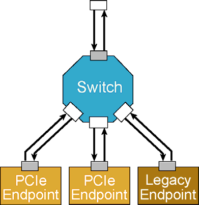
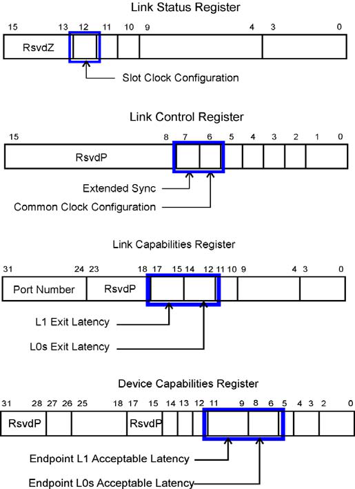
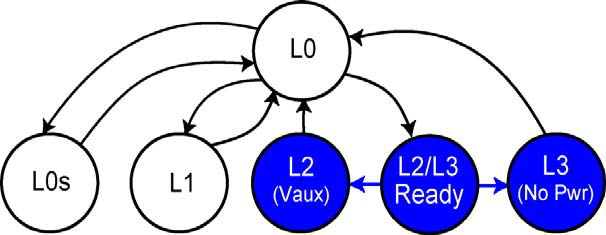
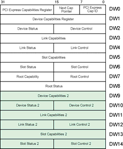
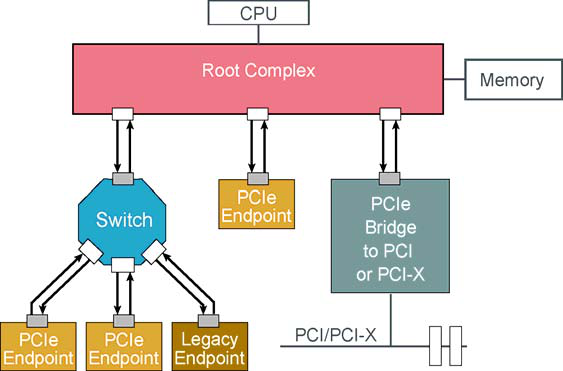

# 📘 第 17 章　中断支持 (Chapter 17. Interrupt Support)

**MindShare PCI Express Technology 3.0 — Comprehensive Guide to Generations 1.x, 2.x and 3.0**

> 📁 **Source chunks**: `chunks/chunk0332.md` ... `chunks/chunk0340.md`
> 🎨 **Format**: 中英对照双语 · 中文灰底 (PCIe 6.2 Spec 模板)

---

## 📑 本章目录 (Table of Contents)

- [Interrupt Support](#-本章目录-table-of-contents)

## 17.1 Interrupt Support | 中断支持

<table>
<thead><tr><th width="50%">🇬🇧 English</th><th width="50%" style="background-color:#e8e8e8">🇨🇳 中文</th></tr></thead>
<tbody><tr>
<td>

CPU Root Complex Memory Interrupt Controller Switch Assert_INTA Assert_INTB Deassert_INTA Deassert_INTB INTA# PCIe PCIe- INTB# Endpoint PCI(X) INTC#INTD# Bridge PCI(X) **----- End of picture text -----** 

**806** 

**Chapter 17: Interrupt Support** 

## **INTx Message Format** 

Figure 17‐10 on page 807 depicts the format of the INTx message header. The interrupt controller is the ultimate destination of these messages, however the routing method employed is _not_ “Route to the Root Complex”, but is actually “Local ‐ Terminate at Receiver” as shown in Figure 17‐10. There are two reasons for this. The first is because each bridge (including Switch Ports and Root Ports) along the upstream path may map the virtual interrupt wire to a different vir‐ tual interrupt wire across the bridge (e.g., a Switch Port receives Assert_INTA but maps it to Assert_INTB when propogating it upstream). More info about this INTx mapping can be found in “INTx Mapping” on page 808. 

The second reason for the local routing type of these messages is due to the fact that we’re emulating a pin‐based signal. If a port receives an assert interrupt message that maps to INTA on its primary side and it has already sent an Assert_INTA message upstream because of a previous interrupt, then there is no reason to send another one. INTA is already seen as asserted. More info about this collapsing of INTx messages can be found in “INTx Collapsing” on page 810. 

_Figure 17‐10: INTx Message Format and Type_ 

|||||+0|+0|||||||||+1|+1|||||||||+2|+2|+3|+3|||||
|---|---|---|---|---|---|---|---|---|---|---|---|---|---|---|---|---|---|---|---|---|---|---|---|---|---|---|---|---|---|---|---|
||7|6|5|4|3|2|1|0||7||6|5|4|3|2||1|0|7|6||5|4|3|7 6 5 4   2 1 0|3|2|1|0||
|Byte 0|Fmt 0 0 1|||Type 1 0**1 0**||||**0**||R||TC|||R|At tr||R|T H|T D|E P||Attr||Length AT|||||||
|Byte 4|||||Requester||||||||ID|||||||||||Tag||**Message**||**Code**||||
|Byte 8|||||||||||Reserved for INTx|||||||||||Messages||||||||||
|Byte 12|||||||||||Reserved for INTx|||||||||||Messages||||||||||
|**Local**|||**- Terminate**|||||||**at Receiver**|||||||||||||||**20h = Assert_INTA**|||||||
||||||||||||||||||||||||||**21h = Assert_INTB**|||||||
||||||||||||||||||||||||||**22h = Assert_INTC**|||||||
||||||||||||||||||||||||||**23h = Assert_INTD**|||||||
||||||||||||||||||||||||||**24h = Deassert_INTA**|||||||
||||||||||||||||||||||||||**25h = Deassert_INTB**|||||||
||||||||||||||||||||||||||**26h = Deassert_INTC**|||||||
||||||||||||||||||||||||||**27h = Deassert_INTD**|||||||

**807** 

**PCI Ex ress 3.0 Technolo p gy** 

## **Mapping and Collapsing INTx Messages** 

## **INTx Mapping** 

Switches must adhere to the INTx mapping defined by the PCI spec, shown in Table 17‐1 on page 809. This mapping defines the virtual connection that exists when interrupts are routed across a PCI‐to‐PCI bridge. The mapping is based on the INTx message type and the Device number from the Requester ID field in the message. 

Refer to Figure 17‐11 on page 810 for this example. The assert interrupt mes‐ sages received on the two downstream switch ports are both INTA messages. The virtual PCI‐to‐PCI bridge at each of the ingress ports will map both INTA messages to INTA, meaning no change. This is because the Device number of both originating Endpoint devices is zero (which is contained in the interrupt message itself as part of the Requester ID, ReqID). Table 17‐1 shows that inter‐ rupts messages coming from Device 0 map to the same INTx message on the other side of the bridge (i.e., internal to the Switch both INTA messages are mapped to INTA). So each downstream port will propogate the interrupt mes‐ sages upstream without changing their virtual wire. However, the propogated interrupt messages no longer have the ReqID of the original requester, they now have the ReqID of the port that is propogating the interrupt message. 

Next, the upstream Switch Port receives the propogated interrupt messages. The INTA interrupt from port 2:1:0 is going to be mapped to an INTB message when progopated upstream because the interrupt message indicates it came from Device 1 (ReqID 2:1:0). The other interrupt being propogated by port 2:2:0 is going to be mapped to an INTC message when sent from the upstream Switch Port to the Root Port. Refer to Table 17‐1 to confirm these mappings. 

The reason for this interrupt mapping is the same as it was for PCI: to avoid as much as possible having multiple functions sharing the same INTx# pin. As stated previously, single function devices are required to use INTA if using leg‐ acy interrupts. So if all the Functions downstream of a Root Port used INTA and there was no mapping across bridges, they would all be routed to the same IRQ. Which means anytime one of the Functions asserted INTA, all the Functions would have to be checked. This would result in significant interrupt servicing latencies for the Functions at the end of the list. This interrupt mapping method is a crude attempt at distributing interrupts (especially INTA) across all four INTx virtual wires because each INTx virtual wire can be mapped to a separate IRQ at the interrupt controller. 

**808** 

**Chapter 17: Interrupt Support** 

_Table 17‐1: INTx Message Mapping Across Virtual PCI‐to‐PCI Bridges_ 

|**Device Number of** **Delivering INTx**|**INTx Message** **Type at Input**|**INTx Message** **Type at Output**|
|---|---|---|
|0, 4, 8, 12 etc.|INTA|INTA|
||INTB|INTB|
||INTC|INTC|
||INTD|INTD|
|1, 5, 9, 13 etc.|INTA|INTB|
||INTB|INTC|
||INTC|INTD|
||INTD|INTA|
|2, 6, 10, 14 etc.|INTA|INTC|
||INTB|INTD|
||INTC|INTA|
||INTD|INTB|
|3, 7, 11, 15 etc.|INTA|INTD|
||INTB|INTA|
||INTC|INTB|
||INTD|INTC|

**809** 

**PCI Ex ress 3.0 Technolo p gy** 

_Figure 17‐11: Example of INTx Mapping_ 

**==> picture [295 x 286] intentionally omitted <==**

**----- Start of picture text -----** 
CPU Root Complex Memory Interrupt Controller Assert_INTB (ReqID 1:0:0) Assert_INTC (ReqID 1:0:0) INTA from Dev 1 maps to INTB 1:0:0 INTA from Dev 2 maps to INTC Assert_INTA (ReqID 2:1:0) Switch Assert_INTA (ReqID 2:2:0) INTA from Dev 0 maps to INTA 2:1:0 2:2:0 INTA from Dev 0 maps to INTA Assert_INTA (ReqID 3:0:0) Assert_INTA (ReqID 4:0:0) 3:0:0 4:0:0 PCIe PCIe Endpoint Endpoint **----- End of picture text -----** 

## **INTx Collapsing** 

PCIe Switches must ensure that INTx messages are delivered upstream in the correct fashion. Specifically, interrupt routing of legacy PCI implementations must be handled such that software can determine which interrupts are routed to which interrupt controller inputs. INTx# lines may be wire‐ORed and be routed to the same IRQ input on the interrupt controller, and when multiple devices signal interrupts on the same line, only the first assertion is seen by the interrupt controller. Similarly, when one of these devices deasserts its INTx# line, the line remains asserted until the last one is turned off. These same princi‐ ples apply to PCIe INTx messages. 

In some cases, however, two overlapping INTx messages may be mapped to the same INTx message by a virtual PCI bridge at the egress port, requiring the messages to be collapsed. Consider the following example illustrated in Figure 17‐12 on page 811. 

**810** 

**Chapter 17: Interrupt Support** 

When the upstream Switch Port maps the interrupt messages for delivery on the upstream link, both interrupts will be mapped as INTB (based on the device numbers of the downstream Switch Ports). Note that because these two over‐ lapping messages are the same they must be collapsed. 

Collapsing ensures that the interrupt controller will never receive two consecu‐ tive Assert_INTx or Deassert_INTx messages for the shared interrupts. This is equivalent to INTx signals being wire‐ORed. 

_Figure 17‐12: Switch Uses Bridge Mapping of INTx Messages_ 

**==> picture [273 x 382] intentionally omitted <==**

**----- Start of picture text -----** 
CPU Root Complex Memory Interrupt Controller Assert_INTB (1:0:0) 3 Deassert_INTB (1:0:0) 1:0:0 Switch 2:1:0 2:5:0 Assert_INTA (3:0:0) Assert_INTA (4:0:0) 1 2 Deassert_INTA (3:0:0) Deassert_INTA (4:0:0) 3:0:0 4:0:0 PCIe PCIe Endpoint Endpoint Deassert_INTA (3:0:0) 1 Assert_INTA (3:0:0) (blocked by 1:0:0) 2 Assert_INTA (4:0:0) Deassert_INTA (4:0:0) (blocked by 1:0:0) 3 Assert_INTB (1:0:0) Deassert_INTB (1:0:0) caused by Assert_INTA (4:0:0) caused by Deassert_INTA (3:0:0) **----- End of picture text -----** 

**811** 

**PCI Ex ress 3.0 Technolo p gy** 

## **INTx Delivery Rules** 

The rules associated with the delivery of INTx messages have some unique characteristics: 

- Assert_INTx and Deassert_INTx are only issued in the upstream direction. 

- Switches that are collapsing interrupts will only issue INTx messages upstream when there is a change of the interrupt status. 

- Devices on either side of a link must track the current state of INTA‐INTD assertion. 

- A Switch tracks the state of the four virtual wires for each of its downstream ports, and may present a collapsed set of virtual wires on its upstream port. 

- The Root Complex must track the state of the four virtual wires (A‐D) for each downstream port. 

- INTx signaling may be disabled with the Interrupt Disable bit in the Com‐ mand Register. 

- If any INTx virtual wires are active and device interrupts are then disabled, a corresponding Deassert_INTx message must be sent. 

- If a downstream Switch Port goes to DL_Down status, any active INTx vir‐ tual wires must be deasserted, and the upstream port updated accordingly (Deassert_INTx message required if that INTx was in active state). 

## **The MSI Model** 

A PCIe Function indicates MSI support via the MSI Capability registers. Each Function must implement either the MSI Capability Structure or the MSI‐X (eXtended MSI, see “The MSI‐X Model” on page 821) Capability Structure, or both. The MSI Capability registers are set up by configuration software and include: 

- Target memory address 

- Data Value to be written to that address 

- The number of unique messages that can be encoded into the data 

See “Memory Request Header Fields” on page 188 for a review of the Memory Write Transaction Header. Note that MSIs always have a data payload of 1DW. 

## **The MSI Capability Structure** 

The MSI Capability Structure resides in the PCI‐compatible config space area (first 256 bytes). There are four variations of the MSI Capability Structure based on whether it supports 64‐bit addressing or only 32‐bit and whether it supports 

**812** 

**Chapter 17: Interrupt Support** 

per vector masking or not. Native PCIe devices are required to support 64‐bit addressing. All four variations of the MSI Capability Structure can be found in Figure 17‐13 on page 813. 

_Figure 17‐13: MSI Capability Structure Variations_ 

|||32-bit Address|||||
|---|---|---|---|---|---|---|
||31|15 8 16||7|0||
|||Message Control Next Capability Pointer||Capability ID (05h)||DW0|
|||Message Address [31:0]||||DW1|
|||Message Data||||DW2|
|||64-bit Address|||||
||31|15 8 16||7|0||
|||Message Control Next Capability Pointer||Capability ID (05h)||DW0|
|||Message Address [31:0]||||DW1|
|||Message Address [63:32]||||DW2|
|||Message Data||||DW3|
|||32-bit Address with Per-Vector|Masking||||
||31|15 8 16||7|0||
|||Message Control Next Capability Pointer||Capability ID (05h)||DW0|
|||Message Address [31:0]||||DW1|
|||Reserved Message Data||||DW2|
|||Mask Bits||||DW3|
|||Pending Bits||||DW4|
|||64-bit Address with Per-Vector|Masking||||
||31|15 8 16||7|0||
|||Message Control Next Capability Pointer||Capability ID (05h)||DW0|
|||Message Address [31:0]||||DW1|
|||Message Address [63:32]||||DW2|
|||Reserved Message Data||||DW3|
|||Mask Bits||||DW4|

</td>
<td style="background-color:#e8e8e8">

CPU 
Root Complex 
Memory 
Interrupt Controller 
Switch 
Assert_INTA Assert_INTB 
Deassert_INTA Deassert_INTB 
INTA# 
PCIe PCIe- INTB# 
Endpoint PCI(X) INTC#INTD# 
Bridge 
PCI(X) 
**----- End of picture text -----** 

**806**

**第 17 章：中断支持**

## **INTx 消息格式**

图 17-10（第 807 页）描述了 INTx 消息头的格式。中断控制器是这些消息的最终目的地，但是，所采用的路由方法_不是_"Route to the Root Complex"，而实际上是"Local ‐ Terminate at Receiver"，如图 17-10 所示。这有两个原因。第一个是因为沿上游路径的每个桥（包括交换机端口和根端口）可以将虚拟中断线映射到跨桥的不同虚拟中断线（例如，交换机端口收到 Assert_INTA 但在上游传播时将其映射到 Assert_INTB）。有关此 INTx 映射的更多信息，请参见第 808 页的"INTx Mapping"。

使用本地路由类型的第二个原因是由于我们正在模拟基于引脚的信号。如果端口收到映射到其主侧 INTA 的断言中断消息，并且由于先前的中断已经向上游发送了 Assert_INTA 消息，则没有理由再发送一条。INTA 已被视为已断言。有关 INTx 消息合并的更多信息，请参见第 810 页的"INTx Collapsing"。

_Figure 17-10: INTx Message Format and Type_

|||||+0|+0|||||||||+1|+1|||||||||+2|+2|+3|+3|||||
|---|---|---|---|---|---|---|---|---|---|---|---|---|---|---|---|---|---|---|---|---|---|---|---|---|---|---|---|---|---|---|
||7|6|5|4|3|2|1|0||7||6|5|4|3|2||1|0|7|6||5|4|3|7 6 5 4   2 1 0|3|2|1|0||
|Byte 0|Fmt 0 0 1|||Type 1 0**1 0**||||**0**||R||TC|||R|At tr||R|T H|T D|E P||Attr||Length AT|||||||
|Byte 4|||||Requester||||||||ID|||||||||||Tag||**Message**||**Code**||||
|Byte 8|||||||||||Reserved for INTx|||||||||||Messages||||||||||
|Byte 12|||||||||||Reserved for INTx|||||||||||Messages||||||||||
|**Local**|||**- Terminate**|||||||**at Receiver**|||||||||||||||**20h = Assert_INTA**|||||||
||||||||||||||||||||||||||**21h = Assert_INTB**|||||||
||||||||||||||||||||||||||**22h = Assert_INTC**|||||||
||||||||||||||||||||||||||**23h = Assert_INTD**|||||||
||||||||||||||||||||||||||**24h = Deassert_INTA**|||||||
||||||||||||||||||||||||||**25h = Deassert_INTB**|||||||
||||||||||||||||||||||||||**26h = Deassert_INTC**|||||||
||||||||||||||||||||||||||**27h = Deassert_INTD**|||||||

**807**

**PCI Ex ress 3.0 Technolo p gy**

## **INTx 消息的映射与合并**

## **INTx 映射**

交换机必须遵守 PCI 规范定义的 INTx 映射，如表 17-1（第 809 页）所示。该映射定义了当中断通过 PCI-to-PCI 桥路由时存在的虚拟连接。该映射基于 INTx 消息类型和消息的请求者 ID 字段中的设备号。

请参考第 810 页的图 17-11 作为此示例。在两个下游交换机端口上收到的断言中断消息都是 INTA 消息。每个入口端口处的虚拟 PCI-to-PCI 桥将两个 INTA 消息映射到 INTA，意味着没有变化。这是因为两个原始端点设备的设备号都为零（作为请求者 ID ReqID 的一部分包含在中断消息本身中）。表 17-1 显示来自设备 0 的中断消息映射到桥另一侧的相同 INTx 消息（即，在交换机内部，两个 INTA 消息都映射到 INTA）。因此每个下游端口将在不改变其虚拟线路的情况下向上游传播中断消息。但是，传播的中断消息不再具有原始请求者的 ReqID，它们现在具有传播中断消息的端口的 ReqID。

接下来，上游交换机端口接收传播的中断消息。来自端口 2:1:0 的 INTA 中断在被传播到上游时将被映射到 INTB 消息，因为中断消息指示它来自设备 1（ReqID 2:1:0）。由端口 2:2:0 传播的另一个中断将在从上游交换机端口发送到根端口时映射到 INTC 消息。请参考表 17-1 确认这些映射。

进行此中断映射的原因与 PCI 中的原因相同：尽可能避免多个功能共享同一 INTx# 引脚。如前所述，单功能设备在使用旧式中断时必须使用 INTA。因此，如果根端口下游的所有 Function 都使用 INTA 并且桥上没有映射，则它们都将路由到同一 IRQ。这意味着每当其中一个 Function 断言 INTA 时，必须检查所有 Function。这将导致列表末尾的 Function 的中断服务延迟很大。这种中断映射方法是一种粗略的尝试，旨在将中断（尤其是 INTA）分布在所有四个 INTx 虚拟线上，因为每个 INTx 虚拟线可以在中断控制器处映射到单独的 IRQ。

**808**

**第 17 章：中断支持**

_Table 17-1: INTx Message Mapping Across Virtual PCI-to-PCI Bridges_

|**Device Number of** **Delivering INTx**|**INTx Message** **Type at Input**|**INTx Message** **Type at Output**|
|---|---|---|
|0, 4, 8, 12 etc.|INTA|INTA|
||INTB|INTB|
||INTC|INTC|
||INTD|INTD|
|1, 5, 9, 13 etc.|INTA|INTB|
||INTB|INTC|
||INTC|INTD|
||INTD|INTA|
|2, 6, 10, 14 etc.|INTA|INTC|
||INTB|INTD|
||INTC|INTA|
||INTD|INTB|
|3, 7, 11, 15 etc.|INTA|INTD|
||INTB|INTA|
||INTC|INTB|
||INTD|INTC|

**809**

**PCI Ex ress 3.0 Technolo p gy**

_Figure 17-11: Example of INTx Mapping_

**==> picture [295 x 286] intentionally omitted <==**

**----- Start of picture text -----** 
CPU 
Root Complex 
Memory 
Interrupt Controller 
Assert_INTB (ReqID 1:0:0) 
Assert_INTC (ReqID 1:0:0) 
INTA from Dev 1 maps to INTB 1:0:0 INTA from Dev 2 maps to INTC 
Assert_INTA (ReqID 2:1:0) 
Switch Assert_INTA (ReqID 2:2:0) 
INTA from Dev 0 maps to INTA 2:1:0 2:2:0 INTA from Dev 0 maps to INTA 
Assert_INTA (ReqID 3:0:0) 
Assert_INTA (ReqID 4:0:0) 
3:0:0 4:0:0 
PCIe PCIe 
Endpoint Endpoint 
**----- End of picture text -----** 

## **INTx 合并**

PCIe 交换机必须确保 INTx 消息以正确的方式向上游传递。具体来说，必须处理旧式 PCI 实现的中断路由，以便软件可以确定哪些中断路由到哪个中断控制器输入。INTx# 线可以线或连接，并路由到中断控制器上的同一 IRQ 输入，当多个设备在同一线上发出中断信号时，中断控制器只会看到第一次断言。类似地，当这些设备之一取消其 INTx# 线的断言时，该线保持断言状态，直到最后一个被关闭为止。这些相同的原则也适用于 PCIe INTx 消息。

但是，在某些情况下，两个重叠的 INTx 消息可能被出口端口处的虚拟 PCI 桥映射到相同的 INTx 消息，这要求将消息合并。考虑下面图 17-12（第 811 页）所示的示例。

**810**

**第 17 章：中断支持**

当上游交换机端口映射用于在上游链路上传递的中断消息时，根据下游交换机端口的设备号，这两个中断都将映射为 INTB。注意，因为这两个重叠的消息是相同的，所以必须将它们合并。

合并可确保中断控制器永远不会为共享中断接收到两个连续的 Assert_INTx 或 Deassert_INTx 消息。这等效于 INTx 信号被线或连接。

_Figure 17-12: Switch Uses Bridge Mapping of INTx Messages_

**==> picture [273 x 382] intentionally omitted <==**

**----- Start of picture text -----** 
CPU 
Root Complex 
Memory 
Interrupt Controller 
Assert_INTB (1:0:0) 
3 
Deassert_INTB (1:0:0) 
1:0:0 
Switch 
2:1:0 2:5:0 
Assert_INTA (3:0:0) Assert_INTA (4:0:0) 
1 2 
Deassert_INTA (3:0:0) Deassert_INTA (4:0:0) 
3:0:0 4:0:0 
PCIe PCIe 
Endpoint Endpoint 
Deassert_INTA (3:0:0) 
1 
Assert_INTA (3:0:0) 
(blocked by 1:0:0) 
2 
Assert_INTA (4:0:0) Deassert_INTA (4:0:0) 
(blocked by 1:0:0) 
3 
Assert_INTB (1:0:0) Deassert_INTB (1:0:0) 
caused by Assert_INTA (4:0:0) caused by Deassert_INTA (3:0:0) 
**----- End of picture text -----** 

**811**

**PCI Ex ress 3.0 Technolo p gy**

## **INTx 传递规则**

与 INTx 消息传递相关的规则具有一些独特特征：

- Assert_INTx 和 Deassert_INTx 仅在上游方向发出。

- 正在合并中断的交换机仅当中断状态发生变化时才向上游发出 INTx 消息。

- 链路任一侧的设备必须跟踪 INTA-INTD 断言的当前状态。

- 交换机跟踪其每个下游端口的四个虚拟线路的状态，并可在其上游端口上呈现一组合并的虚拟线路。

- 根复合体必须跟踪每个下游端口的四个虚拟线路（A-D）的状态。

- 可以使用命令寄存器中的中断禁用位来禁用 INTx 信令。

- 如果任何 INTx 虚拟线路处于活动状态，然后禁用了设备中断，则必须发送相应的 Deassert_INTx 消息。

- 如果下游交换机端口进入 DL_Down 状态，则必须取消任何活动的 INTx 虚拟线路的断言，并相应地更新上游端口（如果该 INTx 处于活动状态，则需要 Deassert_INTx 消息）。

## **MSI 模型**

PCIe Function 通过 MSI Capability 寄存器指示 MSI 支持。每个 Function 必须实现 MSI Capability 结构或 MSI-X（扩展 MSI，参见第 821 页的"The MSI-X Model"）Capability 结构，或两者都实现。MSI Capability 寄存器由配置软件设置，包括：

- 目标内存地址

- 要写入该地址的数据值

- 可以编码到数据中的唯一消息数

有关内存写事务头的回顾，请参见第 188 页的"Memory Request Header Fields"。注意，MSI 始终具有 1DW 的数据有效负载。

## **MSI 能力结构**

MSI 能力结构驻留在 PCI 兼容的配置空间区域（前 256 字节）。MSI Capability 结构有四种变体，基于它是否支持 64 位寻址或仅 32 位以及它是否支持

**812**

**第 17 章：中断支持**

每向量屏蔽 (per-vector masking)。原生 PCIe 设备需要支持 64 位寻址。MSI Capability 结构的所有四种变体都可以在图 17-13（第 813 页）中找到。

_Figure 17-13: MSI Capability Structure Variations_

|||32-bit Address|||||
|---|---|---|---|---|---|---|
||31|15 8 16||7|0||
|||Message Control Next Capability Pointer||Capability ID (05h)||DW0|
|||Message Address [31:0]||||DW1|
|||Message Data||||DW2|
|||64-bit Address|||||
||31|15 8 16||7|0||
|||Message Control Next Capability Pointer||Capability ID (05h)||DW0|
|||Message Address [31:0]||||DW1|
|||Message Address [63:32]||||DW2|
|||Message Data||||DW3|
|||32-bit Address with Per-Vector|Masking||||
||31|15 8 16||7|0||
|||Message Control Next Capability Pointer||Capability ID (05h)||DW0|
|||Message Address [31:0]||||DW1|
|||Reserved Message Data||||DW2|
|||Mask Bits||||DW3|
|||Pending Bits||||DW4|
|||64-bit Address with Per-Vector|Masking||||
||31|15 8 16||7|0||
|||Message Control Next Capability Pointer||Capability ID (05h)||DW0|
|||Message Address [31:0]||||DW1|
|||Message Address [63:32]||||DW2|
|||Reserved Message Data||||DW3|
|||Mask Bits||||DW4|

</td>
</tr></tbody></table>

[⬆️ 返回目录](#-本章目录-table-of-contents)

---

## 17.2 Interrupt Support | 中断支持

<table>
<thead><tr><th width="50%">🇬🇧 English</th><th width="50%" style="background-color:#e8e8e8">🇨🇳 中文</th></tr></thead>
<tbody><tr>
<td>

|||Pending Bits||||DW5|
||||||||

**813** 

**PCI Ex ress 3.0 Technolo p gy** 

## **Capability ID** 

A Capability ID value of **05h** identifies the MSI capability and is a read‐only value. 

## **Next Capability Pointer** 

The second byte of the register is a read‐only value that gives the dword‐ aligned offset from the top of config space to the next Capability Structure in the linked list of structures or else contains 00h to indicate the end of the linked list. 

## **Message Control Register** 

Figure 17‐14 on page 814 and Table 17‐2 on page 814 illustrate the layout and usage of the Message Control register. 

_Figure 17‐14: Message Control Register_ 

**==> picture [358 x 114] intentionally omitted <==**

**----- Start of picture text -----** 
15 9 8 7 6 4 3 1 0 Reserved MSI Enable Multiple Message Capable Multiple Message Enable 64-bit Address Capable Per-vector Masking Capable **----- End of picture text -----** 

_Table 17‐2: Format and Usage of Message Control Register_ 

|**Bit(s)**|**Field Name**|**Description**|
|---|---|---|
|0|MSI Enable|Read/Write. State after reset is 0, indicating that the device’s MSI capability is disabled. • **0**= Function is**disabled**from using**MSI**. It must use MSI‐X or else INTx Messages. • **1**= Function is**enabled**to use**MSI**to request service and won’t use MSI‐X or INTx Messages.|

**814** 

**Chapter 17: Interrupt Support** 

_Table 17‐2: Format and Usage of Message Control Register (Continued)_ 

|**Bit(s)**|**Field Name**||**Description**|
|---|---|---|---|
|3:1|Multiple Message Capable||Read‐Only. System software reads this field to determine how many messages (interrupt vectors) the Function would like to use. The requested number of messages is a power of two, therefore a Function that would like three messages must request that four messages be allocated to it. **Value**    **Number of Messages Requested** 000b                                    1 001b                                    2 010b                                    4 011b                                    8 100b                                   16 101b                                   32 110b                              Reserved 111b                              Reserved|
|6:4|Multiple Message Enable||Read/Write. After system software reads the Multi‐ ple Message Capable field (previous row in this table) to see how many messages (interrupt vec‐ tors) are requested by the Function, it programs a 3‐bit value in this field indicating the actual num‐ ber of messages allocated to the Function. The number allocated can be equal to or less than the number actually requested. The state of this field after reset is 000b. **Value**    **Number of Messages Requested** 000b                                    1 001b                                    2 010b                                    4 011b                                    8 100b                                   16 101b                                   32 110b                              Reserved 111b                              Reserved|

**815** 

**PCI Ex ress 3.0 Technolo p gy** 

_Table 17‐2: Format and Usage of Message Control Register (Continued)_ 

|**Bit(s)**|**Field Name**|**Description**|
|---|---|---|
|7|64‐bit Address Capable|Read‐Only. • 0 = Function does not implement the upper 32 bits of the Message Address register; only a 32‐ bit address is possible. • 1 = Function implements the upper 32 bits of the Message Address register and is capable of gen‐ erating a 64‐bit memory address.|
|8|Per‐Vector Masking Capable|Read‐Only. • 0 = Function does not implement the Mask Bit register or the Pending Bit register; software does NOT have the ability to mask individual interrupts with this capability structure. • 1 = Function does implement the Mask Bit regis‐ ter or the Pending Bit register; software does have the ability to mask individual interrupts with this capability structure.|
|15:9|Reserved|Read‐Only. Always zero.|

## **Message Address Register** 

The lower two bits of the 32‐bit Message Address register are zero and cannot be changed, forcing the address assigned by software to be dword aligned. Typ‐ ically, this would be the address of the Local APIC in the system CPU. In x86‐ based systems (Intel‐compatible), this address has traditionally been FEEx_xxxxh where the lower 20 bits indicate which Local APIC is being tar‐ geted as well as some other info about the interrupt itself. It is important to note that how the address is interpreted is platform specific and is not dictated in the PCI or PCIe specs. 

The register containing bits [63:32] of the Message Address are required for native PCI Express devices but is optional for legacy endpoints. This register is present if Bit 7 of the Message Control register is set. If so, it is a read/write reg‐ ister used in conjunction with the Message Address [31:0] register to enable a 64‐bit memory address for interrupt delivery from this Function. 

**816** 

**Chapter 17: Interrupt Support** 

## **Message Data Register** 

System software writes a base message data pattern into this 16‐bit, read/write register. When the Function generates an interrupt request, it writes a 32‐bit data value to the memory address specified in the Message Address register. The upper 16 bits of this data are always set to zero, while the lower 16 bits are supplied by the Message Data register. 

If more than one message has been assigned to the Function, it modifies the lower bits (the number of modifiable bits depends on how many messages have been assigned to the Function by configuration software) of the Message Data register value to form the appropriate value for the event it wishes to report. As an example, refer to “Basics of Generating an MSI Interrupt Request” on page 820. 

## **Mask Bits Register and Pending Bits Register** 

If the Function supports per‐vector masking (indicated in bit [8] of the Message Control register) then these registers are present. The max number of interrupt messages (itnerrupt vectors) that can be requested and assigned to a Function using MSI is 32. So these two registers are 32 bits in length with each potential interrupt message having its own mask and pending bit. If bit [0] of the Mask Bits register is set, then interrupt message 0 is masked (this is the base vector from this Function). If bit [1] is set, then interrupt message 1 is masked (this is the base vector + 1). 

When an interrupt message is masked, the MSI for that vector cannot be sent. Instead, the corresponding Pending Bit is set. This allows software to mask indi‐ vidual interrupts from a Function and then periodically poll the Function to see if there are any masked interrupts that are pending. 

If software clears a mask bit and the corresponding pending bit is set, the Func‐ tion must send the MSI request at that time. Once the interrupt message has been sent, the Function would clear the pending bit. 

## **Basics of MSI Configuration** 

The following list specifies the steps taken by software to configure MSI inter‐ rupts for a PCI Express device. Refer to Figure 17‐15 on page 819. 

1. At startup time, enumeration software scans the system for all PCI‐compat‐ ible Functions (see “Single Root Enumeration Example” on page 109 for a discussion of the enumeration process). 

**817** 

## **PCI Ex ress 3.0 Technolo p gy** 

2. Once a Function is discovered software reads the Capabilities List Pointer, to find the location of the first capability structure in the linked list. 

3. If the MSI Capability structure (Capability ID of 05h) is found in the list, software reads the Multiple Message Capable field in the device’s Message Control register to determine how many event‐specific messages the device supports and if it supports a 64‐bit message address or only 32‐bit. Software then allocates a number of messages equal to or less than that and writes that value into the Multiple Message Enable field. At a minimum, one mes‐ sage will be allocated to the device. 

4. Software writes the base message data pattern into the device’s Message Data register and writes a dword‐aligned memory address to the device’s Message Address register to serve as the destination address for MSI writes. 

5. Finally, software sets the MSI Enable bit in the device’s Message Control register, enabling it to generate MSI writes and disabling other interrupt delivery options. 

**818** 

**Chapter 17: Interrupt Support** 

_Figure 17‐15: Device MSI Configuration Process_ 

**==> picture [159 x 456] intentionally omitted <==**

**----- Start of picture text -----** 
Scan PCI bus(es) until device discovered New N Capabilities ? Y MSI N Capable ? Y Determine number of messages requested and assign number of messages to device Write base data pattern into Message Data Register Assign Memory Address to Message Address Register Enable device to use MSI with MSI Enable bit in Message Control Register **----- End of picture text -----** 

**819** 

**PCI Ex ress 3.0 Technolo p gy** 

## **Basics of Generating an MSI Interrupt Request** 

Figure 17‐16 on page 821 illustrates the contents of an MSI Memory Write Trans‐ action Header and Data field. Key points include: 

- Format field must be 011b for native functions, indicating a 4DW header (64‐bit address) with Data, but it may be 010b for Legacy Endpoints, indi‐ cating a 32‐bit address. 

- The Attribute bits for No Snoop and Relaxed Ordering must be zero. 

- Length field must be 01h to indicate maximum data payload of 1DW. 

- First BE field must be 1111b, indicating valid data in all four bytes of the DW, even though the upper two bytes will always be zero for MSI. 

- Last BE field must be 0000b, indicating a single DW transaction. 

- Address fields within the header come directly from the address fields within the MSI Capability registers. 

- Lower 16 bits of the Data payload are derived from the data field within the MSI Capability registers. 

## **Multiple Messages** 

If system software allocated more than one message to the Function, the multi‐ ple values are created by modifying the lower bits of the assigned Message Data value to send a different message for each device‐specific event type. 

As an example, assume the following: 

- Four messages have been allocated to a device. 

- A data value of 49A0h has been assigned to the device’s Message Data reg‐ ister. 

- Memory address FEEF_F00Ch has been written into the device’s Message Address register. 

- When one of the four events occurs, the device generates a request by per‐ forming a dword write to memory address FEEF_F00Ch with a data value of 0000_49A0h, 0000_49A1h, 0000_49A2h, or 0000_49A3h. In other words, the lower two bits of the data value are modified to specify which event occurred. If this Function would have been allocated 8 messages, then the lower three bits could be modified. Also, the device always uses 0000h for the upper 2 bytes of its message data value. 

**820** 

**Chapter 17: Interrupt Support** 

_Figure 17‐16: Format of Memory Write Transaction for Native‐Device MSI Delivery_ 

**==> picture [329 x 296] intentionally omitted <==**

**----- Start of picture text -----** 

</td>
<td style="background-color:#e8e8e8">

|||Pending Bits||||DW5|

**813**

**PCI Ex ress 3.0 Technolo p gy**

## **Capability ID**

值为 **05h** 的 Capability ID 标识 MSI 能力，并且是只读值。

## **下一个能力指针**

寄存器的第二个字节是只读值，它给出从配置空间顶部开始的双字对齐偏移量，该偏移量指向链接列表中的下一个 Capability 结构，否则包含 00h 以指示链接列表的结尾。

## **消息控制寄存器**

图 17-14（第 814 页）和表 17-2（第 814 页）说明了消息控制寄存器的布局和用法。

_Figure 17-14: Message Control Register_

**==> picture [358 x 114] intentionally omitted <==**

**----- Start of picture text -----** 
15 9 8 7 6 4 3 1 0 
Reserved 
MSI Enable 
Multiple Message Capable 
Multiple Message Enable 
64-bit Address Capable 
Per-vector Masking Capable 
**----- End of picture text -----** 

_Table 17-2: Format and Usage of Message Control Register_

|**Bit(s)**|**Field Name**|**Description**|
|---|---|---|
|0|MSI Enable|Read/Write. State after reset is 0, indicating that the device's MSI capability is disabled. • **0**= Function is**disabled**from using**MSI**. It must use MSI-X or else INTx Messages. • **1**= Function is**enabled**to use**MSI**to request service and won't use MSI-X or INTx Messages.|

**814**

**第 17 章：中断支持**

_Table 17-2: Format and Usage of Message Control Register (Continued)_

|**Bit(s)**|**Field Name**||**Description**|
|---|---|---|---|
|3:1|Multiple Message Capable||Read-Only. System software reads this field to determine how many messages (interrupt vectors) the Function would like to use. The requested number of messages is a power of two, therefore a Function that would like three messages must request that four messages be allocated to it. **Value**    **Number of Messages Requested** 000b                                    1 001b                                    2 010b                                    4 011b                                    8 100b                                   16 101b                                   32 110b                              Reserved 111b                              Reserved|
|6:4|Multiple Message Enable||Read/Write. After system software reads the Multi‐ ple Message Capable field (previous row in this table) to see how many messages (interrupt vec‐ tors) are requested by the Function, it programs a 3-bit value in this field indicating the actual num‐ ber of messages allocated to the Function. The number allocated can be equal to or less than the number actually requested. The state of this field after reset is 000b. **Value**    **Number of Messages Requested** 000b                                    1 001b                                    2 010b                                    4 011b                                    8 100b                                   16 101b                                   32 110b                              Reserved 111b                              Reserved|

**815**

**PCI Ex ress 3.0 Technolo p gy**

_Table 17-2: Format and Usage of Message Control Register (Continued)_

|**Bit(s)**|**Field Name**|**Description**|
|---|---|---|
|7|64-bit Address Capable|Read-Only. • 0 = Function does not implement the upper 32 bits of the Message Address register; only a 32- bit address is possible. • 1 = Function implements the upper 32 bits of the Message Address register and is capable of gen‐ erating a 64-bit memory address.|
|8|Per-Vector Masking Capable|Read-Only. • 0 = Function does not implement the Mask Bit register or the Pending Bit register; software does NOT have the ability to mask individual interrupts with this capability structure. • 1 = Function does implement the Mask Bit regis‐ ter or the Pending Bit register; software does have the ability to mask individual interrupts with this capability structure.|
|15:9|Reserved|Read-Only. Always zero.|

## **消息地址寄存器**

32 位消息地址寄存器的低两位为零且无法更改，强制软件分配的地址是双字对齐的。通常，这是系统 CPU 中本地 APIC 的地址。在基于 x86 的系统（Intel 兼容）中，该地址传统上为 FEEx_xxxxh，其中低 20 位指示哪个本地 APIC 是目标以及有关中断本身的一些其他信息。重要的是要注意，地址的解释方式取决于平台，而不是由 PCI 或 PCIe 规范规定。

包含消息地址的位 [63:32] 的寄存器对于原生 PCI Express 设备是必需的，但对于旧式端点是可选的。如果设置了消息控制寄存器的第 7 位，则该寄存器存在。如果是，则它是一个读/写寄存器，与消息地址 [31:0] 寄存器结合使用，以启用来自该 Function 的 64 位内存地址用于中断传递。

**816**

**第 17 章：中断支持**

## **消息数据寄存器**

系统软件将基本消息数据模式写入此 16 位读/写寄存器。当 Function 生成中断请求时，它将 32 位数据值写入消息地址寄存器中指定的内存地址。此数据的高 16 位始终设置为零，而低 16 位由消息数据寄存器提供。

如果已将多个消息分配给 Function，则它修改消息数据寄存器值的低位（可修改的位数取决于配置软件已分配给 Function 的消息数）以形成其希望报告的事件的适当值。例如，请参见第 820 页的"Basics of Generating an MSI Interrupt Request"。

## **屏蔽位寄存器和挂起位寄存器**

如果 Function 支持每向量屏蔽（在消息控制寄存器的位 [8] 中指示），则这些寄存器存在。可以使用 MSI 请求并分配给 Function 的最大中断消息（中断向量）数为 32。因此这两个寄存器长度为 32 位，每个潜在的中断消息都有自己的屏蔽位和挂起位。如果设置了屏蔽位寄存器的位 [0]，则屏蔽中断消息 0（这是来自该 Function 的基本向量）。如果设置了位 [1]，则屏蔽中断消息 1（这是基本向量 + 1）。

当屏蔽中断消息时，不能发送该向量的 MSI。相反，相应的挂起位被设置。这允许软件屏蔽来自 Function 的各个中断，然后定期轮询该 Function 以查看是否有挂起的屏蔽中断。

如果软件清除了屏蔽位并且设置了相应的挂起位，则 Function 必须立即发送 MSI 请求。中断消息发送后，Function 将清除挂起位。

## **MSI 配置基础**

以下列表指定了软件为 PCI Express 设备配置 MSI 中断所采取的步骤。请参考第 819 页的图 17-15。

1. 在启动时，枚举软件扫描系统中的所有 PCI 兼容 Function（有关枚举过程的讨论，请参见第 109 页的"Single Root Enumeration Example"）。

**817**

## **PCI Ex ress 3.0 Technolo p gy**

2. 一旦发现 Function，软件就会读取 Capabilities List Pointer，以查找链接列表中第一个能力结构的位置。

3. 如果在列表中找到 MSI Capability 结构（Capability ID 为 05h），则软件读取设备的消息控制寄存器中的 Multiple Message Capable 字段，以确定设备支持多少个事件特定的消息以及它是否支持 64 位消息地址或仅 32 位。然后软件分配等于或小于该值的消息数，并将该值写入 Multiple Message Enable 字段。至少会将一条消息分配给设备。

4. 软件将基本消息数据模式写入设备的消息数据寄存器，并将双字对齐的内存地址写入设备的消息地址寄存器，作为 MSI 写入的目标地址。

5. 最后，软件设置设备消息控制寄存器中的 MSI Enable 位，从而启用它生成 MSI 写入并禁用其他中断传递选项。

**818**

**第 17 章：中断支持**

_Figure 17-15: Device MSI Configuration Process_

**==> picture [159 x 456] intentionally omitted <==**

**----- Start of picture text -----** 
Scan PCI bus(es) 
until device 
discovered 
New 
N 
Capabilities 
? 
Y 
MSI N 
Capable 
? 
Y 
Determine number of 
messages requested 
and assign number 
of messages to device 
Write base data 
pattern into 
Message Data 
Register 
Assign Memory 
Address to Message 
Address Register 
Enable device to 
use MSI with 
MSI Enable bit 
in Message Control 
Register 
**----- End of picture text -----** 

**819**

**PCI Ex ress 3.0 Technolo p gy**

## **生成 MSI 中断请求的基础**

图 17-16（第 821 页）说明了 MSI 内存写事务头和数据字段的内容。要点包括：

- 格式字段必须为 011b（对于原生 Function），表示 4DW 头（64 位地址）带数据，但对于旧式端点，它可能为 010b，表示 32 位地址。

- No Snoop 和 Relaxed Ordering 的属性位必须为零。

- 长度字段必须为 01h，以指示最大数据有效负载为 1DW。

- 第一个 BE 字段必须为 1111b，指示 DW 的所有四个字节中的数据有效，即使对于 MSI 上部两个字节始终为零。

- 最后一个 BE 字段必须为 0000b，指示单个 DW 事务。

- 头内的地址字段直接来自 MSI 能力寄存器内的地址字段。

- 数据有效负载的低 16 位来自 MSI 能力寄存器内的数据字段。

## **多条消息**

如果系统软件为 Function 分配了多个消息，则通过修改所分配的消息数据值的低位以针对每种设备特定事件类型发送不同的消息，从而创建多个值。

例如，假设以下情况：

- 已为设备分配了四条消息。

- 数据值 49A0h 已分配给设备的消息数据寄存器。

- 内存地址 FEEF_F00Ch 已写入设备的消息地址寄存器。

- 当四个事件之一发生时，设备通过对内存地址 FEEF_F00Ch 执行双字写入来生成请求，数据值为 0000_49A0h、0000_49A1h、0000_49A2h 或 0000_49A3h。换句话说，修改数据值的低两位以指定发生的事件。如果此 Function 已分配 8 条消息，则可以修改低三位。此外，设备始终使用 0000h 作为其消息数据值的高 2 字节。

**820**

**第 17 章：中断支持**

_Figure 17-16: Format of Memory Write Transaction for Native-Device MSI Delivery_

**==> picture [329 x 296] intentionally omitted <==**

**----- Start of picture text -----** 

</td>
</tr></tbody></table>

[⬆️ 返回目录](#-本章目录-table-of-contents)

---

## 17.3 Interrupt Support | 中断支持

<table>
<thead><tr><th width="50%">🇬🇧 English</th><th width="50%" style="background-color:#e8e8e8">🇨🇳 中文</th></tr></thead>
<tbody><tr>
<td>

MSI (Memory Write) Transaction +0 +1 +2 +3 7 6 5 4 3 2 1 0 7 6 5 4 3 2 1 0 7 6 5 4 3 2 1 0 7 6 5 4 3 2 1 0 Byte 0 0 1 1Fmt 0 0 0 0 0Type R TC R Attr R HT DT EP Attr0 0 AT 0 0 0 0 0 0 0 0 0 1Length Last DW First DW Byte 4 Requester ID Tag 0 0 0 0 1 1 1 1 Header Byte 8 MSI Message Address [63:32] Byte 12 MSI Message Address [31:0] 0 0 Byte 16 MSI Message Data 0000h Data MSI Capability Structure 31 16 15 8 7 0 Message Control Next CapabilityPointer Capability ID(05h) DW0 Message Address [31:0] DW1 Message Address [63:32] DW2 Message Data DW3 **----- End of picture text -----** 

## **The MSI-X Model** 

## **General** 

The 3.0 revision of the PCI spec added support for MSI‐X, which has its own capability structure. MSI‐X was motivated by a desire to alleviate three short‐ comings of MSI: 

- 32 vectors per function are not enough for some applications. 

- Having only one destination address makes static distribution of interrupts across multiple CPUs difficult. The most flexibility would be achieved if a unique address could be assigned for each vector. 

**821** 

**PCI Ex ress 3.0 Technolo p gy** 

- In several platforms, like x86‐based systems, the vector number of the inter‐ rupt indicates its priority relative to other interrupts. With MSI, a single Function could be allocated multiple interrupts, but all the interrupt vectors would be contiguous, meaning similar priority. This is not a good solution if some interrupts from this Function should be high priority and others should be low priority. A better approach would be for software to desig‐ nate a unique vector (message data value), that does not have to be contigu‐ ous, for each interrupt allocated to the Function. 

Keeping those goals in mind, it’s easy to understand the register changes that were implemented to provide more vectors with each vector being assigned a target address and message data value. 

## **MSI-X Capability Structure** 

As shown in Figure 17‐17 on page 822, the Message Control register is quite dif‐ ferent from MSI. Interestingly, even though MSI‐X can support up to 2048 vec‐ tors per Function versus the 32 for MSI, the number of configuration registers for MSI‐X is actually a little smaller than for MSI. That’s because the vector information isn’t contained here. Instead, it’s in a memory location (MMIO) pointed to by the Table BIR (Base address Indicator Register), as shown in Fig‐ ure 17‐18 on page 824. 

_Figure 17‐17: MSI‐X Capability Structure_ 

**==> picture [326 x 174] intentionally omitted <==**

**----- Start of picture text -----** 
31 16 15 8 7 0 Message Control Next CapabilityPointer Capability ID(11h) DW0 Table MSI-X Table Offset DW1 BIR PBA Pending Bit Array (PBA) Offset BIR DW2 (BIR = BAR Index Register) 15 14 13 11 10 0 Rsvd Table Size in N-1 (RO) Function Mask (RW) MSI-X Enable (RW) **----- End of picture text -----** 

**822** 

**Chapter 17: Interrupt Support** 

_Table 17‐3: Format and Usage of MSI‐X Message Control Register_ 

|**Bit(s)**|**Field Name**|**Description**|
|---|---|---|
|10:0|Table Size|Read‐Only. This field indicates the number of inter‐ rupt messages (vectors) that this Function sup‐ ports. The value here is interpreted in an N‐1 fashion, so a value of 0 means 1 vector. A value of 7 means 8 vectors. Each vector has its own entry in the MSI‐X Table and its own bit in the Pending Bit Array.|
|13:11|Reserved|Read‐Only. Always zero.|
|14|Function Mask|Read/Write. This field provides system software an easy way to mask all the interrupts from a Func‐ tion. If this bit is cleared, interrupts can still be masked individually by setting the mask bit within each vector’s MSI‐X table entry.|
|15|MSI‐X Enable|Read/Write. State after reset is 0, indicating that the device’s MSI‐X capability is disabled. • **0**= Function is**disabled**from using**MSI‐X**. It must use MSI or INTx Messages. • **1**= Function is**enabled**to use**MSI‐S**to request service and won’t use MSI‐X or INTx Messages.|

**823** 

**PCI Ex ress 3.0 Technolo p gy** 

## _Figure 17‐18: Location of MSI‐X Table_ 

**==> picture [332 x 285] intentionally omitted <==**

**----- Start of picture text -----** 
Doubleword Byte (in decimal)Number Syste Memory Address Space m Memory 3 2 1 0 Device Vendor 00 ID ID Status Command 01 Register Register Class Code Revision 02 ID BIST HeaderType LatencyTimer CacheLineSize 03 Base A ddress 0 04 Base A ddress 1 05 Table BIR = 2 MSI-X Table Base A ddress 2 06 Base A ddress 3 07 08 Base A ddress 4 MSI-X Table Base A ddress 5 09 Offset 10 CardBus CIS Pointer Subsystem ID SubsystemVendor ID 11 Expansion R OM 12 Base Ad dress Reserved Capabilities 13 Pointer Reserved 14 Max_Lat Min_Gnt InterruptPin InterruptLine 15 Required configuration registers **----- End of picture text -----** 

## **MSI-X Table** 

The MSI‐X Table itself is an array of vectors and addresses, as shown in Figure 17‐19 on page 825. Each entry represents one vector and contains four Dwords. DW0 and DW1 supply a unique 64‐bit address for that vector, while DW2 gives a unique 32‐bit data pattern for it. DW3 only contains one bit at present: a mask bit for that vector, allowing each vector to be independently masked off as needed. 

**824** 

**Chapter 17: Interrupt Support** 

_Figure 17‐19: MSI‐X Table Entries_ 

|DW3||DW2|DW1|DW0||
|---|---|---|---|---|---|
|Vector Control||Message Data|Upper Address|Lower Address|Entry 0|
|Vector Control||Message Data|Upper Address|Lower Address|Entry 1|
|Vector Control||Message Data|Upper Address|Lower Address|Entry 2|
|….||….|….|….||
|….||….|….|….||
|Vector Control||Message Data|Upper Address|Lower Address|Entry N-1|
|Bit 0 is||vector Mask Bit (R/W)||||

## **Pending Bit Array** 

In much the same way, the Pending Bit Array is also located within a memory address. It can use the same BIR value (same BAR) as the MSI‐X Table with a different offset, or it could use a different BAR altogether. The array, shown in Figure 17‐20, simply contains a bit for every vector that will be used. If the event to trigger that interrupt occurs but its Mask Bit has been set, then an MSI‐X transaction will not be sent. Instead, the corresponding pending bit is set. Later, if that vector is unmasked and the pending bit is still set, the interrupt will be generated at that time. 

**825** 

**PCI Ex ress 3.0 Technolo p gy** 

_Figure 17‐20: Pending Bit Array_ 

**==> picture [211 x 116] intentionally omitted <==**

**----- Start of picture text -----** 
DW1 DW0 Pending Bits 0 - 63 QW 0 Pending Bits 64 - 127 QW 1 Pending Bits 128 - 191 …. …. Pending Bits QW (N-1)/64 **----- End of picture text -----** 

## **Memory Synchronization When Interrupt Handler Entered** 

## **The Problem** 

There is a potential problem with any interrupt scheme when data is being delivered. For example, if the device has previously sent data and wants to report that with an interrupt, a unexpected delay on data delivery could allow the interrupt to arrive too soon. That might happen in the bridge data buffer shown in Figure 17‐21 on page 827, and the result is a race condition. The steps are similar to our earlier discussion (see “The Legacy Model” on page 796): 

1. The function writes a data block toward memory. The write completes on the local bus as a posted transaction, meaning that the sender has finished all it needed to do and the transaction is considered completed. 

2. An interrupt is delivered to notify software that some requested data is now present in memory. However, the data has been delayed in the bridge for some reason. 

3. The interrupt vector is fetched as before. 

4. The ISR starting address is fetched and control is passed to it. 

5. The ISR reads from the target memory buffer but the data payload still hasn’t been delivered so it fetches stale data, possibly causing an error. 

**826** 

**Chapter 17: Interrupt Support** 

_Figure 17‐21: Memory Synchronization Problem_ 

**==> picture [268 x 199] intentionally omitted <==**

**----- Start of picture text -----** 
INTR CPU 5 Memory Memory Buffer 4 Interrupt Service Routine (ISR) North Bridge Interrupt Table (ISR 3 starting addresses) PCI Bus Bridge Write Buffer South Bridge 1 PCI Bus 2 Interrupt Controller (PIC) INTA# Device **----- End of picture text -----** 

## **One Solution** 

One way to alleviate this problem takes advantage of PCI transaction ordering rules. If the ISR first sends a read request to the device that initiated the inter‐ rupt before it attempts to fetch the data, the resulting read completion will fol‐ low the same path back to the CPU that any write data would have taken from that device to get to memory. Transaction ordering rules guarantee that a read result in a bridge cannot pass a posted write going in the same direction, so the end result is that the data will get written into memory before the read result will be allowed to reach the CPU. Therefore, if the ISR waits for the read com‐ pletion to arrive before proceeding, it can be sure that any data will have been delivered to memory and thus the race condition is avoided. Since the read is basically being used as a data flush mechanism, it isn’t necessary for it to return any data. In that case the read can be zero length and the data returned is dis‐ carded. For that reason, this type of read is sometimes called a “dummy read.” 

## **An MSI Solution** 

MSI can simplify this process, although there are some requirements for it to work (refer to Figure 17‐22 on page 829). If the system allows the device to gen‐ 

**827** 

**PCI Ex ress 3.0 Technolo p gy** 

erate its own MSI writes rather than going through an intermediary like an IO APIC, then the following example can take place: 

1. The device writes the payload data toward memory and it is absorbed by the write buffer in the bridge. 

2. The device believes the data has been delivered and signals an interrupt to notify the CPU. In this case, an MSI is sent and uses the same path as the data. Since both data and MSI appear as memory writes to the bridge, the normal transaction ordering rules will keep them in the correct sequence. 

3. The payload data is delivered to memory, freeing the path through the bridge for the MSI write. 

4. The MSI write is delivered to the CPU Local APIC and the software now knows that the payload data is available. 

## **Traffic Classes Must Match** 

An important point must be stressed here, however. Both the data and MSI must use the same Traffic Class for this to work. Recall that packets that have been assigned different TC values may end up being mapped into different Vir‐ tual Channels, and that packets in different VCs have no ordering relationship. If the data were mapped to VC0 and the MSI was mapped to VC1, then the sys‐ tem would be unaware of any ordering relationship between them and unable to enforce memory coherency automatically. 

If giving both packets the same TC is not possible, the system would need to use the “dummy read” method instead and the TC of the read request would need to match the TC of the data write packet. It should be clear that even if the same TC is used for both, the use of the Relaxed Ordering bit must be avoided. We’re counting on the transaction ordering rules to achieve memory synchronization, so they must not be relaxed. 

**828** 

**Chapter 17: Interrupt Support** 

_Figure 17‐22: MSI Delivery_ 

**==> picture [280 x 246] intentionally omitted <==**

**----- Start of picture text -----** 

</td>
<td style="background-color:#e8e8e8">

MSI (Memory Write) Transaction +0 +1 +2 +3 7 6 5 4 3 2 1 0 7 6 5 4 3 2 1 0 7 6 5 4 3 2 1 0 7 6 5 4 3 2 1 0 Byte 0 0 1 1Fmt 0 0 0 0 0Type R TC R Attr R HT DT EP Attr0 0 AT 0 0 0 0 0 0 0 0 0 1Length Last DW First DW Byte 4 Requester ID Tag 0 0 0 0 1 1 1 1 Header Byte 8 MSI Message Address [63:32] Byte 12 MSI Message Address [31:0] 0 0 Byte 16 MSI Message Data 0000h Data MSI Capability Structure 31 16 15 8 7 0 Message Control Next CapabilityPointer Capability ID(05h) DW0 Message Address [31:0] DW1 Message Address [63:32] DW2 Message Data DW3 **----- End of picture text -----** 

## **MSI-X 模型**

## **概述**

PCI 规范的 3.0 版增加了对 MSI-X 的支持，MSI-X 具有其自己的能力结构。MSI-X 的动机是希望缓解 MSI 的三个缺点：

- 每个 Function 32 个向量不足以用于某些应用程序。

- 仅有一个目标地址使得跨多个 CPU 静态分配中断变得困难。如果可以为每个向量分配唯一地址，则可以实现最大的灵活性。

**821**

**PCI Ex ress 3.0 Technolo p gy**

- 在某些平台（如基于 x86 的系统）中，中断的向量号指示其相对于其他中断的优先级。使用 MSI，可以为单个 Function 分配多个中断，但所有中断向量将是连续的，这意味着类似的优先级。如果来自该 Function 的某些中断应为高优先级而其他应为低优先级，则这不是一个好的解决方案。更好的方法是让软件为分配给该 Function 的每个中断指定一个唯一的向量（消息数据值），该值不必是连续的。

考虑到这些目标，很容易理解为每个向量分配目标地址和消息数据值以提供更多向量而实现的寄存器更改。

## **MSI-X 能力结构**

如图 17-17（第 822 页）所示，消息控制寄存器与 MSI 大不相同。有趣的是，即使 MSI-X 每个 Function 可以支持多达 2048 个向量，而 MSI 为 32 个，但 MSI-X 的配置寄存器数量实际上比 MSI 略少。这是因为向量信息不包含在此处。相反，它位于由 Table BIR（基地址指示符寄存器）指向的内存位置 (MMIO) 中，如图 17-18（第 824 页）所示。

_Figure 17-17: MSI-X Capability Structure_

**==> picture [326 x 174] intentionally omitted <==**

**----- Start of picture text -----** 
31 16 15 8 7 0 
Message Control Next CapabilityPointer Capability ID(11h) DW0 
Table 
MSI-X Table Offset DW1 
BIR 
PBA 
Pending Bit Array (PBA) Offset BIR DW2 
(BIR = BAR Index Register) 
15 14 13 11 10 0 
Rsvd Table Size in N-1 (RO) 
Function Mask (RW) 
MSI-X Enable (RW) 
**----- End of picture text -----** 

**822**

**第 17 章：中断支持**

_Table 17-3: Format and Usage of MSI-X Message Control Register_

|**Bit(s)**|**Field Name**|**Description**|
|---|---|---|
|10:0|Table Size|Read-Only. This field indicates the number of inter‐ rupt messages (vectors) that this Function sup‐ ports. The value here is interpreted in an N-1 fashion, so a value of 0 means 1 vector. A value of 7 means 8 vectors. Each vector has its own entry in the MSI-X Table and its own bit in the Pending Bit Array.|
|13:11|Reserved|Read-Only. Always zero.|
|14|Function Mask|Read/Write. This field provides system software an easy way to mask all the interrupts from a Func‐ tion. If this bit is cleared, interrupts can still be masked individually by setting the mask bit within each vector's MSI-X table entry.|
|15|MSI-X Enable|Read/Write. State after reset is 0, indicating that the device's MSI-X capability is disabled. • **0**= Function is**disabled**from using**MSI-X**. It must use MSI or INTx Messages. • **1**= Function is**enabled**to use**MSI-S**to request service and won't use MSI-X or INTx Messages.|

**823**

**PCI Ex ress 3.0 Technolo p gy**

## _Figure 17-18: Location of MSI-X Table_

**==> picture [332 x 285] intentionally omitted <==**

**----- Start of picture text -----** 
Doubleword 
Byte (in decimal)Number Syste Memory Address Space m Memory 
3 2 1 0 
Device Vendor 00 
ID ID 
Status Command 01 
Register Register 
Class Code Revision 02 
ID 
BIST HeaderType LatencyTimer CacheLineSize 03 
Base A ddress 0 04 
Base A ddress 1 05 Table BIR = 2 
MSI-X Table 
Base A ddress 2 06 
Base A ddress 3 07 
08 
Base A ddress 4 MSI-X Table 
Base A ddress 5 09 Offset 
10 
CardBus CIS Pointer 
Subsystem ID SubsystemVendor ID 11 
Expansion R OM 12 
Base Ad dress 
Reserved Capabilities 13 
Pointer 
Reserved 14 
Max_Lat Min_Gnt InterruptPin InterruptLine 15 
Required configuration registers 
**----- End of picture text -----** 

## **MSI-X 表**

MSI-X 表本身是一个向量和地址数组，如图 17-19（第 825 页）所示。每个条目代表一个向量，包含四个双字。DW0 和 DW1 为该向量提供唯一的 64 位地址，而 DW2 提供唯一的 32 位数据模式。DW3 当前仅包含一位：该向量的屏蔽位，允许根据需要独立屏蔽每个向量。

**824**

**第 17 章：中断支持**

_Figure 17-19: MSI-X Table Entries_

|DW3||DW2|DW1|DW0||
|---|---|---|---|---|---|
|Vector Control||Message Data|Upper Address|Lower Address|Entry 0|
|Vector Control||Message Data|Upper Address|Lower Address|Entry 1|
|Vector Control||Message Data|Upper Address|Lower Address|Entry 2|
|….||….|….|….||
|….||….|….|….||
|Vector Control||Message Data|Upper Address|Lower Address|Entry N-1|
|Bit 0 is||vector Mask Bit (R/W)||||

## **挂起位数组**

类似地，挂起位数组 (Pending Bit Array) 也位于内存地址中。它可以使用与 MSI-X 表相同的 BIR 值（同一 BAR）和不同的偏移量，也可以使用完全不同的 BAR。如图 17-20 所示，该数组仅包含将要使用的每个向量的一位。如果触发该中断的事件发生但其屏蔽位已被设置，则不会发送 MSI-X 事务。相反，相应的挂起位被设置。之后，如果取消屏蔽该向量并且挂起位仍被设置，则将在那时生成中断。

**825**

**PCI Ex ress 3.0 Technolo p gy**

_Figure 17-20: Pending Bit Array_

**==> picture [211 x 116] intentionally omitted <==**

**----- Start of picture text -----** 
DW1 DW0 
Pending Bits 0 - 63 QW 0 
Pending Bits 64 - 127 QW 1 
Pending Bits 128 - 191 
…. 
…. 
Pending Bits QW (N-1)/64 
**----- End of picture text -----** 

## **进入中断处理程序时的内存同步**

## **问题**

任何中断方案在数据传递时都存在潜在的问题。例如，如果设备以前发送过数据并希望通过中断报告该数据，则数据传递的意外延迟可能导致中断过早到达。这可能发生在第 827 页的图 17-21 中所示的桥数据缓冲区中，结果是竞态条件。步骤与我们之前的讨论类似（参见第 796 页的"The Legacy Model"）：

1. Function 向内存写入一个数据块。该写入作为 Posted 事务在本地总线上完成，这意味着发送方已完成其所有需要执行的操作，并且该事务被视为已完成。

2. 传递中断以通知软件某些请求的数据现在存在于内存中。但是，数据由于某种原因在桥中被延迟。

3. 中断向量照常被取回。

4. 取回 ISR 起始地址并将控制权传递给它。

5. ISR 从目标内存缓冲区读取但数据有效负载尚未传递，因此它取回了过时的数据，可能导致错误。

**826**

**第 17 章：中断支持**

_Figure 17-21: Memory Synchronization Problem_

**==> picture [268 x 199] intentionally omitted <==**

**----- Start of picture text -----** 
INTR 
CPU 5 Memory 
Memory Buffer 
4 Interrupt Service 
Routine (ISR) 
North Bridge 
Interrupt Table (ISR 
3 starting addresses) 
PCI Bus 
Bridge 
Write Buffer 
South Bridge 
1 
PCI Bus 
2 
Interrupt Controller 
(PIC) INTA# 
Device 
**----- End of picture text -----** 

## **一种解决方案**

缓解此问题的一种方法是利用 PCI 事务排序规则。如果 ISR 首先向发起中断的设备发送读请求，然后再尝试获取数据，则生成的读完成将沿着任何写数据从该设备返回到内存所经过的相同路径返回到 CPU。事务排序规则保证桥中的读结果不能通过同一方向的 Posted 写，因此最终结果是数据将在允许读结果到达 CPU 之前被写入内存。因此，如果 ISR 等待读完成的到达再继续，则可以确保任何数据都将被传递到内存，从而避免了竞态条件。由于读基本上被用作数据刷新机制，因此它不需要返回任何数据。在这种情况下，读可以是零长度，并且返回的数据被丢弃。因此，这种读有时称为"虚拟读 (dummy read)"。

## **MSI 解决方案**

MSI 可以简化此过程，尽管要使其工作需要满足一些要求（请参考第 829 页的图 17-22）。如果系统允许设备

**827**

**PCI Ex ress 3.0 Technolo p gy**

生成自己的 MSI 写入，而不是通过 IO APIC 之类的中介，则可以发生以下示例：

1. 设备将有效负载数据写入内存，并被桥中的写缓冲区吸收。

2. 设备认为数据已传递，并发出中断以通知 CPU。在这种情况下，发送 MSI 并使用与数据相同的路径。由于数据和 MSI 在桥中均显示为内存写入，因此正常的事务排序规则将使它们保持正确的顺序。

3. 有效负载数据被传递到内存，从而释放通过桥的 MSI 写入的路径。

4. MSI 写入被传递到 CPU 本地 APIC，软件现在知道有效负载数据可用。

## **流量类必须匹配**

但是，这里必须强调一个重要点。数据和 MSI 必须使用相同的流量类才能正常工作。请记住，已分配不同 TC 值的包最终可能会被映射到不同的虚拟通道中，并且不同 VC 中的包没有排序关系。如果数据映射到 VC0 而 MSI 映射到 VC1，则系统将不知道它们之间的任何排序关系，并且无法自动强制执行内存一致性。

如果不可能为两个包提供相同的 TC，则系统将需要改用"虚拟读"方法，并且读请求的 TC 需要匹配数据写包的 TC。应该清楚的是，即使对两者使用相同的 TC，也必须避免使用 Relaxed Ordering 位。我们依靠事务排序规则来实现内存同步，因此不能放宽它们。

**828**

**第 17 章：中断支持**

_Figure 17-22: MSI Delivery_

**==> picture [280 x 246] intentionally omitted <==**

**----- Start of picture text -----** 

</td>
</tr></tbody></table>

[⬆️ 返回目录](#-本章目录-table-of-contents)

---

## 17.4 Interrupt Support | 中断支持

<table>
<thead><tr><th width="50%">🇬🇧 English</th><th width="50%" style="background-color:#e8e8e8">🇨🇳 中文</th></tr></thead>
<tbody><tr>
<td>

Local Local APIC APIC CPU CPU 4 Memory 3 North Bridge PCI Bus Bridge Write Buffer South Bridge 1 2 PCI Bus Interrupt Controller (IO APIC) Device **----- End of picture text -----** 

## **Interrupt Latency** 

The time from signaling an interrupt until software services the device is referred to as the interrupt latency. In spite of its advantages, MSI, like other interrupt delivery mechanisms, does not provide interrupt latency guarantees. 

## **MSI May Result In Errors** 

Because MSIs are delivered as Memory Write transactions, an error associated with delivery of an MSI is treated the same as any other Memory Write error condition. See “ECRC Generation and Checking” on page 657 for treatment of ECRC errors, as one example. The concern, of course, is that if an error results in the MSI packet being unrecognized then no interrupt will be seen by the proces‐ sor. How this condition would be handled is outside the scope of the PCIe spec. 

**829** 

**PCI Ex ress 3.0 Technolo p gy** 

## **Some MSI Rules and Recommendations** 

1. It is the intent of the spec that mutually‐exclusive messages will be assigned to Functions by system software and that each message will be converted to an exclusive interrupt on delivery to the processor. 

2. More than one MSI capability register set per Function is prohibited. 

3. A read of the Message Address register produces undefined results. 

4. Reserved registers and bits are read‐only and always return zero when read. 

5. System software can modify Message Control register bits, but the device itself is prohibited from doing so. In other words, modifying the bits by a “back door” mechanism is not allowed. 

6. At a minimum, a single message will be assigned to each device (assuming software supports and plans to use MSI in the system). 

7. System software must not write to the upper half of the dword that contains the Message Data register. 

8. If the device writes the same message multiple times, only one of those messages is guaranteed to be serviced. If all of them must be serviced, the device must not generate the same message again until the previous one has been serviced. 

9. If a device has more than one message assigned, and it writes a series of dif‐ ferent messages, it is guaranteed that all of them will be serviced. 

## **Special Consideration for Base System Peripherals** 

Interrupts may also originate in embedded legacy hardware, such as an IO Con‐ troller Hub or Super IO device. Some of the typical legacy devices required in such systems include: 

- Serial ports 

- Parallel ports 

- Keyboard and Mouse Controller 

- System Timer 

- IDE controllers 

These devices typically require a specific IRQ line into a PIC or IO APIC, which allows legacy software to interact with them correctly. 

Using the INTx messages does not guarantee that the devices will receive the IRQ assignment they require. The following example illustrates a system that will support the proper legacy interrupt assignment. 

**830** 

**Chapter 17: Interrupt Support** 

## **Example Legacy System** 

Figure 17‐23 on page 831 shows a older PCI Express system that includes an IO Controller Hub (ICH) attached to the Root Complex via a proprietary Hub link. The IO APIC embedded within the ICH can generate an MSI when it receives an interrupt request at its inputs. In such an implementation, software can assign the legacy vector number to each input to ensure that the correct legacy software will be called. 

The advantage of this approach is that existing hardware can be used to support the legacy requirements of a PCIe platform. This system also requires that the MSI subsystem be configured for use during the boot sequence. The example illustrated eliminates the need for INTx messages unless a PCIe expansion device incorporates a PCI Express‐to‐PCI Bridge. 

_Figure 17‐23: PCI Express System with PCI‐Based IO Controller Hub_ 

**==> picture [361 x 282] intentionally omitted <==**

**----- Start of picture text -----** 
Processor FSB PCI Express GFX PCI Express Root Complex DDR Links SDRAM Hub Link IDE CD HDD IO Controller Hub MSI USB 2.0 Interrupt 4 INTA# - INTD# Controller LPC (APIC) PCI - 33MHz 1 Serial Interrupts Timer S IEEE Slots IO AC’97 1394 COM1 Link COM2 Modem Audio Boot Codec Codec Ethernet ROM RouterInterrupt **----- End of picture text -----** 

**831** 

**PCI Ex ress 3.0 Technolo p gy** 

**832** 

## _**18**_ 

## _**System Reset**_ 

## **The Previous Chapter** 

The previous chapter describes the different ways that PCIe Functions can gen‐ erate interrupts. The old PCI model used pins for this, but sideband signals are undesirable in a serial model so support for the inband MSI (Message Signaled Interrupt) mechanism was made mandatory. The PCI INTx# pin operation can still be emulated using PCIe INTx messages for software backward compatibil‐ ity reasons. Both the PCI legacy INTx# method and the newer versions of MSI/ MSI‐X are described. 

## **This Chapter** 

This chapter describes the four types of resets defined for PCIe: cold reset, warm reset, hot reset, and function‐level reset. The use of a side‐band reset PERST# signal to generate a system reset is discussed, and so is the in‐band TS1 used to generate a Hot Reset. 

## **The Next Chapter** 

The next chapter describes the PCI Express hot plug model. A standard usage model is also defined for all devices and form factors that support hot plug capability. Power is an issue for hot plug cards, too, and when a new card is added to a system during runtime, it’s important to ensure that its power needs don’t exceed what the system can deliver. A mechanism was needed to query and control the power requirements of a device, Power Budgeting provides this. 

## **Two Categories of System Reset** 

The PCI Express spec describes four types of reset mechanisms. Three of these were part of the earlier revisions of the PCIe spec and are collectively referred to now as **Conventional Resets,** and two of them are called Fundamental Resets. The fourth category and method, added with the 2.0 spec revision, is called the **Function Level Reset** . 

**833** 

**PCI Ex ress Technolo p gy** 

## **Conventional Reset** 

## **Fundamental Reset** 

A Fundamental Reset is handled in hardware and resets the entire device, re‐ initializing every state machine and all the hardware logic, port states and con‐ figuration registers. The exception to this rule is a group of some configuration register fields that are identified as “sticky”, meaning they retain their contents unless all power is removed. This makes them very useful for diagnosing prob‐ lems that require a reset to get a Link working again, because the error status survives the reset and is available to software afterwards. If main power is removed but Vaux is available, that will also maintain the sticky bits, but if both main power and Vaux are lost, the sticky bits will be reset along with everything else. 

A Fundamental Reset will occur on a system‐wide reset, but it can also be done for individual devices. 

Two types of Fundamental Reset are defined: 

- **Cold Reset** : The result when the main power is turned on for a device. Cycling the power will cause a cold reset. 

- **Warm Reset (optional):** Triggered by a system‐specific means without shut‐ ting off main power. For example, a change in the system power status might be used to initiate this. The mechanism for generating a Warm Reset is not defined by the spec, so the system designer will choose how this is done. 

When a Fundamental Reset occurs: 

- For positive voltages, receiver terminations are required to meet the ZRX‐HIGH‐IMP‐DC‐POS parameter. At 2.5 GT/s, this is no less than 10 K  . At the higher speeds it must be no less than 10 K  for voltages below 200mv, and 20 K  for voltages above 200mv. These are the values when the termi‐ nations are not powered. 

- Similarly for negative voltages, the ZRX‐HIGH‐IMP‐DC‐NEG parameter, the value is a minimum of 1 K  in every case. 

- Transmitter terminations are required to meet the output impedance ZTX‐DIFF‐DC from 80 to 120  for Gen1 and max of 120  for Gen2 and Gen3, but may place the driver in a high impedance state. 

- The transmitter holds a DC common mode voltage between 0 and 3.6 V. 

**834** 

**Cha ter 18: S stem Reset p y** 

When exiting from a Fundamental Reset: 

- The receiver single‐ended terminations must be present when receiver ter‐ minations are enabled so that Receiver Detect works properly (40‐60  for Gen1 and Gen2, and 50  for Gen3. By the time Detect is entered, the common‐mode impedance must be within the proper range of 50   

- must re‐enable its receiver terminations ZRX‐DIFF‐DC of 100  within 5 ms of Fundamental Reset exit, making it detectable by the neighbor’s transmitter during training. 

- The transmitter holds a DC common mode voltage between 0 and 3.6 V. 

Two methods of delivering a Fundamental Reset are defined. First, it can be sig‐ naled with an auxiliary side‐band signal called PERST# (PCI Express Reset). Second, when PERST# is not provided to an add‐in card or component, a Fun‐ damental Reset is generated autonomously by the component or add‐in card when the power is cycled. 

## **PERST# Fundamental Reset Generation** 

A central resource device such as a chipset in the PCI Express system provides this reset. For example, the IO Controller Hub (ICH) chip in Figure 18‐1 on page 836 may generate PERST# based on the status of the system power supply ‘POWERGOOD’ signal, since this indicates that the main power is turned on and stable. If power is cycled off, POWERGOOD toggles and causes PERST# to assert and deassert., resulting in a Cold Reset. The system may also provide a method of toggling PERST# by some other means to accomplish a Warm Reset. 

The PERST# signal feeds all PCI Express devices on the motherboard including the connectors and graphics controller. Devices may choose to use PERST# but are not required to do so. PERST# also feeds the PCIe‐to‐PCI‐X bridge shown in the figure. Bridges always forward a reset on their primary (upstream) bus to their secondary (downstream) bus, so the PCI‐X bus sees RST# asserted. 

## **Autonomous Reset Generation** 

A device must be designed to generate its own reset in hardware upon applica‐ tion of main power. The spec doesn’t describe how this would be done, so a self‐ reset mechanism can be built into the device or added as external logic. For example, an add‐in card that detects Power‐On may use that event to generate a local reset to its device. The device must also generate an autonomous reset if it detects its power go outside of the limits specified. 

**835** 

**PCI Ex ress Technolo p gy** 

## **Link Wakeup from L2 Low Power State** 

As an example of the need for an autonomous reset, a device whose main power has been turned off as part of a power management policy may be able to request a return to full power if it was designed to signal a wakeup. When power is restored, the device must be reset. The power controller for the system may assert the PERST# pin to the device, as shown in Figure 18‐1 on page 836, but if it doesn’t, or if the device doesn’t support PERST#, the device must auton‐ omously generate its own Fundamental Reset when it senses main power re‐ applied. 

_Figure 18‐1: PERST# Generation_ 

**==> picture [299 x 315] intentionally omitted <==**

**----- Start of picture text -----** 
Processor FSB GFX Root Complex DDR PCI Express SDRAM GFX PCI Express POWERGOOD PRST# PCI IO Controller Hub (ICH) IEEE 1394 PERST# Add-In Add-In Switch PCI Express PCI Express Link SCSI to-PCI-X PRST# PCI-X Gigabit Ethernet **----- End of picture text -----** 

**836**

</td>
<td style="background-color:#e8e8e8">

Local Local APIC APIC CPU CPU Memory North Bridge PCI Bus Bridge Write Buffer South Bridge PCI Bus Interrupt Controller (IO APIC) Device **----- End of picture text -----** 

## **中断延迟**

从发出中断信号到软件服务设备的时间称为中断延迟。尽管有其优点，但与其他中断传递机制一样，MSI 不提供中断延迟保证。

## **MSI 可能导致错误**

由于 MSI 作为内存写事务传递，因此与 MSI 传递相关联的错误被处理为与任何其他内存写错误条件相同。有关 ECRC 错误的处理示例，请参见第 657 页的"ECRC Generation and Checking"。当然，令人担忧的是，如果错误导致 MSI 数据包未被识别，则处理器将看不到中断。如何处理这种情况不在 PCIe 规范的范围之内。

**829**

**PCI Ex ress 3.0 Technolo p gy**

## **一些 MSI 规则和建议**

1. 规范的目的是系统软件将为 Function 分配互斥的消息，并且每条消息在传递到处理器时都将转换为独占的中断。

2. 每个 Function 不允许多个 MSI 能力寄存器集。

3. 读取消息地址寄存器会产生未定义的结果。

4. 保留的寄存器和位是只读的，并在读取时始终返回零。

5. 系统软件可以修改消息控制寄存器位，但设备本身被禁止这样做。换句话说，不允许通过"后门"机制修改这些位。

6. 至少将一条消息分配给每个设备（假设软件支持并计划在系统中使用 MSI）。

7. 系统软件不得写入包含消息数据寄存器的双字的上半部。

8. 如果设备多次写入相同的消息，则只能保证这些消息中的一条被服务。如果必须全部服务，则设备在上一次消息被服务之前不得再次生成相同的消息。

9. 如果设备具有多条分配的消息，并且它写入一系列不同的消息，则保证所有这些消息都将被服务。

## **基本系统外设的特殊注意事项**

中断也可能源自嵌入式旧式硬件，例如 IO Controller Hub 或 Super IO 设备。此类系统中通常需要的一些典型旧式设备包括：

- 串行端口

- 并行端口

- 键盘和鼠标控制器

- 系统计时器

- IDE 控制器

这些设备通常需要到 PIC 或 IO APIC 的特定 IRQ 线，以允许旧式软件正确地与它们交互。

使用 INTx 消息不能保证设备将收到它们所需的 IRQ 分配。以下示例说明了将支持适当的旧式中断分配的系统。

**830**

**第 17 章：中断支持**

## **旧式系统示例**

图 17-23（第 831 页）显示了一个较旧的 PCI Express 系统，其中包含通过专有 Hub 链路连接到根复合体的 IO Controller Hub (ICH)。ICH 中嵌入的 IO APIC 在其输入处收到中断请求时可以生成 MSI。在这种实现中，软件可以将旧式向量号分配给每个输入，以确保将调用正确的旧式软件。

此方法的优点是现有硬件可用于支持 PCIe 平台的旧式要求。该系统还要求在引导序列期间配置 MSI 子系统以供使用。如图所示的示例消除了对 INTx 消息的需求，除非 PCIe 扩展设备包含 PCI Express-to-PCI Bridge。

_Figure 17-23: PCI Express System with PCI-Based IO Controller Hub_

**==> picture [361 x 282] intentionally omitted <==**

**----- Start of picture text -----** 
Processor 
FSB 
PCI Express 
GFX 
PCI Express Root Complex DDR 
Links SDRAM 
Hub Link 
IDE 
CD HDD IO Controller Hub 
MSI 
USB 2.0 Interrupt 4 INTA# - INTD# 
Controller 
LPC (APIC) PCI - 33MHz 
1 
Serial Interrupts Timer 
S IEEE Slots 
IO AC'97 1394 
COM1 Link 
COM2 
Modem Audio Boot 
Codec Codec Ethernet ROM 
RouterInterrupt 
**----- End of picture text -----** 

**831**

**PCI Ex ress 3.0 Technolo p gy**

**832**

## _**18 系统复位**_

## **上一章**

上一章描述了 PCIe Function 可以生成中断的不同方式。旧的 PCI 模型使用引脚执行此操作，但在串行模型中边带信号是不可取的，因此带内 MSI（消息信号中断）机制的支持成为强制性要求。为了向后兼容软件，PCI INTx# 引脚操作仍然可以使用 PCIe INTx 消息进行模拟。PCI 旧式 INTx# 方法以及较新版本的 MSI/MSI-X 都进行了描述。

## **本章**

本章描述了为 PCIe 定义的四种类型的复位机制：冷复位、热复位、热复位和功能级复位。讨论了使用边带复位 PERST# 信号来生成系统复位，还讨论了用于生成热复位的带内 TS1。

## **下一章**

下一章描述了 PCI Express 热插拔模型。还为所有支持热插拔功能的设备和外形尺寸定义了标准使用模型。热插拔卡的电源也是一个问题，当在运行时向系统添加新卡时，重要的是要确保其电源需求不超过系统可以提供的能力。需要一种机制来查询和控制设备的电源要求，电源预算 (Power Budgeting) 提供了这一点。

## **系统复位的两类**

PCI Express 规范描述了四种类型的复位机制。其中三种是早期 PCIe 规范的一部分，现在统称为**常规复位 (Conventional Resets)**，其中两种称为基本复位 (Fundamental Resets)。第四类和方法（随 2.0 规范修订版添加）称为**功能级复位 (Function Level Reset)**。

**833**

**PCI Ex ress Technolo p gy**

## **常规复位**

## **基本复位**

基本复位由硬件处理，并复位整个设备，重新初始化每个状态机以及所有硬件逻辑、端口状态和配置寄存器。该规则的一个例外是一组被标识为"粘性"的配置寄存器字段，这意味着它们保留其内容，除非所有电源都被移除。这使它们对于诊断需要复位才能使 Link 再次工作的问题非常有用，因为错误状态在复位后仍然存在，并且之后可供软件使用。如果主电源被移除但 Vaux 可用，那也将保持粘性位，但如果主电源和 Vaux 都丢失，则粘性位将与其他所有位一起被复位。

基本复位将在系统范围复位时发生，但也可以针对各个设备执行。

定义了两种类型的基本复位：

- **冷复位 (Cold Reset)**：当设备的主电源打开时产生的。循环电源将导致冷复位。

- **热复位（可选）(Warm Reset)**：通过系统特定的方式触发而不关闭主电源。例如，系统电源状态的变化可用于启动此操作。生成热复位的方法未由规范定义，因此系统设计人员将选择如何完成此操作。

当发生基本复位时：

- 对于正电压，接收器终端必须满足 ZRX-HIGH-IMP-DC-POS 参数。在 2.5 GT/s 时，这不低于 10KΩ。在更高的速度下，对于低于 200mv 的电压，它必须不低于 10KΩ，对于高于 200mv 的电压，必须为 20KΩ。这些是终端未通电时的值。

- 类似地，对于负电压，ZRX-HIGH-IMP-DC-NEG 参数在任何情况下都最小为 1KΩ。

- 发送器终端必须满足 Gen1 的 80 到 120Ω 以及 Gen2 和 Gen3 的最大 120Ω 的输出阻抗 ZTX-DIFF-DC，但可以将驱动器置于高阻抗状态。

- 发送器将直流共模电压保持在 0 到 3.6V 之间。

**834**

**Cha ter 18: S stem Reset p y**

当退出基本复位时：

- 当接收器终端启用时，接收器单端终端必须存在，以便接收器检测正常工作（Gen1 和 Gen2 为 40-60Ω，Gen3 为 50Ω±20%）。进入 Detect 时，共模阻抗必须在 50Ω±20% 的适当范围内。

- 必须在基本复位退出后 5ms 内重新启用其接收器终端 ZRX-DIFF-DC 的 100Ω，使其在训练期间可被邻居的发送器检测到。

- 发送器将直流共模电压保持在 0 到 3.6V 之间。

定义了两种传送基本复位的方法。首先，可以使用称为 PERST#（PCI Express 复位）的辅助边带信号来发信号。其次，当 PERST# 未提供给插卡或组件时，组件或插卡在电源循环时会自主生成基本复位。

## **PERST# 基本复位生成**

PCI Express 系统中的中央资源设备（例如芯片组）提供此复位。例如，第 836 页的图 18-1 中的 IO Controller Hub (ICH) 芯片可以根据系统电源的 POWERGOOD 信号的状态生成 PERST#，因为这指示主电源已打开并稳定。如果电源循环关闭，则 POWERGOOD 切换并导致 PERST# 断言和取消断言，从而导致冷复位。系统还可以提供通过其他方式切换 PERST# 的方法以实现热复位。

PERST# 信号馈送到主板上的所有 PCI Express 设备，包括连接器和图形控制器。设备可以选择使用 PERST#，但不是必需的。PERST# 还馈送到图中所示的 PCIe-to-PCI-X 桥。桥始终将其主（上游）总线上的复位转发到其辅助（下游）总线，因此 PCI-X 总线看到 RST# 被断言。

## **自主复位生成**

设备必须设计为在施加主电源时在硬件中生成自己的复位。规范未描述如何完成此操作，因此自复位机制可以内置到设备中或作为外部逻辑添加。例如，检测到上电的插卡可以使用该事件为其设备生成本地复位。如果设备检测到其电源超出指定限制，则还必须生成自主复位。

**835**

**PCI Ex ress Technolo p gy**

## **从 L2 低功耗状态唤醒链路**

作为需要自主复位的示例，其主电源已作为电源管理策略的一部分被关闭的设备如果被设计为发出唤醒信号，则可能能够请求恢复到全功率。当电源恢复时，必须对设备进行复位。系统的电源控制器可以向设备断言 PERST# 引脚，如图 18-1（第 836 页）所示，但如果它没有这样做，或者如果设备不支持 PERST#，则设备必须在感知到主电源重新施加时自主生成自己的基本复位。

_Figure 18-1: PERST# Generation_

**==> picture [299 x 315] intentionally omitted <==**

**----- Start of picture text -----** 
Processor 
FSB 
GFX Root Complex 
DDR 
PCI Express SDRAM 
GFX 
PCI Express 
POWERGOOD PRST# 
PCI 
IO Controller Hub 
(ICH) IEEE 
1394 
PERST# 
Add-In Add-In 
Switch 
PCI Express 
PCI Express Link 
SCSI 
to-PCI-X 
PRST# 
PCI-X 
Gigabit 
Ethernet 
**----- End of picture text -----** 

**836**

</td>
</tr></tbody></table>

[⬆️ 返回目录](#-本章目录-table-of-contents)

---

## 17.5 Interrupt Support | 中断支持

<table>
<thead><tr><th width="50%">🇬🇧 English</th><th width="50%" style="background-color:#e8e8e8">🇨🇳 中文</th></tr></thead>
<tbody><tr>
<td>

**Cha ter 18: S stem Reset p y** 

## **Hot Reset (In-band Reset)** 

A Hot Reset is propagated in‐band from one link neighbor to another by send‐ ing several TS1s (whose contents are shown in Figure 18‐2) with bit 0 of symbol 5 asserted. These TS1s are sent on all Lanes, using the previously negotiated Link and Lane numbers, for 2 ms. Once it’s been sent, the Transmitter and Receiver of the Hot Reset will both end up in the Detect LTSSM state (see “Hot Reset State” on page 612). 

_Figure 18‐2: TS1 Ordered‐Set Showing the Hot Reset Bit_ 

|_Figure 18‐2: TS1 Ordered‐Set Showing the Hot Reset Bit_|_Figure 18‐2: TS1 Ordered‐Set Showing the Hot Reset Bit_|_Figure 18‐2: TS1 Ordered‐Set Showing the Hot Reset Bit_|
|---|---|---|
||||
|**TS1** TS ID TS ID TS ID Train Ctl Rate ID # FTS Lane # Link # COM 0 1 2 3 4 5 6 14 15 13|K28.5 D0.0-D31.7, K23.7 (0-255) D0.0-D31.0, K23.7 (0-31) # of FTS ordered sets required by receiver to obtain bit and symbol lock D10.2 for TS1 Identifier D10.2 for TS1 Identifier D10.2 for TS1 Identifier|**0** **=** **De-assert** **Disable** **Scrambling** **1** **=** **Assert** **Disable** **Scrambling** **Bit** **3** **Reserved** **Bit** **5:7** **0** **=** **De-assert** **Compliance** **Receive** **1** **=** **Assert** **Compliance** **Receive** **Bit** **4** **0** **=** **De-assert** **Loopback** **1** **=** **Assert** **Loopback** **Bit** **2** **0** **=** **De-assert** **Disable** **Link** **1** **=** **Assert** **Disable** **Link** **Bit** **1** **0** **=** **De-assert** **Hot** **Reset** **1** **=** **Assert** **Hot** **Reset** **Bit** **0** **Training Control**|
||||

A hot reset is initiated in software by setting the Secondary Bus Reset bit in a bridge’s Bridge Control configuration register, as shown in Figure 18‐5 on page 840. Consequently, only devices containing bridges, like the Root Complex or a Switch, can do this. A Switch that receives hot reset on its Upstream Port must broadcast it to all of its Downstream Ports and reset itself. All devices down‐ stream of a switch that receive the hot reset will reset themselves. 

## **Response to Receiving Hot Reset** 

- The device’s LTSSM goes through the Recovery and Hot Reset state, and then back to the Detect state, where it starts the Link Training process. 

- • All of the device’s state machines, hardware logic, port states and configura‐ tion registers (except sticky registers) initialize to their default conditions. 

**837** 

**PCI Ex ress Technolo p gy** 

## **Switches Generate Hot Reset on Downstream Ports** 

A Switch generates a hot reset on all of its Downstream Ports when: 

- It receives a hot reset on its Upstream Port 

- For a Switch or Bridge Upstream Port, if the Data Link Layer reports a DL_Down state, the effect is very similar to a hot reset. This can happen when the Upstream Port has lost its connection with an upstream device due to an error that is not recoverable by the Physical Layer or Data Link Layer. 

- Software sets the ‘Secondary Bus Reset’ bit of the Bridge Control configura‐ tion register associated with the Upstream Port, as shown in Figure 18‐3 on page 838. 

_Figure 18‐3: Switch Generates Hot Reset on One Downstream Port_ 

**==> picture [251 x 187] intentionally omitted <==**

**----- Start of picture text -----** 
Processor Processor FSB PCI Express GFX GFX Root Complex DDR SDRAM ‘Secondary Bus Reset’ Bit Set Switch A Switch C 1 Switch B Ethernet10Gb PCI Expressto-PCI SCSI Slots PCI Gb Add-In Ethernet S IEEE IO 1394 COM1 COM2 **----- End of picture text -----** 

## **Bridges Forward Hot Reset to the Secondary Bus** 

If a bridge such as a PCI Express‐to‐PCI(‐X) bridge detects a hot reset on its Upstream Port, it must assert the PRST# signal on its secondary PCI(‐X) bus, as illustrated in Figure 18‐4 on page 839. 

## **Software Generation of Hot Reset** 

Software generates a Hot Reset on a specific port by writing a 1 followed by 0 to the ‘Secondary Bus Reset’ bit in the Bridge Control register of that associated 

**838** 

**Cha ter 18: S stem Reset p y** 

port’s configuration header (see Figure 18‐5 on page 840). Consider the example shown in Figure 18‐3 on page 838. Software sets the ‘Secondary Bus Reset’ regis‐ ter of Switch A’s left Downstream Port, causing it to send TS1 Ordered Sets with the Hot Reset bit set. Switch B receives this Hot Reset on its Upstream Port and forwards it to all its Downstream Ports. 

_Figure 18‐4: Switch Generates Hot Reset on All Downstream Ports_ 

**==> picture [277 x 210] intentionally omitted <==**

**----- Start of picture text -----** 
Processor Processor FSB PCI Express GFX GFX Root Complex DDR SDRAM ‘Secondary Bus Reset’ 1 Bit is Set Switch A Switch C Switch B Ethernet10Gb PCI Expressto-PCI SCSI Slots PRST# PCI Gb Add-In Ethernet S IEEE IO 1394 COM1 COM2 **----- End of picture text -----** 

If software sets the Secondary Bus Reset bit of a Switch’s Upstream Port, then the switch generates a hot reset on all of its Downstream Ports, as shown in Fig‐ ure 18‐4 on page 839. Here, software sets the Secondary Bus Reset bit in Switch C’s Upstream Port, causing it to send TS1s with the Hot Reset bit set on all its Downstream Ports. The PCIe‐to‐PCI bridge receives this Hot Reset and for‐ wards it on to the PCI bus by asserting PRST#. 

Setting the Secondary Bus Reset bit causes a Port’s LTSSM to transition to the Recovery state (for more on the LTSSM, see “Overview of LTSSM States” on page 519) where it generates the TS1s with the Hot Reset bit set. The TS1s are generated continuously for 2 ms and then the Port exits to the Detect state where it is ready to start the Link training process. 

**839** 

**PCI Ex ress Technolo p gy** 

The receiver of the Hot Reset TS1s (always downstream) will go to the Recovery state, too. When it sees two consecutive TS1s with the Hot Reset bit set, it goes to the Hot Reset state for a 2ms timeout and then exits to Detect. Both Upstream and Downstream Ports are initialized and end up in the Detect state, ready to begin Link training. If the downstream device is also a Switch or Bridge, it for‐ wards the Hot Reset to its Downstream Ports as well, as shown in Figure 18‐3 on page 838. 

_Figure 18‐5: Secondary Bus Reset Register to Generate Hot Reset_ 

**==> picture [374 x 244] intentionally omitted <==**

**----- Start of picture text -----** 
Doubleword Number Byte (in decimal) 15 12 11 10 9 8 7 6 5 4 3 2 1 0 3 2 1 0 Reserved 2.2 2.2 2.2 2.2 DeviceID VendorID 00 Status Command 01 Discard Timer SERR# Enable Register Register Discard Timer Status Class Code Revision 02 ID Secondary Discard TimeoutPrimary Discard Timeout BISTBase Add ress 0HeaderType LatencyTimer CacheLineSize 0304 Fast Back-to-Back Enable Secondary Bus Reset Base Add ress 1 05 Master Abort Mode Latency TimerSecondary Bus NumberSubordinate Bus NumberSecondary Bus NumberPrimary 06 VGA Enable Secondary I/O I/O 07 ISA Enable Status Limit Base SERR# Enable MemoryLimit MemoryBase 08 Parity Error Response Prefetchable Prefetchable 09 Memory Limit Memory Base Prefetchable Ba se 10 Upper 3 2 Bits Prefetchable L imit 11 Upper 3 2 Bits I/O Limit I/O Base 12 Upper 16 Bits Upper 16 Bits Reserved CapabilityPointer 13 Expansion R OM Base Address 14 Bridge Interrupt Interrupt 15 Control Pin Line Required configuration registers **----- End of picture text -----** 

## **Software Can Disable the Link** 

Software can also disable a Link, forcing it to go into Electrical Idle and remain there until further notice. The reason for mentioning that at this point is that disabling the Link also has the effect of causing a Hot Reset on downstream components. Disabling is accomplished by setting the Link Disable bit in the Link Control Register of the Downstream Port, shown in Figure 18‐6 on page 841. That causes the Port to go to the Recovery LTSSM state and begin sending TS1s with the Disable bit set. Since this can only be controlled for Downstream Ports if the Link has been disabled, this bit is reserved for Upstream Ports (such as Endpoints or Switch Upstream Ports). 

**840** 

**Cha ter 18: S stem Reset p y** 

## _Figure 18‐6: Link Control Register_ 

**==> picture [346 x 306] intentionally omitted <==**

**----- Start of picture text -----** 
15 12 11 10 9 8 7 6 5 4 3 2 1 0 RsvdP Link Autonomous Bandwidth Interrupt Enable Link Bandwidth Management Interrupt Enable Hardware Autonomous Width Disable Enable Clock Power Management Extended Synch Common Clock Configuration Retrain Link Link Disable Read Completion Boundary Control RsvdP Active State PM Control **----- End of picture text -----** 

When the Upstream Port recognizes incoming TS1s with the Disabled bit set, its Physical Layer signals LinkUp=0 (false) to the Link Layer and all the Lanes go to Electrical Idle. After a 2ms timeout, an Upstream Port will go to Detect, but a Downstream Port will remain in the Disabled LTSSM state until directed to exit from it (such as by clearing the Link Disable bit), so the Link will remain dis‐ abled and will not attempt training until then. 

**841** 

**PCI Ex ress Technolo p gy** 

## _Figure 18‐7: TS1 Ordered‐Set Showing Disable Link Bit_ 

**==> picture [366 x 172] intentionally omitted <==**

**----- Start of picture text -----** 
TS1 Training Control Bit 0 0 = De-assert Hot Reset 0 COM K28.5 1 = Assert Hot Reset 1 Link # D0.0-D31.7, K23.7 (0-255) 2 Lane # D0.0-D31.0, K23.7 (0-31) Bit 1 0 = De-assert Disable Link # of FTS ordered sets required by 3 # FTS receiver to obtain bit and symbol lock 1 = Assert Disable Link 4 Rate ID 5 Train Ctl Bit 2 0 = De-assert Loopback 6 1 = Assert Loopback TS ID D10.2 for TS1 Identifier Bit 3 0 = De-assert Disable Scrambling 1 = Assert Disable Scrambling 13 14 TS ID D10.2 for TS1 Identifier Bit 4 0 = De-assert Compliance Receive 15 TS ID D10.2 for TS1 Identifier 1 = Assert Compliance Receive Bit 5:7 Reserved **----- End of picture text -----** 

## **Function Level Reset (FLR)** 

The FLR capability allows software to reset just one Function within a multi‐ function device without affecting the Link that is shared by them all. Its imple‐ mentation is strongly recommended but isn’t required, so software would need to confirm its availability before attempting to use it by examining the Device Capabilities register, as shown in Figure 18‐8 on page 843. If the Function‐Level Reset Capability bit is set, then an FLR can be initiated by simply setting the Ini‐ tiate Function‐Level Reset bit in the Device Control Register as shown in Figure 18‐9 on page 843. 

**842** 

**Cha ter 18: S stem Reset p y** 

_Figure 18‐8: Function‐Level Reset Capability_ 

## _Figure 18‐9: Function‐Level Reset Initiate Bit_ 

**843** 

The spec mentions a few examples that motivate the addition of FLR: 

1. It can happen that software controlling a Function encounters a problem and is no longer operating correctly. Preventing data corruption necessi‐ tates a reset of that Function, but if other Functions within that device are still working properly it would nice to be able to reset just the one having trouble.

</td>
<td style="background-color:#e8e8e8">

**Cha ter 18: S stem Reset p y**

## **热复位（带内复位）**

热复位通过从一个链路邻居向另一个链路邻居发送多个 TS1（其内容如图 18-2 所示）来带内传播，其中符号 5 的第 0 位置位。这些 TS1 在所有 Lane 上发送，使用先前协商的 Link 和 Lane 编号，持续 2ms。一旦发送完毕，热复位的发送器和接收器都将进入 Detect LTSSM 状态（参见第 612 页的"Hot Reset State"）。

_Figure 18-2: TS1 Ordered-Set Showing the Hot Reset Bit_

|_Figure 18-2: TS1 Ordered-Set Showing the Hot Reset Bit_|_Figure 18-2: TS1 Ordered-Set Showing the Hot Reset Bit_|_Figure 18-2: TS1 Ordered-Set Showing the Hot Reset Bit_|
|---|---|---|
||||
|**TS1** TS ID TS ID TS ID Train Ctl Rate ID # FTS Lane # Link # COM 0 1 2 3 4 5 6 14 15 13|K28.5 D0.0-D31.7, K23.7 (0-255) D0.0-D31.0, K23.7 (0-31) # of FTS ordered sets required by receiver to obtain bit and symbol lock D10.2 for TS1 Identifier D10.2 for TS1 Identifier D10.2 for TS1 Identifier|**0** **=** **De-assert** **Disable** **Scrambling** **1** **=** **Assert** **Disable** **Scrambling** **Bit** **3** **Reserved** **Bit** **5:7** **0** **=** **De-assert** **Compliance** **Receive** **1** **=** **Assert** **Compliance** **Receive** **Bit** **4** **0** **=** **De-assert** **Loopback** **1** **=** **Assert** **Loopback** **Bit** **2** **0** **=** **De-assert** **Disable** **Link** **1** **=** **Assert** **Disable** **Link** **Bit** **1** **0** **=** **De-assert** **Hot** **Reset** **1** **=** **Assert** **Hot** **Reset** **Bit** **0** Training Control|
||||

热复位由软件通过设置桥的 Bridge Control 配置寄存器中的 Secondary Bus Reset 位来发起，如图 18-5（第 840 页）所示。因此，只有包含桥的设备（如根复合体或交换机）才能执行此操作。在其上游端口上收到热复位的交换机必须将其广播到其所有下游端口并复位自身。交换机下游接收热复位的所有设备将复位自身。

## **对接收热复位的响应**

- 设备的 LTSSM 经过 Recovery 和 Hot Reset 状态，然后回到 Detect 状态，在那里开始 Link 训练过程。

- 设备的所有状态机、硬件逻辑、端口状态和配置寄存器（粘性寄存器除外）都初始化为其默认条件。

**837**

**PCI Ex ress 3.0 Technolo p gy**

## **交换机在其下游端口上生成热复位**

交换机在以下情况下在其所有下游端口上生成热复位：

- 它在其上游端口上收到热复位

- 对于交换机或桥的上游端口，如果数据链路层报告 DL_Down 状态，则效果非常类似于热复位。当上游端口由于物理层或数据链路层无法恢复的错误而失去与上游设备的连接时，可能会发生这种情况。

- 软件设置与上游端口关联的 Bridge Control 配置寄存器的 "Secondary Bus Reset" 位，如图 18-3（第 838 页）所示。

_Figure 18-3: Switch Generates Hot Reset on One Downstream Port_

**==> picture [251 x 187] intentionally omitted <==**

**----- Start of picture text -----** 
Processor Processor 
FSB 
PCI Express 
GFX 
GFX Root Complex DDR 
SDRAM 
'Secondary Bus Reset' 
Bit Set 
Switch A Switch C 
1 
Switch B Ethernet10Gb PCI Expressto-PCI SCSI 
Slots 
PCI 
Gb 
Add-In Ethernet S IEEE 
IO 1394 
COM1 
COM2 
**----- End of picture text -----** 

## **桥将热复位转发到辅助总线**

如果诸如 PCI Express-to-PCI(-X) 桥之类的桥在其上游端口上检测到热复位，则它必须在其辅助 PCI(-X) 总线上断言 PRST# 信号，如图 18-4（第 839 页）所示。

## **软件生成热复位**

软件通过向关联端口的配置头中的 Bridge Control 寄存器的 "Secondary Bus Reset" 位写入 1 后跟 0，在特定端口上生成热复位。

**838**

**Cha ter 18: S stem Reset p y**

端口的配置头（参见第 840 页的图 18-5）。考虑图 18-3（第 838 页）中所示的示例。软件设置 Switch A 的左侧下游端口的 "Secondary Bus Reset" 寄存器，导致它发送设置了热复位位的 TS1 有序集。Switch B 在其上游端口上接收此热复位并将其转发到其所有下游端口。

_Figure 18-4: Switch Generates Hot Reset on All Downstream Ports_

**==> picture [277 x 210] intentionally omitted <==**

**----- Start of picture text -----** 
Processor Processor 
FSB 
PCI Express 
GFX 
GFX Root Complex 
DDR 
SDRAM 
'Secondary Bus Reset' 
1 
Bit is Set 
Switch A Switch C 
Switch B Ethernet10Gb PCI Expressto-PCI SCSI 
Slots 
PRST# 
PCI 
Gb 
Add-In Ethernet S IEEE 
IO 1394 
COM1 
COM2 
**----- End of picture text -----** 

如果软件设置交换机的上游端口的 Secondary Bus Reset 位，则交换机会在其所有下游端口上生成热复位，如图 18-4（第 839 页）所示。这里，软件设置 Switch C 的上游端口的 Secondary Bus Reset 位，导致它在其所有下游端口上发送设置了热复位位的 TS1。PCIe-to-PCI 桥接收此热复位并通过断言 PRST# 将其转发到 PCI 总线。

设置 Secondary Bus Reset 位会导致端口的 LTSSM 转换到 Recovery 状态（有关 LTSSM 的更多信息，请参见第 519 页的"Overview of LTSSM States"），其中它生成设置了热复位位的 TS1。TS1 持续生成 2ms，然后端口退出到 Detect 状态，在那里它已准备好开始 Link 训练过程。

**839**

**PCI Ex ress 3.0 Technolo p gy**

热复位 TS1 的接收者（始终是下游）也将进入 Recovery 状态。当它看到两个连续的设置了热复位位的 TS1 时，它将进入 Hot Reset 状态 2ms 超时，然后退出到 Detect。上游和下游端口都被初始化并最终处于 Detect 状态，准备开始 Link 训练。如果下游设备也是交换机或桥，它也会将热复位转发到其下游端口，如图 18-3（第 838 页）所示。

_Figure 18-5: Secondary Bus Reset Register to Generate Hot Reset_

**==> picture [374 x 244] intentionally omitted <==**

**----- Start of picture text -----** 
Doubleword 
Number 
Byte (in decimal) 
15 12 11 10 9 8 7 6 5 4 3 2 1 0 3 2 1 0 
Reserved 2.2 2.2 2.2 2.2 DeviceID VendorID 00 
Status Command 01 
Discard Timer SERR# Enable Register Register 
Discard Timer Status Class Code Revision 02 
ID 
Secondary Discard TimeoutPrimary Discard Timeout BISTBase Add ress 0HeaderType LatencyTimer CacheLineSize 0304 
Fast Back-to-Back Enable 
Secondary Bus Reset Base Add ress 1 05 
Master Abort Mode Latency TimerSecondary Bus NumberSubordinate Bus NumberSecondary Bus NumberPrimary 06 
VGA Enable Secondary I/O I/O 07 
ISA Enable Status Limit Base 
SERR# Enable MemoryLimit MemoryBase 08 
Parity Error Response Prefetchable Prefetchable 09 
Memory Limit Memory Base 
Prefetchable Ba se 10 
Upper 3 2 Bits 
Prefetchable L imit 11 
Upper 3 2 Bits 
I/O Limit I/O Base 12 
Upper 16 Bits Upper 16 Bits 
Reserved CapabilityPointer 13 
Expansion R OM Base Address 14 
Bridge Interrupt Interrupt 15 
Control Pin Line 
Required configuration registers 
**----- End of picture text -----** 

## **软件可以禁用 Link**

软件还可以禁用 Link，强制其进入电气空闲状态并保持在那里，直到另行通知。在此处提及这一点的原因是，禁用 Link 还具有导致下游组件发生热复应的效果。禁用是通过设置下游端口的 Link Control 寄存器中的 Link Disable 位来实现的，如图 18-6（第 841 页）所示。这会导致端口进入 Recovery LTSSM 状态并开始发送设置了禁用位的 TS1。由于只能为下游端口控制这一点（如果 Link 已禁用），因此此位保留用于上游端口（例如端点或交换机的上游端口）。

**840**

**Cha ter 18: S stem Reset p y**

## _Figure 18-6: Link Control Register_

**==> picture [346 x 306] intentionally omitted <==**

**----- Start of picture text -----** 
15 12 11 10 9 8 7 6 5 4 3 2 1 0 
RsvdP 
Link Autonomous Bandwidth 
Interrupt Enable 
Link Bandwidth Management 
Interrupt Enable 
Hardware Autonomous 
Width Disable 
Enable Clock 
Power Management 
Extended Synch 
Common Clock 
Configuration 
Retrain Link 
Link Disable 
Read Completion 
Boundary Control 
RsvdP 
Active State 
PM Control 
**----- End of picture text -----** 

当上游端口识别传入的设置了禁用位的 TS1 时，其物理层向链路层发出 LinkUp=0（假），并且所有 Lane 都进入电气空闲状态。2ms 超时后，上游端口将进入 Detect，但下游端口将保持在禁用的 LTSSM 状态，直到被指示退出该状态（例如通过清除 Link Disable 位），因此 Link 将保持禁用状态，并且在此之前不会尝试训练。

**841**

**PCI Ex ress 3.0 Technolo p gy**

## _Figure 18-7: TS1 Ordered-Set Showing Disable Link Bit_

**==> picture [366 x 172] intentionally omitted <==**

**----- Start of picture text -----** 
TS1 Training Control 
Bit 0 0 = De-assert Hot Reset 
0 COM K28.5 
1 = Assert Hot Reset 
1 Link # D0.0-D31.7, K23.7 (0-255) 
2 Lane # D0.0-D31.0, K23.7 (0-31) Bit 1 0 = De-assert Disable Link 
# of FTS ordered sets required by 
3 # FTS receiver to obtain bit and symbol lock 1 = Assert Disable Link 
4 Rate ID 
5 Train Ctl Bit 2 0 = De-assert Loopback 
6 1 = Assert Loopback 
TS ID D10.2 for TS1 Identifier Bit 3 0 = De-assert Disable Scrambling 
1 = Assert Disable Scrambling 
13 
14 TS ID D10.2 for TS1 Identifier Bit 4 0 = De-assert Compliance Receive 
15 TS ID D10.2 for TS1 Identifier 1 = Assert Compliance Receive 
Bit 5:7 Reserved 
**----- End of picture text -----** 

## **功能级复位 (FLR)**

FLR 功能允许软件仅复位多功能设备中的一个 Function，而不影响它们共享的 Link。强烈建议但不要求实现它，因此软件需要在尝试使用它之前通过检查 Device Capabilities 寄存器来确认其可用性，如图 18-8（第 843 页）所示。如果设置了 Function-Level Reset Capability 位，则可以通过简单设置 Device Control 寄存器中的 Initiate Function-Level Reset 位来启动 FLR，如图 18-9（第 843 页）所示。

**842**

**Cha ter 18: S stem Reset p y**

_Figure 18-8: Function-Level Reset Capability_

## _Figure 18-9: Function-Level Reset Initiate Bit_

**843**

规范提到了一些示例，这些示例激发了添加 FLR 的动机：

1. 软件控制 Function 时可能会遇到问题，并且不再正常运行。防止数据损坏需要复位该 Function，但如果该设备中的其他 Function 仍在正常工作，那么仅复位有问题的那个就好了。

</td>
</tr></tbody></table>

[⬆️ 返回目录](#-本章目录-table-of-contents)

---

## 17.6 Interrupt Support | 中断支持

<table>
<thead><tr><th width="50%">🇬🇧 English</th><th width="50%" style="background-color:#e8e8e8">🇨🇳 中文</th></tr></thead>
<tbody><tr>
<td>

2. In a virtualized environment, where applications can migrate from one piece of hardware to another, it’s important that when an application is moved off a Function that the Function doesn’t retain any information about what it was doing. This prevents information used by one application that might be considered confidential from becoming visible to the new one running on that Function. The simplest way to clean up after migrating the previous application is simply to reset the Function. 

3. When software is rebuilding a software stack for a Function, it is sometimes necessary to first put the Function into an uninitialized state. As before, avoiding a reset of all Functions sharing the Link is desirable. 

Another feature doesn’t appear in the list of cases in the spec but is still a moti‐ vating factor in its own right. While a conventional reset will re‐initialize every‐ thing within the device, it does not require that all external activity, such as traffic on a network interface, must cease right away. FLR adds this requirement and is the only reset that does. 

FLR resets the Function’s internal state and registers, making it quiescent, but doesn’t affect any sticky bits, or hardware‐initialized bits, or link‐specific regis‐ ters like Captured Power, ASPM Control, Max_Payload_Size or Virtual Channel registers. If an outstanding Assert INTx interrupt message was sent, a corre‐ sponding Deassert INTx message must be sent, unless that interrupt was shared by another Function internally that still has it asserted. All external activity for that Function is required to cease when an FLR is received. 

## **Time Allowed** 

A Function must complete an FLR within 100ms. However, software may need to delay initiating an FLR if there are any outstanding split completions that haven’t yet been returned (indicated by the fact that the Transactions Pending bit remains set in the Device Status register). In that case, software must either wait for them to finish before initiating the FLR, or wait 100ms after FLR before attempting to re‐initialize the Function. If this isn’t managed, a potential data corruption problem arises: a Function may have split transactions outstanding but a reset causes it to lose track of them. If they are returned later they could be 

**Cha ter 18: S stem Reset p y** 

mistaken for responses to new requests that have been issued since the FLR. To avoid this problem, the spec recommends that software should: 

1. Coordinate with other software that might access the Function to ensure it doesn’t attempt access during the FLR. 

2. Clear the entire Command register, thereby quiescing the Function. 

3. Ensure that previously‐requested Completions have been returned by poll‐ ing the Transactions Pending bit in the Device Status register until it’s cleared or waiting long enough to be sure the Completions won’t ever be returned. How long would be long enough? If Completion Timeouts are being used, wait for the timeout period before sending the FLR. If Comple‐ tion Timeouts are disabled, then wait at least 100ms. 

4. Initiate the FLR and wait 100ms. 

5. Set up the Function’s configuration registers and enable it for normal opera‐ tion. 

When the FLR has completed, regardless of the timing, the Transaction Pending bit must be cleared. 

## **Behavior During FLR** 

The spec writers chose to describe the behavior of a Function reset in fairly broad terms so as not to preclude any internal steps that designers might wish to take. The following behaviors are listed in the spec: 

- The Function must not appear to an external interface as though it was an initialized adapter with an active host. The steps to ensure that all activity on external interfaces is terminated will be design specific. An example would be a network adapter that must not respond to requests that would require an active host during this time. 

- The Function must not retain any software‐readable state that might include secret information left behind by some previous use of the Func‐ tion. For example, any internal memory must be cleared or randomized. 

- The Function must be configurable as normal by the next driver. 

- The Function must return a completion for the configuration write that caused the FLR and then initiate the FLR. 

While an FLR is in progress: 

- Any requests that arrive are allowed to be silently discarded without log‐ ging them or signaling an error. Flow control credits must be updated to maintain the link operation, though. 

**845** 

## **PCI Ex ress Technolo p gy** 

- Incoming completions can be treated as Unexpected Completions or silently discarded without logging them or signaling an error. 

- The FLR itself must be completed within the time described above, but fur‐ ther initialization after that could take longer. If a configuration Request comes in before initialization is completed, the Function must return a com‐ pletion with CRS (Configuration Retry Status) status. Once a completion is returned with any other status, a CRS status will not be legal again until the Function is reset again. 

## **Reset Exit** 

After exiting the reset state, Link Training and Initialization must begin within 20 ms. Devices may exit the reset state at different times, since reset signaling is asynchronous, but must begin training within this time. 

To allow reset components to perform internal initialization, system software must wait for at least 100 ms from the end of a reset before attempting to send Configuration Requests to them. If software initiates a configuration request to a device after the 100 ms wait time, but the device still hasn’t finished its self‐ini‐ tialization, it returns a Completion with status CRS. Since configuration Requests can only be initiated by the CPU, the Completion will be returned to the Root Complex. In response, the Root may re‐issue the configuration Request automatically or make the failure visible to software. The spec also states that software should only use 100ms wait periods if CRS Software Visibility has been enabled, since long timeouts or processor stalls may otherwise result. 

Devices are allowed a full 1.0 second (‐0%/+50%) after a reset before they must give a proper response to a configuration request. Consequently, the system must be careful to wait that long before deciding that an unresponsive device is broken. This value is inherited from PCI and the reason for this lengthy delay may be that some devices implement configuration space as a local memory that must be initialized before it can be seen correctly by configuration software. Its initialization may involve copying the necessary information from a slow serial EEPROM, and so it might take some time. 

**846** 

## _**19 Hot Plug and Power Budgeting**_ 

## **The Previous Chapter** 

The previous chapter describes three types of resets defined for PCIe: Funda‐ mental reset (consisting of cold and warm reset), hot reset, and function‐level reset (FLR). The use of a side‐band reset PERST# signal to generate a system reset is discussed, and so is the in‐band TS1 based Hot Reset described. 

## **This Chapter** 

This chapter describes the PCI Express hot plug model. A standard usage model is also defined for all devices and form factors that support hot plug capability. Power is an issue for hot plug cards, too, and when a new card is added to a system during runtime, it’s important to ensure that its power needs don’t exceed what the system can deliver. A mechanism was needed to query the power requirements of a device before giving it permission to operate. Power budgeting registers provide that. 

## **The Next Chapter** 

The next chapter describes the changes and new features that were added with the 2.1 revision of the spec. Some of these topics, like the ones related to power management, are described in earlier chapters, but for others there wasn’t another logical place for them. In the end, it seemed best to group them all together in one chapter to ensure that they were all covered and to help clarify what features are new. 

**847** 

**PCI Ex ress Technolo p gy** 

## **Background** 

Some systems using PCIe require high availability or non‐stop operation. Online service suppliers require computer systems that experience downtimes of just a few minutes a year or less. There are many aspects to building such sys‐ tems, but equipment reliability is clearly important. To facilitate these goals PCIe supports the Hot Plug/Hot Swap solutions for add‐in cards that provide three important capabilities: 

1. a method of replacing failed expansion cards without turning the system off 2. keeping the O/S and other services running during the repair 3. shutting down and restarting software associated with a failed device 

Prior to the widespread acceptance of PCI, many proprietary Hot Plug solu‐ tions were developed to support this type of removal and replacement of expansion cards. The original PCI implementation did not support hot removal and insertion of cards, but two standardized solutions for supporting this capa‐ bility in PCI have been developed. The first is the Hot Plug PCI Card used in PC Server motherboard and expansion chassis implementations. The other is called Hot Swap and is used in CompactPCI systems based on a passive PCI back‐ plane implementation. 

In both solutions, control logic is used to electrically isolate the card logic from the shared PCI bus. Power, reset, and clock are controlled to ensure an orderly power down and power up of cards as they are removed and replaced, and sta‐ tus and power LEDs inform the user when it’s safe to change a card. 

Extending hot plug support to PCI Express cards is an obvious step, and designers have incorporated some Hot Plug features as “native” to PCIe. The spec defines configuration registers, Hot Plug Messages, and procedures to sup‐ port Hot Plug solutions. 

## **Hot Plug in the PCI Express Environment** 

PCIe Hot Plug is derived from the 1.0 revision of the Standard Hot Plug Con‐ troller spec (SHPC 1.0) for PCI. The goals of PCI Express Hot Plug are to: 

- Support the same “Standardized Usage Model” as defined by the Standard Hot Plug Controller spec. This ensures that the PCI Express hot plug is identical from the user perspective to existing implementations based on the SHPC 1.0 spec 

**848** 

**Chapter 19: Hot Plug and Power Budgeting** 

- Support the same software model implemented by existing operating sys‐ tems. However, an OS using a SHPC 1.0 compliant driver won’t work with PCI Express Hot Plug controllers because they have a different program‐ ming interface. 

The registers necessary to support a Hot Plug Controller are integrated into individual Root and Switch Ports. Under Hot Plug software control, these con‐ trollers and the associated port interface must control the card interface signals to ensure orderly power down and power up as cards are changed. To accom‐ plish that, they’ll need to: 

- Assert and deassert the PERST# signal to the PCI Express card connector 

- • Remove or apply power to the card connector. 

- Selectively turn on or off the Power and Attention Indicators associated with a specific card connector to draw the user’s attention to the connector and indicate whether power is applied to the slot. 

- Monitor slot events (e.g. card removal) and report them to software via interrupts. 

PCI Express Hot‐Plug (like PCI) is designed as a “no surprises” Hot‐Plug meth‐ odology. In other words, the user is not normally allowed to install or remove a PCI Express card without first notifying the system. Software then prepares both the card and slot and finally indicates to the operator the status of the hot plug process and notification that installation or removal may now be per‐ formed. 

## **Surprise Removal Notification**

</td>
<td style="background-color:#e8e8e8">

2. 在虚拟化环境中，应用程序可以从一个硬件迁移到另一个硬件，重要的是当应用程序从某个 Function 上移开时，该 Function 不会保留有关其正在执行的操作的任何信息。这可以防止一个应用程序使用的可能被视为机密的信息对在该 Function 上运行的新应用程序可见。在迁移先前的应用程序之后进行清理的最简单方法就是复位该 Function。

3. 当软件正在为某个 Function 重建软件堆栈时，有时需要首先将该 Function 置于未初始化状态。和以前一样，避免对共享 Link 的所有 Function 进行复位是可取的。

另一个特性未出现在规范的案例列表中，但它本身仍然是一个激励因素。虽然常规复位将重新初始化设备内的所有内容，但它不要求所有外部活动（如网络接口上的流量）立即停止。FLR 添加了此要求，并且是唯一这样做的复位。

FLR 复位 Function 的内部状态和寄存器，使其进入静止状态，但不会影响任何粘性位、硬件初始化的位或链路特定的寄存器（如 Captured Power、ASPM Control、Max_Payload_Size 或 Virtual Channel 寄存器）。如果已发送未完成的 Assert INTx 中断消息，则必须发送相应的 Deassert INTx 消息，除非该中断由内部仍然断言它的另一个 Function 共享。收到 FLR 时，该 Function 的所有外部活动都需要停止。

## **允许的时间**

Function 必须在 100ms 内完成 FLR。但是，如果存在任何尚未返回的未完成拆分完成（由 Device Status 寄存器中的 Transactions Pending 位仍保持设置来表示），软件可能需要延迟发起 FLR。在这种情况下，软件必须等待它们完成后再发起 FLR，或在 FLR 后等待 100ms 然后再尝试重新初始化 Function。如果不进行此管理，则可能会出现潜在的数据损坏问题：Function 可能具有未完成的拆分事务，但复位会导致其失去对它们的跟踪。如果它们稍后返回，则它们可能被

**Cha ter 18: S stem Reset p y**

被误认为是自 FLR 以来已发出的新请求的响应。为避免此问题，规范建议软件应：

1. 与可能访问 Function 的其他软件协调，以确保它不会在 FLR 期间尝试访问。

2. 清除整个命令寄存器，从而使 Function 静止。

3. 通过轮询 Device Status 寄存器中的 Transactions Pending 位直到它被清除或等待足够长的时间以确保完成永远不会被返回，确保先前请求的完成已返回。等待多长时间才算足够长？如果正在使用 Completion Timeout，则在发送 FLR 之前等待超时期。如果禁用了 Completion Timeout，则等待至少 100ms。

4. 发起 FLR 并等待 100ms。

5. 设置 Function 的配置寄存器并启用它以进行正常操作。

FLR 完成后，无论时序如何，都必须清除 Transaction Pending 位。

## **FLR 期间的行为**

规范编写者选择以相当宽泛的术语描述 Function 复位的行为，以免排除设计人员可能希望执行的任何内部步骤。规范中列出了以下行为：

- Function 在外部接口上不得显示为已初始化且具有活动主机的适配器。确保终止外部接口上的所有活动的步骤将特定于设计。一个示例是网络适配器，在此期间不得响应需要活动主机的请求。

- Function 不得保留任何软件可读的状态，其中可能包括先前使用 Function 时留下的秘密信息。例如，任何内部内存都必须被清除或随机化。

- Function 必须可以被下一个驱动程序正常配置。

- Function 必须为导致 FLR 的配置写返回完成，然后启动 FLR。

当 FLR 正在进行时：

- 到达的任何请求都允许被静默丢弃，而无需记录它们或发信号通知错误。但是必须更新流控信用以维持链路操作。

**845**

## **PCI Ex ress Technolo p gy**

- 收到的完成可以被视为意外完成或静默丢弃，而无需记录它们或发信号通知错误。

- FLR 本身必须在上述时间内完成，但此后的进一步初始化可能需要更长时间。如果在初始化完成之前收到配置请求，则 Function 必须返回具有 CRS（配置重试状态）状态的完成。一旦返回具有任何其他状态的完成，则在再次复位该 Function 之前，CRS 状态将不再合法。

## **复位退出**

退出复位状态后，链路训练和初始化必须在 20ms 内开始。由于复位信令是异步的，因此设备可以在不同时间退出复位状态，但必须在此时间内开始训练。

为了允许复位组件执行内部初始化，系统软件必须在复位结束后等待至少 100ms，然后才能尝试向它们发送配置请求。如果软件在 100ms 等待时间之后向设备发起配置请求，但设备仍未完成其自初始化，则它将返回状态为 CRS 的完成。由于配置请求只能由 CPU 发起，因此完成将返回到根复合体。作为响应，根可能会自动重新发出配置请求或使失败对软件可见。规范还声明，软件仅在启用了 CRS Software Visibility 时才应使用 100ms 等待时间，因为否则可能导致长时间超时或处理器停滞。

设备在复位后被允许有完整的 1.0 秒（-0%/+50%）才能对配置请求给出适当的响应。因此，系统必须小心地等待那么长时间，然后才能确定无响应的设备已损坏。此值是从 PCI 继承的，之所以会有这么长的延迟，可能是因为某些设备将配置空间实现为本地内存，必须在配置软件能够正确查看它之前对其进行初始化。其初始化可能涉及从慢速串行 EEPROM 复制必要的信息，因此可能需要一些时间。

**846**

## _**19 热插拔和电源预算**_

## **上一章**

上一章描述了为 PCIe 定义的三种类型的复位：基本复位（包括冷复位和热复位）、热复位和功能级复位 (FLR)。讨论了使用边带复位 PERST# 信号来生成系统复位，还讨论了描述的基于带内 TS1 的热复位。

## **本章**

本章描述了 PCI Express 热插拔模型。还为所有支持热插拔功能的设备和外形尺寸定义了标准使用模型。热插拔卡的电源也是一个问题，当在运行时向系统添加新卡时，重要的是要确保其电源需求不超过系统可以提供的能力。需要一种机制来在授予设备操作权限之前查询设备的电源要求。电源预算寄存器提供了这一点。

## **下一章**

下一章描述了随规范的 2.1 修订版添加的更改和新功能。其中一些主题（如与电源管理相关的主题）在前面的章节中进行了描述，但对于其他主题，没有其他合乎逻辑的位置。最后，似乎最好将它们全部集中在一章中，以确保涵盖所有内容并帮助阐明哪些功能是新的。

**847**

**PCI Ex ress Technolo p gy**

## **背景**

一些使用 PCIe 的系统需要高可用性或不间断操作。在线服务供应商要求计算机系统的停机时间仅为每年几分钟或更少。构建此类系统有很多方面，但设备可靠性显然很重要。为了实现这些目标，PCIe 支持用于插卡的热插拔/热更换 (Hot Plug/Hot Swap) 解决方案，提供三个重要功能：

1. 一种无需关闭系统即可更换故障扩展卡的方法
2. 在维修过程中保持操作系统和其他服务运行
3. 关闭并重新启动与故障设备关联的软件

在 PCI 被广泛接受之前，已开发出许多专有的热插拔解决方案以支持此类扩展卡的移除和更换。原始的 PCI 实现不支持卡的热移除和插入，但已经开发了两种用于在 PCI 中支持此功能的标准化解决方案。第一个是用于 PC 服务器主板和扩展机箱实现中的热插拔 PCI 卡。另一个称为热更换 (Hot Swap)，用于基于无源 PCI 背板实现的 CompactPCI 系统中。

在两种解决方案中，都使用控制逻辑将卡逻辑与共享 PCI 总线进行电气隔离。对电源、复位和时钟进行控制，以确保在移除和更换卡时对它们进行有序的断电和上电，并且状态和电源 LED 会在可以安全更换卡时通知用户。

将热插拔支持扩展到 PCI Express 卡是一个明显的步骤，设计人员已将一些热插拔功能作为 PCIe 的"原生"功能纳入。规范定义了配置寄存器、热插拔消息和支持热插拔解决方案的过程。

## **PCI Express 环境中的热插拔**

PCIe 热插拔源自 1.0 版的 PCI 标准热插拔控制器规范 (SHPC 1.0)。PCI Express 热插拔的目标是：

- 支持与标准热插拔控制器规范定义的相同的"标准化使用模型"。这确保了从用户角度来看，PCI Express 热插拔与基于 SHPC 1.0 规范的现有实现相同。

**848**

**第 19 章：热插拔和电源预算**

- 支持现有操作系统实现的相同软件模型。但是，使用 SHPC 1.0 兼容驱动程序的操作系统将无法与 PCI Express 热插拔控制器一起使用，因为它们具有不同的编程接口。

支持热插拔控制器所需的寄存器集成到各个根端口和交换机端口中。在热插拔软件的控制下，这些控制器和关联的端口接口必须控制卡接口信号，以确保在更换卡时有序地进行断电和上电。为此，他们需要：

- 对 PCI Express 卡连接器断言和取消断言 PERST# 信号

- 移除或向卡连接器施加电源。

- 选择性地打开或关闭与特定卡连接器关联的电源指示灯和注意指示灯，以引起用户对连接器的注意并指示是否向插槽施加了电源。

- 监视插槽事件（例如卡的移除）并通过中断将它们报告给软件。

PCI Express 热插拔（如 PCI）被设计为"无意外"的热插拔方法。换句话说，通常不允许用户在不首先通知系统的情况下安装或移除 PCI Express 卡。然后软件准备卡和插槽，最后向操作员指示热插拔过程的状态以及可以执行安装或移除的通知。

## **意外移除通知**

</td>
</tr></tbody></table>

[⬆️ 返回目录](#-本章目录-table-of-contents)

---

## 17.7 Interrupt Support | 中断支持

<table>
<thead><tr><th width="50%">🇬🇧 English</th><th width="50%" style="background-color:#e8e8e8">🇨🇳 中文</th></tr></thead>
<tbody><tr>
<td>

Cards designed to the PCIe Card ElectroMechanical spec (CEM) implement card presence detect pins (PRSNT1# and PRSNT2#) on the connector. These pins are shorter than the others so that they break contact first (when the card is removed from the slot). This can be used to give advanced notice to software of a “surprise” removal, allowing time to remove power before the signals break contact. 

## **Differences between PCI and PCIe Hot Plug** 

The elements needed to support hot plug are essentially the same in both PCI and PCIe hot plug solutions. Figure 19‐1 on page 850 shows the PCI hardware and software elements required to support hot plug. PCI solutions implement a single standardized hot plug controller on the system board that handled all the 

**849** 

## **PCI Ex ress Technolo p gy** 

hot plug slots on the bus. Isolation logic is needed in the PCI environment to electrically disconnect a card from the shared bus prior to making changes to avoid glitching the signals on an active bus. 

PCIe uses point‐to‐point connections (see Figure 19‐2 on page 851) that elimi‐ nate the need for isolation logic but require a separate hot plug controller for each Port to which a connector is attached. A standardized software interface defined for each Root and Switch Port controls hot plug operations. 

_Figure 19‐1: PCI Hot Plug Elements_ 

**850** 

**Chapter 19: Hot Plug and Power Budgeting** 

_Figure 19‐2: PCI Express Hot‐Plug Elements_ 

**851** 

**PCI Ex ress Technolo p gy** 

## **Elements Required to Support Hot Plug** 

As shown in Figure 19‐2 on page 851 there are several parts involved in making a hog‐plug environment work. For discussion, let’s break these down into soft‐ ware and hardware elements. 

## **Software Elements** 

The following table describes the major software elements that support Hot‐ Plug capability. 

_Table 19‐1: Introduction to Major Hot‐Plug Software Elements_ 

|**Software Element**|**Supplied by**|**Description**|
|---|---|---|
|User Interface|OS vendor|An OS‐supplied utility that permits the user to request that a connector be pow‐ ered off to remove a card or turned on to use a card that has just been installed.|
|Hot‐Plug Service|OS vendor|A service that processes requests (referred to as Hot‐Plug Primitives) issued by the OS. This includes requests to: • provide slot identifiers • turn card power On or Off • turn Attention Indicator On or Off • read current power of slot (On or Off) The Hot‐Plug Service interacts with the Hot‐Plug System Driver to satisfy the requests. The interface (i.e., API) with the Hot‐Plug System Driver is defined by the OS vendor.|
|Standardized Hot‐ Plug System Driver|System Board vendor or OS|Receives requests (Hot‐Plug Primitives) from the Hot‐Plug Service within the OS. Interacts with the hardware Hot‐ Plug Controllers to accomplish requests.|

**852** 

**Chapter 19: Hot Plug and Power Budgeting** 

_Table 19‐1: Introduction to Major Hot‐Plug Software Elements (Continued)_ 

|**Software Element**|**Supplied by**|**Description**|
|---|---|---|
|Device Driver|Adapter card vendor|Some Hot‐Plug‐specific capabilities must be incorporated in a Hot‐Plug‐ capable device driver. This includes: • support for the**Quiesce**command. • optional support of the**Pause**com‐ mand. • Support for**Start**command or optional**Resume**command.|

A Hot‐Plug‐capable system may use an OS that doesn’t support Hot‐Plug capa‐ bility. In that case, although the system BIOS would contain Hot‐Plug‐related software, the Hot‐Plug Service would not be present. Assuming that the user doesn’t attempt hot insertion or removal of a card, the system will operate as a standard, non‐Hot‐Plug system: 

- The system startup firmware must ensure that all Attention Indicators are Off. 

- The spec also states: “the Hot‐Plug slots must be in a state that would be appropriate for loading non‐Hot‐Plug system software.” 

## **Hardware Elements** 

Table 19‐2 on page 853 lists the major hardware elements necessary to support PCI Express Hot‐Plug operation. 

_Table 19‐2: Major Hot‐Plug Hardware Elements_ 

|**Hardware Element**|**Description**|
|---|---|
|Hot‐Plug Controller|Receives and processes commands issued by the Hot‐Plug System Driver. One Controller is associ‐ ated with each Root or Switch Port that supports hot plug operation. The PCIe spec defines a stan‐ dard software interface for the Hot‐Plug Control‐ ler.|

**853** 

## **PCI Ex ress Technolo p gy** 

_Table 19‐2: Major Hot‐Plug Hardware Elements (Continued)_ 

|**Hardware Element**|**Description**|
|---|---|
|Card Slot Power Switching Logic|Allows power to a slot to be turned on or off under program control. Controlled by the Hot Plug con‐ troller under the direction of the Hot‐Plug System Driver.|
|Card Reset Logic|Hot Plug Controller drives the PERST# signal to a specific slot as directed by the Hot‐Plug System Driver.|
|Power Indicator|Indicates whether power is currently active on the connector. Controlled by the Hot Plug logic associ‐ ated with each port and directed by the Hot Plug System Driver.|
|Attention Indicator|Draws operator attention to a connector that needs service. Controlled by the Hot Plug logic and directed by the Hot‐Plug System Driver.|
|Attention Button|Pressed by the operator to notify Hot Plug soft‐ ware of a request to change a card.|
|Card Present Detect Pins|There are two of these: PRSNT1# is located at one end of the card slot and PRSNT2# at the opposite end. These pins are shorter than the others so that they disconnect first when a card is removed. The system board ties PRSNT1# to ground and con‐ nects PRSNT2# as an input to the Hot‐Plug Con‐ troller with a pull‐up resistor. Additional PRSNT2# pins are defined for wider connectors to support the insertion and recognition of shorter cards installed into longer connectors. The card itself shorts PRSNT1# to PRSNT2#, so that the PRSNT2# input is high if a card is not physically plugged in or low if it is.|

**854** 

**Chapter 19: Hot Plug and Power Budgeting** 

## **Card Removal and Insertion Procedures** 

The descriptions of typical card removal and insertion that follow are intended to be introductory in nature. It should be noted that the procedures described in the following sections assume that the OS, rather than the Hot‐Plug System Driver, is responsible for configuring a newly‐installed device. If the Hot‐Plug System Driver has this responsibility, the Hot‐Plug Service will call the Hot‐ Plug System Driver and instruct it to configure the newly‐installed device. 

## **On and Off States** 

A slot in the On state has the following characteristics: 

- Power is applied to the slot. 

- REFCLK is on. 

- The link is active or in an Active State Power Management state. 

- The PERST# signal is deasserted. 

A slot in the Off state has the following characteristics: 

- Power to the slot is turned off. 

- REFCLK is off. 

- The link is inactive. (Driver at the root of switch port is in Hi Z state) 

- The PERST# signal is asserted. 

## **Turning Slot Off** 

Steps required to turn off a slot that is currently in the On state: 

1. Deactivate the link. This may involve issuing a EIOS to enter the Hi Z state. 

2. Assert the PERST# signal to the slot. 

3. Turn off REFCLK to the slot. 

4. Remove power from the slot. 

## **Turning Slot On** 

Steps to turn on a slot that is currently in the off state: 

1. Apply power to the slot. 

2. Turn on REFCLK to the slot 

**855** 

## **PCI Ex ress Technolo p gy** 

3. Deassert the PERST# signal to the slot. The system must meet the setup and hold timing requirements (specified in the PCI Express spec) relative to the rising edge of PERST#. 

Once power and clock have been restored and PERST# removed, the physical layers at both ports will perform link training and initialization. When the link is active, the devices will initialize VC0 (including flow control), making the link ready to transfer TLPs. 

## **Card Removal Procedure** 

When a card is to be removed, a number of steps are needed to prepare software and hardware for safe removal of the card, and set the indicators for the card being processed. The condition of the indicators during normal operation are: 

- Attention Indicator (Amber or Yellow) — “Off” during normal operation. 

- Power Indicator (Green) — “On” during normal operation 

Software sends requests to the Hot Plug Controller using configuration writes that target the Slot Control Registers implemented by Hot‐Plug capable ports. These control the power to the slot and the state of the indicators. 

The sequence of events is as follows: 

1. The operator requests card removal by pressing the slot’s attention button or by using the system’s user interface to select the Physical Slot number of the card to be removed. If the button was used, the Hot‐Plug Controller detects this event and delivers an interrupt to the root complex. The inter‐ rupt directs the Hot Plug service to call the Hot Plug System Driver to read slot status information and detect the Attention Button request. 

2. Next, the Hot‐Plug Service commands the Hot‐Plug System Driver to blink the slot’s Power Indicator as visual feedback to the operator for 5 seconds. If this was initiated by pressing the Attention button, the operator can press the button a second time to cancel the request during this 5‐second interval. 

3. The Power Indicator continues to blink while the Hot Plug software vali‐ dates the request. If the card is currently in use for some critical system operation, software may deny the request. In that case, it will issue a com‐ mand to the Hot Plug controller to turn the Power Indicator back ON. The spec also recommends that software notify the operator, perhaps with a message or by logging an entry indicating the reason the request was denied. 

**856** 

**Chapter 19: Hot Plug and Power Budgeting** 

4. If the request is validated, the Hot‐Plug Service utility commands the card’s device driver to quiesce the device. That is, disable its ability to generate new Requests and complete or terminate all outstanding Root or Switch Port requests. 

5. Software then issues a command to disable the card’s Link via the Link Con‐ trol register in the Root or Switch Port to which the slot is attached. 

6. Next, software commands the Hot Plug Controller to turn the slot off. 

7. Following successful power down, software issues the Power Indicator Off Request to turn off the power indicator so the operator knows the card may be removed. 

8. The operator releases the Mechanical Retention Latch, if there is one, caus‐ ing the Hot Plug Controller to remove all switched signals from the slot (e.g., SMBus and JTAG signals). The card can now be removed. 

9. The OS deallocates the memory space, IO space, interrupt line, etc. that had been assigned to the device and makes these resources available for assign‐ ment to other devices in the future. 

## **Card Insertion Procedure** 

The procedure for installing a new card basically reverses the steps listed for card removal. The following steps assume that the slot was left in the same state that it was in immediately after a card was removed from the connector (in other words, the Power Indicator is in the Off state, indicating the slot is ready for card insertion). 

The steps taken to Insert and enable a card are as follows: 

1. The operator installs the card and secures the MRL. If implemented, the MRL sensor will signal the Hot‐Plug Controller that the latch is closed, causing switched auxiliary signals and Vaux to be connected to the slot. 

2. Next, the operator notifies the Hot‐Plug Service that the card has been installed by pressing the Attention Button or using the Hot Plug Utility pro‐ gram to select the slot.

</td>
<td style="background-color:#e8e8e8">

符合 PCIe 卡电气机械规范 (CEM) 的卡在连接器上实现了卡存在检测引脚 (PRSNT1# 和 PRSNT2#)。这些引脚比其他引脚短，以便它们在卡从插槽中拔出时首先断开。这可以用于提前向软件通知"意外"移除，从而在信号断开之前有足够的时间断电。

## **PCI 与 PCIe 热插拔的区别**

支持热插拔所需的元素在 PCI 和 PCIe 热插拔解决方案中基本相同。第 850 页的图 19-1 显示了支持热插拔所需的 PCI 硬件和软件元素。PCI 解决方案在系统板上实现了一个标准化的热插拔控制器，用于处理总线上所有的

**849**

## **PCI Ex ress Technolo p gy**

热插拔插槽。在 PCI 环境中需要隔离逻辑 (Isolation Logic)，以便在更改之前将卡电气上与共享总线断开，避免在活动总线上对信号产生毛刺。

PCIe 使用点对点连接（参见第 851 页的图 19-2），这消除了对隔离逻辑的需求，但每个连接器所连接的端口都需要一个单独的热插拔控制器。为每个根端口 (Root Port) 和交换机端口 (Switch Port) 定义了一个标准化的软件接口，用于控制热插拔操作。

_图 19-1：PCI 热插拔元素_

**850**

**第 19 章：热插拔和功率预算**

_图 19-2：PCI Express 热插拔元素_

**851**

**PCI Ex ress Technolo p gy**

## **支持热插拔所需的元素**

如第 851 页的图 19-2 所示，使热插拔环境工作涉及多个部分。为了便于讨论，我们将其分为软件和硬件元素。

## **软件元素**

下表描述了支持热插拔功能的主要软件元素。

_表 19-1：主要热插拔软件元素介绍_

|**软件元素**|**提供方**|**描述**|
|---|---|---|
|用户界面|操作系统供应商|操作系统提供的实用程序，允许用户请求关闭某个连接器的电源以移除卡，或开启电源以使用刚刚安装的卡。|
|热插拔服务|操作系统供应商|处理操作系统发出的请求（称为热插拔原语 (Hot-Plug Primitives)）。这包括以下请求： • 提供插槽标识符 • 开启或关闭卡电源 • 开启或关闭注意指示灯 (Attention Indicator) • 读取插槽当前电源状态（开或关） 热插拔服务与热插拔系统驱动程序交互以满足这些请求。热插拔系统驱动程序的接口（即 API）由操作系统供应商定义。|
|标准化热插拔系统驱动程序|系统板供应商或操作系统|接收来自操作系统中热插拔服务的请求（热插拔原语）。与硬件热插拔控制器交互以完成请求。|

**852**

**第 19 章：热插拔和功率预算**

_表 19-1：主要热插拔软件元素介绍（续）_

|**软件元素**|**提供方**|**描述**|
|---|---|---|
|设备驱动程序|适配器卡供应商|一些热插拔特定的功能必须集成到支持热插拔的设备驱动程序中。这包括： • 支持 **Quiesce**（静默）命令。 • 可选支持 **Pause**（暂停）命令。 • 支持 **Start**（启动）命令或可选的 **Resume**（恢复）命令。|

一个支持热插拔的系统可能使用不支持热插拔功能的操作系统。在这种情况下，尽管系统 BIOS 会包含热插拔相关软件，但热插拔服务将不存在。假设用户没有尝试热插拔或热移除卡，系统将以标准的非热插拔系统运行：

- 系统启动固件必须确保所有注意指示灯都处于关闭状态。

- 规范还规定："热插拔插槽必须处于适合加载非热插拔系统软件的状态。"

## **硬件元素**

第 853 页的表 19-2 列出了支持 PCI Express 热插拔操作所需的主要硬件元素。

_表 19-2：主要热插拔硬件元素_

|**硬件元素**|**描述**|
|---|---|
|热插拔控制器|接收和处理由热插拔系统驱动程序发出的命令。每个支持热插拔操作的根端口或交换机端口都关联一个控制器。PCIe 规范为热插拔控制器定义了标准化的软件接口。|

**853**

## **PCI Ex ress Technolo p gy**

_表 19-2：主要热插拔硬件元素（续）_

|**硬件元素**|**描述**|
|---|---|
|卡插槽电源开关逻辑|允许在程序控制下打开或关闭插槽的电源。由热插拔控制器根据热插拔系统驱动程序的指令控制。|
|卡复位逻辑|热插拔控制器根据热插拔系统驱动程序的指令，驱动特定插槽的 PERST# 信号。|
|电源指示灯|指示连接器当前是否有电源。由与每个端口关联的热插拔逻辑控制，并根据热插拔系统驱动程序的指令进行控制。|
|注意指示灯|引起操作员注意需要服务的连接器。由热插拔逻辑控制，并根据热插拔系统驱动程序的指令进行控制。|
|注意按钮|操作员按下以通知热插拔软件对卡的更改请求。|
|卡存在检测引脚|共有两个：PRSNT1# 位于卡插槽的一端，PRSNT2# 位于另一端。这些引脚比其他引脚短，以便在移除卡时首先断开。系统板将 PRSNT1# 接地，并将 PRSNT2# 作为输入连接到带上拉电阻的热插拔控制器。针对更宽的连接器定义了额外的 PRSNT2# 引脚，以支持将较短的卡插入较长的连接器。卡本身将 PRSNT1# 短接到 PRSNT2#，因此如果卡未物理插入，则 PRSNT2# 输入为高电平；如果卡已插入，则为低电平。|

**854**

**第 19 章：热插拔和功率预算**

## **卡移除和插入过程**

下面对典型的卡移除和插入的描述旨在起入门作用。应当注意，以下部分中描述的过程假设由操作系统（而不是热插拔系统驱动程序）负责配置新安装的设备。如果热插拔系统驱动程序具有此责任，则热插拔服务将调用热插拔系统驱动程序并指示其配置新安装的设备。

## **开和关状态**

处于开启 (On) 状态的插槽具有以下特征：

- 插槽已上电。

- REFCLK 处于开启状态。

- 链路处于活动状态或处于活动状态电源管理状态。

- PERST# 信号已取消断言。

处于关闭 (Off) 状态的插槽具有以下特征：

- 插槽电源已关闭。

- REFCLK 处于关闭状态。

- 链路处于非活动状态。（交换机端口根端口的驱动器处于 Hi-Z 状态）

- PERST# 信号已断言。

## **关闭插槽**

关闭当前处于开启状态的插槽所需的步骤：

1. 停用链路。这可能涉及发出 EIOS 以进入 Hi-Z 状态。

2. 断言插槽的 PERST# 信号。

3. 关闭插槽的 REFCLK。

4. 切断插槽的电源。

## **打开插槽**

打开当前处于关闭状态的插槽的步骤：

1. 给插槽上电。

2. 打开插槽的 REFCLK

**855**

## **PCI Ex ress Technolo p gy**

3. 取消断言插槽的 PERST# 信号。系统必须满足相对于 PERST# 上升沿的建立和保持时序要求（在 PCI Express 规范中规定）。

一旦电源和时钟恢复并且 PERST# 被移除，两端口的物理层将执行链路训练和初始化。当链路处于活动状态时，设备将初始化 VC0（包括流控），使链路准备好传输 TLP。

## **卡移除过程**

当要移除卡时，需要执行多个步骤来准备软件和硬件以安全地移除卡，并为正在处理的卡设置指示灯。正常操作期间指示灯的状态为：

- 注意指示灯（琥珀色或黄色）— 正常操作期间"关闭"。

- 电源指示灯（绿色）— 正常操作期间"开启"

软件使用针对热插拔端口实现的 Slot Control 寄存器 (Slot Control Register) 进行配置写入，向热插拔控制器发送请求。这些请求控制插槽的电源和指示灯的状态。

事件顺序如下：

1. 操作员通过按下插槽的注意按钮或使用系统的用户界面选择要移除的卡的物理插槽号来请求移除卡。如果使用了按钮，则热插拔控制器会检测到此事件并向根复合体 (Root Complex) 发送中断。该中断指示热插拔服务调用热插拔系统驱动程序以读取插槽状态信息并检测注意按钮请求。

2. 接下来，热插拔服务命令热插拔系统驱动程序使插槽的电源指示灯闪烁，作为对操作员的视觉反馈，持续 5 秒钟。如果这是通过按下注意按钮发起的，则操作员可以在此 5 秒间隔内再次按下按钮以取消请求。

3. 电源指示灯在热插拔软件验证请求时继续闪烁。如果卡当前正用于某些关键的系统操作，则软件可能拒绝该请求。在这种情况下，它将向热插拔控制器发出命令以将电源指示灯重新打开。规范还建议软件通知操作员，例如通过消息或通过记录条目指示拒绝请求的原因。

**856**

**第 19 章：热插拔和功率预算**

4. 如果请求通过验证，热插拔服务实用程序命令卡的设备驱动程序静默 (Quiesce) 设备。即，禁止其生成新请求的能力，并完成或终止所有未完成的根端口或交换机端口请求。

5. 然后，软件通过其根端口或交换机端口的 Link Control 寄存器发出命令以禁用卡的链路。

6. 接下来，软件命令热插拔控制器关闭插槽。

7. 在成功断电之后，软件发出电源指示灯关闭请求以关闭电源指示灯，以便操作员知道可以移除卡。

8. 操作员释放机械固定闩锁 (Mechanical Retention Latch)（如果有的话），导致热插拔控制器从插槽中移除所有开关信号（例如 SMBus 和 JTAG 信号）。现在可以移除卡了。

9. 操作系统释放先前分配给设备的内存空间、IO 空间、中断线等，并使这些资源可供将来分配给其他设备使用。

## **卡插入过程**

安装新卡的过程基本上与卡移除的步骤相反。以下步骤假设插槽在卡刚被移除后保持相同的状态（换句话说，电源指示灯处于关闭状态，表示插槽已准备好插入卡）。

插入和启用卡所采取的步骤如下：

1. 操作员安装卡并固定 MRL。如果实现了 MRL 传感器，MRL 传感器将向热插拔控制器发出信号，表明闩锁已关闭，从而将开关辅助信号和 Vaux 连接到插槽。

2. 接下来，操作员通过按下注意按钮或使用热插拔实用程序选择插槽来通知热插拔服务卡已安装。

3. 如果按下了按钮，它会向热插拔控制器发出事件信号，导致状态寄存器位置位，并向根复合体发送系统中断。随后，热插拔软件从端口读取插槽状态并识别请求。

</td>
</tr></tbody></table>

[⬆️ 返回目录](#-本章目录-table-of-contents)

---

## 17.8 Interrupt Support | 中断支持

<table>
<thead><tr><th width="50%">🇬🇧 English</th><th width="50%" style="background-color:#e8e8e8">🇨🇳 中文</th></tr></thead>
<tbody><tr>
<td>

3. If the button was pressed, it signals the Hot Plug controller of the event, resulting in status register bits being set and causing a system interrupt to be sent to the Root Complex. Subsequently, Hot Plug software reads slot status from the port and recognizes the request. 

4. The Hot‐Plug Service issues a request to the Hot‐Plug System Driver com‐ manding the Hot Plug Controller to blink the slot’s Power Indicator to inform the operator that the card must not be removed. The operator is granted a 5 second abort interval, from the time that the indicators starts to blink, to abort the request by pressing the button a second time. 

**857** 

## **PCI Ex ress Technolo p gy** 

5. The Power Indicator continues to blink while Hot Plug software validates the request. Note that software may fail to validate the request (e.g., the security policy settings may prohibit the slot being enabled). If the request is not validated, software will issue a command to the Hot Plug controller to turn the Power Indicator back OFF. The spec recommends that software notify the operator via a message or by logging an entry indicating the cause of the request denial. 

6. The Hot‐Plug Service issues a request to the Hot‐Plug System Driver com‐ manding the Hot Plug Controller to turn the slot on. 

7. Once power is applied, software issues a command to turn the Power Indi‐ cator ON. 

8. Once link training is complete, the OS commands the Platform Configura‐ tion Routine to configure the card function(s) by assigning the necessary resources. 

9. The OS locates the appropriate driver(s) (using the Vendor ID and Device ID, or the Class Code, or the Subsystem Vendor ID and Subsystem ID con‐ figuration register values as search criteria) for the function(s) within the PCI Express device and loads it (or them) into memory. 

10. The OS then calls the driver’s initialization code entry point, causing the processor to execute the driver’s initialization code. This code finishes the setup of the device and then sets the appropriate bits in the device’s PCI configuration Command register to enable the device. 

## **Standardized Usage Model** 

## **Background** 

Systems based on the original 1.0 version of the PCI Hot Plug spec implemented hardware and software designs that varied widely because the spec did not define standardized registers or user interfaces. Consequently, customers who purchased Hot Plug capable systems from different vendors were confronted with a wide variation in user interfaces that required retraining operators when new systems were purchased. Furthermore, every board designer was required to write software to manage their implementation‐specific hot plug controller. The 1.1 revision of the PCI Hot‐Plug Controller (HPC) spec defines: 

- a standard user interface that eliminates retraining of operators 

- a standard programming interface for the hot plug controller, which per‐ mits a standardized hot plug driver to be incorporated into the operating system. PCI Express implements registers not defined by the HPC spec, 

**858** 

**Chapter 19: Hot Plug and Power Budgeting** 

hence the standard Hot Plug Controller driver implementations for PCI and PCI Express are slightly different. 

## **Standard User Interface** 

The user interface includes the following features: 

- Attention Indicator — shows the attention state of the slot with an LED that is on, off, or blinking. The spec defines the blinking frequency as 1 to 2 Hz and 50% (+/‐ 5%) duty cycle. The state of this indicator is strictly under soft‐ ware control. 

- Power Indicator (called Slot State Indicator in PCI HP 1.1) — shows the power status of the slot and also can be on, off, or blinking (at 1 to 2 Hz and 50% (+/‐ 5%) duty cycle). This indicator is controlled by software; however, the spec permits an exception in the event of a hardware power fault condi‐ tion. 

- Manually Operated Retention Latch and Optional Sensor — secures card within slot and notifies the system when the latch is released 

- Electromechanical Interlock (optional) — locks the card or retention latch to prevent the card from being removed while power is applied. 

- Software User Interface — allows operator to request hot plug operation 

- Attention Button — allows operator to manually request hot plug opera‐ tion. 

- Slot Numbering Identification — provides visual identification of slot on the board. 

## **Attention Indicator** 

As mentioned in the previous section, the spec requires the system vendor to include an Attention Indicator associated with each Hot‐Plug slot. This indica‐ tor must be located in close proximity to the corresponding slot and is yellow or amber in color. This Indicator draws the attention of the end user to the slot for service. The spec makes a clear distinction between operational and validation errors and does not permit the attention indicator to report validation errors. Validation errors are problems detected and reported by software prior to beginning the hot plug operation. The behavior of the Attention Indicator is listed in Table 19‐3 on page 860. 

**859** 

**PCI Ex ress Technolo p gy** 

_Table 19‐3: Behavior and Meaning of the Slot Attention Indicator_ 

|**Indicator Behavior**|**Attention State**|
|---|---|
|Off|Normal — Normal Operation|
|On|Attention — Hot Plug Operation Failed due to an oper‐ ational problem (e.g., problems with external cabling, add‐in cards, software drivers, and power faults)|
|Blinking|Locate — Slot is being identified at operator’s request|

## **Power Indicator** 

The power indicator simply reflects the state of main power at the slot, and is controlled by Hot Plug software. The color of this indicator is green and is illu‐ minated when power to the slot is “on.” 

The spec specifically prohibits Root or Switch Port hardware from changing the power indicator state autonomously as a result of power fault or other events. A single exception to this rule allows a platform to detect stuck‐on power faults. A stuck‐on fault is simply a condition in which commands issued to remove slot power are ineffective. If the system is designed to detect this condition the sys‐ tem may override the Root or Switch Port’s command to turn the power indica‐ tor off and force it to remain on. This notifies the operator that the card should not be removed from the slot. The spec further states that supporting stuck‐on faults is optional and, if handled via system software, “the platform vendor must ensure that this optional feature of the Standard Usage Model is addressed via other software, platform documentation, or by other means.” 

The behavior of the power indicator and the related power states are listed in Table 19‐4 on page 861. Note that Vaux remains on and switch signals are still connected until the retention latch is released or when the card is removed as detected by the Prsnt1# and Prsnt2# signals. 

**860** 

**Chapter 19: Hot Plug and Power Budgeting** 

_Table 19‐4: Behavior and Meaning of the Power Indicator_ 

|**Indicator Behavior**|**Power State**|
|---|---|
|Off|Power Off — it is safe to remove or insert a card. All power has been removed as required for hot plug operation. Vaux is only removed when the Manual Retention Latch is released.|
|On|Power On — removal or insertion of a card is not allowed. Power is currently applied to the slot.|
|Blinking|Power Transition — card removal or insertion is not allowed. This state notifies the operator that software is currently removing or applying slot power in response to a hot plug request.|

## **Manually Operated Retention Latch and Sensor** 

The Manual Retention Latch (MRL) is required and holds PCI Express cards rig‐ idly in the slot. Each MRL can implement an optional sensor that notifies the Hot‐Plug Controller that the latch has been closed or opened. The spec also allows a single latch that can hold down multiple cards. Such implementations do not support the MRL sensor. 

An MRL Sensor is a switch, optical device, or other type of sensor that reports whether the latch is closed or open. If an unexpected latch release is detected, the port automatically disables the slot and notifies system software, although changing the state of the Power or Attention indicators autonomously is not allowed. 

The switched signals and auxiliary power (Vaux) must be automatically removed from the slot when the MRL Sensor indicates that the MRL is open, and they must be restored to the slot when the MRL Sensor indicates that the latch is closed. The switched signals are Vaux, SMBCLK, and SMBDAT. 

The spec also describes an alternate method for removing Vaux and SMBus power when an MRL sensor is not present. The PRSNT#2 pin indicates whether a card is physically installed into the slot and can be used to trigger the port to remove the switched signals. 

**861** 

**PCI Ex ress Technolo p gy** 

## **Electromechanical Interlock (optional)** 

The optional electromechanical card interlock mechanism provides a more sophisticated method of ensuring that a card is not removed while power is applied to the slot. The spec does not define the specific nature of the interlock, but states that it can physically lock the add‐in card or the MRL in place. 

The lock mechanism is controlled via software; however, there is no specific programming interface defined for it. Instead, an interlock is controlled by the same Port signal that enables main power to the slot. 

## **Software User Interface** 

An operator may use a software interface to request card removal or insertion. This interface is provided by system software, which also monitors slots and reports status information to the operator. The spec states that the user interface is implemented by the Operating System and consequently is beyond the scope of the spec. 

The operator must be able to initiate operations at each slot independent of other slots. Consequently, the operator may initiate a hot‐plug operation on one slot using the software user interface or attention button while a hot‐plug oper‐ ation on another slot is in process. This can be done regardless of which inter‐ face the operator used to start the first Hot‐Plug operation. 

## **Attention Button** 

The Attention Button is a momentary‐contact push‐button switch, located near the corresponding Hot‐Plug slot or on a module. The operator presses this but‐ ton to initiate a hot‐plug operation for this slot (e.g., card removal or insertion). Once the Attention Button is pressed, the Power Indicator starts to blink. From the time the blinking begins the operator has 5 seconds to abort the Hot Plug operation by pressing the button a second time. 

The spec recommends that if an operation initiated by an Attention Button fails, the system software should notify the operator of the failure. For example, a message explaining the nature of the failure can be reported or logged. 

## **Slot Numbering Identification** 

Software and operators must be able to identify a physical slot based on its slot number. Each hot‐plug capable port must implement registers that software uses to identify the physical slot number. The registers include a Physical Slot 

**862** 

**Chapter 19: Hot Plug and Power Budgeting** 

number and a chassis number. The main chassis is always labeled chassis 0. The chassis numbers for other chassis must be non‐zero and are assigned via the PCI‐to‐PCI bridge’s Chassis Number register. 

## **Standard Hot Plug Controller Signaling Interface** 

Figure 19‐3 on page 864 presents a more detailed view of the logic within Switch Ports, along with the signals routed between the slot and the Port. The importance of the standardized Hot Plug Controller is the common software interface that allows the device driver to be integrated into operating systems.

</td>
<td style="background-color:#e8e8e8">

4. 热插拔服务向热插拔系统驱动程序发出请求，命令热插拔控制器使插槽的电源指示灯闪烁，以通知操作员不得移除卡。从指示灯开始闪烁之时起，操作员有 5 秒钟的中止时间窗口，可以通过再次按下按钮来中止请求。

**857**

## **PCI Ex ress Technolo p gy**

5. 在热插拔软件验证请求时，电源指示灯继续闪烁。请注意，软件可能无法验证请求（例如，安全策略设置可能禁止启用插槽）。如果请求未通过验证，软件将向热插拔控制器发出命令以将电源指示灯重新关闭。规范建议软件通过消息或通过记录条目指示拒绝请求的原因来通知操作员。

6. 热插拔服务向热插拔系统驱动程序发出请求，命令热插拔控制器打开插槽。

7. 一旦电源被应用，软件发出命令以打开电源指示灯。

8. 一旦链路训练完成，操作系统命令平台配置例程 (Platform Configuration Routine) 通过分配必要的资源来配置卡功能。

9. 操作系统定位适当的驱动程序（使用 Vendor ID 和 Device ID，或 Class Code，或 Subsystem Vendor ID 和 Subsystem ID 配置寄存器值作为搜索条件），为 PCI Express 设备内的功能加载驱动程序到内存中。

10. 然后，操作系统调用驱动程序的初始化代码入口点，使处理器执行驱动程序的初始化代码。此代码完成设备的设置，然后在设备的 PCI 配置 Command 寄存器中设置适当的位以启用设备。

## **标准化使用模型**

## **背景**

基于原始 1.0 版本 PCI 热插拔规范的系统实现了差异很大的硬件和软件设计，因为该规范没有定义标准化的寄存器或用户界面。因此，从不同供应商购买支持热插拔的系统的客户面临着各种各样的用户界面差异，这需要在购买新系统时对操作员进行再培训。此外，每个板设计人员都需要编写软件来管理其实现特定的热插拔控制器。1.1 版本的 PCI 热插拔控制器 (HPC) 规范定义了：

- 一个标准的用户界面，可消除对操作员的再培训

- 热插拔控制器的标准编程接口，允许将标准化的热插拔驱动程序合并到操作系统中。PCI Express 实现了 HPC 规范中未定义的寄存器，

**858**

**第 19 章：热插拔和功率预算**

因此 PCI 和 PCI Express 的标准热插拔控制器驱动程序实现略有不同。

## **标准用户界面**

用户界面包括以下功能：

- 注意指示灯 — 使用 LED 显示插槽的注意状态，可以是开、关或闪烁。规范定义闪烁频率为 1 到 2 Hz，50%（+/- 5%）的占空比。此指示灯的状态完全在软件控制下。

- 电源指示灯（在 PCI HP 1.1 中称为 Slot State Indicator）— 显示插槽的电源状态，也可以是开、关或闪烁（1 到 2 Hz，50%（+/- 5%）的占空比）。此指示灯由软件控制；但是，规范允许在硬件电源故障事件下有例外。

- 手动操作固定闩锁和可选传感器 — 将卡固定在插槽内，并在闩锁释放时通知系统

- 电气机械互锁（可选）— 锁定卡或固定闩锁，以防止在施加电源时移除卡。

- 软件用户界面 — 允许操作员请求热插拔操作

- 注意按钮 — 允许操作员手动请求热插拔操作。

- 插槽编号标识 — 提供板上插槽的可视标识。

## **注意指示灯**

如上一节所述，规范要求系统供应商为每个热插拔插槽关联一个注意指示灯。该指示灯必须位于相应插槽附近，颜色为黄色或琥珀色。此指示灯引起最终用户对插槽服务的注意。规范明确区分了操作错误和验证错误，并且不允许注意指示灯报告验证错误。验证错误是在开始热插拔操作之前由软件检测和报告的问题。注意指示灯的行为在第 860 页的表 19-3 中列出。

**859**

**PCI Ex ress Technolo p gy**

_表 19-3：插槽注意指示灯的行为和含义_

|**指示灯行为**|**注意状态**|
|---|---|
|关闭|正常 — 正常操作|
|开启|注意 — 由于操作问题导致热插拔操作失败（例如外部电缆问题、附加卡、软件驱动程序以及电源故障）|
|闪烁|定位 — 应操作员请求正在识别插槽|

## **电源指示灯**

电源指示灯仅反映插槽上的主电源状态，由热插拔软件控制。此指示灯的颜色为绿色，当插槽电源"开启"时点亮。

规范明确禁止根端口或交换机端口硬件由于电源故障或其他事件而自动更改电源指示灯状态。允许平台检测卡住打开的电源故障的此规则有一个例外。卡住打开的故障只是指发出的用于移除插槽电源的命令无效的情况。如果系统设计为检测此情况，则系统可以覆盖根端口或交换机端口的关闭电源指示灯的命令，并强制其保持打开状态。这通知操作员不应从插槽中移除卡。规范进一步指出，支持卡住打开的故障是可选的，如果通过系统软件处理，"平台供应商必须确保通过其他软件、平台文档或其他方式解决标准化使用模型的可选功能。"

电源指示灯的行为和相关的电源状态在第 861 页的表 19-4 中列出。请注意，Vaux 保持开启并且开关信号仍然连接，直到释放固定闩锁或当通过 Prsnt1# 和 Prsnt2# 信号检测到卡被移除时。

**860**

**第 19 章：热插拔和功率预算**

_表 19-4：电源指示灯的行为和含义_

|**指示灯行为**|**电源状态**|
|---|---|
|关闭|断电 — 可以安全地移除或插入卡。所有电源已按照热插拔操作的要求被移除。仅当手动固定闩锁被释放时，Vaux 才被移除。|
|开启|上电 — 不允许移除或插入卡。插槽当前已上电。|
|闪烁|电源转换 — 不允许移除或插入卡。此状态通知操作员软件当前正在响应热插拔请求移除或应用插槽电源。|

## **手动操作固定闩锁和传感器**

手动固定闩锁 (MRL) 是必需的，可以将 PCI Express 卡牢固地固定在插槽中。每个 MRL 可以实现一个可选的传感器，用于通知热插拔控制器闩锁已关闭或已打开。规范还允许单个闩锁可以固定多张卡。此类实现不支持 MRL 传感器。

MRL 传感器是一个开关、光学设备或其他类型的传感器，用于报告闩锁是关闭还是打开。如果检测到意外的闩锁释放，则端口会自动禁用插槽并通知系统软件，尽管不允许自动更改电源或注意指示灯的状态。

当 MRL 传感器指示 MRL 打开时，必须自动从插槽中移除开关信号和辅助电源 (Vaux)，并且当 MRL 传感器指示闩锁已关闭时，必须将它们恢复到插槽。开关信号是 Vaux、SMBCLK 和 SMBDAT。

规范还描述了在不存在 MRL 传感器时移除 Vaux 和 SMBus 电源的替代方法。PRSNT#2 引脚指示卡是否物理安装在插槽中，可用于触发端口移除开关信号。

**861**

**PCI Ex ress Technolo p gy**

## **电气机械互锁（可选）**

可选的电气机械卡互锁机制提供了一种更复杂的方法来确保在插槽施加电源时不会移除卡。规范未定义互锁的具体性质，但声明它可以在物理上锁定附加卡或 MRL。

锁定机制通过软件控制；但是，没有为其定义特定的编程接口。相反，互锁由启用插槽主电源的同一端口信号控制。

## **软件用户界面**

操作员可以使用软件界面请求卡的移除或插入。该界面由系统软件提供，系统软件还监视插槽并向操作员报告状态信息。规范声明用户界面由操作系统实现，因此超出了规范的范围。

操作员必须能够在与其他插槽无关的情况下启动每个插槽的操作。因此，操作员可以使用软件用户界面或注意按钮在一个插槽上启动热插拔操作，而另一个插槽上的热插拔操作正在进行中。无论操作员使用哪个界面启动第一个热插拔操作，都可以这样做。

## **注意按钮**

注意按钮是一个瞬时接触的按钮开关，位于相应的热插拔插槽附近或模块上。操作员按下此按钮以启动此插槽的热插拔操作（例如，移除或插入卡）。按下注意按钮后，电源指示灯开始闪烁。从闪烁开始之时起，操作员有 5 秒钟的时间通过再次按下按钮来中止热插拔操作。

规范建议，如果由注意按钮发起的操作失败，则系统软件应通知操作员失败。例如，可以报告或记录解释失败性质的消息。

## **插槽编号标识**

软件和操作员必须能够根据其插槽号识别物理插槽。每个支持热插拔的端口必须实现软件用于识别物理插槽号的寄存器。这些寄存器包括一个 Physical Slot

**862**

**第 19 章：热插拔和功率预算**

号和一个机箱号。主机箱始终标记为机箱 0。其他机箱的机箱号必须非零，并通过 PCI-to-PCI 桥的 Chassis Number 寄存器分配。

## **标准化热插拔控制器信令接口**

第 864 页的图 19-3 提供了交换机端口内逻辑的更详细视图，以及插槽和端口之间路由的信号。标准化热插拔控制器的重要性在于公共软件接口，允许设备驱动程序集成到操作系统中。

</td>
</tr></tbody></table>

[⬆️ 返回目录](#-本章目录-table-of-contents)

---

## 17.9 Interrupt Support | 中断支持

<table>
<thead><tr><th width="50%">🇬🇧 English</th><th width="50%" style="background-color:#e8e8e8">🇨🇳 中文</th></tr></thead>
<tbody><tr>
<td>

The PCIe spec, together with the Card ElectroMechanical (CEM) spec, defines the slot signals and the support required for Hot Plug PCI Express. Following is a list of required and optional port interface signals needed to support the Stan‐ dard Usage Model: 

- PWRLED# (required) — port output that controls state of Power Indicator 

- ATNLED# (required) — port output controls state of Attention Indicator 

- PWREN (required if reference clock is implemented) — port output that controls main power to slot 

- REFCLKEN# (required) — port output that controls delivery of reference clock to the slot 

- PERST# (required) — port output that controls PERST# at slot 

- PRSNT1# (required) — Grounded at the connector 

- PRSNT2# (required) — port input, pulled up on system board, that indi‐ cates presence of card in slot. 

- PWRFLT# (required) — port input that notifies the Hot‐Plug controller of a power fault condition detected by external logic 

- AUXEN# (required if AUX power is implemented) — port output that con‐ trols switched AUX signals and AUX power to slot when MRL is opened and closed. The MRL# signal is required with AUX power is present. 

- MRL# (required if MRL Sensor is implemented) — port input from the MRL sensor 

- BUTTON# (required if Attention Button is implemented) — port input indi‐ cating operator has pressed the Attention Button. 

**863** 

**PCI Ex ress Technolo p gy** 

_Figure 19‐3: Hot Plug Control Functions within a Switch_ 

## **The Hot-Plug Controller Programming Interface** 

The standard programming interface to the Hot‐Plug Controller is provided via the PCI Express Capability register block, shown in Figure 19‐4 on page 865, where the Hot‐Plug related registers are highlighted. Hot Plug features are pri‐ 

**864** 

**Chapter 19: Hot Plug and Power Budgeting** 

marily found in the Slot Registers defined for Root and Switch Ports. The Device Capability register is also used in some implementations as described later in this chapter. 

_Figure 19‐4: PCIe Capability Registers Used for Hot‐Plug_ 

**==> picture [263 x 305] intentionally omitted <==**

**----- Start of picture text -----** 
31 15 7 0 PCI Express Capabilities Register Next Cap Pointer PCI ExpressCap ID DW0 Device Capabilities Register DW1 Device Status Device Control DW2 Link Capabilities DW3 Link Status Link Control DW4 Slot Capabilities DW5 Slot Status Slot Control DW6 Root Capability Root Control DW7 Root Status DW8 Device Capabilities 2 DW9 Device Status 2 Device Control 2 DW10 Link Capabilities 2 DW11 Link Status 2 Link Control 2 DW12 Slot Capabilities 2 DW13 Slot Status 2 Slot Control 2 DW14 **----- End of picture text -----** 

## **Slot Capabilities** 

Figure 19‐5 on page 866 illustrates the slot capability register and bit fields. Hardware initializes all of these capability register fields to reflect the features implemented by this port. This register applies to both card slots and rack mount implementations, except for the indicators and attention button. Soft‐ ware must read from the device capability register within the module to deter‐ mine if indicators and attention buttons are implemented. Table 19‐5 on page 866 lists and defines the slot capability fields. 

**865** 

**PCI Ex ress Technolo p gy** 

_Figure 19‐5: Slot Capabilities Register_ 

||Hot Plug Surprise Slot Power Limit Scale 5 0 6 7 31 14 3 2 4 15 16 18 17 19 Attention Button Present Power Controller Present MRL Sensor Present Attention Indicator Present Electromechanical Interlock Present Physical Slot Number Slot Power Limit Value Hot Plug Capable Power Indicator Present No Command Completed Support|Hot Plug Surprise Slot Power Limit Scale 5 0 6 7 31 14 3 2 4 15 16 18 17 19 Attention Button Present Power Controller Present MRL Sensor Present Attention Indicator Present Electromechanical Interlock Present Physical Slot Number Slot Power Limit Value Hot Plug Capable Power Indicator Present No Command Completed Support|
|---|---|---|
||**Bit(s)**|**Register Name and Description**|
||0|**Attention Button Present**— indicates the presence of an attention button on the chassis adjacent to the slot.|
||1|**Power Controller Present**— indicates the presence of a power controller for this slot.|
||2|**MRL Sensor Present**— indicates the presence of a MRL Sensor on the slot.|
||3|**Attention Indicator Present**— indicates the presence of an attention indi‐ cator on the chassis adjacent to the slot.|
||4|**Power Indicator Present**— indicates the presence of a power indicator on the chassis adjacent to the slot.|

**866** 

**Chapter 19: Hot Plug and Power Budgeting** 

_Table 19‐5: Slot Capability Register Fields and Descriptions (Continued)_ 

|**Bit(s)**|**Register Name and Description**|
|---|---|
|5|**Hot‐Plug Surprise**— indicates that it’s possible for the user to remove the card from the system without prior notification. This tells the OS to allow for such removal without affecting continued software operation.|
|6|**Hot‐Plug Capable**— indicates that this slot supports hot plug operation.|
|14:7|**Slot Power Limit Value**— specifies the maximum power that can be sup‐ plied by this slot. This limit value is multiplied by the scale specified in the next field.|
|16:15|**Slot Power Limit Scale**— specifies the scaling factor for the Slot Power Limit Value.|
|17|**ElectroMechanical Interlock Present**— indicates that this is implemented for this slot|
|18|No Command Completed Support— indicates that this slot doesn’t gener‐ ate software notification when a command has been completed. Earlier versions sometimes took a long time to execute hot‐plug commands (for example, sometimes taking a second or more to communicate across an I2C bus to turn the power on or off), and generated an interrupt when they were finally done. When set this bit means that this Port can accept writes to all fields in the Slot Control register without delay, so there’s no need for the notification.|
|31:19|P**hysical Slot Number**— Indicates the physical slot number associated with this port. It must be hardware initialized to a number that is unique within the chassis. Note that software will need this number to relate the physical slot to the Logical Slot ID (Bus, Device, & Function number for this device).|

## **Slot Power Limit Control** 

The spec provides a method for software to limit the amount of power con‐ sumed by a card installed into an expansion slot or backplane implementation. The registers to support this feature are included in the Slot Capability register. 

**867** 

**PCI Ex ress Technolo p gy** 

## **Slot Control** 

Software controls the Hot Plug events through the Slot Control register, shown in Figure 19‐6 on page 868. This register permits software to enable various Hot Plug features and control hot plug operations. It’s also used to enable interrupt generation as well as enabling the sources of Hot‐Plug events that can result in interrupt generation. 

_Figure 19‐6: Slot Control Register_ 

**==> picture [385 x 252] intentionally omitted <==**

**----- Start of picture text -----** 
15 13 12 11 10 9 8 7 6 5 4 3 2 1 0 RsvdP Data Link Layer State Changed Enable Electromechanical Interlock Control Power Controller Control Power Indicator Control Attention Indicator Control Hot Plug Interrupt Enable Command Completed Interrupt Enable Presence Detect Changed Enable MRL Sensor Changed Enable Power Fault Detected Enable Attention Button Pressed Enable **----- End of picture text -----** 

**868** 

**Chapter 19: Hot Plug and Power Budgeting** 

_Table 19‐6: Slot Control Register Fields and Descriptions_ 

|**Bit(s)**|**Register Name and Description**|
|---|---|
|0|**Attention Button Pressed Enable.**When set, this bit enables the genera‐ tion of a hot‐plug interrupt (if enabled) or assertion of the Wake# message, when the attention button is pressed.|
|1|**Power Fault Detected Enable.**When set, enables generation of a hot‐plug interrupt (if enabled) or Wake# message upon detection of a power fault.|
|2|**MRL Sensor Changed Enable.**When set, enables generation of a hot‐ plug interrupt or Wake# (if enabled) message upon detection of a MRL sensor changed event.|
|3|**Presence Detect Changed Enable.**When set this bit enables the genera‐ tion of the hot‐plug interrupt or a Wake message when the presence detect changed bit in the Slot Status register is set.|
|4|**Command Completed Interrupt Enable.**When set, enables a Hot‐ Plug interrupt to be generated that informs software that the hot‐plug control‐ ler is ready to receive the next command.|
|5|**Hot‐Plug Interrupt Enable.**When set, enables the generation of Hot‐Plug interrupts.|
|7:6|**Attention Indicator Control.**Writes to the field control the state of the attention indicator and reads return the current state, as follows: • 00b = Reserved • 01b = On • 10b = Blink • 11b = Off|
|9:8|**Power Indicator Control.**Writes to the field control the state of the power indicator and reads return the current state, as follows: • 00b = Reserved • 01b = On • 10b = Blink • 11b = Off|
|10|**Power Controller Control.**Writes to the field switch main power to the slot and reads return the current state: 0b = Power On, 1b = Power Off|

**869** 

**PCI Ex ress Technolo p gy** 

_Table 19‐6: Slot Control Register Fields and Descriptions (Continued)_ 

|**Bit(s)**|**Register Name and Description**|
|---|---|
|11|**Electromechanical Interlock Control ‐**If the interlock is implemented, writing a 1b to this bit toggles the state of it while writing a 0b has no effect. Reading this bit always returns a 0b.|
|12|**Data Link Layer State Changed Enable**‐ If the Data Link Layer Link Active Reporting capability is 1b, setting this bit enables software notifica‐ tion when the Data Link Layer Link Active bit changes. If the Data Link Layer Link Active Reporting capability is 0b, then this bit becomes read‐ only with a value of 0b.|

## **Slot Status and Events Management** 

The Hot Plug Controller monitors a variety of events and reports these events to the Hot Plug System Driver. Software can use the “detected” bits to determine which event has occurred, while the status bit identifies that nature of the change. The changed bits must be cleared by software in order to detect a subse‐ quent change. Note that whether these events get reported to the system (via a system interrupt) is determined by the related enable bits in the Slot Control Register. 

_Figure 19‐7: Slot Status Register_ 

**==> picture [386 x 204] intentionally omitted <==**

**----- Start of picture text -----** 
15 9 8 7 6 5 4 3 2 1 0 RsvdZ Data Link Layer State Changed Electromechanical Interlock Status Presence Detect State MRL Sensor State Command Completed Presence Detect Changed MRL Sensor Changed Power Fault Detected Attention Button Pressed **----- End of picture text -----** 

**870** 

**Chapter 19: Hot Plug and Power Budgeting** 

_Table 19‐7: Slot Status Register Fields and Descriptions_ 

|**Bit** **Location**|**Register Name and Description**|
|---|---|
|0|**Attention Button Pressed**— If the button is implemented, this bit is set when the Attention Button is pressed.|
|1|**Power Fault Detected**— If a Power Controller that supports power fault detection is implemented, this bit is set when it detects a power fault at this slot. The spec notes that it’s possible for a power fault to be detected at any time, regardless of the Power Control setting or whether the slot is occupied.|

</td>
<td style="background-color:#e8e8e8">

PCIe 规范与卡电气机械 (CEM) 规范一起定义了插槽信号和支持热插拔 PCI Express 所需的支持。以下是支持标准化使用模型所需和可选的端口接口信号列表：

- PWRLED#（必需）— 端口输出，控制电源指示灯的状态

- ATNLED#（必需）— 端口输出，控制注意指示灯的状态

- PWREN（如果实现了参考时钟，则必需）— 端口输出，控制插槽的主电源

- REFCLKEN#（必需）— 端口输出，控制向插槽传送参考时钟

- PERST#（必需）— 端口输出，控制插槽的 PERST#

- PRSNT1#（必需）— 在连接器处接地

- PRSNT2#（必需）— 端口输入，在系统板上拉，指示插槽中存在卡。

- PWRFLT#（必需）— 端口输入，通知热插拔控制器外部逻辑检测到的电源故障条件

- AUXEN#（如果实现了 AUX 电源，则必需）— 端口输出，当 MRL 打开和关闭时，控制开关 AUX 信号和插槽的 AUX 电源。当存在 AUX 电源时，MRL# 信号是必需的。

- MRL#（如果实现了 MRL 传感器，则必需）— 来自 MRL 传感器的端口输入

- BUTTON#（如果实现了注意按钮，则必需）— 端口输入，指示操作员已按下注意按钮。

**863**

**PCI Ex ress Technolo p gy**

_图 19-3：交换机中的热插拔控制功能_

## **热插拔控制器编程接口**

如第 865 页的图 19-4 所示，热插拔控制器的标准编程接口通过 PCI Express Capability 寄存器块提供，其中突出显示了热插拔相关寄存器。热插拔特性主要

**864**

**第 19 章：热插拔和功率预算**

在为根端口和交换机端口定义的插槽寄存器中找到。Device Capability 寄存器也在某些实现中使用，如本章后面所述。

_图 19-4：用于热插拔的 PCIe Capability 寄存器_

**==> 图片 [263 x 305] 已故意省略 <==**

**----- 图片文字开始 -----** 
31 15 7 0 PCI Express Capabilities Register Next Cap Pointer PCI ExpressCap ID DW0 Device Capabilities Register DW1 Device Status Device Control DW2 Link Capabilities DW3 Link Status Link Control DW4 Slot Capabilities DW5 Slot Status Slot Control DW6 Root Capability Root Control DW7 Root Status DW8 Device Capabilities 2 DW9 Device Status 2 Device Control 2 DW10 Link Capabilities 2 DW11 Link Status 2 Link Control 2 DW12 Slot Capabilities 2 DW13 Slot Status 2 Slot Control 2 DW14 **----- 图片文字结束 -----**

## **Slot Capabilities**

第 866 页的图 19-5 说明了插槽能力寄存器和位字段。硬件初始化所有这些能力寄存器字段以反映此端口实现的特性。除指示灯和注意按钮外，该寄存器适用于卡插槽和机架安装实现。软件必须从模块内的设备能力寄存器中读取以确定是否实现了指示灯和注意按钮。第 866 页的表 19-5 列出并定义了插槽能力字段。

**865**

**PCI Ex ress Technolo p gy**

_图 19-5：Slot Capabilities 寄存器_

||Hot Plug Surprise Slot Power Limit Scale 5 0 6 7 31 14 3 2 4 15 16 18 17 19 Attention Button Present Power Controller Present MRL Sensor Present Attention Indicator Present Electromechanical Interlock Present Physical Slot Number Slot Power Limit Value Hot Plug Capable Power Indicator Present No Command Completed Support|Hot Plug Surprise Slot Power Limit Scale 5 0 6 7 31 14 3 2 4 15 16 18 17 19 Attention Button Present Power Controller Present MRL Sensor Present Attention Indicator Present Electromechanical Interlock Present Physical Slot Number Slot Power Limit Value Hot Plug Capable Power Indicator Present No Command Completed Support|
|---|---|---|
||**位**|**寄存器名称和描述**|
||0|**Attention Button Present（注意按钮存在）**— 指示机箱上插槽旁边存在注意按钮。|
||1|**Power Controller Present（电源控制器存在）**— 指示此插槽存在电源控制器。|
||2|**MRL Sensor Present（MRL 传感器存在）**— 指示插槽上存在 MRL 传感器。|
||3|**Attention Indicator Present（注意指示灯存在）**— 指示机箱上插槽旁边存在注意指示灯。|
||4|**Power Indicator Present（电源指示灯存在）**— 指示机箱上插槽旁边存在电源指示灯。|

**866**

**第 19 章：热插拔和功率预算**

_表 19-5：Slot Capability 寄存器字段和描述（续）_

|**位**|**寄存器名称和描述**|
|---|---|
|5|**Hot-Plug Surprise（热插拔意外）**— 指示用户无需事先通知即可从系统中移除卡。这告诉操作系统允许此类移除而不影响后续的软件操作。|
|6|**Hot-Plug Capable（支持热插拔）**— 指示此插槽支持热插拔操作。|
|14:7|**Slot Power Limit Value（插槽功率限值）**— 指定此插槽可以提供的最大功率。此限值乘以下一字段中指定的缩放比例。|
|16:15|**Slot Power Limit Scale（插槽功率限值缩放）**— 指定插槽功率限值的缩放因子。|
|17|**ElectroMechanical Interlock Present（电气机械互锁存在）**— 指示此插槽实现了电气机械互锁|
|18|**No Command Completed Support（无命令完成支持）**— 指示此插槽在命令完成时不生成软件通知。早期版本有时需要很长时间来执行热插拔命令（例如，有时需要一秒钟或更长时间通过 I2C 总线通信以打开或关闭电源），并在最终完成时生成中断。当设置此位时，意味着此端口可以无延迟地接受对 Slot Control 寄存器中所有字段的写入，因此不需要通知。|
|31:19|**Physical Slot Number（物理插槽号）**— 指示与此端口关联的物理插槽号。必须由硬件初始化为机箱内唯一的数字。请注意，软件将需要此编号以将物理插槽与逻辑插槽 ID（设备的总线、设备和功能号）相关联。|

## **Slot Power Limit Control（插槽功率限制控制）**

规范提供了一种方法来限制软件对安装在扩展插槽或背板实现中的卡所消耗的功率。支持此功能的寄存器包含在 Slot Capability 寄存器中。

**867**

**PCI Ex ress Technolo p gy**

## **Slot Control（插槽控制）**

软件通过 Slot Control 寄存器控制热插拔事件，如图 19-6 所示（在第 868 页）。此寄存器允许软件启用各种热插拔功能并控制热插拔操作。它还用于启用中断生成以及启用可能导致中断生成的热插拔事件源。

_图 19-6：Slot Control 寄存器_

**==> 图片 [385 x 252] 已故意省略 <==**

**----- 图片文字开始 -----** 
15 13 12 11 10 9 8 7 6 5 4 3 2 1 0 RsvdP Data Link Layer State Changed Enable Electromechanical Interlock Control Power Controller Control Power Indicator Control Attention Indicator Control Hot Plug Interrupt Enable Command Completed Interrupt Enable Presence Detect Changed Enable MRL Sensor Changed Enable Power Fault Detected Enable Attention Button Pressed Enable **----- 图片文字结束 -----**

**868**

**第 19 章：热插拔和功率预算**

_表 19-6：Slot Control 寄存器字段和描述_

|**位**|**寄存器名称和描述**|
|---|---|
|0|**Attention Button Pressed Enable（注意按钮按下启用）**。当设置时，此位在按下注意按钮时启用热插拔中断的生成（如果已启用）或 Wake# 消息的断言。|
|1|**Power Fault Detected Enable（电源故障检测启用）**。当设置时，启用在检测到电源故障时生成热插拔中断（如果已启用）或 Wake# 消息。|
|2|**MRL Sensor Changed Enable（MRL 传感器变化启用）**。当设置时，在检测到 MRL 传感器变化事件时启用生成热插拔中断或 Wake#（如果已启用）消息。|
|3|**Presence Detect Changed Enable（存在检测变化启用）**。当设置此位时，在 Slot Status 寄存器中的存在检测变化位置位时启用热插拔中断或 Wake 消息的生成。|
|4|**Command Completed Interrupt Enable（命令完成中断启用）**。当设置时，启用生成热插拔中断，通知软件热插拔控制器已准备好接收下一个命令。|
|5|**Hot-Plug Interrupt Enable（热插拔中断启用）**。当设置时，启用热插拔中断的生成。|
|7:6|**Attention Indicator Control（注意指示灯控制）**。写入该字段控制注意指示灯的状态，读取返回当前状态，如下： • 00b = 保留 • 01b = 开启 • 10b = 闪烁 • 11b = 关闭|
|9:8|**Power Indicator Control（电源指示灯控制）**。写入该字段控制电源指示灯的状态，读取返回当前状态，如下： • 00b = 保留 • 01b = 开启 • 10b = 闪烁 • 11b = 关闭|
|10|**Power Controller Control（电源控制器控制）**。写入该字段切换插槽的主电源，读取返回当前状态：0b = 电源开启，1b = 电源关闭|

**869**

**PCI Ex ress Technolo p gy**

_表 19-6：Slot Control 寄存器字段和描述（续）_

|**位**|**寄存器名称和描述**|
|---|---|
|11|**Electromechanical Interlock Control（电气机械互锁控制）**- 如果实现了互锁，写入 1b 切换其状态，写入 0b 没有效果。读取此位始终返回 0b。|
|12|**Data Link Layer State Changed Enable（数据链路层状态变化启用）**- 如果数据链路层链路有效报告能力为 1b，则设置此位启用数据链路层链路有效位变化时的软件通知。如果数据链路层链路有效报告能力为 0b，则此位变为只读且值为 0b。|

## **Slot Status and Events Management（插槽状态和事件管理）**

热插拔控制器监视各种事件并将这些事件报告给热插拔系统驱动程序。软件可以使用"已检测"位来确定已发生的事件，而状态位标识更改的性质。变化位必须由软件清除以检测后续变化。请注意，这些事件是否报告给系统（通过系统中断）由 Slot Control 寄存器中的相关启用位决定。

_图 19-7：Slot Status 寄存器_

**==> 图片 [386 x 204] 已故意省略 <==**

**----- 图片文字开始 -----** 
15 9 8 7 6 5 4 3 2 1 0 RsvdZ Data Link Layer State Changed Electromechanical Interlock Status Presence Detect State MRL Sensor State Command Completed Presence Detect Changed MRL Sensor Changed Power Fault Detected Attention Button Pressed **----- 图片文字结束 -----**

**870**

**第 19 章：热插拔和功率预算**

_表 19-7：Slot Status 寄存器字段和描述_

|**位位置**|**寄存器名称和描述**|
|---|---|
|0|**Attention Button Pressed（注意按钮按下）**— 如果实现了按钮，则在按下注意按钮时设置此位。|
|1|**Power Fault Detected（电源故障检测）**— 如果实现了支持电源故障检测的电源控制器，则当它检测到此插槽的电源故障时设置此位。规范指出，无论电源控制设置如何或插槽是否被占用，都可能随时检测到电源故障。|

**871**

**PCI Ex ress Technolo p gy**

_表 19-7：Slot Status 寄存器字段和描述（续）_

|**位位置**|**寄存器名称和描述**|
|---|---|
|2|**MRL Sensor Changed（MRL 传感器变化）**— 如果实现了 MRL 传感器，则在检测到 MRL 传感器状态变化时设置此位。如果不存在传感器，则此位始终为零。|
|3|**Presence Detect Changed（存在检测变化）**— 在 Presence Detect State 位中检测到变化时设置。|
|4|**Command Completed（命令完成）**— 如果 Slot Capabilities 寄存器中的 No Command Completed Support 位为 0b，则在热插拔命令完成且热插拔控制器准备好接受另一个命令时设置此位。从技术上讲，仅保证最后一个含义：控制器准备好接受另一个命令，无论前一个命令是否实际完成。|
|5|**MRL Sensor State（MRL 传感器状态）**— 当设置时，指示 MRL 传感器的当前状态（如果实现）：0b = MRL 关闭，1b = MRL 打开|
|6|**Presence Detect State（存在检测状态）**— 此位指示插槽中存在卡，并且对于实现插槽的所有下游端口都是必需的。其值是物理层检测逻辑和为此插槽实现的任何其他边带检测机制（例如 PRSNT1# 和 PRSNT2#）的逻辑"或"。它们之间的最大区别在于，引脚无需电源即可物理检测卡，因此可以在不恢复电源的情况下对其进行报告，而使用物理层检测逻辑则需要电源。|

## **Add-in Card Capabilities（附加卡能力）**

第 873 页的图 19-8 所示的 Device Capability 寄存器也具有与附加卡相关的字段，这些字段记录了热插拔控制器报告的插槽可用功率。无论以下哪种情况发生，都必须通过 Set_Slot_Power_Limit 消息自动传达此信息：

- 对 Slot Capabilities 寄存器的配置写入更改 Slot Power Limit Value 和 Slot Power Limit Scale 值。

- 链路从非 DL_UP 状态转换到 DL_Up 状态（除非 Slot Capabilities 寄存器尚未初始化）。

该消息使用消息中的值更新 Captured Slot Power Limit Value 和 Scale 寄存器，从而使此信息可供其设备驱动程序使用。

**872**

**第 19 章：热插拔和功率预算**

_图 19-8：Device Capabilities 寄存器_

**==> 图片 [386 x 235] 已故意省略 <==**

**----- 图片文字开始 -----** 
31 29 28 27 26 25 18 17 1615 14 12 11 9 8 6 5 4 3 2 0 RsvdP Undefined Function-Level Reset Capability Captured Slot Power Limit Scale Captured Slot Power Limit Value RsvdP Role-Based Error Reporting Endpoint L1 Acceptable Latency Endpoint L0 Acceptable Latency Extended Tag Field Supported Phantom Functions Supported Max Payload Size Supported **----- 图片文字结束 -----**

## **静默卡和驱动程序**

## **概述**

在从系统中移除卡之前，必须发生两件事：设备驱动程序必须停止访问卡，并且卡必须停止发起或响应新请求。如何实现这一点是操作系统特定的，但必须发生以下情况：

- 操作系统必须停止向设备的驱动程序发出新请求，或指示驱动程序停止接受新请求。

- 驱动程序必须终止或完成所有未完成的请求。

- 卡必须被禁止生成中断或请求。

当操作系统命令驱动程序静默自身及其设备时，操作系统不得期望设备保留在系统中（换句话说，可以将其移除而不用相同的卡替换）。

**873**

**PCI Ex ress Technolo p gy**

## **暂停驱动程序（可选）**

可选地，操作系统可以实现"Pause"（暂停）功能以临时停止驱动程序的活动，期望同一张卡将被重新插入。但是，如果在合理的时间内未重新安装卡，则必须静默驱动程序，然后将其从内存中移除。

作为一个示例，当前安装的卡正在失败或将被更高版本作为升级所替换。如果该操作在软件和操作角度看起来是无缝的，则驱动程序必须静默设备，保存当前上下文（寄存器内容、本地微控制器的堆栈和指令指针等），然后关闭插槽的电源。然后可以安装新卡并通电，然后，当其上下文被恢复时，它可以从中断处恢复正常操作。当然，如果旧卡已失败，则可能无法简单地恢复操作。

## **静默控制多个设备的驱动程序**

如果驱动程序控制多个卡并且它接收到来自操作系统的命令以使其针对特定卡的活动静默，则它必须仅静默其针对该卡和该卡本身的活动。

## **静默失败的卡**

如果卡已失败，则驱动程序可能无法完成先前向卡发出的请求。在这种情况下，驱动程序必须检测错误，终止请求而不完成，并尝试重置卡。

## **原语**

本节讨论热插拔软件元素及其之间传递的信息。有关软件元素及其相互关系的回顾，请参阅第 852 页的表 19-1。操作系统内的热插拔服务与热插拔系统驱动程序之间的通信采用请求的形式。规范未定义这些请求的确切格式，但定义了基本请求类型及其内容。由热插拔服务向热插拔系统驱动程序发出的每种请求类型称为 _原语_（primitive）。它们在第 875 页的表 19-8 中列出和描述。

**874**

**第 19 章：热插拔和功率预算**

_表 19-8：原语_

|**原语**|**参数**|**描述**|
|---|---|---|
|Query Hot-Plug System Driver（查询热插拔系统驱动程序）|**输入**：无|请求热插拔系统驱动程序返回其控制的插槽的一组逻辑插槽 ID。|
||**返回**：此驱动程序控制的插槽的逻辑插槽 ID 集合。||
|Set Slot Status（设置插槽状态）|**输入**： • 逻辑插槽 ID • 新插槽状态（开或关）。 • 新的注意指示灯状态。 • 新的电源指示灯状态。|此请求用于控制插槽和与每个插槽关联的注意指示灯。通过返回 Status Change Successful 参数来指示请求成功完成。如果在尝试状态更改期间发生故障，则热插拔系统驱动程序应返回适当的故障消息（请参见中间列）。除非另有规定，否则卡应保持关闭状态。|
||**返回**：请求完成状态： • 状态更改成功 • 故障—频率错误 • 故障—功率不足 • 故障—配置资源不足 • 故障—电源故障 • 故障—一般故障||
|Query Slot Status（查询插槽状态）|**输入**：逻辑插槽 ID|此请求返回所指示插槽的状态（如果存在卡）。热插拔系统驱动程序必须返回插槽电源状态信息。|
||**返回**： • 插槽状态（开或关） • 卡功率要求。||

**875**

**PCI Ex ress Technolo p gy**

_表 19-8：原语（续）_

|**原语**|**参数**|**描述**|
|---|---|---|
|Async Notice of Slot Status Change（插槽状态更改的异步通知）|**输入**：逻辑插槽 ID|这是由规范定义的由热插拔系统驱动程序向热插拔服务发出的唯一原语。当驱动程序检测到插槽状态的非请求更改时发送。示例将是运行时电源故障或在没有警告的情况下在先前为空的插槽中安装了卡。|
||**返回**：无||

## **功率预算介绍**

PCI Express 功率预算能力的主要目标是为运行时添加到系统的 PCI Express 热插拔设备分配功率。这确保了系统可以为此类设备分配适量的功率和散热。

规范规定"对于以不需要热插拔的形态因素实现的 PCI Express 设备或集成在系统板上的设备，功率预算是可选的"。在撰写本文时发布的形态因素规范中没有要求支持热插拔或功率预算能力，但这些经常变化。

始终需要系统功率预算来支持所有系统板设备和附加卡。新能力提供了管理热插拔卡的预算过程的机制。每个形态因素规范定义了给定扩展插槽的最小和最大功率。例如，CEM 规范限制了完全启用之前扩展卡可以消耗的功率，但在启用之后，它可以使用为插槽指定的最大功率。如果没有功率预算能力寄存器，则系统设计人员负责保证功率已正确预算，并且有足够的散热可用于支持安装到连接器中的任何兼容卡。

规范定义了支持功率预算过程的配置寄存器，但没有定义功率预算方法和过程。下一节描述了将涉及功率预算的硬件和软件元素，包括指定的配置寄存器。

**876**

**第 19 章：热插拔和功率预算**

## **功率预算元素**

图 19-10 说明了热插拔卡的功率预算概念。功率预算、分配和报告过程中涉及的每个元素的角色被列出并描述如下：

- 用于电源管理的系统固件（在引导时使用）。

- 功率预算管理器（在运行时使用）。

- 扩展端口（卡插槽所连接的端口）。

- 附加设备（支持功率预算）。

## **系统固件**

由平台设计人员为特定系统编写，负责报告系统电源信息。规范建议将以下功率信息报告给 PCI Express 功率预算管理器，该管理器在运行时分配和验证功率消耗和散热：

- 系统可用的总功率。

- 由固件分配给系统设备的功率

- 系统中插槽的数量和类型。

固件还可以为支持功率预算能力寄存器集的 PCIe 设备分配功率，例如在引导时使用的热插拔设备。如第 878 页的图 19-9 所示的功率预算能力寄存器包含一个 System Allocated 位，由硬件初始化（通常由固件）以通知功率预算管理器该设备的功率已包含在系统功率分配中。如果是这种情况，则功率预算管理器仍需要读取并保存热插拔设备分配的功率信息，以防它们在运行时稍后被移除。

**877**

**PCI Ex ress Technolo p gy**

_图 19-9：功率预算寄存器_

**==> 图片 [379 x 171] 已故意省略 <==**

**----- 图片文字开始 -----** 
31                                                                                               0 Offset PCIe Extended Capability Header 00h Data Select RsvdP 04h Register Data Register 08h Power Budget RsvdP 0Ch Capability Register System Allocated Bit Bit 0 of Power Budget Capability Register **----- 图片文字结束 -----**

## **功率预算管理器**

它在操作系统安装时初始化，并从系统固件接收功率预算信息，尽管规范没有定义传递此信息的方法。该管理器负责为所有 PCI Express 设备分配功率，包括：

- 尚未由系统分配的 PCI Express 设备（包括支持功率预算的嵌入式设备）。

- 在引导时安装的热插拔设备。

- 在运行时添加的新设备。

## **扩展端口**

第 880 页的图 19-10 说明了一个热插拔端口，该端口必须实现 Slot Capabilities 寄存器中的 Slot Power Limit 和 Slot Power Scale 字段。固件或功率预算管理器必须使用表示此端口支持的最大功率的值加载这些字段。当软件写入这些字段时，端口会自动向设备传送 Set_Slot_Power_Limit 消息。这些字段也会在软件配置作为热插拔安装添加的新卡时被写入。

**878**

**第 19 章：热插拔和功率预算**

## 规范要求：

- 任何连接了插槽的下游端口（其 PCIe Capabilities 寄存器中的 Slot Implemented 位已设置）必须实现 Slot Capabilities 寄存器。

- 软件必须初始化连接到附加插槽的下游端口的 Slot Capabilities 寄存器的 Slot Power Limit Value 和 Scale 字段。

- 上游端口必须实现 Device Capabilities 寄存器。

- 当卡安装在插槽中且软件更新下游端口的功率限值和缩放值时，该端口将自动向已安装卡的上游端口发送 Set_Slot_Power_Limit 消息。

- 消息的接收方必须使用数据有效负载来限制其整个卡的功率使用，除非该卡永远不会超过相应电气机械规范中指定的最低值。

## **附加设备**

支持功率预算能力的扩展卡必须包括 Device Capabilities 寄存器中的 Slot Power Limit Value 和 Slot Limit Scale 字段，以及用于报告功率相关信息的功率预算能力寄存器集。

这些设备不得消耗超过形态因素规范指定的最低功率。一旦功率预算软件通过 Set_Slot_Power_Limit 消息分配了额外的功率，则设备可以消耗已指定的功率，但直到它已被配置和启用之后才可以。

**设备驱动程序** — 设备的软件驱动程序负责在启用设备之前验证是否有足够的功率可用于正确的设备操作。如果功率低于设备所需的功率，则设备驱动程序负责将此情况报告给更高级别的软件机构。

**879**

**PCI Ex ress Technolo p gy**

_图 19-10：涉及功率预算的元素_

**==> 图片 [371 x 480] 已故意省略 <==**

**----- 图片文字开始 -----** 
Operating Firmware Power  Budgeting System Reports Power Budget Info Device to Power Manager including: Driver 1 Power Budget Manager - Total system power budget - Total power allocated to system   Devices board devices. - Total number and type of slots PCIe Bus Driver Configures Ports Root or Switch Port with Power Limit Information Slot Capabilities Register Hot-Plug Controller 1 31 19 18 17 16 15 14 7 6 5 4 3 2 0 Physical Slot Number Slot Power Scale Slot Power Value PortPort InterfaceInterface Root or Switch port sends power limit message to add-in card. Device Capabilities Register 31 28 27 26 25 18 17 15 14 13 12 11 9 8 6 5 4 3 2 0 RsvdP Captured Slot Power Limit Value Captured Slot Power Limit Scale Power Budget Capability Registers 31                                                                                               0 PCIe Extended Capability Header RsvdP Data Select Register Data Register RsvdP Power Budget Capability Register Indicator Ctl Hot Plug Stat Hot Plug Ctl **----- 图片文字结束 -----**

**880**

**第 19 章：热插拔和功率预算**

## **Slot Power Limit Control（插槽功率限制控制）**

软件负责确定允许扩展设备消耗的最大功率。此分配基于系统内的功率分区、热能力等。系统的功率和热限制的知识来自系统固件。固件或电源管理器负责将功率限制报告给每个扩展端口。

## **扩展端口提供插槽功率限制**

软件写入 Slot Capability 寄存器的 _Slot Power Limit Value_ 和 _Slot Power Limit Scale_ 字段以指定设备可以消耗的最大功率。软件需要指定反映规范定义的最大值之一的功率值。例如，CEM 规范的 2.0 版定义了表 19-9 中列出的功率使用情况。

关于这些值的一个有趣的事实是，标准高度的 x1 服务器卡在复位后限制为 10W，并且仅在被配置和启用后才允许使用全部 25W。类似地，x16 显卡将被限制为 25W，直到被配置和启用以使用全部 75W。

_表 19-9：系统板扩展插槽的最大功耗_

||**X1 链路**|**X1 链路**|**X4/X8 链路**|**X16 链路**|**X16 链路**|
|---|---|---|---|---|---|
|标准高度|10W （最大 - 桌面）|25W （最大 - 服务器）|25W（最大）|25W （最大 - 服务器）|75W （最大 - 显卡）|
|低剖面卡|10W（最大）||25W（最大）|25W（最大）||

除了基本 CEM 规范之外，还为更高功率设备定义了两个规范。首先是 PCIe x16 Graphics 150W-ATX Spec 1.0，它定义了一个能够从卡连接器汲取 75W 以及从单独的 3 针 ATX 电源连接器汲取另外 75W 的视频卡。第二个是 PCIe 225W/300W High Power CEM Spec 1.0，它通过添加另一个 3 针电源连接器以达到 225W 或 4 针 ATX 连接器以达到总共 300W 来扩展此功能。

**881**

## **PCI Ex ress Technolo p gy**

当 Slot Power 寄存器由功率预算软件写入时，扩展端口向扩展设备发送 Set_Slot_Power_Limit 消息。此过程在第 882 页的图 19-11 中说明。

_图 19-11：插槽功率限制顺序_

**==> 图片 [367 x 229] 已故意省略 <==**

**----- 图片文字开始 -----** 
Root or Switch Port Slot Capabilities Register Hot-Plug Controller 1 31 19 18 17 16 15 14 7 6 5 4 3 2 0 Physical Slot Number Slot Power Scale Slot Power Value PortPort InterfaceInterface Root or Switch port sends power limit message to add-in card. Device Capabilities Register 31 28 27 26 25 18 17 15 14 13 12 9 8 6 5 4 3 2 0 RsvdP Captured Slot Power Limit Scale Captured Slot Power Limit Value Indicator Ctl Hot Plug Stat Hot Plug Ctl **----- 图片文字结束 -----**

1. 当热插拔软件被通知卡插入请求时，电源和时钟恢复到插槽。

2. 热插拔软件调用配置和功率预算软件来配置和分配设备的功率。

3. 功率预算软件可以询问卡以确定其功率要求和特性。

4. 然后根据设备的要求和系统的能力分配功率。

5. 电源管理软件写入扩展端口内的 Slot Power Scale 和 Slot Power Value 字段。

6. 写入这些字段命令端口发送 Set_Slot_Power_Limit 消息以传送 Slot Power 字段的内容。

7. 插槽接收消息并更新其 Captured Slot Power Limit Value 和 Scale 字段。

8. 这些值限制了扩展设备在被其设备驱动程序启用后可以消耗的功率。

**882**

**第 19 章：热插拔和功率预算**

## **扩展设备限制功率消耗**

设备驱动程序从 Captured Slot Power Limit 和 Scale 字段读取值以验证可用功率是否足以操作设备。可能存在几种情况：

- 有足够的功率可用于全功能操作设备。在这种情况下，驱动程序通过写入配置 Command 寄存器来启用设备，允许设备消耗 Power Limit 字段中指定的限制功率。

- 可用功率足以操作设备但不能全功能操作。在这种情况下，驱动程序需要配置设备，使其消耗的功率不超过 Power Limit 字段中指定的功率。

- 可用功率不足以操作设备。在这种情况下，驱动程序不得启用卡，并且必须将功率不足的情况报告给上层软件，上层软件应相应地通知最终用户问题。

- 可用功率超过形态因素规范指定的最大功率。这种情况不应发生。但是，如果发生，则不允许设备消耗超过形态因素允许的最大功率。

- 可用功率低于形态因素规范指定的最低值。这违反了规范，该规范规定扩展端口"不得传输指示限制低于插槽形态因素的电气机械规范中指定的最低值的 Set_Slot_Power_Limit 消息。"

一些扩展设备可能消耗的功率低于其形态因素指定的最低限制。允许此类设备丢弃在 Set_Slot_Power_Limit 消息中传递的信息。当读取 Slot Power Limit Value 和 Scale 字段时，这些设备返回零。

## **功率预算能力寄存器集**

这些寄存器允许功率预算软件基于设备通过其功率预算数据选择和数据寄存器提供的信息更有效地分配功率。此功能类似于电源管理能力寄存器中的数据选择和数据字段。但是，功率预算寄存器向软件提供了更详细的信息，以帮助其确定运行时添加的扩展卡对系统功率预算和冷却要求的影响。通过此能力，设备可以报告其消耗的功率：

- 来自每个电源轨

- 在各种电源管理状态下

- 在不同的操作条件下

对于在系统板上实现的设备或不支持热插拔的扩展设备，这些寄存器不是必需的。第 884 页的图 19-12 说明了功率预算能力寄存器集，并显示了提供访问功率预算信息方法的数据选择和数据字段。

**883**

## **PCI Ex ress Technolo p gy**

</td>
</tr></tbody></table>

[⬆️ 返回目录](#-本章目录-table-of-contents)

---

> 🤖 Generated by `tools/merge_chapters.py`
