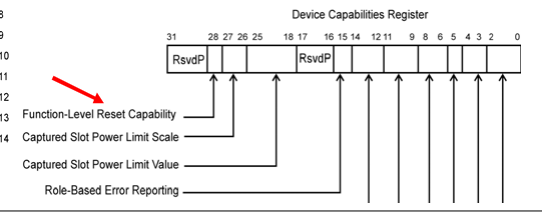
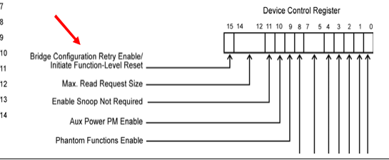

# 📘 第 19 章　热插拔与功率预算 (Chapter 19. Hot Plug and Power Budgeting)

**MindShare PCI Express Technology 3.0 — Comprehensive Guide to Generations 1.x, 2.x and 3.0**

> 📁 **Source chunks**: `chunks/chunk0344.md` ... `chunks/chunk0346.md`
> 🎨 **Format**: 中英对照双语 · 中文灰底 (PCIe 6.2 Spec 模板)

---

## 📑 本章目录 (Table of Contents)

- [Hot Plug and Power Budgeting](#-本章目录-table-of-contents)

## 19.1 Hot Plug and Power Budgeting | 热插拔与功率预算

<table>
<thead><tr><th width="50%">🇬🇧 English</th><th width="50%" style="background-color:#e8e8e8">🇨🇳 中文</th></tr></thead>
<tbody><tr>
<td>

This 64‐bit register is a bit vector that indicates for which of the 64 MCGs this Function should accept a copy or this Port should forward a copy. If the MCG value is found to be 47, for example, and bit 47 is set in this register, then this Function should receive it or this Port should forward it. 

## **MC Block All** 

This 64‐bit register indicates which MCGs an Endpoint Function is blocked from sending and which a Switch or Root Port is blocked from forwarding. This can be programmed in a Switch or Root Port to prevent it from forwarding Mul‐ tiCast TLPs to an Endpoint that doesn’t understand them, for example. A blocked TLP is considered an error condition, and how the error is handled is described in the next section. 

## **MC Block Untranslated** 

The meaning and use of this 64‐bit register is almost identical to the Block All register except that it doesn’t apply to TLPs whose AT header field shows them to be translated. This mechanism can be used to set up a Multicast window that is protected in that it can only receive translated addresses. 

If a TLP is blocked because of the setting of either of these two blocking regis‐ ters, it’s handled as an MC Blocked TLP, meaning it gets dropped and the Port 

**892** 

**Cha ter 20: U dates for S ec Revision 2.1 p p p** 

or Function logs and signals this as an error. Logging the error involves setting the Signaled Target Abort bit in its Status register or its Secondary Status regis‐ ter, as appropriate. That’s barely enough information to be useful, though, so the spec highly recommends that Advanced Error Reporting (AER) registers be implemented in Functions with Multicast capability to facilitate isolating and diagnosing faults. 

The spec notes that this register is required in all Functions that implement the MC Capability registers, but if an Endpoint Function doesn’t implement the ATS (Address Translation Services) registers, the designer may choose to make these bits reserved. 

## **Multicast Example** 

At this point, an example will help to illustrate how these registers can be used to set up a multicast environment. To set this up, let’s first give the relevant reg‐ isters some values: 

- MC_Base_Address = 2GB (Starting address for the multicast range) 

- MC_Max_Group = 7 (Meaning 8 windows are possible for this design) 

- MC_Window_Size_Requested = 10 (Meaning 2[10] or 1KB size was requested by an Endpoint) 

- MC_Index_Position = 12 (Meaning the actual size of each window is 2[12] ) 

- MC_Num_Group = 5 (Meaning software only configured 6 of the available multicast windows). 

Based on those register settings, the image in Figure 20‐7 on page 894 illustrates the result. The multicast window range is shown starting at 2GB and ranging as high as 2GB + 8 * (the window size). However, only 6 are enabled by software, so the actual multicast address range is from 2GB to 2GB + 24KB. The windows are all the same size and correspond to the MCGs: MCG 0 is the first window, 1 is the next window, and so on. 

**893** 

**PCI Ex ress Technolo p gy** 

_Figure 20‐7: Multicast Address Example_ 

**==> picture [370 x 166] intentionally omitted <==**

**----- Start of picture text -----** 
System Memory Map MC Address Range = 2GB to 2GB + 2 [12] * 6 = 2GB to 2GB + 24KB 8 MC windows available in 2GB + 24KB MC Group 5 hardware, each at least 2 [10] Only 6 MC windows are  MC Group 4MC Group 3 in size (technically, 2 [12] is configured for use MC Group 2MC Group 1 min. address granularity) 2GB MC Group 0 MC_Base_Address **----- End of picture text -----** 

## **MC Overlay BAR** 

This last set of registers are required for Switch and Root Ports that implement Multicasting, but they’re not implemented in Endpoints. The motivation for this BAR is that it allows two special cases. First, a Port can forward TLPs down‐ stream if they hit in a multicast window even if the Endpoint wasn’t designed for multicasting. Second, a Port can forward multicast TLPs upstream to system memory. In both cases, this is accomplished by replacing part of the Request’s address with an address that will be recognized by the target. Doing so allows a single BAR in a component to serve as a target for both unicast and multicast writes even if it wasn’t designed with multicast capability. 

As shown in Figure 20‐8 on page 895, this register block consists of an address that will be overlaid onto the outgoing TLP, and a 6‐bit Overlay Size indicator. The size referred to here is simply the number of bits from the original 64‐bit address that will be retained, while all the others will be replaced by the Over‐ lay BAR bits. The spec mistakenly refers to this in at least one place as the size in bytes, but in other places it’s made clear that it is a bit number. Note that the overlay size value must be 6 or higher to enable the overlay operation. If the size is given as 5 or lower, no overlay will take place and the address is unchanged. 

**894** 

**Cha ter 20: U dates for S ec Revision 2.1 p p p** 

_Figure 20‐8: Multicast Overlay BAR_ 

**==> picture [287 x 91] intentionally omitted <==**

**----- Start of picture text -----** 
31 6   5 0 MC_Overlay MC_Overlay_BAR [31:6] _Size MC_Overlay_BAR [63:32] **----- End of picture text -----** 

## **Overlay Example** 

Now consider the case in which an address overlay is desired, as shown in Fig‐ ure 20‐9 on page 896. Here the address of a TLP to be forwarded, ABCD_BEEFh, falls within the defined multicast range (also referred to as a multicast hit) and the egress Port has been configured with valid values in the Overlay BAR. 

The overlay case creates the unusual situation with the ECRC value that was mentioned earlier in the description of the Multicast Capability register. If the TLP whose address is being changed by the overlay includes an ECRC, that value would be rendered incorrect by this change. Switches and Root Ports optional support regenerating the ECRC based on the new address so that it still serves its purpose going forward. If the routing agent does not support it, the ECRC is simply dropped and the TD header bit is forced to zero to avoid any confusion. 

A potential problem can arise with ECRC regeneration. If the incoming TLP already had an error but the ECRC value is regenerated because the address was modified, that would inadvertently hide the original error. To avoid that, the routing agent must verify the original ECRC first. If it finds an error, it must force a bad ECRC on the outgoing TLP by inverting the calculated ECRC value before appending it to ensure that the target will see it as an error condition. 

**895** 

**PCI Ex ress Technolo p gy** 

_Figure 20‐9: Overlay Example_ 

**==> picture [315 x 268] intentionally omitted <==**

**----- Start of picture text -----** 
System Memory Map PCIe BAR Range Overlaid Address: FEED_0000  FEED_BEEFh to FEED_FFFF Original Address: ABCD_BEEFh Multicast Address Range **----- End of picture text -----** 

## **Routing Multicast TLPs** 

When a Switch or Root Port detects an MC hit (address falls within the MC range) normal routing is suspended. The MCG is extracted from the address and is compared to the MC_Receive register of all the Ports to see which of them should forward a copy of this TLP. Ports whose corresponding Receive register bit is set will forward a copy of the TLP unless their corresponding MC Blocked register bit is also set. If no Ports forward the TLP and no Functions consume it, it is silently dropped. To prevent loops, a TLP is never forwarded back out on its ingress Port, with the possible exception of an ACS case. 

Endpoints extract the MCG and compare it with their Receive register. If there’s no match, the TLP is silently dropped. If the Endpoint doesn’t support Multi‐ casting, it will treat the TLP as having an ordinary address. 

**896** 

**Cha ter 20: U dates for S ec Revision 2.1 p p p** 

## **Congestion Avoidance** 

The use of Multicasting will increase the amount of system traffic in proportion to the percentage of MC traffic, which leads to the risk of packet congestion. To avoid creating backpressure, MC targets should be designed to accept MC traf‐ fic “at speed”, meaning with minimal delay. To avoid oversubscribing the Links, MC initiators should limit their packet injection rate. A system designer would be wise to choose components carefully to handle this. For example, using Switches and Root Ports whose buffers are big enough to handle the expected traffic, and Endpoints that are able to accept their incoming MC pack‐ ets quickly enough to avoid trouble. 

## **Performance Improvements** 

System performance is enhanced with the addition of four new features: 

1. AtomicOps to replace the legacy transaction locking mechanism 

2. TLP Processing Hints to allow software to suggest caching options 

3. ID‐Based Ordering to avoid unnecessary latency 

4. Alternative Routing‐ID Interpretation to increase the number of Functions available in a device. 

## **AtomicOps** 

Processors that share resources or otherwise communicate with each other sometimes need uninterrupted, or “atomic”, access to system resources to do things like testing and setting semaphores. On parallel processor buses this was accomplished by locking the bus with the assertion of a Lock pin until the origi‐ nator completed the whole sequence (a read followed by a write), during which time other processors were not allowed to initiate transactions on the bus. PCI included a Locked pin to apply this same model on the PCI bus as on the pro‐ cessor bus, allowing this protocol to used with peripheral devices. 

This model worked but was slow on the shared processor bus and even worse when going onto the PCI bus. That’s one reason why PCIe limited its use only to Legacy devices. However, the increasing use of shared processing in today’s PCs, such as graphics co‐processors and compute accelerators, has brought this issue back to the fore because the different compute engines need to be able to share an atomic protocol. The way this problem was resolved on PCIe was to introduce three new commands that can each do a series of things atomically 

**897** 

## **PCI Ex ress Technolo p gy** 

within the target device rather than requiring a series of separate uninterrupt‐ able commands on the interface. These new commands, called AtomicOps, are: 

1. FetchAdd (Fetch and Add) ‐ This Request contains an “add” value. It reads the target location, adds the “add”value to it, stores the result in the target location and returns the original value of the target location. This could be used in support of atomically updating statistics counters. 

2. Swap (Unconditional Swap) ‐ This Request contains a “swap” value. It reads the target location, writes the “swap” value into it, and returns the original target value. This could be useful for atomically reading and clear‐ ing counters. 

3. CAS (Compare and Swap) ‐ This Request contains both a “compare” value and a “swap” value. It reads the target location, compares it against the “compare” value and, if they’re equal, writes in the “swap” value. Finally, it returns the original value of the target location. This can be useful as a “test and set” mechanism for managing semaphores.

</td>
<td style="background-color:#e8e8e8">

此更改通过减少表中的条目数简化了事务排序表。基本上，它不再区分读取的完成或非发布写入的完成。这样做的动机是为了减少需要测试的案例数量。有关详细信息，请参阅第 288 页上名为"简化的排序规则表"的部分。

**914**

# 附录

## _**附录 A：**_

## _**使用 LeCroy 工具调试 PCIe 流量**_

## Christopher Webb，LeCroy 公司

## **概述**

IO 总线架构从 PCI 到 PCI Express 的过渡对开发人员在验证和调试所需的工具类型方面产生了重大影响。

使用 PCI 等并行总线，信号的波形视图显示了足够的信息供开发人员解释总线的状态。用户可以目视检查波形并在心理上解码事务的类型、传输了多少数据，甚至传输的内容。

由于 PCI Express 数据包流量既被编码又被加扰，检查流量的波形视图对链路状态提供的信息非常少。链路速度可以从位时间的宽度推断，链路宽度可以从活动 lane 的数量推断。然而，用户无法目视解释符号对齐，更不用说数据包本身了。

一类新的工具发展起来，帮助开发人员可视化其现在的串行链路的状态。这些工具为用户执行反序列化、解码和解扰。乍一看这似乎足以满足开发人员的要求。但对于 PCI Express 而言，其他复杂性（如流控信用、lane 间偏移、极性反转和 lane 反转）也必须由这些工具作为理解 PCIe 协议的一部分来理解。

前硅和后硅调试都对工具有共同的需求。在本附录章节中，我们描述了可用于调试 PCI Express 互连的某些产品，包括前硅和后硅调试的视角。

**917**

**PCI Ex ress Technolo p gy**

## **前硅调试**

## **RTL 仿真视角**

在 RTL 仿真中，查看 FPGA 或 ASIC 信号的波形视图是最常见的调试方法。通过显示内部状态机的状态、监视 IO 在设备中的移动，或查看控制信号的状态；波形视图非常强大。但是，正如我们上面讨论的，PCI Express 链路在显示为波形时是不可理解的。必须进行额外的处理或解码才能理解此新链路。为了增强仿真工具，通常会添加 PCI Express 总线监视器来满足此需求。

## **PCI Express RTL 总线监视器**

PCI Express 总线监视器是一段代码，用户可以将其插入其 RTL 仿真中以帮助监视其 PCIe 链路的状态。至少，此监视器将输出基于文本的日志文件，其中包含有关链路状态变化和分组活动类型的信息。更复杂的监视器将执行实时合规性检查。许多供应商提供可购买的 IP 来执行此确切功能。然而，重点通常是合规性。在可视化流控信用、链路利用率或链路训练调试等方面提供的功能较少。

## **RTL 矢量导出到 PETracer 应用程序**

LeCroy 已与许多领先的 PCIe 验证 IP 供应商合作，创建工具以进一步增强前硅 PCIe 流量的可视化和分析。这涉及使用供应商的总线监视器将原始符号流量导出到与专用 PCIe 分析仪硬件使用的同一 PETracer 应用程序。SimPASS PE 是 LeCroy 支持此导出的解决方案。

有关 LeCroy PETracer 应用程序及其功能的更多信息在"作为最后的手段，第 924 页的图 5 中所示的飞线探针可用于将协议分析仪附加到被测系统。这涉及将电阻式分流电路和连接器引脚焊接到 PCIe 走线上。此电路通常焊接到 PCIe 链路的 AC 耦合电容，因为它们通常是访问走线的唯一位置。探针电路焊接到 PCB 后，可以根据需要连接和移除分析仪探针。这种方法可用于几乎任何 PCIe 链路，但是连接的鲁棒性受限于添加探针的技术人员的技能。"第 924 页中描述。

## **后硅调试**

## **示波器**

使用示波器调试 PCIe 链路通常侧重于链路的电气验证。最常见的用法是使用掩码叠加检查眼图以确定电气合规性。一个鲜为人知的合规性检查是检查电气空闲状态的进入和退出，以查看链路是否在传输电气空闲有序集后的所需时间段内进入共模电压。这些是最好使用示波器执行的 PCIe 合规性检查的 2 个示例，如图 1 所示（在第 920 页）。

随着 8.0 GT/s 操作的动态链路训练的添加，设备现在必须在 Recovery.EQ LTSSM 子状态期间训练发射机加重。目标是将发射机 EQ 设置为向接收机提供最佳信号眼。监视此动态均衡过程是另一个示波器的使用非常强大的示例。使用实时示波器，用户可以捕获此过程并在更改发射机设置时查看对波形的影响。这允许用户验证发射机是否确实作用于系数变化请求，但它还允许用户确定接收机是否已正确选择正确的设置。

对于链路的逻辑调试，当链路为 x1 或 x2 时，示波器最有用，因为您受到示波器可以采集的通道数的限制。检查 PCIe 流量的第一种方法是波形视图。与 RTL 波形查看器一样，在没有 SW 帮助执行 8b/10b 解码和解扰的情况下，几乎无法理解链路状态。幸运的是，更高级的示波器具有执行这些职责的 SW 包。为此正常工作，示波器必须具有深度捕获缓冲区并且必须看到 SKIP 有序集，以便它们可以破译字节对齐并使解扰器 LFSR 同步。

LeCroy 示波器可以将 PCIe 符号直接叠加到波形上，以增强流量的可见性。可以在屏幕上显示数据包符号的附加基于文本的列表，作为检查波形的附加方法。

**919**

**PCI Ex ress Technolo p gy**

LeCroy 最近宣布为其示波器产品线发布一个名为 ProtoSync 的 SW 包，允许用户将捕获的波形导出到 PETracer 应用程序。这是协议分析仪使用的同一 SW 包，其中包括下面描述的广泛的后处理功能。PETracer 软件可以独立于示波器硬件运行，通常在第二台显示器上。这允许对示波器波形显示的物理层数据与 PETracer 软件显示的逻辑层数据进行时间相关比较。

在示波器上捕获 8.0 GT/s 动态链路均衡并将此流量导出到 PETracer 应用程序是该解决方案最强大的主要示例。用户可以在 PETracer 中导航到发送 TX 系数变化请求的链路训练数据包，然后在示波器 SW 中识别此系数变化的应用位置。然后用户可以测量应用系数变化所花费的时间，并将其与 PCIe 规范中要求的时间进行比较。

_图 A-1：带 ProtoSync 软件选项的 LeCroy 示波器_

## **协议分析仪**

调试 PCIe 链路的一个日益增长的趋势是使用专用协议分析工具。协议分析仪与逻辑分析仪的区别在于它构建为支持特定协议，例如 PCIe。从硬件的角度来看，PCIe 协议分析仪经过优化以获取和存储 PCIe 流量。这从专用的 PCIe 插头探针开始，延伸到布线选择，并一直持续到内部硬件组件。为了恢复 PCIe 流量，使用专门的时钟和数据恢复电路，可以处理电气空闲转换、扩频调制，以及

**920**

**A endix A pp**

处理 128b/130b 编码中找到的游程长度。在反序列化之前，使用复杂的均衡电路来恢复信号眼。如果不理解 PCIe 恢复的复杂性，分析仪硬件将无法针对恢复复杂流量（如速度切换、动态链路宽度和低功率状态（如 L0s））进行优化。

除了选择适当的硬件组件来恢复 PCIe 流量之外，协议分析仪还包括 PCIe 特定的逻辑电路。该逻辑必须推断 PCIe 链路的状态并在各种 LTSSM 状态变化期间跟踪它。一旦链路状态被正确跟踪，专用数据包检查电路将根据用户编程的事件对传入数据包执行数据匹配。这些匹配器用于过滤流量以及执行停止流量捕获所需的触发功能。这些流量过滤器和深度跟踪缓冲区（通常为 4GB 到 8GB）的组合允许用户捕获比没有协议分析仪长得多的流量场景。

最后，协议分析仪最重要的部分是软件 GUI。通过使用专用 PCI Express 软件工具优化流量视图、后处理报告和硬件控制；可以执行非常全面的 PCI Express 特定分析。

## **逻辑分析仪**

一些逻辑分析仪提供 PCIe 特定的软件包。此软件将从逻辑分析仪硬件读取 PCI Express 捕获并对这些数据执行一些后处理。此分析包括解码、解扰和解码流量等基本内容。但是，这些 SW 工具不执行专用协议分析仪软件提供的许多丰富后处理功能。

## **使用协议分析仪探测选项**

要记录您的 PCIe 流量，您必须首先找到探测它的最佳方法。PCIe 最初是作为台式 PC 和服务器的附加卡形态因素开始的，但此后已经扩散到一系列令人眼花缭乱的标准和非标准形态因素。对于标准形态因素，最好的探测选项是专用插头。

插头是一种专用硬件，包括将 PCIe 流量的副本传递给分析仪硬件以进行捕获和分析所需的探测电路。这些插头是专门为其所放置的机械环境

**921**

**PCI Ex ress Technolo p gy**

和电气环境设计的。最常见的插头是"插槽插头"，如图 2 所示（在第 922 页）。该插头用于探测符合 CEM 标准的标准 PCIe 附加卡。

</td>
</tr></tbody></table>

[⬆️ 返回目录](#-本章目录-table-of-contents)

---

## 19.2 Hot Plug and Power Budgeting | 热插拔与功率预算

<table>
<thead><tr><th width="50%">🇬🇧 English</th><th width="50%" style="background-color:#e8e8e8">🇨🇳 中文</th></tr></thead>
<tbody><tr>
<td>

Both Endpoints and Root Ports are optionally allowed to act as AtomicOp Requesters and Completers, which might seem unexpected because, in PCs at least, this kind of transaction is usually only initiated by the central processor. But modern systems can include an Endpoint acting as a co‐processor, in which case it would need to be able to use AtomicOps to properly handle the protocol. All three commands support 32‐bit and 64‐bit operands, while CAS also sup‐ ports 128‐bit operands. The actual size in use will be given in the Length field in the header. Routing elements like Switch Ports and Root Ports with peer‐to‐peer access will need to support the AtomicOp routing capability to be able to recog‐ nize and route these Requests. 

A question naturally arises as to how the system (Root Complex) will be instructed to generate these new commands in response to processor activity, since there may not be a directly‐analogous processor bus command. The spec suggests two approaches. First, the Root could be designed to recognize specific processor activity and interpret that to “export” a PCIe AtomicOp in response. Second, a register‐based approach similar to the one used for legacy Configura‐ tion access could be used. In that case, one register might give the target address while another specified which command should be generated and the combina‐ tion of the two would generate the Request. 

AtomicOp Completers can be identified by the presence of the three new bits in the Device Capabilities 2 register, as shown in Figure 20‐10 on page 899. Bit 6 of this register also identifies whether routing elements are capable of routing AtomicOps. 

**898** 

**Cha ter 20: U dates for S ec Revision 2.1 p p p** 

Legacy PCI does not comprehend AtomicOps, of course, and there is no straight‐forward way to translate them into PCI commands. For that reason, PCIe‐to‐PCI bridges do not support AtomicOps. If atomic access is needed on that bus it would have to be done with the legacy locked protocol and the spec states that Locked Transactions and AtomicOps can operate concurrently on the same platform. 

_Figure 20‐10: Device Capabilities 2 Register_ 

**==> picture [356 x 280] intentionally omitted <==**

**----- Start of picture text -----** 
31 24 23 22 21 20 19 14 13 12 11 10 9 8 7 6 5 4 3 0 RsvdP RsvdP Max End-End TLP Prefixes End-End TLP Prefix Supported Extended Fmt Field Supported TPH Completer Supported LTR Mechanism Supported No RO-enabled PR-PR Passing 128-bit CAS Completer Supported 64-bit AtomicOp Completer Supported 32-bit AtomicOp Completer Supported AtomicOp Routing Supported ARI Forwarding Supported Completion Timeout Disable Supported Completion Timeout Ranges Supported **----- End of picture text -----** 

## **TPH (TLP Processing Hints)** 

Adding hints about how the system should handle TLPs targeting memory space can improve latency and traffic congestion. The spec describes this special handling basically as providing information about which of several possible cache locations in the system would be the optimal place for a temporary copy 

**899** 

**PCI Ex ress Technolo p gy** 

of a TLP. The spec makes note of the fact that, since the usage described for TPH relates to caching, it wouldn’t usually make sense to use them with TLPs target‐ ing Non‐prefetchable Memory Space. If such usage was needed, it would be essential to somehow guarantee that caching such TLPs did not cause undesir‐ able side effects. 

## **TPH Examples** 

**Device Write to Host Read.** To help clarify the motivation for TPH, con‐ sider the example shown in Figure 20‐11 on page 901. Here the Endpoint is writing data into memory for later use by the CPU. The sequence is as follows: 

1. First, the Endpoint sends a memory write TLP containing an address that maps to the system memory. The packet gets routed to the Root Complex (RC). 

2. The RC recognizes this as an access to a cacheable memory space and pauses its progress while it snoops the CPU cache. This may result in a write‐back cycle from the CPU to update the system memory before the transaction can proceed, and this is shown as step 2a. 

3. Once any write backs have finished, the RC allows the write to update the system memory. 

4. At some point, the Endpoint notifies the CPU about data delivery. 

5. Finally, the CPU fetches the data from memory to complete the sequence. 

**900** 

**Cha ter 20: U dates for S ec Revision 2.1 p p p** 

_Figure 20‐11: TPH Example_ 

**==> picture [202 x 111] intentionally omitted <==**

**----- Start of picture text -----** 
4 2 e C)\ @ 5 2a Roo! Complex @ 3 1 lo [ | **----- End of picture text -----** 

This sequence works but there’s an opportunity for performance improvement by adding an intermediate cache in the system. To illustrate this, consider the example shown in Figure 20‐12 on page 902. From the perspective of the End‐ point, the operation is the same but the knows to handle it a differently. The steps now are as follows: 

1. The Endpoint does the same memory write but this time TPH bits are included. The write is forwarded to the RC by the Switch as before. 

2. The RC understands that this memory access must be snooped to the CPU as before. However, once the snoop has been handled, the RC is informed by the TPH bits to store this TLP in an intermediate cache rather than going to system memory. 

3. The Endpoint notifies the CPU that the data item has been delivered. 4. The CPU reads from the specified address, but now the data is found in the intermediate cache and so the request does not go to system memory. This has the usual benefits we’d expect from a cache design: faster access time as well as reduced traffic for the system memory. 

**901** 

**PCI Ex ress Technolo p gy** 

This is a simple Device Write to Host Read (DWHR) example to illustrate the concept but it wouldn’t be hard to imagine a more complex system with a much larger topology in which there could be other caches placed in Switches or other locations to achieve the same benefits for other targets. 

_Figure 20‐12: TPH Example with System Cache_ 

**==> picture [108 x 75] intentionally omitted <==**

**----- Start of picture text -----** 
3 2 4 OC @VlEl@ Rant Camnlayx Cache 1 **----- End of picture text -----** 

**Host Write to Device Read.** To illustrate the concept going the other way (called Host Write to Device Read or HWDR), consider the example shown in Figure 20‐13 on page 903. In this example, the CPU initiates a memory write whose address targets the PCIe Endpoint in step one. The packet contains TPH bits that tell the RC that it should be stored in an intermediate cache near the target, instead of the cache in the RC that was used in the previous example. In this case a cache built into the Switch serves the purpose. The TLP is then for‐ warded on to the target Endpoint in step two. This model is beneficial when the data is updated infrequently but read often by the Endpoint. That allows sev‐ eral memory reads that would normally go to system memory to be handled by the cache instead, off loading both the Link from the Switch to the RC and the path to memory. 

**902** 

**Cha ter 20: U dates for S ec Revision 2.1 p p p** 

_Figure 20‐13: TPH Usage for TLPs to Endpoint_ 

**==> picture [353 x 326] intentionally omitted <==**

**----- Start of picture text -----** 
1 ox oct Complex Cache rl i) i PCle PCle Cache 2 OWN: Endpoint Bridge Yi i IN orto PCI-X PCI § EndpointPCle §§ EndpointLegacy PCI/PCI-X | | Device to Device.  One last example is illustrated in Figure 20‐14 on page 904, where two Endpoints communicate with each other (called Device Read/ Write to Device Read/Write or D*D*) through a shared memory location that is directed by TPH bits to an intermediate cache. In this case, both may update dif‐ ferent locations that they need to handle as “read mostly”, or one Endpoint may update data that the other needs to read several times. In both cases, using the intermediate cache improves system performance. **----- End of picture text -----** 

**903** 

## **PCI Ex ress Technolo p gy** 

_Figure 20‐14: TPH Usage Between Endpoints_ 

**==> picture [34 x 9] intentionally omitted <==**

**----- Start of picture text -----** 
Cache **----- End of picture text -----** 

## **TPH Header Bits** 

Several bits in the TLP header describe how the hints are used. First, as shown in the middle at the top of Figure 20‐15 on page 905, the TH (TLP Hints) bit reports whether the optional TPH bits are in use for the TLP. When set, the PH (Processing Hint bits) indicate the next level of information. 

**904** 

**Cha ter 20: U dates for S ec Revision 2.1 p p p** 

_Figure 20‐15: TPH Header Bits_ 

**==> picture [339 x 115] intentionally omitted <==**

**----- Start of picture text -----** 
+0 +1 +2 +3 7 6 5 4 3 2 1 0 7 6 5 4 3 2 1 0 7 6 5 4 3 2 1 0 7 6 5 4 3 2 1 0 At T T E Byte 0 Fmt Type R TC R tr R H D P Attr AT Length Last DW 1st DW Byte 4 Requester ID Tag BE BE Byte 8 Address [63:32] Byte 12 Address [31:2] PH **----- End of picture text -----** 

When the TH bit is set the PH bits, shown at the bottom right of Figure 20‐15 on page 905, take the place of what were the two reserved LSBs in the address field. For a 32‐bit address, these are byte 11 [1:0], while for the 64‐bit address shown, they are byte 15 [1:0]. Their encoding is described in Table 20‐1 on page 905. These hints are provided by the Requester based on knowledge of the data pat‐ terns in use, which is information that would be difficult for a Completer to deduce on its own. 

_Table 20‐1: PH Encoding Table_ 

|**PH [1:0]**|**Processing Hint**|**Usage Model**|
|---|---|---|
|00b|Bi‐directional data structure|Indicates frequent read/write access by Host and device.|
|01b|Requester|D*D* (device‐to‐device transfers). Indicates fre‐ quent read/write access by device. The asterisk means either device could be reading or writing.|
|10b|Target|DWHR, HWDR (device‐to‐host or host‐to‐device transfers). Indicates frequent read/write access by Host.|
|11b|Target with Priority|Same as Target but with additional temporal re‐use priority information. Indicates frequent read/write access by Host and high temporal local‐ ity for accessed data.|

**905** 

## **PCI Ex ress Technolo p gy** 

The next level of information is the Steering Tag byte that provides system‐spe‐ cific information regarding the best place to cache this TLP. Interestingly, the location of this byte in the header varies depending on the Request type. For Posted Memory Writes the Tag field is repurposed to be the Steering Tag (no completion will be returned so the Tag isn’t needed), while for Memory Reads the two Byte Enable fields are repurposed for it (byte enables are not needed for pre‐fetchable reads). The meaning of the bits is implementation specific but they need to uniquely identify the location of the desired cache in the system. 

Two formats for TPH are described in the spec and this level of hint information (TH + PH + 8‐bit Steering Tag), called Baseline TPH, is the first and is required of all Requests that provide TPH. The second format uses TLP Prefixes to extend the Steering Tags (see “TLP Prefixes” on page 908 for more detail). 

## **Steering Tags**

</td>
<td style="background-color:#e8e8e8">

选择插头时应小心，因为探测电路因供应商和最大 PCIe 链路速度施加的要求而异。例如，Gen3 插槽插头应包含允许动态链路训练过程正确通过探测器的探测电路。LeCroy Gen3 插槽插头使用线性电路来保持波形在通过探测器时的形状。这允许发射机的预加重在链路训练期间动态更改，同时允许接收机量化新设置的影响（无论是正面还是负面影响）。

_图 A-2：LeCroy PCI Express 插槽插头 x16_

LeCroy 还提供一系列其他专用插头，用于 ExpressCard、XMC、迷你卡、Express 模块、AMC 等形态因素。其中一些插头如图 3 所示（在第 923 页）。有关这些插头的完整列表，请参阅 LeCroy 网站：www.lecroy.com，因为此列表正在不断增长。

**922**

**A endix A pp**

_图 A-3：LeCroy XMC、AMC 和迷你卡插头_

对于无法从专用插头中受益的 PCIe 链路调试，第 923 页的图 4 所示的中段探针是次优选择。中段探针涉及在 PCB 上放置行业标准的探针几何形状。每个 PCIe 通道被路由到一对焊盘上，可以使用中段探针头进行探测。这些探针使用弹簧针或 C 形夹在被测系统和协议分析仪之间提供无焊接的机械连接。

_图 A-4：LeCroy PCI Express Gen3 中段探针_

**923**

**PCI Ex ress Technolo p gy**

作为最后的手段，第 924 页的图 5 所示的飞线探针可用于将协议分析仪附加到被测系统。这涉及将电阻式分流电路和连接器引脚焊接到 PCIe 走线上。此电路通常焊接到 PCIe 链路的 AC 耦合电容，因为它们通常是访问走线的唯一位置。探针电路焊接到 PCB 后，可以根据需要连接和移除分析仪探针。这种方法可用于几乎任何 PCIe 链路，但是连接的鲁棒性受限于添加探针的技术人员的技能。

_图 A-5：LeCroy PCI Express Gen2 飞线探针_

## **使用 PETracer 应用程序查看流量**

## **CATC 跟踪查看器**

使用 LeCroy PETracer 应用程序查看 PCI Express 流量的主要方法是 CATC 跟踪视图。该视图获取每个记录的数据包并将其分解为不同的数据包字段，以突出显示此数据包中包含的重要值。颜色和文本的混合用于可视地分类和解释每个数据包的目的。错误以红色突出显示，如图 6 所示（在第 925 页）。警告以黄色突出显示，便于识别流量或数据包字段中不符合规范的部分。

**924**

**A endix A pp**

## _图 A-6：带 ECRC 错误的 TLP 数据包_

除了解码和可视地分解每个数据包之外，分层显示允许对相关数据包进行逻辑分组。例如，在"链路级别"模式下，TLP 数据包与它们各自的 ACK 数据包分组。每个 TLP 被标识为隐式或显式 ACK 或 NAK。ACK DLLP 的示例如图 7 所示（在第 925 页）以及 ACK 的 TLP。

_图 A-7："链路级别"将 TLP 数据包与其链路层响应分组_

在"Split-Level"模式下（如图 8 所示，在第 926 页），CATC 跟踪视图组合拆分事务。例如，单个 TLP 读取可以与 1 个或多个完成 TLP 分组，以将大数据传输逻辑地显示为跟踪中的单行。为每个拆分级别事务提供数据量、起始地址以及性能指标。这允许用户绕过如何将大型内存事务分解为多个 TLP 数据包的细节，而是关注数据的内容。如果用户希望查看拆分事务的详细信息，分层显示可以显示组成此拆分事务的所有数据包的链路级别和/或数据包级别的细分。这种"深入研究"流量分析方法允许用户从总线上发生的事情的高级视图开始，并仅深入到用户感兴趣的流量区域。

**925**

**PCI Ex ress Technolo p gy**

_图 A-8："拆分级别"将完成与关联的非发布请求分组_

CATC 跟踪视图还支持"紧凑视图"，如图 9 所示（在第 927 页）。在此视图中，重复发送的数据包将折叠到单个单元格中。这对于折叠训练序列或流控初始化数据包非常有用。执行此折叠的软件算法也足够智能，可以折叠任何 SKIP 有序集。这创建了一个非常紧凑的链路训练过程视图，允许用户在不必滚动浏览数百个数据包的情况下检查链路训练数据包中的更改。

**926**

**A endix A pp**

_图 A-9："紧凑视图"折叠相关数据包以便于查看链路训练_

## **LTSSM 图**

为了进一步增强"深入研究"流量查看方法，PETracer 应用程序包括 LTSSM 图视图，如图 10 所示（在第 928 页）。调用此图时，SW 解析跟踪以查找链路训练部分并推断链路训练和状态状态机 (LTSSM) 的状态。结果是一个以非常高级的视图分解 LTSSM 状态转换的图。该图允许用户立即查看链路是否进入恢复状态。如果是这样，用户可以轻松识别链路的哪一侧启动了恢复，它进入恢复多少次，甚至链路速度或链路宽度是否由于恢复而降低。

LTSSM 图也是返回跟踪文件的活动链接。例如，如果用户单击恢复的条目，则跟踪文件将导航到跟踪文件中的该位置。这将允许用户查看恢复是否是由重复的 NAK 或由于块对齐丢失等原因引起的。

**927**

简而言之，当用户调试与链路训练、速度变化或低功率状态转换相关的问题时，LTSSM 会受到影响。通过检查 LTSSM 图，用户可以轻松识别这些链路状态变化是否发生，在哪里发生，并直接导航到它们以进行更快的分析。

_图 A-10：LTSSM 图显示跨跟踪的链路状态转换_

## **流控信用跟踪**

在 PCI Express 中，流控信用跟踪尤其有问题。流控更新数据包不显示每个端点具有的信用数，而是显示总共使用了多少信用。这意味着每个端点必须保持每种类型的信用的运行计数器。有许多场景可能导致信用丢失，如果发生这种情况，链路最终将由于缺乏信用而无法传输数据。此类问题非常难以识别和调试。

LeCroy PETracer 应用程序具有一个信用跟踪 SW 工具，如图 11 所示（在第 929 页），以帮助此调试。如果跟踪包含 FC-Init 数据包，它将遍历跟踪并在每个 TLP 和 FC-Update 之后显示每个虚拟通道缓冲区类型的剩余信用量。

FC-Init 数据包在链路训练之后发送一次。因此，PETracer 应用程序允许用户在某个点设置初始信用值

**A endix A pp**

跟踪，SW 将计算剩余数据包的相对信用值。即使初始信用值由用户设置不当，具有查看相对信用的能力通常足以捕获流控问题。

_图 A-11：流控信用跟踪_

## **Bit Tracer**

一些调试情况无法通过深入研究检查流量的方法来解决。例如，如果链路设置不正确，则记录通常不可读。如果设备未正确加扰流量，或 10 位符号以相反顺序发送怎么办？对于这种情况，需要一个专注于示波器的波形视图和 CATC 跟踪视图之间分析的工具。这是 BitTracer 视图（图 12 所示，在第 930 页）最强大的地方。

BitTracer 视图允许用户查看链路上看到的原始流量。该软件允许用户将流量视为 10 位符号、加扰字节或未加扰字节。无效符号和不正确的运行差异以红色突出显示。

**929**

**PCI Ex ress Technolo p gy**

为了进一步确定流量可能出现的问题，BitTracer 工具添加了一个强大的后处理功能列表，可以修改流量。例如，在捕获后；用户可以反转给定通道的极性。一旦应用，用户可以看到 10 位符号现在是否在跟踪中正确表示。如果这清理了跟踪，则表明分析仪硬件的记录设置需要更改。

_图 A-12：Gen2 流量的 BitTracer 视图_

此外，可以修改通道排序。这对于确定通道反转是否导致不良捕获很有用。如果流量具有过多的通道间偏移，则 BitTracer 软件允许用户重新对齐流量。对于 Gen3 流量，可以一次应用 1 位偏移。本质上，这允许用户在捕获后修复 130 位块对齐。

在对数据应用更改之后，可以将全部或仅一部分数据导出到标准 CATC 跟踪视图中以进行更高级别的分析。此工作流对于早期启动期间的低级问题调试非常强大。举例来说，假设用户的设备正确训练链路，然后突然将极性反转应用于 1 个通道。这显然违反了规范，将导致链路重新训练。如果使用 BitTracer 工具捕获此流量，则用户可以轻松地将其识别为问题。此外，反转前后的流量部分可以导出到单独的跟踪文件中并在 CATC 跟踪视图中检查。

**930**

**A endix A pp**

## **分析概述**

如您所见，不同的流量视图对于调试某些故障情况可能是有益的。LeCroy 支持从许多来源将 PCIe 流量导入其高度复杂的 PETracer 软件。无论是 RTL 仿真、示波器捕获还是专用协议分析仪捕获，PETracer 都具有丰富的流量视图和报告，允许用户最好地了解其 PCIe 链路的健康状况和状态。

## **流量生成**

## **前硅**

为了在仿真中刺激 PCI Express 端点，可以从多个供应商处购买专用验证 IP。此 IP 将测试基本功能以及执行多个 PCIe 合规性检查。ASIC 开发人员当然有兴趣在流片之前发现并修复这些问题，这就是这些工具的价值所在。如果 PCIe 设计是在掩模成本不是问题的 FPGA 中实现的，则使用专用流量生成工具（如 LeCroy PETrainer 或 LeCroy PTC 卡）在硬件中执行这些合规性检查可能更具成本效益。

## **后硅**

## **Exerciser 卡**

</td>
</tr></tbody></table>

[⬆️ 返回目录](#-本章目录-table-of-contents)

---

## 19.3 Hot Plug and Power Budgeting | 热插拔与功率预算

<table>
<thead><tr><th width="50%">🇬🇧 English</th><th width="50%" style="background-color:#e8e8e8">🇨🇳 中文</th></tr></thead>
<tbody><tr>
<td>

These values are programmed by software into a table to be used during normal operation. The spec recommends that the table be located in the TPH Requester Capability structure, shown in Figure 20‐16 on page 906, but it can alternatively be built into the MSI‐X table instead. Only one or the other of these table loca‐ tions can be used for a given Function. The location is given in the ST Table Location field [10:9] of the Requester Capability register, shown in Figure 20‐17 on page 907. The encoding of these 2 bits is shown in Table 20‐2 on page 907. 

_Figure 20‐16: TPH Requester Capability Structure_ 

|31|15|0 7|
|---|---|---|
|PCI Express Capabilities Register|Next Cap Pointer|PCI Express Cap ID (17h)|
|TPH Requester Capability Register|||
|TPH Requester Control Register|||
|TPH ST Table (optional) (Sized by number of ST entries)|||

**906** 

**Cha ter 20: U dates for S ec Revision 2.1 p p p** 

_Figure 20‐17: TPH Capability and Control Registers_ 

**==> picture [340 x 285] intentionally omitted <==**

**----- Start of picture text -----** 
TPH Requester Capability Register 31 27 26 16 15 11 10 9 8 7 3 2 1 0 RsvdP ST Table Size RsvdP RsvdP ST Table Location Extended TPH Requester Supported Device-Specific Mode Supported Interrupt Vector Mode Supported No ST Mode Supported TPH Requester Control Register 31 10 9 8 7 3 2 0 RsvdP RsvdP TPH Requester Enable ST Mode Select **----- End of picture text -----** 

_Table 20‐2: ST Table Location Encoding_ 

|**Bits [10:9]**|**ST Table Location**|
|---|---|
|00b|Not present|
|01b|Located in the Requester Capa‐ bility structure|
|10b|Located in the MSI‐X table|
|11b|Reserved|

**907** 

**PCI Ex ress Technolo p gy** 

The Requester Capability register lists the number of entries in the ST Table in bits [26:16]. Each table entry is 2 bytes wide, and the ST Table implemented in the TPH Capability register set is shown in Figure 20‐18 on page 908, where entry zero is highlighted. The Requester Capability register also describes which ST Modes are supported for the Requester with the 3 LSBs: 

- **No ST** ‐ uses zeros for ST bits. Selected in the TPH Requester Control regis‐ ter’s ST Mode Select field when the value = 000b. 

- **Interrupt Vector** ‐ uses the interrupt vector number as the offset into the table, meaning the values are contained in the MSI‐X table. (ST Mode Select value = 001b.) 

- **Device‐Specific** ‐ uses a device‐specific method to offset into the ST Table in the TPH Capability structure because the ST values are located there. This is the recommended implementation, although how a given Request is associated with a particular ST entry is outside the scope of the spec. (ST Mode Select value = 010b.) 

- All other ST Mode Select encodings are reserved for future use. 

_Figure 20‐18: TPH Capability ST Table_ 

||31|24|23|16|15|8|7|0||
|---|---|---|---|---|---|---|---|---|---|
||ST Upper Entry (1)||ST|Lower Entry (1)|ST Upper Entry (0)||ST Lower Entry (0)|||
||ST Upper Entry (3)||ST|Lower Entry (3)|ST Upper Entry (2)||ST Lower Entry (2)|||
|||||||||||
|||ST Upper Entry|ST Lower Entry|||ST Upper Entry|ST Lower Entry|||
|||(Table Size)||(Table Size)||(Table Size - 1)|(Table Size - 1)|||
|||||||||||

## **TLP Prefixes** 

The Steering Tag bits can be extended with the addition of optional TLP Prefixes if needed. When one or more Prefixes are given with the TLP, the header reports it by setting the most significant bit in the Format field, as shown in Figure 20‐19 on page 909. 

**908** 

**Cha ter 20: U dates for S ec Revision 2.1 p p p** 

_Figure 20‐19: TPH Prefix Indication_ 

**==> picture [344 x 126] intentionally omitted <==**

**----- Start of picture text -----** 
+0 +1 +2 +3 7 6 5 4 3 2 1 0 7 6 5 4 3 2 1 0 7 6 5 4 3 2 1 0 7 6 5 4 3 2 1 0 Fmt At T T E Byte 0 Type R TC R R Attr AT Length 1  0 0 tr H D P Last DW 1st DW Byte 4 Requester ID Tag BE BE Byte 8 Address [63:32] Byte 12 Address [31:2] PH **----- End of picture text -----** 

## **IDO (ID-based Ordering)** 

Transaction ordering rules are important for proper traffic flow, but there are times when it’s not necessary and latencies can be improved in those cases. In particular, TLPs from different Requesters are very unlikely to have dependen‐ cies between them, so this feature allows software to enable them to be re‐ordered for improved performance. The details of this operation are described in the section called “ID Based Ordering (IDO)” on page 301. 

## **ARI (Alternative Routing-ID Interpretation)** 

The motivation for this optional feature is to increase the number of Function numbers available to Endpoints. Device numbers were useful in a shared‐bus architecture like PCI but are not usually needed in a point‐to‐point architecture. Consequently, the spec writers chose to allow devices to interpret the destina‐ tion for ID‐routed commands differently. This was accomplished by defining the Device number to always be zero and then allowing the Function number to use the 5 bits in the ID that were previously the Device number. Effectively, the Device number goes away while the Function number grows to 8 bits. The tar‐ get for a TLP that uses ARI will need to be enabled to recognize it before soft‐ ware can use this feature, but Routing elements in the path to it don’t have to be aware of this. They’re only looking at the bus number to determine the routing. 

**909** 

**PCI Ex ress Technolo p gy** 

## **Power Management Improvements** 

There are four additions that improve the system’s ability to manage power effectively, and they are listed here. All of these are covered in Chapter 16, enti‐ tled ʺPower Management,ʺ on page 703. 

## **DPA (Dynamic Power Allocation** 

A new set of extended configuration registers defines up to 32 sub‐states below D0. This allows software to easily make changes to a device’s power state with‐ out incurring the latency penalty of going all the way to the D1 device power state. To learn more on this, see “Dynamic Power Allocation (DPA)” on page 714 

## **LTR (Latency Tolerance Reporting)** 

Allowing Endpoints to report the latencies they can tolerate in response to their requests enables system software to make better choices regarding system response time and sleep states. To learn more about this, see “LTR (Latency Tol‐ erance Reporting)” on page 784. 

## **OBFF (Optimized Buffer Flush and Fill)** 

Similarly, allowing the system to report the preferred time slots during which Endpoints should or should not initiate DMA or interrupt traffic helps coordi‐ nate system sleep times and improve power management. For more on this, see “OBFF (Optimized Buffer Flush and Fill)” on page 776. 

## **ASPM Options** 

This change simply permits devices to support no ASPM Link power manage‐ ment if they choose to do so. In the previous spec versions, support for L0s was mandatory, but now it becomes optional. 

**910** 

**Cha ter 20: U dates for S ec Revision 2.1 p p p** 

## **Configuration Improvements** 

A few configuration registers were added to improve software visibility and control of devices. 

## **Internal Error Reporting** 

This is intended to provide a standardized way of reporting internal problems for devices like switches that don’t have a driver to handle that for them. It also adds the capability to track multiple TLP headers when they result in errors instead of just one as before. This topic is covered in the section on errors called “Internal Errors” on page 667. 

## **Resizable BARs** 

This new set of extended configuration registers allows devices that use a large amount of local memory to report whether they can work with smaller amounts and, if so, what sizes are acceptable. Software that knows to look for them can find the new registers, shown in Figure 20‐20 on page 912, and program them to give the appropriate memory size for the platform based on the competing requirements of system memory and other devices. 

A few rules apply to the use of these registers: 

1. To avoid confusion, a BAR size should only be changed when the Memory Enable bit has been cleared in the Command register. 

2. The spec strongly recommends that Functions not advertise BARs that are bigger than they can effectively use. 

3. To ensure optimal performance, software should allocate the biggest BAR size that will work for the system. 

**911** 

## **PCI Ex ress Technolo p gy** 

## _Figure 20‐20: Resizable BAR Registers_ 

**==> picture [363 x 166] intentionally omitted <==**

**----- Start of picture text -----** 
31 20 19 16 15 0 Next Extended Version PCIe Extended Capability ID Capability Offset (1h) (0015h for Resizable BAR) 31 0 Offset PCIe Enhanced Capability Header 000h Resizable BAR Capability Register (0) 004h Register Pair for each  Reserved Resizable BAR Control Register (0) 008h supported BAR … Resizable BAR Capability Register (n) n*8 +4 Reserved Resizable BAR Control Register (n) n*8 +8 **----- End of picture text -----** 

## **Capability Register** 

This register simply reports which BAR sizes will work for this Function. Bits 4 to 23 are used for this and the values are as shown here: 

- Bit 4 ‐ 1MB BAR size will work for this Function 

- Bit 5 ‐ 2MB 

- Bit 6 ‐ 4MB 

- ... 

- Bit 23 ‐ 512GB will work for this Function 

_Figure 20‐21: Resizable BAR Capability Register_ 

**==> picture [242 x 38] intentionally omitted <==**

**----- Start of picture text -----** 
31 24   23 4   3 0 RsvdP RsvdP **----- End of picture text -----** 

## **Control Register** 

The BAR Index field in this register reports to which BAR this size refers (0 to 5 are possible). The Number of Resizable BARs field is only defined for Control 

**912** 

**Cha ter 20: U dates for S ec Revision 2.1 p p p** 

Register zero and is reserved for all the others. It tells how many of the six pos‐ sible BARs actually have an adjustable size. Finally, the BAR Size field is pro‐ grammed by software to specify the desired size the BAR indicated by the BAR Index field (0 = 1MB, 1=2MB, 2=4MB, ..., 19=512GB). 

_Figure 20‐22: Resizable BAR Control Register_ 

**==> picture [281 x 136] intentionally omitted <==**

**----- Start of picture text -----** 
31 13  12 8   7 5   4 3    2 0 RsvdP RsvdP BAR Size (RW) Number of Resizable BARs (RO) BAR Index (RO) **----- End of picture text -----** 

Once the Resizable values have been programmed, then enumeration software will be able to work as it normally does: writing all F’s to each BAR and reading it back will report the size that was selected. Note that if the size value is changed, the contents of the BAR will be lost and will need to reprogrammed if it was previously set up. Figure 20‐23 on page 914 highlights the BAR registers in the configuration header space for a Type 0 header. 

**913** 

**PCI Ex ress Technolo p gy** 

## _Figure 20‐23: BARs in a Type0 Configuration Header_ 

**==> picture [160 x 273] intentionally omitted <==**

**----- Start of picture text -----** 
3 2 1 0 DW Device Vendor 00 ID ID Status Command 01 Register Register Class Code Revision 02 ID HeaderType LatencyTimer CacheLineSize 03 04 Base Address 0 05 Base Address 1 06 Base Address 2 07 Base Address 3 08 Base Address 4 09 Base Address 5 10 CardBus CIS Pointer Subsystem ID SubsystemVendor ID 11 Expansion ROM 12 Base Address Reserved CapabilitiesPointer 13 14 Max_Lat Min_Gnt InterruptPin InterruptLine 15 **----- End of picture text -----** 

## **Simplified Ordering Table**

</td>
<td style="background-color:#e8e8e8">

这些值由软件编程到表中以在正常运行期间使用。规范建议该表位于 TPH Requester Capability 结构中，如第 906 页的图 20‐16 所示，但也可以选择内置到 MSI‐X 表中。对于给定的功能，只能使用这两个表位置中的一个。该位置在 Requester Capability 寄存器的 ST Table Location 字段 [10:9] 中给出，如第 907 页的图 20‐17 所示。这 2 位的编码在第 907 页的表 20‐2 中显示。

_图 20‐16：TPH Requester Capability 结构_

|31|15|0 7|
|---|---|
|PCI Express Capabilities Register|Next Cap Pointer|PCI Express Cap ID (17h)|
|TPH Requester Capability Register|||
|TPH Requester Control Register|||
|TPH ST Table (optional) (Sized by number of ST entries)|||

**906**

**第 20 章：规范修订版 2.1 的更新**

_图 20‐17：TPH 能力和控制寄存器_

**==> picture [340 x 285] intentionally omitted <==**

**----- Start of picture text -----** 
TPH Requester Capability Register 
31 27 26 16 15 11 10 9 8 7 3 2 1 0 
RsvdP ST Table Size RsvdP RsvdP 
ST Table Location 
Extended TPH Requester Supported 
Device-Specific Mode Supported 
Interrupt Vector Mode Supported 
No ST Mode Supported 
TPH Requester Control Register 
31 10 9 8 7 3 2 0 
RsvdP RsvdP 
TPH Requester Enable 
ST Mode Select 
**----- End of picture text -----** 

_表 20‐2：ST 表位置编码_

|**位 [10:9]**|**ST 表位置**|
|---|---|
|00b|不存在|
|01b|位于 Requester Capa‐ bility 结构中|
|10b|位于 MSI‐X 表中|
|11b|保留|

**907**

**PCI Express 技术**

Requester Capability 寄存器在位 [26:16] 中列出 ST 表中的条目数。每个表条目宽 2 字节，在 TPH Capability 寄存器集中实现的 ST 表在第 908 页的图 20‐18 中显示，其中突出显示了条目零。Requester Capability 寄存器还描述了请求方支持哪些 ST 模式（通过低 3 位）：

- **No ST** - 对 ST 位使用零。在 TPH Requester Control 寄存器的 ST Mode Select 字段中当值 = 000b 时选择。

- **Interrupt Vector** - 使用中断向量号作为到表的偏移，这意味着值包含在 MSI‐X 表中。（ST Mode Select 值 = 001b。）

- **Device‐Specific** - 使用设备特定的方法偏移到 TPH Capability 结构中的 ST 表，因为 ST 值位于那里。这是推荐的实现方式，尽管如何将给定的请求与特定 ST 条目关联超出了规范的范围。（ST Mode Select 值 = 010b。）

- 所有其他 ST Mode Select 编码保留供将来使用。

_图 20‐18：TPH Capability ST 表_

||31|24|23|16|15|8|7|0||
|---|---|---|---|---|---|---|---|---|---|
||ST Upper Entry (1)||ST|Lower Entry (1)|ST Upper Entry (0)||ST Lower Entry (0)|||
||ST Upper Entry (3)||ST|Lower Entry (3)|ST Upper Entry (2)||ST Lower Entry (2)|||
|||||||||||
|||ST Upper Entry|ST Lower Entry|||ST Upper Entry|ST Lower Entry||
|||(Table Size)||(Table Size)||(Table Size - 1)|(Table Size - 1)|||
|||||||||||

## **TLP 前缀**

如果需要，可以通过添加可选的 TLP 前缀来扩展 Steering Tag 位。当 TLP 带有一个或多个前缀时，头通过设置 Format 字段的最高有效位来报告，如第 909 页的图 20‐19 所示。

**908**

**第 20 章：规范修订版 2.1 的更新**

_图 20‐19：TPH 前缀指示_

**==> picture [344 x 126] intentionally omitted <==**

**----- Start of picture text -----** 
+0 +1 +2 +3 
7 6 5 4 3 2 1 0 7 6 5 4 3 2 1 0 7 6 5 4 3 2 1 0 7 6 5 4 3 2 1 0 
Fmt At T T E 
Byte 0 Type R TC R R Attr AT Length 
1  0 0 tr H D P 
Last DW 1st DW 
Byte 4 Requester ID Tag 
BE BE 
Byte 8 Address [63:32] 
Byte 12 Address [31:2] PH 
**----- End of picture text -----** 

## **IDO（基于 ID 的排序）**

事务排序规则对于正确的流量流动很重要，但有时不需要这些规则，在这些情况下可以改善延迟。特别是，来自不同请求方的 TLP 之间不太可能存在依赖关系，因此此功能允许软件启用它们以进行重新排序以提高性能。此操作的详细信息在第 301 页名为"基于 ID 的排序 (IDO)"的部分中描述。

## **ARI（备用路由 ID 解释）**

此可选功能的动机是增加端点可用的功能号。设备号在像 PCI 这样的共享总线架构中很有用，但在点对点架构中通常不需要。因此，规范编写者选择允许设备以不同的方式解释 ID 路由命令的目标。这是通过将设备号始终定义为零，然后允许功能号使用 ID 中以前是设备号的 5 位来实现的。实际上，设备号消失了，而功能号增加到 8 位。使用 ARI 的 TLP 的目标需要被启用以在使用此功能之前识别它，但路径中的路由元素不必知道这一点。它们仅查看总线号以确定路由。

**909**

**PCI Express 技术**

## **电源管理改进**

有四项新增功能可以改善系统有效管理电源的能力，在此列出。所有这些内容在第 703 页的第 16 章"电源管理"中介绍。

## **DPA（动态功率分配）**

一组新的扩展配置寄存器定义了 D0 以下的最多 32 个子状态。这允许软件轻松地更改设备的电源状态，而无需承担一直转换到 D1 设备电源状态的延迟惩罚。要了解更多信息，请参阅第 714 页的"动态功率分配 (DPA)"。

## **LTR（延迟容忍报告）**

允许端点报告它们可以容忍的延迟以响应其请求，使系统软件能够就系统响应时间和睡眠状态做出更好的选择。要了解更多信息，请参阅第 784 页的"LTR（延迟容忍报告）"。

## **OBFF（优化缓冲区刷新和填充）**

类似地，允许系统报告端点应该或不应该启动 DMA 或中断流量的首选时间段，有助于协调系统睡眠时间并改善电源管理。有关更多信息，请参阅第 776 页的"OBFF（优化缓冲区刷新和填充）"。

## **ASPM 选项**

此更改只是允许设备在选择这样做时支持没有 ASPM 链路电源管理。在以前的规范版本中，对 L0s 的支持是强制性的，但现在它变为可选的。

**910**

**第 20 章：规范修订版 2.1 的更新**

## **配置改进**

添加了一些配置寄存器以改善设备的软件可见性和控制。

## **内部错误报告**

这旨在为像交换机这样没有驱动程序来处理此类问题的设备提供一种标准化的方式来报告内部问题。它还添加了在多个 TLP 头导致错误时跟踪多个 TLP 头（而不是像以前那样只有一个）的能力。本主题在名为第 667 页的"内部错误"的错误章节中介绍。

## **可调整大小的 BAR**

这组新的扩展配置寄存器允许使用大量本地内存的设备报告它们是否可以处理较小的内存量，如果可以，什么大小是可接受的。知道查找它们的软件可以找到新寄存器（如第 912 页的图 20‐20 所示），并根据系统内存和其他设备的竞争要求，对它们进行编程以为平台提供适当的内存大小。

这些寄存器的使用适用一些规则：

1. 为避免混淆，只有在 Command 寄存器中的 Memory Enable 位已被清除时，才应更改 BAR 大小。

2. 规范强烈建议功能不要通告比它们可以有效使用的更大的 BAR。

3. 为了确保最佳性能，软件应分配将在系统上工作的最大 BAR 大小。

**911**

## **PCI Express 技术**

## _图 20‐20：可调整大小的 BAR 寄存器_

**==> picture [363 x 166] intentionally omitted <==**

**----- Start of picture text -----** 
31 20 19 16 15 0 
Next Extended Version PCIe Extended Capability ID 
Capability Offset (1h) (0015h for Resizable BAR) 
31 0 Offset 
PCIe Enhanced Capability Header 000h 
Resizable BAR Capability Register (0) 004h 
Register Pair 
for each  Reserved Resizable BAR Control Register (0) 008h 
supported 
BAR … 
Resizable BAR Capability Register (n) n*8 +4 
Reserved Resizable BAR Control Register (n) n*8 +8 
**----- End of picture text -----** 

## **Capability 寄存器**

此寄存器仅报告哪些 BAR 大小适用于此功能。位 4 到 23 用于此目的，值如下所示：

- 位 4 - 1MB BAR 大小适用于此功能

- 位 5 - 2MB

- 位 6 - 4MB

- ...

- 位 23 - 512GB 适用于此功能

_图 20‐21：可调整大小的 BAR Capability 寄存器_

**==> picture [242 x 38] intentionally omitted <==**

**----- Start of picture text -----** 
31 24   23 4   3 0 
RsvdP RsvdP 
**----- End of picture text -----** 

## **Control 寄存器**

此寄存器中的 BAR Index 字段报告此大小所指的 BAR（0 到 5 是可能的）。Number of Resizable BARs 字段仅为 Control

**912**

**第 20 章：规范修订版 2.1 的更新**

寄存器零定义，并为所有其他寄存器保留。它说明了六个可能的 BAR 中实际有多少个具有可调整的大小。最后，BAR Size 字段由软件编程以指定由 BAR Index 字段指示的 BAR 的所需大小（0 = 1MB，1=2MB，2=4MB，...，19=512GB）。

_图 20‐22：可调整大小的 BAR Control 寄存器_

**==> picture [281 x 136] intentionally omitted <==**

**----- Start of picture text -----** 
31 13  12 8   7 5   4 3    2 0 
RsvdP RsvdP 
BAR Size (RW) 
Number of Resizable 
BARs (RO) 
BAR Index (RO) 
**----- End of picture text -----** 

一旦对可调整大小的值进行了编程，则枚举软件将能够像往常一样工作：将所有 F 写入每个 BAR 然后回读将报告所选的大小。请注意，如果大小值已更改，则 BAR 的内容将丢失，如果先前已设置，则需要重新编程。图 20‐23（第 914 页）突出显示了 Type 0 头的配置头空间中的 BAR 寄存器。

**913**

**PCI Express 技术**

## _图 20‐23：Type0 配置头中的 BAR_

**==> picture [160 x 273] intentionally omitted <==**

**----- Start of picture text -----** 
3 2 1 0 DW 
Device Vendor 00 
ID ID 
Status Command 01 
Register Register 
Class Code Revision 02 
ID 
HeaderType LatencyTimer CacheLineSize 03 
04 
Base Address 0 
05 
Base Address 1 
06 
Base Address 2 
07 
Base Address 3 
08 
Base Address 4 
09 
Base Address 5 
10 
CardBus CIS Pointer 
Subsystem ID SubsystemVendor ID 11 
Expansion ROM 12 
Base Address 
Reserved CapabilitiesPointer 13 
14 
Max_Lat Min_Gnt InterruptPin InterruptLine 15 
**----- End of picture text -----** 

## **简化的排序表**

</td>
</tr></tbody></table>

[⬆️ 返回目录](#-本章目录-table-of-contents)

---

> 🤖 Generated by `tools/merge_chapters.py`

