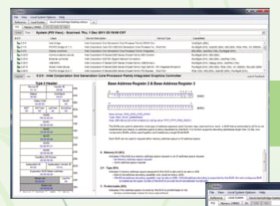
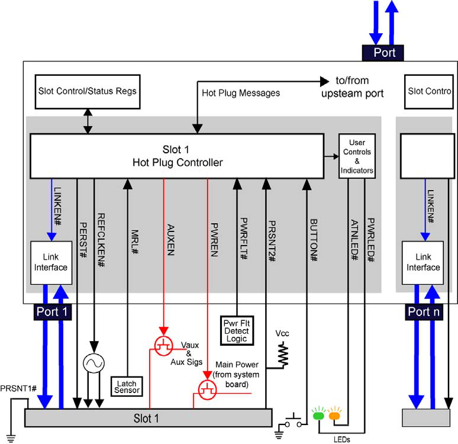
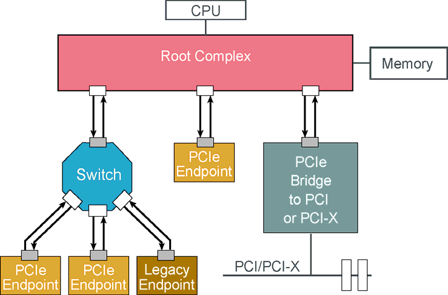
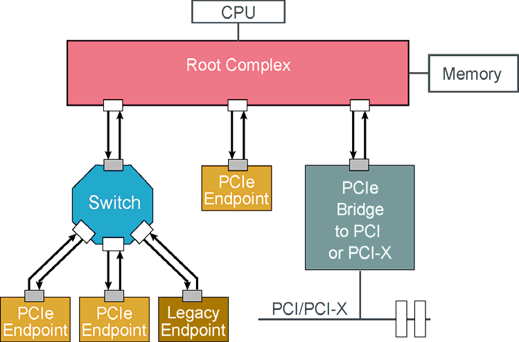
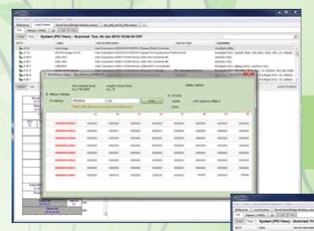
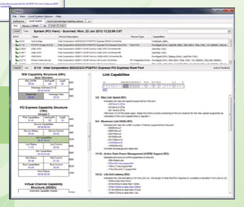
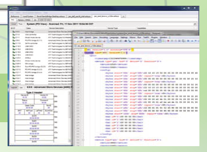

# 📘 第 99 章　附录 (Chapter 99. Appendices)

**MindShare PCI Express Technology 3.0 — Comprehensive Guide to Generations 1.x, 2.x and 3.0**

> 📁 **Source chunks**: `chunks/chunk0348.md` ... `chunks/chunk0356.md`
> 🎨 **Format**: 中英对照双语 · 中文灰底 (PCIe 6.2 Spec 模板)

---

## 📑 本章目录 (Table of Contents)

- [99.1 Appendices — 附录](#sec-99-1)
- [99.2 Appendices — 附录](#sec-99-2)
- [99.3 Appendices — 附录](#sec-99-3)
- [99.4 Appendices — 附录](#sec-99-4)
- [99.5 Appendices — 附录](#sec-99-5)
- [99.6 Appendices — 附录](#sec-99-6)
- [99.7 Appendices — 附录](#sec-99-7)
- [99.8 Appendices — 附录](#sec-99-8)
- [99.9 Appendices — 附录](#sec-99-9)

## 99.1 Appendices | 附录

<table>
<thead><tr><th width="50%">🇬🇧 English</th><th width="50%">🇨🇳 中文</th></tr></thead>
<tbody>
<tr>
<td width="50%">

Care should be taken when selecting an interposer as the probe circuitry varies by vendor and by requirements imposed by the max PCIe link
speed. For exam‐ ple, a Gen3 slot interposer should contain probe circuitry which allows the dynamic link training process to pass properly
through the probe. The LeCroy Gen3 slot interposer uses linear circuits to maintain the shape of the waveform as it passes through the
probe. This allows pre‐emphasis of the transmitter to be dynamically changed during link training while allowing the receiver to quan‐ tify
the impact of a new setting (either positive or negative impact).

_Figure A‐2: LeCroy PCI Express Slot Interposer x16_ 

LeCroy also offers a family of other dedicated interposers for form factors such as ExpressCard, XMC, Mini Card, Express Module, AMC, etc.
Some of these interposers are shown in Figure 3 on page 923. For a complete list of these inter‐ posers please refer to the LeCroy website:
www.lecroy.com as this list is con‐ stantly growing.

**A endix A pp** 

_Figure A‐3: LeCroy XMC, AMC, and Mini Card Interposers_ 

For debugging PCIe links which cannot benefit from a dedicated interposer, a mid‐bus probe shown in Figure 4 on page 923 is the next best
option. A mid‐bus probe involves placement of an industry standard probe geometry on the PCB. Each PCIe lane is routed to a pair of pads on
the footprint which can be probed using a mid‐bus probe head. These probes use spring pins or C clips for provid‐ ing solder free mechanical
attachment between the system under test and the protocol analyzer.

_Figure A‐4: LeCroy PCI Express Gen3 Mid‐Bus Probe_

</td>
<td width="50%">

在选择插接板 (interposer) 时需要谨慎,因为不同厂商以及最大 PCIe 链路速度所施加的不同要求会导致探针电路有所差异。例如,Gen3 插槽插接板应包含允许动态链路训练过程正确通过探针的探针电路。LeCroy Gen3
插槽插接板使用线性电路来保持波形在通过探针时的形状。这允许在链路训练期间动态改变发送端的预加重,同时允许接收端量化新设置的影响(无论是正面影响还是负面影响)。

_Figure A‐2: LeCroy PCI Express Slot Interposer x16_

LeCroy 还提供了一系列用于其他外形规格(如 ExpressCard、XMC、Mini Card、Express Module、AMC 等)的专用插接板。其中部分插接板如图 3 第 923 页所示。如需这些插接板的完整列表,请参阅 LeCroy
网站:www.lecroy.com,因为该列表在不断扩充。

**Appendix A**

_Figure A‐3: LeCroy XMC, AMC, and Mini Card Interposers_

对于无法使用专用插接板进行调试的 PCIe 链路,第 923 页图 4 所示的中段总线探针 (mid-bus probe) 是次优选择。中段总线探针涉及在 PCB 上放置一个业界标准的探针几何结构。每条 PCIe
通道被路由到封装上一对焊盘,可以使用中段总线探针头对其进行探测。这些探针使用弹簧针或 C 夹在被测系统与协议分析仪之间提供免焊接的机械连接。

_Figure A‐4: LeCroy PCI Express Gen3 Mid‐Bus Probe_

</td>
</tr>
<tr>
<td width="50%">

## **PCI Express Technology** 

As a last resort, a flying lead probe shown in Figure 5 on page 924 may be used to attach the protocol analyzer to the system under test.
This involves soldering a resistive tap circuit and connector pins to the PCIe traces. This circuitry is typ‐ ically soldered to the AC
coupling caps of the PCIe link as they are often the only place to access the traces. Once the probe circuitry is soldered to the PCB, the
analyzer probe can be connected and removed as needed. This approach can be used on virtually any PCIe link, however the robustness of the
connection is limited by the skill of the technician adding the probe.

_Figure A‐5: LeCroy PCI Express Gen2 Flying Lead Probe_

</td>
<td width="50%">

## **PCI Express Technology**

作为最后手段,可以使用第 924 页图 5 所示的飞线探针 (flying lead probe) 将协议分析仪连接到被测系统。这涉及将一个电阻式分流电路和连接器引脚焊接到 PCIe 走线上。由于 PCIe
链路的交流耦合电容通常是唯一可以接触到走线的地方,因此该电路通常焊接到交流耦合电容上。一旦探针电路焊接到 PCB 上,分析仪探针就可以根据需要进行连接和移除。这种方法几乎可以用于任何 PCIe 链路,但连接的稳固性受限于添加探针的技术人员的技能。

_Figure A‐5: LeCroy PCI Express Gen2 Flying Lead Probe_

</td>
</tr>
<tr>
<td width="50%">

## **Viewing Traffic Using the PETracer Application**

</td>
<td width="50%">

## **使用 PETracer 应用程序查看流量**

</td>
</tr>
<tr>
<td width="50%">

## **CATC Trace Viewer** 

The primary way to view PCI Express traffic with the LeCroy PETracer applica‐ tion is the CATC Trace view. This view takes each recorded
packet and breaks it down into different packet fields to highlight the important values contained in this packet. A mixture of colors and
text are used to visually categorize and explain the purpose of each packet. Errors are highlighted in red such as shown in Figure 6 on page
925. Warnings are highlighted in yellow making it easy to identify areas of traffic or fields in a packet which are non‐compliant.

**A endix A pp**

</td>
<td width="50%">

## **CATC Trace 查看器**

使用 LeCroy PETracer 应用程序查看 PCI Express 流量的主要方式是 CATC Trace
视图。该视图对每个记录的分组进行解析,将其分解为不同的分组字段,以突出该分组中包含的重要值。混合使用颜色和文本,以便直观地对每个分组进行分类并解释其用途。错误以红色高亮显示,如第 925 页图 6 所示。警告以黄色高亮显示,便于识别流量或分组字段中不符合规范的部分。

**Appendix A**

</td>
</tr>
<tr>
<td width="50%">

## _Figure A‐6: TLP Packet with ECRC Error_ 

In addition to decoding and visually breaking down each packet, a hierarchical display allows logical grouping of related packets. For
example, in “Link Level” mode, TLP packets are grouped with their respective ACK packet. Each TLP is identified as either implicitly or
explicitly ACK’d or NAK’d. An example of a ACK DLLP is shown in Figure 7 on page 925 along with the ACK’d TLP.

_Figure A‐7: “Link Level” Groups TLP Packets with their Link Layer Response_ 

In “Split‐Level” mode shown in Figure 8 on page 926, the CATC Trace view combines split transactions. For example, a single TLP read can be
grouped with 1 or more completion TLPs to logically show large data transfers as a sin‐ gle line in the trace. The amount of data, starting
address, as well as perfor‐ mance metrics are provided for each split level transaction. This allows the user to bypass the details of how
large memory transactions are broken into multiple TLP packets and rather focus on the contents of the data. If the user wishes to see the
details of the split transaction, the hierarchical display can show the link level and/or packet level breakdown of all the packets which
make up this split transaction. This “drill‐down” approach to traffic analysis allows the user to start from a high level view of what’s
happening on the bus and drill down only in the areas of traffic which are interesting to the user.

_Figure A‐8: “Split Level” Groups Completions with Associated Non‐Posted Request_ 

The CATC trace view also supports “Compact‐View” shown in Figure 9 on page 927. In this view, packets which are sent repeatedly are
collapsed into a single cell. This is very useful for collapsing Training Sequences or Flow Control Initialization packets. The software
algorithms which perform this collapse are smart enough to collapse any SKIP ordered sets as well. This creates a very compact view of the
link training process allowing the user to examine changes in the link training packets without scrolling through hundreds of packets.

**A endix A pp** 

_Figure A‐9: “Compact View” Collapses Related Packets for Easy Viewing of Link Training_

</td>
<td width="50%">

## _Figure A‐6: TLP Packet with ECRC Error_

除了对每个分组进行解码和直观分解之外,层次化显示还可以对相关分组进行逻辑分组。例如,在 "Link Level" (链路级) 模式下,TLP 分组与其对应的 ACK 分组被分组在一起。每个 TLP 被标识为隐式或显式 ACK 或 NAK。第 925 页图 7 显示了一个 ACK
DLLP 的示例以及被 ACK 的 TLP。

_Figure A‐7: "Link Level" Groups TLP Packets with their Link Layer Response_

在第 926 页图 8 所示的 "Split‐Level" (拆分级) 模式下,CATC Trace 视图组合了拆分事务。例如,单个 TLP 读操作可以与一个或多个完成 TLP
分组在一起,以便在跟踪中以单行逻辑地显示大数据传输。每个拆分级事务都提供数据量、起始地址以及性能指标。这允许用户绕过大型内存事务如何被分解为多个 TLP
分组的细节,而专注于数据的内容。如果用户希望查看拆分事务的细节,层次化显示可以显示构成该拆分事务的所有分组的链路级和/或分组级细分。这种 "drill-down" (向下钻取) 的流量分析方法允许用户从总线上的高级视图入手,仅在其感兴趣的流量区域进行深入分析。

</td>
</tr>
<tr>
<td width="50%">

## **LTSSM Graphs** 

To further enhance the “drill‐down” traffic viewing approach, the PETracer application includes an LTSSM graph view as shown in Figure 10 on
page 928. When this graph is invoked, the SW parses through the trace to find the link training sections and infers the state of the Link
Training and Status State Machine (LTSSM). The result is a graph which breaks down the LTSSM state transitions in a very high level view.
This graph allows the user to immediately see if the link went into a recovery state. If so, the user can easily identify which side of the
link initiated the recovery, how many times it entered recovery, and even if the link speed or link width decreased because of the recovery.

The LTSSM graph is also an active link back into the trace file. For example, if the user clicks on the entry to recovery, the trace file
will be navigated to that location in the trace file. This would allow the user to perhaps see if the recov‐ ery was caused by repeated NAKs
or for some other reason such as loss of block alignment.

**927** 

In short, when users are debugging issues related to link training, speed change, or low power state transitions, the LTSSM is affected. By
examining the LTSSM graph, the user can easily identify whether these link state changes occurred, where they occurred, and navigate
directly to them for faster analysis.

_Figure A‐10: LTSSM Graph Shows Link State Transitions Across the Trace_

</td>
<td width="50%">

## **PCI Express Technology**

_Figure A‐8: "Split Level" Groups Completions with Associated Non‐Posted Request_

CATC trace 视图还支持第 927 页图 9 所示的 "Compact‐View" (紧凑视图)。在该视图中,重复发送的分组被折叠为单个单元格。这对于折叠训练序列 (Training Sequences) 或流量控制初始化 (Flow Control
Initialization) 分组非常有用。执行此折叠的软件算法也足够智能,可以折叠任何 SKIP 有序集。这创建了一个非常紧凑的链路训练过程视图,允许用户检查链路训练分组中的变化,而不必滚动浏览数百个分组。

**Appendix A**

_Figure A‐9: "Compact View" Collapses Related Packets for Easy Viewing of Link Training_

</td>
</tr>
<tr>
<td width="50%">

## **Flow Control Credit Tracking** 

Flow control credit tracking is particularly problematic in PCI express. The flow control update packets do not show the number of credits
each endpoint has, rather it shows how many credits in total have been used. This means that each endpoint must keep a running counter of
credits for each type. There are a num‐ ber of scenarios where credits can be lost, and if this occurs, the link will eventu‐ ally be unable
to transmit data due to lack of credits. Such problems are very difficult to identify and debug.

The LeCroy PETracer application has a credit tracking SW tool shown in Figure 11 on page 929 to aid in this debug. If the trace contains
FC‐Init packets, it will walk through the trace and show the amount of remaining credits per virtual channel buffer type after each TLP and
FC‐Update.

FC‐Init packets are sent once after link training. Because of this, the PETracer application has the ability for the user to set initial
credit values at some point in

**A endix A pp** 

the trace and the SW will calculate the relative credit values for the remaining packets. Even if the initial credit values are set
improperly by the user, having the ability to see the relative credits is often enough to catch a flow control issue.

_Figure A‐11: Flow Control Credit Tracking_

</td>
<td width="50%">

## **LTSSM 图形**

为了进一步增强 "drill-down" 流量查看方法,PETracer 应用程序包含一个 LTSSM 图形视图,如第 928 页图 10 所示。当调用该图形时,软件会解析跟踪以查找链路训练部分,并推断链路训练和状态状态机 (LTSSM) 的状态。其结果是一个以非常高级的视图分解
LTSSM 状态转换的图形。该图形允许用户立即查看链路是否进入了恢复状态。如果进入恢复状态,用户可以轻松识别链路的哪一侧发起了恢复、进入恢复的次数,甚至是否由于恢复导致链路速度或链路宽度降低。

LTSSM 图形也是回到跟踪文件的活动链接。例如,如果用户单击进入恢复状态的条目,跟踪文件将导航到跟踪文件中该位置。这将允许用户查看恢复是否是由重复的 NAK 引起的,还是由于块对齐丢失等其他原因。

**927**

简而言之,当用户调试与链路训练、速率变化或低功耗状态转换相关的问题时,LTSSM 会受到影响。通过检查 LTSSM 图形,用户可以轻松识别这些链路状态变化是否发生、在何处发生,并直接导航到它们以加快分析速度。

_Figure A‐10: LTSSM Graph Shows Link State Transitions Across the Trace_

</td>
</tr>
<tr>
<td width="50%">

## **Bit Tracer** 

Some debug situations are not solved by a drill down approach to examining the traffic. For example if the link settings are incorrect, the
recording is often unreadable. What if a device is not properly scrambling the traffic, or the 10 bit symbols are sent in reverse order? For
this scenario, a tool which focuses on analysis between the waveform view of the scope and the CATC Trace view is needed. This is where the
BitTracer view shown in Figure 12 on page 930 is most powerful.

The BitTracer view allows the user to see raw traffic exactly as it was seen on the link. The software allows the user to see the traffic as
10 bit symbols, scrambled bytes, or unscrambled bytes. Invalid symbols and incorrect running disparity are highlighted in red.

</td>
<td width="50%">

## **流控制信用跟踪**

在 PCI Express
中,流控制信用跟踪特别具有挑战性。流控制更新分组并不显示每个端点拥有的信用数量,而是显示已使用的信用总数。这意味着每个端点必须为每种类型保持一个运行信用计数器。在许多场景中信用可能会丢失,如果发生这种情况,链路最终将由于缺乏信用而无法传输数据。这类问题非常难以识别和调试。

LeCroy PETracer 应用程序具有第 929 页图 11 所示的信用跟踪软件工具,以协助进行此调试。如果跟踪包含 FC-Init 分组,它将遍历跟踪并在每个 TLP 和 FC-Update 之后显示每个虚拟通道缓冲区类型的剩余信用量。

FC-Init 分组在链路训练之后发送一次。因此,PETracer 应用程序允许用户

**Appendix A**

在跟踪中的某个位置设置初始信用值,软件将计算剩余分组的相对信用值。即使用户设置初始信用值不正确,能够查看相对信用通常足以发现流控制问题。

_Figure A‐11: Flow Control Credit Tracking_

</td>
</tr>
<tr>
<td width="50%">

## **PCI Express Technology** 

To further determine what may be wrong with the traffic, the BitTracer tool adds a powerful list of post processing features which can
modify the traffic. For example, post capture; the user can invert the polarity of a given lane. Once applied, the user can see if the 10
bit symbols are now represented properly in the trace. If this cleans up the trace, it’s an indication that the recording settings for the
Analyzer hardware need to be changed.

_Figure A‐12: BitTracer View of Gen2 Traffic_ 

In addition, the lane ordering can be modified. This is useful for determining if lane reversal is causing a bad capture. If the traffic has
excessive lane to lane skew, the BitTracer software allows the user to re‐align the traffic. For Gen3 traf‐ fic, this skew can be applied 1
bit at a time. This essentially allows the user to fix the 130 bit block alignment post capture.

After applying changes to the data, all or just a portion of the data can be exported into the standard CATC Trace view for higher level
analysis. This workflow is very powerful for debugging low level issues during early bring‐ up. Let’s say for example, the user’s device
trains the link properly, and then suddenly applies polarity inversion to 1 lane. This is a clear violation of the spec and will cause the
link to retrain. If this traffic is captured with the BitTracer tool, the user could easily identify this as the problem. Additionally, the
portion of the traffic before and after the inversion could be exported into separate trace files and examined in the CATC Trace view.

**A endix A pp**

</td>
<td width="50%">

## **Bit Tracer**

某些调试情况无法通过对流量的向下钻取方法来解决。例如,如果链路设置不正确,记录通常无法读取。如果设备没有正确地对流量加扰,或者 10 bit 符号以相反的顺序发送,该怎么办?对于这种情况,需要一种专注于示波器的波形视图与 CATC Trace 视图之间分析的工具。这正是第 930
页图 12 所示的 BitTracer 视图最强大的地方。

BitTracer 视图允许用户查看链路上看到的原始流量。软件允许用户将流量视为 10 bit 符号、加扰字节或未加扰字节。无效符号和不正确的运行差异 (Running Disparity) 以红色高亮显示。

</td>
</tr>
<tr>
<td width="50%">

## **Analysis overview** 

As you can see, different traffic views can be beneficial for debugging certain failure conditions. LeCroy supports import of PCIe traffic
from many sources into its highly sophisticated PEtracer software. Whether the source is RTL simu‐ lation, an oscilloscope capture, or a
dedicated protocol analyzer capture, PETracer has a rich set of traffic views and reports which allow the user to best understand the health
and state of their PCIe link.

</td>
<td width="50%">

## **PCI Express Technology**

为了进一步确定流量可能出现的问题,BitTracer 工具添加了一系列强大的后处理功能,可以修改流量。例如,在采集后,用户可以反转给定通道的极性。一旦应用,用户可以查看 10 bit 符号现在是否在跟踪中正确表示。如果这清理了跟踪,则表明分析仪硬件的记录设置需要更改。

_Figure A‐12: BitTracer View of Gen2 Traffic_

此外,还可以修改通道排序。这对于确定通道反转是否导致不良捕获非常有用。如果流量存在过大的通道间偏移 (skew),BitTracer 软件允许用户重新对齐流量。对于 Gen3 流量,该偏移可以一次 1 bit 地应用。这实质上允许用户在采集后修复 130 bit 块对齐。

在对数据应用更改后,所有或仅一部分数据可以导出到标准 CATC Trace 视图中,以进行更高级别的分析。该工作流对于在早期 bring-up 期间调试低级问题非常强大。举例来说,假设用户的设备正确训练了链路,然后突然对 1
个通道应用极性反转。这明显违反规范,将导致链路重新训练。如果使用 BitTracer 工具捕获该流量,用户可以轻松将此识别为问题。此外,反转前后的流量部分可以导出到单独的跟踪文件中,并在 CATC Trace 视图中进行检查。

**Appendix A**

</td>
</tr>
<tr>
<td width="50%">

## **Traffic generation**

</td>
<td width="50%">

## **分析概述**

如您所见,不同的流量视图对于调试某些故障条件是有益的。LeCroy 支持从许多来源将 PCIe 流量导入其高度复杂的 PEtracer 软件。无论是 RTL 仿真、示波器捕获还是专用协议分析仪捕获,PETracer 都拥有一套丰富的流量视图和报告,允许用户最好地了解其 PCIe
链路的健康状况和状态。

</td>
</tr>
<tr>
<td width="50%">

## **Pre-Silicon** 

For stimulating a PCI Express endpoint in simulation, dedicated verification IP can be purchased from a number of vendors. This IP will test
for basic function‐ ality as well as perform a number of PCIe compliance checks. It is certainly in the interest of the ASIC developer to
find and fix these issues before tapeout, and this is where the value of these tools comes from. If the PCIe design is implemented in an
FPGA where mask costs are not an issue, it may be more cost effective to perform these compliance checks in hardware with a dedicated
traffic generation tool such as the LeCroy PETrainer or LeCroy PTC card.

</td>
<td width="50%">

## **流量生成**

</td>
</tr>
<tr>
<td width="50%">

## **Post-Silicon** 

## **Exerciser Card**

</td>
<td width="50%">

## **流片前 (Pre-Silicon)**

为了在仿真中激励 PCI Express 端点,可以从许多供应商处购买专用验证 IP。该 IP 将测试基本功能并执行许多 PCIe 一致性检查。ASIC 开发人员当然有兴趣在 tapeout 之前发现并修复这些问题,这正是这些工具的价值所在。如果 PCIe 设计在 FPGA
中实现,其中掩模成本不是问题,那么使用 LeCroy PETrainer 或 LeCroy PTC 卡等专用流量生成工具在硬件中执行这些一致性检查可能更具成本效益。

</td>
</tr>
<tr>
<td width="50%">

</td>
<td width="50%">

## **流片后 (Post-Silicon)**

## **Exerciser 卡**

</td>
</tr>

</tbody>
</table>

[⬆️ 返回目录](#本章目录-table-of-contents)

---

## 99.2 Appendices | 附录

<table>
<thead><tr><th width="50%">🇬🇧 English</th><th width="50%">🇨🇳 中文</th></tr></thead>
<tbody>
<tr>
<td width="50%">

To thoroughly test the PCIe compliance and overall robustness of a PCIe design post‐silicon, a dedicated Exerciser card such as the LeCroy
PETrainer shown in Figure 13 on page 932 is used. This card allows the user to generate a wide range of compliant and non‐compliant traffic.
For example, if you place your PCIe card in a standard motherboard, you may be limited in the size of the TLP packets it will see. A
dedicated Exerciser card can generate TLP packets across the entire legal range of packet sizes.

Secondly, if you would like to test that a card issues a NAK in response to a TLP with a bad LCRC, it would not possible with the card
connected to compliant devices. They do not transmit bad packets. An Exerciser card can create a TLP with a bad LCRC, improper header
values, or end the TLP with an EDB symbol.

</td>
<td width="50%">

为了彻底测试 PCIe 设计的 PCIe 合规性和整体稳健性，使用了专用 Exerciser 卡，如图 13 所示（在第 932 页）的 LeCroy PETrainer。该卡允许用户生成各种合规和不合规的流量。例如，如果将 PCIe 卡放在标准主板中，则可能会限制它将看到的
TLP 数据包的大小。专用 Exerciser 卡可以跨数据包大小的整个合法范围生成 TLP 数据包。

其次，如果您想测试卡是否在响应具有坏 LCRC 的 TLP 时发出 NAK，则不可能将卡连接到合规设备。它们不传输坏数据包。Exerciser 卡可以创建具有坏 LCRC 的 TLP、不正确的头值，或以 EDB 符号结束 TLP。

如果您想测试您的卡在收到 NAK 时是否正确重放数据包，则可以使用 Exerciser 完成此操作。也许您想向某个 TLP 连续发出 4 个 NAK，以便启动链路恢复。此行为非常容易编程到 exerciser 卡中。

测试用例和失败方案的数量仅受您编写的脚本数量的限制。一旦编写，这些脚本可以重复用于测试您设计的新版本。分析仪 SW 可以记录这些会话并使用脚本确定响应是否正确。许多 LeCroy 客户已使用这些工具创建了大型回归测试库。

_图 A-13：LeCroy Gen3 PETrainer Exerciser 卡_

</td>
</tr>
<tr>
<td width="50%">

## **PCI Express Technology** 

If you would like to test that your card properly replay’s a packet when it receives a NAK, this can be done with an Exerciser. Perhaps you
would like to issue 4 NAKs in a row to a certain TLP so that link recovery is initiated. This behavior is all quite easy to program into the
exerciser card.

The number of test cases and failure scenarios is limited only by the number of scripts you write. Once written, these scripts can be
re‐used for testing new ver‐ sions of your design. The Analyzer SW can record these sessions and use script‐ ing to determine if the
response was correct. A number of LeCroy customers have created large libraries of regression tests using these tools.

_Figure A‐13: LeCroy Gen3 PETrainer Exerciser Card_

</td>
<td width="50%">

## **PTC 卡**

PCI SIG 已发布了一份特定的合规性测试列表，所有"合规"设备都必须通过这些测试。LeCroy 协议测试卡 (PTC) 是在 PCI SIG 合规性研讨会上执行这些测试所使用的硬件。用户可以从 LeCroy 购买 PTC 卡，如图 14 所示（在第 933
页），以预先测试其设备，确保它们将通过 PCI SIG 合规性测试。

LeCroy PTC 用于在 x1 链路宽度下测试根复合体或端点设备。链路速度可以是 Gen1 或 Gen2。

**A endix A pp**

_图 A-14：LeCroy Gen2 协议测试卡 (PTC)_

</td>
</tr>
<tr>
<td width="50%">

## **PTC card** 

The PCI SIG has published a specific list of compliance tests which all “Compli‐ ant” devices must pass. The LeCroy Protocol Test Card (PTC)
is the hardware used to perform these tests at the PCI SIG Compliance workshops. Users can purchase a PTC card from LeCroy shown in Figure
14 on page 933 to pre‐test their devices to ensure they will pass PCI SIG compliance testing.

The LeCroy PTC is used to test root complex or endpoint devices at x1 link widths. Link speeds can be either Gen1 or Gen2. 

**A endix A pp** 

_Figure A‐14: LeCroy Gen2 Protocol Test Card (PTC)_

</td>
<td width="50%">

## **结论**

如今，PCIe 开发人员可以使用各种工具来帮助调试其 PCIe 设计。由于 PCIe 标准的广泛采用，许多这些工具是专门为 PCIe 调试而设计的，包括解决许多 PCIe 设备面临的挑战的功能。

有关 LeCroy PCIe 工具产品的更多信息，请访问 LeCroy 网站 www.lecroy.com

</td>
</tr>
<tr>
<td width="50%">

## **Conclusion** 

Today, the PCIe developer has access to a wide range of tools to help debug their PCIe design. Thanks to the wide adoption of the PCIe
standard, many of these tools are designed specifically for PCIe debug and include features which address the challenges many PCIe devices
face.

For more information about the LeCroy PCIe tool offerings, please visit the LeCroy website www.lecroy.com

</td>
<td width="50%">

## _**附录 B：**_

</td>
</tr>
<tr>
<td width="50%">

## _**Appendix B:**_

</td>
<td width="50%">

## _**PCI Express 的市场与应用**_

Akber Kazmi（PLX Technology, Inc. 高级市场总监）

</td>
</tr>
<tr>
<td width="50%">

## _**Markets & Applications for PCI Express**_ 

Akber Kazmi (Senior Director Marketing, PLX Technology, Inc.)

</td>
<td width="50%">

## **简介**

自 20 世纪 90 年代初定义以来，PCI 已成为计算机历史上最成功的互连技术。最初用于个人计算机系统，PCI 架构已扩展到几乎每个计算平台类别，包括服务器、存储、通信和广泛的嵌入式控制应用。最重要的是，PCI 总线速度和宽度的每次进步都提供了向后兼容性。

尽管 PCI 架构如此成功，但多分支、并行、共享总线互连技术可以实现的目标是有限的。许多问题 — 时钟偏移、高引脚数、印刷电路板 (PCB) 中的走线布线限制、带宽和延迟要求、物理可扩展性以及需要在系统中支持各种应用的服务质量 (QoS) — 导致定义了 PCI Expressª
(PCIe) 架构。

PCIe 是 PCI 的天然继任者，开发用于提供先进的、高速串行互连技术的优势以及基于分层的分组架构，但保持与大型 PCI 软件基础的向后兼容性。关键目标是为各种未来平台提供优化的通用互连解决方案，包括桌面、服务器、工作站、存储、通信和嵌入式系统。

PCIe 于 2001 年推出后，已经历了三代增强。在第一代 (Gen1) 中，信号速率设定为 2.5 GT/s，后来增强到 5 GT/s (Gen2)，最终达到 8 GT/s (Gen3)。PCIe 规范允许将 2、4、8、12、16 或 32
条通道组合成单个端口。但是，今天可用的产品不支持 12 和 32 通道宽度的端口。重要的是，所有 PCIe Gen2 和 Gen3 设备都需要在速度上向后兼容上一代。

业界已经推出并完全采用了 PCIe Gen3 产品，同时 PCI 特别兴趣小组 (PCI-SIG) 正在分析 Gen4 的信号速率（速度）。PCIe Gen4 的目标是将 Gen3 的速度加倍，达到 16 GT/s。

PCIe 交换机有多种尺寸，从 3 到 96 条通道，从 3 到 24 个端口，其中每个端口可以是 1、2、4、8 或 16 条通道宽。Gen3 单通道将提供 1GB/s 的带宽，而 16 通道端口在每个方向上提供 16GB 的带宽。此外，PCIe 交换机供应商（如 PLX
Technology）已为其产品添加了 PCIe 规范中未包含的功能和改进，使它们能够区分其产品并为系统设计人员增加价值。这些功能提供了易用性、高性能、故障转移、错误检测、错误隔离和现场可升级性。

片上功能包括非透明 (NT) 桥接、对等通信、热插拔、直接内存访问 (DMA) 和错误检查/恢复。此外，调试功能（如数据包生成、接收器眼图测量、流量监控和实时流量中的错误注入）为设计人员提供了重要价值，从而实现早期系统启动。这些功能中的许多还可用于运行时性能改进和监控。

下一代 PCIe 交换机中包含的功能包括：

- **NT 桥接：** 允许两个主机/CPU 连接到同一 PCIe 交换机，同时在电气和逻辑上隔离。NT 桥接功能广泛用于需要隔离两个活动 CPU 或两个 CPU（其中一个活动而另一个被动）的系统。NT 功能允许两个主机 CPU
之间交换心跳，以便在其中任何一个发生故障时实现故障转移。

**第：附录 B：PCI 的市场与应用**

- **DMA：** PCIe 交换机中的片上 DMA 控制器为设计人员提供了重要价值，因为它使他们能够节省 CPU 周期，以便在对等方与 CPU 之间以及 I/O 之间移动数据。CPU 在移动数据方面的减少工作量提高了系统的整体性能，因为节省的 CPU
周期可用于运行应用程序而不是管理数据 I/O。

- **错误隔离：** 用户可以对某些错误事件编程触发器并由交换机响应。交换机的响应也可以编程为忽略、触发主机中断、关闭有错误的端口或关闭整个交换机。

- **数据包生成：** 通常，在不使用昂贵的分组生成器设备的情况下生成饱和 PCIe 端口的流量是困难的。PCIe 交换机现在具有饱和任何 PCIe 端口与所需流量（如事务层数据包）的能力，以检查系统的性能和稳健性。

</td>
</tr>
<tr>
<td width="50%">

## **Introduction** 

Since its definition in the early 1990s, PCI has emerged as the most successful interconnect technology ever used in computers. Originally
intended for per‐ sonal computer systems, the PCI architecture has expanded into virtually every computing platform category, including
servers, storage, communications, and a wide range of embedded control applications. Most important, each advance‐ ment in PCI bus speed and
width provided backward compatibility.

As successful as the PCI architecture was, there was a limit to what could be accomplished with a multi‐drop, parallel, shared‐bus
interconnect technology. A number of issues ‐‐ clock skew, high pin count, trace routing restrictions in printed circuit boards (PCB),
bandwidth and latency requirements, physical scalability, and the need to support Quality of Service (QoS) within a system for a wide
variety of applications ‐‐ lead to the definition of the PCI Expressª (PCIe) architecture.

PCIe was the natural successor to PCI, and was developed to provide the advantages of a state‐of‐the‐art, high‐speed serial interconnect
technology with a packet‐based layered architecture, but maintain backward‐compatibility with the large PCI software infrastructure. The key
goal was to provide an opti‐ mized, universal interconnect solution for a wide variety of future platforms, including desktop, server,
workstation, storage, communications, and embed‐ ded systems.

</td>
<td width="50%">

## **PCI Express IO 虚拟化解决方案**

PCIe 技术最初被定义为单主机互连技术，但在过去几年中，已经开发了使 PCIe 适合多主机系统的新标准，作为数据中心和企业 IT 应用程序的交换结构技术。x86 CPU 和服务器平台上本地 PCIe 接口（端口）的存在使设计人员能够将 PCIe
用作中小型服务器集群的背板和结构技术。

2007 年，PCI-SIG 发布了单根 I/O 虚拟化 (SR-IOV) 规范，该规范使网络接口卡或主机总线适配器等单个物理资源能够在运行于一个主机上的多个虚拟机之间共享。这是在不同应用程序或虚拟机之间共享资源或 I/O 设备的最简单方法。

PCI-SIG 随后于 2008 年完成了其多根 I/O 虚拟化 (MR-IOV) 规范的工作，该规范将 PCIe 技术的使用从单根域扩展到多根域。MR-IOV 规范允许多个主机和多个系统映像同时使用单个 I/O 设备，如图 0-1 所示（在第 938
页）。此插图显示了一个多主机环境，其中具有 MR-IOV 功能的 NIC 和 HBA 通过 MR-IOV 交换机在多个服务器或虚拟机之间共享。

_图 0-1：MR-IOV 交换机使用_

为了实现 MR-IOV 规范，需要开发系统的三个组件 — MR-IOV PCIe 交换机、端点和管理软件。所有这三个组件必须同时可用并无缝工作。不幸的是，在规范开发四年后，没有一个硅供应商具有 MR-IOV 功能的 PCIe 交换机或端点。PCIe
交换机供应商通过供应商定义的功能并利用可用的 SR-IOV 端点提供为 MR-IOV 定义的能力的解决方案。

</td>
</tr>
<tr>
<td width="50%">

## **PCI Express 3.0 Technology** 

After its introduction in 2001, PCIe has gone through three generations of enhancements. In the first generation (Gen1), signaling rate was
set at 2.5 GT/s and later enhanced to 5 GT/s (Gen2) and eventually 8 GT/s (Gen3). The PCIe specification allows combining of 2, 4, 8, 12, 16
or 32 lanes into a single port. However, products available today do not support 12‐ and 32‐lane‐wide ports. It is important to note that
all PCIe Gen2 and Gen3 devices are required to be backward‐compatible in speed with that of the previous generation.

The industry has launched and has fully embraced PCIe Gen3 products, while at the same time the PCI Special Interest Group (PCI‐SIG) is
analyzing signaling rate (speed) for Gen4. The goal for PCIe Gen4 is to double the speed of Gen3, to 16 GT/s.

PCIe switches are available in an array of sizes, ranging from 3 to 96 lanes, and 3 to 24 ports where each port could be one, two, four,
eight or 16 lanes wide. A Gen3 single lane would provide 1GB/s of bandwidth, while a 16‐lane port offers 16GB bandwidth in each direction.
Additionally, PCIe switch vendors, such as PLX Technology, have added features and enhancement to their products that are not part of PCIe
specifications but enable them to differentiate their products and add value for the system designers. These features deliver ease of use,
higher performance, fail‐over, error detection, error isolation, and field‐upgrad‐ ability.

On‐chip features include non‐transparent (NT) bridging, peer‐to‐peer commu‐ nication, Hot‐Plug, direct memory access (DMA), and error
checking/recovery. Additionally debug features such as packet generation, receiver‐eye measure‐ ment, traffic monitoring, and error
injection in live traffic offer significant value to the designers, enabling early system bring‐up. Many of these features can also be used
for run‐time performance improvements and monitoring.

Features included in next generation of PCIe switches are: 

- **NT bridging:** Allows two hosts/CPUs to be connected to the same PCIe switch while electrically and logically isolated. The NT bridging
functions is broadly used in systems requiring isolation of two active CPUs or two CPUs where one is active and other is passive. The NT
functionality allows the exchange of heartbeat between the two host CPUs to enable fail‐over if one of them fails.

**Chapter : Appendix B: Markets & Applications for PCI** 

- **DMA:** An on‐chip DMA controller in a PCIe switch offers significant value to the designers as it enables them to spare CPU cycles to
move data between peers and the CPU to/from I/Os. The CPU’s reduced effort in mov‐ ing data boosts overall performance of the system as the
spared CPU cycles can be used to run applications rather than managing data I/O.

- **Error Isolation:** Users can program triggers for certain error events and response by the switch. The response of switch can also be
programmed to ignore, trigger a host interrupt, bring the port with errors down, or bring the entire switch down.

- **Packet Generation:** Generally, it is difficult to generate traffic that saturates a PCIe port without the use of expensive packet
generator equipment. PCIe switches now have the ability to saturate any PCIe port with desired traffic, such as transaction layer packets,
to check the performance and robustness of the system.

</td>
<td width="50%">

## **多根 (MR) PCIe 交换机解决方案**

PCIe 交换机供应商已创建了通过非透明桥接和多根 (MR) 功能提供多主机功能实现的交换机。这些 MR 交换机允许多个主机连接到单个交换设备，该设备可以在用户控制下进行划分，以使每个主机将连接到交换机的所需的下游端口集。

在 MR 交换机中，其中一个主机充当主站并将 I/O 分配给其他主机端口。每个主机独立于其他主机运行，并控制其域中的下游设备。图 0-2（在第 939 页）说明了 MR 交换机的内部架构，其中特定的下游端口集在管理控制下与特定的主机端口相关联。

**第：附录 B：PCI 的市场与应用**

_图 0-2：MR-IOV 交换机内部架构_

</td>
</tr>
<tr>
<td width="50%">

## **PCI Express IO Virtualization Solutions** 

The PCIe technology was initially defined as a single‐host interconnect technol‐ ogy but in last few years new standards have been developed
that make PCIe suitable for multi‐host systems as a switch fabric technology for data centers and enterprise IT applications. The presence
of native PCIe interfaces (ports) on x86 CPUs and servers platforms has enabled designers to use PCIe as backplane and fabric technology for
small to mid‐size server clusters.

In 2007, the PCI‐SIG released the Single‐Root I/O Virtualization (SR‐IOV) speci‐ fication that enables sharing of a single physical resource
such as a network interface card or host bus adapter in a PCIe system among multiple virtual machines running on one host. This is the
simplest approach to sharing resources or I/O devices among different applications or virtual machines.

The PCI‐SIG followed by completing, in 2008, work on its Multi‐Root I/O Virtu‐ alization (MR‐IOV) specification that extends the use of PCIe
technology from a single‐root domain to a multi‐root domain. The MR‐IOV specification enables the use of a single I/O device by multiple
hosts and multiple system images simultaneously, as illustrated in Figure 0‐1 on page 938. This illustration shows a multi‐host environment
where MR‐IOV capable NIC and HBA are shared across multiple servers or virtual machines via an MR‐IOV switch.

_Figure 0‐1: MR‐IOV Switch Usage_ 

In order to implement MR‐IOV specifications, three components of the system need to be developed – MR‐IOV PCIe switches, endpoints, and
management software. All three of these components must be available simultaneously and work seamlessly. Unfortunately, four years after the
specification was devel‐ oped, there is not a single silicon vendor that has MR‐IOV capable PCIe switch or end‐points. PCIe switch vendors
are offering solutions that provide capabili‐ ties defined for MR‐IOV through vendor‐defined features and utilizing avail‐ able SR‐IOV
end‐points.

</td>
<td width="50%">

## **超越芯片到芯片互连的 PCIe**

在 PCIe 部署的早期，该技术用作芯片到芯片互连，但现在 CPU、芯片组和 IO 上的 PCIe 接口的广泛可用性以及这些组件的广泛采用正在将其推向传统应用之外。在新一代应用中，PCIe 用于系统背板、交换结构、布线系统、存储/IO 扩展、IO 虚拟化、高性能计算 (HPC)
和服务器集群。图 0-3（在第 940 页）说明了在数据中心中 PCIe 用于高性能计算应用程序，其中机架中的服务器通过机架顶部 (TOR) PCIe 交换结构框进行集群。TOR PCIe 交换机可以通过以太网连接到网络，并通过 PCIe 链路连接到本地存储和计算资源。

盒外的 PCIe 连接取决于行业领导者以较低成本推出的 PCIe 铜缆或光缆。PCIe TOR 结构适用于服务器/计算集群，并可能取代 InfiniBand 成为 PCIe 作为结构增长时的生态系统。

_图 0-3：用于 HPC 应用程序的数据中心中的 PCIe_

## **SSD/存储 IO 扩展框**

</td>
</tr>
<tr>
<td width="50%">

## **Multi-Root (MR) PCIe Switch Solution** 

PCIe switch vendors have created switches that offer implementation of multi‐ host function through non‐transparent bridging and multi‐root
(MR) capabili‐ ties. These MR switches allow multiple hosts to be connected to a single switch‐ ing device, which can be portioned under
user control in such a way that each host will be connected to a desired set of downstream ports of the switch.

In the MR switches, one of the hosts acts as the master and assigns I/Os to other host ports. Each host operates independently of other
hosts and controls down‐ stream devices in its domain. Figure 0‐2 on page 939 illustrates the internal architecture of an MR switch, in
which particular sets of downstream ports are associated to particular host ports under management control.

**Chapter : Appendix B: Markets & Applications for PCI** 

_Figure 0‐2: MR‐IOV Switch Internal Architecture_

</td>
<td width="50%">

</td>
</tr>
<tr>
<td width="50%">

## **PCIe Beyond Chip-to-Chip Interconnect** 

In early stages of PCIe deployments the technology was used as a chip‐to‐chip interconnect but now broad availability of PCIe interfaces on
CPUs, chipsets and IOs and broad adoption of these components is pushing it beyond tradi‐ tional applications. In a new generation of
applications, PCIe is used in system backplanes, switch fabrics, cabling systems, storage/IO expansion, IO virtual‐ ization,
high‐performance computing (HPC), and server clusters. Figure 0‐3 on page 940 illustrates use of PCIe in a data center for high performance
compute application where servers in a rack are clustered through a top‐of‐rack (TOR) PCIe switch fabric box. The TOR PCIe switch can be
connected to the network through Ethernet and to local storage and compute resources through PCIe links.

PCIe connections out‐side the box depend on PCIe copper or optical cables that the leader in the industry are introducing at lower cost. The
PCIe TOR fabric is suitable for server/compute clustering and may replace InfiniBand as the eco‐ system for PCIe as fabric grows.

</td>
<td width="50%">

</td>
</tr>
<tr>
<td width="50%">

## **PCI Express 3.0 Technology** 

_Figure 0‐3: PCIe in a Data Center for HPC Applications_ 

## **SSD/Storage IO Expansion Boxes**

</td>
<td width="50%">

</td>
</tr>

</tbody>
</table>

[⬆️ 返回目录](#本章目录-table-of-contents)

---

## 99.3 Appendices | 附录

<table>
<thead><tr><th width="50%">🇬🇧 English</th><th width="50%">🇨🇳 中文</th></tr></thead>
<tbody>
<tr>
<td width="50%">

Recently, the industry has converged towards PCIe as the unified interconnect technology for enterprise storage and solid state drive (SSD)
applications. The NVM HCI, an industry consortium, has released a specification called NVM Express (NVMe) that uses PCIe to provide the
bandwidth needed for SSD applications. Additionally, a T10 committee has embarked on defining SCSI over PCIe (SOP) protocol to take
advantage of PCIe technology capabilities for high‐performance storage applications. Furthermore, the SATA consortium recently announced
that it would use PCIe as the interconnect for its next‐gen‐ eration SATA specification called SATA Express (SATAe).

</td>
<td width="50%">

最近，业界已融合到 PCIe 作为企业存储和固态驱动器 (SSD) 应用程序的统一互连技术。NVM HCI（一个行业联盟）发布了一个名为 NVM Express (NVMe) 的规范，该规范使用 PCIe 提供 SSD 应用程序所需的带宽。此外，T10 委员会已开始定义 SCSI
over PCIe (SOP) 协议，以利用 PCIe 技术能力实现高性能存储应用程序。此外，SATA 联盟最近宣布将 PCIe 用作其下一代 SATA 规范（称为 SATA Express (SATAe)）的互连。

</td>
</tr>
<tr>
<td width="50%">

## **PCIe in SSD Modules for Servers** 

Traditionally, enterprise SSD modules have shipped with SAS, SATA and Fibre Channel interfaces but due to the above‐mentioned developments,
a large majority of SSD controller, module and system suppliers have introduced products with PCIe interfaces. Most SSD controllers peak
their performance and capacity due to a heavy load of managing flash. In high‐performance applica‐ tions, multiple SSD controllers (or
ASICs) are used and aggregated through a PCIe switch. Figure 0‐4 on page 941 shows a basic usage of a PCIe switch in an SSD add‐in card that
applies to any card or module form factor.

**Chapter : Appendix B: Markets & Applications for PCI** 

_Figure 0‐4: PCIe Switch Application in an SSD Add‐In Card_ 

For large data center applications, the SSD add‐in cards are installed in server motherboards as shown in Figure 0‐5 on page 941 and IO
expansion boxes (Fig‐ ure 6) aggregated through PCIe switches. In server motherboard designs, PCIe switches are utilized to create more
ports/slots that accommodate additional SSD modules to support the application’s needs.

_Figure 0‐5: Server Motherboard Use PCIe Switches_ 

In addition to providing connectivity, PCIe switches can be used for providing redundancy and failover through NT bridging and MR
functionality. The MR switches support 1+N failover capability, in which one server/host communi‐ cates with N number of servers to check
the heartbeat and initiate a failover if one of them fails. One of the servers illustrated in Figure 0‐6 on page 942 can be used as backup
for the others in 1+N failover scheme.

_Figure 0‐6: Server Failover in 1 + N Failover Scheme_

</td>
<td width="50%">

## **服务器 SSD 模块中的 PCIe**

传统上，企业 SSD 模块附带 SAS、SATA 和光纤通道接口，但由于上述发展，大多数 SSD 控制器、模块和系统供应商已推出具有 PCIe 接口的产品。由于管理闪存的繁重负载，大多数 SSD 控制器达到其性能和容量峰值。在高性能应用程序中，使用多个 SSD 控制器（或
ASIC）并通过 PCIe 交换机聚合。图 0-4（在第 941 页）显示了 PCIe 交换机在 SSD 附加卡中的基本用法，该用法适用于任何卡或模块形态因素。

**第：附录 B：PCI 的市场与应用**

_图 0-4：SSD 附加卡中的 PCIe 交换机应用程序_

对于大型数据中心应用程序，SSD 附加卡安装在服务器主板中，如图 0-5（在第 941 页）以及通过 PCIe 交换机聚合的 IO 扩展框（图 6）所示。在服务器主板设计中，PCIe 交换机用于创建更多端口/插槽，以适应其他 SSD 模块以支持应用程序的需求。

_图 0-5：服务器主板使用 PCIe 交换机_

除提供连接外，PCIe 交换机还可用于通过 NT 桥接和 MR 功能提供冗余和故障转移。MR 交换机支持 1+N 故障转移能力，其中一个服务器/主机与 N 个服务器通信以检查心跳并在其中一个发生故障时启动故障转移。图 0-6（在第 942 页）中所示的服务器之一可以在 1+N
故障转移方案中用作其他服务器的备份。

_图 0-6：1+N 故障转移方案中的服务器故障转移_

</td>
</tr>
<tr>
<td width="50%">

## **Conclusion** 

PCIe interconnect technology has become a serious contender for many high‐ end applications beyond chip–to‐chip interconnect and is expected
to be uti‐ lized in external I/O sharing, server clustering, I/O expansion and TOR switch‐ ing. The current 8 GT/s and next‐generation
(Gen4) 16 GT/s line rates, the ability to aggregate multiple lanes in single high‐bandwidth ports, fail‐over capabili‐ ties, embedded DMA
for data transfers, and IO sharing/virtualization provide capabilities that are at least equal to, if not superior to, interfaces such as
Infini‐ Band and Ethernet.

</td>
<td width="50%">

## **结论**

PCIe 互连技术已成为超越芯片到芯片互连的许多高端应用程序的有力竞争者，并有望用于外部 I/O 共享、服务器集群、I/O 扩展和 TOR 交换。当前的 8 GT/s 和下一代 (Gen4) 16 GT/s
线路速率、在单个高带宽端口中聚合多个通道的能力、故障转移能力、用于数据传输的嵌入式 DMA 以及 IO 共享/虚拟化提供了至少等于（如果不优于）InfiniBand 和以太网等接口的能力。

</td>
</tr>
<tr>
<td width="50%">

## _**Appendix C:**_ 

_**Implementing Intelligent Adapters and Multi‐Host Systems With PCI Express Technology**_

</td>
<td width="50%">

## _**附录 C：**_

_**使用 PCI Express 技术实现智能适配器和多主机系统**_

</td>
</tr>
<tr>
<td width="50%">

## **Jack Regula, Danny Chi, Tim Canepa (PLX Technology, Inc. )**

</td>
<td width="50%">

## **Jack Regula、Danny Chi、Tim Canepa（PLX Technology, Inc.）**

</td>
</tr>
<tr>
<td width="50%">

## **Introduction** 

Intelligent adapters, host failover mechanisms and multiprocessor systems are three usage models that are common today, and expected to
become more prev‐ alent as market requirements for next generation systems. Despite the fact that each of these was developed in response to
completely different market demands, all share the common requirement that systems that utilize them require multiple processors to co‐exist
within the system. This appendix out‐ lines how PCI Express can address these needs through non‐transparent bridg‐ ing.

Because of the widespread popularity of systems using intelligent adapters, host failover and multihost technologies, PCI Express silicon
vendors must pro‐ vide a means to support them. This is actually a relatively low risk endeavor; given that PCI Express is software
compatible with PCI, and PCI systems have long implemented distributed processing. The most obvious approach, and the one that PLX espouses,
is to emulate the most popular implementation used in the PCI space for PCI Express. This strategy allows system designers to use not only a
familiar implementation but one that is a proven methodology, and one

</td>
<td width="50%">

## **简介**

智能适配器、主机故障转移机制和多处理器系统是当今常见的三种使用模型，并有望随着下一代系统的市场需求变得更加普遍。尽管每个模型都是为了响应完全不同的市场需求而开发的，但它们都有一个共同的要求，即利用它们的系统需要在系统内共存多个处理器。本附录概述了 PCI Express
如何通过非透明桥接 (non-transparent bridging) 来满足这些需求。

由于使用智能适配器、主机故障转移和多主机技术的系统的广泛普及，PCI Express 硅供应商必须提供一种支持它们的手段。这实际上是一项相对低风险的努力；鉴于 PCI Express 与 PCI 软件兼容，而 PCI 系统早已实现了分布式处理。最明显的方法，也是 PLX
所倡导的方法，是为 PCI Express 模拟 PCI 空间中使用最广泛的实现。此策略允许系统设计人员不仅使用熟悉的实现，而且使用经过验证的方法，

并在他们从 PCI 迁移到 PCI Express 时可以提供重要的软件重用。本白皮书概述了多处理器 PCI Express 系统将如何使用 PCI 范例中建立的行业标准实践来实现。但是，首先，我们将定义不同的使用模型，并回顾 PCI
社区为满足这些需求而开发机制的成功努力。最后，我们将介绍 PCI Express 系统如何利用非透明桥接来为这些类型的系统提供所需的功能。

</td>
</tr>
<tr>
<td width="50%">

## **PCI Express 3.0 Technology** 

that can provide significant software reuse as they migrate from PCI to PCI Express.This paper outlines how multiprocessor PCI Express
systems will be implemented using industry standard practices established in the PCI para‐ digm. We first, however, will define the
different usage models, and review the successful efforts in the PCI community to develop mechanisms to accommo‐ date these requirements.
Finally, we will cover how PCI Express systems will utilize non‐transparent bridging to provide the functionality needed for these types of
systems.

</td>
<td width="50%">

## **使用模型**

</td>
</tr>
<tr>
<td width="50%">

## **Usage Models**

</td>
<td width="50%">

## **智能适配器**

智能适配器通常是使用本地处理器来减轻主机任务的外围设备。智能适配器的示例包括 RAID 控制器、调制解调器卡以及执行安全和流处理等任务的内容处理刀片。通常，这些任务要么计算繁重，要么如果由主机执行则需要大量 I/O
带宽。通过向端点添加本地处理器，系统设计人员可以享受显著的增量性能。在 RAID 市场中，大量产品利用本地智能进行 I/O 处理。

智能适配器的另一个示例是电子商务刀片。由于通用主机处理器未针对 SSL 所需的对数数学进行优化，因此利用主机处理器执行 SSL 握手通常会将系统性能降低 90% 以上。此外，SSL 握手操作的要求之一是真正的随机数生成器。许多通用处理器没有此功能，因此实际上没有专用硬件就很难执行
SSL 握手。类似的示例在整个智能适配器市场中比比皆是；事实上，这种使用模型非常普遍，以至于对于许多应用程序来说，它已成为事实上的标准实现。

</td>
</tr>
<tr>
<td width="50%">

## **Intelligent Adapters** 

Intelligent adapters are typically peripheral devices that use a local processor to offload tasks from the host. Examples of intelligent
adapters include RAID con‐ trollers, modem cards, and content processing blades that perform tasks such as security and flow processing.
Generally, these tasks are either computationally onerous or require significant I/O bandwidth if performed by the host. By add‐ ing a local
processor to the endpoint, system designers can enjoy significant incremental performance. In the RAID market, a significant number of
products utilize local intelligence for their I/O processing.

Another example of intelligent adapters is an ecommerce blade. Because gen‐ eral purpose host processors are not optimized for the
exponential mathematics necessary for SSL, utilizing a host processor to perform an SSL handshake typi‐ cally reduces system performance by
over 90%. Furthermore, one of the requirements for the SSL handshake operation is a true random number genera‐ tor. Many general purpose
processors do not have this feature, so it is actually difficult to perform SSL handshakes without dedicated hardware. Similar examples
abound throughout the intelligent adapter marketplace; in fact, this usage model is so prevalent that for many applications it has become
the de facto standard implementation.

</td>
<td width="50%">

## **主机故障转移**

主机故障转移能力被设计到需要高可用性的系统中。高可用性已成为越来越重要的要求，尤其是在存储和通信平台中。确保整个系统保持运行状态的实际方法是提供冗余

**第：附录 C：实现智能适配**

对于所有组件。主机故障转移系统通常包括一个基于主机的系统，该系统连接到多个端点。此外，备份主机连接到系统并被配置为监视系统状态。当主主机发生故障时，备份主机处理器不仅必须识别故障，然后采取措施承担主要控制，移除失败的主机以防止进一步的破坏，重建系统状态，并在不丢失任何数据的情况下继续系统的运行。

</td>
</tr>
<tr>
<td width="50%">

## **Host Failover** 

Host failover capabilities are designed into systems that require high availabil‐ ity. High availability has become an increasingly
important requirement, espe‐ cially in storage and communication platforms. The only practical way to ensure that the overall system remains
operational is to provide redundancy for

**Chapter : Appendix C: Implementing Intelligent Adapt-** 

all components. Host failover systems typically include a host based system attached to several endpoints. In addition, a backup host is
attached to the sys‐ tem and is configured to monitor the system status. When the primary host fails, the backup host processor must not
only recognize the failure, but then take steps to assume primary control, remove the failed host to prevent addi‐ tional disruptions,
reconstitute the system state, and continue the operation of the system without losing any data.

</td>
<td width="50%">

## **多处理器系统**

多处理器系统通过允许多个计算引擎同时处理复杂问题的各个部分来提供更大的处理带宽。与利用主机故障转移的系统不同，其中备份处理器基本上是空闲的，多处理器系统利用所有引擎来提高计算吞吐量。这使得系统能够实现仅使用单个主机处理器无法实现的性能水平。多处理器系统通常由两个或多个完整的子系统组成，这些子系统可以通过特殊互连彼此传递数据。多主机系统的一个很好的示例是刀片服务器机箱。每个刀片都是一个完整的子系统，通常配备有自己的
CPU、直连存储和 I/O。

</td>
</tr>
<tr>
<td width="50%">

## **Multiprocessor Systems** 

Multiprocessor systems provide greater processing bandwidth by allowing multiple computational engines to simultaneously work on sections of
a com‐ plex problem. Unlike systems utilizing host failover, where the backup proces‐ sor is essentially idle, multiprocessor systems
utilize all the engines to boost computational throughput. This enables a system to reach performance levels not possible by using only a
single host processor. Multiprocessor systems typi‐ cally consist of two or more complete sub‐systems that can pass data between themselves
via a special interconnect. A good example of a multihost system is a blade server chassis. Each blade is a complete subsystem, often
replete with its own CPU, Direct Attached Storage, and I/O.

</td>
<td width="50%">

## **使用 PCI 的多处理器实现的历史**

为了更好地理解为 PCI Express 提出的实现，首先需要了解 PCI 实现。

PCI 最初于 1992 年为个人计算机定义。由于当时 PC 的性质，协议架构师没有预料到对多处理器的需求。因此，他们设计系统时假设主机处理器将枚举整个内存空间。显然，如果添加另一个处理器，系统操作将失败，因为两个处理器都将尝试为系统请求提供服务。

随后发明了几种方法以适应使用 PCI 的多处理器功能要求。最流行的实现，也是本文针对 PCI Express 讨论的实现，是使用处理子系统之间的非透明桥接来隔离它们的内存空间。[1]

由于主机在首次上电或复位时不知道系统拓扑，因此它必须执行发现以了解存在的设备，然后将它们映射到内存空间中。为了支持标准发现和配置软件，PCI 规范定义了合规设备的控制和状态寄存器 (CSR) 的标准格式。标准 PCI-to-PCI 桥 CSR 头，称为 Type 1
头，包括主桥、次桥和从属总线号寄存器，当主机写入这些寄存器时，它们定义了桥另一侧设备的 CSR 地址。采用 Type 1 CSR 头的桥称为透明桥。

Type 0 头用于端点。Type 0 CSR 头包括用于从主机请求内存或 I/O 孔径的基地址寄存器 (BAR)。Type 1 和 Type 0 头都包括类代码寄存器，用于指示表示哪种桥或端点，并可在子类字段以及设备 ID 和供应商 ID 寄存器中获得更多信息。CSR
头格式和寻址规则允许处理器搜索 PCI 层次结构的所有分支，从主机桥向下到每个叶节点，读取它找到的每个设备的类代码寄存器，并在发现 PCI-to-PCI 桥时相应地分配总线号。发现完成后，主机知道哪些设备存在以及每个设备运行所需的内存和 I/O 空间。这些概念如图 C-0-1
所示。

1. 除非另有明确说明，使用 PCI 和 PCI Express 的多处理器系统的架构是相似的，可以互换使用。

**第：附录 C：实现智能适配**

_图 0-1：使用透明桥的枚举_

</td>
</tr>
<tr>
<td width="50%">

## **The History Multi-Processor Implementations Using PCI** 

To better understand the implementation proposed for PCI Express, one needs to first understand the PCI implementation. 

PCI was originally defined in 1992 for personal computers. Because of the nature of PCs at that time, the protocol architects did not
anticipate the need for multiprocessors. Therefore, they designed the system assuming that the host processor would enumerate the entire
memory space. Obviously, if another pro‐ cessor is added, the system operation would fail as both processors would attempt to service the
system requests.

1Several methodologies were subsequently invented to accommodate the requirement for multiprocessor capabilities using PCI. The most popular
imple‐ mentation, and the one discussed in this paper for PCI Express, is the use of non‐transparent bridging between the processing
subsystems to isolate their memory spaces.[1]

</td>
<td width="50%">

## **在 PCI Express 基础系统中实现多主机/智能适配器**

到目前为止，我们的讨论仅限于一个具有一个内存空间的处理器。随着技术的发展，系统设计人员开始开发具有内置本地处理器的端点。这导致的问题是，主机处理器和智能适配器在上电或复位时都会尝试枚举整个系统，从而导致系统冲突，最终导致系统无法运行。[1]

1. 虽然我们使用智能端点作为示例，但我们应注意多主机系统也存在类似的问题。

</td>
</tr>
<tr>
<td width="50%">

## **PCI Express 3.0 Technology** 

Because the host does not know the system topology when it is first powered up or reset, it must perform discovery to learn what devices are
present and then map them into the memory space. To support standard discovery and configu‐ ration software, the PCI specification defines a
standard format for Control and Status Registers (CSRs) of compliant devices. The standard PCI‐to‐PCI bridge CSR header, called a Type 1
header, includes primary, secondary and subordi‐ nate bus number registers that, when written by the host, define the CSR addresses of
devices on the other side of the bridge. Bridges that employ a Type 1 CSR header are called transparent bridges.

A Type 0 header is used for endpoints. A Type 0 CSR header includes base address registers (BARs) used to request memory or I/O apertures
from the host. Both Type 1 and Type 0 headers include a class code register that indicates what kind of bridge or endpoint is represented,
with further information avail‐ able in a subclass field and in device ID and vendor ID registers. The CSR header format and addressing
rules allow the processor to search all the branches of a PCI hierarchy, from the host bridge down to each of its leaves, reading the class
code registers of each device it finds as it proceeds, and assign‐ ing bus numbers as appropriate as it discovers PCI‐to‐PCI bridges along
the way. At the completion of discovery, the host knows which devices are present and the memory and I/O space each device requires to
function. These concepts are illustrated in Figure C ‐ 0‐1.

1. Unless explicitly noted, the architecture for multiprocessor systems using PCI and PCI Express are similar and may be used
interchangeably.

**Chapter : Appendix C: Implementing Intelligent Adapt-** 

_Figure 0‐1: Enumeration Using Transparent Bridges_

</td>
<td width="50%">

</td>
</tr>
<tr>
<td width="50%">

## **Implementing Multi-host/Intelligent Adapters in PCI Express Base Systems** 

Up to this point, our discussions have been limited to one processor with one memory space. As technology progressed, system designers began
developing end points with their own native processors built in. The problem that this caused was that both the host processor and the
intelligent adapter would, upon power up or reset, attempt to enumerate the entire system, causing sys‐ tem conflict and ultimately a
non‐functional system.[1]

1. While we are using an intelligent endpoint as the examples, we should note that a similar problem exists for multi-host systems. 

## **PCI Express 3.0 Technology**

</td>
<td width="50%">

</td>
</tr>

</tbody>
</table>

[⬆️ 返回目录](#本章目录-table-of-contents)

---

## 99.4 Appendices | 附录

<table>
<thead><tr><th width="50%">🇬🇧 English</th><th width="50%">🇨🇳 中文</th></tr></thead>
<tbody>
<tr>
<td width="50%">

To get around this, architects designed non‐transparent bridges. A non‐trans‐ parent PCI‐to‐PCI Bridge, or PCI Express‐to‐PCI Express
Bridge, is a bridge that exposes a Type 0 CSR header on both sides and forwards transactions from one side to the other with address
translation, through apertures created by the BARs of those CSR headers. Because it exposes a Type 0 CSR header, the bridge appears to be an
endpoint to discovery and configuration software, eliminating potential discovery software conflicts. Each BAR on each side of the bridge
cre‐ ates a tunnel or window into the memory space on the other side of the bridge. To facilitate communication between the processing
domains on each side, the non‐transparent bridge also typically includes doorbell registers to send inter‐ rupts from each side of the
bridge to the other, and scratchpad registers accessi‐ ble from both sides.

A non‐transparent bridge is functionally similar to a transparent bridge in that both provide a path between two independent PCI buses (or
PCI Express links). The key difference is that when a non‐transparent bridge is used, devices on the downstream side of the bridge (relative
to the system host) are not visible from the upstream side. This allows an intelligent controller on the downstream side to manage the
devices in its local domain, while at the same time making them appear as a single device to the upstream controller. The path between the
two buses allows the devices on the downstream side to transfer data directly to the upstream side of the bus without directly involving the
intelligent controller in the data movement. Thus transactions are forwarded across the bus unfettered just as in a PCI‐to‐PCI Bridge, but
the resources responsible are hidden from the host, which sees a single device.

Because we now have two memory spaces, the PCI Express system needs to translate addresses of transactions that cross from one memory space
to the other. This is accomplished via Translation and Limit Registers associated with the BAR. See “Address Translation” on page 958 for a
detailed description; Fig‐ ure C‐0‐2 on page 949 provides a conceptual rendering of Direct Address Trans‐ lation. Address translation can be
done by Direct Address Translation (essentially replacement of the data under a mask), table lookup, or by adding an offset to an address.
Figure C‐0‐3 on page 950 shows Table Lookup Transla‐ tion used to create multiple windows spread across system memory space for packet
originated in a local I/O processor’s domain, as well as Direct Address Translation used to create a single window in the opposite
direction.

**Chapter : Appendix C: Implementing Intelligent Adapt-** 

_Figure 0‐2: Direct Address Translation_ 

_Figure 0‐3: Look Up Table Translation Creates Multiple Windows_

</td>
<td width="50%">

为了解决这个问题,架构师设计了非透明桥 (non-transparent bridge)。非透明 PCI-PCI 桥或 PCI Express-PCI Express 桥是一种在两侧都暴露 Type 0 CSR 头部的桥,并通过这些 CSR 头部的 BAR
创建的孔径将事务从一侧转发到另一侧,并进行地址转换。因为它暴露了 Type 0 CSR 头部,所以该桥在发现和配置软件看来是一个端点,从而消除了潜在的发现软件冲突。桥每一侧的每个 BAR
在桥的另一侧的内存空间中创建一个隧道或窗口。为了促进每侧处理域之间的通信,非透明桥通常还包括用于从桥的每一侧向另一侧发送中断的门铃寄存器 (doorbell register),以及可从两侧访问的暂存寄存器 (scratchpad register)。

非透明桥在功能上类似于透明桥,因为两者都提供两个独立 PCI 总线(或 PCI Express
链路)之间的路径。关键区别在于,当使用非透明桥时,桥的下游侧设备(相对于系统主机)从上游侧不可见。这允许下游侧的智能控制器管理其本地域中的设备,同时使它们在上游控制器看来表现为单个设备。两条总线之间的路径允许下游侧的设备直接将数据传输到总线的上游侧,而不直接涉及数据移动中的智能控制器。因此,事务像在
PCI-PCI 桥中一样无阻碍地跨总线转发,但负责的资源对主机隐藏,主机只看到一个设备。

因为我们现在有两个内存空间,PCI Express 系统需要转换从事务的地址从一个内存空间到另一个内存空间。这是通过与 BAR 关联的转换和限制寄存器 (Translation and Limit Registers) 来完成的。有关详细说明,请参阅第 958 页的
"地址转换";第 949 页的图 C-0-2 提供了直接地址转换 (Direct Address Translation) 的概念图。地址转换可以通过直接地址转换(基本上是在掩码下替换数据)、表查找 (table lookup) 或通过向地址添加偏移量来完成。第 950 页的图
C-0-3 显示了用于在本地 I/O 处理器域中创建跨系统内存空间的多个窗口的表查找转换,以及用于在相反方向上创建单个窗口的直接地址转换。

**Chapter: Appendix C: Implementing Intelligent Adapt-**

_Figure 0‐2: Direct Address Translation_

_Figure 0‐3: Look Up Table Translation Creates Multiple Windows_

</td>
</tr>
<tr>
<td width="50%">

## **Example: Implementing Intelligent Adapters in a PCI Express Base System** 

Intelligent adapters will be pervasive in PCI Express systems, and will likely be the most widely used example of systems with “multiple
processors”.

Figure C‐0‐4 on page 951 illustrates how PCI Express systems will implement intelligent adapters. The system diagram consists of a system
host, a root com‐ plex (the PCI Express version of a Northbridge), a three port switch, an example endpoint, and an intelligent add‐in card.
Similar to the system architecture, the add‐in card contains a local host, a root complex, a three port switch, and an

**Chapter : Appendix C: Implementing Intelligent Adapt-** 

example endpoint. However we should note two significant differences: the intelligent add‐in card contains an EEPROM, and one port of the
switch con‐ tains a back to back non‐transparent bridge.

_Figure 0‐4: Intelligent Adapters in PCI and PCI Express Systems_ 

Upon power up, the system host will begin enumerating to determine the topol‐ ogy. It will pass through the Root Complex and enter the first
switch (Switch A). Upon entering the topmost port, it will see a transparent bridge, so it will know to continue to enumerate. The host will
then poll the leftmost port and, upon finding a Type 0 CSR header, will consider it an endpoint and explore no deeper along that branch of
the PCI hierarchy. The host will then use the information in the endpoint’s CSR header to configure base and limit registers in bridges and
BARs in endpoints to complete the memory map for this branch of the system.

</td>
<td width="50%">

## **示例:在 PCI Express 基础系统中实现智能适配器**

智能适配器将在 PCI Express 系统中无处不在,并且很可能是具有 "多个处理器" 的系统中使用最广泛的示例。

第 951 页的图 C-0-4 说明了 PCI Express 系统将如何实现智能适配器。系统图由系统主机、根复合体 (Root Complex,PCI Express
版本的北桥)、三端口交换机、示例端点和智能附加卡组成。与系统架构类似,附加卡包含一个本地主机、一个根复合体、一个三端口交换机和

**Chapter: Appendix C: Implementing Intelligent Adapt-**

一个示例端点。但是我们应注意两个重大差异:智能附加卡包含一个 EEPROM,并且交换机的一个端口包含一个背对背的非透明桥。

_Figure 0‐4: Intelligent Adapters in PCI and PCI Express Systems_

上电时,系统主机将开始枚举以确定拓扑。它将通过根复合体并进入第一个交换机(交换机 A)。进入最顶部端口时,它将看到一个透明桥,因此它将知道继续枚举。然后,主机会轮询最左侧的端口,在找到 Type 0 CSR 头部后,会将其视为端点并且不再沿 PCI
层次结构的该分支进行更深入的探索。然后,主机将使用端点 CSR 头部中的信息来配置桥中的基址和限制寄存器以及端点中的 BAR,以完成系统该分支的内存映射。

</td>
</tr>
<tr>
<td width="50%">

## **PCI Express 3.0 Technology** 

The host will then explore the rightmost port of Switch A and read the CSR header registers associated with the top port of Switch B.
Because this port is a non‐transparent bridge, the host finds a Type 0 CSR header. The host processor therefore believes that this is an
endpoint and explores no deeper along that branch of the PCI hierarchy. The host reads the BARs of the top port of Switch B to determine the
memory requirements for windows into the memory space on the other side of the bridge. The memory space requirements can be preloaded from
an EEPROM into the BAR Setup Registers of Switch B’s non‐transparent port or can be configured by the processor that is local to Switch B
prior to allowing the system host to complete discovery.

Similar to the host processor power up sequence, the local host will also begin enumerating its own system. Like the system host processor,
it will allocate memory for end points and continue to enumerate when it encounters a trans‐ parent bridge. When the host reaches the
topmost port of Switch B, it sees a non‐transparent bridge with a Type 0 CSR header. Accordingly, it reads the BARs of the CSR header to
determine the memory aperture requirements, then terminates discovery along this branch of its PCI tree. Again, the memory aper‐ ture
information can be supplied by an EEPROM, or by the system host.

Communication between the two processor domains is achieved via a mailbox system and doorbell interrupts. The doorbell facility allows each
processor to send interrupts to the other. The mailbox facility is a set of dual ported registers that are both readable and writable by
both processors. Shared memory mapped mechanisms via the BARs may also be used for inter‐processor com‐ munication.

</td>
<td width="50%">

## **PCI Express 3.0 Technology**

然后,主机将探索交换机 A 的最右侧端口,并读取与交换机 B 顶部端口相关联的 CSR 头部寄存器。因为此端口是非透明桥,所以主机找到 Type 0 CSR 头部。因此,主机处理器认为这是一个端点,并且不再沿 PCI 层次结构的该分支进行更深入的探索。主机读取交换机 B
顶部端口的 BAR,以确定桥另一侧内存空间的窗口内存需求。内存空间需求可以从 EEPROM 预加载到交换机 B 非透明端口的 BAR 设置寄存器中,或者可以在允许系统主机完成发现之前由交换机 B 本地的处理器配置。

类似于主机处理器的上电序列,本地主机也将开始枚举其自己的系统。与系统主机处理器一样,它将为端点分配内存,并在遇到透明桥时继续枚举。当主机到达交换机 B 的最顶部端口时,它看到一个带有 Type 0 CSR 头部的非透明桥。因此,它读取 CSR 头部的 BAR
以确定内存孔径需求,然后终止沿 PCI 树的该分支的发现。同样,内存孔径信息可以由 EEPROM 或系统主机提供。

两个处理器域之间的通信通过邮箱系统 (mailbox system) 和门铃中断实现。门铃机制允许每个处理器向另一个发送中断。邮箱机制是一组双口寄存器,可由两个处理器读取和写入。也可以通过 BAR 的共享内存映射机制用于处理器间通信。

</td>
</tr>
<tr>
<td width="50%">

## **Example: Implementing Host Failover in a PCI Express System** 

Figure C‐0‐5 on page 953 illustrates how most PCI Express systems will imple‐ ment host failover. The primary host processor in this
illustration is on the left side of the diagram, with the backup host on the right side of the diagram. Like most systems with which we are
familiar, the host processor connects to a root complex. In turn, the root complex routes its traffic to the switch. In this exam‐ ple, the
switch has two ports to end points in addition to the upstream port for the primary host we have just described. Furthermore, this system
also has another processor, which is connected to the switch via another root complex.

**Chapter : Appendix C: Implementing Intelligent Adapt-** 

_Figure 0‐5: Host Failover in PCI and PCI Express Systems_ 

The switch ports to both processors need to be configurable to behave either as a transparent bridge or a non‐transparent bridge. An EEPROM
or strap pins on the switch can be used to initially bootstrap this configuration.

Under normal operation, upon power up, the primary host begins to enumerate the system. In our example, as the primary host processor begins
its discovery protocol through the fabric, it discovers the two end points, and their memory requirements, by sizing their BARs. When it
gets to the upper right port, it finds a Type 0 CSR header. This signifies to the primary host processor that it should not attempt
discovery on the far side of the associated switch port. As in the previous example, the BARs associated with the non‐transparent switch
port may have been configured by EEPROM load prior to discovery or might be con‐ figured by software running on the local processor.

</td>
<td width="50%">

## **示例:在 PCI Express 系统中实现主机故障切换 (failover)**

第 953 页的图 C-0-5 说明了大多数 PCI Express 系统将如何实现主机故障切换 (host
failover)。在该图示中,主主机处理器在图的左侧,备份主机在图的右侧。与我们熟悉的大多数系统一样,主机处理器连接到根复合体。根复合体又将其流量路由到交换机。在该示例中,交换机除了我们刚刚描述的主主机的上游端口外,还有两个连接到端点的端口。此外,该系统还有另一个处理器,通过另一个根复合体连接到交换机。

**Chapter: Appendix C: Implementing Intelligent Adapt-**

_Figure 0‐5: Host Failover in PCI and PCI Express Systems_

交换机的两个主机端口需要可配置为表现为透明桥或非透明桥。可以使用交换机上的 EEPROM 或配置引脚 (strap pin) 来初始引导此配置。

在正常操作期间,上电时,主主机开始枚举系统。在我们的示例中,当主主机处理器通过结构 (fabric) 开始其发现协议时,它发现两个端点及其内存需求,方法是对其 BAR 进行大小调整。当到达右上方端口时,它找到 Type 0 CSR
头部。这向主主机处理器表明不应在与该交换机端口相关联的远侧尝试发现。与前面的示例一样,与非透明交换机端口相关联的 BAR 可能已通过发现之前的 EEPROM 加载进行配置,或者可能由本地处理器上运行的软件进行配置。

</td>
</tr>
<tr>
<td width="50%">

## **PCI Express 3.0 Technology** 

Again, similar to the previous example, the backup processor powers up and begins to enumerate. In this example, the backup processor
chipset consists of the root complex and the backup processor only. It discovers the non‐transpar‐ ent switch port and terminates its
discovery there. It is keyed by EEPROM loaded Device ID and Vendor ID registers to load an appropriate driver.

During the course of normal operation, the host processor performs all of its normal duties as it actively manages the system. In addition,
it will send mes‐ sages to the backup processor called heartbeat messages. Heartbeat messages are indications of the continued good health
of the originating processor. A heartbeat message might be as simple as a doorbell interrupt assertion, but typ‐ ically would include some
data to reduce the possibility of a false positive. Checkpoint and journal messages are alternative approaches to providing the backup
processor with a starting point, should it need to take over. In the jour‐ nal methodology, the backup is provided with a list or journal of
completed transactions (in the application specific sense, not in the sense of bus transac‐ tions). In the checkpoint methodology, the
backup is periodically provided with a complete system state from which it can restart if necessary. The heartbeat’s job is to provide the
means by which the backup processor verifies that the host processor is still operational. Typically this data provides the latest
activities and the state of all the peripherals.

If the backup processor fails to receive timely heartbeat messages, it will begin assuming control. One of its first tasks is to demote the
primary port to prevent the failed processor from interacting with the rest of the system. This is accom‐ plished by reprogramming the CSRs
of the switch using a memory mapped view of the switch’s CSRs provided via a BAR in the non‐transparent port. To take over, the backup
processor reverses the transparent/non‐transparent modes at both its port and the primary processor’s port and takes down the link to the
primary processor. After cleaning up any transactions left in the queues or left in an incomplete state as a result of the host failure, the
backup processor reconfigures the system so that it can serve as the host. Finally, it uses the data in the checkpoint or journal messages
to restart the system.

**Chapter : Appendix C: Implementing Intelligent Adapt-**

</td>
<td width="50%">

## **PCI Express 3.0 Technology**

同样,类似于前面的示例,备份处理器上电并开始枚举。在此示例中,备份处理器芯片组仅由根复合体和备份处理器组成。它发现非透明交换机端口并在其处终止其发现。它由 EEPROM 加载的 Device ID 和 Vendor ID 寄存器作为键加载适当的驱动程序。

在正常操作过程中,主机处理器执行其所有正常职责,同时主动管理系统。此外,它将向备份处理器发送称为心跳消息 (heartbeat messages)
的消息。心跳消息是源自处理器持续良好健康状态的指示。心跳消息可能像门铃中断断言一样简单,但通常会包含一些数据以减少误报的可能性。检查点 (Checkpoint) 和日志 (journal)
消息是为备份处理器提供起始点的替代方法,以防它需要接管。在日志方法中,备份将获得已完成事务的列表或日志(在应用程序特定意义上,而不是在总线事务意义上)。在检查点方法中,备份定期获得一个完整的系统状态,必要时可以从该状态重新启动。心跳的工作是提供备份处理器验证主机处理器仍可操作的机制。通常,这些数据提供最新的活动和所有外围设备的状态。

如果备份处理器未能及时收到心跳消息,它将开始接管控制。其首要任务之一是降级主端口,以防止失败的处理器与系统的其余部分交互。这是通过使用通过非透明端口中的 BAR 提供的交换机 CSR 的内存映射视图来重新编程交换机的 CSR
来完成的。为了接管,备份处理器在其端口和主处理器端口处反转透明/非透明模式,并断开与主处理器的链路。在清理队列中留下的或由于主机失败而处于未完成状态的事务之后,备份处理器重新配置系统,以使其可以作为主机提供服务。最后,它使用检查点或日志消息中的数据来重新启动系统。

**Chapter: Appendix C: Implementing Intelligent Adapt-**

</td>
</tr>
<tr>
<td width="50%">

## **Example: Implementing Dual Host in a PCI Express Base System** 

Figure C‐0‐6 on page 955 illustrates how PCI Express systems might implement a dual host system[1] . In this example, the leftmost blocks
are a typically com‐ plete system, with the rightmost blocks being a separate subsystem. As previ‐ ously discussed, connecting the leftmost
and rightmost diagram is a set of non‐ transparent bridges.

_Figure 0‐6: Dual Host in a PCI and PCI Express System_ 

Upon power up, both processors will begin enumerating. As before, the hosts will search out the endpoints by reading the CSR and then
allocate memory

1. Back to back non-transparent (NT) ports are unnecessary but occur as a result of the use of identical single board computers for both
hosts. A transparent backplane fabric would typically be interposed between the two NT ports.

</td>
<td width="50%">

## **示例:在 PCI Express 基础系统中实现双主机 (Dual Host)**

第 955 页的图 C-0-6 说明了 PCI Express 系统可能如何实现双主机 (dual host) 系统[1]。在该示例中,最左侧的模块是一个典型的完整系统,最右侧的模块是一个单独的子系统。如前所述,连接最左侧和最右侧图的是一组非透明桥。

_Figure 0‐6: Dual Host in PCI and PCI Express System_

上电时,两个处理器都将开始枚举。和以前一样,主机将通过读取 CSR 搜索端点,然后

1. 背对背非透明 (NT) 端口是不必要的,但由于为两个主机使用相同的单板计算机而出现。通常在两个 NT 端口之间插入透明背板结构。

适当地分配内存。当主机在其各自的私有交换机中遇到非透明桥端口时,它们将假定它是端点,并使用 EEPROM 中的数据分配资源。两个系统都将使用上面描述的门铃和邮箱寄存器相互通信。

</td>
</tr>
<tr>
<td width="50%">

## **PCI Express 3.0 Technology** 

appropriately. When the hosts encounter the non‐transparent bridge port in each of their private switches, they will assume it is an
endpoint and, using the data in the EEPROM, allocate resources. Both systems will use the doorbell and mailbox registers described above to
communicate with each other.

</td>
<td width="50%">

</td>
</tr>

</tbody>
</table>

[⬆️ 返回目录](#本章目录-table-of-contents)

---

## 99.5 Appendices | 附录

<table>
<thead><tr><th width="50%">🇬🇧 English</th><th width="50%">🇨🇳 中文</th></tr></thead>
<tbody>
<tr>
<td width="50%">

2 The dual‐host system model may be extended to a fully redundant dual star system by using additional switches to dual‐port the hosts and
line cards into a redundant fabric as shown in Figure C‐0‐7 on page 957. This is particularly attractive to vendors who employ chassis based
systems for their flexibility, scalability and reliability.

Two host cards are shown. Host A is the primary host of Fabric A and the sec‐ ondary host of Fabric B. Similarly, Host B is the primary host
of Fabric B and the secondary host of Fabric A.

Each host is connected to the fabric it serves via a transparent bridge/switch port and to the fabric for which it provides only backup via
a non‐transparent bridge/switch port. These non‐transparent ports are used for host‐to‐host com‐ munications and also support cross‐domain
peer‐to‐peer transfers where address maps do not allow a more direct connection.

</td>
<td width="50%">

## **双主机系统模型**

2 通过使用额外的交换机将主机和线卡双端口接入冗余结构 (redundant fabric),可以将双主机 (dual-host) 系统模型扩展为完全冗余的双星型 (dual star) 系统,如第 957 页的图 C-0-7
所示。这对于使用基于机箱的系统的供应商特别有吸引力,因为其具有灵活性、可扩展性和可靠性。

3 系统中包含两块主机卡。主机 A 是结构 A 的主用主机,也是结构 B 的备用主机。同样,主机 B 是结构 B 的主用主机,也是结构 A 的备用主机。

4 每台主机通过一个透明桥/交换机端口连接到其主服务的结构,通过一个非透明桥/交换机端口连接到其仅提供备份的结构。这些非透明端口用于主机间的通信,并支持跨域的对等传输(当地址映射不允许更直接的连接时)。

</td>
</tr>
<tr>
<td width="50%">

## **Chapter : Appendix C: Implementing Intelligent Adapt-** 

_Figure 0‐7: Dual‐Star Fabric_

</td>
<td width="50%">

## **Chapter: Appendix C: Implementing Intelligent Adapt-**

_Figure 0‐7: Dual‐Star Fabric_

</td>
</tr>
<tr>
<td width="50%">

## **Summary** 

Through non‐transparent bridging, PCI Express Base offers vendors the ability to integrate intelligent adapters and multi‐host systems into
their next genera‐ tion designs. This appendix demonstrated how these features will be deployed using de‐facto standard techniques adopted
in the PCI environment and showed how they would be utilized for various applications. Because of this, we can expect this methodology to
become the industry standard in the PCI Express paradigm.

</td>
<td width="50%">

## **摘要**

通过非透明桥接,PCI Express Base 为供应商提供了将智能适配器和多主机系统集成到其下一代设计中的能力。本附录演示了如何使用在 PCI 环境中采用的业界事实标准技术来部署这些功能,并展示了如何将其用于各种应用。因此,我们可以预期此方法将成为 PCI Express
范例中的行业标准。

</td>
</tr>
<tr>
<td width="50%">

## **Address Translation** 

This section provides an in‐depth description of how systems that use non‐ transparent bridges communicate using address translation. We
provide details about the mechanism by which systems determine not only the size of the mem‐ ory allocated, but also about how memory
pointers are employed. Implementa‐ tions using both Direct Address Translation as well as Lookup Table Based Address Translation are
discussed. By using the same standardized architec‐ tural implementation of non transparent bridging popularized in the PCI para‐ digm into
the PCI Express environment, interconnect vendors can speed market adoption of PCI Express into markets requiring intelligent adapters, host
failover and multihost capabilities.

The transparent bridge uses base and limit registers in I/O space, non‐prefetch‐ able memory space, and prefetchable memory space to map
transactions in the downstream direction across the bridge. All downstream devices are required to be mapped in contiguous address regions
such that a single aperture in each space is sufficient. Upstream mapping is done via inverse decoding relative to the same registers. A
transparent bridge does not translate the addresses of for‐ warded transactions/packets.

The non‐transparent bridges use the standard set of BARs in their Type 0 CSR header to define apertures into the memory space on the other
side of the bridge. There are two sets of BARs: one on the Primary side and one on the Sec‐ ondary. BARs define resource apertures that
allow the forwarding of transac‐ tions to the opposite (other side) interface.

For each BAR bridge there exists a set of associated control and setup registers usually writable from the other side of the bridge. Each
BAR has a “setup” reg‐ ister, which defines the size and type of its aperture, and an address translation register. Some bars also have a
limit register that can be used to restrict its aper‐ ture’s size. These registers need to be programmed prior to allowing access from
outside the local subsystem. This is typically done by software running on a local processor or by loading the registers from EEPROM.

In PCI Express, the Transaction ID fields of packets passing through these aper‐ tures are also translated to support Device ID routing.
These Device IDs are used to route completions to non‐posted requests and ID routed messages.

The transparent bridge forwards CSR transactions in the downstream direction according to the secondary and subordinate bus number
registers, converting Type 1 CSRs to Type 0 CSRs as required. The non‐transparent bridge accepts only those CSR transactions addressed to it
and returns an unsupported request response to all others.

**Chapter : Appendix C: Implementing Intelligent Adapt-**

</td>
<td width="50%">

## **地址转换 (Address Translation)**

本节提供使用非透明桥的系统如何使用地址转换进行通信的深入描述。我们提供有关系统如何确定不仅分配的内存大小,还提供有关如何使用内存指针的机制的详细信息。将讨论使用直接地址转换和基于查找表的地址转换的实现。通过将 PCI 范例中流行的非透明桥接的相同标准化架构实现引入 PCI
Express 环境,互连供应商可以加快 PCI Express 在需要智能适配器、主机故障切换和多主机能力的市场中的应用。

透明桥在 I/O 空间、不可预取内存空间和可预取内存空间中使用基址和限制寄存器来映射下游方向跨桥的事务。所有下游设备都需要映射在连续的地址区域中,以至于每个空间中的单个孔径就足够了。上游映射是通过相对于相同寄存器的反向解码来完成的。透明桥不转换转发事务/分组的地址。

非透明桥在其 Type 0 CSR 头部中使用标准 BAR 集来定义到桥另一侧内存空间的孔径。BAR 有两组:一组在主侧 (Primary),另一组在次侧 (Secondary)。BAR 定义资源孔径,允许将事务转发到对侧(另一侧)接口。

对于每个 BAR 桥,存在一组关联的控制和设置寄存器,通常可从桥的另一侧写入。每个 BAR 都有一个 "设置" (setup) 寄存器,用于定义其孔径的大小和类型,以及一个地址转换寄存器 (address translation register)。某些 BAR 还具有限制寄存器
(limit register),可用于限制其孔径的大小。这些寄存器需要在允许从本地子系统外部访问之前进行编程。这通常由本地处理器上运行的软件或从 EEPROM 加载寄存器来完成。

在 PCI Express 中,通过这些孔径的分组的 Transaction ID 字段也被转换以支持 Device ID 路由。这些 Device ID 用于将完成路由到未发布请求和 ID 路由消息。

透明桥根据次级和从属总线号寄存器在下游方向转发 CSR 事务,根据需要将 Type 1 CSR 转换为 Type 0 CSR。非透明桥仅接受寻址到它的 CSR 事务,并对所有其他事务返回不支持请求响应。

**Chapter: Appendix C: Implementing Intelligent Adapt-**

</td>
</tr>
<tr>
<td width="50%">

## **Direct Address Translation** 

The addresses of all upstream and downstream transactions are translated (except BARs accessing CSRs). With the exception of the cases in
the following two sections, addresses that are forwarded from one interface to the other are translated by adding a Base Address to their
offset within the BAR that they landed in as seen in Figure C‐0‐8 on page 959. The BAR Base Translation Regis‐ ters are used to set up these
base translations for the individual BARs.

_Figure 0‐8: Direct Address Translation_

</td>
<td width="50%">

## **直接地址转换 (Direct Address Translation)**

所有上游和下游事务的地址都被转换(访问 CSR 的 BAR 除外)。除了以下两节中的情况之外,从一个接口转发到另一接口的地址通过将基地址 (Base Address) 添加到它们落在的 BAR 内的偏移量来转换,如第 959 页的图 C-0-8 所示。BAR Base
Translation Registers 用于为各个 BAR 设置这些基本转换。

_Figure 0‐8: Direct Address Translation_

</td>
</tr>
<tr>
<td width="50%">

## **Lookup Table Based Address Translation** 

Following the de facto standard adopted by the PCI community, PCI Express should provide several BARs for the purposes of allocating
resources. All BARs contain the memory allocation; however, in accordance with PCI industry con‐ ventions, BAR 0 contains the CSR
information whereas BAR1 contains I/O information, BAR 2 and BAR 3 are utilized for Lookup Table Based Translation. BAR 4 and BAR 5 are
utilized for Direct Address Translations.

On the secondary side, BAR3 uses a special lookup table based address transla‐ tion for transactions that fall inside its window as seen in
Figure C‐0‐9 on page 960. The lookup table provides more flexibility in secondary bus local addresses

to primary bus addresses. The location of the index field with the address bus is programmable to adjust aperture size. 

_Figure 0‐9: Lookup Table Based Translation_

</td>
<td width="50%">

## **基于查找表的地址转换 (Lookup Table Based Address Translation)**

按照 PCI 社区采用的事实标准,PCI Express 应提供几个 BAR 用于分配资源。所有 BAR 都包含内存分配;但是,根据 PCI 行业惯例,BAR 0 包含 CSR 信息,而 BAR 1 包含 I/O 信息,BAR 2 和 BAR 3 用于基于查找表的地址转换
(Lookup Table Based Translation)。BAR 4 和 BAR 5 用于直接地址转换 (Direct Address Translation)。

在次级侧,BAR 3 对落入其窗口内的事务使用特殊的基于查找表的地址转换,如第 960 页的图 C-0-9 所示。查找表在次级总线本地地址

到主总线地址方面提供更大的灵活性。索引字段在地址总线中的位置是可编程的,以调整孔径大小。

_Figure 0‐9: Lookup Table Based Translation_

</td>
</tr>
<tr>
<td width="50%">

## **Downstream BAR Limit Registers** 

The two downstream BARs on the primary side (BAR2/3 and BAR4/5) also have Limit registers, programmable from the local side, to further
restrict the size of the window they expose, as seen in Figure C‐0‐10 on page 961. BARs can only be assigned memory resources in “power of
two” granularity. The limit regis‐ ters provide a means to obtain better granularity by “capping” the size of the BAR within the “power of
two” granularity. Only transactions below the Limit registers are forwarded to the secondary bus. Transactions above the limit are discarded
or return 0xFFFFFFFF, or a master abort equivalent packet, on reads.

**Chapter : Appendix C: Implementing Intelligent Adapt-** 

_Figure 0‐10: Use of Limit Register_

</td>
<td width="50%">

## **下游 BAR 限制寄存器**

主侧的两个下游 BAR(BAR2/3 和 BAR4/5)也具有限制寄存器 (Limit register),可从本地侧编程,以进一步限制它们暴露的窗口大小,如第 961 页的图 C-0-10 所示。BAR 只能以 "2 的幂" 粒度分配内存资源。限制寄存器提供了一种通过在 "2
的幂" 粒度内 "上限" BAR 大小来获得更好粒度的方法。只有低于限制寄存器的交易才会转发到次级总线。超过限制的交易将被丢弃,或在读取时返回 0xFFFFFFFF,或主中止 (master abort) 等效分组。

**Chapter: Appendix C: Implementing Intelligent Adapt-**

_Figure 0‐10: Use of Limit Register_

</td>
</tr>
<tr>
<td width="50%">

## **Forwarding 64bit Address Memory Transactions** 

Certain BARs can be configured to work in pairs to provide the base address and translation for transactions containing 64‐bit addresses.
Transactions that hit within these 64‐bit BARs are forwarded using Direct Address Translation. As in the case of 32 bit transactions, when a
memory transaction is forwarded from the primary to the secondary bus, the primary address can be mapped to another address in the secondary
bus domain. The mapping is performed by substituting a new base address for the base of the original address.

A 64‐bit BAR pair on the system side of the bridge is used to translate a window of 64‐bit addresses in packets originated on the system
side of the bridge down below 232 in local space.

</td>
<td width="50%">

## **转发 64 位地址内存事务**

某些 BAR 可以配置为成对工作,以提供包含 64 位地址的事务的基地址和转换。命中这些 64 位 BAR 内的事务使用直接地址转换转发。与 32
位事务的情况一样,当内存事务从主总线转发到次级总线时,主地址可以映射到次级总线域中的另一个地址。该映射通过用新基地址替换原始地址的基地址来执行。

桥系统侧的 64 位 BAR 对用于将在桥系统侧发起且包含 64 位地址的分组窗口转换到本地空间中低于 2³² 的地址。

</td>
</tr>
<tr>
<td width="50%">

## _**Appendix D:**_

</td>
<td width="50%">

## _**Appendix D:**_

</td>
</tr>
<tr>
<td width="50%">

## _**Locked Transactions**_

</td>
<td width="50%">

## _**Locked Transactions**_

</td>
</tr>
<tr>
<td width="50%">

## **Introduction** 

Native PCI Express implementations do not support the old lock protocol. Sup‐ port for Locked transaction sequences only exists to support
legacy device soft‐ ware executing on the host processor that performs a locked RMW (read‐ modify‐write) operation on a memory location in a
legacy PCI device. This chapter defines the protocol defined by PCI Express for this legacy support of locked access sequences that target
legacy devices. Failure to support lock may result in deadlocks.

</td>
<td width="50%">

## **引言**

本机 PCI Express 实现不支持旧的锁定协议 (lock protocol)。对锁定事务序列 (Locked transaction sequences) 的支持仅用于支持在主机处理器上执行的旧版设备软件,该软件对旧版 PCI 设备中的内存位置执行锁定的
RMW(读-修改-写)操作。本章定义了 PCI Express 为旧版设备锁定访问序列的此旧版支持定义的协议。不支持锁定可能导致死锁。

</td>
</tr>
<tr>
<td width="50%">

## **Background** 

PCI Express supports atomic or uninterrupted transaction sequences (usually described as an atomic read‐modify‐write sequence) for legacy
devices only. Native PCIe devices don’t support this at all and will return a Completion with UR (Unsupported Request) status if they
receive a locked Request.

Locked operations consist of the basic RMW sequence, that is: 

1. One or more memory reads from the target location to obtain the value. 2. The modification of the data in a processor register. 

3. One or more writes to write the modified value back to the target memory location. 

This transaction sequence must be performed such that no other accesses are permitted to the target locations (or device) during the locked
sequence. This requires blocking other transactions during the operation. This can potentially result in deadlocks and poor performance.

The devices required to support locked sequences are: 

- The Root Complex. 

- Any Switches in the path to a Legacy Device that may be the target of a locked transaction series. 

- PCIe‐to‐PCI Bridge or PCIe‐to‐PCI‐X Bridge. 

- Any Legacy Device whose driver issues locked transactions to memory residing within the legacy device. 

Locking in the PCI environment is achieved by the use of the LOCK# signal. The equivalent functionality in PCIe is accomplished by using a
specific Request that emulates the LOCK# signal functionality.

</td>
<td width="50%">

## **背景**

PCI Express 仅支持旧版设备的原子或非中断事务序列(通常称为原子读-修改-写序列)。本机 PCIe 设备根本不支持此操作,如果它们收到锁定请求 (locked Request),将返回具有 UR (Unsupported Request) 状态的完成。

锁定操作由基本的 RMW 序列组成,即:

1. 从目标位置进行一次或多次内存读取以获取值。
2. 在处理器寄存器中修改数据。

3. 一次或多次写入以将修改后的值写回目标内存位置。

此事务序列必须以在锁定序列期间不允许对目标位置(或设备)进行其他访问的方式执行。这需要在操作期间阻塞其他事务。这可能导致死锁和性能下降。

需要支持锁定序列的设备包括:

- 根复合体 (Root Complex)。

- 通往旧版设备的路径中的任何交换机,这些设备可能是锁定事务系列的目标。

- PCIe-PCI 桥或 PCIe-PCI-X 桥。

- 任何驱动程序对驻留在旧版设备中的内存发出锁定事务的旧版设备。

PCI 环境中的锁定是通过使用 LOCK# 信号实现的。PCIe 中的等效功能通过使用模拟 LOCK# 信号功能的特定请求来完成。

</td>
</tr>
<tr>
<td width="50%">

## **The PCI Express Lock Protocol** 

The only source of lock supported by PCI Express is the system processor acting through the Root Complex. A locked operation is performed
between a Root Port and the Legacy Endpoint. In most systems, the legacy device is typically a PCI Express‐to‐PCI or PCI Express‐to‐PCI‐X
bridge. Only one locked sequence at a time is supported for a given hierarchical path.

Locked transactions are constrained to use only Traffic Class 0 and Virtual Channel 0. Transactions with other TC values that map to a VC
other than zero are permitted to traverse the fabric without regard to the locked operation, but transactions that map to VC0 are affected
by the lock rules described here.

</td>
<td width="50%">

## **PCI Express 锁定协议**

PCI Express 支持的唯一锁定源是通过根复合体 (Root Complex) 操作的系统处理器。锁定操作在根端口 (Root Port) 和旧版端点 (Legacy Endpoint) 之间执行。在大多数系统中,旧版设备通常是 PCI Express-PCI 或 PCI
Express-PCI-X 桥。对于给定的层次结构路径,一次仅支持一个锁定序列。

锁定事务仅限于使用流量类别 0 (Traffic Class 0) 和虚拟通道 0 (Virtual Channel 0)。映射到非零 VC 的具有其他 TC 值的事务可以穿越结构而不考虑锁定操作,但映射到 VC0 的事务受此处描述的锁定规则影响。

</td>
</tr>
<tr>
<td width="50%">

## **Lock Messages — The Virtual Lock Signal** 

PCI Express defines the following transactions that, together, act as a virtual wire and replace the LOCK# signal. 

- **Memory Read Lock Request** (MRdLk) — Originates a locked sequence. The first MRdLk transaction blocks other Requests in VC0 from
reaching the target device. One or more of these locked read requests may be issued during the sequence.

- **Memory Read Lock Completion with Data** (CplDLk) — Returns data and confirms that the path to the target is locked. A successful read
Completion that returns data for the first Memory Read Lock request results in the path between the Root Complex and the target device being
locked. That is, transactions traversing the same path from other ports are blocked from reaching either the root port or the target port.
Transactions being routed in buffers for VC1‐VC7 are unaffected by the lock.

**A endix D pp** 

- **Memory Read Lock Completion without Data** (CplLK) — A Completion without a data payload indicates that the lock sequence cannot
complete currently and the path remains unlocked.

- **Unlock Message** — An unlock message is issued by the Root Complex from the locked root port. This message unlocks the path between the
root port and the target port.

</td>
<td width="50%">

## **锁定消息 — 虚拟锁定信号**

PCI Express 定义以下事务,它们共同充当虚拟连线并替代 LOCK# 信号。

- **Memory Read Lock Request** (MRdLk) — 发起锁定序列。第一个 MRdLk 事务阻止 VC0 中的其他请求到达目标设备。在此序列期间可以发出一个或多个这些锁定读请求。

- **Memory Read Lock Completion with Data** (CplDLk) — 返回数据并确认到目标的路径已锁定。为第一个 Memory Read Lock
请求返回数据的成功读完成会导致根复合体和目标设备之间的路径被锁定。也就是说,来自其他端口的穿越相同路径的事务被阻止到达根端口或目标端口。在 VC1-VC7 的缓冲区中路由的事务不受锁定影响。

**Appendix D**

- **Memory Read Lock Completion without Data** (CplLK) — 没有数据有效负载的完成表明锁定序列当前无法完成,并且路径保持解锁状态。

- **Unlock Message** — 解锁消息由根复合体从锁定的根端口发出。此消息解锁根端口和目标端口之间的路径。

</td>
</tr>
<tr>
<td width="50%">

## **The Lock Protocol Sequence — an Example** 

This section explains the PCI Express lock protocol by example. The example includes the following devices: 

- The Root Complex that initiates the Locked transaction series on behalf of the host processor. 

- A Switch in the path between the root port and targeted legacy endpoint. 

- A PCI Express‐to‐PCI Bridge in the path to the target. 

- The target PCI device who’s Device Driver initiated the locked RMW.

</td>
<td width="50%">

## **锁定协议序列 — 示例**

本节通过示例解释 PCI Express 锁定协议。该示例包括以下设备:

- 代表主机处理器发起锁定事务系列的根复合体。

- 根端口和目标旧版端点之间的路径中的交换机。

- 到目标路径中的 PCI Express-PCI 桥。

- 其设备驱动程序发起锁定 RMW 的目标 PCI 设备。

</td>
</tr>

</tbody>
</table>

[⬆️ 返回目录](#本章目录-table-of-contents)

---

## 99.6 Appendices | 附录

<table>
<thead><tr><th width="50%">🇬🇧 English</th><th width="50%">🇨🇳 中文</th></tr></thead>
<tbody>
<tr>
<td width="50%">

- A PCI Express endpoint is included to describe Switch behavior during lock. 

In this example, the locked operation completes normally. The steps that occur during the operation are described in the two sections that
follow.

</td>
<td width="50%">

- 包括一个 PCI Express 端点来描述锁定期间的交换机行为。

在此示例中,锁定操作正常完成。操作期间发生的步骤将在接下来的两节中描述。

</td>
</tr>
<tr>
<td width="50%">

## **The Memory Read Lock Operation** 

Figure E‐1 on page 967 illustrates the first step in the Locked transaction series (i.e., the initial memory read to obtain the semaphore): 

1. The CPU initiates the locked sequence (a Locked Memory Read) as a result of a driver executing a locked RMW instruction that targets a
PCI target.

2. The Root Port issues a Memory Read Lock Request from port 2. The Root Complex is always the source of a locked sequence. 

3. The Switch receives the lock request on its upstream port and forwards the request to the target egress port (3). The switch, upon
forwarding the request to the egress port, must block all requests from ports other than the ingress port (1) from being sent from the
egress port.

4. A subsequent peer‐to‐peer transfer from the illustrated PCI Express end‐ point to the PCI bus (switch port 2 to switch port 3) would be
blocked until the lock is cleared. Note that the lock is not yet established in the other direction. Transactions from the PCI Express
endpoint could be sent to the Root Complex.

</td>
<td width="50%">

## **内存读锁定操作**

第 967 页的图 E-1 说明了锁定事务系列的第一步(即获取信号量的初始内存读取):

1. CPU 由于执行针对 PCI 目标的锁定 RMW 指令的驱动程序而发起锁定序列(锁定内存读)。

2. 根端口从端口 2 发出内存读锁定请求。根复合体始终是锁定序列的源。

3. 交换机在上游端口接收锁定请求,并将该请求转发到目标出口端口(3)。交换机在将请求转发到出口端口时,必须阻止除入口端口(1)之外的端口的所有请求从出口端口发出。

4. 来自所示 PCI Express 端点到 PCI 总线的后续对等传输(交换机端口 2 到交换机端口 3)将被阻止,直到锁定被清除。请注意,锁定尚未在其他方向建立。来自 PCI Express 端点的事务可以发送到根复合体。

</td>
</tr>
<tr>
<td width="50%">

## **PCI Express Technology** 

5. The Memory Read Lock Request is sent from the Switch’s egress port to the PCI Express‐to‐PCI Bridge. This bridge will implement PCI lock
semantics (See the MindShare book entitled _PCI System Architecture, Fourth Edition_ , for details regarding PCI lock).

6. The bridge performs the Memory Read transaction on the PCI bus with the PCI LOCK# signal asserted. The target memory device returns the
requested semaphore data to the bridge.

7. Read data is returned to the Bridge and is delivered back to the Switch via a Memory Read Lock Completion with Data (CplDLk). 

8. The switch uses ID routing to return the packet upstream towards the host processor. When the CplDLk packet is forwarded to the upstream
port of the Switch, it establishes a lock in the upstream direction to prevent traffic from other ports from being routed upstream. The PCI
Express endpoint is completely blocked from sending any transaction to the Switch ports via the path of the locked operation. Note that
transfers between Switch ports not involved in the locked operation would be permitted (not shown in this example).

9. Upon detecting the CplDLk packet, the Root Complex knows that the lock has been established along the path between it and the target
device, and the completion data is sent to the CPU.

**A endix D pp** 

_Figure D‐1: Lock Sequence Begins with Memory Read Lock Request_ 

 

</td>
<td width="50%">

## **PCI Express Technology**

5. 内存读锁定请求从交换机的出口端口发送到 PCI Express-PCI 桥。该桥将实现 PCI 锁定语义(有关 PCI 锁定的详细信息,请参阅 MindShare 名为 *PCI System Architecture, Fourth Edition* 的书籍)。

6. 桥在 PCI 总线上执行内存读事务,并断言 PCI LOCK# 信号。目标内存设备将请求的信号量数据返回给桥。

7. 读数据返回到桥,并通过内存读锁定完成与数据 (CplDLk) 传递回交换机。

8. 交换机使用 ID 路由将分组向上游返回到主机处理器。当 CplDLk 分组被转发到交换机的上游端口时,它在上游方向建立锁定,以防止来自其他端口的流量被路由到上游。PCI Express
端点通过锁定操作的路径被完全阻止向交换机端口发送任何事务。请注意,未涉及锁定操作的交换机端口之间的传输将被允许(本例中未显示)。

9. 在检测到 CplDLk 分组时,根复合体知道锁定已沿其与目标设备之间的路径建立,并且完成数据被发送到 CPU。

**Appendix D**

</td>
</tr>
<tr>
<td width="50%">

## **Read Data Modified and Written to Target and Lock Completes** 

The device driver receives the semaphore value, alters it, and then initiates a memory write to update the semaphore within the memory of
the legacy PCI device. Figure E‐2 on page 969 illustrates the write sequence followed by the

Root Complex’s transmission of the Unlock message that releases the lock: 

10. The Root Complex issues the Memory Write Request across the locked path to the target device. 

11. The Switch forwards the transaction to the target egress port (3). The mem‐ ory address of the Memory Write must be the same as the
initial Memory Read request.

12. The bridge forwards the transaction to the PCI bus. 

13. The target device receives the memory write data. 

14. Once the Memory Write transaction is sent from the Root Complex, it sends an Unlock message to instruct the Switches and any PCI/PCI‐X
bridges in the locked path to release the lock. Note that the Root Complex presumes the operation has completed normally (because memory
writes are posted and no Completion is returned to verify success).

15. The Switch receives the Unlock message, unlocks its ports and forwards the message to the egress port that was locked to notify any
other Switches and/ or bridges in the locked path that the lock must be cleared.

16. Upon detecting the Unlock message, the bridge must also release the lock on the PCI bus. 

**A endix D pp** 

_Figure D‐2: Lock Completes with Memory Write Followed by Unlock Message_ 

 

</td>
<td width="50%">

## **读取数据修改并写入目标以及锁定完成**

设备驱动程序接收信号量值,对其进行修改,然后启动内存写入以更新旧版 PCI 设备内存中的信号量。第 969 页的图 E-2 说明了写序列,然后是

根复合体传输的释放锁定的 Unlock 消息:

10. 根复合体跨锁定路径向目标设备发出内存写请求。

11. 交换机将事务转发到目标出口端口(3)。内存写的内存地址必须与初始内存读请求相同。

12. 桥将事务转发到 PCI 总线。

13. 目标设备接收内存写数据。

14. 一旦内存写事务从根复合体发出,它就会发送 Unlock 消息,以指示锁定路径中的交换机和任何 PCI/PCI-X 桥释放锁定。请注意,根复合体假定操作已正常完成(因为内存写入已发布,并且没有返回完成以验证成功)。

15. 交换机接收 Unlock 消息,解锁其端口,并将该消息转发到已被锁定的出口端口,以通知锁定路径中的任何其他交换机和/或桥必须清除锁定。

16. 在检测到 Unlock 消息时,桥也必须释放 PCI 总线上的锁定。

**Appendix D**

</td>
</tr>
<tr>
<td width="50%">

## **Notification of an Unsuccessful Lock** 

A locked transaction series is aborted when the initial Memory Read Lock Request receives a Completion packet with no data (CplLk). This
means that the locked sequence must terminate because no data was returned. This could result from an error associated with the memory read
transaction, or perhaps the target device is busy and cannot respond at this time.

</td>
<td width="50%">

## **不成功锁定的通知**

当初始内存读锁定请求接收到没有数据的完成分组 (CplLk) 时,锁定事务系列被中止。这意味着锁定序列必须终止,因为没有返回数据。这可能是由与内存读事务相关联的错误引起的,或者目标设备正忙而无法在此刻响应。

</td>
</tr>
<tr>
<td width="50%">

## **Summary of Locking Rules** 

Following is a list of ordering rules that apply to the Root Complex, Switches, and Bridges.

</td>
<td width="50%">

## **锁定规则摘要**

以下是适用于根复合体、交换机和桥的排序规则列表。

</td>
</tr>
<tr>
<td width="50%">

## **Rules Related To the Initiation and Propagation of Locked Transactions** 

- Locked Requests which are completed with a status other than Successful Completion do not establish lock. 

- Regardless of the status of any of the Completions associated with a locked sequence, all locked sequences and attempted locked sequences
must be terminated by the transmission of an Unlock Message.

- MRdLk, CplDLk and Unlock semantics are allowed only for the default Traffic Class (TC0). 

- Only one locked transaction sequence attempt may be in progress at a given time within a single hierarchy domain. 

- Any device which is not involved in the locked sequence must ignore the Unlock Message. 

The initiation and propagation of a locked transaction sequence through the PCI Express fabric is performed as follows: 

- A locked transaction sequence is started with a MRdLk Request: 

 - Any successive reads associated with the locked transaction sequence must also use MRdLk Requests. 

 - The Completions for any successful MRdLk Request use the CplDLk Completion type, or the CPlLk Completion type for unsuccessful Requests. 

**A endix D pp** 

- If any read associated with a locked sequence is completed unsuccessfully, the Requester must assume that the atomicity of the lock is no
longer assured, and that the path between the Requester and Completer is no longer locked.

- All writes associated with a locked sequence must use MWr Requests. 

- The Unlock Message is used to indicate the end of a locked sequence. A Switch propagates Unlock Messages through the locked Egress Port. 

- Upon receiving an Unlock Message, a legacy Endpoint or Bridge must unlock itself if it is in a locked state. If it is not locked, or if
the Receiver is a PCI Express Endpoint or Bridge which does not support lock, the Unlock Message is ignored and discarded.

</td>
<td width="50%">

## **与锁定事务的发起和传播相关的规则**

- 以成功完成以外的状态完成的锁定请求不会建立锁定。

- 无论与锁定序列关联的任何完成的状态如何,所有锁定序列和尝试的锁定序列必须通过传输 Unlock 消息来终止。

- MRdLk、CplDLk 和 Unlock 语义仅允许默认流量类别 (TC0)。

- 在单个层次结构域内,一次只能进行一个锁定事务序列尝试。

- 任何未参与锁定序列的设备必须忽略 Unlock 消息。

锁定事务序列通过 PCI Express 结构的发起和传播按如下方式执行:

- 锁定事务序列以 MRdLk 请求开始:

 - 与锁定事务序列关联的任何后续读取也必须使用 MRdLk 请求。

 - 任何成功的 MRdLk 请求的完成使用 CplDLk 完成类型,或不成功请求的 CplLk 完成类型。

**Appendix D**

- 如果与锁定序列关联的任何读取未成功完成,则请求者必须假定锁定的原子性不再得到保证,并且请求者和完成者之间的路径不再被锁定。

- 与锁定序列关联的所有写入必须使用 MWr 请求。

- Unlock 消息用于指示锁定序列的结束。交换机通过锁定的出口端口传播 Unlock 消息。

- 在接收到 Unlock 消息时,如果旧版端点或桥处于锁定状态,则必须解锁自身。如果它未锁定,或者接收方是不支持锁定的 PCI Express 端点或桥,则 Unlock 消息将被忽略并丢弃。

</td>
</tr>
<tr>
<td width="50%">

## **Rules Related to Switches** 

Switches must detect transactions associated with locked sequences from other transactions to prevent other transactions from interfering
with the lock and potentially causing deadlock. The following rules cover how this is done. Note that locked accesses are limited to TC0,
which is always mapped to VC0.

- When a Switch propagates a MRdLk Request from an Ingress Port to the Egress Port, it must block all Requests which map to the default
Virtual Channel (VC0) from being propagated to the Egress Port. If a subsequent MRdLk Request is received at this Ingress Port addressing a
different Egress Port, the behavior of the Switch is undefined. Note that this sort of split‐lock access is not supported by PCI Express and
software must not cause such a locked access. System deadlock may result from such accesses.

- When the CplDLk for the first MRdLk Request is returned, if the Comple‐ tion indicates a Successful Completion status, the Switch must
block all Requests from all other Ports from being propagated to either of the Ports involved in the locked access, except for Requests
which map to channels other than VC0 on the Egress Port.

- The two Ports involved in the locked sequence must remain blocked until the Switch receives the Unlock Message (at the Ingress Port which
received the initial MRdLk Request)

 - The Unlock Message must be forwarded to the locked Egress Port. 

 - The Unlock Message may be broadcast to all other Ports. 

 - The Ingress Port is unblocked once the Unlock Message arrives, and the Egress Port(s) which were blocked are unblocked following the
transmission of the Unlock Message out of the Egress Port(s). Ports that were not involved in the locked access are unaffected by the Unlock
Message

</td>
<td width="50%">

## **与交换机相关的规则**

交换机必须从其他事务中检测与锁定序列关联的事务,以防止其他事务干扰锁定并可能导致死锁。以下规则涵盖了如何完成此操作。请注意,锁定访问仅限于 TC0,它始终映射到 VC0。

- 当交换机将 MRdLk 请求从入口端口传播到出口端口时,它必须阻止映射到默认虚拟通道 (VC0) 的所有请求被传播到出口端口。如果在该入口端口接收到寻址不同出口端口的后续 MRdLk 请求,则交换机的行为未定义。请注意,PCI Express
不支持这种拆分锁定访问,并且软件不得导致此类锁定访问。此类访问可能导致系统死锁。

- 当第一个 MRdLk 请求的 CplDLk 返回时,如果完成指示成功完成状态,则交换机必须阻止来自所有其他端口的所有请求被传播到锁定访问涉及的任一端口,但映射到出口端口上除 VC0 之外的通道的请求除外。

- 锁定序列涉及的两个端口必须保持阻塞,直到交换机接收到 Unlock 消息(在接收初始 MRdLk 请求的入口端口)

 - Unlock 消息必须转发到锁定的出口端口。

 - Unlock 消息可以广播到所有其他端口。

 - 入口端口在 Unlock 消息到达时解除阻塞,而被阻塞的出口端口在 Unlock 消息从出口端口传出后被解除阻塞。未参与锁定访问的端口不受 Unlock 消息的影响

</td>
</tr>
<tr>
<td width="50%">

## **Rules Related To PCI Express/PCI Bridges** 

The requirements for PCI Express/PCI Bridges are similar to those for Switches, except that, because these Bridges only use TC0 and VC0, all
other traffic is blocked during the locked access. Requirements on the PCI bus side are described in the MindShare book, _PCI System
Architecture, Fourth Edition._

</td>
<td width="50%">

## **与 PCI Express/PCI 桥相关的规则**

PCI Express/PCI 桥的要求类似于对交换机的要求,只是因为这些桥仅使用 TC0 和 VC0,所以在锁定访问期间所有其他流量都被阻塞。PCI 总线侧的要求在 MindShare 书籍 *PCI System Architecture, Fourth Edition*
中描述。

</td>
</tr>
<tr>
<td width="50%">

## **Rules Related To the Root Complex** 

A Root Complex is permitted to support locked transactions as a Requester. If locked transactions are supported, a Root Complex must follow
the rules already described to perform a locked access. The mechanism(s) used by the Root Complex to interface to the host processor’s FSB
(Front‐Side Bus) are out‐ side the scope of the spec.

</td>
<td width="50%">

## **与根复合体相关的规则**

允许根复合体 (Root Complex) 作为请求者支持锁定事务。如果支持锁定事务,根复合体必须遵循已描述的规则来执行锁定访问。根复合体用于连接到主机处理器 FSB (Front-Side Bus) 的机制超出了规范的范围。

</td>
</tr>
<tr>
<td width="50%">

## **Rules Related To Legacy Endpoints** 

Legacy Endpoints are permitted to support locked accesses, although their use is discouraged. If locked accesses are supported, legacy
Endpoints must handle them as follows:

- The legacy Endpoint becomes locked when it transmits the first Completion for the first read request of the locked transaction series
access with a Suc‐ cessful Completion status:

 - If the completion status is not Successful Completion, the legacy End‐ point does not become locked. 

 - Once locked, the legacy Endpoint must remain locked until it receives the Unlock Message.

</td>
<td width="50%">

## **与旧版端点相关的规则**

允许旧版端点支持锁定访问,尽管不鼓励使用。如果支持锁定访问,则旧版端点必须按如下方式处理它们:

- 当旧版端点以成功完成状态传输锁定事务系列访问的第一个读取请求的第一个完成时,它变为锁定状态:

 - 如果完成状态不是成功完成,则旧版端点不会变为锁定状态。

 - 一旦锁定,旧版端点必须保持锁定,直到它收到 Unlock 消息。

</td>
</tr>

</tbody>
</table>

<b>Figure D‐1: Lock Sequence Begins with Memory Read Lock Request</b>

📄 <a href="figures/chapter_99_Appendices/embedded/page0961_img1.png">Page 961</a>

<b>Figure D‐2: Lock Completes with Memory Write Followed by Unlock Message</b>

📄 <a href="figures/chapter_99_Appendices/embedded/page0962_img1.png">Page 962</a>

<table>
<thead><tr><th width="50%">🇬🇧 English</th><th width="50%">🇨🇳 中文</th></tr></thead>
<tbody>
<tr>

</tr>
</tbody>
</table>

[⬆️ 返回目录](#本章目录-table-of-contents)

---

## 99.7 Appendices | 附录

<table>
<thead><tr><th width="50%">🇬🇧 English</th><th width="50%">🇨🇳 中文</th></tr></thead>
<tbody>
<tr>
<td width="50%">

- While locked, a legacy Endpoint must not issue any Requests using Traffic Classes which map to the default Virtual Channel (VC0). Note
that this requirement applies to all possible sources of Requests within the Endpoint, in the case where there is more than one possible
source of Requests. Requests may be issued using TCs which map to VCs other than VC0.

</td>
<td width="50%">

## **PCI Express 端点相关规则**

原生 PCI Express 端点不支持锁定。PCI Express 端点必须将 MRdLk 请求视为不支持的请求 (Unsupported Request)。

</td>
</tr>
<tr>
<td width="50%">

## **Rules Related To PCI Express Endpoints** 

Native PCI Express Endpoints do not support lock. A PCI Express Endpoint must treat a MRdLk Request as an Unsupported Request.

</td>
<td width="50%">

## _**术语表 (Glossary)**_

|**术语 (Term)**|**定义 (Definition)**|
|---|---|
|128b/130b Encoding|这与 8b/10b 意义上的编码不同。相反,发送端以块 (Block) 形式发送信息,每个块由一行的 16 个原始字节组成,前面有一个 2 位的同步 (Sync) 字段,用于指示该块应被视为数据块 (Data Block) 还是有序集块
(Ordered Set Block)。该方案从 Gen3 开始引入,主要是为了在不使时钟频率翻倍的情况下使链路带宽翻倍。它提供了更好的带宽利用率,但牺牲了 8b/10b 为接收器提供的一些优势。|
|8b/10b Encoding|多年前开发的编码方案,如今仍用于许多串行传输。它旨在帮助接收器从输入信号中...|
|ACK/NAK Protocol|确认/否定确认 (Acknowledge/Negative Acknowledge) 机制,数据链路层通过该机制报告 TLP 在传输过程中是否发生任何错误。如果发生错误,则向发送方返回 NAK 以请求重传失败的 TLP。否则,返回 ACK
以表明一个或多个 TLP 已安全到达。|
|ACPI|高级配置与电源接口 (Advanced Configuration and Power Interface)。规定各种系统和设备电源状态。|
|ACS|访问控制服务 (Access Control Services)。|

</td>
</tr>
<tr>
<td width="50%">

## _**Glossary**_ 

|**Term**|**Definition**|
|---|---|
|128b/130b Encoding|This isn’t encoding in the same sense as 8b/10b. Instead, the transmitter sends information in Blocks that
consist of 16 raw bytes in a row, preceded by a 2‐bit Sync field that indicates whether the Block is to be considered as a Data
Block or an Ordered Set Block. This scheme was introduced with Gen3, primarily to allow the Link band‐ width to double without
doubling the clock rate. It pro‐ vides better bandwidth utilization but sacrifices some benefits that 8b/10b provided for receivers.|
|8b/10b Encoding|Encoding scheme developed many years ago that’s used in many serial transports today. It was designed to
help receivers recover the clock and data from the incoming signal, but it also reduces available bandwidth at the receiver by 20%.
This scheme is used with the earlier versions of PCIe: Gen1 and Gen2.|
|ACK/NAK Protocol|The Acknowledge/Negative Acknowledge mechanism by which the Data Link Layer reports whether TLPs have experienced
any errors during transmission. If so, a NAK is returned to the sender to request a replay of the failed TLPs. If not, an ACK is
returned to indicate that one or more TLPs have arrived safely.|
|ACPI|Advanced Configuration and Power Inte...|
|ACS|Access Control Services.|

</td>
<td width="50%">

## **PCI Express Technology**

|**术语 (Term)**|**定义 (Definition)**|
|---|---|
|ARI|替代路由 ID 解释 (Alternative Routing-ID In...|
|ASPM|活跃状态电源管理 (Active State Power Manageme...|
|AtomicOps|原子操作 (Atomic Operations);在 2.1 规范修订版中添加的三个新请求。它们执行多个保证在目标设备内不间断进行的操作。|
|Bandwidth Management|硬件发起的链路速度或宽度更改,目的是节约电力或提高可靠性。|
|BAR|基地址寄存器 (Base Address Register)。由功能 (Function) 用于指示其本地内存和 IO 空间的类型和大小。|
|Beacon|低频带内信号,由主电源已关闭的设备使用,以表明已发生需要恢复电源的事件。当链路处于 L2 状态时,该信号可通过链路发送。|
|BER|误码率 (Bit Error Rate or Ratio);基于在一定时间内看到的传输误码数来衡量信号完整性。|
|Bit Lock|在接收器处获取发送器的精确时钟频率的过程。这在 CDR 逻辑中完成,是链路训练 (Link Training) 的第一步。|
|Block|由 Gen3 发送器发送的 130 位单元,由 2 位同步字段 (Sync Field) 后跟一组 16 个字节组成。|

</td>
</tr>
<tr>
<td width="50%">

## **PCI Express Technology** 

|**Term**|**Definition**|
|---|---|
|ARI|Alternative Routing‐ID Interpretation; optional feature that allows Endpoints to have more Functions that the 8 allowed
normally.|
|ASPM|Active State Power Management: When enabled, this allows hardware to make changes to the Link power state from L0 to L0s or L1
or both.|
|AtomicOps|Atomic Operations; three new Requests added with the 2.1 spec revision. These carry out multiple operations that are
guaranteed to take place without interruption within the target device.|
|Bandwidth Management|Hardware‐initiated changes to Link sp...|
|BAR|Base Address Register. Used by Functi...|
|Beacon|Low‐frequency in‐band signal used by Devices whose main power has been shut off to signal that an event has occurred for which
they need to have the power restored. This can be sent across the Link when the Link is in the L2 state.|
|BER|Bit Error Rate or Ratio; a measure of...|
|Bit Lock|The process of acquiring the transmitter’s precise clock frequency at the receiver. This is done in the CDR logic and is one
of the first steps in Link Training.|
|Block|The 130‐bit unit sent by a Gen3 trans...|

**Glossar y** 

|**Term**|**Definition**|
|---|---|
|Block Lock|Finding the Block boundaries at the Receiver when using 128b/130b encoding so as to recognize incoming Blocks. The process
involves three phases. First, search the incoming stream for an EIEOS (Electrical Idle Exit Ordered Set) and adjust the internal Block
boundary to match it. Next, search for the SDS (Start Data Stream) Ordered Set. After that, the receiver is locked into the Block
boundary.|
|Bridge|A Function that acts as the interface between two buses. Switches and the Root Complex will implement bridges on their Ports
to enable packet routing, and a bridge can also be made to connect between different protocols, such as between PCIe and PCI.|
|Byte Striping|Spreading the output byte stream acro...|
|CC|Credits Consumed: Number of credits a...|
|CDR|Clock and Data Recovery logic used to recover the Transmitter clock from the incoming bit stream and then sample the bits to
recognize patterns. For 8b/10b, that pattern, found in the COM, FTS, and EIEOS symbols, allows the logic to acquire Symbol Lock. For
128b/130b the EIEOS sequence is used to acquire Block Lock by going through the three phases of locking.|
|Character|Term used to describe the 8‐bit values to be communi‐ cated between Link neighbors. For Gen1 and Gen2, these are a mix of
ordinary data bytes (labeled as D characters) and special control values (labeled as K characters). For Gen3 there are no control
characters because 8b/10b encoding is no longer used. In that case, the characters all appear as data bytes.|

</td>
<td width="50%">

## _**术语表 (Glossary)**_

|**术语 (Term)**|**定义 (Definition)**|
|---|---|
|Block Lock|在使用 128b/130b 编码时,在接收器处找到块 (Block) 边界以便识别传入的块。该过程涉及三个阶段。首先,在输入流中搜索 EIEOS (电气空闲退出有序集,Electrical Idle Exit Ordered Set)
并调整内部块边界以匹配它。接下来,搜索 SDS (开始数据流,Start Data Stream) 有序集。之后,接收器被锁定到块边界。|
|Bridge|充当两个总线之间接口的 Function (功能)。交换机 (Switch...|
|Byte Striping|将输出字节流分布到所有可用 Lane 上。每当发送字节时,都使用所有可用的 Lane。|
|CC|已消耗信用 (Credits Consumed):发送方在计算流控制时已使用的信用数。|
|CDR|时钟数据恢复 (Clock and Data Recovery) 逻辑,用于从输入比特流中恢复发送器时钟,然后对比特进行采样以识别模式。对于 8b/10b,在 COM、FTS 和 EIEOS 符号中找到的模式允许逻辑获取符号锁定 (Symbol Lock)。对于
128b/130b,EIEOS 序列用于通过三个锁定阶段来获取块锁定 (Block Lock)。|
|Character|用于描述要在链路邻居之间通信的 8 位值的术语。对于 Gen1 和 Gen2,这些是普通数据字节 (标记为 D 字符) 和特殊控制值 (标记为 K 字符) 的混合。对于 Gen3,因为不再使用 8b/10b
编码,没有控制字符。在这种情况下,字符都显示为数据字节。|

</td>
</tr>
<tr>
<td width="50%">

## **PCI Express Technology** 

|**Term**|**Definition**|
|---|---|
|CL|Credit Limit: Flow Control credits seen as available from the transmitter’s perspective. Checked to verify whether enough credits
are available to send a TLP.|
|Control Character|These are special characters (labeled as “K” characters) used in 8b/10b encoding that facilitate Link training
and Ordered Sets. They are not used in Gen3, where there is no distinction between characters.|
|Correctable Errors|Errors that are corrected automatical...|
|CR|Credits Required ‐ this is the sum of CC and PTLP.|
|CRC|Cyclic Redundancy Code; added to TLPs and DLLPs to allow verifying error‐free transmission. The name means that the patterns are
cyclic in nature and are redundant (they don’t add any extra information). The codes don’t contain enough information to permit
automatic error correction, but provide robust error detection.|
|Cut‐Through Mode|Mechanism by which a Switch allows a TLP to pass through, forwarded from an ingress Port to an egress Port without
storing it first to check for errors. This involves a risk, since the TLP may be found to have errors after part of it has already
been forwarded to the egress Port. In that case, the end of the packet is modi‐ fied in the Data Link Layer to have an LCRC value that
is inverted from what it should be, and also modified at the Physical Layer to have an End Bad (EDB) framing symbol for 8b/10b
encoding or an EDB token for 128b/ 130b encoding. The combination tells the receiver that the packet has been nullified and should be
discarded without sending an ACK/NAK response.|
|Data Characters|Characters (labeled as “D” characters) that represent ordinary data and are distinguished from control char‐ acters
in 8b/10b. For Gen3, there is no distinction between characters.|

**Glossar y** 

|**Term**|**Definition**|
|---|---|
|Data Stream|The flow of data Blocks for Gen3 operation. The stream is entered by an SDS (Start of Data Stream Ordered Set) and exited
with an EDS (End of Data Stream token). During a Data Stream, only data Blocks or the SOS are expected. When any other Ordered Sets
are needed, the Data Stream must be exited and only re‐entered when more data Blocks are ready to send. Starting a Data Stream is
equivalent to entering the L0 Link state, since Ordered Sets are only sent while in other LTSSM states, like Recovery.|
|De‐emphasis|The process of reducing the transmitter voltage for repeated bits in a stream. This has the effect of de‐ emphasizing the
low‐frequency components of the sig‐ nal that are known to cause trouble in a transmission medium and thus improves the signal
integrity at the receiver.|
|Digest|Another name for the ECRC (End‐to‐End CRC) value that can optionally be appended to a TLP when it’s cre‐ ated in the
Transaction Layer.|
|DLCMSM|Data Link Control and Management State Machine; manages the Link Layer training process (which is pri‐ marily Flow Control
initialization).|
|DLLP|Data Link Layer Packet. These are created in the Data Link Layer and are forwarded to the Physical Layer but are not seen by the
Transaction Layer.|
|DPA|Dynamic Power Allocation; a new set of configuration registers with the 2.1 spec revision that defines 32 power substates under
the D0 device power state, making it easier for software to control device power options.|
|DSP (Downstream Port)|Port that faces downstream, like a Root Port or a Switch Downstream Port. This distinction is meaningful in
the LTSSM because the Ports have assigned roles during some states.|

</td>
<td width="50%">

## **PCI Express Technology**

|**术语 (Term)**|**定义 (Definition)**|
|---|---|
|CL|信用限制 (Credit Limit):从发送方角度看,流控制信用被视为可用。检查以验证是否有足够信用可用于发送 TLP。|
|Control Character|这些是在 8b/10b 编码中使用的特殊字符 (标记为 "K" 字符),有...|
|Correctable Errors|由硬件自动更正且不需要软件关注的错误。|
|CR|所需信用 (Credits Required) - 这是 CC 和 PTLP 的总和。|
|CRC|循环冗余校验 (Cyclic Redundancy Code);添加到 T...|
|Cut-Through Mode|交换机 (Switch) 允许 TLP 通过的机制,从入口端口转发到出口端口,无需先存储以检查错误。这涉及风险,因为在部分内容已转发到出口端口后,TLP 可能被发现存在错误。在这种情况下,在数据链路层中修改数据包末尾,使其具有与应有的 LCRC
值相反的值,并在物理层中修改以在 8b/10b 编码中具有 End Bad (EDB) 帧符号,或在 128b/130b 编码中具有 EDB 令牌。该组合告诉接收器该数据包已作废 (nullified),应在不发送 ACK/NAK 响应的情况下丢弃。|
|Data Characters|表示普通数据的字符 (标记为 "D" 字符),在 8b/10b 中与控制字符区分开。对于 Gen3,字符之间没有区别。|

</td>
</tr>
<tr>
<td width="50%">

## **PCI Express Technology** 

|**Term**|**Definition**|
|---|---|
|ECRC|End‐to‐End CRC value, optionally appended to a TLP when it’s created in the Transaction Layer. This enables a receiver to verify
reliable packet transport from source to destination, regardless of how many Links were crossed to get there.|
|Egress Port|Port that has outgoing traffic.|
|Elastic Buffer|Part of the CDR logic, this buffer enables the receiver to compensate for the difference between the transmitter and
receiver clocks.|
|EMI|Electro‐Magnetic Interference: the emitted electrical noise from a system. For PCIe, both SSC and scrambling are used to attack
it.|
|Endpoint|PCIe Function that is at the bottom o...|
|Enumeration|The process of system discovery in which software reads all of the expected configuration locations to learn
which PCI‐configurable Functions are visible and thus present in the system.|
|Equalization|The process of adjusting Tx and Rx values to compen‐ sate for actual or expected signal distortion through
the transmission media. For Gen1 and Gen2, this takes the form of Tx De‐emphasis. For Gen3, an active evaluation process is
introduced to test the signaling environment and adjust the Tx settings accordingly, and optional Rx equalization is mentioned.|
|Flow Control|Mechanism by which transmitters avoid the risk of hav‐ ing packets rejected at a receiver due to lack of buffer space.
The receiver sends periodic updates about avail‐ able buffer space and the transmitter verifies that enough is available before
attempting to send a packet.|
|FLR|Function‐Level Reset|

**Glossar y** 

|**Term**|**Definition**|
|---|---|
|Framing Symbols|The “start” and “end” control charact...|
|Gen1|Generation 1, meaning designs created...|
|Gen1, Gen2, Gen3|Abbreviations for the revisions of th...|
|Gen2|Generation 2, meaning designs created...|
|Gen3|Generation 3, meaning designs created...|
|IDO|ID‐based Ordering; when enabled, this allows TLPs from different Requesters to be forwarded out of order with respect to each
other. The goal is to improve latency and performance.|
|Implicit Routing|TLPs whose routing is understood without reference to an address or ID. Only Message requests have the option to use
this type of routing.|
|Ingress Port|Port that has incoming traffic.|
|ISI|Inter‐Symbol Interference; the effect...|

</td>
<td width="50%">

## _**术语表 (Glossary)**_

|**术语 (Term)**|**定义 (Definition)**|
|---|---|
|Data Stream|Gen3 操作的数据块流。该流由 SDS (数据流开始有序集) 进入,并以 EDS (数据流结束令牌) 退出。在数据流期间,只期望数据块或 SOS。当需要任何其他有序集时,必须退出数据流,仅在有更多数据块准备好发送时重新进入。启动数据流等同于进入 L0
链路状态,因为有序集仅在其他 LTSSM 状态 (如 Recovery) 中发送。|
|De-emphasis|降低流中重复比特的发送器电压的过程。这具有去加重信号中已知会在传输介质中引起问题的低频分量的效果,从而改善接收器处的信号完整性。|
|Digest|ECRC (端到端 CRC,End-to-End CRC) 值的另一个名称...|
|DLCMSM|数据链路控制和管理状态机 (Data Link Control and M...|
|DLLP|数据链路层数据包 (Data Link Layer Packet)。这些在数据链路层中创建并转发到物理层,但事务层不可见。|
|DPA|动态功率分配 (Dynamic Power Allocation);2.1...|
|DSP (Downstream Port)|面向下游的端口,如根端口 (Root Port) 或交换机下游端口 (Sw...|

</td>
</tr>
<tr>
<td width="50%">

</td>
<td width="50%">

## **PCI Express Technology**

|**术语 (Term)**|**定义 (Definition)**|
|---|---|
|ECRC|端到端 CRC (End-to-End CRC) 值,可在 TLP 在事务...|
|Egress Port|具有传出流量的端口。|
|Elastic Buffer|CDR 逻辑的一部分,该缓冲区使接收器能够补偿发送器和接收器时钟之间的差异。|
|EMI|电磁干扰 (Electro-Magnetic Interference):...|
|Endpoint|位于 PCI 倒置树 (Inverted-Tree) 结构底部的 PCIe Function。|
|Enumeration|系统发现过程,其中软件读取所有预期的配置位置以了解哪些 PCI 可配置 Function 可见并因此存在于系统中。|
|Equalization|调整 Tx 和 Rx 值以补偿通过传输介质的实际或预期信号失真的过程。对于 Gen1 和 Gen2,这采用 Tx 去加重 (De-emphasis) 的形式。对于 Gen3,引入主动评估过程来测试信令环境并相应地调整 Tx 设置,并提及可选的 Rx
均衡。|
|Flow Control|发送器避免由于接收器缓冲区空间不足而导致数据包被拒绝的风险的机制。接收器定...|
|FLR|功能级复位 (Function-Level Reset)|

</td>
</tr>
<tr>
<td width="50%">

</td>
<td width="50%">

## _**术语表 (Glossary)**_

|**术语 (Term)**|**定义 (Definition)**|
|---|---|
|Framing Symbols|在 8b/10b 编码中使用的 "开始" 和 "结束" 控制字符,指示 TLP 或 DLLP 的边界。|
|Gen1|第 1 代 (Generation 1),指设计为符合 PCIe 规范 1.x 版本的设计。|
|Gen1, Gen2, Gen3|PCIe 规范修订的缩写。Gen1 = 修订 1.x,Gen2 = 修订 2.x,Gen3 = 修订 3.0|
|Gen2|第 2 代 (Generation 2),指设计为符合 PCIe 规范 2.x 版本的设计。|
|Gen3|第 3 代 (Generation 3),指设计为符合 PCIe 规范 3.x 版本的设计。|
|IDO|基于 ID 的排序 (ID-based Ordering);启用后,允许来自不同请求者的 TLP 彼此失序转发。目标是改善延迟和性能。|
|Implicit Routing|TLP 的路由在不参考地址或 ID 的情况下即可理解。只有消息 (Message) 请求可以选择使用这种类型的路由。|
|Ingress Port|具有传入流量的端口。|
|ISI|符号间干扰 (Inter-Symbol Interference);由其前面的最近比特对比特时间造成的影响。|

</td>
</tr>

</tbody>
</table>

[⬆️ 返回目录](#本章目录-table-of-contents)

---

## 99.8 Appendices | 附录

<table>
<thead><tr><th width="50%">🇬🇧 English</th><th width="50%">🇨🇳 中文</th></tr></thead>
<tbody>
<tr>
<td width="50%">

|Lane|The two differential pairs that allow a transmit and receive path of one bit between two Ports. A Link can consist of just one
Lane or it may contain as many as 32 Lanes.|
|Lane‐to‐Lane Skew|Difference in arrival times for bits on different Lanes. Receivers are required to detect this and correct it
inter‐ nally.|
|Legacy Endpoint|An Endpoint that carries any of three legacy items for‐ ward: support for IO transactions, support for local
32‐ bit‐only prefetchable memory space, or support for the locked transactions.|

</td>
<td width="50%">

|Lane|允许两个端口之间一位的发送和接收路径的两对差分线。链路 (Link) 可以仅由一条 Lane 组成,也可以包含多达 32 条 Lane。|
|Lane-to-Lane Skew|不同 Lane 上比特到达时间的差异。要求接收器检测到这种差异并在内部进行纠正。|
|Legacy Endpoint|携带以下三种遗留项目之一的端点:支持 IO 事务、支持本地仅 32 位可预...|

</td>
</tr>
<tr>
<td width="50%">

## **PCI Express Technology** 

|**Term**|**Definition**|
|---|---|
|LFSR|Linear‐Feedback Shift Register; creat...|
|Link|Interface between two Ports, made up of one or more Lanes.|
|LTR|Latency‐Tolerance Reporting; mechanism that allows devices to report to the system how quickly they need to get service when they
send a Request. Longer latencies afford more power management options to the system.|
|LTSSM|Link Training and Status State Machin...|
|Non‐posted Request|A Request that expects to receive a C...|
|Non‐prefetchable Memory|Memory that exhibits side effects when read. For exam‐ ple, a status register that automatically self‐clears
when read. Such data is not safe to prefetch since, if the requester never requested the data and it was discarded, it would be
lost to the system. This was an important distinction for PCI bridges, which had to guess about the data size on reads. If they knew
it was safe to specula‐ tively read ahead in the memory space, they could guess a larger number and achieve better efficiency. The
dis‐ tinction is much less interesting for PCIe, since the exact byte count for a transfer is included in the TLP, but maintaining
it allows backward compatibility.|
|Nullified Packet|When a transmitter recognizes that a packet has an error and should not have been sent, the packet can be
“nulli‐ fied”, meaning it should be discarded and the receiver should behave as if it had never been sent. This problem can arise
when using “cut‐through” operation on a Switch.|

**Glossar y** 

|**Term**|**Definition**|
|---|---|
|OBFF|Optimized Buffer Flush and Fill; mechanism that allows the system to tell devices about the best times to initiate traffic. If
devices send requests during optimal times and not during other times system power management will be improved.|
|Ordered Sets|Groups of Symbols sent as Physical Layer communica‐ tion for Lane management. These often consist of just control
characters for 8b/10b encoding. They are created in the Physical Layer of the sender and consumed in the Physical Layer of the
receiver without being visible to the other layers at all.|
|PCI|Peripheral Component Interface. Desig...|
|PCI‐X|PCI eXtended. Designed to correct the...|
|PME|Power Management Event; message from ...|
|Poisoned TLP|Packet whose data payload was known to be bad when it was created. Sending the packet with bad data can be helpful as an
aid to diagnosing the problem and deter‐ mining a solution for it.|
|Polarity Inversion|The receiver’s signal polarity is permitted to be con‐ nected backwards to support cases when doing so would
simplify board layout. The receiver is required to detect this condition and internally invert the signal to correct it during Link
Training.|
|Port|Input/output interface to a PCIe Link.|
|Posted Request|A Request packet for which no completion is expected. There are only two such requests defined by the spec: Memory
Writes and Messages.|

</td>
<td width="50%">

## **PCI Express Technology**

|**术语 (Term)**|**定义 (Definition)**|
|---|---|
|LFSR|线性反馈移位寄存器 (Linear-Feedback Shift Register);创建用于加扰 (scrambling) 的伪随机模式。|
|Link|两个端口之间的接口,由一条或多条 Lane 组成。|
|LTR|延迟容忍报告 (Latency-Tolerance Reporting);...|
|LTSSM|链路训练和状态状态机 (Link Training and Status ...|
|Non-posted Request|期望接收完成包 (Completion) 作为响应的请求。例如,任何读请求都是非发布 (non-posted) 的。|
|Non-prefetchable Memory|读取时具有副作用的内存。例如,读取时自动自清的状态寄存器。这种数据不能安全地预取 (prefetch),因为如果请求者从未请求该数据并且该数据被丢弃,它将对系统丢失。这对于 PCI
桥很重要,它们必须猜测读取的数据大小。如果它们知道可以推测性地预先读取内存空间,它们可以猜测一个较大的数字并实现更好的效率。这种区别对于 PCIe 来说不那么重要,因为传输的确切字节数包含在 TLP 中,但保持它允许向后兼容性。|
|Nullified Packet|当发送器识别出数据包有错误并且不应被发送时,该数据包可以被 "作废" (nullified),这意味着应丢弃它并且接收器应表现得好像它从未被发送过一样。在交换机 (Switch) 上使用 "直通" (cut-through)
操作时可能会出现此问题。|

</td>
</tr>
<tr>
<td width="50%">

## **PCI Express Technology** 

|**Term**|**Definition**|
|---|---|
|Prefetchable Memory|Memory that has no side‐effects as a result of being read. That property makes it safe to prefetch since, if it’s
dis‐ carded by the intermediate buffer, it can always be read again later if needed. This was an important distinction for PCI
bridges, which had to guess about the data size on reads. Prefetchable space allowed speculatively read‐ ing more data and gave a
chance for better efficiency. The distinction is much less interesting for PCIe, since the exact byte count for a transfer is included
in the TLP, but maintaining it allows backward compatibility.|
|PTLP|Pending TLP ‐ Flow Control credits needed to send the current TLP.|
|QoS|Quality of Service; the ability of the PCIe topology to assign different priorities for different packets. This could just mean
giving preference to packets at arbitra‐ tion points, but in more complex systems, it allows mak‐ ing bandwidth and latency guarantees
for packets.|
|Requester ID|The configuration address of the Requester for a transac‐ tion, meaning the BDF (Bus, Device, and Function num‐ ber)
that corresponds to it. This will be used by the Completer as the return address for the resulting com‐ pletion packet.|
|Root Complex|The components that act as the interface between the CPU cores in the system and the PCIe topology. This can consist of
one or more chips and may be simple or com‐ plex. From the PCIe perspective, it serves as the root of the inverted tree structure that
backward‐compatibility with PCI demands.|
|Run Length|The number of consecutive ones or zeros in a row. For 8b/10b encoding the run length is limited to 5 bits. For 128b/130b,
there is no defined limit, but the modified scrambling scheme it uses is intended to compensate for that.|

**Glossar y** 

|**Term**|**Definition**|
|---|---|
|Scrambling|The process of randomizing the output bit stream to avoid repeated patterns on the Link and thus reduce EMI. Scrambling
can be turned off for Gen1 and Gen2 to allow specifying patterns on the Link, but it cannot be turned off for Gen3 because it does
other work at that speed and the Link is not expected to be able to work reliably without it.|
|SOS|Skip Ordered Set ‐ used to compensate...|
|SSC|Spread‐Spectrum Clocking. This is a method of reducing EMI in a system by allowing the clock frequency to vary back and forth
across an allowed range. This spreads the emitted energy across a wider range of frequencies and thus avoids the problem of having too
much EMI energy concentrated in one particular frequency.|
|Sticky Bits|Status bits whose value survives a reset. This characteris‐ tic is useful for maintaining status information when errors
are detected by a Function downstream of a Link that is no longer operating correctly. The failed Link must be reset to gain access to
the downstream Func‐ tions, and the error status information in its registers must survive that reset to be available to software.|
|Switch|A device containing multiple Downstre...|
|Symbol|Encoded unit sent across the Link. For 8b/10b these are the 10‐bit values that result from encoding, while for 128b/130b
they’re 8‐bit values.|
|Symbol Lock|Finding the Symbol boundaries at the Receiver when using 8b/10b encoding so as to recognize incoming Sym‐ bols and thus
the contents of packets.|
|Symbol time|The time it takes to send one symbol ...|

</td>
<td width="50%">

## _**术语表 (Glossary)**_

|**术语 (Term)**|**定义 (Definition)**|
|---|---|
|OBFF|优化缓冲区刷新和填充 (Optimized Buffer Flush an...|
|Ordered Sets|作为物理层 (Physical Layer) 通信发送的符号组,用于 La...|
|PCI|外设组件互连 (Peripheral Component Interface)。旨在取代 PC 中早期使用的总线设计,如 ISA。|
|PCI-X|PCI 扩展 (PCI eXtended)。旨在纠正 PCI 的缺点并实现更高的速度。|
|PME|电源管理事件 (Power Management Event);来自设备的指示需要电源相关服务的消息。|
|Poisoned TLP|数据负载在创建时已知为坏的数据包。在数据包中发送错误数据可能有助于诊断问题并确定解决方案。|
|Polarity Inversion|允许接收器的信号极性反向连接,以支持简化板布局的情况。要求接收器在链路训练...|
|Port|PCIe 链路的输入/输出接口。|
|Posted Request|不期望完成包的数据包请求。规范中只定义了两种这样的请求:内存写 (Memory Writes) 和消息 (Messages)。|

</td>
</tr>
<tr>
<td width="50%">

## **PCI Express Technology** 

|**Term**|**Definition**|
|---|---|
|TLP|Transaction Layer Packet. These are c...|
|Token|Identifier of the type of information...|
|TPH|TLP Processing Hints; these help syst...|
|UI|Unit Interval; the time it takes to s...|
|Uncorrectable Errors|Errors that can’t be corrected by hardware and thus will ordinarily require software attention to resolve.
These are divided into Fatal errors ‐ those that render further Link operation unreliable, and Non‐fatal errors ‐ those that do not
affect the Link operation in spite of the prob‐ lem that was detected.|
|USP|Upstream Port, meaning a Port that faces upstream, as for an Endpoint or a Switch Upstream Port. This distinc‐ tion is meaningful
in the LTSSM because the Ports have assigned roles during Configuration and Recovery.|

**Glossar y** 

|**Term**|**Definition**|
|---|---|
|Variables|A number of flags are used to communicate events and status between hardware layers. These are specific to state
transitions in the hardware are not usually visible to software. Some examples: — LinkUp ‐ Indication from the Physical Layer to
the Data Link Layer that training has completed and the Physical Layer is now operational. — idle_to_rlock_transitioned ‐ This
counter tracks the number of times the LTSSM has transitioned from Configuration.Idle to the Recovery.RcvrLock state. Any time the
process of recognizing TS2s to leave Configuration doesn’t work, the LTSSM tran‐ sitions to Recovery to take appropriate steps. If
it still doesn’t work after 256 passes through Recovery (counter reaches FFh), then it goes back to Detect to start over. It may be
that some Lanes are not work‐ ing.|
|WAKE#|Side‐band pin used to signal to the system that the power should be restored. It’s used instead of the Beacon in systems where
power conservation is an important consideration.|

</td>
<td width="50%">

## **PCI Express Technology**

|**术语 (Term)**|**定义 (Definition)**|
|---|---|
|Prefetchable Memory|读取时没有副作用的内存。该属性使其可以安全地预取 (prefetch),因为如果它被中间缓冲区丢弃,以后需要时始终可以再次读取。这对于 PCI 桥很重要,它们必须猜测读取的数据大小。可预取 (Prefetchable)
空间允许推测性地读取更多数据并提供更好效率的机会。对于 PCIe 来说,这种区别不那么重要,因为传输的确切字节数包含在 TLP 中,但保持它允许向后兼容性。|
|PTLP|挂起的 TLP (Pending TLP) - 发送当前 TLP 所需的流控制 (Flow Control) 信用。|
|QoS|服务质量 (Quality of Service);PCIe 拓扑为不同数...|
|Requester ID|事务的请求者的配置地址,意思是与请求者对应的 BDF(总线、设备和功能号)...|
|Root Complex|充当系统中 CPU 内核和 PCIe 拓扑之间接口的组件。这可以由一个或多...|
|Run Length|连续 1 或 0 的数量。对于 8b/10b 编码,游程长度限制为 5 位...|

</td>
</tr>
<tr>
<td width="50%">

## _**Numerics**_ 

128b/130b 43 128b/130b Encoding 973 1x Packet Format 374, 375 3DW Header 152 3-Tap Transmitter Equalization 585 4DW Headers 152 4x Packet
Format 374 8.0 GT/s 410 8b/10b 42 8b/10b Decoder 367 8b/10b Encoder 366 8b/10b Encoding 973

</td>
<td width="50%">

## _**术语表 (Glossary)**_

|**术语 (Term)**|**定义 (Definition)**|
|---|---|
|Scrambling|随机化输出比特流以避免链路上重复模式从而减少 EMI 的过程。对于 Gen...|
|SOS|跳过有序集 (Skip Ordered Set) - 用于补偿 Tx 和 Rx 之间的轻微频率差异。|
|SSC|扩频时钟 (Spread-Spectrum Clocking)。这是一种通...|
|Sticky Bits|其值在复位后仍然保留的状态位。当错误由链路下游的 Function (功能...|
|Switch|包含多个下游端口 (Downstream Ports) 和一个上游端口 (Upstream Port) 的设备,能够在端口之间路由流量。|
|Symbol|跨链路发送的编码单位。对于 8b/10b,这些是编码产生的 10 位值,对于 128b/130b,它们是 8 位值。|
|Symbol Lock|在使用 8b/10b 编码时,在接收器处查找符号边界以识别传入符号,从而识别数据包的内容。|
|Symbol time|在链路上发送一个符号所花的时间 - Gen1 为 4ns,Gen2 为 2ns,Gen3 为 1ns。|

</td>
</tr>
<tr>
<td width="50%">

## _**A**_ 

AC Coupling 468 ACK 318 Ack 311 ACK DLLP 75, 312 ACK/NAK DLLP 312 ACK/NAK Latency 328 ACK/NAK Protocol 318, 320, 329, 973 Ack/Nak Protocol
74 ACKD_SEQ Count 323 ACKNAK_Latency_Timer 328, 343 ACPI 711, 973 ACPI Driver 706 ACPI Machine Language 712 ACPI Source Language 712 ACPI
spec 705 ACPI tables 712 ACS 973 Active State Power Management 405, 735 Address Routing 158 Address Space 121 Address Translation 958, 959
Advanced Correctable Error Reporting 690 Advanced Correctable Error Status 689 Advanced Correctable Errors 688 Advanced Error Reporting 685
Advanced Source ID Register 697 Advanced Uncorrectable Error Handling 691 Advanced Uncorrectable Error Status 691 Aggregate Bandwidth 408
Alternative Routing-ID Interpretation 909 AML 712 AML token interpreter 712 Arbitration 20, 270 Arbor 117 Architecture Overview 39 ARI 909,
974 ASL 712 ASPM 735, 742, 910, 974 ASPM Exit Latency 756, 757 Assert_INTx messages 806 Async Notice of Slot Status Change 876

AtomicOp 150 AtomicOps 897, 974 Attention Button 854, 862 Attention Indicator 854, 859 Aux_Current field 726 

## _**B**_

</td>
<td width="50%">

## **PCI Express Technology**

|**术语 (Term)**|**定义 (Definition)**|
|---|---|
|TLP|事务层包 (Transaction Layer Packet)。这些在事务层 (Transaction Layer) 中创建并通过其他层传递。|
|Token|在 Gen3 速度下运行时,数据流期间传递的信息类型的标识符。|
|TPH|TLP 处理提示 (TLP Processing Hints);这些帮助系统路由代理做出选择以改善延迟和流量拥塞。|
|UI|单位间隔 (Unit Interval);在链路上发送一位所花的时间 - Gen1 为 0.4ns,Gen2 为 0.2ns,Gen3 为 0.125ns。|
|Uncorrectable Errors|无法由硬件纠正的错误,因此通常需要软件关注才能解决。这些分为致命错误 (F...|
|USP|上游端口 (Upstream Port),即面向上游的端口,例如端点 (Endpoint) 或交换机上游端口 (Switch Upstream Port)。这种区别在 LTSSM 中是有意义的,因为端口在配置 (Configuration) 和恢复 (Recovery)
期间具有分配的角色。|

</td>
</tr>
<tr>
<td width="50%">

</td>
<td width="50%">

## _**术语表 (Glossary)**_

|**术语 (Term)**|**定义 (Definition)**|
|---|---|
|Variables|使用多个标志在硬件层之间传递事件和状态。这些特定于硬件中的状态转换,通常对软件不可见。一些例子: — LinkUp - 从物理层 (Physical Layer) 到数据链路层 (Data Link Layer)
的指示,表示训练已完成,物理层现在处于运行状态。 — idle_to_rlock_transitioned - 此计数器跟踪 LTSSM 从 Configuration.Idle 转换到 Recovery.RcvrLock 状态的次数。每当识别 TS2 以离开
Configuration 的过程无法工作时,LTSSM 转换到 Recovery 以采取适当的步骤。如果在 256 次通过 Recovery 后仍无法工作(计数器达到 FFh),则返回 Detect 重新开始。可能是某些 Lane 不工作。|
|WAKE#|带外 (Side-band) 引脚,用于向系统发出应恢复电源的信号。在需要重要节能的系统中,它代替 Beacon 使用。|

</td>
</tr>
<tr>
<td width="50%">

</td>
<td width="50%">

## **PCI Express Technology**

</td>
</tr>
<tr>
<td width="50%">

</td>
<td width="50%">

## _**数字 (Numerics)**_

128b/130b 43 128b/130b Encoding 973 1x Packet Format 374, 375 3DW Header 152 3-Tap Transmitter Equalization 585 4DW Headers 152 4x Packet
Format 374 8.0 GT/s 410 8b/10b 42 8b/10b Decoder 367 8b/10b Encoder 366 8b/10b Encoding 973

</td>
</tr>
<tr>
<td width="50%">

</td>
<td width="50%">

## _**A**_

AC Coupling 468 ACK 318 Ack 311 ACK DLLP 75, 312 ACK/NAK DLLP 312 ACK/NAK Latency 328 ACK/NAK Protocol 318, 320, 329, 973 Ack/Nak Protocol
74 ACKD_SEQ Count 323 ACKNAK_Latency_Timer 328, 343 ACPI 711, 973 ACPI Driver 706 ACPI Machine Language 712 ACPI Source Language 712 ACPI
spec 705 ACPI tables 712 ACS 973 Active State Power Management 405, 735 Address Routing 158 Address Space 121 Address Translation 958, 959
Advanced Correctable Error Reporting 690 Advanced Correctable Error Status 689 Advanced Correctable Errors 688 Advanced Error Reporting 685
Advanced Source ID Register 697 Advanced Uncorrectable Error Handling 691 Advanced Uncorrectable Error Status 691 Aggregate Bandwidth 408
Alternative Routing-ID Interpretation 909 AML 712 AML token interpreter 712 Arbitration 20, 270 Arbor 117 Architecture Overview 39 ARI 909,
974 ASL 712 ASPM 735, 742, 910, 974 ASPM Exit Latency 756, 757 Assert_INTx messages 806 Async Notice of Slot Status Change 876

AtomicOp 150 AtomicOps 897, 974 Attention Button 854, 862 Attention Indicator 854, 859 Aux_Current field 726

## _**B**_

</td>
</tr>

</tbody>
</table>

[⬆️ 返回目录](#本章目录-table-of-contents)

---

## 99.9 Appendices | 附录

<table>
<thead><tr><th width="50%">🇬🇧 English</th><th width="50%">🇨🇳 中文</th></tr></thead>
<tbody>
<tr>
<td width="50%">

Bandwidth 42 Bandwidth Congestion 281 Bandwidth Management 974 BAR 126, 960, 974 Base Address Registers 126 Base and Limit Registers 136 BDF
85 Beacon 483, 772, 974 BER 974 BIOS 712, 853 Bit Lock 78, 395, 507, 742, 974 Bit Tracer 929 Block 974 Block Alignment 435 Block Encoding
410 Block Lock 507, 975 Boost 476 Bridge 975 Bus 85 Bus Master 20 Bus Number register 93 Byte Count Modified 201 Byte Enables 181 Byte
Striping 371, 372, 373, 975 byte striping 371 Byte Striping logic 365 Byte Un-Striping 402 _**C**_ Capabilities List bit 818 Capabilities
Pointer register 713 Capability ID 713, 814 Capability Structures 88 Card Connector Power Switching Logic 854 Card Insertion 855 Card
Insertion Procedure 857 Card Present 854 Card Removal 855 Card Removal Procedure 856 Card Reset Logic 854 CC 975 CDR 435, 437, 975 Character
79, 366, 975 CL 976 Class driver 706 Clock Requirements 452 Code Violation 400 Coefficients 584 Cold Reset 834

COM 386 Common-Mode Noise Rejection 452 Completer 33 Completer Abort 664 Completion Packet 197 Completion Status 200 Completion Time-out 665
Completion TLP 184 Completions 196, 218 Compliance Pattern 537 Compliance Pattern - 8b/10b 529 Configuration 85 Configuration Address Port
92, 93 Configuration Address Space 88 Configuration Cycle Generation 26 Configuration Data Port 92, 93 Configuration Headers 50
Configuration Read 151 Configuration Read Access 104 Configuration Register Space 27, 89 Configuration Registers 90 Configuration Request
Packet 193 Configuration Requests 99, 192 Configuration Space 122 Configuration State 520, 540 Configuration Status Register 676
Configuration Status register 713 Configuration Transactions 91 Configuration Write 151 Configuration.Complete 562 Configuration.Idle 566
Configuration.Lanenum.Accept 560 Configuration.Lanenum.Wait 559 Configuration.Linkwidth.Accept 558 Configuration.Linkwidth.Start 553
Congestion Avoidance 897 Continuous-Time Linear Equalization 493 Control Character 976 Control Character Encoding 386 Control Method 712
Conventional Reset 834 Correctable Errors 651, 976 CR 976 CRC 976 CRD 383 Credit Allocated Count 229 Credit Limit counter 228
CREDIT_ALLOCATED 229 Credits Consumed counter 228 Credits Received Counter 229 CREDITS_RECEIVED 229 CTLE 493, 494 Current Running Disparity
383 Cursor Coefficient 584 Cut-Through 354 Cut-Through Mode 976

_**D**_ D0 709, 710, 714, 734 D0 Active 714 D0 Uninitialized 714 D1 709, 710, 716, 734 D1_Support bit 725 D2 709, 710, 717, 734 D2_Support
bit 725 D3 709, 710, 719 D3cold 721, 734 D3hot 719, 734 Data Characters 976 Data Link Layer 55, 72 Data Link Layer Packet 72 Data Link Layer
Packet Format 310 Data Link Layer Packets 73 Data Poisoning 660 Data Register 731 Data Stream 977 Data_Scale field 729 Data_Select field 729
DC Common Mode 462 DC Common Mode Voltage 466 DC Common-Mode Voltage 467 Deadlock Avoidance 303 Deassert_INTx messages 806 Debugging PCIe
Traffic 917 Decision Feedback Equalization 495 De-emphasis 450, 468, 469, 471, 476, 977 De-Scrambler 367 Deserializer 395 De-Skew 399 Detect
State 519, 522 Detect.Active 524 Detect.Quiet 523 Device 85 Device Capabilities 2 Register 899 Device Capabilities Register 873 Device
Context 709 Device Core 59 Device core 55 Device Driver 706 device driver 853 Device Layers 54 Device PM States 713 device PM states 709
Device Status Register 681 Device-Specific Initialization (DSI) bit 727 DFE 493, 495, 497 Differential Driver 389 Differential Receiver 393,
435, 451 Differential Signaling 463 Differential Signals 44 Differential Transmitter 451 Digest 180, 977 Direct Address Translation 949

Disable State 521, 613 Discrete Time Linear Equalizer 493 Discrete-Time Linear Equalizer 494 Disparity 383 Disparity Error Detection 400
DLCMSM 977 DLE 493, 494 DLL 437 DLLP 73, 170, 238, 308, 311, 977 DLLP Elements 307 DMA 937 DPA 910, 977 Driver Characteristics 489 DSI bit
727 DSP 977 D-State Transitions 722 Dual Simplex 363 Dual-Simplex 40 Dual-Star Fabric 957 Dynamic Bandwidth Changes 618 Dynamic Link Speed
Changes 619 Dynamic Link Width Changes 629 Dynamic Power Allocation 910

</td>
<td width="50%">

Bandwidth 42 Bandwidth Congestion 281 Bandwidth Management 974 BAR 126, 960, 974 Base Address Registers 126 Base and Limit Registers 136 BDF
85 Beacon 483, 772, 974 BER 974 BIOS 712, 853 Bit Lock 78, 395, 507, 742, 974 Bit Tracer 929 Block 974 Block Alignment 435 Block Encoding
410 Block Lock 507, 975 Boost 476 Bridge 975 Bus 85 Bus Master 20 Bus Number register 93 Byte Count Modified 201 Byte Enables 181 Byte
Striping 371, 372, 373, 975 byte striping 371 Byte Striping logic 365 Byte Un-Striping 402

</td>
</tr>
<tr>
<td width="50%">

## _**E**_ 

ECRC 63, 180, 978 ECRC Generation and Checking 657 EDB 373, 387 Egress Port 978 EIE 387 EIEOS 389, 739, 740 EIOS 388, 737 Elastic Buffer
366, 435, 978 Electrical Idle 388, 736, 738, 741 Electrical Idle Exit Ordered Set 389 Electrical Idle Ordered Set 388 EMI 77, 978 Encoding
410 END 373, 387 Endpoint 978 End-to-End CRC 180 Enhanced Configuration Access Mechanism 96 Enumeration 51, 104, 978 Equalization 474, 978
Equalization - Phase 0 578 Equalization - Phase 1 581 Equalization - Phase 2 583 Equalization - Phase 3 586 Equalization Control 513
Equalization Control Registers 579 Equalizer 475 Equalizer Coefficients 479 Error Classifications 651 Error Handling 282, 699 Error
Isolation 937 Error Messages 209, 668

ESD 459 ESD standards 448 Exerciser Card 931 Extended Configuration Space 89 Eye Diagram 486

</td>
<td width="50%">

## _**C**_

Capabilities List bit 818 Capabilities Pointer register 713 Capability ID 713, 814 Capability Structures 88 Card Connector Power Switching
Logic 854 Card Insertion 855 Card Insertion Procedure 857 Card Present 854 Card Removal 855 Card Removal Procedure 856 Card Reset Logic 854
CC 975 CDR 435, 437, 975 Character 79, 366, 975 CL 976 Class driver 706 Clock Requirements 452 Code Violation 400 Coefficients 584 Cold
Reset 834

COM 386 Common-Mode Noise Rejection 452 Completer 33 Completer Abort 664 Completion Packet 197 Completion Status 200 Completion Time-out 665
Completion TLP 184 Completions 196, 218 Compliance Pattern 537 Compliance Pattern - 8b/10b 529 Configuration 85 Configuration Address Port
92, 93 Configuration Address Space 88 Configuration Cycle Generation 26 Configuration Data Port 92, 93 Configuration Headers 50
Configuration Read 151 Configuration Read Access 104 Configuration Register Space 27, 89 Configuration Registers 90 Configuration Request
Packet 193 Configuration Requests 99, 192 Configuration Space 122 Configuration State 520, 540 Configuration Status Register 676
Configuration Status register 713 Configuration Transactions 91 Configuration Write 151 Configuration.Complete 562 Configuration.Idle 566
Configuration.Lanenum.Accept 560 Configuration.Lanenum.Wait 559 Configuration.Linkwidth.Accept 558 Configuration.Linkwidth.Start 553
Congestion Avoidance 897 Continuous-Time Linear Equalization 493 Control Character 976 Control Character Encoding 386 Control Method 712
Conventional Reset 834 Correctable Errors 651, 976 CR 976 CRC 976 CRD 383 Credit Allocated Count 229 Credit Limit counter 228
CREDIT_ALLOCATED 229 Credits Consumed counter 228 Credits Received Counter 229 CREDITS_RECEIVED 229 CTLE 493, 494 Current Running Disparity
383 Cursor Coefficient 584 Cut-Through 354 Cut-Through Mode 976

</td>
</tr>
<tr>
<td width="50%">

## _**F**_ 

Failover 942, 944, 952 FC Initialization 223 FC Initialization Sequence 223 FC_Init1 224 FC_Init2 225 FC_Update 238 First DW Byte Enables
178, 181 Flow Control 72, 76, 215, 217, 299, 928, 978 Flow Control Buffer 217, 229 Flow Control Buffers 217 Flow Control Credits 216, 219
Flow Control Elements 227, 231 Flow Control Initialization 227, 230, 237 Flow Control Packet 239 Flow Control Packet Format 314 Flow Control
Update Frequency 239 Flow Control Updates 237 FLR 842, 844, 845, 978 Flying Lead Probe 924 Format Field 179 Framing Symbols 171, 979 FTS 387
FTS Ordered Set 388 FTSOS 388 Function 85 Function Level Reset 842, 843 Function PM State Transitions 722 Function State Transition Delays
724 Fundamental Reset 834

</td>
<td width="50%">

## _**D**_

D0 709, 710, 714, 734 D0 Active 714 D0 Uninitialized 714 D1 709, 710, 716, 734 D1_Support bit 725 D2 709, 710, 717, 734 D2_Support bit 725
D3 709, 710, 719 D3cold 721, 734 D3hot 719, 734 Data Characters 976 Data Link Layer 55, 72 Data Link Layer Packet 72 Data Link Layer Packet
Format 310 Data Link Layer Packets 73 Data Poisoning 660 Data Register 731 Data Stream 977 Data_Scale field 729 Data_Select field 729 DC
Common Mode 462 DC Common Mode Voltage 466 DC Common-Mode Voltage 467 Deadlock Avoidance 303 Deassert_INTx messages 806 Debugging PCIe
Traffic 917 Decision Feedback Equalization 495 De-emphasis 450, 468, 469, 471, 476, 977 De-Scrambler 367 Deserializer 395 De-Skew 399 Detect
State 519, 522 Detect.Active 524 Detect.Quiet 523 Device 85 Device Capabilities 2 Register 899 Device Capabilities Register 873 Device
Context 709 Device Core 59 Device core 55 Device Driver 706 device driver 853 Device Layers 54 Device PM States 713 device PM states 709
Device Status Register 681 Device-Specific Initialization (DSI) bit 727 DFE 493, 495, 497 Differential Driver 389 Differential Receiver 393,
435, 451 Differential Signaling 463 Differential Signals 44 Differential Transmitter 451 Digest 180, 977 Direct Address Translation 949

Disable State 521, 613 Discrete Time Linear Equalizer 493 Discrete-Time Linear Equalizer 494 Disparity 383 Disparity Error Detection 400
DLCMSM 977 DLE 493, 494 DLL 437 DLLP 73, 170, 238, 308, 311, 977 DLLP Elements 307 DMA 937 DPA 910, 977 Driver Characteristics 489 DSI bit
727 DSP 977 D-State Transitions 722 Dual Simplex 363 Dual-Simplex 40 Dual-Star Fabric 957 Dynamic Bandwidth Changes 618 Dynamic Link Speed
Changes 619 Dynamic Link Width Changes 629 Dynamic Power Allocation 910

</td>
</tr>
<tr>
<td width="50%">

## _**G**_ 

Gen1 43, 77, 979 Gen2 43, 77, 979 Gen3 44, 77, 407, 979 Gen3 products 936

</td>
<td width="50%">

## _**E**_

ECRC 63, 180, 978 ECRC Generation and Checking 657 EDB 373, 387 Egress Port 978 EIE 387 EIEOS 389, 739, 740 EIOS 388, 737 Elastic Buffer
366, 435, 978 Electrical Idle 388, 736, 738, 741 Electrical Idle Exit Ordered Set 389 Electrical Idle Ordered Set 388 EMI 77, 978 Encoding
410 END 373, 387 Endpoint 978 End-to-End CRC 180 Enhanced Configuration Access Mechanism 96 Enumeration 51, 104, 978 Equalization 474, 978
Equalization - Phase 0 578 Equalization - Phase 1 581 Equalization - Phase 2 583 Equalization - Phase 3 586 Equalization Control 513
Equalization Control Registers 579 Equalizer 475 Equalizer Coefficients 479 Error Classifications 651 Error Handling 282, 699 Error
Isolation 937 Error Messages 209, 668

ESD 459 ESD standards 448 Exerciser Card 931 Extended Configuration Space 89 Eye Diagram 486

</td>
</tr>
<tr>
<td width="50%">

## _**H**_ 

handler 712 Hardware Based Fixed Arbitration 256 Hardware Fixed VC Arbitration 257 Hardware-Fixed Port Arbitration 265 Header Type 0 29
Header Type 1 28 Header Type/Format Field 178 High Speed Signaling 451 host/PCI bridge 94 Hot Plug 847, 852

Hot Plug Controller 863 Hot Plug Elements 852 Hot Plug Messages 211 Hot Reset 839 Hot Reset State 521, 612 Hot-Plug 116, 853 Hot-Plug
Controller 853, 864 hot-plug primitives 874 Hot-Plug Service 852 Hot-Plug System Driver 852 HPC Applications 940 Hub Link 32

</td>
<td width="50%">

## _**F**_

Failover 942, 944, 952 FC Initialization 223 FC Initialization Sequence 223 FC_Init1 224 FC_Init2 225 FC_Update 238 First DW Byte Enables
178, 181 Flow Control 72, 76, 215, 217, 299, 928, 978 Flow Control Buffer 217, 229 Flow Control Buffers 217 Flow Control Credits 216, 219
Flow Control Elements 227, 231 Flow Control Initialization 227, 230, 237 Flow Control Packet 239 Flow Control Packet Format 314 Flow Control
Update Frequency 239 Flow Control Updates 237 FLR 842, 844, 845, 978 Flying Lead Probe 924 Format Field 179 Framing Symbols 171, 979 FTS 387
FTS Ordered Set 388 FTSOS 388 Function 85 Function Level Reset 842, 843 Function PM State Transitions 722 Function State Transition Delays
724 Fundamental Reset 834

</td>
</tr>
<tr>
<td width="50%">

## _**I**_ 

ID Based Ordering 301 ID Routing 155 ID-based Ordering 301, 909, 979 IDL 387 IDO 301, 302, 909, 979 IEEE 1394 Bus Driver 711 Ignored
Messages 211 Implicit Routing 148, 979 In-band Reset 837 Infinite Credits 221 Infinite Flow Control Credits 219 Ingress Port 979 InitFC1-Cpl
312 InitFC1-NP 311 InitFC1-P DLLP 311 InitFC2-Cpl 312 InitFC2-NP 312 InitFC2-P 312 Intelligent Adapters 943, 944, 951 Internal Error
Reporting 911 Interrupt Disable 803 Interrupt Latency 829 interrupt latency 829 Interrupt Line Register 802 Interrupt Pin Register 801
Interrupt Status 804 Inter-symbol Interference 469 INTx Interrupt Messages 206 INTx Interrupt Signaling 206 INTx Message Format 807 INTx#
Pins 800 INTx# Signaling 803 IO 126 IO Address Spaces 122 IO Range 141 IO Read 151 IO Requests 184 IO Virtualization 937 IO Write 151 ISI
979 Isochronous Packets 279 Isochronous Support 272 Isochronous Transaction Support 272

</td>
<td width="50%">

## _**G**_

Gen1 43, 77, 979 Gen2 43, 77, 979 Gen3 44, 77, 407, 979 Gen3 products 936

</td>
</tr>
<tr>
<td width="50%">

## _**J**_ 

Jitter 485, 487

</td>
<td width="50%">

## _**H**_

handler 712 Hardware Based Fixed Arbitration 256 Hardware Fixed VC Arbitration 257 Hardware-Fixed Port Arbitration 265 Header Type 0 29
Header Type 1 28 Header Type/Format Field 178 High Speed Signaling 451 host/PCI bridge 94 Hot Plug 847, 852

Hot Plug Controller 863 Hot Plug Elements 852 Hot Plug Messages 211 Hot Reset 839 Hot Reset State 521, 612 Hot-Plug 116, 853 Hot-Plug
Controller 853, 864 hot-plug primitives 874 Hot-Plug Service 852 Hot-Plug System Driver 852 HPC Applications 940 Hub Link 32

</td>
</tr>
<tr>
<td width="50%">

## _**L**_ 

L0 State 500, 520, 568 L0s 744 L0s Receiver State Machine 605 L0s State 520, 603, 744 L0s Transmitter State Machine 603 L1 ASPM 736, 747 L1
ASPM Negotiation 748 L1 ASPM State 747 L1 State 520, 607, 760 L2 State 521, 609, 767 L2/L3 Ready 767 L2/L3 Ready state 763, 764 Lane 40, 78,
365, 979 Lane # 511 Lane Number Negotiation 543, 547 Lane Reversal 507 Lane-Level Encoding 410 Lane-to-Lane de-skew 78 Lane-to-Lane Skew 979
Last DW Byte Enables 178, 181 Latency Tolerance Reporting 910 LCRC 63, 325, 329 LeCroy 922, 923, 933 LeCroy Tools 917 Legacy Endpoint 816,
979 Legacy Endpoints 972 LFSR 980 Link 40, 980 Link # 511 Link Capabilities 2 Register 640 Link Capability Register 743 Link Configuration -
Failed Lane 549 Link Control 841 Link Data Rate 509 Link data rate 78 Link Equalization 577 Link Errors 683 Link Flow Control-Related Errors
666 Link Number Negotiation 542, 546 Link Power Management 733 Link Status Register 641 Link Training and Initialization 78 Link Training
and Status State Machine (LTSSM) 518 Link Upconfigure Capability 512 Link Width 507 Link width 78 Link Width Change 570 Link Width Change
Example 630 Lock 964 Locked Reads 66 Locked Transaction 209

Locked Transactions 963 Logic Analyzer 921 Logical Idle Sequence 370 Loopback Master 615 Loopback Slave 616 Loopback State 521, 613
Loopback.Active 617 Loopback.Entry 614 Loopback.Exit 618 Low-priority VC Arbitration 255 LTR 784, 910, 980 LTR Messages 786 LTR Registers
784 LTSSM 507, 518, 839, 927, 980

</td>
<td width="50%">

## _**I**_

ID Based Ordering 301 ID Routing 155 ID-based Ordering 301, 909, 979 IDL 387 IDO 301, 302, 909, 979 IEEE 1394 Bus Driver 711 Ignored
Messages 211 Implicit Routing 148, 979 In-band Reset 837 Infinite Credits 221 Infinite Flow Control Credits 219 Ingress Port 979 InitFC1-Cpl
312 InitFC1-NP 311 InitFC1-P DLLP 311 InitFC2-Cpl 312 InitFC2-NP 312 InitFC2-P 312 Intelligent Adapters 943, 944, 951 Internal Error
Reporting 911 Interrupt Disable 803 Interrupt Latency 829 interrupt latency 829 Interrupt Line Register 802 Interrupt Pin Register 801
Interrupt Status 804 Inter-symbol Interference 469 INTx Interrupt Messages 206 INTx Interrupt Signaling 206 INTx Message Format 807 INTx#
Pins 800 INTx# Signaling 803 IO 126 IO Address Spaces 122 IO Range 141 IO Read 151 IO Requests 184 IO Virtualization 937 IO Write 151 ISI
979 Isochronous Packets 279 Isochronous Support 272 Isochronous Transaction Support 272

</td>
</tr>
<tr>
<td width="50%">

## _**M**_ 

Malformed TLP 666 Memory Address Space 122 Memory Read 150 Memory Read Lock 150 Memory Request Packet 188 Memory Requests 188 Memory Write
150 Memory Writes 69 Message 151 Message Address Register 816 Message Address register 816, 818 Message Control Register 814 Message Control
register 814, 818 Message Data register 817, 818 Message Request Packet 203 Message Requests 70, 203 Message Writes 70 Messages 148 Mid-Bus
Probe 923 MindShare Arbor 117 Miniport Driver 706 MMIO 123 Modified Compliance Pattern 537 Modified Compliance Pattern - 8b/10b 532 MR-IOV
937, 939 MSI Capability Register 812 MSI Configuration 817 Multicast 893, 896 Multicast Capabilities 163 Multicast Capability Registers 889
Multi-casting 888 Multi-Function Arbitration 272 Multi-Host System 96 Multi-Host Systems 943 Multiple Message Capable field 818 Multiple
Messages 820 Multi-Root 938 Multi-Root Enumeration 114 Multi-Root System 97, 116

</td>
<td width="50%">

## _**J**_

Jitter 485, 487

</td>
</tr>
<tr>
<td width="50%">

## _**N**_ 

N_FTS 511 Nak 311 NAK_SCHEDULED Flag 327 namespace 712 Native PCI Express Endpoints 972 NEXT_RCV_SEQ 313, 326, 341 Noise 485 Non-Posted 150
non-posted 60 Non-posted Request 980 Non-Posted Transactions 65, 218 Non-prefetchable 123 Non-prefetchable Memory 980 Non-Prefetchable Range
139 North Bridge 21 NP-MMIO 126, 139 NT bridging 936 Nullified Packet 388, 689, 980

</td>
<td width="50%">

## _**L**_

L0 State 500, 520, 568 L0s 744 L0s Receiver State Machine 605 L0s State 520, 603, 744 L0s Transmitter State Machine 603 L1 ASPM 736, 747 L1
ASPM Negotiation 748 L1 ASPM State 747 L1 State 520, 607, 760 L2 State 521, 609, 767 L2/L3 Ready 767 L2/L3 Ready state 763, 764 Lane 40, 78,
365, 979 Lane # 511 Lane Number Negotiation 543, 547 Lane Reversal 507 Lane-Level Encoding 410 Lane-to-Lane de-skew 78 Lane-to-Lane Skew 979
Last DW Byte Enables 178, 181 Latency Tolerance Reporting 910 LCRC 63, 325, 329 LeCroy 922, 923, 933 LeCroy Tools 917 Legacy Endpoint 816,
979 Legacy Endpoints 972 LFSR 980 Link 40, 980 Link # 511 Link Capabilities 2 Register 640 Link Capability Register 743 Link Configuration -
Failed Lane 549 Link Control 841 Link Data Rate 509 Link data rate 78 Link Equalization 577 Link Errors 683 Link Flow Control-Related Errors
666 Link Number Negotiation 542, 546 Link Power Management 733 Link Status Register 641 Link Training and Initialization 78 Link Training
and Status State Machine (LTSSM) 518 Link Upconfigure Capability 512 Link Width 507 Link width 78 Link Width Change 570 Link Width Change
Example 630 Lock 964 Locked Reads 66 Locked Transaction 209

Locked Transactions 963 Logic Analyzer 921 Logical Idle Sequence 370 Loopback Master 615 Loopback Slave 616 Loopback State 521, 613
Loopback.Active 617 Loopback.Entry 614 Loopback.Exit 618 Low-priority VC Arbitration 255 LTR 784, 910, 980 LTR Messages 786 LTR Registers
784 LTSSM 507, 518, 839, 927, 980

</td>
</tr>
<tr>
<td width="50%">

## _**O**_ 

OBFF 776, 910, 981 OBFF Messages 213 OnNow Design Initiative 707 Optimized Buffer Flush and Fill 776, 910, 981 Optimized Buffer Flush and
Fill Messages 213 Ordered Sets 981 Ordered-Sets 370 Ordering Rules 287 Ordering Rules Table 288, 289 Ordering Table 914 Oscilloscope 919

</td>
<td width="50%">

## _**M**_

Malformed TLP 666 Memory Address Space 122 Memory Read 150 Memory Read Lock 150 Memory Request Packet 188 Memory Requests 188 Memory Write
150 Memory Writes 69 Message 151 Message Address Register 816 Message Address register 816, 818 Message Control Register 814 Message Control
register 814, 818 Message Data register 817, 818 Message Request Packet 203 Message Requests 70, 203 Message Writes 70 Messages 148 Mid-Bus
Probe 923 MindShare Arbor 117 Miniport Driver 706 MMIO 123 Modified Compliance Pattern 537 Modified Compliance Pattern - 8b/10b 532 MR-IOV
937, 939 MSI Capability Register 812 MSI Configuration 817 Multicast 893, 896 Multicast Capabilities 163 Multicast Capability Registers 889
Multi-casting 888 Multi-Function Arbitration 272 Multi-Host System 96 Multi-Host Systems 943 Multiple Message Capable field 818 Multiple
Messages 820 Multi-Root 938 Multi-Root Enumeration 114 Multi-Root System 97, 116

</td>
</tr>
<tr>
<td width="50%">

## _**P**_ 

Packet Format 151 Packet Generation 937 Packet-Based Protocol 169 Packet-based Protocol 46 PAD 386 Pause command 853, 874 Pausing a Driver
874 PCI 981 PCI Bus Driver 706, 707, 711 PCI Bus PM Interface Specification 705 PCI Express 39 PCI PM 705 PCI power management 647, 703, 793
PCI Transaction Model 18 PCI-Based System 11 PCI-Compatible Error Reporting 674 PCIe System 53, 54 PCI-X 981 PERST# 835, 849 PETracer 918,
924

</td>
<td width="50%">

## _**N**_

N_FTS 511 Nak 311 NAK_SCHEDULED Flag 327 namespace 712 Native PCI Express Endpoints 972 NEXT_RCV_SEQ 313, 326, 341 Noise 485 Non-Posted 150
non-posted 60 Non-posted Request 980 Non-Posted Transactions 65, 218 Non-prefetchable 123 Non-prefetchable Memory 980 Non-Prefetchable Range
139 North Bridge 21 NP-MMIO 126, 139 NT bridging 936 Nullified Packet 388, 689, 980

</td>
</tr>
<tr>
<td width="50%">

</td>
<td width="50%">

## _**O**_

OBFF 776, 910, 981 OBFF Messages 213 OnNow Design Initiative 707 Optimized Buffer Flush and Fill 776, 910, 981 Optimized Buffer Flush and
Fill Messages 213 Ordered Sets 981 Ordered-Sets 370 Ordering Rules 287 Ordering Rules Table 288, 289 Ordering Table 914 Oscilloscope 919

</td>
</tr>
<tr>
<td width="50%">

</td>
<td width="50%">

## _**P**_

Packet Format 151 Packet Generation 937 Packet-Based Protocol 169 Packet-based Protocol 46 PAD 386 Pause command 853, 874 Pausing a Driver
874 PCI 981 PCI Bus Driver 706, 707, 711 PCI Bus PM Interface Specification 705 PCI Express 39 PCI PM 705 PCI power management 647, 703, 793
PCI Transaction Model 18 PCI-Based System 11 PCI-Compatible Error Reporting 674 PCIe System 53, 54 PCI-X 981 PERST# 835, 849 PETracer 918,
924

</td>
</tr>

</tbody>
</table>

[⬆️ 返回目录](#本章目录-table-of-contents)

---

> 🤖 Generated by `tools/merge_chapters.py`

