# 📚 MindShare PCI Express Technology 3.0 — 中英对照翻译

**PCI Express Technology — Comprehensive Guide to Generations 1.x, 2.x and 3.0**
**Authors**: Mike Jackson, Ravi Budruk · MindShare, Inc.

> 🎨 **Format**: 中英对照双语 · GitHub Flavored Markdown
> 📐 **Layout**: 50/50 双列对照表,中文灰底 (`background:#e8e8e8`)
> 🛠  **Build**: `python3 build_book.py`

---


\newpage

# 📘 第 0 章　前言（封面、版权、目录） (Chapter 0. Front Matter (Cover, Copyright, TOC))

**MindShare PCI Express Technology 3.0 — Comprehensive Guide to Generations 1.x, 2.x and 3.0**

> 📁 **Source chunks**: `chunks/chunk0001.md` ... `chunks/chunk0090.md`
> 🎨 **Format**: 英文原文 · 保留原始排版与插图

---

## 📑 目录 (Table of Contents)

### Cover & Promo
- [0.1 Praise for MindShare Books](#sec-0-1)
- [0.2 MindShare Technology Series](#sec-0-2)
- [0.3 PCI Express Technology — Title Page](#sec-0-3)
- [0.4 MINDSHARE, INC.](#sec-0-4)
- [0.5 Authors — Mike Jackson, Ravi Budruk](#sec-0-5)
- [0.6 MindShare Live Training and Self-Paced Training](#sec-0-6)
- [0.7 ARBOR — Debug / Validation / Analysis Tool](#sec-0-7)
- [0.8 The Ultimate Tool to View, Edit and Verify Configuration Settings](#sec-0-8)
- [0.9 Arbor — Feature List](#sec-0-9)

### Arbor Tool
- [0.10 Arbor — COMING SOON: Decoded x86 Structures](#sec-0-10)
- [0.11 Arbor — Introduction](#sec-0-11)
- [0.12 Arbor — View Reference Info](#sec-0-12)
- [0.13 Arbor — Decoding Standard and Custom Structures from a Live System](#sec-0-13)
- [0.14 Arbor — Run Rule Checks](#sec-0-14)
- [0.15 Arbor — Write Capability](#sec-0-15)
- [0.16 Arbor — Saving System Scans (XML)](#sec-0-16)
- [0.17 Title Page — PCI Express Technology](#sec-0-17)

### Copyright & Credits
- [0.18 MINDSHARE, INC. — Title Page](#sec-0-18)
- [0.19 Authors & Copyright Notice](#sec-0-19)
- [0.20 Library of Congress Cataloging-in-Publication Data](#sec-0-20)
- [0.21 Acknowledgments](#sec-0-21)
- [0.22 Revision Updates](#sec-0-22)

### Detailed TOC — Main
- [0.23 About This Book](#sec-0-23)
- [0.24 Part One: The Big Picture (TOC)](#sec-0-24)
- [0.25 Chapter 1: Background (TOC)](#sec-0-25)
- [0.26 Chapter 1: Background — Contents continued (TOC)](#sec-0-26)
- [0.27 Chapter 2: PCIe Architecture Overview (TOC)](#sec-0-27)
- [0.28 Chapter 3: Configuration Overview (TOC)](#sec-0-28)
- [0.29 Chapter 3: Configuration Overview — Contents continued (TOC)](#sec-0-29)
- [0.30 Chapter 4: Address Space & Transaction Routing (TOC)](#sec-0-30)
- [0.31 Part Two: Transaction Layer (TOC)](#sec-0-31)
- [0.32 Chapter 5: TLP Elements (TOC)](#sec-0-32)
- [0.33 Chapter 6: Flow Control (TOC)](#sec-0-33)
- [0.34 Chapter 6: Flow Control — Contents continued (TOC)](#sec-0-34)
- [0.35 Chapter 7: Quality of Service (TOC)](#sec-0-35)
- [0.36 Chapter 8: Transaction Ordering (TOC)](#sec-0-36)
- [0.37 Part Three: Data Link Layer (TOC)](#sec-0-37)
- [0.38 Chapter 9: DLLP Elements / Chapter 10: Ack/Nak Protocol (TOC)](#sec-0-38)
- [0.39 Chapter 10: Ack/Nak Protocol — Contents continued (TOC)](#sec-0-39)
- [0.40 Part Four: Physical Layer (TOC)](#sec-0-40)
- [0.41 Chapter 11: Physical Layer — Logical (Gen1 and Gen2) (TOC)](#sec-0-41)
- [0.42 Chapter 11 — Contents continued / Chapter 12 intro (TOC)](#sec-0-42)
- [0.43 Chapter 12: Physical Layer — Logical (Gen3) (TOC)](#sec-0-43)
- [0.44 Chapter 13: Physical Layer — Electrical (TOC)](#sec-0-44)
- [0.45 Chapter 13 — Contents continued (TOC)](#sec-0-45)
- [0.46 Chapter 14: Link Initialization & Training (TOC)](#sec-0-46)
- [0.47 Chapter 14 — Contents continued (TOC)](#sec-0-47)
- [0.48 Chapter 14 — Contents continued / Chapter 15 intro (TOC)](#sec-0-48)
- [0.49 Part Five: Additional System Topics (TOC)](#sec-0-49)
- [0.50 Chapter 15: Error Detection and Handling (TOC)](#sec-0-50)
- [0.51 Chapter 16: Power Management (TOC)](#sec-0-51)
- [0.52 Chapter 16 — Contents continued (TOC)](#sec-0-52)
- [0.53 Chapter 16 — Contents continued / Chapter 17 intro (TOC)](#sec-0-53)
- [0.54 Chapter 17: Interrupt Support (TOC)](#sec-0-54)
- [0.55 Chapter 17 — Contents continued (TOC)](#sec-0-55)
- [0.56 Chapter 19: Hot Plug and Power Budgeting (TOC)](#sec-0-56)
- [0.57 Chapter 20: Updates for Spec Revision 2.1 (TOC)](#sec-0-57)
- [0.58 Chapter 20 — Contents / Appendix intro (TOC)](#sec-0-58)
- [0.59 Appendices (TOC)](#sec-0-59)
- [0.60 Appendix A: Debugging PCIe Traffic with LeCroy Tools (TOC)](#sec-0-60)
- [0.61 Appendix B: Markets & Applications for PCI Express (TOC)](#sec-0-61)
- [0.62 Appendix C: Implementing Intelligent Adapters and Multi-Host Systems (TOC)](#sec-0-62)
- [0.63 Appendix D: Locked Transactions (TOC)](#sec-0-63)
- [0.64 Appendices — Contents continued / Glossary intro (TOC)](#sec-0-64)
- [0.65 Glossary (TOC)](#sec-0-65)
- [0.66 Figures — List of Figures 0–32 (TOC)](#sec-0-66)
- [0.67 Figures — List of Figures 33–77 (TOC)](#sec-0-67)
- [0.68 Figures — List of Figures 78–119 (TOC)](#sec-0-68)
- [0.69 Figures — List of Figures 120–149 (TOC)](#sec-0-69)
- [0.70 Figures — List of Figures 150–189 (TOC)](#sec-0-70)
- [0.71 Figures — List of Figures 190–204 (TOC)](#sec-0-71)
- [0.72 Tables — List of Tables (TOC)](#sec-0-72)

### About This Book — Subsections
- [0.73 The MindShare Technology Series](#sec-0-73)
- [0.74 Cautionary Note](#sec-0-74)
- [0.75 Intended Audience](#sec-0-75)
- [0.76 Prerequisite Knowledge](#sec-0-76)
- [0.77 Book Topics and Organization](#sec-0-77)
- [0.78 Part 6: Appendices](#sec-0-78)
- [0.79 Documentation Conventions](#sec-0-79)
- [0.80 PCI Express™](#sec-0-80)
- [0.81 Hexadecimal Notation](#sec-0-81)
- [0.82 Binary Notation](#sec-0-82)
- [0.83 Decimal Notation](#sec-0-83)
- [0.84 Bits, Bytes and Transfers Notation](#sec-0-84)
- [0.85 Bit Fields](#sec-0-85)
- [0.86 Active Signal States](#sec-0-86)
- [0.87 Visit Our Web Site](#sec-0-87)
- [0.88 We Want Your Feedback](#sec-0-88)

### Publisher Info
- [0.89 www.mindshare.com](#sec-0-89)
- [0.90 Corporate Mailing Address](#sec-0-90)


<a id="sec-0-1"></a>
## 0.1 Praise for MindShare Books

“MindShare books are critical in the understanding of complex technical topics, such as PCI Express 3.0 architecture. Many of our customers and industry partners depend on these books for the success of their projects” **Joe Mendolia** - Vice President, LeCroy 

For training, visit **mindshare.com**


[⬆️ 返回目录](#本章目录-table-of-contents)

---


<a id="sec-0-2"></a>
## 0.2 MindShare Technology Series

## **MindShare Technology Series** 

PCI Express Technology Comprehensive Guide to Generations 1.x, 2.x and 3.0 

**Mike Jackson, Ravi Budruk** MindShare, Inc.


[⬆️ 返回目录](#本章目录-table-of-contents)

---


<a id="sec-0-3"></a>
## 0.3 PCI Express Technology — Title Page

## _PCI Express Technology Comprehensive Guide to Generations 1.x, 2.x, 3.0_


[⬆️ 返回目录](#本章目录-table-of-contents)

---


<a id="sec-0-4"></a>
## 0.4 MINDSHARE, INC.

## _MINDSHARE, INC._


[⬆️ 返回目录](#本章目录-table-of-contents)

---


<a id="sec-0-5"></a>
## 0.5 Authors — Mike Jackson, Ravi Budruk

## _Mike Jackson Ravi Budruk_ 

_Technical Edit by Joe Winkles and Don Anderson_


[⬆️ 返回目录](#本章目录-table-of-contents)

---


<a id="sec-0-6"></a>
## 0.6 MindShare Live Training and Self-Paced Training

## **MindShare Live Training and Self-Paced Training** 

|**Intel Architecture**<br>•<br>Intel Ivy Bridge Processor<br>•<br>Intel 64 (x86) Architecture<br>•<br>Intel QuickPath Interconnect (QPI)<br>•<br>Computer Architecture|**Virtualization Technology**<br>•<br>PC Virtualization<br>•<br>IO Virtualization|
|---|---|
|**AMD Architecture**<br>•<br>MD Opteron Processor (Bulldozer)<br>•<br>MD64 Architecture|**IO Buses**<br>•<br>PCI Express 3.0<br>•<br>USB 3.0 / 2.0<br>•<br>xHCI for USB|
|**Firmware Technology**<br>•<br>UEFI Architecture<br>•<br>BIOS Essentials|**Storage Technology**<br>•<br>SAS Architecture<br>•<br>Serial ATA Architecture<br>•<br>NVMe Architecture|
|**ARM Architecture**<br>•<br>ARM Architecture|**Memory Technology**<br>•<br>odern DRAM Architecture|
|**Graphics Architecture**<br>•<br>Graphics Hardware Architecture|**High Speed Design**<br>•<br>High Speed Design<br>•<br>EMI/EMC|
|**Programming**<br>•<br>X86 Architecture Programming<br>•<br>X86 Assembly Language Basics<br>•<br>OpenCL Programming|**Surface-Mount Technology (SMT)**<br>•<br>SMT Manufacturing<br>•<br>SMT Testing|

Are your company’s technical training needs being addressed in the most effective manner? 

MindShare has over 25 years experience in conducting technical training on cutting‐edge technologies. We understand the challenges companies have when searching for quality, effective training which reduces the students’ time away from work and provides cost‐effective alternatives. MindShare offers many flexible solutions to meet those needs. Our courses are taught by highly‐skilled, enthusiastic, knowledgeable and experienced instructors. We bring life to knowledge through a wide variety of learn‐ ing methods and delivery options. 

MindShare offers numerous courses in a self‐paced training format (eLearning). We’ve taken our 25+ years of experience in the technical training industry and made that knowledge available to you at the click of a mouse. 

**training@mindshare.com** 

**1‐800‐633‐1440** 

**www.mindshare.com**


[⬆️ 返回目录](#本章目录-table-of-contents)

---


<a id="sec-0-7"></a>
## 0.7 ARBOR — Debug / Validation / Analysis Tool

## ARBOR 


<br>


[⬆️ 返回目录](#本章目录-table-of-contents)

---


<a id="sec-0-8"></a>
## 0.8 The Ultimate Tool to View, Edit and Verify Configuration Settings

## **The Ultimate Tool to View, Edit and Verify Configuration Settings of a Computer** 

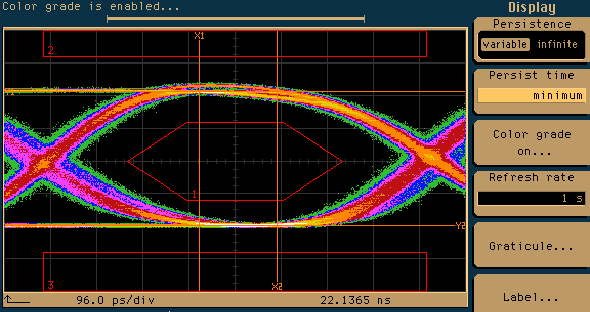

<br>


[⬆️ 返回目录](#本章目录-table-of-contents)

---


<a id="sec-0-9"></a>
## 0.9 Arbor — Feature List

## **Feature List** 

- Scan config space for all PCI-visible functions in system 

- Run standard and custom rule checks to find errors and non-optimal settings 

- Write to any config space location, memory address or IO address 

- View standard and non-standard structures in a decoded format 

- Import raw scan data from other tools (e.g. lspci) to view in Arbor’s decoded format 

- Decode info included for standard PCI, PCI-X and PCI Express structures 

- Decode info included for some x86-based structures and devicespecific registers 

- Create decode files for structures in config space, memory address space and IO space 

- Save system scans for viewing later or on other systems 

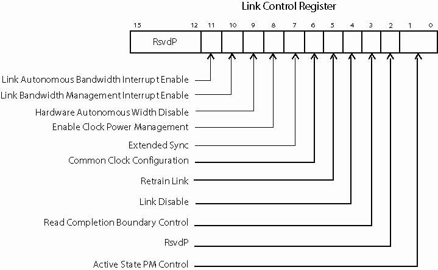

<br>

- All decode files and saved system scans are XML-based and open-format


[⬆️ 返回目录](#本章目录-table-of-contents)

---


<a id="sec-0-10"></a>
## 0.10 Arbor — COMING SOON: Decoded x86 Structures

## **COMING SOON** 

Decoded view of x86 structures (MSRs, ACPI, Paging, Virtualization, etc.) 

**mindshare.com | 800.633.1440 | training@mindshare.com**


[⬆️ 返回目录](#本章目录-table-of-contents)

---

<a id="sec-0-11"></a>
## 0.11 Arbor — Introduction

## The Ultimate Tool to View, Edit and Verify Configuration Settings of a Computer 

BY 

MindShare Arbor is a computer system debug, validation, analysis and learning tool that allows the user to read and write any memory, IO or configuration space address. The data from these address spaces can be viewed in a clean and informative style as well as checked for configuration errors and non-optimal settings.


[⬆️ 返回目录](#本章目录-table-of-contents)

---

<a id="sec-0-12"></a>
## 0.12 Arbor — View Reference Info

## View Reference Info 

MindShare Arbor is an excellent reference tool to quickly look at standard PCI, PCI-X and PCIe structures. All the register and field definitions are up-to-date with the PCI Express 3.0. x86, ACPI and USB reference info will be coming soon as well.


[⬆️ 返回目录](#本章目录-table-of-contents)

---

<a id="sec-0-13"></a>
## 0.13 Arbor — Decoding Standard and Custom Structures from a Live System

## Decoding Standard and Custom Structures from a Live System 

MindShare Arbor can perform a scan of the system it is running on to record the config space from all PCI-visible functions and show it in a clean and intuitive decoded format. In addition to scanning PCI config space, MindShare Arbor can also be directed to read any memory address space and IO address space and display the collected data in the same decoded fashion.


[⬆️ 返回目录](#本章目录-table-of-contents)

---

<a id="sec-0-14"></a>
## 0.14 Arbor — Run Rule Checks

## Run Rule Checks of Standard and Custom Structures 

In addition to capturing and displaying headers and capability structures from PCI config space, Arbor can also check the settings of each field for errors (e.g. violates the spec) and non-optimal values (e.g. a PCIe link trained to something less than its max capability). MindShare Arbor has scores of these checks built in and can be run on any system scan (live or saved). Any errors or warnings are flagged and displayed for easy evaluation and debugging. MindShare Arbor allows users to create their own rule checks to be applied to system scans. These rule checks can be for any structure, or set of structures, in PCI config space, memory space or IO space. The rule checks are written in JavaScript. (Python support coming soon.)


[⬆️ 返回目录](#本章目录-table-of-contents)

---

<a id="sec-0-15"></a>
## 0.15 Arbor — Write Capability

## Write Capability 

MindShare Arbor provides a very simple interface to directly edit a register in PCI config space, memory address space or IO address space. This can be done in the decoded view so you see what the meaning of each bit, or by simply writing a hex value to the target location.


[⬆️ 返回目录](#本章目录-table-of-contents)

---

<a id="sec-0-16"></a>
## 0.16 Arbor — Saving System Scans (XML)

## Saving System Scans (XML) 

After a system scan has been performed, MindShare Arbor allows saving of that system's scanned data (PCI config space, memory space and IO space) all in a single file to be looked at later or sent to a colleague. The scanned data in these Arbor system scan files (.ARBSYS files) are XML-based and can be looked at with any text editor or web browser. Even scans performed with other tools can be easily converted to the Arbor XML format and evaluated with MindShare Arbor.


[⬆️ 返回目录](#本章目录-table-of-contents)

---

<a id="sec-0-17"></a>
## 0.17 Title Page — PCI Express Technology

## _PCI Express Technology Comprehensive Guide to Generations 1.x, 2.x, 3.0_


[⬆️ 返回目录](#本章目录-table-of-contents)

---

<a id="sec-0-18"></a>
## 0.18 MINDSHARE, INC. — Title Page

## _MINDSHARE, INC._


[⬆️ 返回目录](#本章目录-table-of-contents)

---

<a id="sec-0-19"></a>
## 0.19 Authors & Copyright Notice

## _Mike Jackson Ravi Budruk_ 

_Technical Edit by Joe Winkles and Don Anderson_ 

Many of the designations used by manufacturers and sellers to distinguish their products are claimed as trademarks. Where those designators appear in this book, and MindShare was aware of the trademark claim, the designations have been printed in ini‐ tial capital letters or all capital letters. 

The authors and publishers have taken care in preparation of this book, but make no expressed or implied warranty of any kind and assume no responsibility for errors or omissions. No liability is assumed for incidental or consequential damages in connection with or arising out of the use of the information or programs contained herein.


[⬆️ 返回目录](#本章目录-table-of-contents)

---

<a id="sec-0-20"></a>
## 0.20 Library of Congress Cataloging-in-Publication Data

## _**Library of Congress Cataloging‐in‐Publication Data**_ 

Jackson, Mike and Budruk, Ravi PCI Express Technology / MindShare, Inc., Mike Jackson, Ravi Budruk....[et al.] 

Includes index ISBN: 978‐0‐9836465‐2‐5 (alk. paper) 1. Computer Architecture. 2.0 Microcomputers ‐ buses. 

I. Jackson, Mike II. MindShare, Inc. III. Title 

Library of Congress Number: 2011921066 ISBN: 978‐0‐9836465‐2‐5 Copyright ©2012 by MindShare, Inc. 

All rights reserved. No part of this publication may be reproduced, stored in a retrieval system, or transmitted, in any form or by any means, electronic, mechanical, photocopy‐ ing, recording, or otherwise, without the prior written permission of the publisher. Printed in the United States of America. 

Editors: Joe Winkles and Don Anderson Project Manager: Maryanne Daves Cover Design: Greenhouse Creative and MindShare, Inc. 

Set in 10 point Palatino Linotype by MindShare, Inc. Text printed on recycled and acid‐free paper 

First Edition, First Printing, September, 2012 

“This book is dedicated to my sons, Jeremy and Bryan – I love you guys deeply. Creating a book takes a long time and a team effort, but it’s finally done and now you hold the results in your hand. It’s a picture of the way life is sometimes: investing over a long time with your team before you see the result. You were a gift to us when you were born and we’ve invested in you for many years, along with a number of people who have helped us. Now you’ve become fine young men in your own right and it’s been a joy to become your friend as grown men. What will you invest in that will become the big achievements in your lives? I can hardly wait to find out.”


[⬆️ 返回目录](#本章目录-table-of-contents)

---

<a id="sec-0-21"></a>
## 0.21 Acknowledgments

## **Acknowledgments** 

Thanks to those who made significant contributions to this book: 

Maryanne Daves ‐ for being book project manager and getting the book to press in a timely manner. 

Don Anderson ‐ for excellent work editing numerous chapters and doing a complete re‐write of Chapter 8 on “Transaction Ordering”. 

Joe Winkles ‐ for his superb job of technical editing and doing a complete re‐ write of Chapter 4 on “Address Space and Transaction Routing”. 

Jay Trodden ‐ for his contribution in developing Chapter 4 on “Address Space and Transaction Routing” 

Special thanks to LeCroy Corporation, Inc. for supplying: 

Appendix A: _Debugging PCI Express™ Traffic using LeCroy Tools_ 

Special thanks to PLX Technology for contributing two appendices: Appendix B: _Markets & Applications for PCI Express™_ Appendix C: _Implementing Intelligent Adapters and Multi‐Host Systems With PCI Express™ Technology_ 

Thanks also to the PCI SIG for giving permission to use some of the mechanical drawings from the specification.


[⬆️ 返回目录](#本章目录-table-of-contents)

---

<a id="sec-0-22"></a>
## 0.22 Revision Updates

## Revision Updates: 

1.0 - Initial eBook release 

1.01 - Fixed Revision ID field in Figures 1-12, 1-13, 4-2, 4-4, 4-5, 4-6, 4-8, 4-9, 4-10, 4-17, 4-20, 4-21 
[⬆️ 返回目录](#本章目录-table-of-contents)

---

<a id="sec-0-23"></a>
## 0.23 About This Book

## **About This Book** 

**The MindShare Technology Series ........................................................................................ 1 Cautionary Note ......................................................................................................................... 2 Intended Audience .................................................................................................................... 2 Prerequisite Knowledge ........................................................................................................... 2 Book Topics and Organization................................................................................................ 3 Documentation Conventions................................................................................................... 3** PCI Express™....................................................................................................................... 3 Hexadecimal Notation ........................................................................................................ 4 Binary Notation.................................................................................................................... 4 Decimal Notation................................................................................................................. 4 Bits, Bytes and Transfers Notation .................................................................................... 4 Bit Fields................................................................................................................................ 4 Active Signal States.............................................................................................................. 5 **Visit Our Web Site..................................................................................................................... 5 We Want Your Feedback........................................................................................................... 5**


[⬆️ 返回目录](#本章目录-table-of-contents)

---

<a id="sec-0-24"></a>
## 0.24 Part One: The Big Picture (TOC)

## **Part One: The Big Picture**


[⬆️ 返回目录](#本章目录-table-of-contents)

---

<a id="sec-0-25"></a>
## 0.25 Chapter 1: Background (TOC)

## **Chapter 1: Background** 

**Introduction................................................................................................................................. 9 PCI and PCI-X........................................................................................................................... 10 PCI Basics .................................................................................................................................. 11** Basics of a PCI-Based System........................................................................................... 11 PCI Bus Initiator and Target............................................................................................. 12 Typical PCI Bus Cycle ....................................................................................................... 13 Reflected-Wave Signaling................................................................................................. 16 **PCI Bus Architecture Perspective ......................................................................................... 18** PCI Transaction Models.................................................................................................... 18 Programmed I/O........................................................................................................ 18 Direct Memory Access (DMA).................................................................................. 19 Peer-to-Peer ................................................................................................................. 20 PCI Bus Arbitration ........................................................................................................... 20 PCI Inefficiencies................................................................................................................ 21 PCI Retry Protocol ...................................................................................................... 21 PCI Disconnect Protocol ............................................................................................ 22 PCI Interrupt Handling..................................................................................................... 23 PCI Error Handling............................................................................................................ 24 PCI Address Space Map.................................................................................................... 25 PCI Configuration Cycle Generation .............................................................................. 26 <br><small>p. vii</small>


[⬆️ 返回目录](#本章目录-table-of-contents)

---

<a id="sec-0-26"></a>
## 0.26 Chapter 1: Background — Contents continued (TOC)

## **Contents** 

PCI Function Configuration Register Space .................................................................. 27 Higher-bandwidth PCI ..................................................................................................... 29 Limitations of 66 MHz PCI bus ................................................................................ 30 Signal Timing Problems with the Parallel PCI Bus Model beyond 66 MHz...... 31 **Introducing PCI-X.................................................................................................................... 31** PCI-X System Example...................................................................................................... 31 PCI-X Transactions ............................................................................................................ 32 PCI-X Features.................................................................................................................... 33 Split-Transaction Model............................................................................................. 33 Message Signaled Interrupts..................................................................................... 34 Transaction Attributes ............................................................................................... 35 No Snoop (NS): .................................................................................................... 35 Relaxed Ordering (RO):...................................................................................... 35 Higher Bandwidth PCI-X.................................................................................................. 36 Problems with the Common Clock Approach of PCI and PCI-X 1.0 Parallel Bus Model .................................................................................................. 36 PCI-X 2.0 Source-Synchronous Model..................................................................... 37


[⬆️ 返回目录](#本章目录-table-of-contents)

---

<a id="sec-0-27"></a>
## 0.27 Chapter 2: PCIe Architecture Overview (TOC)

## **Chapter 2: PCIe Architecture Overview** 

**Introduction to PCI Express ................................................................................................... 39** Software Backward Compatibility .................................................................................. 41 Serial Transport.................................................................................................................. 41 The Need for Speed .................................................................................................... 41 Overcoming Problems ........................................................................................ 41 Bandwidth ............................................................................................................ 42 PCIe Bandwidth Calculation..................................................................................... 43 Differential Signals ..................................................................................................... 44 No Common Clock..................................................................................................... 45 Packet-based Protocol ................................................................................................ 46 Links and Lanes ................................................................................................................. 46 Scalable Performance ................................................................................................. 46 Flexible Topology Options ........................................................................................ 47 Some Definitions................................................................................................................ 47 Root Complex.............................................................................................................. 48 Switches and Bridges ................................................................................................. 48 Native PCIe Endpoints and Legacy PCIe Endpoints ............................................ 49 Software Compatibility Characteristics................................................................... 49 System Examples ........................................................................................................ 52 **Introduction to Device Layers .............................................................................................. 54** Device Core / Software Layer ........................................................................................ 59 Transaction Layer............................................................................................................... 59 TLP (Transaction Layer Packet) Basics.................................................................... 60 

**viii** 
TLP Packet Assembly.......................................................................................... 62 TLP Packet Disassembly..................................................................................... 64 Non-Posted Transactions........................................................................................... 65 Ordinary Reads.................................................................................................... 65 Locked Reads ....................................................................................................... 66 IO and Configuration Writes ............................................................................. 68 Posted Writes............................................................................................................... 69 Memory Writes .................................................................................................... 69 Message Writes .................................................................................................... 70 Transaction Ordering................................................................................................. 71 Data Link Layer.................................................................................................................. 72 DLLPs (Data Link Layer Packets) ............................................................................ 73 DLLP Assembly ................................................................................................... 73 DLLP Disassembly .............................................................................................. 73 Ack/Nak Protocol ...................................................................................................... 74 Flow Control................................................................................................................ 76 Power Management.................................................................................................... 76 Physical Layer..................................................................................................................... 76 General ......................................................................................................................... 76 Physical Layer - Logical............................................................................................. 77 Link Training and Initialization ............................................................................... 78 Physical Layer - Electrical.......................................................................................... 78 Ordered Sets ................................................................................................................ 79 **Protocol Review Example....................................................................................................... 81** Memory Read Request............................................................................................... 81 Completion with Data................................................................................................ 83


[⬆️ 返回目录](#本章目录-table-of-contents)

---

<a id="sec-0-28"></a>
## 0.28 Chapter 3: Configuration Overview (TOC)

## **Chapter 3: Configuration Overview** 

**Definition of Bus, Device and Function.............................................................................. 85** PCIe Buses........................................................................................................................... 86 PCIe Devices ....................................................................................................................... 86 PCIe Functions.................................................................................................................... 86 **Configuration Address Space................................................................................................ 88** PCI-Compatible Space....................................................................................................... 88 Extended Configuration Space ........................................................................................ 89 **Host-to-PCI Bridge Configuration Registers...................................................................... 90** General................................................................................................................................. 90 Only the Root Sends Configuration Requests ............................................................... 91 **Generating Configuration Transactions.............................................................................. 91** Legacy PCI Mechanism..................................................................................................... 91 Configuration Address Port...................................................................................... 92 Bus Compare and Data Port Usage.......................................................................... 93 <br><small>p. ix</small>


[⬆️ 返回目录](#本章目录-table-of-contents)

---

<a id="sec-0-29"></a>
## 0.29 Chapter 3: Configuration Overview — Contents continued (TOC)

## **Contents** 

Single Host System ..................................................................................................... 94 Multi-Host System...................................................................................................... 96 Enhanced Configuration Access Mechanism ................................................................ 96 General ......................................................................................................................... 96 Some Rules................................................................................................................... 98 **Configuration Requests.......................................................................................................... 99** Type 0 Configuration Request ......................................................................................... 99 Type 1 Configuration Request ....................................................................................... 100 **Example PCI-Compatible Configuration Access............................................................. 102 Example Enhanced Configuration Access......................................................................... 103 Enumeration - Discovering the Topology......................................................................... 104** Discovering the Presence or Absence of a Function................................................... 105 Device not Present .................................................................................................... 105 Device not Ready...................................................................................................... 106 Determining if a Function is an Endpoint or Bridge .................................................. 108 **Single Root Enumeration Example..................................................................................... 109 Multi-Root Enumeration Example...................................................................................... 114** General............................................................................................................................... 114 Multi-Root Enumeration Process................................................................................... 114 **Hot-Plug Considerations ...................................................................................................... 116 MindShare Arbor: Debug/Validation/Analysis and Learning Software Tool........... 117** General............................................................................................................................... 117 MindShare Arbor Feature List ....................................................................................... 119


[⬆️ 返回目录](#本章目录-table-of-contents)

---

<a id="sec-0-30"></a>
## 0.30 Chapter 4: Address Space & Transaction Routing (TOC)

## **Chapter 4: Address Space & Transaction Routing** 

**I Need An Address................................................................................................................. 121** Configuration Space ........................................................................................................ 122 Memory and IO Address Spaces ................................................................................... 122 General ....................................................................................................................... 122 Prefetchable vs. Non-prefetchable Memory Space.............................................. 123 **Base Address Registers (BARs) ........................................................................................... 126** General............................................................................................................................... 126 BAR Example 1: 32-bit Memory Address Space Request .......................................... 128 BAR Example 2: 64-bit Memory Address Space Request .......................................... 130 BAR Example 3: IO Address Space Request................................................................ 133 All BARs Must Be Evaluated Sequentially................................................................... 135 Resizable BARs................................................................................................................. 135 **Base and Limit Registers ...................................................................................................... 136** General............................................................................................................................... 136 Prefetchable Range (P-MMIO)....................................................................................... 137 Non-Prefetchable Range (NP-MMIO)........................................................................... 139 IO Range............................................................................................................................ 141 

**x** 
Unused Base and Limit Registers.................................................................................. 144 **Sanity Check: Registers Used For Address Routing ....................................................... 144 TLP Routing Basics................................................................................................................ 145** Receivers Check For Three Types of Traffic ................................................................ 147 Routing Elements............................................................................................................. 147 Three Methods of TLP Routing...................................................................................... 147 General ....................................................................................................................... 147 Purpose of Implicit Routing and Messages .......................................................... 148 Why Messages?.................................................................................................. 148 How Implicit Routing Helps............................................................................ 148 Split Transaction Protocol............................................................................................... 149 Posted versus Non-Posted.............................................................................................. 150 Header Fields Define Packet Format and Type........................................................... 151 General ....................................................................................................................... 151 Header Format/Type Field Encodings ................................................................. 153 TLP Header Overview .................................................................................................... 154 **Applying Routing Mechanisms .......................................................................................... 155** ID Routing......................................................................................................................... 155 Bus Number, Device Number, Function Number Limits................................... 155 Key TLP Header Fields in ID Routing................................................................... 155 Endpoints: One Check.............................................................................................. 156 Switches (Bridges): Two Checks Per Port ............................................................. 157 Address Routing .............................................................................................................. 158 Key TLP Header Fields in Address Routing ........................................................ 159 TLPs with 32-Bit Address................................................................................. 159 TLPs with 64-Bit Address................................................................................. 159 Endpoint Address Checking................................................................................... 160 Switch Routing.......................................................................................................... 161 Downstream Traveling TLPs (Received on Primary Interface).................. 162 Upstream Traveling TLPs (Received on Secondary Interface) ................... 163 Multicast Capabilities............................................................................................... 163 Implicit Routing ............................................................................................................... 163 Only for Messages .................................................................................................... 163 Key TLP Header Fields in Implicit Routing ......................................................... 164 Message Type Field Summary................................................................................ 164 Endpoint Handling................................................................................................... 165 Switch Handling ....................................................................................................... 165 **DLLPs and Ordered Sets Are Not Routed......................................................................... 166** 

**xi** 
[⬆️ 返回目录](#本章目录-table-of-contents)

---

<a id="sec-0-31"></a>
## 0.31 Part Two: Transaction Layer (TOC)

## **Part Two: Transaction Layer**


[⬆️ 返回目录](#本章目录-table-of-contents)

---

<a id="sec-0-32"></a>
## 0.32 Chapter 5: TLP Elements (TOC)

## **Chapter 5: TLP Elements** 

**Introduction to Packet-Based Protocol............................................................................... 169** General............................................................................................................................... 169 Motivation for a Packet-Based Protocol ....................................................................... 171 1. Packet Formats Are Well Defined...................................................................... 171 2. Framing Symbols Define Packet Boundaries.................................................... 171 3. CRC Protects Entire Packet ................................................................................. 172 **Transaction Layer Packet (TLP) Details............................................................................. 172** TLP Assembly And Disassembly .................................................................................. 172 TLP Structure.................................................................................................................... 174 Generic TLP Header Format .......................................................................................... 175 General ....................................................................................................................... 175 Generic Header Field Summary............................................................................. 175 Generic Header Field Details ......................................................................................... 178 Header Type/Format Field Encodings ................................................................. 179 Digest / ECRC Field................................................................................................. 180 ECRC Generation and Checking..................................................................... 180 Who Checks ECRC? .......................................................................................... 180 Using Byte Enables ................................................................................................... 181 General ................................................................................................................ 181 Byte Enable Rules .............................................................................................. 181 Byte Enable Example......................................................................................... 182 Transaction Descriptor Fields ................................................................................. 182 Transaction ID.................................................................................................... 183 Traffic Class........................................................................................................ 183 Transaction Attributes ...................................................................................... 183 Additional Rules For TLPs With Data Payloads.................................................. 183 Specific TLP Formats: Request & Completion TLPs................................................... 184 IO Requests................................................................................................................ 184 IO Request Header Format .............................................................................. 185 IO Request Header Fields................................................................................. 186 Memory Requests ..................................................................................................... 188 Memory Request Header Fields...................................................................... 188 Memory Request Notes .................................................................................... 192 Configuration Requests ........................................................................................... 192 Definitions Of Configuration Request Header Fields.................................. 193 Configuration Request Notes .......................................................................... 196 

**xii** 
Completions............................................................................................................... 196 Definitions Of Completion Header Fields ..................................................... 197 Summary of Completion Status Codes .......................................................... 200 Calculating The Lower Address Field............................................................ 200 Using The Byte Count Modified Bit................................................................ 201 Data Returned For Read Requests: ................................................................. 201 Receiver Completion Handling Rules:........................................................... 202 Message Requests ..................................................................................................... 203 Message Request Header Fields...................................................................... 204 Message Notes: .................................................................................................. 206 INTx Interrupt Messages.................................................................................. 206 Power Management Messages ........................................................................ 208 Error Messages................................................................................................... 209 Locked Transaction Support............................................................................ 209 Set Slot Power Limit Message.......................................................................... 210 Vendor-Defined Message 0 and 1 ................................................................... 210 Ignored Messages .............................................................................................. 211 Latency Tolerance Reporting Message........................................................... 212 Optimized Buffer Flush and Fill Messages.................................................... 213


[⬆️ 返回目录](#本章目录-table-of-contents)

---

<a id="sec-0-33"></a>
## 0.33 Chapter 6: Flow Control (TOC)

## **Chapter 6: Flow Control** 

**Flow Control Concept ........................................................................................................... 215 Flow Control Buffers and Credits....................................................................................... 217** VC Flow Control Buffer Organization.......................................................................... 218 Flow Control Credits....................................................................................................... 219 **Initial Flow Control Advertisement ................................................................................... 219** Minimum and Maximum Flow Control Advertisement ........................................... 219 Infinite Credits.................................................................................................................. 221 Special Use for Infinite Credit Advertisements........................................................... 221 **Flow Control Initialization................................................................................................... 222** General............................................................................................................................... 222 The FC Initialization Sequence....................................................................................... 223 FC_Init1 Details................................................................................................................ 224 FC_Init2 Details................................................................................................................ 225 Rate of FC_INIT1 and FC_INIT2 Transmission .......................................................... 226 Violations of the Flow Control Initialization Protocol ............................................... 227 **Introduction to the Flow Control Mechanism.................................................................. 227** General............................................................................................................................... 227 The Flow Control Elements............................................................................................ 227 Transmitter Elements ............................................................................................... 228 Receiver Elements..................................................................................................... 229 <br><small>p. xiii</small>


[⬆️ 返回目录](#本章目录-table-of-contents)

---

<a id="sec-0-34"></a>
## 0.34 Chapter 6: Flow Control — Contents continued (TOC)

## **Contents** 

**Flow Control Example........................................................................................................... 230** Stage 1 — Flow Control Following Initialization........................................................ 230 Stage 2 — Flow Control Buffer Fills Up........................................................................ 233 Stage 3 — Counters Roll Over........................................................................................ 234 Stage 4 — FC Buffer Overflow Error Check ................................................................ 235 **Flow Control Updates ........................................................................................................... 237** FC_Update DLLP Format and Content........................................................................ 238 Flow Control Update Frequency ................................................................................... 239 Immediate Notification of Credits Allocated ....................................................... 239 Maximum Latency Between Update Flow Control DLLPs................................ 240 Calculating Update Frequency Based on Payload Size and Link Width ......... 240 Error Detection Timer — A Pseudo Requirement ...................................................... 243


[⬆️ 返回目录](#本章目录-table-of-contents)

---

<a id="sec-0-35"></a>
## 0.35 Chapter 7: Quality of Service (TOC)

## **Chapter 7: Quality of Service** 

**Motivation ............................................................................................................................... 245 Basic Elements ........................................................................................................................ 246** Traffic Class (TC).............................................................................................................. 247 Virtual Channels (VCs) ................................................................................................... 247 Assigning TCs to each VC — TC/VC Mapping .................................................. 248 Determining the Number of VCs to be Used ....................................................... 249 Assigning VC Numbers (IDs) ................................................................................. 251 **VC Arbitration........................................................................................................................ 252** General............................................................................................................................... 252 Strict Priority VC Arbitration......................................................................................... 253 Group Arbitration............................................................................................................ 255 Hardware Fixed Arbitration Scheme..................................................................... 257 Weighted Round Robin Arbitration Scheme........................................................ 257 Setting up the Virtual Channel Arbitration Table ............................................... 258 **Port Arbitration ...................................................................................................................... 261** General............................................................................................................................... 261 Port Arbitration Mechanisms......................................................................................... 264 Hardware-Fixed Arbitration................................................................................... 265 Weighted Round Robin Arbitration ...................................................................... 265 Time-Based, Weighted Round Robin Arbitration (TBWRR).............................. 266 Loading the Port Arbitration Tables ............................................................................. 267 Switch Arbitration Example........................................................................................... 269 **Arbitration in Multi-Function Endpoints ......................................................................... 270 Isochronous Support ............................................................................................................. 272** Timing is Everything....................................................................................................... 273 How Timing is Defined............................................................................................ 274 How Timing is Enforced.......................................................................................... 275 

**xiv** 
Software Support ............................................................................................................. 275 Device Drivers........................................................................................................... 276 Isochronous Broker................................................................................................... 276 Bringing it all together .................................................................................................... 276 Endpoints................................................................................................................... 276 Switches...................................................................................................................... 278 Arbitration Issues .............................................................................................. 278 Timing Issues ..................................................................................................... 278 Bandwidth Allocation Problems ..................................................................... 280 Latency Issues .................................................................................................... 281 Root Complex............................................................................................................ 281 Problem: Snooping ............................................................................................ 281 Snooping Solutions............................................................................................ 282 Power Management.................................................................................................. 282 Error Handling.......................................................................................................... 282


[⬆️ 返回目录](#本章目录-table-of-contents)

---

<a id="sec-0-36"></a>
## 0.36 Chapter 8: Transaction Ordering (TOC)

## **Chapter 8: Transaction Ordering** 

**Introduction............................................................................................................................. 285 Definitions............................................................................................................................... 286 Simplified Ordering Rules................................................................................................... 287** Ordering Rules and Traffic Classes (TCs) .................................................................... 287 Ordering Rules Based On Packet Type......................................................................... 288 The Simplified Ordering Rules Table ........................................................................... 288 **Producer/Consumer Model .................................................................................................. 290** Producer/Consumer Sequence — No Errors.............................................................. 291 Producer/Consumer Sequence — Errors..................................................................... 295 **Relaxed Ordering ................................................................................................................... 296** RO Effects on Memory Writes and Messages.............................................................. 297 RO Effects on Memory Read Transactions................................................................... 298 **Weak Ordering ....................................................................................................................... 299** Transaction Ordering and Flow Control...................................................................... 299 Transaction Stalls ............................................................................................................. 300 VC Buffers Offer an Advantage..................................................................................... 301 **ID Based Ordering (IDO) ..................................................................................................... 301** The Solution...................................................................................................................... 301 When to use IDO.............................................................................................................. 302 Software Control .............................................................................................................. 303 **Deadlock Avoidance.............................................................................................................. 303** 

**xv** 
[⬆️ 返回目录](#本章目录-table-of-contents)

---

<a id="sec-0-37"></a>
## 0.37 Part Three: Data Link Layer (TOC)

## **Part Three: Data Link Layer**


[⬆️ 返回目录](#本章目录-table-of-contents)

---

<a id="sec-0-38"></a>
## 0.38 Chapter 9: DLLP Elements / Chapter 10: Ack/Nak Protocol (TOC)

## **Chapter 9: DLLP Elements** 

**General..................................................................................................................................... 307 DLLPs Are Local Traffic ....................................................................................................... 308 Receiver handling of DLLPs................................................................................................ 309 Sending DLLPs....................................................................................................................... 309** General............................................................................................................................... 309 DLLP Packet Size is Fixed at 8 Bytes............................................................................. 310 **DLLP Packet Types................................................................................................................ 311** Ack/Nak DLLP Format .................................................................................................. 312 Power Management DLLP Format ............................................................................... 313 Flow Control DLLP Format............................................................................................ 314 Vendor-Specific DLLP Format....................................................................................... 316 

**Chapter 10: Ack/Nak Protocol Goal: Reliable TLP Transport.............................................................................................. 317 Elements of the Ack/Nak Protocol...................................................................................... 320** Transmitter Elements ...................................................................................................... 320 NEXT_TRANSMIT_SEQ Counter.......................................................................... 321 LCRC Generator........................................................................................................ 321 Replay Buffer............................................................................................................. 321 REPLAY_TIMER Count........................................................................................... 323 REPLAY_NUM Count ............................................................................................. 323 ACKD_SEQ Register ................................................................................................ 323 DLLP CRC Check ..................................................................................................... 324 Receiver Elements............................................................................................................ 324 LCRC Error Check.................................................................................................... 325 NEXT_RCV_SEQ Counter....................................................................................... 326 Sequence Number Check......................................................................................... 326 NAK_SCHEDULED Flag ........................................................................................ 327 AckNak_LATENCY_TIMER................................................................................... 328 Ack/Nak Generator ................................................................................................. 328 **Ack/Nak Protocol Details ..................................................................................................... 329** Transmitter Protocol Details .......................................................................................... 329 Sequence Number..................................................................................................... 329 32-Bit LCRC ............................................................................................................... 329 Replay (Retry) Buffer................................................................................................ 330 General ................................................................................................................ 330 Replay Buffer Sizing.......................................................................................... 330 

**xvi** 
Transmitter’s Response to an Ack DLLP .............................................................. 331 Ack/Nak Examples.................................................................................................. 331 Example 1............................................................................................................ 331 Example 2............................................................................................................ 332 Transmitter’s Response to a Nak............................................................................ 333 TLP Replay................................................................................................................. 333 Efficient TLP Replay................................................................................................. 334 Example of a Nak...................................................................................................... 334 Repeated Replay of TLPs......................................................................................... 335 General ................................................................................................................ 335 Replay Number Rollover.................................................................................. 336 Replay Timer ............................................................................................................. 336 REPLAY_TIMER Equation............................................................................... 337 REPLAY_TIMER Summary Table .................................................................. 338 Transmitter DLLP Handling................................................................................... 340 Receiver Protocol Details ................................................................................................ 340 Physical Layer ........................................................................................................... 340 TLP LCRC Check...................................................................................................... 341 Next Received TLP’s Sequence Number............................................................... 341 Duplicate TLP..................................................................................................... 342 Out of Sequence TLP......................................................................................... 342 Receiver Schedules An Ack DLLP ......................................................................... 342 Receiver Schedules a Nak........................................................................................ 343 AckNak_LATENCY_TIMER.................................................................................. 343 AckNak_LATENCY_TIMER Equation .......................................................... 344 AckNak_LATENCY_TIMER Summary Table .............................................. 345 **More Examples ....................................................................................................................... 345** Lost TLPs........................................................................................................................... 345 Bad Ack ............................................................................................................................. 347 Bad Nak............................................................................................................................. 348 **Error Situations Handled by Ack/Nak............................................................................... 349 Recommended Priority To Schedule Packets................................................................... 350 Timing Differences for Newer Spec Versions ................................................................. 350** Ack Transmission Latency (AckNak Latency) ............................................................ 351 2.5 GT/s Operation................................................................................................... 351 5.0 GT/s Operation................................................................................................... 352 8.0 GT/s Operation................................................................................................... 352 Replay Timer .................................................................................................................... 353 2.5 GT/s Operation................................................................................................... 353 5.0 GT/s Operation................................................................................................... 354 8.0 GT/s Operation................................................................................................... 354 <br><small>p. xvii</small>


[⬆️ 返回目录](#本章目录-table-of-contents)

---

<a id="sec-0-39"></a>
## 0.39 Chapter 10: Ack/Nak Protocol — Contents continued (TOC)

## **Contents** 

**Switch Cut-Through Mode .................................................................................................. 354** Background....................................................................................................................... 355 A Latency Improvement Option.................................................................................... 355 Cut-Through Operation.................................................................................................. 356 Example of Cut-Through Operation............................................................................. 356


[⬆️ 返回目录](#本章目录-table-of-contents)

---

<a id="sec-0-40"></a>
## 0.40 Part Four: Physical Layer (TOC)

## **Part Four: Physical Layer**


[⬆️ 返回目录](#本章目录-table-of-contents)

---

<a id="sec-0-41"></a>
## 0.41 Chapter 11: Physical Layer — Logical (Gen1 and Gen2) (TOC)

## **Chapter 11: Physical Layer - Logical (Gen1 and Gen2)** 

**Physical Layer Overview ...................................................................................................... 362** Observation....................................................................................................................... 364 Transmit Logic Overview............................................................................................... 364 Receive Logic Overview ................................................................................................. 366 **Transmit Logic Details (Gen1 and Gen2 Only) ............................................................... 368** Tx Buffer............................................................................................................................ 368 Mux and Control Logic................................................................................................... 368 Byte Striping (for Wide Links) ....................................................................................... 371 Packet Format Rules ........................................................................................................ 373 General Rules ............................................................................................................ 373 Example: x1 Format.................................................................................................. 374 x4 Format Rules......................................................................................................... 374 Example x4 Format................................................................................................... 375 Large Link-Width Packet Format Rules................................................................ 376 x8 Packet Format Example ...................................................................................... 376 Scrambler........................................................................................................................... 377 Scrambler Algorithm................................................................................................ 378 Some Scrambler implementation rules:................................................................. 379 Disabling Scrambling ............................................................................................... 379 8b/10b Encoding.............................................................................................................. 380 General ....................................................................................................................... 380 Motivation.................................................................................................................. 380 Properties of 10-bit Symbols ................................................................................... 381 Character Notation ................................................................................................... 382 Disparity..................................................................................................................... 383 Definition............................................................................................................ 383 CRD (Current Running Disparity).................................................................. 383 Encoding Procedure ................................................................................................. 383 Example Transmission............................................................................................. 385 Control Characters.................................................................................................... 386 Ordered sets............................................................................................................... 388 General ................................................................................................................ 388 

**xviii** 
TS1 and TS2 Ordered Set (TS1OS/TS2OS) .................................................... 388 Electrical Idle Ordered Set (EIOS)................................................................... 388 FTS Ordered Set (FTSOS) ................................................................................. 388 SKP Ordered Set (SOS) ..................................................................................... 389 Electrical Idle Exit Ordered Set (EIEOS) ........................................................ 389 Serializer............................................................................................................................ 389 Differential Driver............................................................................................................ 389 Transmit Clock (Tx Clock).............................................................................................. 390 Miscellaneous Transmit Topics...................................................................................... 390 Logical Idle ................................................................................................................ 390 Tx Signal Skew .......................................................................................................... 390 Clock Compensation ................................................................................................ 391 Background ........................................................................................................ 391 SKIP ordered set Insertion Rules..................................................................... 391 **Receive Logic Details (Gen1 and Gen2 Only).................................................................. 392** Differential Receiver........................................................................................................ 393 Rx Clock Recovery........................................................................................................... 394 General ....................................................................................................................... 394 Achieving Bit Lock ................................................................................................... 395 Losing Bit Lock.......................................................................................................... 395 Regaining Bit Lock.................................................................................................... 395 Deserializer ....................................................................................................................... 395 General ....................................................................................................................... 395 Achieving Symbol Lock........................................................................................... 396 Receiver Clock Compensation Logic ............................................................................ 396 Background................................................................................................................ 396 Elastic Buffer’s Role.................................................................................................. 397 Lane-to-Lane Skew .......................................................................................................... 398 Flight Time Will Vary Between Lanes................................................................... 398 Ordered sets Help De-Skewing .............................................................................. 398 Receiver Lane-to-Lane De-Skew Capability ......................................................... 398 De-Skew Opportunities ........................................................................................... 399 8b/10b Decoder................................................................................................................ 400 General ....................................................................................................................... 400 Disparity Calculator ................................................................................................. 400 Code Violation and Disparity Error Detection..................................................... 400 General ................................................................................................................ 400 Code Violations.................................................................................................. 400 Disparity Errors ................................................................................................. 400 Descrambler...................................................................................................................... 402 Some Descrambler Implementation Rules:........................................................... 402 Disabling Descrambling........................................................................................... 402 <br><small>p. xix</small>


[⬆️ 返回目录](#本章目录-table-of-contents)

---

<a id="sec-0-42"></a>
## 0.42 Chapter 11 — Contents continued / Chapter 12 intro (TOC)

## **Contents** 

Byte Un-Striping............................................................................................................... 402 Filter and Packet Alignment Check............................................................................... 403 Receive Buffer (Rx Buffer) .............................................................................................. 403 **Physical Layer Error Handling ............................................................................................ 404** General............................................................................................................................... 404 Response of Data Link Layer to Receiver Error .......................................................... 404 **Active State Power Management ........................................................................................ 405 Link Training and Initialization ......................................................................................... 405**


[⬆️ 返回目录](#本章目录-table-of-contents)

---

<a id="sec-0-43"></a>
## 0.43 Chapter 12: Physical Layer — Logical (Gen3) (TOC)

## **Chapter 12: Physical Layer - Logical (Gen3)** 

**Introduction to Gen3 ............................................................................................................. 407** New Encoding Model...................................................................................................... 409 Sophisticated Signal Equalization ................................................................................. 410 **Encoding for 8.0 GT/s............................................................................................................ 410** Lane-Level Encoding....................................................................................................... 410 Block Alignment............................................................................................................... 411 Ordered Set Blocks........................................................................................................... 412 Data Stream and Data Blocks......................................................................................... 413 Data Block Frame Construction..................................................................................... 414 Framing Tokens ........................................................................................................ 415 Packets........................................................................................................................ 415 Transmitter Framing Requirements....................................................................... 417 Receiver Framing Requirements ............................................................................ 419 Recovery from Framing Errors............................................................................... 420 **Gen3 Physical Layer Transmit Logic.................................................................................. 421** Multiplexer........................................................................................................................ 421 Byte Striping ..................................................................................................................... 423 Byte Striping x8 Example......................................................................................... 424 Nullified Packet x8 Example................................................................................... 425 Ordered Set Example - SOS..................................................................................... 426 Transmitter SOS Rules ............................................................................................. 429 Receiver SOS Rules................................................................................................... 430 Scrambling ........................................................................................................................ 430 Number of LFSRs...................................................................................................... 430 First Option: Multiple LFSRs ........................................................................... 431 Second Option: Single LFSR ............................................................................ 432 Scrambling Rules ...................................................................................................... 433 Serializer............................................................................................................................ 434 Mux for Sync Header Bits............................................................................................... 435 **Gen3 Physical Layer Receive Logic .................................................................................... 435** Differential Receiver........................................................................................................ 435 CDR (Clock and Data Recovery) Logic......................................................................... 437 

**xx** 
Rx Clock Recovery.................................................................................................... 437 Deserializer................................................................................................................ 438 Achieving Block Alignment .................................................................................... 438 Unaligned Phase................................................................................................ 439 Aligned Phase .................................................................................................... 439 Locked Phase...................................................................................................... 439 Special Case: Loopback..................................................................................... 439 Block Type Detection................................................................................................ 439 Receiver Clock Compensation Logic ............................................................................ 440 Background................................................................................................................ 440 Elastic Buffer’s Role.................................................................................................. 440 Lane-to-Lane Skew .......................................................................................................... 442 Flight Time Variance Between Lanes..................................................................... 442 De-skew Opportunities............................................................................................ 442 Receiver Lane-to-Lane De-skew Capability.......................................................... 443 Descrambler...................................................................................................................... 444 General ....................................................................................................................... 444 Disabling Descrambling........................................................................................... 444 Byte Un-Striping............................................................................................................... 445 Packet Filtering................................................................................................................. 446 Receive Buffer (Rx Buffer) .............................................................................................. 446 **Notes Regarding Loopback with 128b/130b ..................................................................... 446**


[⬆️ 返回目录](#本章目录-table-of-contents)

---

<a id="sec-0-44"></a>
## 0.44 Chapter 13: Physical Layer — Electrical (TOC)

## **Chapter 13: Physical Layer - Electrical** 

**Backward Compatibility....................................................................................................... 448 Component Interfaces ........................................................................................................... 449 Physical Layer Electrical Overview .................................................................................... 449 High Speed Signaling ........................................................................................................... 451 Clock Requirements .............................................................................................................. 452** General............................................................................................................................... 452 SSC (Spread Spectrum Clocking) .................................................................................. 453 Refclk Overview............................................................................................................... 455 2.5 GT/s...................................................................................................................... 455 5.0 GT/s...................................................................................................................... 455 Common Refclk ................................................................................................. 456 Data Clocked Rx Architecture ......................................................................... 456 Separate Refclks................................................................................................. 457 8.0 GT/s...................................................................................................................... 457 **Transmitter (Tx) Specs .......................................................................................................... 458** Measuring Tx Signals ...................................................................................................... 458 Tx Impedance Requirements.......................................................................................... 459 ESD and Short Circuit Requirements............................................................................ 459 <br><small>p. xxi</small>


[⬆️ 返回目录](#本章目录-table-of-contents)

---

<a id="sec-0-45"></a>
## 0.45 Chapter 13 — Contents continued (TOC)

## **Contents** 

Receiver Detection ........................................................................................................... 460 General ....................................................................................................................... 460 Detecting Receiver Presence.................................................................................... 460 Transmitter Voltages ....................................................................................................... 462 DC Common Mode Voltage.................................................................................... 462 Full-Swing Differential Voltage.............................................................................. 462 Differential Notation ................................................................................................ 463 Reduced-Swing Differential Voltage ..................................................................... 464 Equalized Voltage..................................................................................................... 464 Voltage Margining.................................................................................................... 465 **Receiver (Rx) Specs................................................................................................................ 466** Receiver Impedance......................................................................................................... 466 Receiver DC Common Mode Voltage........................................................................... 466 Transmission Loss............................................................................................................ 468 AC Coupling..................................................................................................................... 468 **Signal Compensation ............................................................................................................ 468** De-emphasis Associated with Gen1 and Gen2 PCIe .................................................. 468 The Problem............................................................................................................... 468 How Does De-Emphasis Help? .............................................................................. 469 Solution for 2.5 GT/s................................................................................................ 470 Solution for 5.0 GT/s................................................................................................ 472 Solution for 8.0 GT/s - Transmitter Equalization ....................................................... 474 Three-Tap Tx Equalizer Required .......................................................................... 475 Pre-shoot, De-emphasis, and Boost........................................................................ 476 Presets and Ratios..................................................................................................... 478 Equalizer Coefficients .............................................................................................. 479 Coefficient Example .......................................................................................... 480 EIEOS Pattern..................................................................................................... 483 Reduced Swing .................................................................................................. 483 Beacon Signaling .............................................................................................................. 483 General ....................................................................................................................... 483 Properties of the Beacon Signal .............................................................................. 484 **Eye Diagram............................................................................................................................ 485** Jitter, Noise, and Signal Attenuation ............................................................................ 485 The Eye Test...................................................................................................................... 485 Normal Eye Diagram....................................................................................................... 486 Effects of Jitter................................................................................................................... 487 **Transmitter Driver Characteristics ..................................................................................... 489 Receiver Characteristics........................................................................................................ 492** Stressed-Eye Testing........................................................................................................ 492 2.5 and 5.0 GT/s........................................................................................................ 492 8.0 GT/s...................................................................................................................... 492 

**xxii** 
Receiver (Rx) Equalization ............................................................................................. 493 Continuous-Time Linear Equalization (CTLE) .................................................... 493 Decision Feedback Equalization (DFE) ................................................................. 495 **Receiver Characteristics........................................................................................................ 497 Link Power Management States.......................................................................................... 500**


[⬆️ 返回目录](#本章目录-table-of-contents)

---

<a id="sec-0-46"></a>
## 0.46 Chapter 14: Link Initialization & Training (TOC)

## **Chapter 14: Link Initialization & Training** 

**Overview.................................................................................................................................. 506 Ordered Sets in Link Training ............................................................................................ 509** General............................................................................................................................... 509 TS1 and TS2 Ordered Sets............................................................................................... 510 **Link Training and Status State Machine (LTSSM)......................................................... 518** General............................................................................................................................... 518 Overview of LTSSM States ............................................................................................. 519 Introductions, Examples and State/Substates............................................................. 521 **Detect State.............................................................................................................................. 522** Introduction ...................................................................................................................... 522 Detailed Detect Substate ................................................................................................. 523 Detect.Quiet............................................................................................................... 523 Detect.Active ............................................................................................................. 524 **Polling State ............................................................................................................................ 525** Introduction ...................................................................................................................... 525 Detailed Polling Substates .............................................................................................. 526 Polling.Active ............................................................................................................ 526 Polling.Configuration............................................................................................... 527 Polling.Compliance .................................................................................................. 529 Compliance Pattern for 8b/10b....................................................................... 529 Compliance Pattern for 128b/130b................................................................. 530 Modified Compliance Pattern for 8b/10b...................................................... 532 Modified Compliance Pattern for 128b/130b................................................ 533 Compliance Pattern........................................................................................... 537 Modified Compliance Pattern ......................................................................... 537 **Configuration State................................................................................................................ 539** Configuration State — General...................................................................................... 540 Designing Devices with Links that can be Merged .................................................... 541 Configuration State — Training Examples .................................................................. 542 Introduction............................................................................................................... 542 Link Configuration Example 1................................................................................ 542 Link Number Negotiation................................................................................ 542 Lane Number Negotiation ............................................................................... 543 Confirming Link and Lane Numbers ............................................................. 544 <br><small>p. xxiii</small>


[⬆️ 返回目录](#本章目录-table-of-contents)

---

<a id="sec-0-47"></a>
## 0.47 Chapter 14 — Contents continued (TOC)

## **Contents** 

Link Configuration Example 2................................................................................ 545 Link Number Negotiation................................................................................ 546 Lane Number Negotiation ............................................................................... 547 Confirming Link and Lane Numbers ............................................................. 548 Link Configuration Example 3: Failed Lane......................................................... 549 Link Number Negotiation................................................................................ 549 Lane Number Negotiation ............................................................................... 550 Confirming Link and Lane Numbers ............................................................. 551 Detailed Configuration Substates.................................................................................. 552 Configuration.Linkwidth.Start ............................................................................... 553 Downstream Lanes............................................................................................ 553 Crosslinks............................................................................................................ 554 Upconfiguring the Link Width........................................................................ 554 Upstream Lanes ................................................................................................. 556 Crosslinks............................................................................................................ 556 Configuration.Linkwidth.Accept ........................................................................... 558 Configuration.Lanenum.Wait................................................................................. 559 Configuration.Lanenum.Accept............................................................................. 560 Configuration.Complete.......................................................................................... 562 Configuration.Idle .................................................................................................... 566 **L0 State ..................................................................................................................................... 568** Speed Change................................................................................................................... 568 Link Width Change ......................................................................................................... 570 Link Partner Initiated ...................................................................................................... 570 **Recovery State......................................................................................................................... 571** Reasons for Entering Recovery State ............................................................................ 572 Initiating the Recovery Process...................................................................................... 572 Detailed Recovery Substates .......................................................................................... 573 Speed Change Example................................................................................................... 576 Link Equalization Overview .......................................................................................... 577 Phase 0........................................................................................................................ 578 Phase 1........................................................................................................................ 581 Phase 2........................................................................................................................ 583 Phase 3........................................................................................................................ 586 Equalization Notes ................................................................................................... 586 Detailed Equalization Substates .................................................................................... 587 Recovery.Equalization ............................................................................................. 587 Phase 1 Downstream......................................................................................... 589 Phase 2 Downstream......................................................................................... 589 Phase 3 Downstream......................................................................................... 591 Phase 0 Upstream .............................................................................................. 592 Phase 1 Upstream .............................................................................................. 593 

**xxiv** 
Phase 2 Upstream .............................................................................................. 593 Phase 3 Upstream .............................................................................................. 594 Recovery.Speed......................................................................................................... 595 Recovery.RcvrCfg..................................................................................................... 598 Recovery.Idle............................................................................................................. 601 L0s State............................................................................................................................. 603 L0s Transmitter State Machine ............................................................................... 603 Tx_L0s.Entry....................................................................................................... 604 Tx_L0s.Idle.......................................................................................................... 604 Tx_L0s.FTS.......................................................................................................... 604 L0s Receiver State Machine..................................................................................... 605 Rx_L0s.Entry ...................................................................................................... 606 Rx_L0s.Idle ......................................................................................................... 606 Rx_L0s.FTS ......................................................................................................... 606 L1 State .............................................................................................................................. 607 L1.Entry...................................................................................................................... 608 L1.Idle......................................................................................................................... 609 L2 State .............................................................................................................................. 609 L2.Idle......................................................................................................................... 611 L2.TransmitWake...................................................................................................... 612 Hot Reset State.................................................................................................................. 612 Disable State...................................................................................................................... 613 Loopback State ................................................................................................................. 613 Loopback.Entry......................................................................................................... 614 Loopback.Active ....................................................................................................... 617 Loopback.Exit............................................................................................................ 618 **Dynamic Bandwidth Changes............................................................................................. 618** Dynamic Link Speed Changes....................................................................................... 619 Upstream Port Initiates Speed Change......................................................................... 622 Speed Change Example................................................................................................... 622 Software Control of Speed Changes.............................................................................. 627 Dynamic Link Width Changes....................................................................................... 629 Link Width Change Example......................................................................................... 630 **Related Configuration Registers......................................................................................... 638** Link Capabilities Register............................................................................................... 638 Max Link Speed [3:0]................................................................................................ 639 Maximum Link Width[9:4]...................................................................................... 640 Link Capabilities 2 Register............................................................................................ 640 Link Status Register......................................................................................................... 641 Current Link Speed[3:0]:.......................................................................................... 641 Negotiated Link Width[9:4] .................................................................................... 641 Undefined[10]............................................................................................................ 642 <br><small>p. xxv</small>


[⬆️ 返回目录](#本章目录-table-of-contents)

---

<a id="sec-0-48"></a>
## 0.48 Chapter 14 — Contents continued / Chapter 15 intro (TOC)

## **Contents** 

Link Training[11] ...................................................................................................... 642 Link Control Register ...................................................................................................... 642 Link Disable............................................................................................................... 643 Retrain Link ............................................................................................................... 643 Extended Synch......................................................................................................... 643


[⬆️ 返回目录](#本章目录-table-of-contents)

---

<a id="sec-0-49"></a>
## 0.49 Part Five: Additional System Topics (TOC)

## **Part Five: Additional System Topics**


[⬆️ 返回目录](#本章目录-table-of-contents)

---

<a id="sec-0-50"></a>
## 0.50 Chapter 15: Error Detection and Handling (TOC)

## **Chapter 15: Error Detection and Handling** 

**Background ............................................................................................................................. 648 PCIe Error Definitions .......................................................................................................... 650 PCIe Error Reporting............................................................................................................. 650** Baseline Error Reporting................................................................................................. 650 Advanced Error Reporting (AER) ................................................................................. 651 **Error Classes............................................................................................................................ 651** Correctable Errors............................................................................................................ 651 Uncorrectable Errors........................................................................................................ 652 Non-fatal Uncorrectable Errors .............................................................................. 652 Fatal Uncorrectable Errors....................................................................................... 652 **PCIe Error Checking Mechanisms...................................................................................... 652** CRC .................................................................................................................................... 653 Error Checks by Layer..................................................................................................... 655 Physical Layer Errors ............................................................................................... 655 Data Link Layer Errors ............................................................................................ 655 Transaction Layer Errors ......................................................................................... 656 **Error Pollution ........................................................................................................................ 656 Sources of PCI Express Errors.............................................................................................. 657** ECRC Generation and Checking ................................................................................... 657 TLP Digest.................................................................................................................. 659 Variant Bits Not Included in ECRC Mechanism.................................................. 659 Data Poisoning ................................................................................................................. 660 Split Transaction Errors .................................................................................................. 662 Unsupported Request (UR) Status......................................................................... 663 Completer Abort (CA) Status.................................................................................. 664 Unexpected Completion.......................................................................................... 664 Completion Timeout ................................................................................................ 665 Link Flow Control Related Errors ................................................................................. 666 Malformed TLP ................................................................................................................ 666 Internal Errors .................................................................................................................. 667 The Problem............................................................................................................... 667 The Solution............................................................................................................... 668 

**xxvi** 
**How Errors are Reported ...................................................................................................... 668** Introduction ...................................................................................................................... 668 Error Messages ................................................................................................................. 668 Advisory Non-Fatal Errors...................................................................................... 670 Advisory Non-Fatal Cases....................................................................................... 671 **Baseline Error Detection and Handling............................................................................. 674** PCI-Compatible Error Reporting Mechanisms ........................................................... 674 General ....................................................................................................................... 674 Legacy Command and Status Registers................................................................ 675 Baseline Error Handling.................................................................................................. 677 Enabling/Disabling Error Reporting..................................................................... 678 Device Control Register.................................................................................... 680 Device Status Register....................................................................................... 681 Root’s Response to Error Message ......................................................................... 682 Link Errors................................................................................................................. 683 **Advanced Error Reporting (AER) ....................................................................................... 685** Advanced Error Capability and Control...................................................................... 686 Handling Sticky Bits ........................................................................................................ 688 Advanced Correctable Error Handling ........................................................................ 688 Advanced Correctable Error Status ....................................................................... 689 Advanced Correctable Error Masking................................................................... 690 Advanced Uncorrectable Error Handling.................................................................... 691 Advanced Uncorrectable Error Status................................................................... 691 Selecting Uncorrectable Error Severity.................................................................. 693 Uncorrectable Error Masking.................................................................................. 694 Header Logging................................................................................................................ 695 Root Complex Error Tracking and Reporting ............................................................. 696 Root Complex Error Status Registers .................................................................... 696 Advanced Source ID Register ................................................................................. 697 Root Error Command Register ............................................................................... 698 **Summary of Error Logging and Reporting ....................................................................... 698 Example Flow of Software Error Investigation................................................................ 699**


[⬆️ 返回目录](#本章目录-table-of-contents)

---

<a id="sec-0-51"></a>
## 0.51 Chapter 16: Power Management (TOC)

## **Chapter 16: Power Management** 

**Introduction............................................................................................................................. 704 Power Management Primer.................................................................................................. 705** Basics of PCI PM .............................................................................................................. 705 ACPI Spec Defines Overall PM...................................................................................... 707 System PM States...................................................................................................... 708 Device PM States....................................................................................................... 709 Definition of Device Context................................................................................... 709 General ................................................................................................................ 709 <br><small>p. xxvii</small>


[⬆️ 返回目录](#本章目录-table-of-contents)

---

<a id="sec-0-52"></a>
## 0.52 Chapter 16 — Contents continued (TOC)

## **Contents** 

PME Context ...................................................................................................... 710 Device-Class-Specific PM Specs ............................................................................. 710 Default Device Class Spec ................................................................................ 710 Device Class-Specific PM Specs ...................................................................... 711 Power Management Policy Owner ........................................................................ 711 PCI Express Power Management vs. ACPI.................................................................. 711 PCI Express Bus Driver Accesses PM Registers................................................... 711 ACPI Driver Controls Non-Standard Embedded Devices ................................. 712 **Function Power Management.............................................................................................. 713** The PM Capability Register Set ..................................................................................... 713 Device PM States.............................................................................................................. 713 D0 State—Full On ..................................................................................................... 714 Mandatory. ......................................................................................................... 714 D0 Uninitialized................................................................................................. 714 D0 Active ............................................................................................................ 714 Dynamic Power Allocation (DPA)......................................................................... 714 D1 State—Light Sleep............................................................................................... 716 D2 State—Deep Sleep............................................................................................... 717 D3—Full Off .............................................................................................................. 719 D3Hot State......................................................................................................... 719 D3Cold State....................................................................................................... 721 Function PM State Transitions................................................................................ 722 Detailed Description of PCI-PM Registers................................................................... 724 PM Capabilities (PMC) Register............................................................................. 724 PM Control and Status Register (PMCSR)............................................................ 727 Data Register ............................................................................................................. 731 Determining Presence of the Data Register................................................... 731 Operation of the Data Register ........................................................................ 731 Multi-Function Devices .................................................................................... 732 Virtual PCI-to-PCI Bridge Power Data........................................................... 732 **Introduction to Link Power Management......................................................................... 733 Active State Power Management (ASPM)......................................................................... 735** Electrical Idle .................................................................................................................... 736 Transmitter Entry to Electrical Idle........................................................................ 736 Gen1/Gen2 Mode Encoding............................................................................ 737 Gen3 Mode Encoding........................................................................................ 737 Transmitter Exit from Electrical Idle...................................................................... 738 Gen1 Mode ......................................................................................................... 738 Gen2 Mode ......................................................................................................... 738 Gen3 Mode ......................................................................................................... 739 Receiver Entry to Electrical Idle.............................................................................. 740 Detecting Electrical Idle Voltage ..................................................................... 740 

**xxviii** 
Inferring Electrical Idle ..................................................................................... 741 Receiver Exit from Electrical Idle ........................................................................... 742 L0s State............................................................................................................................. 744 Entry into L0s ............................................................................................................ 745 Entry into L0s..................................................................................................... 745 Flow Control Credits Must be Delivered....................................................... 746 Transmitter Initiates Entry to L0s ................................................................... 746 Exit from L0s State.................................................................................................... 746 Transmitter Initiates L0s Exit........................................................................... 746 Actions Taken by Switches that Receive L0s Exit......................................... 746 L1 ASPM State.................................................................................................................. 747 Downstream Component Decides to Enter L1 ASPM ........................................ 748 Negotiation Required to Enter L1 ASPM.............................................................. 748 Scenario 1: Both Ports Ready to Enter L1 ASPM State........................................ 748 Downstream Component Requests L1 State ................................................. 748 Upstream Component Response to L1 ASPM Request ............................... 749 Upstream Component Acknowledges Request to Enter L1........................ 749 Downstream Component Sees Acknowledgement...................................... 749 Upstream Component Receives Electrical Idle............................................. 749 Scenario 2: Upstream Component Transmits TLP Just Prior to Receiving L1 Request............................................................................................. 750 TLP Must Be Accepted by Downstream Component .................................. 751 Upstream Component Receives Request to Enter L1................................... 751 Scenario 3: Downstream Component Receives TLP During Negotiation........ 751 Scenario 4: Upstream Component Receives TLP During Negotiation ............. 751 Scenario 5: Upstream Component Rejects L1 Request........................................ 752 Exit from L1 ASPM State ......................................................................................... 753 L1 ASPM Exit Signaling.................................................................................... 753 Switch Receives L1 Exit from Downstream Component............................. 753 Switch Receives L1 Exit from Upstream Component .................................. 754 ASPM Exit Latency .......................................................................................................... 756 Reporting a Valid ASPM Exit Latency .................................................................. 756 L0s Exit Latency Update................................................................................... 756 L1 Exit Latency Update .................................................................................... 757 Calculating Latency from Endpoint to Root Complex........................................ 758 **Software Initiated Link Power Management ................................................................... 760** D1/D2/D3Hot and the L1 State .................................................................................... 760 Entering the L1 State ................................................................................................ 760 Exiting the L1 State................................................................................................... 762 Upstream Component Initiates ....................................................................... 762 Downstream Component Initiates L1 to L0 Transition ............................... 763 The L1 Exit Protocol .......................................................................................... 763 <br><small>p. xxix</small>


[⬆️ 返回目录](#本章目录-table-of-contents)

---

<a id="sec-0-53"></a>
## 0.53 Chapter 16 — Contents continued / Chapter 17 intro (TOC)

## **Contents** 

L2/L3 Ready — Removing Power from the Link....................................................... 763 L2/L3 Ready Handshake Sequence....................................................................... 764 Exiting the L2/L3 Ready State — Clock and Power Removed.......................... 767 The L2 State................................................................................................................ 767 The L3 State................................................................................................................ 767 **Link Wake Protocol and PME Generation........................................................................ 768** The PME Message............................................................................................................ 769 The PME Sequence........................................................................................................... 770 PME Message Back Pressure Deadlock Avoidance.................................................... 770 Background................................................................................................................ 770 The Problem............................................................................................................... 771 The Solution............................................................................................................... 771 The PME Context ............................................................................................................. 771 Waking Non-Communicating Links............................................................................. 772 Beacon......................................................................................................................... 772 WAKE#....................................................................................................................... 773 Auxiliary Power ............................................................................................................... 775 **Improving PM Efficiency ..................................................................................................... 776** Background....................................................................................................................... 776 OBFF (Optimized Buffer Flush and Fill) ...................................................................... 776 The Problem............................................................................................................... 776 The Solution............................................................................................................... 778 Using the WAKE# Pin....................................................................................... 779 Using the OBFF Message.................................................................................. 780 LTR (Latency Tolerance Reporting) .............................................................................. 784 LTR Registers............................................................................................................. 784 LTR Messages............................................................................................................ 786 Guidelines Regarding LTR Use .............................................................................. 786 LTR Example ............................................................................................................. 789


[⬆️ 返回目录](#本章目录-table-of-contents)

---

<a id="sec-0-54"></a>
## 0.54 Chapter 17: Interrupt Support (TOC)

## **Chapter 17: Interrupt Support** 

**Interrupt Support Background............................................................................................ 794** General............................................................................................................................... 794 Two Methods of Interrupt Delivery.............................................................................. 794 **The Legacy Model.................................................................................................................. 796** General............................................................................................................................... 796 Changes to Support Multiple Processors ..................................................................... 798 Legacy PCI Interrupt Delivery....................................................................................... 800 Device INTx# Pins .................................................................................................... 800 Determining INTx# Pin Support ............................................................................ 801 Interrupt Routing...................................................................................................... 802 Associating the INTx# Line to an IRQ Number................................................... 802 

**xxx** 
INTx# Signaling ........................................................................................................ 803 Interrupt Disable................................................................................................ 803 Interrupt Status.................................................................................................. 804 Virtual INTx Signaling.................................................................................................... 805 General ....................................................................................................................... 805 Virtual INTx Wire Delivery..................................................................................... 806 INTx Message Format.............................................................................................. 807 Mapping and Collapsing INTx Messages .................................................................... 808 INTx Mapping........................................................................................................... 808 INTx Collapsing........................................................................................................ 810 INTx Delivery Rules................................................................................................. 812 **The MSI Model....................................................................................................................... 812** The MSI Capability Structure......................................................................................... 812 Capability ID ............................................................................................................. 814 Next Capability Pointer ........................................................................................... 814 Message Control Register........................................................................................ 814 Message Address Register....................................................................................... 816 Message Data Register ............................................................................................. 817 Mask Bits Register and Pending Bits Register...................................................... 817 Basics of MSI Configuration........................................................................................... 817 Basics of Generating an MSI Interrupt Request .......................................................... 820 Multiple Messages ........................................................................................................... 820 **The MSI-X Model................................................................................................................... 821** General............................................................................................................................... 821 MSI-X Capability Structure ............................................................................................ 822 MSI-X Table....................................................................................................................... 824 Pending Bit Array ............................................................................................................ 825 **Memory Synchronization When Interrupt Handler Entered........................................ 826** The Problem...................................................................................................................... 826 One Solution ..................................................................................................................... 827 An MSI Solution............................................................................................................... 827 Traffic Classes Must Match ............................................................................................ 828 **Interrupt Latency.................................................................................................................... 829 MSI May Result In Errors..................................................................................................... 829 Some MSI Rules and Recommendations .......................................................................... 830 Special Consideration for Base System Peripherals ....................................................... 830** Example Legacy System.................................................................................................. 831 **Chapter 18: System Reset Two Categories of System Reset......................................................................................... 833 Conventional Reset................................................................................................................ 834** Fundamental Reset .......................................................................................................... 834 <br><small>p. xxxi</small>


[⬆️ 返回目录](#本章目录-table-of-contents)

---

<a id="sec-0-55"></a>
## 0.55 Chapter 17 — Contents continued (TOC)

## **Contents** 

PERST# Fundamental Reset Generation ............................................................... 835 Autonomous Reset Generation............................................................................... 835 Link Wakeup from L2 Low Power State............................................................... 836 Hot Reset (In-band Reset)............................................................................................... 837 Response to Receiving Hot Reset ........................................................................... 837 Switches Generate Hot Reset on Downstream Ports........................................... 838 Bridges Forward Hot Reset to the Secondary Bus............................................... 838 Software Generation of Hot Reset.......................................................................... 838 Software Can Disable the Link ............................................................................... 840 **Function Level Reset (FLR) .................................................................................................. 842** Time Allowed ................................................................................................................... 844 Behavior During FLR ...................................................................................................... 845 **Reset Exit.................................................................................................................................. 846**


[⬆️ 返回目录](#本章目录-table-of-contents)

---

<a id="sec-0-56"></a>
## 0.56 Chapter 19: Hot Plug and Power Budgeting (TOC)

## **Chapter 19: Hot Plug and Power Budgeting** 

**Background ............................................................................................................................. 848 Hot Plug in the PCI Express Environment........................................................................ 848** Surprise Removal Notification....................................................................................... 849 Differences between PCI and PCIe Hot Plug............................................................... 849 **Elements Required to Support Hot Plug........................................................................... 852** Software Elements ........................................................................................................... 852 Hardware Elements......................................................................................................... 853 **Card Removal and Insertion Procedures........................................................................... 855** On and Off States ............................................................................................................. 855 Turning Slot Off ........................................................................................................ 855 Turning Slot On......................................................................................................... 855 Card Removal Procedure................................................................................................ 856 Card Insertion Procedure................................................................................................ 857 **Standardized Usage Model .................................................................................................. 858** Background....................................................................................................................... 858 Standard User Interface .................................................................................................. 859 Attention Indicator ................................................................................................... 859 Power Indicator......................................................................................................... 860 Manually Operated Retention Latch and Sensor................................................. 861 Electromechanical Interlock (optional).................................................................. 862 Software User Interface............................................................................................ 862 Attention Button ....................................................................................................... 862 Slot Numbering Identification................................................................................ 862 **Standard Hot Plug Controller Signaling Interface.......................................................... 863 The Hot-Plug Controller Programming Interface............................................................ 864** Slot Capabilities................................................................................................................ 865 Slot Power Limit Control ................................................................................................ 867 

**xxxii** 
Slot Control ....................................................................................................................... 868 Slot Status and Events Management............................................................................. 870 Add-in Card Capabilities................................................................................................ 872 **Quiescing Card and Driver .................................................................................................. 873** General............................................................................................................................... 873 Pausing a Driver (Optional) ........................................................................................... 874 Quiescing a Driver That Controls Multiple Devices ........................................... 874 Quiescing a Failed Card........................................................................................... 874 **The Primitives......................................................................................................................... 874 Introduction to Power Budgeting ....................................................................................... 876 The Power Budgeting Elements.......................................................................................... 877** System Firmware ............................................................................................................. 877 The Power Budget Manager........................................................................................... 878 Expansion Ports................................................................................................................ 878 Add-in Devices................................................................................................................. 879 **Slot Power Limit Control...................................................................................................... 881** Expansion Port Delivers Slot Power Limit................................................................... 881 Expansion Device Limits Power Consumption........................................................... 883 **The Power Budget Capabilities Register Set.................................................................... 883**


[⬆️ 返回目录](#本章目录-table-of-contents)

---

<a id="sec-0-57"></a>
## 0.57 Chapter 20: Updates for Spec Revision 2.1 (TOC)

## **Chapter 20: Updates for Spec Revision 2.1** 

**Changes for PCIe Spec Rev 2.1............................................................................................ 887 System Redundancy Improvement: Multi-casting.......................................................... 888** Multicast Capability Registers ....................................................................................... 889 Multicast Capability ................................................................................................. 889 Multicast Control...................................................................................................... 890 Multicast Base Address............................................................................................ 891 MC Receive................................................................................................................ 892 MC Block All ............................................................................................................. 892 MC Block Untranslated............................................................................................ 892 Multicast Example ........................................................................................................... 893 MC Overlay BAR ............................................................................................................. 894 Overlay Example.............................................................................................................. 895 Routing Multicast TLPs................................................................................................... 896 Congestion Avoidance .................................................................................................... 897 **Performance Improvements................................................................................................. 897** AtomicOps ........................................................................................................................ 897 TPH (TLP Processing Hints)........................................................................................... 899 TPH Examples........................................................................................................... 900 Device Write to Host Read............................................................................... 900 Host Write to Device Read............................................................................... 902 Device to Device ................................................................................................ 903 <br><small>p. xxxiii</small>


[⬆️ 返回目录](#本章目录-table-of-contents)

---

<a id="sec-0-58"></a>
## 0.58 Chapter 20 — Contents / Appendix intro (TOC)

## **Contents** 

TPH Header Bits ....................................................................................................... 904 Steering Tags ............................................................................................................. 906 TLP Prefixes............................................................................................................... 908 IDO (ID-based Ordering)................................................................................................ 909 ARI (Alternative Routing-ID Interpretation)............................................................... 909 **Power Management Improvements ................................................................................... 910** DPA (Dynamic Power Allocation.................................................................................. 910 LTR (Latency Tolerance Reporting) .............................................................................. 910 OBFF (Optimized Buffer Flush and Fill) ...................................................................... 910 ASPM Options.................................................................................................................. 910 **Configuration Improvements.............................................................................................. 911** Internal Error Reporting ................................................................................................. 911 Resizable BARs................................................................................................................. 911 Capability Register ................................................................................................... 912 Control Register ........................................................................................................ 912 Simplified Ordering Table.............................................................................................. 914


[⬆️ 返回目录](#本章目录-table-of-contents)

---

<a id="sec-0-59"></a>
## 0.59 Appendices (TOC)

## **Appendices**


[⬆️ 返回目录](#本章目录-table-of-contents)

---

<a id="sec-0-60"></a>
## 0.60 Appendix A: Debugging PCIe Traffic with LeCroy Tools (TOC)

## **Appendix A: Debugging PCIe Traffic with LeCroy Tools** 

**Overview.................................................................................................................................. 917 Pre-silicon Debugging .......................................................................................................... 918** RTL Simulation Perspective ........................................................................................... 918 PCI Express RTL Bus Monitor ....................................................................................... 918 RTL vector export to PETracer Application................................................................. 918 **Post-Silicon Debug ................................................................................................................ 919** Oscilloscope ...................................................................................................................... 919 Protocol Analyzer ............................................................................................................ 920 Logic Analyzer ................................................................................................................. 921 **Using a Protocol Analyzer Probing Option ...................................................................... 921 Viewing Traffic Using the PETracer Application............................................................ 924** CATC Trace Viewer......................................................................................................... 924 LTSSM Graphs.................................................................................................................. 927 Flow Control Credit Tracking........................................................................................ 928 Bit Tracer ........................................................................................................................... 929 Analysis overview ........................................................................................................... 931 **Traffic generation................................................................................................................... 931** Pre-Silicon ......................................................................................................................... 931 Post-Silicon........................................................................................................................ 931 Exerciser Card ........................................................................................................... 931 PTC card..................................................................................................................... 932 

**xxxiv** 
**Conclusion............................................................................................................................... 933**


[⬆️ 返回目录](#本章目录-table-of-contents)

---

<a id="sec-0-61"></a>
## 0.61 Appendix B: Markets & Applications for PCI Express (TOC)

## **Appendix B: Markets & Applications for PCI Express** 

**Introduction............................................................................................................................. 935 PCI Express IO Virtualization Solutions........................................................................... 937 Multi-Root (MR) PCIe Switch Solution ............................................................................ 938 PCIe Beyond Chip-to-Chip Interconnect .......................................................................... 939 SSD/Storage IO Expansion Boxes....................................................................................... 940 PCIe in SSD Modules for Servers....................................................................................... 940 Conclusion............................................................................................................................... 942**


[⬆️ 返回目录](#本章目录-table-of-contents)

---

<a id="sec-0-62"></a>
## 0.62 Appendix C: Implementing Intelligent Adapters and Multi-Host Systems (TOC)

## **Appendix C: Implementing Intelligent Adapters and Multi-Host Systems With PCI Express Technology** 

**Introduction............................................................................................................................. 943 Usage Models.......................................................................................................................... 944** Intelligent Adapters......................................................................................................... 944 Host Failover .................................................................................................................... 944 Multiprocessor Systems ................................................................................................. 945 **The History Multi-Processor Implementations Using PCI ........................................... 945 Implementing Multi-host/Intelligent Adapters in PCI Express Base Systems.......... 947** Example: Implementing Intelligent Adapters in a PCI Express Base System ....... 950 Example: Implementing Host Failover in a PCI Express System ............................ 952 Example: Implementing Dual Host in a PCI Express Base System.......................... 955 **Summary.................................................................................................................................. 957 Address Translation .............................................................................................................. 958** Direct Address Translation............................................................................................. 959 Lookup Table Based Address Translation ................................................................... 959 Downstream BAR Limit Registers................................................................................. 960 Forwarding 64bit Address Memory Transactions ...................................................... 961


[⬆️ 返回目录](#本章目录-table-of-contents)

---

<a id="sec-0-63"></a>
## 0.63 Appendix D: Locked Transactions (TOC)

## **Appendix D: Locked Transactions** 

**Introduction............................................................................................................................. 963 Background ............................................................................................................................. 963 The PCI Express Lock Protocol............................................................................................ 964** Lock Messages — The Virtual Lock Signal.................................................................. 964 The Lock Protocol Sequence — an Example................................................................ 965 The Memory Read Lock Operation........................................................................ 965 Read Data Modified and Written to Target and Lock Completes..................... 967 Notification of an Unsuccessful Lock ........................................................................... 970 <br><small>p. xxxv</small>


[⬆️ 返回目录](#本章目录-table-of-contents)

---

<a id="sec-0-64"></a>
## 0.64 Appendices — Contents continued / Glossary intro (TOC)

## **Contents** 

**Summary of Locking Rules.................................................................................................. 970** Rules Related To the Initiation and Propagation of Locked Transactions .............. 970 Rules Related to Switches ............................................................................................... 971 Rules Related To PCI Express/PCI Bridges................................................................. 972 Rules Related To the Root Complex.............................................................................. 972 Rules Related To Legacy Endpoints.............................................................................. 972 Rules Related To PCI Express Endpoints..................................................................... 972


[⬆️ 返回目录](#本章目录-table-of-contents)

---

<a id="sec-0-65"></a>
## 0.65 Glossary (TOC)

## **Glossary........................................................................................973** 

**xxxvi** 

**Figures** 

|1-1|Legacy PCI Bus-Based Platform ............................................................................... 12|
|---|---|
|1-2|PCI Bus Arbitration .................................................................................................... 13|
|1-3|Simple PCI Bus Transfer............................................................................................ 15|
|1-4|PCI Reflected-Wave Signaling.................................................................................. 17|
|1-5|33 MHz PCI System, Including a PCI-to-PCI Bridge ............................................ 18|
|1-6|PCI Transaction Models............................................................................................. 19|
|1-7|PCI Transaction Retry Mechanism........................................................................... 21|
|1-8|PCI Transaction Disconnect Mechanism................................................................. 23|
|1-9|PCI Error Handling .................................................................................................... 24|
|1-10|Address Space Mapping............................................................................................ 26|
|1-11|Configuration Address Register............................................................................... 27|
|1-12|PCI Configuration Header Type 1 (Bridge)............................................................ 28|
|1-13|PCI Configuration Header Type 0 (not a Bridge) .................................................. 29|
|1-14|66 MHz PCI Bus Based Platform.............................................................................. 30|
|1-15|66 MHz/133 MHz PCI-X Bus Based Platform ....................................................... 32|
|1-16|Example PCI-X Burst Memory Read Bus Cycle..................................................... 33|
|1-17|PCI-X Split Transaction Protocol.............................................................................. 34|
|1-18|Inherent Problems in a Parallel Design ................................................................... 36|
|1-19|Source-Synchronous Clocking Model ..................................................................... 38|
|2-1|Dual-Simplex Link...................................................................................................... 40|
|2-2|One Lane ...................................................................................................................... 40|
|2-3|Parallel Bus Limitations............................................................................................. 42|
|2-4|Differential Signaling ................................................................................................. 44|
|2-5|Simple PLL Block Diagram ....................................................................................... 45|
|2-6|Example PCIe Topology ............................................................................................ 47|
|2-7|Configuration Headers .............................................................................................. 50|
|2-8|Topology Example...................................................................................................... 51|
|2-9|Example Results of System Enumeration ............................................................... 52|
|2-10|Low-Cost PCIe System............................................................................................... 53|
|2-11|Server PCIe System..................................................................................................... 54|
|2-12|PCI Express Device Layers........................................................................................ 56|
|2-13|Switch Port Layers...................................................................................................... 57|
|2-14|Detailed Block Diagram of PCI Express Device’s Layers ..................................... 58|
|2-15|TLP Origin and Destination ...................................................................................... 62|
|2-16|TLP Assembly ............................................................................................................. 63|
|2-17|TLP Disassembly......................................................................................................... 64|
|2-18|Non-Posted Read Example........................................................................................ 65|
|2-19|Non-Posted Locked Read Transaction Protocol..................................................... 67|
|2-20|Non-Posted Write Transaction Protocol.................................................................. 68|
|2-21|Posted Memory Write Transaction Protocol........................................................... 69|
|2-22|QoS Example .............................................................................................................. 71|
|2-23|Flow Control Basics.................................................................................................... 72|<br><small>p. xxxvii</small>


[⬆️ 返回目录](#本章目录-table-of-contents)

---

<a id="sec-0-66"></a>
## 0.66 Figures — List of Figures 0–32 (TOC)

## **Figures** 

|2-24|DLLP Origin and Destination................................................................................... 73|
|---|---|
|2-25|Data Link Layer Replay Mechanism........................................................................ 74|
|2-26|TLP and DLLP Structure at the Data Link Layer................................................... 75|
|2-27|Non-Posted Transaction with Ack/Nak Protocol ................................................. 76|
|2-28|TLP and DLLP Structure at the Physical Layer...................................................... 77|
|2-29|Physical Layer Electrical............................................................................................ 79|
|2-30|Ordered Sets Origin and Destination ...................................................................... 80|
|2-31|Ordered-Set Structure ................................................................................................ 80|
|2-32|Memory Read Request Phase.................................................................................... 81|
|2-33|Completion with Data Phase .................................................................................... 83|
|3-1|Example System.......................................................................................................... 87|
|3-2|PCI Compatible Configuration Register Space ...................................................... 89|
|3-3|4KB Configuration Space per PCI Express Function............................................. 90|
|3-4|Configuration Address Port at 0CF8h ..................................................................... 92|
|3-5|Single-Root System..................................................................................................... 95|
|3-6|Multi-Root System...................................................................................................... 97|
|3-7|Type 0 Configuration Read and Write Request Headers ................................... 100|
|3-8|Type 1 Configuration Read and Write Request Headers ................................... 101|
|3-9|Example Configuration Read Access..................................................................... 104|
|3-10|Topology View At Startup ...................................................................................... 105|
|3-11|Root Control Register in PCIe Capability Block................................................... 108|
|3-12|Header Type Register............................................................................................... 108|
|3-13|Single-Root System................................................................................................... 113|
|3-14|Multi-Root System.................................................................................................... 116|
|3-15|Partial Screenshot of MindShare Arbor................................................................. 118|
|4-1|Generic Memory And IO Address Maps .............................................................. 125|
|4-2|BARs in Configuration Space.................................................................................. 127|
|4-3|PCI Express Devices And Type 0 And Type 1 Header Use ............................... 128|
|4-4|32-Bit Non-Prefetchable Memory BAR Set Up..................................................... 130|
|4-5|64-Bit Prefetchable Memory BAR Set Up.............................................................. 132|
|4-6|IO BAR Set Up........................................................................................................... 134|
|4-7|Example Topology for Setting Up Base and Limit Values ................................. 137|
|4-8|Example Prefetchable Memory Base/Limit Register Values............................. 138|
|4-9|Example Non-Prefetchable Memory Base/Limit Register Values.................... 140|
|4-10|Example IO Base/Limit Register Values............................................................... 142|
|4-11|Final Example Address Routing Setup.................................................................. 145|
|4-12|Multi-Port PCIe Devices Have Routing Responsibilities.................................... 146|
|4-13|PCI Express Transaction Request And Completion TLPs.................................. 149|
|4-14|Transaction Layer Packet Generic 3DW And 4DW Headers............................. 152|
|4-15|3DW TLP Header - ID Routing Fields................................................................... 156|
|4-16|4DW TLP Header - ID Routing Fields................................................................... 156|
|4-17|Switch Checks Routing Of An Inbound TLP Using ID Routing ....................... 158|

**xxxviii** 

**Figures** 

|4-18|3DW TLP Header - Address Routing Fields......................................................... 159|
|---|---|
|4-19|4DW TLP Header - Address Routing Fields......................................................... 160|
|4-20|Endpoint Checks Incoming TLP Address............................................................. 161|
|4-21|Switch Checks Routing Of An Inbound TLP Using Address ............................ 162|
|4-22|4DW Message TLP Header - Implicit Routing Fields ......................................... 164|
|5-1|TLP And DLLP Packets ........................................................................................... 170|
|5-2|PCIe TLP Assembly/Disassembly......................................................................... 173|
|5-3|Generic TLP Header Fields ..................................................................................... 175|
|5-4|Using First DW and Last DW Byte Enable Fields................................................ 182|
|5-5|Transaction Descriptor Fields ................................................................................. 183|
|5-6|System IO Map.......................................................................................................... 185|
|5-7|3DW IO Request Header Format............................................................................ 185|
|5-8|3DW And 4DW Memory Request Header Formats ............................................ 188|
|5-9|3DW Configuration Request And Header Format.............................................. 193|
|5-10|3DW Completion Header Format ......................................................................... 197|
|5-11|4DW Message Request Header Format................................................................. 203|
|5-12|Vendor-Defined Message Header.......................................................................... 211|
|5-13|LTR Message Header ............................................................................................... 212|
|5-14|OBFF Message Header............................................................................................. 213|
|6-1|Location of Flow Control Logic .............................................................................. 217|
|6-2|Flow Control Buffer Organization ......................................................................... 218|
|6-3|Physical Layer Reports That It’s Ready................................................................. 222|
|6-4|The Data Link Control & Management State Machine....................................... 223|
|6-5|INIT1 Flow Control DLLP Format and Contents ................................................ 224|
|6-6|Devices Send InitFC1 in the DL_Init State ............................................................ 225|
|6-7|FC Values Registered - Send InitFC2s, Report DL_Up ....................................... 226|
|6-8|Flow Control Elements ............................................................................................ 228|
|6-9|Types and Format of Flow Control DLLPs........................................................... 229|
|6-10|Flow Control Elements Following Initialization.................................................. 231|
|6-11|Flow Control Elements After First TLP Sent ........................................................ 232|
|6-12|Flow Control Elements with Flow Control Buffer Filled.................................... 234|
|6-13|Flow Control Rollover Problem.............................................................................. 235|
|6-14|Buffer Overflow Error Check.................................................................................. 236|
|6-15|Flow Control Update Example............................................................................... 238|
|6-16|Update Flow Control Packet Format and Contents ............................................ 239|
|7-1|Virtual Channel Capability Registers .................................................................... 246|
|7-2|Traffic Class Field in TLP Header .......................................................................... 247|
|7-3|TC to VC Mapping Example................................................................................... 249|
|7-4|Multiple VCs Supported by a Device .................................................................... 250|
|7-5|Extended VCs Supported Field .............................................................................. 251|
|7-6|VC Arbitration Example .......................................................................................... 253|
|7-7|Strict Priority Arbitration......................................................................................... 254|<br><small>p. xxxix</small>


[⬆️ 返回目录](#本章目录-table-of-contents)

---

<a id="sec-0-67"></a>
## 0.67 Figures — List of Figures 33–77 (TOC)

## **Figures** 

|7-8|Low-Priority Extended VCs.................................................................................... 255|
|---|---|
|7-9|VC Arbitration Capabilities..................................................................................... 256|
|7-10|VC Arbitration Priorities ......................................................................................... 257|
|7-11|WRR VC Arbitration Table...................................................................................... 258|
|7-12|VC Arbitration Table Offset and Load VC Arbitration Table Fields ................ 259|
|7-13|Loading the VC Arbitration Table Entries ............................................................ 260|
|7-14|Port Arbitration Concept ......................................................................................... 262|
|7-15|Port Arbitration Tables for Each VC...................................................................... 263|
|7-16|Port Arbitration Buffering ....................................................................................... 264|
|7-17|Software Selects Port Arbitration Scheme............................................................. 265|
|7-18|Maximum Time Slots Register................................................................................ 267|
|7-19|Format of Port Arbitration Tables.......................................................................... 268|
|7-20|Arbitration Examples in a Switch........................................................................... 270|
|7-21|Simple Multi-Function Arbitration ........................................................................ 271|
|7-22|QoS Support in Multi-Function Arbitration ......................................................... 272|
|7-23|Example Application of Isochronous Transaction............................................... 274|
|7-24|Example Isochronous System ................................................................................. 277|
|7-25|Injection of Isochronous Packets ............................................................................ 279|
|7-26|Over-Subscribing the Bandwidth........................................................................... 280|
|7-27|Bandwidth Congestion ............................................................................................ 281|
|8-1|Example Producer/Consumer Topology.............................................................. 291|
|8-2|Producer/Consumer Sequence Example — Part 1.............................................. 293|
|8-3|Producer/Consumer Sequence Example — Part 2.............................................. 294|
|8-4|Producer/Consumer Sequence with Error........................................................... 296|
|8-5|Relaxed Ordering Bit in a 32-bit Header ............................................................... 297|
|8-6|Strongly Ordered Example Results in Temporary Stall...................................... 300|
|8-7|Different Sources are Unlikely to Have Dependencies....................................... 302|
|8-8|IDO Attribute in 64-bit Header............................................................................... 303|
|9-1|Data Link Layer Sends A DLLP.............................................................................. 308|
|9-2|Generic Data Link Layer Packet Format ............................................................... 310|
|9-3|Ack Or Nak DLLP Format....................................................................................... 312|
|9-4|Power Management DLLP Format ........................................................................ 314|
|9-5|Flow Control DLLP Format..................................................................................... 315|
|9-6|Vendor-Specific DLLP Format................................................................................ 316|
|10-1|Data Link Layer......................................................................................................... 318|
|10-2|Overview of the Ack/Nak Protocol....................................................................... 319|
|10-3|Elements of the Ack/Nak Protocol........................................................................ 320|
|10-4|Transmitter Elements Associated with the Ack/Nak Protocol ......................... 322|
|10-5|Receiver Elements Associated with the Ack/Nak Protocol............................... 325|
|10-6|Examples of Sequence Number Ranges ................................................................ 327|
|10-7|Ack Or Nak DLLP Format....................................................................................... 328|
|10-8|Example 1 - Example of Ack ................................................................................... 332|

**xl** 

**Figures** 

|10-9|Example 2 - Ack with Sequence Number Rollover ............................................. 333|
|---|---|
|10-10|Example of a Nak...................................................................................................... 335|
|10-11|Gen1 Unadjusted REPLAY_TIMER Values.......................................................... 339|
|10-12|Ack/Nak Receiver Elements................................................................................... 341|
|10-13|Handling Lost TLPs.................................................................................................. 346|
|10-14|Handling Bad Ack .................................................................................................... 347|
|10-15|Handling Bad Nak.................................................................................................... 349|
|10-16|Switch Cut-Through Mode Showing Error Handling......................................... 357|
|11-1|PCIe Port Layers ....................................................................................................... 362|
|11-2|Logical and Electrical Sub-Blocks of the Physical Layer..................................... 363|
|11-3|Physical Layer Transmit Details............................................................................. 365|
|11-4|Physical Layer Receive Logic Details..................................................................... 367|
|11-5|Physical Layer Transmit Logic Details (Gen1 and Gen2 Only) ......................... 369|
|11-6|Transmit Logic Multiplexer..................................................................................... 370|
|11-7|TLP and DLLP Packet Framing with Start and End Control Characters......... 371|
|11-8|x1 Byte Striping......................................................................................................... 372|
|11-9|x4 Byte Striping......................................................................................................... 372|
|11-10|x8 Byte Striping with DWord Parallel Data.......................................................... 373|
|11-11|x1 Packet Format....................................................................................................... 374|
|11-12|x4 Packet Format....................................................................................................... 375|
|11-13|x8 Packet Format....................................................................................................... 377|
|11-14|Scrambler ................................................................................................................... 378|
|11-15|Example of 8-bit Character 00h Encoding............................................................. 381|
|11-16|8b/10b Nomenclature.............................................................................................. 382|
|11-17|8-bit to 10-bit (8b/10b) Encoder.............................................................................. 384|
|11-18|Example 8b/10b Encodings .................................................................................... 385|
|11-19|Example 8b/10b Transmission............................................................................... 386|
|11-20|SKIP Ordered Set ...................................................................................................... 392|
|11-21|Physical Layer Receive Logic Details (Gen1 and Gen2 Only)............................ 393|
|11-22|Receiver Logic’s Front End Per Lane..................................................................... 394|
|11-23|Receiver’s Link De-Skew Logic .............................................................................. 399|
|11-24|8b/10b Decoder per Lane........................................................................................ 401|
|11-25|Example of Delayed Disparity Error Detection ................................................... 401|
|11-26|Example of x8 Byte Un-Striping ............................................................................. 403|
|12-1|8b/10b Lane Encoding............................................................................................. 409|
|12-2|128b/130b Block Encoding...................................................................................... 410|
|12-3|Sync Header Data Block Example.......................................................................... 411|
|12-4|Gen3 Mode EIEOS Symbol Pattern........................................................................ 411|
|12-5|Gen3 x1 Ordered Set Block Example ..................................................................... 412|
|12-6|Gen3 FTS Ordered Set Example ............................................................................. 413|
|12-7|Gen3 x1 Frame Construction Example.................................................................. 414|
|12-8|Gen3 Frame Token Examples ................................................................................. 417|<br><small>p. xli</small>


[⬆️ 返回目录](#本章目录-table-of-contents)

---

<a id="sec-0-68"></a>
## 0.68 Figures — List of Figures 78–119 (TOC)

## **Figures** 

|12-9|AER Correctable Error Register.............................................................................. 421|
|---|---|
|12-10|Gen3 Physical Layer Transmitter Details.............................................................. 422|
|12-11|Gen3 Byte Striping x4............................................................................................... 424|
|12-12|Gen3 x8 Example: TLP Straddles Block Boundary.............................................. 425|
|12-13|Gen3 x8 Nullified Packet ......................................................................................... 426|
|12-14|Gen3 x1 Ordered Set Construction ........................................................................ 427|
|12-15|Gen3 x8 Skip Ordered Set (SOS) Example ............................................................ 428|
|12-16|Gen3 Per-Lane LFSR Scrambling Logic................................................................. 431|
|12-17|Gen3 Single-LFSR Scrambler .................................................................................. 433|
|12-18|Gen3 Physical Layer Receiver Details.................................................................... 436|
|12-19|Gen3 CDR Logic........................................................................................................ 437|
|12-20|EIEOS Symbol Pattern.............................................................................................. 438|
|12-21|Gen3 Elastic Buffer Logic......................................................................................... 441|
|12-22|Receiver Link De-Skew Logic ................................................................................. 444|
|12-23|Physical Layer Receive Logic Details..................................................................... 445|
|13-1|Electrical Sub-Block of the Physical Layer ............................................................ 450|
|13-2|Differential Transmitter/Receiver.......................................................................... 451|
|13-3|Differential Common-Mode Noise Rejection ....................................................... 452|
|13-4|SSC Motivation.......................................................................................................... 454|
|13-5|Signal Rate Less Than Half the Clock Rate........................................................... 454|
|13-6|SSC Modulation Example........................................................................................ 455|
|13-7|Shared Refclk Architecture...................................................................................... 456|
|13-8|Data Clocked Rx Architecture ................................................................................ 457|
|13-9|Separate Refclk Architecture................................................................................... 457|
|13-10|Test Circuit Measurement Channels...................................................................... 458|
|13-11|Receiver Detection Mechanism............................................................................... 461|
|13-12|Differential Signaling ............................................................................................... 463|
|13-13|Differential Peak-to-Peak (VDIFFp-p) and Peak (VDIFFp) Voltages................ 464|
|13-14|Transmit Margin Field in Link Control 2 Register............................................... 465|
|13-15|Receiver DC Common-Mode Voltage Adjustment ............................................. 467|
|13-16|Transmission with De-emphasis ............................................................................ 469|
|13-17|Benefit of De-emphasis at the Receiver ................................................................. 471|
|13-18|Benefit of De-emphasis at Receiver Shown With Differential Signals.............. 472|
|13-19|De-emphasis Options for 5.0 GT/s ........................................................................ 473|
|13-20|Reduced-Swing Option for 5.0 GT/s with No De-emphasis ............................. 474|
|13-21|3-Tap Tx Equalizer.................................................................................................... 475|
|13-22|Tx 3-Tap Equalizer Shaping of an Output Pulse.................................................. 476|
|13-23|8.0 GT/s Tx Voltage Levels..................................................................................... 477|
|13-24|Tx 3-Tap Equalizer Output...................................................................................... 482|
|13-25|Example Beacon Signal ............................................................................................ 484|
|13-26|Transmitter Eye Diagram ........................................................................................ 486|
|13-27|Rx Normal Eye (No De-emphasis)......................................................................... 488|

**xlii** 

**Figures** 

|13-28|Rx Bad Eye (No De-emphasis)................................................................................ 488|
|---|---|
|13-29|Rx Discrete-Time Linear Equalizer (DLE)............................................................. 494|
|13-30|Rx Continuous-Time Linear Equalizer (CTLE) .................................................... 494|
|13-31|Effect of Rx Continuous-Time Linear Equalizer (CTLE) on Received Signal.. 495|
|13-32|Rx 1-Tap DFE............................................................................................................. 495|
|13-33|Rx 2-Tap DFE............................................................................................................. 497|
|13-34|2.5 GT/s Receiver Eye Diagram ............................................................................. 499|
|13-35|L0 Full-On Link State ............................................................................................... 500|
|13-36|L0s Low Power Link State....................................................................................... 501|
|13-37|L1 Low Power Link State......................................................................................... 502|
|13-38|L2 Low Power Link State......................................................................................... 503|
|13-39|L3 Link Off State ....................................................................................................... 504|
|14-1|Link Training and Status State Machine Location............................................... 506|
|14-2|Lane Reversal Example (Support Optional) ......................................................... 508|
|14-3|Polarity Inversion Example (Support Required).................................................. 509|
|14-4|TS1 and TS2 Ordered Sets When In Gen1 or Gen2 Mode .................................. 510|
|14-5|TS1 and TS2 Ordered Set Block When In Gen3 Mode of Operation................. 511|
|14-6|Link Training and Status State Machine (LTSSM)............................................... 519|
|14-7|States Involved in Initial Link Training at 2.5 Gb/s............................................ 522|
|14-8|Detect State Machine................................................................................................ 523|
|14-9|Polling State Machine............................................................................................... 525|
|14-10|Polling State Machine with Legacy Speed Change.............................................. 528|
|14-11|Link Control 2 Register............................................................................................ 536|
|14-12|Link Control 2 Register’s “Enter Compliance” Bit .............................................. 539|
|14-13|Link and Lane Number Encoding in TS1/TS2..................................................... 540|
|14-14|Combining Lanes to Form Wider Links (Link Merging).................................... 541|
|14-15|Example 1 - Steps 1 and 2 ........................................................................................ 543|
|14-16|Example 1 - Steps 3 and 4 ........................................................................................ 544|
|14-17|Example 1 - Steps 5 and 6 ........................................................................................ 545|
|14-18|Example 2 - Step 1..................................................................................................... 546|
|14-19|Example 2 - Step 2..................................................................................................... 547|
|14-20|Example 2 - Steps 3, 4 and 5 .................................................................................... 548|
|14-21|Example 3 - Steps 1 and 2 ........................................................................................ 550|
|14-22|Example 3 - Steps 3 and 4 ........................................................................................ 551|
|14-23|Example 3 - Steps 5 and 6 ........................................................................................ 552|
|14-24|Configuration State Machine .................................................................................. 553|
|14-25|Link Control Register............................................................................................... 569|
|14-26|Link Control 2 Register............................................................................................ 569|
|14-27|Recovery State Machine........................................................................................... 573|
|14-28|EC Field in TS1s and TS2s for 8.0 GT/s................................................................. 578|
|14-29|Equalization Control Registers ............................................................................... 579|
|14-30|Equalization Process: Starting Point ...................................................................... 581|<br><small>p. xliii</small>


[⬆️ 返回目录](#本章目录-table-of-contents)

---

<a id="sec-0-69"></a>
## 0.69 Figures — List of Figures 120–149 (TOC)

## **Figures** 

|14-31|Equalization Process: Initiating Phase 2................................................................ 583|
|---|---|
|14-32|Equalization Coefficients Exchanged .................................................................... 584|
|14-33|3-Tap Transmitter Equalization.............................................................................. 585|
|14-34|Equalization Process: Adjustments During Phase 2............................................ 585|
|14-35|Equalization Process: Adjustments During Phase 3............................................ 586|
|14-36|Link Status 2 Register............................................................................................... 588|
|14-37|Link Control 3 Register............................................................................................ 588|
|14-38|TS1s - Rejecting Coefficient Values ........................................................................ 590|
|14-39|Link Status Register.................................................................................................. 597|
|14-40|L0s Tx State Machine................................................................................................ 603|
|14-41|L0s Receiver State Machine..................................................................................... 605|
|14-42|L1 State Machine....................................................................................................... 608|
|14-43|L2 State Machine....................................................................................................... 611|
|14-44|Loopback State Machine.......................................................................................... 614|
|14-45|LTSSM Overview...................................................................................................... 620|
|14-46|TS1 Contents.............................................................................................................. 621|
|14-47|TS2 Contents.............................................................................................................. 621|
|14-48|Recovery Sub-States ................................................................................................. 622|
|14-49|Speed Change - Initiated.......................................................................................... 623|
|14-50|Speed Change - Part 2 .............................................................................................. 624|
|14-51|Speed Change - Part 3 .............................................................................................. 625|
|14-52|Bandwidth Change Status Bits ............................................................................... 625|
|14-53|Bandwidth Notification Capability........................................................................ 626|
|14-54|Bandwidth Change Notification Bits..................................................................... 626|
|14-55|Speed Change Finish................................................................................................ 627|
|14-56|Link Control 2 Register............................................................................................ 628|
|14-57|Link Control Register............................................................................................... 629|
|14-58|TS2 Contents.............................................................................................................. 630|
|14-59|Link Width Change Example.................................................................................. 631|
|14-60|Link Width Change LTSSM Sequence................................................................... 631|
|14-61|Simplified Configuration Substates ....................................................................... 632|
|14-62|Link Width Change - Start....................................................................................... 633|
|14-63|Link Width Change - Recovery.Idle....................................................................... 634|
|14-64|Marking Active Lanes.............................................................................................. 635|
|14-65|Response to Lane Number Changes...................................................................... 636|
|14-66|Link Width Change - Finish.................................................................................... 637|
|14-67|Link Control Register............................................................................................... 638|
|14-68|Link Capabilities Register........................................................................................ 639|
|14-69|Link Capabilities 2 Register..................................................................................... 640|
|14-70|Link Status Register.................................................................................................. 642|
|14-71|Link Control Register............................................................................................... 644|
|15-1|PCI Error Handling .................................................................................................. 649|

**xliv** 

**Figures** 

|15-2|Scope of PCI Express Error Checking and Reporting ......................................... 653|
|---|---|
|15-3|ECRC Usage Example.............................................................................................. 654|
|15-4|Location of Error-Related Configuration Registers............................................. 658|
|15-5|TLP Digest Bit in a Completion Header................................................................ 659|
|15-6|The Error/Poisoned Bit in a Completion Header................................................ 660|
|15-7|Completion Status Field within the Completion Header ................................... 662|
|15-8|Device Control Register 2 ........................................................................................ 665|
|15-9|Error Message Format.............................................................................................. 669|
|15-10|Device Capabilities Register.................................................................................... 670|
|15-11|Role-Based Error Reporting Example.................................................................... 672|
|15-12|Advanced Source ID Register ................................................................................. 672|
|15-13|Command Register in Configuration Header ...................................................... 675|
|15-14|Status Register in Configuration Header .............................................................. 676|
|15-15|PCI Express Capability Structure........................................................................... 678|
|15-16|Device Control Register Fields Related to Error Handling ................................ 681|
|15-17|Device Status Register Bit Fields Related to Error Handling............................. 682|
|15-18|Root Control Register............................................................................................... 683|
|15-19|Link Control Register - Force Link Retraining ..................................................... 684|
|15-20|Link Training Status in the Link Status Register.................................................. 685|
|15-21|Advanced Error Capability Structure.................................................................... 686|
|15-22|The Advanced Error Capability and Control Register........................................ 687|
|15-23|Advanced Correctable Error Status Register........................................................ 689|
|15-24|Advanced Correctable Error Mask Register......................................................... 690|
|15-25|Advanced Uncorrectable Error Status Register ................................................... 691|
|15-26|Advanced Uncorrectable Error Severity Register................................................ 694|
|15-27|Advanced Uncorrectable Error Mask Register..................................................... 694|
|15-28|Root Error Status Register ....................................................................................... 697|
|15-29|Advanced Source ID Register ................................................................................. 698|
|15-30|Advanced Root Error Command Register............................................................ 698|
|15-31|Flow Chart of Error Handling Within a Function ............................................... 699|
|15-32|Error Investigation Example System ..................................................................... 701|
|16-1|Relationship of OS, Device Drivers, Bus Driver, PCI Express Registers,|
||and ACPI712|
|16-2|PCI Power Management Capability Register Set................................................. 713|
|16-3|Dynamic Power Allocation Registers .................................................................... 715|
|16-4|DPA Capability Register.......................................................................................... 716|
|16-5|DPA Status Register ................................................................................................. 716|
|16-6|PCIe Function D-State Transitions......................................................................... 722|
|16-7|PCI Function’s PM Registers................................................................................... 724|
|16-8|PM Registers.............................................................................................................. 732|
|16-9|Gen1/Gen2 Mode EIOS Pattern............................................................................. 737|
|16-10|Gen3 Mode EIOS Pattern......................................................................................... 737|<br><small>p. xlv</small>


[⬆️ 返回目录](#本章目录-table-of-contents)

---

<a id="sec-0-70"></a>
## 0.70 Figures — List of Figures 150–189 (TOC)

## **Figures** 

|16-11|Gen1/Gen2 Mode EIEOS Symbol Pattern ............................................................ 739|
|---|---|
|16-12|128b/130b EIEOS Block ........................................................................................... 740|
|16-13|ASPM Link State Transitions .................................................................................. 742|
|16-14|ASPM Support .......................................................................................................... 743|
|16-15|Active State PM Control Field ................................................................................ 744|
|16-16|Only Upstream Ports Initiate L1 ASPM ................................................................ 747|
|16-17|Negotiation Sequence Required to Enter L1 Active State PM ........................... 750|
|16-18|Negotiation Sequence Resulting in Rejection to Enter L1 ASPM State ............ 752|
|16-19|Switch Behavior When Downstream Component Signals L1 Exit.................... 754|
|16-20|Switch Behavior When Upstream Component Signals L1 Exit ......................... 755|
|16-21|Config. Registers for ASPM Exit Latency Management and Reporting........... 757|
|16-22|Example of Total L1 Latency................................................................................... 759|
|16-23|Devices Transition to L1 When Software Changes their Power Level|
||from D0760|
|16-24|Procedure Used to Transition a Link from the L0 to L1 State............................ 762|
|16-25|Link States Transitions Associated with Preparing Devices|
|for Removal of the Reference Clock and Power764||
|16-26|Negotiation for Entering L2/L3 Ready State........................................................ 766|
|16-27|State Transitions from L2/L3 Ready When Power is Removed........................ 767|
|16-28|PME Message Format............................................................................................... 769|
|16-29|WAKE# Signal Implementations............................................................................ 774|
|16-30|Auxiliary Current Enable for Devices Not Supporting PMEs ........................... 775|
|16-31|Poor System Idle Time ............................................................................................. 777|
|16-32|Improved System Idle Time.................................................................................... 777|
|16-33|OBFF Signaling Example......................................................................................... 778|
|16-34|WAKE# Pin OBFF Signaling ................................................................................... 779|
|16-35|OBFF Message Contents .......................................................................................... 781|
|16-36|OBFF Support Indication......................................................................................... 782|
|16-37|OBFF Enable Register............................................................................................... 783|
|16-38|LTR Capability Status .............................................................................................. 785|
|16-39|LTR Enable................................................................................................................. 785|
|16-40|LTR Message Format................................................................................................ 788|
|16-41|LTR Example ............................................................................................................. 789|
|16-42|LTR - Change but no Update .................................................................................. 790|
|16-43|LTR - Change with Update ..................................................................................... 791|
|16-44|LTR - Link Down Case............................................................................................. 791|
|17-1|PCI Interrupt Delivery ............................................................................................. 795|
|17-2|Interrupt Delivery Options in PCIe System.......................................................... 796|
|17-3|Legacy Interrupt Example....................................................................................... 797|
|17-4|APIC Model for Interrupt Delivery ....................................................................... 799|
|17-5|Interrupt Registers in PCI Configuration Header................................................ 801|
|17-6|INTx Signal Routing is Platform Specific.............................................................. 803|

**xlvi** 

**Figures** 

|17-7|Configuration Command Register — Interrupt Disable Field........................... 804|
|---|---|
|17-8|Configuration Status Register — Interrupt Status Field..................................... 805|
|17-9|Example of INTx Messages to Virtualize INTA#-INTD#|
|Signal|Transitions806|
|17-10|INTx Message Format and Type ............................................................................ 807|
|17-11|Example of INTx Mapping...................................................................................... 810|
|17-12|Switch Uses Bridge Mapping of INTx Messages ................................................. 811|
|17-13|MSI Capability Structure Variations...................................................................... 813|
|17-14|Message Control Register........................................................................................ 814|
|17-15|Device MSI Configuration Process......................................................................... 819|
|17-16|Format of Memory Write Transaction for Native-Device MSI Delivery.......... 821|
|17-17|MSI-X Capability Structure ..................................................................................... 822|
|17-18|Location of MSI-X Table .......................................................................................... 824|
|17-19|MSI-X Table Entries.................................................................................................. 825|
|17-20|Pending Bit Array..................................................................................................... 826|
|17-21|Memory Synchronization Problem........................................................................ 827|
|17-22|MSI Delivery.............................................................................................................. 829|
|17-23|PCI Express System with PCI-Based IO Controller Hub.................................... 831|
|18-1|PERST# Generation .................................................................................................. 836|
|18-2|TS1 Ordered-Set Showing the Hot Reset Bit......................................................... 837|
|18-3|Switch Generates Hot Reset on One Downstream Port...................................... 838|
|18-4|Switch Generates Hot Reset on All Downstream Ports ...................................... 839|
|18-5|Secondary Bus Reset Register to Generate Hot Reset ......................................... 840|
|18-6|Link Control Register............................................................................................... 841|
|18-7|TS1 Ordered-Set Showing Disable Link Bit.......................................................... 842|
|18-8|Function-Level Reset Capability............................................................................. 843|
|18-9|Function-Level Reset Initiate Bit............................................................................. 843|
|19-1|PCI Hot Plug Elements ............................................................................................ 850|
|19-2|PCI Express Hot-Plug Elements ............................................................................. 851|
|19-3|Hot Plug Control Functions within a Switch........................................................ 864|
|19-4|PCIe Capability Registers Used for Hot-Plug ...................................................... 865|
|19-5|Slot Capabilities Register......................................................................................... 866|
|19-6|Slot Control Register ................................................................................................ 868|
|19-7|Slot Status Register ................................................................................................... 870|
|19-8|Device Capabilities Register.................................................................................... 873|
|19-9|Power Budget Registers........................................................................................... 878|
|19-10|Elements Involved in Power Budget ..................................................................... 880|
|19-11|Slot Power Limit Sequence...................................................................................... 882|
|19-12|Power Budget Capability Registers ....................................................................... 884|
|19-13|Power Budget Data Field Format and Definition ................................................ 885|
|20-1|Multicast System Example ...................................................................................... 888|
|20-2|Multicast Capability Registers................................................................................ 889|<br><small>p. xlvii</small>


[⬆️ 返回目录](#本章目录-table-of-contents)

---

<a id="sec-0-71"></a>
## 0.71 Figures — List of Figures 190–204 (TOC)

## **Figures** 

|20-3|Multicast Capability Register.................................................................................. 890|
|---|---|
|20-4|Multicast Control Register....................................................................................... 890|
|20-5|Multicast Base Address Register ............................................................................ 891|
|20-6|Position of Multicast Group Number .................................................................... 892|
|20-7|Multicast Address Example .................................................................................... 894|
|20-8|Multicast Overlay BAR ............................................................................................ 895|
|20-9|Overlay Example ...................................................................................................... 896|
|20-10|Device Capabilities 2 Register................................................................................. 899|
|20-11|TPH Example............................................................................................................. 901|
|20-12|TPH Example with System Cache.......................................................................... 902|
|20-13|TPH Usage for TLPs to Endpoint........................................................................... 903|
|20-14|TPH Usage Between Endpoints.............................................................................. 904|
|20-15|TPH Header Bits ....................................................................................................... 905|
|20-16|TPH Requester Capability Structure...................................................................... 906|
|20-17|TPH Capability and Control Registers.................................................................. 907|
|20-18|TPH Capability ST Table ......................................................................................... 908|
|20-19|TPH Prefix Indication............................................................................................... 909|
|20-20|Resizable BAR Registers .......................................................................................... 912|
|20-21|Resizable BAR Capability Register ........................................................................ 912|
|20-22|Resizable BAR Control Register ............................................................................. 913|
|20-23|BARs in a Type0 Configuration Header................................................................ 914|
|1|LeCroy Oscilloscope with ProtoSync Software Option ...................................... 920|
|2|LeCroy PCI Express Slot Interposer x16................................................................ 922|
|3|LeCroy XMC, AMC, and Mini Card Interposers................................................. 923|
|4|LeCroy PCI Express Gen3 Mid-Bus Probe............................................................ 923|
|5|LeCroy PCI Express Gen2 Flying Lead Probe...................................................... 924|
|6|TLP Packet with ECRC Error.................................................................................. 925|
|7|“Link Level” Groups TLP Packets with their Link Layer Response................. 925|
|8|“Split Level” Groups Completions with Associated Non-Posted Request...... 926|
|9|“Compact View” Collapses Related Packets for Easy Viewing|
||of Link Training927|
|10|LTSSM Graph Shows Link State Transitions Across the Trace ......................... 928|
|11|Flow Control Credit Tracking................................................................................. 929|
|12|BitTracer View of Gen2 Traffic ............................................................................... 930|
|13|LeCroy Gen3 PETrainer Exerciser Card................................................................ 932|
|14|LeCroy Gen2 Protocol Test Card (PTC) ................................................................ 933|
|1|MR-IOV Switch Usage ............................................................................................ 938|
|2|MR-IOV Switch Internal Architecture.................................................................. 939|
|3|PCIe in a Data Center for HPC Applications....................................................... 940|
|4|PCIe Switch Application in an SSD Add-In Card............................................... 941|
|5|Server Motherboard Use PCIe Switches............................................................... 941|
|6|Server Failover in 1 + N Failover Scheme ............................................................ 942|

**xlviii** 

**Figures** 

|1|Enumeration Using Transparent Bridges.............................................................. 947|
|---|---|
|2|Direct Address Translation ..................................................................................... 949|
|3|Look Up Table Translation Creates Multiple Windows..................................... 950|
|4|Intelligent Adapters in PCI and PCI Express Systems........................................ 951|
|5|Host Failover in PCI and PCI Express Systems.................................................... 953|
|6|Dual Host in a PCI and PCI Express System........................................................ 955|
|7|Dual-Star Fabric ........................................................................................................ 957|
|8|Direct Address Translation ..................................................................................... 959|
|9|Lookup Table Based Translation............................................................................ 960|
|10|Use of Limit Register................................................................................................ 961|
|1|Lock Sequence Begins with Memory Read Lock Request.................................. 967|
|2|Lock Completes with Memory Write Followed by Unlock Message ............... 969|

**xlix** 

**Figures** 

**l** 

**Tables** 

|1|PC Architecture Book Series ....................................................................................... 1|
|---|---|
|1-1|Comparison of Bus Frequency, Bandwidth and Number of Slots ..................... 11|
|2-1|PCIe Aggregate Gen1, Gen2 and Gen3 Bandwidth for Various Link Widths... 43|
|2-2|PCI Express Request Types....................................................................................... 59|
|2-3|PCI Express TLP Types.............................................................................................. 61|
|3-1|Enhanced Configuration Mechanism Memory-Mapped Address Range.......... 98|
|4-1|Results of Reading the BAR after Writing All 1s To It........................................ 129|
|4-2|Results Of Reading the BAR Pair after Writing All 1s To Both ......................... 132|
|4-3|Results Of Reading the IO BAR after Writing All 1s To It.................................. 134|
|4-4|Example Prefetchable Memory Base/Limit Register Meanings........................ 139|
|4-5|Example Non-Prefetchable Memory Base/Limit Register Meanings............... 141|
|4-6|Example IO Base/Limit Register Meanings ......................................................... 143|
|4-7|PCI Express TLP Types And Routing Methods................................................... 147|
|4-8|Posted and Non-Posted Transactions.................................................................... 150|
|4-9|TLP Header Format and Type Field Encodings................................................... 153|
|4-10|Message Request Header Type Field Usage......................................................... 165|
|5-1|TLP Header Type Field Defines Transaction Variant ......................................... 174|
|5-2|Generic Header Field Summary............................................................................. 176|
|5-3|TLP Header Type and Format Field Encodings................................................... 179|
|5-4|IO Request Header Fields........................................................................................ 186|
|5-5|4DW Memory Request Header Fields................................................................... 189|
|5-6|Configuration Request Header Fields ................................................................... 194|
|5-7|Completion Header Fields ...................................................................................... 197|
|5-8|Message Request Header Fields............................................................................. 204|
|5-9|INTx Interrupt Signaling Message Coding........................................................... 207|
|5-10|Power Management Message Coding ................................................................... 208|
|5-11|Error Message Coding ............................................................................................. 209|
|5-12|Unlock Message Coding.......................................................................................... 209|
|5-13|Slot Power Limit Message Coding......................................................................... 210|
|5-14|Vendor-Defined Message Coding.......................................................................... 211|
|5-15|Hot Plug Message Coding....................................................................................... 212|
|5-16|LTR Message Coding ............................................................................................... 213|
|5-17|LTR Message Coding ............................................................................................... 213|
|6-1|Required Minimum Flow Control Advertisements ............................................ 219|
|6-2|Maximum Flow Control Advertisements ............................................................. 220|
|6-3|Gen1 Unadjusted AckNak_LATENCY_TIMER Values (Symbol Times)......... 241|
|6-4|Gen2 Unadjusted AckNak_LATENCY_TIMER Values (Symbol Times)......... 241|
|6-5|Gen3 Unadjusted AckNak_LATENCY_TIMER Values (Symbol Times)......... 242|
|8-1|Simplified Ordering Rules Table............................................................................ 289|
|8-2|Transactions That Can Be Reordered Due to Relaxed Ordering....................... 299|
|9-1|DLLP Types ............................................................................................................... 311|
|9-2|Ack/Nak DLLP Fields ............................................................................................. 313|<br><small>p. li</small>


[⬆️ 返回目录](#本章目录-table-of-contents)

---

<a id="sec-0-72"></a>
## 0.72 Tables — List of Tables (TOC)

## **Tables** 

|9-3|Power Management DLLP Fields........................................................................... 314|
|---|---|
|9-4|Flow Control DLLP Fields....................................................................................... 315|
|10-1|Ack or Nak DLLP Fields.......................................................................................... 329|
|10-2|Gen1 Unadjusted Ack Transmission Latency ...................................................... 345|
|10-3|Gen1 Unadjusted AckNak_LATENCY_TIMER Values (Symbol Times)......... 351|
|10-4|Gen2 Unadjusted AckNak_LATENCY_TIMER Values (Symbol Times)......... 352|
|10-5|Gen3 Unadjusted AckNak_LATENCY_TIMER Values (Symbol Times)......... 352|
|10-6|Gen1 Unadjusted REPLAY_TIMER Values in Symbol Times ........................... 353|
|10-7|Gen2 Unadjusted REPLAY_TIMER Values in Symbol Times ........................... 354|
|10-8|Gen3 Unadjusted REPLAY_TIMER Values.......................................................... 354|
|11-1|Control Character Encoding and Definition......................................................... 386|
|11-2|Allowable Transmitter Signal Skew....................................................................... 391|
|11-3|Allowable Receiver Signal Skew ............................................................................ 399|
|12-1|PCI Express Aggregate Bandwidth for Various Link Widths ........................... 408|
|12-2|Gen3 16-bit Skip Ordered Set Encoding................................................................ 428|
|12-3|Gen3 Scrambler Seed Values................................................................................... 432|
|12-4|Gen3 Tap Equations for Single-LFSR Scrambler.................................................. 433|
|12-5|Signal Skew Parameters........................................................................................... 443|
|13-1|Tx Preset Encodings with Coefficients and Voltage Ratios................................ 478|
|13-2|Tx Coefficient Table.................................................................................................. 480|
|13-3|Transmitter Specs...................................................................................................... 489|
|13-4|Parameters Specific to 8.0 GT/s.............................................................................. 491|
|13-5|Common Receiver Characteristics ......................................................................... 498|
|14-1|Summary of TS1 Ordered Set Contents................................................................. 514|
|14-2|Summary of TS2 Ordered Set Contents................................................................. 516|
|14-3|Symbol Sequence 8b/10b Compliance Pattern .................................................... 529|
|14-4|Second Block of 128b/130b Compliance Pattern ................................................. 530|
|14-5|Third Block of 128b/130b Compliance Pattern.................................................... 531|
|14-6|Symbol Sequence of 8b/10b Modified Compliance Pattern .............................. 532|
|14-7|Sequence of Compliance Tx Settings ..................................................................... 535|
|14-8|Tx Preset Encodings ................................................................................................. 579|
|14-9|Rx Preset Hint Encodings........................................................................................ 580|
|14-10|Conditions for Inferring Electrical Idle.................................................................. 596|
|15-1|Completion Code and Description ........................................................................ 663|
|15-2|Error Message Codes and Description .................................................................. 669|
|15-3|Error-Related Fields in Command Register.......................................................... 675|
|15-4|Error-Related Fields in Status Register.................................................................. 677|
|15-5|Default Classification of Errors............................................................................... 679|
|15-6|Errors That Can Use Header Log Registers.......................................................... 695|
|16-1|Major Software/Hardware Elements Involved In PC PM ................................. 706|
|16-2|System PM States as Defined by the OnNow Design Initiative ........................ 708|
|16-3|OnNow Definition of Device-Level PM States..................................................... 709|

**lii** 

**Tables** 

|16-4|Default Device Class PM States.............................................................................. 710|
|---|---|
|16-5|D0 Power Management Policies............................................................................. 714|
|16-6|D1 Power Management Policies............................................................................. 717|
|16-7|D2 Power Management Policies............................................................................. 719|
|16-8|D3hot Power Management Policies ....................................................................... 721|
|16-9|D3cold Power Management Policies ..................................................................... 722|
|16-10|Description of Function State Transitions............................................................. 723|
|16-11|Function State Transition Delays ........................................................................... 724|
|16-12|The PMC Register Bit Assignments ....................................................................... 725|
|16-13|PM Control/Status Register (PMCSR) Bit Assignments .................................... 728|
|16-14|Data Register Interpretation.................................................................................... 733|
|16-15|Relationship Between Device and Link Power States......................................... 734|
|16-16|Link Power State Characteristics............................................................................ 735|
|16-17|Electrical Idle Inference Conditions....................................................................... 741|
|16-18|Active State Power Management Control Field Definition................................ 743|
|17-1|INTx Message Mapping Across Virtual PCI-to-PCI Bridges ............................. 809|
|17-2|Format and Usage of Message Control Register.................................................. 814|
|17-3|Format and Usage of MSI-X Message Control Register...................................... 823|
|19-1|Introduction to Major Hot-Plug Software Elements............................................ 852|
|19-2|Major Hot-Plug Hardware Elements..................................................................... 853|
|19-3|Behavior and Meaning of the Slot Attention Indicator....................................... 860|
|19-4|Behavior and Meaning of the Power Indicator .................................................... 861|
|19-5|Slot Capability Register Fields and Descriptions................................................. 866|
|19-6|Slot Control Register Fields and Descriptions...................................................... 869|
|19-7|Slot Status Register Fields and Descriptions......................................................... 871|
|19-8|The Primitives ........................................................................................................... 875|
|19-9|Maximum Power Consumption for System Board Expansion Slots ................ 881|
|20-1|PH Encoding Table................................................................................................... 905|
|20-2|ST Table Location Encoding.................................................................................... 907|

**liii** 

**Tables** <br><small>p. liv</small>


[⬆️ 返回目录](#本章目录-table-of-contents)

---

<a id="sec-0-73"></a>
## 0.73 The MindShare Technology Series

## **The MindShare Technology Series** 

The MindShare Technology series includes the books listed in Table 1. 

_Table 1: PC Architecture Book Series_ 

|**Category**|**Title**|**Edition**|**ISBN**|
|---|---|---|---|
|Processor<br>Architectures|x86 Instruction Set Architecture|1st|978‐0‐9770878‐5‐3|
||The Unabridged Pentium 4|1st|0‐321‐24656‐X|
||Pentium Pro and Pentium II<br>System Architecture|2nd|0‐201‐30973‐4|
||Pentium Processor System<br>Architecture|2nd|0‐201‐40992‐5|
||Protected Mode Software<br>Architecture|1st|0‐201‐55447‐X|
||80486 System Architecture|3rd|0‐201‐40994‐1|
||PowerPC 601 System<br>Architecture|1st|0‐201‐40990‐9|
|Interconnect<br>Architectures|**_PCI Express Technology 1.x, 2.x, 3.0_**|**_1st_**|_978‐0‐9770878‐6‐0_|
||Universal Serial Bus System<br>Architecture 3.0|1st|978‐0‐9836465‐1‐8|
||HyperTransport 3.1 Interconnect<br>Technology|1st|978‐0‐9770878‐2‐2|
||PCI Express System<br>Architecture|2nd|0‐321‐15630‐7|
||Universal Serial Bus System<br>Architecture 2.0|2nd|0‐201‐46137‐4|
||HyperTransport System<br>Architecture|1st|0‐321‐16845‐3|
||PCI‐X System Architecture|1st|0‐201‐72682‐3|
||PCI System Architecture|4th|0‐201‐30974‐2|
||Firewire System<br>Architecture: IEEE 1394a|2nd|0‐201‐48535‐4|
||EISA System Architecture|Out‐of‐<br>print|0‐201‐40995‐X|
||ISA System Architecture|3rd|0‐201‐40996‐8|

**1** 

_Table 1: PC Architecture Book Series (Continued)_ 

|**Category**|**Title**|**Edition**|**ISBN**|
|---|---|---|---|
|Network<br>Architecture|InfiniBand Network Architecture|1st|0‐321‐11765‐4|
|Other<br>Architectures|PCMCIA System Architecture: 16‐<br>Bit PC Cards|2nd|0‐201‐40991‐7|
||CardBus System Architecture|1st|0‐201‐40997‐6|
||Plugand PlaySystem Architecture|1st|0‐201‐41013‐3|
||AGP System Architecture|1st|0‐201‐37964‐3|
|Storage<br>Technologies|SAS Storage Architecture|1st|978‐0‐9770878‐0‐8|
||SATA Storage Technology|1st|978‐0‐9770878‐1‐5|


[⬆️ 返回目录](#本章目录-table-of-contents)

---

<a id="sec-0-74"></a>
## 0.74 Cautionary Note

## **Cautionary Note** 

Please keep in mind that MindShare’s books often describe rapidly changing technologies, and that’s true for PCI Express as well. This book is a “snapshot” of the state of the technology at the time the book was completed. We make every effort to produce the books on a timely basis, but the next revision of the spec doesn’t always arrive in time to be included in a book. This PCI Express book comprehends revision 3.0 of the _PCI Express™ Base Specification_ released and trademarked by the PCISIG (PCI Special Interest Group).


[⬆️ 返回目录](#本章目录-table-of-contents)

---

<a id="sec-0-75"></a>
## 0.75 Intended Audience

## **Intended Audience** 

The intended audience for this book is hardware and software design, verifica‐ tion, and other support personnel. The tutorial approach taken may also make it useful to technical people who aren’t directly involved.


[⬆️ 返回目录](#本章目录-table-of-contents)

---

<a id="sec-0-76"></a>
## 0.76 Prerequisite Knowledge

## **Prerequisite Knowledge** 

To get the full benefit of this material, it’s recommended that the reader have a reasonable background in PC architecture, including knowledge of an I/O bus and its related protocol. Because PCI Express maintains several levels of com‐ patibility with the original PCI design, critical background information regard‐ ing PCI has been incorporated into this book. However, the reader may well find it beneficial to read the MindShare book _PCI System Architecture_ . 

**2** 

**About This Book**


[⬆️ 返回目录](#本章目录-table-of-contents)

---

<a id="sec-0-77"></a>
## 0.77 Book Topics and Organization

## **Book Topics and Organization** 

Topics covered in this book and chapter flow are as follows: 

**Part 1: Big Picture.** Provides an architectural perspective of the PCI Express technology by comparing and contrasting it with PCI and PCI‐X buses. It also introduces features of the PCI Express architecture. An overview of configura‐ tion space concepts plus methods of packet routing are described. 

**Part 2: Transaction Layer.** Includes high‐level packet (TLP) format and field def‐ initions, along with Transaction Layer functions and responsibilities such as Quality of Service, Flow Control and Transaction Ordering. 

**Part 3: Data Link Layer.** Includes description of ACK/NAK error detection and correction mechanism of the Data Link Layer. DLLP format is also described. 

**Part 4: Physical Layer.** Describes Lane management functions, as well as link training and initialization, reset, electrical signaling, and logical Physical Layer responsibilities associated with Gen1, Gen2 and Gen3 PCI Express. 

**Part 5: Additional System Topics.** Discusses additional system topics of PCI Express, including error detection and handling, power management, interrupt handling, Hot Plug and Power Budgeting details. Additional changes made in the PCI Express 2.1 spec not described in earlier chapters are covered here.


[⬆️ 返回目录](#本章目录-table-of-contents)

---

<a id="sec-0-78"></a>
## 0.78 Part 6: Appendices

## **Part 6: Appendices.** 

- Debugging PCI Express Traffic using LeCroy Tools 

- Markets & Applications of PCI Express Architecture 

- Implementing Intelligent Adapters and Multi‐Host Systems with PCI Express Technology 

- Legacy Support for Locking 

- Glossary


[⬆️ 返回目录](#本章目录-table-of-contents)

---

<a id="sec-0-79"></a>
## 0.79 Documentation Conventions

## **Documentation Conventions** 

This section defines the typographical convention used throughout this book.


[⬆️ 返回目录](#本章目录-table-of-contents)

---

<a id="sec-0-80"></a>
## 0.80 PCI Express™

## **PCI Express™** 

PCI Express™ is a trademark of the PCI SIG, commonly abbreviated as “PCIe”. 

**3** 

[⬆️ 返回目录](#本章目录-table-of-contents)

---

<a id="sec-0-81"></a>
## 0.81 Hexadecimal Notation

## **Hexadecimal Notation** 

All hex numbers are followed by a lower case “h.” For example: 

89F2BD02h 0111h


[⬆️ 返回目录](#本章目录-table-of-contents)

---

<a id="sec-0-82"></a>
## 0.82 Binary Notation

## **Binary Notation** 

All binary numbers are followed by a lower case “b.” For example: 

1000 1001 1111 0010b 01b


[⬆️ 返回目录](#本章目录-table-of-contents)

---

<a id="sec-0-83"></a>
## 0.83 Decimal Notation

## **Decimal Notation** 

Number without any suffix are decimal. When required for clarity, decimal numbers are followed by a lower case “d.” Examples: 

9 15 512d


[⬆️ 返回目录](#本章目录-table-of-contents)

---

<a id="sec-0-84"></a>
## 0.84 Bits, Bytes and Transfers Notation

## **Bits, Bytes and Transfers Notation** 

This book represents bits with a lower‐case “b” and bytes with an upper‐case “B.” For example: 

Megabits/second = Mb/s 

Megabytes/second = MB/s 

Megatransfers/second = MT/s


[⬆️ 返回目录](#本章目录-table-of-contents)

---

<a id="sec-0-85"></a>
## 0.85 Bit Fields

## **Bit Fields** 

Groups bits are represented with the high‐order bits first followed by the low‐ order bits and enclosed by brackets. For example: 

[7:0] = bits 0 through 7 

**4** 

**About This Book**


[⬆️ 返回目录](#本章目录-table-of-contents)

---

<a id="sec-0-86"></a>
## 0.86 Active Signal States

## **Active Signal States** 

Signals that are active low are followed by #, as in PERST# and WAKE#. Active high signals have no suffix, such as POWERGOOD.


[⬆️ 返回目录](#本章目录-table-of-contents)

---

<a id="sec-0-87"></a>
## 0.87 Visit Our Web Site

## **Visit Our Web Site** 

Our web site, www.mindshare.com, lists all of our current courses and the delivery options available for each course: 

- eLearning modules 

- Live web‐delivered classes 

- Live on‐site classes. 

In addition, other items are available on our site: 

- Free short courses on selected topics 

- Technical papers 

- Errata for our books 

Our books can be ordered in hard copy or eBook versions.


[⬆️ 返回目录](#本章目录-table-of-contents)

---

<a id="sec-0-88"></a>
## 0.88 We Want Your Feedback

## **We Want Your Feedback** 

MindShare values your comments and suggestions. Contact us at:


[⬆️ 返回目录](#本章目录-table-of-contents)

---

<a id="sec-0-89"></a>
## 0.89 www.mindshare.com

## **www.mindshare.com** 

**Phone:** US 1‐800‐633‐1440, International 1‐575‐373‐0336 

**General information:** training@mindshare.com


[⬆️ 返回目录](#本章目录-table-of-contents)

---

<a id="sec-0-90"></a>
## 0.90 Corporate Mailing Address

## **Corporate Mailing Address:** 

MindShare, Inc. 481 Highway 105 Suite B, # 246 Monument, CO 80132 USA 

**5** 

**6**


[⬆️ 返回目录](#本章目录-table-of-contents)

---

\newpage

# 📘 第 1 章　背景 (Chapter 1. Background)

**MindShare PCI Express Technology 3.0 — Comprehensive Guide to Generations 1.x, 2.x and 3.0**

> 📁 **Source chunks**: `chunks/chunk0091.md` ... `chunks/chunk0112.md`
> 🎨 **Format**: 中英对照双语 · 中文灰底 (PCIe 6.2 Spec 模板)

---

## 📑 本章目录 (Table of Contents)

- [1.1 Background — 背景](#sec-1-1)
- [1.2 Background — 背景](#sec-1-2)
- [1.3 Background — 背景](#sec-1-3)
- [1.4 Background — 背景](#sec-1-4)
- [1.5 Background — 背景](#sec-1-5)
- [1.6 Background — 背景](#sec-1-6)
- [1.7 Background — 背景](#sec-1-7)
- [1.8 Background — 背景](#sec-1-8)
- [1.9 Background — 背景](#sec-1-9)
- [1.10 Background — 背景](#sec-1-10)
- [1.11 Background — 背景](#sec-1-11)
- [1.12 Background — 背景](#sec-1-12)
- [1.13 Background — 背景](#sec-1-13)
- [1.14 Background — 背景](#sec-1-14)
- [1.15 Background — 背景](#sec-1-15)
- [1.16 Background — 背景](#sec-1-16)
- [1.17 Background — 背景](#sec-1-17)
- [1.18 Background — 背景](#sec-1-18)
- [1.19 Background — 背景](#sec-1-19)
- [1.20 Background — 背景](#sec-1-20)
- [1.21 Background — 背景](#sec-1-21)
- [1.22 Background — 背景](#sec-1-22)

<a id="sec-1-1"></a>
## 1.1 Background | 背景

<table>
<thead><tr><th width="50%">🇬🇧 English</th><th width="50%">🇨🇳 中文</th></tr></thead>
<tbody>
<tr>
<td width="50%">

## Part One: 

The Big Picture 

_**1 Background**_

</td>
<td width="50%">

## 第一部分：

总体概览

_**1 背景**_

</td>
</tr>
</tbody>
</table>

[⬆️ 返回目录](#本章目录-table-of-contents)

---


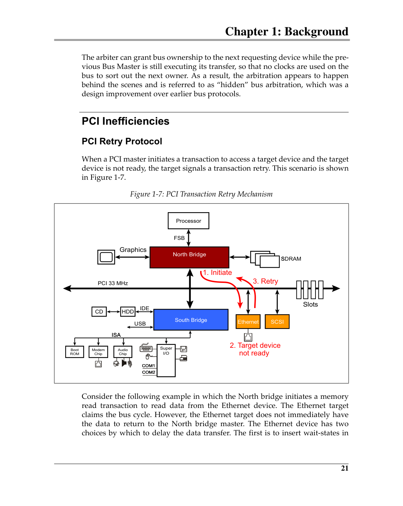

<a id="sec-1-2"></a>
## 1.2 Background | 背景

<table>
<thead><tr><th width="50%">🇬🇧 English</th><th width="50%">🇨🇳 中文</th></tr></thead>
<tbody>
<tr>
<td width="50%">

## **This Chapter** 

This chapter reviews the PCI (Peripheral Component Interface) bus models that preceded PCI Express (PCIe) as a way of building a foundation
for understand‐ ing PCI Express architecture. PCI and PCI‐X (PCI‐eXtended) are introduced and their basic features and characteristics are
described, followed by a discussion of the motivation for migrating from those earlier parallel bus models to the serial bus model used by
PCIe.

</td>
<td width="50%">

## **本章** 

本章回顾了 PCI Express（PCIe）之前作为前代总线模型的 PCI（外围组件接口）总线模型，以此为理解 PCI Express 架构奠定基础。本章将介绍 PCI 和
PCI-X（PCI-eXtended），并描述它们的基本特性和特点，随后讨论从这些早期的并行总线模型迁移到 PCIe 所采用的串行总线模型的动机。

</td>
</tr>
</tbody>
</table>

[⬆️ 返回目录](#本章目录-table-of-contents)

---


<a id="sec-1-3"></a>
## 1.3 Background | 背景

<table>
<thead><tr><th width="50%">🇬🇧 English</th><th width="50%">🇨🇳 中文</th></tr></thead>
<tbody>
<tr>
<td width="50%">

## **The Next Chapter** 

The next chapter provides an introduction to the PCI Express architecture and is intended to serve as an “executive level” overview,
covering all the basics of the architecture at a high level. It introduces the layered approach to PCIe port design given in the spec and
describes the responsibilities of each layer.

</td>
<td width="50%">

## **下一章**

下一章将介绍 PCI Express 架构，旨在作为一份“管理层”级别的概览，从高层次覆盖该架构的所有基础知识。它将介绍规范中给出的 PCIe 端口设计的分层方法，并描述每一层的职责。

</td>
</tr>
</tbody>
</table>

[⬆️ 返回目录](#本章目录-table-of-contents)

---

<a id="sec-1-4"></a>
## 1.4 Background | 背景

<table>
<thead><tr><th width="50%">🇬🇧 English</th><th width="50%">🇨🇳 中文</th></tr></thead>
<tbody>
<tr>
<td width="50%">

## **Introduction** 

Establishing a solid foundation in the technologies on which PCIe is built is a helpful first step to understanding it, and an overview of
those architectures is presented here. Readers already familiar with PCI may prefer to skip to the next chapter. This background is only
intended as a brief overview. For more depth and detail on PCI and PCI‐X, please refer to MindShare’s books: PCI System Architecture, and
PCI‐X System Architecture.

As an example of how this background can be helpful, the software used for PCIe remains much the same as it was for PCI. Maintaining this
backward com‐ patibility encourages migration from the older designs to the new by making the software changes as simple and inexpensive as
possible. As a result, older PCI software works unchanged in a PCIe system and new software will con‐ tinue to use the same models of
operation. For this reason and others, under‐ standing PCI and its models of operation will facilitate an understanding of PCIe.

**9**

</td>
<td width="50%">

## **简介** 

在 PCIe 所基于的各项技术之上建立扎实的基础,是理解 PCIe 的一个有益的第一步,本节将对这些架构进行概述。已经熟悉 PCI 的读者可以跳过本章直接进入下一章。本背景内容仅作为简要概述。如果希望深入了解 PCI 和 PCI‐X 的更多细节,请参阅 MindShare
的书籍: 《PCI System Architecture》和《PCI‐X System Architecture》。

举一个能够体现这些背景知识作用的例子:PCIe 所使用的软件与 PCI 时代基本相同。保持这种向后兼容性,可以通过使软件变更尽可能简单和廉价,从而鼓励从旧设计向新设计的迁移。因此,旧版 PCI 软件可以在 PCIe
系统中无需修改地运行,而新软件也将继续沿用相同的操作模型。出于这一原因及其他原因,理解 PCI 及其操作模型将有助于理解 PCIe。

**9**

</td>
</tr>
</tbody>
</table>

[⬆️ 返回目录](#本章目录-table-of-contents)

---

<a id="sec-1-5"></a>
## 1.5 Background | 背景

<table>
<thead><tr><th width="50%">🇬🇧 English</th><th width="50%">🇨🇳 中文</th></tr></thead>
<tbody>
<tr>
<td width="50%">

## **PCI and PCI-X** 

The PCI (Peripheral Component Interface) bus was developed in the early 1990’s to address the shortcomings of the peripheral buses that were
used in PCs (personal computers) at the time. The standard at the time was IBM’s AT (Advanced Technology) bus, referred to by other vendors
as the ISA (Industry Standard Architecture) bus. ISA had been sufficient for the 286 16‐bit machines for which it was designed, but
additional bandwidth and improved capabilities, such plug‐and‐play, were needed for the newer 32‐bit machines and their peripherals. Besides
that, ISA used big connectors that had a high pin count. PC vendors recognized the need for a change and several alternate bus designs were
proposed, such as IBM’s MCA (Micro‐Channel Architecture), the EISA bus (Extended ISA, proposed as an open standard by IBM competitors), and
the VESA bus (Video Electronics Standards Association, proposed by video card vendors for video devices). However, all of these designs had
drawbacks that prevented wide acceptance. Eventually, PCI was developed as an open standard by a consortium of major players in the PC
market who formed a group called the PCISIG (PCI Special Interest Group). The performance of the newly‐devel‐ oped bus architecture was much
higher than ISA, and it also defined a new set of registers within each device referred to as configuration space. These regis‐ ters allowed
software to see the memory and IO resources a device needed and assign each device addresses that wouldn’t conflict with other addresses in
the system. These features: open design, high speed, and software visibility and control, helped PCI overcome the obstacles that had limited
ISA and other buses PCI quickly became the standard peripheral bus in PCs.

A few years later, PCI‐X (PCI‐eXtended) was developed as a logical extension of the PCI architecture and improved the performance of the bus
quite a bit. We’ll discuss the changes a little later, but a major design goal for PCI‐X was main‐ taining compatibility with PCI devices,
both in hardware and software, to make migration from PCI as simple as possible. Later, the PCI‐X 2.0 revision added even higher speeds,
achieving a raw data rate of up to 4 GB/s. Since PCI‐X main‐ tained hardware backward compatibility with PCI, it remained a parallel bus and
inherited the problems associated with that model. That’s interesting for us because parallel buses eventually reach a practical ceiling on
effective band‐ width and can’t readily be made to go faster. Going to a higher data rate with PCI‐X was explored by the PCISIG, but the
effort was eventually abandoned. That speed ceiling, along with a high pin count, motivated the transition away from the parallel bus model
to the new serial bus model.

These earlier bus definitions are listed in Table 1‐1 on page 11, which shows the development over time of higher frequencies and
bandwidths. One of the inter‐

esting things to note in this table is the correlation of clock frequency and the number of add‐in card slots on the bus. This was due to
PCI’s low‐power signal‐ ing model, which meant that higher frequencies required shorter traces and fewer loads on the bus (see
“Reflected‐Wave Signaling” on page 16). Another point of interest is that, as the clock frequency increases, the number of devices permitted
on the shared bus decreases. When PCI‐X 2.0 was introduced, its high speed mandated that the bus become a point‐to‐point interconnect.

_Table 1‐1: Comparison of Bus Frequency, Bandwidth and Number of Slots_ 

|**Bus Type**|**Clock Frequency**|**Peak Bandwidth** **32‐bit ‐ 64‐bit ...|**Number of Card** **Slots per Bus**|
|---|---|---|---|
|PCI|33 MHz|133 ‐ 266 MB/s|4‐5|
|PCI|66 MHz|266 ‐ 533 MB/s|1‐2|
|PCI‐X 1.0|66 MHz|266 ‐ 533 MB/s|4|
|PCI‐X 1.0|133 MHz|533 ‐ 1066 MB/s|1‐2|
|PCI‐X 2.0 (DDR)|133 MHz|1066 ‐ 2132 MB/s|1 (point‐to‐point bus)|
|PCI‐X 2.0 (QDR)|133 MHz|2132 ‐ 4262 MB/s|1 (point‐to‐point bus)|

</td>
<td width="50%">

## **PCI 与 PCI-X**

PCI（Peripheral Component Interface，外围组件互连）总线于 1990 年代初期开发，旨在弥补当时 PC（个人计算机）所使用外围总线的不足。当时的标准是 IBM 的 AT（Advanced Technology，高级技术）总线，其他厂商称之为
ISA（Industry Standard Architecture，工业标准架构）总线。ISA 对于其最初设计的 286 16 位机器而言已经够用，但对于较新的 32 位机器及其外围设备，需要更大的带宽和增强的功能，例如即插即用。此外，ISA 使用的大型连接器引脚数量较多。PC
厂商认识到变革的必要性，于是提出了若干备选总线设计方案，例如 IBM 的 MCA（Micro-Channel Architecture，微通道架构）、由 IBM 竞争对手以开放标准名义提出的 EISA 总线（Extended ISA，扩展 ISA），以及由显卡厂商为视频设备提出的
VESA 总线（Video Electronics Standards Association，视频电子标准协会）。然而，这些设计都存在一些缺陷，难以被广泛接受。最终，PCI 由 PC 市场的主要厂商组成的联盟开发为开放标准，该联盟成立了一个名为 PCISIG（PCI
Special Interest Group，PCI 特殊兴趣小组）的组织。全新开发的总线架构性能远高于 ISA，并且它还在每个设备内部定义了一组新的寄存器，称为配置空间（Configuration Space）。这些寄存器使软件能够查看设备所需的内存和 I/O
资源，并为每个设备分配不会与系统中其他地址冲突的地址。这些特性：开放的设计、高速度以及软件可见性与可控性，帮助 PCI 克服了曾经限制 ISA 及其他总线发展的障碍。PCI 迅速成为 PC 中的标准外围总线。

几年后，PCI-X（PCI-eXtended，PCI 扩展）作为 PCI 架构的逻辑扩展被开发出来，显著提升了总线性能。我们稍后将讨论这些变化，但 PCI-X 的一个主要设计目标是在硬件和软件上保持与 PCI 设备的兼容性，以尽可能简化从 PCI 的迁移过程。后来，PCI-X
2.0 版本进一步提升了速度，原始数据速率高达 4 GB/s。由于 PCI-X 在硬件上保持了与 PCI 的向后兼容性，它仍然是一种并行总线，并继承了并行模型相关的问题。这对我们而言很有意义，因为并行总线最终会达到实际的有效带宽上限，难以进一步提速。PCISIG
曾探索通过提升数据速率来加速 PCI-X，但最终放弃了这一努力。这一速度上限，加上较高的引脚数，推动了从并行总线模型向新串行总线模型的过渡。

这些早期总线定义列于第 11 页的表 1-1 中，该表展示了随时间推移总线频率和带宽的演进。该表中值得注意的一点是总线时钟频率与总线上扩展卡插槽数量之间的关联性。这源于 PCI 的低功耗信号模型，意味着更高的频率需要更短的走线和更少的总线负载（参见第 16
页的"反射波信号"）。另一个值得关注的现象是，随着时钟频率的增加，共享总线上允许的设备数量也在减少。PCI-X 2.0 引入时，其高速率要求总线必须采用点对点互连。

**表 1-1：总线频率、带宽与插槽数量对比**

|**总线类型**|**时钟频率**|**峰值带宽**<br>**32 位 ‐ 64 位总线**|**每条总线的卡 插槽数量**|
|---|---|---|---|
|PCI|33 MHz|133 ‐ 266 MB/s|4‐5|
|PCI|66 MHz|266 ‐ 533 MB/s|1‐2|
|PCI‐X 1.0|66 MHz|266 ‐ 533 MB/s|4|
|PCI‐X 1.0|133 MHz|533 ‐ 1066 MB/s|1‐2|
|PCI‐X 2.0 (DDR)|133 MHz|1066 ‐ 2132 MB/s|1（点对点总线）|
|PCI‐X 2.0 (QDR)|133 MHz|2132 ‐ 4262 MB/s|1（点对点总线）|

**第 1 章：背景**

</td>
</tr>
</tbody>
</table>

[⬆️ 返回目录](#本章目录-table-of-contents)

---

<a id="sec-1-6"></a>
## 1.6 Background | 背景

<table>
<thead><tr><th width="50%">🇬🇧 English</th><th width="50%">🇨🇳 中文</th></tr></thead>
<tbody>
<tr>
<td width="50%">

## **PCI Basics**

</td>
<td width="50%">

## **PCI 基础知识**

</td>
</tr>
</tbody>
</table>

[⬆️ 返回目录](#本章目录-table-of-contents)

---

<a id="sec-1-7"></a>
## 1.7 Background | 背景

<table>
<thead><tr><th width="50%">🇬🇧 English</th><th width="50%">🇨🇳 中文</th></tr></thead>
<tbody>
<tr>
<td width="50%">

## **Basics of a PCI-Based System** 

Figure 1‐1 on page 12 shows an older system based on a PCI bus. The system includes a North Bridge (called “north” because if the diagram is
viewed as a map, it appears geographically north of the central PCI bus) that interfaces between the processor and the PCI bus. Associated
with the North Bridge is the processor bus, system memory bus, AGP graphics bus, and PCI. Several devices share the PCI bus and are either
connected directly to the bus or plugged into an add‐in card connector. A South Bridge connects PCI to system peripherals, such as the ISA
bus where legacy peripherals were carried forward for a few years. The South Bridge was typically also the central resource for PCI that
pro‐ vided system signals like reset, reference clock, and error reporting.

</td>
<td width="50%">

## **基于 PCI 的系统基础** 

第 12 页的图 1‐1 展示了一个基于 PCI 总线的较老式系统。该系统包含一个北桥（之所以称为"北桥"，是因为如果将该图视为一张地图，它在地理位置上位于中央 PCI 总线的北侧），用于在处理器和 PCI 总线之间进行接口对接。与北桥相关联的有处理器总线、系统内存总线、AGP
图形总线以及 PCI 总线。多个设备共享 PCI 总线，它们要么直接连接到总线上，要么插入到扩展卡连接器中。南桥将 PCI 与系统外设（例如 ISA 总线，用于在早期几年中继续承载传统外设）连接起来。南桥通常也是 PCI 的中央资源，提供复位、参考时钟以及错误报告等系统信号。

</td>
</tr>
</tbody>
</table>

[⬆️ 返回目录](#本章目录-table-of-contents)

---

<a id="sec-1-8"></a>
## 1.8 Background | 背景

<table>
<thead><tr><th width="50%">🇬🇧 English</th><th width="50%">🇨🇳 中文</th></tr></thead>
<tbody>
<tr>
<td width="50%">

## **PCI Express Technology** 

_Figure 1‐1: Legacy PCI Bus‐Based Platform_ 


<br>

</td>
<td width="50%">

## **PCI Express 技术** 

_图 1‐1：传统 PCI 总线架构平台_ 

**==> 图片 [384 x 227] 已有意省略 <==**

**----- 图片文字开始 -----**<br>
处理器<br>前端总线 (FSB)<br>图形<br>北桥<br>(Intel 440) SDRAM<br>地址端口 数据端口<br>PCI 33 MHz<br>插槽<br>IDE<br>CD HDD<br>USB 南桥 逻辑错误 以太网 SCSI<br>ISA<br>启动
调制解调器 音频 超级<br>ROM 芯片 芯片 I/O<br>COM1<br>COM2<br>**----- 图片文字结束 -----**<br>

</td>
</tr>
</tbody>
</table>

[⬆️ 返回目录](#本章目录-table-of-contents)

---

<a id="sec-1-9"></a>
## 1.9 Background | 背景

<table>
<thead><tr><th width="50%">🇬🇧 English</th><th width="50%">🇨🇳 中文</th></tr></thead>
<tbody>
<tr>
<td width="50%">

## **PCI Bus Initiator and Target** 

In a PCI hierarchy each device on the bus may contain up to eight functions that all share the bus interface for that device, numbered 0‐7
(a single‐function device is always assigned function number 0). Every function is capable of act‐ ing as a target for transactions on the
bus, and most will also be able to initiate transactions. Such an initiator (called a Bus Master) has a pair of pins (REQ# and GNT#)
dedicated to arbitrating for use of the shared PCI bus. As shown in Fig‐ ure 1‐2 on page 13, a Request (REQ#) pin indicates that the master
needs to use the bus and is sent to the bus arbiter for evaluation against all the other requests at that moment. The arbiter is often
located in the bridge that is hierarchically above the bus and receives arbitration requests from all the devices that can act as initiators
(Bus Masters) on that bus. The arbiter decides which requester should be the next owner of the bus and asserts the Grant (GNT#) pin for that
device. According to the protocol, whenever the previous transaction finishes and the bus goes idle, whichever device sees its GNT# asserted
at that time is designated as the next Bus Master and can begin its transaction.

_Figure 1‐2: PCI Bus Arbitration_ 


<br>

</td>
<td width="50%">

## **PCI 总线发起方与目标方**

在 PCI 层级结构中,总线上的每个设备最多可包含八个功能,这些功能共享该设备的总线接口,编号为 0~7(单功能设备始终被分配功能编号 0)。每个功能都能够作为总线上事务的目标方,其中大多数还能够发起事务。这样的发起方(称为总线主设备)具有一对专用于仲裁共享 PCI
总线使用权的引脚(REQ# 和 GNT#)。如图 1-2(第 13
页)所示,请求(REQ#)引脚表示主设备需要使用总线,该信号被发送到总线仲裁器,以便与此时所有其他请求一起进行评估。仲裁器通常位于层级结构中该总线上方的桥接器中,接收来自该总线上所有可作为发起方(总线主设备)的设备的仲裁请求。仲裁器决定哪个请求者应成为总线的下一个所有者,并为该设备断言授权(GNT#)引脚。根据协议,无论何时,只要前一个事务完成且总线进入空闲状态,在此期间观察到其
GNT# 被断言的设备就被指定为下一个总线主设备,并可以开始其事务。

**第 1 章:背景**

_图 1-2:PCI 总线仲裁_


<br>

</td>
</tr>
</tbody>
</table>

[⬆️ 返回目录](#本章目录-table-of-contents)

---

<a id="sec-1-10"></a>
## 1.10 Background | 背景

<table>
<thead><tr><th width="50%">🇬🇧 English</th><th width="50%">🇨🇳 中文</th></tr></thead>
<tbody>
<tr>
<td width="50%">

## **Typical PCI Bus Cycle** 

Figure 1‐3 on page 15 represents a typical PCI bus cycle. PCI is synchronous, meaning events happen on clock edges, so the clock is shown at
the top of the diagram and it’s rising edges are marked with dotted lines because those are the times when signals are driven out or
sampled. A brief description of what hap‐ pens on the bus is as follows:

1. On clock edge 1, FRAME# (used to indicate when a bus access is in progress) and IRDY# (Initiator Ready for data) are both inactive,
showing that the bus is idle. At the same time, GNT# is active, meaning the bus arbi‐ ter has selected this device to be the next initiator.

2. On clock edge 2, FRAME# is asserted by the initiator, indicating that a new transaction has started. At the same time, it drives the
address and com‐ mand for this transaction. All of the other devices on the bus will latch this information and begin the process of
decoding the address to see whether it’s a match for them.

</td>
<td width="50%">

## **典型 PCI 总线周期**

第 15 页的图 1‐3 展示了一个典型的 PCI 总线周期。PCI 是同步的，意味着事件发生在时钟边沿上,因此时钟显示在图表的顶部,其上升沿用虚线标出,因为这些是信号被驱动输出或采样的时刻。总线上发生的情况简要描述如下:

1. 在时钟边沿 1 上,FRAME#(用于指示总线访问正在进行)和 IRDY#(发起方数据就绪)均处于无效状态,表明总线处于空闲状态。与此同时,GNT# 有效,意味着总线仲裁器已选择该设备作为下一个发起方。

2. 在时钟边沿 2 上,由发起方断言 FRAME#,表示新事务已开始。同时,它驱动该事务的地址和命令。总线上的所有其他设备将锁存此信息并开始对地址进行解码,以查看该事务是否与它们匹配。

</td>
</tr>
</tbody>
</table>

[⬆️ 返回目录](#本章目录-table-of-contents)

---

<a id="sec-1-11"></a>
## 1.11 Background | 背景

<table>
<thead><tr><th width="50%">🇬🇧 English</th><th width="50%">🇨🇳 中文</th></tr></thead>
<tbody>
<tr>
<td width="50%">

## **PCI Express Technology** 

3. On clock edge 3, the initiator indicates its readiness for data transfer by asserting IRDY#. The round arrow symbol shown on the AD bus
indicates that the tri‐stated bus is undergoing a “turn‐around cycle” as ownership of the signals changes (needed here because this is a
read transaction; the initi‐ ator drives the address but receives data on the same pins). The target’s buffer is not turned on using the
same clock edge that turns the initiator’s buffer off because we want to avoid the possibility of both buffers trying to drive a signal
simultaneously, even for a brief time. That contention on the bus could damage the devices so, instead, the previous buffer is turned off
one clock before the new one is turned on. Every shared signal is handled this way before changing direction.

4. On clock edge 4, a device on the bus has recognized the requested address and responded by asserting DEVSEL# (device select) to claim
this transac‐ tion and participate in it. At the same time, it asserts TRDY# (target ready) to show that it is delivering the first part of
the read data and drives that data onto the AD bus (this could have been delayed ‐ the target is allowed 16 clocks from the assertion of
FRAME# until TRDY#). Since both IRDY# and TRDY# are active at the same time here, data will be transferred on that clock edge, completing
the first data phase. The initiator knows how many bytes will eventually be transferred, but the target does not. The command does not
provide a byte count, so the target must look at the status of FRAME# whenever a data phase completes to learn when the initiator is
satisfied with the amount of data transferred. If FRAME# is still asserted, this was not the last data phase and the transaction will
continue with the next contiguous set of bytes, as is the case here.

5. On clock edge 5, the target is not prepared to deliver the next set of data, so it deasserts TRDY#. This is called inserting a “Wait
State” and the transac‐ tion is delayed for a clock. Both initiator and target are allowed to do this, and each can delay the next data
transfer by up to 8 consecutive clocks.

6. On clock edge 6, the second data item is transferred, and since FRAME# is still asserted, the target knows that the initiator still wants
more data.

7. On clock edge 7, the initiator forces a Wait State. Wait States allow devices to pause a transaction to quickly fill or empty a buffer
and can be helpful because they allow the transaction to resume without having to stop and restart. On the other hand, they are often very
inefficient because they not only stall the current transaction, they also prevent other devices from gain‐ ing access to the bus while it’s
stalled.

8. On clock edge 8, the third data set is transferred and now FRAME# has been deasserted so the target can tell that this was the last data
item. Conse‐ quently, after this clock, all the control lines are turned off and the bus once again goes to the idle state.

In keeping with the low cost design goal for PCI, several signals have more than one meaning on the bus to reduce the pin count. The 32
address and data sig‐ nals are multiplexed and the C/BE# (Command/Byte Enable) signals share their four pins for the same reason. Although
reducing the pin count is desirable, it’s also the reason that PCI uses “turn‐around cycles”, which add more delay. It also precludes the
option to pipeline transactions (sending the address for the next cycle while data for the previous one is delivered). Handshake signals
like FRAME#, DEVSEL#, TRDY#, IRDY#, and STOP# control the timing of events during the transaction.

_Figure 1‐3: Simple PCI Bus Transfer_ 


<br>

</td>
<td width="50%">

## **PCI Express Technology**

3. 在时钟边沿 3,发起端通过置位 IRDY# 来表明其已准备好进行数据传输。AD 总线上显示的圆形箭头符号表示三态总线正在进行"转向周期 (turn-around
cycle)",因为信号的所有权正在发生改变(此处需要该周期,因为这是一次读事务;发起端驱动地址,但在相同的引脚上接收数据)。目标设备的缓冲区并不是在使用与关闭发起端缓冲区相同的时钟边沿上打开,因为我们希望避免两个缓冲区在同一时刻(哪怕是短暂的时间)同时驱动信号的可能性。总线上的这种争用可能会损坏器件,因此,前一个缓冲区要在新缓冲区打开的前一个时钟被关闭。每条共享信号在改变方向之前都会以这种方式处理。

4. 在时钟边沿 4,总线上的某个设备识别到了所请求的地址,并通过置位 DEVSEL# (Device Select) 来响应该事务,从而认领该事务并参与其中。同时,它置位 TRDY# (Target Ready) 以表明它正在提供读数据的第一个部分,并将该数据驱动到 AD
总线上(这可能会被延迟——目标端从置位 FRAME# 起最多有 16 个时钟的窗口来置位 TRDY#)。由于此处 IRDY# 和 TRDY#
同时有效,因此将在该时钟边沿上传输数据,从而完成第一个数据相位。发起端知道最终将传输多少字节,但目标端并不知道。该命令并不提供字节计数,因此目标端必须在每个数据相位完成时查看 FRAME# 的状态,以了解发起端是否对已传输的数据量感到满意。如果 FRAME#
仍然处于置位状态,则表示这并非最后一个数据相位,事务将继续传输下一组连续的字节,正如本例中的情况。

5. 在时钟边沿 5,目标端尚未准备好提供下一组数据,因此它撤销 TRDY#。这称为插入一个"等待状态 (Wait State)",事务将因此延迟一个时钟。发起端和目标端均允许这样做,并且各自可以将下一次数据传输延迟最多连续 8 个时钟。

6. 在时钟边沿 6,传输第二个数据项,并且由于 FRAME# 仍然处于置位状态,目标端知道发起端仍然希望获取更多的数据。

7. 在时钟边沿 7,发起端强制插入一个等待状态。等待状态允许设备暂停一个事务以快速填充或清空缓冲区,这是非常有用的,因为它允许事务在不停止并重新启动的情况下继续进行。另一方面,它们通常效率很低,因为它们不仅会停滞当前事务,还会阻止其他设备在该停滞期间访问总线。

8. 在时钟边沿 8,传输第三组数据,此时 FRAME# 已被撤销,因此目标端可以判断这是最后一个数据项。因此,在该时钟之后,所有控制线均关闭,总线再次进入空闲状态。

**第 1 章:背景**

为了保持 PCI 的低成本设计目标,总线上有多个信号具有多重含义,以减少引脚数。32 个地址和数据信号进行了多路复用,C/BE# (Command/Byte Enable,命令/字节使能) 信号也在其 4 个引脚上进行了复用,出于同样的原因。尽管减少引脚数是可取的,但这也是
PCI 使用"转向周期"的原因,这会引入更多的延迟。同时,这一设计也排除了流水线事务的可能性(在前一个周期的数据交付期间发送下一个周期的地址)。诸如 FRAME#、DEVSEL#、TRDY#、IRDY# 和 STOP# 之类的握手信号用于控制事务过程中事件的时间安排。

_**图 1‐3:简单的 PCI 总线传输**_


<br>

</td>
</tr>
</tbody>
</table>

[⬆️ 返回目录](#本章目录-table-of-contents)

---

<a id="sec-1-12"></a>
## 1.12 Background | 背景

<table>
<thead><tr><th width="50%">🇬🇧 English</th><th width="50%">🇨🇳 中文</th></tr></thead>
<tbody>
<tr>
<td width="50%">

## **Reflected-Wave Signaling** 

PCI architecturally supports up to 32 devices on each bus, but the practical elec‐ trical limit is considerably less, on the order of 10 to
12 electrical loads at the base frequency of 33MHz. The reason for this is that the bus uses a technique called “reflected‐wave signaling”
to reduce the power consumption on the bus (see Figure 1‐4 on page 17). In this model, devices save cost and power by implementing weak
transmit buffers that can only drive the signal to about half the voltage needed to switch the signal. The incident wave of the signal
propa‐ gates down the transmission line until it reaches the end. By design, there is no termination at the end of the line so the wavefront
encounters an infinite imped‐ ance and reflects back. This reflection is additive in nature and increases the sig‐ nal to the full voltage
level as it makes its way back to the transmitter. When the signal reaches the originating buffer, the low output impedance of the driver
terminates the signal and prevents further reflections. The total elapsed time from the buffer asserting a signal until the receiver detects
a valid signal is thus the propagation time down the wire plus the reflection delay coming back and the setup time. All of that must be less
than the clock period.

As the length of the trace and the number of electrical loads on a bus increase, the time required for the signal to make this round trip
increases. A 33 MHz PCI bus can only meet the signal timing with about 10‐12 electrical loads. An electri‐ cal load is one device installed
on the system board, but a populated connector slot actually counts as two loads. Therefore, as indicated in Table 1‐1 on page 11, a 33 MHz
PCI bus can only be designed for reliable operation with a maximum of 4 or 5 add‐in card connectors.

_Figure 1‐4: PCI Reflected‐Wave Signaling_ 


<br>

To connect more loads in a system, a PCI‐to‐PCI bridge is needed, as shown in Figure 1‐5. By the time more modern chipsets were available,
peripherals had grown so fast that their competition for access to the shared PCI bus was limit‐ ing their performance. PCI speeds didn’t
keep up, and it became a system bot‐ tleneck even though it was still very popular for peripherals. The solution to this problem was to move
PCI out of the main path between system peripherals and memory, replacing the chipset interconnect with a proprietary solution (in this
example, Intel’s Hub Link interface).

A PCI Bridge is an extension to the topology. Each Bridge creates a new PCI bus that is electrically isolated from the bus above it,
allowing another 10‐12 loads. Some of these devices could also be bridges, allowing a large number of devices to be connected in a system.
The PCI architecture allows up to 256 buses in a single system and each of those buses can have up to 32 devices.

_Figure 1‐5: 33 MHz PCI System, Including a PCI‐to‐PCI Bridge_ 


<br>

</td>
<td width="50%">

## **反射波信号（Reflected-Wave Signaling）** 

PCI 在架构上每条总线最多支持 32 个设备,但实际可承受的电气负载远低于该数值,在 33MHz 基频下大约只有 10 到 12 个电气负载。其原因是 PCI 总线采用了一种称为"反射波信号"的技术以降低总线功耗（参见第 17 页的图
1-4）。在该模型中,设备通过实现较弱的发送缓冲器来节省成本和功耗,这种缓冲器只能将信号驱动到切换信号所需电压的一半左右。信号的入射波沿传输线传播,直到到达末端。按设计,线路末端没有端接器,因此波前会遭遇无穷大阻抗并被反射回来。该反射在性质上是叠加的,会在其返回发送器的过程中将信号电压叠加至完整电平。当信号到达原始缓冲器时,驱动器较低的输出阻抗会终结该信号并阻止进一步的反射。因此,从缓冲器发出信号到接收器检测到有效信号所经历的总耗时,等于信号沿导线传播的传播时间加上反射回来的延迟再加上建立时间。所有这些时长都必须小于时钟周期。

随着走线长度和总线上电气负载数量的增加,信号完成该往返所需的时间也随之增加。33 MHz 的 PCI 总线在仅约 10-12 个电气负载时才能满足信号时序要求。一个电气负载可以是安装在系统板上的一台设备,但一个已插接的连接器插槽实际上计为两个负载。因此,正如第 11 页的表
1-1 所示,33 MHz PCI 总线在设计上最多只能稳定支持 4 到 5 个扩展卡连接器插槽。

**第 1 章：背景** 

_图 1-4：PCI 反射波信号_ 

**==> 图片 [223 x 194] 已故意省略 <==**

**----- 图片文字开始 -----**<br>
PCI CLK 周期<br>
30ns（33MHz 时）<br>
C<br>
Tprop Tsu<br>
最大 10ns 最小 7ns<br>
Tval A B<br>
最大 11ns<br>
**----- 图片文字结束 -----**<br>

要在系统中连接更多负载,就需要 PCI-to-PCI 桥（PCI-to-PCI Bridge）,如图 1-5 所示。等到更现代的芯片组出现时,各类外设增长迅速,它们对共享 PCI 总线访问权的竞争已开始限制其性能表现。PCI
的速度未能跟上,即便它在当时仍非常流行,却已成为系统瓶颈。该问题的解决方案是将 PCI 从系统外设与内存之间的主路径中移除,并用一种专有方案（本例中为 Intel 的 Hub Link 接口）来替代芯片组互连。

PCI 桥是拓扑的扩展。每个桥都会创建一条新的 PCI 总线,该总线在电气上与其上游总线相隔离,从而允许再增加 10-12 个负载。这些设备中的一部分也可以是桥,从而使系统中可以连接大量设备。PCI 架构在单个系统中最多允许 256 条总线,每条总线上又可挂载多达 32 个设备。

**PCI Express 技术** 

_图 1-5：33 MHz PCI 系统,包含 PCI-to-PCI 桥_ 

**==> 图片 [353 x 219] 已故意省略 <==**

**----- 图片文字开始 -----**<br>
处理器（Processor）<br>
FSB<br>
AGP<br>
4x 内存控制器 Hub（Memory Controller Hub）<br>
GFX<br>
(Intel 8XX GMCH) DDR<br>
O n TT SDRAM<br>
Hub Link 插槽（Slots）<br>
IDE<br>
CD HDD PCI-33MHz<br>
USB IO Controller Hub 主 PCI 总线（Primary PCI Bus）<br>
(ICH4) PCI<br>
LPC<br>
桥（Bridge）<br>
Super AC'97<br>
IO Link 次 PCI 总线（Secondary PCI Bus）<br>
以太网（Ethernet）<br>
COM1 COM1 调制解调器（Modem）音频（Audio） (a 启动<br>
COM2 编解码器（CODEC）编解码器（CODEC）以太网（Ethernet） ROM<br>
**----- 图片文字结束 -----**<br>

</td>
</tr>
</tbody>
</table>

[⬆️ 返回目录](#本章目录-table-of-contents)

---

<a id="sec-1-13"></a>
## 1.13 Background | 背景

<table>
<thead><tr><th width="50%">🇬🇧 English</th><th width="50%">🇨🇳 中文</th></tr></thead>
<tbody>
<tr>
<td width="50%">

## **PCI Bus Architecture Perspective**

</td>
<td width="50%">

## **PCI 总线架构视角 (PCI Bus Architecture Perspective)**

</td>
</tr>
</tbody>
</table>

[⬆️ 返回目录](#本章目录-table-of-contents)

---

<a id="sec-1-14"></a>
## 1.14 Background | 背景

<table>
<thead><tr><th width="50%">🇬🇧 English</th><th width="50%">🇨🇳 中文</th></tr></thead>
<tbody>
<tr>
<td width="50%">

## **PCI Transaction Models** 

PCI uses three models for data transfer just as previous bus models did: Pro‐ grammed I/O (PIO), Peer‐to‐peer, and DMA. These models are
illustrated in Figure 1‐6 on page 19 and described in the following sections.

</td>
<td width="50%">

## **PCI 事务模型** 

与之前的总线模型一样,PCI 使用三种模型进行数据传输:编程 I/O (PIO)、对等 (Peer-to-Peer) 和 DMA。这些模型如图 1-6(第 19 页)所示,并将在以下各节中进行描述。

</td>
</tr>
</tbody>
</table>

[⬆️ 返回目录](#本章目录-table-of-contents)

---

<a id="sec-1-15"></a>
## 1.15 Background | 背景

<table>
<thead><tr><th width="50%">🇬🇧 English</th><th width="50%">🇨🇳 中文</th></tr></thead>
<tbody>
<tr>
<td width="50%">

## **Programmed I/O** 

PIO was commonly used in the early days of the PC because designers were reluctant to add the expense or complexity to their devices of
transaction man‐ agement logic. The processor could do the job faster than any other device any‐ way so, in this model, it handles all the
work. For example, if a PCI device

interrupts the CPU to indicate that it needs to put data in memory, the CPU will end up reading data from the PCI device into an internal
register and then copying that register to memory. Going the other way, if data is to be moved from memory to the PCI device, software
instructs the CPU to read from mem‐ ory into its internal register and then write that register to the PCI device.

The process works but is inefficient for two reasons. First, there are two bus cycles generated by the CPU for every data transfer, and
second, the CPU is busy with data transfer housekeeping rather than more interesting work. In the early days this was the fastest transfer
method and the single‐tasking processor didn’t have much else to do. These types of inefficiencies are typically not acceptable in modern
systems, so this method is no longer very common for data transfers, and instead the DMA method described in the next section is the
preferred approach. However, programmed IO is still a necessary transaction model in order for software to interact with a device.

_Figure 1‐6: PCI Transaction Models_ 


<br>

</td>
<td width="50%">

## **程序化 I/O** 

PIO 在个人电脑 (PC) 早期被广泛使用,这是因为设计者不愿意在其设备中增加事务管理逻辑所需的成本或复杂性。处理器反正比任何其他设备完成这项工作都要快,因此在这种模式下,处理器承担了所有的工作。例如,如果一个 PCI 设备

**第 1 章:背景** 

向 CPU 发出中断以表明它需要将数据放入内存,那么 CPU 最终会从 PCI 设备读取数据到其内部寄存器,然后再将该寄存器中的数据复制到内存。反过来,如果需要将数据从内存移动到 PCI 设备,软件则指示 CPU 从内存读取数据到其内部寄存器,然后再将该寄存器中的数据写入 PCI
设备。

这个过程虽然可行,但出于两个原因效率低下。首先,CPU 每传输一次数据就会产生两个总线周期;其次,CPU
一直忙于数据传输的杂事,而无法做更有意义的工作。在早期,这是最快的传输方式,而且单任务处理器也没有太多其他事情可做。这种低效率在现代系统中通常是不可接受的,因此这种方法在数据传输中已不再常见,取而代之的是下一节中介绍的 DMA 方法,这才是首选方案。然而,程序化 I/O
仍然是一种必要的事务模型,因为软件需要通过它与设备进行交互。

_图 1‐6:PCI 事务模型_ 

**==> 图片 [380 x 226] 故意省略 <==**

**----- 图片文字开始 -----**<br>
处理器<br>前端总线 (FSB) 程序化 I/O<br>图形<br>北桥 (Intel 440北桥 (Intel 440)) SDRAM<br>地址端口 数据端口<br>DMA<br>PCI 33 MHz<br>对等<br>到<br>对等 插槽<br>IDE<br>CD
HDD<br>USB 南桥 逻辑错误 以太网 SCSI<br>ISA<br>启动 调制解调器 音频 超级<br>ROM 芯片 芯片 I/O<br>COM1<br>COM2<br>**----- 图片文字结束 -----**<br>

</td>
</tr>
</tbody>
</table>

[⬆️ 返回目录](#本章目录-table-of-contents)

---

<a id="sec-1-16"></a>
## 1.16 Background | 背景

<table>
<thead><tr><th width="50%">🇬🇧 English</th><th width="50%">🇨🇳 中文</th></tr></thead>
<tbody>
<tr>
<td width="50%">

## **Direct Memory Access (DMA)** 

A more efficient method of transferring data is called DMA (direct memory access). In this model another device, called a DMA engine,
handles the details of memory transfers to a peripheral on behalf of the processor, off‐loading this

tedious task. Once the CPU has programmed the starting address and byte count into it, the DMA engine handled the bus protocol and address
sequencing on its own. This didn’t involve any change to the PCI peripherals and allowed them to keep their low‐cost designs. Later,
improved integration allowed peripherals to integrate this DMA functionality locally, so they didn’t need an external DMA engine. These
devices were capable of handling their own bus transfers and were called Bus Master devices.

Figure 1‐3 on page 15 is an example of a Bus Master transaction on PCI. The North Bridge might decode the address and recognize that it will
be the target for the transaction. In the data phase of the bus cycle, data is transferred between the Bus Master and the North Bridge
acting as the target. The North Bridge in turn will generate DRAM bus cycles to communicate with system memory. After the transfer is
completed, the PCI peripheral might generate an interrupt to inform the system. The DMA method of data transfer is more effi‐ cient because
the CPU is not involved in the data movement, and a single bus cycle may be sufficient to move a block of data.

</td>
<td width="50%">

## **直接内存访问 (DMA)**

一种更高效的数据传输方法被称为 DMA（直接内存访问）。在该模式下，另一种称为 DMA 引擎的设备代表处理器处理与外设之间的内存传输细节，从而

将这一繁琐的任务卸载。一旦 CPU 将起始地址和字节计数编程到 DMA 引擎中，DMA 引擎便自行处理总线协议和地址排序。这并不需要对 PCI 外设进行任何改动，并允许它们保持低成本的设计。后来，随着集成度的提高，外设可以在本地集成该 DMA 功能，因此不再需要外部的 DMA
引擎。这些设备能够自行处理总线传输，被称为总线主控（Bus Master）设备。

第 15 页的图 1-3 是 PCI 上总线主控事务的一个示例。北桥（North Bridge）可能对地址进行译码，并识别出它将成为该事务的目标。在总线周期的数据阶段，数据在总线主控与作为目标的北桥之间传输。北桥随后将生成 DRAM 总线周期以与系统内存通信。传输完成后，PCI
外设可能会产生一个中断以通知系统。DMA 数据传输方法更为高效，因为 CPU 不参与数据的搬移，并且单个总线周期便足以搬移一整块数据。

</td>
</tr>
</tbody>
</table>

[⬆️ 返回目录](#本章目录-table-of-contents)

---

<a id="sec-1-17"></a>
## 1.17 Background | 背景

<table>
<thead><tr><th width="50%">🇬🇧 English</th><th width="50%">🇨🇳 中文</th></tr></thead>
<tbody>
<tr>
<td width="50%">

## **Peer-to-Peer** 

If a device is capable of acting as a Bus Master, then another interesting option presents itself. One PCI Bus Master could initiate a
transfer to another PCI device, with the result that the entire transaction remains local to the PCI bus and doesn’t involve any other
system resources. Since this transaction takes place between devices that are considered peers in the system, it’s referred to as a
peer‐to‐peer transaction. This has some obvious efficiencies because the rest of the system remains free to do other work. Nevertheless,
it’s rarely used in prac‐ tice because the initiator and target don’t often use the same format for the data unless both are made by the
same vendor. Consequently, the data usually must first be sent to memory where the CPU can reformat it before it is then trans‐ ferred to
the target, defeating the goal of a peer‐to‐peer transfer.

</td>
<td width="50%">

## **对等传输 (Peer-to-Peer)**

如果一个设备能够充当总线主设备 (Bus Master)，那么另一个有趣的选择就出现了。一个 PCI 总线主设备可以向另一个 PCI 设备发起传输，其结果是整个事务保持在 PCI
总线本地进行，而不涉及任何其他系统资源。由于这种事务发生在系统中被视为对等体的设备之间，因此被称为对等 (peer-to-peer)
事务。这具有明显的效率优势，因为系统的其余部分可以保持空闲以执行其他工作。然而，在实践中它很少被使用，因为发起方和目标方通常不会使用相同的数据格式，除非两者由同一家供应商制造。因此，数据通常必须首先被发送到内存，由 CPU
对其进行重新格式化，然后再传输到目标设备，这就违背了对等传输的目标。

</td>
</tr>
</tbody>
</table>

[⬆️ 返回目录](#本章目录-table-of-contents)

---

<a id="sec-1-18"></a>
## 1.18 Background | 背景

<table>
<thead><tr><th width="50%">🇬🇧 English</th><th width="50%">🇨🇳 中文</th></tr></thead>
<tbody>
<tr>
<td width="50%">

## **PCI Bus Arbitration** 

Consider Figure 1‐2 on page 13. Since PCI devices today are almost all capable of being bus‐master, they are able to do both DMA and
peer‐to‐peer transfers. In a shared bus architecture like PCI, they have to take turns on the bus, so a device that wants to initiate
transactions must first request ownership of the bus from the bus arbiter. The arbiter sees all the current requests and uses an imple‐
mentation‐specific algorithm to decide which Bus Master gets ownership of the bus next. The PCI spec doesn’t describe this algorithm, but
does state that it must be “fair” and not starve any device for access.

The arbiter can grant bus ownership to the next requesting device while the pre‐ vious Bus Master is still executing its transfer, so that
no clocks are used on the bus to sort out the next owner. As a result, the arbitration appears to happen behind the scenes and is referred
to as “hidden” bus arbitration, which was a design improvement over earlier bus protocols.

</td>
<td width="50%">

## **PCI 总线仲裁**

请参考第 13 页的图 1-2。由于如今的 PCI 设备几乎都具备总线主控（Bus‐Master）能力，它们既能执行 DMA 传输，也能进行点对点（peer‐to‐peer）传输。在像 PCI
这样的共享总线架构中，它们必须轮流使用总线，因此希望发起事务的设备必须首先向总线仲裁器请求总线所有权。仲裁器会看到所有当前的请求，并使用一种与具体实现相关的算法来决定下一个获得总线所有权的是哪个总线主控设备。PCI
规范并未规定该算法，但确实要求它必须是"公平的"，不能让任何设备因长期得不到访问机会而被饿死。

**第 1 章：背景**

仲裁器可以在上一个总线主控设备仍在执行其传输的过程中，就将总线所有权授予下一个请求的设备，因此在总线上不会消耗额外的时钟周期来决定下一个所有者。因此，仲裁过程看起来好像在后台完成，被称为"隐藏式"总线仲裁，这是相对于早期总线协议的一项设计改进。

</td>
</tr>
</tbody>
</table>

[⬆️ 返回目录](#本章目录-table-of-contents)

---

<a id="sec-1-19"></a>
## 1.19 Background | 背景

<table>
<thead><tr><th width="50%">🇬🇧 English</th><th width="50%">🇨🇳 中文</th></tr></thead>
<tbody>
<tr>
<td width="50%">

## **PCI Inefficiencies**

</td>
<td width="50%">

## **PCI 的不足之处 (PCI Inefficiencies)**

</td>
</tr>
</tbody>
</table>

[⬆️ 返回目录](#本章目录-table-of-contents)

---

<a id="sec-1-20"></a>
## 1.20 Background | 背景

<table>
<thead><tr><th width="50%">🇬🇧 English</th><th width="50%">🇨🇳 中文</th></tr></thead>
<tbody>
<tr>
<td width="50%">

## **PCI Retry Protocol** 

When a PCI master initiates a transaction to access a target device and the target device is not ready, the target signals a transaction
retry. This scenario is shown in Figure 1‐7.

_Figure 1-7: PCI Transaction Retry Mechanism_ 


<br>

Consider the following example in which the North bridge initiates a memory read transaction to read data from the Ethernet device. The
Ethernet target claims the bus cycle. However, the Ethernet target does not immediately have the data to return to the North bridge master.
The Ethernet device has two choices by which to delay the data transfer. The first is to insert wait‐states in

</td>
<td width="50%">

## **PCI 重试协议** 

当 PCI 主设备发起一次访问目标设备的交易，而目标设备尚未就绪时，目标设备会发出交易重试 (Retry) 信号。该场景如图 1-7 所示。 

_图 1-7:PCI 交易重试机制_ 

**==> 图片 [372 x 226] 已省略 <==**

**----- 图片文字开始 -----**<br>
处理器<br>FSB<br>显卡<br>北桥北桥桥桥<br>(Intel 440(Intel 440 ) S DRAM<br>地址端口 数据端口<br>1. 发起<br>PCI 33 MHz 3. 重试<br>插槽<br>IDE<br>CD HDD<br>USB 南桥 逻辑错误
以太网 SCSI<br>ISA<br>启动 调制解调器 音频 超级 2. 目标设备<br>ROM 芯片 芯片 I/O 未就绪<br>COM1<br>COM2<br>**----- 图片文字结束 -----**<br>

考虑下面这个示例:北桥发起一次内存读交易,以读取以太网设备中的数据。以太网目标设备声明占用该总线周期。然而,以太网目标设备并不能立即将数据返回给北桥主设备。以太网设备有两种选择来延迟数据传输。第一种是在

</td>
</tr>
</tbody>
</table>

[⬆️ 返回目录](#本章目录-table-of-contents)

---

<a id="sec-1-21"></a>
## 1.21 Background | 背景

<table>
<thead><tr><th width="50%">🇬🇧 English</th><th width="50%">🇨🇳 中文</th></tr></thead>
<tbody>
<tr>
<td width="50%">

## **PCI Express Technology** 

the data phase. If only a few wait‐states are needed, then the data is still trans‐ ferred efficiently. If however the target device
requires more time (more than 16 clocks from the beginning of the transaction), then the second option the target has is to signal a retry
with a signal called STOP#. A retry tells the master to end the bus cycle prematurely without transferring data. Doing so prevents the bus
from being held for a long time in wait‐states, which compromises the bus effi‐ ciency. The Bus Master that is retried by the target waits a
minimum of 2 clocks and must once again arbitrate for use of the bus to re‐initiate the identical bus cycle. During the time that the Bus
Master is retried, the arbiter can grant the bus to other requesting masters so that the PCI bus is more efficiently utilized. By the time
the retried master is granted the bus and it re‐initiates the bus cycle, hopefully the target will claim the cycle and will be ready to
transfer data. The bus cycle goes to completion with data transfer. Otherwise, if the target is still not ready, it retries the master’s bus
cycle again and the process is repeated until the master successfully transfers data.

</td>
<td width="50%">

## **PCI Express Technology**

数据阶段。如果只需要几个等待状态（wait-state），那么数据仍能被高效传输。然而，如果目标设备需要更多时间（从事务开始算起超过 16 个时钟），那么目标设备的第二个选项就是通过一个称为 STOP#
的信号来发出重试（retry）。重试通知主设备提前结束该总线周期，而不传输数据。这样做可以防止总线长时间停留在等待状态，从而避免总线效率受损。被目标设备重试的总线主设备至少需要等待 2
个时钟周期，并且必须再次仲裁总线使用权以重新发起相同的总线周期。在该总线主设备被重试的这段时间里，仲裁器可以将总线授予其他请求总线的主设备，从而更高效地利用 PCI
总线。等到被重试的主设备获得总线授权并重新发起总线周期时，希望目标设备此时能接受该周期并准备好传输数据。该总线周期将携带数据传输完成。否则，如果目标设备仍未准备好，它会再次重试主设备的总线周期，并重复该过程，直到主设备成功完成数据传输。

</td>
</tr>
</tbody>
</table>

[⬆️ 返回目录](#本章目录-table-of-contents)

---

<a id="sec-1-22"></a>
## 1.22 Background | 背景

<table>
<thead><tr><th width="50%">🇬🇧 English</th><th width="50%">🇨🇳 中文</th></tr></thead>
<tbody>
<tr>
<td width="50%">

## **PCI Disconnect Protocol** 

When a PCI master initiates a transaction to access a target device and if the tar‐ get device is able to transfer at least one doubleword
of data but cannot com‐ plete the entire data transfer, it disconnects the transaction at the point at which it cannot continue. This
scenario is illustrated in Figure 1‐8 on page 23.

Consider the following example in which the North bridge initiates a burst memory read transaction to read data from the Ethernet device.
The Ethernet target device claims the bus cycle and transfers some data, but then runs out of data to transfer. The Ethernet device has two
choices to delay the data transfer. The first option is to insert wait‐states during the current data phase while wait‐ ing for additional
data to arrive. If the target needs to insert only a few wait‐ states, then the data is still transferred efficiently. If however the target
device requires more time (the PCI specification allows maximum of 8 clocks in the data phase), then the target device must signal a
disconnect. To do this the tar‐ get asserts STOP# in the middle of the bus cycle to tell the master to end the bus cycle prematurely. A
disconnect results in some data transferred, while a retry does not. Disconnect frees the bus from long periods of wait states. The discon‐
nected master waits a minimum of 2 clocks before once again arbitrating for use of the bus and continuing the bus cycle at the disconnected
address. During the time that the Bus Master is disconnected, the arbiter may grant the bus to other requesting masters so that the PCI bus
is utilized more efficiently. By the time the disconnected master is granted the bus and continues the bus cycle, hope‐ fully the target is
ready to continue the data transfer until it is completed. Oth‐ erwise, the target once again retries or disconnects the master’s bus cycle
and the process is repeated until the master successfully transfers all its data.

_Figure 1-8: PCI Transaction Disconnect Mechanism_ 


<br>

</td>
<td width="50%">

1 ## **PCI 断开连接协议** 

2 当 PCI 主设备发起事务以访问目标设备时,如果目标设备能够传输至少一个双字的数据但不能完成整个数据传输,它会在无法继续的位置断开事务。图 1-8(第 23 页)说明了这种情况。 

3 考虑以下示例,其中北桥(North
bridge)发起突发内存读事务以从以太网设备读取数据。以太网目标设备声明总线周期并传输一些数据,但随后就没有数据可传输了。以太网设备有两种选择来延迟数据传输。第一个选项是在当前数据阶段插入等待状态,同时等待更多数据到达。如果目标只需要插入少量等待状态,则数据仍然可以有效地传输。但是,如果目标设备需要更多时间(PCI
规范允许在数据阶段最多 8 个时钟),则目标设备必须发出断开连接信号。为此,目标在总线周期中间断言 STOP#,以告诉主设备提前结束总线周期。断开连接会导致部分数据传输,而重试则不会。断开连接将总线从长时间的等待状态中解放出来。断开连接的主设备至少等待 2
个时钟,然后再次仲裁使用总线并在断开连接的地址处继续总线周期。在总线主设备断开连接期间,仲裁器可以将总线授予其他请求的主设备,以便更有效地利用 PCI
总线。当断开连接的主设备被授予总线并继续总线周期时,希望目标已准备好继续数据传输,直到完成为止。否则,目标将再次重试或断开主设备的总线周期,并重复该过程,直到主设备成功传输所有数据。

4 **22** 

5 **Chapter 1: Background** 

6 _Figure 1-8: PCI Transaction Disconnect Mechanism_ 

7 

<br>

</td>
</tr>
</tbody>
</table>

[⬆️ 返回目录](#本章目录-table-of-contents)

---

\newpage

# 📘 第 2 章　PCIe 架构概述 (Chapter 2. PCIe Architecture Overview)

**MindShare PCI Express Technology 3.0 — Comprehensive Guide to Generations 1.x, 2.x and 3.0**

> 📁 **Source chunks**: `chunks/chunk0113.md` ... `chunks/chunk0138.md`
> 🎨 **Format**: 中英对照双语 · 中文灰底 (PCIe 6.2 Spec 模板)

---

## 📑 本章目录 (Table of Contents)

- [2.1 PCIe Architecture Overview — PCIe 架构概述](#sec-2-1)
- [2.2 PCIe Architecture Overview — PCIe 架构概述](#sec-2-2)
- [2.3 PCIe Architecture Overview — PCIe 架构概述](#sec-2-3)
- [2.4 PCIe Architecture Overview — PCIe 架构概述](#sec-2-4)
- [2.5 PCIe Architecture Overview — PCIe 架构概述](#sec-2-5)
- [2.6 PCIe Architecture Overview — PCIe 架构概述](#sec-2-6)
- [2.7 PCIe Architecture Overview — PCIe 架构概述](#sec-2-7)
- [2.8 PCIe Architecture Overview — PCIe 架构概述](#sec-2-8)
- [2.9 PCIe Architecture Overview — PCIe 架构概述](#sec-2-9)
- [2.11 PCIe Architecture Overview — PCIe 架构概述](#sec-2-11)
- [2.12 PCIe Architecture Overview — PCIe 架构概述](#sec-2-12)
- [2.13 PCIe Architecture Overview — PCIe 架构概述](#sec-2-13)
- [2.14 PCIe Architecture Overview — PCIe 架构概述](#sec-2-14)
- [2.15 PCIe Architecture Overview — PCIe 架构概述](#sec-2-15)
- [2.16 PCIe Architecture Overview — PCIe 架构概述](#sec-2-16)
- [2.17 PCIe Architecture Overview — PCIe 架构概述](#sec-2-17)
- [2.18 PCIe Architecture Overview — PCIe 架构概述](#sec-2-18)
- [2.19 PCIe Architecture Overview — PCIe 架构概述](#sec-2-19)
- [2.20 PCIe Architecture Overview — PCIe 架构概述](#sec-2-20)
- [2.21 PCIe Architecture Overview — PCIe 架构概述](#sec-2-21)
- [2.22 PCIe Architecture Overview — PCIe 架构概述](#sec-2-22)
- [2.23 PCIe Architecture Overview — PCIe 架构概述](#sec-2-23)
- [2.24 PCIe Architecture Overview — PCIe 架构概述](#sec-2-24)
- [2.25 PCIe Architecture Overview — PCIe 架构概述](#sec-2-25)
- [2.26 PCIe Architecture Overview — PCIe 架构概述](#sec-2-26)

<a id="sec-2-1"></a>
## 2.1 PCIe Architecture Overview | PCIe 架构概述

<table>
<thead><tr><th width="50%">🇬🇧 English</th><th width="50%">🇨🇳 中文</th></tr></thead>
<tbody>
<tr>
<td width="50%">

## **PCI Interrupt Handling** 

PCI devices use one of four sideband interrupt signals (INTA#, INTB#, INTC#, or INTD#) to send an interrupt request to the system. When one
of the pins is asserted, the interrupt controller in a single‐CPU system responded by asserting the INTR (interrupt request) pin to the CPU.
Later multi‐CPU designs needed to improve on the single wire input for interrupts and changed to an APIC (Advanced Programmable Interrupt
Controller) model, in which the controller sends a message to the multiple CPUs instead of asserting the INTR pin to one of them. Regardless
of the delivery model, an interrupted CPU must determine the source of the interrupt and then service the interrupt. The legacy model
required several bus cycles for this and wasn’t very efficient. The APIC model is better but also leaves room for improvement.

</td>
<td width="50%">

## **PCI 中断处理** 

PCI 设备使用四个边带中断信号（INTA#、INTB#、INTC# 或 INTD#）之一向系统发送中断请求。当其中某个引脚被置位时，单 CPU 系统中的中断控制器通过置位 CPU 的 INTR（中断请求）引脚来响应。之后的多 CPU 设计需要对单线中断输入进行改进，于是改为
APIC（高级可编程中断控制器）模型，在该模型中，控制器向多个 CPU 发送消息，而不是将 INTR 引脚置位给其中某一个 CPU。无论采用哪种传递模型，被中断的 CPU 都必须确定中断源，然后服务该中断。传统模型需要多个总线周期来完成这一过程，效率较低。APIC
模型更好一些，但仍有改进空间。

</td>
</tr>
</tbody>
</table>

[⬆️ 返回目录](#本章目录-table-of-contents)

---

<a id="sec-2-2"></a>
## 2.2 PCIe Architecture Overview | PCIe 架构概述

<table>
<thead><tr><th width="50%">🇬🇧 English</th><th width="50%">🇨🇳 中文</th></tr></thead>
<tbody>
<tr>
<td width="50%">

## **PCI Error Handling** 

PCI devices can optionally detect and report address and data phase parity errors during transactions. PCI generates ʺeven parityʺ across
most of the sig‐ nals during a transaction by using the PAR signal. This means that if the num‐ ber of set bits during an address or data
phase is odd, the master device will set the PAR signal to make the parity ʺeven.ʺ The target device receives the address or data and checks
for errors. Parity errors are detectable only as long as an odd number of signals are affected causing the received number of ones to be
odd. If a device detects a data phase parity error, it asserts PERR# (parity error). This is potentially a recoverable error since, for
cases like a memory read, just repeat‐ ing the transaction may resolve the problem. PCI does not include any auto‐ matic or hardware‐based
recovery mechanisms, though, so any attempts to resolve the error would be handled by software.

_Figure 1‐9: PCI Error Handling_ 

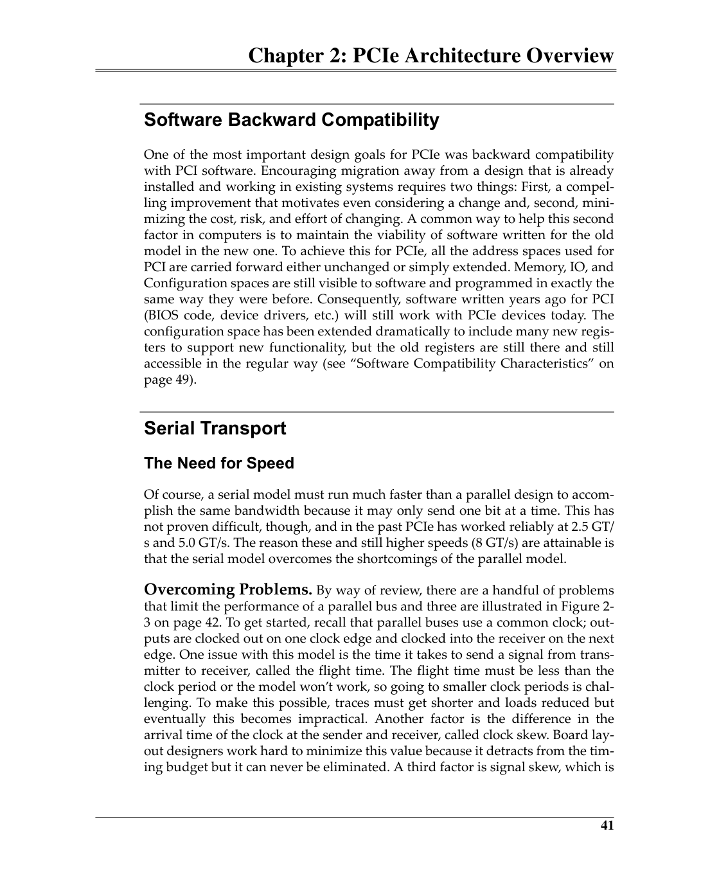

<br>

However, it’s a different matter if a parity error is detected during the address phase. In this case the address was corrupted and the
wrong target may have recognized the address. There’s no way to tell what the corrupted address became or what devices on the bus did in
response to it, so there’s also no sim‐
ple recovery. As a result, errors of this type result in the assertion of the SERR# (system error) pin, which typically results in a call to
the system error handler. In older machines, this would often halt the system as a precaution, resulting in the “blue screen of death.”

In older machines, both PERR# and SERR# were connected to the error logic in the South Bridge. For reasons of simplicity and cost, this
typically resulted in the assertion of an NMI signal (non‐maskable interrupt signal) to the CPU, which would often simply halt the system.

</td>
<td width="50%">

## **PCI 错误处理** 

PCI 设备可以在事务过程中可选地检测并报告地址与数据阶段的奇偶校验错误。PCI 在事务期间使用 PAR 信号在大多数信号上生成"偶校验"。这意味着如果在地址或数据阶段被置位的比特数为奇数,主设备会设置 PAR
信号以使校验变为"偶校验"。目标设备接收地址或数据并检查错误。奇偶校验错误仅在受影响的信号数为奇数(导致接收到的 1 的个数为奇数)时才能被检测出来。如果设备检测到数据阶段奇偶校验错误,它会断言
PERR#(奇偶校验错误)。这通常是一个可恢复的错误,因为对于内存读等情况,只需简单地重试该事务即可解决该问题。不过 PCI 不包含任何自动或基于硬件的恢复机制,因此任何尝试解决错误的操作都将由软件处理。

_图 1‐9: PCI 错误处理_ 

**==> 图片 [376 x 229] 已刻意省略 <==**

**----- 图片文字开始 -----**<br>
NMI<br>
处理器<br>
FSB<br>
图形<br>
北桥北桥<br>
(Intel 440)(Intel 440) S DRAM<br>
地址端口 数据端口<br>
PCI 33 MHz<br>
插槽<br>
CD HDD IDE PERR#<br>
错误<br>
南桥逻辑<br>
USB SERR#<br>
ISA<br>
以太网 SCSI<br>
启动 调制解调器 音频 超级<br>
ROM 芯片 芯片 I/O<br>
COM1<br>
COM2<br>
**----- 图片文字结束 -----**<br>

然而,如果在地址阶段检测到奇偶校验错误,情况就不同了。在这种情况下,地址已经被损坏,错误的设备可能已经识别了该地址。我们无法知道被损坏的地址变成了什么,也无法知道总线上的设备对此做了什么响应,因此也无法简单地恢复。因此,此类错误会导致
SERR#(系统错误)引脚被断言,这通常会导致调用系统错误处理程序。在较老的机器中,出于预防考虑,这通常会停止系统,从而导致"蓝屏死机"的出现。

在较老的机器中,PERR# 和 SERR# 都连接到南桥中的错误逻辑。出于简洁性和成本的考虑,这通常会导致向 CPU 断言 NMI 信号(不可屏蔽中断信号),从而通常简单地停止系统。 

**第 1 章:背景**

</td>
</tr>
</tbody>
</table>

[⬆️ 返回目录](#本章目录-table-of-contents)

---

<a id="sec-2-3"></a>
## 2.3 PCIe Architecture Overview | PCIe 架构概述

<table>
<thead><tr><th width="50%">🇬🇧 English</th><th width="50%">🇨🇳 中文</th></tr></thead>
<tbody>
<tr>
<td width="50%">

## **PCI Address Space Map** 

PCI architecture supports 3 address spaces as shown in Figure 1‐10 on page 26: memory, I/O and configuration address space. x86 processors
can access mem‐ ory and IO space directly. A PCI device maps into the processors memory address space and can either support 32 or 64 bit
memory addressing. In I/O address space, PCI supports 32 bit addresses but, since x86 CPUs only used 16 bits for I/O space, many platforms
limit the I/O space to 64 KB (16 bits worth).

PCI also introduced a third address space called configuration space that the CPU could only indirectly access. Each function contains
internal registers for configuration space that allow software visibility and control of its addresses and resources in a standardized way,
providing a true “plug and play” environ‐ ment in the PC. Each PCI function may have up to 256 Bytes of configuration address space. Given
that PCI supports up to 8 functions/device, 32 devices/bus and up to 256 buses/system, then the total amount of configuration space asso‐
ciated with a system is 256 Bytes/function x 8 functions/device x 32 devices/bus x 256 buses/system = 16MB of configuration space.

Since an x86 CPU cannot access configuration space directly, it must do so indi‐ rectly by indexing through IO registers (although with PCI
Express a new method to access configuration space was introduced by mapping it into the memory address space). The legacy model, shown in
Figure 1‐10 on page 26, uses an IO Port called Configuration Address Port located at address CF8h‐ CFBh and a Configuration Data Port mapped
to address CFCh‐CFFh. Details regarding this method and the memory mapped method of accessing configu‐ ration space are explained in the
next section.

_Figure 1‐10: Address Space Mapping_ 

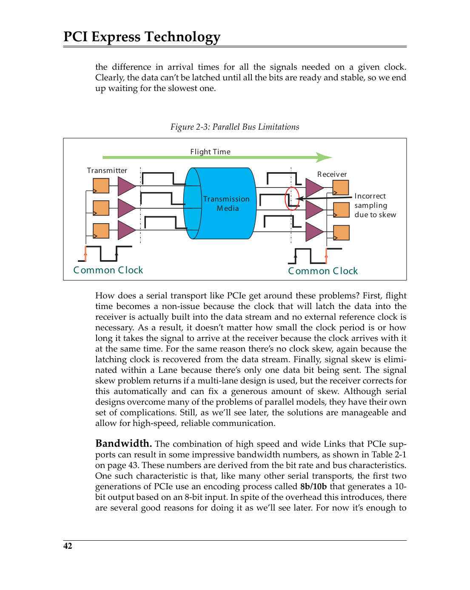

<br>

</td>
<td width="50%">

1 ## **PCI 地址空间映射** 

2 PCI 架构支持 3 个地址空间,如图 1-10(第 26 页)所示:内存、I/O 和配置地址空间。x86 处理器可以直接访问内存和 IO 空间。PCI 设备映射到处理器的内存地址空间,可以支持 32 位或 64 位内存寻址。在 I/O 地址空间中,PCI 支持 32
位地址,但由于 x86 CPU 仅对 I/O 空间使用 16 位,许多平台将 I/O 空间限制为 64 KB(16 位)。

3 PCI 还引入了第三个地址空间,称为配置空间,CPU 只能间接访问它。每个功能(Function)都包含用于配置空间的内部寄存器,这些寄存器以标准化方式提供对其地址和资源的软件可见性和控制,从而在 PC 中提供真正的"即插即用"环境。每个 PCI 功能最多可以有 256
字节的配置地址空间。鉴于 PCI 支持每个设备最多 8 个功能、每条总线 32 个设备和每个系统最多 256 条总线,则与系统关联的配置空间总量为 256 字节/功能 × 8 功能/设备 × 32 设备/总线 × 256 总线/系统 = 16MB 配置空间。

4 由于 x86 CPU 不能直接访问配置空间,因此必须通过 IO 寄存器进行索引来间接访问(尽管在 PCI Express 中,通过将配置空间映射到内存地址空间引入了一种新的访问配置空间的方法)。图 1-10(第 26 页)中显示的遗留模型使用位于地址 CF8h-CFBh 的
IO 端口(称为配置地址端口)以及映射到地址 CFCh-CFFh 的配置数据端口。有关此方法以及访问配置空间的内存映射方法的详细信息将在下一节中说明。

5 **25** 

6 **PCI Express Technology** 

7 _Figure 1-10: Address Space Mapping_ 

8 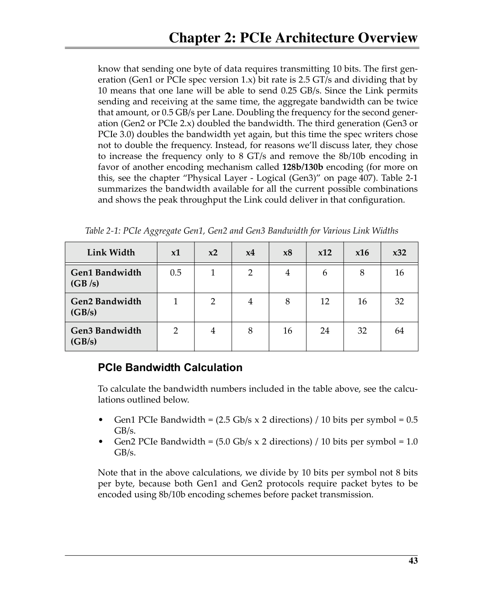

<br>

</td>
</tr>
</tbody>
</table>

[⬆️ 返回目录](#本章目录-table-of-contents)

---

<a id="sec-2-4"></a>
## 2.4 PCIe Architecture Overview | PCIe 架构概述

<table>
<thead><tr><th width="50%">🇬🇧 English</th><th width="50%">🇨🇳 中文</th></tr></thead>
<tbody>
<tr>
<td width="50%">

## **PCI Configuration Cycle Generation** 

Since IO address space is limited, the legacy model was designed to be very conservative with addresses. The common way of doing that in IO
space was to have one register for pointing to an internal location, and a second one for read‐ ing or writing the data. In PCI
configuration that involves two steps.

Step 1: The CPU generates an IO write to the Address Port at IO address CF8h in the North Bridge to give the address of the configuration
register to be accessed. This address, shown in Figure 1‐11 on page 27, consists primarily of the three things that locate a PCI function
within the topology: which bus we want to access out of the 256 possible, which device on that bus out of the 32 possible, and which
function within that device out of the 8 possible. The only other information needed is to identify which of the 64 dwords (256 bytes) in
that function’s configuration space is to be accessed.
Step 2: The CPU generates either an IO read or IO write to the Data Port at loca‐ tion CFCh in the North Bridge. Based on that, the North
Bridge then generates a configuration read or configuration write transaction to the PCI bus specified in the Address Port.

_Figure 1‐11: Configuration Address Register_ 

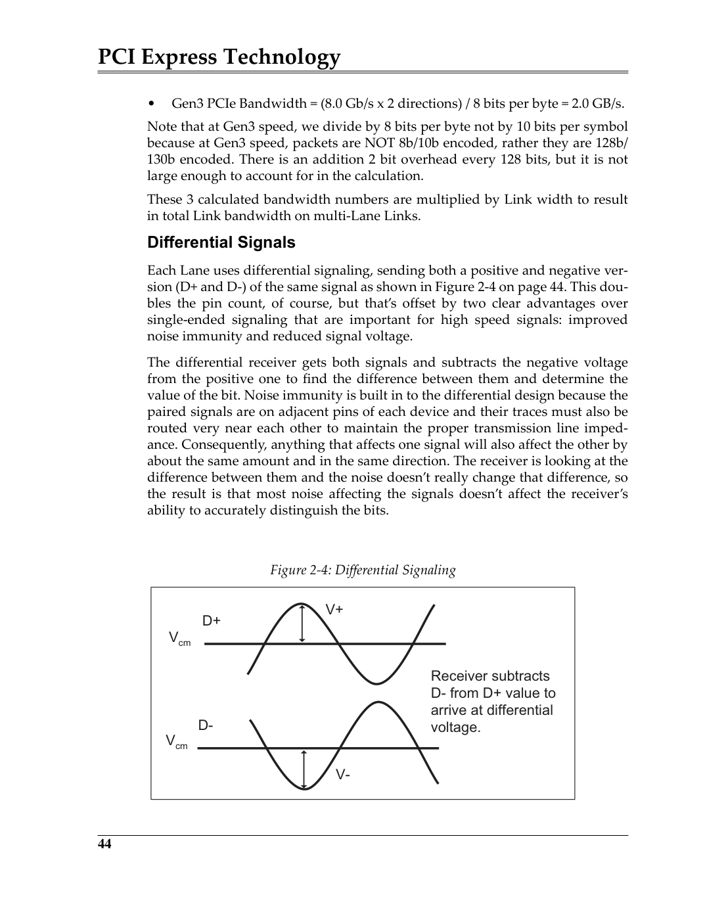

<br>

</td>
<td width="50%">

## **PCI 配置周期的生成** 

由于 IO 地址空间有限，传统模型在地址使用上被设计得非常保守。在 IO 空间中的常见做法是使用一个寄存器来指向内部位置，再用另一个寄存器来读取或写入数据。在 PCI 配置中，这需要两个步骤。 

步骤 1：CPU 在北桥（North Bridge）的 IO 地址 CF8h 处生成一次 IO 写操作，以给出待访问配置寄存器的地址。如第 27 页图 1-11 所示，该地址主要由三个用于在拓扑中定位 PCI 功能（Function）的字段组成：256
条可能总线中要访问的总线号、该总线上 32 个可能的设备号、以及该设备上 8 个可能的功能号。唯一还需要的信息是标识该功能配置空间中 64 个双字（256 字节）中的哪一个要被访问。

**第 1 章：背景** 

步骤 2：CPU 在北桥的 CFCh 位置处对数据端口（Data Port）执行一次 IO 读或 IO 写操作。基于此，北桥随后向地址端口所指定的 PCI 总线生成一个配置读或配置写事务。 

_图 1-11：配置地址寄存器_ 

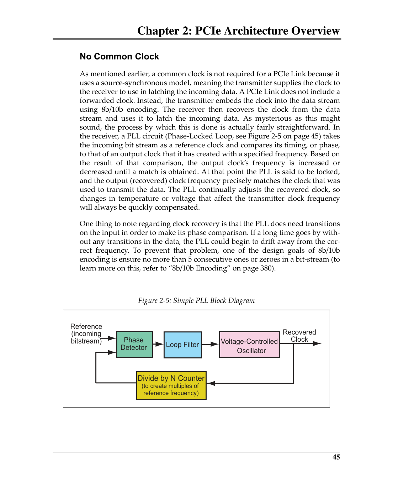

<br>

</td>
</tr>
</tbody>
</table>

[⬆️ 返回目录](#本章目录-table-of-contents)

---

<a id="sec-2-5"></a>
## 2.5 PCIe Architecture Overview | PCIe 架构概述

<table>
<thead><tr><th width="50%">🇬🇧 English</th><th width="50%">🇨🇳 中文</th></tr></thead>
<tbody>
<tr>
<td width="50%">

## **PCI Function Configuration Register Space** 

Each PCI function contains up to 256 bytes of configuration space. The first 64 bytes of each functionʹs configuration space contains a
structure called the Header, while the remaining 192 Bytes support optional functionality. System configuration is first performed by Boot
ROM firmware. After the OS loads, it may reconfigure the system and rearrange resource assignments, with the result that the process of
system configuration may be done twice.

There are two basic classes of PCI functions as defined by their header types. A Type 1 header identifies a function that is a bridge (as
shown in Figure 1‐12 on page 28) and creates another bus in the topology, while a Type 0 header indi‐ cates a function that is NOT a bridge
(as shown in Figure 1‐13 on page 29). This header type information is contained in a field by the same name in dword 3, byte 2, and should
be one of the first things software checks when discovering which functions exist in the system (a process called “enumeration”).

</td>
<td width="50%">

## **PCI 功能配置寄存器空间** 

每个 PCI 功能最多包含 256 字节的配置空间。每个功能配置空间的前 64 字节包含一个称为"头部 (Header)"的结构，其余 192 字节用于支持可选功能。系统配置首先由 Boot ROM
固件执行。操作系统加载后，可能会重新配置系统并重新分配资源，因此系统配置的过程可能会被执行两次。

根据头部类型，PCI 功能分为两个基本类别。Type 1 头部标识该功能是一个桥 (Bridge)（如第 28 页的图 1-12 所示），它会在拓扑 (Topology) 中创建另一条总线；而 Type 0 头部标识该功能不是桥 (Bridge)（如第 29 页的图 1-13
所示）。该头部类型信息位于 dword 3、byte 2 中一个同名字段里，应当是软件在发现系统中存在哪些功能（这个过程称为"枚举 (Enumeration)"）时首先检查的内容之一。

</td>
</tr>
</tbody>
</table>

[⬆️ 返回目录](#本章目录-table-of-contents)

---

<a id="sec-2-6"></a>
## 2.6 PCIe Architecture Overview | PCIe 架构概述

<table>
<thead><tr><th width="50%">🇬🇧 English</th><th width="50%">🇨🇳 中文</th></tr></thead>
<tbody>
<tr>
<td width="50%">

## **PCI Express Technology** 

_Figure 1‐12: PCI Configuration Header Type 1 (Bridge)_ 

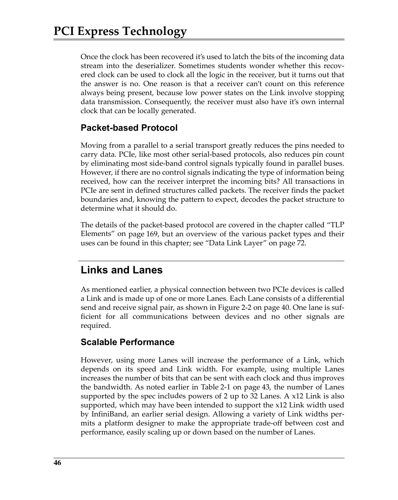

<br>
_Figure 1‐13: PCI Configuration Header Type 0 (not a Bridge)_ 

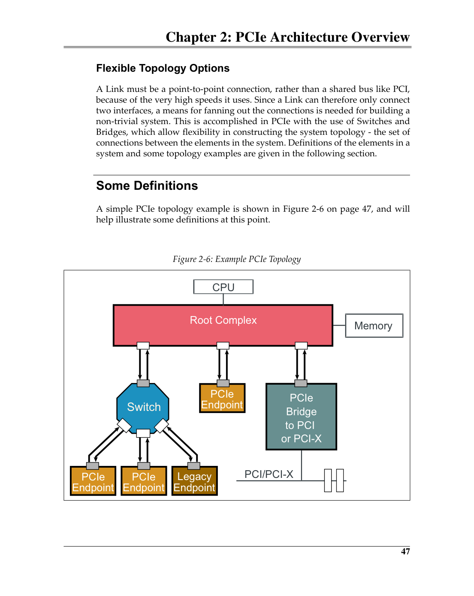

<br>

Details of the configuration register space and the enumeration process are described later. For now we simply want you to become familiar
with the big picture of how all the parts fit together.

</td>
<td width="50%">

## **PCI Express 技术**

_图 1‐12：PCI 配置头类型 1（桥）_

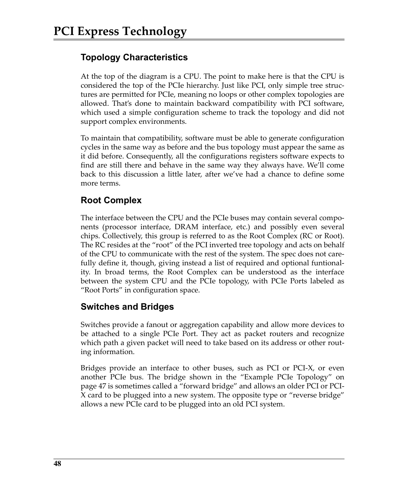

<br>

**第 1 章：背景**

_图 1‐13：PCI 配置头类型 0（非桥）_

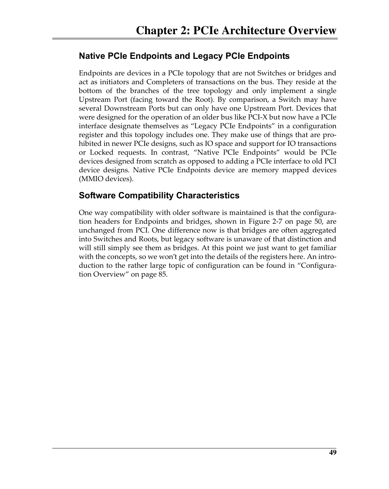

<br>

配置寄存器空间的详细内容和枚举过程将在后面描述。现在，我们只是想让你熟悉所有这些部分如何组合在一起的全局概览。

</td>
</tr>
</tbody>
</table>

[⬆️ 返回目录](#本章目录-table-of-contents)

---

<a id="sec-2-7"></a>
## 2.7 PCIe Architecture Overview | PCIe 架构概述

<table>
<thead><tr><th width="50%">🇬🇧 English</th><th width="50%">🇨🇳 中文</th></tr></thead>
<tbody>
<tr>
<td width="50%">

## **Higher-bandwidth PCI** 

To support higher bandwidth, the PCI specification was updated to support both wider (64‐bit) and faster (66 MHz) versions, achieving 533
MB/s. Figure 1‐ 14 shows an example of a 66 MHz, 64‐bit PCI system.

</td>
<td width="50%">

## **更高带宽的 PCI** 

为了支持更高的带宽，PCI 规范进行了更新，同时支持更宽的（64 位）和更快的（66 MHz）版本，从而达到 533 MB/s 的带宽。图 1‐14 展示了一个 66 MHz、64 位 PCI 系统的示例。

</td>
</tr>
</tbody>
</table>

[⬆️ 返回目录](#本章目录-table-of-contents)

---

<a id="sec-2-8"></a>
## 2.8 PCIe Architecture Overview | PCIe 架构概述

<table>
<thead><tr><th width="50%">🇬🇧 English</th><th width="50%">🇨🇳 中文</th></tr></thead>
<tbody>
<tr>
<td width="50%">

## **PCI Express Technology** 

_Figure 1‐14: 66 MHz PCI Bus Based Platform_ 

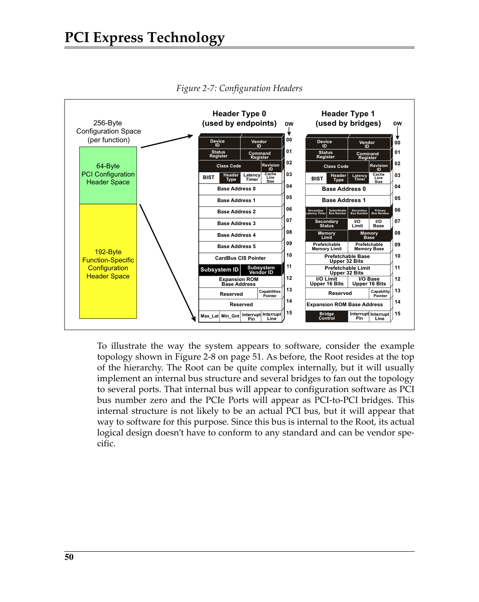

<br>

</td>
<td width="50%">

## **PCI Express 技术** 

_图 1-14：基于 66 MHz PCI 总线的平台_ 

**==> 图片 [384 x 260] 已刻意省略 <==**

**----- 图片文字开始 -----**<br>
处理器 处理器<br>FSB（前端总线）<br>AGP<br>4x<br>GFX（图形显示）<br>RDRAM<br>内存控制器集线器<br>P64H (Intel 860 MCH)<br>插槽 PCI-66MHz 集线器接口 RDRAM<br>P64H<br>集线器接口
插槽<br>IDE<br>PCI-33MHz<br>CD HDD<br>USB 2.0 IO 控制器集线器<br>(ICH2) IEEE SCSI<br>LPC 1394<br>Super AC'97<br>IO 接口<br>COM1 Modem Audio
Boot<br>COM2 Codec Codec Ethernet ROM（启动 ROM）<br>**----- 图片文字结束 -----**<br>

</td>
</tr>
</tbody>
</table>

[⬆️ 返回目录](#本章目录-table-of-contents)

---

<a id="sec-2-9"></a>
## 2.9 PCIe Architecture Overview | PCIe 架构概述

<table>
<thead><tr><th width="50%">🇬🇧 English</th><th width="50%">🇨🇳 中文</th></tr></thead>
<tbody>
<tr>
<td width="50%">

## **Limitations of 66 MHz PCI bus** 

While the throughput of the bus was doubled at this speed relative to the 33 MHz bus, the diagram illustrates one of its major shortcomings:
using the same reflected‐wave switching model with only half the timing budget meant that the loading on the bus had to be greatly reduced.
The result was that only one add‐in card could be supported on each bus. Adding more device meant add‐ ing more PCI bridges and buses would
increases both cost and board real estate requirements. The 64‐bit PCI bus increases pin count, increasing system cost and lowered system
reliability. In combination, it’s easy to see why these factors limited the popularity of 64‐bit or 66 MHz version of PCI bus.
</td>
<td width="50%">

</td>
<td width="50%">

## **并行 PCI 总线模型在 66 MHz 以上的信号时序问题**

考虑到 PCI 总线上实际存在的负载以及信号飞行时间，PCI 总线的时钟频率无法提高到 66 MHz 以上。当时钟频率为 66 MHz 时，时钟周期为 15 ns。接收端分配的建立时间为 3 ns。在 PCI"非寄存器输入"信号总线模型下，将信号建立时间压缩到低于 3 ns
的值是不现实的。剩余的 12 ns 时序预算则分配给发送端的输出延迟以及信号飞行时间。如果将 PCI 总线的时钟频率提高到 66 MHz 以上，就意味着要缩短时钟周期，而发送的信号将无法及时到达接收端以供其采样。

下一节将要介绍的 PCI-X 总线采用了在使用所有输入信号之前，先用触发器（Flip-Flop）将其寄存的方法。这样做将信号建立时间减少到了 1 ns 以下。PCI 建立时间的节省使得 PCI-X 总线能够运行在 100 MHz 甚至 133 MHz
的更高频率下。下一节我们将简要介绍 PCI-X 总线架构。

</td>
</tr>
<tr>
<td width="50%">

## **66 MHz PCI 总线的局限性** 

虽然在此速率下总线的吞吐量相对于 33 MHz 总线翻了一番，但该图说明了其主要缺点之一：仍然采用反射波开关模型，而时序预算却减半，这意味着总线上的负载必须大幅减少。其结果是每条总线上只能支持一块扩展卡。若要增加更多设备，就需要增加更多的 PCI
桥和总线，这会同时增加成本和板卡空间需求。64 位 PCI 总线增加了引脚数，提高了系统成本并降低了系统可靠性。综合来看，很容易理解为何这些因素限制了 64 位或 66 MHz 版本 PCI 总线的普及。

**第 1 章：背景**

</td>
</tr>
</tbody>
</table>

[⬆️ 返回目录](#本章目录-table-of-contents)

---

<a id="sec-2-10"></a>

</td>
<td width="50%">

</td>
</tr><table>
<thead><tr><th width="50%">🇬🇧 English</th><th width="50%">🇨🇳 中文</th></tr></thead>
<tbody>
<tr>
<td width="50%">

## 2.10 PCIe Architecture Overview | PCIe 架构概述

<table>
<thead><tr><th>🇬🇧 English</th><th style="background-color:#e8e8e8">🇨🇳 中文</th></tr>
</tbody>
</table></thead>
<tbody>
<tr>
<td width="50%">

</td>
<td width="50%">

</td>
</tr>
<tr>
<td width="50%">

## **Signal Timing Problems with the Parallel PCI Bus Model beyond 66 MHz** 

PCI bus clock frequency cannot be increased beyond 66MHz given the realistic loads that exist on a PCI bus and signal flight times. With a
66 MHz clock, the clock period is 15 ns. Setup time allocated at the receiver is 3 ns. With the PCI “non‐registered input” signal bus model,
reducing signal setup time below this 3 ns value is not realistic. The rest of the 12 ns timing budget is allocated towards output delays at
the transmitter and signal flight time. Clocking PCI bus any faster than 66 MHz implies reducing clock period. A transmitted signal will not
be received in time enough to be sampled at the receiver.

The PCI‐X bus introduced in the next section takes the approach of registering all input signals with a Flip‐Flop before using them. Doing
so reduced signal setup time to below 1 ns. The setup time savings of PCI setup time allows PCI‐X bus to be run at higher frequencies of 100
MHz or even 133 Mhz. In the next sec‐ tion, we describe PCI‐X bus architecture briefly.

</td>
<td width="50%">

</td>
</tr>

</tbody>
</table>

[⬆️ 返回目录](#本章目录-table-of-contents)

---

<a id="sec-2-11"></a>
## 2.11 PCIe Architecture Overview | PCIe 架构概述

<table>
<thead><tr><th width="50%">🇬🇧 English</th><th width="50%">🇨🇳 中文</th></tr></thead>
<tbody>
<tr>
<td width="50%">

## **Introducing PCI-X** 

PCI‐X is backward compatible with PCI in both hardware and software, but provides better performance and higher efficiency. It uses the same
connector format, so PCI‐X devices can be plugged into PCI slots and vice‐versa. And it uses the same configuration model, so device
drivers, operating systems, and applications that run on a PCI system also run on a PCI‐X system.

To achieve higher speeds without changing the PCI signaling model, PCI‐X added a few tricks to improve the bus timing. First, they implement
PLL (phase‐locked loop) clock generators that provide phase‐shifted clocks inter‐ nally. That allows the outputs to be driven a little
earlier and the inputs to be sampled a little later, improving the timing on the bus. Likewise, PCI‐X inputs are registered (latched) at the
input pin of the target device, resulting in shorter setup times. The time gained by these means increased the time available for signal
propagation on the bus and allowed higher clock frequencies.

</td>
<td width="50%">

1 ## **介绍 PCI-X** 

2 PCI-X 在硬件和软件上与 PCI 向后兼容,但提供更好的性能和更高的效率。它使用相同的连接器格式,因此 PCI-X 设备可以插入 PCI 插槽,反之亦然。它使用相同的配置模型,因此在 PCI 系统上运行的设备驱动程序、操作系统和应用程序也可以在 PCI-X 系统上运行。 

3 为了在不更改 PCI 信令模型的情况下实现更高的速度,PCI-X 添加了一些技巧来改进总线时序。首先,他们实现了 PLL(锁相环)时钟发生器,在内部提供相移时钟。这允许输出稍早驱动,输入稍晚采样,从而改善总线上的时序。同样,PCI-X
输入在目标设备的输入引脚处被寄存(锁存),从而导致更短的建立时间。通过这些方式获得的时间增加了总线上信号传播的可用时间,并允许更高的时钟频率。

</td>
</tr>
</tbody>
</table>

[⬆️ 返回目录](#本章目录-table-of-contents)

---

<a id="sec-2-12"></a>
## 2.12 PCIe Architecture Overview | PCIe 架构概述

<table>
<thead><tr><th width="50%">🇬🇧 English</th><th width="50%">🇨🇳 中文</th></tr></thead>
<tbody>
<tr>
<td width="50%">

## **PCI-X System Example** 

An example of an Intel 7500 server chipset‐based system is shown in Figure 1‐15 on page 32. The MCH chip includes three additional
high‐performance Hub Link 2.0 ports that are connected to three PCI‐X Hub 2 bridges (P64H2). Each

bridge supports two PCI‐X buses that can run at frequencies up to 133MHz. The Hub Link 2.0 can sustain the higher bandwidth requirements for
PCI‐X traffic. Note that we have the same loading problem that we did for 66‐MHz PCI, resulting in a large number of buses needed to support
more devices and a rela‐ tively expensive solution. The bandwidth is much higher now, though.

_Figure 1‐15: 66 MHz/133 MHz PCI‐X Bus Based Platform_ 

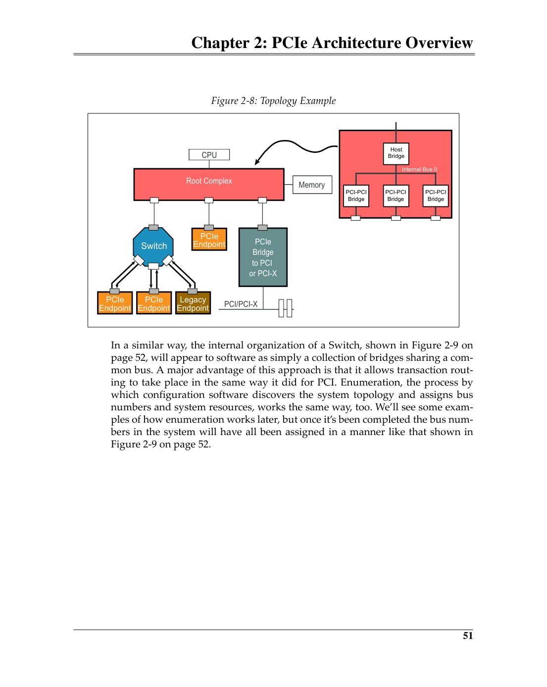

<br>

</td>
<td width="50%">

## **PCI-X 系统示例**

基于 Intel 7500 服务器芯片组的一个系统示例如第 32 页的图 1-15 所示。MCH 芯片包含三个额外的高性能 Hub Link 2.0 端口，这三个端口分别连接到三个 PCI-X Hub 2 桥 (P64H2)。每个

桥支持两条 PCI-X 总线，这些总线可以运行在最高 133MHz 的频率下。Hub Link 2.0 能够维持 PCI-X 流量所需的更高带宽需求。需要注意的是，我们遇到了与 66 MHz PCI
相同的负载问题，导致需要大量的总线来支持更多的设备，并且解决方案相对昂贵。不过现在的带宽要高得多了。

_图 1-15：基于 66 MHz/133 MHz PCI-X 总线的平台_

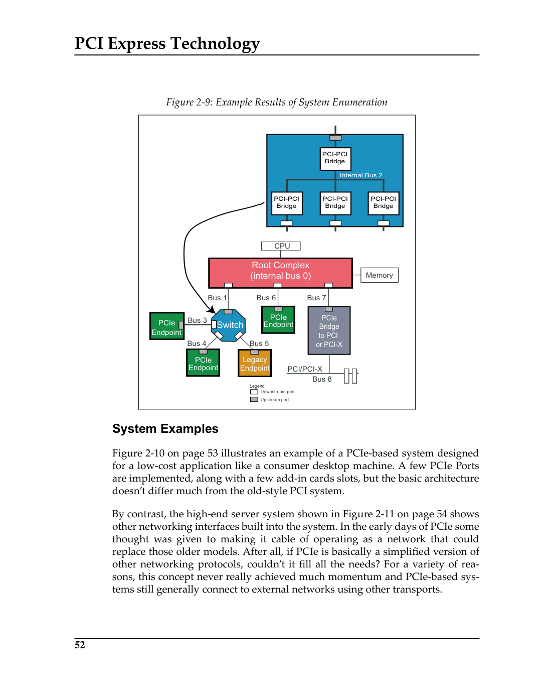

<br>

</td>
</tr>
</tbody>
</table>

[⬆️ 返回目录](#本章目录-table-of-contents)

---

<a id="sec-2-13"></a>
## 2.13 PCIe Architecture Overview | PCIe 架构概述

<table>
<thead><tr><th width="50%">🇬🇧 English</th><th width="50%">🇨🇳 中文</th></tr></thead>
<tbody>
<tr>
<td width="50%">

## **PCI-X Transactions** 

Figure 1‐16 on page 33 shows an example of a PCI‐X burst memory read trans‐ action. Note that PCI‐X does not allow Wait States after the
first data phase. This is possible because the transfer size is now provided to the target device in the Attribute phase of the transaction,
so the target devices knows exactly what is going to be required of him. In addition, most PCI‐X bus cycles are bursts and data is generally
transferred in blocks of 128 Bytes. These features allow for more efficient bus utilization and device buffer management.
_Figure 1‐16: Example PCI‐X Burst Memory Read Bus Cycle_ 

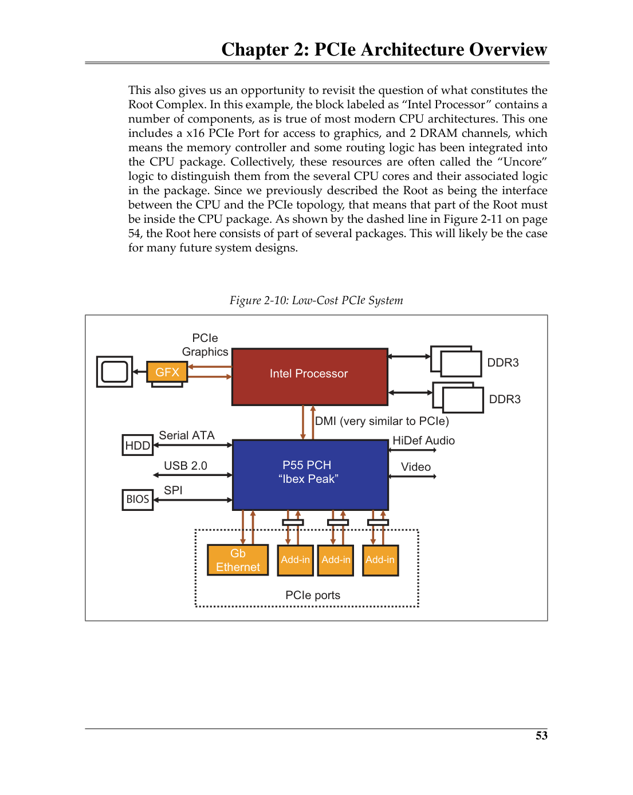

<br>

</td>
<td width="50%">

## **PCI-X 事务**

第 33 页的图 1‐16 显示了一个 PCI‐X 突发内存读事务的示例。请注意，PCI‐X 不允许在第一个数据相位之后插入等待状态。这是可行的，因为传输大小现在已在事务的 Attribute（属性）相位中提供给目标设备，所以目标设备确切地知道对其有什么要求。此外，大多数
PCI‐X 总线周期都是突发传输，并且数据通常以 128 字节块的形式传输。这些特性可以更高效地利用总线，并更好地管理设备缓冲。

**第 1 章：背景**

_图 1‐16：PCI‐X 突发内存读总线周期示例_

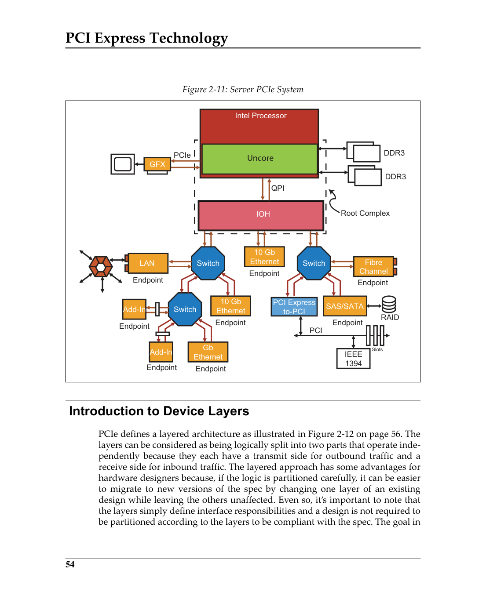

<br>

</td>
</tr>
</tbody>
</table>

[⬆️ 返回目录](#本章目录-table-of-contents)

---

<a id="sec-2-14"></a>
## 2.14 PCIe Architecture Overview | PCIe 架构概述

<table>
<thead><tr><th width="50%">🇬🇧 English</th><th width="50%">🇨🇳 中文</th></tr></thead>
<tbody>
<tr>
<td width="50%">

## **PCI-X Features**

</td>
<td width="50%">

## **PCI-X 特性 (PCI-X Features)**

</td>
</tr>
</tbody>
</table>

[⬆️ 返回目录](#本章目录-table-of-contents)

---

<a id="sec-2-15"></a>
## 2.15 PCIe Architecture Overview | PCIe 架构概述

<table>
<thead><tr><th width="50%">🇬🇧 English</th><th width="50%">🇨🇳 中文</th></tr></thead>
<tbody>
<tr>
<td width="50%">

## **Split-Transaction Model** 

In a conventional PCI read transaction, the Bus Master initiates a read to a target device on the bus. As described earlier, if the target
is unprepared to finish the transaction it can either hold the bus with Wait States while fetching the data, or issue a Retry in the process
of a Delayed Transaction.

PCI‐X bus uses a Split Transaction to handle these cases, as illustrated in Figure 1‐17 on page 34. To help keep track of what each device
is doing, the device ini‐ tiating the read is now called the Requester, and the device fulfilling the read request is called the Completer.
If the completer is unable to service the request immediately, it memorizes the transaction (address, transaction type, byte count,
requester ID) and signals a split response. This tells the requester to put this transaction aside in a queue, end the current bus cycle,
and release the bus to the idle state. That makes the bus available for other transactions while the completer is awaiting the requested
data. The requester is free to do whatever it

</td>
<td width="50%">

## **分割事务模型** 

在传统的 PCI 读事务中,总线主设备 (Bus Master) 向总线上的目标设备发起一次读操作。如前所述,如果目标设备尚未准备好完成该事务,它既可以在取数据的过程中通过等待状态 (Wait States) 占用总线,也可以在"延迟事务" (Delayed
Transaction) 的过程中发出 Retry (重试)。

PCI‐X 总线使用分割事务 (Split Transaction) 来处理这些情况,如图 1‐17 (第 34 页) 所示。为了便于跟踪每个设备正在执行的操作,发起读操作的设备现在称为"请求者" (Requester),而满足该读请求的设备则称为"完成者"
(Completer)。如果完成者无法立即响应该请求,它会记忆该事务(地址、事务类型、字节数、请求者 ID),并发出一个分割响应 (Split
Response)。这告诉请求者将该事务放到一边排入队列,结束当前的总线周期,并将总线释放到空闲状态。这样,当完成者正在等待所请求的数据时,总线就可用于其他事务。请求者可以自由地做任何

</td>
</tr>
</tbody>
</table>

[⬆️ 返回目录](#本章目录-table-of-contents)

---

<a id="sec-2-16"></a>
## 2.16 PCIe Architecture Overview | PCIe 架构概述

<table>
<thead><tr><th width="50%">🇬🇧 English</th><th width="50%">🇨🇳 中文</th></tr></thead>
<tbody>
<tr>
<td width="50%">

## **PCI Express Technology** 

likes while it waits for the completer, such as initiating other requests, even to the same completer. Once the completer has gathered the
requested data, it then arbitrates for ownership of the bus and initiates a split completion during which it returns the requested data. The
requester claims the split completion bus cycle and accepts the data from the completer. The split completion looks very much like a write
transaction to the system. This Split Transaction Model is pos‐ sible because not only does the request indicate how much data they are
requesting in the Attribute phase, but they also indicate who they are (their Bus:Device:Function number) which allows the completer to
target the correct device with the completion.

Two bus transactions are needed to complete the entire data transfer, but between the read request and the split completion the bus is
available for other work. The requester does not need to poll the device with retries to learn when the data is ready. The completer simply
arbitrates for the bus and drives the requested data back when it is ready. This makes for a much more efficient transaction model in terms
of bus utilization.

These protocol enhancements made to the PCI‐X bus architecture described so far contribute towards an increased transfer efficiency of
around 85% for PCI‐X as compared to 50%‐60% with the standard PCI protocol.

_Figure 1‐17: PCI‐X Split Transaction Protocol_ 

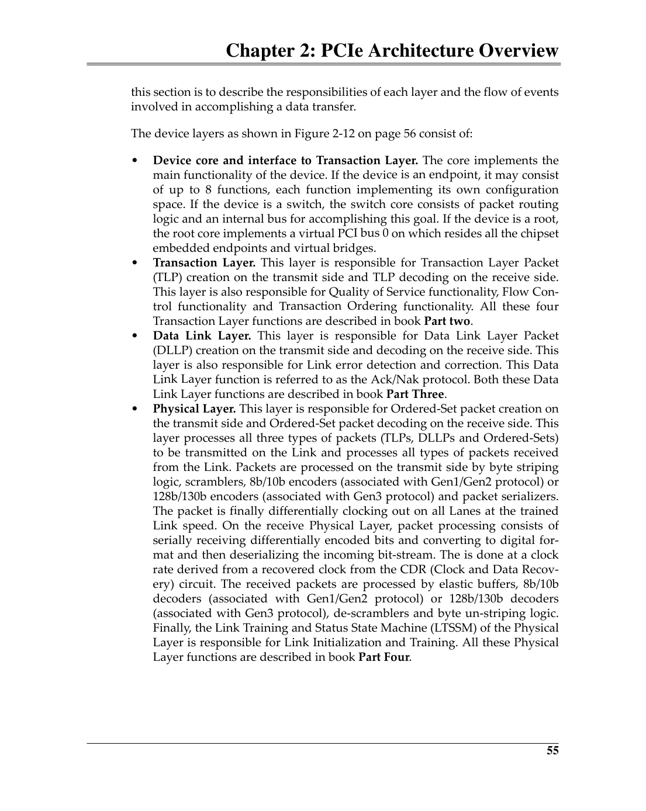

<br>

</td>
<td width="50%">

## **PCI Express Technology** 

likes while it waits for the completer, such as initiating other requests, even to the same completer. Once the completer has gathered the
requested data, it then arbitrates for ownership of the bus and initiates a split completion during which it returns the requested data. The
requester claims the split completion bus cycle and accepts the data from the completer. The split completion looks very much like a write
transaction to the system. This Split Transaction Model is pos‐ sible because not only does the request indicate how much data they are
requesting in the Attribute phase, but they also indicate who they are (their Bus:Device:Function number) which allows the completer to
target the correct device with the completion.

Two bus transactions are needed to complete the entire data transfer, but between the read request and the split completion the bus is
available for other work. The requester does not need to poll the device with retries to learn when the data is ready. The completer simply
arbitrates for the bus and drives the requested data back when it is ready. This makes for a much more efficient transaction model in terms
of bus utilization.

These protocol enhancements made to the PCI‐X bus architecture described so far contribute towards an increased transfer efficiency of
around 85% for PCI‐X as compared to 50%‐60% with the standard PCI protocol.

</td>
</tr>
</tbody>
</table>

<p align="center"><b>Figure 1‐17: PCI‐X Split Transaction Protocol</b></p>
<p align="center">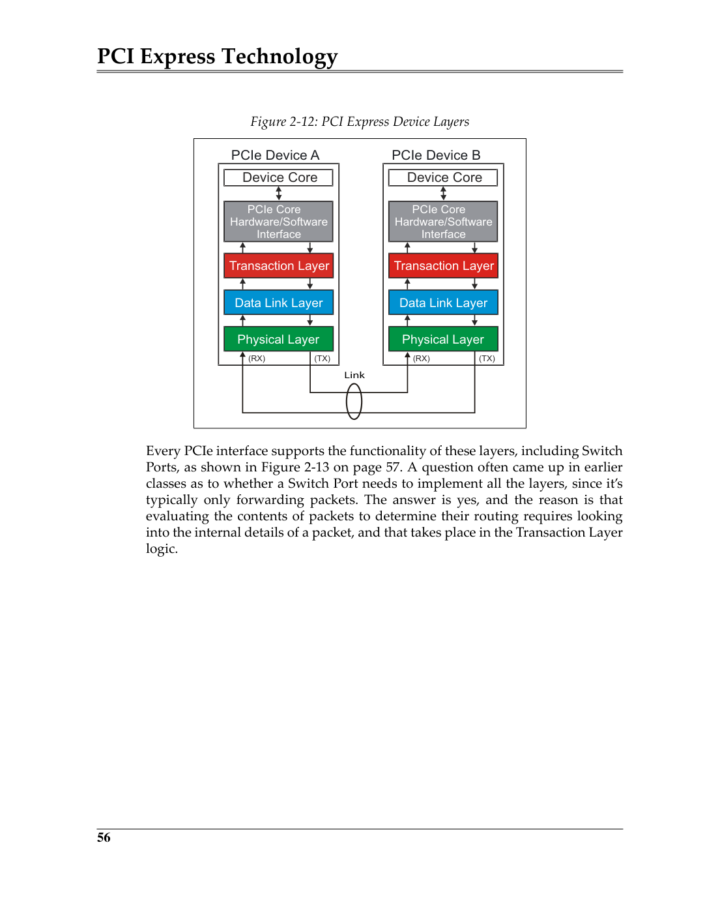</p>
<p align="center"><sub>📄 <a href="figures/chapter_02_PCIe_Architecture_Overview/page/page0115.png">Page 115</a></sub></p>

<table>
<thead><tr><th width="50%">🇬🇧 English</th><th width="50%">🇨🇳 中文</th></tr></thead>
<tbody>
<tr>

</tr>
</tbody>
</table>

[⬆️ 返回目录](#本章目录-table-of-contents)

---

<a id="sec-2-17"></a>
## 2.17 PCIe Architecture Overview | PCIe 架构概述

<table>
<thead><tr><th width="50%">🇬🇧 English</th><th width="50%">🇨🇳 中文</th></tr></thead>
<tbody>
<tr>
<td width="50%">

## **Message Signaled Interrupts** 

PCI‐X devices require MSI (Message Signaled Interrupt) capability, which was developed as a way to reduce or eliminate the need to share
interrupts across multiple devices as was typically required in the legacy interrupt architecture.
To generate an interrupt request using MSI, a device initiates a memory write transaction using a pre‐defined address range that is
understood to be an inter‐ rupt which should be delivered to one of more CPUs, and the data is a unique interrupt vector associated with
that device. The CPU, armed with the interrupt number, is able to immediately jump to the interrupt service routine for the device and
avoids the overhead associated with finding which device generated the interrupt. In addition, no sideband pins are needed.

</td>
<td width="50%">

## **消息信号中断**

PCI‐X 设备要求具备 MSI（消息信号中断，Message Signaled Interrupt）能力，该机制的提出是为了减少或消除在传统中断架构中通常所需的多设备共享中断的需求。

**第 1 章：背景**

要使用 MSI 产生中断请求，设备会使用一个预定义的地址范围发起存储器写事务，该地址范围被理解为应被递送至一个或多个 CPU 的中断，而数据则是与该设备关联的唯一中断向量。CPU
获取中断号后，便能立即跳转到该设备的中断服务例程，从而避免了为确定是哪个设备产生中断而带来的开销。此外，无需额外的边带引脚。

</td>
</tr>
</tbody>
</table>

[⬆️ 返回目录](#本章目录-table-of-contents)

---

<a id="sec-2-18"></a>
## 2.18 PCIe Architecture Overview | PCIe 架构概述

<table>
<thead><tr><th width="50%">🇬🇧 English</th><th width="50%">🇨🇳 中文</th></tr></thead>
<tbody>
<tr>
<td width="50%">

## **Transaction Attributes** 

Finally, PCI‐X also added another phase to the beginning of each transaction called the Attribute Phase (see Figure 1‐16 on page 33). In
this time slot the requester delivers information that can be used to help improve the efficiency of transactions on the bus, such as the
byte count for this request and who the requester is (Bus:Device:Function number). In addition to those items, two new bits were added to
help characterize this transaction: the ʺNo Snoopʺ bit and the ʺRelaxed Orderingʺ bit.

**No Snoop (NS):** Normally, when a transaction moves data into or out of memory, the CPU’s internal caches need to be checked to see if
that memory location has been copied into one or more CPU caches. If so, the cache contents may need to be written back to memory or
invalidated before the requested transaction is allowed to access memory. Naturally, this snoop process takes time and adds latency to a
request. Sometimes the software is aware that a requested location will never be found in the CPU caches (perhaps because the location was
defined by the system as uncacheable), so snooping is unnecessary and that step could be skipped. The No Snoop bit was added with precisely
that case in mind.

**Relaxed Ordering (RO):** Normally, transactions are required to remain in the same order that they were issued on the bus while they go
through buffers in bridges. This is referred to as the Strongly Ordered model, and PCI and PCI‐ X generally follow that rule with a few
exceptions. That’s because it helps resolve dependencies among transactions that are related to each other, such as writing and then reading
the same location. However, not all transactions actu‐ ally have dependencies. If they don’t, then forcing them to stay in order can result
in loss of performance, and that’s what this bit was designed to alleviate. If the requester knows that a particular transaction is
unrelated to the other transactions that have gone before, it can set this bit to tell bridges that this transaction is allowed to jump
ahead in the queue to give better performance.

</td>
<td width="50%">

## **事务属性 (Transaction Attributes)**

最后，PCI-X 还在每个事务的开始处增加了一个新的相位，称为属性相位 (Attribute Phase)（参见第 33 页的图 1-16）。在这个时间槽内，请求者提供一些信息，可用于帮助提高总线上事务的效率，例如本次请求的字节数以及请求者是谁（总线:设备:功能号，即
Bus:Device:Function）。除这些信息外，还新增了两个比特来进一步刻画该事务的特性：即 "No Snoop"（无监听）位和 "Relaxed Ordering"（宽松排序）位。

**No Snoop (NS, 无监听)：** 通常，当某个事务将数据搬入或搬出内存时，需要检查 CPU 的内部缓存，以确定该内存位置是否已被复制到某一个或多个 CPU 缓存中。如果是的话，可能需要先将缓存内容写回内存 (write back) 或使其失效
(invalidate)，然后才允许所请求的事务访问内存。显然，这个监听 (snoop) 过程会消耗时间，并给请求带来额外的延迟。有时软件知道所请求的位置永远不会被缓存到 CPU 缓存中（例如该位置已被系统定义为不可缓存），此时监听过程是不必要的，可以跳过。No Snoop
位的引入正是针对这种情形。

**Relaxed Ordering (RO, 宽松排序)：** 通常情况下，事务在穿过桥 (Bridge) 中的缓冲区时，必须保持其在总线上发出时的相同顺序。这被称为强排序 (Strongly Ordered) 模型，PCI 和 PCI-X
在一些例外之外大体遵循这一规则。这是因为强排序有助于解决相互关联的事务之间的依赖关系，例如先写后读同一位置。然而，并非所有事务之间都真正存在依赖关系。如果事务之间没有依赖，强制其保持顺序则会导致性能损失，这正是 RO
位设计用来缓解的问题。如果请求者知道某个特定事务与此前的其他事务没有关联，便可以置起该位以告知桥：本事务允许在队列中跳到前面，从而获得更好的性能。

**PCI Express 技术**

</td>
</tr>
</tbody>
</table>

[⬆️ 返回目录](#本章目录-table-of-contents)

---

<a id="sec-2-19"></a>
## 2.19 PCIe Architecture Overview | PCIe 架构概述

<table>
<thead><tr><th width="50%">🇬🇧 English</th><th width="50%">🇨🇳 中文</th></tr></thead>
<tbody>
<tr>
<td width="50%">

## **Higher Bandwidth PCI-X**

</td>
<td width="50%">

## **更高带宽的 PCI-X (Higher Bandwidth PCI-X)**

</td>
</tr>
</tbody>
</table>

[⬆️ 返回目录](#本章目录-table-of-contents)

---

<a id="sec-2-20"></a>
## 2.20 PCIe Architecture Overview | PCIe 架构概述

<table>
<thead><tr><th width="50%">🇬🇧 English</th><th width="50%">🇨🇳 中文</th></tr></thead>
<tbody>
<tr>
<td width="50%">

## **Problems with the Common Clock Approach of PCI and PCI-X 1.0 Parallel Bus Model** 

An issue that becomes clear when trying to migrate a bus like PCI to higher speeds is that parallel bus designs have some inherent
limitations. Figure 1‐18 on page 36 helps illustrate these. These designs use a common or distributed clock, in which data is driven out on
one clock edge and latched in on the next clock edge so that the total timing budget is the time for one clock period. Natu‐ rally, the
higher the frequency, the smaller the clock period and thus the smaller the timing budget.

_Figure 1‐18: Inherent Problems in a Parallel Design_ 

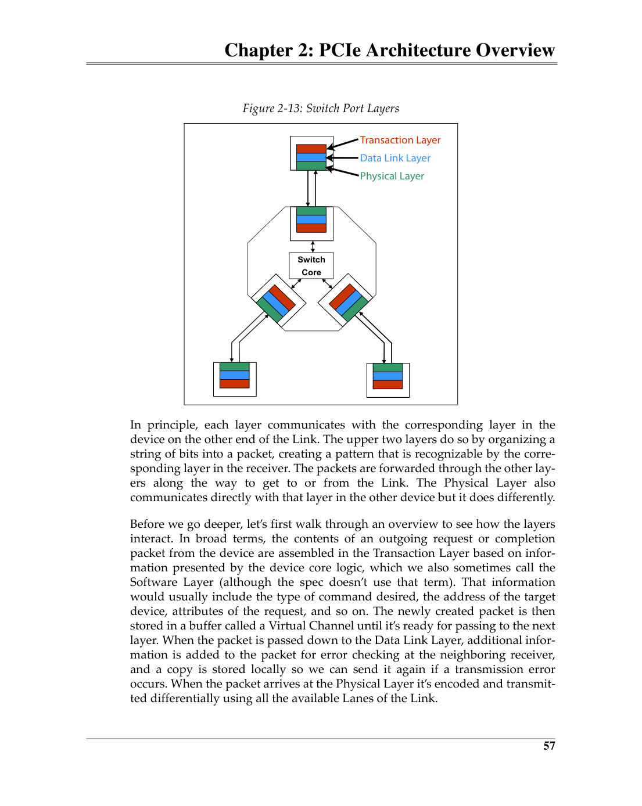

<br>

The first issue to note is signal skew. When multiple data bits are sent at once, they experience slightly different delays and arrive at
slightly different times at the receiver. If that difference is too large, incorrect signal sampling with clock may occur at the receiver as
shown in the diagram. A second issue is clock skew between multiple devices. The arrival time of the common clock at one device is not
precisely the same as the arrival time at the other which further reduces the timing budget. Finally, a third issue relates to the time it
takes for the signal to
propagate from a transmitter to a receiver, called the flight time. The clock period or timing budget must be greater than the signal flight
time. To ensure this, the board design is required to implement signal traces that are short enough such that signal propagation delays are
smaller than the clock period. In many board designs, this short signal traces may not be realistic enough to design for.

To further improve performance in spite of these limitations, a couple of tech‐ niques can be used. First, the existing protocol can be
streamlined and made more efficient. And second, the bus model can be changed to a source synchro‐ nous clocking model where the bus signal
and clock (strobe) are driven at the same time on signals that experience equal propagation delay. This is the approach taken by PCI‐X 2.0
protocol.

</td>
<td width="50%">

## **PCI 与 PCI-X 1.0 并行总线模型共同时钟方式存在的问题**

在试图将 PCI 之类的总线迁移到更高速度时,一个明显的问题在于并行总线设计存在一些固有的局限性。第 36 页的图 1-18
有助于说明这些问题。这些设计采用共同时钟或分布式时钟,数据在一个时钟边沿驱动输出,在下一个时钟边沿被锁存采样,因此总的时间预算为一个时钟周期的时间。自然而然,频率越高,时钟周期越小,从而时间预算也越小。

_图 1-18:并行设计中的固有问题_

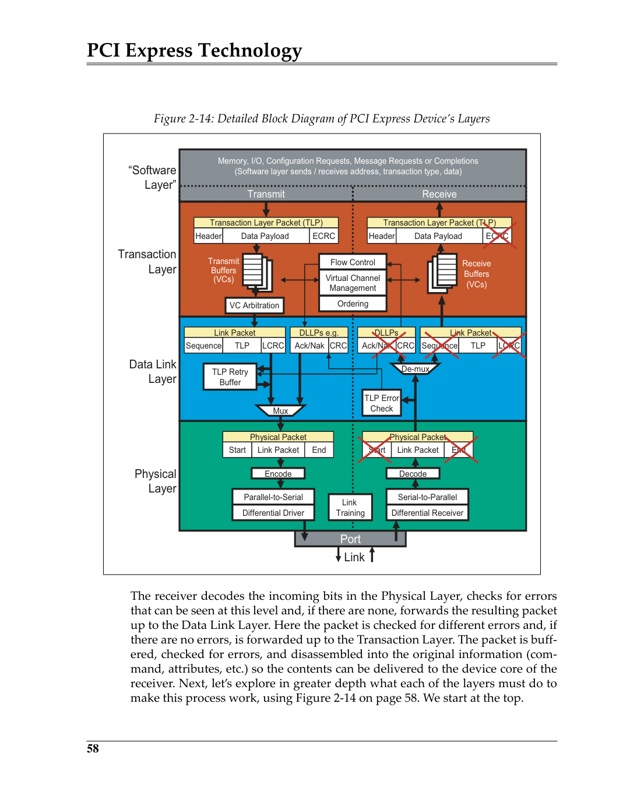

<br>

首先需要注意的问题是信号偏斜(Signal
Skew)。当多个数据位同时发送时,它们经历的延迟略有不同,到达接收器的时间也略有差异。如果这种差异过大,如图所示,接收器处可能发生错误的时钟采样。第二个问题是多个设备之间的时钟偏斜。共同时钟到达一个设备的时刻与到达另一个设备的时刻并不精确相同,这进一步减少了时间预算。第三个问题涉及信号从发送器传播到接收器所需的时间,称为飞行时间(Flight
Time)。时钟周期或时间预算必须大于信号飞行时间。为确保这一点,板级设计需要实现足够短的信号走线,使信号传播延迟小于时钟周期。在许多板级设计中,这种短信号走线在设计时可能并不现实。

**Chapter 1: Background**(第 1 章:背景)

为了在存在这些限制的情况下进一步提高性能,可以采用若干技术。首先,可以对现有协议进行精简和优化以提高效率。其次,可以将总线模型改为源同步时钟模型,即总线信号与时钟(选通信号)在经历相同传播延迟的信号线上同时驱动。PCI-X 2.0 协议即采用了这一方法。

</td>
</tr>
</tbody>
</table>

[⬆️ 返回目录](#本章目录-table-of-contents)

---

<a id="sec-2-21"></a>
## 2.21 PCIe Architecture Overview | PCIe 架构概述

<table>
<thead><tr><th width="50%">🇬🇧 English</th><th width="50%">🇨🇳 中文</th></tr></thead>
<tbody>
<tr>
<td width="50%">

## **PCI-X 2.0 Source-Synchronous Model** 

PCI‐X 2.0 further increased the bandwidth of PCI‐X. As before, the devices and connectors remained hardware and software backward compatible
with PCI devices and connectors. To achieve the higher speeds, the bus uses a source‐ synchronous delivery model to support either Dual Data
Rate (DDR) or Quad Data Rate (QDR).

The term “source synchronous” means that the device transmitting the data also provides another signal that travels the same basic path as
the data. As illustrated in Figure 1‐19 on page 38, that signal in PCI‐X 2.0 is called a “strobe” and is used by the receiver for latching
the incoming data bits. The transmitter assigns the timing relationship between the data and strobe and as long as their paths are similar
in length and other characteristics that can affect transmission latency, that relationship will be about the same when they arrive at the
receiver and the receiver can simply use the Strobe as the signal to latch the data in with. This allows higher speeds because clock skew
with respect to the common clock is removed as a separate budget item and because the issue of flight time goes away. It no longer matters
how long it takes for the data to travel from point A to point B because the strobe that latches it in takes about the same time and so
their relationship will be unaffected.

It’s important to note again that the very high‐speed signal timing eliminates the possibility of using a shared‐bus model and forces a
point‐to‐point design instead. As a result, increasing the number of devices means more bridges will be needed to create more buses. A
device could be designed to support this with three interfaces and an internal bridge structure to allow them all to com‐ municate with each
other. Such a device would have a very high pin count, though, and a higher cost, relegating PCI‐X 2.0 to the very high‐end market.

</td>
<td width="50%">

## **PCI-X 2.0 源同步模型** 

PCI‐X 2.0 进一步提升了 PCI‐X 的带宽。与以往一样，设备和连接器在硬件和软件上仍然向后兼容 PCI 设备和连接器。为了实现更高的速度，总线采用源同步传输模型来支持双倍数据速率（DDR）或四倍数据速率（QDR）。

"源同步"一词意味着发送数据的设备还会提供另一个信号，该信号沿与数据基本相同的路径传输。如第 38 页的图 1‐19 所示，PCI‐X 2.0
中的这个信号被称为"选通信号（strobe）"，由接收器用于锁存传入的数据位。发送器负责确定数据与选通信号之间的时序关系，只要它们的路径在长度以及其他可能影响传输延迟的特性方面大致相同，那么这种关系在到达接收器时也将基本保持一致，接收器只需使用选通信号作为锁存数据的信号即可。这之所以能够支持更高的速度，是因为相对于公共时钟的时钟偏斜不再作为单独的预算项，同时飞行时间的问题也得以消除。数据从
A 点传输到 B 点需要多长时间已经不再重要，因为锁存数据的选通信号几乎需要相同的时间，因此它们之间的关系不会受到影响。

需要再次强调的是，这种非常高速的信号时序排除了使用共享总线模型的可能性，迫使设计采用点对点架构。因此，增加设备数量意味着需要更多的桥 (Bridge) 来构建更多的总线。一个设备可以通过设计三个接口和内部桥接结构来支持这一点，从而允许它们彼此通信。然而，这样的设备引脚 (Pin)
数量会非常多，成本也更高，这使得 PCI‐X 2.0 仅适用于高端市场。

</td>
</tr>
</tbody>
</table>

[⬆️ 返回目录](#本章目录-table-of-contents)

---

<a id="sec-2-22"></a>
## 2.22 PCIe Architecture Overview | PCIe 架构概述

<table>
<thead><tr><th width="50%">🇬🇧 English</th><th width="50%">🇨🇳 中文</th></tr></thead>
<tbody>
<tr>
<td width="50%">

## **PCI Express Technology** 

Since it was recognized that this would be an expensive solution that would appeal more to high‐end designers, PCI‐X 2.0 also supports ECC
generation and checking. ECC is much more robust and sophisticated than parity detec‐ tion, allowing automatic correction of single‐bit
errors on the fly, and robust detection of multi‐bit errors. This improved error handling adds cost, but high‐ end platforms need the
improved reliability it provides, hence a logical choice.

_Figure 1‐19: Source‐Synchronous Clocking Model_ 

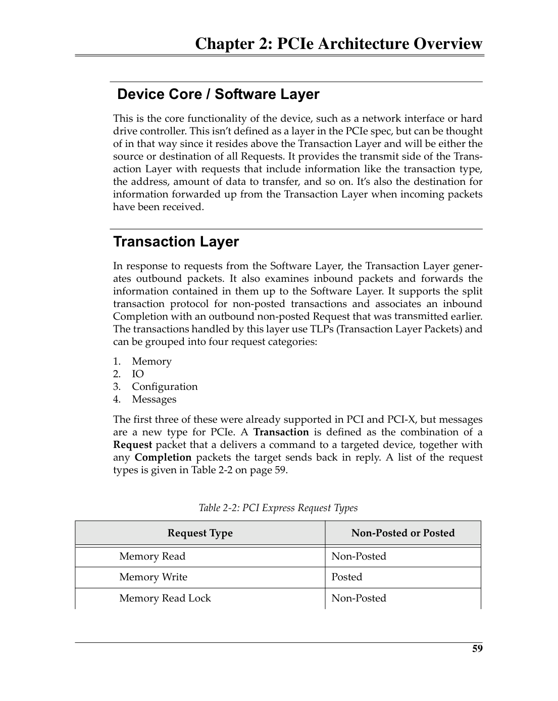

<br>

Despite the improvements in bandwidth, efficiency and reliability that came with PCI‐X (2.0), the parallel bus model was approaching its end
of life and a new model was needed to address the relentless demand for higher bandwidth and lower cost. The new model chosen was a serial
interface which is a drasti‐ cally different bus from a physical perspective, but was still made to be software backwards compatible. We
know this new model as PCI Express.

</td>
<td width="50%">

## **PCI Express 技术**

由于人们认识到这将是一个昂贵的解决方案,更受高端设计人员的青睐,PCI‐X 2.0 还支持 ECC 生成和校验。ECC
比奇偶校验检测更加强大和复杂,可以自动即时纠正单位错误,并能可靠地检测多位错误。这种改进的错误处理增加了成本,但高端平台需要其所提供的更高可靠性,因此这是一个合乎逻辑的选择。

_图 1‐19:源同步时钟模型_

**==> 图片 [374 x 172] 故意省略 <==**

**----- 图片文字开始 -----**<br>
数据<br>D Q<br>数据<br>D Q<br>数据<br>D Q<br>选通<br>源设备 接收设备<br>
**----- 图片文字结束 -----**<br>

尽管 PCI‐X (2.0) 在带宽、效率和可靠性方面都有了改进,但并行总线模型已接近其生命周期的尽头,需要一种新的模型来满足对更高带宽和更低成本的无止境需求。所选择的新模型是一种串行接口,从物理角度看它与之前的总线截然不同,但在软件上仍保持向后兼容。我们将这个新模型称为 PCI
Express。

</td>
</tr>
</tbody>
</table>

[⬆️ 返回目录](#本章目录-table-of-contents)

---

<a id="sec-2-23"></a>
## 2.23 PCIe Architecture Overview | PCIe 架构概述

<table>
<thead><tr><th width="50%">🇬🇧 English</th><th width="50%">🇨🇳 中文</th></tr></thead>
<tbody>
<tr>
<td width="50%">

## _**2 PCIe Architecture Overview**_

</td>
<td width="50%">

## _**2 PCIe 架构概述 (PCIe Architecture Overview)**_

</td>
</tr>
</tbody>
</table>

[⬆️ 返回目录](#本章目录-table-of-contents)

---

<a id="sec-2-24"></a>
## 2.24 PCIe Architecture Overview | PCIe 架构概述

<table>
<thead><tr><th width="50%">🇬🇧 English</th><th width="50%">🇨🇳 中文</th></tr></thead>
<tbody>
<tr>
<td width="50%">

## **Previous Chapter** 

The previous chapter provided historical background to establish a foundation for understanding PCI Express. This included reviewing the
basics of PCI and PCI‐X 1.0/2.0. The goal was to provide a context for the overview of PCI Express that follows.

</td>
<td width="50%">

## **上一章** 

上一章提供了历史背景，以便为理解 PCI Express 奠定基础。这其中包括回顾 PCI 和 PCI‐X 1.0/2.0 的基础知识。其目标是为接下来对 PCI Express 的概述提供相应的上下文。

</td>
</tr>
</tbody>
</table>

[⬆️ 返回目录](#本章目录-table-of-contents)

---

<a id="sec-2-25"></a>
## 2.25 PCIe Architecture Overview | PCIe 架构概述

<table>
<thead><tr><th width="50%">🇬🇧 English</th><th width="50%">🇨🇳 中文</th></tr></thead>
<tbody>
<tr>
<td width="50%">

## **This Chapter** 

This chapter provides a thorough introduction to the PCI Express architecture and is intended to serve as an “executive level” overview,
covering all the basics of the architecture at a high level. It introduces the layered approach given in the spec and describes the
responsibilities of each layer. The various packet types are introduced along with the protocol used to communicate them and facilitate
reliable transmission.

</td>
<td width="50%">

## **本章内容** 

本章对 PCI Express 架构进行了全面的介绍,旨在作为一份"高管级"的概览文档,从较高层次覆盖架构的所有基础知识。文中将介绍规范所定义的分层方法,并描述每一层所承担的职责。文中还将介绍各种类型的包,以及用于传输这些包并实现可靠传输的协议。

</td>
</tr>
</tbody>
</table>

[⬆️ 返回目录](#本章目录-table-of-contents)

---

<a id="sec-2-26"></a>
## 2.26 PCIe Architecture Overview | PCIe 架构概述

<table>
<thead><tr><th width="50%">🇬🇧 English</th><th width="50%">🇨🇳 中文</th></tr></thead>
<tbody>
<tr>
<td width="50%">

## **The Next Chapter** 

The next chapter provides an introduction to configuration in the PCI Express environment. This includes the space in which a Function’s
configuration regis‐ ters are implemented, how a Function is discovered, how configuration transac‐ tions are generated and routed, the
difference between PCI‐compatible space and PCIe extended space, and how software differentiates between an Endpoint and a Bridge.

</td>
<td width="50%">

## **下一章**

下一章将介绍 PCI Express 环境中的配置 (Configuration)。内容包括：实现 Function 配置寄存器的地址空间、Function 的发现 (Discovery) 方式、配置事务 (Configuration Transaction)
的生成与路由、PCI 兼容空间 (PCI-Compatible Space) 与 PCIe 扩展空间 (Extended Configuration Space) 之间的差异，以及软件如何区分端点 (Endpoint) 与桥 (Bridge)。

</td>
</tr>
</tbody>
</table>

[⬆️ 返回目录](#本章目录-table-of-contents)

---

\newpage

# 📘 第 3 章　配置概述 (Chapter 3. Configuration Overview)

**MindShare PCI Express Technology 3.0 — Comprehensive Guide to Generations 1.x, 2.x and 3.0**

> 📁 **Source chunks**: `chunks/chunk0139.md` ... `chunks/chunk0169.md`
> 🎨 **Format**: 中英对照双语 · 中文灰底 (PCIe 6.2 Spec 模板)

---

## 📑 本章目录 (Table of Contents)

- [3.1 Configuration Overview — 配置概述](#sec-3-1)
- [3.2 Configuration Overview — 配置概述](#sec-3-2)
- [3.4 Configuration Overview — 配置概述](#sec-3-4)
- [3.5 Configuration Overview — 配置概述](#sec-3-5)
- [3.6 Configuration Overview — 配置概述](#sec-3-6)
- [3.7 Configuration Overview — 配置概述](#sec-3-7)
- [3.8 Configuration Overview — 配置概述](#sec-3-8)
- [3.10 Configuration Overview — 配置概述](#sec-3-10)
- [3.11 Configuration Overview — 配置概述](#sec-3-11)
- [3.12 Configuration Overview — 配置概述](#sec-3-12)
- [3.14 Configuration Overview — 配置概述](#sec-3-14)
- [3.15 Configuration Overview — 配置概述](#sec-3-15)
- [3.16 Configuration Overview — 配置概述](#sec-3-16)
- [3.17 Configuration Overview — 配置概述](#sec-3-17)
- [3.19 Configuration Overview — 配置概述](#sec-3-19)
- [3.20 Configuration Overview — 配置概述](#sec-3-20)
- [3.21 Configuration Overview — 配置概述](#sec-3-21)
- [3.22 Configuration Overview — 配置概述](#sec-3-22)
- [3.23 Configuration Overview — 配置概述](#sec-3-23)
- [3.24 Configuration Overview — 配置概述](#sec-3-24)
- [3.26 Configuration Overview — 配置概述](#sec-3-26)
- [3.27 Configuration Overview — 配置概述](#sec-3-27)
- [3.28 Configuration Overview — 配置概述](#sec-3-28)
- [3.29 Configuration Overview — 配置概述](#sec-3-29)
- [3.30 Configuration Overview — 配置概述](#sec-3-30)

<a id="sec-3-1"></a>
## 3.1 Configuration Overview | 配置概述

<table>
<thead><tr><th width="50%">🇬🇧 English</th><th width="50%">🇨🇳 中文</th></tr></thead>
<tbody>
<tr>
<td width="50%">

## **Introduction to PCI Express** 

PCI Express represents a major shift from the parallel bus model of its predeces‐ sors. As a serial bus, it has more in common with earlier
serial designs like InfiniBand or Fibre Channel, but it remains fully backward compatible with PCI in software.

</td>
<td width="50%">

## **PCI Express 简介**

PCI Express 代表了一次重大转变,摒弃了其前代产品所采用的并行总线模型。作为一种串行总线,它与早期的串行设计(如 InfiniBand 或 Fibre Channel)有更多相似之处,但在软件层面仍然与 PCI 完全向后兼容。

</td>
</tr>
</tbody>
</table>

[⬆️ 返回目录](#本章目录-table-of-contents)

---


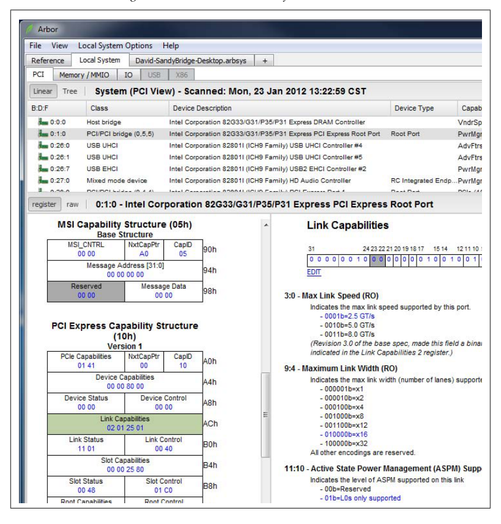

<a id="sec-3-2"></a>
## 3.2 Configuration Overview | 配置概述

<table>
<thead><tr><th width="50%">🇬🇧 English</th><th width="50%">🇨🇳 中文</th></tr></thead>
<tbody>
<tr>
<td width="50%">

## **PCI Express Technology** 

As is true of many high‐speed serial transports, PCIe uses a bidirectional con‐ nection and is capable of sending and receiving information
at the same time. The model used is referred to as a dual‐simplex connection because each inter‐ face has a simplex transmit path and a
simplex receive path, as shown in Figure 2‐1 on page 40. Since traffic is allowed in both directions at once, the communi‐ cation path
between two devices is technically full duplex, but the spec uses the term dual‐simplex because it’s a little more descriptive of the actual
communi‐ cation channels that exist.

_Figure 2‐1: Dual‐Simplex Link_ 

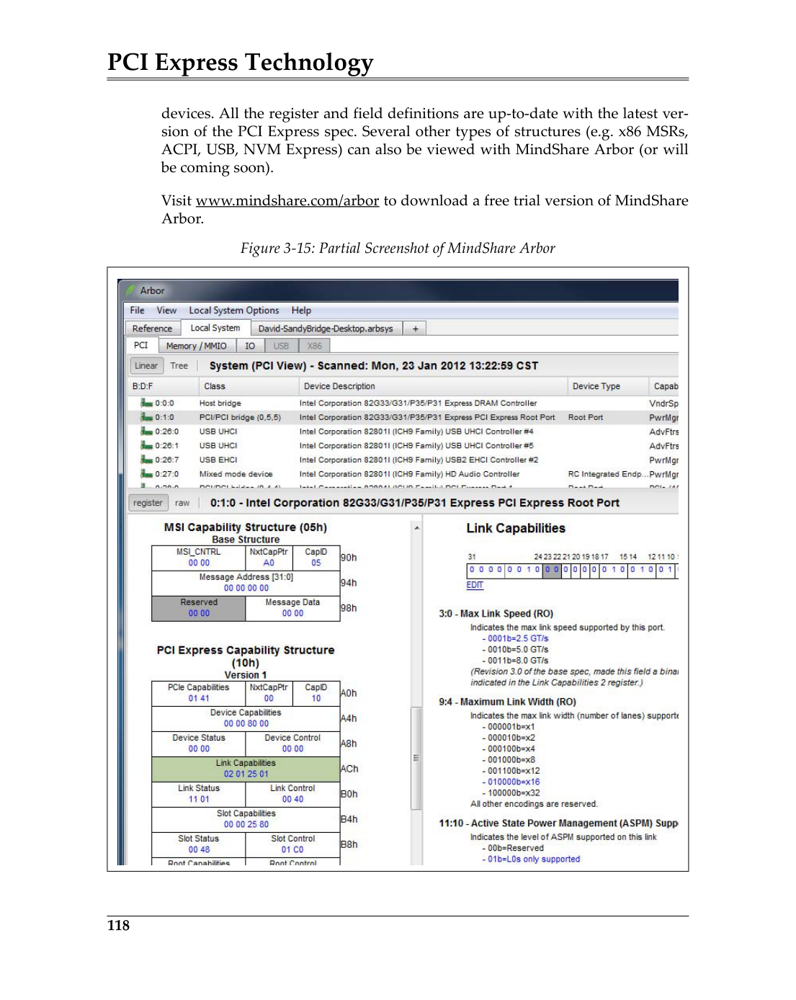

<br>

The term for this path between the devices is a **Link** , and is made up of one or more transmit and receive pairs. One such pair is called
a **Lane** , and the spec allows a Link to be made up 1, 2, 4, 8, 12, 16, or 32 Lanes. The number of lanes is called the Link Width and is
represented as x1, x2, x4, x8, x16, and x32. The trade‐off regarding the number of lanes to be used in a given design is straight‐ forward:
more lanes increase the bandwidth of the Link but add to its cost, space requirement, and power consumption. For more on this, see “Links
and Lanes” on page 46.

_Figure 2‐2: One Lane_ 


<br>
</td>
<td width="50%">

</td>
<td width="50%">

## **软件向后兼容性** 

PCIe 最重要的设计目标之一是与 PCI
软件保持向后兼容。要推动用户从一种已经在现有系统中安装并正常运行的设计迁移,需要满足两个条件:第一,要有足够引人注目的改进,让人值得考虑更换;第二,要尽量降低更换所带来的成本、风险和投入。在计算机领域,帮助实现第二个因素的常见做法是让针对旧模型编写的软件在新模型中仍然可用。为了在
PCIe 上实现这一点,PCI 所使用的所有地址空间都被原封不动或仅仅加以扩展地继承了下来。内存空间 (Memory Space)、I/O 空间 (I/O Space) 和配置空间 (Configuration Space)
仍然对软件可见,并且其编程方式与之前完全相同。因此,多年前为 PCI 编写的软件(BIOS 代码、设备驱动程序等)如今仍然可以与 PCIe 设备配合工作。配置空间已经进行了大幅扩展,新增了许多寄存器以支持新功能,但原有的寄存器仍然存在,并且仍然可以以常规方式访问(参见第 49
页的"软件兼容性特性 (Software Compatibility Characteristics)")。

</td>
</tr>
<tr>
<td width="50%">

## **PCI Express 技术** 

与许多高速串行传输协议一样,PCIe 使用双向连接,能够同时发送和接收信息。所采用的模型称为双单工 (dual-simplex) 连接,因为每个接口都具有一条单工发送路径和一条单工接收路径,如图 2-1 (第 40 页)
所示。由于两个方向同时允许流量传输,两个设备之间的通信路径在技术上是全双工的,但规范使用"双单工"这一术语,因为它更准确地描述了实际存在的通信通道。

_图 2-1:双单工链路_ 


<br>

设备之间这条路径称为**链路 (Link)**,由一个或多个发送和接收对组成。每一对称为**通道 (Lane)**,规范允许一条链路包含 1、2、4、8、12、16 或 32 条通道。通道的数量称为链路宽度 (Link Width),用 x1、x2、x4、x8、x16 和 x32
表示。关于在特定设计中使用多少通道的权衡是直截了当的:更多的通道会增加链路的带宽,但同时也会增加其成本、空间占用和功耗。更多相关信息,请参阅第 46 页的"链路与通道"。

_图 2-2:一条通道_ 


<br>

**第 2 章:PCIe 架构概述**

</td>
</tr>
</tbody>
</table>

[⬆️ 返回目录](#本章目录-table-of-contents)

---

<a id="sec-3-3"></a>

</td>
<td width="50%">

</td>
</tr><table>
<thead><tr><th width="50%">🇬🇧 English</th><th width="50%">🇨🇳 中文</th></tr></thead>
<tbody>
<tr>
<td width="50%">

## 3.3 Configuration Overview | 配置概述

<table>
<thead><tr><th>🇬🇧 English</th><th style="background-color:#e8e8e8">🇨🇳 中文</th></tr>
</tbody>
</table></thead>
<tbody>
<tr>
<td width="50%">

</td>
<td width="50%">

</td>
</tr>
<tr>
<td width="50%">

## **Software Backward Compatibility** 

One of the most important design goals for PCIe was backward compatibility with PCI software. Encouraging migration away from a design that
is already installed and working in existing systems requires two things: First, a compel‐ ling improvement that motivates even considering
a change and, second, mini‐ mizing the cost, risk, and effort of changing. A common way to help this second factor in computers is to
maintain the viability of software written for the old model in the new one. To achieve this for PCIe, all the address spaces used for PCI
are carried forward either unchanged or simply extended. Memory, IO, and Configuration spaces are still visible to software and programmed
in exactly the same way they were before. Consequently, software written years ago for PCI (BIOS code, device drivers, etc.) will still work
with PCIe devices today. The configuration space has been extended dramatically to include many new regis‐ ters to support new
functionality, but the old registers are still there and still accessible in the regular way (see “Software Compatibility Characteristics”
on page 49).

</td>
<td width="50%">

</td>
</tr>

</tbody>
</table>

[⬆️ 返回目录](#本章目录-table-of-contents)

---

<a id="sec-3-4"></a>
## 3.4 Configuration Overview | 配置概述

<table>
<thead><tr><th width="50%">🇬🇧 English</th><th width="50%">🇨🇳 中文</th></tr></thead>
<tbody>
<tr>
<td width="50%">

## **Serial Transport**

</td>
<td width="50%">

## **串行传输 (Serial Transport)**

</td>
</tr>
</tbody>
</table>

[⬆️ 返回目录](#本章目录-table-of-contents)

---

<a id="sec-3-5"></a>
## 3.5 Configuration Overview | 配置概述

<table>
<thead><tr><th width="50%">🇬🇧 English</th><th width="50%">🇨🇳 中文</th></tr></thead>
<tbody>
<tr>
<td width="50%">

## **The Need for Speed** 

Of course, a serial model must run much faster than a parallel design to accom‐ plish the same bandwidth because it may only send one bit at
a time. This has not proven difficult, though, and in the past PCIe has worked reliably at 2.5 GT/ s and 5.0 GT/s. The reason these and
still higher speeds (8 GT/s) are attainable is that the serial model overcomes the shortcomings of the parallel model.

**Overcoming Problems.** By way of review, there are a handful of problems that limit the performance of a parallel bus and three are
illustrated in Figure 2‐ 3 on page 42. To get started, recall that parallel buses use a common clock; out‐ puts are clocked out on one clock
edge and clocked into the receiver on the next edge. One issue with this model is the time it takes to send a signal from trans‐ mitter to
receiver, called the flight time. The flight time must be less than the clock period or the model won’t work, so going to smaller clock
periods is chal‐ lenging. To make this possible, traces must get shorter and loads reduced but eventually this becomes impractical. Another
factor is the difference in the arrival time of the clock at the sender and receiver, called clock skew. Board lay‐ out designers work hard
to minimize this value because it detracts from the tim‐ ing budget but it can never be eliminated. A third factor is signal skew, which is

the difference in arrival times for all the signals needed on a given clock. Clearly, the data can’t be latched until all the bits are ready
and stable, so we end up waiting for the slowest one.

_Figure 2‐3: Parallel Bus Limitations_ 


<br>

How does a serial transport like PCIe get around these problems? First, flight time becomes a non‐issue because the clock that will latch
the data into the receiver is actually built into the data stream and no external reference clock is necessary. As a result, it doesn’t
matter how small the clock period is or how long it takes the signal to arrive at the receiver because the clock arrives with it at the same
time. For the same reason there’s no clock skew, again because the latching clock is recovered from the data stream. Finally, signal skew is
elimi‐ nated within a Lane because there’s only one data bit being sent. The signal skew problem returns if a multi‐lane design is used, but
the receiver corrects for this automatically and can fix a generous amount of skew. Although serial designs overcome many of the problems of
parallel models, they have their own set of complications. Still, as we’ll see later, the solutions are manageable and allow for high‐speed,
reliable communication.

**Bandwidth.** The combination of high speed and wide Links that PCIe sup‐ ports can result in some impressive bandwidth numbers, as shown
in Table 2‐1 on page 43. These numbers are derived from the bit rate and bus characteristics. One such characteristic is that, like many
other serial transports, the first two generations of PCIe use an encoding process called **8b/10b** that generates a 10‐ bit output based
on an 8‐bit input. In spite of the overhead this introduces, there are several good reasons for doing it as we’ll see later. For now it’s
enough to
know that sending one byte of data requires transmitting 10 bits. The first gen‐ eration (Gen1 or PCIe spec version 1.x) bit rate is 2.5
GT/s and dividing that by 10 means that one lane will be able to send 0.25 GB/s. Since the Link permits sending and receiving at the same
time, the aggregate bandwidth can be twice that amount, or 0.5 GB/s per Lane. Doubling the frequency for the second gener‐ ation (Gen2 or
PCIe 2.x) doubled the bandwidth. The third generation (Gen3 or PCIe 3.0) doubles the bandwidth yet again, but this time the spec writers
chose not to double the frequency. Instead, for reasons we’ll discuss later, they chose to increase the frequency only to 8 GT/s and remove
the 8b/10b encoding in favor of another encoding mechanism called **128b/130b** encoding (for more on this, see the chapter “Physical Layer
‐ Logical (Gen3)” on page 407). Table 2‐1 summarizes the bandwidth available for all the current possible combinations and shows the peak
throughput the Link could deliver in that configuration.

_Table 2‐1: PCIe Aggregate Gen1, Gen2 and Gen3 Bandwidth for Various Link Widths_ 

|**Link Width**|**x1**|**x2**|**x4**|**x8**|**x12**|**x16**|**x32**|
|---|---|---|---|---|---|---|---|
|**Gen1 Bandwidth**<br>**(GB /s)**|0.5|1|2|4|6|8|16|
|**Gen2 Bandwidth**<br>**(GB/s)**|1|2|4|8|12|16|32|
|**Gen3 Bandwidth**<br>**(GB/s)**|2|4|8|16|24|32|64|

</td>
<td width="50%">

## **对速度的需求** 

当然，串行模型必须比并行设计运行得快得多才能达到相同的带宽，因为它一次只能发送一个比特。不过这并不困难，过去 PCIe 已经在 2.5 GT/s 和 5.0 GT/s 速率下可靠地工作。之所以能达到这些乃至更高的速度（8 GT/s），是因为串行模型克服了并行模型的种种缺陷。 

**克服问题。** 回顾一下，限制并行总线性能的问题主要有几个，其中三个如图 2-3（第 42
页）所示。首先，回忆一下并行总线使用公共时钟；输出在一个时钟边沿被时钟输出，在下一个边沿被时钟锁存到接收器。这种模型的一个问题是信号从发送器传送到接收器所需的时间，称为飞行时间（flight
time）。飞行时间必须小于时钟周期，否则模型将无法工作，因此缩短时钟周期具有挑战性。要实现这一点，走线必须更短、负载必须更小，但最终会变得不切实际。另一个因素是发送端和接收端时钟到达时间的差异，称为时钟偏移（clock
skew）。板级布局设计人员努力将其最小化，因为它会消耗时序预算，但永远无法完全消除。第三个因素是信号偏移（signal skew），即

同一时钟下所有信号到达时间的差异。显然，在所有比特就位并稳定之前无法锁存数据，因此我们最终不得不等待最慢的那一位。 

_图 2-3：并行总线的局限性_ 


<br>

像 PCIe
这样的串行传输是如何规避这些问题的呢？首先，飞行时间变得不再是问题，因为用于将数据锁存到接收器中的时钟实际上内置于数据流中，不需要外部参考时钟。因此，无论时钟周期多小，或者信号到达接收器需要多长时间，都无关紧要，因为时钟与数据同时到达。出于同样的原因，也不存在时钟偏移，原因同样是锁存时钟是从数据流中恢复的。最后，在单个通道（Lane）内消除了信号偏移，因为只发送一个数据比特。如果使用多通道设计，信号偏移问题会重新出现，但接收器会自动进行补偿，并可以校正相当大的偏移。虽然串行设计克服了并行模型的许多问题，但它们也有自己的一系列复杂性。尽管如此，正如我们稍后将看到的，这些解决方案是可管理的，并且能够实现高速、可靠的通信。

**带宽。** PCIe 所支持的高速与宽链路的组合可以产生令人印象深刻的带宽数字，如第 43 页的表 2-1 所示。这些数字是根据比特率和总线特性推导出来的。其中一个特性是，与许多其他串行传输一样，PCIe 的前两代使用一种称为 **8b/10b 编码**
的编码过程，该过程基于 8 位输入生成 10 位输出。尽管这会引入开销，但这样做有几个充分的理由，我们稍后会看到。现在，只需知道发送一个字节的数据需要传输 10 个比特即可。第一代（Gen1 或 PCIe 规范 1.x 版本）比特率为 2.5 GT/s，将其除以 10
意味着一个通道（Lane）将能够发送 0.25 GB/s。由于链路允许同时发送和接收，因此聚合带宽可以是该数值的两倍，即每通道 0.5 GB/s。第二代（Gen2 或 PCIe 2.x）将频率加倍，从而使带宽也加倍。第三代（Gen3 或 PCIe
3.0）再次将带宽加倍，但这一次规范的编写者选择不将频率加倍。相反，出于我们稍后将讨论的原因，他们选择仅将频率提高到 8 GT/s，并去除 8b/10b 编码，转而采用另一种称为 **128b/130b 编码** 的编码机制（有关更多内容，请参阅第 407 页“物理层 -
逻辑（Gen3）”章节）。表 2-1 总结了所有当前可能组合下可用的带宽，并显示了链路在该配置下可提供的峰值吞吐率。

_表 2-1：各种链路宽度下 PCIe Gen1、Gen2 和 Gen3 的聚合带宽_ 

|**链路宽度（Link Width）**|**x1**|**x2**|**x4**|**x8**|**x12**|**x16**|**x32**|
|---|---|---|---|---|---|---|---|
|**Gen1 带宽**<br>**(GB /s)**|0.5|1|2|4|6|8|16|
|**Gen2 带宽**<br>**(GB/s)**|1|2|4|8|12|16|32|
|**Gen3 带宽**<br>**(GB/s)**|2|4|8|16|24|32|64|

</td>
</tr>
</tbody>
</table>

[⬆️ 返回目录](#本章目录-table-of-contents)

---

<a id="sec-3-6"></a>
## 3.6 Configuration Overview | 配置概述

<table>
<thead><tr><th width="50%">🇬🇧 English</th><th width="50%">🇨🇳 中文</th></tr></thead>
<tbody>
<tr>
<td width="50%">

## **PCIe Bandwidth Calculation** 

To calculate the bandwidth numbers included in the table above, see the calcu‐ lations outlined below. 

- Gen1 PCIe Bandwidth = (2.5 Gb/s x 2 directions) / 10 bits per symbol = 0.5 GB/s. 

- Gen2 PCIe Bandwidth = (5.0 Gb/s x 2 directions) / 10 bits per symbol = 1.0 GB/s. 

Note that in the above calculations, we divide by 10 bits per symbol not 8 bits per byte, because both Gen1 and Gen2 protocols require
packet bytes to be encoded using 8b/10b encoding schemes before packet transmission.

</td>
<td width="50%">

1 ## **PCIe 带宽计算** 

2 要计算上表中包含的带宽数字,请参阅下面概述的计算。 

3 - Gen1 PCIe 带宽 = (2.5 Gb/s × 2 个方向) / 每符号 10 位 = 0.5 GB/s。 

4 - Gen2 PCIe 带宽 = (5.0 Gb/s × 2 个方向) / 每符号 10 位 = 1.0 GB/s。 

5 请注意,在上述计算中,我们除以每符号 10 位而不是每字节 8 位,因为 Gen1 和 Gen2 协议都要求在数据包传输之前使用 8b/10b 编码方案对数据包字节进行编码。 

6 **43**

</td>
</tr>
</tbody>
</table>

[⬆️ 返回目录](#本章目录-table-of-contents)

---

<a id="sec-3-7"></a>
## 3.7 Configuration Overview | 配置概述

<table>
<thead><tr><th width="50%">🇬🇧 English</th><th width="50%">🇨🇳 中文</th></tr></thead>
<tbody>
<tr>
<td width="50%">

## **PCI Express Technology** 

• Gen3 PCIe Bandwidth = (8.0 Gb/s x 2 directions) / 8 bits per byte = 2.0 GB/s. 

Note that at Gen3 speed, we divide by 8 bits per byte not by 10 bits per symbol because at Gen3 speed, packets are NOT 8b/10b encoded,
rather they are 128b/ 130b encoded. There is an addition 2 bit overhead every 128 bits, but it is not large enough to account for in the
calculation.

These 3 calculated bandwidth numbers are multiplied by Link width to result in total Link bandwidth on multi‐Lane Links.

</td>
<td width="50%">

## **PCI Express 技术**

• Gen3 PCIe 带宽 = (8.0 Gb/s x 2 个方向) / 每字节 8 位 = 2.0 GB/s。

请注意，在 Gen3 速率下，我们除以每字节 8 位，而不是除以每符号 10 位，因为在 Gen3 速率下，数据包**并非**采用 8b/10b 编码，而是采用 128b/130b 编码。在每 128 位中增加了 2 位的开销，但其占比足够小，在带宽计算中可忽略不计。

这 3 个计算出的带宽数值需乘以链路宽度 (Link width)，才能得到多通道链路 (multi‐Lane Link) 上的总链路带宽 (Link bandwidth)。

</td>
</tr>
</tbody>
</table>

[⬆️ 返回目录](#本章目录-table-of-contents)

---

<a id="sec-3-8"></a>
## 3.8 Configuration Overview | 配置概述

<table>
<thead><tr><th width="50%">🇬🇧 English</th><th width="50%">🇨🇳 中文</th></tr></thead>
<tbody>
<tr>
<td width="50%">

## **Differential Signals** 

Each Lane uses differential signaling, sending both a positive and negative ver‐ sion (D+ and D‐) of the same signal as shown in Figure 2‐4
on page 44. This dou‐ bles the pin count, of course, but that’s offset by two clear advantages over single‐ended signaling that are
important for high speed signals: improved noise immunity and reduced signal voltage.

The differential receiver gets both signals and subtracts the negative voltage from the positive one to find the difference between them and
determine the value of the bit. Noise immunity is built in to the differential design because the paired signals are on adjacent pins of
each device and their traces must also be routed very near each other to maintain the proper transmission line imped‐ ance. Consequently,
anything that affects one signal will also affect the other by about the same amount and in the same direction. The receiver is looking at
the difference between them and the noise doesn’t really change that difference, so the result is that most noise affecting the signals
doesn’t affect the receiver’s ability to accurately distinguish the bits.

_Figure 2‐4: Differential Signaling_ 


<br>
</td>
<td width="50%">

</td>
<td width="50%">

## **无公共时钟 (No Common Clock)** 

如前所述，PCIe 链路 (Link) 并不需要公共时钟，因为它采用了源同步模型 (source-synchronous model)，即由发送器 (Transmitter) 向接收器 (Receiver) 提供时钟，用于锁存传入的数据。PCIe 链路中并不包含一个转发的时钟
(forwarded clock)。相反，发送器使用 8b/10b 编码将时钟嵌入到数据流中。接收器随后从数据流中恢复 (recover) 时钟，并使用该时钟来锁存传入的数据。尽管听起来很神秘，但这个过程的实现实际上相当简单。在接收器中，PLL 电路（锁相环，参见第 45 页的图
2-5）将传入的比特流作为参考时钟 (reference clock)，并将其时序或相位与其自身以指定频率产生的输出时钟进行比较。根据该比较结果，输出时钟的频率被增大或减小，直至两者匹配。此时，PLL 即被称为"已锁定"
(locked)，并且其输出（恢复）时钟的频率与发送数据时使用的时钟精确匹配。PLL 会持续地调整恢复时钟，因此由温度或电压变化所引起的发送器时钟频率的改变都将被迅速补偿。

关于时钟恢复有一点需要注意：PLL 需要输入信号中存在电平跳变 (transitions) 才能进行相位比较。如果数据长时间没有任何跳变，PLL 可能会逐渐偏离正确的频率。为了避免这个问题，8b/10b 编码 (8b/10b Encoding)
的设计目标之一就是确保比特流中不会出现超过 5 个连续的 1 或 0（欲了解更多信息，请参见第 380 页的"8b/10b 编码"）。

_图 2-5：简单的 PLL 框图_ 


<br>

一旦时钟被恢复，它就被用于将传入数据流的比特锁存到解串器 (deserializer) 中。有时学生会有疑问：是否可以使用这个恢复的时钟来为接收器中的所有逻辑提供时钟？答案是不能。原因之一是接收器无法保证该参考时钟始终存在，因为链路 (Link) 上的低功耗状态 (low
power state) 会停止数据传输。因此，接收器还必须拥有自己可以在本地生成的内部时钟。

</td>
</tr>
<tr>
<td width="50%">

## **差分信号**

每条通道 (Lane) 都采用差分信号传输方式,同时发送同一信号的同相和反相两个版本(D+ 和 D-),如图 2-4(第 44 页)所示。这样当然会使引脚数翻倍,但相对于单端信号,它带来了两个对高速信号至关重要的明显优势:更好的抗噪声能力以及更低的信号电压。

差分接收器接收两个信号,并将负电压从正电压中减去,得出两者之差,从而确定该比特的值。差分设计本身就具备抗噪声能力,因为成对的信号位于器件相邻引脚上,而且它们的走线也必须彼此紧邻布设,以保持合适的传输线阻抗。因此,任何影响其中一个信号的因素,通常也会以大致相当的幅度和相同的方向影响另一个信号。接收器观察的是两者之间的差值,而噪声实际上并不会改变这个差值,所以结果是,大多数影响信号的噪声并不会影响接收器准确区分比特的能力。

_图 2-4:差分信号_


<br>

**第 2 章:PCIe 架构概述**

</td>
</tr>
</tbody>
</table>

[⬆️ 返回目录](#本章目录-table-of-contents)

---

<a id="sec-3-9"></a>

</td>
<td width="50%">

</td>
</tr><table>
<thead><tr><th width="50%">🇬🇧 English</th><th width="50%">🇨🇳 中文</th></tr></thead>
<tbody>
<tr>
<td width="50%">

## 3.9 Configuration Overview | 配置概述

<table>
<thead><tr><th>🇬🇧 English</th><th style="background-color:#e8e8e8">🇨🇳 中文</th></tr>
</tbody>
</table></thead>
<tbody>
<tr>
<td width="50%">

</td>
<td width="50%">

</td>
</tr>
<tr>
<td width="50%">

## **No Common Clock** 

As mentioned earlier, a common clock is not required for a PCIe Link because it uses a source‐synchronous model, meaning the transmitter
supplies the clock to the receiver to use in latching the incoming data. A PCIe Link does not include a forwarded clock. Instead, the
transmitter embeds the clock into the data stream using 8b/10b encoding. The receiver then recovers the clock from the data stream and uses
it to latch the incoming data. As mysterious as this might sound, the process by which this is done is actually fairly straightforward. In
the receiver, a PLL circuit (Phase‐Locked Loop, see Figure 2‐5 on page 45) takes the incoming bit stream as a reference clock and compares
its timing, or phase, to that of an output clock that it has created with a specified frequency. Based on the result of that comparison, the
output clock’s frequency is increased or decreased until a match is obtained. At that point the PLL is said to be locked, and the output
(recovered) clock frequency precisely matches the clock that was used to transmit the data. The PLL continually adjusts the recovered clock,
so changes in temperature or voltage that affect the transmitter clock frequency will always be quickly compensated.

One thing to note regarding clock recovery is that the PLL does need transitions on the input in order to make its phase comparison. If a
long time goes by with‐ out any transitions in the data, the PLL could begin to drift away from the cor‐ rect frequency. To prevent that
problem, one of the design goals of 8b/10b encoding is ensure no more than 5 consecutive ones or zeroes in a bit‐stream (to learn more on
this, refer to “8b/10b Encoding” on page 380).

_Figure 2‐5: Simple PLL Block Diagram_ 


<br>

Once the clock has been recovered it’s used to latch the bits of the incoming data stream into the deserializer. Sometimes students wonder
whether this recov‐ ered clock can be used to clock all the logic in the receiver, but it turns out that the answer is no. One reason is
that a receiver can’t count on this reference always being present, because low power states on the Link involve stopping data transmission.
Consequently, the receiver must also have it’s own internal clock that can be locally generated.

</td>
<td width="50%">

</td>
</tr>

</tbody>
</table>

[⬆️ 返回目录](#本章目录-table-of-contents)

---

<a id="sec-3-10"></a>
## 3.10 Configuration Overview | 配置概述

<table>
<thead><tr><th width="50%">🇬🇧 English</th><th width="50%">🇨🇳 中文</th></tr></thead>
<tbody>
<tr>
<td width="50%">

## **Packet-based Protocol** 

Moving from a parallel to a serial transport greatly reduces the pins needed to carry data. PCIe, like most other serial‐based protocols,
also reduces pin count by eliminating most side‐band control signals typically found in parallel buses. However, if there are no control
signals indicating the type of information being received, how can the receiver interpret the incoming bits? All transactions in PCIe are
sent in defined structures called packets. The receiver finds the packet boundaries and, knowing the pattern to expect, decodes the packet
structure to determine what it should do.

The details of the packet‐based protocol are covered in the chapter called “TLP Elements” on page 169, but an overview of the various packet
types and their uses can be found in this chapter; see “Data Link Layer” on page 72.

</td>
<td width="50%">

## **基于包（Packet）的协议** 

从并行传输转为串行传输大大减少了传输数据所需的引脚数。PCIe 与大多数其他基于串行的协议一样，也通过消除并行总线中常见的大多数边带控制信号来减少引脚数。然而，如果没有控制信号来指示所接收信息的类型，接收器如何解释传入的比特呢？PCIe
中的所有事务都以称为包（Packet）的已定义结构发送。接收器找到包的边界，并知道预期的模式后，对包结构进行解码以确定它应当执行的操作。

基于包的协议的详细信息将在第 169 页的“TLP 元素”章节中介绍，但本章也提供了各种包类型及其用途的概述；请参见第 72 页的“数据链路层”。

</td>
</tr>
</tbody>
</table>

[⬆️ 返回目录](#本章目录-table-of-contents)

---

<a id="sec-3-11"></a>
## 3.11 Configuration Overview | 配置概述

<table>
<thead><tr><th width="50%">🇬🇧 English</th><th width="50%">🇨🇳 中文</th></tr></thead>
<tbody>
<tr>
<td width="50%">

## **Links and Lanes** 

As mentioned earlier, a physical connection between two PCIe devices is called a Link and is made up of one or more Lanes. Each Lane
consists of a differential send and receive signal pair, as shown in Figure 2‐2 on page 40. One lane is suf‐ ficient for all communications
between devices and no other signals are required.

</td>
<td width="50%">

## **链路与通道** 

如前所述,两个 PCIe 设备之间的物理连接称为链路 (Link),由一条或多条通道 (Lane) 组成。每条通道由一组差分发送和接收信号对构成,如图 2-2(第 40 页)所示。一条通道足以满足设备之间的所有通信需求,且不需要其他信号。

</td>
</tr>
</tbody>
</table>

[⬆️ 返回目录](#本章目录-table-of-contents)

---

<a id="sec-3-12"></a>
## 3.12 Configuration Overview | 配置概述

<table>
<thead><tr><th width="50%">🇬🇧 English</th><th width="50%">🇨🇳 中文</th></tr></thead>
<tbody>
<tr>
<td width="50%">

## **Scalable Performance** 

However, using more Lanes will increase the performance of a Link, which depends on its speed and Link width. For example, using multiple
Lanes increases the number of bits that can be sent with each clock and thus improves the bandwidth. As noted earlier in Table 2‐1 on page
43, the number of Lanes supported by the spec includes powers of 2 up to 32 Lanes. A x12 Link is also supported, which may have been
intended to support the x12 Link width used by InfiniBand, an earlier serial design. Allowing a variety of Link widths per‐ mits a platform
designer to make the appropriate trade‐off between cost and performance, easily scaling up or down based on the number of Lanes.
</td>
<td width="50%">

</td>
<td width="50%">

## **灵活拓扑选项** 

由于链路 (Link) 使用了非常高的速率，因此它必须是点对点的连接，而不是像 PCI 那样的共享总线。由于一条链路 (Link) 一次只能连接两个接口，因此需要一种将连接进行扇出扩展的方法，以构建非平凡的系统。PCIe 通过使用交换机 (Switch) 和桥 (Bridge)
来实现这一点，它们允许在构建系统拓扑 (Topology)——即系统中各元素之间的连接集合——时具有灵活性。系统中的元素定义以及一些拓扑示例将在下一节中给出。

</td>
</tr>
<tr>
<td width="50%">

## **可扩展的性能** 

然而，使用更多的通道（Lane）会提升链路（Link）的性能，这取决于其速度和链路宽度。例如，使用多个通道可以增加每个时钟周期可发送的比特数，从而提高带宽（Bandwidth）。如前文第 43 页表 2‐1 中所述，规范所支持的通道数包括 2 的幂次，最高可达 32
通道。此外还支持 x12 链路，这可能是为了兼容 InfiniBand 所采用的 x12 链路宽度，InfiniBand 是一种早期的串行设计。允许使用多种链路宽度使平台设计人员能够在成本与性能之间做出适当的权衡，可以根据通道数方便地进行扩展或缩减。

**第 2 章：PCIe 架构概述**

</td>
</tr>
</tbody>
</table>

[⬆️ 返回目录](#本章目录-table-of-contents)

---

<a id="sec-3-13"></a>

</td>
<td width="50%">

</td>
</tr><table>
<thead><tr><th width="50%">🇬🇧 English</th><th width="50%">🇨🇳 中文</th></tr></thead>
<tbody>
<tr>
<td width="50%">

## 3.13 Configuration Overview | 配置概述

<table>
<thead><tr><th>🇬🇧 English</th><th style="background-color:#e8e8e8">🇨🇳 中文</th></tr>
</tbody>
</table></thead>
<tbody>
<tr>
<td width="50%">

</td>
<td width="50%">

</td>
</tr>
<tr>
<td width="50%">

## **Flexible Topology Options** 

A Link must be a point‐to‐point connection, rather than a shared bus like PCI, because of the very high speeds it uses. Since a Link can
therefore only connect two interfaces, a means for fanning out the connections is needed for building a non‐trivial system. This is
accomplished in PCIe with the use of Switches and Bridges, which allow flexibility in constructing the system topology ‐ the set of
connections between the elements in the system. Definitions of the elements in a system and some topology examples are given in the
following section.

</td>
<td width="50%">

</td>
</tr>

</tbody>
</table>

[⬆️ 返回目录](#本章目录-table-of-contents)

---

<a id="sec-3-14"></a>
## 3.14 Configuration Overview | 配置概述

<table>
<thead><tr><th width="50%">🇬🇧 English</th><th width="50%">🇨🇳 中文</th></tr></thead>
<tbody>
<tr>
<td width="50%">

## **Some Definitions** 

A simple PCIe topology example is shown in Figure 2‐6 on page 47, and will help illustrate some definitions at this point. 

_Figure 2‐6: Example PCIe Topology_ 


<br>

</td>
<td width="50%">

## **一些定义**

第 47 页的图 2-6 展示了一个简单的 PCIe 拓扑 (Topology) 示例,这将有助于说明此处的一些定义。

_图 2-6:PCIe 拓扑 (Topology) 示例_


<br>

</td>
</tr>
</tbody>
</table>

[⬆️ 返回目录](#本章目录-table-of-contents)

---

<a id="sec-3-15"></a>
## 3.15 Configuration Overview | 配置概述

<table>
<thead><tr><th width="50%">🇬🇧 English</th><th width="50%">🇨🇳 中文</th></tr></thead>
<tbody>
<tr>
<td width="50%">

## **Topology Characteristics** 

At the top of the diagram is a CPU. The point to make here is that the CPU is considered the top of the PCIe hierarchy. Just like PCI, only
simple tree struc‐ tures are permitted for PCIe, meaning no loops or other complex topologies are allowed. That’s done to maintain backward
compatibility with PCI software, which used a simple configuration scheme to track the topology and did not support complex environments.

To maintain that compatibility, software must be able to generate configuration cycles in the same way as before and the bus topology must
appear the same as it did before. Consequently, all the configurations registers software expects to find are still there and behave in the
same way they always have. We’ll come back to this discussion a little later, after we’ve had a chance to define some more terms.

</td>
<td width="50%">

## **拓扑特性** 

在图的顶部是一个 CPU。这里要说明的一点是，CPU 被认为是 PCIe 层级 (Hierarchy) 的顶端。与 PCI 一样，PCIe 只允许简单的树形结构 (Topology)，这意味着不允许环路或其他复杂的拓扑。这样做是为了保持与 PCI 软件的向后兼容性，因为 PCI
软件使用简单的配置方案来跟踪拓扑，并且不支持复杂的环境。

为了保持这种兼容性，软件必须能够以与以前相同的方式生成配置周期，并且总线拓扑 (Topology) 必须看起来与以前一样。因此，软件期望找到的所有配置寄存器仍然存在，并且其行为方式与以往完全相同。在我们有机会定义更多术语之后，我们稍后会回到这个讨论。

</td>
</tr>
</tbody>
</table>

[⬆️ 返回目录](#本章目录-table-of-contents)

---

<a id="sec-3-16"></a>
## 3.16 Configuration Overview | 配置概述

<table>
<thead><tr><th width="50%">🇬🇧 English</th><th width="50%">🇨🇳 中文</th></tr></thead>
<tbody>
<tr>
<td width="50%">

## **Root Complex** 

The interface between the CPU and the PCIe buses may contain several compo‐ nents (processor interface, DRAM interface, etc.) and possibly
even several chips. Collectively, this group is referred to as the Root Complex (RC or Root). The RC resides at the “root” of the PCI
inverted tree topology and acts on behalf of the CPU to communicate with the rest of the system. The spec does not care‐ fully define it,
though, giving instead a list of required and optional funtional‐ ity. In broad terms, the Root Complex can be understood as the interface
between the system CPU and the PCIe topology, with PCIe Ports labeled as “Root Ports” in configuration space.

</td>
<td width="50%">

## **根复合体 (Root Complex)**

CPU 与 PCIe 总线之间的接口可能包含多个组件（处理器接口、DRAM 接口等），甚至可能包含多个芯片。这些组件统称为根复合体 (Root Complex，简称 RC 或 Root)。RC 位于 PCI 倒置树状拓扑结构的"根"位置，代表 CPU
与系统其余部分进行通信。然而，规范并未对其进行精确定义，而是给出了一份必需功能和可选功能的清单。从广义上讲，根复合体可以理解为系统 CPU 与 PCIe 拓扑之间的接口，其中 PCIe 端口在配置空间中被标记为"根端口 (Root Port)"。

</td>
</tr>
</tbody>
</table>

[⬆️ 返回目录](#本章目录-table-of-contents)

---

<a id="sec-3-17"></a>
## 3.17 Configuration Overview | 配置概述

<table>
<thead><tr><th width="50%">🇬🇧 English</th><th width="50%">🇨🇳 中文</th></tr></thead>
<tbody>
<tr>
<td width="50%">

## **Switches and Bridges** 

Switches provide a fanout or aggregation capability and allow more devices to be attached to a single PCIe Port. They act as packet routers
and recognize which path a given packet will need to take based on its address or other rout‐ ing information.

Bridges provide an interface to other buses, such as PCI or PCI‐X, or even another PCIe bus. The bridge shown in the “Example PCIe Topology”
on page 47 is sometimes called a “forward bridge” and allows an older PCI or PCI‐ X card to be plugged into a new system. The opposite type
or “reverse bridge” allows a new PCIe card to be plugged into an old PCI system.
</td>
<td width="50%">

</td>
<td width="50%">

## **原生 PCIe 端点与 Legacy PCIe 端点** 

端点是 PCIe 拓扑中既不是交换机 (Switch) 也不是桥 (Bridge) 的设备,在总线上作为事务的发起方 (Requester) 和完成方 (Completer)。它们位于树形拓扑分支的末端,并且只实现一个上游端口 (Upstream Port,朝向根复合体
(Root))。相比之下,一个交换机 (Switch) 可能有多个下游端口 (Downstream Port),但只能有一个上游端口 (Upstream Port)。那些原本为 PCI‐X 等老式总线设计、但现在增加了 PCIe
接口的设备,在配置寄存器中将自身标识为"Legacy PCIe 端点 (Legacy PCIe Endpoint)",这种拓扑中就包含此类设备。它们使用了一些在较新的 PCIe 设计中已被禁止的特性,例如 I/O 空间 (I/O Space) 及其 I/O 事务 (IO
Transaction) 支持,或者锁定请求 (Locked Request) 支持。相对而言,"原生 PCIe 端点 (Native PCIe Endpoint)"则是完全从零开始设计的 PCIe 设备,而不是为旧式 PCI 设备增加 PCIe 接口。原生 PCIe
端点设备是内存映射设备 (MMIO 设备)。

</td>
</tr>
<tr>
<td width="50%">

## **交换机与桥 (Switches and Bridges)**

交换机 (Switch) 提供扇出或聚合能力，允许将更多设备挂接到单个 PCIe 端口 (PCI Express Port)。它们充当分组路由器的角色，能够根据地址或其他路由信息识别给定分组需要经过的路径。

桥 (Bridge) 提供与其他总线（例如 PCI 或 PCI-X）的接口，甚至可以连接到另一条 PCIe 总线。第 47 页"PCIe 拓扑示例"中所示的桥有时被称为"前向桥 (forward bridge)"，它允许将较旧的 PCI 或 PCI-X
卡插入新系统中。相反的类型，或称为"反向桥 (reverse bridge)"，则允许将新的 PCIe 卡插入到旧的 PCI 系统中。

**第 2 章：PCIe 架构概述**

</td>
</tr>
</tbody>
</table>

[⬆️ 返回目录](#本章目录-table-of-contents)

---

<a id="sec-3-18"></a>

</td>
<td width="50%">

</td>
</tr><table>
<thead><tr><th width="50%">🇬🇧 English</th><th width="50%">🇨🇳 中文</th></tr></thead>
<tbody>
<tr>
<td width="50%">

## 3.18 Configuration Overview | 配置概述

<table>
<thead><tr><th>🇬🇧 English</th><th style="background-color:#e8e8e8">🇨🇳 中文</th></tr>
</tbody>
</table></thead>
<tbody>
<tr>
<td width="50%">

</td>
<td width="50%">

</td>
</tr>
<tr>
<td width="50%">

## **Native PCIe Endpoints and Legacy PCIe Endpoints** 

Endpoints are devices in a PCIe topology that are not Switches or bridges and act as initiators and Completers of transactions on the bus.
They reside at the bottom of the branches of the tree topology and only implement a single Upstream Port (facing toward the Root). By
comparison, a Switch may have several Downstream Ports but can only have one Upstream Port. Devices that were designed for the operation of
an older bus like PCI‐X but now have a PCIe interface designate themselves as “Legacy PCIe Endpoints” in a configuration register and this
topology includes one. They make use of things that are pro‐ hibited in newer PCIe designs, such as IO space and support for IO transactions
or Locked requests. In contrast, “Native PCIe Endpoints” would be PCIe devices designed from scratch as opposed to adding a PCIe interface
to old PCI device designs. Native PCIe Endpoints device are memory mapped devices (MMIO devices).

</td>
<td width="50%">

</td>
</tr>

</tbody>
</table>

[⬆️ 返回目录](#本章目录-table-of-contents)

---

<a id="sec-3-19"></a>
## 3.19 Configuration Overview | 配置概述

<table>
<thead><tr><th width="50%">🇬🇧 English</th><th width="50%">🇨🇳 中文</th></tr></thead>
<tbody>
<tr>
<td width="50%">

## **Software Compatibility Characteristics** 

One way compatibility with older software is maintained is that the configura‐ tion headers for Endpoints and bridges, shown in Figure 2‐7
on page 50, are unchanged from PCI. One difference now is that bridges are often aggregated into Switches and Roots, but legacy software is
unaware of that distinction and will still simply see them as bridges. At this point we just want to get familiar with the concepts, so we
won’t get into the details of the registers here. An intro‐ duction to the rather large topic of configuration can be found in “Configura‐
tion Overview” on page 85.

</td>
<td width="50%">

## **软件兼容性特性**

维持与旧版软件兼容的一种方式是：端点 (Endpoint) 与桥 (Bridge) 的配置包头（见第 50 页图 2-7）相比 PCI 保持不变。现在的一个不同之处在于，桥通常被聚合到交换机 (Switch) 和根复合体 (Root Complex)
中，但旧版软件并不知晓这种区分，仍会简单地将其视为桥。此时我们只是想先熟悉相关概念，因此此处不会深入介绍寄存器的细节。有关这个相当庞大的"配置"主题的介绍，请参见第 85 页的"配置概述"。

</td>
</tr>
</tbody>
</table>

[⬆️ 返回目录](#本章目录-table-of-contents)

---

<a id="sec-3-20"></a>
## 3.20 Configuration Overview | 配置概述

<table>
<thead><tr><th width="50%">🇬🇧 English</th><th width="50%">🇨🇳 中文</th></tr></thead>
<tbody>
<tr>
<td width="50%">

## **PCI Express Technology** 

_Figure 2‐7: Configuration Headers_ 


<br>

To illustrate the way the system appears to software, consider the example topology shown in Figure 2‐8 on page 51. As before, the Root
resides at the top of the hierarchy. The Root can be quite complex internally, but it will usually implement an internal bus structure and
several bridges to fan out the topology to several ports. That internal bus will appear to configuration software as PCI bus number zero and
the PCIe Ports will appear as PCI‐to‐PCI bridges. This internal structure is not likely to be an actual PCI bus, but it will appear that way
to software for this purpose. Since this bus is internal to the Root, its actual logical design doesn’t have to conform to any standard and
can be vendor spe‐ cific.
_Figure 2‐8: Topology Example_ 


<br>

In a similar way, the internal organization of a Switch, shown in Figure 2‐9 on page 52, will appear to software as simply a collection of
bridges sharing a com‐ mon bus. A major advantage of this approach is that it allows transaction rout‐ ing to take place in the same way it
did for PCI. Enumeration, the process by which configuration software discovers the system topology and assigns bus numbers and system
resources, works the same way, too. We’ll see some exam‐ ples of how enumeration works later, but once it’s been completed the bus num‐ bers
in the system will have all been assigned in a manner like that shown in Figure 2‐9 on page 52.

_Figure 2‐9: Example Results of System Enumeration_ 


<br>

</td>
<td width="50%">

## **PCI Express Technology** 

_图 2‐7：配置头 (Configuration Headers)_ 


<br>

为了说明系统向软件呈现的方式，请参考图 2‐8（第 51 页）中所示的示例拓扑结构。与之前一样，根复合体 (Root) 位于层级结构的顶部。根复合体在内部可能相当复杂，但通常会实现一个内部总线结构以及多个桥 (Bridge) 以将拓扑扩展到多个端口。该内部总线对配置软件呈现为
PCI 总线编号 0，而 PCIe 端口则呈现为 PCI‐to‐PCI 桥 (PCI-PCI Bridge)。这种内部结构实际上可能并不是真正的 PCI 总线，但对软件而言它在此用途上呈现为 PCI
总线。由于该总线是根复合体内部的，其实际的逻辑设计不必遵循任何标准，可以是供应商专有的。

**第 2 章：PCIe 架构概述 (PCIe Architecture Overview)** 

_图 2‐8：拓扑示例 (Topology Example)_ 


<br>

类似地，图 2‐9（第 52 页）中所示的交换机 (Switch) 的内部组织结构对软件而言也仅仅呈现为一组共享同一条总线的桥 (Bridge)。这种方法的一个主要优点是它允许事务路由以与 PCI 相同的方式进行。枚举
(Enumeration)，即配置软件发现系统拓扑并分配总线编号和系统资源的过程，其工作方式也是相同的。我们稍后会看到一些枚举工作方式的示例，但一旦完成枚举，系统中的总线编号将会以类似于图 2‐9（第 52 页）所示的方式进行分配。

_图 2‐9：系统枚举示例结果 (Example Results of System Enumeration)_ 


<br>

</td>
</tr>
</tbody>
</table>

[⬆️ 返回目录](#本章目录-table-of-contents)

---

<a id="sec-3-21"></a>
## 3.21 Configuration Overview | 配置概述

<table>
<thead><tr><th width="50%">🇬🇧 English</th><th width="50%">🇨🇳 中文</th></tr></thead>
<tbody>
<tr>
<td width="50%">

## **System Examples** 

Figure 2‐10 on page 53 illustrates an example of a PCIe‐based system designed for a low‐cost application like a consumer desktop machine. A
few PCIe Ports are implemented, along with a few add‐in cards slots, but the basic architecture doesn’t differ much from the old‐style PCI
system.

By contrast, the high‐end server system shown in Figure 2‐11 on page 54 shows other networking interfaces built into the system. In the
early days of PCIe some thought was given to making it cable of operating as a network that could replace those older models. After all, if
PCIe is basically a simplified version of other networking protocols, couldn’t it fill all the needs? For a variety of rea‐ sons, this
concept never really achieved much momentum and PCIe‐based sys‐ tems still generally connect to external networks using other transports.
This also gives us an opportunity to revisit the question of what constitutes the Root Complex. In this example, the block labeled as “Intel
Processor” contains a number of components, as is true of most modern CPU architectures. This one includes a x16 PCIe Port for access to
graphics, and 2 DRAM channels, which means the memory controller and some routing logic has been integrated into the CPU package.
Collectively, these resources are often called the “Uncore” logic to distinguish them from the several CPU cores and their associated logic
in the package. Since we previously described the Root as being the interface between the CPU and the PCIe topology, that means that part of
the Root must be inside the CPU package. As shown by the dashed line in Figure 2‐11 on page 54, the Root here consists of part of several
packages. This will likely be the case for many future system designs.

_Figure 2‐10: Low‐Cost PCIe System_ 


<br>

_Figure 2‐11: Server PCIe System_ 


<br>

</td>
<td width="50%">

## **系统示例**

第 53 页的图 2-10 展示了一个基于 PCIe 系统的示例,该系统面向消费级台式机等低成本应用。系统实现了若干 PCIe 端口以及一些插卡插槽,但其基础架构与传统的 PCI 系统相比并无太大差异。

相比之下,第 54 页的图 2-11 所示的高端服务器系统则展示了内置的其他网络接口。在 PCIe 诞生之初,曾有人设想让它作为一种网络来替代那些较老的协议。毕竟,如果 PCIe
基本上是其他网络协议的简化版本,难道它不能胜任所有需求吗?由于种种原因,这一设想始终未能获得广泛认可,基于 PCIe 的系统在连接外部网络时通常仍采用其他传输方式。

**第 2 章:PCIe 架构概览**

这也让我们有机会重新审视"根复合体 (Root Complex) 由什么构成"这一问题。在本例中,标注为"Intel 处理器"的模块包含了众多组件,这在现代 CPU 架构中很常见。该模块包含一个 x16 PCIe 端口用于访问图形,以及 2 条 DRAM
通道,也就是说内存控制器和一些路由逻辑已被集成到 CPU 封装内部。这些资源通常被统称为"Uncore"(非核)逻辑,以区别于封装内的若干 CPU 核心及其相关逻辑。由于我们之前将根复合体 (Root) 描述为 CPU 与 PCIe 拓扑之间的接口,因此根复合体 (Root)
的一部分必然位于 CPU 封装内部。如第 54 页图 2-11 中的虚线所示,此处的根复合体 (Root) 由多个封装的部分共同组成。这种情况在未来的许多系统设计中很可能会成为常态。

_图 2-10:低成本 PCIe 系统_


_图 2-11:服务器 PCIe 系统_


</td>
</tr>
</tbody>
</table>

[⬆️ 返回目录](#本章目录-table-of-contents)

---

<a id="sec-3-22"></a>
## 3.22 Configuration Overview | 配置概述

<table>
<thead><tr><th width="50%">🇬🇧 English</th><th width="50%">🇨🇳 中文</th></tr></thead>
<tbody>
<tr>
<td width="50%">

## **Introduction to Device Layers** 

PCIe defines a layered architecture as illustrated in Figure 2‐12 on page 56. The layers can be considered as being logically split into two
parts that operate inde‐ pendently because they each have a transmit side for outbound traffic and a receive side for inbound traffic. The
layered approach has some advantages for hardware designers because, if the logic is partitioned carefully, it can be easier to migrate to
new versions of the spec by changing one layer of an existing design while leaving the others unaffected. Even so, it’s important to note
that the layers simply define interface responsibilities and a design is not required to be partitioned according to the layers to be
compliant with the spec. The goal in
this section is to describe the responsibilities of each layer and the flow of events involved in accomplishing a data transfer. 

The device layers as shown in Figure 2‐12 on page 56 consist of: 

- **Device core and interface to Transaction Layer.** The core implements the main functionality of the device. If the device is an
endpoint, it may consist of up to 8 functions, each function implementing its own configuration space. If the device is a switch, the switch
core consists of packet routing logic and an internal bus for accomplishing this goal. If the device is a root, the root core implements a
virtual PCI bus 0 on which resides all the chipset embedded endpoints and virtual bridges.

- **Transaction Layer.** This layer is responsible for Transaction Layer Packet (TLP) creation on the transmit side and TLP decoding on the
receive side. This layer is also responsible for Quality of Service functionality, Flow Con‐ trol functionality and Transaction Ordering
functionality. All these four Transaction Layer functions are described in book **Part two** .

- **Data Link Layer.** This layer is responsible for Data Link Layer Packet (DLLP) creation on the transmit side and decoding on the receive
side. This layer is also responsible for Link error detection and correction. This Data Link Layer function is referred to as the Ack/Nak
protocol. Both these Data Link Layer functions are described in book **Part Three** .

- **Physical Layer.** This layer is responsible for Ordered‐Set packet creation on the transmit side and Ordered‐Set packet decoding on the
receive side. This layer processes all three types of packets (TLPs, DLLPs and Ordered‐Sets) to be transmitted on the Link and processes all
types of packets received from the Link. Packets are processed on the transmit side by byte striping logic, scramblers, 8b/10b encoders
(associated with Gen1/Gen2 protocol) or 128b/130b encoders (associated with Gen3 protocol) and packet serializers. The packet is finally
differentially clocking out on all Lanes at the trained Link speed. On the receive Physical Layer, packet processing consists of serially
receiving differentially encoded bits and converting to digital for‐ mat and then deserializing the incoming bit‐stream. The is done at a
clock rate derived from a recovered clock from the CDR (Clock and Data Recov‐ ery) circuit. The received packets are processed by elastic
buffers, 8b/10b decoders (associated with Gen1/Gen2 protocol) or 128b/130b decoders (associated with Gen3 protocol), de‐scramblers and byte
un‐striping logic. Finally, the Link Training and Status State Machine (LTSSM) of the Physical Layer is responsible for Link Initialization
and Training. All these Physical Layer functions are described in book **Part Four** .

</td>
<td width="50%">

## **设备各层简介** 

PCIe 定义了一个分层架构,如图 2-12(第 56
页)所示。这些层在逻辑上可以被划分为相互独立的两部分,因为每一部分都有用于出向流量的发送侧和用于入向流量的接收侧。这种分层方式对硬件设计人员来说有一定优势:如果对逻辑进行仔细划分,在迁移到新版本规范时,只需修改现有设计的某一层而保持其它层不变,从而更容易完成过渡。尽管如此,仍需注意,这些层仅仅定义了接口职责,设计上并不要求严格按照层进行划分以满足规范要求。本节的目标是描述每一层的职责以及实现数据传输时所涉及的事件流程。

如图 2-12(第 56 页)所示,设备的各层包括: 

- **设备核心及与事务层的接口。** 核心实现设备的主要功能。如果设备是端点 (Endpoint),它最多可包含 8 个功能,每个功能实现自己的配置空间。如果设备是交换机 (Switch),交换机核心由报文路由逻辑和用于实现该目标的内部总线组成。如果设备是根复合体 (Root
Complex),根核心实现一个虚拟的 PCI 总线 0,芯片组的所有嵌入式端点和虚拟桥都驻留其上。

- **事务层 (Transaction Layer)。** 该层负责发送侧的 TLP(Transaction Layer Packet,事务层包)创建以及接收侧的 TLP 解码。该层还负责服务质量 (QoS)、流控 (Flow Control) 和事务排序
(Transaction Ordering) 功能。这四项事务层功能都将在本书的**第二部分**中介绍。

- **数据链路层 (Data Link Layer)。** 该层负责发送侧的 DLLP(Data Link Layer Packet,数据链路层包)创建以及接收侧的解码。该层还负责链路的错误检测与纠正。这一数据链路层功能称为 Ack/Nak
协议。这两项数据链路层功能都将在本书的**第三部分**中介绍。

- **物理层 (Physical Layer)。** 该层负责发送侧的有序集 (Ordered-Set) 包创建以及接收侧的有序集包解码。该层处理要在链路上发送的所有三种类型包(TLP、DLLP
和有序集),并处理从链路接收的所有类型包。在发送侧,这些包经由字节拆分逻辑、加扰器、8b/10b 编码器(对应 Gen1/Gen2 协议)或 128b/130b 编码器(对应 Gen3 协议)以及报文并串转换器进行处理。最终,报文以训练后的链路速度在所有通道 (Lane)
上以差分时钟方式输出。在接收物理层,报文处理包括:串行接收差分编码的比特,转换为数字格式,然后对输入比特流进行解串。这一过程以从 CDR(Clock and Data Recovery,时钟和数据恢复)电路恢复得到的时钟频率运行。接收到的报文经由弹性缓冲器、8b/10b
解码器(对应 Gen1/Gen2 协议)或 128b/130b 解码器(对应 Gen3 协议)、解扰器以及字节去拆分逻辑进行处理。最后,物理层的链路训练与状态机 (LTSSM,Link Training and Status State Machine)
负责链路的初始化与训练。这些物理层功能都将在本书的**第四部分**中介绍。

</td>
</tr>
</tbody>
</table>

[⬆️ 返回目录](#本章目录-table-of-contents)

---

<a id="sec-3-23"></a>
## 3.23 Configuration Overview | 配置概述

<table>
<thead><tr><th width="50%">🇬🇧 English</th><th width="50%">🇨🇳 中文</th></tr></thead>
<tbody>
<tr>
<td width="50%">

## **PCI Express Technology** 

_Figure 2‐12: PCI Express Device Layers_ 


<br>

Every PCIe interface supports the functionality of these layers, including Switch Ports, as shown in Figure 2‐13 on page 57. A question
often came up in earlier classes as to whether a Switch Port needs to implement all the layers, since it’s typically only forwarding
packets. The answer is yes, and the reason is that evaluating the contents of packets to determine their routing requires looking into the
internal details of a packet, and that takes place in the Transaction Layer logic.
_Figure 2‐13: Switch Port Layers_ 


<br>

In principle, each layer communicates with the corresponding layer in the device on the other end of the Link. The upper two layers do so by
organizing a string of bits into a packet, creating a pattern that is recognizable by the corre‐ sponding layer in the receiver. The packets
are forwarded through the other lay‐ ers along the way to get to or from the Link. The Physical Layer also communicates directly with that
layer in the other device but it does differently.

Before we go deeper, let’s first walk through an overview to see how the layers interact. In broad terms, the contents of an outgoing
request or completion packet from the device are assembled in the Transaction Layer based on infor‐ mation presented by the device core
logic, which we also sometimes call the Software Layer (although the spec doesn’t use that term). That information would usually include the
type of command desired, the address of the target device, attributes of the request, and so on. The newly created packet is then stored in
a buffer called a Virtual Channel until it’s ready for passing to the next layer. When the packet is passed down to the Data Link Layer,
additional infor‐ mation is added to the packet for error checking at the neighboring receiver, and a copy is stored locally so we can send
it again if a transmission error occurs. When the packet arrives at the Physical Layer it’s encoded and transmit‐ ted differentially using
all the available Lanes of the Link.

</td>
<td width="50%">

## **PCI Express 技术**

_图 2‐12：PCI Express 设备分层_

**==> 图片 [232 x 201] 已省略 <==**

**----- 图片文字开始 -----**<br>
PCIe 设备 A　　　　　　　　　　PCIe 设备 B<br>
设备核心　　　　　　　　　　　　设备核心<br>
PCIe 核心　　　　　　　　　　　PCIe 核心<br>
硬件/软件　　　　　　　　　　　硬件/软件<br>
接口　　　　　　　　　　　　　　接口<br>
事务层　　　　　　　　　　　　事务层<br>
数据链路层　　　　　　　　　　数据链路层<br>
物理层　　　　　　　　　　　　物理层<br>
(RX)　　　　　　　　　(TX)　　(RX)　　(TX)<br>
　　　　　　　　　　　链路<br>
**----- 图片文字结束 -----**<br>

每一个 PCIe 接口都支持这些层的功能，包括交换机端口，如图 2‐13（第 57
页）所示。在早期的课程中经常有人会问：交换机端口是否需要实现所有层，因为它通常只是转发数据包？答案是肯定的，原因是评估数据包内容以确定其路由需要查看数据包的内部细节，而这些操作是在事务层逻辑中完成的。

**第 2 章：PCIe 架构概述**

_图 2‐13：交换机端口分层_

**==> 图片 [189 x 218] 已省略 <==**

**----- 图片文字开始 -----**<br>
事务层<br>
数据链路层<br>
物理层<br>
交换机<br>
核心<br>
**----- 图片文字结束 -----**<br>

原则上，每一层都与链路另一端设备中的对应层进行通信。上两层通过将一串比特组织成数据包来实现通信，创建一个能被接收方对应层识别的模式。数据包在传输过程中会经过其他各层，最终到达链路或从链路发出。物理层也会直接与另一设备的物理层通信，但其方式有所不同。

在深入之前，我们先总体浏览一下，看看各层是如何交互的。从广义上讲，从设备发出的请求或完成报文的内容是由事务层根据设备核心逻辑（我们有时也称为软件层，尽管规范中没有使用这个术语）提供的信息组装而成的。这些信息通常包括所需的命令类型、目标设备的地址、请求的属性等。新创建的数据包被存储在一个称为虚通道
(VC) 的缓冲区中，直到准备好传递给下一层。当数据包向下传递到数据链路层时，会向数据包添加额外的信息以供相邻接收方进行错误检查，同时在本地保存一个副本，以便在发生传输错误时能够重新发送。当数据包到达物理层时，它会被编码，并使用链路上所有可用的通道以差分方式发送出去。

**PCI Express 技术**

</td>
</tr>
</tbody>
</table>

[⬆️ 返回目录](#本章目录-table-of-contents)

---

<a id="sec-3-24"></a>
## 3.24 Configuration Overview | 配置概述

<table>
<thead><tr><th width="50%">🇬🇧 English</th><th width="50%">🇨🇳 中文</th></tr></thead>
<tbody>
<tr>
<td width="50%">

## _Figure 2‐14: Detailed Block Diagram of PCI Express Device’s Layers_ 


<br>

The receiver decodes the incoming bits in the Physical Layer, checks for errors that can be seen at this level and, if there are none,
forwards the resulting packet up to the Data Link Layer. Here the packet is checked for different errors and, if there are no errors, is
forwarded up to the Transaction Layer. The packet is buff‐ ered, checked for errors, and disassembled into the original information (com‐
mand, attributes, etc.) so the contents can be delivered to the device core of the receiver. Next, let’s explore in greater depth what each
of the layers must do to make this process work, using Figure 2‐14 on page 58. We start at the top.
</td>
<td width="50%">

</td>
<td width="50%">

## **设备核心 / 软件层**

这是设备的核心功能,例如网卡接口或硬盘控制器。虽然 PCIe 规范并未将其定义为一个层,但可以这样理解,因为它位于事务层之上,并且会成为所有请求 (Request)
的源或目的。它向事务层的发送端提供请求,其中包括事务类型、地址、要传输的数据量等信息。当接收到传入的数据包时,它也是从事务层向上转发信息的目的地。

</td>
</tr>
<tr>
<td width="50%">

## _图 2‐14：PCI Express 设备各层的详细框图_


<br>

接收器在物理层对传入的比特进行解码，检查该层级可发现的错误，若没有错误，则将得到的包向上转发到数据链路层。在数据链路层，包被检查是否存在不同的错误，若没有错误，则被向上转发到事务层。包被缓冲，进行错误检查，并被拆解为原始信息(命令、属性等)，以便将其内容传送到接收器的设备核心。接下来，让我们结合第
58 页的图 2‐14 更深入地探讨每一层为使此过程正常运作所必须完成的工作。我们从最顶层开始。

**第 2 章：PCIe 架构概述**

</td>
</tr>
</tbody>
</table>

[⬆️ 返回目录](#本章目录-table-of-contents)

---

<a id="sec-3-25"></a>

</td>
<td width="50%">

</td>
</tr><table>
<thead><tr><th width="50%">🇬🇧 English</th><th width="50%">🇨🇳 中文</th></tr></thead>
<tbody>
<tr>
<td width="50%">

## 3.25 Configuration Overview | 配置概述

<table>
<thead><tr><th>🇬🇧 English</th><th style="background-color:#e8e8e8">🇨🇳 中文</th></tr>
</tbody>
</table></thead>
<tbody>
<tr>
<td width="50%">

</td>
<td width="50%">

</td>
</tr>
<tr>
<td width="50%">

## **Device Core / Software Layer** 

This is the core functionality of the device, such as a network interface or hard drive controller. This isn’t defined as a layer in the
PCIe spec, but can be thought of in that way since it resides above the Transaction Layer and will be either the source or destination of
all Requests. It provides the transmit side of the Trans‐ action Layer with requests that include information like the transaction type, the
address, amount of data to transfer, and so on. It’s also the destination for information forwarded up from the Transaction Layer when
incoming packets have been received.

</td>
<td width="50%">

</td>
</tr>

</tbody>
</table>

[⬆️ 返回目录](#本章目录-table-of-contents)

---

<a id="sec-3-26"></a>
## 3.26 Configuration Overview | 配置概述

<table>
<thead><tr><th width="50%">🇬🇧 English</th><th width="50%">🇨🇳 中文</th></tr></thead>
<tbody>
<tr>
<td width="50%">

## **Transaction Layer** 

In response to requests from the Software Layer, the Transaction Layer gener‐ ates outbound packets. It also examines inbound packets and
forwards the information contained in them up to the Software Layer. It supports the split transaction protocol for non‐posted transactions
and associates an inbound Completion with an outbound non‐posted Request that was transmitted earlier. The transactions handled by this
layer use TLPs (Transaction Layer Packets) and can be grouped into four request categories:

1. Memory 

2. IO 

3. Configuration 

4. Messages 

The first three of these were already supported in PCI and PCI‐X, but messages are a new type for PCIe. A **Transaction** is defined as the
combination of a **Request** packet that a delivers a command to a targeted device, together with any **Completion** packets the target
sends back in reply. A list of the request types is given in Table 2‐2 on page 59.

_Table 2‐2: PCI Express Request Types_ 

|**Request Type**|**Non‐Posted or Posted**|
|---|---|
|Memory Read|Non‐Posted|
|Memory Write|Posted|
|Memory Read Lock|Non‐Posted|

</td>
<td width="50%">

## **事务层 (Transaction Layer)** 

响应来自软件层的请求，事务层生成出站报文（outbound packets）。它还会检查入站报文（inbound packets），并将其所含信息向上传递给软件层。它支持用于 Non-Posted 事务的分离事务协议（split transaction
protocol），并将入站的完成报文（Completion）与先前发出的出站 Non-Posted 请求（Request）相关联。该层所处理的事务使用 TLP（事务层包，Transaction Layer Packets），可分为以下四种请求类别：

1. Memory（内存）

2. IO（输入/输出）

3. Configuration（配置）

4. Messages（消息）

前三种类型在 PCI 和 PCI‐X 中就已支持，但消息是 PCIe 新增的类型。一个**事务 (Transaction)** 被定义为：由一个将命令传送到目标设备的**请求 (Request)** 报文，加上目标设备作为响应发回的任何**完成报文 (Completion)**
所共同组成。请求类型的列表见表 2‐2（第 59 页）。

_表 2‐2：PCI Express 请求类型 (Request Types)_ 

|**请求类型**|**Non-Posted 或 Posted**|
|---|---|
|Memory Read（内存读）|Non-Posted|
|Memory Write（内存写）|Posted|
|Memory Read Lock（内存读锁定）|Non-Posted|

</td>
</tr>
</tbody>
</table>

[⬆️ 返回目录](#本章目录-table-of-contents)

---

<a id="sec-3-27"></a>
## 3.27 Configuration Overview | 配置概述

<table>
<thead><tr><th width="50%">🇬🇧 English</th><th width="50%">🇨🇳 中文</th></tr></thead>
<tbody>
<tr>
<td width="50%">

## **PCI Express Technology** 

_Table 2‐2: PCI Express Request Types (Continued)_ 

|**Request Type**|**Non‐Posted or Posted**|
|---|---|
|IO Read|Non‐Posted|
|IO Write|Non‐Posted|
|Configuration Read (Type 0 and Type 1)|Non‐Posted|
|Configuration Write (Type 0 and Type 1)|Non‐Posted|
|Message|Posted|

The requests also fall into one of two categories as shown in the right column of the table: **non‐posted** and **posted** . For non‐posted
requests, a Requester sends a packet for which a Completer should generate a response in the form of a Com‐ pletion packet. The reader may
recognize this as the split transaction protocol inherited from PCI‐X. For example, any read request will be non‐posted because the
requested data will need to be returned in a completion. Perhaps unexpectedly, IO writes and Configuration writes are also non‐posted. Even
though they are delivering the data for the command, these requests still expect to receive a completion from the target to confirm that the
write data has in fact made it to the destination without error.

In contrast, Memory Writes and Messages are posted, meaning the targeted device does not return a completion TLP to the Requester. Posted
transactions improve performance because the Requester doesn’t have to wait for a reply or incur the overhead of a completion. The trade‐off
is that they get no feedback about whether the write has finished or encountered an error. This behavior is inherited from PCI and is still
considered a good thing to do because the likeli‐ hood of a failure is small and the performance gain is significant. Note that, even though
they don’t require Completions, Posted Writes do still participate in the Ack/Nak protocol in the Data Link Layer that ensures reliable
packet delivery. For more on this, see Chapter 10, entitled ʺAck/Nak Protocol,ʺ on page 317.

</td>
<td width="50%">

## **PCI Express 技术**

_表 2‐2：PCI Express 请求类型（续）_

|**请求类型**|**Non‐Posted 或 Posted**|
|---|---|
|IO 读 (IO Read)|Non‐Posted|
|IO 写 (IO Write)|Non‐Posted|
|配置读 (Configuration Read)（Type 0 和 Type 1）|Non‐Posted|
|配置写 (Configuration Write)（Type 0 和 Type 1）|Non‐Posted|
|消息 (Message)|Posted|

如表中右列所示，这些请求还可以分为两类：**non‐posted**（非发布）和 **posted**（发布）。对于 non‐posted 请求，请求者 (Requester) 发送一个数据包，被请求端 (Completer) 应以完成报文 (Completion)
数据包的形式作出响应。读者可能会注意到，这是从 PCI‐X 继承而来的分离事务协议 (split transaction protocol)。例如，任何读请求都是 non‐posted 的，因为所请求的数据需要在完成报文中返回。出乎意料的是，IO 写和配置写也是
non‐posted 的。尽管它们正在为命令传送数据，这些请求仍然期望从目标设备接收一个完成报文，以确认写数据实际上已经无误地到达目的地。

相比之下，内存写 (Memory Write) 和消息 (Message) 是 posted 的，意味着目标设备不会向请求者返回完成报文 (Completion) TLP。Posted
事务提高了性能，因为请求者不必等待回复，也无需承担完成报文的开销。其代价是它们无法获得关于写操作是否已完成或是否遇到错误的反馈。这种行为是从 PCI 继承而来的，并且仍被认为是一种良好的做法，因为发生故障的可能性很小，而性能提升却很显著。需要注意的是，即使 posted
写不需要完成报文，它们仍然会参与数据链路层 (Data Link Layer) 中的 Ack/Nak 协议，以确保数据包可靠传输。有关这方面的更多内容，请参阅第 317 页第 10 章"ʺAck/Nak 协议ʺ"。

</td>
</tr>
</tbody>
</table>

[⬆️ 返回目录](#本章目录-table-of-contents)

---

<a id="sec-3-28"></a>
## 3.28 Configuration Overview | 配置概述

<table>
<thead><tr><th width="50%">🇬🇧 English</th><th width="50%">🇨🇳 中文</th></tr></thead>
<tbody>
<tr>
<td width="50%">

## **TLP (Transaction Layer Packet) Basics** 

A list of all of the PCIe request and completion packet types is given in Table 2‐ 3 on page 61. 
_Table 2‐3: PCI Express TLP Types_ 

|**TLP Packet Types**|**Abbreviated Name**|
|---|---|
|Memory Read Request|MRd|
|Memory Read Request ‐ Locked access|MRdLk|
|Memory Write Request|MWr|
|IO Read|IORd|
|IO Write|IOWr|
|Configuration Read (Type 0 and Type 1)|CfgRd0,<br>CfgRd1|
|Configuration Write (Type 0 and Type 1)|CfgWr0,<br>CfgWr1|
|Message Request without Data|Msg|
|Message Request with Data|MsgD|
|Completion without Data|Cpl|
|Completion with Data|CplD|
|Completion without Data ‐ associated with Locked Memory Read<br>Requests|CplLk|
|Completion with Data ‐ associated with Locked Memory Read<br>Requests|CplDLk|

TLPs originate at the Transaction Layer of a transmitter and terminate at the Transaction Layer of a receiver, as shown in Figure 2‐15 on
page 62. The Data Link Layer and Physical Layer add parts to the packet as it moves through the layers of the transmitter, and then verify
at the receiver that those parts were transmitted correctly across the Link.

</td>
<td width="50%">

## **TLP（事务层包）基础**

所有 PCIe 请求和完成报文类型的列表见第 61 页的表 2-3。

**第 2 章：PCIe 架构概述**

_表 2-3：PCI Express TLP 类型_

|**TLP 报文类型**|**缩写 名称**|
|---|---|
|内存读请求|MRd|
|内存读请求 - 锁定访问|MRdLk|
|内存写请求|MWr|
|IO 读|IORd|
|IO 写|IOWr|
|配置读（Type 0 和 Type 1）|CfgRd0，<br>CfgRd1|
|配置写（Type 0 和 Type 1）|CfgWr0，<br>CfgWr1|
|不带数据的消息请求|Msg|
|带数据的消息请求|MsgD|
|不带数据的完成报文|Cpl|
|带数据的完成报文|CplD|
|不带数据的完成报文 - 与锁定内存读请求关联|CplLk|
|带数据的完成报文 - 与锁定内存读请求关联|CplDLk|

TLP 在发送端的**事务层**产生，并在接收端的**事务层**终止，如图 2-15（第 62 页）所示。**数据链路层**和**物理层**在报文通过发送端各层时为其添加相应的部分，然后在接收端验证这些部分是否已通过**链路**正确传输。

</td>
</tr>
</tbody>
</table>

[⬆️ 返回目录](#本章目录-table-of-contents)

---

<a id="sec-3-29"></a>
## 3.29 Configuration Overview | 配置概述

<table>
<thead><tr><th width="50%">🇬🇧 English</th><th width="50%">🇨🇳 中文</th></tr></thead>
<tbody>
<tr>
<td width="50%">

## **PCI Express Technology** 

_Figure 2‐15: TLP Origin and Destination_ 


<br>

**TLP Packet Assembly.** An illustration of the parts of a finished TLP as it is sent over the Link is shown in Figure 2‐16 on page 63,
where it can be seen that different parts of the packet are added in each of the layers. To make it easier to recognize how the packet gets
constructed, the different parts of the TLP are color coded to indicate which layer is responsible for them: red for Transaction Layer, blue
for Data Link Layer, and green for the Physical Layer.

The device core sends the information required to assemble the core section of the TLP in the Transaction Layer. Every TLP will have a
header, although some, like a read request, won’t contain data. An optional End‐to‐End CRC (ECRC) field may be calculated and appended to
the packet. CRC stands for Cyclic Redundancy Check (or Code) and is employed by almost all serial architectures for the simple reason that
it’s simple to implement and provides very robust error detection capability. The CRC also detects “burst errors,” or string of repeated
mistaken bits, up to the length of the CRC value (32 bits for PCIe). Since this type of error is likely to be encountered when sending a
long string of bits, this characteristic is very useful for serial transports. The ECRC field is passed unchanged through any service points
(“service point” usually refers to a Switch or Root Port that has TLP routing options) between the sender and receiver of the packet, making
it useful for verifying at the destination that there were no errors anywhere along the way.
For transmission, the core section of the TLP is forwarded to the Data Link Layer, which is responsible to append a Sequence Number and
another CRC field called the Link CRC (LCRC). The LCRC is used by the neighboring receiver to check for errors and report the results of
that check back to the trans‐ mitter for every packet sent on that Link. The thoughtful reader may wonder why the ECRC would be helpful if
the mandatory LCRC check already verifies error‐free transmission across the Link. The reason is that there is still a place where
transmission errors aren’t checked, and that is within devices that route packets. A packet arrives and is checked for errors on one port,
the routing is checked, and when it’s sent out on another port a new LCRC value is calculated and added to it. The internal forwarding
between ports could encounter an error that isn’t checked as part of the normal PCIe protocol, and that’s why ECRC is helpful.

Finally, the resulting packet is forwarded to the Physical Layer where other characters are added to the packet to let the receiver know
what to expect. For the first two generations of PCIe, these were control characters added to the beginning and end of the packet. For the
third generation, control characters are no longer used but other bits are appended to the blocks that give the needed information about the
packets. The packet is then encoded and differentially transmitted on the Link using all of the available lanes.

_Figure 2‐16: TLP Assembly_ 


<br>

</td>
<td width="50%">

## **PCI Express 技术**

_图 2-15：TLP 的源端与目的端_


<br>

**TLP 数据包组装。** 关于已完成的 TLP 在链路上发送时各组成部分的示意图，请参见第 63 页的图 2-16，从中可以看出数据包的不同部分在每一层中添加。为了更容易识别数据包是如何构建的，TLP
的不同部分用颜色编码以指示负责该部分的层：事务层为红色，数据链路层为蓝色，物理层为绿色。

设备核心在事务层中发送组装 TLP 核心部分所需的信息。每个 TLP 都有一个包头（Header），尽管某些 TLP（如读请求）不包含数据。可以选择性地计算并附加一个端到端 CRC（ECRC）字段。CRC 代表循环冗余校验（Cyclic Redundancy Check 或
Code），几乎所有串行架构都采用它，原因很简单——它易于实现，并提供非常强大的错误检测能力。CRC 还能检测"突发错误"，即重复的误位串，其长度可达 CRC 值的长度（PCIe 中为 32 位）。由于在发送长串比特时很可能遇到此类错误，因此这一特性对串行传输非常有用。ECRC
字段在发送端和接收端之间的任何服务点（"服务点"通常指具有 TLP 路由选项的交换机或根端口）保持不变地传递，这使得它在目的地验证沿途没有发生错误时非常有用。

**第 2 章：PCIe 架构概述**

对于传输，TLP 的核心部分被转发到数据链路层，数据链路层负责附加一个序列号（Sequence Number）和另一个称为链路 CRC（LCRC）的 CRC 字段。LCRC
由相邻的接收器用于检查错误，并将该检查的结果针对该链路上发送的每个数据包报告回发送器。细心的读者可能会想，既然强制的 LCRC 检查已经验证了链路上无错误的传输，为什么 ECRC
仍然有用呢？原因是仍存在一处未检查传输错误的地方，那就是在路由数据包的设备内部。数据包在一个端口到达并被检查错误，检查路由，然后当从另一端口发出时，会计算并添加一个新的 LCRC 值。端口之间的内部转发可能会遇到未作为常规 PCIe 协议一部分被检查的错误，这就是 ECRC
之所以有用的原因。

最后，生成的数据包被转发到物理层，在那里会将其他字符添加到数据包中，以让接收器知道会发生什么。对于 PCIe
的前两代，这些是添加在数据包开头和结尾的控制字符。对于第三代，不再使用控制字符，但会在块上附加其他比特，以提供关于数据包所需的信息。然后，数据包使用所有可用的通道（Lane）进行编码并以差分方式在链路上传输。

_图 2-16：TLP 组装_


<br>

</td>
</tr>
</tbody>
</table>

[⬆️ 返回目录](#本章目录-table-of-contents)

---

<a id="sec-3-30"></a>
## 3.30 Configuration Overview | 配置概述

<table>
<thead><tr><th width="50%">🇬🇧 English</th><th width="50%">🇨🇳 中文</th></tr></thead>
<tbody>
<tr>
<td width="50%">

## **PCI Express Technology** 

**TLP Packet Disassembly.** When the neighboring receiver sees the incom‐ ing TLP bit stream, it needs to identify and remove the parts that
were added to recover the original information requested by the core logic of the transmitter. As shown in Figure 2‐17 on page 64, the
Physical Layer will verify that the proper Start and End or other characters are present and remove them, for‐ warding the remainder of the
TLP to the Data Link Layer. This layer first checks for LCRC and Sequence Number errors. If no errors are found, it removes those fields
from the TLP and forwards it to the Transaction Layer. If the receiver is a Switch, the packet is evaluated in the Transaction Layer to find
the routing information in the header of the TLP and determine to which port the packet should be forwarded. Even when it’s not the intended
destination, a Switch is allowed to check and report an ECRC error if it finds one. However, it’s not allowed to modify the ECRC, so the
targeted device will be able to detect the ECRC error as well.

The target device can check ECRC errors if it’s capable and was enabled. If this is the target device and there was no error, the ECRC field
is removed, leaving the header and data portion of the packet to be forwarded to the Software Layer.

_Figure 2‐17: TLP Disassembly_ 


<br>
</td>
<td width="50%">

</td>
<td width="50%">

## **Non-Posted Transactions（非 Posted 事务）**

**Ordinary Reads（普通读）。** 第 65 页的图 2-18 展示了一个从端点 (Endpoint) 发往系统内存的 Memory Read Request（内存读请求）示例。关于 TLP 内容的详细讨论可参见第 169 页第 5 章 ʺTLP
Elements（TLP 元素）ʺ，但任何内存读请求的一个重要部分是目标地址。内存 Request（请求）的地址可以是 32 位或 64 位，并由此决定报文路由。在本例中，请求通过两个交换机 (Switch) 转发到目标（本例中即 Root）。当 Root
解码该请求并识别到报文中的地址指向系统内存时，它会取回所请求的数据。为了将这些数据返回给 Requester（请求者），Root Port（根端口）的 Transaction Layer（事务层）会按需生成尽可能多的 Completion（完成报文）以将所有请求数据传送到
Requester（请求者）。PCIe 单个报文最大数据载荷为 4 KB，但设备通常被设计为使用更小的载荷，因此可能需要多个 Completion（完成报文）才能返回大量数据。

</td>
</tr>
<tr>
<td width="50%">

## **PCI Express Technology** 

**TLP 包解封装。** 当相邻的接收器看到传入的 TLP 位流时,它需要识别并移除那些为恢复发送器核心逻辑所请求的原始信息而添加的部分。如第 64 页的图 2-17 所示,物理层 (Physical Layer) 将验证正确的 Start (起始) 和 End (结束)
或其他字符是否存在,并将它们移除,将其余的 TLP 转发到数据链路层 (Data Link Layer)。该层首先检查 LCRC (链路 CRC) 和序列号 (Sequence Number) 错误。如果未发现错误,则将这些字段从 TLP 中移除,并将其转发到事务层
(Transaction Layer)。如果接收器是交换机 (Switch),则会在事务层中评估该数据包,以查找 TLP 头 (Header) 中的路由信息,并确定应将该数据包转发到哪个端口。即使不是预期目的地,如果交换机发现 ECRC (端到端 CRC)
错误,也允许其检查并报告该错误。但是,不允许其修改 ECRC,因此目标设备也将能够检测到 ECRC 错误。

如果目标设备具备相应能力并且已使能,则可以检查 ECRC 错误。如果此设备就是目标设备且没有错误,则会移除 ECRC 字段,留下包头和数据部分,以便转发到软件层。 

_图 2-17:TLP 解封装_ 


<br>
</td>
</tr>
</tbody>
</table>

[⬆️ 返回目录](#本章目录-table-of-contents)

---

<a id="sec-3-31"></a>

</td>
<td width="50%">

</td>
</tr><table>
<thead><tr><th width="50%">🇬🇧 English</th><th width="50%">🇨🇳 中文</th></tr></thead>
<tbody>
<tr>
<td width="50%">

## 3.31 Configuration Overview | 配置概述

<table>
<thead><tr><th>🇬🇧 English</th><th style="background-color:#e8e8e8">🇨🇳 中文</th></tr>
</tbody>
</table></thead>
<tbody>
<tr>
<td width="50%">

</td>
<td width="50%">

</td>
</tr>
<tr>
<td width="50%">

## **Non-Posted Transactions** 

**Ordinary Reads.** Figure 2‐18 on page 65 shows an example of a Memory Read Request sent from an Endpoint to system memory. A detailed
discussion of the TLP contents can be found in Chapter 5, entitled ʺTLP Elements,ʺ on page 169, but an important part of any memory read
request is the target address. The address for a memory Request can be 32 or 64 bits, and determines the packet routing. In this example,
the request gets routed through two Switches that forward it up to the target, which is the Root in this case. When the Root decodes the
request and recognizes that the address in the packet targets sys‐ tem memory, it fetches the requested data. To return that data to the
Requester, the Transaction Layer of the Root Port creates as many Completions as are needed to deliver all the requested data to the
Requester. The largest possible data payload for PCIe is 4 KB per packet, but devices are often designed to use smaller payloads than that,
so several completions may be needed to return a large amount of data.

_Figure 2‐18: Non‐Posted Read Example_ 


<br>

</td>
<td width="50%">

</td>
</tr>

</tbody>
</table>

<p align="center"><b>Figure 2‐18: Non‐Posted Read Example（图 2-18：非 Posted 读示例）</b></p>
<p align="center"></p>
<p align="center"><sub>📄 <a href="figures/page/page0177.png">Page 177</a></sub></p>

<table>
<thead><tr><th width="50%">🇬🇧 English</th><th width="50%">🇨🇳 中文</th></tr></thead>
<tbody>
<tr>

</tr>
</tbody>
</table>

[⬆️ 返回目录](#本章目录-table-of-contents)

---

\newpage

# 📘 第 4 章　地址空间与事务路由 (Chapter 4. Address Space & Transaction Routing)

**MindShare PCI Express Technology 3.0 — Comprehensive Guide to Generations 1.x, 2.x and 3.0**

> 📁 **Source chunks**: `chunks/chunk0170.md` ... `chunks/chunk0229.md`
> 🎨 **Format**: 中英对照双语 · 中文灰底 (PCIe 6.2 Spec 模板)

---

## 📑 本章目录 (Table of Contents)

- [4.1 Address Space & Transaction Routing — 地址空间与事务路由](#sec-4-1)
- [4.3 Address Space & Transaction Routing — 地址空间与事务路由](#sec-4-3)
- [4.4 Address Space & Transaction Routing — 地址空间与事务路由](#sec-4-4)
- [4.5 Address Space & Transaction Routing — 地址空间与事务路由](#sec-4-5)
- [4.6 Address Space & Transaction Routing — 地址空间与事务路由](#sec-4-6)
- [4.7 Address Space & Transaction Routing — 地址空间与事务路由](#sec-4-7)
- [4.9 Address Space & Transaction Routing — 地址空间与事务路由](#sec-4-9)
- [4.10 Address Space & Transaction Routing — 地址空间与事务路由](#sec-4-10)
- [4.11 Address Space & Transaction Routing — 地址空间与事务路由](#sec-4-11)
- [4.12 Address Space & Transaction Routing — 地址空间与事务路由](#sec-4-12)
- [4.13 Address Space & Transaction Routing — 地址空间与事务路由](#sec-4-13)
- [4.14 Address Space & Transaction Routing — 地址空间与事务路由](#sec-4-14)
- [4.16 Address Space & Transaction Routing — 地址空间与事务路由](#sec-4-16)
- [4.17 Address Space & Transaction Routing — 地址空间与事务路由](#sec-4-17)
- [4.18 Address Space & Transaction Routing — 地址空间与事务路由](#sec-4-18)
- [4.19 Address Space & Transaction Routing — 地址空间与事务路由](#sec-4-19)
- [4.20 Address Space & Transaction Routing — 地址空间与事务路由](#sec-4-20)
- [4.22 Address Space & Transaction Routing — 地址空间与事务路由](#sec-4-22)
- [4.23 Address Space & Transaction Routing — 地址空间与事务路由](#sec-4-23)
- [4.24 Address Space & Transaction Routing — 地址空间与事务路由](#sec-4-24)
- [4.25 Address Space & Transaction Routing — 地址空间与事务路由](#sec-4-25)
- [4.26 Address Space & Transaction Routing — 地址空间与事务路由](#sec-4-26)
- [4.27 Address Space & Transaction Routing — 地址空间与事务路由](#sec-4-27)
- [4.28 Address Space & Transaction Routing — 地址空间与事务路由](#sec-4-28)
- [4.29 Address Space & Transaction Routing — 地址空间与事务路由](#sec-4-29)
- [4.30 Address Space & Transaction Routing — 地址空间与事务路由](#sec-4-30)
- [4.31 Address Space & Transaction Routing — 地址空间与事务路由](#sec-4-31)
- [4.32 Address Space & Transaction Routing — 地址空间与事务路由](#sec-4-32)
- [4.33 Address Space & Transaction Routing — 地址空间与事务路由](#sec-4-33)
- [4.34 Address Space & Transaction Routing — 地址空间与事务路由](#sec-4-34)
- [4.35 Address Space & Transaction Routing — 地址空间与事务路由](#sec-4-35)
- [4.36 Address Space & Transaction Routing — 地址空间与事务路由](#sec-4-36)
- [4.37 Address Space & Transaction Routing — 地址空间与事务路由](#sec-4-37)
- [4.38 Address Space & Transaction Routing — 地址空间与事务路由](#sec-4-38)
- [4.39 Address Space & Transaction Routing — 地址空间与事务路由](#sec-4-39)
- [4.40 Address Space & Transaction Routing — 地址空间与事务路由](#sec-4-40)
- [4.41 Address Space & Transaction Routing — 地址空间与事务路由](#sec-4-41)
- [4.42 Address Space & Transaction Routing — 地址空间与事务路由](#sec-4-42)
- [4.43 Address Space & Transaction Routing — 地址空间与事务路由](#sec-4-43)
- [4.44 Address Space & Transaction Routing — 地址空间与事务路由](#sec-4-44)
- [4.45 Address Space & Transaction Routing — 地址空间与事务路由](#sec-4-45)
- [4.46 Address Space & Transaction Routing — 地址空间与事务路由](#sec-4-46)
- [4.47 Address Space & Transaction Routing — 地址空间与事务路由](#sec-4-47)
- [4.48 Address Space & Transaction Routing — 地址空间与事务路由](#sec-4-48)
- [4.49 Address Space & Transaction Routing — 地址空间与事务路由](#sec-4-49)
- [4.50 Address Space & Transaction Routing — 地址空间与事务路由](#sec-4-50)
- [4.51 Address Space & Transaction Routing — 地址空间与事务路由](#sec-4-51)
- [4.52 Address Space & Transaction Routing — 地址空间与事务路由](#sec-4-52)
- [4.53 Address Space & Transaction Routing — 地址空间与事务路由](#sec-4-53)
- [4.54 Address Space & Transaction Routing — 地址空间与事务路由](#sec-4-54)
- [4.55 Address Space & Transaction Routing — 地址空间与事务路由](#sec-4-55)
- [4.56 Address Space & Transaction Routing — 地址空间与事务路由](#sec-4-56)
- [4.57 Address Space & Transaction Routing — 地址空间与事务路由](#sec-4-57)
- [4.58 Address Space & Transaction Routing — 地址空间与事务路由](#sec-4-58)
- [4.59 Address Space & Transaction Routing — 地址空间与事务路由](#sec-4-59)
- [4.60 Address Space & Transaction Routing — 地址空间与事务路由](#sec-4-60)

<a id="sec-4-1"></a>
## 4.1 Address Space & Transaction Routing | 地址空间与事务路由

<table>
<thead><tr><th width="50%">🇬🇧 English</th><th width="50%">🇨🇳 中文</th></tr></thead>
<tbody>
<tr>
<td width="50%">

## **PCI Express Technology** 

Those Completion packets also contain routing information to direct them back to the Requester, and the Requester includes its return
address for this purpose in the original request. This “return address” is simply the Device ID of the Requester as it was defined for PCI,
which is a combination of three things: its PCI Bus number in the system, its Device number on that bus, and its Function number within that
device. This Bus, Device, and Function number information (sometimes abbreviated as BDF) is the routing information that Completions will
use to get back to the original Requester. As was true for PCI‐X, a Requester can have several split transactions in progress at the same
time and must be able to associate incoming completions with the correct requests. To facilitate that, another value was added to the
original request called a Tag that is unique to each request. The Completer copies this transaction Tag and uses it in the Com‐ pletion so
the Requester can quickly identify which Request this Completion is servicing.

Finally, a Completer can also indicate error conditions by setting bits in the completion status field. That gives the Requester at least a
broad idea of what might have gone wrong. How the Requester handles most of these errors will be determined by software and is outside the
scope of the PCIe spec.

**Locked Reads.** Locked Memory Reads are intended to support what are called Atomic Read‐Modify‐Write operations, a type of uninterruptable
transac‐ tion that processors use for tasks like testing and setting a semaphore. While the test and set is in progress, no other access to
the semaphore can take place or a race condition could develop. To prevent this, processors use a lock indicator (such as a separate pin on
the parallel Front‐Side Bus) that prevents other trans‐ actions on the bus until the locked one is finished. What follows here is just a
high level introduction to the topic. For more information on Locked transac‐ tions, refer to Appendix D called “Appendix D: Locked
Transactions” on page 963.

As a bit of history, in the early days of PCI the spec writers anticipated cases where PCI would actually replace the processor bus.
Consequently, support for things that a processor would need to do on the bus were included in the PCI spec, such as locked transactions.
However, PCI was only rarely ever used this way and, in the end, much of this processor bus support was dropped. Locked cycles remained,
though, to support a few special cases, and PCIe carries this mechanism forward for legacy support. Perhaps to speed migration away from its
use, new PCIe devices are prohibited from accepting locked requests; it’s only legal for those that self‐identify as Legacy Devices. In the
example shown in Figure 2‐19 on page 67, a Requester begins the process by sending a locked request (MRdLk). By definition, such a request
is only allowed to come from the CPU, so in PCIe only a Root Port will ever initiate one of these.
The locked request is routed through the topology using the target memory address and eventually reaches the Legacy Endpoint. As the packet
makes its way through each routing device (called a service point) along the way, the Egress Port for the packet is locked, meaning no other
packets will be allowed in that direction until the path is unlocked.

_Figure 2‐19: Non‐Posted Locked Read Transaction Protocol_ 

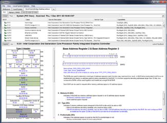

<br>

When the Completer receives the packet and decodes its contents, it gathers the data and creates one or more Locked Completions with data.
These Comple‐ tions are routed back to the Requester using the Requester ID, and each Egress Port they pass through is then locked, too.

If the Completer encounters a problem, it returns a locked completion packet without data (the original read should have resulted in data so
if there isn’t any we know there’s been a problem) and the status field will indicate something about the error. The Requester will
understand that to mean that the lock did not succeed and so the transaction will be cancelled and software will need to decide what to do
next.

**IO and Configuration Writes.** Figure 2‐20 on page 68 illustrates a non‐ posted IO write transaction. Like a locked request, an IO cycle
can also legally target only a Legacy Endpoint. The request is routed through the Switches based on the IO address until it reaches the
target Endpoint. When the Compl‐ eter receives the request, it accepts the data and returns a single completion packet without data that
confirms reception of the packet. The status field in the completion would report whether an error had occurred and, if so, the Requester’s
software would handle it.

If the completion reports no errors the Requester knows that the write data has been successfully delivered and the next step in the
sequence of instructions for that Completer is now permitted. And that really summarizes the motivation for the non‐posted write: unlike a
memory write, it’s not enough to know that the data **will** get to the destination sometime in the future. Instead, the next step can’t
logically take place until we know that it **has** gotten there. As with locked cycles, non‐posted writes can only come from the processor.

_Figure 2‐20: Non‐Posted Write Transaction Protocol_ 


<br>
</td>
<td width="50%">

</td>
<td width="50%">

## **Posted 写事务（Posted Writes）** 

**内存写（Memory Writes）。** 内存写始终是 Posted 类型的,永远不会收到完成报文。一旦请求被发送出去,请求者（Requester）不会等待任何反馈就可以继续发起下一个请求,因此也不会花费时间或带宽来返回完成报文。因此,Posted 写比
Non-Posted 请求更快、更高效,能够提升系统性能。如第 69 页的图 2-21
所示,报文通过其目标内存地址在系统中路由,最终到达完成者（Completer）。一旦某条链路（Link）成功发送了该请求,则该事务在该链路上即告完成,该链路便可被其他报文使用。最终,完成者接收数据,该事务才真正彻底完成。当然,这种方式也有一个权衡:由于不会发送任何完成报文,因此也就没有办法将错误报告给请求者。如果完成者遇到错误,它可以记录该错误,并向根复合体（Root
Complex）发送一条消息以通知系统软件有关该错误的信息,但请求者本身不会看到该错误。

_图 2-21:Posted 内存写事务协议_ 


<br>

</td>
</tr>
<tr>
<td width="50%">

## **PCI Express Technology** 

这些完成报文（Completion）也包含用于将报文路由回请求者（Requester）的路由信息，请求者会在原始请求中提供其返回地址作为此用途。该"返回地址"实际上就是请求者按照 PCI 定义的设备 ID（Device ID），由三部分组成：其在系统中的 PCI 总线号（Bus
number）、在该总线上的设备号（Device number）以及该设备内的功能号（Function number）。此总线号、设备号和功能号信息（有时缩写为 BDF）就是完成报文用来返回原始请求者的路由信息。与 PCI-X 一样，请求者可以同时有多个拆分事务（split
transaction）正在进行，并且必须能够将收到的完成报文与正确的请求相对应。为便于实现这一点，在原始请求中又新增了一个称为 Tag（标签）的值，每个请求都有唯一的 Tag。完成者（Completer）会复制该事务 Tag
并在完成报文中使用，请求者便可以快速识别该完成报文所服务的是哪一个请求。

最后，完成者还可以通过在完成状态字段中设置相应位来指示错误情况。这使请求者至少能够大致了解可能发生了什么错误。请求者如何处理这些错误大多由软件决定，并不在 PCIe 规范的范围之内。

**锁定读（Locked Reads）。** 锁定内存读（Locked Memory Read）用于支持所谓的原子读-修改-写（Atomic
Read-Modify-Write）操作，这是一类不可中断的事务，处理器在诸如测试并设置信号量之类的任务中会用到。在测试与设置进行期间，不能同时访问该信号量，否则可能产生竞态条件（race
condition）。为防止此类问题，处理器会使用一个锁指示器（例如并行前端总线（Front-Side Bus）上的一个独立引脚），在该锁定事务完成之前禁止总线上的其他事务。此处仅给出该主题的高层次介绍。关于锁定事务的更多信息，请参阅附录 D 即第 963 页的"附录
D：锁定事务（Locked Transactions）"。

从历史的角度来看，在 PCI 的早期，规范编写者预见到 PCI 可能会取代处理器总线的情况。因此，PCI 规范中纳入了处理器在总线上可能需要执行的操作的支持，例如锁定事务。然而，PCI
实际很少以这种方式使用，最终其处理器总线支持的大部分内容都被废弃了。尽管如此，锁定周期（locked cycles）被保留下来以支持少数特殊场景，并且 PCIe 沿用了此机制以提供遗留兼容。或许是为了加快停止使用该机制，PCIe
规定新设备不得接受锁定请求；只有那些自标识为遗留设备（Legacy Devices）的设备才被允许这样做。在第 67 页图 2-19 所示的示例中，请求者通过发送一个锁定请求（MRdLk）来启动该流程。根据定义，此类请求只能来自 CPU，因此在 PCIe 中只有根端口（Root
Port）才会发起这类请求。

**第 2 章：PCIe 架构概述** 

锁定请求会基于目标内存地址通过拓扑进行路由，并最终到达遗留端点。当报文沿路经过每个路由设备（称为服务点（service point））时，该报文所在的出端口（Egress Port）会被锁定，意味着在该路径解锁之前不会允许其他报文沿该方向通过。

_图 2-19：非 Posted 锁定读事务协议_ 


<br>

当完成者收到报文并解码其内容后，便会收集数据并生成一个或多个带数据的锁定完成报文（Locked Completions with data）。这些完成报文使用请求者 ID（Requester ID）路由回请求者，并且它们经过的每个出端口也都将被锁定。

如果完成者遇到问题，它会返回一个不带数据的锁定完成报文（原始读操作本应返回数据，如果没有数据则说明存在问题），并且状态字段会指示相应的错误信息。请求者会将此理解为锁定未成功，进而取消该事务，并由软件决定下一步该如何处理。

**IO 和配置写（IO and Configuration Writes）。** 第 68 页的图 2-20 展示了一个非 Posted IO 写事务（non-posted IO write transaction）。与锁定请求类似，IO
周期在合法情况下也只能以遗留端点为目标。该请求基于 IO 地址通过交换机（Switch）进行路由，直到到达目标端点。完成者收到请求后，接收数据并返回一个不带数据的完成报文，以确认报文已被接收。完成报文中的状态字段会报告是否发生错误；如果发生错误，则由请求者的软件负责处理。

如果完成报文报告无错误，则请求者便知道写数据已成功送达，并且该完成者后续指令序列的下一条指令可以执行。这正概括了非 Posted 写（non-posted write）的动机：与内存写（memory
write）不同，仅知道数据**将会**在将来的某个时刻到达目标位置是不够的；只有当我们确认数据**已经**到达之后，下一步操作才能在逻辑上继续进行。与锁定周期一样，非 Posted 写也只能由处理器发起。

_图 2-20：非 Posted 写事务协议_ 


<br>

**第 2 章：PCIe 架构概述**

</td>
</tr>
</tbody>
</table>

[⬆️ 返回目录](#本章目录-table-of-contents)

---

<a id="sec-4-2"></a>

</td>
<td width="50%">

</td>
</tr><table>
<thead><tr><th width="50%">🇬🇧 English</th><th width="50%">🇨🇳 中文</th></tr></thead>
<tbody>
<tr>
<td width="50%">

## 4.2 Address Space & Transaction Routing | 地址空间与事务路由

<table>
<thead><tr><th>🇬🇧 English</th><th style="background-color:#e8e8e8">🇨🇳 中文</th></tr>
</tbody>
</table></thead>
<tbody>
<tr>
<td width="50%">

</td>
<td width="50%">

</td>
</tr>
<tr>
<td width="50%">

## **Posted Writes** 

**Memory Writes.** Memory writes are always posted and never receive com‐ pletions. Once the request has been sent, the Requester doesn’t
wait for any feedback before going on to the next request, and no time or bandwidth is spent returning a completion. As a result, posted
writes are faster and more efficient than non‐posted requests and improve system performance. As shown in Fig‐ ure 2‐21 on page 69, the
packet is routed through the system using its target memory address to the Completer. Once a Link has successfully sent the request, that
transaction is finished on that Link and its available for other packets. Eventually, the Completer accepts the data and the transaction is
truly fin‐ ished. Of course, one trade‐off with this approach is that, since no Completion packets are sent, there’s also no means for
reporting errors back to the Requester. If the Completer encounters an error, it can log it and send a Message to the Root to inform system
software about the error, but the Requester won’t see it.

_Figure 2‐21: Posted Memory Write Transaction Protocol_ 


<br>

</td>
<td width="50%">

</td>
</tr>

</tbody>
</table>

[⬆️ 返回目录](#本章目录-table-of-contents)

---

<a id="sec-4-3"></a>
## 4.3 Address Space & Transaction Routing | 地址空间与事务路由

<table>
<thead><tr><th width="50%">🇬🇧 English</th><th width="50%">🇨🇳 中文</th></tr></thead>
<tbody>
<tr>
<td width="50%">

## **PCI Express Technology** 

**Message Writes.** Interestingly, unlike the other requests we’ve looked at so far, there are several possible routing methods for
messages, and a field within the message indicates which type to use. For example, some messages are posted write requests that target a
specific Completer, others are broadcast from the Root to all Endpoints, while still others sent from an Endpoint are automati‐ cally routed
to the Root. To learn more about the different types of routing refer to Chapter 4, entitled ʺAddress Space & Transaction Routing,ʺ on page
121.

Messages are useful in PCIe to help achieve a design goal of lowering the pin count. They eliminate the need for the side‐band signals that
PCI used to report things like interrupts, power management events, and errors because they can report that information in a packet over the
normal data path.

</td>
<td width="50%">

## **PCI Express 技术**

**消息写（Message Writes）。** 有趣的是，与我们迄今为止看到的其他请求不同，消息有几种可能的路由方法，并且消息中的一个字段指示应使用哪种类型。例如，有些消息是发布到特定 Completer 的 Posted 写请求，有些是从根复合体 (Root Complex)
广播到所有端点 (Endpoint) 的，而从端点 (Endpoint) 发送的其他消息则会自动路由到根复合体 (Root)。要了解更多关于不同路由类型的信息，请参阅第 121 页第 4 章"地址空间与事务路由"。

消息在 PCIe 中很有用，有助于实现降低引脚 (Pin) 数的设计目标。它们消除了对 PCI 曾经用于报告中断 (Interrupt)、电源管理事件 (Power Management Events) 和错误 (Error) 等内容的边带 (Sideband)
信号的需要，因为它们可以通过正常的数据路径以报文的形式报告这些信息。

</td>
</tr>
</tbody>
</table>

[⬆️ 返回目录](#本章目录-table-of-contents)

---

<a id="sec-4-4"></a>
## 4.4 Address Space & Transaction Routing | 地址空间与事务路由

<table>
<thead><tr><th width="50%">🇬🇧 English</th><th width="50%">🇨🇳 中文</th></tr></thead>
<tbody>
<tr>
<td width="50%">

## **Quality of Service (QoS)** 

PCIe was designed from its inception to be able to support time‐sensitive trans‐ actions for applications like streaming audio or video
where data delivery must be timely in order to be useful. This is referred to as providing Quality of Ser‐ vice and is accomplished by the
addition of a few things. First, each packet is assigned a priority by software by setting a 3‐bit field within it called Traffic Class
(TC). Generally speaking, assigning a higher‐numbered TC to a packet is expected to give it a higher priority in the system. Second,
multiple buffers, called Virtual Channels (VC), are built into the hardware for each port and a packet is placed into the appropriate buffer
based on its TC. Third, since a port now has multiple buffers with packets available for transmission at a given time, arbitration logic is
needed to select among the VCs. Finally, Switches must select between competing input ports for access to the VCs of a given output port.
This is called Port Arbitration and can be hardware assigned or software programmable. All of these hardware pieces must be in place to
allow a system to prioritize packets. If properly programmed and set up, such a system can even provide guaranteed service for a given path.

To illustrate the concept, consider Figure 2‐22 on page 71, in which a video cam‐ era and SCSI device both need to send data to system DRAM.
The difference is that the camera data is time critical; if the transmission path to the target device is unable to keep up with its
bandwidth, frames will get dropped. The system needs to be able to guarantee a bandwidth that’s at least as high as the camera or the
captured video may appear choppy. At the same time, the SCSI data needs to be delivered without errors, but how long it takes is not as
important. Clearly, then, when both a video data packet and a SCSI packet need to be sent at the same time, the video traffic should have a
higher priority. QoS refers to the abil‐ ity of the system to assign different priorities to packets and route them through the topology
with deterministic latencies and bandwidth. For more detail on QoS, refer to Chapter 7, entitled ʺQuality of Service,ʺ on page 245.
_Figure 2‐22: QoS Example_ 


<br>

</td>
<td width="50%">

## **服务质量 (QoS)**

PCIe 从设计之初就能够支持对时间敏感的事务,例如流式音频或视频等应用,这些应用要求数据必须及时传递才有意义。这被称为提供服务质量 (Quality of Service),它通过增加一些机制来实现。首先,软件会为每个报文分配一个优先级,即通过设置报文内一个称为流量类 (TC,
Traffic Class) 的 3 位字段。一般来说,为报文分配编号更高的 TC 意味着它在系统中具有更高的优先级。其次,硬件为每个端口内置了多个缓冲区,称为虚通道 (VC, Virtual Channel),报文会根据其 TC
被放入相应的缓冲区。第三,由于一个端口现在有多个缓冲区同时有待发送的报文,因此需要仲裁逻辑在各个 VC 之间进行选择。最后,交换机 (Switch) 必须在竞争访问某一输出端口 VC 的多个输入端口之间进行选择。这称为端口仲裁 (Port
Arbitration),可以由硬件分配,也可以由软件编程设定。所有这些硬件组件必须到位,系统才能对报文进行优先级排序。如果得到正确的编程和配置,这样的系统甚至可以为给定路径提供有保证的服务。

为了说明这一概念,请参阅第 71 页的图 2‐22,在该图中,摄像机和 SCSI 设备都需要向系统 DRAM
发送数据。不同之处在于,摄像机数据是时间敏感的;如果到目标设备的传输路径无法跟上其带宽,帧就会被丢弃。系统需要能够保证至少与摄像机带宽一样高的传输速率,否则采集到的视频可能会出现卡顿。同时,SCSI 数据需要无误地交付,但交付所需的时间并不那么重要。显然,当视频数据报文和
SCSI 报文需要在同一时刻发送时,视频流量应具有更高的优先级。QoS 指的是系统为报文分配不同优先级、并以确定性延迟和带宽将它们通过拓扑进行路由的能力。有关 QoS 的更多详细信息,请参阅第 245 页第 7 章"服务质量 (Quality of Service)"。

**第 2 章:PCIe 架构概述**

_图 2‐22:QoS 示例_


<br>

</td>
</tr>
</tbody>
</table>

[⬆️ 返回目录](#本章目录-table-of-contents)

---

<a id="sec-4-5"></a>
## 4.5 Address Space & Transaction Routing | 地址空间与事务路由

<table>
<thead><tr><th width="50%">🇬🇧 English</th><th width="50%">🇨🇳 中文</th></tr></thead>
<tbody>
<tr>
<td width="50%">

## **Transaction Ordering** 

Within a VC, the packets normally all flow through in the same order in which they arrived, but there are exceptions to this general rule.
PCI Express protocol inherits the PCI transaction‐ordering model, including support for relaxed‐ ordering cases added with the PCI‐X
architecture. These ordering rules guaran‐ tee that packets using the same traffic class will be routed through the topology in the correct
order, preventing potential deadlock or live‐lock conditions. An interesting point to note is that, since ordering rules only apply within a
VC and packets that use different TCs may not get mapped into the same VC, packets using different TCs are understood by software to have no
ordering relation‐ ship. This ordering is maintained in the VCs within the transaction layer.

</td>
<td width="50%">

## **事务排序**

在 VC（虚通道）内部，数据包通常按照其到达的相同顺序流转，但这一通用规则也存在例外。PCI Express 协议继承了 PCI 的事务排序模型，包括 PCI-X 架构所新增的松散排序（Relaxed Ordering）支持。这些排序规则保证了使用相同流量类（TC,
Traffic Class）的数据包能够以正确的顺序通过拓扑进行路由，从而避免潜在的死锁或活锁情况。值得注意的一点是，由于排序规则仅在 VC 内部适用，并且使用不同 TC 的数据包未必会被映射到同一个 VC，因此软件层面理解使用不同 TC
的数据包之间不存在排序关系。该排序在事务层（Transaction Layer）内的各个 VC 中得以维护。

</td>
</tr>
</tbody>
</table>

[⬆️ 返回目录](#本章目录-table-of-contents)

---

<a id="sec-4-6"></a>
## 4.6 Address Space & Transaction Routing | 地址空间与事务路由

<table>
<thead><tr><th width="50%">🇬🇧 English</th><th width="50%">🇨🇳 中文</th></tr></thead>
<tbody>
<tr>
<td width="50%">

## **Flow Control** 

A typical protocol used by serial transports is to require that a transmitter only send a packet to its neighbor if there is sufficient
buffer space to receive it. That cuts down on performance‐wasting events on the bus like the disconnects and retries that PCI allowed and
thus removes that class of problems from the trans‐ port. The trade‐off is that the receiver must report its buffer space often enough to
avoid unnecessary stalls and that reporting takes a little bandwidth of its own. In PCIe this reporting is done with DLLPs (Data Link Layer
Packets), as we’ll see in the next section. The reason is to avoid a possible deadlock condi‐ tion that might occur if TLPs were used, in
which a transmitter can’t get a buffer size update because its own receive buffer is full. DLLPs can always be sent and received regardless
of the buffer situation, so that problem is avoided. This flow control protocol is automatically managed at the hardware level and is trans‐
parent to software.

_Figure 2‐23: Flow Control Basics_ 


<br>

As shown in Figure 2‐23 on page 72, the Receiver contains the VC Buffers that hold received TLPs. The Receiver advertises the size of those
buffers to the Transmitters using Flow Control DLLPs. The Transmitter tracks the available space in the Receiverʹs VC Buffers and is not
allowed to send more packets than the Receiver can hold. As the Receiver processes the TLPs and removes them from the buffer, it
periodically sends Flow Control Update DLLPs to keep the Transmitter up‐to‐date regarding the available space. To learn more about this, see
Chapter 6, entitled ʺFlow Control,ʺ on page 215.

</td>
<td width="50%">

## **流控 (Flow Control)** 

串行传输常用的一种典型协议是：发送器只有在邻居端有足够的缓冲空间来接收数据包时,才向其发送数据包。这可以减少总线上诸如 PCI
所允许的断开连接和重试之类的浪费性能的事件,从而将这类问题从传输中消除。其代价是,接收器必须足够频繁地报告其缓冲空间,以避免不必要的停顿,而该报告本身会占用一点带宽。在 PCIe 中,该报告通过 DLLP (数据链路层包 (Data Link Layer Packet,
DLLP)) 来完成,我们将在下一节中看到这一点。这样做是为了避免在使用 TLP 时可能发生的死锁条件——在那种情况下,发送器因自身接收缓冲区已满而无法获取缓冲区大小更新。DLLP
无论缓冲区状况如何都可以被发送和接收,因此该问题得以避免。此流控协议在硬件层面自动管理,对软件透明。

_图 2‐23:流控基础_

**==> 图片 [292 x 107] 故意省略 <==**

**----- 图片文字开始 -----**<br>
可用的缓冲空间<br>TLP<br>发送器 接收器<br>发送器 VC 缓冲区 接收器<br>流控 DLLP<br>**----- 图片文字结束 -----**<br>

如图 2‐23 第 72 页所示,接收器包含用于存放所接收 TLP 的 VC 缓冲区。接收器使用流控 DLLP 向发送器通告这些缓冲区的大小。发送器跟踪接收器 VC 缓冲区中的可用空间,且不允许发送超过接收器可容纳数量的报文。当接收器处理 TLP
并将其从缓冲区中移除时,它会周期性地发送流控更新 DLLP,以使发送器随时了解可用空间。如需了解更多相关信息,请参阅第 215 页第 6 章“流控 (Flow Control)”。

</td>
</tr>
</tbody>
</table>

[⬆️ 返回目录](#本章目录-table-of-contents)

---

<a id="sec-4-7"></a>
## 4.7 Address Space & Transaction Routing | 地址空间与事务路由

<table>
<thead><tr><th width="50%">🇬🇧 English</th><th width="50%">🇨🇳 中文</th></tr></thead>
<tbody>
<tr>
<td width="50%">

## **Data Link Layer** 

This logic is responsible for Link management and performs three major func‐ tions: TLP error correction, flow control, and some Link power
management. It accomplishes these by generating DLLPs as shown in Figure 2‐24 on page 73.
</td>
<td width="50%">

</td>
<td width="50%">

## **DLLPs (数据链路层包)**

DLLP 在链路上两个相邻设备的数据链路层之间传输。事务层甚至不会感知到这些数据包的存在，因为它们只在相邻设备之间传输,不会被路由到其他地方。与 TLP 相比,它们很小(始终只有 8 个字节),这是一件好事,因为它们代表了维护链路协议的额外开销。

_图 2-24:DLLP 的起点和终点_


<br>

**DLLP 组装。** 如图 2-24(第 73 页)所示,DLLP 源自发送端的数据链路层,由接收端的数据链路层消费。在 DLLP Core 之后附加一个 16 位 CRC,以便在接收端检查错误。DLLP 的内容被转发到物理层,物理层在数据包的开头和结尾分别附加一个
Start 和 End 字符(针对前两代 PCIe),然后使用所有可用的通道 (Lane) 对其进行编码并以差分方式通过链路 (Link) 传输。

**DLLP 拆卸。** 当物理层接收到 DLLP 时,会对比特流进行解码,并移除 Start 和 End 帧字符。数据包的其余部分被转发到数据链路层,数据链路层会检查 CRC 错误,然后根据该数据包采取适当的操作。数据链路层是 DLLP 的最终目的地,因此不会向上转发到事务层。

</td>
</tr>
<tr>
<td width="50%">

## **数据链路层 (Data Link Layer)** 

该逻辑负责链路 (Link) 管理,并执行三个主要功能:TLP 错误纠正、流控 (Flow Control) 以及部分链路 (Link) 电源管理 (Power Management)。它通过生成 DLLP(如图 2-24 所示,见第 73 页)来完成这些功能。 

**第 2 章:PCIe 架构概述**

</td>
</tr>
</tbody>
</table>

[⬆️ 返回目录](#本章目录-table-of-contents)

---

<a id="sec-4-8"></a>

</td>
<td width="50%">

</td>
</tr><table>
<thead><tr><th width="50%">🇬🇧 English</th><th width="50%">🇨🇳 中文</th></tr></thead>
<tbody>
<tr>
<td width="50%">

## 4.8 Address Space & Transaction Routing | 地址空间与事务路由

<table>
<thead><tr><th>🇬🇧 English</th><th style="background-color:#e8e8e8">🇨🇳 中文</th></tr>
</tbody>
</table></thead>
<tbody>
<tr>
<td width="50%">

</td>
<td width="50%">

</td>
</tr>
<tr>
<td width="50%">

## **DLLPs (Data Link Layer Packets)** 

DLLPs are transferred between Data Link Layers of the two neighboring devices on a Link. The Transaction Layer is not even aware of these
packets, which only travel between neighboring devices and are not routed anywhere else. They are small (always just 8 bytes) compared to
TLPs, and that’s a good thing because they represent overhead for maintaining Link protocol.

_Figure 2‐24: DLLP Origin and Destination_ 


<br>

**DLLP Assembly.** As shown in Figure 2‐24 on page 73, a DLLP originates at the Data Link Layer of the transmitter and is consumed by the
Data Link Layer of the receiver. A 16‐bit CRC is added to the DLLP Core to check for errors at the receiver. The DLLP contents are forwarded
to the Physical Layer which appends a Start and End character to the packet (for the first two generations of PCIe), and then encodes and
differentially transmits it over the Link using all the available lanes.

**DLLP Disassembly.** When a DLLP is received by the Physical Layer, the bit stream is decoded and the Start and End frame characters are
removed. The rest of the packet is forwarded to the Data Link Layer, which checks for CRC errors and then takes the appropriate action based
on the packet. The Data Link Layer is the destination for the DLLP, so it isn’t forwarded up to the Transaction Layer.

</td>
<td width="50%">

</td>
</tr>

</tbody>
</table>

[⬆️ 返回目录](#本章目录-table-of-contents)

---

<a id="sec-4-9"></a>
## 4.9 Address Space & Transaction Routing | 地址空间与事务路由

<table>
<thead><tr><th width="50%">🇬🇧 English</th><th width="50%">🇨🇳 中文</th></tr></thead>
<tbody>
<tr>
<td width="50%">

## **Ack/Nak Protocol** 

The error correction function, illustrated in Figure 2‐25 on page 74, is provided through a hardware‐based automatic retry mechanism. As
shown in Figure 2‐26 on page 75, an LCRC and Sequence Number are added to each outgoing TLP and checked at the receiver. The transmitter’s
Replay Buffer holds a copy of every TLP that has been sent until receipt at the neighboring device has been confirmed. That confirmation
takes the form of an Ack DLLP (positive acknowl‐ edgement) sent by the Receiver with the Sequence Number of the last good TLP it has seen.
When the Transmitter sees the Ack, it flushes the TLP with that Sequence Number out of the Replay Buffer, along with all the TLPs that were
sent before the one that was acknowledged.

If the Receiver detects a TLP error, it drops the TLP and returns a Nak to the Transmitter, which then replays all unacknowledged TLPs in
hopes of a better result the next time. Since detected errors are almost always transient events, a replay will very often correct the
problem. This process is often referred to as the Ack/Nak protocol.

_Figure 2‐25: Data Link Layer Replay Mechanism_ 


<br>
_Figure 2‐26: TLP and DLLP Structure at the Data Link Layer_ 


<br>

The basic form of a DLLP is also shown in Figure 2‐26 on page 75, and consists of a 4‐byte DLLP type field that may include some other
information and a 2‐ byte CRC.

Figure 2‐27 on page 76 shows an example of a memory read going across a Switch. In general, the steps for this case would be as follows: 

1. **Step 1a** : Requester sends a memory read request and saves a copy in its Replay Buffer. Switch receives the MRd TLP and checks the
LCRC and Sequence Number.

 - Step 1b: No error is seen, so the Switch returns an Ack DLLP to Requester. In response, Requester discards its copy of the TLP from the
Replay Buffer.

2. **Step 2a** : Switch forwards the MRd TLP to the correct Egress Port using memory address for its routing and saves a copy in the Egress
Port’s Replay Buffer. The Completer receives the MRd TLP and checks for errors. **Step 2b** : No error is seen, so the Completer returns an
Ack DLLP to the Switch. Switch Port purges its copy of the MRd TLP from its Replay Buffer.

3. **Step 3a** : As the final destination of the request, the Completer checks the optional ECRC field in MRd TLP. No errors are seen so the
request is passed to the core logic. Based on the command, the device fetches the requested data and returns a Completion with Data TLP
(CplD) while saving a copy in its Replay Buffer. Switch receives CplD TLP and checks for errors. **Step 3b** : No error is seen, so the
Switch returns an Ack DLLP to the Compl‐ eter. Completer discards its copy of the CplD TLP from its Replay Buffer.

4. **Step 4a** : Switch decodes the Requester ID field in CplD TLP and routes the packet to the correct Egress Port, saving a copy in the
Egress Port’s Replay Buffer. Requester receives CplD TLP and checks for errors. **Step 4b** : No error is seen, so the Requester returns Ack
DLLP to Switch. Switch discards its copy of the CplD TLP from its Replay Buffer. Requester checks the optional ECRC field and finds no
error, so data is passed up to the core logic.

</td>
<td width="50%">

## **Ack/Nak 协议**

第 74 页图 2-25 所示的纠错功能由一种基于硬件的自动重试机制提供。如第 75 页图 2-26 所示，每个发出的 TLP 都会附加一个 LCRC（链路 CRC）和序列号（Sequence
Number），由接收方进行校验。发送器（Transmitter）的重放缓冲区（Replay Buffer）会保存每一个已发送 TLP 的副本，直到相邻设备确认已成功接收。该确认由接收器（Receiver）发送一个 Ack DLLP（ACK DLLP，确认
DLLP）实现，其中包含其所见到的最后一个正确 TLP 的序列号。当发送器看到该 Ack 后，便将该序列号对应的 TLP 以及所有在它之前已发送的 TLP 一并从重放缓冲区中清除。

如果接收器检测到 TLP 错误，它会丢弃该 TLP，并向发送器返回一个 Nak，随后发送器会重放所有未被确认的 TLP，希望在下一次能够得到正确结果。由于被检测到的错误几乎都是瞬态事件，重放通常能够纠正该问题。该过程通常被称为 Ack/Nak 协议。

_图 2-25：数据链路层重放机制_


<br>

**第 2 章：PCIe 架构概述**

_图 2-26：数据链路层处 TLP 和 DLLP 的结构_


<br>

DLLP 的基本形式同样在第 75 页图 2-26 中展示，它由一个 4 字节的 DLLP Type 字段（可能包含一些其他信息）和一个 2 字节的 CRC 组成。

第 76 页图 2-27 给出了一个跨交换机（Switch）的内存读操作示例。一般来说，本例的步骤如下：

1. **步骤 1a**：请求者（Requester）发送一个内存读请求，并将其副本保存在重放缓冲区中。交换机接收到该 MRd TLP，并检查其 LCRC 和序列号。

 - 步骤 1b：由于未检测到错误，交换机向请求者返回一个 Ack DLLP。作为响应，请求者从重放缓冲区中丢弃该 TLP 的副本。

2. **步骤 2a**：交换机根据内存地址进行路由，将该 MRd TLP 转发到正确的下游端口（Egress Port），并将其副本保存在该下游端口的重放缓冲区中。完成器（Completer）收到 MRd TLP 后进行错误检查。**步骤
2b**：未检测到错误，因此完成器向交换机返回 Ack DLLP。交换机端口从其重放缓冲区中清除该 MRd TLP 的副本。

3. **步骤 3a**：作为该请求的最终目的地，完成器检查 MRd TLP 中的可选 ECRC 字段。未检测到错误，因此该请求被传递至核心逻辑。设备根据该命令获取所请求的数据，并返回一个带数据的完成报文 TLP（CplD），同时将副本保存在重放缓冲区中。交换机收到 CplD
TLP 后进行错误检查。**步骤 3b**：未检测到错误，因此交换机向完成器返回 Ack DLLP。完成器从重放缓冲区中丢弃该 CplD TLP 的副本。

4. **步骤 4a**：交换机解码 CplD TLP 中的请求者 ID（Requester ID）字段，并将该报文路由到正确的下游端口，同时将副本保存在该下游端口的重放缓冲区中。请求者收到 CplD TLP 后进行错误检查。**步骤
4b**：未检测到错误，因此请求者向交换机返回 Ack DLLP。交换机从重放缓冲区中丢弃该 CplD TLP 的副本。请求者检查可选的 ECRC 字段，未发现错误，于是数据被上送至核心逻辑。

</td>
</tr>
</tbody>
</table>

[⬆️ 返回目录](#本章目录-table-of-contents)

---

<a id="sec-4-10"></a>
## 4.10 Address Space & Transaction Routing | 地址空间与事务路由

<table>
<thead><tr><th width="50%">🇬🇧 English</th><th width="50%">🇨🇳 中文</th></tr></thead>
<tbody>
<tr>
<td width="50%">

## **PCI Express Technology** 

_Figure 2‐27: Non‐Posted Transaction with Ack/Nak Protocol_ 


<br>

</td>
<td width="50%">

## **PCI Express Technology**

_图 2‐27：使用 Ack/Nak 协议的 Non-Posted 事务_


<br>

</td>
</tr>
</tbody>
</table>

[⬆️ 返回目录](#本章目录-table-of-contents)

---

<a id="sec-4-11"></a>
## 4.11 Address Space & Transaction Routing | 地址空间与事务路由

<table>
<thead><tr><th width="50%">🇬🇧 English</th><th width="50%">🇨🇳 中文</th></tr></thead>
<tbody>
<tr>
<td width="50%">

## **Flow Control** 

The second major Link Layer function is Flow Control. Following power‐up or Reset, this mechanism is initialized by the Data Link Layer
automatically in hardware and then updated during run‐time. An overview of this was already presented in the section on TLPs so that won’t
be repeated here. To learn more about this topic, see Chapter 6, entitled ʺFlow Control,ʺ on page 215.

</td>
<td width="50%">

1 ## **流控 (Flow Control)** 

2 第二个主要的链路层功能是流控 (Flow Control)。在上电或复位后,该机制由数据链路层 (Data Link Layer) 在硬件中自动初始化,然后在运行时更新。其概述已在 TLP 章节中介绍,此处不再重复。要了解有关此主题的更多信息,请参阅第 215 页的第 6
章"Flow Control"。

</td>
</tr>
</tbody>
</table>

[⬆️ 返回目录](#本章目录-table-of-contents)

---

<a id="sec-4-12"></a>
## 4.12 Address Space & Transaction Routing | 地址空间与事务路由

<table>
<thead><tr><th width="50%">🇬🇧 English</th><th width="50%">🇨🇳 中文</th></tr></thead>
<tbody>
<tr>
<td width="50%">

## **Power Management** 

Finally, the Link Layer participates in power management, as well, because DLLPs are used to communicate the requests and handshakes
associated with Link and system power states. For a detailed discussion on this topic, refer to Chapter 16, entitled ʺPower Management,ʺ on
page 703.

</td>
<td width="50%">

## **电源管理 (Power Management)** 

最后，链路层同样也参与电源管理 (Power Management)，这是因为 DLLP 被用于传递与链路 (Link) 和系统电源状态相关的请求与握手过程。有关该主题的详细讨论，请参阅第 16 章《电源管理 (Power Management)》，位于第 703 页。

</td>
</tr>
</tbody>
</table>

[⬆️ 返回目录](#本章目录-table-of-contents)

---

<a id="sec-4-13"></a>
## 4.13 Address Space & Transaction Routing | 地址空间与事务路由

<table>
<thead><tr><th width="50%">🇬🇧 English</th><th width="50%">🇨🇳 中文</th></tr></thead>
<tbody>
<tr>
<td width="50%">

## **Physical Layer**

</td>
<td width="50%">

## **物理层 (Physical Layer)**

</td>
</tr>
</tbody>
</table>

[⬆️ 返回目录](#本章目录-table-of-contents)

---

<a id="sec-4-14"></a>
## 4.14 Address Space & Transaction Routing | 地址空间与事务路由

<table>
<thead><tr><th width="50%">🇬🇧 English</th><th width="50%">🇨🇳 中文</th></tr></thead>
<tbody>
<tr>
<td width="50%">

## **General** 

The Physical Layer is the lowest hierarchical layer for PCIe as shown in Figure 2‐14 on page 58. Both TLP and DLLP type packets are
forwarded down from the Data Link Layer to the Physical Layer for transmission over the Link and for‐ warded up to the Data Link Layer at
the Receiver. The spec divides the Physical Layer discussion into two portions: a logical part and an electrical part, and we’ll preserve
that split here as well. The Logical Physical Layer contains the digital logic associated with preparing the packets for serial transmission
on the Link and reversing that process for inbound packets. The Electrical Physical Layer is the analog interface of the Physical Layer that
connects to the Link and consists of differential drivers and receivers for each lane.
</td>
<td width="50%">

</td>
<td width="50%">

## **物理层 - 逻辑**

来自数据链路层 (Data Link Layer) 的 TLP 和 DLLP 被时钟送入物理层 (Physical Layer) 中的一个缓冲区,在该缓冲区中,会在包的两端添加起始 (Start) 和结束 (End)
字符,以便于在接收端检测包的边界。由于起始和结束字符出现在包的两端,因此它们也被称为"成帧 (framing)"字符。图 2‐28 (第 77 页) 中展示了附加在 TLP 和 DLLP 上的成帧字符,同时还显示了每个字段的大小。

_图 2‐28:物理层处的 TLP 和 DLLP 结构_

**==> 图片 [366 x 150] 已省略 <==**

**----- 图片文字起始 -----**<br>
事务层包 (TLP)<br>起始 序列号 包头 数据载荷 ECRC LCRC 结束<br>1B 2B 3-4 DW 0-1024 DW 1DW 1DW 1B<br>DLLP<br>起始 DLLP 类型 杂项 CRC 结束<br>1B 2B 1B<br>1DW<br>**-----
图片文字结束 -----**<br>

在该层内,数据包的每个字节都会通过一种称为字节拆分 (byte striping) 的过程分配到链路 (Link) 正在使用的所有通道 (Lane) 上。实际上,每条通道都作为一条穿越链路的独立串行路径运行,它们的数据在接收端被重新聚合在一起。每个字节都会被加扰
(scrambling),以减少传输线上的重复模式,并降低链路上观察到的 EMI (电磁干扰)。对于 PCIe 的前两代 (Gen1 和 Gen2 PCIe),8 位字符会通过所谓的 8b/10b 编码 (encoding) 逻辑编码为 10 位的"符号
(symbols)"。这种编码会给输出数据流带来一定的开销,但同时也带来了一些有用的特性 (更多相关内容,请参见第 380 页的"8b/10b 编码")。Gen3 物理层逻辑在以 Gen3 速率传输时,并不使用 8b/10b 编码对包的字节进行编码,而是采用另一种称为
128b/130b 编码 的方案,并对包字节进行加扰后传输。每条通道上的 10b 符号 (Gen1 和 Gen2) 或每条通道上的包字节 (Gen3),随后被串行化,并以 2.5 GT/s (Gen1)、5 GT/s (Gen2) 或 8 GT/s (Gen3)
的速率,以差分方式在链路的每条通道上时钟输出。

</td>
</tr>
<tr>
<td width="50%">

## **概述** 

物理层是 PCIe 层级结构中最低的一层，如图 2‐14（第 58 页）所示。TLP 和 DLLP
类型的分组都从数据链路层向下转发到物理层，以便在链路上传输，并在接收端向上转发给数据链路层。规范将物理层的讨论分为两部分：逻辑部分和电气部分，我们在这里也保留这种划分方式。逻辑物理层包含与分组准备用于链路上串行传输相关的数字逻辑，以及对入站分组的逆向处理过程。电气物理层是物理层连接到链路的模拟接口，由每个通道的差分驱动器和接收器组成。

**第 2 章：PCIe 架构概述**

</td>
</tr>
</tbody>
</table>

[⬆️ 返回目录](#本章目录-table-of-contents)

---

<a id="sec-4-15"></a>

</td>
<td width="50%">

</td>
</tr><table>
<thead><tr><th width="50%">🇬🇧 English</th><th width="50%">🇨🇳 中文</th></tr></thead>
<tbody>
<tr>
<td width="50%">

## 4.15 Address Space & Transaction Routing | 地址空间与事务路由

<table>
<thead><tr><th>🇬🇧 English</th><th style="background-color:#e8e8e8">🇨🇳 中文</th></tr>
</tbody>
</table></thead>
<tbody>
<tr>
<td width="50%">

</td>
<td width="50%">

</td>
</tr>
<tr>
<td width="50%">

## **Physical Layer - Logical** 

TLPs and DLLPs from the Data Link Layer are clocked into a buffer in the Phys‐ ical Layer, where Start and End characters are added to
facilitate detection of the packet boundaries at the receiver. Since the Start and End characters appear on both ends of a packet they are
also called “framing” characters. The framing characters are shown appended to a TLP and DLLP in Figure 2‐28 on page 77, which also shows
the size of each field.

_Figure 2‐28: TLP and DLLP Structure at the Physical Layer_ 


<br>

Within this layer, each byte of a packet is split out across all of the lanes in use for the Link in a process called byte striping.
Effectively, each lane operates as an independent serial path across the Link and their data is all aggregated back together at the
receiver. Each byte is scrambled to reduce repetitive patterns on the transmission line and reduce EMI (electro‐magnetic interference) seen
on the Link. For the first two generations of PCIe (Gen1 and Gen2 PCIe), the 8‐bit characters are encoded into 10‐bit “symbols” using what
is called 8b/10b encod‐ ing logic. This encoding adds overhead to the outgoing data stream, but also adds a number of useful characteristics
(for more on this, see “8b/10b Encod‐ ing” on page 380). Gen3 Physical Layer logic when transmitting at Gen3 speed, does not encode the
packet bytes using 8b/10b encoding. Rather another encod‐ ing scheme referred to as 128b/130b encoding is employed with the packet bytes
scrambled transmitted. The 10b symbols on each Lane (Gen1 and Gen2) or the packet bytes on each Lane (Gen3) are then serialized and clocked
out differen‐ tially on each Lane of the Link at 2.5 GT/s (Gen1), or 5 GT/s (Gen2) or 8 GT/s (Gen3).

</td>
<td width="50%">

</td>
</tr>

</tbody>
</table>

[⬆️ 返回目录](#本章目录-table-of-contents)

---

<a id="sec-4-16"></a>
## 4.16 Address Space & Transaction Routing | 地址空间与事务路由

<table>
<thead><tr><th width="50%">🇬🇧 English</th><th width="50%">🇨🇳 中文</th></tr></thead>
<tbody>
<tr>
<td width="50%">

## **PCI Express Technology** 

Receivers clock in the packet bits at the trained clock speeds as they arrive on all lanes. If 8b/10b is in use (at Gen1 and Gen2 mode), the
serial bit stream of the packet is converted into 10‐bit symbols using a deserializer so it’s ready for 8b/ 10b decoding. However, before
decoding, the symbols pass through an elastic buffer, a clever device that compensates for the slight difference in frequency between the
internal clocks of two connected devices. Next, the 10‐bit symbol stream is decoded back to the proper 8‐bit characters via an 8b/10b
decoder. Gen3 Physical Layer logic, when receiving serial bit stream of the packet at Gen3 speed, will convert it into a byte stream using a
deserializer that has estab‐ lished block lock. The byte stream is passed through an elastic buffer which does clock tolerance compensation.
The 8b/10b decoder stage is skipped given packets clocked at Gen3 speeds are not 8b/10b encoded. The 8‐bit characters on all lanes are
de‐scrambled, the bytes from all the lanes are un‐striped back into a single character stream and, finally, the original data stream from
the Transmit‐ ter is recovered.

</td>
<td width="50%">

## **PCI Express 技术**

接收器 (Receiver) 以训练后的时钟速率,把所有通道 (Lane) 上到达的报文比特锁存进来。如果使用了 8b/10b 编码(在 Gen1 和 Gen2 模式下),报文的串行比特流会通过解串器 (SerDes) 转换为 10 比特符号,以便送入 8b/10b
解码器。然而,在解码之前,这些符号会先经过一个弹性缓冲区(elastic buffer)——一种巧妙设计的器件,用于补偿两个互连设备内部时钟之间细微的频率差异。接着,10 比特符号流会通过 8b/10b 解码器被还原为正确的 8 比特字符。Gen3 物理层 (Physical
Layer) 逻辑在以 Gen3 速率接收报文的串行比特流时,会利用已建立块锁定 (block lock) 的解串器把它转换为字节流。该字节流会穿过一个弹性缓冲区以完成时钟容差补偿。由于以 Gen3 速率锁存的报文并未经过 8b/10b 编码,因此会跳过 8b/10b
解码阶段。随后,所有通道上的 8 比特字符会被解扰 (De-scrambling),来自各通道的字节被反向去条带化 (un-striped) 合并为单一的字符流,最终恢复出由发送器 (Transmitter) 发出的原始数据流。

</td>
</tr>
</tbody>
</table>

[⬆️ 返回目录](#本章目录-table-of-contents)

---

<a id="sec-4-17"></a>
## 4.17 Address Space & Transaction Routing | 地址空间与事务路由

<table>
<thead><tr><th width="50%">🇬🇧 English</th><th width="50%">🇨🇳 中文</th></tr></thead>
<tbody>
<tr>
<td width="50%">

## **Link Training and Initialization** 

Another responsibility of the Physical Layer is the initialization and training process on the Link. In this fully automatic process,
several steps are taken to prepare the Link for normal operation, which involves determining the status of several optional conditions. For
example, the Link width can be from one lane to 32 lanes, and multiple speeds might be available. The training process will discover these
options and go through a state machine sequence to resolve the best combination. In that process, several things are checked or established
to ensure proper and optimal operation, such as:

- Link width 

- Link data rate 

- Lane reversal ‐ Lanes connected in reverse order 

- Polarity inversion ‐ Lane polarity connected backward 

- Bit lock per Lane ‐ Recovering the transmitter clock 

- Symbol lock per Lane ‐ Finding a recognizable position in the bit‐stream 

- Lane‐to‐Lane de‐skew within a multi‐Lane Link.

</td>
<td width="50%">

## **链路训练与初始化** 

物理层（Physical Layer）的另一项职责是链路（Link）上的初始化和训练过程。在这个全自动化的过程中，需要执行多个步骤来为链路的正常运行做好准备，其中涉及到确定多个可选条件的状态。例如，链路宽度可以从一条通道（Lane）到 32
条通道不等，并且可能有多种速率可用。训练过程将发现这些选项，并通过状态机序列来确定最佳组合。在该过程中，会检查或建立多个事项以确保正确且最优的运行，例如：

- 链路宽度 

- 链路数据速率 

- 通道反转 ‐ 通道以相反的顺序连接 

- 极性反转 ‐ 通道极性反向连接 

- 每条通道的比特锁定 ‐ 恢复发送器（Transmitter）时钟 

- 每条通道的符号锁定 ‐ 在比特流中找到一个可识别的位置 

- 多通道链路（Link）内通道与通道之间的去偏斜（de-skew）。

</td>
</tr>
</tbody>
</table>

[⬆️ 返回目录](#本章目录-table-of-contents)

---

<a id="sec-4-18"></a>
## 4.18 Address Space & Transaction Routing | 地址空间与事务路由

<table>
<thead><tr><th width="50%">🇬🇧 English</th><th width="50%">🇨🇳 中文</th></tr></thead>
<tbody>
<tr>
<td width="50%">

## **Physical Layer - Electrical** 

The physical sender and receiver on a Link are connected with an AC‐coupled Link as shown in Figure 2‐29 on page 79. The term “AC‐coupled”
simply means that a capacitor resides physically in the path between the devices and serves to pass the high‐frequency (AC) component of the
signal while blocking the low‐ frequency (DC) part. Many serial transports use this approach because it allows the common mode voltage (the
level at which the positive and negative versions
of the signal cross) to be different at the transmitter and receiver, meaning they’re not required to have the same reference voltage. This
isn’t a big issue if the two devices are nearby and in the same box, but if they were in different buildings it would be very difficult for
them to have a common reference volt‐ age that was precisely the same.

_Figure 2‐29: Physical Layer Electrical_ 


<br>

</td>
<td width="50%">

## **物理层 - 电气** 

链路 (Link) 上的物理发送器与接收器之间采用交流耦合 (AC-coupled) 连接,如图 2-29(第 79
页)所示。"交流耦合"一词意味着在两个器件之间的物理路径上有一个电容,它的作用是让信号的高频(交流)分量通过,同时阻挡低频(直流)分量。许多串行传输都采用这种方式,因为它允许发送器与接收器使用不同的共模电压(即信号正负两端交叉的电平),也就是说它们不必使用相同的参考电压。如果两个器件在空间上很近、位于同一机箱内,这不会带来太大的问题;但如果它们位于不同的建筑物内,要让它们拥有精确相同的公共参考电压就会非常困难。

_图 2-29:物理层电气_ 


<br>

</td>
</tr>
</tbody>
</table>

[⬆️ 返回目录](#本章目录-table-of-contents)

---

<a id="sec-4-19"></a>
## 4.19 Address Space & Transaction Routing | 地址空间与事务路由

<table>
<thead><tr><th width="50%">🇬🇧 English</th><th width="50%">🇨🇳 中文</th></tr></thead>
<tbody>
<tr>
<td width="50%">

## **Ordered Sets** 

The last type of traffic sent between devices uses only the Physical Layers. Although easily recognized by the receiver, this information is
not technically in the form of a packet because it doesn’t have Start and End characters, for exam‐ ple. Instead, it’s organized into what
are called Ordered Sets that originate at the Transmitter’s Physical Layer terminate at the Receiver’s Physical Layer, as shown in Figure
2‐30 on page 80. For Gen1 and Gen2 data rates, an Ordered Set starts with a single COM character followed by three or more other characters
that define the information to be sent. The nomenclature for the type of charac‐ ters used in PCIe is discussed in more detail in “Character
Notation” on page 382; for now it’s enough to say that the COM character has characteristics that make it work well for this purpose.
Ordered Sets are always a multiple of 4 bytes in size, and an example is shown in Figure 2‐31 on page 80. In Gen3 mode of operation, the
Ordered Set format is different from Gen1/Gen2 described above. Details to be covered in Chapter 14, entitled ʺLink Initialization & Train‐
ing,ʺ on page 505. Ordered Sets always terminate at the neighboring device and are not routed through the PCIe fabric.

</td>
<td width="50%">

## **有序集(Ordered Sets)**

设备之间发送的最后一种流量类型仅使用物理层 (Physical Layer)。尽管接收器很容易识别这些信息,但由于它并不具备起始字符和结束字符等形式,因此从严格意义上来说它并不是以数据包的形式存在的。相反,它被组织成所谓的"有序集(Ordered Sets)",由发送器
(Transmitter) 的物理层产生,并在接收器 (Receiver) 的物理层终止,如图 2-30(第 80 页)所示。对于 Gen1 和 Gen2 数据速率,有序集以单个 COM 字符开始,后面跟着三个或更多其他字符,这些字符定义了要发送的信息。PCIe
中所用字符类型的命名法将在第 382 页的"字符表示法(Character Notation)"中详细讨论;目前只需要知道 COM 字符具有使其非常适合此用途的特性即可。有序集的大小始终是 4 字节的整数倍,示例如图 2-31(第 80 页)所示。在 Gen3
工作模式下,有序集的格式不同于上文所述的 Gen1/Gen2。相关详情将在第 505 页第 14 章"链路初始化与训练(Link Initialization & Training)"中介绍。有序集始终在相邻设备处终止,不会通过 PCIe Fabric 进行路由转发。

</td>
</tr>
</tbody>
</table>

[⬆️ 返回目录](#本章目录-table-of-contents)

---

<a id="sec-4-20"></a>
## 4.20 Address Space & Transaction Routing | 地址空间与事务路由

<table>
<thead><tr><th width="50%">🇬🇧 English</th><th width="50%">🇨🇳 中文</th></tr></thead>
<tbody>
<tr>
<td width="50%">

## **PCI Express Technology** 

_Figure 2‐30: Ordered Sets Origin and Destination_ 


<br>

Ordered Sets are used in the Link Training process, as described in Chapter 14, entitled ʺLink Initialization & Training,ʺ on page 505.
They’re also used to com‐ pensate for the slight differences between the internal clocks of the transmitter and receiver, a process called
clock tolerance compensation. Finally, Ordered Sets are used to indicate entry into or exit from a low power state on the Link.

_Figure 2‐31: Ordered‐Set Structure_ 


<br>
</td>
<td width="50%">

</td>
<td width="50%">

## **协议回顾示例**

在这一点上,让我们通过一个示例来回顾整体链路 (Link) 协议,以说明从请求者 (Requester) 发起内存读请求,直到从完成者 (Completer) 获取所请求数据这一过程中所发生的各个步骤。

</td>
</tr>
<tr>
<td width="50%">

## **PCI Express Technology** 

_图 2‐30:有序集的源与目的_


<br>

有序集用于链路训练过程中,如第 14 章(标题为"链路初始化与训练",第 505 页)所述。它们还用于补偿发送器与接收器内部时钟之间的微小差异,这一过程称为时钟容差补偿。最后,有序集还用于指示链路进入或退出低功耗状态。 

_图 2‐31:有序集结构_


<br>

**第 2 章:PCIe 架构概述**

</td>
</tr>
</tbody>
</table>

[⬆️ 返回目录](#本章目录-table-of-contents)

---
<a id="sec-4-21"></a>

</td>
<td width="50%">

</td>
</tr><table>
<thead><tr><th width="50%">🇬🇧 English</th><th width="50%">🇨🇳 中文</th></tr></thead>
<tbody>
<tr>
<td width="50%">

## 4.21 Address Space & Transaction Routing | 地址空间与事务路由

<table>
<thead><tr><th>🇬🇧 English</th><th style="background-color:#e8e8e8">🇨🇳 中文</th></tr>
</tbody>
</table></thead>
<tbody>
<tr>
<td width="50%">

</td>
<td width="50%">

</td>
</tr>
<tr>
<td width="50%">

## **Protocol Review Example** 

At this point, let’s review the overall Link protocol by using an example to illus‐ trate the steps that take place from the time a
Requester initiates a memory read request until it obtains the requested data from a Completer.

</td>
<td width="50%">

</td>
</tr>

</tbody>
</table>

[⬆️ 返回目录](#本章目录-table-of-contents)

---

<a id="sec-4-22"></a>
## 4.22 Address Space & Transaction Routing | 地址空间与事务路由

<table>
<thead><tr><th width="50%">🇬🇧 English</th><th width="50%">🇨🇳 中文</th></tr></thead>
<tbody>
<tr>
<td width="50%">

## **Memory Read Request** 

For the first part of the discussion, refer to Figure 2‐32 on page 81. The Requester’s Device Core or Software Layer sends a request to the
Transaction Layer and includes the following information: 32‐bit or 64‐bit memory address, transaction type, amount of data to read
calculated in dwords, traffic class, byte enables, attributes etc.

_Figure 2‐32: Memory Read Request Phase_ 


<br>

</td>
<td width="50%">

## **内存读请求** 

在讨论的第一部分,请参考第 81 页的图 2‐32。请求者的设备内核或软件层向事务层发送请求,并包含以下信息:32 位或 64 位内存地址、事务类型、以双字 (dword) 计算的待读取数据量、流量类 (TC)、字节使能 (Byte Enable)、属性 (Attr) 等。 

_图 2‐32:内存读请求阶段_ 

**==> 图片 [365 x 246] 故意省略 <==**

**----- 图片文字开始 -----**<br>
请求者 完成者 (Completer)<br>发送内存读请求 软件层 接收内存读请求<br>事务层包 (TLP) 事务层包 (TLP)<br>包头 (Header) ECRC 包头 (Header) ECRC<br>流控 (Flow Control) 事务层 流控 (Flow
Control)<br>虚通道 (VC) 发送 虚通道 (VC) 接收<br>管理 管理<br>缓冲区 (Buffers) 缓冲区 (Buffers)<br>每 VC 每 VC<br>排序 (Ordering) 排序 (Ordering)<br>链路 数据链路层包
(DLLP)<br>链路包<br>序列号 TLP LCRC Nak 序列号 TLP LCRC<br>数据链路层<br>重传缓冲区 (Retry Buffer) DLLP. 错误<br>确认/否认 (Ack/Nak) CRC 校验<br>物理包 物理包<br>链路包开始 链路包结束
链路包开始 链路包结束<br>编码 (Encode) 物理层 解码 (Decode)<br>并转串 串转并<br>差分驱动器 差分接收器<br>端口 端口<br>确认或否认 (Ack 或 Nak)<br>链路 (Link)<br>MRd TLP<br>**----- 图片文字结束
-----**<br>

</td>
</tr>
</tbody>
</table>

[⬆️ 返回目录](#本章目录-table-of-contents)

---

<a id="sec-4-23"></a>
## 4.23 Address Space & Transaction Routing | 地址空间与事务路由

<table>
<thead><tr><th width="50%">🇬🇧 English</th><th width="50%">🇨🇳 中文</th></tr></thead>
<tbody>
<tr>
<td width="50%">

## **PCI Express Technology** 

The Transaction layer uses this information to build a MRd TLP. The details of the TLP packet format are described later, but for now it’s
enough to say that a 3 DW or 4 DW header is created depending on address size (32‐bit or 64‐bit). In addition, the Transaction Layer adds
the Requester ID (bus#, device#, function#) to the header so the Completer can use that to return the completion. The TLP is placed in the
appropriate virtual channel buffer to wait its turn for transmis‐ sion. Once the TLP has been selected, the Flow Control logic confirms
there is sufficient space available in the neighboring device’s receive buffer (VC), and then the memory read request TLP is sent to the
Data Link Layer.

The Data Link Layer adds a 12‐bit Sequence Number and a 32‐bit LCRC value to the packet. A copy of the TLP with Sequence Number and LCRC is
stored in the Replay Buffer and the packet is forwarded to the Physical Layer.

In the Physical Layer the Start and End characters are added to the packet, which is then byte striped across the available Lanes,
scrambled, and 8b/10b encoded. Finally the bits are serialized on each lane and transmitted differen‐ tially across the Link to the
neighbor.

The Completer de‐serializes the incoming bit stream back into 10‐bit symbols and passes them through the elastic buffer. The 10‐bit symbols
are decoded back to bytes and the bytes from all Lanes are de‐scrambled and un‐striped. The Start and End characters are detected and
removed. The rest of the TLP is for‐ warded up to the Data Link Layer.

The Completer’s Data Link Layer checks for LCRC errors in the received TLP and checks the Sequence Number for missing or out‐of‐sequence
TLPs. If there’s no error, it creates an Ack that contains the same Sequence Number that was used in the read request. A 16‐bit CRC is
calculated and appended to the Ack contents to create a DLLP that is sent back to the Physical Layer which adds the proper framing symbols
and transmits the Ack DLLP to the Requester.

The Requester Physical Layer receives the Ack DLLP, checks and removes the framing symbols, and forwards it up to the Data Link Layer. If
the CRC is valid, it compares the acknowledged Sequence Number with the Sequence Numbers of the TLPs stored in the Replay Buffer. The stored
memory read request TLP associated with the Ack received is recognized and that TLP is discarded from the Replay Buffer. If a Nak DLLP was
received by the Requester instead, it would re‐send a copy of the stored memory read request TLP. Since the DLLP only has meaning to the
Data Link Layer, nothing is forwarded to the Transac‐ tion Layer.
In addition to generating the Ack, the Completer’s Link Layer also forwards the TLP up to itʹs Transaction Layer. In the Completerʹs
Transaction Layer, the TLP is placed in the appropriate VC receive buffer to be processed. An optional ECRC check can be performed, and if
no error is found, the contents of the header (address, Requester ID, memory read transaction type, amount of data requested, traffic class
etc.) are forwarded to the Completer’s Software Layer.

</td>
<td width="50%">

## **PCI Express 技术**

事务层（Transaction Layer）使用这些信息来构建一个 MRd TLP（事务层包）。TLP 报文格式的细节稍后描述,但目前只需知道:根据地址大小(32 位或 64 位),会创建一个 3 DW 或 4 DW 的包头（Header）。此外,事务层会将请求者
ID（Requester ID,即总线号、设备号、功能号）添加到包头中,以便完成者（Completer）使用该 ID 返回完成报文（Completion）。TLP 被放入相应的虚通道（VC）缓冲区中,等待轮到自己发送。一旦该 TLP 被选中,流控（Flow
Control）逻辑会确认相邻设备的接收缓冲区（VC）中有足够的空间,然后内存读请求 TLP 被发送到数据链路层（Data Link Layer）。

数据链路层在报文上附加一个 12 位的序列号（Sequence Number）和一个 32 位的 LCRC（链路 CRC）值。带有序列号和 LCRC 的 TLP 副本被存储在重放缓冲区（Replay Buffer）中,然后该报文被转发到物理层（Physical Layer）。

在物理层,起始字符和结束字符被添加到报文中,然后在可用通道（Lanes）之间进行字节分条（byte striped）、加扰（scrambled）以及 8b/10b 编码（encoding）。最后,比特在每个通道上被串行化,并通过链路（Link）以差分方式传输到对端设备。

完成者（Completer）将传入的比特流反串行化回 10 位符号,并将它们通过弹性缓冲区。10 位符号被解码回字节,所有通道的字节经过解扰（de-scrambled）和去分条（un-striped）处理。检测并移除起始字符和结束字符。TLP 的其余部分被向上转发到数据链路层。

完成者的数据链路层检查所接收 TLP 中的 LCRC 错误,并检查序列号以发现缺失或乱序的 TLP。如果没有错误,它会创建一个包含与读请求中所用相同序列号的 Ack（确认）。计算 16 位 CRC 并将其附加到 Ack 内容中,形成 DLLP（数据链路层包）,该 DLLP
被发送回物理层,由物理层添加适当的成帧符号（framing symbols）并将 Ack DLLP 传输给请求者（Requester）。

请求者的物理层接收 Ack DLLP,检查并移除成帧符号,然后将其向上转发到数据链路层。如果 CRC 有效,它会将所确认的序列号与重放缓冲区中存储的 TLP 的序列号进行比较。识别出与所接收 Ack 相关联的已存储内存读请求 TLP,并将该 TLP
从重放缓冲区中丢弃。如果请求者接收到的是 Nak DLLP,则它会重新发送所存储的内存读请求 TLP 的副本。由于 DLLP 仅对数据链路层有意义,因此不会向事务层转发任何内容。

**第 2 章:PCIe 架构概述**

除了生成 Ack 之外,完成者的链路层（Link Layer）还将 TLP 向上转发到其事务层。在完成者的事务层中,TLP 被放入相应的 VC 接收缓冲区中以进行处理。可以执行可选的 ECRC（端到端 CRC）检查,如果未发现错误,则包头的内容(地址、请求者
ID、内存读事务类型、请求的数据量、流量类（TC, Traffic Class)等)被转发到完成者的软件层。

</td>
</tr>
</tbody>
</table>

[⬆️ 返回目录](#本章目录-table-of-contents)

---
<a id="sec-4-24"></a>
## 4.24 Address Space & Transaction Routing | 地址空间与事务路由

<table>
<thead><tr><th width="50%">🇬🇧 English</th><th width="50%">🇨🇳 中文</th></tr></thead>
<tbody>
<tr>
<td width="50%">

## **Completion with Data** 

For the second half of this discussion, refer to Figure 2‐33 on page 83. To service the memory read request, the Completer Device
Core/Software Layer sends a completion with data (CplD) request down to its Transaction Layer that includes the Requester ID and Tag copied
from the original memory read request, transaction type, other parts of the completion header contents and the requested data.

_Figure 2‐33: Completion with Data Phase_ 


<br>

</td>
<td width="50%">

## **带数据的完成 (Completion with Data)** 

在本讨论的后半部分,请参阅第 83 页的图 2-33。为了服务该内存读请求,完成器设备核心/软件层会向其事务层发送一个带数据的完成 (CplD) 请求,该请求包含从原始内存读请求中复制的请求者 ID 和 Tag 字段、事务类型、完成包头内容的其他部分以及所请求的数据。

_图 2-33:带数据的完成阶段 (Completion with Data Phase)_ 

**==> 图片 [374 x 257] 已被有意省略 <==**

**----- 图片文字开始 -----**<br>
请求者 (Requester) 完成器 (Completer)<br>接收 带数据的完成 (Receive Completion with Data) 软件层 发送 带数据的完成 (Send Completion with Data)<br>事务层包 (TLP) 事务层包
(TLP)<br>包头 数据净载荷 ECRC 包头 数据净载荷 ECRC<br>流控 (Flow Control) 事务层 流控 (Flow Control)<br>虚通道 (VC) 接收 虚通道 (VC) 发送<br>管理 管理<br>缓冲区 缓冲区<br>每 VC 每
VC<br>排序 排序<br>链路 DLLP<br>链路包 (Link Packet)<br>序列号 TLP LCRC 序列号 TLP LCRC NAK<br>数据链路层<br>DLLP 错误 重试缓冲区 (Retry Buffer)<br>Ack/Nak CRC
校验<br>物理包 (Physical Packet) 物理包 (Physical Packet)<br>链路包起始 链路包结束 链路包起始 链路包结束<br>解码 物理层 编码<br>串并转换 并串转换<br>差分接收器 (Receiver) 差分发送器
(Driver)<br>端口 (Port) 端口 (Port)<br>CplD TLP<br>链路 (Link)<br>Ack 或 Nak<br>**----- 图片文字结束 -----**<br>

</td>
</tr>
</tbody>
</table>

[⬆️ 返回目录](#本章目录-table-of-contents)

---

<a id="sec-4-25"></a>
## 4.25 Address Space & Transaction Routing | 地址空间与事务路由

<table>
<thead><tr><th width="50%">🇬🇧 English</th><th width="50%">🇨🇳 中文</th></tr></thead>
<tbody>
<tr>
<td width="50%">

## **PCI Express Technology** 

The Transaction layer uses this information to build the CplD TLP, which always has a 3 DW header (it uses ID routing and never needs a
64‐bit address). It also adds its own Completer ID to the header. This packet is also placed into the appropriate VC transmit buffer and,
once selected, the flow control logic verifies that sufficient space is available at the neighboring device to receive this packet and, once
confirmed, forwards the packet down to the Data Link Layer.

As before, the Data Link Layer adds a 12‐bit Sequence Number and a 32‐bit LCRC to the packet. A copy of the TLP with Sequence Number and
LCRC is stored in the Replay Buffer and the packet is forwarded to the Physical Layer.

As before, the Physical Layer adds a Start and End character to the packet, byte stripes it across the available lanes, scrambles it, and
8b/10b encodes it. Finally, the CplD packet is serialized on all lanes and transmitted differentially across the Link to the neighbor.

The Requester converts the incoming serial bit stream back to 10‐bit symbols and passes them through the elastic buffer. The 10‐bit symbols
are decoded back to bytes, de‐scrambled and un‐striped. The Start and End characters are detected and removed and the resultant TLP is sent
up to the Data Link Layer.

As before, the Data Link Layer checks for LCRC errors in the received CplD TLP and checks the Sequence Number for missing or out‐of‐sequence
TLPs. If there are no errors, it creates an Ack DLLP which contains the same Sequence Number as the CplD TLP used. A 16‐bit CRC is added to
the Ack DLLP and it’s sent back to the Physical Layer which adds the proper framing symbols and transmits the Ack DLLP to the Completer.

The Completer Physical Layer checks and removes the framing symbols from the Ack DLLP and sends the remainder up to the Data Link Layer
which checks the CRC. If there are no errors, it compares the Sequence Number with the Sequence Numbers for the TLPs stored in the Replay
Buffer. The stored CplD TLP associated with the Ack received is recognized and that TLP is discarded from the Replay Buffer. If a Nak DLLP
was received by the Completer instead, it would re‐send a copy of the stored CplD TLP.

In the meantime, the Requester Transaction Layer receives the CplD TLP in the appropriate virtual channel buffer. Optionally, the
Transaction layer can check for an ECRC error. If there are no errors, it forwards the header contents and data payload, including the
Completion Status, to the Requester Software Layer, and we’re done.

</td>
<td width="50%">

## **PCI Express 技术**

事务层使用此信息来构建 CplD TLP，它始终具有 3 DW 的包头（它使用 ID 路由，并且永远不需要 64 位地址）。它还会在包头中添加自己的 Completer ID（完成者 ID）。该报文也会被放入适当的 VC（虚通道）发送缓冲区中，一旦被选中，流控（Flow
Control）逻辑会验证相邻设备是否有足够的空间来接收该报文，并在确认后将报文向下传递到数据链路层。

与之前一样，数据链路层向报文添加一个 12 位的序列号（Sequence Number）和一个 32 位的 LCRC（链路 CRC）。带有序列号和 LCRC 的 TLP 副本被存储在重放缓冲区（Replay Buffer）中，然后该报文被转发到物理层。

与之前一样，物理层向报文添加 Start（起始）和 End（结束）字符，将其按字节拆分到可用通道（Lane）上，对其进行加扰（Scrambling），并进行 8b/10b 编码。最后，CplD 报文在所有通道上序列化，并通过链路（Link）以差分方式传输到相邻设备。

请求者将传入的串行比特流转换回 10 位符号，并通过弹性缓冲区（elastic buffer）。10 位符号被解码回字节，进行解扰（De-scrambling）并取消字节拆分。检测并移除 Start 和 End 字符，然后将得到的 TLP 向上发送到数据链路层。

与之前一样，数据链路层检查接收到的 CplD TLP 中的 LCRC 错误，并检查序列号以检测是否有丢失或乱序的 TLP。如果无误，它会创建一个 Ack DLLP（确认 DLLP），其中包含与该 CplD TLP 相同的序列号。将 16 位 CRC 添加到 Ack
DLLP，并将其发送回物理层，物理层为其添加适当的成帧符号，并将该 Ack DLLP 传输给完成者。

完成者的物理层检查并移除 Ack DLLP 中的成帧符号，并将其余部分向上发送到数据链路层，由数据链路层检查 CRC。如果无误，它会将序列号与重放缓冲区中存储的 TLP 的序列号进行比较。识别出与所接收的 Ack 相对应的已存储 CplD TLP，并将该 TLP
从重放缓冲区中丢弃。如果完成者收到的是 Nak DLLP（否认 DLLP），它将重新发送已存储 CplD TLP 的副本。

与此同时，请求者的事务层在适当的虚通道缓冲区中接收 CplD TLP。事务层可以选择性地检查 ECRC（端到端 CRC）错误。如果无误，它会将包头内容和数据有效负载（包括完成状态）转发到请求者软件层，至此完成整个过程。

</td>
</tr>
</tbody>
</table>

[⬆️ 返回目录](#本章目录-table-of-contents)

---

<a id="sec-4-26"></a>
## 4.26 Address Space & Transaction Routing | 地址空间与事务路由

<table>
<thead><tr><th width="50%">🇬🇧 English</th><th width="50%">🇨🇳 中文</th></tr></thead>
<tbody>
<tr>
<td width="50%">

## _**3**_

</td>
<td width="50%">

## _**3**_

</td>
</tr>
</tbody>
</table>

[⬆️ 返回目录](#本章目录-table-of-contents)

---


<a id="sec-4-27"></a>
## 4.27 Address Space & Transaction Routing | 地址空间与事务路由

<table>
<thead><tr><th width="50%">🇬🇧 English</th><th width="50%">🇨🇳 中文</th></tr></thead>
<tbody>
<tr>
<td width="50%">

## _**Configuration Overview**_

</td>
<td width="50%">

## _**配置概述 (Configuration Overview)**_

</td>
</tr>
</tbody>
</table>

[⬆️ 返回目录](#本章目录-table-of-contents)

---

<a id="sec-4-28"></a>
## 4.28 Address Space & Transaction Routing | 地址空间与事务路由

<table>
<thead><tr><th width="50%">🇬🇧 English</th><th width="50%">🇨🇳 中文</th></tr></thead>
<tbody>
<tr>
<td width="50%">

## **The Previous Chapter** 

The previous chapter provides a thorough introduction to the PCI Express architecture and is intended to serve as an “executive level”
overview. It intro‐ duces the layered approach to PCIe port design described in the spec. The vari‐ ous packet types are introduced along
with the transaction protocol.

</td>
<td width="50%">

## **上一章**

上一章对 PCI Express 架构进行了全面的介绍，旨在作为"高管层"级别的概览。它介绍了规范中描述的 PCIe 端口设计的分层方法。各种报文类型与事务协议一同被引入。

</td>
</tr>
</tbody>
</table>

[⬆️ 返回目录](#本章目录-table-of-contents)

---

<a id="sec-4-29"></a>
## 4.29 Address Space & Transaction Routing | 地址空间与事务路由

<table>
<thead><tr><th width="50%">🇬🇧 English</th><th width="50%">🇨🇳 中文</th></tr></thead>
<tbody>
<tr>
<td width="50%">

## **This Chapter** 

This chapter provides an introduction to configuration in the PCIe environ‐ ment. This includes the space in which a Function’s
configuration registers are implemented, how a Function is discovered, how configuration transactions are generated and routed, the
difference between PCI‐compatible configuration space and PCIe extended configuration space, and how software differentiates between an
Endpoint and a Bridge.

</td>
<td width="50%">

## **本章内容**

本章介绍了 PCIe 环境中的配置 (Configuration) 相关内容。其中包括 Function 的配置寄存器 (Configuration Registers) 所处的地址空间、如何发现 Function、如何生成与路由配置事务 (Configuration
Transaction)、PCI 兼容配置空间 (PCI-Compatible Configuration Space) 与 PCIe 扩展配置空间 (Extended Configuration Space) 之间的差异，以及软件如何区分端点 (Endpoint) 和桥
(Bridge)。

</td>
</tr>
</tbody>
</table>

[⬆️ 返回目录](#本章目录-table-of-contents)

---

<a id="sec-4-30"></a>
## 4.30 Address Space & Transaction Routing | 地址空间与事务路由

<table>
<thead><tr><th width="50%">🇬🇧 English</th><th width="50%">🇨🇳 中文</th></tr></thead>
<tbody>
<tr>
<td width="50%">

## **The Next Chapter** 

The next chapter describes the purpose and methods of a function requesting memory or IO address space through Base Address Registers (BARs)
and how software initializes them. The chapter describes how bridge Base/Limit registers are initialized, thus allowing switches to route
TLPs through the PCIe fabric.

</td>
<td width="50%">

## **下一章**

下一章描述设备(功能)通过基址寄存器 (BAR) 请求内存或 IO 地址空间的目的与方法,以及软件如何初始化它们。本章将介绍桥的 Base/Limit 寄存器是如何被初始化的,从而使交换机 (Switch) 能够通过 PCIe Fabric 路由 TLP。

</td>
</tr>
</tbody>
</table>

[⬆️ 返回目录](#本章目录-table-of-contents)

---

<a id="sec-4-31"></a>
## 4.31 Address Space & Transaction Routing | 地址空间与事务路由

<table>
<thead><tr><th width="50%">🇬🇧 English</th><th width="50%">🇨🇳 中文</th></tr></thead>
<tbody>
<tr>
<td width="50%">

## **Definition of Bus, Device and Function** 

Just as in PCI, every PCIe Function is uniquely identified by the Device it resides within and the Bus to which the Device connects. This
unique identifier is commonly referred to as a ‘BDF’. Configuration software is responsible for detecting every Bus, Device and Function
(BDF) within a given topology. The following sections discuss the primary BDF characteristics in the context of a sample PCIe topology.
Figure 3‐1 on page 87 depicts a PCIe topology that high‐

lights the Buses, Devices and Functions implemented in a sample system. Later in this chapter the process of assigning Bus and Device
Numbers is explained.

</td>
<td width="50%">

## **总线、设备与功能的定义**

与 PCI 一样，每个 PCIe 功能 (Function) 都通过其所在的设备 (Device) 以及该设备所连接的总线 (Bus) 来唯一标识。这个唯一标识通常被称为"BDF"。配置软件负责在给定的拓扑 (Topology) 中检测每一个总线、设备和功能
(BDF)。下面的章节将在一个示例 PCIe 拓扑的背景下讨论 BDF 的主要特性。第 87 页的图 3-1 展示了一个 PCIe 拓扑，该拓扑高亮

**PCI Express 技术**

显示了示例系统中实现的总线、设备和功能。本章稍后将解释分配总线号和设备号的过程。

</td>
</tr>
</tbody>
</table>

[⬆️ 返回目录](#本章目录-table-of-contents)

---

<a id="sec-4-32"></a>
## 4.32 Address Space & Transaction Routing | 地址空间与事务路由

<table>
<thead><tr><th width="50%">🇬🇧 English</th><th width="50%">🇨🇳 中文</th></tr></thead>
<tbody>
<tr>
<td width="50%">

## **PCIe Buses** 

Up to 256 Bus Numbers can be assigned by configuration software. The initial Bus Number, Bus 0, is typically assigned by hardware to the
Root Complex. Bus 0 consists of a Virtual PCI bus with integrated endpoints and Virtual PCI‐to‐PCI Bridges (P2P) which are hard‐coded with a
Device number and Function num‐ ber. Each P2P bridge creates a new bus that additional PCIe devices can be con‐ nected to. Each bus must be
assigned a unique bus number. Configuration software begins the process of assigning bus numbers by searching for bridges starting with Bus
0, Device 0, Function 0. When a bridge is found, software assigns the new bus a bus number that is unique and larger than the bus num‐ ber
the bridge lives on. Once the new bus has been assigned a bus number, soft‐ ware begins looking for bridges on the new bus before continuing
scanning for more bridges on the current bus. This is referred to as a “depth first search” and is described in detail in “Enumeration ‐
Discovering the Topology” on page 104.

</td>
<td width="50%">

## **PCIe 总线**

配置软件最多可以分配 256 个总线号。初始的总线号——总线 0，通常由硬件分配给根复合体 (Root Complex)。总线 0 由一个虚拟 PCI 总线组成，其中集成了端点 (Endpoint) 以及硬编码了设备号和功能号的虚拟 PCI-to-PCI 桥 (P2P)。每个
P2P 桥都会创建一条新的总线，可以连接其他的 PCIe 设备。每条总线必须分配一个唯一的总线号。配置软件从总线 0、设备 0、功能 0
开始搜索桥，从而启动总线号的分配过程。当找到一个桥时，软件会为该桥所连的新总线分配一个唯一且大于该桥所在总线号的总线号。一旦为新总线分配了总线号，软件便会在继续扫描当前总线上更多桥之前，先开始在新总线上查找桥。这一过程被称为"深度优先搜索"，详细内容将在第 104 页的"枚举
—— 发现拓扑结构"中描述。

</td>
</tr>
</tbody>
</table>

[⬆️ 返回目录](#本章目录-table-of-contents)

---

<a id="sec-4-33"></a>
## 4.33 Address Space & Transaction Routing | 地址空间与事务路由

<table>
<thead><tr><th width="50%">🇬🇧 English</th><th width="50%">🇨🇳 中文</th></tr></thead>
<tbody>
<tr>
<td width="50%">

## **PCIe Devices** 

PCIe permits up to 32 device attachments on a single PCI bus, however, the point‐to‐point nature of PCIe means only a single device can be
attached directly to a PCIe link and that device will always end up being Device 0. Root Complexes and Switches have Virtual PCI buses which
do allow multiple Devices being “attached” to the bus. Each Device must implement Function 0 and may contain a collection of up to eight
Functions. When two or more Func‐ tions are implemented the Device is called a multi‐function device.

</td>
<td width="50%">

## **PCIe 设备** 

PCIe 允许在单个 PCI 总线上最多挂载 32 个设备，然而，由于 PCIe 采用点对点（point‐to‐point）拓扑结构，一条 PCIe 链路（Link）只能直接连接一个设备，并且该设备始终会被编号为设备 0。根复合体（Root
Complex）和交换机（Switch）内部具有虚拟 PCI 总线，这些虚拟总线上确实允许"挂载"多个设备。每个设备必须实现功能 0，并且可以包含最多八个功能的集合。当实现两个或更多功能时，该设备被称为多功能（multi‐function）设备。

</td>
</tr>
</tbody>
</table>

[⬆️ 返回目录](#本章目录-table-of-contents)

---

<a id="sec-4-34"></a>
## 4.34 Address Space & Transaction Routing | 地址空间与事务路由

<table>
<thead><tr><th width="50%">🇬🇧 English</th><th width="50%">🇨🇳 中文</th></tr></thead>
<tbody>
<tr>
<td width="50%">

## **PCIe Functions** 

As previously discussed Functions are designed into every Device. These Func‐ tions may include hard drive interfaces, display controllers,
ethernet control‐ lers, USB controllers, etc. Devices that have multiple Functions do not need to be implemented sequentially. For example,
a Device might implement Func‐ tions 0, 2, and 7. As a result, when configuration software detects a multifunc‐ tion device, each of the
possible Functions must be checked to learn which of them are present. Each Function also has its own configuration address space that is
used to setup the resources associated with the Function.

**Cha ter 3: Confi uration Overview p g** 

_Figure 3‐1: Example System_ 


<br>

</td>
<td width="50%">

## **PCIe 功能 (Function)**

如前所述,每个 Device(设备)中都设计有 Function(功能)。这些 Function 可以包括硬盘接口、显示控制器、以太网控制器、USB 控制器等。具有多个 Function 的 Device 不需要按顺序实现。例如,一个 Device 可能实现 Function
0、2 和 7。因此,当配置软件检测到多功能 (multifunction) 设备时,必须检查每个可能的 Function 以了解其中哪些 Function 存在。每个 Function 也都有自己的配置地址空间,用于设置与该 Function 关联的资源。

**第 3 章:配置概述**

_图 3-1:示例系统_


<br>

**PCI Express 技术**

</td>
</tr>
</tbody>
</table>

[⬆️ 返回目录](#本章目录-table-of-contents)

---

<a id="sec-4-35"></a>
## 4.35 Address Space & Transaction Routing | 地址空间与事务路由

<table>
<thead><tr><th width="50%">🇬🇧 English</th><th width="50%">🇨🇳 中文</th></tr></thead>
<tbody>
<tr>
<td width="50%">

## **Configuration Address Space** 

The first PCs required users to set switches and jumpers to assign resources for each card installed and this frequently resulted in
conflicting memory, IO and interrupt settings. The subsequent IO architectures, Extended ISA (EISA) and the IBM PS2 systems, were the first
to implemented plug and play architectures. In these architectures configuration files were shipped with each plug‐in card that allowed
system software to assign basic resources. PCI extended this capa‐ bility by implementing standardized configuration registers that permit
generic shrink‐wrapped OSs to manage virtually all system resources. Having a stan‐ dard way to enable error reporting, interrupt delivery,
address mapping and more, allows one entity, the configuration software, to allocate and configure the system resources which virtually
eliminates resource conflicts.

PCI defines a dedicated block of configuration address space for each Function. Registers mapped into the configuration space allow software
to discover the existence of a Function, configure it for normal operation and check the status of the Function. Most of the basic
functionality that needs to be standardized is in the header portion of the configuration register block, but the PCI architects realized
that it would beneficial to standardize optional features, called capabil‐ ity structures (e.g. Power Management, Hot Plug, etc.). The
PCI‐Compatible configuration space includes 256 bytes for each Function.

</td>
<td width="50%">

## **配置地址空间** 

早期的 PC 要求用户通过设置开关和跳线来为每块已安装的卡分配资源,这种方式经常导致内存、IO 和中断设置发生冲突。随后的 IO 架构——扩展 ISA (EISA) 和 IBM PS2
系统——是首批实现即插即用架构的体系。在这些架构中,每块即插即用卡都会附带配置文件,系统软件借此可分配基本资源。PCI 通过实现标准化的配置寄存器扩展了这一能力,使得通用的通用包装 (shrink-wrapped)
操作系统能够管理几乎所有的系统资源。借助启用错误报告、中断传递、地址映射等功能的标准化方式,作为单一实体的配置软件可以分配和配置系统资源,从而几乎消除了资源冲突。

PCI 为每个功能 (Function) 定义了一段专用的配置地址空间块。映射到该配置空间中的寄存器允许软件发现功能 (Function) 的存在,对其进行正常操作的配置,并检查该功能 (Function) 的状态。需要标准化的大部分基本功能位于配置寄存器块的头部
(Header) 部分,但 PCI 架构师们意识到将可选特性——称为能力结构 (Capability Structure)(例如电源管理 (Power Management)、热插拔 (Hot Plug) 等)——标准化也会带来裨益。PCI 兼容 (PCI-Compatible)
的配置空间为每个功能 (Function) 提供 256 字节。

</td>
</tr>
</tbody>
</table>

[⬆️ 返回目录](#本章目录-table-of-contents)

---

<a id="sec-4-36"></a>
## 4.36 Address Space & Transaction Routing | 地址空间与事务路由

<table>
<thead><tr><th width="50%">🇬🇧 English</th><th width="50%">🇨🇳 中文</th></tr></thead>
<tbody>
<tr>
<td width="50%">

## **PCI-Compatible Space** 

Refer to Figure 3‐2 on page 89 during the following discussion. The 256 bytes of PCI‐compatible configuration space was so named because it
was originally designed for PCI. The first 16 dwords (64 bytes) of this space are the configura‐ tion header (Header Type 0 or Header Type
1). Type 0 headers are required for every Function except for the bridge functions that use a Type 1 header. The remaining 48 dwords are
used for optional registers including PCI capability structures. For PCIe Functions, some capability structures are required. For example,
PCIe Functions must implement the following Capability Structures:

- PCI Express Capability 

- Power Management 

- MSI and/or MSI‐X 

**Cha ter 3: Confi uration Overview p g** 

_Figure 3‐2: PCI Compatible Configuration Register Space_ 


<br>

</td>
<td width="50%">

## **PCI 兼容空间**

在接下来的讨论中,请参阅第 89 页的图 3‐2。256 字节的 PCI 兼容配置空间之所以这样命名,是因为它最初是为 PCI 设计的。该空间的前 16 个双字(64 字节)是配置头部(头部类型 0 或头部类型 1)。除了使用类型 1 头部的桥功能(桥
(Bridge))外,所有功能(端点 (Endpoint))都必须实现类型 0 头部。剩余的 48 个双字用于可选寄存器,包括 PCI 能力结构。对于 PCIe 功能(端点 (Endpoint)),某些能力结构是必需的。例如,PCIe 功能(端点
(Endpoint))必须实现以下能力结构:

- PCI Express 能力结构 (Capability)

- 电源管理 (Power Management)

- MSI (消息信号中断) 和/或 MSI-X (扩展消息信号中断)

**第 3 章:配置概述**

_图 3‐2:PCI 兼容配置寄存器空间_


<br>

</td>
</tr>
</tbody>
</table>

[⬆️ 返回目录](#本章目录-table-of-contents)

---

<a id="sec-4-37"></a>
## 4.37 Address Space & Transaction Routing | 地址空间与事务路由

<table>
<thead><tr><th width="50%">🇬🇧 English</th><th width="50%">🇨🇳 中文</th></tr></thead>
<tbody>
<tr>
<td width="50%">

## **Extended Configuration Space** 

Refer to Figure 3‐3 on page 90 during this discussion. When PCIe was intro‐ duced, there was not enough room in the original 256‐byte
configuration region to contain all the new capability structures needed. So the size of configuration space was expanded from 256 bytes per
function to 4KB, called the Extended Configuration Space. The 960‐dword Extended Configuration area is only accessible using the Enhanced
configuration mechanism and is therefore not visible to legacy PCI software. It contains additional optional Extended Capabil‐ ity registers
for PCIe such as those listed in Figure 3‐3 (not a complete list).

_Figure 3‐3: 4KB Configuration Space per PCI Express Function_ 


<br>

</td>
<td width="50%">

## **扩展配置空间**

在本节讨论中请参考第 90 页的图 3-3。当 PCIe 推出时,原有的 256 字节配置区域已经没有足够的空间来容纳所有所需的新能力结构。因此配置空间的大小从每个功能 256 字节扩展到了 4KB,称为扩展配置空间(Extended Configuration
Space)。960 个双字的扩展配置区域只能通过增强配置机制访问,因此对传统 PCI 软件不可见。它包含 PCIe 所需的额外可选扩展能力寄存器,如图 3-3 中所列(并非完整列表)。

**PCI Express 技术**

_图 3-3:每个 PCI Express 功能的 4KB 配置空间_


<br>

</td>
</tr>
</tbody>
</table>

[⬆️ 返回目录](#本章目录-table-of-contents)

---

<a id="sec-4-38"></a>
## 4.38 Address Space & Transaction Routing | 地址空间与事务路由

<table>
<thead><tr><th width="50%">🇬🇧 English</th><th width="50%">🇨🇳 中文</th></tr></thead>
<tbody>
<tr>
<td width="50%">

## **Host-to-PCI Bridge Configuration Registers**

</td>
<td width="50%">

## **Host-to-PCI 桥配置寄存器 (Host-to-PCI Bridge Configuration Registers)**

</td>
</tr>
</tbody>
</table>

[⬆️ 返回目录](#本章目录-table-of-contents)

---

<a id="sec-4-39"></a>
## 4.39 Address Space & Transaction Routing | 地址空间与事务路由

<table>
<thead><tr><th width="50%">🇬🇧 English</th><th width="50%">🇨🇳 中文</th></tr></thead>
<tbody>
<tr>
<td width="50%">

## **General** 

The Host‐to‐PCI bridge’s configuration registers don’t have to be accessible using either of the configuration mechanisms mentioned in the
previous sec‐ tion. Instead, itʹs typically implemented as device‐specific registers in memory address space, which is known by the platform
firmware. However, its configu‐ ration register layout and usage must adhere to the standard Type 0 template defined by the PCI 2.3
specification.

**Cha ter 3: Confi uration Overview p g**

</td>
<td width="50%">

## **概述**

Host‐to‐PCI 桥的配置寄存器不必通过上一节中提到的任一配置机制来访问。相反，它通常作为内存地址空间中的设备特定寄存器实现，这一点平台固件是知道的。然而，其配置寄存器的布局和使用必须遵循 PCI 2.3 规范定义的标准 Type 0 模板。

**第 3 章：配置概述**

</td>
</tr>
</tbody>
</table>

[⬆️ 返回目录](#本章目录-table-of-contents)

---

<a id="sec-4-40"></a>
## 4.40 Address Space & Transaction Routing | 地址空间与事务路由

<table>
<thead><tr><th width="50%">🇬🇧 English</th><th width="50%">🇨🇳 中文</th></tr></thead>
<tbody>
<tr>
<td width="50%">

## **Only the Root Sends Configuration Requests** 

The specification states that only the Root Complex is permitted to originate Configuration Requests. It acts as the system processor’s
liaison to inject Requests into the fabric and pass Completions back. The ability to originate configuration transactions is restricted to
the processor through the Root Com‐ plex to avoid the anarchy that could result if any device had the ability to change the configuration of
other devices.

Since only the Root can initiate these requests, they also can only move down‐ stream, which means that peer‐to‐peer Configuration Requests
are not allowed. The Requests are routed based on the target device’s ID, meaning its BDF (Bus number in the topology, Device number on that
bus, and Function number within that Device).

</td>
<td width="50%">

## **仅由根复合体发送配置请求**

规范规定,只有根复合体 (Root Complex) 才被允许发起配置请求 (Configuration Request)。它充当系统处理器的联络员,负责将请求注入到互连网络 (Fabric) 中,并将完成报文 (Completion)
回传给处理器。发起配置事务的能力被限制为由处理器通过根复合体执行,以避免任何设备都可以更改其他设备配置时可能引发的混乱局面。

由于只有根复合体能够发起这些请求,因此它们也只能向下游 (downstream) 流动,这意味着不允许对等的 (peer-to-peer) 配置请求。这些请求根据目标设备的 ID 进行路由,即其 BDF(拓扑中的总线号 (Bus number)、该总线上的设备号 (Device
number),以及该设备内的功能号 (Function number))。

</td>
</tr>
</tbody>
</table>

[⬆️ 返回目录](#本章目录-table-of-contents)

---

<a id="sec-4-41"></a>
## 4.41 Address Space & Transaction Routing | 地址空间与事务路由

<table>
<thead><tr><th width="50%">🇬🇧 English</th><th width="50%">🇨🇳 中文</th></tr></thead>
<tbody>
<tr>
<td width="50%">

## **Generating Configuration Transactions** 

Processors are generally unable to perform configuration read and write requests directly because they can only generate memory and IO
requests. That means the Root Complex will need to translate certain of those accesses into configuration requests in support of this
process. Configuration space can be accessed using either of two mechanisms:

- The legacy PCI configuration mechanism, using IO‐indirect accesses. 

- The enhanced configuration mechanism, using memory‐mapped accesses.

</td>
<td width="50%">

## **生成配置事务** 

处理器通常无法直接执行配置读和写请求，因为它们只能生成内存和 I/O 请求。这意味着根复合体 (Root Complex) 需要将这些访问中的某些转换为配置请求以支持此过程。可以使用以下两种机制之一来访问配置空间 (Configuration Space)： 

- 传统 PCI 配置机制，使用 IO 间接访问。 

- 增强型配置机制，使用内存映射访问。

</td>
</tr>
</tbody>
</table>

[⬆️ 返回目录](#本章目录-table-of-contents)

---

<a id="sec-4-42"></a>
## 4.42 Address Space & Transaction Routing | 地址空间与事务路由

<table>
<thead><tr><th width="50%">🇬🇧 English</th><th width="50%">🇨🇳 中文</th></tr></thead>
<tbody>
<tr>
<td width="50%">

## **Legacy PCI Mechanism** 

The PCI spec defined an IO‐indirect method for instructing the system (the Root Complex or its equivalent) to perform PCI configuration
accesses. As it hap‐ pened, the dominant PC processors (Intel x86) were only designed to address 64KB of IO address space. By the time PCI
was defined, this limited IO space had become badly cluttered and only a few address ranges remained available: 0800h ‐ 08FFh and 0C00h ‐
0CFFh. Consequently, it wasn’t feasible to map the configuration registers for all the possible Functions directly into IO space. At the
same time, memory address space was also limited in size and mapping all of configuration space into memory address space was not seen as a
good solu‐ tion either. So the spec writers chose a commonly‐used solution to this problem, use indirect address mapping instead. To do
this, one register holds the target

</td>
<td width="50%">

## **传统 PCI 机制** 

PCI 规范定义了一种 IO 间接方法，用于指示系统（根复合体 (Root Complex) 或其等效组件）执行 PCI 配置访问。事实情况是，当时主流的 PC 处理器（Intel x86）只能寻址 64KB 的 IO 地址空间。在 PCI 被定义之时，这个有限的 IO
空间已经变得非常拥挤，只剩下少数可用的地址范围：0800h - 08FFh 和 0C00h - 0CFFh。因此，不太可能将所有可能的 Function 的配置寄存器直接映射到 IO
空间中。与此同时，内存地址空间的大小也有限，将整个配置空间映射到内存地址空间同样不被视为一个好的解决方案。于是规范制定者选择了一种常用的解决方案，即采用间接地址映射。为此，使用一个寄存器来保存目标

</td>
</tr>
</tbody>
</table>

[⬆️ 返回目录](#本章目录-table-of-contents)

---

<a id="sec-4-43"></a>
## 4.43 Address Space & Transaction Routing | 地址空间与事务路由

<table>
<thead><tr><th width="50%">🇬🇧 English</th><th width="50%">🇨🇳 中文</th></tr></thead>
<tbody>
<tr>
<td width="50%">

## **PCI Express Technology** 

address, while a second holds the data going to or coming from the target. A write to the address register, followed by a read or write to
the data register, causes a single read or write transaction to the correct internal address for the target function. This solves the
problem of limited address space nicely, but it means that two IO accesses are needed to create one configuration access.

The PCI‐Compatible mechanism uses two 32‐bit IO ports in the Host bridge of the Root Complex. They are the **Configuration Address Port** ,
at IO addresses 0CF8h ‐ 0CFBh, and the **Configuration Data Port** , at IO addresses 0CFCh ‐ CFFh.

Accessing a Functionʹs PCI‐compatible configuration registers is accomplished by first writing the target Bus, Device, Function and dword
numbers into the Configuration Address Port, setting its Enable bit in the process. Secondly, a one‐, two‐, or four‐byte IO read or write is
sent to the Configuration Data Port. The host bridge in the Root Complex compares the specified target bus to the range of buses that exist
downstream of the bridge. If the target bus is within that range, the bridge initiates a configuration read or write request (depending on
whether the IO access to the Configuration Data Port was a read or a write).

</td>
<td width="50%">

## **PCI Express Technology** 

地址,另一个保存发往目标或来自目标的数据。对地址寄存器执行写操作,随后对数据寄存器执行读或写操作,会向目标功能的相应内部地址发起一次读或写事务。这巧妙地解决了地址空间有限的问题,但这意味着完成一次配置访问需要两次 IO 访问。

PCI 兼容 (PCI-Compatible) 机制使用根复合体 (Root Complex) 主桥 (Host Bridge) 中的两个 32 位 IO 端口。它们是 **配置地址端口 (Configuration Address Port)**,位于 IO 地址 0CF8h
- 0CFBh,以及 **配置数据端口 (Configuration Data Port)**,位于 IO 地址 0CFCh - 0CFFh。

访问功能的 PCI 兼容配置寄存器的过程如下:首先将目标总线 (Bus)、设备 (Device)、功能 (Function) 和双字 (dword) 编号写入配置地址端口,并在此过程中设置其使能位 (Enable bit)。其次,向配置数据端口发起一次 1 字节、2 字节或 4
字节的 IO 读或写操作。根复合体中的主桥将所指定的目标总线与其下游总线范围进行比较。如果目标总线在该范围内,则桥将发起一次配置读或写请求 (具体取决于对配置数据端口的 IO 访问是读还是写)。

</td>
</tr>
</tbody>
</table>

[⬆️ 返回目录](#本章目录-table-of-contents)

---

<a id="sec-4-44"></a>
## 4.44 Address Space & Transaction Routing | 地址空间与事务路由

<table>
<thead><tr><th width="50%">🇬🇧 English</th><th width="50%">🇨🇳 中文</th></tr></thead>
<tbody>
<tr>
<td width="50%">

## **Configuration Address Port** 

The Configuration Address Port only latches information when the processor performs a full 32‐bit write to the port, as shown in Figure 3‐4,
and a 32‐bit read from the port returns its contents. The information written to the Configuration Address Port must conform to the
following template (illustrated in Figure 3‐4) and described on the facing page.

_Figure 3‐4: Configuration Address Port at 0CF8h_ 


<br>

**Cha ter 3: Confi uration Overview p g** 

- Bits **[1:0]** are hard‐wired, read‐only and must return **zeros** when read. The location is dword aligned and no byte‐specific offset is
allowed.

- Bits **[7:2]** identify the **target dword** (also called the Register Number) in the target Functionʹs PCI‐compatible configuration
space. This mechanism is limited to the compatible configuration space (i.e., the first 64 doublewords of a Function’s configuration space).

- Bits **[10:8]** identify the **target Function** number (0 ‐ 7) within the target device. 

- Bits **[15:11]** identify the **target Device** number (0 ‐ 31). 

- Bits **[23:16]** identify the **target Bus** number (0 ‐ 255). 

- Bits **[30:24]** are **reserved** and must be zero. 

- Bit **[31]** must be set to 1b to enable translation of the subsequent IO access to the Configuration Data Port into a configuration
access. If bit 31 is zero and an IO read or write is sent to the Configuration Data Port, the transaction is treated as an ordinary IO
Request.

</td>
<td width="50%">

## **配置地址端口** 

如**图 3-4** 所示，配置地址端口仅在处理器对该端口执行完整的 32 位写操作时才会锁存信息，而对该端口执行 32 位读操作则会返回其内容。写入配置地址端口的信息必须遵循如下模板（示于图 3-4 中），其详细说明见对面页面。

_图 3-4：位于 0CF8h 的配置地址端口_ 

**==> 图片 [339 x 129] 故意省略 <==**

**----- 图片文字开始 -----**<br>
31 30 24 23 16 15 11 10 8 7 2 1 0<br>保留 总线号 设备号 功能号 双字 0 0<br>编号 编号 编号<br>寄存器指针（64 个 DW）<br>应始终为零<br>使能配置空间映射<br>1 = 使能<br>
**----- 图片文字结束 -----**<br>

**第 3 章：配置概述** 

- 位 **[1:0]** 为硬连线、只读位，读时必须返回**零**。该位置是双字对齐的，不允许使用字节特定的偏移量。 

- 位 **[7:2]** 用于标识目标功能（Function）PCI 兼容配置空间内的**目标双字**（也称为寄存器编号）。该机制仅限于兼容配置空间（即功能配置空间的前 64 个双字）。 

- 位 **[10:8]** 用于标识目标设备内的**目标功能**编号（0 ‐ 7）。 

- 位 **[15:11]** 用于标识**目标设备**编号（0 ‐ 31）。 

- 位 **[23:16]** 用于标识**目标总线**编号（0 ‐ 255）。 

- 位 **[30:24]** 为**保留位**，必须为零。 

- 位 **[31]** 必须置 1b，以使能后续对配置数据端口的 IO 访问转换为配置访问。如果位 31 为零，并且向配置数据端口发送了 IO 读或写请求，则该事务将被视为普通的 IO 请求。

</td>
</tr>
</tbody>
</table>

[⬆️ 返回目录](#本章目录-table-of-contents)

---

<a id="sec-4-45"></a>
## 4.45 Address Space & Transaction Routing | 地址空间与事务路由

<table>
<thead><tr><th width="50%">🇬🇧 English</th><th width="50%">🇨🇳 中文</th></tr></thead>
<tbody>
<tr>
<td width="50%">

## **Bus Compare and Data Port Usage** 

The Host Bridge within the Root Complex, shown in Figure 3‐5 on page 95, implements a Secondary Bus Number register and a Subordinate Bus
Number register. The Secondary Bus Number is the bus number of the bus immediately beneath the bridge. The Subordinate Bus Number is the
target bus number that lives downstream of the bridge.

In a single Root Complex system, the bridge may have a Secondary Bus Num‐ ber register that is hardwired to 0, a read/write register that
reset forces to 0, or it may just implicitly know that the first accessible bus will be Bus 0. If bit 31 in the Configuration Address Port
(see Figure 3‐4 on page 92) is set to 1b, the bridge will compare the target bus number to the range of buses that exists downstream.

When a Request is seen, the Bridge evaluates whether the target bus number is within the range of bus numbers downstream, from the value of
the Secondary Bus number to the Subordinate Bus number, inclusive. If the target bus matches the Secondary Bus, then that bus is targeted
and the Request is passed through as a Type 0 Configuration Request. When devices see a Type 0 Request, they know that a device local to
that bus is the target device (rather than one on a subordinate bus downstream).

If the target bus is larger than the bridge’s Secondary Bus number, but less than or equal to the bridge’s Subordinate Bus number, the
Request will be forwarded as a Type 1 configuration request on the bridge’s secondary bus. A Type 1 con‐ figuration access is understood to
mean that, even though the Request has to go across this bus, it does not target a device on this bus. Instead, the request will

</td>
<td width="50%">

## **总线比较与数据端口使用** 

根复合体 (Root Complex) 内部的主桥 (Host Bridge)（如图 3-5 所示，位于第 95 页）实现了一个 Secondary Bus Number 寄存器和一个 Subordinate Bus Number 寄存器。Secondary Bus Number
是紧邻该桥下方的总线编号。Subordinate Bus Number 是位于该桥下游的目标总线编号。

在单一根复合体 (Root Complex) 系统中，该桥的 Secondary Bus Number 寄存器可能被硬连线为 0，可能是一个读/写寄存器（复位时强制为 0），或者它可能仅隐式地知道第一个可访问的总线将是 Bus 0。如果配置地址端口 (Configuration
Address Port)（参见第 92 页图 3-4）中的第 31 位被设置为 1b，则该桥会将目标总线编号与其下游存在的总线范围进行比较。

当看到一个请求 (Request) 时，桥会评估目标总线编号是否在下游总线编号的范围内，即从 Secondary Bus Number 的值到 Subordinate Bus Number 的值（含两端）。如果目标总线与 Secondary Bus
匹配，则该总线被作为目标，请求将作为 Type 0 配置请求 (Type 0 Configuration Request) 传递。当设备看到 Type 0 请求时，它们知道该总线上本地的设备是目标设备（而不是该总线下游某条下级总线上的设备）。

如果目标总线号大于桥的 Secondary Bus Number，但小于或等于桥的 Subordinate Bus Number，则该请求将作为 Type 1 配置请求 (Type 1 configuration request) 在桥的次级总线上转发。Type 1
配置访问的含义是：尽管该请求必须穿越此总线，但它的目标并不是该总线上的设备。相反，该请求将

</td>
</tr>
</tbody>
</table>

[⬆️ 返回目录](#本章目录-table-of-contents)

---

<a id="sec-4-46"></a>
## 4.46 Address Space & Transaction Routing | 地址空间与事务路由

<table>
<thead><tr><th width="50%">🇬🇧 English</th><th width="50%">🇨🇳 中文</th></tr></thead>
<tbody>
<tr>
<td width="50%">

## **PCI Express Technology** 

be forwarded downstream by one of the Bridges on this bus, whose Secondary and Subordinate bus number range contains the target bus number.
For that reason, only Bridge devices pay attention to Type 1 configuration Requests. See “Configuration Requests” on page 99 for additional
information regarding Type 0 and Type 1 configuration Requests.

</td>
<td width="50%">

## **PCI Express 技术** 

由该总线上某一个桥 (Bridge) 向下游转发,该桥的 Secondary 和 Subordinate 总线号范围包含目标总线号。出于这个原因,只有桥设备才会关注 Type 1 配置请求 (Configuration Request)。有关 Type 0 和 Type 1
配置请求的更多信息,请参阅第 99 页的"配置请求 (Configuration Requests)"。

</td>
</tr>
</tbody>
</table>

[⬆️ 返回目录](#本章目录-table-of-contents)

---

<a id="sec-4-47"></a>
## 4.47 Address Space & Transaction Routing | 地址空间与事务路由

<table>
<thead><tr><th width="50%">🇬🇧 English</th><th width="50%">🇨🇳 中文</th></tr></thead>
<tbody>
<tr>
<td width="50%">

## **Single Host System** 

The information written to the Configuration Address Port is latched by the Host/PCI bridge within the Root Complex, as shown in Figure 3‐1
on page 87. If bit 31 is 1b and the target bus is within the downstream range of bus numbers, the bridge translates a subsequent processor
access targeting its Configuration Data Port into a configuration request on bus 0. The processor then initiates an IO read or write
transaction to the Configuration Data Port at 0CFCh. This causes the bridge to generate a Configuration Request that is a read when the IO
access to the Configuration Data Port was a read, or a Configuration write if the IO access was a write. It will be a Type 0 configuration
transaction if the tar‐ get bus is bus 0, or a Type 1 for another bus within the range, or not forwarded at all if the target bus is outside
of the range.

**Cha ter 3: Confi uration Overview p g** 

_Figure 3‐5: Single‐Root System_ 


<br>

</td>
<td width="50%">

## **单主机系统**

写入配置地址端口 (Configuration Address Port) 的信息由根复合体 (Root Complex) 内的主桥/PCI 桥 (Host/PCI Bridge) 锁存,如第 87 页图 3‐1 所示。如果 bit 31 为
1b,且目标总线位于总线号的下游范围内,则该桥会将处理器随后访问其配置数据端口 (Configuration Data Port) 的操作转换为总线 0 上的配置请求。随后,处理器启动对 0CFCh 处配置数据端口的 IO
读或写事务。这会使桥生成一个配置请求:如果对配置数据端口的 IO 访问是读操作,则为配置读;如果 IO 访问是写操作,则为配置写。如果目标总线是总线 0,则该事务为 Type 0 配置事务;如果是范围内另一条总线,则为 Type 1 配置事务;若目标总线不在范围内,则根本不转发。

**第 3 章:配置概述**

_图 3‐5:单根系统 (Single-Root System)_

**==> 图片 [327 x 449] 已省略 <==**

**----- 图片文字开始 -----**<br>
处理器 (Processor)<br>
根复合体 (Root Complex)<br>
主桥/PCI (Host/PCI)<br>
总线 0 (Bus 0) Sec = 0 桥 (Bridge)<br>
Sub = 9<br>
Pri = 0 Pri = 0<br>
P2P Sec = 1 设备 0 (Device 0) 设备 1 (Device 1) Sec = 5 P2P<br>
Sub = 4 Sub = 9<br>
总线 1 (Bus 1) 总线 1 (Bus 1) 总线 5 (Bus 5) 总线 5 (Bus 5)<br>
设备 0 (Device 0) 设备 0 (Device 0)<br>
Pri = 1 Pri = 5<br>
Sec = 2 P2P Sec = 6<br>
P2P<br>
Sub = 4 Sub = 9<br>
总线 2 (Bus 2) P2P 总线 6 (Bus 6) P2P<br>
Pri = 2 P2P Pri = 2 Pri = 6 P2P Pri = 6 Pri = 6<br>
Sec = 3 Sec = 4 Sec = 7 Sec = 8 Sec = 9<br>
Sub = 3 P2P Sub = 4 Sub = 7 Sub = 8 Sub = 9<br>
总线 3 (Bus 3) 总线 4 (Bus 4) 总线 7 (Bus 7) 总线 8 (Bus 8) 总线 9 (Bus 9)<br>
功能 0 (Function 0) 功能 0 (Function 0) 功能 0 (Function 0) 功能 0 (Function 0)<br>
总线 3 (Bus 3) 总线 4 (Bus 4) 总线 7 (Bus 7) 总线 9 (Bus 9)<br>
设备 0 (Device 0) 设备 0 (Device 0) 设备 0 (Device 0) 设备 0 (Device 0)<br>
**----- 图片文字结束 -----**<br>

**PCI Express 技术**

</td>
</tr>
</tbody>
</table>

[⬆️ 返回目录](#本章目录-table-of-contents)

---

<a id="sec-4-48"></a>
## 4.48 Address Space & Transaction Routing | 地址空间与事务路由

<table>
<thead><tr><th width="50%">🇬🇧 English</th><th width="50%">🇨🇳 中文</th></tr></thead>
<tbody>
<tr>
<td width="50%">

## **Multi-Host System** 

If there are multiple Root Complexes (refer to Figure 3‐6 on page 97), the Con‐ figuration Address and Data ports can be duplicated at the
same IO addresses in each of their respective Host/PCI bridges. In order to prevent contention, only one of the bridges responds to the
processorʹs accesses to the configuration ports.

1. When the processor initiates the IO write to the Configuration Address Port, the host bridges are configured so that only one will
actively partici‐ pate in the transaction.

2. During enumeration, software discovers and numbers all the buses under the active bridge. When that’s done, it enables the inactive host
bridge and assigns a bus number to it that is outside the range already assigned to the active bridge and continues the enumeration process.
Both host bridges see the Requests, but since they have non‐overlapping bus numbers they only respond to the appropriate bus number requests
and so there’s no conflict.

3. Accesses to the Configuration Address Port go to both host bridges after that, and a subsequent read or write access to the Configuration
Data Port is only accepted by the host/PCI bridge that is the gateway to the target bus. This bridge responds to the processor’s transaction
and the other ignores it.

 - If the target bus is the Secondary Bus, the bridge converts the access to a Type 0 configuration access. 

 - Otherwise, it converts it into a Type 1 configuration access.

</td>
<td width="50%">

## **多主机系统**

如果存在多个根复合体 (Root Complex)（参见第 97 页的图 3‐6），则配置地址端口和数据端口可以在每个各自的主桥 (Host/PCI Bridge) 中以相同的 IO 地址进行复制。为了防止冲突，只有其中一个桥会对处理器访问配置端口的请求作出响应。

1. 当处理器发起对配置地址端口的 IO 写操作时，主桥被配置为只有其中一个桥会主动参与该事务。

2. 在枚举 (Enumeration) 过程中，软件发现并对处于激活状态的桥下的所有总线进行编号。完成此操作后，它启用非激活的主桥，并为其分配一个已分配给激活桥范围之外的
总线号，然后继续枚举过程。两个主桥都会看到这些请求，但由于它们的总线号不重叠，因此它们只对相应总线号的请求作出响应，所以不会产生冲突。

3. 此后，对配置地址端口的访问会同时到达两个主桥，而随后对配置数据端口的读或写访问只会被通往目标总线的主/PCI 桥所接受。该桥会响应处理器的事务，而另一个则忽略它。

 - 如果目标总线是 Secondary Bus（次级总线），则该桥将该访问转换为 Type 0 配置 (端点) 访问。

 - 否则，它将该访问转换为 Type 1 配置 (桥) 访问。

</td>
</tr>
</tbody>
</table>

[⬆️ 返回目录](#本章目录-table-of-contents)

---

<a id="sec-4-49"></a>
## 4.49 Address Space & Transaction Routing | 地址空间与事务路由

<table>
<thead><tr><th width="50%">🇬🇧 English</th><th width="50%">🇨🇳 中文</th></tr></thead>
<tbody>
<tr>
<td width="50%">

## **Enhanced Configuration Access Mechanism**

</td>
<td width="50%">

## **增强型配置访问机制 (Enhanced Configuration Access Mechanism)**

</td>
</tr>
</tbody>
</table>

[⬆️ 返回目录](#本章目录-table-of-contents)

---

<a id="sec-4-50"></a>
## 4.50 Address Space & Transaction Routing | 地址空间与事务路由

<table>
<thead><tr><th width="50%">🇬🇧 English</th><th width="50%">🇨🇳 中文</th></tr></thead>
<tbody>
<tr>
<td width="50%">

## **General** 

When the spec writers were choosing how PCI‐X and, later, PCIe, would access Configuration space, there were two concerns. First, the
256‐byte space per Function limited vendors who wanted to put proprietary information there, as well as future spec writers who would need
room for more standardized capa‐ bility structures. To solve that problem, the space was simply extended from 256 bytes to 4KB per Function.
Secondly, when PCI was developed there were few multi‐processor systems in use. When there’s only one CPU and it’s only run‐ ning one
thread, the fact that the old model takes two steps to generate one access isn’t a problem. But newer machines using multi‐core,
multi‐threaded CPUs present a problem for the IO‐indirect model because there’s nothing to stop multiple threads from trying to access
Configuration space at the same time. Consequently, the two‐step model will no longer work without some lock‐ ing semantics. With no locking
semantics, once thread A writes a value into the

**Cha ter 3: Confi uration Overview p g** 

Configuration Address Port (CF8h), there is nothing to prevent thread B from overwriting that value before thread A can perform its
corresponding access to the Configuration Data Port (CFCh).

_Figure 3‐6: Multi‐Root System_ 


<br>

</td>
<td width="50%">

## **概述** 

当规范制定者决定 PCI‐X 以及后来的 PCIe 如何访问配置空间 (Configuration Space) 时,他们面临两个考虑。首先,每个 Function (功能) 仅有 256 字节的空间,这限制了希望在该处放置专有信息的厂商,以及未来需要更多空间来容纳标准化能力结构
(Capability Structure) 的规范制定者。为了解决这个问题,空间直接从每个 Function 256 字节扩展到了 4KB。其次,在制定 PCI 规范时,使用中的多处理器系统还很少。当只有一个 CPU
且它只运行一个线程时,旧模型需要两步才能产生一次访问这一事实并不是问题。但使用多核、多线程 CPU 的较新机器对 IO‐间接 (IO-indirect) 模型提出了一个问题,因为没有任何机制能阻止多个线程同时尝试访问配置空间。因此,如果不加入某种锁机制 (locking
semantics),这种两步模型将无法继续工作。如果没有锁机制,一旦线程 A 向

**第 3 章:配置概述**

配置地址端口 (Configuration Address Port,CF8h) 写入一个值,就无法阻止线程 B 在线程 A 能够对配置数据端口 (Configuration Data Port,CFCh) 执行相应访问之前覆盖该值。

_图 3‐6:多根系统 (Multi‐Root System)_ 

**==> 图片 [379 x 377] 故意省略 <==**

**----- 图片文字开始 -----**<br>
处理器间<br>通信<br>处理器 处理器<br>根复合体 (Root Complex) 根复合体 (Root Complex)<br>Sec = 0 主机/PCI 桥 (Host/PCI Bridge) Sec = 64 主机/PCI 桥 (Host/PCI
Bridge)<br>Sub = 9 Sub = 65<br>总线 (Bus) 0<br>总线 (Bus) 64<br>Pri = 0 Pri = 0 Pri = 64<br>P2P Sec = 1Sub = 4 设备 (Device) 0 设备 (Device) 1 Sec =
5Sub = 9 P2P 设备 (Device) 0 Sec = 65Sub = 65 P2P<br>总线 (Bus) 65<br>总线 (Bus) 1 总线 (Bus) 5<br>功能 (Function) 0<br>Pri = 1 Pri = 5<br>Sec = 2 P2P
P2P Sec = 6<br>Sub = 4 Sub = 9<br>总线 (Bus) 2 P2P 总线 (Bus) 6 P2P 总线 (Bus) 65<br>Pri = 2 P2P Pri = 2 Pri = 6 P2P Pri = 6 Pri = 6 设备 (Device)
0<br>Sec = 3 Sec = 4 Sec = 7 Sec = 8 Sec = 9<br>Sub = 3 P2P Sub = 4 Sub = 7 Sub = 8 Sub = 9<br>总线 (Bus) 3 总线 (Bus) 4 总线 (Bus) 7 总线 (Bus) 8
总线 (Bus) 9<br>功能 (Function) 0 功能 (Function) 0 功能 (Function) 0 功能 (Function) 0<br>总线 (Bus) 3 总线 (Bus) 4 总线 (Bus) 7 总线 (Bus) 9<br>设备 (Device)
0 设备 (Device) 0 设备 (Device) 0 设备 (Device) 0<br>**----- 图片文字结束 -----**<br>

</td>
</tr>
</tbody>
</table>

[⬆️ 返回目录](#本章目录-table-of-contents)

---

<a id="sec-4-51"></a>
## 4.51 Address Space & Transaction Routing | 地址空间与事务路由

<table>
<thead><tr><th width="50%">🇬🇧 English</th><th width="50%">🇨🇳 中文</th></tr></thead>
<tbody>
<tr>
<td width="50%">

## **PCI Express Technology** 

To solve this new problem, the spec writers decided to take a different approach. Rather than try to conserve address space, they would
create a single‐ step, uninterruptable process by mapping all of configuration space into mem‐ ory addresses. That allows a single command
sequence, since one memory request in the specified address range will generate one Configuration Request on the bus. The trade‐off now is
address size. Mapping 4KB per Function for all the possible implementations requires allocating 256MB of memory address space. The
difference in that regard today is that modern architectures typically support anywhere between 36 and 48 bits of physical memory address
space. With these memory address space sizes, 256MB is insignificant.

To handle this mapping, each Function’s 4KB configuration space starts at a 4KB‐aligned address within the 256MB memory address space set
aside for con‐ figuration access, and the address bits now carry the identifying information about which Function is targeted (refer to
Table 3‐1 on page 98).

</td>
<td width="50%">

## **PCI Express Technology**

为了解决这个新问题,规范制定者决定采用一种不同的方法。他们不再试图节约地址空间,而是创建一个单步、不可中断的过程,将所有配置空间映射到内存地址中。这样只需要一条命令序列,因为在指定地址范围内的一个内存请求将在总线上产生一个配置请求(Configuration
Request)。现在权衡的代价是地址大小。为所有可能的实现按每个功能(Function)映射 4KB,需要分配 256MB 的内存地址空间。当今的不同之处在于,现代架构通常支持 36 到 48 位的物理内存地址空间。有了这些内存地址空间大小,256MB 显得微不足道。

为了处理这种映射,每个功能(Function)的 4KB 配置空间从为配置访问而保留的 256MB 内存地址空间内的一个 4KB 对齐地址开始,并且地址位现在承载了关于哪个功能被寻址的标识信息(请参阅第 98 页的表 3-1)。

</td>
</tr>
</tbody>
</table>

[⬆️ 返回目录](#本章目录-table-of-contents)

---

<a id="sec-4-52"></a>
## 4.52 Address Space & Transaction Routing | 地址空间与事务路由

<table>
<thead><tr><th width="50%">🇬🇧 English</th><th width="50%">🇨🇳 中文</th></tr></thead>
<tbody>
<tr>
<td width="50%">

## **Some Rules** 

A Root Complex is not required to support an access to enhanced configuration memory space if it crosses a dword address boundary (straddles
two adjacent memory dwords). Nor are they required to support the bus locking protocol that some processor types use for an atomic, or
uninterrupted series of com‐ mands. Software should avoid both of these situations when accessing configu‐ ration space unless it is known
that the Root Complex does support them.

_Table 3‐1: Enhanced Configuration Mechanism Memory‐Mapped Address Range_ 

|**Memory Address Bit Field**|**Description**|
|---|---|
|A[63:28]|Upper bits of the 256MB‐aligned base address of the<br>256MB memory‐mapped address range allocated<br>for the Enhanced
Configuration Mechanism.<br>The manner in which the base address is allocated is<br>implementation‐specific. It is supplied to the OS
by<br>system firmware (typically through the ACPI<br>tables).|
|A[27:20]|Target Bus Number (0 ‐ 255).|
|A[19:15]|Target Device Number (0 ‐ 31).|
|A[14:12]|Target Function Number (0 ‐ 7).|

**Cha ter 3: Confi uration Overview p g** 

_Table 3‐1: Enhanced Configuration Mechanism Memory‐Mapped Address Range (Continued)_ 

|**Memory Address Bit Field**|**Description**|
|---|---|
|A[11:2]|A[11:2] this range can address one of...|
|A[1:0]|Defines the access size and the Byte Enable setting.|

</td>
<td width="50%">

## **一些规则**

如果对增强配置内存空间的访问跨越了 dword 地址边界（横跨两个相邻的内存 dword），则不要求根复合体 (Root Complex)
必须支持此类访问。同样，也不要求根复合体支持某些处理器类型用于原子或不间断命令序列的总线锁定协议。软件在访问配置空间时应避免这两种情况，除非已知该根复合体支持这些特性。

_表 3‐1：增强配置机制内存映射地址范围_

|**内存地址位域**|**描述**|
|---|---|
|A[63:28]|为增强配置机制分配的 256MB 内存映射地址范围的 256MB 对齐基地...|
|A[27:20]|目标总线号（0 ‐ 255）。|
|A[19:15]|目标设备号（0 ‐ 31）。|
|A[14:12]|目标功能号（0 ‐ 7）。|

**第 3 章：配置概述**

_表 3‐1：增强配置机制内存映射地址范围（续）_

|**内存地址位域**|**描述**|
|---|---|
|A[11:2]|A[11:2] 这一范围可寻址 1024 个 dword 之一，<br>而传统方法仅限于寻址 64 个 dword 之一。|
|A[1:0]|定义访问大小和字节使能 (Byte Enable) 设置。|

</td>
</tr>
</tbody>
</table>

[⬆️ 返回目录](#本章目录-table-of-contents)

---

<a id="sec-4-53"></a>
## 4.53 Address Space & Transaction Routing | 地址空间与事务路由

<table>
<thead><tr><th width="50%">🇬🇧 English</th><th width="50%">🇨🇳 中文</th></tr></thead>
<tbody>
<tr>
<td width="50%">

## **Configuration Requests** 

Two request types, Type 0 or Type 1, may be generated by bridges in response to a configuration access. The type used depends on whether the
target Bus number matches the bridge’s Secondary Bus Number, as described below.

</td>
<td width="50%">

## **配置请求** 

桥设备在响应配置访问时,可生成两种类型的请求:Type 0 或 Type 1。所用类型取决于目标总线号是否与桥的 Secondary Bus Number(次级总线号)相匹配,具体说明如下。

</td>
</tr>
</tbody>
</table>

[⬆️ 返回目录](#本章目录-table-of-contents)

---

<a id="sec-4-54"></a>
## 4.54 Address Space & Transaction Routing | 地址空间与事务路由

<table>
<thead><tr><th width="50%">🇬🇧 English</th><th width="50%">🇨🇳 中文</th></tr></thead>
<tbody>
<tr>
<td width="50%">

## **Type 0 Configuration Request** 

If the target bus number matches the Secondary Bus Number, a Type 0 configu‐ ration read or write is forwarded to the secondary bus and: 

1. Devices on that Bus check the Device Number to see which of them is the target device. Note that Endpoints on an external Link will
always be Device 0.

2. The selected Device checks the Function Number to see which Function is selected within the device. 

3. The selected Function uses the Register Number field to select the target dword in its configuration space, and uses the First Dword Byte
Enable field to select which bytes to read or write within the selected dword.

Figure 3‐7 illustrates the Type 0 configuration read and write Request header formats. In both cases, the Type field = 00100, while the
Format field indicates whether it’s a read or a write.

</td>
<td width="50%">

## **Type 0 配置请求 (Configuration Request)** 

如果目标总线号与 Secondary Bus Number（次级总线号）匹配,则 Type 0 配置读或写将被转发到次级总线,并:

1. 该总线上的设备会检查 Device Number(设备号)字段,以确定哪个设备是目标设备。请注意,外部链路 (Link) 上的端点 (Endpoint) 始终是 Device 0。

2. 被选中的设备会检查 Function Number(功能号)字段,以确定在该设备内选择了哪个功能。

3. 被选中的功能使用 Register Number(寄存器号)字段来选择其配置空间中的目标双字 (dword),并使用 First Dword Byte Enable(第一个双字字节使能)字段来选择在所选双字内读取或写入哪些字节。

图 3-7 展示了 Type 0 配置读和写请求头格式。在这两种情况下,Type 字段 = 00100,而 Format 字段则指示是读还是写。

</td>
</tr>
</tbody>
</table>

[⬆️ 返回目录](#本章目录-table-of-contents)

---

<a id="sec-4-55"></a>
## 4.55 Address Space & Transaction Routing | 地址空间与事务路由

<table>
<thead><tr><th width="50%">🇬🇧 English</th><th width="50%">🇨🇳 中文</th></tr></thead>
<tbody>
<tr>
<td width="50%">

## **PCI Express Technology** 

_Figure 3‐7: Type 0 Configuration Read and Write Request Headers_ 


<br>

</td>
<td width="50%">

## **PCI Express 技术**

_图 3-7:Type 0 配置读写请求包头_


<br>

</td>
</tr>
</tbody>
</table>

[⬆️ 返回目录](#本章目录-table-of-contents)

---

<a id="sec-4-56"></a>
## 4.56 Address Space & Transaction Routing | 地址空间与事务路由

<table>
<thead><tr><th width="50%">🇬🇧 English</th><th width="50%">🇨🇳 中文</th></tr></thead>
<tbody>
<tr>
<td width="50%">

## **Type 1 Configuration Request** 

When a bridge sees a configuration access whose target bus number does not match its Secondary Bus Number but is in the range between its
Secondary and Subordinate Bus Numbers, it forwards the packet as a Type 1 Request to its Sec‐ ondary Bus. Devices that are not bridges
(Endpoints) know to ignore Type 1 Requests since the target resides on a different bus, but bridges that see it will make the same
comparison of the target bus number to the range of buses downstream (see Figure 3‐1 on page 87 and Figure 3‐6 on page 97).

**Cha ter 3: Confi uration Overview p g** 

- If the target bus matches the Bridge’s secondary bus, the packet is converted from Type 1 to Type 0 and passed to the secondary bus.
Devices local to that bus then check the packet header as previously described.

- If the target bus is not the Bridge’s secondary bus but is within its range, the packet is forwarded to the Bridge’s secondary bus as a
Type 1 Request.

Figure 3‐8 illustrates the Type 1 configuration read and write request header formats. In both cases, the Type field = 00101, while the Fmt
field indicates whether it’s a read or a write.

_Figure 3‐8: Type 1 Configuration Read and Write Request Headers_ 


<br>

</td>
<td width="50%">

## **Type 1 配置请求 (Configuration Request)**

当一个桥 (Bridge) 收到一个配置访问 (Configuration Request)，其目标总线号不匹配该桥的 Secondary Bus Number，但落在其 Secondary 与 Subordinate Bus Number 之间的范围内时，它将该报文作为
Type 1 Request 转发到其 Secondary Bus。不是桥的设备（即端点 Endpoint）会忽略 Type 1 Request，因为目标位于另一条总线上；而看到该报文的桥 (Bridge) 则会执行与下游总线范围的相同比较（请参见第 87 页的图 3-1 以及第
97 页的图 3-6）。

**第 3 章：配置概述 (Configuration Overview)**

- 如果目标总线匹配该桥的 secondary bus，则该报文从 Type 1 转换为 Type 0，并被传递到 secondary bus。该总线上本地的设备随后按前述方式检查报文头 (Header)。

- 如果目标总线不是该桥的 secondary bus，但是在其范围内，则该报文作为 Type 1 Request 转发到该桥的 secondary bus。

图 3-8 展示了 Type 1 配置读和写请求头 (Request Header) 格式。在两种情况下，Type 字段 = 00101，而 Fmt 字段指示该请求是读还是写。

_图 3-8：Type 1 配置读和写请求头 (Configuration Read and Write Request Headers)_


<br>

</td>
</tr>
</tbody>
</table>

[⬆️ 返回目录](#本章目录-table-of-contents)

---

<a id="sec-4-57"></a>
## 4.57 Address Space & Transaction Routing | 地址空间与事务路由

<table>
<thead><tr><th width="50%">🇬🇧 English</th><th width="50%">🇨🇳 中文</th></tr></thead>
<tbody>
<tr>
<td width="50%">

## **Example PCI-Compatible Configuration Access** 

Refer to Figure 3‐9 on page 104. To illustrate the concept of generating a Config‐ uration Request using the legacy CF8h/CFCh mechanism,
consider the follow‐ ing x86 assembly code sample, which will cause the Root Complex to perform a 2‐byte read from Bus 4, Device 0, Function
0, Register 0 (Vendor ID).

</td>
<td width="50%">

## **PCI 兼容的配置访问示例**

参见第 104 页的图 3-9。为了说明使用传统 CF8h/CFCh 机制生成配置请求的概念，请参考以下的 x86 汇编代码示例，它会使根复合体 (Root Complex) 从总线 4、设备 0、功能 0、寄存器 0（Vendor ID）执行一个 2 字节的读取操作。

```
mov dx,0CF8h;将 dx 设为配置地址端口地址
mov eax,80040000h;enable=1,bus 4, dev 0, func 0, DW 0
out dx,eax;IO 写以设置地址端口
mov dx,0CFCh;将 dx 设为配置数据端口地址
in ax,dx;从配置数据端口进行 2 字节读取
```

1. `out` 指令从处理器生成一个 IO 写，目标是根复合体 Host 桥 (Host Bridge) 中的配置地址端口 (0CF8h)，如第 92 页图 3-4 所示。

2. Host 桥将配置地址端口中指定的目标总线号（4）与其下游的总线范围（0 到 10）进行比较。目标总线落在该范围内，因此该桥已准备好接收下一个配置请求的目标。

3. `in` 指令从处理器生成一个 IO 读事务，目标是根复合体 Host 桥中的配置数据端口 (Configuration Data Port)。这是从配置数据端口中前两个位置进行的 2 字节读取。

4. 由于目标总线不是总线 0，Host/PCI 桥在总线 0 上发起 Type 1 配置读。

5. 总线 0 上的所有设备都会锁存该事务请求，并发现它是一个 Type 1 配置请求。因此，根复合体中的两个虚拟 PCI-to-PCI 桥 (Virtual PCI-to-PCI Bridge) 都会将 Type 1 请求中的目标总线号与其各自下游的总线范围进行比较。

6. 目标总线（4）位于左侧桥下游的总线范围内，因此它将该数据包传递到其二级总线 (Secondary Bus)，但仍作为 Type 1 请求传递，因为目标总线与其二级总线号不匹配。

7. 左侧交换机的上游端口 (Upstream Port) 接收该数据包并将其传递给上游的 PCI-to-PCI 桥 (P2P)。

8. 该桥确定目标总线位于其下游，但并非以其二级总线为目标，因此它将该数据包作为 Type 1 请求传递到总线 2。

9. 总线 2 上的两个桥都接收到 Type 1 请求数据包。右侧桥确定目标总线与其二级总线号匹配。

**第 3 章：配置概述**

10. 该桥将配置读请求传递到总线 4，但因为数据包已到达目标总线（目标总线号与二级总线号匹配），因此将其转换为 Type 0 配置读请求。

11. 总线 4 上的设备 0 接收该数据包，并解码目标设备、功能和寄存器号字段，以选择其配置空间中目标双字（参见第 90 页图 3-3）。

12. 第一个双字字节使能 (First Dword Byte Enable) 字段的 bit 0 和 bit 1 被置位，因此该功能在其完成包 (Completion) 中返回前两个字节（本例中为 Vendor ID）。完成包使用从 Type 0 请求包中获取的
Requester ID 字段路由到 Host 桥。

13. 这两个字节的读数据被传送给处理器，从而完成 `in` 指令的执行。Vendor ID 被放入处理器的 AX 寄存器中。

</td>
</tr>
<tr>
<td width="50%">

</td>
<td width="50%">

## **增强型配置访问示例**

参见第 104 页的图 3-9。下面的 x86 代码示例使根复合体执行从总线 4、设备 0、功能 0、寄存器 0（Vendor ID）的读取。在此工作之前，必须已为 Host 桥分配了基地址值。本例假设增强型配置的 256MB 对齐基地址的内存映射范围为 E0000000h：

```
mov ax,[E0400000h];内存映射配置读
```

- 地址位 63:28 表示整体增强型配置地址范围 256MB 对齐基地址的高 36 位（本例中为 00000000 E0000000h）。

- 地址位 27:20 选择目标总线（本例中为 4）。

- 地址位 19:15 选择总线上的目标设备（本例中为 0）。

- 地址位 14:12 选择设备内的目标功能（本例中为 0）。

- 地址位 11:2 选择所选功能配置空间内的目标双字（本例中为 0）。

- 地址位 1:0 定义所选双字内的起始字节位置（本例中为 0）。

处理器发起从内存地址 E0400000h 开始的 2 字节内存读，由根复合体中的 Host 桥锁存。Host 桥识别出该地址与指定的配置区域相匹配，并为 dword 0、功能 0、设备 0、总线 4 的前两个字节生成配置读请求。后续的操作与上一节中描述的相同。

</td>
</tr>
<tr>
<td width="50%">

</td>
<td width="50%">

## **PCI Express 技术**

_图 3-9：配置读访问示例_


<br>

</td>
</tr>
<tr>
<td width="50%">

</td>
<td width="50%">

## **枚举 - 发现拓扑**

系统复位或上电后，配置软件必须扫描 PCIe 互连结构以发现机器拓扑并了解该结构的填充情况。在此发生之前，如图 3-10（第 105 页）所示，软件唯一能确定的是将存在一个 Host/PCI 桥，并且总线号 0 将位于该桥的二级侧。请注意，桥设备的上游侧称其为主总线
(Primary Bus)，而下游侧称为二级总线 (Secondary Bus)。扫描 PCI Express 互连结构以发现其拓扑的过程称为_枚举过程_。

_图 3-10：启动时的拓扑视图_


<br>

</td>
</tr>
<tr>
<td width="50%">

</td>
<td width="50%">

## **发现功能的存在或缺失**

处理器上执行的配置软件通常通过读取其 Vendor ID 寄存器来发现某功能 (Function) 的存在。PCI-SIG 为每个供应商分配一个唯一的 16 位值，并将其硬连线到该供应商设计的每个功能的 Vendor ID
寄存器中。通过在系统中所有可能的总线、设备和功能号组合中读取此寄存器，枚举软件可以搜索整个拓扑以了解哪些设备存在。此过程相当简单，但可能会出现两个问题：目标设备可能不存在，或者它存在但尚未准备好响应。这两种情况的处理方法将在下面描述。

</td>
</tr>
<tr>
<td width="50%">

</td>
<td width="50%">

## **设备不存在**

在发现过程中，目标设备实际上不存在于系统中的情况会发生多次，需要正确理解。在 PCI 中，配置读请求将在总线上超时并生成 Master Abort 错误条件。由于没有设备驱动总线并且所有信号都被上拉，总线上的数据位将被视为全 1，并将成为所看到的数据值。得到的 Vendor ID
FFFFh 是保留的。如果枚举软件看到读取的这个结果，它就知道该设备不存在。由于这实际上不是错误情况，因此 Master Abort 在枚举过程中不会被报告为错误。

对于 PCIe，对不存在设备的配置读请求将导致目标设备上方的桥返回带有 UR（不支持的请求，Unsupported Request）状态的不带数据的完成 (Completion)。为了与传统的枚举模型向后兼容，当在枚举期间看到此完成时，根复合体向处理器返回全
1（FFFFh）作为数据。请注意，枚举软件依赖于在探测系统中功能是否存在时，对返回不支持请求的配置读请求接收到全 1 的值。

重要的是避免在此情况下意外地报告错误。即使在运行时此超时或 UR 结果将被视为错误，但在枚举期间它是一个预期结果，不被视为错误。为了帮助避免这种混淆，设备通常在稍后才被启用报告错误。对于 PCIe 而言，对该事件作记录可能仍然有用，这就是为什么在 PCIe 能力寄存器块
(PCIe Capability Register Block) 中提供了第四个"错误"状态位，称为不支持的请求状态 (Unsupported Request Status)（有关更多信息，请参阅第 678
页的"启用/禁用错误报告"）。这允许在不对其标记为错误的情况下记录此条件，这很重要，因为检测到的错误可能会停止枚举过程以调用系统错误处理程序。此时错误处理软件可能功能有限，因此难以解决问题。在这种情况下枚举软件可能会失败，因为它通常被编写为在操作系统或其他错误处理软件可用之前执行。为了避免此风险，通常不应在枚举期间报告错误。

</td>
</tr>
<tr>
<td width="50%">

</td>
<td width="50%">

## **设备未就绪**

可能出现的另一个问题是目标设备存在但尚未准备好响应配置访问。由于设备准备访问所需的时间，配置存在时序考虑。如果数据速率为 5.0 GT/s 或更低，则软件必须在复位后等待 100ms 才能发起配置请求。如果速率高于 5.0 GT/s（Gen3 速度），则软件必须等到链路训练
(Link Training) 完成后 100ms 才能尝试此操作。高速率需要更长延迟的原因是 Gen3 链路训练期间的均衡 (Equalization) 过程可能需要很长时间（大约 50ms；有关此主题的更多信息，请参阅第 577 页的"链路均衡概述"）。

按照 PCI 2.3 规范中的定义，初始化时间（Trhfa - 从复位解除到首次访问的时间）从 RST# 解除置位开始，并在 2[25] 个 PCI 时钟后结束。

**第 3 章：配置概述**

总计为整整一秒钟，在此期间该功能正在准备其首次配置访问，并且该值已作为 1.0s（+50%/-0%）沿用到 PCIe。功能可以使用该时间通过从外部串行 EEPROM 加载内容来填充其配置寄存器。例如，这可能需要一段时间才能加载，并且该功能在完成之前将无法准备好进行成功的访问。在
PCI 中，如果在功能就绪之前收到配置访问，它有三个选择：忽略请求、重试请求，或接受请求但推迟传递其响应直到完全就绪。最后一种响应可能会给热插拔系统带来麻烦，因为共享总线可能最终会停滞一秒钟，直到请求得到解决。

</td>
</tr>

</tbody>
</table>

[⬆️ 返回目录](#本章目录-table-of-contents)

---

<a id="sec-4-58"></a>
## 4.58 Address Space & Transaction Routing | 地址空间与事务路由

<table>
<thead><tr><th width="50%">🇬🇧 English</th><th width="50%">🇨🇳 中文</th></tr></thead>
<tbody>
<tr>
<td width="50%">

```
movdx,0CF8h;set dx = config address port address
moveax,80040000h;enable=1, bus 4, dev 0, func 0, DW 0
outdx,eax;IO write to set up address port
movdx,0CFCh; set dx = config data port address
inax,dx;2-byte read from config data port
```

1. The out instruction generates an IO write from the processor targeting the Configuration Address Port in the Root Complex Host bridge
(0CF8h), as shown in Figure 3‐4 on page 92.

2. The Host bridge compares the target bus number (4) specified in the Con‐ figuration Address Port to the range of buses (0‐through‐10)
that reside downstream. The target bus falls within the range, so the bridge is primed with the destination of the next configuration
request.

3. The in instruction, generates an IO read transaction from the processor tar‐ geting the Configuration Data Port in the Root Complex Host
bridge. It’s a 2‐byte read from the first two locations in the Configuration Data Port.

4. Since the target bus is not bus 0, the Host/PCI bridge initiates a Type 1 Con‐ figuration read on bus 0. 

5. All of the devices on bus 0 latch the transaction request and see that it’s a Type 1 Configuration Request. As a result, both of the
virtual PCI‐to‐PCI bridges in the Root Complex compare the target bus number in the Type 1 request to the range of buses downstream from
each of them.

6. The destination bus (4) is within the range of buses downstream of the left‐ hand bridge, so it passes the packet through to its
secondary bus, but as a Type 1 request because the destination bus doesn’t match the Secondary Bus Number.

7. The upstream port on the left‐hand switch receives the packet and delivers it to the upstream PCI‐to‐PCI bridge. 

8. The bridge determines that the destination bus resides beneath it, but is not targeting its secondary bus, so it passes the packet to bus
2 as a Type 1 request.

9. Both of the bridges on bus 2 receive the Type 1 request packet. The right‐ hand bridge determines that the destination bus matches its
Secondary Bus Number.

**Cha ter 3: Confi uration Overview p g** 

10. The bridge passes the configuration read request through to bus 4, but con‐ verts into a Type 0 Configuration Read request because the
packet has reached the destination bus (target bus number matches the secondary bus number).

11. Device 0 on bus 4 receives the packet and decodes the target Device, Func‐ tion, and Register Number fields to select the target dword
in its configura‐ tion space (see Figure 3‐3 on page 90).

12. Bits 0 and 1 in the First Dword Byte Enable field are asserted, so the Func‐ tion returns its first two bytes, (Vendor ID in this case)
in the Completion packet. The Completion packet is routed to the Host bridge using the Requester ID field obtained from the Type 0 request
packet.

13. The two bytes of read data are delivered to the processor, thus completing the execution of the “in“ instruction. The Vendor ID is
placed in the proces‐ sor’s AX register.

</td>
<td width="50%">

```
mov dx,0CF8h;set dx = config address port address
mov eax,80040000h;enable=1, bus 4, dev 0, func 0, DW 0
out dx,eax;IO write to set up address port
mov dx,0CFCh; set dx = config data port address
in ax,dx;2-byte read from config data port
```

1. `out` 指令从处理器生成对根复合体 (Root Complex) 主机桥中配置地址端口 (Configuration Address Port) (0CF8h) 的 IO 写，如第 92 页图 3-4 所示。

2. 主机桥将配置地址端口中指定的目标总线号 (4) 与其下游的总线范围 (0 至 10) 进行比较。目标总线落在该范围内，因此桥已被预置为下一个配置请求的目标。

3. `in` 指令生成从处理器对根复合体 (Root Complex) 主机桥中配置数据端口 (Configuration Data Port) 的 IO 读事务。这是从配置数据端口前两个位置进行的 2 字节读取。

4. 由于目标总线不是总线 0，主机/PCI 桥在总线 0 上发起 Type 1 配置读。

5. 总线 0 上的所有设备锁存该事务请求，并看到这是一个 Type 1 配置请求 (Type 1 Configuration Request)。因此，根复合体中的两个虚拟 PCI-to-PCI 桥都将 Type 1 请求中的目标总线号与各自下游的总线范围进行比较。

6. 目标总线 (4) 位于左侧桥的下游总线范围内，因此它将该数据包传递到其二级总线 (secondary bus)，但仍作为 Type 1 请求，因为目标总线不匹配二级总线号 (Secondary Bus Number)。

7. 左侧交换机的上游端口 (upstream port) 接收该数据包并将其传送到上游 PCI-to-PCI 桥。

8. 该桥确定目标总线位于其下方，但目标不是其二级总线，因此将数据包作为 Type 1 请求传递到总线 2。

9. 总线 2 上的两个桥都接收 Type 1 请求数据包。右侧桥确定目标总线匹配其二级总线号 (Secondary Bus Number)。

**第 3 章：配置概述**

10. 该桥将配置读请求传递到总线 4，但将其转换为 Type 0 配置读 (Type 0 Configuration Read) 请求，因为该数据包已到达目标总线（目标总线号匹配二级总线号）。

11. 总线 4 上的设备 0 接收该数据包，并解码目标设备、功能和寄存器号字段以在其配置空间中选择目标双字 (dword)（见第 90 页图 3-3）。

12. 第一个双字字节使能 (First Dword Byte Enable) 字段中的位 0 和位 1 被置位，因此该功能在完成包 (Completion packet) 中返回其前两个字节（本例中为 Vendor ID）。完成包使用从 Type 0 请求包中获取的请求者 ID
(Requester ID) 字段路由到主机桥。

13. 读取数据的两个字节被传送到处理器，从而完成 `in` 指令的执行。Vendor ID 被放入处理器的 AX 寄存器中。

</td>
</tr>
<tr>
<td width="50%">

## **Example Enhanced Configuration Access** 

Refer to Figure 3‐9 on page 104. The following x86 code sample causes the Root Complex to perform a read from Bus 4, Device 0, Function 0,
Register 0 (Vendor ID). Before this will work, the Host Bridge must have been assigned a base address value. This example assumes that the
256MB‐aligned base address of the Enhanced Configuration memory‐mapped range is E0000000h:

```
movax,[E0400000h];memory-mapped Config read
```

- Address bits 63:28 indicate the upper 36 bits of the 256MB‐aligned base address of the overall Enhanced Configuration address range (in
this case, 00000000 E0000000h).

- Address bits 27:20 select the target bus (in this case, 4). 

- Address bits 19:15 select the target device (in this case, 0) on the bus. 

- Address bits 14:12 select the target Function (in this case, 0) within the device. 

- Address bits 11:2 selects the target dword (in this case, 0) within the selected Function’s configuration space. 

- Address bits 1:0 define the start byte location within the selected dword (in this case, 0). 

The processor initiates a 2‐byte memory read starting from memory location E0400000h, and this is latched by the Host Bridge in the Root
Complex. The Host Bridge recognizes that the address matches the area designated for Con‐ figuration and generates a Configuration read
Request for the first two bytes in dword 0, Function 0, device 0, bus 4. The remainder of the operation is the same as that described in the
previous section.

</td>
<td width="50%">

## **增强配置访问示例**

请参考第 104 页图 3-9。以下 x86 代码示例使根复合体 (Root Complex) 执行对总线 4、设备 0、功能 0、寄存器 0 (Vendor ID) 的读。在该操作能够工作之前，必须为主机桥分配一个基地址值。本例假设 256MB
对齐的增强配置内存映射范围的基地址为 E0000000h：

```
mov ax,[E0400000h];memory-mapped Config read
```

- 地址位 63:28 表示整个增强配置地址范围 256MB 对齐基地址的高 36 位（本例中为 00000000 E0000000h）。

- 地址位 27:20 选择目标总线（本例中为 4）。

- 地址位 19:15 选择总线上目标设备（本例中为 0）。

- 地址位 14:12 选择设备内的目标功能 (Function)（本例中为 0）。

- 地址位 11:2 选择所选功能配置空间内的目标双字 (dword)（本例中为 0）。

- 地址位 1:0 定义所选双字内的起始字节位置（本例中为 0）。

处理器启动从内存位置 E0400000h 开始的 2 字节内存读，该请求被根复合体 (Root Complex) 中的主机桥锁存。主机桥识别出该地址与配置指定的区域匹配，并为双字 0、功能 0、设备 0、总线 4 的前两个字节生成配置读请求 (Configuration Read
Request)。其余操作与上一节中描述的相同。

</td>
</tr>
<tr>
<td width="50%">

## **PCI Express Technology** 

_Figure 3‐9: Example Configuration Read Access_ 


<br>

</td>
<td width="50%">

## **PCI Express 技术**

_图 3-9：配置读访问示例_


<br>

</td>
</tr>
<tr>
<td width="50%">

## **Enumeration - Discovering the Topology** 

After a system reset or power up, configuration software has to scan the PCIe fabric to discover the machine topology and learn how the
fabric is populated. Before that happens, as shown in Figure 3‐10 on page 105, the only thing that software can know for sure is that there
will be a Host/PCI bridge and that bus

**Cha ter 3: Confi uration Overview p g** 

number 0 will be on the secondary side of that bridge. Note that the upstream side of a bridge device is called its primary bus, while the
downstream side is referred to as its secondary bus. The process of scanning the PCI Express fabric to discover its topology is referred to
as the _enumeration process_ .

_Figure 3‐10: Topology View At Startup_ 


<br>

</td>
<td width="50%">

## **枚举 - 发现拓扑**

系统复位或上电后，配置软件必须扫描 PCIe 结构以发现机器拓扑并了解结构的填充情况。在那发生之前，如第 105 页图 3-10 所示，软件唯一可以确定的事情是将会存在一个主机/PCI 桥，并且

**第 3 章：配置概述**

该桥的二级侧上将存在总线号 0。请注意，桥的上游侧称其为主总线 (primary bus)，而下游侧称为二级总线 (secondary bus)。扫描 PCI Express 结构以发现其拓扑的过程称为 _枚举过程_。

_图 3-10：启动时的拓扑视图_


<br>

</td>
</tr>
<tr>
<td width="50%">

## **Discovering the Presence or Absence of a Function** 

The configuration software executing on the processor normally discovers the existence of a Function by reading from its Vendor ID register.
A unique 16‐bit value is assigned to each vendor by the PCI‐SIG and is hardwired into the Ven‐ dor ID register of each Function designed by
that vendor. By reading this regis‐ ter in all of the possible combinations of Bus, Device, and Function numbers in the system, enumeration
software can search through the entire topology to learn which devices are present. This process is fairly simple, but there are two
problems that can arise: a targeted device may not be present, or it may be present but unprepared to respond. Handling these two cases is
described next.

</td>
<td width="50%">

## **发现功能的存在或缺失**

处理器上执行的配置软件通常通过读取其 Vendor ID 寄存器来发现功能 (Function) 的存在。PCI-SIG 为每个供应商分配一个唯一的 16 位值，该值被硬连线到该供应商设计的每个功能的 Vendor ID
寄存器中。通过在系统中所有可能的总线、设备和功能号组合中读取该寄存器，枚举软件可以搜索整个拓扑以了解哪些设备存在。此过程相当简单，但可能出现两个问题：目标设备可能不存在，或者目标设备存在但未准备好响应。这两种情况的处理如下所述。

</td>
</tr>
<tr>
<td width="50%">

## **Device not Present** 

It can happen several times during the process of discovery that the targeted device doesn’t actually exist in the system and when that
happens it needs to be understood correctly. In PCI, the Configuration Read Request would timeout on the bus and generate a Master Abort
error condition. Since no device was driv‐ ing the bus and all the signals were pulled up, the data bits on the bus would be

</td>
<td width="50%">

## **设备不存在**

在发现过程中，目标设备实际上不存在于系统中的情况可能发生多次，正确理解这一点非常重要。在 PCI 中，配置读请求 (Configuration Read Request) 将在总线上超时并产生主中止 (Master Abort)
错误条件。由于没有设备驱动总线且所有信号都被上拉，总线上的数据位将被视为全 1，并成为所看到的数据值。得到的 Vendor ID 为 FFFFh 是保留值。如果枚举软件看到读取的该结果，则表明设备不存在。由于这不是真正的错误条件，因此在枚举过程中主中止 (Master
Abort) 不会被报告为错误。

</td>
</tr>
<tr>
<td width="50%">

## **PCI Express Technology** 

seen as all ones and that would become the data value seen. The resulting Ven‐ dor ID of FFFFh is reserved. If enumeration software saw that
result for the read, it understood that the device wasn’t present. Since this wasn’t really an error condition, the Master Abort would not
be reported as an error during the enumeration process.

For PCIe, a Configuration Read Request to a non‐existent device will result in the bridge above the target device returning a Completion
without data that has a status of UR (Unsupported Request). For backward compatibility with the leg‐ acy enumeration model, the Root Complex
returns all ones (FFFFh) to the pro‐ cessor for the data when this Completion is seen during enumeration. Note that enumeration software
depends on receiving a value of all 1s for a Configuration Read Request that returns an Unsupported Request when probing for the exist‐ ence
of Functions in the system.

It’s important to avoid accidentally reporting an error for this case. Even though this timeout or UR result would be seen as an error
during runtime, it’s an expected result that isn’t considered an error during enumeration. To help avoid confusion on this, devices are
usually not enabled to signal errors until later. For PCIe it may still be useful to make a note of this event, and that’s why a fourth
“error” status bit, called Unsupported Request Status is given in the PCIe Capa‐ bility register block (refer to “Enabling/Disabling Error
Reporting” on page 678 for more on this). That allows this condition to be noted without marking it as an error, and that’s important
because a detected error might stop the enumera‐ tion process to call the system error handler. The error handling software might have only
limited capabilities during this time and thus have trouble resolving the problem. The enumeration software could fail in that case, since
it’s typically written to execute before the OS or other error handling software is available. To avoid this risk, errors should not
normally be reported during enumeration.

</td>
<td width="50%">

## **PCI Express 技术**

对于 PCIe，对不存在的设备的配置读请求 (Configuration Read Request) 将导致目标设备上方的桥返回具有 UR (Unsupported Request) 状态的无数据完成包
(Completion)。为了与传统枚举模型向后兼容，当在枚举期间看到此完成包时，根复合体 (Root Complex) 向处理器返回全 1 (FFFFh) 作为数据。请注意，枚举软件依赖于在探测系统中功能 (Function) 的存在时，对返回 Unsupported
Request 的配置读请求接收全 1 的值。

重要的是要避免在这种情况下意外地报告错误。尽管此超时或 UR 结果在运行时将被视为错误，但它是预期结果，在枚举期间不视为错误。为帮助避免这种混淆，设备通常要到稍后才会被启用以发出错误信号。对于 PCIe，记录此事件仍然可能很有用，这就是为什么 PCIe 能力寄存器块
(Capability register block) 中提供了第四个"错误"状态位，称为不支持请求状态 (Unsupported Request Status) 位（有关更多详细信息，请参阅第 678
页的"启用/禁用错误报告"）。这允许记录此条件但不将其标记为错误，这很重要，因为检测到的错误可能会停止枚举过程以调用系统错误处理程序。错误处理软件在此期间可能只具有有限的能力，因此可能难以解决问题。枚举软件在这种情况下可能会失败，因为它通常编写为在操作系统或其他错误处理软件可用之前执行。为避免此风险，在枚举期间通常不应报告错误。

</td>
</tr>
<tr>
<td width="50%">

## **Device not Ready** 

Another problem that can arise is that the targeted device is present but isn’t ready to respond to a configuration access. There is a
timing consideration for configuration because of the time it takes devices to prepare for access. If the data rate is 5.0 GT/s or less,
software must wait 100ms after reset before initiat‐ ing a Configuration Request. If the rate is higher than 5.0 GT/s (Gen3 speed), software
must wait until 100ms after Link training completes before attempting this. The reason for the longer delay for the higher speeds is that
the Gen3 Equalization Process during Link training can take a long time (on the order of 50ms; see “Link Equalization Overview” on page 577
for more on this topic).

As defined in the PCI 2.3 spec, Initialization Time (Trhfa ‐ Time from Reset High to First Access) begins when RST# is deasserted and
completes 2[25] PCI clocks

**Cha ter 3: Confi uration Overview p g** 

later. That works out to one full second during which the Function is preparing for its first configuration access and that value has been
carried forward for PCIe as 1.0s (+50%/‐0%). A Function could use that time to populate its configu‐ ration registers by loading the
contents from an external serial EEPROM, for example. That might take a while to load and the Function would be unpre‐ pared for a
successful access until it finished. In PCI, if a configuration access was seen before the Function was ready, it had three choices: ignore
the Request, Retry the Request, or accept the Request but postpone delivering its response until it was fully ready. That last response
could cause trouble for Hot‐ plug systems because the shared bus could end up being stalled for one second until the Request resolved.

</td>
<td width="50%">

## **设备未就绪**

可能出现的另一个问题是目标设备存在但尚未准备好响应配置访问。由于设备准备访问所需的时间，配置存在一个时序考虑因素。如果数据速率为 5.0 GT/s 或更低，则软件必须在复位后等待 100ms 才能发起配置请求 (Configuration Request)。如果速率高于 5.0
GT/s (Gen3 速度)，则软件必须等待链路训练完成 (Link training) 后 100ms 才能尝试此操作。较高速度需要更长延迟的原因是 Gen3 均衡过程 (Equalization Process) 在链路训练 (Link training)
期间可能需要很长时间（约 50ms 的数量级；有关此主题的更多信息，请参阅第 577 页的"链路均衡概述"）。

如 PCI 2.3 规范所定义，初始化时间 (Initialization Time, Trhfa - 复位高电平到首次访问的时间) 从 RST# 解除置位时开始，并在 2[25] 个 PCI 时钟后完成。

**第 3 章：配置概述**

这相当于整整一秒钟，在该时间内该功能 (Function) 正在为其首次配置访问做准备，并且该值已作为 1.0s (+50%/‐0%) 沿用至 PCIe。功能可以使用该时间通过从外部串行 EEPROM
加载内容来填充其配置寄存器，例如，这可能需要一段时间才能加载，并且该功能在完成之前将无法成功访问。在 PCI 中，如果在功能准备就绪之前看到配置访问，它有三种选择：忽略请求、重试请求或接受请求但推迟其响应直到完全准备好。最后一种响应可能会给热插拔 (Hot-plug)
系统带来麻烦，因为共享总线可能会停滞一秒钟，直到请求解析完成。

</td>
</tr>

</tbody>
</table>

[⬆️ 返回目录](#本章目录-table-of-contents)

---

<a id="sec-4-59"></a>
## 4.59 Address Space & Transaction Routing | 地址空间与事务路由

<table>
<thead><tr><th width="50%">🇬🇧 English</th><th width="50%">🇨🇳 中文</th></tr></thead>
<tbody>
<tr>
<td width="50%">

In PCIe we have the same problem, but the process is a little different now. First, PCIe Functions must always give a Completion with a
specific status when they are temporarily unable to respond to a configuration access, which is the Con‐ figuration Request Retry Status
(CRS). This status is only legal in response to a configuration request and may optionally be considered a Malformed Packet error if seen in
response to other Requests. This response is also only valid for the one second after reset because the Function is supposed to respond by
then and can be considered broken if it won’t.

The way the Root Complex handles a CRS Completion in response to a Config‐ uration Read Request is implementation specific, except for the
period follow‐ ing a system reset. During that time, there are two options for what the Root will do next, based on the setting of the CRS
Software Visibility bit in its Root Control Register, shown in Figure 3‐11 on page 108:

- If the bit is set and the Request was a Configuration Read to both bytes of the Vendor ID register (as an enumeration access would do to
discover the presence of a Function), the Root must give the host an artificial value of 0001h for this register, and all 1’s for any
additional bytes in this Request. This Vendor ID is not used for any real devices and will be interpreted by software as an indication of a
potentially lengthy delay in accessing this device. This can be helpful because software could choose to go on to another task and make
better use of the time that would otherwise be spent waiting for the device to respond, returning to query this device later. For this to
work, software must ensure that its first access to a Function after a reset condition is a Configuration Read of both bytes of the Vendor
ID.

- For configuration writes or any other configuration reads, the Root must automatically re‐issue the Configuration Request again as a new
request.

_Figure 3‐11: Root Control Register in PCIe Capability Block_ 


<br>

</td>
<td width="50%">

34. 发现桥 J 并执行一系列配置写入以设置其总线号寄存器，如下所示：

 - Primary Bus Number 寄存器 = 8

 - Secondary Bus Number 寄存器 = 9

 - Subordinate Bus Number 寄存器 = 255

35. 总线 9 上的所有设备及其各自的功能均被发现，并且它们都不是桥，因此桥 H 和 J 的 Subordinate Bus Number 被更新为 9。

36. 然后发现桥 I 并执行一系列配置写入以设置其总线号寄存器，如下所示：

 - Primary Bus Number 寄存器 = 6

 - Secondary Bus Number 寄存器 = 10

 - Subordinate Bus Number 寄存器 = 255

37. 在总线 10、设备 0、功能 0 处发现单功能端点设备。

38. 由于软件已到达 PCIe 拓扑所需的树结构的此分支的底部，桥 B、F 和 I 的 Subordinate Bus Number 寄存器被更新为 10，Host/PCI 桥的 Subordinate Bus Number 寄存器也是如此。

编码到每个桥的 Primary、Secondary 和 Subordinate Bus Number 字段中的最终值可以在第 104 页图 3-9 中找到。

**第 3 章：配置概述**

_图 3-13：单根系统_


<br>

</td>
</tr>
<tr>
<td width="50%">

## **Determining if a Function is an Endpoint or Bridge** 

A critical part of the enumeration process is being able to determine if a func‐ tion is a bridge or an endpoint. As seen in Figure 3‐12 on
page 108, the lower 7 bits of the Header Type register (offset 0Eh in config space header) identify the basic category of the Function, and
three values are defined:

- 0 = not a bridge (Endpoint in PCIe) 

- 1 = PCI‐to‐PCI bridge (abbreviated as P2P) connecting two buses 

- 2 = CardBus bridge (legacy interface not often used today) 

In Figure 3‐1 on page 87, the Header Type field (DW3, byte 2) in each of the Vir‐ tual P2Ps would return a value of 1, as would the PCI
Express‐to‐PCI bridge (Bus 8, Device 0), while the Endpoints would return a Header Type of zero.

_Figure 3‐12: Header Type Register_ 


<br>


**Cha ter 3: Confi uration Overview p g**

</td>
<td width="50%">

## **多根枚举示例**

</td>
</tr>
<tr>
<td width="50%">

## **Single Root Enumeration Example** 

Now that we’ve discussed the basic elements involved in the enumeration pro‐ cess, let’s walk through an example of the process. Figure 3‐13
on page 113 illus‐ trates an example system after the buses and devices have been enumerated. The discussion that follows assumes that the
configuration software uses either of the two configuration access mechanisms defined in this chapter to achieve this result. At startup
time, the configuration software executing on the proces‐ sor performs enumeration as described below.

1. Software updates the Host/PCI bridge Secondary Bus Number to zero and the Subordinate Bus Number to 255. Setting this to the max value
means that it won’t have to be changed again until all the bus numbers down‐ stream have been identified. For the moment, buses 0 through
255 are iden‐ tified as being downstream.

2. Starting with Device 0 (bridge A), the enumeration software attempts to read the Vendor ID from Function 0 in each of the 32 possible
devices on bus 0. If a valid Vendor ID is returned from Bus 0, Device 0, Function 0, the device exists and contains at least one Function.
If not, go on to probe bus 0, device 1, Function 0.

3. The Header Type field in this example (Figure 3‐12 on page 108) contains the value one (01h) indicating this is a PCI‐to‐PCI bridge. The
Multifunction bit (bit 7) in the Header Type register is 0, indicating that Function 0 is the only Function in this bridge. _The spec
doesn’t preclude implementing multiple Functions within this Device and each of these Functions, in turn, could represent other virtual
PCI‐to‐PCI bridges or even non‐bridge functions._

4. Now that software has found a bridge, performs a series of configuration writes to set the bridge’s bus number registers as follows: 

 - Primary Bus Number Register = 0 

 - Secondary Bus Number Register = 1 

 - Subordinate Bus Number Register = 255 

 - The bridge is now aware that the number of the bus directly attached downstream is 1 (Secondary Bus Number = 1) and that the largest bus
num‐ ber downstream of it is 255 (Subordinate Bus Number = 255).

5. Enumeration software must perform a depth‐first search. Before proceed‐ ing to discover additional Devices/Functions on bus 0, it must
proceed to search bus 1.

6. Software reads the Vendor ID of Bus 1, Device 0, Function 0, which targets bridge C in our example. A valid Vendor ID is returned,
indicating that Device 0, Function 0 exists on Bus 1.

7. The Header Type field in the Header register contains the value one (0000001b) indicating another PCI‐to‐PCI bridge. As before, bit 7 is
a 0, indi‐

cating that bridge C is a single‐function device. 

8. Software now performs a series of configuration writes to set bridge C’s bus number registers as follows: 

 - Primary Bus Number Register = 1 

 - Secondary Bus Number Register = 2 

 - Subordinate Bus Number Register = 255 

9. Continuing the depth‐first search, a read is performed from bus 2, device 0, Function 0’s Vendor ID register. The example assumes that
bridge D is Device 0, Function 0 on Bus 2.

10. A valid Vendor ID is returned, indicating bus 2, device 0, Function 0 exists. 

11. The Header Type field in the Header register contains the value one (0000001b) indicating that this is a PCI‐to‐PCI bridge, and bit 7 is
a 0, indi‐ cating that bridge D is a single‐function device.

12. Software now performs a series of configuration writes to set bridge D’s bus number registers as follows: 

 - Primary Bus Number Register = 2 

 - Secondary Bus Number Register = 3 

 - Subordinate Bus Number Register = 255 

13. Continuing the depth‐first search, a read is performed from bus 3, device 0, Function 0’s Vendor ID register. 

14. A valid Vendor ID is returned, indicating bus 3, device 0, Function 0 exists. 

15. The Header Type field in the Header register contains the value zero (0000000b) indicating that this is an Endpoint function. Since this
is an end‐ point and not a bridge, it has a Type 0 header and there are no PCI‐compat‐ ible buses beneath it. This time, bit 7 is a 1,
indicating that this is a multifunction device.

16. Enumeration software performs accesses to the Vendor ID of all 8 possible functions in bus 3, device 0 and determines that only Function
1 exists in addition to Function 0. Function 1 is also an Endpoint (Type 0 header), so there are no additional buses beneath this device.

17. Enumeration software continues scanning across on bus 3 to look for valid functions on devices 1 ‐ 31 but does not find any additional
functions.

18. Having found every function there was to find downstream of bridge D, enumeration software updates bridge D, with the real Subordinate
Bus Number of 3. Then it backs up one level (to bus 2) and continues scanning across on that bus looking for valid functions. The example
assumes that bridge E is device 1, Function 0 on bus 2.

19. A valid Vendor ID is returned, indicating that this Function exists. 

20. The Header Type field in bridge E’s Header register contains the value one (0000001b) indicating that this is a PCI‐to‐PCI bridge, and
bit 7 is a 0, indi‐ cating a single‐function device.

**Cha ter 3: Confi uration Overview p g** 

21. Software now performs a series of configuration writes to set bridge E’s bus number registers as follows: 

 - Primary Bus Number Register = 2 

 - Secondary Bus Number Register = 4 

 - Subordinate Bus Number Register = 255 

22. Continuing the depth‐first search, a read is performed from bus 4, device 0, Function 0’s Vendor ID register. 

23. A valid Vendor ID is returned, indicating that this Function exists. 

24. The Header Type field in the Header register contains the value zero (0000000b) indicating that this is an Endpoint device, and bit 7 is
a 0, indi‐ cating that this is a single‐function device.

25. Enumeration software scans bus 4 to look for valid functions on devices 1 ‐ 31 but does not find any additional functions. 

26. Having reached the bottom of this tree branch, enumeration software updates the bridge above that bus, E in this case, with the real
Subordinate Bus Number of 4. It then backs up one level (to bus 2) and moves on to read the Vendor ID of the next device (device 2). The
example assumes that devices 2 ‐ 31 are not implemented on bus 2, so no additional devices are discovered on bus 2.

27. Enumeration software updates the bridge above bus 2, C in this case, with the real Subordinate Bus Number of 4 and backs up to the
previous bus (bus 1) and attempts to read the Vendor ID of the next device (device 1). The example assumes that devices 1 ‐ 31 are not
implemented on bus 1, so no additional devices are discovered on bus 1.

28. Enumeration software updates the bridge above bus 1, A in this case, with the real subordinate Bus Number of 4. and backs up to the
previous bus (bus 0) and moves on to read the Vendor ID of the next device (device 1). The example assumes that bridge B is device 1,
function 0 on bus 0.

29. In the same manner as previously described, the enumeration software dis‐ covers bridge B and performs a series of configuration writes
to set bridge B’s bus number registers as follows:

 - Primary Bus Number Register = 0 

 - Secondary Bus Number Register = 5 

 - Subordinate Bus Number Register = 255 

30. Bridge F is then discovered and a series of configuration writes are per‐ formed to set its bus number registers as follows: 

 - Primary Bus Number Register = 5 

 - Secondary Bus Number Register = 6 

 - Subordinate Bus Number Register = 255 

31. Bridge G is then discovered and a series of configuration writes are per‐ formed to set its bus number registers as follows: 

 - Primary Bus Number Register = 6 

 - Secondary Bus Number Register = 7 

 - Subordinate Bus Number Register = 255 

32. A single‐function Endpoint device is discovered at bus 7, device 0, function 0, so the Subordinate Bus Number of Bridge G is updated to
7.

33. Bridge H is then discovered and a series of configuration writes are per‐ formed to set its bus number registers as follows: 

 - Primary Bus Number Register = 6 

 - Secondary Bus Number Register = 8 

 - Subordinate Bus Number Register = 255

</td>
<td width="50%">

## **概述**

考虑第 116 页图 3-14 中所示的多根系统。在此系统中，每个根复合体：

- 在相同的 IO 地址实现配置地址端口和配置数据端口（基于 x86 的系统）。

- 实现增强型配置机制 (Enhanced Configuration Mechanism)。

- 包含一个 Host/PCI 桥。

- 在配置软件已知的单独地址上实现二级总线号和下属总线号寄存器。

在图中，每个根复合体都是芯片组成员，其中一个被指定为到总线 0 的桥（主根复合体），而另一个被指定为到总线 255 的桥（次根复合体）。

</td>
</tr>
<tr>
<td width="50%">

</td>
<td width="50%">

## **多根枚举过程**

在枚举图 3-14（第 116 页）中左侧树结构期间，次根复合体中的 Host/PCI 桥忽略所有配置访问，因为目标总线号不大于 9。请注意，尽管已被检测和编号，总线 8 上没有连接设备。一旦该枚举过程完成，枚举软件将执行以下步骤以枚举次根复合体：

1. 枚举软件将次根复合体的 Host/PCI 桥中的 Secondary 和 Subordinate Bus Number 值更改为本例中的总线 64。（值 64 和 128 通常用作多根系统中的起始总线号，但这只是一个软件约定。没有 PCI 或 PCIe
规则要求该配置。在本例中，从总线号 10 开始次根复合体也没有任何问题。）

2. 枚举软件然后在总线 64 上开始搜索并发现连接到下游根端口 (Root Port) 的桥。

3. 执行一系列配置写入以设置其总线号寄存器，如下所示：

 - Primary Bus Number 寄存器 = 64

 - Secondary Bus Number 寄存器 = 65

 - Subordinate Bus Number 寄存器 = 255

**第 3 章：配置概述**

该桥现在知道直接连接到其下游侧的总线号为 65（Secondary Bus Number = 65），而距其最远的下游总线号为 65（Subordinate Bus Number = 65）。

4. 在总线 65 上发现设备 0 仅实现功能 0，进一步搜索发现总线 65 上没有其他设备，因此搜索过程向上一级总线移动。

5. 在总线 64 上继续枚举，没有发现其他设备，因此 Host/PCI 的 Subordinate Bus Number 被更新为 65。

6. 至此完成了枚举过程。

</td>
</tr>
<tr>
<td width="50%">

</td>
<td width="50%">

## **PCI Express Technology**

_图 3-14：多根系统_


<br>

</td>
</tr>
<tr>
<td width="50%">

</td>
<td width="50%">

## **热插拔注意事项**

在热插拔环境中，即可以在运行时添加或移除插入式卡的环境，第 116 页图 3-14 中由总线号 8 说明的情况可能会引起麻烦。如果系统已被枚举并正在运行中，然后将卡插入总线 8
而该卡上有一个桥，则可能会出现问题。该桥需要为其二级和下属总线号分配高于其主总线上总线号且完全包含在内的总线号。原因是总线号必须在新卡上游桥的二级和下属总线号范围内。

一种方法是为驻留在总线号 8 上的桥分配所需的总线号，并将当前总线号 9 增加到比先前总线号大 1 的数字，从而为新总线腾出空间。可以在运行时对总线号进行交换，但有经验的人说很难使其很好地工作。

对于此潜在问题有一个更简单的解决方案：只要发现未填充的插槽，就留出总线号间隔。例如，当分配了总线 8 但随后在其下方看到开放插槽时，将下一个发现的总线号给定一个更高的数字，如 19 而不是 9，以便为这些插入情况的解决留出空间。然后，如果添加了带桥的卡，则新总线号可以分配为总线
9 而不会引起任何麻烦。在大多数情况下，留下总线号间隔不会有问题，因为系统总共可以分配 256 个总线号。

</td>
</tr>
<tr>
<td width="50%">

</td>
<td width="50%">

## **MindShare Arbor：调试/验证/分析和学习软件工具**

</td>
</tr>
<tr>
<td width="50%">

</td>
<td width="50%">

## **概述**

MindShare Arbor 是一个计算机系统调试、验证、分析和学习工具，允许用户读取和写入任何内存、IO 或配置空间地址。这些地址空间的数据可以以清晰和信息丰富的方式查看。

本书作者决定不在信号章节中包含所有配置寄存器的详细描述。寄存器在本书的相关章节中与它们相关的地方进行描述。

代替本书中的配置寄存器空间描述章节，MindShare Arbor 是一个优秀的参考学习工具，可以快速了解在 PCI、PCI-X 和 PCI Express 设备中实现的配置寄存器和结构。

</td>
</tr>
<tr>
<td width="50%">

</td>
<td width="50%">

## **PCI Express Technology**

所有寄存器和字段定义都符合最新版本的 PCI Express 规范。还有几种其他类型的结构（例如 x86 MSR、ACPI、USB、NVM Express）也可以使用 MindShare Arbor 查看（或将很快推出）。

请访问 www.mindshare.com/arbor 下载 MindShare Arbor 的免费试用版。

_图 3-15：MindShare Arbor 的部分屏幕截图_

**第 3 章：配置概述**

</td>
</tr>
<tr>
<td width="50%">

</td>
<td width="50%">

## **MindShare Arbor 功能列表**

- 描述 PCIe 3.0 规范中包含的所有配置寄存器

- 扫描系统中所有 PCI 可见功能的配置空间，并以易于阅读的格式显示每个这些寄存器的描述

- 直接访问任何内存或 IO 地址

- 写入任何配置空间位置、内存地址或 IO 地址

- 以解码格式查看标准和非标准结构

 - 包括对标准 PCI、PCI-X 和 PCI Express 结构的解码信息

 - 包括对某些基于 x86 的结构和设备特定寄存器的解码信息

- 创建您自己的基于 XML 的解码文件以驱动 Arbor 的显示

 - 为配置空间、内存地址空间和 IO 空间中的结构创建解码文件

- 保存系统扫描以供稍后查看或在其它系统上查看

 - 保存的系统扫描基于 XML 且为开放格式

- 已包含或即将推出的新功能：

 - 扫描之间的差异检查

 - 对非法或非最佳设置的扫描后处理

 - 用于自动化的脚本支持

 - x86 结构（MSR、分页、段、中断表等）的解码

 - ACPI 结构的解码

 - USB 结构的解码

 - NVM Express 结构的解码

</td>
</tr>
<tr>
<td width="50%">

</td>
<td width="50%">

## _**4 地址空间与事务路由**_

</td>
</tr>
<tr>
<td width="50%">

</td>
<td width="50%">

## **上一章**

上一章提供了 PCI Express 环境中配置的简介。这包括实现功能配置寄存器的空间、如何发现功能、如何生成和路由配置事务、PCI 兼容配置空间与 PCIe 扩展配置空间之间的差异，以及软件如何区分端点和桥。

</td>
</tr>
<tr>
<td width="50%">

</td>
<td width="50%">

## **本章**

本章描述了功能通过基地址寄存器 (BAR) 请求地址空间（内存地址空间或 IO 地址空间）的目的和方法，以及软件必须如何在所有桥中设置 Base/Limit 寄存器以将 TLP 从源端口路由到正确的目标端口。还讨论了 PCIe 中 TLP 路由的一般概念，包括基于地址的路由、基于
ID 的路由和隐式路由。

</td>
</tr>
<tr>
<td width="50%">

</td>
<td width="50%">

## **下一章**

下一章详细描述了事务层包 (TLP) 的内容。我们描述了 TLP 包类型的使用、格式和定义以及它们相关字段的详细信息。

</td>
</tr>
<tr>
<td width="50%">

</td>
<td width="50%">

## **我需要一个地址**

几乎所有设备都有软件（以及可能的其他设备）需要能够访问的内部寄存器或存储位置。这些内部位置可以控制设备的行为、报告设备的状态，或者可以是为设备处理保存数据的位置。无论内部寄存器/存储的目的是什么，重要的是能够从设备外部访问它们。

</td>
</tr>

</tbody>
</table>

[⬆️ 返回目录](#本章目录-table-of-contents)

---

<a id="sec-4-60"></a>
## 4.60 Address Space & Transaction Routing | 地址空间与事务路由

<table>
<thead><tr><th width="50%">🇬🇧 English</th><th width="50%">🇨🇳 中文</th></tr></thead>
<tbody>
<tr>
<td width="50%">

34. Bridge J is discovered and a series of configuration writes are performed to set bridge its bus number registers as follows: 

 - Primary Bus Number Register = 8 

 - Secondary Bus Number Register = 9 

 - Subordinate Bus Number Register = 255 

35. All devices and their respective Functions on bus 9 are discovered and none of them are bridges, so the Subordinate Bus Number of
bridges H and J are updated to 9.

36. Bridge I is then discovered and a series of configuration writes are per‐ formed to set its bus number registers as follows: 

 - Primary Bus Number Register = 6 

 - Secondary Bus Number Register = 10 

 - Subordinate Bus Number Register = 255 

37. A single‐function Endpoint device is discovered at bus 10, device 0, func‐ tion 0. 

38. Since software has reached the bottom of this branch of the tree structure required for PCIe topologies, the Subordinate Bus Number
registers for bridges B, F, and I are updated to 10, and so is the Host/PCI bridge’s Subor‐ dinate Bus Number register.

The final values encoded into each bridge’s Primary, Secondary and Subordi‐ nate Bus Number fields can be found in Figure 3‐9 on page 104. 

**Cha ter 3: Confi uration Overview p g** 

_Figure 3‐13: Single‐Root System_ 


<br>

</td>
<td width="50%">

即设备本身。这意味着这些内部位置需要是_可寻址的_。软件必须能够使用将访问目标设备内适当内部位置的地址来执行读或写操作。为了使其工作，这些内部位置需要从系统支持的地址空间之一分配地址。

PCI Express 支持与 PCI 完全相同的三个地址空间：

- 配置空间

- 内存空间

- IO 空间

</td>
</tr>
<tr>
<td width="50%">

## **Multi-Root Enumeration Example**

</td>
<td width="50%">

## **配置空间**

正如我们在第 1 章中看到的，配置空间是随 PCI 引入的，以允许软件以标准化的方式控制和检查设备的状态。PCI Express 被设计为与 PCI 软件向后兼容，因此仍支持配置空间并用于与 PCI 相同的原因。有关配置空间（用途、如何访问、大小、内容等）的更多信息，请参见第 3
章。

尽管配置空间最初旨在保存标准化的结构（PCI 定义的头、能力结构等），但 PCIe 设备将设备特定的寄存器映射到其配置空间是非常常见的。在这种情况下，映射到配置空间的设备特定寄存器通常是控制、状态或指针寄存器，而不是数据存储位置。

</td>
</tr>
<tr>
<td width="50%">

## **General** 

Consider the Multi‐Root System shown in Figure 3‐14 on page 116. In this sys‐ tem, each Root Complex: 

- Implements the Configuration Address Port and the Configuration Data Port at the same IO addresses (an x86‐based system). 

- Implements the Enhanced Configuration Mechanism. 

- Contains a Host/PCI bridge. 

- Implements the Secondary Bus Number and Subordinate Bus Number reg‐ isters at separate addresses known to the configuration software. 

In the illustration, each Root Complex is a chipset member and one of them is designated as the bridge to bus 0 (the primary Root Complex)
while the other is designated as the bridge to bus 255 (secondary Root Complex).

</td>
<td width="50%">

## **内存和 IO 地址空间**

</td>
</tr>
<tr>
<td width="50%">

## **Multi-Root Enumeration Process** 

During enumeration of the left‐hand tree structure in Figure 3‐14 on page 116, the Host/PCI bridge in the secondary Root Complex ignores all
configuration accesses because the targeted bus number is no greater than 9. Note that, although detected and numbered, Bus 8 has no device
attached. Once that enu‐ meration process has been completed, the enumeration software takes the fol‐ lowing steps to enumerate the
secondary Root Complex:

1. The enumeration software changes the Secondary and Subordinate Bus Number values in the secondary Root Complex’s Host/PCI bridge to bus
64 in this example. (The values of 64 and 128 are commonly used as the start‐ ing bus number in multi‐root systems, but this is just a
software convention. There are no PCI or PCIe rules requiring that configuration. There would be nothing wrong with starting the secondary
Root Complex’s bus numbers at 10 in this example.)

2. Enumeration software then starts searching on bus 64 and discovers the bridge attached to the downstream Root Port. 

3. A series of configuration writes are performed to set its bus number regis‐ ters as follows: 

 - Primary Bus Number Register = 64 

 - Secondary Bus Number Register = 65 

 - Subordinate Bus Number Register = 255 

**Cha ter 3: Confi uration Overview p g** 

The bridge is now aware that the number of the bus directly attached to its downstream side is 65 (Secondary Bus Number = 65) and the number
of the bus farthest downstream of it is 65 (Subordinate Bus Number = 65).

4. Device 0 is discovered on Bus 65 that implements a only Function 0, and further searching reveals no other Devices are present on Bus 65,
so the search process moves back up one Bus level.

5. Enumeration continues on bus 64 and no additional devices are discovered, so the Host/PCI’s Subordinate Bus Number is updated to 65. 

6. This completes the enumeration process.

</td>
<td width="50%">

## **概述**

在 PC 的早期，IO 设备中的内部寄存器/存储通过 IO 地址空间访问（由 Intel 定义）。然而，由于与 IO 地址空间相关的几个限制和不良效果（我们不在这里详述），该地址空间很快失去了软硬件供应商的青睐。这导致 IO
设备的内部寄存器/存储被映射到内存地址空间（通常称为内存映射 IO 或 MMIO）。然而，由于早期软件被编写为使用 IO 地址空间来访问 IO 设备上的内部寄存器/存储，因此通常的做法是将同一组设备特定寄存器映射到内存地址空间和 IO
地址空间。这允许新软件使用内存地址空间（MMIO）访问设备的内部位置，同时允许传统（旧）软件继续运行，因为它仍然可以使用 IO 地址空间访问设备的内部寄存器。

不依赖传统软件或具有传统兼容性问题的新设备通常仅通过内存地址空间（MMIO）映射内部寄存器/存储，而不请求 IO 地址空间。事实上，PCI Express 规范实际上并不鼓励使用 IO 地址空间，表明它仅出于传统原因而受到支持，并可能在规范的未来版本中被弃用。

通用内存和 IO 映射如图 4-1（第 125 页）所示。内存映射的大小是系统可以使用的地址范围（通常由 CPU 可寻址范围决定）的函数。PCIe 中 IO 映射的大小限制为 32 位（4GB），尽管在使用 Intel 兼容（x86）处理器的许多计算机中，仅使用较低的 16
位（64KB）。PCIe 可以支持高达 64 位的内存地址。

图 4-1 中的映射示例仅显示由端点声明的 MMIO 和 IO 空间，但该能力并非端点独有。交换机和根复合体通常也具有通过 MMIO 和 IO 地址访问的设备特定寄存器。

</td>
</tr>
<tr>
<td width="50%">

## **PCI Express Technology** 

_Figure 3‐14: Multi‐Root System_ 


<br>

</td>
<td width="50%">

## **可预取与非可预取内存空间**

图 4-1 显示了由 PCIe 设备声明的两种不同类型的 MMIO：可预取 MMIO（P-MMIO）和非可预取 MMIO（NP-MMIO）。重要的是描述可预取和非可预取内存空间之间的区别。可预取空间具有两个非常明确的属性：

- 读取没有副作用

- 允许写合并

将 MMIO 区域定义为可预取允许该区域中的数据被推测性地预先获取，以预期请求者可能很快需要比实际请求更多的数据。能够安全地进行这种轻微的数据缓存是因为读取数据不会更改目标设备上的任何状态信息。也就是说，读取位置的行为没有副作用。例如，如果请求者请求从地址读取 128
字节，则完成者也可以预取接下来的 128 字节，以便在被请求时手头有它以努力提高性能。但是，如果请求者从未请求额外的数据，则完成者最终将不得不

</td>
</tr>
<tr>
<td width="50%">

## **Hot-Plug Considerations** 

In a hot‐plug environment, meaning one in which add‐in cards can be added or removed during runtime, the situation illustrated by Bus number
8 in Figure 3‐

**Cha ter 3: Confi uration Overview p g** 

14 on page 116 can potentially cause trouble. A problem can occur if the system has been enumerated and is up and running and then a card is
plugged into Bus 8 that has a bridge on it. The bridge would need to have bus numbers assigned for its Secondary and Subordinate Bus Numbers
that are higher than the bus number on its primary bus and completely inclusive. The reason is that the bus numbers have to be within the
Secondary and Subordinate Bus Numbers of the bridge upstream of the new card.

One approach is to assign the Bus number(s) required for the bridge residing on Bus number 8 and increment the current Bus number 9 to a
number than is one greater than the previous bus number, thereby making room for the new bus(s). Swizzling the bus numbers around during
runtime can be done, but experi‐ enced people say it’s hard to get it to work very well.

There is a simpler solution to this potential problem: simply leave a bus number gap whenever an unpopulated slot is found. For example,
when Bus 8 is assigned but then an open slot is seen below it, give the next discovered bus a higher number, like 19 instead of 9, so as to
leave room for these add‐in situa‐ tions to be resolved easily. Then, if a card with a bridge is added, the new bus number can be assigned
as Bus 9 without causing any trouble. In most cases, leaving a bus number gap will not be an issue since the system can assign up to 256 bus
numbers in total.

</td>
<td width="50%">

## **PCI Express Technology**

丢弃它以释放缓冲区空间。如果读取数据的操作更改了该地址处的值（或者有其他副作用），则将无法恢复丢弃的数据。然而，对于可预取空间，读取没有副作用，因此始终可以稍后返回并获取它，因为原始数据仍将存在。

您可能想知道什么样的内存空间可能有读取副作用？一个示例是一个内存映射状态寄存器，它被设计为在读取时自动清除自身，以节省程序员在读取状态后显式清除位的额外步骤。

进行此区分对于 PCI 比 PCIe
更重要，因为该总线协议中的事务不包含传输大小。当交换数据的设备位于同一总线上时，这不是问题，因为存在实时握手以指示请求者何时完成并且不再需要更多数据，因此知道字节计数并不那么重要。但是当传输必须跨过桥时并不那么容易，因为对于读取，桥需要在另一条总线上收集数据时猜测字节计数。猜错传输大小会增加延迟并降低性能，因此获得预取许可可能非常有帮助。这就是为什么在
PCI 中将内存空间指定为可预取的概念是有帮助的。由于 PCIe 请求确实包含传输大小，因此它不如以前那么有趣，但为了向后兼容而保留。

**第 4 章：地址空间与事务路由**

_图 4-1：通用内存和 IO 地址映射_


<br>

</td>
</tr>
<tr>
<td width="50%">

## **MindShare Arbor: Debug/Validation/Analysis and Learning Software Tool**

</td>
<td width="50%">

## **基地址寄存器 (BAR)**

</td>
</tr>
<tr>
<td width="50%">

## **General** 

MindShare Arbor is a computer system debug, validation, analysis and learning tool that allows the user to read and write any memory, IO or
configuration space address. The data from these address spaces can be viewed in a clean and informative style.

The book authors made a decision to not include detailed descriptions of all configuration registers summarized in a signal chapter. Rather,
registers are described through out the book in associated chapters where they are relevant.

In lieu of a configuration register space description chapter in this book, Mind‐ Share Arbor is an excellent reference learning tool to
quickly understand configuration registers and structures implemented in PCI, PCI‐X and PCI Express

</td>
<td width="50%">

## **概述**

系统中每个设备在所需地址空间的量和类型方面可能具有不同的要求。例如，一个设备可能有 256 字节的内部寄存器/存储，应该可以通过 IO 地址空间访问，而另一个设备可能有 16KB 的内部寄存器/存储，应该可以通过 MMIO 访问。

基于 PCI 的设备不允许自行决定应使用哪些地址来访问其内部位置，这由系统软件（即 BIOS 和 OS
内核）决定。因此，设备必须为系统软件提供一种确定设备地址空间需求的方法。一旦软件了解了设备在地址空间方面的需求，那么假设该请求可以满足，软件将简单地为该设备分配适当类型（IO、NP-MMIO 或 P-MMIO）的可用地址范围。

这一切都是通过配置空间头中的基地址寄存器 (BAR) 实现的。如第 127 页图 4-2 所示，Type 0 头有六个可用的 BAR（每个为 32 位大小），而 Type 1 头只有两个 BAR。Type 1 头存在于所有桥设备中，这意味着每个交换机端口和根复合体端口都有一个
Type 1 头。Type 0 头存在于端点等非桥设备中。这方面的一个示例如第 128 页图 4-3 所示。

系统软件必须首先确定设备请求的地址空间的大小和类型。设备设计者知道应通过 IO 或 MMIO 访问的内部寄存器/存储的总体大小。设备设计者还知道访问这些寄存器时设备将如何行为（即读取是否有副作用）。这将决定应请求可预取 MMIO（读取没有副作用）还是非可预取
MMIO（读取有副作用）。知道此信息后，设备设计者将 BAR 的低几位硬编码为特定值，以指示所请求地址空间的类型和大小。

BAR 的高位可由软件写入。一旦系统软件检查 BAR 的低几位以确定所请求的地址空间的大小和类型，系统软件随后将分配给该设备的地址范围的基地址写入 BAR 的高位。由于单个

**第 4 章：地址空间与事务路由**

端点（Type 0 头）有六个 BAR，因此最多可以发出六个不同的地址空间请求。但是，这在现实世界中并不常见。大多数设备将请求 1-3 个不同的地址范围。

并非所有 BAR 都必须实现。如果设备不需要所有 BAR 来映射其内部寄存器，则额外的 BAR 被硬编码为全 0，通知软件这些 BAR 未实现。

_图 4-2：配置空间中的 BAR_


<br>


一旦对 BAR 进行了编程，就可以通过编程到 BAR 中的地址范围访问设备内的内部寄存器或本地内存。每当设备看到其地址映射到其 BAR 之一的请求时，它都将接受该请求，因为它是目标。

_图 4-3：PCI Express 设备及 Type 0 和 Type 1 头的使用_


<br>

</td>
</tr>
<tr>
<td width="50%">

## **PCI Express Technology** 

devices. All the register and field definitions are up‐to‐date with the latest ver‐ sion of the PCI Express spec. Several other types of
structures (e.g. x86 MSRs, ACPI, USB, NVM Express) can also be viewed with MindShare Arbor (or will be coming soon).

Visit www.mindshare.com/arbor to download a free trial version of MindShare Arbor. 

_Figure 3‐15: Partial Screenshot of MindShare Arbor_ 

**Cha ter 3: Confi uration Overview p g**

</td>
<td width="50%">

## **BAR 示例 1：32 位内存地址空间请求**

第 130 页图 4-4 显示了设置 BAR 的基本步骤，在本例中，它是请求 4KB 的非可预取内存 (NP-MMIO) 块。在图中，BAR 在配置过程中的三个点显示：

1. 在图 4-4 的 (1) 中，我们看到 BAR 的未初始化状态。设备设计者已固定低几位以指示大小和类型，但高位（可读写）显示为 X，表示它们的值未知。系统软件将首先向每个 BAR 写入全
1（使用配置写入）以设置所有可写位。（当然，硬编码的低位不受任何配置写入的影响。）BAR 的第二个视图，

**第 4 章：地址空间与事务路由**

如图 4-4 的 (2) 所示，显示了配置软件向其写入全 1 后的样子。

写入全 1 是为了确定最低有效可写位是哪一位。该位位置指示所请求地址空间的大小。在本例中，最低有效可写位是 bit 12，因此此 BAR 正在请求 2[12]（或 4KB）的地址空间。如果最低有效可写位是 bit 20，那么 BAR 将请求 2[20]（或 1MB）的地址空间。

2. 在向 BAR 写入全 1 后，软件转而读取每个 BAR 的值，从 BAR0 开始，以确定所请求地址空间的类型和大小。第 129 页表 4-1 总结了本例中 BAR0 配置读取的结果。

3. 此过程的最后一步是系统软件在知道所请求地址空间的大小和类型后为 BAR0 分配一个地址范围。BAR 的第三个视图，在图 4-4 的 (3) 中，显示了软件写入所分配地址块的起始地址后的样子。在本例中，起始地址是 F900_0000h。

此时 BAR0 的配置完成。一旦软件在 Command 寄存器（偏移 04h）中启用内存地址解码，此设备将接受其收到的从 F900_0000h - F900_0FFFh（大小为 4KB）范围内的任何内存请求。

_表 4-1：向 BAR 写入全 1 后读取 BAR 的结果_

|**BAR 位**|**含义**|
|---|---|
|0|读为 0b，表示内存请求。由于这是内存请求，<br>bit 3:1 也具有编码含义。|
|2:1|读为 00b 表示目标仅支持解码 32 位<br>地址|
|3|读为 0b，表示请求用于非可预取内存（意味着<br>读取确实有副作用）；NP-MMIO|
|11:4|读为全 0，表示请求的大小（这些位被硬<br>编码为 0）|
|31:12|读为全 1，因为软件尚未用起始地址对高位<br>进行编程。由于 bit 12 是最低有效可写位，<br>所请求的内存大小为 212= 4KB。|


_图 4-4：32 位非可预取内存 BAR 设置_

</td>
</tr>
<tr>
<td width="50%">

## **MindShare Arbor Feature List** 

- Description of all config registers included in the PCIe 3.0 spec 

- Scan config space for all PCI‐visible functions in system and a description of every one of these registers displayed in an easily
readable format

- Directly access any memory or IO address 

- Write to any config space location, memory address or IO address 

- View standard and non‐standard structures in a decoded format 

 - Decode info included for standard PCI, PCI‐X and PCI Express struc‐ tures 

 - Decode info included for some x86‐based structures and device‐specific registers 

- Create your own XML‐based decode files to drive Arborʹs display 

 - Create decode files for structures in config space, memory address space and IO space 

- Save system scans for viewing later or on other systems 

 - Saved system scans are XML‐based and open‐format 

- New features that are either already in or coming soon: 

 - Difference checking between scans 

 - Post‐processing scans for illegal or non‐optimal settings 

 - Scripting support for automation 

 - Decode for x86 structures (MSRs, paging, segmentation, interrupt tables, etc.) 

 - Decode for ACPI structures 

 - Decode for USB structures 

 - Decode for NVM Express structures

</td>
<td width="50%">

## **Type 0 头**


<br>

</td>
</tr>
<tr>
<td width="50%">

## _**4 Address Space & Transaction Routing**_

</td>
<td width="50%">

## **BAR 示例 2：64 位内存地址空间请求**

在前一个示例中，我们看到 BAR0 用于请求非可预取内存地址空间 (NP-MMIO)。在本例中，如图 4-5（第 132 页）所示，BAR1 和 BAR2 用于请求 64MB 块的可预取内存地址空间。这里使用两个连续的 BAR 是因为该设备为此请求支持 64
位地址，这意味着软件可以在 4GB 地址边界之上分配所请求的地址空间

**第 4 章：地址空间与事务路由**

如果它愿意（但这不是必需的）。由于地址可以是 64 位地址，因此必须将两个连续的 BAR 一起使用。

与之前一样，BAR 在配置过程中的三个点显示：

1. 在图 4-5 的 (1) 中，我们看到 BAR 对的未初始化状态。设备设计者已硬编码较低 BAR（本例中为 BAR1）的低几位以指示请求类型和大小，而较高 BAR（BAR2）的所有位都是可读写的。系统软件的第一步是向每个 BAR 写入全 1。在图 4-5 的 (2)
中，我们看到在向其写入全 1 后的 BAR。

2. 如前一示例所述，系统软件已评估了 BAR0。因此软件的下一步是读取下一个 BAR（BAR1）并评估它以查看设备是否正在请求其他地址空间。一旦读取了 BAR1，软件就会意识到正在请求更多地址空间，并且此请求是针对可预取内存地址空间的，可以在 64
位地址范围内的任何位置分配。由于它支持 64 位地址，因此下一个连续的 BAR（本例中为 BAR2）被视为 BAR1 的高 32 位。因此软件现在也读取 BAR2 的内容。但是，软件不会以与 BAR1 相同的方式评估 BAR2 的低几位，因为它知道 BAR2 仅仅是 BAR1
中启动的 64 位地址请求的高 32 位。第 132 页表 4-2 总结了这些配置读取的结果。

3. 此过程的最后一步是系统软件在知道所请求地址空间的大小和类型后为 BAR 分配一个地址范围。BAR 的第三个视图，在图 4-5 的 (3) 中，显示了在软件使用两次配置写入来对所分配范围的 64 位起始地址进行编程之后的结果。在本例中，较高 BAR（BAR 对中的地址位
33）的 bit 1 被置位，较低 BAR（BAR 对中的地址位 30）的 bit 30 被置位以指示起始地址 2_4000_0000h。两个 BAR 中的所有其他可写位都被清除。

此时，BAR 对（BAR1 和 BAR2）的配置完成。一旦软件在 Command 寄存器（偏移 04h）中启用内存地址解码，此设备将接受其收到的从 2_4000_0000h - 2_43FF_FFFFh（大小为 64MB）范围内的任何内存请求。

_图 4-5：64 位可预取内存 BAR 设置_

</td>
</tr>
<tr>
<td width="50%">

## **The Previous Chapter** 

The previous chapter provides an introduction to configuration in the PCI Express environment. This includes the space in which a Function’s
configura‐ tion registers are implemented, how a Function is discovered, how configura‐ tion transactions are generated and routed, the
difference between PCI‐ compatible configuration space and PCIe extended configuration space, and how software differentiates between an
Endpoint and a Bridge.

</td>
<td width="50%">

## **Type 0 头**


<br>


_表 4-2：向两个 BAR 写入全 1 后读取 BAR 对的结果_

|**BAR**|**BAR 位**|**含义**|
|---|---|---|
|低|0|读为 0b，表示内存请求。由于这是内存请求，bit 3:1 也具有编码含义。|
|低|2:1|读为 10b 表示目标支持 64 位地址解码器，并且下一个连续的 BAR 包含地址信息的高 32 位。|


**第 4 章：地址空间与事务路由**

_表 4-2：向两个 BAR 写入全 1 后读取 BAR 对的结果（续）_

|**BAR**|**BAR 位**|**含义**|
|---|---|---|
|低|3|读为 1b，表示请求用于可预取内存（意味着读取没有副作用）；P-MMIO|
|低|25:4|读为全 0，表示请求的大小（这些位被硬编码为 0）|
|低|31:26|读为全 1，因为软件尚未用起始地址对高位进行编程。请注意，由于 bit 26 是最低有效可写位，因此内存地址空间请求大小为 226，即 64MB。|
|高|31:0|读为全 1。这些位将用作系统软件编程的 64 位起始地址的高 32 位。|

</td>
</tr>
<tr>
<td width="50%">

## **This Chapter** 

This chapter describes the purpose and methods of a function requesting address space (either memory address space or IO address space)
through Base Address Registers (BARs) and how software must setup the Base/Limit regis‐ ters in all bridges to route TLPs from a source port
to the correct destination port. The general concepts of TLP routing in PCI Express are also discussed, including address‐based routing,
ID‐based routing and implicit routing.

</td>
<td width="50%">

## **BAR 示例 3：IO 地址空间请求**

从前两个示例继续，此相同功能也正在请求 IO 空间，如图 4-6（第 134 页）所示。在图中，请求的 BAR（本例中为 BAR3）在配置过程中的三个点显示：

1. 在图 4-6 的 (1) 中，我们看到 BAR 的未初始化状态。系统软件先前已向每个 BAR 写入全 1，并已评估了 BAR0，然后是 BAR1 和 BAR2。现在软件将使用 BAR3 查看此设备是否正在请求其他地址空间。图 4-6 的状态 (2) 显示了在写入全 1 之后
BAR3 的状态。

2. 软件现在读取 BAR3 以评估请求的大小和类型。第 134 页表 4-3 总结了此配置读取的结果。

3. 现在软件知道这是对 256 字节 IO 地址空间的请求，最后一步是使用正在分配给此设备的 IO 地址范围的基地址对 BAR 进行编程，特别是此 BAR。图 4-6 的状态 (3) 显示了此步骤之后 BAR 的状态。在我们的示例中，设备起始地址为 16KB，因此写入 bit
14 得到的基址为 4000h；所有其他高位都被清除。

</td>
</tr>
<tr>
<td width="50%">

## **The Next Chapter** 

The next chapter describes Transaction Layer Packet (TLP) content in detail. We describe the use, format, and definition of the TLP packet
types and the details of their related fields.

</td>
<td width="50%">

</td>
</tr>
<tr>
<td width="50%">

## **I Need An Address** 

Almost all devices have internal registers or storage locations that software (and potentially other devices) need to be able to access.
These internal locations may control the device’s behavior, report the status of the device, or may be a loca‐ tion to hold data for the
device to process. Regardless of the purpose of the internal registers/storage, it is important to be able to access them from outside

</td>
<td width="50%">

</td>
</tr>

</tbody>
</table>

[⬆️ 返回目录](#本章目录-table-of-contents)

---

\newpage

# 📘 第 5 章　TLP 元素 (Chapter 5. TLP Elements)

**MindShare PCI Express Technology 3.0 — Comprehensive Guide to Generations 1.x, 2.x and 3.0**

> 📁 **Source chunks**: `chunks/chunk0230.md` ... `chunks/chunk0243.md`
> 🎨 **Format**: 中英对照双语 · 中文灰底 (PCIe 6.2 Spec 模板)

---

## 📑 本章目录 (Table of Contents)

- [5.1 TLP Elements — TLP 元素](#sec-5-1)
- [5.2 TLP Elements — TLP 元素](#sec-5-2)
- [5.3 TLP Elements — TLP 元素](#sec-5-3)
- [5.4 TLP Elements — TLP 元素](#sec-5-4)
- [5.5 TLP Elements — TLP 元素](#sec-5-5)
- [5.6 TLP Elements — TLP 元素](#sec-5-6)
- [5.7 TLP Elements — TLP 元素](#sec-5-7)
- [5.8 TLP Elements — TLP 元素](#sec-5-8)
- [5.9 TLP Elements — TLP 元素](#sec-5-9)
- [5.10 TLP Elements — TLP 元素](#sec-5-10)
- [5.11 TLP Elements — TLP 元素](#sec-5-11)

<a id="sec-5-1"></a>
## 5.1 TLP Elements | TLP 元素

<table>
<thead><tr><th width="50%">🇬🇧 English</th><th width="50%">🇨🇳 中文</th></tr></thead>
<tbody>
<tr>
<td width="50%">

the device itself. This means these internal locations need to be _addressable_ . Soft‐ ware must be able to perform a read or write
operation with an address that will access the appropriate internal location within the targeted device. In order to make this work, these
internal locations need to be assigned addresses from one of the address spaces supported in the system.

PCI Express supports the exact same three address spaces that were supported in PCI: 

- Configuration 

- Memory 

- IO

</td>
<td width="50%">

如第 146 页图 4-12 所示，PCI Express 拓扑由独立的、点对点的链路组成，这些链路将每个设备与一个或多个邻居连接起来。当流量到达链路接口的入站侧（称为_入口端口_）时，该端口会检查错误，然后做出三个决定之一：

1. 接受流量并在内部使用

2. 将流量转发到适当的出站（_出口_）端口

3. 拒绝流量，因为它既不是预期目标，也不是到其的接口（请注意，还有其他原因可能拒绝流量）

**第 4 章：地址空间与事务路由**

</td>
</tr>
<tr>
<td width="50%">

## **Configuration Space** 

As we saw in Chapter 1, configuration space was introduced with PCI to allow software to control and check the status of devices in a
standardized way. PCI Express was designed to be software backwards compatible with PCI, so configuration space is still supported and used
for the same reason as it was in PCI. More info about configuration space (purpose of, how to access, size, contents, etc.) can be found in
Chapter 3.

Even though configuration space was originally meant to hold standardized structures (PCI‐defined headers, capability structures, etc.), it
is very common for PCIe devices to have device‐specific registers mapped into their config space. In these cases, the device‐specific
registers mapped into config space are often control, status or pointer registers as opposed to data storage locations.

</td>
<td width="50%">

## **接收器检查三种类型的流量**

假设链路完全运行，设备的接收器接口（入口端口）必须检测和评估三种类型链路流量的到达：有序集 (Ordered Sets)、数据链路层包 (DLLP) 和事务层包 (TLP)。有序集和 DLLP 是链路本地的，因此永远不会被路由到另一条链路。TLP
可以并且确实会根据包头中包含的路由信息从一条链路移动到另一条链路。

</td>
</tr>
<tr>
<td width="50%">

## **Memory and IO Address Spaces**

</td>
<td width="50%">

## **路由元素**

具有多个端口的设备（如根复合体和交换机）可以在端口之间转发 TLP，有时称为路由代理 (Routing Agents) 或路由元素 (Routing Elements)。它们接受针对内部资源的 TLP 并在入口和出口端口之间转发 TLP。

有趣的是，交换机中需要点对点路由支持，但对于根复合体来说它是可选的。点对点流量通常是一个端点发送针对另一个端点的包。

端点只有一个链路，从不期望看到除针对它们的入口流量之外的任何流量。它们只是接受或拒绝传入的 TLP。

</td>
</tr>
<tr>
<td width="50%">

## **General** 

In the early days of PCs, the internal registers/storage in IO devices were accessed via IO address space (as defined by Intel). However,
because of several limitations and undesirable effects related to IO address space, that we will not be going into here, that address space
quickly lost favor with software and hardware vendors. This resulted in the internal registers/storage of IO devices being mapped into
memory address space (commonly referred to as memory‐ mapped IO, or MMIO). However, because early software was written to use IO address
space to access internal registers/storage on IO devices, it became com‐ mon practice to map the same set of device‐specific registers in
memory
address space as well as in IO address space. This allows new software to access the internal locations of a device using memory address
space (MMIO), while allowing legacy (old) software to continue to function because it can still access the internal registers of devices
using IO address space.

Newer devices that do not rely on legacy software or have legacy compatibility issues typically just map internal registers/storage through
memory address space (MMIO), with no IO address space being requested. In fact, the PCI Express specification actually discourages the use
of IO address space, indicat‐ ing that it is only supported for legacy reasons and may be deprecated in a future revision of the spec.

A generic memory and IO map is shown in Figure 4‐1 on page 125. The size of the memory map is a function of the range of addresses that the
system can use (often dictated by the CPU addressable range). The size of the IO map in PCIe is limited to 32 bits (4GB), although in many
computers using Intel‐compatible (x86) processors, only the lower 16 bits (64KB) are used. PCIe can support mem‐ ory addresses up to 64 bits
in size.

The mapping example in Figure 4‐1 is only showing MMIO and IO space being claimed by Endpoints, but that ability is not exclusive to
Endpoints. It is very common for Switches and Root Complexes to also have device‐specific registers accessed via MMIO and IO addresses.

</td>
<td width="50%">

## **TLP 路由的三种方法**

</td>
</tr>
<tr>
<td width="50%">

## **Prefetchable vs. Non-prefetchable Memory Space** 

Figure 4‐1 shows two different types of MMIO being claimed by PCIe devices: Prefetchable MMIO (P‐MMIO) and Non‐Prefetchable MMIO (NP‐MMIO).
It’s important to describe the distinction between prefetchable and non‐prefetch‐ able memory space. Prefetchable space has two very well
defined attributes:

- Reads do not have side effects 

- Write merging is allowed 

Defining a region of MMIO as prefetchable allows the data in that region to be speculatively fetched ahead in anticipation that a Requester
might need more data in the near future than was actually requested. The reason it’s safe to do this minor caching of the data is that
reading the data doesn’t change any state info at the target device. That is to say there are no side effects from the act of reading the
location. For example, if a Requester asks to read 128 bytes from an address, the Completer might prefetch the next 128 bytes as well in an
effort to improve performance by having it on hand when it’s requested. However, if the Requester never asks for the extra data, the
Completer will eventually have to

</td>
<td width="50%">

## **概述**

TLP 可以基于地址（内存或 IO）、基于 ID（即总线、设备、功能号）进行路由，或隐式路由。使用的路由方法基于 TLP 类型。第 147 页表 4-7 总结了 TLP 类型和每种类型使用的路由方法。

_表 4-7：PCI Express TLP 类型和路由方法_

|**TLP 类型**|**使用的路由方法**|
|---|---|
|内存读 [锁]、内存写、原子操作 (AtomicOp)|地址路由|
|IO 读和写|地址路由|


_表 4-7：PCI Express TLP 类型和路由方法（续）_

|**TLP 类型**|**使用的路由方法**|
|---|---|
|配置读和写|ID 路由|
|消息、带数据消息|地址路由、ID 路由或隐式路由|
|完成、带数据完成|ID 路由|


消息是支持不止一种路由方法的唯一 TLP 类型。PCI Express 规范中定义的大多数消息 TLP 都使用隐式路由，但是，如果需要，供应商定义的消息可以使用地址路由或 ID 路由。

</td>
</tr>
<tr>
<td width="50%">

## **PCI Express Technology** 

discard it to free up the buffer space. If the act of reading the data changed the value at that address (or had some other side effect), it
would be impossible to recover the discarded data. However, for prefetchable space, the read had no side effects, so it is always possible
to go back and get it later since the original data would still be there.

You may be wondering what sort of memory space might have read side effects? One example would be a memory‐mapped status register that was
designed to automatically clear itself when read to save the programmer the extra step of explicitly clearing the bits after reading the
status.

Making this distinction was more important for PCI than it is for PCIe because transactions in that bus protocol did not include a transfer
size. That wasn’t a problem when the devices exchanging data were on the same bus, because there was a real‐time handshake to indicate when
the requester was finished and did not need anymore data, therefore knowing the byte count wasn’t so important. But when the transfer had to
cross a bridge it wasn’t as easy because for reads, the bridge would need to guess the byte count when gathering data on the other bus.
Guessing wrong on the transfer size would add latency and reduce performance, so having permission to prefetch could be very helpful. That’s
why the notion of memory space being designated as prefetchable was helpful in PCI. Since PCIe requests do include a transfer size it’s less
interesting than it was, but it’s carried forward for backward compatibility.
_Figure 4‐1: Generic Memory And IO Address Maps_ 

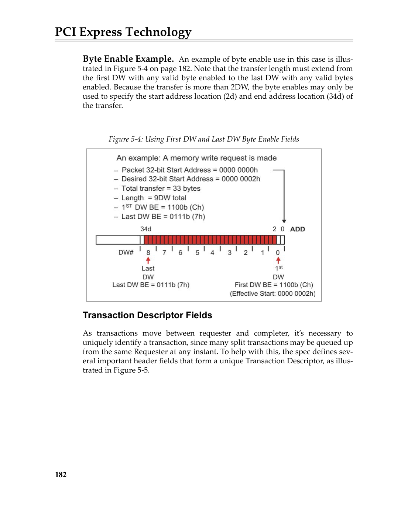

<br>

</td>
<td width="50%">

## **隐式路由和消息的目的**

在隐式路由中，既不应用地址也不应用 ID 路由信息；相反，路由是基于包头中的代码进行的，该代码指示拓扑中具有已知位置的目标，例如根复合体。这在适用隐式路由的情况下简化了消息的路由。

**为什么使用消息？** 消息事务在 PCI 或 PCI-X 中没有定义，但随 PCIe 一起引入。添加消息作为包类型的主要原因是追求 PCIe 的设计目标，即大幅减少 PCI 中实现的外侧带信号的数量（例如中断引脚、错误引脚、电源管理信号等）。因此，大多数外侧带信号被替换为消息
TLP 形式的带内包。

**隐式路由如何提供帮助**
使用带内消息代替外侧带信号需要一种在由众多点对点链路组成的拓扑中将它们路由到适当接收方的方法。隐式路由利用了交换机和其他路由元素理解上游和下游概念以及根复合体位于拓扑顶部而端点位于底部的事实。因此，消息可以使用简单的代码来表明它应该去往根复合体，例如，或者被发送到下游的所有设备。此功能消除了专门用作不同消息事务目标的地址范围或
ID 列表的定义需求。

不同类型的隐式路由可以在第 163 页的"隐式路由"中找到。

**第 4 章：地址空间与事务路由**

</td>
</tr>
<tr>
<td width="50%">

## **Base Address Registers (BARs)**

</td>
<td width="50%">

## **分离事务协议**

像大多数其他串行技术一样，PCI Express 使用分离事务协议 (Split Transaction Protocol)，该协议允许目标设备接收一个或多个请求，然后用单独的完成响应每个请求。这是对 PCI
总线协议的显著改进，后者使用等待状态或延迟事务（重试）来处理访问目标中的延迟。目标不是测试何时准备好执行长延迟传输，而是在它准备好时启动响应。这导致每个事务至少有两个单独的 TLP - 请求和完成（稍后将讨论，单个读请求可能导致多个完成 TLP 被发送回）。第 149 页图
4-13 说明了分离事务的请求-完成组件。本示例显示软件从端点读取数据。

_图 4-13：PCI Express 事务请求和完成 TLP_


<br>

</td>
</tr>
<tr>
<td width="50%">

## **General** 

Each device in a system may have different requirements in terms of the amount and type of address space needed. For example, one device may
have 256 bytes worth of internal registers/storage that should be accessible through IO address space and another device may have 16KB of
internal registers/stor‐ age that should be accessible through MMIO.

PCI‐based devices are not allowed to decide on their own, which addresses should be used to access their internal locations, that is the job
of system soft‐ ware (i.e. BIOS and OS kernel). So the devices must provide a way for system software to determine the address space needs
of the device. Once software knows what the device’s requirements are in terms of address space, then assuming the request can be fulfilled,
software will simply allocate an available range of addresses, of the appropriate type (IO, NP‐MMIO or P‐MMIO), to that device.

This is all accomplished through the Base Address Registers (BARs) in the header of configuration space. As shown in Figure 4‐2 on page 127,
a Type 0 header has six BARs available (each one being 32 bits in size), while a Type 1 header has only two BARs. Type 1 headers are found
in all bridge devices, which means every switch port and root complex port has a Type 1 header. Type 0 headers are in non‐bridge devices
like endpoints. An example of this can be seen in Figure 4‐3 on page 128.

System software must first determine the size and type of address space being requested by a device. The device designer knows the
collective size of the internal registers/storage that should be accessible via IO or MMIO. The device designer also knows how the device
will behave when those registers are accessed (i.e. do reads have side‐effects or not). This will determine whether prefetchable MMIO (reads
have no side‐effects) or non‐prefetchable MMIO (reads do have side‐effects) should be requested. Knowing this information, the device
designer hard‐codes the lower bits of the BARs to certain values indicat‐ ing the type and size of the address space being requested.

The upper bits of the BARs are writable by software. Once system software checks the lower bits of the BARs to determine the size and type
of address space requested, system software will then write the base address of the address range being allocated to this device into the
upper bits of the BAR. Since a single
Endpoint (Type 0 header) has six BARs, up to six different address space requests can be made. However, this is not common in the real
world. Most devices will request 1‐3 different address ranges.

Not all BARs have to be implemented. If a device does not need all the BARs to map their internal registers, the extra BARs are hard‐coded
with all 0’s notifying software that these BARs are not implemented.

_Figure 4‐2: BARs in Configuration Space_ 

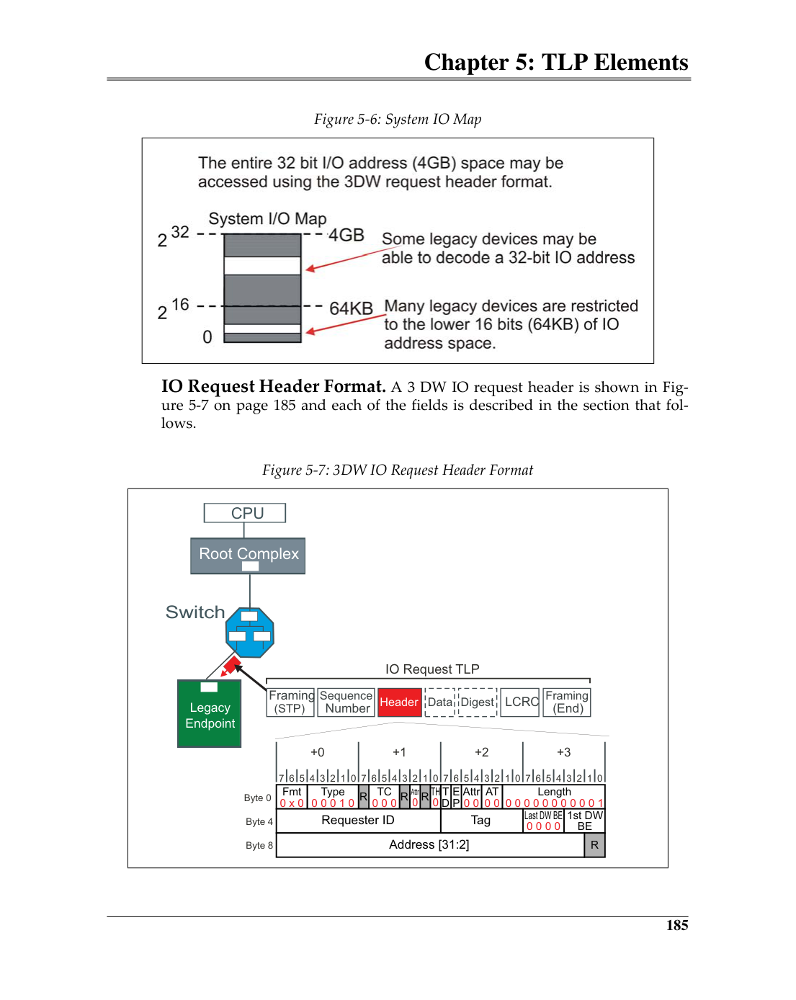

<br>


Once the BARs have been programmed, the internal registers or local memory within the device can be accessed via the address ranges
programmed into the BARs. Anytime the device sees a request with an address that maps to one of its BARs, it will accept that request
because it is the target.

_Figure 4‐3: PCI Express Devices And Type 0 And Type 1 Header Use_ 


<br>

</td>
<td width="50%">

## **Posted 与 Non-Posted**

为了减轻请求-完成延迟的损失，内存写事务是 Posted
的，这意味着从请求者的角度来看，事务在请求离开请求者时即被视为已完成。如果有帮助，您可以将"发布"一词与邮政系统相关联，其中发布内存写类似于在邮件中发布一封信。一旦您将信件放入邮箱，您就将信心寄托在系统上以递送它，并且不会等待递送确认。这种方法可能比等待整个请求-完成传输要快得多，但是
- 与所有发布方案一样 - 关于事务何时（以及是否）在最终接收方成功完成存在不确定性。

在 PCIe 中，通过将所有内存写设为 Posted 所涉及的少量不确定性被认为是可接受的，以换取获得的性能。相比之下，对 IO 和配置空间的写几乎总是会影响设备行为并具有与之关联的及时性。因此，重要的是要知道那些写请求何时（以及是否）完成。由于这个原因，IO 写和配置写始终是
Non-Posted 的，并且将始终返回完成以报告操作的状态。

总之，Non-Posted 事务需要完成。Posted 事务不需要，也不应该接收完成。第 150 页表 4-8 列出了哪些 PCIe 事务是 Posted 和 Non-Posted 的。

_表 4-8：Posted 和 Non-Posted 事务_

|**请求**|**请求的处理方式**|
|---|---|
|内存写|所有**内存写请求都是 Posted 的**。不期望也不发送完成。|
|内存读 内存读锁定|所有**内存读请求都是 Non-Posted 的**。将由完成者返回带数据...|
|原子操作 (AtomicOp)|所有**原子操作请求都是 Non-Posted 的**。将由完成者返回带数据的完成，其中包含目标位置的原始值。|


**第 4 章：地址空间与事务路由**

_表 4-8：Posted 和 Non-Posted 事务（续）_

|**请求**|**请求的处理方式**|
|---|---|
|IO 读<br>IO 写|所有**IO 请求都是 Non-Posted 的**。对于写或失败的读，将返回不带数据的完成，对于成功的读，将返回带数据的完成。|
|配置读<br>配置写|所有**配置请求都是 Non-Posted 的**。对于写和失败的读，将返回不带数据的完成，对于成功的读，将返回带数据的完成。|
|消息|所有**消息都是 Posted 的**。路由方法取决于消息类型，但它们都被视为 Posted 请求。|

</td>
</tr>
<tr>
<td width="50%">

## **BAR Example 1: 32-bit Memory Address Space Request** 

Figure 4‐4 on page 130 shows the basic steps in setting up a BAR, which in this example, is requesting a 4KB block of non‐prefetchable
memory (NP‐MMIO). In the figure, the BAR is shown at three points in the configuration process:

1. In (1) of Figure 4‐4, we see the uninitialized state of the BAR. The device designer has fixed the lower bits to indicate the size and
type, but the upper bits (which are read‐write) are shown as Xs to indicate their value is not known. System software will first write all
1s to every BAR (using config writes) to set all writable bits. (Of course, the hard‐coded lower bits are unaffected by any configuration
writes.) The second view of the BAR,
shown in (2) of Figure 4‐4, shows how it looks after configuration software has written all 1’s to it. 

Writing all 1s is done to determine what the least‐significant writable bit is. This bit position indicates the size of the address space
being requested. In this example, the least‐significant writable bit is bit 12, so this BAR is requesting 2[12] (or 4KB) of address space.
If the least significant writable bit would have been bit 20, then the BAR would have been requesting 2[20] (or 1MB) of address space.

2. After writing all 1s to the BARs, software turns around and reads the value of each BAR, starting with BAR0, to determine the type and
size of the address space being requested. Table 4‐1 on page 129 summarizes the results of the configuration read of BAR0 for this example.

3. The final step in this process is for system software to allocate an address range to BAR0 now that software knows the size and type of
the address space being requested. The third view of the BAR, in (3) of Figure 4‐4, shows how it looks after software has written the start
address for the allo‐ cated block of addresses. In this example, the start address is F900_0000h.

At this point the configuration of BAR0 is complete. Once software enables memory address decoding in the Command register (offset 04h),
this device will accept any memory requests it receives that fall within the range from F900_0000h ‐ F900_0FFFh (4KB in size).

_Table 4‐1: Results of Reading the BAR after Writing All 1s To It_ 

|**BAR Bits**|**Meaning**|
|---|---|
|0|Read as 0b, indicating a memory reque...|
|2:1|Read as 00b indicating the target only supports decoding a 32‐bit<br>address|
|3|Read as 0b, indicating request is for...|
|11:4|Read as all 0s, indicating the size o...|
|31:12|Read as all 1s because software has not yet programmed the upper bits<br>with a start address for the block. Since bit 12 is the
least significant bit<br>that could be written, the memory size requested is 212= 4KB.|


_Figure 4‐4: 32‐Bit Non‐Prefetchable Memory BAR Set Up_

</td>
<td width="50%">

## **头字段定义包格式和类型**

</td>
</tr>
<tr>
<td width="50%">

## **Type 0 Header** 


<br>

</td>
<td width="50%">

## **概述**

如第 152 页图 4-14 所示，每个 TLP 包含一个三或四个双字（12 或 16 字节）的头。这包括_格式_和_类型_字段，它们定义头的其余部分的内容并指示 TLP 在遍历拓扑时要使用的路由方法。

_图 4-14：事务层包通用 3DW 和 4DW 头_


<br>


**第 4 章：地址空间与事务路由**

</td>
</tr>
<tr>
<td width="50%">

## **BAR Example 2: 64-bit Memory Address Space Request** 

In the previous example, we saw BAR0 being used to request non‐prefetchable memory address space (NP‐MMIO). In this example, as shown in
Figure 4‐5 on page 132, BAR1 and BAR2 are being used to request a 64MB block of prefetch‐ able memory address space. Two sequential BARs are
being used here because the device supports a 64‐bit address for this request, meaning that software can allocate the requested address
space above the 4GB address boundary if it
wants to (but that is not a requirement). Since the address can be a 64‐bit address, two sequential BARs must be used together. 

As before, the BARs are shown at three points in the configuration process: 

1. In (1) of Figure 4‐5, we see the uninitialized state of the BAR pair. The device designer has hard‐coded the lower bits of the lower BAR
(BAR1 in our example) to indicate the request type and size, while the bits of the upper BAR (BAR2) are all read‐write. System software’s
first step was to write all 1s to every BAR. In (2) of Figure 4‐5, we see the BARs after having all 1s written to them.

2. As described in the previous example, system software already evaluated BAR0. So software’s next step is to read the next BAR (BAR1) and
evaluate it to see if the device is requesting additional address space. Once BAR1 is read, software realizes that more address space is
being requested and this request is for prefetchable memory address space that can be allocated any‐ where in the 64‐bit address range.
Since it supports a 64‐bit address, the next sequential BAR (BAR2 in this case) is treated as the upper 32 bits of BAR1. So software now
also reads in the contents of BAR2. However, soft‐ ware does not evaluate the lower bits of BAR2 in the same way it did for BAR1, because it
knows BAR2 is simply the upper 32 bits of the 64‐bit address request started in BAR1. Table 4‐2 on page 132 summarizes the results of these
configuration reads.

3. The final step in this process is for system software to allocate an address range to the BARs now that software knows the size and type
of the address space being requested. The third view of the BARs in (3) of Figure 4‐5 shows the result after software has used two
configuration writes to pro‐ gram the 64‐bit start address for the allocated range. In this example, bit 1 of the Upper BAR (address bit 33
in the BAR pair) is set and bit 30 of the Lower BAR (address bit 30 in the BAR pair) is set to indicate a start address of 2_4000_0000h. All
other writable bits in both BARs are cleared.

At this point, the configuration of the BAR pair (BAR1 & BAR2) is complete. Once software enables memory address decoding in the Command
register (offset 04h), this device will accept any memory requests it receives that fall within the range from 2_4000_0000h ‐ 2_43FF_FFFFh
(64MB in size).

_Figure 4‐5: 64‐Bit Prefetchable Memory BAR Set Up_

</td>
<td width="50%">

## **头格式/类型字段编码**

下面的第 153 页表 4-9 总结了 TLP 头格式和类型字段中使用的编码。

_表 4-9：TLP 头格式和类型字段编码_

|**TLP**|**FMT[2:0]**|**TYPE [4:0]**|
|---|---|---|
|内存读请求 (MRd)|000 = 3DW，无数据<br>001 = 4DW，无数据|0 0000|
|内存读锁定请求 (MRdLk)|000 = 3DW，无数据<br>001 = 4DW，无数据|0 0001|
|内存写请求 (MWr)|010 = 3DW，带数据<br>011 = 4DW，带数据|0 0000|
|IO 读请求 (IORd)|000 = 3DW，无数据|00010|
|IO 写请求 (IOWr)|010 = 3DW，带数据|0 0010|
|配置类型 0 读请求 (CfgRd0)|000 = 3DW，无数据|0 0100|
|配置类型 0 写请求<br>(CfgWr0)|010 = 3DW，带数据|0 0100|
|配置类型 1 读请求 (CfgRd1)|000 = 3DW，无数据|0 0101|
|配置类型 1 写请求<br>(CfgWr1)|010 = 3DW，带数据|0 0101|
|消息请求 (Msg)|001 = 4DW，无数据|1 0RRR*（有关 RRR，<br>请参见第 164 页的<br>"消息类型字段汇总"<br>中的路由子字段）|
|带数据消息请求 (MsgD)|011 = 4DW，带数据|1 0RRR*（有关 RRR， 请参见第 164 页的 "消息类型字段汇总...|


_表 4-9：TLP 头格式和类型字段编码（续）_

|**TLP**|**FMT[2:0]**|**TYPE [4:0]**|
|---|---|---|
|完成 (Cpl)|000 = 3DW，无数据|0 1010|
|带数据完成 (CplD)|010 = 3DW，带数据|0 1010|
|完成锁定 (CplLk)|000 = 3DW，无数据|0 1011|
|带数据完成 (CplDLk)|010 = 3DW，带数据|0 1011|
|取并加原子操作请求<br>(FetchAdd)|010 = 3DW，带数据<br>011 = 4DW，带数据|0 1100|
|无条件交换原子操作<br>请求 (Swap)|010 = 3DW，带数据<br>011 = 4DW，带数据|0 1101|
|比较并交换原子操作<br>请求 (CAS)|010 = 3DW，带数据<br>011 = 4DW，带数据|0 1110|
|本地 TLP 前缀 (LPrfx)|100 = 1DW|0 LLLL|
|端到端 TLP 前缀 (EPrfx)|100 = 1DW|1 EEEE|

</td>
</tr>
<tr>
<td width="50%">

## **Type 0 Header** 


<br>


_Table 4‐2: Results Of Reading the BAR Pair after Writing All 1s To Both_ 

|**BAR**|**BAR Bits**|**Meaning**|
|---|---|---|
|Lower|0|Read as 0b, indicating a memory reque...|
|Lower|2:1|Read as 10b indicating the target supports a 64‐bit address<br>decoder, and that the next sequential BAR contains the upper<br>32
bits of the address information.|


_Table 4‐2: Results Of Reading the BAR Pair after Writing All 1s To Both (Continued)_ 

|**BAR**|**BAR Bits**|**Meaning**|
|---|---|---|
|Lower|3|Read as 1b, indicating request is for...|
|Lower|25:4|Read as all 0s, indicating the size o...|
|Lower|31:26|Read as all 1s because software has not yet programmed the<br>upper bits with a start address for the block. Note that
because<br>bit 26 was the least significant writable bit, the memory address<br>space request size is 226, or 64MB.|
|Upper|31:0|Read as all 1s. These bits will be us...|

</td>
<td width="50%">

## **TLP 头概述**

当 TLP 在入口端口被接收时，它们首先在物理层和数据链路层检查错误。如果没有错误，则在事务层检查 TLP 以了解要使用哪种路由方法。基本步骤是：

1. _格式_和_类型_字段确定头的大小、格式和包的类型。

2. 根据与包类型关联的路由方法，设备确定它是否是预期接收方。如果是，它将接受（消费）TLP，如果不是，它将把 TLP 转发到适当的出口端口 - 受该出口端口的排序和流控规则的约束。

3. 如果此设备既不是预期接收方，也不在到预期接收方的路径上，它通常会将包作为不支持的请求 (Unsupported Request, UR) 拒绝。

**第 4 章：地址空间与事务路由**

</td>
</tr>
<tr>
<td width="50%">

## **BAR Example 3: IO Address Space Request** 

Continuing from the previous two examples, this same function is also request‐ ing IO space, as shown in Figure 4‐6 on page 134. In the
diagram, the requesting BAR (BAR3 in the example) is shown at three points in the configuration pro‐ cess:

1. In (1) of Figure 4‐6, we see the uninitialized state of the BAR. System soft‐ ware has previously written all 1s to every BAR and has
evaluated BAR0, then BAR1 and BAR2. Now software is going to see if this device is request‐ ing additional address space with BAR3. State
(2) of Figure 4‐6 shows the state of the BAR3 after the write of all 1s.

2. Software now reads in BAR3 to evaluate the size and type of the request. Table 4‐3 on page 134 summarizes the results of this
configuration read.

3. Now that software knows this is a request for 256 bytes of IO address space, the final step is to program the BAR with the base address
of the IO address range being allocated to this device, specifically this BAR. State (3) of Figure 4‐6 shows the state of the BAR after this
step. In our example, the device start address is 16KB, so bit 14 is written resulting in a base address of 4000h; all other upper bits are
cleared.

</td>
<td width="50%">

## **应用路由机制**

一旦系统地址已配置且事务已启用，设备就会检查传入的 TLP 并使用相应的配置字段来路由包。以下各节描述了用于通过 PCI Express 互连结构路由 TLP 的每种路由机制的基本特征/功能。

</td>
</tr>
<tr>
<td width="50%">

</td>
<td width="50%">

## **ID 路由**

ID 路由用于定位功能在拓扑中的逻辑位置 - 总线号、设备号、功能号（通常称为 **BDF**）。它与 PCI 和 PCI-X 协议中用于配置事务的路由方法兼容。在 PCIe 中，它仍用于路由配置包，也用于路由完成和某些消息。

</td>
</tr>
<tr>
<td width="50%">

</td>
<td width="50%">

## **总线号、设备号、功能号限制**

PCI Express 支持与 PCI 和 PCI-X 相同的拓扑限制：

1. 使用 8 位表示总线号，因此系统中**最多可有 256 条总线**。这包括由交换机创建的内部总线。

2. 使用 5 位表示设备号，因此**每条总线最多可有 32 个设备**。较旧的 PCI 总线或交换机或根复合体中的内部总线可能承载多个下游设备。但是，外部 PCIe 链路始终是点对点的，并且链路上只有一个下游设备。外部链路的设备号被下游端口强制始终为设备
0，因此每个外部端点将始终是设备 0（除非使用替代路由 ID 解释 (ARI)，在这种情况下，没有设备号；有关 ARI 的更多信息，请参见第 909 页关于"IDO（基于 ID 的排序）"的部分。

3. 使用 3 位表示功能号，因此**每个设备最多可有 8 个内部功能**。

</td>
</tr>
<tr>
<td width="50%">

</td>
<td width="50%">

## **ID 路由中的关键 TLP 头字段**

如果接收的 TLP 中的 Type 字段指示要使用 ID 路由，则头中的 ID 字段（总线、设备、功能）用于执行路由检查。有两种情况：使用 3DW 头的 ID 路由和使用 4DW 头的 ID 路由（仅在消息中可能）。第 156 页图 4-15 说明了使用 ID 路由和 3DW
头的 TLP，而第 156 页图 4-16 显示了 ID 路由的 4DW 头。

_图 4-15：3DW TLP 头 - ID 路由字段_


<br>

</td>
</tr>
<tr>
<td width="50%">

</td>
<td width="50%">

## **端点：单次检查**

对于 ID 路由，端点只需将包头中的 ID 字段与其自己的 BDF 进行比较即可。每个功能在其链路上每次看到类型 0 配置写时都从 TLP 头的字节 8-9 中"捕获"自己的总线和设备号。未指定应将捕获的总线和设备号信息存储在哪里，仅规定了功能必须保存它。已保存的总线

**第 4 章：地址空间与事务路由**

设备号用作该端点发起的 TLP 请求中的 Requester ID，以便该请求的完成者可以在完成包中包含 Requester ID 值。完成包中的 Requester ID 用于路由完成。

</td>
</tr>
<tr>
<td width="50%">

</td>
<td width="50%">

## **交换机（桥）：每个端口两次检查**

对于 ID 路由的 TLP，交换机端口首先通过将 TLP 头中的目标 ID 与其自己的 BDF 进行比较来检查它是否是预期目标，如第 158 页图 4-17 中的 (1) 所示。与端点一样，每个交换机端口在每次检测到其上游端口上的配置写（Type
0）时都会捕获自己的总线和设备号。如果 TLP 中的目标 ID 字段与交换机端口的 ID 一致，则它消费该包。如果 ID 字段不匹配，则它接下来检查 TLP 是否针对此交换机端口下方的设备。它通过检查 Secondary 和 Subordinate Bus Number
寄存器来查看 TLP 中的目标总线号是否在此范围内（含）来实现。如果是这样，则 TLP 应被向下游转发。此检查由第 158 页图 4-17 中的 (2) 表示。如果包正在向下游移动（在 Upstream Port 上收到）且与 Upstream Port 的 BDF 不匹配或不在
Secondary-Subordinate 总线范围内，则它将在 Upstream Port 上作为不支持的请求处理。

如果 Upstream Port 确定它收到的 TLP 是针对其下方某个设备的（因为目标总线号在其 Secondary-Subordinate 总线号范围内），则它将其向下游转发，并且交换机的所有下游端口都执行相同的检查。每个下游端口检查 TLP
是否针对它们。如果是，则目标端口将消费 TLP，而其他端口将忽略它。如果不是，则所有下游端口都检查 TLP 是否针对其端口下方的设备。在该检查中返回 true 的那个端口将 TLP 转发到其二级总线，而其他下游端口将忽略 TLP。

在本节中，重要的是要记住交换机上的每个端口都是一个桥，因此具有自己的 Type 1 头的配置空间。即使第 158 页图 4-17 仅显示单个 Type 1 头，实际上，每个端口（每个 P2P 桥）都有自己的 Type 1 头，并在该端口看到 TLP 时执行相同的两次检查。

_图 4-17：交换机使用 ID 路由检查入站 TLP 的路由_


<br>

</td>
</tr>
<tr>
<td width="50%">

</td>
<td width="50%">

## **地址路由**

使用地址路由的 TLP 引用与 PCI 和 PCI-X 事务相同的内存（系统内存和内存映射 IO）和 IO 地址映射。针对 4GB 以下地址（即 32 位地址）的内存请求必须使用 3DW 头，而针对 4GB 以上地址（即 64 位地址）的请求必须使用 4DW 头。IO 请求限制为
32 位地址，并且仅实现以支持传统功能。

**第 4 章：地址空间与事务路由**

</td>
</tr>
<tr>
<td width="50%">

</td>
<td width="50%">

## **地址路由中的关键 TLP 头字段**

当 Type 字段指示 TLP 要使用地址路由时，则头中的地址字段用于执行路由检查。这些可以是 32 位地址或 64 位地址。

**具有 32 位地址的 TLP** 对于 IO 或 32 位内存请求，使用 3DW 头，如图 4-18 所示。使用这些 TLP 寻址的内存映射寄存器因此将驻留在 4GB 内存或 IO 地址边界之下。

**具有 64 位地址的 TLP** 对于 64 位内存请求，使用 4DW 头，如图 4-19（第 160 页）所示。使用这些 TLP 寻址的内存映射寄存器能够驻留在 4GB 内存边界之上。

_图 4-18：3DW TLP 头 - 地址路由字段_


<br>


_图 4-19：4DW TLP 头 - 地址路由字段_


<br>

</td>
</tr>
<tr>
<td width="50%">

</td>
<td width="50%">

## **端点地址检查**

如果端点接收到使用地址路由的 TLP，则它将头中的地址与其配置头中实现的每个基地址寄存器 (BAR) 进行比较，如图 4-20 所示。由于端点只有一个链路接口，它将接受或拒绝该包。如果 TLP 中的目标地址与编程到其 BAR 中的某个范围匹配，则端点将接受该包。有关如何使用
BAR 的更多信息，请参见第 126 节的"基地址寄存器 (BAR)"。

**第 4 章：地址空间与事务路由**

_图 4-20：端点检查传入 TLP 地址_


<br>

</td>
</tr>
<tr>
<td width="50%">

</td>
<td width="50%">

## **交换机路由**

如果传入的 TLP 使用地址路由，则交换机端口首先通过将包头中的地址与其 Type 1 配置头中的两个 BAR 进行比较来检查地址是否在本端口内是本地的，如图 4-21（第 162 页）的步骤 1 所示。如果与这些 BAR 中的一个匹配，则交换机端口是 TLP
的目标并消费该包。如果不是，则端口接下来检查其 Base/Limit 寄存器对以查看 TLP 是否针对此桥下方（下游）的功能。如果请求针对 IO 空间，它将检查 IO Base 和 Limit 寄存器，如步骤 2a
所示。但是，如果请求针对内存空间，它将检查非可预取内存基址/上限寄存器和可预取内存基址/上限寄存器，如图 4-21（第 162 页）中的步骤 2b 所示。有关如何评估 Base/Limit 寄存器对的更多信息，请参见第 136 节的"基址和上限寄存器"。

_图 4-21：交换机使用地址检查入站 TLP 的路由_


<br>


要了解交换机中基于地址的 TLP 的路由，最好记住每个交换机端口都是其自己的桥。以下是桥（交换机端口）在接收到基于地址的 TLP 时采取的步骤：

</td>
</tr>
<tr>
<td width="50%">

</td>
<td width="50%">

## **向下游传输的 TLP（在主接口上接收）**

1. 如果 TLP 中的目标地址与某个 BAR 匹配，则此桥（交换机端口）消费 TLP，因为它是 TLP 的目标。

2. 如果 TLP 中的目标地址落在其某个 Base/Limit 寄存器集的范围内，则该包将转发到二级接口（下游）。

3. 否则 TLP 将在主接口上作为不支持的请求处理。（如果主接口上的其他桥也未声明 TLP，则也是如此。）

**第 4 章：地址空间与事务路由**

</td>
</tr>
<tr>
<td width="50%">

</td>
<td width="50%">

## **向上游传输的 TLP（在二级接口上接收）**

1. 如果 TLP 中的目标地址与某个 BAR 匹配，则此桥（交换机端口）消费 TLP，因为它是 TLP 的目标。

2. 如果 TLP 中的目标地址落在其某个 Base/Limit 寄存器集的范围内，则 TLP 将在二级接口上作为不支持的请求处理。（除非此端口是交换机的上游端口，否则也是如此。在这些情况下，该包可能是一个点对点事务，并将在不同于接收它的下游端口的下游端口上转发。）

3. 否则 TLP 将转发到主接口（上游），前提是 TLP 地址不是针对此桥，也不是针对此桥下方的任何功能。

</td>
</tr>
<tr>
<td width="50%">

</td>
<td width="50%">

## **多播能力**

PCI Express 规范的 2.1 版本增加了对指定提供多播功能的地址范围的支持。收到的落在指定为多播范围的地址范围内的任何包都根据多播规则进行路由/接受。此地址范围可能未在功能的 BAR 中保留，也可能在桥的 Base/Limit
寄存器对中，但仍需要适当地接受/转发。有关多播功能的更多信息，请参见第 889 页的"多播能力寄存器"部分。

</td>
</tr>
<tr>
<td width="50%">

</td>
<td width="50%">

## **隐式路由**

在某些消息包中使用的隐式路由基于路由元素对拓扑具有上游和下游方向以及顶部存在单个根复合体的认识。这允许使用一些简单的路由方法而无需分配目标地址或 ID。由于根复合体通常集成了电源管理、中断和错误处理逻辑，因此它是大多个 PCI Express 消息的源或接收方。

</td>
</tr>
<tr>
<td width="50%">

</td>
<td width="50%">

## **仅用于消息**

某些消息使用地址或 ID 路由而不是隐式路由，对于它们，路由机制的适用方式与那些部分中描述的相同。但是，大多数消息使用隐式路由。隐式路由的目的是模拟外侧带信号行为，因为 PCIe 的一个设计目标是尽可能消除 PCI 中的外侧带信号。这些

PCI 中的外侧带信号通常要么是主机通知所有设备事件，要么是设备通知主机事件。在 PCIe 中，我们有消息 TLP 来传达这些事件。PCIe 已定义消息的事件类型包括：

- 电源管理

- INTx 传统中断信令

- 错误信令

- 锁定事务支持

- 热插拔信令

- 供应商特定信令

- 插槽功率限制设置

</td>
</tr>
<tr>
<td width="50%">

</td>
<td width="50%">

## **隐式路由中的关键 TLP 头字段**

对于隐式路由，头中的路由子字段用于确定消息目标。第 164 页图 4-22 说明了使用隐式路由的消息 TLP。

_图 4-22：4DW 消息 TLP 头 - 隐式路由字段_


<br>

</td>
</tr>
<tr>
<td width="50%">

</td>
<td width="50%">

## **消息类型字段汇总**

第 165 页表 4-10 显示了如何解释消息的 TLP 头 Type 字段。如图所示，高两位指示包是消息，而低三位指定要应用的路由方法。请注意，消息 TLP 始终使用 4DW 头，无论选择哪种路由选项。

**第 4 章：地址空间与事务路由**

对于地址路由，字节 8-15 包含最多 64 位的地址，对于 ID 路由，字节 8 和 9 包含目标 BDF。

_表 4-10：消息请求头类型字段用法_

|**类型字段位**|**描述**|
|---|---|
|位 4:3|定义事务类型：<br>10b = 消息 TLP|
|位 2:0|消息路由子字段 R[2:0]<br>• 000b = 隐式 - 路由到根复合体<br>• 001b = 按地址路由（头的字节 8-15 包含地址）<br>• 010b = 按 ID 路由（头的字节 8-9 包含 ID）<br>• 011b = 隐式 -
向下游广播<br>• 100b = 隐式 - 本地：在接收方终止<br>• 101b = 隐式 - 收集并路由到根复合体<br>• 110b - 111b = 保留：在接收方终止|

</td>
</tr>
<tr>
<td width="50%">

</td>
<td width="50%">

## **端点处理**

对于隐式路由，端点只需检查路由子字段是否适合它。例如，端点将接受广播消息或在接收方终止的消息；但不接受隐式针对根复合体的消息。

</td>
</tr>
<tr>
<td width="50%">

</td>
<td width="50%">

## **交换机处理**

交换机等路由元素会考虑 TLP 到达的端口以及路由子字段代码是否适合它。例如：

1. 交换机上游端口可以合法地接收广播消息。它将复制该消息并将其转发到其所有下游端口。在交换机的下游端口上接收到的隐式路由的广播消息（意味着消息正在向上游传输）将是一个错误，将作为畸形 TLP 处理。

2. 交换机可以在下游端口上接收针对根复合体的隐式路由消息，并将其转发到其上游端口，因为根复合体的位置被认为是上游的。它不会接受在其上游端口上接收到的隐式路由到根复合体的消息（意味着消息正在向下游传输）。

</td>
</tr>
<tr>
<td width="50%">

</td>
<td width="50%">

## **PCI Express Technology**

3. 如果隐式路由的消息指示它应在接收方终止，则接收交换机端口将消费该消息而不是转发它。

4. 对于使用地址或 ID 路由的消息，交换机将简单地执行正常的地址或 ID 检查以决定是否接受或转发它。

</td>
</tr>
<tr>
<td width="50%">

</td>
<td width="50%">

## **DLLP 和有序集不路由**

DLLP 和有序集流量不会从交换机或根复合体的入口端口路由到出口端口。这些包从端口到端口通过链路从物理层传输到物理层。

DLLP 源自 PCI Express 端口的数据链路层，通过物理层传递，退出端口，穿越链路并到达相邻端口。在该端口，包通过物理层传递并最终到达数据链路层，在那里它被处理和消费。DLLP 不会进一步上移端口到事务层，因此不会被路由。

类似地，有序集包源自物理层，退出端口，穿越链路并到达相邻端口。在该端口，包到达物理层，在那里它被处理和消费。有序集不会进一步上移端口到数据链路层和事务层，因此不会被路由。

正如本章所讨论的，只有 TLP 通过交换机和根复合体进行路由。它们源自源端口的事务层并最终到达目标端口的事务层。

</td>
</tr>
<tr>
<td width="50%">

</td>
<td width="50%">

## 第二部分：

# 事务层

</td>
</tr>
<tr>
<td width="50%">

</td>
<td width="50%">

## _**5**_

</td>
</tr>
<tr>
<td width="50%">

</td>
<td width="50%">

## _**TLP 元素**_

</td>
</tr>
<tr>
<td width="50%">

</td>
<td width="50%">

## **上一章**

上一章描述了功能通过基地址寄存器 (BAR) 请求地址空间（内存地址空间或 IO 地址空间）的目的和方法，以及软件必须如何在所有桥中设置 Base/Limit 寄存器以将 TLP 从源端口路由到正确的目标端口。还讨论了 PCIe 中 TLP
路由的一般概念，包括基于地址的路由、基于 ID 的路由和隐式路由。

## **本章**

</td>
</tr>

</tbody>
</table>

[⬆️ 返回目录](#本章目录-table-of-contents)

---


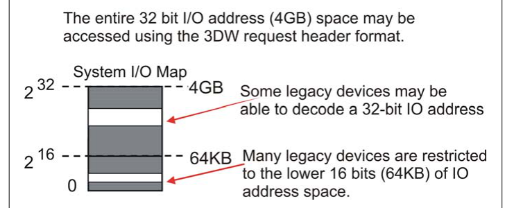

<a id="sec-5-2"></a>
## 5.2 TLP Elements | TLP 元素

<table>
<thead><tr><th width="50%">🇬🇧 English</th><th width="50%">🇨🇳 中文</th></tr></thead>
<tbody>
<tr>
<td width="50%">

At this point, the configuration of BAR3 is complete. Once software enables IO address decoding in the Command register (offset 04h), the
device will accept and respond to IO transactions within the range 4000h ‐ 40FFh (256 bytes in size).

</td>
<td width="50%">

第 175 页图 5-3 说明了通用 TLP 4DW 头的格式和内容。在本节中，总结了几乎所有事务通用的字段。与特定事务类型相关的头格式差异将在后面介绍。

_图 5-3：通用 TLP 头字段_


<br>

</td>
</tr>
<tr>
<td width="50%">

## **PCI Express Technology** 

_Figure 4‐6: IO BAR Set Up_ 


<br>

</td>
<td width="50%">

## **通用头字段汇总**

第 176 页表 5-2 总结了每个通用 TLP 头字段的大小和用途。请注意，第 175 页图 5-3 中标记为"R"的字段是保留的，应设置为零。

</td>
</tr>
<tr>
<td width="50%">

## **All BARs Must Be Evaluated Sequentially** 

After going through the previous three examples, it becomes clear that software must evaluate BARs in a sequential fashion. 

Most of the time, functions do not need all six BARs. Even in the examples we went through, only four of the six available BARs were used.
If the function in our example did not need to request any additional address space, the device designer would hard‐code all bits of BAR4
and BAR5 to 0s. So even though soft‐ ware writes those BARs with all 1s, the writes have no affect. After evaluating BAR3, software would
move on to evaluating BAR4. Once it detected that none of the bits were set, software would know this BAR is not being used and move on to
evaluating the next BAR.

All BARs must be evaluated, even if software finds a BAR that is not being used. There are no rules in PCI or PCIe, that state that BAR0
must be the first BAR used for address space requests. If a device designer chooses to, they can use BAR4 for an address space request and
hard‐code BAR0, BAR1, BAR2, BAR3 and BAR5 to all 0s. This means software must evaluate every BAR in the header.

</td>
<td width="50%">

## **PCI Express Technology**

_表 5-2：通用头字段汇总_

|**头字段**|**头位置**|**字段用途**|
|---|---|---|
|Fmt[2:0]<br>（格式）|字节 0 位 7:5|这些位编码有关头大小以及数据有效负载是否将成为 TLP 一部分的信息：<br>00b 3DW 头，无数据<br>01b 4DW 头，无数据<br>10b 3DW 头，带数据<br>11b 4DW 头，带数据<br>4GB
以下的地址必须使用 3DW 头。规范规定，如果对 4GB 以下的地址使用 4DW 头且 64 位地址的高 32 位设置为零，则接收器行为未定义。|
|Type[4:0]|字节 0 位 4:0|这些位编码与此 TLP 一起使用的事务变体。Type 字段与 Fmt [1...|
|TC [2:0]<br>（流量类）|字节 1 位 6:4|这些位编码要应用于此 TLP 及与其关联的完成（如果有）的流量类：<br>000b = 流量类 0（默认）<br>.<br>.<br>111b = 流量类 7<br>TC 0 是默认类，而 TC 1-7
用于提供差异化服务。有关更多信息，请参见第 247 页的"流量类 (TC)"。|
|Attr [2] （属性）|字节 1 位 2|第三个属性位指示此 TLP 是否要使用基于 ID 的排序。要了解更多信息，...|
|TH （TLP 处理提示）|字节 1 位 0|指示何时已包含 TLP 提示以使系统了解如何最好地处理此 TLP。有关其用...|


**第 5 章：TLP 元素**

_表 5-2：通用头字段汇总（续）_

|**头字段**|**头位置**|**字段用途**|
|---|---|---|
|TD<br>（TLP 摘要）|字节 2 位 7|如果 TD = 1，则此 TLP 已包含可选的 4 字节 TLP 摘要作为 ECRC 值。<br>一些规则：<br>• 必须由所有接收器根据此位检查摘要字段的存在。<br>• TD = 1 但没有摘要的 TLP 将作为畸形 TLP
处理。<br>• 如果设备支持检查 ECRC 且 TD=1，则它必须执行 ECRC 检查。<br>• 如果设备在最终目标不支持检查 ECRC（可选），则它必须忽略该摘要。<br>有关此主题的更多信息，请参见第 653 页的"CRC"和第 657 页的"ECRC 生成和检查"。|
|EP （Poisoned 数据）|字节 2 位 6|如果 EP = 1，则伴随此数据的数据应被视为无效，即使事务被允许正常完成...|
|Attr [1:0]<br>（属性）|字节 2 位 5:4|位 5 = 宽松排序：设置为 1 时，为此 TLP 启用 PCI-X 宽松排序。如果为 0，则使用严格的 PCI 排序。<br>位 4 = 无窥探：设置为 1 时，请求者指示此 TLP
不存在主机缓存一致性问题。因此系统硬件可以通过跳过此请求的正常处理器缓存窥探来节省时间。当为 0 时，需要 PCI 类型的缓存窥探保护。|

</td>
</tr>
<tr>
<td width="50%">

## **Resizable BARs** 

The 2.1 version of the PCI Express specification added support for changing the size of the requested address space in the BARs by defining
a new capability structure in extended config space. The new structure allows the function to advertise what address space sizes it can
operate with and then have software enable one of the sizes based on the available system resources. For example, if a function would
ideally like to have 2GB of prefetchable memory address space, but it could still operate with only 1GB, 512MB or 256MB of P‐MMIO, system
software may only enable the function to request 256MB of address space if software would not be able to accommodate a request of a larger
size.

</td>
<td width="50%">

## **PCI Express Technology**

_表 5-2：通用头字段汇总（续）_

|**头字段**|**头位置**|**字段用途**|
|---|---|---|
|地址类型 [1:0]|字节 2 位 3:2|对于内存和原子请求，此字段支持虚拟化系统的地址转换。转换协议在称为_地址转...|
|长度 [9:0]|字节 2 位 1:0<br>字节 3 位 7:0|TLP 数据有效负载传输大小，以 DW 为单位。编码：<br>00 0000 0001b = 1DW<br>00 0000 0010b = 2DW<br>.<br>.<br>11 1111 1111b =
1023 DW<br>00 0000 0000b = 1024 DW|
|最后 DW 字节使能<br>[3:0]|字节 7 位 7:4|这四个高真位一对一映射到有效负载最后一个双字内的字节。<br>位 7 = 1：最后 DW 中的字节 3 有效；否则无效<br>位 6 = 1：最后 DW 中的字节 2 有效；否则无效<br>位 5 = 1：最后 DW
中的字节 1 有效；否则无效<br>位 4 = 1：最后 DW 中的字节 0 有效；否则无效|
|第一个 DW 字节使能<br>[3:0]|字节 7 位 3:0|这四个高真位一对一映射到有效负载第一个双字内的字节。<br>位 3 = 1：第一个 DW 中的字节 3 有效；否则无效<br>位 2 = 1：第一个 DW 中的字节 2 有效；否则无效<br>位 1 = 1：第一个
DW 中的字节 1 有效；否则无效<br>位 0 = 1：第一个 DW 中的字节 0 有效；否则无效|

</td>
</tr>
<tr>
<td width="50%">

## **Base and Limit Registers**

</td>
<td width="50%">

## **通用头字段详细信息**

在以下各节中，我们描述了第 175 页图 5-3 中所示的每个 TLP 头字段的详细信息。

**第 5 章：TLP 元素**

</td>
</tr>
<tr>
<td width="50%">

## **General** 

Once a function’s BARs are programmed, the function knows what address range(s) it owns, which means that function will claim any
transactions it sees that is targeting an address range it owns, an address range programmed into one of its BARs. This is good, but it’s
important to realize that the only way that function is going to “see” the transactions it should claim is if the bridge(s) upstream of it,
forward those transactions downstream to the appropriate link that the target function is connected to. Therefore, each bridge (e.g. switch
ports and root complex ports) needs to know what address ranges live beneath it so it can determine which requests should be forwarded from
its primary interface (upstream side) to its secondary interface (downstream side). If the request is targeting an address that is owned by
a BAR in a function beneath the bridge, the request should be forwarded to the bridge’s secondary interface.

It is the Base and Limit registers in the Type 1 headers that are programmed with the range of addresses that live beneath this bridge.
There are the three sets of Base and Limit registers found in each Type 1 header. Three sets of registers are needed because there can be
three separate address ranges living below a bridge:

- Prefetchable Memory space (P‐MMIO) 

- Non‐Prefetchable Memory space (NP‐MMIO) 

- IO space (IO) 

To explain how these Base and Limit registers work, let’s continue the example from the previous section and place that programmed function
(an endpoint) beneath a switch as shown in Figure 4‐7 on page 137. The figure also lists the address ranges owned by the BARs of that
function.

The Base and Limit registers of every bridge upstream of the endpoint will need to be programmed, but to start out, we’re going to focus on
the bridge that is connected to the endpoint (Port B).
_Figure 4‐7: Example Topology for Setting Up Base and Limit Values_ 


<br>

</td>
<td width="50%">

## **头** _**类型/格式**_ **字段编码**

第 179 页表 5-3 总结了 TLP 头 Type 和 Format (Fmt) 字段中使用的编码。

_表 5-3：TLP 头类型和格式字段编码_

|**TLP**|**FMT[2:0]**|**TYPE [4:0]**|
|---|---|---|
|内存读请求 (MRd)|000 = 3DW，无数据<br>001 = 4DW，无数据|0 0000|
|内存读锁定请求 (MRdLk)|000 = 3DW，无数据<br>001 = 4DW，无数据|0 0001|
|内存写请求 (MWr)|010 = 3DW，带数据<br>011 = 4DW，带数据|0 0000|
|IO 读请求 (IORd)|000 = 3DW，无数据|0 0010|
|IO 写请求 (IOWr)|010 = 3DW，带数据|0 0010|
|配置类型 0 读请求 (CfgRd0)|000 = 3DW，无数据|0 0100|
|配置类型 0 写请求 (CfgWr0)|010 = 3DW，带数据|0 0100|
|配置类型 1 读请求 (CfgRd1)|000 = 3DW，无数据|0 0101|
|配置类型 1 写请求 (CfgWr1)|010 = 3DW，带数据|0 0101|
|消息请求 (Msg)|001 = 4DW，无数据|1 0 rrr*<br>（参见路由字段）|
|带数据消息请求 (MsgD)|011 = 4DW，带数据|1 0rrr*<br>（参见路由字段）|
|完成 (Cpl)|000 = 3DW，无数据|0 1010|
|带数据完成 (CplD)|010 = 3DW，带数据|0 1010|
|完成锁定 (CplLk)|000 = 3DW，无数据|0 1011|
|带数据完成 (CplDLk)|010 = 3DW，带数据|0 1011|
|取并加原子操作请求|010 = 3DW，带数据<br>011 = 4DW，带数据|0 1100|


_表 5-3：TLP 头类型和格式字段编码（续）_

|**TLP**|**FMT[2:0]**|**TYPE [4:0]**|
|---|---|---|
|无条件交换原子操作请求|010 = 3DW，带数据<br>011 = 4DW，带数据|0 1101|
|比较并交换原子操作请求|010 = 3DW，带数据<br>011 = 4DW，带数据|0 1110|
|本地 TLP 前缀|100 = TLP 前缀|0L3L2L1L0|
|端到端 TLP 前缀|100 = TLP 前缀|1E3E2E1E0|

</td>
</tr>
<tr>
<td width="50%">

## **Prefetchable Range (P-MMIO)** 

Type 1 headers have two pairs of prefetchable memory base/limit registers. The Prefetchable Memory Base/Limit registers store address info
for the lower 32 bits of the prefetchable address range. If this bridge supports decoding 64‐bit addresses, then the Prefetchable Memory
Base/Limit Upper 32 Bits registers are also used and hold the upper 32 bits (bits [63:32]) of the address range. Figure 4‐ 8 on page 138
shows the values software would program into these registers to indicate that the prefetchable address range of 2_4000_0000h ‐ 2_43FF_FFFFh
lives beneath that bridge (Port B). The meaning of each field in those registers is summarized in Table 4‐4.

_Figure 4‐8: Example Prefetchable Memory Base/Limit Register Values_ 


<br>

_Table 4‐4: Example Prefetchable Memory Base/Limit Register Meanings_ 

|**Register**|**Value**|**Use**|
|---|---|---|
|Prefetchable Memory<br>Base|4001h|The upper 12 bits of this register hold the<br>upper 12 bits of the 32‐bit BASE address
(bits<br>[31:20]). The lower 20 bits of the base address<br>are implied to be all 0s, meaning the base<br>address is always aligned on a 1MB
bound‐<br>ary.<br>The lower 4 bits of this register indicate<br>whether a 64‐bit address decoder is supported<br>in the bridge, meaning the
Upper Base/Limit<br>Registers are used.|
|Prefetchable Memory<br>Limit|43F1h|Similarly, the upper 12 bits of this register<br>hold the upper 12 bits of the 32‐bit LIMIT<br>address
(bits [31:20]). The lower 20 bits of the<br>limit address are all implied to be all Fs.<br>The lower 4 bits of this register have the
same<br>meaning as the lower 4 bits of the base regis‐<br>ter.|
|Prefetchable Memory<br>Base Upper 32 Bits|00000002h|Holds the upper 32 bits of the 64‐bit BASE<br>address for Prefetchable Memory
down‐<br>stream of this port.|
|Prefetchable Memory<br>Limit Upper 32 Bits|00000002h|Holds the upper 32 bits of the 64‐bit LIMIT<br>address for Prefetchable Memory
down‐<br>stream of this port.|

</td>
<td width="50%">

## **摘要 / ECRC 字段**

TLP 摘要位报告端到端 CRC (ECRC) 的存在。如果软件支持并启用了此可选功能，则设备为其发起的所有 TLP 计算并应用 ECRC。请注意，使用 ECRC 要求设备包含可选的高级错误报告寄存器，因为它的能力和控制寄存器位于那里。

**ECRC 生成和检查。** ECRC 涵盖 TLP 通过互连结构转发时不会更改的所有字段。但是，在包通过拓扑时有两个位可以合法地更改：

- **Type 字段的位 0** - 当配置事务通过桥转发并且从类型 1 变为类型 0 配置事务时（因为它已到达目标总线），会发生变化。这是通过更改类型字段的位 0 来实现的。

- **错误/Poisoned (EP) 位** - 如果与包关联的数据被视为损坏，则在 TLP 通过互连结构时可能会更改。这是称为错误转发的可选功能。

**谁检查 ECRC？** ECRC 的预期目标是 TLP 的最终接收者。检查 LCRC 验证给定链路上没有传输错误，但在路由元素（交换机或根复合体）的出口端口转发到下一个链路之前，该包会重新计算，这可能会掩盖路由元素中的内部错误。为了防止这种情况，ECRC
在请求者和完成者之间的旅程中保持不变。当目标设备检查 ECRC 时，沿途的任何错误可能性都有很高的概率被检测到。

**第 5 章：TLP 元素**

规范对交换机在 ECRC 检查中的角色作了两个声明：

- 支持 ECRC 检查的交换机对发往交换机内位置的 TLP 执行此检查。"对于所有其他 TLP，交换机必须保留 ECRC（按原样转发）作为 TLP 的组成部分。"

- "请注意，交换机可以对通过交换机的 TLP 执行 ECRC 检查。交换机检测到的 ECRC 错误以与任何其他设备报告它们相同的方式报告，但不会改变 TLP 通过交换机的路径。"

</td>
</tr>
<tr>
<td width="50%">

## **Non-Prefetchable Range (NP-MMIO)** 

Unlike the prefetchable memory range, the non‐prefetchable memory range can only support 32‐bit addresses. So there is only one register for
the base and one register for the limit. Following the example in Figure 4‐7, the Non‐Prefetchable Memory Base/Limit registers of Port B
would be programmed with the values shown in Figure 4‐9 on page 140. The meaning of these values is summarized in Table 4‐5.

_Figure 4‐9: Example Non‐Prefetchable Memory Base/Limit Register Values_ 


<br>

_Table 4‐5: Example Non‐Prefetchable Memory Base/Limit Register Meanings_ 

|**Register**|**Value**|**Use**|
|---|---|---|
|(Non‐Prefetchable)<br>Memory Base|F900h|The upper 12 bits of this register hold the<br>upper 12 bits of the 32‐bit BASE address
(bits<br>[31:20]). The lower 20 bits of the base address<br>are implied to be all 0s, meaning the base<br>address is always aligned on a 1MB
bound‐<br>ary.<br>The lower 4 bits of this register must be 0s.|
|(Non‐Prefetchable)<br>Memory Limit|F900h|Similarly, the upper 12 bits of this register<br>hold the upper 12 bits of the 32‐bit
LIMIT<br>address (bits [31:20]). The lower 20 bits of the<br>limit address are all implied to be all Fs.<br>The lower 4 bits of this
register must be 0s.|


This example shows an interesting case where the non‐prefetchable address range programmed in Port B’s configuration space indicates a much
larger range (1MB) than the NP‐MMIO range (4KB) owned by the endpoint living downstream. This is because the memory base/limit registers in
the Type 1 header, can only be used to specify address bits 20 and above ([31:20]). The lower 20 address bits, [19:0], are implied. So the
smallest address range that can be specified with the memory base/limit registers is 1MB.

In our example, the endpoint requested, and was granted, 4KB of NP‐MMIO (F900_0000h ‐ F900_0FFFh). Port B was programmed with values
indicating 1MB, or 1024KB, of NP‐MMIO lived downstream of that port (F900_0000h ‐ F90F_FFFFh). This means 1020KB (F900_1000h ‐ F90F_FFFFh)
of memory address space is wasted. This address space CANNOT be allocated to another endpoint because the routing of the packets would not
work.

</td>
<td width="50%">

## **使用字节使能**

**概述。** 与 PCI 一样，PCIe 需要一种机制来协调其 DW 对齐的地址与有时需要的非 DW 对齐的传输大小或开始/结束地址。为此，PCI Express 使用了前面在第 175 页图 5-3 和第 176 页表 5-2 中介绍的两个字节使能字段。第一个 DW
字节使能字段和最后 DW 字节使能字段允许请求者限定所传输的第一个和最后一个双字内感兴趣的字节。

</td>
</tr>
<tr>
<td width="50%">

## **IO Range** 

Like with the prefetchable memory range, Type 1 headers have two pairs of IO base/limit registers. The IO Base/Limit registers store address
info for the lower 16 bits of the IO address range. If this bridge supports decoding 32‐bit IO addresses (which is rare in real‐world
devices), then the IO Base/Limit Upper 16 Bits registers are also used and hold the upper 16 bits (bits [31:16]) of the IO

address range. Following our example, Figure 4‐10 on page 142 shows the val‐ ues software would program into these registers to indicate
that the IO address range of 4000h ‐ 4FFFh lives beneath that bridge (Port B). The meaning of each field in those registers is summarized in
Table 4‐6.

_Figure 4‐10: Example IO Base/Limit Register Values_ 


<br>

_Table 4‐6: Example IO Base/Limit Register Meanings_ 

|**Register**|**Value**|**Use**|
|---|---|---|
|IO Base|40h|The upper 4 bits of this register hold the<br>upper 4 bits of the 16‐bit BASE address (bits<br>[15:12]). The lower 12 bits of
the base address<br>are implied to be all 0s, meaning the base<br>address is always aligned on a 4KB boundary.<br>The lower 4 bits of this
register indicate<br>whether a 32‐bit IO address decoder is sup‐<br>ported in the bridge, meaning the Upper Base/<br>Limit Registers are
used.|
|IO Limit|40h|Similarly, the upper 4 bits of this register hold<br>the upper 4 bits of the 16‐bit LIMIT address<br>(bits [15:12]). The lower
12 bits of the limit<br>address are all implied to be all Fs.<br>The lower 4 bits of this register have the same<br>meaning as the lower 4
bits of the base regis‐<br>ter.|
|IO Base Upper 16 Bits|0000h|Holds the upper 16 bits of the 32‐bit...|
|IO Limit Upper 16 Bits|0000h|Holds the upper 16 bits of the 32‐bit...|


In this example, we see another situation where the address range programmed into the upstream bridge far exceeds the actual address range
owned by the downstream function. The endpoint in our example owns 256 bytes of IO address space (specifically 4000h ‐ 40FFh). Port B has
been programmed with values indicating that 4KB of IO address space lives downstream (addresses 4000h ‐ 4FFFh). Again, this is simply a
limitation of Type 1 headers. For IO address space, the lower 12 bits (bits [11:0]) have implied values, so the smallest range of IO
addresses that can be specified is 4KB. This limitation turns out to be more serious than the 1MB minimum window for memory ranges. In x86‐
based (Intel compatible) systems, the processors only support 16 bits of IO address space, and since only bits [15:12] of the IO address
range can be speci‐ fied in a bridge, that means that there can be a maximum of 16 (2[4] ) different IO address ranges in a system.

</td>
<td width="50%">

## **字节使能规则**

1. 字节使能位为高真。值 0 表示不应由完成者使用数据有效负载中的相应字节。值 1 表示应使用它。

2. 如果有效数据全部在单个双字内，则最后 DW 字节使能字段必须为 = 0000b。

3. 如果头长度字段指示传输超过 1DW，则第一个 DW 字节使能必须至少启用一位。

4. 如果长度字段指示 3DW 或更多的传输，则第一个 DW 字节使能字段和最后 DW 字节使能字段必须具有连续的位设置。在这些情况下，字节使能仅用于给出有效开始和结束地址距 DW 对齐地址的字节偏移量。

5. 如果传输为 1DW，则第一个 DW 字节使能字段中允许不连续的字节使能位模式。

6. 如果传输在一个到两个 DW 之间，则第一个和第二个 DW 字节使能字段中允许不连续的字节使能位模式。

7. 传输长度为 1DW 且未设置任何字节使能的写请求是合法的，但对完成者没有影响。

</td>
</tr>
<tr>
<td width="50%">

## **Unused Base and Limit Registers** 

Not every PCIe device will use all three types of address space. In fact, the PCI Express specification actually discourages the use of IO
address space, indicat‐ ing that it is only supported for legacy reasons and may be deprecated in a future revision of the spec.

In the cases where an endpoint does not request all three types of address space, what are the base and limit registers of the bridges
upstream of those devices programmed with? They can’t be programmed with all 0s because the lower address bits would still be implied to be
different (base = 0s; limit = Fs) which would represent a valid range. So to handle these cases, the limit register must be programmed with
a higher address than the base. For example, if an end‐ point does not request IO address space, then the bridge immediately upstream of
that function would have its IO Base register programmed to 00h and its IO Limit register programmed with F0h. Since the limit address is
higher than the base address, the bridge understands this is an invalid setting and takes it to mean that there are no functions downstream
of it that own IO address space.

This method of invalidating base and limit registers is valid for all three base and limit pairs, not just for the IO base/limit registers.

</td>
<td width="50%">

## **PCI Express Technology**

8. 如果 1 DW 的读请求未设置任何字节使能，则完成者返回 1 DW 的未定义数据的有效负载。这可以用作利用事务排序规则来强制所有先前已发布的写在完成返回之前输出到内存的刷新机制。

**字节使能示例。** 这种情况下的字节使能使用示例如第 182 页图 5-4 所示。请注意，传输长度必须从启用任何有效字节的第一个 DW 扩展到启用任何有效字节的最后一个 DW。因为传输超过 2DW，所以字节使能只能用于指定传输的开始地址位置（2d）和结束地址位置（34d）。

_图 5-4：使用第一个 DW 和最后 DW 字节使能字段_

</td>
</tr>
<tr>
<td width="50%">

## **Sanity Check: Registers Used For Address Routing** 

To ensure that you understand the rules and methods for setting up BARs and Base/Limit registers, please look over Figure 4‐11 on page 145
to make sure it makes sense. We have simply extended the example system to include addi‐ tional address space requests from the other
endpoint, as well as from one of the switch ports (Port A). Remember that Type 1 headers also have BARs (two of them to be exact) and can
request address space too. The Base/Limit registers in a bridge do NOT include the addresses owned by that same bridge’s BARs. The
Base/Limit registers only represent the addresses that live downstream of that bridge.
_Figure 4‐11: Final Example Address Routing Setup_ 


<br>

</td>
<td width="50%">

## **事务描述符字段**

随着事务在请求者和完成者之间移动，有必要唯一地标识一个事务，因为同一请求者在任何时刻可能有多个分离事务排队。为了帮助解决这个问题，规范定义了几个重要的头字段，它们构成唯一的事务描述符 (Transaction Descriptor)，如图 5-5 所示。

**第 5 章：TLP 元素**

_图 5-5：事务描述符字段_


<br>


虽然事务描述符字段不在相邻的头位置，但总的来说，它们描述了关键的事务属性，包括：

**事务 ID。** Requester ID（请求者的总线、设备和功能号）和 TLP 的 Tag 字段的组合。

**流量类。** 流量类 (TC) 由请求者根据核心逻辑请求添加，并通过拓扑未经修改地传送到完成者。在每个链路上，TC 映射到虚拟通道之一。

**事务属性。** 基于 ID 的排序、宽松排序和无窥探位也与请求包一起传送到完成者。

</td>
</tr>
<tr>
<td width="50%">

## **TLP Routing Basics** 

The purpose of setting up the BARs and Base/Limit registers as described in the previous sections, is to ensure that traffic targeting a
function will be routed cor‐ rectly so the targeted function can see the transactions and claim them. In shared‐bus architectures like PCI,
all the traffic is visible to every device. The only time routing of requests happens is when the target is on another bus and must cross a
bridge. Since PCIe Links are point‐to‐point, more routing will be needed to deliver transactions between devices.

</td>
<td width="50%">

## **具有数据有效负载的 TLP 的其他规则**

以下规则适用于 TLP 包含数据有效负载时。

1. 长度字段仅指数据有效负载。

2. 有效负载中数据的第一个字节（紧接在头之后）始终与最低（开始）地址相关联。

3. 长度字段始终表示传输的整数个 DW。部分 DW 使用第一个和最后字节使能字段进行限定。

4. 规范规定，当完成者响应单个内存请求返回多个事务时，每个中间事务必须在根复合体的 64 或 128 字节自然对齐地址边界处结束。这由称为读完成边界 (RCB) 的配置位控制。所有其他设备遵循 PCI-X 协议

</td>
</tr>
<tr>
<td width="50%">

## **PCI Express Technology** 

_Figure 4‐12: Multi‐Port PCIe Devices Have Routing Responsibilities_ 


<br>

</td>
<td width="50%">

## **PCI Express Technology**

并在自然对齐的 128 字节边界处打破此类事务。这使得桥中的缓冲区管理更简单。

5. 在发送消息请求时，长度字段是保留的，除非消息是带数据的版本 (_MsgD_)。

6. TLP 数据有效负载不得超过 Device Control 寄存器中 Max_Payload_Size 字段的当前值。只有写事务具有数据有效负载，因此此限制不适用于读请求。接收器需要在写期间检查是否违反 Max_Payload_Size 限制，违反将被视为畸形 TLP。

7. 接收器还必须检查长度字段中的值与 TLP 中实际传输的数据量之间的差异。这种类型的违规也被视为畸形 TLP。

8. 请求不得混合会导致内存访问跨越 4KB 边界的开始地址和传输长度组合。虽然对此的检查是可选的，但如果看到则视为畸形 TLP。

</td>
</tr>
<tr>
<td width="50%">

</td>
<td width="50%">

## **特定 TLP 格式：请求和完成 TLP**

在本节中，描述了用于完成特定事务类型的 3DW 和 4DW 头的格式。先前描述的许多通用字段适用，但重点放在与特定事务类型处理方式不同的字段上。TLP 头格式的详细描述在以下部分中描述的 TLP 类型：1) IO 请求，2) 内存请求，3) 配置请求，4) 完成和 5)
消息请求。

</td>
</tr>
<tr>
<td width="50%">

</td>
<td width="50%">

## **IO 请求**

虽然规范不鼓励使用 IO 事务，但允许传统设备以及可能需要依赖驻留在系统 IO 映射中而不是内存映射中的兼容设备的软件。虽然 IO 事务在技术上可以访问 32 位 IO 范围，但实际上许多系统（和 CPU）将 IO 访问限制在此范围的低 16 位（64KB）。第 185 页图
5-6 描述了系统 IO 映射以及 16 位和 32 位地址边界。不将自己标识为传统设备的设备不允许在其配置基地址寄存器中请求 IO 地址空间。

**第 5 章：TLP 元素**

_图 5-6：系统 IO 映射_

**IO 请求头格式。** 3 DW IO 请求头如图 5-7（第 185 页）所示，每个字段在后面的部分中描述。

_图 5-7：3DW IO 请求头格式_


<br>


**IO 请求头字段。** 第 186 页表 5-4 描述了 IO 请求头中每个字段的位置和用途。

_表 5-4：IO 请求头字段_

|**字段名称**|**头字节/位**|**功能**|
|---|---|---|
|Fmt [2:0] （格式）|字节 0 位 7:5|IO 请求的包格式： 000b = IO 读（3DW 无数据） 010b ...|
|Type [4:0]|字节 0 位 4:0|IO 请求的包类型为 00010b|
|TC [2:0]<br>（流量类）|字节 1 位 6:4|IO 请求的流量类始终为零，确保这些包永远不会干扰任何高优先级的包。|
|Attr [2]<br>（属性）|字节 1 位 2|基于 ID 的排序不适用于 IO 请求，并且此位被保留。|
|TH<br>（TLP 处理提示）|字节 1 位 0|TLP 处理提示不适用于 IO 请求，并且此位被保留。|
|TD<br>（TLP 摘要）|字节 2 位 7|指示 TLP 末尾的摘要字段 (ECRC) 的存在。|
|EP<br>（Poisoned 数据）|字节 2 位 6|指示数据有效负载（如果存在）是否被中毒。|
|Attr [1:0]<br>（属性）|字节 2 位 5:4|宽松排序和无窥探位不适用于 IO 请求，始终为零。|
|AT [1:0]<br>（地址类型）|字节 2 位 3:2|地址类型不适用于 IO 请求，这些位必须为零。|
|长度 [9:0]|字节 2 位 1:0 字节 3 位 7:0|以 DW 为单位指示数据有效负载大小。 对于 IO 请求，此字段始终为 1...|


**第 5 章：TLP 元素**

_表 5-4：IO 请求头字段（续）_

|**字段名称**|**头字节/位**|**功能**|
|---|---|---|
|请求者 ID [15:0]|字节 4 位 7:0 字节 5 位 7:0|标识请求者的"返回地址"以用于相应的完成。 字节 4，7:0 = 总线号 ...|
|标签 [7:0]|字节 6 位 7:0|这些位标识来自请求者的特定请求。为每个出站请求分配一个唯一的标签值。默认情...|
|最后 DW BE [3:0]<br>（最后 DW 字节使能）|字节 7 位 7:4|这些位必须为 0000b，因为 IO 请求只能是一个 DW 大小。|
|1st DW BE [3:0] （第一个 DW 字节使能）|字节 7 位 3:0|这些位限定一个 DW 有效负载中的字节。对于 IO 请求，任何位组合都是有...|
|地址 [31:2]|字节 8 位 7:0 字节 9 位 7:0 字节 10 位 7:0 字节 ...|IO 传输的 32 位起始地址的高 30 位。32 位地址的低两位被保留（...|

</td>
</tr>
<tr>
<td width="50%">

</td>
<td width="50%">

## **内存请求**

PCI Express 内存事务包括两类：读请求及其相应的完成，以及写请求。第 188 页图 5-8 中所示的系统内存映射描述了 3DW 和 4DW 内存请求包。请记住规范多次重申的一点：内存传输绝不允许跨越 4KB 地址边界。

_图 5-8：3DW 和 4DW 内存请求头格式_


<br>


**内存请求头字段。** 第 189 页表 5-5 中列出了 4DW 内存请求头中每个字段的位置和用途。请注意，3DW 头和 4DW 头之间的区别仅在于起始地址字段的位置和大小。

**第 5 章：TLP 元素**

_表 5-5：4DW 内存请求头字段_

|**字段名称**|**头字节/位**|**功能**|
|---|---|---|
|Fmt [2:0]<br>（格式）|字节 0 位 7:5|包格式：<br>000b = 内存读（3DW 无数据）<br>010b = 内存写（3DW 带数据）<br>001b = 内存读（4DW 无数据）<br>011b = 内存写（4DW 带数据）<br>1xxb = TLP
前缀已添加到包的开头。有关更多信息，请参见第 899 页的"TPH（TLP 处理提示）"。|
|Type[4:0]|字节 0 位 4:0|TLP 包类型字段： 00000b = 内存读或写 00001b = 内存...|
|TC [2:0] （流量类）|字节 1 位 6:4|这些位编码要应用于请求及任何关联完成的流量类。 000b = 流量类 0（...|
|Attr [2] （属性）|字节 1 位 2|指示此 TLP 是否要使用基于 ID 的排序。要了解更多信息，请参见第 3...|

</td>
</tr>

</tbody>
</table>

[⬆️ 返回目录](#本章目录-table-of-contents)

---

<a id="sec-5-3"></a>
## 5.3 TLP Elements | TLP 元素

<table>
<thead><tr><th width="50%">🇬🇧 English</th><th width="50%">🇨🇳 中文</th></tr></thead>
<tbody>
<tr>
<td width="50%">

As illustrated in Figure 4‐12 on page 146, a PCI Express topology consists of independent, point‐to‐point links connecting each device with
one or more neighbors. As traffic arrives at the inbound side of a link interface (called the _ingress port_ ), the port checks for errors,
then makes one of three decisions:

1. Accept the traffic and use it internally 

2. Forward the traffic to the appropriate outbound ( _egress_ ) port 

3. Reject the traffic because it is neither the intended target, nor an interface to it (Note that there are other reasons why traffic may
be rejected)

</td>
<td width="50%">

如图 4-18（第 159 页）所示，内存或 IO 请求使用 3DW 头；如图 4-19（第 160 页）所示，64 位内存请求使用 4DW 头。图 4-18 还说明了一个事实：尽管 IO 地址空间实际上是 32 位的（在某些系统中是 16 位的），但请求中的 32 位地址放在
3DW 头的字节 8-11 中。

注意：通用字段在前面"通用 TLP 头格式"部分中有详细描述。表 4-7（第 147 页）总结了 TLP 类型和路由方法。表 4-9（第 153 页）显示了 TLP 头 Type 和 Fmt 字段的编码。

</td>
</tr>
<tr>
<td width="50%">

## **Receivers Check For Three Types of Traffic** 

Assuming a link is fully operational, the receiver interface of each device (ingress port) must detect and evaluated the arrival of the
three types of link traffic: Ordered Sets, Data Link Layer Packets (DLLPs), and Transaction Layer Packets (TLPs). Ordered Sets and DLLPs are
local to a link and thus are never routed to another link. TLPs can and do move from link to link, based on rout‐ ing information contained
in the packet headers.

</td>
<td width="50%">

## **请求者 ID 和标签字段**

请求者 ID 和标签字段是头中的两个重要字段，因为它们一起形成事务 ID。事务 ID 唯一地标识从同一请求者同时在系统中传输的众多未完成事务中的特定事务。它们在 TLP 头中的位置如图 4-22（第 164 页）所示。完成者使用事务 ID 将相应的完成与正确的请求匹配。

</td>
</tr>
<tr>
<td width="50%">

## **Routing Elements** 

Devices with multiple ports, like Root Complexes and Switches, can forward TLPs between the ports and are sometimes called Routing Agents or
Routing Elements. They accept TLPs that target internal resources and forward TLPs between ingress and egress ports.

Interestingly, peer‐to‐peer routing support is required in Switches, but for a Root Complex it’s optional. Peer‐to‐peer traffic is typically
where one Endpoint sends packets that target another Endpoint.

Endpoints have only one Link and never expect to see ingress traffic other than what is targeting them. They simply accept or reject
incoming TLPs.

</td>
<td width="50%">

## **请求者 ID 字段**

**请求者 ID** 标识 TLP 的发起者。PCI Express 请求者 ID 的格式与 PCI/PCI-X 中的格式相同：包括请求者的总线号、设备号和功能号（BDF）。发出请求时，请求者用其自己的 BDF 填充此字段，接收完成时使用它来知道该完成去往何处。

</td>
</tr>
<tr>
<td width="50%">

## **Three Methods of TLP Routing**

</td>
<td width="50%">

## **标签字段**

**标签** 字段是请求者分配给每个出站请求的唯一标识符。它允许请求者将传入的完成与正确的请求匹配。默认情况下，标签字段是 8 位，允许每个请求者同时跟踪多达 32 个未完成请求（位 7:5 保留且必须为零）。但是，启用 Extended Tag 位允许使用标签字段的位
7:0，允许同时跟踪多达 256 个未完成请求。

</td>
</tr>
<tr>
<td width="50%">

## **General** 

TLPs can be routed based on address (either memory or IO), based on ID (meaning Bus, Device, Function number), or routed implicitly. The
routing method used is based on the TLP type. Table 4‐7 on page 147 summarizes the TLP types and the routing methods used for each.

_Table 4‐7: PCI Express TLP Types And Routing Methods_ 

|**TLP Type**|**Routing Method Used**|
|---|---|
|Memory Read [Lock], Memory Write, AtomicOp|Address Routing|
|IO Read and Write|Address Routing|


_Table 4‐7: PCI Express TLP Types And Routing Methods (Continued)_ 

|**TLP Type**|**Routing Method Used**|
|---|---|
|Configuration Read and Write|ID Routing|
|Message, Message With Data|Address Routing, ID Rout‐<br>ing, or Implicit routing|
|Completion, Completion With Data|ID Routing|


Messages are the only TLP type that support more than one routing method. Most of the message TLPs defined in the PCI Express spec use
implicit routing, however, the vendor‐defined messages could use address routing or ID routing if desired.

</td>
<td width="50%">

## **完成**

完成是从完成者返回到请求者的 TLP，以响应该请求者发出的非发布事务。在大多数情况下，完成被路由回到使用其 Requester ID 发起请求的请求者。除了返回所请求的数据（对于读请求）之外，完成还向请求者报告事务状态（例如，成功、错误等）。

完成有两种主要类型：完成 (Cpl) 和带数据完成 (CplD)。完成不包含数据有效负载。带数据完成包含所请求的数据。

</td>
</tr>
<tr>
<td width="50%">

## **Purpose of Implicit Routing and Messages** 

In implicit routing, neither address or ID routing information applies; instead, the packet is routed based on a code in the packet header
indicating a destina‐ tion with a known location in the topology, such as the Root Complex. This sim‐ plifies routing of messages in the
cases where a type of implicit routing applies.

**Why Messages?** Message transactions were not defined in PCI or PCI‐X, but were introduced with PCIe. The main reason for adding Messages
as a packet type was to pursue the PCIe design goal to drastically reduce the number of sideband signals implemented in PCI (e.g. interrupt
pins, error pins, power management signals, etc.). Consequently, most of the sideband signals were replaced with in‐band packets in the form
of Message TLPs.

**How Implicit Routing Helps** Using in‐band messages in place of side‐ band signals requires a means of routing them to the proper
recipient in a topology consisting of numerous point‐to‐point links. Implicit routing takes advantage of the fact that Switches and other
routing elements understand the concept of upstream and downstream, and that the Root Complex is found at the top of the topology while
Endpoints are found at the bottom. As a result, a Message can use a simple code to show that it should go to the Root Complex, for example,
or to be sent to all devices downstream. This ability eliminates the need to define address ranges or ID lists specifically used as the
target of different message transactions.

The different types of implicit routing can be found in “Implicit Routing” on page 163.

</td>
<td width="50%">

## **完成路由**

完成始终使用 ID 路由。它们被路由回完成包中 Requester ID 字段中标识的请求者。请求者 ID 在完成包头中（字节 4-5），与请求 TLP 中的位置相同。

</td>
</tr>
<tr>
<td width="50%">

## **Split Transaction Protocol** 

Like most other serial technologies, PCI Express uses the split transaction proto‐ col which allows a target device to receive one or more
requests and then respond to each request with a separate completion. This is a significant improvement over the PCI bus protocol that used
wait‐states or delayed trans‐ actions (retries) to deal with latencies in accessing targets. Instead of testing to see when the target
becomes ready to do a long‐latency transfer, the target ini‐ tiates the response whenever it’s ready. This results in at least two separate
TLPs per transaction ‐ the Request and the Completion (as will be discussed later, a single read request may result in multiple completion
TLPs being sent back). Figure 4‐13 on page 149 illustrates the Request‐Completion components of a split transaction. This example shows
software reading data from an Endpoint.

_Figure 4‐13: PCI Express Transaction Request And Completion TLPs_ 


<br>

</td>
<td width="50%">

## **完成状态**

完成 TLP 头中的完成者 ID (Completer ID) 字段表示完成的状态。状态值包括：

- 成功完成 (SC) - 000b = 正常完成，无错误

- 不支持的请求 (UR) - 001b = 请求的寻址设备不支持该请求

- 配置请求重试状态 (CRS) - 010b = 仅对配置请求有效

- 完成者中止 (CA) - 100b = 请求者无法完成请求

</td>
</tr>
<tr>
<td width="50%">

## **Posted versus Non-Posted** 

To mitigate the penalty of the Request‐Completion latency, memory write trans‐ actions are posted, meaning the transaction is considered
completed from the Requester’s perspective as soon as the request leaves the Requester. If helpful, you can associate the term “posting”
with the postal system, where posting a memory write is analogous to posting a letter in the mail. Once you’ve placed a letter in the postal
box you put your faith in the system to deliver it and don’t wait for verification of delivery. This approach can be much faster than
waiting for the entire Request‐Completion transit, but — as in all posting schemes — uncertainty exists concerning when (and if) the
transaction completed success‐ fully at the ultimate recipient.

In PCIe, the small amount of uncertainty involved by making all memory writes posted is considered acceptable in exchange for the
performance gained. By contrast, writes to IO and configuration space almost always affect device behavior and have a timeliness associated
with them. Consequently, it is impor‐ tant to know when (and if) those write requests completed. Because of this, IO writes and
configuration writes are always non‐posted and a completion will always be returned to report the status of the operation.

In summary, non‐posted transactions require a completion. Posted transactions do not require, and should never receive, a completion. Table
4‐8 on page 150 lists which PCIe transactions are posted and non‐posted.

_Table 4‐8: Posted and Non‐Posted Transactions_ 

|**Request**|**How Request Is Handled**|
|---|---|
|Memory Write|All**memory write requests are posted...|
|Memory Read<br>Memory Read Lock|All**memory read requests are non‐posted**. A completion<br>with data (made of one or more TLPs) will be
returned by the<br>Completer to deliver both the requested data and the status<br>of the memory read. In the event of an error, a
completion<br>without data will be returned reporting the status.|
|AtomicOp|All**AtomicOp requests are non‐posted**. A completion with<br>data will be returned by the Completer containing the origi‐<br>nal
value of the target location.|


_Table 4‐8: Posted and Non‐Posted Transactions (Continued)_ 

|**Request**|**How Request Is Handled**|
|---|---|
|IO Read<br>IO Write|All**IO requests are non‐posted**. A completion without data<br>will be returned for writes or failed reads, and a
completion<br>with data will be returned for successful reads.|
|Configuration Read<br>Configuration Write|All**configuration requests are non‐posted**. A completion<br>without data will be returned for
writes and failed reads,<br>while a completion with data will be returned for successful<br>reads.|
|Message|All**messages are posted**. The routi...|

</td>
<td width="50%">

## **4DW 完成头格式**

图 4-23（第 166 页）显示了 4DW 完成头格式。带数据完成使用 4DW 头，而完成（Cpl）使用 3DW 头。


<br>


**第 4 章：地址空间与事务路由**

</td>
</tr>
<tr>
<td width="50%">

## **Header Fields Define Packet Format and Type**

</td>
<td width="50%">

## **完成头字段**

完成头中的字段及其用途如下：

- **Fmt [2:0]**（字节 0 位 7:5）：完成格式

 - 000b = 3DW 完成（无数据）

 - 010b = 3DW 带数据完成

 - 100b = 3DW 带数据的带数据完成

- **Type [4:0]**（字节 0 位 4:0）：完成类型

 - 01010b = 完成

 - 01010b = 带数据完成（与完成相同的 Type 字段）

- **TC [2:0]**（字节 1 位 6:4）：流量类。完成使用与请求相同的 TC。

- **Attr [2]**（字节 1 位 2）：基于 ID 的排序（IDO）。完成使用与请求相同的设置。

- **TD**（字节 2 位 7）：TLP 摘要。如果请求的 TD = 1，则完成包含摘要。

- **EP**（字节 2 位 6）：错误/Poisoned 数据。如果完成者检测到数据中的错误，则将 EP 位置位。

- **Attr [1:0]**（字节 2 位 5:4）：宽松排序和无窥探。完成使用与请求相同的设置。

- **AT [1:0]**（字节 2 位 3:2）：地址类型。完成使用与请求相同的设置。

- **长度 [9:0]**（字节 2 位 1:0，字节 3 位 7:0）：完成数据有效负载的大小（以 DW 为单位）。对于 Cpl，此字段保留。

- **完成者 ID [15:0]**（字节 4 位 7:0，字节 5 位 7:0）：完成者的 BDF。这标识哪个设备生成了完成。

- **完成状态 [2:0]**（字节 5 位 2:0）：指示完成状态。

- **BCM**（字节 5 位 3）：字节计数修改。指示字节计数字段是否已被修改。

- **字节计数 [11:0]**（字节 6 位 7:0，字节 7 位 7:4）：完成者返回的剩余字节数。

- **请求者 ID [15:0]**（字节 8 位 7:0，字节 9 位 7:0）：完成应路由到的请求者的 BDF。

- **标签 [7:0]**（字节 10 位 7:0）：来自对应请求的标签字段。

- **低地址 [6:0]**（字节 11 位 6:0）：对于读完成，这是返回数据中第一个启用字节的地址的低位。

</td>
</tr>
<tr>
<td width="50%">

## **General** 

As shown in Figure 4‐14 on page 152, each TLP contains a three or four double‐ word (12 or 16 byte) header. This includes _Format_ and
_Type_ fields that define the content of the rest of the header and indicate the routing method to be used for the TLP as it traverses the
topology.

_Figure 4‐14: Transaction Layer Packet Generic 3DW And 4DW Headers_ 


<br>

</td>
<td width="50%">

## **消息请求**

消息 TLP 是 PCIe 中引入的新概念。它们用于传达传统上需要单独信号的事件。消息始终使用 4DW 头。

</td>
</tr>
<tr>
<td width="50%">

## **Header Format/Type Field Encodings** 

Table 4‐9 on page 153 below summarizes the encodings used in TLP header For‐ mat and Type fields. 

_Table 4‐9: TLP Header Format and Type Field Encodings_ 

|**TLP**|**FMT[2:0]**|**TYPE [4:0]**|
|---|---|---|
|Memory Read Request (MRd)|000 = 3DW, no data<br>001 = 4DW, no data|0 0000|
|Memory Read Lock Request (MRdLk)|000 = 3DW, no data<br>001 = 4DW, no data|0 0001|
|Memory Write Request (MWr)|010 = 3DW, w/<br>data<br>011 = 4DW, w/<br>data|0 0000|
|IO Read Request (IORd)|000 = 3DW, no data|00010|
|IO Write Request (IOWr)|010 = 3DW, w/<br>data|0 0010|
|Config Type 0 Read Request (CfgRd0)|000 = 3DW, no data|0 0100|
|Config Type 0 Write Request<br>(CfgWr0)|010 = 3DW, w/<br>data|0 0100|
|Config Type 1 Read Request (CfgRd1)|000 = 3DW, no data|0 0101|
|Config Type 1 Write Request<br>(CfgWr1)|010 = 3DW, w/<br>data|0 0101|
|Message Request (Msg)|001 = 4DW, no data|1 0RRR* (for RRR, see routing subfiel...|
|Message Request w/Data (MsgD)|011 = 4DW, w/<br>data|1 0RRR* (for RRR,<br>see routing subfield<br>in “Message Type<br>Field Summary”
on<br>page 164)|


_Table 4‐9: TLP Header Format and Type Field Encodings (Continued)_ 

|**TLP**|**FMT[2:0]**|**TYPE [4:0]**|
|---|---|---|
|Completion (Cpl)|000 = 3DW, no data|0 1010|
|Completion W/Data (CplD)|010 = 3DW, w/<br>data|0 1010|
|Completion‐Locked (CplLk)|000 = 3DW, no data|0 1011|

</td>
<td width="50%">

## **消息类型字段**

消息 TLP 头中的 Type 字段分为两个子字段：消息类型（位 4:3）和消息路由子字段（位 2:0）。

- 消息类型始终为 10b，表示这是一个消息。

- 路由子字段指定消息的目标：

 - 000b = 隐式 - 路由到根复合体

 - 001b = 按地址路由（头字节 8-15 包含地址）

 - 010b = 按 ID 路由（头字节 8-9 包含 ID）

 - 011b = 隐式 - 向下游广播

 - 100b = 隐式 - 本地：在接收方终止

 - 101b = 隐式 - 收集并路由到根复合体

 - 110b - 111b = 保留

</td>
</tr>
<tr>
<td width="50%">

</td>
<td width="50%">

## **消息头格式**

图 4-24（第 167 页）显示了消息 TLP 头格式。消息使用 4DW 头。


<br>

</td>
</tr>
<tr>
<td width="50%">

</td>
<td width="50%">

## **消息头字段**

消息头中的字段及其用途如下：

- **Fmt [2:0]**（字节 0 位 7:5）：消息格式

 - 001b = 4DW 消息（无数据）

 - 011b = 4DW 消息（带数据）

- **Type [4:0]**（字节 0 位 4:0）：消息类型

 - 位 4:3 = 10b（消息）

 - 位 2:0 = 路由子字段

- **TC [2:0]**（字节 1 位 6:4）：流量类。

- **Attr [2]**（字节 1 位 2）：基于 ID 的排序。

- **TH**（字节 1 位 0）：TLP 处理提示。

- **TD**（字节 2 位 7）：TLP 摘要。

- **EP**（字节 2 位 6）：错误/Poisoned 数据。

- **Attr [1:0]**（字节 2 位 5:4）：宽松排序和无窥探。

- **AT [1:0]**（字节 2 位 3:2）：地址类型。

- **长度 [9:0]**（字节 2 位 1:0，字节 3 位 7:0）：消息数据有效负载大小（如果存在）。

- **请求者 ID [15:0]**（字节 4 位 7:0，字节 5 位 7:0）：发起消息的设备的 BDF。

- **标签 [7:0]**（字节 6 位 7:0）：消息标签。

- **消息代码 [7:0]**（字节 7 位 7:0）：定义消息类型的代码。这确定字节 8-15 中字段的含义。

- **字节 8-15**：随消息代码字段而变化。

</td>
</tr>
<tr>
<td width="50%">

</td>
<td width="50%">

## **消息代码**

PCI Express 规范定义了多个消息代码。这些代码分为几类：

- **电源管理消息**：用于电源管理事件

- **INTx 中断消息**：传统中断信令

- **错误消息**：错误信令

- **锁定事务消息**：锁定事务支持

- **热插拔消息**：热插拔信令

- **供应商定义消息**：供应商特定消息

- **插槽功率限制消息**：插槽功率限制设置

</td>
</tr>
<tr>
<td width="50%">

</td>
<td width="50%">

## **总结**

本章描述了 PCIe 设备中事务路由的基本机制。BAR 和 Base/Limit 寄存器一起允许系统正确路由事务。ID 路由用于配置和完成，而地址路由用于内存和 IO 请求。隐式路由允许消息传达传统信号事件而无需定义地址或 ID 范围。下一章将详细描述事务层包 (TLP)
的内容。

**第 4 章：地址空间与事务路由**

</td>
</tr>

</tbody>
</table>

[⬆️ 返回目录](#本章目录-table-of-contents)

---

<a id="sec-5-4"></a>
## 5.4 TLP Elements | TLP 元素

<table>
<thead><tr><th width="50%">🇬🇧 English</th><th width="50%">🇨🇳 中文</th></tr></thead>
<tbody>
<tr>
<td width="50%">

|Completion w/Data (CplDLk)|010 = 3DW, w/<br>data|0 1011|
|Fetch and Add AtomicOp Request (Fetch...|010 = 3DW, w/data 011 = 4DW, w/data|0 1100|
|Unconditional Swap AtomicOp Request (...|010 = 3DW, w/data 011 = 4DW, w/data|0 1101|
|Compare and Swap AtomicOp Request (CAS)|010 = 3DW, w/data 011 = 4DW, w/data|0 1110|
|Local TLP Prefix (LPrfx)|100 = 1DW|0 LLLL|
|End‐to‐End TLP Prefix (EPrfx)|100 = 1DW|1 EEEE|

</td>
<td width="50%">

## **完成头格式**

完成 TLP 是从完成者返回到请求者的 TLP，以响应该请求者发出的非发布事务。完成使用 3DW 或 4DW 头，取决于它们是否携带数据（带数据的完成使用 4DW 头）。完成头格式在第 190 页图 4-23 中显示。

_图 4-23：3DW 和 4DW 完成头格式_


<br>

</td>
</tr>
<tr>
<td width="50%">

## **TLP Header Overview** 

When TLPs are received at an ingress port, they are first checked for errors at the Physical and Data Link Layers. If there are no errors,
the TLP is examined at the Transaction Layer to learn which routing method is to be used. The basic steps are:

1. _Format_ and _Type_ fields determine the header size, format and type of the packet. 

2. Depending on the routing method associated with the packet type, the device determines whether it’s the intended recipient. If so, it
will accept (consume) the TLP, but if not, it will forward the TLP to the appropriate egress port ‐ subject to the rules for ordering and
flow control for that egress port.

3. If this device is not the intended recipient nor is it in the path to the intended recipient, it will generally reject the packet as an
Unsupported Request (UR).

</td>
<td width="50%">

## **完成头字段**

完成头中的字段及其用途如下：

- **Fmt [2:0]**（字节 0 位 7:5）：完成格式

 - 000b = 3DW 完成（无数据）

 - 010b = 3DW 带数据完成（带数据）

- **Type [4:0]**（字节 0 位 4:0）：完成类型

 - 01010b = 完成 (Cpl) 或带数据完成 (CplD)

- **TC [2:0]**（字节 1 位 6:4）：流量类。完成使用与请求相同的 TC。

- **Attr [2]**（字节 1 位 2）：基于 ID 的排序（IDO）。完成使用与请求相同的设置。

- **TD**（字节 2 位 7）：TLP 摘要。如果请求的 TD = 1，则完成包含摘要。

- **EP**（字节 2 位 6）：错误/Poisoned 数据。如果完成者检测到数据中的错误，则将 EP 位置位。

- **Attr [1:0]**（字节 2 位 5:4）：宽松排序和无窥探。完成使用与请求相同的设置。

- **AT [1:0]**（字节 2 位 3:2）：地址类型。完成使用与请求相同的设置。

- **长度 [9:0]**（字节 2 位 1:0，字节 3 位 7:0）：完成数据有效负载的大小（以 DW 为单位）。对于 Cpl，此字段保留。

- **完成者 ID [15:0]**（字节 4 位 7:0，字节 5 位 7:0）：完成者的 BDF。这标识哪个设备生成了完成。

- **完成状态 [2:0]**（字节 5 位 2:0）：指示完成状态。状态值包括：

 - 000b = 成功完成 (SC)

 - 001b = 不支持的请求 (UR)

 - 010b = 配置请求重试状态 (CRS) - 仅对配置请求有效

 - 100b = 完成者中止 (CA)

- **BCM**（字节 5 位 3）：字节计数修改。指示字节计数字段是否已被修改。

- **字节计数 [11:0]**（字节 6 位 7:0，字节 7 位 7:4）：完成者返回的剩余字节数。

- **请求者 ID [15:0]**（字节 8 位 7:0，字节 9 位 7:0）：完成应路由到的请求者的 BDF。

- **标签 [7:0]**（字节 10 位 7:0）：来自对应请求的标签字段。

- **低地址 [6:0]**（字节 11 位 6:0）：对于读完成，这是返回数据中第一个启用字节的地址的低位。

**第 4 章：地址空间与事务路由**

</td>
</tr>
<tr>
<td width="50%">

## **Applying Routing Mechanisms** 

Once the system addresses have been configured and transactions are enabled, devices examine incoming TLPs and use the corresponding
configuration fields to route the packet. The following sections describe the basic features/function‐ ality of each routing mechanism used
in routing TLPs through the PCI Express fabric.

</td>
<td width="50%">

## **完成路由**

完成始终使用 ID 路由。它们被路由回完成包中 Requester ID 字段中标识的请求者。请求者 ID 在完成包头中（字节 4-5），与请求 TLP 中的位置相同。

</td>
</tr>
<tr>
<td width="50%">

## **ID Routing** 

ID routing is used to target the logical position ‐ Bus Number, Device Number, Function Number (typically referred to as **BDF** ), of a
Function within the topol‐ ogy. It’s compatible with routing methods used in the PCI and PCI‐X protocols for configuration transactions. In
PCIe, it is still used for routing configuration packets and is also used to route completions and some messages.

</td>
<td width="50%">

## **完成拆分**

PCI Express 规范允许完成者将单个大型读请求拆分为多个完成 TLP。这对于返回跨 4KB 或更大边界的请求的数据很有用。完成者可以通过将多个完成 TLP 排队到同一请求者来拆分完成。这些拆分完成共享相同的 Requester ID 和 Tag
字段，但每个完成都包含返回数据的不同部分。

拆分完成时，必须遵循以下规则：

- 每个完成 TLP 必须以自然对齐的地址边界结束（对于 Root Complex 为 64 或 128 字节，对于其他设备为 128 字节）。此边界由读完成边界 (RCB) 配置位控制。

- 第一个拆分完成返回请求的最低地址部分。

- 后续完成返回连续地址部分。

- 最后一个完成的数据长度可能小于其他完成。

- 所有拆分完成必须使用相同的 Requester ID、Tag 和 TC。

</td>
</tr>
<tr>
<td width="50%">

## **Bus Number, Device Number, Function Number Limits** 

PCI Express supports the same topology limits as PCI and PCI‐X: 

1. Eight bits are used to give the bus number, so a **maximum of 256 busses** are possible in a system. This includes internal busses
created by Switches.

2. Five bits give the device number, so a **maximum of 32 devices** are possible per bus. An older PCI bus or an internal bus in a switch or
root complex may host more than one downstream device. However, external PCIe links are always point‐to‐point and there’s only one
downstream device on the link. The device number for an external link is forced by the downstream port to always be Device 0, so every
external Endpoint will always be Device 0 (unless using Alternative Routing‐ID Interpretation (ARI), in which case, there are no device
numbers; more about ARI can be found in the section on “IDO (ID‐based Ordering)” on page 909.

3. Three bits give the function number, so a **maximum of 8 internal functions** is possible per device.

</td>
<td width="50%">

## **完成错误处理**

完成 TLP 头中的状态字段指示事务是成功还是遇到错误。常见错误状态包括：

- **UR（不支持的请求）**：请求针对的设备无法处理该类型的请求。设备可能不存在或不支持该请求类型。

- **CA（完成者中止）**：完成者检测到错误条件并中止事务。

- **CRS（配置请求重试状态）**：仅对配置请求有效。表示设备暂时无法响应，请求者应重试。

</td>
</tr>
<tr>
<td width="50%">

## **Key TLP Header Fields in ID Routing** 

If the Type field in a received TLP indicates ID routing is to be used, then the ID fields in the header (Bus, Device, Function) are used to
perform the routing check. There are two cases: ID routing with a 3DW header and ID routing with a 4DW header (only possible in messages).
Figure 4‐15 on page 156 illustrates a TLP using ID routing and the 3DW header, while Fig‐ ure 4‐16 on page 156 shows the 4DW header for ID
routing.

_Figure 4‐15: 3DW TLP Header ‐ ID Routing Fields_ 


<br>

</td>
<td width="50%">

## **消息请求**

消息 TLP 是 PCIe 中引入的新概念。它们用于传达传统上需要单独信号的事件。消息始终使用 4DW 头。

</td>
</tr>
<tr>
<td width="50%">

## **Endpoints: One Check** 

For ID routing, an Endpoint simply checks the ID field in the packet header against its own BDF. Each function “captures” its own Bus and
Device Number every time a Type 0 configuration write is seen on its link from bytes 8‐9 in the TLP Header. Where the captured Bus and
Device Number information should be stored in not specified, only that functions must save it. The saved Bus and
Device numbers are used as the Requester ID in TLP requests that this Endpoint initiates so the Completer of that request can include the
Requester ID value in the completion packet(s). The Requester ID in a completion packet is used to route the completion.

</td>
<td width="50%">

## **消息头格式**

图 4-24（第 191 页）显示了消息 TLP 头格式。

_图 4-24：消息 TLP 头格式_


<br>

</td>
</tr>
<tr>
<td width="50%">

## **Switches (Bridges): Two Checks Per Port** 

For an ID‐routed TLP, a switch port first checks to see whether it is the intended target by comparing the target ID in the TLP Header
against its own BDF, as shown by (1) in Figure 4‐17 on page 158. As was true for an Endpoint, each switch port captures its own Bus and
Device number every time a configuration write (Type 0) is detected on its Upstream Port. If the target ID field in the TLP agrees with the
ID of the switch port, it consumes the packet. If the ID field doesn’t match, it then checks to see if the TLP is targeting a device below
this switch port. It does this by checking the Secondary and Subordinate Bus Num‐ ber registers to see if the target Bus Number in the TLP
is within this range (inclusive). If so, then the TLP should be forwarded downstream. This check is indicated by (2) in Figure 4‐17 on page
158. If the packet was moving down‐ stream (arrived on the Upstream Port) and doesn’t match the BDF of the Upstream Port or fall within the
Secondary‐Subordinate bus range, it will be handled as an Unsupported Request on the Upstream Port.

If the Upstream Port determines that a TLP it received is for one of the devices beneath it (because the target bus number was within the
range of its Second‐ ary‐Subordinate bus number range), then it forwards it downstream and all the downstream ports of the switch perform
the same checks. Each downstream port checks to see if the TLP is targeting them. If so, the targeted port will con‐ sume the TLP and the
other ports ignore it. If not, all downstream ports check to see if the TLP is targeting a device beneath their port. The one port that
returns true on that check will forward the TLP to its Secondary Bus and the other downstream ports ignore the TLP.

In this section, it is important to remember that each port on a switch is a Bridge, and thus has its own configuration space with a Type 1
Header. Even though Figure 4‐17 on page 158 only shows a single Type 1 Header, in reality, each port (each P2P Bridge) has its own Type 1
Header and performs the same two checks on TLPs when they are seen by that port.

_Figure 4‐17: Switch Checks Routing Of An Inbound TLP Using ID Routing_ 


<br>

</td>
<td width="50%">

## **消息头字段**

消息头中的字段及其用途如下：

- **Fmt [2:0]**（字节 0 位 7:5）：消息格式

 - 001b = 4DW 消息（无数据）

 - 011b = 4DW 消息（带数据）

- **Type [4:0]**（字节 0 位 4:0）：消息类型

 - 位 4:3 = 10b（消息）

 - 位 2:0 = 路由子字段

- **TC [2:0]**（字节 1 位 6:4）：流量类。

- **Attr [2]**（字节 1 位 2）：基于 ID 的排序。

- **TH**（字节 1 位 0）：TLP 处理提示。

- **TD**（字节 2 位 7）：TLP 摘要。

- **EP**（字节 2 位 6）：错误/Poisoned 数据。

- **Attr [1:0]**（字节 2 位 5:4）：宽松排序和无窥探。

- **AT [1:0]**（字节 2 位 3:2）：地址类型。

- **长度 [9:0]**（字节 2 位 1:0，字节 3 位 7:0）：消息数据有效负载大小（如果存在）。

- **请求者 ID [15:0]**（字节 4 位 7:0，字节 5 位 7:0）：发起消息的设备的 BDF。

- **标签 [7:0]**（字节 6 位 7:0）：消息标签。

- **消息代码 [7:0]**（字节 7 位 7:0）：定义消息类型的代码。

- **字节 8-15**：随消息代码字段而变化。

**第 4 章：地址空间与事务路由**

</td>
</tr>
<tr>
<td width="50%">

## **Address Routing** 

TLPs that use address routing refer to the same memory (system memory and memory‐mapped IO) and IO address maps that PCI and PCI‐X
transactions do. Memory requests targeting an address below 4GB (i.e. a 32‐bit address) must use a 3DW header, and requests targeting an
address above 4GB (i.e. a 64‐bit address) must use a 4DW header. IO requests are restricted to 32‐bit addresses and are only implemented to
support legacy functionality.

</td>
<td width="50%">

## **消息路由**

消息 TLP 可以使用三种路由方法之一：地址路由、ID 路由或隐式路由。消息头 Type 字段的位 2:0（路由子字段）确定使用哪种路由方法：

- 000b = 隐式 - 路由到根复合体

- 001b = 按地址路由（头字节 8-15 包含地址）

- 010b = 按 ID 路由（头字节 8-9 包含 ID）

- 011b = 隐式 - 向下游广播

- 100b = 隐式 - 本地：在接收方终止

- 101b = 隐式 - 收集并路由到根复合体

- 110b - 111b = 保留

</td>
</tr>
<tr>
<td width="50%">

## **Key TLP Header Fields in Address Routing** 

When the Type field indicates address routing is to be used for a TLP, then the Address Fields in the header are used to perform the routing
check. These can be 32‐bit addresses or 64‐bit addresses.

**TLPs with 32‐Bit Address** For IO or 32‐bit memory requests, a 3DW header is used as shown in Figure 4‐18. The memory‐mapped registers
tar‐ geted with these TLPs will therefore reside below the 4GB memory or IO address boundary.

**TLPs with 64‐Bit Address** For 64‐bit memory requests, a 4DW header is used as shown in Figure 4‐19 on page 160. The memory‐mapped
registers targeted with these TLPs are able to reside above the 4GB memory bound‐ ary.

_Figure 4‐18: 3DW TLP Header ‐ Address Routing Fields_ 


<br>


_Figure 4‐19: 4DW TLP Header ‐ Address Routing Fields_ 


<br>

</td>
<td width="50%">

## **消息代码**

PCI Express 规范定义了多个消息代码。这些代码分为几类：

- **电源管理消息**：用于电源管理事件

- **INTx 中断消息**：传统中断信令

- **错误消息**：错误信令

- **锁定事务消息**：锁定事务支持

- **热插拔消息**：热插拔信令

- **供应商定义消息**：供应商特定消息

- **插槽功率限制消息**：插槽功率限制设置

</td>
</tr>
<tr>
<td width="50%">

## **Endpoint Address Checking** 

If an Endpoint receives a TLP that uses address routing then it checks the address in the header against each of its implemented Base
Address Registers (BARs) in its configuration header, as shown in Figure 4‐20. Since Endpoints only have one link interface, it will either
accept the packet or reject it. The End‐ point will accept the packet if the target address in the TLP matches one of the ranges programmed
into its BARs. More info on how the BARs are used can be found in section “Base Address Registers (BARs)” on page 126.
_Figure 4‐20: Endpoint Checks Incoming TLP Address_ 


<br>

</td>
<td width="50%">

## **总结**

本章描述了 PCIe 设备中事务路由的基本机制。BAR 和 Base/Limit 寄存器一起允许系统正确路由事务。ID 路由用于配置和完成，而地址路由用于内存和 IO 请求。隐式路由允许消息传达传统信号事件而无需定义地址或 ID 范围。下一章将详细描述事务层包 (TLP)
的内容。

**第 4 章：地址空间与事务路由**

</td>
</tr>
<tr>
<td width="50%">

## **Switch Routing** 

If an incoming TLP uses address routing, a Switch Port first checks to see if the address is local within the Port itself by comparing the
address in the packet header against its two BARs in its Type 1 configuration header, as shown in Step 1 of Figure 4‐21 on page 162. If it
matches one of these BARs, the switch port is the target of the TLP and consumes the packet. If not, the port then checks its Base/Limit
register pairs to see if the TLP is targeting a function beneath (downstream of) this bridge. If the Request targets IO space, it will check
the IO Base and Limit registers, as shown in Step 2a. However, if the Request targets memory space, it will check the Non‐ prefetchable
Memory Base/ Limit registers and the Prefetchable Memory Base/Limit registers, as indicated by Step 2b in Figure 4‐21 on page 162. More info
on how the Base/Limit register pairs are evaluated can be found in section “Base and Limit Registers” on page 136.

_Figure 4‐21: Switch Checks Routing Of An Inbound TLP Using Address_ 


<br>


To understand routing of address‐based TLPs in switches, it is good to remember that each switch port is its own bridge. Below are the steps
that a bridge (switch port) takes upon receiving an address‐based TLP:

</td>
<td width="50%">

</td>
</tr>
<tr>
<td width="50%">

## **Downstream Traveling TLPs (Received on Primary Interface)** 

1. IF the target address in the TLP matches one of the BARs, then this bridge (switch port) consumes the TLP because it is the target of the
TLP.

2. IF the target address in the TLP falls in the range of one of its Base/ Limit register sets, the packet will be forwarded to the
secondary inter‐ face (downstream).

3. ELSE the TLP will be handled as an Unsupported Request on the pri‐ mary interface. (This is true if no other bridges on the primary
interface claim the TLP either.)

</td>
<td width="50%">

</td>
</tr>
<tr>
<td width="50%">

## **Upstream Traveling TLPs (Received on Secondary Interface)** 

1. IF the target address in the TLP matches one of the BARs, then this bridge (switch port) consumes the TLP because it is the target of the
TLP.

2. IF the target address in the TLP falls in the range of one of its Base/ Limit register sets, the TLP will be handled as an Unsupported
Request on the secondary interface. (This is true unless this port is the upstream port of the switch. In these cases, the packet may be a
peer‐to‐peer transaction and will be forwarded downstream on a different down‐ stream port than the one it was received on.)

3. ELSE the TLP will be forwarded to the primary interface (upstream) given that the TLP address is not for this bridge and is not for any
func‐ tion beneath this bridge.

</td>
<td width="50%">

</td>
</tr>
<tr>
<td width="50%">

## **Multicast Capabilities** 

The 2.1 version of the PCI Express specification added support for specifying a range of addresses that provide multicast functionality. Any
packets received that fall within the address range specified as the multicast range are routed/ accepted according to the multicast rules.
This address range might not be reserved in a function’s BARs and might not be within a bridge’s Base/Limit reg‐ ister pair, but would still
need to be accepted/forwarded appropriately. More info can be found on the multicast functionality in the section on “Multicast Capability
Registers” on page 889.

</td>
<td width="50%">

</td>
</tr>
<tr>
<td width="50%">

## **Implicit Routing** 

Implicit routing, used in some message packets, is based on the awareness of routing elements that the topology has upstream and downstream
directions and a single Root Complex at the top. This allows some simple routing methods without the need to assign a target address or ID.
Since the Root Complex gen‐ erally integrates power management, interrupt, and error handling logic, it is either the source or recipient of
most PCI Express messages.

</td>
<td width="50%">

</td>
</tr>
<tr>
<td width="50%">

## **Only for Messages** 

Some messages use address or ID routing rather than implicit routing, and for them, the routing mechanisms are applied in the same way as
described in the those sections. However, most messages use implicit routing. The purpose of implicit routing is to mimic side‐band signal
behavior since a design goal for PCIe was to eliminate as many side‐band signals from PCI as possible. These

side‐band signals in PCI were typically either the host notifying all devices of an event or devices notifying the host of an event. In
PCIe, we have Message TLPs to convey these events. The types of events that PCIe has defined messages for are:

- Power Management 

- INTx legacy interrupt signaling 

- Error signaling 

- Locked Transaction support 

- Hot Plug signaling 

- Vendor‐specific signaling 

- Slot Power Limit settings

</td>
<td width="50%">

</td>
</tr>
<tr>
<td width="50%">

## **Key TLP Header Fields in Implicit Routing** 

For implicit routing, the routing sub‐field in the header is used to determine the message destination. Figure 4‐22 on page 164 illustrates
a message TLP using implicit routing.

_Figure 4‐22: 4DW Message TLP Header ‐ Implicit Routing Fields_ 


<br>

</td>
<td width="50%">

</td>
</tr>
<tr>
<td width="50%">

## **Message Type Field Summary** 

Table 4‐10 on page 165 shows how the TLP header Type field for Messages is interpreted. As shown, the upper two bits indicate the packet is
a Message while the lower three bits specify the routing method to apply. Note that Mes‐ sage TLPs always use a 4DW header regardless of the
routing option selected.
For address routing, bytes 8‐15 contain up to a 64‐bit address, and for ID rout‐ ing, bytes 8 and 9 contain the target BDF. 

_Table 4‐10: Message Request Header Type Field Usage_ 

|**Type Field Bits**|**Description**|
|---|---|
|Bit 4:3|Defines the type of transaction:<br>10b = Message TLP|
|Bit 2:0|Message Routing Subfield R[2:0]<br>• 000b = Implicit ‐ Route to the Root Complex<br>• 001b = Route by Address (bytes 8‐15 of header
contain address)<br>• 010b = Route by ID (bytes 8‐9 of header contain ID)<br>• 011b = Implicit ‐ Broadcast downstream<br>• 100b = Implicit ‐
Local: terminate at receiver<br>• 101b = Implicit ‐ Gather & route to the Root Complex<br>• 110b ‐ 111b = Reserved: terminate at receiver|

</td>
<td width="50%">

</td>
</tr>
<tr>
<td width="50%">

## **Endpoint Handling** 

For implicit routing, an Endpoint simply checks whether the routing sub‐field is appropriate for it. For example, an Endpoint will accept a
Broadcast Message or a Message that terminates at the receiver; but not Messages that implicitly target the Root Complex.

</td>
<td width="50%">

</td>
</tr>
<tr>
<td width="50%">

## **Switch Handling** 

Routing elements like Switches consider the port on which the TLP arrived on and whether the routing sub‐field code is appropriate for it.
For example:

1. A Switch Upstream Port may legitimately receive a Broadcast Message. It will duplicate that and forward it to all its Downstream Ports.
An implicitly routed Broadcast Message received on a Downstream Port of a Switch (meaning the message was traveling upstream) would be an
error that would be handled as a Malformed TLP.

2. A Switch may receive implicitly routed Messages for the Root Complex on Downstream Ports and will forward these to its Upstream Port
because the location of the Root Complex is understood to be upstream. It would not accept Messages received on its Upstream Port (meaning
the message was traveling downstream) that are implicitly routed to the Root Complex.

</td>
<td width="50%">

</td>
</tr>
<tr>
<td width="50%">

## **PCI Express Technology** 

3. If an implicitly routed Message indicates it should terminate at the receiver, then the receiving switch port will consume the message
rather than for‐ ward it.

4. For messages routed using address or ID routing, a Switch will simply per‐ form normal address or ID checks in deciding whether to accept
or forward it.

</td>
<td width="50%">

</td>
</tr>
<tr>
<td width="50%">

## **DLLPs and Ordered Sets Are Not Routed** 

DLLP and Ordered Set traffic is not routed from ingress ports to egress ports of switches or root complexes. These packets move from port to
port across a link from Physical Layer to Physical Layer.

DLLPs originate at the Data Link Layer of a PCI Express port, pass through the Physical Layer, exit the port, traverse the Link and arrive
at the neighboring port. At this port, the packet passes through the Physical Layer and ends up at the Data Link Layer where it is processed
and consumed. DLLPs do not pro‐ ceed further up the port to the Transaction Layer and hence are not routed.

Similarly, Ordered‐Set packets originate at the Physical Layer, exit the port, traverse the Link and arrive at the neighboring port. At this
port, the packet arrives at the Physical Layer where it is processed and consumed. Ordered‐Sets do not proceed further up the port to the
Data Link Layer and Transaction Layer and hence are not routed.

As has been discussed in this chapter, only TLPs are routed through switches and root complexes. The originate at the Transaction Layer of a
source port and end up at the Transaction Layer of a destination port.

</td>
<td width="50%">

</td>
</tr>
<tr>
<td width="50%">

## Part Two: 

# Transaction Layer

</td>
<td width="50%">

</td>
</tr>
<tr>
<td width="50%">

## _**5**_

</td>
<td width="50%">

</td>
</tr>
<tr>
<td width="50%">

## _**TLP Elements**_

</td>
<td width="50%">

</td>
</tr>
<tr>
<td width="50%">

## **The Previous Chapter** 

The previous chapter describes the purpose and methods of a function request‐ ing address space (either memory address space or IO address
space) through Base Address Registers (BARs) and how software must setup the Base/Limit registers in all bridges to route TLPs from a source
port to the correct destina‐ tion port. The general concepts of TLP routing in PCI Express are also dis‐ cussed, including address‐based
routing, ID‐based routing and implicit routing.

## **This Chapter**

</td>
<td width="50%">

</td>
</tr>

</tbody>
</table>

[⬆️ 返回目录](#本章目录-table-of-contents)

---

<a id="sec-5-5"></a>
## 5.5 TLP Elements | TLP 元素

<table>
<thead><tr><th width="50%">🇬🇧 English</th><th width="50%">🇨🇳 中文</th></tr></thead>
<tbody>
<tr>
<td width="50%">

Information moves between PCI Express devices in packets. The three major classes of packets are _Transaction Layer Packets_ (TLPs), _Data
Link Layer Packets_ (DLLPs) and _Ordered Sets_ . This chapter describes the use, format, and definition of the variety of TLPs and the
details of their related fields. DLLPs are described separately in Chapter 9, entitled ʺDLLP Elements,ʺ on page 307.

</td>
<td width="50%">

## **完成头格式**

完成 TLP 是从完成者返回到请求者的 TLP，以响应该请求者发出的非发布事务。完成使用 3DW 或 4DW 头，取决于它们是否携带数据（带数据的完成使用 4DW 头）。完成头格式在第 190 页图 4-23 中显示。

_图 4-23：3DW 和 4DW 完成头格式_


<br>

</td>
</tr>
<tr>
<td width="50%">

## **The Next Chapter** 

The next chapter discusses the purposes and detailed operation of the Flow Control Protocol. Flow control is designed to ensure that
transmitters never send Transaction Layer Packets (TLPs) that a receiver can’t accept. This prevents receive buffer over‐runs and eliminates
the need for PCI‐style inefficiencies like disconnects, retries, and wait‐states.

</td>
<td width="50%">

## **完成头字段**

完成头中的字段及其用途如下：

- **Fmt [2:0]**（字节 0 位 7:5）：完成格式

 - 000b = 3DW 完成（无数据）

 - 010b = 3DW 带数据完成（带数据）

- **Type [4:0]**（字节 0 位 4:0）：完成类型

 - 01010b = 完成 (Cpl) 或带数据完成 (CplD)

- **TC [2:0]**（字节 1 位 6:4）：流量类。完成使用与请求相同的 TC。

- **Attr [2]**（字节 1 位 2）：基于 ID 的排序（IDO）。完成使用与请求相同的设置。

- **TD**（字节 2 位 7）：TLP 摘要。如果请求的 TD = 1，则完成包含摘要。

- **EP**（字节 2 位 6）：错误/Poisoned 数据。如果完成者检测到数据中的错误，则将 EP 位置位。

- **Attr [1:0]**（字节 2 位 5:4）：宽松排序和无窥探。完成使用与请求相同的设置。

- **AT [1:0]**（字节 2 位 3:2）：地址类型。完成使用与请求相同的设置。

- **长度 [9:0]**（字节 2 位 1:0，字节 3 位 7:0）：完成数据有效负载的大小（以 DW 为单位）。对于 Cpl，此字段保留。

- **完成者 ID [15:0]**（字节 4 位 7:0，字节 5 位 7:0）：完成者的 BDF。这标识哪个设备生成了完成。

- **完成状态 [2:0]**（字节 5 位 2:0）：指示完成状态。状态值包括：

 - 000b = 成功完成 (SC)

 - 001b = 不支持的请求 (UR)

 - 010b = 配置请求重试状态 (CRS) - 仅对配置请求有效

 - 100b = 完成者中止 (CA)

- **BCM**（字节 5 位 3）：字节计数修改。指示字节计数字段是否已被修改。

- **字节计数 [11:0]**（字节 6 位 7:0，字节 7 位 7:4）：完成者返回的剩余字节数。

- **请求者 ID [15:0]**（字节 8 位 7:0，字节 9 位 7:0）：完成应路由到的请求者的 BDF。

- **标签 [7:0]**（字节 10 位 7:0）：来自对应请求的标签字段。

- **低地址 [6:0]**（字节 11 位 6:0）：对于读完成，这是返回数据中第一个启用字节的地址的低位。

**第 4 章：地址空间与事务路由**

</td>
</tr>
<tr>
<td width="50%">

## **Introduction to Packet-Based Protocol**

</td>
<td width="50%">

## **完成路由**

完成始终使用 ID 路由。它们被路由回完成包中 Requester ID 字段中标识的请求者。请求者 ID 在完成包头中（字节 4-5），与请求 TLP 中的位置相同。

</td>
</tr>
<tr>
<td width="50%">

## **General** 

Unlike parallel buses, serial transport buses like PCIe use no control signals to identify what’s happening on the Link at a given time.
Instead, the bit stream they send must have an expected size and a recognizable format to make it pos‐

sible for the receiver to understand the content. In addition, PCIe does not use any immediate handshake for the packet while it is being
transmitted.

With the exception of the Logical Idle symbols and Physical Layer packets called _Ordered Sets_ , information moves across an active PCIe
Link in fundamen‐ tal chunks called packets that are comprised of symbols. The two major classes of packets exchanged are the high‐level
_Transaction Layer Packets_ (TLPs), and low‐level Link maintenance packets called _Data Link Layer Packets_ (DLLPs). The packets and their
flow are illustrated in Figure 5‐1 on page 170. Ordered Sets are packets too, however, they are not framed with a start and end symbol like
TLPs and DLLPs are. They are also not byte striped like TLPs and DLLPs are. Ordered Set packets are instead replicated on all Lanes of a
Link.

_Figure 5‐1: TLP And DLLP Packets_ 


<br>

</td>
<td width="50%">

## **完成拆分**

PCI Express 规范允许完成者将单个大型读请求拆分为多个完成 TLP。这对于返回跨 4KB 或更大边界的请求的数据很有用。完成者可以通过将多个完成 TLP 排队到同一请求者来拆分完成。这些拆分完成共享相同的 Requester ID 和 Tag
字段，但每个完成都包含返回数据的不同部分。

拆分完成时，必须遵循以下规则：

- 每个完成 TLP 必须以自然对齐的地址边界结束（对于 Root Complex 为 64 或 128 字节，对于其他设备为 128 字节）。此边界由读完成边界 (RCB) 配置位控制。

- 第一个拆分完成返回请求的最低地址部分。

- 后续完成返回连续地址部分。

- 最后一个完成的数据长度可能小于其他完成。

- 所有拆分完成必须使用相同的 Requester ID、Tag 和 TC。

</td>
</tr>
<tr>
<td width="50%">

## **Motivation for a Packet-Based Protocol** 

There are three distinct advantages to using a packet‐based protocol especially when it comes to data integrity:

</td>
<td width="50%">

## **完成错误处理**

完成 TLP 头中的状态字段指示事务是成功还是遇到错误。常见错误状态包括：

- **UR（不支持的请求）**：请求针对的设备无法处理该类型的请求。设备可能不存在或不支持该请求类型。

- **CA（完成者中止）**：完成者检测到错误条件并中止事务。

- **CRS（配置请求重试状态）**：仅对配置请求有效。表示设备暂时无法响应，请求者应重试。

</td>
</tr>
<tr>
<td width="50%">

## **1. Packet Formats Are Well Defined** 

Earlier buses like PCI allow transfers of indeterminate size, making identifica‐ tion of payload boundaries impossible until the end of the
transfer. In addition, either device is able to terminate the transfer before it completes, making it diffi‐ cult for the sender to
calculate and send a checksum or CRC covering an entire payload. Instead, PCI uses a simple parity scheme and checks it on each data phase.

By comparison, PCIe packets have a known size and format. The packet _header_ at the beginning indicates the packet type and contains the
required and optional fields. The size of the header fields is fixed except for the address, which can be 32 bits or 64 bits in size. Once a
transfer commences, the recipient can’t pause or terminate it early. This structured format allows including infor‐ mation in the TLPs to
aid in reliable delivery, including framing symbols, CRC, and a packet Sequence Number.

</td>
<td width="50%">

## **消息请求**

消息 TLP 是 PCIe 中引入的新概念。它们用于传达传统上需要单独信号的事件。消息始终使用 4DW 头。

</td>
</tr>
<tr>
<td width="50%">

## **2. Framing Symbols Define Packet Boundaries** 

When using 8b/10b encoding in Gen1 and Gen2 mode of operation, each TLP and DLLP packet sent is framed by Start and End control symbols,
clearly defining the packet boundaries for the receiver. This is a big improvement over PCI and PCI‐X, where the assertion and de‐assertion
of the single FRAME# sig‐ nal indicates the beginning and end of a transaction. A glitch on that signal (or any of the other control
signals) could cause a target to misconstrue bus events. A PCIe receiver must properly decode a complete 10‐bit symbol before conclud‐ ing
Link activity is beginning or ending, so unexpected or unrecognized sym‐ bols are more easily recognized and handled as errors.

For the 128b/130b encoding used in Gen3, control characters are no longer employed and there are no framing symbols as such. For more on the
differ‐ ences between Gen3 encoding and the earlier versions, see Chapter 12, entitled ʺPhysical Layer ‐ Logical (Gen3),ʺ on page 407.

</td>
<td width="50%">

## **消息头格式**

图 4-24（第 191 页）显示了消息 TLP 头格式。

_图 4-24：消息 TLP 头格式_


<br>

</td>
</tr>
<tr>
<td width="50%">

## **3. CRC Protects Entire Packet** 

Unlike the side‐band parity signals used by PCI during the address and data phases of a transaction, the in‐band CRC value of PCIe verifies
error‐free deliv‐ ery of the entire packet. TLP packets also have a Sequence Number appended to them by the transmitter’s Data Link Layer so
that if an error is detected at the Receiver, the problem packet can be automatically resent. The transmitter main‐ tains a copy of each TLP
sent in a _Retry Buffer_ until it has been acknowledged by the receiver. This TLP acknowledgement mechanism, called the _Ack/Nak Proto‐ col_
, (and described in Chapter 10, entitled ʺAck/Nak Protocol,ʺ on page 317) forms the basis of Link‐level TLP error detection and correction.
This Ack/Nak Protocol error recovery mechanism allows for a timely resolution of the prob‐ lem at the place or Link where the problem
occurred, but requires a local hard‐ ware solution to support it.

</td>
<td width="50%">

## **消息头字段**

消息头中的字段及其用途如下：

- **Fmt [2:0]**（字节 0 位 7:5）：消息格式

 - 001b = 4DW 消息（无数据）

 - 011b = 4DW 消息（带数据）

- **Type [4:0]**（字节 0 位 4:0）：消息类型

 - 位 4:3 = 10b（消息）

 - 位 2:0 = 路由子字段

- **TC [2:0]**（字节 1 位 6:4）：流量类。

- **Attr [2]**（字节 1 位 2）：基于 ID 的排序。

- **TH**（字节 1 位 0）：TLP 处理提示。

- **TD**（字节 2 位 7）：TLP 摘要。

- **EP**（字节 2 位 6）：错误/Poisoned 数据。

- **Attr [1:0]**（字节 2 位 5:4）：宽松排序和无窥探。

- **AT [1:0]**（字节 2 位 3:2）：地址类型。

- **长度 [9:0]**（字节 2 位 1:0，字节 3 位 7:0）：消息数据有效负载大小（如果存在）。

- **请求者 ID [15:0]**（字节 4 位 7:0，字节 5 位 7:0）：发起消息的设备的 BDF。

- **标签 [7:0]**（字节 6 位 7:0）：消息标签。

- **消息代码 [7:0]**（字节 7 位 7:0）：定义消息类型的代码。

- **字节 8-15**：随消息代码字段而变化。

**第 4 章：地址空间与事务路由**

</td>
</tr>
<tr>
<td width="50%">

## **Transaction Layer Packet (TLP) Details** 

In PCI Express, high‐level transactions originate in the device core of the trans‐ mitting device and terminate at the core of the receiving
device. The Transaction Layer acts on these requests to assemble outbound TLPs in the Transmitter and interpret them at the Receiver. Along
the way, the Data Link Layer and Physical Layer of each device also contribute to the final packet assembly.

</td>
<td width="50%">

## **消息路由**

消息 TLP 可以使用三种路由方法之一：地址路由、ID 路由或隐式路由。消息头 Type 字段的位 2:0（路由子字段）确定使用哪种路由方法：

- 000b = 隐式 - 路由到根复合体

- 001b = 按地址路由（头字节 8-15 包含地址）

- 010b = 按 ID 路由（头字节 8-9 包含 ID）

- 011b = 隐式 - 向下游广播

- 100b = 隐式 - 本地：在接收方终止

- 101b = 隐式 - 收集并路由到根复合体

- 110b - 111b = 保留

</td>
</tr>
<tr>
<td width="50%">

## **TLP Assembly And Disassembly** 

The general flow of TLP assembly at the transmit side of a Link and disassem‐ bly at the receiver is shown in Figure 5‐2 on page 173. Let’s
now walk through the steps from creation of a packet to its delivery to the core logic of the receiver. The key stages in Transaction Layer
Packet assembly and disassembly are listed below. The list numbers correspond to the numbers in Figure 5‐2 on page 173.

</td>
<td width="50%">

## **消息代码**

PCI Express 规范定义了多个消息代码。这些代码分为几类：

- **电源管理消息**：用于电源管理事件

- **INTx 中断消息**：传统中断信令

- **错误消息**：错误信令

- **锁定事务消息**：锁定事务支持

- **热插拔消息**：热插拔信令

- **供应商定义消息**：供应商特定消息

- **插槽功率限制消息**：插槽功率限制设置

</td>
</tr>
<tr>
<td width="50%">

## **Transmitter:** 

1. The core logic of Device A sends a request to its PCIe interface. How this is accomplished is outside the scope of the spec or this book.
The request includes:

 - Target address or ID (routing information) 

 - Source information such as Requester ID and Tag 

 - Transaction type/packet type (Command to perform, such as a memory read.) 

 - Data payload size (if any) along with data payload (if any) 

 - Traffic Class (to assign packet priority) 

 - Attributes of the Request (No Snoop, Relaxed Ordering, etc.) 

2. Based on that request, the Transaction Layer builds the TLP header, appends any data payload, and optionally calculates and appends the
digest (End‐to‐End CRC, ECRC) if that’s supported and has been enabled. At this point the TLP is placed into a Virtual Channel buffer. The
Virtual Channel manages the sequence of TLPs according to the Transaction Order‐ ing rules and also verifies that the receiver has enough
flow control credits to accept a TLP before it can be passed down to the Data Link Layer.

3. When it arrives at the Data Link Layer, the TLP is assigned a Sequence Number and then a Link CRC is calculated based on the contents of
the TLP and that Sequence Number. A copy of the resulting packet is saved in the Retry Buffer in case of transmission errors while it is
also passed on to the Physical Layer.

_Figure 5‐2: PCIe TLP Assembly/Disassembly_ 


<br>


4. The Physical Layer does several things to prepare the packet for serial transmission, including byte striping, scrambling, encoding, and
serializing the bits. For Gen1 and Gen2 devices, when using 8b/10b encoding, the con‐ trol characters STP and END are added to either end of
the packet. Finally, the packet is transmitted across the Link. In Gen3 mode, STP token is added to the front end of a TLP, but END is not
added to the end of the packet. Rather the STP token contains information about TLP packet size.

</td>
<td width="50%">

## **总结**

本章描述了 PCIe 设备中事务路由的基本机制。BAR 和 Base/Limit 寄存器一起允许系统正确路由事务。ID 路由用于配置和完成，而地址路由用于内存和 IO 请求。隐式路由允许消息传达传统信号事件而无需定义地址或 ID 范围。下一章将详细描述事务层包 (TLP)
的内容。

**第 4 章：地址空间与事务路由**

</td>
</tr>
<tr>
<td width="50%">

## **Receiver:** 

5. At the Receiver (Device B in this example), everything done to prepare the packet for transmission must now be undone. The Physical Layer
de‐serial‐ izes the bit stream, decodes the resulting symbols, and un‐stripes the bytes.

 - The control characters are removed here because they only have meaning at the Physical Layer, and then the packet is forwarded to the
Data Link Layer.

6. The Data Link Layer calculates the CRC and compares it to the received CRC. If that matches, the Sequence Number is checked. If there are
no errors, the CRC and Sequence Number are removed and the TLP is passed to the Transaction Layer of the receiver and notifies the sender of
good reception by returning an Ack DLLP. In the event of an error a Nak will be returned instead, and the transmitter will re‐replay TLPs in
its Retry Buffer.

7. At the Transaction Layer, the TLP is decoded and the information is passed to the core logic for appropriate action. If the receiving
device is the final target of this packet, it checks for ECRC errors and reports any related ECRC error condition to the core logic should
there be any.

</td>
<td width="50%">

</td>
</tr>
<tr>
<td width="50%">

## **TLP Structure** 

The basic usage of each field in a Transaction Layer Packet is defined in Table 5‐ 1 on page 174. 

_Table 5‐1: TLP Header Type Field Defines Transaction Variant_ 

|**TLP Component**|**Protocol Layer**|**Component Use**|
|---|---|---|
|Header|Transaction<br>Layer|3 or 4DW (12 or 16 bytes) in size. Format varies with<br>type, but Header defines parameters,
including:<br>•<br>Transaction type<br>•<br>Target address, ID, etc.<br>•<br>Transfer size (if any), Byte
Enables<br>•<br>Attributes<br>•<br>Traffic Class|
|Data|Transaction<br>Layer|Optional 1‐1024 DW Payload, which is qualified<br>with Byte Enables or byte‐aligned start and end<br>addresses.
Note that a length of zero can’t be speci‐<br>fied, but a zero‐length read (useful in some cases)<br>can be approximated by specifying a
length of 1 DW<br>and Byte Enables of all zero. The resulting data from<br>the Completer will be undefined but the Requester<br>doesn’t use
it, so the result is the same.|
|Digest/ECRC|Transaction Layer|Optional. When present, ECRC is alway...|

</td>
<td width="50%">

</td>
</tr>
<tr>
<td width="50%">

## **Generic TLP Header Format** 

## **General**

</td>
<td width="50%">

</td>
</tr>

</tbody>
</table>

[⬆️ 返回目录](#本章目录-table-of-contents)

---

<a id="sec-5-6"></a>
## 5.6 TLP Elements | TLP 元素

<table>
<thead><tr><th width="50%">🇬🇧 English</th><th width="50%">🇨🇳 中文</th></tr></thead>
<tbody>
<tr>
<td width="50%">

Figure 5‐3 on page 175 illustrates the format and contents of a generic TLP 4DW header. In this section, fields common to nearly all
transactions are summa‐ rized. Header format differences associated with specific transaction types are covered later.

_Figure 5‐3: Generic TLP Header Fields_ 


<br>

</td>
<td width="50%">

第 175 页图 5-3 说明了通用 TLP 4DW 头的格式和内容。在本节中，总结了几乎所有事务通用的字段。与特定事务类型相关的头格式差异将在后面介绍。

_图 5-3：通用 TLP 头字段_


<br>

</td>
</tr>
<tr>
<td width="50%">

## **Generic Header Field Summary** 

Table 5‐2 on page 176 summarizes the size and use of each of the generic TLP header fields. Note that fields marked “R” in Figure 5‐3 on
page 175 are reserved and should be set to zero.

</td>
<td width="50%">

## **通用头字段汇总**

第 176 页表 5-2 总结了每个通用 TLP 头字段的大小和用途。请注意，第 175 页图 5-3 中标记为"R"的字段是保留的，应设置为零。

</td>
</tr>
<tr>
<td width="50%">

## **PCI Express Technology** 

_Table 5‐2: Generic Header Field Summary_ 

|**Header Field**|**Header Location**|**Field Use**|
|---|---|---|
|Fmt[2:0]<br>(Format)|Byte 0 Bit 7:5|These bits encode information about header size and<br>whether a data payload will be part of the
TLP:<br>00b 3DW header, no data<br>01b 4DW header, no data<br>10b 3DW header, with data<br>11b 4DW header, with data<br>An address below 4GB
must use a 3DW header. The<br>spec states that receiver behavior is undefined if<br>4DW header is used for an address below 4GB with<br>the
upper 32 bits of the 64‐bit address set to zero.|
|Type[4:0]|Byte 0 Bit 4:0|These bits encode the transaction variant used with<br>this TLP. The Type field is used with Fmt [1:0] field<br>to
specify transaction type, header size, and whether<br>data payload is present. See “Generic Header Field<br>Details” on page 178 for
details.|
|TC [2:0]<br>(Traffic<br>Class)|Byte 1 Bit 6:4|These bits encode the traffic class to be applied to<br>this TLP and to the completion
associated with it (if<br>any):<br>000b = Traffic Class 0 (Default)<br>.<br>.<br>111b = Traffic Class 7<br>TC 0 is the default class, while
TC 1‐7 are used to<br>provide differentiated services. See “Traffic Class<br>(TC)” on page 247 for additional information.|
|Attr [2]<br>(Attributes)|Byte 1 Bit 2|This third Attribute bit indicates whether ID‐based<br>Ordering is to be used for this TLP. To learn
more,<br>see “ID Based Ordering (IDO)” on page 301.|
|TH<br>(TLP Pro‐<br>cessing<br>Hints)|Byte 1 Bit 0|Indicates when TLP Hints have been included to<br>give the system some idea about how
best to handle<br>this TLP. See “TPH (TLP Processing Hints)” on<br>page 899 for a discussion on their usage.|


_Table 5‐2: Generic Header Field Summary (Continued)_ 

|**Header Field**|**Header Location**||**Field Use**|
|---|---|---|---|
|TD<br>(TLP Digest)|Byte 2 Bit 7||If TD = 1, the optional 4‐byte TLP Digest has been<br>included with this TLP as the ECRC value.<br>Some
rules<br>:<br>• Presence of the Digest field must be checked by all<br>receivers based on this bit.<br>• A TLP with TD = 1 but no Digest is
handled as a<br>Malformed TLP.<br>• If a device supports checking ECRC and TD=1, it<br>must perform the ECRC check.<br>• If a device does
not support checking ECRC<br>(optional) at the ultimate destination, it must<br>ignore the digest.<br>For more on this topic see “CRC” on
page 653 and<br>“ECRC Generation and Checking” on page 657.|
|EP<br>(Poisoned<br>Data)|Byte 2 Bit 6||If EP = 1, the data accompanying this data should be<br>considered invalid although the transaction
is being<br>allowed to complete normally. For more on poisoned<br>packets, refer to “Data Poisoning” on page 660.|
|Attr [1:0]<br>(Attributes)|Byte 2 Bit 5:4||Bit 5=Relaxed ordering<br>:When set to 1, PCI‐X<br>relaxed ordering is enabled for this TLP. If
0, then<br>strict PCI ordering is used.<br>Bit 4=No Snoop:<br>When set to 1, Requester is indicat‐<br>ing that no host cache coherency
issues exist for this<br>TLP. System hardware can thus save time by skip‐<br>ping the normal processor cache snoop for this<br>request. When
0, PCI ‐type cache snoop protection is<br>required.|

</td>
<td width="50%">

## **PCI Express Technology**

_表 5-2：通用头字段汇总_

|**头字段**|**头位置**|**字段用途**|
|---|---|---|
|Fmt[2:0]<br>（格式）|字节 0 位 7:5|这些位编码有关头大小以及数据有效负载是否将成为 TLP 一部分的信息：<br>00b 3DW 头，无数据<br>01b 4DW 头，无数据<br>10b 3DW 头，带数据<br>11b 4DW 头，带数据<br>4GB
以下的地址必须使用 3DW 头。规范规定，如果对 4GB 以下的地址使用 4DW 头且 64 位地址的高 32 位设置为零，则接收器行为未定义。|
|Type[4:0]|字节 0 位 4:0|这些位编码与此 TLP 一起使用的事务变体。Type 字段与 Fmt [1...|
|TC [2:0]<br>（流量类）|字节 1 位 6:4|这些位编码要应用于此 TLP 及与其关联的完成（如果有）的流量类：<br>000b = 流量类 0（默认）<br>.<br>.<br>111b = 流量类 7<br>TC 0 是默认类，而 TC 1-7
用于提供差异化服务。有关更多信息，请参见第 247 页的"流量类 (TC)"。|
|Attr [2] （属性）|字节 1 位 2|第三个属性位指示此 TLP 是否要使用基于 ID 的排序。要了解更多信息，...|
|TH （TLP 处理提示）|字节 1 位 0|指示何时已包含 TLP 提示以使系统了解如何最好地处理此 TLP。有关其用...|


**第 5 章：TLP 元素**

_表 5-2：通用头字段汇总（续）_

|**头字段**|**头位置**|**字段用途**|
|---|---|---|
|TD<br>（TLP 摘要）|字节 2 位 7|如果 TD = 1，则此 TLP 已包含可选的 4 字节 TLP 摘要作为 ECRC 值。<br>一些规则：<br>• 必须由所有接收器根据此位检查摘要字段的存在。<br>• TD = 1 但没有摘要的 TLP 将作为畸形 TLP
处理。<br>• 如果设备支持检查 ECRC 且 TD=1，则它必须执行 ECRC 检查。<br>• 如果设备在最终目标不支持检查 ECRC（可选），则它必须忽略该摘要。<br>有关此主题的更多信息，请参见第 653 页的"CRC"和第 657 页的"ECRC 生成和检查"。|
|EP （Poisoned 数据）|字节 2 位 6|如果 EP = 1，则伴随此数据的数据应被视为无效，即使事务被允许正常完成...|
|Attr [1:0]<br>（属性）|字节 2 位 5:4|位 5 = 宽松排序：设置为 1 时，为此 TLP 启用 PCI-X 宽松排序。如果为 0，则使用严格的 PCI 排序。<br>位 4 = 无窥探：设置为 1 时，请求者指示此 TLP
不存在主机缓存一致性问题。因此系统硬件可以通过跳过此请求的正常处理器缓存窥探来节省时间。当为 0 时，需要 PCI 类型的缓存窥探保护。|

</td>
</tr>
<tr>
<td width="50%">

## **PCI Express Technology** 

_Table 5‐2: Generic Header Field Summary (Continued)_ 

|**Header Field**|**Header Location**|**Field Use**|
|---|---|---|
|Address<br>Type [1:0]|Byte 2 Bit 3:2|For Memory and Atomic Requests, this field sup‐<br>ports address translation for virtualized
systems.<br>The translation protocol is described in a separate<br>spec called_Address Translation Services_, where it can<br>be seen that
the field encodes as:<br>00 = Default/Untranslated<br>01 = Translation Request<br>10 = Translated<br>11 = Reserved|
|Length [9:0]|Byte 2 Bit 1:0<br>Byte 3 Bit 7:0|TLP data payload transfer size, in DW. Encoding:<br>00 0000 0001b = 1DW<br>00 0000 0010b =
2DW<br>.<br>.<br>11 1111 1111b = 1023 DW<br>00 0000 0000b = 1024 DW|
|Last DW<br>Byte Enables<br>[3:0]|Byte 7 Bit 7:4|These four high‐true bits map one‐to‐one to the<br>bytes within the last double word of
payload.<br>Bit 7 = 1: Byte 3 in last DW is valid; otherwise not<br>Bit 6 = 1: Byte 2 in last DW is valid; otherwise not<br>Bit 5 = 1: Byte
1 in last DW is valid; otherwise not<br>Bit 4 = 1: Byte 0 in last DW is valid; otherwise not|
|First DW<br>Byte Enables<br>[3:0]|Byte 7 Bit 3:0|These four high‐true bits map one‐to‐one to the<br>bytes within the first double word of
payload.<br>Bit 3 = 1: Byte 3 in first DW is valid; otherwise not<br>Bit 2 = 1: Byte 2 in first DW is valid; otherwise not<br>Bit 1 = 1:
Byte 1 in first DW is valid; otherwise not<br>Bit 0 = 1: Byte 0 in first DW is valid; otherwise not|

</td>
<td width="50%">

## **PCI Express Technology**

_表 5-2：通用头字段汇总（续）_

|**头字段**|**头位置**|**字段用途**|
|---|---|---|
|地址类型 [1:0]|字节 2 位 3:2|对于内存和原子请求，此字段支持虚拟化系统的地址转换。转换协议在称为_地址转...|
|长度 [9:0]|字节 2 位 1:0<br>字节 3 位 7:0|TLP 数据有效负载传输大小，以 DW 为单位。编码：<br>00 0000 0001b = 1DW<br>00 0000 0010b = 2DW<br>.<br>.<br>11 1111 1111b =
1023 DW<br>00 0000 0000b = 1024 DW|
|最后 DW 字节使能<br>[3:0]|字节 7 位 7:4|这四个高真位一对一映射到有效负载最后一个双字内的字节。<br>位 7 = 1：最后 DW 中的字节 3 有效；否则无效<br>位 6 = 1：最后 DW 中的字节 2 有效；否则无效<br>位 5 = 1：最后 DW
中的字节 1 有效；否则无效<br>位 4 = 1：最后 DW 中的字节 0 有效；否则无效|
|第一个 DW 字节使能<br>[3:0]|字节 7 位 3:0|这四个高真位一对一映射到有效负载第一个双字内的字节。<br>位 3 = 1：第一个 DW 中的字节 3 有效；否则无效<br>位 2 = 1：第一个 DW 中的字节 2 有效；否则无效<br>位 1 = 1：第一个
DW 中的字节 1 有效；否则无效<br>位 0 = 1：第一个 DW 中的字节 0 有效；否则无效|

</td>
</tr>
<tr>
<td width="50%">

## **Generic Header Field Details** 

In the following sections, we describe details of each TLP Header field depicted in Figure 5‐3 on page 175.

</td>
<td width="50%">

## **通用头字段详细信息**

在以下各节中，我们描述了第 175 页图 5-3 中所示的每个 TLP 头字段的详细信息。

**第 5 章：TLP 元素**

</td>
</tr>
<tr>
<td width="50%">

## **Header** _**Type/Format**_ **Field Encodings** 

Table 5‐3 on page 179 summarizes the encodings used in TLP header Type and Format (Fmt) fields. 

_Table 5‐3: TLP Header Type and Format Field Encodings_ 

|**TLP**|**FMT[2:0]**|**TYPE [4:0]**|
|---|---|---|
|Memory Read Request (MRd)|000 = 3DW, no data<br>001 = 4DW, no data|0 0000|
|Memory Read Lock Request (MRdLk)|000 = 3DW, no data<br>001 = 4DW, no data|0 0001|
|Memory Write Request (MWr)|010 = 3DW, w/ data<br>011 = 4DW, w/ data|0 0000|
|IO Read Request (IORd)|000 = 3DW, no data|0 0010|
|IO Write Request (IOWr)|010 = 3DW, w/ data|0 0010|
|Config Type 0 Read Request (CfgRd0)|000 = 3DW, no data|0 0100|
|Config Type 0 Write Request (CfgWr0)|010 = 3DW, w/ data|0 0100|
|Config Type 1 Read Request (CfgRd1)|000 = 3DW, no data|0 0101|
|Config Type 1 Write Request (CfgWr1)|010 = 3DW, w/ data|0 0101|
|Message Request (Msg)|001 = 4DW, no data|1 0 rrr*<br>(see routing field)|
|Message Request W/Data (MsgD)|011 = 4DW, w/ data|1 0rrr*<br>(see routing field)|
|Completion (Cpl)|000 = 3DW, no data|0 1010|
|Completion W/Data (CplD)|010 = 3DW, w/ data|0 1010|
|Completion‐Locked (CplLk)|000 = 3DW, no data|0 1011|
|Completion W/Data (CplDLk)|010 = 3DW, w/ data|0 1011|
|Fetch and Add AtomicOp Request|010 = 3DW, w/ data<br>011 = 4DW, w/ data|0 1100|


_Table 5‐3: TLP Header Type and Format Field Encodings (Continued)_ 

|**TLP**|**FMT[2:0]**|**TYPE [4:0]**|
|---|---|---|
|Unconditional Swap AtomicOp Request|010 = 3DW, w/ data 011 = 4DW, w/ data|0 1101|
|Compare and Swap AtomicOp Request|010 = 3DW, w/ data 011 = 4DW, w/ data|0 1110|
|Local TLP Prefix|100 = TLP Prefix|0L3L2L1L0|
|End‐to‐End TLP Prefix|100 = TLP Prefix|1E3E2E1E0|

</td>
<td width="50%">

## **头** _**类型/格式**_ **字段编码**

第 179 页表 5-3 总结了 TLP 头 Type 和 Format (Fmt) 字段中使用的编码。

_表 5-3：TLP 头类型和格式字段编码_

|**TLP**|**FMT[2:0]**|**TYPE [4:0]**|
|---|---|---|
|内存读请求 (MRd)|000 = 3DW，无数据<br>001 = 4DW，无数据|0 0000|
|内存读锁定请求 (MRdLk)|000 = 3DW，无数据<br>001 = 4DW，无数据|0 0001|
|内存写请求 (MWr)|010 = 3DW，带数据<br>011 = 4DW，带数据|0 0000|
|IO 读请求 (IORd)|000 = 3DW，无数据|0 0010|
|IO 写请求 (IOWr)|010 = 3DW，带数据|0 0010|
|配置类型 0 读请求 (CfgRd0)|000 = 3DW，无数据|0 0100|
|配置类型 0 写请求 (CfgWr0)|010 = 3DW，带数据|0 0100|
|配置类型 1 读请求 (CfgRd1)|000 = 3DW，无数据|0 0101|
|配置类型 1 写请求 (CfgWr1)|010 = 3DW，带数据|0 0101|
|消息请求 (Msg)|001 = 4DW，无数据|1 0 rrr*<br>（参见路由字段）|
|带数据消息请求 (MsgD)|011 = 4DW，带数据|1 0rrr*<br>（参见路由字段）|
|完成 (Cpl)|000 = 3DW，无数据|0 1010|
|带数据完成 (CplD)|010 = 3DW，带数据|0 1010|
|完成锁定 (CplLk)|000 = 3DW，无数据|0 1011|
|带数据完成 (CplDLk)|010 = 3DW，带数据|0 1011|
|取并加原子操作请求|010 = 3DW，带数据<br>011 = 4DW，带数据|0 1100|


_表 5-3：TLP 头类型和格式字段编码（续）_

|**TLP**|**FMT[2:0]**|**TYPE [4:0]**|
|---|---|---|
|无条件交换原子操作请求|010 = 3DW，带数据<br>011 = 4DW，带数据|0 1101|
|比较并交换原子操作请求|010 = 3DW，带数据<br>011 = 4DW，带数据|0 1110|
|本地 TLP 前缀|100 = TLP 前缀|0L3L2L1L0|
|端到端 TLP 前缀|100 = TLP 前缀|1E3E2E1E0|

</td>
</tr>
<tr>
<td width="50%">

## **Digest / ECRC Field** 

The TLP Digest bit reports the presence of the End‐to‐End CRC (ECRC). If this optional feature is supported and enabled by software, devices
calculate and apply an ECRC for all TLPs they originate. Note that using ECRC requires devices to include the optional Advanced Error
Reporting registers, since the capability and control registers for it are located there.

**ECRC Generation and Checking.** ECRC covers all fields that do not change as the TLP is forwarded across the fabric. However, there are
two bits that can legally change as a packet makes its way across a topology:

- **Bit 0 of the Type field** — changes when a configuration transaction is for‐ warded across a bridge and changes from a type 1 to a type
0 configuration transaction because it has reached the targeted bus. This is accomplished by changing bit 0 of the type field.

- **Error/Poisoned (EP) bit** — this can change as a TLP traverses the fabric if the data associated with the packet is seen as corrupted.
This is an optional feature referred to as error forwarding.

**Who Checks ECRC?** The intended target of an ECRC is the ultimate recipi‐ ent of the TLP. Checking the LCRC verifies no transmission
errors across a given Link, but that gets recalculated for the packet at the egress port of a rout‐ ing element (Switch or Root Complex)
before being forwarded to the next Link, which could mask an internal error in the routing element. To protect against that, the ECRC is
carried forward unchanged on its journey between the Requester and Completer. When the target device checks the ECRC, any error
possibilities along the way have a high probability of being detected.

The spec makes two statements regarding a Switch’s role in ECRC checking: 

- A Switch that supports ECRC checking performs this check on TLPs des‐ tined to a location within the Switch itself. “On all other TLPs a
Switch must preserve the ECRC (forward it untouched) as an integral part of the TLP.”

- “Note that a Switch may perform ECRC checking on TLPs passing through the Switch. ECRC Errors detected by the Switch are reported in the
same way any other device would report them, but do not alter the TLPs passage through the Switch.”

</td>
<td width="50%">

## **摘要 / ECRC 字段**

TLP 摘要位报告端到端 CRC (ECRC) 的存在。如果软件支持并启用了此可选功能，则设备为其发起的所有 TLP 计算并应用 ECRC。请注意，使用 ECRC 要求设备包含可选的高级错误报告寄存器，因为它的能力和控制寄存器位于那里。

**ECRC 生成和检查。** ECRC 涵盖 TLP 通过互连结构转发时不会更改的所有字段。但是，在包通过拓扑时有两个位可以合法地更改：

- **Type 字段的位 0** - 当配置事务通过桥转发并且从类型 1 变为类型 0 配置事务时（因为它已到达目标总线），会发生变化。这是通过更改类型字段的位 0 来实现的。

- **错误/Poisoned (EP) 位** - 如果与包关联的数据被视为损坏，则在 TLP 通过互连结构时可能会更改。这是称为错误转发的可选功能。

**谁检查 ECRC？** ECRC 的预期目标是 TLP 的最终接收者。检查 LCRC 验证给定链路上没有传输错误，但在路由元素（交换机或根复合体）的出口端口转发到下一个链路之前，该包会重新计算，这可能会掩盖路由元素中的内部错误。为了防止这种情况，ECRC
在请求者和完成者之间的旅程中保持不变。当目标设备检查 ECRC 时，沿途的任何错误可能性都有很高的概率被检测到。

**第 5 章：TLP 元素**

规范对交换机在 ECRC 检查中的角色作了两个声明：

- 支持 ECRC 检查的交换机对发往交换机内位置的 TLP 执行此检查。"对于所有其他 TLP，交换机必须保留 ECRC（按原样转发）作为 TLP 的组成部分。"

- "请注意，交换机可以对通过交换机的 TLP 执行 ECRC 检查。交换机检测到的 ECRC 错误以与任何其他设备报告它们相同的方式报告，但不会改变 TLP 通过交换机的路径。"

</td>
</tr>
<tr>
<td width="50%">

## **Using Byte Enables** 

**General.** Like PCI, PCIe needs a mechanism to reconcile its DW‐aligned addresses with the need, at times, for transfer sizes or
starting/ending addresses that are not DW aligned. Toward this end, PCI Express makes use of the two Byte Enable fields introduced earlier
in Figure 5‐3 on page 175 and in Table 5‐2 on page 176. The First DW Byte Enable field and the Last DW Byte Enable fields allow the
Requester to qualify the bytes of interest within the first and last dou‐ ble words transferred.

</td>
<td width="50%">

## **使用字节使能**

**概述。** 与 PCI 一样，PCIe 需要一种机制来协调其 DW 对齐的地址与有时需要的非 DW 对齐的传输大小或开始/结束地址。为此，PCI Express 使用了前面在第 175 页图 5-3 和第 176 页表 5-2 中介绍的两个字节使能字段。第一个 DW
字节使能字段和最后 DW 字节使能字段允许请求者限定所传输的第一个和最后一个双字内感兴趣的字节。

</td>
</tr>
<tr>
<td width="50%">

## **Byte Enable Rules** 

1. Byte enable bits are high true. A value of 0 indicates the corresponding byte in the data payload should not be used by the Completer. A
value of 1 indi‐ cates it should.

2. If the valid data is all within a single double word, the Last DW Byte enable field must be = 0000b. 

3. If the header Length field indicates a transfer is more than 1DW, the First DW Byte Enable must have at least one bit enabled. 

4. If the Length field indicates a transfer of 3DW or more, then the First DW Byte Enable field and the Last DW Byte Enable field must have
contiguous bits set. In these cases, the Byte Enables are only being used to give the byte offset of the effective starting and ending
address from the DW‐aligned address.

5. Discontinuous byte enable bit patterns in the First DW Byte enable field are allowed if the transfer is 1DW. 

6. Discontinuous byte enable bit patterns in both the First and Second DW Byte enable fields are allowed if the transfer is between one and
two DWs.

7. A write request with a transfer length of 1DW and no byte enables set is legal, but has no effect on the Completer.

</td>
<td width="50%">

## **字节使能规则**

1. 字节使能位为高真。值 0 表示不应由完成者使用数据有效负载中的相应字节。值 1 表示应使用它。

2. 如果有效数据全部在单个双字内，则最后 DW 字节使能字段必须为 = 0000b。

3. 如果头长度字段指示传输超过 1DW，则第一个 DW 字节使能必须至少启用一位。

4. 如果长度字段指示 3DW 或更多的传输，则第一个 DW 字节使能字段和最后 DW 字节使能字段必须具有连续的位设置。在这些情况下，字节使能仅用于给出有效开始和结束地址距 DW 对齐地址的字节偏移量。

5. 如果传输为 1DW，则第一个 DW 字节使能字段中允许不连续的字节使能位模式。

6. 如果传输在一个到两个 DW 之间，则第一个和第二个 DW 字节使能字段中允许不连续的字节使能位模式。

7. 传输长度为 1DW 且未设置任何字节使能的写请求是合法的，但对完成者没有影响。

</td>
</tr>
<tr>
<td width="50%">

</td>
<td width="50%">

## **PCI Express Technology**

8. 如果 1 DW 的读请求未设置任何字节使能，则完成者返回 1 DW 的未定义数据的有效负载。这可以用作利用事务排序规则来强制所有先前已发布的写在完成返回之前输出到内存的刷新机制。

</td>
</tr>

</tbody>
</table>

[⬆️ 返回目录](#本章目录-table-of-contents)

---
<a id="sec-5-7"></a>
## 5.7 TLP Elements | TLP 元素

<table>
<thead><tr><th width="50%">🇬🇧 English</th><th width="50%">🇨🇳 中文</th></tr></thead>
<tbody>
<tr>
<td width="50%">

8. If a read request of 1 DW has no byte enables set, the completer returns a 1DW data payload of undefined data. This may be used as a
Flush mecha‐ nism that takes advantage of transaction ordering rules to force all previ‐ ously posted writes out to memory before the
completion is returned.

</td>
<td width="50%">

8. 如果 1 DW 的读请求未设置任何字节使能，则完成者返回 1 DW 的未定义数据的有效负载。这可以用作利用事务排序规则来强制所有先前已发布的写在完成返回之前输出到内存的刷新机制。

</td>
</tr>
<tr>
<td width="50%">

## **PCI Express Technology** 

**Byte Enable Example.** An example of byte enable use in this case is illus‐ trated in Figure 5‐4 on page 182. Note that the transfer
length must extend from the first DW with any valid byte enabled to the last DW with any valid bytes enabled. Because the transfer is more
than 2DW, the byte enables may only be used to specify the start address location (2d) and end address location (34d) of the transfer.

_Figure 5‐4: Using First DW and Last DW Byte Enable Fields_

</td>
<td width="50%">

## **PCI Express Technology**

**字节使能示例。** 这种情况下的字节使能使用示例如第 182 页图 5-4 所示。请注意，传输长度必须从启用任何有效字节的第一个 DW 扩展到启用任何有效字节的最后一个 DW。因为传输超过 2DW，所以字节使能只能用于指定传输的开始地址位置（2d）和结束地址位置（34d）。

_图 5-4：使用第一个 DW 和最后 DW 字节使能字段_

</td>
</tr>
<tr>
<td width="50%">

## **Transaction Descriptor Fields** 

As transactions move between requester and completer, it’s necessary to uniquely identify a transaction, since many split transactions may
be queued up from the same Requester at any instant. To help with this, the spec defines sev‐ eral important header fields that form a
unique Transaction Descriptor, as illus‐ trated in Figure 5‐5.

_Figure 5‐5: Transaction Descriptor Fields_ 


<br>


While the Transaction Descriptor fields are not in adjacent header locations, col‐ lectively they describe key transaction attributes,
including:

**Transaction ID.** The combination of the Requester ID (Bus, Device, and Function Number of the Requester) and the Tag field of the TLP. 

**Traffic Class.** The Traffic Class (TC) is added by the requester based on the core logic request and travels unmodified through the
topology to the Compl‐ eter. On every Link, the TC is mapped to one of the Virtual Channels.

**Transaction Attributes.** The ID‐based Ordering, Relaxed Ordering, and No Snoop bits also travel with the Request packet to the Completer.

</td>
<td width="50%">

## **事务描述符字段**

随着事务在请求者和完成者之间移动，有必要唯一地标识一个事务，因为同一请求者在任何时刻可能有多个分离事务排队。为了帮助解决这个问题，规范定义了几个重要的头字段，它们构成唯一的事务描述符 (Transaction Descriptor)，如图 5-5 所示。

**第 5 章：TLP 元素**

_图 5-5：事务描述符字段_


<br>


虽然事务描述符字段不在相邻的头位置，但总的来说，它们描述了关键的事务属性，包括：

**事务 ID。** Requester ID（请求者的总线、设备和功能号）和 TLP 的 Tag 字段的组合。

**流量类。** 流量类 (TC) 由请求者根据核心逻辑请求添加，并通过拓扑未经修改地传送到完成者。在每个链路上，TC 映射到虚拟通道之一。

**事务属性。** 基于 ID 的排序、宽松排序和无窥探位也与请求包一起传送到完成者。

</td>
</tr>
<tr>
<td width="50%">

## **Additional Rules For TLPs With Data Payloads** 

The following rules apply when a TLP includes a data payload. 

1. The Length field refers only to the data payload. 

2. The first byte of data in the payload (immediately after the header) is always associated with the lowest (start) address. 

3. The Length field always represents an integral number of DWs transferred. Partial DWs are qualified using First and Last Byte Enable
fields.

4. The spec states that, when multiple transactions are returned by a compl‐ eter in response to a single memory request, each intermediate
transaction must end on naturally‐aligned 64‐ or 128‐byte address boundaries for a Root Complex. This is controlled by a configuration bit
called the Read Completion Boundary (RCB). All other devices follow the PCI‐X protocol

</td>
<td width="50%">

## **具有数据有效负载的 TLP 的其他规则**

以下规则适用于 TLP 包含数据有效负载时。

1. 长度字段仅指数据有效负载。

2. 有效负载中数据的第一个字节（紧接在头之后）始终与最低（开始）地址相关联。

3. 长度字段始终表示传输的整数个 DW。部分 DW 使用第一个和最后字节使能字段进行限定。

4. 规范规定，当完成者响应单个内存请求返回多个事务时，每个中间事务必须在根复合体的 64 或 128 字节自然对齐地址边界处结束。这由称为读完成边界 (RCB) 的配置位控制。所有其他设备遵循 PCI-X 协议

</td>
</tr>
<tr>
<td width="50%">

## **PCI Express Technology** 

and break such transactions at naturally‐aligned 128‐byte boundaries. This makes buffer management simpler in bridges. 

5. The Length field is reserved when sending Message Requests unless the message is the version with data ( _MsgD_ ). 

6. The TLP data payload must not exceed the current value in the Max_Payload_Size field of the Device Control Register. Only write transac‐
tions have data payloads, so this restriction doesn’t apply to read requests. A receiver is required to check for violations of the
Max_Payload_Size limit during writes, and violations are treated as Malformed TLPs.

7. Receivers also must check for discrepancies between the value in the Length field and the actual amount of data transferred in a TLP.
This type of viola‐ tion is also treated as a Malformed TLP.

8. Requests must not mix combinations of start address and transfer length that would cause a memory access to cross a 4KB boundary. While
checking for this is optional, if seen it’s treated as a Malformed TLP.

</td>
<td width="50%">

## **PCI Express Technology**

并在自然对齐的 128 字节边界处打破此类事务。这使得桥中的缓冲区管理更简单。

5. 在发送消息请求时，长度字段是保留的，除非消息是带数据的版本 (_MsgD_)。

6. TLP 数据有效负载不得超过 Device Control 寄存器中 Max_Payload_Size 字段的当前值。只有写事务具有数据有效负载，因此此限制不适用于读请求。接收器需要在写期间检查是否违反 Max_Payload_Size 限制，违反将被视为畸形 TLP。

7. 接收器还必须检查长度字段中的值与 TLP 中实际传输的数据量之间的差异。这种类型的违规也被视为畸形 TLP。

8. 请求不得混合会导致内存访问跨越 4KB 边界的开始地址和传输长度组合。虽然对此的检查是可选的，但如果看到则视为畸形 TLP。

</td>
</tr>
<tr>
<td width="50%">

## **Specific TLP Formats: Request & Completion TLPs** 

In this section, the format of 3DW and 4DW headers used to accomplish specific transaction types are described. Many of the generic fields
described previously apply, but an emphasis is placed on the fields which are handled differently with specific transaction types. Detailed
description of TLP Header format are described is sections following for TLP types: 1) IO Request, 2) Memory Requests, 3) Configuration
Requests, 4) Completions and 5) Message Requests.

</td>
<td width="50%">

## **特定 TLP 格式：请求和完成 TLP**

在本节中，描述了用于完成特定事务类型的 3DW 和 4DW 头的格式。先前描述的许多通用字段适用，但重点放在与特定事务类型处理方式不同的字段上。TLP 头格式的详细描述在以下部分中描述的 TLP 类型：1) IO 请求，2) 内存请求，3) 配置请求，4) 完成和 5)
消息请求。

</td>
</tr>
<tr>
<td width="50%">

## **IO Requests** 

While the spec discourages the use of IO transactions, allowance is made for Legacy devices and for software that may need to rely on a
compatible device residing in the system IO map rather than the memory map. While the IO trans‐ actions can technically access a 32‐bit IO
range, in reality many systems (and CPUs) restrict IO access to the lower 16 bits (64KB) of this range. Figure 5‐6 on page 185 depicts the
system IO map and the 16‐ and 32‐bit address boundaries. Devices that don’t identify themselves as Legacy devices are not permitted to
request IO address space in their configuration Base Address Registers.

_Figure 5‐6: System IO Map_ 

**IO Request Header Format.** A 3 DW IO request header is shown in Fig‐ ure 5‐7 on page 185 and each of the fields is described in the
section that fol‐ lows.

_Figure 5‐7: 3DW IO Request Header Format_ 


<br>


**IO Request Header Fields.** The location and use of each field in an IO request header is described in Table 5‐4 on page 186. 

_Table 5‐4: IO Request Header Fields_ 

|**Field Name**|**Header Byte/Bit**|**Function**|
|---|---|---|
|Fmt [2:0]<br>(Format)|Byte 0 Bit 7:5|Packet Format for IO requests:<br>000b = IO Read (3DW without data)<br>010b = IO Write (3DW with
data)|
|Type [4:0]|Byte 0 Bit 4:0|Packet type is 00010b for IO requests|
|TC [2:0]<br>(Traffic Class)|Byte 1 Bit 6:4|Traffic Class for IO requests is always<br>zero, ensuring that these packets will<br>never
interfere with any high‐priority<br>packets.|
|Attr [2] (Attributes)|Byte 1 Bit 2|ID‐based Ordering doesn’t apply for I...|
|TH (TLP Processing Hints)|Byte 1 Bit 0|TLP processing Hints don’t apply to I...|
|TD (TLP Digest)|Byte 2 Bit 7|Indicates the presence of a digest fi...|
|EP (Poisoned Data)|Byte 2 Bit 6|Indicates whether the data payload (i...|
|Attr [1:0] (Attributes)|Byte 2 Bit 5:4|Relaxed Ordering and No Snoop bits do...|
|AT [1:0] (Address Type)|Byte 2 Bit 3:2|Address Type doesn’t apply for IO req...|
|Length [9:0]|Byte 2 Bit 1:0<br>Byte 3 Bit 7:0|Indicates data payload size in DW.<br>For IO requests, this field is always<br>just 1 since
no more than 4 bytes can<br>be transferred. The First DW Byte<br>Enables qualify which bytes are used.|


_Table 5‐4: IO Request Header Fields (Continued)_ 

|**Field Name**|**Header Byte/Bit**|**Function**|
|---|---|---|
|Requester ID [15:0]|Byte 4 Bit 7:0<br>Byte 5 Bit 7:0|Identifies the Requester’s “return<br>address” for corresponding
Comple‐<br>tion.<br>Byte 4, 7:0 = Bus Number<br>Byte 5, 7:3 = Device Number<br>Byte 5, 2:0 = Function Number|
|Tag [7:0]|Byte 6 Bit 7:0|These bits identify the specific<br>requests from the requester. A unique<br>tag value is assigned to each
outgoing<br>Request. By default, only bits 4:0 are<br>used, but the Extended Tag and Phan‐<br>tom Functions options can extend that<br>to 11
bits, permitting up to 2048 out‐<br>standing requests to be in progress<br>simultaneously.|
|Last DW BE [3:0] (Last DW Byte Enables)|Byte 7 Bit 7:4|These bits must be 0000b because IO r...|
|1st DW BE [3:0]<br>(First DW Byte Enables)|Byte 7 Bit 3:0|These bits qualify the bytes in the one‐<br>DW payload. For IO requests, any
bit<br>combination is valid (including all<br>zeros).|
|Address [31:2]|Byte 8 Bit 7:0<br>Byte 9 Bit 7:0<br>Byte 10 Bit 7:0<br>Byte 11 Bit 7:2|The upper 30 bits of the 32‐bit start<br>address for
the IO transfer. The lower<br>two bits of the 32 bit address are<br>reserved (00b), forcing a DW‐aligned<br>start address.|

</td>
<td width="50%">

## **IO 请求**

虽然规范不鼓励使用 IO 事务，但允许传统设备以及可能需要依赖驻留在系统 IO 映射中而不是内存映射中的兼容设备的软件。虽然 IO 事务在技术上可以访问 32 位 IO 范围，但实际上许多系统（和 CPU）将 IO 访问限制在此范围的低 16 位（64KB）。第 185 页图
5-6 描述了系统 IO 映射以及 16 位和 32 位地址边界。不将自己标识为传统设备的设备不允许在其配置基地址寄存器中请求 IO 地址空间。

**第 5 章：TLP 元素**

_图 5-6：系统 IO 映射_

**IO 请求头格式。** 3 DW IO 请求头如图 5-7（第 185 页）所示，每个字段在后面的部分中描述。

_图 5-7：3DW IO 请求头格式_


<br>


**IO 请求头字段。** 第 186 页表 5-4 描述了 IO 请求头中每个字段的位置和用途。

_表 5-4：IO 请求头字段_

|**字段名称**|**头字节/位**|**功能**|
|---|---|---|
|Fmt [2:0] （格式）|字节 0 位 7:5|IO 请求的包格式： 000b = IO 读（3DW 无数据） 010b ...|
|Type [4:0]|字节 0 位 4:0|IO 请求的包类型为 00010b|
|TC [2:0]<br>（流量类）|字节 1 位 6:4|IO 请求的流量类始终为零，确保这些包永远不会干扰任何高优先级的包。|
|Attr [2]<br>（属性）|字节 1 位 2|基于 ID 的排序不适用于 IO 请求，并且此位被保留。|
|TH<br>（TLP 处理提示）|字节 1 位 0|TLP 处理提示不适用于 IO 请求，并且此位被保留。|
|TD<br>（TLP 摘要）|字节 2 位 7|指示 TLP 末尾的摘要字段 (ECRC) 的存在。|
|EP<br>（Poisoned 数据）|字节 2 位 6|指示数据有效负载（如果存在）是否被中毒。|
|Attr [1:0]<br>（属性）|字节 2 位 5:4|宽松排序和无窥探位不适用于 IO 请求，始终为零。|
|AT [1:0]<br>（地址类型）|字节 2 位 3:2|地址类型不适用于 IO 请求，这些位必须为零。|
|长度 [9:0]|字节 2 位 1:0 字节 3 位 7:0|以 DW 为单位指示数据有效负载大小。 对于 IO 请求，此字段始终为 1...|


**第 5 章：TLP 元素**

_表 5-4：IO 请求头字段（续）_

|**字段名称**|**头字节/位**|**功能**|
|---|---|---|
|请求者 ID [15:0]|字节 4 位 7:0 字节 5 位 7:0|标识请求者的"返回地址"以用于相应的完成。 字节 4，7:0 = 总线号 ...|
|标签 [7:0]|字节 6 位 7:0|这些位标识来自请求者的特定请求。为每个出站请求分配一个唯一的标签值。默认情...|
|最后 DW BE [3:0]<br>（最后 DW 字节使能）|字节 7 位 7:4|这些位必须为 0000b，因为 IO 请求只能是一个 DW 大小。|
|1st DW BE [3:0] （第一个 DW 字节使能）|字节 7 位 3:0|这些位限定一个 DW 有效负载中的字节。对于 IO 请求，任何位组合都是有...|
|地址 [31:2]|字节 8 位 7:0 字节 9 位 7:0 字节 10 位 7:0 字节 ...|IO 传输的 32 位起始地址的高 30 位。32 位地址的低两位被保留（...|

</td>
</tr>
<tr>
<td width="50%">

## **Memory Requests** 

PCI Express memory transactions include two classes: Read Requests with their corresponding Completions, and Write Requests. The system
memory map shown in Figure 5‐8 on page 188 depicts both a 3DW and 4DW memory request packet. Keep in mind a point that the spec reiterates
several times: a memory transfer is never permitted to cross a 4KB address boundary.

_Figure 5‐8: 3DW And 4DW Memory Request Header Formats_ 


<br>


**Memory Request Header Fields.** The location and use of each field in a 4DW memory request header is listed in Table 5‐5 on page 189. Note
that the difference between a 3DW header and a 4DW header is simply the location and size of the starting Address field.

_Table 5‐5: 4DW Memory Request Header Fields_ 

|**Field Name**|**Header Byte/Bit**|**Function**|
|---|---|---|
|Fmt [2:0]<br>(Format)|Byte 0 Bit 7:5|Packet Formats:<br>000b = Memory Read (3DW w/o data)<br>010b = Memory Write (3DW w/ data)<br>001b =
Memory Read (4DW w/o data)<br>011b = Memory Write (4DW w/ data)<br>1xxb = TLP Prefix has been added to<br>the beginning of the packet. See
“TPH<br>(TLP Processing Hints)” on page 899<br>for more on this.|
|Type[4:0]|Byte 0 Bit 4:0|TLP packet Type field:<br>00000b = Memory Read or Write<br>00001b = Memory Read Locked<br>Type field is used with
Fmt [1:0] field<br>to specify transaction type, header<br>size, and whether data payload is<br>present.|
|TC [2:0]<br>(Traffic Class)|Byte 1 Bit 6:4|These bits encode the traffic class to<br>be applied to a Request and to any<br>associated
Completion.<br>000b = Traffic Class 0 (Default)<br>.<br>.<br>111b = Traffic Class 7<br>See“Traffic Class (TC)” on page 247<br>for more on
this.|
|Attr [2]<br>(Attributes)|Byte 1 Bit 2|Indicates whether ID‐based Ordering<br>is to be used for this TLP. To learn<br>more, see “ID Based
Ordering (IDO)”<br>on page 301.|

</td>
<td width="50%">

## **内存请求**

PCI Express 内存事务包括两类：读请求及其相应的完成，以及写请求。第 188 页图 5-8 中所示的系统内存映射描述了 3DW 和 4DW 内存请求包。请记住规范多次重申的一点：内存传输绝不允许跨越 4KB 地址边界。

_图 5-8：3DW 和 4DW 内存请求头格式_


<br>


**内存请求头字段。** 第 189 页表 5-5 中列出了 4DW 内存请求头中每个字段的位置和用途。请注意，3DW 头和 4DW 头之间的区别仅在于起始地址字段的位置和大小。

**第 5 章：TLP 元素**

_表 5-5：4DW 内存请求头字段_

|**字段名称**|**头字节/位**|**功能**|
|---|---|---|
|Fmt [2:0]<br>（格式）|字节 0 位 7:5|包格式：<br>000b = 内存读（3DW 无数据）<br>010b = 内存写（3DW 带数据）<br>001b = 内存读（4DW 无数据）<br>011b = 内存写（4DW 带数据）<br>1xxb = TLP
前缀已添加到包的开头。有关更多信息，请参见第 899 页的"TPH（TLP 处理提示）"。|
|Type[4:0]|字节 0 位 4:0|TLP 包类型字段： 00000b = 内存读或写 00001b = 内存...|
|TC [2:0] （流量类）|字节 1 位 6:4|这些位编码要应用于请求及任何关联完成的流量类。 000b = 流量类 0（...|
|Attr [2] （属性）|字节 1 位 2|指示此 TLP 是否要使用基于 ID 的排序。要了解更多信息，请参见第 3...|

</td>
</tr>

</tbody>
</table>

[⬆️ 返回目录](#本章目录-table-of-contents)

---

<a id="sec-5-8"></a>
## 5.8 TLP Elements | TLP 元素

<table>
<thead><tr><th width="50%">🇬🇧 English</th><th width="50%">🇨🇳 中文</th></tr></thead>
<tbody>
<tr>
<td width="50%">

|TH<br>(TLP Processing Hints)|Byte 1 Bit 0|Indicates whether TLP Hints have<br>been included. See “TPH (TLP Pro‐<br>cessing Hints)” on page
899 for a dis‐<br>cussion on these hints.|

</td>
<td width="50%">

|TH (TLP Processing Hints)|Byte 1 Bit 0|指示是否已包含 TLP Hints。有关这些 hints 的讨论，请参见第...|
|---|---|---|

</td>
</tr>
<tr>
<td width="50%">

## **PCI Express Technology** 

_Table 5‐5: 4DW Memory Request Header Fields (Continued)_ 

|**Field Name**|**Header Byte/Bit**||**Function**|
|---|---|---|---|
|TD<br>(TLP Digest)|Byte 2 Bit 7||If 1, the optional TLP Digest field is<br>included with this TLP.<br>Some rules<br>:<br>The presence of
the Digest field must<br>be checked by all receivers (using this<br>bit)<br>• TLPs with TD = 1 but no Digest<br>field are treated as
Malformed.<br>• If the TD bit is set, recipient must<br>perform the ECRC check if enabled.<br>• If a Receiver doesn’t support
the<br>optional ECRC checking, it must<br>ignore the digest field.|
|EP<br>(Poisoned Data)|Byte 2 Bit 6||If 1, the data accompanying this<br>packet should be considered to have<br>an error although the
transaction is<br>allowed to complete normally.|
|Attr [1:0]<br>(Attributes)|Byte 2 Bit 5:4||Bit 5=Relaxed ordering<br>.<br>When set = 1, PCI‐X relaxed ordering<br>is enabled for this TLP.
Otherwise,<br>strict PCI ordering is used.<br>Bit 4=No Snoop<br>.<br>If 1, system hardware is not required<br>to cause processor cache snoop
for<br>coherency for this TLP. Otherwise,<br>cache snooping is required.|
|Address Type [1:0]|Byte 2 Bit 3:2||This field supports address transla‐<br>tion for virtualized systems. The<br>translation protocol is
described in a<br>separate spec called_Address Transla‐_<br>_tion Services_, where it can be seen that<br>the field encodes as:<br>00 =
Default/Untranslated<br>01 = Translation Request<br>10 = Translated<br>11 = Reserved|


_Table 5‐5: 4DW Memory Request Header Fields (Continued)_ 

|**Field Name**|**Header Byte/Bit**|**Function**|
|---|---|---|
|Length [9:0]|Byte 2 Bit 1:0<br>Byte 3 Bit 7:0|TLP data payload transfer size, in<br>DW. Maximum size is 1024 DW<br>(4KB), encoded as:<br>00
0000 0001b = 1DW<br>00 0000 0010b = 2DW<br>.<br>.<br>11 1111 1111b = 1023 DW<br>00 0000 0000b = 1024 DW|
|Requester ID [15:0]|Byte 4 Bit 7:0<br>Byte 5 Bit 7:0|Identifies a Requester’s return<br>address for a completion:<br>Byte 4, 7:0 = Bus
Number<br>Byte 5, 7:3 = Device Number<br>Byte 5, 2:0 = Function Number|
|Tag [7:0]|Byte 6 Bit 7:0|These identify each outstanding<br>request issued by the Requester.<br>By default only bits 4:0 are
used,<br>allowing up to 32 requests to be in<br>progress at a time. If the Extended<br>Tag bit in the Control Register is set,<br>then all 8
bits may be used (256 tags).|
|Last BE [3:0] (Last DW Byte Enables)|Byte 7 Bit 7:4|These qualify bytes within the last D...|
|1st DW BE [3:0] (First DW Byte Enables)|Byte 7 Bit 3:0|These qualify bytes within the first ...|
|Address [63:32]|Byte 8 Bit 7:0<br>Byte 9 Bit 7:0<br>Byte 10 Bit 7:0<br>Byte 11 Bit 7:0|The upper 32 bits of the 64‐bit start<br>address for
the memory transfer.|
|Address [31:2]|Byte 12 Bit 7:0<br>Byte 13 Bit 7:0<br>Byte 14 Bit 7:0<br>Byte 15 Bit 7:2|The lower 32 bits of the 64 bit start<br>address
for the memory transfer. The<br>lower two bits of the address are<br>reserved, forcing a DW‐aligned start<br>address.|

</td>
<td width="50%">

## **PCI Express Technology**

*Table 5‐5: 4DW Memory Request Header Fields (Continued)*

|**Field Name**|**Header Byte/Bit**||**Function**|
|---|---|---|---|
|TD<br>(TLP Digest)|Byte 2 Bit 7||如果为 1，则该 TLP 包含可选的 TLP Digest 字段。<br>一些规则：<br>所有接收方必须使用此位检查 Digest 字段是否存在<br>• TD = 1 但没有 Digest 字段的 TLP
将被视为 Malformed<br>• 如果设置了 TD 位，则接收方必须在启用时执行 ECRC 检查<br>• 如果接收方不支持可选的 ECRC 检查，则必须忽略 digest 字段|
|EP<br>(Poisoned Data)|Byte 2 Bit 6||如果为 1，则尽管事务被允许正常完成，但伴随此包的数据应被视为有错误。|
|Attr [1:0]<br>(Attributes)|Byte 2 Bit 5:4||Bit 5=Relaxed ordering<br>。<br>当设置为 = 1 时，启用此 TLP 的 PCI‐X 宽松排序。否则使用严格的 PCI 排序。<br>Bit 4=No
Snoop<br>。<br>如果为 1，则系统硬件不需要为此 TLP 触发处理器缓存窥探以保证一致性。否则需要缓存窥探。|
|Address Type [1:0]|Byte 2 Bit 3:2||此字段支持虚拟化系统的地址转换。转换协议在名为_Address Translation Services_的单独规范中描述，可以看到该字段编码如下：<br>00 =
Default/Untranslated<br>01 = Translation Request<br>10 = Translated<br>11 = Reserved|

*Table 5‐5: 4DW Memory Request Header Fields (Continued)*

|**Field Name**|**Header Byte/Bit**|**Function**|
|---|---|---|
|Length [9:0]|Byte 2 Bit 1:0<br>Byte 3 Bit 7:0|TLP 数据负载传输大小，以 DW 为单位。最大为 1024 DW (4KB)，编码为：<br>00 0000 0001b = 1DW<br>00 0000 0010b =
2DW<br>.<br>.<br>11 1111 1111b = 1023 DW<br>00 0000 0000b = 1024 DW|
|Requester ID [15:0]|Byte 4 Bit 7:0<br>Byte 5 Bit 7:0|标识 Requester 的完成返回地址：<br>Byte 4, 7:0 = Bus Number<br>Byte 5, 7:3 = Device
Number<br>Byte 5, 2:0 = Function Number|
|Tag [7:0]|Byte 6 Bit 7:0|这些标识 Requester 发出的每个未完成请求。默认仅使用位 4:0，...|
|Last BE [3:0]<br>(Last DW Byte Enables)|Byte 7 Bit 7:4|这些限定传输的最后一个 DW 中的字节。|
|1st DW BE [3:0]<br>(First DW Byte Enables)|Byte 7 Bit 3:0|这些限定数据负载的第一个 DW 中的字节。|
|Address [63:32]|Byte 8 Bit 7:0 Byte 9 Bit 7:0 Byte 10...|内存传输的 64 位起始地址的高 32 位。|
|Address [31:2]|Byte 12 Bit 7:0 Byte 13 Bit 7:0 Byte ...|内存传输的 64 位起始地址的低 32 位。地址的低 2 位被保留，强制为...|

</td>
</tr>
<tr>
<td width="50%">

## **PCI Express Technology** 

**Memory Request Notes.** Features of memory requests include: 

1. Memory data transfers are not permitted to cross a 4KB boundary. 

2. All memory‐mapped writes are posted to improve performance. 

3. Either 32‐ or 64‐bit addressing may be used. 

4. Data payload size is between 0 and 1024 DW (0‐4KB). 

5. Quality of Service features may be used, including up to 8 Traffic Classes. 

6. The No Snoop attribute can be used to relieve the system of the need to snoop processor caches when transactions target main memory. 

7. The Relaxed Ordering attribute may be used to allow devices in the packet’s path to apply the relaxed ordering rules in hopes of
improving perfor‐ mance.

</td>
<td width="50%">

## **PCI Express Technology**

**Memory Request Notes.** 内存请求的特性包括：

1. 内存数据传输不允许跨越 4KB 边界。

2. 所有内存映射写都是 Posted（已发布）以提升性能。

3. 可以使用 32 位或 64 位寻址。

4. 数据负载大小在 0 到 1024 DW (0‐4KB) 之间。

5. 可以使用 QoS 特性，包括最多 8 个 Traffic Class。

6. 当事务目标是主内存时，可以使用 No Snoop 属性来免除系统窥探处理器缓存的需要。

7. 可以使用 Relaxed Ordering 属性来允许包路径中的设备应用宽松排序规则，以期提高性能。

</td>
</tr>
<tr>
<td width="50%">

## **Configuration Requests** 

PCI Express uses both Type 0 and Type 1 configuration requests the same way PCI did to maintain backward compatibility. A Type 1 cycle
propagates down‐ stream until it reaches the bridge whose secondary bus matches the target bus. At that point, the configuration transaction
is converted from Type 1 to Type 0 by the bridge. The bridge knows when to forward and convert configuration cycles based on the previously
programmed bus number registers: Primary, Secondary, and Subordinate Bus Numbers. For more on this topic, refer to the section “Legacy PCI
Mechanism” on page 91.

_Figure 5‐9: 3DW Configuration Request And Header Format_ 


<br>


In Figure 5‐9 on page 193, a Type 1 configuration cycle is shown making its way downstream, where it is converted to Type 0 by the bridge
for that bus (accom‐ plished by changing bit 0 of the Type field). Note that, unlike PCI, only one device can reside downstream on a Link.
Consequently, no IDSEL or other hardware indication is needed to tell the device that it should claim the Type 0 cycle; any Type 0
configuration cycle a device sees on its Upstream Link will be understood as targeting that device.

**Definitions Of Configuration Request Header Fields.** Table 5‐6 on page 194 describes the location and use of each field in the
configuration request header illustrated in Figure 5‐9 on page 193.

</td>
<td width="50%">

## **Configuration Requests**

PCI Express 使用与 PCI 相同的 Type 0 和 Type 1 配置请求来保持向后兼容性。Type 1 周期向下游传播，直到到达其 secondary bus 与目标 bus 匹配的桥为止。在那时，配置事务由该桥从 Type 1 转换为 Type
0。桥根据先前编程的总线号寄存器（Primary、Secondary 和 Subordinate Bus Numbers）知道何时转发和转换配置周期。有关此主题的更多信息，请参见第 91 页 "Legacy PCI Mechanism" 一节。

在第 193 页的图 5‐9 中，显示了一个 Type 1 配置周期向下游传播，并由该总线的桥将其转换为 Type 0（通过改变 Type 字段的位 0 实现）。请注意，与 PCI 不同的是，一个链路上只能驻留一个下游设备。因此，不需要 IDSEL
或其他硬件指示来告知设备应该认领 Type 0 周期；任何在其上游链路上看到的 Type 0 配置周期都将被理解为针对该设备。

**Definitions Of Configuration Request Header Fields.** 第 194 页的表 5‐6 描述了图 5‐9 中所示的配置请求头中每个字段的位置和用途。

</td>
</tr>
<tr>
<td width="50%">

## **PCI Express Technology** 

_Table 5‐6: Configuration Request Header Fields_ 

|**Field Name**|**Header Byte/Bit**|**Function**|
|---|---|---|
|Fmt [2:0] (Format)|Byte 0 Bit 7:5|Always a 3DW header 000b = configurat...|
|Type [4:0]|Byte 0 Bit 4:0|00100b = Type 0 Config Request 00101b...|
|TC [2:0]<br>(Transfer Class)|Byte 1 Bit 6:4|Traffic Class must be zero for Configu‐<br>ration requests, ensuring that these<br>packets will
never interfere with any<br>high‐priority packets.|
|Attr [2] (Attributes)|Byte 1 Bit 2|These bits are reserved and must be z...|
|TH<br>(TLP Processing Hints)|Byte 1 Bit 0||
|TD (TLP Digest)|Byte 2 Bit 7|Indicates the presence of a digest fi...|
|EP<br>(Poisoned Data)|Byte 2 Bit 6|Indicates that data payload is poi‐<br>soned.|
|Attr [1:0] (Attributes)|Byte 2 Bit 5:4|Relaxed Ordering and No Snoop bits ar...|
|AT [1:0] (Address Type)|Byte 2 Bit 3:2|Address Type is reserved for config r...|
|Length [9:0]|Byte 2 Bit 1:0<br>Byte 3 Bit 7:0|Data payload size in DW is always = 1<br>for configuration requests. Byte<br>Enables qualify
bytes within the DW<br>and any combination is legal.|


_Table 5‐6: Configuration Request Header Fields (Continued)_ 

|**Field Name**|**Header Byte/Bit**|**Function**|
|---|---|---|
|Requester ID [15:0]|Byte 4 Bit 7:0<br>Byte 5 Bit 7:0|Identifies the Requester’s return<br>address for a completion:<br>Byte 4, 7:0 = Bus
Number<br>Byte 5, 7:3 = Device Number<br>Byte 5, 2:0 = Function Number|
|Tag [7:0]|Byte 6 Bit 7:0|These bits identify outstanding request<br>issued by the requester. By default,<br>only bits 4:0 are used (32
outstanding<br>transactions at a time), but if the<br>Extended Tag bit in the Control Regis‐<br>ter is set = 1, then all 8 bits may be
used<br>(256 tags).|
|Last BE [3:0]<br>(Last DW Byte Enables)|Byte 7 Bit 7:4|These qualify bytes in the last data DW<br>transferred. Since config requests
can<br>only be one DW in size, these bits must<br>be zero.|
|1st DW BE [3:0]<br>(First DW Byte Enables)|Byte 7 Bit 3:0|These high‐true bits qualify bytes in<br>the first data DW transferred. For
con‐<br>fig requests, any bit combination is<br>valid (including none active).|
|Completer ID [15:0]|Byte 8 Bit 7:0<br>Byte 9 Bit 7:0|Identifies the completer being accessed<br>with this configuration cycle.<br>Byte 8,
7:0 = Bus Number<br>Byte 9, 7:3 = Device Number<br>Byte 9, 2:0 = Function Number|
|Ext Register Number<br>[3:0]<br>(Extended Register<br>Number)|Byte 10 Bit 3:0|These provide the upper 4 bits of DW<br>space for accessing
the extended con‐<br>fig space. They’re combined with Reg‐<br>ister Number to create the 10‐bit<br>address needed to access the 1024
DW<br>(4096 byte) space. For PCI‐compatible<br>config space, this field must be zero.|

</td>
<td width="50%">

## **PCI Express Technology**

*Table 5‐6: Configuration Request Header Fields*

|**Field Name**|**Header Byte/Bit**|**Function**|
|---|---|---|
|Fmt [2:0] (Format)|Byte 0 Bit 7:5|始终是 3DW 头 000b = configuration read (...|
|Type [4:0]|Byte 0 Bit 4:0|00100b = Type 0 Config Request 00101b...|
|TC [2:0] (Transfer Class)|Byte 1 Bit 6:4|对于 Config 请求，Traffic Class 必须为零，确保这些包...|
|Attr [2]<br>(Attributes)|Byte 1 Bit 2|对于 Config 请求，这些位被保留且必须为零。|
|TH<br>(TLP Processing Hints)|Byte 1 Bit 0||
|TD<br>(TLP Digest)|Byte 2 Bit 7|指示 TLP 末端存在 digest 字段（1 DW）。|
|EP<br>(Poisoned Data)|Byte 2 Bit 6|指示数据负载已被 poison。|
|Attr [1:0] (Attributes)|Byte 2 Bit 5:4|在配置请求中，Relaxed Ordering 和 No Snoop 位始...|
|AT [1:0]<br>(Address Type)|Byte 2 Bit 3:2|对于配置请求，Address Type 被保留且必须为零。|
|Length [9:0]|Byte 2 Bit 1:0 Byte 3 Bit 7:0|对于配置请求，DW 中的数据负载大小始终 = 1。Byte Enables...|

*Table 5‐6: Configuration Request Header Fields (Continued)*

|**Field Name**|**Header Byte/Bit**|**Function**|
|---|---|---|
|Requester ID [15:0]|Byte 4 Bit 7:0<br>Byte 5 Bit 7:0|标识 Requester 的完成返回地址：<br>Byte 4, 7:0 = Bus Number<br>Byte 5, 7:3 = Device
Number<br>Byte 5, 2:0 = Function Number|
|Tag [7:0]|Byte 6 Bit 7:0|这些位标识 Requester 发出的未完成请求。默认情况下，仅使用位 4:0（同时 32 个未完成事务），但如果 Control 寄存器中的 Extended Tag 位设置为 = 1，则可以使用全部 8 位（256 个
tag）。|
|Last BE [3:0] (Last DW Byte Enables)|Byte 7 Bit 7:4|这些限定传输的最后一个数据 DW 中的字节。由于配置请求只能是一个 DW ...|
|1st DW BE [3:0] (First DW Byte Enables)|Byte 7 Bit 3:0|这些高有效位限定传输的第一个数据 DW 中的字节。对于配置请求，任何位组合...|
|Completer ID [15:0]|Byte 8 Bit 7:0<br>Byte 9 Bit 7:0|标识正在通过此配置周期访问的 Completer。<br>Byte 8, 7:0 = Bus Number<br>Byte 9, 7:3 = Device
Number<br>Byte 9, 2:0 = Function Number|
|Ext Register Number<br>[3:0]<br>(Extended Register<br>Number)|Byte 10 Bit 3:0|这些提供用于访问扩展配置空间的 DW 空间的高 4 位。它们与 Register Number 组合形成访问 1024
DW (4096 字节) 空间所需的 10 位地址。对于 PCI 兼容的配置空间，此字段必须为零。|

</td>
</tr>
<tr>
<td width="50%">

## **PCI Express Technology** 

_Table 5‐6: Configuration Request Header Fields (Continued)_ 

|**Field Name**|**Header Byte/Bit**|**Function**|
|---|---|---|
|Register Number [5:0]|Byte 11 Bit 7:0|As the lower 8 bits of configuration<br>DW space, these specify the register<br>number. The two
lowest bits are<br>always zero, forcing DW‐aligned<br>accesses.|


**Configuration Request Notes.** Configuration requests always use the 3DW header format and are routed based on the target Bus, Device and
Func‐ tion numbers. All devices “capture” their Bus and Device Number from the tar‐ get numbers in the Request whenever they receive a Type
0 configuration write cycle. The reason for that is because they’ll need it later to use as their Requester ID when they send requests of
their own in the future.

</td>
<td width="50%">

## **PCI Express Technology**

*Table 5‐6: Configuration Request Header Fields (Continued)*

|**Field Name**|**Header Byte/Bit**|**Function**|
|---|---|---|
|Register Number [5:0]|Byte 11 Bit 7:0|作为配置 DW 空间的低 8 位，这些指定寄存器号。最低两位始终为零，强制...|

**Configuration Request Notes.** 配置请求始终使用 3DW 头格式，并根据目标 Bus、Device 和 Function 号进行路由。所有设备在收到 Type 0 配置写周期时都会从请求中的目标号"捕获"自己的 Bus 和 Device
号。之所以这样做，是因为它们以后在发出自己的请求时需要将其用作 Requester ID。

</td>
</tr>
<tr>
<td width="50%">

## **Completions** 

Completions are expected in response to non‐posted Request, unless errors pre‐ vent them. For example Memory, IO, or Configuration Read
requests usually result in Completions with data. On the other hand, IO or Configuration Write requests usually result in a completion
without data that merely reports the sta‐ tus of the transaction.

Many fields in the Completion use the same values as the associated request, including Traffic Class, Attribute bits, and the original
Requester ID (used to route the completion back to the Requester). Figure 5‐10 on page 197 shows a completion returned for a non‐posted
request, and the 3DW header format it uses. Completions also supply the Completer ID in the header. Completer ID is not interesting during
normal operation, but knowing where the Completion came from could be useful for error diagnosis during system debug.

_Figure 5‐10: 3DW Completion Header Format_ 


<br>


**Definitions Of Completion Header Fields.** Table 5‐7 on page 197 describes the location and use of each field in a completion header. 

_Table 5‐7: Completion Header Fields_ 

|**Field Name**|**Header**<br>**Byte/Bit**|**Function**|
|---|---|---|
|Fmt [2:0]<br>(Format)|Byte 0 Bit 7:5|Packet Format (always a 3DW header)<br>000b = Completion without data (Cpl)<br>010b = Completion with
data (CplD)|

</td>
<td width="50%">

## **Completions**

除非出现错误阻止，否则预期 Non‐posted 请求会有完成响应。例如 Memory、IO 或 Configuration Read 请求通常会产生带数据的完成。另一方面，IO 或 Configuration Write 请求通常会产生不带数据的完成，仅报告事务的状态。

完成中的许多字段使用与相应请求相同的值，包括 Traffic Class、Attribute 位以及原始 Requester ID（用于将完成路由回 Requester）。第 197 页的图 5‐10 显示了为 Non‐posted 请求返回的完成及其使用的 3DW
头格式。完成还在头中提供 Completer ID。Completer ID 在正常操作期间并不重要，但在系统调试期间知道完成来自何处可能对错误诊断有用。

**Definitions Of Completion Header Fields.** 第 197 页的表 5‐7 描述了完成头中每个字段的位置和用途。

*Table 5‐7: Completion Header Fields*

|**Field Name**|**Header**<br>**Byte/Bit**|**Function**|
|---|---|---|
|Fmt [2:0] (Format)|Byte 0 Bit 7:5|包格式（始终是 3DW 头） 000b = Completion with...|

</td>
</tr>

</tbody>
</table>

<p align="center"><b>Figure 5‐9: 3DW Configuration Request And Header Format</b></p>
<p align="center"></p>
<p align="center"><sub>📄 <a href="figures/page/page0244.png">Page 244</a></sub></p>


<p align="center"><b>Figure 5‐10: 3DW Completion Header Format</b></p>
<p align="center"></p>
<p align="center"><sub>📄 <a href="figures/page/page0241.png">Page 241</a></sub></p>

<table>
<thead><tr><th width="50%">🇬🇧 English</th><th width="50%">🇨🇳 中文</th></tr></thead>
<tbody>
<tr>

</tr>
</tbody>
</table>

[⬆️ 返回目录](#本章目录-table-of-contents)

---

<a id="sec-5-9"></a>
## 5.9 TLP Elements | TLP 元素

<table>
<thead><tr><th width="50%">🇬🇧 English</th><th width="50%">🇨🇳 中文</th></tr></thead>
<tbody>
<tr>
<td width="50%">

|Type [4:0]|Byte 0 Bit 4:0|Packet type is 01010b for Completions.|

</td>
<td width="50%">

|Type [4:0]|Byte 0 Bit 4:0|对于 Completion，包类型是 01010b。|

</td>
</tr>
<tr>
<td width="50%">

## **PCI Express Technology** 

_Table 5‐7: Completion Header Fields (Continued)_ 

|**Field Name**|**Header**<br>**Byte/Bit**|**Function**|
|---|---|---|
|TC [2:0] (Traffic Class)|Byte 1 Bit 6:4|Completions must use the same value h...|
|Attr [2]<br>(Attributes)|Byte 1 Bit 2|Indicates whether ID‐based Ordering is<br>to be used for this TLP. To learn more,<br>see “ID Based
Ordering (IDO)” on<br>page 301.|
|TH<br>(TLP Processing Hints)|Byte 1 Bit 0|Reserved for Completions.|
|TD (TLP Digest)|Byte 2 Bit 7|If = 1, indicates the presence of a d...|
|EP (Poisoned Data)|Byte 2 Bit 6|If = 1, indicates the data payload is...|
|Attr [1:0] (Attributes)|Byte 2 Bit 5:4|Completions must use the same values ...|
|AT [1:0]<br>(Address Type)|Byte 2 Bit 3:2|Address Type is reserved for Comple‐<br>tions and must be zero, but Receivers<br>are not required
or even encouraged to<br>check this.|
|Length [9:0]|Byte 2 Bit 1:0<br>Byte 3 Bit 7:0|Indicates data payload size in DW. For<br>Completions, this field reflects the size<br>of the
data payload associated with this<br>completion.|
|Completer ID [15:0]|Byte 4 Bit 7:0<br>Byte 5 Bit 7:0|Identifies the Completer to support<br>debugging problems.<br>Byte 4 7:0 = Completer
Bus #<br>Byte 5 7:3 = Completer Dev #<br>Byte 5 2:0 = Completer Function #|


_Table 5‐7: Completion Header Fields (Continued)_ 

|**Field Name**|**Header**<br>**Byte/Bit**|**Function**|
|---|---|---|
|Compl. Status [2:0]<br>(Completion Status<br>Code)|Byte 6 Bit 7:5|These bits indicate status for this Com‐<br>pletion.<br>000b = Successful
Completion (SC)<br>001b = Unsupported Request (UR)<br>010b = Config Req Retry Status (CRS)<br>100b = Completer abort (CA)<br>All other codes
are reserved. See “Sum‐<br>mary of Completion Status Codes” on<br>page 200.|
|BCM<br>(Byte Count Modified)|Byte 6 Bit 4|This is only used by PCI‐X Completers<br>and indicates that the Byte Count field<br>reports only
the first payload rather<br>than the total payload remaining. See<br>“Using The Byte Count Modified Bit”<br>on page 201.|
|Byte Count [11:0]|Byte 6 Bit 3:0<br>Byte 7 Bit 7:0|Byte count remaining to satisfy a read<br>request, as derived from the
original<br>request Length field. See “Data<br>Returned For Read Requests:” on<br>page 201 for special cases caused by<br>multiple
completions.|
|Requester ID [15:0]|Byte 8 Bit 7:0<br>Byte 9 Bit 7:0|Copied from the Request for use as the<br>return address (target) for this
Comple‐<br>tion.<br>Byte 8, 7:0 = Requester Bus #<br>Byte 9, 7:3 = Requester Device #<br>Byte 9, 2:0 = Requester Function #|
|Tag [7:0]|Byte 10 Bit 7:0|This must be the Tag value received<br>with the Request. Requester associates<br>this Completion with a
pending<br>Request based on the Tag.|


_Table 5‐7: Completion Header Fields (Continued)_ 

|**Field Name**|**Header**<br>**Byte/Bit**|**Function**|
|---|---|---|
|Lower Address [6:0]|Byte 11 Bit 6:0|The lower 7 bits of address for the first<br>data returned for a read request. Calcu‐<br>lated from
Request Length and Byte<br>Enables, it assists buffer management<br>by showing how many bytes can be<br>transferred before reaching the
next<br>Read Completion Boundary. See “Cal‐<br>culating Lower Address Field” on<br>page 200.|

</td>
<td width="50%">

## **PCI Express Technology**

*Table 5‐7: Completion Header Fields (Continued)*

|**Field Name**|**Header**<br>**Byte/Bit**|**Function**|
|---|---|---|
|TC [2:0]<br>(Traffic Class)|Byte 1 Bit 6:4|Completion 必须在此处使用与相应 Request 相同的值。|
|Attr [2] (Attributes)|Byte 1 Bit 2|指示此 TLP 是否使用基于 ID 的排序。要了解更多信息，请参见第 30...|
|TH<br>(TLP Processing Hints)|Byte 1 Bit 0|对于 Completion 是保留的。|
|TD<br>(TLP Digest)|Byte 2 Bit 7|如果 = 1，指示 TLP 末端存在 digest 字段。|
|EP<br>(Poisoned Data)|Byte 2 Bit 6|如果 = 1，指示数据负载已被 poison。|
|Attr [1:0]<br>(Attributes)|Byte 2 Bit 5:4|Completion 必须在此处使用与相应 Request 相同的值。|
|AT [1:0] (Address Type)|Byte 2 Bit 3:2|对于 Completion，Address Type 是保留的且必须为零，...|
|Length [9:0]|Byte 2 Bit 1:0 Byte 3 Bit 7:0|指示 DW 中的数据负载大小。对于 Completion，此字段反映与此完...|
|Completer ID [15:0]|Byte 4 Bit 7:0<br>Byte 5 Bit 7:0|标识 Completer 以支持问题调试。<br>Byte 4 7:0 = Completer Bus #<br>Byte 5 7:3 = Completer Dev
#<br>Byte 5 2:0 = Completer Function #|

*Table 5‐7: Completion Header Fields (Continued)*

|**Field Name**|**Header**<br>**Byte/Bit**|**Function**|
|---|---|---|
|Compl. Status [2:0]<br>(Completion Status<br>Code)|Byte 6 Bit 7:5|这些位指示此 Completion 的状态。<br>000b = Successful Completion (SC)<br>001b =
Unsupported Request (UR)<br>010b = Config Req Retry Status (CRS)<br>100b = Completer abort (CA)<br>所有其他代码均保留。请参见第 200 页 "Summary of
Completion Status Codes"。|
|BCM<br>(Byte Count Modified)|Byte 6 Bit 4|这仅由 PCI‐X Completer 使用，指示 Byte Count 字段仅报告第一个负载而不是剩余的总负载。请参见第 201 页 "Using The Byte Count
Modified Bit"。|
|Byte Count [11:0]|Byte 6 Bit 3:0<br>Byte 7 Bit 7:0|满足读请求的剩余字节数，由原始请求的 Length 字段派生。请参见第 201 页 "Data Returned For Read Requests:"
了解由多个完成引起的特殊情况。|
|Requester ID [15:0]|Byte 8 Bit 7:0<br>Byte 9 Bit 7:0|从 Request 复制，用作此 Completion 的返回地址（目标）。<br>Byte 8, 7:0 = Requester Bus #<br>Byte 9, 7:3
= Requester Device #<br>Byte 9, 2:0 = Requester Function #|
|Tag [7:0]|Byte 10 Bit 7:0|这必须是随 Request 接收的 Tag 值。Requester 根据 ...|

*Table 5‐7: Completion Header Fields (Continued)*

|**Field Name**|**Header**<br>**Byte/Bit**|**Function**|
|---|---|---|
|Lower Address [6:0]|Byte 11 Bit 6:0|为读请求返回的第一个数据的字节对齐地址的低 7 位。由 Request 的 Length 和 Byte Enables 计算得出，它通过显示在到达下一个 Read Completion Boundary
之前可以传输多少字节来协助缓冲区管理。请参见第 200 页 "Calculating Lower Address Field"。|

</td>
</tr>
<tr>
<td width="50%">

## **Summary of Completion Status Codes.** 

- 000b (SC) Successful Completion: the Request was serviced properly. 

- 001b (UR) Unsupported Request: Request is not legal or was not recognized by the Completer. This is an error condition but how the
Completer responds depends on the spec revision to which it was designed. Before the 1.1 spec, this were considered an uncorrectable error,
but for 1.1 and later it’s treated as an Advisory Non‐Fatal Error. See the “Unsupported Request (UR) Status” on page 663 for details.

- 010b (CRS) Configuration Request Retry Status: Completer is temporarily unable to service a configuration request, and the request should
be attempted again later.

- 100b (CA) Completer Abort: Completer should have been able to service the request but has failed for some reason. This is an uncorrectable
error.

**Calculating The Lower Address Field .** This field is set up by the Com‐ pleter to reflect the byte‐aligned address of the first enabled
byte of data being returned in the Completion payload. Hardware calculates this by considering both the DW start address and the Byte Enable
pattern in the First DW Byte Enable field provided in the original request.

For Memory Read Requests, the address is an offset from the DW start address: 

- If the First DW Byte Enable field is 1111b, all bytes are enabled in the first DW and the offset is 0. This field matches the DW‐aligned
start address.

- If the First DW Byte Enable field is 1110b, the upper three bytes are enabled in the first DW and the offset is 1. This field is the DW
start address + 1.

- If the First DW Byte Enable field is 1100b, the upper two bytes are enabled 

- in the first DW and the offset is 2. This field is the DW start address + 2. 

- • If the First DW Byte Enable field is 1000b, only the upper byte is enabled in the first DW and the offset is 3. This field is the DW
start address + 3.

Once calculated, the lower 7 bits are placed in the Lower Address field of the Completion header to facilitate the case in which the read
completion is smaller than the entire payload and needs to stop at the first RCB. Breaking a transac‐ tion must be done on RCBs, and the
number of bytes transferred to reach the first one is based on start address.

For AtomicOp Completions, the Lower Address field is reserved. For all other Completion types, it’s set to zero. 

**Using The Byte Count Modified Bit.** This bit is only set by PCI‐X Com‐ pleters, but they could exist in a PCIe topology if a bridge from
PCIe to PCI‐X is used. Rules for its assertion include:

1. It’s only set by a PCI‐X Completer if a read request is going to be broken into multiple completions. 

2. It’s only set for the first Completion of the series, and only then to indicate that the first Completion contains a Byte Count field
that reflects the first Completion payload rather than the total remaining (as it normally would). The Requester understands that, even
though the Byte Count appears to show that this is the last Completion for this request, this Completion will instead be followed by others
to satisfy the original request as required.

3. For subsequent Completions in the series, the BCM bit must be deasserted and the Byte Count field will reflect the total remaining count
as it normally would.

4. Devices receiving Completions with the BCM bit set must interpret this case properly. 

5. The Lower Address field is set by the Completer during completions with data to reflect the address of the first enabled byte of data
being returned

</td>
<td width="50%">

## **Summary of Completion Status Codes.**

- 000b (SC) Successful Completion：请求被正确服务。

- 001b (UR) Unsupported Request：请求不合法或未被 Completer 识别。这是一种错误情况，但 Completer 的响应方式取决于其设计所遵循的规范修订版本。在 1.1 规范之前，这被视为不可纠正的错误，但对于 1.1 及更高版本，它被视为
Advisory Non‐Fatal Error。详见第 663 页 "Unsupported Request (UR) Status"。

- 010b (CRS) Configuration Request Retry Status：Completer 暂时无法服务配置请求，应在稍后重试该请求。

- 100b (CA) Completer Abort：Completer 本应能够服务该请求但出于某种原因失败。这是一种不可纠正的错误。

**Calculating The Lower Address Field.** 此字段由 Completer 设置，以反映完成负载中返回的第一个已启用数据字节的字节对齐地址。硬件通过考虑 DW 起始地址和原始请求中 First DW Byte Enable 字段中提供的
Byte Enable 模式来计算此值。

对于 Memory Read 请求，地址是 DW 起始地址的偏移量：

- 如果 First DW Byte Enable 字段为 1111b，则第一个 DW 中的所有字节都被启用，偏移量为 0。此字段与 DW 对齐的起始地址匹配。

- 如果 First DW Byte Enable 字段为 1110b，则第一个 DW 中的高三字节被启用，偏移量为 1。此字段是 DW 起始地址 + 1。

- 如果 First DW Byte Enable 字段为 1100b，则第一个 DW 中的高二字节被启用

- 在第一个 DW 中，偏移量为 2。此字段是 DW 起始地址 + 2。

- • 如果 First DW Byte Enable 字段为 1000b，则第一个 DW 中只有高字节被启用，偏移量为 3。此字段是 DW 起始地址 + 3。

计算后，将低 7 位放入完成头的 Lower Address 字段中，以便处理读完成小于整个负载并需要在第一个 RCB 处停止的情况。事务的拆分必须在 RCB 上进行，传输到第一个 RCB 的字节数基于起始地址。

对于 AtomicOp Completion，Lower Address 字段是保留的。对于所有其他 Completion 类型，它设置为零。

**Using The Byte Count Modified Bit.** 此位仅由 PCI‐X Completer 设置，但如果使用 PCIe 到 PCI‐X 的桥，它们可能存在于 PCIe 拓扑中。其断言的规则包括：

1. 仅当读请求将被拆分为多个完成时，才由 PCI‐X Completer 设置。

2. 仅针对该系列的第一个 Completion 设置，且仅当第一个 Completion 包含反映第一个 Completion 负载（而不是总剩余负载）的 Byte Count 字段时才设置。Requester 理解，尽管 Byte Count 似乎表明这是此请求的最后一个
Completion，但实际上此 Completion 之后还会有其他 Completion 来满足原始请求的需要。

3. 对于该系列的后续 Completion，必须取消断言 BCM 位，且 Byte Count 字段将照常反映总剩余计数。

4. 接收设置了 BCM 位的 Completion 的设备必须正确解释这种情况。

5. Lower Address 字段由 Completer 在带数据的完成期间设置，以反映正在返回的第一个已启用数据字节的地址

</td>
</tr>
<tr>
<td width="50%">

## **Data Returned For Read Requests:** 

1. A read request may require multiple completions to be fulfilled, but total data transfer must eventually equal the size of original
request, or a Com‐ pletion Timeout error will probably result.

2. A given Completion can only service one Request. 

3. IO and Configuration reads are always 1 DW, and will always be satisfied with a single Completion 

4. A Completion with a Status Code other than SC (successful) terminates a transaction.

</td>
<td width="50%">

## **Data Returned For Read Requests:**

1. 读请求可能需要多个完成才能得到满足，但总的数据传输最终必须等于原始请求的大小，否则可能会导致 Completion Timeout 错误。

2. 给定的 Completion 只能服务一个 Request。

3. IO 和 Configuration 读始终为 1 DW，并且将始终由单个 Completion 满足

4. 状态码不是 SC（成功）的 Completion 终止事务。

</td>
</tr>
<tr>
<td width="50%">

## **PCI Express Technology** 

5. The Read Completion Boundary (RCB) must be observed when handling a read request with multiple completions. The RCB is 64 bytes or 128
bytes for the Root Complex, since it is allowed to modify the size of packets flow‐ ing between its ports, and the value used is visible in
a configuration regis‐ ter.

6. Bridges and endpoints may implement a bit for selecting the RCB size (64 or 128 bytes) under software control. 

7. Completions that are entirely within an aligned RCB boundary must com‐ plete in one transfer, since the transfer won’t reach the RCB,
which is the only place it can legally stop early.

8. Multiple Completions for a single read request must return data in increas‐ ing address order.

</td>
<td width="50%">

## **PCI Express Technology**

5. 在处理具有多个完成的读请求时必须遵守 Read Completion Boundary (RCB)。对于根复合体 (Root Complex)，RCB 为 64 字节或 128 字节，因为允许修改其端口之间流动的包的大小，并且所使用的值在配置寄存器中可见。

6. 桥和端点可以实现一个用于在软件控制下选择 RCB 大小（64 或 128 字节）的位。

7. 完全在已对齐 RCB 边界内的 Completion 必须一次传输完成，因为传输不会到达 RCB，而 RCB 是合法早期停止的唯一位置。

8. 单个读请求的多个 Completion 必须按升序地址返回数据。

</td>
</tr>
<tr>
<td width="50%">

## **Receiver Completion Handling Rules:** 

1. A received Completion that doesn’t match a pending request is an Unex‐ pected Completion and treated as an error. 

2. Completions with a completion status other than SC or CRS will be handled as errors and buffer space associated with them will be
released.

3. When the Root Complex receives a CRS status during a configuration cycle, the request is terminated. What happens next is implementation
specific, but if the Root supports it, the action is defined by the setting of its CRS Software Visibility bit in the Root Control register.

 - If CRS Software Visibility is not enabled, the Root will reissue the config request for an implementation‐specific number of times before
giving up and concluding the target has a problem.

 - If CRS Software Visibility is enabled, software designed to support it will always read both bytes of the Vendor ID field first. If the
hardware then receives a CRS for that Request, it returns the value 0001h for the Vendor ID. This value, reserved for this use by the
PCI‐SIG, doesn’t cor‐ respond to any valid Vendor ID and informs software about this event. This allows software to go on to some other task
while waiting for the target to become ready (which could take as long as 1 second after reset) rather than being stalled. Any other config
read or write will simply be automatically retried by the Root as a new Request for the design‐spe‐ cific number of iterations.

4. A CRS status in response to a request other than configuration is illegal and may be reported as a Malformed TLP. 

5. Completions with status = reserved code are treated as if the code was UR. 6. If a Read Completion or an AtomicOp Completion is received
with a status other than SC, no data is included with the completion and the Requester must consider this Request terminated. How the
Requester handles this case is implementation‐specific.

7. In the event multiple completions are being returned for a read request, a completion status other than SC ends the transaction. Device
handling of data received prior to the error is implementation‐specific.

8. For compatibility with PCI, a Root Complex may be required to synthesize a read value of all “1’s” when a configuration cycle ends with a
completion indicating an Unsupported Request. This is analogous to a PCI Master Abort that happens when enumeration software attempts to
read from devices that are not present.

</td>
<td width="50%">

## **Receiver Completion Handling Rules:**

1. 收到的与挂起请求不匹配的 Completion 是 Unexpected Completion，被视为错误。

2. 状态码不是 SC 或 CRS 的 Completion 将作为错误处理，与之关联的缓冲区空间将被释放。

3. 当根复合体在配置周期中收到 CRS 状态时，请求被终止。接下来发生什么是实现特定的，但如果根支持它，则该操作由其 Root Control 寄存器中 CRS Software Visibility 位的设置定义。

 - 如果未启用 CRS Software Visibility，根将针对实现特定的次数重新发出配置请求，然后放弃并断定目标有问题。

 - 如果启用了 CRS Software Visibility，设计为支持它的软件将始终先读取 Vendor ID 字段的两个字节。如果硬件随后收到该 Request 的 CRS，它将返回值 0001h 作为 Vendor ID。该值由 PCI‐SIG
保留用于此用途，不对应于任何有效的 Vendor ID，并将此事件通知软件。这允许软件在等待目标就绪时（可能在复位后长达 1 秒）继续执行其他任务，而不是停滞不前。任何其他配置读或写将由根作为新请求自动重试设计特定的迭代次数。

4. 对配置以外的请求的 CRS 状态是非法的，可能被报告为 Malformed TLP。

5. 状态码为保留代码的 Completion 按代码为 UR 进行处理。6. 如果收到的读完成或 AtomicOp 完成的状态不是 SC，则完成中不包含数据，Requester 必须认为此 Request 已终止。Requester 如何处理这种情况是实现特定的。

7. 在为读请求返回多个完成的情况下，状态码不是 SC 的完成将结束事务。设备对错误之前接收的数据的处理是实现特定的。

8. 为了与 PCI 兼容，当配置周期以指示 Unsupported Request 的完成结束时，根复合体可能需要合成全"1"的读值。这类似于当枚举软件尝试从未存在的设备读取时发生的 PCI Master Abort。

</td>
</tr>
<tr>
<td width="50%">

## **Message Requests** 

Message Requests replace many of the interrupt, error, and power management sideband signals used on PCI and PCI‐X. All Message Requests use
the 4DW header format, but not all of the fields are used in every Message type. Fields in bytes 8 through 15 are not defined for some
Messages and are reserved for those cases. Messages are treated much like posted Memory Write transactions but their routing can be based on
address, ID, and in some cases the routing can be implicit. The _routing subfield_ (Byte 0, bits 2:0) in the packet header indicates which
routing method is used and which additional header registers are defined. The general Message Request header format is shown in Figure 5‐11
on page 203.

_Figure 5‐11: 4DW Message Request Header Format_

</td>
<td width="50%">

## **Message Requests**

Message Request 取代了 PCI 和 PCI‐X 上使用的许多中断、错误和电源管理的边带信号。所有 Message Request 都使用 4DW 头格式，但并非所有字段在每种消息类型中都被使用。第 8 到 15 字节的字段对于某些 Messages
没有定义，并在这些情况下保留。Messages 的处理方式很像 Posted Memory Write 事务，但它们的路由可以基于地址、ID，并且在某些情况下路由可以是隐式的。包头中的 _routing subfield_（Byte 0, bits
2:0）指示使用哪种路由方法以及定义了哪些附加头寄存器。通用的 Message Request 头格式显示在第 203 页的图 5‐11 中。

*Figure 5‐11: 4DW Message Request Header Format*

</td>
</tr>

</tbody>
</table>

[⬆️ 返回目录](#本章目录-table-of-contents)

---

<a id="sec-5-10"></a>
## 5.10 TLP Elements | TLP 元素

<table>
<thead><tr><th width="50%">🇬🇧 English</th><th width="50%">🇨🇳 中文</th></tr></thead>
<tbody>
<tr>
<td width="50%">

|Requester ID<br>Tag<br>Message<br>Code<br>4DW Header for Messages<br>Byte 0<br>Byte 12<br>Byte 4<br>+3<br>7 6 5 4 3 2 1 0<br>7 6 5 4 3 2 1
0<br>7 6 5 4 3 2 1 0<br>7 6 5 4 3 2 1 0<br>+2<br>+1<br>+0<br>Length<br>TC<br>Bytes 12-15 Vary with_Message Code_Field<br>Byte 8<br>Bytes
8-11 Vary with_Message Code_Field<br>R<br>R<br>R<br>E<br>P<br>AT<br>0 0<br>Attr<br>0 0<br>Fmt<br>0 x 1<br>Type<br>1 0 r r
r<br>T<br>D<br>TH<br>0<br>At<br>tr|Requester ID<br>Tag<br>Message<br>Code<br>4DW Header for Messages<br>Byte 0<br>Byte 12<br>Byte
4<br>+3<br>7 6 5 4 3 2 1 0<br>7 6 5 4 3 2 1 0<br>7 6 5 4 3 2 1 0<br>7 6 5 4 3 2 1 0<br>+2<br>+1<br>+0<br>Length<br>TC<br>Bytes 12-15 Vary
with_Message Code_Field<br>Byte 8<br>Bytes 8-11 Vary with_Message Code_Field<br>R<br>R<br>R<br>E<br>P<br>AT<br>0 0<br>Attr<br>0
0<br>Fmt<br>0 x 1<br>Type<br>1 0 r r r<br>T<br>D<br>TH<br>0<br>At<br>tr|Requester ID<br>Tag<br>Message<br>Code<br>4DW Header for
Messages<br>Byte 0<br>Byte 12<br>Byte 4<br>+3<br>7 6 5 4 3 2 1 0<br>7 6 5 4 3 2 1 0<br>7 6 5 4 3 2 1 0<br>7 6 5 4 3 2 1
0<br>+2<br>+1<br>+0<br>Length<br>TC<br>Bytes 12-15 Vary with_Message Code_Field<br>Byte 8<br>Bytes 8-11 Vary with_Message
Code_Field<br>R<br>R<br>R<br>E<br>P<br>AT<br>0 0<br>Attr<br>0 0<br>Fmt<br>0 x 1<br>Type<br>1 0 r r
r<br>T<br>D<br>TH<br>0<br>At<br>tr|Requester ID<br>Tag<br>Message<br>Code<br>4DW Header for Messages<br>Byte 0<br>Byte 12<br>Byte
4<br>+3<br>7 6 5 4 3 2 1 0<br>7 6 5 4 3 2 1 0<br>7 6 5 4 3 2 1 0<br>7 6 5 4 3 2 1 0<br>+2<br>+1<br>+0<br>Length<br>TC<br>Bytes 12-15 Vary
with_Message Code_Field<br>Byte 8<br>Bytes 8-11 Vary with_Message Code_Field<br>R<br>R<br>R<br>E<br>P<br>AT<br>0 0<br>Attr<br>0
0<br>Fmt<br>0 x 1<br>Type<br>1 0 r r r<br>T<br>D<br>TH<br>0<br>At<br>tr|Requester ID<br>Tag<br>Message<br>Code<br>4DW Header for
Messages<br>Byte 0<br>Byte 12<br>Byte 4<br>+3<br>7 6 5 4 3 2 1 0<br>7 6 5 4 3 2 1 0<br>7 6 5 4 3 2 1 0<br>7 6 5 4 3 2 1
0<br>+2<br>+1<br>+0<br>Length<br>TC<br>Bytes 12-15 Vary with_Message Code_Field<br>Byte 8<br>Bytes 8-11 Vary with_Message
Code_Field<br>R<br>R<br>R<br>E<br>P<br>AT<br>0 0<br>Attr<br>0 0<br>Fmt<br>0 x 1<br>Type<br>1 0 r r
r<br>T<br>D<br>TH<br>0<br>At<br>tr|Requester ID<br>Tag<br>Message<br>Code<br>4DW Header for Messages<br>Byte 0<br>Byte 12<br>Byte
4<br>+3<br>7 6 5 4 3 2 1 0<br>7 6 5 4 3 2 1 0<br>7 6 5 4 3 2 1 0<br>7 6 5 4 3 2 1 0<br>+2<br>+1<br>+0<br>Length<br>TC<br>Bytes 12-15 Vary
with_Message Code_Field<br>Byte 8<br>Bytes 8-11 Vary with_Message Code_Field<br>R<br>R<br>R<br>E<br>P<br>AT<br>0 0<br>Attr<br>0
0<br>Fmt<br>0 x 1<br>Type<br>1 0 r r r<br>T<br>D<br>TH<br>0<br>At<br>tr|Requester ID<br>Tag<br>Message<br>Code<br>4DW Header for
Messages<br>Byte 0<br>Byte 12<br>Byte 4<br>+3<br>7 6 5 4 3 2 1 0<br>7 6 5 4 3 2 1 0<br>7 6 5 4 3 2 1 0<br>7 6 5 4 3 2 1
0<br>+2<br>+1<br>+0<br>Length<br>TC<br>Bytes 12-15 Vary with_Message Code_Field<br>Byte 8<br>Bytes 8-11 Vary with_Message
Code_Field<br>R<br>R<br>R<br>E<br>P<br>AT<br>0 0<br>Attr<br>0 0<br>Fmt<br>0 x 1<br>Type<br>1 0 r r
r<br>T<br>D<br>TH<br>0<br>At<br>tr|Requester ID<br>Tag<br>Message<br>Code<br>4DW Header for Messages<br>Byte 0<br>Byte 12<br>Byte
4<br>+3<br>7 6 5 4 3 2 1 0<br>7 6 5 4 3 2 1 0<br>7 6 5 4 3 2 1 0<br>7 6 5 4 3 2 1 0<br>+2<br>+1<br>+0<br>Length<br>TC<br>Bytes 12-15 Vary
with_Message Code_Field<br>Byte 8<br>Bytes 8-11 Vary with_Message Code_Field<br>R<br>R<br>R<br>E<br>P<br>AT<br>0 0<br>Attr<br>0
0<br>Fmt<br>0 x 1<br>Type<br>1 0 r r r<br>T<br>D<br>TH<br>0<br>At<br>tr|Requester ID<br>Tag<br>Message<br>Code<br>4DW Header for
Messages<br>Byte 0<br>Byte 12<br>Byte 4<br>+3<br>7 6 5 4 3 2 1 0<br>7 6 5 4 3 2 1 0<br>7 6 5 4 3 2 1 0<br>7 6 5 4 3 2 1
0<br>+2<br>+1<br>+0<br>Length<br>TC<br>Bytes 12-15 Vary with_Message Code_Field<br>Byte 8<br>Bytes 8-11 Vary with_Message
Code_Field<br>R<br>R<br>R<br>E<br>P<br>AT<br>0 0<br>Attr<br>0 0<br>Fmt<br>0 x 1<br>Type<br>1 0 r r
r<br>T<br>D<br>TH<br>0<br>At<br>tr|Requester ID<br>Tag<br>Message<br>Code<br>4DW Header for Messages<br>Byte 0<br>Byte 12<br>Byte
4<br>+3<br>7 6 5 4 3 2 1 0<br>7 6 5 4 3 2 1 0<br>7 6 5 4 3 2 1 0<br>7 6 5 4 3 2 1 0<br>+2<br>+1<br>+0<br>Length<br>TC<br>Bytes 12-15 Vary
with_Message Code_Field<br>Byte 8<br>Bytes 8-11 Vary with_Message Code_Field<br>R<br>R<br>R<br>E<br>P<br>AT<br>0 0<br>Attr<br>0
0<br>Fmt<br>0 x 1<br>Type<br>1 0 r r r<br>T<br>D<br>TH<br>0<br>At<br>tr|Requester ID<br>Tag<br>Message<br>Code<br>4DW Header for
Messages<br>Byte 0<br>Byte 12<br>Byte 4<br>+3<br>7 6 5 4 3 2 1 0<br>7 6 5 4 3 2 1 0<br>7 6 5 4 3 2 1 0<br>7 6 5 4 3 2 1
0<br>+2<br>+1<br>+0<br>Length<br>TC<br>Bytes 12-15 Vary with_Message Code_Field<br>Byte 8<br>Bytes 8-11 Vary with_Message
Code_Field<br>R<br>R<br>R<br>E<br>P<br>AT<br>0 0<br>Attr<br>0 0<br>Fmt<br>0 x 1<br>Type<br>1 0 r r
r<br>T<br>D<br>TH<br>0<br>At<br>tr|Requester ID<br>Tag<br>Message<br>Code<br>4DW Header for Messages<br>Byte 0<br>Byte 12<br>Byte
4<br>+3<br>7 6 5 4 3 2 1 0<br>7 6 5 4 3 2 1 0<br>7 6 5 4 3 2 1 0<br>7 6 5 4 3 2 1 0<br>+2<br>+1<br>+0<br>Length<br>TC<br>Bytes 12-15 Vary
with_Message Code_Field<br>Byte 8<br>Bytes 8-11 Vary with_Message Code_Field<br>R<br>R<br>R<br>E<br>P<br>AT<br>0 0<br>Attr<br>0
0<br>Fmt<br>0 x 1<br>Type<br>1 0 r r r<br>T<br>D<br>TH<br>0<br>At<br>tr|Requester ID<br>Tag<br>Message<br>Code<br>4DW Header for
Messages<br>Byte 0<br>Byte 12<br>Byte 4<br>+3<br>7 6 5 4 3 2 1 0<br>7 6 5 4 3 2 1 0<br>7 6 5 4 3 2 1 0<br>7 6 5 4 3 2 1
0<br>+2<br>+1<br>+0<br>Length<br>TC<br>Bytes 12-15 Vary with_Message Code_Field<br>Byte 8<br>Bytes 8-11 Vary with_Message
Code_Field<br>R<br>R<br>R<br>E<br>P<br>AT<br>0 0<br>Attr<br>0 0<br>Fmt<br>0 x 1<br>Type<br>1 0 r r
r<br>T<br>D<br>TH<br>0<br>At<br>tr|Requester ID<br>Tag<br>Message<br>Code<br>4DW Header for Messages<br>Byte 0<br>Byte 12<br>Byte
4<br>+3<br>7 6 5 4 3 2 1 0<br>7 6 5 4 3 2 1 0<br>7 6 5 4 3 2 1 0<br>7 6 5 4 3 2 1 0<br>+2<br>+1<br>+0<br>Length<br>TC<br>Bytes 12-15 Vary
with_Message Code_Field<br>Byte 8<br>Bytes 8-11 Vary with_Message Code_Field<br>R<br>R<br>R<br>E<br>P<br>AT<br>0 0<br>Attr<br>0
0<br>Fmt<br>0 x 1<br>Type<br>1 0 r r r<br>T<br>D<br>TH<br>0<br>At<br>tr|Requester ID<br>Tag<br>Message<br>Code<br>4DW Header for
Messages<br>Byte 0<br>Byte 12<br>Byte 4<br>+3<br>7 6 5 4 3 2 1 0<br>7 6 5 4 3 2 1 0<br>7 6 5 4 3 2 1 0<br>7 6 5 4 3 2 1
0<br>+2<br>+1<br>+0<br>Length<br>TC<br>Bytes 12-15 Vary with_Message Code_Field<br>Byte 8<br>Bytes 8-11 Vary with_Message
Code_Field<br>R<br>R<br>R<br>E<br>P<br>AT<br>0 0<br>Attr<br>0 0<br>Fmt<br>0 x 1<br>Type<br>1 0 r r r<br>T<br>D<br>TH<br>0<br>At<br>tr|
|---|---|---|---|---|---|---|---|---|---|---|---|---|---|---|
|Fmt 0 x 1|Type 1 0 r r r|R|TC|R|At tr|R|TH 0|T D|E P|Attr 0 0|AT 0 0|Length|
||Requester ID||||||||Tag|||||Message<br>Code|
||Bytes 8-11 Vary with_Message Code_Field||||||||||||||
||Bytes 12-15 Vary with_Message Code_Field||||||||||||||

</td>
<td width="50%">

|Requester ID<br>Tag<br>Message<br>Code<br>4DW Header for Messages<br>Byte 0<br>Byte 12<br>Byte 4<br>+3<br>7 6 5 4 3 2 1 0<br>7 6 5 4 3 2 1
0<br>7 6 5 4 3 2 1 0<br>7 6 5 4 3 2 1 0<br>+2<br>+1<br>+0<br>Length<br>TC<br>Bytes 12-15 Vary with_Message Code_Field<br>Byte 8<br>Bytes
8-11 Vary with_Message Code_Field<br>R<br>R<br>R<br>E<br>P<br>AT<br>0 0<br>Attr<br>0 0<br>Fmt<br>0 x 1<br>Type<br>1 0 r r
r<br>T<br>D<br>TH<br>0<br>At<br>tr|Requester ID<br>Tag<br>Message<br>Code<br>4DW Header for Messages<br>Byte 0<br>Byte 12<br>Byte
4<br>+3<br>7 6 5 4 3 2 1 0<br>7 6 5 4 3 2 1 0<br>7 6 5 4 3 2 1 0<br>7 6 5 4 3 2 1 0<br>+2<br>+1<br>+0<br>Length<br>TC<br>Bytes 12-15 Vary
with_Message Code_Field<br>Byte 8<br>Bytes 8-11 Vary with_Message Code_Field<br>R<br>R<br>R<br>E<br>P<br>AT<br>0 0<br>Attr<br>0
0<br>Fmt<br>0 x 1<br>Type<br>1 0 r r r<br>T<br>D<br>TH<br>0<br>At<br>tr|Requester ID<br>Tag<br>Message<br>Code<br>4DW Header for
Messages<br>Byte 0<br>Byte 12<br>Byte 4<br>+3<br>7 6 5 4 3 2 1 0<br>7 6 5 4 3 2 1 0<br>7 6 5 4 3 2 1 0<br>7 6 5 4 3 2 1
0<br>+2<br>+1<br>+0<br>Length<br>TC<br>Bytes 12-15 Vary with_Message Code_Field<br>Byte 8<br>Bytes 8-11 Vary with_Message
Code_Field<br>R<br>R<br>R<br>E<br>P<br>AT<br>0 0<br>Attr<br>0 0<br>Fmt<br>0 x 1<br>Type<br>1 0 r r
r<br>T<br>D<br>TH<br>0<br>At<br>tr|Requester ID<br>Tag<br>Message<br>Code<br>4DW Header for Messages<br>Byte 0<br>Byte 12<br>Byte
4<br>+3<br>7 6 5 4 3 2 1 0<br>7 6 5 4 3 2 1 0<br>7 6 5 4 3 2 1 0<br>7 6 5 4 3 2 1 0<br>+2<br>+1<br>+0<br>Length<br>TC<br>Bytes 12-15 Vary
with_Message Code_Field<br>Byte 8<br>Bytes 8-11 Vary with_Message Code_Field<br>R<br>R<br>R<br>E<br>P<br>AT<br>0 0<br>Attr<br>0
0<br>Fmt<br>0 x 1<br>Type<br>1 0 r r r<br>T<br>D<br>TH<br>0<br>At<br>tr|Requester ID<br>Tag<br>Message<br>Code<br>4DW Header for
Messages<br>Byte 0<br>Byte 12<br>Byte 4<br>+3<br>7 6 5 4 3 2 1 0<br>7 6 5 4 3 2 1 0<br>7 6 5 4 3 2 1 0<br>7 6 5 4 3 2 1
0<br>+2<br>+1<br>+0<br>Length<br>TC<br>Bytes 12-15 Vary with_Message Code_Field<br>Byte 8<br>Bytes 8-11 Vary with_Message
Code_Field<br>R<br>R<br>R<br>E<br>P<br>AT<br>0 0<br>Attr<br>0 0<br>Fmt<br>0 x 1<br>Type<br>1 0 r r
r<br>T<br>D<br>TH<br>0<br>At<br>tr|Requester ID<br>Tag<br>Message<br>Code<br>4DW Header for Messages<br>Byte 0<br>Byte 12<br>Byte
4<br>+3<br>7 6 5 4 3 2 1 0<br>7 6 5 4 3 2 1 0<br>7 6 5 4 3 2 1 0<br>7 6 5 4 3 2 1 0<br>+2<br>+1<br>+0<br>Length<br>TC<br>Bytes 12-15 Vary
with_Message Code_Field<br>Byte 8<br>Bytes 8-11 Vary with_Message Code_Field<br>R<br>R<br>R<br>E<br>P<br>AT<br>0 0<br>Attr<br>0
0<br>Fmt<br>0 x 1<br>Type<br>1 0 r r r<br>T<br>D<br>TH<br>0<br>At<br>tr|Requester ID<br>Tag<br>Message<br>Code<br>4DW Header for
Messages<br>Byte 0<br>Byte 12<br>Byte 4<br>+3<br>7 6 5 4 3 2 1 0<br>7 6 5 4 3 2 1 0<br>7 6 5 4 3 2 1 0<br>7 6 5 4 3 2 1
0<br>+2<br>+1<br>+0<br>Length<br>TC<br>Bytes 12-15 Vary with_Message Code_Field<br>Byte 8<br>Bytes 8-11 Vary with_Message
Code_Field<br>R<br>R<br>R<br>E<br>P<br>AT<br>0 0<br>Attr<br>0 0<br>Fmt<br>0 x 1<br>Type<br>1 0 r r
r<br>T<br>D<br>TH<br>0<br>At<br>tr|Requester ID<br>Tag<br>Message<br>Code<br>4DW Header for Messages<br>Byte 0<br>Byte 12<br>Byte
4<br>+3<br>7 6 5 4 3 2 1 0<br>7 6 5 4 3 2 1 0<br>7 6 5 4 3 2 1 0<br>7 6 5 4 3 2 1 0<br>+2<br>+1<br>+0<br>Length<br>TC<br>Bytes 12-15 Vary
with_Message Code_Field<br>Byte 8<br>Bytes 8-11 Vary with_Message Code_Field<br>R<br>R<br>R<br>E<br>P<br>AT<br>0 0<br>Attr<br>0
0<br>Fmt<br>0 x 1<br>Type<br>1 0 r r r<br>T<br>D<br>TH<br>0<br>At<br>tr|Requester ID<br>Tag<br>Message<br>Code<br>4DW Header for
Messages<br>Byte 0<br>Byte 12<br>Byte 4<br>+3<br>7 6 5 4 3 2 1 0<br>7 6 5 4 3 2 1 0<br>7 6 5 4 3 2 1 0<br>7 6 5 4 3 2 1
0<br>+2<br>+1<br>+0<br>Length<br>TC<br>Bytes 12-15 Vary with_Message Code_Field<br>Byte 8<br>Bytes 8-11 Vary with_Message
Code_Field<br>R<br>R<br>R<br>E<br>P<br>AT<br>0 0<br>Attr<br>0 0<br>Fmt<br>0 x 1<br>Type<br>1 0 r r
r<br>T<br>D<br>TH<br>0<br>At<br>tr|Requester ID<br>Tag<br>Message<br>Code<br>4DW Header for Messages<br>Byte 0<br>Byte 12<br>Byte
4<br>+3<br>7 6 5 4 3 2 1 0<br>7 6 5 4 3 2 1 0<br>7 6 5 4 3 2 1 0<br>7 6 5 4 3 2 1 0<br>+2<br>+1<br>+0<br>Length<br>TC<br>Bytes 12-15 Vary
with_Message Code_Field<br>Byte 8<br>Bytes 8-11 Vary with_Message Code_Field<br>R<br>R<br>R<br>E<br>P<br>AT<br>0 0<br>Attr<br>0
0<br>Fmt<br>0 x 1<br>Type<br>1 0 r r r<br>T<br>D<br>TH<br>0<br>At<br>tr|Requester ID<br>Tag<br>Message<br>Code<br>4DW Header for
Messages<br>Byte 0<br>Byte 12<br>Byte 4<br>+3<br>7 6 5 4 3 2 1 0<br>7 6 5 4 3 2 1 0<br>7 6 5 4 3 2 1 0<br>7 6 5 4 3 2 1
0<br>+2<br>+1<br>+0<br>Length<br>TC<br>Bytes 12-15 Vary with_Message Code_Field<br>Byte 8<br>Bytes 8-11 Vary with_Message
Code_Field<br>R<br>R<br>R<br>E<br>P<br>AT<br>0 0<br>Attr<br>0 0<br>Fmt<br>0 x 1<br>Type<br>1 0 r r
r<br>T<br>D<br>TH<br>0<br>At<br>tr|Requester ID<br>Tag<br>Message<br>Code<br>4DW Header for Messages<br>Byte 0<br>Byte 12<br>Byte
4<br>+3<br>7 6 5 4 3 2 1 0<br>7 6 5 4 3 2 1 0<br>7 6 5 4 3 2 1 0<br>7 6 5 4 3 2 1 0<br>+2<br>+1<br>+0<br>Length<br>TC<br>Bytes 12-15 Vary
with_Message Code_Field<br>Byte 8<br>Bytes 8-11 Vary with_Message Code_Field<br>R<br>R<br>R<br>E<br>P<br>AT<br>0 0<br>Attr<br>0
0<br>Fmt<br>0 x 1<br>Type<br>1 0 r r r<br>T<br>D<br>TH<br>0<br>At<br>tr|Requester ID<br>Tag<br>Message<br>Code<br>4DW Header for
Messages<br>Byte 0<br>Byte 12<br>Byte 4<br>+3<br>7 6 5 4 3 2 1 0<br>7 6 5 4 3 2 1 0<br>7 6 5 4 3 2 1 0<br>7 6 5 4 3 2 1
0<br>+2<br>+1<br>+0<br>Length<br>TC<br>Bytes 12-15 Vary with_Message Code_Field<br>Byte 8<br>Bytes 8-11 Vary with_Message
Code_Field<br>R<br>R<br>R<br>E<br>P<br>AT<br>0 0<br>Attr<br>0 0<br>Fmt<br>0 x 1<br>Type<br>1 0 r r
r<br>T<br>D<br>TH<br>0<br>At<br>tr|Requester ID<br>Tag<br>Message<br>Code<br>4DW Header for Messages<br>Byte 0<br>Byte 12<br>Byte
4<br>+3<br>7 6 5 4 3 2 1 0<br>7 6 5 4 3 2 1 0<br>7 6 5 4 3 2 1 0<br>7 6 5 4 3 2 1 0<br>+2<br>+1<br>+0<br>Length<br>TC<br>Bytes 12-15 Vary
with_Message Code_Field<br>Byte 8<br>Bytes 8-11 Vary with_Message Code_Field<br>R<br>R<br>R<br>E<br>P<br>AT<br>0 0<br>Attr<br>0
0<br>Fmt<br>0 x 1<br>Type<br>1 0 r r r<br>T<br>D<br>TH<br>0<br>At<br>tr|Requester ID<br>Tag<br>Message<br>Code<br>4DW Header for
Messages<br>Byte 0<br>Byte 12<br>Byte 4<br>+3<br>7 6 5 4 3 2 1 0<br>7 6 5 4 3 2 1 0<br>7 6 5 4 3 2 1 0<br>7 6 5 4 3 2 1
0<br>+2<br>+1<br>+0<br>Length<br>TC<br>Bytes 12-15 Vary with_Message Code_Field<br>Byte 8<br>Bytes 8-11 Vary with_Message
Code_Field<br>R<br>R<br>R<br>E<br>P<br>AT<br>0 0<br>Attr<br>0 0<br>Fmt<br>0 x 1<br>Type<br>1 0 r r
r<br>T<br>D<br>TH<br>0<br>At<br>tr|Requester ID<br>Tag<br>Message<br>Code<br>4DW Header for Messages<br>Byte 0<br>Byte 12<br>Byte
4<br>+3<br>7 6 5 4 3 2 1 0<br>7 6 5 4 3 2 1 0<br>7 6 5 4 3 2 1 0<br>7 6 5 4 3 2 1 0<br>+2<br>+1<br>+0<br>Length<br>TC<br>Bytes 12-15 Vary
with_Message Code_Field<br>Byte 8<br>Bytes 8-11 Vary with_Message Code_Field<br>R<br>R<br>R<br>E<br>P<br>AT<br>0 0<br>Attr<br>0
0<br>Fmt<br>0 x 1<br>Type<br>1 0 r r r<br>T<br>D<br>TH<br>0<br>At<br>tr|
|---|---|---|---|---|---|---|---|---|---|---|---|---|---|---|
|Fmt 0 x 1|Type 1 0 r r r|R|TC|R|At tr|R|TH 0|T D|E P|Attr 0 0|AT 0 0|Length|
||Requester ID||||||||Tag|||||Message<br>Code|
||Bytes 8-11 Vary with_Message Code_Field||||||||||||||
||Bytes 12-15 Vary with_Message Code_Field||||||||||||||

</td>
</tr>
<tr>
<td width="50%">

## **Message Request Header Fields.** 

_Table 5‐8: Message Request Header Fields_ 

|**Field Name**|**Header Byte/**<br>**Bit**||**Function**|
|---|---|---|---|
|Fmt [2:0]<br>(Format)|Byte 0 Bit 7:5||Packet Format. Always a 4DW header<br>001b = Message Request without data<br>011b = Message Request
with data|
|Type [4:0]|Byte 0 Bit 4:0||TLP packet type field. Set to:<br>Bit 4:3:<br>10b = Msg<br>Bit 2:0<br>(Message Routing Subfield)<br>000b =
Implicitly Routed to RC (Root<br>Complex)<br>001b = Routed by address<br>010b = Routed by ID<br>011b = Implicitly Broadcast from RC<br>100b
= Local; terminate at receiver<br>101b = Gather & route to RC<br>0thers = Reserved, treated as Local|
|TC [2:0]<br>(Traffic Class)|Byte 1 Bit 6:4||TC is always zero for most Message<br>Requests, ensuring that they don’t inter‐<br>fere with
high‐priority packets.|
|Attr [2]<br>(Attributes)|Byte 1 Bit 2||Indicates whether ID‐based Ordering is<br>to be used for this TLP. To learn more, see<br>“ID Based
Ordering (IDO)” on page 301.|
|TH<br>(TLP Processing Hints)|Byte 1 Bit 0||Reserved, except as noted.|
|TD|Byte 2 Bit 7||If = 1, indicates the presence of a d...|
|EP|Byte 2 Bit 6||If = 1, indicates the data payload (if<br>present) is poisoned.|


_Table 5‐8: Message Request Header Fields (Continued)_ 

|**Field Name**|**Header Byte/**<br>**Bit**|**Function**|
|---|---|---|
|Attr [1:0] (Attributes)|Byte 2 Bit 5:4|Except as noted, these are always res...|
|AT [1:0]<br>(Address Type)|Byte 2 Bit 3:2|Address Type is reserved for Messages<br>and must be zero, but Receivers are not<br>required or
even encouraged to check<br>this.|
|Length [9:0]|Byte 2 Bit 1:0<br>Byte 3 Bit 7:0|Indicates data payload size in DW. For<br>Message Requests, this field is always 0<br>(no
data) or 1 (one DW of data)|
|Requester ID [15:0]|Byte 4 Bit 7:0<br>Byte 5 Bit 7:0|Identifies the Requester sending the mes‐<br>sage.<br>Byte 4, 7:0 = Requester Bus
#<br>Byte 5, 7:3 = Requester Device #<br>Byte 5, 2:0 = Requester Function #|
|Tag [7:0]|Byte 6 Bit 7:0|Since all Message Requests are posted<br>and don’t receive Completions, no tag is<br>assigned to them. These bits
should be<br>zero.|
|Message Code [7:0]|Byte 7 Bit 7:0|This field contains the code indicating<br>the type of message being sent.<br>0000 0000b = Unlock
Message<br>0001 0000b = Lat. Tolerance Reporting<br>0001 0010b = Optimized Buffer Flush/Fill<br>0001 xxxxb = Power Mgt. Message<br>0010
0xxxb = INTx Message<br>0011 00xxb = Error Message<br>0100 xxxxb = Ignored Messages<br>0101 0000b = Set Slot Power Message<br>0111 111xb =
Vendor‐Defined Messages|

</td>
<td width="50%">

## **Message Request Header Fields.**

*Table 5‐8: Message Request Header Fields*

|**Field Name**|**Header Byte/**<br>**Bit**||**Function**|
|---|---|---|---|
|Fmt [2:0] (Format)|Byte 0 Bit 7:5||包格式。始终是 4DW 头 001b = Message Request ...|
|Type [4:0]|Byte 0 Bit 4:0||TLP 包类型字段。设置为：<br>Bit 4:3：<br>10b = Msg<br>Bit 2:0<br>(Message Routing Subfield)<br>000b = Implicitly Routed to
RC (Root Complex)<br>001b = Routed by address<br>010b = Routed by ID<br>011b = Implicitly Broadcast from RC<br>100b = Local; terminate at
receiver<br>101b = Gather & route to RC<br>其他 = 保留，视为 Local|
|TC [2:0] (Traffic Class)|Byte 1 Bit 6:4||对于大多数 Message Request，TC 始终为零，确保它们不干扰...|
|Attr [2] (Attributes)|Byte 1 Bit 2||指示此 TLP 是否使用基于 ID 的排序。要了解更多信息，请参见第 30...|
|TH<br>(TLP Processing Hints)|Byte 1 Bit 0||保留，除非另有说明。|
|TD|Byte 2 Bit 7||如果 = 1，指示 TLP 末端（紧接 LCRC 和 END 之前）存在 digest 字段（1 DW）。|
|EP|Byte 2 Bit 6||如果 = 1，指示数据负载（如果存在）已被 poison。|

*Table 5‐8: Message Request Header Fields (Continued)*

|**Field Name**|**Header Byte/**<br>**Bit**|**Function**|
|---|---|---|
|Attr [1:0]<br>(Attributes)|Byte 2 Bit 5:4|除另有说明外，在 Message Request 中这些位始终保留。|
|AT [1:0] (Address Type)|Byte 2 Bit 3:2|对于 Message，Address Type 是保留的且必须为零，但不要...|
|Length [9:0]|Byte 2 Bit 1:0 Byte 3 Bit 7:0|指示 DW 中的数据负载大小。对于 Message Request，此字段...|
|Requester ID [15:0]|Byte 4 Bit 7:0<br>Byte 5 Bit 7:0|标识发送消息的 Requester。<br>Byte 4, 7:0 = Requester Bus #<br>Byte 5, 7:3 = Requester Device
#<br>Byte 5, 2:0 = Requester Function #|
|Tag [7:0]|Byte 6 Bit 7:0|由于所有 Message Request 都是 posted 的且不接收 ...|
|Message Code [7:0]|Byte 7 Bit 7:0|此字段包含指示所发送消息类型的代码。<br>0000 0000b = Unlock Message<br>0001 0000b = Lat. Tolerance Reporting<br>0001 0010b
= Optimized Buffer Flush/Fill<br>0001 xxxxb = Power Mgt. Message<br>0010 0xxxb = INTx Message<br>0011 00xxb = Error Message<br>0100 xxxxb =
Ignored Messages<br>0101 0000b = Set Slot Power Message<br>0111 111xb = Vendor‐Defined Messages|

</td>
</tr>
<tr>
<td width="50%">

## **PCI Express Technology** 

_Table 5‐8: Message Request Header Fields (Continued)_ 

|**Field Name**|**Header Byte/**<br>**Bit**|**Function**|
|---|---|---|
|Address [63:32]|Byte 8 Bit 7:0<br>Byte 9 Bit 7:0<br>Byte 10 Bit 7:0<br>Byte 11 Bit 7:0|If address routing was selected for the<br>message
(see Type 4:0 field above), then<br>this field contains the upper 32 bits of the<br>64 bit starting address.<br>Otherwise, this field is not
used.|
|Address [31:2]|Byte 12 Bit 7:0<br>Byte 13 Bit 7:0<br>Byte 14 Bit 7:0<br>Byte 15 Bit 7:2|If address routing is selected (see Type<br>field
above), then this field contains the<br>lower part of the 64‐bit starting address.<br>If ID routing is selected, Bytes 8 and 9<br>form the
target ID.<br>Otherwise, this field is not used.|


**Message Notes:** The following tables specify the message coding used for each of the nine message groups, and is based on the message
code field listed in Table 5‐8 on page 204. The defined message groups include:

1. INTx Interrupt Signaling 

2. Power Management 

3. Error Signaling 

4. Locked Transaction Support 

5. Slot Power Limit Support 

6. Vendor‐Defined Messages 

7. Ignored Messages (related to Hot‐Plug support in spec revision 1.1) 

8. Latency Tolerance Reporting (LTR) 

9. Optimized Buffer Flush and Fill (OBFF) 

**INTx Interrupt Messages.** Many devices are capable of using the PCI 2.3 Message Signaled Interrupt (MSI) method of delivering interrupts,
but older devices may not support it. For these cases, PCIe defines a “virtual wire” alter‐ native in which devices simulate the assertion
and deassertion of the PCI inter‐ rupt pins (INTA‐INTD) by sending Messages. The interrupting device sends the first Message to inform the
upstream device that an interrupt has been asserted. Once the interrupt has been serviced, the interrupting device sends a second Message to
communicate that the signal has been released. For more on this protocol, refer to the section called “Virtual INTx Signaling” on page 805
for details.

_Table 5‐9: INTx Interrupt Signaling Message Coding_ 

|**INTx Message**|**Message**<br>**Code 7:0**|**Routing 2:0**|
|---|---|---|
|Assert_INTA|0010 0000b|100b<br>(Local ‐<br>Terminate at Rx)|
|Assert_INTB|0010 0001b||
|Assert_INTC|0010 0010b||

</td>
<td width="50%">

## **PCI Express Technology**

*Table 5‐8: Message Request Header Fields (Continued)*

|**Field Name**|**Header Byte/**<br>**Bit**|**Function**|
|---|---|---|
|Address [63:32]|Byte 8 Bit 7:0<br>Byte 9 Bit 7:0<br>Byte 10 Bit 7:0<br>Byte 11 Bit 7:0|如果为消息选择了地址路由（参见上面的 Type 4:0 字段），则此字段包含 64 位起始地址的高 32
位。<br>否则，不使用此字段。|
|Address [31:2]|Byte 12 Bit 7:0<br>Byte 13 Bit 7:0<br>Byte 14 Bit 7:0<br>Byte 15 Bit 7:2|如果选择了地址路由（参见上面的 Type 字段），则此字段包含 64
位起始地址的低部分。<br>如果选择了 ID 路由，则 Byte 8 和 9 构成目标 ID。<br>否则，不使用此字段。|

**Message Notes:** 下表指定了九个消息组中每个组使用的消息编码，基于第 204 页表 5‐8 中列出的消息代码字段。已定义的消息组包括：

1. INTx 中断信令

2. 电源管理

3. 错误信令

4. Locked Transaction 支持

5. Slot Power Limit 支持

6. 供应商定义消息

7. Ignored Messages（与规范修订 1.1 中的热插拔支持相关）

8. Latency Tolerance Reporting (LTR)

9. Optimized Buffer Flush and Fill (OBFF)

**INTx Interrupt Messages.** 许多设备能够使用 PCI 2.3 Message Signaled Interrupt (MSI) 方法传递中断，但较旧的设备可能不支持。对于这些情况，PCIe 定义了一种"虚拟线路"替代方案，其中设备通过发送
Messages 来模拟 PCI 中断引脚（INTA‐INTD）的断言和取消断言。中断设备发送第一个 Message 通知上游设备已断言中断。一旦中断被服务，中断设备发送第二个 Message 通信信号已释放。有关此协议的更多信息，请参见第 805 页 "Virtual INTx
Signaling" 一节。

*Table 5‐9: INTx Interrupt Signaling Message Coding*

|**INTx Message**|**Message**<br>**Code 7:0**|**Routing 2:0**|
|---|---|---|
|Assert_INTA|0010 0000b|100b<br>(Local ‐<br>Terminate at Rx)|
|Assert_INTB|0010 0001b||
|Assert_INTC|0010 0010b||

</td>
</tr>

</tbody>
</table>

[⬆️ 返回目录](#本章目录-table-of-contents)

---

<a id="sec-5-11"></a>
## 5.11 TLP Elements | TLP 元素

<table>
<thead><tr><th width="50%">🇬🇧 English</th><th width="50%">🇨🇳 中文</th></tr></thead>
<tbody>
<tr>
<td width="50%">

|Assert_INTD|0010 0011b||
|Deassert_INTA|0010 0100b||
|Deassert_INTB|0010 0101b||
|Deassert_INTC|0010 0110b||
|Deassert_INTD|0010 0111b||


Rules regarding the use of INTx Messages: 

1. They have no data payload and so the Length field is reserved. 

2. They’re only issued by Upstream Ports. Checking this rule for received packets is optional but, if checked, violations will be handled as
Malformed TLPs.

3. They’re required to use the default traffic class TC0. Receivers must check for this and violations will be handled as Malformed TLPs. 

4. Components at both ends of the Link must track the current state of the four virtual interrupts. If the logical state of one interrupt
changes at the Upstream Port, it must send the appropriate INTx message.

5. INTx signaling is disabled when the Interrupt Disable bit of the Command Register is set = 1 (as would be the case for physical interrupt
lines).

6. If any virtual INTx signals are active when the Interrupt Disable bit is set in the device, the Upstream Port must send corresponding
Deassert_INTx messages.

7. Switches must track the state of the four INTx signals independently for each Downstream Port and combine the states for the Upstream
Port.

8. The Root Complex must track the state of the four INTx lines indepen‐ dently and convert them into system interrupts in an
implementation‐spe‐ cific way.

</td>
<td width="50%">

|Assert_INTD|0010 0011b||
|Deassert_INTA|0010 0100b||
|Deassert_INTB|0010 0101b||
|Deassert_INTC|0010 0110b||
|Deassert_INTD|0010 0111b||

有关使用 INTx Messages 的规则：

1. 它们没有数据负载，因此 Length 字段被保留。

2. 它们仅由 Upstream Ports 发出。对接收到的包检查此规则是可选的，但如果检查，违反将作为 Malformed TLPs 处理。

3. 它们必须使用默认流量类 TC0。接收方必须检查此规则，违反将作为 Malformed TLPs 处理。

4. 链路两端的组件必须跟踪四个虚拟中断的当前状态。如果 Upstream Port 的逻辑状态发生变化，则必须发送适当的 INTx 消息。

5. 当 Command Register 的 Interrupt Disable 位设置为 = 1 时，INTx 信令被禁用（与物理中断线的情况一样）。

6. 如果在设备中设置了 Interrupt Disable 位时任何虚拟 INTx 信号处于 active 状态，则 Upstream Port 必须发送相应的 Deassert_INTx 消息。

7. 交换机必须为每个 Downstream Port 独立跟踪四个 INTx 信号的状态，并为 Upstream Port 组合这些状态。

8. 根复合体必须独立跟踪四个 INTx 线的状态，并以实现特定的方式将它们转换为系统中断。

</td>
</tr>
<tr>
<td width="50%">

## **PCI Express Technology** 

9. They use the routing type “Local‐Terminate at Receiver” to allow a Switch to remap the designated interrupt pin when necessary (see
“Mapping and Collapsing INTx Messages” on page 808). Consequently, the Requester ID in an INTx message may be assigned by the last
transmitter.

**Power Management Messages.** PCI Express is compatible with PCI power management, and adds hardware‐based Link power management as well.
Messages are used to convey some of this information, but to learn how the overall PCIe power management protocol works, refer to Chapter
16, enti‐ tled ʺPower Management,ʺ on page 703. Table 5‐10 on page 208 summarizes the four power management message types.

_Table 5‐10: Power Management Message Coding_ 

|**Power Management Message**|**Message Code 7:0**|**Routing 2:0**|
|---|---|---|
|PM_Active_State_Nak|0001 0100b|100b|
|PM_PME|0001 1000b|000b|
|PM_Turn_Off|0001 1001b|011b|
|PME_TO_Ack|0001 1011b|101b|


Power Management Message Rules: 

1. Power Management Messages don’t have a data payload, so the Length field is reserved. 

2. They’re required to use the default traffic class TC0. Receivers must check for this and handle violations as Malformed TLPs. 

3. PM_Active_State_Nak is sent from a Downstream Port after it observes a request from the Link neighbor to change the Link power state to
L1 but it has chosen not to do so (Local ‐ Terminate at Receiver routing).

4. PM_PME is sent upstream by the component requesting a Power Manage‐ ment Event (Implicitly Routed to the Root Complex). 

5. PM_Turn_Off is sent downstream to all endpoints (Implicitly Broadcast from the Root Complex routing). 

6. PME_TO_Ack is sent upstream by endpoints. For switches with multiple Downstream Ports, this message won’t be forwarded upstream until all
Downstream Ports have received it (Gather and Route to the Root Complex routing).

**Error Messages.** Error Messages are sent upstream (Implicitly Routed to the Root Complex) by enabled components that detect errors. To
assist software in knowing how to service the error, the Error Message identifies the requesting agent in the Requester ID field of the
message header. Table 5‐11 on page 209 describes the three error message types.

_Table 5‐11: Error Message Coding_ 

|**Error Message**|**Message Code 7:0**|**Routing 2:0**|
|---|---|---|
|ERR_COR (Correctable)|0011 0000b|000b|
|ERR_NONFATAL<br>(Uncorrectable, Non‐fatal)|0011 0001b||
|ERR_FATAL<br>(Uncorrectable, Fatal)|0011 0011b||


Error Signaling Message Rules: 

1. They’re required to use the default traffic class TC0. Receivers must check for this and handle violations as Malformed TLPs. 

2. They don’t have a data payload, so the Length field is reserved. 

3. The Root Complex converts Error Messages into system‐specific events. 

**Locked Transaction Support.** The Unlock Message is used as part of the Locked transaction protocol defined for PCI and still available to
Legacy Devices. The protocol begins with a Memory Read Locked Request. When that Request is seen by Ports along the path to the target
device, they implement an atomic read‐modify‐write protocol by locking out other Requesters from using VC0 until the Unlock Message is
received. This Message is sent to the target to release all the Ports in the path to it and finish the Locked Transaction sequence. Table
5‐12 on page 209 summarizes the coding for this message.

_Table 5‐12: Unlock Message Coding_ 

|**Unlock Message**|**Message Code 7:0**|**Routing 2:0**|
|---|---|---|
|Unlock|0000 0000b|011b|


Unlock Message Rules: 

1. They’re required to use the default traffic class TC0. Receivers must check for this and handle violations as Malformed TLPs. 

2. They don’t have a data payload, and the Length field is reserved. 

**Set Slot Power Limit Message.** This is sent from a Downstream Port to the device plugged into the slot. This power limit is stored in the
endpoint in its Device Capabilities Register. Table 5‐13 summarizes the message coding.

_Table 5‐13: Slot Power Limit Message Coding_ 

|**Slot Power Limit Message**|**Message Code 7:0**|**Routing 2:0**|
|---|---|---|
|Set_Slot_Power_Limit|0101 0000b|100b|


Set_Slot_Power_Limit Message Rules: 

1. They’re required to use the default traffic class TC0. Receivers must check for this and handle violations as Malformed TLPs. 

2. The data payload is 1 DW and so the Length field is set to one. Only the lower 10 bits of the 32‐bit data payload are used for slot power
scaling; the upper payload bits must be set to zero.

3. This message is sent automatically anytime the Data Link Layer transitions to DL_Up status or if a configuration write to the Slot
Capabilities Register occurs while the Data Link Layer is already reporting DL_Up status.

4. If the card in the slot already consumes less power than the power limit specified, it’s allowed to ignore the Message. 

**Vendor‐Defined Message 0 and 1.** These are intended to allow expan‐ sion of the PCIe messaging capabilities either by the spec or by
vendor‐specific extensions. The header for them is shown in Figure 5‐12 on page 211, and the codes are given in Figure 5‐14 on page 211.

_Figure 5‐12: Vendor‐Defined Message Header_ 


<br>


_Table 5‐14: Vendor‐Defined Message Coding_ 

|**Vendor‐Defined Message**|**Message Code 7:0**|**Routing 2:0**|
|---|---|---|
|Vendor Defined Message 0|0111 1110b|000b, 010b,<br>011b, 100b|
|Vendor Defined Message 1|0111 1111b||


Vendor‐Defined Message Rules: 

1. A data payload may or may not be included with either type. 

2. Messages are distinguished by the Vendor ID field. 

3. Attribute bits [2] and [1:0] are not reserved. 

4. If the Receiver doesn’t recognize the Message: 

 - Type 1 Messages are silently discarded 

 - Type 0 Messages are treated as an Unsupported Request error condi‐ tion 

**Ignored Messages.** Listing an entire category of Messages that are to be ignored sounds a little strange without the context for it.
These were formerly Hot Plug Signaling messages that supported devices that had Hot Plug indica‐ tors and push buttons on the add‐in card
itself rather than on the system board. This Message type was defined through spec rev 1.0a, but this option was no longer supported
beginning with the 1.1 spec release, so the details are only included here for reference. As the name now suggests, Transmitters are

strongly encouraged not to send these messages, and Receivers are strongly encouraged to ignore them if they are seen. If they’re still
going to be used any‐ way, they must conform to the 1.0a spec details.

_Table 5‐15: Hot Plug Message Coding_ 

|**Error Message**|**Message Code 7:0**|**Routing 2:0**|
|---|---|---|
|Attention_Indicator_On|0100 0001b|100b|
|Attention_Indicator_Blink|0100 0011b|100b|
|Attention_Indicator_Off|0100 0000b|100b|
|Power_Indicator_On|0100 0101b|100b|
|Power_Indicator_Blink|0100 0111b|100b|
|Power_Indicator_Off|0100 0100b|100b|
|Attention_Button_Pressed|0100 1000b|100b|


Hot Plug Message Rules: 

- They are driven by a Downstream Port to the card in the slot. 

- The Attention Button Message is driven upstream by a slot device. 

**Latency Tolerance Reporting Message.** LTR Messages are used to optionally report acceptable read/write service latencies for a device. To
learn more about this power management technique, see the section called “LTR (Latency Tolerance Reporting)” on page 784.

_Figure 5‐13: LTR Message Header_ 


<br>


_Table 5‐16: LTR Message Coding_ 

|**Latency Tolerance Reporting Message**|**Message Code 7:0**|**Routing 2:0**|
|---|---|---|
|LTR|0001 0000|100|


LTR Message Rules: 

1. They’re required to use the default traffic class TC0. Receivers must check for this and handle violations as Malformed TLPs. 

2. They don’t have a data payload, and the Length field is reserved. 

**Optimized Buffer Flush and Fill Messages.** OBFF Messages are used to report platform power status to Endpoints and facilitate more
effective sys‐ tem power management. To learn more about this technique, see the discussion called “OBFF (Optimized Buffer Flush and Fill)”
on page 776.

_Figure 5‐14: OBFF Message Header_ 


<br>


_Table 5‐17: LTR Message Coding_ 

|**Optimized Buffer Flush/Fill Message**|**Message Code 7:0**|**Routing 2:0**|
|---|---|---|
|OBFF|0001 0010|100|

</td>
<td width="50%">

## **PCI Express Technology**

9. 它们使用 "Local‐Terminate at Receiver" 路由类型，以允许 Switch 在必要时重新映射指定的中断引脚（参见第 808 页 "Mapping and Collapsing INTx Messages"）。因此，INTx 消息中的
Requester ID 可以由最后一个发送者分配。

**Power Management Messages.** PCI Express 与 PCI 电源管理兼容，并增加了基于硬件的链路电源管理。消息用于传达其中一些信息，但要了解整个 PCIe 电源管理协议的工作原理，请参考第 16 章 "Power
Management"，位于第 703 页。第 208 页的表 5‐10 总结了四种电源管理消息类型。

*Table 5‐10: Power Management Message Coding*

|**Power Management Message**|**Message Code 7:0**|**Routing 2:0**|
|---|---|---|
|PM_Active_State_Nak|0001 0100b|100b|
|PM_PME|0001 1000b|000b|
|PM_Turn_Off|0001 1001b|011b|
|PME_TO_Ack|0001 1011b|101b|

电源管理消息规则：

1. 电源管理消息没有数据负载，因此 Length 字段被保留。

2. 它们必须使用默认流量类 TC0。接收方必须检查此规则并处理违反为 Malformed TLPs。

3. PM_Active_State_Nak 由 Downstream Port 在观察到链路邻居请求将链路电源状态更改为 L1 但其选择不这样做时发送（Local ‐ Terminate at Receiver 路由）。

4. PM_PME 由请求电源管理事件的组件向上游发送（Implicitly Routed to the Root Complex）。

5. PM_Turn_Off 向下游发送到所有端点（Implicitly Broadcast from the Root Complex 路由）。

6. PME_TO_Ack 由端点向上游发送。对于具有多个 Downstream Ports 的交换机，在所有 Downstream Ports 收到此消息之前，该消息不会被转发到上游（Gather and Route to the Root Complex 路由）。

**Error Messages.** Error Messages 由检测到错误的已启用组件向上游发送（Implicitly Routed to the Root Complex）。为了帮助软件了解如何处理错误，Error Message 在消息头的 Requester ID
字段中标识请求代理。第 209 页的表 5‐11 描述了三种错误消息类型。

*Table 5‐11: Error Message Coding*

|**Error Message**|**Message Code 7:0**|**Routing 2:0**|
|---|---|---|
|ERR_COR (Correctable)|0011 0000b|000b|
|ERR_NONFATAL<br>(Uncorrectable, Non‐fatal)|0011 0001b||
|ERR_FATAL<br>(Uncorrectable, Fatal)|0011 0011b||

错误信令消息规则：

1. 它们必须使用默认流量类 TC0。接收方必须检查此规则并处理违反为 Malformed TLPs。

2. 它们没有数据负载，因此 Length 字段被保留。

3. 根复合体将 Error Messages 转换为系统特定的事件。

**Locked Transaction Support.** Unlock Message 用作 PCI 中定义的 Locked transaction 协议的一部分，对于 Legacy Devices 仍然可用。协议以 Memory Read Locked Request
开头。当路径中的端口看到该 Request 时，它们通过锁定其他 Requesters 使用 VC0 直到收到 Unlock Message 来实现原子读‐修改‐写协议。此消息发送到目标以释放路径中的所有端口并完成 Locked Transaction 序列。第 209 页的表
5‐12 总结了该消息的编码。

*Table 5‐12: Unlock Message Coding*

|**Unlock Message**|**Message Code 7:0**|**Routing 2:0**|
|---|---|---|
|Unlock|0000 0000b|011b|

Unlock Message 规则：

1. 它们必须使用默认流量类 TC0。接收方必须检查此规则并处理违反为 Malformed TLPs。

2. 它们没有数据负载，Length 字段被保留。

**Set Slot Power Limit Message.** 这从 Downstream Port 发送到插入插槽的设备。此功率限制存储在端点中的 Device Capabilities Register 中。表 5‐13 总结了消息编码。

*Table 5‐13: Slot Power Limit Message Coding*

|**Slot Power Limit Message**|**Message Code 7:0**|**Routing 2:0**|
|---|---|---|
|Set_Slot_Power_Limit|0101 0000b|100b|

Set_Slot_Power_Limit 消息规则：

1. 它们必须使用默认流量类 TC0。接收方必须检查此规则并处理违反为 Malformed TLPs。

2. 数据负载为 1 DW，因此 Length 字段设置为 1。32 位数据负载的低 10 位用于插槽功率缩放；高负载位必须设置为零。

3. 每当数据链路层转换到 DL_Up 状态时，或者在数据链路层已报告 DL_Up 状态时对 Slot Capabilities Register 进行配置写时，此消息都会自动发送。

4. 如果插槽中的卡已经消耗的功率小于指定的功率限制，则允许忽略该 Message。

**Vendor‐Defined Message 0 and 1.** 这些旨在允许通过规范或供应商特定扩展来扩展 PCIe 消息传递能力。它们的头显示在第 211 页的图 5‐12 中，代码在第 211 页的图 5‐14 中给出。

*Table 5‐14: Vendor‐Defined Message Coding*

|**Vendor‐Defined Message**|**Message Code 7:0**|**Routing 2:0**|
|---|---|---|
|Vendor Defined Message 0|0111 1110b|000b, 010b,<br>011b, 100b|
|Vendor Defined Message 1|0111 1111b||

供应商定义消息规则：

1. 数据负载可以包含也可以不包含在任一类型中。

2. 消息通过 Vendor ID 字段区分。

3. Attribute 位 [2] 和 [1:0] 不被保留。

4. 如果 Receiver 不识别该 Message：

 - Type 1 Messages 将被静默丢弃

 - Type 0 Messages 将被视为 Unsupported Request 错误情况

**Ignored Messages.** 列出整个要忽略的 Messages 类别在没有上下文的情况下听起来有点奇怪。这些是以前支持在插卡上而不是在系统板上具有热插拔指示器和按钮的设备的 Hot Plug Signaling 消息。此消息类型在规范修订版 1.0a
中定义，但此选项从 1.1 规范发布开始不再受支持，因此此处仅包含详细信息供参考。正如现在名称所暗示的那样，强烈建议 Transmitters 不要发送这些消息，强烈建议 Receivers 在看到这些消息时忽略它们。如果它们仍要被使用，它们必须符合 1.0a 规范细节。

*Table 5‐15: Hot Plug Message Coding*

|**Error Message**|**Message Code 7:0**|**Routing 2:0**|
|---|---|---|
|Attention_Indicator_On|0100 0001b|100b|
|Attention_Indicator_Blink|0100 0011b|100b|
|Attention_Indicator_Off|0100 0000b|100b|
|Power_Indicator_On|0100 0101b|100b|
|Power_Indicator_Blink|0100 0111b|100b|
|Power_Indicator_Off|0100 0100b|100b|
|Attention_Button_Pressed|0100 1000b|100b|

Hot Plug Message 规则：

- 它们由 Downstream Port 驱动到插槽中的卡。

- Attention Button Message 由插槽设备向上游驱动。

**Latency Tolerance Reporting Message.** LTR Messages 用于可选地报告设备的可接受读/写服务延迟。要了解有关此电源管理技术的更多信息，请参见第 784 页 "LTR (Latency Tolerance Reporting)"
一节。

*Table 5‐16: LTR Message Coding*

|**Latency Tolerance Reporting Message**|**Message Code 7:0**|**Routing 2:0**|
|---|---|---|
|LTR|0001 0000|100|

LTR Message 规则：

1. 它们必须使用默认流量类 TC0。接收方必须检查此规则并处理违反为 Malformed TLPs。

2. 它们没有数据负载，Length 字段被保留。

**Optimized Buffer Flush and Fill Messages.** OBFF Messages 用于向 Endpoints 报告平台电源状态并促进更有效的系统电源管理。要了解有关此技术的更多信息，请参见第 776 页 "OBFF (Optimized
Buffer Flush and Fill)" 讨论。

*Table 5‐17: LTR Message Coding*

|**Optimized Buffer Flush/Fill Message**|**Message Code 7:0**|**Routing 2:0**|
|---|---|---|
|OBFF|0001 0010|100|

</td>
</tr>
<tr>
<td width="50%">

## **PCI Express Technology**

</td>
<td width="50%">

## **PCI Express Technology**

</td>
</tr>
<tr>
<td width="50%">

## OBFF Message Rules: 

1. They’re required to use the default traffic class TC0. Receivers must check for this and handle violations as Malformed TLPs. 

2. They don’t have a data payload, and the Length field is reserved. 

3. The Requester ID must be set to the Transmitting Port’s ID.

</td>
<td width="50%">

## OBFF Message 规则：

1. 它们必须使用默认流量类 TC0。接收方必须检查此规则并处理违反为 Malformed TLPs。

2. 它们没有数据负载，Length 字段被保留。

3. Requester ID 必须设置为 Transmitting Port 的 ID。

</td>
</tr>
<tr>
<td width="50%">

## _**6**_

</td>
<td width="50%">

## _**6**_

</td>
</tr>
<tr>
<td width="50%">

## _**Flow Control**_

</td>
<td width="50%">

## _**Flow Control**_

</td>
</tr>
<tr>
<td width="50%">

## **The Previous Chapter** 

The previous chapter discusses the three major classes of packets: _Transaction Layer Packets_ (TLPs), _Data Link Layer Packets_ (DLLPs) and
_Ordered Sets_ . This chapter describes the use, format, and definition of the variety of TLPs and the details of their related fields.
DLLPs are described separately in Chapter 9, enti‐ tled ʺDLLP Elements,ʺ on page 307.

## **This Chapter**

</td>
<td width="50%">

## **The Previous Chapter**

上一章讨论了三类主要的包：_Transaction Layer Packets_ (TLPs)、_Data Link Layer Packets_ (DLLPs) 和 _Ordered Sets_。本章描述了各种 TLP 的使用、格式和定义以及其相关字段的详细信息。DLLPs
在第 9 章 "DLLP Elements" 中单独描述，位于第 307 页。

## **This Chapter**

</td>
</tr>

</tbody>
</table>

<p align="center"><b>Figure 5‐12: Vendor‐Defined Message Header</b></p>
<p align="center"></p>
<p align="center"><sub>📄 <a href="figures/page/page0241.png">Page 241</a></sub></p>


<p align="center"><b>Figure 5‐13: LTR Message Header</b></p>
<p align="center"></p>
<p align="center"><sub>📄 <a href="figures/page/page0244.png">Page 244</a></sub></p>


<p align="center"><b>Figure 5‐14: OBFF Message Header</b></p>
<p align="center"></p>
<p align="center"><sub>📄 <a href="figures/page/page0241.png">Page 241</a></sub></p>

<table>
<thead><tr><th width="50%">🇬🇧 English</th><th width="50%">🇨🇳 中文</th></tr></thead>
<tbody>
<tr>

</tr>
</tbody>
</table>

[⬆️ 返回目录](#本章目录-table-of-contents)

---

\newpage

# 📘 第 6 章　流控 (Chapter 6. Flow Control)

**MindShare PCI Express Technology 3.0 — Comprehensive Guide to Generations 1.x, 2.x and 3.0**

> 📁 **Source chunks**: `chunks/chunk0244.md` ... `chunks/chunk0253.md`
> 🎨 **Format**: 中英上下对照 · 标准 Markdown 表格

---

## 📑 本章目录 (Table of Contents)

- [6.1 Flow Control | 流控](#61-flow-control-流控)
- [**The Next Chapter**](#the-next-chapter)
- [**Flow Control Concept**](#flow-control-concept)
- [**PCI Express Technology**](#pci-express-technology)
- [**Flow Control Buffers and Credits**](#flow-control-buffers-and-credits)
- [**VC Flow Control Buffer Organization**](#vc-flow-control-buffer-organization)
- [**Flow Control Credits**](#flow-control-credits)
- [**Initial Flow Control Advertisement**](#initial-flow-control-advertisement)
- [**Minimum and Maximum Flow Control Advertisement**](#minimum-and-maximum-flow-control-advertisement)
- [**Infinite Credits**](#infinite-credits)
- [**Special Use for Infinite Credit Advertisements.**](#special-use-for-infinite-credit-advertisements)
- [**General**](#general)
- [**Rate of FC_INIT1 and FC_INIT2 Transmission**](#rate-of-fc_init1-and-fc_init2-transmission)
- [**Introduction to the Flow Control Mechanism**](#introduction-to-the-flow-control-mechanism)
- [**The Flow Control Elements**](#the-flow-control-elements)
- [**Receiver Elements**](#receiver-elements)
- [**Flow Control Initialization**](#flow-control-initialization)
- [**Flow Control Example**](#flow-control-example)
- [**Stage 1 — Flow Control Following Initialization**](#stage-1-flow-control-following-initialization)
- [**Stage 2 — Flow Control Buffer Fills Up**](#stage-2-flow-control-buffer-fills-up)
- [`CL 01100110` (66)](#cl-01100110-66)
- [**FC_Init2 Details**](#fc_init2-details)
- [**Stage 3 — Counters Roll Over**](#stage-3-counters-roll-over)
- [## **Stage 4 — FC Buffer Overflow Error Check**](#stage-4-fc-buffer-overflow-error-check)
- [**Flow Control Updates**](#flow-control-updates)
- [**Violations of the Flow Control Initialization Protocol**](#violations-of-the-flow-control-initialization-protocol)
- [**FC_Update DLLP Format and Content**](#fc_update-dllp-format-and-content)
- [**Flow Control Update Frequency**](#flow-control-update-frequency)
- [**Immediate Notification of Credits Allocated**](#immediate-notification-of-credits-allocated)
- [**Maximum Latency Between Update Flow Control DLLPs**](#maximum-latency-between-update-flow-control-dllps)
- [**Transmitter Elements**](#transmitter-elements)
- [**Calculating Update Frequency Based on Payload Size and Link Width**](#calculating-update-frequency-based-on-payload-size-and-link-)
- [**Error Detection Timer — A Pseudo Requirement**](#error-detection-timer-a-pseudo-requirement)
- [**The Previous Chapter**](#the-previous-chapter)
- [6.3 Flow Control | 流控](#63-flow-control-流控)
- [**Port Arbitration**](#port-arbitration)
- [**Port Arbitration Mechanisms**](#port-arbitration-mechanisms)
- [**Hardware-Fixed Arbitration**](#hardware-fixed-arbitration)
- [**Weighted Round Robin Arbitration**](#weighted-round-robin-arbitration)
- [**Time-Based, Weighted Round Robin Arbitration (TBWRR)**](#time-based-weighted-round-robin-arbitration-tbwrr)
- [**Loading the Port Arbitration Tables**](#loading-the-port-arbitration-tables)
- [**Switch Arbitration Example**](#switch-arbitration-example)
- [**Arbitration in Multi-Function Endpoints**](#arbitration-in-multi-function-endpoints)
- [**Isochronous Support**](#isochronous-support)
- [**Timing is Everything**](#timing-is-everything)
- [**How Timing is Defined**](#how-timing-is-defined)
- [**This Chapter**](#this-chapter)
- [**Motivation**](#motivation)
- [**How Timing is Enforced**](#how-timing-is-enforced)
- [**Software Support**](#software-support)
- [**Virtual Channels (VCs)**](#virtual-channels-vcs)
- [**Device Drivers**](#device-drivers)
- [**Isochronous Broker**](#isochronous-broker)
- [**Determining the Number of VCs to be Used**](#determining-the-number-of-vcs-to-be-used)
- [**Bringing it all together**](#bringing-it-all-together)
- [**Endpoints**](#endpoints)
- [**Assigning VC Numbers (IDs)**](#assigning-vc-numbers-ids)
- [**VC Arbitration**](#vc-arbitration)
- [**Root Complex**](#root-complex)
- [**Power Management**](#power-management)
- [**Error Handling**](#error-handling)
- [**Introduction**](#introduction)
- [**Definitions**](#definitions)
- [**Strict Priority VC Arbitration**](#strict-priority-vc-arbitration)
- [**严格优先级 VC 仲裁 (Strict Priority VC Arbitration)**](#严格优先级-vc-仲裁-strict-priority-vc-arbitration)
- [**组仲裁 (Group Arbitration)**](#组仲裁-group-arbitration)
- [**Hardware Fixed Arbitration Scheme**](#hardware-fixed-arbitration-scheme)
- [**硬件固定仲裁方案 (Hardware Fixed Arbitration Scheme)**](#硬件固定仲裁方案-hardware-fixed-arbitration-scheme)
- [**加权轮询仲裁方案 (Weighted Round Robin Arbitration Scheme)**](#加权轮询仲裁方案-weighted-round-robin-arbitration-scheme)
- [**设置虚拟通道仲裁表 (Setting up the Virtual Channel Arbitration Table)**](#设置虚拟通道仲裁表-setting-up-the-virtual-channel-arbitration-table)
- [6.7 Flow Control | 流控](#67-flow-control-流控)
- [**端口仲裁 (Port Arbitration)**](#端口仲裁-port-arbitration)
- [**概述 (General)**](#概述-general)
- [**端口仲裁机制 (Port Arbitration Mechanisms)**](#端口仲裁机制-port-arbitration-mechanisms)
- [**硬件固定仲裁 (Hardware-Fixed Arbitration)**](#硬件固定仲裁-hardware-fixed-arbitration)
- [**加权轮询仲裁 (Weighted Round Robin Arbitration)**](#加权轮询仲裁-weighted-round-robin-arbitration)
- [**基于时间的加权轮询仲裁 (Time-Based, Weighted Round Robin Arbitration, TBWRR)**](#基于时间的加权轮询仲裁-time-based-weighted-round-robin-arbitration-tbwr)
- [**加载端口仲裁表 (Loading the Port Arbitration Tables)**](#加载端口仲裁表-loading-the-port-arbitration-tables)
- [6.8 Flow Control | 流控](#68-flow-control-流控)
- [**交换机仲裁示例 (Switch Arbitration Example)**](#交换机仲裁示例-switch-arbitration-example)
- [**多功能端点中的仲裁 (Arbitration in Multi-Function Endpoints)**](#多功能端点中的仲裁-arbitration-in-multi-function-endpoints)
- [**等时支持 (Isochronous Support)**](#等时支持-isochronous-support)
- [**时序就是一切 (Timing is Everything)**](#时序就是一切-timing-is-everything)
- [**时序如何定义 (How Timing is Defined)**](#时序如何定义-how-timing-is-defined)
- [6.9 Flow Control | 流控](#69-flow-control-流控)
- [**时序如何强制执行 (How Timing is Enforced)**](#时序如何强制执行-how-timing-is-enforced)
- [**软件支持 (Software Support)**](#软件支持-software-support)
- [**设备驱动程序 (Device Drivers)**](#设备驱动程序-device-drivers)
- [**等时代理 (Isochronous Broker)**](#等时代理-isochronous-broker)
- [**将所有内容整合在一起 (Bringing it all together)**](#将所有内容整合在一起-bringing-it-all-together)
- [**端点 (Endpoints)**](#端点-endpoints)
- [**交换机 (Switches)**](#交换机-switches)
- [6.10 Flow Control | 流控](#610-flow-control-流控)
- [**根复合体 (Root Complex)**](#根复合体-root-complex)
- [**电源管理 (Power Management)**](#电源管理-power-management)
- [**错误处理 (Error Handling)**](#错误处理-error-handling)
- [**上一章 (The Previous Chapter)**](#上一章-the-previous-chapter)
- [**本章 (This Chapter)**](#本章-this-chapter)
- [**下一章 (The Next Chapter)**](#下一章-the-next-chapter)
- [**引言 (Introduction)**](#引言-introduction)
- [**定义 (Definitions)**](#定义-definitions)

---

> 🇬🇧 This chapter discusses the purposes and detailed operation of the Flow Control Protocol. Flow control is designed to ensure that
> 🇬🇧 transmitters never send Trans‐ action Layer Packets (TLPs) that a receiver can’t accept. This prevents receive buffer over‐runs and
> 🇬🇧 eliminates the need for PCI‐style inefficiencies like discon‐ nects, retries, and wait‐states.

> 🇨🇳 本章讨论了 Flow Control 协议的目的和详细操作。流控旨在确保发送方永远不会发送接收方无法接受的 Transaction Layer Packets (TLPs)。这可以防止接收缓冲区溢出，并消除了 PCI 风格的低效（如 disconnect、retry 和
> 🇨🇳 wait‐state）的需要。

## **The Next Chapter**
>
> 🇬🇧 The next chapter discusses the mechanisms that support Quality of Service and describes the means of controlling the timing and bandwidth of
> 🇬🇧 different packets traversing the fabric. These mechanisms include application‐specific soft‐ ware that assigns a priority value to every
> 🇬🇧 packet, and optional hardware that must be built into each device to enable managing transaction priority.

## **The Next Chapter**
>
> 🇨🇳 下一章讨论支持 Quality of Service 的机制，并描述了控制穿越 fabric 的不同包的时序和带宽的方法。这些机制包括为每个包分配优先级值的应用特定软件，以及必须构建在每个设备中以管理事务优先级的可选硬件。

## **Flow Control Concept**
>
> 🇬🇧 Ports at each end of every PCIe Link must implement Flow Control. Before a packet can be transmitted, flow control checks must verify that
> 🇬🇧 the receiving port has sufficient buffer space to accept it. In parallel bus architectures like PCI, transactions are attempted without
> 🇬🇧 knowing whether the target is prepared to handle the data. If the request is rejected due to insufficient buffer space, the transaction is
> 🇬🇧 repeated (retried) until it completes. This is the “Delayed Transac‐ tion Model” of PCI and while it works the efficiency is poor.

## **Flow Control Concept**
>
> 🇨🇳 每个 PCIe Link 两端的端口必须实现 Flow Control。在传输包之前，流控检查必须验证接收端口是否具有足够的缓冲区空间来接受它。在诸如 PCI
> 🇨🇳 这样的并行总线架构中，事务在没有知道目标是否准备好处理数据的情况下被尝试。如果请求由于缓冲区空间不足而被拒绝，则该事务将重复（重试）直到完成。这就是 PCI 的 "Delayed Transaction Model"，虽然它工作但效率很差。


<p align="center"><b>Figure 6‐1: Location of Flow Control Logic</b></p>
<p align="center">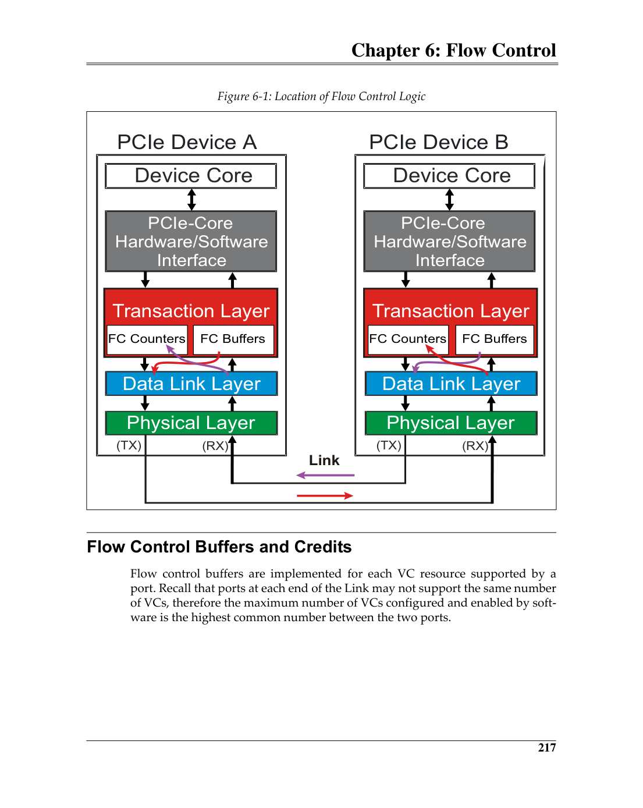</p>
<p align="center"><sub>📄 <a href="figures/chapter_06_Flow_Control/page/page0276.png">Page 0276</a></sub></p>

## **PCI Express Technology**

如果使用多个 Virtual Channels (VCs)，流控机制可以提高传输效率。每个 Virtual Channel 承载独立于其他 VC 中流动的流量的事务，因为流控缓冲区是单独维护的。因此，一个 VC 中满的 Flow Control 缓冲区不会阻塞对其他 VC
缓冲区的访问。PCIe 最多支持 8 个 Virtual Channels。

Flow Control 机制使用基于信用的机制，允许发送端口知道接收端口可用的缓冲区空间。作为初始化的一部分，每个接收方将其缓冲区大小报告给链路另一端的发送方，然后在运行期间使用 Flow Control DLLPs 定期更新可用信用数。从技术上讲，DLLPs
当然是开销，因为它们不传达任何数据负载，但它们保持小（始终为 8 个 symbol 大小）以最小化它们对性能的影响。

流控逻辑实际上是两个层之间的共同责任：Transaction Layer 包含计数器，但 Link Layer 发送和接收传达信息的 DLLPs。第 217 页的图 6‐1 说明了这种共同责任。在使流控工作的过程中：

- **设备报告可用缓冲区空间** — 每个端口的接收方以称为 credits 的单位报告其 Flow Control 缓冲区的大小。缓冲区内的信用数从接收侧事务层发送到链路层的发送侧。在适当的时候，链路层创建一个 Flow Control
DLLP，以将此信用信息转发给链路上另一端的接收方，用于每个 Flow Control Buffer。

- **接收方注册信用** — 接收方获得 Flow Control DLLPs 并将信用值传输到事务层的发送侧。完成从一个链路伙伴到另一个链路伙伴的信用传输。这些动作在两个方向上执行，直到所有流控信息已被交换。

- **发送方检查信用** — 在发送 TLP 之前，发送方检查 Flow Control Counters 以了解是否有足够的信用可用。如果是，则 TLP 被转发到 Link Layer，但如果不是，则事务被阻塞，直到报告更多的 Flow Control 信用。

## **Flow Control Buffers and Credits**
>
> 🇬🇧 Flow control buffers are implemented for each VC resource supported by a port. Recall that ports at each end of the Link may not support the
> 🇬🇧 same number of VCs, therefore the maximum number of VCs configured and enabled by soft‐ ware is the highest common number between the two
> 🇬🇧 ports.

## **Flow Control Buffers and Credits**
>
> 🇨🇳 为端口支持的每个 VC 资源实现流控缓冲区。回想一下，链路两端的端口可能不支持相同数量的 VC，因此由软件配置和启用的最大 VC 数量是两个端口之间最高的共同数量。


<p align="center"><b>Figure 6‐2: Flow Control Buffer Organization</b></p>
<p align="center">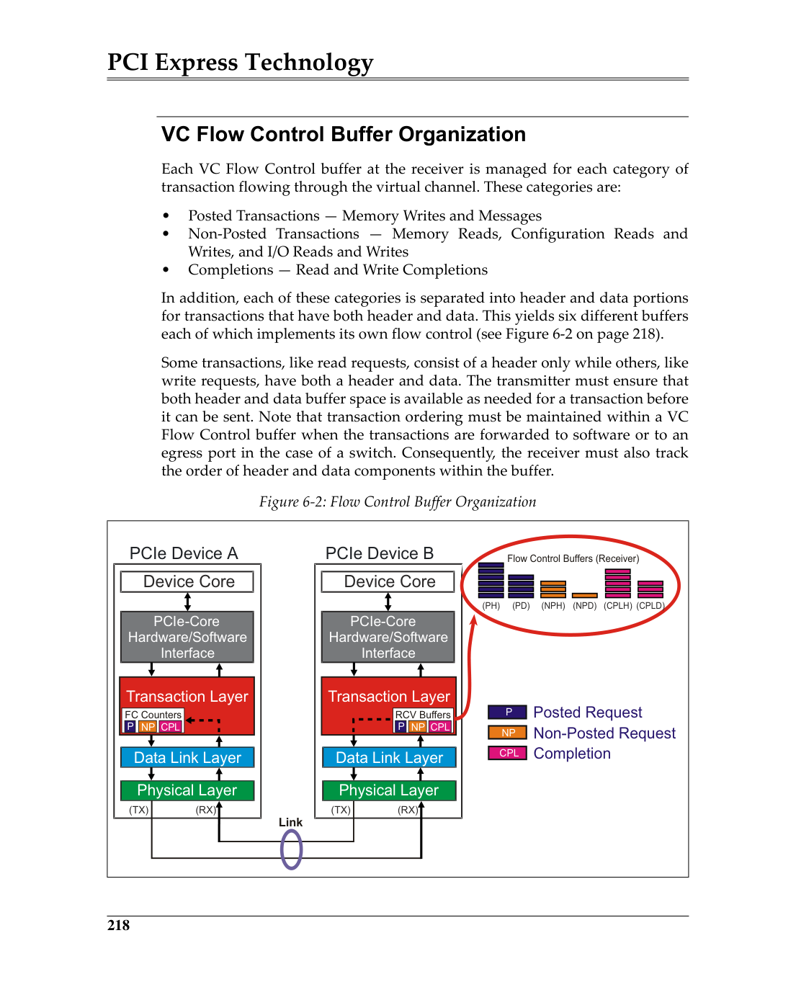</p>
<p align="center"><sub>📄 <a href="figures/chapter_06_Flow_Control/page/page0277.png">Page 0277</a></sub></p>

## **VC Flow Control Buffer Organization**

接收方处的每个 VC Flow Control 缓冲区针对流经虚拟通道的每类事务进行管理。这些类别为：

- Posted Transactions — Memory Writes and Messages

- Non‐Posted Transactions — Memory Reads, Configuration Reads and Writes, and I/O Reads and Writes

- Completions — Read and Write Completions

此外，对于同时具有 header 和 data 的事务，这些类别中的每一个都分为 header 和 data 部分。这产生了六个不同的缓冲区，每个缓冲区都实现其自己的流控（参见第 218 页的图 6‐2）。

某些事务（如读请求）仅由 header 组成，而其他事务（如写请求）同时具有 header 和 data。发送方必须确保在事务发送之前，根据需要为 header 和 data 缓冲区空间都可用。请注意，在事务被转发到软件或交换机的情况下，事务排序必须在 VC Flow
Control 缓冲区中维护。因此，接收方还必须跟踪缓冲区中 header 和 data 组件的顺序。

## **Flow Control Credits**
>
> 🇬🇧 Buffer space is reported by the receiver in units called Flow Control credits. The unit value of Flow Control Credits (FCCs) for header and
> 🇬🇧 data buffers are:
>
> 🇬🇧 - Header credits — maximum header size + digest
>
> 🇬🇧 - 4 DWs for completions
>
> 🇬🇧 - 5 DWs for requests
>
> 🇬🇧 - Data credits — 4 DWs (aligned 16 bytes)
>
> 🇬🇧 Flow Control DLLPs communicate this information, and do not require Flow Control credits themselves. That’s because they originate and
> 🇬🇧 terminate at the Link Layer and don’t use the Transaction Layer buffers.

## **Flow Control Credits**
>
> 🇨🇳 缓冲区空间由接收方以称为 Flow Control credits 的单位报告。Flow Control Credits (FCCs) 对于 header 和 data 缓冲区的单位值为：
>
> 🇨🇳 - Header credits — maximum header size + digest
>
> 🇨🇳 - 完成请求为 4 DWs
>
> 🇨🇳 - 请求为 5 DWs
>
> 🇨🇳 - Data credits — 4 DWs (aligned 16 bytes)
>
> 🇨🇳 Flow Control DLLPs 传达此信息，并且本身不需要 Flow Control credits。这是因为它们源自并终止于 Link Layer，并且不使用 Transaction Layer 缓冲区。

## **Initial Flow Control Advertisement**
>
> 🇬🇧 During Flow Control initialization, PCIe devices communicate their buffer sizes by “advertising” their buffer space via flow control
> 🇬🇧 credits. PCIe also defines an infinite Flow Control credit value that is required for some buffers. A receiver that advertises infinite
> 🇬🇧 buffer space is effectively guaranteeing that its buffer space will never overflow.

## **Initial Flow Control Advertisement**
>
> 🇨🇳 在 Flow Control 初始化期间，PCIe 设备通过"广告"其缓冲区空间（通过流控信用）来传达其缓冲区大小。PCIe 还定义了一些缓冲区所需的 infinite Flow Control credit 值。广告无限缓冲区空间的接收方实际上保证了其缓冲区空间永远不会溢出。

## **Minimum and Maximum Flow Control Advertisement**
>
> 🇬🇧 The specification defines the minimum number of credits that can be reported for the different Flow Control buffer types as listed in Table
> 🇬🇧 6‐1. However, devices normally advertise considerably more credits than the minimum. Table 6‐2 on page 220 lists the maximum advertisement
> 🇬🇧 allowed by the specifi‐ cation.
>
> 🇬🇧 _Table 6‐1: Required Minimum Flow Control Advertisements_
>
> 🇬🇧 |Credit Type|**Minimum Advertisement**|
> 🇬🇧 |---|---|
> 🇬🇧 |Posted Request Header (PH)|1 unit. Credit Value = one `4DW` HDR + Digest = `5DW`.|
> 🇬🇧 |Posted Request Data (PD)|Largest possible setting of the Max_Payload_Size in<br>credits. Example: If the largest Max_Payload_Size
> 🇬🇧 value<br>supported is 1024 bytes, the smallest permitted initial<br>credit value would be `040h`.|

## **Minimum and Maximum Flow Control Advertisement**
>
> 🇨🇳 规范定义了可以为不同 Flow Control 缓冲区类型报告的最小信用数，如表 6‐1 所列。然而，设备通常广告比最小值大得多的信用。第 220 页的表 6‐2 列出了规范允许的最大广告。
>
> 🇨🇳 *Table 6‐1: Required Minimum Flow Control Advertisements*
>
> 🇨🇳 |Credit Type|**Minimum Advertisement**|
> 🇨🇳 |---|---|
> 🇨🇳 |Posted Request Header (PH)|1 unit. Credit Value = one `4DW` HDR + Digest = `5DW`.|
> 🇨🇳 |Posted Request Data (PD)|Largest possible setting of the Max_Payload_Size in<br>credits. Example: If the largest Max_Payload_Size
> 🇨🇳 value<br>supported is 1024 bytes, the smallest permitted initial<br>credit value would be `040h`.|

## **PCI Express Technology**
>
> 🇬🇧 _Table 6‐1: Required Minimum Flow Control Advertisements (Continued)_
>
> 🇬🇧 |Credit Type|**Minimum Advertisement**|
> 🇬🇧 |---|---|
> 🇬🇧 |Non‐Posted Request HDR (NPH)|**1 unit**. Credit Value = one 4 DW H...|
> 🇬🇧 |Non‐Posted Request Data (NPD)|**1 unit**. Credit Value = `4DW`.<br>**2 unit**. Receivers supporting AtomicOp routing or<br>AtomicOp Completer
> 🇬🇧 capability have credit value of `02h`|
> 🇬🇧 |Completion HDR (CPLH)|**1 unit**. Credit Value = one `3DW` HDR + Digest = `4DW`;<br>for Root Complex with peer‐to‐peer support
> 🇬🇧 and<br>Switches.<br>**Infinite units.**Initial Credit Value = all 0’s for Root Com‐<br>plex with no peer‐to‐peer support and Endpoints.|
> 🇬🇧 |Completion Data (CPLD)|**n unit**. Value of largest possible setting of<br>Max_Payload_Size or size of largest Read Request<br>(which ever
> 🇬🇧 is smaller) divided by FC Unit Size (`4DW`);<br>for Root Complex with peer‐to‐peer support and<br>Switches.<br>**Infinite units**. Initial
> 🇬🇧 Credit Value = all 0’s; for Root<br>Complex with no peer‐to‐peer support and Endpoints.|
>
>
> 🇬🇧 _Table 6‐2: Maximum Flow Control Advertisements_
>
> 🇬🇧 |**Credit Type**|**Maximum Advertisement**|
> 🇬🇧 |---|---|
> 🇬🇧 |Posted Request Header (PH)|**128 units**. 128 credits @ 5 DWs = 2,560 bytes.|
> 🇬🇧 |Posted Request Data (PD)|2048 units. Value of the Max_Payload_Size (4096 bytes)<br>including all functions supported by device (8)
> 🇬🇧 divided<br>by the credit size (4 DWs) = 32,768 bytes<br>2048 credits @ 4 DWs = 32,768 bytes|
> 🇬🇧 |Non‐Posted Request HDR (NPH)|**128 units**. 128 credits @ 5 DWs = 2,560 bytes.|
> 🇬🇧 |Non‐Posted Request Data (NPD)|The author’s could not find a precise value for the maxi‐<br>mum number of credits for Non‐Posted Data. The
> 🇬🇧 maxi‐<br>mum number of credits listed for Data is 2048. However,<br>a more reasonable approach might use the Non‐Posted<br>header limit of
> 🇬🇧 128 credits, because Non‐Posted Data is<br>always associated with Non‐Posted Headers.|
>
>
> 🇬🇧 _Table 6‐2: Maximum Flow Control Advertisements (Continued)_
>
> 🇬🇧 |**Credit Type**|**Maximum Advertisement**|
> 🇬🇧 |---|---|
> 🇬🇧 |Completion HDR (CPLH)|**128 units**. 128 credits @ 5 DWs = 2,560 bytes. This in<br>the limit for ports that do not originate transactions
> 🇬🇧 (e.g.,<br>Root Complex with peer‐to‐peer support and Switches).<br>**Infinite units**. Initial Credit Value = all 0’s for ports
> 🇬🇧 that<br>originate transactions (e.g., Root Complex with no peer‐<br>to‐peer support and Endpoints).|
> 🇬🇧 |Completion Data (CPLD)|**2048 units**. Value of the Max_Payload_Size (4096 bytes)<br>including all functions supported by a device
> 🇬🇧 (8)<br>divided by the credit size (4 DWs) = 32,768 bytes<br>2048 credits @ 4 DWs = 32,768 bytes<br>**Infinite units**. Initial Credit Value
> 🇬🇧 = all 0’s for ports that<br>originate transactions (e.g., Root Complex with no peer‐<br>to‐peer support and Endpoints).|

## **PCI Express Technology**
>
> 🇨🇳 *Table 6‐1: Required Minimum Flow Control Advertisements (Continued)*
>
> 🇨🇳 |Credit Type|**Minimum Advertisement**|
> 🇨🇳 |---|---|
> 🇨🇳 |Non‐Posted Request HDR (NPH)|**1 unit**. Credit Value = one 4 DW H...|
> 🇨🇳 |Non‐Posted Request Data (NPD)|**1 unit**. Credit Value = `4DW`.<br>**2 unit**. Receivers supporting AtomicOp routing or<br>AtomicOp Completer
> 🇨🇳 capability have credit value of `02h`|
> 🇨🇳 |Completion HDR (CPLH)|**1 unit**. Credit Value = one `3DW` HDR + Digest = `4DW`;<br>for Root Complex with peer‐to‐peer support
> 🇨🇳 and<br>Switches.<br>**Infinite units.**Initial Credit Value = all 0's for Root Com‐<br>plex with no peer‐to‐peer support and Endpoints.|
> 🇨🇳 |Completion Data (CPLD)|**n unit**. Value of largest possible setting of<br>Max_Payload_Size or size of largest Read Request<br>(which ever
> 🇨🇳 is smaller) divided by FC Unit Size (`4DW`);<br>for Root Complex with peer‐to‐peer support and<br>Switches.<br>**Infinite units**. Initial
> 🇨🇳 Credit Value = all 0's; for Root<br>Complex with no peer‐to‐peer support and Endpoints.|
>
> 🇨🇳 *Table 6‐2: Maximum Flow Control Advertisements*
>
> 🇨🇳 |**Credit Type**|**Maximum Advertisement**|
> 🇨🇳 |---|---|
> 🇨🇳 |Posted Request Header (PH)|**128 units**. 128 credits @ 5 DWs = 2,560 bytes.|
> 🇨🇳 |Posted Request Data (PD)|2048 units. Value of the Max_Payload_Size (4096 bytes)<br>including all functions supported by device (8)
> 🇨🇳 divided<br>by the credit size (4 DWs) = 32,768 bytes<br>2048 credits @ 4 DWs = 32,768 bytes|
> 🇨🇳 |Non‐Posted Request HDR (NPH)|**128 units**. 128 credits @ 5 DWs = 2,560 bytes.|
> 🇨🇳 |Non‐Posted Request Data (NPD)|The author's could not find a precise value for the maxi‐<br>mum number of credits for Non‐Posted Data. The
> 🇨🇳 maxi‐<br>mum number of credits listed for Data is 2048. However,<br>a more reasonable approach might use the Non‐Posted<br>header limit of
> 🇨🇳 128 credits, because Non‐Posted Data is<br>always associated with Non‐Posted Headers.|
>
> 🇨🇳 *Table 6‐2: Maximum Flow Control Advertisements (Continued)*
>
> 🇨🇳 |**Credit Type**|**Maximum Advertisement**|
> 🇨🇳 |---|---|
> 🇨🇳 |Completion HDR (CPLH)|**128 units**. 128 credits @ 5 DWs = 2,560 bytes. This in<br>the limit for ports that do not originate transactions
> 🇨🇳 (e.g.,<br>Root Complex with peer‐to‐peer support and Switches).<br>**Infinite units**. Initial Credit Value = all 0's for ports
> 🇨🇳 that<br>originate transactions (e.g., Root Complex with no peer‐<br>to‐peer support and Endpoints).|
> 🇨🇳 |Completion Data (CPLD)|**2048 units**. Value of the Max_Payload_Size (4096 bytes)<br>including all functions supported by a device
> 🇨🇳 (8)<br>divided by the credit size (4 DWs) = 32,768 bytes<br>2048 credits @ 4 DWs = 32,768 bytes<br>**Infinite units**. Initial Credit Value
> 🇨🇳 = all 0's for ports that<br>originate transactions (e.g., Root Complex with no peer‐<br>to‐peer support and Endpoints).|

## **Infinite Credits**
>
> 🇬🇧 Note that a flow control value of `00h` will be understood to mean infinite credits during initialization. Following Flow‐Control
> 🇬🇧 initialization no further advertise‐ ments are made. Devices that originate transactions must reserve buffer space for the data or status
> 🇬🇧 information that will return during split transactions. These transaction combinations include:
>
> 🇬🇧 - Non‐posted Read requests and return of Completion Data
>
> 🇬🇧 - Non‐posted Read requests and return of Completion Status
>
> 🇬🇧 - Non‐posted Write requests and return of Completion Status
>
## **Special Use for Infinite Credit Advertisements.**
## **Infinite Credits**
>
> 🇨🇳 请注意，在初始化期间，值为 `00h` 的流控值将被理解为无限信用。在 Flow‐Control 初始化之后，不进行进一步的广告。发起事务的设备必须为在 split transactions 期间返回的数据或状态信息预留缓冲区空间。这些事务组合包括：
>
> 🇨🇳 - Non‐posted Read requests and return of Completion Data
>
> 🇨🇳 - Non‐posted Read requests and return of Completion Status
>
> 🇨🇳 - Non‐posted Write requests and return of Completion Status

## **Special Use for Infinite Credit Advertisements.**
>
> 🇬🇧 规范指出了仅实现 `VC0` 的设备的特殊注意事项。例如，唯一的 Non‐Posted 写入是 I/O Writes 和 Configuration Writes，它们都只允许在 `VC0` 上。因此，Non‐Posted data 缓冲区不用于 `VC1` ‐
> 🇬🇧 `VC7`，并且可以为这些值广告无限值。但是，Non‐Posted Header 必须仍然操作，并且 header 信用必须仍然需要更新。

</tr>
## **General**
>
> 🇬🇧 在发送任何事务之前，需要进行流控初始化。事实上，TLPs 在成功完成 Flow Control Initialization 之前无法跨链路发送。初始化发生在系统中的每个 Link 上，并涉及链路两端设备之间的握手。此过程在 Physical Layer
> 🇬🇧 链路训练完成后立即开始。如图 6‐3 所示，Link Layer 在观察到 LinkUp 信号处于活动状态时知道 Physical Layer 已准备就绪。
>
> 🇬🇧 一旦启动，Flow Control 初始化过程对于所有 Virtual Channels 基本上是相同的，并且一旦 VC 启用就由硬件控制。`VC0` 始终默认启用，因此其初始化是自动的。
>
> 🇬🇧 这允许配置事务穿越拓扑并执行枚举过程。其他 VC 仅在配置软件在链路两端设置和启用它们时才初始化。

</tr>

<p align="center"><b>Figure</b></p>
<p align="center">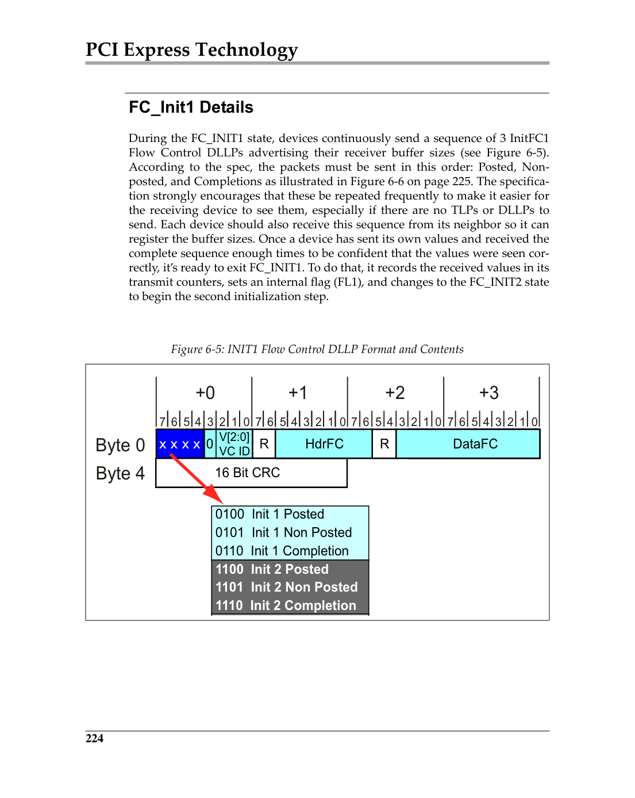</p>
<p align="center"><sub>📄 <a href="figures/chapter_06_Flow_Control/page/page0283.png">Page 0283</a></sub></p>

</tr>
## **Rate of FC_INIT1 and FC_INIT2 Transmission**
>
> 🇬🇧 规范定义 FC_INIT DLLPs 之间的延迟如下：
>
> 🇬🇧 - **`VC0`**。`VC0` 的硬件启动流控要求 FC_INIT1 和 FC_INIT2 包"以最大可能速率连续"传输。即，重传计时器设置为零值。
>
> 🇬🇧 - **`VC1`‐`VC7`**。当软件启动其他 VC 的流控初始化时，FC_INIT 序列在"没有其他 TLP 或 DLLP 可用于传输"时重复。然而，一个序列的开始到下一个序列的开始之间的延迟不能大于 17μs。

</tr>
## **Introduction to the Flow Control Mechanism**
</tr>
## **The Flow Control Elements**
>
> 🇬🇧 图 6‐8 说明了用于管理流控的元素。该图显示了事务在单个方向上跨链路流动，而另一组这些元素支持在相反方向上的传输。每个元素的主要功能列在下面。虽然这些 Flow Control 元素为所有六个接收缓冲区复制，但为简单起见，本示例仅处理 non‐posted header 流控。
>
> 🇬🇧 与流控管理相关联的最后一个元素是 Flow Control Update DLLP。这是正常传输期间使用的唯一 Flow Control 包。FC Update 包的格式在第 229 页的图 6‐9 中说明。

</tr>
## **Receiver Elements**
>
> 🇬🇧 - **Flow Control Buffer** — 存储传入的 headers 或 data。
>
> 🇬🇧 - **Credit Allocated** — 跟踪已分配（可用）的总 Flow Control 信用。它由硬件初始化以反映关联的 Flow Control 缓冲区的大小。缓冲区随着事务到达而填充，但最终它们由接收方的核心逻辑从缓冲区中移除。当它们被移除时，Flow
> 🇬🇧 Control 信用数被添加到 CREDIT_ALLOCATED 计数器中。因此，计数器跟踪当前可用的信用数。

</tr><p align="center"><b>Figure 6‐1: Location of Flow Control Logic</b></p>
<p align="center"></p>
<p align="center"><sub>📄 <a href="figures/chapter_06_Flow_Control/page/page0278.png">Page 278</a></sub></p>

<p align="center"><b>Figure 6‐2: Flow Control Buffer Organization</b></p>
<p align="center">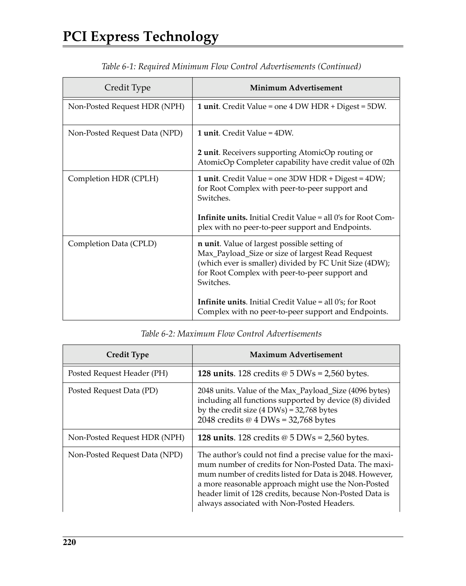</p>
<p align="center"><sub>📄 <a href="figures/chapter_06_Flow_Control/page/page0279.png">Page 279</a></sub></p>

<p align="center"><b>Figure 6‐3: Physical Layer Reports That It's Ready</b></p>
<p align="center"></p>
<p align="center"><sub>📄 <a href="figures/chapter_06_Flow_Control/page/page0280.png">Page 280</a></sub></p>

<p align="center"><b>Figure 6‐4: The Data Link Control & Management State Machine</b></p>
<p align="center">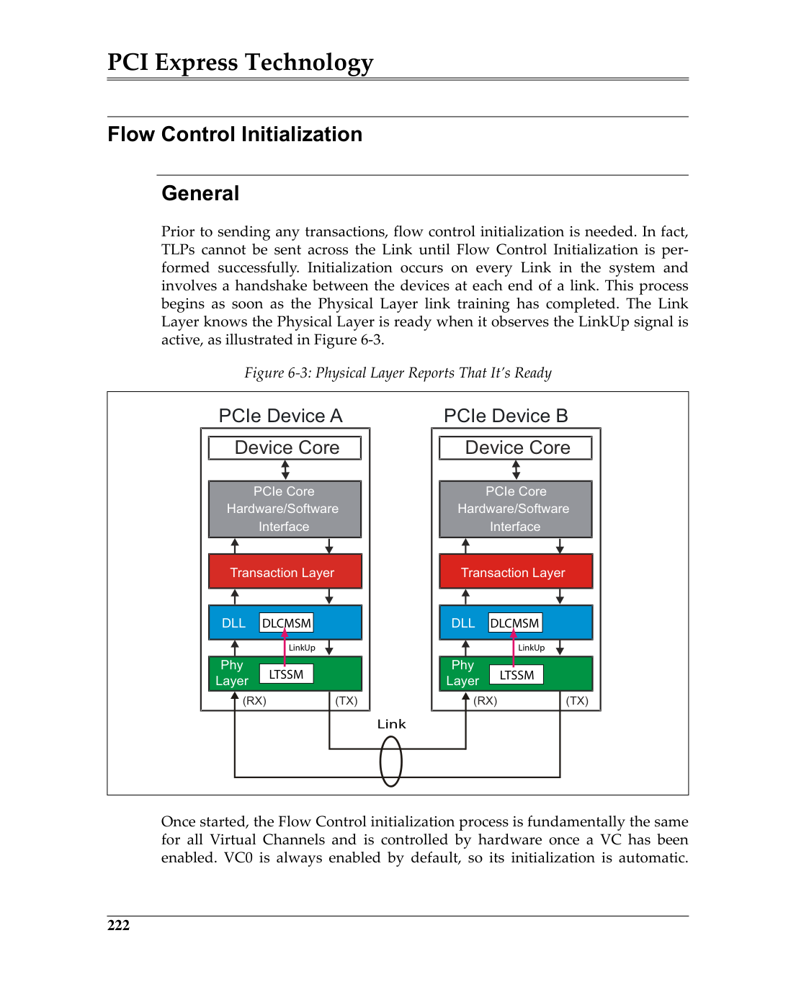</p>
<p align="center"><sub>📄 <a href="figures/chapter_06_Flow_Control/page/page0281.png">Page 281</a></sub></p>

<p align="center"><b>Figure 6‐5: INIT1 Flow Control DLLP Format and Contents</b></p>
<p align="center">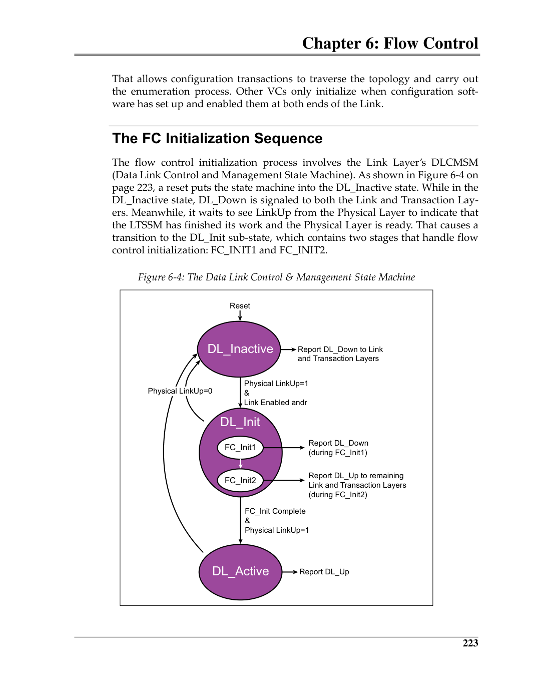</p>
<p align="center"><sub>📄 <a href="figures/chapter_06_Flow_Control/page/page0282.png">Page 282</a></sub></p>

<p align="center"><b>Figure 6‐8: Flow Control Elements</b></p>
<p align="center">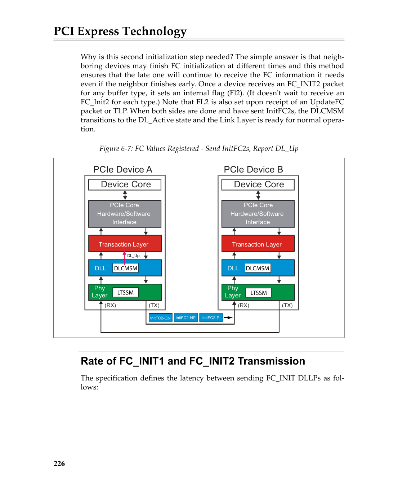</p>
<p align="center"><sub>📄 <a href="figures/chapter_06_Flow_Control/page/page0285.png">Page 285</a></sub></p>
[⬆️ 返回目录](#本章目录-table-of-contents)

---

<a id="sec-6-2"></a>

</td>
<td width="50%">

</td>
</tr>
> 🇬🇧 The specification points out a special consideration for devices that implement only `VC0`. For example, the only Non‐Posted writes are I/O
> 🇬🇧 Writes and Configu‐ ration Writes both of which are permitted only on `VC0`. Thus, Non‐Posted data buffers are not used for `VC1` ‐ `VC7` and an
> 🇬🇧 infinite value can be advertised for those values. However, the Non‐Posted Header must still operate and header credits must still need to
> 🇬🇧 be updated.

</tr>
## **Flow Control Initialization**
## **Flow Control Example**
>
> 🇨🇳 以下示例描述了 non‐posted header Flow Control 缓冲区，并试图在多种情况下捕获流控实现的细微差别。Flow Control 的讨论以一系列基本阶段描述如下：
>
> 🇨🇳 **Stage One** — 初始化后立即发送一个事务并进行跟踪，以解释计数器和寄存器的基本操作。
>
> 🇨🇳 **Stage Two** — 发送方比接收方处理事务的速度更快，缓冲区变满。
>
> 🇨🇳 **Stage Three** — 当计数器回绕到零时，机制仍然有效，但有几个问题需要考虑。
>
> 🇨🇳 **Stage Four** — 缓冲区溢出的可选接收方错误检查。


<p align="center"><b>Figure 6‐3: Physical Layer Reports That It’s Ready</b></p>
<p align="center">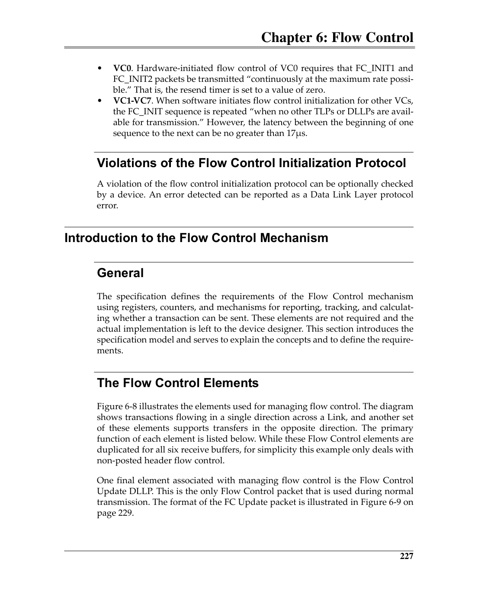</p>
<p align="center"><sub>📄 <a href="figures/chapter_06_Flow_Control/page/page0286.png">Page 0286</a></sub></p>


<p align="center"><b>Figure 6‐3: Physical Layer Reports That It’s Ready</b></p>
<p align="center">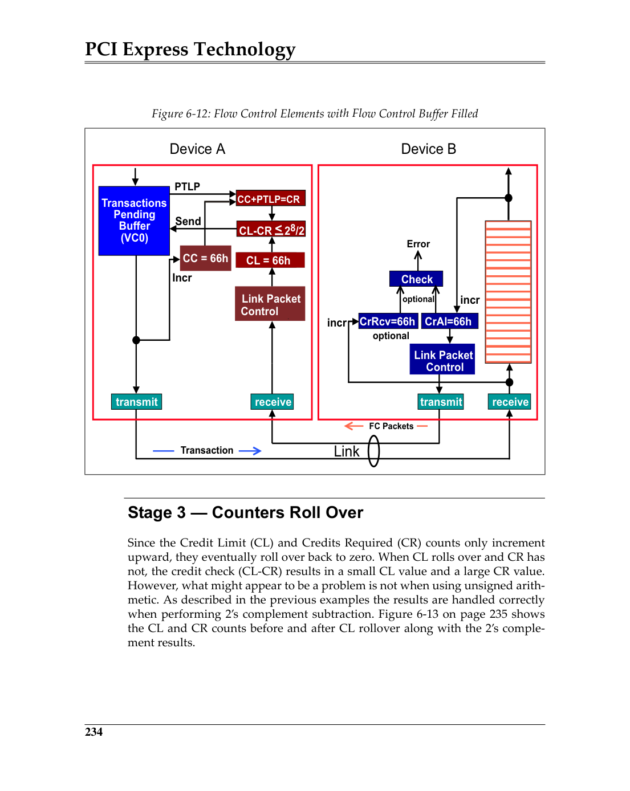</p>
<p align="center"><sub>📄 <a href="figures/chapter_06_Flow_Control/page/page0293.png">Page 0293</a></sub></p>

## **Stage 1 — Flow Control Following Initialization**

一旦流控初始化完成，设备就准备好进行正常操作。在我们的示例中，Flow Control 缓冲区为 `2KB`。我们正在描述 non‐posted header 缓冲区，每个信用为 5 dwords 或 20 字节。这意味着有 102d (`66h`) 个 Flow Control
单位可用。第 231 页的图 6‐10 说明了所涉及的元素，包括流控初始化后每个计数器和寄存器中的值。

当发送方准备好发送 TLP 时，它必须首先检查 Flow Control 信用。我们的示例很简单，因为 non‐posted header 是唯一正在发送的包，它始终只需要一个 Flow Control 信用，并且我们还假设事务中不包含数据。

使用无符号算术（2 的补码）进行 header 信用检查，并且必须满足以下公式：

将图 6‐10 中的值代入：

66_h – (00_h + 01_h) _mod_ 2`[8]` ≤ 2`[8]` / 2 66_h – 01_h mod 256 ≤ 80_h

在这种情况下，将当前 CREDITS_CONSUMED 计数 (CC) 与 PTLP 所需信用相加，以确定 CREDITS_REQUIRED (CR)，即 `00h` + `01h` = `01h`。从 CREDIT_LIMIT 计数 (CL) 中减去 CREDITS_REQUIRED
计数以确定是否有足够的信用。

以下描述包含对 2 的补码减法的简要回顾。当使用 2 的补码执行减法时，要减去的数字被取反（1 的补码），然后加 1（2 的补码）。然后将此值添加到我们要从中减去的数字。由于加法而产生的任何进位都将被丢弃。

信用检查：

```
CL 01100110b (`66h`) - CR 00000001b (`01h`) = n
```

CR 转换为 2 的补码：

`00000001b` (CR) `11111110b` (CR 取反) `11111110b + 1 11111111b` (2 的补码)

将 2 的补码加到 CL 上：

```
01100110 (CL)
11111111(2 的补码 of CR)
01100101 = `65h` (carry bit is dropped)
```

结果是否 <= `80h`？是的。如果减法结果等于或小于最大值的一半（用 modulo 256 计数器跟踪为 128），那么我们知道接收方缓冲区中有足够的空间，可以发送此包。仅使用一半的计数器值的决定避免了潜在的计数别名问题。请参见第 234 页 "Stage 3 —
Counters Roll Over"。


<p align="center"><b>Figure 6‐4: The Data Link Control & Management State Machine</b></p>
<p align="center">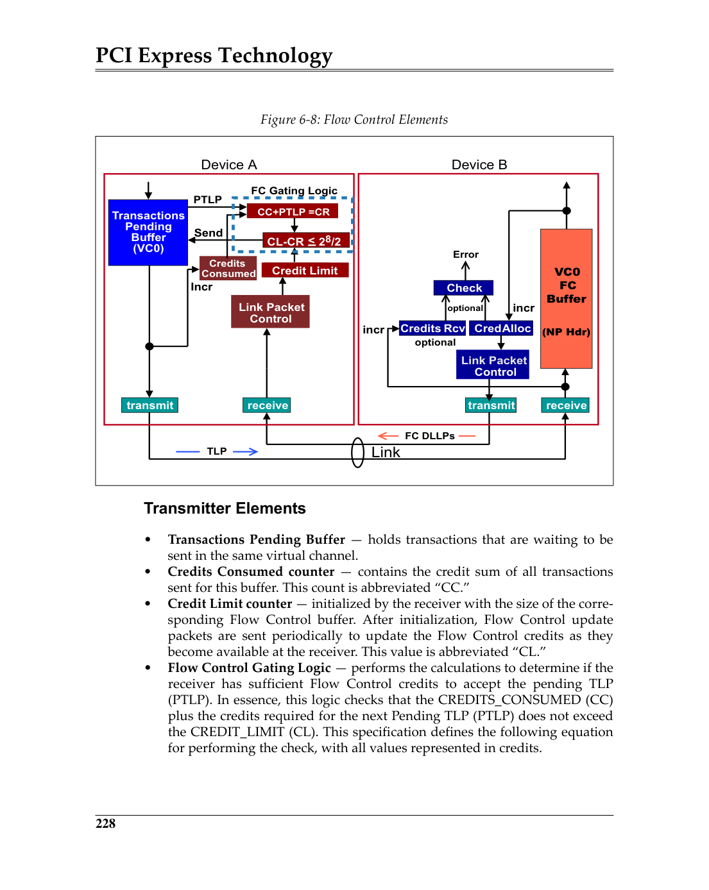</p>
<p align="center"><sub>📄 <a href="figures/chapter_06_Flow_Control/page/page0287.png">Page 0287</a></sub></p>

## **Stage 2 — Flow Control Buffer Fills Up**

假设现在接收方已经有一段时间无法从 Flow Control 缓冲区中移除事务。也许设备核心逻辑暂时忙碌，无法处理事务。最终，Flow Control 缓冲区变得完全填满，如第 234 页的图 6‐12 所示。如果发送方希望发送另一个 TLP 并检查 Flow Control
信用：

Credit Limit (CL)= `66h` Credits Required (CR) = `67h`


<p align="center"><b>Figure 6‐5: INIT1 Flow Control DLLP Format and Contents</b></p>
<p align="center">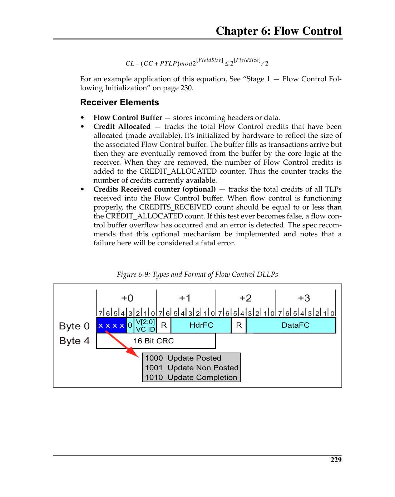</p>
<p align="center"><sub>📄 <a href="figures/chapter_06_Flow_Control/page/page0288.png">Page 0288</a></sub></p>


<p align="center"><b>Figure 6‐5: INIT1 Flow Control DLLP Format and Contents</b></p>
<p align="center">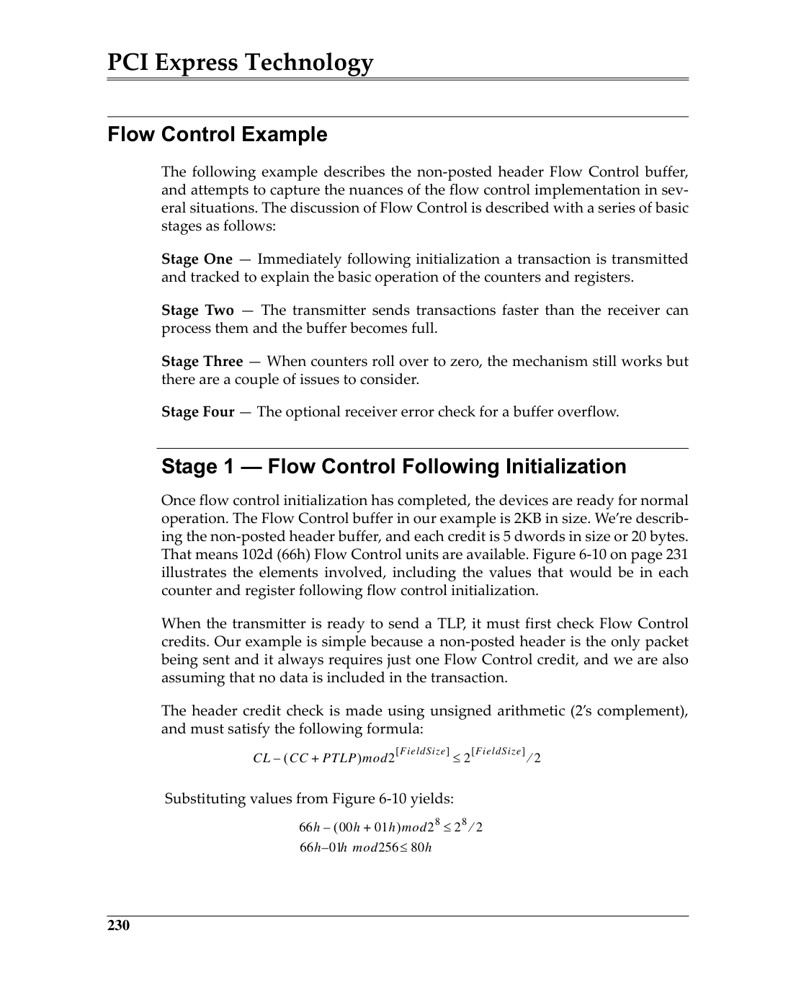</p>
<p align="center"><sub>📄 <a href="figures/chapter_06_Flow_Control/page/page0289.png">Page 0289</a></sub></p>

## `CL 01100110` (66)

`CR 10011001` (加 `67h` 的 2 的补码)

`11111111 = `FFh` <= 80h` (不正确；不发送包)

此通道被阻塞，直到收到具有 `67h` 或更大的新 CREDIT_LIMIT 值的 Update Flow Control DLLP。当新值被加载到 CL 寄存器中时，发送方信用检查将通过测试，并且可以发送 TLP。

- `CL 01100111` (67)

- `CR 10011001` 加 67 的 2 的补码

 - `00000000 = `00h` <= 80h` (true, send transaction

## **FC_Init2 Details**
>
> 🇬🇧 In this state a device continuously sends InitFC2 DLLPs. These are sent in the same sequence as the InitFC1s and contain the same credit
> 🇬🇧 information, but they also confirm that FC initialization has succeeded at the sender. Since the device has already registered the values
> 🇬🇧 from the neighbor it doesn’t need any more credit information and will ignore any incoming InitFC1s while it waits to see InitFC2s. It can
> 🇬🇧 even send TLPs at this point, even though initialization hasn’t completed for the other side of the Link, and this is indicated to the
> 🇬🇧 Transaction Layer by the DL_Up signal (See Figure 6‐7).

## **Stage 3 — Counters Roll Over**
>
> 🇨🇳 由于 Credit Limit (CL) 和 Credits Required (CR) 计数仅向上递增，它们最终会回绕到零。当 CL 回绕而 CR 没有回绕时，信用检查 (CL‐CR) 导致 CL 值较小而 CR
> 🇨🇳 值较大。然而，使用无符号算术时看似的问题实际上并不存在。如前所述的示例所示，在执行 2 的补码减法时，结果会被正确处理。第 235 页的图 6‐13 显示了 CL 回绕前后以及 2 的补码结果的 CL 和 CR 计数。


<p align="center"><b>Figure</b></p>
<p align="center">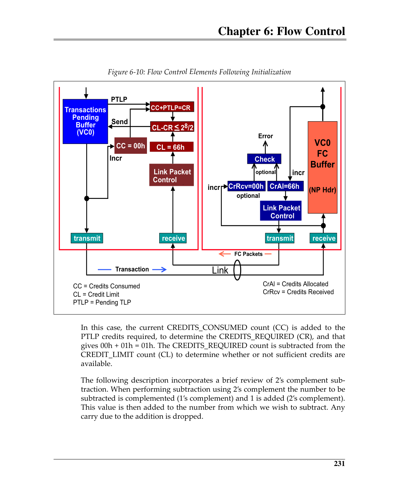</p>
<p align="center"><sub>📄 <a href="figures/chapter_06_Flow_Control/page/page0290.png">Page 0290</a></sub></p>


<p align="center"><b>Figure</b></p>
<p align="center">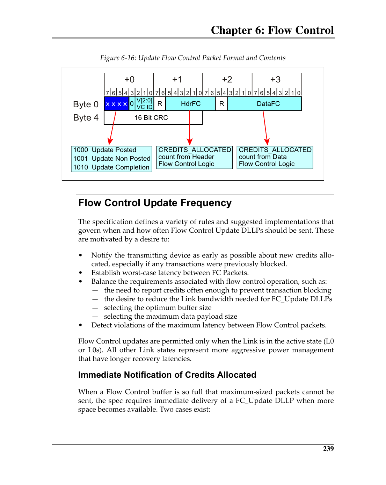</p>
<p align="center"><sub>📄 <a href="figures/chapter_06_Flow_Control/page/page0298.png">Page 0298</a></sub></p>

## ## **Stage 4 — FC Buffer Overflow Error Check**

虽然可以选择性地执行此操作，但规范建议实现 FC 缓冲区溢出错误检查机制。第 236 页的图 6‐14 显示了与溢出错误检查相关联的元素，包括：

- Credits Received (CR) counter

- Credits Allocated (CA) counter

- Error Check Logic

这允许接收方以与发送方相同的方式跟踪 Flow Control 信用。如果流控工作正常，发送方的 Credits Consumed 计数永远不会超过其 Credit Limit，接收方的 Credits Received 计数永远不会超过其 Credits Allocated
计数。

如果以下公式评估为 true，则检测到溢出情况。请注意，字段大小为 8（headers）或 12（data）：

如果它确实评估为 true，则表示发送到 FC 缓冲区的信用超过了可用信用，因此发生了溢出。请注意，规范的 1.0a 版本将等式定义为 ≥ 而不是如上所示的 >。这似乎是一个错误，因为当 CA = CR 时不存在溢出情况。

## **Rate of FC_INIT1 and FC_INIT2 Transmission**
>
> 🇬🇧 The specification defines the latency between sending FC_INIT DLLPs as fol‐ lows:
>
> 🇬🇧 - **`VC0`** . Hardware‐initiated flow control of `VC0` requires that FC_INIT1 and FC_INIT2 packets be transmitted “continuously at the maximum
> 🇬🇧 rate possi‐ ble.” That is, the resend timer is set to a value of zero.
>
> 🇬🇧 - **`VC1`‐`VC7`** . When software initiates flow control initialization for other VCs, the FC_INIT sequence is repeated “when no other TLPs or
> 🇬🇧 DLLPs are avail‐ able for transmission.” However, the latency between the beginning of one sequence to the next can be no greater than 17μs.

## **Flow Control Updates**
>
> 🇨🇳 接收方必须定期使用在从事务中移除缓冲区时可用的 Flow Control 信用来更新其相邻设备。第 238 页的图 6‐15 说明了一个示例，其中发送方先前因为缓冲区已满而无法发送 header 事务。在图示中，接收方刚刚从 Flow Control 缓冲区中移除了三个
> 🇨🇳 headers。现在有更多空间可用，但相邻设备不知道这一点。随着 headers 从缓冲区中移除，CREDITS_ALLOCATED 计数从 `66h` 增加到 `69h`。该新计数使用 Flow Control update 包报告给相邻设备的 CREDIT_LIMIT
> 🇨🇳 寄存器。一旦更新了信用限制，就可以继续传输其他 TLP。
>
> 🇨🇳 这里一个有趣的注意点是，update 报告了 Credits Allocated 寄存器的实际值。仅报告寄存器的变化也可以工作，例如"+3 credits on NP Headers"，但这代表了一个潜在问题。要了解此风险，请考虑如果包含增量信息的 DLLP
> 🇨🇳 因某种原因丢失会发生什么情况。没有 DLLPs 的重传机制；如果发生错误，包将被简单丢弃。在这种情况下，增量信息将丢失而无法恢复。
>
> 🇨🇳 另一方面，如果报告了寄存器的实际值并且 DLLP 失败，则下一个成功的 DLLP 将使计数器重新同步。在这种情况下，如果发送方正在等待 FC 信用才能发送下一个 TLP，则可能会浪费一些时间，但不会丢失任何信息。

## **Violations of the Flow Control Initialization Protocol**
>
> 🇬🇧 A violation of the flow control initialization protocol can be optionally checked by a device. An error detected can be reported as a Data
> 🇬🇧 Link Layer protocol error.

## **FC_Update DLLP Format and Content**
>
> 🇨🇳 回想一下，Flow Control update 包与 Flow Control 初始化包一样，包含两个信用字段，一个用于 header，一个用于 data，如第 239 页的图 6‐16 所示。接收方的 HdrFC 和 DataFC 字段中报告的信用值可能自上次发送
> 🇨🇳 update 包以来已更新多次或根本没有更新。
>
> 🇨🇳 *Figure 6‐16: Update Flow Control Packet Format and Contents*

## **Introduction to the Flow Control Mechanism**
## **Flow Control Update Frequency**
>
> 🇨🇳 规范定义了多种规则和建议的实现，用于管理何时以及多久发送一次 Flow Control Update DLLPs。这些规则的动机是：
>
> 🇨🇳 - 尽可能早地通知发送设备有关新分配的信用，特别是如果任何事务先前被阻塞。
>
> 🇨🇳 - 建立 FC Packets 之间的最坏情况延迟。
>
> 🇨🇳 - 平衡与流控操作相关的要求，例如：— 需要足够频繁地报告信用以防止事务阻塞
>
> 🇨🇳 - — 减少 FC_Update DLLPs 所需的链路带宽的愿望
>
> 🇨🇳 - — 选择最佳缓冲区大小
>
> 🇨🇳 - 选择最大数据负载大小
>
> 🇨🇳 - 检测 Flow Control 包之间最大延迟的违反。
>
> 🇨🇳 仅当链路处于活动状态 (L0 或 L0s) 时才允许 Flow Control 更新。所有其他链路状态表示更积极的电源管理，具有更长的恢复延迟。

## **General**
>
> 🇬🇧 The specification defines the requirements of the Flow Control mechanism using registers, counters, and mechanisms for reporting, tracking,
> 🇬🇧 and calculat‐ ing whether a transaction can be sent. These elements are not required and the actual implementation is left to the device
> 🇬🇧 designer. This section introduces the specification model and serves to explain the concepts and to define the require‐ ments.

## **Immediate Notification of Credits Allocated**
>
> 🇨🇳 当 Flow Control 缓冲区已满到无法发送最大大小的包时，规范要求在有更多空间可用时立即交付 FC_Update DLLP。存在两种情况：
>
> 🇨🇳 - **Maximum Packet Size = 1 Credit.** 当由于 non‐infinite NPH、NPD、PH 和 CPLH 缓冲区类型的缓冲区已满条件导致包传输被阻塞时，必须在为一个或多个该缓冲区类型分配信用时调度 UpdateFC 包进行传输。
>
> 🇨🇳 - **Maximum Packet Size = Max_Payload_Size.** Flow Control 缓冲区空间可能减少到无法为 non‐infinite PD 和 CPLD 信用类型发送最大大小的包的程度。在这种情况下，当分配一个或多个额外信用时，必须调度
> 🇨🇳 Update FCP 进行传输。


<p align="center"><b>Figure 6‐8: Flow Control Elements</b></p>
<p align="center">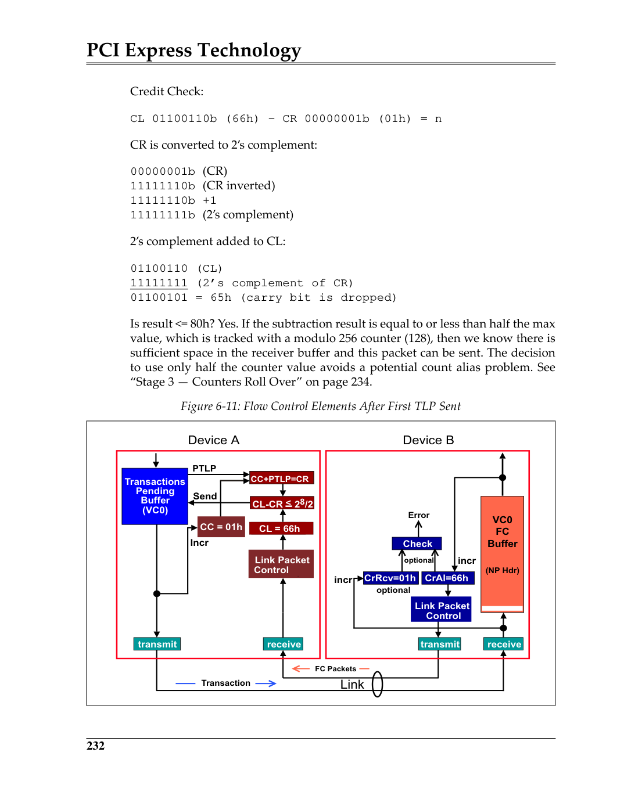</p>
<p align="center"><sub>📄 <a href="figures/chapter_06_Flow_Control/page/page0291.png">Page 0291</a></sub></p>

## **Maximum Latency Between Update Flow Control DLLPs**

每个 FC 信用类型（non‐infinite）的 Update FCP 的传输频率必须调度为至少每 30 μs (‐0%/+50%) 传输一次。如果 Control Link 寄存器中的 Extended Sync 位被设置，则更新必须调度为不超过每 120 μs
(‐0%/+50%) 传输一次。请注意，Update FCPs 的调度传输频率可以比要求更频繁。

## **Transmitter Elements**
>
> 🇬🇧 - **Transactions Pending Buffer** — holds transactions that are waiting to be sent in the same virtual channel.
>
> 🇬🇧 - **Credits Consumed counter** — contains the credit sum of all transactions sent for this buffer. This count is abbreviated “CC.”
>
> 🇬🇧 - **Credit Limit counter** — initialized by the receiver with the size of the corre‐ sponding Flow Control buffer. After initialization,
> 🇬🇧 Flow Control update packets are sent periodically to update the Flow Control credits as they become available at the receiver. This value is
> 🇬🇧 abbreviated “CL.”
>
> 🇬🇧 - **Flow Control Gating Logic** — performs the calculations to determine if the receiver has sufficient Flow Control credits to accept the
> 🇬🇧 pending TLP (PTLP). In essence, this logic checks that the CREDITS_CONSUMED (CC) plus the credits required for the next Pending TLP (PTLP)
> 🇬🇧 does not exceed the CREDIT_LIMIT (CL). This specification defines the following equation for performing the check, with all values
> 🇬🇧 represented in credits.
>
> 🇬🇧 _CL_ –  _CC_ + _PTLP_  _mod_ 2  _[FieldSize]_   2  _[FieldSize]_   2
>
> 🇬🇧 For an example application of this equation, See “Stage 1 — Flow Control Fol‐ lowing Initialization” on page 230.

## **Calculating Update Frequency Based on Payload Size and Link Width**
>
> 🇨🇳 规范提供了一个公式，用于根据最大数据负载大小和链路宽度计算需要发送 update 包的频率。该公式（如下所示）以 symbol time 定义 FC Update 传递间隔。作为参考，symbol time 定义为传递一个 symbol 所需的时间：Gen1 为 4ns，Gen2
> 🇨🇳 为 2ns，Gen3 为 1ns。表 6‐3、表 6‐4 和表 6‐5 显示了每种速度的未调整 FC Update 值。
>
> 🇨🇳 ---------------------------------------------------------------------------------------------------------------------------------------（_MaxPayloadSize_
> 🇨🇳 + _TLPOverhead_） × _UpdateFactor_ / **MaxPayloadSize** = Device Control 寄存器的 Max_Payload_Size 字段中的值
>
> 🇨🇳 - **TLPOverhead** = 常量值（28 个 symbol），表示消耗链路带宽的附加 TLP 组件（TLP Prefix、Sequence Number、Packet Header、LCRC、Framing Symbols）
>
> 🇨🇳 - **UpdateFactor** = 在两次收到的 UpdateFC 包之间发送的最大大小 TLP 的数量。此数字旨在平衡链路带宽效率和接收缓冲区大小 – 该值随 Max_Payload_Size 和 Link 宽度而变化
>
> 🇨🇳 - **LinkWidth** = 链路正在使用的 Lane 数
>
> 🇨🇳 - **InternalDelay** = 19 个 symbol time 的常量值，表示已接收 TLP 和已发送 DLLP 的内部处理延迟
>
> 🇨🇳 该公式定义的关系显示，update 包传递的频率随 Linkwidth 的增加而降低，并建议使用一个触发 update 包调度的计时器。请注意，此公式未考虑与接收方或发送方处于 L0s 电源管理状态相关的延迟。
>
> 🇨🇳 *Table 6‐3: Gen1 Unadjusted AckNak_LATENCY_TIMER Values (Symbol Times)*
>
> 🇨🇳 |**Max
> 🇨🇳 Payload**|**x1**|**x2**|**x4**|**x8**|**x12**|**x16**|**x32**|
> 🇨🇳 |---|---|---|---|---|---|---|---|
> 🇨🇳 |128 Bytes|237 UF=1.4|128 UF=1.4|73 UF=1.4|67 UF=2.5|58 UF=3.0|48 UF=3.0|33 UF=3.0|
> 🇨🇳 |256 Bytes|416 FC=1.4|217 FC=1.4|118 UF=1.4|107 UF=2.5|90 UF=3.0|72 UF=3.0|45 UF=3.0|
> 🇨🇳 |512 Bytes|559 UF=1.0|289 UF=1.0|154 UF=1.0|86 UF=1.0|109 UF=2.0|86 UF=2.0|52 UF=2.0|
> 🇨🇳 |1024 Bytes|1071 UF=1.0|545 UF=1.0|282 UF=1.0|150 UF=1.0|194 UF=2.0|150 UF=2.0|84 UF=2.0|
> 🇨🇳 |2048 Bytes|2095 UF=1.0|1057 UF=1.0|538 UF=1.0|278 UF=1.0|365 UF=2.0|278 UF=2.0|148 UF=2.0|
> 🇨🇳 |4096 Bytes|4143 UF=1.0|2081 UF=1.0|1050 UF=1.0|534 UF=1.0|706 UF=2.0|534 UF=2.0|276 UF=2.0|
>
> 🇨🇳 *Table 6‐4: Gen2 Unadjusted AckNak_LATENCY_TIMER Values (Symbol Times)*
>
> 🇨🇳 |**Max
> 🇨🇳 Payload**|**x1**|**x2**|**x4**|**x8**|**x12**|**x16**|**x32**|
> 🇨🇳 |---|---|---|---|---|---|---|---|
> 🇨🇳 |128 Bytes|288 UF=1.4|179 UF=1.4|124 UF=1.4|118 UF=2.5|109 UF=3.0|99 UF=3.0|84 UF=3.0|
> 🇨🇳 |256 Bytes|467 FC=1.4|268 FC=1.4|169 UF=1.4|158 UF=2.5|141 UF=3.0|123 UF=3.0|96 UF=3.0|

## **Receiver Elements**
>
> 🇬🇧 - **Flow Control Buffer** — stores incoming headers or data.
>
> 🇬🇧 - **Credit Allocated** — tracks the total Flow Control credits that have been allocated (made available). It’s initialized by hardware to
> 🇬🇧 reflect the size of the associated Flow Control buffer. The buffer fills as transactions arrive but then they are eventually removed from
> 🇬🇧 the buffer by the core logic at the receiver. When they are removed, the number of Flow Control credits is added to the CREDIT_ALLOCATED
> 🇬🇧 counter. Thus the counter tracks the number of credits currently available.

## **PCI Express Technology**
>
> 🇨🇳 *Table 6‐4: Gen2 Unadjusted AckNak_LATENCY_TIMER Values (Symbol Times) (Continued)*
>
> 🇨🇳 |**Max
> 🇨🇳 Payload**|**x1**|**x2**|**x4**|**x8**|**x12**|**x16**|**x32**|
> 🇨🇳 |---|---|---|---|---|---|---|---|
> 🇨🇳 |512 Bytes|610 UF=1.0|340 UF=1.0|205 UF=1.0|137 UF=1.0|160 UF=2.0|137 UF=2.0|103 UF=2.0|
> 🇨🇳 |1024 Bytes|1122 UF=1.0|596 UF=1.0|333 UF=1.0|201 UF=1.0|245 UF=2.0|201 UF=2.0|135 UF=2.0|
> 🇨🇳 |2048 Bytes|2146 UF=1.0|1108 UF=1.0|589 UF=1.0|329 UF=1.0|416 UF=2.0|329 UF=2.0|199 UF=2.0|
> 🇨🇳 |4096 Bytes|4194 UF=1.0|2132 UF=1.0|1101 UF=1.0|585 UF=1.0|757 UF=2.0|585 UF=2.0|327 UF=2.0|
>
> 🇨🇳 *Table 6‐5: Gen3 Unadjusted AckNak_LATENCY_TIMER Values (Symbol Times)*
>
> 🇨🇳 |**Max
> 🇨🇳 Payload**|**x1**|**x2**|**x4**|**x8**|**x12**|**x16**|**x32**|
> 🇨🇳 |---|---|---|---|---|---|---|---|
> 🇨🇳 |128 Bytes|333 UF=1.4|224 UF=1.4|169 UF=1.4|163 UF=2.5|154 UF=3.0|144 UF=3.0|129 UF=3.0|
> 🇨🇳 |256 Bytes|512 FC=1.4|313 FC=1.4|214 UF=1.4|203 UF=2.5|186 UF=3.0|168 UF=3.0|141 UF=3.0|
> 🇨🇳 |512 Bytes|655 UF=1.0|385 UF=1.0|250 UF=1.0|182 UF=1.0|205 UF=2.0|182 UF=2.0|148 UF=2.0|
> 🇨🇳 |1024 Bytes|1167 UF=1.0|641 UF=1.0|378 UF=1.0|246 UF=1.0|290 UF=2.0|246 UF=2.0|180 UF=2.0|
> 🇨🇳 |2048 Bytes|2191 UF=1.0|1153 UF=1.0|643 UF=1.0|374 UF=1.0|461 UF=2.0|374 UF=2.0|244 UF=2.0|
> 🇨🇳 |4096 Bytes|4239 UF=1.0|2177 UF=1.0|1146 UF=1.0|630 UF=1.0|802 UF=2.0|630 UF=2.0|372 UF=2.0|
>
> 🇨🇳 规范认识到该公式对于许多应用（例如那些流式传输大数据块的应用）可能是不够的。这些应用可能需要比指定的最小值更大的缓冲区大小，以及更复杂的 update 策略，以优化性能并降低
>
> 🇨🇳 功耗。由于给定解决方案取决于应用程序的特定要求，因此没有为这些策略提供定义。

## **Error Detection Timer — A Pseudo Requirement**
>
> 🇬🇧 规范为 Flow Control 包定义了一个可选的超时机制，该机制是强烈建议的，并且可能在规范的未来版本中成为要求。对于给定信用类型，FC 包之间的最大延迟为 120μs，并且此超时的最大限制为 200μs。为每个 FC
> 🇬🇧 信用类型（P、NP、Cpl）实现一个单独的计时器，并在收到相应类型的 FC Update DLLP 时重置每个计时器。请注意，与 infinite FC 信用值关联的计时器不得报告错误。
>
> 🇬🇧 除了 infinite 情况外，超时意味着链路存在严重问题。如果发生这种情况，物理层被发信号以进入 Recovery 状态并重新训练链路，以期清除错误情况。计时器特性包括：
>
> 🇬🇧 - 仅当链路处于活动状态 (L0 或 L0s) 时才操作。
>
> 🇬🇧 - 最长时间限制为 200 μs (‐0%/+50%)
>
> 🇬🇧 - 收到任何 Init 或 Update FCP 时，计时器被重置，或可选地通过收到任何 DLLP 重置。
>
> 🇬🇧 - 超时强制物理层进入 Link Training and Status State Machine (LTSSM) Recovery 状态。
>
> 🇬🇧 **244**
>
> 🇬🇧 _**7**_

</tr>
## **The Previous Chapter**
>
> 🇬🇧 上一章讨论了 Flow Control 协议的目的和详细操作。流控旨在确保发送方永远不会发送接收方无法接受的 Transaction Layer Packets (TLPs)。这可以防止接收缓冲区溢出，并消除了 PCI 风格的低效（如 disconnect、retry 和
> 🇬🇧 wait‐state）的需要。

</tr>
## **The Next Chapter**
>
> 🇬🇧 下一章讨论了 PCI Express 拓扑中事务的排序要求。这些规则是从 PCI 继承的。Producer/Consumer 编程模型激励了其中许多规则，因此此处描述了其机制。原始规则还考虑了必须避免的潜在死锁条件。

</tr>

</tr><p align="center"><b>Figure 6‐9: Types and Format of Flow Control DLLPs</b></p>
<p align="center">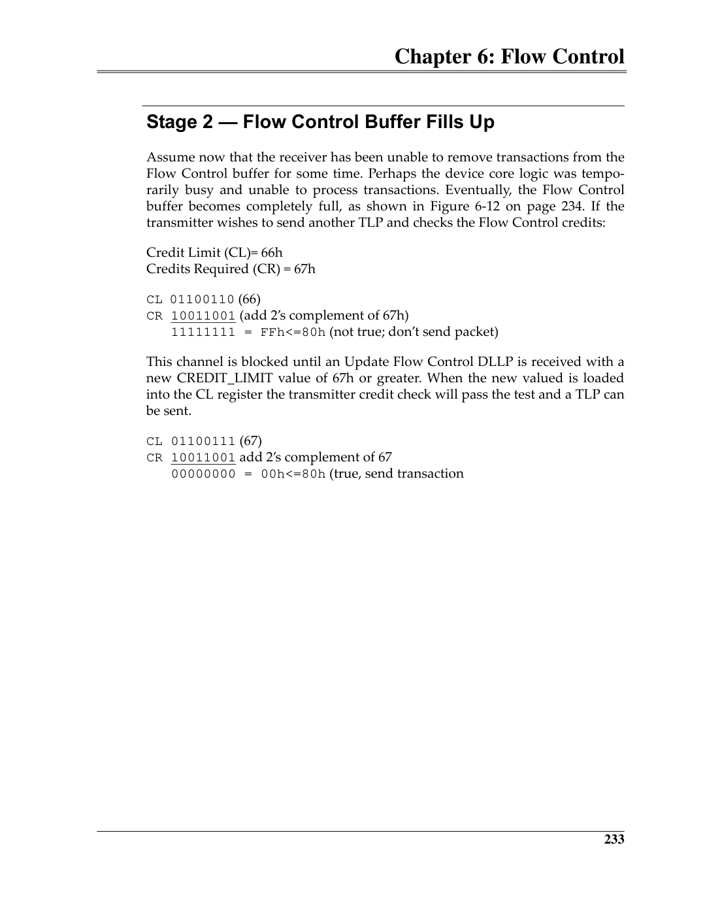</p>
<p align="center"><sub>📄 <a href="figures/chapter_06_Flow_Control/page/page0292.png">Page 292</a></sub></p>

<p align="center"><b>Figure 6‐10: Flow Control Elements Following Initialization</b></p>
<p align="center">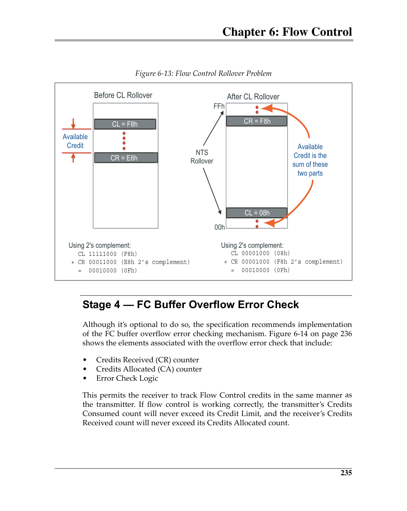</p>
<p align="center"><sub>📄 <a href="figures/chapter_06_Flow_Control/page/page0294.png">Page 294</a></sub></p>

<p align="center"><b>Figure 6‐11: Flow Control Elements After First TLP Sent</b></p>
<p align="center">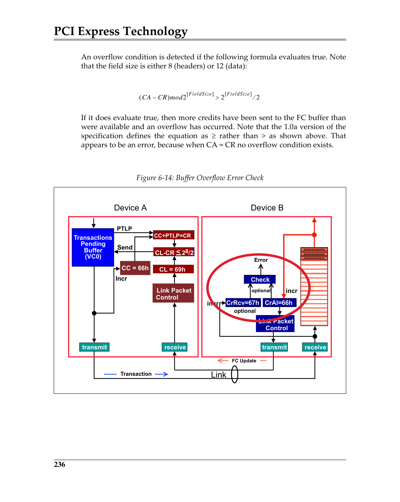</p>
<p align="center"><sub>📄 <a href="figures/chapter_06_Flow_Control/page/page0295.png">Page 295</a></sub></p>

<p align="center"><b>Figure 6‐12: Flow Control Elements with Flow Control Buffer Filled</b></p>
<p align="center">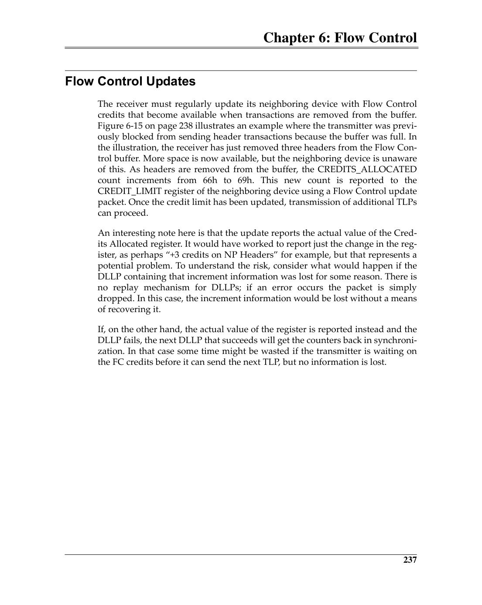</p>
<p align="center"><sub>📄 <a href="figures/chapter_06_Flow_Control/page/page0296.png">Page 296</a></sub></p>

<p align="center"><b>Figure 6‐13: Flow Control Rollover Problem</b></p>
<p align="center">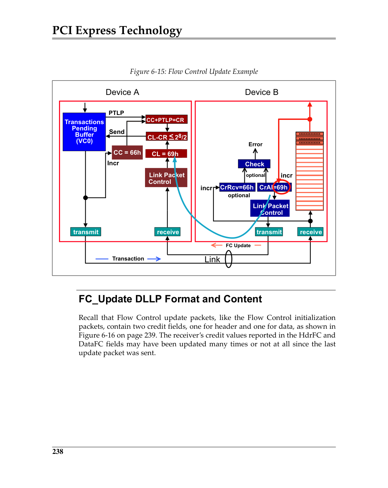</p>
<p align="center"><sub>📄 <a href="figures/chapter_06_Flow_Control/page/page0297.png">Page 297</a></sub></p>

<p align="center"><b>Figure 6‐14: Buffer Overflow Error Check</b></p>
<p align="center">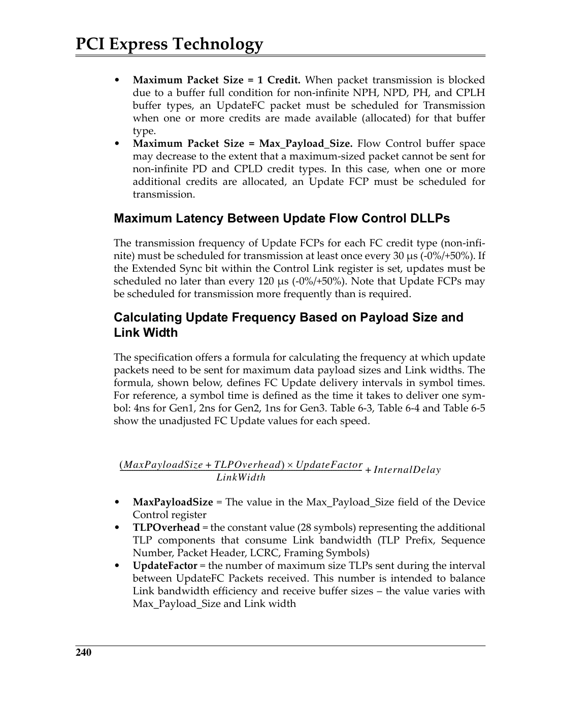</p>
<p align="center"><sub>📄 <a href="figures/chapter_06_Flow_Control/page/page0299.png">Page 299</a></sub></p>

<p align="center"><b>Figure 6‐15: Flow Control Update Example</b></p>
<p align="center">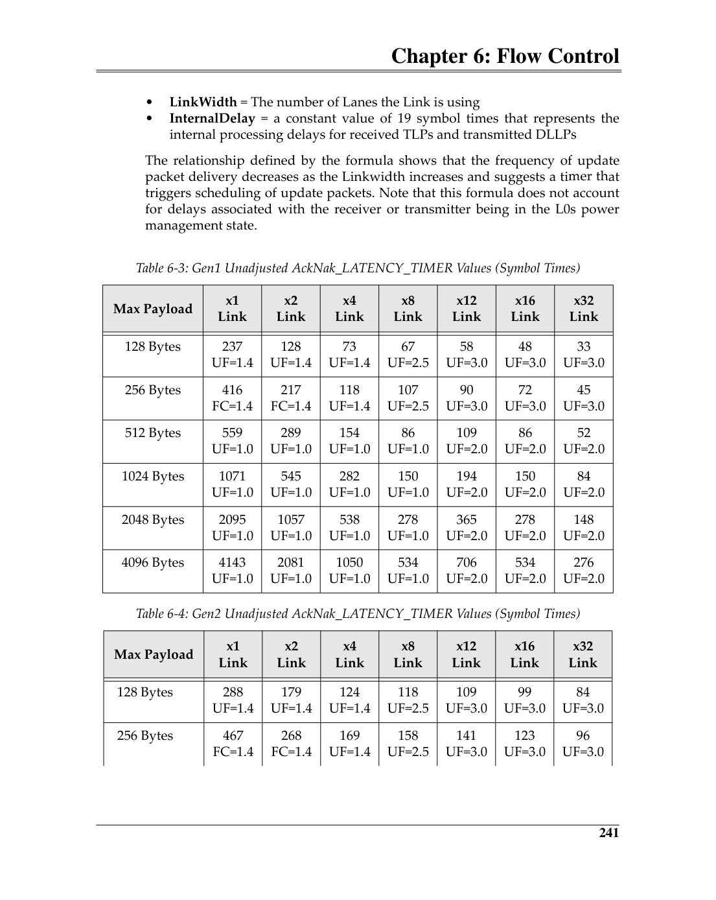</p>
<p align="center"><sub>📄 <a href="figures/chapter_06_Flow_Control/page/page0300.png">Page 300</a></sub></p>
[⬆️ 返回目录](#本章目录-table-of-contents)

---

<a id="sec-6-3"></a>
## 6.3 Flow Control | 流控

<p align="center"><b>Figure 6‐9: Types and Format of Flow Control DLLPs</b></p>
<p align="center">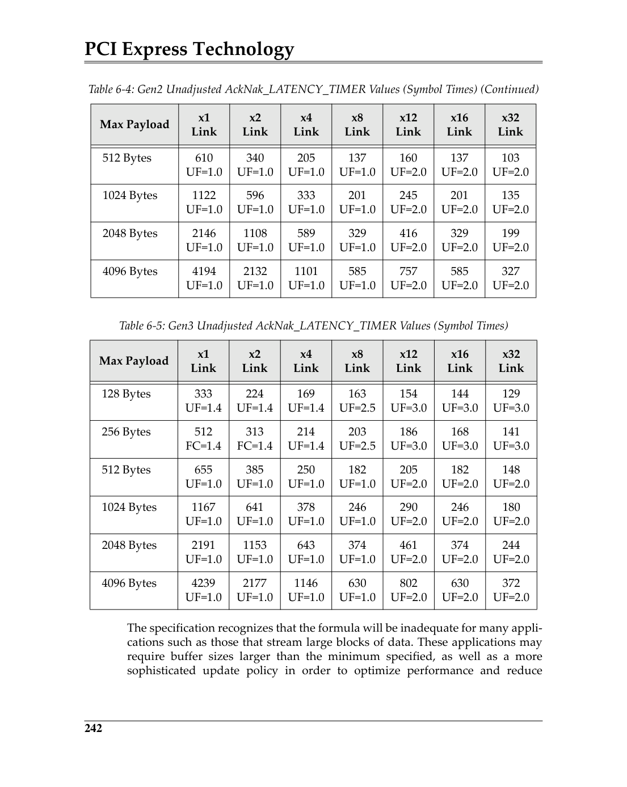</p>
<p align="center"><sub>📄 <a href="figures/chapter_06_Flow_Control/page/page0301.png">Page 0301</a></sub></p>

- **Credits Received counter (optional)** — 跟踪接收到 Flow Control 缓冲区的所有 TLP 的总信用数。当流控正常运行时，CREDITS_RECEIVED 计数应等于或小于 CREDIT_ALLOCATED
计数。如果此测试结果为 false，则表示发生了流控缓冲区溢出并检测到错误。规范建议实现此可选机制，并指出此处的失败将被视为致命错误。

## **Flow Control Example**
>
> 🇬🇧 The following example describes the non‐posted header Flow Control buffer, and attempts to capture the nuances of the flow control
> 🇬🇧 implementation in sev‐ eral situations. The discussion of Flow Control is described with a series of basic stages as follows:
>
> 🇬🇧 **Stage One** — Immediately following initialization a transaction is transmitted and tracked to explain the basic operation of the counters
> 🇬🇧 and registers.
>
> 🇬🇧 **Stage Two** — The transmitter sends transactions faster than the receiver can process them and the buffer becomes full.
>
> 🇬🇧 **Stage Three** — When counters roll over to zero, the mechanism still works but there are a couple of issues to consider.
>
> 🇬🇧 **Stage Four** — The optional receiver error check for a buffer overflow.

## **Flow Control Example**
>
> 🇨🇳 以下示例描述了 non‐posted header Flow Control 缓冲区，并试图在多种情况下捕获流控实现的细微差别。Flow Control 的讨论以一系列基本阶段描述如下：
>
> 🇨🇳 **Stage One** — 初始化后立即发送一个事务并进行跟踪，以解释计数器和寄存器的基本操作。
>
> 🇨🇳 **Stage Two** — 发送方比接收方处理事务的速度更快，缓冲区变满。
>
> 🇨🇳 **Stage Three** — 当计数器回绕到零时，机制仍然有效，但有几个问题需要考虑。
>
> 🇨🇳 **Stage Four** — 缓冲区溢出的可选接收方错误检查。


<p align="center"><b>Figure 6‐10: Flow Control Elements Following Initialization</b></p>
<p align="center">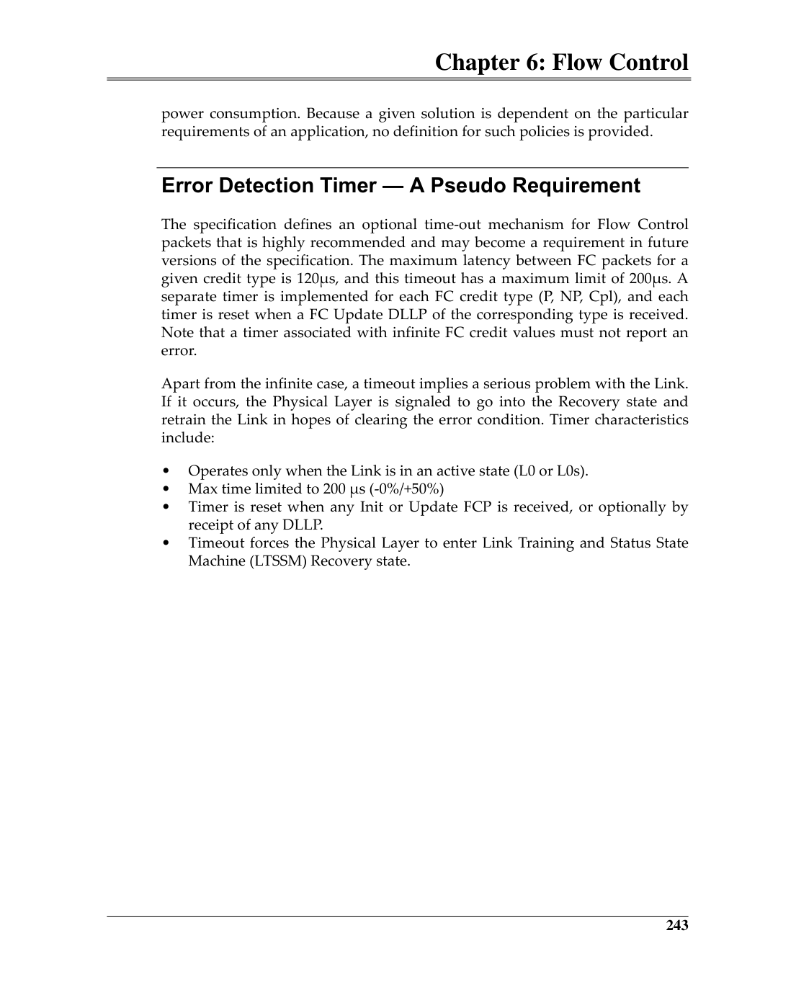</p>
<p align="center"><sub>📄 <a href="figures/chapter_06_Flow_Control/page/page0302.png">Page 0302</a></sub></p>


<p align="center"><b>Figure 6‐10: Flow Control Elements Following Initialization</b></p>
<p align="center"></p>
<p align="center"><sub>📄 <a href="figures/chapter_06_Flow_Control/page/page0303.png">Page 0303</a></sub></p>


<p align="center"><b>Figure 6‐10: Flow Control Elements Following Initialization</b></p>
<p align="center">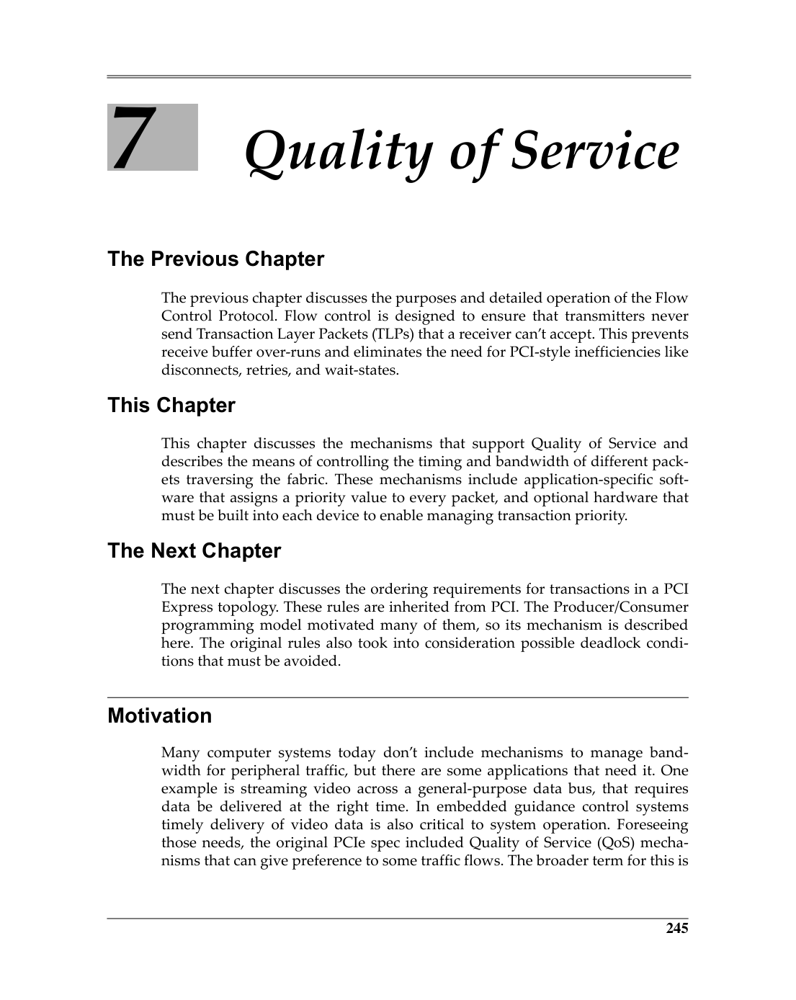</p>
<p align="center"><sub>📄 <a href="figures/chapter_06_Flow_Control/page/page0304.png">Page 0304</a></sub></p>


<p align="center"><b>Figure 6‐10: Flow Control Elements Following Initialization</b></p>
<p align="center"></p>
<p align="center"><sub>📄 <a href="figures/chapter_06_Flow_Control/page/page0280.png">Page 0280</a></sub></p>

## **Stage 1 — Flow Control Following Initialization**

一旦流控初始化完成，设备就准备好进行正常操作。在我们的示例中，Flow Control 缓冲区为 `2KB`。我们正在描述 non‐posted header 缓冲区，每个信用为 5 dwords 或 20 字节。这意味着有 102d (`66h`) 个 Flow Control
单位可用。第 231 页的图 6‐10 说明了所涉及的元素，包括流控初始化后每个计数器和寄存器中的值。

当发送方准备好发送 TLP 时，它必须首先检查 Flow Control 信用。我们的示例很简单，因为 non‐posted header 是唯一正在发送的包，它始终只需要一个 Flow Control 信用，并且我们还假设事务中不包含数据。

使用无符号算术（2 的补码）进行 header 信用检查，并且必须满足以下公式：

将图 6‐10 中的值代入：

66_h – (00_h + 01_h) _mod_ 2`[8]` ≤ 2`[8]` / 2 66_h – 01_h mod 256 ≤ 80_h

在这种情况下，将当前 CREDITS_CONSUMED 计数 (CC) 与 PTLP 所需信用相加，以确定 CREDITS_REQUIRED (CR)，即 `00h` + `01h` = `01h`。从 CREDIT_LIMIT 计数 (CL) 中减去 CREDITS_REQUIRED
计数以确定是否有足够的信用。

以下描述包含对 2 的补码减法的简要回顾。当使用 2 的补码执行减法时，要减去的数字被取反（1 的补码），然后加 1（2 的补码）。然后将此值添加到我们要从中减去的数字。由于加法而产生的任何进位都将被丢弃。

信用检查：

```
CL 01100110b (`66h`) - CR 00000001b (`01h`) = n
```

CR 转换为 2 的补码：

`00000001b` (CR) `11111110b` (CR 取反) `11111110b + 1 11111111b` (2 的补码)

将 2 的补码加到 CL 上：

```
01100110 (CL)
11111111(2 的补码 of CR)
01100101 = `65h` (carry bit is dropped)
```

结果是否 <= `80h`？是的。如果减法结果等于或小于最大值的一半（用 modulo 256 计数器跟踪为 128），那么我们知道接收方缓冲区中有足够的空间，可以发送此包。仅使用一半的计数器值的决定避免了潜在的计数别名问题。请参见第 234 页 "Stage 3 —
Counters Roll Over"。

## **Stage 2 — Flow Control Buffer Fills Up**
>
> 🇬🇧 Assume now that the receiver has been unable to remove transactions from the Flow Control buffer for some time. Perhaps the device core
> 🇬🇧 logic was tempo‐ rarily busy and unable to process transactions. Eventually, the Flow Control buffer becomes completely full, as shown in
> 🇬🇧 Figure 6‐12 on page 234. If the transmitter wishes to send another TLP and checks the Flow Control credits:
>
> 🇬🇧 Credit Limit (CL)= `66h` Credits Required (CR) = `67h`

## **Stage 2 — Flow Control Buffer Fills Up**
>
> 🇨🇳 假设现在接收方已经有一段时间无法从 Flow Control 缓冲区中移除事务。也许设备核心逻辑暂时忙碌，无法处理事务。最终，Flow Control 缓冲区变得完全填满，如第 234 页的图 6‐12 所示。如果发送方希望发送另一个 TLP 并检查 Flow Control
> 🇨🇳 信用：
>
> 🇨🇳 Credit Limit (CL)= `66h` Credits Required (CR) = `67h`


<p align="center"><b>Figure 6‐12: Flow Control Elements with Flow Control Buffer Filled</b></p>
<p align="center">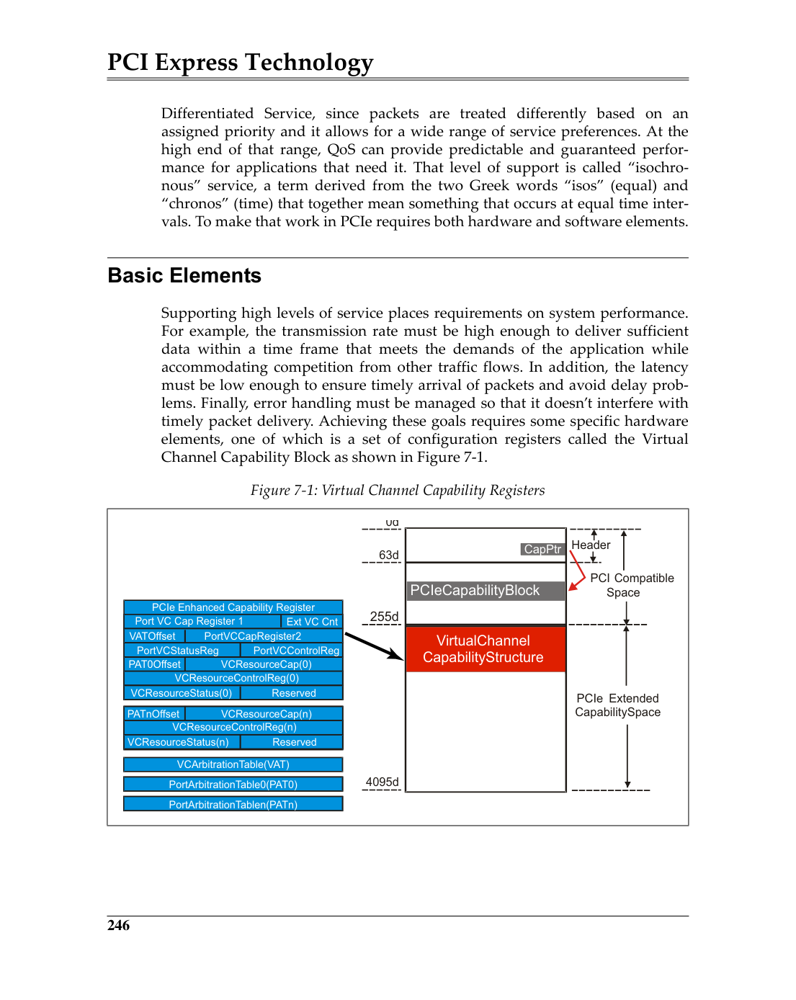</p>
<p align="center"><sub>📄 <a href="figures/chapter_06_Flow_Control/page/page0305.png">Page 0305</a></sub></p>

## `CL 01100110` (66)

`CR 10011001` (加 `67h` 的 2 的补码)

`11111111 = `FFh` <= 80h` (不正确；不发送包)

此通道被阻塞，直到收到具有 `67h` 或更大的新 CREDIT_LIMIT 值的 Update Flow Control DLLP。当新值被加载到 CL 寄存器中时，发送方信用检查将通过测试，并且可以发送 TLP。

- `CL 01100111` (67)

- `CR 10011001` 加 67 的 2 的补码

 - `00000000 = `00h` <= 80h` (true, send transaction

## **Stage 3 — Counters Roll Over**
>
> 🇬🇧 Since the Credit Limit (CL) and Credits Required (CR) counts only increment upward, they eventually roll over back to zero. When CL rolls
> 🇬🇧 over and CR has not, the credit check (CL‐CR) results in a small CL value and a large CR value. However, what might appear to be a problem
> 🇬🇧 is not when using unsigned arith‐ metic. As described in the previous examples the results are handled correctly when performing 2’s
> 🇬🇧 complement subtraction. Figure 6‐13 on page 235 shows the CL and CR counts before and after CL rollover along with the 2’s comple‐ ment
> 🇬🇧 results.

## **Stage 3 — Counters Roll Over**
>
> 🇨🇳 由于 Credit Limit (CL) 和 Credits Required (CR) 计数仅向上递增，它们最终会回绕到零。当 CL 回绕而 CR 没有回绕时，信用检查 (CL‐CR) 导致 CL 值较小而 CR
> 🇨🇳 值较大。然而，使用无符号算术时看似的问题实际上并不存在。如前所述的示例所示，在执行 2 的补码减法时，结果会被正确处理。第 235 页的图 6‐13 显示了 CL 回绕前后以及 2 的补码结果的 CL 和 CR 计数。


<p align="center"><b>Figure</b></p>
<p align="center"></p>
<p align="center"><sub>📄 <a href="figures/chapter_06_Flow_Control/page/page0276.png">Page 0276</a></sub></p>


<p align="center"><b>Figure</b></p>
<p align="center"></p>
<p align="center"><sub>📄 <a href="figures/chapter_06_Flow_Control/page/page0285.png">Page 0285</a></sub></p>

## ## **Stage 4 — FC Buffer Overflow Error Check**

虽然可以选择性地执行此操作，但规范建议实现 FC 缓冲区溢出错误检查机制。第 236 页的图 6‐14 显示了与溢出错误检查相关联的元素，包括：

- Credits Received (CR) counter

- Credits Allocated (CA) counter

- Error Check Logic

这允许接收方以与发送方相同的方式跟踪 Flow Control 信用。如果流控工作正常，发送方的 Credits Consumed 计数永远不会超过其 Credit Limit，接收方的 Credits Received 计数永远不会超过其 Credits Allocated
计数。

如果以下公式评估为 true，则检测到溢出情况。请注意，字段大小为 8（headers）或 12（data）：

如果它确实评估为 true，则表示发送到 FC 缓冲区的信用超过了可用信用，因此发生了溢出。请注意，规范的 1.0a 版本将等式定义为 ≥ 而不是如上所示的 >。这似乎是一个错误，因为当 CA = CR 时不存在溢出情况。


<p align="center"><b>Figure 6‐14: Buffer Overflow Error Check</b></p>
<p align="center"></p>
<p align="center"><sub>📄 <a href="figures/chapter_06_Flow_Control/page/page0277.png">Page 0277</a></sub></p>


<p align="center"><b>Figure 6‐14: Buffer Overflow Error Check</b></p>
<p align="center"></p>
<p align="center"><sub>📄 <a href="figures/chapter_06_Flow_Control/page/page0278.png">Page 0278</a></sub></p>

## **Flow Control Updates**

接收方必须定期使用在从事务中移除缓冲区时可用的 Flow Control 信用来更新其相邻设备。第 238 页的图 6‐15 说明了一个示例，其中发送方先前因为缓冲区已满而无法发送 header 事务。在图示中，接收方刚刚从 Flow Control 缓冲区中移除了三个
headers。现在有更多空间可用，但相邻设备不知道这一点。随着 headers 从缓冲区中移除，CREDITS_ALLOCATED 计数从 `66h` 增加到 `69h`。该新计数使用 Flow Control update 包报告给相邻设备的 CREDIT_LIMIT
寄存器。一旦更新了信用限制，就可以继续传输其他 TLP。

这里一个有趣的注意点是，update 报告了 Credits Allocated 寄存器的实际值。仅报告寄存器的变化也可以工作，例如"+3 credits on NP Headers"，但这代表了一个潜在问题。要了解此风险，请考虑如果包含增量信息的 DLLP
因某种原因丢失会发生什么情况。没有 DLLPs 的重传机制；如果发生错误，包将被简单丢弃。在这种情况下，增量信息将丢失而无法恢复。

另一方面，如果报告了寄存器的实际值并且 DLLP 失败，则下一个成功的 DLLP 将使计数器重新同步。在这种情况下，如果发送方正在等待 FC 信用才能发送下一个 TLP，则可能会浪费一些时间，但不会丢失任何信息。

## **Flow Control Updates**
>
> 🇬🇧 The receiver must regularly update its neighboring device with Flow Control credits that become available when transactions are removed from
> 🇬🇧 the buffer. Figure 6‐15 on page 238 illustrates an example where the transmitter was previ‐ ously blocked from sending header transactions
> 🇬🇧 because the buffer was full. In the illustration, the receiver has just removed three headers from the Flow Con‐ trol buffer. More space is
> 🇬🇧 now available, but the neighboring device is unaware of this. As headers are removed from the buffer, the CREDITS_ALLOCATED count increments
> 🇬🇧 from `66h` to `69h`. This new count is reported to the CREDIT_LIMIT register of the neighboring device using a Flow Control update packet. Once
> 🇬🇧 the credit limit has been updated, transmission of additional TLPs can proceed.
>
> 🇬🇧 An interesting note here is that the update reports the actual value of the Cred‐ its Allocated register. It would have worked to report
> 🇬🇧 just the change in the reg‐ ister, as perhaps “+3 credits on NP Headers” for example, but that represents a potential problem. To understand
> 🇬🇧 the risk, consider what would happen if the DLLP containing that increment information was lost for some reason. There is no replay
> 🇬🇧 mechanism for DLLPs; if an error occurs the packet is simply dropped. In this case, the increment information would be lost without a means
> 🇬🇧 of recovering it.
>
> 🇬🇧 If, on the other hand, the actual value of the register is reported instead and the DLLP fails, the next DLLP that succeeds will get the
> 🇬🇧 counters back in synchroni‐ zation. In that case some time might be wasted if the transmitter is waiting on the FC credits before it can
> 🇬🇧 send the next TLP, but no information is lost.
>
> 🇬🇧 _Figure 6‐15: Flow Control Update Example_

</tr><p align="center"><b>Figure 6‐9: Types and Format of Flow Control DLLPs</b></p>
<p align="center"></p>
<p align="center"><sub>📄 <a href="figures/chapter_06_Flow_Control/page/page0279.png">Page 279</a></sub></p>

<p align="center"><b>Figure 6‐10: Flow Control Elements Following Initialization</b></p>
<p align="center"></p>
<p align="center"><sub>📄 <a href="figures/chapter_06_Flow_Control/page/page0281.png">Page 281</a></sub></p>

<p align="center"><b>Figure 6‐11: Flow Control Elements After First TLP Sent</b></p>
<p align="center"></p>
<p align="center"><sub>📄 <a href="figures/chapter_06_Flow_Control/page/page0282.png">Page 282</a></sub></p>

<p align="center"><b>Figure 6‐12: Flow Control Elements with Flow Control Buffer Filled</b></p>
<p align="center"></p>
<p align="center"><sub>📄 <a href="figures/chapter_06_Flow_Control/page/page0283.png">Page 283</a></sub></p>

<p align="center"><b>Figure 6‐13: Flow Control Rollover Problem</b></p>
<p align="center">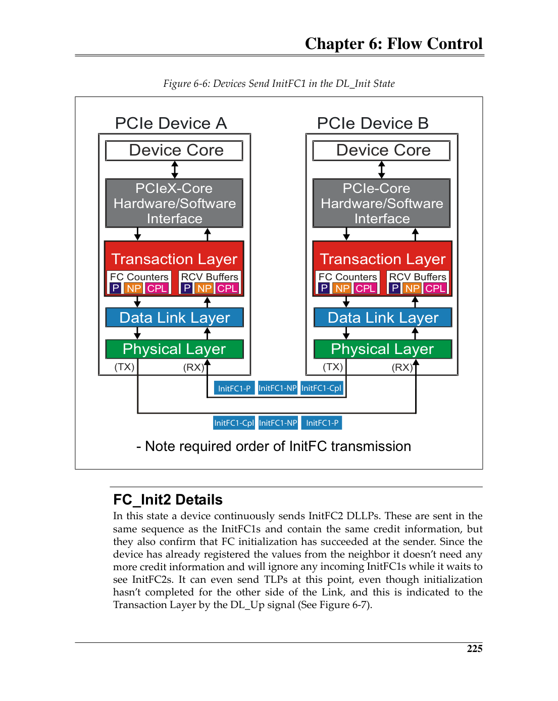</p>
<p align="center"><sub>📄 <a href="figures/chapter_06_Flow_Control/page/page0284.png">Page 284</a></sub></p>

<p align="center"><b>Figure 6‐14: Buffer Overflow Error Check</b></p>
<p align="center"></p>
<p align="center"><sub>📄 <a href="figures/chapter_06_Flow_Control/page/page0286.png">Page 286</a></sub></p>
[⬆️ 返回目录](#本章目录-table-of-contents)

---

<a id="sec-6-4"></a>

</td>
</tr>

<p align="center"><b>Figure</b></p>
<p align="center"></p>
<p align="center"><sub>📄 <a href="figures/chapter_06_Flow_Control/page/page0287.png">Page 0287</a></sub></p>

> 🇬🇧 |when the table has been loaded into the Arbiter.||||||||||||
> 🇬🇧 |Port VC Control Register<br>Port VC Status Register||||||||||||
> 🇬🇧 |15<br>15 1 0||||4||3 1||0||||
> 🇬🇧 |RsvdZ|RsvdP|||||||||||
> 🇬🇧 |VC Arbitration Select (000b-111b)||||||||||||
> 🇬🇧 |Load VC Arbitration<br>VC Arbitration Table Status||||Table||||||||
> 🇬🇧 **260**
> 🇬🇧 **Chapter 7: Quality of Service**

## **Port Arbitration**
## **FC_Update DLLP Format and Content**
>
> 🇬🇧 Recall that Flow Control update packets, like the Flow Control initialization packets, contain two credit fields, one for header and one for
> 🇬🇧 data, as shown in Figure 6‐16 on page 239. The receiver’s credit values reported in the HdrFC and DataFC fields may have been updated many
> 🇬🇧 times or not at all since the last update packet was sent.
>
> 🇬🇧 _Figure 6‐16: Update Flow Control Packet Format and Contents_

## **General**
> 🇨🇳 交换机端口和根端口通常会接收需要路由到另一个端口的传入包。由于来自多个端口的包都可以以同一传出端口中的同一 VC 为目标，因此需要仲裁来决定哪个传入端口的包获得对该 VC 的下一次访问。与 VC 仲裁一样，端口仲裁有多种可选方案可供配置软件选择。TC、VC
> 🇨🇳 和仲裁支持的组合支持一系列服务级别，分为两大类：
> 🇨🇳 **1. Asynchronous** —
> 🇨🇳 包获得"尽力而为"的服务，可能根本不会得到任何优先考虑。许多设备和应用（如大容量存储设备）对带宽或延迟没有严格的要求，不需要特殊的计时机制。另一方面，通过为不同的包建立流量类层次结构，由更高要求的应用生成的包仍然可以优先处理，无需太多麻烦。区分服务被认为是异步的，直到服务级别需要保证。自然，异步服务始终可用，不需要任何特殊的软件或硬件选项。
> 🇨🇳 **2. Isochronous** — 当需要延迟和带宽保证时，我们进入 isochronous 类别。当两个设备之间通常需要同步连接时，这将是有用的。例如，当耳机直接插入驱动器时，从音乐 CD 中获取数据的 CD‐ROM 使用同步连接。但是，当音频必须通过通用总线（如
> 🇨🇳 PCIe）路由才能到达外部扬声器时，该连接不能是同步的，因为其他流量也可能需要使用相同的数据流。为了实现等效的结果，isochronous 服务必须保证对时间敏感的音频数据的正确传递，而不会阻止其他流量在同一时间使用该链路。毫不奇怪，需要专门的软件和硬件来支持此功能。
> 🇨🇳 端口仲裁的概念如图 7‐14（第 262 页）所示。请注意，端口仲裁存在于系统中的多个位置：
> 🇨🇳 - 交换机的 Egress ports
> 🇨🇳 - 支持 peer‐to‐peer 事务时的根复合体端口
> 🇨🇳 - 通往主内存等目标的根复合体 egress ports
> 🇨🇳 **261**
> 🇨🇳 **PCI Express Technology**
> 🇨🇳 端口仲裁通常需要为交换机或根 egress port 支持的每个虚拟通道进行软件配置。在下面的示例中，根端口 2 支持来自根端口 1 和 2 的 peer‐to‐peer 传输，因此需要端口仲裁。但需要注意的是，根端口之间的 peer‐to‐peer
> 🇨🇳 支持是可选的，因此可能并非每个根 egress port 都需要端口仲裁。
> 🇨🇳 到系统内存的连接是一条有趣的路径。可能会有来自多个 ingress ports 的包同时尝试访问此端口，因此它需要支持端口仲裁。但是，它不使用 PCIe 端口，因此没有我们在此描述的支持仲裁的 PCIe 寄存器集。相反，根将需要提供一组称为根复合体寄存器块 (Root
> 🇨🇳 Complex Register Block, RCRB) 的供应商特定寄存器，以提供相同的功能。
> 🇨🇳 由于端口仲裁为 egress port 的每个 VC 独立管理，因此需要为每个支持可编程端口仲裁的 VC 提供单独的表，如第 263 页的图 7‐15 所示。端口仲裁表仅由交换机和根端口支持，端点中不允许。
> 🇨🇳 虽然规范中没有说明，但仲裁不同数据包流的过程还意味着使用额外的缓冲区来累积来自 egress port 中每个端口的流量，如图 7‐16（第 264 页）所示。本示例说明了两个 ingress ports（1 和 2），其事务被路由到 egress port
> 🇨🇳 (3)。交换机执行的操作包括以下内容：
>
> 🇨🇳 1. 到达 ingress ports 的包根据 TC/VC 映射被定向到适当的流控缓冲区 (VC)。
>
> 🇨🇳 2. 包从流控缓冲区转发到 routing logic，后者确定并将它们路由到适当的 egress port。
>
> 🇨🇳 3. 路由到 egress port (3) 的包使用 TC/VC 映射确定它们应放入哪个 VC 缓冲区。
>
> 🇨🇳 4. 一组缓冲区与每个 ingress port 相关联，允许 ingress port 编号被跟踪直到可以执行端口仲裁。
>
> 🇨🇳 5. Port arbitration logic 确定从事务每组 ingress buffers 发送的顺序。

</tr>
## **Flow Control Update Frequency**
>
> 🇬🇧 The specification defines a variety of rules and suggested implementations that govern when and how often Flow Control Update DLLPs should
> 🇬🇧 be sent. These are motivated by a desire to:
>
> 🇬🇧 - Notify the transmitting device as early as possible about new credits allo‐ cated, especially if any transactions were previously blocked.
>
> 🇬🇧 - Establish worst‐case latency between FC Packets.
>
> 🇬🇧 - Balance the requirements associated with flow control operation, such as: — the need to report credits often enough to prevent transaction
> 🇬🇧 blocking
>
> 🇬🇧 - — the desire to reduce the Link bandwidth needed for FC_Update DLLPs
>
> 🇬🇧 - — selecting the optimum buffer size
>
> 🇬🇧 - selecting the maximum data payload size
>
> 🇬🇧 - Detect violations of the maximum latency between Flow Control packets.
>
> 🇬🇧 Flow Control updates are permitted only when the Link is in the active state (L0 or L0s). All other Link states represent more aggressive
> 🇬🇧 power management that have longer recovery latencies.

## **Port Arbitration Mechanisms**
>
> 🇨🇳 定义的实际端口仲裁机制类似于用于 VC 仲裁的模型。配置软件通过读取第 265 页的图 7‐17 中所示的寄存器来确定端口的能力，并为每个 VC 选择要使用的端口仲裁方案。

## **Immediate Notification of Credits Allocated**
>
> 🇬🇧 When a Flow Control buffer is so full that maximum‐sized packets cannot be sent, the spec requires immediate delivery of a FC_Update DLLP
> 🇬🇧 when more space becomes available. Two cases exist:

## **Hardware-Fixed Arbitration**
>
> 🇨🇳 此机制不需要软件设置。一旦选择，它完全由硬件管理。实际的仲裁方案由硬件设计人员选择，可能基于设备的预期需求。这可能仅确保公平性或优化设计的某些方面，但它不支持区分或 isochronous 服务。

## **PCI Express Technology**
>
> 🇬🇧 - **Maximum Packet Size = 1 Credit.** When packet transmission is blocked due to a buffer full condition for non‐infinite NPH, NPD, PH, and
> 🇬🇧 CPLH buffer types, an UpdateFC packet must be scheduled for Transmission when one or more credits are made available (allocated) for that
> 🇬🇧 buffer type.
>
> 🇬🇧 - **Maximum Packet Size = Max_Payload_Size.** Flow Control buffer space may decrease to the extent that a maximum‐sized packet cannot be
> 🇬🇧 sent for non‐infinite PD and CPLD credit types. In this case, when one or more additional credits are allocated, an Update FCP must be
> 🇬🇧 scheduled for transmission.

## **Weighted Round Robin Arbitration**
>
> 🇨🇳 就像 VC 仲裁中的加权轮询机制一样，软件可以设置端口仲裁表，使某些端口比其他端口获得更多
>
> 🇨🇳 机会。此方法为来自不同端口的流量分配不同的权重。
>
> 🇨🇳 在扫描表时，每个 phase 指定从其接收下一个包的端口号。一旦包被传递，仲裁逻辑立即进入下一个 phase。如果所选端口没有挂起的事务等待传输，则仲裁器立即进入下一个 phase。这些条目没有关联的时间值。
>
> 🇨🇳 为 WRR 端口仲裁给出了四个表长度，由表使用的 phase 数决定。据推测，表中较多数量的条目允许仲裁选择的更有趣的比率。另一方面，较少的条目数将使用更少的存储空间并降低成本。

## **Maximum Latency Between Update Flow Control DLLPs**
>
> 🇬🇧 The transmission frequency of Update FCPs for each FC credit type (non‐infi‐ nite) must be scheduled for transmission at least once every 30
> 🇬🇧 μs (‐0%/+50%). If the Extended Sync bit within the Control Link register is set, updates must be scheduled no later than every 120 μs
> 🇬🇧 (‐0%/+50%). Note that Update FCPs may be scheduled for transmission more frequently than is required.

## **Time-Based, Weighted Round Robin Arbitration (TBWRR)**
>
> 🇨🇳 此机制是 isochronous 支持所必需的。顾名思义，基于时间的加权轮询为每个仲裁 phase 添加了时间元素。与 WRR 一样，端口仲裁器从当前 phase 的 Port Number 指示的 ingress port VC 缓冲区传递一个事务。现在，与立即进入下一个
> 🇨🇳 phase 不同的是，基于时间的仲裁器等待当前虚拟时隙结束后再前进。这确保了以规则的间隔从 ingress port
> 🇨🇳 缓冲区接受事务。如果所选端口没有准备好发送的包，则在下一个时隙之前不会发送任何内容。请注意，时隙不管理传输的持续时间，而是管理传输之间的间隔。事务的最长持续时间是完成轮询并返回原始时隙所花费的时间。时隙的长度将来可能会更改，但目前的值为 100ns。
>
> 🇨🇳 基于时间的 WRR 仲裁支持最大表长度为 128 phase，但给定 VC 的实际可用表条目数可能少于该值。该值由硬件初始化，并在每个支持 TBWRR 的虚拟通道的 _Maximum Time Slots_ 字段中报告，如图 7‐18（第 267 页）所示。

## **Calculating Update Frequency Based on Payload Size and Link Width**
>
> 🇬🇧 The specification offers a formula for calculating the frequency at which update packets need to be sent for maximum data payload sizes and
> 🇬🇧 Link widths. The formula, shown below, defines FC Update delivery intervals in symbol times. For reference, a symbol time is defined as the
> 🇬🇧 time it takes to deliver one sym‐ bol: 4ns for Gen1, 2ns for Gen2, 1ns for Gen3. Table 6‐3, Table 6‐4 and Table 6‐5 show the unadjusted FC
> 🇬🇧 Update values for each speed.
>
> 🇬🇧 ---------------------------------------------------------------------------------------------------------------------------------------
> 🇬🇧 _MaxPayloadSize_ + _TLPOverhead_   _UpdateFactor_ **-** + _InternalDelay LinkWidth_ • **MaxPayloadSize** = The value in the
> 🇬🇧 Max_Payload_Size field of the Device Control register
>
> 🇬🇧 - **TLPOverhead** = the constant value (28 symbols) representing the additional TLP components that consume Link bandwidth (TLP Prefix,
> 🇬🇧 Sequence Number, Packet Header, LCRC, Framing Symbols)
>
> 🇬🇧 - **UpdateFactor** = the number of maximum size TLPs sent during the interval between UpdateFC Packets received. This number is intended to
> 🇬🇧 balance Link bandwidth efficiency and receive buffer sizes – the value varies with Max_Payload_Size and Link width
>
> 🇬🇧 - **LinkWidth** = The number of Lanes the Link is using
>
> 🇬🇧 - **InternalDelay** = a constant value of 19 symbol times that represents the internal processing delays for received TLPs and transmitted
> 🇬🇧 DLLPs
>
> 🇬🇧 The relationship defined by the formula shows that the frequency of update packet delivery decreases as the Linkwidth increases and suggests
> 🇬🇧 a timer that triggers scheduling of update packets. Note that this formula does not account for delays associated with the receiver or
> 🇬🇧 transmitter being in the L0s power management state.
>
> 🇬🇧 _Table 6‐3: Gen1 Unadjusted AckNak_LATENCY_TIMER Values (Symbol Times)_
>
> 🇬🇧 |**Max
> 🇬🇧 Payload**|**x1**|**x2**|**x4**|**x8**|**x12**|**x16**|**x32**|
> 🇬🇧 |---|---|---|---|---|---|---|---|
> 🇬🇧 |128 Bytes|237 UF=1.4|128 UF=1.4|73 UF=1.4|67 UF=2.5|58 UF=3.0|48 UF=3.0|33 UF=3.0|
> 🇬🇧 |256 Bytes|416 FC=1.4|217 FC=1.4|118 UF=1.4|107 UF=2.5|90 UF=3.0|72 UF=3.0|45 UF=3.0|
> 🇬🇧 |512 Bytes|559 UF=1.0|289 UF=1.0|154 UF=1.0|86 UF=1.0|109 UF=2.0|86 UF=2.0|52 UF=2.0|
> 🇬🇧 |1024 Bytes|1071 UF=1.0|545 UF=1.0|282 UF=1.0|150 UF=1.0|194 UF=2.0|150 UF=2.0|84 UF=2.0|
> 🇬🇧 |2048 Bytes|2095 UF=1.0|1057 UF=1.0|538 UF=1.0|278 UF=1.0|365 UF=2.0|278 UF=2.0|148 UF=2.0|
> 🇬🇧 |4096 Bytes|4143 UF=1.0|2081 UF=1.0|1050 UF=1.0|534 UF=1.0|706 UF=2.0|534 UF=2.0|276 UF=2.0|
>
>
> 🇬🇧 _Table 6‐4: Gen2 Unadjusted AckNak_LATENCY_TIMER Values (Symbol Times)_
>
> 🇬🇧 |**Max
> 🇬🇧 Payload**|**x1**|**x2**|**x4**|**x8**|**x12**|**x16**|**x32**|
> 🇬🇧 |---|---|---|---|---|---|---|---|
> 🇬🇧 |128 Bytes|288 UF=1.4|179 UF=1.4|124 UF=1.4|118 UF=2.5|109 UF=3.0|99 UF=3.0|84 UF=3.0|
> 🇬🇧 |256 Bytes|467 FC=1.4|268 FC=1.4|169 UF=1.4|158 UF=2.5|141 UF=3.0|123 UF=3.0|96 UF=3.0|

## **Loading the Port Arbitration Tables**
>
> 🇨🇳 Port Arbitration Tables 的实际大小和格式是 phase 数量和支持 peer‐to‐peer 传输的 Switch、RCRB 或 Root Port 的 ingress ports 数量的函数。Port Arbitration Table 支持的最大
> 🇨🇳 ingress ports 数为 256 个。每个表条目中的实际位数是设计相关的，由其事务可以传递到 egress port 的 ingress ports 数量控制。每个表条目的大小在 Port VC Capability Register 1 的 2 位 _Port
> 🇨🇳 Arbitration Table Entry Size_ 字段中报告。允许的值为：
>
> 🇨🇳 - 00b — 1 位（在 2 个端口之间选择）
>
> 🇨🇳 - 01b — 2 位（4 个端口）

## **PCI Express Technology**
>
> 🇬🇧 _Table 6‐4: Gen2 Unadjusted AckNak_LATENCY_TIMER Values (Symbol Times) (Continued)_
>
> 🇬🇧 |**Max
> 🇬🇧 Payload**|**x1**|**x2**|**x4**|**x8**|**x12**|**x16**|**x32**|
> 🇬🇧 |---|---|---|---|---|---|---|---|
> 🇬🇧 |512 Bytes|610 UF=1.0|340 UF=1.0|205 UF=1.0|137 UF=1.0|160 UF=2.0|137 UF=2.0|103 UF=2.0|
> 🇬🇧 |1024 Bytes|1122 UF=1.0|596 UF=1.0|333 UF=1.0|201 UF=1.0|245 UF=2.0|201 UF=2.0|135 UF=2.0|
> 🇬🇧 |2048 Bytes|2146 UF=1.0|1108 UF=1.0|589 UF=1.0|329 UF=1.0|416 UF=2.0|329 UF=2.0|199 UF=2.0|
> 🇬🇧 |4096 Bytes|4194 UF=1.0|2132 UF=1.0|1101 UF=1.0|585 UF=1.0|757 UF=2.0|585 UF=2.0|327 UF=2.0|
>
>
> 🇬🇧 _Table 6‐5: Gen3 Unadjusted AckNak_LATENCY_TIMER Values (Symbol Times)_
>
> 🇬🇧 |**Max
> 🇬🇧 Payload**|**x1**|**x2**|**x4**|**x8**|**x12**|**x16**|**x32**|
> 🇬🇧 |---|---|---|---|---|---|---|---|
> 🇬🇧 |128 Bytes|333 UF=1.4|224 UF=1.4|169 UF=1.4|163 UF=2.5|154 UF=3.0|144 UF=3.0|129 UF=3.0|
> 🇬🇧 |256 Bytes|512 FC=1.4|313 FC=1.4|214 UF=1.4|203 UF=2.5|186 UF=3.0|168 UF=3.0|141 UF=3.0|
> 🇬🇧 |512 Bytes|655 UF=1.0|385 UF=1.0|250 UF=1.0|182 UF=1.0|205 UF=2.0|182 UF=2.0|148 UF=2.0|
> 🇬🇧 |1024 Bytes|1167 UF=1.0|641 UF=1.0|378 UF=1.0|246 UF=1.0|290 UF=2.0|246 UF=2.0|180 UF=2.0|
> 🇬🇧 |2048 Bytes|2191 UF=1.0|1153 UF=1.0|643 UF=1.0|374 UF=1.0|461 UF=2.0|374 UF=2.0|244 UF=2.0|
> 🇬🇧 |4096 Bytes|4239 UF=1.0|2177 UF=1.0|1146 UF=1.0|630 UF=1.0|802 UF=2.0|630 UF=2.0|372 UF=2.0|
>
>
> 🇬🇧 The specification recognizes that the formula will be inadequate for many appli‐ cations such as those that stream large blocks of data.
> 🇬🇧 These applications may require buffer sizes larger than the minimum specified, as well as a more sophisticated update policy in order to
> 🇬🇧 optimize performance and reduce
>
> 🇬🇧 power consumption. Because a given solution is dependent on the particular requirements of an application, no definition for such policies
> 🇬🇧 is provided.

## **Switch Arbitration Example**
>
> 🇨🇳 让我们考虑一个三端口交换机的示例来说明 Port 和 VC 仲裁。该示例假定到达 ingress ports 0 和 1 的包正在向上游方向移动，端口 2 是面向上游的 egress port（朝向根复合体）。在以下讨论中请参考第 270 页的图 7‐20。
>
> 🇨🇳 1. 到达 ingress port 0 的包根据端口 0 的 TC/VC 映射放入接收器 VC 中。如图所示，traffic class 为 TC0 或 TC1 的 TLP 被发送到 `VC0` 缓冲区。traffic class 为 TC3 或 TC5 的 TLP 被发送到
> 🇨🇳 `VC1` 缓冲区。此链路上不允许使用其他 TC。顺便说一句，如果到达的包具有未映射到现有 VC 的 TC，它将被视为错误。
>
> 🇨🇳 2. 到达 ingress port 1 的包也根据 TC/VC 映射放入 VC 中，但对于此端口它是不同的。如所示，traffic class 为 TC0 的 TLP 被发送到 `VC0`，而 traffic class 为 TC2‐TC4 的 TLP 被发送到
> 🇨🇳 `VC3`。此链路上不允许使用其他 TC。
>
> 🇨🇳 3. 在两个端口中，目标 egress port 由每个包中的 routing information 确定。例如，地址路由用于内存或 IO 请求 TLP。
>
> 🇨🇳 4. 所有注定要到达 egress port 2 的包都将被提交给该端口的 TC/VC 映射逻辑。如图所示，traffic class 为 TC0‐TC2 的 TLP 被放入带有其 ingress port 编号标记的 `VC0` 缓冲区，而 traffic class 为
> 🇨🇳 TC3‐TC7 的 TLP 被管理为 `VC1`。
>
> 🇨🇳 5. Port Arbitration 独立应用于排队的包，以决定哪个端口的包将接下来被加载到真正的 VC 中。
>
> 🇨🇳 6. 最后，VC arbitration 确定 VC 缓冲区中的事务将跨链路发送的顺序。
>
> 🇨🇳 7. 请注意，VC 仲裁器仅在存在足够的流控信用时才选择要传输的包。

## **Error Detection Timer — A Pseudo Requirement**
>
> 🇬🇧 The specification defines an optional time‐out mechanism for Flow Control packets that is highly recommended and may become a requirement in
> 🇬🇧 future versions of the specification. The maximum latency between FC packets for a given credit type is 120μs, and this timeout has a
> 🇬🇧 maximum limit of 200μs. A separate timer is implemented for each FC credit type (P, NP, Cpl), and each timer is reset when a FC Update DLLP
> 🇬🇧 of the corresponding type is received. Note that a timer associated with infinite FC credit values must not report an error.
>
> 🇬🇧 Apart from the infinite case, a timeout implies a serious problem with the Link. If it occurs, the Physical Layer is signaled to go into the
> 🇬🇧 Recovery state and retrain the Link in hopes of clearing the error condition. Timer characteristics include:
>
> 🇬🇧 - Operates only when the Link is in an active state (L0 or L0s).
>
> 🇬🇧 - Max time limited to 200 μs (‐0%/+50%)
>
> 🇬🇧 - Timer is reset when any Init or Update FCP is received, or optionally by receipt of any DLLP.
>
> 🇬🇧 - Timeout forces the Physical Layer to enter Link Training and Status State Machine (LTSSM) Recovery state.
>
> 🇬🇧 **244**
>
> 🇬🇧 _**7**_

## **Arbitration in Multi-Function Endpoints**
>
> 🇨🇳 为将在多 function 设备中实现 QoS 的端点的具体情况定义了一组称为 Multi‐Function Virtual Channel (MFVC) capability 的寄存器。毫不奇怪，这种情况在内部呈现了与交换机端口必须处理的相同的仲裁问题。
>
> 🇨🇳 规范中为此仲裁描述了两种情况。在第一种情况下（如图 7‐21（第 271 页）所示），有两个 Function，但只有 Function 0 包括 VC Capability registers，在那里进行的分配对于所有 Function 隐式相同。对于此选项，Function
> 🇨🇳 之间的仲裁将以某种供应商特定的方式处理。这是最简单的方法，但不包含用于定义来自不同 Function 的请求之间优先级的标准结构，因此不支持 QoS。
> 🇨🇳 如果需要 QoS 支持，则在 `VC0` 中实现 MFVC，每个 function 都有自己唯一的 VC Capability registers 集。为了保持软件向后兼容性，规范规定 _不_ 使用 MFVC 的设备的 VC Capability ID 必须为 `0002h`，而
> 🇨🇳 _实现_ MFVC 结构的设备的 VC Capability ID 必须为 `0009h`。
>
> 🇨🇳 图 7‐22（第 272 页）显示了 MFVC 寄存器块以及端点中具有两个 function 的示例的框图，该端点的端口支持两个 VC。每个 function 都有一个 Transaction Layer 和自己的 VC Capability
> 🇨🇳 registers，但不实现较低的层。相反，它们连接到共享端口的 Transaction Layer，该端口确实具有所有层。共享硬件接口自然会导致较低的成本，而添加 MFVC 允许 function 处理 isochronous 流量。
>
> 🇨🇳 如图所示，MFVC registers 仅驻留在 Function 0 中，并定义将用于此接口的 VC 和仲裁方法。MFVC registers 看起来与 VC capability registers 非常相似，并支持 VC 仲裁和 Function 仲裁。由于来自多个
> 🇨🇳 function 的包可以同时尝试访问同一 VC，因此 Function Arbitration 决定它们之间的优先级。到现在为止，这应该看起来很熟悉，因为它与端口仲裁的概念相同，甚至使用相同的仲裁选项，包括 TBWRR。VC 仲裁选项也与单 function VC
> 🇨🇳 registers 中的相同。

> 🇬🇧 ## _**Quality of Service**_

## **Isochronous Support**
>
> 🇨🇳 如前所述，并非每台机器或应用程序都需要 isochronous 支持，但有些不能没有它。由于 PCIe 从一开始就设计为支持它，让我们考虑一下需要具备什么才能使其工作。

## **The Previous Chapter**
>
> 🇬🇧 The previous chapter discusses the purposes and detailed operation of the Flow Control Protocol. Flow control is designed to ensure that
> 🇬🇧 transmitters never send Transaction Layer Packets (TLPs) that a receiver can’t accept. This prevents receive buffer over‐runs and eliminates
> 🇬🇧 the need for PCI‐style inefficiencies like disconnects, retries, and wait‐states.

## **Timing is Everything**
>
> 🇨🇳 考虑第 274 页图 7‐23 中所示的示例，在该示例中，同步连接是理想的但又是不可能的。相反，我们使用 isochronous 机制模拟同步路径。在此示例中，isochrony 定义将在每个 Service Interval
> 🇨🇳 内传递的数据量以实现所需的服务。以下序列描述了该操作：
>
> 🇨🇳 1. 同步源（视频摄像头和 PCI Express 接口）在第一个相等的 service interval（SI 1）期间在 Buffer A 中累积数据。
>
> 🇨🇳 2. 摄像头在下一个 service interval (SI 2) 期间通过通用总线传递所有累积的数据，同时在 Buffer B 中累积下一个数据块。
>
> 🇨🇳 - 显然，系统必须能够保证在 service interval 期间传递 Buffer A
> 🇨🇳 的全部内容，无论链路上是否还有其他流量。这是通过为时间敏感的包分配高优先级并对仲裁方案进行编程，以便在与其他流量竞争时它们将首先处理来实现的。还要注意，只要所有数据都在时间窗口内传递，就不必精确地知道它何时到达。它可能分散在间隔内或聚集在间隔内的一个位置。只要在 Service
> 🇨🇳 Interval 内全部传递，仍然可以满足保证。
>
> 🇨🇳 3. 在 SI 2 期间，磁带接收器接收并缓冲传入的数据，然后可以在 SI 3 期间将数据传送到存储器进行记录。摄像头在 SI 3 期间将 Buffer B 卸载到链路上，同时将新数据累积到 Buffer A 中，循环重复。
>
## **How Timing is Defined**
## **This Chapter**
>
> 🇬🇧 This chapter discusses the mechanisms that support Quality of Service and describes the means of controlling the timing and bandwidth of
> 🇬🇧 different packets traversing the fabric. These mechanisms include application‐specific soft‐ ware that assigns a priority value to every
> 🇬🇧 packet, and optional hardware that must be built into each device to enable managing transaction priority.

## **The Next Chapter**
>
> 🇨🇳 The next chapter discusses the ordering requirements for transactions in a PCI Express topology. These rules are inherited from PCI. The
> 🇨🇳 Producer/Consumer programming model motivated many of them, so its mechanism is described here. The original rules also took into
> 🇨🇳 consideration possible deadlock condi‐ tions that must be avoided.

</tr><p align="center"><b>Figure 7‐14: Port Arbitration Concept</b></p>
<p align="center"></p>
<p align="center"><sub>📄 <a href="figures/chapter_06_Flow_Control/page/page0288.png">Page 288</a></sub></p>

<p align="center"><b>Figure 7‐15: Port Arbitration Tables for `Each` VC</b></p>
<p align="center"></p>
<p align="center"><sub>📄 <a href="figures/chapter_06_Flow_Control/page/page0289.png">Page 289</a></sub></p>

<p align="center"><b>Figure 7‐16: Port Arbitration Buffering</b></p>
<p align="center"></p>
<p align="center"><sub>📄 <a href="figures/chapter_06_Flow_Control/page/page0290.png">Page 290</a></sub></p>

<p align="center"><b>Figure 7‐17: Software Selects Port Arbitration Scheme</b></p>
<p align="center"></p>
<p align="center"><sub>📄 <a href="figures/chapter_06_Flow_Control/page/page0291.png">Page 291</a></sub></p>

<p align="center"><b>Figure 7‐18: Maximum Time Slots Register</b></p>
<p align="center"></p>
<p align="center"><sub>📄 <a href="figures/chapter_06_Flow_Control/page/page0292.png">Page 292</a></sub></p>

<p align="center"><b>Figure 7‐19: Format of Port Arbitration Tables</b></p>
<p align="center"></p>
<p align="center"><sub>📄 <a href="figures/chapter_06_Flow_Control/page/page0293.png">Page 293</a></sub></p>

<p align="center"><b>Figure 7‐20: Arbitration Examples in a Switch</b></p>
<p align="center"></p>
<p align="center"><sub>📄 <a href="figures/chapter_06_Flow_Control/page/page0294.png">Page 294</a></sub></p>

<p align="center"><b>Figure 7‐21: Simple Multi‐Function Arbitration</b></p>
<p align="center"></p>
<p align="center"><sub>📄 <a href="figures/chapter_06_Flow_Control/page/page0295.png">Page 295</a></sub></p>

<p align="center"><b>Figure 7‐22: QoS Support in Multi‐Function Arbitration</b></p>
<p align="center"></p>
<p align="center"><sub>📄 <a href="figures/chapter_06_Flow_Control/page/page0296.png">Page 296</a></sub></p>

<p align="center"><b>Figure 7‐23: Example Application of Isochronous Transaction</b></p>
<p align="center"></p>
<p align="center"><sub>📄 <a href="figures/chapter_06_Flow_Control/page/page0297.png">Page 297</a></sub></p>
[⬆️ 返回目录](#本章目录-table-of-contents)

---
<a id="sec-6-5"></a>

</td>
</tr>
## **Motivation**
>
> 🇬🇧 Many computer systems today don’t include mechanisms to manage band‐ width for peripheral traffic, but there are some applications that need
> 🇬🇧 it. One example is streaming video across a general‐purpose data bus, that requires data be delivered at the right time. In embedded
> 🇬🇧 guidance control systems timely delivery of video data is also critical to system operation. Foreseeing those needs, the original PCIe spec
> 🇬🇧 included Quality of Service (QoS) mecha‐ nisms that can give preference to some traffic flows. The broader term for this is

> 🇬🇧 Differentiated Service, since packets are treated differently based on an assigned priority and it allows for a wide range of service
> 🇬🇧 preferences. At the high end of that range, QoS can provide predictable and guaranteed perfor‐ mance for applications that need it. That
> 🇬🇧 level of support is called “isochro‐ nous” service, a term derived from the two Greek words “isos” (equal) and “chronos” (time) that
> 🇬🇧 together mean something that occurs at equal time inter‐ vals. To make that work in PCIe requires both hardware and software elements.

> 🇬🇧 Isochronous timing 在 PCIe 中由 Time‐Based Weighted Round Robin 端口仲裁方案中使用的时隙定义。目前，每个时隙的时间为 100ns，并表示 TBWRR 表中 128 个条目之一的一个条目。设置后，仲裁器将每 12.8μs
> 🇬🇧 重复循环此表一次，这表示整个 Service Interval。
>
> 🇬🇧 使 isochronous path 按预期工作需要一些考虑。首先，必须以可预测的时序在规则的时间间隔传递数据包。其次，必须提前知道要传递的最大 isochronous 数据量，并且不允许包超过该限制。第三，链路带宽必须足以支持在给定时间片中传递的数据量。
> 🇬🇧 考虑以下示例。以 2.5 Gbps 运行的单 Lane 链路每 4ns 传递一个 symbol。这允许它在 100ns 时隙内发送 25 个 symbol，但这是否足以使用？在许多情况下不是，因为 TLP 可能需要 28 字节的开销用于 header、sequence
> 🇬🇧 number、LCRC 等的组合。这意味着在 100ns 内甚至没有时间完成发送开销，更不用说任何数据负载了。如果我们需要发送 128 字节的数据，则带宽要求为 128+overhead = 156 字节。解决此问题的一种选择是将链路宽度增加到 8 个
> 🇬🇧 Lanes，从而允许一次发送八倍的字节数。此更改将在 100ns 内传递 200 字节，并允许单个时隙传递所有 isochronous 数据。另一种解决方案是使用单 Lane 但为端口提供更多时隙，因为在较低链路宽度下 8
> 🇬🇧 个时隙将传递相同数量的数据。解决方案的选择取决于成本和性能约束，但系统设计人员必须知道 isochronous path 的时序和带宽要求，才能正确设置它。

## **How Timing is Enforced**
>
> 🇨🇳 当 timing 是设计正常操作不可或缺的一部分时（如上例所示），它是通过我们到目前为止讨论的内容的组合来强制执行的。首先，必须在软件中选择高优先级 TC，并在硬件中设置 VC，定义它们之间的映射，以便只有正确的包才会被放入高优先级
> 🇨🇳 VC。然后，所需的时序是编程仲裁方案以在指定的时间内容纳所需带宽的问题。例如，VC 仲裁的选择可能是 Strict Priority 选项，因为它是唯一可以确保高优先级包不会被其他包延迟的选择。对于 Port 仲裁，选择必须是 TBWRR 以强制执行时序。


<p align="center"><b>Figure 7‐1: Virtual Channel Capability Registers</b></p>
<p align="center"></p>
<p align="center"><sub>📄 <a href="figures/chapter_06_Flow_Control/page/page0298.png">Page 0298</a></sub></p>

</tr>

<p align="center"><b>Figure 7‐2: Traffic Class Field in TLP Header</b></p>
<p align="center"></p>
<p align="center"><sub>📄 <a href="figures/chapter_06_Flow_Control/page/page0299.png">Page 0299</a></sub></p>

## **Software Support**

支持 isochronous 服务需要系统中软件元素之间的一些协调。在 PC 系统中，设备驱动程序将向 OS 报告 isochronous 要求和功能，然后 OS
将评估整个系统需求并适当地分配资源。嵌入式系统会有所不同，因为所有部件从一开始就是已知的，并且软件可以更简单。在下面的讨论中，我们将描述 PC 的情况，因为嵌入式系统应该是该情况的一个更简单的子集。

## **Virtual Channels (VCs)**
>
> 🇬🇧 VCs are hardware buffers that act as queues for outgoing packets. `Each` port must include the default `VC0`, but may have as many as eight
> 🇬🇧 (from `VC0` to `VC7`). `Each` channel represents a different path available for outgoing packets.
>
> 🇬🇧 The motivation for multiple paths is analogous to that of a toll road in which drivers purchase a radio tag that lets them take one of
> 🇬🇧 several high priority lanes at the toll booth. Those who don’t purchase a tag can still use the road but they’ll have to stop at the booth
> 🇬🇧 and pay cash each time they go through, and that takes longer. If there was only one path, everyone’s access time would be limited by the
> 🇬🇧 slowest driver, but having multiple paths available means that those who have priority are not delayed by those who don’t.

## **Device Drivers**
>
> 🇨🇳 设备驱动程序必须能够将其时序要求报告给监督 isochronous 操作的软件，并在尝试使用 isochronous
> 🇨🇳 包之前获得许可。重要的是要注意，驱动程序级软件不应自行直接更改硬件分配或仲裁策略，即使它可以，因为结果将是混乱的。如果多个驱动程序各自独立地尝试执行此操作，则最后一个进行更改的驱动程序将覆盖以前的任何分配。为避免这种情况，称为 Isochronous Broker 的 OS
> 🇨🇳 级程序接收来自系统设备的时序请求，并以适应它们所有的方式协调地分配系统资源。


<p align="center"><b>Figure 7‐3: TC to VC Mapping Example</b></p>
<p align="center"></p>
<p align="center"><sub>📄 <a href="figures/chapter_06_Flow_Control/page/page0300.png">Page 0300</a></sub></p>

## **Isochronous Broker**

该程序管理 isochronous 包的端到端流。它从设备驱动程序接收 isochronous 时序请求，并以一种通过目标路径适应请求的方式分配系统资源。在规范中，这被称为在 requester/completer 对和 PCIe fabric 之间建立 isochronous
contract。这样做需要验证预期路径确实可以支持 isochronous 流量，然后对适当的仲裁方案进行编程以确保它在指定的时序要求内工作。

## **Determining the Number of VCs to be Used**
>
> 🇬🇧 Software checks the number of VCs supported by the devices attached to a com‐ mon link and would usually assign the greatest number of VCs
> 🇬🇧 that both devices can support. Consider the example topology in Figure 7‐4 on page 250.

## **Bringing it all together**
>
> 🇨🇳 到目前为止，应该相当清楚支持系统中的 isochronous 流量需要做什么，但让我们看一个最后的示例将所有部分放在一起。如果我们扩展前面的视频捕获示例以显示更复杂的系统（如图 7‐24（第 277
> 🇨🇳 页）所示），我们将能够讨论如果视频摄像头能够将捕获的数据传送到系统内存中，所有必须就位的部分。这将是一个对 isochronous 服务来说困难的环境，因为路径中可以有这么多设备竞争带宽，但这也使得说明必须考虑的各种事情变得有用。


<p align="center"><b>Figure 7‐4: Multiple VCs Supported by a Device</b></p>
<p align="center"></p>
<p align="center"><sub>📄 <a href="figures/chapter_06_Flow_Control/page/page0301.png">Page 0301</a></sub></p>


<p align="center"><b>Figure 7‐4: Multiple VCs Supported by a Device</b></p>
<p align="center"></p>
<p align="center"><sub>📄 <a href="figures/chapter_06_Flow_Control/page/page0302.png">Page 0302</a></sub></p>

## **Endpoints**

从底部开始，视频端点设备本身的 PCIe 接口需要什么？在硬件中，如果我们要区分包，则需要多个 VC。为简单起见，我们假设单 function 设备。设备驱动程序将需要向 OS 级 Isochronous broker 报告设备功能和 isochronous
时序要求，后者将评估系统然后报告 isochronous contract 是否可行以及软件应使用哪些 TC。
然后，驱动程序将对 VC 编号进行编程并将适当的 TC 映射到每个 VC。它还很可能将 VC 仲裁编程为 Strict Priority 用于高优先级通道。这里的一个警告是仲裁仍然必须"公平"，这意味着低优先级通道不会因为访问而被饿死。这意味着高优先级 VC
不能持续有流量挂起，而必须在一段时间内分散包注入。

在我们完成关于端点的讨论之前，还需要对链路操作进行另一个观察，那就是关于流控。只要包根据 Isochronous Contract 均匀地注入，isochronous path 中设备的接收缓冲区必须足够大以处理预期的包流而不会引起任何背压。此外，必须足够快地返回 Flow
Control Updates 以避免停顿。


<p align="center"><b>Figure</b></p>
<p align="center"></p>
<p align="center"><sub>📄 <a href="figures/chapter_06_Flow_Control/page/page0305.png">Page 0305</a></sub></p>

## **Assigning VC Numbers (IDs)** 

Configuration software assigns a number (ID) to each of the VCs, except `VC0` which is always hardwired. As shown in the VC Capa‐ bilities registers include 12 bytes of configuration registers for each VC. The first set of registers always applies to `VC0`.
The _Extended VC Count_ field defines the number of additional VCs implemented by this port, each of which will have a set of registers. The
value “n” represents the number of additional VCs imple‐ mented. For example, if the _Extended VC Count_ contains a value of 3, then there
are three VCs and register sets in addition to `VC0`.

Software assigns a number for each of the additional VCs via the _VC ID_ field. (See contiguous but each num‐ ber can only be used once.

## **VC Arbitration**
## **Root Complex**
>
> 🇨🇳 RC 具有与交换机相同的仲裁和时序要求。它在多个下游端口上接收包，并以与之前描述的 isochrony 规则一致的方式将它们转发到目标。但是，其大部分完成方式将是供应商特定的，因为规范未定义 RC 或应如何对其进行编程。
>
> 🇨🇳 **Problem: Snooping.** 我们尚未讨论的一个影响根中时序和延迟的有趣事情是 snooping 过程。通常，每当对系统内存进行访问时，它都将是一个位置，处理器认为该位置是可缓存的，这意味着它有权在其本地缓存中存储一个临时的
>
> 🇨🇳 副本。如果外部设备尝试访问该内存区域，则芯片组必须先检查处理器缓存，然后才允许访问，因为缓存的副本可能已被修改。如果是这样，则修改的数据将需要写回内存，然后才能用于设备访问。尽管有必要确保内存一致性，但问题在于 snooping
> 🇨🇳 需要时间。所需的时间通常是有限的但不可预测的，因为它取决于 CPU 当时正在执行的其他操作。根据时序要求，这种不确定性可能会破坏 isochronous 数据流。
>
> 🇨🇳 **Snooping Solutions.** 避免 snooping 的一种方法是让设备仅访问已指定为不可缓存的内存区域。另一种选择是软件在高优先级包头中设置 "No Snoop" 属性位。这会强制芯片组跳过 snoop
> 🇨🇳 步骤而不管内存类型如何，并直接访问内存，因为软件已保证这样做不会引起问题。为了将此强制为 isochronous path 的要求，根端口中的高优先级 VC 可以由硬件初始化另一个位，称为 "Reject Snoop Transactions"（参见第 265 页图 7‐17
> 🇨🇳 中的 VC Resource Capability Register）。其目的是仅允许具有 No Snoop 属性集的该 VC 的事务。任何传入未设置 No Snoop 属性的包都将被丢弃，以确保时序永远不会被等待 snoop 所破坏。

## **General**
>
> 🇬🇧 If a device has more than one VC and they all have a packet ready to send, VC arbitration determines the order of packet transmission. Any
> 🇬🇧 of several schemes can be chosen by software from among the options implemented by hardware. The goals are to implement the desired service
> 🇬🇧 policy and ensure that all trans‐ actions are making forward progress to prevent inadvertent time‐outs. In addi‐ tion, VC Arbitration is
> 🇬🇧 affected by the requirements associated with flow control and transaction ordering. These topics are discussed in other chapters, but they
> 🇬🇧 affect arbitration, too, because:
>
> 🇬🇧 - `Each` supported VC provides its own buffers and flow control.
>
> 🇬🇧 - Transactions mapped to the same VC are normally passed along in strict order (although there are exceptions, such as when a packet has the
> 🇬🇧 “Relaxed Ordering” attribute bit set).
>
> 🇬🇧 - Transaction ordering only applies within a VC, so there’s no ordering rela‐ tionship among packets assigned to different VCs.
>
> 🇬🇧 The example in Figure 7‐6 on page 253 illustrates two VCs (`VC0` and `VC1`) with a transmission priority based on a 3:1 ratio, meaning three `VC1`
> 🇬🇧 packets are sent for every one `VC0` packet. The device core sends requests (including a TC value) to the TC/VC Mapping logic. Based on the
> 🇬🇧 programmed mapping, the packet is placed into the appropriate VC buffer for transmission. Finally, the VC arbiter determines the VC priority
> 🇬🇧 for forwarding the packets. This example illustrates the flow in one direction, but the same logic exists for transmitting in the oppo‐ site
> 🇬🇧 direction at the same time.
>
> 🇬🇧 The VC capability registers provide three basic VC arbitration approaches:
>
> 🇬🇧 1. Strict Priority Arbitration — the highest numbered VC with a packet ready always wins.

## **Power Management**
>
> 🇨🇳 这是一个简单的观察，但如果时序对 PCIe 中的路径很重要，则该路径中设备的电源管理 (PM) 机制将需要仔细处理。配置软件可以读取与每个 PM 条件关联的延迟，并选择时序预算将允许的那些情况。不过，最简单的方法是禁用 isochronous path 中的所有 PM
> 🇨🇳 选项。幸运的是，这可以使用现有的配置寄存器轻松完成。可以将设备置于设备状态 D0 并将其保留在那里，同时可以禁用硬件控制的链路 PM 机制（有关 PM 的更多信息，请参见第 16 章 "Power Management"，位于第 703 页）。

## **Error Handling**
>
> 🇬🇧 最后，还有最后一个问题：当链路上发生错误时该怎么办。第 7 章中介绍的 ACK/NAK 协议提供了一种自动的、基于硬件的重试机制来纠正遇到传输问题的包。这种可取的特性给 isochrony
> 🇬🇧 带来了一个问题，因为它需要时间。而解决错误所需的时间可能会有很大差异，这取决于问题是如何被检测到的。
> 🇬🇧 为了决定这个问题，我们必须知道系统可以容忍多少时间不确定性，并且仍然可以提供 isochronous 数据。如果延迟预算太紧，那么根本不会有时间重试失败的包，并且必须禁用 ACK/NAK
> 🇬🇧 协议。有趣的是，规范编写者显然没有考虑这种可能性，因为没有包括用于禁用它的配置位或决定如何处理将被重试但现在不会被重试的包。因此，禁用此操作将需要像供应商特定寄存器这样的非标准机制。
>
> 🇬🇧 如果 _没有_ 足够的时间用于重试，则目标代理可以选择简单地丢弃任何错误的包。另一种选择是按原样使用错误的包，错误和所有这些。对于使用 isochronous
> 🇬🇧 支持的某些应用程序而言，这并不像听起来那么违反直觉。例如，视频流中的错误可能会导致显示上偶尔出现故障，但可以认为这是可以接受的风险。
>
> 🇬🇧 如果 Service Interval 中 _有_ 足够的时间允许重试，则可以通过添加计时器来跟踪距 Service Interval 结束的时间并使用它来决定是否可以尝试重试来限制它们可能增加的可能延迟。当然，错误不应经常发生，因此这可能足以纠正偶尔的传输错误，同时仍保持
> 🇬🇧 isochronous 时序。

</tr>
> 🇬🇧 ## _**Transaction Ordering**_

</tr>
## **This Chapter**
>
> 🇬🇧 本章讨论了 PCI Express 拓扑中事务的排序要求。这些规则是从 PCI 继承的。Producer/Consumer 编程模型激励了其中许多规则，因此此处描述了其机制。原始规则还考虑了必须避免的潜在死锁条件。

</tr>
## **Introduction**
>
> 🇬🇧 与其他协议一样，PCI Express 对同时通过 fabric 的相同 traffic class (TC) 的事务施加排序规则。具有不同 TC 的事务没有排序关系。这些针对相同 TC 的事务的排序规则的原因包括：
>
> 🇬🇧 - 保持与遗留总线 (PCI、PCI‐X 和 AGP) 的兼容性。
>
> 🇬🇧 - • 确保事务的完成是确定性的，并且按程序员预期的顺序进行。
>
> 🇬🇧 - 避免死锁条件。
>
> 🇬🇧 - 通过最小化读延迟和管理读写排序来最大化性能和吞吐量。
>
> 🇬🇧 特定 PCI/PCIe 事务排序的实现基于以下特性：
>
> 🇬🇧 1. Producer/Consumer 编程模型是基本排序规则的基础。
>
> 🇬🇧 2. Relaxed Ordering 选项允许在 Requester 知道事务不依赖于先前事务时进行例外。
>
> 🇬🇧 3. ID Ordering 选项允许交换机允许来自一个设备的请求超过来自另一个设备的请求，因为这两个设备正在执行不相关的执行线程。
>
> 🇬🇧 4. 避免死锁条件和支持 PCI 遗留实现的手段。

## **Definitions**
</tr><p align="center"><b>Figure 7‐24: Example Isochronous System</b></p>
<p align="center"></p>
<p align="center"><sub>📄 <a href="figures/chapter_06_Flow_Control/page/page0303.png">Page 303</a></sub></p>

<p align="center"><b>Figure 7‐25: Injection of Isochronous Packets</b></p>
<p align="center"></p>
<p align="center"><sub>📄 <a href="figures/chapter_06_Flow_Control/page/page0304.png">Page 304</a></sub></p>

<p align="center"><b>Figure 7‐26: Over‐Subscribing the Bandwidth</b></p>
<p align="center"></p>
<p align="center"><sub>📄 <a href="figures/chapter_06_Flow_Control/page/page0276.png">Page 276</a></sub></p>

<p align="center"><b>Figure 7‐27: Bandwidth Congestion</b></p>
<p align="center"></p>
<p align="center"><sub>📄 <a href="figures/chapter_06_Flow_Control/page/page0277.png">Page 277</a></sub></p>
[⬆️ 返回目录](#本章目录-table-of-contents)

---
<a id="sec-6-6"></a>

</td>
<td width="50%">

</td>
</tr>

<p align="center"><b>Figure 7‐6: VC Arbitration Example</b></p>
<p align="center"></p>
<p align="center"><sub>📄 <a href="figures/chapter_06_Flow_Control/page/page0278.png">Page 0278</a></sub></p>

</tr>
## **Strict Priority VC Arbitration**
>
> 🇬🇧 The default priority scheme is based on the inherent priority of VC IDs (`VC0`=lowest priority and `VC7`=highest priority). The mechanism is
> 🇬🇧 automatic and requires no configuration. Figure 7‐7 on page 254 illustrates a strict priority arbitration example that includes all VCs. The
> 🇬🇧 VC ID governs the order in which transactions are sent. The maximum number of VCs that use strict prior‐ ity arbitration cannot be greater
> 🇬🇧 than the value in the _Extended VC Count_ field.
>
> 🇬🇧 (See Figure 7‐5 on page 251.) Furthermore, if the designer has chosen strict pri‐ ority arbitration for all VCs supported, the _Low Priority
> 🇬🇧 Extended VC Count_ field of Port VC Capability Register 1 is hardwired to zero. (See Figure 7‐8 on page 255.
>
> 🇬🇧 _Figure 7‐7: Strict Priority Arbitration_
>
> 🇬🇧 |VC Resources|Priority Order|Priority Order|
> 🇬🇧 |---|---|---|
> 🇬🇧 |8th VC|`VC7`|Highest|
> 🇬🇧 |7th VC|`VC6`||
> 🇬🇧 |6th VC|`VC5`||
> 🇬🇧 |5th VC|`VC4`||
> 🇬🇧 |4th VC|`VC3`||
> 🇬🇧 |3rd VC|`VC2`||
> 🇬🇧 |2nd VC|`VC1`||
> 🇬🇧 |1st VC|`VC0`|Lowest|
> 🇬🇧 ||||
>
>
> 🇬🇧 Strict priority requires that higher‐numbered VCs always get precedence over lower‐priority VCs. For example, if all eight VCs are governed
> 🇬🇧 by strict priority, then packets in `VC0` can only be sent when no other VCs have packets pending. This achieves the goal of giving the
> 🇬🇧 highest priority packets very high band‐ width with minimal latencies. However, strict priority has the potential to starve low‐priority
> 🇬🇧 channels for bandwidth, so care must be taken to ensure this doesn’t happen. The spec requires that high priority traffic be regulated to
> 🇬🇧 avoid starvation, and gives two possible methods of regulation:
>
> 🇬🇧 - The originating port can restrict the injection rate of high priority packets to allow more bandwidth for lower priority transactions.
>
> 🇬🇧 - Switches can regulate multiple traffic flows at the egress port. This method may limit the throughput from high bandwidth applications and
> 🇬🇧 devices that attempt to exceed the limitations of the available bandwidth.
>
> 🇬🇧 A device designer may also limit the number of VCs that participate in strict priority by splitting the VCs into a low‐priority group and a
> 🇬🇧 high‐priority group as discussed in the next section.

## **严格优先级 VC 仲裁 (Strict Priority VC Arbitration)**
>
> 🇨🇳 默认的优先级方案基于 VC ID 的固有优先级 (`VC0`=最低优先级,`VC7`=最高优先级)。该机制是自动的,无需配置。图 7-7 (第 254 页) 展示了一个包含所有 VC 的严格优先级仲裁示例。VC ID 决定了事务发送的顺序。使用严格优先级仲裁的最大 VC 数量不能大于
> 🇨🇳 _Extended VC Count_ 字段的值。
>
> 🇨🇳 (参见第 251 页的图 7-5。)此外,如果设计者已对所有受支持的 VC 选择了严格优先级仲裁,则 Port VC Capability Register 1 的 _Low Priority Extended VC Count_ 字段被硬连线为零。(参见第 255 页的图
> 🇨🇳 7-8。)
>
> 🇨🇳 _Figure 7‐7: 严格优先级仲裁_
>
> 🇨🇳 |VC 资源|优先级顺序|优先级顺序|
> 🇨🇳 |---|---|---|
> 🇨🇳 |第 8 个 VC|`VC7`|最高|
> 🇨🇳 |第 7 个 VC|`VC6`||
> 🇨🇳 |第 6 个 VC|`VC5`||
> 🇨🇳 |第 5 个 VC|`VC4`||
> 🇨🇳 |第 4 个 VC|`VC3`||
> 🇨🇳 |第 3 个 VC|`VC2`||
> 🇨🇳 |第 2 个 VC|`VC1`||
> 🇨🇳 |第 1 个 VC|`VC0`|最低|
> 🇨🇳 ||||
>
> 🇨🇳 严格优先级要求高编号的 VC 始终优先于低优先级 VC。例如,如果所有八个 VC 都由严格优先级管理,则只有当没有其他 VC 有待发数据包时,`VC0`
> 🇨🇳 中的数据包才能被发送。这实现了以最小延迟为最高优先级数据包提供非常高带宽的目标。然而,严格优先级有可能使低优先级通道的带宽出现饥饿,因此必须谨慎处理以确保这种情况不会发生。规范要求调节高优先级流量以避免饥饿,并给出了两种可能的调节方法:
>
> 🇨🇳 - 发起端口可以限制高优先级数据包的注入速率,以便为低优先级事务提供更多带宽。
>
> 🇨🇳 - 交换机可以在出口端口调节多个流量流。该方法可能会限制来自高带宽应用和试图超出可用带宽限制的设备的吞吐量。
>
> 🇨🇳 设备设计者还可以通过将 VC 拆分为低优先级组和高优先级组来限制参与严格优先级的 VC 数量,具体将在下一节中讨论。
>
> 🇨🇳 **第 7 章:服务质量**


<p align="center"><b>Figure 7‐8: Low‐Priority Extended VCs</b></p>
<p align="center"></p>
<p align="center"><sub>📄 <a href="figures/chapter_06_Flow_Control/page/page0279.png">Page 0279</a></sub></p>


<p align="center"><b>Figure 7‐8: Low‐Priority Extended VCs</b></p>
<p align="center"></p>
<p align="center"><sub>📄 <a href="figures/chapter_06_Flow_Control/page/page0280.png">Page 0280</a></sub></p>


<p align="center"><b>Figure 7‐8: Low‐Priority Extended VCs</b></p>
<p align="center"></p>
<p align="center"><sub>📄 <a href="figures/chapter_06_Flow_Control/page/page0281.png">Page 0281</a></sub></p>


<p align="center"><b>Figure 7‐8: Low‐Priority Extended VCs</b></p>
<p align="center"></p>
<p align="center"><sub>📄 <a href="figures/chapter_06_Flow_Control/page/page0287.png">Page 0287</a></sub></p>

## **组仲裁 (Group Arbitration)**

图 7-8 展示了 VC Capability Register 1 中的 _Low Priority Extended VC Count_ 字段。该只读字段指定一个 VC ID,用于标识本设备低优先级仲裁组的上限。例如,如果该值为 4,则 `VC0`-`VC4`
是低优先级组的成员,`VC5`-`VC7` 属于高优先级组。注意 _Low Priority Extended VC Count_ 为 7 表示不使用严格优先级。

如图 7-10 (第 257 页) 所示,高优先级 VC 继续使用严格优先级仲裁,而低优先级仲裁组使用该设备支持的其他仲裁方法之一。VC Capability Register 2 报告了该组支持哪些替代方法,如图 7-9 所示,VC Control Register
允许选择要使用的方法。低优先级仲裁方案包括:

- 基于硬件的固定仲裁 (Hardware Based Fixed Arbitration)

- 加权轮询仲裁 (Weighted Round Robin Arbitration, WRR)

**第 7 章:服务质量**

|VC 资源|VC ID|||分割优先级||
|---|---|---|---|---|---|
|||||最高||
|第 8 个 VC|`VC7`|||||
|第 7 个 VC|`VC6`||高优先级(严格优先级方案)|||
|第 5 个 VC<br>第 6 个 VC|`VC5`<br>`VC4`|||低优先级 VC ID = 4||
|第 4 个 VC|`VC3`|||||
|第 3 个 VC|`VC2`||低优先级(替代优先级方案)<br>(由软件选择)|||
|第 2 个 VC|`VC1`|||||
|第 1 个 VC|`VC0`|||最低||

## **Hardware Fixed Arbitration Scheme**
>
> 🇬🇧 This selection defines a hardware‐based method and requires no additional software setup. This method can be anything the hardware designer
> 🇬🇧 chooses to build in, and could be based on anticipated loading or band‐ width needs for the device. A simple example might be an ordinary
> 🇬🇧 round robin sequence, in which each VC gets an equal turn at sending packets during the rotation.

## **硬件固定仲裁方案 (Hardware Fixed Arbitration Scheme)**
>
> 🇨🇳 此选择定义了一种基于硬件的方法,无需额外的软件设置。该方法可以是硬件设计者选择构建的任何方案,可以基于设备的预期负载或带宽需求。一个简单的例子可能是普通的轮询序列,其中每个 VC 在轮转过程中有平等的发送数据包机会。


<p align="center"><b>Figure 7‐11: WRR VC Arbitration Table</b></p>
<p align="center"></p>
<p align="center"><sub>📄 <a href="figures/chapter_06_Flow_Control/page/page0282.png">Page 0282</a></sub></p>

## **加权轮询仲裁方案 (Weighted Round Robin Arbitration Scheme)**

在此方案中,某些 VC 可以被赋予比其他的更高的权重(给予更高的优先级),方法是在序列中给予它们比其他 VC 更多的条目。规范定义了三种 WRR 选项,每种具有不同数量的条目(称为阶段 phase)。表大小通过在 Port VC Control Register 的 _VC
Arbitration Select_ 字段中写入相应的值来选择(参见第 256 页的图 7-9)。表中的每个条目表示一个阶段,软件用低优先级 VC 编号加载该阶段。VC 仲裁器将以顺序方式反复扫描所有表条目,并从表条目中指定的 VC
发送数据包。一旦数据包被发送,仲裁器立即继续到下一阶段。

图 7-11 (第 258 页) 展示了具有 64 个条目的 WRR 仲裁表示例。


<p align="center"><b>Figure 7‐12: VC Arbitration Table Offset and Load VC Arbitration Table Fields</b></p>
<p align="center"></p>
<p align="center"><sub>📄 <a href="figures/chapter_06_Flow_Control/page/page0283.png">Page 0283</a></sub></p>

## **设置虚拟通道仲裁表 (Setting up the Virtual Channel Arbitration Table)**

VC 仲裁表 (VAT) 在配置空间中的位置以 VC Capability Structure 的基地址作为偏移给出,如图 7-12 (第 259 页) 所示。

如图 7-13 (第 260 页) 所示,VAT 中的每个条目都是一个 4 位字段,标识在该阶段被调度传送数据的缓冲区的 VC 编号。表长度由图 7-9 (第 256 页) 所示的仲裁选项选择。

**第 7 章:服务质量**

表由配置软件加载,以实现虚拟通道所需的优先级顺序。每当对表进行任何更改时,硬件都会设置 _VC Arbitration Table Status_ 位,为软件提供一种方法来验证是否已进行更改但尚未应用于硬件。表加载完成后,软件设置 _Load VC Arbitration
Table_ 位

## **PCI Express Technology**
>
> 🇬🇧 in the Port VC Control register. That causes hardware to load, or apply, the new values to the VC Arbiter. Hardware clears the _VC
> 🇬🇧 Arbitration Table Sta‐ tus_ bit when table loading is complete, signaling to software that loading has finished. This method is probably
> 🇬🇧 motivated by the desire to change the table contents during run time without disruption. The problem is that con‐ figuration writes are only
> 🇬🇧 able to update a dword at a time and are rela‐ tively slow transactions, which means it could take a long time to finish making changes,
> 🇬🇧 during which the table is only partially updated. That, in turn, could result in unexpected behavior by the device as it continues to
> 🇬🇧 operate during this time. To avoid that, this mechanism allows software to complete all the changes to the table and then apply them all at
> 🇬🇧 once to the hardware arbiter.
>
> 🇬🇧 _Figure 7‐13: Loading the VC Arbitration Table Entries_
>
> 🇬🇧 |32 Phase Virtual Channel Arbitration Table|32 Phase Virtual Channel Arbitration Table|32 Phase Virtual Channel Arbitration Table|32 Phase
> 🇬🇧 Virtual Channel Arbitration Table|||||||||
> 🇬🇧 |---|---|---|---|---|---|---|---|---|---|---|---|
> 🇬🇧 |31 28 27 24 23 20 19<br>16 15 12 11|8||7|4|3|||0||||
> 🇬🇧 |Phase`[2]` Phase`[3]` Phase`[4]` Phase`[5]` P...|||Phase`[1]`||Phase`[0]`||||||`00h`|
> 🇬🇧 |Phase`[10]` Phase`[11]` Phase`[12]` Phase[1...|||Phase`[9]`||Phase`[8]`||||||`04h`|
> 🇬🇧 |Phase`[18]` Phase`[19]` Phase`[20]` Phase[2...|||Phase`[17]`||Phase`[16]`||||||`08h`|
> 🇬🇧 |Phase`[26]` Phase`[27]` Phase`[28]` Phase[2...|||Phase`[25]`||Phase`[24]`|||||`0Ch`|
> 🇬🇧 |1. Configuration Software loads the V...|3||2|1||0|
> 🇬🇧 |table entry is updated.|RsvdP|||VC ID||||||||
> 🇬🇧 |3. Software sets the Load VC Arbitration Table bit.||||||||||||
> 🇬🇧 |4. Hardware applies table contents to VC Arbiter.||||||||||||
> 🇬🇧 |5. Hardware clears the VC Arbitration Table status bit||||||||||||

## **PCI Express Technology**
>
> 🇨🇳 在 Port VC Control 寄存器中。这会导致硬件将新值加载(或应用)到 VC 仲裁器。表加载完成时,硬件清除 _VC Arbitration Table Status_
> 🇨🇳 位,向软件发出加载完成的信号。这种方法的动机可能是希望在运行时更改表内容而不会造成中断。问题在于配置写入一次只能更新一个
> 🇨🇳 dword,并且是相对较慢的事务,这意味着完成更改可能需要很长时间,在此期间表仅部分更新。这反过来又可能导致设备在操作过程中出现意外行为。为避免这种情况,此机制允许软件完成对表的所有更改,然后一次性将所有更改应用到硬件仲裁器。
>
> 🇨🇳 _Figure 7‐13: 加载 VC 仲裁表条目_
>
> 🇨🇳 |32 阶段虚拟通道仲裁表|32 阶段虚拟通道仲裁表|32 阶段虚拟通道仲裁表|32 阶段虚拟通道仲裁表|||||||||
> 🇨🇳 |---|---|---|---|---|---|---|---|---|---|---|---|
> 🇨🇳 |31 28 27 24 23 20 19<br>16 15 12 11|8||7|4|3|||0||||
> 🇨🇳 |Phase`[2]` Phase`[3]` Phase`[4]` Phase`[5]` P...|||Phase`[1]`||Phase`[0]`||||||`00h`|
> 🇨🇳 |Phase`[10]` Phase`[11]` Phase`[12]` Phase[1...|||Phase`[9]`||Phase`[8]`||||||`04h`|
> 🇨🇳 |Phase`[18]` Phase`[19]` Phase`[20]` Phase[2...|||Phase`[17]`||Phase`[16]`||||||`08h`|
> 🇨🇳 |Phase`[26]` Phase`[27]` Phase`[28]` Phase[2...|||Phase`[25]`||Phase`[24]`|||||`0Ch`|
> 🇨🇳 |<br>1. 配置软件加载 VC 仲裁表。<br>2. 当任何|3||2|1||0||||||
> 🇨🇳 |表条目被更新时设置 VC 仲裁表状态位。|RsvdP|||VC ID||||||||
> 🇨🇳 |3. 软件设置 Load VC Arbitration Table 位。||||||||||||
> 🇨🇳 |4. 硬件将表内容应用于 VC 仲裁器。||||||||||||
> 🇨🇳 |5. 硬件清除 VC 仲裁表状态位。||||||||||||

</tr><p align="center"><b>Figure 7‐6: VC 仲裁示例</b></p>
<p align="center"></p>
<p align="center"><sub>📄 <a href="figures/chapter_06_Flow_Control/page/page0284.png">Page 284</a></sub></p>

<p align="center"><b>Figure 7‐8: 低优先级扩展 VC</b></p>
<p align="center"></p>
<p align="center"><sub>📄 <a href="figures/chapter_06_Flow_Control/page/page0285.png">Page 285</a></sub></p>

<p align="center"><b>Figure 7‐9: VC 仲裁能力</b></p>
<p align="center"></p>
<p align="center"><sub>📄 <a href="figures/chapter_06_Flow_Control/page/page0286.png">Page 286</a></sub></p>

<p align="center"><b>Figure 7‐11: WRR VC 仲裁表</b></p>
<p align="center"></p>
<p align="center"><sub>📄 <a href="figures/chapter_06_Flow_Control/page/page0288.png">Page 288</a></sub></p>

<p align="center"><b>Figure 7‐12: VC 仲裁表偏移和加载 VC 仲裁表字段</b></p>
<p align="center"></p>
<p align="center"><sub>📄 <a href="figures/chapter_06_Flow_Control/page/page0289.png">Page 289</a></sub></p>
[⬆️ 返回目录](#本章目录-table-of-contents)

---

<a id="sec-6-7"></a>
## 6.7 Flow Control | 流控
> 🇬🇧 |when the table has been loaded into the Arbiter.||||||||||||
> 🇬🇧 |Port VC Control Register<br>Port VC Status Register||||||||||||
> 🇬🇧 |15<br>15 1 0||||4||3 1||0||||
> 🇬🇧 |RsvdZ|RsvdP|||||||||||
> 🇬🇧 |VC Arbitration Select (000b-111b)||||||||||||
> 🇬🇧 |Load VC Arbitration<br>VC Arbitration Table Status||||Table||||||||

> 🇨🇳 |当表已加载到仲裁器时。||||||||||||
> 🇨🇳 |Port VC Control Register<br>Port VC Status Register||||||||||||
> 🇨🇳 |15<br>15 1 0||||4||3 1||0||||
> 🇨🇳 |RsvdZ|RsvdP|||||||||||
> 🇨🇳 |VC Arbitration Select (000b-111b)||||||||||||
> 🇨🇳 |Load VC Arbitration<br>VC Arbitration Table Status||||Table||||||||
>
> 🇨🇳 **第 7 章:服务质量**

## **Port Arbitration**
## **端口仲裁 (Port Arbitration)**
## **General**
>
> 🇬🇧 Switch ports and root ports will often receive incoming packets that need to be routed to another port. Since packets arriving from multiple
> 🇬🇧 ports can all target the same VC in the same outgoing port, arbitration is needed to decide which incoming port’s packet gets next access to
> 🇬🇧 that VC. Like VC arbitration, port arbitration has several optional schemes available for selection by configuration software. The
> 🇬🇧 combination of TCs, VCs, and arbitration support a range of ser‐ vice levels that fall into two broad categories:
>
> 🇬🇧 **1. Asynchronous** — Packets get “best effort” service and may receive no prefer‐ ence at all. Many devices and applications, like mass
> 🇬🇧 storage devices, have no stringent requirements for bandwidth or latency and don’t need special timing mechanisms. On the other hand,
> 🇬🇧 packets generated by more demanding appli‐ cations can still be prioritized without much trouble by establishing a hierarchy of traffic
> 🇬🇧 classes for different packets. Differentiated service is still considered to be asynchronous until the level of service requires guarantees.
> 🇬🇧 Naturally, asyn‐ chronous service is always available and doesn’t need any special software or hardware options.
>
> 🇬🇧 **2. Isochronous** — When latency and bandwidth guarantees are needed, we move into the isochronous category. This would be useful when a
> 🇬🇧 synchronous connection would normally be required between two devices. For example, a CD‐ROM sourcing data from a music CD uses a
> 🇬🇧 synchronous connection when a headset is plugged directly into the drive. However, when the audio must be routed across a general‐purpose
> 🇬🇧 bus like PCIe to get to external speakers, the connection cannot be synchronous because other traffic may also need to use the same data
> 🇬🇧 stream. To achieve an equivalent result, isochronous service must guarantee proper delivery of the time‐sensitive audio data without
> 🇬🇧 preventing other traffic from using the Link during the same time. Not surprisingly, spe‐ cialized software and hardware are needed to
> 🇬🇧 support this.
>
> 🇬🇧 The concept of port arbitration is pictured in Figure 7‐14 on page 262. Note that port arbitration exists in several places in a system:
>
> 🇬🇧 - Egress ports of switches
>
> 🇬🇧 - Root Complex ports when peer‐to‐peer transactions are supported
>
> 🇬🇧 - Root Complex egress ports that lead to targets such as main memory

## **概述 (General)**
>
> 🇨🇳 交换机端口和根端口经常会收到需要路由到另一端口的传入数据包。由于来自多个端口的数据包都可以以同一传出端口的同一 VC 为目标,因此需要进行仲裁以确定哪个传入端口的数据包获得对该 VC 的下一次访问权。与 VC 仲裁一样,端口仲裁有几种可选方案可供配置软件选择。TC、VC
> 🇨🇳 和仲裁的组合支持一系列服务级别,大致分为两大类:
>
> 🇨🇳 **1. 异步 (Asynchronous)** —
> 🇨🇳 数据包获得"尽力而为"的服务,可能根本得不到任何偏好。许多设备和应用程序(如大容量存储设备)对带宽或延迟没有严格的要求,不需要特殊的时序机制。另一方面,通过为不同的数据包建立流量类层次结构,由要求更高的应用程序生成的数据包仍然可以优先处理而不会带来太多麻烦。在服务级别需要保证之前,差异化服务仍被视为异步的。自然而然,异步服务始终可用,不需要任何特殊的软件或硬件选项。
>
> 🇨🇳 **2. 等时 (Isochronous)** — 当需要延迟和带宽保证时,我们进入等时类别。当两个设备之间通常需要同步连接时,这将很有用。例如,当耳机直接插入驱动器时,从音乐 CD 读取数据的 CD-ROM 使用同步连接。但是,当音频必须通过 PCIe
> 🇨🇳 等通用总线路由到外部扬声器时,连接不能是同步的,因为其他流量也可能需要使用同一数据流。为了实现等效的结果,等时服务必须保证时间敏感的音频数据能够正确传送,同时防止其他流量在同一时间使用链路。不出所料,这需要专门的软件和硬件支持。
>
> 🇨🇳 图 7-14 (第 262 页) 描绘了端口仲裁的概念。注意端口仲裁存在于系统中的多个位置:
>
> 🇨🇳 - 交换机的出口端口
>
> 🇨🇳 - 支持对等事务时的根复合体端口
>
> 🇨🇳 - 通往主内存等目标的根复合体出口端口


<p align="center"><b>Figure 7‐14: Port Arbitration Concept</b></p>
<p align="center"></p>
<p align="center"><sub>📄 <a href="figures/chapter_06_Flow_Control/page/page0290.png">Page 0290</a></sub></p>


<p align="center"><b>Figure 7‐14: Port Arbitration Concept</b></p>
<p align="center"></p>
<p align="center"><sub>📄 <a href="figures/chapter_06_Flow_Control/page/page0291.png">Page 0291</a></sub></p>


<p align="center"><b>Figure 7‐14: Port Arbitration Concept</b></p>
<p align="center"></p>
<p align="center"><sub>📄 <a href="figures/chapter_06_Flow_Control/page/page0292.png">Page 0292</a></sub></p>

## **PCI Express Technology**

端口仲裁通常需要为交换机或根出口端口支持的每个虚拟通道进行软件配置。在下面的示例中,根端口 2 支持来自根端口 1 和 2 的对等传输,因此需要端口仲裁。但需要注意的是,根端口之间的对等支持是可选的,因此并非每个根出口端口都需要端口仲裁。

到系统内存的连接是一条有趣的路径。可能有来自多个入口端口的数据包试图同时访问此端口,因此它需要支持端口仲裁。但是,它不使用 PCIe 端口,因此没有我们在此描述的用于支持仲裁的 PCIe 寄存器集。相反,根需要提供一组称为根复合体寄存器块 (RCRB, Root Complex
Register Block) 的厂商特定寄存器来提供相同的功能。

由于端口仲裁是为出口端口的每个 VC 独立管理的,因此每个支持可编程端口仲裁的 VC 都需要一个单独的表,如图 7-15 (第 263 页) 所示。端口仲裁表仅由交换机和根端口支持,不允许在端点中使用。

**第 7 章:服务质量**

尽管规范中没有说明,但在不同数据包流之间进行仲裁的过程也意味着使用额外的缓冲区来在出口端口累积来自每个端口的流量,如图 7-16 (第 264 页) 所示。本示例说明了两个入口端口(1 和 2),它们的事务被路由到出口端口(3)。交换机所采取的操作包括:

1. 到达入口端口的数据包根据 TC/VC 映射被引导到适当的流控缓冲区 (VC)。

2. 数据包从流控缓冲区转发到路由逻辑,由路由逻辑确定并将其路由到正确的出口端口。

3. 路由到出口端口(3)的数据包使用 TC/VC 映射来确定它们应放入哪个 VC 缓冲区。

4. 一组缓冲区与每个入口端口相关联,允许在完成端口仲裁之前跟踪入口端口号。

5. 端口仲裁逻辑确定从每组入口缓冲区发送事务的顺序。


<p align="center"><b>Figure 7‐17: Software Selects Port Arbitration Scheme</b></p>
<p align="center"></p>
<p align="center"><sub>📄 <a href="figures/chapter_06_Flow_Control/page/page0293.png">Page 0293</a></sub></p>

## **端口仲裁机制 (Port Arbitration Mechanisms)**

所定义的实际端口仲裁机制类似于用于 VC 仲裁的模型。配置软件通过读取图 7-17 (第 265 页) 所示的寄存器来确定端口的能力,并为每个 VC 选择要使用的端口仲裁方案。

**第 7 章:服务质量**

## **Hardware-Fixed Arbitration**
>
> 🇬🇧 This mechanism doesn’t require software setup. Once selected, it’s managed solely by hardware. The actual arbitration scheme is chosen by
> 🇬🇧 the hard‐ ware designer, possibly based on the expected demands for the device. This may simply ensure fairness or it may optimize some
> 🇬🇧 aspect of the design, but it doesn’t support differentiated or isochronous services.

## **硬件固定仲裁 (Hardware-Fixed Arbitration)**
>
> 🇨🇳 此机制不需要软件设置。一旦选定,它就完全由硬件管理。实际的仲裁方案由硬件设计者选择,可能基于设备的预期需求。这可能仅仅是为了确保公平,或者可能优化设计的某些方面,但它不支持差异化或等时服务。

## **Weighted Round Robin Arbitration**
>
> 🇬🇧 Just like the weighted round robin mechanism in VC arbitration, software can set up the port arbitration table so that some ports receive
> 🇬🇧 more oppor‐
>
> 🇬🇧 tunities than others. This approach assigns different weights to traffic com‐ ing from different ports.
>
> 🇬🇧 As the table is scanned, each phase specifies the port number from which the next packet is received. Once the packet is delivered, the
> 🇬🇧 arbitration logic immediately proceeds to the next phase. If no transaction is pending transmission for the selected port, the arbiter
> 🇬🇧 advances immediately to the next phase. There is no time value associated with these entries.
>
> 🇬🇧 Four table lengths are given for WRR port arbitration, determined by the number of phases used by the table. Presumably, a larger number of
> 🇬🇧 entries in the table allows for more interesting ratios of arbitration selection. On the other hand, a smaller number of entries would use
> 🇬🇧 less storage and cost less.

## **加权轮询仲裁 (Weighted Round Robin Arbitration)**
>
> 🇨🇳 就像 VC 仲裁中的加权轮询机制一样,软件可以设置端口仲裁表,以便某些端口比其他端口获得更多机会。这种方法为来自不同端口的流量分配不同的权重。
>
> 🇨🇳 在扫描表时,每个阶段指定从哪个端口号接收下一个数据包。一旦数据包被传送,仲裁逻辑立即进入下一阶段。如果所选端口没有挂起的事务等待发送,仲裁器立即进入下一阶段。这些条目不关联时间值。
>
> 🇨🇳 WRR 端口仲裁给出了四种表长度,由表使用的阶段数决定。可以推测,表中的条目数越多,可以实现越有趣的仲裁选择比例。另一方面,较少的条目数将使用更少的存储空间并且成本更低。


<p align="center"><b>Figure 7‐18: Maximum Time Slots Register</b></p>
<p align="center"></p>
<p align="center"><sub>📄 <a href="figures/chapter_06_Flow_Control/page/page0294.png">Page 0294</a></sub></p>

## **基于时间的加权轮询仲裁 (Time-Based, Weighted Round Robin Arbitration, TBWRR)**

此机制是等时支持所必需的。顾名思义,基于时间的加权轮询为每个仲裁阶段增加了时间元素。与 WRR 中一样,端口仲裁器从当前阶段的端口号所指示的入口端口 VC
缓冲区传送一个事务。但是现在,基于时间的仲裁器不是立即进入下一阶段,而是等待当前虚拟时间片结束后再前进。这确保了事务以规律的间隔从入口端口缓冲区被接受。如果所选端口没有准备发送的数据包,则在下一个时间片之前不会发送任何内容。请注意,时间片不控制传输的持续时间,而是控制传输之间的时间间隔。事务的最长持续时间是完成轮询并返回到原始时间片所需的时间。时间片的长度将来可能会更改,但目前值为
100ns。

基于时间的 WRR 仲裁支持最大 128 阶段的表长度,但给定 VC 的实际表条目数可能少于该值。该值由硬件初始化,并在支持 TBWRR 的每个虚拟通道的 _Maximum Time Slots_ 字段中报告,如图 7-18 (第 267 页) 所示。

**第 7 章:服务质量**

## **Loading the Port Arbitration Tables**
>
> 🇬🇧 The actual size and format of the Port Arbitration Tables are a function of the number of phases and the number of ingress ports supported
> 🇬🇧 by the Switch, RCRB, or Root Port that supports peer‐to‐peer transfers. The maximum number of ingress ports supported by the Port
> 🇬🇧 Arbitration Table is 256 ports. The actual number of bits within each table entry is design dependent and governed by the number of ingress
> 🇬🇧 ports whose transactions can be delivered to the egress port. The size of each table entry is reported in the 2‐bit _Port Arbitration Table
> 🇬🇧 Entry Size_ field of Port VC Capability Register 1. The permissible values are:
>
> 🇬🇧 - 00b — 1 bit (selects between 2 ports)
>
> 🇬🇧 - 01b — 2 bits (4 ports)

## **加载端口仲裁表 (Loading the Port Arbitration Tables)**
>
> 🇨🇳 端口仲裁表的实际大小和格式是阶段数和支持对等传输的交换机、RCRB 或根端口所支持的入口端口数的函数。端口仲裁表支持的入口端口最大数量为 256 个。每个表条目内的实际位数是与设计相关的,受其事务可以传送到出口端口的入口端口数量的控制。每个表条目的大小在 Port VC
> 🇨🇳 Capability Register 1 的 2 位 _Port Arbitration Table Entry Size_ 字段中报告。允许的值为:
>
> 🇨🇳 - 00b — 1 位(2 个端口之间选择)
>
> 🇨🇳 - 01b — 2 位(4 个端口)

</tr><p align="center"><b>Figure 7‐14: 端口仲裁概念</b></p>
<p align="center"></p>
<p align="center"><sub>📄 <a href="figures/chapter_06_Flow_Control/page/page0295.png">Page 295</a></sub></p>

<p align="center"><b>Figure 7‐15: 每个 VC 的端口仲裁表</b></p>
<p align="center"></p>
<p align="center"><sub>📄 <a href="figures/chapter_06_Flow_Control/page/page0296.png">Page 296</a></sub></p>

<p align="center"><b>Figure 7‐16: 端口仲裁缓冲</b></p>
<p align="center"></p>
<p align="center"><sub>📄 <a href="figures/chapter_06_Flow_Control/page/page0297.png">Page 297</a></sub></p>

<p align="center"><b>Figure 7‐17: 软件选择端口仲裁方案</b></p>
<p align="center"></p>
<p align="center"><sub>📄 <a href="figures/chapter_06_Flow_Control/page/page0298.png">Page 298</a></sub></p>

<p align="center"><b>Figure 7‐18: 最大时间片寄存器</b></p>
<p align="center"></p>
<p align="center"><sub>📄 <a href="figures/chapter_06_Flow_Control/page/page0299.png">Page 299</a></sub></p>
[⬆️ 返回目录](#本章目录-table-of-contents)

---

<a id="sec-6-8"></a>
## 6.8 Flow Control | 流控

<p align="center"><b>Figure 7‐19: Format of Port Arbitration Tables</b></p>
<p align="center"></p>
<p align="center"><sub>📄 <a href="figures/chapter_06_Flow_Control/page/page0300.png">Page 0300</a></sub></p>

- 10b — 4 位(16 个端口)

- 11b — 8 位(256 个端口)

配置软件为每个表加载端口编号,以实现受支持的每个 VC 所需的端口优先级。如图 7-19 (第 268 页) 所示,表的格式取决于每个条目的大小和此设计支持的阶段数。

**第 7 章:服务质量**


<p align="center"><b>Figure 7‐20 on page 270 during the following discussion.</b></p>
<p align="center"></p>
<p align="center"><sub>📄 <a href="figures/chapter_06_Flow_Control/page/page0301.png">Page 0301</a></sub></p>

## **交换机仲裁示例 (Switch Arbitration Example)**

让我们考虑一个三端口交换机的示例,以说明端口和 VC 仲裁。该示例假定入口端口 0 和 1 上的数据包向上游方向移动,端口 2 是面向上游(朝向根复合体)的出口端口。在下面的讨论中请参考图 7-20 (第 270 页)。

1. 到达入口端口 0 的数据包根据端口 0 的 TC/VC 映射被放置在接收器 VC 中。如图所示,流量类 TC0 或 TC1 的 TLP 被发送到 `VC0` 缓冲区。携带流量类 TC3 或 TC5 的 TLP 被发送到 `VC1` 缓冲区。此链路上不允许使用其他
TC。顺便说一句,如果收到的数据包具有未映射到现有 VC 的 TC,它将被视为错误。

2. 到达入口端口 1 的数据包也根据 TC/VC 映射放入 VC 中,但与此端口不同。如图所示,携带流量类 TC0 的 TLP 被发送到 `VC0`,而携带流量类 TC2-TC4 的 TLP 被发送到 `VC3`。此链路上不允许使用其他 TC。

3. 在两个端口中,目标出口端口由每个数据包中的路由信息决定。例如,内存或 IO 请求 TLP 使用地址路由。

4. 所有发往出口端口 2 的数据包都提交给该端口的 TC/VC 映射逻辑。如图所示,携带流量类 TC0-TC2 的 TLP 被放入标有其入口端口号的 `VC0` 缓冲区,而携带流量类 TC3-TC7 的 TLP 由 `VC1` 管理。

5. 端口仲裁独立地应用于排队的数据包,以决定哪个端口的数据包接下来将加载到实际 VC 中。

6. 最后,VC 仲裁确定 VC 缓冲区中的事务将按何种顺序通过链路发送。

7. 请注意,VC 仲裁器仅在存在足够流控信用时才选择要传输的数据包。


<p align="center"><b>Figure 7‐21: Simple Multi‐Function Arbitration</b></p>
<p align="center"></p>
<p align="center"><sub>📄 <a href="figures/chapter_06_Flow_Control/page/page0302.png">Page 0302</a></sub></p>


<p align="center"><b>Figure 7‐21: Simple Multi‐Function Arbitration</b></p>
<p align="center"></p>
<p align="center"><sub>📄 <a href="figures/chapter_06_Flow_Control/page/page0303.png">Page 0303</a></sub></p>

## **多功能端点中的仲裁 (Arbitration in Multi-Function Endpoints)**

为将在具有多个功能的设备中实现 QoS 的端点这种特殊情况,定义了一组称为多功能虚拟通道 (MFVC, Multi-Function Virtual Channel) 功能的寄存器。毫不奇怪,这种情况在内部呈现出交换机端口必须处理的相同仲裁问题。

规范中描述了此仲裁的两种情况。在第一种情况中,如图 7-21 (第 271 页) 所示,有两个功能,但只有功能 0 包含 VC Capability
寄存器,此处所做的分配对所有功能隐式相同。对于此选项,功能之间的仲裁将以某种厂商特定的方式处理。这是最简单的方法,但不包括用于定义来自不同功能的请求之间优先级的标准结构,因此它不支持 QoS。

**第 7 章:服务质量**

如果需要 QoS 支持,则在 `VC0` 中实现 MFVC,并且每个功能都有其自己唯一的一组 VC Capability 寄存器。为保持软件向后兼容性,规范规定 _不使用_ MFVC 的设备的 VC Capability ID 必须为 `0002h`,而 _使用_ MFVC 结构的设备的
VC Capability ID 必须为 `0009h`。

图 7-22 (第 272 页) 展示了 MFVC 寄存器块以及端点中具有两个功能且其端口支持两个 VC 的示例框图。每个功能都有一个事务层 (Transaction Layer) 和自己的 VC Capability
寄存器,但未实现较低的层。相反,它们连接到共享端口的事务层(后者具有所有层)。共享硬件接口当然会导致成本降低,而添加 MFVC 允许这些功能处理等时流量。

从图中可以看出,MFVC 寄存器仅驻留在功能 0 中,并定义要用于此接口的 VC 和仲裁方法。MFVC 寄存器看起来与 VC capability 寄存器非常相似,并支持 VC 仲裁和功能仲裁。由于来自多个功能的数据包可以同时尝试访问同一
VC,因此功能仲裁决定它们之间的优先级。到现在为止,您应该对此很熟悉了,因为它与端口仲裁的概念相同,甚至使用相同的仲裁选项,包括 TBWRR。VC 仲裁选项也与单功能 VC 寄存器中的相同。

## **Isochronous Support**
>
> 🇬🇧 As mentioned earlier, not every machine or application needs isochronous sup‐ port, but there are some that can’t get by without it. Since
> 🇬🇧 PCIe was designed to support it from the beginning, let’s consider what would need to be in place to make this work.

## **等时支持 (Isochronous Support)**
>
> 🇨🇳 如前所述,并非每台机器或应用程序都需要等时支持,但有些机器或应用程序没有它就无法工作。由于 PCIe 从一开始就设计为支持它,让我们考虑一下要使其工作需要满足哪些条件。
>
> 🇨🇳 **第 7 章:服务质量**


<p align="center"><b>Figure 7‐23: Example Application of Isochronous Transaction</b></p>
<p align="center"></p>
<p align="center"><sub>📄 <a href="figures/chapter_06_Flow_Control/page/page0304.png">Page 0304</a></sub></p>

## **时序就是一切 (Timing is Everything)**

考虑图 7-23 (第 274 页) 所示的示例,此处需要同步连接但无法实现。相反,我们用等时机制模拟同步路径。在此示例中,等时性定义了在每个服务间隔 (Service Interval) 内将传送的数据量,以实现所需的服务。以下顺序描述了该操作:

1. 同步源(摄像机和 PCI Express 接口)在第一个相等的服务间隔 (SI 1) 期间将数据累积在缓冲区 A 中。

2. 摄像机在下一个服务间隔 (SI 2) 期间通过通用总线传送所有累积的数据,同时在缓冲区 B 中累积下一块数据。

 - 显然,系统必须能够保证缓冲区 A
的全部内容可以在服务间隔内传送,无论链路上是否有其他流量在传输。这是通过为时间敏感的数据包分配高优先级并编程仲裁方案来实现的,以便在与其他流量竞争时优先处理这些数据包。另请注意,只要所有数据都在时间窗口内传送,那么它确切何时到达并不重要。它可以分散在整个间隔内,也可以集中在一个位置内。只要它在服务间隔内全部传送,仍然可以满足保证。

3. 在 SI 2 期间,磁带录像机接收并缓冲传入数据,然后可以在 SI 3 期间将其传送到存储器进行记录。摄像机在 SI 3 期间将缓冲区 B 卸载到链路上,同时将新数据累积到缓冲区 A 中,如此循环往复。

## **时序如何定义 (How Timing is Defined)**

</tr><p align="center"><b>Figure 7‐19: 端口仲裁表的格式</b></p>
<p align="center"></p>
<p align="center"><sub>📄 <a href="figures/chapter_06_Flow_Control/page/page0305.png">Page 305</a></sub></p>

<p align="center"><b>Figure 7‐20: 交换机中的仲裁示例</b></p>
<p align="center"></p>
<p align="center"><sub>📄 <a href="figures/chapter_06_Flow_Control/page/page0276.png">Page 276</a></sub></p>

<p align="center"><b>Figure 7‐21: 简单的多功能仲裁</b></p>
<p align="center"></p>
<p align="center"><sub>📄 <a href="figures/chapter_06_Flow_Control/page/page0277.png">Page 277</a></sub></p>

<p align="center"><b>Figure 7‐22: 多功能仲裁中的 QoS 支持</b></p>
<p align="center"></p>
<p align="center"><sub>📄 <a href="figures/chapter_06_Flow_Control/page/page0278.png">Page 278</a></sub></p>

<p align="center"><b>Figure 7‐23: 等时事务的示例应用</b></p>
<p align="center"></p>
<p align="center"><sub>📄 <a href="figures/chapter_06_Flow_Control/page/page0279.png">Page 279</a></sub></p>
[⬆️ 返回目录](#本章目录-table-of-contents)

---

<a id="sec-6-9"></a>
## 6.9 Flow Control | 流控
> 🇬🇧 Isochronous timing is defined in PCIe by the time slot used in the Time‐Based Weighted Round Robin port arbitration scheme. At present, the
> 🇬🇧 time for each slot is 100ns, and represents one entry of the 128 entries in the TBWRR table. Once set up, the arbiter will repeatedly cycle
> 🇬🇧 through this table once every 12.8  s, which represents the overall Service Interval.
>
> 🇬🇧 Making an isochronous path work as intended requires a few considerations. First, the data packets must be delivered with predictable timing
> 🇬🇧 at regular intervals. Second, the maximum amount of isochronous data to be delivered must be known ahead of time and packets must not be
> 🇬🇧 allowed to exceed that limit. Third, the Link bandwidth must be sufficient to support the amount of data that needs to be delivered in a
> 🇬🇧 given time slot.
> 🇬🇧 Consider the following example. A single‐Lane Link running at 2.5 Gbps deliv‐ ers one symbol every 4ns. That allows it to send 25 symbols
> 🇬🇧 within a 100ns time slot, but is that enough to be useful? In many cases it’s not, because a TLP may need 28 bytes of overhead for the
> 🇬🇧 combination of header, sequence number, LCRC, and so forth. That would mean there isn’t even time to finish sending the overhead, much less
> 🇬🇧 any data payload in 100ns. If we needed to send 128 bytes of data, then the bandwidth requirement would be 128+overhead = 156 bytes. One
> 🇬🇧 option for solving this problem would be to increase the Link width to 8 Lanes, allowing eight times as many bytes to be sent at once. That
> 🇬🇧 change would deliver 200 bytes in 100ns and allow a single time slot to deliver all the isochronous data. Another solution would be to use a
> 🇬🇧 single Lane but give the port more time slots, since 8 time slots at the lower Link width would deliver the same amount of data. The choice
> 🇬🇧 of solution depends on cost and perfor‐ mance constraints, but the system designer must know the timing and band‐ width requirements of the
> 🇬🇧 isochronous path to be able to set it up correctly.

> 🇨🇳 等时时序在 PCIe 中由基于时间的加权轮询 (Time-Based Weighted Round Robin) 端口仲裁方案中使用的时间片定义。目前,每个时隙的时间为 100ns,代表 TBWRR 表中 128 个条目中的一个。一旦设置好,仲裁器将每 12.8μs
> 🇨🇳 循环遍历一次该表,这表示整个服务间隔。
>
> 🇨🇳 要使等时路径按预期工作,需要考虑一些事项。首先,数据包必须以可预测的时序在规律的间隔内传送。其次,必须提前知道要传送的最大等时数据量,并且必须不允许数据包超过该限制。第三,链路带宽必须足以支持在给定时间片内需要传送的数据量。
>
> 🇨🇳 **第 7 章:服务质量**
>
> 🇨🇳 考虑以下示例。单条 Lane 链路以 2.5 Gbps 运行,每 4ns 传送一个符号。这允许它在 100ns 的时间片内发送 25 个符号,但这足够用吗?在许多情况下是不够的,因为 TLP 可能需要 28 字节的开销用于头部、序列号、LCRC 等组合。这意味着在 100ns
> 🇨🇳 内甚至没有时间完成开销的发送,更不用说任何数据有效负载了。如果我们需要发送 128 字节的数据,则带宽要求为 128+开销 = 156 字节。解决此问题的一种选择是将链路宽度增加到 8 个 Lane,从而允许一次发送八倍的字节数。此更改将在 100ns 内传送 200
> 🇨🇳 字节,并允许单个时隙传送所有等时数据。另一种解决方案是使用单条 Lane 但给端口更多的时间片,因为在较低的链路宽度下 8 个时间片将传送相同数量的数据。解决方案的选择取决于成本和性能约束,但系统设计者必须知道等时路径的时序和带宽要求才能正确设置它。

## **How Timing is Enforced**
>
> 🇬🇧 When timing is an integral part of the proper operation of a design, as in the previous example, it is enforced by the combination of things
> 🇬🇧 we’ve discussed so far. First, high‐priority TCs must be selected in software and VCs set up in hardware with the mappings between them
> 🇬🇧 defined so that only the correct packets will be placed into the high‐priority VCs. Then the desired timing is a matter of programming the
> 🇬🇧 arbitration schemes to accommodate the needed bandwidth in the specified time. For example, the choice for VC arbitration would probably be
> 🇬🇧 the Strict Priority option, since it’s the only choice that can ensure that a high‐priority packet won’t be delayed by other packets. For
> 🇬🇧 Port arbitration the choice must be TBWRR to enforce timing.

## **时序如何强制执行 (How Timing is Enforced)**
>
> 🇨🇳 当时序是设计正常运行不可分割的一部分时,如上例所示,它通过我们迄今为止讨论的内容的组合来强制执行。首先,必须在软件中选择高优先级 TC,并在硬件中设置 VC,定义它们之间的映射,以便只有正确的数据包才会被放入高优先级
> 🇨🇳 VC。然后,所需的时序是对仲裁方案进行编程以适应指定时间内所需带宽的问题。例如,VC 仲裁的选择很可能是严格优先级选项,因为它是唯一可以确保高优先级数据包不会被其他数据包延迟的选择。对于端口仲裁,选择必须是 TBWRR 来强制执行时序。

## **Software Support**
>
> 🇬🇧 Supporting isochronous service requires some coordination between the soft‐ ware elements in the system. In a PC system, device drivers will
> 🇬🇧 report isochro‐ nous requirements and capabilities to the OS, which will then evaluate the overall system demands and allocate resources
> 🇬🇧 appropriately. Embedded sys‐ tems will be different, because the all the pieces are known at the outset and software can be simpler. In the
> 🇬🇧 following discussion we’ll describe the PC case since an embedded system should simply be a simpler subset of that.

## **软件支持 (Software Support)**
>
> 🇨🇳 支持等时服务需要系统中软件元素之间的一些协调。在 PC 系统中,设备驱动程序将向操作系统报告等时要求和支持能力,然后操作系统将评估整个系统需求并适当地分配资源。嵌入式系统会有所不同,因为所有部件从一开始就是已知的,因此软件可以更简单。在下面的讨论中,我们将描述 PC
> 🇨🇳 情况,因为嵌入式系统应该只是该情况的更简单子集。

## **Device Drivers**
>
> 🇬🇧 A device driver must be able to report its timing requirements to the software that oversees isochronous operation and obtain permission
> 🇬🇧 before trying to use isochronous packets. It’s important to note that driver‐level software should not directly change hardware assignments
> 🇬🇧 or arbitration policies on its own, even though it could, because the result would be chaos. If multiple drivers were each independently
> 🇬🇧 trying to do this, the last one to make changes would over‐ write any previous assignments. To avoid that, an OS‐level program called an
> 🇬🇧 Isochronous Broker receives the timing requests from the system devices and assigns system resources in a coordinated way that accommodates
> 🇬🇧 them all.

## **设备驱动程序 (Device Drivers)**
>
> 🇨🇳 设备驱动程序必须能够向监督等时操作的软件报告其时序要求,并在尝试使用等时数据包之前获得许可。重要的是要注意,即使驱动程序级软件可以直接更改硬件分配或仲裁策略,也不应自行执行此操作,因为这样会导致混乱。如果多个驱动程序各自独立地尝试执行此操作,那么最后进行更改的驱动程序将覆盖之前的所有分配。为避免这种情况,一个称为等时代理
> 🇨🇳 (Isochronous Broker) 的操作系统级程序接收来自系统设备的时序请求,并以协调的方式分配系统资源以容纳所有这些请求。

## **Isochronous Broker**
>
> 🇬🇧 This program manages the end‐to‐end flow of isochronous packets. It receives the isochronous timing requests from device drivers and
> 🇬🇧 allocates system resources in a way that accommodates the requests through the target path. In the spec this is referred to as establishing
> 🇬🇧 an isochronous contract between the requester/completer pair and the PCIe fabric. Doing so requires verifying that the intended path can
> 🇬🇧 indeed support isochronous traffic, and then program‐ ming the appropriate arbitration schemes to ensure it works within the speci‐ fied
> 🇬🇧 timing requirements.

## **等时代理 (Isochronous Broker)**
>
> 🇨🇳 此程序管理等时数据包的端到端流。它从设备驱动程序接收等时时序请求,并以适应通过目标路径的请求的方式分配系统资源。在规范中,这称为在请求者/完成者对和 PCIe
> 🇨🇳 架构之间建立等时合同。这样做需要验证预期路径是否确实可以支持等时流量,然后对适当的仲裁方案进行编程以确保它在指定的时序要求内工作。

## **Bringing it all together**
>
> 🇬🇧 By now it should be reasonably clear what needs to be done to support isochro‐ nous traffic flow in a system, but let’s look at one last
> 🇬🇧 example to bring all the pieces together. If we expand on the previous video capture example to show a more complex system, like the one in
> 🇬🇧 Figure 7‐24 on page 277, we’ll be able to discuss all the parts that must be in place if the video camera is going to be able to deliver
> 🇬🇧 captured data into system memory. This would be a difficult environ‐ ment for isochronous service because there are so many devices that can
> 🇬🇧 com‐ pete for bandwidth in the path, but that also makes it useful to illustrate the various things that must be considered.

## **将所有内容整合在一起 (Bringing it all together)**
>
> 🇨🇳 到现在为止,应该相当清楚在系统中支持等时流量流需要做什么,但让我们看最后一个示例以将所有内容整合在一起。如果我们扩展之前的视频捕获示例以展示一个更复杂的系统,如图 7-24 (第 277 页)
> 🇨🇳 所示,我们将能够讨论如果视频摄像机要能够将捕获的数据传送到系统内存中,必须准备好的所有部件。对于等时服务来说,这是一个困难的环境,因为路径中有很多设备可以竞争带宽,但这也使其可用于说明必须考虑的各种事情。


<p align="center"><b>Figure 7‐24: Example Isochronous System</b></p>
<p align="center"></p>
<p align="center"><sub>📄 <a href="figures/chapter_06_Flow_Control/page/page0280.png">Page 0280</a></sub></p>

## **端点 (Endpoints)**

从底部开始,视频端点设备的 PCIe 接口中需要什么?在硬件中,如果我们要区分数据包,则需要多个 VC。为简单起见,我们假设一个单功能设备。设备驱动程序需要向操作系统级的等时代理报告设备支持能力和等时时序要求,该代理将评估系统然后报告等时合同是否可行以及软件应使用哪些 TC。

**第 7 章:服务质量**

然后驱动程序将编程 VC 编号并将适当的 TC 映射到每个 VC。它还很可能对高优先级通道的 VC 仲裁编程为严格优先级。这里的一个警告是仲裁仍必须"公平",这意味着低优先级通道不会因访问而被饿死。这意味着高优先级 VC
不能始终有挂起的流量,而是必须在一段时间内分散数据包的注入。

在完成端点讨论之前,关于链路操作还有另一个观察需要说明,即关于流控。只要数据包根据等时合同均匀注入,等时路径中设备的接收缓冲区必须足够大以处理预期的数据包流而不会造成任何背压。此外,流控更新必须足够快地返回以避免停顿。


<p align="center"><b>Figure 7‐25: Injection of Isochronous Packets</b></p>
<p align="center"></p>
<p align="center"><sub>📄 <a href="figures/chapter_06_Flow_Control/page/page0281.png">Page 0281</a></sub></p>


<p align="center"><b>Figure 7‐25: Injection of Isochronous Packets</b></p>
<p align="center"></p>
<p align="center"><sub>📄 <a href="figures/chapter_06_Flow_Control/page/page0282.png">Page 0282</a></sub></p>


<p align="center"><b>Figure 7‐25: Injection of Isochronous Packets</b></p>
<p align="center"></p>
<p align="center"><sub>📄 <a href="figures/chapter_06_Flow_Control/page/page0283.png">Page 0283</a></sub></p>


<p align="center"><b>Figure 7‐25: Injection of Isochronous Packets</b></p>
<p align="center"></p>
<p align="center"><sub>📄 <a href="figures/chapter_06_Flow_Control/page/page0286.png">Page 0286</a></sub></p>


<p align="center"><b>Figure 7‐25: Injection of Isochronous Packets</b></p>
<p align="center"></p>
<p align="center"><sub>📄 <a href="figures/chapter_06_Flow_Control/page/page0287.png">Page 0287</a></sub></p>

## **交换机 (Switches)**

接下来,考虑位于端点和根复合体之间的每个交换机中需要存在的内容。交换机通常没有设备驱动程序,因此将由操作系统级软件(如等时代理)负责读取它们的配置信息并确定它们提供的服务。首先,等时路径中的所有端口必须支持多个 VC,并且 TC/VC
映射必须在每个链路的两端匹配。请记住,一旦数据包进入交换机端口的事务层,只有 TC 与数据包一起保留,并且该 TC 的 VC 分配特定于每个端口。交换机 1 的下游端口的 TC/VC 映射必须与端点的映射匹配,但其他交换机端口映射可能不同,以匹配其链路的另一端。

**仲裁问题 (Arbitration Issues)。** 仲裁的选择是直接的。在我们的示例中,为简单起见,等时路径仅显示为沿一个方向传输流量。例如在内存读取的情况下,等时流量可以双向流动,但我们的示例选择为类似于视频流传输的情况。

出于端点使用的相同原因,等时出口端口的 VC 仲裁很可能需要使用严格优先级方案。端口仲裁将需要使用基于时间的 WRR 方案,这意味着软件必须理解适当的访问比例并对端口仲裁表进行编程以实现这些比例。如果路径中有多个交换机,这可能不像听起来那么简单,因为即使它们都使用相同的
TBWRR 仲裁方案,目前也不清楚如何协调每个交换机的服务间隔。如果 SI 未对齐,则意味着时序保证可能更困难,这取决于链路的繁忙程度。协调服务间隔在规范中未被考虑,因此它将再次涉及非标准方法。显然,如果等时路径中没有多个交换机,这个问题会简单得多。

**时序问题 (Timing Issues)。** 图 7-25 (第 279 页) 展示了在我们的示例中由两个端点传送的数据包的时序。来自视频设备的数据包(具有已知大小并以规律可预测的间隔传送)显示为较粗的箭头。较小、较浅的箭头表示来自 SCSI
驱动器的较低优先级且时序不可预测的数据包。在端点中,数据包只需要为它们分配适当的 TC,但交换机需要确保强制执行适当的时序策略。这是通过使用 TBWRR
来完成的,它指定哪个端口将在给定时间访问以及访问多长时间。了解等时数据包的大小和频率允许软件正确安排时序,但需要什么类型的时序呢?

**第 7 章:服务质量**

首先,让我们通过考虑一个简单的示例来回顾所涉及的参数。回想一下,PCIe 基于由 Port Capability Register 1 字段 Reference Clock 给出的参考时钟周期来计算时间片。目前该字段的唯一选项是 100ns,TBWRR 表除 128
个条目外没有其他选项。服务间隔的长度是这些的倍数,因此为 12.8μs。给定设备的带宽可以由下面的等式表示,其中 Y 是要在一个时间片中传送的数据(规范规定必须使用在配置期间编程的最大有效负载大小进行此带宽计算),M 是时间片数,T 是整个服务间隔。如果我们选择 128
字节作为有效负载,并且我们知道 SI 为 12.8μs,则对于分配的每个时间片,BW = 10 MB/s。

现在让我们考虑一个更现实的示例。假设我们的链路以 Gen2 速度运行,视频设备需要保证 100MB/s 的带宽,并且它将发送 512 字节的数据包。代入等式显示 M = 2.5 个 512 字节的实例是必需的。但实际上在

</tr><p align="center"><b>Figure 7‐24: 等时系统示例</b></p>
<p align="center"></p>
<p align="center"><sub>📄 <a href="figures/chapter_06_Flow_Control/page/page0284.png">Page 284</a></sub></p>

<p align="center"><b>Figure 7‐25: 等时数据包的注入</b></p>
<p align="center"></p>
<p align="center"><sub>📄 <a href="figures/chapter_06_Flow_Control/page/page0285.png">Page 285</a></sub></p>
[⬆️ 返回目录](#本章目录-table-of-contents)

---

<a id="sec-6-10"></a>
## 6.10 Flow Control | 流控
> 🇬🇧 sent in one time slot? The answer depends on speed and Link width, or course. At 5.0 Gb/s it takes 2ns to send each 10‐bit symbol, so 50
> 🇬🇧 symbols can be deliv‐ ered per Lane in 100ns. If the packet size is 512 bytes of data plus another 28 or so for the header, then 11 time
> 🇬🇧 slots would be needed to deliver 550 symbols for one packet using a x1 Link. It is possible to give one port several contiguous

> 🇨🇳 一个时间片内能发送多少数据?答案当然取决于速度和链路宽度。在 5.0 Gb/s 下,每 2ns 发送一个 10 位符号,因此在 100ns 内每个 Lane 可以传送 50 个符号。如果数据包大小是 512 字节的数据加上另外约 28 字节的头部,则使用 x1 链路需要 11
> 🇨🇳 个时间片来传送一个数据包的 550 个符号。如有需要,可以让一个端口占用多个连续


<p align="center"><b>Figure 7‐26: Over‐Subscribing the Bandwidth</b></p>
<p align="center"></p>
<p align="center"><sub>📄 <a href="figures/chapter_06_Flow_Control/page/page0288.png">Page 0288</a></sub></p>


<p align="center"><b>Figure 7‐26: Over‐Subscribing the Bandwidth</b></p>
<p align="center"></p>
<p align="center"><sub>📄 <a href="figures/chapter_06_Flow_Control/page/page0289.png">Page 0289</a></sub></p>

## **PCI Express Technology**

时隙,这就是一种解决方案。由于将发送的数据包大小始终相同,因此我们实际上无法对 2.5 个实例进行编程,因此我们必须使用 3 个。根据我们的等式,3 个 512 字节的实例产生的实际带宽为 120MB/s。这高于我们的需要,但它解决了问题。使用的时间片数将为 11 x 3 =
33,在服务间隔中剩下 95 个用于其他用途。每组 11 个时间片需要是连续的,但这些组可以在服务间隔内间隔开。

另一种解决方案是增加链路宽度。虽然硬件成本会更高,但使用 11 个 Lane 将允许在一个时间片中传送所有数据。CEM 规范目前不支持 x11 选项,但 x12
选项可用,并且适用于我们的示例。使用这样的宽链路意味着软件只需要为每个数据包编程一个时间片,而在整个服务间隔中只需要三个即可支持此设备的等时流量。与 x1 的情况不同,现在我们不需要连续的时间片。相反,它们可以以某种最佳方式在服务间隔内分布。

**带宽分配问题 (Bandwidth Allocation Problems)。** 必须对 TBWRR 表进行编程以保证等时流量的足够及时带宽,并且不允许其他流量进行干扰。在图 7-25 (第 279 页) 中,SCSI 控制器显示为在 SI 1 中发送一个数据包,在 SI
3 中发送另一个。如果时序允许每个 SI 来自该端点的一个数据包,那么这就可以正常工作。

现在假设 SCSI 控制器尝试在 SI 1 中注入超过其权限的数据包,如图 7-26 (第 280 页) 所示。这是规范中提到的两个带宽分配问题中的第一个,称为"过度订阅 (oversubscription)"。这可能会干扰等时流量流,但对 TBWRR
表进行编程可以轻松避免该问题,因为仲裁仅允许来自该端口的数据包在特定时间发送。如果来自该端口的更多数据包排队,则它们必须等待下一个可用时间,这可能在 SI 2 中,如此示例所示。最终,这可能导致发送代理处的流控背压

**第 7 章:服务质量**

第二个时序问题称为"拥塞 (congestion)",发生在给定时间窗口内发送的等时请求过多时,如图 7-27 (第 281 页)
所示。这是一个类似的问题,但现在没有简单的解决方案。与前一种情况不同,将高优先级数据包推迟到另一个时间片不是一种选择,因此系统必须努力处理所有请求。结果是某些请求可能会经历过多的服务延迟。要纠正这一点,软件需要更改数据包的分发,以便它们可以由可用的硬件带宽支持。

**延迟问题 (Latency Issues)。** 管理数据包传送的延迟是等时性的重要组成部分,涉及架构延迟和完成者延迟的组合。架构延迟取决于系统中各个组件之间链路的所有特性,尤其是链路宽度和工作频率。最小化此值的一种简单方法是限制等时路径的 PCIe
拓扑的复杂性。完成者延迟取决于目标端点内部特性,例如内存速度和内部仲裁。

## **Root Complex**
>
> 🇬🇧 The RC has the same arbitration and timing requirements as a switch. It receives packets on several downstream ports and forwards them to
> 🇬🇧 the target in a way that’s consistent with the rules for isochrony described earlier. However, much of how this is done will be vendor
> 🇬🇧 specific because the spec doesn’t define the RC or how it should be programmed.
>
> 🇬🇧 **Problem: Snooping.** One interesting thing affecting timing and latency in the root that we haven’t yet discussed is the process of
> 🇬🇧 snooping. Normally, anytime an access to system memory takes place it will be to a location that the processor considers cacheable, meaning
> 🇬🇧 it has permission to store a tem‐
>
> 🇬🇧 porary copy in its local caches. If an external device attempts to accesses that area of memory, the chipset must first check the processor
> 🇬🇧 caches before allowing the access because a cached copy may have been modified. If so, the modified data will need to be written back to
> 🇬🇧 memory before it will be available for the device access. Although it’s necessary to ensure memory coherency, the problem is that snooping
> 🇬🇧 takes time. How long it takes is typically bounded but not predictable because it depends on what else the CPUs are doing at that time.
> 🇬🇧 Depending on the timing require‐ ments, that kind of uncertainty could ruin an isochronous data flow.
>
> 🇬🇧 **Snooping Solutions.** One way to avoid snooping is for devices to only access areas of memory that have been designated as uncacheable.
> 🇬🇧 Another option is for software to set the “No Snoop” attribute bit in the high‐priority packet headers. That forces the chipset to skip the
> 🇬🇧 snoop step regardless of the memory type and go directly to memory because software has guaran‐ teed that doing so won’t cause a problem. To
> 🇬🇧 enforce this as a requirement for the isochronous path, another bit can be initialized by hardware in the root port for the high‐priority VC
> 🇬🇧 called “Reject Snoop Transactions” (see the VC Resource Capability Register in Figure 7‐17 on page 265). The pur‐ pose of this is to allow
> 🇬🇧 only transactions for that VC that have the No Snoop attribute set. Any incoming packets that don’t have it set are discarded to ensure that
> 🇬🇧 the timing will never be violated by waiting for a snoop.

## **根复合体 (Root Complex)**
>
> 🇨🇳 根复合体 (RC) 具有与交换机相同的仲裁和时序要求。它在多个下游端口上接收数据包,并以与前面描述的等时规则一致的方式将它们转发到目标。然而,如何执行此操作的许多细节将是厂商特定的,因为规范没有定义 RC 或应如何对其进行编程。
>
> 🇨🇳 **问题:窥探 (Snooping)。** 有一个影响根复合体中的时序和延迟的有趣问题我们尚未讨论,即窥探过程。通常,每当对系统内存进行访问时,它将访问处理器认为可缓存的位置,这意味着它有权存储临时副本
>
> 🇨🇳 在其本地缓存中。如果外部设备尝试访问该内存区域,则芯片组必须先检查处理器缓存,然后才允许访问,因为缓存的副本可能已被修改。如果是,则需要将修改后的数据写回内存,然后才可用于设备访问。尽管这对于确保内存一致性是必要的,但问题在于窥探需要时间。完成它所需的时间通常是有限的但不可预测的,因为它取决于
> 🇨🇳 CPU 当时正在执行的其他操作。根据时序要求,这种不确定性可能会破坏等时数据流。
>
> 🇨🇳 **窥探解决方案 (Snooping Solutions)。** 避免窥探的一种方法是让设备仅访问已指定为不可缓存的内存区域。另一种选择是让软件在高优先级数据包头部中设置"No
> 🇨🇳 Snoop"属性位。这将强制芯片组跳过窥探步骤,无论内存类型如何,直接访问内存,因为软件已保证这样做不会引起问题。为了将此强制为等时路径的要求,根端口中高优先级 VC 可以由硬件初始化另一位,称为"Reject Snoop Transactions"(请参见第 265 页图
> 🇨🇳 7-17 中的 VC Resource Capability Register)。这样做的目的是仅允许具有 No Snoop 属性集的 VC 事务。任何未设置该位的传入数据包都将被丢弃,以确保时序永远不会因等待窥探而被违反。

## **Power Management**
>
> 🇬🇧 It’s a simple observation, but if timing is important for a path in PCIe, then power management (PM) mechanisms for devices in that path
> 🇬🇧 will need to han‐ dled carefully. Configuration software can read the latencies associated with every PM condition and select those cases
> 🇬🇧 that the timing budget will permit. The simplest approach, though, would just be to disable all PM options in an isochronous path.
> 🇬🇧 Fortunately, this is easily done using existing configuration registers. Devices can be placed into the device state D0 and left there,
> 🇬🇧 while the hardware‐controlled Link PM mechanism can be disabled (for more on PM, see Chapter 16, entitled ʺPower Management,ʺ on page 703).

## **电源管理 (Power Management)**
>
> 🇨🇳 这是一个简单的观察,但如果时序对 PCIe 中的路径很重要,则该路径中设备的电源管理 (PM, Power Management) 机制需要谨慎处理。配置软件可以读取与每个 PM 条件关联的延迟,并选择时序预算允许的那些情况。然而,最简单的方法是仅在等时路径中禁用所有 PM
> 🇨🇳 选项。幸运的是,这可以使用现有的配置寄存器轻松完成。设备可以置于设备状态 D0 并保持在那里,而可以禁用硬件控制的链路 PM 机制(有关 PM 的更多信息,请参见第 703 页第 16 章"电源管理")。

## **Error Handling**
>
> 🇬🇧 Finally, there is one last issue: what to do when errors occur on the Link. The ACK/NAK protocol, covered in Chapter 7, provides an
> 🇬🇧 automatic, hardware‐ based retry mechanism to correct packets that encounter transmission prob‐ lems. This otherwise desirable feature
> 🇬🇧 presents a problem for isochrony because it takes time to do it. And how long it takes to resolve an error can vary widely depending on
> 🇬🇧 things like how the problem was detected.
> 🇬🇧 To decide this question we have to know how much time uncertainty the sys‐ tem can tolerate and still deliver isochronous data. If the
> 🇬🇧 latency budget is too tight, there simply won’t be time for retrying failed packets and the ACK/NAK protocol will have to be disabled.
> 🇬🇧 Interestingly, the spec writers evidently didn’t consider that possibility because no configuration bits are included for dis‐ abling it or
> 🇬🇧 deciding how to handle packets that would have been retried but now won’t be. Therefore disabling this will require non‐standard mechanisms
> 🇬🇧 like vendor‐specific registers.
>
> 🇬🇧 If there _isn’t_ enough time available for retries, the target agent may simply choose to discard any bad packets. Another option would be
> 🇬🇧 to use the bad packets as they are, errors and all. For some applications using isochronous support that isn’t as counter‐intuitive as it
> 🇬🇧 sounds. An error in video streaming, for example, might cause an occasional glitch on the display, but that could be considered an
> 🇬🇧 acceptable risk.
>
> 🇬🇧 If there _is_ enough time in the Service Interval to allow retries, a limit could be placed on the possible latency they might add by adding
> 🇬🇧 a timer to track the time until the end of the Service Interval and use that to decide whether a retry could be attempted. Errors shouldn’t
> 🇬🇧 happen very often, of course, so this might be sufficient to correct the occasional transmission fault while still maintaining isochronous
> 🇬🇧 timing.

## **错误处理 (Error Handling)**
>
> 🇨🇳 最后,还有一个问题:链路上发生错误时该怎么办。第 7 章中讨论的 ACK/NAK
> 🇨🇳 协议提供了一种基于硬件的自动重试机制,以纠正遇到传输问题的数据包。这个本来很理想的功能对等时性来说带来了一个问题,因为它需要时间。而且解决错误所需的时间可能会有很大差异,这取决于诸如问题是如何被检测到的等因素。
>
> 🇨🇳 **第 7 章:服务质量**
>
> 🇨🇳 要决定这个问题,我们必须知道系统可以容忍多少时间不确定性,仍然能够传送等时数据。如果延迟预算太紧,则根本没有时间重试失败的数据包,必须禁用 ACK/NAK
> 🇨🇳 协议。有趣的是,规范编写者显然没有考虑这种可能性,因为没有包含用于禁用它或决定如何处理将要重试但现在不会重试的数据包的配置位。因此,禁用此功能将需要非标准机制,如厂商特定寄存器。
>
> 🇨🇳 如果 _没有_ 足够的时间用于重试,则目标代理可以简单地选择丢弃任何错误的数据包。另一种选择是按原样使用错误的数据包,包括错误。对于使用等时支持的某些应用程序来说,这并不像听起来那么违反直觉。例如,视频流中的错误可能导致显示器偶尔出现故障,但这可以被认为是可以接受的风险。
>
> 🇨🇳 如果服务间隔中 _有_ 足够的时间允许重试,则可以通过添加一个计时器来跟踪距服务间隔结束的时间并使用它来决定是否可以尝试重试,从而限制它们可能增加的潜在延迟。错误当然不应该经常发生,因此这可能足以纠正偶尔的传输故障,同时仍保持等时时序。

> 🇬🇧 ## _**8**_

> 🇨🇳 ## _**8**_

> 🇬🇧 ## _**Transaction Ordering**_

> 🇨🇳 ## _**事务排序 (Transaction Ordering)**_

## **The Previous Chapter**
>
> 🇬🇧 The previous chapter discusses the mechanisms that support Quality of Service and describes the means of controlling the timing and
> 🇬🇧 bandwidth of different packets traversing the fabric. These mechanisms include application‐specific software that assigns a priority value
> 🇬🇧 to every packet, and optional hardware that must be built into each device to enable managing transaction priority.

## **上一章 (The Previous Chapter)**
>
> 🇨🇳 上一章讨论了支持服务质量 (Quality of Service) 的机制,并描述了控制穿越架构的不同数据包的时序和带宽的方法。这些机制包括为每个数据包分配优先级值的应用程序特定软件,以及必须内置在每个设备中以实现事务优先级管理的可选硬件。

## **This Chapter**
>
> 🇬🇧 This chapter discusses the ordering requirements for transactions in a PCI Express topology. These rules are inherited from PCI. The
> 🇬🇧 Producer/Consumer programming model motivated many of them, so its mechanism is described here. The original rules also took into
> 🇬🇧 consideration possible deadlock condi‐ tions that must be avoided.

## **本章 (This Chapter)**
>
> 🇨🇳 本章讨论 PCI Express 拓扑中事务的排序要求。这些规则继承自 PCI。生产者/消费者 (Producer/Consumer) 编程模型推动了其中的许多规则,因此其机制将在此处描述。原始规则还考虑了必须避免的可能死锁条件。

## **The Next Chapter**
>
> 🇬🇧 The next chapter describes, Data Link Layer Packets (DLLPs). We describe the use, format, and definition of the DLLP packet types and the
> 🇬🇧 details of their related fields. DLLPs are used to support Ack/Nak protocol, power manage‐ ment, flow control mechanism and can be used for
> 🇬🇧 vender defined purposes.

## **下一章 (The Next Chapter)**
>
> 🇨🇳 下一章描述数据链路层数据包 (DLLP, Data Link Layer Packets)。我们描述 DLLP 数据包类型的使用、格式和定义,以及它们相关字段的详细信息。DLLP 用于支持 Ack/Nak 协议、电源管理、流控机制,并可用于厂商定义的目的。

## **Introduction**
>
> 🇬🇧 As with other protocols, PCI Express imposes ordering rules on transactions of the same traffic class (TC) moving through the fabric at the
> 🇬🇧 same time. Transac‐ tions with different TCs do not have ordering relationships. The reasons for these ordering rules related to
> 🇬🇧 transactions of the same TC include:
>
> 🇬🇧 - Maintaining compatibility with legacy buses (PCI, PCI‐X, and AGP).
>
> 🇬🇧 - • Ensuring that the completion of transactions is deterministic and in the sequence intended by the programmer.
>
> 🇬🇧 - Avoiding deadlock conditions.
>
> 🇬🇧 - Maximize performance and throughput by minimizing read latencies and managing read and write ordering.
>
> 🇬🇧 Implementation of the specific PCI/PCIe transaction ordering is based on the following features:
>
> 🇬🇧 1. Producer/Consumer programming model on which the fundamental order‐ ing rules are based.
>
> 🇬🇧 2. Relaxed Ordering option that allows an exception to this when the Requester knows that a transaction does not have any dependencies on
> 🇬🇧 pre‐ vious transactions.
>
> 🇬🇧 3. ID Ordering option that allows a switches to permit requests from one device to move ahead of requests from another device because
> 🇬🇧 unrelated threads of execution are being performed by these two devices.
>
> 🇬🇧 4. Means for avoiding deadlock conditions and supporting PCI legacy imple‐ mentations.
>
## **Definitions**
## **引言 (Introduction)**
>
> 🇨🇳 与其他协议一样,PCI Express 对同时通过架构的相同流量类 (TC) 的事务施加排序规则。具有不同 TC 的事务没有排序关系。对相同 TC 的事务使用这些排序规则的原因包括:
>
> 🇨🇳 - 保持与传统总线 (PCI、PCI-X 和 AGP) 的兼容性。
>
> 🇨🇳 - 确保事务的完成是确定性的,并按程序员预期的顺序进行。
>
> 🇨🇳 - 避免死锁条件。
>
> 🇨🇳 - 通过最小化读延迟和管理读写排序来最大化性能和吞吐量。
>
> 🇨🇳 特定的 PCI/PCIe 事务排序的实现基于以下特性:
>
> 🇨🇳 1. 生产者/消费者 (Producer/Consumer) 编程模型,基本排序规则基于此模型。
>
> 🇨🇳 2. 放宽排序 (Relaxed Ordering) 选项,允许在请求者知道事务不依赖于先前事务时出现例外。
>
> 🇨🇳 3. ID 排序 (ID Ordering) 选项,允许交换机允许来自一个设备的请求超过来自另一设备的请求,因为这两个设备正在执行不相关的执行线程。
>
> 🇨🇳 4. 避免死锁条件和支持 PCI 旧版实现的方法。
>
## **定义 (Definitions)**
</tr><p align="center"><b>Figure 7‐26: 过度订阅带宽</b></p>
<p align="center"></p>
<p align="center"><sub>📄 <a href="figures/chapter_06_Flow_Control/page/page0290.png">Page 290</a></sub></p>

<p align="center"><b>Figure 7‐27: 带宽拥塞</b></p>
<p align="center"></p>
<p align="center"><sub>📄 <a href="figures/chapter_06_Flow_Control/page/page0291.png">Page 291</a></sub></p>
[⬆️ 返回目录](#本章目录-table-of-contents)

---

\newpage

# 📘 第 7 章　服务质量 (Chapter 7. Quality of Service)

**MindShare PCI Express Technology 3.0 — Comprehensive Guide to Generations 1.x, 2.x and 3.0**

> 📁 **Source chunks**: `chunks/chunk0254.md` ... `chunks/chunk0256.md`
> 🎨 **Format**: 中英对照双语 · 中文灰底 (PCIe 6.2 Spec 模板)

---

## 📑 本章目录 (Table of Contents)

- [7.1 Quality of Service — 服务质量](#sec-7-1)
- [7.2 Quality of Service — 服务质量](#sec-7-2)

<a id="sec-7-1"></a>
## 7.1 Quality of Service | 服务质量

<table>
<thead><tr><th width="50%">🇬🇧 English</th><th width="50%">🇨🇳 中文</th></tr></thead>
<tbody>
<tr>
<td width="50%">

There are three general models for ordering transactions in a traffic flow: 

1. **Strong Ordering** : PCI Express requires strong ordering of transactions flowing through the fabric that have the same Traffic Class
(TC) assignment. Transactions that have the same TC value assigned to them are mapped to a given VC, therefore the same rules apply to
transactions within each VC. Consequently, when multiple TCs are assigned to the same VC all transac‐ tions are typically handled as a
single TC, even though no ordering rela‐ tionship exists between different TCs.

2. **Weak Ordering** : Transactions stay in sequence unless reordering would be helpful. Maintaining the strong ordering relationship
between transactions can result in all transactions being blocked due to dependencies associated with a given transaction model (e.g., The
Producer/Consumer Model). Some of the blocked transactions very likely are not related to the depen‐ dencies and can safely be reordered
ahead of blocking transactions.

3. **Relaxed Ordering** : Transactions can be reordered, but only under certain controlled conditions. The benefit is improved performance
like the weak‐ ordered model, but only when specified by software so as to avoid prob‐ lems with dependencies. The drawback is that only
some transactions will be optimized for performance. There is some overhead for software to enable transactions for Relaxed Ordering (RO).

</td>
<td width="50%">

**PCI Exress 3.0 Technology**

_图 8-3：生产者/消费者序列示例 — 第 2 部分_

**==> 图片 [367 x 424] 已省略 <==**

**----- 图片文字开始 -----**<br>
Consumer<br>(Processor)<br>12 10<br>Root Complex P Memory<br>NP 11<br>CPL<br>P<br>NP<br>CPL<br>P Posted Request<br>NP Non-Posted
Request<br>CPL Completion<br>13 13 14<br>14 15<br>8 15 8 9<br>Producer Flag 0 1<br>Status 0
1<br>P<br>NP<br>CPL<br>P<br>NP<br>CPL<br>CPL<br>NP<br>P<br>CPL<br>NP<br>P<br>P NP CPL P NP CPL<br>P NP CPL P NP CPL<br>P NP CPL P NP CPL P
NP CPL P NP CPL<br>**----- 图片文字结束 -----**<br>


**第 8 章：事务排序**

</td>
</tr>
<tr>
<td width="50%">

## **Simplified Ordering Rules** 

The 2.1 revision of the spec introduced a simplified version of the Ordering Table as shown in Table 8‐1 on page 289. The table can be
segmented on a per topic basis as follows:

- Producer/Consumer rules (page 290) 

- Relaxed Ordering rules (page 296) 

- Weak Ordering rules (page 299) 

- ID Ordering rules (page 301) 

- Deadlock avoidance (page 303) 

These sections provide details associated with the ordering models, operation, rationales, conditions and requirement.

</td>
<td width="50%">

## **生产者/消费者序列 — 错误**

前面的示例被正确处理，但没有讨论排序规则；然而可能已经明显的是，竞争条件可能导致生产者/消费者序列失败。第 296 页的图 8-4 展示了一个简单的序列，用于演示在没有强制执行排序规则时可能出现的几个问题之一。在以下讨论中请参考第 296 页的图 8-4。

1. 生产者执行对内存缓冲区的内存写请求（Posted 请求）。假设内存写数据暂时卡在交换机上游端口的 Posted 流控缓冲区中。

2. 生产者发送内存写事务（Posted 请求）以将 Flag 更新为 1。

3. 消费者启动内存读请求（Non-Posted 请求）以检查 Flag 是否已设置为 1。

4. Flag 的内容通过完成返回给消费者。

5. 知道数据已传送到内存后，消费者执行内存读请求以获取数据。但是，消费者不知道数据由于流控信用（与上游交换机端口和根复合体之间的链路相关联）不足而暂时卡在 Posted 流控缓冲区中。因此，当完成被返回给消费者时，消费者收到的是旧数据。

通过拓扑内虚拟 PCI 桥所支持的排序规则可以避免此问题。在本例中，当消费者在步骤 3 和 4 中执行内存读事务时，上游交换机端口的虚拟 PCI 桥不应允许 Flag 的内容（完成 4）被发送到先前已发布的数据之前。

**PCI Exress 3.0 Technology**

_图 8-4：带错误的生产者/消费者序列_

**==> 图片 [341 x 360] 已省略 <==**

**----- 图片文字开始 -----**<br>
Consumer<br>(Processor)<br>3 5 4 6<br>Root Complex P Memory<br>NP<br>CPL<br>P<br>NP<br>CPL<br>Retries Slow Delivery of data<br>P Posted
Request<br>1 NP Non-Posted Request<br>CPL Completion<br>2<br>1 2 2 3 4<br>Producer Flag 0 1<br>Status
0<br>P<br>NP<br>CPL<br>P<br>NP<br>CPL<br>CPL<br>NP<br>P<br>CPL<br>NP<br>P<br>P NP CPL P NP CPL<br>P NP CPL P NP CPL<br>P NP CPL P NP CPL P
NP CPL P NP CPL<br>**----- 图片文字结束 -----**<br>

</td>
</tr>
<tr>
<td width="50%">

## **Ordering Rules and Traffic Classes (TCs)** 

PCI Express ordering rules apply to transactions of the same Traffic Class (TC). Transactions moving through the fabric that have different
TCs have no order‐ ing requirement and are considered to be associated with unrelated applica‐ tions. As a result, there is no transaction
ordering related performance degradation associated with packets of different TCs.

Packets that do share the same TC may experience performance degradation as they flow through the PCIe fabric. This is because switches and
devices must support ordering rules that may require packets to be delayed or forwarded in front of packets previously sent.

As discussed in Chapter 7, entitled ʺQuality of Service,ʺ on page 245, transac‐ tions of different TC may map to the same VC. The TC‐to‐VC
mapping configu‐ ration determines which packets of a given TC map to a specific VC. Even though the transaction ordering rules apply only
to packets of the same TC, it may be simpler to design endpoint devices/switches/root complexes that apply the transaction ordering rules to
all packets within a VC even though multiple TCs are mapped to the same VC.

As one would expect, there are no ordering relationships between packets that map to different VCs no matter their TC.

</td>
<td width="50%">

## **宽松排序**

PCI Express 支持为 PCI-X 添加的宽松排序 (Relaxed Ordering, RO) 机制。RO 允许 Requester 和 Completer 之间路径上的交换机在重排序可以提升性能时重排序某些事务。

**第 8 章：事务排序**

支持生产者/消费者模型的排序规则可能导致事务在以下情况下被阻塞：它们与任何生产者/消费者事务序列无关。为了缓解这个问题，事务可以设置其 RO 属性位，指示软件已验证它与其他事务无关，并允许它被重排序到其他事务之前。例如，如果 Posted
写因为目标缓冲区空间不可用而被延迟，那么所有后续事务都必须等待，直到最终解决并传递该写。如果软件已知后续事务与先前的事务无关，并且设置了 RO 位以表明这一点，那么它可以被允许在写之前通过，而不会有产生问题的风险。

RO 位（TLP 头部第 0 双字的第 2 字节的 bit 5，如第 297 页的图 8-5
所示）可由其设备驱动程序启用了该功能的设备使用。然后，请求报文被允许在软件请求发送报文时按指示使用此属性。当交换机或根复合体看到设置了此属性位的报文时，它们有权重排序它，尽管不要求它们必须这样做。

_图 8-5：32 位头部中的宽松排序位_

**==> 图片 [322 x 97] 已省略 <==**

**----- 图片文字开始 -----**<br>
+0 +1 +2 +3<br>7 6 5 4 3 2 1 0 7 6 5 4 3 2 1 0 7 6 5 4 3 2 1 0 7 6 5 4 3 2 1 0<br>Byte 0 Fmt Type R TC R Attr R HT DT EP Attr AT
Length<br>Byte 4 Requester ID Tag Last DWBE 1st DWBE<br>Byte 8 Address [31:2] R<br>**----- 图片文字结束 -----**<br>

</td>
</tr>
<tr>
<td width="50%">

## **Ordering Rules Based On Packet Type** 

Ordering relationships defined by the PCIe spec are based on TLP type. TLPs are divided into three categories: 1) Posted, 2) Completion and
3) Non‐Posted TLPs.

The Posted category of TLPs include memory write requests (MWr) and Mes‐ sages (Msg/MsgD). Completion category of TLPs include Cpl and CplD.
Non‐ Posted category of TLPs include MRd, IORd, IOWr, CfgRd0, CfgRd1, CfgWr0 and CfgWr1.

The transaction ordering rules are described by a table in the following section “The Simplified Ordering Rules Table” on page 288. As you
will notice, the table shows TLPs listed according to the three categories mentioned above with their ordering relationships defined.

</td>
<td width="50%">

## **RO 对内存写和消息的影响**

交换机和根复合体必须观察事务中 RO 位的设置。内存写和消息都是 Posted 写，都被接收到同一 Posted 缓冲区中，并且都受相同的排序要求约束。当设置 RO 位时，交换机按以下方式处理这些事务：

- 允许交换机将刚发布的内存写事务重新排序到先前已发布的内存写事务或消息事务之前。类似地，刚发布的消息事务也可以被排序到

**PCI Exress 3.0 Technology**

先前已发布的内存写或消息事务之前。交换机还必须以未修改的方式转发 RO 位。RO 位被 PCI-X 桥忽略，它们总是按顺序转发写（允许它们乱序发送没什么意义；如果某个由于某种原因被阻塞，则下一个也会被阻塞）。另一个区别是 PCI-X 也没有定义消息事务。

- 允许根复合体重排序 Posted 写事务（这是有道理的，因为根可以写入不同的内存区域，所以如果一个区域忙，它可以写入另一个区域）。此外，当收到设置了 RO 的写时，根被允许以任何地址顺序将每个字节写入内存。

</td>
</tr>
<tr>
<td width="50%">

## **The Simplified Ordering Rules Table** 

The table is organized in a Row Pass Column fashion. All of the rules are sum‐ marized following the Simplified Ordering Table. Each rule or
group of rules define the actions that are required.

In Table 8‐1 on page 289, columns 2 ‐ 5 represent transactions that have previ‐ ously been delivered by a PCI Express device, while row A ‐
D represents a new transaction that has just arrived. For outbound transactions, the table specifies whether a transaction represented in
the row (A ‐ D) is allowed to pass a previ‐ ous transaction represented by the column (2 ‐ 5). A ‘No’ entry means the trans‐ action in the
row is not allowed to pass the transaction in the column. A ‘Yes’ entry means the transaction in the row must be allowed to pass the
transaction in the column to avoid a deadlock. A ‘Yes/No’ entry means a transaction in a row is allowed to pass the transaction in the
column but is not required to do so. The entries in the following have the meaning.
_Table 8‐1: Simplified Ordering Rules Table_ 

|**Row pass**<br>**Column?**<br>(Col 1)|**Row pass**<br>**Column?**<br>(Col 1)|**Posted Request**<br>(Col 2)|**Non-Posted
Request**|**Non-Posted Request**|**Completion**<br>(Col 5)|
|---|---|---|---|---|---|
||||**Read Request**<br>(Col 3)|**NPR with**<br>**Data**<br>(Col 4)||
|**Posted Request**<br>(Row A)||a) No<br>b) Y/N|Yes|Yes|a) Y/N<br>b) Yes|
|**Non-Posted** **Request**|**Read** **Request** (Row B)|a) No b) Y/N|Y/N|Y/N|Y/N|
||**NPR with**<br>**Data**<br>(Row C)|a) No<br>b) Y/N|Y/N|Y/N|Y/N|
|**Completion**<br>(Row D)||a) No<br>b) Y/N|Yes|Yes|a) Y/N<br>b) No|


- **A2a, B2a, C2a, D2a** — to enforce the Producer/Consumer model, a subse‐ quent transaction is not allowed to pass a Posted Request. 

- **A2, D2b** —If RO is set, then a Read Completion is permitted to pass a previ‐ ously queued Memory Write or Message Request. 

- **A2b, B2b, C2b, D2b** — if the optional IDO is being used, a subsequent transaction is allowed to pass a Posted Request, as long as their
Requester IDs are different

- **A3, A4** — A Memory Write or Message Request must be allowed to pass Non‐Posted Requests to avoid deadlocks. 

- **A5a** — Posted Request is permitted but not required to pass Completions 

- **A5b** — Deadlock avoidance case. In a PCIe‐to‐PCI/PCI‐X bridge, for trans‐ actions going from PCIe to PCI or PCI‐X, a Posted Request
must be able to pass a Completion, or a deadlock may occur.

- **B3, B4, B5, C3, C4, C5,** — These cases implement weak ordering without risking any ordering related problems. 

- **D3, D4** — Completions must be allowed to pass Read and I/O or Configura‐ tion Write Requests (Non‐Posted Requests) to avoid deadlocks. 

- **D5a** — Completions with different Transaction IDs may pass each other. 

- **D5b** — Completions with the same Transaction ID are not allowed to pass each other. This ensures that multiple completions for a single
request will remain in ascending address order.

</td>
<td width="50%">

## **RO 对内存读事务的影响**

PCI Express 中的所有读事务都作为分离事务处理。当设备发出带有 RO 位置位的内存读请求时，Completer 会以一系列一个或多个分离完成事务返回所请求的读数据，并使用与请求中相同的 RO 设置。在这种情况下交换机的行为如下：

1. 收到带有 RO 的内存读的交换机按接收顺序转发请求，并且不得将其重新排序到先前已发布的内存写事务之前。这保证了在读请求方向上移动的所有写事务都被推到读之前。这是前面展示的生产者/消费者示例的一部分，软件可能依赖此刷新操作来正确运行。RO 位不得被交换机修改。

2. 当 Completer 收到内存读时，它获取所请求的数据并交付一个或多个也设置了 RO 位的完成（其值从原始请求复制）。

3. 收到 Completions 的交换机被允许将它们重新排序到沿完成方向移动的先前已发布的内存写之前。如果写被阻塞（例如，由于流控），则完成将被允许在它们之前。完成方向的宽松排序改善了读性能。表 8-2 总结了交换机允许的宽松排序行为。

**第 8 章：事务排序**

_表 8-2：由于宽松排序而可被重排序的事务_

|**带 RO=1 的事务可通过**|**这些事务**|
|---|---|
|内存写请求|内存写请求|
|消息请求|内存写请求|
|内存写请求|消息请求|
|消息请求|消息请求|
|读完成|内存写请求|
|读完成|消息请求|

</td>
</tr>
<tr>
<td width="50%">

## **Producer/Consumer Model** 

This section describes the operation of the Producer/Consumer model and the associated ordering rules required for proper operation. Figure
8‐1 on page 291 simply illustrates a sample topology. Subsequent examples of this topology describe the operation of the Producer/Consumer
model with proper ordering, followed by an example of the model failing due to improper ordering.

The Producer/Consumer model is the common method for data delivery in PCI and PCIe. The model comprises five elements as depicted in Figure
8‐1:

- Producer of data 

- Memory data buffer 

- Flag semaphore indicating data has been send by the Producer 

- Consumer of data 

- Status semaphore indicating Consumer has read data 

The specification states that the Producer/Consumer model will work regard‐ less of the arrangement of all the elements involved. In this
example, the Flag and Status elements reside in the same physical device, but could be located in different devices.
_Figure 8‐1: Example Producer/Consumer Topology_ 

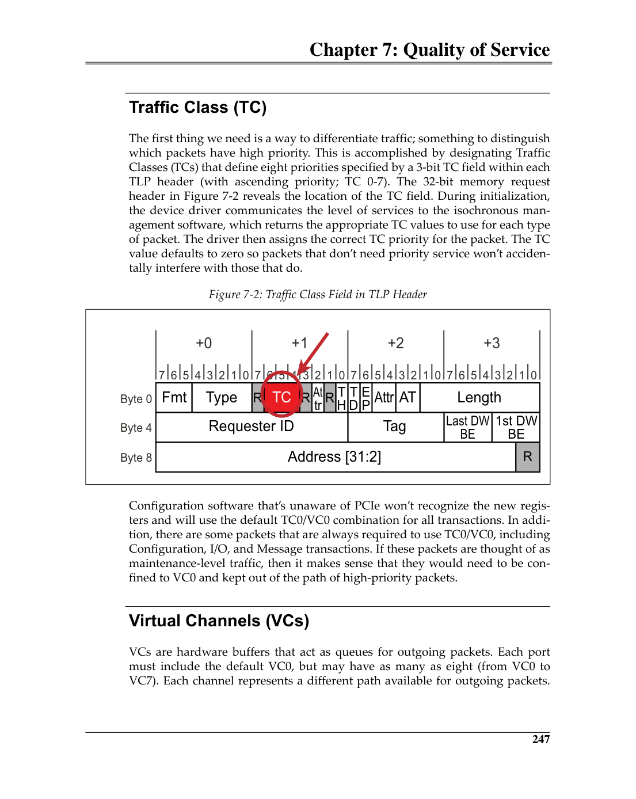

<br>

</td>
<td width="50%">

## **弱排序**

当严格强制执行强排序规则时，可能会发生临时的事务阻塞。不违反生产者/消费者编程模型的修改可以消除一些阻塞情况并提高链路效率。实现弱排序模型可以缓解此问题。

</td>
</tr>
<tr>
<td width="50%">

## **Producer/Consumer Sequence — No Errors** 

Refer to Figure 8‐2 on page 293 during the following discussion. The example presumes that the Flag and Status element are cleared to start
with. These sema‐ phores are included within the same device in this example. The sequence of numbered events in the description below and
depicted in Figure 8‐2 on page 293 reflect the correct ordering in this Part 1 sequence.

</td>
<td width="50%">

## **事务排序和流控**

将给定数量的 VC 缓冲区拆分为流控子缓冲区 P、NP 和 CPL 的动机是因为它在 TLP 被解析或分类到其各自缓冲区后简化了事务排序规则的处理。事务排序处理逻辑然后在这些三个子缓冲区之间或对每个子缓冲区应用排序规则。

由于 TLP
被分类到其各自的三个子缓冲区中以处理事务排序规则，因此有必要在链路两端的相邻端口的每个虚通道子缓冲区（P、NP、CPL）之间定义流控机制。事实上，您可能记得，每个虚通道编号的每个子缓冲区类别（P、NP、CPL）的头部（Hdr）和数据（D）子缓冲区之间存在独立的流控机制。

**PCI Exress 3.0 Technology**

</td>
</tr>
<tr>
<td width="50%">

## **PCI Express 3.0 Technology** 

1. In the example, a device called the **Producer** performs one or more Memory Write transactions (Posted Requests) targeting a **Data
Buffer** in memory. Some delay can occur as the data flows through Posted buffers.

2. The Consumer periodically checks the Flag by initiating a Memory Read transaction (Non‐Posted Request) to determine if data has been
delivered by the Producer.

3. The Flag semaphore is read by the device and a Memory Read Completion is returned to the Consumer, indicating that notification of data
delivery has not been performed by the Producer (Flag = 0) yet.

4. The Producer sends a Memory Write Transaction (Posted Request) to update the Flag to 1. 

5. Once again, the Consumer checks the Flag by performing the same transac‐ tion performed in step 2. 

6. When Flag semaphore is read this time, the Flag is set to 1, indicating to the Consumer, via the Completion, that all of the data has
been delivered by the Producer to memory.

7. Next, the Consumer performs a Memory Write transaction (Posted Request) to clear the Flag semaphore back to zero. 

Figure 8‐3 on page 294 continues the example in this Part 2 sequence. 

8. The Producer, having more data to send, periodically checks the Status semaphore by initiating a Memory Read transaction (Non‐Posted
Request).

9. The Status semaphore is read by the Producer and a Memory Read Comple‐ tion is returned to the Producer, indicating that the Consumer has
not read the memory buffer contents and updated Status (Status = 0).

10. The Consumer, knowing that the memory buffer has data available, per‐ forms one or more Memory Read Requests (Non‐Posted Requests) to
get the contents from the buffer.

11. Memory contents are read and returned to the Consumer. 

12. Upon completing the data transfer, the Consumer initiates a Memory Write Request (Posted Request) to set the Status semaphore to a 1. 

13. Once again, the Producer checks the Status semaphore by delivering a Memory Read Request (Non‐Posted Request). 

14. The device reads the Status and this time it is set to 1. The Completion is returned to the Producer, thereby indicating data can be
sent to Memory.

15. The Producer sends a Memory Write to Clear the Status semaphore to 0. 

16. The sequence of events starting with step 1. is repeated by the Producer. 
_Figure 8‐2: Producer/Consumer Sequence Example — Part 1_ 

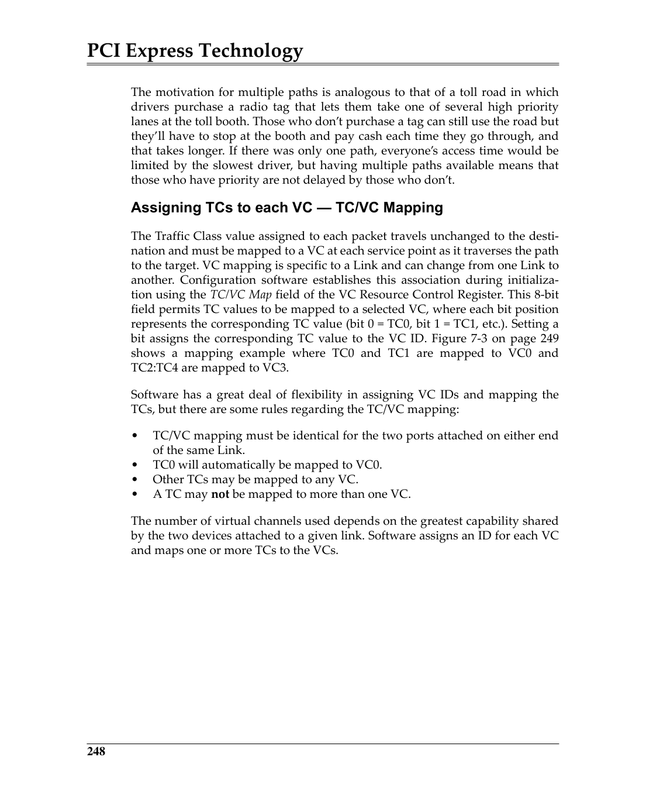

<br>


_Figure 8‐3: Producer/Consumer Sequence Example — Part 2_ 

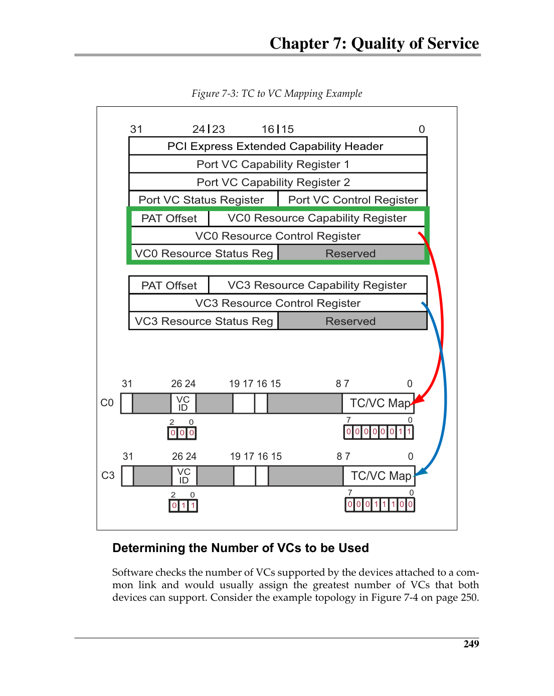

<br>

</td>
<td width="50%">

## **事务停顿**

强排序可能导致由于单个满接收缓冲区而使所有事务被阻塞的情况。例如，不能更改生产者/消费者模型的排序要求，但不属于该模型的事务的排序可以更改。为了提高性能，让我们考虑一个弱排序方案；一个对事务排序施加最小要求的方案。

本例描绘了与单个 VC 单个方向事务传递相关联的发送和接收缓冲区。回想一下，每种事务类型（Posted、Non-Posted 和 Completions）在同一 VC 内都具有独立的流控。发送缓冲区中的数字表示这些事务发出的顺序，Non-Posted
接收缓冲区当前已满。考虑以下序列。

1. 事务 1（内存读）是下一个要发送的事务，但没有足够的流控信用，因此它必须等待。

2. 事务 2（Posted 内存写）是下一个后续事务。如果强制执行强排序，则内存写不得通过先前排队的读事务。

3. 此限制也适用于所有后续事务，结果是它们都被暂停，直到第一个事务完成。

_图 8-6：强排序示例导致临时停顿_

**==> 图片 [300 x 178] 已省略 <==**

**----- 图片文字开始 -----**<br>
Numbers indicate the<br>order of transactions<br>pending transfer<br>Posted<br>7 4 2<br>Non-Posted Non-Posted<br>5 1<br>Completions
Completions<br>8 6 3<br>Tx Rx<br>Rx Tx<br>Posted<br>Full<br>**----- 图片文字结束 -----**<br>


**第 8 章：事务排序**

## **VC 缓冲区的优势**

</td>
</tr>
<tr>
<td width="50%">

## **Producer/Consumer Sequence — Errors** 

The previous example was handled correctly without a discussion of the order‐ ing rules; however it may have been apparent that race
conditions can cause the Producer/Consumer sequence to fail. Figure 8‐4 on page 296 illustrates a simple sequence to demonstrate one of
several problems that can arise without order‐ ing rules being enforced. Refer to Figure Figure 8‐4 on page 296 during the fol‐ lowing
discussion.

1. Producer performs a Memory Write request (Posted Request) to the mem‐ ory buffer. Let us assume that the memory write data is temporarily
stuck in the Switch upstream port Posted Flow Control buffer.

2. The Producer sends a Memory Write Transaction (Posted Request) to update the Flag to 1. 

3. The Consumer initiates a Memory Read Request (Non‐Posted Request) to check if the Flag has been set to 1. 

4. The contents of the Flag is returned to the Consumer via a Completion. 

5. Knowing that data has been delivered to memory, the Consumer performs a memory read request to fetch the data. However, the Consumer is
unaware that the data is temporarily stuck in a Posted Flow Control buffer due to lack of flow control credits associated with the link
between the upstream switch port and the Root Complex. Consequently, the Consumer receives old data when the Completion is returned to the
Consumer.

The problem is avoided with ordering rules supported by virtual PCI bridges within the topology. In this example, when the Consumer
performed the Mem‐ ory Read transaction in steps 3 and 4, the Virtual PCI bridge at the upstream switch port should not allow the contents
of the flag (Completion 4) to be for‐ warded ahead of the previously posted data.

_Figure 8‐4: Producer/Consumer Sequence with Error_ 

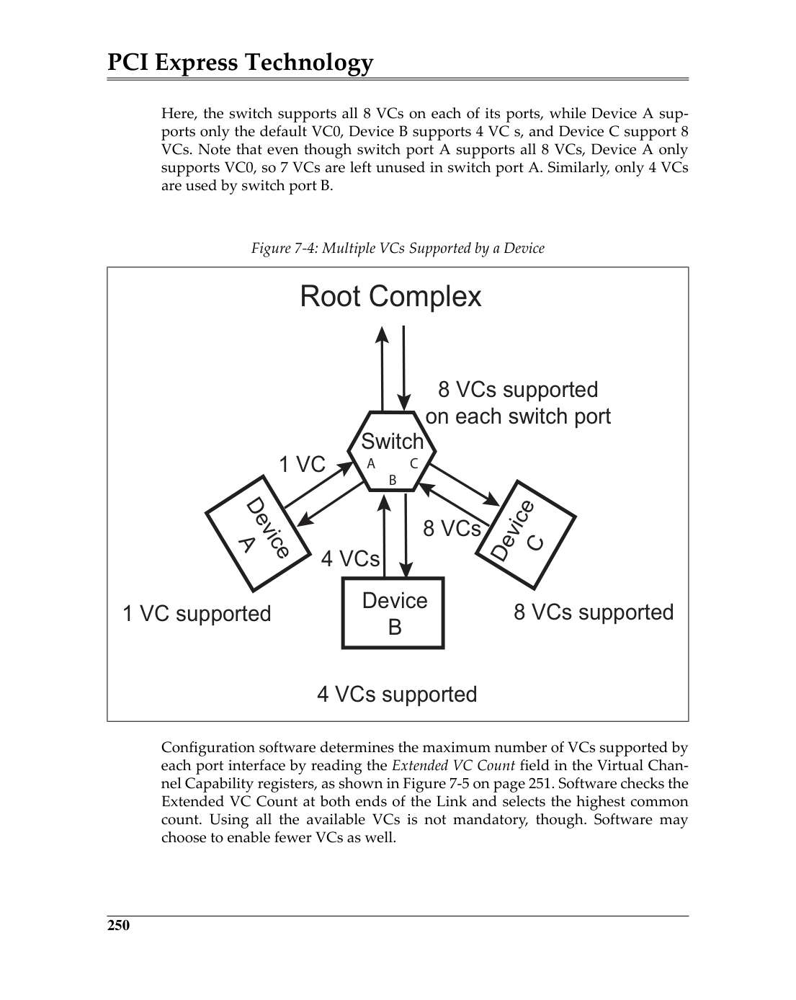

<br>

</td>
<td width="50%">

</td>
</tr>
<tr>
<td width="50%">

## **Relaxed Ordering** 

PCI Express supports the Relaxed Ordering (RO) mechanism added for PCI‐X. RO allows switches in the path between the Requester and Completer
to reor‐ der some transactions when doing so would improve performance.
The ordering rules that support the Producer/Consumer model may result in transactions being blocked in cases when they’re unrelated to any
Producer/ Consumer transaction sequence. To alleviate this problem, a transaction can have its RO attribute bit set, indicating that
software verifies it to be unrelated to other transactions, and that allows it to be re‐ordered ahead of other transac‐ tions. For example,
if a posted write is delayed because the target’s buffer space is unavailable, then all subsequent transactions must wait until that finally
resolves and the write is delivered. If a subsequent transaction was known by software to be unrelated to previous ones and the RO bit was
set to show that, then it could be allowed to go before the write without risking a problem.

The RO bit (bit 5 of byte 2 of dword 0 in the TLP header as shown in Figure 8‐5 on page 297) may be used by the device if its device driver
has enabled it to do so. Request packets are then allowed to use this attribute as directed by soft‐ ware when it requests that a packet be
sent. When switches or the Root Com‐ plex see a packet with this attribute bit set, they have permission to reorder it although it’s not
required that they should.

_Figure 8‐5: Relaxed Ordering Bit in a 32‐bit Header_ 

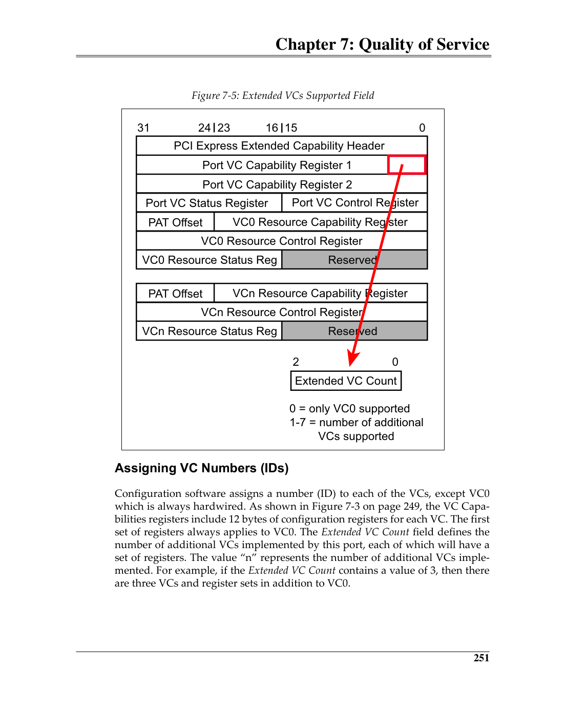

<br>

</td>
<td width="50%">

</td>
</tr>
<tr>
<td width="50%">

## **RO Effects on Memory Writes and Messages** 

Switches and Root Complexes must observe the setting of the RO bit in transac‐ tions. Memory writes and Messages are both posted writes,
both are received into the same Posted buffer, and both are subject to the same ordering require‐ ments. When the RO bit is set, switches
handle these transactions as follows:

- Switches are permitted to reorder memory write transactions just posted ahead of previously posted memory write transactions or message
transac‐ tions. Similarly, message transactions just posted may be ordered ahead of

previously posted memory write or message transactions. Switches must also forward the RO bit unmodified. The RO bit is ignored by PCI‐X
bridges, which always forward writes in order (there would be little pur‐ pose in allowing them to go out of order anyway; if one is blocked
for some reason, the next will be blocked, too). Another difference is that message transactions had not been defined for PCI‐X, either.

- The Root Complex is permitted to reorder posted write transactions (here it makes sense because the Root could write to different areas of
memory so, if one area is busy it can write to a different one). Also, when receiving writes with RO set, the Root is permitted to write
each byte to memory in any address order.

</td>
<td width="50%">

</td>
</tr>
<tr>
<td width="50%">

## **RO Effects on Memory Read Transactions** 

All read transactions in PCI Express are handled as split transactions. When a device issues a memory read request with the RO bit set, the
Completer returns the requested read data in a series of one or more split completion transactions, and uses the same RO setting as in the
request. Switch behavior in this case is as follows:

1. A switch that receives a memory read with RO forwards the request in the order received, and must not reorder it ahead of memory write
transactions that were previously posted. That guarantees that all write transactions moving in the direction of the read request are pushed
ahead of the read. This is part of the Producer/Consumer example shown earlier, and software may depend on this flushing action for proper
operation. The RO bit must not be modified by the switch.

2. When the Completer receives the memory read, it fetches the requested data and delivers one or more Completions that also have the RO bit
set (its value is copied from the original request).

3. A switch receiving the Completions is allowed to re‐order them ahead of previously posted memory writes moving in the direction of the
Comple‐ tion. If the writes were blocked (for example, due to flow control), then the Completions will be allowed to go ahead of them.
Relaxed ordering in this case improves read performance. Table 8‐2 summarizes the relaxed order‐ ing behavior allowed by switches.
_Table 8‐2: Transactions That Can Be Reordered Due to Relaxed Ordering_ 

|**These Transactions with RO=1 Can Pass**|**These Transactions**|
|---|---|
|Memory Write Request|Memory Write Request|
|Message Request|Memory Write Request|
|Memory Write Request|Message Request|
|Message Request|Message Request|
|Read Completion|Memory Write Request|
|Read Completion|Message Request|

</td>
<td width="50%">

</td>
</tr>
<tr>
<td width="50%">

## **Weak Ordering** 

Temporary transaction blocking can occur when strong ordering rules are rigor‐ ously enforced. Modifications that don’t violate the
Producer/Consumer pro‐ gramming model can eliminate some blocking conditions and improve link efficiency. Implementing the Weakly‐Ordered
model can alleviate this problem.

</td>
<td width="50%">

</td>
</tr>
<tr>
<td width="50%">

## **Transaction Ordering and Flow Control** 

The motivation behind splitting VC buffers of a given number into flow con‐ trolled sub‐buffers P, NP and CPL is because it simplifies
processing of the transaction ordering rules once TLPs have been parsed or binned into their respective buffers. The transaction ordering
processing logic then applies order‐ ing rules between these three sub‐buffers or to each sub‐buffer.

Since TLPs are binned into their respective three sub‐buffers in order to process transaction ordering rules, it is necessary to define the
flow control mechanism between each virtual channel sub‐buffer (P, NP, CPL) of neighboring ports at opposite ends of the Link. In fact, you
may recall that there is an independent flow control mechanism between Header (Hdr) and Data (D) sub‐buffers of each sub‐buffer category (P,
NP, CPL) of each virtual channel number.

</td>
<td width="50%">

</td>
</tr>
<tr>
<td width="50%">

## **Transaction Stalls** 

Strong ordering can result in instances where all transactions are blocked due to a single full receive buffer. For example, the ordering
requirements for the Pro‐ ducer/Consumer model cannot be changed, but ordering for transactions that aren’t part of that model can. To
improve performance, let’s consider a weakly‐ ordered scheme; one that puts the minimal requirements on transaction order‐ ing.

This example depicts transmit and receive buffers associated with the delivery of transactions in a single direction for a single VC. Recall
that each of the trans‐ action types (Posted, Non‐Posted, and Completions) have independent flow control within the same VC. The numbers in
the transmit buffers show the order in which these transactions were issued, and the non‐posted receive buffer is currently full. Consider
the following sequence.

1. Transaction 1 (memory read) is the next transaction to send, but there aren’t enough flow control credits so it must wait. 

2. Transaction 2 (posted memory write) is the next subsequent transaction. If strong ordering is enforced, a memory write must not pass a
previously queued read transaction.

3. This restriction applies to all subsequent transactions, too, with the result that they’re all stalled until the first one finishes. 

_Figure 8‐6: Strongly Ordered Example Results in Temporary Stall_ 

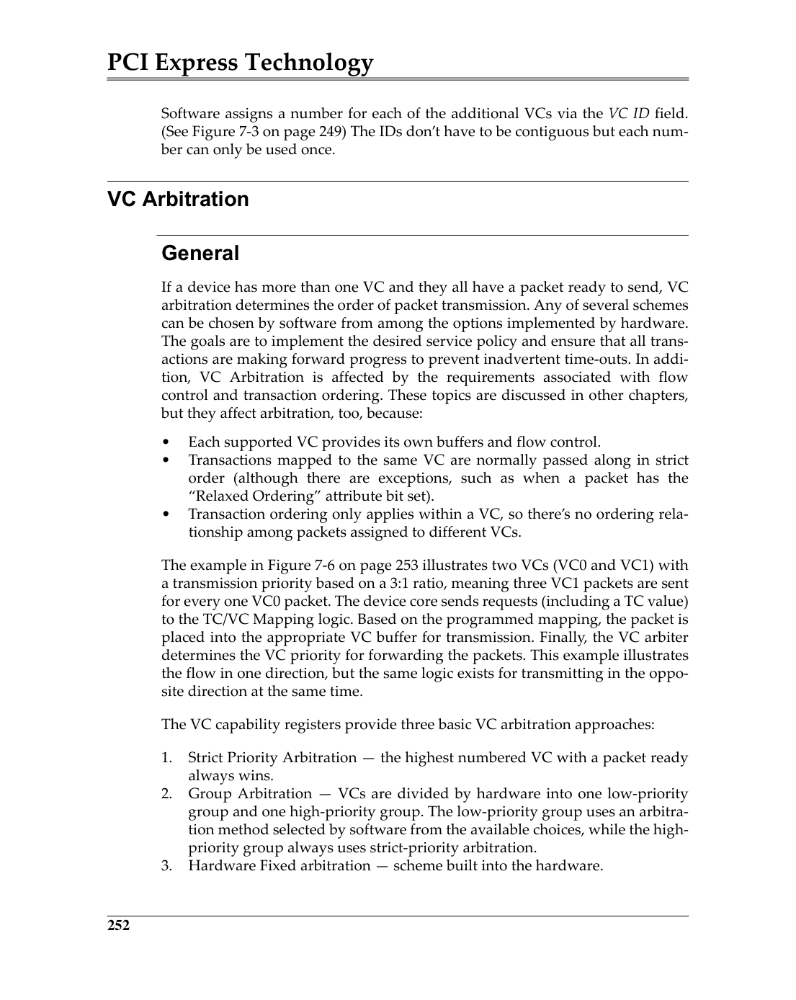

<br>

## **VC Buffers Offer an Advantage**

</td>
<td width="50%">

</td>
</tr>

</tbody>
</table>

[⬆️ 返回目录](#本章目录-table-of-contents)

---

<a id="sec-7-2"></a>
## 7.2 Quality of Service | 服务质量

<table>
<thead><tr><th width="50%">🇬🇧 English</th><th width="50%">🇨🇳 中文</th></tr></thead>
<tbody>
<tr>
<td width="50%">

Transaction ordering is managed within Virtual Channel buffers. These buffers are grouped into Posted, Non‐Posted, and Completion
transactions, and flow control is managed independently for each group. That makes weak ordering more useful because, as in our example,
even if one buffer was full, others could still have space available.

</td>
<td width="50%">

事务排序在虚通道缓冲区中进行管理。这些缓冲区被分组为 Posted、Non-Posted 和 Completion 事务，并且每个组独立管理流控。这使得弱排序更有用，因为与我们的示例一样，即使一个缓冲区已满，其他缓冲区仍可能有可用空间。

</td>
</tr>
<tr>
<td width="50%">

## **ID Based Ordering (IDO)** 

Another opportunity for optimizing ordering and improving performance is related to the nature of traffic streams. Packets from different
requesters are very unlikely to have dependencies; after all, one device could hardly know when the other had finished certain steps based
on ordering because they could have different paths to their shared resource. Bearing this in mind, the 2.1 revi‐ sion of the PCIe spec
introduced what is called ID‐based Ordering to improve performance.

</td>
<td width="50%">

## **基于 ID 的排序 (IDO)**

另一个优化排序和提升性能的机会与流量流的性质相关。不同 Requester 的报文很可能没有依赖关系；毕竟，一个设备几乎不可能知道另一个设备何时完成了某些步骤（基于排序），因为它们到达其共享资源可能有不同的路径。考虑到这一点，PCIe 规范的 2.1 版本引入了所谓的基于 ID
的排序 (ID-based Ordering) 以提升性能。

</td>
</tr>
<tr>
<td width="50%">

## **The Solution** 

If the packet source isn’t taken into account for transaction ordering then perfor‐ mance can suffer, as shown in Figure 8‐7 on page 302. In
the illustration, trans‐ action 1 makes it way to the upstream port of the switch but is blocked from further progress by a buffer‐full
condition for that packet type in the Root port (which would be indicated by insufficient Flow Control credits). To use the spec
terminology, packets from the same Requester are called a TLP stream. In this example, the path shown for Transaction 1 might include
several TLPs as part of a TLP stream. Transaction 2 then arrives at the same egress port and is also blocked from moving forward because it
must stay in order with Transaction 1. Since the packets came from different sources, (different TLP streams) this delay is almost certainly
unnecessary; it’s very unlikely they could have depen‐ dencies between them, but the normal ordering model doesn’t take this into account.
To get improved performance, we need another option.

The solution is simple: allow packets to be reordered if they don’t use the same Requester ID (or Completer ID, for Completion packets).
This optional capabil‐ ity allows software to enable a device to use IDO and a switch port can recog‐ nize that the packets are part of
different TLP streams. This is done by setting the enable bits in Device Control 2 Register.

_Figure 8‐7: Different Sources are Unlikely to Have Dependencies_ 

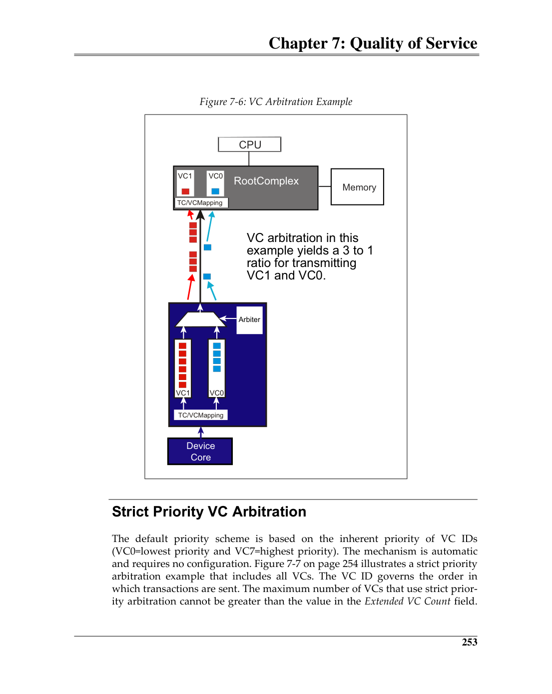

<br>

</td>
<td width="50%">

## **解决方案**

如果不考虑事务排序的报文源，则性能可能会受到影响，如第 302 页的图 8-7 所示。在该图中，事务 1 设法到达交换机的上游端口，但由于根端口中该报文类型的缓冲区已满（这将由流控信用不足指示）而无法进一步进展。使用规范术语，来自同一 Requester 的报文称为 TLP 流
(TLP stream)。在此示例中，事务 1 所示的路径可能包括作为 TLP 流一部分的几个 TLP。然后事务 2 到达同一出口端口，也被阻止向前移动，因为它必须与事务 1 保持顺序。由于报文来自不同的源（不同的 TLP
流），这种延迟几乎肯定是不必要的；它们之间很可能没有依赖关系，但普通的排序模型没有考虑到这一点。为了获得更好的性能，我们需要另一个选项。

解决方案很简单：如果报文不使用相同的 Requester ID（或完成报文的 Completer ID），则允许重排序报文。此可选功能允许软件启用设备以使用 IDO，并且交换机端口可以识别报文属于不同的 TLP 流。这是通过在 Device Control 2 Register
中设置启用位来完成的。

**PCI Exress 3.0 Technology**

_图 8-7：不同来源不太可能有依赖关系_

**==> 图片 [151 x 145] 已省略 <==**

**----- 图片文字开始 -----**<br>
Write Buffer Root<br>Full<br>ey<br>Switch<br>ty a ONO<br>®<br>Posted Write<br>| [7] [le ma"<br>sd Cle fl PCle ff Legacy<br>**----- 图片文字结束
-----**<br>

</td>
</tr>
<tr>
<td width="50%">

## **When to use IDO** 

The spec highly recommends that both IDO and RO be used whenever safely possible. For example, it should be safe for Endpoints to use IDO
for all TLPs when communicating directly with only one other entity, such as the Root Com‐ plex. On the other hand, it would not be safe to
use it if the Endpoint is commu‐ nicating with multiple agents. An example failure case for this from the spec begins with one device doing
a DMA write to memory and then doing a peer‐ to‐peer write to a flag in another device. When the second device receives the flag, it also
initiates a DMA write to the same area of memory. Normally, the two DMA operations would stay in order, but with IDO that ordering can’t be
guaranteed because upstream devices will see them as coming from different device IDs. Similarly, it would not be safe to use RO with
packets that are involved in control traffic.

For Completers, if IDO is enabled it’s recommended that it be used for all Com‐ pletions unless there is a specific reason not to do so.

</td>
<td width="50%">

## **何时使用 IDO**

规范强烈建议只要安全可行，就同时使用 IDO 和 RO。例如，当端点仅与一个其他实体（例如根复合体）直接通信时，对所有 TLP 使用 IDO 应该是安全的。另一方面，如果端点正在与多个代理通信，则使用它就不安全了。规范中此失败情况的一个示例开始于一个设备执行对内存的 DMA
写，然后执行对另一设备中标志 (flag) 的对等 (peer-to-peer) 写。当第二个设备收到标志时，它也会启动对同一内存区域的 DMA 写。通常，两个 DMA 操作会保持顺序，但使用 IDO 时，由于上游设备将它们视为来自不同的设备 ID，因此无法保证该排序。类似地，将
RO 用于涉及控制流量的报文也是不安全的。

对于 Completer，如果启用了 IDO，则建议将其用于所有 Completions，除非有特定原因不这样做。

**第 8 章：事务排序**

</td>
</tr>
<tr>
<td width="50%">

## **Software Control** 

Software can enable the use of IDO for Requests or Completions from a given port by setting the appropriate bits in its Device Control 2
Register. As with RO, there are no capability bits to let software find out what the device supports, just enable bits, so software would
need to know by some other means that the device was capable of doing this. These bits enable the use of IDO for that packet type, but
software must still decide whether each individual packet will have its IDO bit set. A new attribute bit in the header indicates whether a
TLP is using IDO, as shown in Figure 8‐8 on page 303. This brings up another related point: Completions normally inherit all the attribute
bits of the Request that generated them, but this may not be true for IDO, since this can be enabled independently by the Completer. In
other words, Completions may use IDO even if the Request that initiated them did not.

_Figure 8‐8: IDO Attribute in 64‐bit Header_ 

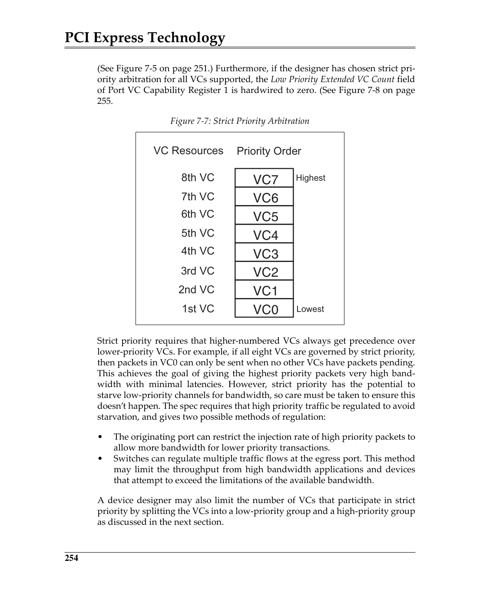

<br>

</td>
<td width="50%">

## **软件控制**

软件可以通过在端口的 Device Control 2 Register 中设置适当的位来启用 IDO 用于来自给定端口的请求或完成。与 RO 一样，没有能力位 (capability bits)
让软件查明设备支持什么，只有启用位，因此软件需要通过其他方式知道设备能够执行此操作。这些位启用了该报文类型对 IDO 的使用，但软件仍必须决定每个单独的报文是否会设置其 IDO 位。头部中的新属性位指示 TLP 是否正在使用 IDO，如第 303 页的图 8-8
所示。这引出了另一个相关的点：Completions 通常会继承生成它们的 Request 的所有属性位，但对于 IDO 来说情况可能并非如此，因为这可以由 Completer 独立启用。换句话说，Completions 可能会使用 IDO，即使发起它们的 Request
没有使用。

_图 8-8：64 位头部中的 IDO 属性_

**==> 图片 [313 x 127] 已省略 <==**

**----- 图片文字开始 -----**<br>
+0 +1 +2 +3<br>7 6 5 4 3 2 1 0 7 6 5 4 3 2 1 0 7 6 5 4 3 2 1 0 7 6 5 4 3 2 1 0<br>Fmt At T T E<br>Byte 0 0 x 1 Type R TC R tr R H D P Attr
AT Length<br>Last DW 1st DW<br>Byte 4 Requester ID Tag BE BE<br>Byte 8 Address [63:32]<br>Byte 12 Address [31:2] R<br>**----- 图片文字结束
-----**<br>

</td>
</tr>
<tr>
<td width="50%">

## **Deadlock Avoidance** 

Because the PCI bus employs delayed transactions or because PCI Express memory read request may be blocked due to lack of flow control
credits, several deadlock scenarios can develop. These deadlock avoidance rules are included in PCI Express ordering to ensure that no
deadlocks occur regardless of topol‐ ogy. Adhering to the ordering rules prevent problems when boundary condi‐ tions develop due to
unanticipated topologies (e.g., two PCI Express to PCI bridges connected across the PCI Express fabric). Refer to the MindShare book
entitled _PCI System Architecture, Fourth Edition (_ published by Addison‐Wesley) for a detailed explanation of the scenarios that are the
basis for the PCI Express

</td>
<td width="50%">

## **死锁避免**

由于 PCI 总线使用延迟事务，或者由于 PCI Express 内存读请求可能因流控信用不足而被阻塞，可能会出现多种死锁场景。这些死锁避免规则包含在 PCI Express 排序中，以确保无论拓扑如何都不会发生死锁。遵守排序规则可以防止由于意外拓扑（例如跨 PCI
Express 交换网络连接的两个 PCI Express 到 PCI 桥）而出现的边界条件问题。请参考 MindShare 出版的标题为《_PCI System Architecture, Fourth Edition_》（由 Addison-Wesley 出版）的书，获取构成
PCI Express 死锁避免相关排序规则基础的场景的详细说明

</td>
</tr>
<tr>
<td width="50%">

## **PCI Express 3.0 Technology** 

ordering rules related to deadlock avoidance. Table 8‐1 on page 289 lists the deadlock avoidance ordering rules which are identified as
entries A3, A4, D3, D4 and A5b. Note that avoiding the deadlocks involves “Yes” entries in each of these 5 cases. If blocking occurs due to
lack of flow control credits associated with the Non‐Posted Request buffer identified in column 3 or 4, the Posted Requests associated with
row A or the Completions associated with row D must be moved ahead of the Non‐Posted Requests specified in the column 3 or 4 where the “Yes”
entry exists. Note also that the “Yes” entry in A5b applies only to PCI Express to PCI or PCI‐X Bridges.

Essentially, this deadlock avoidance rule can be summarized as “later arriving Memory Write Requests or Completions must be allowed to pass
earlier blocked Non‐Posted Requests otherwise a deadlock could result”.

</td>
<td width="50%">

## **PCI Exress 3.0 Technology**

排序规则。表 8-1（第 289 页）列出了死锁避免排序规则，这些规则被标识为 A3、A4、D3、D4 和 A5b 条目。请注意，避免死锁涉及这 5 种情况中的每一种的"Yes"条目。如果由于与第 3 列或第 4 列中标识的 Non-Posted
请求缓冲区相关的流控信用不足而发生阻塞，则与行 A 关联的 Posted 请求或与行 D 关联的 Completions 必须移到第 3 列或第 4 列中指定存在"Yes"条目的 Non-Posted 请求之前。另请注意，A5b 中的"Yes"条目仅适用于 PCI Express
到 PCI 或 PCI-X 桥。

基本上，此死锁避免规则可以总结为"必须允许后到达的内存写请求或完成通过先前被阻塞的 Non-Posted 请求，否则可能导致死锁"。

</td>
</tr>
<tr>
<td width="50%">

## Part Three: 

Data Link Layer

</td>
<td width="50%">

## 第三部分：

数据链路层

</td>
</tr>
<tr>
<td width="50%">

## _**9**_

</td>
<td width="50%">

## _**9**_

</td>
</tr>
<tr>
<td width="50%">

## _**DLLP Elements**_

</td>
<td width="50%">

## _**DLLP 元素**_

</td>
</tr>
<tr>
<td width="50%">

## **The Previous Chapter** 

The previous chapter discussed the ordering requirements for transactions in a PCI Express topology. These rules are inherited from PCI, and
the Producer/ Consumer programming model motivated many of them, so its mechanism is described here. The original rules also took into
consideration possible dead‐ lock conditions that must be avoided, but did not include any means to avoid the performance problems that
could result.

</td>
<td width="50%">

## **上一章**

上一章讨论了 PCI Express 拓扑中事务的排序要求。这些规则是从 PCI 继承而来的，生产者/消费者编程模型激发了其中的许多规则，因此此处描述了其机制。原始规则还考虑了必须避免的可能死锁条件，但不包括避免可能导致的性能问题的任何手段。

</td>
</tr>
<tr>
<td width="50%">

## **This Chapter** 

In this chapter we describe the other major category of packets, _Data Link Layer Packets_ (DLLPs). We describe the use, format, and
definition of the DLLP packet types and the details of their related fields. DLLPs are used to support Ack/Nak protocol, power management,
flow control mechanism and can even be used for vendor‐defined purposes.

</td>
<td width="50%">

## **本章**

在本章中，我们描述另一类主要的数据包——数据链路层包 (Data Link Layer Packets, DLLP)。我们描述 DLLP 报文类型的使用、格式和定义以及其相关字段的详细信息。DLLP 用于支持 Ack/Nak
协议、电源管理、流控机制，甚至可以用于供应商自定义目的。

</td>
</tr>
<tr>
<td width="50%">

## **The Next Chapter** 

The following chapter describes a key feature of the Data Link Layer: an auto‐ matic, hardware‐based mechanism for ensuring reliable
transport of TLPs across the Link. Ack DLLPs confirm good reception of TLPs while Nak DLLPs indicate a transmission error. We describe the
normal rules of operation when no TLP or DLLP error is detected as well as error recovery mechanisms associ‐ ated with both TLP and DLLP
errors.

</td>
<td width="50%">

## **下一章**

下一章描述数据链路层的一个关键特性：一种基于硬件的自动机制，用于确保 TLP 跨链路的可靠传输。Ack DLLP 确认 TLP 的良好接收，而 Nak DLLP 指示传输错误。我们将描述在未检测到 TLP 或 DLLP 错误时的正常操作规则，以及与 TLP 和 DLLP
错误相关联的错误恢复机制。

</td>
</tr>
<tr>
<td width="50%">

## **General** 

The Data Link Layer can be thought of as managing the lower level Link proto‐ col. Its primary responsibility is to assure the integrity of
TLPs moving between devices, but it also plays a part in TLP flow control, Link initialization and power management, and conveys information
between the Transaction Layer above it and the Physical Layer below it.

In performing these jobs, the Data Link Layer exchanges packets with its neigh‐ bor known as Data Link Layer Packets (DLLPs). DLLPs are
communicated between the Data Link Layers of each device. Figure 9‐1 on page 308 illustrates a DLLP exchanged between devices.

_Figure 9‐1: Data Link Layer Sends A DLLP_ 

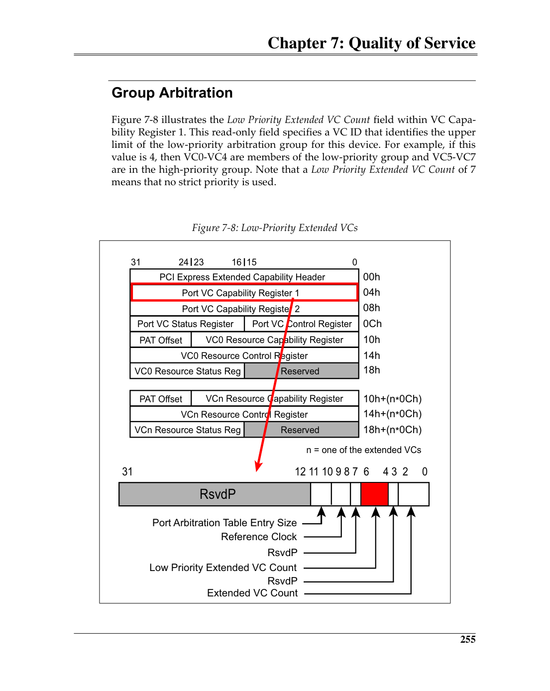

<br>

</td>
<td width="50%">

## **概述**

数据链路层可以被认为管理着较低级别的链路协议。它的主要职责是确保在设备之间移动的 TLP 的完整性，但它也参与 TLP 流控、链路初始化和电源管理，并在其上方的传输层和下方的物理层之间传递信息。

在执行这些工作时，数据链路层与被称为数据链路层包 (Data Link Layer Packets, DLLP) 的邻居交换包。DLLP 在每个设备的数据链路层之间进行通信。第 308 页的图 9-1 说明了设备之间交换的 DLLP。

_图 9-1：数据链路层发送 DLLP_

**==> 图片 [342 x 298] 已省略 <==**

**----- 图片文字开始 -----**<br>
PCIe Device A PCIe Device B<br>
Device Core Device Core<br>
PCIe Core PCIe Core<br>
Hardware/Software Hardware/Software<br>
Interface Interface<br>
Transaction Layer Transaction Layer<br>
Data Link Layer Data Link Layer<br>
Physical Layer Physical Layer<br>
(RX) (TX) (RX) (TX)<br>
Framing C Framing<br>
DLLP R<br>
(SDP) C (END)<br>
**----- 图片文字结束 -----**<br>

</td>
</tr>
<tr>
<td width="50%">

## **DLLPs Are Local Traffic** 

DLLPs have a simple packet format and are a fixed size, 8 bytes total, including the framing bytes. Unlike TLPs, they carry no target or
routing information because they are only used for nearest‐neighbor communications and don’t get routed at all. They’re also not seen by the
Transaction Layer since they’re not part of the information exchanged at that level.

</td>
<td width="50%">

## **DLLP 是本地流量**

DLLP 具有简单的报文格式，固定大小为 8 字节，包括成帧字节。与 TLP 不同，它们不携带目标或路由信息，因为它们仅用于最近邻通信，根本不被路由。事务层也看不到它们，因为它们不属于在该层交换的信息。

**第 9 章：DLLP 元素**

</td>
</tr>
<tr>
<td width="50%">

## **Receiver handling of DLLPs** 

When DLLPs are received, several rules apply: 

1. They’re immediately processed at the Receiver. In other words, their flow cannot be controlled the way it is for TLPs (DLLPs are not
subject to flow control).

2. They’re checked for errors; first at the Physical Layer, and then at the Data Link Layer. The 16‐bit CRC included with the packet is
checked by calculat‐ ing what the CRC should be and comparing it to the received value. DLLPs that fail this check are discarded. How will
the Link recover from this error? DLLPs still arrive periodically, and the next one of that type that succeeds will update the missing
information.

3. Unlike TLPs, there’s no acknowledgement protocol for DLLPs. Instead, the spec defines time‐out mechanisms to facilitate recovery from
failed DLLPs.

4. If there are no errors, the DLLP type is determined and passed to the appro‐ priate internal logic to manage: 

 - Ack/Nak notification of TLP status 

 - Flow Control notification of buffer space available 

 - Power Management settings 

 - Vendor specific information

</td>
<td width="50%">

## **DLLP 的接收方处理**

收到 DLLP 时，有几条规则适用：

1. 它们在接收方立即被处理。换句话说，它们的流不能像 TLP 那样被控制（DLLP 不受流控影响）。

2. 检查它们是否有错误；首先在物理层，然后是数据链路层。通过计算 CRC 应该是什么并将其与接收到的值进行比较来检查随包附带的 16 位 CRC。未能通过此检查的 DLLP 将被丢弃。链路将如何从此错误中恢复？DLLP 仍会定期到达，该类型的下一个成功的 DLLP
将更新丢失的信息。

3. 与 TLP 不同，DLLP 没有确认协议。相反，规范定义了超时机制以促进从失败的 DLLP 中恢复。

4. 如果没有错误，则确定 DLLP 类型并传递给适当的内部逻辑进行管理：

 - Ack/Nak 通知 TLP 状态

 - 流控通知可用缓冲区空间

 - 电源管理设置

 - 供应商特定信息

</td>
</tr>
<tr>
<td width="50%">

## **Sending DLLPs**

</td>
<td width="50%">

## **发送 DLLP**

</td>
</tr>
<tr>
<td width="50%">

## **General** 

These packets originate at the Data Link Layer and are passed to the Physical Layer. If 8b/10b encoding is in use (Gen1 and Gen2 mode),
framing symbols will be added to both ends of the DLLP at this level before the packet is sent. In Gen3 mode, a SDP token of two bytes is
added to the front end of the DLLP, but no END is added to the end of the DLLP. Figure 9‐2 on page 310 shows a generic (Gen1/Gen2) DLLP in
transit, showing the framing symbols and the general contents of the packet.

_Figure 9‐2: Generic Data Link Layer Packet Format_ 

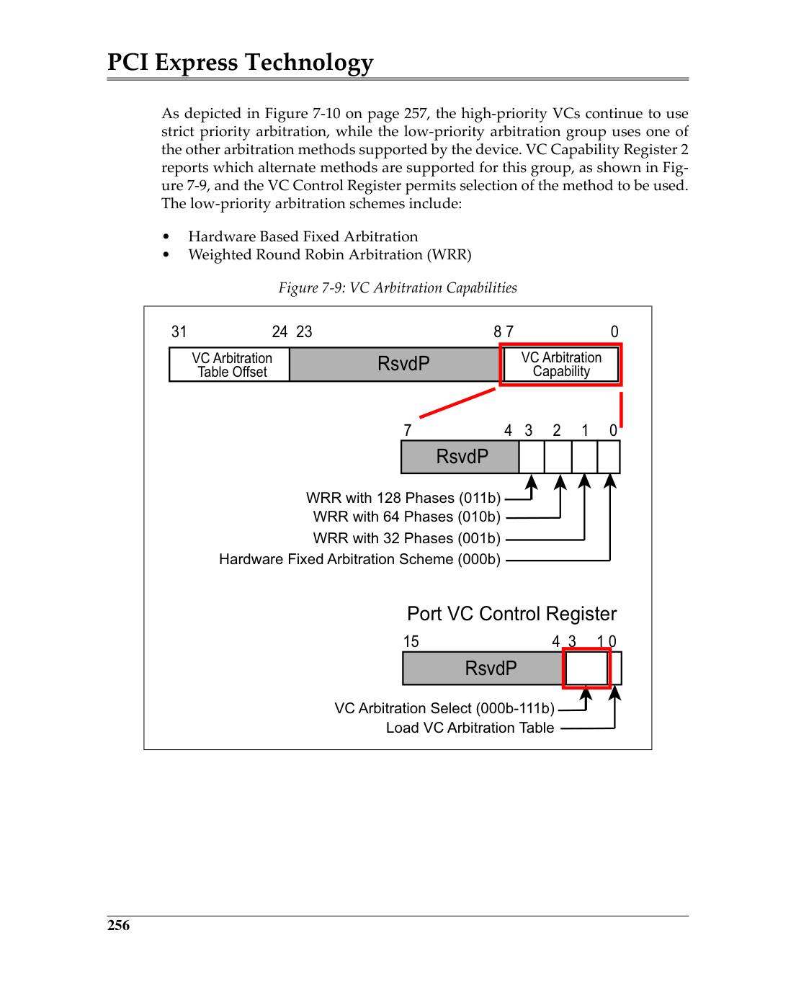

</td>
<td width="50%">

## **概述**

这些报文源自数据链路层，并传递给物理层。如果使用 8b/10b 编码（Gen1 和 Gen2 模式），将在 DLLP 的两端添加成帧符号，然后再发送包。在 Gen3 模式下，两个字节的 SDP 标记被添加到 DLLP 的前端，但不添加 END 添加到 DLLP 的末尾。第 310
页的图 9-2 显示了一个传输中的通用（Gen1/Gen2）DLLP，显示了成帧符号和包的常规内容。

_图 9-2：通用数据链路层包格式_

**==> 图片 [360 x 313] 已省略 <==**

**----- 图片文字开始 -----**<br>
Device A Device B<br>
Device Core Device Core<br>
PCI-XP Core PCI-XP Core<br>
Hardware/Software Hardware/Software<br>
Interface Interface<br>
Transaction Layer Transaction Layer<br>
Data Link Layer Data Link Layer<br>
Physical Layer Physical Layer<br>
(RX) (TX) (RX) (TX)<br>
Framing C Framing<br>
DLLP R<br>
(SDP) C (END)<br>
+0 +1 +2 +3<br>
7 6 5 4 3 2 1 0 7 6 5 4 3 2 1 0 7 6 5 4 3 2 1 0 7 6 5 4 3 2 1 0<br>
Byte 0 DLLP Type (Fields Vary With DLLP Type)<br>
Byte 4 16 Bit CRC<br>
**----- 图片文字结束 -----**<br>

</td>
</tr>

</tbody>
</table>

[⬆️ 返回目录](#本章目录-table-of-contents)

---

\newpage

# 📘 第 8 章　事务排序 (Chapter 8. Transaction Ordering)

**MindShare PCI Express Technology 3.0 — Comprehensive Guide to Generations 1.x, 2.x and 3.0**

> 📁 **Source chunks**: `chunks/chunk0257.md` ... `chunks/chunk0263.md`
> 🎨 **Format**: 中英对照双语 · 中文灰底 (PCIe 6.2 Spec 模板)

---

## 📑 本章目录 (Table of Contents)

- [8.1 Transaction Ordering — 事务排序](#sec-8-1)
- [8.2 Transaction Ordering — 事务排序](#sec-8-2)
- [8.3 Transaction Ordering — 事务排序](#sec-8-3)
- [8.4 Transaction Ordering — 事务排序](#sec-8-4)
- [8.5 Transaction Ordering — 事务排序](#sec-8-5)
- [8.6 Transaction Ordering — 事务排序](#sec-8-6)

<a id="sec-8-1"></a>
## 8.1 Transaction Ordering | 事务排序

<table>
<thead><tr><th width="50%">🇬🇧 English</th><th width="50%">🇨🇳 中文</th></tr></thead>
<tbody>
<tr>
<td width="50%">

Device A Device B<br>Device Core Device Core<br>PCI-XP Core PCI-XP Core<br>Hardware/Software Hardware/Software<br>Interface
Interface<br>Transaction Layer Transaction Layer<br>Data Link Layer Data Link Layer<br>Physical Layer Physical Layer<br>(RX) (TX) (RX)
(TX)<br>Framing C Framing<br>DLLP R<br>(SDP) C (END)<br>+0 +1 +2 +3<br>7 6 5 4 3 2 1 0 7 6 5 4 3 2 1 0 7 6 5 4 3 2 1 0 7 6 5 4 3 2 1
0<br>Byte 0 DLLP Type (Fields Vary With DLLP Type)<br>Byte 4 16 Bit CRC<br>## **DLLP Packet Size is Fixed at 8 Bytes**

Data Link Layer Packets are always 8 bytes long for both 8b/10b and 128b/130b and consist of the following components: 

1. A 1 DW core (4 bytes) containing the one‐byte DLLP Type field and three additional bytes of attributes. The attributes vary with the DLLP
type.

2. A 2‐byte CRC value that is calculated based on the core contents of the DLLP. It is important to point out that this CRC is different
from the LCRCs added to TLPs. This CRC is only 16 bits in size and is calculated differently than the 32‐bit LCRCs in TLPs. This CRC is
appended to the core DLLP and then these 6 bytes are passed to the Physical Layer.
3. If 8b/10b encoding is in use, a Start of DLLP (SDP) control symbol and an End Good (END) control symbol are added to the beginning and
end of the packet. As usual, before transmission the Physical Layer encodes the bytes into 10‐bit symbols for transmission.

4. In Gen3 mode, when 128b/130b encoding is in use, a 2‐byte SDP Token is added to the front of the packet to create the 8‐byte packet and
there is no END symbol or token.

Note that there is never a data payload with a DLLP; all the information is car‐ ried in the core four bytes of the packet.

</td>
<td width="50%">

## **DLLP 包大小固定为 8 字节**

数据链路层包对于 8b/10b 和 128b/130b 始终是 8 字节长，由以下组件组成：

1. 一个 1 DW 核心（4 字节），包含一个字节的 DLLP Type 字段和三个字节的其他属性。属性随 DLLP 类型而变化。

2. 一个 2 字节的 CRC 值，它是根据 DLLP 的核心内容计算得出的。需要指出的是，此 CRC 与添加到 TLP 的 LCRC 不同。此 CRC 仅为 16 位，其计算方式与 TLP 中的 32 位 LCRC 不同。此 CRC 被附加到核心 DLLP 上，然后这 6
字节被传递到物理层。

**第 9 章：DLLP 元素**

3. 如果使用 8b/10b 编码，则将一个 DLLP 起始 (Start of DLLP, SDP) 控制符号和一个结束良好 (End Good, END) 控制符号添加到包的开始和结束。与往常一样，在传输之前，物理层将字节编码为 10 位符号以进行传输。

4. 在 Gen3 模式下，当使用 128b/130b 编码时，会在包的前面添加一个 2 字节的 SDP 标记以构成 8 字节的包，并且没有 END 符号或标记。

请注意，DLLP 永远没有数据有效负载；所有信息都携带在包的四个核心字节中。

</td>
</tr>
<tr>
<td width="50%">

## **DLLP Packet Types** 

There are four groups of DLLPs defined that deal with Ack/Nak, Power Man‐ agement, and Flow Control, along with one Vendor Specific version.
Some of these have several variants, and Table 9‐1 on page 311 summarizes each variant as well as their _DLLP Type_ field encoding.

_Table 9‐1: DLLP Types_ 

|**DLLP Type**|**Type Field**<br>**Encoding**|**Purpose**|
|---|---|---|
|Ack (TLP Acknowledge)|0000 0000b|TLP transmission integrity|
|Nak (TLP Negative Acknowl‐<br>edge)|0001 0000b|TLP transmission integrity|
|PM_Enter_L1|0010 0000b|Power Management|
|PM_Enter_L23|0010 0001b|Power Management|
|PM_Active_State_Request_L1|0010 0011b|Power Management|
|PM_Request_Ack|0010 0100b|Power Management|
|Vendor Specific|0011 0000b|Vendor Defined|
|InitFC1‐P|0100 0xxxb|TLP Flow Control<br>(xxx = VC number)|
|InitFC1‐NP|0101 0xxxb|TLP Flow Control|


_Table 9‐1: DLLP Types (Continued)_ 

|**DLLP Type**|**Type Field**<br>**Encoding**|**Purpose**|
|---|---|---|
|InitFC1‐Cpl|0110 0xxxb|TLP Flow Control|
|InitFC2‐P|1100 0xxxb|TLP Flow Control|
|InitFC2‐NP|1101 0xxxb|TLP Flow Control|
|InitFC2‐Cpl|1110 0xxxb|TLP Flow Control|
|UpdateFC‐P|1000 0xxxb|TLP Flow Control|
|UpdateFC‐NP|1001 0xxxb|TLP Flow Control|
|UpdateFC‐Cpl|1010 0xxxb|TLP Flow Control|
|Reserved|Others|Reserved|

</td>
<td width="50%">

## **DLLP 包类型**

定义了四组 DLLP，分别处理 Ack/Nak、电源管理和流控，以及一个供应商特定版本。其中一些有多个变体，第 311 页的表 9-1 总结了每个变体以及它们的 _DLLP Type_ 字段编码。

_表 9-1：DLLP 类型_

|**DLLP 类型**|**类型字段 编码**|**用途**|
|---|---|---|
|Ack (TLP 确认)|0000 0000b|TLP 传输完整性|
|Nak (TLP 否定确认)|0001 0000b|TLP 传输完整性|
|PM_Enter_L1|0010 0000b|电源管理|
|PM_Enter_L23|0010 0001b|电源管理|
|PM_Active_State_Request_L1|0010 0011b|电源管理|
|PM_Request_Ack|0010 0100b|电源管理|
|供应商特定|0011 0000b|供应商定义|
|InitFC1‐P|0100 0xxxb|TLP 流控<br>（xxx = VC 号）|
|InitFC1‐NP|0101 0xxxb|TLP 流控|


_表 9-1：DLLP 类型（续）_

|**DLLP 类型**|**类型字段 编码**|**用途**|
|---|---|---|
|InitFC1‐Cpl|0110 0xxxb|TLP 流控|
|InitFC2‐P|1100 0xxxb|TLP 流控|
|InitFC2‐NP|1101 0xxxb|TLP 流控|
|InitFC2‐Cpl|1110 0xxxb|TLP 流控|
|UpdateFC‐P|1000 0xxxb|TLP 流控|
|UpdateFC‐NP|1001 0xxxb|TLP 流控|
|UpdateFC‐Cpl|1010 0xxxb|TLP 流控|
|保留|其他|保留|

</td>
</tr>
<tr>
<td width="50%">

## **Ack/Nak DLLP Format** 

The format of the DLLP used by a device to Ack (acknowledge) or Nak (nega‐ tively acknowledge) the receipt of a TLP is illustrated in Figure
9‐3, and its fields are described in “Ack/Nak DLLP Fields” on page 313. For more discus‐ sion on how these are used to handle the Ack/Nak
protocol, refer to Chapter 10, entitled ʺAck/Nak Protocol,ʺ on page 317.

_Figure 9‐3: Ack Or Nak DLLP Format_ 

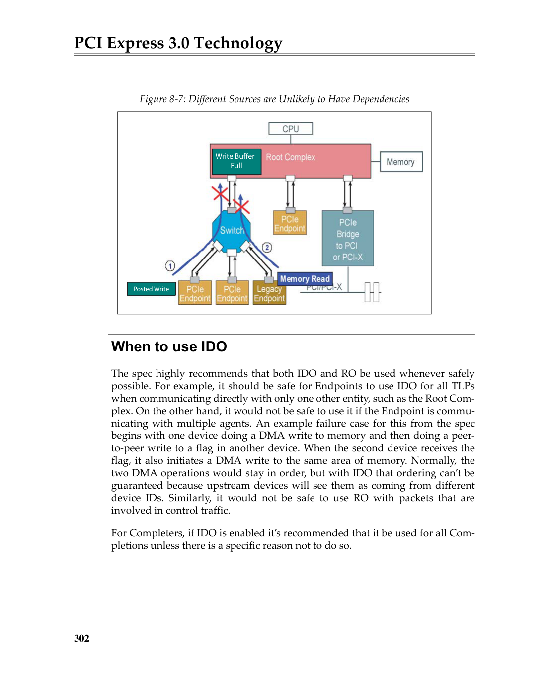

<br>

_Table 9‐2: Ack/Nak DLLP Fields_ 

|**Field Name**|**Header Byte/Bit**|**DLLP Function**|
|---|---|---|
|DLLP Type|Byte 0, [7:0]|Indicates the type of DLLP: • 0000 00...|
|AckNak_Seq_Num|Byte 2, [3:0]<br>Byte 3, [7:0]|If a good TLP was received:<br>• If incoming Sequence Number =<br>NEXT_RCV_SEQ (matched what
was<br>expected), schedule Ack DLLP with that<br>number.<br>• If incoming Sequence Number was ear‐<br>lier than NEXT_RCV_SEQ count
(a<br>duplicate TLP was received), schedule<br>Ack DLLP with NEXT_RCV_SEQ ‐ 1<br>(effectively, this is the number of the last<br>good
TLP).<br>For a TLP received with a problem:<br>• If the TLP had an error, or its Sequence<br>Number was higher than<br>NEXT_RCV_SEQ,
schedule a Nak<br>DLLP with NEXT_RCV_SEQ ‐ 1.|
|16‐bit CRC|Byte 4, [7:0]<br>Byte 5, [7:0]|This 16‐bit CRC protects the contents of<br>this DLLP. Calculation is based on Bytes 0‐<br>3 of
the Ack/Nak.|

</td>
<td width="50%">

## **Ack/Nak DLLP 格式**

设备用于确认 (Ack) 或否定确认 (Nak) TLP 接收的 DLLP 格式如图 9-3 所示，其字段在第 313 页的"Ack/Nak DLLP 字段"中描述。有关如何使用这些 DLLP 来处理 Ack/Nak 协议的更多讨论，请参考第 10 章（标题为"Ack/Nak
协议"，第 317 页）。

_图 9-3：Ack 或 Nak DLLP 格式_

**==> 图片 [366 x 104] 已省略 <==**

**----- 图片文字开始 -----**<br>
+0 +1 +2 +3<br>7 6 5 4 3 2 1 0 7 6 5 4 3 2 1 0 7 6 5 4 3 2 1 0 7 6 5 4 3 2 1 0<br>0000 0000 - Ack<br>Byte 0 0001 0000 - Nak Reserved
AckNak_Seq_Num<br>Byte 4 16 位 CRC<br>**----- 图片文字结束 -----**<br>


**第 9 章：DLLP 元素**

_表 9-2：Ack/Nak DLLP 字段_

|**字段名**|**头部字节/位**|**DLLP 功能**|
|---|---|---|
|DLLP 类型|Byte 0, [7:0]|指示 DLLP 的类型：<br>• 0000 0000b = Ack<br>• 0001 0000b = Nak|
|AckNak_Seq_Num|Byte 2, [3:0]<br>Byte 3, [7:0]|如果收到一个良好的 TLP：<br>• 如果传入的序列号 = NEXT_RCV_SEQ（与预期的匹配），则使用该序列号调度 Ack DLLP。<br>• 如果传入的序列号早于
NEXT_RCV_SEQ 计数（收到了重复的 TLP），则使用 NEXT_RCV_SEQ - 1 调度 Ack DLLP（实际上，这是最后一个良好 TLP 的序列号）。<br>对于收到的有问题的 TLP：<br>• 如果 TLP 出错或其序列号高于
NEXT_RCV_SEQ，则使用 NEXT_RCV_SEQ - 1 调度 Nak DLLP。|
|16 位 CRC|Byte 4, [7:0] Byte 5, [7:0]|此 16 位 CRC 保护此 DLLP 的内容。计算基于 Ack/Nak ...|

</td>
</tr>
<tr>
<td width="50%">

## **Power Management DLLP Format** 

Power management DLLP information is shown in Figure 9‐4, and its fields are described in Table 9‐3 on page 314. To learn more about the use
of these packets in power management, refer to Chapter 16, entitled ʺPower Management,ʺ on page 703.

_Figure 9‐4: Power Management DLLP Format_ 


<br>


_Table 9‐3: Power Management DLLP Fields_ 

|**Field Name**|**Header Byte/Bit**|**DLLP Function**|
|---|---|---|
|DLLP<br>Type|Byte 0, [7:0]|Indicates DLLP type. For Power Management DLLPs:<br>0010 0000b = PM_Enter_L1<br>0010 0001b =
PM_Enter_L23<br>0010 0011b = PM_Active_State_Request_L1<br>0010 0100b = PM_Request_Ack|
|16‐bit<br>CRC|Byte 4, [7:0]<br>Byte 5, [7:0]|A 16‐Bit CRC used to protect DLLP contents. Calcula‐<br>tion is based on Bytes 0‐3, regardless
of whether fields<br>are used.|

</td>
<td width="50%">

## **电源管理 DLLP 格式**

电源管理 DLLP 信息如图 9-4 所示，其字段在第 314 页的表 9-3 中描述。要了解这些报文在电源管理中的使用详情，请参考第 16 章（标题为"电源管理"，第 703 页）。

_图 9-4：电源管理 DLLP 格式_

**==> 图片 [372 x 95] 已省略 <==**

**----- 图片文字开始 -----**<br>
+0 +1 +2 +3<br>7 6 5 4 3 2 1 0 7 6 5 4 3 2 1 0 7 6 5 4 3 2 1 0 7 6 5 4 3 2 1 0<br>Byte 0 0 0 1 0 0 x x x Reserved<br>Byte 4 16 位
CRC<br>**----- 图片文字结束 -----**<br>


_表 9-3：电源管理 DLLP 字段_

|**字段 名称**|**头部字节/位**|**DLLP 功能**|
|---|---|---|
|DLLP<br>类型|Byte 0, [7:0]|指示 DLLP 类型。对于电源管理 DLLP：<br>0010 0000b = PM_Enter_L1<br>0010 0001b = PM_Enter_L23<br>0010 0011b =
PM_Active_State_Request_L1<br>0010 0100b = PM_Request_Ack|
|16 位 CRC|Byte 4, [7:0] Byte 5, [7:0]|用于保护 DLLP 内容的 16 位 CRC。计算基于字节 0-3，无论是...|

</td>
</tr>
<tr>
<td width="50%">

## **Flow Control DLLP Format** 

Like many other serial transport buses, PCIe improves transport efficiency by using a credit‐based flow control scheme. This topic is
covered in detail in Chapter 6, entitled ʺFlow Control,ʺ on page 215. DLLPs are used to communi‐ cate flow control credit information. A
variety of different DLLPs initialize flow control credits. Another category of update DLLPs are used to manage the runt‐ ime credit
management as receiver buffer space is recovered. There are two Flow Control Initialization DLLPs called InitFC1 and InitFC2, and one Flow
Control Update DLLP called UpdateFC.

The packet format for all three variants is illustrated in Figure 9‐5 on page 315, while Table 9‐4 on page 315 describes the fields
contained in it.
_Figure 9‐5: Flow Control DLLP Format_ 


<br>


_Table 9‐4: Flow Control DLLP Fields_ 

|**Field Name**|**Header Byte/Bit**|**DLLP Function**|
|---|---|---|
|DLLP Type|Byte 0, [7:4]|This code indicates the type of FC DLLP:<br>0100b = InitFC1‐P (Posted Requests)<br>0101b = InitFC1‐NP (Non‐Posted
Requests)<br>0110b = InitFC1‐Cpl (Completions)<br>0101b = InitFC2‐P (Posted Requests)<br>1101b = InitFC2‐NP (Non‐Posted Requests)<br>1110b =
InitFC2‐Cpl (Completions)<br>1000b = UpdateFC‐P (Posted Requests)<br>1001b = UpdateFC‐NP (Non‐Posted Requests)<br>1010b = UpdateFC‐Cpl
(Completions)|
||Byte 0, [3]|Must be 0b as part of flow control encoding.|
|Byte 0, [2:0]|VC ID. Indicates the Virtual Channel ...|
|HdrFC|Byte 1, [5:0]<br>Byte 2, [7:6]|Contains the credit count for header storage for<br>the specified Virtual Channel. Each credit
repre‐<br>sents space for 1 header + the optional TLP Digest<br>(ECRC).|
|DataFC|Byte 2, [3:0]<br>Byte 3, [7:0]|Contains the credit count for data storage for the<br>specified Virtual Channel. Each credit
represents<br>16 bytes.|


_Table 9‐4: Flow Control DLLP Fields (Continued)_ 

|**Field Name**|**Header Byte/Bit**|**DLLP Function**|
|---|---|---|
|16‐bit CRC|Byte 4, [7:0]<br>Byte 5, [7:0]|A 16‐Bit CRC that protects the contents of this<br>DLLP. Calculation is based on Bytes 0‐3,
regard‐<br>less of whether all fields are used.|

</td>
<td width="50%">

## **流控 DLLP 格式**

像许多其他串行传输总线一样，PCI 通过使用基于信用的流控方案来提高传输效率。此主题在第 6 章（标题为"流控"，第 215 页）中有详细介绍。DLLP 用于传达流控信用信息。多种不同的 DLLP 初始化流控信用。另一类更新 DLLP
用于在恢复接收器缓冲区空间时管理运行时信用管理。有两种流控初始化 DLLP 称为 InitFC1 和 InitFC2，以及一种流控更新 DLLP 称为 UpdateFC。

所有三种变体的包格式如图 9-5（第 315 页）所示，而表 9-4（第 315 页）描述了其中包含的字段。

**第 9 章：DLLP 元素**

_图 9-5：流控 DLLP 格式_

**==> 图片 [369 x 105] 已省略 <==**

**----- 图片文字开始 -----**<br>
+0 +1 +2 +3<br>7 6 5 4 3 2 1 0 7 6 5 4 3 2 1 0 7 6 5 4 3 2 1 0 7 6 5 4 3 2 1 0<br>Byte 0 x x x x 0 VC ID R HeaderFC R DataFC<br>Byte 4 16 位
CRC<br>**----- 图片文字结束 -----**<br>


_表 9-4：流控 DLLP 字段_

|**字段名**|**头部字节/位**|**DLLP 功能**|
|---|---|---|
|DLLP 类型|Byte 0, [7:4]|此代码指示 FC DLLP 的类型：<br>0100b = InitFC1‐P (Posted 请求)<br>0101b = InitFC1‐NP (Non-Posted 请求)<br>0110b = InitFC1‐Cpl
(Completions)<br>0101b = InitFC2‐P (Posted 请求)<br>1101b = InitFC2‐NP (Non-Posted 请求)<br>1110b = InitFC2‐Cpl (Completions)<br>1000b =
UpdateFC‐P (Posted 请求)<br>1001b = UpdateFC‐NP (Non-Posted 请求)<br>1010b = UpdateFC‐Cpl (Completions)|
||Byte 0, [3]|必须为 0b，作为流控编码的一部分。|
||Byte 0, [2:0]|VC ID。指示要用这些信用更新的虚通道（VC 0‐7）。|
|HdrFC|Byte 1, [5:0] Byte 2, [7:6]|包含指定虚通道的头部存储的信用计数。每个信用代表 1 个头部 + 可选的 ...|
|DataFC|Byte 2, [3:0]<br>Byte 3, [7:0]|包含指定虚通道的数据存储的信用计数。每个信用代表 16 字节。|


_表 9-4：流控 DLLP 字段（续）_

|**字段名**|**头部字节/位**|**DLLP 功能**|
|---|---|---|
|16 位 CRC|Byte 4, [7:0] Byte 5, [7:0]|保护此 DLLP 内容的 16 位 CRC。计算基于字节 0-3，无论是否...|

</td>
</tr>
<tr>
<td width="50%">

## **Vendor-Specific DLLP Format** 

The last defined DLLP type is used for vendor specific purposes. Therefore only the DLLP Type field is defined by the spec (0011 0000b),
leaving the remaining contents available for vendor‐defined use.

_Figure 9‐6: Vendor‐Specific DLLP Format_ 


<br>

</td>
<td width="50%">

## **供应商特定 DLLP 格式**

最后定义的 DLLP 类型用于供应商特定目的。因此，规范仅定义了 DLLP 类型字段（0011 0000b），其余内容留给供应商自定义使用。

_图 9-6：供应商特定 DLLP 格式_

**==> 图片 [372 x 99] 已省略 <==**

**----- 图片文字开始 -----**<br>
+0 +1 +2 +3<br>7 6 5 4 3 2 1 0 7 6 5 4 3 2 1 0 7 6 5 4 3 2 1 0 7 6 5 4 3 2 1 0<br>Byte 0 0 0 1 1 0 0 0 0 Vendor-Defined<br>Byte 4 16 位
CRC<br>**----- 图片文字结束 -----**<br>

</td>
</tr>
<tr>
<td width="50%">

## _**10 Ack/Nak Protocol**_

</td>
<td width="50%">

## _**10 Ack/Nak 协议**_

</td>
</tr>
<tr>
<td width="50%">

## **The Previous Chapter** 

In the previous chapter we describe _Data Link Layer Packets_ (DLLPs). We describe the use, format, and definition of the DLLP types and the
details of their related fields. DLLPs are used to support Ack/Nak protocol, power man‐ agement, flow control mechanism and can be used for
vendor‐defined pur‐ poses.

</td>
<td width="50%">

## **上一章**

在上一章中，我们描述了数据链路层包 (Data Link Layer Packets, DLLP)。我们描述了 DLLP 类型的使用、格式和定义以及其相关字段的详细信息。DLLP 用于支持 Ack/Nak 协议、电源管理、流控机制，并可用于供应商定义的目的。

</td>
</tr>
<tr>
<td width="50%">

## **This Chapter** 

This chapter describes a key feature of the Data Link Layer: an automatic, hard‐ ware‐based mechanism for ensuring reliable transport of
TLPs across the Link. Ack DLLPs confirm successful reception of TLPs while Nak DLLPs indicate a transmission error. We describe the normal
rules of operation when no TLP or DLLP error is detected as well as error recovery mechanisms associated with both TLP and DLLP errors.

</td>
<td width="50%">

## **本章**

本章描述数据链路层的一个关键特性：一种基于硬件的自动机制，用于确保 TLP 跨链路的可靠传输。Ack DLLP 确认 TLP 的成功接收，而 Nak DLLP 指示传输错误。我们描述在未检测到 TLP 或 DLLP 错误时的正常操作规则，以及与 TLP 和 DLLP
错误相关联的错误恢复机制。

</td>
</tr>
<tr>
<td width="50%">

## **The Next Chapter** 

The next chapter describes the Logical sub‐block of the Physical Layer, which prepares packets for serial transmission and reception.
Several steps are needed to accomplish this and they are described in detail. This chapter covers the logic associated with the first two
spec versions Gen1 and Gen2 that use 8b/10b encoding. The logic for Gen3 does not use 8b/10b encoding and is described separately in the
chapter called “Physical Layer ‐ Logical (Gen3)” on page 407.

</td>
<td width="50%">

## **下一章**

下一章描述物理层的逻辑子块，它准备用于串行传输和接收的报文。完成此操作需要几个步骤，我们将在此详细描述。本章涵盖了与使用 8b/10b 编码的规范的前两个版本 Gen1 和 Gen2 相关的逻辑。Gen3 的逻辑不使用 8b/10b 编码，将在名为"物理层 - 逻辑
(Gen3)"的第 407 页的章节中单独描述。

</td>
</tr>
<tr>
<td width="50%">

## **Goal: Reliable TLP Transport** 

The function of the Data Link Layer (shown in Figure 10‐1 on page 318) is to ensure reliable delivery of TLPs. The spec requires a BER (Bit
Error Rate) of no worse than 10[‐12] , but errors will still happen often enough to cause trouble, and a single bit error will corrupt an
entire packet. This problem will only become more pronounced as Link rates continue to increase with new generations.

</td>
<td width="50%">

## **目标：可靠的 TLP 传输**

数据链路层的功能（如图 10-1（第 318 页）所示）是确保 TLP 的可靠交付。规范要求误码率 (BER) 不差于 10[‐12]，但错误仍会经常发生以引起麻烦，并且单个位错误将破坏整个报文。随着新一代链路速率的持续提高，这个问题只会变得更加严重。

</td>
</tr>
<tr>
<td width="50%">

## _Figure 10‐1: Data Link Layer_ 


<br>

</td>
<td width="50%">

## _图 10-1：数据链路层_

**==> 图片 [375 x 277] 已省略 <==**

**----- 图片文字开始 -----**<br>
Memory, I/O, Configuration R/W Requests or Message Requests or Completions<br>(Software layer sends / receives address/transaction
type/data/message index)<br>Software layer<br>Transmit Receive<br>Transaction Layer Packet (TLP) Transaction Layer Packet (TLP)<br>Header
Data Payload ECRC Header Data Payload ECRC<br>Transaction layer Flow Control<br>Transmit Receive<br>Virtual Channel<br>Buffers
Buffers<br>per VC Management per VC<br>Ordering<br>Link Packet DLLPs e.g. DLLPs Link Packet<br>Sequence TLP LCRC ACK/NAK CRC ACK/NAK CRC
Sequence TLP LCRC<br>Data Link layer TLP Replay De-mux<br>Buffer<br>TLP Error<br>Mux Check<br>Physical Packet Physical Packet<br>Start Link
Packet End Start Link Packet End<br>Physical layer Encode Decode<br>Parallel-to-Serial Serial-to-Parallel<br>Link<br>Differential Driver
Training Differential Receiver<br>Port<br>Link<br>**----- 图片文字结束 -----**<br>

</td>
</tr>

</tbody>
</table>

[⬆️ 返回目录](#本章目录-table-of-contents)

---


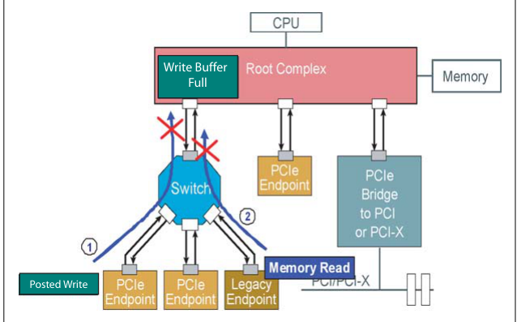

<a id="sec-8-2"></a>
## 8.2 Transaction Ordering | 事务排序

<table>
<thead><tr><th width="50%">🇬🇧 English</th><th width="50%">🇨🇳 中文</th></tr></thead>
<tbody>
<tr>
<td width="50%">

To facilitate this goal, an error detection code called an LCRC (Link Cyclic Redundancy Code) is added to each TLP. The first step in error
checking is sim‐ ply to verify that this code still evaluates correctly at the receiver. If each packet is given a unique incremental
Sequence Number as well, then it will be easy to sort out which packet, out of several that have been sent, encountered an error. Using that
Sequence Number, we can also require that TLPs must be success‐ fully received in the same order they were sent. This simple rule makes it
easy to detect missing TLPs at the Receiver’s Data Link Layer.

The basic blocks in the Data Link Layer associated with the Ack/Nak protocol are shown in greater detail in Figure 10‐2 on page 319. Every
TLP sent across the Link is checked at the receiver by evaluating the LCRC (first) and Sequence Number (second) in the packet. The receiving
device notifies the transmitting device that a good TLP has been received by returning an Ack. Reception of an

**Cha ter 10: Ack/Nak Protocol p** 

Ack at the transmitter means that the receiver has received at least one TLP suc‐ cessfully. On the other hand, reception of a Nak by the
transmitter indicates that the receiver has received at least one TLP in error. In that case, the transmitter will re‐send the appropriate
TLP(s) in hopes of a better result this time. This is sensible, because things that would cause a transmission error would likely be
transient events and a replay will have a very good chance of solving the prob‐ lem.

_Figure 10‐2: Overview of the Ack/Nak Protocol_ 


<br>


Since both the sending and receiving devices in the protocol have both a trans‐ mit and a receive side, this chapter will use the terms: 

- **Transmitter** to mean the device that sends TLPs 

- **Receiver** to mean the device that receives TLPs

</td>
<td width="50%">

为了实现此目标，一种称为 LCRC (Link Cyclic Redundancy Code) 的错误检测码被添加到每个 TLP
中。错误检查的第一步是简单地验证此代码在接收方是否仍然正确求值。如果每个报文还被赋予一个唯一的增量序列号，那么将很容易分清在已发送的几个报文中哪个报文遇到了错误。使用该序列号，我们还可以要求 TLP 必须以其发送的相同顺序成功接收。这个简单的规则使在接收方数据链路层检测缺失的
TLP 变得容易。

与 Ack/Nak 协议相关的数据链路层中的基本块在图 10-2（第 319 页）中更详细地示出。通过链路发送的每个 TLP 在接收方通过评估报文中的 LCRC（首先）和序列号（其次）进行检查。接收设备通过返回 Ack 通知发送设备已收到良好的 TLP。在发送方收到

**第 10 章：Ack/Nak 协议**

Ack 表示接收方已成功接收至少一个 TLP。另一方面，发送方接收到 Nak 表明接收方已至少收到一个错误的 TLP。在这种情况下，发送方将重新发送适当的 TLP，希望这次有更好的结果。这是合理的，因为导致传输错误的因素很可能是瞬时事件，重放 (replay)
将有很好的机会解决问题。

_图 10-2：Ack/Nak 协议概述_

**==> 图片 [374 x 237] 已省略 <==**

**----- 图片文字开始 -----**<br>
Transmit Receiver<br>Device A Device B<br>From To<br>Transaction Layer Transaction Layer<br>Tx Rx<br>Data Link Layer Data Link Layer<br>TLP
DLLP DLLP TLP<br>Sequence TLP LCRC ACK /NAK ACK /NAK Sequence TLP LCRC<br>Replay<br>Buffer De-mux De-mux<br>Error<br>Mux Mux Check<br>Tx Rx
Tx Rx<br>DLLP<br>ACK /<br>NAK<br>Link<br>TLP<br>Sequence TLP LCRC<br>**----- 图片文字结束 -----**<br>


由于协议中的发送和接收设备都同时具有发送和接收侧，因此本章将使用以下术语：

- **发送方 (Transmitter)** 指发送 TLP 的设备

- **接收方 (Receiver)** 指接收 TLP 的设备

</td>
</tr>
<tr>
<td width="50%">

## **Elements of the Ack/Nak Protocol** 

The major Ack/Nak protocol elements of the Data Link Layer are shown in Fig‐ ure 10‐3 on page 320. There’s too much to consider all at once,
though, so let’s begin by focusing on just the transmitter elements, which are shown in a larger view in Figure 10‐4 on page 322.

_Figure 10‐3: Elements of the Ack/Nak Protocol_ 


<br>

</td>
<td width="50%">

## **Ack/Nak 协议的要素**

数据链路层的主要 Ack/Nak 协议元素如图 10-3（第 320 页）所示。要一次考虑的事情太多了，所以让我们从关注发送方元素开始，它们在图 10-4（第 322 页）中的较大视图中显示。

_图 10-3：Ack/Nak 协议的要素_

**==> 图片 [375 x 242] 已省略 <==**

**----- 图片文字开始 -----**<br>
Transaction Layer (TX) Block TLPs; Report Transaction Layer (RX)<br>DLL protocol error<br>Yes Increment NRS Good TLPs<br>No<br>TLPs (NTS-AS)
≥ 2048?<br>(Continue) NEXT_RCV_SEQ (NRS) Seq Num = NRS<br>Assign<br>SequenceNumber (IncrementNEXT_TRANSMIT_SEQ (NTS)) Seq Num < NRS
(Duplicate TLP)(Schedule Ack) Seq Num>, <, =NRS?<br>REPLAY_TIMER<br>LCRC Increment on Replay) Seq Num > NRS (Lost
TLP)<br>REPLAY_NUM<br>Generator (Send Nak) Yes<br>Purge Older TLPs (Reset Both)<br>(Send Nak) No Pass<br>Retry (Replay)Buffer (Replay)Yes
Nak?Nak (Update)AckD_SEQ (AS)No Nak Flag Clear?Set & Send Nak LCRC?<br>Yes AckNak<br>(TLP copy) SeqNum = AS? NAK_SCHEDULED Good
TLP?<br>Clear Nak Flag<br>(TLP copy) Yes Ack Nak<br>(Discard) No CRC?Pass GeneratorAck/Nak AckNak LatencyTimer<br>Ack/Nak<br>DLLP
Link<br>TLP TLP<br>Block TLP during Replay<br>(NRS – 1) = AckNak_Seq_Num[11:0]<br>**----- 图片文字结束 -----**<br>

</td>
</tr>
<tr>
<td width="50%">

## **Transmitter Elements** 

As TLPs arrive from the Transaction Layer, several things are done to prepare them for robust error detection at the receiver. As shown in
the diagram TLPs are first assigned the next sequential Sequence Number, obtained from the 12‐ bit NEXT_TRANSMIT_SEQ counter.

**Cha ter 10: Ack/Nak Protocol p**

</td>
<td width="50%">

## **发送方元素**

当 TLP 从事务层到达时，会执行几项操作以准备它们在接收方进行可靠的错误检测。如图所示，首先为 TLP 分配从 12 位 NEXT_TRANSMIT_SEQ 计数器获得的下一个序列号。

**第 10 章：Ack/Nak 协议**

</td>
</tr>
<tr>
<td width="50%">

## **NEXT_TRANSMIT_SEQ Counter** 

This counter generates the Sequence Number that will be assigned to the next incoming TLP. It’s a 12‐bit counter that is initialized to 0 at
reset or when the Link Layer reports DL_Down (Link Layer is inactive). Since it increments con‐ tinuously with each TLP and only counts
forward, the counter eventually reaches its max value of 4095 and rolls over to 0 as it continues to count.

This Sequence Number assigned to the TLP will be used in the Ack or Nak sent by the receiver to reference this TLP in the Replay Buffer. One
might think that such a large counter means that a large number of unacknowledged TLPs could be in flight, but in practice this is very
unlikely. The main reason is that the receiver has a requirement to send an Ack back for successfully received TLPs within a certain amount
of time. That amount of time is discussed in detail in “AckNak_LATENCY_TIMER” on page 328, but is typically only long enough to transmit a
few max sized packets.

</td>
<td width="50%">

## **NEXT_TRANSMIT_SEQ 计数器**

此计数器生成将分配给下一个传入 TLP 的序列号。它是一个 12 位的计数器，在复位时或当链路层报告 DL_Down（链路层处于非活动状态）时初始化为 0。由于它随每个 TLP 连续递增并且只向前计数，因此计数器最终会达到其最大值 4095，并在继续计数时回绕到 0。

分配给 TLP 的此序列号将在接收方发送的 Ack 或 Nak 中用于引用重放缓冲区 (Replay Buffer) 中的此 TLP。有人可能认为如此大的计数器意味着可能有大量的未确认 TLP 在传输中，但实际上这是极不可能的。主要原因是接收方有要求在特定时间内为成功接收的
TLP 发送回一个 Ack。该时间在第 328 页的"AckNak_LATENCY_TIMER"中详细讨论，但通常只够传输几个最大大小的报文。

</td>
</tr>
<tr>
<td width="50%">

## **LCRC Generator** 

This block generates a 32‐bit CRC (Cyclic Redundancy Check) code based on the header and data to be sent and adds it to the end of the
outgoing packet to facilitate error detection. The name is derived from the fact that this _check code_ (calculated from the packet to be
sent) is _redundant_ (adds no information), and is derived from _cyclic codes_ . Although a CRC doesn’t supply enough information for the
Receiver to do automatic error correction the way ECC (Error Correcting Code) methods can, it does provide robust error detection. CRCs are
commonly used in serial transports because they’re easy to implement in hardware, and because they’re good at detecting burst errors: a
string of incorrect bits. Since this is more likely to happen in a serial design than a parallel model, it helps explain why a CRC is a good
choice for error detection in serial transports. The CRC code is calculated using all fields of the TLP, including the Sequence Num‐ ber.
The receiver will make the same calculation and compare its result to the LCRC field in the TLP. If they don’t match, an error is detected
in the Receiver’s Link Layer.

</td>
<td width="50%">

## **LCRC 生成器**

此块基于要发送的头部和数据生成 32 位 CRC (Cyclic Redundancy Check) 码，并将其添加到传出报文的末尾以促进错误检测。名称来源于以下事实：此 _校验码_（从要发送的报文计算）是 _冗余_（不添加信息）的，并且源自 _循环码_。虽然 CRC
不为接收方提供足够的信息来执行 ECC (Error Correcting Code) 方法那样的自动纠错，但它确实提供了可靠的错误检测。CRC
通常用于串行传输，因为它们易于在硬件中实现，并且擅长检测突发错误：一串不正确的位。由于这在串行设计中比并行模型更可能发生，因此它有助于解释为什么 CRC 是串行传输中错误检测的良好选择。CRC 码是使用 TLP 的所有字段（包括序列号）计算的。接收方将进行相同的计算并将其结果与
TLP 中的 LCRC 字段进行比较。如果它们不匹配，则在接收方的链路层中检测到错误。

</td>
</tr>
<tr>
<td width="50%">

## **Replay Buffer** 

The replay buffer, or retry buffer, stores TLPs, including the Sequence Number and LCRC, in the order of their transmission. When the
transmitter receives an Ack indicating that TLPs have reached the receiver successfully, it purges from the Replay Buffer those TLPs whose
Sequence Number is equal to or earlier than the number in the Ack. In this way, the design allows one Ack to represent several successful
TLPs, reducing the number of Acks that must be sent. Since the packets must always be seen in order, then if an Ack is received with a

Sequence Number of 7, then not only was TLP 7 received successfully, but all the packets before it must also have been received
successfully, so there is no reason to keep a copy of them in the replay buffer.

If a Nak is received, the Sequence Number in the Nak still indicates the last _good_ packet received. So even receiving a Nak can cause the
transmitter to purge TLPs from the replay buffer. However, because it is a Nak, it means that some‐ thing was not received successfully at
the receiver, so after purging all the acknowledged TLPs, the transmitter must replay everything still in the replay buffer in order. For
example, if a Nak is received with a Sequence Number of 9, then packet 9 and all prior packets are purged from the replay buffer, because
the receiver acknowledged that they have been successfully received. However, because it is a Nak, the transmitter must then replay all the
remaining TLPs in the replay buffer in order, starting with packet 10.

_Figure 10‐4: Transmitter Elements Associated with the Ack/Nak Protocol_ 


<br>


**Cha ter 10: Ack/Nak Protocol p**

</td>
<td width="50%">

## **重放缓冲区**

重放缓冲区 (replay buffer) 或重试缓冲区 (retry buffer) 按其传输顺序存储 TLP，包括序列号和 LCRC。当发送方接收到 Ack 指示 TLP 已成功到达接收方时，它会从重放缓冲区中清除那些序列号等于或早于 Ack 中序列号的
TLP。通过这种方式，设计允许一个 Ack 代表多个成功的 TLP，从而减少了必须发送的 Ack 数量。由于报文必须始终按顺序查看，因此如果收到一个

序列号为 7 的 Ack，则不仅 TLP 7 被成功接收，而且其之前的所有报文也必须已被成功接收，因此没有理由在重放缓冲区中保留它们的副本。

如果收到 Nak，则 Nak 中的序列号仍然指示最后 _良好的_ 接收报文。因此，即使收到 Nak 也会导致发送方从重放缓冲区中清除 TLP。但是，因为它是 Nak，这意味着某些内容未在接收方成功接收，因此在清除所有已确认的 TLP
后，发送方必须按顺序重放重放缓冲区中所有剩余的内容。例如，如果收到序列号为 9 的 Nak，则报文 9 和所有先前的报文都从重放缓冲区中清除，因为接收方已确认它们已成功接收。但是，因为它是 Nak，发送方必须随后按顺序重放重放缓冲区中所有剩余的 TLP，从报文 10 开始。

_图 10-4：与 Ack/Nak 协议相关联的发送方元素_

**==> 图片 [217 x 275] 已省略 <==**

**----- 图片文字开始 -----**<br>
Transaction Layer (TX) Block TLPs; Report<br>DLL protocol error<br>Yes<br>No<br>TLPs (NTS-AS) ≥
2048?<br>(Continue)<br>Assign<br>Sequence<br>Number NEXT_TRANSMIT_SEQ (NTS)<br>(Increment)<br>REPLAY_TIMER<br>LCRC Increment on
Replay)<br>REPLAY_NUM<br>Generator<br>Purge Older TLPs<br>(Reset Both)<br>Nak AckD_SEQ (AS)<br>Retry (Replay)Buffer Yes Nak? (Update)
No<br>(Replay)<br>Yes AckNak<br>SeqNum = AS?<br>(TLP copy)<br>(TLP copy) Yes<br>No Pass<br>(Discard) CRC?<br>Link<br>Block TLP during
Replay<br>**----- 图片文字结束 -----**<br>


**第 10 章：Ack/Nak 协议**

</td>
</tr>
<tr>
<td width="50%">

## **REPLAY_TIMER Count** 

This timer is effectively a watchdog timer. It makes sure that the transmitter is receiving Ack/Nak packets for TLPs that have been
transmitted. If this timer expires, it means that the transmitter has sent one or more TLPs that it has not received an acknowledgement for
in the expected time frame. The fix is to retransmit everything in the replay buffer and restart the REPLAY_TIMER.

This timer is running anytime a TLP has been transmitted but not yet acknowledged. If the REPLAY_TIMER is not currently running, it is
started when the last Symbol of any TLP is transmitted. If the timer is already running, then sending additional TLPs does not reset the
timer value. When an Ack or Nak is received that acknowledges TLPs in the replay buffer, the timer resets back to 0, and if there are still
TLPs in the replay buffer (TLPs that have been transmitted, but not yet acknowledged), it immediately starts counting again. However, if an
Ack is received that acknowledges the last TLP in the replay buffer, meaning the replay buffer is now empty, the REPLAY_TIMER resets to 0
but does not count. It will not begin counting again until the last Symbol of the next TLP is transmitted.

</td>
<td width="50%">

## **REPLAY_TIMER 计数**

此计时器实际上是一个看门狗计时器。它确保发送方正在接收已发送 TLP 的 Ack/Nak 报文。如果此计时器到期，则意味着发送方已发送一个或多个 TLP，但未在预期的时间范围内收到确认。解决方法是重新发送重放缓冲区中的所有内容并重新启动 REPLAY_TIMER。

此计时器在任何 TLP 已传输但尚未确认时都处于运行状态。如果 REPLAY_TIMER 当前未运行，则在发送任何 TLP 的最后一个符号时启动。如果计时器已经在运行，则发送其他 TLP 不会重置计时器值。当收到确认重放缓冲区中 TLP 的 Ack 或 Nak 时，计时器重置回
0，如果重放缓冲区中仍有 TLP（已传输但尚未确认的 TLP），则它会立即开始重新计数。但是，如果收到的 Ack 确认了重放缓冲区中的最后一个 TLP，意味着重放缓冲区现在为空，则 REPLAY_TIMER 重置为 0 但不计数。它将不会再次开始计数，直到下一个 TLP
的最后一个符号被传输。

</td>
</tr>
<tr>
<td width="50%">

## **REPLAY_NUM Count** 

This 2‐bit counter tracks the number of replay attempts after reception of a Nak or a REPLAY_TIMER time‐out. When the REPLAY_NUM count rolls
over from 11b to 00b (indicating 4 failed attempts to deliver the same set of TLPs), the Data Link Layer automatically forces the Physical
Layer to retrain the Link (LTSSM goes to the Recovery state). When re‐training is finished, it will attempt to send the failed TLPs again.
The REPLAY_NUM counter is initialized to 00b at reset, or when the Link Layer is inactive. It is also reset whenever an Ack DLLP is received
with a Sequence Number that is more recent than the last one seen, meaning forward progress is being made.

</td>
<td width="50%">

## **REPLAY_NUM 计数**

此 2 位计数器跟踪在接收到 Nak 或 REPLAY_TIMER 超时之后的重放尝试次数。当 REPLAY_NUM 计数从 11b 回绕到 00b（表示对同一组 TLP 进行了 4 次失败的传递尝试）时，数据链路层自动强制物理层重新训练链路（LTSSM 进入 Recovery
状态）。重新训练完成后，它将尝试再次发送失败的 TLP。REPLAY_NUM 计数器在复位时或当链路层处于非活动状态时初始化为 00b。每当收到序列号比上次看到的更新的 Ack DLLP 时，它也会被重置，这意味着正在取得进展。

</td>
</tr>
<tr>
<td width="50%">

## **ACKD_SEQ Register** 

This 12‐bit register stores the Sequence Number of the most recently received Ack or Nak. It is initialized to all 1s at reset, or when the
Data Link Layer is inac‐ tive. This register is updated with the AckNak_Seq_Num [11:0] field of a received Ack or Nak. The ACKD_SEQ count is
compared with the Sequence Number in the last received Ack or Nak to check for forward progress. If the lat‐ est Ack/Nak had a Sequence
Number later than the ACKD_SEQ register, then we’re making forward progress.

</td>
<td width="50%">

## **ACKD_SEQ 寄存器**

此 12 位寄存器存储最近接收到的 Ack 或 Nak 的序列号。它在复位时或当数据链路层处于非活动状态时初始化为全 1。此寄存器使用接收到的 Ack 或 Nak 的 AckNak_Seq_Num [11:0] 字段更新。将 ACKD_SEQ 计数与最后接收到的 Ack 或
Nak 中的序列号进行比较，以检查是否取得进展。如果最新的 Ack/Nak 的序列号晚于 ACKD_SEQ 寄存器，那么我们正在取得进展。

</td>
</tr>
<tr>
<td width="50%">

## **PCI Express Technology** 

As an aside, we use the term “later Sequence Number” to account for the fact that, like most counters in PCIe, the Sequence Number counters
only count for‐ ward, meaning that they’ll eventually roll over back to zero. Technically, a later number would mean a numerically higher
value, but we have to remember that when the counter reaches 4095 (it’s a 12‐bit counter), the next higher number will be zero. This
wrap‐around effect will be easier to see in the examples later, as in “Ack/Nak Examples” on page 331.

</td>
<td width="50%">

## **PCI Exress Technology**

顺便说一句，我们使用术语"较晚的序列号"来解释以下事实：与 PCIe 中的大多数计数器一样，序列号计数器仅向前计数，这意味着它们最终会回绕回零。从技术上讲，较晚的数字将意味着数值更高的值，但我们必须记住，当计数器达到 4095（它是 12
位计数器）时，下一个更高的数字将为零。这种回绕效果将在后面的示例中更容易看到，如第 331 页的"Ack/Nak 示例"中所示。

</td>
</tr>

</tbody>
</table>

[⬆️ 返回目录](#本章目录-table-of-contents)

---


<a id="sec-8-3"></a>
## 8.3 Transaction Ordering | 事务排序

<table>
<thead><tr><th width="50%">🇬🇧 English</th><th width="50%">🇨🇳 中文</th></tr></thead>
<tbody>
<tr>
<td width="50%">

As shown in Figure 10‐4 on page 322, when an Ack or Nak makes forward progress it causes TLPs with Sequence Numbers equal to or older than
the value in the DLLP to be purged out of the Replay Buffer. It also resets both the REPLAY_TIMER and the REPLAY_NUM count. If no forward
progress is made, no TLPs can be purged so we only check to see if it’s a Nak that would necessi‐ tate a replay.

This is a good place to mention a potential problem with the counters: the num‐ ber of TLPs sent might theoretically become much larger than
the number that have been acknowledged by the receiver. As mentioned earlier, this is very unlikely; it’s only mentioned here for
completeness. The problem is basically the same as it for the Flow Control counters (see “Stage 3 — Counters Roll Over” on page 234) and has
the same solution: the NEXT_TRANSMIT_SEQ and ACKD_SEQ counters are never allowed to be separated by more than half their total count value.
If a large number of TLPs are sent without acknowledgement so that the NEXT_TRANSMIT_SEQ count value is later than ACKD_SEQ count by 2048,
no more TLPs will be accepted from the Transaction Layer until this is resolved by receiving more Acks. If the difference between the
Sequence Num‐ ber sent and the acknowledged count ever did exceed half the maximum count value, a Data Link Layer protocol error would be
reported. (For more on error reporting, see “Data Link Layer Errors” on page 655.)

</td>
<td width="50%">

如图 10-4（第 322 页）所示，当 Ack 或 Nak 取得进展时，它会导致序列号等于或早于 DLLP 中值的 TLP 从重放缓冲区中清除。它还会重置 REPLAY_TIMER 和 REPLAY_NUM 计数。如果没有取得进展，则无法清除任何
TLP，因此我们只检查它是否是会引起重放的 Nak。

这是提及计数器潜在问题的好地方：发送的 TLP 数量在理论上可能远大于接收方已确认的数量。如前所述，这是极不可能的；此处提及只是为了完整起见。问题基本上与流控计数器的问题相同（参见第 234 页的"阶段 3 —
计数器回绕"）并具有相同的解决方案：NEXT_TRANSMIT_SEQ 和 ACKD_SEQ 计数器永远不允许被超过其总计数值一半的值分隔。如果发送了大量 TLP 而没有确认，使得 NEXT_TRANSMIT_SEQ 计数值比 ACKD_SEQ 计数晚 2048，则在通过接收更多
Ack 解决此问题之前，将不再从事务层接受更多 TLP。如果发送的序列号与已确认计数之间的差异确实超过最大计数值的一半，则将报告数据链路层协议错误。（有关错误报告的更多信息，请参见第 655 页的"数据链路层错误"。）

</td>
</tr>
<tr>
<td width="50%">

## **DLLP CRC Check** 

This block checks for errors in the 16‐bit CRC of DLLPs. If an error is detected, the DLLP is discarded and a Correctable Error may be
reported, if enabled. No further action is taken because there is no mechanism to replay or correct failed DLLPs. Instead, we simply wait
for the next successful Ack/Nak, which will get the counters back up‐to‐date and allow normal operation to continue.

</td>
<td width="50%">

## **DLLP CRC 检查**

此块检查 DLLP 的 16 位 CRC 中的错误。如果检测到错误，则丢弃该 DLLP，并可能报告一个可纠正错误（如果已启用）。不会采取进一步的操作，因为没有重放或更正失败 DLLP 的机制。相反，我们只是等待下一个成功的
Ack/Nak，它将使计数器恢复最新状态并允许正常操作继续。

</td>
</tr>
<tr>
<td width="50%">

## **Receiver Elements** 

Incoming TLPs are first checked for LCRC errors and then for Sequence Num‐ bers. If there are no errors, the TLP is forwarded to the
receiver’s Transaction

**Cha ter 10: Ack/Nak Protocol p** 

Layer. If there are errors, the TLP is discarded and a Nak will be scheduled unless there was already a Nak outstanding. 

Figure 10‐5 on page 325 illustrates the receiver Data Link Layer elements associ‐ ated with processing of inbound TLPs and outbound Ack/Nak
DLLPs.

_Figure 10‐5: Receiver Elements Associated with the Ack/Nak Protocol_ 


<br>

</td>
<td width="50%">

## **接收方元素**

传入的 TLP 首先检查 LCRC 错误，然后检查序列号。如果没有错误，则 TLP 将转发到接收方的事务层。如果有错误，则 TLP 被丢弃，并且将调度一个 Nak，除非已经有一个 Nak 未完成。

**第 10 章：Ack/Nak 协议**

图 10-5（第 325 页）说明了与入站 TLP 和出站 Ack/Nak DLLP 处理相关联的接收方数据链路层元素。

_图 10-5：与 Ack/Nak 协议相关联的接收方元素_

**==> 图片 [223 x 281] 已省略 <==**

**----- 图片文字开始 -----**<br>
Transaction Layer (RX)<br>Increment NRS Good TLPs<br>NEXT_RCV_SEQ (NRS) Seq Num = NRS<br>Seq Num < NRS (Duplicate TLP) Seq Num<br>(Schedule
Ack) >, <, =<br>NRS?<br>Seq Num > NRS (Lost TLP)<br>(Send Nak) Yes<br>(Send Nak) No Pass<br>LCRC?<br>Nak Flag Clear?<br>Set & Send
Nak<br>NAK_SCHEDULED Good TLP?<br>Clear Nak Flag<br>Ack Nak<br>Ack/Nak AckNak Latency<br>Generator Timer<br>Link<br>(NRS – 1) =
AckNak_Seq_Num[11:0]<br>**----- 图片文字结束 -----**<br>

</td>
</tr>
<tr>
<td width="50%">

## **LCRC Error Check** 

This block checks for transmission errors in the received TLP by verifying the 32‐bit LCRC. This block calculates an LCRC value based on the
received bits of the TLP and then compares the calculated LCRC to the received LCRC. If they match, then all the bits of the packet were
received exactly as they were trans‐ mitted. If it doesn’t match, then there was a bit error in the TLP so it gets dropped and a Nak will be
sent to get a replay of that packet and any TLPs sent after the bad packet.

</td>
<td width="50%">

## **LCRC 错误检查**

此块通过验证 32 位 LCRC 来检查接收到的 TLP 中的传输错误。此块根据接收到的 TLP 位计算 LCRC 值，然后将计算出的 LCRC 与接收到的 LCRC 进行比较。如果它们匹配，则报文的所有位都按发送时完全接收。如果不匹配，则 TLP
中存在位错误，因此它被丢弃，并将发送 Nak 以重放该报文和错误报文之后发送的所有 TLP。

</td>
</tr>
<tr>
<td width="50%">

## **NEXT_RCV_SEQ Counter** 

The 12‐bit NEXT_RCV_SEQ (Next Receive Sequence number) counter keeps track of the expected Sequence Number and is used to verify sequential
packet reception. It’s initialized to 0 at reset or when the Data Link Layer is inactive, and is incremented once for each good TLP
forwarded to the Transaction Layer. TLPs that have errors or were nullified are not sent to the Transaction Layer and therefore don’t
increment this counter.

</td>
<td width="50%">

## **NEXT_RCV_SEQ 计数器**

12 位 NEXT_RCV_SEQ（下一个接收序列号）计数器跟踪预期的序列号，并用于验证顺序报文接收。它在复位时或当数据链路层处于非活动状态时初始化为 0，并且对于转发到事务层的每个良好 TLP 递增一次。有错误或被作废的 TLP 不会发送到事务层，因此不会增加此计数器。

</td>
</tr>
<tr>
<td width="50%">

## **Sequence Number Check** 

If the LCRC check was OK, the TLP’s Sequence Number is checked against the expected count (the NRS number). As can be seen in Figure 10‐5 on
page 325, there are three possible outcomes of this check:

1. The TLP Sequence Number equals the NRS count (the number we’re expecting). In this case, everything is good: the TLP is accepted and for‐
warded to the Transaction Layer and the NRS count is incremented. The Receiver schedules an Ack, but it doesn’t have to be sent until the
AckNak_LATENCY_TIMER expires. In the meantime, other good TLPs may be received, incrementing the NEXT_RCV_SEQ counter. Then, once the timer
expires, a single Ack is sent with the Sequence Number of the last good TLP received (NRS ‐ 1). That allows one Ack to represent several
suc‐ cessful TLPs and reduces overhead, since a dedicated Ack is not required for every TLP.

2. If the TLP’s Sequence Number is earlier than the NRS count (smaller than expected), this TLP has been seen before and is a duplicate. As
long as the expected Sequence Number and received Sequence Number don’t get sepa‐ rated by more than half the total count value (2048), this
is not an error, but is seen as a duplicate, meaning the TLP has already been accepted earlier. In this case, the TLP is silently dropped
(no Nak, no error reporting) and an Ack is sent with the Sequence Number of the last good TLP it received (NRS ‐ 1). Why would this
situation happen? The transmitter may not have received a transmitted Ack, so his REPLAY_TIMER expired and he retrans‐ mitted everything in
his Replay Buffer. By sending the transmitter an Ack with the Sequence Number of the last good packet we received, we’re noti‐ fying him of
the furthest progress we’ve made.

3. If the TLP’s Sequence Number is a later Sequence Number than NEXT_RCV_SEQ count (larger than expected), then the Link Layer has missed a
TLP. For example, if we’re expecting Sequence Number 30 and the incoming TLP has Sequence Number 31 we know there’s a problem. The numbers
must be sequential and, since they aren’t, one must have failed

**Cha ter 10: Ack/Nak Protocol p** 

and been dropped, as might happen at the Physical Layer. This out‐of‐order TLP is discarded, whether or not it had any other errors because
we must accept TLPs in order, and a Nak will be sent if there wasn’t one already out‐ standing.

The concept of the expected sequence number (NRS) incrementing as new TLPs are successfully received and seeing how that affects the sliding
windows for the invalid range of sequence numbers and the duplicate range of sequence numbers can be seen in Figure 10‐6.

_Figure 10‐6: Examples of Sequence Number Ranges_ 


<br>

</td>
<td width="50%">

## **序列号检查**

如果 LCRC 检查通过，则将 TLP 的序列号与预期计数（NRS 编号）进行检查。如图 10-5（第 325 页）所示，此检查有三种可能的结果：

1. TLP 序列号等于 NRS 计数（我们期望的编号）。在这种情况下，一切正常：TLP 被接受并转发到事务层，并且 NRS 计数递增。接收方调度一个 Ack，但不必在 AckNak_LATENCY_TIMER 到期之前发送它。在此期间，可能会收到其他良好的 TLP，从而增加
NEXT_RCV_SEQ 计数器。然后，一旦计时器到期，将发送一个 Ack，其中包含最后接收到的良好 TLP 的序列号（NRS - 1）。这允许一个 Ack 代表多个成功的 TLP 并减少开销，因为不需要为每个 TLP 都使用专用的 Ack。

2. 如果 TLP 的序列号早于 NRS 计数（小于预期），则该 TLP 之前已见过，是重复的。只要预期序列号和接收到的序列号不被超过总计数值一半（2048）的值分隔，这不算错误，但被视为重复，意味着该 TLP 之前已被接受。在这种情况下，TLP 被静默丢弃（无
Nak，无错误报告），并发送一个 Ack，其中包含它接收到的最后良好 TLP 的序列号（NRS - 1）。为什么会出现这种情况？发送方可能未收到已发送的 Ack，因此其 REPLAY_TIMER
已过期，并重新发送了其重放缓冲区中的所有内容。通过向发送方发送一个带有我们接收到的最后良好报文序列号的 Ack，我们正在通知它我们已取得的最远进展。

3. 如果 TLP 的序列号是比 NEXT_RCV_SEQ 计数更晚的序列号（大于预期），则链路层已错过一个 TLP。例如，如果我们在等待序列号 30 并且传入的 TLP 具有序列号 31，我们就知道存在问题。编号必须按顺序排列，既然不是，则一定有一个失败了

**第 10 章：Ack/Nak 协议**

并已被丢弃，例如可能在物理层发生。这种乱序 TLP 将被丢弃，无论它是否有任何其他错误，因为我们必须按顺序接受 TLP，并且如果尚未有未完成的 Nak，则将发送一个 Nak。

预期序列号 (NRS) 随着新 TLP 的成功接收而递增的概念，以及它如何影响无效序列号范围和重复序列号范围的滑动窗口，可以在图 10-6 中看到。

_图 10-6：序列号范围示例_

**==> 图片 [270 x 286] 已省略 <==**

**----- 图片文字开始 -----**<br>
0 30 2078 4095<br>Dupli- Invalid<br>Duplicate<br>cate (out of sequence)<br>Next Receive<br>Sequence (NRS) Number<br>0 31 2079
4095<br>Invalid<br>Duplicate Duplicate<br>(out of sequence)<br>Next Receive<br>Sequence (NRS) Number<br>0 32 2080
4095<br>Invalid<br>Duplicate Duplicate<br>(out of sequence)<br>Next Receive<br>Sequence (NRS) Number<br>**----- 图片文字结束 -----**<br>

</td>
</tr>
<tr>
<td width="50%">

## **NAK_SCHEDULED Flag** 

This flag is set whenever the receiver schedules a Nak, and is cleared when the receiver successfully receives the TLP with the expected
Sequence Number (NRS). The spec is clear that the receiver must not schedule additional Nak DLLPs while the NAK_SCHEDULED flag remains set.
The author’s opinion is

that this is intended to prevent the possibility of an endless loop; a case in which the transmitter begins to replay some packets but the
receiver sends another Nak before the replays finish and causes it to restart sending them again. What‐ ever the motivation, once a Nak has
been sent there will be no more Naks forth‐ coming until the problem is resolved by successful receipt of the replayed TLP with the correct
Sequence Number.

</td>
<td width="50%">

## **NAK_SCHEDULED 标志**

每当接收方调度一个 Nak 时，此标志被置位，并在接收方成功接收到具有预期序列号 (NRS) 的 TLP 时被清除。规范明确规定，接收方在 NAK_SCHEDULED 标志保持置位时不得调度其他 Nak DLLP。作者认为

这是为了防止出现无限循环的可能性；在这种情况下，发送方开始重放某些报文，但接收方在重放完成之前发送另一个 Nak，并导致它重新开始发送它们。无论动机如何，一旦发送了 Nak，在问题通过成功接收具有正确序列号的重放 TLP 得到解决之前，将不会有更多 Nak 出现。

</td>
</tr>
<tr>
<td width="50%">

## **AckNak_LATENCY_TIMER** 

This timer is running anytime a receiver successfully receives a TLP that it has not yet acknowledged. The receiver is required to send an
Ack once the timer expires. The length of time the AckNak Latency Timer runs is dictated by the spec (see “AckNak_LATENCY_TIMER” on page
328) and determines how long a receiver can coalesce Acks. Once the AckNak Latency Timer expires, an Ack with sequence number NRS‐1 is
generated and sent which indicates the last good packet it received. This timer is reset whenever an Ack or Nak are sent and it only
restarts once a new good TLP is received.

</td>
<td width="50%">

## **AckNak_LATENCY_TIMER**

此计时器在接收方成功接收尚未确认的 TLP 时一直处于运行状态。接收方需要在计时器到期时发送一个 Ack。AckNak 延迟计时器运行的时间长度由规范规定（参见第 328 页的"AckNak_LATENCY_TIMER"），并确定接收方可以合并 Ack 的时间。一旦 AckNak
延迟计时器到期，将生成并发送一个序列号为 NRS‐1 的 Ack，它指示最后接收到的良好报文。每当发送 Ack 或 Nak 时，此计时器都会重置，并且只有在接收到新的良好 TLP 时才会重新启动。

</td>
</tr>
<tr>
<td width="50%">

## **Ack/Nak Generator** 

Ack or Nak DLLPs are scheduled by the error checking blocks and contain a 12‐ bit AckNak_Seq_Num field as illustrated in Figure 10‐7 on page
328. It calcu‐ lates this number by subtracting one from the NRS count, which results in reporting the last good Sequence Number received.
That’s because a good TLP received increments NRS before scheduling the Ack, while a failed TLP just schedules a Nak without incrementing
NRS. This method makes it easier to handle failed packets because the error in the TLP might have been in the Sequence Number, so that
number can’t be used in the Nak. Instead, it uses the number of the last good TLP; what we’re expecting minus one. The only case where this
value doesn’t represent the last good TLP is for the first TLP after a reset. If that first TLP, using Sequence Number 0, fails, the
resulting Nak will have an AckNak_Seq_Num value of zero minus one which results in all 1’s.

_Figure 10‐7: Ack Or Nak DLLP Format_ 


<br>


**Cha ter 10: Ack/Nak Protocol p** 

_Table 10‐1: Ack or Nak DLLP Fields_ 

|**Field Name**|**Header Byte/Bit**|**DLLP Function**|
|---|---|---|
|DLLP Type|Byte 0, [7:0]|Indicates the type: • 0000 0000b = Ac...|
|AckNak_Seq_Num|Byte 2, [3:0] Byte 3, [7:0]|This value will always be NEXT_RCV_SE...|
|16‐bit CRC|Byte 4, [7:0] Byte 5, [7:0]|16‐bit CRC used to protect the conten...|

</td>
<td width="50%">

## **Ack/Nak 生成器**

Ack 或 Nak DLLP 由错误检查块调度，并包含一个 12 位的 AckNak_Seq_Num 字段，如图 10-7（第 328 页）所示。它通过从 NRS 计数中减去 1 来计算此数字，从而报告最后接收到的良好序列号。这是因为接收到的良好 TLP 会在调度 Ack
之前递增 NRS，而失败的 TLP 只会调度 Nak 而不递增 NRS。这种方法使处理失败报文更容易，因为 TLP 中的错误可能在序列号中，因此该号码不能在 Nak 中使用。相反，它使用最后良好 TLP 的号码；我们预期的减一。唯一不表示最后良好 TLP 的情况是复位后的第一个
TLP。如果使用序列号 0 的第一个 TLP 失败，则生成的 Nak 的 AckNak_Seq_Num 值将为零减一，结果为全 1。

_图 10-7：Ack 或 Nak DLLP 格式_

**==> 图片 [386 x 97] 已省略 <==**

**----- 图片文字开始 -----**<br>
+0 +1 +2 +3<br>7 6 5 4 3 2 1 0 7 6 5 4 3 2 1 0 7 6 5 4 3 2 1 0 7 6 5 4 3 2 1 0<br>0000 0000 - Ack<br>Byte 0 0001 0000 - Nak Reserved
AckNak_Seq_Num<br>Byte 4 16 位 CRC<br>**----- 图片文字结束 -----**<br>


**第 10 章：Ack/Nak 协议**

_表 10-1：Ack 或 Nak DLLP 字段_

|**字段名**|**头部字节/位**|**DLLP 功能**|
|---|---|---|
|DLLP 类型|Byte 0, [7:0]|指示类型：<br>• 0000 0000b = Ack<br>• 0001 0000b = Nak|
|AckNak_Seq_Num|Byte 2, [3:0]<br>Byte 3, [7:0]|此值将始终为 NEXT_RCV_SEQ 计数 - 1。|
|16 位 CRC|Byte 4, [7:0]<br>Byte 5, [7:0]|用于保护此 DLLP 内容的 16 位 CRC。|

</td>
</tr>
<tr>
<td width="50%">

## **Ack/Nak Protocol Details** 

This section describes the detailed transmitter and receiver behavior in process‐ ing TLPs and Ack/Nak DLLPs. Several examples are used to
demonstrate vari‐ ous cases that may occur.

</td>
<td width="50%">

## **Ack/Nak 协议详细信息**

本节描述了在处理 TLP 和 Ack/Nak DLLP 时发送方和接收方的详细行为。使用了一些示例来演示可能发生的各种情况。

</td>
</tr>
<tr>
<td width="50%">

## **Transmitter Protocol Details**

</td>
<td width="50%">

## **发送方协议详细信息**

</td>
</tr>
<tr>
<td width="50%">

## **Sequence Number** 

Referring back to Figure 10‐4 on page 322, when TLPs are delivered by the Transaction Layer to the Link Layer, one of the first steps is to
append a 12‐bit Sequence Number. Keep in mind that the next incremental Sequence Number may actually be smaller, as will happen when the
counter rolls over back to zero after it reaches a maximum value of 4095. Consequently, a value of zero can actually be ‘larger’ than a
value of 4095, for example. It may help to think of the Sequence Number comparison as evaluating a ‘window’ of numbers that con‐ sistently
moves upward and rolls over. To clarify this concept, such a count roll‐ over is used in several of the upcoming examples.

</td>
<td width="50%">

## **序列号**

参考图 10-4（第 322 页），当 TLP 由事务层传送到链路层时，第一步是附加一个 12 位的序列号。请记住，下一个增量序列号实际上可能更小，例如当计数器在达到最大值 4095 后回绕回零时就会发生这种情况。因此，例如，零的值实际上可以"大于"4095
的值。将序列号比较视为评估一个持续向上移动并回绕的"窗口"可能会有所帮助。为了阐明此概念，在接下来的几个示例中使用了这样的计数回绕。

</td>
</tr>
<tr>
<td width="50%">

## **32-Bit LCRC** 

The transmitter also generates and appends a 32‐bit LCRC (Link CRC) based on the TLP contents (Sequence Number, Header, Data Payload and
ECRC).

## **Replay (Retry) Buffer**

</td>
<td width="50%">

## **32 位 LCRC**

发送方还根据 TLP 内容（序列号、头部、数据有效负载和 ECRC）生成并附加一个 32 位的 LCRC (Link CRC)。

</td>
</tr>
<tr>
<td width="50%">

</td>
<td width="50%">

## **重放（重试）缓冲区**

**概述。** 在设备传输 TLP 之前，它将 TLP 的副本存储在重放缓冲区中。（_请注意，规范使用术语重试缓冲区 (Retry Buffer)，但在本书中选择了"重放"而不是"重试"，以更清楚地区分此机制与旧的 PCI 重试机制_）。每个缓冲区条目存储一个完整的
TLP，包括其所有字段，包括序列号（12 位宽，占两个字节）、头部（最多 16 字节）、可选的数据有效负载（最多 4KB）、可选的 ECRC（4 字节）和 LCRC 字段（4 字节）。

需要注意的是，规范以这种方式描述了重放缓冲区，但它并不是必须以这种方式实现的规范要求。只要您的设备能够在需要时按规范定义重放一系列 TLP，那么如何在设备内完成这一点的设计就完全取决于设计人员。拥有如上所述行为的重放缓冲区是实现此目的的一种方法。

**重放缓冲区大小调整。** 规范编写者选择不指定重放缓冲区的大小，将其作为设备设计人员的优化。它应该足够大以存储尚未被 Ack 确认的 TLP，以便在正常操作条件下它不会变满并停止从事务层传入的新 TLP，但也要足够小以降低成本。要确定最佳缓冲区大小，设计人员将考虑：

- 来自接收方的 Ack DLLP 延迟。

- 物理链路引起的延迟。

- 接收方 L0s 退出到 L0 的延迟。换句话说，缓冲区应足够大以容纳 TLP 而不会在链路从 L0s 状态返回到 L0 时停顿。

当发送方收到 Ack 时，它会从重放缓冲区中清除序列号等于或早于 Ack 中序列号的 TLP（_通常此术语为"小于"，但计数器回绕行为有时会使该评估不正确，因此选择了"早于"一词_）。类似地，当发送方收到 Nak 时，它仍然会从重放缓冲区中清除序列号等于或早于 Nak
中到达的序列号的 TLP，但随后它还会重放（重新发送）较晚序列号的 TLP（重放缓冲区中剩余的 TLP）。

**第 10 章：Ack/Nak 协议**

</td>
</tr>
<tr>
<td width="50%">

</td>
<td width="50%">

## **发送方对 Ack DLLP 的响应**

接收方返回的单个 Ack 可以确认多个 TLP；不必每个发送的 TLP 都收到一个专用的 Ack。接收方可以获得多个良好的 TLP，并发送一个带有最后接收到的良好 TLP 序列号的 Ack。发送方对取得进展的 Ack（具有比上次看到的更晚的序列号）的响应是将 AckD_SEQ
寄存器加载为新 Ack 的序列号。它还会重置 REPLAY_NUM 计数器和 REPLAY_TIMER，并清除重放缓冲区中由该 Ack 确认的所有 TLP。

</td>
</tr>
<tr>
<td width="50%">

</td>
<td width="50%">

## **Ack/Nak 示例**

**示例 1。** 在以下讨论中请考虑图 10-8（第 332 页）。

1. 设备 A 发送序列号为 3、4、5、6、7 的 TLP。

2. 设备 B 成功接收 TLP 3 并将其 NEXT_RCV_SEQ 计数器从 3 增加到 4。由于设备 B 先前已确认所有成功接收的 TLP，因此 AckNak_LATENCY_TIMER 未运行。在接收到 TLP 3 后，设备 B 现在已成功接收到一个尚未确认的
TLP，因此启动 AckNak_LATENCY_TIMER（这相当于调度一个 Ack）。

3. 设备 B 在 AckNak_LATENCY_TIMER 到期之前成功接收 TLP 4 和 5。接收 TLP 4 和 5 不会重置 AckNak_LATENCY_TIMER。

4. 一旦 AckNak_LATENCY_TIMER 到期，设备 B 发送一个序列号为 5 的 Ack，这是最后接收到的良好 TLP。AckNak_LATENCY_TIMER 被重置，但在成功接收到 TLP 6 之前不会重新启动。

5. 设备 A 接收到 Ack 5，重置 REPLAY_TIMER 和 REPLAY_NUM 计数器，因为正在取得进展。并且它会从重放缓冲区中清除序列号早于或等于 5 的 TLP。

6. 一旦设备 B 接收到 TLP 6 和 7 并且其 AckNak_LATENCY_TIMER 再次到期，它将发送一个序列号为 7 的 Ack，根据本示例，这将清除设备 A 重放缓冲区中最后两个 TLP。

</td>
</tr>
<tr>
<td width="50%">

</td>
<td width="50%">

## **PCI Exress Technology**

_图 10-8：示例 1 — Ack 示例_

**==> 图片 [378 x 249] 已省略 <==**

**----- 图片文字开始 -----**<br>
3 Good TLP<br>Receive Buffer<br>4 Good TLP<br>Device A Device B<br>Data Link Layer NEXT_TRANSMIT_SEQ Data Link Layer<br>5 Good TLP<br>Replay
Buffer 8 NEXT_RCV_SEQ<br>6<br>REPLAY_TIMER<br>NAK_SCHEDULED<br>0<br>Later TLP 7<br>6 Ack<br>Purge Lat Tmr<br>5 5<br>4<br>Earlier TLP 3
Ack/Nak<br>Generator<br>Link<br>7 6<br>**----- 图片文字结束 -----**<br>


**示例 2。** 此示例显示与示例 1 完全相同的行为，但它指出了序列号的回绕行为，如图 10-9（第 333 页）所示。

1. 设备 A 发送序列号为 4094、4095、0、1 和 2 的 TLP，其中 TLP 4094 是本例中发送的第一个 TLP，TLP 2 是本例中发送的最后一个 TLP。

2. 设备 B 按该顺序成功接收序列号为 4094、4095、0、1 的 TLP。接收 TLP 4094 会导致 AckNak_LATENCY_TIMER 启动。TLP 4095、0 和 1 在 AckNak_LATENCY_TIMER 到期之前被接收。TLP 2 仍在传输中。

3. 由于 AckNak_LATENCY_TIMER 已到期，设备 B 发送一个序列号为 1 的 Ack，以确认 TLP 1 以及所有先前的 TLP（本例中为 0、4095 和 4094）的接收。

4. 设备 A 成功接收 Ack 1，从重放缓冲区中清除 TLP 4094、4095、0 和 1，并重置 REPLAY_TIMER 和 REPLAY_NUM 计数。

**第 10 章：Ack/Nak 协议**

_图 10-9：示例 2 — 序列号回绕的 Ack_

**==> 图片 [381 x 260] 已省略 <==**

**----- 图片文字开始 -----**<br>
4094 Good TLP<br>Receive Buffer 4095 Good TLP<br>0 Good TLP<br>Device A Device B<br>Data Link Layer NEXT_TRANSMIT_SEQ Data Link Layer<br>1
Good TLP<br>Replay Buffer 3 NEXT_RCV_SEQ<br>2<br>REPLAY_TIMER<br>NAK_SCHEDULED<br>0<br>Later TLP 2 Ack<br>Purge<br>1 1<br>0 Lat
Tmr<br>4095<br>Earlier TLP 4094 Ack/Nak<br>Generator<br>Link<br>2<br>**----- 图片文字结束 -----**<br>

</td>
</tr>
<tr>
<td width="50%">

</td>
<td width="50%">

## **发送方对 Nak 的响应**

Nak 表示发生了问题。当发送方收到 Nak 时，它首先从重放缓冲区中清除任何具有较早或相等序列号的 TLP，然后按 Nak 中的序列号紧随其后的序列号开始重放剩余的 TLP。如果 Nak 导致至少一个 TLP 从缓冲区中被清除，那么我们已经取得了进展。在这种情况下，发送方重置
REPLAY_NUM 计数器和 REPLAY_TIMER，并将 AckD_SEQ 寄存器加载为 Nak 的序列号。

</td>
</tr>
<tr>
<td width="50%">

</td>
<td width="50%">

## **TLP 重放**

当需要重放时，发送方阻止从事务层接受新的 TLP。然后它按它们放入缓冲区的相同顺序（如 FIFO）重放缓冲区中必要的 TLP。重放事件后，数据链路层解除阻止从事务层接受新的 TLP。

重放的 TLP 保留在缓冲区中，直到它们在稍后的某个时间最终被确认。

</td>
</tr>
<tr>
<td width="50%">

</td>
<td width="50%">

## **高效的 TLP 重放**

必须在重放期间处理接收到的 Ack 或 Nak DLLP。因此这里有两个主要选项：发送方可以保留它们直到重放完成，然后评估 Ack 或 Nak 并采取适当的步骤。另一个选项是在重放期间开始处理新的 Ack/Nak DLLP。如果使用此选项，新接收的 Ack
可能会在重放进行时从缓冲区中清除某些条目，从而可能减少需要重放的 TLP 数量并节省链路上的时间。这是允许的，但重要的是要记住，一旦 TLP 开始传输，就必须完成。

</td>
</tr>
<tr>
<td width="50%">

</td>
<td width="50%">

## **Nak 的示例**

请考虑图 10-10（第 335 页）。

1. 设备 A 发送序列号为 4094、4095、0、1 和 2 的 TLP。

2. 设备 B 无错误地接收 TLP 4094，并将 NEXT_RCV_SEQ 计数增加到 4095，然后启动 AckNak_LATENCY_TIMER。

3. 设备 B 在接收到的下一个 TLP (TLP 4095) 中检测到 CRC 错误，并设置 NAK_SCHEDULED 标志，这将导致发送序列号为 4094（NEXT_RCV_SEQ 计数 - 1）的 Nak。设备 B 不会等到 AckNak_LATENCY_TIMER
到期后再发送 Nak。它通常会在下一个报文边界上发送。事实上，由于已调度 Nak 进行传输，因此 AckNak_LATENCY_TIMER 已停止并重置。

4. 设备 B 将继续评估传入的 TLP，寻找 TLP 4095。但是，由于设备 A 尚不知道存在问题，它已发送报文 0、1 和 2，设备 B 将接收它们。但是，设备 B 不会接受它们，即使它们可能是良好的 TLP（这意味着它们未通过 LCRC
检查）。这是因为所有报文必须按顺序接受。所以设备 B 将简单地丢弃这些报文，因为它们被视为顺序错误，但不会发送额外的 Nak。即使这些 TLP 中的一个或多个未通过 LCRC 检查，也不会发送额外的 NAK。NAK_SCHEDULED 标志已置位，只有当设备 B 成功接收到预期的
TLP（本例中为 TLP 4095）时，它才会被清除。

**第 10 章：Ack/Nak 协议**

5. 设备 A 接收到 Nak 4094，并从重放缓冲区中清除 TLP 4094 和较早的 TLP（本例中没有）。此外，由于已取得进展，它会重置 REPLAY_TIMER 和 REPLAY_NUM 计数。

6. 由于接收到的确认 DLLP 是 Nak 而不是 Ack，设备 A 然后重放重放缓冲区中所有剩余的 TLP（TLP 4095、0、1 和 2）并重新启动 REPLAY_TIMER，并将 REPLAY_NUM 计数加一。

7. 一旦设备 B 接收到重放的 TLP 4095，它将清除 NAK_SCHEDULED 标志，递增 NEXT_RCV_SEQ 计数，并启动 AckNak_LATENCY_TIMER。

_图 10-10：Nak 的示例_

**==> 图片 [372 x 242] 已省略 <==**

**----- 图片文字开始 -----**<br>
Receive Buffer 4094 Good TLP<br>Device A Device B<br>Data Link Layer NEXT_TRANSMIT_SEQ Data Link Layer<br>Replay Buffer 3
NEXT_RCV_SEQ<br>4095<br>REPLAY_TIMER<br>NAK_SCHEDULED<br>Replay 1 4095 LCRC fail<br>Later TLP 2<br>1<br>0 Lat Tmr<br>4095 Nak 0 Out of
sequence<br>Earlier TLP 4094 Purge 4094 Ack/Nak<br>Generator<br>Link<br>Replayed TLPs<br>2 1 0 4095 2 1<br>**----- 图片文字结束 -----**<br>

</td>
</tr>
<tr>
<td width="50%">

</td>
<td width="50%">

## **TLP 的重复重放**

**概述。** 每次发送方收到 Nak 时，它会重放缓冲区内容，并且 2 位 REPLAY_NUM 计数器递增以跟踪重放事件的数量。前一个示例中由 Nak 导致的重放将使 REPLAY_NUM 递增。

</td>
</tr>
<tr>
<td width="50%">

</td>
<td width="50%">

## **PCI Exress Technology**

如果重放未清除问题，那么我们就进入了新的情况。接收方已设置 Nak Scheduled 标志，并且在看到有问题的 TLP 被正确接收之前无法再发送任何 Ack 或 Nak。如果由于某种原因重放未发生这种情况，则接收方将没有任何响应。拯救我们的是发送方的
REPLAY_TIMER。当它超时时，将重新发送重放缓冲区的全部内容，REPLAY_NUM 计数器将递增，并且 REPLAY_TIMER 将被重置并重新启动。如果 REPLAY_TIMER 在没有收到表示取得进展的 Ack 或 Nak
的情况下到期，则此重放过程可以重复多达三次。如果在第三次重放后仍然没有取得进展并且 REPLAY_TIMER 再次到期，这将导致 REPLAY_NUM 计数器从 3 回绕到 0。

</td>
</tr>

</tbody>
</table>

[⬆️ 返回目录](#本章目录-table-of-contents)

---

<a id="sec-8-4"></a>
## 8.4 Transaction Ordering | 事务排序

<table>
<thead><tr><th width="50%">🇬🇧 English</th><th width="50%">🇨🇳 中文</th></tr></thead>
<tbody>
<tr>
<td width="50%">

**General.** Before a device transmits a TLP, it stores a copy of the TLP in the Replay Buffer. ( _Note that the spec uses the term Retry
Buffer but in this book ‘Replay’ was chosen instead of ‘Retry’ to more clearly distinguish this mechanism from the old PCI Retry mechanism_
). Each buffer entry stores a complete TLP with all of its fields including the Sequence Number (12 bits wide, it occu‐ pies two bytes),
Header (up to 16 bytes), an optional Data Payload (up to 4KB), an optional ECRC (four bytes) and the LCRC field (four bytes).

It is important to note that the spec describes the Replay Buffer in this fash‐ ion, but it is NOT a spec requirement that it be implemented
this way. As long as your device can replay a sequence of TLPs if required, as defined by the spec, then how that is accomplished within a
device is completely up to the designer. Having a Replay Buffer that behaves as described above is one way to accomplish this.

**Replay Buffer Sizing.** The spec writers chose not to specify the Replay Buffer size, leaving it as an optimization for the device
designers. It should be made big enough to store TLPs that haven’t yet been acknowledged by Acks so that under normal operating conditions
it doesn’t become full and stall new TLPs coming in from the Transaction Layer, but also small enough to keep the cost down. To determine
the optimal buffer size, a designer will consider:

- Ack DLLP Latency from the receiver. 

- Delays caused by the physical Link. 

- Receiver L0s exit latency to L0. In other words, the buffer should be big enough to hold TLPs without stalling while the Link returns from
the L0s state to L0.

When the transmitter receives an Ack, it purges TLPs from the Replay Buffer with Sequence Numbers equal to or earlier than the Sequence Num‐
ber in the Ack ( _normally this term would be ‘smaller than’ but the counter roll‐ over behavior will sometimes make that an incorrect
evaluation, so the term ‘earlier than’ was chosen instead_ ). Similarly, when the transmitter receives a Nak, it still purges the Replay
Buffer of TLPs with Sequence Numbers that are equal to or earlier than the Sequence Number that arrives in the Nak, but then it also replays
(re‐sends) TLPs of later Sequence Numbers (the remain‐ ing TLPs in the Replay Buffer).

**Cha ter 10: Ack/Nak Protocol p**

</td>
<td width="50%">

**重放编号回绕。** 当这种情况发生时，假设一定是链路出了问题，因此链路层触发物理层重新训练链路，导致其进入 Recovery 状态（参见第 571 页的"Recovery State"）。如果实现了可选的高级错误报告寄存器，则 Replay Number Rollover
错误状态位也将被设置（第 688 页的"高级可纠正错误处理"）。在重新训练过程中保留重放缓冲区的内容并且不初始化链路层（这只是重新训练链路，而不是执行链路复位）。重新训练完成后，发送方恢复相同的重放过程，希望问题已清除并且 TLP 现在可以成功重放。

规范未描述如果链路训练未清除问题，设备可能如何处理重复的回绕事件。作者见过市售的硬件没有任何机制来检测此情况，并且陷入重新训练的无限循环中。因此，似乎应该建议设备跟踪重新训练尝试的次数。经过足够的尝试后，设备可以发出不可纠正的致命错误信号或中断，以此方式通知软件这种情况。

</td>
</tr>
<tr>
<td width="50%">

## **Transmitter’s Response to an Ack DLLP** 

A single Ack returned by the receiver may acknowledge multiple TLPs; it isn’t necessary that every TLP transmitted receive a dedicated Ack.
The receiver can get multiple good TLPs and send one Ack with the Sequence Number of the last good TLP received. The transmitter’s response
to an Ack that makes forward progress (has a Sequence Number that is later than the last one seen) is to load the AckD_SEQ register with the
Sequence Number of the new Ack. It also resets the REPLAY_NUM counter and REPLAY_TIMER, and purges the Replay Buffer of all TLPs that were
acknowledged by that Ack.

</td>
<td width="50%">

## **重放计时器**

发送方 REPLAY_TIMER 在任何已传输但尚未确认的 TLP 存在时都处于运行状态。REPLAY_TIMER 的目标是确保 TLP 及时得到确认。如果此计时器到期，则表明到那时本应已接收到 Ack 或
Nak，因此一定出现了问题，从发送方的角度来看，解决方法是执行重放，这意味着重新发送重放缓冲区中的所有内容。

**第 10 章：Ack/Nak 协议**

基于此计时器的目的，其超时值应该与接收方中的 AckNak_LATENCY_TIMER 相关联，这是有道理的。事实上，REPLAY_TIMER 仅为 AckNak_LATENCY_TIMER 的三倍长。

规范中的公式确定计时器的计数值。其到期触发重放事件并递增 REPLAY_NUM 计数器。超时可能出现的一些情况是：如果 Ack 或 Nak 在传输途中丢失，或者因为接收方中的错误阻止其返回 Ack 或 Nak。与计时器相关的规则：

- 如果尚未运行，则计时器在任何 TLP 的最后一个符号被传输时启动

- 在以下情况下，计时器被重置并重新启动：

 - 收到表示取得进展的 Ack，并且重放缓冲区中仍有未确认的 TLP

 - 发生重放事件，并且发送了第一个重放 TLP 的最后一个符号

- 在以下情况下，计时器被重置并保持：

 - 没有要传输的 TLP，或重放缓冲区为空

 - 收到 Nak；当发送了第一个重放 TLP 的最后一个符号时重新启动

 - 计时器到期；当发送了第一个重放 TLP 的最后一个符号时重新启动

 - 数据链路层处于非活动状态

- 计时器在链路训练或重新训练期间保持

**REPLAY_TIMER 方程。** 超时值主要取决于最大数据有效负载和链路的宽度。下面给出了以符号时间为单位计算 REPLAY_TIMER 值的方程。请注意，该值仅为 Ack/Nak 延迟值的三倍。

( Max_Payload_Size + TLPOverhead ) * AckFactor LinkWidth

+ InternalDelay *** 3** + _Rx_L0s_Adjustment_ ) _此术语已删除_（_针对 Gen2 及更高版本_）

方程字段定义如下：

- **Max_Payload_Size** — Device Control Register 中的值。在多个 Function 具有不同 Max_Payload_Size 值的情况下，规范建议使用它们中的最小值。

- **TLP Overhead** — 数据有效负载之外的额外 TLP 字段（序列号、头部、摘要、LCRC 和 Start/End 成帧符号）。在规范中，开销值被视为 28 个符号的常量。

- **AckFactor (AF)** — 基本上是一个模糊因子，表示在必须发送 Ack 之前可以接收的最大有效负载大小的 TLP 数。AF 值的范围从 1.0 到 3.0，旨在平衡链路带宽效率和重放缓冲区大小。第 339 页的图 10-11
中的表显示了各种链路宽度和有效负载大小的 Ack Factor 值。选择这些 Ack Factor 值是为了允许实现良好的性能而不需要大型的不经济的缓冲区。

- **LinkWidth** — 范围从 x1（1 位宽）到 x32（32 位宽）。

- **InternalDelay** — 在接收方内处理 TLP 以及在发送方内处理 DLLP (Ack) 的内部延迟。此值在规范中以符号时间定义，并且取决于链路速度：Gen1 = 19，Gen2 = 70，Gen3 = 115。

- **Rx_L0s_Adjustment** — 这是 1.x PCIe 规范中包含但在 2.0 及更高版本的 PCIe 规范中已删除的值。它可用于说明接收电路从 L0s 退出到 L0 所需的时间。设置 Link Control 寄存器的 Extended Sync 位会影响从
L0s 的退出时间，必须在该调整中予以考虑。有趣的是，规范编写者在创建其重放计时器值表时选择假设此值为零。在以下部分中会有更多内容。

**REPLAY_TIMER 汇总表。** 第 339 页的图 10-11 是 Gen1 速率的汇总表，示出了 REPLAY_TIMER 方程中各种变量值的计时器加载值。这些数字已针对较新版本的规范进行了更改，可以在第 350
页的"较新规范版本的时序差异"一节中找到新表及其讨论。所有表值的容差为 -0% 到 +100%。

请注意，规范中的表值（此处为方便起见复制）被认为是"未调整的"，因为它们省略了方程中涉及从 L0s 恢复时间的最后一项。规范中未对此进行解释，但如果链路必须从 L0s 唤醒到 L0 才能在超时可能是错误的情况下重放报文，那将是糟糕的电源管理。

**第 10 章：Ack/Nak 协议**

完全避免此问题的一个简单方法是让发送方确保在进入 L0s 之前重放缓冲区为空。规范要求进入 L1 时执行该步骤，但不要求 L0s，原因可能与所涉及的相对风险有关。进入 L1 需要更长的恢复到 L0
的过程，并且存在一些失败的小风险。如果恢复失败，物理层状态机将不得不执行更多的链路训练，这是一个清除到链路层的 LinkUp 标志的过程，导致链路层重新初始化。如果在发生这种情况时重放缓冲区中有条目，它们将丢失并可能导致问题。从 L0s
的恢复风险显然被认为足够低，不需要该要求。尽管如此，L0s 延迟在构建表时被省略，使读者对此感到困惑。作者认为，规范编写者期望设计人员采取措施以确保在 L0s 中不会发生重放计时器超时（通过在进入 L0s 之前清空重放缓冲区），或者如果观察到 Ack 路径处于 L0s，则将延迟。

_图 10-11：Gen1 未调整的 REPLAY_TIMER 值_

|**Max_Payload** **Size**|**X1** **Link**|**X2** **Link**|**X4** **Link**|**X8** **Link**|**X12** **Link**|**x16** **Link**|**X32** **Link**|
|---|---|---|---|---|---|---|---|---|
||**128 字节**|**711**|**384**|**219**|**201**|**174**|**144**|**99**|
||**256 字节**|**1248**|**651**|**354**|**321**|**270**|**216**|**135**|
||**512 字节**|**1677**|**867**|**462**|**258**|**327**|**258**|**156**|
||**1024 字节**|**3213**|**1635**|**846**|**450**|**582**|**450**|**252**|
||**2048 字节**|**6285**|**3171**|**1614**|**834**|**1095**|**834**|**444**|
||**4096 字节**|**12,429**|**6243**|**3150**|**1602**|**2118**|**1602**|**828**|

</td>
</tr>
<tr>
<td width="50%">

## **Ack/Nak Examples** 

**Example 1.** Consider Figure 10‐8 on page 332 for the following discus‐ sion. 

1. Device A transmits TLPs with Sequence Numbers 3, 4, 5, 6, 7. 

2. Device B successfully receives TLP 3 and increments its NEXT_RCV_SEQ counter from 3 to 4. Since Device B had previously acknowledged all
successfully received TLPs, the AckNak_LATENCY_TIMER was not running. Having received TLP 3, Device B has now successfully received a TLP
that it has not acknowledged, so the AckNak_LATENCY_TIMER is started (this is equivalent of scheduling an Ack).

3. Device B successfully receives TLPs 4 and 5 before the AckNak_LATENCY_TIMER expires. Receiving TLPs 4 and 5 does NOT reset the
AckNak_LATENCY_TIMER.

4. Once the AckNak_LATENCY_TIMER expires, Device B sends a single Ack with the Sequence Number 5, the last good TLP received. The
AckNak_LATENCY_TIMER is reset but does not restart until it suc‐ cessfully receives TLP 6.

5. Device A receives Ack 5, resets the REPLAY_TIMER and REPLAY_NUM counter, because forward progress is being made. And it purges TLPs from
the Replay Buffer that have Sequence Numbers earlier than or equal to 5.

6. Once Device B receives TLPs 6 and 7 and its AckNak_LATENCY_TIMER expires again, it will send an Ack with a Sequence Number of 7 which
will purge the last two TLPs in the Replay Buffer of Device A (according to this example).

</td>
<td width="50%">

## **发送方 DLLP 处理**

Ack/Nak 错误检查块确定接收到的 DLLP 的 16 位 CRC 中是否存在错误。如果检测到错误，则丢弃该 DLLP。这被视为可纠正错误，可能已设置为在可选的高级错误报告寄存器中报告（参见第 688 页的"高级可纠正错误处理"中的 Bad
DLLP），但不会采取进一步的操作，因为这实际上不是问题。下一个成功接收的该类型 DLLP 将使计数器恢复最新状态。因此，TLP 可能比原本清除的时间稍晚清除，或者重放可能在稍后的时间发生，但不会丢失任何信息。当然，如果成功 Ack 之间的延迟变得太大，REPLAY_TIMER
可能会到期，从而导致 TLP 被重放。

</td>
</tr>
<tr>
<td width="50%">

## **PCI Express Technology** 

_Figure 10‐8: Example 1 ‐ Example of Ack_ 


<br>


**Example 2.** This example is showing the exact same behavior as Exam‐ ple 1, but it is pointing out the rollover behavior for the Sequence
Numbers, as show in Figure 10‐9 on page 333.

1. Device A transmits TLPs with Sequence Numbers 4094, 4095, 0, 1, and 2 where TLP 4094 is the first TLP sent and TLP 2 is the last TLP sent
in this example.

2. Device B successfully receives TLPs with Sequence Numbers 4094, 4095, 0, 1 in that order. Reception of TLP 4094 causes the
AckNak_LATENCY_TIMER to start. TLPs 4095, 0 and 1 are received before the AckNak_LATENCY_TIMER expires. TLP 2 is still en route.

3. Because the AckNak_LATENCY_TIMER expires, Device B send an Ack with a Sequence Number of 1 to acknowledge receipt of TLP 1 and all prior
TLPs (0, 4095 and 4094 in this example).

4. Device A successfully receives Ack 1, purges TLPs 4094, 4095, 0, and 1 from the Replay Buffer and resets the REPLAY_TIMER and REPLAY_NUM
count.

**Cha ter 10: Ack/Nak Protocol p** 

_Figure 10‐9: Example 2 ‐ Ack with Sequence Number Rollover_ 


<br>

</td>
<td width="50%">

## **接收方协议详细信息**

</td>
</tr>
<tr>
<td width="50%">

## **Transmitter’s Response to a Nak** 

A Nak indicates that a problem has occurred. When a transmitter receives one, it first purges from the Replay Buffer any TLPs with earlier
or equal Sequence Numbers and then replays the remaining TLPs starting with the Sequence Number immediately after the Sequence Number in the
Nak. If the Nak caused at least one TLP to be purged from the buffer, then we’ve made forward progress. In that case, the transmitter resets
the REPLAY_NUM counter and REPLAY_TIMER and loads the AckD_SEQ register with the Sequence Number of the Nak.

</td>
<td width="50%">

## **物理层**

在物理层接收的 TLP 会检查接收方错误（例如成帧、差异和无效符号）。如果此级别存在错误，则 TLP 被丢弃，并且链路层可能通过某些特定于设计的方法被通知，以便它可以调度 Nak 并重放报文。如果未通知链路层，那么最终它将检测到序列号违规，这将导致 Nak 和重放。

**第 10 章：Ack/Nak 协议**

_图 10-12：Ack/Nak 接收方元素_

**==> 图片 [224 x 283] 已省略 <==**

**----- 图片文字开始 -----**<br>
Transaction Layer (RX)<br>Increment NRS Good TLPs<br>NEXT_RCV_SEQ (NRS) Seq Num = NRS<br>Seq Num < NRS (Duplicate TLP) Seq Num<br>(Schedule
Ack) >, <, =<br>NRS?<br>Seq Num > NRS (Lost TLP)<br>(Send Nak) Yes<br>(Send Nak) No Pass<br>LCRC?<br>Nak Flag Clear?<br>Set & Send
Nak<br>NAK_SCHEDULED Good TLP?<br>Clear Nak Flag<br>Ack Nak<br>Ack/Nak AckNak Latency<br>Generator Timer<br>Link<br>(NRS – 1) =
AckNak_Seq_Num[11:0]<br>**----- 图片文字结束 -----**<br>

</td>
</tr>
<tr>
<td width="50%">

## **TLP Replay** 

When a Replay becomes necessary, the transmitter blocks acceptance of new TLPs from its Transaction Layer. It then replays the necessary
TLPs in the buffer in the same order they were placed into the buffer (like a FIFO). After the replay event, the Data Link Layer unblocks
acceptance of new TLPs from its Transac‐

tion Layer. The replayed TLPs remain in the buffer until they are finally acknowledged at some later time.

</td>
<td width="50%">

## **TLP LCRC 检查**

如果不存在物理层错误，则链路层首先检查 CRC 错误。接收方根据接收到的 TLP（不包括 LCRC 字段）计算预期的 LCRC 值，并将该值与 TLP 的 32 位 LCRC 进行比较。如果两者匹配，则 TLP 是良好的。否则，将丢弃 TLP 并且接收方将调度一个 Nak。

</td>
</tr>
<tr>
<td width="50%">

## **Efficient TLP Replay** 

Ack or Nak DLLPs received during replay must be processed. So there are two main options here, the transmitter may hold them until the
replay is finished and then evaluate the Acks or Naks and take the appropriate steps. Another option would be to begin processing the new
Ack/Nak DLLPs even during the replay. If this option is used, the newly received Acks might purge some entries from the buffer while replay
is in progress, possibly reducing the number of TLPs that need to be replayed and saving time on the Link. This is allowed, but it is
important to remember that once a TLP is started for transmission, it must be completed.

</td>
<td width="50%">

## **下一个接收到的 TLP 的序列号**

如果 LCRC 正确，则接收方接下来将 NEXT_RCV_SEQ 计数器与应在新接收的 TLP 中的序列号进行比较。在正常操作条件下，这两个数字将匹配。如果它们匹配，则接收方将 TLP 转发到事务层，递增 NEXT_RCV_SEQ 计数器，并调度一个 Ack。

如果接收到的 TLP 的序列号早于或晚于 NEXT_RCV_SEQ 计数，那么我们有两种情况之一：重复的 TLP 或乱序的 TLP。

**重复的 TLP。** 如果传入报文的序列号早于（逻辑上较小）预期值，则意味着发送方决定重新发送接收方之前已看到的报文。此重复报文不是错误，尽管我们通过重新发送它浪费了链路上的时间。这可能是由发送方的超时引起的，如果前一个 TLP 的 Ack 或 Nak
失败。当接收方看到此情况时，重复报文将被丢弃，并使用它接收到的最后良好 TLP 的序列号（可能与重放 TLP 中的序列号不同）调度 Ack。

</td>
</tr>
<tr>
<td width="50%">

## **Example of a Nak** 

Consider Figure 10‐10 on page 335. 

1. Device A transmits TLPs with Sequence Number 4094, 4095, 0, 1, and 2. 

2. Device B receives TLP 4094 without error and increments the NEXT_RCV_SEQ count to 4095 and starts the AckNak_LATENCY_TIMER. 

3. Device B detects a CRC error in the next TLP received (TLP 4095) and sets the NAK_SCHEDULED flag, which will cause a Nak to be sent with
Sequence Number 4094 (NEXT_RCV_SEQ count ‐ 1). Device B does NOT wait until the AckNak_LATENCY_TIMER expires before sending the Nak. It will
typically be sent on the next packet boundary. In face, since a Nak is scheduled for transmission, the AckNak_LATENCY_TIMER is stopped and
reset.

4. Device B will continue evaluating incoming TLPs looking for TLP 4095. However, because Device A did not know there was a problem yet, it
had sent packets 0, 1 and 2, which Device B will receive. However, Device B will not accept them, even though they may be good TLPs (meaning
they did not fail the LCRC check). This is because all packets have to be accepted in order. So Device B will simply drop those packets
because they are considered out of sequence, but no addition Nak will be sent. Even if one or more of these TLPs fail the LCRC check, no
additional NAK is sent. The NAK_SCHEDULED flag is already set and it will only be cleared once Device B successfully receives the TLP it is
expecting (TLP 4095 in this example).

**Cha ter 10: Ack/Nak Protocol p** 

5. Device A receives Nak 4094 and purges TLP 4094 and earlier TLPs (none in this example) from the Replay Buffer. Also, since forward
progress was made, it resets the REPLAY_TIMER and REPLAY_NUM count.

6. Since the acknowledge DLLP received was a Nak and not an Ack, Device A then replays all remaining TLPs in the Replay Buffer (TLPs 4095,
0, 1, and 2) and restarts the REPLAY_TIMER and increments the REPLAY_NUM count by one.

7. Once Device B receives the replayed TLP 4095, it will clear the NAK_SCHEDULED flag, increment the NEXT_RCV_SEQ count and start the
AckNak_LATENCY_TIMER.

_Figure 10‐10: Example of a Nak_ 


<br>

</td>
<td width="50%">

</td>
</tr>
<tr>
<td width="50%">

## **Repeated Replay of TLPs** 

**General.** Each time the transmitter receives a Nak, it replays the buffer contents, and the 2‐bit REPLAY_NUM counter is incremented to
keep track of the number of replay events. The replay caused by a Nak in the previous example will increment REPLAY_NUM.

</td>
<td width="50%">

</td>
</tr>
<tr>
<td width="50%">

## **PCI Express Technology** 

If the replay doesn’t clear the problem, though, we enter a new situation. The receiver has set the Nak Scheduled Flag and cannot send any
more Acks or Naks until it sees the offending TLP correctly received. If the replay doesn’t make that happen for some reason, then there
will be no response from the receiver. What saves us now is the transmitter’s REPLAY_TIMER. When it times out, the entire contents of the
Replay Buffer will be resent, the REPLAY_NUM counter will be incremented and the REPLAY_TIMER will be reset and restarted. If the
REPLAY_TIMER expires without receiving an Ack or Nak indicating forward progress, this replay process can be repeated up to three times. If
after the third replay, there is still no forward progress and the REPLAY_TIMER expires again, this would cause the REPLAY_NUM counter to
roll over from 3 back to 0.

</td>
<td width="50%">

</td>
</tr>

</tbody>
</table>

[⬆️ 返回目录](#本章目录-table-of-contents)

---

<a id="sec-8-5"></a>
## 8.5 Transaction Ordering | 事务排序

<table>
<thead><tr><th width="50%">🇬🇧 English</th><th width="50%">🇨🇳 中文</th></tr></thead>
<tbody>
<tr>
<td width="50%">

**Replay Number Rollover.** When this happens, the assumption is that there must be something wrong with the Link, so the Link Layer trig‐
gers the Physical Layer to re‐train the Link, causing it to go into the Recov‐ ery State (see “Recovery State” on page 571). If the optional
Advanced Error Reporting registers are implemented, the Replay Number Rollover error status bit will also be set (“Advanced Correctable
Error Handling” on page 688). The Replay Buffer contents are preserved and the Link Layer is not initialized during the re‐training process
(this is simply re‐training the Link, not performing a reset of the Link). When re‐training completes, the transmitter resumes the same
replay process again in hopes that the prob‐ lem has been cleared and the TLPs can now be replayed successfully.

The spec does not describe how a device might handle repeated rollover events if the Link training doesn’t clear the problem. The author has
seen commercially available hardware that had no mechanism to detect this con‐ dition and got stuck in an endless loop of re‐training. It
seems good there‐ fore, to recommend that a device track the number of re‐train attempts. After sufficient attempts, the device could signal
an Uncorrectable Fatal Error or an interrupt as a way to notify software of this condition.

</td>
<td width="50%">

**乱序 TLP。** 如果传入报文的序列号晚于（逻辑上较大）预期值，则唯一的解释是必定丢失了一个 TLP。这是可纠正的错误，通过发送 Nak 来处理。传入的报文是否良好无关紧要，因为它们只能按正确的序列号顺序接受。该报文被丢弃，接收方等待具有预期序列号的 TLP。

当接收到带有 CRC 错误、被作废或序列号检查失败的 TLP 时，NEXT_RCV_SEQ 计数器不会递增。

发送方根据 PCI 排序规则对 TLP 进行排序，以维持正确的程序流并避免潜在的死锁和活锁条件（参见第 8 章，标题为"事务排序"，第 285 页）。接收方需要保留此顺序并应用以下三条规则：

- 当接收方检测到错误的 TLP 时，它会丢弃该 TLP 以及流水线中跟随的所有新 TLP，直到检测到重放的 TLP。

- 重复的 TLP 将被丢弃。

- 在等待丢失或损坏的 TLP 期间接收到的 TLP 将被丢弃。

</td>
</tr>
<tr>
<td width="50%">

## **Replay Timer** 

The transmitter REPLAY_TIMER is running anytime there are TLPs that have been transmitted but have not yet been acknowledged. The goal of
the REPLAY_TIMER is to ensure that TLPs are being acknowledged in a timely fashion. If this timer expires, it indicates that an Ack or Nak
should have been received by that point in time, so something must have gone wrong and the fix from the transmitter’s point‐of‐view is to
perform a replay, meaning to re‐send everything in the Replay Buffer.

**Cha ter 10: Ack/Nak Protocol p** 

Based on the purpose of this timer, it makes sense that its timeout value should be correlated the AckNak_LATENCY_TIMER in the receiver. In
fact, the REPLAY_TIMER is simply three times longer than the AckNak_LATENCY_TIMER.

A formula in the spec determines the timer’s count value. Its expiration triggers a replay event and increments the REPLAY_NUM counter. A
couple of cases where timeout may arise is if an Ack or Nak is lost en route, or because an error in the receiver prevents it from returning
an Ack or Nak. Timer‐related rules:

- If not already running, the timer starts when the last symbol of any TLP is transmitted 

- The timer is reset and restarted when: 

 - An Ack indicating forward progress is received, AND there are still unacknowledged TLPs in the Replay Buffer 

 - A Replay event occurs and the last symbol of the first replayed TLP is sent 

- The timer is reset and held when: 

 - There are no TLPs to transmit, or the Replay Buffer is empty 

 - A Nak is received; it restarts when the last symbol of the first replayed TLP is sent 

 - The timer expires; it restarts when the last symbol of the first replayed TLP is sent 

 - 

 - The Data Link Layer is inactive 

- The timer is held during Link training or re‐training 

**REPLAY_TIMER Equation.** The timeout value depends primarily on the max data payload and the width of the Link. The equation to calculate
the REPLAY_TIMER value in symbol times is given below. Note that the value is simply three times the Ack/Nak Latency value.

. 

( Max_Payload_Size + TLPOverhead ) * AckFactor LinkWidth ( 

+ InternalDelay *** 3** + _Rx_L0s_Adjustment_ ) _this term removed_ ( _for Gen2 and later_ ) 

The equation fields are defined as follows: 

- **Max_Payload_Size** ‐ the value in the Device Control Register. In the case of multiple Functions with different Max_Payload_Size values,
the spec recommends using the smallest one of them.

- **TLP Overhead** ‐ the additional TLP fields beyond the data payload (sequence number, header, digest, LCRC and Start/End framing sym‐
bols). In the spec, the overhead value is treated as a constant of 28 sym‐ bols.

- **AckFactor** (AF) ‐ is basically a fudge factor representing the number of max payload‐sized TLPs that can be received before an Ack must
be sent. The AF value ranges from 1.0 to 3.0 and is intended to balance Link bandwidth efficiency and Replay Buffer size. The table in
Figure 10‐11 on page 339 shows the Ack Factor values for various link widths and payload sizes. These Ack Factor values are chosen to allow
imple‐ mentations to achieve good performance without requiring a large uneconomical buffer.

- **LinkWidth** ‐ ranges from x1 (1‐bit wide) to x32 (32‐bits wide). 

- **InternalDelay** ‐ the internal delay of processing a TLP within the receiver and DLLPs (Acks) within the transmitter. This value is
defined in the spec in symbol times, and depends on the Link speed: Gen1 = 19, Gen2 = 70, Gen3 = 115.

- **Rx_L0s_Adjustment** ‐ This is a value that was included in the 1.x PCIe specs but was dropped for 2.0 and later PCIe specs. It could be
used to account for the time required by the receive circuits to exit from L0s to L0. Setting the Extended Sync bit of the Link Control
register affects the exit time from L0s and must be taken into account in this adjustment. Interestingly, the spec writers chose to assume
this to be zero when cre‐ ating their table of Replay Timer values. More on this in the following section.

**REPLAY_TIMER Summary Table.** Figure 10‐11 on page 339 is a summary table for the Gen1 rate that shows timer load values for various
values of the variables in the REPLAY_TIMER equation. The numbers have changed for the newer generations of the spec, and the new tables and
a dis‐ cussion of them can be found in the section called “Timing Differences for Newer Spec Versions” on page 350. The tolerance for all of
the table values is ‐0% to +100%.

Note that the table values in the spec (copied here for convenience) are con‐ sidered “unadjusted” because they leave out the last item of
the equation involving the time to recover from L0s. No explanation is given for this in the spec, but if the Link had to wake up from L0s
to L0 just to replay a packet in case the timeout might have been an error, that would be poor power management.

**Cha ter 10: Ack/Nak Protocol p** 

A simple way to avoid this problem altogether is for the transmitter to ensure that the Replay Buffer is empty before entering L0s. The spec
requires that step for entry into L1 but not L0s, and the reason probably has to do with the relative risk involved. Going to L1 requires a
longer recovery process back to L0 that has some small risk of failure. If it fails to recover, the Physical Layer state machine will have
to do more of the Link training, a process that clears the LinkUp flag to the Link Layer, causing the Link Layer to re‐initialize. If there
were entries in the Replay Buffer when that happened they’d be lost and problems could result. The recovery risk from L0s was evidently
considered low enough not to warrant that requirement. Still, the L0s latency was left out when the table was constructed, leaving the
reader to wonder about this. In the author’s opinion, the spec writers expected designers to take steps to ensure that a Replay Timer
timeout either doesn’t occur while in L0s (by emptying the Replay Buffer before L0s entry), or will be delayed if the path for the Acks is
observed to be in L0s.

_Figure 10‐11: Gen1 Unadjusted REPLAY_TIMER Values_ 

|**Max_Payload** **Size**|**X1** **Link**|**X2** **Link**|**X4** **Link**|**X8** **Link**|**X12** **Link**|**x16** **Link**|**X32** **Link**|
|---|---|---|---|---|---|---|---|---|
||**128 Bytes**|**711**|**384**|**219**|**201**|**174**|**144**|**99**|
||**256 Bytes**|**1248**|**651**|**354**|**321**|**270**|**216**|**135**|
||**512 Bytes**|**1677**|**867**|**462**|**258**|**327**|**258**|**156**|
||**1024 Bytes**|**3213**|**1635**|**846**|**450**|**582**|**450**|**252**|
||**2048 Bytes**|**6285**|**3171**|**1614**|**834**|**1095**|**834**|**444**|
||**4096 Bytes**|**12,429**|**6243**|**3150**|**1602**|**2118**|**1602**|**828**|
||||||||||
||||||||||
||||||||||
||||||||||
||||||||||

</td>
<td width="50%">

## **接收方调度 Ack DLLP**

如果接收方的数据链路层未检测到传入 TLP 中的错误，它会将 TLP 转发到事务层。NEXT_RCV_SEQ 计数器递增，并且接收方启动 AckNak_LATENCY_TIMER（假设它尚未运行）。这等同于"调度一个 Ack"。允许接收方继续接收良好的 TLP 而无需发送
Ack，直到 AckNak_LATENCY_TIMER 到期。当计时器到期时

**第 10 章：Ack/Nak 协议**

仅发送一个 Ack，其中包含最后良好 TLP 的序列号，确认已成功接收当前 Ack 序列号之前的所有 TLP。此技术通过减少 Ack/Nak 流量来提高链路效率。回顾一下，此技术之所以有效，是因为 TLP 必须始终按顺序成功接收。

</td>
</tr>
<tr>
<td width="50%">

## **Transmitter DLLP Handling** 

The Ack/Nak Error Checking block determines whether there is an error in the 16‐bit CRC of a received DLLP. If an error is detected, the
DLLP is discarded. This is considered a correctable error and may have been set up to be reported in the optional Advanced Error Reporting
registers (see Bad DLLP in “Advanced Correctable Error Handling” on page 688), but no further action is taken because this isn’t really a
problem. The next successfully received DLLP of that type will bring the counters back up to speed. Consequently, TLPs might be purged a
little later than they would have been or a replay may happen at a later time, but no information is lost. Of course, if the delay between
successful Acks becomes too large, the REPLAY_TIMER could expire, causing the TLPs to be replayed.

</td>
<td width="50%">

## **接收方调度 Nak**

如前面在接收方逻辑讨论中所提到的（参见第 324 页的"接收方元素"），当接收方检测到 TLP 上的错误时，它会丢弃错误的报文，并在 NAK_SCHEDULED 标志（如果已清除）已清除时设置它，这将导致使用 NEXT_RCV_SEQ 计数 - 1 的序列号调度一个
Nak。由于现在已调度 Nak，因此 AckNak_LATENCY_TIMER 已重置并停止。可以将调度 Nak 视为"边沿触发"事件，而不是电平触发事件。正是看到 NAK_SCHEDULED 标志的上升沿才会导致调度 Nak。在下一个上升沿之前无法再发送另一个
Nak，这意味着必须先清除 NAK_SCHEDULED 标志（下降沿）。只有两个事件会清除 NAK_SCHEDULED 标志。第一个是成功接收预期的下一个 TLP（序列号与 NEXT_RCV_SEQ 计数匹配的 TLP）。第二个是链路复位（不是重新训练，而是复位）。

尽管尽快将 Nak 传送到发送方很重要（直到失败的那个被无误地看到之前不能接受其他 TLP），但其他传出的 TLP、DLLP 或有序集可能正在进行中或具有比 Nak 更高的优先级，这意味着接收方必须延迟 Nak 的传输，直到它们完成（参见第 350
页的"推荐用于调度报文的优先级"）。同时，如果其他 TLP 到达接收方，则它们将被丢弃，并且在 NAK_SCHEDULED 标志置位时不会调度其他 Ack 或 Nak。

</td>
</tr>
<tr>
<td width="50%">

## **Receiver Protocol Details**

</td>
<td width="50%">

## **AckNak_LATENCY_TIMER**

此计时器定义了接收方在必须为成功接收的 TLP（或 TLP 序列）发送 Ack 之前可以等待多长时间。如前所述，当接收方成功接收尚未确认的 TLP 时，此计时器一直处于运行状态。一旦计时器到期，将调度一个 Ack 进行传输，其中包含它接收到的最后良好 TLP 的序列号。调度
Ack 会重置 AckNak_LATENCY_TIMER，并且只有在成功接收下一个 TLP 时才会再次开始计数。

</td>
</tr>
<tr>
<td width="50%">

## **Physical Layer** 

TLPs received at the Physical Layer are checked for receiver errors (such as framing, disparity, and invalid symbols). If there are errors
at this level, the TLP is discarded and the Link Layer may be informed by some design‐specific method so it can schedule a Nak and have the
packet replayed. If the Link Layer is not informed, then eventually it will detect a Sequence Number violation and that will cause a Nak and
a replay.

**Cha ter 10: Ack/Nak Protocol p** 

_Figure 10‐12: Ack/Nak Receiver Elements_ 


<br>

</td>
<td width="50%">

## **AckNak_LATENCY_TIMER 方程。**

AckNak_LATENCY_TIMER 的超时值由规范定义，并根据协商的链路宽度和启用的最大有效负载大小而变化。下面显示了定义超时的方程：

( Max_Payload_Size + TLPOverhead ) * AckFactor

+ InternalDelay + _Tx_L0s_Adjustment_ LinkWidth _此术语已删除_（_针对 Gen2 及更高版本_）

计时器中的值以符号时间为单位给出，即将一个符号发送到链路上所需的时间：Gen1 为 4ns，Gen2 为 2ns，Gen3 为 1ns。

方程字段为：

- **Max_Payload_Size** — Device Control Register 中的值。在多个 Function 具有不同 Max_Payload_Size 值的情况下，规范建议使用它们中的最小值。

- **TLPOverhead** — 数据有效负载之外的额外 TLP 字段（序列号、头部、摘要、LCRC 和 Start/End 成帧符号）。在规范中，开销值被视为 28 个符号的常量。

- **AckFactor (AF)** — 基本上是一个模糊因子，表示在必须发送 Ack 之前可以接收的最大有效负载大小的 TLP 数。AF 值的范围从 1.0 到 3.0，旨在平衡链路带宽效率和重放缓冲区大小。第 339 页的图 10-11
中的表显示了各种链路宽度和有效负载大小的 Ack Factor 值。选择这些 Ack Factor 值是为了允许实现良好的性能而不需要大型的不经济的缓冲区。

- **LinkWidth** — 范围从 x1（1 位宽）到 x32（32 位宽）。— 从 1 到 32 个 Lane。

- **InternalDelay** — 在接收方内处理 TLP 以及在发送方内处理 DLLP (Ack) 的内部延迟。此值在规范中以符号时间定义，并且取决于链路速度：Gen1 = 19，Gen2 = 70，Gen3 = 115。

- **Tx_L0s_Adjustment** — 这是 1.x PCIe 规范中包含但在 2.0 及更高版本的 PCIe 规范中已删除的值。它可用于说明接收电路从 L0s 退出到 L0 所需的时间。设置 Link Control 寄存器的 Extended Sync 位会影响从
L0s 的退出时间，必须在该调整中予以考虑。有趣的是，规范编写者在创建其重放计时器值表时选择假设此值为零。

**第 10 章：Ack/Nak 协议**

**AckNak_LATENCY_TIMER 汇总表。** 第 345 页的图 10-2 显示了 AckNak_LATENCY_TIMER 方程中使用的所有可能值的 Gen1 计时器加载值。较高的数据速率会更改方程和生成的表（参见第 350
页的"较新规范版本的时序差异"）。与重放计时器表类似，此表的构建假设方程中的 L0s 调整为零，然后将生成的值称为"未调整"。请注意，所有表值的容差为 -0% 到 +100%。

_表 10-2：Gen1 未调整的 Ack 传输延迟_

|**Max_Payload** **Size**|**X1** **Link**|**X2** **Link**|**X4** **Link**|**X8** **Link**|**X12** **Link**|**x16** **Link**|**X32** **Link**|
|---|---|---|---|---|---|---|---|
|**128
字节**|**237**<br>**(AF=1.4)**|**128**<br>**(AF=1.4)**|**73**<br>**(AF=1.4)**|**67**<br>**(AF=2.5)**|**58**<br>**(AF=3.0)**|**48**<br>**(AF=3.0)**|**33**<br>**(AF=3.0)**|
|**256
字节**|**416**<br>**(AF=1.4)**|**217**<br>**(AF=1.4)**|**118**<br>**(AF=1.4)**|**107**<br>**(AF=2.5)**|**90**<br>**(AF=3.0)**|**72**<br>**(AF=3.0)**|**45**<br>**(AF=3.0)**|
|**512
字节**|**559**<br>**(AF=1.0)**|**289**<br>**(AF=1.0)**|**154**<br>**(AF=1.0)**|**86**<br>**(AF=1.0)**|**109**<br>**(AF=2.0)**|**86**<br>**(AF=2.0)**|**52**<br>**(AF=2.0)**|
|**1024
字节**|**1071**<br>**(AF=1.0)**|**545**<br>**(AF=1.0)**|**282**<br>**(AF=1.0)**|**150**<br>**(AF=1.0)**|**194**<br>**(AF=2.0)**|**150**<br>**(AF=2.0)**|**84**<br>**(AF=2.0)**|
|**2048
字节**|**2095**<br>**(AF=1.0)**|**1057**<br>**(AF=1.0)**|**538**<br>**(AF=1.0)**|**278**<br>**(AF=1.0)**|**365**<br>**(AF=2.0)**|**278**<br>**(AF=2.0)**|**148**<br>**(AF=2.0)**|
|**4096
字节**|**4143**<br>**(AF=1.0)**|**2081**<br>**(AF=1.0)**|**1050**<br>**(AF=1.0)**|**534**<br>**(AF=1.0)**|**706**<br>**(AF=2.0)**|**534**<br>**(AF=2.0)**|**276**<br>**(AF=2.0)**|

</td>
</tr>
<tr>
<td width="50%">

## **TLP LCRC Check** 

If there were no Physical Layer errors, the Link Layer checks first for CRC errors. The receiver calculates an expected LCRC value from the
received TLP (excluding the LCRC field) and compares this value with the TLP’s 32‐bit LCRC. If the two match, the TLP is good. Otherwise,
the TLP is discarded and the receiver schedules a Nak.

</td>
<td width="50%">

## **更多示例**

在课堂设置中，示例通常使理解 Ack/Nak 过程变得容易得多，因此这里提供了一些示例来说明特殊情况。

</td>
</tr>
<tr>
<td width="50%">

## **Next Received TLP’s Sequence Number** 

If the LCRC was correct, the receiver next compares the NEXT_RCV_SEQ counter against the Sequence Number that should be in the
newly‐received TLP. Under normal operational conditions, these two numbers will match. If they do, the receiver forwards the TLP to the
Transaction Layer, increments the NEXT_RCV_SEQ counter, and schedules an Ack.

If the received TLP’s Sequence Number turns out to be earlier or later than the NEXT_RCV_SEQ count, we have one of two cases: a duplicate
TLP or an out of sequence TLP.

**Duplicate TLP.** If the Sequence Number of the incoming packet is ear‐ lier (logically smaller) than the expected value, it means the
transmitter decided to resend a packet that the receiver has already seen before. This duplicate packet is not an error although we are
wasting time on the Link by resending it. This might be caused by a timeout at the transmitter if the Ack or Nak for a previous TLP failed.
When this is seen at the receiver, the duplicate packet is discarded and an Ack is scheduled with the Sequence Number of the last good TLP
it has received (which is probably not the same Sequence Number in the replayed TLP).

</td>
<td width="50%">

## **丢失的 TLP**

请考虑第 346 页的图 10-13，展示如何检测和处理丢失的 TLP。

1. 设备 A 发送 TLP 4094、4095、0、1 和 2。

2. 设备 B 成功接收 TLP 4094，因此它启动其 AckNak_LATENCY_TIMER 并递增其 NEXT_RCV_SEQ 计数。此后，它还接收 TLP 4095 和 0。

</td>
</tr>
<tr>
<td width="50%">

</td>
<td width="50%">

## **PCI Exress Technology**

3. 接收 TLP 0 后，AckNak_LATENCY_TIMER 到期，这会导致它调度一个序列号为 0 的 Ack。

4. 看到 Ack 0 后，设备 A 从其重放缓冲区中清除 TLP 4094、4095 和 0。

5. TLP 1 由于某种原因在传输途中丢失（可能是物理层将其丢弃），而 TLP 2 到达。序列号检查向设备 B 显示 TLP 2 的序列号不等于 NEXT_RCV_SEQ 计数，而是处于乱序范围内。

6. 设备 B 丢弃 TLP 2 并设置 NAK_SCHEDULED 标志，这将在这种情况下发送 Nak 0 (NEXT_RCV_SEQ 计数 - 1)。

7. 收到 Nak 0 后，设备 A 重放 TLP 1 和 2。它会从重放缓冲区中清除 TLP 0 以及任何较早的 TLP，但它们已被先前的操作删除，因此变得不必要。

8. TLP 1 和 2 无错误地到达设备 B，并被转发到事务层。

_图 10-13：处理丢失的 TLP_

**==> 图片 [382 x 265] 已省略 <==**

**----- 图片文字开始 -----**<br>
4094 Good TLP<br>Receive Buffer 4095 Good TLP<br>0 Good TLP<br>Device A Device B<br>Data Link Layer NEXT_TRANSMIT_SEQ Data Link
Layer<br>Replay Buffer 3 NEXT_RCV_SEQ<br>1<br>REPLAY_TIMER<br>NAK_SCHEDULED<br>Replay 1 2 Out of sequence<br>Later TLP 2<br>1 Ack<br>Purge
Lat Tmr<br>0 0<br>4095<br>Earlier TLP 4094 Ack/Nak<br>0 Nak Generator<br>Link<br>Replayed TLPs<br>2 1<br>**----- 图片文字结束 -----**<br>


**第 10 章：Ack/Nak 协议**

</td>
</tr>
<tr>
<td width="50%">

</td>
<td width="50%">

## **错误的 Ack**

图 10-14（第 347 页）显示了处理损坏的 Ack 的协议。

1. 设备 A 发送 TLP 4094、4095、0、1 和 2。

2. 设备 B 接收 TLP 4094、4095 和 0，将 NEXT_RCV_SEQ 设置为 1，并在 AckNak_LATENCY_TIMER 到期时返回 Ack 0。

3. Ack 0 在链路上的传输过程中有一个位错误，因此当设备 A 检查其 16 位 CRC 时，它未通过检查并被丢弃。这意味着 TLP 4094、4095 和 0 保留在设备 A 的重放缓冲区中。

4. TLP 1 和 2 到达设备 B 并且是良好的，因此 NEXT_RCV_SEQ 计数递增到 3，并且一旦 AckNak_LATENCY_TIMER 再次到期，就返回 Ack 2。

5. Ack 2 安全到达设备 A，设备 A 从其重放缓冲区中清除 TLP 4094、4095、0、1 和 2。

如果 Ack 2 也丢失或损坏，并且没有其他 Ack 或 Nak DLLP 返回到设备 A，则其 REPLAY_TIMER 到期，导致其整个缓冲区被重放。设备 B 看到 TLP 4094、4095、0、1 和 2 并认为它们是重复的 [它们的序列号早于 NEXT_RCV_SEQ
计数 (3)]。它们被丢弃，由于重复报文，会向设备 A 返回 _另一个_ Ack 2。

_图 10-14：处理错误的 Ack_

**==> 图片 [368 x 221] 已省略 <==**

</td>
</tr>

</tbody>
</table>

[⬆️ 返回目录](#本章目录-table-of-contents)

---

<a id="sec-8-6"></a>
## 8.6 Transaction Ordering | 事务排序

<table>
<thead><tr><th width="50%">🇬🇧 English</th><th width="50%">🇨🇳 中文</th></tr></thead>
<tbody>
<tr>
<td width="50%">

**Out of Sequence TLP.** If the Sequence Number of the incoming packet is later (logically larger) than the expected value, the only
explana‐ tion is that a TLP must have been lost. This is a correctable error and is han‐ dled by sending a Nak. It doesn’t matter if the
incoming packet is good because they can only be accepted in correct Sequence Number order. The packet is discarded and the receiver waits
for a TLP with the expected Sequence Number.

The NEXT_RCV_SEQ counter is not incremented when a TLP is received with a CRC error, or was nullified, or for which the Sequence Number
check fails.

A transmitter orders TLPs according to the PCI ordering rules to maintain cor‐ rect program flow and avoid potential deadlock and livelock
conditions (see Chapter 8, entitled ʺTransaction Ordering,ʺ on page 285). The Receiver is required to preserve this order and applies these
three rules:

- When the receiver detects a bad TLP, it discards the TLP and all new TLPs that follow in the pipeline until the replayed TLPs are
detected.

- Duplicate TLPs are discarded. 

- TLPs received while waiting for a lost or corrupt TLP are discarded.

</td>
<td width="50%">

既然我们已经描述了协议的工作方式，现在是解释其一般操作异常的好时机。PCIe 支持称为"直通模式 (cut-through mode)"的交换机特性，可用于改善大型 TLP 通过交换机的传输延迟。

**第 10 章：Ack/Nak 协议**

</td>
</tr>
<tr>
<td width="50%">

## **Receiver Schedules An Ack DLLP** 

If the Data Link Layer of the receiver does not detect an error in an incoming TLP, it forwards the TLP to the Transaction Layer. The
NEXT_RCV_SEQ counter is incremented and the receiver starts the AckNak_LATENCY_TIMER (assuming it was not already running). This is the
equivalent of “scheduling an Ack.” The receiver is allowed to continue receiving good TLPs without sending an Ack until the
AckNak_LATENCY_TIMER expires. When the timer expires it

**Cha ter 10: Ack/Nak Protocol p** 

sends just one Ack with the Sequence Number of the last good TLP, acknowl‐ edging good receipt of all received TLPs up to the Sequence
Number in the cur‐ rent Ack. This technique improves Link efficiency by reducing Ack/Nak traffic. For review, recall that this technique
works because the TLPs must always be successfully received in order.

</td>
<td width="50%">

## **背景**

考虑一个示例，其中一个大型 TLP 需要通过交换机，如图 10-16（第 357 页）所示。由于入口交换机端口在看到整个 TLP
之前无法判断报文中是否有错误，因此它通常会存储整个报文并在转发到出口端口之前检查错误。这种存储转发方法有效，但对于大型报文，通过交换机的延迟可能很大，这可能是某些应用程序的问题。如果可能的话，最好尽量减少这种延迟。

</td>
</tr>
<tr>
<td width="50%">

## **Receiver Schedules a Nak** 

As mentioned earlier in the discussion of the receiver logic (see “Receiver Ele‐ ments” on page 324), when the receiver detects an error on
a TLP, it discards the bad packet and sets the NAK_SCHEDULED flag if it was clear, which will cause a Nak to be scheduled with the Sequence
Number of NEXT_RCV_SEQ count ‐ 1. Since a Nak is now scheduled, the AckNak_LATENCY_TIMER is reset and halted. Scheduling a Nak can be
thought of as being an “edge‐triggered” event instead of a level‐triggered event. It is seeing the rising edge of the NAK_SCHEDULED flag
that causes a Nak to be scheduled. Another Nak can‐ not be sent until the next rising edge, which means the NAK_SCHEDULED flag must be
cleared (falling edge) first. There are only two events that will clear the NAK_SCHEDULED flag. The first is successfully receiving the
expected next TLP (TLP with a Sequence Number that matches the NEXT_RCV_SEQ count). The second is a reset of the link (not retraining, but
reset).

Although it’s important to get the Nak to the transmitter quickly (no other TLPs can be accepted until the failed one is seen without
errors), other outgoing TLPs, DLLPs or Ordered Sets already be in progress or have a higher priority than the Nak which means the receiver
would have to delay the transmission of the Nak until they’re done (see “Recommended Priority To Schedule Packets” on page 350). In the
meantime, if other TLPs arrive at the receiver they are dis‐ carded and no additional Acks or Naks will be scheduled while the NAK_SCHEDULED
flag is set.

</td>
<td width="50%">

## **延迟改进选项**

由于 TLP 的第一部分包含带有报文路由信息的头部，因此一种选择是假设报文是良好报文，并在接收到整个报文之前就开始评估头部中的路由信息。这将允许交换机在评估该路由后立即开始将 TLP
转发到出口端口。然后，出口端口可以继续开始通过其链路发送它，只要这样做不会导致交换机内的下溢情况。（如果入口端口是 x1 而出口端口是 x16，则可能很容易发生潜在的下溢情况。出口端口发送报文的速度将远快于其被接收的速度。）

当然，入口端口在接收到报文末尾的 LCRC 之前无法检查报文中的错误，因此存在一个小风险，即正在向外转发的 TLP 可能实际上包含错误。最终，TLP 的末尾到达入口端口，可以检查报文。如果发现有错误，则入口端口对错误的 TLP 采取正常行为，并简单地发送一个 Nak
以重放报文。但是，现在我们必须处理这样一个问题：现在我们知道大部分已损坏的报文已经被转发到出口端口。在这种情况下我们有什么选择？我们可以完成报文的转发并等待相邻接收方在看到错误时发送
Nak，但重放缓冲区中的报文将是错误的报文，因此那里的重放无法解决问题。我们可能截断传输中的错误报文，但规范不允许这种可能性。要使其工作，我们需要另一个选项，这就是直通选项发挥作用的地方。

</td>
</tr>
<tr>
<td width="50%">

## **AckNak_LATENCY_TIMER** 

This timer defines how long a receiver can wait before it must send an Ack for a successfully received TLP (or sequence of TLPs). As stated
before, this timer is running anytime a receiver successfully receives a TLP that it has not yet acknowledged. Once the timer expires, an
Ack is scheduled for transmission with the Sequence Number of the last good TLP it received. Scheduling an Ack resets the
AckNak_LATENCY_TIMER and it only starts counting again once the next TLP is successfully received.

</td>
<td width="50%">

## **直通操作**

直通模式提供了上一节中描述的转发问题的解决方案：如果在传入报文中看到错误，则已经在外发途中的报文必须被"**作废 (nullified)**"。

**作废**的报文以 EDB (end bad) 符号而不是 END (end good) 符号终止，并且为了使条件非常清楚，TLP 的 32 位 LCRC 从原始计算值反相（1 的补码）。本质上，作废的报文被视为从未存在过。在交换机出口端口上，这意味着重放缓冲区丢弃该报文，并且
NEXT_TRANSMIT_SEQ 计数器减一（回滚）。

当设备接收到它识别为已作废的 TLP 的 TLP 时，它只是丢弃该报文并将其视为从未存在过。NEXT_RCV_SEQ 不会递增，AckNak_LATENCY_TIMER 不会启动，也不会设置 NAK_SCHEDULED。接收设备静默丢弃已作废的 TLP 并且不会为其返回
Ack/Nak。

</td>
</tr>
<tr>
<td width="50%">

## **AckNak_LATENCY_TIMER Equation.** 

The timeout value for the AckNak_LATENCY_TIMER is defined by the spec and varies based on the Negotiated Link Width and Max Payload Size
Enabled. The equation which defines the timeout is shown below:

( Max_Payload_Size + TLPOverhead ) * AckFactor 

+ InternalDelay + _Tx_L0s_Adjustment_ LinkWidth _this term removed_ ( _for Gen2 and later_ ) 

The value in the timer is given in symbol times, the time it takes to send one symbol across the Link: 4ns for Gen1, 2ns for Gen2, and 1ns
for Gen3.

The equation fields are: 

- **Max_Payload_Size** ‐ the value in the Device Control Register. In the case of multiple Functions with different Max_Payload_Size values,
the spec recommends using the smallest one of them.

- **TLPOverhead** ‐ the additional TLP fields beyond the data payload (sequence number, header, digest, LCRC and Start/End framing sym‐
bols). In the spec, the overhead value is treated as a constant of 28 sym‐ bols.

- **AckFactor** (AF) ‐ is basically a fudge factor representing the number of max payload‐sized TLPs that can be received before an Ack must
be sent. The AF value ranges from 1.0 to 3.0 and is intended to balance Link bandwidth efficiency and Replay Buffer size. The table in
Figure 10‐11 on page 339 shows the Ack Factor values for various link widths and payload sizes. These Ack Factor values are chosen to allow
imple‐ mentations to achieve good performance without requiring a large uneconomical buffer.

- **LinkWidth** ‐ ranges from x1 (1‐bit wide) to x32 (32‐bits wide).‐ from 1 to 32 Lanes. 

- **InternalDelay** ‐ the internal delay of processing a TLP within the receiver and DLLPs (Acks) within the transmitter. This value is
defined in the spec in symbol times, and depends on the Link speed: Gen1 = 19, Gen2 = 70, Gen3 = 115.

- **Tx_L0s_Adjustment** : ‐ This is a value that was included in the 1.x PCIe specs but was dropped for 2.0 and later PCIe specs. It could
be used to account for the time required by the receive circuits to exit from L0s to L0. Setting the Extended Sync bit of the Link Control
register affects the exit time from L0s and must be taken into account in this adjustment. Interestingly, the spec writers chose to assume
this to be zero when cre‐ ating their table of Replay Timer values.

**Cha ter 10: Ack/Nak Protocol p** 

**AckNak_LATENCY_TIMER Summary Table.** Figure 10‐2 on page 345 shows the Gen1 timer load values for all the possible values used in the
AckNak_LATENCY_TIMER equation. Higher data rates change the equation and the resulting table (see “Timing Differences for Newer Spec
Versions” on page 350). Like the Replay Timer table, this table is con‐ structed by assuming the L0s adjustment in the equation is zero and
then referring to the resulting values as ‘unadjusted’. Note that the tolerance for all of the table values is ‐0% to +100%.

_Table 10‐2: Gen1 Unadjusted Ack Transmission Latency_ 

|**Max_Payload** **Size**|**X1** **Link**|**X2** **Link**|**X4** **Link**|**X8** **Link**|**X12** **Link**|**x16** **Link**|**X32** **Link**|
|---|---|---|---|---|---|---|---|
|**128
Bytes**|**237**<br>**(AF=1.4)**|**128**<br>**(AF=1.4)**|**73**<br>**(AF=1.4)**|**67**<br>**(AF=2.5)**|**58**<br>**(AF=3.0)**|**48**<br>**(AF=3.0)**|**33**<br>**(AF=3.0)**|
|**256
Bytes**|**416**<br>**(AF=1.4)**|**217**<br>**(AF=1.4)**|**118**<br>**(AF=1.4)**|**107**<br>**(AF=2.5)**|**90**<br>**(AF=3.0)**|**72**<br>**(AF=3.0)**|**45**<br>**(AF=3.0)**|
|**512
Bytes**|**559**<br>**(AF=1.0)**|**289**<br>**(AF=1.0)**|**154**<br>**(AF=1.0)**|**86**<br>**(AF=1.0)**|**109**<br>**(AF=2.0)**|**86**<br>**(AF=2.0)**|**52**<br>**(AF=2.0)**|
|**1024
Bytes**|**1071**<br>**(AF=1.0)**|**545**<br>**(AF=1.0)**|**282**<br>**(AF=1.0)**|**150**<br>**(AF=1.0)**|**194**<br>**(AF=2.0)**|**150**<br>**(AF=2.0)**|**84**<br>**(AF=2.0)**|
|**2048
Bytes**|**2095**<br>**(AF=1.0)**|**1057**<br>**(AF=1.0)**|**538**<br>**(AF=1.0)**|**278**<br>**(AF=1.0)**|**365**<br>**(AF=2.0)**|**278**<br>**(AF=2.0)**|**148**<br>**(AF=2.0)**|
|**4096
Bytes**|**4143**<br>**(AF=1.0)**|**2081**<br>**(AF=1.0)**|**1050**<br>**(AF=1.0)**|**534**<br>**(AF=1.0)**|**706**<br>**(AF=2.0)**|**534**<br>**(AF=2.0)**|**276**<br>**(AF=2.0)**|

</td>
<td width="50%">

## **直通操作示例**

图 10-16（第 357 页）说明了从左侧进入、通过交换机并最终到达右侧端点的 TLP。在左侧链路上发生 TLP 错误。步骤如下：

1. 在交换机入口端口看到传入的 TLP。它在传输过程中已损坏，但尚未知晓。

2. TLP 头部到达，被解码，并且报文在直通操作中转发到目标出口端口。

3. 最终，报文的末尾到达，交换机入口端口能够完成 LCRC 错误检查。它发现 CRC 错误，并将 Nak 返回给 TLP 源。

4. 在出口端口，交换机将错误 TLP 末尾的 END 成帧符号替换为 EDB，并反相计算出的 LCRC 值。TLP 现在被"作废"，交换机从重放缓冲区中丢弃它。

5. 作废的报文到达端点。端点检测到 EDB 符号和反相的 LCRC，并静默丢弃该报文。它不会返回 Nak。

现在假设 TLP 源设备重放报文并且没有发生错误。和以前一样，TLP 以非常短的延迟转发到出口端口。当

**第 10 章：Ack/Nak 协议**

TLP 的其余部分到达交换机时，没有错误，因此将 Ack 返回给 TLP 源，然后该 TLP 源从其重放缓冲区中清除该 TLP。这一次交换机出口端口将 TLP 的副本保留在其重放缓冲区中。当 TLP 到达目标时，报文没有错误，端点返回 Ack。基于此，交换机从其重放缓冲区中清除
TLP 的副本，序列完成。

_图 10-16：显示错误处理的交换机直通模式_

**==> 图片 [378 x 107] 已省略 <==**

**----- 图片文字开始 -----**<br>
Error occurs<br>1) 2) 4)<br>END TLP STP END TLP STP EDB TLP STP<br>EDB TLP STP<br>Switch Endpoint<br>5) Discard Packet<br>NAK 6) No ACK or
NAK<br>3)<br>**----- 图片文字结束 -----**<br>

</td>
</tr>
<tr>
<td width="50%">

## **More Examples** 

In the classroom setting examples often make it much easier to grasp the Ack/ Nak process and so some of them are presented here to
illustrate special cases.

</td>
<td width="50%">

## 第四部分：

# 物理层

</td>
</tr>
<tr>
<td width="50%">

## **Lost TLPs** 

Consider Figure 10‐13 on page 346, showing how a lost TLP is detected and handled. 

1. Device A transmits TLPs 4094, 4095, 0, 1, and 2. 

2. Device B successfully receives TLP 4094 so it starts its AckNak_LATENCY_TIMER and increments its NEXT_RCV_SEQ count. After that, it also
receives TLPs 4095 and 0.

</td>
<td width="50%">

## _**11 物理层 - 逻辑 (Gen1 和 Gen2)**_

</td>
</tr>
<tr>
<td width="50%">

## **PCI Express Technology** 

3. After receiving TLP 0, the AckNak_LATENCY_TIMER expires which causes it to schedule an Ack with Sequence Number of 0. 

4. Seeing Ack 0, Device A purges TLPs 4094, 4095, and 0 from its replay buffer. 

5. TLP 1 is lost en route for some reason (maybe the Physical Layer dropped it), and TLP 2 arrives instead. The Sequence Number check shows
Device B that TLP 2’s Sequence Number is not equal to the NEXT_RCV_SEQ count but is in the out of sequence range.

6. Device B discards TLP 2 and sets the NAK_SCHEDULED flag which will send a Nak 0 (NEXT_RCV_SEQ count ‐ 1) in this case. 

7. Upon receipt of Nak 0, Device A replays TLPs 1 and 2. It would purge TLP 0 and any earlier ones in the Replay Buffer, but they were
removed earlier so that becomes unnecessary.

8. TLPs 1 and 2 arrive without error at Device B and are forwarded to the Transaction Layer. 

_Figure 10‐13: Handling Lost TLPs_ 


<br>


**Cha ter 10: Ack/Nak Protocol p**

</td>
<td width="50%">

## **上一章**

上一章描述了 Ack/Nak 协议：一种基于硬件的自动机制，用于确保 TLP 跨链路的可靠传输。Ack DLLP 确认 TLP 的良好接收，而 Nak DLLP 指示传输错误。本章描述了正常操作规则以及错误恢复机制。

</td>
</tr>
<tr>
<td width="50%">

## **Bad Ack** 

Figure 10‐14 on page 347 which shows the protocol for handling a corrupt Ack. 

1. Device A transmits TLPs 4094, 4095, 0, 1, and 2. 

2. Device B receives TLPs 4094, 4095, and 0, sets NEXT_RCV_SEQ to 1, and returns Ack 0 because the AckNak_LATENCY_TIMER had expired. 

3. Ack 0 has a bit during its flight on the Link, so when Device A checks its 16‐ bit CRC, it fails the check and is discarded. This means
TLPs 4094, 4095, and 0 remain in Device A’s Replay Buffer.

4. TLPs 1 and 2 arrive at Device B and are good, so NEXT_RCV_SEQ count increments to 3 and Ack 2 is returned once the AckNak_LATENCY_TIMER
expires again.

5. Ack 2 arrives safely at Device A, which purges its Replay Buffer of TLPs 4094, 4095, 0, 1, and 2. 

If Ack 2 is also lost or corrupted and no further Ack or Nak DLLPs are returned to Device A, its REPLAY_TIMER expires causing a replay of
its entire buffer. Device B sees TLPs 4094, 4095, 0, 1 and 2 and considers them to be duplicates [their sequence numbers are earlier than
NEXT_RCV_SEQ count (3)]. They are discarded and _another_ Ack 2 would be returned to Device A because of the duplicate packets.

_Figure 10‐14: Handling Bad Ack_ 


<br>

</td>
<td width="50%">

## **本章**

本章描述物理层的逻辑子块。它准备用于串行传输和恢复的报文。完成此操作需要几个步骤，我们将在此详细描述。本章涵盖了使用 8b/10b 编码的 Gen1 和 Gen2 协议相关联的逻辑。Gen3 的逻辑不使用 8b/10b 编码，将在名为"物理层 - 逻辑 (Gen3)"的第 407
页的章节中单独描述。

</td>
</tr>
<tr>
<td width="50%">

## **Bad Nak** 

Figure 10‐15 on page 349 which shows protocol for handling a corrupt Nak. 

1. Device A transmits TLPs 4094, 4095, 0, 1, and 2. 

2. Device B receives TLPs 4094, 4095, and 0 all successfully (and the AckNak_LATENCY_TIMER has not yet expired). The next TLP that it
receives fails the LCRC check, so Device B sets the NAK_SCHEDULED flag, and resets and holds the AckNak_LATENCY_TIMER. The Nak is transmit‐
ted back with a Sequence Number of the last good TLP received, 0.

3. Nak 0 fails the 16‐bit CRC check at Device A and is discarded. 

4. At this point, Device B will not be sending anymore Acks or Naks until it successfully receives the next TLP it is expecting, TLP 1 in
this example. However, this will require a replay. Device A does not yet know that a replay is required because the one Nak that was sent
back was corrupted and discarded. This gets resolved by the REPLAY_TIMER. The REPLAY_TIMER will eventually expire because it has not seen an
Ack or Nak that makes forward progress in the specified time frame.

5. Once the REPLAY_TIMER expires, Device A will replay all TLPs in the Replay Buffer, increment REPLAY_NUM count and reset and restart the
REPLAY_TIMER.

6. Device B will receive TLPs 4094, 4095 and 0 and recognize that they are duplicates. The duplicate TLPs will be dropped and an Ack will be
sched‐ uled with a Sequence Number 0 (indicating the furthest progress made).

7. Once TLP 1 is successfully received by Device B, it will clear the NAK_SCHEDULED flag, increment the NEXT_RCV_SEQ and restart the
AckNak_LATENCY_TIMER because it has successfully received a TLP that it has not yet acknowledged.

**Cha ter 10: Ack/Nak Protocol p**

</td>
<td width="50%">

## **下一章**

下一章描述了第三代 (Gen3) PCIe 的物理层特性。主要变化包括无需将频率加倍即可将带宽相对于 Gen2 加倍的能力，这是通过消除对 8b/10b 编码的需求来实现的。在 Gen3 速度下需要更强大的信号补偿。进行这些更改比预期的要复杂得多。

</td>
</tr>
<tr>
<td width="50%">

## _Figure 10‐15: Handling Bad Nak_ 


<br>

</td>
<td width="50%">

## **物理层概述**

本物理层概述介绍了 Gen1、Gen2 和 Gen3 实现之间的关系。此后，重点是与 Gen1 和 Gen2 相关联的逻辑物理层实现。Gen3 的逻辑物理层实现将在下一章中描述。

物理层位于外部物理链路和数据链路层之间接口的底部。它将来自数据链路层的出站报文转换为串行比特流，并在链路的所有 Lane 上计时输出。此层还从链路的所有 Lane 恢复接收端的比特流。接收逻辑将比特反序列化为符号流，重新组装报文，并将 TLP 和 DLLP 转发到数据链路层。

_图 11-1：PCIe 端口层_

**==> 图片 [307 x 307] 已省略 <==**

**----- 图片文字开始 -----**<br>
Software layer sends and receives address and transaction information<br>Software layer<br>Transmit Receive<br>Transaction Layer Packet
(TLP) Transaction Layer Packet (TLP)<br>Header Data Payload ECRC Header Data Payload ECRC<br>Transaction layer<br>Flow Control<br>Transmit
Receive<br>Virtual Channel<br>Buffers Buffers<br>Management<br>per VC per VC<br>Ordering<br>Link Packet DLLPs e.g. DLLPs Link
Packet<br>Sequence TLP LCRC Ack/Nak CRC Ack/Nak CRC Sequence TLP LCRC<br>Data Link layer TLP Retry De-mux<br>Buffer<br>TLP Error<br>Mux
Check<br>Physical Packet Physical Packet<br>Start Link Packet End Start Link Packet End<br>Physical layer Encode
Decode<br>Parallel-to-Serial Serial-to-Parallel<br>Link<br>Differential Driver Training Differential Receiver<br>Port<br>Link<br>**-----
图片文字结束 -----**<br>


**第 11 章：物理层 - 逻辑 (Gen1 和 Gen2)**

层的内容是概念性的，不定义精确的逻辑块，但就设计人员将它们划分为与规范匹配的逻辑块而言，由于数据速率的不断提高对物理层的影响比对其他层更大，因此它们的实现可以受益。按分层职责划分设计允许物理层适应更高的时钟速率，同时在其他层中尽可能少地进行更改。

PCIe 规范的 3.0 版本未使用特定术语来区分规范的各个版本所定义的不同传输速率。考虑到这一点，在本书中定义并使用以下术语。

- **Gen1** — PCIe 的第一代（1.x 版本），工作速率为 2.5 GT/s

- **Gen2** — 第二代（2.x 版本），工作速率为 5.0 GT/s

- **Gen3** — 第三代（3.x 版本），工作速率为 8.0 GT/s

物理层由两个子块组成：逻辑部分和电气部分，如图 11-2 所示。两者都包含独立的发送和接收逻辑，允许双单工通信。

_图 11-2：物理层的逻辑和电子子块_

**==> 图片 [366 x 241] 已省略 <==**

**----- 图片文字开始 -----**<br>
Physical Layer Physical Layer<br>Tx Rx Tx Rx<br>Logical Logical<br>Tx Rx Tx Rx<br>Electrical Electrical<br>Link<br>Tx+ Tx- Rx+ Rx- CTX Tx-
Tx+ Rx- Rx+<br>CTX<br>**----- 图片文字结束 -----**<br>

</td>
</tr>
<tr>
<td width="50%">

## **Error Situations Handled by Ack/Nak** 

The Ack/Nak protocol guarantees reliable delivery of TLPs despite several pos‐ sible errors. The list of errors below includes the
correction mechanism used to resolve them.

- **LCRC error** in a TLP. **Solution** : Receiver detects LCRC error and schedules a Nak that contains the NEXT_RCV_SEQ count ‐ 1. In
response, the trans‐ mitter replays at least one TLP, starting with the one that failed.

- **TLPs lost** en route to the receiver’s Data Link Layer ( _e.g._ Physical Layer detects issue with packet and drops it). **Solution** :
The receiver checks the Sequence Number on all received TLPs, expecting them to arrive with the next sequential Sequence Number. If a TLP is
lost, the Sequence Number of the next one that succeeds will be out of sequence. In response, the Receiver

 - schedules a Nak with NRS count ‐ 1, and the transmitter replays at least one TLP, starting with the missing one. 

- **Corrupted Ack or Nak** en route to the transmitter. **Solution:** The Transmit‐ ter detects a CRC error in the DLLP (see “Receiver
handling of DLLPs” on page 309), discards the packet and simply waits for the next one.

 - **Ack Case:** A subsequent Ack received with a later Sequence Number causes the transmitter Replay Buffer to purge all TLPs with Sequence
Numbers equal to or earlier than it. The transmitter is unaware that anything was wrong (except for a potential case of the Replay Buffer
temporarily filling up).

 - **Nak Case:** The receiver, having set the Nak Scheduled flag, will not send another Nak or any Acks until it successfully receives the
next expected TLP, meaning a replay is needed. Of course, the transmitter doesn’t know it needs to replay if the Nak was lost. In this case,
the REPLAY_TIMER will eventually expire and trigger the replay.

- **No Ack/Nak seen** within the expected time. **Solution** : REPLAY_TIMER timeout triggers a replay. 

- **Receiver fails to send Ack/Nak** for a received TLP. **Solution** : Again, the transmitter’s REPLAY_TIMER will expire and result in a
replay.

</td>
<td width="50%">

## **观察**

规范描述了物理层的功能，但故意对实现细节含糊其辞。显然，规范编写者不愿提供细节或示例实现，因为他们希望为各个供应商留出空间，以通过巧妙或创造性的逻辑版本增加价值。但对于我们的讨论来说，示例是必不可少的，选择了一个示例来说明这些概念。重要的是要明确指出，本示例尚未经过测试或验证，也不应认为设计人员必须以这种方式实现物理层。

</td>
</tr>
<tr>
<td width="50%">

## **Recommended Priority To Schedule Packets** 

A device may have many types of TLPs, DLLPs and Ordered Sets to transmit on a given Link. The recommended priority for scheduling packets
is:

1. Completion of any TLP or DLLP currently in progress (highest priority) 2. Ordered Set 

3. Nak 

4. Ack 

5. Flow Control 

6. Replay Buffer re‐transmissions 

7. TLPs that are waiting in the Transaction Layer 

8. All other DLLP transmissions (lowest priority)

</td>
<td width="50%">

## **发送逻辑概述**

为简单起见，让我们从该层发送方的高级概述开始，如图 11-3（第 365 页）所示。从顶部开始，我们可以看到从数据链路层输入的报文字节首先进入缓冲区。此处设置缓冲区是有意义的，因为有时必须延迟来自数据链路层的报文流，以允许有序集报文和其他项目注入到字节流中。

对于 Gen1 和 Gen2 操作，这些注入项是用于标记报文边界和创建有序集的控制字符和数据字符。为了区分这两种类型的字符，添加了一个 D/K# 位（数据或"Kontrol"）。该逻辑可以根据字符源查看 D/K# 应采用什么值。

**第 11 章：物理层 - 逻辑 (Gen1 和 Gen2)**

Gen3 操作模式不使用控制字符，因此使用数据模式来构成识别传输字节是否与 TLP/DLLP 或有序集相关联的有序集。在 128 位（16 字节）数据块的开头插入一个 2 位同步头 (Sync Header)。同步头通知接收方接收到的块是数据块（TLP 或 DLLP
相关字节）还是有序集块。由于 Gen3 模式下没有控制字符，因此不需要 D/K# 位。

_图 11-3：物理层发送详细信息_

**==> 图片 [252 x 355] 已省略 <==**

**----- 图片文字开始 -----**<br>
From Data Link Layer<br>Packet Boundary Indicator<br>Throttle N*8<br>Tx<br>Buffer Control/ Ordered<br>Token Logical Sets<br>Characters
Idle<br>N*8 8 8 8<br>Mux<br>N*8 D/K#<br>Lane 0 Byte Striping Lane N<br>8 D/K# 8 D/K#<br>Gen3 Scrambler Lane 1, ... ,N-1 Gen3
Scrambler<br>Scrambler Scrambler<br>8 8<br>D/K# Tx Local D/K#<br>PLL<br>8b/10b 8b/10b<br>Encoder Encoder<br>8 10 Tx Clk 8 10<br>Mux
Mux<br>Gen3 Sync<br>Serializer Bits Generator Serializer<br>Mux Mux<br>Tx Tx<br>Lane 0 Lane 1, ... ,N-1 Lane N<br>**----- 图片文字结束 -----**<br>


接下来，来自上层的并行数据字节被发送到字节交叉 (Byte Striping) 逻辑，在此处它们被分布或交叉到该链路的所有 Lane 上。每个报文的一个字节通过一个 Lane 传输，并且所有活动 Lane 都用于发送的每个报文。链路的所有 Lane
同时传输，因此字节必须足够快地进入此逻辑以适应这种情况。例如，如果有八个 Lane，则来自上层的八个并行字节可以到达字节交叉逻辑，从而允许数据同时被时钟输出到所有 Lane。

</td>
</tr>
<tr>
<td width="50%">

## **Timing Differences for Newer Spec Versions** 

As mentioned earlier, the timer values for the Ack/Nak protocol are different for Gen2 and later versions of the spec. To improve
readability of the text, only the Gen1 versions (2.5 GT/s rate) were included in the earlier discussion, but all three versions are included
here for convenience.

**Cha ter 10: Ack/Nak Protocol p** 

As before, the values given are in symbol times, so the actual time is that value multiplied by the time needed to deliver one symbol over
the Link at that rate. For review, the time to transmit one symbol (known as a Symbol Time) is 4ns for Gen1, 2ns for Gen2, and 1.25ns to
transmit 1 byte for Gen3.

</td>
<td width="50%">

## **PCI Exress Technology**

接下来是加扰器 (Scrambler)，它将伪随机模式与传出数据字节进行 XOR
运算以混合位。尽管这看起来可能会引入问题，但实际上并不会，因为加扰模式是可预测的，并非真正的随机，因此接收方可以使用相同的算法轻松恢复原始数据。如果加扰器失去同步，则接收方将无法理解比特流，因此，为了防止出现此问题，会定期重置加扰器（Gen1 和
Gen2）。这样，如果加扰器确实彼此失去同步，则无需很长时间即可重新初始化并重新同步。对于 Gen1 和 Gen2 模式，每当检测到 COM 字符时就会发生重新初始化。对于 Gen3 模式，每当看到 EIEOS 有序集时就会发生重新初始化。在 Gen3 模式中使用更复杂的 24
位加扰器，因此如图 11-3（第 365 页）所示存在通过 Gen3 加扰器的替代路径。

对于 Gen1 和 Gen2 模式，加扰后的 8 位字符然后由 8b/10b 编码器编码以进行传输。请记住，字符是未编码的 8 位字节，而符号是 8b/10b 逻辑的 10 位编码输出。8b/10b 编码有几个优点，但它确实会增加开销。

对于 Gen3，显示了一条绕过编码器的单独路径。换句话说，报文的加扰字节在没有 8b/10b 编码的情况下被传输。同步位生成器在每个 16 字节报文块之前添加一个 2 位同步头。添加的 2 位同步头将以下 16 字节块标识为数据块或有序集块。每 16 字节（128 位）添加 2
位同步头是 Gen3 的 128b/130b 编码方案的基础。

最后，符号被序列化为比特流，并转发到物理层的电子子块，然后传输到链路的另一端。

</td>
</tr>
<tr>
<td width="50%">

## **Ack Transmission Latency (AckNak Latency)** 

One interesting difference between the spec versions is the way the L0s recov‐ ery time is considered. In the 1.x specs, an argument is
included in the AckNak_LATENCY_TIMER equation to account for this, but the tables in the spec based on that equation put its value at zero
and call the resulting values ‘unadjusted’. Beginning with the 2.0 spec, the L0s recovery value is dropped from the equation altogether and
the text states that the receiver is not required to adjust Ack scheduling based on L0s exit latency or the value of the Extended Sync bit.
None of the table values contain an L0s recovery component and are therefore all still called ‘unadjusted’.

Note that, since the AF (Ack Factor) values are the same in all the tables and were shown in the earlier presentation of the Gen1 table,
they’re not included in the tables here.

Also, as it was for Gen1, the tolerance for all of the table values is ‐0% to +100%. To illustrate this, Table 10‐3 on page 351 lists the
time for a x1 Link and Max Payload size of 128 Bytes as 237 symbol times. Legal values would therefore range from no less than 237 symbol
times to no more than 474.

</td>
<td width="50%">

## **接收逻辑概述**

图 11-4（第 367 页）显示了组成接收方逻辑的关键元素。下面描述的过程是对每个 Lane 执行的。这次从底部开始，首先要提及的是接收方时钟和数据恢复
(CDR)。此过程的第一步是基于传入比特流中的跳变来恢复时钟。该恢复的时钟忠实地再现发送方用于发送数据的时钟，并用于将传入的比特锁存到反序列化缓冲区中。

CDR 过程的下一步是找到 Gen1/Gen2 符号边界，并将恢复的时钟除以 10 以将 10 位符号锁存到弹性缓冲区中。对于 Gen3，下一步是获取块锁定 (Block Lock)，然后将与块中 16 个字节中的每一个关联的 8 位符号锁存到弹性缓冲区中 —
在下一章中会有更多内容。

**第 11 章：物理层 - 逻辑 (Gen1 和 Gen2)**

控制弹性缓冲区的逻辑通过在检测到 SOS (SKP 有序集) 时根据需要添加或删除 SKP 符号来调整恢复的时钟与接收方的本地时钟之间的细微时钟变化。最后，接收方的本地时钟将每个符号移出弹性缓冲区。

_图 11-4：物理层接收逻辑详细信息_

**==> 图片 [262 x 336] 已省略 <==**

**----- 图片文字开始 -----**<br>
To Data Link Layer<br>eceiTLP/DLLPIndicator<br>N*8<br>Rx<br>Buffer<br>TLP/DLLP<br>N*8 Indicator<br>Packet<br>Filtering<br>Block<br>N*8 D/K#
Type<br>Lane 0 Byte Un-Striping Lane N<br>8 8<br>Mux Mux<br>8 8 8 8<br>D/K# D/K#<br>Gen3 De-Scrambler Gen3 De-Scrambler<br>De-Scrambler
De-Scrambler<br>8 8 D/K# 8 8 D/K#<br>8b/10b 8b/10b<br>Decoder Decoder<br>Gen3 Gen3<br>10 Block 10 Block<br>Type Type<br>CDR Logic CDR
Logic<br>Rx Rx<br>Lane 0 Lane 1, ..,N-1 Lane N<br>**----- 图片文字结束 -----**<br>


使用 8b/10b 解码器，Gen1/Gen2 符号被解码，从而将 10 位符号转换为 8 位字符。去扰器应用在发送方使用的相同加扰方法来恢复原始数据。最后，来自每个 Lane 的字节被取消交叉以形成字节流，该字节流将被转发到数据链路层。只有 TLP 和 DLLP
被加载到接收缓冲区并发送到数据链路层。

</td>
</tr>
<tr>
<td width="50%">

## **2.5 GT/s Operation** 

_Table 10‐3: Gen1 Unadjusted AckNak_LATENCY_TIMER Values (Symbol Times)_ 

|Max Payload|x1 Link|x2 Link|x4 Link|x8 Link|x12 Link|x16 Link|x32 Link|
|---|---|---|---|---|---|---|---|
|128 Bytes|237|128|73|67|58|48|33|
|256 Bytes|416|217|118|107|90|72|45|
|512 Bytes|559|289|154|86|109|86|52|
|1024 Bytes|1071|545|282|150|194|150|84|
|2048 Bytes|2095|1057|538|278|365|278|148|

</td>
<td width="50%">

## **发送逻辑详细信息 (仅 Gen1 和 Gen2)**

本节提供了与上一节中确定的步骤相关的更多详细信息。在本讨论期间，请参考第 369 页的图 11-5 中的框图。

</td>
</tr>
<tr>
<td width="50%">

## **PCI Express Technology** 

_Table 10‐3: Gen1 Unadjusted AckNak_LATENCY_TIMER Values (Symbol Times) (Continued)_ 

|Max Payload|x1 Link|x2 Link|x4 Link|x8 Link|x12 Link|x16 Link|x32 Link|
|---|---|---|---|---|---|---|---|
|4096 Bytes|4143|2081|1050|534|706|534|276|

</td>
<td width="50%">

## **Tx 缓冲区**

再次从图顶部开始，缓冲区接受来自数据链路层的 TLP 和 DLLP，以及指定新报文何时开始的"控制"信息。如前所述，该缓冲区允许我们不时停止字符流，以便插入控制字符和有序集。还显示了一个"节流 (throttle)"信号传回数据链路层，以便在缓冲区变满时停止字符流。

</td>
</tr>
<tr>
<td width="50%">

## **5.0 GT/s Operation** 

_Table 10‐4: Gen2 Unadjusted AckNak_LATENCY_TIMER Values (Symbol Times)_ 

|Max Payload|x1 Link|x2 Link|x4 Link|x8 Link|x12 Link|x16 Link|x32 Link|
|---|---|---|---|---|---|---|---|
|128 Bytes|288|179|124|118|109|99|84|
|256 Bytes|467|268|169|158|141|123|96|
|512 Bytes|610|340|205|137|160|137|103|
|1024 Bytes|1122|596|333|201|245|201|135|
|2048 Bytes|2146|1108|589|329|416|329|199|
|4096 Bytes|4194|2132|1101|585|757|585|327|

</td>
<td width="50%">

## **Mux 和控制逻辑**

多路复用器（如图 11-6（第 370 页）所示）用于将特殊控制 (K) 字符插入来自缓冲区的数据流中。只有物理层使用 K 控制字符；它们在传输期间被插入并在接收方被删除。多路复用器的四个不同输入是：

- **发送数据缓冲区**。当数据链路层提供报文时，多路复用器会通过字符流。来自缓冲区的所有字符都是 D 字符，因此在 Tx 缓冲区内容被门控时，D/K# 信号被驱动为高电平。

- **起始和结束字符**。这些控制字符被添加到每个 TLP 和 DLLP 的开始和结束（参见第 371 页的图 11-7），并允许接收方轻松检测报文的边界。有两个起始字符：STP 指示 TLP 的开始，而 SDP 指示 DLLP
的开始。来自数据链路层的指示器连同报文类型一起确定要插入的成帧字符类型。还有两个结束字符，正常传输的结束良好 (END) 字符，以及处理某些错误情况的结束错误 (EDB) 字符。起始和结束字符是 K 字符，因此在插入起始和结束字符时，D/K#
信号被驱动为低电平（有关控制字符列表，请参见第 386 页的表 11-1）。

**第 11 章：物理层 - 逻辑 (Gen1 和 Gen2)**

_图 11-5：物理层发送逻辑详细信息 (仅 Gen1 和 Gen2)_

**==> 图片 [190 x 285] 已省略 <==**

**----- 图片文字开始 -----**<br>
From Data Link Layer<br>Packet Boundary Indicator<br>Throttle N*8<br>Tx<br>Buffer Control/ Ordered<br>Token Logical Sets<br>Characters
Idle<br>N*8 8 8 8<br>Mux<br>N*8 D/K#<br>Lane 0 Byte Striping Lane N<br>8 D/K# 8 D/K#<br>Scrambler Lane 1, ... ,N-1 Scrambler<br>8 8<br>D/K#
Tx Local D/K#<br>PLL<br>8b/10b 8b/10b<br>Encoder Encoder<br>10 Tx Clk 10<br>Serializer Serializer<br>Tx Tx<br>Lane 0 Lane 1, ... ,N-1 Lane
N<br>**----- 图片文字结束 -----**<br>


- **有序集**。如前所述，控制字符仅由物理层使用，上层看不到。跨链路的一些通信是必要的，用于发起和维护链路操作，这是通过交换有序集来完成的。每个有序集以称为逗号 (COM) 的 K 字符开头，并根据所传递的有序集类型包含其他 K 或 D
字符。有序集始终在四字节边界上对齐，并在各种情况下进行传输，包括：

 - 错误恢复、发起事件（例如热复位）或退出低功耗状态。在这些情况下，训练序列 1 和 2 (TS1 和 TS2) 有序集通过链路进行交换。

 - 在周期性间隔，多路复用器插入 SKIP 有序集模式，以促进接收方的时钟容限补偿。有关此过程的详细描述，请参考第 391 页的"时钟补偿"。

</td>
</tr>
<tr>
<td width="50%">

## **8.0 GT/s Operation** 

_Table 10‐5: Gen3 Unadjusted AckNak_LATENCY_TIMER Values (Symbol Times)_ 

|Max Payload|x1 Link|x2 Link|x4 Link|x8 Link|x12 Link|x16 Link|x32 Link|
|---|---|---|---|---|---|---|---|
|128 Bytes|333|224|169|163|154|144|129|
|256 Bytes|512|313|214|203|186|168|141|
|512 Bytes|655|385|250|182|205|182|148|
|1024 Bytes|1167|641|378|246|290|246|180|
|2048 Bytes|2191|1153|634|374|461|374|244|
|4096 Bytes|4239|2177|1146|630|802|630|372|


**Cha ter 10: Ack/Nak Protocol p**

</td>
<td width="50%">

## **PCI Exress Technology**

- 当设备希望将其发送方置于电子空闲状态时，必须通知链路另一端的远程接收方。多路复用器会插入一个**电子空闲有序集**来完成此操作。

- 当设备希望将链路电源状态从 L0s 低功耗状态更改为 L0 全功率状态时，它会将一组**快速训练序列 (Fast Training Sequence, FTS)** 有序集发送到接收方。接收方使用此有序集将其 PLL 重新同步到发送方时钟。

- **逻辑空闲序列。**当没有准备发送的报文且没有要发送的有序集时，链路在逻辑上处于空闲状态。为了使接收方 PLL 锁定到发送方的频率，重要的是发送方继续发送某些内容，因此在该情况下插入逻辑空闲字符。逻辑空闲非常简单，仅由一串数据 00h 字符组成。

_图 11-6：发送逻辑多路复用器_

**==> 图片 [380 x 260] 已省略 <==**

**----- 图片文字开始 -----**<br>
From Data Link Layer<br>Packet Boundary Indicator<br>Throttle<br>N*8<br>Tx<br>Buffer Control/ Ordered<br>CharactersToken LogicalIdle
Sets<br>N*8<br>N*8 8 8 8 N*8 Ordered Sets:<br>Mux Tx TS1, TS2,<br>Buffer<br>N*8 D/K# STP, SDP SKIP Logical<br>END, EDB Electrical Idle
Idle<br>Lane 0 Byte Striping Lane N<br>N*8<br>8 D/K# 8 D/K#<br>D K K/D D<br>Scrambler Lane 1, ... ,N-1 Scrambler Mux<br>8 8<br>D/K# Tx Local
D/K# N*8 D/K#<br>PLL<br>8b/10b 8b/10b<br>Encoder Encoder<br>10 Tx Clk 10<br>Serializer Serializer<br>Tx Tx<br>Lane 0 Lane N<br>Lane 1, ...
,N-1<br>**----- 图片文字结束 -----**<br>


**第 11 章：物理层 - 逻辑 (Gen1 和 Gen2)**

_图 11-7：使用起始和结束控制字符的 TLP 和 DLLP 报文成帧_

**==> 图片 [289 x 161] 已省略 <==**

**----- 图片文字开始 -----**<br>

</td>
</tr>
<tr>
<td width="50%">

## **Replay Timer** 

Much like the AckNak Latency Timer calculation, L0s recovery time is consid‐ ered differently for the Replay Timer in newer spec versions.
In the 1.x specs, an argument is included in the Replay Timer equation to account for this, but the tables in the spec based on that
equation put its value at zero and call the result‐ ing values ‘unadjusted’. Beginning with the 2.0 spec, the argument is dropped from the
equation altogether and the text states that the transmitter should com‐ pensate for L0s exit if it will be used, either by statically
adding that time to the table values or by sensing when the Link is in that state and allowing extra time in that case. The table values
still don’t contain an L0s component and are still called ‘unadjusted’.

As a final word on this topic, the spec strongly recommends that a transmitter should not do a replay on a Replay Timer timeout if it’s
possible that the delay in receiving an Ack was caused by the other device’s transmitter being in the L0s state.

Note that, just like for the Ack Latency Timer tables, the tolerance for all of the table values is ‐0% to +100%. To illustrate this, Table
10‐6 on page 353 lists the time for a x1 Link and Max Payload size of 128 Bytes as 711 symbol times. Legal values would therefore range from
no less than 711 symbol times to no more than 1422.

</td>
<td width="50%">

</td>
</tr>
<tr>
<td width="50%">

## **2.5 GT/s Operation** 

_Table 10‐6: Gen1 Unadjusted REPLAY_TIMER Values in Symbol Times_ 

|Max Payload|x1 Link|x2 Link|x4 Link|x8 Link|x12 Link|x16 Link|x32 Link|
|---|---|---|---|---|---|---|---|
|128 Bytes|711|384|219|201|174|144|99|
|256 Bytes|1248|651|354|321|270|216|135|
|512 Bytes|1677|867|462|258|327|258|156|
|1024 Bytes|3213|1635|846|450|582|450|252|
|2048 Bytes|6285|3171|1614|834|1095|834|444|
|4096 Bytes|12429|6243|3150|1602|2118|1602|828|

</td>
<td width="50%">

</td>
</tr>
<tr>
<td width="50%">

## **5.0 GT/s Operation** 

_Table 10‐7: Gen2 Unadjusted REPLAY_TIMER Values in Symbol Times_ 

|Max Payload|x1 Link|x2 Link|x4 Link|x8 Link|x12 Link|x16 Link|x32 Link|
|---|---|---|---|---|---|---|---|
|128 Bytes|864|537|372|354|327|297|252|
|256 Bytes|1401|804|507|474|423|369|288|
|512 Bytes|1830|1020|615|411|480|411|309|
|1024 Bytes|3366|1788|999|603|735|603|405|
|2048 Bytes|6438|3324|1767|987|1248|987|597|
|4096 Bytes|12582|6396|3303|1755|2271|1755|981|

</td>
<td width="50%">

</td>
</tr>
<tr>
<td width="50%">

## **8.0 GT/s Operation** 

_Table 10‐8: Gen3 Unadjusted REPLAY_TIMER Values_ 

|Max Payload|x1 Link|x2 Link|x4 Link|x8 Link|x12 Link|x16 Link|x32 Link|
|---|---|---|---|---|---|---|---|
|128 Bytes|999|672|507|489|462|432|387|
|256 Bytes|1536|939|642|609|558|504|423|
|512 Bytes|1965|1155|750|546|615|546|444|
|1024 Bytes|3501|1923|1134|738|870|738|540|
|2048 Bytes|6573|3459|1902|1122|1383|1122|732|
|4096 Bytes|12717|6531|3438|1890|2406|1890|1116|


## **Switch Cut-Through Mode**

</td>
<td width="50%">

</td>
</tr>

</tbody>
</table>

[⬆️ 返回目录](#本章目录-table-of-contents)

---

\newpage

# 📘 第 9 章　DLLP 元素 (Chapter 9. DLLP Elements)

**MindShare PCI Express Technology 3.0 — Comprehensive Guide to Generations 1.x, 2.x and 3.0**

> 📁 **Source chunks**: `chunks/chunk0264.md` ... `chunks/chunk0270.md`
> 🎨 **Format**: 中英对照双语 · 中文灰底 (PCIe 6.2 Spec 模板)

---

## 📑 本章目录 (Table of Contents)

- [9.1 DLLP Elements — DLLP 元素](#sec-9-1)
- [9.2 DLLP Elements — DLLP 元素](#sec-9-2)
- [9.3 DLLP Elements — DLLP 元素](#sec-9-3)
- [9.4 DLLP Elements — DLLP 元素](#sec-9-4)
- [9.5 DLLP Elements — DLLP 元素](#sec-9-5)
- [9.6 DLLP Elements — DLLP 元素](#sec-9-6)

<a id="sec-9-1"></a>
## 9.1 DLLP Elements | DLLP 元素

<table>
<thead><tr><th width="50%">🇬🇧 English</th><th width="50%">🇨🇳 中文</th></tr></thead>
<tbody>
<tr>
<td width="50%">

Now that we’ve described how the protocol works, this is a good time to explain an exception to its general operation. PCIe supports a
Switch feature, called ‘cut‐through mode’, that can be used to improve the transfer latency for large TLPs through a Switch.

**Cha ter 10: Ack/Nak Protocol p**

</td>
<td width="50%">

'D' Character<br>Transaction Layer Packet (TLP)<br>STP Sequence Header Data Payload ECRC LCRC END<br>'D' Character<br>'K' Character 'K'
Character<br>Data Link Layer Packet (DLLP)<br>SDP DLLP Type Misc. CRC END<br>'K' Character 'K' Character<br>**----- 图片文字结束 -----**<br>

</td>
</tr>
<tr>
<td width="50%">

## **Background** 

Consider an example where a large TLP needs to pass through a Switch as shown in Figure 10‐16 on page 357. Since the Ingress Switch Port
can’t tell whether there was an error in the packet until it has seen the whole TLP, it’ll normally store the entire packet and check it for
errors before forwarding it to the Egress Port. This store‐and‐forward method works but, for large packets, the latency to get through the
Switch can be large which may be an issue for some applications. It would be nice to minimize this latency if possible.

</td>
<td width="50%">

## **字节交叉（用于宽链路）**

我们示例中显示的下一步是字节交叉，尽管仅当端口实现多个 Lane（称为宽链路）时才需要。交叉意味着字符流中的每个连续输出字符被路由到连续的 Lane。使用的 Lane 数量是在链路训练过程中配置的，基于共享链路的两个设备所支持的。

以下图中说明了字节交叉的三个示例。在第 372 页的图 11-8 中，显示了单 Lane 链路 (x1)。这不是一个非常有趣的案例，因为报文一次以一个字节进入物理层并以相同的方式离开，但它说明了字符序列的绘制方式。

第 372 页的图 11-9 显示了来自多路复用器的传入 Dword 报文。每个字节被定向到相应的 Lane。最后，第 373 页的图 11-10 说明了一个八 Lane (x8) 链路。在此示例中，需要两个 Dword 才能填充所有 8 个 Lane。这要求 Dword
以比先前示例快两倍的速率到达。每个 Lane 上发送的数据格式将在以下小节中描述。

</td>
</tr>
<tr>
<td width="50%">

## **A Latency Improvement Option** 

Since the first part of the TLP contains the header with the routing information for the packet, one option would be to assume that the
packet is a good packet and start evaluating the routing info in header even before the entire packet is received. This would allow a Switch
to begin forwarding the TLP to the Egress Port as soon as that routing is evaluated. The Egress Port could then go ahead and start sending
it out onto its Link, as long as doing so will not cause an underflow condition within the Switch. (A potential underflow case could eas‐
ily happen if the Ingress Port is x1 and the Egress Port is x16. The Egress Port would be sending the packet out much faster than it is
being received.)

Of course, the Ingress Port can’t check for errors in the packet until it receives the LCRC at the end of the packet, so there is a small
risk involved that the TLP being forwarded out may actually contain an error. Eventually, the end of the TLP arrives at the Ingress Port and
the packet can be checked. If it turns out there was an error, the Ingress Port takes the normal behavior to a bad TLP and simply sends a
Nak to have the packet replayed. However, we now have to deal with the problem that most of a packet that we now know is bad has already
been forwarded on to the Egress Port. What are our options at this point? We could finish forwarding the packet and wait for a Nak from the
neighboring receiver when it sees the error, but the packet in the replay buffer would be the bad one, and so a replay there won’t fix the
problem. We might truncate the bad packet in flight, but the spec doesn’t allow for that possibility. To make this work, we need another
option, and that’s where the Cut‐Through option comes into play.

</td>
<td width="50%">

## **PCI Exress Technology**

_图 11-8：x1 字节交叉_

**==> 图片 [154 x 220] 已省略 <==**

**----- 图片文字开始 -----**<br>
Packet byte stream from Mux block<br>8 D/K#<br>Character 7<br>Character 6<br>Character 5<br>Character 4<br>Character 3<br>Character
2<br>Character 1<br>Character 0<br>x1 Byte Striping 8 D/K#<br>Character 2<br>Character 1<br>Character 0<br>8 D/K#<br>To Scrambler<br>**-----
图片文字结束 -----**<br>


_图 11-9：x4 字节交叉_

**==> 图片 [338 x 205] 已省略 <==**

**----- 图片文字开始 -----**<br>
Packet Dword Stream from Mux Block<br>D/K# D/K# D/K# D/K#<br>8 8 8 8<br>Character 12 Character 13 Character 14 Character 15<br>Character 8
Character 9 Character 10 Character 11<br>Character 4 Character 5 Character 6 Character 7<br>Character 0 Character 1 Character 2 Character
3<br>Character 12 Character 13 Character 14 Character 15<br>Character 16 Character 17 Character 11 Character 11<br>Character 8 Character 9
Character 7 Character 7<br>Character 0 Character 1 Character 3 Character 3<br>8 D/K# 8 D/K# 8 D/K# 8 D/K#<br>To Lane 0 To Lane 1 To Lane 2
To Lane 3<br>Scrambler Scrambler Scrambler Scrambler<br>**----- 图片文字结束 -----**<br>


**第 11 章：物理层 - 逻辑 (Gen1 和 Gen2)**

_图 11-10：使用 DWord 并行数据的 x8 字节交叉_

**==> 图片 [368 x 240] 已省略 <==**

**----- 图片文字开始 -----**<br>
D/K# D/K# D/K# D/K#<br>8 8 8 8<br>Character 20 Character 21 Character 22 Character 23<br>Character 16 Character 17 Character 18 Character
19<br>Character 12 Character 13 Character 14 Character 15<br>Character 8 Character 9 Character 10 Character 11<br>Character 4 Character 5
Character 6 Character 7<br>Character 0 Character 1 Character 2 Character 3<br>x8 Byte Striping<br>Character 16 Character 17 Character
23<br>Character 8 Character 9 Character 15<br>Character 0 Character 1 Character 7<br>8 D/K# 8 D/K# 8<br>To Lane 0 To Lane 1 To Lane
7<br>Scrambler Scrambler Scrambler<br>**----- 图片文字结束 -----**<br>

</td>
</tr>
<tr>
<td width="50%">

## **Cut-Through Operation** 

Cut‐though mode provides the solution to the forwarding problem described in the previous section: if an error is seen in the incoming
packet, the packet that is already on its way out must be ‘ **nullified** ’.

A **nullified** packet is terminated with an EDB (end bad) symbol instead of an END (end good) symbol and, to make the condition very clear,
the TLPs 32‐bit LCRC is inverted (1’s complement) from the original calculated value. In essence, a nullified packet is handled as though it
had never existed. On the Switch Egress Port, that means the replay buffer discards the packet and the NEXT_TRANSMIT_SEQ counter is
decremented by one (rolled back).

When a device receives a TLP that it recognizes as being a nullified TLP, it sim‐ ply drops the packet and treats it as if it never existed.
The NEXT_RCV_SEQ is not incremented, the AckNak_LATENCY_TIMER is not started, nor is the NAK_SCHEDULED set. The receiving device silently
discards the nullified TLP and does not return an Ack/Nak for it.

</td>
<td width="50%">

## **报文格式规则**

</td>
</tr>
<tr>
<td width="50%">

## **Example of Cut-Through Operation** 

Figure 10‐16 on page 357 illustrates a TLP coming in from the left, going through the Switch, and ending up at an Endpoint on the right. A
TLP error occurs on the left Link. The steps are as follows:

1. An incoming TLP is seen at the Switch Ingress Port. It has become cor‐ rupted in flight but that isn’t known yet. 

2. The TLP header arrives, is decoded, and the packet is forwarded to the des‐ tination Egress Port in cut‐through operation. 

3. Eventually, the end of the packet arrives and the Switch Ingress Port is able to complete the LCRC error check. It finds a CRC error and
returns a Nak to the TLP source.

4. At the Egress Port, the Switch replaces the END framing symbol at the end of the bad TLP with EDB and inverts the calculated LCRC value.
The TLP is now ‘nullified’ and the Switch discards it from the Replay Buffer.

5. The nullified packet arrives at the Endpoint. The Endpoint detects the EDB symbol and inverted LCRC and silently discards the packet. It
does not return a Nak.

Now let’s say the TLP source device replays the packet and no error occurs. As before, the TLP is forwarded to the Egress Port with very
short latency. When

**Cha ter 10: Ack/Nak Protocol p** 

the rest of the TLP arrives at the Switch, there is no error, so an Ack is returned to the TLP source which then purges this TLP from its
Replay Buffer. This time the Switch Egress Port keeps a copy of the TLP in its Replay Buffer. When the TLP reaches the destination, the
packet has no errors and the Endpoint returns an Ack. Based on that, the Switch purges the copy of the TLP from its Replay Buffer and the
sequence is complete.

_Figure 10‐16: Switch Cut‐Through Mode Showing Error Handling_ 

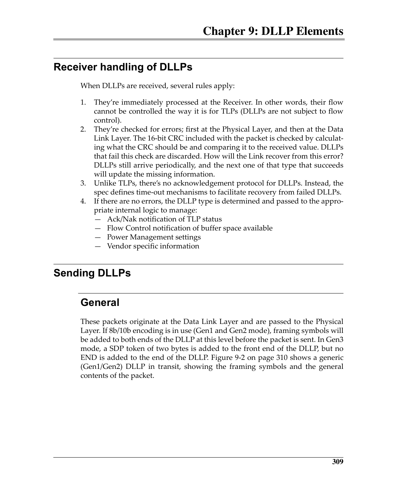

<br>

</td>
<td width="50%">

## **一般规则**

- 每个报文的总报文长度（包括起始和结束字符）始终是四的倍数。这是数据长度以 dword 为单位测量的自然扩展。

- TLP 以 STP 字符开始，以 END 或 EDB 字符结束。

- DLLP 以 SDP 开始，以 END 字符结束。并且正好 8 个字符长 (SDP + 6 字符 + END)。

- STP 和 SDP 字符在逻辑空闲传输之后开始报文传输时放置在 Lane 0 上。在其他情况下，它们可以从可被 4 整除的 Lane 编号开始。

- 接收方的物理层允许监视这些规则的违规行为，并可能将其作为接收方错误报告给数据链路层。

</td>
</tr>
<tr>
<td width="50%">

## Part Four: 

# Physical Layer

</td>
<td width="50%">

## **示例：x1 格式**

第 374 页的图 11-11 中所示的示例说明了通过 x1 链路（仅一个 Lane 运行的链路）传输的报文的格式。显示了一系列报文，其中穿插了一个 SKIP 有序集。末尾显示了逻辑空闲，以表示发送方没有更多报文要发送并使用空闲字符作为填充的情况。

_图 11-11：x1 报文格式_

**==> 图片 [351 x 220] 已省略 <==**

**----- 图片文字开始 -----**<br>
Lane<br>0<br>STP COM STP STP<br>SKP<br>TLP SKP TLP<br>SKP<br>STP<br>TLP<br>END END<br>SDP SDP<br>DLLP TLP DLLP<br>END<br>Idle (00h)<br>Idle
(00h)<br>Idle (00h)<br>END END END<br>Time<br>**----- 图片文字结束 -----**<br>

</td>
</tr>
<tr>
<td width="50%">

## _**11 Physical Layer ‐ Logical (Gen1 and Gen2)**_

</td>
<td width="50%">

## **x4 格式规则**

- STP 和 SDP 字符始终在 Lane 0 上发送。

- END 和 EDB 字符始终在 Lane 3 上发送。

- 当发送有序集（如 SKIP）时，它必须同时出现在所有 Lane 上。

- 当传输逻辑空闲时，它们必须同时在所有 Lane 上发送。

- 这些规则的任何违规都可能作为接收方错误报告给数据链路层。

**第 11 章：物理层 - 逻辑 (Gen1 和 Gen2)**

</td>
</tr>
<tr>
<td width="50%">

## **The Previous Chapter** 

The previous chapter describes the Ack/Nak Protocol: an automatic, hardware‐ based mechanism for ensuring reliable transport of TLPs across
the Link. Ack DLLPs confirm good reception of TLPs while Nak DLLPs indicate a transmis‐ sion error. The chapter describes the normal rules
of operation as well as error recovery mechanisms.

</td>
<td width="50%">

## **示例 x4 格式**

第 375 页的图 11-12 中所示的示例说明了通过 x4 链路（具有四个运行数据 Lane 的链路）发送的报文的格式。该图显示了一个 TLP，后跟在所有 Lane 上传输的用于接收方时钟补偿的 SKIP 有序集。接下来是一个 DLLP，然后是所有 Lane
上的逻辑空闲。本例强调了报文始终是 4 的字符倍数，因为起始字符始终出现在 Lane 0 中，而结束字符始终在 Lane 3 中。它还说明了有序集必须同时出现在所有 Lane 上。

_图 11-12：x4 报文格式_

</td>
</tr>
<tr>
<td width="50%">

## **This Chapter** 

This chapter describes the Logical sub‐block of the Physical Layer. This pre‐ pares packets for serial transmission and recovery. Several
steps are needed to accomplish this and they are described in detail. This chapter covers the logic associated with the Gen1 and Gen2
protocol that use 8b/10b encoding. The logic for Gen3 does not use 8b/10b encoding and is described separately in the chap‐ ter called
“Physical Layer ‐ Logical (Gen3)” on page 407.

</td>
<td width="50%">

## **大链路宽度报文格式规则**

以下规则适用于通过 x8、x12、x16 或 x32 链路传输报文时：

- 当在传输逻辑空闲期间之后开始传输时，STP/SDP 字符始终在 Lane 0 上发送。之后，当发送背靠背报文时，它们只能发送到可被 4 整除的 Lane 编号（Lane 4、8、12 等）。

- END/EDB 字符发送到可被 4 整除的 Lane 编号，然后减一（Lane 3、7、11 等）。

- 如果报文没有在链路的最后一个 Lane 上结束，并且没有更多准备发送的报文，则 PAD 符号用作剩余 Lane 编号的填充。逻辑空闲不能用于此目的，因为它必须同时出现在所有 Lane 上。

- 有序集必须同时在所有 Lane 上发送。

- 类似地，逻辑空闲在使用时必须在所有 Lane 上发送。

- 这些规则的任何违规都可能作为接收方错误报告给数据链路层。

</td>
</tr>
<tr>
<td width="50%">

## **The Next Chapter** 

The next chapter describes the Physical Layer characteristics for the third gener‐ ation (Gen3) of PCIe. The major change includes the
ability to double the band‐ width relative to Gen2 without needing to double the frequency by eliminating the need for 8b/10b encoding. More
robust signal compensation is necessary at Gen3 speed. Making these changes is more complex than might be expected.

</td>
<td width="50%">

## **x8 报文格式示例**

第 377 页的图 11-13 中所示的示例说明了通过 x8 链路传输的报文的格式。该图显示了一个 TLP，后跟 SKIP 有序集、一个 DLLP，最后是一个在 Lane 3 结束的 TLP。在那时，发送方没有更多准备发送的报文，但当前报文未扩展到包括所有可用
Lane。有人可能期望用逻辑空闲填充额外的 Lane，但这在这里不起作用，因为空闲必须同时出现在所有 Lane 上。因此需要另一个填充字符，规范编写者选择在此处使用 PAD 控制字符。PAD 唯一使用的另一个位置是在训练过程中。最后，由于仍没有更多要发送的报文，因此会在所有
Lane 上发送逻辑空闲。

**第 11 章：物理层 - 逻辑 (Gen1 和 Gen2)**

_图 11-13：x8 报文格式_

</td>
</tr>
<tr>
<td width="50%">

## **Physical Layer Overview** 

This Physical Layer Overview introduces the relationships between the Gen1, Gen2 and Gen3 implementations. Thereafter the focus is the
logical Physical Layer implementation associated with Gen1 and Gen2. The logical Physical Layer implementation for Gen3 is described in the
next chapter.

The Physical Layer resides at the bottom of the interface between the external physical link and Data Link Layer. It converts outbound
packets from the Data Link Layer into a serialized bit stream that is clocked onto all Lanes of the Link. This layer also recovers the bit
stream from all Lanes of the Link at the receiver. The receive logic de‐serializes the bits back into a Symbol stream, re‐assembles the
packets, and forwards TLPs and DLLPs up to the Data Link Layer.

_Figure 11‐1: PCIe Port Layers_ 

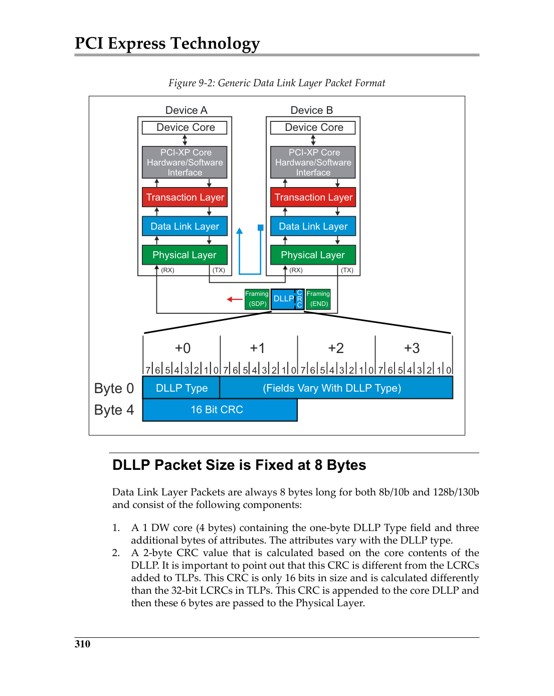

<br>

The contents of the layers are conceptual and don’t define precise logic blocks, but to the extent that designers do partition them to match
the spec their imple‐ mentations can benefit because of the constantly increasing data rates affect the Physical Layer more than the others.
Partitioning a design by layered responsi‐ bilities allows the Physical Layer to be adapted to the higher clock rates while changing as
little as possible in the other layers.

The 3.0 revision of the PCIe spec does not use specific terms to distinguish the different transmission rates defined by the versions of the
spec. With that in mind, the following terms are defined and used in this book.

- **Gen1** ‐ the first generation of PCIe (rev 1.x) operating at 2.5 GT/s 

- **Gen2** ‐ the second generation (rev 2.x) operating at 5.0 GT/s 

- **Gen3** ‐ the third generation (rev 3.x) operating at 8.0 GT/s 

The Physical Layer is made up of two sub‐blocks: the Logical part and the Elec‐ trical part as shown in Figure 11‐2. Both contain
independent transmit and receive logic, allowing dual‐simplex communication.

_Figure 11‐2: Logical and Electrical Sub‐Blocks of the Physical Layer_ 

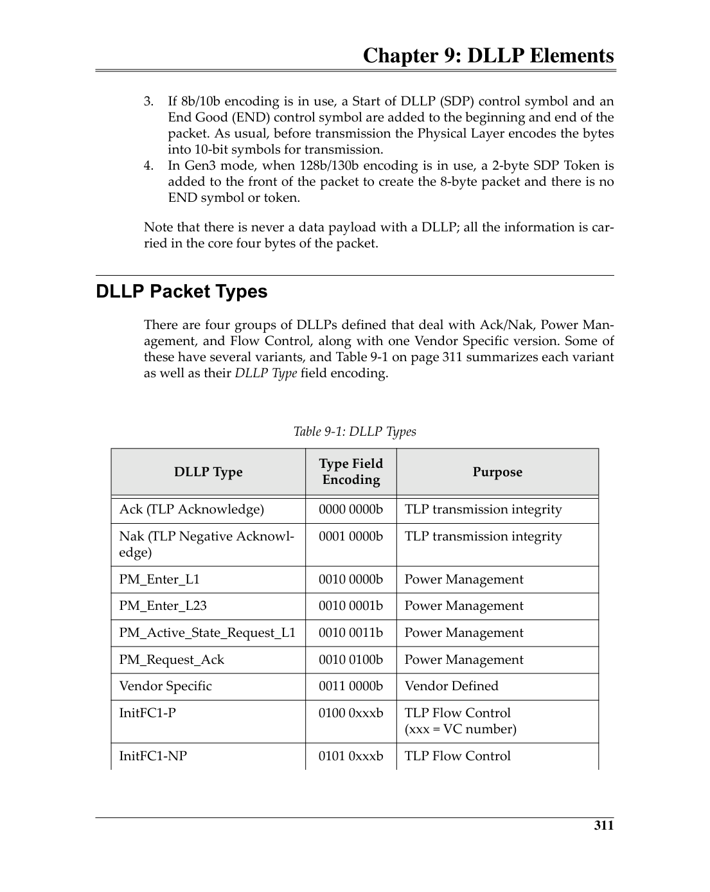

<br>

</td>
<td width="50%">

## **加扰器**

我们示例中的下一步是加扰，如图 11-5（第 369 页）所示，旨在防止数据流中的重复模式。重复模式在链路上产生"纯音"，这意味着由该模式产生的一致频率会产生比通常更多的噪声或 EMI。通过将此能量扩展到更宽的频率范围来减少此问题是加扰的主要目标。此外，单个 Lane
上的加扰传输还可减少对宽链路上相邻 Lane 的干扰。这种"空间频率去相关"，或减少串扰噪声，有助于每个 Lane 上的接收方区分所需的信号。

</td>
</tr>
<tr>
<td width="50%">

## **Observation** 

The spec describes the functionality of the Physical Layer but is purposefully vague regarding implementation details. Evidently, the spec
writers were reluc‐ tant to give details or example implementations because they wanted to leave room for individual vendors to add value
with clever or creative versions of the logic. For our discussion though, an example is indispensable, and one was cho‐ sen that illustrates
the concepts. It’s important to make clear that this example has not been tested or validated, nor should a designer feel compelled to
imple‐ ment a Physical Layer in such a manner.

</td>
<td width="50%">

## **PCI Exress Technology**

为了帮助接收方与加扰序列保持同步，控制字符不会进行加扰，因此即使加扰器失去同步，它们也可被识别。此外，COM 控制字符 (K28.5) 的每次到达都会重新初始化链路两端的加扰器，从而重新同步它们。

</td>
</tr>
<tr>
<td width="50%">

## **Transmit Logic Overview** 

For simplicity, let’s begin with a high‐level overview of the transmit side of this layer, shown in Figure 11‐3 on page 365. Starting at the
top, we can see that packet bytes entering from the Data Link layer first go into a buffer. It makes sense to have a buffer here because
there will be times when the packet flow from the Data Link Layer must be delayed to allow Ordered Set packets and other items to be
injected into the flow of bytes.

For Gen1 and Gen2 operation, these injected items are control and data charac‐ ters used to mark packet boundaries and create ordered sets.
To differentiate between these two types of characters, a D/K# bit (Data or “Kontrol”) is added. The logic can see what value D/K# should
take on based on the source of the character.

</td>
<td width="50%">

## **加扰算法**

规范中描述的加扰器如图 11-14（第 378 页）所示。它由一个 16 位线性反馈移位寄存器 (Linear Feedback Shift Register, LFSR) 组成，其反馈点实现以下多项式：

G(x) = X[16] + X[5] + X[4] + X[3] + 1

_图 11-14：加扰器_

LFSR 以馈送数据字节的时钟频率的 8 倍频率进行计时，其输出被计时到 8 位寄存器中，该寄存器与 8 位数据字符进行 XOR 以形成加扰的数据输出。

**第 11 章：物理层 - 逻辑 (Gen1 和 Gen2)**

</td>
</tr>
<tr>
<td width="50%">

</td>
<td width="50%">

## **一些加扰器实现规则：**

- 在多 Lane 链路实现中，与每个 Lane 相关联的加扰器必须协同工作，在每个 LFSR 中保持相同的同步值。

- 加扰仅应用于 'D' 字符，即与 TLP 和 DLLP 以及逻辑空闲 (00h) 字符相关联的字符。但是，TS1 和 TS2 有序集内的那些 'D' 字符不会被加扰。

- 加扰从不应用于 'K' 字符和有序集中的字符，例如 TS1、TS2、SKIP、FTS 和电子空闲。这些字符绕过加扰器逻辑。其中一个原因是确保即使加扰器意外失去顺序，它们仍然可以被接收方识别。

- 合规性模式字符（用于测试）也不会被加扰。

- COM 字符（不会被加扰的控制字符）用于将链路两端的 LFSR 重新初始化为 FFFFh。

- 除 COM 字符外，LFSR 通常对每个发送的 D 或 K 字符串行前进 8 次，但它在与 SKIP 有序集关联的 SKP 字符上不前进。原因在于接收方可能会添加或删除 SKP 符号以执行时钟容限补偿。改变接收方中的字符数与发送的字符数相比，如果不忽略这些字符，则会导致接收方
LFSR 中的值与发送方 LFSR 值失去同步。

</td>
</tr>
<tr>
<td width="50%">

</td>
<td width="50%">

## **禁用加扰**

加扰默认启用，但规范允许出于测试和调试目的禁用它。这是因为测试可能需要控制发送的确切比特模式，并且由于硬件处理加扰，因此软件没有合理的方法来强制执行特定模式。规范未定义用于指示物理层禁用加扰的特定软件机制，因此这必须是特定于设计的实现。

</td>
</tr>

</tbody>
</table>

[⬆️ 返回目录](#本章目录-table-of-contents)

---

<a id="sec-9-2"></a>
## 9.2 DLLP Elements | DLLP 元素

<table>
<thead><tr><th width="50%">🇬🇧 English</th><th width="50%">🇨🇳 中文</th></tr></thead>
<tbody>
<tr>
<td width="50%">

Gen3 mode of operation, doesn’t use control characters, so data patterns are used to make up the ordered sets that identify if transmitted
bytes are associ‐ ated with TLPs / DLLPs or Ordered Sets. A 2‐bit Sync Header is inserted at the beginning of a 128 bit (16 byte) block of
data. The Sync Header informs the receiver whether the received block is a Data Block (TLP or DLLP related bytes) or an Ordered Set Block.
Since there are no control characters in Gen3 mode, the D/K# bit is not needed.
_Figure 11‐3: Physical Layer Transmit Details_ 

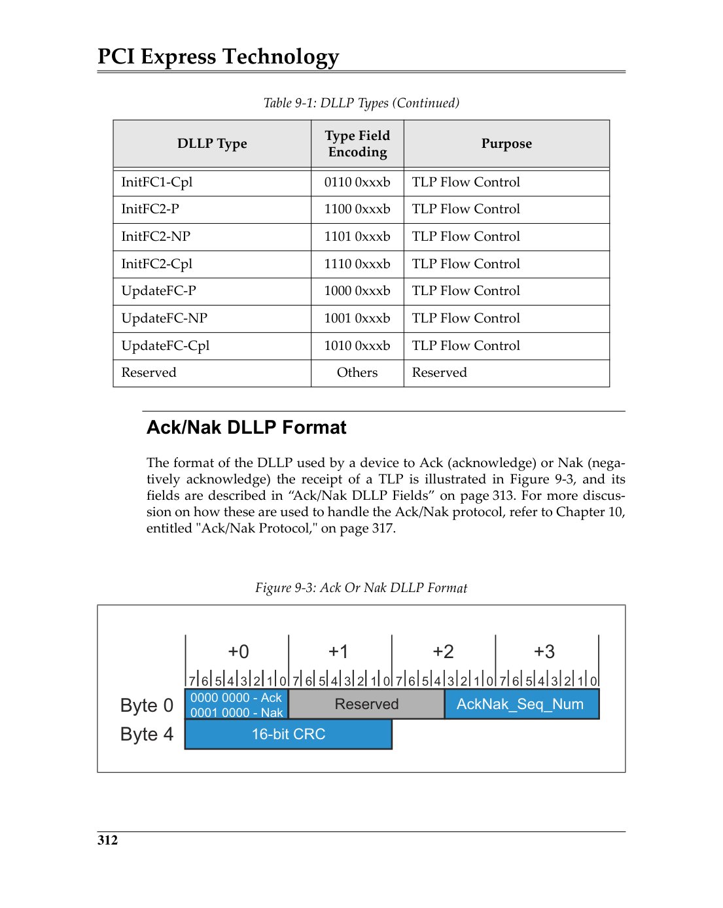

<br>


Next, the parallel data bytes coming from the upper layers are sent to Byte Striping logic where they are spread out, or striped, onto all
the lanes of this link. One byte of the packet is transferred per lane, and all active lanes are used for each packet going out. The Lanes
of the Link are all transmitting at the same time, so the bytes must come into this logic fast enough to accommodate that. For example, if
there are eight Lanes, eight bytes of parallel from the upper lay‐ ers may arrive at the byte‐striping logic allowing data to be clocked
onto all lanes simultaneously.

</td>
<td width="50%">

'D' Character<br>Transaction Layer Packet (TLP)<br>STP Sequence Header Data Payload ECRC LCRC END<br>'D' Character<br>'K' Character 'K'
Character<br>Data Link Layer Packet (DLLP)<br>SDP DLLP Type Misc. CRC END<br>'K' Character 'K' Character<br>## **字节条带化（用于宽链路）**

我们示例中显示的下一步是字节条带化 (Byte Striping)，尽管仅当端口实现多个 Lane（称为宽链路 (wide Link)）时才需要此步骤。条带化意味着字符流中的每个连续输出字符被路由到连续的 Lane 上。使用的 Lane 数在链路训练 (Link
training) 过程中根据共享链路的两台设备所支持的 Lane 数进行配置。

以下图表中说明了字节条带化的三个示例。在第 372 页图 11-8 中，显示了单 Lane 链路 (x1)。这不是一个非常有趣的案例，因为数据包以字节为单位进入物理层 (Physical Layer) 并以相同方式发出，但它说明了字符序列的绘制方式。

第 372 页图 11-9 显示了来自多路复用器的传入双字 (Dword) 数据包。每个字节被定向到对应的 Lane。最后，第 373 页图 11-10 说明了八 Lane (x8) 链路。在此示例中，需要两个双字 (Dwords) 来填充所有 8 个
Lane。这要求双字以比前一示例快两倍的速率到达。后续章节中描述了通过每个 Lane 发送的数据格式。

</td>
</tr>
<tr>
<td width="50%">

## **PCI Express Technology** 

Next is the Scrambler, which XORs a pseudo‐random pattern onto the outgoing data bytes to mix up the bits. Although it would seem that this
might introduce problems, it doesn’t because the scrambling pattern is predictable and not truly random, so the receiver can use the same
algorithm to easily recover the origi‐ nal data. If the scramblers get out of step then the Receiver won’t be able to make sense of the bit
stream so, to guard against that problem, the scrambler is reset periodically (Gen1 and Gen2). That way, if the scramblers do get out of
step with each other it won’t be long before they’re both re‐initialized and back in step again. For Gen1 and Gen2 modes that
re‐initialization happens when‐ ever the COM character is detected. For Gen3 mode, it happens whenever an EIEOS ordered set is seen. A more
sophisticated 24‐bit based scrambler is uti‐ lized in Gen3 mode, hence the alternate path through the Gen3 scrambler, as depicted in Figure
11‐3 on page 365.

For Gen1 and Gen2 mode, the scrambled 8‐bit characters are then encoded for transmission by the 8b/10b Encoder. Recall that a Character is
an 8‐bit un‐ encoded byte, while a Symbol is the 10‐bit encoded output of the 8b/10b logic. There are several advantages to 8b/10b encoding,
but it does add overhead.

For Gen3 a separate path is shown bypassing the encoder. In other words, scrambled bytes of a packet are transmitted without 8b/10b
encoding. The Sync Bit Generator adds a 2‐bit Sync Header prior to every 16 byte block of a packet. The added 2‐bit Sync Header identifies
the following 16 byte block to be either a data block or an ordered set block. This addition of a 2‐bit Sync Header every 16 bytes (128
bits) is the basis of Gen3’s 128b/130b encoding scheme.

Finally, the Symbols are serialized into a bit stream and forwarded to the electri‐ cal sub‐block of the Physical Layer and transmitted to
the other end of the link.

</td>
<td width="50%">

## **PCI Express 技术**

_图 11-8：x1 字节条带化_


_图 11-9：x4 字节条带化_


**第 11 章：物理层 - 逻辑 (Gen1 和 Gen2)**

_图 11-10：使用双字并行数据的 x8 字节条带化_

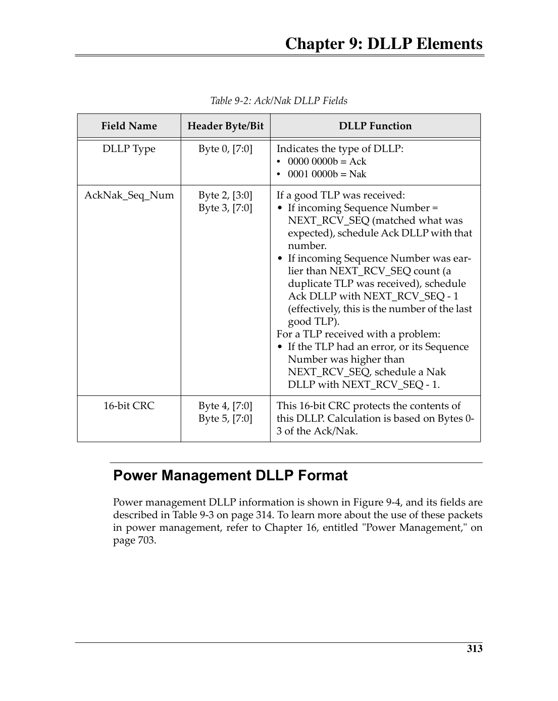

</td>
</tr>
<tr>
<td width="50%">

## **Receive Logic Overview** 

Figure 11‐4 on page 367 shows the key elements that make up the receiver logic. The process described below is performed for each lane.
Starting at the bottom this time, the first thing to mention is the receiver Clock and Data Recovery (CDR). The first step in this process
is to recover the clock based on transitions in the incoming bit stream. This recovered clock faithfully reproduces the Trans‐ mitter’s
clock that was used to send the data and is used to latch the incoming bits into a deserializing buffer.

The next steps in the CDR process are to find the Gen1/Gen2 Symbol bound‐ aries and divide the recovered clock by 10 to latch the 10‐bit
Symbols into the Elastic Buffer. For Gen3, the next step is to acquire Block Lock and then latch the 8‐bit Symbols associated with each of
the 16 bytes in the block into the Elastic Buffer — more on this in the next chapter.
Logic controlling the Elastic Buffer adjusts for minor clock variations between the recovered clock and the local clock of the receiver by
adding or removing SKP Symbols as needed when an SOS (SKP Ordered Set) is detected. Finally, the Receiver’s local clock moves each Symbol
out of the Elastic Buffer.

_Figure 11‐4: Physical Layer Receive Logic Details_ 


<br>


Using the 8b/10b Decoder, Gen1/Gen2 Symbols are decoded thus converting the 10‐bit symbols to 8‐bit characters. The descrambler applies the
same scrambling method used at the transmitter to recover the original data. Finally, the bytes from each Lane are un‐striped to form a byte
stream that will be forwarded up to the Data Link Layer. Only TLPs and DLLPs are loaded into the receive buffer and sent to the Data Link
Layer.

</td>
<td width="50%">

## **数据包格式规则**

</td>
</tr>
<tr>
<td width="50%">

## **Transmit Logic Details (Gen1 and Gen2 Only)** 

The section provides more detail associated with the steps identified in the pre‐ vious section. Refer to the block diagram in Figure 11‐5
on page 369 during this discussion.

</td>
<td width="50%">

## **一般规则**

- 每个数据包的总长度（包括开始和结束字符）始终是 4 的倍数。这是数据长度以双字 (dwords) 为单位这一事实的自然延伸。

- TLP 以 STP 字符开始，并以 END 或 EDB 字符结束。

- DLLP 以 SDP 开头，以 END 字符结束，并且恰好为 8 个字符长 (SDP + 6 个字符 + END)。

- 在发送完逻辑空闲 (Logical Idles) 后开始传输数据包时，STP 和 SDP 字符被放置在 Lane 0 上。在其他情况下，它们可以以可被 4 整除的 Lane 号开始。

- 接收方的物理层 (Physical Layer) 允许监视对这些规则的违反情况，并可将其作为接收器错误 (Receiver Errors) 报告给数据链路层 (Data Link Layer)。

**PCI Express 技术**

</td>
</tr>
<tr>
<td width="50%">

## **Tx Buffer** 

Starting from the top of the diagram once again, the buffer accepts TLPs and DLLPs from the Data Link Layer, along with ‘Control’
information that specifies when a new packet begins. As mentioned, the buffer allows us to stall the flow of characters from time to time in
order to insert control characters and ordered sets. A ‘throttle’ signal is also shown going back up to the Data Link Layer to stop the flow
of characters if the buffer should become full.

</td>
<td width="50%">

## **示例：x1 格式**

第 374 页图 11-11 中所示的示例说明了通过 x1 链路（仅一个 Lane 工作的链路）传输的数据包的格式。图中显示了一系列数据包，其中穿插着一个 SKIP 有序集。最后显示逻辑空闲 (Logical
Idles)，以表示发送器没有更多数据包可发送并使用空闲字符作为填充的情况。

_图 11-11：x1 数据包格式_

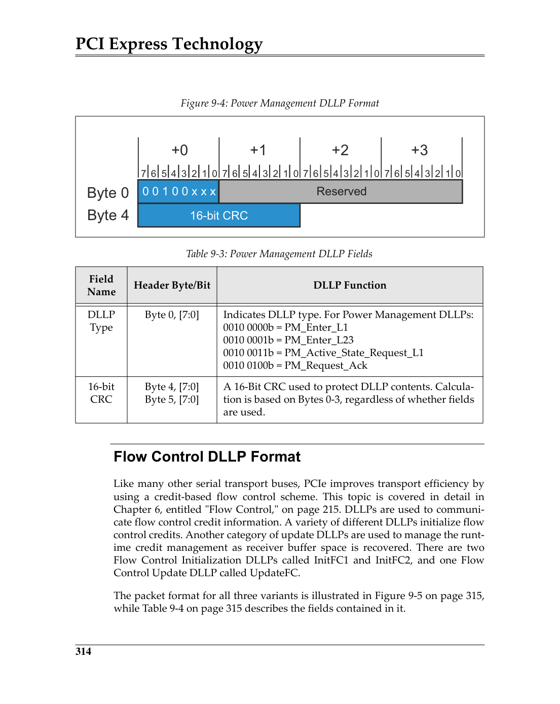

</td>
</tr>
<tr>
<td width="50%">

## **Mux and Control Logic** 

The multiplexer, shown in Figure 11‐6 on page 370, is used to insert special con‐ trol (K) characters into the data flow coming from the
buffer. Only the Physical Layer uses K control characters; they are inserted during transmission and removed at the receiver. The four
different inputs to the mux are:

- **Transmit Data Buffer** . When the Data Link Layer supplies a packet, the mux gates the character stream through. All of the characters
coming from the buffer are D characters, so the D/K# signal is driven high when Tx Buffer contents are gated.

- **Start and End characters.** These Control characters are added to the start and end of every TLP and DLLP (see Figure 11‐7 on page 371)
and allow a receiver to readily detect the boundaries of a packet. There are two Start characters: STP indicates the start of a TLP, while
SDP indicates the start of a DLLP. An indicator from the Data Link Layer, along with the packet type, determines what type of framing
character to insert. There are also two end characters, the End Good character (END) for normal transmission, and the End Bad character
(EDB) to handle some error cases. Start and End charac‐ ters are K characters, so the D/K# signal is driven low when the Start and End
characters are inserted (see Table 11‐1 on page 386 for a list of Control characters).
_Figure 11‐5: Physical Layer Transmit Logic Details (Gen1 and Gen2 Only)_ 


<br>


- **Ordered Sets** . As mentioned earlier, control characters are only used by the Physical Layer and are not seen by the higher layers.
Some communication across the Link is necessary to initiate and maintain Link operation, and that is accomplished by exchanging Ordered
Sets. Every ordered set starts with a K character called a comma (COM), and contains other K or D char‐ acters depending on the type of
Order Set be delivered. Ordered Sets are always aligned on four byte boundaries and are transmitted during a vari‐ ety of circumstances
including:

 - Error recovery, initiating events (such as Hot Reset), or exit from low‐ power states. In these cases, the Training Sequence 1 and 2 (TS1
and TS2) ordered sets are exchanged across the Link.

 - At periodic intervals, the mux inserts the SKIP ordered set pattern to facilitate clock tolerance compensation in the receiver. For a
detailed description of this process, refer to “Clock Compensation” on page 391.

</td>
<td width="50%">

## **x4 格式规则**

- STP 和 SDP 字符始终在 Lane 0 上发送。

- END 和 EDB 字符始终在 Lane 3 上发送。

- 当发送有序集（例如 SKIP）时，必须同时出现在所有 Lane 上。

- 当发送逻辑空闲 (Logical Idles) 时，必须同时在所有 Lane 上发送。

- 对这些规则的任何违反都可以作为接收器错误 (Receiver Error) 报告给数据链路层 (Data Link Layer)。

**第 11 章：物理层 - 逻辑 (Gen1 和 Gen2)**

</td>
</tr>
<tr>
<td width="50%">

## **PCI Express Technology** 

- When a device wants to place its transmitter in the Electrical Idle state, it must inform the remote receiver at the other end of the
Link. The mux inserts an **Electrical Idle ordered set** to accomplish this.

- When a device wants to change the Link power state from L0s low power state to the L0 full‐on power state, it sends a set of **Fast
Training Sequence** (FTS) ordered sets to the receiver. The receiver uses this ordered set to re‐synchronize its PLL to the transmitter
clock.

- **Logical Idle Sequence.** When there are no packets ready to transmit and no ordered sets to send, the link is logically idle. In order
to keep the receiver PLL locked on to the transmitter’s frequency, it’s important that the transmitter keep sending something, so Logical
Idle characters are inserted for that case. Logical Idle is very simple, and consists of nothing more than a string of Data 00h characters.

_Figure 11‐6: Transmit Logic Multiplexer_ 

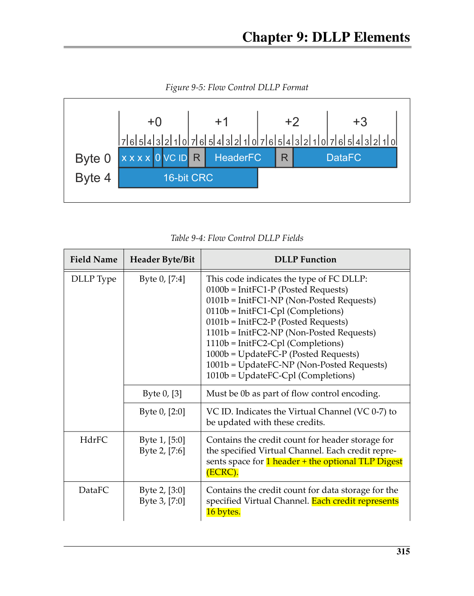

<br>

_Figure 11‐7: TLP and DLLP Packet Framing with Start and End Control Characters_ 

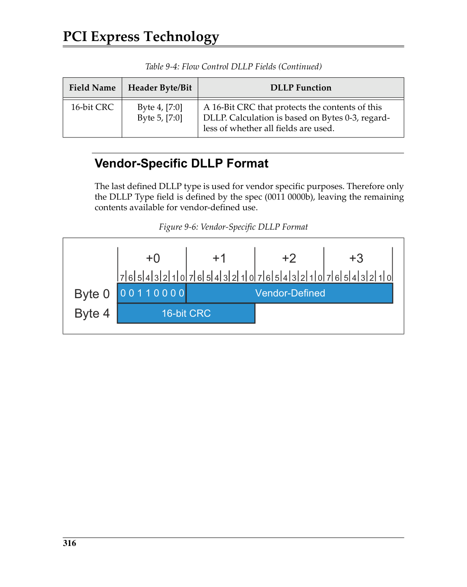

<br>

</td>
<td width="50%">

## **x4 格式示例**

第 375 页图 11-12 中所示的示例说明了通过 x4 链路（四条数据 Lane 工作的链路）发送的数据包的格式。该图显示了在所有 Lane 上发送的一个 TLP 后跟一个 SKIP 有序集，用于接收器时钟补偿。接下来是一个 DLLP，然后是所有 Lane 上的逻辑空闲
(Logical Idle)。此示例突出表明数据包始终是 4 的倍数，因为起始字符始终出现在 Lane 0 中，结束字符始终在 Lane 3 中。它还说明有序集必须同时出现在所有 Lane 上。

_图 11-12：x4 数据包格式_

**PCI Express 技术**

</td>
</tr>
<tr>
<td width="50%">

## **Byte Striping (for Wide Links)** 

The next step shown in our example is Byte Striping, although this is only needed if the port implements more than one Lane (called a wide
Link). Strip‐ ing means that each consecutive outbound character in a character stream is routed onto consecutive Lanes. The number of Lanes
used is configured during the Link training process based on what is supported by both devices that share the Link.

Three examples of byte striping are illustrated in the following diagrams. In Figure 11‐8 on page 372, a single‐lane link (x1) is shown.
This is not a very inter‐ esting case, since the packet enters the Physical Layer a byte at a time and goes out the same way, but
illustrates the way the sequence of characters will be drawn.

Figure 11‐9 on page 372 shows the incoming Dword packets from the muti‐ plexer. Each byte is directed to the corresponding lanes. Finally,
Figure 11‐10 on page 373 illustrates an eight‐lane (x8) link. In this example, two Dwords are required to populate all 8 lanes. This
requires the Dword to arrive at twice the rate as the previous example. The format of the data being sent across each lane is described in
the sections that follow.

</td>
<td width="50%">

## **大链路宽度数据包格式规则**

当通过 x8、x12、x16 或 x32 链路传输数据包时，以下规则适用：

- 在发送完一段时间的逻辑空闲 (Logical Idles) 后开始发送时，STP/SDP 字符始终在 Lane 0 上发送。在此之后，仅当背靠背发送数据包时，它们才能在可被 4 整除的 Lane 号上发送（Lane 4、8、12 等）。

- END/EDB 字符在可被 4 整除然后减一的 Lane 号上发送（Lane 3、7、11 等）。

- 如果数据包未在链路的最后一个 Lane 上结束，并且没有更多准备发送的数据包，则使用 PAD 符号 (PAD Symbols) 作为其余 Lane 号的填充。逻辑空闲 (Logical Idle) 不能用于此目的，因为它必须同时出现在所有 Lane 上。

- 有序集必须同时在所有 Lane 上发送。

- 类似地，在使用逻辑空闲时，必须同时在所有 Lane 上发送。

- 对这些规则的任何违反都可以作为接收器错误 (Receiver Error) 报告给数据链路层 (Data Link Layer)。

</td>
</tr>
<tr>
<td width="50%">

## **PCI Express Technology** 

_Figure 11‐8: x1 Byte Striping_ 

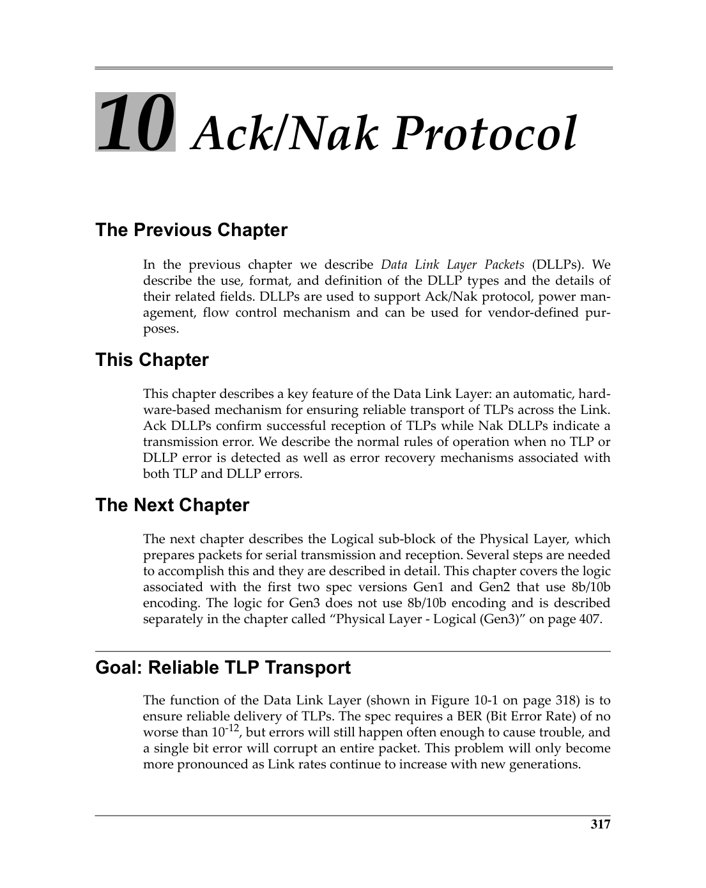

<br>


_Figure 11‐9: x4 Byte Striping_ 

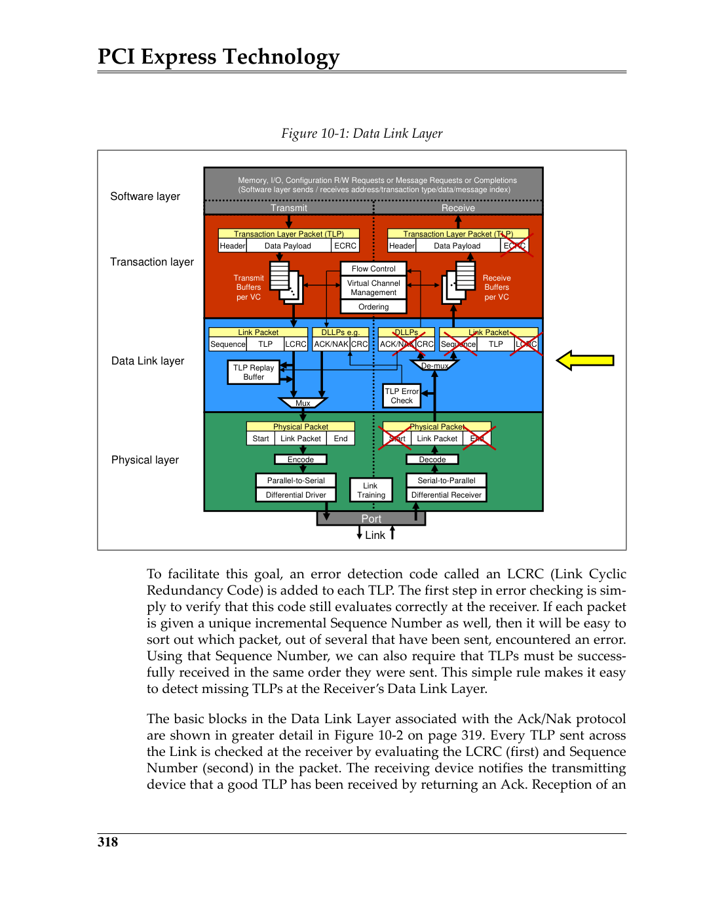

<br>

_Figure 11‐10: x8 Byte Striping with DWord Parallel Data_ 


<br>

</td>
<td width="50%">

## **x8 数据包格式示例**

第 377 页图 11-13 中所示的示例说明了通过 x8 链路传输的数据包的格式。该图显示了一个 TLP 后跟一个 SKIP 有序集、一个 DLLP，最后是一个在 Lane 3 上结束的 TLP。此时，发送器没有更多准备发送的数据包，但当前数据包未扩展到包括所有可用的
Lane。人们可能期望用逻辑空闲 (Logical Idle) 填充额外的 Lane，但在这里不起作用，因为空闲必须同时出现在所有 Lane 上。因此需要另一个填充字符，规范作者选择在此处使用 PAD 控制字符。PAD
唯一使用的另一个地方是在训练过程中。最后，由于仍然没有更多数据包可发送，因此在所有 Lane 上发送逻辑空闲 (Logical Idles)。

**第 11 章：物理层 - 逻辑 (Gen1 和 Gen2)**

_图 11-13：x8 数据包格式_

</td>
</tr>
<tr>
<td width="50%">

## **Packet Format Rules**

</td>
<td width="50%">

## **加扰器**

我们示例中的下一步是加扰 (scrambling)，如第 369 页图 11-5 所示，旨在防止数据流中出现重复模式。重复模式会在链路上产生"纯音"，即由模式引起的超过通常噪声的一致频率，或称为 EMI
(电磁干扰)。通过将能量扩展到更宽的频率范围来减少此问题是加扰的主要目标。此外，一条 Lane 上的加扰传输还可减少宽链路上相邻 Lane 之间的干扰。这种"空间去相关"或串扰噪声的减少有助于每个 Lane 上的接收器区分所需信号。

</td>
</tr>
<tr>
<td width="50%">

## **General Rules** 

- The total packet length (including Start and End characters) of each packet is always a multiple of four characters. This is a natural
extension of the fact that the data length is measured in dwords.

- TLPs start with the STP character and finish with either an END or EDB character. 

- DLLPs start with SDP, terminate with the END character. and are exactly 8 characters long (SDP + 6 characters + END) 

- STP and SDP characters are placed on Lane 0 when starting the transmis‐ sion of a packet after the transmission of Logical Idles. In other
cases, they may start on a Lane number divisible by 4.

- The receiver’s Physical Layer is allowed to watch for violation of these rules and may report them as Receiver Errors to the Data Link
Layer.

</td>
<td width="50%">

## **PCI Express 技术**

为了帮助接收器与加扰序列保持同步，控制字符不会被加扰，因此即使加扰器失去同步也是可识别的。此外，COM 控制字符 (K28.5) 每次到达时都会重新初始化链路两端的加扰器，从而使其重新同步。

</td>
</tr>
<tr>
<td width="50%">

## **Example: x1 Format** 

The example shown in Figure 11‐11 on page 374 illustrates the format of packets transmitted over a x1 link (a link with only one lane
operational). A sequence of packets is shown interspersed with one SKIP Ordered Set. Logical Idles are shown at the end to represent the
case when the transmitter has no more packets to send and uses idle characters as filler.

_Figure 11‐11: x1 Packet Format_ 


<br>

</td>
<td width="50%">

## **加扰算法**

规范中描述的加扰器 (scrambler) 如第 378 页图 11-14 所示。它由一个 16 位线性反馈移位寄存器 (Linear Feedback Shift Register, LFSR) 组成，其反馈点实现以下多项式：

G(x) = X[16] + X[5] + X[4] + X[3] + 1

_图 11-14：加扰器_

LFSR 以馈送数据字节的时钟频率的 8 倍频率进行计时，其输出被计时进入一个 8 位寄存器，该寄存器与 8 位数据字符进行 XOR 异或运算以形成加扰数据输出。

**第 11 章：物理层 - 逻辑 (Gen1 和 Gen2)**

</td>
</tr>
<tr>
<td width="50%">

## **x4 Format Rules** 

- STP and SDP characters are always sent on Lane 0. 

- END and EDB characters are always sent on Lane 3. 

- When an ordered set such as the SKIP is sent, it must appear on all lanes simultaneously. 

- When Logical Idles are transmitted, they must be sent on all lanes simulta‐ neously. 

- Any violation of these rules may be reported as a Receiver Error to the Data Link Layer.

</td>
<td width="50%">

## **一些加扰器实现规则：**

- 在多 Lane 链路 (multi‐Lane Link) 实现中，与每个 Lane 关联的加扰器 (Scramblers) 必须协调运行，在每个 LFSR 中保持相同的同步值。

- 加扰 (Scrambling) 仅应用于 'D' 字符，即那些与 TLP 和 DLLP 以及逻辑空闲 (Logical Idle, 00h) 字符相关联的字符。但是，TS1 和 TS2 有序集内的那些 'D' 字符不会被加扰。

- 加扰 (Scrambling) 从不应用于 'K' 字符以及有序集内的字符，例如 TS1、TS2、SKIP、FTS 和电气空闲 (Electrical Idle)。这些字符绕过加扰器逻辑。这样做的一个原因是确保即使加扰器以某种方式失去序列，接收器仍然可以识别它们。

- 合规模式 (Compliance Pattern) 字符（用于测试）也不被加扰。

- COM 字符（不被加扰的控制字符）用于将发送器和接收器两端的 LFSR 重新初始化为 FFFFh。

- 除 COM 字符外，LFSR 通常在每发送一个 D 或 K 字符时串行推进 8 次，但在与 SKIP 有序集关联的 SKP 字符上不推进。原因是接收器可以添加或删除 SKP 符号以执行时钟容差补偿。如果不忽略 SKP 字符，与发送的数量相比，接收器中字符数量的变化将导致接收器
LFSR 中的值与发送器 LFSR 值失去同步。

</td>
</tr>
<tr>
<td width="50%">

## **Example x4 Format** 

The example shown in Figure 11‐12 on page 375 illustrates the format of packets sent over a x4 Link (link with four data lanes operational).
The illustration shows one TLP followed by a SKIP ordered set transmitted on all Lanes for receiver clock compensation. Next is a DLLP,
followed by Logical Idle on all lanes. This example highlights that the packets are always multiples of 4 charac‐ ters because the start
character always appears in lane 0 and the end character is always in lane 3. It also illustrates that ordered sets must appear on all the
lanes simultaneously.

_Figure 11‐12: x4 Packet Format_

</td>
<td width="50%">

## **禁用加扰**

默认情况下启用加扰 (Scrambling)，但规范允许出于测试和调试目的将其禁用。那是因为测试可能需要控制发送的确切位模式，并且由于硬件处理加扰，软件没有合理的方法来强制特定模式。规范中未定义用于指示物理层 (Physical Layer)
禁用加扰的特定软件机制，因此这必须是特定于设计 (design‐specific) 的实现。

</td>
</tr>
<tr>
<td width="50%">

## **Large Link-Width Packet Format Rules** 

The following rules apply when a packet is transmitted over a x8, x12, x16, or x32 Link: 

- STP/SDP characters are always sent on Lane 0 when transmission starts after a period during which Logical Idles are transmitted. After
that, they may only be sent on Lane numbers divisible by 4 when sending back‐to‐ back packets (Lane 4, 8, 12, etc.).

- END/EDB characters are sent on Lane numbers divisible by 4 and then minus one (Lane 3, 7, 11, etc.). 

- If a packet doesn’t end on the last Lane of the Link and there are no more packets ready to go, PAD Symbols are used as filler on the
remaining lane numbers. Logical Idle can’t be used for this purpose because it must appear on all Lanes at the same time.

- Ordered sets must be sent on all lanes simultaneously. 

- Similarly, logical idles must be sent on all lanes when they are used. 

- Any violation of these rules may be reported as a Receiver Error to the Data Link Layer.

</td>
<td width="50%">

</td>
</tr>
<tr>
<td width="50%">

## **x8 Packet Format Example** 

The example shown in Figure 11‐13 on page 377 illustrates the format of packets transmitted over a x8 link. The illustration shows a TLP
followed by a SKIP ordered set, a DLLP, and finally a TLP that ends on Lane 3. At that point, the transmitter has no more packets ready to
send but the current packet doesn’t extend to include all the available lanes. One might expect the extra lanes to be filled with Logical
Idle, but it won’t work here because idles must appear on all lanes at the same time. So another fill character is needed, and the spec
writers chose to use the PAD control character here. The only other place that PAD is used is during the training process. Finally, since
there are still no more packets to send, Logical Idles are sent on all the lanes.
_Figure 11‐13: x8 Packet Format_

</td>
<td width="50%">

</td>
</tr>
<tr>
<td width="50%">

## **Scrambler** 

The next step in our example is scrambling, as shown in Figure 11‐5 on page 369, which is intended to prevent repetitive patterns in the
data stream. Repeti‐ tive patterns create “pure tones” on the link, meaning a consistent frequency caused by the pattern that generates more
than the usual noise, or EMI. Reduc‐ ing this problem by spreading this energy over a wider frequency range is the primary goal of
scrambling. In addition, though, scrambled transmission on one Lane also reduces interference with adjacent Lanes on a wide Link. This
“spatial frequency de‐correlation”, or reduction of crosstalk noise, helps the receiver on each lane to distinguish the desired signal.

</td>
<td width="50%">

</td>
</tr>
<tr>
<td width="50%">

## **PCI Express Technology** 

To help the receiver maintain synchronization with the scrambled sequence, control characters do not get scrambled and are thus recognizable
even if the scramblers get out of sync. In addition, the arrival of the COM control character (K28.5) reinitializes the scramblers on both
ends of the Link each time it arrives and thus re‐synchronizes them.

</td>
<td width="50%">

</td>
</tr>
<tr>
<td width="50%">

## **Scrambler Algorithm** 

The scrambler described in the spec is shown in Figure 11‐14 on page 378. It’s made of a 16‐bit Linear Feedback Shift Register (LFSR) with
feedback points that implement the following polynomial:

G(x) = X[16] + X[5] + X[4] + X[3 ] +1 

_Figure 11‐14: Scrambler_ 

The LFSR is clocked at 8 times the frequency of the clock feeding the data bytes, and its output is clocked into an 8‐bit register that is
XORed with the 8‐bit data characters to form the scrambled data output.

</td>
<td width="50%">

</td>
</tr>
<tr>
<td width="50%">

## **Some Scrambler implementation rules:** 

- On a multi‐Lane Link implementation, Scramblers associated with each Lane must operate in concert, maintaining the same simultaneous value
in each LFSR.

- Scrambling is applied to ‘D’ characters only, meaning those associated with TLP and DLLPs and the Logical Idle (00h) characters. However,
those ‘D’ characters that are within the TS1 and TS2 ordered sets are not scrambled.

- Scrambling is never applied to ‘K’ characters and characters within ordered sets, such as TS1, TS2, SKIP, FTS and Electrical Idle. These
characters bypass the scrambler logic. One reason for this is to ensure they’ll still be recogniz‐ able by the receiver even if the
scramblers somehow get out of sequence.

- Compliance Pattern characters (used for testing) are also not scrambled. 

- • The COM character, a control character that does not get scrambled, is used to reinitialize the LFSR to FFFFh at both the transmitter
and receiver.

- Except for the COM character, the LFSR normally will serially advance eight times for every D or K character sent, but it does not advance
on SKP characters associated with the SKIP ordered set. The reason is that a receiver may add or delete SKP Symbols to perform clock
tolerance com‐ pensation. Changing the number of characters in the receiver compared to the number that were sent would cause the value in
the receiver LFSR to lose synchronization with the transmitter LFSR value if they were not ignored.

</td>
<td width="50%">

</td>
</tr>
<tr>
<td width="50%">

## **Disabling Scrambling** 

Scrambling is enabled by default, but the spec allows it to be disabled for test and debug purposes. That’s because testing may require
control of the exact bit pattern sent and, since the hardware handles scrambling, there’s no reasonable way for the software to be able to
force a specific pattern. No specific software mechanism is defined by which to instruct the Physical Layer to disable scram‐ bling, so this
has to be a design‐specific implementation.

</td>
<td width="50%">

</td>
</tr>

</tbody>
</table>

[⬆️ 返回目录](#本章目录-table-of-contents)

---

<a id="sec-9-3"></a>
## 9.3 DLLP Elements | DLLP 元素

<table>
<thead><tr><th width="50%">🇬🇧 English</th><th width="50%">🇨🇳 中文</th></tr></thead>
<tbody>
<tr>
<td width="50%">

If scrambling is disabled by a device, this gets communicated to the neighbor‐ ing device by sending at least two TS1s and TS2s that have
the appropriate bit set in the control field as described in “Configuration State” on page 539. In response, the neighboring device also
disables its scrambling.

</td>
<td width="50%">

**'D' Character**
Transaction Layer Packet (TLP)
STP Sequence Header Data Payload ECRC LCRC END
**'D' Character**
**'K' Character 'K' Character**
Data Link Layer Packet (DLLP)
SDP DLLP Type Misc. CRC END
**'K' Character 'K' Character**
**----- 图片文字结束 -----**

</td>
</tr>
<tr>
<td width="50%">

## **8b/10b Encoding**

</td>
<td width="50%">

## **字节交叉（用于宽链路）**

我们示例中显示的下一步是字节交叉，尽管仅当端口实现多个 Lane（称为宽链路）时才需要。交叉意味着字符流中的每个连续输出字符被路由到连续的 Lane。使用的 Lane 数量是在链路训练过程中配置的，基于共享链路的两个设备所支持的。

以下图中说明了字节交叉的三个示例。在第 372 页的图 11-8 中，显示了单 Lane 链路 (x1)。这不是一个非常有趣的案例，因为报文一次以一个字节进入物理层并以相同的方式离开，但它说明了字符序列的绘制方式。

第 372 页的图 11-9 显示了来自多路复用器的传入 Dword 报文。每个字节被定向到相应的 Lane。最后，第 373 页的图 11-10 说明了一个八 Lane (x8) 链路。在此示例中，需要两个 Dword 才能填充所有 8 个 Lane。这要求 Dword
以比先前示例快两倍的速率到达。每个 Lane 上发送的数据格式将在以下小节中描述。

</td>
</tr>
<tr>
<td width="50%">

## **General** 

The first two generations of PCIe use 8b/10b encoding. Each Lane implements an 8b/10b Encoder that translates the 8‐bit characters into
10‐bit Symbols. This coding scheme was patented by IBM in 1984 and is widely used in many serial transports today, such as Gigabit Ethernet
and Fibre Channel.

</td>
<td width="50%">

## **PCI Exress Technology**

_图 11-8：x1 字节交叉_

**==> 图片 [154 x 220] 已省略 <==**

**----- 图片文字开始 -----**<br>
Packet byte stream from Mux block<br>8 D/K#<br>Character 7<br>Character 6<br>Character 5<br>Character 4<br>Character 3<br>Character
2<br>Character 1<br>Character 0<br>x1 Byte Striping 8 D/K#<br>Character 2<br>Character 1<br>Character 0<br>8 D/K#<br>To Scrambler<br>**-----
图片文字结束 -----**<br>


_图 11-9：x4 字节交叉_

**==> 图片 [338 x 205] 已省略 <==**

**----- 图片文字开始 -----**<br>
Packet Dword Stream from Mux Block<br>D/K# D/K# D/K# D/K#<br>8 8 8 8<br>Character 12 Character 13 Character 14 Character 15<br>Character 8
Character 9 Character 10 Character 11<br>Character 4 Character 5 Character 6 Character 7<br>Character 0 Character 1 Character 2 Character
3<br>Character 12 Character 13 Character 14 Character 15<br>Character 16 Character 17 Character 11 Character 11<br>Character 8 Character 9
Character 7 Character 7<br>Character 0 Character 1 Character 3 Character 3<br>8 D/K# 8 D/K# 8 D/K# 8 D/K#<br>To Lane 0 To Lane 1 To Lane 2
To Lane 3<br>Scrambler Scrambler Scrambler Scrambler<br>**----- 图片文字结束 -----**<br>


**第 11 章：物理层 - 逻辑 (Gen1 和 Gen2)**

_图 11-10：使用 DWord 并行数据的 x8 字节交叉_

**==> 图片 [368 x 240] 已省略 <==**

**----- 图片文字开始 -----**<br>
D/K# D/K# D/K# D/K#<br>8 8 8 8<br>Character 20 Character 21 Character 22 Character 23<br>Character 16 Character 17 Character 18 Character
19<br>Character 12 Character 13 Character 14 Character 15<br>Character 8 Character 9 Character 10 Character 11<br>Character 4 Character 5
Character 6 Character 7<br>Character 0 Character 1 Character 2 Character 3<br>x8 Byte Striping<br>Character 16 Character 17 Character
23<br>Character 8 Character 9 Character 15<br>Character 0 Character 1 Character 7<br>8 D/K# 8 D/K# 8<br>To Lane 0 To Lane 1 To Lane
7<br>Scrambler Scrambler Scrambler<br>**----- 图片文字结束 -----**<br>

</td>
</tr>
<tr>
<td width="50%">

## **Motivation** 

Encoding accomplishes several desirable goals for serial transmission. Three of the most important are listed here: 

- **Embedding a Clock into the Data.** Encoding ensures that the data stream has enough edges in it to recover a clock at the Receiver, with
the result that a distributed clock is not needed. This avoids some limitations of a parallel bus design, such as flight time and clock
skew. It also eliminates the need to distribute a high‐frequency clock that would cause other problems like increased EMI and difficult
routing.

 - As an example of this process, Figure 11‐15 on page 381 shows the encoding results of the data byte 00h. As can be seen, this 8‐bit
character that had no transitions converts to a 10‐bit Symbol with 5 transitions. The 8b/10b guar‐ antees enough edges to ensure the “run
length” (sequence of consecutive ones or zeros) in the bit stream to no more than 5 consecutive bits under any conditions.

- **Maintaining DC Balance.** PCIe uses an AC‐coupled link, placing a capaci‐ tor serially in the path to isolate the DC part of the signal
from the other end of the Link. This allows the Transmitter and Receiver to use different com‐ mon‐mode voltages and makes the electrical
design easier for cases where the path between them is long enough that they’re less likely to have exactly the same reference voltages.
That DC value, or common‐mode voltage, can change during run time because the line charges up when the signal is driven. Normally, the
signal changes so quickly that there isn’t time for this to cause a problem but, if the signal average is predominantly one level or the
other, the common‐mode value will appear to drift. Referred to as “DC Wander”, this drifting voltage degrades signal integrity at the
Receiver. To compensate, the 8b/10b encoder tracks the “disparity” of the last Symbol that was sent. Disparity, or inequality, simply
indicates whether the previ‐ ous Symbol had more ones than zeros (called positive disparity), more zeros than ones (negative disparity), or
a balance of ones and zeros (neutral
 - disparity). If the previous Symbol had negative disparity, for example, the next one should balance that by using more ones. 

- **Enhancing Error Detection.** The encoding scheme also facilitates the detec‐ tion of transmission errors. For a 10‐bit value, 1024 codes
are possible, but the character to be encoded only has 256 unique codes. To maintain DC bal‐ ance the design uses two codes for each
character, and chooses which one based on the disparity of the last Symbol that was sent, so 512 codes would be needed. However, many of the
neutral disparity encodings have the same values (D28.5 is one example), so not all 512 are used. As a result, more than half the possible
encodings are not used and will be considered illegal if seen at a Receiver. If a transmission error does change the bit pat‐ tern of a
Symbol, there’s a good chance the result would be one of these ille‐ gal patterns that can be recognized right away. For more on this see
the section titled, “Disparity” on page 383.

The major disadvantage of 8b/10b encoding is the overhead it requires. The actual transmission performance is degraded by 20% from the
Receiver’s point of view because 10 bits are sent for each byte, but only 8 useful bits are recov‐ ered at the receiver. This is a
non‐trivial price to pay but is still considered acceptable to gain the advantages mentioned.

_Figure 11‐15: Example of 8‐bit Character 00h Encoding_ 


<br>

</td>
<td width="50%">

## **报文格式规则**

</td>
</tr>
<tr>
<td width="50%">

## **Properties of 10-bit Symbols** 

As described in the literature on 8b/10b coding, the design isn’t strictly 8 bits to 10 bits. Instead, it’s really a 5‐to‐6 bit encoding
followed by a 3‐to‐4 bit encoding. The sub‐blocks are internal to the design but their existence helps to explain some of the properties for
a legal Symbol, as listed below. A Symbol that doesn’t follow these properties is considered invalid.

- The bit stream never contains more than five continuous 1s or 0s, even from the end of one Symbol to beginning of the next. 

- Each 10‐bit Symbol contains: 

 - Four 0s and six 1s (not necessarily contiguous), or 

 - Six 0s and four 1s (not necessarily contiguous), or 

 - Five 0s and five 1s (not necessarily contiguous). 

- Each 10‐bit Symbol is subdivided into two sub‐blocks: the first is six bits wide and the second is four bits wide. 

 - The 6‐bit sub‐block contains no more than four 1s or four 0s. 

 - The 4‐bit sub‐block contains no more than three 1s or three 0s.

</td>
<td width="50%">

## **一般规则**

- 每个报文的总报文长度（包括起始和结束字符）始终是四的倍数。这是数据长度以 dword 为单位测量的自然扩展。

- TLP 以 STP 字符开始，以 END 或 EDB 字符结束。

- DLLP 以 SDP 开始，以 END 字符结束。并且正好 8 个字符长 (SDP + 6 字符 + END)。

- STP 和 SDP 字符在逻辑空闲传输之后开始报文传输时放置在 Lane 0 上。在其他情况下，它们可以从可被 4 整除的 Lane 编号开始。

- 接收方的物理层允许监视这些规则的违规行为，并可能将其作为接收方错误报告给数据链路层。

</td>
</tr>
<tr>
<td width="50%">

## **Character Notation** 

The 8b/10b uses a special notation shorthand, and Figure 11‐16 on page 382 illustrates the steps to arrive at the shorthand for a given
character:

1. Partition the character into its 3‐bit and 5‐bit sub‐blocks. 

2. Transpose the position of the sub‐blocks. 

3. Create the decimal equivalent for each sub‐block. 

4. The character takes the form Dxx.y for Data characters, or Kxx.y for Control characters. In this notation, xx is the decimal equivalent
of the 5‐bit field, and y is the decimal equivalent of the 3‐bit field.

_Figure 11‐16: 8b/10b Nomenclature_ 


<br>

</td>
<td width="50%">

## **示例：x1 格式**

第 374 页的图 11-11 中所示的示例说明了通过 x1 链路（仅一个 Lane 运行的链路）传输的报文的格式。显示了一系列报文，其中穿插了一个 SKIP 有序集。末尾显示了逻辑空闲，以表示发送方没有更多报文要发送并使用空闲字符作为填充的情况。

_图 11-11：x1 报文格式_

**==> 图片 [351 x 220] 已省略 <==**

**----- 图片文字开始 -----**<br>
Lane<br>0<br>STP COM STP STP<br>SKP<br>TLP SKP TLP<br>SKP<br>STP<br>TLP<br>END END<br>SDP SDP<br>DLLP TLP DLLP<br>END<br>Idle (00h)<br>Idle
(00h)<br>Idle (00h)<br>END END END<br>Time<br>**----- 图片文字结束 -----**<br>

</td>
</tr>
<tr>
<td width="50%">

## **Disparity** 

**Definition.** Disparity refers to the inequality between the number of ones and zeros within a 10‐bit Symbol and is used to help maintain
DC balance on the link. A Symbol with more zeros is said to have a negative (–) dispar‐ ity, while a Symbol with more ones has a positive
(+) disparity. When a Symbol has an equal number of ones and zeros, it’s said to have a neutral disparity. Interestingly, most characters
encode into Symbols with + or – dis‐ parity, but some only encode into Symbols with neutral disparity.

**CRD (Current Running Disparity).** The CRD is the information as to the current state of disparity on the link. Since it’s just a single
bit it can only be positive or negative and doesn’t always change when the next Symbol is sent out. To see how it works, remember that the
next Symbol decoded can have negative, neutral, or positive disparity, then consider the following example. If the CRD was positive, an
outgoing Symbol with a negative dis‐ parity would change it to negative, a neutral disparity would leave it as positive, and a positive
disparity would be an error because the CRD is only one bit and can’t be made more positive.

The initial state of the CRD (before any characters are transmitted) may not match between the sender and receiver but it turns out that it
doesn’t mat‐ ter. When the receiver sees the first Symbol after training is complete, it will check for a disparity error and, if one is
found, just change the CRD. This won’t be considered an error but simply an adjustment of the CRD to match the receiver and sender. After
that, there are only two legal CRD cases: it can remain the same if the new Symbol has neutral disparity, or it can flip to the opposite
polarity if the new Symbol has the opposite disparity. What is not legal is for the disparity of the new Symbol to be the same as the CRD.
Such an event would be a disparity error and should never occur after the initial adjustment unless an error has occurred.

</td>
<td width="50%">

## **x4 格式规则**

- STP 和 SDP 字符始终在 Lane 0 上发送。

- END 和 EDB 字符始终在 Lane 3 上发送。

- 当发送有序集（如 SKIP）时，它必须同时出现在所有 Lane 上。

- 当传输逻辑空闲时，它们必须同时在所有 Lane 上发送。

- 这些规则的任何违规都可能作为接收方错误报告给数据链路层。

**第 11 章：物理层 - 逻辑 (Gen1 和 Gen2)**

</td>
</tr>
<tr>
<td width="50%">

## **Encoding Procedure** 

There are different ways that 8b/10b encoding could be accomplished. The sim‐ plest approach is probably to implement a look‐up table that
contains all the possible output values. However, this table can require a comparatively large number of gates. Another approach is to
implement the decoder as a logic block, and this is usually the preferred choice because it typically results in a smaller and cheaper
solution. The specifics of the encoding logic are described in detail in the referenced literature, so we’ll focus here on the bigger
picture of how it works instead.

</td>
<td width="50%">

## **示例 x4 格式**

第 375 页的图 11-12 中所示的示例说明了通过 x4 链路（具有四个运行数据 Lane 的链路）发送的报文的格式。该图显示了一个 TLP，后跟在所有 Lane 上传输的用于接收方时钟补偿的 SKIP 有序集。接下来是一个 DLLP，然后是所有 Lane
上的逻辑空闲。本例强调了报文始终是 4 的字符倍数，因为起始字符始终出现在 Lane 0 中，而结束字符始终在 Lane 3 中。它还说明了有序集必须同时出现在所有 Lane 上。

_图 11-12：x4 报文格式_

</td>
</tr>
<tr>
<td width="50%">

## **PCI Express Technology** 

An example 8b/10b block diagram is shown in Figure 11‐17 on page 384. A new outgoing Symbol is created based on three things: the incoming
character, the D/K# indication for that character, and the CRD. A new CRD value is computed based on the outgoing Symbol and is fed back for
use in encoding the next char‐ acter. After encoding, the resulting Symbol is fed to a serializer that clocks out the individual bits.
Figure 11‐18 on page 385 shows some sample 8b/10b encod‐ ings that will be useful for the example that follows.

_Figure 11‐17: 8‐bit to 10‐bit (8b/10b) Encoder_ 


<br>

_Figure 11‐18: Example 8b/10b Encodings_

</td>
<td width="50%">

## **大链路宽度报文格式规则**

以下规则适用于通过 x8、x12、x16 或 x32 链路传输报文时：

- 当在传输逻辑空闲期间之后开始传输时，STP/SDP 字符始终在 Lane 0 上发送。之后，当发送背靠背报文时，它们只能发送到可被 4 整除的 Lane 编号（Lane 4、8、12 等）。

- END/EDB 字符发送到可被 4 整除的 Lane 编号，然后减一（Lane 3、7、11 等）。

- 如果报文没有在链路的最后一个 Lane 上结束，并且没有更多准备发送的报文，则 PAD 符号用作剩余 Lane 编号的填充。逻辑空闲不能用于此目的，因为它必须同时出现在所有 Lane 上。

- 有序集必须同时在所有 Lane 上发送。

- 类似地，逻辑空闲在使用时必须在所有 Lane 上发送。

- 这些规则的任何违规都可能作为接收方错误报告给数据链路层。

</td>
</tr>
<tr>
<td width="50%">

## **Example Transmission** 

Figure 11‐19 illustrates the encode and transmission of three characters: the first and second are the control character K28.5 and the third
character is the data character D10.3.

In this example the initial CRD is negative so K28.5 encodes into 001111 1010b. This Symbol has positive disparity (more ones than zeros),
and causes the CRD polarity to flip to positive. The next K28.5 is encoded into 110000 0101b and has a negative disparity. That causes the
CRD this time to flip to negative. Finally, D10.3 is encoded into 010101 1100b. Since its disparity is neutral, the CRD doesn’t change in
this case but remains negative for whatever the next character will be.

_Figure 11‐19: Example 8b/10b Transmission_

</td>
<td width="50%">

## **x8 报文格式示例**

第 377 页的图 11-13 中所示的示例说明了通过 x8 链路传输的报文的格式。该图显示了一个 TLP，后跟 SKIP 有序集、一个 DLLP，最后是一个在 Lane 3 结束的 TLP。在那时，发送方没有更多准备发送的报文，但当前报文未扩展到包括所有可用
Lane。有人可能期望用逻辑空闲填充额外的 Lane，但这在这里不起作用，因为空闲必须同时出现在所有 Lane 上。因此需要另一个填充字符，规范编写者选择在此处使用 PAD 控制字符。PAD 唯一使用的另一个位置是在训练过程中。最后，由于仍没有更多要发送的报文，因此会在所有
Lane 上发送逻辑空闲。

**第 11 章：物理层 - 逻辑 (Gen1 和 Gen2)**

_图 11-13：x8 报文格式_

</td>
</tr>
<tr>
<td width="50%">

## **Use these two characters in the example below:** 

|**D/K#**|**Hex Byte**|**Binary Bits**<br>**HGF EDCBA**|**Byte Name**|**CRD –**<br>**abcdei fghj**|**CRD +**<br>**abcdei
fghj**|
|---|---|---|---|---|---|
|**Control(K)**|**BC**|**101 11100**|**K28.5**|**001111 1010**|**110000 0101**|
|**Data(D)**|**6A**|**011 01010**|**D10.3**|**010101 1100**|**010101 0011**|

</td>
<td width="50%">

## **加扰器**

我们示例中的下一步是加扰，如图 11-5（第 369 页）所示，旨在防止数据流中的重复模式。重复模式在链路上产生"纯音"，这意味着由该模式产生的一致频率会产生比通常更多的噪声或 EMI。通过将此能量扩展到更宽的频率范围来减少此问题是加扰的主要目标。此外，单个 Lane
上的加扰传输还可减少对宽链路上相邻 Lane 的干扰。这种"空间频率去相关"，或减少串扰噪声，有助于每个 Lane 上的接收方区分所需的信号。

</td>
</tr>
<tr>
<td width="50%">

## **Example Transmission** 

||**CRD**|**Character**|**CRD**|**Character**|**CRD**|**Character**|**CRD**|
|---|---|---|---|---|---|---|---|
|**Character to** **be transmitted**|**-**|**K28.5 (BCh)**|**+**|**K28.5 (BCh)**|**-**|**D10.3 (6Ah)**|**-**|

</td>
<td width="50%">

## **PCI Exress Technology**

为了帮助接收方与加扰序列保持同步，控制字符不会进行加扰，因此即使加扰器失去同步，它们也可被识别。此外，COM 控制字符 (K28.5) 的每次到达都会重新初始化链路两端的加扰器，从而重新同步它们。

</td>
</tr>
<tr>
<td width="50%">

</td>
<td width="50%">

## **加扰算法**

规范中描述的加扰器如图 11-14（第 378 页）所示。它由一个 16 位线性反馈移位寄存器 (Linear Feedback Shift Register, LFSR) 组成，其反馈点实现以下多项式：

G(x) = X[16] + X[5] + X[4] + X[3] + 1

_图 11-14：加扰器_

LFSR 以馈送数据字节的时钟频率的 8 倍频率进行计时，其输出被计时到 8 位寄存器中，该寄存器与 8 位数据字符进行 XOR 以形成加扰的数据输出。

**第 11 章：物理层 - 逻辑 (Gen1 和 Gen2)**

</td>
</tr>
<tr>
<td width="50%">

</td>
<td width="50%">

## **一些加扰器实现规则：**

- 在多 Lane 链路实现中，与每个 Lane 相关联的加扰器必须协同工作，在每个 LFSR 中保持相同的同步值。

- 加扰仅应用于 'D' 字符，即与 TLP 和 DLLP 以及逻辑空闲 (00h) 字符相关联的字符。但是，TS1 和 TS2 有序集内的那些 'D' 字符不会被加扰。

- 加扰从不应用于 'K' 字符和有序集中的字符，例如 TS1、TS2、SKIP、FTS 和电子空闲。这些字符绕过加扰器逻辑。其中一个原因是确保即使加扰器意外失去顺序，它们仍然可以被接收方识别。

- 合规性模式字符（用于测试）也不会被加扰。

- COM 字符（不会被加扰的控制字符）用于将链路两端的 LFSR 重新初始化为 FFFFh。

- 除 COM 字符外，LFSR 通常对每个发送的 D 或 K 字符串行前进 8 次，但它在与 SKIP 有序集关联的 SKP 字符上不前进。原因在于接收方可能会添加或删除 SKP 符号以执行时钟容限补偿。改变接收方中的字符数与发送的字符数相比，如果不忽略这些字符，则会导致接收方
LFSR 中的值与发送方 LFSR 值失去同步。

</td>
</tr>
<tr>
<td width="50%">

</td>
<td width="50%">

## **禁用加扰**

加扰默认启用，但规范允许出于测试和调试目的禁用它。这是因为测试可能需要控制发送的确切比特模式，并且由于硬件处理加扰，因此软件没有合理的方法来强制执行特定模式。规范未定义用于指示物理层禁用加扰的特定软件机制，因此这必须是特定于设计的实现。

如果设备禁用了加扰，则通过在控制字段中设置适当的位来发送至少两个 TS1 和 TS2 与相邻设备通信，如第 539 页的"配置状态"所述。作为响应，相邻设备也禁用其加扰。

</td>
</tr>
<tr>
<td width="50%">

</td>
<td width="50%">

## **8b/10b 编码**

</td>
</tr>
<tr>
<td width="50%">

</td>
<td width="50%">

## **概述**

PCIe 的前两代使用 8b/10b 编码。每个 Lane 实现一个 8b/10b 编码器，将 8 位字符转换为 10 位符号。此编码方案由 IBM 于 1984 年获得专利，今天广泛用于许多串行传输，例如千兆以太网和光纤通道。

</td>
</tr>
<tr>
<td width="50%">

</td>
<td width="50%">

## **动机**

编码为串行传输实现了几个理想的目标。其中最重要的三个列在此处：

- **将时钟嵌入数据中。** 编码可确保数据流中具有足够的跳变以在接收方恢复时钟，结果是不需要分布式时钟。这避免了并行总线设计的一些限制，例如飞行时间和时钟偏移。它还消除了分配高频时钟的需要，否则会导致其他问题，例如增加的 EMI 和困难的布线。

 - 作为此过程的示例，第 381 页的图 11-15 显示了数据字节 00h 的编码结果。可以看到，这个原本没有跳变的 8 位字符转换为具有 5 个跳变的 10 位符号。8b/10b 保证足够的跳变以确保比特流中的"游程长度"（连续 1 或 0 的序列）在任何条件下不超过 5
个连续位。

- **维持直流平衡。** PCIe
使用交流耦合链路，将电容器串联放置在路径中，以将信号的直流部分与链路的另一端隔离。这允许发送方和接收方使用不同的共模电压，并且对于它们之间的路径足够长以至于它们不太可能具有完全相同的参考电压的情况，使电气设计更容易。该直流值或共模电压可以在运行时发生变化，因为当信号被驱动时线路会充电。通常，信号变化得如此之快，以至于没有时间让这引起问题，但是，如果信号平均值主要是一个电平或另一个电平，则共模值将出现漂移。称为"直流漂移"，这种漂移电压会降低接收方的信号完整性。为了进行补偿，8b/10b
编码器跟踪发送的最后一个符号的"差异 (disparity)"。差异或不平等只是简单地表示前一个符号是否有更多的 1（称为正差异），更多的 0（负差异），或者 1 和 0 平衡

**第 11 章：物理层 - 逻辑 (Gen1 和 Gen2)**

 - （中性差异）。例如，如果前一个符号具有负差异，则下一个符号应通过使用更多的 1 来平衡。

- **增强错误检测。** 编码方案还有助于检测传输错误。对于 10 位值，可能有 1024 个代码，但待编码的字符只有 256 个唯一代码。为了维持直流平衡，设计为每个字符使用两个代码，并根据发送的最后一个符号的差异选择其中一个，因此将需要 512
个代码。但是，许多中性差异编码具有相同的值（D28.5 就是一个示例），因此并非所有 512 个都被使用。因此，超过一半的可能编码未被使用，如果在接收方看到，则将被视为非法。如果传输错误确实更改了符号的位模式，那么结果很可能是这些可立即识别的非法模式之一。有关更多信息，请参见第
383 页的标题为"差异"的部分。

8b/10b 编码的主要缺点是它所需的开销。从接收方的角度来看，实际传输性能降低了 20%，因为每个字节发送 10 位，但仅在接收方恢复 8 个有效位。这是一个不小的代价，但考虑到前面提到的好处，它仍然被认为是可以接受的。

_图 11-15：8 位字符 00h 编码示例_

**==> 图片 [224 x 112] 已省略 <==**

**----- 图片文字开始 -----**<br>
8b Value<br>0 0 0 0 0 0 0 0<br>Data 00h<br>10b Encoded<br>0 11 0 0 0 1 0 1 1<br>Value<br>**----- 图片文字结束 -----**<br>

</td>
</tr>
<tr>
<td width="50%">

</td>
<td width="50%">

## **10 位符号的属性**

如 8b/10b 编码文献中所述，设计并非严格的 8 位到 10 位。相反，它实际上是一个 5 位到 6 位的编码，然后是 3 位到 4 位的编码。子块是设计内部的，但它们的存在有助于解释合法符号的一些属性，如下所列。不遵循这些属性的符号被视为无效。

- 比特流从不包含超过五个连续的 1 或 0，即使从一个符号的末尾到下一个符号的开头也是如此。

- 每个 10 位符号包含：

 - 四个 0 和六个 1（不一定连续），或

 - 六个 0 和四个 1（不一定连续），或

 - 五个 0 和五个 1（不一定连续）。

- 每个 10 位符号被细分为两个子块：第一个是六位宽，第二个是四位宽。

 - 6 位子块包含不超过四个 1 或四个 0。

 - 4 位子块包含不超过三个 1 或三个 0。

</td>
</tr>
<tr>
<td width="50%">

</td>
<td width="50%">

## **字符表示法**

8b/10b 使用一种特殊的简写符号表示法，第 382 页的图 11-16 说明了为给定字符得出简写符号的步骤：

1. 将字符划分为其 3 位和 5 位子块。

2. 转置子块的位置。

3. 为每个子块创建十进制等效值。

4. 字符采用 Dxx.y（数据字符）或 Kxx.y（控制字符）的形式。在此表示法中，xx 是 5 位字段的十进制等效值，y 是 3 位字段的十进制等效值。

_图 11-16：8b/10b 命名法_

**==> 图片 [348 x 211] 已省略 <==**

**----- 图片文字开始 -----**<br>
8b Designation Example Data (6Ah)<br>D/<br>8b Character 7 6 5 4 3 2 1 0 D 01101010<br>K#<br>Partition into D/ H G F E D C B A<br>D 011
01010<br>sub-blocks K#<br>Flip sub-blocks K#D/ E D C B A H G F D 01010 011<br>Convert sub-blocks<br>to decimal notation D/K xx . y D 10 .
3<br>Final Notation D/Kxx.y D10.3<br>**----- 图片文字结束 -----**<br>


**第 11 章：物理层 - 逻辑 (Gen1 和 Gen2)**

</td>
</tr>
<tr>
<td width="50%">

</td>
<td width="50%">

## **差异**

**定义。** 差异是指 10 位符号内 1 和 0 的数量之间的不等式，并用于帮助维持链路上的直流平衡。具有更多 0 的符号称为具有负 (-) 差异，而具有更多 1 的符号具有正 (+) 差异。当符号具有相等数量的 1 和 0
时，称为具有中性差异。有趣的是，大多数字符编码为具有 + 或 – 差异的符号，但有些仅编码为具有中性差异的符号。

**CRD (当前运行差异)。** CRD 是关于链路上差异的当前状态的信息。由于它只是一个位，因此它只能为正或负，并且并不总是在发送下一个符号时更改。要查看它的工作原理，请记住下一个解码的符号可能具有负、中性或正差异，然后考虑以下示例。如果 CRD
为正，则具有负差异的传出符号将把它更改为负，中性差异将保持为正，正差异将是错误，因为 CRD 仅一位，不能变得更正。

CRD 的初始状态（在传输任何字符之前）可能与发送方和接收方之间不匹配，但事实证明这并不重要。当接收方在训练完成后看到第一个符号时，它将检查差异错误，如果发现，则只需更改 CRD。这不会被视为错误，而只是 CRD 调整以匹配接收方和发送方。之后，只有两种合法的 CRD
情况：如果新符号具有中性差异，则它可以保持不变；如果新符号具有相反的差异，则它可以翻转为相反极性。新符号的差异与 CRD 相同是不合法的。这样的事件将是差异错误，除非发生错误，否则在初始调整之后永远不会发生。

</td>
</tr>
<tr>
<td width="50%">

</td>
<td width="50%">

## **编码过程**

可以通过不同方式完成 8b/10b
编码。最简单的方法可能是实现一个包含所有可能输出值的查找表。但是，此表可能需要相对大量的门。另一种方法是将解码器实现为逻辑块，这通常是首选，因为它通常会产生更小且更便宜的解决方案。编码逻辑的细节在所引用的文献中有详细描述，因此我们将重点放在其工作原理的更大图景上。

</td>
</tr>
<tr>
<td width="50%">

</td>
<td width="50%">

## **PCI Exress Technology**

示例 8b/10b 框图如图 11-17（第 384 页）所示。新的传出符号基于以下三件事创建：传入字符、该字符的 D/K# 指示以及 CRD。基于传出符号计算新的 CRD 值，并反馈用于编码下一个字符。编码后，生成的符号被馈送到串行器，该串行器将各个位计时输出。图
11-18（第 385 页）显示了一些示例 8b/10b 编码，这些编码对后续示例很有用。

_图 11-17：8 位到 10 位 (8b/10b) 编码器_

**==> 图片 [343 x 244] 已省略 <==**

**----- 图片文字开始 -----**<br>
Bytes from Scrambler D/K#<br>8b Character 7 6 5 4 3 2 1 0<br>H G F E D C B A<br>8b/10b Encoding
Logic<br>Current<br>Running<br>Disparity<br>(CRD)<br>CRD Calculator j h g f i e d c b a<br>Serial Stream<br>Serializer j h g f i e d c b a
to Transmitter<br>using Tx Clock<br>**----- 图片文字结束 -----**<br>


**第 11 章：物理层 - 逻辑 (Gen1 和 Gen2)**

_图 11-18：示例 8b/10b 编码_

</td>
</tr>
<tr>
<td width="50%">

</td>
<td width="50%">

## **示例传输**

图 11-19 说明了三个字符的编码和传输：第一个和第二个是控制字符 K28.5，第三个字符是数据字符 D10.3。

在此示例中，初始 CRD 为负，因此 K28.5 编码为 001111 1010b。此符号具有正差异（1 多于 0），并导致 CRD 极性翻转为正。下一个 K28.5 编码为 110000 0101b，具有负差异。这导致 CRD 这次翻转为负。最后，D10.3 编码为
010101 1100b。由于其差异为中性，因此 CRD 在此情况下不会更改，但保持为负，以供下一个字符使用。

_图 11-19：示例 8b/10b 传输_

</td>
</tr>
<tr>
<td width="50%">

</td>
<td width="50%">

## **在以下示例中使用这两个字符：**

|**D/K#**|**十六进制** **字节**|**二进制位** **HGF EDCBA**|**字节** **名称**|**CRD –** **abcdei fghj**|**CRD +** **abcdei fghj**|
|---|---|---|---|---|---|
|**控制(K)**|**BC**|**101 11100**|**K28.5**|**001111 1010**|**110000 0101**|
|**数据(D)**|**6A**|**011 01010**|**D10.3**|**010101 1100**|**010101 0011**|

</td>
</tr>
<tr>
<td width="50%">

</td>
<td width="50%">

## **示例传输**

||**CRD**|**字符**|**CRD**|**字符**|**CRD**|**字符**|**CRD**|
|---|---|---|---|---|---|---|---|
|**要传输的** **字符**|**-**|**K28.5 (BCh)**|**+**|**K28.5 (BCh)**|**-**|**D10.3 (6Ah)**|**-**|

</td>
</tr>

</tbody>
</table>

[⬆️ 返回目录](#本章目录-table-of-contents)

---

<a id="sec-9-4"></a>
## 9.4 DLLP Elements | DLLP 元素

<table>
<thead><tr><th width="50%">🇬🇧 English</th><th width="50%">🇨🇳 中文</th></tr></thead>
<tbody>
<tr>
<td width="50%">

|**Bit stream**<br>**transmitted**||**Yields**<br>**001111 1010**<br>**CRD is +**||**Yields**<br>**110000 0101**<br>**CRD is
-**||**Yields**<br>**010101 1100**<br>**CRD is neutral**||
|Initialized value of CRD is don’t car...|

</td>
<td width="50%">

|**传输的位流**||**产生** **001111 1010** **CRD 为 +**||**产生** **110000 0101** **CRD 为 -**||**产生** **010101 1100** **CRD 为中性**|
|CRD 的初始值为无关项 (don't care)。接收器可以从输入位流中确定||||||||

</td>
</tr>
<tr>
<td width="50%">

## **Control Characters** 

The 8b/10b encoding provides several special characters for Link management and Table 11‐1 on page 386 shows their encoding. 

_Table 11‐1: Control Character Encoding and Definition_ 

|**8b/10b**<br>**Name**|**Description**|
|---|---|
|K28.5|First character in any ordered set. A...|
|K23.7|Packet filler|
|K28.0|Used in SKIP ordered set for Clock Tolerance Com‐<br>pensation|


_Table 11‐1: Control Character Encoding and Definition (Continued)_ 

|**Character Name**|**8b/10b**<br>**Name**|**Description**|
|---|---|---|
|STP|K27.7|Start of a TLP|
|SDP|K28.2|Start of a DLLP|
|END|K29.7|End of Good Packet|
|EDB|K30.7|End of a bad or ‘nullified’ TLP.|
|FTS|K28.1|Used to exit from L0s low power state to L0|
|IDL|K28.3|Used to place Link into Electrical Idle state|
|EIE|K28.7|Part of the Electrical Idle Exit Ordered Set sent<br>prior to bringing the Link back to full power for<br>speeds higher than 2.5
GT/s|


- **COM** (Comma): One of the main functions of this is to be the first Symbol in the physical layer communications called ordered sets (see
“Ordered sets” on page 388). It has an interesting property that makes both of its Symbol encodings easily recognizable at the receiver:
they start with two bits of one polarity followed by five bits of the opposite polarity (001111 1010 or 110000 0101). This property is
especially helpful for initial training, when the receiver is trying to make sense of the string of bits coming in, because it helps the
receiver lock onto the incoming Symbol stream. See “Link Training and Initialization” on page 405 for more on how this works.

- • **PAD** : On a multi‐Lane Link, if a packet to be sent doesn’t cover all the avail‐ able lanes and there are no more packets ready to
send, the PAD character is used to fill in the remaining Lanes.

- **SKP** (Skip): This is used as part of the SKIP ordered set that is sent periodi‐ cally to facilitate clock tolerance compensation. 

- **STP** (Start TLP): Inserted to identify the start of a TLP. 

- **SDP** (Start DLLP): Inserted to identify the start of a DLLP. 

- **END** : Appended to identify the end of an error‐free TLP or DLLP. 

- **EDB** (EnD Bad): Inserted to identify the end of a TLP that a forwarding device (such as a switch) wishes to ‘nullify’. This case can
arise when a switch using the “cut‐through mode” forwards a packet from an ingress port to an egress port without buffering the whole packet
first. Any error detected during the forwarding process creates a problem because a portion of the packet is already being delivered before
the packet can be checked for

errors. To handle this case, the switch must cancel the one that’s already in route to the destination. This is accomplished by nullifying
it: ending the packet with EDB and inverting the LCRC from what it should have been. When a receiver sees a nullified packet, it discards
the packet and does not return an ACK or NAK. (See the “Example of Cut‐Through Operation” on page 356.)

- **FTS** (Fast Training Sequence): Part of the FTS ordered set sent by a device to recover a link from the L0s standby state back to the
full‐on L0 state.

- **IDL** (Idle): Part of the Electrical Idle ordered set sent to inform the receiver that the Link is transitioning into a low power state.

- **EIE** (Electrical Idle Exit): Added in the PCIe 2.0 spec and used to help an electrically‐idle link begin the wake up process.

</td>
<td width="50%">

## **控制字符 (Control Characters)**

8b/10b 编码提供了多个用于链路管理的特殊字符，第 386 页的表 11-1 显示了它们的编码。

_表 11-1：控制字符编码及定义_

|**8b/10b 名称**|**描述**|
|---|---|
|K28.5|任何有序集合 (Ordered Set) 中的第一个字符。也用于接收器在训练期间实现 Symbol 锁定 (Symbol Lock)。|
|K23.7|数据包填充字符|
|K28.0|用于 SKIP 有序集合中进行时钟容差补偿 (Clock Tolerance Compensation)|

**第 11 章：物理层 - 逻辑 (Gen1 和 Gen2)**

_表 11-1：控制字符编码及定义（续）_

|**字符名称**|**8b/10b 名称**|**描述**|
|---|---|---|
|STP|K27.7|TLP 的起始|
|SDP|K28.2|DLLP 的起始|
|END|K29.7|正常数据包的结束|
|EDB|K30.7|错误的或"作废" TLP 的结束|
|FTS|K28.1|用于从 L0s 低功耗状态退出到 L0|
|IDL|K28.3|用于将链路置于电气空闲 (Electrical Idle) 状态|
|EIE|K28.7|电气空闲退出有序集合 (Electrical Idle Exit Orde...|

- **COM**（逗号，Comma）：其主要功能之一是作为物理层通信中称为有序集合（参见第 388 页"有序集合"）的第一个字符。它有一个有趣的特性，使其两种字符编码都容易被接收器识别：它们以两个相同极性的位开始，后跟五个相反极性的位（001111 1010 或 110000
0101）。这个特性在初始训练时特别有用，因为接收器试图理解输入的位串时，这有助于接收器锁定输入的字符流。有关其工作原理的更多内容，请参见第 405 页的"链路训练与初始化 (Link Training and Initialization)"。

- **PAD**：在多通道 (Lane) 链路上，如果要发送的数据包不能覆盖所有可用通道，并且没有其他数据包准备好发送，则使用 PAD 字符填充剩余的通道。

- **SKP**（Skip）：用作 SKIP 有序集合的一部分，定期发送以促进时钟容差补偿。

- **STP**（Start TLP，TLP 起始）：插入以标识 TLP 的开始。

- **SDP**（Start DLLP，DLLP 起始）：插入以标识 DLLP 的开始。

- **END**：附加在无错误的 TLP 或 DLLP 末尾以标识其结束。

- **EDB**（EnD Bad）：插入以标识一个 TLP 的结束，转发设备（如交换机）希望将其"作废"。这种情况可能出现在交换机使用"直通模式 (cut-through
mode)"将数据包从入端口转发到出端口而没有首先缓冲整个数据包的情况下。在转发过程中检测到任何错误都会产生问题，因为部分数据包在完成错误检查之前已经被发送出去了。

为了处理这种情况，交换机必须取消已经在传输过程中的那个数据包。这是通过作废来完成的：用 EDB 结束数据包并将 LCRC 从其应有的值反相。当接收器看到一个被作废的数据包时，它会丢弃该数据包并且不返回 ACK 或 NAK。（参见第 356 页的"直通操作示例 (Example
of Cut-Through Operation)"。）

- **FTS**（Fast Training Sequence，快速训练序列）：FTS 有序集合的一部分，由设备发送以将链路从 L0s 待命状态恢复到完全运行的 L0 状态。

- **IDL**（Idle，空闲）：电气空闲有序集合的一部分，发送给接收器通知它链路正在转换到低功耗状态。

- **EIE**（Electrical Idle Exit，电气空闲退出）：在 PCIe 2.0 规范中添加，用于帮助电气空闲链路开始唤醒过程。

</td>
</tr>
<tr>
<td width="50%">

## **Ordered sets** 

**General.** Ordered Sets are used for communication between the Physical Layers of Link partners and may be thought of as Lane management
packets. By definition they are a series of characters that are not TLPs or DLLPs. For Gen1 and Gen2 they always begin with the COM
character. Ordered Sets are replicated on all Lanes at the same time, because each Lane is tech‐ nically an independent serial path. This
also allows Receivers to verify alignment and de‐skewing. Ordered Sets are used for things like Link train‐ ing, clock tolerance
compensation, and changing Link power states.

**TS1 and TS2 Ordered Set (TS1OS/TS2OS).** Training sequences one and two are used for Link initialization and training. They allow the Link
partners to achieve bit lock and Symbol lock, negotiate the link speed, and report other variables associated with Link operation. They are
described in more detail in the section titled “TS1 and TS2 Ordered Sets” on page 510.

**Electrical Idle Ordered Set (EIOS).** A Transmitter that wishes to go to a lower‐power link state sends this before ceasing transmission.
Upon receipt, Receivers know to prepare for the low power state. The EIOS con‐ sists of four Symbols: the COM Symbol followed by three IDL
Symbols. Receivers detect this Ordered Set and prepare for the Link to go to into Elec‐ trical Idle by ignoring input errors until exiting
from Electrical Idle. Shortly after sending EIOS, the Transmitter reduces its differential voltage to less than 20mV peak.

**FTS Ordered Set (FTSOS).** A Transmitter sends the proper number of these (the minimum number was given by the Link neighbor during train‐
ing) to take a Link from the low‐power L0s state back to the fully‐opera‐ tional L0 state. The receiver detects the FTSs, recognizes that
the Link is
exiting from Electrical Idle, and uses them to recover Bit and Symbol Lock.The FTS Ordered Set consists of four Symbols: the COM Symbol fol‐
lowed by three FTS Symbols.

**SKP Ordered Set (SOS).** This consists of four Symbols: the COM Symbol followed by three SKP Symbols. It’s transmitted at regular
intervals and is used for Clock Tolerance Compensation as described in “Clock Compensa‐ tion” on page 391 and “Receiver Clock Compensation
Logic” on page 396. Basically, the Receiver evaluates the SOS and internally adds or removes SKP Symbols as needed to prevent its elastic
buffer from under‐flowing or over‐flowing.

**Electrical Idle Exit Ordered Set (EIEOS).** Added in the PCIe 2.0 spec, this Ordered Set was defined to provide a lower‐frequency sequence
required to exit the electrical idle Link state. The EIEOS for 8b/10b encod‐ ing, uses repeated K28.7 control characters to appear as a
repeating string of 5 ones followed by 5 zeros. This low frequency string produces a low‐fre‐ quency signal that allows for higher signal
voltages that are more readily detected at the receiver. In fact, the spec states that this pattern guarantees that the Receiver will
properly detect an exit from Electrical Idle, something that scrambled data cannot do. For details on electrical idle exit, refer to the
section “Electrical Idle” on page 736.

</td>
<td width="50%">

## **有序集合 (Ordered sets)**

**概述。** 有序集合用于链路伙伴 (Link partners) 的物理层之间的通信，可以被视为通道管理包 (Lane management packets)。按定义，它们是一系列既不是 TLP 也不是 DLLP 的字符。对于 Gen1 和 Gen2，它们始终以 COM
字符开始。有序集合在所有通道上同时复制，因为每个通道技术上是一条独立的串行路径。这还允许接收器验证对齐和去偏斜 (de-skewing)。有序集合用于链路训练、时钟容差补偿以及更改链路功耗状态等操作。

**TS1 和 TS2 有序集合 (TS1OS/TS2OS)。** 训练序列一和二用于链路初始化和训练。它们允许链路伙伴实现位锁定 (bit lock) 和字符锁定 (Symbol lock)，协商链路速度，并报告与链路操作相关的其他变量。在第 510 页题为"TS1 和 TS2
有序集合"的部分中详细介绍了它们。

**电气空闲有序集合 (EIOS)。** 希望转换到更低功耗链路状态的发送器在停止传输之前发送此集合。收到后，接收器知道准备进入低功耗状态。EIOS 由四个字符组成：COM 字符后跟三个 IDL
字符。接收器检测到此有序集合，并通过忽略输入错误直到退出电气空闲来准备链路进入电气空闲状态。发送 EIOS 后不久，发送器将其差分电压降低到小于 20mV 的峰值。

**FTS 有序集合 (FTSOS)。** 发送器发送适当数量的这些集合（最小数量由链路相邻设备在训练期间给出）以将链路从低功耗 L0s 状态恢复到完全运行的 L0 状态。接收器检测到 FTS，识别到链路正在退出电气空闲状态，并使用它们恢复位和字符锁定。FTS
有序集合由四个字符组成：COM 字符后跟三个 FTS 字符。

**第 11 章：物理层 - 逻辑 (Gen1 和 Gen2)**

**SKP 有序集合 (SOS)。** 它由四个字符组成：COM 字符后跟三个 SKP 字符。它定期发送，用于时钟容差补偿，如第 391 页的"时钟补偿 (Clock Compensation)"和第 396 页的"接收器时钟补偿逻辑 (Receiver Clock
Compensation Logic)"中所述。基本上，接收器评估 SOS 并根据需要在其内部添加或移除 SKP 字符，以防止其弹性缓冲区 (elastic buffer) 下溢或溢出。

**电气空闲退出有序集合 (EIEOS)。** 在 PCIe 2.0 规范中添加，定义此有序集合是为了提供退出电气空闲链路状态所需的低频序列。8b/10b 编码的 EIEOS 使用重复的 K28.7 控制字符，呈现为重复的 5 个 1 后跟 5 个 0
的字符串。这个低频字符串产生一个低频信号，该信号允许更高的信号电压，更容易被接收器检测到。事实上，规范指出此模式保证接收器将正确检测到电气空闲退出，而加扰数据无法做到这一点。有关电气空闲退出的详细信息，请参阅第 736 页的"电气空闲 (Electrical Idle)"。

</td>
</tr>
<tr>
<td width="50%">

## **Serializer** 

The 8b/10b encoder on each lane feeds a serializer that clocks the Symbols out in bit order (see Figure 11‐17 on page 384), with the least
significant bit (a) shifted out first and the most significant bit (j) shifted out last. For each lane, the Sym‐ bols will be supplied to
the serializer at either 250MHz or 500MHz to support a serial bit rate 10 times faster than that at 2.5 GHz or 5.0 GHz.

</td>
<td width="50%">

## **串行器 (Serializer)**

每个通道上的 8b/10b 编码器馈入一个串行器 (serializer)，该串行器按位顺序将字符移出（参见第 384 页的图 11-17），最低有效位 (a) 最先移出，最高有效位 (j) 最后移出。对于每个通道，字符将以 250MHz 或 500MHz
的频率提供给串行器，以支持 2.5 GHz 或 5.0 GHz 时 10 倍快的串行比特率。

</td>
</tr>
<tr>
<td width="50%">

## **Differential Driver** 

The differential driver that actually sends the bit stream onto the wire uses NRZ encoding. NRZ simply means that there are no special or
intermediate voltage levels used. Differential signalling improves signal integrity and allows for both higher frequencies and lower
voltages. Details regarding the electrical charac‐ teristics of the driver are discussed in the section “Transmitter Voltages” on page 462.

</td>
<td width="50%">

## **差分驱动器 (Differential Driver)**

实际将位流发送到线路上的差分驱动器使用 NRZ 编码。NRZ 简单地意味着不使用特殊的或中间的电压电平。差分信号改善了信号完整性，并允许更高的频率和更低的电压。有关驱动器电气特性的详细信息在第 462 页的"发送器电压 (Transmitter Voltages)"部分讨论。

</td>
</tr>
<tr>
<td width="50%">

## **Transmit Clock (Tx Clock)** 

The serialized output on each Lane is clocked out by the Tx Clock signal. As mentioned earlier, the clock frequency must be accurate to
+/–300ppm around the center frequency (600ppm total variation). There are two options regarding the source of this clock. It can be
generated internally or derived from an exter‐ nal reference that may optionally be available. The PCIe spec for peripheral cards includes
the definition of a 100MHz reference clock supplied by the sys‐ tem board for this purpose. This reference clock is multiplied internally to
derive the local clock that drives the internal logic and the Tx clock used by the serializer.

</td>
<td width="50%">

## **发送时钟 (Tx Clock)**

每个通道上的串行化输出由 Tx Clock 信号定时移出。如前所述，时钟频率必须精确到中心频率的 +/–300ppm（总共 600ppm 变化）。关于此时钟的来源有两个选项。它可以内部生成，也可以从可能可选的外部参考时钟派生。PCIe 规范对外围卡的定义包括系统板提供的
100MHz 参考时钟，用于此目的。该参考时钟在内部倍频以派生驱动内部逻辑的本地时钟和串行器使用的 Tx 时钟。

</td>
</tr>
<tr>
<td width="50%">

## **Miscellaneous Transmit Topics**

</td>
<td width="50%">

## **其他发送主题**

</td>
</tr>
<tr>
<td width="50%">

## **Logical Idle** 

In order to keep the receiver’s PLL from drifting, something must be transmit‐ ted during periods when there are no TLPs, DLLPs or ordered
sets to transmit, and it is logical idle characters that are injected into the character flow during these times. Some properties of the
logical idle character:

- It’s an 8‐bit Data character with a value of 00h. 

- When sent, it goes on all Lanes at the same time and the Link is said to be in the logical idle state (not to be confused with electrical
Idle—the state when the output driver stops transmitting altogether and the receiver PLL loses synchronization).

- The logical idle character is scrambled, but a receiver can distinguish it from other data because it occurs outside of a packet framing
context (i.e.: after an END or EDB, but before an STP or SDP).

- It is 8b/10b encoded. 

- During logical idle transmission, SKIP ordered sets are still sent periodi‐ cally.

</td>
<td width="50%">

## **逻辑空闲 (Logical Idle)**

为了保持接收器的 PLL 不漂移，在没有 TLP、DLLP 或有序集合可传输的时段必须传输某些东西，逻辑空闲字符在这些时间被注入到字符流中。逻辑空闲字符的一些特性：

- 它是一个值为 00h 的 8 位数据字符。

- 发送时，它同时在所有通道上进行，链路被称为处于逻辑空闲状态（不要与电气空闲混淆——电气空闲是输出驱动器完全停止传输且接收器 PLL 失去同步的状态）。

- 逻辑空闲字符被加扰，但接收器可以将其与其他数据区分开来，因为它发生在数据包成帧上下文之外（即：在 END 或 EDB 之后，但在 STP 或 SDP 之前）。

- 它是 8b/10b 编码的。

- 在逻辑空闲传输期间，SKIP 有序集合仍然定期发送。

</td>
</tr>
<tr>
<td width="50%">

## **Tx Signal Skew** 

Understandably, the transmitter should introduce a minimal skew between lanes to leave as much Rx skew budget as possible for routing and
other varia‐ tions. The spec lists the Tx skew values as 500ps + 2 UI for Gen1, 500ps + 4UI for Gen2, and 500ps + 6 UI for Gen3. Recalling
that UI (unit interval) represents one bit time on the Link, this works out as shown in Table 11‐2 below.
_Table 11‐2: Allowable Transmitter Signal Skew_ 

|**Spec Version**|**Allowable Tx Skew**|
|---|---|
|Gen1|1300 ps|
|Gen2|1300 ps|
|Gen3|1250 ps|

</td>
<td width="50%">

## **Tx 信号偏斜 (Tx Signal Skew)**

可以理解的是，发送器应在通道之间引入最小偏斜，以便为路由和其他变化保留尽可能多的 Rx 偏斜预算。规范列出 Gen1 的 Tx 偏斜值为 500ps + 2 UI，Gen2 为 500ps + 4 UI，Gen3 为 500ps + 6
UI。回想一下，UI（单位间隔）表示链路上的一个位时间，这等同于下表 11-2 所示。

**第 11 章：物理层 - 逻辑 (Gen1 和 Gen2)**

_表 11-2：允许的发送器信号偏斜_

|规范版本|允许的 Tx 偏斜|
|---|---|
|Gen1|1300 ps|
|Gen2|1300 ps|
|Gen3|1250 ps|

</td>
</tr>
<tr>
<td width="50%">

## **Clock Compensation** 

**Background.** High‐speed serial transports like PCIe have a particular clock problem to solve. The receiver recovers a clock from the
incoming bit stream and uses that to latch in the data bits, but this recovered clock is not synchronized with the receiver’s internal clock
and at some point it has to begin clocking the data with its own internal clock. Even if they have an optional common external reference
clock, the best they can do is to gener‐ ate an internal clock within a specified tolerance of the desired frequency. Consequently, one of
the clocks will almost always have a slightly higher frequency than the other. If the transmitter clock is faster, the packets will be
arriving faster than they can be taken in. To compensate, the transmitter must inject some “throw‐away characters” in the bit stream that
the receiver can discard if it proves necessary to avoid a buffer over‐run condition. For PCIe, these characters which can be deleted take
the form of the SKIP ordered set, which consists of a COM character followed by three SKP char‐ acters (see Figure 11‐20). For more detail
on this topic, refer to “Receiver Clock Compensation Logic” on page 396).

**SKIP ordered set Insertion Rules.** A transmitter is required to send SKIP ordered sets on a periodic basis, and the following rules
apply:

- The SKIP ordered set must be scheduled for insertion between 1180 and 1538 Symbol times (a Symbol time is the time required to send one
Symbol and is 10 bit times, so at 2.5 GT/s, a Symbol time is 4ns and at 5.0 GT/s, it’s 2ns).

</td>
<td width="50%">

## **时钟补偿 (Clock Compensation)**

**背景。** 像 PCIe
这样的高速串行传输有一个特定的时钟问题需要解决。接收器从输入位流中恢复时钟并使用该时钟锁存数据位，但恢复的时钟并未与接收器的内部时钟同步，在某些时候它必须开始使用自己的内部时钟对数据进行计时。即使它们具有可选的公共外部参考时钟，它们能做的最好的事情是生成一个在所需频率的指定容差内的内部时钟。因此，几乎总是其中一个时钟的频率会略高于另一个。如果发送器时钟更快，则数据包将以比它们能被接收的速度更快的速度到达。为了补偿，发送器必须在位流中注入一些"可丢弃字符"，接收器如果证明有必要可以丢弃这些字符以避免缓冲区溢出情况。对于
PCIe，这些可以删除的字符采用 SKIP 有序集合的形式，由一个 COM 字符后跟三个 SKP 字符组成（参见图 11-20）。有关此主题的更多详细信息，请参阅第 396 页的"接收器时钟补偿逻辑 (Receiver Clock Compensation Logic)"）。

**SKIP 有序集合插入规则。** 发送器需要定期发送 SKIP 有序集合，以下规则适用：

- SKIP 有序集合必须调度在 1180 到 1538 字符时间内插入（字符时间是发送一个字符所需的时间，是 10 个位时间，因此在 2.5 GT/s 时，字符时间为 4ns；在 5.0 GT/s 时，为 2ns）。

</td>
</tr>

</tbody>
</table>

[⬆️ 返回目录](#本章目录-table-of-contents)

---

<a id="sec-9-5"></a>
## 9.5 DLLP Elements | DLLP 元素

<table>
<thead><tr><th width="50%">🇬🇧 English</th><th width="50%">🇨🇳 中文</th></tr></thead>
<tbody>
<tr>
<td width="50%">

- They are only inserted on packet boundaries (nothing is allowed to interrupt a packet) and must go simultaneously on all Lanes. If a
packet is already in progress the SKP Ordered Set will have to wait. The maxi‐ mum possible packet size would require more than 4096 Symbol
times, though, and during that time several SKIP ordered sets should have

been sent. This case is handled by accumulating the SKIPs that should have gone out and injecting them all at the next packet boundary. 

- Since this ordered set must be transmitted on all Lanes simultaneously, a multi‐lane link may need to add PAD characters on some Lanes to
allow the ordered set to go on all Lanes simultaneously (see Figure 11‐ 13 on page 377).

- During low‐power link states, any counters used to schedule SKIP ordered sets must be reset. There’s no need for them when the transmit‐
ter isn’t signaling, and it wouldn’t make sense to wake up the link to send them.

- SKIP ordered sets must not be transmitted while the Compliance Pat‐ tern is in progress. 

_Figure 11‐20: SKIP Ordered Set_ 


<br>

</td>
<td width="50%">

- 它们仅在数据包边界插入（不允许中断数据包），并且必须同时在所有通道上进行。如果数据包已在进行中，SKIP 有序集合将必须等待。最大可能的数据包大小将需要超过 4096 字符时间，尽管在那期间应已发送了几个 SKIP 有序集合。

此情况通过累积本应发出的 SKIP 并在下一个数据包边界全部注入来处理。

- 由于此有序集合必须同时在所有通道上发送，多通道链路可能需要在某些通道上添加 PAD 字符，以允许有序集合同时在所有通道上进行（参见第 377 页的图 11-13）。

- 在低功耗链路状态期间，用于调度 SKIP 有序集合的任何计数器必须重置。当发送器不发送信号时不需要它们，并且唤醒链路来发送它们也没有意义。

- 在合规模式 (Compliance Pattern) 进行时，不得发送 SKIP 有序集合。

_图 11-20：SKIP 有序集合_

**==> 图片 [128 x 93] 已故意省略 <==**

**----- 图片文字开始 -----**<br>
编码<br>COM K28.5<br>SKP K28.0<br>SKP K28.0<br>SKP K28.0<br>**----- 图片文字结束 -----**<br>

</td>
</tr>
<tr>
<td width="50%">

## **Receive Logic Details (Gen1 and Gen2 Only)** 

Figure 11‐21 shows the receiver logic of the Logical Physical Layer. This section describes packet processing from the time the data is
received serially on each lane until the packet byte stream is clocked into the Data Link Layer.
_Figure 11‐21: Physical Layer Receive Logic Details (Gen1 and Gen2 Only)_ 


<br>

</td>
<td width="50%">

## **接收逻辑详细信息（仅限 Gen1 和 Gen2）**

图 11-21 显示了逻辑物理层的接收器逻辑。本节描述了从数据在每个通道上串行接收到数据包字节流被送入数据链路层 (Data Link Layer) 期间的包处理过程。

**第 11 章：物理层 - 逻辑 (Gen1 和 Gen2)**

_图 11-21：物理层接收逻辑详细信息（仅限 Gen1 和 Gen2）_

**==> 图片 [283 x 367] 已故意省略 <==**

**----- 图片文字开始 -----**<br>
至数据链路层<br>
控制<br>
接收<br>
8<br>
Rx<br>
缓冲区<br>
8 控制<br>
起始/结束/空闲/PAD 字符移除和<br>
包对齐检查<br>
8 D/K#<br>
通道 0 字节解交错 通道 N<br>
8 D/K# 8 D/K#<br>
解扰器 解扰器<br>
8 D/K# 8 D/K#<br>
错误 8b/10b 错误 8b/10b<br>
检测 解码器 检测 解码器<br>
Rx 本地<br>
10 PLL 10<br>
串行转并行 串行转并行<br>
和弹性缓冲区 和弹性缓冲区<br>
Rx 时钟 Rx 时钟<br>
Rx Rx<br>
通道 0 通道 1, ..,N-1 通道 N<br>
**----- 图片文字结束 -----**<br>

</td>
</tr>
<tr>
<td width="50%">

## **Differential Receiver** 

The first parts of the receiver logic are shown in Figure 11‐22, including the dif‐ ferential input buffer for each lane. The buffer senses
peak‐to‐peak voltage dif‐ ferences and determines whether the difference represents a logical one or zero.

For a detailed discussion of receiver characteristics, see section “Receiver Char‐ acteristics” on page 492. 

_Figure 11‐22: Receiver Logic’s Front End Per Lane_ 


<br>

</td>
<td width="50%">

## **差分接收器 (Differential Receiver)**

接收器逻辑的第一部分如图 11-22 所示，包括每个通道的差分输入缓冲区。缓冲区感应峰峰值电压差并确定该差值是表示逻辑 1 还是 0。

有关接收器特性的详细讨论，请参阅第 492 页的"接收器特性 (Receiver Characteristics)"部分。

_图 11-22：每通道接收器逻辑的前端_

**==> 图片 [372 x 217] 已故意省略 <==**

**----- 图片文字开始 -----**<br>
10 位字符<br>
字符<br>
锁定<br>
通道<br>
串行转并行 K28.5 检测 弹性 去偏斜<br>
转换器（逗号字符）缓冲区 延迟<br>
10 电路 10<br>
差分<br>
输入<br>
Rx 本地<br>
时钟 时钟<br>
控制<br>
D+<br>
Rx 时钟 本地<br>
差分<br>
恢复 时钟<br>
D- 接收器 串行位 PLL PLL<br>
流<br>
a b c d e f g h i j<br>
**----- 图片文字结束 -----**<br>

</td>
</tr>
<tr>
<td width="50%">

## **Rx Clock Recovery**

</td>
<td width="50%">

## **Rx 时钟恢复 (Rx Clock Recovery)**

</td>
</tr>
<tr>
<td width="50%">

## **General** 

Next the receiver generates an Rx Clock from the data bit transitions in the input data stream, probably using a PLL. This recovered clock
has the same fre‐ quency (2.5 or 5.0 GHz) as that of the Tx Clock that was used to clock the bit stream onto the wire. The Rx Clock is used
to clock the inbound bit stream into the deserializer. The deserializer has to be aligned to the 10‐bit Symbol bound‐ ary (a process called
achieving Symbol lock), and then its Symbol stream output is clocked into the elastic buffer with a version of the Rx Clock that’s been
divided by 10. Even thought both must be accurate to within +/–300ppm of the center frequency, the Rx Clock is probably a little different
from the Local Clock and if so, compensation is needed.

</td>
<td width="50%">

## **概述**

接下来接收器从输入数据流中的数据位转换生成 Rx Clock，可能使用 PLL。这个恢复的时钟具有与用于将位流送上线路的 Tx Clock 相同的频率（2.5 或 5.0 GHz）。Rx Clock 用于将入站位流送入解串器。解串器必须与 10
位字符边界对齐（称为实现字符锁定的过程），然后其字符流输出由 Rx Clock 除以 10 的版本送入弹性缓冲区。即使两者都必须精确到中心频率的 +/–300ppm 以内，Rx Clock 可能与本地时钟略有不同，如果是这样，则需要补偿。

**第 11 章：物理层 - 逻辑 (Gen1 和 Gen2)**

</td>
</tr>
<tr>
<td width="50%">

## **Achieving Bit Lock** 

Recall that the 8b/10b encoding scheme guarantees the inbound serial Symbol stream will contain frequent transitions. The receiver PLL uses
those transitions to create an Rx Clock that is synchronized with the Tx Clock that was used to clock the bit stream out of the transmitter.
When the receiver locks on to the Tx Clock frequency, the receiver is said to have achieved **“Bit Lock”** .

During Link training, the transmitter sends a long series of TS1 and TS2 ordered sets to the receiver, which then uses the bit transitions
in them to achieve Bit Lock. There are enough transitions on the Link during normal operation for the receiver to maintain Bit Lock after
that.

</td>
<td width="50%">

## **实现位锁定 (Achieving Bit Lock)**

回想一下，8b/10b 编码方案保证入站串行字符流将包含频繁的转换。接收器 PLL 使用这些转换来创建与用于将位流移出发送器的 Tx Clock 同步的 Rx Clock。当接收器锁定 Tx Clock 频率时，接收器被称为已实现 **"位锁定 (Bit Lock)"**。

在链路训练期间，发送器向接收器发送一系列长 TS1 和 TS2 有序集合，然后接收器使用其中的位转换来实现位锁定。在此之后的正常操作期间，链路上的转换足以让接收器保持位锁定。

</td>
</tr>
<tr>
<td width="50%">

## **Losing Bit Lock** 

If the Link is put in a low power state (such as L0s or L1) in which packet transmission ceases, the receiver will lose synchronization. To
avoid having the error circuit see this as an error, the transmitter sends an electrical Idle ordered set (EIOS) before going to the lower
power state to tell the receiver to de‐gate its input.

</td>
<td width="50%">

## **失去位锁定 (Losing Bit Lock)**

如果链路被置于低功耗状态（例如 L0s 或 L1）下，数据包传输停止，接收器将失去同步。为了避免错误电路将其视为错误，发送器在进入较低功耗状态之前发送电气空闲有序集合 (EIOS)，以告诉接收器解除其输入选通。

</td>
</tr>
<tr>
<td width="50%">

## **Regaining Bit Lock** 

When the transmitter is ready to wake the Link from the L0s state, it sends a specific number FTS ordered sets (the actual number is design
specific) and the receiver uses these to regain bit and Symbol lock. A relatively small number of FTSs are needed to recover and so the
recovery latency is short. Because the Link is in the L0s state for a short time, the receiver PLL does not usually drift too far from the
Tx Clock before it begins to receive the FTSs. If the Link was instead in the L1 low power state and the transmitter instead starts
transmitting TS1OSs. This results in the Link getting re‐trained and wakeup time is longer than L0s wakeup time. Should the Link have a more
serious error and the Ack/ Nak mechanism be unsuccessful in error recovery after four attempts of retry‐ ing the TLPs, the Data Link Layer
signals the Physical Layer to re‐training the Link. Here again, Bit Lock is re‐established during the re‐training process.

</td>
<td width="50%">

## **重新获得位锁定 (Regaining Bit Lock)**

当发送器准备从 L0s 状态唤醒链路时，它发送特定数量的 FTS 有序集合（实际数量是设计特定的），接收器使用这些集合重新获得位和字符锁定。恢复只需要相对较少的 FTS，因此恢复延迟很短。因为链路在 L0s 状态下的时间很短，接收器 PLL 通常在开始接收 FTS 之前不会从
Tx Clock 漂移太远。如果链路处于 L1 低功耗状态并且发送器改为开始发送 TS1OS。这导致链路被重新训练，唤醒时间比 L0s 唤醒时间长。如果链路有更严重的错误并且在四次重试 TLP 后 Ack/Nak
机制未能成功恢复错误，则数据链路层向物理层发信号以重新训练链路。同样，位锁定在重新训练过程中重新建立。

</td>
</tr>
<tr>
<td width="50%">

## **Deserializer**

</td>
<td width="50%">

## **解串器 (Deserializer)**

</td>
</tr>
<tr>
<td width="50%">

## **General** 

The incoming data is clocked into each Lane’s deserializer (serial‐to‐parallel converter) by the Rx clock (see Figure 11‐22 on page 394).
The 10‐bit Symbols produced are clocked into the Elastic Buffer using a divided‐by‐10 version of the Rx Clock.

</td>
<td width="50%">

## **概述**

传入数据由 Rx 时钟定时送入每个通道的解串器（串行转并行转换器）（参见第 394 页的图 11-22）。生成的 10 位字符使用 Rx Clock 除以 10 的版本被送入弹性缓冲区。

</td>
</tr>
<tr>
<td width="50%">

## **Achieving Symbol Lock** 

When the receive logic starts receiving a bit stream, it is JABOB (just a bunch of bits) with no markers to differentiate Symbols or any
boundaries. The receive logic must have a way to find the start and end of a 10‐bit Symbol, and the Comma (COM) Symbol serves this purpose.

The 10‐bit encoding of the COM Symbol contains two bits of one polarity fol‐ lowed by five bits of the opposite polarity (0011111010b or
1100000101b), mak‐ ing it easily detectable. Recall that the COM Control character, like all other Control characters, is also not scrambled
by the transmitter, and that ensures that the desired sequence will be seen at the receiver. Upon detection of the COM, the logic knows that
the next bit received will be the first bit of the next 10‐bit Symbol. At that point, the deserializer is said to have achieved **‘Symbol
Lock’** .

The COM Symbol is used to achieve Symbol Lock as follows: 

- During Link training when the Link is first established or when re‐training is needed, and TS1 and TS2 ordered sets are transmitted. 

- When FTS ordered sets are sent to inform the receiver to change the state of the Link from L0s to L0.

</td>
<td width="50%">

## **实现字符锁定 (Achieving Symbol Lock)**

当接收逻辑开始接收位流时，它是 JABOB（一堆位，没有标记来区分字符或任何边界）。接收逻辑必须有一种方法来找到 10 位字符的开始和结束，逗号 (COM) 字符就是为此目的。

COM 字符的 10 位编码包含两个相同极性的位，后跟五个相反极性的位（0011111010b 或 1100000101b），使其易于检测。回想一下，与所有其他控制字符一样，COM 控制字符也不被发送器加扰，这确保了接收器将看到所需的序列。一旦检测到
COM，逻辑就知道接收到的下一位将是下一个 10 位字符的第一位。此时，解串器被称为已实现 **"字符锁定 (Symbol Lock)"**。

COM 字符用于按如下方式实现字符锁定：

- 在链路训练期间，当链路首次建立或需要重新训练时，发送 TS1 和 TS2 有序集合。

- 当发送 FTS 有序集合以通知接收器将链路状态从 L0s 更改为 L0 时。

</td>
</tr>
<tr>
<td width="50%">

## **Receiver Clock Compensation Logic**

</td>
<td width="50%">

## **接收器时钟补偿逻辑 (Receiver Clock Compensation Logic)**

</td>
</tr>
<tr>
<td width="50%">

## **Background** 

We’ve observed before that the clocks used by the transmitter and receiver on either end of a link aren’t required to have exactly the same
frequencies. This will be the case whenever the link doesn’t use a common reference clock and introduces the problem that one of them is
running slightly faster than the other. The only requirement is that both clocks must be within +/– 300 ppm (parts per million) of the
center frequency. Since one could be +300 ppm and the other could be ‐300 ppm in the worst case, the worst separation between them could be
600ppm. That difference translates into a gain or loss of one Symbol clock every 1666 clocks. Once the Link is trained, the receive clock
(Rx Clock) in the receiver is the same as the transmit clock (Tx Clock) at the other end of the Link (because the receive clock is derived
from the bit stream).

</td>
<td width="50%">

## **背景**

我们之前已经观察到链路两端的发送器和接收器使用的时钟不需要具有完全相同的频率。每当链路不使用公共参考时钟时就会发生这种情况，这就引入了一个问题，其中一个时钟运行得比另一个稍快。唯一的要求是两个时钟都必须精确到中心频率的 +/–300
ppm（百万分之一）以内。由于在最坏的情况下一个可以是 +300 ppm 而另一个是 ‐300 ppm，它们之间的最坏间隔可能是 600ppm。这种差异转化为每 1666 个时钟就有一个字符时钟的增益或损失。一旦链路被训练，接收器中的接收时钟 (Rx Clock)
与链路另一端的发送时钟 (Tx Clock) 相同（因为接收时钟是从位流中派生的）。

**第 11 章：物理层 - 逻辑 (Gen1 和 Gen2)**

</td>
</tr>
<tr>
<td width="50%">

## **Elastic Buffer’s Role** 

To compensate for that worst‐case frequency difference, an elastic buffer (see Figure 11‐22 on page 394) is built into the receive path.
Received Symbols are clocked into it using the recovered clock and clocked out using the receiver’s local clock. The Elastic Buffer
compensates for the frequency difference by add‐ ing or removing SKP Symbols. When a SKP ordered set arrives, logic watching the status of
the elastic buffer makes an evaluation. If the local clock is running faster, Symbols are being clocked out faster than they’re coming in,
so the buffer will be approaching an underflow condition. The logic will compensate for this by appending an extra SKP Symbol to the ordered
set when it arrives to quickly refill the buffer. On the other hand, if the recovered clock is running faster, the buffer will be
approaching an overflow condition and the logic will compensate for that by deleting one of the SKP Symbols to quickly drain the buffer.
These actions will make up for difference in rates of arrival and consumption of the Symbols and prevent any confusion or loss of data.

The transmitter periodically sends the SKIP ordered sets for this purpose. As the name implies, the SKP characters are really disposable
characters. Deleting or adding a SKP Symbol prevents a buffer overflow or underflow in the elastic buffer and then they get discarded along
with all the other control characters when the Symbols are forwarded to the next layer. Consequently, they use a lit‐ tle bandwidth but
don’t otherwise affect the flow of packets at all.

Although lost Symbols due to an Elastic Buffer overflow or underflow is an error condition, it’s optional for receivers to check for this.
If they do, and this situation occurs, a Receiver Error will be indicated to the Data Link Layer.

The transmitter schedules a SKIP ordered set transmission once every 1180 to 1538 Symbol times. However, if the transmitter starts a maximum
sized TLP transmission right at the 1538 Symbol time boundary when a SKIP ordered set is scheduled to be transmitted, the SKIP ordered set
transmission is deferred. Receivers must be able to tolerate SKIP ordered sets that have a maximum sepa‐ ration dependent on the maximum
packet payload size a device supports. The formula for the maximum number of Symbols ( _n_ ) between SKIP ordered sets is: _n_ = 1538 +
(maximum packet payload size + 28)

The number 28 in the equation is the TLP overhead. It is the largest number of Symbols that would be associated with the header (16 bytes),
the optional ECRC (4 bytes), the LCRC (4 bytes), the sequence number (2 bytes) and the framing Symbols STP and END (2 bytes).

</td>
<td width="50%">

## **弹性缓冲区的角色 (Elastic Buffer's Role)**

为了补偿这种最坏情况的频率差，弹性缓冲区（参见第 394 页的图 11-22）被内置到接收路径中。接收到的字符使用恢复的时钟送入其中，并使用接收器的本地时钟送出。弹性缓冲区通过添加或移除 SKP 字符来补偿频率差。当 SKP
有序集合到达时，监视弹性缓冲区状态的逻辑进行评估。如果本地时钟运行得更快，则字符被送出的速度比它们进入的速度更快，因此缓冲区将接近下溢条件。逻辑将通过在有序集合到达时附加额外的 SKP
字符来补偿，以快速重新填充缓冲区。另一方面，如果恢复的时钟运行得更快，缓冲区将接近溢出条件，逻辑将通过删除其中一个 SKP 字符来补偿，以在到达 SKP 时快速排空缓冲区。这些动作将弥补字符到达和消耗速率的差异，并防止任何混淆或数据丢失。

发送器为此目的定期发送 SKIP 有序集合。顾名思义，SKP 字符实际上是一次性字符。删除或添加 SKP 字符可防止弹性缓冲区溢出或下溢，然后在字符被转发到下一层时与其他控制字符一起被丢弃。因此，它们占用一点带宽，但不会以其他方式影响数据包的流动。

尽管由于弹性缓冲区溢出或下溢而丢失字符是错误情况，但接收器可以选择性地检查这一点。如果它们这样做并且发生这种情况，将向数据链路层指示接收器错误 (Receiver Error)。

发送器每 1180 到 1538 字符时间调度一次 SKIP 有序集合传输。但是，如果发送器恰好在 1538 字符时间边界时开始最大尺寸的 TLP 传输，此时正计划发送 SKIP 有序集合，则 SKIP 有序集合传输将延迟。接收器必须能够容忍 SKIP
有序集合，其最大间隔取决于设备支持的最大数据包有效负载大小。SKIP 有序集合之间的最大字符数 ( _n_ ) 的公式为： _n_ = 1538 + (最大数据包有效负载大小 + 28)

公式中的数字 28 是 TLP 开销。它是与头部（16 字节）、可选 ECRC（4 字节）、LCRC（4 字节）、序列号（2 字节）以及成帧字符 STP 和 END（2 字节）相关联的最大字符数。

</td>
</tr>
<tr>
<td width="50%">

## **Lane-to-Lane Skew**

</td>
<td width="50%">

## **通道间偏斜 (Lane-to-Lane Skew)**

</td>
</tr>
<tr>
<td width="50%">

## **Flight Time Will Vary Between Lanes** 

For wide links, skew between lanes is an issue that can’t be avoided and which must be compensated at the receiver. Symbols are sent
simultaneously on all lanes using the same transmit clock, but they can’t be expected to arrive at the receiver at precisely the same time.
Sources of Lane‐to‐Lane skew include:

- Differences between electrical drivers and receivers

</td>
<td width="50%">

## **通道间飞行时间不同 (Flight Time Will Vary Between Lanes)**

对于宽链路，通道之间的偏斜是一个不可避免的问题，必须在接收器处进行补偿。字符使用相同的发送时钟在所有通道上同时发送，但不能期望它们在完全相同的时间到达接收器。通道间偏斜的来源包括：

- 电气驱动器和接收器之间的差异

</td>
</tr>

</tbody>
</table>

[⬆️ 返回目录](#本章目录-table-of-contents)

---

<a id="sec-9-6"></a>
## 9.6 DLLP Elements | DLLP 元素

<table>
<thead><tr><th width="50%">🇬🇧 English</th><th width="50%">🇨🇳 中文</th></tr></thead>
<tbody>
<tr>
<td width="50%">

- Printed wiring board impedance variations 

- Trace length mismatches 

When the serial bit streams carrying a packet arrive at the receiver, this Lane‐to‐ Lane skew must be removed to receive the bytes in the
correct order. This pro‐ cess is referred to as de‐skewing the link.

</td>
<td width="50%">

- 印刷电路板阻抗变化

- 走线长度不匹配

当携带数据包的串行位流到达接收器时，必须移除此通道间偏斜以按正确顺序接收字节。此过程被称为链路的去偏斜 (de-skewing)。

</td>
</tr>
<tr>
<td width="50%">

## **Ordered sets Help De-Skewing** 

The unique structure of the ordered sets and the fact that they are sent simulta‐ neously on all the lanes makes them useful for detecting
timing misalignment between Lanes. The spec doesn’t define a method for doing this but in Gen1 and Gen2 the receiver logic can simply look
for the COM character on each lane. If it doesn’t appear at the same time on all Lanes, then the early arriving COMs are delayed until they
all match up on all Lanes.

</td>
<td width="50%">

## **有序集合有助于去偏斜 (Ordered sets Help De-Skewing)**

有序集合的独特结构以及它们在所有通道上同时发送的事实使它们可用于检测通道之间的时序失准。规范没有定义执行此操作的方法，但在 Gen1 和 Gen2 中，接收器逻辑可以简单地查找每个通道上的 COM 字符。如果它没有同时出现在所有通道上，则延迟早到达的 COM
直到它们在所有通道上匹配。

</td>
</tr>
<tr>
<td width="50%">

## **Receiver Lane-to-Lane De-Skew Capability** 

This could be done by adjusting an analog delay line on the incoming signals. Alternatively, it could be done after the elastic buffer,
which has the advantage that the arrival time differences are now digitized to Symbol times by the local clock of the receiver (see Figure
11‐23 on page 399). If the input to one lane makes it on a clock edge and another one doesn’t, the early arrival COMs can simply be delayed
by the appropriate number of Symbol clocks to line it up with the late arriving COMs. The fact that the maximum allowable skew at the
receiver is a multiple of the clock periods infers that the spec writers probably had an implementation like this in mind (see Table 11‐3 on
page 399).
_Table 11‐3: Allowable Receiver Signal Skew_ 

|Spec Version|Allowable Rx Skew|
|---|---|
|Gen1|20 ns<br>(5 clocks at 4ns per Symbol)|
|Gen2|8 ns<br>(4 clocks at 2ns per Symbol)|
|Gen3|6 ns<br>(4 clocks at 1.25ns per Symbol)|


In Gen3 mode there aren’t any COM characters to use for de‐skewing, but detecting Ordered Sets can still provide the necessary timing
alignment.

</td>
<td width="50%">

## **接收器通道间去偏斜能力 (Receiver Lane-to-Lane De-Skew Capability)**

这可以通过调整传入信号上的模拟延迟线来完成。或者，可以在弹性缓冲区之后完成，其优点是到达时间差异现在已通过接收器的本地时钟数字化为字符时间（参见第 399 页的图 11-23）。如果一个通道的输入在一个时钟边沿上到达而另一个没有，则早到达的 COM
可以简单地延迟适当数量的字符时钟，以使其与晚到达的 COM 对齐。接收器处最大允许偏斜是时钟周期的倍数这一事实表明规范编写者可能已经在考虑这样的实现（参见第 399 页的表 11-3）。

**第 11 章：物理层 - 逻辑 (Gen1 和 Gen2)**

_表 11-3：允许的接收器信号偏斜_

|规范版本|允许的 Rx 偏斜|
|---|---|
|Gen1|20 ns<br>（4ns 每字符的 5 个时钟）|
|Gen2|8 ns<br>（2ns 每字符的 4 个时钟）|
|Gen3|6 ns<br>（1.25ns 每字符的 4 个时钟）|

在 Gen3 模式下没有任何 COM 字符可用于去偏斜，但检测有序集合仍然可以提供必要的时序对齐。

</td>
</tr>
<tr>
<td width="50%">

## **De-Skew Opportunities** 

An unambiguous pattern is needed on all lanes at the same time to perform de‐ skewing and any ordered set will do. Link training sends
these, but the SKIP ordered set is sent regularly during normal Link operation. Checking its arrival time allows the skew to be checked on
an ongoing basis in case it might change based on temperature or voltage. If it does, the Link will need to transition to the Recovery LTSSM
state to correct it. If that happens while packets are in flight, however, a receiver error may occur and a packet could be dropped, pos‐
sibly resulting in replayed TLPs.

_Figure 11‐23: Receiver’s Link De‐Skew Logic_ 


<br>

</td>
<td width="50%">

## **去偏斜机会 (De-Skew Opportunities)**

需要所有通道上同时出现的明确模式来执行去偏斜，任何有序集合都可以。链路训练会发送这些，但 SKIP 有序集合在正常链路操作期间定期发送。检查其到达时间允许持续检查偏斜，以防它可能根据温度或电压发生变化。如果确实如此，链路将需要转换到 Recovery LTSSM
状态来纠正它。如果这发生在数据包传输过程中，则可能发生接收器错误并可能导致数据包丢失，可能导致 TLP 被重传。

_图 11-23：接收器链路去偏斜逻辑_

**==> 图片 [307 x 164] 已故意省略 <==**

**----- 图片文字开始 -----**<br>
TS1/TS2 TS1/TS2<br>
通道 0 Rx FTS 延迟 FTS<br>
（字符）<br>
TS1/TS2 TS1/TS2<br>
通道 1 Rx FTS 延迟 FTS<br>
（字符）<br>
TS1/TS2 TS1/TS2<br>
通道 2 Rx FTS 延迟 FTS<br>
（字符）<br>
TS1/TS2 TS1/TS2<br>
通道 3 Rx FTS 延迟 FTS<br>
（字符）<br>
COM COM<br>
COM COM<br>
COM COM<br>
COM COM<br>
**----- 图片文字结束 -----**<br>

</td>
</tr>
<tr>
<td width="50%">

## **8b/10b Decoder**

</td>
<td width="50%">

## **8b/10b 解码器 (8b/10b Decoder)**

</td>
</tr>
<tr>
<td width="50%">

## **General** 

The first two generations of PCIe use 8b/10b, while Gen3 does not. Let’s explore the operation of it first and then consider the difference
for Gen3. Refer to Fig‐ ure 11‐24 on page 401. Each receiver Lane incorporates a 10b/8b decoder which is fed from the Elastic Buffer. The
decoder is shown with two lookup tables (the D and K tables) to decode the 10‐bit Symbol stream into 8‐bit characters plus the D/K# signal.
The state of the D/K# signal indicates that the received Symbol is a Data (D) character if a match for the received Symbol is found in the D
table, or a Control (K) character if a match for the received Symbol is discovered in the K table.

</td>
<td width="50%">

## **概述**

PCIe 的前两代使用 8b/10b，而 Gen3 不使用。让我们首先探讨其操作，然后考虑 Gen3 的差异。参见第 401 页的图 11-24。每个接收器通道都包含一个 10b/8b 解码器，由弹性缓冲区馈送。解码器显示有两个查找表（D 表和 K 表），用于将 10
位字符流解码为 8 位字符加上 D/K# 信号。D/K# 信号的状态指示接收到的字符是数据 (D) 字符如果在 D 表中找到了接收字符的匹配，或者是控制 (K) 字符如果在 K 表中发现了接收字符的匹配。

</td>
</tr>
<tr>
<td width="50%">

## **Disparity Calculator** 

The decoder sets the disparity value based on the disparity of the first Symbol received. After the first Symbol, once Symbol lock has been
achieved and dis‐ parity has been initialized, the calculated disparity for each subsequent Sym‐ bol’s disparity is expected to follow the
rules. If it does not, a Receiver Error is reported.

</td>
<td width="50%">

## **不一致性计算器 (Disparity Calculator)**

解码器根据接收到的第一个字符的不一致性设置不一致性值。在第一个字符之后，一旦实现字符锁定并初始化不一致性，则期望每个后续字符计算的不一致性遵循规则。如果不是这样，则报告接收器错误。

</td>
</tr>
<tr>
<td width="50%">

## **Code Violation and Disparity Error Detection** 

**General.** The error detection logic of the 8b/10b decoder detects illegal Symbols in the received Symbol stream. Some error checking is
optional in the receiver, but the spec requires that these errors be checked and reported as a Receiver Error. The two types of errors
detected are:

</td>
<td width="50%">

## **代码违规和不一致性错误检测 (Code Violation and Disparity Error Detection)**

**概述。** 8b/10b 解码器的错误检测逻辑检测接收字符流中的非法字符。接收器中某些错误检查是可选的，但规范要求检查这些错误并将其报告为接收器错误。检测到的两种错误类型是：

</td>
</tr>
<tr>
<td width="50%">

## **Code Violations.** 

- Any 6‐bit sub‐block containing more than four 1s or four 0s is in error. 

- Any 4‐bit sub‐block containing more than three 1s or three 0s is in error. 

- Any 10‐bit Symbol containing more than six 1s or six 0s is in error. 

- Any 10‐bit Symbol containing more than five consecutive 1s or five con‐ secutive 0s is in error. 

- Any 10‐bit Symbol that doesn’t decode into an 8‐bit character is in error.

</td>
<td width="50%">

## **代码违规 (Code Violations)。**

- 任何包含超过四个 1 或四个 0 的 6 位子块是错误的。

- 任何包含超过三个 1 或三个 0 的 4 位子块是错误的。

- 任何包含超过六个 1 或六个 0 的 10 位字符是错误的。

- 任何包含超过五个连续 1 或五个连续 0 的 10 位字符是错误的。

- 任何不能解码为 8 位字符的 10 位字符是错误的。

</td>
</tr>
<tr>
<td width="50%">

## **Disparity Errors.** 

At the receiver a Symbol cannot have a disparity that doesn’t match what it should be for the CRD. If it does, a disparity error is
detected. Some dispar‐ ity errors may not be detectable until the subsequent Symbol is processed
(see Figure 11‐25 on page 401). For example, if two bits in a Symbol flip in error, the error may not be visible and the Symbol may decode
into a valid 8‐bit character. Such an error won’t be detected in the Physical Layer.

_Figure 11‐24: 8b/10b Decoder per Lane_ 


<br>


_Figure 11‐25: Example of Delayed Disparity Error Detection_ 

||**CRD**|**Character**|**Character**|**CRD**|**Character**|**CRD**|**Character**|**CRD**|
|---|---|---|---|---|---|---|---|---|
|**Transmitted** **Character Stream**|**-**|**D21.1**||**-**|**D10.2**|**-**|**D23.5**|**+**|
|**Transmitted Bit** **Stream**|**-**|**101010 1001**||**-**|**010101 0101**|**-**|**111010 1010**|**+**|
|**Bit Stream After** **Error**|**-**|**101010 101** **1**||**+**|**010101 0101**|**+**|**111010 1010**|**+**|
|**Decoded** **Character Stream**|**-**|**D21.0**||**+**|**D10.2**|**+**|**Invalid**|**+**|
|Error occurs here<br>Error detected here|||||||||

</td>
<td width="50%">

## **不一致性错误 (Disparity Errors)。**

在接收器处，字符不能具有与 CRD 应有不一致的不一致性。如果有，则检测到不一致性错误。某些不一致性错误可能直到处理后续字符时才可检测

**第 11 章：物理层 - 逻辑 (Gen1 和 Gen2)**

（参见第 401 页的图 11-25）。例如，如果字符中的两个位因错误翻转，则该错误可能不可见，并且该字符可能解码为有效的 8 位字符。这样的错误不会在物理层中被检测到。

_图 11-24：每通道 8b/10b 解码器_

**==> 图片 [373 x 232] 已故意省略 <==**

**----- 图片文字开始 -----**<br>
到解扰器的字节 D/K#<br>
D/<br>
7 6 5 4 3 2 1 0<br>
K#<br>
8b 字符 H G F E D C B A<br>
到错误报告<br>
D 字符的 8b/10b 查找表<br>
K 字符的 8b/10b 查找表 当前<br>
运行<br>
不一致性<br>
(CRD)<br>
CRD 计算器 j h g f i e d c b a<br>
来自弹性缓冲区的 10b 字符<br>
**----- 图片文字结束 -----**<br>


_图 11-25：延迟不一致性错误检测示例_

||**CRD**|**字符**|**字符**|**CRD**|**字符**|**CRD**|**字符**|**CRD**|
|---|---|---|---|---|---|---|---|---|
|**已传输 字符流**|**-**|**D21.1**||**-**|**D10.2**|**-**|**D23.5**|**+**|
|**已传输位** **流**|**-**|**101010 1001**||**-**|**010101 0101**|**-**|**111010 1010**|**+**|
|**错误之后** **的位流**|**-**|**101010 101** **1**||**+**|**010101 0101**|**+**|**111010 1010**|**+**|
|**解码后 的字符流**|**-**|**D21.0**||**+**|**D10.2**|**+**|**无效**|**+**|
|错误发生在此处<br>错误检测到在此处|||||||||

</td>
</tr>
<tr>
<td width="50%">

## **Descrambler** 

The descrambler is fed by the 8b/10b decoder. It only descrambles Data (D) characters associated with a TLP or DLLP (D/K# is high). It
doesn’t descramble Control (K) characters or ordered sets because they’re not scrambled at the transmitter.

</td>
<td width="50%">

## **解扰器 (Descrambler)**

解扰器由 8b/10b 解码器馈送。它仅解扰与 TLP 或 DLLP 相关联的数据 (D) 字符（D/K# 为高）。它不解扰控制 (K) 字符或有序集合，因为它们在发送器处未被加扰。

</td>
</tr>
<tr>
<td width="50%">

## **Some Descrambler Implementation Rules:** 

- On a multi‐Lane Link, descramblers associated with each Lane must oper‐ ate in concert, maintaining the same simultaneous value in each
LFSR.

- Descrambling is applied to ‘D’ characters associated with TLP and DLLPs including the Logical Idle (00h) sequence. ‘D’ characters within
ordered set are not descrambled.

- ‘K’ characters and ordered set characters bypass the descrambler logic. 

- Compliance Pattern characters are not descrambled. 

- When a COM character enters the descrambler, it reinitializes the LFSR value to FFFFh. 

- With one exception, the LFSR serially advances eight times for every char‐ acter (D or K character) received. The LFSR does NOT advance on
SKP characters associated with the SKIP ordered sets received. The reason the LFSR is not advanced on detecting SKPs is because there may be
a differ‐ ence between the number of SKP characters transmitted and the SKP char‐ acters exiting the Elastic Buffer (as discussed in
“Receiver Clock Compensation Logic” on page 396).

</td>
<td width="50%">

## **一些解扰器实现规则 (Some Descrambler Implementation Rules)：**

- 在多通道链路上，与每个通道相关联的解扰器必须协同工作，在每个 LFSR 中保持相同的同步值。

- 解扰应用于与 TLP 和 DLLP 相关联的"D"字符，包括逻辑空闲 (00h) 序列。有序集合内的"D"字符不被解扰。

- "K"字符和有序集合字符绕过解扰器逻辑。

- 合规模式字符不被解扰。

- 当 COM 字符进入解扰器时，它将 LFSR 值重新初始化为 FFFFh。

- 除一个例外外，LFSR 每接收一个字符（D 或 K 字符）就串行推进八次。LFSR 不会在接收到的 SKIP 有序集合相关联的 SKP 字符上推进。LFSR 在检测到 SKP 时不推进的原因是，传输的 SKP 字符数与退出弹性缓冲区的 SKP 字符数可能存在差异（如第 396
页的"接收器时钟补偿逻辑 (Receiver Clock Compensation Logic)"中所讨论的）。

</td>
</tr>
<tr>
<td width="50%">

## **Disabling Descrambling** 

By default, descrambling is always enabled, but the spec allows it to be disabled for test and debug purposes although no standard software
method is given for disabling it. If the descrambler receives at least two TS1/TS2 ordered sets with the “disable scrambling” bit set on all
of its configured Lanes, it disables the descrambler.

</td>
<td width="50%">

## **禁用解扰 (Disabling Descrambling)**

默认情况下，解扰始终是启用的，但规范允许出于测试和调试目的禁用它，尽管没有给出标准的软件方法来禁用它。如果解扰器在其所有已配置通道上接收到至少两个设置了"禁用加扰 (disable scrambling)"位的 TS1/TS2 有序集合，则它禁用解扰器。

</td>
</tr>
<tr>
<td width="50%">

## **Byte Un-Striping** 

Figure 11‐26 on page 403 shows eight character streams from the descramblers of a x8 Link being un‐striped into a single byte stream which
is fed to the char‐ acter filter logic.
_Figure 11‐26: Example of x8 Byte Un‐Striping_ 


<br>

</td>
<td width="50%">

## **字节解交错 (Byte Un-Striping)**

第 403 页的图 11-26 显示了 x8 链路的解扰器的八个字符流被解交错为单个字节流，该字节流被馈送到字符过滤逻辑。

**第 11 章：物理层 - 逻辑 (Gen1 和 Gen2)**

_图 11-26：x8 字节解交错示例_

**==> 图片 [354 x 225] 已故意省略 <==**

**----- 图片文字开始 -----**<br>
来自多路复用器块的数据包字节流<br>
数据流 D/K#<br>
字符 0<br>
字符 1<br>
字符 2<br>
字符 3<br>
字符 4<br>
字符 5<br>
字符 6<br>
字符 7<br>
字节解交错<br>
字符 0 字符 1 字符 7<br>
字符 8 字符 9 字符 15<br>
字符 16 字符 17 字符 23<br>
来自通道 0 来自通道 1 来自通道 7<br>
解扰器 解扰器 解扰器<br>
**----- 图片文字结束 -----**<br>

</td>
</tr>
<tr>
<td width="50%">

## **Filter and Packet Alignment Check** 

The serial byte stream supplied by the byte un‐striping logic contains TLPs, DLLPs, Logical Idle sequences, Control characters such as STP,
SDP, END, EDB, and PADs, as well as the ordered sets. Of these, the Logical Idle sequence, the control characters and ordered sets are
detected and eliminated before they get to the next layer. What remains are the TLPs and DLLPs and these are sent to the Rx Buffer along
with an indicator of the start and end of each packet.

</td>
<td width="50%">

## **过滤和包对齐检查 (Filter and Packet Alignment Check)**

由字节解交错逻辑提供的串行字节流包含 TLP、DLLP、逻辑空闲序列、控制字符（如 STP、SDP、END、EDB 和 PAD）以及有序集合。其中，逻辑空闲序列、控制字符和有序集合在被传递到下一层之前被检测并消除。剩下的是 TLP 和
DLLP，它们与每个数据包的开始和结束指示符一起被发送到 Rx 缓冲区。

</td>
</tr>
<tr>
<td width="50%">

## **Receive Buffer (Rx Buffer)** 

The Rx Buffer holds received TLPs and DLLPs after the start and end characters have been eliminated. The received packets are ready to send
to the Data Link Layer. The interface to the Data Link Layer is not described in the spec, so the designer is free to decide details like
data bus width. As an example, we can

assume an interface clock of 250MHz and a Gen1 speed on the Link. For that case, the number of bytes in the data bus between these layers
would be the same as the number of Lanes supported.

</td>
<td width="50%">

## **接收缓冲区 (Rx Buffer)**

Rx 缓冲区在开始和结束字符被消除后保存接收到的 TLP 和 DLLP。接收到的数据包已准备好发送到数据链路层。与数据链路层的接口未在规范中描述，因此设计人员可以自由决定细节，如数据总线宽度。例如，我们可以

假设接口时钟为 250MHz，链路上的 Gen1 速度。对于这种情况，这些层之间的数据总线中的字节数将与支持的通道数相同。

</td>
</tr>
<tr>
<td width="50%">

## **Physical Layer Error Handling**

</td>
<td width="50%">

## **物理层错误处理 (Physical Layer Error Handling)**

</td>
</tr>
<tr>
<td width="50%">

## **General** 

Physical Layer errors are reported as Receiver Errors to the Data Link Layer. According to the spec, some errors must be checked and trigger
a receiver error, while others are optional.

Required error checking: 

- 8b/10b decode errors: disparity error, illegal Symbol 

Optional error checking: 

- Loss of Symbol lock (see “Achieving Symbol Lock” on page 396) 

- Elastic Buffer overflow or underflow 

- Lane deskew errors (see “Lane‐to‐Lane Skew” on page 398) 

- Packets inconsistent with format rules

</td>
<td width="50%">

## **概述**

物理层错误作为接收器错误报告给数据链路层。根据规范，某些错误必须检查并触发接收器错误，而其他错误是可选的。

必需的检查：

- 8b/10b 解码错误：不一致性错误、非法字符

可选的错误检查：

- 失去字符锁定（参见第 396 页的"实现字符锁定 (Achieving Symbol Lock)"）

- 弹性缓冲区溢出或下溢

- 通道去偏斜错误（参见第 398 页的"通道间偏斜 (Lane-to-Lane Skew)"）

- 数据包与格式规则不一致

</td>
</tr>
<tr>
<td width="50%">

## **Response of Data Link Layer to Receiver Error** 

If the Physical Layer indicates a Receiver Error to the Data Link Layer, the Data Link Layer discards the TLP currently being received and
frees any storage allo‐ cated for the TLP. It then schedules a NAK to go back to the transmitter of the TLP. That causes the transmitter to
replay TLPs from the Replay Buffer, which should automatically correct the error. The Data Link Layer may also direct the Physical Layer to
initiate Link re‐training.

If the PCI Express Extended Advanced Error Capabilities register set is imple‐ mented, a Receiver Error sets the Receiver Error Status bit
in the Correctable Error Status register. If enabled, the device can send an ERR_COR (correctable error) message to the Root Complex.
## **Active State Power Management**

</td>
<td width="50%">

## **数据链路层对接收器错误的响应 (Response of Data Link Layer to Receiver Error)**

如果物理层向数据链路层指示接收器错误，则数据链路层丢弃当前正在接收的 TLP 并释放为该 TLP 分配的任何存储。然后它调度一个 NAK 返回给 TLP 的发送器。这导致发送器从 Replay Buffer 重放
TLP，这应该自动纠正错误。数据链路层也可以指示物理层发起链路重新训练。

如果实现了 PCI Express Extended Advanced Error Capabilities 寄存器组，则接收器错误会在 Correctable Error Status 寄存器中设置 Receiver Error Status 位。如果启用，设备可以向根复合体
(Root Complex) 发送 ERR_COR（可纠正错误）消息。

**第 11 章：物理层 - 逻辑 (Gen1 和 Gen2)**

</td>
</tr>
<tr>
<td width="50%">

</td>
<td width="50%">

## **活动状态电源管理 (Active State Power Management)**

有几种链路电源状态允许在某些条件下节省功耗。这些是 L0s、L1、L2 和 L3，它们表示功耗越来越低，并且恢复链路回到完全运行状态 L0 的恢复时间也越来越长。L0s 状态只能由硬件控制进入，而 L1 可以由硬件或软件启动。由于 L0s 和 L1
可以由硬件控制，因此规范将其称为 ASPM（活动状态电源管理，Active State Power Management）状态。有关链路和设备电源管理的详细信息，请参见第 735 页的"活动状态电源管理 (ASPM)"部分。

</td>
</tr>
<tr>
<td width="50%">

</td>
<td width="50%">

## **链路训练和初始化 (Link Training and Initialization)**

正如我们刚刚在本章中简要提到的，物理层还负责在复位后初始化链路。但是，这个主题太大，无法在此处涵盖，而是在第 14 章"链路初始化和训练 (Link Initialization & Training)"的第 505 页中介绍。

</td>
</tr>
<tr>
<td width="50%">

</td>
<td width="50%">

## _**12**_

</td>
</tr>
<tr>
<td width="50%">

</td>
<td width="50%">

## _**物理层 - 逻辑 (Gen3)**_

</td>
</tr>
<tr>
<td width="50%">

</td>
<td width="50%">

## **上一章**

上一章描述了 Gen1/Gen2 物理层的逻辑子块。该层准备数据包以进行串行传输和恢复，并详细描述了完成此操作所需的几个步骤。本章涵盖了使用 8b/10b 编码/解码的 Gen1 和 Gen2 协议相关联的逻辑。

</td>
</tr>
<tr>
<td width="50%">

</td>
<td width="50%">

## **本章**

本章描述了 PCIe 第三代（Gen3）逻辑物理层的特性。主要变化包括能够在不使频率翻倍的情况下将带宽相对于 Gen2 速度翻倍（链路速度从 5 GT/s 到 8 GT/s）。这是通过在 Gen3 模式下消除 8b/10b 编码来实现的。在 Gen3 速度下需要更稳健的信号补偿。

</td>
</tr>
<tr>
<td width="50%">

</td>
<td width="50%">

## **下一章**

下一章描述物理层到链路的电气接口。对信号均衡 (signal equalization) 的需求以及用于实现它的方法也将在此处讨论。本章结合了 Gen1、Gen2 和 Gen3 速度的电气发送器和接收器特性。

</td>
</tr>
<tr>
<td width="50%">

</td>
<td width="50%">

## **Gen3 介绍**

回想一下，当 PCIe 链路进入训练时（即，在复位之后），它始终从 Gen1 速度开始以实现向后兼容。如果在训练期间通告了更高的速度，则链路将立即转换到 Recovery 状态并尝试更改为最高共同支持的速度。

</td>
</tr>
<tr>
<td width="50%">

</td>
<td width="50%">

## **PCI Express Technology**

将 PCIe 规范升级到 Gen3 的主要动机是将带宽翻倍，如第 408 页的表 12-1 所示。完成此操作的简单方法是将信号频率从 5 GT/s 翻倍到 10 Gb/s，但这样做带来了几个问题：

- 更高的频率消耗大量电力，由于需要复杂的调节逻辑（均衡）以在更高速度下保持信号完整性，这种情况更加严重。事实上，PCISIG 文献中提到均衡逻辑的功耗是使频率尽可能低的一个主要动机。

- 一些电路板材料在更高频率下会出现显著的信号衰减。这个问题可以通过使用更好的材料和更多的设计工作来解决，但这些会增加成本和开发时间。由于 PCIe 旨在服务于各种各样的系统，目标是它也应该在廉价的设计中良好工作。

- 同样，允许新设计使用现有基础设施（例如电路板和连接器）可以最大限度地减少电路板设计工作和成本。使用更高的频率使这变得更加困难，因为必须调整走线长度和其他参数以适应新的时序，这使得高频率不太理想。

_表 12-1：各种链路宽度的 PCI Express 总带宽_

|**链路宽度**|**x1**|**x2**|**x4**|**x8**|**x12**|**x16**|**x32**|
|---|---|---|---|---|---|---|---|
|**Gen1 带宽**<br>**(GB/s)**|0.5|1|2|4|6|8|16|
|**Gen2 带宽**<br>**(GB/s)**|1|2|4|8|12|16|32|
|**Gen3 带宽**<br>**(GB/s)**|2|4|8|16|24|32|64|

这些考虑导致了 Gen3 规范与前几代相比的两个重大变化：新的编码模型和更复杂的信号均衡模型。

**第 12 章：物理层 - 逻辑 (Gen3)**

</td>
</tr>
<tr>
<td width="50%">

</td>
<td width="50%">

## **新的编码模型 (New Encoding Model)**

物理层的逻辑部分用新的 128b/130b 编码方案替换了 8b/10b 编码。当然，这意味着要脱离许多串行设计中使用的广为人知的 8b/10b 模型。设计人员愿意采取这一步来恢复 8b/10b 编码所带来的 20% 传输开销。使用 128b/130b 意味着通道现在每个字节传输
8 位而不是 10 位，这意味着 8.0 GT/s 数据速率使带宽翻倍。这相当于每个方向 1 GB/s 的带宽。

为了说明这两种编码之间的差异，首先考虑图 12-1，它显示了一般 8b/10b 数据包构造。箭头突出显示了表示 8b/10b 数据包成帧字符的控制 (K) 字符。接收器通过识别这些控制字符来知道期望什么。有关此编码方案的好处的详细信息，请参阅第 380 页的"8b/10b 编码
(8b/10b Encoding)"。

_图 12-1：8b/10b 通道编码_

**==> 图片 [344 x 130] 已故意省略 <==**

**----- 图片文字开始 -----**<br>
'D' 字符<br>
STP 序列 头部 数据有效负载 ECRC LCRC END<br>
'D' 字符<br>
'K' 字符 'K' 字符<br>
SDP DLLP 类型 杂项 CRC END<br>
'K' 字符 'K' 字符<br>
**----- 图片文字结束 -----**<br>


相比之下，第 410 页的图 12-2 显示了 128b/130b 编码。此编码不影响正在传输的字节，相反，字符被分组成 16 字节块，每个块的开头有 2 位 Sync 字段。2 位 Sync 字段指定块是包含数据 (10b) 还是有序集合 (01b)。因此，Sync
字段向接收器指示期望哪种类型的流量以及何时开始。有序集合类似于 8b/10b 版本，它们必须同时在所有通道上驱动。这需要正确同步通道，这是训练过程的一部分（参见第 438 页的"实现块对齐 (Achieving Block Alignment)"）。

_图 12-2：128b/130b 块编码_

**==> 图片 [354 x 50] 已故意省略 <==**

**----- 图片文字开始 -----**<br>
0 1 0 1 2 3 4 5 6 7 0 1 2 3 4 5 6 7 0 1 2 3 4 5 6 7<br>
Sync 字段 字符 0 字符 1 字符 15<br>
**----- 图片文字结束 -----**<br>

</td>
</tr>
<tr>
<td width="50%">

</td>
<td width="50%">

## **复杂的信号均衡 (Sophisticated Signal Equalization)**

第二个变化是在物理层的电气子块中进行的，涉及链路发送侧以及可选的接收器侧的更复杂的信号均衡。Gen1 和 Gen2 实现使用固定的 Tx 去加重 (de-emphasis) 来实现良好的信号质量。然而，将传输频率提高到 5 GT/s
以上会导致信号完整性问题变得更加明显，需要更多的发送器和接收器补偿。这可以在电路板级别进行一些管理，但设计人员希望允许外部基础设施尽可能保持不变，而是将负担放在 PHY 发送器和接收器电路上。有关信号调节的更多详细信息，请参阅第 474 页的"8.0 GT/s 解决方案 -
发送器均衡 (Solution for 8.0 GT/s - Transmitter Equalization)"。

</td>
</tr>
<tr>
<td width="50%">

</td>
<td width="50%">

## **8.0 GT/s 的编码 (Encoding for 8.0 GT/s)**

如前所述，Gen3 128b/130b 编码方法使用链路范围的数据包和每通道块编码。本节提供有关编码的其他详细信息。

</td>
</tr>
<tr>
<td width="50%">

</td>
<td width="50%">

## **通道级编码 (Lane-Level Encoding)**

为了说明块的使用，请考虑第 411 页的图 12-3，其中显示了一个单通道数据块。开头是 2 个 Sync Header 位，后跟 16 字节（128 位）信息，总共导致 130 个传输位。Sync Header 简单地定义正在发送的是数据块 (10b) 还是有序集合
(01b)。您可能已经注意到图 12-3 中的数据块的 Sync Header 值为 01 而不是上面提到的 10b 值。这是因为当跨链路传输块时，Sync Header 的最低有效位首先被发送。请注意，Sync Header 后面的字符也是最低有效位先发送。

**第 12 章：物理层 - 逻辑 (Gen3)**

_图 12-3：Sync Header 数据块示例_

**==> 图片 [374 x 122] 已故意省略 <==**

**----- 图片文字开始 -----**<br>
0 1 0 1 2 3 4 5 6 7 0 1 2 3 4 5 6 7 0 1 2 3 4 5 6 7<br>
Sync 字符 0 字符 1 字符 15<br>
(01)<br>
128 位有效负载<br>
数据块<br>
UI UI UI<br>
0 2 10 122<br>
= = = =<br>
时间 时间 时间 时间<br>
**----- 图片文字结束 -----**<br>

</td>
</tr>
<tr>
<td width="50%">

</td>
<td width="50%">

## **块对齐 (Block Alignment)**

与以前的实现一样，Gen3 首先实现位锁定，然后尝试建立块对齐锁定。这要求接收器找到标识块边界的 Sync Header。发送器通过发送可识别的 EIEOS 模式来建立此边界，该模式由交替的 00h 和 FFh 字节组成，如图 12-4 所示。因此，EIEOS
的使用范围从简单地退出电气空闲扩展到还作为建立块对齐的同步机制。请注意，紧接在 EIEOS 之前和之后的 Sync Header 位（图中未显示）。有关此过程的详细信息，请参见第 438 页的"实现块对齐 (Achieving Block Alignment)"。

_图 12-4：Gen3 模式 EIEOS 字符模式_

**==> 图片 [89 x 147] 已故意省略 <==**

**----- 图片文字开始 -----**<br>
0 00000000<br>
1 11111111<br>
2 00000000<br>
3 11111111<br>
4 00000000<br>
13 11111111<br>
14 00000000<br>
15 11111111<br>
**----- 图片文字结束 -----**<br>

</td>
</tr>
<tr>
<td width="50%">

</td>
<td width="50%">

## **有序集合块 (Ordered Set Blocks)**

有序集合在 Gen1 和 Gen2 中的含义基本相同。它们用于管理通道协议。当发送有序集合块时，它必须同时出现在所有通道上，几乎总是由 16 个字节组成，但有一个例外。此大小规则的一个例外是 SOS（SKP 有序集合），它可以通过时钟补偿逻辑（例如与链路中继器相关联的）以 4
个字符为单位添加或移除 SKP 字符，因此合法地可以是 8、12、16、20 或 24 字节长。

有序集合块的基本格式类似于数据块，只是 Sync Header 位是相反的，如图 12-5（第 412 页）所示。

_图 12-5：Gen3 x1 有序集合块示例_

**==> 图片 [347 x 121] 已故意省略 <==**

**----- 图片文字开始 -----**<br>
1 0 0 1 2 3 4 5 6 7 0 1 2 3 4 5 6 7 0 1 2 3 4 5 6 7<br>
Sync 字符 0 字符 1 字符 15<br>
(10)<br>
128 位有效负载<br>
有序集合块<br>
UI UI UI<br>
0 2 10 122<br>
= = = =<br>
时间 时间 时间 时间<br>
**----- 图片文字结束 -----**<br>


规范为 Gen3 定义了七个有序集合（比 Gen1 和 Gen2 PCIe 多一个有序集合）。在大多数情况下，它们的功能与前几代相同。

1. SOS - Skip 有序集合：用于时钟补偿。有关更多详细信息，请参见第 426 页的"有序集合示例 - SOS (Ordered Set Example - SOS)"。

2. EIOS - 电气空闲有序集合：用于进入电气空闲状态

3. EIEOS - 电气空闲退出有序集合：现在用于两个目的：
 - 像以前一样退出电气空闲
 - 8.0 GT/s 的块对齐指示符

4. TS1 - 训练序列 1 有序集合

5. TS2 - 训练序列 2 有序集合

6. FTS - 快速训练序列有序集合

7. SDS - 数据流开始有序集合：新增 - 有关更多信息，请参见第 413 页的"数据流和数据块 (Data Stream and Data Blocks)"

</td>
</tr>

</tbody>
</table>

[⬆️ 返回目录](#本章目录-table-of-contents)

---

\newpage

# 📘 第 10 章　Ack/Nak 协议 (Chapter 10. Ack/Nak Protocol)

**MindShare PCI Express Technology 3.0 — Comprehensive Guide to Generations 1.x, 2.x and 3.0**

> 📁 **Source chunks**: `chunks/chunk0271.md` ... `chunks/chunk0277.md`
> 🎨 **Format**: 中英对照双语 · 中文灰底 (PCIe 6.2 Spec 模板)

---

## 📑 本章目录 (Table of Contents)

- [10.1 Ack/Nak Protocol — Ack/Nak 协议](#sec-10-1)
- [10.2 Data Stream and Data Blocks — Ack/Nak 协议](#sec-10-2)
- [10.4 Ack/Nak Protocol — Ack/Nak 协议](#sec-10-4)
- [10.5 Ack/Nak Protocol — Ack/Nak 协议](#sec-10-5)
- [10.6 Ack/Nak Protocol — Ack/Nak 协议](#sec-10-6)

<a id="sec-10-1"></a>
## 10.1 Ack/Nak Protocol | Ack/Nak 协议

<table>
<thead><tr><th width="50%">🇬🇧 English</th><th width="50%">🇨🇳 中文</th></tr></thead>
<tbody>
<tr>
<td width="50%">

There are several Link power states that allow power savings under certain con‐ ditions. These are L0s, L1, L2, and L3, which represent
progressively lower power and also longer recovery time to get the link back to the fully‐operation state of L0. The L0s state can only be
entered under hardware control, while L1 can be initiated by hardware or software. Since L0s and L1 can be controlled by hardware, they are
referred to by the spec as ASPM (Active State Power Man‐ agement) states. For more on the details of link and device power management see
the section “Active State Power Management (ASPM)” on page 735.

</td>
<td width="50%">

有几个链路电源状态允许在特定条件下节省功耗。这些状态是 L0s、L1、L2 和 L3，它们表示逐步降低的功耗以及将链路恢复到完全运行状态 L0 时所需的更长恢复时间。L0s 状态只能在硬件控制下进入，而 L1 可以由硬件或软件发起。由于 L0s 和 L1
可以由硬件控制，它们被规范称为 ASPM（Active State Power Management，活动状态电源管理）状态。有关链路和设备电源管理的更多详细信息，请参见第 735 页的"活动状态电源管理 (ASPM)"一节。

</td>
</tr>
<tr>
<td width="50%">

## **Link Training and Initialization** 

As we’ve just briefly mentioned in this chapter, the Physical Layer is also responsible for initializing the link after a reset. However,
this topic is too big to cover here and is instead covered in Chapter 14, entitled ʺLink Initialization & Training,ʺ on page 505.

</td>
<td width="50%">

## **链路训练和初始化**

正如我们刚刚在本章中简要提到的，物理层还负责在复位后初始化链路。但是，这个主题太大，无法在此处涵盖，而是在第 505 页的第 14 章"链路初始化与训练"中介绍。

**PCI Express 技术**

</td>
</tr>
<tr>
<td width="50%">

## _**12**_

</td>
<td width="50%">

## _**12**_

</td>
</tr>
<tr>
<td width="50%">

## _**Physical Layer ‐ Logical (Gen3)**_

</td>
<td width="50%">

## _**物理层 - 逻辑 (Gen3)**_

</td>
</tr>
<tr>
<td width="50%">

## **The Previous Chapter** 

The previous chapter describes the Gen1/Gen2 logical sub‐block of the Physical Layer. This layer prepares packets for serial transmission
and recovery, and the several steps needed to accomplish this are described in detail. The chapter cov‐ ers logic associated with the Gen1
and Gen2 protocol that use 8b/10b encoding/ decoding.

</td>
<td width="50%">

## **上一章**

上一章描述了物理层的 Gen1/Gen2 逻辑子块。该层准备用于串行传输和恢复的数据包，并详细描述了完成此操作所需的几个步骤。该章涵盖了与 Gen1 和 Gen2 协议相关联的逻辑，这些协议使用 8b/10b 编码/解码。

</td>
</tr>
<tr>
<td width="50%">

## **This Chapter** 

This chapter describes the logical Physical Layer characteristics for the third generation (Gen3) of PCIe. The major change includes the
ability to double the bandwidth relative to Gen2 speed without needing to double the frequency (Link speed goes from 5 GT/s to 8 GT/s). This
is accomplished by eliminating 8b/10b encoding when in Gen3 mode. More robust signal compensation is nec‐ essary at Gen3 speed.

</td>
<td width="50%">

## **本章**

本章描述了 PCIe 第三代（Gen3）的逻辑物理层特性。主要变化包括在不使频率翻倍的情况下将带宽相对于 Gen2 速率翻倍的能力（链路速率从 5 GT/s 增加到 8 GT/s）。这是通过在 Gen3 模式下消除 8b/10b 编码来实现的。在 Gen3
速率下需要更强的信号补偿。

</td>
</tr>
<tr>
<td width="50%">

## **The Next Chapter** 

The next chapter describes the Physical Layer electrical interface to the Link. The need for signal equalization and the methods used to
accomplish it are also discussed here. This chapter combines electrical transmitter and receiver char‐ acteristics for both Gen1, Gen2 and
Gen3 speeds.

</td>
<td width="50%">

## **下一章**

下一章描述了物理层与链路的电气接口。本章还讨论了对信号均衡的需求以及实现该均衡的方法。本章结合了 Gen1、Gen2 和 Gen3 速率的电气发送器和接收器特性。

</td>
</tr>
<tr>
<td width="50%">

## **Introduction to Gen3** 

Recall that when a PCIe Link enters training (i.e., after a reset) it always begins using Gen1 speed for backward compatibility. If higher
speeds were advertised during the training, the Link will immediately transition to the Recovery state and attempt to change to the highest
commonly‐supported speed.

</td>
<td width="50%">

## **Gen3 简介**

回想一下，当 PCIe 链路进入训练时（即，在复位之后），它始终从 Gen1 速率开始以保持向后兼容性。如果在训练期间通告了更高的速率，则链路将立即转换到 Recovery 状态，并尝试更改为双方共同支持的最高速率。

</td>
</tr>
<tr>
<td width="50%">

## **PCI Express Technology** 

The major motivation for upgrading the PCIe spec to Gen3 was to double the bandwidth, as shown in Table 12‐1 on page 408. The
straightforward way to accomplish this would have been to simply double the signal frequency from 5 GT/s to 10 Gb/s, but doing that
presented several problems:

- Higher frequencies consume substantially more power, a condition exacer‐ bated by the need for sophisticated conditioning logic
(equalization) to maintain signal integrity at the higher speeds. In fact, the power demand of this equalizing logic is mentioned in PCISIG
literature as a big motivation for keeping the frequency as low as practical.

- Some circuit board materials experience significant signal degradation at higher frequencies. This problem can be overcome with better
materials and more design effort, but those add cost and development time. Since PCIe is intended to serve a wide variety of systems, the
goal was that it should work well in inexpensive designs, too.

- Similarly, allowing new designs to use the existing infrastructure (circuit boards and connectors, for example) minimizes board design
effort and cost. Using higher frequencies makes that more difficult because trace lengths and other parameters must be adjusted to account
for the new tim‐ ing, and that makes high frequencies less desirable.

_Table 12‐1: PCI Express Aggregate Bandwidth for Various Link Widths_ 

|**Link Width**|**x1**|**x2**|**x4**|**x8**|**x12**|**x16**|**x32**|
|---|---|---|---|---|---|---|---|
|**Gen1 Bandwidth**<br>**(GB /s)**|0.5|1|2|4|6|8|16|
|**Gen2 Bandwidth**<br>**(GB/s)**|1|2|4|8|12|16|32|
|**Gen3 Bandwidth**<br>**(GB/s)**|2|4|8|16|24|32|64|


These considerations led to two significant changes to the Gen3 spec compared with the previous generations: a new encoding model and a more
sophisticated signal equalization model.

</td>
<td width="50%">

## **PCI Express 技术**

将 PCIe 规范升级到 Gen3 的主要动机是将带宽翻倍，如第 408 页的表 12‐1 所示。完成此操作的直接方法是将信号频率从 5 GT/s 简单地翻倍到 10 Gb/s，但这样做带来了几个问题：

- 更高的频率消耗更多的功率，由于在更高速度下保持信号完整性需要复杂的调理逻辑（均衡），这种情况会更加严重。事实上，PCISIG 文献中提到这种均衡逻辑的功耗是将频率保持在尽可能低的水平的一个重要动机。

- 某些电路板材料在更高频率下会出现严重的信号衰减。可以通过更好的材料和更多的设计工作来克服这个问题，但这些会增加成本和开发时间。由于 PCIe 旨在服务于各种系统，目标是它也应能在低成本设计中良好工作。

- 类似地，允许新设计使用现有的基础设施（例如电路板和连接器）可以最大程度地减少电路板设计工作量和成本。使用更高的频率会使这变得更加困难，因为必须调整走线长度和其他参数以适应新的时序，这使得高频不太受欢迎。

_表 12‐1：不同链路宽度的 PCI Express 总带宽_

|**链路宽度**|**x1**|**x2**|**x4**|**x8**|**x12**|**x16**|**x32**|
|---|---|---|---|---|---|---|---|
|**Gen1 带宽**<br>**(GB/s)**|0.5|1|2|4|6|8|16|
|**Gen2 带宽**<br>**(GB/s)**|1|2|4|8|12|16|32|
|**Gen3 带宽**<br>**(GB/s)**|2|4|8|16|24|32|64|


这些考虑导致了与前几代相比 Gen3 规范的两个重大变化：新的编码模型和更复杂的信号均衡模型。

**第 12 章：物理层 - 逻辑 (Gen3)**

</td>
</tr>
<tr>
<td width="50%">

## **New Encoding Model** 

The logical part of the Physical Layer replaced the 8b/10b encoding with a new 128b/130b encoding scheme. Of course, this meant departing
from the well‐ understood 8b/10b model used in many serial designs. Designers were willing to take this step to recover the 20% transmission
overhead imposed by the 8b/ 10b encoding. Using 128b/130b means the Lanes are now delivering 8 bits/byte instead of 10 bits, and that means
an 8.0 GT/s data rate that doubles the band‐ width. This equates to a bandwidth of 1 GB/s in each direction.

To illustrate the difference between these two encodings, first consider Figure 12‐1 that shows the general 8b/10b packet construction. The
arrows highlight the Control (K) characters representing the framing Symbols for the 8b/10b packets. Receivers know what to expect by
recognizing these control characters. See “8b/10b Encoding” on page 380 to review the benefits of this encoding scheme.

_Figure 12‐1: 8b/10b Lane Encoding_ 

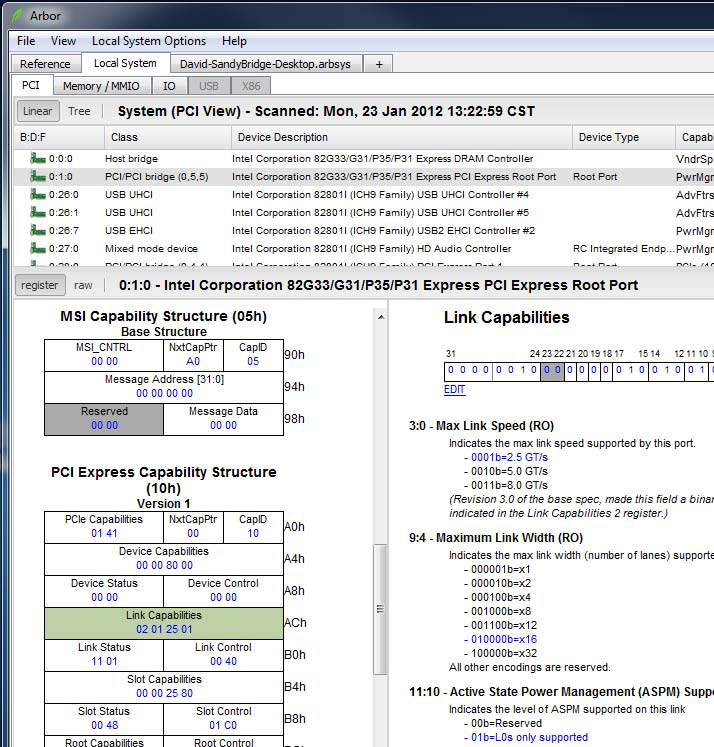

<br>


By comparison, Figure 12‐2 on page 410 shows the 128b/130b encoding. This encoding does not affect bytes being transferred, instead the
characters are grouped into blocks of 16 bytes with a 2‐bit Sync field at the beginning of each block. The 2‐bit Sync field specifies
whether the block includes Data (10b) or Ordered Sets (01b). Consequently, the Sync field indicates to the receiver what kind of traffic to
expect and when it will begin. Ordered sets are similar to the 8b/10b version in that they must be driven on all the Lanes simultaneously.
That requires getting the Lanes properly synchronized and this is part of the training process (see “Achieving Block Alignment” on page
438).

_Figure 12‐2: 128b/130b Block Encoding_ 

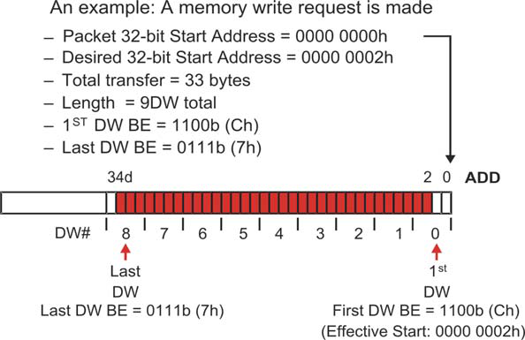

<br>

</td>
<td width="50%">

## **新的编码模型**

物理层的逻辑部分用新的 128b/130b 编码方案取代了 8b/10b 编码。当然，这意味着要摆脱许多串行设计中使用的、人们已经很好理解的 8b/10b 模型。设计人员愿意采取这一步骤来回收 8b/10b 编码所造成的 20% 传输开销。使用 128b/130b 意味着
Lane 现在每个字节传递 8 位而不是 10 位，这意味着 8.0 GT/s 的数据速率将带宽翻倍。这相当于每个方向 1 GB/s 的带宽。

为了说明这两种编码之间的差异，首先考虑图 12-1，它显示了通用的 8b/10b 数据包构造。箭头突出显示了表示 8b/10b 数据包成帧符号的控制（K）字符。接收器通过识别这些控制字符知道会发生什么。请参阅第 380 页的"8b/10b 编码"以回顾此编码方案的优势。

_图 12‐1：8b/10b Lane 编码_

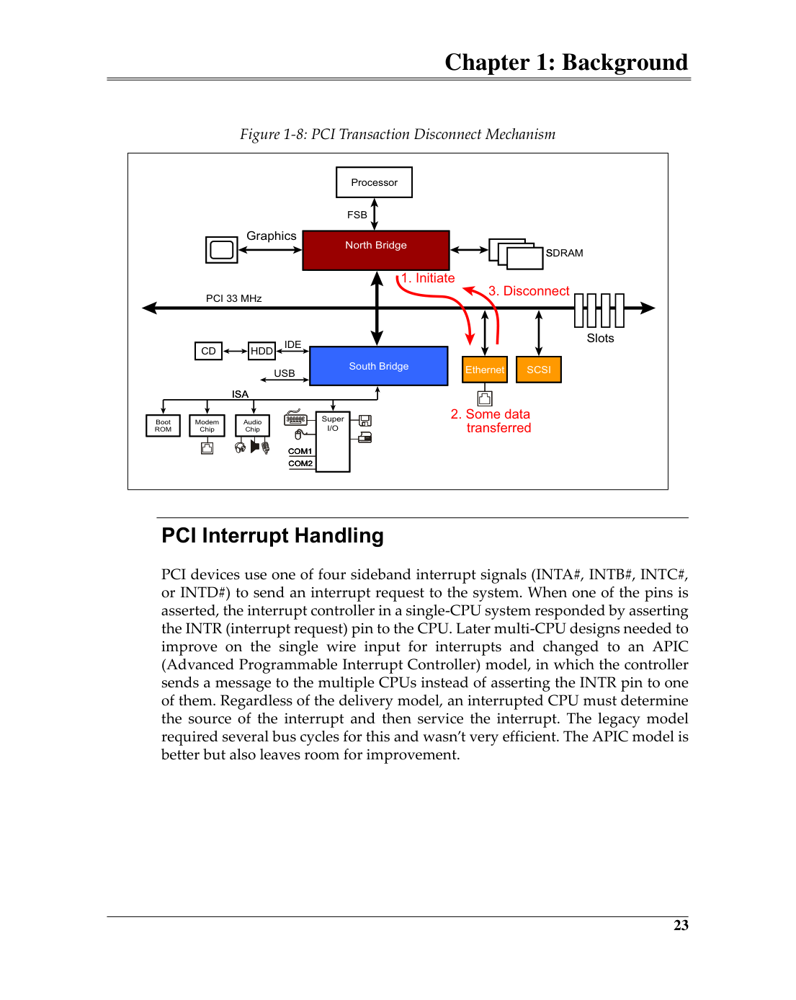

<br>


相比之下，第 410 页的图 12‐2 显示了 128b/130b 编码。此编码不影响正在传输的字节，而是将字符分组为 16 字节的块，每个块的开头有一个 2 位 Sync 字段。2 位 Sync 字段指定块是包含数据（10b）还是有序集（01b）。因此，Sync
字段向接收器指示期望的流量类型以及何时开始。有序集与 8b/10b 版本类似，因为它们必须在所有 Lane 上同时驱动。这要求正确同步 Lane，这是训练过程的一部分（请参见第 438 页的"实现块对齐"）。

**PCI Express 技术**

_图 12‐2：128b/130b 块编码_


<br>

</td>
</tr>
<tr>
<td width="50%">

## **Sophisticated Signal Equalization** 

The second change is made to the electrical sub‐block of the Physical Layer and involves more sophisticated signal equalization both at the
transmit side of the Link and optionally at the receiver. Gen1 and Gen2 implementations use a fixed Tx de‐emphasis to achieve good signal
quality. However, increasing transmis‐ sion frequencies beyond 5 GT/s causes signal integrity problems to become more pronounced, requiring
more transmitter and receiver compensation. This can be managed somewhat at the board level but the designers wanted to allow the external
infrastructure to remain the same as much as possible, and instead placed the burden on the PHY transmitter and receiver circuits. For more
details on signal conditioning, refer to “Solution for 8.0 GT/s ‐ Transmitter Equalization” on page 474.

</td>
<td width="50%">

## **复杂的信号均衡**

第二个更改是在物理层的电气子块中进行的，涉及在链路发送端以及可选地在接收端进行更复杂的信号均衡。Gen1 和 Gen2 实现使用固定的 Tx 去加重来实现良好的信号质量。然而，将传输频率提高到 5 GT/s
以上会导致信号完整性问题变得更加突出，需要更多的发送器和接收器补偿。这可以在电路板级别进行一些管理，但设计人员希望允许外部基础设施尽可能保持不变，而将负担放在 PHY 发送器和接收器电路上。有关信号调理的更多详细信息，请参阅第 474 页的"8.0 GT/s 解决方案 -
发送器均衡"。

</td>
</tr>
<tr>
<td width="50%">

## **Encoding for 8.0 GT/s** 

As previously discussed, the Gen3 128b/130b encoding method uses Link‐wide packets and per‐Lane block encoding. This section provides
additional details regarding the encoding.

</td>
<td width="50%">

## **8.0 GT/s 编码**

如前所述，Gen3 128b/130b 编码方法使用链路范围的数据包和按 Lane 的块编码。本节提供有关编码的其他详细信息。

</td>
</tr>
<tr>
<td width="50%">

## **Lane-Level Encoding** 

To illustrate the use of Blocks, consider Figure 12‐3 on page 411, where a single‐ Lane Data Block is shown. At the beginning are the two
Sync Header bits fol‐ lower by 16 bytes (128 bits) of information resulting in 130 transmitted bits. The Sync Header simply defines whether
a Data block (10b) or an Ordered Set (01b) is being sent. You may have noticed the Data Block in Figure 12‐3 has a Sync Header value of 01
rather than the 10b value mentioned above. This is because the least significant bit of the Sync Header is sent first when transmitting the
block across the link. Notice the symbols following the Sync Header are also sent with the least significant bit first.
_Figure 12‐3: Sync Header Data Block Example_ 

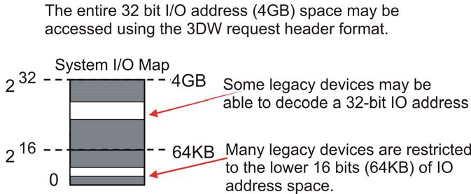

<br>

</td>
<td width="50%">

## **Lane 级别编码**

为了说明块的使用，请考虑第 411 页的图 12‐3，其中显示了单 Lane 数据块。开头是两个 Sync Header 位，后跟 16 字节（128 位）信息，共产生 130 个传输位。Sync Header
仅定义正在发送的是数据块（10b）还是有序集（01b）。您可能已经注意到图 12‐3 中的数据块的 Sync Header 值为 01，而不是上面提到的 10b 值。这是因为当跨链路传输块时，Sync Header 的最低有效位首先发送。请注意，Sync Header
之后的符号也以最低有效位优先发送。

**第 12 章：物理层 - 逻辑 (Gen3)**

_图 12‐3：Sync Header 数据块示例_


<br>

</td>
</tr>
<tr>
<td width="50%">

## **Block Alignment** 

Like previous implementations, Gen3 achieves Bit Lock first and then attempts to establish Block Alignment locking. This requires receivers
to find the Sync Header that demarcates the Block boundary. Transmitters establish this bound‐ ary by sending recognizable EIEOS patterns
consisting of alternating bytes of 00h and FFh, as shown in Figure 12‐4. Thus, the use of EIEOS has expanded from simply exiting Electrical
Idle to also serving as the synchronizing mecha‐ nism that establishes Block Alignment. Note that the Sync Header bits immedi‐ ately precede
and follow the EIEOS (not shown in the illustration). See “Achieving Block Alignment” on page 438 for details regarding this process.

_Figure 12‐4: Gen3 Mode EIEOS Symbol Pattern_ 

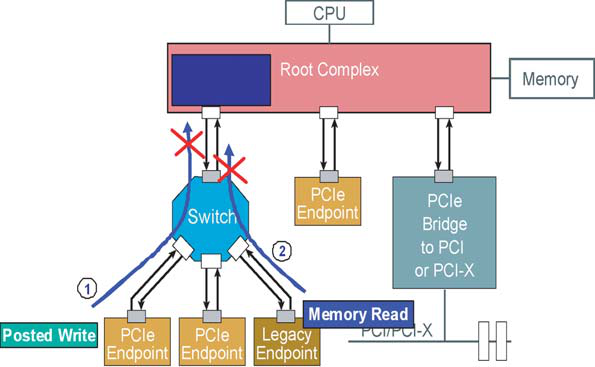

<br>

</td>
<td width="50%">

## **块对齐**

与之前的实现一样，Gen3 首先实现位锁定（Bit Lock），然后尝试建立块对齐（Block Alignment）锁定。这要求接收器找到作为块边界标记的 Sync Header。发送器通过发送由交替的 00h 和 FFh 字节组成的可识别的 EIEOS 模式来建立此边界，如图
12‐4 所示。因此，EIEOS 的使用已从仅仅退出电气空闲扩展为还可作为建立块对齐的同步机制。请注意，Sync Header 位紧接在 EIEOS 之前和之后（图中未显示）。有关此过程的详细信息，请参见第 438 页的"实现块对齐"。

_图 12‐4：Gen3 模式 EIEOS 符号模式_


<br>


**PCI Express 技术**

</td>
</tr>
<tr>
<td width="50%">

## **Ordered Set Blocks** 

Ordered Sets have much the same meaning they did in Gen1 and Gen2. They are used to manage Lane protocol. When an Ordered Set Block is sent
it must appear on all the Lanes at the same time and almost always consists of 16 bytes with one exception. The one exception to this size
rule is the SOS (SKP Ordered Set) which can have SKP Symbols added or removed in groups of four by clock compensation logic (associated with
a Link Repeater for example) and can therefore legally be 8, 12, 16, 20, or 24 bytes long.

The basic format of the Ordered Set Block is similar to the Data Block, except that the Sync Header bits are reversed, as shown in Figure
12‐5 on page 412.

_Figure 12‐5: Gen3 x1 Ordered Set Block Example_ 


<br>


The spec defines seven Ordered Sets for Gen3 (one additional Ordered Set over Gen1 and Gen2 PCIe). In most cases, their functionality is the
same as it was for the previous generations.

1. SOS ‐ Skip Ordered Set: used for clock compensation. See “Ordered Set Example ‐ SOS” on page 426 for more detail. 

2. EIOS ‐ Electrical Idle Ordered Set: used to enter Electrical Idle state 

3. EIEOS ‐ Electrical Idle Exit Ordered Set: used for two purposes now: — Electrical Idle Exit as before 

 - Block alignment indicator for 8.0 GT/s 

4. TS1 ‐ Training Sequence 1 Ordered Set 

5. TS2 ‐ Training Sequence 2 Ordered Set 

6. FTS ‐ Fast Training Sequence Ordered Set 

7. SDS ‐ Start of Data Stream Ordered Set: new ‐ see “Data Stream and Data Blocks” on page 413 for more

</td>
<td width="50%">

## **有序集块**

有序集在 Gen1 和 Gen2 中的含义大致相同。它们用于管理 Lane 协议。当发送有序集块时，它必须同时出现在所有 Lane 上，并且几乎总是由 16 个字节组成，只有一个例外。此大小规则的一个例外是 SOS（SKP
有序集），它可以通过时钟补偿逻辑（例如与链路中继器相关联）以四个为一组添加或删除 SKP 符号，因此合法长度可以是 8、12、16、20 或 24 字节。

有序集块的基本格式与数据块类似，只是 Sync Header 位是相反的，如第 412 页的图 12‐5 所示。

_图 12‐5：Gen3 x1 有序集块示例_


<br>


规范为 Gen3 定义了七个有序集（比 Gen1 和 Gen2 PCIe 多一个有序集）。在大多数情况下，它们的功能与前几代相同。

1. SOS - Skip 有序集：用于时钟补偿。有关更多详细信息，请参见第 426 页的"有序集示例 - SOS"。

2. EIOS - Electrical Idle 有序集：用于进入电气空闲状态

3. EIEOS - Electrical Idle Exit 有序集：现在用于两个目的：— 电气空闲退出，如以前

 - 8.0 GT/s 的块对齐指示符

4. TS1 - Training Sequence 1 有序集

5. TS2 - Training Sequence 2 有序集

6. FTS - Fast Training Sequence 有序集

7. SDS - Start of Data Stream 有序集：新增 - 有关更多信息，请参见第 413 页的"数据流和数据块"

</td>
</tr>

</tbody>
</table>

[⬆️ 返回目录](#本章目录-table-of-contents)

---

<a id="sec-10-2"></a>
## 10.2 Ack/Nak Protocol | Ack/Nak 协议

<table>
<thead><tr><th width="50%">🇬🇧 English</th><th width="50%">🇨🇳 中文</th></tr></thead>
<tbody>
<tr>
<td>
To give the reader an example of the Ordered Set structure, Figure 12‐6 shows the content of an FTS Ordered Set when running at 8.0 GT/s. An
Ordered Set Block is only recognized as an Ordered Set by the Sync Header, and identified as an FTS type by the first Symbol in the Block.
The right‐hand side of the figure lists the Ordered Set Identifiers (the first Symbol for each Ordered Set) that serve to identify the type
of Ordered Set is being transmitted.

_Figure 12‐6: Gen3 FTS Ordered Set Example_ 

|**8Bh 14**<br>**8Dh 13**<br>**80h 12**<br>**7Fh 11**<br>**88h 10**<br>**ECh 9**<br>**6Eh 8**<br>**25h 7**<br>**C9h 6**<br>**C6h 5**<br>**CCh 4**<br>**C7h 3**<br>**4Eh 2**<br>**8Eh 15**<br>**47h 1**<br>**55h 0**<br>**01b**<br>**Sync
Header**<br>**Value Symbol**<br>**FTS Ordered
Set**|**8Bh 14**<br>**8Dh 13**<br>**80h 12**<br>**7Fh 11**<br>**88h 10**<br>**ECh 9**<br>**6Eh 8**<br>**25h 7**<br>**C9h 6**<br>**C6h 5**<br>**CCh 4**<br>**C7h 3**<br>**4Eh 2**<br>**8Eh 15**<br>**47h 1**<br>**55h 0**<br>**01b**<br>**Sync
Header**<br>**Value Symbol**<br>**FTS Ordered
Set**|**AAh SKP**<br>**2Dh TS2**<br>**1Eh TS1**<br>**E1 SDS**<br>**55h FTS**<br>**66h EIOS**<br>**00h EIEOS**<br>**First
Symbol**<br>**Ordered Set**<br>**Ordered Set
Identifiers**|**AAh SKP**<br>**2Dh TS2**<br>**1Eh TS1**<br>**E1 SDS**<br>**55h FTS**<br>**66h EIOS**<br>**00h EIEOS**<br>**First
Symbol**<br>**Ordered Set**<br>**Ordered Set Identifiers**|
|---|---|---|---|
|**Symbol**|**Value**|**Ordered Set**|**First Symbol**|
|**Sync Header**|**01b**|**EIEOS**|**00h**|
|**0**|**55h**|**EIOS**|**66h**|
|**1**|**47h**|**FTS**|**55h**|
|**2**|**4Eh**|**SDS**|**E1**|
|**3**|**C7h**|**TS1**|**1Eh**|
|**4**|**CCh**|**TS2**|**2Dh**|
|**5**|**C6h**|**SKP**|**AAh**|
|**6**|**C9h**|||
|**7**|**25h**|||
|**8**|**6Eh**|||
|**9**|**ECh**|||
|**10**|**88h**|||
|**11**|**7Fh**|||
|**12**|**80h**|||
|**13**|**8Dh**|||
|**14**|**8Bh**|||
|**15**|**8Eh**|||


## **Data Stream and Data Blocks** 

The Link enters a Data Stream by sending an SDS Ordered Set and transitioning to the L0 Link state. While in a Data Stream multiple Data
Blocks are trans‐ ferred, until the Data Stream ends with an EDS Token (unless an error ends it early). An EDS Token always occupies the
last four Symbols of the Data Block that precedes an Ordered Set. An exception is made for Skip Ordered Sets because they do not interrupt a
Data Stream as long as certain conditions are

met that are discussed later. A Data Stream is no longer in effect when the Link state transitions out of the L0 state to any other Link
state, such as Recovery. For more on Link states, see “Link Training and Status State Machine (LTSSM)” on page 518.

## **Data Block Frame Construction** 

Data Blocks comprise TLPs, DLLP, and Tokens that are used to deliver the infor‐ mation. Five types of Data structures (called Tokens) are
also used within a Data Block. Each has patterns for easy detection by the receiver. Three of the token may be sent at the beginning of a
block (i.e., immediately following a Sync Data Block). These include:

- Start TLP (STP) — followed by a TLP 

- Start DLLP (SDP) — followed by a DLLP 

- Logical Idle (IDLA) — sent when there is no packet activity 

The remaining Tokens are delivered at the end of the Data Block: 

- End of Data Stream (EDS) — Precedes the transition to Ordered Sets 

- End Bad (EDB) — reports a nullified packet has been detected 

Figure 12‐7 provides an example of a Data Block consisting of a single lane TLP transmission. 

_Figure 12‐7: Gen3 x1 Frame Construction Example_ 


<br>

In summary, the contents of a given Data Block vary depending on the activity: 

- IDLs — when no packets are being delivered Data Blocks consist of nothing but IDL. (The spec designates IDL as one of the Tokens) 

- TLPs — One or more TLPs may be sent in a given Data Block depend‐ ing on the link width. 

- DLLPs — One or more DLLPs may be sent in a Data Block. 

- Combinations of the activity listed above may be delivered in a single Data Block 

## **Framing Tokens** 

The spec defines five Framing Tokens (or just “Tokens” for short) that are allowed to appear in a Data Block, and those are repeated for
convenience here in Figure 12‐8 on page 417. The five Tokens are:

**1. STP ‐ Start TLP** : Much like earlier version, but now includes dword count for the entire packet. 

**2. SDP ‐ Start DLLP** 

3. **EDB ‐ End Bad** : Used to nullify a TLP the way it was in earlier Gen1 and Gen2 designs, but now four EDB symbols in a row are sent.
The END (End Good) symbol is done away now; if not explicitly marked as bad, the TLP will be assumed to be good.

**4. EDS ‐ End of Data Stream** : Last dword of a Data Stream, indicating that at least one Ordered Set will follow. Curiously, the Data
Stream may not actually be ended by this event. If the Ordered Set that follows it is an SOS and is immediately followed by another Data
Block, the Data Stream continues. If the Ordered Set that follows the EDS is anything other than SOS, or if the SOS is not followed by a
Data Block, the Data Stream ends.

**5. IDL ‐ Logical Idle:** The Idle Token is simply data zero bytes sent during Link Logical Idle state when no TLPs or DLLPs are ready to
transmit.

The difference between the way the spec shows the Tokens and the way they’re presented in Figure 12‐8 on page 417 is that this drawing shows
both bytes and bits in little‐endian order instead of the big‐endian bit representa‐ tion used in the spec. The reason it’s shown that way
is to illustrate the order that the bits will actually appear on the Lane.

## **Packets** 

The STP and SDP, indicate the start of a packet as shown in Figure 12‐7 

- **TLPs** . An **STP** Token consists of a nibble of 1’s followed by an 11‐bit dword‐ length field. The length counts all the dwords of the
TLP, including the

## **PCI Express Technology** 

Token, header, optional data payload, optional digest, and LCRC. That allows the receiver to count dwords to recognize where the TLP ends.
Con‐ sequently, it’s very important to verify that the Length field doesn’t have an error, and so it has a 4‐bit Frame CRC, and an even
parity bit that protects both the Length and Frame CRC fields. The combination of these bits pro‐ vides a robust triple‐bit‐flip detection
capability for the Token (as many as 3 bits could be incorrect and it would still be recognized as an error). The 11‐ bit Length field
allows for a TLP of 2K dwords (8KB) for the entire TLP.

- **DLLPs** . The **SDP** Token indicates the beginning of a DLLP and doesn’t include a length field because it will always be exactly 8
bytes long: the 2‐ byte Token is followed by 4 bytes of DLLP payload and 2 bytes of DLLP LCRC. Perhaps coincidently, this DLLP length is the
same as it was in ear‐ lier PCIe generations, but they also do not have an end good symbol.

The **EDB** Token is added to the end of TLPs that are nullified. For a normal TLP, there is no “end good” indication; it’s assumed to be
good unless explicitly marked as bad. If the TLP ends up being nullified, the LCRC value is inverted and an EDB Token is appended as an
extension of the TLP, although it’s not included in the length value. Physical layer receivers must check for the EDB at the end of every
TLP and inform the Link layer if they see one. Not surprisingly, receiving an EDB at any time other than immediately after a TLP will be
consid‐ ered to be a Framing Error.
## _Figure 12‐8: Gen3 Frame Token Examples_ 


<br>


## **Transmitter Framing Requirements** 

To begin this discussion, it will be helpful first to define a couple of things. First, recall that a Data Stream starts with the first
Symbol following an SDS and it may contain Data Blocks made up of Tokens, TLPs and DLLPs. The Data Stream finishes with the last Symbol
before an Ordered Set other than SOS, or when a Framing Error is detected. During a Data Stream no Ordered Sets can be sent except for the
SOS.

Secondly, since framing problems will usually result in a Framing Error, it will help to explain what happens in that case. When Framing
Errors occur, they are

## **PCI Express Technology** 

considered Receiver Errors and will be reported as such. The Receiver stops processing the Data Stream in progress and will only process a
new Data Stream when it sees an SDS Ordered Set. In response to the error, a recovery process is initiated by directing the LTSSM to the
Recovery state from L0. The expectation is that this will be resolved in the Physical Layer and will not require any action by the upper
layers. In addition, the spec states that the round‐trip time to accomplish this is expected to take less than 1  s from the time both
Ports have entered Recovery.

Now, with that background in place, let’s continue with the framing require‐ ments. While in a Data Stream, a transmitter must observe the
following rules:

- When sending a TLP: 

 - An STP Token must be immediately followed by the entire contents of the TLP as delivered from the Link Layer, even if it’s nullified. 

 - If the TLP was nullified, the EDB Token must appear immediately after the last dword of the TLP, but must not be included in the TLP
length value.

 - An STP cannot be sent more than once per Symbol Time on the Link. 

- When sending a DLLP: 

 - An SDP Token must be immediately followed by the entire contents of the DLLP as delivered from the Data Link Layer. 

 - 

 - An SDP cannot be sent more than once per Symbol Time on the Link. 

- When sending an SOS (SKP Ordered Set) within a Data Stream: 

 - Send an EDS Token in the last dword of the current Data Block. 

 - Send the SOS as the next Ordered Set Block. 

 - Send another Data Block immediately after the SOS. The Data Stream resumes with the first Symbol of this subsequent Data Block. 

 - If multiple SOS’s are scheduled, they can’t be back‐to‐back as they were in earlier generations. Instead, each one must be preceded by a
Data Block that ends with the EDS Token. The Data block can be filled with TLPs, DLLPs or IDLs during this time.

</td>
<tr>
<td width="50%">

- 要结束数据流，在当前数据块的最后一个 dword 中发送 EDS 令牌，然后跟随 EIOS 以进入低功耗链路状态，或在所有其他情况下跟随 EIEOS。

- 如果链路上没有发送 TLP、DLLP 或其他成帧令牌，则必须在所有通道上发送 IDL 令牌。

- 对于多通道链路：

 - 在发送 IDL 令牌之后，下一个 TLP 或 DLLP 的第一个字符必须在开始时位于通道 0 中。EDS 令牌必须始终是数据块的最后一个 dword，因此可能不总是遵循该规则。

 - IDL 令牌必须用于在字符时间内填充原本为空的 dword。例如，如果 x8 链路有一个 TLP

**第 12 章：物理层 - 逻辑 (Gen3)**

在通道 3 中结束，但发送方没有另一个 TLP 或 DLLP 准备好在通道 4 中开始，则 IDL 必须填充剩余的字节，直到该字符时间结束。

- 由于数据包仍然是 4 字节的倍数，就像在早期代中一样，它们将以 4 通道边界开始和结束。例如，具有在通道 3 中结束的 DLLP 的 x8 链路可以通过将其 STP 令牌放在通道 4 中来启动下一个 TLP。

</td>
<td width="50%">

有几个链路电源状态允许在特定条件下节省功耗。这些状态是 L0s、L1、L2 和 L3，它们表示逐步降低的功耗以及将链路恢复到完全运行状态 L0 时所需的更长恢复时间。L0s 状态只能在硬件控制下进入，而 L1 可以由硬件或软件发起。由于 L0s 和 L1
可以由硬件控制，它们被规范称为 ASPM（Active State Power Management，活动状态电源管理）状态。有关链路和设备电源管理的更多详细信息，请参见第 735 页的"活动状态电源管理 (ASPM)"一节。

</td>
</tr>
<tr>
<td width="50%">

## **接收器成帧要求 (Receiver Framing Requirements)**

当接收器看到数据流时，适用以下规则：

- 当预期成帧令牌时，看起来像任何其他内容的字符将是成帧错误 (Framing Errors)。

- 下面列表中显示的某些错误检查和报告是可选的，并且规范指出它们彼此独立可选。

- 接收到 STP 时：

 - 接收器必须检查帧 CRC 和帧奇偶校验字段，任何不匹配将是成帧错误。（请注意，具有成帧错误的 STP 令牌在报告此错误时不视为 TLP 的一部分。）

 - 紧接 TLP 最后一个 DW 之后的字符是要处理的下一个令牌，并且接收器必须检查它是否是被作废的 TLP 的 EDB 令牌的开始。

 - 可选地检查长度值是否为零；如果检测到，则是成帧错误。

 - 可选地检查在同一字符时间内是否有超过一个 STP 令牌的到达。如果检查并检测到，则这是成帧错误。

- 接收到 EDB 时：

 - 接收器必须在检测到第一个 EDB 字符时，或在已接收到任何剩余字节之后，通知链路层。

 - 如果令牌中的任何字符不是 EDB，则结果是成帧错误。

 - EDB 令牌唯一合法的时间是在 TLP 之后；任何其他用途将是成帧错误。

 - 紧接 EDB 令牌之后的字符将是要处理的下一个令牌的第一个字符。

- 当作为数据块最后一个 DW 接收到 EDS 令牌时：

 - 接收器必须停止处理数据流。

 - 仅接受 SKP、EIOS 或 EIEOS 有序集合作为下一个；接收到任何其他有序集合将是成帧错误。

 - 如果在 EDS 之后接收到 SKP 有序集合，则接收器必须从跟随的数据块的第一个字符恢复数据流处理，除非检测到成帧错误。

</td>
<td width="50%">

## **链路训练和初始化**

正如我们刚刚在本章中简要提到的，物理层还负责在复位后初始化链路。但是，这个主题太大，无法在此处涵盖，而是在第 505 页的第 14 章"链路初始化与训练"中介绍。

**PCI Express 技术**

</td>
</tr>
<tr>
<td width="50%">

## **PCI Express Technology**

- 接收到 SDP 令牌时：

 - DLLP 之后的字符是要处理的下一个令牌。

 - 可选地检查同一字符时间内是否有超过一个 SDP 令牌。如果检查并发生这种情况，则是成帧错误。

- 接收到 IDL 令牌时：

 - 下一个令牌允许在 IDL 令牌之后的任何 DW 对齐通道上开始。对于 x4 或更窄的链路，这意味着下一个令牌只能在下一个字符时间的通道 0 中开始。对于更宽的链路，有更多的选项。例如，x16 链路可以在当前字符时间的通道 0、4、8 或 12 中开始下一个令牌。

 - 在同一字符时间内预期与 IDL 一起出现的唯一令牌将是另一个 IDL 或 EDS。

- 在处理数据流期间，接收器将看到以下内容作为成帧错误：

 - 紧接 SDS 之后的有序集合。

 - 具有非法 Sync Header（11b 或 00b）的块。这可以选择地在通道错误状态寄存器中报告。

 - 在任何通道上的有序集合块，在上一个块中未接收到 EDS 令牌。

 - 紧接上一个块中的 EDS 令牌之后的数据块。

 - 可选地，验证所有通道是否接收相同的有序集合。

</td>
<td width="50%">

## _**12**_

</td>
</tr>
<tr>
<td width="50%">

## **从成帧错误中恢复 (Recovery from Framing Errors)**

如果在处理数据流时看到成帧错误，则接收器必须：

- 报告接收器错误（如果可选的高级错误报告寄存器可用，则设置第 421 页图 12-9 中显示的状态位）。

- 停止处理数据流。处理新的数据流可以在看到下一个 SDS 有序集合时开始。

- 启动错误恢复过程。如果链路处于 L0 状态，则将涉及转换到 Recovery 状态。规范说通过 Recovery 状态的时间"预期"小于 1 μs。

- 请注意，从成帧错误恢复不一定预期会直接导致通过 Ack/Nak 机制的数据链路层发起的恢复活动。当然，如果 TLP 因错误而丢失或损坏，则将需要重传事件。

**第 12 章：物理层 - 逻辑 (Gen3)**

_图 12-9：AER 可纠正错误寄存器_

**==> 图片 [366 x 190] 已故意省略 <==**

**----- 图片文字开始 -----**<br>
31 16 15 14 13 12 11 9 8 7 6 5 1 0<br>
RsvdZ RsvdZ RsvdZ<br>
Header Log Overflow Status<br>
Corrected Internal Error Status<br>
Advisory Non-Fatal Error Status<br>
Replay Timer Timeout Status<br>
REPLAY_NUM Rollover Status<br>
Bad DLLP Status<br>
Bad TLP Status<br>
Receiver Error Status<br>
注意：所有指定为 RW1CS 的位<br>
**----- 图片文字结束 -----**<br>

</td>
<td width="50%">

## _**物理层 - 逻辑 (Gen3)**_

</td>
</tr>
<tr>
<td width="50%">

## **Gen3 物理层发送逻辑 (Gen3 Physical Layer Transmit Logic)**

第 422 页的图 12-10 说明了支持 Gen3 速度的物理层发送逻辑的概念框图。整体设计与 Gen2 非常相似，因此无需再次介绍所有细节，但存在一些差异。建议那些 PCIe 新手回顾第 361 页的早期章节"物理层 - 逻辑 (Gen1 和
Gen2)"，以了解物理层设计的基础。让我们从图的顶部开始，解释 Gen3 的变化。一如既往，重要的是要指出此实现仅用于教学目的，并非旨在显示实际的 Gen3 物理层实现。

</td>
<td width="50%">

## **上一章**

上一章描述了物理层的 Gen1/Gen2 逻辑子块。该层准备用于串行传输和恢复的数据包，并详细描述了完成此操作所需的几个步骤。该章涵盖了与 Gen1 和 Gen2 协议相关联的逻辑，这些协议使用 8b/10b 编码/解码。

</td>
</tr>
<tr>
<td width="50%">

## **多路复用器 (Multiplexer)**

TLP 和 DLLP 从数据链路层到达顶部。多路复用器混合构建完整 TLP 或 DLLP 所需的 STP 或 SDP 令牌。上一节描述了令牌格式。

</td>
<td width="50%">

## **本章**

本章描述了 PCIe 第三代（Gen3）的逻辑物理层特性。主要变化包括在不使频率翻倍的情况下将带宽相对于 Gen2 速率翻倍的能力（链路速率从 5 GT/s 增加到 8 GT/s）。这是通过在 Gen3 模式下消除 8b/10b 编码来实现的。在 Gen3
速率下需要更强的信号补偿。

</td>
</tr>
<tr>
<td width="50%">

## **PCI Express Technology**

_图 12-12：Gen3 x8 示例：TLP 跨越块边界_

_图 12-10：Gen3 物理层发送器详细信息_

**==> 图片 [260 x 371] 已故意省略 <==**

**----- 图片文字开始 -----**<br>
来自数据链路层<br>
数据包边界指示符<br>
Throttle N*8<br>
Tx<br>
缓冲区 控制/ 有序<br>
令牌 逻辑 集合<br>
字符 空闲<br>
N*8 8 8 8<br>
Mux<br>
N*8 D/K#<br>
通道 0 字节交错 通道 N<br>
8 D/K# 8 D/K#<br>
Gen3 加扰器 通道 1, ... ,N-1 Gen3 加扰器<br>
加扰器 加扰器<br>
8 8<br>
D/K# Tx 本地 D/K#<br>
PLL<br>
8b/10b 8b/10b<br>
编码器 编码器<br>
8 10 Tx 时钟 8 10<br>
Mux Mux<br>
Gen3 同步<br>
串行器 位生成器 串行器<br>
Mux Mux<br>
Tx Tx<br>
通道 0 通道 1, ... ,N-1 通道 N<br>
**----- 图片文字结束 -----**<br>


**第 12 章：物理层 - 逻辑 (Gen3)**

Gen3 TLP 边界由 TLP 数据包开头的 STP 令牌的 Length 字段中的 dword 计数定义，因此不需要 END 帧字符。

当结束数据流或仅在发送 SOS 之前，EDS 令牌被多路复用到数据流中。基于 Skip 计时器，SOS 由多路复用器定期插入数据流中。其他有序集合（如 TS1、TS2、FTS、EIEOS、EIOS、SDS）也可以根据链路需求进行多路复用，并且位于数据流之外。

数据包以块形式传输，由 2 位 Sync Header 标识。Sync Header 由多路复用器添加。但是，Sync Header 由字节交错逻辑在多通道链路的所有通道上复制。

当没有数据包或有序集合要发送但链路要保持在 L0 状态时，IDL（逻辑空闲或数据零）令牌用作填充。这些像其他数据字节一样被加扰，并由接收器识别为填充。

</td>
<td width="50%">

## **下一章**

下一章描述了物理层与链路的电气接口。本章还讨论了对信号均衡的需求以及实现该均衡的方法。本章结合了 Gen1、Gen2 和 Gen3 速率的电气发送器和接收器特性。

</td>
</tr>
<tr>
<td width="50%">

## **字节交错 (Byte Striping)**

此逻辑将要传递的字节分散到所有可用通道上。成帧规则在第 417 页的"发送器成帧要求 (Transmitter Framing Requirements)"中已经描述过，所以现在让我们看一些示例并讨论这些规则如何应用。

首先考虑第 424 页图 12-11 中所示的示例，其中说明了 4 通道链路。请注意，Sync Header 位在新块开始时同时出现在所有通道上，并定义块类型（本例中为数据块）。块编码为每个通道独立处理，但字节（或字符）像早期 PCIe 代一样交错分布在所有通道上。

_图 12-11：Gen3 字节交错 x4_

**==> 图片 [376 x 222] 已故意省略 <==**

**----- 图片文字开始 -----**<br>
通道 0 0 1 0 1 2 3 4 5 6 7 0 1 2 3 4 5 6 7 0 1 2 3 4 5 6 7<br>
Sync 字符 0 字符 4 字符 60<br>
通道 1 0 1 0 1 2 3 4 5 6 7 0 1 2 3 4 5 6 7 0 1 2 3 4 5 6 7<br>
Sync 字符 1 字符 5 字符 61<br>
通道 2 0 1 0 1 2 3 4 5 6 7 0 1 2 3 4 5 6 7 0 1 2 3 4 5 6 7<br>
Sync 字符 2 字符 6 字符 62<br>
通道 3 0 1 0 1 2 3 4 5 6 7 0 1 2 3 4 5 6 7 0 1 2 3 4 5 6 7<br>
Sync 字符 3 字符 7 字符 63<br>
**----- 图片文字结束 -----**<br>

</td>
<td width="50%">

## **Gen3 简介**

回想一下，当 PCIe 链路进入训练时（即，在复位之后），它始终从 Gen1 速率开始以保持向后兼容性。如果在训练期间通告了更高的速率，则链路将立即转换到 Recovery 状态，并尝试更改为双方共同支持的最高速率。

</td>
</tr>
<tr>
<td width="50%">

## **字节交错 x8 示例 (Byte Striping x8 Example)**

接下来，考虑第 425 页图 12-12 中所示的 x8 链路，这是从规范重绘以使其更易读的示例。这里的位流是垂直的而不是水平的。在顶部我们可以看到 Sync 位按小端序显示（按要求），同时出现在所有通道上，并指示数据块正在开始。

在此示例中，首先发送 TLP，因此字符 0-4 包含 STP 成帧令牌，其中包括整个 TLP 的 7 DW 长度（包括令牌）。接收器需要知道 TLP 的长度，因为对于 8 GT/s 速度，没有 END 控制字符。相反，接收器计算 dword，如果未观察到 EDB（End
Bad），则假定 TLP 是好的。在这种情况下，TLP 在字符 3 的通道 3 处结束。

**第 12 章：物理层 - 逻辑 (Gen3)**

</td>
</tr>
</tbody>
</table>

[⬆️ 返回目录](#本章目录-table-of-contents)

---

<a id="sec-10-3"></a>

</td>
<td width="50%">

## **PCI Express 技术**

将 PCIe 规范升级到 Gen3 的主要动机是将带宽翻倍，如第 408 页的表 12‐1 所示。完成此操作的直接方法是将信号频率从 5 GT/s 简单地翻倍到 10 Gb/s，但这样做带来了几个问题：

- 更高的频率消耗更多的功率，由于在更高速度下保持信号完整性需要复杂的调理逻辑（均衡），这种情况会更加严重。事实上，PCISIG 文献中提到这种均衡逻辑的功耗是将频率保持在尽可能低的水平的一个重要动机。

- 某些电路板材料在更高频率下会出现严重的信号衰减。可以通过更好的材料和更多的设计工作来克服这个问题，但这些会增加成本和开发时间。由于 PCIe 旨在服务于各种系统，目标是它也应能在低成本设计中良好工作。

- 类似地，允许新设计使用现有的基础设施（例如电路板和连接器）可以最大程度地减少电路板设计工作量和成本。使用更高的频率会使这变得更加困难，因为必须调整走线长度和其他参数以适应新的时序，这使得高频不太受欢迎。

_表 12‐1：不同链路宽度的 PCI Express 总带宽_

|**链路宽度**|**x1**|**x2**|**x4**|**x8**|**x12**|**x16**|**x32**|
|---|---|---|---|---|---|---|---|
|**Gen1 带宽**<br>**(GB/s)**|0.5|1|2|4|6|8|16|
|**Gen2 带宽**<br>**(GB/s)**|1|2|4|8|12|16|32|
|**Gen3 带宽**<br>**(GB/s)**|2|4|8|16|24|32|64|


这些考虑导致了与前几代相比 Gen3 规范的两个重大变化：新的编码模型和更复杂的信号均衡模型。

**第 12 章：物理层 - 逻辑 (Gen3)**

</td>
</tr><table>
<thead><tr><th width="50%">🇬🇧 English</th><th width="50%">🇨🇳 中文</th></tr></thead>
<tbody>
<tr>
<td width="50%">

## 10.3 Ack/Nak Protocol | Ack/Nak 协议

<table>
<thead><tr><th>🇬🇧 English</th><th style="background-color:#e8e8e8">🇨🇳 中文</th></tr>
</tbody>
</table></thead>
<tbody>
<tr>
<td width="50%">

- To end a Data Stream, send the EDS Token in the last dword of the current Data Block and follow that with either the EIOS to go into a low
power Link state, or an EIEOS for all other cases.

- The IDL Token must be sent on all Lanes if a TLP, DLLP, or other Framing Token is not being sent on the Link. 

- For multi‐Lane Links: 

 - After sending an IDL Token, the first Symbol of the next TLP or DLLP must be in Lane 0 when it starts. An EDS Token must always be the
last dword of a Data Block and therefore may not always follow that rule.

 - IDL Tokens must be used to fill in dwords during a Symbol Time that would otherwise be empty. For example, if a x8 Link has a TLP that 
ends in Lane 3, but the sender doesn’t have another TLP or a DLLP ready to start in Lane 4, then IDLs must fill in the remaining bytes until
the end of that Symbol Time.

- Since packets are still multiples of 4 bytes as they were in the earlier generations, they’ll start and end on 4‐Lane boundaries. For
example, a x8 Link with a DLLP that ends in Lane 3 could start the next TLP by placing its STP Token in Lane 4.

</td>
<td width="50%">

## **新的编码模型**

物理层的逻辑部分用新的 128b/130b 编码方案取代了 8b/10b 编码。当然，这意味着要摆脱许多串行设计中使用的、人们已经很好理解的 8b/10b 模型。设计人员愿意采取这一步骤来回收 8b/10b 编码所造成的 20% 传输开销。使用 128b/130b 意味着
Lane 现在每个字节传递 8 位而不是 10 位，这意味着 8.0 GT/s 的数据速率将带宽翻倍。这相当于每个方向 1 GB/s 的带宽。

为了说明这两种编码之间的差异，首先考虑图 12-1，它显示了通用的 8b/10b 数据包构造。箭头突出显示了表示 8b/10b 数据包成帧符号的控制（K）字符。接收器通过识别这些控制字符知道会发生什么。请参阅第 380 页的"8b/10b 编码"以回顾此编码方案的优势。

_图 12‐1：8b/10b Lane 编码_


<br>


相比之下，第 410 页的图 12‐2 显示了 128b/130b 编码。此编码不影响正在传输的字节，而是将字符分组为 16 字节的块，每个块的开头有一个 2 位 Sync 字段。2 位 Sync 字段指定块是包含数据（10b）还是有序集（01b）。因此，Sync
字段向接收器指示期望的流量类型以及何时开始。有序集与 8b/10b 版本类似，因为它们必须在所有 Lane 上同时驱动。这要求正确同步 Lane，这是训练过程的一部分（请参见第 438 页的"实现块对齐"）。

**PCI Express 技术**

_图 12‐2：128b/130b 块编码_


<br>

</td>
</tr>
<tr>
<td width="50%">

## **Receiver Framing Requirements** 

When a Data Stream is seen at the Receiver, the following rules apply: 

- When Framing Tokens are expected, Symbols that look like anything else will be Framing Errors. 

- Some error checks and reports shown in the list below are optional, and the spec points out that they are independently optional. 

- When an STP is received: 

 - Receivers must check the Frame CRC and Frame Parity fields, and any mismatch will be a Framing Error. (Note that an STP Token with a
Framing Error isn’t considered to be part of a TLP when reporting this error.).

 - The Symbol immediately after the last DW of the TLP is the next Token to process, and Receivers must check to see whether it’s the start
of an EDB Token showing that the TLP has been nullified.

 - Optionally check for length value of zero; if detected, it’s a Framing Error. 

 - Optionally check for the arrival of more than one STP Token in the same Symbol Time. If checking and detected, this is a Framing Error. 

- When an EDB is received: 

 - Receiver must inform the Link Layer as soon as the first EDB Symbol is detected, or after any of the remaining bytes of it have been
received.

 - If any Symbols in the Token are not EDBs, the result is a Framing Error. 

 - The only legal time for an EDB Token is right after a TLP; any other use will be a Framing Error. 

 - The Symbol immediately following the EDB Token will be the first Symbol of the next Token to be processed. 

- When an EDS Token is received as the last DW of a Data Block: 

 - Receivers must stop processing the Data Stream. 

 - Only a SKP, EIOS, or EIEOS Ordered Set will be acceptable next; receiv‐ ing any other Ordered set will be a Framing Error. 

 - If a SKP Ordered Set is received after an EDS, Receivers must resume Data Stream processing with the first Symbol of the Data Block that
fol‐ lows, unless a Framing Error was detected.

</td>
<td width="50%">

## **复杂的信号均衡**

第二个更改是在物理层的电气子块中进行的，涉及在链路发送端以及可选地在接收端进行更复杂的信号均衡。Gen1 和 Gen2 实现使用固定的 Tx 去加重来实现良好的信号质量。然而，将传输频率提高到 5 GT/s
以上会导致信号完整性问题变得更加突出，需要更多的发送器和接收器补偿。这可以在电路板级别进行一些管理，但设计人员希望允许外部基础设施尽可能保持不变，而将负担放在 PHY 发送器和接收器电路上。有关信号调理的更多详细信息，请参阅第 474 页的"8.0 GT/s 解决方案 -
发送器均衡"。

</td>
</tr>
<tr>
<td width="50%">

## **PCI Express Technology** 

- When an SDP Token is received: 

 - The Symbol immediately after the DLLP is the next Token to be pro‐ cessed. 

 - Optionally check for more than one SDP Token in the same Symbol Time. If checking and this occurs, it is a Framing Error. 

- When an IDL Token is received: 

 - The next Token is allowed to begin on any DW‐aligned Lane following the IDL Token. For Links that are x4 or narrower, that means the next
Token can only start in Lane 0 of the next Symbol Time. For wider Links there are more options. For example, a x16 Link could start the next
Token in Lane 0, 4, 8, or 12 of the current Symbol Time.

 - The only Token that would be expected in the same Symbol Time as an IDL would be another IDL or an EDS. 

- While processing a Data Stream, Receivers will see the following as Fram‐ ing Errors: 

 - 

 - An Ordered Set immediately following an SDS. 

- A Block with an illegal Sync Header (11b or 00b). This can optionally be reported in the Lane Error Status register. 

- An Ordered Set Block on any Lane without receiving an EDS Token in the previous Block. 

- A Data Block immediately following an EDS Token in the previous block. 

- 

- Optionally, verify that all Lanes receive the same Ordered Set.

</td>
<td width="50%">

## **8.0 GT/s 编码**

如前所述，Gen3 128b/130b 编码方法使用链路范围的数据包和按 Lane 的块编码。本节提供有关编码的其他详细信息。

</td>
</tr>
<tr>
<td width="50%">

## **Recovery from Framing Errors** 

If a Framing Error is seen while processing a Data Stream, the Receiver must: 

- Report a Receiver Error (if the optional Advanced Error Reporting registers are available, set the status bit shown in Figure 12‐9 on page
421).

- Stop processing the Data Stream. Processing a new Data Stream can begin when the next SDS Ordered Set is seen. 

- Initiate the error recovery process. If the Link is in the L0 state, that will involve a transition to the Recovery state. The spec says
that the time through the Recovery state is “expected” to be less than 1  s.

- Note that recovery from Framing Errors is not necessarily expected to directly cause Data Link Layer initiated recovery activity via the
Ack/Nak mechanism. Of course, if a TLP is lost or corrupted as a result of the error, then a replay event will be needed.
_Figure 12‐9: AER Correctable Error Register_ 


<br>

</td>
<td width="50%">

## **Lane 级别编码**

为了说明块的使用，请考虑第 411 页的图 12‐3，其中显示了单 Lane 数据块。开头是两个 Sync Header 位，后跟 16 字节（128 位）信息，共产生 130 个传输位。Sync Header
仅定义正在发送的是数据块（10b）还是有序集（01b）。您可能已经注意到图 12‐3 中的数据块的 Sync Header 值为 01，而不是上面提到的 10b 值。这是因为当跨链路传输块时，Sync Header 的最低有效位首先发送。请注意，Sync Header
之后的符号也以最低有效位优先发送。

**第 12 章：物理层 - 逻辑 (Gen3)**

_图 12‐3：Sync Header 数据块示例_


<br>

</td>
</tr>
<tr>
<td width="50%">

## **Gen3 Physical Layer Transmit Logic** 

Figure 12‐10 on page 422 illustrates a conceptual block diagram of the Physical Layer transmit logic that supports Gen3 speeds. The overall
design is very simi‐ lar to Gen2 so there’s no need to go through all the details again but there are some differences. Those who are new to
PCIe are encouraged to review the ear‐ lier chapter called “Physical Layer ‐ Logical (Gen1 and Gen2)” on page 361 to learn the basics of the
Physical Layer design. Let’s start at the top of the diagram and explain the changes for Gen3 along the way. As before, it’s important to
point out that this implementation is only for instructional purposes and is not meant to show an actual Gen3 Physical Layer implementation.

</td>
<td width="50%">

## **块对齐**

与之前的实现一样，Gen3 首先实现位锁定（Bit Lock），然后尝试建立块对齐（Block Alignment）锁定。这要求接收器找到作为块边界标记的 Sync Header。发送器通过发送由交替的 00h 和 FFh 字节组成的可识别的 EIEOS 模式来建立此边界，如图
12‐4 所示。因此，EIEOS 的使用已从仅仅退出电气空闲扩展为还可作为建立块对齐的同步机制。请注意，Sync Header 位紧接在 EIEOS 之前和之后（图中未显示）。有关此过程的详细信息，请参见第 438 页的"实现块对齐"。

_图 12‐4：Gen3 模式 EIEOS 符号模式_


<br>


**PCI Express 技术**

</td>
</tr>
<tr>
<td width="50%">

## **Multiplexer** 

TLPs and DLLPs arrive from the Data Link Layer at the top. The multiplexer mixes in the STP or SDP Tokens necessary to build a complete TLP
or DLLP. The previous section described the Token formats.

_Figure 12‐10: Gen3 Physical Layer Transmitter Details_ 


<br>

Gen3 TLP boundaries are defined by the dword count in the Length field of the STP Token at the beginning of a TLP packet, therefore, no END
frame character is needed.

When ending a Data Stream or just before sending an SOS, the EDS Token in muxed into the Data Stream. At regular intervals, based on a Skip
timer, an SOS is inserted into the Data Stream by the multiplexer. Other Ordered‐Sets such as TS1, TS2, FTS, EIEOS, EIOS, SDS may also be
muxed based on Link require‐ ments and are outside the Data Stream.

Packets are transmitted in Blocks which are identified by the 2‐bit Sync Header. The Sych Header is added by the multiplexer. However, the
Sych Header is rep‐ licated on all Lanes of a multi‐Lane Link by the Byte Striping logic.

When there are no packets or Ordered Sets to send but the Link is to remain active in L0 state, the IDL (Logical Idle, or data zero) Tokens
are used as fillers. These are scrambled just like other data bytes and are recognized as filler by the Receiver.

</td>
<td width="50%">

## **有序集块**

有序集在 Gen1 和 Gen2 中的含义大致相同。它们用于管理 Lane 协议。当发送有序集块时，它必须同时出现在所有 Lane 上，并且几乎总是由 16 个字节组成，只有一个例外。此大小规则的一个例外是 SOS（SKP
有序集），它可以通过时钟补偿逻辑（例如与链路中继器相关联）以四个为一组添加或删除 SKP 符号，因此合法长度可以是 8、12、16、20 或 24 字节。

有序集块的基本格式与数据块类似，只是 Sync Header 位是相反的，如第 412 页的图 12‐5 所示。

_图 12‐5：Gen3 x1 有序集块示例_


<br>


规范为 Gen3 定义了七个有序集（比 Gen1 和 Gen2 PCIe 多一个有序集）。在大多数情况下，它们的功能与前几代相同。

1. SOS - Skip 有序集：用于时钟补偿。有关更多详细信息，请参见第 426 页的"有序集示例 - SOS"。

2. EIOS - Electrical Idle 有序集：用于进入电气空闲状态

3. EIEOS - Electrical Idle Exit 有序集：现在用于两个目的：— 电气空闲退出，如以前

 - 8.0 GT/s 的块对齐指示符

4. TS1 - Training Sequence 1 有序集

5. TS2 - Training Sequence 2 有序集

6. FTS - Fast Training Sequence 有序集

7. SDS - Start of Data Stream 有序集：新增 - 有关更多信息，请参见第 413 页的"数据流和数据块"

</td>
</tr>
<tr>
<td width="50%">

## **Byte Striping** 

This logic spreads the bytes to be delivered across all the available Lanes. The framing rules were described earlier in “Transmitter
Framing Requirements” on page 417, so now let’s look at some examples and discuss how the rules apply.

Consider first the example shown in Figure 12‐11 on page 424, where a 4‐Lane Link is illustrated. Notice that the Sync Header bits appear on
all the Lanes at the same time when a new Block begins and define the block type (a Data Block in this example). Block encoding is handled
independently for each Lane, but the bytes (or symbols) are striped across all the Lanes just as they were for the earlier generations of
PCIe.

_Figure 12‐11: Gen3 Byte Striping x4_ 


<br>

</td>
<td width="50%">

</td>
</tr>
<tr>
<td width="50%">

## **Byte Striping x8 Example** 

Next, consider the x8 Link shown in Figure 12‐12 on page 425, which is an example from the spec redrawn to make it easier to read. Here the
bit stream is vertical instead of horizontal. At the top we can see that the Sync bits, shown in little‐endian order as required, appear on
all Lanes simultaneously and indicate that a Data Block is starting.

In this example, a TLP is sent first, so Symbols 0 ‐ 4 contain the STP framing Token, which includes a length of 7 DW for the entire TLP
including the Token. The receiver needs to know the length of the TLP because for 8 GT/s speeds there is no END control character. Instead,
the receiver counts the dwords and if there is no EDB (End Bad) observed, the TLP is assumed to be good. In this case, the TLP ends on Lane
3 of Symbol 3.
_Figure 12‐12: Gen3 x8 Example: TLP Straddles Block Boundary_ 

|_Figure 12‐12: Gen3 x8 Example: TLP Straddles Block Boundary_|_Figure 12‐12: Gen3 x8 Example: TLP Straddles Block Boundary_|_Figure 12‐12:
Gen3 x8 Example: TLP Straddles Block Boundary_|_Figure 12‐12: Gen3 x8 Example: TLP Straddles Block Boundary_|_Figure 12‐12: Gen3 x8 Example:
TLP Straddles Block Boundary_|_Figure 12‐12: Gen3 x8 Example: TLP Straddles Block Boundary_|_Figure 12‐12: Gen3 x8 Example: TLP Straddles
Block Boundary_|_Figure 12‐12: Gen3 x8 Example: TLP Straddles Block Boundary_|_Figure 12‐12: Gen3 x8 Example: TLP Straddles Block Boundary_|
|---|---|---|---|---|---|---|---|---|
||||||||||

</td>
<td width="50%">

</td>
</tr>

</tbody>
</table>

[⬆️ 返回目录](#本章目录-table-of-contents)

---

<a id="sec-10-4"></a>
## 10.4 Ack/Nak Protocol | Ack/Nak 协议

<table>
<thead><tr><th width="50%">🇬🇧 English</th><th width="50%">🇨🇳 中文</th></tr></thead>
<tbody>
<tr>
<td width="50%">

|**Symbol 0**<br>**Sync**<br>**Symbol 1**<br>**Symbol 2**<br>**Symbol 3**<br>**Symbol 4**<br>**Symbol 5**<br>**Symbol 6**<br>**Symbol
7**|**Lane 0**<br>**Lane 1**<br>**Lane 2**<br>**Lane 3**||||IDL<br>IDL<br>IDL<br>IDL<br>Data DW
17<br>**0 1**<br>**0 1**<br>**0 1**<br>**0 1**<br>Data DW 15<br>Hea3er DW 3<br>Header DW 1<br>SDP
Token<br>**0 1**<br>**0 1**<br>**0 1**<br>**0 1**<br>DW 21<br>DW 19<br>DW 3<br>DW
1<br>**TLP straddles**<br>**Block boundary**<br>**Lane 4**<br>**Lane 5**<br>**Lane 6**<br>**Lane
7**<br>**Logical Idle**<br>IDL<br>IDL<br>IDL<br>IDL<br>IDL<br>IDL<br>IDL<br>IDL||||
|**0** **1**|**0** **1**|**0** **1**|**0** **1**|**0** **1**|**0** **1**|**0** **1**|**0** **1**|
||STP Token: Length=7, CRC, Parity, Seq Num||||||||
||||TLP||||||
||||||||||
||**LCRC**||||SDP Token||||
|||DLLP|||IDL|IDL|IDL|IDL|
||IDL|IDL|IDL|IDL|IDL|IDL|IDL|IDL|
||STP Token: Length=23, CRC, Parity, Seq Num|||||Header DW 1<br>DW 1|||
|||Header DW 2<br>DW 2||||Hea3er DW 3<br>DW 3|||
|**Symbol 15** **Sync** **Symbol 0** *...||Data DW 14 DW 18||||Data DW 15 DW 19|
|**0** **1**|**0** **1**|**0** **1**|**0** **1**|**0** **1**|**0** **1**|**0** **1**|**0** **1**|
|||Data DW 16<br>DW 20||||Data DW 17<br>DW 21|||
||**LCRC**||||IDL|IDL|IDL|IDL|
||||||||||
||||||||||


Next a DLLP is sent beginning with the SDP Token on Lanes 4 and 5. Since a DLLP is always 8 Symbols long, it will finish in Lane 3 of Symbol
4. Momen‐ tarily, there are no other packets to send, so IDL Symbols are transferred until another packet is ready. When IDLs are sent, the
next STP Token can only start in Lane 0. In the example, the TLP starts in Lane 0 of Symbol 6.

The packet length for the next TLP is 23 DW and that presents an interesting sit‐ uation because there are only 20 dwords available before
the next Block bound‐ ary. When the Data Block ends the transmitter sends Sync and continues TLP transmission during Symbol 0 of the next
Block. In other words, Packets simply straddle Block boundaries when necessary. Finally, the TLP finishes in Lane 3 of Symbol 1. Once again
there are no packets ready to send, so IDLs are sent.

</td>
<td width="50%">

- 接收器必须检查数据流中的每个 SOS 前面是否都有一个以 EDS 结束的数据块。

</td>
</tr>
<tr>
<td width="50%">

## **Nullified Packet x8 Example** 

Nullified TLPs can occur when a TLP is being transferred across a switch to reduce latency. This is called Switch Cut‐Through operation. The
reader may choose to review the section entitled “Switch Cut‐Through Mode” on page 354 before proceeding with this discussion.

</td>
<td width="50%">

## **加扰 (Scrambling)**

128b/130b 的加扰逻辑相对于以前的 PCIe 代进行了修改，以解决 8b/10b 编码自动处理的两个问题：保持 DC 平衡和提供足够的转换密度。通过回顾，请记住 DC 平衡意味着位流具有相等数量的 1 和 0。这旨在避免"DC 漂移 (DC
wander)"问题，其中传输介质由于 1 或 0 的普遍存在而向一个电压或另一个电压充电，以至于难以在所需时间内切换信号。另一个问题是接收器处的时钟恢复需要看到输入信号中的足够边沿，以便能够将它们与恢复的时钟进行比较并根据需要调整时序和相位。

如果没有 8b/10b 来处理这些问题，则采取了三个步骤：首先，新的加扰方法在较长时间内改善了转换密度和 DC 平衡，但不能像 8b/10b 那样在短时间内保证它们。其次，训练期间使用的 TS1 和 TS2 有序集合模式包含根据需要进行调整以改善 DC
平衡的字段。第三，接收器必须比早期代更稳健和更能容忍这些问题。

</td>
</tr>
<tr>
<td width="50%">

## **PCI Express Technology** 

A nullified TLP can occur when a switch forwards a packet to the egress port before having received the packet at the ingress port and
before error checking. Because an error was detected in this example, the TLP must be nullified.

Figure 12‐13 illustrates the steps taken to nullify TLP. The TLP being sent by the egress port, starts in the first block (Lane 0 of Symbol
6). When the error is detected, the egress port inverts the CRC (Lanes 0‐3 of Symbol 1) and adds an EDB token immediately following the TLP
(Lanes 4‐7 of symbol 1). Together, those two changes make it clear to the Receiver that this TLP has been nullified and should be discarded.
Note that the EDB bytes are not included in the packet length field, because they dynamically added to a packet in flight when an error
occurs.

_Figure 12‐13: Gen3 x8 Nullified Packet_ 

||||||||||
|---|---|---|---|---|---|---|---|---|
|**Symbol 0**<br>**Sync**<br>**Symbol 1**<br>**Symbol 2**<br>**Symbol 3**<br>**Symbol 4**<br>**Symbol 5**<br>**Symbol 6**<br>**Symbol
7**|**Lane 0**<br>**Lane 1**<br>**Lane 2**<br>**Lane 3**||||EDB<br>EDB<br>EDB<br>EDB<br>Data DW
17<br>**0 1**<br>**0 1**<br>**0 1**<br>**0 1**<br>Data DW 15<br>Hea3er DW 3<br>Header DW 1<br>SDP
Token<br>**0 1**<br>**0 1**<br>**0 1**<br>**0 1**<br>DW 21<br>DW 19<br>DW 3<br>DW
1<br>**TLP straddles**<br>**Block boundary**<br>**Lane 4**<br>**Lane 5**<br>**Lane 6**<br>**Lane
7**<br>**Logical Idle**<br>IDL<br>IDL<br>IDL<br>IDL<br>IDL<br>IDL<br>IDL<br>IDL<br>**Nullified TLP**||||
|**0** **1**|**0** **1**|**0** **1**|**0** **1**|**0** **1**|**0** **1**|**0** **1**|**0** **1**|
||STP Token: Length=7, CRC, Parity, Seq Num||||||||
||||TLP||||||
||||||||||
||**LCRC**||||SDP Token||||
|||DLLP|||IDL|IDL|IDL|IDL|
||IDL|IDL|IDL|IDL|IDL|IDL|IDL|IDL|
||STP Token: Length=23, CRC, Parity, Seq Num|||||Header DW 1<br>DW 1|||
|||Header DW 2<br>DW 2||||Hea3er DW 3<br>DW 3|||
|**Symbol 15** **Sync** **Symbol 0** *...||Data DW 14 DW 18||||Data DW 15 DW 19|
|**0** **1**|**0** **1**|**0** **1**|**0** **1**|**0** **1**|**0** **1**|**0** **1**|**0** **1**|
|||Data DW 16<br>DW 20||||Data DW 17<br>DW 21|||
||LCRC (inverted)||||EDB|EDB|EDB|EDB|
||||||||||
||||||||||

</td>
<td width="50%">

## **LFSR 数量 (Number of LFSRs)**

在较低的数据速率下，每个通道以相同的方式加扰，因此单个线性反馈移位寄存器 (LFSR) 可以为所有通道提供加扰输入。对于 Gen3，设计人员希望相邻通道具有不同的加扰值。原因可能包括希望通过相对于彼此加扰输出来降低通道之间串扰的可能性，并避免每个通道上的值相同，就像

**第 12 章：物理层 - 逻辑 (Gen3)**

发送 IDL 时发生的那样。规范描述了实现此目标的两种方法，一种强调低延迟，另一种强调低成本。

**第一种选择：多个 LFSR。** 一种解决方案是为每个通道实现单独的 LFSR，并使用不同的起始值或"种子 (seed)"初始化每个 LFSR。这具有简单和速度快的优点，但代价是增加了逻辑。如图 12-16 所示，每个 LFSR 根据规范中给出的多项式 G(X) =
X[23] + X[21] + X[16] + X[8] + X[5] + X[2] + 1 创建伪随机输出。该多项式比以前的版本更长，并且由于不同的种子值，行为也略有不同。为每个通道指定了八个不同的种子值，需要八个不同的 LFSR，每个通道 0 到 7 一个。

_图 12-16：Gen3 每通道 LFSR 加扰逻辑_

**==> 图片 [369 x 155] 已故意省略 <==**

**----- 图片文字开始 -----**<br>
D0 D1 D2 D3 D4 D5 D6 D7 D8 D9 D10 D11<br>
+ + +<br>
种子 种子 种子 种子 种子 种子 种子 种子 种子 种子 种子 种子<br>
D0 D1 D2 D3 D4 D5 D6 D7 D8 D9 D10 D11<br>
D12 D13 D14 D15 D16 D17 D18 D19 D20 D21 D22<br>
+ +<br>
种子 种子 种子 种子 种子 种子 种子 种子 种子 种子 种子<br>
D12 D13 D14 D15 D16 D17 D18 D19 D20 D21 D22<br>
数据输入 + 数据输出<br>
**----- 图片文字结束 -----**<br>


每个通道的 24 位种子值列在第 432 页的表 12-3 中。该系列重复自身，意味着通道 8 的种子与通道 0 相同，因此仅显示前 8 个值。每个通道使用相同的 LFSR 和相同的抽头点来创建加扰输出，不同的种子值给出所需的差异。

</td>
</tr>
<tr>
<td width="50%">

## **Ordered Set Example - SOS** 

Now let’s consider an example of Ordered Set transmission. As shown in Figure 12‐14 on page 427, an Ordered Set is indicated by the 2‐bit
Sync Header value of 01b. The bytes that follow will be understood by the receiver to make up an Ordered Set that is always 16 bytes (128
bits) in length. The one exception is the
SOS (Skip Ordered Set), because it can be changed by intermediate receivers in increments of 4 bytes at a time for clock compensation.
Consequently, an SOS is legally allowed to be 8, 12, 16, 20, or 24 Symbols in length. In the absence of a Link repeater device that does not
add or delete SKPs in a SOS, a SOS will also be made up of 16 bytes.

_Figure 12‐14: Gen3 x1 Ordered Set Construction_ 


<br>


To illustrate an Ordered Set, let’s use an SOS to show the various features and how they work together. Consider Figure 12‐15 on page 428,
where a Data Block is followed by an SOS. The framing rules state that the previous Data Block must end with an EDS Token in the last dword
to let the receiver know that an Ordered Set is coming. If the current Data Stream is to continue, the Ordered Set that follows must be an
SOS, and that must be followed in turn by another Data Block. This example doesn’t show it, but it’s possible that a TLP might be incom‐
plete at this point and would straddle the SOS by resuming transmission in the Data Block that must immediately follow the SOS.

Receiving the EDS Token means that the Data Stream is either ending or paus‐ ing to insert an SOS. An EDS is the only Token that can start
on a dword‐ aligned Lane in the same Symbol Time as an IDL, and this example does just that, beginning in Lane 4 of Symbol Time 15. Recall
that EDS must also be in the last dword of the Data Block. According to the receiver framing requirements, only an Ordered Set Block is
allowed after an EDS and must be an SOS, EIOS, or EIEOS or else it will be seen as a framing error. As was true for earlier spec ver‐ sions,
the Ordered Sets must appear on all Lanes at the same time. Receivers may optionally check to ensure that each Lane sees the same Ordered
Set.

In our example, a 16 byte SOS is seen next, and is recognized by the Ordered Set Sych Header as well as the SKP byte pattern. There are
always 4 Symbols at the end of the SOS that contain the current 24‐bit scrambler LFSR state. In Symbol

12 the Receiver knows that the SKP characters have ended and also that the Block has three more bytes to deliver per Lane. These are the
output of the scrambling logic LFSR, as shown in Table 12‐2 on page 428.

_Figure 12‐15: Gen3 x8 Skip Ordered Set (SOS) Example_ 


<br>


_Table 12‐2: Gen3 16‐bit Skip Ordered Set Encoding_ 

|**Symbol Number**|**Value**|**Description**|
|---|---|---|
|0 to 11|AAh|SKP Symbol. Since Symbol 0 is the Ord...|
|12|E1h|SKP_END Symbol, which indicates that ...|


_Table 12‐2: Gen3 16‐bit Skip Ordered Set Encoding (Continued)_ 

|**Symbol Number**|**Value**|**Description**|
|---|---|---|
|13|00‐FFh|a) If LTSSM state is Polling.Compliance: AAh<br>b) Else if prior block was a Data Block:<br>Bit [7] = Data Parity<br>Bit [6:0] =
LFSR [22:16]<br>c) Else<br>Bit [7] = ~LFSR [22]<br>Bit [6:0] = LFSR [22:16]|
|14|00‐FFh|a) If LTSSM state is Polling.Complian...|
|15|00‐FFh|a) If LTSSM state is Polling.Complian...|


The Data Parity bit mentioned in the table is the even parity of all the Data Block scrambled bytes that have been sent since the most
recent SDS or SOS and is created independently for each Lane. Receivers are required to calculate and check the parity. If the bits don’t
match, the Lane Error Status register bit corre‐ sponding to the Lane that saw the error must be set, but this is not considered a Receiver
Error and does not initiate Link retraining.

The 8‐bit Error_Status field only has meaning when the LTSSM is in the Poll‐ ing.Compliance state (see “Polling.Compliance” on page 529 for
more details). For our example of an SOS following a Data Block, byte 13 is the Data Parity bit and LFSR[22:16], while the last two bytes
are LFSR bits [15:0].

</td>
<td width="50%">

## **PCI Express Technology**

_表 12-3：Gen3 加扰器种子值_

|**通道**|**种子值**|
|---|---|
|0|1DBFBCh|
|1|0607BBh|
|2|1EC760h|
|3|18C0DBh|
|4|010F12h|
|5|19CFC9h|
|6|0277CEh|
|7|1BB807h|


**第二种选择：单个 LFSR。** 另一种解决方案如图 12-17（第 433 页）所示，用于通道 2、10、18 和 26，是仅使用一个 LFSR 并通过对不同的抽头点进行 XOR 来创建每个通道的加扰输入。由于只有一个 LFSR，所有通道的种子值都相同（全
1），但每个通道的加扰"抽头方程 (Tap Equation)"通过组合不同的抽头点派生，如第 433 页的表 12-4 所示。规范还指出，4 个通道的抽头方程可以通过对其位邻居的抽头值进行 XOR 来派生：

- 通道 0 = 通道 7 XOR 通道 1（请注意，向较低通道号进行的过程会环绕，结果是通道 7 被认为低于通道 0）

- 通道 2 = 通道 1 XOR 通道 3

- 通道 4 = 通道 3 XOR 通道 5

- 通道 6 = 通道 5 XOR 通道 7

单 LFSR 解决方案使用的门数少于多 LFSR 版本，但通过 XOR 过程会产生额外的延迟，提供了不同的成本/性能选项。

**第 12 章：物理层 - 逻辑 (Gen3)**

_图 12-17：Gen3 单 LFSR 加扰器_

**==> 图片 [378 x 162] 已故意省略 <==**

**----- 图片文字开始 -----**<br>
D0 D1 D2 D3 D4 D5 D6 D7 D8 D9 D10 D11<br>
+ + +<br>
种子 种子 种子 种子 种子 种子 种子 种子 种子 种子 种子 种子<br>
D0 D1 D2 D3 D4 D5 D6 D7 D8 D9 D10 D11<br>
D12 D13 D14 D15 D16 D17 D18 D19 D20 D21 D22<br>
+ +<br>
种子 种子 种子 种子 种子 种子 种子 种子 种子 种子 种子<br>
D12 D13 D14 D15 D16 D17 D18 D19 D20 D21 D22<br>
+<br>
通道 2、10、18 和 26 的"抽头方程"<br>
数据输入 + 数据输出<br>
（对于通道 2、10、18 或 26）<br>
**----- 图片文字结束 -----**<br>


_表 12-4：单 LFSR 加扰器的 Gen3 抽头方程_

|**通道号**|**抽头方程**|
|---|---|
|0, 8, 16, 24<br>|D9 xor D13|
|1, 9, 17, 25<br>|D1 xor D13|
|2, 10, 18, 26<br>|D13 xor D22|
|3, 11, 19, 27<br>|D1 xor D22|
|4, 12, 20, 28<br>|D3 xor D22|
|5, 13, 21, 29|D1 xor D3|
|6, 14, 22, 30|D3 xor D9|
|7, 15, 23, 31|D1 xor D9|

</td>
</tr>
<tr>
<td width="50%">

## **Transmitter SOS Rules** 

The SOS rules for Transmitters when using 128b/130b include: 

- An SOS must be scheduled to occur within 370 to 375 blocks. In Loopback mode, however, the Loopback Master must schedule two SOS’s within
that time, and they must be no more than two blocks from each other.

- SOS’s can still only be sent on packet boundaries and may be accumulated as a result. However, consecutive SOS’s are not permitted; they
must be sep‐ arated by a Data Block.

- It’s recommended that SOS timers and counters be reset whenever the Transmitter is Electrically Idle. 

- The Compliance SOS bit in Link Control Register 2 has no effect when using 128b/130b. (It’s used to disable SOSs during Compliance testing
for 8b/10b, but that isn’t an option for 128b/130b.)

</td>
<td width="50%">

## **加扰规则 (Scrambling Rules)**

Gen3 加扰器 LFSR（无论是一个还是多个）不会持续前进，而只是根据正在发送的内容前进。加扰器必须定期重新初始化，这会在每次看到 EIEOS 或 FTSOS 时进行。规范给出了几条加扰规则，此处列出以方便使用：

</td>
</tr>
<tr>
<td width="50%">

## **Receiver SOS Rules** 

The Skip Ordered Set rules for Receivers when using 128b/130b include: 

- They must tolerate receiving SOS’s at an average interval of 370‐375 blocks. Note that the first SOS after Electrical Idle may arrive
earlier than that, since Transmitters are not required to reset SOS timers during Electrical Idle time.

</td>
<td width="50%">

## **PCI Express Technology**

- Sync Header 位不加扰，也不推进 LFSR。

- 发送器 LFSR 在发送最后一个 EIEOS 字符时重置，接收器 LFSR 在接收到最后一个 EIEOS 字符时重置。

- TS1 和 TS2 有序集合：

 - 字符 0 旁路加扰

 - 字符 1 到 13 被加扰

 - 字符 14 和 15 可能被加扰，也可能不被加扰。规范声明，如果需要改善 DC 平衡，它们将旁路加扰，否则将被加扰（有关如何维护 DC 平衡的更多详细信息，请参见第 510 页的"TS1 和 TS2 有序集合 (TS1 and TS2 Ordered Sets)"）。

- 有序集合 FTS、SDS、EIEOS、EIOS 和 SOS 的所有字符旁路加扰。尽管如此，输出数据流将具有足够的转换密度以允许时钟恢复，并且为有序集合选择的字符会产生 DC 平衡的输出。

- 即使被旁路，发送器也会为其所有有序集合字符推进 LFSR，但 SOS 中的字符除外。

- 接收器也是如此，检查传入有序集合的字符 0 以查看它是否是 SOS。如果是，则 LFSR 不会为该块中的任何字符推进。否则 LFSR 会为该块中的所有字符推进。

- 所有数据块字符都被加扰并推进 LFSR。

- 字符以小端序加扰，这意味着最低有效位首先被加扰，最高有效位最后被加扰。

- 每通道 LFSR 的种子值取决于 LTSSM 首次进入 Configuration.Idle（已完成 Polling 状态）时分配给该通道的通道号。种子值（模 8）如第 432 页的表 12-3 所示，并且一旦分配，只要 LinkUp = 1 就不会更改，即使通过返回到
Configuration 状态来更改通道分配也是如此。

- 与 8b/10b 不同，使用 128b/130b 编码时无法禁用加扰，因为需要它来帮助信号完整性。不期望链路在没有它的情况下可靠地运行，因此它必须始终开启。

- Loopback Slave 不得对环回位进行加扰或解扰。

</td>
</tr>
<tr>
<td width="50%">

</td>
<td width="50%">

## **串行器 (Serializer)**

此移位寄存器的工作方式与 Gen1/Gen2 数据速率相同，只是它现在一次接收 8 位而不是 10 位（即，串行器是 8 位并串转换移位寄存器）。

**第 12 章：物理层 - 逻辑 (Gen3)**

</td>
</tr>
<tr>
<td width="50%">

</td>
<td width="50%">

## **Sync Header 位的 Mux**

最后，必须注入两个 Sync Header 位以将下一个字符块区分为数据块或有序集合块。这些是每个 130
位块的前两位，并且它们的逻辑可以添加到发送器中对设计有意义的任何位置。在此示例中，为简单起见，这些位在过程结束时注入。无论在何处包含它们，来自上面的字节流都必须停止以留出时间。在此示例中，需要一种方法来通知上面的逻辑暂停两个位时间。传入数据包流将在发送 Sync 位的时间内在
Tx 缓冲区中排队。

</td>
</tr>
<tr>
<td width="50%">

</td>
<td width="50%">

## **Gen3 物理层接收逻辑 (Gen3 Physical Layer Receive Logic)**

与早期代一样，接收器逻辑（第 436 页图 12-18 所示）以 CDR（时钟和数据恢复，Clock and Data Recovery）电路开始。这可能包括一个 PLL，它基于预期频率的知识和位流中的边沿来锁定发送器时钟频率，以生成恢复的时钟 (Rx
Clock)。此恢复的时钟将传入位锁存到解串缓冲区中，然后一旦在 LTSSM 的 Recovery 状态期间建立了块对齐 (Block Alignment)，恢复的时钟除以 8.125 的另一个版本 (Rx Clock/8.125) 将 8
位字符锁存到弹性缓冲区中。之后，解扰器从加扰字符中重新创建原始数据。字节绕过 8b/10b 解码器并直接传递到字节解交错逻辑。最后，有序集合被过滤掉，剩余的 TLP 和 DLLP 字节流被转发到数据链路层。

在下面的讨论中，从下往上描述每个部分。重点是描述针对 8.0 GT/s 改变的物理层方面。未从 Gen1/Gen2 改变的子块将不在本节中描述。

</td>
</tr>
<tr>
<td width="50%">

</td>
<td width="50%">

## **差分接收器 (Differential Receiver)**

差分接收器逻辑未更改，但电气更改以改善信号完整性（参见第 468 页的"信号补偿 (Signal Compensation)"），以及建立信号均衡的训练更改在第 577 页的"链路均衡概述 (Link Equalization Overview)"中介绍。

</td>
</tr>
<tr>
<td width="50%">

</td>
<td width="50%">

## **PCI Express Technology**

_图 12-18：Gen3 物理层接收器详细信息_

**==> 图片 [276 x 369] 已故意省略 <==**

**----- 图片文字开始 -----**<br>
到数据链路层<br>
eceiTLP/DLLP 指示符<br>
N*8<br>
Rx<br>
缓冲区<br>
TLP/DLLP<br>
N*8 指示符<br>
数据包<br>
过滤<br>
块<br>
N*8 D/K# 类型<br>
通道 0 字节解交错 通道 N<br>
8 8<br>
Mux Mux<br>
8 8 8 8<br>
D/K# D/K#<br>
Gen3 解扰器 Gen3 解扰器<br>
解扰器 解扰器<br>
8 8 D/K# 8 8 D/K#<br>
8b/10b 8b/10b<br>
解码器 解码器<br>
Gen3 Gen3<br>
10 块 10 块<br>
类型 类型<br>
CDR 逻辑 CDR 逻辑<br>
Rx Rx<br>
通道 0 通道 1, ..,N-1 通道 N<br>
**----- 图片文字结束 -----**<br>


**第 12 章：物理层 - 逻辑 (Gen3)**

_图 12-19：Gen3 CDR 逻辑_

**==> 图片 [385 x 234] 已故意省略 <==**

</td>
</tr>

</tbody>
</table>

[⬆️ 返回目录](#本章目录-table-of-contents)

---

<a id="sec-10-5"></a>
## 10.5 Ack/Nak Protocol | Ack/Nak 协议

<table>
<thead><tr><th width="50%">🇬🇧 English</th><th width="50%">🇨🇳 中文</th></tr></thead>
<tbody>
<tr>
<td width="50%">

- Receivers must check to see that every SOS in a Data Stream is preceded by a Data Block that ends with EDS.

</td>
<td width="50%">

对于多通道链路，通道之间的到达时间差异由接收器通过延迟早到达的通道直到它们全部匹配来自动纠正。规范允许通过设计者喜欢的任何方式来完成此操作，但在弹性缓冲区之后使用数字延迟具有一个优点，即到达时间差异现在已通过接收器的本地字符时钟数字化。如果一个通道的输入在一个时钟边沿上到达而另一个没有，则它们之间的差异将以时钟周期为单位测量，因此早到达可以简单地延迟适当数量的时钟以使其与晚到达者对齐（参见第
444 页图 12-22）。接收器处的最大允许偏斜是时钟周期的倍数这一事实使其变得容易，并暗示规范编写者可能已经在考虑这样的实现。如规范中定义的，接收器必须能够对 Gen1 进行高达 20ns 的去偏斜（5 个字符时间时钟，每个字符 4ns），对 Gen2 进行 8ns（4
个字符时间时钟，每个字符 2ns），对 Gen3 进行 6ns（6 个字符时间时钟，每个字符 1ns）。

</td>
</tr>
<tr>
<td width="50%">

## **Scrambling** 

The scrambling logic for 128b/130b is modified from the previous PCIe genera‐ tions to address the two issues that 8b/10b encoding handled
automatically: maintaining DC Balance and providing a sufficient transition density. By way of review, recall that DC Balance means the bit
stream has an equal number of ones and zeros. This is intended to avoid the problem of “DC wonder”, in which the transmission medium is
charged toward one voltage or the other so much, by a prevalence of ones or zeros, that it becomes difficult to switch the signal within the
necessary time. The other problem is that clock recovery at the Receiver needs to see enough edges in the input signal to be able to compare
them to the recovered clock and adjust the timing and phase as needed.

Without 8b/10b to handle these issues, three steps were taken: First, the new scrambling method improves both transition density and DC
Balance over longer time periods, but doesn’t guarantee them over short periods the way 8b/ 10b did. Second, the TS1 and TS2 Ordered Set
patterns used during training include fields that are adjusted as needed to improve DC Balance. And third, Receivers must be more robust and
tolerant of these issues than they were in the earlier generations.

</td>
<td width="50%">

## **去偏斜机会 (De-skew Opportunities)**

必须在所有通道上同时看到相同的字符才能执行去偏斜，任何有序集合都可以。但是，去偏斜仅在 L0s、Recovery 和 Configuration LTSSM 状态下执行。特别是，必须完成以下条件：

- 离开 Configuration.Complete

- 在离开 Configuration.Idle 或 Recovery.Idle 后开始处理数据流

- 离开 Recovery.RcvrCfg

- 离开 Rx_L0s.FTS

**第 12 章：物理层 - 逻辑 (Gen3)**

如果在 L0 中偏斜值发生变化（例如基于温度或电压变化），则可能发生接收器错误并导致 TLP 被重传。如果问题变得持续存在，链路最终将转换到 Recovery 状态并在那里执行去偏斜。规范指出，虽然设备不允许在 L0 中对其通道进行去偏斜，但在此状态下必须定期发送的 SOS
包含旨在帮助外部工具执行此操作的 LFSR 值。这些工具不受数据流规则的约束，可以在数据流中搜索 SOS 并使用这些模式来实现位锁定、块对齐和通道间去偏斜。

规范指出，在离开 L0s 时，发送器将发送 EIEOS，然后发送正确数量的 FTS，在每 32 个 FTS 之后插入另一个 EIEOS，然后发送最后一个 EIEOS 以帮助块对齐，最后，发送 SDS 有序集合用于去偏斜以及启动数据流。

</td>
</tr>
<tr>
<td width="50%">

## **Number of LFSRs** 

At the lower data rates every Lane was scrambled in the same way, so a single Linear‐Feedback Shift Register (LFSR) could supply the
scrambling input for all of them. For Gen3, though, the designers wanted different scrambling values for neighboring Lanes. The reasons
probably include a desire to decrease the possibility of cross‐talk between the Lanes by scrambling their outputs with respect to each other
and avoid having the same value on each Lane, as might
happen when sending IDLs. The spec describes two approaches to achieving this goal, one that emphasizes lower latency and one that
emphasizes lower cost.

**First Option: Multiple LFSRs.** One solution is to implement a separate LFSR for each Lane, and initialize each with a different starting
value or “seed”. This has the advantage of simplicity and speed, at the cost of add‐ ing logic. As shown in Figure 12‐16, each LFSR creates
a pseudo‐random output based on the polynomial given in the spec as G(X) = X[23] + X[21] + X[16] + X[8] + X[5] + X[2] + 1. This polynomial
is longer than the previous version and also behaves a little differently because of the different seed values. Eight different seed values
for each Lane are specified requiring eight different LFSRs, one per Lane 0 through 7.

_Figure 12‐16: Gen3 Per‐Lane LFSR Scrambling Logic_ 


<br>


The 24‐bit seed value for each Lane is listed in Table 12‐3 on page 432. The series repeats itself, meaning the seed for Lane 8 will be the
same as Lane 0, so only the first 8 values are shown. Every Lane uses the same LFSR and the same tap points to create the scrambling output,
and the different seed val‐ ues give the desired difference.

</td>
<td width="50%">

## **接收器通道间去偏斜能力 (Receiver Lane-to-Lane De-skew Capability)**

可以理解的是，发送器只允许引入最少的偏斜，以便将偏斜预算的其余部分留给路由差异和其他变化。可以在接收器处纠正的允许偏斜量如表 12-5（第 443 页）所示，其中可以看出此偏斜对应于 Gen3
的字符时间数，就像早期数据速率一样。这允许使用延迟寄存器在使用延迟寄存器在弹性缓冲区之后完成去偏斜的相同选项，如早期 Gen1/Gen2 物理层实现中所述。

_表 12-5：信号偏斜参数_

||Gen1|Gen2|Gen3|
|---|---|---|---|
|Tx 最大偏斜|1.3 ns|1.3 ns|1.1 ns|
|Rx 最大偏斜|20 ns|8 ns|6 ns|
|字符时间周期|4ns|2ns|1ns|
|以字符时间表示<br>的 Rx 偏斜|5|4|6|

当使用 8b/10b 编码时，明确的去偏斜机制是监视 COM 控制字符，该字符必须同时出现在所有通道上。128b/130b 不提供此选项，但有序集合仍然同时到达所有通道，例如 SOS、SDS 和 EIEOS。因此，该过程可以非常相似，即使在去偏斜通道时搜索的模式不同。

_图 12-22：接收器链路去偏斜逻辑_

**==> 图片 [374 x 239] 已故意省略 <==**

**----- 图片文字开始 -----**<br>
SOS, SDS, SOS, SDS,<br>
通道 0 Rx EIEOS 延迟 EIEOS<br>
（字符）<br>
SOS, SDS, SOS, SDS,<br>
通道 1 Rx EIEOS 延迟 EIEOS<br>
（字符）<br>
SOS, SDS, SOS, SDS,<br>
通道 2 Rx EIEOS 延迟 EIEOS<br>
（字符）<br>
SOS, SDS, SOS, SDS,<br>
EIEOS EIEOS<br>
通道 3 Rx 延迟<br>
（字符）<br>
SYNC SYNC<br>
SYNC SYNC<br>
SYNC SYNC<br>
SYNC SYNC<br>
**----- 图片文字结束 -----**<br>

</td>
</tr>
<tr>
<td width="50%">

## **PCI Express Technology** 

_Table 12‐3: Gen3 Scrambler Seed Values_ 

|**Lane**|**Seed Value**|
|---|---|
|0|1DBFBCh|
|1|0607BBh|
|2|1EC760h|
|3|18C0DBh|
|4|010F12h|
|5|19CFC9h|
|6|0277CEh|
|7|1BB807h|


**Second Option: Single LFSR.** The alternative solution, illustrated in Figure 12‐17 on page 433 for Lanes 2, 10, 18, and 26, is to use
just one LFSR and create the scrambling inputs for each Lane by XORing different tap points together. Since there’s only one LFSR, the seed
value is the same for all Lanes (all ones), but the scrambling “Tap Equation” for each Lane is derived by combining different tap points, as
shown in Table 12‐4 on page 433. The spec also notes that 4 of the Lanes Tap Equations can be derived by XORing the tap values of their bit
neighbors:

- Lane 0 = Lane 7 XOR Lane 1 (note that the process of going to lower Lane numbers wraps around, with the result that Lane 7 is considered
lower that Lane 0)

- Lane 2 = Lane 1 XOR Lane 3 

- Lane 4 = Lane 3 XOR Lane 5 

- Lane 6 = Lane 5 XOR Lane 7 

The single‐LFSR solution uses fewer gates than the multi‐LFSR version does, but incurs extra latency through the XOR process, providing a
differ‐ ent cost/performance option.
_Figure 12‐17: Gen3 Single‐LFSR Scrambler_ 


<br>


_Table 12‐4: Gen3 Tap Equations for Single‐LFSR Scrambler_ 

|**Lane Numbers**<br>**T**|**ap Equation**|
|---|---|
|0, 8, 16, 24<br>|D9 xor D13|
|1, 9, 17, 25<br>|D1 xor D13|
|2, 10, 18, 26<br>|D13 xor D22|
|3, 11, 19, 27<br>|D1 xor D22|
|4, 12, 20, 28<br>|D3 xor D22|
|5, 13, 21, 29|D1 xor D3|
|6, 14, 22, 30|D3 xor D9|
|7, 15, 23, 31|D1 xor D9|

</td>
<td width="50%">

## **解扰器 (Descrambler)**

</td>
</tr>
<tr>
<td width="50%">

## **Scrambling Rules** 

The Gen3 scrambler LFSRs (whether one or more) do not continually advance, but only advance based on what is being sent. The scramblers must
be re‐initial‐ ized periodically and that takes place whenever an EIEOS or FTSOS is seen. The spec gives several rules for scrambling that
are listed here for convenience:

</td>
<td width="50%">

## **概述 (General)**

接收器完全遵循与发送器相同的规则来生成加扰多项式，并简单地将相同的值再次 XOR 到输入数据以恢复原始信息。与发送端一样，它们允许为每个通道实现单独的 LFSR 或仅一个。

</td>
</tr>
<tr>
<td width="50%">

## **PCI Express Technology** 

- Sync Header bits are not scrambled and do not advance the LFSR. 

- The Transmitter LFSR is reset when the last EIEOS Symbol has been sent, and the Receiver LFSR is reset when the last EIEOS Symbol is
received.

- TS1 and TS2 Ordered Sets: 

 - Symbol 0 bypasses scrambling 

 - Symbols 1 to 13 are scrambled 

 - Symbols 14 and 15 may or may not be scrambled. The spec states that they will bypass scrambling if necessary to improve DC Balance, but
otherwise will be scrambled (see “TS1 and TS2 Ordered Sets” on page 510 for more details on how DC Balance is maintained).

- All Symbols of the Ordered Sets FTS, SDS, EIEOS, EIOS, and SOS bypass scrambling. Despite this, the output data stream will have
sufficient transi‐ tion density to allow clock recovery and the symbols chosen for the Ordered Sets result in a DC balanced output.

- Even when bypassed, Transmitters advance their LFSRs for all Ordered Set Symbols except for those in the SOS. 

- Receivers do the same, checking Symbol 0 of an incoming Ordered Set to see whether it is an SOS. If so, the LFSRs are not advanced for any
of the Symbols in that Block. Otherwise the LFSRs are advanced for all the Sym‐ bols in that Block.

- All Data Block Symbols are scrambled and advance the LFSRs. 

- Symbols are scrambled in little‐endian order, meaning the least‐significant bit is scrambled first and the most‐significant bit is
scrambled last.

- The seed value for a per‐Lane LFSR depends on the Lane number assigned to the Lane when the LTSSM first entered Configuration.Idle (having
fin‐ ished the Polling state). The seed values, modulo 8, are shown in Table 12‐3 on page 432 and, once assigned, won’t change as long
LinkUp = 1 even if Lane assignments are changed by going back to the Configuration state.

- Unlike 8b/10b, scrambling cannot be disabled while using 128b/130b encod‐ ing because it is needed to help with signal integrity. It’s not
expected that the Link would operate reliably without it, so it must always be on.

- A Loopback Slave must not scramble or de‐scramble the looped‐back bit.

</td>
<td width="50%">

## **禁用解扰 (Disabling Descrambling)**

与 Gen1/Gen2 数据速率不同，在 Gen3 模式下，无法禁用解扰，因为它在促进时钟恢复和信号完整性方面发挥作用。在较低的速率下，TS1 和 TS2 控制字节中的"禁用加扰 (disable scrambling)"位用于通知链路邻居加扰已关闭。该位保留用于 8.0
GT/s 及更高的速率。

**第 12 章：物理层 - 逻辑 (Gen3)**

</td>
</tr>
<tr>
<td width="50%">

## **Serializer** 

This shift register works like it does for Gen1/Gen2 data rates except that it is now receiving 8 bits at a time instead of 10 (i.e., the
serializer is an 8‐bit parallel to serial shift register).

</td>
<td width="50%">

## **字节解交错 (Byte Un-Striping)**

此逻辑基本上与 Gen1 或 Gen2 实现相同。在某个时候，Gen3 和较低数据速率的字节流必须被多路复用在一起，图 12-23（第 445 页）中的示例显示了在解交错逻辑之前发生这种情况。

_图 12-23：物理层接收逻辑详细信息_

**==> 图片 [272 x 358] 已故意省略 <==**

**----- 图片文字开始 -----**<br>
到数据链路层<br>
eceiTLP/DLLP 指示符<br>
N*8<br>
Rx<br>
缓冲区<br>
TLP/DLLP<br>
N*8 指示符<br>
数据包<br>
过滤<br>
块<br>
N*8 D/K# 类型<br>
通道 0 字节解交错 通道 N<br>
8 8<br>
Mux Mux<br>
8 8 8 8<br>
D/K# D/K#<br>
Gen3 解扰器 Gen3 解扰器<br>
解扰器 解扰器<br>
8 8 D/K# 8 8 D/K#<br>
8b/10b 8b/10b<br>
解码器 解码器<br>
Gen3 Gen3<br>
10 块 10 块<br>
类型 类型<br>
CDR 逻辑 CDR 逻辑<br>
Rx Rx<br>
通道 0 通道 1, ..,N-1 通道 N<br>
**----- 图片文字结束 -----**<br>

</td>
</tr>
<tr>
<td width="50%">

## **Mux for Sync Header Bits** 

Finally, the two Sync Header bits must be injected to distinguish the next Block of characters as a Data Block or an Ordered Set Block.
These are the first two bits of each 130‐bit Block and the logic for them could be added anywhere in the transmitter that makes sense for
the design. In this example the bits are injected at the end of the process for simplicity. Wherever they are included, the flow of bytes
from above must be stalled to allow time for them. In this example there will need to be a way to inform the logic above to pause for two
bit times. The flow of incoming packets will just be queued in the Tx Buffer during the time the Sync bits are being sent.

</td>
<td width="50%">

## **数据包过滤 (Packet Filtering)**

由字节解交错逻辑提供的串行字节流包含 TLP、DLLP、逻辑空闲 (IDL) 和有序集合。逻辑空闲字节和有序集合在此处被消除，不会转发到数据链路层。剩下的是 TLP 和 DLLP，它们与其数据包类型的指示符一起被转发。

</td>
</tr>
<tr>
<td width="50%">

## **Gen3 Physical Layer Receive Logic** 

As in the earlier generations, the Receiver’s logic, shown in Figure 12‐18 on page 436, begins with the CDR (Clock and Data Recovery)
circuit. This probably includes a PLL that locks onto the frequency of the Transmitter clock based on knowledge of the expected frequency
and the edges in the bit stream to gener‐ ate a recovered clock (Rx Clock). This recovered clock latches the incoming bits into a
deserializing buffer and then, once Block Alignment has been established (during the Recovery state of the LTSSM), another version of the
recovered clock that is divided by 8.125 (Rx Clock/8.125) latches the 8‐bit Symbols into the Elastic Buffer. After that, the de‐scrambler
recreates the original data from the scrambled characters. The bytes bypass the 8b/10b decoder and are delivered directly to the Byte
Un‐striping logic. Finally, the Ordered Sets are filtered out, and the remaining byte stream of TLPs and DLLPs is forwarded up to the Data
Link Layer.

In the following discussion, each part is described working upward from the bottom. The focus is on describing aspects of the Physical Layer
changed for 8.0 GT/s. Sub‐block unchanged from Gen1/Gen2 will not be described in this sec‐ tion.

</td>
<td width="50%">

## **接收缓冲区 (Rx Buffer)**

Rx 缓冲区保存接收到的 TLP 和 DLLP，直到数据链路层能够接受它们为止。与数据链路层的接口未在规范中描述，因此设计人员可以自由选择此类总线的宽度等细节。路径越宽，时钟频率越低，但需要更多信号和逻辑来支持它。

</td>
</tr>
<tr>
<td width="50%">

## **Differential Receiver** 

The differential receiver logic is unchanged, but there are electrical changes to improve signal integrity (see “Signal Compensation” on
page 468), as well as training changes to establish signal equalization, which are covered in “Link Equalization Overview” on page 577.

</td>
<td width="50%">

## **有关 Loopback 与 128b/130b 的注意事项 (Notes Regarding Loopback with 128b/130b)**

规范特别指出在更高速度下 Loopback 模式的操作。基本规则可总结如下：

- Loopback masters 必须发送实际的有序集合或数据块，但它们在从数据块更改为有序集合或反之亦然时不需要遵循正常的协议规则。换句话说，不需要 SDS 有序集合和 EDS 令牌。Slaves 不得期望或检查它们的存在。

- Masters 必须照常发送 SOS，并且必须允许环回流中的 SKP 字符数不同，因为接收器将执行时钟补偿。

- Loopback slaves 被允许通过一次添加或删除 4 个 SKP 字符来修改 SOS，就像它们通常为时钟补偿所做的那样，但生成的 SOS 必须仍然遵循正确的格式规则。

- 除了 SOS 可能如刚刚描述的那样更改，以及 EIEOS 和 EIOS 在环回中具有已定义的用途并且应避免之外，其他所有内容都应按原样环回发送。

- 如果 slave 无法获取块对齐，则它将无法按接收的方式环回所有位，并且可以添加或删除所需的字符以继续操作。

</td>
</tr>
<tr>
<td width="50%">

## **PCI Express Technology** 

_Figure 12‐18: Gen3 Physical Layer Receiver Details_ 


<br>

_Figure 12‐19: Gen3 CDR Logic_ 


<br>

</td>
<td width="50%">

## _**13 物理层 - 电气 (Physical Layer - Electrical)**_

</td>
</tr>
<tr>
<td width="50%">

## **CDR (Clock and Data Recovery) Logic**

</td>
<td width="50%">

## **上一章 (The Previous Chapter)**

上一章描述了 PCIe 第三代（Gen3）的逻辑物理层特性。主要变化包括能够在不使频率翻倍的情况下将带宽相对于 Gen2 速度翻倍（链路速度从 5 GT/s 到 8 GT/s）。这是通过在 Gen3 模式下消除 8b/10b 编码来实现的。在 Gen3
速度下需要更稳健的信号补偿。进行这些更改比预期的更复杂。

</td>
</tr>
<tr>
<td width="50%">

## **Rx Clock Recovery** 

Although the new scrambling scheme helps with clock recovery, it doesn’t guar‐ antee good transition density over short intervals. As a
result, the CDR logic must now be able to maintain synchronization for longer periods without as many edges. No specific method for
accomplishing this is given in the spec, but a more robust PLL (Phase‐Locked Loop) or DLL (Delay‐Locked Loop) circuit will likely be needed.

Another aspect of the CDR logic that’s different now is that the internal clock used by the Elastic Buffer is not simply the Rx clock
divided by 8 as one might expect. The reason, of course, is that the input is not a regular multiple of 8‐bit bytes. Instead, it is a 2‐bit
Sync Header followed by 16 bytes. Those extra two bits must be accounted for somewhere. The spec doesn’t require any particular
implementation, but one solution would have the clock divided by 8.125, as shown in Figure 12‐19 on page 437, to produce 16 clock edges over
130 bit times.

The Block Type Detection logic might then be used to take the extra two bits out of the deserializer that it needs to examine anyway, when a
block boundary time is reached, ensuring that only 8‐bit bytes are delivered to the Elastic Buffer.

Just to tie up all the loose ends on this discussion, the internal clock for the 8.0 GT/s data rate will actually be 8.0 GHz / 8.125 = 0.985
GHz. That results in slightly less than the 1.0 GB/s data rate that’s usually used to describe the Gen3 bandwidth, but the difference is
small enough (1.5% less than 1 GB/s) that it usually isn’t mentioned.

</td>
<td width="50%">

## **本章 (This Chapter)**

本章描述了链路物理层电气接口，包括差分发送器和接收器的一些低级特性。对信号均衡的需求以及用于实现它的方法也将在此处讨论。本章结合了 Gen1、Gen2 和 Gen3 速度的电气发送器和接收器特性。

</td>
</tr>
<tr>
<td width="50%">

## **Deserializer** 

The incoming data is clocked into each Lane’s serial‐to‐parallel converter by the recovered Rx clock, as shown in Figure 12‐19 on page 437.
The 8‐bit Symbols are sent to the Elastic Buffer and clocked into the Elastic Buffer by a version of the Rx Clock that has been divided by
8.125 to properly accommodate 16 bytes in 130 bits.

</td>
<td width="50%">

## **下一章 (The Next Chapter)**

下一章描述了物理层链路训练和状态状态机 (LTSSM) 的操作。链路的初始化过程从 Power-On 或 Reset 描述到链路在正常数据包流量期间达到完全运行的 L0 状态。此外，链路电源管理状态 L0s、L1、L2、L3 与状态之间转换的原因一起讨论。Recovery
状态期间可以重新建立位锁定、字符锁定或块锁定。

</td>
</tr>
<tr>
<td width="50%">

## **Achieving Block Alignment** 

The EIEOSs sent during training serve to identify boundaries for the 130‐bit blocks. As shown in Figure 12‐20 on page 438, this Ordered Set
can be recog‐ nized in a bit stream because it appears as a pattern of alternating bytes of 00h and FFh. When this pattern is seen, the last
Symbol of the EIEOS is interpreted as the Block boundary, and testing the next 130 bits will reveal whether the boundary is correct. If not,
the logic continues to search for this pattern. This process is described in the spec as occurring in three phases: Unaligned, Aligned, and
Locked.

_Figure 12‐20: EIEOS Symbol Pattern_ 


<br>

**Unaligned Phase.** Receivers enter this phase after a period of Electrical Idle, such as after changing to 8.0 GT/s or exiting from a
low‐power Link state. In this phase, the Block Alignment logic watches for the arrival of an EIEOS, since the end of the alternating bytes
must correspond to the end of the Block. When an EIEOS is seen, the alignment is adjusted and the logic proceeds to the next phase. Until
then, it must also adjust its Block align‐ ment based on the arrival of any SOS.

**Aligned Phase.** In this phase Receivers continues to monitor for EIEOS and make any necessary adjustments to their bit and Block
alignment if they see one. However, since they’ve tentatively identified block boundaries they can also now search for an SDS (Start of Data
Stream) Ordered Set to indicate the beginning of a Data Stream. When an SDS is seen, the receiver proceeds to the Locked phase. Until then,
it must also adjust its Block align‐ ment based on the arrival of SOSs. If an undefined Sync Header is detected (value of 00b or 11b) the
Receiver is allowed to return to the Unaligned phase. The spec notes that this will happen during Link training when EIEOS is followed by a
TS Ordered Set.

**Locked Phase.** Once a Receiver reaches this phase, it no longer adjusts its Block alignment. Instead, it now expects to see a Data Block
after the SDS and if the alignment has to be readjusted at this point, some misaligned data will probably be lost. If an undefined Sync
Header is detected the Receiver is allowed to return to the Unaligned or Aligned phase. Receivers can be directed to transition out of the
Locked phase to one of the others as long as Data Stream processing is stopped (see “Data Stream and Data Blocks” on page 413 for the rules
regarding Data Streams).

**Special Case: Loopback.** While discussing Block alignment, the spec describes what happens when the Link is in Loopback mode. The
Loopback Master must be able to adjust alignment during Loopback, and is allowed to send EIEOS and adjust its Receiver based on a detected
EIEOS when they are echoed back during Loopback.Active. The Loopback Slave must be able to adjust alignment during Loopback.Entry but must
not adjust alignment during Loopback.Active. The Slave’s Receiver is considered to be in the Locked phase when the Slave begins to loop back
the bit stream.

</td>
<td width="50%">

## **向后兼容性 (Backward Compatibility)**

规范以观察到较新的数据速率需要与较旧的速率向后兼容开始了物理层电气部分。以下摘要定义了要求：

- 所有设备的初始训练都以 2.5 GT/s 完成。

- 更改为其他速率需要链路伙伴之间的协商以确定峰值公共频率。

- 支持 8.0 GT/s 的根端口需要同时支持 2.5 和 5.0 GT/s。

- 下游设备显然必须支持 2.5 GT/s，但所有更高的速率都是可选的。这意味着 8 GT/s 设备不需要支持 5 GT/s。

此外，可选的参考时钟 (Refclk) 无论数据速率如何都保持不变，并且不需要改进的抖动特性来支持更高的速率。

尽管有这些相似之处，规范确实描述了 8.0 GT/s 速率的一些变化：

- **ESD 标准：** 早期 PCIe 版本要求所有信号和电源引脚承受一定级别的 ESD（静电放电），3.0 规范也是如此。区别在于列出了更多 JEDEC 标准，并且规范指出它们适用于设备，无论它们支持哪些速率。

- **Rx 断电阻抗 (Rx powered-off Resistance)：** 为 8.0 GT/s 指定的新阻抗值（ZRX-HIGH-IMP-DC-POS 和 ZRX-HIGH-IMP-DC-NEG）也将应用于支持 2.5 和 5.0 GT/s 的设备。

- **Tx 均衡容差 (Tx Equalization Tolerance)：** 将先前规范的 Tx 去加重值容差从 +/‐ 0.5 dB 放宽到 +/‐ 1.0 dB，使 ‐3.5 和 ‐6.0 dB 去加重容差在所有三个数据速率中保持一致。

- **Tx Margining 期间的 Tx 均衡：** 在早期规范中，此情况的去加重容差已经放宽到 +/‐ 1.0 dB。8.0 GT/s 的精度由 Tx 系数粒度和发送器在正常操作期间的 TxEQ 容差决定。

- **VTX-ACCM 和 VRX-ACCM：** 对于 2.5 和 5.0 GT/s，这些放宽到发送器为 150 mVPP，接收器为 300 mVPP。

</td>
</tr>
<tr>
<td width="50%">

## **Block Type Detection** 

Once Block Alignment has been achieved, the Receiver can recognize the start times of the incoming blocks and examine the first two bits to
identify which of the two possible types are coming in. Ordered Set Blocks are only interesting to the Physical Layer, so they’re not
forwarded to the higher layers, but Data

Blocks do get forwarded. When the Sync Header is detected, this information is signaled to other parts of the Physical Layer to determine
whether the current block should be removed from the byte stream going to the higher layers. The clock recovery mechanism and Sync Header
detection effectively accomplishes the conversion from 130 bits to 128 bits that must take place in the Physical Layer.

Note that since the block information is the same for every Lane, this logic may simply be implemented for only one Lane, such as Lane 0 as
shown in Figure 12‐18 on page 436. However, if different Link widths and Lane Reversal were supported then more Lanes would need to include
this logic to ensure that there would always be one active Lane with this logic available. An example might be that every Lane which is able
to operate as Lane 0 would implement it, but only the one that was currently acting as Lane 0 would use it. Note also that, since the spec
doesn’t give details in this regard, the examples discussed and illus‐ trated here are only educated guesses at a workable implementation.

</td>
<td width="50%">

</td>
</tr>
<tr>
<td width="50%">

## **Receiver Clock Compensation Logic**

</td>
<td width="50%">

</td>
</tr>
<tr>
<td width="50%">

## **Background** 

The clock requirements for 8.0 GT/s are the same as they were in the earlier spec versions: the clocks of both Link partners must be within
+/– 300 ppm (parts per million) of the center frequency, which results (in the worst case) in gaining or losing one clock after every 1666
clocks.

</td>
<td width="50%">

</td>
</tr>
<tr>
<td width="50%">

## **Elastic Buffer’s Role** 

The received Symbols are clocked into the elastic buffer, as shown in Figure 12‐ 21 on page 441, using the recovered clock and clocked out
using the receiver’s local clock. The Elastic Buffer compensates for the frequency difference by add‐ ing or removing SKP Symbols as before,
but now it does so four Symbols at a time instead of only one at a time. When a SKP Ordered Set arrives, control logic watching the status
of the buffer makes an evaluation. If the local clock is running faster, the buffer will be approaching an underflow condition and the logic
can compensate by appending four extra SKPs when the SOS arrives to quickly refill the buffer. On the other hand, if the recovered clock is
running faster, the buffer will be approaching an overflow condition and the logic will compensate for that by deleting four SKPs to quickly
drain the buffer when an SOS is seen.
_Figure 12‐21: Gen3 Elastic Buffer Logic_ 


<br>


Gen3 Transmitters schedule an SOS once every 370 to 375 blocks but, as before, they can only be sent on block boundaries. If a packet is in
progress when SOSs are scheduled, they are accumulated and inserted at the next packet boundary. However, unlike the lower data rates, two
consecutive SOSs are not allowed at 8.0 GT/s; they must be separated by a Data Block. Receivers must be able to tol‐ erate SOSs separated by
the maximum packet payload size a device supports.

The fact that adjustments are only made in increments of 4 Symbols may affect the depth of the Elastic Buffer, since a difference of 4 would
need to be seen before any compensation is applied, and a large packet may be in progress at what would otherwise be the appropriate time.
For that reason, care will need to be exercised in determining the optimal size of this buffer, so let’s consider an example. The allowed
time between SOSs of 375 blocks at 16 Symbols per block equals 6000 Symbol times. Dividing that by the worst‐case time to gain or lose a
clock of 1666 means that 3.6 clocks could be gained or lost during that period. If the largest possible TLP (4KB) had started just prior to
the next SOS being sent, the overall delay for it becomes about 6000 + 4096 = 10096 Symbol times for a x1 Link, which translates to a gain
or loss of 10096 / 1666 = 6.06 clocks. Conse‐

quently, if TLPs of 4KB in size are supported, the buffer might be designed to handle 7 Symbols too many or too few before an SOS is
guaranteed to arrive. It may happen that two SOSs are scheduled before the first one is sent. At the lower data rates, the queued SOSs are
sent back‐to‐back, but for 8.0 GT/s they are not and must be separated by a Data Block. Whenever an SOS does arrive at the Receiver, it can
add or remove 4 SKP Symbols to quickly fill or drain the buffer and avoid a problem.

</td>
<td width="50%">

</td>
</tr>
<tr>
<td width="50%">

## **Lane-to-Lane Skew** 

## **Flight Time Variance Between Lanes**

</td>
<td width="50%">

</td>
</tr>

</tbody>
</table>

[⬆️ 返回目录](#本章目录-table-of-contents)

---

<a id="sec-10-6"></a>
## 10.6 Ack/Nak Protocol | Ack/Nak 协议

<table>
<thead><tr><th width="50%">🇬🇧 English</th><th width="50%">🇨🇳 中文</th></tr></thead>
<tbody>
<tr>
<td width="50%">

For multi‐Lane Links, the difference in arrival times between lanes is automati‐ cally corrected at the Receiver by delaying the early
arrivals until they all match up. The spec allows this to be accomplished by any means a designer prefers, but using a digital delay after
the elastic buffer has one advantage in that the arrival time differences are now digitized to the local Symbol clock of the receiver. If
the input to one lane makes it on a clock edge and another one doesn’t, the difference between them will be measured in clock periods, so
the early arrival can simply be delayed by the appropriate number of clocks to get it to line up with the late‐comers (see Figure 12‐22 on
page 444). The fact that the maximum allowable skew at the receiver is a multiple of the clock periods makes this easy and infers that the
spec writers may have had this implementa‐ tion in mind. As defined in the spec, the receiver must be capable of de‐skewing up to 20ns for
Gen1 (5 Symbol‐time clocks at 4ns per Symbol) and 8ns for Gen2 (4 Symbol‐time clocks at 2ns per Symbol), and 6ns for Gen3 (6 Symbol‐time
clocks at 1ns per Symbol).

</td>
<td width="50%">

**第 13 章：物理层 - 电气**

</td>
</tr>
<tr>
<td width="50%">

## **De-skew Opportunities** 

The same Symbol must be seen on all lanes at the same time to perform de‐ skewing, and any Ordered Set will do. However, de‐skewing is only
performed in the L0s, Recovery, and Configuration LTSSM states. In particular, it must be completed as a condition for:

- Leaving Configuration.Complete 

- Beginning to process a Data Stream after leaving Configuration.Idle or Recovery.Idle 

- Leaving Recovery.RcvrCfg 

- Leaving Rx_L0s.FTS 
If skew values change while in L0 (based on temperature or voltage changes, for example), a Receiver error may occur and cause replayed
TLPs. If the problem becomes persistent, the Link would eventually transition to the Recovery state and de‐skewing would take place there.
The spec notes that, while devices are not allowed to de‐skew their Lanes while in L0, the SOSs that must be sent peri‐ odically in this
state contain an LFSR value that is intended to aid external tools in doing this. These tools, unconstrained by the rules for Data Streams,
can search for the SOSs and use the patterns to achieve Bit Lock, Block Alignment and Lane‐to‐Lane de‐skew in the midst of a Data Stream.

The spec notes that when leaving L0s the Transmitter will send an EIEOS, then the correct number of FTSs with another EIEOS inserted after
every 32 FTSs, then one last EIEOS to assist with Block Alignment and, finally, an SDS Ordered Set for the purpose of de‐skewing in addition
to starting the Data Stream.

</td>
<td width="50%">

## **组件接口 (Component Interfaces)**

来自不同供应商的组件必须可靠地协同工作，因此指定了一组必须满足的参数。对于 2.5 GT/s，这是隐含的，对于 5.0 GT/s，明确说明，此接口的特性在设备引脚处定义。这允许独立表征组件，而不需要使用任何其他 PCIe
组件。其他接口可以在连接器或其他位置指定，但这些不在基本规范中涵盖，将在外部尺寸规范中描述，例如 _PCI Express Card Electromechanical Spec_。

</td>
</tr>
<tr>
<td width="50%">

## **Receiver Lane-to-Lane De-skew Capability** 

Understandably, the transmitter is only allowed to introduce a minimal amount of skew so as to leave the rest of the skew budget to cover
routing differences and other variations. The amount of allowed skew that can be corrected at the Receiver is shown in Table 12‐5 on page
443, where it can be seen that this skew corresponds easily to a number of Symbol times for Gen3 just as it did for the earlier data rates.
That allows the same option of using delay registers to accom‐ plish de‐skew after the elastic buffer as was described for Gen1/Gen2
Physical Layer implementations earlier.

_Table 12‐5: Signal Skew Parameters_ 

||Gen1|Gen2|Gen3|
|---|---|---|---|
|Tx max skew|1.3 ns|1.3 ns|1.1 ns|
|Rx max skew|20 ns|8 ns|6 ns|
|Symbol time period|4ns|2ns|1ns|
|Rx skew expressed<br>in Symbol Times|5|4|6|


When using 8b/10b encoding, an unambiguous de‐skew mechanism is to watch for the COM control character, which must appear on all Lanes
simultaneously. That option is not available for 128b/130b, but Ordered Sets still arrive at the same time on all the Lanes, such as the
SOS, SDS, and EIEOS. As a result, the process can be very much the same even though the pattern to search for when de‐skewing the Lanes is
different.

_Figure 12‐22: Receiver Link De‐Skew Logic_ 


<br>

</td>
<td width="50%">

## **物理层电气概述 (Physical Layer Electrical Overview)**

与每个通道相关联的电气子块，如第 450 页图 13-1 所示，提供到链路的物理接口并包含差分发送器和接收器。发送器通过将位流转换为两个具有相反极性的单端电信号，在每个通道上传递输出字符。接收器比较这两个信号，当差异足够正或足够负时，在内部生成 1 或 0
以表示预期的串行位流到物理层的其余部分。

</td>
</tr>
<tr>
<td width="50%">

## **Descrambler**

</td>
<td width="50%">

## **PCI Express Technology**

_图 13-1：物理层的电气子块_

**==> 图片 [367 x 241] 已故意省略 <==**

**----- 图片文字开始 -----**<br>
物理层 物理层<br>
Tx Rx Tx Rx<br>
逻辑 逻辑<br>
Tx Rx Tx Rx<br>
电气 电气<br>
链路<br>
Tx+ Tx- Rx+ Rx- CTX Tx- Tx+ Rx- Rx+<br>
CTX<br>
**----- 图片文字结束 -----**<br>


当链路处于 L0 完全运行状态时，驱动器在保持正确的 DC 共模电压的同时施加与逻辑 1 和逻辑 0 相关联的差分电压。接收器将此电压感应为输入流，但如果它低于阈值，则将其理解为表示电气空闲链路条件。当链路被禁用时，或当 ASPM 逻辑将链路置于低功耗链路状态（如 L0s 或
L1）时，进入电气空闲（有关此主题的更多信息，请参见第 736 页的"电气空闲 (Electrical Idle)"）。

设备必须支持每种支持的数据速率所需的发送器均衡方法，以实现足够的信号完整性。去加重应用于 2.5 和 5.0 GT/s，更复杂的均衡过程应用于 8.0 GT/s。这些在第 468 页的"信号补偿 (Signal Compensation)"和第 587
页的"Recovery.Equalization"中更详细地描述。

驱动器和接收器具有短路容限，使 PCIe 附加卡适合热插拔环境中的热插拔事件。连接两个组件的链路通过在线添加电容器进行 AC 耦合，通常位于链路的发送器侧附近。这用于

**第 13 章：物理层 - 电气**

解耦链路伙伴之间的信号的 DC 部分，这意味着它们不必共享公共电源或接地返回路径，例如当设备通过电缆连接时。图 13-1（第 450 页）说明了电容器 (CTX) 在链路上的放置。

</td>
</tr>
<tr>
<td width="50%">

## **General** 

Receivers follow exactly the same rules for generating the scrambling polyno‐ mial that the Transmitter does and simply XOR the same value
to the input data a second time to recover the original information. Like on the transmit side, they are allowed to implement a separate
LFSR for each Lane or just one.

</td>
<td width="50%">

## **高速信号传输 (High Speed Signaling)**

PCIe 的高速信号传输环境由第 451 页图 13-2 中的图表示。这种低压差分信号环境是许多串行传输中常用的方法，其中一个原因是它提供的噪声抑制。影响一个信号的电气噪声也会影响另一个信号，因为它们位于相邻引脚上，并且它们的走线彼此非常接近。由于两个信号都受到影响，如图
13-3（第 452 页）所示，它们之间的差异变化不大，因此在接收器处看不到。

3.0 规范版本的一个设计目标是 8.0 GT/s 速率仍应与现有的标准 FR4 电路板和连接器一起工作，这是通过将编码方案从旧的 8b/10b 更改为新的 128b/130b 模型以保持低频来实现的。这个目标可能会随着下一个速度步骤（Gen4）而改变。

_图 13-2：差分发送器/接收器_

**==> 图片 [384 x 191] 已故意省略 <==**

**----- 图片文字开始 -----**<br>
检测<br>
逻辑<br>
D+ CTX ZTX D+<br>
+<br>
通道方向 发送器一个 接收器<br>
CTX ZTX<br>
-<br>
D- D-<br>
ZTX ZTX ZRX ZRX<br>
VRX-CM = 0 V<br>
VCM<br>
VTX-CM = 0 - 3.6 V<br>
ZTX = ZRX = 50 欧姆 +/- 20%<br>
CTX = 75 - 265 nF (Gen1 和 Gen2)<br>
= 176 - 265 nF (Gen3)<br>
无规范<br>
**----- 图片文字结束 -----**<br>

</td>
</tr>
<tr>
<td width="50%">

## **Disabling Descrambling** 

Unlike at Gen1/Gen2 data rates, in Gen3 mode, descrambling cannot be dis‐ abled because of its role in facilitating clock recovery and
signal integrity. At the lower rates, the “disable scrambling” bit in the control byte of TS1s and TS2s would be used to inform a Link
neighbor that scrambling was being turned off. That bit is reserved for rates of 8.0 GT/s and higher.

</td>
<td width="50%">

## **PCI Express Technology**

_图 13-3：差分共模噪声抑制_

**==> 图片 [374 x 246] 已故意省略 <==**

**----- 图片文字开始 -----**<br>
D+<br>
D-<br>
参考电压偏移<br>
差分<br>
电压保持<br>
+ 差分 相同<br>
电压<br>
Tx Rx<br>
- +<br>
0 V 0 V<br>
-<br>
单端<br>
电压 单端<br>
电压变化<br>
瞬态噪声<br>
Tx Rx<br>
+ +<br>
Vcm Vcm<br>
- -<br>
差分<br>
电压保持相同<br>
**----- 图片文字结束 -----**<br>

</td>
</tr>
<tr>
<td width="50%">

## **Byte Un-Striping** 

This logic is basically unchanged from Gen1 or Gen2 implementation. At some point, the byte streams for Gen3 and for the lower data rates
will have to muxed together, and the example in Figure 12‐23 on page 445 shows that happening just before the un‐striping logic.

_Figure 12‐23: Physical Layer Receive Logic Details_ 


<br>

</td>
<td width="50%">

## **时钟要求 (Clock Requirements)**

</td>
</tr>
<tr>
<td width="50%">

## **Packet Filtering** 

The serial byte stream supplied by the byte un‐striping logic contains TLPs, DLLPs, Logical Idles (IDLs), and Ordered Sets. The Logical Idle
bytes and Ordered Sets are eliminated here and are not forwarded to the Data Link layer. What remains are the TLPs and DLLPs, which get
forwarded along with an indicator of their packet type.

</td>
<td width="50%">

## **概述 (General)**

对于所有数据速率，发送器和接收器时钟都必须精确到中心频率的 +/‐ 300 ppm（百万分之一）以内。在最坏的情况下，发送器和接收器都可能在相反方向上偏离 300 ppm，导致最大差异为 600 ppm。这种最坏情况模型转化为每 1666 个时钟获得或丢失 1
个时钟，这是接收器时钟补偿逻辑必须考虑的差异。

允许设备从外部源派生其时钟，100 MHz Refclk 在 3.0 规范中仍可选地用于此目的。使用 Refclk 允许两个链路伙伴即使在应用扩频时钟时也容易保持 600 ppm 的精度。

**第 13 章：物理层 - 电气**

</td>
</tr>
<tr>
<td width="50%">

## **Receive Buffer (Rx Buffer)** 

The Rx Buffer holds received TLPs and DLLPs until the Data Link Layer is able to accept them. The interface to the Data Link Layer is not
described in the spec, and so a designer is free to choose details like the width of this bus. The wider the path, the lower the clock
frequency will be, but more signals and logic will be needed to support it.

</td>
<td width="50%">

## **SSC（扩频时钟）(SSC (Spread Spectrum Clocking))**

SSC 是一种可选技术，用于在规定范围内缓慢调制时钟频率，以将信号的 EMI（电磁干扰）扩展到一系列频率，而不是允许其全部集中在中心频率。扩展辐射能量有助于设备或系统通过保持在阈值以下来通过政府排放标准，如图 13-4（第 454
页）所示。请注意，信号感兴趣的频率仅为时钟速率的一半，因为需要两个上升时钟边沿在数据上创建一个周期，如图 13-5（第 454 页）所示。例如，2.5 GT/s 速率使用 2.5 GHz 的位时钟，导致走线上的兴趣频率为 1.25 GHz。

规范不要求使用 SCC，但如果支持，则适用以下规则：

- 时钟可以从标称值调制 +0% 到 ‐0.5%（5000 ppm），称为"下扩频 (down spreading)"。规范未指定频率调制包络，但如图 13-6（第 455 页）所示的锯齿波模式会产生良好的结果。请注意，下扩频存在权衡，因为平均时钟频率现在将比没有 SSC 时低
0.25%，导致性能略有下降。

- 调制速率必须在 30KHz 和 33KHz 之间。

- 时钟频率精度的 +/‐ 300 ppm 要求仍然有效，因此链路伙伴之间的最大 600 ppm 变化也是如此。规范声明，大多数实现将要求两个链路伙伴使用相同的时钟源，尽管这不是必需的。一种方法可能是它们都使用调制版本的 Refclk 来派生自己的时钟（参见第 456 页的"公共
Refclk (Common Refclk)"）。

_图 13-4：SSC 动机_

**==> 图片 [324 x 211] 已故意省略 <==**

**----- 图片文字开始 -----**<br>
EMI 功率阈值<br>
普通信号<br>
扩频<br>
信号<br>
范围 = 0.5%<br>
信号<br>
频率<br>
频率 (GHz)<br>
发射功率 (dB)<br>
**----- 图片文字结束 -----**<br>


_图 13-5：信号速率小于时钟速率的一半_

**==> 图片 [384 x 120] 已故意省略 <==**

**----- 图片文字开始 -----**<br>
线上的<br>
信号<br>
Tx 时钟<br>
**----- 图片文字结束 -----**<br>


**第 13 章：物理层 - 电气**

_图 13-6：SSC 调制示例_

**==> 图片 [274 x 147] 已故意省略 <==**

**----- 图片文字开始 -----**<br>
标称<br>
标称 - 0.5%<br>
时间<br>
调制周期/2 调制周期<br>
频率<br>
**----- 图片文字结束 -----**<br>

</td>
</tr>
<tr>
<td width="50%">

## **Notes Regarding Loopback with 128b/130b** 

The spec makes a special point to describe the operation of Loopback Mode at the higher rate. The basic rules can be summarized as follows: 

- Loopback masters must send actual Ordered Sets or Data Blocks, but they aren’t required to follow the normal protocol rules when changing
from Data Blocks to Ordered Sets or vice versa. In other words, the SDS Ordered Set and EDS token are not required. Slaves must not expect
or check for the presence of them.

- Masters must send SOS as usual, and must allow for the number of SKP Symbols in the loopback stream to be different because the receiver
will be performing clock compensation.

- Loopback slaves are allowed to modify the SOS by adding or removing 4 SKP Symbols at a time as they normally would for clock compensa‐
tion, but the resulting SOS must still follow the proper format rules.

- Everything should be looped back exactly as it was sent except for SOS which can change as just described, and both EIEOS and EIOS which
have defined purposes in loopback and should be avoided.

- If a slave is unable to acquire Block alignment, it won’t be able to loop back all bits as received and is allowed to add or remove
Symbols as needed to continue operation.

</td>
<td width="50%">

## **Refclk 概述 (Refclk Overview)**

接收器必须生成自己的时钟来操作其内部逻辑，但对于为输入位流生成恢复的时钟有一些选项。其详细信息已随规范的每个后续版本而发展，并基于数据速率。

</td>
</tr>
<tr>
<td width="50%">

## _**13 Physical Layer ‐ Electrical**_

</td>
<td width="50%">

## **2.5 GT/s**

在使用 2.5 GT/s 速率的早期规范版本中，有关可选 Refclk 的信息不包括在基本规范中，而是包括在 PCIe 的单独 CEM（Card Electro-Mechanical）规范中。在那里指定了许多参数，并将一些通用术语延续到规范的较新版本。Refclk 被描述为驱动
100 Ω 差分负载（+/‐ 10%）的 100 MHz 差分时钟，走线长度限制为 4 英寸。如第 453 页的"SSC（扩频时钟）(SSC (Spread Spectrum Clocking))"所述，允许 SSC。

</td>
</tr>
<tr>
<td width="50%">

## **The Previous Chapter** 

The previous chapter describes the logical Physical Layer characteristics for the third generation (Gen3) of PCIe. The major change includes
the ability to double the bandwidth relative to Gen2 speed without needing to double the frequency (Link speed goes from 5 GT/s to 8 GT/s).
This is accomplished by eliminating 8b/10b encoding when in Gen3 mode. More robust signal compensation is nec‐ essary at Gen3 speed. Making
these changes is more complex than might be expected.

</td>
<td width="50%">

## **5.0 GT/s**

当开发 5.0 GT/s 速率时，规范编写者选择将 Refclk 信息包括在基本规范的电气部分中，并列出了时钟架构的三个选项：

**公共 Refclk (Common Refclk)。** 描述的第一种架构是两个链路伙伴都使用相同的 Refclk，如图 13-7（第 456 页）所示。此实现有三个明显的优点：

- 首先，与参考时钟相关联的抖动对于 Tx 和 Rx 是相同的，因此被固有地跟踪和考虑。

- – 其次，SSC 的使用在此模型中最简单，因为如果两者都遵循相同的调制参考，则维持 Tx 和 Rx 时钟之间的 600 ppm 间隔很容易。

- 第三，Refclk 在低功耗链路状态 L0s 和 L1 期间仍然可用，这允许接收器的 CDR 保持恢复时钟的相似性，即使在没有位流提供数据中的边沿的情况下也是如此。反过来，这使得本地 PLL 不像它们本来那样漂移，从而导致与其他时钟选项相比恢复到 L0 的时间减少。

_图 13-7：共享 Refclk 架构_

**==> 图片 [374 x 138] 已故意省略 <==**

**----- 图片文字开始 -----**<br>
+<br>
Tx 通道方向 接收器<br>
寄存器 Tx 一个 Rx 寄存器<br>
-<br>
CDR<br>
PLL<br>
PLL<br>
Refclk<br>
**----- 图片文字结束 -----**<br>


**数据时钟 Rx 架构 (Data Clocked Rx Architecture)。** 在此时钟架构中，接收器根本不使用参考时钟，而只是从数据流恢复发送器时钟，如图 13-9（第 457 页）所示。这种实现显然是三种中最简单的，因此通常更受欢迎。规范不禁止在此模型中使用
SSC，但这样做会带来两个问题。首先，接收器 CDR 必须保持锁定在输入频率上，因为它通过更宽的范围（5600 ppm 而不是通常的 600 ppm）进行调制，这可能需要更复杂的逻辑。其次，必须保持 600 ppm 的最大时钟频率间隔，并且没有公共参考如何实现这一点也不太清楚。

</td>
</tr>
<tr>
<td width="50%">

## **This Chapter** 

This chapter describes the Physical Layer electrical interface to the Link, includ‐ ing some low‐level characteristics of the differential
Transmitters and Receivers. The need for signal equalization and the methods used to accomplish it are also discussed here. This chapter
combines electrical transmitter and receiver char‐ acteristics for both Gen1, Gen2 and Gen3 speeds.

</td>
<td width="50%">

</td>
</tr>
<tr>
<td width="50%">

## **The Next Chapter** 

The next chapter describes the operation of the Link Training and Status State Machine (LTSSM) of the Physical Layer. The initialization
process of the Link is described from Power‐On or Reset until the Link reaches the fully‐operational L0 state during which normal packet
traffic occurs. In addition, the Link power management states L0s, L1, L2, L3 are discussed along with the causes of transi‐ tions between
the states. The Recovery state during which bit lock, symbol lock or block lock can be re‐established is described.

</td>
<td width="50%">

</td>
</tr>
<tr>
<td width="50%">

## **Backward Compatibility** 

The spec begins the Physical Layer Electrical section with the observation that newer data rates need to be backward compatible with the
older rates. The fol‐ lowing summary defines the requirements:

- Initial training is done at 2.5 GT/s for all devices. 

- Changing to other rates requires negotiation between the Link partners to determine the peak common frequency. 

- Root ports that support 8.0 GT/s are required to support both 2.5 and 5.0 GT/s as well. 

- Downstream devices must obviously support 2.5 GT/s, but all higher rates are optional. This means that an 8 GT/s device is not required to
support 5 GT/s.

In addition, the optional Reference clock (Refclk) remains the same regardless of the data rate and does not require improved jitter
characteristics to support the higher rates.

In spite of these similarities, the spec does describe some changes for the 8.0 GT/ s rate: 

- **ESD standards:** Earlier PCIe versions required all signal and power pins to withstand a certain level of ESD (Electro‐Static Discharge)
and that’s true for the 3.0 spec, too. The difference is that more JEDEC standards are listed and the spec notes that they apply to devices
regardless of which rates they support.

- **Rx powered‐off Resistance:** The new impedance values specified for 8.0 GT/s (ZRX‐HIGH‐IMP‐DC‐POS and ZRX‐HIGH‐IMP‐DC‐NEG) will be
applied to devices supporting 2.5 and 5.0 GT/s as well.

- **Tx Equalization Tolerance:** Relaxing the previous spec tolerance on the Tx de‐emphasis values from +/‐ 0.5 dB to +/‐ 1.0 dB makes the
‐3.5 and ‐6.0 dB de‐emphasis tolerance consistent across all three data rates.

- **Tx Equalization during Tx Margining:** The de‐emphasis tolerance was already relaxed to +/‐ 1.0 dB for this case in the earlier specs.
The accuracy for 8.0 GT/s is determined by the Tx coefficient granularity and the TxEQ tolerances for the Transmitter during normal
operation.

- **VTX‐ACCM and VRX‐ACCM:** For 2.5 and 5.0 GT/s these are relaxed to 150 mVPP for the Transmitter and 300 mVPP for the Receiver.

</td>
<td width="50%">

</td>
</tr>

</tbody>
</table>

[⬆️ 返回目录](#本章目录-table-of-contents)

---

\newpage

# 📘 第 11 章　物理层 - 逻辑 (Gen1 与 Gen2) (Chapter 11. Physical Layer - Logical (Gen1 and Gen2))

**MindShare PCI Express Technology 3.0 — Comprehensive Guide to Generations 1.x, 2.x and 3.0**

> 📁 **Source chunks**: `chunks/chunk0278.md` ... `chunks/chunk0284.md`
> 🎨 **Format**: 中英对照双语 · 中文灰底 (PCIe 6.2 Spec 模板)

---

## 📑 本章目录 (Table of Contents)

- [11.1 Component Interfaces — 物理层 - 逻辑 (Gen1 与 Gen2)](#sec-11-1)
- [11.3 Physical Layer - Logical (Gen1 and Gen2) — 物理层 - 逻辑 (Gen1 与 Gen2)](#sec-11-3)
- [11.4 Physical Layer - Logical (Gen1 and Gen2) — 物理层 - 逻辑 (Gen1 与 Gen2)](#sec-11-4)
- [11.6 Physical Layer - Logical (Gen1 and Gen2) — 物理层 - 逻辑 (Gen1 与 Gen2)](#sec-11-6)
- [11.7 Physical Layer - Logical (Gen1 and Gen2) — 物理层 - 逻辑 (Gen1 与 Gen2)](#sec-11-7)

<a id="sec-11-1"></a>
## 11.1 Physical Layer - Logical (Gen1 and Gen2) | 物理层 - 逻辑 (Gen1 与 Gen2)

<table>
<thead><tr><th width="50%">🇬🇧 English</th><th width="50%">🇨🇳 中文</th></tr></thead>
<tbody>
<tr>
<td>
## **Component Interfaces** 

Components from different vendors must work reliably together, so a set of parameters are specified that must be met for the interface. For
2.5 GT/s it was implied, and for 5.0 GT/s it was explicitly stated, that the characteristics of this interface are defined at the device
pins. That allows a component to be charac‐ terized independently, without requiring the use of any other PCIe components. Other interfaces
may be specified at a connector or other location, but those are not covered in the base spec and would be described in other form‐factor
specs like the _PCI Express Card Electromechanical Spec_ .

## **Physical Layer Electrical Overview** 

The electrical sub‐block associated with each lane, as shown in Figure 13‐1 on page 450, provides the physical interface to the Link and
contains differential Transmitters and Receivers. The Transmitter delivers outbound Symbols on each Lane by converting the bit stream into
two single‐ended electrical signals with opposite polarity. Receivers compare the two signals and, when the differ‐ ence is sufficiently
positive or negative, generate a one or zero internally to rep‐ resent the intended serial bit stream to the rest of the Physical Layer.

## **PCI Express Technology** 

_Figure 13‐1: Electrical Sub‐Block of the Physical Layer_ 

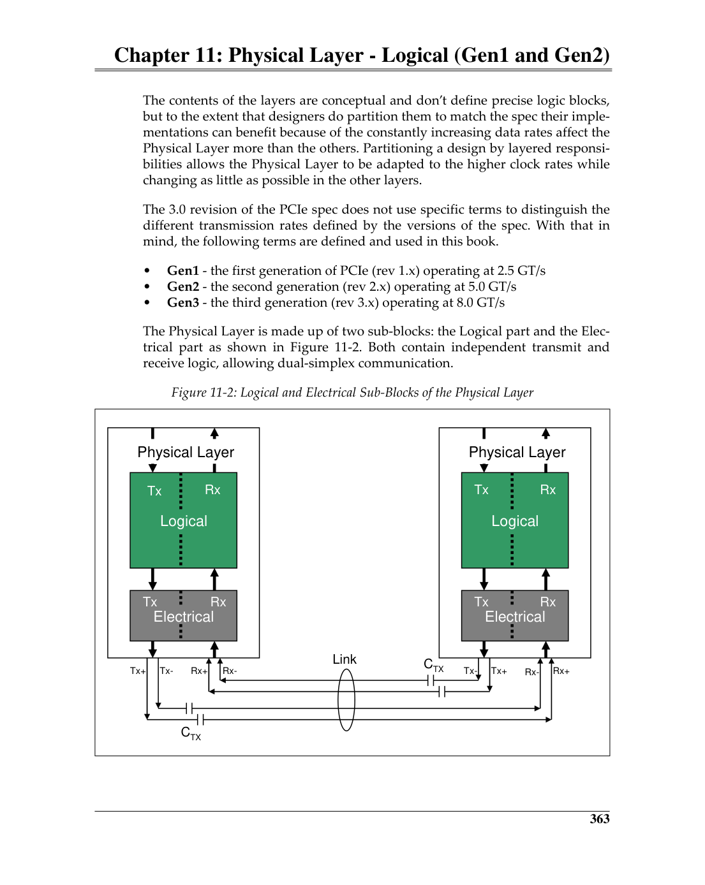

<br>


When the Link is in the L0 full‐on state, the drivers apply the differential volt‐ age associated with a logical 1 and logical 0 while
maintaining the correct DC common mode voltage. Receivers sense this voltage as the input stream, but if it drops below a threshold value,
it’s understood to represent the Electrical Idle Link condition. Electrical Idle is entered when the Link is disabled, or when ASPM logic
puts the Link into low‐power Link states such as L0s or L1 (see “Electrical Idle” on page 736 for more on this topic).

Devices must support the Transmitter equalization methods required for each supported data rate so they can achieve adequate signal
integrity. De‐emphasis is applied for 2.5 and 5.0 GT/s, and a more complex equalization process is applied for 8.0 GT/s. These are described
in more detail in “Signal Compensa‐ tion” on page 468, and “Recovery.Equalization” on page 587.

The drivers and Receivers are short‐circuit tolerant, making PCIe add‐in cards suited for hot (powered‐on) insertion and removal events in a
hot‐plug environ‐ ment. The Link connecting two components is AC‐coupled by adding a capaci‐ tor in‐line, typically near the Transmitter
side of the Link. This serves to de‐
couple the DC part of the signal between the Link partners and means they don’t have to share a common power supply or ground return path,
as when the devices are connected over a cable. Figure 13‐1 on page 450 illustrates the place‐ ment of this capacitor (CTX) on the Link.

## **High Speed Signaling** 

The high‐speed signaling environment of PCIe is characterized by the drawing in Figure 13‐2 on page 451. This low‐voltage differential
signaling environment is a common method used in many serial transports and one reason is for the noise rejection it provides. Electrical
noise that affects one signal will also affect the other because they are on adjacent pins and their traces are very close to each other.
Since both signals are influenced, as shown in Figure 13‐3 on page 452, the difference between them doesn’t change much and is therefore not
seen at the receiver.

A design goal for the 3.0 spec revision was that the 8.0 GT/s rate should still work with existing standard FR4 circuit boards and
connectors, and that was achieved by changing the encoding scheme from the old 8b/10b to the new 128b/130b model to keep the frequency low.
This goal will probably change with the next speed step (Gen4).

_Figure 13‐2: Differential Transmitter/Receiver_ 

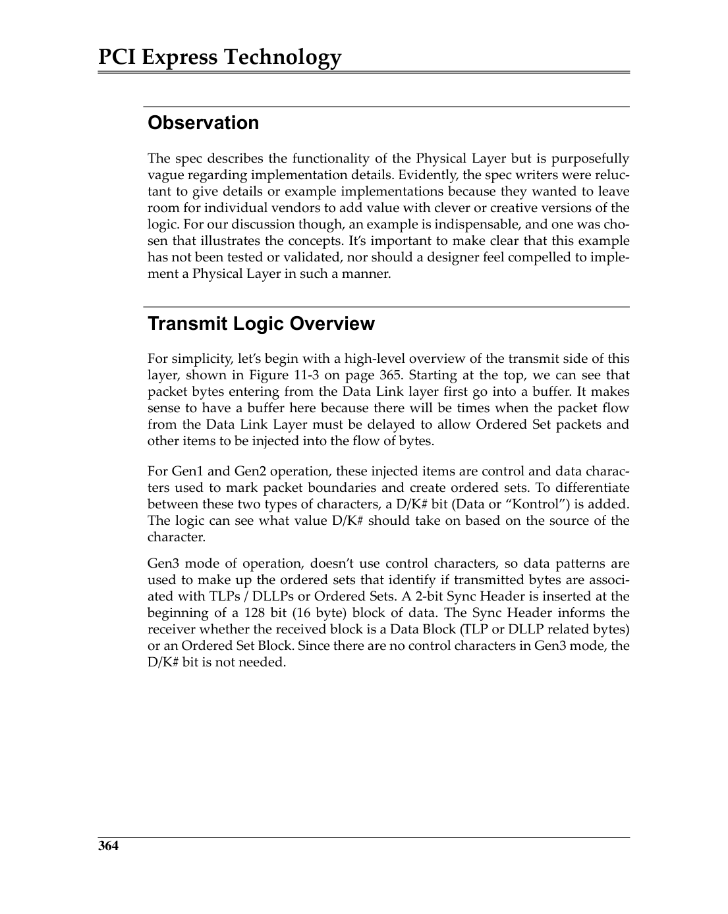

<br>


## **PCI Express Technology** 

_Figure 13‐3: Differential Common‐Mode Noise Rejection_ 

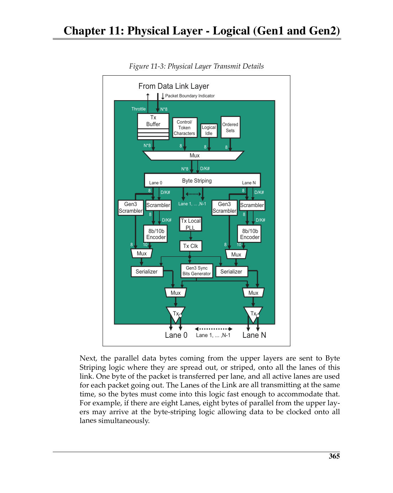

<br>


## **Clock Requirements** 

## **General** 

For all data rates, both Transmitter and Receiver clocks must be accurate to within +/‐ 300 ppm (parts per million) of the center frequency.
In the worst case, the Transmitter and Receiver could both be off by 300 ppm in opposite direc‐ tions, resulting in a maximum difference of
600 ppm. That worst‐case model translates to a gain or loss of 1 clock every 1666 clocks and that’s the difference that a Receiver’s clock
compensation logic must take into account.

Devices are allowed to derive their clocks from an external source, and the 100 MHz Refclk is still optionally available for this purpose in
the 3.0 spec. Using the Refclk permits both Link partners to readily maintain the 600 ppm accuracy even when Spread Spectrum Clocking is
applied.
## **SSC (Spread Spectrum Clocking)** 

SSC is an optional technique used to modulate the clock frequency slowly over a prescribed range to spread the signal’s EMI
(Electro‐Magnetic Interference) across a range of frequencies rather than allowing it all to be concentrated at the center frequency.
Spreading the radiated energy helps a device or system to pass government emissions standards by staying under a threshold value, as
illustrated in Figure 13‐4 on page 454. Note that the frequency of interest for the signal is only half the clock rate because two rising
clock edges are needed to create one cycle on the data, as illustrated in Figure 13‐5 on page 454. For exam‐ ple, a 2.5 GT/s rate uses a bit
clock of 2.5 GHz, resulting in a frequency of inter‐ est on the traces of 1.25 GHz.

The use of SCC is not required by the spec but, if will be supported, the follow‐ ing rules apply: 

- The clock can be modulated by +0% to ‐0.5% from nominal (5000 ppm), referred to as “down spreading.” A frequency modulation envelope is
not specified, but a sawtooth‐wave pattern like the one shown in Figure 13‐6 on page 455 yields good results. Note that there is a trade‐off
with down spreading, because the average clock frequency will now be 0.25% lower than it would have been without SSC, resulting in a slight
performance reduction.

- The modulation rate must be between 30KHz and 33KHz. 

- The +/‐ 300 ppm requirement for clock frequency accuracy still holds and therefore so does the maximum 600 ppm variation between Link
partners. The spec states that most implementations will require both Link partners to use the same clock source, although it’s not
required. One way to do that would be for them to both use a modulated version of the Refclk to derive their own clocks (see “Common Refclk”
on page 456).

## **PCI Express Technology** 

_Figure 13‐4: SSC Motivation_ 

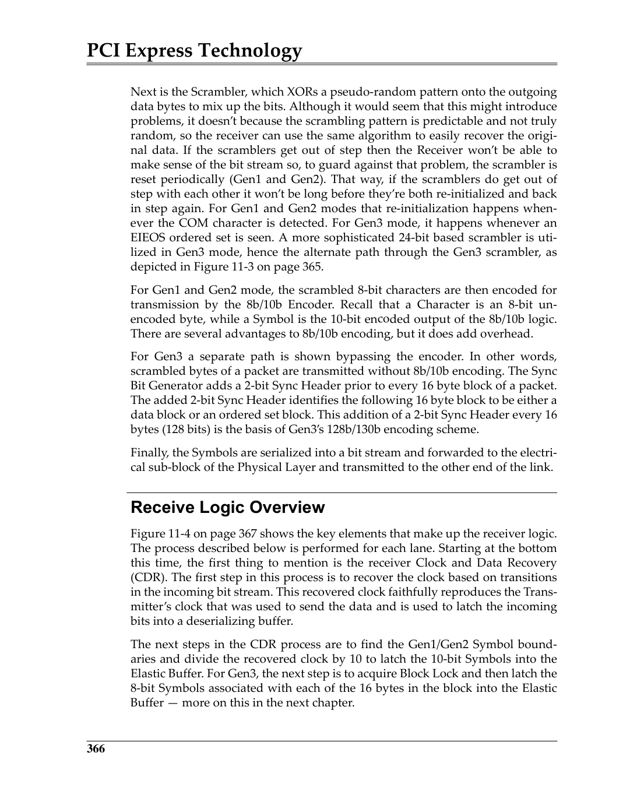

<br>


_Figure 13‐5: Signal Rate Less Than Half the Clock Rate_ 

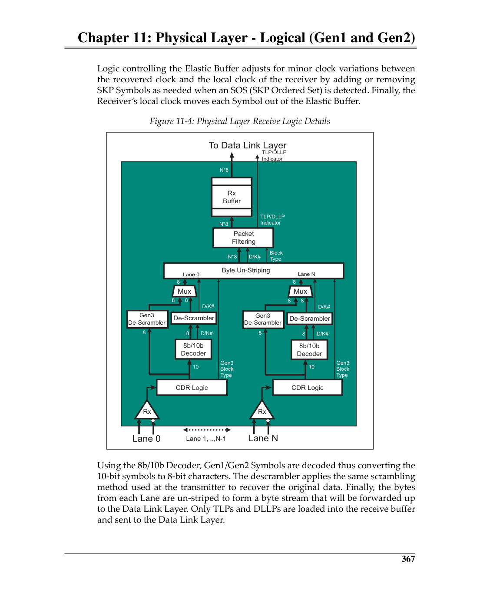

<br>

_Figure 13‐6: SSC Modulation Example_ 

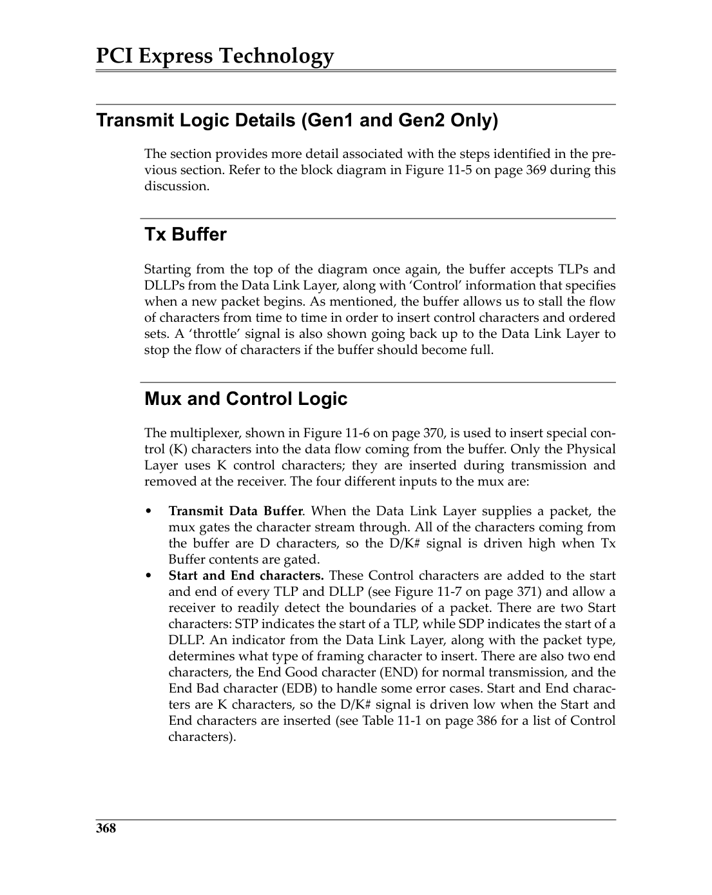

<br>


## **Refclk Overview** 

Receivers must generate their own clocks to operate their internal logic, but there are some options for generating the recovered clock for
the incoming bit stream. The details for them have developed with each succeeding version of the spec and are based on the data rate.

## **2.5 GT/s** 

In the early spec versions using the 2.5 GT/s rate, information regarding the optional Refclk was not included in the base spec but instead
in the separate CEM (Card Electro‐Mechanical) spec for PCIe. A number of parameters were specified there and several general terms have been
carried forward to the newer versions of the spec. The Refclk was described as a 100 MHz differential clock driving a 100  differential
load (+/‐ 10%) with a trace length limited to 4 inches. SSC is allowed, as described in “SSC (Spread Spectrum Clocking)” on page 453.

## **5.0 GT/s** 

When the 5.0 GT/s rate was developed, the spec writers chose to include the Refclk information in the electrical section of the base spec
and listed three options for the clock architecture:

**Common Refclk.** The first architecture described is one in which both Link partners make use of the same Refclk, as shown in Figure 13‐7
on page 456. There are three straightforward advantages for this implementation:

- First, the jitter associated with the reference clock is the same for both Tx and Rx and is thus tracked and accounted for intrinsically. 

- – Second, the use of SSC will be simplest with this model because maintaining the 600 ppm separation between the Tx and Rx clocks is easy
if both follow the same modulated reference.

- Third, the Refclk remains available during low‐power Link states L0s and L1 and that allows the Receiver’s CDR to maintain a sem‐ blance
of the recovered clock even in the absence of a bit stream to supply the edges in the data. That, in turn, keeps the local PLLs from
drifting as much as they otherwise would, resulting in a reduced recovery time back to L0 compared to the other clocking options.

_Figure 13‐7: Shared Refclk Architecture_ 

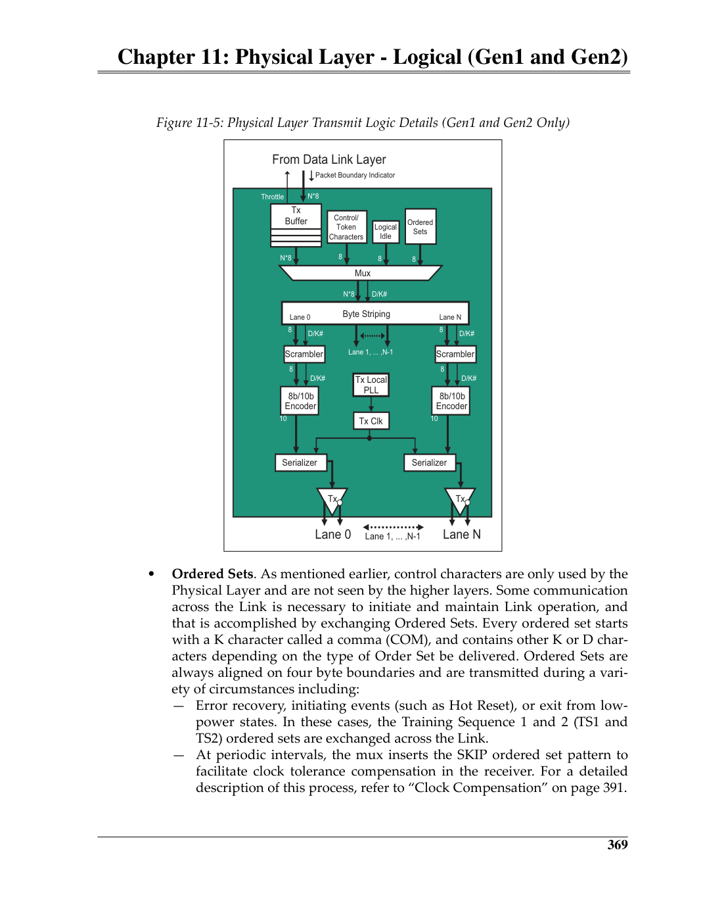

<br>


**Data Clocked Rx Architecture.** In this clock architecture, the Receiver doesn’t use a reference clock at all, but simply recovers the
Transmitter clock from the data stream, as shown in Figure 13‐9 on page 457. This implementation is clearly the simplest of the three and
would therefore ordinarily be preferred. The spec doesn’t prohibit the use of SSC in this model, but doing so would bring up two issues.
First, the Receiver CDR must remain locked onto the input frequency as it modulates through a much wider range (5600 ppm instead of the
usual 600 ppm), and that could require more complex logic. And second, the maximum clock frequency separation of 600ppm must still be
maintained and it’s less clear how that would be done without a common reference.

</td>
<tr>
<td width="50%">

**第 13 章：物理层 - 电气**

_图 13-8：数据时钟 Rx 架构_

**==> 图片 [374 x 92] 已故意省略 <==**

**----- 图片文字开始 -----**<br>
+<br>
Tx 通道方向 接收器<br>
寄存器 Tx 一个 Rx 寄存器<br>
-<br>
CDR<br>
PLL<br>
Refclk<br>
**----- 图片文字结束 -----**<br>


**单独的 Refclks (Separate Refclks)。** 最后，链路伙伴也可以使用不同的参考时钟，如图 13-9（第 457 页）所示。但是，此实现对 Refclks 提出了明显更严格的要求，因为在接收器处看到的抖动将是它们的 RSS（Root Sum of
Squares，均方根和）组合，从而使时序预算变得困难。在此模型中管理 SSC 也变得异常困难，这就是规范声明在这种情况下必须关闭 SSC 的原因。总体而言，规范给人的印象是这是最不理想的选择，并声明它没有明确定义此架构的要求。

_图 13-9：单独的 Refclk 架构_

**==> 图片 [374 x 109] 已故意省略 <==**

**----- 图片文字开始 -----**<br>
+<br>
Tx 通道方向 接收器<br>
寄存器 Tx 一个 Rx 寄存器<br>
-<br>
CDR<br>
PLL<br>
Refclk 1 PLL<br>
Refclk 2<br>
**----- 图片文字结束 -----**<br>

</td>
<td width="50%">

差分信号电压是通过取两个导体 D+ 和 D- 上的电压差来定义的。每个导体上相对于地的电压为 VD+ 和 VD-。差分电压由 VDIFF = VD+ ‐ VD- 给出。共模电压 VCM 定义为信号开关周围的电压，即 VCM = (VD+ + VD-) / 2 给出的平均值。

规范在讨论差分电压时使用两个术语，有时会导致混淆。如第 464 页图 13-13 所示，峰值是信号之间的最大电压差，而峰峰值是加上相反方向的最大值。对于对称信号，峰峰值就是峰值的两倍。

1. 差分峰值电压 => VDIFFp = (max |VD+ ‐ VD‐ |)

2. 差分峰峰值电压 => VDIFFp‐p = 2 *(max |VD+ ‐ VD‐ |)

作为示例，假设 VCM = 0 V，则如果 D+ 值为 300mV 且 D- 值为 ‐300mV，则对于逻辑 1，VDIFFp 将是 300 ‐ (‐300) = 600 mV。类似地，对于逻辑 0，它将是 (‐300) ‐ (+300) = ‐600 mV。此对称情况的
VDIFFp‐p 将是 1200 mV。在应用均衡之前，2.5 GT/s 和 5.0 GT/s 的允许 VDIFFp‐p 范围为 800 到 1200 mV，而对于 8.0 GT/s 则为 800 到 1300 mV。

_图 13-13：差分峰峰值 (_ VDIFFp‐p _) 和峰值 (_ VDIFFp _) 电压_

**==> 图片 [327 x 127] 已故意省略 <==**

**----- 图片文字开始 -----**<br>
D+<br>
V VDIFFp VDIFFp<br>
CMp（逻辑 1）（逻辑 0）<br>
D-<br>
0 V<br>
VDIFFp-p = 2 * max | VD+ - VD- | = VDIFFp（逻辑 1）+ VDIFFp（逻辑 0）<br>
**----- 图片文字结束 -----**<br>

</td>
</tr>
<tr>
<td width="50%">

## **8.0 GT/s**

规范中也为该数据速率描述了相同的三个时钟架构。一个区别是现在定义了两种类型的 CDR：用于共享 Refclk 架构的一阶 CDR，以及用于数据时钟架构的二阶 CDR。这反映了这样一个事实，即对于较低的数据速率也是如此，数据时钟架构的 CDR 将需要更复杂，以便在参考在 SSC
的宽范围内变化时保持锁定。

</td>
<td width="50%">

## **减摆幅差分电压 (Reduced-Swing Differential Voltage)**

长或损耗大的通道需要全摆幅电压，并且发送器需要支持它。但是，当信号环境短且低损耗时，不需要高电压，可以通过降低电压来实现节能。考虑到这一点，2.5 GT/s 和 5.0 GT/s
的规范定义了另一种用于功率敏感系统的减摆幅电压，其中使用短通道。在这种模式下，电压降低到其全摆幅范围的一半左右。支持此操作是可选的，并且选择它的方法未定义，将是实现特定的。

对于 8.0 GT/s 信号传输也是如此，只不过在这种情况下它是通过使用有限范围的系数来实现的。例如，减摆幅情况的最大增益限制为 3.5 dB。与较低的数据速率一样，对此电压模型的支持是可选的，但现在实现它的方法很简单：只需设置 Tx 系数值即可实现。

应该注意的是，接收器电压电平与发送器无关，这是我们直观预期的：接收到的信号始终需要满足正常要求，因此发送器和通道必须设计为保证它。

</td>
</tr>
<tr>
<td width="50%">

## **发送器 (Tx) 规范 (Transmitter (Tx) Specs)**

</td>
<td width="50%">

## **均衡电压 (Equalized Voltage)**

为了在本节中保持良好的流程，这个大主题在第 468 页的"信号补偿 (Signal Compensation)"部分单独介绍。

**第 13 章：物理层 - 电气**

</td>
</tr>
<tr>
<td width="50%">

## **测量 Tx 信号 (Measuring Tx Signals)**

规范指出，在更高频率下测量 Tx 输出的方法有限。在 2.5 GT/s 时，可以将测试探头放在 DUT（Device Under Test，被测设备）的引脚附近，但对于更高的速率，有必要使用带有 SMA（SubMiniature version
A）微波型同轴连接器的"分离通道"，如第 458 页图 13-10 中 TP1（Test Point 1）、TP2 和 TP3
所示。请注意，必须为被测设备提供低抖动时钟源，以便在输出处看到的抖动仅由设备本身引入。规范还提到，在测试期间，重要的是让设备同时使用尽可能多的通道和其他输出，以便最好地模拟真实系统。

由于分离通道会对信号引入一些影响，因此对于 8.0 GT/s，有必要能够测量这些影响并将其从被测信号中移除（去嵌入）。实现此目的的一种方法是让测试板提供与用于设备引脚的路径非常相似的另一个信号路径。用已知信号表征此"复制通道"会提供有关通道的必要信息，从而可以将其影响从 DUT
信号中去嵌入，以便恢复组件引脚处的信号。

_图 13-10：测试电路测量通道_

**==> 图片 [294 x 159] 已故意省略 <==**

**----- 图片文字开始 -----**<br>
DUT<br>
TP1<br>
分离通道<br>
低抖动<br>
时钟源<br>
复制通道<br>
TP2 TP3<br>
**----- 图片文字结束 -----**<br>


**第 13 章：物理层 - 电气**

</td>
<td width="50%">

## **电压裕量 (Voltage Margining)**

裕量的概念是发送器特性（如输出电压）可以在测试期间在很宽的值范围内调整，以确定它能多好地处理信号环境。2.5 GT/s 速率不包括此功能，但电压裕量是随着 5.0 GT/s
速率添加的，并且必须由使用该速率或更高速率的发送器实现。其他参数（如去加重或抖动）也可以选择性地进行裕量。裕量调整的粒度必须在链路基础上可控，并且可以在通道基础上可控。此控制通过 PCIe Capability 寄存器块中的 Link Control 2
寄存器完成。传输裕量字段（如图 13-14（第 465 页）所示）包含 3 位，因此可以表示 8 个级别。未定义其值，并且不需要实现所有值。默认值是全零，表示正常工作范围。

重要的是要注意，此字段仅用于调试和合规测试目的，在此期间软件仅允许在这些时间修改它。在所有其他时间，要求将该值设置为默认值全零。

_图 13-14：Link Control 2 寄存器中的 Transmit Margin 字段_

**==> 图片 [355 x 211] 已故意省略 <==**

**----- 图片文字开始 -----**<br>
Link Control 2 寄存器<br>
15 12 11 10 9 7 6 5 4 3 0<br>
合规预设/<br>
去加重<br>
合规 SOS<br>
进入修改合规<br>
传输裕量<br>
可选去加重<br>
硬件自主<br>
速度禁用<br>
进入合规<br>
目标链路速度<br>
**----- 图片文字结束 -----**<br>


对于 8.0 GT/s，发送器需要实现电压裕量并使用 Link Control 2 寄存器中的相同字段，但均衡增加了一些对选项的约束，因为它不能要求比正常操作定义的 1/24 分辨率更精细的系数或预设分辨率。

在 Tx 裕量期间，2.5 GT/s 和 5.0 GT/s 的均衡容差从 +/‐ 0.5 dB 放宽到 +/‐ 1.0 dB。对于 8.0 GT/s 速率，容差由系数粒度和为发送器指定的正常均衡器容差定义。

</td>
</tr>
<tr>
<td width="50%">

## **Tx 阻抗要求 (Tx Impedance Requirements)**

为了获得最佳精度，分离通道的特性差分阻抗应在 10% 内为 100 Ω 差分，单端阻抗为 50 Ω。为了匹配此环境，发送器在 2.5 GT/s 期间信号传输期间具有 80 至 120 Ω 的差分低阻抗值，在 5.0 和 8.0 GT/s 时不超过 120
Ω。对于接收器，单端阻抗在 2.5 或 5.0 GT/s 时为 40 - 60 Ω，但对于 8.0 GT/s，未给出特定值。相反，只是注意到单端接收器阻抗必须在进入 Detect LTSSM 状态时在 20% 内为 50 Ω，以便检测电路将正确感应接收器。

发送器还必须在任何时候发送差分信号时满足回波损耗参数 RLTX-DIFF 和 RLTX-CM。作为该术语的非常简要介绍，"回波损耗"是衡量通过传输路径传输或从传输路径反射回的能量。回波损耗是用于分析高频信号环境的多个"散射 (Scattering)"参数（S
参数）之一。当频率较低时，集总元件描述就足够了，但当频率变得足够高以至于波长接近电路的大小时，需要分布式模型，这就是 S 参数用于表示的内容。规范描述了许多这些参数来表征传输路径，但此高频分析的详细信息确实超出了本书的范围。

当信号未被驱动时，如在低功耗链路状态中，发送器可能会进入高阻抗状态以减少功耗。在这种情况下，它只需要满足 ITX-SHORT 值，并且差分阻抗未定义。

</td>
<td width="50%">

## **接收器 (Rx) 规范 (Receiver (Rx) Specs)**

</td>
</tr>
<tr>
<td width="50%">

## **ESD 和短路要求 (ESD and Short Circuit Requirements)**

所有信号和电源引脚必须使用人体模型承受 2000V ESD（静电放电），使用充电设备模型承受 500V。有关这些模型或 ESD 的更多详细信息，请参阅 JEDEC JESE22-A114-A 规范。

ESD 要求不仅防止静电损坏，而且有助于支持意外热插拔事件（在通电时添加或移除附加卡）。该目标还促使要求发送器和接收器能够承受 ITX-SHORT 的持续短路电流（参见第 498 页的表 13-5）。

</td>
<td width="50%">

## **接收器阻抗 (Receiver Impedance)**

除非设备断电（如在 L2 和 L3 电源状态期间或基本复位期间），否则接收器需要满足 RLRX-DIFF 和 RLRX-CM（参见第 498 页表 13-5）参数。在这些情况下，接收器进入高阻抗状态，必须满足 ZRX-HIGH-IMP-DC-NEG 和
ZRX-HIGH-IMP-DC-NEG 参数。

（参见第 498 页表 13-5。）

</td>
</tr>
<tr>
<td width="50%">

## **接收器检测 (Receiver Detection)**

</td>
<td width="50%">

## **接收器 DC 共模电压 (Receiver DC Common Mode Voltage)**

接收器的 DC 共模电压被指定为 0V 以适应所有数据速率，这在第 467 页图 13-15 中通过显示信号端接连接到地来表示。CTX 在线电容器允许发送器处的此电压不同，指定范围为 0 -
3.6V。当发送器和接收器在同一机箱中并具有相同电源时，这不那么有趣，但如果它们通过电缆连接并驻留在具有不同电源的不同机器中，则变得更加重要。在这种情况下，很难避免机器之间的参考电压差异，并且由于信号电压已经很小，这种差异可能使接收器难以识别信号。当将使用某种连接器时，此电容器的位置必须靠近发送器引脚，但如果没有连接器，它可以位于传输线上的任何方便的位置。尽管它可以集成到设备中，但预计
CTX 将是外部的，因为它太大了而无法集成。

**第 13 章：物理层 - 电气**

第 467 页图 13-15 中的图还显示了接收器处的一组可选电阻，标记为"无规范 (No
Spec)"，因为规范中没有提到它们。这里的故事是接收器设计人员不喜欢使用零共模电压，原因很简单，这通常需要他们实现两个参考电压，一个高于零，一个低于它。首选的实现将信号完全偏移到零的上方或下方，以便只需要一个参考电压。虚线内显示的电路通过添加一个小值的在线电容器将线上信号的
DC 分量与接收器本身的 DC 分量解耦来实现此目的。然后，电阻梯形用于将接收器的共模电压偏移到一个方向或另一个方向以实现目标。

_图 13-15：接收器 DC 共模电压调整_

**==> 图片 [384 x 273] 已故意省略 <==**

**----- 图片文字开始 -----**<br>
小 大<br>
电阻比率<br>
大 设置 DC 共模电压<br>
小 大<br>
检测 大<br>
逻辑<br>
D+ CTX ZTX D+<br>
+<br>
通道方向 发送器一个 接收器<br>
CTX ZTX<br>
-<br>
D- D-<br>
ZTX ZTX ZRX ZRX<br>
VRX-CM = 0 V<br>
VCM<br>
无规范<br>
**----- 图片文字结束 -----**<br>

</td>
</tr>
<tr>
<td width="50%">

## **概述 (General)**

第 461 页图 13-11 中发送器中显示的 Detect 块用于检查在退出复位后链路另一端是否存在接收器。在串行传输世界中，此步骤有点不寻常，因为向链路伙伴发送数据包并通过它是否响应来测试其存在是足够简单的。然而，PCIe
中此方法的原因是提供测试环境中的自动硬件辅助。如果检测到正确的负载，但链路伙伴拒绝发送 TS1 并参与链路训练，则组件将假定它必须处于测试环境中，并将开始发送合规模式以促进测试。由于链路在复位或上电事件后将始终以 2.5 GT/s 开始操作，因此 Detect 仅用于 2.5
GT/s 速率。这就是为什么接收器的单端 DC 阻抗为该速率指定（ZRX-DC = 40 到 60 Ω），以及为什么无论其预期运行速度如何，Detect 逻辑都必须包含在每个设计中。

通过将发送器的 DC 共模电压设置为一个值然后更改为另一个值来完成检测。知道接收器存在时的预期充电时间，逻辑将测量的时间与该时间进行比较。如果连接了接收器，则由于接收器的端接，充电时间（RC 时间常数）相对较长。否则，充电时间要短得多

</td>
<td width="50%">

## **传输损耗 (Transmission Loss)**

发送器驱动最小差分峰峰值电压 VTX-DIFFp-p 为 800 mV。接收器灵敏度设计为最小差分峰峰值电压 (VRX-DIFFp-p) 为 175 mV。这转化为链路设计为 13.2dB
的损耗预算。尽管电路板设计人员可以确定针对各种频率绘制的链路的衰减损耗预算，但发送器和接收器眼图测量是链路损耗预算的最终决定因素。眼图在第 485 页的"眼图 (Eye Diagram)"中描述。驱动高达最大允许差分峰峰值电压 1200 mV
的发送器可以补偿具有最坏情况衰减特性的有损链路。

</td>
</tr>
<tr>
<td width="50%">

## **检测接收器存在 (Detecting Receiver Presence)**

1. 复位或上电后，发送器在 D+ 和 D- 端子上驱动稳定电压。

2. 然后发送器将共模电压沿正方向更改不超过所有三个数据速率规定的 VTX-RCV-DETECT 量 600mV。

3. Detect 逻辑测量充电时间：

 - 如果充电时间短，则接收器不存在。

 - 如果充电时间长（由串联电容器和接收器端接主导），则接收器存在。

规范在这里提到了一个可能的问题：正确的负载可能出现在一个差分信号上但不出现在另一个上，如果检测不检查两者，它可能会误解情况。避免这种情况的简单方法是对 D+ 和 D- 都执行 Detect 操作。3.0 规范不要求这样做，

**第 13 章：物理层 - 电气**

但提到未来的规范版本可能会要求。因此，明智的做法是在新设计中包含此功能。

_图 13-11：接收器检测机制_

**==> 图片 [370 x 380] 已故意省略 <==**

**----- 图片文字开始 -----**<br>
Detect<br>
逻辑 接收器存在<br>
D+ CTX ZTX => 长充电时间 D+<br>
+<br>
通道方向 发送器一个 接收器<br>
CTX ZTX<br>
-<br>
D- D-<br>
ZTX ZTX ZRX ZRX<br>
VRX-CM = 0 V<br>
VCM<br>
Detect<br>
逻辑<br>
接收器不存在<br>
D+ CTX => 短充电时间<br>
发送器<br>
CTX<br>
D-<br>
ZTX ZTX<br>
VCM<br>
无规范<br>
**----- 图片文字结束 -----**<br>

</td>
<td width="50%">

## **AC 耦合 (AC Coupling)**

PCI Express 要求在线 AC 耦合电容器放置在每个通道上，通常靠近发送器。电容器可以集成到系统板上，或集成到设备本身中，尽管它们所需的大尺寸使其不太可能。具有 PCI Express 设备的附加卡必须将电容器放置在卡的发送器附近或将电容器集成到 PCIe
硅片中。这些电容器在链路两端提供两个设备之间的 DC 隔离，从而通过允许设备使用独立的电源和接地平面来简化设备设计。

</td>
</tr>
<tr>
<td width="50%">

## **发送器电压 (Transmitter Voltages)**

差分信号传输（与 PCI 和 PCI-X 中采用的单端信号传输相反）非常适合高频信号传输。差分信号传输的一些优点是：

- 接收器查看信号之间的差异，因此每个单独的电压摆幅可以更小，从而允许更高频率而不超过功率预算。

- 由于通过并排使用相反极性的电压而产生的两个信号的噪声抵消，EMI 减少了。

- 抗噪性非常好，因为影响一个信号的噪声也会以相同方式影响另一个信号，结果接收器不会注意到这种变化（参见第 452 页图 13-3）。

</td>
<td width="50%">

## **信号补偿 (Signal Compensation)**

</td>
</tr>
<tr>
<td width="50%">

## **DC 共模电压 (DC Common Mode Voltage)**

在链路训练的 Detect 状态之后，发送器 DC 共模电压 VTX-DC-CM（参见第 489 页表 13-3）必须保持在相同电压。共模电压仅在 L2 或 L3 低功耗链路状态中关闭，在这些状态下设备的主电源被移除。设计人员可以选择 0 至 3.6V 范围内的任何共模电压。

</td>
<td width="50%">

## **与 Gen1 和 Gen2 PCIe 关联的去加重 (De-emphasis Associated with Gen1 and Gen2 PCIe)**

对于 2.5 GT/s 和 5.0 GT/s 传输，PCIe 强制使用一种相当简单的发送器均衡形式，称为**去加重 (de-emphasis)**，以减少链路传输线上信号失真的影响。这种失真问题始终存在，但随着频率增加和有损传输线而变得更糟。

</td>
</tr>
<tr>
<td width="50%">

## **全摆幅差分电压 (Full-Swing Differential Voltage)**

发送器输出由两个信号 D+ 和 D- 组成，它们是相同的但使用相反的极性。当 D+ 信号为高且 D- 信号为低时，表示逻辑 1，而通过将 D+ 信号驱动为低并将 D- 信号驱动为高来表示逻辑 0，如图 13-13（第 464 页）所示。

由发送器驱动的差分峰峰值电压 VTX-DIFFp-p（参见第 489 页表 13-3）在 800 mV 和 1200 mV 之间（对于 8.0 GT/s 为 1300 mV）。

- 逻辑 1 用正差分电压表示。

- 逻辑 0 用负差分电压表示。

在电气空闲期间，发送器将差分峰值电压 VTX-IDLE-DIFFp[(参见第 489 页表 13-3) 保持在非常接近零（0-20 mV）的位置。在此]期间，发送器可能处于低阻抗或高阻抗状态。

接收器通过评估链路上的电压来感应逻辑 1 或 0 以及电气空闲。高频下预期的信号损耗意味着

**第 13 章：物理层 - 电气**

接收器必须能够感应信号的衰减版本，定义为 VRX-DIFFp-p（参见第 498 页表 13-5）。

_图 13-12：差分信号传输_

**==> 图片 [301 x 145] 已故意省略 <==**

**----- 图片文字开始 -----**<br>
V+<br>
D+<br>
V<br>
cm<br>
接收器减去<br>
D- 从 D+ 值<br>
得到差分<br>
D- 电压。<br>
V<br>
cm<br>
V-<br>
**----- 图片文字结束 -----**<br>

</td>
<td width="50%">

## **问题 (The Problem)**

随着数据速率变高，单位间隔 (UI - 位时间) 变得更小，结果是越来越难以避免一个位时间的值影响另一位时间的值。通道始终抵抗电压电平的变化，我们尝试切换电压的速度越快，

**第 13 章：物理层 - 电气**

这种影响就越明显。然而，当信号已在相同电压下保持了几个位时间时（如在发送几个相同极性的连续位时），通道有更多时间接近目标电压。产生的较高电压使得在极性确实改变时难以在所需时间内更改为相反的值。这种前一位影响后续位的问题称为**ISI（码间干扰，inter-symbol
interference）**。

</td>
</tr>
<tr>
<td width="50%">

## **差分表示法 (Differential Notation)**

</td>
</tr>
</tbody>
</table>

[⬆️ 返回目录](#本章目录-table-of-contents)

---

<a id="sec-11-2"></a>

</td>
<td width="50%">

## **去加重有何帮助？ (How Does De-Emphasis Help?)**

去加重降低了位流中重复位的电压。虽然起初听起来违反直觉，因为这降低了信号摆幅，因此降低了到达接收器的能量，但对这些情况降低发送器电压可以显著改善信号质量。第 469 页图 13-16
通过显示发送器输出"1000010000"来说明这一点，其中相同极性的重复位已被去加重。去加重可以被认为是一个二抽头 Tx 均衡器，与其相关的一些规则是：

</td>
</tr><table>
<thead><tr><th width="50%">🇬🇧 English</th><th width="50%">🇨🇳 中文</th></tr></thead>
<tbody>
<tr>
<td width="50%">

## 11.2 Physical Layer - Logical (Gen1 and Gen2) | 物理层 - 逻辑 (Gen1 与 Gen2)

<table>
<thead><tr><th>🇬🇧 English</th><th style="background-color:#e8e8e8">🇨🇳 中文</th></tr>
</tbody>
</table></thead>
<tbody>
<tr>
<td>
_Figure 13‐8: Data Clocked Rx Architecture_ 

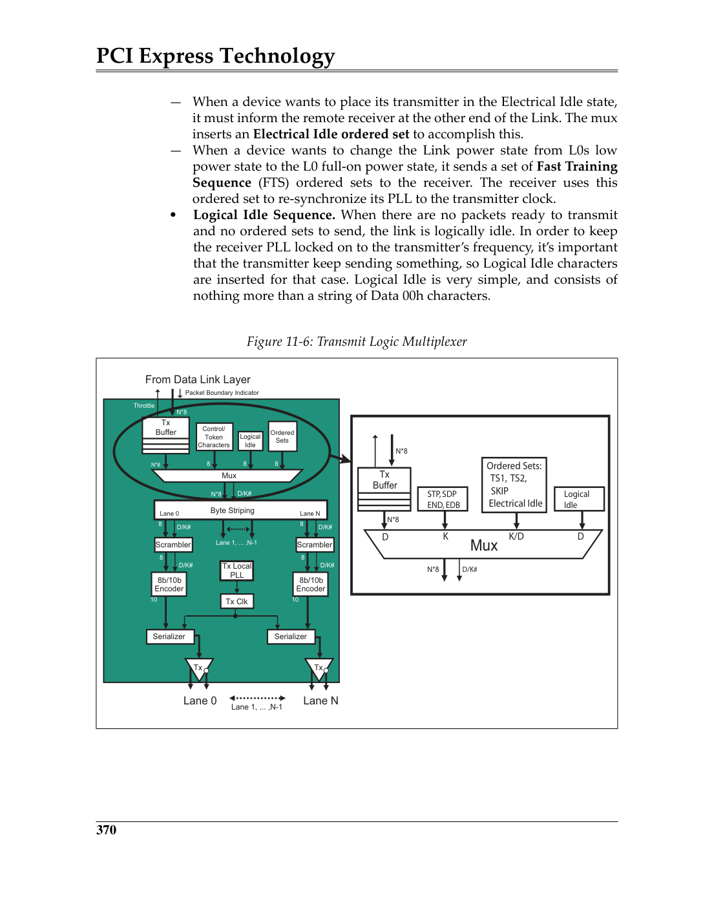

<br>


**Separate Refclks.** Finally, it’s also possible for the Link partners to use dif‐ ferent reference clocks, as shown in Figure 13‐9 on page
457. However, this implementation makes substantially tighter demands on the Refclks because the jitter seen at the Receiver will be the RSS
(Root Sum of Squares) combination of them both, making the timing budget difficult. It also becomes enormously more difficult to manage SSC
in this model and that’s why the spec states that SSC must be turned off in this case. Overall, the spec gives the impression that this is
the least desirable alternative, and states that it doesn’t explicitly define the requirements for this architecture.

_Figure 13‐9: Separate Refclk Architecture_ 

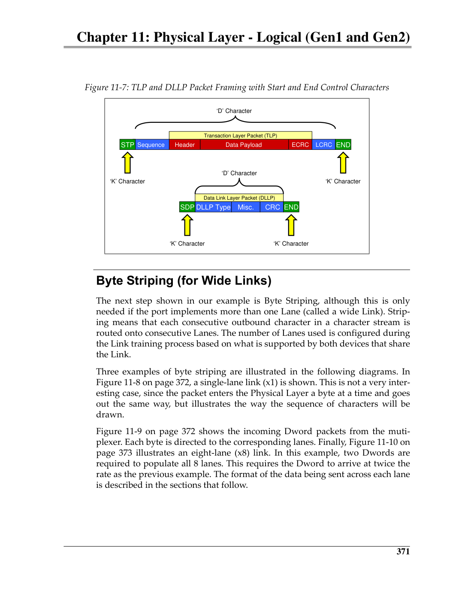

<br>

</td>
<td width="50%">

</td>
</tr>
<tr>
<td width="50%">

## **8.0 GT/s** 

The same three clock architectures are described in the spec for this data rate, too. One difference is that two types of CDR are defined
now: a 1[st] order CDR for the shared Refclk architecture, and a 2[nd] order CDR for the data clocked architecture. This just reflects the
fact that, as it was for the lower data rates, the CDR for the data‐clocked architecture will need to be more sophisticated to be able to
stay locked when the reference varies over a wide range for SSC.

</td>
<td width="50%">

</td>
</tr>
<tr>
<td width="50%">

## **Transmitter (Tx) Specs**

</td>
<td width="50%">

</td>
</tr>
<tr>
<td width="50%">

## **Measuring Tx Signals** 

The spec notes that the methods for measuring the Tx output are limited at the higher frequencies. At 2.5 GT/s it’s possible to put a test
probe very near the pins of the DUT (Device Under Test), but for the higher rates it’s necessary to use a “breakout channel” with SMA
(SubMiniature version A) microwave‐type coax‐ ial connectors, as illustrated at TP1 (Test Point 1), TP2, and TP3 in Figure 13‐10 on page
458. Note that it’s necessary to have a low‐jitter clock source to the device under test, so that jitter seen at the output is only
introduced by the device itself. The spec also mentions that it’s important during testing for the device to have as many of its Lanes and
other outputs in use at the same time as possible, so as to best simulate a real system.

Since the breakout channel introduces some effects to the signal, for 8.0 GT/s it’s necessary to be able to measure those effects and remove
(de‐embed) them from the signal being tested. One way to accomplish this is for the test board to sup‐ ply another signal path that is very
similar to the one used for the device pins. Characterizing this “replica channel” with a known signal gives the needed information about
the channel, allowing its effects to be de‐embedded from the DUT signals so the signal at the component pins can be recovered.

_Figure 13‐10: Test Circuit Measurement Channels_ 

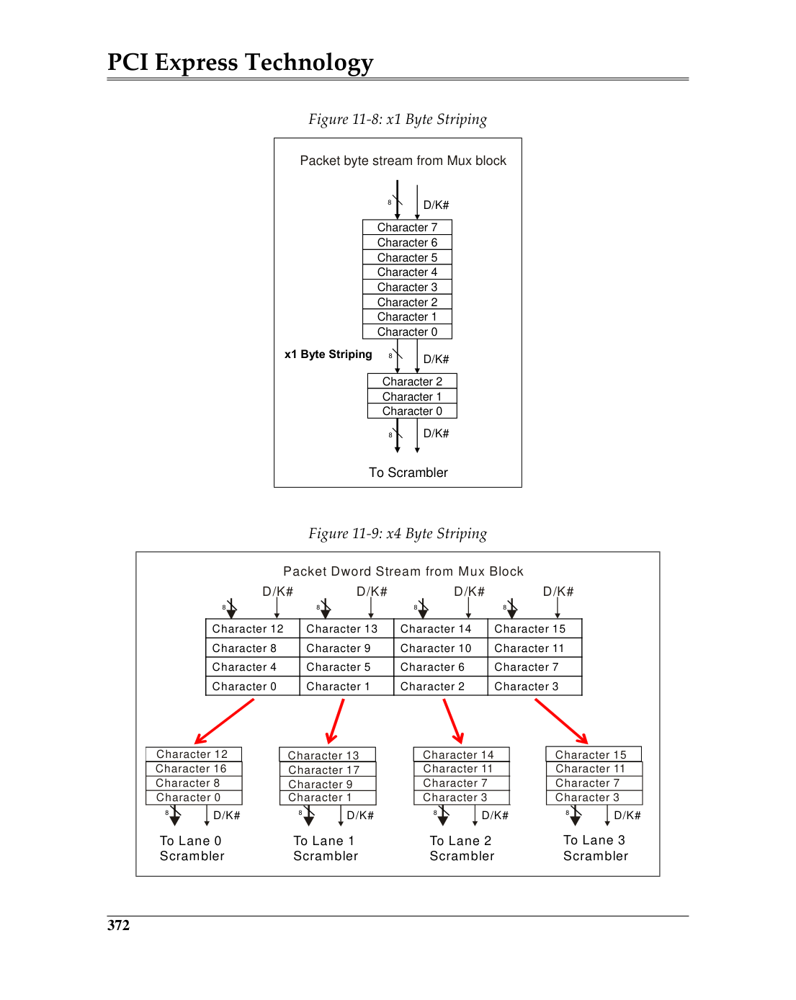

<br>

</td>
<td width="50%">

</td>
</tr>
<tr>
<td width="50%">

## **Tx Impedance Requirements** 

For best accuracy, the characteristic differential impedance of the Breakout Channel should be 100  differential within 10%, with a
single‐ended imped‐ ance of 50  . To match this environment, Transmitters have a differential low‐ impedance value during signaling between
80 and 120  at 2.5 GT/s, and no more than 120  at 5.0 and 8.0 GT/s. For receivers, the single‐ended impedance is 40 ‐ 60  at 2.5 or 5.0
GT/s, but for 8.0 GT/s no specific value is given. Instead, it’s simply noted that the single‐ended receiver impedance must be 50  within
20% by the time the Detect LTSSM state is entered so that the detect circuit will sense the Receiver correctly.

Transmitters must also meet the return loss parameters RLTX‐DIFF and RLTX‐CM anytime differential signals are sent. As a very brief
introduction to this termi‐ nology, “return loss” is a measure of energy transmitted through or reflected back from a transmission path.
Return loss is one of several “Scattering” param‐ eters (S‐parameters) that are used to analyze high‐frequency signal environ‐ ments. When
frequencies are low, a lumped‐element description is sufficient, but when they become high enough that the wavelength approaches the size of
the circuit, a distributed model is needed and that’s what S‐parameters are used to represent. The spec describes a number of these to
characterize a transmis‐ sion path but the details of this high‐frequency analysis are really beyond the scope of this book.

When a signal is not being driven, as would be the case in the low‐power Link states, the Transmitter may go into a high‐impedance condition
to reduce the power drain. For that case, it only has to meet the ITX‐SHORT value and the dif‐ ferential impedance is not defined.

</td>
<td width="50%">

</td>
</tr>
<tr>
<td width="50%">

## **ESD and Short Circuit Requirements** 

All signals and power pins must withstand a 2000V ESD (Electro‐Static Dis‐ charge) using the Human Body Model and 500V using the Charged
Device Model. For more details on these models or ESD, see the JEDEC JESE22‐A114‐A spec.

The ESD requirement not only protects against electro‐static damage, but facili‐ tates support of surprise hot insertion and removal events
(adding or removing an add‐in card while the power is on). That goal also motivates the requirement that Transmitters and Receivers be able
to withstand sustained short‐circuit cur‐ rents of ITX‐SHORT (see Table 13‐5 on page 498).

</td>
<td width="50%">

</td>
</tr>
<tr>
<td width="50%">

## **Receiver Detection**

</td>
<td width="50%">

</td>
</tr>
<tr>
<td width="50%">

## **General** 

The Detect block in the Transmitter shown in Figure 13‐11 on page 461 is used to check whether a Receiver is present at the other end of the
Link after coming out of reset. This step is a little unusual in the serial transport world because it’s easy enough to send packets to the
Link partner and test its presence by whether or not it responds. The motivation for this approach in PCIe, however, is to provide an
automatic hardware assist in a test environment. If the proper load is detected, but the Link partner refuses to send TS1s and participate
in Link Training, the component will assume that it must be in a test environment and will begin sending the Compliance Pattern to
facilitate testing. Since a Link will always start operation at 2.5 GT/s after a reset or power‐up event, Detect is only used for the 2.5
GT/s rate. That’s why the Receiver’s single‐ended DC impedance is specified for that rate (ZRX‐DC = 40 to 60  ), and why the Detect logic
must be included in every design regardless of its intended operating speed.

Detection is accomplished by setting the Transmitter’s DC common mode volt‐ age to one value and then changing it to another. Knowing the
expected charge time when a Receiver is present, the logic compares the measured time against that. If a Receiver is attached, the charge
time (RC time constant) is relatively long due to the Receiver’s termination. Otherwise, the charge time is much shorter

</td>
<td width="50%">

</td>
</tr>
<tr>
<td width="50%">

## **Detecting Receiver Presence** 

1. After reset or power‐up, Transmitters drive a stable voltage on the D+ and D‐ terminal. 

2. Transmitters then change the common mode voltage in a positive direction by no more than the VTX‐RCV‐DETECT amount of 600mV specified for
all three data rates.

3. Detect logic measures the charge time: 

 - Receiver is absent if the charge time is short. 

 - Receiver is present if the charge time is long (dominated by the series capacitor and Receiver termination). 

The spec mentions a possible problem here: the proper load may appear on one of the differential signals but not the other, and if detection
doesn’t check both it could misinterpret the situation. The simple way to avoid that would be to per‐ form the Detect operation on both D+
and D‐. The 3.0 spec does not require this,
but mentions that future spec revisions may. Therefore, it would be wise to include this functionality in new designs. 

_Figure 13‐11: Receiver Detection Mechanism_ 

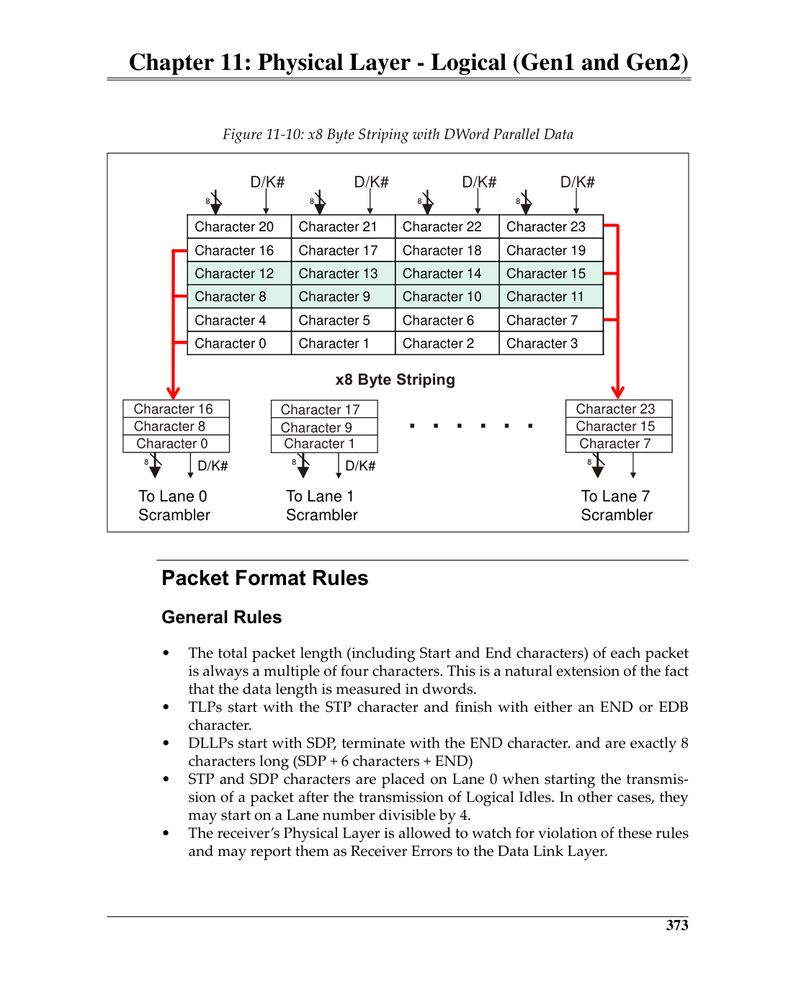

<br>

</td>
<td width="50%">

</td>
</tr>
<tr>
<td width="50%">

## **Transmitter Voltages** 

Differential signaling (as opposed to the single‐ended signaling employed in PCI and PCI‐X) is ideal for high frequency signaling. Some
advantages of differ‐ ential signaling are:

- Receivers look at the difference between the signals, so the voltage swing for each one individually can be smaller, allowing higher
frequencies with‐ out exceeding the power budget.

- EMI is reduced because of the noise cancellation that results from having the two signals by side by side, using opposite‐polarity
voltages.

- Noise immunity is very good, because noise that affects one signal will also affect the other in the same way, with the result that the
Receiver doesn’t notice the change (refer to Figure 13‐3 on page 452).

</td>
<td width="50%">

</td>
</tr>
<tr>
<td width="50%">

## **DC Common Mode Voltage** 

After the Detect state of Link training, the Transmitter DC common mode volt‐ age VTX‐DC‐CM (see Table 13‐3 on page 489) must remain at the
same voltage. The common mode voltage is turned off only in the L2 or L3 low‐power Link states, in which main power to the device is
removed. A designer can choose any common mode voltage in the range from 0 to 3.6V.

</td>
<td width="50%">

</td>
</tr>
<tr>
<td width="50%">

## **Full-Swing Differential Voltage** 

The Transmitter output consists of two signals, D+ and D‐, that are identical but use opposite polarities. A logical one is indicated when
the D+ signal is high and the D‐ signal low, while a logical zero is represented by driving the D+ sig‐ nal low and the D‐ signal high, as
shown in Figure 13‐13 on page 464.

The differential peak‐to‐peak voltage driven by the Transmitter VTX‐DIFFp‐p (see Table 13‐3 on page 489) is between 800 mV and 1200 mV (1300
mV for 8.0 GT/s).

- Logical 1 is signaled with a positive differential voltage. 

- Logical 0 is signaled with a negative differential voltage. 

During Electrical Idle the Transmitter holds the differential peak voltage VTX‐ IDLE‐DIFFp[(see Table 13‐3 on page 489) very near zero (0‐20
mV). During this] time the Transmitter may be in either a low‐ or high‐impedance state.

The Receiver senses a logical one or zero, as well as Electrical Idle, by evaluating the voltage on the Link. The signal loss expected at
high frequency means the
Receiver must be able to sense an attenuated version of the signal, defined as VRX‐DIFFp‐p (see Table 13‐5 on page 498). 

_Figure 13‐12: Differential Signaling_ 

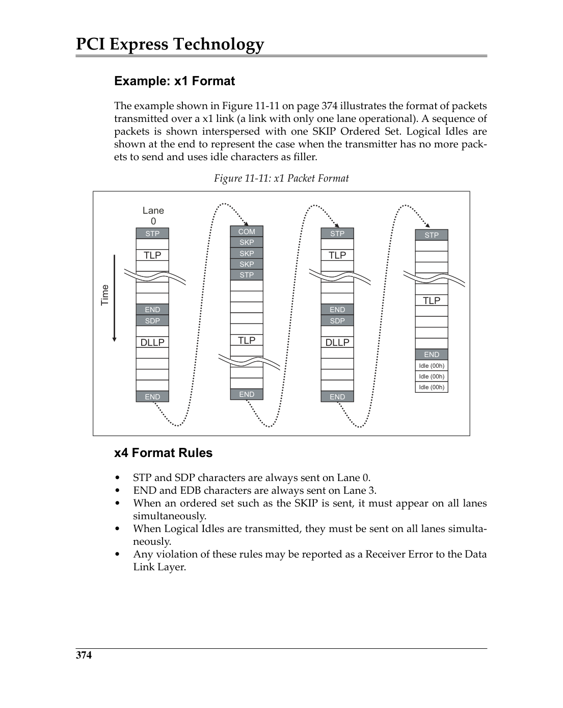

<br>


## **Differential Notation**

</td>
<td width="50%">

</td>
</tr>

</tbody>
</table>

[⬆️ 返回目录](#本章目录-table-of-contents)

---

<a id="sec-11-3"></a>
## 11.3 Physical Layer - Logical (Gen1 and Gen2) | 物理层 - 逻辑 (Gen1 与 Gen2)

<table>
<thead><tr><th width="50%">🇬🇧 English</th><th width="50%">🇨🇳 中文</th></tr></thead>
<tbody>
<tr>
<td width="50%">

A differential signal voltage is defined by taking the difference in the voltage on the two conductors, D+ and D‐. The voltage with respect
to ground on each con‐ ductor is VD+ and VD‐. The differential voltage is given by VDIFF = VD+ ‐ VD‐. The Common Mode voltage, VCM, is
defined as the voltage around which the signal is switching, which is the mean value given by VCM = (VD++ VD‐) / 2.

The spec uses two terms when discussing differential voltages and confusion sometimes arises as a result. As illustrated in Figure 13‐13 on
page 464, the Peak value is the maximum voltage difference between the signals, while the Peak‐to‐ Peak voltage is that value plus the
maximum in the opposite direction. For a symmetric signal, the Peak‐to‐Peak value is simply twice the Peak value.

1. Differential Peak Voltage => VDIFFp = (max |VD+ ‐ VD‐ |) 

2. Differential Peak‐to‐Peak Voltage => VDIFFp‐p = 2 *(max |VD+ ‐ VD‐ |) 

As an example, assume VCM = 0 V, then if the D+ value is 300mV and the D‐ value is ‐300mV, then VDIFFp would be 300 ‐ (‐300) = 600 mV for a
logical one. Similarly, it would be (‐300) ‐ (+300) = ‐600 mV for a logical zero. The VDIFFp‐p for this symmetric case would be 1200 mV. The
allowed VDIFFp‐p range for 2.5 GT/s and 5.0 GT/s is 800 to 1200 mV, while for 8.0 GT/s it is 800 to 1300 mV before equalization is applied.

_Figure 13‐13: Differential Peak‐to‐Peak (_ VDIFFp‐p _) and Peak (_ VDIFFp _) Voltages_ 

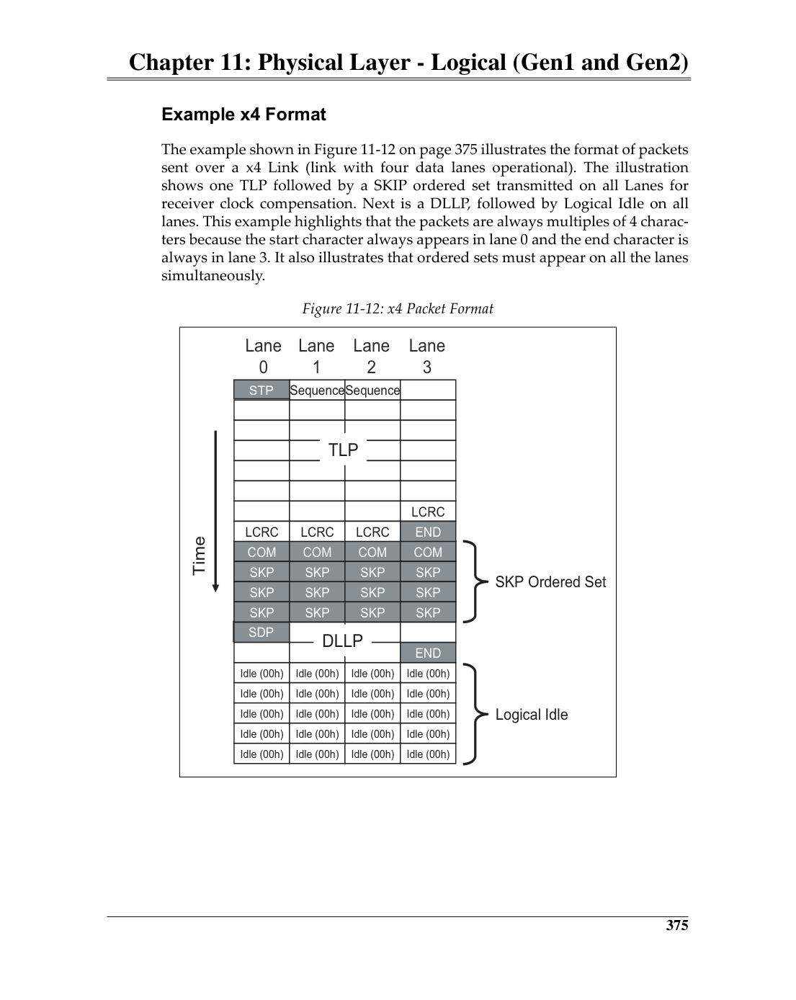

<br>

</td>
<td width="50%">

差分信号电压是通过取两条导线 D+ 和 D- 上的电压差来定义的。每条导线相对于地的电压为 VD+ 和 VD-。差分电压由 VDIFF = VD+ ‐ VD- 给出。共模电压 (Common Mode voltage, VCM) 定义为信号切换的电压范围，即由 VCM =
(VD+ + VD-) / 2 给出的平均值。

规范在讨论差分电压时使用了两个术语，有时会引起混淆。如第 464 页图 13-13 所示，峰值 (Peak) 是信号之间的最大电压差，而峰峰值 (Peak‐to‐ Peak) 电压是该值加上相反方向上的最大值。对于对称信号，峰峰值仅为峰值的两倍。

1. 差分峰值电压 => VDIFFp = (max |VD+ ‐ VD-|)

2. 差分峰峰值电压 => VDIFFp‐p = 2 *(max |VD+ ‐ VD-|)

作为一个示例，假设 VCM = 0 V，则如果 D+ 值为 300mV 且 D- 值为 ‐300mV，则对于逻辑 1，VDIFFp 将为 300 ‐ (‐300) = 600 mV。类似地，对于逻辑 0，它将是 (‐300) ‐ (+300) = ‐600 mV。这种对称情况的
VDIFFp‐p 将为 1200 mV。在应用均衡之前，2.5 GT/s 和 5.0 GT/s 的允许 VDIFFp‐p 范围为 800 至 1200 mV，而 8.0 GT/s 的范围为 800 至 1300 mV。

**PCI Express 技术**

_图 13-13：差分峰峰值 ( VDIFFp‐p ) 和峰值 ( VDIFFp ) 电压_

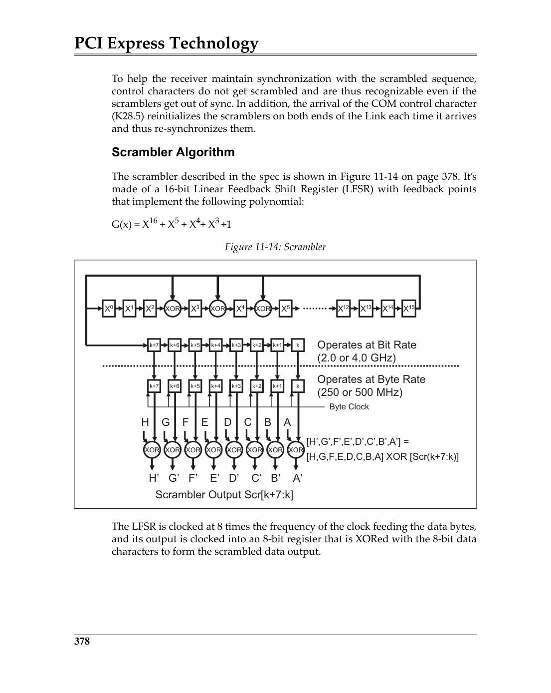

</td>
</tr>
<tr>
<td width="50%">

## **Reduced-Swing Differential Voltage** 

The full‐swing voltage is needed for channels that are long or otherwise lossy, and Transmitters are required to support it. But when the
signal environment is short and low loss, a high voltage is unnecessary and a power savings can be realized by reducing it. With this in
mind, the spec for 2.5 GT/s and 5.0 GT/s defines another, reduced‐swing voltage for power‐sensitive systems where a short channel is being
used. In this mode the voltage is reduced to about half of its full‐swing range. Support for this operation is optional, and the means for
selecting it is not defined and will be implementation specific.

The same is true for 8.0 GT/s signaling, except that in this case it’s achieved by using a limited range of coefficients. For example, the
maximum boost for the reduced‐swing case is limited to 3.5 dB. As with the lower data rates, support for this voltage model is optional, but
now the means of achieving it is straight‐ forward: just set the Tx coefficient values to make it happen.

It should be noted that the Receiver voltage levels are independent of the trans‐ mitter, which is intuitively what we’d expect: the
received signal always needs to meet the normal requirements and so the Transmitter and channel must be designed to guarantee that it will.

</td>
<td width="50%">

## **低摆幅差分电压**

对于长距离或其他有损的信道，需要满摆幅电压，并且要求发送器支持它。但是当信号环境短且低损耗时，不需要高压，并且可以通过降低电压来实现节能。考虑到这一点，2.5 GT/s 和 5.0 GT/s
的规范定义了另一种低摆幅电压，用于使用短信道且对功率敏感的系统。在这种模式下，电压降低到其满摆幅范围的大约一半。对该操作的支持是可选的，并且选择它的方式未定义，将特定于实现 (implementation specific)。

8.0 GT/s 信号传输也是如此，只是在这种情况下它是通过使用有限范围的系数来实现的。例如，低摆幅情况的最大提升限制为 3.5 dB。与较低数据速率一样，对该电压模型的支持是可选的，但现在实现它的方法很简单：只需设置 Tx 系数值即可实现。

值得注意的是，接收器电压电平与发送器无关，这符合我们的直觉：接收到的信号始终需要满足正常要求，因此发送器和信道必须设计为保证它能实现。

</td>
</tr>
<tr>
<td width="50%">

## **Equalized Voltage** 

In the interest of maintaining a good flow in this section, this large topic is cov‐ ered separately in the section called “Signal
Compensation” on page 468.

</td>
<td width="50%">

## **均衡电压**

为了在本节中保持良好的流程，此大主题在第 468 页的"信号补偿"部分单独介绍。

**第 13 章：物理层 - 电气**

</td>
</tr>
<tr>
<td width="50%">

## **Voltage Margining** 

The concept of margining is that Transmitter characteristics like output voltage can be adjusted across a wide range of values during
testing to determine how well it can handle a signaling environment. The 2.5 GT/s rate didn’t include this capability, but voltage margining
was added with the 5.0 GT/s rate and must be implemented by Transmitters that use that rate or higher. Other parameters, like de‐emphasis or
jitter can optionally be margined as well. The granularity for the margining adjustments must be controllable on a Link basis and may be
controllable on a Lane basis. This control is accomplished by means of the Link Control 2 register in the PCIe Capability register block.
The transmit margin field, shown in Figure 13‐14 on page 465, contains 3 bits and can thus represent 8 levels. Their values are not defined,
and not all of them need to be imple‐ mented. The default value is all zeros, which represents the normal operating range.

It’s important to note that this field is only intended for debug and compliance testing purposes during which software is only allowed to
modify it during those times. At all other times, the value is required to be set to the default of all zeros.

_Figure 13‐14: Transmit Margin Field in Link Control 2 Register_ 

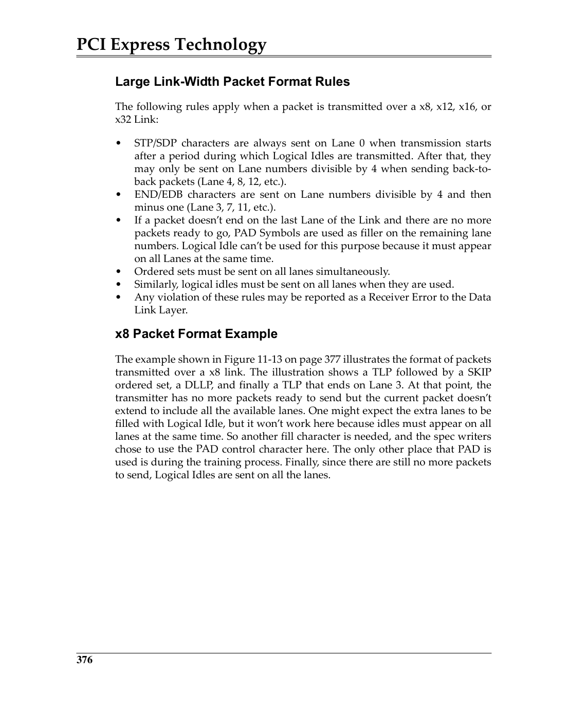

<br>


For 8.0 GT/s, transmitters are required to implement voltage margining and use the same field in the Link Control 2 register, but
equalization adds some con‐ straints to the options because it can’t require finer coefficient or preset resolu‐ tion than the 1/24
resolution defined for normal operation.

During Tx margining the equalization tolerance for 2.5 GT/s and 5.0 GT/s is relaxed from +/‐ 0.5 dB to +/‐ 1.0 dB. For the 8.0 GT/s rate,
the tolerance is defined by the coefficient granularity and the normal equalizer tolerances spec‐ ified for the transmitter.

</td>
<td width="50%">

## **电压裕量**

裕量 (margining) 的概念是可以在测试期间调整发送器特性（例如输出电压）跨越广泛的值范围，以确定它处理信号环境的能力。2.5 GT/s 速率不包括此功能，但电压裕量是在 5.0 GT/s 速率中添加的，并且必须由使用该速率或更高速率的发送器实现。其他参数（例如去加重
(de‐emphasis) 或抖动）也可以选择性地进行裕量测试。裕量调整的粒度必须在链路 (Link) 基础上可控，并且可以在 Lane 基础上可控。此控制通过 PCIe 能力 (Capability) 寄存器块中的链路控制 2 (Link Control 2)
寄存器来完成。发送裕量 (Transmit Margin) 字段如第 465 页图 13-14 所示，包含 3 位，因此可以表示 8 个级别。它们的值未定义，并且不需要全部实现。默认值为全零，表示正常工作范围。

重要的是要注意，此字段仅用于调试和合规测试，在这些期间软件才被允许修改它。在所有其他时间，值需要设置为全零的默认值。

_图 13-14：链路控制 2 寄存器中的发送裕量字段_

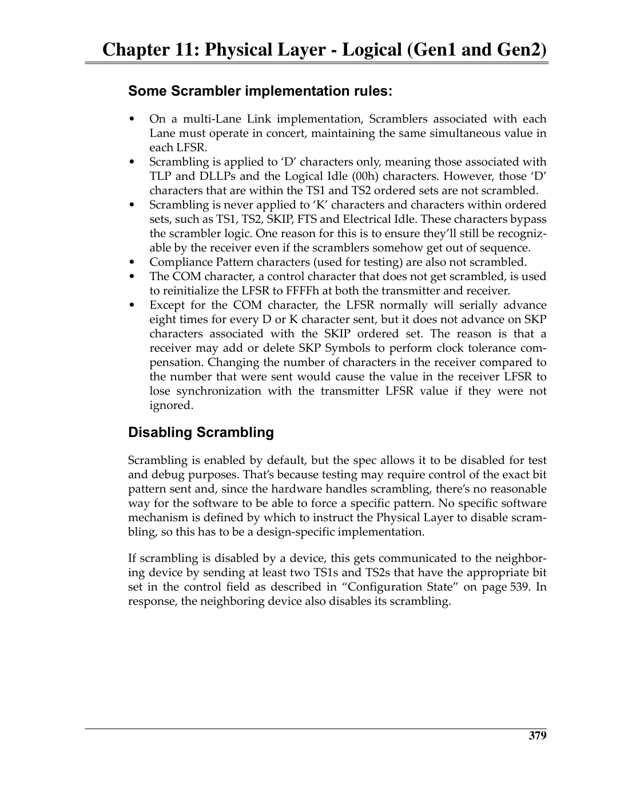


**PCI Express 技术**

对于 8.0 GT/s，发送器需要实现电压裕量并使用链路控制 2 (Link Control 2) 寄存器中的相同字段，但均衡 (equalization) 会对选项施加一些约束，因为它不能要求比正常操作定义的 1/24 分辨率更精细的系数或预设 (preset) 分辨率。

在 Tx 裕量测试期间，2.5 GT/s 和 5.0 GT/s 的均衡容差从 +/‐ 0.5 dB 放宽至 +/‐ 1.0 dB。对于 8.0 GT/s 速率，容差由系数粒度和为发送器指定的正常均衡器容差定义。

</td>
</tr>
<tr>
<td width="50%">

## **Receiver (Rx) Specs**

</td>
<td width="50%">

## **接收器 (Rx) 规范**

</td>
</tr>
<tr>
<td width="50%">

## **Receiver Impedance** 

Receivers are required to meet the RLRX‐DIFF and RLRX‐CM (see Table 13‐5 on page 498) parameters unless the device is powered down, as it
would be, for example, in the L2 and L3 power states or during a Fundamental Reset. In those cases, a Receiver goes to the high impedance
state and must meet the ZRX‐HIGH‐IMP‐DC‐NEG and ZRX‐HIGH‐IMP‐DC‐NEG parameters.

(See Table 13‐5 on page 498.)

</td>
<td width="50%">

## **接收器阻抗**

除非设备断电（例如在 L2 和 L3 电源状态或基本复位 (Fundamental Reset) 期间），否则接收器需要满足 RLRX‐DIFF 和 RLRX‐CM（参见第 498 页表 13-5）参数。在这些情况下，接收器进入高阻抗状态，必须满足
ZRX‐HIGH‐IMP‐DC‐NEG 和 ZRX‐HIGH‐IMP‐DC‐NEG 参数。

（参见第 498 页表 13-5。）

</td>
</tr>
<tr>
<td width="50%">

## **Receiver DC Common Mode Voltage** 

The Receiver’s DC common mode voltage is specified to be 0V for all data rates, and that’s represented in Figure 13‐15 on page 467 by
showing the signal termi‐ nations connected to ground. The CTX in‐line capacitor permits this voltage to be something different at the
Transmitter, which is specified to be in the range from 0 ‐ 3.6V. That’s not as interesting when the Transmitter and Receiver are in the
same enclosure and have the same power supply, but if they’re connected over a cable and reside in different machines with different power
supplies it becomes more important. In that case it’s difficult to avoid reference voltage dif‐ ferences between the machines and, since the
signal voltages are already small, such a difference could make the signal difficult to recognize at the Receiver. The location of this
capacitor must be near the Transmitter pins when a connec‐ tor of some kind will be used but, if there’s no connector, it can be located at
any convenient place on the transmission line. Although it could be integrated into a device, it’s expected that CTX will be external
because it would be too big to inte‐ grate.
The drawing in Figure 13‐15 on page 467 also shows an optional set of resistors at the Receiver, labeled as “No Spec” because they are not
mentioned in the spec. The story here is that Receiver designers dislike using a common‐mode voltage of zero for the simple reason that it
usually requires them to implement two reference voltages, one above zero and one below it. A preferred imple‐ mentation offsets the signal
entirely above or below zero, so that only one refer‐ ence voltage is needed.The circuit shown within the dotted line accomplishes this by
adding a small‐value in‐line capacitor to de‐couple the DC component of the signal on the wire from that of the Receiver itself. Then, a
resistor ladder serves to offset the Receiver’s common‐mode voltage in one direction or the other to accomplish the goal.

_Figure 13‐15: Receiver DC Common‐Mode Voltage Adjustment_ 

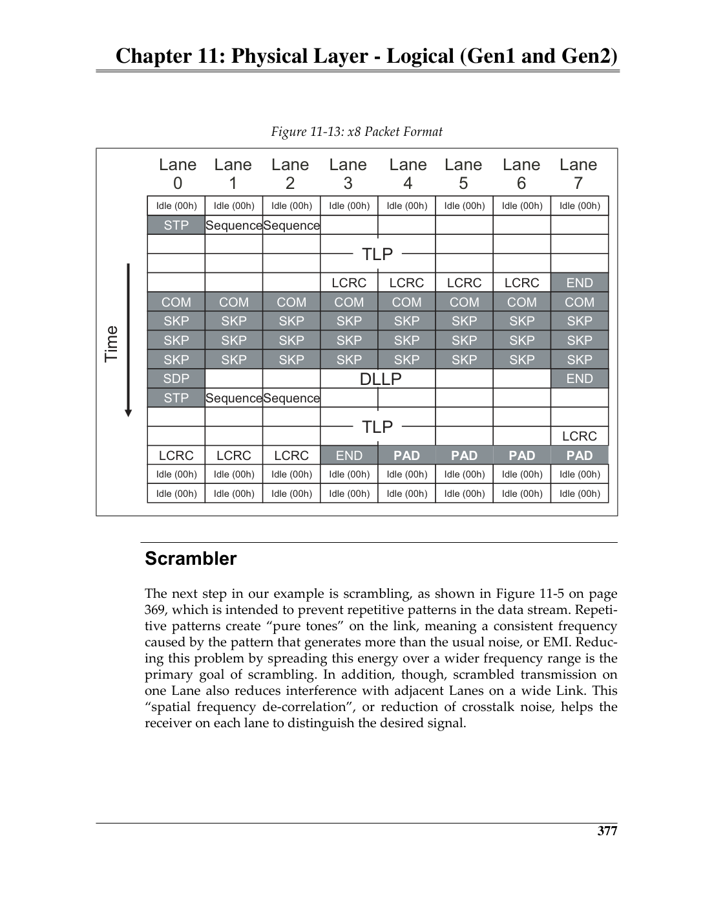

<br>

</td>
<td width="50%">

## **接收器直流共模电压**

接收器的直流共模电压对于所有数据速率都规定为 0V，这在第 467 页图 13-15 中通过将信号端接连接到地来表示。CTX 内联电容器允许发送器处的该电压不同，规定范围为 0 至
3.6V。当发送器和接收器位于同一机箱内并具有相同电源时，这就不那么重要了，但如果它们通过电缆连接并位于具有不同电源的不同机器中，则变得更加重要。在这种情况下，很难避免机器之间的参考电压差异，并且由于信号电压已经很小，这样的差异可能会使信号难以在接收器处识别。当使用某种连接器时，此电容器的位置必须靠近发送器引脚，但是如果没有连接器，则可以将其放置在传输线上的任何方便位置。尽管它可以集成到设备中，但预期
CTX 将是外部的，因为将其集成会太大。

**第 13 章：物理层 - 电气**

第 467 页图 13-15 中的图还显示了接收器处的一组可选电阻器，标记为"No
Spec"，因为规范中没有提到它们。这里的故事是，接收器设计人员不喜欢使用零共模电压，原因很简单，因为这通常要求他们实现两个参考电压，一个在零之上，一个在零之下。首选的实现方式是将信号完全偏移到零之上或之下，这样只需要一个参考电压。虚线内显示的电路通过添加一个小值内联电容器将线上信号的直流分量与接收器本身的直流分量解耦来实现这一点。然后，电阻梯形网络用于将接收器的共模电压偏移到一个方向或另一个方向以实现目标。

_图 13-15：接收器直流共模电压调整_

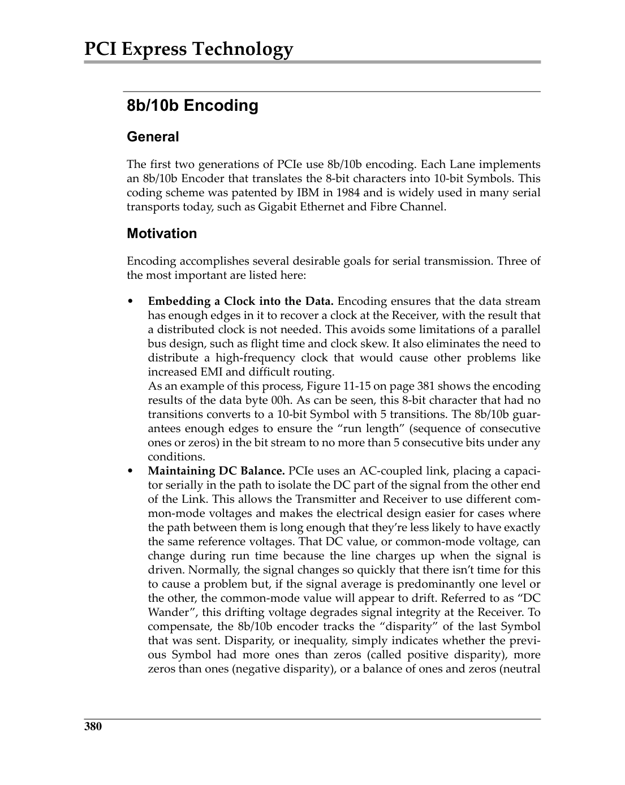


**PCI Express 技术**

</td>
</tr>
<tr>
<td width="50%">

## **Transmission Loss** 

The Transmitter drives a minimum differential peak‐to‐peak voltage VTX‐DIFFp‐p of 800 mV. The Receiver sensitivity is designed for a minimum
dif‐ ferential peak‐to‐peak voltage (VRX‐DIFFp‐p) of 175 mV. This translates to a 13.2dB loss budget that a Link is designed for. Although a
board designer can determine the attenuation loss budget of a Link plotted against various frequen‐ cies, the Transmitter and Receiver eye
diagram measurement are the ultimate determinant of loss budget for a Link. Eye diagrams are described in “Eye Dia‐ gram” on page 485. A
Transmitter that drives up to the maximum allowed dif‐ ferential peak‐to‐peak voltage of 1200 mV can compensate for a lossy Link that has
worst‐case attenuation characteristics.

</td>
<td width="50%">

## **传输损耗**

发送器驱动最小差分峰峰值电压 VTX‐DIFFp‐p 为 800 mV。接收器灵敏度设计为最小差分峰峰值电压 (VRX‐DIFFp‐p) 为 175 mV。这相当于链路设计为 13.2dB
的损耗预算。尽管板设计器可以确定针对各种频率绘制的链路的衰减损耗预算，但发送器和接收器眼图测量 (eye diagram measurement) 是链路损耗预算的最终决定因素。眼图在第 485 页的"眼图"中描述。驱动高达最大允许差分峰峰值电压 1200 mV
的发送器可以补偿具有最坏情况衰减特性的有损链路。

</td>
</tr>
<tr>
<td width="50%">

## **AC Coupling** 

PCI Express requires in‐line AC‐coupling capacitors be placed on each Lane, usually near the Transmitter. The capacitors can be integrated
onto the system board, or integrated into the device itself, although the large size they would need makes that unlikely. An add‐in card
with a PCI Express device on it must place the capacitors on the card close to the Transmitter or integrate the capaci‐ tors into the PCIe
silicon. These capacitors provide DC isolation between two devices on both ends of a Link thus simplifying device design by allowing devices
to use independent power and ground planes.

</td>
<td width="50%">

## **交流耦合**

PCI Express 要求在每个 Lane 上放置内联交流耦合电容器 (in‐line AC‐coupling capacitors)，通常靠近发送器。这些电容器可以集成在系统板上，或者集成到设备本身中，尽管它们需要的大尺寸使得这种情况不太可能发生。具有 PCI Express
设备的插卡必须在靠近发送器的卡上放置电容器，或将电容器集成到 PCIe 硅片中。这些电容器在链路两端的两个设备之间提供直流隔离，从而通过允许设备使用独立的电源和接地层来简化设备设计。

</td>
</tr>
<tr>
<td width="50%">

## **Signal Compensation**

</td>
<td width="50%">

## **信号补偿**

</td>
</tr>
<tr>
<td width="50%">

## **De-emphasis Associated with Gen1 and Gen2 PCIe** 

For 2.5 GT/s and 5.0 GT/s transmission, PCIe mandates the use of a fairly simply form of Transmitter equalization called **de‐emphasis** to
reduce the effects of signal distortion along the Link transmission line. This distortion problem is always present but gets worse with
increased frequency and lossy transmission lines.

</td>
<td width="50%">

## **与 Gen1 和 Gen2 PCIe 关联的去加重**

对于 2.5 GT/s 和 5.0 GT/s 传输，PCI 强制要求使用一种相当简单的发送器均衡形式，称为 **去加重 (de‐emphasis)**，以减少链路传输线上信号失真的影响。这种失真问题始终存在，但随着频率增加和传输线有损耗而变得更糟。

</td>
</tr>
<tr>
<td width="50%">

## **The Problem** 

As data rates get higher, the Unit Interval (UI ‐ bit time) becomes smaller, with the result that it’s increasingly difficult to avoid
having the value in one bit time affect the value in another bit time. The channel always resists changes to the voltage level, The faster
we attempt to switch voltage, the more pronounced
that effect becomes. However, when a signal has been held at the same voltage for several bit times, as when sending several bits in a row
of the same polarity, the channel has more time to approach the target voltage. The resulting higher voltage makes it difficult to change to
the opposite value within the required time when the polarity does change. This problem of previous bits affecting subsequent bits is
referred to as **ISI** ( **inter‐symbol interference** ).

</td>
<td width="50%">

## **问题所在**

随着数据速率的提高，单位间隔 (Unit Interval, UI ‐ 比特时间) 变小，结果是越来越难以避免一个比特时间中的值影响另一个比特时间中的值。信道始终抵抗电压电平的变化，我们尝试切换电压的速度越快，

**第 13 章：物理层 - 电气**

这种效果就越明显。但是，当信号在多个比特时间内保持在相同电压时（例如在发送多个相同极性的连续位时），信道有更多时间接近目标电压。由此产生的较高电压使得在极性变化时难以在所需时间内改变为相反值。前面的位影响后续位的问题称为 **ISI** (**符号间干扰,
inter‐symbol interference**)。

</td>
</tr>
<tr>
<td width="50%">

## **How Does De-Emphasis Help?** 

De‐emphasis reduces the voltage for repeated bits in a bit stream. Although it sounds counter‐intuitive at first because this reduces the
signal swing and thus the energy that reaches the Receiver, reducing the Transmitter voltage for these cases can substantially improve
signal quality. Figure 13‐16 on page 469 illus‐ trates how this works by showing a Transmitter output of ‘1000010000’, where the repeated
bits of the same polarity have been de‐emphasized. De‐emphasis can be thought of as a two‐tap Tx equalizer, and some rules related to it
are:

</td>
<td width="50%">

## **去加重如何提供帮助？**

去加重 (De‐emphasis) 降低了比特流中重复位的电压。乍一听这似乎违反直觉，因为这降低了信号摆幅，从而降低了到达接收器的能量，但降低这些情况下发送器电压可以显着提高信号质量。第 469 页图 13-16
通过显示发送器输出"1000010000"来说明此工作原理，其中相同极性的重复位已被去加重。去加重可以被认为是一个两抽头 (two‐tap) Tx 均衡器，并且与之相关的一些规则是：

</td>
</tr>

</tbody>
</table>

[⬆️ 返回目录](#本章目录-table-of-contents)

---

<a id="sec-11-4"></a>
## 11.4 Physical Layer - Logical (Gen1 and Gen2) | 物理层 - 逻辑 (Gen1 与 Gen2)

<table>
<thead><tr><th width="50%">🇬🇧 English</th><th width="50%">🇨🇳 中文</th></tr></thead>
<tbody>
<tr>
<td width="50%">

- When the signal changes to the opposite polarity of the preceding bit it’s not de‐emphasized, but uses the peak‐to‐peak differential
voltage as specified by VTX‐DIFFp‐p (see Table 13‐3 on page 489).

- The first bit of a series of same polarity bits is not de‐emphasized. 

- Only subsequent bits of the same polarity after the first bit are de‐empha‐ sized. 

- The de‐emphasized voltage is reduced by 3.5 dB from normal for 2.5 GT/s, which translates to about a one‐third reduction in voltage. 

- The Beacon signal is de‐emphasized, too, but uses slightly different rules. (see “Beacon Signaling” on page 483). 

_Figure 13‐16: Transmission with De‐emphasis_ 

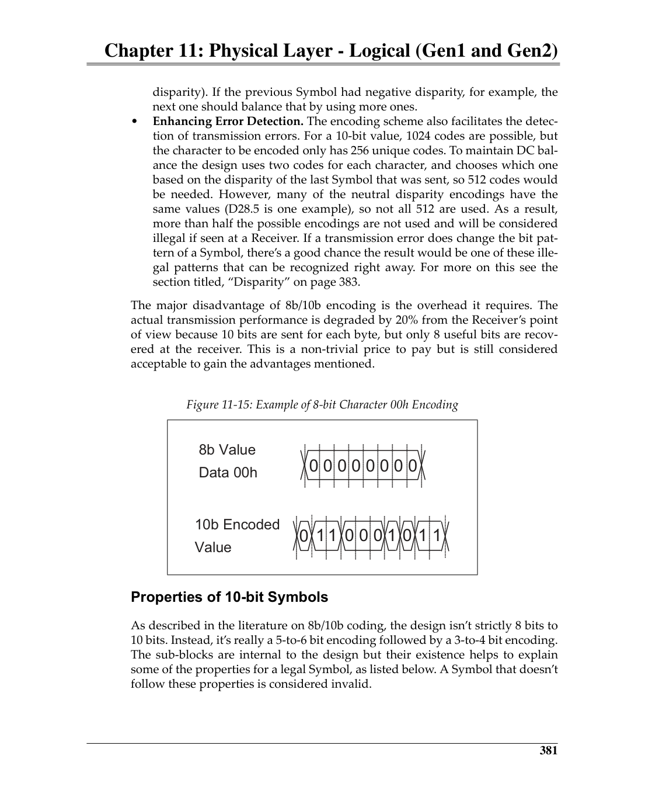

<br>

</td>
<td width="50%">

该方案向后兼容仅使用去加重 (de‐emphasis) 的 2.5 和 5.0 GT/s 模型，因为预冲 (pre‐shoot) 和去加重可以独立定义。无论是否使用去加重，电压都与较低数据速率下的电压相同，只是现在去加重值的选项更多，范围从 0 到 ‐6
dB。预冲是一项新特性，旨在通过在当前位时间内提升电压来改善下一位时间的信号。最后，最大值简单地表示当 C‐1 和 C+1 都为零（且 C0 为 1.0）时的信号。如图顶部所示的位流所示，我们可以将这些电压的策略总结如下：

- 当游标两侧的位具有相反极性时，电压将是 Vd，即最大电压。

- 当要发送重复的位串时：

 - 第一位使用 Va，即低于最大电压 Vd 的次低电压。

 -

 - 第一位与最后一位之间的位使用 Vb，即最低电压。

- 极性变化之前的最后一个重复位使用 Vc，即高于最低电压 Vb 的次高电压。

_图 13‐23：8.0 GT/s 发送器电压电平_

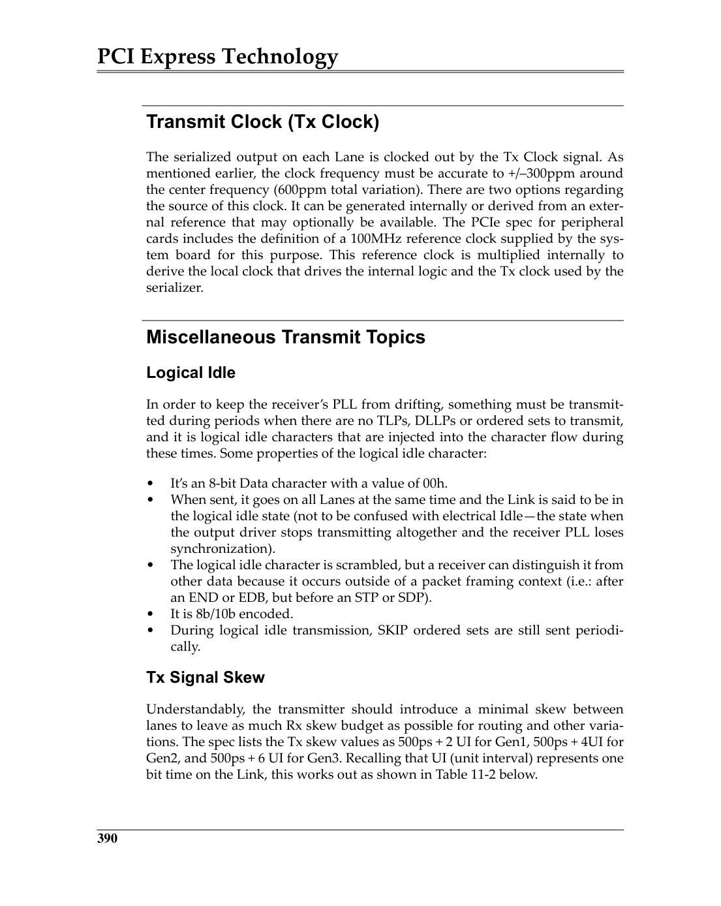

<br>

</td>
</tr>
<tr>
<td width="50%">

## **Solution for 2.5 GT/s** 

For 2.5 GT/s, each subsequent bit transmitted after the first bit of the same polarity must be de‐emphasized by 3.5dB to accommodate this
worst‐case loss budget. Of course, for low‐loss environments this is less important and for a very short path it can even make the received
signal look worse. After all, de‐ emphasis is essentially distorting the transmitted signal in the opposite way of the distortion that is
expected during transmission so as to cancel it out. If there turns out to be little or no distortion, then de‐emphasis will make the signal
look worse. The spec doesn’t describe any way to test the signal environment or adjust the de‐emphasis level, but doesn’t prohibit a
designer from developing an implementation‐specific method of doing so.

An example of the benefit of de‐emphasis is shown in Figure 13‐17 on page 471, which is a scope capture converted into a drawing for
clarity. The captures were taken from a device driving a long path and using a bit stream with several repeated bits to show the signal
distortion. The trace at the top shows that the bit pattern for one side of the differential pair (also called a single‐ended signal) has 2
bits of one polarity followed by 5 bits of the opposite polarity. Five consec‐ utive bits is the worst case for 8b/10b, and this particular
pattern only appears in a few characters like the COM character. The channel resists high‐speed changes but will continue to charge up if
the driver keeps trying to reach a higher voltage and that can be seen in this example. When the bits aren’t repeated there isn’t time for
the voltage to go as far, but repeated bits give more time for the change. The problem this creates is seen in the bit following the 5[th]
in a row (highlighted in the oval), which fails to reach a good signal value dur‐ ing its UI because the voltage difference was too large to
overcome in that short time. The difference between the value it reaches and the value it should have reached is shown by the line marking
the level reached by other bits that aren’t experiencing as much ISI.

In the lower half of the illustration, a de‐emphasized version of the signal is cap‐ tured and compared to the original. Here we can see
that reducing the voltage for repeated bits prevents the voltage from charging up as much and results in a cleaner signal because the bits
that follow are not influenced as much by the previous bits. For both the 2 consecutive bits and then the 5 consecutive bits, the
over‐charging problem is reduced, which improves the timing jitter as well as the voltage levels. Consequently, the troublesome bit looks
much better with de‐ emphasis turned on and the received signal approaches the normal voltage swing in that bit time.
_Figure 13‐17: Benefit of De‐emphasis at the Receiver_ 

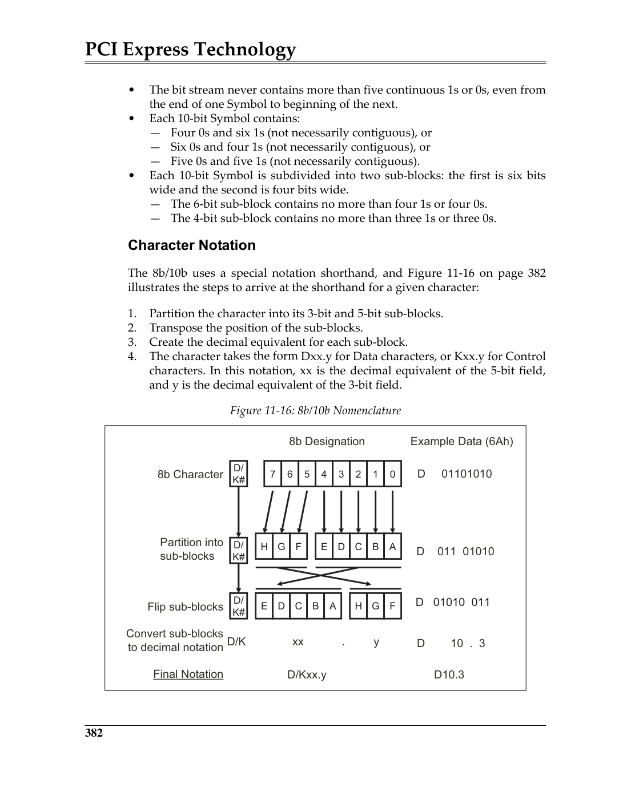

<br>


In Figure 13‐18 on page 472 both positive and negative versions of the differen‐ tial signal are shown so as to illustrate the resulting eye
opening. The improved signal quality from de‐emphasis is clear because the eye opening at the trouble‐ some time in the lower trace is so
much larger than the one without de‐empha‐ sis in the upper trace.

_Figure 13‐18: Benefit of De‐emphasis at Receiver Shown With Differential Signals_ 

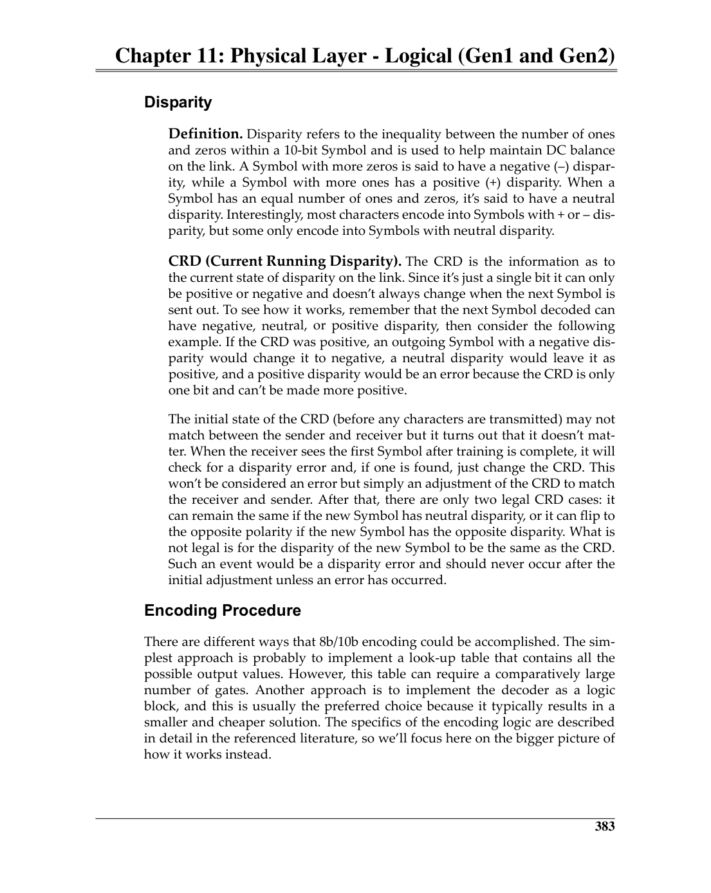

<br>

</td>
<td width="50%">

## **预设和比率**

如第 587 页 “Recovery.Equalization” 中所述，当链路准备从较低的数据速率更改为 8.0 GT/s 时，下游端口发送 EQ TS2，向上游端口提供一组预设值用作其系数的起点，并从此开始测试链路信号质量。11 个可能预设的列表及其对应的系数值和电压比率见表
13‐1（第 478 页）。请注意，电压以相对于最大值的比率给出。这些值的选择是为了与早期规范版本匹配。作为示例，第一个条目 P4 不使用去加重或预冲，因此所有电压值都等于最大值，比率均为 1.000。

_表 13‐1：发送器预设编码与系数及电压比率_

|**预设** **编号**|**预冲** **(dB)**|**去加重** **(dB)**|**C-1**|**C+1**|**Va/Vd**|**Vb/Vd**|**Vc/Vd**|
|---|---|---|---|---|---|---|---|
|P4|0.0.|0.0|0.000|0.000|1.000|1.000|1.000|
|P1|0.0.|-3.5 +/- 1 dB|0.000|-0.167|1.000|0.668|0.668|
|P0|0.0.|-6.0 +/- 1.5 dB|0.000|-0.250|1.000|0.500|0.500|
|P9|3.5 +/- 1 dB|0.0|-0.166|0.000|0.668|0.668|1.000|
|P8|3.5 +/- 1 dB|-3.5 +/- 1 dB|-0.125|-0.125|0.750|0.500|0.750|
|P7|3.5 +/- 1 dB|-6.0 +/- 1.5 dB|-0.100|-0.200|0.800|0.400|0.600|
|P5|1.9 +/- 1 dB|0.0|-0.100|0.000|0.800|0.800|1.000|
|P6|2.5 +/- 1 dB|0.0|-0.125|0.000|0.750|0.750|1.000|
|P3|0.0|-2.5 +/- 1 dB|0.000|-0.125|1.000|0.750|0.750|
|P2|0.0|-4.4 +/- 1.5 dB|0.000|-0.200|1.000|0.600|0.600|
|P10|0.0|由 LF 定义|0.000|(FS-LF) /2|1.000|不固定|不固定|


**第 13 章：物理层 - 电气**

</td>
</tr>
<tr>
<td width="50%">

## **Solution for 5.0 GT/s** 

As one might expect, increasing data rates exacerbates the problem of ISI because the bit times get progressively smaller, and more
aggressive equaliza‐ tion techniques are needed. The change for 5.0 GT/s is incremental, and consists of providing three choices regarding
the amount of de‐emphasis to be applied.

1. When running at 2.5 GT/s speed, ‐3.5 dB de‐emphasis is required. 

2. When running at 5.0 GT/s speed, ‐6.0 dB de‐emphasis is recommended, while the use of ‐3.5 dB is optional. ‐6.0 dB de‐emphasis level is
intended to compensate for the greater signal attenuation at higher frequency. As Fig‐ ure 13‐19 on page 473 suggests, a 3.5 dB reduction
represents a 33% reduc‐ tion in voltage, while a 6 dB reduction represents a 50% reduction. To avoid a possible confusion, note that the dB
measure of power and voltage are dif‐ ferent by a factor of two. A 3 dB reduction represents a 50% change in power but only a 25% change in
voltage.
_Figure 13‐19: De‐emphasis Options for 5.0 GT/s_ 

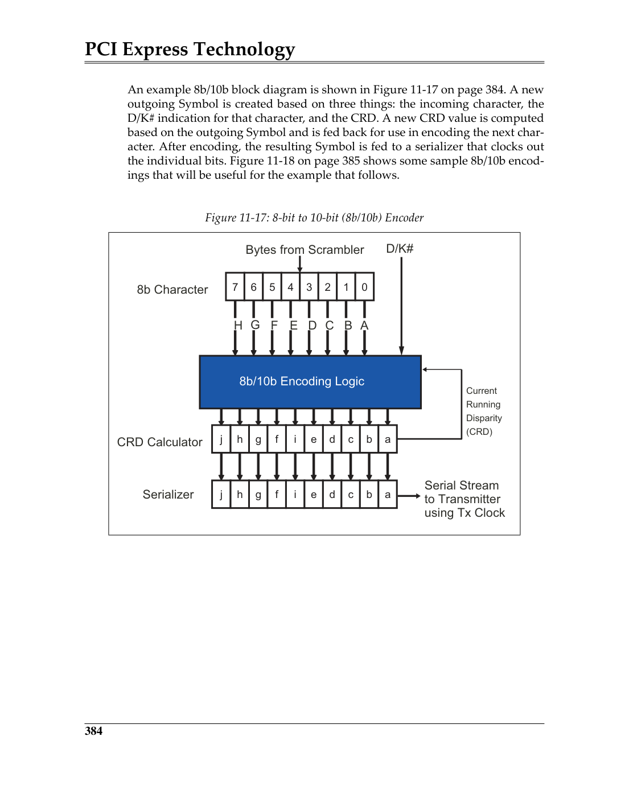

<br>


3. Normally, a Transmitter operates in the full‐swing mode and can use the entire available voltage range to help overcome signal
attenuation. The volt‐ age needs to start out at a higher value to compensate for the loss, as shown in the top half of Figure 13‐20 on page
474. However, for 5.0 GT/s another option is provided called reduced‐swing mode. This is intended to support short, low‐loss signaling
environments, as shown in the lower half of Figure 13‐20 on page 474, and reduces the voltage swing by about half to save power. This mode
also provides the third de‐emphasis option by turning off de‐emphasis entirely, which makes sense because, as mentioned earlier, the signal
distortion it creates would not be reduced by loss in the path and the resulting signal at the Receiver would look worse.

_Figure 13‐20: Reduced‐Swing Option for 5.0 GT/s with No De‐emphasis_ 

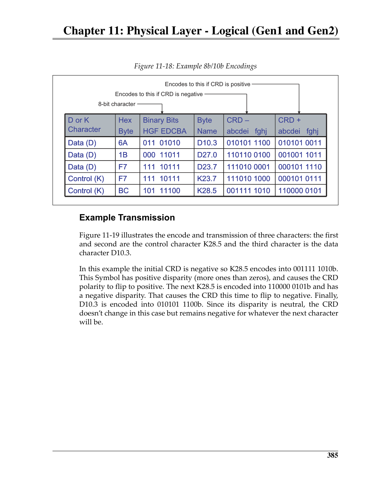

<br>

</td>
<td width="50%">

## **均衡器系数**

预设允许设备在首次训练到 8.0 GT/s 数据速率时使用 11 个可能的起始值之一作为合作伙伴发送器系数的初始值。这是通过在训练期间发送 EQ TS1 和 EQ TS2 来实现的，为发送器均衡提供一个粗略调整的起点。如果使用预设的信号能够达到所需的 10[‐12]
误码率，则无需进一步训练。但如果测得的误码率过高，则使用均衡序列通过尝试不同的 C‐1 和 C+1 值并评估结果来微调系数设置，重复该序列直到达到所需的信号质量或误码率。

8.0 GT/s 发送器需要向其相邻的接收器报告其支持的系数值范围。对此有一些约束：

- 设备必须支持表 13‐1（第 478 页）中列出的所有 11 个预设。

- 发送器必须满足满摆幅 VTX‐EIEOS‐FS 信号限制

- 发送器可以选择支持缩减摆幅，如果支持，则必须满足 VTX‐EIEOS‐RS 限制

- 系数必须满足提升限制 (VTX‐BOOST‐FS = 最小 8.0 dB, VTX‐BOOST‐RS = 最小 2.5 dB) 和分辨率限制 (EQ_TX‐DOEFF‐RES 最大为 1/24，最小为 1/63)。

应用这些约束并使用最大粒度 1/24，可为每个设置生成预冲、去加重和提升值的列表。该列表在规范的表格中给出，此处从规范中部分转载到表 13‐2（第 480 页）。表中包含空白条目，因为提升值不能超过 8.0 +/‐ 1.5 dB = 9.5
dB。结果在满摆幅情况下形成一条对角边界，提升已达到 9.5 dB。对于缩减摆幅，边界在 3.5 dB 处。表中左侧和顶部边缘的 6 个阴影条目，最远可达 4/24，是由满摆幅或缩减摆幅信号支持的预设。其他 4 个阴影条目仅为满摆幅信号支持的预设。

</td>
</tr>
<tr>
<td width="50%">

## **Solution for 8.0 GT/s - Transmitter Equalization** 

When going to the 8.0 GT/s data rate, the signal conditioning model changes significantly. Transmitter equalization becomes more complex and
a handshake training procedure is used to adapt to the actual signaling environment rather than making assumptions about what will be
needed. To learn more about the process of evaluating the Link, refer to the section called “Recovery.Equaliza‐ tion” on page 587.
Basically, that process allows a Receiver to request that the Link partner’s Transmitter use a certain combination of coefficients and then
the receiver tests how well the received signal looks and possibly proposes others if the result isn’t good enough.

Sometimes students ask whether this model is really sufficient to achieve good error rates, since evaluating a signal across all the
possible situations requires days of testing in the lab to achieve a BER of 10[‐15] or better. The answer to this has two parts. First, even
with the handshake process, the coefficients will be an approximation that worked well when the training was done but may or may not work as
well under other conditions. Extrapolation from a small sample size
is a necessary part of arriving at working values quickly and it works reason‐ ably well. Second, associated with 8 GT/s transfer rate, it’s
only necessary to achieve a minimum BER of 10[‐12] , and that doesn’t take as long to verify as it would BER of 10[‐15] .

</td>
<td width="50%">

## **PCI Express Technology**

_表 13‐2：发送器系数表_

|**PS DE** **Boost**|**PS DE** **Boost**|**C+1**|**C+1**|**C+1**|**C+1**|**C+1**|**C+1**|**C+1**|
|---|---|---|---|---|---|---|---|---|
|||0/24|1/24|2/24|3/24|4/24|5/24|6/24|
|**C-1**|0/24|0.0 0.0 0.0|0.0 -0.8 0.8|0.0 -1.8 1.6|0.0 -2.5 2.5|0.0 -3.5 3.5|0.0 -4.7 4.7|0.0 -6.0- 6.0|
|1/24|0.8 0.0 0.8|0.8 -0.8 1.6|0.9 -1.7 2.5|1.0 -2.8 3.5|1.2 -3.9 4.7|1.3 -5.3 6.0|1.6 -6.8 7.6|
|2/24|1.6 0.0 1.6|1.7 -0.9 2.5|1.9 -1.9 3.5|2.2 -3.1 4.7|2.5 -4.4 6.0|2.9 -6.0 7.6|3.5 -8.0 9.5|
|3/24|2.5 0.0 2.5|2.8 -1.0 3.5|3.1 -2.2 4.7|3.5 -3.5 6.0|4.1 -5.1 7.6|4.9 -7.0 9.5|-|
||4/24|3.5 0.0<br>3.5|3.9 -1.2<br>4.7|4.4 -2.5<br>6.0|5.1 -4.1<br>7.6|6.0 -6.0<br>9.5|-|-|
||5/24|4.7 0.0<br>4.7|5.3 -1.3<br>6.0|6.0 -2.9<br>7.6|7.0 -4.9<br>9.5|-|-|-|
||6/24|6.0 0.0<br>6.0|6.8 -1.6<br>7.6|8.0 -3.5<br>9.5|-|-|-|-|


**系数示例。** 让我们使用第 478 页表 13‐1 中的预设 P7 作为示例，深入了解这些系数。在此条目中，C‐1 = ‐0.100，C+1 = ‐0.200，由于 C0 必须为正且它们绝对值之和必须为 1，因此 C0 = 0.700。

将这些值与规范中给出的系数空间表进行匹配并不直观，因为系数以分数形式而非十进制值给出，但将分数转换为十进制值后可以非常接近地匹配。C‐1 值 0.100 最接近 2/24（0.083），而 C+1 值 0.200 略小于
5/24（0.208）。这些分数对应的系数表条目作为预设值之一被突出显示，让我们对此充满信心。在预设表中，P7 列出的预冲值为 3.5 +/‐ 1 dB，系数表中显示的值为 2.9 dB。如果我们根据系数值的差异进行修正，((0.083/.1) * 3.5 =
2.9)，即可得到相同的预冲值。去加重的系数值差异较小（0.200 vs. 0.208），所以正如预期，两个表都将其显示为 ‐6.0 dB。

**第 13 章：物理层 - 电气**

P7 系数会产生什么电压？假设以满摆幅电压 Vd 作为起点，根据预设表中的比率，其他电压将为 Va = 0.8Vd、Vb = 0.4Vd 和 Vc = 0.6Vd。这些值与使用预冲和去加重数值得到的结果对应得有多好？去加重被指定为 ‐6.0 dB，我们已知这表示电压降低
50%，因此我们期望 Vb 应为 Va 的一半，确实如此。预冲被指定为 3.5 dB，意味着 Vc/Vb 的比率为 0.668，0.4/0.668 = 0.598Vd，即 Vc；非常接近我们预期的 0.6Vd。最后，提升值即 Vd/Vb 的比率，未在预设表中给出，但使用公式
20*log(Vd/Vb)，从预设值得出的提升值为 7.9 dB。这与系数表中给出的 7.6 dB 值相当接近，让我们确信这些表之间是一致的。

那么这四个电压是如何获得的呢？基本上有三个可编程驱动器，其输出被求和以推导出最终要发送的信号值。如果游标设置保持不变，且预游标和后游标抽头为负，则答案可通过简单地将抽头相加 (C0 + C‐1 + C+1) 来获得。

- Vd = (C0 + C‐1 + C+1) = (0.700 + 0.100 + 0.200) = 1.0 * 最大电压。这是一个"提升"值，当一个位前后的位均为相反极性时产生。在此处列出的所有四个电压中，如果位的极性反转，则所有值都为负。

- Va = (0.700 + (‐0.100) + 0.200) = 0.8 * 最大电压。这是当一个位前面是相反极性、后面是相同极性时的值，表示它是重复位串中的第一位。

- Vb = (0.700 + (‐0.100) + (‐0.200)) = 0.4 * 最大电压。这是去加重值，当一个位前后均为相同极性时产生，表示它位于重复位串的中间。

- Vc = (0.700 + 0.100 + (‐0.200)) = 0.6 * 最大电压。这是预冲值，当一个位前面是相同极性、后面是相反极性时产生，表示它是重复位串中的最后一位。

什么决定了系数何时相加或相减以得出这些数值？结果相当简单，因为这仅仅是时移预游标和后游标输入的极性问题。这在第 482 页的图 13‐24 中说明。标记为"Weighted Cursor
(C0)"的单端波形显示了当前正在发送的差分位流的正半部分。如果将波形理解为随时间向右移动，则下一条较低的波形（C+1）是后游标信号。

</td>
</tr>
<tr>
<td width="50%">

## **Three-Tap Tx Equalizer Required** 

To accomplish better wave shaping at the Transmitter, the spec requires the use of a 3‐tap FIR (Finite Impulse Response) filter, meaning a
filter with 3 bit‐time‐ spaced inputs. A conceptual drawing of this is shown in Figure 13‐21 on page 475, where it can be seen that the
output voltage is the sum of three versions of the input: the original input, a version delayed by one bit time and a third delayed by
another bit time. This type of FIR filter is often used in other SER‐ DES applications above 6.0 Gb/s, and it’s helpful for PCIe because it
compen‐ sates for the fact that the channel spreads the signal across a longer time. Another way of thinking about it is that a given bit is
affected by both the bit value that preceded it and the bit that comes after it.

_Figure 13‐21: 3‐Tap Tx Equalizer_ 

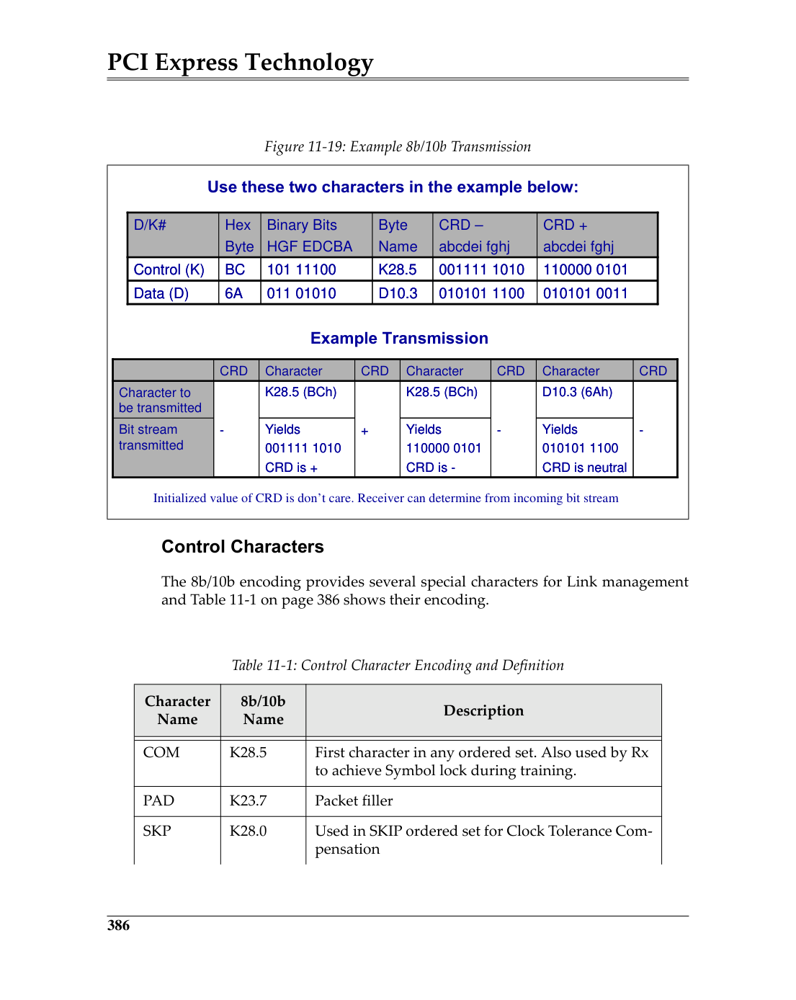

<br>


With this in mind, the three inputs can be described by their timing position as “pre‐cursor” for C‐1, “cursor” for C0, and “post‐cursor”
for C+1, which combine to create an output based on the upcoming input, the current value, and the pre‐ vious value. Adjusting the
coefficients for the taps allows the output wave to be optimally shaped. This effect is illustrated by the pulse‐response waveform shown in
Figure 13‐22 on page 476. Looking at a single pulse allows the adjust‐ ment to the signal to be more easily recognized.

The filter shapes the output according to the coefficient values (or tap weights) assigned to each tap. The sum of the absolute value of the
three coefficient mag‐ nitudes together is defined to be unity so that only two of them need to be given for the third one to be calculated.
Consequently, only C‐1 and C+1 are given in the spec and C0 is always implied and is always positive.

_Figure 13‐22: Tx 3‐Tap Equalizer Shaping of an Output Pulse_ 

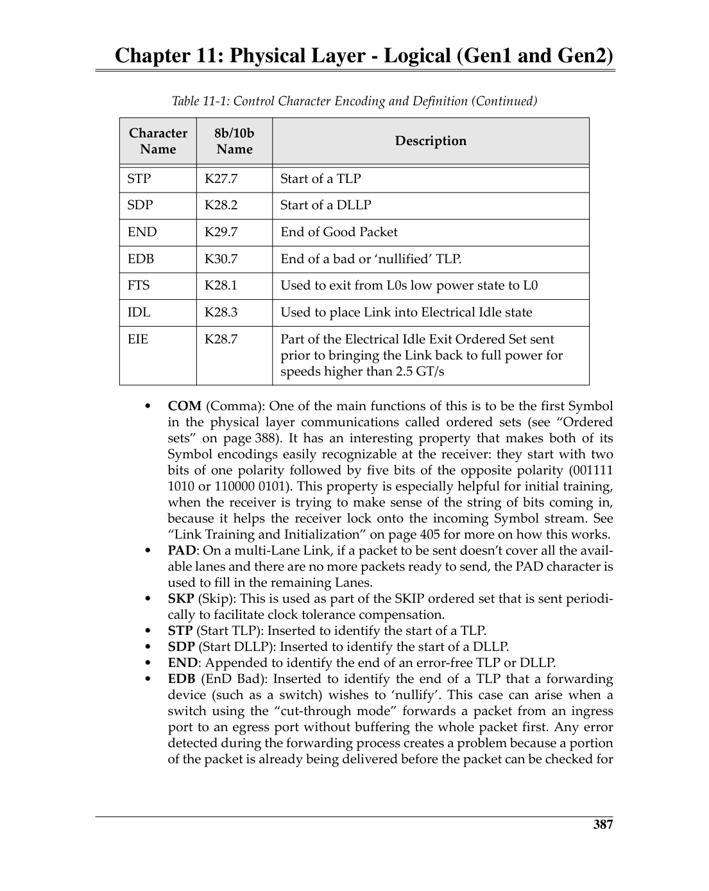

<br>

</td>
<td width="50%">

## **PCI Express Technology**

该版本晚一个时钟到达，并通过其系数进行负加权，导致其反相。顶部波形（C‐1）比游标早一个时钟到达，是预游标值，也根据其自身的系数进行负加权。

最后，底部波形显示了对所有三个输入求和的结果，以得出实际发送到线路上的最终信号。在该图中，此波形与第 477 页图 13‐23 中的单端输出波形叠加显示，以表明它与实际捕获非常接近。图中显示了之前示例的一些电压计算，以演示如何得出所得电压。

_图 13‐24：发送器 3 抽头均衡器输出_

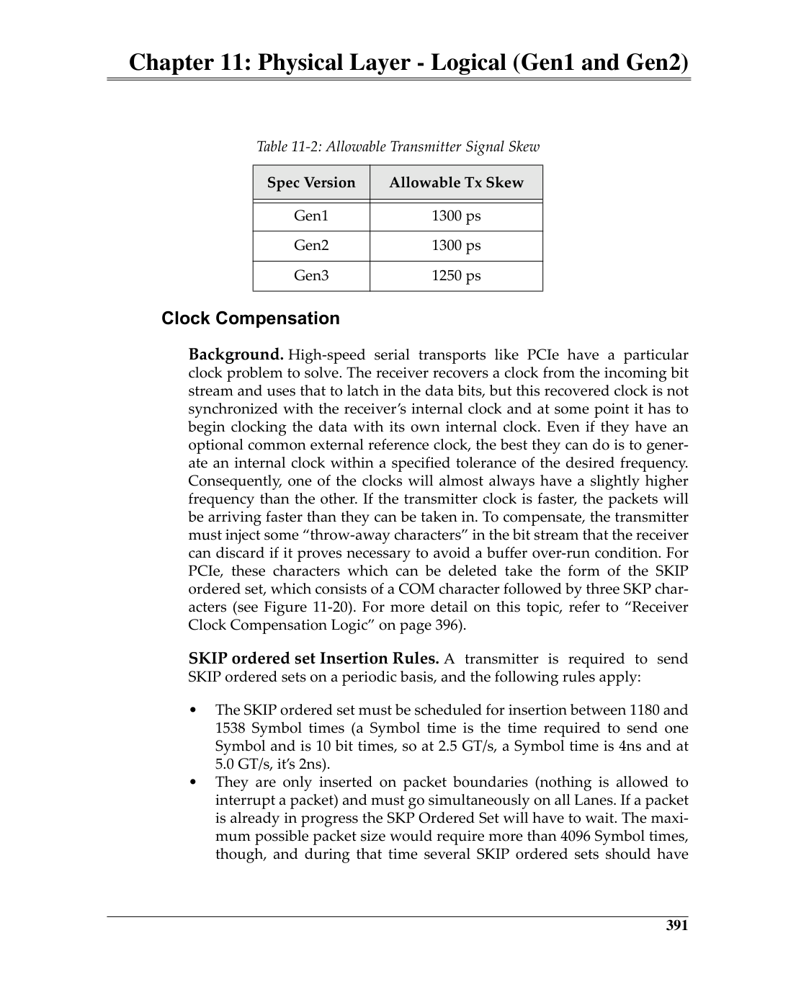

<br>


**第 13 章：物理层 - 电气**

系数预设在链路更改为 8.0 GT/s 之前交换，然后在链路均衡过程中可能会更新（有关更多详细信息，请参阅第 587 页 "Recovery.Equalization"）。

</td>
</tr>
<tr>
<td width="50%">

## **Pre-shoot, De-emphasis, and Boost** 

The effect of the coefficient values is to adjust the output voltage to create up to four different voltage levels to accommodate different
signaling environments, as shown in Figure 13‐23 on page 477. This waveform was taken from a test device and shows a representative example,
but the voltage levels depend on whether a Transmitter implements preshoot or de‐emphasis or both.

The waveform shows the four general voltages to be transmitted, which are: maximum‐height (Vd), normal (Va), de‐emphasized (Vb), and
pre‐shoot (Vc).
</td>
<td width="50%">

</td>
<td width="50%">

</td>
</tr>
<tr>
<td width="50%">

## **发送器 (Tx) 规格**

</td>
<td width="50%">

</td>
</tr>
<tr>
<td width="50%">

## **低阻抗与高阻抗**

发送器提供低阻抗驱动或高阻抗驱动能力的选择。低阻抗选项通常提供更好的信号完整性，而高阻抗选项在低功耗状态下更有用。这两个选项之间的选择是实现特定的，规范允许这样做。

</td>
<td width="50%">

</td>
</tr>
<tr>
<td width="50%">

## **发送器预设**

对于 8.0 GT/s，引入了发送器预设的概念以简化均衡协商。预设是发送器系数的预定义集合，允许链路伙伴在训练期间请求特定的信号整形。规范定义了一组 11 个预设（P0 到 P10），每个都有不同的系数值，旨在应对各种通道条件。

预设的选择由接收器在链路训练和均衡协商期间请求。接收器测试信号质量并可以请求不同的预设，直到找到产生可接受信号的预设。

</td>
<td width="50%">

</td>
</tr>
<tr>
<td width="50%">

## **去加重水平**

对于 2.5 GT/s 和 5.0 GT/s，去加重水平是固定的（分别为 -3.5 dB 和 -6.0 dB）。对于 8.0 GT/s，去加重水平是发送器系数的一部分，可以通过均衡协商进行调整。

</td>
<td width="50%">

</td>
</tr>
<tr>
<td width="50%">

## **接收器 (Rx) 规格**

</td>
<td width="50%">

</td>
</tr>
<tr>
<td width="50%">

## **接收器灵敏度**

接收器灵敏度是指接收器可以正确检测的最小信号幅度。对于 PCIe，VRX-DIFFp-p 最小值为 175 mV，这意味着接收器必须能够正确检测低至 175 mV 的差分信号。

</td>
<td width="50%">

</td>
</tr>
<tr>
<td width="50%">

## **接收器阻抗**

接收器必须在通电时满足 RLRX-DIFF 和 RLRX-CM 参数，并在断电时满足 ZRX-HIGH-IMP-DC-NEG 和 ZRX-HIGH-IMP-DC-POS 参数。

</td>
<td width="50%">

</td>
</tr>
<tr>
<td width="50%">

## **抖动容差**

抖动容差是指接收器在存在抖动的情况下正确检测信号的能力。规范定义了多种抖动测量，包括确定性抖动、随机抖动和总体抖动。接收器必须能够在存在这些抖动类型的情况下正确解码信号。

</td>
<td width="50%">

</td>
</tr>
<tr>
<td width="50%">

## **回波损耗**

回波损耗衡量的是反射回信号源的能量量。接收器必须在指定频率范围内满足 RLRX-DIFF 和 RLRX-CM 参数。

</td>
<td width="50%">

</td>
</tr>
<tr>
<td width="50%">

## **通道**

</td>
<td width="50%">

</td>
</tr>
<tr>
<td width="50%">

## **概述**

通道是连接两个 PCIe 设备的物理介质。它可以包括印刷电路板走线、连接器、电缆和任何其他组件。通道的特性显著影响信号完整性，因此规范定义了各种通道参数以确保互操作性。

</td>
<td width="50%">

</td>
</tr>
<tr>
<td width="50%">

## **插入损耗**

插入损耗衡量的是信号通过通道时损失的信号能量量。规范定义了最大插入损耗预算，发送器和接收器必须在该预算内运行。

</td>
<td width="50%">

</td>
</tr>
<tr>
<td width="50%">

## **串扰**

串扰是指一个通道中的信号干扰另一个通道中的信号。规范定义了串扰要求以确保多个通道可以同时运行而不会显著降低信号质量。

</td>
<td width="50%">

</td>
</tr>
<tr>
<td width="50%">

## **传播延迟**

传播延迟是信号通过通道传播所需的时间。规范定义了最大传播延迟，链路训练必须考虑该延迟。

</td>
<td width="50%">

</td>
</tr>
<tr>
<td width="50%">

## **通道合规性**

为了确保互操作性，通道必须经过测试以验证其满足规范要求。通道合规性测试是 PCIe 合规性计划的一部分。

</td>
<td width="50%">

</td>
</tr>
<tr>
<td width="50%">

## **合规性和调试**

</td>
<td width="50%">

</td>
</tr>
<tr>
<td width="50%">

## **合规模式**

合规模式是一种特殊操作模式，允许测试设备验证 PCIe 设备的合规性。在合规模式下，设备发送合规模式信号，测试设备可以验证信号是否符合规范要求。

</td>
<td width="50%">

</td>
</tr>
<tr>
<td width="50%">

## **进入合规模式**

设备可以通过多种方式进入合规模式：

- 在链路训练期间通过设置 TS1 或 TS2 中的合规位

- 通过设置链路控制寄存器中的合规位

- 通过发送合规模式信号

</td>
<td width="50%">

</td>
</tr>
<tr>
<td width="50%">

## **合规模式信号**

合规模式信号是一组预定义的位模式，允许测试设备验证设备的合规性。规范定义了多种合规模式信号，每种都有特定的用途。

</td>
<td width="50%">

</td>
</tr>
<tr>
<td width="50%">

## **调试**

PCIe 提供多种调试功能，包括：

- 错误报告寄存器

- 链路训练状态机状态可见性

- 信号完整性测量

- 协议分析功能

</td>
<td width="50%">

</td>
</tr>
<tr>
<td width="50%">

## **总结**

本章介绍了 PCIe 物理层的电气特性，包括发送器和接收器规格、信号补偿和通道要求。理解这些电气特性对于设计可靠且合规的 PCIe 系统至关重要。

</td>
<td width="50%">

</td>
</tr>
<tr>
<td width="50%">

## **信标信号 (Beacon Signaling)**

</td>
<td width="50%">

</td>
</tr>
<tr>
<td width="50%">

## **概述**

信标信号是一种特殊的低频信号，用于在链路处于 L2 或 L3 低功耗状态时发出唤醒请求。信标使用与正常 PCIe 信号不同的信号模式，以便在主电源被移除时仍可以检测到。

</td>
<td width="50%">

</td>
</tr>
<tr>
<td width="50%">

## **信标信号要求**

信标信号必须满足以下要求：

- 使用差分信令，但具有不同的电压电平

- 以低频发送（30 kHz 到 500 MHz）

- 在 L2 和 L3 状态下发送

- 不需要参考时钟

</td>
<td width="50%">

</td>
</tr>
<tr>
<td width="50%">

## **信标信号检测**

接收器必须能够检测信标信号，即使在主电源被移除时也是如此。这通常使用辅助电源实现，该辅助电源为信标检测电路提供电源。

</td>
<td width="50%">

</td>
</tr>
<tr>
<td width="50%">

## **信标和唤醒**

当设备想要唤醒链路时，它会发送信标信号。接收到信标信号后，链路伙伴可以启动唤醒过程，将链路从 L2 或 L3 状态转换回 L0 状态。

</td>
<td width="50%">

</td>
</tr>
<tr>
<td width="50%">

## **唤醒过程**

唤醒过程涉及以下步骤：

1. 发送信标信号以请求唤醒

2. 接收器检测信标信号

3. 链路伙伴协商返回 L0 状态

4. 链路重新训练到所需的数据速率

5. 恢复正常操作

</td>
<td width="50%">

</td>
</tr>
<tr>
<td width="50%">

## **辅助电源**

辅助电源是为信标检测电路供电的电源，即使在主电源被移除时也是如此。辅助电源必须能够在主电源被移除时为信标检测电路提供足够的电源。

</td>
<td width="50%">

</td>
</tr>
<tr>
<td width="50%">

## **信标和合规性**

信标信号必须满足合规性要求，以确保不同供应商的设备可以互操作。规范定义了信标信号的合规性测试要求。

</td>
<td width="50%">

</td>
</tr>
<tr>
<td width="50%">

## **热插拔支持**

热插拔允许在系统通电时添加或移除 PCIe 设备。规范定义了支持热插拔所需的电气和逻辑要求。

</td>
<td width="50%">

</td>
</tr>
<tr>
<td width="50%">

## **热插拔要求**

热插拔支持需要以下功能：

- 存在检测

- 电源控制

- 链路训练协商

- 错误恢复

</td>
<td width="50%">

</td>
</tr>
<tr>
<td width="50%">

## **存在检测**

存在检测用于检测何时添加或移除卡。这通常通过在卡插槽中使用存在检测引脚来实现。

</td>
<td width="50%">

</td>
</tr>
<tr>
<td width="50%">

## **电源控制**

电源控制用于在添加或移除卡时控制卡的电源。这通常通过使用电源开关实现。

</td>
<td width="50%">

</td>
</tr>
<tr>
<td width="50%">

## **链路训练协商**

链路训练协商用于在添加或移除卡时协商链路参数。这确保了新添加的卡可以与系统正常通信。

</td>
<td width="50%">

</td>
</tr>
<tr>
<td width="50%">

## **错误恢复**

错误恢复用于处理热插拔事件期间的错误。这包括检测错误并采取适当的恢复操作。

</td>
<td width="50%">

</td>
</tr>
<tr>
<td width="50%">

## **总结**

本章介绍了 PCIe 物理层的各种电气特性，包括发送器、接收器、信号补偿、合规性和热插拔支持。理解这些特性对于设计可靠且合规的 PCIe 系统至关重要。

</td>
<td width="50%">

</td>
</tr>
<tr>
<td width="50%">

## **附录 A：术语表**

**AC 耦合 (AC Coupling)**：使用电容器阻断信号的 DC 分量，允许两个设备具有不同的 DC 共模电压。

**通道 (Lane)**：两个 PCIe 设备之间的单条单向差分信号路径。链路可以由多个通道组成（x1、x2、x4、x8、x16 等）。

**链路 (Link)**：两个 PCIe 设备之间的双向连接，由一个或多个通道组成。

**LTSSM (Link Training and Status State Machine)**：用于管理 PCIe 链路状态的状态机，包括 Detect、Polling、Configuration、L0、L0s、L1、L2、L3 和 Recovery 状态。

**均衡 (Equalization)**：用于补偿通道引入的信号失真的技术。PCIe 支持去加重（Gen1 和 Gen2）和三抽头 FIR 滤波（Gen3）。

**信标 (Beacon)**：在低功耗状态下使用的低频信号，用于发出唤醒请求。

**热插拔 (Hot Plug)**：在系统通电时添加或移除 PCIe 设备的能力。

**合规性 (Compliance)**：验证设备是否符合 PCIe 规范要求的过程。

**附录 B：参考规范**

- PCI Express Base Specification Revision 3.0

- PCI Express Card Electromechanical Specification Revision 3.0

- PCI Express Architecture PHY Test Specification Revision 3.0

**附录 C：缩略语**

- **BER**：Bit Error Rate（误码率）

- **CDR**：Clock and Data Recovery（时钟和数据恢复）

- **CRD**：Current Running Disparity（当前运行不一致性）

- **DPC**：Downstream Port Containment（下游端口遏制）

- **EIEOS**：Electrical Idle Exit Ordered Set（电气空闲退出有序集合）

- **EIOS**：Electrical Idle Ordered Set（电气空闲有序集合）

- **EMI**：Electro-Magnetic Interference（电磁干扰）

- **ESD**：Electro-Static Discharge（静电放电）

- **FTS**：Fast Training Sequence（快速训练序列）

- **ISI**：Inter-Symbol Interference（码间干扰）

- **LFSR**：Linear Feedback Shift Register（线性反馈移位寄存器）

- **LTSSM**：Link Training and Status State Machine（链路训练和状态状态机）

- **PLL**：Phase-Locked Loop（锁相环）

- **SOS**：Skip Ordered Set（Skip 有序集合）

- **SSC**：Spread Spectrum Clocking（扩频时钟）

- **TS1/TS2**：Training Sequence 1/2（训练序列 1/2）

</td>
</tr>
</tbody>
</table>

[⬆️ 返回目录](#本章目录-table-of-contents)

---

<a id="sec-11-5"></a>

</td>
<td width="50%">

</td>
</tr><table>
<thead><tr><th width="50%">🇬🇧 English</th><th width="50%">🇨🇳 中文</th></tr></thead>
<tbody>
<tr>
<td width="50%">

## 11.5 Physical Layer - Logical (Gen1 and Gen2) | 物理层 - 逻辑 (Gen1 与 Gen2)

<table>
<thead><tr><th>🇬🇧 English</th><th style="background-color:#e8e8e8">🇨🇳 中文</th></tr>
</tbody>
</table></thead>
<tbody>
<tr>
<td width="50%">

This scheme is backward‐compatible with the 2.5 and 5.0 GT/s model that only uses de‐emphasis, because pre‐shoot and de‐emphasis can be
defined indepen‐ dently. The voltages both with and without de‐emphasis are the same as they have been for the lower data rates, except that
now there are more options for the de‐emphasis value, ranging from 0 to ‐6 dB. Preshoot is a new feature designed to improve the signal in
the following bit time by boosting the voltage in the current bit time. Finally, the maximum value is simply what the signal would be if
both C‐1 and C+1 were zero (and C0 was 1.0). As illustrated by the bit stream shown at the top of the diagram, we may summarize the strategy
for these voltages as follows:

- When the bits on both sides of the cursor have the opposite polarity, the voltage will be Vd, the maximum voltage. 

- When a repeated string of bits is to be sent: 

 - The first bit will use Va, the next lower voltage to the maximum voltage Vd. 

 - 

 - Bits between the first and last bits use Vb, the lowest voltage. 

- The last repeated bit before a polarity change uses Vc, the next higher voltage to the lowest voltage Vb. 

_Figure 13‐23: 8.0 GT/s Tx Voltage Levels_ 

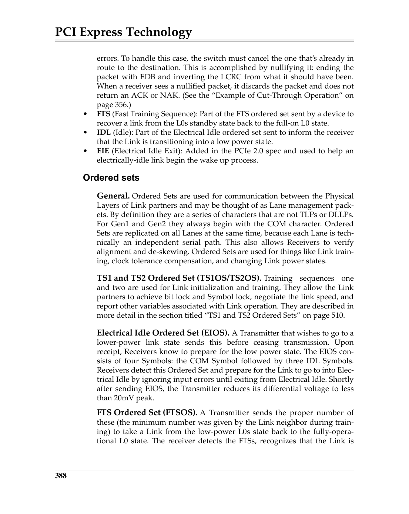

<br>

</td>
<td width="50%">

</td>
</tr>
<tr>
<td width="50%">

## **Presets and Ratios** 

As described in “Recovery.Equalization” on page 587, when the Link is prepar‐ ing to change from a lower data rate to 8.0 GT/s, the
Downstream Port sends EQ TS2s that give the Upstream Port a set of preset values to use for its coefficients as a starting point from which
to begin testing the Link signal quality. The list of 11 possible presets along with their corresponding coefficient values and volt‐ age
ratios is given in Table 13‐1 on page 478. Note that the voltages are given as a ratio with respect to the max value. These values were
selected to match the earlier spec versions. As an example of how that is used, the first entry, P4, uses no de‐emphasis or preshoot, so all
the voltage values are equal to the max value and the ratios are all 1.000.

_Table 13‐1: Tx Preset Encodings with Coefficients and Voltage Ratios_ 

|**Preset** **Number**|**Preshoot** **(dB)**|**De-emphasis** **(dB)**|**C-1**|**C+1**|**Va/Vd**|**Vb/Vd**|**Vc/Vd**|
|---|---|---|---|---|---|---|---|
|P4|0.0.|0.0|0.000|0.000|1.000|1.000|1.000|
|P1|0.0.|-3.5 +/- 1 dB|0.000|-0.167|1.000|0.668|0.668|
|P0|0.0.|-6.0 +/- 1.5 dB|0.000|-0.250|1.000|0.500|0.500|
|P9|3.5 +/- 1 dB|0.0|-0.166|0.000|0.668|0.668|1.000|
|P8|3.5 +/- 1 dB|-3.5 +/- 1 dB|-0.125|-0.125|0.750|0.500|0.750|
|P7|3.5 +/- 1 dB|-6.0 +/- 1.5 dB|-0.100|-0.200|0.800|0.400|0.600|
|P5|1.9 +/- 1 dB|0.0|-0.100|0.000|0.800|0.800|1.000|
|P6|2.5 +/- 1 dB|0.0|-0.125|0.000|0.750|0.750|1.000|
|P3|0.0|-2.5 +/- 1 dB|0.000|-0.125|1.000|0.750|0.750|
|P2|0.0|-4.4 +/- 1.5 dB|0.000|-0.200|1.000|0.600|0.600|
|P10|0.0|Defined by LF|0.000|(FS-LF) /2|1.000|Not<br>fixed|Not<br>fixed|

</td>
<td width="50%">

</td>
</tr>
<tr>
<td width="50%">

## **Equalizer Coefficients** 

Presets allow a device to use one of 11 possible starting values to be used for the partner’s Transmitter coefficients when first training
to the 8.0 GT/s data rate. This is accomplished by sending EQ TS1s and EQ TS2s during training which gives a coarse adjustment of Tx
equalization as a starting point. If the signal using the preset delivers the desired 10[‐12] error rate, no further training is needed. But
if the measured error rate is too high, the equalization sequence is used to fine‐tune the coefficient settings by trying different C‐1 and
C+1 values and evaluating the result, repeating the sequence until the desired signal qual‐ ity or error rate is achieved.

An 8.0 GT/s transmitter is required to report its range of supported coefficient values to its neighboring Receiver. There are some
constraints on this:

- Device must support all 11 presets as listed in Table 13‐1 on page 478. 

- Transmitters must meet the full‐swing VTX‐EIEOS‐FS signaling limits 

- Transmitters may optionally support the reduced‐swing, and if they do they must meet the VTX‐EIEOS‐RS limits 

- Coefficients must meet the boost limits (VTX‐BOOST‐FS = 8.0 dB min, VTX‐ BOOST‐RS[ = 2.5 dB min) and resolution limits (EQ]
TX‐DOEFF‐RESS[= 1/24 max to] 1/63 min).

Applying these constraints and using the maximum granularity of 1/24 creates a list of pre‐shoot, de‐emphasis, and boost values for each
setting. This is pre‐ sented in a table in the spec that is partially reproduced from the spec here in Table 13‐2 on page 480. The table
contains blank entries because the boost value can’t exceed 8.0 +/‐ 1.5 dB = 9.5 dB. That results in a diagonal boundary where the boost has
reached 9.5 for the full‐swing case. For reduced swing, the bound‐ ary is at 3.5 dB. The 6 shaded entries along the left and top edges of
the table that go as far as 4/24 are presets supported by full‐ or reduced‐swing signaling. The other 4 shaded entries are presets supported
for full‐swing signaling only.

</td>
<td width="50%">

</td>
</tr>
<tr>
<td width="50%">

## **PCI Express Technology** 

_Table 13‐2: Tx Coefficient Table_ 

|**PS DE** **Boost**|**PS DE** **Boost**|**C+1**|**C+1**|**C+1**|**C+1**|**C+1**|**C+1**|**C+1**|
|---|---|---|---|---|---|---|---|---|
|||0/24|1/24|2/24|3/24|4/24|5/24|6/24|
|**C-1**|0/24|0.0 0.0 0.0|0.0 -0.8 0.8|0.0 -1.8 1.6|0.0 -2.5 2.5|0.0 -3.5 3.5|0.0 -4.7 4.7|0.0 -6.0- 6.0|
|1/24|0.8 0.0 0.8|0.8 -0.8 1.6|0.9 -1.7 2.5|1.0 -2.8 3.5|1.2 -3.9 4.7|1.3 -5.3 6.0|1.6 -6.8 7.6|
|2/24|1.6 0.0 1.6|1.7 -0.9 2.5|1.9 -1.9 3.5|2.2 -3.1 4.7|2.5 -4.4 6.0|2.9 -6.0 7.6|3.5 -8.0 9.5|
|3/24|2.5 0.0 2.5|2.8 -1.0 3.5|3.1 -2.2 4.7|3.5 -3.5 6.0|4.1 -5.1 7.6|4.9 -7.0 9.5|-|
||4/24|3.5 0.0<br>3.5|3.9 -1.2<br>4.7|4.4 -2.5<br>6.0|5.1 -4.1<br>7.6|6.0 -6.0<br>9.5|-|-|
||5/24|4.7 0.0<br>4.7|5.3 -1.3<br>6.0|6.0 -2.9<br>7.6|7.0 -4.9<br>9.5|-|-|-|
||6/24|6.0 0.0<br>6.0|6.8 -1.6<br>7.6|8.0 -3.5<br>9.5|-|-|-|-|


**Coefficient Example.** Let’s drill a little deeper on the coefficients by using preset number P7 from Table 13‐1 on page 478 as an
example. In this entry, C‐1 = ‐0.100, and C+1 = ‐0.200, and since C0 must be positive and the sum of their absolute values must be one, it’s
implied that C0 = 0.700.

Matching these values to the table of coefficient space given in the spec is not straightforward because the coefficients are given as
fractions rather than decimal values, but converting the fractions to their decimal values matches them pretty closely. The C‐1 value of
0.100 is closest to 2/24 (0.083), while C+1 at 0.200 is a little less than 5/24 (0.208). The coefficient table entry for those fractions is
highlighted as one of the preset values, giving us some confidence that this is on the right track. In the preset table, P7 lists a pre‐
shoot value of 3.5 +/‐ 1 dB, and the value in the coefficient table is shown as 2.9 dB. If we correct for the difference in coefficient
values, ((0.083/.1) * 3.5 = 2.9) we arrive at the same preshoot value. The difference in coefficient val‐ ues for de‐emphasis was much
smaller (0.200 vs. 0.208) and so, as we might expect, both tables show this as ‐6.0 dB.
What voltages do the P7 coefficients create? Assuming a full‐swing voltage of Vd as a starting point then, according to the ratios in the
preset table, the other voltages would be Va = 0.8Vd, Vb = 0.4Vd, and Vc = 0.6Vd. How well do those correspond to the values that would
result from using the pre‐ shoot and de‐emphasis numbers? De‐emphasis was given as ‐6.0 dB, and we already know that represents a 50%
voltage reduction, so we’d expect that Vb should be half of Va, which it is. Pre‐shoot was given as 3.5 dB meaning the ratio of Vc/Vb is
0.668, and 0.4/0.668 = 0.598Vd for Vc; very close to the 0.6Vd we expected. Last of all, the Boost value, which is the ratio of Vd/Vb, is
not given in the preset table but, using the formula 20*log(Vd/ Vb), the boost from the preset values turns out to be 7.9 dB. That’s reason‐
ably close to the 7.6 dB value given in the coefficient table and gives us some confidence that the tables are consistent among themselves.

So how are the four voltages obtained? There are essentially three program‐ mable drivers whose output is summed to derive the final signal
value to be launched. If the cursor setting remains unchanged, and the pre‐ and post‐ cursor taps are negative, then the answer can be found
by simply adding the taps as (C0 + C‐1 + C+1).

- Vd = (C0 + C‐1 + C+1) = (0.700 + 0.100 + 0.200) = 1.0 * max voltage. This is the “boosted” value that results when a bit is both preceded
and fol‐ lowed by bits of the opposite polarity. In all four voltages listed here, if the polarity of the bits is inverted then the values
would all be negative.

- — Va = (0.700 + (‐0.100) + 0.200) = 0.8 * max voltage. This is the value that results when a bit is preceded by the opposite polarity but
followed by the same polarity, meaning it is the first in a repeated string of bits.

- Vb = (0.700 + (‐0.100) + (‐0.200)) = 0.4 * max voltage. This is the de‐ emphasized value that results when a bit is both preceded and
followed by bits of the same polarity, meaning it’s in the middle of a repeated string of bits.

- Vc = (0.700 + 0.100 + (‐0.200)) = 0.6 * max voltage. This is the pre‐shoot value that results when a bit is preceded by the same polarity
but fol‐ lowed by the opposite polarity, meaning it’s the last bit in a repeated string of bits.

What determines when the coefficients are added or subtracted to arrive at these numbers? This turns out to be fairly simple, since it’s
just a matter of the polarity of the time‐shifted pre‐ and post‐cursor inputs. This is illus‐ trated in Figure 13‐24 on page 482. The
single‐ended waveform labeled “Weighted Cursor (C0)” shows the positive half of the differential bit stream currently being transmitted. If
the waveforms are understood as shifting to the right with time, then the next lower trace (C+1) is the post‐cursor signal.

</td>
<td width="50%">

</td>
</tr>
<tr>
<td width="50%">

## **PCI Express Technology** 

This version arrives one clock later and is weighted negatively by its coeffi‐ cient, causing it to be inverted. The top trace (C‐1) arrives
a clock earlier than the cursor and is the pre‐cursor value that is also weighted negatively according to its own coefficient.

Finally, the bottom trace shows the result of summing all three inputs to arrive at the final signal that is actually launched onto the
wire. In the illus‐ tration, this is overlaid with the single‐ended output waveform from Figure 13‐23 on page 477 to show that it
approximates a real capture fairly well. Some voltage calculations are shown from our previous example to demon‐ strate how the resulting
voltages are obtained.

_Figure 13‐24: Tx 3‐Tap Equalizer Output_ 

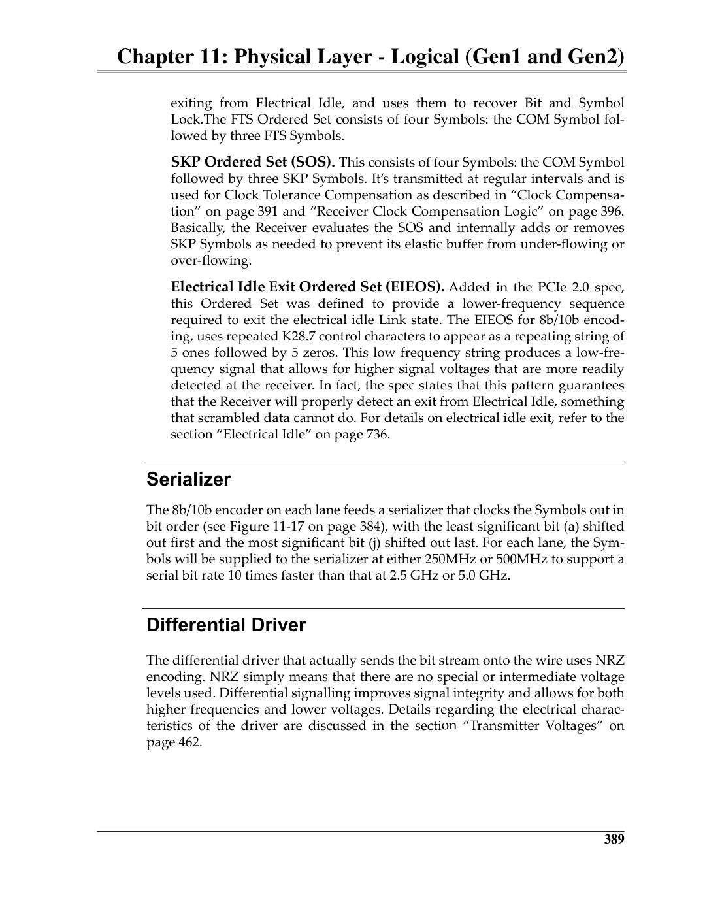

<br>

The coefficient presets are exchanged before the Link changes to 8.0 GT/s, and then they may be updated during the Link equalization process
(see “Recovery.Equalization” on page 587 for more details).

</td>
<td width="50%">

</td>
</tr>

</tbody>
</table>

[⬆️ 返回目录](#本章目录-table-of-contents)

---

<a id="sec-11-6"></a>
## 11.6 Physical Layer - Logical (Gen1 and Gen2) | 物理层 - 逻辑 (Gen1 与 Gen2)

<table>
<thead><tr><th width="50%">🇬🇧 English</th><th width="50%">🇨🇳 中文</th></tr></thead>
<tbody>
<tr>
<td width="50%">

**EIEOS Pattern.** At 8.0 GT/s, some voltages are measured when the signal has a low frequency because the high‐frequency changes won’t
reach the levels we want to measure. The EIEOS sequence contains 8 consecutive ones followed by 8 consecutive zeros in a pattern that
repeats for 128 bit times. Its purpose is primarily to serve as an unambiguous indication that a Transmitter is exiting from Electrical
Idle, which scrambled data can’t guar‐ antee. Its launch voltage is defined as VTX‐EIEOS‐FS for full swing and VTX‐ EIEOS‐RS[for reduced
swing signals.]

**Reduced Swing.** Transmitters may support a reduced swing signal much as they did for 5.0 GT/s: to achieve both power savings and a better
signal over short, low‐loss transmission paths. The output voltage has the same 1300 mV max value as the full‐swing case, but allows a lower
minimum voltage of 232 mV as defined for VTX‐EIEOS‐RS. Operating at reduced swing limits the number of presets because the maximum boost
supported is 3.5 dB.

</td>
<td width="50%">

**EIEOS 模式。** 在 8.0 GT/s 时，由于高频变化无法达到我们想要测量的电平，因此在信号为低频时测量一些电压。EIEOS 序列包含 8 个连续的 1 后跟 8 个连续的 0，以在 128 位时间内重复的模式。其主要目的是用作发送器退出电气空闲
(Electrical Idle) 的明确指示，而加扰数据无法保证这一点。其启动电压对满摆幅定义为 VTX‐EIEOS‐FS，对缩减摆幅信号定义为 VTX‐EIEOS‐RS。

**缩减摆幅。** 发送器可以像 5.0 GT/s 时那样支持缩减摆幅信号：以实现节能并获得短距离、低损耗传输路径上的更好信号。输出电压具有与满摆幅情况相同的最大 1300 mV 值，但允许较低的最小电压 232 mV，如 VTX‐EIEOS‐RS
所定义。在缩减摆幅下运行时，由于支持的最大提升为 3.5 dB，因此会限制预设的数量。

</td>
</tr>
<tr>
<td width="50%">

## **Beacon Signaling**

</td>
<td width="50%">

## **信标信号**

</td>
</tr>
<tr>
<td width="50%">

## **General** 

De‐emphasis is also applied to the Beacon signal, so a discussion about the Bea‐ con is included in this section. A device whose Link is in
the L2 state can gener‐ ate a wake‐up event to request that power be restored so it can communicate with the system. The Beacon is one of
two methods available for this purpose. The other method is to assert the optional sideband WAKE# signal. An example of what the Beacon
might look like is shown in Figure 13‐25 on page 484. This version shows the differential signals pulsing and then decaying in opposite
directions and is reminiscent of a flashing beacon light. Other options are avail‐ able for the Beacon, but this one illustrates the concept
well.

_Figure 13‐25: Example Beacon Signal_ 

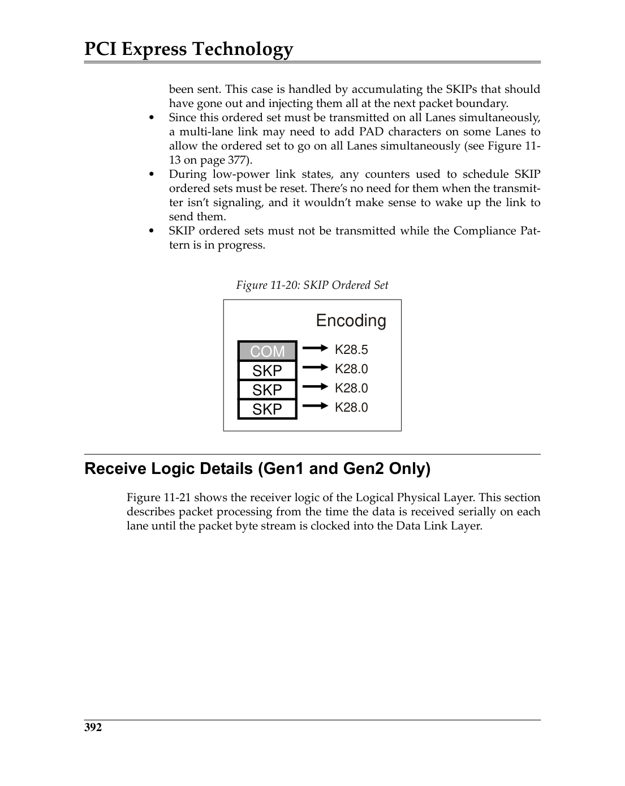

<br>


While a Link is in L2 power state, its main power source and clock are turned off but an auxiliary voltage source (Vaux) keeps a small part
of the device work‐ ing, including the wake‐up logic. To signal a wake‐up event, a downstream device can drive the Beacon upstream to start
the L2 exit sequence. A switch or bridge receiving a Beacon on its Downstream Port must forward notification upstream by sending the Beacon
on its Upstream Port or by asserting the WAKE# pin. See “WAKE#” on page 773.

The motivation for creating two wake‐up mechanisms is to provide choices regarding power consumption. To use the Beacon, all the bridges and
switches between an Endpoint and the Root Complex will need to use Vaux so they can detect and generate the signal. If a system is always
plugged in and uncon‐ cerned about the amount of standby power, the Beacon in‐band signal may be preferred over having to route an extra
side‐band signal. But in a mobile system with limited battery life where conserving power is a high priority, the WAKE# pin is preferred
because that approach uses as little Vaux as possible. The pin could be connected directly from the Endpoint to the Root Complex and then no
other devices would need to be involved or use Vaux.

</td>
<td width="50%">

## **概述**

去加重也应用于信标 (Beacon) 信号，因此本节包含了关于信标的讨论。链路处于 L2 状态的设备可以生成唤醒事件，以请求恢复电源以便与系统通信。信标是用于此目的的两种方法之一。另一种方法是断言可选的边带 WAKE# 信号。图 13‐25（第 484
页）显示了信标可能外观的示例。该版本显示差分信号脉冲然后以相反方向衰减，让人联想到闪烁的信标灯。信标还有其他可用选项，但这个示例很好地说明了概念。

_图 13‐25：信标信号示例_

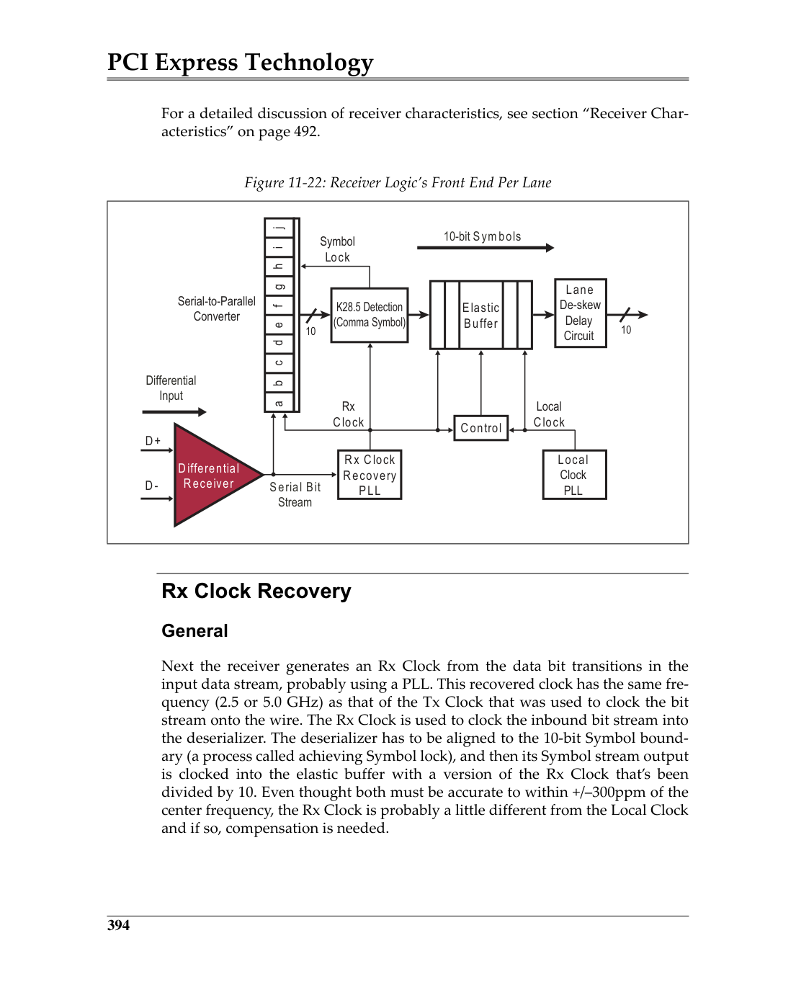

<br>


当链路处于 L2 电源状态时，其主电源和时钟被关闭，但辅助电压源 (Vaux) 保持设备的一小部分继续工作，包括唤醒逻辑。为了发出唤醒事件，下游设备可以向上游驱动信标以启动 L2 退出序列。在下游端口上接收到信标的交换机或桥必须通过在上游端口上发送信标或断言 WAKE#
引脚来将通知向上游转发。参见第 773 页 "WAKE#"。

创建两种唤醒机制的动机是为了在功耗方面提供选择。要使用信标，端点和根复合体之间的所有桥和交换机将需要使用
Vaux，以便它们能够检测和生成该信号。如果系统始终插入电源且不关心待机功耗的大小，则信标带内信号可能优于不得不路由额外的边带信号。但在电池寿命有限的移动系统中，节能是首要任务，则首选 WAKE# 引脚，因为该方法使用尽可能少的
Vaux。该引脚可以直接从端点连接到根复合体，那么不需要涉及其他设备或使用 Vaux。

</td>
</tr>
<tr>
<td width="50%">

## **Properties of the Beacon Signal** 

- A low‐frequency, DC‐balanced differential signal consisting of a periodic pulse of between 2ns and 16  s. 

- The maximum time between pulses can be no more than 16  s. 

- The transmitted Beacon signal must meet the electrical voltage specs docu‐ mented in Table 13‐3 on page 489. 
- The signal must be DC balanced within a maximum time of 32  s. 

- Beacon signaling, like normal differential signaling, must be done with the Transmitter in the low impedance mode (50  single‐ended, 100
 differen‐ tial impedance).

- When signaled, the Beacon signal must be transmitted on Lane 0, but does not have to be transmitted on other Lanes. 

- With one exception, the transmitted Beacon signal must be de‐emphasized according to the rules defined in the previous section. For Beacon
pulses greater than 500ns, the Beacon signal voltage must be 6db de‐emphasized from the VTX‐DIFFp‐p spec. The Beacon signal voltage may be
de‐empha‐ sized by up to 3.5dB for Beacon pulses smaller than 500ns.

</td>
<td width="50%">

## **信标信号属性**

- 一个低频、直流平衡的差分信号，由 2ns 到 16μs 之间的周期性脉冲组成。

- 脉冲之间的最大时间不能超过 16μs。

- 发送的信标信号必须满足第 489 页表 13‐3 中记录的电气电压规格。

**第 13 章：物理层 - 电气**

- 信号必须在最长 32μs 时间内直流平衡。

- 与普通差分信令一样，信标信令必须使用发送器处于低阻抗模式（单端 50Ω，差分 100Ω 阻抗）完成。

- 信标信号必须在 Lane 0 上发送，但不必在其他 Lane 上发送。

- 除一个例外外，发送的信标信号必须根据上一节中定义的规则进行去加重。对于大于 500ns 的信标脉冲，信标信号电压必须从 VTX‐DIFFp‐p 规格去加重 6dB。对于小于 500ns 的信标脉冲，信标信号电压可以去加重最多 3.5dB。

</td>
</tr>
<tr>
<td width="50%">

## **Eye Diagram**

</td>
<td width="50%">

## **眼图**

</td>
</tr>
<tr>
<td width="50%">

## **Jitter, Noise, and Signal Attenuation** 

As the bit stream travels from the Transmitter on one end of a link to the Receiver on the other end, it is subject to the following
disruptive influences:

- Deterministic (i.e., predictable) jitter induced by the Link transmission line. 

- Data‐dependent jitter induced by the dynamic data patterns on the Link. 

- Noise induced into the signal pair. 

- Signal attentuation due to the impedance effect of the transmission line.

</td>
<td width="50%">

## **抖动、噪声和信号衰减**

当位流从链路一端的发送器传输到另一端的接收器时，它会受到以下破坏性影响：

- 由链路传输线路引起的确定性（即可预测的）抖动。

- 由链路上动态数据模式引起的数据相关抖动。

- 感应到信号对中的噪声。

- 由于传输线路的阻抗效应导致的信号衰减。

</td>
</tr>
<tr>
<td width="50%">

## **The Eye Test** 

To verify that a Receiver sees an signal that is within the allowed variation, an eye test may be performed. The following description of
this measurement was provided by James Edwards from an article he authored for _OE Magazine_ .

_“The most common time‐domain measurement for a transmission system is the eye diagram. The eye diagram is a plot of data points
repetitively sampled from a pseudo‐random bit sequence and displayed by an oscilloscope. The time window of observation is two data periods
wide. For a [PCI Express link running at 2.5 GT/s], the period is 400ps, and the time window is set to 800ps. The oscilloscope sweep is
triggered by every data clock pulse. An eye diagram allows the user to observe sys‐ tem performance on a single plot._

_To observe every possible data combination, the oscilloscope must operate like a multiple‐exposure camera. The digital oscilloscopeʹs
display persistence is set to infinite. With each clock trigger, a new waveform is measured and overlaid upon all_

_previous measured waveforms. To enhance the interpretation of the composite image, digital oscilloscopes can assign different colors to
convey information on the number of occurrences of the waveforms that occupy the same pixel on the display, a process known as
color‐grading. Modern digital sampling oscilloscopes include the ability to make a large number of automated measurements to fully
characterize the various eye parameters.“_

</td>
<td width="50%">

## **眼图测试**

为了验证接收器看到的信号是否在允许的变化范围内，可以执行眼图测试。以下描述由 James Edwards 在他为 _OE Magazine_ 撰写的文章中提供。

_“传输系统最常见的时域测量是眼图。眼图是从伪随机位序列重复采样的数据点的曲线图，由示波器显示。观察的时间窗口宽度为两个数据周期。对于以 2.5 GT/s 运行的 [PCI Express 链路]，周期为 400ps，时间窗口设置为
800ps。示波器扫描由每个数据时钟脉冲触发。眼图允许用户在单个图上观察系统性能。_

_为了观察每个可能的数据组合，示波器必须像多次曝光相机一样工作。数字示波器的显示持续时间设置为无限。每次时钟触发时，都会测量一个新的波形并叠加在所有_ 

_先前测量的波形之上。为了增强合成图像的解释，数字示波器可以分配不同的颜色来传达占据显示器上同一像素的波形出现次数的信息，这一过程称为颜色分级。现代数字采样示波器包括进行大量自动测量的能力，以充分表征各种眼图参数。"_

</td>
</tr>
<tr>
<td width="50%">

## **Normal Eye Diagram** 

An ideal trace capture would paint an eye pattern that matched the outline shown in the center of Figure 13‐26 on page 486 labeled “Normal”.
As long as the pattern resides entirely within that region, the Transmitter and Link are within tolerance. Note that the differential
voltage parameters and values shown are peak voltages instead of the peak‐to‐peak voltages used in the spec, because only peak voltages can
be represented in an eye diagram. Figure 13‐27 on page 488 shows a screen capture of a good eye diagram.

_Figure 13‐26: Transmitter Eye Diagram_ 

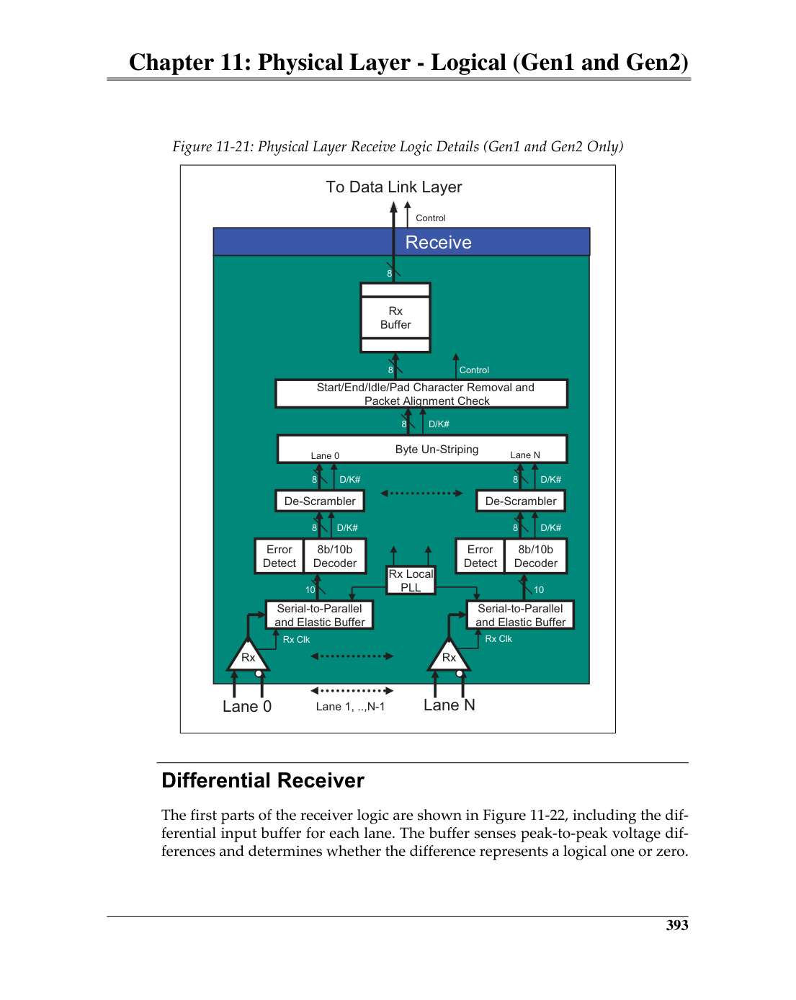

<br>

</td>
<td width="50%">

## **正常眼图**

理想的迹线捕获将绘制出与图 13‐26（第 486 页）中心标记为"正常"的轮廓相匹配的眼图模式。只要模式完全位于该区域内，发送器和链路就在容差范围内。请注意，显示的差分电压参数和值是峰值电压，而不是规范中使用的峰峰值电压，因为眼图中只能表示峰值电压。第 488 页的图
13‐27 显示了一个良好眼图的屏幕截图。

_图 13‐26：发送器眼图_

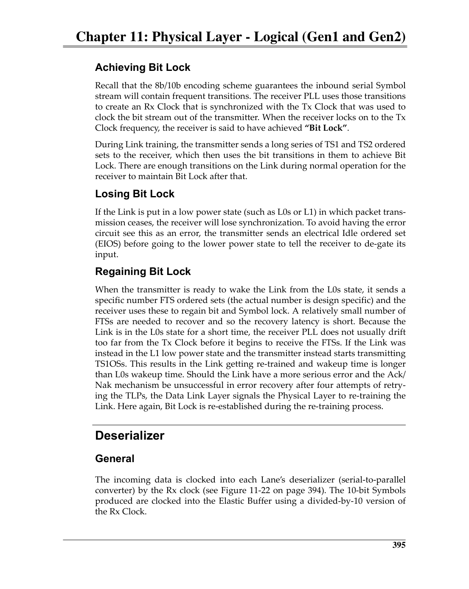

<br>


**第 13 章：物理层 - 电气**

</td>
</tr>
<tr>
<td width="50%">

## **Effects of Jitter** 

Jitter (timing uncertainty) is what happens when an edge arrives either before or after its ideal time, and acts to reduce signal integrity
and close the eye open‐ ing. It’s caused by a variety of factors, from environmental effects to the data pattern in flight, to noise or
signal attenuation that causes the signal’s voltage level to overshoot or undershoot the normal zone. At 2.5 GT/s this could be treated as a
simple lumped effect, but at higher data rates it becomes a more sig‐ nificant issue and must be considered in several different parts.
Aiming at this goal, the 8.0 GT/s data rate defines 5 different jitter values. The details of jitter analysis and minimization are beyond
the scope of this book, but let’s at least define the terms the spec uses. Jitter is described as being in one of several cate‐ gories:

1. Un‐correlated ‐ jitter that is not dependent on, or “correlated” to, the data pattern being transmitted. 

2. Rj ‐ Random jitter from unpredictable sources that are unbounded and usu‐ ally assumed to fit a Gaussian distribution. Often caused by
electrical or thermal noise in the system.

3. Dj ‐ Deterministic jitter that’s predictable and bounded in its peak‐to‐peak value. Often caused by EMI, crosstalk, power supply noise or
grounding problems.

4. PWJ ‐ Pulse Width Jitter ‐ uncorrelated, edge‐to‐edge, high‐frequency jitter. 5. DjDD ‐ Deterministic Jitter, using the Dual‐Dirac
approximation. This model is a method of quickly estimating total jitter for a low BER without requiring the large sample size that would
normally be needed. It uses a representative sample taken over a relatively short period (an hour or so) and extrapolates the curves to
arrive at acceptable approximate values.

6. DDj ‐ Data‐dependent jitter is a function of the data pattern being sent, and the spec states that this is mostly due to package loss and
reflection. ISI is an example of DDj.

Figure 13‐28 on page 488 shows a screen capture of a bad Eye Diagram at 2.5 GT/s. Since this is captured without de‐emphasis, the traces
should all stay out‐ side the Minimum Eye area, shown on the screen by the trapezoid shape in the middle. This example illustrates that
jitter can affect both edge arrival times and voltage levels, causing some trace instances to encroach on the keep‐out area of the diagram.

</td>
<td width="50%">

## **抖动的影响**

抖动（时序不确定性）是当边缘早于或晚于其理想时间到达时发生的，它会降低信号完整性并缩小眼图张开度。它由多种因素引起，从环境影响到正在传输的数据模式，再到导致信号电压电平过冲或欠冲正常区域的噪声或信号衰减。在 2.5 GT/s
时，这可以视为一个简单的集总效应，但在更高的数据速率下，它成为一个更显著的问题，必须在多个不同部分中加以考虑。为此，8.0 GT/s 数据速率定义了 5 个不同的抖动值。抖动分析和最小化的细节超出了本书的范围，但让我们至少定义规范使用的术语。抖动被描述为属于以下几个类别之一：

1. 不相关抖动 - 不依赖于或与正在传输的数据模式"相关"的抖动。

2. Rj - 随机抖动，来自不可预测的来源，无界，通常假定符合高斯分布。通常由系统中的电气或热噪声引起。

3. Dj - 确定性抖动，可预测且其峰峰值有界。通常由 EMI、串扰、电源噪声或接地问题引起。

4. PWJ - 脉冲宽度抖动 - 不相关的、边到边、高频抖动。 5. DjDD - 确定性抖动，使用双狄拉克近似。该模型是一种在不需要通常所需的大量样本的情况下快速估算低 BER
总抖动的方法。它使用在相对较短的时间段（约一小时）内采集的代表性样本，并外推曲线以得出可接受的近似值。

6. DDj - 数据相关抖动，是正在发送的数据模式的函数，规范指出这主要是由于封装损耗和反射引起的。ISI 是 DDj 的一个例子。

第 488 页的图 13‐28 显示了在 2.5 GT/s 下捕获的糟糕眼图的屏幕截图。由于这是在没有去加重的情况下捕获的，因此迹线应保持在最小眼图区域之外，该区域在屏幕上由中间的梯形形状显示。此示例说明抖动可以影响边缘到达时间和电压电平，导致一些迹线实例侵入眼图的禁区。

</td>
</tr>
<tr>
<td width="50%">

## **PCI Express Technology** 

_Figure 13‐27: Rx Normal Eye (No De‐emphasis)_ 

_Figure 13‐28: Rx Bad Eye (No De‐emphasis)_

</td>
<td width="50%">

## **PCI Express Technology**

_图 13‐27：接收器正常眼图（无去加重）_

_图 13‐28：接收器不良眼图（无去加重）_

**第 13 章：物理层 - 电气**

</td>
</tr>
<tr>
<td width="50%">

## **Transmitter Driver Characteristics** 

Table 13‐3 on this page lists some Transmitter driver characteristics. This is not intended to replicate the tables from the spec, but to
give some basic parameters to illustrate some differences between the data rates, such as UI, and to show that some things have remained
unchanged, such as the Tx common‐mode volt‐ age.

_Table 13‐3: Transmitter Specs_ 

|**Item**|**2.5 GT/s.**|**5.0 GT/s**|**8.0 GT/s**|**Units**|**Notes**|
|---|---|---|---|---|---|
|UI|399.88<br>(min)<br>400.12<br>(max)|199.94<br>(min)<br>200.06<br>(max)|124.9625<br>(min)<br>125.0375<br>(max)|ps|Unit Interval (bit
time)|
|TTX‐EYE|0.75<br>(min)|0.75 (min)|See notes|UI|Transmitter Eye, includ‐<br>ing all jitter sources.<br>For 8.0 GT/s, five jitter<br>sources
are specified sep‐<br>arately.|
|TTX‐RF‐MIS‐<br>MATCH|Not<br>Specified|0.1 (max)|Not<br>Specified|UI|Rise and Fall time differ‐<br>ence measured from 20%<br>to 80%
differentially.|
|VTX‐DIFFp‐p|0.8 (min) 1.2 (max)|0.8 (min) 1.2 (max)|See Table 13‐4|mV|Peak‐to‐peak differential voltage.|
|VTX‐DIFFp‐p LOW|0.4 (min) 1.2 (max)|0.4 (min) 1.2 (max)|See Table 13‐4|mV|Low‐power voltage.|
|VTX‐DC‐CM|0 to 3.6|0 to 3.6|0 to 3.6|V|DC common mode volt‐<br>age at Tx pins.|
|VTX‐DE‐ RATIO‐3.5dB|3 (min) 4 (max)|3 (min) 4 (max)|See Table 13‐4|mV|Ratio for 3.5 dB de‐ emphasized bits.|
|VTX‐DE‐ RATIO‐6dB|n/a|5.5 (min) 6.5 (max)|See Table 13‐4|mV|Ratio for 6 dB de‐empha‐ sized bits.|

</td>
<td width="50%">

## **发送器驱动器特性**

第 489 页的表 13‐3 列出了一些发送器驱动器特性。这并不打算复制规范中的表格，而是给出一些基本参数来说明数据速率之间的一些差异，例如 UI，并显示某些内容保持不变，例如 Tx 共模电压。

_表 13‐3：发送器规格_

|**项目**|**2.5 GT/s**|**5.0 GT/s**|**8.0 GT/s**|**单位**|**备注**|
|---|---|---|---|---|---|
|UI|399.88 （最小） 400.12 （最大）|199.94 （最小） 200.06 （最大）|124.9625 （最小） 125.0375 （最大）|ps|单位间隔（位时间）|
|TTX‐EYE|0.75<br>（最小）|0.75（最小）|见备注|UI|发送器眼图，包括所有抖动源。对于 8.0 GT/s，五个抖动源单独指定。|
|TTX‐RF‐MISMATCH|未指定|0.1（最大）|未指定|UI|从 20% 到 80% 测得的上升和下降时间差异（差分）。|
|VTX‐DIFFp‐p|0.8（最小）<br>1.2（最大）|0.8（最小）<br>1.2（最大）|见表 13‐4|mV|峰峰值差分电压。|
|VTX‐DIFFp‐p<br>LOW|0.4（最小）<br>1.2（最大）|0.4（最小）<br>1.2（最大）|见表 13‐4|mV|低功率电压。|
|VTX‐DC‐CM|0 到 3.6|0 到 3.6|0 到 3.6|V|Tx 引脚处的直流共模电压。|
|VTX‐DE‐RATIO‐3.5dB|3（最小）<br>4（最大）|3（最小）<br>4（最大）|见表 13‐4|mV|3.5 dB 去加重位的比率。|
|VTX‐DE‐RATIO‐6dB|n/a|5.5（最小）<br>6.5（最大）|见表 13‐4|mV|6 dB 去加重位的比率。|

</td>
</tr>
<tr>
<td width="50%">

## **PCI Express Technology** 

_Table 13‐3: Transmitter Specs (Continued)_ 

|**Item**|**2.5 GT/s.**|**5.0 GT/s**|**8.0 GT/s**|**Units**|**Notes**|
|---|---|---|---|---|---|
|ITX‐SHORT|90|90|90|mA|Total single‐ended cur‐ rent Tx can s...|
|VTX‐IDLE‐<br>DIFF‐AC‐P|0 (min)<br>20 (max)|0 (min)<br>20 (max)|0 (min)<br>20 (max)|mV|Peak differential voltage<br>under Electrical Idle
state<br>of Link. Must include a<br>bandpass filter passing<br>frequencies from 10 KHz<br>to 1.25 GHz.|

</td>
<td width="50%">

## **PCI Express Technology**

_表 13‐3：发送器规格（续）_

|**项目**|**2.5 GT/s**|**5.0 GT/s**|**8.0 GT/s**|**单位**|**备注**|
|---|---|---|---|---|---|
|ITX‐SHORT|90|90|90|mA|当接地短路时发送器可提供的总单端电流。|
|VTX‐IDLE‐DIFF‐AC‐P|0（最小） 20（最大）|0（最小） 20（最大）|0（最小） 20（最大）|mV|链路处于电气空闲状态下的峰值差分电压。必须包括通过 10 KHz 到 1....|

</td>
</tr>

</tbody>
</table>

[⬆️ 返回目录](#本章目录-table-of-contents)

---

<a id="sec-11-7"></a>
## 11.7 Physical Layer - Logical (Gen1 and Gen2) | 物理层 - 逻辑 (Gen1 与 Gen2)

<table>
<thead><tr><th width="50%">🇬🇧 English</th><th width="50%">🇨🇳 中文</th></tr></thead>
<tbody>
<tr>
<td width="50%">

|TTX‐IDLE‐MIN|20 (min)|20 (min)|20 (min)|ns|Minimum time a Trans‐ mitter must be ...|
|TTX‐IDLE‐SET‐<br>TO‐IDLE|8 (max)|8 (max)|8 (max)|ns|Time allowed for Tx to<br>meet Electrical Idle spec<br>after last bit of
required<br>EIOSs.|
|TTX‐IDLE‐TO‐ DIFF‐DATA|8|8|8|ns|Max time for Tx to meet differential ...|
|ZTX‐DIFF‐DC|80 (min)<br>120 (max)|120 (max)|120 (max)||DC differential Tx imped‐<br>ance. Typical value is 100<br>. Min value for 5.0
and<br>8.0 GT/s is bounded by<br>RLTX‐DIFF|


_Table 13‐3: Transmitter Specs (Continued)_ 

|**Item**|**2.5 GT/s.**|**5.0 GT/s**|**8.0 GT/s**|**Units**|**Notes**|
|---|---|---|---|---|---|
|RLTX‐DIFF|10 (min)|10 (min)<br>for 0.5‐1.25<br>GHz<br>8 (min) for<br>>1.25‐2.5<br>GHz|10 (min)<br>for 0.5‐1.25<br>GHz<br>8 (min)
for<br>>1.25 ‐ 2.5<br>GHz<br>4 (min) for<br>>2.5 to 4<br>GHz|dB|Tx package return loss.<br>Note that the frequency is<br>the signal on the
wire.<br>Note that at higher rates<br>it becomes necessary to<br>specify different parame‐<br>ters for different frequen‐<br>cies.|
|CTX|75 (min)<br>265 (max)|75 (min)<br>265 (max)|176 (min)<br>265 (max)|nF|Required AC coupling<br>cap on each Lane placed<br>in the media
or in the<br>component itself.|
|LTX‐SKEW|500 ps +<br>2 UI<br>(max)|500 ps +<br>4 UI<br>(max)|500 ps +<br>6 UI|ps|Skew between any two<br>Lanes in the same
Trans‐<br>mitter.|


_Table 13‐4: Parameters Specific to 8.0 GT/s_ 

|**Symbol**<br>VTX‐FS‐NO‐EQ|**Value**|**Units**|**Notes**|
|---|---|---|---|
|1300 (max) 800 (min)|mvPP|No EQ is applied; measured using 64 z...|
|VTX‐RS‐NO‐EQ|1300 (max)|mvPP|No EQ is applied; measured using 64 z...|
|VTX‐BOOST‐FS|8.0 (min)|dB|Tx boost ratio for full swing. (Assum...|
|VTX‐BOOST‐RS|2.5 (min)|dB|Tx boost ratio for reduced swing. (As...|
|EQTX‐COEFF‐<br>RES|1/24 (max)<br>1/63 (min)|n/a|Tx coefficient resolution|

</td>
<td width="50%">

|TTX‐IDLE‐MIN|20（最小）|20（最小）|20（最小）|ns|发送器必须处于电气空闲的最短时间。|
|TTX‐IDLE‐SET‐TO‐IDLE|8（最大）|8（最大）|8（最大）|ns|在所需 EIOS 的最后一位之后允许 Tx 满足电气空闲规格的时间。|
|TTX‐IDLE‐TO‐DIFF‐DATA|8|8|8|ns|Tx 在电气空闲退出后满足差分传输规格的最长时间。|
|ZTX‐DIFF‐DC|80（最小） 120（最大）|120（最大）|120（最大）|Ω|直流差分 Tx 阻抗。典型值为 100Ω。5.0 和 8.0 GT/s 的...|


**第 13 章：物理层 - 电气**

_表 13‐3：发送器规格（续）_

|**项目**|**2.5 GT/s**|**5.0 GT/s**|**8.0 GT/s**|**单位**|**备注**|
|---|---|---|---|---|---|
|RLTX‐DIFF|10（最小）|10（最小）<br>，频率 0.5‐1.25<br>GHz<br>8（最小），频率<br>>1.25‐2.5<br>GHz|10（最小）<br>，频率 0.5‐1.25<br>GHz<br>8（最小），频率<br>>1.25 ‐
2.5<br>GHz<br>4（最小），频率<br>>2.5 至 4<br>GHz|dB|Tx 封装回波损耗。请注意，频率是线路上的信号。请注意，在较高速率下，有必要为不同频率指定不同参数。|
|CTX|75（最小） 265（最大）|75（最小） 265（最大）|176（最小） 265（最大）|nF|每个 Lane 所需的 AC 耦合电容，放置在介质或组件本身中。|
|LTX‐SKEW|500 ps + 2 UI （最大）|500 ps + 4 UI （最大）|500 ps + 6 UI|ps|同一发送器中任意两个 Lane 之间的偏移。|


_表 13‐4：8.0 GT/s 特定参数_

|**符号**<br>VTX‐FS‐NO‐EQ|**值**|**单位**|**备注**|
|---|---|---|---|
||1300（最大）<br>800（最小）|mvPP|不应用 EQ；使用 64 个零后跟 64 个一进行测量。|
|VTX‐RS‐NO‐EQ|1300（最大）|mvPP|不应用 EQ；使用 64 个零后跟 64 个一进行测量。|
|VTX‐BOOST‐FS|8.0（最小）|dB|满摆幅的 Tx 提升比率。（假设 +/‐ 1.5 dB 容差）|
|VTX‐BOOST‐RS|2.5（最小）|dB|缩减摆幅的 Tx 提升比率。（假设 +/‐ 1.0 dB 容差）|
|EQTX‐COEFF‐RES|1/24（最大）<br>1/63（最小）|n/a|Tx 系数分辨率|

</td>
</tr>
<tr>
<td width="50%">

## **Receiver Characteristics**

</td>
<td width="50%">

## **接收器特性**

</td>
</tr>
<tr>
<td width="50%">

## **Stressed-Eye Testing** 

Receivers are tested using a stressed eye technique, in which a signal with spe‐ cific problems is presented to the input pins and the BER
is monitored. The spec presents these for 2.5 and 5.0 GT/s separately from 8.0 GT/s because of the dif‐ ference in the methods used, and
then gives a third section that defines parame‐ ters common to all the speeds.

</td>
<td width="50%">

## **应力眼图测试**

接收器使用应力眼图技术进行测试，其中将具有特定问题的信号呈现给输入引脚并监控 BER。规范针对 2.5 和 5.0 GT/s 与 8.0 GT/s 分别给出了这些参数，因为所使用的方法不同，然后给出了定义所有速度通用参数的第三部分。

</td>
</tr>
<tr>
<td width="50%">

## **2.5 and 5.0 GT/s** 

At 2.5 GT/s, the parameters are measured at the Receiver pins and there is an implied correlation between the margins observed and the BER.
At 5.0 GT/s, receiver tolerancing is applied. This is a two‐step method in which a test board is calibrated to show the worst‐case signal
margins as defined in the spec. Then, once the calibration is done, the test load is replaced by the device to be tested and its BER is
observed. There are actually two sets of worst‐case numbers based on the clocking scheme: one is defined for the common‐clock architecture
and another for the data‐clocked architecture. At higher speeds every element of the signal path must be carefully considered, and that’s
true for the device package, too. The effects added to the signal by the package must be compre‐ hended in the testing process.

The calibration channel itself must be designed with specific characteristics in mind, but the spec observes that a trace length of 28
inches on an FR4 PCB should suffice to create the necessary ISI. A signal generator is used to inject the Compliance Pattern with the
appropriate jitter elements included.

</td>
<td width="50%">

## **2.5 和 5.0 GT/s**

在 2.5 GT/s 时，参数在接收器引脚处测量，观察到的裕量与 BER 之间存在隐含的相关性。在 5.0 GT/s 时，应用接收器容差。这是一种两步方法，其中校准测试板以显示规范中定义的最坏情况信号裕量。然后，一旦校准完成，测试负载被替换为要测试的设备并观察其
BER。实际上根据时钟方案有两组最坏情况数字：一组为公共时钟架构定义，另一组为数据时钟架构定义。在更高的速度下，信号路径的每个元素都必须仔细考虑，设备封装也是如此。封装添加到信号的影响必须在测试过程中加以理解。

校准通道本身必须以特定的特性进行设计，但规范观察到 FR4 PCB 上 28 英寸的走线长度应足以产生必要的 ISI。使用信号发生器注入包含适当抖动元素的合规模式。

</td>
</tr>
<tr>
<td width="50%">

## **8.0 GT/s** 

The method for testing the stressed eye at 8.0 GT/s is similar, but there are some differences. One difference is that the signal can’t be
evaluated at the device pin and so a replica channel is used to allow measuring the signal as it would appear at the pin if the device were
an ideal termination.

In order to evaluate the Receiver’s ability to perform equalization properly, it’s recommended that multiple calibration channels with
different insertion loss characteristics be used so the receiver can be tested in more than one environ‐ ment. As with the transmitter at
8.0 GT/s, the calibration channel for the receiver consists of differential traces terminated at both ends with coaxial con‐ nectors.
To establish the correct correlation between the channel and the receiver it’s nec‐ essary to model what the receiver see internally after
equalization has been applied. That means post processing is must be applied that will model what happens in the Receiver, including the
following items, the details of which are described in the spec:

- Package insertion loss 

- CDR ‐ Clock and Data Recovery logic 

- Equalization that accounts for the longest calibration channel, including 

 - First‐order CTLE (Continuous Time Linear Equalizer) 

 - One‐tap DFE (Decision Feedback Equalizer)

</td>
<td width="50%">

## **8.0 GT/s**

8.0 GT/s 应力眼图测试方法类似，但存在一些差异。一个差异是信号无法在设备引脚处评估，因此使用复制通道以允许在设备是理想终端的情况下测量引脚处的信号。

为了评估接收器正确执行均衡的能力，建议使用具有不同插入损耗特性的多个校准通道，以便可以在多个环境中测试接收器。与 8.0 GT/s 的发送器一样，接收器的校准通道由两端均端接同轴连接器的差分走线组成。

**第 13 章：物理层 - 电气**

为了建立通道和接收器之间的正确相关性，有必要对接收器在应用均衡后在内部看到的内容进行建模。这意味着必须应用后处理来模拟接收器中发生的情况，包括以下项目，其详细信息在规范中描述：

- 封装插入损耗

- CDR - 时钟数据恢复逻辑

- 考虑最长校准通道的均衡，包括：

 - 一阶 CTLE（连续时间线性均衡器）

 - 单抽头 DFE（判决反馈均衡器）

</td>
</tr>
<tr>
<td width="50%">

## **Receiver (Rx) Equalization** 

Transmitter equalization is mandatory, but the signal may still suffer enough degradation going through the longest permissible channel that
the eye is closed and the signal is unrecognizable at the Receiver. To accommodate this the spec describes receiver equalization logic, but
says is not intended to serve as an implementation guideline. What it does say is that a version will be required for calibrating the
stressed eye when using the longest allowed calibra‐ tion channel. As described earlier, that requirement is described as a first‐order CTLE
and a one‐tap DFE.

</td>
<td width="50%">

## **接收器 (Rx) 均衡**

发送器均衡是强制性的，但信号在通过最长允许通道时仍可能遭受足够的退化，导致眼图关闭且信号在接收器处无法识别。为了适应这种情况，规范描述了接收器均衡逻辑，但表示不打算将其作为实现指南。它确实说的是，当使用最长允许的校准通道时，校准应力眼图将需要一个版本。如前所述，该需求被描述为一阶
CTLE 和单抽头 DFE。

</td>
</tr>
<tr>
<td width="50%">

## **Continuous-Time Linear Equalization (CTLE)** 

A linear equalizer removes the undesirable frequency components from the received signal. For PCIe this could be as simple as a passive
high‐pass filter that reduces the voltage of the low frequency component from the received sig‐ nal which attenuates by a lower amount on
the transmission line. It could also be done with amplification to open up the received eye, however that would amplify the high‐frequency
noise along with the signal and create other prob‐ lems.

One form of receiver equalization would be a circuit like the one shown in Fig‐ ure 13‐29 on page 494, which is a Discrete Time Linear
Equalizer (DLE). This is simply an FIR filter, similar to the one used by the transmitter, to provide wave shaping as a means of
compensating for channel distortion. One difference is that it uses a Sample and Hold (S & H) circuit on the front end to hold the ana‐ log
input voltage at a sampled value for a time period, rather than allowing it to constantly change. The spec doesn’t mention DLE, and the
reasons may include its higher cost and power compared to CTLE. As with the transmitter FIR, more taps provide better wave shaping but add
cost, so only a small number are prac‐ tical.

</td>
<td width="50%">

## **连续时间线性均衡 (CTLE)**

线性均衡器去除接收信号中不良的频率分量。对于 PCIe，这可以像无源高通滤波器一样简单，它降低从传输线路上衰减较少的接收信号的低频分量的电压。它也可以通过放大来实现以打开接收到的眼图，但这会放大高频噪声以及信号并产生其他问题。

接收器均衡的一种形式是如图 13‐29（第 494 页）所示的电路，这是一个离散时间线性均衡器 (DLE)。它只是一个 FIR 滤波器，类似于发送器使用的滤波器，用作波形整形以补偿通道失真。一个区别是它使用采样保持 (S & H)
电路在前端将模拟输入电压保持在一个采样值上一段时间，而不是允许其不断变化。规范没有提到 DFE，原因可能包括其相对于 CTLE 较高的成本和功耗。与发送器 FIR 一样，更多的抽头提供更好的波形整形但增加了成本，因此实际只能使用少量抽头。

</td>
</tr>
<tr>
<td width="50%">

## **PCI Express Technology** 

_Figure 13‐29: Rx Discrete‐Time Linear Equalizer (DLE)_ 

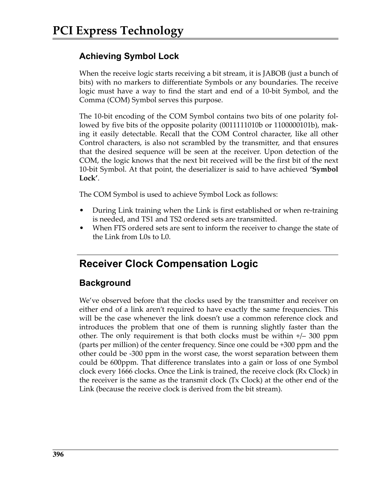

<br>


In contrast, CTLE is not limited to discrete time intervals and improves the sig‐ nal over a longer time interval. A simple RC network can
serve as an example of a CTLE high‐pass filter, as shown in Figure 13‐30 on page 494. This serves to reduce the low‐frequency distortion
caused by the channel without boosting the noise in the high‐frequency range of interest and cleans the signal for use at the next stage.
Figure 13‐31 on page 495 illustrates the attenuation effect of CTLE high‐pass filter on the received low frequency component of a signal
e.g. continuous 1s or continuous 0s.

_Figure 13‐30: Rx Continuous‐Time Linear Equalizer (CTLE)_ 

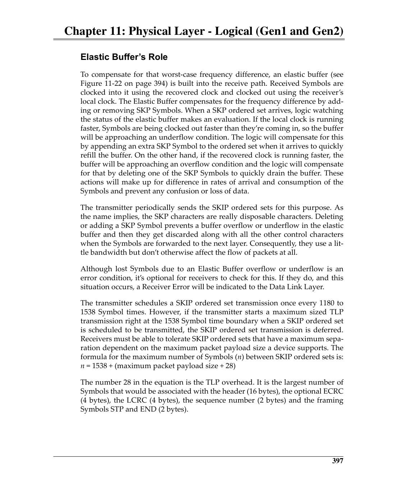

<br>

_Figure 13‐31: Effect of Rx Continuous‐Time Linear Equalizer (CTLE) on Received Signal_

</td>
<td width="50%">

## **PCI Express Technology**

_图 13‐29：接收器离散时间线性均衡器 (DLE)_

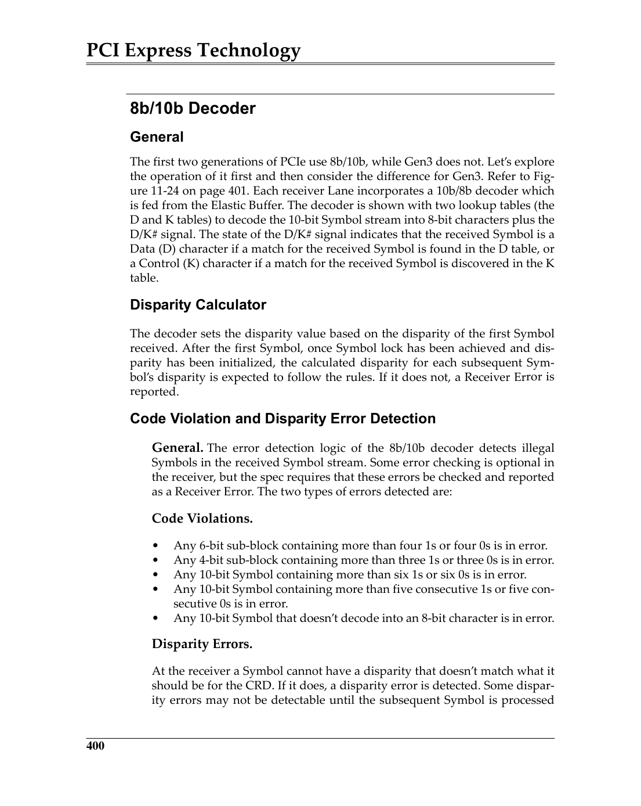

<br>


相比之下，CTLE 不限于离散时间间隔，而是在更长的时间间隔内改善信号。一个简单的 RC 网络可以作为 CTLE 高通滤波器的示例，如图 13‐30（第 494 页）所示。这用于减少由通道引起的低频失真，而不会在感兴趣的频率范围内提升高频噪声，并为下一阶段的处理清理信号。图
13‐31（第 495 页）说明了 CTLE 高通滤波器对接收信号的低频分量（例如连续的 1 或连续的 0）的衰减效应。

_图 13‐30：接收器连续时间线性均衡器 (CTLE)_

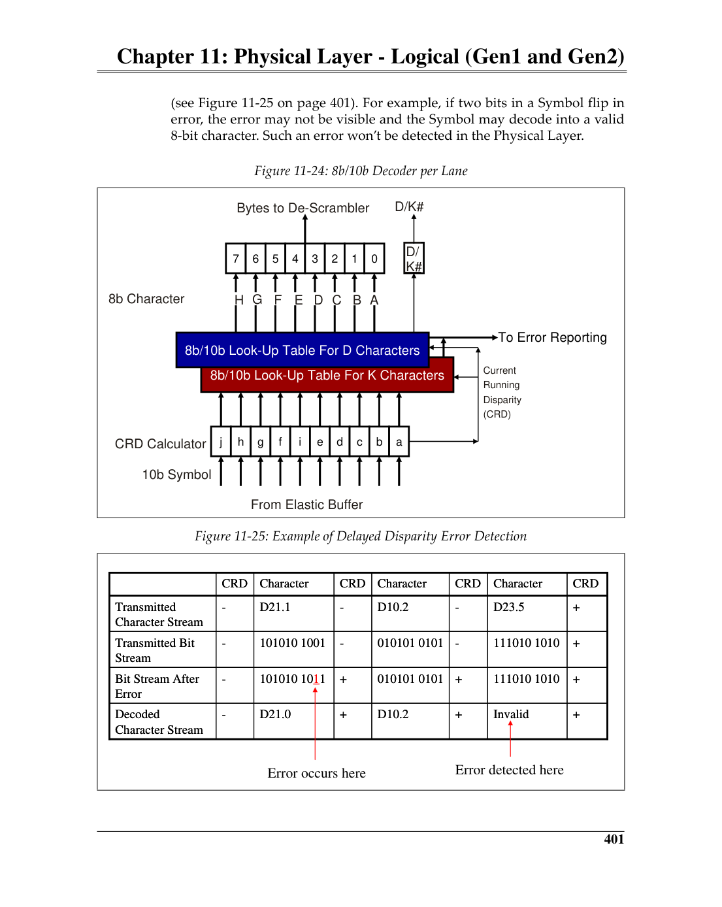

<br>


**第 13 章：物理层 - 电气**

_图 13‐31：接收器连续时间线性均衡器 (CTLE) 对接收信号的影响_

</td>
</tr>
<tr>
<td width="50%">

## **Decision Feedback Equalization (DFE)** 

An example one‐tap DFE circuit like the one described in the spec is shown in Figure 13‐32 on page 495, where it can be seen that the
received signal is summed with the feedback value and then fed into a data “slicer.” A slicer is an A/D circuit that takes the
analog‐looking input and converts it into a clean, full‐ swing digital signal for internal use. It makes its best guess and decides whether
the input is a positive or negative value and outputs either +1 or ‐1. This deci‐ sion is sent into an FIR filter with only one tap, which
is just a delayed version weighted according to a coefficient setting. The output of this filter is then fed back and summed with the
received signal for use as the new input to the data slicer.

_Figure 13‐32: Rx 1‐Tap DFE_ 

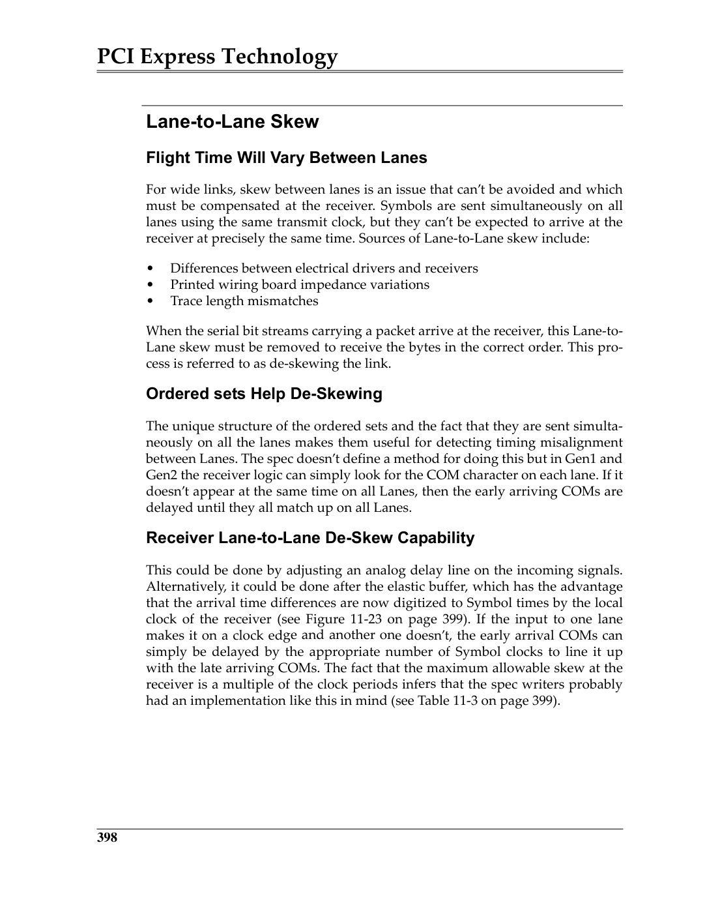

<br>

</td>
<td width="50%">

## **判决反馈均衡 (DFE)**

第 495 页的图 13‐32 显示了规范中描述的示例单抽头 DFE 电路，可以看到接收信号与反馈值求和，然后馈入数据"切片器"。切片器是一个 A/D 电路，它接收类似模拟的输入并将其转换为干净的、满摆幅的数字信号以供内部使用。它做出最佳猜测并确定输入是正值还是负值，并输出 +1
或 ‐1。该决策被送入只有一个抽头的 FIR 滤波器，该抽头只是按系数设置加权的延迟版本。该滤波器的输出然后被反馈并与接收信号求和，作为数据切片器的新输入。

_图 13‐32：接收器 1 抽头 DFE_

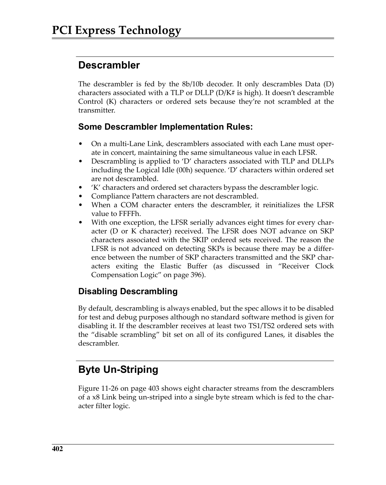

<br>

</td>
</tr>
<tr>
<td width="50%">

## **PCI Express Technology** 

The spec only describes a single‐tap filter, but a two‐tap version is shown in Fig‐ ure 13‐33 on page 497 to illustrate another option. The
motivation for including more taps is to create a cleaner output, since each tap reduces the noise for one more UI. Thus, two taps further
reduce the undesirable components of the sig‐ nal, as shown in the pulse response waveform at the bottom of the drawing. This version is
also shown as adaptive, meaning it’s able to modify the coeffi‐ cient values on the fly based on design‐specific criteria.

The coefficients of the filter could be fixed, but if they’re adjustable the receiver is allowed to change them at any time as long as doing
so doesn’t interfere with the current operation. In the section called “Recovery.Equalization” on page 587, Receiver Preset Hints are
described as being delivered by the Down‐ stream Port to the Upstream Port on a Link, using EQ TS1s. The preset gives a hint, in terms of dB
reduction, at a starting point for choosing these coefficients.

Since the spec doesn’t require it, what the Receiver chooses to do regarding sig‐ nal compensation will be implementation specific. Industry
literature states that DFE is more effective when working with an open eye, and that’s why it’s usu‐ ally employed after a linear equalizer
that serves to clean up the input enough for DFE to work well.
_Figure 13‐33: Rx 2‐Tap DFE_ 

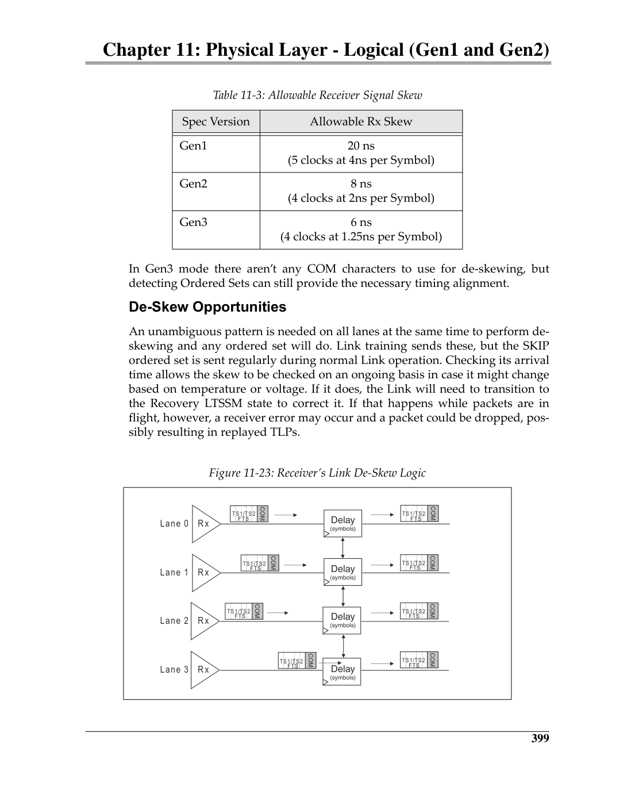

<br>

</td>
<td width="50%">

## **PCI Express Technology**

规范仅描述了单抽头滤波器，但第 497 页的图 13‐33 中显示了两抽头版本以说明另一个选项。包含更多抽头的动机是为了产生更干净的输出，因为每个抽头减少了一个 UI
的噪声。因此，两个抽头进一步减少了信号中的不良分量，如图底部的脉冲响应波形所示。该版本也显示为自适应的，意味着它能够根据特定设计的标准动态修改系数值。

滤波器的系数可以是固定的，但如果它们是可调的，则允许接收器随时更改它们，只要这样做不会干扰当前操作。在第 587 页的 "Recovery.Equalization" 部分，描述了接收器预设提示（Receiver Preset Hints）由下游端口使用 EQ TS1
传递给链路上的上游端口。该预设以 dB 减小的形式给出提示，作为选择这些系数的起点。

由于规范不要求这样做，接收器选择如何进行信号补偿将是特定于实现的。行业文献指出，DFE 在处理开放眼图时更有效，这就是为什么它通常在使用线性均衡器清理输入以使 DFE 良好工作之后才使用。

**第 13 章：物理层 - 电气**

_图 13‐33：接收器 2 抽头 DFE_

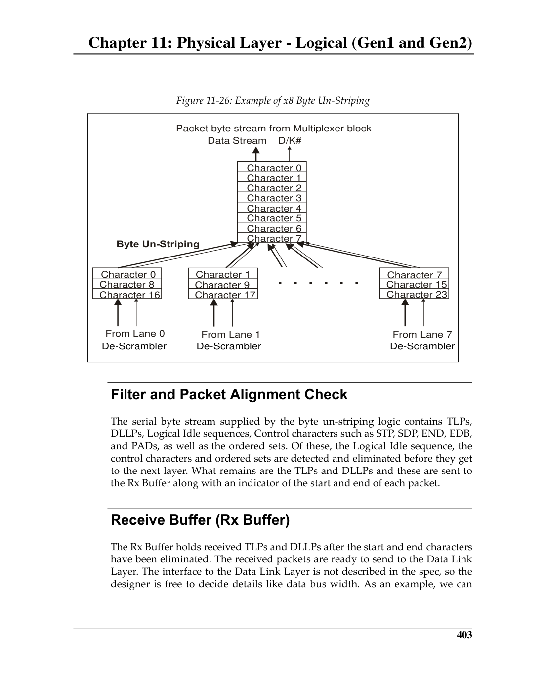

<br>

</td>
</tr>
<tr>
<td width="50%">

## **Receiver Characteristics** 

Some selected Receiver characteristics are listed in Table 13‐5 on page 498. The Receiver Eye Diagram in Figure 13‐34 on page 499 also
illustrates some of the parameters listed in the table.

</td>
<td width="50%">

## **接收器特性**

第 498 页的表 13‐5 中列出了一些选定的接收器特性。第 499 页的图 13‐34 中的接收器眼图也说明了表中列出的一些参数。

</td>
</tr>
<tr>
<td width="50%">

## **PCI Express Technology** 

_Table 13‐5: Common Receiver Characteristics_ 

|**Item**|**2.5 GT/**<br>**s.**|**5.0 GT/s.**|**8.0 GT/s**|**Units**|**Notes**|
|---|---|---|---|---|---|
|UI|399.88<br>(min)<br>400.12<br>(max)|199.94<br>(min)<br>200.06<br>(max)|124.9625<br>(min)<br>125.0375<br>(max)|ps|Unit Interval = bit
time.|
|TRX‐EYE|0.4<br>(min)|Indirectly<br>specified||UI|Minimum eye width for a BER<br>or 10‐12. At higher rates and long<br>channels the eye is
effectively<br>closed, making external mea‐<br>surement impractical.|
|VRX‐EYE|300|120 (CC) 100 (DC)|Not specified|mVpp diff|CC = common clocked, DC = data clocked|

</td>
<td width="50%">

## **PCI Express Technology**

_表 13‐5：通用接收器特性_

|**项目**|**2.5 GT/s**|**5.0 GT/s**|**8.0 GT/s**|**单位**|**备注**|
|---|---|---|---|---|---|
|UI|399.88 （最小） 400.12 （最大）|199.94 （最小） 200.06 （最大）|124.9625 （最小） 125.0375 （最大）|ps|单位间隔 = 位时间。|
|TRX‐EYE|0.4<br>（最小）|间接指定||UI|10‐12 BER 的最小眼图宽度。在更高的速率和长通道下，眼图实际上是关闭的，使得外部测量不切实际。|
|VRX‐EYE|300|120（CC）<br>100（DC）|未指定|mVpp<br>差分|CC = 公共时钟，DC = 数据时钟|

</td>
</tr>

</tbody>
</table>

[⬆️ 返回目录](#本章目录-table-of-contents)

---

\newpage

# 📘 第 12 章　物理层 - 逻辑 (Gen3) (Chapter 12. Physical Layer - Logical (Gen3))

**MindShare PCI Express Technology 3.0 — Comprehensive Guide to Generations 1.x, 2.x and 3.0**

> 📁 **Source chunks**: `chunks/chunk0285.md` ... `chunks/chunk0292.md`
> 🎨 **Format**: 中英对照双语 · 中文灰底 (PCIe 6.2 Spec 模板)

---

## 📑 本章目录 (Table of Contents)

- [12.1 Physical Layer - Logical (Gen3) — 物理层 - 逻辑 (Gen3)](#sec-12-1)
- [12.2 Physical Layer - Logical (Gen3) — 物理层 - 逻辑 (Gen3)](#sec-12-2)
- [12.4 Physical Layer - Logical (Gen3) — 物理层 - 逻辑 (Gen3)](#sec-12-4)
- [12.5 Physical Layer - Logical (Gen3) — 物理层 - 逻辑 (Gen3)](#sec-12-5)

<a id="sec-12-1"></a>
## 12.1 Physical Layer - Logical (Gen3) | 物理层 - 逻辑 (Gen3)

<table>
<thead><tr><th width="50%">🇬🇧 English</th><th width="50%">🇨🇳 中文</th></tr></thead>
<tbody>
<tr>
<td width="50%">

|VRX‐DIFF‐<br>PP‐CC|175<br>(min)<br>1200<br>(max)|120 (min)<br>1200<br>(max)|Indirectly<br>specified|mV|Peak‐to‐peak differential
voltage<br>sensitivity of common‐clocked<br>Receiver.|
|VRX‐DIFF‐<br>PP‐DC|175<br>(min)<br>1200<br>(max)|100 (min)<br>1200<br>(max)|Indirectly<br>specified|mV|Peak‐to‐peak differential
voltage<br>sensitivity of data‐clocked<br>Receiver.|
|VRX‐IDLE‐ DET‐DIFFp‐ p|65 (min) 175 (max)|||mV|Electrical Idle detect threshold at t...|
|ZRX‐DIFF‐<br>DC|80<br>(min)<br>120<br>(max)|Covered by<br>RLRX‐DIFF|||At higher frequencies imped‐<br>ance can no longer be
repre‐<br>sented by a lumped‐sum value<br>and must be described in more<br>detail.|
|ZRX‐‐DC|40 (min) 60 (max)|40 (min) 60 (max)|Bounded by RLRX‐CM||DC impedance needed for Receiver Detect.|


_Table 13‐5: Common Receiver Characteristics (Continued)_ 

|**Item**|**2.5 GT/**<br>**s.**|**5.0 GT/s.**|**8.0 GT/s**|**Units**|**Notes**|
|---|---|---|---|---|---|
|LRX‐SKEW|20|8|6|ns|Max Lane‐to‐Lane skew that a<br>Receiver must be able to correct.|
|RLRX‐‐DIFF|10<br>(min)|10 (min)<br>for 0.05 ‐<br>1.25 GHz,<br>8 (min)<br>for >1.25 ‐<br>2.5 GHz|10 (min)<br>for 0.05 ‐<br>1.25 GHz,<br>8
(min)<br>for >1.25 ‐<br>2.5 GHz,<br>5 (min)<br>for >2.5 ‐<br>4.0 GHz|dB|Rx package + Si differential<br>return loss|
|RLRX‐‐CM|6 (min)|6 (min)|6 (min) for 0.05 ‐ 2.5 GHz, 5 (min) f...|dB|Common mode Rx return loss|


_Figure 13‐34: 2.5 GT/s Receiver Eye Diagram_ 

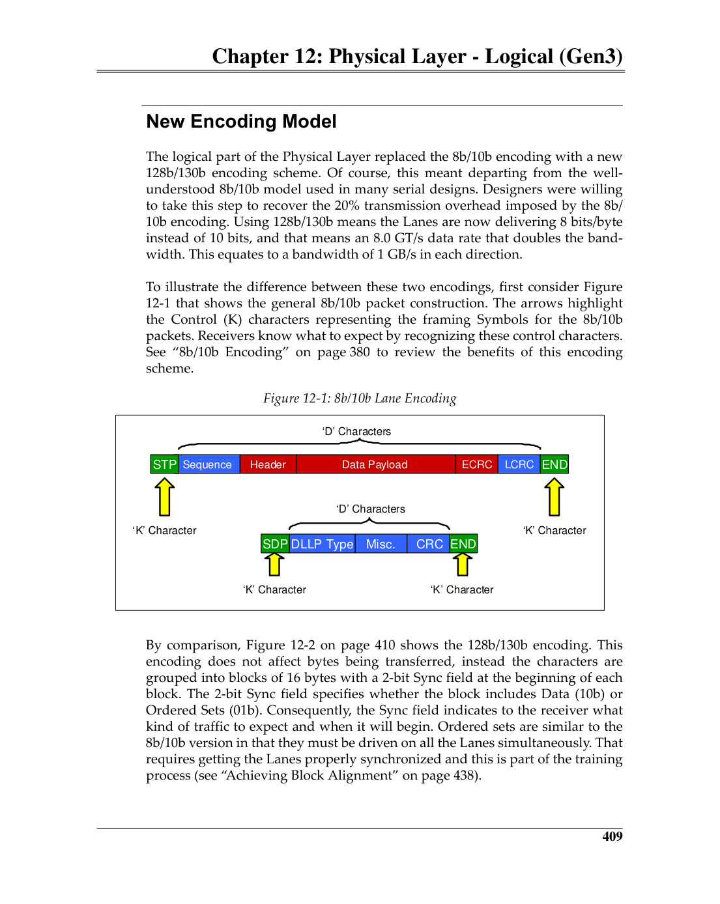

<br>

</td>
<td width="50%">

|VRX‐DIFF‐PP‐CC|175 （最小） 1200 （最大）|120（最小） 1200（最大）|间接指定|mV|公共时钟接收器的峰峰值差分电压灵敏度。|
|VRX‐DIFF‐PP‐DC|175 （最小） 1200 （最大）|100（最小） 1200（最大）|间接指定|mV|数据时钟接收器的峰峰值差分电压灵敏度。|
|VRX‐IDLE‐DET‐DIFFp‐p|65（最小）175（最大）|||mV|接收器引脚处的电气空闲检测阈值。|
|ZRX‐DIFF‐DC|80<br>（最小）<br>120<br>（最大）|由 RLRX‐DIFF 覆盖||Ω|在较高频率下，阻抗不能再用集总值表示，必须更详细地描述。|
|ZRX‐‐DC|40<br>（最小）<br>60<br>（最大）|40（最小）<br>60（最大）|由 RLRX‐CM 限定|Ω|接收器检测所需的直流阻抗。|


**第 13 章：物理层 - 电气**

_表 13‐5：通用接收器特性（续）_

|**项目**|**2.5 GT/s**|**5.0 GT/s**|**8.0 GT/s**|**单位**|**备注**|
|---|---|---|---|---|---|
|LRX‐SKEW|20|8|6|ns|接收器必须能够纠正的最大 Lane 到 Lane 偏移。|
|RLRX‐‐DIFF|10<br>（最小）|10（最小）<br>，频率 0.05 ‐<br>1.25 GHz，<br>8（最小）<br>，频率 >1.25 ‐<br>2.5 GHz|10（最小）<br>，频率 0.05 ‐<br>1.25
GHz，<br>8（最小）<br>，频率 >1.25 ‐<br>2.5 GHz，<br>5（最小）<br>，频率 >2.5 ‐<br>4.0 GHz|dB|Rx 封装 + Si 差分回波损耗|
|RLRX‐‐CM|6（最小）|6（最小）|6（最小） ，频率 0.05 ‐ 2.5 GHz， 5（最小） ，频率 >...|dB|共模 Rx 回波损耗|


_图 13‐34：2.5 GT/s 接收器眼图_

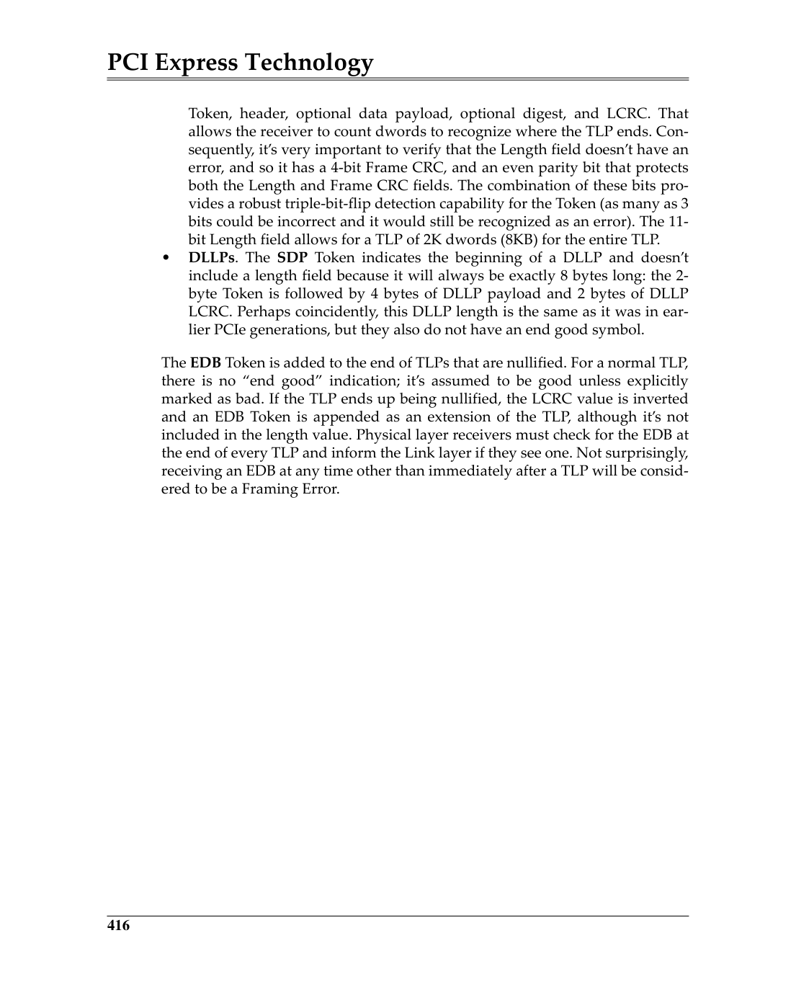

<br>

</td>
</tr>
<tr>
<td width="50%">

## **Link Power Management States** 

Figure 13‐35 on page 500 through Figure 13‐39 on page 504 illustrate the electri‐ cal state of the Physical Layer while the link is in
various power management states and describe several characteristics. One of these is the Tx and Rx termi‐ nations, which are sometimes
implemented as active logic

_Figure 13‐35: L0 Full‐On Link State_ 

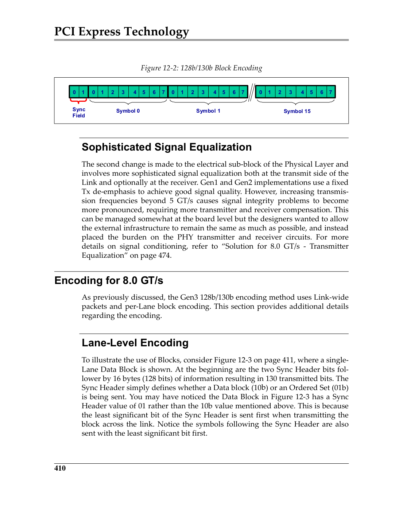

<br>

</td>
<td width="50%">

## **链路电源管理状态**

第 500 页的图 13‐35 至第 504 页的图 13‐39 说明了物理层在各种电源管理状态下的电气状态，并描述了几个特性。其中之一是 Tx 和 Rx 终端，有时实现为有源逻辑

_图 13‐35：L0 全开链路状态_

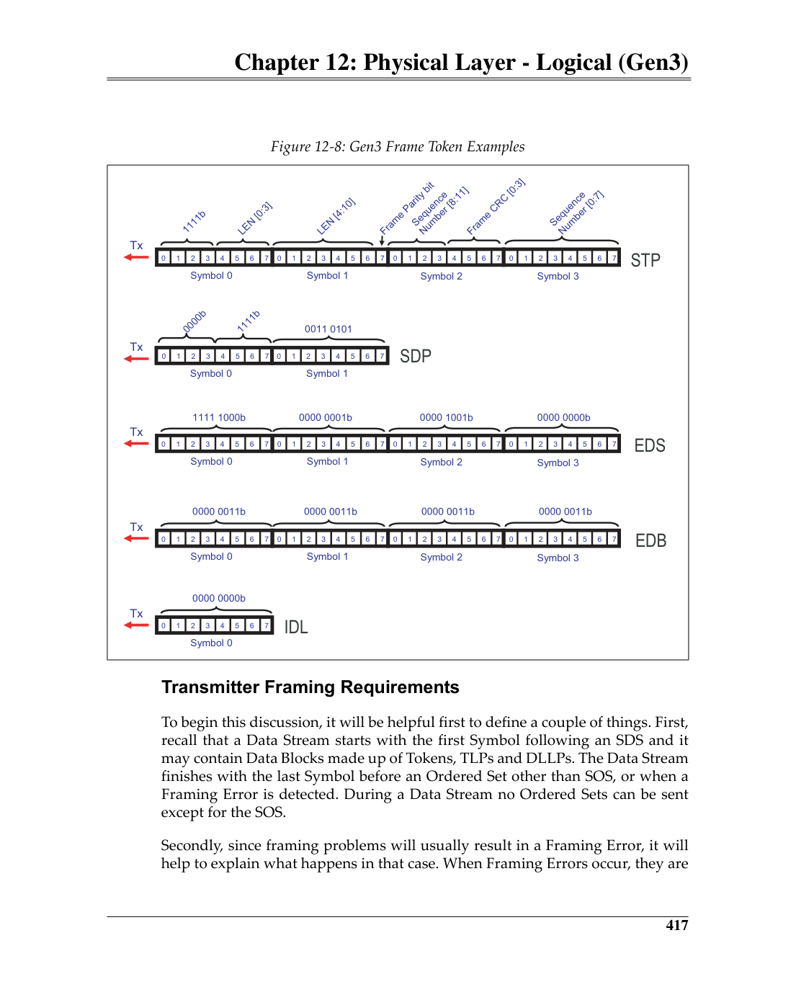

<br>


**第 13 章：物理层 - 电气**

</td>
</tr>
<tr>
<td width="50%">

## _Figure 13‐36: L0s Low Power Link State_ 

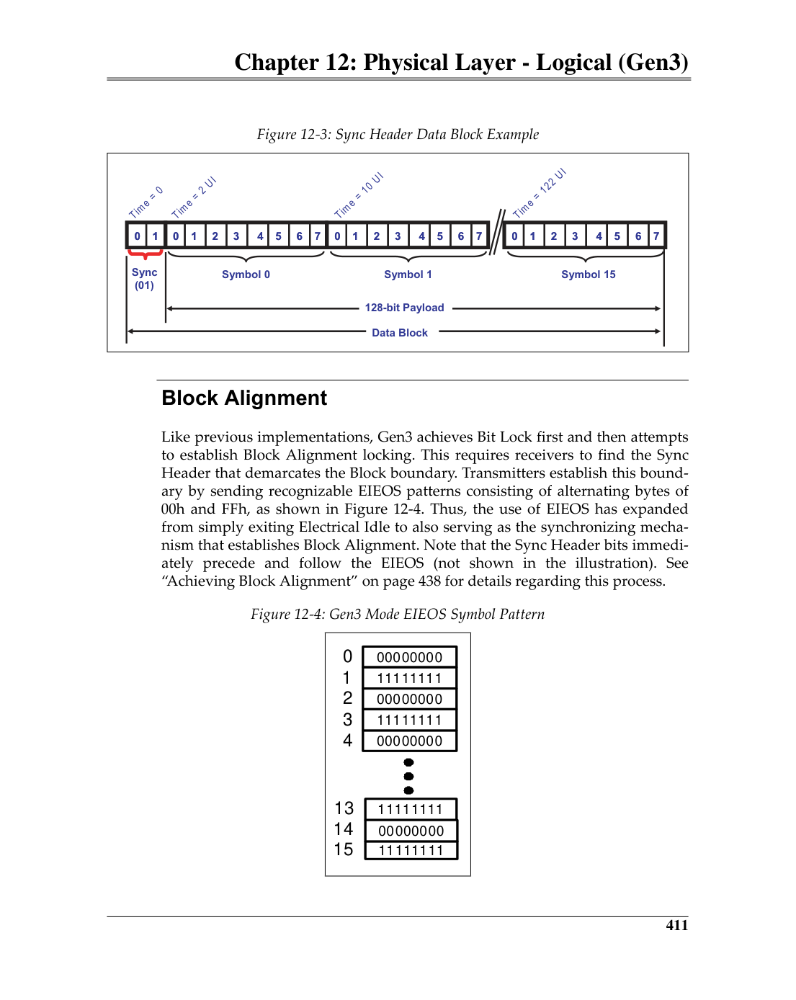

<br>


- Recommended Power Budget <= 20 mW per Lane 

- Recommended exit latency < 50 ns, however designers indicate that a more realistic number appears to be 1 us-2 us 

- One direction of the Link can be in L0s while the other is in L0 

- Transmitter and Receiver clock PLL are ON but Rx Clock loses sync 

- Transmitter is On, Receiver is ON  High or Low impedance termination at transmitter

</td>
<td width="50%">

## _图 13‐36：L0s 低功耗链路状态_

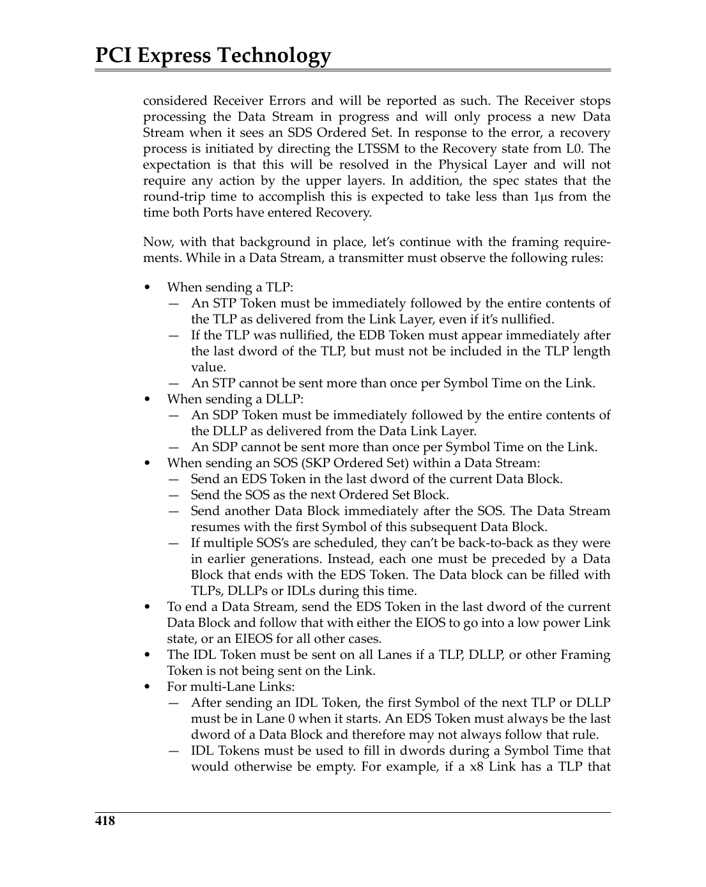

<br>


- 推荐功耗预算 ≤ 每 Lane 20 mW

- 推荐退出延迟 < 50 ns，但设计人员表示更现实的数字似乎是 1 us-2 us

- 链路的一个方向可以处于 L0s，而另一个处于 L0

- 发送器和接收器时钟 PLL 开启，但 Rx 时钟失去同步

- 发送器开启，接收器开启 → 发送器处为高或低阻抗终端

</td>
</tr>
<tr>
<td width="50%">

## **PCI Express Technology**

</td>
<td width="50%">

## **PCI Express Technology**

</td>
</tr>
<tr>
<td width="50%">

## _Figure 13‐37: L1 Low Power Link State_ 

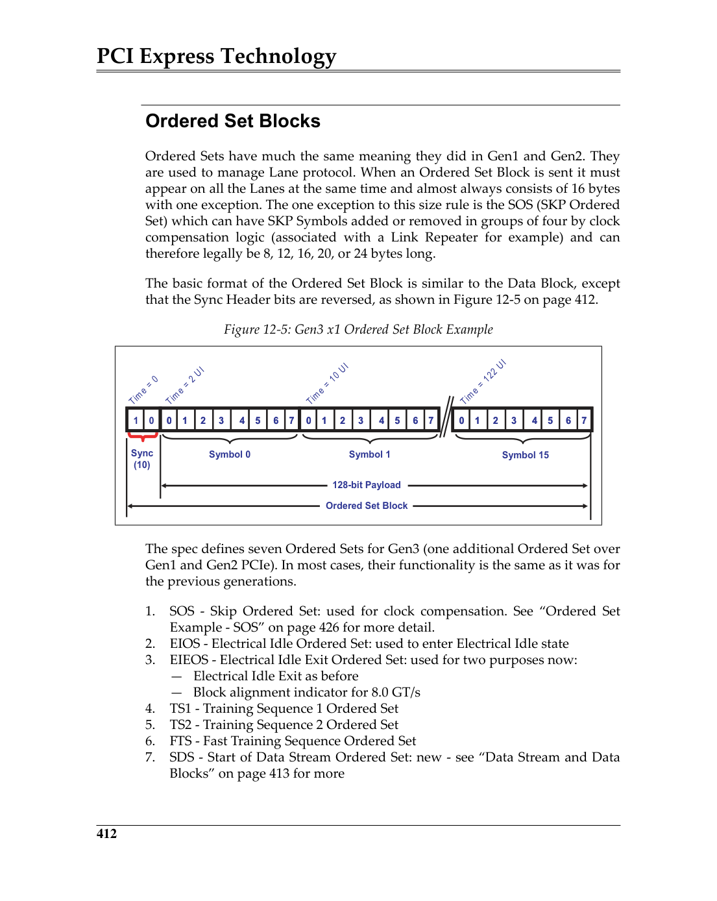

<br>

_Figure 13‐38: L2 Low Power Link State_ 

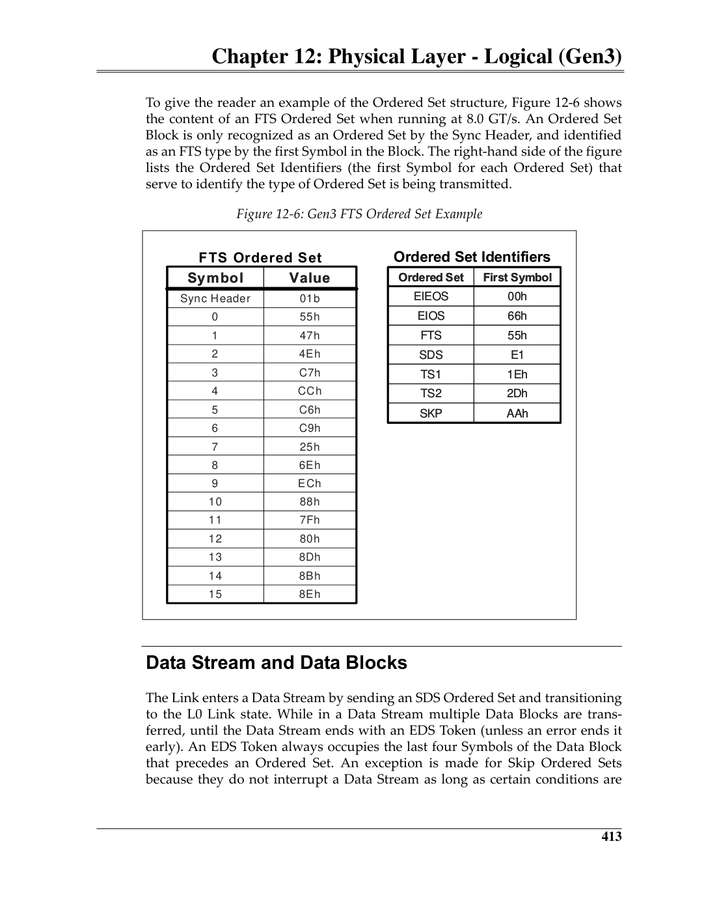

<br>

</td>
<td width="50%">

## _图 13‐37：L1 低功耗链路状态_

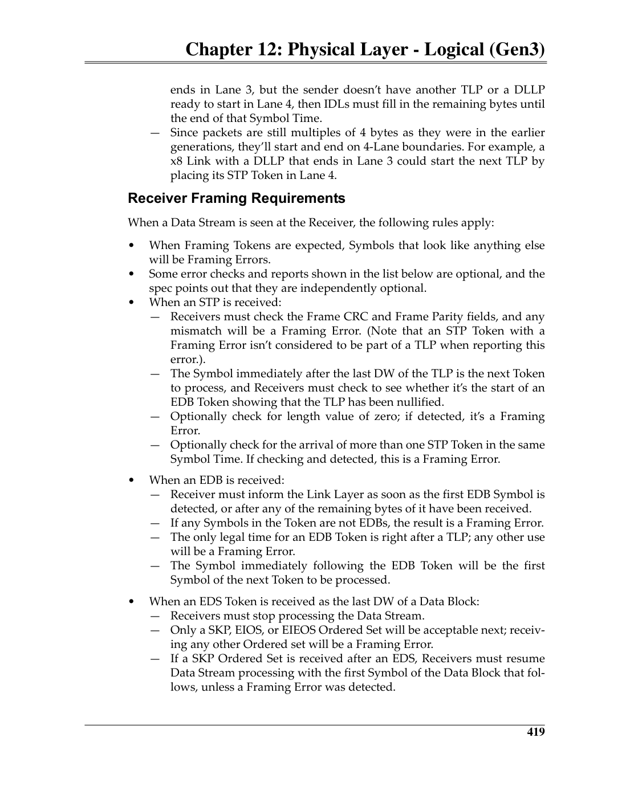

<br>


**第 13 章：物理层 - 电气**

_图 13‐38：L2 低功耗链路状态_

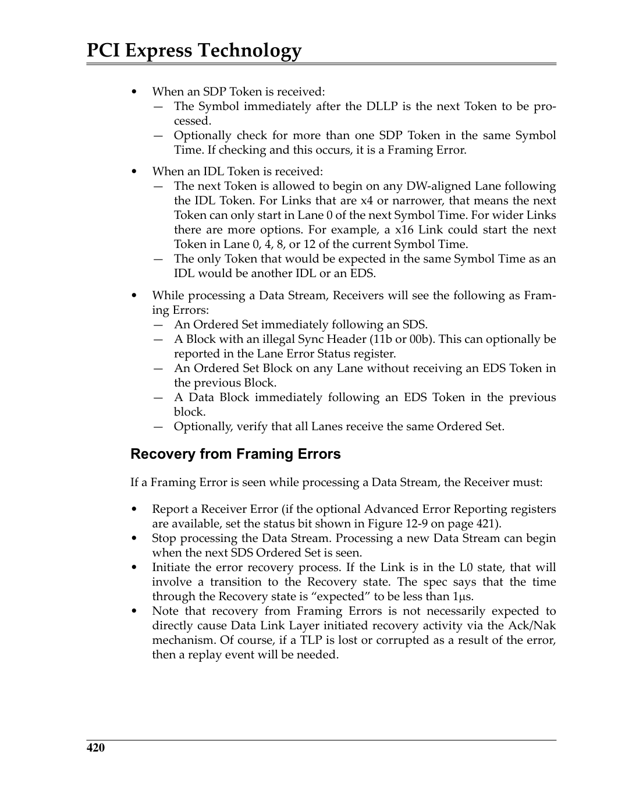

<br>

</td>
</tr>
<tr>
<td width="50%">

## **PCI Express Technology**

</td>
<td width="50%">

## **PCI Express Technology**

</td>
</tr>
<tr>
<td width="50%">

## _Figure 13‐39: L3 Link Off State_ 

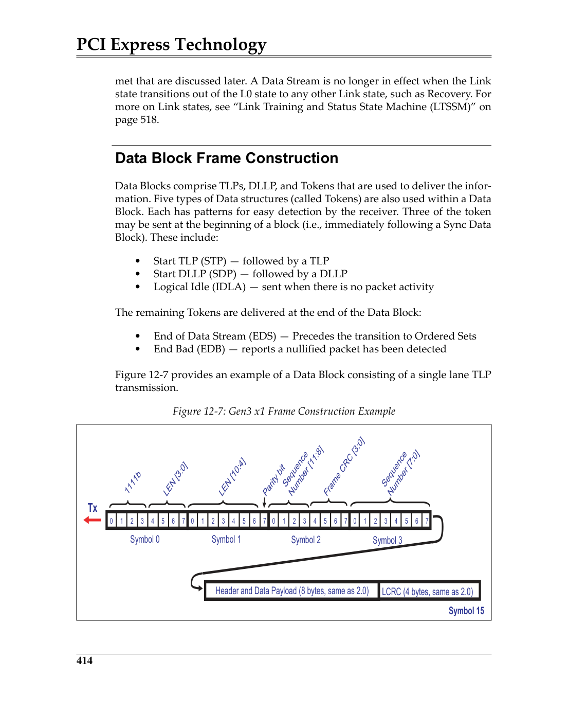

<br>

</td>
<td width="50%">

## _图 13‐39：L3 链路关闭状态_

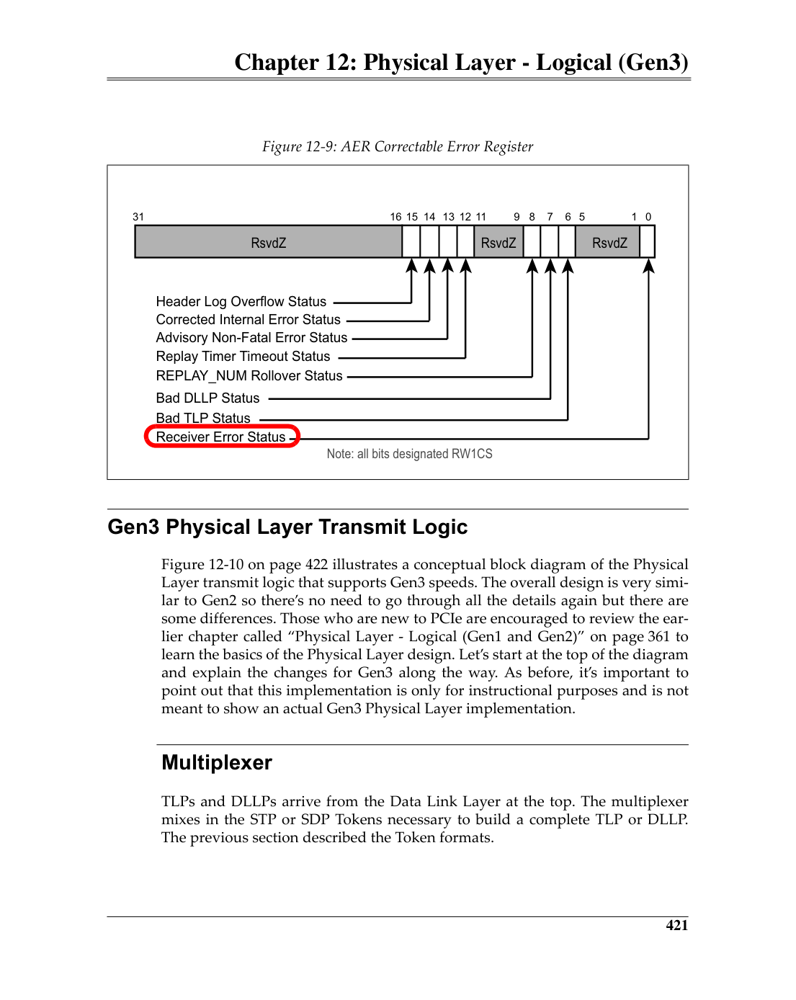

<br>

</td>
</tr>
<tr>
<td width="50%">

## _**14 Link Initialization & Training**_

</td>
<td width="50%">

## _**14 链路初始化与训练**_

</td>
</tr>
<tr>
<td width="50%">

## **The Previous Chapter** 

The previous chapter describes the Physical Layer electrical interface to the Link, including some low‐level characteristics of the
differential Transmitters and Receivers. The need for signal equalization and the methods used to accom‐ plish it are also discussed here.
This chapter combines electrical transmitter and receiver characteristics for both Gen1, Gen2 and Gen3 speeds.

</td>
<td width="50%">

## **上一章**

上一章描述了物理层到链路的电气接口，包括差分发送器和接收器的一些低级特性。本章还讨论了对信号均衡的需求以及用于实现它的方法。本章结合了 Gen1、Gen2 和 Gen3 速度的电气发送器和接收器特性。

</td>
</tr>
<tr>
<td width="50%">

## **This Chapter** 

This chapter describes the operation of the Link Training and Status State Machine (LTSSM) of the Physical Layer. The initialization process
of the Link is described from Power‐On or Reset until the Link reaches fully‐operational L0 state during which normal packet traffic occurs.
In addition, the Link power management states L0s, L1, L2, and L3 are discussed along with the state transi‐ tions. The Recovery state,
during which bit lock, symbol lock or block lock are re‐established is described. Link speed and width change for Link bandwidth management
is also discussed.

</td>
<td width="50%">

## **本章**

本章描述了物理层链路训练和状态状态机 (LTSSM) 的操作。链路的初始化过程从上电或复位开始描述，直到链路在正常数据包传输发生期间达到完全可操作的 L0 状态。此外，还讨论了链路电源管理状态 L0s、L1、L2 和 L3
以及状态转换。描述了在链路训练期间重新建立位锁定、符号锁定或块锁定的恢复状态。还讨论了用于链路带宽管理的链路速度和宽度变化。

</td>
</tr>
<tr>
<td width="50%">

## **The Next Chapter** 

The next chapter discusses error types that occur in a PCIe Port or Link, how they are detected, reported, and options for handling them.
Since PCIe is designed to be backward compatible with PCI error reporting, a review of the PCI approach to error handling is included as
background information. Then we focus on PCIe error handling of correctable, non‐fatal and fatal errors.

</td>
<td width="50%">

## **下一章**

下一章讨论 PCIe 端口或链路中发生的错误类型、如何检测、报告以及处理它们的选项。由于 PCIe 被设计为向后兼容 PCI 错误报告，因此包括对 PCI 错误处理方法的回顾作为背景信息。然后我们将重点关注可纠正、非致命和致命错误的 PCIe 错误处理。

</td>
</tr>
<tr>
<td width="50%">

## **Overview** 

Link initialization and training is a hardware‐based (not software) process con‐ trolled by the Physical Layer. The process configures and
initializes a device’s link and port so that normal packet traffic proceeds on the link.

_Figure 14‐1: Link Training and Status State Machine Location_ 

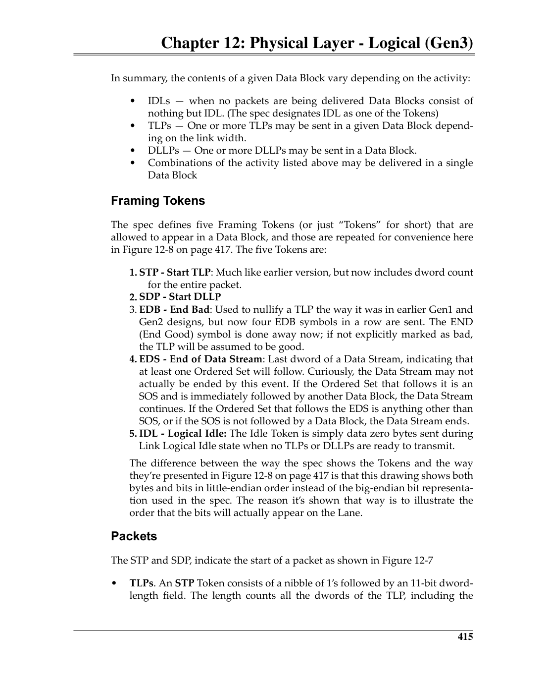

<br>

The full training process is automatically initiated by hardware after a reset and is managed by the LTSSM (Link Training and Status State
Machine), shown in Figure 14‐1 on page 506.

Several things are configured during the Link initialization and training pro‐ cess. Let’s consider what they are and define some terms up
front.

- **Bit Lock** : When Link training begins the Receiver’s clock is not yet synchronized with the transmit clock of the incoming signal, and
is unable to reliably sample incoming bits. During Link training, the Receiver CDR (Clock and Data Recovery) logic recreates the
Transmitter’s clock by using the incoming bit stream as a clock reference. Once the clock has been recovered from the stream, the Receiver
is said to have acquired Bit Lock and is then able to sam‐ ple the incoming bits. For more on the Bit Lock mechanism, see “Achieving Bit
Lock” on page 395.

- **Symbol Lock** : For 8b/10b encoding (used in Gen1 and Gen2), the next step is to acquire Symbol Lock. This is a similar problem in that
the receiver can now see individual bits but doesn’t know where the boundaries of the 10‐bit Symbols are found. As TS1s and TS2s are
exchanged, Receivers search for a recognizable pattern in the bit stream. A simple one to use for this is the COM Symbol. Its unique
encoding makes it easy to recognize and its arrival shows the boundary of both the Symbol and the Ordered Set since a TS1 or TS2 must be in
progress. For more on this, see “Achieving Symbol Lock” on page 396.

</td>
<td width="50%">

## **概述**

链路初始化和训练是由物理层控制的基于硬件（非软件）的过程。该过程配置和初始化设备的链路和端口，以便正常的分组流量在链路上进行。

_图 14‐1：链路训练和状态状态机位置_

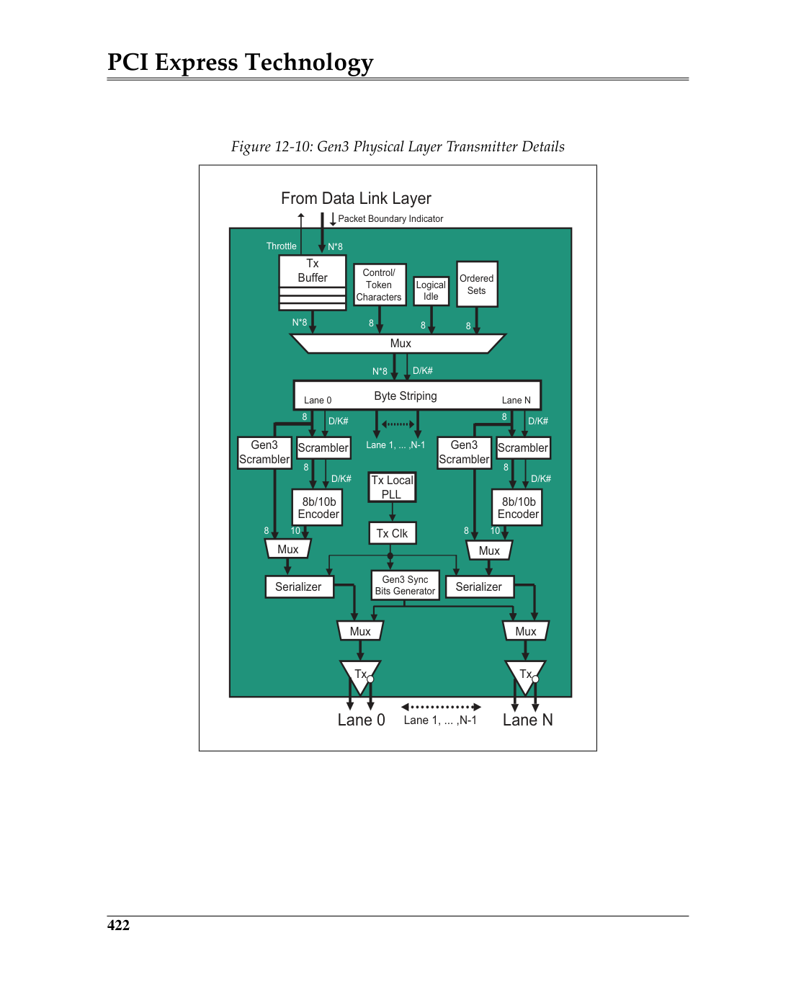

<br>


**第 14 章：链路初始化与训练**

完整的训练过程在复位后由硬件自动启动，并由 LTSSM（链路训练和状态状态机）管理，如第 506 页图 14‐1 所示。

在链路初始化和训练过程中配置了几件事。让我们考虑一下它们是什么并预先定义一些术语。

- **位锁定 (Bit Lock)**：当链路训练开始时，接收器的时钟尚未与输入信号的发送时钟同步，无法可靠地采样输入位。在链路训练期间，接收器 CDR（时钟数据恢复）逻辑使用输入位流作为时钟参考来重新创建发送器的时钟。一旦从流中恢复时钟，就可以说接收器已获得位锁定 (Bit
Lock)，然后能够对输入位进行采样。有关位锁定机制的更多信息，请参见第 395 页 "Achieving Bit Lock"。

- **符号锁定 (Symbol Lock)**：对于 8b/10b 编码（用于 Gen1 和 Gen2），下一步是获取符号锁定。这是一个类似的问题，因为接收器现在可以看到各个位，但不知道 10 位符号的边界在哪里。随着 TS1 和 TS2
的交换，接收器在位流中搜索可识别的模式。一个用于此目的的简单模式是 COM 符号。其独特的编码使其易于识别，其到达显示了符号和有序集的边界，因为 TS1 或 TS2 必须正在进行中。有关详细信息，请参见第 396 页 "Achieving Symbol Lock"。

</td>
</tr>
<tr>
<td width="50%">

</td>
<td width="50%">

## **PCI Express Technology**

- **块锁定 (Block Lock)**：对于 8.0 GT/s（Gen3），该过程与符号锁定略有不同，因为不使用 8b/10b 编码，所以没有 COM 字符。但是，接收器仍然需要在输入位流中找到可识别的分组边界。解决方案是在训练序列中包含更多
EIEOS（电气空闲退出有序集）的实例，并使用它来定位边界。EIEOS 可识别为 00h 和 FFh 字节交替的模式，并且它定义了块边界，因为根据定义，当该模式结束时，下一个块必须开始。

- **链路宽度**：具有多个 Lane 的设备可能能够使用不同的链路宽度。例如，具有 x2 端口的设备可以连接到具有 x4 端口的设备。在链路训练期间，两个设备的物理层测试链路并将宽度设置为最高公共值。

- **Lane 反转**：多 Lane 设备端口上的 Lane 从 Lane 0 开始按顺序编号。通常，一个设备端口的 Lane 0 连接到相邻设备端口的 Lane 0，Lane 1 连接到 Lane 1，依此类推。然而，有时希望能够逻辑上反转 Lane 编号以简化布线并允许
Lane 直接连接而不必交叉（参见第 508 页的图 14‐2）。只要一台设备支持可选的 Lane 反转功能，这就可以工作。该情况在链路训练期间被检测到，并且一台设备必须在内部反转其 Lane 编号。由于规范不要求支持此功能，因此板设计人员将需要在以相反顺序连接 Lane
之前验证至少一台连接的设备支持此功能。

_图 14‐2：Lane 反转示例（支持可选）_

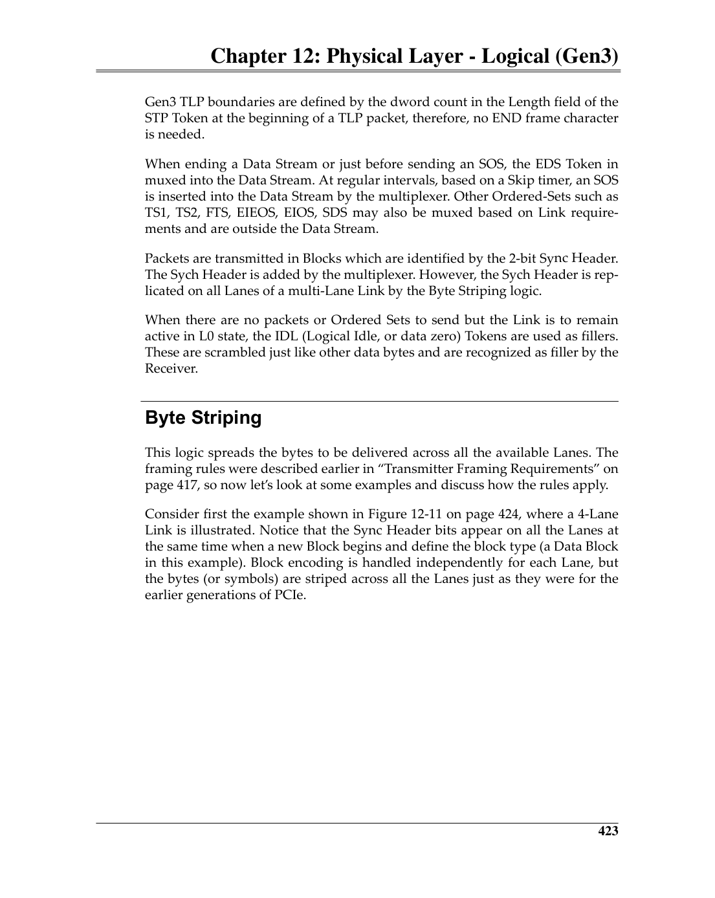

<br>

- **极性反转**：两台设备的 D+ 和 D‐ 差分对端子也可以根据需要进行反转，以使板布局和布线更容易。每个接收器 Lane 必须独立检查此情况并在训练期间根据需要进行自动纠正，如第 509 页的图 14‐3 所示。为此，接收器查看传入 TS1 或 TS2 的符号 6 到
15。如果在 TS1 中收到 D21.5 而不是 D10.2，或在 TS2 中收到 D26.5 而不是预期的 D5.2，则该 Lane 的极性反转，必须进行纠正。与 Lane 反转不同，此功能的支持是强制性的。

**第 14 章：链路初始化与训练**

_图 14‐3：极性反转示例（支持必需）_

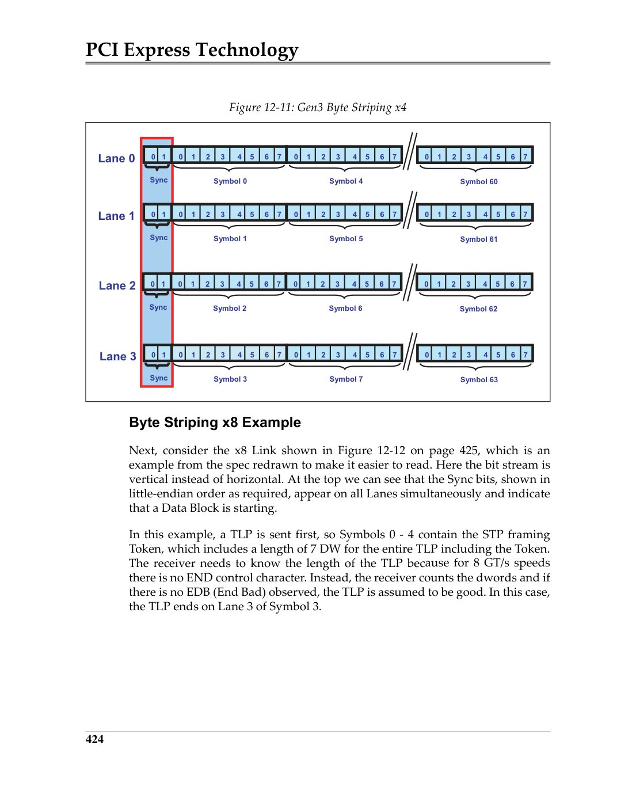

<br>


- **链路数据速率**：复位后，链路初始化和训练将始终使用默认的 2.5Gbit/s 数据速率以实现向后兼容性。如果有更高的数据速率可用，它们会在此过程中通告，训练完成后，设备将自动通过快速重新训练更改为最高共同支持的速率。

- **Lane 到 Lane 去偏移**：走线长度变化和其他因素会导致多 Lane 链路的并行位流在不同时间到达接收器，这个问题称为信号偏移 (signal skew)。接收器需要通过根据需要延迟早期到达的位来补偿此偏移以对齐位流（参见第 442 页 "Lane‐to‐Lane
Skew"）。他们必须自动纠正较大的偏移（在 2.5GT/s 时允许 20ns 的到达时间差），这使板设计人员免于创建等长走线的困难约束。结合极性反转和 Lane 反转，这大大简化了板设计人员创建可靠的高速链路的任务。

</td>
</tr>
<tr>
<td width="50%">

</td>
<td width="50%">

## **链路训练中的有序集**

</td>
</tr>
<tr>
<td width="50%">

</td>
<td width="50%">

## **概述**

所有不同类型的物理层有序集在第 388 页 "Ordered sets" 一节中描述。训练序列 TS1 和 TS2 在训练过程中值得关注。它们在 Gen1 或 Gen2 模式下的格式如图 14‐4（第 510 页）所示，而在 Gen3 操作模式下，它们如图 14‐5（第 511
页）所示。以下是其内容的详细描述。

</td>
</tr>
<tr>
<td width="50%">

</td>
<td width="50%">

## **PCI Express Technology**

_图 14‐4：Gen1 或 Gen2 模式下的 TS1 和 TS2 有序集_

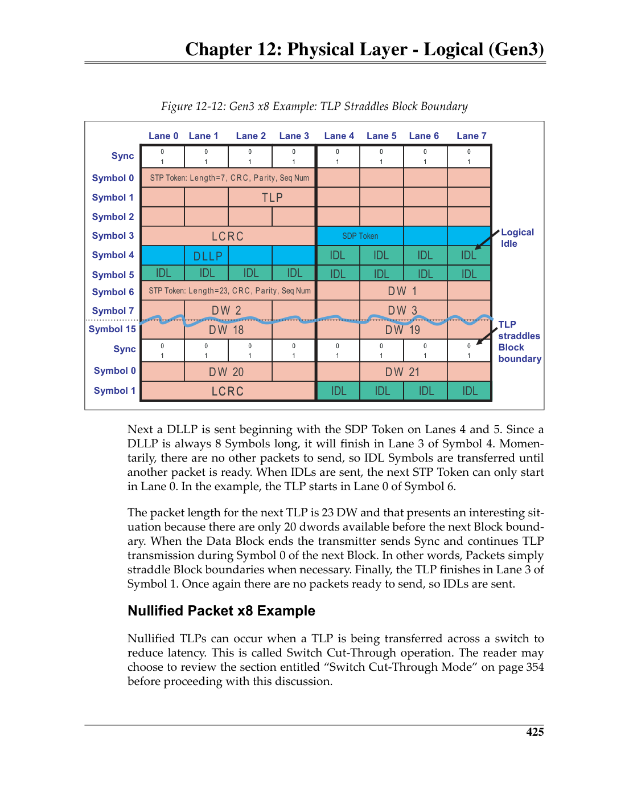

<br>

</td>
</tr>
<tr>
<td width="50%">

</td>
<td width="50%">

## **TS1 和 TS2 有序集**

如图所示，TS1 和 TS2 由 16 个符号组成。它们在 LTSSM 的 Polling、Configuration 和 Recovery 状态期间交换，在第 518 页 "Link Training and Status State Machine (LTSSM)"
中描述。这些符号的描述如下，并在第 514 页的表 14‐1（TS1）和第 516 页的表 14‐2（TS2）中进行了总结。

为了使描述更短更易读，术语 "Gen1" 将用于指示 2.5 GT/s 的数据速率，"Gen2" 用于指示 5.0 GT/s 的数据速率，"Gen3" 用于指示 8.0 GT/s 的数据速率。另请注意，链路和 Lane 编号中使用的 PAD 字符在较低数据速率下由 K23.7
字符表示，但在 Gen3 下表示为数据字节 F7h。在我们的讨论中，PAD 类型之间的区别并不重要，将仅隐含表示。

**第 14 章：链路初始化与训练**

_图 14‐5：Gen3 操作模式下的 TS1 和 TS2 有序集块_

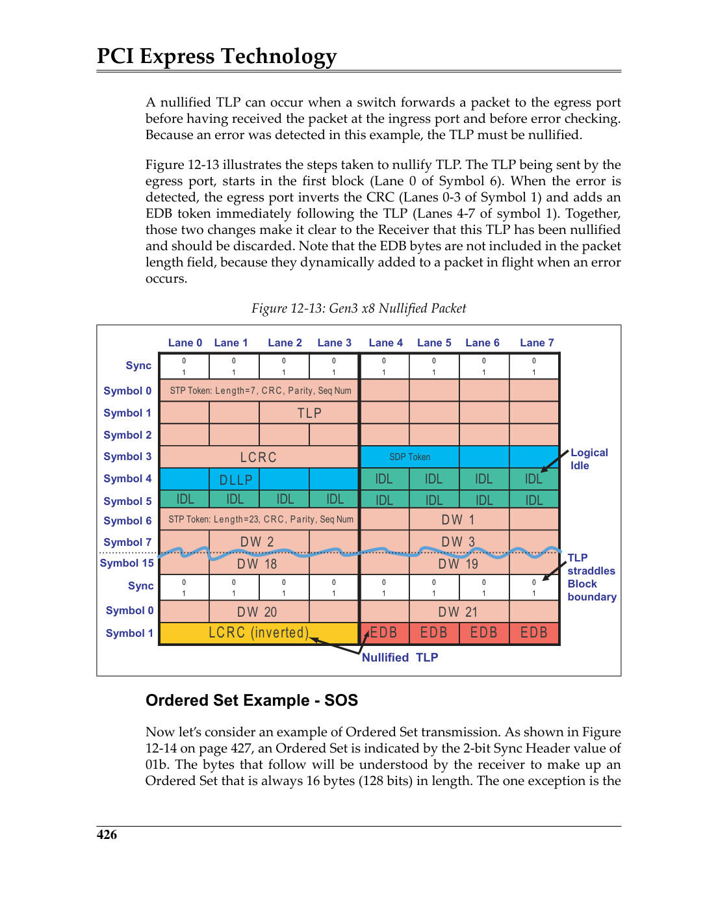

<br>


第 514 页的表 14‐1 和第 516 页的表 14‐2 是 TS1 和 TS2 内容的摘要。16 个 TS1/TS2 符号的更详细描述如下：

- **符号 0**：

- 对于 **Gen1 或 Gen2**，任何有序集的第一个符号是 K28.5（COM）字符。接收器使用此字符获取符号锁定。由于它必须同时出现在所有 Lane 上，因此它对于 Lane 的去偏移也很有用。

- 对于 **Gen3**，有序集由必须在块之前出现的 2 位同步头标识（图中未显示），之后的第一个符号指示将跟随哪个有序集。对于 TS1，第一个符号是 1Eh，对于 TS2，是 2Dh。

- **符号 1（Link #）**：在 Polling 状态中，此字段包含 PAD 符号，但在其他状态中分配了链路编号。

- **符号 2（Lane #）**：在 Polling 状态中，此字段包含 PAD 符号，但在其他状态中分配了 Lane 编号。

- **符号 3（N_FTS）**：表示接收器在以当前速度退出 L0s 电源状态以达到 L0 状态时所需的快速训练序列的数量。发送器将发送至少那么多

</td>
</tr>
<tr>
<td width="50%">

</td>
<td width="50%">

## **PCI Express Technology**

FTS 以退出 L0s。所需的时间量取决于需要的数量和正在使用的数据速率。例如，在 2.5 GT/s 时，每个符号需要 4ns，因此，如果需要 200 个 FTS，则所需时间为 200 FTS * 每个 FTS 4 个符号 * 4ns/符号 = 3200
ns。如果发送器设备中设置了 Extended Synch 位，则必须发送总共 4096 个 FTS。这个大数字旨在为外部链路监控工具提供足够的时间来获取位和符号锁定，因为其中一些工具在这方面可能很慢。

- **符号 4（Rate ID）**：设备报告它们支持的数据速率，以及一些用于硬件发起的带宽更改的更多信息。2.5 GT/s 速率必须始终受支持，链路在复位后将始终自动训练到该速度，以便较新的组件保持与较旧组件的向后兼容性。如果支持 8.0 GT/s，还要求 5.0 GT/s
必须可用。此符号中的其他信息包括以下内容：

- **自动更改**：如果设置，则任何请求的带宽更改都是为了电源管理原因而发起的。如果请求了更改但未设置此位，则在更高速度或更宽链路上检测到不可靠的操作，并且请求更改以解决该问题。

- **可选去加重**

 - **上游端口**设置此位以指示它们在 5.0 GT/s 时所需去加重的级别。它们如何做出此选择是特定于实现的。在 Recovery.RcvrCfg 状态中，它们在内部注册接收到的此位的值（规范将其描述为存储在 select_deemphasis 变量中）。

 - **下游端口和根端口**：在 Polling.Compliance 状态中，select_deemphasis 变量必须设置为与该位的接收值匹配。在 Recovery.RcvrCfg 状态中，发送器将其 TS2 中的此位设置为与 Link Control 2 寄存器中的
Selectable De‐emphasis 字段匹配。由于该寄存器位是硬件初始化的，预期它在启动时由固件或绑定选项分配给最佳值。

 - 在 5.0 GT/s 的环回模式下，从设备的去加重值由主设备发送的 TS1 中的该位分配。

- **链路向上配置能力**：报告宽度减小后的宽链路是否能够恢复到宽状态。如果链路的两端在 Configuration.Complete 期间都报告了此情况，则此事实被内部记录（例如，upconfigure_capable 位被设置）。

- **符号 5（Training Control）**：传达特殊条件，例如热复位、启用环回模式、禁用链路、禁用加扰。

**第 14 章：链路初始化与训练**

- **符号 6‐9（均衡控制）**：

</td>
</tr>

</tbody>
</table>

[⬆️ 返回目录](#本章目录-table-of-contents)

---

<a id="sec-12-2"></a>
## 12.2 Physical Layer - Logical (Gen3) | 物理层 - 逻辑 (Gen3)

<table>
<thead><tr><th width="50%">🇬🇧 English</th><th width="50%">🇨🇳 中文</th></tr></thead>
<tbody>
<tr>
<td width="50%">

- **Block Lock** : For 8.0 GT/s (Gen3), the process is a little different from Symbol Lock because since 8b/10b encoding is not used, there
are no COM charac‐ ters. However, Receivers still need to find a recognizable packet boundary in the incoming bit stream. The solution is to
include more instances of the EIEOS (Electrical Idle Exit Ordered Set) in the training sequence and use that to locate the boundaries. An
EIEOS is recognizable as a pattern of alternating 00h and FFh bytes, and it defines the Block boundary because, by definition, when that
pattern ends the next Block must begin.

- **Link Width** : Devices with multiple Lanes may be able to use different Link widths. For example, a device with a x2 port may be
connected to one with a x4 port. During Link training, the Physical Layer of both devices tests the Link and sets the width to the highest
common value.

- **Lane Reversal:** The Lanes on a multi‐Lane device’s port are numbered sequentially beginning with Lane 0. Normally, Lane 0 of one
device’s port connects to Lane 0 of the neighbor’s port, Lane 1 to Lane 1, and so on. How‐ ever, sometimes it’s desirable to be able to
logically reverse the Lane numbers to simplify routing and allow the Lanes to be wired directly without having to crisscross (see Figure
14‐2 on page 508). As long as one device supports the optional Lane Reversal feature, this will work. The situation is detected dur‐

ing Link training and one device must internally reverse its Lane numbering. Since the spec doesn’t require support for this, board
designers will need to verify that at least one of the connected devices supports this feature before wiring the Lanes in reverse order.

_Figure 14‐2: Lane Reversal Example (Support Optional)_ 

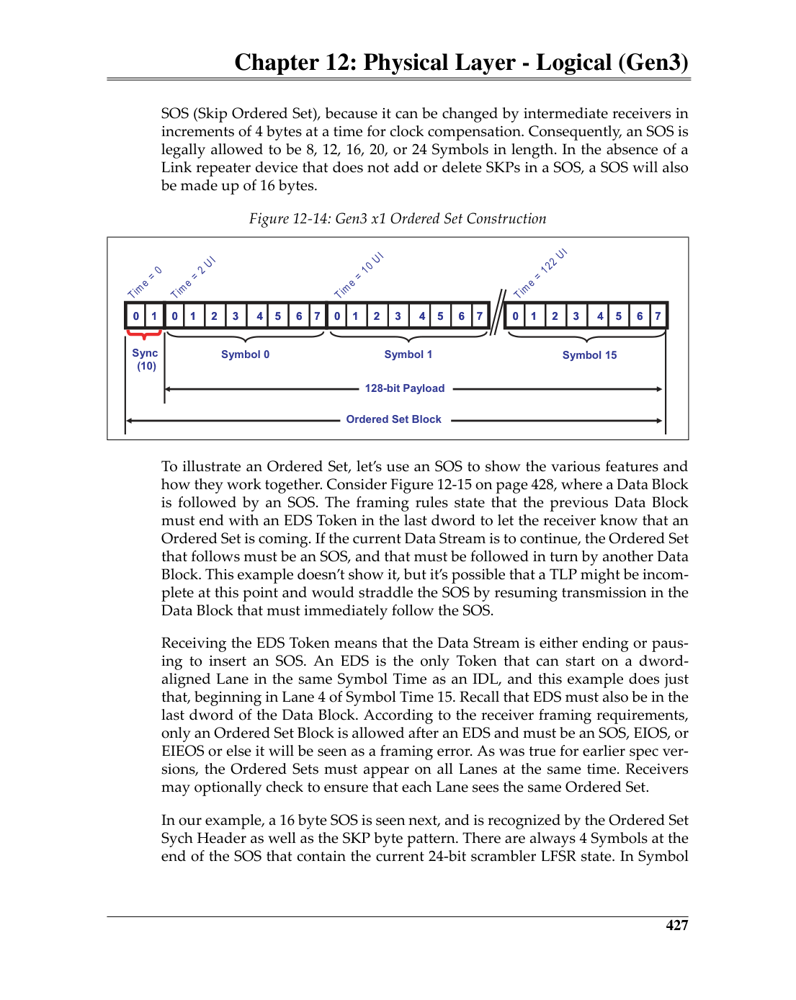

<br>


- **Polarity Inversion** : The D+ and D‐ differential pair terminals for two devices may also be reversed as needed to make board layout and
routing easier. Every Receiver Lane must independently check for this and automatically correct it as needed during training, as illustrated
in Figure 14‐3 on page 509. To do this, the Receiver looks at Symbols 6 to 15 of the incoming TS1s or TS2s. If a D21.5 is received instead
of a D10.2 in a TS1, or a D26.5 instead of the D5.2 expected for a TS2, then the polarity of that lane is inverted and must be corrected.
Unlike Lane reversal, support for this feature is manda‐ tory.
_Figure 14‐3: Polarity Inversion Example (Support Required)_ 


<br>


- **Link Data Rate** : After a reset, Link initialization and training will always use the default 2.5Gbit/s data rate for backward
compatibility. If higher data rates are available, they are advertised during this process and, when the training is completed, devices will
automatically go through a quick re‐training to change to the highest commonly supported rate.

- **Lane‐to‐Lane De‐skew** : Trace length variations and other factors cause the parallel bit streams of a multi‐Lane Link to arrive at the
Receivers at different times, a problem referred to as signal skew. Receivers are required to com‐ pensate for this skew by delaying the
early arrivals as needed to align the bit streams (see “Lane‐to‐Lane Skew” on page 442). They must correct a rela‐ tively big skew
automatically (20ns difference in arrival time is permitted at 2.5GT/s), and that frees board designers from the sometimes difficult con‐
straint of creating equal‐length traces. Together with Polarity Inversion and Lane Reversal, this greatly simplifies the board designer’s
task of creating a reliable high‐speed Link.

</td>
<td width="50%">

- 对于 **Gen1 或 Gen2**，符号 7‐9 只是 TS1 或 TS2 标识符，符号 6 通常也是如此。但是，如果符号 6 的位 7 设置为 1 而不是 TS1 或 TS2 标识符的 0，则表示这是从下游端口 (DSP - 面向下游的端口，如根端口) 发送的 EQ
TS1 或 EQ TS2。"EQ" 标签代表均衡，意味着链路将要更改为 8.0 GT/s，因此上游端口 (USP - 面向上游的端口，如端点端口) 需要知道要使用什么均衡器值。对于 EQ TS1 或 TS2，符号 6 以发送器预设和接收器预设提示的形式将该信息提供给 USP。支持
8.0 GT/s 的端口必须接受任一 TS 类型（常规或 EQ），但不支持它的端口不需要接受 EQ 类型。这些预设的可能值列在第 579 页的表 14‐8 和第 580 页的表 14‐9 中。

- 对于 **Gen3**，符号 6‐9 提供均衡过程的预设值和系数。TS2 中符号 6 的位 7 现在可以由 USP 用于请求重新进行均衡。如果这样做，位 6 也可以设置以指示重复均衡过程所需的时间不会引起问题，例如完成超时，只要它在返回 L0 后快速完成（在 1ms
内）。例如，如果检测到均衡结果有问题，则可能需要这样做。DSP 还可以使用位 6 和 7 要求 USP 提出此类请求并保证没有副作用，尽管 USP 不需要响应此请求。有关均衡过程的更多信息，请参见第 577 页 "Link Equalization Overview"。

- **符号 10‐13**：TS1 或 TS2 标识符。

- **符号 14‐15**：（DC 平衡）

- 对于 **Gen1 和 Gen2**，由于 DC 平衡由 8b/10b 编码维持，这些只是 TS1 或 TS2 标识符。

- 对于 **Gen3**，这两个符号的内容取决于 Lane 的 DC 平衡。发送器的每个 Lane 必须独立跟踪为 TS1 和 TS2 发送的所有加扰位的运行 DC 平衡。"运行 DC 平衡"是指发送的 1 数与发送的 0 数之间的差，Lane 必须能够跟踪任一方向上最多
511 的差。这些计数器在其最大值处饱和但继续跟踪减少量。例如，如果计数器指示已发送比 0 多 511 个 1，那么无论再发送多少个 1，该值都将保持为 511。但是，如果发送了 2 个 0，计数器将递减到 509。当发送 TS1 或 TS2 时，使用以下算法确定符号 14 和
15：

 - 如果在符号 11 结束时运行 DC 平衡值 > 31 且发送了更多的 1，则符号 14 = 20h，符号 15 = 08h。如果发送了更多的 0，则符号 14 = DFh，符号 15 = F7h。

</td>
</tr>
<tr>
<td width="50%">

## **Ordered Sets in Link Training**

</td>
<td width="50%">

## **PCI Express Technology**

- 如果运行 DC 平衡值 > 15，则符号 14 = 正常的加扰 TS1 或 TS2 标识符，而符号 15 = 08h 以减少 1 的数量，或 F7h 以减少 DC 平衡计数中的 0 的数量。

- 否则，将发送正常的 TS1 或 TS2 标识符符号。

- 关于 Gen3 DC 平衡的其他注意事项：

 - 运行 DC 平衡由电气空闲退出或数据块之后的 EIEOS 复位。

 - DC 平衡符号绕过加扰以确保发送预期的位模式。

_表 14‐1：TS1 有序集内容摘要_

|**符号 编号**|**描述**|
|---|---|
|0|• 对于 Gen1 或 Gen2，COM (K28.5) 符号<br>• 对于 Gen3，1Eh 表示 TS1。|
|1|链路号 • 不支持 Gen3 的端口：0‐255，PAD • 支持 Gen...|
|2|Lane 号<br>• 0‐31，PAD|
|3|N_FTS<br>• 退出 L0s 时接收器达到 L0 所需的 FTS 有序集数：0 ‐ 255|
|4|数据速率标识符：<br>• 位 0 — 保留。<br>• 位 1 — 支持 2.5 GT/s（必须设置为 1b）<br>• 位 2 — 支持 5.0 GT/s（如果设置了位 3，则必须设置）<br>• 位 3 — 支持 8.0 GT/s<br>• 位 5:4 —
保留<br>• 位 6 — 自动更改/可选去加重<br>–<br>下游端口：在 Polling.Active、Configuration.Linkwidth.Start 和 Loopback.Entry LTSSM 状态中使用，在所有其他状态中保留。<br>–<br>上游端口：在
Polling.Active、Configuration、Recovery 和 Loopback.Entry LTSSM 状态中使用，在所有其他状态中保留。<br>• 位 7 — 速率更改。此位只能在 Recovery.RcvrLock LTSSM 状态中设置为
1，在所有其他状态中保留。|

**第 14 章：链路初始化与训练**

_表 14‐1：TS1 有序集内容摘要（续）_

|**符号 编号**|**描述**|
|---|---|
|5|训练控制（0=取消断言，1 = 断言）<br>• 位 0 — 热复位<br>• 位 1 — 禁用链路<br>• 位 2 — 环回<br>• 位 3 — 禁用加扰（对于 2.5 或 5.0 GT/s；为 Gen3 保留）<br>• 位 4 — 合规接收（对于 2.5 GT/s
是可选的，对于所有其他速率是必需的）<br>• 位 7:5 — 保留，设置为 0|
|6|对于 Gen1 或 Gen2：<br>• TS1 标识符 (4Ah) 编码为 D10.2<br>• EQ TS1 将其编码为<br>位 2:0 — 接收器预设提示<br>位 6:3 — 发送器预设<br>位 7 — 设置为 1b<br>对于 Gen3：<br>• 位 1:0
— 均衡控制 (EC)。仅在 Recovery.Equalization 和 Loopback LTSSM 状态中使用；在所有其他状态中必须为 00b。<br>• 位 2 — 复位 EIEOS 间隔计数。仅在 Recovery.Equalization LTSSM
状态中使用；在所有其他状态中保留。<br>• 位 6:3 — 发送器预设<br>• 位 7 — 使用预设。（如果为 1，则使用预设值而不是系数值。如果为 0，则使用系数而不是预设。）仅在 Recovery.Equalization 和 Loopback LTSSM
状态中使用；在所有其他状态中保留。|
|7|对于 Gen1 或 Gen2 GT/s，TS1 标识符 (4Ah) 编码为...|
|8|对于 Gen1 或 Gen2，TS1 标识符 (4Ah) 编码为 D10....|

</td>
</tr>
<tr>
<td width="50%">

## **General** 

All of the different types of Physical Layer Ordered Sets were described in the section called “Ordered sets” on page 388. Training
Sequences TS1 and TS2 are of interest during the training process. The format for these when in Gen1 or Gen2 mode is shown in Figure 14‐4 on
page 510, while for Gen3 mode of opera‐ tion, they are as shown in Figure 14‐5 on page 511. A detailed description of their contents
follows.

</td>
<td width="50%">

## **PCI Express Technology**

_表 14‐1：TS1 有序集内容摘要（续）_

|**符号 编号**|**描述**|
|---|---|
|9|对于 Gen1 或 Gen2，TS1 标识符 (4Ah) 编码为 D10.2<br>对于 Gen3：<br>• 位 5:0 — 后游标系数。<br>• 位 6 — 拒绝系数值。仅在 Recovery.Equalization LTSSM 状态的特定阶段中设置；否则必须为
0b。<br>• 位 7 — 奇偶校验 (P)。这是符号 6、7、8 的所有位和符号 9 的位 6:0 的偶校验。接收器必须计算此值并将其与接收到的奇偶校验位进行比较。仅当奇偶校验位匹配时，接收到的 TS1 才有效。|
|10‐13|对于 Gen1 或 Gen2，TS1 标识符 (4Ah) 编码为 D10.2<br>• 对于 Gen3，TS1 标识符 (4Ah)|
|14‐15|对于 Gen1 或 Gen2，TS1 标识符 (4Ah) 编码为 D10....|

细心的读者可能想知道为什么 EQ TS1 在较低数据速率下显示在符号 6 中，因为只有 8.0 GT/s 数据速率使用均衡。那是因为它们用于为支持 Gen3 但当前以较低速率运行并希望更改为 8.0 GT/s 的 Lane 传递 EQ 值。有关此以及 Gen3
均衡过程的更多详细信息，请参见第 577 页 "Link Equalization Overview"。

_表 14‐2：TS2 有序集内容摘要_

|**符号 编号**|**描述**|
|---|---|
|0|• 对于 Gen1 或 Gen2，COM (K28.5) 符号<br>• 对于 Gen3，2Dh 表示 TS2。|
|1|链路号 • 不支持 Gen3 的端口：0‐255，PAD • 支持 Gen...|
|2|Lane 号<br>• 0‐31，PAD|

**第 14 章：链路初始化与训练**

_表 14‐2：TS2 有序集内容摘要（续）_

|**符号 编号**|**描述**|
|---|---|
|3|N_FTS<br>• 退出 L0s 时接收器达到 L0 所需的 FTS 有序集数：0 ‐ 255|
|4|数据速率标识符：<br>• 位 0 — 保留。<br>• 位 1 — 支持 2.5 GT/s（必须设置为 1b）<br>• 位 2 — 支持 5.0 GT/s（如果设置了位 3，则必须设置）<br>• 位 3 — 支持 8.0 GT/s<br>• 位 5:4 —
保留<br>• 位 6 — 自动更改/可选去加重/链路向上配置能力。在 Polling.Configuration、Configuration.Complete 和 Recovery LTSSM 状态中使用；在所有其他状态中保留。<br>• 位 7 — 速率更改。此位只能在
Recovery.RcvrLock LTSSM 状态中设置为 1，在所有其他状态中保留。|
|5|训练控制（0 = 取消断言，1 = 断言） • 位 0 — 热复位， • ...|
|6|对于 Gen1 或 Gen2：<br>• TS2 标识符 (4Ah) 编码为 D10.2<br>• EQ TS2 将其编码为<br>位 2:0 — 接收器预设提示<br>位 6:3 — 发送器预设<br>位 7 — 均衡命令<br>对于 Gen3：<br>• 位 5:0 —
保留。<br>• 位 6 — 静止保证。定义为仅在 Recovery.RcvrCfg 中使用；在所有其他状态中保留。<br>• 位 7 — 请求均衡。定义为仅在 Recovery.RcvrCfg 中使用；在所有其他状态中保留。|
|7‐13|• 对于 Gen1 或 Gen2，TS2 标识符 (45h) 编码为 D5.2<br>• 对于 Gen3，TS2 标识符 (45h)|
|14‐15|• 对于 Gen1 或 Gen2，TS2 标识符 (45h) 编码为 D5...|

</td>
</tr>
<tr>
<td width="50%">

## **PCI Express Technology** 

_Figure 14‐4: TS1 and TS2 Ordered Sets When In Gen1 or Gen2 Mode_ 

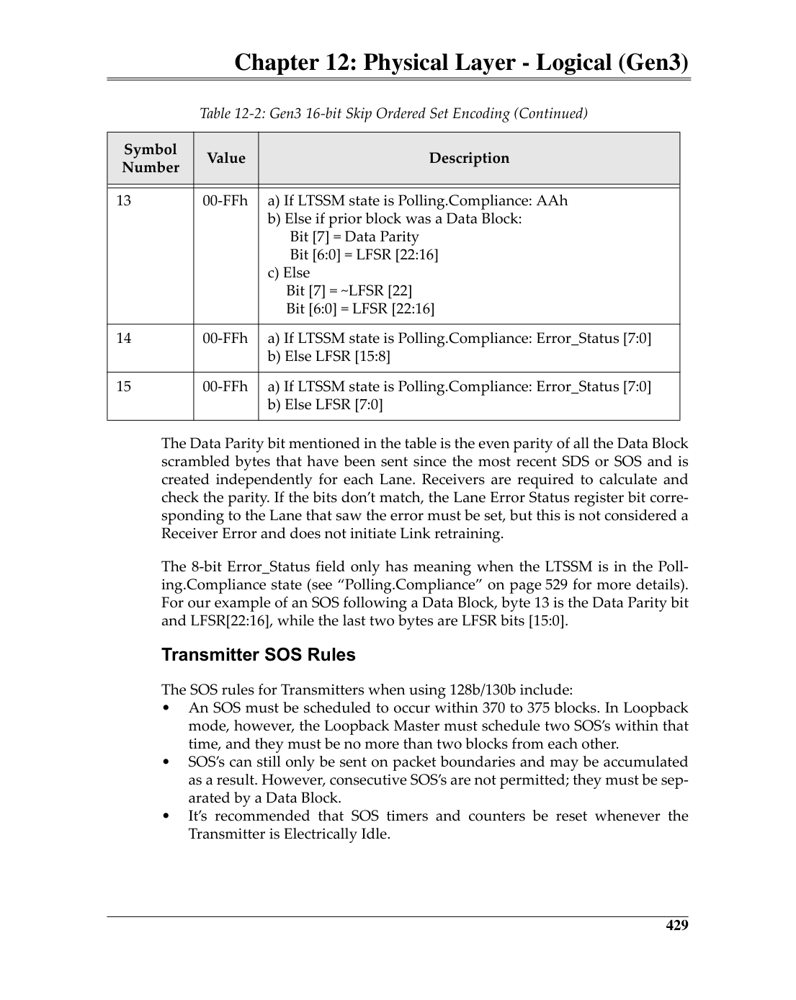

<br>

</td>
<td width="50%">

## **PCI Express Technology**

</td>
</tr>
<tr>
<td width="50%">

## **TS1 and TS2 Ordered Sets** 

As seen in the illustrations, TS1s and TS2s consist of 16 Symbols. They are exchanged during the Polling, Configuration, and Recovery states
of the LTSSM described in “Link Training and Status State Machine (LTSSM)” on page 518. The Symbols are described below and summarized in
Table 14‐1 on page 514 for TS1s and Table 14‐2 on page 516 for TS2s.

To make the descriptions a little shorter and easier to read, the term “Gen1” will be used to indicated data rate of 2.5 GT/s, “Gen2” to
indicated data rate of 5.0 GT/s and “Gen3” to indicate data rates of 8.0 GT/s. Also, note that the PAD char‐ acter used in the Link and Lane
numbers is represented by the K23.7 character for the lower data rates, but as the data byte F7h for Gen3. In our discussion the distinction
between the types of PAD is not interesting and will simply be implied.
_Figure 14‐5: TS1 and TS2 Ordered Set Block When In Gen3 Mode of Operation_ 

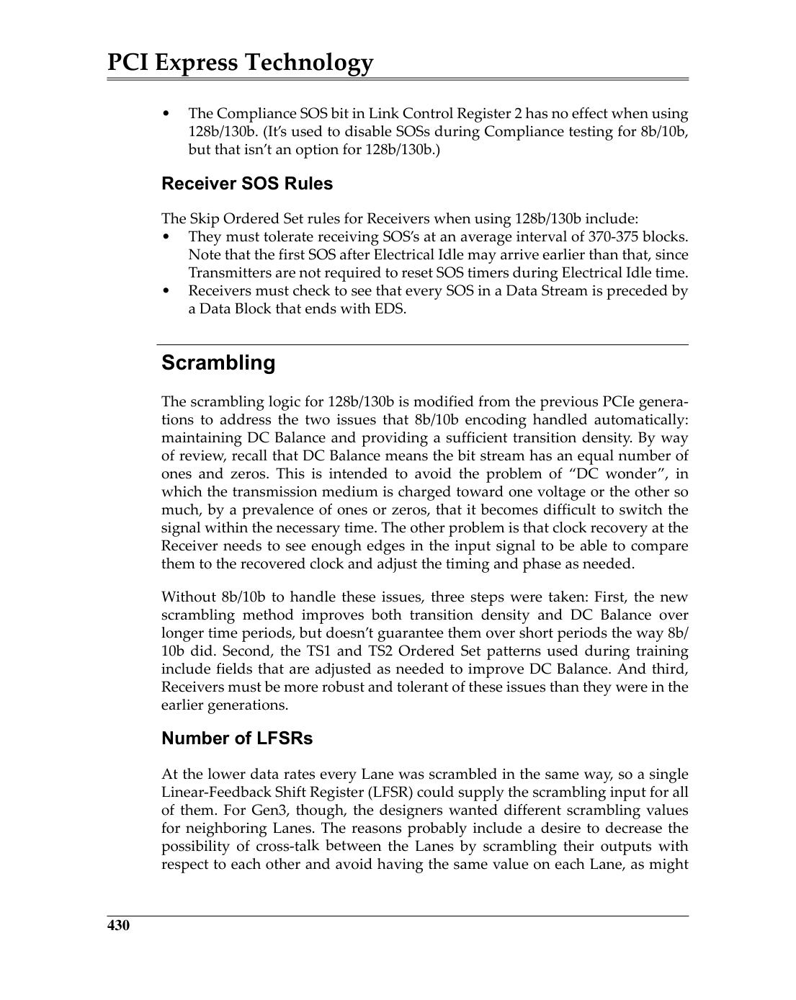

<br>


Table 14‐1 on page 514 and Table 14‐2 on page 516 is a summary of TS1 and TS2 contents. A more detailed description of the 16 TS1/TS2
Symbols follows:

- **Symbol 0** : 

- For **Gen1 or Gen2** , the first Symbol of any Ordered Set is the K28.5 (COM) character. Receivers use this character to acquire Symbol
Lock. Since it must appear on all Lanes at the same time it’s also useful for de‐skewing the Lanes.

- For **Gen3** , an Ordered Set is identified by the 2‐bit Sync Header that must precede the Block (not shown in the illustration), and the
first Symbol after that indicates which Ordered Set will follow. For a TS1, the first Symbol is 1Eh, and for a TS2, it’s 2Dh.

- **Symbol 1 (Link #)** : In the Polling state this field contains the PAD Symbol, but in the other states a Link Number is assigned. 

- **Symbol 2 (Lane #)** : In the Polling state this field contains the PAD Symbol, but in the other states a Lane Number is assigned. 

- **Symbol 3 (N_FTS)** : Indicates the number of Fast Training Sequences the Receiver will need in order to achieve the L0 state when
exiting from the L0s power state at the current speed. Transmitters will send at least that many

</td>
<td width="50%">

## **链路训练和状态状态机 (LTSSM)**

</td>
</tr>
<tr>
<td width="50%">

## **PCI Express Technology** 

FTSs to exit L0s. The amount of time needed for this depends on how many are needed and the data rate in use. For example, at 2.5 GT/s each
Symbol takes 4ns so, if 200 FTSs were needed the required time would be 200 FTS * 4 Symbols per FTS * 4ns/Symbol = 3200 ns. If the Extended
Synch bit is set in the transmitter device, a total of 4096 FTSs must be sent. This large number is intended to provide enough time for
external Link monitoring tools to acquire Bit and Symbol Lock, since some of them may be slow in this regard.

- **Symbol 4 (Rate ID** ): Devices report which data rates they support, along with a little more information used for hardware‐initiated
bandwidth changes. The 2.5 GT/s rate must always be supported and the Link will always train to that speed automatically after reset so that
newer components will remain backward compatible with older ones. If 8.0 GT/s is supported, it’s also required that 5.0 GT/s must be
available. Other information in this Symbol includes the following:

- **Autonomous Change** : If set, any requested bandwidth change was initi‐ ated for power‐management reasons. If a change is requested and
this bit is not set, then unreliable operation has been detected at the higher speed or wider Link and the change is requested to fix that
problem.

- **Selectable De‐emphasis** 

 - **Upstream Ports** set this to indicate their desired de‐emphasis level at 5.0 GT/s. How they make this choice is implementation
specific. In the Recovery.RcvrCfg state, they register the value they receive for this bit internally (the spec describes it as being stored
in a select_deemphasis variable).

 - **Downstream Ports and Root Ports** : In the Polling.Compliance state the select_deemphasis variable must be set to match the received
value of this bit. In the Recovery.RcvrCfg state, the Transmitter sets this bit in its TS2s to match the Selectable De‐emphasis field in the
Link Control 2 register. Since this register bit is hardware‐initialized, the expectation is that it’s assigned to an optimal value at
power‐up by firmware or a strapping option.

 - In Loopback mode at 5.0 GT/s, the Slave de‐emphasis value is assigned by this bit in the TS1s sent by the Master. 

- **Link Upconfigure Capability** : Reports whether a wide Link whose width is reduced will be capable of going back to the wide case or
not. If both sides of a Link report this during Configuration.Complete, this fact is recorded internally (e.g. an upconfigure_capable bit is
set).

- **Symbol 5 (Training Control)** : Communicates special conditions such as a Hot Reset, Enable Loopback mode, Disable Link, Disable
Scrambling.
- **Symbols 6‐9 (Equalization Control** ):

</td>
<td width="50%">

## **概述**

第 519 页的图 14‐6 说明了链路训练和状态状态机 (LTSSM) 的顶层状态。每个状态由子状态组成。退出基本复位（冷或热复位）或热复位后进入的第一个 LTSSM 状态是 Detect 状态。

LTSSM 由 11 个顶层状态组成：Detect、Polling、Configuration、Recovery、L0、L0s、L1、L2、Hot Reset、Loopback 和 Disable。这些可以分为五类：

1. 链路训练状态

2. 重新训练（Recovery）状态

3. 软件驱动的电源管理状态

4. 活动状态电源管理 (ASPM) 状态

5. 其他状态

退出任何类型的复位时，LTSSM 的流程遵循**链路训练状态**：Detect => Polling => Configuration => L0。在 L0 状态下，正常的分组传输/接收正在进行。

**链路重新训练（也称为 Recovery）**状态进入的原因有很多，例如从低功耗链路状态（如 L1）返回，更改链路带宽（通过速度或宽度更改）。在此状态下，链路根据需要重复尽可能多的训练过程来处理该问题，然后返回 L0（正常操作）。

电源管理软件还可以将设备置于低功耗设备状态（D1、D2、D3Hot 或 D3Cold），这将强制链路进入较低的**电源管理链路状态**（L1 或 L2）。

如果一段时间没有要发送的分组，则可以允许 ASPM 硬件自动将链路转换为低功耗 **ASPM 状态**（L0s 或 ASPM L1）。

此外，软件可以指导链路进入一些**其他特殊状态**：Disabled、Loopback 或 Hot Reset。在这里，这些统称为其他状态组。

**第 14 章：链路初始化与训练**

_图 14‐6：链路训练和状态状态机 (LTSSM)_

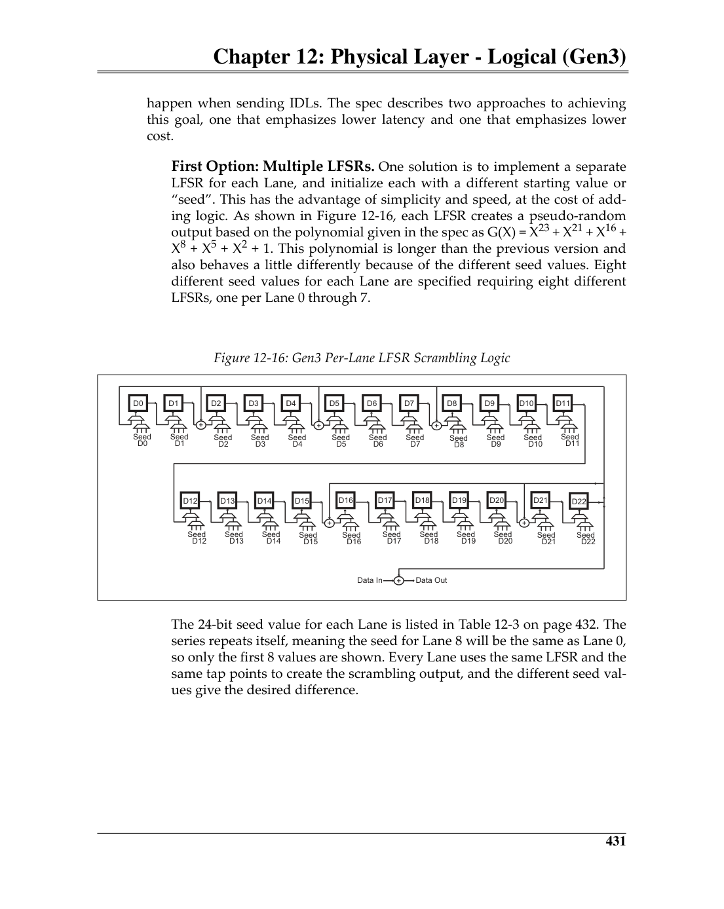

<br>

</td>
</tr>
<tr>
<td width="50%">

</td>
<td width="50%">

## **Overview of LTSSM States** 

Below is a brief description of the 11 high‐level LTSSM states. 

- **Detect** : The initial state after reset. In this state, a device electrically detects a Receiver is present at the far end of the Link.
That’s an unusual thing in the world of serial transports, but it’s done to facilitate testing, as we’ll see in the next state. Detect may
also be entered from a number of other LTSSM states as described later.

- **Polling** : In this state, Transmitters begin to send TS1s and TS2s (at 2.5 GT/s for backward compatibility) so that Receivers can use
them to accomplish the following:

 - Achieve Bit Lock 

 - Acquire Symbol Lock or Block Lock 

 - Correct Lane polarity inversion, if needed 

 - Learn available Lane data rates 

 - If directed, Initiate the Compliance test sequence: The way this works is that if a receiver was detected in the Detect state but no
incoming signal is seen, it’s understood to mean that the device has been connected to a test load. In that case, it should send the
specified Compliance test pat‐ tern to facilitate testing. This allows test equipment to quickly verify that voltage, BER, timing, and other
parameters are within tolerance.

- **Configuration** : Upstream and Downstream components now play specific roles as they continue to exchange TS1s and TS2s at 2.5 GT/s to
accomplish the following:

 - Determine Link width 

 - Assign Lane numbers 

 - Optionally check for Lane reversal and correct it 

 - Deskew Lane‐to‐Lane timing differences 

 - From this state, scrambling can be disabled, the Disable and Loopback states can be entered, and the number of FTS Ordered Sets required
to transition from the L0s state to the L0 state is recorded from the TS1s and TS2s.

- **L0** : This is the normal, fully‐active state of a Link during which TLPs, DLLPs and Ordered Sets can be exchanged. In this state, the
Link could be running at higher speeds than 2.5 GT/s, but only after re‐training (Recovery) the Link and going through a speed change
procedure.

- **Recovery** : This state is entered when the Link needs re‐training. This could be caused by errors in L0, or recovery from L1 back to
L0, or recovery from L0s if the Link does not train properly using the FTS sequence. In Recovery, Bit Lock and Symbol/Block Lock are
re‐established in a manner similar to that used in the Polling state but it typically takes much less time.

- **L0s** : This ASPM state is designed to provide some power savings while affording a quick recovery time back to L0. It’s entered when
one Transmitter sends the EIOS while in the L0 state. Exit from L0s involves sending FTSs to quickly re‐acquire Bit and Symbol/Block Lock.

- **L1** : This state provides greater power savings by trading off a longer recovery time than L0s does (see “Active State Power Management
(ASPM)” on page 735). Entry into L1 involves a negotiation between both Link partners to enter it together and can occur in one of two ways:

 - The first is autonomous with ASPM: hardware in an Upstream Port with no scheduled TLPs or DLLPs to transmit can automatically negotiate
to put its Link into the L1 state. If the Downstream Port agrees, the Link enters L1. If not, the Upstream Port will enter L0s instead (if
enabled).

 - The second is the result of power management software issuing a com‐ manding a device to a low‐power state (D1, D2, or D3Hot). As a
result, the Upstream Port notifies the Downstream Port that they must enter L1, the Downstream Port acknowledges that, and they enter L1.
- **L2** : In this state the main power to the devices is turned off to achieve a greater power savings. Almost all of the logic is off, but
a small amount of power is still available from the Vaux source to allow the device to indicate a wakeup event. An Upstream Port that
supports this wakeup capability can send a very low frequency signal called the Beacon and a Downstream Port can forward it to the Root
Complex to get system attention (see “Beacon Sig‐ naling” on page 483). Using the Beacon, or a side‐band WAKE# signal, a device can trigger
a system wakeup event to get main power restored. [An L3 Link power state is also defined, but it doesn’t relate to the LTSSM states. The L3
state is the full‐off condition in which Vaux power is not available and a wakeup event can’t be signaled.]

- **Loopback** : This state is used for testing but exactly what a Receiver does in this mode (for example: how much of the logic
participates) is left unspeci‐ fied. The basic operation is simple enough: the device that will be the Loop‐ back Master sends TS1 Ordered
Sets that have the Loopback bit set in the Training Control field to the device that will be the Loopback Slave. When a device sees two
consecutive TS1s with the Loopback bit set, it enters the Loopback state as the Loopback Slave and echoes back everything that comes in. The
Master, recognizing that what it is sending is now being echoed, sends any pattern of Symbols that follow the 8b/10b encoding rules, and the
Slave echoes them back exactly as they were sent, providing a round‐trip ver‐ ification of Link integrity.

- **Disable** : This state allows a configured Link to be disabled. In this state, the Transmitter is in the Electrical Idle state while the
Receiver is in the low impedance state. This might be necessary because the Link has become unre‐ liable or due to a surprise removal of the
device. Software commands a device to do this by setting the Disable bit in the Link Control register. The device then sends 16 TS1s with
the Disable Link bit set in the TS1 Training Control field. Receivers are disabled when they receive those TS1s.

- **Hot Reset:** Software can reset a Link by setting the Secondary Bus Reset bit in the Bridge Control register. That causes the bridge’s
Downstream Port to send TS1s with the Hot Reset bit set in the TS1 Training Control field (see “Hot Reset (In‐band Reset)” on page 837) When
a Receiver sees two consecutive TS1s with the Hot Reset bit set, it must reset its device.

</td>
</tr>
<tr>
<td width="50%">

</td>
<td width="50%">

## **Introductions, Examples and State/Substates** 

The balance of this chapter covers each of the LTSSM states. Depending on the complexity of a given state, the discussion may include an
introduction, general background, and/or examples that accompanies the detailed discussion of the State/Substate. In some cases, the reader
may choose to skip the detailed cover‐

</td>
</tr>
<tr>
<td width="50%">

</td>
<td width="50%">

## **PCI Express Technology** 

age and jump to introductory material. Each section is organized to facilitate these options. 

Every device must perform initial link training at the base rate of 2.5 GT/s. Fig‐ ure 14‐7 highlights the states involved in the initial
training sequence. Devices capable of operating at 5.0 or 8.0 GT/s must transition to the Recovery state to change the speed to the higher
rate chosen.

</td>
</tr>
<tr>
<td width="50%">

</td>
<td width="50%">

## **Detect State**

</td>
</tr>
<tr>
<td width="50%">

</td>
<td width="50%">

## **Introduction** 

Figure 14‐8 represents the two substates and transitions associated with the Detect state. The actions associated with the Detect state are
performed by each
transmitter in the process of detecting the presence of a receiver at the opposite end of the link. Because there are only two substates and
because they are fairly simple, we will move directly to the substate discussions.

</td>
</tr>
<tr>
<td width="50%">

</td>
<td width="50%">

## **Detailed Detect Substate**

</td>
</tr>
<tr>
<td width="50%">

</td>
<td width="50%">

## **Detect.Quiet** 

This substate is the initial state after any reset (except Function Level Reset) or power‐up event and must be entered within 20 ms after
Reset. This substate is also entered from other states if unable to move forward (See the states that may enter Detect.Quiet in Figure 14‐8
on page 523). The properties of this substate are listed below:

- The Transmitter starts in Electrical Idle (but the DC common mode voltage doesn’t have to be within the normally‐specified range). 

- The intended data rate is set to 2.5 GT/s (Gen1). If it set to a different rate when this substate was entered, the LTSSM must stay in
this substate for 1ms before changing the rate to Gen1.

- The Physical Layer’s status bit (LinkUp = 0) informs the Data Link Layer that the Link is not operational. The LinkUp status bit is an
internal state bit

</td>
</tr>
<tr>
<td width="50%">

</td>
<td width="50%">

## **PCI Express Technology** 

- (not found in standard config space) and also indicates when the Physical Layer has completed Link Training (LinkUp=1), thereby informing
the Data Link Layer and Flow Control initialization to begin its part of Link initial‐ ization (for more on this, see “The FC Initialization
Sequence” on page 223).

- • Any previous equalization (Eq.) status is cleared by setting the four Link Status 2 register bits to zero: Eq. Phase 1 Successful, Eq.
Phase 2 Successful, Eq. Phase 3 Successful, Eq. Complete.

- Variables: 

 - Several variables are cleared to zero: (directed_speed_change=0b, upconfigure_capable=0b, equalization_done_8GT_data_rate=0b,
idle_to_rlock_transitioned=00h). The select_deemphasis variable setting depends on the port type: for an Upstream Port it’s selected by
hardware, while for a Downstream Port it takes the value in the Link Control 2 regis‐ ter of the Selectable Preset/De‐emphasis field.

 - Since these variables were defined beginning with the 2.0 spec version, devices designed to earlier spec versions won’t have them and
will behave as if directed_speed_change and upconfigure_capable were set to 0b and idle_to_rlock_transitioned was set to FFh.

</td>
</tr>
<tr>
<td width="50%">

</td>
<td width="50%">

## _Exit to “Detect.Active”_ 

The next substate is Detect.Active after a 12 ms timeout or when any Lane exits Electrical Idle.

</td>
</tr>
<tr>
<td width="50%">

</td>
<td width="50%">

## **Detect.Active** 

This substate is entered from Detect.Quiet. At this time the Transmitter tests whether a Receiver is connected on each Lane by setting a DC
common mode voltage of any value in the legal range and then changing it. The detection logic observes the rate of change as the time it
takes the line voltage to charge up and compares it to an expected time, such as how long it would take without a Receiver termination. If a
Receiver is attached, the charge time will be much longer, making it easy to recognize. For more details on this process, see “Receiver
Detection” on page 460. To simplify the discussions that follow, Lanes that detect a Receiver during this substate are referred to as
“Detected Lanes.”

## _Exit to “Detect.Quiet”_

</td>
</tr>

</tbody>
</table>

<p align="center"><b>Figure 14‐7: States Involved in Initial Link Training at 2.5 Gb/s</b></p>
<p align="center">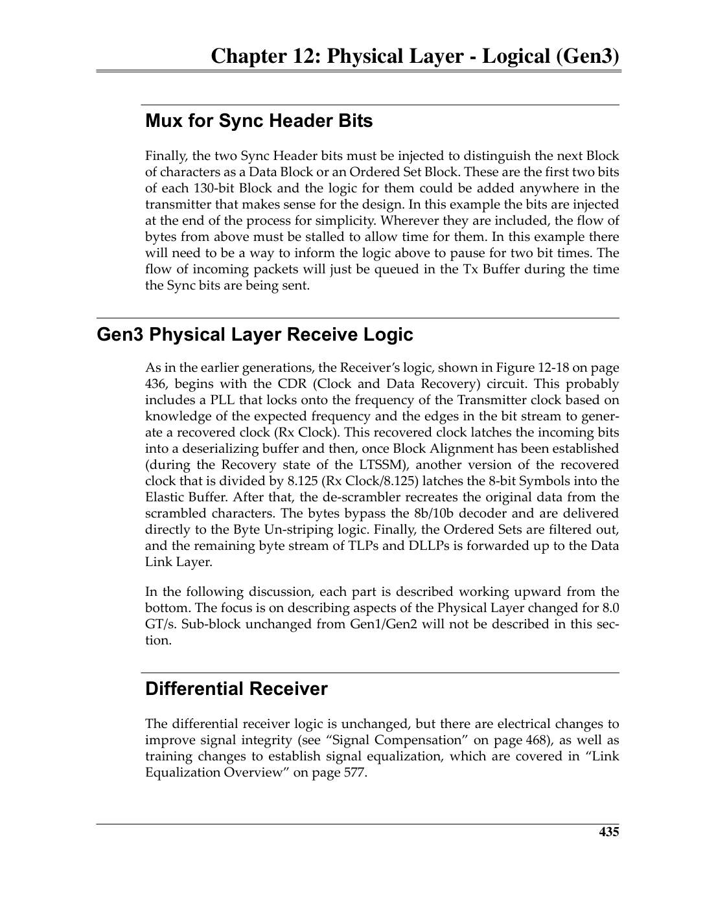</p>
<p align="center"><sub>📄 <a href="figures/chapter_12_Physical_Layer_Logical_Gen3/page/page0494.png">Page 494</a></sub></p>


<p align="center"><b>Figure 14‐8: Detect State Machine</b></p>
<p align="center">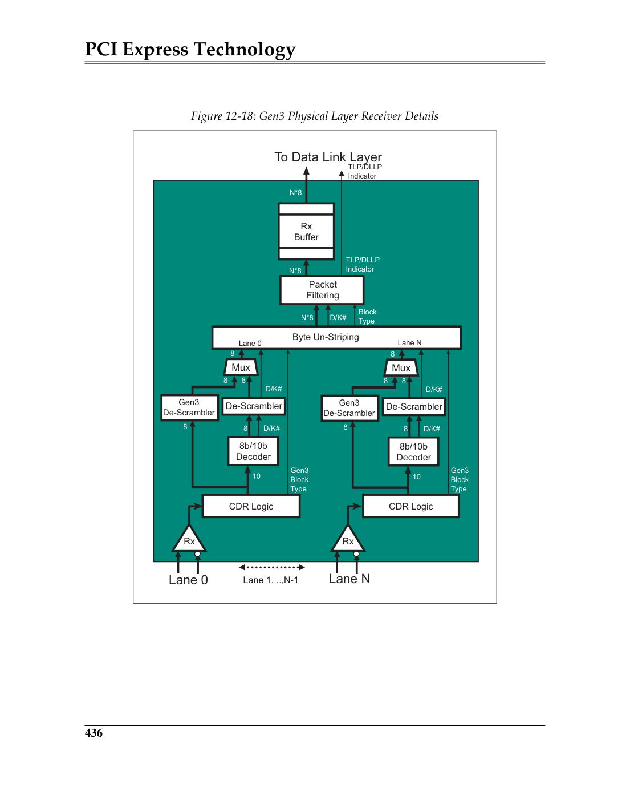</p>
<p align="center"><sub>📄 <a href="figures/chapter_12_Physical_Layer_Logical_Gen3/page/page0495.png">Page 495</a></sub></p>

<table>
<thead><tr><th width="50%">🇬🇧 English</th><th width="50%">🇨🇳 中文</th></tr></thead>
<tbody>
<tr><table>
<thead><tr><th width="50%">🇬🇧 English</th><th width="50%">🇨🇳 中文</th></tr></thead>
<tbody>


<tr>
<td width="50%">

- 如果没有 Lane 检测到接收器，则返回 Detect.Quiet。只要未检测到接收器，它们之间的循环每 12ms 重复一次。

</td>
<td width="50%">

- 如果没有 Lane 检测到接收器，则返回到 Detect.Quiet。它们之间的循环每 12ms 重复一次，只要没有检测到接收器。

</td>
</tr>
<tr>
<td width="50%">

## _退出到 "Polling 状态"_

- 如果在所有 Lane 上都检测到接收器，则下一个状态将是 Polling。Lane 现在必须在 0 ‐ 3.6 V VTX‐CM‐DC 规格范围内驱动直流共模电压。

</td>
<td width="50%">

## _退出至"Polling 状态"_

- 如果在所有 Lane 上都检测到接收器，则下一个状态将是 Polling。Lane 现在必须在 0 至 3.6 V VTX‐CM‐DC 规范内驱动直流共模电压。

</td>
</tr>
<tr>
<td width="50%">

## _特殊情况：_

如果设备的部分（但不是全部）Lane 连接到接收器（如 x4

**第 14 章：链路初始化与训练**

设备连接到 x2 设备），则等待 12 ms 并重试。如果相同的 Lane 在第二次检测到接收器，则退出到 Polling 状态，否则返回 Detect.Quiet。如果转到 Polling，则对于未看到接收器的 Lane 有两种可能性：

1. 如果 Lane 可以作为单独的链路运行（参见第 541 页 "Designing Devices with Links that can be Merged"），使用另一个 LTSSM 并让那些 Lane 重复检测序列。

2. 如果没有其他 LTSSM 可用，则未检测到接收器的 Lane 将不是链路的一部分，必须转换到电气空闲。

</td>
<td width="50%">

## _特殊情况：_

如果设备的一些但不是所有 Lane 连接到接收器（例如 x4

**第 14 章：链路初始化与训练**

设备连接到 x2 设备），则等待 12 ms 并重试。如果相同的 Lane 在第二次时检测到接收器，则退出到 Polling 状态，否则返回到 Detect.Quiet。如果转到 Polling，对于未看到接收器的 Lane 有两种可能性：

1. 如果 Lane 可以作为单独的链路运行（请参阅第 541 页的"设计具有可合并链路的设备"），请使用另一个 LTSSM 并让这些 Lane 重复检测序列。

2. 如果另一个 LTSSM 不可用，则未检测到接收器的 Lane 将不属于该链路的一部分，并且必须转换为电气空闲 (Electrical Idle)。

</td>
</tr>
<tr>
<td width="50%">

## **Polling 状态**

</td>
<td width="50%">

## **Polling 状态**

</td>
</tr>
<tr>
<td width="50%">

## **介绍**

到目前为止，链路一直处于电气空闲状态，但是在 Polling 期间，LTSSM TS1 和 TS2
在两个连接的设备之间交换。此状态的主要目的是让两个设备理解彼此在说什么。换句话说，他们需要在彼此传输的位流上建立位和符号锁定，并解决任何极性反转问题。一旦完成，每个设备都成功地接收来自其链路伙伴的 TS1 和 TS2 有序集。第 525 页的图 14‐9 显示了 Polling
状态机的子状态。

_图 14‐9：Polling 状态机_

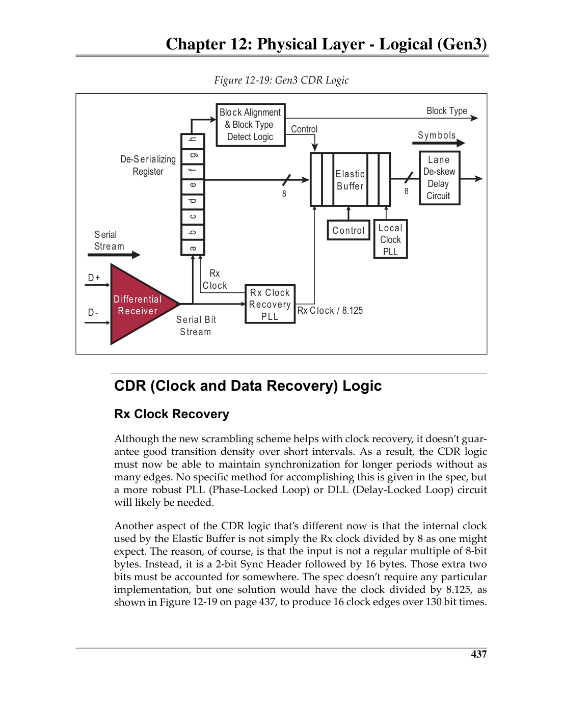

<br>

</td>
<td width="50%">

## **简介**

到此为止，链路一直处于电气空闲状态，然而在 Polling 期间，LTSSM TS1 和 TS2 在两个连接的设备之间交换。此状态的主要目的是让两个设备理解彼此的通信内容。换句话说，它们需要在彼此传输的比特流上建立位和符号锁定 (bit and symbol
lock)，并解决任何极性反转问题。一旦完成此操作，每个设备都成功地接收来自其链路伙伴的 TS1 和 TS2 有序集。第 525 页图 14-9 显示了 Polling 状态机的子状态。

_图 14-9：Polling 状态机_

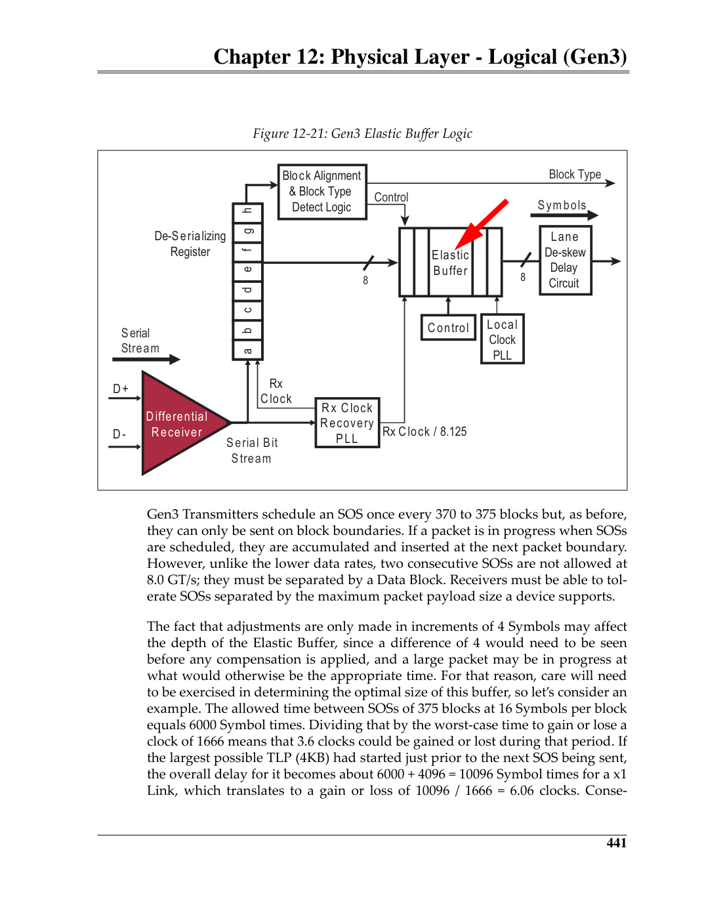


**PCI Express 技术**

</td>
</tr>
<tr>
<td width="50%">

## **Polling 子状态详解**

</td>
<td width="50%">

## **详细的 Polling 子状态**

</td>
</tr>
<tr>
<td width="50%">

## **Polling.Active**

</td>
<td width="50%">

## **Polling.Active**

</td>
</tr>
<tr>
<td width="50%">

## _在 Polling.Active 期间_

一旦其共模电压稳定在 Transmit Margin 字段指定的电平，发送器在所有检测到的 Lane 上发送至少 1024 个连续的 TS1。两个链路伙伴可以在不同时间退出 Detect 状态，因此 TS1 交换未同步。以 Gen1 速度（2.5 GT/s）发送 1024 个
TS1 所需的时间为 64μs。

关于此子状态的一些注意事项：

- TS1 的 Lane 和 Link Number 字段中必须使用 PAD 符号。

- 必须通告设备支持的所有数据速率，即使它不打算使用所有速率。

- 接收器使用传入的 TS1 获取位锁定（参见第 395 页 "Achieving Bit Lock"），然后对于较低速率获取符号锁定（参见第 396 页 "Achieving Symbol Lock"），或者对于 8.0 GT/s 获取块对齐（参见第 438 页
"Achieving Block Alignment"）。

</td>
<td width="50%">

## _在 Polling.Active 期间_

一旦其共模电压稳定在 Transmit Margin 字段指定的水平上，发送器将在所有检测到的 Lane 上发送最少 1024 个连续的 TS1。两个链路伙伴可以在不同时间退出 Detect 状态，因此 TS1 交换未同步。在 Gen1 速度 (2.5 GT/s) 下发送
1024 个 TS1 所需的时间为 64μs。

关于此子状态的一些注意事项：

- PAD 符号必须用于 TS1 的 Lane 和 Link Number 字段中。

- 必须通告设备支持的所有数据速率，即使它不打算使用全部。

- 接收器使用传入的 TS1 获得位锁定 (Bit Lock)（请参阅第 395 页的"实现位锁定"），然后对于较低速率为符号锁定 (Symbol Lock)（请参阅第 396 页的"实现符号锁定"），或者对于 8.0 GT/s 为块对齐 (Block
Alignment)（请参阅第 438 页的"实现块对齐"）。

</td>
</tr>
<tr>
<td width="50%">

## _退出到 "Polling.Configuration"_

- 下一个状态是 Polling.Configuration，如果在发送至少 1024 个 TS1 之后，**所有**检测到的 Lane 接收到 8 个连续的训练序列（或其补码，由于极性反转），满足以下条件之一：

- 接收到的 TS1 的 Link 和 Lane 设置为 PAD，Compliance Receive 位清零为 0b（符号 5 的位 4）。

- 接收到的 TS1 的 Link 和 Lane 设置为 PAD，符号 5 的 Loopback 位设置为 1b。

-

- 接收到的 TS2 的 Link 和 Lane 设置为 PAD。

如果上述条件未满足，则在 24ms 超时后，如果在接收到 TS1 后发送了至少 1024 个 TS1，并且**任意**检测到的 Lane 接收到八个连续的 TS1 或 TS2 有序集（或其补码），其 Lane 和 Link 编号设置为 PAD，并且以下条件之一为真：

- 接收到的 TS1 的 Link 和 Lane 设置为 PAD，Compliance Receive（符号 5 的位 4）清零为 0b。

- 接收到的 TS1 的 Link 和 Lane 设置为 PAD，Loopback（符号 5 的位 2）设置为 1b。

- 接收到的 TS2 的 Link 和 Lane 设置为 PAD。

**第 14 章：链路初始化与训练**

如果仍然不满足上述条件，则如果至少预定数量的检测到的 Lane 也自进入 Polling.Active 以来至少检测到一次电气空闲退出（这可防止一个或多个不良发送器或接收器阻碍链路配置）。准确的预定 Lane 集是特定于实现的，这是相对于 1.1
规范的变化，该规范需要在所有检测到的 Lane 上看到电气空闲退出。

</td>
<td width="50%">

## _退出至"Polling.Configuration"_

- 如果在发送至少 1024 个 TS1 之后，**所有**检测到的 Lane 收到 8 个连续的训练序列（或其补码，由于极性反转），满足以下条件之一，则下一个状态为 Polling.Configuration：

- 接收到 Link 和 Lane 设置为 PAD 的 TS1，且 Compliance Receive 位清零为 0b (Symbol 5 的位 4)。

- 接收到 Link 和 Lane 设置为 PAD 的 TS1，且 Symbol 5 的 Loopback 位置为 1b。

- 

- 接收到 Link 和 Lane 设置为 PAD 的 TS2。

如果以上条件均不满足，则在 24ms 超时后，如果在收到 TS1 后已发送至少 1024 个 TS1，并且**任何**检测到的 Lane 收到 8 个连续的 TS1 或 TS2 有序集（或其补码），其 Lane 和 Link 号设置为 PAD，并且以下之一为真：

- 接收到 Link 和 Lane 设置为 PAD 的 TS1，且 Compliance Receive (Symbol 5 的位 4) 清零为 0b。

- 接收到 Link 和 Lane 设置为 PAD 的 TS1，且 Loopback (Symbol 5 的位 2) 置为 1b。

- 接收到 Link 和 Lane 设置为 PAD 的 TS2。

**第 14 章：链路初始化与训练**

如果以上条件仍然不满足，则如果至少预定数量的检测 Lane 也检测到自进入 Polling.Active 以来至少一次退出电气空闲（这可以防止一个或多个有问题的发送器或接收器阻碍链路配置）。预定 Lane 的确切集合现在是特定于实现的，这是相对于 1.1
规范的更改，后者需要查看所有检测到的 Lane 上的电气空闲退出。

</td>
</tr>
<tr>
<td width="50%">

## _退出到 "Polling.Compliance"_

如果 Link Control 2 寄存器中的 Enter Compliance 位设置为 1b，或者如果在进入 Polling.Active 之前设置了此位，则更改到 Polling.Compliance 必须是立即的，并且在 Polling.Active 中不发送 TS1。

否则，在 24ms 超时后，如果：

- 自进入 Polling.Active 以来，预定集中的所有 Lane 都未看到电气空闲退出（表示被动测试负载，例如至少一个 Lane 上的电阻器，迫使所有 Lane 进入 Polling.Compliance）。

- 任何检测到的 Lane 接收到 8 个连续的 TS1（或其补码），其 Link 和 Lane 编号设置为 PAD，符号 5 的 Compliance Receive 位设置为 1b 且 Loopback 位清零为 0b。

</td>
<td width="50%">

## _退出至"Polling.Compliance"_

如果 Link Control 2 寄存器中的 Enter Compliance 位置为 1b，或者如果该位在进入 Polling.Active 之前已置位，则转换到 Polling.Compliance 必须是即时的，并且在 Polling.Active 中不发送 TS1。

否则，在 24ms 超时后，如果：

- 预定集合中的所有 Lane 自进入 Polling.Active 以来未观察到退出电气空闲（表明存在被动测试负载，例如至少一个 Lane 上的电阻迫使所有 Lane 进入 Poll‐ ing.Compliance）。

- 任何检测到的 Lane 收到 8 个连续的 TS1（或其补码），其 Link 和 Lane 号设置为 PAD，Symbol 5 的 Compliance Receive 位置为 1b 且 Loopback 位清零为 0b。

</td>
</tr>
<tr>
<td width="50%">

## _退出到 "Detect 状态"_

- 如果 24ms 后，转到 Polling.Configuration 或 Polling.Compliance 的条件未满足，则返回 Detect 状态。

</td>
<td width="50%">

## _退出至"Detect 状态"_

- 如果在 24ms 后，未满足转到 Polling.Configuration 或 Poll‐ ing.Compliance 的条件，则返回到 Detect 状态。

</td>
</tr>
<tr>
<td width="50%">

## **Polling.Configuration**

在此子状态中，发送器将停止发送 TS1 并开始发送 TS2，Link 和 Lane 编号仍设置为 PAD。更改为发送 TS2 而不是 TS1 的目的是向链路伙伴通告此设备已准备好继续状态机中的下一个状态。这是一种握手机制，以确保链路上的两个设备一起通过
LTSSM。在两个设备都准备好之前，任何一个设备都不能继续到下一个状态。他们通过发送 TS2 有序集来通告他们已准备好。因此，一旦设备既发送又接收 TS2，它就知道它可以继续到下一个状态，因为它已准备好，其链路伙伴也已准备好。

</td>
<td width="50%">

## **Polling.Configuration**

在此子状态下，发送器将停止发送 TS1 并开始发送 TS2，Link 和 Lane 号仍设置为 PAD。更改为发送 TS2 而不是 TS1 的目的是向链路伙伴通告此设备已准备好进入状态机中的下一状态。这是一种握手机制，以确保链路上的两个设备一起通过 LTSSM
前进。在两个设备都准备好之前，任何设备都不能进入下一状态。它们通过发送 TS2 有序集来通告它们已准备好。因此，一旦设备同时发送并接收 TS2，它就知道可以进入下一状态，因为它已准备好且其链路伙伴也已准备好。

</td>
</tr>
<tr>
<td width="50%">

## _在 Polling.Configuration 期间_

- 发送器在所有检测到的 Lane 上发送 Link 和 Lane 编号设置为 PAD 的 TS2，并且必须通告它们支持的所有数据速率，即使它们不打算使用。此外，每个 Lane 的接收器必须在必要时独立反转其差分输入对的极性。有关如何执行此操作的说明，请参见第 506 页
"Overview"。Transmit Margin 字段必须重置为 000b。

</td>
<td width="50%">

## _在 Polling.Configuration 期间_

- 发送器在所有检测到的 Lane 上发送 Link 和 Lane 号设置为 PAD 的 TS2，并且必须通告其支持的所有数据速率，即使它不打算使用。此外，每个 Lane 的接收器必须根据需要独立反转其差分输入对的极性。有关如何完成此操作的说明，请参阅第 506
页的"概述"。Transmit Margin 字段必须重置为 000b。

</td>
</tr>
<tr>
<td width="50%">

## **PCI Express Technology**

</td>
<td width="50%">

## **PCI Express 技术**

</td>
</tr>
<tr>
<td width="50%">

## _退出到 "Configuration 状态"_

在任何检测到的 Lane 上接收到八个连续的 Link 和 Lane 设置为 PAD 的 TS2，并且自接收到一个 TS2 起已发送至少 16 个 TS2 之后，退出到 Configuration。

</td>
<td width="50%">

## _退出至"Configuration 状态"_

在任何检测到的 Lane 上收到 8 个连续的 Link 和 Lane 设置为 PAD 的 TS2，并且自收到一个 TS2 以来已发送至少 16 个 TS2 之后，退出到 Configuration。

</td>
</tr>
<tr>
<td width="50%">

## _退出到 "Detect 状态"_

否则，在 48ms 超时后退出到 Detect。

</td>
<td width="50%">

## _退出至"Detect 状态"_

否则，在 48ms 超时后退出到 Detect。

</td>
</tr>
<tr>
<td width="50%">

## _退出到 Polling.Speed（不存在的子状态）_

作为历史回顾，Polling 的子状态自规范的 1.0 版本发布以来已发生变化。当时认为当其他速度可用时，尽快在此状态下更改为最高可用速率是有意义的。然而，更高速度的出现恰好与意识到能够出于电源管理原因在运行时向上和向下更改速度将是有利的认识相吻合。通过 Polling
状态涉及清除许多链路值，这使其成为运行时使用的一条没有吸引力的路径，因此速率更改阶段从该状态移出到 Recovery 状态。参见第 528 页的图 14‐10。

_图 14‐10：具有传统速度更改的 Polling 状态机_

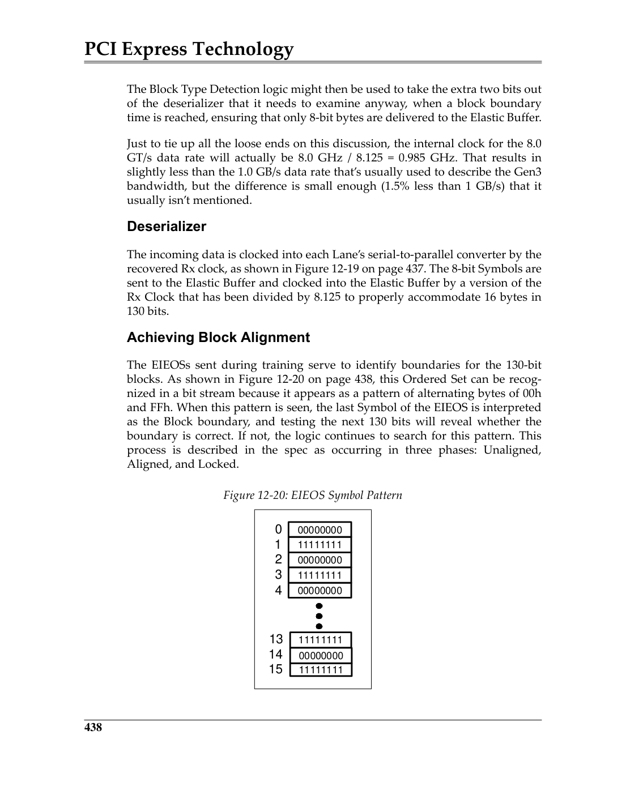

<br>


如今，复位后链路始终训练到 2.5 GT/s，即使其他速度可用。如果 LTSSM 达到 L0 后有更高的速度可用，则它转换到 Recovery 并尝试更改为最高共同支持或通告的速率。支持的速度在交换的 TS1 中报告

**第 14 章：链路初始化与训练**

和 TS2，以便任一设备随后可以决定通过转换到 Recovery 状态来启动速度更改。规范仍然列出此子状态但声明它是不可达的。

</td>
<td width="50%">

## _退出至 Polling.Speed（不存在的子状态）_

作为历史回顾，自规范 1.0 版本发布以来，Polling 的子状态已发生变化。当时认为，当其他速度可用时，应尽快在此状态下更改为最高可用速率。然而，更高速度的出现恰好伴随着这样的认识：在运行时出于电源管理原因同时更改更高和更低速度将是有利的。通过 Polling
状态涉及清除许多链路值，这使其成为运行时使用的不具吸引力的路径，因此速率更改阶段已从该状态移出到 Recovery 状态。请参阅第 528 页图 14-10。

_图 14-10：具有旧式速度更改的 Polling 状态机_

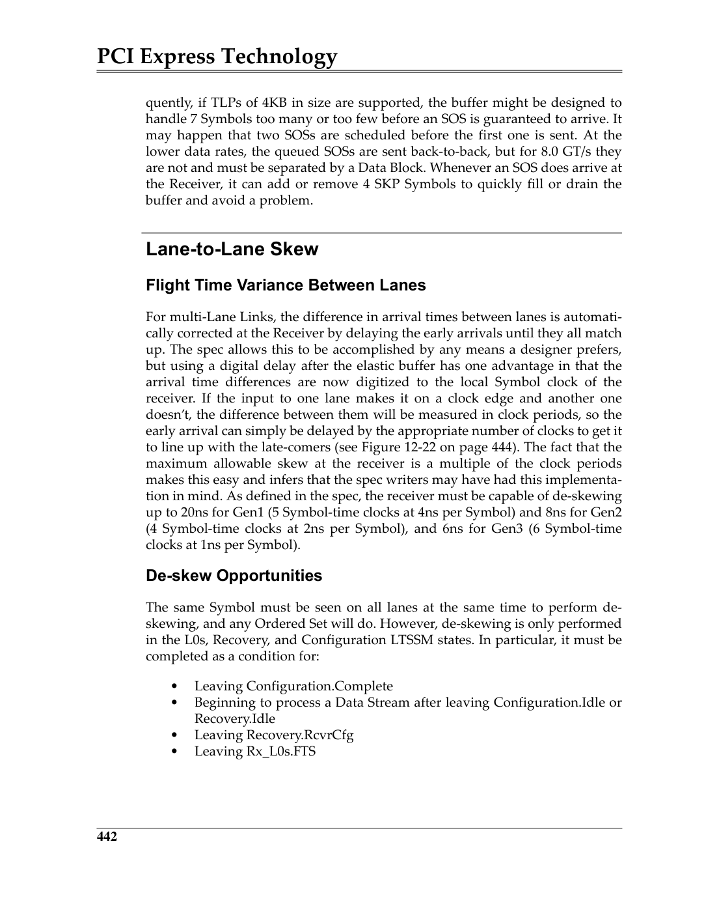


如今，链路在复位后始终训练到 2.5 GT/s，即使其他速度可用。如果在 LTSSM 达到 L0 后有更高速率可用，则它转换到 Recovery 并尝试更改为最高共同支持或通告的速率。支持的速度在交换的 TS1 中报告。

**第 14 章：链路初始化与训练**

和 TS2，以便任一设备随后都可以通过转换到 Recovery 状态来决定发起速度更改。规范仍列出此子状态，但声明它现在不可达。

</td>
</tr>
<tr>
<td width="50%">

## **Polling.Compliance**

此子状态仅用于测试，并使发送器发送旨在创建接近最坏情况的符号间干扰 (ISI) 和串扰条件的特定模式以便于链路分析。在此子状态中可以发送两种不同的模式，即合规模式和修改的合规模式。

**8b/10b 的合规模式。** 此模式由按顺序重复的 4 个符号组成：K28.5‐、D21.5+、K28.5+ 和 D10.2‐，其中（‐）表示负电流差或 CRD，（+）表示正 CRD（由于 CRD 是强制的，因此允许在模式开头存在差异错误）。如果链路具有多个
Lane，则四个延迟符号（在表中显示为 D，但实际上只是额外的 K28.5 符号）被注入到 Lane 0 上，两个在下一个合规模式之前，两个在之后。一旦 Lane 0 上发送了最后一个延迟符号，则四个延迟符号也在 Lane 1
上发送（同样，两个在下一个合规模式之前，两个在之后）。此过程继续进行，直到延迟符号传播通过 Lane 7。然后它们回到 Lane 0 重新开始，如第 529 页表 14‐3 所示（合规模式以灰色阴影显示）。每八个 Lane 的组都是这样的行为。移动延迟符号将确保相邻 Lane
之间的干扰并提供更好的测试条件。

_表 14‐3：8b/10b 合规模式的符号序列_

|**符号**|**Lane 0**|**Lane 1**|**Lane 2**|**...**|**Lane 8**|
|---|---|---|---|---|---|
|0|D|K28.5‐|K28.5‐||D|
|1|D|K21.5|K21.5||D|
|2|K28.5‐|K28.5+|K28.5+||K28.5‐|
|3|K21.5|D10.2|D10.2||K21.5|
|4|K28.5+|K28.5‐|K28.5‐||K28.5+|
|5|D10.2|K21.5|K21.5||D10.2|

</td>
<td width="50%">

## **Polling.Compliance**

此子状态仅用于测试，并导致发送器发送旨在产生接近最坏情况的符号间干扰 (Inter‐Symbol Interference, ISI) 和串扰条件的特定模式，以促进对链路的分析。在此子状态下可以发送两种不同的模式：Compliance Pattern 和 Modified
Compliance Pattern。

**8b/10b 的合规模式。** 此模式由按顺序重复的 4 个符号组成：K28.5‐、D21.5+、K28.5+ 和 D10.2‐，其中 (‐) 表示负电流运行差异 (CRD)，(+) 表示正 CRD（由于强制 CRD，模式开头可以存在差异错误）。如果链路有多个
Lane，则四个延迟符号（显示为 D，但实际上只是其他 K28.5 符号）被注入到 Lane 0 上，在下一个合规模式之前两个，在合规模式之后两个。最后一个延迟符号在 Lane 0 上发送后，四个延迟符号也在 Lane 1
上发送（同样，在下一个合规模式之前两个，在之后两个）。此过程继续进行，直到延迟符号传播通过 Lane 7。然后它们返回到从 Lane 0 重新开始，如第 529 页表 14-3 所示（合规模式以灰色阴影显示）。每组八个 Lane 都以这种方式表现。移动延迟符号将确保相邻 Lane
之间的干扰，并提供更好的测试条件。

_表 14-3：8b/10b 合规模式的符号序列_

|**Symbol**|**Lane 0**|**Lane 1**|**Lane 2**|**...**|**Lane 8**|
|---|---|---|---|---|---|
|0|D|K28.5‐|K28.5‐||D|
|1|D|K21.5|K21.5||D|
|2|K28.5‐|K28.5+|K28.5+||K28.5‐|
|3|K21.5|D10.2|D10.2||K21.5|
|4|K28.5+|K28.5‐|K28.5‐||K28.5+|
|5|D10.2|K21.5|K21.5||D10.2|

</td>
</tr>
<tr>
<td width="50%">

## **PCI Express Technology**

_表 14‐3：8b/10b 合规模式的符号序列（续）_

|**符号**|**Lane 0**|**Lane 1**|**Lane 2**|**...**|**Lane 8**|
|---|---|---|---|---|---|
|6|D|K28.5+|K28.5+||D|
|7|D|D10.2|D10.2||D|
|8|K28.5‐|D|K28.5‐||K28.5‐|
|9|K21.5|D|K21.5||K21.5|
|10|K28.5+|K28.5‐|K28.5+||K28.5+|
|...|...|...|...||...|
|16|K28.5‐|K28.5‐|D||K28.5‐|
|17|K21.5|K21.5|D||K21.5|
|18|K28.5+|K28.5+|K28.5‐||K28.5+|


**128b/130b 的合规模式。** 此模式由以下 36 个块的重复序列组成：

</td>
</tr>
</tbody>
</table></tbody></table>

[⬆️ 返回目录](#本章目录-table-of-contents)

---

<a id="sec-12-3"></a>

</td>
<td width="50%">

## **PCI Express 技术**

_表 14-3：8b/10b 合规模式的符号序列（续）_

|**Symbol**|**Lane 0**|**Lane 1**|**Lane 2**|**...**|**Lane 8**|
|---|---|---|---|---|---|
|6|D|K28.5+|K28.5+||D|
|7|D|D10.2|D10.2||D|
|8|K28.5‐|D|K28.5‐||K28.5‐|
|9|K21.5|D|K21.5||K21.5|
|10|K28.5+|K28.5‐|K28.5+||K28.5+|
|...|...|...|...||...|
|16|K28.5‐|K28.5‐|D||K28.5‐|
|17|K21.5|K21.5|D||K21.5|
|18|K28.5+|K28.5+|K28.5‐||K28.5+|


**128b/130b 的合规模式。** 此模式由以下 36 个块的重复序列组成：

</td>
</tr><table>
<thead><tr><th width="50%">🇬🇧 English</th><th width="50%">🇨🇳 中文</th></tr></thead>
<tbody>
<tr>
<td width="50%">

## 12.3 Physical Layer - Logical (Gen3) | 物理层 - 逻辑 (Gen3)

<table>
<thead><tr><th>🇬🇧 English</th><th style="background-color:#e8e8e8">🇨🇳 中文</th></tr>
</tbody>
</table></thead>
<tbody>
<tr>
<td width="50%">

- If no Lanes detect a Receiver, go back to Detect.Quiet. The loop between them is repeated every 12ms, as long as no Receiver is detected.

</td>
<td width="50%">

</td>
</tr>
<tr>
<td width="50%">

## _Exit to “Polling State”_ 

- If a receiver is detected on all Lanes, the next state will be Polling. The Lanes must now drive a DC common voltage within the 0 ‐ 3.6 V
VTX‐CM‐DC spec.

</td>
<td width="50%">

</td>
</tr>
<tr>
<td width="50%">

## _Special Case:_ 

If some but not all Lanes of a device are connected to a Receiver (like a x4 
device connected to a x2 device), then wait 12 ms and try it again. If the same Lanes detect a Receiver the second time, exit to the Polling
state, oth‐ erwise go back to Detect.Quiet. If going to Polling, there are two possibili‐ ties for the Lanes that didn’t see a Receiver:

1. If the Lanes can operate as a separate Link (see “Designing Devices with Links that can be Merged” on page 541), use another LTSSM and
have those Lanes repeat the detect sequence.

2. If another LTSSM is not available, then the Lanes that don’t detect a Receiver will not be part of a Link and must transition to
Electrical Idle.

</td>
<td width="50%">

</td>
</tr>
<tr>
<td width="50%">

## **Polling State**

</td>
<td width="50%">

</td>
</tr>
<tr>
<td width="50%">

## **Introduction** 

To this point the link has been in the electrical idle state, however during Polling the LTSSM TS1s and TS2s are exchanged between the two
connected devices. The primary purpose of this state is for the two devices to understand what the each other is saying. In other words,
they need to establish bit and symbol lock on each other’s transmitted bit stream and resolve any polarity inversion issues. Once this has
been accomplished, each device is successfully receiving the TS1 and TS2 ordered‐sets from their link partner. Figure 14‐9 on page 525 shows
the substates of the Polling state machine.

_Figure 14‐9: Polling State Machine_ 

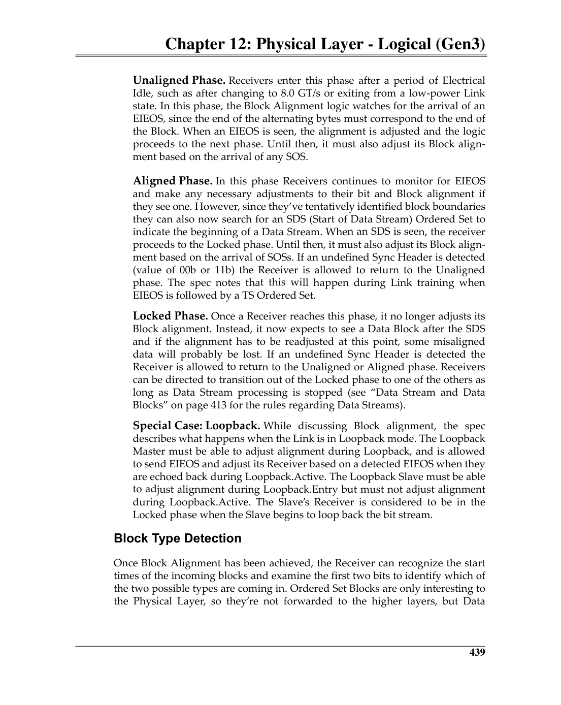

<br>

</td>
<td width="50%">

</td>
</tr>
<tr>
<td width="50%">

## **Detailed Polling Substates**

</td>
<td width="50%">

</td>
</tr>
<tr>
<td width="50%">

## **Polling.Active**

</td>
<td width="50%">

</td>
</tr>
<tr>
<td width="50%">

## _During Polling.Active_ 

Transmitters send a minimum of 1024 consecutive TS1s on all detected Lanes once their common‐mode voltage has settled at the level specified
in the Transmit Margin field. The two Link partners may exit the Detect state at different times, so the TS1 exchange is not synchronized.
The time needed to send 1024 TS1s at Gen1 speed (2.5 GT/s) is 64μs.

Some notes regarding this substate are: 

- The PAD Symbol must be used in the Lane and Link Number fields of the TS1s. 

- All data rates a device supports must be advertised, even if it doesn’t intend to use them all. 

- Receivers use the incoming TS1s to acquire Bit Lock (see “Achieving Bit Lock” on page 395) and then either Symbol Lock (see “Achieving
Symbol Lock” on page 396) for the lower rates, or Block Alignment for 8.0 GT/s (see “Achieving Block Alignment” on page 438).

</td>
<td width="50%">

</td>
</tr>
<tr>
<td width="50%">

## _Exit to “Polling.Configuration”_ 

- The next state is Polling.Configuration if, after sending at least 1024 TS1s **ALL** detected Lanes receive 8 consecutive training
sequences (or their com‐ plement, due to polarity inversion) that satisfy one of the following condi‐ tions:

- TS1s with Link and Lane set to PAD were received with the Compli‐ ance Receive bit cleared to 0b (bit 4 of Symbol 5). 

- TS1s with Link and Lane set to PAD were received with the Loopback bit of Symbol 5 set to 1b. 

- 

- TS2s were received with Link and Lane set to PAD. 

If the conditions above are not met, then after a 24ms timeout, if at least 1024 TS1s were sent after receiving a TS1, and **ANY** detected
Lane received eight consecutive TS1 or TS2 Ordered Sets (or their complement) with the Lane and Link numbers set to PAD, and one of the
following is true:

- TS1s with Link and Lane set to PAD were received with the Compli‐ ance Receive (bit 4 of Symbol 5) cleared to 0b. 

- TS1s with Link and Lane set to PAD were received with the Loopback (bit 2 of Symbol 5) set to 1b. 

- TS2s were received with Link and Lane set to PAD. 
If still none of the conditions above are met, if at least a predetermined number of detected Lanes also detected an exit from Electrical
Idle at least once since entering Polling.Active (this prevents one or more bad Transmit‐ ters or Receivers from holding up Link
configuration). The exact set of pre‐ determined Lanes is implementation specific now, which is a change from the 1.1 spec that needed to
see an Electrical Idle exit on all detected Lanes.

</td>
<td width="50%">

</td>
</tr>
<tr>
<td width="50%">

## _Exit to “Polling.Compliance”_ 

If the Enter Compliance bit in the Link Control 2 register is set to 1b, or if this bit was set before entering Polling.Active, the change
to Polling.Com‐ pliance must be immediate and no TS1s are sent in Polling.Active.

Otherwise, after a 24ms timeout, if: 

- All Lanes from the predetermined set have not seen an exit from Elec‐ trical Idle since entering Polling.Active (indicates a passive test
load such as a resistor on at least one Lane forces all Lanes into Poll‐ ing.Compliance).

- Any detected Lane received 8 consecutive TS1s (or their complement) with Link and Lane numbers set to PAD, the Compliance Receive bit of
Symbol 5 set to 1b and the Loopback bit cleared to 0b.

</td>
<td width="50%">

</td>
</tr>
<tr>
<td width="50%">

## _Exit to “Detect State”_ 

- If, after 24ms, the conditions for going to Polling.Configuration or Poll‐ ing.Compliane are not met, return to the Detect state.

</td>
<td width="50%">

</td>
</tr>
<tr>
<td width="50%">

## **Polling.Configuration** 

In this substate, a transmitter will stop sending TS1s and start sending TS2s, still with PAD set for the Link and Lane numbers. The purpose
of the change to sending TS2s instead of TS1s is to advertise to the link partner that this device is ready to proceed to the next state in
the state machine. It is a handshake mecha‐ nism to ensure that both devices on the link proceed through the LTSSM together. Neither device
can proceed to the next state until both devices are ready. The way they advertise they are ready is by sending TS2 ordered‐sets. So once a
device is both sending AND receiving TS2s, it knows it can proceed to the next state because it is ready and its link partner is ready too.

</td>
<td width="50%">

</td>
</tr>
<tr>
<td width="50%">

## _During Polling.Configuration_ 

- Transmitters send TS2s with Link and Lane numbers set to PAD on all detected Lanes, and they must advertise all the data rates they
support, even those they don’t intend to use. Also, each Lane’s receiver must inde‐ pendently invert the polarity of its differential input
pair if necessary. For an explanation of how this is done, see “Overview” on page 506. The Trans‐ mit Margin field must be reset to 000b.

</td>
<td width="50%">

</td>
</tr>
<tr>
<td width="50%">

## **PCI Express Technology**

</td>
<td width="50%">

</td>
</tr>
<tr>
<td width="50%">

## _Exit to “Configuration State”_ 

After eight consecutive TS2s with Link and Lane set to PAD are received on any detected Lanes, and at least 16 TS2s have been sent since
receiving one TS2, exit to Configuration.

</td>
<td width="50%">

</td>
</tr>
<tr>
<td width="50%">

## _Exit to “Detect State”_ 

Otherwise, exit to Detect after a 48ms timeout.

</td>
<td width="50%">

</td>
</tr>
<tr>
<td width="50%">

## _Exit to Polling.Speed (Non‐existent substate)_ 

As a historical aside, the substates of Polling have changed since the 1.0 version of the spec was released. At that time it was thought
that when other speeds became available it would make sense to change to the highest available rate as soon as possible in this state.
However, the advent of higher rates coincided with the realization that it would be advantageous to be able to change speeds both higher and
lower during runtime for power management reasons. Going through the Polling state involves clearing a number of Link values and that makes
it an unattractive path for runtime use, so the rate change stage was moved out of this state into the Recovery state. See Figure 14‐10 on
page 528.

_Figure 14‐10: Polling State Machine with Legacy Speed Change_ 

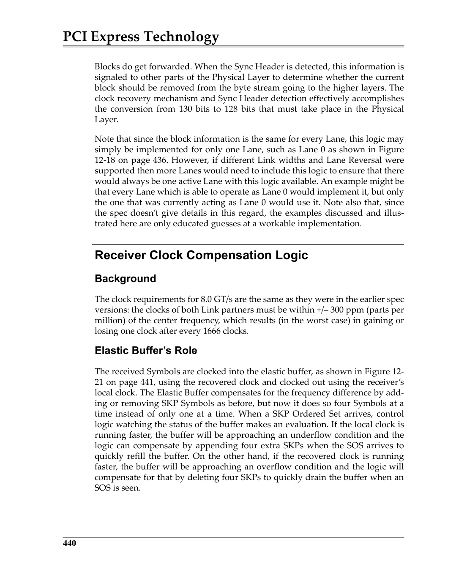

<br>


Today, the Link always trains to 2.5 GT/s after a reset, even if other speeds are available. If higher speeds are available once the LTSSM
has reached L0, then it transitions to Recovery and attempts to change to the highest commonly‐sup‐ ported or advertised rate. Supported
speeds are reported in the exchanged TS1s
and TS2s, so that either device can subsequently decide to initiate a speed change by transitioning to the Recovery state. The spec still
lists this substate but declares that it is now unreachable.

</td>
<td width="50%">

</td>
</tr>
<tr>
<td width="50%">

## **Polling.Compliance** 

This substate is only used for testing and causes a Transmitter to send specific patterns intended to create near‐worst‐case Inter‐Symbol
Interference (ISI) and cross‐talk conditions to facilitate analysis of the Link. Two different patterns can be sent while in this substate,
the Compliance Pattern and the Modified Compli‐ ance Pattern.

**Compliance Pattern for 8b/10b.** This pattern consists of 4 Symbols that are repeated sequentially: K28.5‐, D21.5+, K28.5+ and D10.2‐,
where (‐) means negative current running disparity or CRD and (+) means positive CRD (since the CRD is forced, it’s permissible to have a
disparity error at the beginning of the pattern). If the Link has multiple Lanes, then four Delay Symbols (shown as D, but are really just
additional K28.5 symbols) are injected on Lane 0, two before the next compliance pattern and two after the compliance pattern. Once the last
Delay symbol has been sent on Lane 0, the four delay symbols are also sent on Lane 1 (again, two before the next compliance pattern and two
after). This process continues until after the Delay symbols have propagated through Lane 7. Then they go back to start‐ ing on Lane 0 again
as can be seen in Table 14‐3 on page 529 (the compli‐ ance pattern is shaded in grey). Every group of eight lanes behaves this way. Shifting
the Delay Symbols will ensure interference between adjacent Lanes and provide better test conditions.

_Table 14‐3: Symbol Sequence 8b/10b Compliance Pattern_ 

|**Symbol**|**Lane 0**|**Lane 1**|**Lane 2**|**...**|**Lane 8**|
|---|---|---|---|---|---|
|0|D|K28.5‐|K28.5‐||D|
|1|D|K21.5|K21.5||D|
|2|K28.5‐|K28.5+|K28.5+||K28.5‐|
|3|K21.5|D10.2|D10.2||K21.5|
|4|K28.5+|K28.5‐|K28.5‐||K28.5+|
|5|D10.2|K21.5|K21.5||D10.2|

</td>
<td width="50%">

</td>
</tr>
<tr>
<td width="50%">

## **PCI Express Technology** 

_Table 14‐3: Symbol Sequence 8b/10b Compliance Pattern (Continued)_ 

|**Symbol**|**Lane 0**|**Lane 1**|**Lane 2**|**...**|**Lane 8**|
|---|---|---|---|---|---|
|6|D|K28.5+|K28.5+||D|
|7|D|D10.2|D10.2||D|
|8|K28.5‐|D|K28.5‐||K28.5‐|
|9|K21.5|D|K21.5||K21.5|
|10|K28.5+|K28.5‐|K28.5+||K28.5+|
|...|...|...|...||...|
|16|K28.5‐|K28.5‐|D||K28.5‐|
|17|K21.5|K21.5|D||K21.5|
|18|K28.5+|K28.5+|K28.5‐||K28.5+|


**Compliance Pattern for 128b/130b.** This pattern consists of the follow‐ ing repeating sequence of 36 Blocks:

</td>
<td width="50%">

</td>
</tr>

</tbody>
</table>

[⬆️ 返回目录](#本章目录-table-of-contents)

---

<a id="sec-12-4"></a>
## 12.4 Physical Layer - Logical (Gen3) | 物理层 - 逻辑 (Gen3)

<table>
<thead><tr><th width="50%">🇬🇧 English</th><th width="50%">🇨🇳 中文</th></tr></thead>
<tbody>
<tr>
<td width="50%">

1. The first Block consists of the Sync Header 01b and contains the unscrambled payload of 64 ones followed by 64 zeros. 

2. The second Block has Sync Header 01b and contains the unscrambled payload shown in Table 14‐4 on page 530 (note that the pattern repeats
after 8 Lanes, and that P means the 4‐bit Tx preset being used, while ~P is the bit‐wise inverse of that).

3. The third Block has Sync Header 01b and contains the unscrambled payload shown in Table 14‐5 on page 531 (same notes as the second
Block).

4. The fourth Block is an EIEOS Block 

5. 32 more Data Blocks, each containing 16 scrambled IDL Symbols (00h). 

_Table 14‐4: Second Block of 128b/130b Compliance Pattern_ 

|**Symbol**|**Lane** **0**|**Lane** **1**|**Lane** **2**|**Lane** **3**|**Lane** **4**|**Lane** **5**|**Lane** **6**|**Lane** **7**|
|---|---|---|---|---|---|---|---|---|
|0|55h|FFh|FFh|FFh|55h|FFh|FFh|FFh|
|1|55h|FFh|FFh|FFh|55h|FFh|FFh|FFh|


_Table 14‐4: Second Block of 128b/130b Compliance Pattern (Continued)_ 

|**Symbol**|**Lane** **0**|**Lane** **1**|**Lane** **2**|**Lane** **3**|**Lane** **4**|**Lane** **5**|**Lane** **6**|**Lane** **7**|
|---|---|---|---|---|---|---|---|---|
|2|55h|00h|FFh|FFh|55h|FFh|FFh|FFh|
|3|55h|00h|FFh|C0h|55h|FFh|F0h|F0h|
|4|55h|00h|FFh|00h|55h|FFh|00h|00h|
|5|55h|00h|C0h|00h|55h|E0h|00h|00h|
|6|55h|00h|00h|00h|55h|00h|00h|00h|
|7|{P,~P}|{P,~P}|{P,~P}|{P,~P}|{P,~P}|{P,~P}|{P,~P}|{P,~P}|
|8|00h|1Eh|2Dh|3Ch|4Bh|5Ah|69h|78h|
|9|00h|55h|00h|00h|00h|55h|00h|F0h|
|10|00h|55h|00h|00h|00h|55h|00h|00h|
|11|00h|55h|00h|00h|00h|55h|00h|00h|
|12|00h|55h|0Fh|0Fh|00h|55h|07h|00h|
|13|00h|55h|FFh|FFh|00h|55h|FFh|00h|
|14|00h|55h|FFh|FFh|7Fh|55h|FFh|00h|
|15|00h|55h|FFh|FFh|FFh|55h|FFh|00h|


_Table 14‐5: Third Block of 128b/130b Compliance Pattern_ 

|**Symbol**|**Lane** **0**|**Lane** **1**|**Lane** **2**|**Lane** **3**|**Lane** **4**|**Lane** **5**|**Lane** **6**|**Lane** **7**|
|---|---|---|---|---|---|---|---|---|
|0|FFh|FFh|55h|FFh|FFh|FFh|55h|FFh|
|1|FFh|FFh|55h|FFh|FFh|FFh|55h|FFh|
|2|FFh|FFh|55h|FFh|FFh|FFh|55h|FFh|
|3|F0h|F0h|55h|F0h|F0h|F0h|55h|F0h|
|4|00h|00h|55h|00h|00h|00h|55h|00h|

</td>
<td width="50%">

- 规范指出"任何 Lane"这一规定支持前面描述的负载板使用模型，以允许设备循环遍历所有支持的测试用例。

- b) Enter Compliance 位自进入 Polling.Compliance 以来已清零 (0b)。

- c) 对于上游端口，Enter Compliance 位设置为 (1b) 并且在任何 Lane 上检测到 EIOS。此条件清零 Enter Compliance 位 (0b)。

如果数据速率不是 2.5 GT/s 或在进入 Polling.Compliance 期间设置了 Enter Compliance 位，则发送器发送 8 个连续的 EIOS 并在转换到 Polling.Active 之前进入电气空闲。在电气空闲期间，端口更改为 2.5 GT/s
并稳定 1ms 到 2ms 之间的时间。

发送多个 EIOS 有助于确保链路伙伴将检测到至少一个并在用于 Enter Compliance 寄存器位进入时退出 Polling.Compliance

**修改合规模式。** 如果 Polling.Compliance 是因为 TS1 指示而进入的，并且要么设置了 Compliance Receive 位并清除了 Loopback 位，要么 Link Control 2 寄存器中的 Enter Compliance 和
Enter Modified Compliance 位都被设置，则在所有检测到的 Lane 上发送错误状态符号清零为全零的修改合规模式。

如果速率为 2.5 或 5.0 GT/s，则每个 Lane 通过查找修改合规模式的一个实例来指示对传入模式的成功锁定，然后在其发送回的修改合规模式中设置 Pattern Lock 位（8 位错误状态符号的位 7）。

- 错误状态符号不能用于锁定过程中，因为如果链路伙伴尚未锁定，它们没有意义，因此它们的含义可能是未定义的。

- 模式的一个实例定义如下所述的 4 个符号序列：K28.5、D21.5、K28.5 和 D10.2 或这些符号的补码（意味着极性反转）。

- 被测设备必须在从链路伙伴接收到修改合规模式后的 1ms 内设置其发送的修改合规模式中的 Pattern Lock 位。

- 一个 Lane 上的任何接收器错误都会将该 Lane 的错误计数递增 1，并在计数达到 127 时饱和（不会更高或回绕）。

如果速率是 8.0 GT/s

- 进入此子状态时，Error_Status 字段设置为 00h。

- 被测设备必须在从链路伙伴接收到修改合规模式后的 4ms 内设置其发送的修改合规模式中的 Pattern Lock 位。

- 每个 Lane 在实现块对齐时独立设置 Pattern Lock。之后，数据块中的符号应为 IDL (00h)，任何不匹配的符号都会将计数递增 1。接收器错误计数在 127 处饱和，并在包含在此模式中的 SOS 的最后 2 个符号中发送。

- 加扰要求照常应用于修改合规模式：种子值按 Lane 设置，EIEOS 启动 LFSR，SOS 不推进 LFSR。

- 规范指出，设备应在获取块对齐之前等待足够长的时间以确保其接收器已稳定且不会看到任何位滑动。它甚至提到设备可能希望重新验证其块对齐，然后再设置 Pattern Lock 位。

</td>
</tr>
<tr>
<td width="50%">

## **PCI Express Technology** 

_Table 14‐5: Third Block of 128b/130b Compliance Pattern (Continued)_ 

|**Symbol**|**Lane** **0**|**Lane** **1**|**Lane** **2**|**Lane** **3**|**Lane** **4**|**Lane** **5**|**Lane** **6**|**Lane** **7**|
|---|---|---|---|---|---|---|---|---|
|5|00h|00h|55h|00h|00h|00h|55h|00h|
|6|00h|00h|55h|00h|00h|00h|55h|00h|
|7|{P,~P}|{P,~P}|{P,~P}|{P,~P}|{P,~P}|{P,~P}|{P,~P}|{P,~P}|
|8|00h|1Eh|2Dh|3Ch|4Bh|5Ah|69h|78h|
|9|00h|00h|00h|55h|00h|00h|00h|55h|
|10|00h|00h|00h|55h|00h|00h|00h|55h|
|11|00h|00h|00h|55h|00h|00h|00h|55h|
|12|FFh|0Fh|0Fh|55h|0Fh|0Fh|0Fh|55h|
|13|FFh|FFh|FFh|55h|FFh|FFh|FFh|55h|
|14|FFh|FFh|FFh|55h|FFh|FFh|FFh|55h|
|15|FFh|FFh|FFh|55h|FFh|FFh|FFh|55h|


**Modified Compliance Pattern for 8b/10b.** The second compliance pat‐ tern adds an error status field that reports how many Receiver errors
have been detected while in Polling.Compliance.

In 8b/10b mode, the original pattern is still used, but 2 Symbols are added to report the error status (2 are used instead of one to avoid
interfering with the required disparity of the sequence) and 2 more K28.5 Symbols are added at the end, making the pattern 8 Symbols long
altogether.

_Table 14‐6: Symbol Sequence of 8b/10b Modified Compliance Pattern_ 

|Symbol|Lane 0|Lane 1|Lane 2|...|Lane 8|
|---|---|---|---|---|---|
|0|D|K28.5‐|K28.5‐||D|
|1|D|K21.5|K21.5||D|
|2|D|K28.5+|K28.5+||D|
|3|D|D10.2|D10.2||D|


_Table 14‐6: Symbol Sequence of 8b/10b Modified Compliance Pattern (Continued)_ 

|Symbol|Lane 0|Lane 1|Lane 2|...|Lane 8|
|---|---|---|---|---|---|
|4|K28.5‐|ERR|ERR||K28.5‐|
|5|K21.5|ERR|ERR||K21.5|
|6|K28.5+|K28.5‐|K28.5‐||K28.5+|
|7|D10.2|K28.5+|K28.5+||D10.2|
|8|ERR|K28.5‐|K28.5‐||ERR|
|9|ERR|K21.5|K21.5||ERR|
|10|K28.5‐|K28.5+|K28.5+||K28.5‐|
|11|K28.5+|D10.2|D10.2||K28.5+|
|12|K28.7‐|ERR|ERR||K28.7‐|
|13|K28.7‐|ERR|ERR||K28.7‐|
|14|K28.7‐|K28.5‐|K28.5‐||K28.7‐|
|15|K28.7‐|K28.5+|K28.5+||K28.7‐|
|16|K28.5‐|D|K28.5‐||K28.5‐|


The encoded error status byte contains a Receiver Error Count in ERR [6:0] that reports the number of errors seen since Pattern Lock was
asserted. The “Pattern Lock” indicator is ERR bit [7], and shows when the Receiver has locked to the incoming Modified Compliance Pattern.
The delay sequence is also different for this pattern, and now adds four K28.5 Symbols (shown as “D” in the table) in a row at the beginning
of the sequence and four K28.7 Symbols at the end of the 8‐Symbol pattern, making a total of 16 Symbols that are sent before the Delay
pattern shifts to the next Lane. This pattern is illustrated in Table 14‐6 on page 532. It can be seen that the delay pattern shifts to Lane
1 after 16 Symbols. As before, the basic pattern (8‐Symbols now) is highlighted in grey.

**Modified Compliance Pattern for 128b/130b.** This pattern consists of a repeating sequence of 65792 Blocks as listed here: 

1. One EIEOS Block 

2. 256 Data Blocks of 16 scrambled IDL Symbols (00h) each. 

3. 255 sets of the following sequence: 

 - One SOS 

 - 256 Data Blocks of 16 scrambled IDL Symbols each. 

Since the payload in the Data Blocks is all zeros, the output ends up being simply the output of the scrambler for that Lane. Recall that
the scrambler doesn’t advance with the Sync Header bits and is initialized by the EIEOS. Since the scrambler seed value depends on the Lane
number, it’s important that they be understood correctly. If Link training completed earlier but then software sent the LTSSM to this
substate by setting the Enter Compli‐ ance bit in the Link Control 2 register, then the Lane numbers and polarity inversions that were
assigned during training are used. If a Lane wasn’t active during training, or if this substate was entered in any other way, then the Lane
numbers will be the default numbers assigned by the Port. Finally, note that the Data Blocks in this pattern don’t form a Data Stream and
don’t have to follow the requirements for that (such as sending any SDS Ordered Sets or EDS Tokens).

The thoughtful reader may be wondering about the absence of error status Symbols in this sequence that are prominent in the 8b/10b sequence.
As it turns out, for 128b/130b they’re included inside the SOSs now. Recall that the last 2 bytes of the SOS are used to report the Receiver
error count during Polling.Compliance (see “Ordered Set Example ‐ SOS” on page 426 for more on this).

</td>
<td width="50%">

## _退出到 "Polling.Active"_

如果在进入 Polling.Compliance 时设置了 Enter Compliance 位 (1b)，并且要么 Enter Compliance 位已清零 (0b)，要么它是上游端口并在任何 Lane 上接收到 EIOS。这也会导致其 Enter Compliance
位清零 (0b)。

**第 14 章：链路初始化与训练**

如果数据速率不是 2.5 GT/s 或在进入 Polling.Compliance 期间设置了 Enter Compliance 位，则发送器发送 8 个连续的 EIOS 并在转换到 Polling.Active 之前进入电气空闲。在电气空闲期间，端口更改为 2.5 GT/s 和
‐3.5dB 去加重，并且此时间必须介于 1ms 和 2ms 之间。

发送多个 EIOS 有助于确保链路伙伴将检测到至少一个并在用于 Enter Compliance 寄存器位进入时退出 Polling.Compliance。

</td>
</tr>
<tr>
<td width="50%">

## _Entering Polling.Compliance:_ 

As was the case when entering Polling.Active, the Transmit Margin field of the Link Control 2 register is used to set the Transmitter
voltage range that will be in effect while in this substate.

The data rate and de‐emphasis level are determined as described below. Since many of the choices about these settings depend on the Link
Control 2 register fields, that register is shown in Figure 14‐11 on page 536 for refer‐ ence.

- If a Port only supports 2.5 GT/s, then that will be the data rate and the de‐ emphasis level will be ‐3.5dB. 

- Otherwise, if this substate was entered because 8 consecutive TS1s were received with the Compliance Receive bit set to 1b and the
Loopback bit cleared to 0b (bits 4 and 2 of TS1 Symbol 5), then the rate will be the high‐ est common value for any Lane. The
select_deemphasis variable must be set to match the Selectable De‐emphasis bit in TS1 Symbol 4. If the chosen rate is 8.0 GT/s, the
select_preset variable on each Lane is taken from
Symbol 6 of the consecutive TS1s. For this Gen3 rate, Lanes that didn’t receive 8 consecutive TS1s with Transmitter Preset information can
choose any value they support.

- Otherwise, if the Enter Compliance bit is set in the Link Control 2 regis‐ ter, the compliance pattern is transmitted at the data rate
given by the Target Link Speed field. If the rate will be 5.0 GT/s, the select_deemphasis variable is set if the Compliance
Preset/De‐emphasis field equals 0001b. If the rate will be 8.0 GT/s, the select_preset variable of each Lane is cleared to 0b and the
Transmitter must use the Compliance Preset/De‐emphasis value, as long as it isn’t a Reserved encoding.

- Finally, if none of the other cases are true, then the data rate, preset, and de‐emphasis settings will cycle through a sequence based on
the compo‐ nent’s maximum supported speed and the number of times Polling.Com‐ pliance is entered this way. The sequence is given in Table
14‐7 on page 535 and begins with Setting Number 1 the first time Polling.Compli‐ ance is entered, it increments through the list each time
it’s re‐entered, and eventually repeats the pattern if it’s re‐entered more than 14 times. This provides a handy way to test all of a
component’s supported set‐ tings: transition to Polling.Compliance, test that setting, transition back to Polling.Active, then back to
Polling.Compliance again to test the next set‐ ting. A method for a load board to cause these transitions is described in the spec, and
consists of sending a 100MHz, 350mVp‐p signal for about 1ms on one leg of a receiver’s differential pair.

_Table 14‐7: Sequence of Compliance Tx Settings_ 

|Setting<br>Number|Data<br>Rate|De‐<br>emphasis|Tx Preset<br>Encoding|
|---|---|---|---|
|1|2.5|‐3.5|n/a|
|2|5.0|‐3.5|n/a|
|3|5.0|‐6.0|n/a|
|4|8.0|n/a|0000b|
|5|8.0|n/a|0001b|
|6|8.0|n/a|0010b|
|7|8.0|n/a|0011b|
|8|8.0|n/a|0100b|

</td>
<td width="50%">

## _退出到 "Detect 状态"_

如果 Link Control 2 寄存器中的 Enter Compliance 位清零 (0b) 并且设备被指示退出此子状态。

_图 14‐12：Link Control 2 寄存器的 "Enter Compliance" 位_

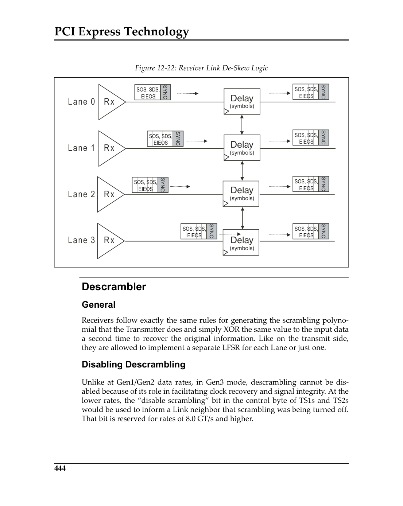

<br>

</td>
</tr>
<tr>
<td width="50%">

## **PCI Express Technology** 

_Table 14‐7: Sequence of Compliance Tx Settings (Continued)_ 

|Setting<br>Number|Data<br>Rate|De‐<br>emphasis|Tx Preset<br>Encoding|
|---|---|---|---|
|9|8.0|n/a|0101b|
|10|8.0|n/a|0110b|
|11|8.0|n/a|0111b|
|12|8.0|n/a|1000b|
|13|8.0|n/a|1001b|
|14|8.0|n/a|1010b|


_Figure 14‐11: Link Control 2 Register_ 

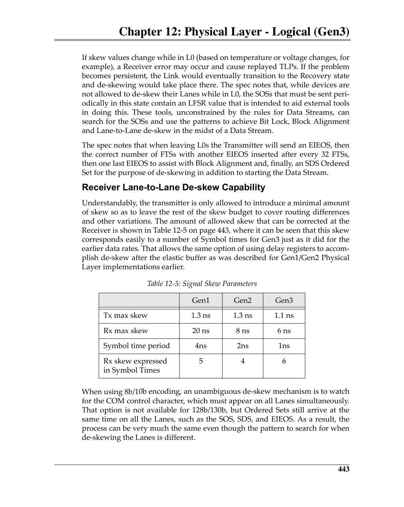

<br>


If the data rate won’t be 2.5 GT/s, then: 

- If any TS1s were sent during Polling.Active, the Transmitter must send either one or two consecutive EIOSs before going into Electrical
Idle.

- If no TS1s were sent in Polling.Active, the transmitter enters Electrical Idle without sending any EIOSs. 

- The Electrical Idle period must be >1ms and <2ms. During this time, the data rate is changed to the new speed and stabilized. If the rate
will be 5.0 GT/s, the de‐emphasis level is given by the select_deemphasis variable
(0b = ‐3.5dB, 1b = ‐6.0 dB). If the rate will be 8.0 GT/s, then the select_preset variable gives the transmitter presets to use.

</td>
<td width="50%">

## **Configuration 状态**

最初，Configuration 状态以 2.5 GT/s 速率执行链路和 Lane 编号；但是，存在允许 5 GT/s 和 8 GT/s 设备也从 Recovery 状态进入 Configuration 状态的规定。从 Recovery 到 Configuration
的转换主要是为了对多 Lane 设备的链路宽度进行动态更改。动态更改仅支持 5 GT/s 和 8 GT/s 设备。因此，这些设备的详细状态转换出现在从第 552 页开始的详细 Configuration 子状态描述中。

</td>
</tr>
<tr>
<td width="50%">

## _During Polling.Compliance:_ 

Once the data rate and de‐emphasis or preset values have been determined, the following rules will apply: 

**Compliance Pattern.** If entry was not due to the Compliance Receive bit set and Loopback bit cleared in the TS Ordered Sets and was not
due to both the Enter Compliance and Enter Modified Compliance bits being set in the Link Control 2 register, then Transmitters send the
compliance pattern on all detected Lanes.

</td>
<td width="50%">

## **Configuration 状态 — 概述**

此状态的主要目标是发现端口是如何连接的并为其分配 Lane 编号。例如，8 个 Lane 可能可用但只有 2 个处于活动状态，或者 Lane 可以拆分为多个链路，例如两个 x4 链路。与其他状态不同，端口具有取决于它们是面向上游还是下游的已定义角色。因此，这些子状态的描述分为下游
Lane 和上游 Lane 的行为。下游端口（向下游发送的端口）在此链路上扮演"领导者"角色，以完成链路初始化过程中的其余状态。上游端口（向上游发送的端口）扮演"追随者"角色。领导者或下游端口将向上游端口指定链路和 Lane
编号，上游端口将简单地以其被告知的相同值进行回复，除非存在冲突，我们将在本节中看到这一点。链路和 Lane 编号在此期间交换的 TS1 的字段中报告，如第 540 页的图 14‐13 中再次所示。这些字段包含 PAD 符号作为占位符，直到分配实际值。

_图 14‐13：TS1/TS2 中的链路和 Lane 编号编码_

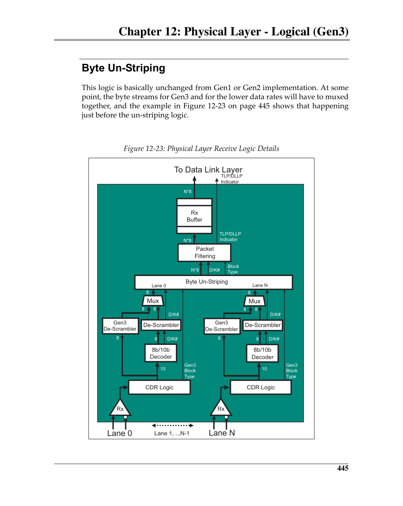

<br>


**第 14 章：链路初始化与训练**

</td>
</tr>
<tr>
<td width="50%">

## _Exit to “Polling.Active”_ 

If any of these conditions are true: 

- a) Electrical Idle exit is detected at the Receiver of any detected Lane and the Enter Compliance bit is cleared (0b).

</td>
<td width="50%">

## **设计具有可合并链路的设备**

设计人员根据性能和成本要求选择在给定链路上实现多少 Lane。窄链路可以选择性地组合成更宽的链路，宽链路可以选择性地拆分为多个较窄的链路。第 541 页的图 14‐14 显示了具有一个上游端口和四个 x2 下游端口的交换机。在此示例中，它们还可以分组为两个 x4
链路。作为提醒，规范要求每个端口还必须支持作为 x1 链路运行。

如图的左侧所示，交换机内部由一个上游逻辑桥和四个下游逻辑桥组成。每个端口需要一个桥，因此支持 4 个下游端口需要 4 个下游桥。但是，如果端口按图的右侧所示组合，则某些桥只是未使用。在链路训练期间，每个下游端口的 LTSSM 确定实际实现的连接选项。

_图 14‐14：组合 Lane 以形成更宽的链路（链路合并）_

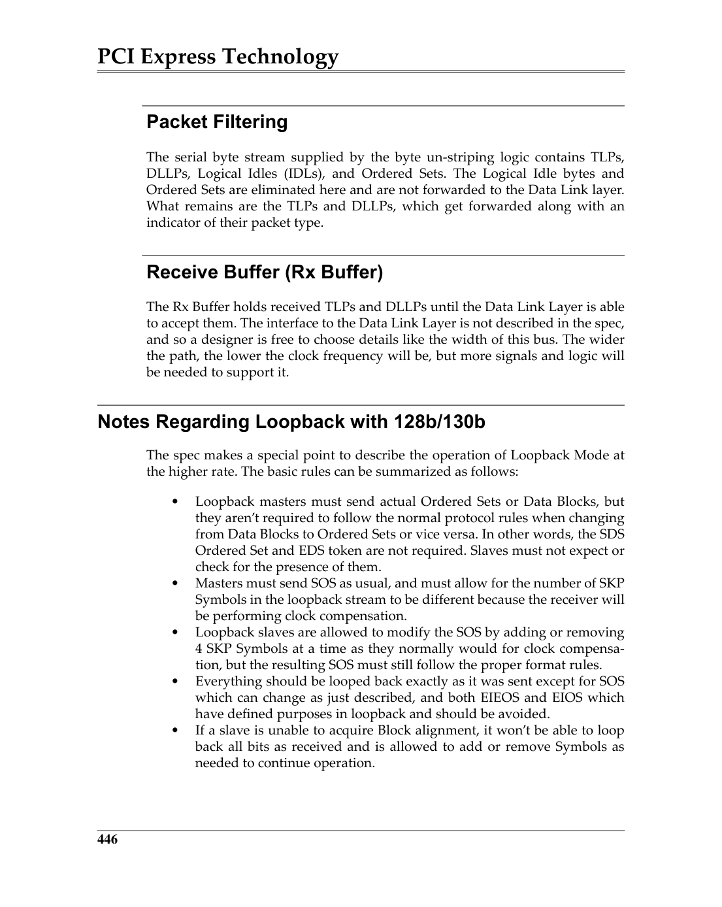

<br>

</td>
</tr>
<tr>
<td width="50%">

</td>
<td width="50%">

## **Configuration 状态 — 训练示例**

</td>
</tr>
<tr>
<td width="50%">

</td>
<td width="50%">

## **介绍**

在 Configuration 状态中，链路和 Lane 编号过程由下游端口"领导者"（例如，根端口或交换机下游端口）启动。端点和交换机上游端口不启动，但响应。它们是"追随者"。现在让我们考虑一些示例以使概念更容易理解。

</td>
</tr>
<tr>
<td width="50%">

</td>
<td width="50%">

## **链路配置示例 1**

第 543 页图 14‐15 中所示的设备都支持实现 x4、x2 或 x1 Lane 大小的单个链路。Lane 编号分配由设备内部固定，必须从零开始按顺序排列。物理 Lane 编号显示在设备框内，报告的或逻辑的 Lane 编号由 TS
有序集报告。通常，这些将是相同的，但并非在每种情况下都如此。

</td>
</tr>
<tr>
<td width="50%">

</td>
<td width="50%">

## **链路号协商。**

1. 由于此示例中只有一个链路可能，下游端口（向下游发送的端口）对所有 Lane 发送使用相同链路号 _N_ 的 TS1，Lane 号为 PAD。

2. 在此 Configuration 状态中，上游端口开始发送 Link 和 Lane 号字段中带有 PAD 的 TS1，但在接收到来自下游端口的带有非 PAD 链路号的 TS1 后，上游端口在所有连接的 Lane 上以反映相同链路号 _N_ 和 Lane 号字段的 PAD
进行响应。基于此响应，下游 LTSSM 识别出四个 Lane 已响应并使用与正在发送的相同的链路号，因此所有 4 个 Lane 将被配置为一个链路。链路号本身是特定于实现的值，不存储在任何定义的配置寄存器中，也与端口号或任何其他值无关。

**第 14 章：链路初始化与训练**

_图 14‐15：示例 1 — 步骤 1 和 2_

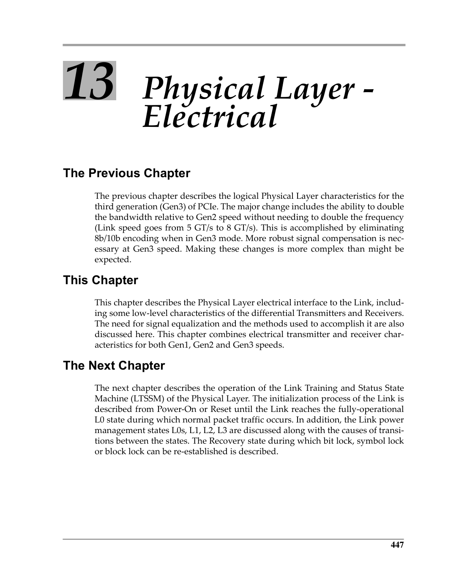

<br>

</td>
</tr>
<tr>
<td width="50%">

</td>
<td width="50%">

## **Lane 号协商。**

3. 下游端口现在开始发送具有相同链路号的 TS1，但为连接的 Lane 分配 Lane 号 0、1、2 和 3，如图 14‐16（第 544 页）所示。

4. 响应于传入的非 PAD Lane 号，上游端口将验证传入的 Lane 号是否与接收它们的 Lane 号匹配。在此示例中，下游和上游端口的 Lane 连接正确。因为所有 Lane 号都匹配，上游端口也在其发送的 TS1 中通告其 Lane 号。当下游端口看到响应中的非 PAD
Lane 号时，它将传入的编号与其正在发送的值进行比较。如果它们匹配，一切都很好，但如果不匹配，则需要采取其他步骤。如果一些（但不是全部）Lane 号匹配，则可以相应地调整链路宽度。如果 Lane 反转，则将需要可选的 Lane 反转功能。因为它是可选的，所以 Lane
可能已反转但任一设备都无法纠正它。这将是一个严重的板设计错误，因为在这种情况下可能无法配置链路以进行操作。

</td>
</tr>
<tr>
<td width="50%">

</td>
<td width="50%">

## **PCI Express Technology**

_图 14‐16：示例 1 — 步骤 3 和 4_

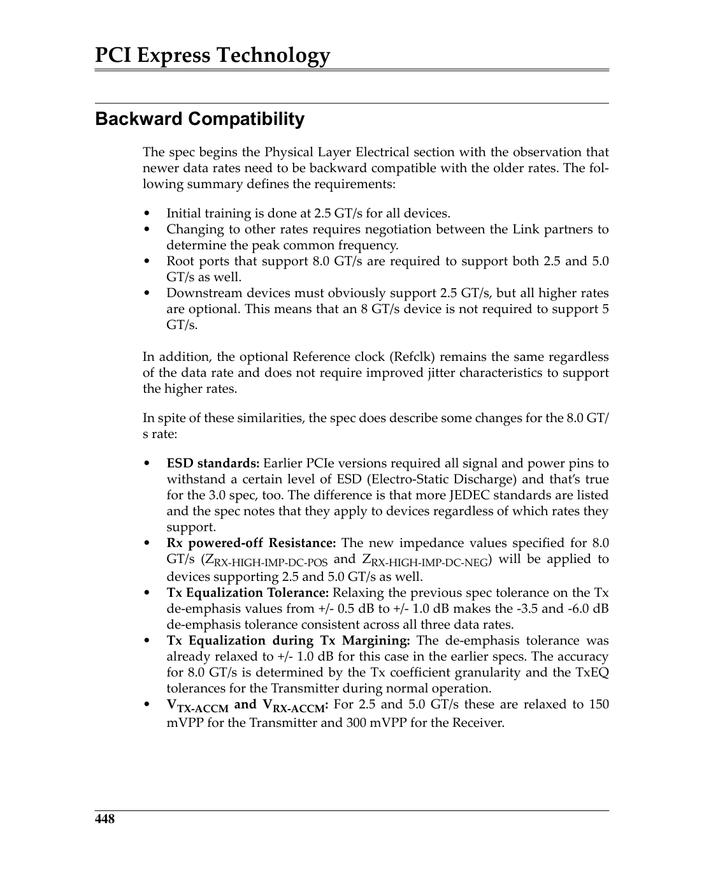

<br>

</td>
</tr>
<tr>
<td width="50%">

</td>
<td width="50%">

## **确认链路和 Lane 号。**

5. 由于所有 Lane 上的发送和接收链路和 Lane 号匹配，下游端口通过发送具有相同链路和 Lane 号的 TS2 有序集来表示它已准备好结束此协商并继续到下一个状态 L0。

6. 在接收到具有相同链路和 Lane 号的 TS2 后，上游端口也通过发送回 TS2 来表示其准备好离开 Configuration 状态并继续到 L0。这在第 545 页的图 14‐17 中示出。

7. 一旦端口接收到至少 8 个 TS2 并发送至少 16 个，它将发送一些逻辑空闲数据，然后转换到 L0。

**第 14 章：链路初始化与训练**

_图 14‐17：示例 1 — 步骤 5 和 6_


<br>


选项：一个链路 x4、x2 或 x1

</td>
</tr>
<tr>
<td width="50%">

</td>
<td width="50%">

## **链路配置示例 2**

应涵盖的另一个示例是具有 4 个下游 Lane 的设备，该设备能够配置为单个 x4 链路或两个 x2 链路或四个 x1 链路的组合。因此，即使一个 x2 链路和两个 x1 链路的配置也可以。此类设备的示例如第 546 页的图 14‐18 所示。

如果所有四个 Lane 都检测到接收器并达到 Configuration 状态，则有许多连接可能性：

- 一个 x4 链路

- 两个 x2 链路

- 一个 x2 链路和两个 x1 链路

- 四个 x1 链路

规范中定义的一种示例方法，用于确定实现哪些配置，如下所述。

</td>
</tr>
<tr>
<td width="50%">

</td>
<td width="50%">

## **链路号协商。**

1. 在此示例方法中，下游端口开始通过在每个 Lane 上通告唯一的链路号。Lane 0 通告链路号 N，Lane 1 通告链路号 N+1，依此类推，如第 546 页的图 14‐18
所示。这些链路号只是示例，它们不必是连续的。同样重要的是要记住下游端口不知道它连接到的是什么，并且在此过程中端口正在尝试确定每个 Lane 的连接。

_图 14‐18：示例 2 — 步骤 1_


<br>


2. 在接收到返回的 TS1 时，下游端口识别出两件事：所有四个 Lane 都正常工作并且它们连接到两个不同的上游端口。这意味着实际上将有_两个_下游端口。每个下游端口将有自己的 Lane 0 和 Lane 1，如图 14‐20（第 548 页）所示。

**第 14 章：链路初始化与训练**

_图 14‐19：示例 2 — 步骤 2_


<br>

</td>
</tr>
<tr>
<td width="50%">

</td>
<td width="50%">

## **Lane 号协商。**

3. 该过程现在为每个链路独立继续，但它们将采用与之前相同的步骤来确定 Lane 号：下游端口将在 TS1 中通告其 Lane 号。还需要注意的是，下游端口开始为链路的 Lane 通告单个返回的链路号。左侧的链路正在为两个 Lane 通告链路号 N，右侧的链路正在通告 N+2。

4. 在此示例中，链路上左侧的下游和上游端口的 Lane 号匹配。但是，对于右侧的链路，下游端口的 Lane 号与连接的上游端口的 Lane 号相反。上游端口意识到这一点，如果它支持 Lane 反转，它将在内部实现并回复与下游端口通告的相同的 Lane 号，如图 14‐20
所示。如果上游端口不支持 Lane 反转，它将在中通告其自己的 Lane 号

</td>
</tr>
<tr>
<td width="50%">

</td>
<td width="50%">

## **PCI Express Technology**

- 返回的 TS1，然后下游端口将意识到该问题并有机会实现 Lane 反转。

5. Lane 反转可以由任一端口可选地处理。如果上游端口检测到此情况并支持 Lane 反转，它只需在内部进行 Lane 分配更改，并使用正确的 Lane 号返回 TS1。因此，下游端口不知道曾经存在问题。如果上游端口无法处理 Lane 反转，那么下游端口将看到按相反顺序的传入
Lane 号。如果它支持 Lane 反转，那么它将纠正编号并开始使用新的 Lane 号发送 TS2。

_图 14‐20：示例 2 — 步骤 3、4 和 5_


<br>

</td>
</tr>
<tr>
<td width="50%">

</td>
<td width="50%">

## **确认链路和 Lane 号。**

6. 下游端口接收具有通告的链路和 Lane 号的 TS1，因此每个端口独立地开始发送 TS2，作为通知它已准备好以协商的设置继续到 L0 状态。

**第 14 章：链路初始化与训练**

7. 上游端口接收没有链路和 Lane 号更改的 TS2，并开始以相同值发送回 TS2。

8. 一旦每个端口接收到至少 8 个 TS2 并发送至少 16 个 TS2，它将发送一些逻辑空闲数据，然后转换到 L0。右侧链路的上游端口正在内部实现 Lane 反转。

</td>
</tr>
<tr>
<td width="50%">

</td>
<td width="50%">

## **链路配置示例 3：失败的 Lane**

最后，让我们考虑一下其中一个 Lane 无法正常工作的情况。考虑上游端口的 Lane 2 无法正常工作的示例，如图 14‐21（第 550 页）所示。需要注意的是，Lane 并没有物理损坏，因为如果物理损坏，它将无法检测到接收器，也不会被考虑包含在链路中。但是，即使 Lane
已连接，上游端口的 Lane 2 的发送器或接收器（或两者）也无法完成工作。

在这种情况下，链路训练过程很可能需要更长的时间，因为大多数状态转换在所有 Lane 都准备好下一个状态之前等待继续到下一个状态，或者如果一部分 Lane 已准备好并且已发生超时条件。

以下步骤指示了在通过 Configuration 状态机的子状态转换时可以处理这种情况的方法。

</td>
</tr>
<tr>
<td width="50%">

</td>
<td width="50%">

## **链路号协商。**

9. 即使上游端口上的 Lane 2 接收器出现问题，下游端口也将在进入 Configuration 状态时采用相同的过程。下游端口在所有 Lane 上发送 TS1，链路号为 N，Lane 号设置为 PAD。

10. Lane 0、1 和 3 都接收了具有非 PAD 链路号的 TS1，因此这些 Lane 将 TS1 发送回下游端口。但是，上游端口的 Lane 2 未成功接收具有非 PAD 链路号的 TS1，因此其发送器继续发送 Link 和 Lane 号字段中带有 PAD 的
TS1，如图 14‐21（第 550 页）所示。

</td>
</tr>
<tr>
<td width="50%">

</td>
<td width="50%">

## **PCI Express Technology**

_图 14‐21：示例 3 — 步骤 1 和 2_


<br>

</td>
</tr>
<tr>
<td width="50%">

</td>
<td width="50%">

## **Lane 号协商。**

11. 一旦下游端口在 Lane 0、1 和 3 上接收到具有相同链路号的 TS1，它将等待所需的超时期望 Lane 2 开始工作。当这种情况没有发生时，下游端口意识到它只能训练为 x2 链路。在接受此事实后，下游端口将通告 Lane 0 和 1 的 Lane 号，但 Lane
2 和 3 返回以在 Link 和 Lane 号字段中发送 PAD。

12. 当上游端口在 Lane 0 和 1 上接收到具有通告的 Lane 号的 TS1，并且它看到 Lane 3 已返回到接收 PAD TS1 时，它通告 Lane 0 和 1 的 Lane 号，但所有其他 Lane 开始（或继续）在 Lane 和 Link 号字段中发送设置为
PAD 的 TS1，如图 14‐22（第 551 页）所示。

**第 14 章：链路初始化与训练**

_图 14‐22：示例 3 — 步骤 3 和 4_


<br>

</td>
</tr>
<tr>
<td width="50%">

</td>
<td width="50%">

## **确认链路和 Lane 号。**

13. 由于 Lane 0 和 1 上的发送和接收链路和 Lane 号匹配，下游端口通过在这些 Lane 上发送具有相同链路和 Lane 号的 TS2 有序集来表示它已准备好结束此协商并继续到下一个状态 L0。其他 Lane 继续发送 Link 和 Lane 号都为 PAD 的
TS1。

14. 在 Lane 0 和 1 上接收到具有相同链路和 Lane 号的 TS2 后，上游端口也通过在这些 Lane 上发送回 TS2 来表示其准备好离开 Configuration 状态并继续到 L0。其他 Lane 继续发送 Link 和 Lane 号都为 PAD 的
TS1。这在第 552 页的图 14‐23 中示出。

_图 14‐23：示例 3 — 步骤 5 和 6_


<br>


一旦端口接收到至少 8 个 TS2 并发送至少 16 个，它将发送一些逻辑空闲数据，然后这些 Lane 转换到 L0。其他 Lane（在此示例中为 Lane 2 和 3）转换到电气空闲，直到下一次启动链路训练过程，此时这些 Lane 将像正常一样尝试训练过程。

</td>
</tr>
<tr>
<td width="50%">

</td>
<td width="50%">

## **Configuration 子状态详解**

此处提供了每个子状态的详细解释，以涵盖 Configuration 的所有子状态，如第 553 页的图 14‐24 所示。鉴于前面讨论的链路训练示例，Configuration 子状态应该更容易理解。

**第 14 章：链路初始化与训练**

_图 14‐24：Configuration 状态机_


<br>

</td>
</tr>
<tr>
<td width="50%">

</td>
<td width="50%">

## **Configuration.Linkwidth.Start**

此子状态在 Polling 状态的正常完成之后（如第 527 页 "Polling.Configuration" 中所述）进入，或者如果 Recovery 状态发现自上次分配以来链路或 Lane 号已更改，因此恢复过程无法正常完成（如第 571 页 "Recovery
State" 中所述）。

</td>
</tr>
<tr>
<td width="50%">

</td>
<td width="50%">

## **下游 Lane。**

</td>
</tr>
<tr>
<td width="50%">

</td>
<td width="50%">

## _在 Configuration.Linkwidth.Start 期间_

下游端口现在成为此链路上的领导者，并在所有活动 Lane 上发送具有非 PAD 链路号的 TS1（只要 LinkUp 未设置且链路宽度的向上配置未正在进行）。在 TS1 中，链路号字段从 PAD 更改为数字，而 Lane 号保持
PAD。规范中对链路号值的唯一约束是，如果支持多个链路，则它们对于每个可能的链路必须是唯一的。例如，x8 链路将在所有 8 个 Lane 上具有相同的链路号，但如果它也可以配置为两个 x4 链路，则两组 4 个 Lane 将被分配不同的链路号，例如一组为 5，另一组为
6。这些值对链路伙伴是本地的，不需要软件跟踪它们或尝试使它们在整个系统中唯一。如果 upconfigure_capable 位设置为 1b，则这些 TS1 也将在接收到两个连续的 Link 和 Lane 号设置为 PAD 的 TS1 的任何非活动 Lane 上发送。

- 从 Polling 进入此子状态时，任何检测到接收器的 Lane 被视为活动。

- 从 Recovery 进入时，通过 Configuration.Complete 后成为链路一部分的任何 Lane 被视为活动 Lane。

- 必须在 TS1 中通告所有支持的数据速率，即使端口不打算使用它们。

**交叉链路。** 对于 LinkUp = 0b 且支持可选交叉链路功能的情况，所有检测到接收器的 Lane 必须发送最少 16 到 32 个具有非 PAD 链路号和 PAD Lane 号的 TS1。之后，端口将评估其接收的内容以查看是否存在交叉链路。

**向上配置链路宽度。** 如果 LinkUp = 1b 且 LTSSM 想要向上配置链路，则在当前活动 Lane、它打算激活的非活动 Lane 以及已看到传入 TS1 的 Lane 上发送 Link 和 Lane 号设置为 PAD 的 TS1。当 Lane
接收到返回的两个连续的 TS1 时，或在 1ms 后，链路号在正在发送的 TS1 中分配一个值。

- 如果激活非活动 Lane，则发送器必须等待 Tx 共模电压稳定后再退出电气空闲并发送 TS1。

- 对于将分组到链路中的 Lane，链路号必须相同。只有对于能够充当唯一链路的 Lane 组，数字才不同。

- _退出到 "如果其他条件都不成立，则 24ms 超时后。"_ 任何之前接收到至少一个具有 PAD 的 Link 和 Lane 号的 TS1 的 Lane 现在接收到两个具有匹配发送链路号的非 PAD 链路号且 Lane 号仍为 PAD 的连续 TS1 将退出到
Configuration.Linkwidth.Accept 子状态。

**第 14 章：链路初始化与训练**

</td>
</tr>
<tr>
<td width="50%">

</td>
<td width="50%">

## _退出到 "Configuration.Linkwidth.Start"_

- 如果此子状态接收的第一组 TS1 具有非 PAD 链路号，则可以理解存在交叉链路，并且链路邻居也表现为下游端口。为了处理这种情况，下游 Lane 更改为上游 Lane 并选择随机的交叉链路超时。下一个子状态将是相同的
Configuration.Linkwidth.Start，但 Lane 现在表现为上游 Lane。

这支持两个链路伙伴都表现为下游端口时的可选行为。这种情况的解决方案是将两者都更改为上游端口并为每个分配一个随机超时，当它到期时将其更改为下游端口。由于超时不会相同，最终一个端口被视为下游，而另一个被视为上游，然后训练可以继续进行。超时必须是随机的，以便即使连接了两个相同的设备，任何可能的死锁最终也会被打破。

如果支持交叉链路，则接收到的 TS1 序列首先具有 PAD 的链路号，后来具有匹配发送链路号的非 PAD 链路号，仅在该序列未被 TS2 中断时才有效。

</td>
</tr>
<tr>
<td width="50%">

</td>
<td width="50%">

## _退出到 "Disable 状态"_

如果端口被更高层指示在所有检测到的 Lane 上发送 Disable Link 位被断言的 TS1 或 TS2。通常，下游端口将启动此操作，但对于可选的交叉链路情况，它可以改为变为上游端口，然后如果在两个连续的 TS1 中设置了 Loopback 位，则 Disable
将是下一个状态。

</td>
</tr>
<tr>
<td width="50%">

</td>
<td width="50%">

## _退出到 "Loopback 状态"_

如果支持环回的发送器被更高层指示发送 Loopback 位被断言的 TS 有序集，或者如果正在发送 TS1 的 Lane 接收到 2 个连续的设置了 Loopback 位的 TS1。发送设置了该位的 TS1 的端口将成为环回主设备，而接收它们的端口将成为环回从设备。

</td>
</tr>
<tr>
<td width="50%">

</td>
<td width="50%">

## _退出到 "Detect 状态"_

如果其他条件都不成立，则在 24ms 超时后。

</td>
</tr>
<tr>
<td width="50%">

</td>
<td width="50%">

## **上游 Lane。**

</td>
</tr>
<tr>
<td width="50%">

</td>
<td width="50%">

## _在 Configuration.Linkwidth.Start 期间_

上游端口现在成为此链路上的追随者，并返回发送 Link 和 Lane 号字段设置为 PAD 的 TS1 有序集。它将继续这样做，直到它开始从下游端口（领导者）接收具有非 PAD 链路号的 TS1。

上游端口在以下 Lane 上发送 Link 和 Lane 值设置为 PAD 的 TS1：a) 所有活动 Lane，b) 它想要向上配置的 Lane，以及 c) 如果 upconfigure_capable 设置为 1b，则在该子状态中已接收到两个连续的 Link 和 Lane
号设置为 PAD 的 TS1 的每个非活动 Lane 上。

- 从 Polling 进入此子状态时，任何检测到接收器的 Lane 被视为活动。

- 从 Recovery 进入时，通过 Configuration.Complete 后成为链路一部分的任何 Lane 被视为活动 Lane。如果转换不是由 LTSSM 超时引起的，则如果发送器确实计划因自动原因更改链路宽度，则发送器必须将 TS1 符号 4 位 6 的
Autonomous Change 位设置为 1b。

- 必须在 TS1 中通告所有支持的数据速率，即使端口不打算使用它们。

**交叉链路。** 对于 LinkUp = 0b 且支持可选交叉链路功能的情况，所有检测到接收器的 Lane 必须发送最少 16 到 32 个 Link 和 Lane 值设置为 PAD 的 TS1。之后，端口将评估其接收的内容以查看是否存在交叉链路。

_退出到 "如果其他条件都不成立，则 24ms 超时后。"_

- 如果_任何_ Lane 接收到两个具有非 PAD 链路号和 PAD Lane 号的连续 TS1，则此端口转换到 Configuration.Linkwidth.Accept 子状态，其中为这些 Lane 选择一个接收到的链路号，并在_所有_接收到具有非 PAD 链路号的
TS1 的 Lane 上使用该链路号和 PAD Lane 号发送 TS1。任何剩余的检测到接收器但没有链路号的 Lane 必须发送 Link 和 Lane 号设置为 PAD 的 TS1。

- 如果正在向上配置链路，LTSSM 等待直到它在以下情况下接收到两个具有非 PAD 链路号和 PAD Lane 号的连续 TS1：a) 它想要激活的所有非活动 Lane，或 b) 在进入此子状态后 1ms 内的任何

**第 14 章：链路初始化与训练**

Lane，以较早者为准。之后，它使用所选链路号以及 PAD Lane 号发送 TS1。

- 为了避免配置比必要的更小的链路，建议在某些 Lane 上看到错误或丢失块对齐的多 Lane 链路延迟此接收器评估。对于 8b/10b 编码，它应至少再等待两个 TS1，而对于 128b/130b 编码，它应至少等待 34 个 TS1，但任何情况下都不能超过 1ms。

- 激活非活动 Lane 后，发送器必须等待 Tx 共模电压稳定后再退出电气空闲并发送 TS1。

</td>
</tr>
<tr>
<td width="50%">

</td>
<td width="50%">

## _退出到 "Configuration.Linkwidth.Start"_

- 交叉链路超时后，发送 16 到 32 个 Link 和 Lane 值设置为 PAD 的 TS2。上游 Lane 更改为下游 Lane，下一个子状态将是相同的 Configuration.Linkwidth.Start，但这次 Lane 表现为下游
Lane。对于连接在一起的两个上游端口的情况，此可选行为允许其中一个最终作为下游端口担任领导角色。

</td>
</tr>
<tr>
<td width="50%">

</td>
<td width="50%">

## _退出到 "Disable 状态"_

如果满足以下任一条件：

- 任何正在发送 TS1 的 Lane 也接收到 Disable Link 位被断言的 TS1。

- 支持可选交叉链路，并且所有正在发送和接收 TS1 的 Lane 在两个连续的 TS1 中接收 Disable Link 位，或者交叉链路端口被更高层指示在所有检测到接收器的 Lane 上的 TS1 和 TS2 中断言 Disable 位。

</td>
</tr>
<tr>
<td width="50%">

</td>
<td width="50%">

## _退出到 "Loopback 状态"_

- 如果支持环回的发送器被更高层指示发送 Loopback 位被断言的 TS 有序集，或者所有正在发送和接收 TS1 的 Lane 接收到 2 个连续的设置了 Loopback 位的 TS1。发送设置了该位的 TS1 的端口将成为环回主设备，而接收它们的端口将成为环回从设备。

</td>
</tr>
<tr>
<td width="50%">

</td>
<td width="50%">

## **PCI Express Technology**

</td>
</tr>
<tr>
<td width="50%">

</td>
<td width="50%">

## _退出到 "Detect 状态"_

- 如果其他条件都不成立，则在 24ms 超时后。

</td>
</tr>
<tr>
<td width="50%">

</td>
<td width="50%">

## **Configuration.Linkwidth.Accept**

此时，上游端口现在在其所有 Lane 上发送回具有相同链路号的 TS1 有序集。链路号源自下游端口，上游端口只是将该值反映回其所有 Lane。现在下游端口知道链路宽度（接收相同链路号的 Lane 数）并且必须开始通告 Lane 号。因此领导者（下游端口）继续发送
TS1，但现在使用指定的实际 Lane 号而不是 PAD。此外，所有这些 TS1 将具有相同的链路号。下游和上游 Lane 的详细行为概述如下：

</td>
</tr>
<tr>
<td width="50%">

</td>
<td width="50%">

## **下游 Lane**

</td>
</tr>
<tr>
<td width="50%">

</td>
<td width="50%">

## _在 Configuration.Linkwidth.Accept 期间_

- 下游端口现在将启动 Lane 号。如果可以从至少一组 Lane 形成链路，并且所有 Lane 都接收两个连续的 TS1 并且都看到相同的链路号，则发送保持相同链路号的 TS1 但现在也分配唯一的非 PAD Lane 号。

</td>
</tr>
<tr>
<td width="50%">

</td>
<td width="50%">

## _退出到 "Configuration.Lanenum.Wait"_

- 下游端口不会在 Configuration.Linkwidth.Accept 子状态中停留很长时间。一旦它从上游端口接收到指示链路宽度的必要 TS1，它就会更新所需的任何内部状态信息，开始发送如上所述的具有非 PAD Lane 号的 TS1，并立即转换到
Configuration.Lanenum.Wait 以等待来自上游端口的 Lane 号确认。

</td>
</tr>
<tr>
<td width="50%">

</td>
<td width="50%">

## **上游 Lane**

</td>
</tr>
<tr>
<td width="50%">

</td>
<td width="50%">

## _在 Configuration.Linkwidth.Accept 期间_

- 上游端口发送 TS1，其中在_所有_接收到具有非 PAD 链路号的 TS1 的 Lane 上的 TS1 中选择并发送一个接收到的链路号。任何剩余的检测到接收器但没有链路号的 Lane 必须发送 Link 和 Lane 号设置为 PAD 的 TS1。

</td>
</tr>
<tr>
<td width="50%">

</td>
<td width="50%">

## _退出到 "Configuration.Lanenum.Wait"_

- 上游端口必须响应链路邻居向其提议的 Lane 号。如果可以使用在其 TS1 上发送非 PAD 链路号并接收到两个具有相同链路号和任何非 PAD Lane 号的连续 TS1 的 Lane 形成链路，那么它应发送与相同 Lane 号分配匹配的
TS1（如果可能），或者如果需要则不同（例如使用可选的 Lane 反转）。

**第 14 章：链路初始化与训练**

</td>
</tr>
<tr>
<td width="50%">

</td>
<td width="50%">

## **Configuration.Lanenum.Wait**

在讨论 Configuration.Lanenum.Wait 状态之前，一些背景信息可能会有所帮助。Lane 号从零开始按顺序分配到链路可能的最大数量。例如，x8 链路将被分配 Lane 号 0 ‐ 7。端口需要支持与其具有的 Lane 数一样宽的链路和一个小至一个 Lane
的链路。Lane 将始终从 Lane 0 开始，并且必须既是顺序的又是连续的。例如，如果 x8 端口上的某些 Lane 无法工作，则可以选择将其设计为配置 x4 链路，如果是这样，它将需要使用 Lane 0‐3。作为另一个示例，如果 x8 端口的 Lane 2
无法工作，则不可能使用 Lane 0、1、3 和 4 形成 x4 链路，因为 Lane 不是连续的。任何剩余的 Lane 必须发送 Link 和 Lane 设置为 PAD 的 TS1。

规范中针对 Configuration 子状态重复了许多次的常见时序注意事项。这里不是在每种情况下重复它，只需注意它通常适用于上游和下游端口：

为了避免配置比必要的更小的链路，建议在某些 Lane 上看到错误或丢失块对齐的多 Lane 端口延迟最终链路宽度评估。对于 8b/10b，它应至少再等待两个 TS1，而对于 128b/130b 模式，它应至少等待 34 个 TS1，但任何情况下都不能超过 1ms。其想法是
Lane 在上电或复位后可能需要稳定时间。

</td>
</tr>
<tr>
<td width="50%">

</td>
<td width="50%">

## _退出到 "Detect 状态"_

在 2ms 超时后，如果无法配置链路（例如：Lane 0 不工作且 Lane 反转不可用），或者如果所有 Lane 接收到两个连续的 Link 和 Lane 号中都带有 PAD 的 TS1，则链路必须退出到 Detect 状态。

</td>
</tr>
<tr>
<td width="50%">

</td>
<td width="50%">

## **下游 Lane**

</td>
</tr>
<tr>
<td width="50%">

</td>
<td width="50%">

## _在 Configuration.Lanenum.Wait 期间_

下游端口将继续传输具有非 PAD 链路和 Lane 号的 TS1，直到满足退出条件之一。

</td>
</tr>
<tr>
<td width="50%">

</td>
<td width="50%">

## _退出到 "Configuration.Lanenum.Accept"_

如果满足下列任一情况：

- 如果在所有 Lane 上接收到两个连续的 TS1，其链路和 Lane 号与在这些 Lane 上发送的内容匹配。

</td>
</tr>
<tr>
<td width="50%">

</td>
<td width="50%">

## **PCI Express Technology**

- 如果任何检测到接收器的 Lane 接收到两个连续的 TS1，其 Lane 号与 Lane 首次进入此子状态时不同，并且至少一些 Lane 看到非 PAD 链路号。规范指出，这允许两个端口就相互可接受的链路宽度达成一致。

</td>
</tr>
<tr>
<td width="50%">

</td>
<td width="50%">

## _退出到 "Detect 状态"_

在 2ms 超时后，或者如果所有 Lane 接收到两个连续的 Link 和 Lane 号设置为 PAD 的 TS1。

上游 Lane

</td>
</tr>
<tr>
<td width="50%">

</td>
<td width="50%">

## _在 Configuration.Lanenum.Wait 期间_

上游端口将继续传输具有非 PAD 链路和 Lane 号的 TS1，直到满足退出条件之一。

</td>
</tr>
<tr>
<td width="50%">

</td>
<td width="50%">

## _退出到 "Configuration.Lanenum.Accept"_

如果满足下列任一情况：

- 如果任何 Lane 接收到两个连续的 TS2。

- 如果任何 Lane 接收到两个连续的 TS1，其 Lane 号与 Lane 首次进入此子状态时不同，并且至少一些 Lane 看到非 PAD 链路号。

请注意，允许上游 Lane 在更改为该子状态之前等待最多 1ms，以防止接收错误或 Lane 之间的偏移影响最终链路配置。

</td>
</tr>
<tr>
<td width="50%">

</td>
<td width="50%">

## _退出到 "Detect 状态"_

在 2ms 超时后，或者如果所有 Lane 接收到两个连续的 Link 和 Lane 号设置为 PAD 的 TS1。

</td>
</tr>
<tr>
<td width="50%">

</td>
<td width="50%">

## **Configuration.Lanenum.Accept**

下游 Lane

</td>
</tr>
<tr>
<td width="50%">

</td>
<td width="50%">

## _在 Configuration.Lanenum.Accept 期间_

下游端口现在已接收到具有非 PAD 链路和 Lane 号的 TS1。在这一点上，下游端口必须决定是否可以使用上游端口返回的 Lane 号建立链路。三个可能的状态转换在下面列出。

</td>
</tr>
<tr>
<td width="50%">

</td>
<td width="50%">

## _退出到 "Configuration.Complete"_

如果接收到两个连续的 TS1 具有相同的非 PAD 链路和 Lane 号，并且它们与所有 Lane 的 TS1 中传输的链路和 Lane 号匹配，则上游端口已同意下游端口通告的链路和

**第 14 章：链路初始化与训练**

Lane 号，下一个子状态是 Configuration.Complete。或者如果接收到的 TS1 中的 Lane 号与下游端口通告的相反，如果下游端口支持 Lane 反转，它仍然可以使用反转的 Lane 号继续到 Configuration.Complete。

规范指出，反转 Lane 条件严格定义为 Lane 0 接收具有最高 Lane 号（Lane 总数 ‐ 1）的 TS1，并且最高 Lane 号接收 Lane 号为零的 TS1。可以从中理解的是，课堂上偶尔出现的问题的答案：Lane
号是否可以混合而不是顺序的？答案是不可以的，它们必须是从 0 到 n‐1 或从 n‐1 到 0；不支持其他选项。

如果 Configuration 状态是从 Recovery 状态进入的，则可能已请求带宽更改。如果是这样，状态位将更新以报告发生的情况的性质。基本上，系统需要报告此更改是由于链路工作不可靠而启动，还是因为硬件只是在管理链路功率。位更新如下：

- 如果带宽更改是由下游端口因可靠性问题而启动的，则链路带宽管理状态位设置为 1b。

- 如果带宽更改不是由下游端口启动，但两个连续接收的 TS1 中的 Autonomous Change 位清零为 0b，则链路带宽管理状态位设置为 1b。

- 否则，链路自动带宽状态位设置为 1b。

</td>
</tr>
<tr>
<td width="50%">

</td>
<td width="50%">

## _退出到 "Configuration.Lanenum.Wait"_

- 如果可以使用部分（但不是全部）接收两个连续的具有相同非 PAD 链路和 Lane 号的 TS1 的 Lane 形成配置的链路，则这些 Lane 使用相同的链路号和新的 Lane 号发送 TS1。目标是使用较小的 Lane 组来实现工作的链路。

新的 Lane 号必须从零开始并按顺序递增以覆盖将使用的 Lane。任何不接收 TS1 的 Lane 不能成为组的一部分，并将破坏 Lane 编号。任何剩余的 Lane 必须发送 Link 和 Lane 设置为 PAD 的 TS1。例如，如果 8 个 Lane 可用，但 Lane
2 看不到传入的 TS1，则链路不能由需要 Lane 2 的组组成。因此，x8 和 x4 选项将不可用，只有 x1 或 x2 链路是可能的。

</td>
</tr>
<tr>
<td width="50%">

</td>
<td width="50%">

## **PCI Express Technology**

</td>
</tr>
<tr>
<td width="50%">

</td>
<td width="50%">

## _退出到 "Detect 状态"_

- 如果无法配置链路，或者如果所有 Lane 接收到两个连续的具有 PAD 的链路和 Lane 号的 TS1。

</td>
</tr>
<tr>
<td width="50%">

</td>
<td width="50%">

## **上游 Lane**

</td>
</tr>
<tr>
<td width="50%">

</td>
<td width="50%">

## _在 Configuration.Lanenum.Accept 期间_

- 上游端口现在已接收到具有非 PAD 链路和 Lane 号的 TS2 或 TS1。在这一点上，上游端口必须决定是否可以使用下游端口发送的 Lane 号建立链路。三个可能的状态转换在下面列出。

</td>
</tr>
<tr>
<td width="50%">

</td>
<td width="50%">

## _退出到 "Configuration.Complete"_

- 如果接收到两个连续的 TS2 具有相同的非 PAD 链路和 Lane 号，并且它们与这些 Lane 的 TS1 中传输的链路和 Lane 号匹配，则一切正常，下一个子状态将是 Configuration.Complete。

</td>
</tr>
<tr>
<td width="50%">

</td>
<td width="50%">

## _退出到 "Configuration.Lanenum.Wait"_

- 如果可以使用接收两个连续的具有相同非 PAD 链路和 Lane 号的 TS1 的 Lane 的子集形成配置的链路，则这些 Lane 使用相同的链路号和新的 Lane 号发送 TS1。目标是使用较小的 Lane 组来实现工作的链路。在这种情况下，下一个子状态将是
Configuration.Lanenum.Wait。

与下游 Lane 的情况一样，新的 Lane 号必须从零开始并按顺序递增以覆盖将使用的 Lane。任何不接收 TS1 的 Lane 不能成为组的一部分，并将破坏 Lane 编号。任何剩余的 Lane 必须发送 Link 和 Lane 设置为 PAD 的 TS1。

</td>
</tr>
<tr>
<td width="50%">

</td>
<td width="50%">

## _退出到 "Detect 状态"_

- 如果无法配置链路，或者如果所有 Lane 接收到两个连续的具有 PAD 的链路和 Lane 号的 TS1，则下一个状态将是 Detect。

</td>
</tr>
<tr>
<td width="50%">

</td>
<td width="50%">

## **Configuration.Complete**

这是 Configuration 状态中交换 TS2 的唯一子状态。如前所述，TS2 的目的是一种握手或确认，即链路上的两个设备已准备好继续到下一个状态。因此这是 TS1 中交换的链路和 Lane 号的最终确认

**第 14 章：链路初始化与训练**

应注意的是，允许设备在进入此子状态时更改其支持的数据速率和向上配置能力，但不能在其中更改。这是因为设备从这些 TS2 中通告的内容记录其链路伙伴的能力，如本节所述。

</td>
</tr>
<tr>
<td width="50%">

</td>
<td width="50%">

## **下游 Lane**

</td>
</tr>
<tr>
<td width="50%">

</td>
<td width="50%">

## _在 Configuration.Complete 期间_

使用与接收到的 TS1 匹配的链路和 Lane 号发送 TS2。如果端口支持使用 Lane 0 的 x1 链路并能够向上配置链路，则 TS2 可以设置 Upconfigure Capability 位。

对于 8b/10b 编码，离开此子状态时必须完成 Lane 去偏移。此外，如果所有配置的 Lane 看到两个连续的设置了 Disable Scrambling 位的 TS2，则将禁用加扰。发送这些的端口还必须禁用加扰。请注意，由于加扰对信号完整性有必要贡献，因此在
128b/130b 模式下不能禁用加扰。

下游端口正在发送 TS2 并监视返回的 TS2。供将来参考，记录从传入 TS2 的 N_FTS 字段中退出 L0s 状态时必须发送的 FTS 数。

</td>
</tr>
<tr>
<td width="50%">

</td>
<td width="50%">

## _退出到 "Configuration.Idle"_

当所有发送 TS2 的 Lane 接收 8 个 TS2，具有匹配的链路和 Lane 号（非 PAD）、匹配的速率标识符以及所有链路中匹配的 Link Upconfigure Capability 位时，下一个状态将是 Configuration.Idle。在接收到一个 TS2
之后，还必须发送至少 16 个 TS2。

如果设备支持大于 2.5 GT/s 的速率，则它必须记录在任何已配置 Lane 上接收到的速率标识符，并且这将覆盖任何先前记录的值。用于跟踪 Recovery 中速度更改的变量 "changed_speed_recovery" 被清零。

变量 "upconfigure_capable" 在以下情况下设置为 1b：如果设备发送 Link Upconfigure Capability 设置为 1b 的 TS2 并接收 8 个连续的设置了相同位的 TS2。否则，它被清零。

未配置为链路一部分的任何 Lane 不再与正在进行的 LTSSM 关联，并且必须是以下之一：

- 与新的 LTSSM 关联，或

- 转换到电气空闲

 - a) 如果那些 Lane 之前已通过 L0 配置为链路的一部分，并且 LinkUp 仍设置为 1b，则出现特殊情况

从那以后。如果链路具有向上配置能力，它们必须保持与同一 LTSSM 关联。对于这种情况，还建议那些 Lane 保持其接收器终端开启，因为如果链路被向上配置，它们将再次成为链路的一部分。如果终端未保持开启，则它们必须在 LTSSM 进入 Recovery.RcvrCfg
状态时一直通过 Configuration.Complete 打开。但是，通过此过程，之前不是链路一部分的 Lane 不能成为其一部分。

- b) 对于可选交叉链路，接收器终端必须介于 ZRX‐HIGH‐IMP‐DC‐POS 和 ZRX‐HIGH‐IMP‐DC‐NEG 之间。

- c) 如果 LTSSM 返回 Detect，这些 Lane 将再次与其关联。

- d) 在 Lane 进入电气空闲之前不需要 EIOS，并且转换不必在符号或有序集边界上发生。

</td>
</tr>
<tr>
<td width="50%">

</td>
<td width="50%">

## 在 2ms 超时后：

_退出到 "Configuration.Idle"_

如果 idle_to_rlock_transitioned 变量小于 FFh **且**当前数据速率为 8.0 GT/s，则下一个状态是 Configuration.Idle。

在此转换中，变量 "changed_speed_recovery" 被清零。此外，如果至少一个 Lane 看到八个具有匹配链路和 Lane 号（非 PAD）的连续 TS2，则变量 "upconfigure_capable" 可以更新，尽管不需要这样做。如果发送和接收的 Link
Upconfigure Capability 位为 1b，则将其设置为 1b，否则清零。

未配置链路一部分的 Lane 不与正在进行的 LTSSM 关联，并具有与上面列出的非超时情况相同的要求。

_退出到 "Detect 状态"_

否则，下一个状态是 Detect。

</td>
</tr>
<tr>
<td width="50%">

</td>
<td width="50%">

## **上游 Lane**

_在 Configuration.Complete 期间_

使用与接收到的 TS2 匹配的链路和 Lane 号发送 TS2。如果端口支持使用 Lane 0 的 x1 链路并能够向上配置链路，则 TS2 可以设置 Upconfigure Capability 位。

**第 14 章：链路初始化与训练**

对于 8b/10b 编码，离开此子状态时必须完成 Lane 去偏移。此外，如果所有配置的 Lane 看到两个连续的设置了 Disable Scrambling 位的 TS2，则将禁用加扰。发送这些的端口还必须禁用加扰。请注意，由于加扰对信号完整性有必要贡献，因此在
128b/130b 模式下不能禁用加扰。

在此子状态中，上游端口正在从下游端口接收 TS2，供将来参考，应记录从传入 TS2 中的 N_FTS 字段值退出 L0s 状态时必须发送的 FTS 数。

</td>
</tr>
<tr>
<td width="50%">

</td>
<td width="50%">

## _退出到 "Configuration.Idle"_

当所有发送 TS2 的 Lane 接收 8 个 TS2，具有匹配的链路和 Lane 号（非 PAD）、匹配的速率标识符以及所有链路中匹配的 Link Upconfigure Capability 位时，下一个状态将是 Configuration.Idle。在接收到一个 TS2
之后，还必须发送至少 16 个 TS2。

如果设备支持大于 2.5 GT/s 的速率，则它必须记录在任何已配置 Lane 上接收到的速率标识符，并且这将覆盖任何先前记录的值。用于跟踪 Recovery 中速度更改的变量 "changed_speed_recovery" 被清零。

变量 "upconfigure_capable" 在以下情况下设置为 1b：如果设备发送 Link Upconfigure Capability 设置为 1b 的 TS2 并接收 8 个连续的设置了相同位的 TS2。否则，它被清零。

未配置为链路一部分的任何 Lane 不再与正在进行的 LTSSM 关联，并且必须是以下之一：

- 可选择与新的交叉链路 LTSSM 关联（如果支持此功能），或

- 转换到电气空闲

 - a) 如果那些 Lane 之前已通过 L0 配置为链路的一部分，并且 LinkUp 自那时起仍设置为 1b，则出现特殊情况。如果链路具有向上配置能力，它们必须保持与同一 LTSSM 关联。对于这种情况，还建议那些 Lane
保持其接收器终端开启，因为如果链路被向上配置，它们将再次成为链路的一部分。如果它们未保持开启，则它们必须在 LTSSM 进入 Recovery.RcvrCfg 状态时一直通过 Configuration.Complete 打开。但是，通过此过程，之前不是链路一部分的 Lane
不能成为其一部分。

</td>
</tr>
<tr>
<td width="50%">

</td>
<td width="50%">

## **PCI Express Technology**

- b) 接收器终端必须介于 ZRX‐HIGH‐IMP‐DC‐POS 和 ZRX‐

 - HIGH‐IMP‐DC‐NEG 之间。

- c) 如果 LTSSM 返回 Detect，这些 Lane 将再次与其关联。

- d) 在 Lane 进入电气空闲之前不需要 EIOS，并且转换不必在符号或有序集边界上发生。

</td>
</tr>
<tr>
<td width="50%">

</td>
<td width="50%">

## 在 2ms 超时后：

</td>
</tr>
<tr>
<td width="50%">

</td>
<td width="50%">

## _退出到 "Configuration.Idle"_

如果 idle_to_rlock_transitioned 变量小于 FFh **且**当前数据速率为 8.0 GT/s，则下一个状态是 Configuration.Idle。

在此转换中，变量 "changed_speed_recovery" 被清零。此外，如果至少一个 Lane 看到八个具有匹配链路和 Lane 号（非 PAD）的连续 TS2，则变量 "upconfigure_capable" 可以更新，尽管不需要这样做。如果发送和接收的 Link
Upconfigure Capability 位为 1b，则将其设置为 1b，否则清零。

未配置链路一部分的 Lane 不与正在进行的 LTSSM 关联，并具有与上面列出的非超时情况相同的要求。

</td>
</tr>
<tr>
<td width="50%">

</td>
<td width="50%">

## _退出到 "Detect 状态"_

否则，下一个状态是 Detect。

</td>
</tr>
<tr>
<td width="50%">

</td>
<td width="50%">

## **Configuration.Idle**

</td>
</tr>
<tr>
<td width="50%">

</td>
<td width="50%">

## _在 Configuration.Idle 期间_

在此子状态中，发送器正在发送空闲数据并等待接收空闲数据的最小数量，以便此链路可以转换到 L0。在此期间，物理层向上层报告链路处于运行状态（Linkup = 1b）。

对于 8b/10b 编码，发送器在所有已配置 Lane 上发送空闲数据。空闲数据只是被加扰和编码的数据零。

对于 128b/130b 编码，发送器在所有已配置 Lane 上发送一个 SDS 有序集，后跟空闲数据符号。Lane 0 上的第一个空闲符号是数据流的第一个符号。

**第 14 章：链路初始化与训练**

</td>
</tr>
<tr>
<td width="50%">

</td>
<td width="50%">

## _退出到 "L0 状态"_

如果使用 8b/10b 编码，则下一个状态是 L0，如果在所有已配置 Lane 上接收到 8 个连续的空闲数据符号时间，并且在接收到一个空闲符号之后发送了 16 个符号时间的空闲数据。

如果使用 128b/130b，则下一个状态是 L0，如果在所有已配置 Lane 上接收到 8 个连续的空闲数据，在接收到一个空闲符号之后发送了 16 个空闲，并且此状态不是通过 Configuration.Complete 的超时进入的。

- 数据流处理开始之前必须完成 Lane 到 Lane 去偏移。

- 必须在数据块中接收空闲符号。

- 如果软件自上次从 Recovery 或 Configuration 转换到 L0 以来在 Link Control 寄存器中设置了 Retrain Link 位，则下游端口必须将 Link Status 寄存器中的 Link Bandwidth Management 位设置为
1b，以指示此更改不是硬件发起的（自动）。

- 转换到 L0 时，变量 "idle_to_rlock_transitioned" 清零为 00h。

</td>
</tr>
<tr>
<td width="50%">

</td>
<td width="50%">

## 在 2ms 超时后：

</td>
</tr>
<tr>
<td width="50%">

</td>
<td width="50%">

## _退出到 "Recovery 子状态详解"_

如果 idle_to_rlock_transitioned 变量小于 FFh，则下一个状态是 Recovery (Recovery.RcvrLock)。然后：

- a) 对于 8.0 GT/s，idle_to_rlock_transitioned 递增 1。

- b) 对于 2.5 或 5.0 GT/s，将 idle_to_rlock_transitioned 设置为 FFh。

- c) 注意：此变量计算 LTSSM 因序列未工作而从此状态转换到 Recovery 状态的次数。问题可能是均衡尚未正确调整或所选速度根本不起作用，Recovery 状态将采取措施解决这些问题。此变量限制这些尝试的次数以避免无限循环。如果在进行此操作 256 次（当计数达到
FFh 时）后链路仍不工作，则返回 Detect 并重新开始，希望获得更好的结果。

_退出到 "Detect 状态"_

否则（即 idle_to_rlock = FFh），下一个状态是 Detect。

</td>
</tr>
<tr>
<td width="50%">

</td>
<td width="50%">

## **L0 状态**

这是正常的、完全运行的链路状态，在此期间逻辑空闲、TLP 和 DLLP 在链路邻居之间交换。L0 在链路训练过程结束后立即实现。物理层还通过设置 LinkUp 变量来通知上层链路已准备好运行。此外，变量 idle_to_rlock_transitioned 清零为 00h。

</td>
</tr>
<tr>
<td width="50%">

</td>
<td width="50%">

## _退出到 "Recovery 状态"_

如果指示链路速度或链路宽度的变化，或者如果链路伙伴通过转到 Recovery 或电气空闲来启动此操作，则下一个状态将是 Recovery。让我们在下面的讨论中更详细地考虑这三种情况中的每一种。

</td>
</tr>
<tr>
<td width="50%">

</td>
<td width="50%">

## **速度更改**

规范中描述了将导致自动速度更改的两种条件。

第一种是当两个伙伴都支持高于 2.5 GT/s 的速率并且链路处于活动状态（数据链路层报告 DL_Active），或者当一个伙伴在其 TS 有序集中请求速度更改时。例如，如果注意到更高速率并且软件写入 Retrain Link 位并在将 Target Link Speed
字段（参见第 569 页的图 14‐26）设置为与当前速率不同的速率之后，下游端口将启动速度更改。

</td>
</tr>

</tbody>
</table>

[⬆️ 返回目录](#本章目录-table-of-contents)

---

<a id="sec-12-5"></a>
## 12.5 Physical Layer - Logical (Gen3) | 物理层 - 逻辑 (Gen3)

<table>
<thead><tr><th width="50%">🇬🇧 English</th><th width="50%">🇨🇳 中文</th></tr></thead>
<tbody>
<tr>
<td width="50%">

4. In response to seeing non‐PAD Lane numbers coming in, the Upstream Port will verify that the incoming Lane numbers match the Lane num‐
bers they are received on. In this example, the Lanes of the Downstream and Upstream Ports are connected correctly. Because all the Lane
num‐ bers match, the Upstream Port advertises its Lane numbers in the TS1s it is sending as well. When the Downstream Port sees non‐PAD Lane
numbers in response, it compares the incoming numbers to the values it’s sending. If they match, all is well but, if not, then other steps
will need to be taken. If some but not all Lane numbers match, then the Link width may be adjusted accordingly. If the Lanes are reversed,
then the optional Lane Reversal feature will be needed. Because it’s optional, it’s possible that the Lanes have been reversed but neither
device is capable of correcting it. This would be a dramatic board design error because it is possible the Link cannot be configured for
operation in this case.

</td>
<td width="50%">

**13. Since the transmitted and received Link and Lane numbers matched on Lanes 0 and 1, the Downstream Port indicates it is ready to
conclude this negotiation and proceed to the next state, L0, by sending TS2 Ordered Sets with the same Link and Lane numbers on these Lanes.
The other Lanes continue sending TS1s with PAD for both the Link and Lane numbers.**

**14. Upon receiving TS2s with the same Link and Lane numbers on Lanes 0 and 1, the Upstream Port also indicates its readiness to leave the
Configuration state and proceed to L0 by sending TS2s back on these Lanes. The other Lanes continue sending TS1s with PAD for both the Link
and Lane numbers. This is shown in Figure 14‐23 on page 552.**

Once a Port receives at least 8 TS2s and transmits at least 16, it sends some logical idle data and those Lanes transitions to L0. The other
Lanes, Lanes 2 and 3 in this example, transition to Electrical Idle until the next time the link training process is initiated at which
point those Lanes will attempt the training process like normal.

</td>
</tr>
<tr>
<td width="50%">

## **PCI Express Technology** 

_Figure 14‐16: Example 1 ‐ Steps 3 and 4_ 


<br>

</td>
<td width="50%">

## **Detailed Configuration Substates**

A detailed explanation of each substate is presented here to cover all the substates of Configuration, as shown in Figure 14‐24 on page 553.
The Configuration Substates should be easier to follow, given the Link Training examples discussed previously.

</td>
</tr>
<tr>
<td width="50%">

## **Confirming Link and Lane Numbers.** 

5. Since the transmitted and received Link and Lane numbers matched on all the Lanes, the Downstream Port indicates it is ready to conclude
this negotiation and proceed to the next state, L0, by sending TS2 Ordered Sets with the same Link and Lane numbers.

6. Upon receiving TS2s with the same Link and Lane numbers, the Upstream Port also indicates its readiness to leave the Configuration state
and proceed to L0 by sending TS2s back. This is shown in Figure 14‐17 on page 545.

7. Once a Port receives at least 8 TS2s and transmits at least 16, it sends some logical idle data and then transitions to L0. 
_Figure 14‐17: Example 1 ‐ Steps 5 and 6_ 


<br>


Options: One Link x4, x2 or x1

</td>
<td width="50%">

## **Configuration.Linkwidth.Start**

This substate is entered after either the normal completion of the Polling state (as described in "Polling.Configuration" on page 527), or
if the Recovery state finds that Link or Lane numbers have changed since the last time they were assigned and thus the recovery process
can't finish normally (as described in the "Recovery State" on page 571).

</td>
</tr>
<tr>
<td width="50%">

## **Link Configuration Example 2** 

Another example that should be covered is of a Device with 4 Downstream Lanes that is capable of being configured as a single x4 Link or a
combination of two x2 Links or four x1 Links. So even a configuration of one x2 Link and two x1 Links would be just fine. An example of this
type of Device can be seen in Fig‐ ure 14‐18 on page 546.

If all four Lanes have detected a receiver and made it to the Configuration state, there are a number of connection possibilities: 

- One x4 Link 

- Two x2 Links 

- One x2 Link and two x1 Links 

- Four x1 Links 

One example method defined in the spec to determine which of the configura‐ tions are implemented is described below.

</td>
<td width="50%">

## **Downstream Lanes.**

</td>
</tr>
<tr>
<td width="50%">

## **Link Number Negotiation.** 

1. In this example method, the Downstream Port begins by advertising a unique Link number on each Lane. Lane 0 advertises a Link number of
N, Lane 1 advertises a Link number of N+1, etc. as shown in Figure 14‐ 18 on page 546. These Link numbers are just examples, and they do not
have to be sequential. Also, it is important to remember that the Down‐ stream Port does not know what it is connected to and it is this
process where the Port is trying to determine the connections for each Lane.

_Figure 14‐18: Example 2 ‐ Step 1_ 


<br>


2. Upon receiving the returned TS1s, the Downstream Port recognizes two things: all four Lanes are working and they are connected to two
differ‐ ent Upstream Ports. This means there will actually be _two_ Downstream Ports. Each Downstream Port will have its own Lane 0 and Lane
1 as shown in Figure 14‐20 on page 548.
_Figure 14‐19: Example 2 ‐ Step 2_ 


<br>

</td>
<td width="50%">

## _During Configuration.Linkwidth.Start_

The Downstream Port is now the leader on this Link and sends TS1s with a non‐PAD link number on all active Lanes (as long as LinkUp is

not set and upconfiguration of the Link width is not taking place). In the TS1s, the Link number field is changed from PAD to a number while
the Lane number remains PAD. The only constraint on the value of the Link numbers in the spec is that they must be unique for each possible
Link if multiple Links are supported. For example, a x8 Link would have the same Link number on all 8 Lanes, but if it could also be
configured as two x4 Links, both groups of 4 Lanes would be assigned different Link numbers, such as 5 for one group and 6 for the other.
The values are local to the Link partners and there's no need for software to track them or try to make them unique throughout the system.
If the upconfigure_capable bit is set to 1b, these TS1s will also be sent on any inactive Lanes that received two consecutive TS1s with Link
and Lane numbers set to PAD.

- When entering this substate from Polling, any Lane that detected a Receiver is considered active.

- When entering from Recovery, any Lane that was part of the Link after going through Configuration.Complete is considered an active Lane.

- All supported data rates must be advertised in the TS1s, even if the Port doesn't intend to use them.

**Crosslinks.** For cases where LinkUp = 0b and the optional crosslink capability is supported, all Lanes that detected a Receiver must send
a minimum of 16 to 32 TS1s with a non‐PAD Link number and PAD Lane number. After that, the port will evaluate what it is receiving to see if
a crosslink is present.

**Upconfiguring the Link Width.** If LinkUp = 1b and the LTSSM wants to upconfigure the Link, TS1s with Link and Lane numbers set to PAD are
sent on the currently active Lanes, the inactive Lanes it intends to activate, and the Lanes that have seen incoming TS1s. When the Lanes
have received two consecutive TS1s coming back, or after 1ms, the Link number is assigned a value in the TS1s being sent.

- If activating an inactive Lane, the Transmitter must wait for the Tx common mode voltage to settle before exiting Electrical Idle and
sending TS1s.

- Link numbers must be the same for Lanes that will be grouped into a Link. The numbers can only be different for groups of Lanes that are
capable of acting as a unique Link.

- _Exit to "After a 24ms timeout if none of the other conditions are true."_ Any Lanes that previously received at least one TS1 with Link
and Lane
number of PAD now receive two consecutive TS1s with a non‐PAD Link number that matches a transmitted Link number and Lane numbers are still
PAD will exit to the Configuration.Linkwidth.Accept substate.

</td>
</tr>
<tr>
<td width="50%">

## **Lane Number Negotiation.** 

3. The process continues now for each Link independently but they’ll take the same steps as before to determine the Lane numbers: the Down‐
stream Ports will advertise their Lane numbers in the TS1s. It is also important to note that the Downstream Ports begin advertising the
sin‐ gle returned Link number for all Lanes of the Link. The Link on the left is advertising a Link number of N for both Lanes and the Link
on the right is advertising N+2.

4. In this example, the Lane numbers of the Link on the left match between the Downstream and Upstream Port. However, for the Link on the
right, the Lane numbers of the Downstream Port are reversed from the connected Upstream Port. The Upstream Port realizes this and if it
supports Lane Reversal, it will implement that internally and reply back with the same Lane numbers that were advertised by the Down‐ stream
Port, as shown in Figure 14‐20. If the Upstream Port did not sup‐ port Lane Reversal, it would have advertised its own Lane numbers in

</td>
<td width="50%">

## _Exit to "Configuration.Linkwidth.Start"_

- If the first set of received TS1s for this substate have a non‐PAD Link number then it's understood that a crosslink is present and the
Link neighbor is also behaving as a Downstream Port. To handle this situation, the Downstream Lanes are changed to Upstream Lanes and a
random crosslink timeout is chosen. The next substate will be the same Confiuration.Linkwidth.Start again but the Lanes will now behave as
Upstream Lanes.

This supports the optional behavior when both Link partners behave as Downstream Ports. The solution for this situation is to change both to
Upstream Ports and assign each a random timeout that, when it expires, changes it to a Downstream Port. Since the timeouts won't be the
same, eventually one Port is seen as Downstream while the other is seen as Upstream and then the training can go forward. The timeout must
be random so that even if two of the same devices are connected any possible deadlock will eventually be broken.

If crosslinks are supported, receiving a sequence of TS1s that first have a Link number of PAD and later have a non‐PAD Link number that
matches the transmitted Link number is valid only if the sequence wasn't interrupted by a TS2.

</td>
</tr>
<tr>
<td width="50%">

## **PCI Express Technology** 

 - the returned TS1s and then the Downstream Port would have realized the issue and had a chance to implement Lane Reversal. 

5. Lane Reversal can optionally be handled by either Port. If the Upstream Port detects this case and supports Lane Reversal, it simply
makes the Lane assignment change internally and returns TS1s with the proper Lane numbers. As a result, the Downstream Port is unaware that
there was ever an issue. If the Upstream Port is unable to handle Lane Rever‐ sal though, then the Downstream Port will see the incoming
Lane num‐ bers in reverse order. If it supports Lane Reversal, it will then correct the numbering and begin sending TS2s with the new Lane
numbers.

_Figure 14‐20: Example 2 ‐ Steps 3, 4 and 5_ 


<br>

</td>
<td width="50%">

## _Exit to "Disable State"_

If the Port is instructed by a higher layer to send TS1s or TS2s with the Disable Link bit asserted on all detected Lanes. Normally, the
Downstream Port will initiate this but, for the optional crosslink case, it could become an Upstream Port instead and then Disabled will be
the next state if 2 consecutive TS1s are received with the Loopback bit set.

</td>
</tr>
<tr>
<td width="50%">

## **Confirming Link and Lane Numbers.** 

6. The Downstream Ports receive the TS1s with the Link and Lane num‐ bers that match what was advertised so each Port, independently, starts
sending TS2s as a notification that it is ready to proceed to the L0 state with the negotiated settings.
7. The Upstream Ports receive the TS2s with no Link and Lane number changes and start transmitting TS2s in return with the same values. 

8. Once each Port receives at least 8 TS2s and transmits at least 16 TS2s, it sends some logical idle data and then transitions to L0. The
Upstream Port of the Link on the right is implementing Lane Reversal internally.

</td>
<td width="50%">

## _Exit to "Loopback State"_

If the loopback‐capable Transmitter is instructed by a higher layer to send TS Ordered Sets with the Loopback bit asserted, or if Lanes that
are sending TS1s receive 2 consecutive TS1s with the Loopback bit set. Whichever Port sends the TS1s with the bit set will become the
Loopback master, while the Port that receives them will become the Loopback slave.

</td>
</tr>
<tr>
<td width="50%">

## **Link Configuration Example 3: Failed Lane** 

Finally, let’s consider what happens if one of the Lanes isn’t working properly. Consider an example in which Lane 2 of the Upstream Port is
not functioning well as shown in Figure 14‐21 on page 550. It’s important to note that the Lane isn’t physically broken because if it were
it wouldn’t have detected a Receiver and wouldn’t be considered for inclusion in the Link. However, even though the Lane is attached, either
the Transmitter or Receiver (or both) of Lane 2 on the Upstream Port is not getting the job done.

In cases like this, it is likely that the link training process will take considerably longer because most of the state transitions wait to
proceed to the next state until ALL Lanes are ready for the next state, OR if a subset of Lanes are ready and a timeout condition has
occurred.

The steps below indicate a way this situation could be handled when transition‐ ing through the substates of the Configuration state
machine.

</td>
<td width="50%">

## _Exit to "Detect State"_

After a 24ms timeout if none of the other conditions are true.

</td>
</tr>
<tr>
<td width="50%">

## **Link Number Negotiation.** 

9. Even though the Lane 2 Receiver on the Upstream Port is having issues, the Downstream Port is going to take the same process upon
entering the Configuration state. The Downstream Port sends TS1s on all Lanes with the Link number N and with the Lane number set to PAD.

10. Lanes 0, 1 and 3 all received the TS1s with the non‐PAD Link number, so those Lanes send TS1s back to the Downstream Port. However, Lane
2 of the Upstream Port did not successfully receive the TS1s with the non‐PAD Link number, so its Transmitter continues sending TS1s with
PAD in the Link and Lane number fields as shown in Figure 14‐21 on page 550.

</td>
<td width="50%">

## **Upstream Lanes.**

</td>
</tr>
<tr>
<td width="50%">

## **PCI Express Technology** 

_Figure 14‐21: Example 3 ‐ Steps 1 and 2_ 


<br>

</td>
<td width="50%">

## _During Configuration.Linkwidth.Start_

The Upstream Port is now the follower on this Link and goes back to sending TS1 ordered‐sets with PAD set for the Link and Lane number
fields. It will continue to do this until it begins receiving TS1s with a non‐PAD Link number from the Downstream Port (leader).

The Upstream Port sends TS1s with Link and Lane values of PAD on a) all active Lanes, b) the Lanes it wants to upconfigure and, c) if
upconfigure_capable is set to 1b, on each of the inactive Lanes that have received two consecutive TS1s with Link and Lane numbers set to
PAD while in this substate.

- When entering this substate from Polling, any Lane that detected a Receiver is considered active.

- When entering from Recovery, any Lane that was part of the Link after going through Configuration.Complete is considered an active Lane.
If the transition wasn't caused by an LTSSM timeout, the Transmitter must set the Autonomous Change bit (Symbol 4, bit 6) to 1b in the TS1s
being sent in the Configuration state if it does, in fact, plan to change the Link width for autonomous reasons.

- All supported data rates must be advertised in the TS1s, even if the Port doesn't intend to use them.

**Crosslinks.** For cases where LinkUp = 0b and the optional crosslink capability is supported, all Lanes that detected a Receiver must send
a minimum of 16 to 32 TS1s with Link and Lane values of PAD. After that, the port will evaluate what it is receiving to see if a crosslink
is present.

_Exit to "After a 24ms timeout if none of the other conditions are true."_

- If _any_ Lanes receive two consecutive TS1s with non‐PAD Link number and PAD Lane number, this port transitions to the
Configuration.Linkwidth.Accept substate where one of the received Link numbers is selected for those Lanes and TS1s are sent back with that
Link number and a PAD Lane number, on _all_ the Lanes that received TS1s with a non‐ PAD Link number. Any left‐over Lanes that detected a
Receiver but no Link number must send TS1s with Link and Lane numbers set to PAD.

- If upconfiguring the Link, the LTSSM waits until it receives two consecutive TS1s with a non‐PAD Link number and PAD Lane number on either
a) all the inactive Lanes it wants to activate, or b) on any
Lane 1ms after entering this substate, whichever is earlier. After that, it sends TS1s with the selected Link number along with PAD Lane
numbers.

- To avoid configuring a Link smaller than necessary, it's recommended that a multi‐Lane Link that sees an error or loses Block Alignment on
some Lanes delay this Receiver evaluation. For 8b/10b encoding, it should wait at least two more TS1s, while for 128b/130b encoding it
should wait for at least 34 TS1s, but never more than 1ms in any case.

- After activating an inactive Lane, the Transmitter must wait for the Tx common mode voltage to settle before exiting Electrical Idle and
sending TS1s.

</td>
</tr>
<tr>
<td width="50%">

## **Lane Number Negotiation.** 

11. Once the Downstream Port has received the TS1s with the same Link number on Lanes 0, 1 and 3, it waits until the required timeout period
hoping that Lane 2 will start working. When that doesn’t happen, the Downstream Port realizes that it will only be able to train as a x2
Link. After accepting this fact, the Downstream Port will advertise its Lane numbers for Lanes 0 and 1, but Lanes 2 and 3 go back to send
PADs in the Link and Lane number fields.

12. When the Upstream Port receives the TS1s on Lanes 0 and 1 with the advertised Lane numbers and it sees that Lane 3 has gone back to
receiving PAD TS1s, it advertises its Lane number for Lanes 0 and 1 but all the other Lanes start (or continue) sending TS1s with PAD set in
both the Lane and Link number fields as shown in Figure 14‐22 on page 551.
_Figure 14‐22: Example 3 ‐ Steps 3 and 4_ 


<br>


## **Confirming Link and Lane Numbers.**

</td>
<td width="50%">

## _Exit to "Configuration.Linkwidth.Start"_

- After a crosslink timeout, send 16 to 32 TS2s with Link and Lane values of PAD. The Upstream Lanes change to Downstream Lanes and the next
substate will be the same Confiuration.Linkwidth.Start again but this time the Lanes behave as Downstream Lanes. For the case of two
Upstream Ports connected together, this optional behavior allows one of them to eventually take the lead as a Downstream Port.

</td>
</tr>
<tr>
<td width="50%">

</td>
<td width="50%">

## _Exit to "Disable State"_

If either of the following is true:

- Any Lanes that are sending TS1s also receive TS1s with the Disable Link bit asserted.

- The optional crosslink is supported and either all Lanes that are sending and receiving TS1s receive the Disable Link bit in two
consecutive TS1s, or else a crosslink Port is directed by a higher Layer to assert the Disable bit in its TS1s and TS2s on all Lanes that
detected a Receiver.

## _Exit to "Loopback State"_

</td>
</tr>

</tbody>
</table>

<p align="center"><b>Figure 14‐23: Example 3 ‐ Steps 5 and 6</b></p>
<p align="center"></p>
<p align="center"><sub>📄 <a href="figures/chapter_12_Physical_Layer_Logical_Gen3/page/page0487.png">Page 487</a></sub></p>


<p align="center"><b>Figure 14‐24: Configuration State Machine</b></p>
<p align="center"></p>
<p align="center"><sub>📄 <a href="figures/chapter_12_Physical_Layer_Logical_Gen3/page/page0488.png">Page 488</a></sub></p>

<table>
<thead><tr><th width="50%">🇬🇧 English</th><th width="50%">🇨🇳 中文</th></tr></thead>
<tbody>
<tr>

</tr>
</tbody>
</table>

[⬆️ 返回目录](#本章目录-table-of-contents)

---

\newpage

# 📘 第 13 章　物理层 - 电气 (Chapter 13. Physical Layer - Electrical)

**MindShare PCI Express Technology 3.0 — Comprehensive Guide to Generations 1.x, 2.x and 3.0**

> 📁 **Source chunks**: `chunks/chunk0293.md` ... `chunks/chunk0297.md`
> 🎨 **Format**: 中英对照双语 · 中文灰底 (PCIe 6.2 Spec 模板)

---

## 📑 本章目录 (Table of Contents)

- [13.1 Physical Layer - Electrical — 物理层 - 电气](#sec-13-1)
- [13.2 Physical Layer - Electrical — 物理层 - 电气](#sec-13-2)
- [13.4 Physical Layer - Electrical — 物理层 - 电气](#sec-13-4)
- [13.5 Physical Layer - Electrical — 物理层 - 电气](#sec-13-5)

<a id="sec-13-1"></a>
## 13.1 Physical Layer - Electrical | 物理层 - 电气

<table>
<thead><tr><th width="50%">🇬🇧 English</th><th width="50%">🇨🇳 中文</th></tr></thead>
<tbody>
<tr>
<td width="50%">

13. Since the transmitted and received Link and Lane numbers matched on Lanes 0 and 1, the Downstream Port indicates it is ready to conclude
this negotiation and proceed to the next state, L0, by sending TS2 Ordered Sets with the same Link and Lane numbers on these Lanes. The
other Lanes continue sending TS1s with PAD for both the Link and Lane numbers.

14. Upon receiving TS2s with the same Link and Lane numbers on Lanes 0 and 1, the Upstream Port also indicates its readiness to leave the
Con‐ figuration state and proceed to L0 by sending TS2s back on these Lanes. The other Lanes continue sending TS1s with PAD for both the
Link and Lane numbers. This is shown in Figure 14‐23 on page 552.

_Figure 14‐23: Example 3 ‐ Steps 5 and 6_ 

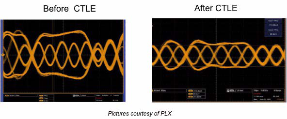

<br>


Once a Port receives at least 8 TS2s and transmits at least 16, it sends some logical idle data and those Lanes transitions to L0. The other
Lanes, Lanes 2 and 3 in this example, transition to Electrical Idle until the next time the link training process is initiated at which
point those Lanes will attempt the training process like normal.

</td>
<td width="50%">

- If a loopback‐capable Transmitter is directed by a higher Layer to send TS Ordered Sets with the Loopback bit asserted or all Lanes that
are sending and receiving TS1s receive 2 consecutive TS1s with the Loopback bit set. Whichever Port sends the TS1s with the bit set will
become the Loopback master, while the Port that receives them will become the Loopback slave.

</td>
</tr>
<tr>
<td width="50%">

## **Detailed Configuration Substates** 

A detailed explanation of each substate is presented here to cover all the sub‐ states of Configuration, as shown in Figure 14‐24 on page
553. The Configura‐ tion Substates should be easier to follow, given the Link Training examples discussed previously.
_Figure 14‐24: Configuration State Machine_ 


<br>

</td>
<td width="50%">

## _Exit to "Detect State"_

- After a 24ms timeout if none of the other conditions are true.

</td>
</tr>
<tr>
<td width="50%">

## **Configuration.Linkwidth.Start** 

This substate is entered after either the normal completion of the Polling state (as described in “Polling.Configuration” on page 527), or
if the Recovery state finds that Link or Lane numbers have changed since the last time they were assigned and thus the recovery process
can’t finish normally (as described in the “Recovery State” on page 571).

</td>
<td width="50%">

## **Configuration.Linkwidth.Accept**

At this point, the Upstream Port is now sending back TS1 ordered‐sets on all its Lanes with the same Link number. The Link number originated
from the Downstream Port, and the Upstream Port is simply reflecting that value back on all its Lanes. Now the Downstream Port knows the
Link width (number of Lanes receiving the same Link number) and it must start advertising the Lane numbers. So the leader (Downstream Port)
continues sending TS1s, but now with the actual Lane numbers designated instead of PAD. Also, all these TS1s will have the same Link number.
The detailed behavior for the Downstream and Upstream Lanes are outlined below:

</td>
</tr>
<tr>
<td width="50%">

## **Downstream Lanes.**

</td>
<td width="50%">

## **Downstream Lanes**

</td>
</tr>
<tr>
<td width="50%">

## _During Configuration.Linkwidth.Start_ 

The Downstream Port is now the leader on this Link and sends TS1s with a non‐PAD link number on all active Lanes (as long as LinkUp is 

not set and upconfiguration of the Link width is not taking place). In the TS1s, the Link number field is changed from PAD to a number while
the Lane number remains PAD. The only constraint on the value of the Link numbers in the spec is that they must be unique for each possible
Link if multiple Links are supported. For example, a x8 Link would have the same Link number on all 8 Lanes, but if it could also be
configured as two x4 Links, both groups of 4 Lanes would be assigned different Link numbers, such as 5 for one group and 6 for the other.
The values are local to the Link partners and there’s no need for software to track them or try to make them unique throughout the system.
If the upconfigure_capable bit is set to 1b, these TS1s will also be sent on any inactive Lanes that received two consecutive TS1s with Link
and Lane numbers set to PAD.

- When entering this substate from Polling, any Lane that detected a Receiver is considered active. 

- When entering from Recovery, any Lane that was part of the Link after going through Configuration.Complete is considered an active Lane. 

- All supported data rates must be advertised in the TS1s, even if the Port doesn’t intend to use them. 

**Crosslinks.** For cases where LinkUp = 0b and the optional crosslink capa‐ bility is supported, all Lanes that detected a Receiver must
send a minimum of 16 to 32 TS1s with a non‐PAD Link number and PAD Lane number. After that, the port will evaluate what it is receiving to
see if a crosslink is present.

**Upconfiguring the Link Width.** If LinkUp = 1b and the LTSSM wants to upconfigure the Link, TS1s with Link and Lane numbers set to PAD are
sent on the currently active Lanes, the inactive Lanes it intends to activate, and the Lanes that have seen incoming TS1s. When the Lanes
have received two consecutive TS1s coming back, or after 1ms, the Link number is assigned a value in the TS1s being sent.

- If activating an inactive Lane, the Transmitter must wait for the Tx com‐ mon mode voltage to settle before exiting Electrical Idle and
sending TS1s.

- Link numbers must be the same for Lanes that will be grouped into a Link. The numbers can only be different for groups of Lanes that are
capable of acting as a unique Link.

- _Exit to “After a 24ms timeout if none of the other conditions are true.”_ Any Lanes that previously received at least one TS1 with Link
and Lane
number of PAD now receive two consecutive TS1s with a non‐PAD Link number that matches a transmitted Link number and Lane num‐ bers are
still PAD will exit to the Configuration.Linkwidth.Accept sub‐ state.

</td>
<td width="50%">

## _During Configuration.Linkwidth.Accept_

- The Downstream Port will now initiate Lane numbers. If a Link can be formed from at least one group of Lanes that all receive two
consecutive TS1s and all see the same Link number, then TS1s are sent that keep that same Link number but now assign unique, non‐PAD Lane
numbers as well.

</td>
</tr>
<tr>
<td width="50%">

## _Exit to “Configuration.Linkwidth.Start”_ 

- If the first set of received TS1s for this substate have a non‐PAD Link number then it’s understood that a crosslink is present and the
Link neighbor is also behaving as a Downstream Port. To handle this situa‐ tion, the Downstream Lanes are changed to Upstream Lanes and a
ran‐ dom crosslink timeout is chosen. The next substate will be the same Confiuration.Linkwidth.Start again but the Lanes will now behave as
Upstream Lanes.

This supports the optional behavior when both Link partners behave as Downstream Ports. The solution for this situation is to change both to
Upstream Ports and assign each a random timeout that, when it expires, changes it to a Downstream Port. Since the timeouts won’t be the
same, eventually one Port is seen as Downstream while the other is seen as Upstream and then the training can go forward. The timeout must
be random so that even if two of the same devices are connected any possible deadlock will eventually be broken.

If crosslinks are supported, receiving a sequence of TS1s that first have a Link number of PAD and later have a non‐PAD Link number that
matches the transmitted Link number is valid only if the sequence wasn’t interrupted by a TS2.

</td>
<td width="50%">

## _Exit to "Configuration.Lanenum.Wait"_

- The Downstream Port does not stay in the Configuration.Linkwidth.Accept substate very long. Once it has received the necessary TS1s from
the Upstream Port indicating, the Link width, it updates any internal state info that is required, starts sending TS1s with non‐PAD Lane
numbers, as indicated above, and immediately transitions to Configuration.Lanenum.Wait to await Lane Number confirmation from the Upstream
Port.

</td>
</tr>
<tr>
<td width="50%">

## _Exit to “Disable State”_ 

If the Port is instructed by a higher layer to send TS1s or TS2s with the Disable Link bit asserted on all detected Lanes. Normally, the
Down‐ stream Port will initiate this but, for the optional crosslink case, it could become an Upstream Port instead and then Disabled will
be the next state if 2 consecutive TS1s are received with the Loopback bit set.

</td>
<td width="50%">

## **Upstream Lanes**

</td>
</tr>
<tr>
<td width="50%">

## _Exit to “Loopback State”_ 

If the loopback‐capable Transmitter is instructed by a higher layer to send TS Ordered Sets with the Loopback bit asserted, or if Lanes that
are sending TS1s receive 2 consecutive TS1s with the Loopback bit set. Whichever Port sends the TS1s with the bit set will become the Loop‐
back master, while the Port that receives them will become the Loop‐ back slave.

</td>
<td width="50%">

## _During Configuration.Linkwidth.Accept_

- The Upstream Port transmits TS1s where one of the received Link numbers is selected and sent back in the TS1s on _all_ the Lanes that
received TS1s with a non‐PAD Link number. Any left‐over Lanes that detected a Receiver but no Link number must send TS1s with Link and Lane
numbers set to PAD.

</td>
</tr>
<tr>
<td width="50%">

## _Exit to “Detect State”_ 

After a 24ms timeout if none of the other conditions are true.

</td>
<td width="50%">

## _Exit to "Configuration.Lanenum.Wait"_

- The Upstream Port must respond to the Lane numbers proposed to it by the Link neighbor. If a Link can be formed using Lanes that sent a
non‐PAD Link number on their TS1s and received two consecutive TS1s with the same Link number and any non‐PAD Lane number, then it should
send TS1s that match the same Lane number assignments, if possible, or are different if necessary (such as with the optional Lane reversal).

</td>
</tr>
<tr>
<td width="50%">

## **Upstream Lanes.**

</td>
<td width="50%">

## **Configuration.Lanenum.Wait**

Prior to discussing the Configuration.Lanenum.Wait state, some background information may be helpful. Lane numbers are assigned sequentially
from zero to the maximum number possible for a Link. For example, a x8 Link will be assigned Lane numbers 0 ‐ 7. Ports are required to
support a Link as wide as the number of Lanes they have and as small as one Lane. The Lanes will always start with Lane 0 and must be both
sequential and contiguous. For example, if some Lanes on a x8 Port aren't working, it might optionally be designed to configure a x4 Link
and, if so, it would need to use Lanes 0‐3. As another example, if Lane 2 of a x8 Port is not working, it wouldn't be possible to use Lanes
0, 1, 3, and 4 to form a x4 Link because the Lanes wouldn't be contiguous. Any left‐over Lanes must send TS1s with Link and Lane set to PAD.

A common timing consideration is repeated many times in the spec for the Configuration substates. Rather than repeat it for every case here,
just be aware that it applies in general to both Upstream and Downstream Ports:

To avoid configuring a Link smaller than necessary, it's recommended that a multi‐Lane Port delay the final link width evaluation if it sees
an error or loses Block Alignment on some Lanes. For 8b/10b, it should wait at least two more TS1s, while for 128b/130b mode it should wait
for at least 34 TS1s, but never more than 1ms in any case. The idea is that the Lanes might need settling time after powering up or being
reset.

</td>
</tr>
<tr>
<td width="50%">

## _During Configuration.Linkwidth.Start_ 

The Upstream Port is now the follower on this Link and goes back to sending TS1 ordered‐sets with PAD set for the Link and Lane number
fields. It will continue to do this until it begins receiving TS1s with a non‐PAD Link number from the Downstream Port (leader).

The Upstream Port sends TS1s with Link and Lane values of PAD on a) all active Lanes, b) the Lanes it wants to upconfigure and, c) if
upconfigure_capable is set to 1b, on each of the inactive Lanes that have received two consecutive TS1s with Link and Lane numbers set to
PAD while in this substate.

- When entering this substate from Polling, any Lane that detected a Receiver is considered active. 

- When entering from Recovery, any Lane that was part of the Link after going through Configuration.Complete is considered an active Lane.
If the transition wasn’t caused by an LTSSM timeout, the Trans‐ mitter must set the Autonomous Change bit (Symbol 4, bit 6) to 1b in the
TS1s being sent in the Configuration state if it does, in fact, plan to change the Link width for autonomous reasons.

- All supported data rates must be advertised in the TS1s, even if the Port doesn’t intend to use them. 

**Crosslinks.** For cases where LinkUp = 0b and the optional crosslink capa‐ bility is supported, all Lanes that detected a Receiver must
send a minimum of 16 to 32 TS1s with Link and Lane values of PAD. After that, the port will evaluate what it is receiving to see if a
crosslink is present.

_Exit to “After a 24ms timeout if none of the other conditions are true.”_ 

- If _any_ Lanes receive two consecutive TS1s with non‐PAD Link number and PAD Lane number, this port transitions to the Configuration.Link‐
width.Accept substate where one of the received Link numbers is selected for those Lanes and TS1s are sent back with that Link number and a
PAD Lane number, on _all_ the Lanes that received TS1s with a non‐ PAD Link number. Any left‐over Lanes that detected a Receiver but no Link
number must send TS1s with Link and Lane numbers set to PAD.

- If upconfiguring the Link, the LTSSM waits until it receives two con‐ secutive TS1s with a non‐PAD Link number and PAD Lane number on
either a) all the inactive Lanes it wants to activate, or b) on any
Lane 1ms after entering this substate, whichever is earlier. After that, it sends TS1s with the selected Link number along with PAD Lane
numbers.

- To avoid configuring a Link smaller than necessary, it’s recom‐ mended that a multi‐Lane Link that sees an error or loses Block Alignment
on some Lanes delay this Receiver evaluation. For 8b/10b encoding, it should wait at least two more TS1s, while for 128b/130b encoding it
should wait for at least 34 TS1s, but never more than 1ms in any case.

- After activating an inactive Lane, the Transmitter must wait for the Tx common mode voltage to settle before exiting Electrical Idle and
sending TS1s.

</td>
<td width="50%">

## _Exit to "Detect State"_

After a 2ms timeout if no Link can be configured (e.g.: Lane 0 is not working and Lane Reversal isn't available), or if all Lanes receive
two consecutive TS1s with PAD in both the Link and Lane numbers, the link must exit to the Detect State.

</td>
</tr>
<tr>
<td width="50%">

## _Exit to “Configuration.Linkwidth.Start”_ 

- After a crosslink timeout, send 16 to 32 TS2s with Link and Lane values of PAD. The Upstream Lanes change to Downstream Lanes and the next
substate will be the same Confiuration.Linkwidth.Start again but this time the Lanes behave as Downstream Lanes. For the case of two
Upstream Ports connected together, this optional behavior allows one of them to eventually take the lead as a Downstream Port.

</td>
<td width="50%">

## **Downstream Lanes**

</td>
</tr>
<tr>
<td width="50%">

## _Exit to “Disable State”_ 

If either of the following is true: 

- Any Lanes that are sending TS1s also receive TS1s with the Disable Link bit asserted. 

- The optional crosslink is supported and either all Lanes that are sending and receiving TS1s receive the Disable Link bit in two con‐
secutive TS1s, or else a crosslink Port is directed by a higher Layer to assert the Disable bit in its TS1s and TS2s on all Lanes that
detected a Receiver.

## _Exit to “Loopback State”_

</td>
<td width="50%">

## _During Configuration.Lanenum.Wait_

The Downstream Port will continue to transmit TS1s with the non‐PAD Link and Lane numbers until one of the exit conditions is met.

</td>
</tr>
<tr>
<td width="50%">

</td>
<td width="50%">

## _Exit to "Configuration.Lanenum.Accept"_

If either of the cases listed below is true:

- If two consecutive TS1s have been received on all Lanes with Link and Lane numbers that match what is being transmitted on those Lanes.

- If any Lanes that detected a Receiver see two consecutive TS1s with a Lane number different from when the Lane first entered this substate
and at least some Lanes see a non‐PAD Link number. The spec points out that this allows the two Ports to settle on a mutually acceptable
Link width.

</td>
</tr>
<tr>
<td width="50%">

</td>
<td width="50%">

## _Exit to "Detect State"_

After a 2ms timeout or if all Lanes receive two consecutive TS1s with Link and Lane numbers set to PAD.

Upstream Lanes

</td>
</tr>
<tr>
<td width="50%">

</td>
<td width="50%">

## _During Configuration.Lanenum.Wait_

The Upstream Port will continue to transmit TS1s with the non‐PAD Link and Lane numbers until one of the exit conditions is met.

</td>
</tr>
<tr>
<td width="50%">

</td>
<td width="50%">

## _Exit to "Configuration.Lanenum.Accept"_

If either of the cases listed below is true:

- If any Lanes receive two consecutive TS2s.

- If any Lanes receive two consecutive TS1s with a Lane number different from when the Lane first entered this substate and at least some
Lanes see a non‐PAD Link number.

Note that Upstream Lanes are allowed to wait up to 1ms before changing to that substate, so as to prevent received errors or skew between
Lanes from affecting the final Link configuration.

</td>
</tr>
<tr>
<td width="50%">

</td>
<td width="50%">

## _Exit to "Detect State"_

After a 2ms timeout or if all Lanes receive two consecutive TS1s with Link and Lane numbers set to PAD.

</td>
</tr>
<tr>
<td width="50%">

</td>
<td width="50%">

## **Configuration.Lanenum.Accept**

Downstream Lanes

</td>
</tr>
<tr>
<td width="50%">

</td>
<td width="50%">

## _During Configuration.Lanenum.Accept_

The Downstream Port has now received TS1s with non‐PAD Link and Lane numbers. It is at this point that the Downstream Port must decide if a
Link can be established with the Lane numbers returned by the Upstream Port. The three possible state transitions are listed below.

</td>
</tr>
<tr>
<td width="50%">

</td>
<td width="50%">

## _Exit to "Configuration.Complete"_

If two consecutive TS1s are received with the same non‐PAD Link and Lane numbers, and they match the Link and Lane numbers being transmitted
in the TS1s for all the Lanes, then Upstream Port has agreed with the Link and
Lane numbers advertised by the Downstream Port and the next substate is Configuration.Complete. Or if the Lane numbers in the received TS1s
are reversed from what the Downstream Port advertised, if the Downstream Port supports Lane Reversal, it can still proceed to
Configuration.Complete while using the reversed Lane numbers.

The spec points out that the Reversed Lane condition is strictly defined as Lane 0 receiving TS1s with the highest Lane number (total number
of Lanes ‐ 1) and the highest Lane number receiving TS1s with Lane number of zero. One thing that can be understood from this is the answer
to a question that comes up in class sometimes: Can the Lane numbers be mixed up, rather than sequential? The answer is no, they must be
from 0 to n‐1 or from n‐1 to 0; no other options are supported.

If the Configuration state was entered from the Recovery state, a bandwidth change may have been requested. If so, status bits will be
updated to report the nature of what happened. Basically, the system needs to report whether this change was initiated because the Link
wasn't working reliably or because hardware is simply managing the Link power. The bits are updated as follows:

- If the bandwidth change was initiated by the Downstream Port because of a reliability problem, the Link Bandwidth Management Status bit is
set to 1b.

- If the bandwidth change was not initiated by the Downstream Port but the Autonomous Change bit in two consecutive received TS1s is cleared
to 0b, the Link Bandwidth Management Status bit is set to 1b.

- Otherwise the Link Autonomous Bandwidth Status bit is set to 1b.

</td>
</tr>
<tr>
<td width="50%">

</td>
<td width="50%">

## _Exit to "Configuration.Lanenum.Wait"_

- If a configured Link can be formed with some but not all of the Lanes that receive two consecutive TS1s with the same non‐PAD Link and
Lane numbers, those Lanes send TS1s with the same Link number and new Lane numbers. The object is to use a smaller group of Lanes to achieve
a working Link.

The new Lane numbers must start with zero and increase sequentially to cover the Lanes that will be used. Any Lanes that don't receive TS1s
can't be part of the group and will disrupt the Lane numbering. Any leftover Lanes must send TS1s with Link and Lane set to PAD. For
example, if 8 Lanes are available, but Lane 2 doesn't see incoming TS1s, then the Link can't consist of a group that would need Lane 2.
Consequently, the x8 and x4 options would not be available, and only a x1 or x2 Link is possible.

</td>
</tr>
<tr>
<td width="50%">

</td>
<td width="50%">

## _Exit to "Detect State"_

- If no Link can be configured, or if all Lanes receive two consecutive TS1s with PAD for Link and Lane numbers.

</td>
</tr>
<tr>
<td width="50%">

</td>
<td width="50%">

## **Upstream Lanes**

</td>
</tr>
<tr>
<td width="50%">

</td>
<td width="50%">

## _During Configuration.Lanenum.Accept_

- The Upstream Port has now received either TS2s or TS1s with non‐PAD Link and Lane numbers. It is at this point that the Upstream Port must
decide if a Link can be established with the Lane numbers sent by the Downstream Port. The three possible state transitions are listed
below.

</td>
</tr>
<tr>
<td width="50%">

</td>
<td width="50%">

## _Exit to "Configuration.Complete"_

- If two consecutive TS2s are received with the same non‐PAD Link and Lane numbers, and they match the Link and Lane numbers being
transmitted in the TS1s for those Lanes, all is well and the next substate will be Configuration.Complete.

</td>
</tr>
<tr>
<td width="50%">

</td>
<td width="50%">

## _Exit to "Configuration.Lanenum.Wait"_

- If a configured Link can be formed with a subset of Lanes that receive two consecutive TS1s with the same non‐PAD Link and Lane numbers,
those Lanes send TS1s with the same Link number and new Lane numbers. The object is to use a smaller group of Lanes to achieve a working
Link. The next substate in this case will be Configuration.Lanenum.Wait.

As was the case for the Downstream Lanes, the new Lane numbers must start with zero and increase sequentially to cover the Lanes that will
be used. Any Lanes that don't receive TS1s can't be part of the group and will disrupt the Lane numbering. Any leftover Lanes must send TS1s
with Link and Lane set to PAD.

</td>
</tr>
<tr>
<td width="50%">

</td>
<td width="50%">

## _Exit to "Detect State"_

- If no Link can be configured, or if all Lanes receive two consecutive TS1s with PAD for Link and Lane numbers, then the next state will be
Detect.

</td>
</tr>
<tr>
<td width="50%">

</td>
<td width="50%">

## **Configuration.Complete**

This is the only substate of the Configuration state where TS2s are exchanged. As discussed before, the purpose of TS2s is a handshake, or
confirmation between the two devices on the link that they are ready to proceed to the next state. So this is the final confirmation of the
Link and Lane numbers exchanged in the TS1s leading up to this point.
It should be noted that Devices are allowed to change their supported data rates and upconfigure capability when they enter this substate,
but not while in it. This is because Devices record the capabilities of their Link partner from what is advertised in these TS2s, as will be
described in this section.

</td>
</tr>
<tr>
<td width="50%">

</td>
<td width="50%">

## **Downstream Lanes**

</td>
</tr>
<tr>
<td width="50%">

</td>
<td width="50%">

## _During Configuration.Complete_

TS2s are sent using the Link and Lane numbers that match the received TS1s. The TS2s can have the Upconfigure Capability bit set if the Port
supports a x1 Link using Lane 0 and is able to up‐configure the Link.

For 8b/10b encoding, Lane de‐skewing must be completed when leaving this substate. Also, scrambling will be disabled if all configured Lanes
see two consecutive TS2s with the Disable Scrambling bit set. The Port that sends these must also disable scrambling. Note that scrambling
cannot be disabled when in 128b/130b mode because of the necessary contribution it makes to signal integrity.

The Downstream Port is transmitting TS2s and watching for TS2s coming back. For future reference, record the number of FTSs that must be
sent when exiting from the L0s state from the N_FTS field in the incoming TS2s.

</td>
</tr>
<tr>
<td width="50%">

</td>
<td width="50%">

## _Exit to "Configuration.Idle"_

The next state will be Configuration.Idle when all Lanes sending TS2s receive 8 TS2s with matching Link and Lane numbers (non‐PAD), matching
rate identifiers, and matching Link Upconfigure Capability bit in all of them. At least 16 TS2s must also be sent after receiving one TS2.

If the device supports rates greater than 2.5 GT/s, it must record the rate identifier received on any configured Lane and this overrides
any previously recorded value. The variable used to track speed changes in Recovery, "changed_speed_recovery", is cleared to zero.

The variable "upconfigure_capable" is set to 1b if the device sends TS2s with Link Upconfigure Capability set to 1b and receives 8
consecutive TS2s with the same bit set. Otherwise it's cleared to zero.

Any Lanes that aren't configured as part of the Link are no longer associated with the LTSSM in progress and must either be:

- Associated with a new LTSSM or

- Transitioned to Electrical Idle

 - a) A special case arises if those Lanes had been configured as part of the Link through L0 previously and LinkUp has remained set at 1b

since then. They must remain associated with the same LTSSM if the Link is upconfigure capable. For that case, it's also recommended that
those Lanes leave their Receiver terminations on because they'll become part of the Link again if it is upconfigured. If the terminations
aren't left on, they must be turned on from when the LTSSM enters the Recovery.RcvrCfg state all the way through Configuration.Complete.
Lanes that weren't part of the Link before can't become part of it through this process, though.

- b) For the optional crosslink, Receiver terminations must be between ZRX‐HIGH‐IMP‐DC‐POS and ZRX‐HIGH‐IMP‐DC‐NEG.

- c) If the LTSSM goes back to Detect, these Lanes will once again be associated with it.

- d) No EIOS is needed before Lanes go to Electrical Idle, and the transition doesn't have to happen on Symbol or Ordered Set boundaries.

</td>
</tr>
<tr>
<td width="50%">

</td>
<td width="50%">

## After a 2ms timeout:

_Exit to "Configuration.Idle"_

Next state is Configuration.Idle if the idle_to_rlock_transitioned variable is less than FFh **and** the current data rate is 8.0 GT/s.

In this transition, the "changed_speed_recovery" variable is cleared to zero. Also, the "upconfigure_capable" variable may be updated,
though it's not required to do so, if at least one Lane saw eight consecutive TS2s with matching Link and Lane numbers (non‐PAD). If the
transmitted and received Link Upconfigure Capability bits are 1b, set it to 1b, otherwise clear it to zero.

Lanes that aren't part of the configured Link aren't associated with the LTSSM in progress and have the same requirements as the non‐timeout
case listed above.

_Exit to "Detect State"_

Otherwise, the next state is Detect.

</td>
</tr>
<tr>
<td width="50%">

</td>
<td width="50%">

## **Upstream Lanes**

_During Configuration.Complete_

TS2s are sent using the Link and Lane numbers that match the received TS2s. The TS2s can have the Upconfigure Capability bit set if the Port
supports a x1 Link using Lane 0 and is able to up‐configure the Link.
For 8b/10b encoding, Lane de‐skewing must be completed when leaving this substate. Also, scrambling will be disabled if all configured Lanes
see two consecutive TS2s with the Disable Scrambling bit set. The Port that sends these must also disable scrambling. Note that scrambling
cannot be disabled when in 128b/130b mode because of the necessary contribution it makes to signal integrity.

In this substate, the Upstream Port is receiving TS2s from the Downstream Port, and for future reference, should record the N_FTS field
value number of FTSs that must be sent when exiting from the L0s state from the in the incoming TS2s.

</td>
</tr>
<tr>
<td width="50%">

</td>
<td width="50%">

## _Exit to "Configuration.Idle"_

The next state will be Configuration.Idle when all Lanes sending TS2s receive 8 TS2s with matching Link and Lane numbers (non‐PAD), matching
rate identifiers, and a matching Link Upconfigure Capability bit in all of them. At least 16 TS2s must also be sent after receiving one TS2.

If the device supports rates greater than 2.5 GT/s, it must record the rate identifier received on any configured Lane, overriding any
previously recorded value. The variable used to track speed changes in Recovery, "changed_speed_recovery", is cleared to zero.

The variable "upconfigure_capable" is set to 1b if the device sends TS2s with Link Upconfigure Capability set to 1b and receives 8
consecutive TS2s with the same bit set. Otherwise it's cleared to zero.

Any Lanes that aren't configured as part of the Link are no longer associated with the LTSSM in progress and must either be:

- Optionally associated with a new crosslink LTSSM (if this feature is supported), or

- Transitioned to Electrical Idle

 - a) A special case arises if those Lanes had been configured as part of the Link through L0 previously and LinkUp has remained set at 1b
since then. They must remain associated with the same LTSSM if the Link is upconfigure capable. For that case, it's also recommended that
those Lanes leave their Receiver terminations on because they'll become part of the Link again if it is upconfigured. If they're not left
on, they must be turned on from when the LTSSM enters the Recovery.RcvrCfg state all the way through Configuration.Complete. Lanes that
weren't part of the Link before can't become part of it through this process, though.

- b) Receiver terminations must be between ZRX‐HIGH‐IMP‐DC‐POS and ZRX‐

 - HIGH‐IMP‐DC‐NEG[.]

- c) If the LTSSM goes back to Detect, these Lanes will once again be associated with it.

- d) No EIOS is needed before Lanes go to Electrical Idle, and the transition doesn't have to happen on Symbol or Ordered Set boundaries.

</td>
</tr>
<tr>
<td width="50%">

</td>
<td width="50%">

## After a 2ms timeout:

</td>
</tr>
<tr>
<td width="50%">

</td>
<td width="50%">

## _Exit to "Configuration.Idle"_

Next state is Configuration.Idle if the idle_to_rlock_transitioned variable is less than FFh **and** the current data rate is 8.0 GT/s.

In this transition, the "changed_speed_recovery" variable is cleared to zero. Also, the "upconfigure_capable" variable may be updated,
though it's not required to do so, if at least one Lane saw eight consecutive TS2s with matching Link and Lane numbers (non‐PAD). If the
transmitted and received Link Upconfigure Capability bits are 1b, set it to 1b, otherwise clear it to zero.

Lanes that aren't part of the configured Link aren't associated with the LTSSM in progress and have the same requirements as the non‐timeout
case listed above.

</td>
</tr>
<tr>
<td width="50%">

</td>
<td width="50%">

## _Exit to "Detect State"_

Otherwise, the next state is Detect.

</td>
</tr>
<tr>
<td width="50%">

</td>
<td width="50%">

## **Configuration.Idle**

</td>
</tr>
<tr>
<td width="50%">

</td>
<td width="50%">

## _During Configuration.Idle_

In this substate, the transmitter is sending Idle data and waiting for the minimum number of received Idle data so this Link can transition
to L0. During this time, the Physical Layer reports to the upper layers that the link is operational (Linkup = 1b).

For 8b/10b encoding, the transmitter is sending Idle data on all configured Lanes. Idle data are just data zeros that get scrambled and
encoded.

For 128b/130b encoding, the transmitter sends one SDS Ordered Set on all configured Lanes followed by Idle data Symbols. The first Idle
Symbol on Lane 0 is the first Symbol of the Data Stream.

</td>
</tr>
<tr>
<td width="50%">

</td>
<td width="50%">

## _Exit to "L0 State"_

If using 8b/10b encoding, the next state is L0 if 8 consecutive Idle data symbol times are received on all configured Lanes, and 16 symbol
times of idle data were sent after receiving one Idle Symbol.

If using 128b/130b, the next state is L0 if 8 consecutive Idle data are received on all configured Lanes, 16 Idles were sent after receiving
one Idle Symbol, and this state wasn't entered by a timeout from Configuration.Complete.

- Lane‐to‐Lane de‐skew must be completed before Data Stream processing begins.

- The Idle Symbols must be received in Data Blocks.

- If software set the Retrain Link bit in the Link Control register since the last transition to L0 from Recovery or Configuration, the
Downstream Port must set the Link Bandwidth Management bit in the Link Status register to 1b to indicate that this change was not hardware
initiated (autonomous).

- The "idle_to_rlock_transitioned" variable is cleared to 00h on transition to L0.

</td>
</tr>
<tr>
<td width="50%">

</td>
<td width="50%">

## After a 2ms timeout:

</td>
</tr>
<tr>
<td width="50%">

</td>
<td width="50%">

## _Exit to "Detailed Recovery Substates"_

If the idle_to_rlock_transitioned variable is less than FFh, the next state is Recovery (Recovery.RcvrLock). Then:

- a) For 8.0 GT/s, increment idle_to_rlock_transitioned by 1.

- b) For 2.5 or 5.0 GT/s, set idle_to_rlock_transitioned to FFh.

- c) NOTE: This variable counts the number of times the LTSSM has transitioned from this state to the Recovery state because the sequence
isn't working. The problem may be that equalization hasn't been properly adjusted or that the selected speed just isn't going to work, and
the Recovery state will take steps to address these issues. This variable limits the number of these attempts so as to avoid an endless
loop. If the Link still isn't working after doing this 256 times (when the count reaches FFh), go back to Detect and start over, hoping for
a better result.

_Exit to "Detect State"_

Otherwise (meaning idle_to_rlock = FFh), the next state is Detect.

</td>
</tr>
<tr>
<td width="50%">

</td>
<td width="50%">

## **L0 State**

This is the normal, fully‐operational Link state, during which Logical Idle, TLPs and DLLPs are exchanged between Link neighbors. L0 is
achieved immediately following the conclusion of the Link Training process. The Physical Layer also notifies the upper layers that the Link
is ready for operation, by setting the LinkUp variable. In addition, the idle_to_rlock_transitioned variable is cleared to 00h.

</td>
</tr>
<tr>
<td width="50%">

</td>
<td width="50%">

## _Exit to "Recovery State"_

The next state will be Recovery if a change in the Link speed or Link width is indicated, or if the Link partner initiates this by going to
Recovery or Electrical Idle. Let's consider each of these three cases in a little more detail in the following discussion.

</td>
</tr>
<tr>
<td width="50%">

</td>
<td width="50%">

## **Speed Change**

Two conditions are described in the spec that will cause an automatic change in speed.

The first is when rates higher than 2.5 GT/s are supported by both partners and the Link is active (Data Link Layer reports DL_Active), or
when one partner requests a speed change in its TS Ordered Sets. For example, a Downstream Port will initiate a speed change if a higher
rate was noted and software writes the Retrain Link bit and after setting the Target Link Speed field (see Figure 14‐ 26 on page 569) to a
different rate than the current rate.

</td>
</tr>

</tbody>
</table>

[⬆️ 返回目录](#本章目录-table-of-contents)

---


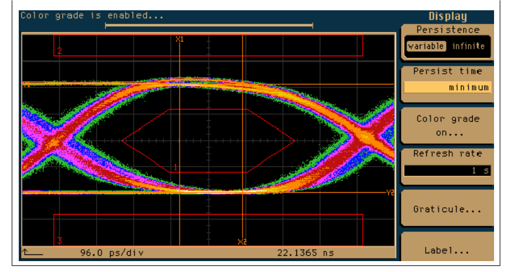

<a id="sec-13-2"></a>
## 13.2 Physical Layer - Electrical | 物理层 - 电气

<table>
<thead><tr><th width="50%">🇬🇧 English</th><th width="50%">🇨🇳 中文</th></tr></thead>
<tbody>
<tr>
<td width="50%">

- If a loopback‐capable Transmitter is directed by a higher Layer to send TS Ordered Sets with the Loopback bit asserted or all Lanes that
are sending and receiving TS1s receive 2 consecutive TS1s with the Loop‐ back bit set. Whichever Port sends the TS1s with the bit set will
become the Loopback master, while the Port that receives them will become the Loopback slave.

</td>
<td width="50%">

- 如果支持环回的发送器被更高层指示发送 Loopback 位被断言的 TS 有序集，或者所有正在发送和接收 TS1 的 Lane 接收到 2 个连续的设置了 Loopback 位的 TS1。发送设置了该位的 TS1 的端口将成为环回主设备，而接收它们的端口将成为环回从设备。

</td>
</tr>
<tr>
<td width="50%">

## _Exit to “Detect State”_ 

- After a 24ms timeout if none of the other conditions are true.

</td>
<td width="50%">

## _退出到 "Detect 状态"_

- 如果其他条件都不成立，则在 24ms 超时后。

</td>
</tr>
<tr>
<td width="50%">

## **Configuration.Linkwidth.Accept** 

At this point, the Upstream Port is now sending back TS1 ordered‐sets on all its Lanes with the same Link number. The Link number originated
from the Down‐ stream Port, and the Upstream Port is simply reflecting that value back on all its Lanes. Now the Downstream Port knows the
Link width (number of Lanes receiving the same Link number) and it must start advertising the Lane num‐ bers. So the leader (Downstream
Port) continues sending TS1s, but now with the actual Lane numbers designated instead of PAD. Also, all these TS1s will have the same Link
number. The detailed behavior for the Downstream and Upstream Lanes are outlined below:

</td>
<td width="50%">

## **Configuration.Linkwidth.Accept**

此时，上游端口现在在其所有 Lane 上发送回具有相同链路号的 TS1 有序集。链路号源自下游端口，上游端口只是将该值反映回其所有 Lane。现在下游端口知道链路宽度（接收相同链路号的 Lane 数）并且必须开始通告 Lane 号。因此领导者（下游端口）继续发送
TS1，但现在使用指定的实际 Lane 号而不是 PAD。此外，所有这些 TS1 将具有相同的链路号。下游和上游 Lane 的详细行为概述如下：

</td>
</tr>
<tr>
<td width="50%">

## **Downstream Lanes**

</td>
<td width="50%">

## **下游 Lane**

</td>
</tr>
<tr>
<td width="50%">

## _During Configuration.Linkwidth.Accept_ 

- The Downstream Port will now initiate Lane numbers. If a Link can be formed from at least one group of Lanes that all receive two
consecutive TS1s and all see the same Link number, then TS1s are sent that keep that same Link number but now assign unique, non‐PAD Lane
numbers as well.

</td>
<td width="50%">

## _在 Configuration.Linkwidth.Accept 期间_

- 下游端口现在将启动 Lane 号。如果可以从至少一组 Lane 形成链路，并且所有 Lane 都接收两个连续的 TS1 并且都看到相同的链路号，则发送保持相同链路号的 TS1 但现在也分配唯一的非 PAD Lane 号。

</td>
</tr>
<tr>
<td width="50%">

## _Exit to “Configuration.Lanenum.Wait”_ 

- The Downstream Port does not stay in the Configuration.Linkwidth.Accept substate very long. Once it has received the necessary TS1s from
the Upstream Port indicating, the Link width, it updates any internal state info that is required, starts sending TS1s with non‐PAD Lane
numbers, as indi‐ cated above, and immediately transitions to Configuration.Lanenum.Wait to await Lane Number confirmation from the Upstream
Port.

</td>
<td width="50%">

## _退出到 "Configuration.Lanenum.Wait"_

- 下游端口不会在 Configuration.Linkwidth.Accept 子状态中停留很长时间。一旦它从上游端口接收到指示链路宽度的必要 TS1，它就会更新所需的任何内部状态信息，开始发送如上所述的具有非 PAD Lane 号的 TS1，并立即转换到
Configuration.Lanenum.Wait 以等待来自上游端口的 Lane 号确认。

</td>
</tr>
<tr>
<td width="50%">

## **Upstream Lanes**

</td>
<td width="50%">

## **上游 Lane**

</td>
</tr>
<tr>
<td width="50%">

## _During Configuration.Linkwidth.Accept_ 

- The Upstream Port transmits TS1s where one of the received Link numbers is selected and sent back in the TS1s on _all_ the Lanes that
received TS1s with a non‐PAD Link number. Any left‐over Lanes that detected a Receiver but no Link number must send TS1s with Link and Lane
numbers set to PAD.

</td>
<td width="50%">

## _在 Configuration.Linkwidth.Accept 期间_

- 上游端口发送 TS1，其中在_所有_接收到具有非 PAD 链路号的 TS1 的 Lane 上的 TS1 中选择并发送一个接收到的链路号。任何剩余的检测到接收器但没有链路号的 Lane 必须发送 Link 和 Lane 号设置为 PAD 的 TS1。

</td>
</tr>
<tr>
<td width="50%">

## _Exit to “Configuration.Lanenum.Wait”_ 

- The Upstream Port must respond to the Lane numbers proposed to it by the Link neighbor. If a Link can be formed using Lanes that sent a
non‐PAD Link number on their TS1s and received two consecutive TS1s with the same Link number and any non‐PAD Lane number, then it should
send TS1s that match the same Lane number assignments, if possible, or are dif‐ ferent if necessary (such as with the optional Lane
reversal).

</td>
<td width="50%">

## _退出到 "Configuration.Lanenum.Wait"_

- 上游端口必须响应链路邻居向其提议的 Lane 号。如果可以使用在其 TS1 上发送非 PAD 链路号并接收到两个具有相同链路号和任何非 PAD Lane 号的连续 TS1 的 Lane 形成链路，那么它应发送与相同 Lane 号分配匹配的
TS1（如果可能），或者如果需要则不同（例如使用可选的 Lane 反转）。

**第 14 章：链路初始化与训练**

</td>
</tr>
<tr>
<td width="50%">

## **Configuration.Lanenum.Wait** 

Prior to discussing the Configuration.Lanenum.Wait state, some background information may be helpful. Lane numbers are assigned sequentially
from zero to the maximum number possible for a Link. For example, a x8 Link will be assigned Lane numbers 0 ‐ 7. Ports are required to
support a Link as wide as the number of Lanes they have and as small as one Lane. The Lanes will always start with Lane 0 and must be both
sequential and contiguous. For example, if some Lanes on a x8 Port aren’t working, it might optionally be designed to con‐ figure a x4 Link
and, if so, it would need to use Lanes 0‐3. As another example, if Lane 2 of a x8 Port is not working, it wouldn’t be possible to use Lanes
0, 1, 3, and 4 to form a x4 Link because the Lanes wouldn’t be contiguous. Any left‐ over Lanes must send TS1s with Link and Lane set to
PAD.

A common timing consideration is repeated many times in the spec for the Con‐ figuration substates. Rather than repeat it for every case
here, just be aware that it applies in general to both Upstream and Downstream Ports:

To avoid configuring a Link smaller than necessary, it’s recommended that a multi‐Lane Port delay the final link width evaluation if it sees
an error or loses Block Alignment on some Lanes. For 8b/10b, it should wait at least two more TS1s, while for 128b/130b mode it should wait
for at least 34 TS1s, but never more than 1ms in any case. The idea is that the Lanes might need settling time after powering up or being
reset.

</td>
<td width="50%">

## **Configuration.Lanenum.Wait**

在讨论 Configuration.Lanenum.Wait 状态之前，一些背景信息可能会有所帮助。Lane 号从零开始按顺序分配到链路可能的最大数量。例如，x8 链路将被分配 Lane 号 0 ‐ 7。端口需要支持与其具有的 Lane 数一样宽的链路和一个小至一个 Lane
的链路。Lane 将始终从 Lane 0 开始，并且必须既是顺序的又是连续的。例如，如果 x8 端口上的某些 Lane 无法工作，则可以选择将其设计为配置 x4 链路，如果是这样，它将需要使用 Lane 0‐3。作为另一个示例，如果 x8 端口的 Lane 2
无法工作，则不可能使用 Lane 0、1、3 和 4 形成 x4 链路，因为 Lane 不是连续的。任何剩余的 Lane 必须发送 Link 和 Lane 设置为 PAD 的 TS1。

规范中针对 Configuration 子状态重复了许多次的常见时序注意事项。这里不是在每种情况下重复它，只需注意它通常适用于上游和下游端口：

为了避免配置比必要的更小的链路，建议在某些 Lane 上看到错误或丢失块对齐的多 Lane 端口延迟最终链路宽度评估。对于 8b/10b，它应至少再等待两个 TS1，而对于 128b/130b 模式，它应至少等待 34 个 TS1，但任何情况下都不能超过 1ms。其想法是
Lane 在上电或复位后可能需要稳定时间。

</td>
</tr>
<tr>
<td width="50%">

## _Exit to “Detect State”_ 

After a 2ms timeout if no Link can be configured (e.g.: Lane 0 is not working and Lane Reversal isn’t available), or if all Lanes receive
two consecutive TS1s with PAD in both the Link and Lane numbers, the link must exit to the Detect State.

</td>
<td width="50%">

## _退出到 "Detect 状态"_

在 2ms 超时后，如果无法配置链路（例如：Lane 0 不工作且 Lane 反转不可用），或者如果所有 Lane 接收到两个连续的 Link 和 Lane 号中都带有 PAD 的 TS1，则链路必须退出到 Detect 状态。

</td>
</tr>
<tr>
<td width="50%">

## **Downstream Lanes**

</td>
<td width="50%">

## **下游 Lane**

</td>
</tr>
<tr>
<td width="50%">

## _During Configuration.Lanenum.Wait_ 

The Downstream Port will continue to transmit TS1s with the non‐PAD Link and Lane numbers until one of the exit conditions is met.

</td>
<td width="50%">

## _在 Configuration.Lanenum.Wait 期间_

下游端口将继续传输具有非 PAD 链路和 Lane 号的 TS1，直到满足退出条件之一。

</td>
</tr>
<tr>
<td width="50%">

## _Exit to “Configuration.Lanenum.Accept”_ 

If either of the cases listed below is true: 

- If two consecutive TS1s have been received on all Lanes with Link and Lane numbers that match what is being transmitted on those Lanes. 

- If any Lanes that detected a Receiver see two consecutive TS1s with a Lane number different from when the Lane first entered this substate
and at least some Lanes see a non‐PAD Link number. The spec points out that this allows the two Ports to settle on a mutually acceptable
Link width.

</td>
<td width="50%">

## _退出到 "Configuration.Lanenum.Accept"_

如果满足下列任一情况：

- 如果在所有 Lane 上接收到两个连续的 TS1，其链路和 Lane 号与在这些 Lane 上发送的内容匹配。

- 如果任何检测到接收器的 Lane 接收到两个连续的 TS1，其 Lane 号与 Lane 首次进入此子状态时不同，并且至少一些 Lane 看到非 PAD 链路号。规范指出，这允许两个端口就相互可接受的链路宽度达成一致。

</td>
</tr>
<tr>
<td width="50%">

## _Exit to “Detect State”_ 

After a 2ms timeout or if all Lanes receive two consecutive TS1s with Link and Lane numbers set to PAD. 

Upstream Lanes

</td>
<td width="50%">

## _退出到 "Detect 状态"_

在 2ms 超时后，或者如果所有 Lane 接收到两个连续的 Link 和 Lane 号设置为 PAD 的 TS1。

上游 Lane

</td>
</tr>
<tr>
<td width="50%">

## _During Configuration.Lanenum.Wait_ 

The Upstream Port will continue to transmit TS1s with the non‐PAD Link and Lane numbers until one of the exit conditions is met.

</td>
<td width="50%">

## _在 Configuration.Lanenum.Wait 期间_

上游端口将继续传输具有非 PAD 链路和 Lane 号的 TS1，直到满足退出条件之一。

</td>
</tr>
<tr>
<td width="50%">

## _Exit to “Configuration.Lanenum.Accept”_ 

If either of the cases listed below is true: 

- If any Lanes receive two consecutive TS2s. 

- If any Lanes receive two consecutive TS1s with a Lane number different from when the Lane first entered this substate and at least some
Lanes see a non‐PAD Link number.

Note that Upstream Lanes are allowed to wait up to 1ms before changing to that substate, so as to prevent received errors or skew between
Lanes from affecting the final Link configuration.

</td>
<td width="50%">

## _退出到 "Configuration.Lanenum.Accept"_

如果满足下列任一情况：

- 如果任何 Lane 接收到两个连续的 TS2。

- 如果任何 Lane 接收到两个连续的 TS1，其 Lane 号与 Lane 首次进入此子状态时不同，并且至少一些 Lane 看到非 PAD 链路号。

请注意，允许上游 Lane 在更改为该子状态之前等待最多 1ms，以防止接收错误或 Lane 之间的偏移影响最终链路配置。

</td>
</tr>
<tr>
<td width="50%">

## _Exit to “Detect State”_ 

After a 2ms timeout or if all Lanes receive two consecutive TS1s with Link and Lane numbers set to PAD.

</td>
<td width="50%">

## _退出到 "Detect 状态"_

在 2ms 超时后，或者如果所有 Lane 接收到两个连续的 Link 和 Lane 号设置为 PAD 的 TS1。

</td>
</tr>
<tr>
<td width="50%">

## **Configuration.Lanenum.Accept** 

Downstream Lanes

</td>
<td width="50%">

## **Configuration.Lanenum.Accept**

下游 Lane

</td>
</tr>
<tr>
<td width="50%">

## _During Configuration.Lanenum.Accept_ 

The Downstream Port has now received TS1s with non‐PAD Link and Lane numbers. It is at this point that the Downstream Port must decide if a
Link can be established with the Lane numbers returned by the Upstream Port. The three possible state transitions are listed below.

</td>
<td width="50%">

## _在 Configuration.Lanenum.Accept 期间_

下游端口现在已接收到具有非 PAD 链路和 Lane 号的 TS1。在这一点上，下游端口必须决定是否可以使用上游端口返回的 Lane 号建立链路。三个可能的状态转换在下面列出。

</td>
</tr>
<tr>
<td width="50%">

## _Exit to “Configuration.Complete”_ 

If two consecutive TS1s are received with the same non‐PAD Link and Lane numbers, and they match the Link and Lane numbers being transmitted
in the TS1s for all the Lanes, then Upstream Port has agreed with the Link and
Lane numbers advertised by the Downstream Port and the next substate is Configuration.Complete. Or if the Lane numbers in the received TS1s
are reversed from what the Downstream Port advertised, if the Downstream Port supports Lane Reversal, it can still proceed to
Configuration.Complete while using the reversed Lane numbers.

The spec points out that the Reversed Lane condition is strictly defined as Lane 0 receiving TS1s with the highest Lane number (total number
of Lanes ‐ 1) and the highest Lane number receiving TS1s with Lane number of zero. One thing that can be understood from this is the answer
to a question that comes up in class sometimes: Can the Lane numbers be mixed up, rather than sequential? The answer is no, they must be
from 0 to n‐1 or from n‐1 to 0; no other options are supported.

If the Configuration state was entered from the Recovery state, a bandwidth change may have been requested. If so, status bits will be
updated to report the nature of what happened. Basically, the system needs to report whether this change was initiated because the Link
wasn’t working reliably or because hardware is simply managing the Link power. The bits are updated as follows:

- If the bandwidth change was initiated by the Downstream Port because of a reliability problem, the Link Bandwidth Management Status bit is
set to 1b.

- If the bandwidth change was not initiated by the Downstream Port but the Autonomous Change bit in two consecutive received TS1s is cleared
to 0b, the Link Bandwidth Management Status bit is set to 1b.

- Otherwise the Link Autonomous Bandwidth Status bit is set to 1b.

</td>
<td width="50%">

## _退出到 "Configuration.Complete"_

如果接收到两个连续的 TS1 具有相同的非 PAD 链路和 Lane 号，并且它们与所有 Lane 的 TS1 中传输的链路和 Lane 号匹配，则上游端口已同意下游端口通告的链路和

**第 14 章：链路初始化与训练**

Lane 号，下一个子状态是 Configuration.Complete。或者如果接收到的 TS1 中的 Lane 号与下游端口通告的相反，如果下游端口支持 Lane 反转，它仍然可以使用反转的 Lane 号继续到 Configuration.Complete。

规范指出，反转 Lane 条件严格定义为 Lane 0 接收具有最高 Lane 号（Lane 总数 ‐ 1）的 TS1，并且最高 Lane 号接收 Lane 号为零的 TS1。可以从中理解的是，课堂上偶尔出现的问题的答案：Lane
号是否可以混合而不是顺序的？答案是不可以的，它们必须是从 0 到 n‐1 或从 n‐1 到 0；不支持其他选项。

如果 Configuration 状态是从 Recovery 状态进入的，则可能已请求带宽更改。如果是这样，状态位将更新以报告发生的情况的性质。基本上，系统需要报告此更改是由于链路工作不可靠而启动，还是因为硬件只是在管理链路功率。位更新如下：

- 如果带宽更改是由下游端口因可靠性问题而启动的，则链路带宽管理状态位设置为 1b。

- 如果带宽更改不是由下游端口启动，但两个连续接收的 TS1 中的 Autonomous Change 位清零为 0b，则链路带宽管理状态位设置为 1b。

- 否则，链路自动带宽状态位设置为 1b。

</td>
</tr>
<tr>
<td width="50%">

## _Exit to “Configuration.Lanenum.Wait”_ 

- If a configured Link can be formed with some but not all of the Lanes that receive two consecutive TS1s with the same non‐PAD Link and
Lane num‐ bers, those Lanes send TS1s with the same Link number and new Lane numbers. The object is to use a smaller group of Lanes to
achieve a working Link.

The new Lane numbers must start with zero and increase sequentially to cover the Lanes that will be used. Any Lanes that don’t receive TS1s
can’t be part of the group and will disrupt the Lane numbering. Any leftover Lanes must send TS1s with Link and Lane set to PAD. For
example, if 8 Lanes are available, but Lane 2 doesn’t see incoming TS1s, then the Link can’t consist of a group that would need Lane 2.
Consequently, the x8 and x4 options would not be available, and only a x1 or x2 Link is possible.

</td>
<td width="50%">

## _退出到 "Configuration.Lanenum.Wait"_

- 如果可以使用部分（但不是全部）接收两个连续的具有相同非 PAD 链路和 Lane 号的 TS1 的 Lane 形成配置的链路，则这些 Lane 使用相同的链路号和新的 Lane 号发送 TS1。目标是使用较小的 Lane 组来实现工作的链路。

新的 Lane 号必须从零开始并按顺序递增以覆盖将使用的 Lane。任何不接收 TS1 的 Lane 不能成为组的一部分，并将破坏 Lane 编号。任何剩余的 Lane 必须发送 Link 和 Lane 设置为 PAD 的 TS1。例如，如果 8 个 Lane 可用，但 Lane
2 看不到传入的 TS1，则链路不能由需要 Lane 2 的组组成。因此，x8 和 x4 选项将不可用，只有 x1 或 x2 链路是可能的。

</td>
</tr>
<tr>
<td width="50%">

## _Exit to “Detect State”_ 

- If no Link can be configured, or if all Lanes receive two consecutive TS1s with PAD for Link and Lane numbers.

</td>
<td width="50%">

## _退出到 "Detect 状态"_

- 如果无法配置链路，或者如果所有 Lane 接收到两个连续的具有 PAD 的链路和 Lane 号的 TS1。

</td>
</tr>
<tr>
<td width="50%">

## **Upstream Lanes**

</td>
<td width="50%">

## **上游 Lane**

</td>
</tr>
<tr>
<td width="50%">

## _During Configuration.Lanenum.Accept_ 

- The Upstream Port has now received either TS2s or TS1s with non‐PAD Link and Lane numbers. It is at this point that the Upstream Port must
decide if a Link can be established with the Lane numbers sent by the Downstream Port. The three possible state transitions are listed
below.

</td>
<td width="50%">

## _在 Configuration.Lanenum.Accept 期间_

- 上游端口现在已接收到具有非 PAD 链路和 Lane 号的 TS2 或 TS1。在这一点上，上游端口必须决定是否可以使用下游端口发送的 Lane 号建立链路。三个可能的状态转换在下面列出。

</td>
</tr>
<tr>
<td width="50%">

## _Exit to “Configuration.Complete”_ 

- If two consecutive TS2s are received with the same non‐PAD Link and Lane numbers, and they match the Link and Lane numbers being
transmitted in the TS1s for those Lanes, all is well and the next substate will be Configura‐ tion.Complete.

</td>
<td width="50%">

## _退出到 "Configuration.Complete"_

- 如果接收到两个连续的 TS2 具有相同的非 PAD 链路和 Lane 号，并且它们与这些 Lane 的 TS1 中传输的链路和 Lane 号匹配，则一切正常，下一个子状态将是 Configuration.Complete。

</td>
</tr>
<tr>
<td width="50%">

## _Exit to “Configuration.Lanenum.Wait”_ 

- If a configured Link can be formed with a subset of Lanes that receive two consecutive TS1s with the same non‐PAD Link and Lane numbers,
those Lanes send TS1s with the same Link number and new Lane numbers. The object is to use a smaller group of Lanes to achieve a working
Link. The next substate in this case will be Configuration.Lanenum.Wait.

As was the case for the Downstream Lanes, the new Lane numbers must start with zero and increase sequentially to cover the Lanes that will
be used. Any Lanes that don’t receive TS1s can’t be part of the group and will disrupt the Lane numbering. Any leftover Lanes must send TS1s
with Link and Lane set to PAD.

</td>
<td width="50%">

## _退出到 "Configuration.Lanenum.Wait"_

- 如果可以使用接收两个连续的具有相同非 PAD 链路和 Lane 号的 TS1 的 Lane 的子集形成配置的链路，则这些 Lane 使用相同的链路号和新的 Lane 号发送 TS1。目标是使用较小的 Lane 组来实现工作的链路。在这种情况下，下一个子状态将是
Configuration.Lanenum.Wait。

与下游 Lane 的情况一样，新的 Lane 号必须从零开始并按顺序递增以覆盖将使用的 Lane。任何不接收 TS1 的 Lane 不能成为组的一部分，并将破坏 Lane 编号。任何剩余的 Lane 必须发送 Link 和 Lane 设置为 PAD 的 TS1。

</td>
</tr>
<tr>
<td width="50%">

## _Exit to “Detect State”_ 

- If no Link can be configured, or if all Lanes receive two consecutive TS1s with PAD for Link and Lane numbers, then the next state will be
Detect.

</td>
<td width="50%">

## _退出到 "Detect 状态"_

- 如果无法配置链路，或者如果所有 Lane 接收到两个连续的具有 PAD 的链路和 Lane 号的 TS1，则下一个状态将是 Detect。

</td>
</tr>
<tr>
<td width="50%">

## **Configuration.Complete** 

This is the only substate of the Configuration state where TS2s are exchanged. As discussed before, the purpose of TS2s is a handshake, or
confirmation between the two devices on the link that they are ready to proceed to the next state. So this is the final confirmation of the
Link and Lane numbers exchanged in the TS1s leading up to this point.
</td>
<td width="50%">

- 如果支持回环的发送器被更高层指示发送 Loopback 位置位的 TS 有序集，或者所有正在发送和接收 TS1 的 Lane 收到 2 个连续的 Loopback 位置位的 TS1。无论哪个端口发送带此位设置的 TS1 都将成为 Loopback 主机，而接收它们的端口将成为
Loopback 从机。

</td>
<td width="50%">

## **Configuration.Complete**

这是 Configuration 状态中交换 TS2 的唯一子状态。如前所述，TS2 的目的是一种握手或确认，即链路上的两个设备已准备好继续到下一个状态。因此这是 TS1 中交换的链路和 Lane 号的最终确认

**第 14 章：链路初始化与训练**

应注意的是，允许设备在进入此子状态时更改其支持的数据速率和向上配置能力，但不能在其中更改。这是因为设备从这些 TS2 中通告的内容记录其链路伙伴的能力，如本节所述。

</td>
</tr>
<tr>
<td width="50%">

## _退出至"Detect 状态"_

- 在 24ms 超时后，如果其他条件都不成立。

**PCI Express 技术**

</td>
<td width="50%">

## **下游 Lane**

</td>
</tr>
<tr>
<td width="50%">

## **Configuration.Linkwidth.Accept**

此时，上游端口 (Upstream Port) 正在通过其所有 Lane 发送回具有相同 Link 号的 TS1 有序集。Link 号源自下游端口 (Downstream Port)，上游端口只是在所有 Lane 上将该值反射回去。现在下游端口知道链路宽度（接收相同 Link
号的 Lane 数），并且它必须开始通告 Lane 号。因此，主导方（下游端口）继续发送 TS1，但现在使用指定的实际 Lane 号代替 PAD。此外，所有这些 TS1 将具有相同的 Link 号。下游和上游 Lane 的详细行为概述如下：

</td>
<td width="50%">

## _在 Configuration.Complete 期间_

使用与接收到的 TS1 匹配的链路和 Lane 号发送 TS2。如果端口支持使用 Lane 0 的 x1 链路并能够向上配置链路，则 TS2 可以设置 Upconfigure Capability 位。

对于 8b/10b 编码，离开此子状态时必须完成 Lane 去偏移。此外，如果所有配置的 Lane 看到两个连续的设置了 Disable Scrambling 位的 TS2，则将禁用加扰。发送这些的端口还必须禁用加扰。请注意，由于加扰对信号完整性有必要贡献，因此在
128b/130b 模式下不能禁用加扰。

下游端口正在发送 TS2 并监视返回的 TS2。供将来参考，记录从传入 TS2 的 N_FTS 字段中退出 L0s 状态时必须发送的 FTS 数。

</td>
</tr>
<tr>
<td width="50%">

## **下游 Lane**

</td>
<td width="50%">

## _退出到 "Configuration.Idle"_

当所有发送 TS2 的 Lane 接收 8 个 TS2，具有匹配的链路和 Lane 号（非 PAD）、匹配的速率标识符以及所有链路中匹配的 Link Upconfigure Capability 位时，下一个状态将是 Configuration.Idle。在接收到一个 TS2
之后，还必须发送至少 16 个 TS2。

如果设备支持大于 2.5 GT/s 的速率，则它必须记录在任何已配置 Lane 上接收到的速率标识符，并且这将覆盖任何先前记录的值。用于跟踪 Recovery 中速度更改的变量 "changed_speed_recovery" 被清零。

变量 "upconfigure_capable" 在以下情况下设置为 1b：如果设备发送 Link Upconfigure Capability 设置为 1b 的 TS2 并接收 8 个连续的设置了相同位的 TS2。否则，它被清零。

未配置为链路一部分的任何 Lane 不再与正在进行的 LTSSM 关联，并且必须是以下之一：

- 与新的 LTSSM 关联，或

- 转换到电气空闲

 - a) 如果那些 Lane 之前已通过 L0 配置为链路的一部分，并且 LinkUp 仍设置为 1b，则出现特殊情况

从那以后。如果链路具有向上配置能力，它们必须保持与同一 LTSSM 关联。对于这种情况，还建议那些 Lane 保持其接收器终端开启，因为如果链路被向上配置，它们将再次成为链路的一部分。如果终端未保持开启，则它们必须在 LTSSM 进入 Recovery.RcvrCfg
状态时一直通过 Configuration.Complete 打开。但是，通过此过程，之前不是链路一部分的 Lane 不能成为其一部分。

- b) 对于可选交叉链路，接收器终端必须介于 ZRX‐HIGH‐IMP‐DC‐POS 和 ZRX‐HIGH‐IMP‐DC‐NEG 之间。

- c) 如果 LTSSM 返回 Detect，这些 Lane 将再次与其关联。

- d) 在 Lane 进入电气空闲之前不需要 EIOS，并且转换不必在符号或有序集边界上发生。

</td>
</tr>
<tr>
<td width="50%">

## _在 Configuration.Linkwidth.Accept 期间_

- 下游端口 (Downstream Port) 现在将发起 Lane 号。如果可以由至少一组 Lane 形成链路，并且所有这些 Lane 都接收到两个连续的 TS1 并且都看到相同的 Link 号，则发送保持相同 Link 号但现在也分配唯一非 PAD 的 Lane 号的
TS1。

</td>
<td width="50%">

## 在 2ms 超时后：

_退出到 "Configuration.Idle"_

如果 idle_to_rlock_transitioned 变量小于 FFh **且**当前数据速率为 8.0 GT/s，则下一个状态是 Configuration.Idle。

在此转换中，变量 "changed_speed_recovery" 被清零。此外，如果至少一个 Lane 看到八个具有匹配链路和 Lane 号（非 PAD）的连续 TS2，则变量 "upconfigure_capable" 可以更新，尽管不需要这样做。如果发送和接收的 Link
Upconfigure Capability 位为 1b，则将其设置为 1b，否则清零。

未配置链路一部分的 Lane 不与正在进行的 LTSSM 关联，并具有与上面列出的非超时情况相同的要求。

_退出到 "Detect 状态"_

否则，下一个状态是 Detect。

</td>
</tr>
<tr>
<td width="50%">

## _退出至"Configuration.Lanenum.Wait"_

- 下游端口 (Downstream Port) 不会在 Configuration.Linkwidth.Accept 子状态中停留很长时间。一旦它从上游端口接收到指示链路宽度的必要 TS1，它就会更新所需的任何内部状态信息，开始发送具有非 PAD Lane 号的
TS1，如上所述，并立即转换到 Configuration.Lanenum.Wait 以等待来自上游端口的 Lane 号确认。

</td>
<td width="50%">

## **上游 Lane**

_在 Configuration.Complete 期间_

使用与接收到的 TS2 匹配的链路和 Lane 号发送 TS2。如果端口支持使用 Lane 0 的 x1 链路并能够向上配置链路，则 TS2 可以设置 Upconfigure Capability 位。

**第 14 章：链路初始化与训练**

对于 8b/10b 编码，离开此子状态时必须完成 Lane 去偏移。此外，如果所有配置的 Lane 看到两个连续的设置了 Disable Scrambling 位的 TS2，则将禁用加扰。发送这些的端口还必须禁用加扰。请注意，由于加扰对信号完整性有必要贡献，因此在
128b/130b 模式下不能禁用加扰。

在此子状态中，上游端口正在从下游端口接收 TS2，供将来参考，应记录从传入 TS2 中的 N_FTS 字段值退出 L0s 状态时必须发送的 FTS 数。

</td>
</tr>
<tr>
<td width="50%">

## **上游 Lane**

</td>
<td width="50%">

## _退出到 "Configuration.Idle"_

当所有发送 TS2 的 Lane 接收 8 个 TS2，具有匹配的链路和 Lane 号（非 PAD）、匹配的速率标识符以及所有链路中匹配的 Link Upconfigure Capability 位时，下一个状态将是 Configuration.Idle。在接收到一个 TS2
之后，还必须发送至少 16 个 TS2。

如果设备支持大于 2.5 GT/s 的速率，则它必须记录在任何已配置 Lane 上接收到的速率标识符，并且这将覆盖任何先前记录的值。用于跟踪 Recovery 中速度更改的变量 "changed_speed_recovery" 被清零。

变量 "upconfigure_capable" 在以下情况下设置为 1b：如果设备发送 Link Upconfigure Capability 设置为 1b 的 TS2 并接收 8 个连续的设置了相同位的 TS2。否则，它被清零。

未配置为链路一部分的任何 Lane 不再与正在进行的 LTSSM 关联，并且必须是以下之一：

- 可选择与新的交叉链路 LTSSM 关联（如果支持此功能），或

- 转换到电气空闲

 - a) 如果那些 Lane 之前已通过 L0 配置为链路的一部分，并且 LinkUp 自那时起仍设置为 1b，则出现特殊情况。如果链路具有向上配置能力，它们必须保持与同一 LTSSM 关联。对于这种情况，还建议那些 Lane
保持其接收器终端开启，因为如果链路被向上配置，它们将再次成为链路的一部分。如果它们未保持开启，则它们必须在 LTSSM 进入 Recovery.RcvrCfg 状态时一直通过 Configuration.Complete 打开。但是，通过此过程，之前不是链路一部分的 Lane
不能成为其一部分。

- b) 接收器终端必须介于 ZRX‐HIGH‐IMP‐DC‐POS 和 ZRX‐

 - HIGH‐IMP‐DC‐NEG 之间。

- c) 如果 LTSSM 返回 Detect，这些 Lane 将再次与其关联。

- d) 在 Lane 进入电气空闲之前不需要 EIOS，并且转换不必在符号或有序集边界上发生。

</td>
</tr>
<tr>
<td width="50%">

## _在 Configuration.Linkwidth.Accept 期间_

- 上游端口 (Upstream Port) 发送 TS1，其中选择接收到的 Link 号之一并在**所有**接收到具有非 PAD Link 号的 TS1 的 Lane 上的 TS1 中发送回去。任何已检测到接收器但未检测到 Link 号的剩余 Lane 必须发送 Link 和
Lane 号设置为 PAD 的 TS1。

</td>
<td width="50%">

## 在 2ms 超时后：

</td>
</tr>
<tr>
<td width="50%">

## _退出至"Configuration.Lanenum.Wait"_

- 上游端口 (Upstream Port) 必须响应链路邻居向其提议的 Lane 号。如果可以使用在其 TS1 上发送非 PAD Link 号并且接收到两个具有相同 Link 号和任何非 PAD Lane 号的连续 TS1 的 Lane 形成链路，那么它应发送匹配相同 Lane
号分配的 TS1（如果可能），或者在必要时发送不同的（例如使用可选的 Lane 反转）。

**第 14 章：链路初始化与训练**

</td>
<td width="50%">

## _退出到 "Configuration.Idle"_

如果 idle_to_rlock_transitioned 变量小于 FFh **且**当前数据速率为 8.0 GT/s，则下一个状态是 Configuration.Idle。

在此转换中，变量 "changed_speed_recovery" 被清零。此外，如果至少一个 Lane 看到八个具有匹配链路和 Lane 号（非 PAD）的连续 TS2，则变量 "upconfigure_capable" 可以更新，尽管不需要这样做。如果发送和接收的 Link
Upconfigure Capability 位为 1b，则将其设置为 1b，否则清零。

未配置链路一部分的 Lane 不与正在进行的 LTSSM 关联，并具有与上面列出的非超时情况相同的要求。

</td>
</tr>
<tr>
<td width="50%">

## **Configuration.Lanenum.Wait**

在讨论 Configuration.Lanenum.Wait 状态之前，一些背景信息可能会有所帮助。Lane 号从零开始顺序分配到链路可能的最大数量。例如，x8 链路将被分配 Lane 号 0 至 7。端口需要支持与其所具有的 Lane 数一样宽的链路，且至少为一个
Lane。Lane 将始终从 Lane 0 开始，并且必须既顺序又连续。例如，如果 x8 端口上的一些 Lane 无法工作，可以选择将其设计为配置 x4 链路，如果是这种情况，则它需要使用 Lane 0-3。作为另一个示例，如果 x8 端口的 Lane 2 出现故障，则无法使用
Lane 0、1、3 和 4 来形成 x4 链路，因为 Lane 不是连续的。任何剩余的 Lane 必须发送 Link 和 Lane 设置为 PAD 的 TS1。

一个常见的时序考虑因素在 Configuration 子状态的规范中重复多次。这里不是为每种情况都重复它，只需注意它通常适用于上游和下游端口：

为避免将链路配置得比必要的更小，建议多 Lane 端口在看到错误或丢失某些 Lane 的块对齐 (Block Alignment) 时延迟最终的链路宽度评估。对于 8b/10b，它应至少再等待两个 TS1，而对于 128b/130b 模式，它应至少等待 34 个
TS1，但在任何情况下都不能超过 1ms。其思想是 Lane 在上电或复位后可能需要稳定时间。

</td>
<td width="50%">

## _退出到 "Detect 状态"_

否则，下一个状态是 Detect。

</td>
</tr>
<tr>
<td width="50%">

## _退出至"Detect 状态"_

在 2ms 超时后，如果无法配置链路（例如：Lane 0 不工作且 Lane 反转不可用），或者如果所有 Lane 收到两个连续的 Link 和 Lane 号都为 PAD 的 TS1，则链路必须退出到 Detect 状态。

</td>
<td width="50%">

## **Configuration.Idle**

</td>
</tr>
<tr>
<td width="50%">

## **下游 Lane**

</td>
<td width="50%">

## _在 Configuration.Idle 期间_

在此子状态中，发送器正在发送空闲数据并等待接收空闲数据的最小数量，以便此链路可以转换到 L0。在此期间，物理层向上层报告链路处于运行状态（Linkup = 1b）。

对于 8b/10b 编码，发送器在所有已配置 Lane 上发送空闲数据。空闲数据只是被加扰和编码的数据零。

对于 128b/130b 编码，发送器在所有已配置 Lane 上发送一个 SDS 有序集，后跟空闲数据符号。Lane 0 上的第一个空闲符号是数据流的第一个符号。

**第 14 章：链路初始化与训练**

</td>
</tr>
<tr>
<td width="50%">

## _在 Configuration.Lanenum.Wait 期间_

下游端口 (Downstream Port) 将继续使用非 PAD Link 和 Lane 号发送 TS1，直到满足退出条件之一为止。

</td>
<td width="50%">

## _退出到 "L0 状态"_

如果使用 8b/10b 编码，则下一个状态是 L0，如果在所有已配置 Lane 上接收到 8 个连续的空闲数据符号时间，并且在接收到一个空闲符号之后发送了 16 个符号时间的空闲数据。

如果使用 128b/130b，则下一个状态是 L0，如果在所有已配置 Lane 上接收到 8 个连续的空闲数据，在接收到一个空闲符号之后发送了 16 个空闲，并且此状态不是通过 Configuration.Complete 的超时进入的。

- 数据流处理开始之前必须完成 Lane 到 Lane 去偏移。

- 必须在数据块中接收空闲符号。

- 如果软件自上次从 Recovery 或 Configuration 转换到 L0 以来在 Link Control 寄存器中设置了 Retrain Link 位，则下游端口必须将 Link Status 寄存器中的 Link Bandwidth Management 位设置为
1b，以指示此更改不是硬件发起的（自动）。

- 转换到 L0 时，变量 "idle_to_rlock_transitioned" 清零为 00h。

</td>
</tr>
<tr>
<td width="50%">

## _退出至"Configuration.Lanenum.Accept"_

如果下面列出的任一情况为真：

- 如果在所有 Lane 上都收到两个连续的 TS1，其 Link 和 Lane 号与在这些 Lane 上传输的内容匹配。

**PCI Express 技术**

- 如果任何检测到接收器的 Lane 看到两个连续的 TS1，其 Lane 号与 Lane 首次进入此子状态时不同，并且至少一些 Lane 看到非 PAD Link 号。规范指出，这允许两个端口在相互可接受的链路宽度上达成一致。

</td>
<td width="50%">

## 在 2ms 超时后：

</td>
</tr>
<tr>
<td width="50%">

## _退出至"Detect 状态"_

在 2ms 超时后，或者如果所有 Lane 收到两个连续的 Link 和 Lane 号设置为 PAD 的 TS1。

上游 Lane

</td>
<td width="50%">

## _退出到 "Recovery 子状态详解"_

如果 idle_to_rlock_transitioned 变量小于 FFh，则下一个状态是 Recovery (Recovery.RcvrLock)。然后：

- a) 对于 8.0 GT/s，idle_to_rlock_transitioned 递增 1。

- b) 对于 2.5 或 5.0 GT/s，将 idle_to_rlock_transitioned 设置为 FFh。

- c) 注意：此变量计算 LTSSM 因序列未工作而从此状态转换到 Recovery 状态的次数。问题可能是均衡尚未正确调整或所选速度根本不起作用，Recovery 状态将采取措施解决这些问题。此变量限制这些尝试的次数以避免无限循环。如果在进行此操作 256 次（当计数达到
FFh 时）后链路仍不工作，则返回 Detect 并重新开始，希望获得更好的结果。

_退出到 "Detect 状态"_

否则（即 idle_to_rlock = FFh），下一个状态是 Detect。

</td>
</tr>
<tr>
<td width="50%">

## _在 Configuration.Lanenum.Wait 期间_

上游端口 (Upstream Port) 将继续使用非 PAD Link 和 Lane 号发送 TS1，直到满足退出条件之一为止。

</td>
<td width="50%">

## **L0 状态**

这是正常的、完全运行的链路状态，在此期间逻辑空闲、TLP 和 DLLP 在链路邻居之间交换。L0 在链路训练过程结束后立即实现。物理层还通过设置 LinkUp 变量来通知上层链路已准备好运行。此外，变量 idle_to_rlock_transitioned 清零为 00h。

</td>
</tr>
<tr>
<td width="50%">

## _退出至"Configuration.Lanenum.Accept"_

如果下面列出的任一情况为真：

- 如果任何 Lane 收到两个连续的 TS2。

- 如果任何 Lane 收到两个连续的 TS1，其 Lane 号与 Lane 首次进入此子状态时不同，并且至少一些 Lane 看到非 PAD Link 号。

请注意，允许上游 Lane 在更改为该子状态之前等待最多 1ms，以防止接收错误或 Lane 之间的偏移影响最终的链路配置。

</td>
<td width="50%">

## _退出到 "Recovery 状态"_

如果指示链路速度或链路宽度的变化，或者如果链路伙伴通过转到 Recovery 或电气空闲来启动此操作，则下一个状态将是 Recovery。让我们在下面的讨论中更详细地考虑这三种情况中的每一种。

</td>
</tr>
<tr>
<td width="50%">

## _退出至"Detect 状态"_

在 2ms 超时后，或者如果所有 Lane 收到两个连续的 Link 和 Lane 号设置为 PAD 的 TS1。

</td>
<td width="50%">

## **速度更改**

规范中描述了将导致自动速度更改的两种条件。

第一种是当两个伙伴都支持高于 2.5 GT/s 的速率并且链路处于活动状态（数据链路层报告 DL_Active），或者当一个伙伴在其 TS 有序集中请求速度更改时。例如，如果注意到更高速率并且软件写入 Retrain Link 位并在将 Target Link Speed
字段（参见第 569 页的图 14‐26）设置为与当前速率不同的速率之后，下游端口将启动速度更改。

</td>
</tr>
<tr>
<td width="50%">

## **Configuration.Lanenum.Accept**

下游 Lane

</td>
<td width="50%">

</td>
</tr>
<tr>
<td width="50%">

## _在 Configuration.Lanenum.Accept 期间_

下游端口 (Downstream Port) 现在已收到具有非 PAD Link 和 Lane 号的 TS1。在此时，下游端口必须决定是否可以使用上游端口返回的 Lane 号建立链路。列出了三种可能的状态转换。

</td>
<td width="50%">

</td>
</tr>
<tr>
<td width="50%">

## _退出至"Configuration.Complete"_

如果收到两个连续的 TS1 具有相同的非 PAD Link 和 Lane 号，并且它们与为所有 Lane 的 TS1 中传输的 Link 和 Lane 号匹配，则上游端口已同意下游端口通告的 Link 和

**第 14 章：链路初始化与训练**

Lane 号，下一个子状态为 Configuration.Complete。或者如果接收到的 TS1 中的 Lane 号与下游端口通告的相反，如果下游端口支持 Lane 反转 (Lane Reversal)，它仍然可以继续到
Configuration.Complete，同时使用反转的 Lane 号。

规范指出，反转 Lane 条件严格定义为 Lane 0 收到具有最高 Lane 号（Lane 总数 ‐ 1）的 TS1，而最高 Lane 号收到 Lane 号为零的 TS1。可以从此了解课堂上偶尔出现的一个问题的答案：Lane 号可以混合而不是顺序吗？答案是不可以，它们必须是从
0 到 n‐1 或从 n‐1 到 0；不支持其他选项。

如果 Configuration 状态是从 Recovery 状态进入的，则可能已请求带宽更改。如果是这样，将更新状态位以报告发生的情况的性质。基本上，系统需要报告此更改是因链路无法可靠工作而发起，还是硬件只是管理链路电源。按如下方式更新位：

- 如果带宽更改是由下游端口 (Downstream Port) 由于可靠性问题而发起的，则将链路带宽管理状态 (Link Bandwidth Management Status) 位置为 1b。

- 如果带宽更改不是由下游端口发起，但在两个连续接收的 TS1 中的 Autonomous Change 位清零为 0b，则将链路带宽管理状态位置为 1b。

- 否则将链路自主带宽状态 (Link Autonomous Bandwidth Status) 位置为 1b。

</td>
<td width="50%">

</td>
</tr>
<tr>
<td width="50%">

## _退出至"Configuration.Lanenum.Wait"_

- 如果可以使用一些但不是所有接收两个具有相同非 PAD Link 和 Lane 号的连续 TS1 的 Lane 来形成已配置的链路，则这些 Lane 发送具有相同 Link 号和新 Lane 号的 TS1。目标是使用较小的 Lane 组来实现工作的链路。

新的 Lane 号必须从零开始并按顺序增加，以覆盖将使用的 Lane。任何未收到 TS1 的 Lane 不能成为该组的一部分，并且会扰乱 Lane 编号。任何剩余的 Lane 必须发送 Link 和 Lane 设置为 PAD 的 TS1。例如，如果有 8 个 Lane 可用，但
Lane 2 未看到传入的 TS1，则链路不能由需要 Lane 2 的组组成。因此，x8 和 x4 选项将不可用，并且仅可能使用 x1 或 x2 链路。

**PCI Express 技术**

</td>
<td width="50%">

</td>
</tr>
<tr>
<td width="50%">

## _退出至"Detect 状态"_

- 如果无法配置链路，或者如果所有 Lane 收到两个连续的 Link 和 Lane 号均为 PAD 的 TS1。

</td>
<td width="50%">

</td>
</tr>
<tr>
<td width="50%">

## **上游 Lane**

</td>
<td width="50%">

</td>
</tr>
<tr>
<td width="50%">

## _在 Configuration.Lanenum.Accept 期间_

- 上游端口 (Upstream Port) 现在已收到 TS2 或具有非 PAD Link 和 Lane 号的 TS1。在此时，上游端口必须决定是否可以使用下游端口发送的 Lane 号建立链路。列出了三种可能的状态转换。

</td>
<td width="50%">

</td>
</tr>
<tr>
<td width="50%">

## _退出至"Configuration.Complete"_

- 如果收到两个连续的 TS2 具有相同的非 PAD Link 和 Lane 号，并且它们与为这些 Lane 的 TS1 中传输的 Link 和 Lane 号匹配，则一切正常，下一个子状态将为 Configura‐ tion.Complete。

</td>
<td width="50%">

</td>
</tr>
<tr>
<td width="50%">

## _退出至"Configuration.Lanenum.Wait"_

- 如果可以使用接收两个具有相同非 PAD Link 和 Lane 号的连续 TS1 的 Lane 子集来形成已配置的链路，则这些 Lane 发送具有相同 Link 号和新 Lane 号的 TS1。目标是使用较小的 Lane 组来实现工作的链路。在这种情况下，下一个子状态将为
Configuration.Lanenum.Wait。

与下游 Lane 的情况一样，新的 Lane 号必须从零开始并按顺序增加，以覆盖将使用的 Lane。任何未收到 TS1 的 Lane 不能成为该组的一部分，并且会扰乱 Lane 编号。任何剩余的 Lane 必须发送 Link 和 Lane 设置为 PAD 的 TS1。

</td>
<td width="50%">

</td>
</tr>
<tr>
<td width="50%">

## _退出至"Detect 状态"_

- 如果无法配置链路，或者如果所有 Lane 收到两个连续的 Link 和 Lane 号均为 PAD 的 TS1，则下一个状态将为 Detect。

</td>
<td width="50%">

</td>
</tr>
<tr>
<td width="50%">

## **Configuration.Complete**

这是 Configuration 状态中唯一交换 TS2 的子状态。如前所述，TS2 的目的是在链路上的两个设备之间进行握手或确认它们已准备好进入下一状态。因此，这是对迄今为止在 TS1 中交换的 Link 和 Lane 号的最终确认。

**第 14 章：链路初始化与训练**

</td>
</tr>
</tbody>
</table>

[⬆️ 返回目录](#本章目录-table-of-contents)

---


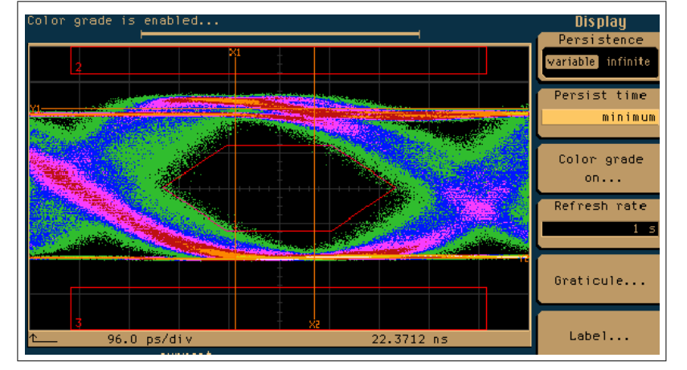

<a id="sec-13-3"></a>

</td>
<td width="50%">

</td>
</tr><table>
<thead><tr><th width="50%">🇬🇧 English</th><th width="50%">🇨🇳 中文</th></tr></thead>
<tbody>
<tr>
<td width="50%">

## 13.3 Physical Layer - Electrical | 物理层 - 电气

<table>
<thead><tr><th>🇬🇧 English</th><th style="background-color:#e8e8e8">🇨🇳 中文</th></tr>
</tbody>
</table></thead>
<tbody>
<tr>
<td width="50%">

It should be noted that Devices are allowed to change their supported data rates and upconfigure capability when they enter this substate,
but not while in it. This is because Devices record the capabilities of their Link partner from what is advertised in these TS2s, as will be
described in this section.

</td>
<td width="50%">

</td>
</tr>
<tr>
<td width="50%">

## **Downstream Lanes**

</td>
<td width="50%">

</td>
</tr>
<tr>
<td width="50%">

## _During Configuration.Complete_ 

TS2s are sent using the Link and Lane numbers that match the received TS1s. The TS2s can have the Upconfigure Capability bit set if the Port
sup‐ ports a x1 Link using Lane 0 and is able to up‐configure the Link.

For 8b/10b encoding, Lane de‐skewing must be completed when leaving this substate. Also, scrambling will be disabled if all configured Lanes
see two consecutive TS2s with the Disable Scrambling bit set. The Port that sends these must also disable scrambling. Note that scrambling
cannot be disabled when in 128b/130b mode because of the necessary contribution it makes to signal integrity.

The Downstream Port is transmitting TS2s and watching for TS2s coming back. For future reference, record the number of FTSs that must be
sent when exiting from the L0s state from the N_FTS field in the incoming TS2s.

</td>
<td width="50%">

</td>
</tr>
<tr>
<td width="50%">

## _Exit to “Configuration.Idle”_ 

The next state will be Configuration.Idle when all Lanes sending TS2s receive 8 TS2s with matching Link and Lane numbers (non‐PAD), matching
rate identifiers, and matching Link Upconfigure Capability bit in all of them. At least 16 TS2s must also be sent after receiving one TS2.

If the device supports rates greater than 2.5 GT/s, it must record the rate identifier received on any configured Lane and this overrides
any previ‐ ously recorded value. The variable used to track speed changes in Recovery, “changed_speed_recovery”, is cleared to zero.

The variable “upconfigure_capable” is set to 1b if the device sends TS2s with Link Upconfigure Capability set to 1b and receives 8
consecutive TS2s with the same bit set. Otherwise it’s cleared to zero.

Any Lanes that aren’t configured as part of the Link are no longer associ‐ ated with the LTSSM in progress and must either be: 

- Associated with a new LTSSM or 

- Transitioned to Electrical Idle 

 - a) A special case arises if those Lanes had been configured as part of the Link through L0 previously and LinkUp has remained set at 1b 

since then. They must remain associated with the same LTSSM if the Link is upconfigure capable. For that case, it’s also recom‐ mended that
those Lanes leave their Receiver terminations on because they’ll become part of the Link again if it is upconfigured. If the terminations
aren’t left on, they must be turned on from when the LTSSM enters the Recovery.RcvrCfg state all the way through Configuration.Complete.
Lanes that weren’t part of the Link before can’t become part of it through this process, though.

- b) For the optional crosslink, Receiver terminations must be between ZRX‐HIGH‐IMP‐DC‐POS and ZRX‐HIGH‐IMP‐DC‐NEG. 

- c) If the LTSSM goes back to Detect, these Lanes will once again be associated with it. 

- d) No EIOS is needed before Lanes go to Electrical Idle, and the transi‐ tion doesn’t have to happen on Symbol or Ordered Set boundaries.

</td>
<td width="50%">

</td>
</tr>
<tr>
<td width="50%">

## After a 2ms timeout: 

_Exit to “Configuration.Idle”_ 

Next state is Configuration.Idle if the idle_to_rlock_transitioned vari‐ able is less than FFh **and** the current data rate is 8.0 GT/s. 

In this transition, the “changed_speed_recovery” variable is cleared to zero. Also, the “upconfigure_capable” variable may be updated,
though it’s not required to do so, if at least one Lane saw eight consecu‐ tive TS2s with matching Link and Lane numbers (non‐PAD). If the
transmitted and received Link Upconfigure Capability bits are 1b, set it to 1b, otherwise clear it to zero.

Lanes that aren’t part of the configured Link aren’t associated with the LTSSM in progress and have the same requirements as the non‐timeout
case listed above.

_Exit to “Detect State”_ 

Otherwise, the next state is Detect.

</td>
<td width="50%">

</td>
</tr>
<tr>
<td width="50%">

## **Upstream Lanes** 

_During Configuration.Complete_ 

TS2s are sent using the Link and Lane numbers that match the received TS2s. The TS2s can have the Upconfigure Capability bit set if the Port
sup‐ ports a x1 Link using Lane 0 and is able to up‐configure the Link.
For 8b/10b encoding, Lane de‐skewing must be completed when leaving this substate. Also, scrambling will be disabled if all configured Lanes
see two consecutive TS2s with the Disable Scrambling bit set. The Port that sends these must also disable scrambling. Note that scrambling
cannot be disabled when in 128b/130b mode because of the necessary contribution it makes to signal integrity.

In this substate, the Upstream Port is receiving TS2s from the Downstream Port, and for future reference, should record the N_FTS field
value number of FTSs that must be sent when exiting from the L0s state from the in the incoming TS2s.

</td>
<td width="50%">

</td>
</tr>
<tr>
<td width="50%">

## _Exit to “Configuration.Idle”_ 

The next state will be Configuration.Idle when all Lanes sending TS2s receive 8 TS2s with matching Link and Lane numbers (non‐PAD), matching
rate identifiers, and a matching Link Upconfigure Capability bit in all of them. At least 16 TS2s must also be sent after receiving one TS2.

If the device supports rates greater than 2.5 GT/s, it must record the rate identifier received on any configured Lane, overriding any
previously recorded value. The variable used to track speed changes in Recovery, “changed_speed_recovery”, is cleared to zero.

The variable “upconfigure_capable” is set to 1b if the device sends TS2s with Link Upconfigure Capability set to 1b and receives 8
consecutive TS2s with the same bit set. Otherwise it’s cleared to zero.

Any Lanes that aren’t configured as part of the Link are no longer associ‐ ated with the LTSSM in progress and must either be: 

- Optionally associated with a new crosslink LTSSM (if this feature is sup‐ ported), or 

- Transitioned to Electrical Idle 

 - a) A special case arises if those Lanes had been configured as part of the Link through L0 previously and LinkUp has remained set at 1b
since then. They must remain associated with the same LTSSM if the Link is upconfigure capable. For that case, it’s also recommended that
those Lanes leave their Receiver terminations on because they’ll become part of the Link again if it is upconfigured. If they’re not left
on, they must be turned on from when the LTSSM enters the Recov‐ ery.RcvrCfg state all the way through Configuration.Complete. Lanes that
weren’t part of the Link before can’t become part of it through this process, though.

- b) Receiver terminations must be between ZRX‐HIGH‐IMP‐DC‐POS and ZRX‐ 

 - HIGH‐IMP‐DC‐NEG[.] 

- c) If the LTSSM goes back to Detect, these Lanes will once again be asso‐ ciated with it. 

- d) No EIOS is needed before Lanes go to Electrical Idle, and the transi‐ tion doesn’t have to happen on Symbol or Ordered Set boundaries. 

After a 2ms timeout:

</td>
<td width="50%">

</td>
</tr>
<tr>
<td width="50%">

## _Exit to “Configuration.Idle”_ 

Next state is Configuration.Idle if the idle_to_rlock_transitioned vari‐ able is less than FFh **and** the current data rate is 8.0 GT/s. 

In this transition, the “changed_speed_recovery” variable is cleared to zero. Also, the “upconfigure_capable” variable may be updated,
though it’s not required to do so, if at least one Lane saw eight consecu‐ tive TS2s with matching Link and Lane numbers (non‐PAD). If the
transmitted and received Link Upconfigure Capability bits are 1b, set it to 1b, otherwise clear it to zero.

Lanes that aren’t part of the configured Link aren’t associated with the LTSSM in progress and have the same requirements as the non‐timeout
case listed above.

</td>
<td width="50%">

</td>
</tr>
<tr>
<td width="50%">

## _Exit to “Detect State”_ 

Otherwise, the next state is Detect.

</td>
<td width="50%">

</td>
</tr>
<tr>
<td width="50%">

## **Configuration.Idle**

</td>
<td width="50%">

</td>
</tr>
<tr>
<td width="50%">

## _During Configuration.Idle_ 

In this substate, the transmitter is sending Idle data and waiting for the minimum number of received Idle data so this Link can transition
to L0. During this time, the Physical Layer reports to the upper layers that the link is operational (Linkup = 1b).

For 8b/10b encoding, the transmitter is sending Idle data on all configured Lanes. Idle data are just data zeros that get scrambled and
encoded.

For 128b/130b encoding, the transmitter sends one SDS Ordered Set on all configured Lanes followed by Idle data Symbols. The first Idle
Symbol on Lane 0 is the first Symbol of the Data Stream.

</td>
<td width="50%">

</td>
</tr>
<tr>
<td width="50%">

## _Exit to “L0 State”_ 

If using 8b/10b encoding, the next state is L0 if 8 consecutive Idle data sym‐ bol times are received on all configured Lanes, and 16 symbol
times of idle data were sent after receiving one Idle Symbol.

If using 128b/130b, the next state is L0 if 8 consecutive Idle data are received on all configured Lanes, 16 Idles were sent after receiving
one Idle Symbol, and this state wasn’t entered by a timeout from Configuration.Complete.

- Lane‐to‐Lane de‐skew must be completed before Data Stream processing begins. 

- The Idle Symbols must be received in Data Blocks. 

- If software set the Retrain Link bit in the Link Control register since the last transition to L0 from Recovery or Configuration, the
Downstream Port must set the Link Bandwidth Management bit in the Link Status reg‐ ister to 1b to indicate that this change was not hardware
initiated (auton‐ omous).

- The “idle_to_rlock_transitioned” variable is cleared to 00h on transition to L0.

</td>
<td width="50%">

</td>
</tr>
<tr>
<td width="50%">

## After a 2ms timeout:

</td>
<td width="50%">

</td>
</tr>
<tr>
<td width="50%">

## _Exit to “Detailed Recovery Substates”_ 

If the idle_to_rlock_transitioned variable is less than FFh, the next state is Recovery (Recovery.RcvrLock). Then: 

- a) For 8.0 GT/s, increment idle_to_rlock_transitioned by 1. 

- b) For 2.5 or 5.0 GT/s, set idle_to_rlock_transitioned to FFh. 

- c) NOTE: This variable counts the number of times the LTSSM has tran‐ sitioned from this state to the Recovery state because the sequence
isn’t working. The problem may be that equalization hasn’t been properly adjusted or that the selected speed just isn’t going to work, and
the Recovery state will take steps to address these issues. This variable limits the number of these attempts so as to avoid an endless
loop. If the Link still isn’t working after doing this 256 times (when the count reaches FFh), go back to Detect and start over, hoping for
a better result.

_Exit to “Detect State”_ 

Otherwise (meaning idle_to_rlock = FFh), the next state is Detect.

</td>
<td width="50%">

</td>
</tr>
<tr>
<td width="50%">

## **L0 State** 

This is the normal, fully‐operational Link state, during which Logical Idle, TLPs and DLLPs are exchanged between Link neighbors. L0 is
achieved immediately following the conclusion of the Link Training process. The Physical Layer also notifies the upper layers that the Link
is ready for operation, by setting the LinkUp variable. In addition, the idle_to_rlock_transitioned variable is cleared to 00h.

</td>
<td width="50%">

</td>
</tr>
<tr>
<td width="50%">

## _Exit to “Recovery State”_ 

The next state will be Recovery if a change in the Link speed or Link width is indicated, or if the Link partner initiates this by going to
Recovery or Electrical Idle. Let’s consider each of these three cases in a little more detail in the following discussion.

</td>
<td width="50%">

</td>
</tr>
<tr>
<td width="50%">

## **Speed Change** 

Two conditions are described in the spec that will cause an automatic change in speed. 

The first is when rates higher than 2.5 GT/s are supported by both partners and the Link is active (Data Link Layer reports DL_Active), or
when one partner requests a speed change in its TS Ordered Sets. For example, a Downstream Port will initiate a speed change if a higher
rate was noted and software writes the Retrain Link bit and after setting the Target Link Speed field (see Figure 14‐ 26 on page 569) to a
different rate than the current rate.

</td>
<td width="50%">

</td>
</tr>

</tbody>
</table>

[⬆️ 返回目录](#本章目录-table-of-contents)

---


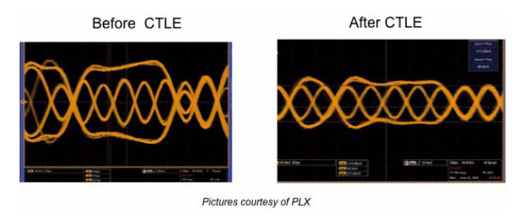

<a id="sec-13-4"></a>
## 13.4 Physical Layer - Electrical | 物理层 - 电气

<table>
<thead><tr><th width="50%">🇬🇧 English</th><th width="50%">🇨🇳 中文</th></tr></thead>
<tbody>
<tr>
<td width="50%">

The second condition is when both partners support 8.0 GT/s and one of them wants to perform Tx Equalization. In both conditions the
directed_speed_change variable will be set to 1b and the changed_speed_recovery bit will be cleared to 0b.

A Port will not attempt a speed change (the directed_speed_change variable won’t be set) if a rate higher than 2.5 GT/s has never been seen
as advertised by the other Port in the Configuration.Complete or Recovery.RcvrCfg substates.
_Figure 14‐25: Link Control Register_ 


<br>

</td>
<td width="50%">

第二种情况是当两个端口都支持 8.0 GT/s，并且其中之一希望执行 Tx 均衡 (Tx Equalization) 时。在这两种情况下，directed_speed_change 变量将被设置为 1b，changed_speed_recovery 位将被清除为 0b。

如果从未在 Configuration.Complete 或 Recovery.RcvrCfg 子状态中看到对端 Port 通告过高于 2.5 GT/s 的速率，那么该 Port 将不会尝试速率变更（不会设置 directed_speed_change 变量）。

</td>
</tr>
<tr>
<td width="50%">

## _Figure 14‐26: Link Control 2 Register_ 


<br>

</td>
<td width="50%">

## ## **链路宽度变更**

上层通常只有在 upconfigure_capable 被设置为 1b 时才会指示减小链路宽度 (Link width reduction)，否则链路将无法恢复为原始宽度。如果 Hardware Autonomous Width Disable 位设置为 1b，则 Port
只能通过减小宽度来尝试纠正可靠性问题。上层只有在链路对端已通告其支持 upconfigure 并且链路尚未达到其最大宽度时，才能启动链路宽度的增加。除了这些指导原则之外，更改链路宽度的决策标准在规范中并未给出，因此属于实现相关的。

</td>
</tr>
<tr>
<td width="50%">

## **Link Width Change** 

An upper layer would normally only direct a Link width reduction if upconfigure_capable has been set to 1b because otherwise the Link won’t
be able to go back to the original width. If the Hardware Autonomous Width Dis‐ able bit is set to 1b a Port can only reduce the width in an
effort to correct a reli‐ ability problem. An upper layer can only initiate an increase in Link width if the Link partner advertised that it
was upconfigure capable and the Link is not already at its maximum width. Apart from these guidelines, the decision crite‐ ria for changing
the Link width are not given in the spec and are therefore implementation specific.

</td>
<td width="50%">

## **由链路对端启动**

规范为此情况描述了三种可能性。

第一种情况是，如果在任何 Lane 上未先收到 EIOS，就在所有 Lane 上检测到或推断出 Electrical Idle（参见 596 页的 Table 14‐10），则该 Port 可以选择进入 Recovery 状态或保持在 L0。如果此条件导致错误，则可以通过设置
Retrain Link 位等手段将 Port 引导至 Recovery。

第二种情况是，当在任何已配置的 Lane 上收到 TS1 或 TS2（或 128b/130b 的 EIEOS）时，表明链路对端已经进入 Recovery 状态。由于这两种情况都是由链路对端发起的，因此允许发送器 (Transmitter) 完成当前正在进行的任何 TLP 或
DLLP。

最后，如果在任何 Lane 上收到 EIOS，表明发生了链路电源管理变化，但接收器 (Receiver) 不支持 L0s 并且也未被引导至 L1 或 L2，那么进入 Recovery 状态是唯一的选择。

</td>
</tr>
<tr>
<td width="50%">

## **Link Partner Initiated** 

The spec describes three possibilities for this case. 

First, if Electrical Idle is detected or inferred (see Table 14‐10 on page 596) on all Lanes without first receiving an EIOS on any Lane,
the Port may choose to enter Recovery or stay in L0. If errors result from this condition, the Port may be directed to Recovery by means
such as setting the Retrain Link bit.

The second case happens when TS1s or TS2s are received (or an EIEOS for 128b/ 130b) on any configured Lanes, indicating that the Link
partner has already entered Recovery. Since both of these cases are initiated by the Link partner, the Transmitter is allowed to complete
any TLP or DLLP currently in progress.

Finally, if an EIOS is received on any Lane, indicating a Link power manage‐ ment change, but the Receiver doesn’t support L0s and hasn’t
been directed to L1 or L2, then going to Recovery is the only option.

</td>
<td width="50%">

## _退出至 "L0s 状态"_

对于已被指示启动 L0s 的发送器，或已看到 EIOS 的接收器，下一状态将是 L0s。有趣的是，此时 Port 的发送器和接收器的 LTSSM 状态可以不同，因为一方可能处于 L0s 状态，而另一方仍处于 L0 状态。

- 发送器在指示时（如果实现了 L0s）进入 L0s，并发送 EIOS 来启动该变更。

- 接收器在任何 Lane 上看到 EIOS 时进入 L0s。但是，如果接收器未实现 L0s 并且未被引导至 L1 或 L2，这将被视为问题，下一状态将是 "Recovery 状态"。

</td>
</tr>
<tr>
<td width="50%">

## _Exit to “L0s State”_ 

The next state will be L0s for a Transmitter that’s been instructed to initiate it, or for a Receiver that sees an EIOS. Interestingly, the
LTSSM states for the Transmitter and Receiver of the Port can be different now, because one can be in L0s while the other is still in L0.

- Transmitters go to L0s when directed, if they implement L0s, and send EIOS to initiate the change. 

- Receivers go to L0s when an EIOS is seen on any Lane. However, if the Receiver doesn’t implement L0s and hasn’t been directed to L1 or L2,
this will be seen as a problem and the next state will be “Recovery State” instead.

</td>
<td width="50%">

## _退出至 "Rx_L0s.Entry"_

- 当一个链路对端被指示启动此状态并向所有 Lane 发送一个 EIOS（速率为 5.0 GT/s 时为两个 EIOS）并且在任何 Lane 上接收到 EIOS 时，下一状态将为 L1。请注意，两个链路对端必须事先就进入 L1 达成一致，并且需要数据链路层 (Data Link
Layer) 的握手以确保双方都已准备好。有关其工作原理的更多详细信息，请参见 733 页 "Introduction to Link Power Management" 一节。

</td>
</tr>
<tr>
<td width="50%">

## _Exit to “Rx_L0s.Entry”_ 

- The next state will be L1 when one Link partner is directed to initiate this and sends one EIOS on all Lanes (two EIOSs if the speed is
5.0 GT/s) and receives an EIOS on any Lane. Note that both Link partners must have already agreed to enter L1 beforehand and that a Data
Link Layer hand‐ shake is needed to ensure that both are ready. For more detail on how this works, see the section called “Introduction to
Link Power Management” on page 733.

</td>
<td width="50%">

## _退出至 "L2 状态"_

当一个链路对端被指示启动此状态并向所有 Lane 发送一个 EIOS（速率为 5.0 GT/s 时为两个 EIOS）并且在任何 Lane 上接收到 EIOS 时，下一状态将为 L2。请注意，两个链路对端必须事先就进入 L2
达成一致，并且需要握手以确保双方都已准备好。有关其工作原理的更多详细信息，请参见 733 页 "Introduction to Link Power Management" 一节。

</td>
</tr>
<tr>
<td width="50%">

## _Exit to “L2 State”_ 

The next state will be L2 when one Link partner is directed to initiate this and sends one EIOS on all Lanes (two EIOSs if the speed is 5.0
GT/s) and receives an EIOS on any Lane. Note that both Link partners must have already agreed to enter L2 beforehand and that a handshake is
needed to ensure that both are ready. For more detail on how this works, see the section called “Introduction to Link Power Management” on
page 733.

</td>
<td width="50%">

## **Recovery 状态**

如果一切如预期工作，链路将训练到 L0 状态而无需进入 Recovery 状态。但我们已经讨论了可能并非如此的两个原因。首先，如果在 Configuration.Idle 中未看到正确的 Symbol 模式，LTSSM 将进入 Recovery
状态，以通过例如调整均衡值的方式来尝试纠正信号问题。其次，一旦以 2.5 GT/s 的数据速率达到 L0，并且两个设备都支持更高速度，LTSSM 将进入 Recovery 状态并尝试将链路速度更改为最高共同支持/通告的速度。在此状态下，将重新获取 Bit Lock 以及
Symbol Lock 或 Block Alignment，并对链路进行重新去偏斜 (de-skew)。链路号和 Lane 号应保持不变，除非正在更改链路宽度。在这种情况下，LTSSM 将通过 Configuration 状态重新协商链路宽度。

注意：为了简化讨论并避免多次重复相同文本，此处将使用术语 "Lock" 来表示 Bit Lock 与 Symbol Lock（针对 8b/10b 编码）或 Block Alignment（针对 128b/130b 编码）的组合。接收器必须获取此 Lock 才能识别
Symbol、有序集 (Ordered Sets) 和数据包 (Packets)。

</td>
</tr>
<tr>
<td width="50%">

## **Recovery State** 

If everything works as expected, the Link trains to the L0 state without ever going into the Recovery state. But we’ve already discussed two
reasons why it might not. First, if the correct Symbol pattern isn’t seen in Configuration.Idle, the LTSSM goes to Recovery in an effort to
correct signaling problems by, for example, adjusting equalization values. Secondly, once L0 is reached with a data rate of 2.5 GT/s and
both devices support higher speeds, the LTSSM goes to Recovery and attempts to change the Link speed to the highest commonly‐sup‐
ported/advertised speed. In this state, Bit Lock and either Symbol Lock or Block Alignment is re‐acquired and the Link is de‐skewed again.
The Link and Lane Numbers should remain unchanged unless the Link width is being changed. In that case, the LTSSM passes through the
Configuration state where Link width is re‐negotiated.

NOTE: To simplify the discussion and avoid repeating the same text many times, the term “Lock” will be used here to mean the combination of
Bit Lock and either Symbol Lock for 8b/10b encoding or Block Alignment for 128b/130b encoding. A Receiver must acquire this Lock to be able
to recognize Symbols, Ordered Sets and Packets.

</td>
<td width="50%">

## **进入 Recovery 状态的原因**

- 退出 L1 状态；这是必需的，因为退出 L1 时没有像发送 FTS 有序集那样的快速训练选项

- 退出 L0s 时，如果接收器未能在规定时间内从 FTS 有序集获得 Lock，则链路必须转移至 Recovery

- 从 L0 进入，如果：

 - 初始训练完成时，存在更高的数据速率可用。

 - 已请求链路速度或宽度变更（用于电源管理或当前速度/宽度不可靠）。

 - 软件设置 Link Control 寄存器中的 Retrain Link 位（参见 644 页 Figure 14‐71），以尝试清除传输问题。

 - 错误条件（例如与数据链路层 Ack/Nak 协议关联的 Replay Num Roll-over 事件）会自动导致物理层 (Physical Layer) 逻辑重新训练链路。

 - 接收器在任何已配置的 Lane 上看到 TS1 或 TS2，意味着相邻设备已进入 Recovery。

 - 接收器在所有已配置的 Lane 上看到 Electrical Idle，但并未先收到 Electrical Idle Ordered Set。

</td>
</tr>
<tr>
<td width="50%">

## **Reasons for Entering Recovery State** 

- Exiting the L1 state; Required because there is no fast training option (like sending FTS ordered sets) when exiting L1 

- Exiting L0s if the receiver fails to achieve Lock from the FTS ordered sets in the required time, the Link must transition to Recovery 

- From L0 if: 

- A higher data rate is available when initial training completes. 

- A Link speed or width change has been requested (for power management or because the current speed or width is unreliable). 

- Software sets the Retrain Link bit in the Link Control Register (see Figure 14‐71 on page 644) in an effort to clear transmission
problems.

- An error condition such as a Replay Num Roll‐over event associated with the Ack/Nak protocol of the Data Link Layer automatically causes
the Physical Layer logic to retrain the Link.

- Receiver sees TS1s or TS2s on any configured Lane, meaning that the neighbor must have entered Recovery. 

- Receiver sees Electrical Idle on all configured Lanes but did not first receive the Electrical Idle Ordered Set.

</td>
<td width="50%">

## **启动 Recovery 过程**

任一 Port 都可以通过向其相邻设备发送 TS1 来启动 Recovery。当 Port 看到传入的 TS1 时，它知道另一个 Port 已进入 Recovery，因此它也会进入 Recovery 并返回 TS1。两个接收器首先使用 TS1 重新获取
Lock（如有必要），然后根据需要继续进行其他子状态。这在 573 页的 Figure 14‐27 中显示。子状态中发生什么的详细描述在后续各节中提供。

</td>
</tr>
<tr>
<td width="50%">

## **Initiating the Recovery Process** 

Either Port can initiate Recovery by sending TS1s to its neighbor. When a Port sees incoming TS1s it knows that the other Port has entered
Recovery, so it also goes into Recovery and returns TS1s. Both receivers first use the TS1s to reac‐ quire Lock (if necessary) and then
proceed to the other substates as needed. This is shown in Figure 14‐27 on page 573. A detailed description of what hap‐ pens in the
substates is provided in the sections that follow.
_Figure 14‐27: Recovery State Machine_ 


<br>

</td>
<td width="50%">

## **详细的 Recovery 子状态**

</td>
</tr>
<tr>
<td width="50%">

## **Detailed Recovery Substates**

</td>
<td width="50%">

## _在 Recovery.RcvrLock 期间_

- 无论速度如何，发送器在所有已配置的 Lane 上使用在 Configuration 状态中设置的相同链路号和 Lane 号发送 TS1。如果进入 Recovery 状态的目的是更改速度，则在启动设备的 TS1 中，Data Rate Identifier Symbol 中的
speed_change 位将被设置为 1b，并且内部变量 directed_speed_change 被设置为 1b。如果传入 TS1 中的 speed_change
位置位，则该变量也将在另一个设备中设置。此外，进入此子状态时，successful_speed_negotiation 变量被清除为 0b。

在此子状态中，允许上游端口 (Upstream Port) 指定当以 5GT/s 运行时下游端口 (Downstream Port) 应使用的去加重 (de-emphasis) 电平。这是通过将其 TS1 中的 Selectable De-emphasis
位设置为所需值来实现的。链路上的位错误可能会阻止此信息到达下游端口，因此允许上游端口在为速度变更进入 Recovery 状态时再次请求去加重电平。如果下游端口计划使用所请求的电平，则它必须在此状态下记录 Selectable De-emphasis 位的值。

进入此状态时也可以应用新的发送器电压。Link Control 2 寄存器中的 Transmit Margin 字段在进入此子状态时被采样，并保持有效直到在从 L0、L0s 或 L1 再次进入此子状态时采样到新值。

希望将速率更改为 8.0 GT/s 并重新执行均衡的下游端口必须发送 speed_change 位置位的 EQ TS1 并通告 8.0 GT/s 速率。如果上游端口接收到 8 个连续的 speed_change 位设置为 1b 且支持 8.0 GT/s 速率的 EQ TS1 或
EQ TS2，则预计它也将通告 8.0 GT/s 速率，除非它已确定该速率存在无法通过均衡修复的可靠性问题。请注意，允许 Port 在进入此状态时更改其通告的数据速率，但只能更改那些可以可靠支持的速率。除了此处描述的条件之外，设备不允许在此子状态或
Recovery.RcvrCfg 或 Recovery.Equalization 中更改其支持的数据速率。

</td>
</tr>
<tr>
<td width="50%">

## _During Recovery.RcvrLock_ 

- Regardless of the speed, Transmitters send TS1s on all configured Lanes using the same Link and Lane numbers that were set in the
Configuration state. If the purpose of entering the Recovery state was to change speeds, the speed_change bit in the Data Rate Identifier
Symbol will be set to 1b in the TS1s from the initiating device and the internal variable directed_speed_change is set to 1b. This same
variable will be set in the other device if the speed_change bit is set in the incoming TS1s. In addition, The successful_speed_negotiation
variable is cleared to 0b on entry to this substate.

In this substate, an Upstream Port is allowed to specify the de‐emphasis level the Downstream Port should use when operating at 5GT/s. This
is accomplished by setting the Selectable De‐emphasis bit in its TS1s to the desired value. It’s possible that bit errors on the Link will
prevent this infor‐ mation from reaching the Downstream Port, so the Upstream Port is allowed to request the de‐emphasis level again when
going to the Recovery state for a speed change. If the Downstream Port plans to use the requested level, it must record the value of the
Selectable De‐emphasis bit while in this state.

A new transmitter voltage can also be applied upon entry to this state. The Transmit Margin field in the Link Control 2 register is sampled
on entry to this substate and remains in effect until a new value is sampled on another entry to this substate from L0, L0s, or L1.

A Downstream Port that wants to change the rate to 8.0 GT/s and redo the equalization must send EQ TS1s with the speed_change bit set and
adver‐ tising the 8.0 GT/s rate. If an Upstream Port receives 8 consecutive EQ TS1s or EQ TS2s with the speed_change bit set to 1b and the
8.0 GT/s rate sup‐ ported, it is expected to advertise the 8.0 GT/s rate, too, unless it has con‐ cluded that there are reliability problems
at that rate that can’t be fixed with equalization. Note that a Port is allowed to change its advertised data rates when entering this
state, but only those rates that can be supported reliably. And apart from the conditions described here, a device is not allowed to change
its supported data rates in this substate or in Recovery.RcvrCfg or Recovery.Equalization.

</td>
<td width="50%">

## _退出至 "Recovery.RcvrCfg"_

- 如果接收到 8 个连续的 TS1 或 TS2，其链路号和 Lane 号与正在发送的匹配 _并且_ 它们的 speed_change 位等于 directed_speed_change 变量 _并且_ 它们的 EC 字段为 00b（如果当前数据速率为 8.0
GT/s），则下一状态将为 Recovery.RcvrCfg。

- 如果设置了 Extended Synch 位，则在进入 Recovery.RcvrCfg 之前必须发送至少 1024 个连续的 TS1。

- 如果此子状态是从 Recovery.Equalization 进入的，则上游端口必须将所有 Lane 接收到的均衡系数或预设值与均衡过程第 2 阶段接受的最终系数或预设值集合进行比较。如果它们不匹配，它将在其发送的 TS2 中设置 Request Equalization
位。

</td>
</tr>
<tr>
<td width="50%">

## _Exit to “Recovery.RcvrCfg”_ 

- The next state will be Recovery.RcvrCfg if 8 consecutive TS1s or TS2s are received whose Link and Lane numbers match what is being sent
_and_ their speed_change bit is equal to the directed_speed_change variable _and_ their EC field is 00b (if the current data rate is 8.0
GT/s).

- If the Extended Synch bit is set, a minimum of 1024 TS1s in a row must be sent before going to Recovery.RcvrCfg. 

- If this substate was entered from Recovery.Equalization, the Upstream Port must compare the equalization coefficients or preset received
by all Lanes against the final set of coefficients or preset that was accepted in Phase 2 of the equalization process. If they don’t match,
it sets the Request Equalization bit in the TS2s it sends.

</td>
<td width="50%">

## _退出至 "Recovery.Equalization"_

当数据速率为 8.0 GT/s 时，Lane 必须建立适当的均衡参数以获得良好的信号完整性。本节不适用于较低的速度。仅仅因为链路以 8.0 GT/s 运行，它并不会在每次进入 Recovery 时都经过 Recovery.Equalization
子状态。仅当满足以下条件之一时才会进入 Recovery.Equalization：

- 如果 start_equalization_w_preset 变量设置为 1b，则：

 - a) 上游端口在切换到 8.0 GT/s 之前，从其看到的 8 个连续 TS2 中注册了预设值。它必须使用发送器预设，并且可以可选地使用其接收到的接收器预设。

 - b) 下游端口必须在切换到 8.0 GT/s 时立即使用其 Lane Equalization Control 寄存器中定义的发送器预设，并且可以可选地使用其中找到的接收器预设。

- 否则（变量未设置），发送器必须使用在均衡过程上一次执行时它们所同意的系数设置。

 - a) 如果 8 个连续的传入 TS1 具有与正在发送的链路号和 Lane 号匹配、speed_change 位为 0b、但 EC 位为非零的值，则上游端口的下一状态将为
Recovery.Equalization，表明下游端口希望重做均衡过程的某些部分。规范指出，下游端口可以在软件或实现特定的指示下执行此操作。与往常一样，执行此操作所花费的时间不得导致事务超时错误，这实际上意味着下游端口需要确保在执行此步骤之前没有进行中的事务。

 - a) 如果被指示，下游端口的下一状态将为 Recovery.Equalization，只要此状态不是从 Configuration.Idle 或 Recovery.Idle 进入的。规范指出，在发送 EC 值为非零的 TS1 之前，不应发送超过两个 EC=00b 的
TS1，以请求重做均衡。

否则，经过 24ms 超时后：

</td>
</tr>
<tr>
<td width="50%">

## _Exit to “Recovery.Equalization”_ 

When the data rate is 8.0 GT/s, the Lanes must establish the proper equal‐ ization parameters to obtain good signal integrity. This section
does not apply for lower speeds. Just because the Link is running at 8.0 GT/s, it does not go through the Recovery.Equalization substate
every time Recovery is entered. Recovery.Equalization is only entered if one of these conditions is met:

- If the start_equalization_w_preset variable is set to 1b then:

</td>
<td width="50%">

## _退出至 "Recovery.RcvrCfg"_

如果同时满足以下两个条件，则下一状态将为 Recovery.RcvrCfg：

- 接收到 8 个连续的 TS1 或 TS2，其链路号和 Lane 号与正在发送的匹配，并且其 speed_change 位等于 1b。

- 并且当前数据速率已经高于 2.5 GT/s，或者至少在 TS1 或 TS2 中显示支持更高速率。

</td>
</tr>
<tr>
<td width="50%">

</td>
<td width="50%">

## _退出至 "Recovery.Speed"_

如果满足以下两个条件中的另一个，则下一状态将为 Recovery.Speed：

- 如果当前速度设置为高于 2.5 GT/s 但自进入 Recovery 以来无法正常工作（通过将变量 changed_speed_recovery 清零为 0b 来指示）。离开 Recovery.Speed 后的新速率将回退到 2.5 GT/s。

- 如果 changed_speed_recovery 变量设置为 1b，表明高于 2.5 GT/s 的速率已经可以工作，但链路无法以新协商的速率运行。结果，链路将恢复为从 L0 或 L1 进入 Recovery 时的速率。

</td>
</tr>
<tr>
<td width="50%">

</td>
<td width="50%">

## _退出至 "Configuration 状态"_

否则，如果未请求速度变更（directed_speed_change 变量 = 0b 并且 TS1 和 TS2 中的 speed_change 位为 0b），或者最高共同支持的数据速率为 2.5 GT/s，则 LTSSM 将返回到 Configuration。

</td>
</tr>
<tr>
<td width="50%">

</td>
<td width="50%">

## _退出至 "Detect 状态"_

最后，如果其他条件都不满足，则下一状态将为 Detect。

</td>
</tr>
<tr>
<td width="50%">

</td>
<td width="50%">

## **速度变更示例**

规范在此子状态的讨论中包含了一个速度变更的示例。场景是两个链路相邻设备（设备 A 和设备 B）正在退出复位，两者都支持 5.0 GT/s 和 8.0 GT/s 速率。

首先，链路将使用 Gen1 速率 2.5 GT/s 自动训练到 L0。（此行为很可能会在未来的规范版本中继续存在，因为它提供了与旧设计的向后兼容性。）

在我们的示例中，两个设备都支持更高的速率，这由训练期间其 TS 有序集中的 Rate Identifier 字段指示。两个设备都注意到对方支持更高的速率，其中之一（设备 A）将首先将其 directed_speed_change 变量设置为 1b。发生这种情况时，它将进入
Recovery.RcvrLock 并发送 speed_change 位置位的 TS1。如果所需速率为 8.0 GT/s 且之前未使用过，则设备将交换 EQ TS1 以传递要使用的 TX 均衡器预设，而不是发送普通 TS1。

设备 B 看到传入的 TS1，并转换到 Recovery.RcvrLock。当它识别出 8 个连续的 speed_change 位置位的 TS1 时，它通过在其自己的 TS1 中设置 speed_change 位进行响应并进入 Recovery.Speed。设备 A
等待该响应，当看到 8 个连续的 speed_change 位置位的 TS1 时，它进入 Recovery.RcvrCfg，然后进入 Recovery.Speed。在该子状态中，发送器被置为 Electrical Idle，速率被更改为最高共同支持的速率，并且
directed_speed_change 变量被清除。

经过超时周期后，两个设备都转移回 Recovery.RcvrLock，并且发送器使用新速度（在本例中为 8.0 GT/s）重新激活。它们现在再次发送 TS1，这次 speed_change 位被清除为 0b。如果新速度工作正常，它们将转移到 Recovery.RcvrCfg
并返回 L0。但是，如果设备 B 存在问题，例如未能获得 Bit Lock，则它将在此子状态中超时并返回到 Recovery.Speed。设备 A 此时可能
已经转移到 Recovery.RcvrCfg，但是当它现在看到 Electrical Idle（指示相邻设备已返回到 Recovery.Speed）时，它也将返回到该状态。返回到 Recovery.Speed 会导致两个设备都恢复到进入 Recovery 时的速度（在本例中为
2.5 GT/s），并返回到 Recovery.RcvrLock。

作为对该发展的响应，设备 A 可能会再次设置 directed_speed_change 并第二次尝试该过程。如果再次失败，设备 A 可以选择从其通告列表中删除 8.0 GT/s 速率并在没有该速率的情况下再次尝试速度变更。由于现在最高公共速率为 5.0
GT/s，如果此尝试成功，则速率将最终为 5.0 GT/s。如果仍然无效，设备 A 可能会放弃尝试使用更高的速率。设备如何以及何时选择更改其通告的速率或放弃尝试使更高速率工作，在规范中并未给出，将取决于具体实现。

</td>
</tr>
<tr>
<td width="50%">

</td>
<td width="50%">

## **链路均衡概述**

本节提供了均衡过程的概述，并为读者理解详细的子状态机行为做好准备（如果他们对此感兴趣）。

使用更高的链路速度会比较低的数据速率产生更多的信号失真。为了补偿这种失真并最大限度地减少系统设计人员的工作和成本，3.0 规范增加了对发送器均衡 (Transmitter Equalization)
的要求。与较低速率的固定去加重值不同（去加重实际上本身就是一种简单的发送器均衡形式），新方法使用主动握手过程来使发送器与实际信号环境相匹配。在此过程中，每个接收器 Lane 评估传入信号的质量，并建议链路对端应使用的 Tx 均衡参数，以满足信号质量要求。

链路均衡过程在第一次更改为 8.0 GT/s 数据速率之后执行。规范强烈建议自主启动均衡过程（在硬件中自动启动），但并不要求这样做。如果组件选择不使用自主机制，则必须使用基于软件的机制。如果任一端口无法通过此过程实现必要的信号质量，LTSSM 将得出该速率无法工作的结论，并返回到
Recovery.Speed 以请求较低的速率。

该过程涉及多达四个阶段，如下文所述。一旦速度已更改为 8.0 GT/s，正在使用的当前均衡阶段由 TS1 中的 EC（Equalization Control）字段指示，如 Figure 14‐28 所示。

</td>
</tr>
<tr>
<td width="50%">

</td>
<td width="50%">

## **Phase 0**

当下游端口准备好从较低速率更改为 8.0 GT/s 速率时，它进入 Recovery.RcvrCfg 子状态，并使用 EQ TS2 向上游端口发送 Tx 预设和 Rx 提示，如 510 页 "TS1 and TS2 Ordered Sets" 中所述。（请注意，如果链路已经以
8.0 GT/s 运行，则跳过此阶段。）下游端口 (DSP) 根据其 Equalization Control 寄存器（参见 579 页 Figure 14‐29）的内容发送 Tx 预设值。这突出的一点是，每个 Lane 可以具有不同的均衡值。下游端口将对其自己的发送器使用
DSP 值，并可选地用于其接收器，并将 USP 值发送到上游端口，以供其在切换到更高速度时使用。
_Table 14‐8: Tx Preset Encodings_

|**Encoding**|**De‐emphasis**|**Preshoot**|
|---|---|---|
|0000b|‐6|0|
|0001b|‐3.5|0|
|0010b|‐4.5|0|
|0011b|‐2.5|0|
|0100|0|0|

</td>
</tr>
<tr>
<td width="50%">

</td>
<td width="50%">

## **PCI Express Technology**

_Table 14‐8: Tx Preset Encodings (Continued)_

|**Encoding**|**De‐emphasis**|**Preshoot**|
|---|---|---|
|0101|0|2|
|0110|0|2.5|
|0111|‐6|3.5|
|1000|‐3.5|3.5|
|1001|0|3.5|
|1010|Depends on FS<br>and LS values|Depends<br>on FS and<br>LS values|
|1011b to<br>1111b|Reserved|Reserved|

_Table 14‐9: Rx Preset Hint Encodings_

|**Encoding**|**Rx Preset Hint**|
|---|---|
|000b|‐6 dB|
|001b|‐7 dB|
|010b|‐8 dB|
|011b|‐9 dB|
|100|‐10 dB|
|101|‐11 dB|
|110|‐12 dB|
|111|Reserved|

一旦速率确实改变，下游端口从 Phase 1 开始，并发送 EC = 01b 的 TS1。然后它等待上游端口以相同的 EC 值进行响应。

同时，上游端口从 Phase 0 开始，如 581 页 Figure 14‐30 所示，并发送回显其早先从
EQ TS1 和 EQ TS2 接收到的预设值的 TS1。如果支持，它将使用所请求的 Tx 预设，并可选地使用 Rx 提示。USP 允许在评估传入信号之前等待 500ns，但一旦它能够识别两个连续的 TS1，就准备好进行下一步。这意味着信号质量满足最低 BER
10[‐4]（即误码率小于万分之一）。随后 USP 在其 TS1 中设置 EC=01b，从而进入 Phase 1 并将下一步的控制权交给 DSP。

**Phase 1**

</td>
</tr>

</tbody>
</table>

<p align="center"><b>Figure 14‐25: Link Control Register</b></p>
<p align="center"></p>
<p align="center"><sub>📄 <a href="figures/chapter_13_Physical_Layer_-_Electrical/embedded/page0554_img1.png">Page 554</a></sub></p>


<p align="center"><b>Figure 14‐26: Link Control 2 Register</b></p>
<p align="center"></p>
<p align="center"><sub>📄 <a href="figures/chapter_13_Physical_Layer_-_Electrical/embedded/page0554_img1.png">Page 554</a></sub></p>


<p align="center"><b>Figure 14‐27: Recovery State Machine</b></p>
<p align="center"></p>
<p align="center"><sub>📄 <a href="figures/chapter_13_Physical_Layer_-_Electrical/embedded/page0554_img1.png">Page 554</a></sub></p>


<p align="center"><b>Figure 14‐28: EC Field in TS1s and TS2s for 8.0 GT/s</b></p>
<p align="center"></p>
<p align="center"><sub>📄 <a href="figures/chapter_13_Physical_Layer_-_Electrical/embedded/page0554_img1.png">Page 554</a></sub></p>


<p align="center"><b>Figure 14‐29: Equalization Control Registers</b></p>
<p align="center"></p>
<p align="center"><sub>📄 <a href="figures/chapter_13_Physical_Layer_-_Electrical/embedded/page0554_img1.png">Page 554</a></sub></p>


<p align="center"><b>Figure 14‐30: Equalization Process: Starting Point</b></p>
<p align="center"></p>
<p align="center"><sub>📄 <a href="figures/chapter_13_Physical_Layer_-_Electrical/embedded/page0554_img1.png">Page 554</a></sub></p>

<table>
<thead><tr><th width="50%">🇬🇧 English</th><th width="50%">🇨🇳 中文</th></tr></thead>
<tbody>
<tr>

</tr>
</tbody>
</table>

[⬆️ 返回目录](#本章目录-table-of-contents)

---

<a id="sec-13-5"></a>
## 13.5 Physical Layer - Electrical | 物理层 - 电气

<table>
<thead><tr><th width="50%">🇬🇧 English</th><th width="50%">🇨🇳 中文</th></tr></thead>
<tbody>
<tr>
<td width="50%">

- a) Upstream Port registered preset values from the 8 consecutive TS2s it saw prior to changing to 8.0 GT/s. It must use the Transmitter
presets and it may optionally use the Receiver presets it received.
 - b) Downstream Port must use the Transmitter presets defined in its Lane Equalization Control register as soon as it changes to 8.0 GT/s
and it may optionally use the Receiver presets found there.

- Else (the variable is not set), Transmitters must use the coefficient settings they agreed to when the equalization process was last
executed.

 - a) Upstream Port’s next state will be Recovery.Equalization if 8 consecu‐ tive incoming TS1s have Link and Lane numbers that match those
being sent and the speed_change bit is 0b, but the EC bits are non‐ zero, indicating that the Downstream Port wishes to redo some parts of
the equalization process. The spec notes that a Downstream Port could do this under software or implementation‐specific direction. As
always, the time it takes to do this must not be allowed to cause transaction timeout errors, which really means the Downstream Port would
need to ensure there were no transactions in flight before tak‐ ing this step.

 - a) Downstream Port’s next state will be Recovery.Equalization if directed, as long as this state wasn’t entered from Configuration.Idle
or Recovery.Idle. The spec points out that no more than two TS1s whose EC=00b should be sent before sending TS1s with a non‐zero EC value to
request that equalization be redone.

Otherwise, after a 24ms timeout:

</td>
<td width="50%">

DSP 执行与 USP 相同的操作，并通过检测背靠背 TS1 实现 10[‐4] 的 BER。在此期间，DSP 传达其 Tx 预设和 FS（Full Swing）、LF（Low Frequency）以及 Post-cursor 系数值，如 584 页 Figure 14‐32
所示。规范给出了一些必须满足的、针对一组所请求系数的附加规则，这些规则如下：

1. |C‐1| <= Floor (FS/4)，（注意：Floor 意味着向下舍入到整数值） 2. |C‐1| + C0 + |C+1| = FS

3. C0 ‐ |C‐1| ‐ |C+1| >= LF

</td>
</tr>
<tr>
<td width="50%">

## _Exit to “Recovery.RcvrCfg”_ 

The next state will be Recovery.RcvrCfg if both: 

- 8 consecutive TS1s or TS2s are received whose Link and Lane num‐ bers match what it being sent and their speed_change bit is equal to 1b. 

- And either the current data rate is already higher than 2.5 GT/s, or at least a higher rate is shown to be supported in the TS1s or TS2s.

</td>
<td width="50%">

## **PCI Express Technology**

FS 表示最大电压，LF 将最小电压定义为 LF/FS。这些信息告知接收器可能的值数量，并允许系数作为整数值传达但作为小数值被理解。

作为示例，假设我们使用为 P7 预设设置定义的系数。FS 值用作参考，可以是 63 之前的任何数字，但为了便于计算，我们假设它为 30。对于 P7，C‐1 为 ‐0.1，在 TS1 中传达以表示 C‐1 的值为 3，因为 3/30 = 0.1，并且始终被视为负值。C+1 为
‐0.2，因此将其传达为 6，因为 6/30 = 0.2 并且始终为负值。C0 为 0.7，因此它将作为 21 发送，因为 21/30 = 0.7。最后，LF 值表示可能的最小比值，对于 P7 而言，该比值为最大值的 0.4 倍。因此，LF 将被传达为 12，因为 12/30 =
0.4。

有了这些信息，让我们检查三个规则，看它们是否对 P7 情况得到满足：

1. 3 <= Floor (12/4)，这等于 3 <= 3，并且为真。

2. 3 + 21 + 6 = 30 这是真的。

3. 21 ‐ 3 ‐ 6 >= 12 这也为真，因此 P7 满足所有三个检查。

一旦下游端口确认链路工作得足够好可以继续进行（它识别出 EC = 01b 的传入 TS1），那么此阶段就完成了，它通过将其 EC = 10b 启动向 Phase 2 的变更（如图 583 页 Figure 14‐31 所示），并将下一步的控制权交回给 USP。当 USP 以 EC
= 10b 响应时，两个 Port 都进入 Phase 2。作为一种愉快的替代方案，下游端口可以确定此时的信号质量已经足够好，无需进一步调整。在这种情况下，它将其 EC 设置为 00b 以退出均衡过程。

</td>
</tr>
<tr>
<td width="50%">

## _Exit to “Recovery.Speed”_ 

The next state will be Recovery.Speed if other of the two following condi‐ tions are met: 

- If the current speed is set higher than 2.5 GT/s but isn’t working since entering Recovery (indicated by clearing the variable
changed_speed_recovery to 0b). The new rate after leaving Recov‐ ery.Speed will drop back to 2.5 GT/s.

- If the changed_speed_recovery variable is set to 1b, indicating that a higher rate than 2.5 GT/s is already working but the Link was
unable to operate at a new negotiated rate. As a result, the operating speed will revert to what it was when Recovery was entered from L0 or
L1.

</td>
<td width="50%">

## **Phase 2**

信号质量已经足够好以识别 TS1，但还不足以用于运行时操作。一旦两个 Port 都进入 Phase 2，则允许上游端口为下游端口请求 Tx 设置，然后评估它们的工作效果，重复该过程直到获得当前环境下的最佳设置。为了提出请求，它更改其在 TS1 中发送的均衡信息值。如 584 页
Figure 14‐32 所示，有几个感兴趣的值：

- **Tx 预设 (Tx Preset)：** Tx 预设是对发送器设置的粗粒度调整，旨在使其进入当前信号环境的正确大致范围。上游端口设置此值，并设置 "Use Preset" 指示符（Symbol 6 的位 7）以告诉下游端口的发送器使用它。如果未设置 Use Preset
位，则表示预设应保持不变，并且应更改系数值。Tx 系数被视为细粒度调整。

</td>
</tr>
<tr>
<td width="50%">

## _Exit to “Configuration State”_ 

Otherwise, the LTSSM will return to Configuration if a speed change is not requested (directed_speed_change variable = 0b and the
speed_change bit in the TS1s and TS2s is 0b), or if the highest commonly supported data rate is 2.5 GT/s.

</td>
<td width="50%">

## **PCI Express Technology**

- **系数 (Coefficients)：** 由于规范要求使用 3-tap Tx 均衡器，定义了三个系数值，可以将其视为对信号脉冲的电压调整，以补偿其在通过传输介质时将经历的失真，如 585 页 Figure 14‐33 所示。这在 474 页 "Solution for
8.0 GT/s ‐ Transmitter Equalization" 一节的物理层电气部分中进行了更详细的介绍。

- **Pre-Cursor 系数：** 应用于采样点之前信号的乘数，可根据需要增强或减弱信号。

- **Cursor 系数：** 采样点乘数；始终为正。

- **Post-Cursor 系数：** 应用于采样点之后信号的乘数，可根据需要增强或减弱信号。

- 一旦信号达到所需的质量标准，上游端口通过将 EC 更改为 11b 来表示它已准备好进入下一阶段。

</td>
</tr>
<tr>
<td width="50%">

## _Exit to “Detect State”_ 

Finally, if none of the other conditions are true, the next state will be Detect.

</td>
<td width="50%">

## **Phase 3**

下游端口通过发送 EC = 11b 进行响应，并且现在可以为上游端口的发送器执行相同的信号评估过程。它发送请求新设置的 TS1，方式如下：如果设置了 Use Preset 位，则定义新预设，否则将提供新系数。连续发送此内容 1μs
或直到请求已对其结果进行评估，以较晚者为准。该评估必须等待 500ns，加上通过发送逻辑传出和返回到接收逻辑的往返时间。可以测试不同的均衡设置，直到找到实现所需信号质量的一个设置为止。在该点，下游端口通过将 EC 设置为 00b 来退出均衡过程。

</td>
</tr>
<tr>
<td width="50%">

## **Speed Change Example** 

The spec includes an example of a speed change in the discussion of this sub‐ state. The scenario is two Link neighbors (device A and device
B) that are com‐ ing out of reset, both of which support the 5.0 GT/s and 8.0 GT/s rates.

To begin with, the Link will automatically train to L0 using the Gen1 rate of 2.5 GT/s. (This behavior is likely to continue in future spec
versions because it pro‐ vides backward compatibility with older designs.)

In our example both devices support higher rates and this is indicated by the Rate Identifier field in their TS Ordered Sets during
training. Both devices note that the other supports a higher rate and one of them (device A) will be the first to set its
directed_speed_change variable to 1b. When that happens, it will go to Recovery.RcvrLock and send TS1s with the speed_change bit set. If the
desired rate will be 8.0 GT/s and hasn’t been before, the devices will exchange EQ TS1s to deliver the TX equalizer presets to be used
instead of sending ordinary TS1s.

Device B sees incoming TS1s and also transitions to Recovery.RcvrLock. When it recognizes 8 TS1s in a row with the speed_change bit set, it
responds by set‐ ting the speed_change bit in its own TS1s and goes to Recovery.Speed. Device A waits for that response and, when 8 TS1s in
a row with the speed_change bit have been seen, it goes to Recovery.RcvrCfg and then to Recovery.Speed. In that substate, the transmitters
are put into Electrical Idle, the speed is changed to the highest commonly‐supported rate, and the directed_speed_change variable is
cleared.

After a timeout period, both devices transition back to Recovery.RcvrLock and the transmitters are re‐activated using the new speed (8.0
GT/s in this case). They send TS1s again now, this time with the speed_change bit cleared to 0b. If the new speed works well, they
transition to Recovery.RcvrCfg and back to L0. However, if device B has a problem, such as failure to achieve Bit Lock, it will timeout in
this substate and go back to Recovery.Speed. Device A may have
already transitioned to Recovery.RcvrCfg by this time, but when it sees Electri‐ cal Idle now, indicating the neighbor has returned to
Recovery.Speed, it will also go back to that state. Returning to Recovery.Speed causes both devices to revert to the speed in use when
Recovery was entered, 2.5 GT/s in this case, and return to Recovery.RcvrLock.

In response to that development, Device A might set directed_speed_change again and try the process a second time. If it failed again,
device A might choose to remove the 8.0 GT/s rate from its advertised list and try the speed change again without it. Since the highest
common rate is now 5.0 GT/s, if this attempt succeeds the rate will end up at 5.0 GT/s. If it doesn’t work, Device A might give up trying to
use a higher rate. How and when a device chooses to change its advertised rates or give up trying to get a higher rate working is not given
in the spec and will be implementation specific.

</td>
<td width="50%">

## **均衡说明**

规范提到了与均衡过程相关的其他项目，如下所述：

- 所有 Lane 必须参与该过程；即使那些稍后可能在 upconfigure 事件之后才变为活动的 Lane。

- 组件用于评估传入信号并确定其链路对端应使用的均衡值的算法在规范中并未给出，属于实现特定的。
- 均衡变更可以针对任意数量的 Lane 请求，并且 Lane 可以使用不同的值。

- 在细调步骤结束时（上游端口为 Phase 2，下游端口为 Phase 3），每个组件负责确保发送器设置使其满足规范要求。

- 组件必须评估调整其发送器设置的请求并采取行动。如果给出了有效值，它们必须使用这些值，并将其反映在它们发送的 TS1 中。

- 如果值不符合规则，则可以拒绝调整系数的请求。所请求的值仍会反映在发回的 TS1 中，但 Reject Coefficient Values 位将被设置。

- 组件必须存储通过此过程确定的均衡值，以供将来在 8.0 GT/s 下使用。规范并未明确说明这一点，但作者的观点是这些值将在速度更改为较低速率然后再返回到 8.0 GT/s 速率时仍然保留。这是有意义的，因为重复 EQ
过程可能需要很长时间，并且假设电气环境没有变化，所得到的值将相同。

- 组件允许随时微调其接收器，只要不会导致链路变得不可靠或进入 Recovery 状态。

</td>
</tr>
<tr>
<td width="50%">

## **Link Equalization Overview** 

This section provides an overview of the Equalization Process and prepares the reader to understand the detailed substate machine behaviors
if they are of interest.

Using a higher Link speed results in more signal distortion than lower data rates. To compensate for this and minimize the effort and cost
for system designers, the 3.0 spec adds a requirement for Transmitter Equalization. Unlike the fixed de‐emphasis values for the lower rates,
which is really a simple form of Transmitter equalization itself, the new method uses an active handshake process to match the Transmitters
to the actual signaling environment. During this process, each Receiver Lane evaluates the quality of the incoming signal and suggests Tx
equalization parameters that the Link partner should use to meet the signal quality requirements.

The Link Equalization procedure executes after the first change to the 8.0 GT/s data rate. The spec strongly recommends that the
equalization process be initi‐ ated autonomously (automatically in hardware) but doesn’t require it. If a com‐ ponent chooses not to use the
autonomous mechanism then a software‐based mechanism must be used. If either port is unable to achieve the necessary signal quality through
this process, the LTSSM will conclude that the rate is not work‐ ing and will go back to Recovery.Speed to request a lower speed.

The process involves up to four phases, as described in the text that follows. Once the speed has been changed to 8.0 GT/s, the current
equalization phase in use is indicated by the EC (Equalization Control) field in the TS1s being, as shown in Figure 14‐28.

_Figure 14‐28: EC Field in TS1s and TS2s for 8.0 GT/s_ 


<br>

</td>
<td width="50%">

## **详细的均衡子状态**

本节涵盖链路均衡期间状态机行为的详细描述。

</td>
</tr>
<tr>
<td width="50%">

## **Phase 0** 

When the Downstream Port is ready to change from a lower rate to the 8.0 GT/s rate, it enters the Recovery.RcvrCfg sub‐state and sends Tx
Presets and Rx Hints to the Upstream Port using EQ TS2s as described in “TS1 and TS2 Ordered Sets” on page 510. (Note that this phase is
skipped if the Link is already running at 8.0 GT/s.) The Downstream Port (DSP) sends Tx Preset values based on the con‐ tents of its
Equalization Control register shown in Figure 14‐29 on page 579. One thing this highlights is that there can be different equalization
values for each Lane. The Downstream Port will use the DSP values for its own Transmit‐ ter and optionally for its Receiver, and send the
USP values to the Upstream Port for it to use when going to the higher speed.
_Figure 14‐29: Equalization Control Registers_ 


<br>


_Table 14‐8: Tx Preset Encodings_ 

|**Encoding**|**De‐emphasis**|**Preshoot**|
|---|---|---|
|0000b|‐6|0|
|0001b|‐3.5|0|
|0010b|‐4.5|0|
|0011b|‐2.5|0|
|0100|0|0|

</td>
<td width="50%">

## **Recovery.Equalization**

此子状态用于执行 8.0 GT/s 及更高速率的链路均衡过程。较低速率不使用均衡，并且在这些速率生效时 LTSSM 不会进入此子状态。由于这是 PCIe 的一个新且复杂的主题，因此从高级别视图对整体均衡过程的描述在状态机详细信息之后呈现，参见 577 页 "Link
Equalization Overview" 一节。但首先，让我们逐步了解子状态以查看该过程的机制。

</td>
</tr>
<tr>
<td width="50%">

## **PCI Express Technology** 

_Table 14‐8: Tx Preset Encodings (Continued)_ 

|**Encoding**|**De‐emphasis**|**Preshoot**|
|---|---|---|
|0101|0|2|
|0110|0|2.5|
|0111|‐6|3.5|
|1000|‐3.5|3.5|
|1001|0|3.5|
|1010|Depends on FS<br>and LS values|Depends<br>on FS and<br>LS values|
|1011b to<br>1111b|Reserved|Reserved|


_Table 14‐9: Rx Preset Hint Encodings_ 

|**Encoding**|**Rx Preset Hint**|
|---|---|
|000b|‐6 dB|
|001b|‐7 dB|
|010b|‐8 dB|
|011b|‐9 dB|
|100|‐10 dB|
|101|‐11 dB|
|110|‐12 dB|
|111|Reserved|


Once the rate does change, the Downstream Port begins in Phase 1 and sends TS1s with EC = 01b. It then waits for the Upstream Port to
respond with the same EC value.

Meanwhile, the Upstream Port starts in Phase 0, as illustrated in Figure 14‐30 on page 581, and sends TS1s that echo the preset values it
received earlier from the
EQ TS1s and EQ TS2s. It will use those requested Tx presets if they’re sup‐ ported, and will optionally use the Rx Hints. The USP is allowed
to wait 500ns before evaluating the incoming signal but, once it’s able to recognize two TS1s in a row it’s ready for the next step. This
means the signal quality meets the min‐ imum BER of 10[‐4] (e.g., Bit Error Ratio of less than one error in 10,000 bits). Sub‐ sequently the
USP sets EC=01b in its TS1s thereby moving to Phase 1 and handing control of the next step to the DSP.

_Figure 14‐30: Equalization Process: Starting Point_ 


<br>


**Phase 1**

</td>
<td width="50%">

## **下游 Lane**

下游端口从均衡过程的 Phase 1 开始。要开始此过程，需要重置几个位。在 Link Status 2 寄存器（588 页 Figure 14‐36）中，进入此子状态时清除以下位：

- Equalization Phase 1 Successful

- Equalization Phase 2 Successful

- Equalization Phase 3 Successful

- Link Equalization Request

- Equalization Complete

Link Control 3 寄存器的 Perform Equalization 位也被清除为 0b，内部变量 start_equalization_w_preset 也被清除。equalization_done_8GT_data_rate 变量被设置为 1b。

**Phase 1 Downstream。** 在此阶段，下游端口发送 EC = 01b 的 TS1，同时使用来自 Lane Equalization Control 寄存器的预设值，并使用与 Tx 预设字段对应的 FS、LF 和 Post-cursor
系数字段。如果需要时间稳定其接收器逻辑，则允许其等待 500ns 后再评估传入的 TS1。

</td>
</tr>
<tr>
<td width="50%">

</td>
<td width="50%">

## _退出至 "Phase 2 Downstream"_

如果下游端口希望继续均衡过程，并且当所有已配置的 Lane 接收到两个连续的 EC = 01b 的 TS1 时，下游端口将转换到 Phase 2。此时，Port 将 Equalization Phase 1 Successful 状态位设置为 1b，并存储接收到的 TS1 LF
和 FS 值以在 Phase 3 中使用（如果下游端口计划调整上游端口的 Tx 系数）。

</td>
</tr>
<tr>
<td width="50%">

</td>
<td width="50%">

## _退出至 "详细的 Recovery 子状态"_

如果下游端口不希望使用 Phase 2 和 Phase 3，则它将状态位设置为 1b（Eq. Phase 1 Successful、Eq. Phase 2 Successful、Eq. Phase 3 Successful 和 Eq.
Complete）。这样做的原因之一可能是它已经可以看到信号特性足够好，不需要其他阶段。

</td>
</tr>
<tr>
<td width="50%">

</td>
<td width="50%">

## _退出至 "Recovery.Speed"_

如果在 24ms 超时后仍未看到连续的 TS1，则下一状态为 Recovery.Speed。successful_speed_negotiation 标志被清除为 0b，Equalization Complete 状态位被设置为 1b。

**Phase 2 Downstream。** 在此阶段，下游端口发送 EC = 10b 的 TS1，并根据以下规则在每个 Lane 上独立分配系数设置：

- 如果接收到两个连续的 EC = 10b 的 TS1（上游端口已进入 Phase 2），无论是首次接收，还是具有与上次不同的预设或系数值，并且如果所请求的值是合法且受支持的，则在第二个 TS1 请求结束后的 500ns 内将 Tx 设置更改为使用它们。同时，在发送回上游端口的
TS1 中反映这些值，并将 Reject Coefficient Values 位清除为 0b。请注意，更改不得使发送器处的电压或参数违规超过 1ns。

 - a) 如果所请求的预设或系数不合法或不受支持，则不要更改 Tx 设置，但在

</td>
</tr>
<tr>
<td width="50%">

</td>
<td width="50%">

## **PCI Express Technology**

发送的 TS1 中反映接收到的值，并将 Reject Coefficient Values 位设置为 1b（参见 590 页 Figure 14‐38）。

- 如果未看到两个连续的 TS1，则保持当前 Tx 预设和系数值。

</td>
</tr>
<tr>
<td width="50%">

</td>
<td width="50%">

## _退出至 "Phase 3 Downstream"_

当上游端口对更改感到满意时，它开始发送 EC = 11b 的 TS1，表明希望更改为 Phase 3。当接收到两个这样的连续 TS1 时，将 Eq. Phase 2 Successful 状态位设置为 1b 并更改为 Phase 3。

</td>
</tr>
<tr>
<td width="50%">

</td>
<td width="50%">

## _退出至 "Recovery.Speed"_

如果在 32ms 之后，尚未发生到 Phase 3 的转换，则 Port 应清除 successful_speed_negotiation 标志，设置 Equalization Complete 状态位并退出到 Recovery.Speed 子状态。

**Phase 3 Downstream。** 在此阶段，下游端口发送 EC = 11b 的 TS1，并开始为每个 Lane 独立评估上游 Tx 设置的过程。

在发送的 TS1 中，下游端口可以通过将 Use Preset 位设置为 1b 并将 Tx 预设字段设置为所需值来请求新预设，或者通过将 Use Preset 位清除为 0b 并将 Pre-cursor、Cursor 和 Post-Cursor
系数字段设置为所需值来请求新系数。任何一种请求都必须连续发送至少 1μs 或直到评估完成。如果要提供新的预设或系数设置，则必须在所有 Lane 上同时发送。但是，如果某个 Lane 希望保留其当前设置，则不需要该 Lane 请求新设置。

下游端口必须等待足够长的时间以确保上游发送器有机会实现所请求的更改（500ns 加上逻辑的往返延迟），然后获取 Block Alignment 并评估传入的 TS1。在等待期间，预计不会从上游端口收到任何有用的内容，甚至可能不合法。这就是为什么在那段时间之后获取 Block
Alignment 是必需的。

如果看到两个连续的 TS1 与正在请求的相同预设或系数值匹配，并且未设置 Reject Coefficient Values 位，则所请求的设置已被接受并可以评估。如果值匹配但 Reject Coefficient Values 位设置为
1b，则所请求的值已被上游端口拒绝并且未在使用中。对于这种情况，规范建议下游端口使用不同的值重试，但不要求这样做，并且可以选择简单地退出此阶段。

对预设或系数请求所花费的总时间（从发送请求到完成评估）必须小于 2ms。对于在最终优化阶段需要更多时间的设计，可提供例外，但此阶段的总时间不能超过 24ms，并且例外只能使用两次。如果接收器无法识别任何传入的 TS1，则可以假定所请求的设置对该 Lane 不起作用。

</td>
</tr>
<tr>
<td width="50%">

</td>
<td width="50%">

## _退出至 "详细的 Recovery 子状态"_

当所有已配置的 Lane 都具有其最佳设置时，下一状态将为 Recovery.RcvrLock。发生这种情况时，Equalization Phase 3 Successful 和 Equalization Complete 状态位将被设置为 1b。

_退出至 "Recovery.Speed"_

否则，在 24ms 超时后（容差为 ‐0 或 +2ms），下一状态将为 Recovery.Speed，successful_speed_negotiation 标志被清除为 0b，同时 Equalization Complete 状态位被设置为 1b。

</td>
</tr>
<tr>
<td width="50%">

</td>
<td width="50%">

## **上游 Lane**

上游端口从均衡过程的 Phase 0 开始，并且必须重置几个内部位。在 Link Status 2 寄存器（588 页 Figure 14‐36）中，进入此子状态时清除以下位：

- Equalization Phase 1 Successful

- Equalization Phase 2 Successful

- Equalization Phase 3 Successful

- Link Equalization Request

- Equalization Complete

Link Control 3 寄存器的 Perform Equalization 位也被清除为 0b，内部变量 start_equalization_w_preset 也被清除。equalization_done_8GT_data_rate 变量被设置为 1b。

**Phase 0 Upstream。** 在此阶段，上游端口发送 EC = 00b 的 TS1，同时使用在进入此状态之前在 EQ TS2 中传递的 Tx 预设值。正在发送的 TS1 中的均衡信息字段必须显示预设值以及与该预设对应的 Pre-cursor、Cursor 和
Post-cursor 系数字段。请注意，如果 Lane 在 EQ TS2 中接收到保留的或不受支持的 Tx 预设值，或者根本没有接收到 EQ TS2，则该 Lane 的 Tx 预设字段和系数值由设备特定的方法选择。

_退出至 "Phase 1 Upstream"_

当所有已配置的 Lane 接收到两个连续的 EC = 01b 的 TS1 时，表明它们能够识别来自下游端口的 TS1（下游端口始终以此值开始），则下一阶段为 Phase 1。

如果上游端口计划调整下游端口的 Tx 系数，则必须存储在 TS1 中接收到的均衡值 LF 和 FS 以在 Phase 2 期间使用。

上游端口可以在进入 Phase 0 之后等待 500ns 再评估传入的 TS1，以使其接收器逻辑有时间稳定。

</td>
</tr>
<tr>
<td width="50%">

</td>
<td width="50%">

## _退出至 "Recovery.Speed"_

如果在 12ms 超时内未识别传入的 TS1，则 LTSSM 将转换到 Recovery.Speed，清除 successful_speed_negotiation 标志并设置 Equalization Complete 状态位。

**Phase 1 Upstream。** 在此阶段，上游端口发送 EC = 01b 的 TS1，同时使用在 Phase 0 中确定的发送器设置。这些 TS1 包含 FS、LF 和 Post-cursor 系数值以及当前正在使用的内容。

</td>
</tr>
<tr>
<td width="50%">

</td>
<td width="50%">

## _退出至 "Phase 2 Upstream"_

如果所有已配置的 Lane 接收到两个连续的 EC = 10b 的 TS1，表明下游端口希望进入 Phase 2，则下一阶段将为 Phase 2，并且此 Port 将设置 Equalization Phase 1 Successful 状态位。

_退出至 "详细的 Recovery 子状态"_

如果所有已配置的 Lane 接收到两个连续的 EC = 00b 的 TS1，则意味着下游端口已确定均衡过程已经完成，并希望跳过剩余阶段。在这种情况下，下一状态将为 Recovery.RcvrLock，并且 Equalization Phase 1 Successful 和
Equalization Complete 状态位被设置为 1b。

</td>
</tr>
<tr>
<td width="50%">

</td>
<td width="50%">

## _退出至 "Recovery.Speed"_

否则，在 12ms 超时后，LTSSM 将转换到 Recovery.Speed，清除 successful_speed_negotiation 标志并设置 Equalization Complete 状态位。

**Phase 2 Upstream。** 在此阶段，上游端口发送 EC = 10b 的 TS1，并开始为下游端口寻找最佳 Tx 值的过程。回想一下，每个 Lane 的设置是独立确定的。过程如下：

在发送的 TS1 中，上游端口可以通过在正在发送的 TS1 的 Transmitter Preset 字段中放置合法值并将 Use Preset 位设置为 1b 来告诉下游端口开始使用它，以请求新预设。或者，通过在这些字段中放置合法值并将 Use Preset 位清除为 0b
来请求新系数，以便下游端口加载它们而不是预设字段。一旦发出请求，必须重复

至少 1μs 或直到评估完成。如果要提供新的预设或系数设置，则必须在所有 Lane 上同时发送。但是，如果某个 Lane 希望保留其当前设置，则不需要该 Lane 请求新设置。

上游端口必须等待足够长的时间以确保下游发送器有机会实现所请求的更改（500ns 加上逻辑的往返延迟），然后获取 Block Alignment 并评估传入的 TS1。在等待期间，预计不会从下游端口收到任何有用的内容，甚至可能不合法。这就是为什么在那段时间之后获取 Block
Alignment 是必需的。

当接收到包含与正在发送的相同均衡字段的 TS1 并且 Reject Coefficient Values 位未设置（0b）时，则该设置已被接受并且现在可以评估。如果均衡字段匹配但 Reject Coefficient Values
位被设置（1b），则该设置已被拒绝。在这种情况下，规范建议上游端口请求不同的均衡设置，但这不是必需的。

对预设或系数请求所花费的总时间（从发送请求到完成评估）必须小于 2ms。对于在最终优化阶段需要更多时间的设计，可提供例外，但此阶段的总时间不能超过 24ms，并且例外只能使用两次。如果接收器无法识别任何传入的 TS1，则可以假定所请求的设置对该 Lane 不起作用。

_退出至 "Phase 3 Upstream"_

如果所有已配置的 Lane 都具有其最佳设置，则下一阶段为 Phase 3。发生这种情况时，Equalization Phase 2 Successful 状态位将被设置为 1b。

</td>
</tr>

</tbody>
</table>

<p align="center"><b>Figure 14‐31: Equalization Process: Initiating Phase 2</b></p>
<p align="center"></p>
<p align="center"><sub>📄 <a href="figures/chapter_13_Physical_Layer_-_Electrical/embedded/page0554_img1.png">Page 554</a></sub></p>


<p align="center"><b>Figure 14‐32: Equalization Coefficients Exchanged</b></p>
<p align="center"></p>
<p align="center"><sub>📄 <a href="figures/chapter_13_Physical_Layer_-_Electrical/embedded/page0554_img1.png">Page 554</a></sub></p>


<p align="center"><b>Figure 14‐33: 3‐Tap Transmitter Equalization</b></p>
<p align="center"></p>
<p align="center"><sub>📄 <a href="figures/chapter_13_Physical_Layer_-_Electrical/embedded/page0554_img1.png">Page 554</a></sub></p>


<p align="center"><b>Figure 14‐34: Equalization Process: Adjustments During Phase 2</b></p>
<p align="center"></p>
<p align="center"><sub>📄 <a href="figures/chapter_13_Physical_Layer_-_Electrical/embedded/page0554_img1.png">Page 554</a></sub></p>


<p align="center"><b>Figure 14‐35: Equalization Process: Adjustments During Phase 3</b></p>
<p align="center"></p>
<p align="center"><sub>📄 <a href="figures/chapter_13_Physical_Layer_-_Electrical/embedded/page0554_img1.png">Page 554</a></sub></p>


<p align="center"><b>Figure 14‐36: Link Status 2 Register</b></p>
<p align="center"></p>
<p align="center"><sub>📄 <a href="figures/chapter_13_Physical_Layer_-_Electrical/embedded/page0554_img1.png">Page 554</a></sub></p>


<p align="center"><b>Figure 14‐37: Link Control 3 Register</b></p>
<p align="center"></p>
<p align="center"><sub>📄 <a href="figures/chapter_13_Physical_Layer_-_Electrical/embedded/page0554_img1.png">Page 554</a></sub></p>


<p align="center"><b>Figure 14‐38: TS1s ‐ Rejecting Coefficient Values</b></p>
<p align="center"></p>
<p align="center"><sub>📄 <a href="figures/chapter_13_Physical_Layer_-_Electrical/embedded/page0554_img1.png">Page 554</a></sub></p>

<table>
<thead><tr><th width="50%">🇬🇧 English</th><th width="50%">🇨🇳 中文</th></tr></thead>
<tbody>
<tr>

</tr>
</tbody>
</table>

[⬆️ 返回目录](#本章目录-table-of-contents)

---

\newpage

# 📘 第 14 章　链路初始化与训练 (Chapter 14. Link Initialization & Training)

**MindShare PCI Express Technology 3.0 — Comprehensive Guide to Generations 1.x, 2.x and 3.0**

> 📁 **Source chunks**: `chunks/chunk0298.md` ... `chunks/chunk0315.md`
> 🎨 **Format**: 中英对照双语 · 中文灰底 (PCIe 6.2 Spec 模板)

---

## 📑 本章目录 (Table of Contents)

- [14.1 Link Initialization & Training — 链路初始化与训练](#sec-14-1)
- [14.2 Link Initialization & Training — 链路初始化与训练](#sec-14-2)
- [14.3 Link Initialization & Training — 链路初始化与训练](#sec-14-3)
- [14.4 Link Initialization & Training — 链路初始化与训练](#sec-14-4)
- [14.5 Link Initialization & Training — 链路初始化与训练](#sec-14-5)
- [14.6 Link Initialization & Training — 链路初始化与训练](#sec-14-6)
- [14.7 Link Initialization & Training — 链路初始化与训练](#sec-14-7)
- [14.8 Link Initialization & Training — 链路初始化与训练](#sec-14-8)
- [14.9 Link Initialization & Training — 链路初始化与训练](#sec-14-9)
- [14.10 Link Initialization & Training — 链路初始化与训练](#sec-14-10)
- [14.11 Link Initialization & Training — 链路初始化与训练](#sec-14-11)
- [14.12 Link Initialization & Training — 链路初始化与训练](#sec-14-12)
- [14.13 Link Initialization & Training — 链路初始化与训练](#sec-14-13)
- [14.14 Link Initialization & Training — 链路初始化与训练](#sec-14-14)
- [14.16 Link Initialization & Training — 链路初始化与训练](#sec-14-16)
- [14.17 Link Initialization & Training — 链路初始化与训练](#sec-14-17)
- [14.18 Link Initialization & Training — 链路初始化与训练](#sec-14-18)

<a id="sec-14-1"></a>
## 14.1 Link Initialization & Training | 链路初始化与训练

<table>
<thead><tr><th width="50%">🇬🇧 English</th><th width="50%">🇨🇳 中文</th></tr></thead>
<tbody>
<tr>
<td width="50%">

The DSP performs the same actions as the USP and achieves a BER of 10[‐4] by detecting back‐to‐back TS1s. During this time, the DSP
communicates its Tx presets and FS (Full Swing), LF (Low Frequency), and Post‐cursor coefficient values as shown in Figure 14‐32 on page
584. The spec gives some additional rules that must be satisfied for a set of requested coefficients, which are:

1. |C‐1| <= Floor (FS/4), (Note: Floor means round down to the integer value) 2. |C‐1| + C0 + |C+1| = FS 

3. C0 ‐ |C‐1| ‐ |C+1| >= LF

</td>
<td width="50%">

_退出至 "Recovery.Speed"_

否则，在 24ms 超时后（容差为 ‐0 或 +2ms），下一状态将为 Recovery.Speed，successful_speed_negotiation 标志被清除为 0b，同时 Equalization Complete 状态位被设置为 1b。

**Phase 3 Upstream。** 在此阶段，上游端口发送 EC = 11b 的 TS1，并响应来自下游端口的 Tx 值请求。

如果未看到两个连续的 TS1，则保持当前 Tx 预设和系数值。但是，如果接收到两个连续的 EC = 11b 的 TS1（下游端口已进入 Phase 3），无论是首次接收，还是具有与上次不同的预设或系数值，并且如果所请求的值是合法且受支持的，则在第二个 TS1 请求结束后的
500ns 内将 Tx 设置更改为使用它们。必须在发送回上游端口的 TS1 中反映所请求的值，并将 Reject Coefficient Values 位清除为 0b。请注意，更改不得使发送器处的电压或参数违规超过 1ns。

- 如果所请求的预设或系数不合法或不受支持，则不要更改 Tx 设置，但在发送的 TS1 中反映接收到的值，并将 Reject Coefficient Values 位设置为 1b（参见 590 页 Figure 14‐38）。

_退出至 "详细的 Recovery 子状态"_

当下游端口对更改感到满意时，它开始发送 EC = 00b 的 TS1，表明希望完成均衡过程。当接收到两个这样的连续 TS1 时，将 Equalization Phase 3 Successful 和 Equalization Complete 状态位设置为 1b。

_退出至 "Recovery.Speed"_

如果在 32ms 超时内未满足上述条件，则下一状态将为 Recovery.Speed。successful_speed_negotiation 标志将被清除为 0b，并将设置 Equalization Complete 状态位。

</td>
</tr>
<tr>
<td width="50%">

## **PCI Express Technology** 

FS represents the maximum voltage, and LF defines the minimum voltage as LF/FS. These inform the receiver about the number of possible
values and allow the coefficients to be communicated as integer values but understood as frac‐ tional values.

As an example, assume we’re using the coefficients defined for the P7 preset set‐ ting. The FS value acts as a reference and can be any
number up to 63 but, for ease of calculation, let’s say it’s given as 30. In the case of P7, C‐1 is ‐0.1, the value communicated to
represent C‐1 in the TS1s would be 3, since 3/30 = 0.1 and always considered negative. C+1 is ‐0.2, so it would be communicated as 6, since
6/30 = 0.2 and always negative. C0 is 0.7, so that will be sent as 21, since 21/30 = 0.7. Finally, the LF value represents the smallest
possible ratio, and for P7 that is 0.4 times the max value. Consequently, LF will be communicated as 12, since 12/ 30 = 0.4.

Armed with this information, let’s check the three rules to see whether they are satisfied for the P7 case: 

1. 3 <= Floor (12/4), This works out to be 3 <= 3 and is true. 

2. 3 + 21 + 6 = 30 This one is true. 

3. 21 ‐ 3 ‐ 6 >= 12 This one is also true, so all three checks are satisfied for P7. 

Once the Downstream Port is satisfied that the Link is working well enough to move forward (it recognizes incoming TS1s with EC = 01b), then
this phase is complete and it initiates a change to Phase 2 by setting its EC = 10b as illustrated in Figure 14‐31 on page 583 and hands
control of the next step back to the USP. When the USP responds with EC = 10b, both Ports go to Phase 2. As a happy alternative, the
Downstream Port may conclude that the signal quality is already good enough at this point and no further adjustments are necessary. In that
case, it set its EC = 00b to exit the equalization process.

_Figure 14‐31: Equalization Process: Initiating Phase 2_ 

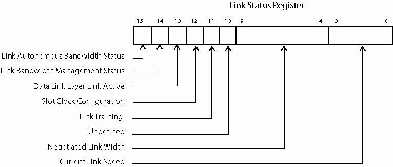

<br>

</td>
<td width="50%">

## **Recovery.Speed**

进入此子状态时，设备必须使其发送器进入 Electrical Idle，并等待其接收器进入 Electrical Idle。在此之后，如果速度变更成功（successful_speed_negotiation = 1b），它必须保持在该状态至少
800ns；如果速度变更未成功（successful_speed_negotiation = 0b），则保持至少 6μs，但不超过额外的 1ms。

如果当前速率为 2.5 GT/s 或 8.0 GT/s，则在进入此子状态之前必须发送一个 EIOS，如果当前速率为 5.0 GT/s，则必须发送两个。当已看到这些 EIOS 或以其他方式检测或推断出 Electrical Idle 时（如 736 页 "Electrical
Idle" 中所述），Lane 上存在 Electrical Idle 条件。

工作频率仅在接收器 Lane 已进入 Electrical Idle 之后才允许更改。如果链路已经以最高共同支持的速率运行，则即使执行此子状态，速率也不会更改。

如果协商的速率为 5.0 GT/s，则必须根据 select_deemphasis 变量的设置选择去加重电平：如果变量为 0b，则应用 ‐6 dB 去加重，但如果变量为 1b，则改为应用 ‐3.5 dB 去加重。

奇怪的是，在此子状态期间不必将 DC 共模电压保持在规范限制范围内。

如果此子状态是在成功的速度协商之后进入的（successful_speed_negotiation = 1b），则可以如 596 页 Table 14‐10 所示推断 Electrical Idle。规范指出，这涵盖了双方链路对端都已识别传入 TS1 和 TS2
的情况，因此它们的不存在可以解释为进入 Electrical Idle。

如果此子状态是在不成功的速度协商之后进入的（successful_speed_negotiation = 0b），如果在指定时间内未在任何已配置的 Lane 上检测到 Electrical Idle 退出，则可以推断 Electrical
Idle。这旨在涵盖链路的至少一方无法识别 TS 有序集的情况，因此较长间隔内未退出 Electrical Idle 可以视为进入 Electrical Idle。

_Table 14‐10: Conditions for Inferring Electrical Idle_

|**State**|**2.5 GT/s**|**5.0 GT/s**|**8.0 GT/s**|
|---|---|---|---|
|L0|Absence of Flow<br>Control Update<br>DLLP or SOS in a<br>128μs window|Absence of Flow Con-<br>trol Update DLLP or<br>SOS in a 128μs
win-<br>dow|Absence of Flow<br>Control Update<br>DLLP or SOS in a<br>128μs window|
|Recovery.RcvrCfg|Absence of a TS1 or<br>TS2 in a 1280 UI<br>interval|Absence of a TS1 or<br>TS2 in a 1280 UI inter-<br>val|Absence of a TS1
or<br>TS2 in a 4ms win-<br>dow|
|Recovery.Speed when<br>successful_speed_neg<br>otiation = 1b|Absence of a TS1 or<br>TS2 in a 1280 UI<br>interval|Absence of a TS1 or<br>TS2
in a 1280 UI inter-<br>val|Absence of a TS1 or<br>TS2 in a 4680 inter-<br>val|

_Table 14‐10: Conditions for Inferring Electrical Idle (Continued)_

|**State**|**2.5 GT/s**|**5.0 GT/s**|**8.0 GT/s**|
|---|---|---|---|
|Recovery.Speed when<br>successful_speed_neg<br>otiation = 0b|Absence of an Elec-<br>trical Idle exit in a<br>2000 UI interval|Absence of an
Electri-<br>cal Idle exit in a 16000<br>UI interval|Absence of an Electri-<br>cal Idle exit in a<br>16000 UI interval|
|Loopback.Active (as a slave)|Absence of an Elec- trical Idle exit ...|N/A|N/A|

directed_speed_change 变量将被清除为 0b，并且新数据速率必须可见于 Link Status 寄存器（如图 14‐39 所示）的 Current Link Speed 字段中。

如果速度因链路带宽变更而更改：

- 如果 successful_speed_negotiation 设置为 1b 并且 8 个连续 TS2 中的 Autonomous Change 位设置为 1b，或者速度变更由下游端口出于自主原因启动（不是可靠性问题，也不是由软件设置 Link Retrain 位引起的），则
Link Status 寄存器中的 Link Autonomous Bandwidth Status 位设置为 1b。

- 否则，Link Bandwidth Management Status 位设置为 1b。

</td>
</tr>
<tr>
<td width="50%">

## **Phase 2** 

The signal quality has been good enough to recognize TS1s, but not good enough for runtime operation. Once both Ports are in Phase 2, the
Upstream Port is allowed to request Tx settings for the Downstream Port and then evalu‐ ate how well they work, reiterating the process
until it arrives at optimal set‐ tings for the current environment. To make a request, it changes the value of the equalization information
it sends in its TS1s. As shown in Figure 14‐32 on page 584, there are several values of interest:

- **Tx Preset:** The Tx presets are a coarse‐grained adjustment to the Transmitter settings that are intended to get it into the right
ballpark for the current sig‐ naling environment. The Upstream Port sets this value, and sets the “Use Preset” indicator (bit 7 of Symbol 6)
to tell the Downstream Port’s Transmit‐ ter to use it. If the Use Preset bit is not set, then it’s understood that the pre‐ sets should stay
as they are and that the coefficient values should be changed instead. The Tx coefficients are considered as fine‐grained adjust‐ ments.

</td>
<td width="50%">

## _退出至 "详细的 Recovery 子状态"_

一旦超时已过，下一状态将为 Recovery.RcvrLock

如果此子状态是从 Recovery.RcvrCfg 进入的，并且速度变更成功，则所有已配置的 Lane 的新数据速率将更改为最高共同支持的速率，并将 changed_speed_recovery 变量设置为 1b。

如果此子状态是在从 L0 或 L1 进入 Recovery 以来第二次进入的（通过 changed_speed_recovery = 1b 指示），则新数据速率将是 LTSSM 进入 Recovery 时正在使用的速率，并且 changed_speed_recovery
变量被清除为 0b。

否则，新数据速率将恢复为 2.5 GT/s，并且 changed_speed_recovery 变量保持清除为 0b。规范指出，这表示 L0 中的速率高于 2.5 GT/s，但一个链路对端无法以该速率运行并在首次通过时在 Recovery.RcvrLock 中超时的情况。

</td>
</tr>
<tr>
<td width="50%">

## **PCI Express Technology** 

_Figure 14‐32: Equalization Coefficients Exchanged_ 

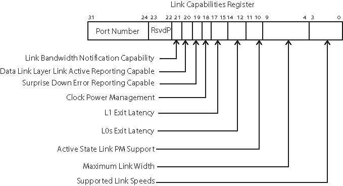

<br>


- **Coefficients:** Since the spec requires a 3‐tap Tx equalizer, three coefficient values are defined that can be pictured as voltage
adjustments to a signal pulse that compensates for the distortion it will experience going through the transmission medium, as shown in
Figure 14‐33 on page 585. This is covered in more detail in the Physical Layer Electrical section titled, “Solu‐ tion for 8.0 GT/s ‐
Transmitter Equalization” on page 474.

- **Pre‐Cursor Coefficient:** a multiplier applied to the signal prior to the sam‐ ple point that can boost or reduce the signal depending
on the need.

- **Cursor Coefficient:** the sample point multiplier; always positive. 

- **Post‐Cursor Coefficient:** a multiplier applied to the signal after the sample point that can boost or reduce the signal depending on
the need.

- Once the signal meets the quality standard needed, the Upstream Port indicates that it’s ready to move to the next phase by changing EC =
11b.

_Figure 14‐33: 3‐Tap Transmitter Equalization_ 

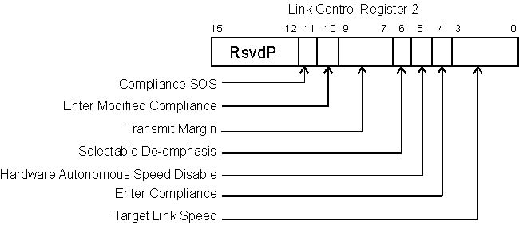

<br>


_Figure 14‐34: Equalization Process: Adjustments During Phase 2_ 


<br>

</td>
<td width="50%">

## _退出至 "Detect 状态"_

如果不符合退出到 Recovery.RcvrLock 的任何条件，则下一状态将为 Detect，尽管规范指出在正常情况下这应该是不可能的。它将意味着链路相邻设备根本无法再通信。

</td>
</tr>
<tr>
<td width="50%">

## **Phase 3** 

The Downstream port responds by sending EC = 11b and can now do the same signal evaluation process for the Upstream Port’s Transmitter. It
sends TS1s that request a new setting the same way: if the Use Preset bit is set, new presets are defined, otherwise new coefficients are
being given. This is sent continuously for 1  s or until the request has been evaluated for its result, whichever is later. That evaluation
must wait 500ns plus the round trip time through the outgoing logic and back in to the receive logic. Different equalization settings can be
tested until one is found that achieves the desired signal quality. At that point the Downstream Port exits the equalization process by
setting EC = 00b.

_Figure 14‐35: Equalization Process: Adjustments During Phase 3_ 


<br>

</td>
<td width="50%">

## **Recovery.RcvrCfg**

此状态只能从 Recovery.RcvrLock 进入，前提是至少接收到 8 个 TS1 或 TS2 有序集，且其链路号和 Lane 号与之前协商的相同。这意味着已建立位和符号或块锁定 (bit and symbol or block lock)，现在该 Port 必须确定
Recovery 状态中是否还有其他需要处理的项目。如果进入 Recovery 的目的只是重新建立位和符号锁定以离开链路电源管理状态，那么可能会在此处交换 TS2 并继续进行到 Recovery.Idle。但是，如果存在进入 Recovery
状态的其他原因（例如速度变更或链路宽度变更），则将在此子状态中确定并发生适当的状态转换。

在此子状态期间，发送器在所有已配置的 Lane 上发送 TS2，其链路号和 Lane 号与之前配置的相同。如果 directed_speed_change 变量设置为 1b，则 TS2 中的 speed_change 位也必须被设置。TS2 中的 N_FTS
值应反映当前速率所需的数量。进入此子状态时，start_equalization_w_preset 变量被清除为 0b。

如果速度已更改，则 TS2 中现在可能会看到不同的 N_FTS 数字。该值必须用于退出将来的 L0s 低功耗链路状态。对于 8b/10b 编码，必须在离开此子状态之前完成 Lane 间去偏斜。设备必须注意传入 TS2 中通告的速率标识符，并使用它来覆盖任何先前记录的值。使用
128b/130b 编码时，设备必须注意 Request Equalization 位的值以供将来参考。

有关此子状态的说明：变量 successful_speed_negotiation 被设置为 1b。此时注意到 TS2 中以 speed_change 位置位通告的数据速率以供将来参考，并且 Autonomous Change 位用于在 Recovery.Speed 期间在
Link Status 寄存器中可能记录日志。将在 Recovery.Speed 中选择的速率是最高共同支持的速率。有趣的是，在这种情况下即使链路已经以最高支持的速率运行，仍会发生到 Recovery.Speed 的更改，尽管在这种情况下速率实际上不会改变。

如果速度将更改为 8.0 GT/s，则下游端口将需要发送 EQ TS2（Symbol 6 的位 7 设置为 1b 以指示 EQ 训练序列）。如果 8.0 GT/s 是共同支持的，并且在任何已配置的 Lane 上看到 8 个连续的 speed_change 位置位的 TS1 或
TS2，或者 equalization_done_8GT_data_rate 变量为 0b，或者被指示，则将识别这种情况。如果当前数据速率为 8.0 GT/s 且均衡过程存在问题，则上游端口可以设置 Request Equalization 位。任何一端都可以通过将
Request Equalization 和 Quiesce Guarantee 位都设置为 1b 来请求再次执行均衡。

上游端口根据接收到的 TS2 中的 Selectable De-emphasis 位设置其 select_deemphasis 变量。并且，如果 TS2 是 EQ TS2，则它们将 start_equalization_w_preset 变量设置为 1b，并使用新信息更新其
Lane Equalization 寄存器（即：更新寄存器中的 Upstream Port Transmitter Preset 和 Receiver Preset Hint 字段）。任何未接收到 EQ TS2 的已配置 Lane 将以设计特定的方式选择其 8.0 GT/s
操作的预设值。如果 equalization_done_8GT_data_rate 变量被清除为 0b 或被指示，则下游端口必须将其 start_equalization_w_preset 变量设置为 1b。

最后，如果使用 128b/130b 编码，则设备必须注意 Request Equalization 位的值。如果已设置，则必须将其与 Quiesce Guarantee 位一起存储以供将来参考。

</td>
</tr>
<tr>
<td width="50%">

## **Equalization Notes** 

The specification mentions other items associated with the equalization process, as described below: 

- All Lanes must participate in the process; even those that may only become active later after an upconfigure event. 

- The algorithm used by a component to evaluate the incoming signal and determine the equalization values that its Link partner should use
is not given in the spec and is implementation specific.

- Equalization changes can be requested for any number of Lanes and the Lanes can use different values. 

- At the end of the fine‐tuning steps (Phase 2 for Upstream Ports and Phase 3 for Downstream Ports), each component is responsible for
ensuring that the Transmitter settings cause it to meet the spec requirements.

- Components must evaluate requests to adjust their Transmitter settings and act on them. If valid values are given they must use them and
reflect those values in the TS1s they send.

- A request to adjust coefficients may be rejected if the values are not compli‐ ant with the rules. The requested values will still be
reflected in the TS1s sent back but the Reject Coefficient Values bit will be set.

- Components must store the equalization values that they settled on through this process for future use at 8.0 GT/s. The spec is not
explicit on this, but the author’s opinion is that these values would survive a change in speed to a lower rate and then back to the 8.0
GT/s rate. That makes sense because it could potentially take a long time to repeat the EQ process and the resulting values would be the
same, provided the electrical environ‐ ment hasn’t changed.

- Components are allowed to fine‐tune their Receivers at any time, as long as it doesn’t cause the Link to become unreliable or go to
Recovery.

</td>
<td width="50%">

## _退出至 "Recovery.Idle"_

如果满足以下两个条件，则下一状态将为 Recovery.Idle：

- 在任何已配置的 Lane 上接收到 8 个连续的 TS2，其链路号和 Lane 号以及速率标识符与正在发送的匹配，并且以下任一条件：

 - a) TS2 中的 speed_change 位被清除为 0b，或者

 - b) 没有高于 2.5 GT/s 的速率被共同支持。

- 在接收到一个 TS2 之后已发送 16 个 TS2，并且它们未被任何中间的 EIEOS 中断。changed_speed_recovery 和 directed_speed_change 变量在进入此子状态时都被清除为 0b。

</td>
</tr>
<tr>
<td width="50%">

## **Detailed Equalization Substates** 

This section covers detailed descriptions of the state machine behaviors during Link Equalization.

</td>
<td width="50%">

## _退出至 "Recovery.Speed"_

如果以下列出的所有三个条件都为真，则 LTSSM 将进入 Recovery.Speed：

- 在任何已配置的 Lane 上接收到 8 个连续的 speed_change 位置位的 TS2，速率标识符相同，Symbol 6 中的值相同，并且：

 - a) TS2 是标准 8b/10b TS2，或者

 - b) TS2 是 EQ TS2，或者

 - c) 自在任何已配置的 Lane 上接收到 8 个 EQ TS2 以来已过去 1ms。

- 两个链路对端都支持高于 2.5 GT/s 的速率，或者速率已经高于 2.5 GT/s。

- 对于 8b/10b 编码，在同一已配置的 Lane 上接收到一个 speed_change 位设置为 1b 的 TS2 之后，至少发送了 32 个 speed_change 位设置为 1b 的 TS2 而没有任何中间的 EIEOS。对于 128b/130b
编码，在同一已配置的 Lane 上接收到一个 speed_change 位设置为 1b 的 TS2 之后，发送了至少 128 个 speed_change 位设置为 1b 的 TS2。

如果自上次从 L0 或 L1 进入 Recovery 以来（changed_speed_recovery = 1b）速率已更改为相互协商的速率，并且任何已配置的 Lane 已看到 EIOS 或检测到/推断出 Electrical Idle 并且自进入此子状态以来未看到
TS2，则也可以发生到 Recovery.Speed 的转换。这意味着尝试了更高速率，但链路对端表示出于某种原因它无法工作。新速率将返回到从 L0 或 L1 进入 Recovery 时的速率。

导致到 Recovery.Speed 的转换的最后一种情况是，如果自上次从 L0 进入 Recovery 以来速率 _未_ 更改

或者 L1（changed_speed_recovery = 0b），并且当前速率已经高于 2.5 GT/s，并且任何已配置的 Lane 已看到 EIOS 或检测到/推断出 Electrical Idle 并且自进入此子状态以来未看到
TS2。在这种情况下，理解是当前速率不起作用，解决方案是降下来，因此新速率将变为 2.5 GT/s。

</td>
</tr>
<tr>
<td width="50%">

## **Recovery.Equalization** 

This substate is used to execute the Link Equalization Procedure for 8.0 GT/s and higher rates. The lower rates don’t use equalization and
the LTSSM won’t enter this substate when they’re in effect. Since this is a new and complex topic for PCIe, a description of the overall
equalization procedure from a high‐level view is presented after the state machine details in the section called “Link Equalization
Overview” on page 577. First though, let’s step through the sub‐ states to see the mechanics of the process.

</td>
<td width="50%">

## _退出至 "Configuration 状态"_

如果在任何已配置的 Lane 上接收到 8 个连续的 TS1，其链路号或 Lane 号与正在发送的不匹配，并且 speed_change 位被清除为 0b，或者没有高于 2.5 GT/s 的速率被共同支持，则下一状态将为 Configuration。

当 LTSSM 转换到 Configuration 时，变量 changed_speed_recovery 和 directed_speed_change 被清除为 0b。如果 N_FTS 值自上次以来已更改，则新值必须用于将来的 L0s。

</td>
</tr>
<tr>
<td width="50%">

## **Downstream Lanes** 

The Downstream Port starts in Phase 1 of the equalization process. To begin this process, there are several bits that need to be reset. In
the Link Status 2 register (Figure 14‐36 on page 588), the following bits are cleared when entering this substate:

- Equalization Phase 1 Successful 

- Equalization Phase 2 Successful 

- Equalization Phase 3 Successful 

- Link Equalization Request 

- Equalization Complete 

The Perform Equalization bit of the Link Control 3 register is also cleared to 0b as is the internal variable start_equalization_w_preset.
The equalization_done_8GT_data_rate variable is set to 1b.

_Figure 14‐36: Link Status 2 Register_ 


<br>


_Figure 14‐37: Link Control 3 Register_ 


<br>


**Phase 1 Downstream.** During this phase, the Downstream Port sends TS1s with EC = 01b while using the Preset values from the Lane
Equaliza‐ tion Control register and with the FS, LF, and Post‐cursor Coefficient fields that correspond to the Tx Preset field. It’s allowed
to wait 500ns before eval‐ uating incoming TS1s if it needs time to stabilize its Receiver logic.

## _Exit to “Phase 2 Downstream”_

</td>
<td width="50%">

## _退出至 "Detect 状态"_

在 48ms 内未解决为先前定义的状态转换之一后，如果数据速率为 2.5 GT/s 或 5.0 GT/s，则下一状态将为 Detect。

如果速率为 8.0 GT/s，则存在另一种可能性，因为尝试次数可能尚未超过。这由 idle_to_rlock_transitioned 变量指示，并且当速率为 8.0 GT/s 且其小于 FFh 时，新状态将为 "Recovery.Idle"。如果进行了该转换，则变量
changed_speed_recovery 和 directed_speed_change 将被清除为 0b。但是，一旦 idle_to_rlock_transitioned 达到 FFh 并且看到 48ms 超时，则下一状态将为 Detect。

</td>
</tr>
<tr>
<td width="50%">

</td>
<td width="50%">

## **Recovery.Idle**

顾名思义，发送器通常在此子状态中发送 Idles，作为更改为完全可操作的 L0 状态的准备。对于 8b/10b 模式，Idle 数据通常在所有 Lane 上发送，而对于 128b/130b，发送 SDS 以启动 Data Stream，然后在所有 Lane 上发送 Idle
数据符号。

</td>
</tr>
<tr>
<td width="50%">

</td>
<td width="50%">

## _退出至 "L0 状态"_

如果以下任一情况为真，则下一状态为 L0。在任一情况下，如果 Retrain Link 位自上次从 Recovery 或 Configuration 转换到 L0 以来已写入 1b，则下游端口将 Link Bandwidth Management Status 位设置为
1b（参见 597 页 Figure 14‐39）。

- 使用 8b/10b 编码并且已接收到 8 个连续的 Symbol Times 的 Idle 数据，并且自接收到第一个 16 个 Idle 数据符号以来已发送。

</td>
</tr>
<tr>
<td width="50%">

</td>
<td width="50%">

## **PCI Express Technology**

- 使用 128b/10b 编码，已接收到 8 个连续的 Symbol Times 的 Idle 数据，并且自接收到第一个 16 个 Idle 数据符号以来已发送，并且此状态不是从 Recovery.RcvrCfg 进入的。请注意，Idle 数据符号必须包含在 Data
Block 中，Lane 间去偏斜必须在 Data Stream 处理开始之前完成，并且 idle_to_rlock_transitioned 变量在转换到 L0 时被清除为 00h。

</td>
</tr>
<tr>
<td width="50%">

</td>
<td width="50%">

## _退出至 "Configuration 状态"_

如果以下任一情况，则下一状态为 Configuration：

- Port 被更高层指示以选择性地重新配置链路，例如更改链路宽度。

- 任何已配置的 Lane 看到两个连续的 Lane 号设置为 PAD 的传入 TS1（要转换到 Configuration 以更改链路的 Port 将在所有 Lane 上发送 PAD Lane 号）。规范建议 LTSSM 在更改链路宽度时使用此转换，以减少所需的时间。

</td>
</tr>
<tr>
<td width="50%">

</td>
<td width="50%">

## _退出至 "Disable 状态"_

如果以下任一情况，则下一状态为 Disabled：

- 下游或可选 crosslink Port 被更高层指示在其 TS1 或 TS2 中设置 Disable Link 位。

- 上游或可选 crosslink Port 的任何已配置的 Lane 看到两个连续的传入 TS1 中设置了 Disable Link 位。

</td>
</tr>
<tr>
<td width="50%">

</td>
<td width="50%">

## _退出至 "Hot Reset 状态"_

如果以下任一情况，则下一状态为 Hot Reset：

- 下游或可选 crosslink Port 被更高层指示在其 TS1 或 TS2 中设置 Hot Reset 位。

- 上游或可选 crosslink Port 的任何已配置的 Lane 看到两个连续的传入 TS1 中设置了 Hot Reset 位。

</td>
</tr>
<tr>
<td width="50%">

</td>
<td width="50%">

## _退出至 "Loopback 状态"_

如果以下任一情况，则下一状态为 Loopback：

- 已知发送器具有 Loopback Master 能力（设计特定的；规范不提供验证方法）并被更高层指示在其 TS1 或 TS2 中设置 Loopback 位。

- 上游或可选 crosslink Port 的任何已配置的 Lane 看到两个连续的传入 TS1 中设置了 Loopback 位。接收设备随后成为 Loopback slave。

</td>
</tr>
<tr>
<td width="50%">

</td>
<td width="50%">

## _退出至 "Detect 状态"_

否则，在 2ms 超时后，下一状态将为 Detect，除非 idle_to_rlock_transitioned 变量小于 FFh，在这种情况下下一状态将为 "详细的 Recovery 子状态"。对于到 Recovery.RcvrLock 的转换，如果数据速率为 8.0
GT/s，则 idle_to_rlock_transitioned 变量加 1b，而对于 2.5 或 5.0 GT/s，它将被设置为 FFh。

</td>
</tr>
<tr>
<td width="50%">

</td>
<td width="50%">

## **L0s 状态**

这是具有到 L0 的最短退出延迟的低功耗链路状态。设备在硬件控制下自动管理此状态的进入和退出，无需任何软件参与。链路的每个方向可以独立地进入和退出 L0s 状态。

</td>
</tr>
<tr>
<td width="50%">

</td>
<td width="50%">

## **L0s 发送器状态机**

L0s 状态对于发送器和接收器具有不同的子状态。将首先描述发送器子状态。如 603 页 Figure 14‐40 所示，与 L0s 状态关联的发送器状态机是一个简单的状态机。

</td>
</tr>
<tr>
<td width="50%">

</td>
<td width="50%">

## **Tx_L0s.Entry**

当被上层指示时，发送器进入 L0s。规范未给出此决策标准，但凭直觉，它将基于不活动超时发生：给定时间内未发送 TLP 或 DLLP。要进入 L0s，发送器发送一个 EIOS（5.0 GT/s 速率为两个 EIOS）并进入 Electrical
Idle。但是，发送器不会被关闭，并且必须将 DC 共模电压保持在规范范围内。

</td>
</tr>
<tr>
<td width="50%">

</td>
<td width="50%">

## _退出至 "Tx_L0s.Idle"_

下一状态将在 TTX-IDLE-MIN 超时（20ns）后为 Tx_L0s.Idle。该时间旨在确保发送器已建立 Electrical Idle 条件。

</td>
</tr>
<tr>
<td width="50%">

</td>
<td width="50%">

## **Tx_L0s.Idle**

在此子状态中，发送器继续 Electrical Idle 状态，直到被指示离开。由于此方向的链路处于 Electrical Idle 状态，因此将产生节能效益，这是 L0s 状态的整个目的。

_退出至 "Tx_L0s.FTS"_

下一状态将在被指示时为 Tx_L0s.FTS，例如当 Port 需要恢复数据包传输时。LTSSM 将以设计特定的方式被指示退出此状态。

</td>
</tr>
<tr>
<td width="50%">

</td>
<td width="50%">

## **Tx_L0s.FTS**

在此子状态中，发送器将开始发送 FTS 有序集以重新训练链路对端的接收器。发送的 FTS 数量是链路对端在上次训练到 L0 期间的 TS 有序集中通告的 N_FTS 值。规范指出，如果接收器在尝试执行此操作时超时，它可以选择在 Recovery 状态期间增加其通告的 N_FTS
值。

如果设置了 Extended Synch 位（参见 644 页 Figure 14‐71），则发送器必须发送 4096 个 FTS，而不是 N_FTS 数量。这扩展了可用于同步外部测试和分析逻辑的时间，该逻辑可能无法像嵌入式逻辑那样快地恢复 Bit Lock。

对于所有数据速率，在发送任何 FTS 之前不能发送 SOS。但是，对于 5.0 GT/s 速率，必须在发送 FTS 之前发送 4 到 8 个 EIE 符号。对于 128b/130b，必须在 FTS 之前发送 EIEOS。

</td>
</tr>
<tr>
<td width="50%">

</td>
<td width="50%">

## _退出至 "L0 状态"_

一旦已发送所有 FTS，发送器将转换到 L0 状态，并且：

- a) 对于 8b/10b 编码，一个 SOS 在所有已配置的 Lane 上发送，尽管在 FTS 之前或期间不发送任何 SOS。

- b) 对于 128b/130b 编码，发送一个 EIEOS 后跟一个 SDS 和 Data Stream。

</td>
</tr>
<tr>
<td width="50%">

</td>
<td width="50%">

## **L0s 接收器状态机**

605 页 Figure 14‐41 显示了接收器 L0s 状态机。如果 Link Capability 寄存器中的 ASPM Support 字段显示支持 L0s，则接收器需要实现 L0s 支持，即使未指示支持也允许实现。

</td>
</tr>
<tr>
<td width="50%">

</td>
<td width="50%">

## **Rx_L0s.Entry**

当接收器接收到 EIOS 时进入，前提是它支持 L0s 并且未被引导至 L1 或 L2。

_退出至 "Rx_L0s.Idle"_

下一状态将在 TTX-IDLE-MIN 超时（20ns）后为 Rx_L0s.Idle。

</td>
</tr>
<tr>
<td width="50%">

</td>
<td width="50%">

## **Rx_L0s.Idle**

接收器现在处于 Electrical Idle 模式，并且只是等待看到退出 Electrical Idle。

</td>
</tr>

</tbody>
</table>

<p align="center"><b>Figure 14‐39: Link Status Register</b></p>
<p align="center"></p>
<p align="center"><sub>📄 <a href="figures/chapter_14_Link_Initialization_Training/embedded/page0688_img1.png">Page 688</a></sub></p>


<p align="center"><b>Figure 14‐40: L0s Tx State Machine</b></p>
<p align="center"></p>
<p align="center"><sub>📄 <a href="figures/chapter_14_Link_Initialization_Training/embedded/page0684_img1.png">Page 684</a></sub></p>


<p align="center"><b>Figure 14‐41: L0s Receiver State Machine</b></p>
<p align="center"></p>
<p align="center"><sub>📄 <a href="figures/chapter_14_Link_Initialization_Training/embedded/page0685_img1.png">Page 685</a></sub></p>

<table>
<thead><tr><th width="50%">🇬🇧 English</th><th width="50%">🇨🇳 中文</th></tr></thead>
<tbody>
<tr>

</tr>
</tbody>
</table>

[⬆️ 返回目录](#本章目录-table-of-contents)

---


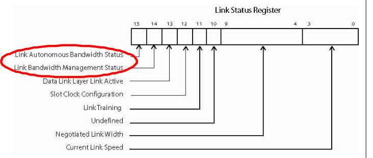

<a id="sec-14-2"></a>
## 14.2 Link Initialization & Training | 链路初始化与训练

<table>
<thead><tr><th width="50%">🇬🇧 English</th><th width="50%">🇨🇳 中文</th></tr></thead>
<tbody>
<tr>
<td width="50%">

The Downstream Port will transition to Phase 2 if it want to continue with the equalization process and when all configured Lanes receive
two consecutive TS1s with EC = 01b. At this point, the Port will set the Equalization Phase 1 Successful status bit to 1b and store the
received TS1 LF and FS values for use in Phase 3 (if the Downstream Port plans to adjust the Upstream Port’s Tx coefficients).

</td>
<td width="50%">

下游端口 (Downstream Port) 如果希望继续进行均衡过程,以及当所有已配置的 Lane 接收到两个连续的 EC = 01b 的 TS1 时,将转换到 Phase 2。此时,该端口将 Equalization Phase 1 Successful 状态位置为
1b,并存储接收到的 TS1 LF 和 FS 值,以供 Phase 3 使用(如果下游端口计划调整上游端口的 Tx 系数)。

</td>
</tr>
<tr>
<td width="50%">

## _Exit to “Detailed Recovery Substates”_ 

If the Downstream Port doesn’t want to use Phases 2 and 3, it sets the status bits to 1b (Eq. Phase 1 Successful, Eq. Phase 2 Successful,
Eq. Phase 3 Successful, and Eq. Complete). One reason to do this would be because it can already see that the signal characteristics are
good enough and the rest of the phases aren’t needed.

</td>
<td width="50%">

## _退出到"详细恢复子状态"_

如果下游端口不希望使用 Phase 2 和 Phase 3,则将状态位都置为 1b(Eq. Phase 1 Successful、Eq. Phase 2 Successful、Eq. Phase 3 Successful 和 Eq.
Complete)。这样做的原因之一是它已经能够看到信号特性足够好,其余阶段不需要了。

</td>
</tr>
<tr>
<td width="50%">

## _Exit to “Recovery.Speed”_ 

If the consecutive TS1s are not seen after a 24ms timeout, the next state is Recovery.Speed. The successful_speed_negotiation flag is
cleared to 0b, and the Equalization Complete status bit is set to 1b.

**Phase 2 Downstream.** During this phase, the Downstream Port sends TS1s with EC = 10b and coefficient settings independently assigned on
each Lane according to the following:

- If two consecutive TS1s are received with EC = 10b (Upstream Port has entered Phase 2) either for the first time, or with different preset
or coefficient values than the last time, and if the values requested are legal and supported, then change the Tx settings to use them
within 500ns of the end of the second TS1 requesting them. Also, reflect the values in the TS1s being sent back to the Upstream Port and
clear the Reject Coefficient Values bit to 0b. Note that the change must not cause illegal voltages or parameters at the Transmitter for
more than 1ns.

 - a) If the requested preset or coefficients are illegal or not supported, don’t change the Tx settings but reflect the received values in
the

TS1s being sent and set the Reject Coefficient Values bit to 1b (seeFigure 14‐38 on page 590). 

- If the two consecutive TS1s aren’t seen, keep the current Tx preset and coefficient values.

</td>
<td width="50%">

## _退出到"Recovery.Speed"_

如果在 24ms 超时后未看到连续的 TS1,则下一个状态是 Recovery.Speed。successful_speed_negotiation 标志被清除为 0b,Equalization Complete 状态位被置为 1b。

**Phase 2 下游端口。** 在此阶段,下游端口发送 EC = 10b 的 TS1,并根据以下规则在每个 Lane 上独立分配系数设置:

- 如果接收到两个连续的 EC = 10b 的 TS1(上游端口已进入 Phase 2),无论是第一次收到,还是与上次预设或系数值不同,并且如果请求的值是合法且受支持的,那么在第二个 TS1 请求结束后的 500ns 内将 Tx 设置更改为使用这些值。此外,在发回上游端口的
TS1 中反映这些值,并将 Reject Coefficient Values 位清零至 0b。请注意,此更改不得导致发送器上的电压或参数非法超过 1ns。

 - a) 如果请求的预设或系数是非法或不受支持的,则不更改 Tx 设置,但在发送的 TS1 中反映接收到的值,并将 Reject Coefficient Values 位置为 1b(参见第 590 页的 Figure 14-38)。

- 如果未看到两个连续的 TS1,则保持当前的 Tx 预设和系数值。

</td>
</tr>
<tr>
<td width="50%">

## _Exit to “Phase 3 Downstream”_ 

When the Upstream Port is satisfied with the changes, it begins to send TS1s with EC = 11b, indicating a desire to change to Phase 3. When
two consecu‐ tive TS1s like this are received, set the Eq. Phase 2 Successful status bit to 1b and change to Phase 3.

</td>
<td width="50%">

## _退出到"Phase 3 下游端口"_

当上游端口对更改满意时,它将开始发送 EC = 11b 的 TS1,表示希望更改为 Phase 3。当接收到两个这样的连续 TS1 时,将 Eq. Phase 2 Successful 状态位置为 1b,并更改为 Phase 3。

</td>
</tr>
<tr>
<td width="50%">

## _Exit to “Recovery.Speed”_ 

If after 32 ms, the transition to Phase 3 has not happened, the Port should clear the successful_speed_negotiation flag, set the
Equalization Complete status bit and exit to the Recovery.Speed substate.

_Figure 14‐38: TS1s ‐ Rejecting Coefficient Values_ 


<br>


**Phase 3 Downstream.** During this phase, the Downstream Port sends TS1s with EC = 11b and begins the process of evaluating Upstream Tx
set‐ tings independently for each Lane.

In the transmitted TS1s, the Downstream Port can either request a new pre‐ set by setting the Use Preset bit to 1b and Tx Preset field to
the desired value, or it can request new coefficients by clearing the Use Preset bit to 0b and setting the Pre‐cursor, Cursor, and
Post‐Cursor Coefficient fields to the desired values. Either request must be made continuously for at least 1  s or until the evaluation
has completed. If new preset or coefficient settings are going to be presented, they must be sent on all Lanes at the same time. However, a
given Lane isn’t required to request new settings if it wants to keep the ones it has.

The Downstream Port must wait long enough to ensure the Upstream Transmitter has had a chance to implement the requested changes, (500ns
plus the round‐trip delay for the logic), then obtain Block Alignment and evaluate the incoming TS1s. It’s not expected that anything useful
will be coming from the Upstream Port during the waiting period, and it may not even be legal. That’s why obtaining Block Alignment after
that time is a requirement.

If two consecutive TS1s are seen that match the same preset or coefficient values that are being requested and don’t have the Reject
Coefficient Values bit set, then the requested setting was accepted and can be evaluated. If the values match but the Reject Coefficient
Values bit is set to 1b, then the requested values have been rejected by the Upstream Port and are not being used. For this case, he spec
recommends that the Downstream Port try again with different values but it’s not required to do so and may choose to simply exit this phase.

The total time spent on a preset or coefficient request, from the time the request is sent until the completion of its evaluation must be
less than 2ms. An exception is available for designs that need more time for the final stage of optimization, but the total time in this
phase cannot exceed 24ms and the exception can only be taken twice. If the Receiver doesn’t recognize any incoming TS1s, it may assume that
the requested setting doesn’t work for that Lane.

</td>
<td width="50%">

## _退出到"Recovery.Speed"_

如果在 32ms 之后,Phase 3 的转换尚未发生,则该端口应清除 successful_speed_negotiation 标志,设置 Equalization Complete 状态位并退出到 Recovery.Speed 子状态。

**Phase 3 下游端口。** 在此阶段,下游端口发送 EC = 11b 的 TS1,并开始为每个 Lane 独立评估上游端口的 Tx 设置。

在传输的 TS1 中,下游端口可以通过将 Use Preset 位置为 1b 并将 Tx Preset 字段设置为所需值来请求新的预设,或者通过将 Use Preset 位清零至 0b 并将 Pre-cursor、Cursor 和 Post-Cursor Coefficient
字段设置为所需值来请求新的系数。任何请求必须持续至少 1µs,或直到评估完成。如果要呈现新的预设或系数设置,则必须同时在所有 Lane 上发送。但是,如果给定 Lane 希望保留其当前设置,则不要求它请求新设置。

下游端口必须等待足够长的时间以确保上游发送器有机会实现请求的更改(500ns 加上逻辑的往返延迟),然后获取 Block Alignment 并评估传入的 TS1。在等待期间,预计不会有任何有用的内容来自上游端口,甚至可能是不合法的。这就是为什么之后获取 Block
Alignment 是必需的原因。

如果看到两个连续的 TS1 与正在请求的相同预设或系数值匹配,并且 Reject Coefficient Values 位未设置,则请求的设置已被接受并可以评估。如果值匹配但 Reject Coefficient Values 位置为
1b,则请求的值已被上游端口拒绝且未被使用。对于这种情况,规范建议下游端口使用不同的值再试一次,但不要求这样做,也可以选择直接退出此阶段。

从请求发送之时到其评估完成之时,每个预设或系数请求所花费的总时间必须小于 2ms。对于在最终优化阶段需要更多时间的设计,可以有一个例外,但此阶段的总时间不能超过 24ms,并且该例外只能使用两次。如果接收器未识别任何传入的 TS1,则可以假设所请求的设置对该 Lane 不起作用。

</td>
</tr>
<tr>
<td width="50%">

## _Exit to “Detailed Recovery Substates”_ 

The next state will be Recovery.RcvrLock when all configured Lanes have their optimal settings. When that happens, the Equalization Phase 3
Successful and Equalization Complete status bits will be set to 1b.

_Exit to “Recovery.Speed”_ 

Otherwise, after a 24ms timeout (with a tolerance of ‐0 or +2ms), the next state will be Recovery.Speed, and the
successful_speed_negotiation flag is cleared to 0b while the Equaliza‐ tion Complete status bit is set to 1b.

</td>
<td width="50%">

## _退出到"详细恢复子状态"_

当所有已配置的 Lane 都具有最佳设置时,下一个状态将是 Recovery.RcvrLock。发生这种情况时,Equalization Phase 3 Successful 和 Equalization Complete 状态位将置为 1b。

_退出到"Recovery.Speed"_

否则,经过 24ms 超时(容差为 -0 或 +2ms)后,下一个状态将是 Recovery.Speed,successful_speed_negotiation 标志被清零至 0b,而 Equalization Complete 状态位置为 1b。

</td>
</tr>
<tr>
<td width="50%">

## **Upstream Lanes** 

The Upstream Port starts in Phase 0 of the equalization process and must reset several internal bits. In the Link Status 2 register (Figure
14‐36 on page 588), the following bits are cleared when entering this substate:

- Equalization Phase 1 Successful 

- Equalization Phase 2 Successful 

- Equalization Phase 3 Successful 

- Link Equalization Request 

- Equalization Complete 

The Perform Equalization bit of the Link Control 3 register is also cleared to 0b as is the internal variable start_equalization_w_preset.
The equalization_done_8GT_data_rate variable is set to 1b.

**Phase 0 Upstream.** During this phase, the Upstream Port sends TS1s with EC = 00b while using the Tx Preset values that were delivered in
the EQ TS2s before entering this state. The equalization information fields in the TS1s being sent must show the preset value and also the
Pre‐cursor, Cursor, and Post‐cursor coefficient fields that correspond to that preset. Note that if a Lane received a reserved or
unsupported Tx Preset value in the EQ TS2s, or no EQ TS2s at all, then the Tx Preset field and coefficient values are cho‐ sen by a
device‐specific method for that Lane.

_Exit to “Phase 1 Upstream”_ 

When all configured Lanes receive two consecutive TS1s with EC = 01b, indicating that they can recognize the TS1s from the Downstream Port
which always starts with this value, then the next phase is Phase 1.

The equalization values LF and FS that are received in the TS1s must be stored and used during Phase 2 if the Upstream Port plans to adjust
the Downstream Port’s Tx coefficients.

Upstream Port may wait 500ns after entering Phase 0 before evaluating the incoming TS1s to give time for its Receiver logic to stabilize.

</td>
<td width="50%">

## **上游 Lane** 

上游端口从均衡过程的 Phase 0 开始,必须重置若干内部位。在 Link Status 2 寄存器(第 588 页的 Figure 14-36)中,以下位在进入此子状态时被清除:

- Equalization Phase 1 Successful 

- Equalization Phase 2 Successful 

- Equalization Phase 3 Successful 

- Link Equalization Request 

- Equalization Complete 

Link Control 3 寄存器的 Perform Equalization 位也被清零至 0b,内部变量 start_equalization_w_preset 也被清零。变量 equalization_done_8GT_data_rate 被置为 1b。

**Phase 0 上游端口。** 在此阶段,上游端口发送 EC = 00b 的 TS1,同时使用在进入此状态之前的 EQ TS2 中传递的 Tx Preset 值。正在发送的 TS1 中的均衡信息字段必须显示预设值以及与该预设对应的 Pre-cursor、Cursor 和
Post-cursor 系数字段。注意,如果 Lane 在 EQ TS2 中接收到保留或不受支持的 Tx Preset 值,或者根本没有收到 EQ TS2,则 Tx Preset 字段和系数值由该 Lane 的设备特定方法选择。

_退出到"Phase 1 上游端口"_

当所有已配置的 Lane 收到两个连续的 EC = 01b 的 TS1,表明它们可以识别始终以该值开始的来自下游端口的 TS1 时,下一个阶段是 Phase 1。

在 TS1 中接收到的均衡值 LF 和 FS 必须被存储并用于 Phase 2,如果上游端口计划调整下游端口的 Tx 系数的话。

上游端口在进入 Phase 0 之后,在评估传入的 TS1 之前可以等待 500ns,以便其接收器逻辑有时间稳定。

</td>
</tr>
<tr>
<td width="50%">

## _Exit to “Recovery.Speed”_ 

If incoming TS1s are not recognized within a 12ms timeout, the LTSSM will transition to Recovery.Speed, clear the
successful_speed_negotiation flag and set the Equalization Complete status bit.

**Phase 1 Upstream.** During this phase, the Upstream Port send TS1s with EC = 01b while using the Transmitter settings that were determined
in Phase 0. These TS1s contain the FS, LF, and Post‐cursor Coefficient values with what is currently being used.

</td>
<td width="50%">

## _退出到"Recovery.Speed"_

如果在 12ms 超时内未识别出传入的 TS1,则 LTSSM 将转换到 Recovery.Speed,清除 successful_speed_negotiation 标志并设置 Equalization Complete 状态位。

**Phase 1 上游端口。** 在此阶段,上游端口发送 EC = 01b 的 TS1,同时使用在 Phase 0 中确定的发送器设置。这些 TS1 包含当前正在使用的 FS、LF 和 Post-cursor Coefficient 值。

</td>
</tr>
<tr>
<td width="50%">

## _Exit to “Phase 2 Upstream”_ 

If all configured Lanes receive two consecutive TS1s with EC = 10b, indicating that the Downstream Port wants to go to Phase 2, then the
next phase will be Phase 2, and this Port will set the Equalization Phase 1 Successful status bit.

_Exit to “Detailed Recovery Substates”_ 

If all configured Lanes receive two consecutive TS1s with EC = 00b, it means that the Downstream Port has decided that the equalization pro‐
cess is already complete and it wants to skip the remaining phases. In this case, the next state will be Recovery.RcvrLock, and the
Equalization Phase 1 Successful and Equalization Complete status bits are set to 1b.

</td>
<td width="50%">

## _退出到"Phase 2 上游端口"_

如果所有已配置的 Lane 接收到两个连续的 EC = 10b 的 TS1,表明下游端口希望转到 Phase 2,则下一个阶段将是 Phase 2,并且此端口将设置 Equalization Phase 1 Successful 状态位。

_退出到"详细恢复子状态"_

如果所有已配置的 Lane 接收到两个连续的 EC = 00b 的 TS1,这意味着下游端口已决定均衡过程已经完成,并希望跳过剩余的阶段。在这种情况下,下一个状态将是 Recovery.RcvrLock,并且 Equalization Phase 1 Successful 和
Equalization Complete 状态位置为 1b。

</td>
</tr>
<tr>
<td width="50%">

## _Exit to “Recovery.Speed”_ 

Otherwise, after a 12ms timeout, the LTSSM will transition to Recov‐ ery.Speed, clear the successful_speed_negotiation flag and set the
Equalization Complete status bit.

**Phase 2 Upstream.** During this phase, the Upstream Port sends TS1s with EC = 10b and begins the process of finding optimal Tx values for
the Down‐ stream Port. Recall that the settings are independently determined for each Lane. The process is as follows:

In the transmitted TS1s, the Upstream Port can either request a new preset by putting a legal value in the Transmitter Preset field of the
TS1s being sent and setting the Use Preset bit to 1b to tell the Downstream Port to begin using it. Or, request new coefficients by putting
legal values in those fields and clearing the Use Preset bit to 0b so the Downstream Port will load them instead of the preset field. Once
the request is made it must be repeated for

at least 1  s or until the evaluation is complete. If new preset or coefficient settings are going to be presented, they must be sent on
all Lanes at the same time. However, a given Lane isn’t required to request new settings if it wants to keep the ones it has.

The Upstream Port must wait long enough to ensure the Downstream Transmitter has had a chance to implement the requested changes, (500ns
plus the round‐trip delay for the logic), then obtain Block Alignment and evaluate the incoming TS1s. It’s not expected that anything useful
will be coming from the Downstream Port during the waiting period, and it may not even be legal. That’s why obtaining Block Alignment after
that time is a requirement.

When TS1s are received that contain the same equalization fields as are being sent and the Reject Coefficient Values bit is not set (0b),
then the set‐ ting has been accepted and can now be evaluated. If the equalization fields match but the Reject Coefficient Values bit is set
(1b), then the setting has been rejected. In that case the spec recommends that the Upstream Port request a different equalization setting,
but this is not required.

The total time spent on a preset or coefficient request, from the time the request is sent until the completion of its evaluation must be
less than 2ms. An exception is available for designs that need more time for the final stage of optimization, but the total time in this
phase cannot exceed 24ms and the exception can only be taken twice. If the Receiver doesn’t recognize any incoming TS1s, it may assume that
the requested setting doesn’t work for that Lane.

_Exit to “Phase 3 Upstream”_ 

The next phase is Phase 3 if all configured Lanes have their optimal set‐ tings. When that happens, the Equalization Phase 2 Successful
status bit will be set to 1b.

</td>
<td width="50%">

## _退出到"Recovery.Speed"_

否则,经过 12ms 超时后,LTSSM 将转换到 Recovery.Speed,清除 successful_speed_negotiation 标志并设置 Equalization Complete 状态位。

**Phase 2 上游端口。** 在此阶段,上游端口发送 EC = 10b 的 TS1,并开始为下游端口寻找最佳 Tx 值的过程。请记住,设置是为每个 Lane 独立确定的。过程如下:

在传输的 TS1 中,上游端口可以通过在正在发送的 TS1 的 Transmitter Preset 字段中放入合法值并将 Use Preset 位置为 1b 来请求新的预设,以告诉下游端口开始使用它。或者,通过在这些字段中放入合法值并将 Use Preset 位清零至 0b
来请求新系数,以便下游端口加载它们而不是预设字段。一旦发出请求,必须重复

至少 1µs,或直到评估完成。如果要呈现新的预设或系数设置,则必须同时在所有 Lane 上发送。但是,如果给定 Lane 希望保留其当前设置,则不要求它请求新设置。

上游端口必须等待足够长的时间以确保下游发送器有机会实现请求的更改(500ns 加上逻辑的往返延迟),然后获取 Block Alignment 并评估传入的 TS1。在等待期间,预计不会有任何有用的内容来自下游端口,甚至可能是不合法的。这就是为什么之后获取 Block
Alignment 是必需的原因。

当接收到包含与正在发送的均衡字段相同且 Reject Coefficient Values 位未设置(0b)的 TS1 时,则该设置已被接受并可以评估。如果均衡字段匹配但 Reject Coefficient Values 位置为
1b,则该设置已被拒绝。在这种情况下,规范建议上游端口请求不同的均衡设置,但这不是必需的。

从请求发送之时到其评估完成之时,每个预设或系数请求所花费的总时间必须小于 2ms。对于在最终优化阶段需要更多时间的设计,可以有一个例外,但此阶段的总时间不能超过 24ms,并且该例外只能使用两次。如果接收器未识别任何传入的 TS1,则可以假设所请求的设置对该 Lane 不起作用。

_退出到"Phase 3 上游端口"_

如果所有已配置的 Lane 都具有最佳设置,则下一个阶段是 Phase 3。发生这种情况时,Equalization Phase 2 Successful 状态位将置为 1b。

</td>
</tr>

</tbody>
</table>

<p align="center"><b>Figure 14-38: TS1 - 拒绝系数值</b></p>
<p align="center"></p>
<p align="center"><sub>📄 <a href="figures/chapter_14_Link_Initialization_Training/embedded/page0688_img1.png">Page 688</a></sub></p>

<table>
<thead><tr><th width="50%">🇬🇧 English</th><th width="50%">🇨🇳 中文</th></tr></thead>
<tbody>
<tr>

</tr>
</tbody>
</table>

[⬆️ 返回目录](#本章目录-table-of-contents)

---


<a id="sec-14-3"></a>
## 14.3 Link Initialization & Training | 链路初始化与训练

<table>
<thead><tr><th width="50%">🇬🇧 English</th><th width="50%">🇨🇳 中文</th></tr></thead>
<tbody>
<tr>
<td width="50%">

_Exit to “Recovery.Speed”_ 

Otherwise, after a 24ms timeout (with a tolerance of ‐0 or +2ms), the next state will be Recovery.Speed, and the
successful_speed_negotiation flag is cleared to 0b while the Equaliza‐ tion Complete status bit is set to 1b.

**Phase 3 Upstream.** During this phase, the Upstream Port sends TS1s with EC = 11b and responds to the requested Tx values from the
Downstream Port.

If two consecutive TS1s aren’t seen, keep the current Tx preset and coeffi‐ cient values. However, if two consecutive TS1s are received with
EC = 11b (Downstream Port has entered Phase 3) either for the first time, or with dif‐ ferent preset or coefficient values than the last
time, and if the values requested are legal and supported, then change the Tx settings to use them within 500ns of the end of the second TS1
requesting them. The requested values must be reflected in the TS1s being sent back to the Upstream Port and clear the Reject Coefficient
Values bit to 0b. Note that the change must not cause illegal voltages or parameters at the Transmitter for more than 1ns.

- If the requested preset or coefficients are illegal or not supported, don’t change the Tx settings but reflect the received values in the
TS1s being sent and set the Reject Coefficient Values bit to 1b (see Figure 14‐38 on page 590).

_Exit to “Detailed Recovery Substates”_ 

When the Downstream Port is satisfied with the changes, it begins to send TS1s with EC = 00b, indicating a desire to finish the equalization
process. When two consecutive TS1s like this are received, set the Equalization Phase 3 Successful and Equalization Complete status bits to
1b.

_Exit to “Recovery.Speed”_ 

If the above criteria are not met within a 32 ms timeout, the next state will be Recovery.Speed. The successful_speed_negotiation flag will
be cleared to 0b and the Equalization Complete status bit will be set.

</td>
<td width="50%">

_退出到"Recovery.Speed"_

否则,经过 24ms 超时(容差为 -0 或 +2ms)后,下一个状态将是 Recovery.Speed,successful_speed_negotiation 标志被清零至 0b,而 Equalization Complete 状态位置为 1b。

**Phase 3 上游端口。** 在此阶段,上游端口发送 EC = 11b 的 TS1,并响应来自下游端口的请求 Tx 值。

如果未看到两个连续的 TS1,则保持当前的 Tx 预设和系数值。但是,如果接收到两个连续的 EC = 11b 的 TS1(下游端口已进入 Phase 3),无论是第一次收到,还是与上次预设或系数值不同,并且如果请求的值是合法且受支持的,那么在第二个 TS1 请求结束后的
500ns 内将 Tx 设置更改为使用这些值。请求的值必须反映在发回上游端口的 TS1 中,并将 Reject Coefficient Values 位清零至 0b。请注意,此更改不得导致发送器上的电压或参数非法超过 1ns。

- 如果请求的预设或系数是非法或不受支持的,则不更改 Tx 设置,但在发送的 TS1 中反映接收到的值,并将 Reject Coefficient Values 位置为 1b(参见第 590 页的 Figure 14-38)。

_退出到"详细恢复子状态"_

当下游端口对更改满意时,它将开始发送 EC = 00b 的 TS1,表示希望完成均衡过程。当接收到两个这样的连续 TS1 时,将 Equalization Phase 3 Successful 和 Equalization Complete 状态位置为 1b。

_退出到"Recovery.Speed"_

如果在 32ms 超时内不满足上述条件,则下一个状态将是 Recovery.Speed。successful_speed_negotiation 标志将被清零至 0b,Equalization Complete 状态位将被设置。

</td>
</tr>
<tr>
<td width="50%">

## **Recovery.Speed** 

When entering this substate, a device must enter Electrical Idle on its Trans‐ mitter and wait for its Receiver to enter Electrical Idle.
After that, it must remain there for at least 800ns if the speed change succeeded (successful_speed_negotiation = 1b) or for at least 6  s
if the speed change was not successful (successful_speed_negotiation = 0b), but not longer than an additional 1ms.

An EIOS must be sent prior to entering this substate if the current rate is 2.5 GT/s or 8.0 GT/s, and two must be sent if the current rate
is 5.0 GT/s. An Electrical Idle condition exists on a Lane when these EIOSs have been seen or when it is otherwise detected or inferred (as
described in “Electrical Idle” on page 736).

The operating frequency is only allowed to change after the Receiver Lanes have entered Electrical Idle. If the Link is already operating at
the highest commonly‐supported rate, the rate won’t be changed even though this sub‐ state is executed.

If the negotiated rate is 5.0 GT/s, the de‐emphasis level must be selected based on the setting of the select_deemphasis variable: if the
variable is 0b, apply ‐6 dB de‐emphasis, but if the variable is 1b, apply ‐3.5 dB de‐empha‐ sis instead.

Curiously, the DC common‐mode voltage does not have to be maintained within spec limits during this substate. 

If this substate is entered after a successful speed negotiation (successful_speed_negotiation = 1b), Electrical Idle can be inferred as
shown in Table 14‐10 on page 596. The spec points out that this covers the case in which both Link partners have recognized incoming TS1s
and TS2s, so their absence can be interpreted as an entry to Electrical Idle.

If this substate is entered after an unsuccessful speed negotiation (successful_speed_negotiation = 0b), Electrical Idle can be inferred if
an Electrical Idle exit has not been detected at least once on any configured Lane in the specified time. This is intended to cover the case
when at least one side of the Link is not able to recognize TS Ordered Sets, and so the lack of an exit from Electrical Idle over a longer
interval can be treated as an entry to Electrical Idle.

_Table 14‐10: Conditions for Inferring Electrical Idle_ 

|**State**|**2.5 GT/s**|**5.0 GT/s**|**8.0 GT/s**|
|---|---|---|---|
|L0|Absence of Flow<br>Control Update<br>DLLP or SOS in a<br>128s window|Absence of Flow Con‐<br>trol Update DLLP or<br>SOS in a 128s
win‐<br>dow|Absence of Flow<br>Control Update<br>DLLP or SOS in a<br>128s window|
|Recovery.RcvrCfg|Absence of a TS1 or<br>TS2 in a 1280 UI<br>interval|Absence of a TS1 or<br>TS2 in a 1280 UI inter‐<br>val|Absence of a TS1
or<br>TS2 in a 4ms win‐<br>dow|
|Recovery.Speed when<br>successful_speed_neg<br>otiation = 1b|Absence of a TS1 or<br>TS2 in a 1280 UI<br>interval|Absence of a TS1 or<br>TS2
in a 1280 UI inter‐<br>val|Absence of a TS1 or<br>TS2 in a 4680 inter‐<br>val|


_Table 14‐10: Conditions for Inferring Electrical Idle (Continued)_ 

|**State**|**2.5 GT/s**|**5.0 GT/s**|**8.0 GT/s**|
|---|---|---|---|
|Recovery.Speed when<br>successful_speed_neg<br>otiation = 0b|Absence of an Elec‐<br>trical Idle exit in a<br>2000 UI interval|Absence of an
Electri‐<br>cal Idle exit in a 16000<br>UI interval|Absence of an Elec‐<br>trical Idle exit in a<br>16000 UI interval|
|Loopback.Active (as a slave)|Absence of an Elec‐ trical Idle exit ...|N/A|N/A|


The directed_speed_change variable will be cleared to 0b and the new data rate must be visible in the Current Link Speed field of the Link
Status regis‐ ter, shown in Figure 14‐39.

If the speed was changed because of a Link bandwidth change: 

- If successful_speed_negotiation is set to 1b and the Autonomous Change bit in the 8 consecutive TS2s is set to 1b, or the speed change was
initiated by the Downstream Port for autonomous reasons (not a reliability problem and not caused by software setting the Link Retrain bit),
then the Link Autonomous Bandwidth Status bit in the Link Status register is set to 1b.

- Otherwise, the Link Bandwidth Management Status bit is set to 1b. 

_Figure 14‐39: Link Status Register_ 


<br>

</td>
<td width="50%">

## **Recovery.Speed** 

进入此子状态时,设备必须在其发送器上进入 Electrical Idle,并等待其接收器进入 Electrical Idle。在此之后,如果速率更改成功(successful_speed_negotiation = 1b),则必须保持至少
800ns;如果速率更改不成功(successful_speed_negotiation = 0b),则必须保持至少 6µs,但不超过额外的 1ms。

如果当前速率为 2.5 GT/s 或 8.0 GT/s,则在进入此子状态之前必须发送一个 EIOS;如果当前速率为 5.0 GT/s,则必须发送两个 EIOS。当已看到这些 EIOS 或以其他方式检测或推断出 Lane 上的 Electrical Idle 条件(如第 736
页的"Electrical Idle"中所述)时,Lane 上存在 Electrical Idle 条件。

只有在接收器 Lane 进入 Electrical Idle 后,才允许更改工作频率。如果 Link 已经以最高共同支持的速率运行,则即使执行此子状态,也不会更改速率。

如果协商的速率为 5.0 GT/s,则必须根据 select_deemphasis 变量的设置来选择去加重级别:如果变量为 0b,则应用 -6 dB 去加重;但如果变量为 1b,则应用 -3.5 dB 去加重。

奇怪的是,在此子状态期间,DC 共模电压不必保持在规范限制范围内。

如果在成功的速率协商(successful_speed_negotiation = 1b)之后进入此子状态,则可以如第 596 页的 Table 14-10 所示推断 Electrical Idle。规范指出,这涵盖了链路两端都已识别传入 TS1 和 TS2
的情况,因此它们的缺失可以解释为进入 Electrical Idle。

如果在未成功的速率协商(successful_speed_negotiation = 0b)之后进入此子状态,则如果在指定时间内未在任何已配置的 Lane 上检测到至少一次 Electrical Idle 退出,则可以推断 Electrical
Idle。这是为了涵盖链路的至少一端无法识别 TS Ordered Sets 的情况,因此在较长时间内未退出 Electrical Idle 可以视为进入 Electrical Idle。

_Table 14-10: 推断 Electrical Idle 的条件_ 

|**状态**|**2.5 GT/s**|**5.0 GT/s**|**8.0 GT/s**|
|---|---|---|---|
|L0|在 128µs 窗口中 缺少流控更新 DLLP 或 SOS|在 128µs 窗口中 缺少流控更新 DLLP 或 SOS|在 128µs 窗口中 缺少流控更新 DLLP 或 SOS|
|Recovery.RcvrCfg|在 1280 UI 间隔 中缺少 TS1 或 TS2|在 1280 UI 间隔 中缺少 TS1 或 TS2|在 4ms 窗口 中缺少 TS1 或 TS2|
|Recovery.Speed 当<br>successful_speed_neg<br>otiation = 1b|在 1280 UI 间隔<br>中缺少 TS1 或 TS2|在 1280 UI 间隔<br>中缺少 TS1 或 TS2|在 4680 间隔<br>中缺少 TS1
或 TS2|

_Table 14-10: 推断 Electrical Idle 的条件(续)_ 

|**状态**|**2.5 GT/s**|**5.0 GT/s**|**8.0 GT/s**|
|---|---|---|---|
|Recovery.Speed 当<br>successful_speed_neg<br>otiation = 0b|在 2000 UI 间隔<br>中缺少 Electrical<br>Idle 退出|在 16000 UI<br>间隔中缺少<br>Electrical Idle
退出|在 16000 UI 间隔<br>中缺少 Electrical<br>Idle 退出|
|Loopback.Active(作为<br>slave)|在 128µs 窗口<br>中缺少 Electrical<br>Idle 退出|N/A|N/A|

directed_speed_change 变量将被清零至 0b,新数据速率必须显示在 Link Status 寄存器的 Current Link Speed 字段中,如图 14-39 所示。

如果因链路带宽更改而更改了速率:

- 如果 successful_speed_negotiation 设置为 1b,并且 8 个连续 TS2 中的 Autonomous Change 位置为 1b,或速率更改是由下游端口出于自治原因发起的(不是可靠性问题,也不是由软件设置 Link Retrain 位引起的),则
Link Status 寄存器中的 Link Autonomous Bandwidth Status 位置为 1b。

- 否则,Link Bandwidth Management Status 位置为 1b。

</td>
</tr>
<tr>
<td width="50%">

## _Exit to “Detailed Recovery Substates”_ 

Once the timeout has expired, the next state will be Recovery.RcvrLock 

If this substate was entered from Recovery.RcvrCfg and the speed change was successful, the new data rate is changed on all the configured
Lanes to the highest commonly‐supported rate and the changed_speed_recovery variable is set to 1b.

If this substate was entered for a second time since entering Recovery from L0 or L1 (indicated by changed_speed_recovery = 1b), the new
data rate will be the rate that was in use when the LTSSM entered Recovery, and the changed_speed_recovery variable is cleared to 0b.

Otherwise, the new data rate will revert to 2.5 GT/s and the changed_speed_recovery variable remains cleared to 0b. The spec notes that this
represents the case when the rate in L0 was greater than 2.5 GT/s but one Link partner couldn’t operate at that rate and timed out in Recov‐
ery.RcvrLock the first time through.

</td>
<td width="50%">

## _退出到"详细恢复子状态"_

一旦超时到期,下一个状态将是 Recovery.RcvrLock

如果此子状态是从 Recovery.RcvrCfg 进入的,并且速率更改成功,则新数据速率将在所有已配置的 Lane 上更改为最高共同支持的速率,并且 changed_speed_recovery 变量设置为 1b。

如果自从从 L0 或 L1 进入 Recovery 以来第二次进入此子状态(由 changed_speed_recovery = 1b 指示),则新数据速率将是 LTSSM 进入 Recovery 时正在使用的速率,并且 changed_speed_recovery 变量清零至
0b。

否则,新数据速率将恢复为 2.5 GT/s,并且 changed_speed_recovery 变量保持清零至 0b。规范指出,这表示 L0 中的速率大于 2.5 GT/s,但一个链路伙伴无法以该速率运行并在第一次通过时在 Recovery.RcvrLock 中超时的情况。

</td>
</tr>
<tr>
<td width="50%">

## _Exit to “Detect State”_ 

If none of the conditions for exiting to Recovery.RcvrLock are met, the next state will be Detect, although the spec points out that this
shouldn’t be pos‐ sible under normal conditions. It would mean that the Link neighbors can no longer communicate at all.

</td>
<td width="50%">

## _退出到"Detect 状态"_

如果不满足退出到 Recovery.RcvrLock 的任何条件,则下一个状态将是 Detect,虽然规范指出这在正常情况下应该是不可能的。这将意味着链路邻居根本无法再进行通信。

</td>
</tr>
<tr>
<td width="50%">

## **Recovery.RcvrCfg** 

This state can only be entered from Recovery.RcvrLock after receiving at least 8 TS1 or TS2 ordered‐sets with the same Link and Lane numbers
that had been negotiated previously. This means that bit and symbol or block lock have been established and now the Port must determine if
there are any other items that need addressed in the Recovery state. If the purpose of entering Recovery was simply to re‐establish bit and
symbol lock after leaving a link power manage‐ ment state, then it is likely that TS2s will be exchanged here and progress on to
Recovery.Idle. If, however, there was another reason for entering the Recovery state (e.g. speed change or link width change), then that
will be determined in this substate and the appropriate state transition will occur.

During this substate, the Transmitter sends TS2s on all configured Lanes with the same Link and Lane Numbers configured earlier. If the
directed_speed_change variable is set to 1b, then the speed_change bit in the TS2s must also be set. The N_FTS value in the TS2s should
reflect the number needed at the current rate. The start_equalization_w_preset variable is cleared to 0b when entering this substate.

If the speed has been changed a different N_FTS number may now be seen in the TS2s. That value must be used for exiting future L0s low‐power
Link states. For 8b/10b encoding, Lane‐to‐Lane de‐skew must be completed before leaving this substate. Devices must note the advertised rate
identifier in incoming TS2s and use this to override any previously‐recorded values. When using 128b/130b encoding, devices must make a note
of the value of the Request Equalization bit for future reference.

Notes about this substate: The variable successful_speed_negotiation is set to 1b. The data rates advertised in the TS2s with the
speed_change bit set are noted at this point for future reference, as is the Autonomous Change bit for possible logging in the Link Status
register during Recovery.Speed. The rate that will be selected in Recovery.Speed will be the highest commonly‐supported rate. Inter‐
estingly, the change to Recovery.Speed will take place for this case even if the Link is already operating at the highest supported rate,
although in that case the rate won’t actually change.

If the speed is going to change to 8.0 GT/s, a Downstream Port will need to send EQ TS2s (bit 7 of Symbol 6 is set to 1b to indicate an EQ
training sequence). This case would be recognized if 8.0 GT/s is mutually supported and 8 consecutive TS1s or TS2s have been seen on any
configured Lane with the speed_change bit set, or if the equalization_done_8GT_data_rate variable is 0b, or if directed. An Upstream Port
can set the Request Equalization bit if the current data rate is 8.0 GT/s and there was a problem with the equalization process. Either Port
can request equalization be done again by setting both the Request Equalization and Quiesce Guarantee bits to 1b.

Upstream Ports set their select_deemphasis variable based on the Selectable De‐ emphasis bit in the received TS2s. And, if the TS2s were EQ
TS2s, they set the start_equalization_w_preset variable to 1b and update their Lane Equalization register with the new information (i.e.:
update the Upstream Port Transmitter Preset and Receiver Preset Hint fields in the register). Any configured Lanes that don’t receive EQ
TS2s will choose their preset values for 8.0 GT/s operation in a design‐specific manner. Downstream Ports must set their
start_equalization_w_preset variable to 1b if the equalization_done_8GT_data_rate variable is cleared to 0b or if directed.

Finally, if 128b/130b encoding is in use, devices must make a note of the Request Equalization bit. If set, both it and the Quiesce
Guarantee bit must be stored for future reference.

</td>
<td width="50%">

## **Recovery.RcvrCfg** 

只有在接收到至少 8 个具有相同先前协商的 Link 和 Lane 编号的 TS1 或 TS2 有序集之后,才能从 Recovery.RcvrLock 进入此状态。这意味着已建立位、符号或块锁,现在端口必须确定在 Recovery 状态中是否还有任何其他需要处理的项目。如果进入
Recovery 的目的只是要在离开链路电源管理状态后重新建立位和符号锁,那么这里可能会交换 TS2 并继续进行到 Recovery.Idle。但是,如果进入 Recovery 状态有其他原因(例如速率更改或链路宽度更改),则将在此子状态中确定,并发生适当的状态转换。

在此子状态期间,发送器在所有已配置的 Lane 上发送 TS2,具有先前配置的相同 Link 和 Lane 编号。如果 directed_speed_change 变量设置为 1b,则 TS2 中的 speed_change 位也必须被设置。TS2 中的 N_FTS
值应反映当前速率所需的数量。start_equalization_w_preset 变量在进入此子状态时被清零至 0b。

如果速率已更改,可能会在 TS2 中看到不同的 N_FTS 数字。该值必须用于退出未来的 L0s 低功耗链路状态。对于 8b/10b 编码,必须在离开此子状态之前完成 Lane-to-Lane 去偏移。设备必须注意传入 TS2
中通告的速率标识符,并使用它来覆盖任何先前记录的值。使用 128b/130b 编码时,设备必须记录 Request Equalization 位的值以供将来参考。

关于此子状态的说明:变量 successful_speed_negotiation 被设置为 1b。在此时记录在 TS2 中以 speed_change 位设置的 TS2 中通告的数据速率以供将来参考,以及 Autonomous Change 位以供在
Recovery.Speed 期间可能记录到 Link Status 寄存器中。将在 Recovery.Speed 中选择的速率将是最高共同支持的速率。有趣的是,即使 Link 已经在最高支持的速率下运行,这种情况下也会发生到 Recovery.Speed
的转换,虽然在这种情况下速率实际上不会更改。

如果速率将要更改为 8.0 GT/s,则下游端口将需要发送 EQ TS2(Symbol 6 的位 7 设置为 1b 以指示 EQ 训练序列)。如果共同支持 8.0 GT/s 并且在任何已配置的 Lane 上看到 8 个连续的 speed_change 位设置的 TS1 或
TS2,或者如果 equalization_done_8GT_data_rate 变量为 0b,或者如果已指示,则会识别这种情况。如果当前数据速率为 8.0 GT/s 且均衡过程出现问题,上游端口可以设置 Request Equalization 位。任何一端都可以通过将
Request Equalization 和 Quiesce Guarantee 位都设置为 1b 来请求重新进行均衡。

上游端口根据接收到的 TS2 中的 Selectable De-emphasis 位设置其 select_deemphasis 变量。并且,如果 TS2 是 EQ TS2,则将 start_equalization_w_preset 变量设置为 1b,并使用新信息更新其 Lane
Equalization 寄存器(即:更新寄存器中的上游端口发送器预设和接收器预设提示字段)。任何未收到 EQ TS2 的已配置 Lane 将以设计特定的方式选择其 8.0 GT/s 操作的预设值。如果 equalization_done_8GT_data_rate 变量被清零至
0b,或如果已指示,则下游端口必须将 start_equalization_w_preset 变量设置为 1b。

最后,如果使用 128b/130b 编码,设备必须记录 Request Equalization 位的值。如果已设置,则必须将其和 Quiesce Guarantee 位一起存储以供将来参考。

</td>
</tr>
<tr>
<td width="50%">

## _Exit to “Recovery.Idle”_ 

The next state will be Recovery.Idle if two conditions are true:

</td>
<td width="50%">

## _退出到"Recovery.Idle"_

如果满足以下两个条件,则下一个状态将是 Recovery.Idle:

- 在任何已配置的 Lane 上接收到 8 个连续的 TS2,具有与正在发送的 Link 和 Lane 编号以及速率标识符相匹配的内容,并且:
 - a) TS2 中的 speed_change 位被清零至 0b,或
 - b) 没有高于 2.5 GT/s 的速率被共同支持。

- 在接收到一个 TS2 后已发送了 16 个 TS2,并且它们没有被任何中间的 EIEOS 中断。changed_speed_recovery 和 directed_speed_change 变量在进入此子状态时都被清零至 0b。

</td>
</tr>
<tr>
<td width="50%">

</td>
<td width="50%">

## _退出到"Recovery.Speed"_

如果下面列出的所有三个条件都为真,则 LTSSM 将进入 Recovery.Speed:

- 在任何已配置的 Lane 上接收到 8 个连续的 speed_change 位设置的 TS2,具有相同的速率标识符,Symbol 6 中具有相同的值,并且:
 - a) TS2 是标准的 8b/10b TS2,或
 - b) TS2 是 EQ TS2,或
 - c) 在任何已配置的 Lane 上接收到 8 个 EQ TS2 后已过去 1ms。

- 两个链路伙伴都支持高于 2.5 GT/s 的速率,或者该速率已经高于 2.5 GT/s。

- 对于 8b/10b 编码,在已配置的同一 Lane 上接收到一个 speed_change 位设置为 1b 的 TS2 后,至少已发送 32 个 speed_change 位设置为 1b 的 TS2 而没有任何中间的 EIEOS。对于 128b/130b 编码,在已配置的同一
Lane 上接收到一个 speed_change 位设置为 1b 的 TS2 后,至少已发送 128 个 speed_change 位设置为 1b 的 TS2。

如果自从从 L0 或 L1 进入 Recovery 以来,速率已更改为协商的速率(changed_speed_recovery = 1b),并且任何已配置的 Lane 已看到 EIOS 或检测到/推断出 Electrical Idle,并且自进入此子状态以来未看到
TS2,则也可以发生到 Recovery.Speed 的转换。这意味着尝试了较高的速率,但链路伙伴表明由于某种原因该速率不起作用。新速率将恢复为从 L0 或 L1 进入 Recovery 时的速率。

最后一种可能导致转换到 Recovery.Speed 的情况是,如果自从从 L0 进入 Recovery 以来速率尚未更改为协商的速率

或 L1(changed_speed_recovery = 0b),并且当前速率已经高于 2.5 GT/s,并且任何已配置的 Lane 已看到 EIOS 或检测到/推断出 Electrical Idle,并且自进入此子状态以来未看到
TS2。在这种情况下,理解是当前速率不起作用,解决方案是降低速率,因此新速率将变为 2.5 GT/s。

</td>
</tr>
<tr>
<td width="50%">

</td>
<td width="50%">

## _退出到"Configuration 状态"_

如果在任何已配置的 Lane 上接收到 8 个连续的 TS1,其 Link 或 Lane 编号与正在发送的编号不匹配,并且 speed_change 位被清零至 0b,或没有高于 2.5 GT/s 的速率被共同支持,则下一个状态将是 Configuration。

当 LTSSM 转换到 Configuration 时,变量 changed_speed_recovery 和 directed_speed_change 被清零至 0b。如果 N_FTS 值自上次以来已更改,则必须将新值用于以后的 L0s。

</td>
</tr>
<tr>
<td width="50%">

</td>
<td width="50%">

## _退出到"Detect 状态"_

经过 48ms 仍未解析为先前定义的状态转换之一时,如果数据速率为 2.5 GT/s 或 5.0 GT/s,则下一个状态将是 Detect。

如果速率为 8.0 GT/s,则还有另一种可能性,因为尝试次数可能尚未超过。这由 idle_to_rlock_transitioned 变量指示,如果在速率为 8.0 GT/s 时它小于 FFh,则新状态将是"Recovery.Idle"。如果进行此转换,则变量
changed_speed_recovery 和 directed_speed_change 将被清零至 0b。但是,一旦 idle_to_rlock_transitioned 达到 FFh,并且看到 48ms 超时,则下一个状态将是 Detect。

</td>
</tr>
<tr>
<td width="50%">

</td>
<td width="50%">

## **Recovery.Idle** 

顾名思义,发送器通常在此子状态中发送 Idles,作为更改为完全操作的 L0 状态的准备。对于 8b/10b 模式,通常在所有 Lane 上发送 Idle 数据,而对于 128b/130b,发送 SDS 以启动数据流,然后在所有 Lane 上发送 Idle 数据符号。

</td>
</tr>
<tr>
<td width="50%">

</td>
<td width="50%">

## _退出到"L0 状态"_

如果以下任一情况为真,则下一个状态是 L0。在任一情况下,如果自上次从 Recovery 或 Configuration 转换到 L0 以来,Retrain Link 位已被写入 1b,则下游端口将 Link Bandwidth Management Status 位置为
1b(参见第 597 页的 Figure 14-39)。

- 正在使用 8b/10b 编码,并且已接收到 8 个连续 Symbol Time 的 Idle 数据,并且自接收到第一个以来已发送了 16 个 Idle 数据符号。

</td>
</tr>
<tr>
<td width="50%">

</td>
<td width="50%">

## **PCI Express Technology** 

- 正在使用 128b/130b 编码,已接收到 8 个连续 Symbol Time 的 Idle 数据,并且自接收到第一个以来已发送了 16 个 Idle 数据符号,并且此状态不是从 Recovery.RcvrCfg 进入的。请注意,Idle
数据符号必须包含在数据块中,Lane-to-Lane 去偏移必须在数据流处理开始之前完成,并且 idle_to_rlock_transitioned 变量在转换到 L0 时被清零至 00h。

</td>
</tr>
<tr>
<td width="50%">

</td>
<td width="50%">

## _退出到"Configuration 状态"_

如果满足以下任一条件,则下一个状态是 Configuration:

- 端口被更高层指示可选地重新配置链路,例如更改链路宽度。

- 任何已配置的 Lane 看到两个连续的传入 TS1,其 Lane 编号设置为 PAD(将转换到 Configuration 以更改链路的端口将在所有 Lane 上发送 PAD Lane 编号)。规范建议 LTSSM 在更改链路宽度时使用此转换,以减少将花费的时间。

</td>
</tr>
<tr>
<td width="50%">

</td>
<td width="50%">

## _退出到"Disable 状态"_

如果满足以下任一条件,则下一个状态是 Disabled:

- 下游或可选的 crosslink 端口被更高层指示在其 TS1 或 TS2 中设置 Disable Link 位。

- 上游或可选的 crosslink 端口的任何已配置 Lane 看到两个连续的传入 TS1 中设置了 Disable Link 位。

</td>
</tr>
<tr>
<td width="50%">

</td>
<td width="50%">

## _退出到"Hot Reset 状态"_

如果满足以下任一条件,则下一个状态是 Hot Reset:

- 下游或可选的 crosslink 端口被更高层指示在其 TS1 或 TS2 中设置 Hot Reset 位。

- 上游或可选的 crosslink 端口的任何已配置 Lane 看到两个连续的传入 TS1 中设置了 Hot Reset 位。

</td>
</tr>
<tr>
<td width="50%">

</td>
<td width="50%">

## _退出到"Loopback 状态"_

如果满足以下任一条件,则下一个状态是 Loopback:

- 已知发送器具有 Loopback Master 能力(设计特定;规范未提供验证方法)并被更高层指示在其 TS1 或 TS2 中设置 Loopback 位。

- 上游或可选的 crosslink 端口的任何已配置 Lane 看到两个连续的传入 TS1 中设置了 Loopback 位。然后接收设备成为 Loopback slave。

</td>
</tr>
<tr>
<td width="50%">

</td>
<td width="50%">

## _退出到"Detect 状态"_

否则,经过 2ms 超时后,下一个状态将是 Detect,除非 idle_to_rlock_transitioned 变量小于 FFh,在这种情况下,下一个状态将是"详细恢复子状态"。对于到 Recovery.RcvrLock 的转换,如果数据速率为 8.0 GT/s,则
idle_to_rlock_transitioned 变量加 1b;而对于 2.5 或 5.0 GT/s,它将被设置为 FFh。

</td>
</tr>
<tr>
<td width="50%">

</td>
<td width="50%">

## **L0s 状态** 

这是具有从 L0 返回的最短退出延迟的低功耗链路状态。设备在硬件控制下自动管理此状态的进入和退出,无需任何软件参与。链路的每个方向可以独立于彼此进入和退出 L0s 状态。

</td>
</tr>
<tr>
<td width="50%">

</td>
<td width="50%">

## **L0s 发送器状态机** 

L0s 状态对发送器和接收器有不同的子状态。将首先描述发送器子状态。如第 603 页的 Figure 14-40 所示,与 L0s 状态关联的发送器状态机是一个简单的状态机。

</td>
</tr>
<tr>
<td width="50%">

</td>
<td width="50%">

## **Tx_L0s.Entry。** 

当上层指示时,发送器进入 L0s。规范未给出此决定的决策标准,但凭直觉,这将基于不活动超时发生:在给定时间内没有发送 TLP 或 DLLP。要进入 L0s,发送器发送一个 EIOS(对于 5.0 GT/s 速率为两个 EIOS)并进入 Electrical
Idle。但是,发送器未关闭,必须保持 DC 共模电压在规范范围内。

</td>
</tr>
<tr>
<td width="50%">

</td>
<td width="50%">

## _退出到"Tx_L0s.Idle"_

下一个状态将在 TTX-IDLE-MIN 超时(20ns)后是 Tx_L0s.Idle。此时间旨在确保发送器已建立 Electrical Idle 条件。

</td>
</tr>
<tr>
<td width="50%">

</td>
<td width="50%">

## **Tx_L0s.Idle。** 

在此子状态中,发送器继续处于 Electrical Idle 状态,直到被指示离开。由于此方向的链路处于 Electrical Idle,因此将带来节能优势,这正是 L0s 状态的整个目的。

_退出到"Tx_L0s.FTS"_

当被指示时(例如当端口需要恢复分组传输时),下一个状态将是 Tx_L0s.FTS。LTSSM 将以设计特定的方式被指示退出此状态。

</td>
</tr>
<tr>
<td width="50%">

</td>
<td width="50%">

## **Tx_L0s.FTS。** 

在此子状态中,发送器将开始发送 FTS 有序集以重新训练链路伙伴的接收器。发送的 FTS 数量是链路伙伴在上次训练序列(导致 L0)期间在其 TS 有序集中通告的 N_FTS 值。规范指出,如果接收器在尝试执行此操作时超时,则可以选择在 Recovery 状态期间增加其通告的
N_FTS 值。

如果设置了 Extended Synch 位(参见第 644 页的 Figure 14-71),则发送器必须发送 4096 个 FTS 而不是 N_FTS 数字。这扩展了同步外部测试和分析逻辑的可用时间,这些逻辑可能无法像嵌入式逻辑那样快地恢复位锁。

对于所有数据速率,在发送任何 FTS 之前不能发送 SOS。但是,对于 5.0 GT/s 速率,必须在发送 FTS 之前发送 4 到 8 个 EIE 符号。对于 128b/130b,必须在 FTS 之前发送 EIEOS。

</td>
</tr>
<tr>
<td width="50%">

</td>
<td width="50%">

## _退出到"L0 状态"_

一旦所有 FTS 都已发送,发送器将转换到 L0 状态,并且:

- a) 对于 8b/10b 编码,在所有已配置的 Lane 上发送一个 SOS,尽管在 FTS 之前或期间不发送任何 SOS。

- b) 对于 128b/130b 编码,发送一个 EIEOS,然后是 SDS 和数据流。

</td>
</tr>
<tr>
<td width="50%">

</td>
<td width="50%">

## **L0s 接收器状态机** 

Figure 14-41(第 605 页)显示了接收器 L0s 状态机。如果 Link Capability 寄存器中的 ASPM Support 字段显示支持 L0s,则要求接收器实现 L0s 支持;即使未指示支持,允许实现它。

</td>
</tr>
<tr>
<td width="50%">

</td>
<td width="50%">

## **Rx_L0s.Entry。** 

当接收器接收到 EIOS 时进入,前提是它支持 L0s 并且尚未被指示为 L1 或 L2。

_退出到"Rx_L0s.Idle"_

下一个状态将在 TTX-IDLE-MIN 超时(20ns)后是 Rx_L0s.Idle。

</td>
</tr>
<tr>
<td width="50%">

</td>
<td width="50%">

## **Rx_L0s.Idle。** 

接收器现在处于 Electrical Idle 模式,只是等待看到退出 Electrical Idle。

</td>
</tr>

</tbody>
</table>

<p align="center"><b>Figure 14-39: Link Status 寄存器</b></p>
<p align="center"></p>
<p align="center"><sub>📄 <a href="figures/chapter_14_Link_Initialization_Training/embedded/page0685_img1.png">Page 685</a></sub></p>


<p align="center"><b>Figure 14-40: L0s Tx 状态机</b></p>
<p align="center"></p>
<p align="center"><sub>📄 <a href="figures/chapter_14_Link_Initialization_Training/embedded/page0687_img1.png">Page 687</a></sub></p>


<p align="center"><b>Figure 14-41: L0s 接收器状态机</b></p>
<p align="center"></p>
<p align="center"><sub>📄 <a href="figures/chapter_14_Link_Initialization_Training/embedded/page0688_img1.png">Page 688</a></sub></p>

<table>
<thead><tr><th width="50%">🇬🇧 English</th><th width="50%">🇨🇳 中文</th></tr></thead>
<tbody>
<tr>

</tr>
</tbody>
</table>

[⬆️ 返回目录](#本章目录-table-of-contents)

---


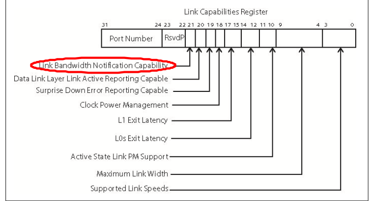

<a id="sec-14-4"></a>
## 14.4 Link Initialization & Training | 链路初始化与训练

<table>
<thead><tr><th width="50%">🇬🇧 English</th><th width="50%">🇨🇳 中文</th></tr></thead>
<tbody>
<tr>
<td width="50%">

- Eight consecutive TS2s are received on any configured Lane with Link and Lane numbers and rate identifiers that match those being sent and
either:

 - a) The speed_change bit in the TS2s is cleared to 0b, or 

 - b) No rate higher than 2.5 GT/s is commonly supported. 

- Sixteen TS2 have been sent after receiving one and they haven’t been interrupted by any intervening EIEOS. The changed_speed_recovery and
directed_speed_change variables are both cleared to 0b on entry to this substate.

</td>
<td width="50%">

关于 Electrical Idle 的旁注,规范的早期版本预计 Electrical Idle 将基于测量电压阈值的 squelch 检测电路。后来,随着速度增加,检测如此小的电压差异变得越来越困难。因此,较新的规范版本允许通过观察链路行为来推断 Electrical
Idle,而不是实际测量电压。但是,如果未使用电压电平来检测进入 Electrical Idle,那么它也不能用于检测退出 Electrical Idle。为了处理该问题,引入了一种称为 EIEOS(Electrical Idle Exit Ordered
Set)的新有序集。EIEOS 由全零和全 1 的交替字节组成,在 Lane 上产生低频时钟的效果。一旦接收器进入 Electrical Idle,它可以监视信号上的此模式以通知它链路正在退出 Electrical Idle。

_退出到"Rx_L0s.FTS"_

在接收器检测到退出 Electrical Idle 之后,下一个状态将是 Rx_L0s.FTS。

</td>
</tr>
<tr>
<td width="50%">

## _Exit to “Recovery.Speed”_ 

The LTSSM will go to Recovery.Speed if ALL three conditions listed below are true: 

- Eight consecutive TS2s are received on any configured Lane with the speed_change bit set, identical rate identifiers, identical values in
Symbol 6, and:

 - a) The TS2s were standard 8b/10b TS2s, or 

 - b) The TS2s were EQ TS2s, or 

 - c) 1ms has expired since receiving eight EQ TS2s on any configured Lane. 

- Both Link partners support rates higher than 2.5 GT/s, or the rate is already higher than 2.5 GT/s. 

- For 8b/10b encoding, at least 32 TS2s were sent with the speed_change bit set to 1b without any intervening EIEOS after receiving one TS2
with the speed_change bit set to 1b in the same con‐ figured Lane. For 128b/130b encoding, at least 128 TS2s are sent with the speed_change
bit set to 1b after receiving one TS2 with the speed_change bit set to 1b in the same configured Lane.

A transition to Recovery.Speed can also occur if the rate has changed to a mutually negotiated rate since entering Recovery from L0 or L1
(changed_speed_recovery = 1b) and any configured Lanes have either seen EIOS or detected/inferred Electrical Idle and haven’t seen TS2s
since enter‐ ing this substate. This means a higher rate was attempted but the Link part‐ ner indicates that it isn’t working for some
reason. The new rate will return to whatever it was when Recovery was entered from L0 or L1.

The final case that can cause a transition to Recovery.Speed is if the rate has _not_ changed to a mutually negotiated rate since entering
Recovery from L0

or L1 (changed_speed_recovery = 0b), and the current rate is already higher than 2.5 GT/s, and any configured Lanes have either seen EIOS or
detected/ inferred Electrical Idle and haven’t seen TS2s since entering this substate. In this case, the understanding is that the current
rate isn’t working and the solution is to drop back down, so the new rate will become 2.5 GT/s.

</td>
<td width="50%">

## **Rx_L0s.FTS。** 

在此子状态中,接收器已注意到退出 Electrical Idle,现在正尝试在传入的位流(实际上是 FTS 有序集)上重新建立位和符号或块锁。

_退出到"L0 状态"_

如果在 8b/10b 编码中所有已配置的 Lane 上接收到 SOS,或者在 128b/130b 编码中接收到 SDS,则下一个状态将是 L0。接收器必须能够在此之后立即接受有效数据,并且必须在离开此状态之前完成 Lane-to-Lane 去偏移。

</td>
</tr>
<tr>
<td width="50%">

## _Exit to “Configuration State”_ 

The next state will be Configuration if 8 consecutive TS1s are received on any configured Lane with Link or Lane numbers that don’t match
those being sent and either the speed_change bit is cleared to 0b, or no rate higher than 2.5 GT/s is commonly supported.

The variables changed_speed_recovery and directed_speed_change are cleared to 0b when the LTSSM transitions to Configuration. If the N_FTS
value has changed since last time, the new value must be used for L0s going forward.

</td>
<td width="50%">

## _退出到"Recovery 状态"_

否则,在 N_FTS 超时后,下一个状态将是 Recovery。如果是这样,发送器也必须进入 Recovery,尽管允许完成正在进行的任何 TLP 或 DLLP。如果发生超时,规范建议增加 N_FTS 值以降低再次发生的可能性。N_FTS 超时定义如下:

对于 8b/10b,最小超时为 40 * [N_FTS + 3] * UI,而最大允许为该时间的两倍。由于每个符号需要 10 位(UI 表示一个位时间),因此这等于 (4*N_FTS + 12) 个符号。额外的 12 个符号解释为:最大大小 SOS 的 6 个 + 4
个用于可能的额外 FTS + 2 个用于符号裕度。总之,最小时间是发送所请求的 FTS 数量加上 12 个符号所需的时间,而最大时间是该时间的两倍。

如果设置了扩展同步位,则最小时间 = 2048 FTS,最大时间 = 4096 FTS。接收器将使用的实际超时值还必须考虑 2.5 GT/s 以外速度的 4 到 8 个 EIE 符号。

对于 128b/130b,超时值被给定为最小 130 * [N_FTS + 5 + 12 + Floor(N_FTS/32)] * UI,最大为该时间的两倍。值 130 * UI 意味着 130 个位时间,代表一个块,因此如果我们删除这两个值,我们可以说我们正在查看 [N_FTS
+ 5 + 12 + Floor(N_FTS/32)] 个块。值 [5 + Floor(N_FTS/32)] 表示在此期间需要发送的 EIEOS 数。每 32 个 FTS 之后将发送一个 EIEOS,因此 Floor(N_FTS/32) 给出该数字。另一个 5 是由第一个
EIEOS、最后一个 EIEOS、SDS、周期性 EIEOS 和当 N_FTS 能被 32 整除时发送两个 EIEOS 后跟一个 SDS 的情况下发送的额外 EIEOS 解释的。最后,值 12 表示如果设置了扩展同步位将发送的 SOS 数量。当设置了该位时,超时将使用 N_FTS
= 4096。

</td>
</tr>
<tr>
<td width="50%">

## _Exit to “Detect State”_ 

After 48ms without resolving to one of the previously‐defined state transi‐ tions, the next state will be Detect if the data rate is 2.5
GT/s or 5.0 GT/s.

If the rate is 8.0 GT/s there is another possibility because the number of attempts may not have been exceeded yet. That is indicated by the
idle_to_rlock_transitioned variable, and if it’s less than FFh when the rate is 8.0 GT/s, the new state will be “Recovery.Idle”. If that
transition is made, the variables changed_speed_recovery and directed_speed_change will be cleared to 0b. However, once
idle_to_rlock_transitioned reaches FFh, and the 48ms timeout is seen, the next state will be Detect.

</td>
<td width="50%">

## **L1 状态** 

此链路电源状态与 L0s 状态相比,权衡了更长的退出延迟以获得更积极的电源管理。L1 是 ASPM 的一个选项,像 L0s 一样,意味着设备可以在硬件控制下自动进入和退出此状态,无需任何软件参与。但是,与 L0s 不同,软件也能够指示上游端口发起更改为
L1,它通过将设备电源状态写入较低级别(D1、D2 或 D3)来执行此操作。L1 状态与 L0s 的不同之处还在于它影响链路的两个方向。

</td>
</tr>
<tr>
<td width="50%">

## **Recovery.Idle** 

As the name implies, Transmitters will usually send Idles in this substate as a preparation for changing to the fully operational L0 state.
For 8b/10b mode, Idle data is normally sent on all the Lanes, while for 128b/130b an SDS is sent to start a Data Stream and then Idle data
Symbols are sent on all the Lanes.

</td>
<td width="50%">

## **PCI Express Technology** 

由于进入 Electrical Idle 可能表示链路伙伴希望进入 L0s、L1 或 L2,因此通过让两个伙伴事先同意何时将进入 L1 来处理应将哪个作为下一个状态。握手通知他们伙伴已准备好,因此可以安全地继续。有关此工作原理的更多详细信息,请参阅第 733 页的"Link
Power Management 简介"部分。第 608 页的 Figure 14-42 显示了 L1 状态机,将在以下部分中描述。

</td>
</tr>
<tr>
<td width="50%">

## _Exit to “L0 State”_ 

The next state is L0 if either of the following cases is true. In either case, if the Retrain Link bit has been written to 1b since the last
transition to L0 from Recovery or Configuration, the Downstream Port will set the Link Bandwidth Management Status bit to 1b (see Figure
14‐39 on page 597).

- 8b/10b encoding is in use and 8 consecutive Symbol Times of Idle data have been received and 16 Idle data Symbols have been sent since the
first one was received.

</td>
<td width="50%">

## **L1.Entry** 

要使上游端口进入此状态,它必须向其链路伙伴发送进入 L1 的请求,并收到可以进入 L1 状态的确认。请求进入 L1 的原因可能是由于 ASPM 或软件参与。一旦接收到 L1 请求确认,上游端口将进入 L1.Entry 子状态。

要使下游端口进入此状态,它必须从上游端口接收 L1 进入请求,并向该请求发送肯定响应。然后下游端口等待接收 Electrical Idle Ordered Set (EIOS) 并让其接收 Lane 下降至 Electrical Idle。此时,下游端口进入 L1.Entry
子状态。

</td>
</tr>
<tr>
<td width="50%">

## **PCI Express Technology** 

- 128b/130b encoding in use, 8 consecutive Symbol Times of Idle data have been received and 16 Idle data Symbols have been sent since the
first one was received, and this state wasn’t entered from Recov‐ ery.RcvrCfg. Note that Idle data Symbols must be contained in Data Blocks,
Lane‐to‐Lane De‐skew must be completed before Data Stream processing starts, and the idle_to_rlock_transitioned variable is cleared to 00h
on transition to L0.

</td>
<td width="50%">

## _在 L1.Entry 期间_

所有已配置的发送器发送一个 EIOS 并进入 Electrical Idle,同时保持适当的 DC 共模电压。

</td>
</tr>
<tr>
<td width="50%">

## _Exit to “Configuration State”_ 

The next state is Configuration if either: 

- A Port is instructed by a higher layer to optionally reconfigure the Link, such as to change the Link width. 

- Any configured Lane sees two consecutive incoming TS1s with Lane numbers set to PAD (a Port that transitions to Configuration to change
the Link will send PAD Lane numbers on all Lanes). The spec recommends that the LTSSM use this transition when changing the Link width to
reduce the time it will take.

</td>
<td width="50%">

## _退出到"L1.Idle"_

下一个状态将在 TTX-IDLE-MIN 超时(20ns)后是 L1.Idle。此时间旨在确保发送器已建立 Electrical Idle 条件。

</td>
</tr>
<tr>
<td width="50%">

## _Exit to “Disable State”_ 

The next state is Disabled if either: 

- A Downstream or optional crosslink Port is instructed by a higher layer to set the Disable Link bit in its TS1s or TS2s. 

- Any configured Lane of an Upstream or optional crosslink Port sees the Disable Link bit set in two consecutive incoming TS1s.

</td>
<td width="50%">

## **L1.Idle** 

在此子状态期间,发送器保持处于 Electrical Idle 状态。

对于 2.5 GT/s 以外的速率,LTSSM 必须在此子状态中保持至少 40ns。在规范中,此延迟被称为"用于补偿逻辑电平中的延迟,以防链路进入 L1 后立即退出时使能 Electrical Idle 检测电路"。

</td>
</tr>
<tr>
<td width="50%">

## _Exit to “Hot Reset State”_ 

The next state is Hot Reset if either: 

- A Downstream or optional crosslink Port is instructed by a higher layer to set the Hot Reset bit in its TS1s or TS2s. 

- Any configured Lane of an Upstream or optional crosslink Port sees the Hot Reset bit set in two consecutive incoming TS1s.

</td>
<td width="50%">

## _退出到"Recovery 状态"_

当发送器被指示更改或任何接收器检测到退出 Electrical Idle 时,下一个状态将是 Recovery。离开 L1 的原因包括需要传递 DLLP 或 TLP,或希望更改链路宽度或速度。如果需要速度更改,则允许端口将 directed_speed_change 变量设置为
1b,并且必须将 changed_speed_recovery 变量清零至 0b。可选地,端口可以退出 L1,然后通过将 directed_speed_change 设置为 1b 并从 L0 进入 Recovery 来稍后启动速度更改。

</td>
</tr>
<tr>
<td width="50%">

## _Exit to “Loopback State”_ 

The next state is Loopback if either: 

- A Transmitter is known to be Loopback Master capable (design spe‐ cific; the spec does not provide a means to verify this) and instructed
by a higher layer to set the Loopback bit in its TS1s or TS2s.

- Any configured Lane of an Upstream or optional crosslink Port sees the Loopback bit set in two consecutive incoming TS1s. The receiving
device then becomes the Loopback slave.

</td>
<td width="50%">

## **L2 状态** 

这是比 L1 更深的电源状态,具有更长的退出延迟。当其设备置于 D3Cold 电源状态并且已完成的相应链路握手后,电源管理软件指示上游端口发起进入 L2(链路的两个方向都进入 L2)。

一旦系统了解到一切就绪,主电源将被关闭。断电后,链路电源状态将变为 L2 或 L3,具体取决于是否可获得称为 VAUX(辅助电压)的辅助电源。如果存在 VAUX,则链路进入 L2;如果不存在,则进入 L3。

L2 的动机是使用 VAUX 提供的小功率来通知系统何时发生需要恢复链路电源的事件。

</td>
</tr>
<tr>
<td width="50%">

## _Exit to “Detect State”_ 

Otherwise, after a 2ms timeout, the next state will be Detect unless the idle_to_rlock_transitioned variable is less than FFh, in which case
the next state will be “Detailed Recovery Substates”. For the transition to Recov‐ ery.RcvrLock, if the data rate is 8.0 GT/s the
idle_to_rlock_transitioned vari‐ able is incremented by 1b, while for 2.5 or 5.0 GT/s it will be set to FFh.

</td>
<td width="50%">

## **PCI Express Technology** 

有两种标准方式设备可以通知系统此类事件。一种是称为 WAKE# 引脚的边带信号,另一种是称为"Beacon"的带内信号。L2 状态对于 WAKE# 是不需要的,但如果要使用可选的 Beacon,则是必需的。规范明确指出,以 5.0 或 8.0 GT/s 运行的设备不需要支持
Beacon,因此这似乎是旧版支持,仅对以 2.5 GT/s 运行的设备有意义。有关链路唤醒选项的更多详细信息,请参阅第 772 页的"Waking Non-Communicating Links"。

如果支持,Beacon 是低频(30 KHz - 500 MHz)带内信号,支持唤醒功能的上游端口必须能够在至少 Lane 0 上发送它,下游端口必须能够接收它。像交换机这样的中间设备,如果在下游端口上接收到 Beacon,必须将其转发到其上游端口。Beacon
的最终目的地是根复合体 (Root Complex),因为这是系统电源控制逻辑预期所在的位置。

进入 Electrical Idle 的发送器可能表示希望进入任何低功耗链路状态(L0s、L1 或 L2),因此需要一种区分它们的方法。对于 L2,这通过让链路伙伴事先同意将通过使用握手序列来进入 L2 来处理,以确保它们都已准备好。有关此工作原理的更多详细信息,请参阅第 733
页的"Link Power Management 简介"部分。第 611 页的 Figure 14-43 显示了 L2 进入和退出状态机,将在以下文本中描述。

</td>
</tr>
<tr>
<td width="50%">

## **L0s State** 

This is the low power Link state that has the shortest exit latency back to L0. Devices manage entry and exit from this state automatically
under hardware control without any software involvement. Each direction of a Link, can enter and exit the L0s state independent of each
other.

</td>
<td width="50%">

## **L2.Idle** 

要进入此子状态,链路两端的所有必要握手过程必须已经发生,并且端口已发送和接收到所需的 EIOS。

所有已配置的发送器必须保持处于 Electrical Idle 状态至少 TTX-IDLE-MIN 超时(20ns)。但是,由于主电源现在将被关闭,因此它们不需要将 DC 共模电压保持在规范范围内。接收器在 20ns 超时到期之前不会开始寻找 Electrical
退出条件。所有接收器终端必须保持处于低阻抗条件下的使能状态。

</td>
</tr>
<tr>
<td width="50%">

## **L0s Transmitter State Machine** 

The L0s state has different substates for the Transmitter and the Receiver. The Transmitter substates will be described first. As shown in
Figure 14‐40 on page 603 the transmitter state machine associated with L0s state is a simple one.

_Figure 14‐40: L0s Tx State Machine_ 


<br>

</td>
<td width="50%">

## _退出到"L2.TransmitWake"_

如果上游端口被指示发送 Beacon(Beacon 始终且仅指向上游到根复合体),则下一个状态将是 L2.TransmitWake。

如果交换机的下游端口检测到 Beacon,则它必须指示交换机的上游端口退出到 L2.TransmitWake 并开始发送 Beacon。

</td>
</tr>
<tr>
<td width="50%">

## **Tx_L0s.Entry.** 

A Transmitter enters L0s when directed by an upper layer. The spec gives no decision criteria for this, but intuitively it would occur based
on an inac‐ tivity timeout: no TLPs or DLLPs being sent for a given time. To enter L0s, the Transmitter sends one EIOS (two EIOSs for the
5.0 GT/s rate) and enters Electrical Idle. The Transmitter is not turned off, however, and must main‐ tain the DC common‐mode voltage within
the spec range.

</td>
<td width="50%">

## _退出到"Detect 状态"_

一旦主电源恢复,下一个状态将是 Detect。

如果此端口具有主电源,但它在任何"预定的"Lane 上检测到退出 Electrical Idle,这意味着那些可以协商为 Lane 0 的 Lane(多 Lane 链路必须具有至少两个预定的 Lane),则下一个状态将是
detect。当这种情况发生在交换机上游端口时,交换机还必须将其下游端口转换为 Detect。

## **L2.TransmitWake**

</td>
</tr>
<tr>
<td width="50%">

## _Exit to “Tx_L0s.Idle”_ 

The next state will be Tx_L0s.Idle after the TTX‐IDLE‐MIN timeout (20ns). This time is intended to ensure that the Transmitter has
established the Electrical Idle condition.

</td>
<td width="50%">

</td>
</tr>
<tr>
<td width="50%">

## **Tx_L0s.Idle.** 

In this substate, the transmitter continues the Electrical Idle state until directed to leave. Because this direction of the Link is in
Electrical Idle, there will be a power savings benefit, which is the entire purpose of the L0s state.

_Exit to “Tx_L0s.FTS”_ 

The next state will be Tx_L0s.FTS when directed, such as when the Port needs to resume packet transmission. The LTSSM will be instructed in
a design‐specific manner to exit this state.

</td>
<td width="50%">

</td>
</tr>
<tr>
<td width="50%">

## **Tx_L0s.FTS.** 

In this substate, the Transmitter will start sending FTS ordered sets to retrain the Receiver of the Link Partner. The number of FTSs sent
is the N_FTS value advertised by the Link Partner in its TS Ordered Sets during the last training sequence that led to L0. The spec notes
that if a Receiver times out while trying to do this, it may choose to increase the N_FTS value it advertises during the Recovery state.

If the Extended Synch bit is set (see Figure 14‐71 on page 644), the transmit‐ ter must sends 4096 FTSs instead of the N_FTS number. This
extends the time available to synchronize external test and analysis logic, which may not be able to recover Bit Lock as quickly as the
embedded logic can.

For all data rates, no SOSs can be sent prior to sending any FTSs. However, for the 5.0 GT/s rate, 4 to 8 EIE Symbols must be sent prior to
sending the FTSs. For 128b/130b, an EIEOS must be sent prior to the FTSs.

</td>
<td width="50%">

</td>
</tr>
<tr>
<td width="50%">

## _Exit to “L0 State”_ 

The Transmitter will transition to the L0 state once all the FTSs have been sent and: 

- a) For 8b/10b encoding, one SOS is sent on all configured Lanes, although none are sent before or during the FTSs. 

- b) For 128b/130b encoding, one EIEOS is sent followed by an SDS and a Data Stream.

</td>
<td width="50%">

</td>
</tr>
<tr>
<td width="50%">

## **L0s Receiver State Machine** 

Figure 14‐41 on page 605 shows the Receiver L0s state machine. A Receiver is required to implement L0s support if the ASPM Support field in
the Link Capa‐ bility register shows it to be supported, and is allowed to implement it even if that support is not indicated.

_Figure 14‐41: L0s Receiver State Machine_ 


<br>

</td>
<td width="50%">

</td>
</tr>
<tr>
<td width="50%">

## **Rx_L0s.Entry.** 

Entered when a Receiver that receives an EIOS, provided it supports L0s and hasn’t been directed to L1 or L2. 

_Exit to “Rx_L0s.Idle”_ 

The next state will be Rx_L0s.Idle after the TTX‐IDLE‐MIN timeout (20ns).

</td>
<td width="50%">

</td>
</tr>
<tr>
<td width="50%">

## **Rx_L0s.Idle.** 

The Receiver is now in Electrical Idle mode and is just waiting to see an exit from Electrical Idle.

</td>
<td width="50%">

</td>
</tr>

</tbody>
</table>

<p align="center"><b>Figure 14-42: L1 状态机</b></p>
<p align="center"></p>
<p align="center"><sub>📄 <a href="figures/chapter_14_Link_Initialization_Training/embedded/page0687_img1.png">Page 687</a></sub></p>


<p align="center"><b>Figure 14-43: L2 状态机</b></p>
<p align="center"></p>
<p align="center"><sub>📄 <a href="figures/chapter_14_Link_Initialization_Training/embedded/page0688_img1.png">Page 688</a></sub></p>

<table>
<thead><tr><th width="50%">🇬🇧 English</th><th width="50%">🇨🇳 中文</th></tr></thead>
<tbody>
<tr>

</tr>
</tbody>
</table>

[⬆️ 返回目录](#本章目录-table-of-contents)

---


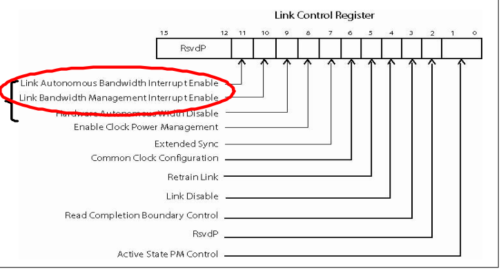

<a id="sec-14-5"></a>
## 14.5 Link Initialization & Training | 链路初始化与训练

<table>
<thead><tr><th width="50%">🇬🇧 English</th><th width="50%">🇨🇳 中文</th></tr></thead>
<tbody>
<tr>
<td width="50%">

As an aside regarding Electrical Idle, the early versions of the spec expected that Electrical Idle would be based on a squelch‐detect
circuit measuring a voltage threshold. Later, as speeds increased, detecting such small voltage differences became increasingly difficult.
Consequently, more recent spec versions allow Electrical Idle to be inferred by observing Link behavior, rather than actually measuring the
voltage. However, if the voltage level isn’t used to detect entry into Electrical Idle, then it also can’t be used to detect an exit from
it. To handle that problem, a new Ordered Set was intro‐ duced called the EIEOS (Electrical Idle Exit Ordered Set). The EIEOS con‐ sists of
alternating bytes of all zeros and all ones and creates the effect of a low‐frequency clock on the Lanes. Once a Receiver has entered
Electrical Idle it can watch for this pattern on the signal to inform it that the Link is exiting from Electrical Idle.

_Exit to “Rx_L0s.FTS”_ 

The next state will be Rx_L0s.FTS after the Receiver detects an exit from Electrical Idle.

</td>
<td width="50%">

在此子状态期间,发送器将在至少 Lane 0 上发送 Beacon。请注意,此状态仅适用于上游端口,因为只有它们才能发送 Beacon。

</td>
</tr>
<tr>
<td width="50%">

## **Rx_L0s.FTS.** 

In this substate, the Receiver has noticed an exit from Electrical Idle and is now trying to re‐establish Bit and Symbol or Block lock on
the incoming bit stream (which are really FTS ordered sets).

_Exit to “L0 State”_ 

The next state will be L0 if an SOS is received in 8b/10b encoding or an SDS in 128b/130b encoding on all configured Lanes. The Receiver
must be able to accept valid data immediately after that, and Lane‐to‐Lane de‐skew must be completed before leaving this state.

</td>
<td width="50%">

## _退出到"Detect 状态"_

如果在任何上游端口的接收器上检测到退出 Electrical Idle,则下一个状态将是 Detect。当然,必须已经恢复了设备的电源,以便邻居退出 Electrical Idle。

</td>
</tr>
<tr>
<td width="50%">

## _Exit to “Recovery State”_ 

Otherwise the next state will be Recovery after the N_FTS timeout. If so, the Transmitter must also go to Recovery, although it’s allowed to
finish any TLP or DLLP that was in progress. If the timeout occurs, the spec recommends that the N_FTS value be increased to reduce the
likelihood of it happening again. The N_FTS timeout is defined as follows:

For 8b/10b, the minimum timeout is given as 40 * [N_FTS + 3] * UI, while the maximum allowed is twice that time. Since 10 bits (UI repre‐
sents one bit time) are needed per Symbol, this works out to (4*N_FTS + 12) Symbols. The extra 12 Symbols are explained as 6 for a max‐sized
SOS + 4 for the possible extra FTS + 2 more for Symbol margin. In sum‐ mary, then, the minimum time is the time it should take to send the
requested number of FTSs plus 12 Symbols, while the maximum time is twice as much as that.

If the extended synch bit is set, the min time = 2048 FTSs and the max time = 4096 FTSs. The actual timeout value a Receiver will use must
also take into account the 4 to 8 EIE Symbols for speeds other than 2.5 GT/s.

For 128b/130b, the timeout value is given as a minimum of 130 * [N_FTS + 5 + 12 + Floor (N_FTS/32)] * UI and a max of twice that time. The
value 130 * UI means 130 bit times which represents one Block, so if we remove those two values we can say we’re looking at [N_FTS + 5 + 12
+ Floor (N_FTS/32)] Blocks. The value [5 + Floor (N_FTS/32)] represents the EIEOSs that will need to be sent during this time. One EIEOS
will be sent after every 32 FTSs, so Floor (N_FTS/32) gives that number. The other 5 are accounted for by the first EIEOS, the last EIEOS,
the SDS, the periodic EIEOS and an additional EIEOS in case the Transmitter chooses to send two EIEOS followed by an SDS when N_FTS is
divisi‐ ble by 32. Finally, the value of 12 represents the number of SOSs that will be sent if the extended synch bit is set. When that bit
is set, the tim‐ eout will use N_FTS = 4096.

</td>
<td width="50%">

## **Hot Reset 状态** 

由于以下任一原因,端口将进入 Hot Reset 状态:它是一个桥接器并且软件对其配置空间进行了编程以向下游传播 Hot Reset,如第 837 页的"Hot Reset(带内复位)"中所述;或者由于端口接收到两个连续的 Hot Reset 位为 1 的 TS1。

</td>
</tr>
<tr>
<td width="50%">

## **L1 State** 

This Link power state trades a longer exit latency for more aggressive power management compared to the L0s state. L1 is an option for ASPM,
like L0s, meaning devices can enter and exit this state automatically under hardware control without any software involvement. However,
unlike L0s, software is also able to direct an Upstream Port to initiate a change to L1, and it does so by writing the device power state to
a lower level (D1, D2, or D3). The L1 state is also different from L0s in that it affects both directions of the Link.

</td>
<td width="50%">

## _在 Hot Reset 期间_

端口持续传输 Hot Reset 位设置的 TS1,但不更改已配置的 Link 和 Lane 编号。

如果交换机的上游端口进入 Hot Reset 状态,则所有已配置的下游端口必须尽快转换为 Hot Reset。

</td>
</tr>
<tr>
<td width="50%">

## **PCI Express Technology** 

_Figure 14‐42: L1 State Machine_ 


<br>


Since going to Electrical Idle can indicate a desire by the Link partner to enter L0s, L1 or L2, differentiating which should be the next
state is handled by hav‐ ing both partners agree beforehand when they’re going to enter L1. A hand‐ shake informs them that the partner is
ready and it’s therefore safe to proceed. For more detail on how this works, see the section called “Introduction to Link Power Management”
on page 733. Figure 14‐42 on page 608 shows the L1 state machine, which is described in the following sections.

</td>
<td width="50%">

## _退出到"Detect 状态"_

在发起 Hot Reset 的桥接器中,一旦软件清除启动 Hot Reset 的配置空间位,桥接端口将进入 Detect。但是,该端口必须保持在 Hot Reset 状态至少 2ms。

对于由于接收到两个连续的 Hot Reset 位为 1 的 TS1 而进入 Hot Reset 的端口,只要它继续接收此类 TS1,它就会保持此状态。一旦端口停止接收 Hot Reset 位为 1 的 TS1,它将转换到 Detect 状态。但是,该端口必须保持在 Hot
Reset 状态至少 2ms。

</td>
</tr>
<tr>
<td width="50%">

## **L1.Entry** 

In order for an Upstream Port to enter this state, it must send a request to enter L1 to its Link Partner and receive acknowledgement that
it is OK to put the Link into L1. (The reason for requesting to go into L1 may be because of ASPM or because of software involvement.) Once
the L1 request acknowledge is received, the Upstream Port enters the L1.Entry substate.

In order for a Downstream Port to enter this state, it must receive an L1 enter request from the Upstream Port and send a positive response
to that request. Then the Downstream Port waits to receive an Electrical Idle Ordered Set (EIOS) and have its receive lanes drop to
Electrical Idle. It is at this point that the Downstream Port enters the L1.Entry substate.

</td>
<td width="50%">

## **Disable 状态** 

禁用的链路处于 Electrical Idle 状态,不必保持 DC 共模电压。软件通过设置设备的 Link Control 寄存器中的 Link Disable 位(参见第 644 页的 Figure 14-71)来启动此操作,然后设备发送 Disable Link 位为 1
的 TS1。

</td>
</tr>
<tr>
<td width="50%">

## _During L1.Entry_ 

All configured Transmitters send an EIOS and enter Electrical Idle while maintaining the proper DC common mode voltage.

</td>
<td width="50%">

## _在 Disable 期间_

所有 Lane 发送 16 到 32 个 Disable Link 位为 1 的 TS1,发送一个 EIOS(对于 5.0 GT/s 情况为两个连续的 EIOS),然后转换到 Electrical Idle。DC 共模电压不需要在规范范围内。

如果已发送 EIOS(对于 5.0 GT/s 情况为两个连续的 EIOS)并且在任何已配置的 Lane 上也接收到 EIOS,则 LinkUp = 0b(False),并且 Lane 被认为是禁用的。

</td>
</tr>
<tr>
<td width="50%">

## _Exit to “L1.Idle”_ 

The next state will be L1.Idle after the TTX‐IDLE‐MIN timeout (20ns). This time is intended to ensure that the Transmitter has established
the Electrical Idle condition.

</td>
<td width="50%">

## _退出到"Detect 状态"_

对于上游端口,当在接收器处检测到 Electrical Idle,或在 2ms 超时内未接收到 EIOS 时,下一个状态将是 Detect。

对于下游端口,下一个状态也将是 Detect,但要等到软件将 Link Disable 位清零至 0b 之后。

</td>
</tr>
<tr>
<td width="50%">

## **L1.Idle** 

During this substate, Transmitters remain in the Electrical Idle. 

For rates other than 2.5 GT/s the LTSSM must remain in this substate for at least 40ns. In the spec, this delay is said “to account for the
delay in the logic levels to arm the Electrical Idle detection circuitry in case the Link enters L1 and immedi‐ ately exits”.

</td>
<td width="50%">

## **Loopback 状态** 

Loopback 状态是在正常操作期间不使用的测试和调试功能。作为 Loopback 主站的设备可以通过发送 Loopback 位为 1 的 TS1 将链路伙伴置于 Loopback 从站模式。这可以在线完成,从而允许使用 Loopback 状态对链路执行 BIST(Built
In Self Test)的可能性。

一旦处于此状态,Loopback 主站将有效符号发送给 Loopback 从站,然后 Loopback 从站回显它们。Loopback 从站继续执行

</td>
</tr>
<tr>
<td width="50%">

## _Exit to “Recovery State”_ 

The next state will be Recovery when a Transmitter is directed to change it or when any Receiver detects an exit from Electrical Idle.
Reasons for leav‐ ing L1 include the need to deliver a DLLP or TLP, or a desire to change the Link width or speed. If a speed change is
desired, a Port is allowed to set the directed_speed_change variable to 1b and must clear the changed_speed_recovery variable to 0b.
Optionally, the Port may exit L1 and then initiate the speed change later by setting directed_speed_change to 1b and entering Recovery from
L0 instead.

</td>
<td width="50%">

## **PCI Express Technology** 

时钟容差补偿,因此主站必须继续以正确的间隔插入 SOS。要执行时钟容差补偿,Loopback 从站可能必须向回显给 Loopback 主站的 SOS 添加或删除 SKP 符号。

当 Loopback 主站发送 EIOS 并且接收器检测到 Electrical Idle 时,Loopback 状态退出。Loopback 状态机如图 14-44(第 614 页)所示,并在以下文本中描述。

</td>
</tr>
<tr>
<td width="50%">

## **L2 State** 

This is a deeper power state with a longer exit latency than L1. Power Manage‐ ment software directs an Upstream Port to initiate entry into
L2 (both directions of the Link go to L2) when its device is placed in the D3Cold power state and the appropriate Link handshakes have been
completed.

Main power will be shut off by the system once it learns that everything is ready. When power is removed, the Link power state will become
either L2 or L3, depending on whether a secondary power source called VAUX (auxiliary voltage) is available. If VAUX is present, the Link
enters L2; if not, it enters L3.

The motivation for L2 is to use the small power available from VAUX to inform the system when an event has occurred for which the Link needs
to have power

</td>
<td width="50%">

## **Loopback.Entry** 

此子状态的典型行为是 Loopback Master 发送 Loopback 位置 1 的 TS1,直到它开始看到那些返回的 TS1。一旦 Loopback Master 看到返回的 Loopback 位为 1 的 TS1,它就知道其链路伙伴现在正在作为 Loopback
Slave 运行,只是简单地重复它接收到的所有内容。

在此子状态中,链路不被视为处于活动状态(LinkUp = 0b)。此外,TS1 和 TS2 中使用的 Link 和 Lane 编号被接收器忽略。规范对 128b/130b 编码的 Lane 编号的使用进行了有趣的观察。事实证明,每个 Lane 对其加扰器使用不同的种子值(参见第
430 页的"加扰")。因此,如果 Lane 编号在进入 Loopback 模式之前尚未协商,则链路伙伴可能具有不同的 Lane 分配,因此将无法识别传入的符号。这可以通过在指

定 Master 进入 Loopback 状态之前等待 Lane 编号协商完成,或者通过指示 Master 在 Loopback.Entry 期间设置 Compliance Receive 位,或通过其他方法来避免。

</td>
</tr>
<tr>
<td width="50%">

## **PCI Express Technology** 

restored. There are two standard ways a device can inform the system of such an event. One is a side‐band signal called the WAKE# pin, and
the other is an in‐ band signal called a “Beacon.” The L2 state isn’t needed for WAKE#, but is required if the optional Beacon will be used.
The spec explicitly states that devices operating at 5.0 or 8.0 GT/s don’t need to support Beacon, so it would seem that this is legacy
support and only interesting for devices operating at 2.5 GT/s. For more detail on Link wakeup options, refer to “Waking Non‐Commu‐ nicating
Links” on page 772.

If supported, the Beacon is a low‐frequency (30 KHz ‐ 500 MHz) in‐band signal that an Upstream Port supporting wakeup capability must be
able to send on at least Lane 0 and a Downstream Port must be able to receive. Intermediate devices like Switches that receive a Beacon on a
Downstream Port must forward it to their Upstream Port. The ultimate destination for the Beacon is the Root Complex, because that’s where
the system power control logic is expected to reside.

A Transmitter going to Electrical Idle could indicate a desire to enter any of the low‐power Link states (L0s, L1 or L2), so a means of
differentiating them is needed. For L2, this is handled by having the Link partners agree beforehand that they’re going to enter L2 by using
a handshake sequence to ensure that they’re both ready. For more detail on how this works, see the section called “Introduction to Link
Power Management” on page 733. Figure 14‐43 on page 611 shows the L2 entry and Exit state machine, which is described in the follow‐ ing
text.

_Figure 14‐43: L2 State Machine_ 


<br>

</td>
<td width="50%">

## **Loopback Master:** 

在此子状态中,Loopback Master 将持续发送 Loopback 位置 1 的 TS1。Master 还可以在 TS1 中置位 Compliance Receive
位以帮助测试,当一个或两个端口在速率更改后难以获取位锁、符号锁或块对齐时。如果设置了该位,则在此状态期间不得清除它。

如果此子状态是从 Configuration.Linkwidth.Start 进入的,请检查正在使用的速度是否为两个链路伙伴共同支持的最高速率。如果不是:

- 更改为最高共同速度。发送 16 个 Loopback 位置 1 的 TS1,后跟一个 EIOS(如果当前速度为 5.0 GT/s,则为两个 EIOS),然后进入 Electrical Idle 1ms。在空闲期间,将速度更改为最高共同支持的速率。

- 如果最高共同速率为 5.0 GT/s,则从站的 Tx 去加重由 Master 通过将其 TS1 中的 Selectable De-emphasis 位设置为所需值来控制(1b = -3.5 dB,0b = -6 dB)。

- 对于 5.0 GT/s 及更高的数据速率,Master 的发送器可以选择其想要的任何去加重设置,无论它发送给从站的设置如何。

- 潜在问题:如果在链路已经训练到 L0 并且 LinkUp = 1b 之后进入 Loopback,则一个端口可能从 Recovery 进入 Loopback,而伙伴从 Configuration 进入。如果发生这种情况,后一个端口可能尝试更改速度,而从 Recovery
进入的端口则不会,从而导致结果未定义的情况。规范指出,测试设置必须避免此类冲突情况。

</td>
</tr>
<tr>
<td width="50%">

## **L2.Idle** 

To enter this substate, all the necessary handshake process must have already taken place between both ports on the Link and the ports have
sent and received the required EIOS.

All configured Transmitters must remain in the Electrical Idle state for at least the TTX‐IDLE‐MIN timeout (20ns). However, since the main
power will now be shut off, they aren’t required to maintain the DC common‐mode voltage within the spec range. Receivers won’t start looking
for the Electrical exit condition until at least after the 20ns timeout expires. All Receiver terminations must remain enabled in the low
impedance condition.

</td>
<td width="50%">

## _退出到"Loopback.Active"_

下一个状态将在 2ms 后是 Loopback.Active,前提是 TS1 中的 Compliance Receive 位已设置,或者在设计特定数量的 Lane 上接收到两个连续的 Loopback 位为 1 的 TS1 并且 TS1 中的 Compliance Receive
位未设置。

请注意,如果速度已更改,Master 必须确保已发送足够的 TS1,以便从站能够在进入 Loopback.Active 状态之前获取符号锁或块对齐。

</td>
</tr>
<tr>
<td width="50%">

## _Exit to “L2.TransmitWake”_ 

The next state will be L2.TransmitWake if the Upstream Port is instructed to send a Beacon (the Beacon is always and only directed upstream
to the Root Complex).

If the Downstream Port of a Switch detects a Beacon, it must direct the Upstream Port of the Switch to exit to L2.TransmitWake and begin
sending a Beacon.

</td>
<td width="50%">

## **PCI Express Technology**

</td>
</tr>
<tr>
<td width="50%">

## _Exit to “Detect State”_ 

Once main power is returned, the next state will be Detect. 

If this Port has main power, but it detects an exit from Electrical Idle on any “predetermined” Lanes, meaning those that could be
negotiated to be Lane 0 (multi‐Lane Links must have at least two predetermined Lanes), the next state will be detect. When this happens to a
Switch Upstream Port, the Switch must also transition its Downstream Ports to Detect.

## **L2.TransmitWake**

</td>
<td width="50%">

## _退出到"Loopback.Exit"_

如果不满足进入 Loopback.Active 的任一条件,则下一个状态将在小于 100ms 的设计特定超时后是 Loopback.Exit。

</td>
</tr>
<tr>
<td width="50%">

</td>
<td width="50%">

## **Loopback Slave:** 

此子状态通过接收两个连续的 Loopback 位为 1 的 TS1 来进入。

如果此子状态是从 Configuration.Linkwidth.Start 进入的,请检查正在使用的速度是否为两个链路伙伴共同支持的最高速度。如果不是:

- 更改为最高共同速度。发送一个 EIOS(如果当前速度为 5.0 GT/s,则为两个 EIOS),然后进入 Electrical Idle 2ms。在空闲期间,将速度更改为最高共同支持的速率。

- 如果最高共同速率为 5.0 GT/s,则根据接收到的 TS1 中的 Selectable De-emphasis 位设置发送器的去加重(1b = -3.5 dB,0b = -6 dB)。

- 如果最高共同速率为 8.0 GT/s,并且:

 - a) EQ TS1 指示从站进入此状态,则使用它们指定的 Tx Preset 设置。

 - b) 普通 TS1 指示从站进入此状态,则允许从站使用其默认发送器设置。

</td>
</tr>
<tr>
<td width="50%">

</td>
<td width="50%">

## _退出到"Loopback.Active"_

如果将指示从站进入此状态的传入 TS1 中的 Compliance Receive 位置 1,则下一个状态将是 Loopback.Active。从站不需要等待特定边界来发送环回数据,并且允许截断任何正在进行的有序集。

否则,从站发送 Link 和 Lane 编号设置为 PAD 的 TS1,并且下一个状态将是 Loopback.Active,前提是:

- 速率为 2.5 或 5.0 GT/s,并且所有 Lane 上获取了符号锁。

- 速率为 8.0 GT/s,并且在所有活动 Lane 上看到两个连续的 TS1。通过评估和应用 TS1 中给定的值来处理均衡,只要它们受支持并且 EC 值适合端口方向(下游端口为 10b,

上游端口为 11b)。可选地,端口可以接受此情况下的任一 EC 值。如果应用了设置,则它们必须在接收后 500ns 内生效,并且不得导致发送器在任何电气规范上违规超过 1ns。与 Recovery.Equalization 中的过程相比的一个显着差异是,从站正在发送的 TS1
中不回显新设置。– 对于 8b/10b,从站必须仅在符号边界上转换为环回数据,但允许截断任何正在进行的有序集。对于 128b/130b,未指定何时可以发送环回数据的边界,并且仍然允许截断任何正在进行的有序集。

</td>
</tr>
<tr>
<td width="50%">

</td>
<td width="50%">

## **Loopback.Active** 

在此子状态期间,Loopback Master 发送有效的编码数据,并且在准备退出 Loopback 之前不应发送 EIOS。Loopback Slave 在不修改的情况下回显接收到的信息(即使编码被确定为无效),可能的例外是反转极性,正如在 Polling
状态中确定的那样。从站还继续执行时钟容差补偿。这意味着必须根据需要添加或删除 SKP,但不要求所有 Lane 发送相同数量。

</td>
</tr>
<tr>
<td width="50%">

</td>
<td width="50%">

## _退出到"Loopback.Exit"_

对于 Loopback master,如果被指示,下一个状态将是 Loopback.Exit。

对于 Loopback slave,如果以下两个条件之一为真,则下一个状态将是 Loopback.Exit:

- 从站被指示退出,或在任何 Lane 上看到四个连续的 EIOS。

- 可选地,如果当前速度为 2.5 GT/s,并且接收到 EIOS 或在任何 Lane 上检测到或推断出 Electrical Idle。如果任何已配置的 Lane 在 128µs 内未检测到退出 Electrical Idle,则可以推断 Electrical Idle。

</td>
</tr>

</tbody>
</table>

<p align="center"><b>Figure 14-44: Loopback 状态机</b></p>
<p align="center"></p>
<p align="center"><sub>📄 <a href="figures/chapter_14_Link_Initialization_Training/embedded/page0687_img1.png">Page 687</a></sub></p>

<table>
<thead><tr><th width="50%">🇬🇧 English</th><th width="50%">🇨🇳 中文</th></tr></thead>
<tbody>
<tr>

</tr>
</tbody>
</table>

[⬆️ 返回目录](#本章目录-table-of-contents)

---


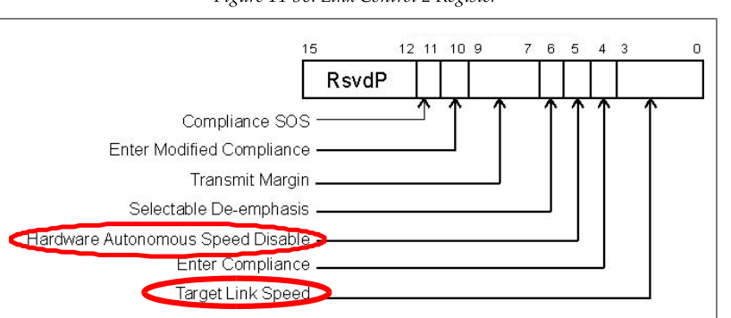

<a id="sec-14-6"></a>
## 14.6 Link Initialization & Training | 链路初始化与训练

<table>
<thead><tr><th width="50%">🇬🇧 English</th><th width="50%">🇨🇳 中文</th></tr></thead>
<tbody>
<tr>
<td width="50%">

During this substate, the Transmitter will send the Beacon on at least Lane 0. Note that this state only applies to Upstream Ports because
only they can send a Beacon.

</td>
<td width="50%">

在此子状态期间，发送器将在至少 Lane 0 上发送 Beacon。请注意，此状态仅适用于上游端口，因为只有它们才能发送 Beacon。

</td>
</tr>
<tr>
<td width="50%">

## _Exit to “Detect State”_ 

The next state will be Detect if an Electrical Idle exit is detected on any Receiver of an Upstream Port. Of course, power must have already
been restored to the devices in order for the neighbor to exit from Electrical Idle.

</td>
<td width="50%">

## _退出到"Detect 状态"_

如果在某个上游端口的接收器上检测到电气空闲退出，则下一个状态将是 Detect。当然，必须已经恢复了设备的供电，相邻设备才能从电气空闲中退出。

</td>
</tr>
<tr>
<td width="50%">

## **Hot Reset State** 

A Port enters the Hot Reset state either because it is a Bridge and software pro‐ grammed its configuration space to propagate a Hot Reset
Downstream as explained in “Hot Reset (In‐band Reset)” on page 837, because a Port received two consecutive TS1s with the Hot Reset bit
asserted.

</td>
<td width="50%">

## **热复位状态**

端口进入热复位状态，要么是因为它是一个桥，并且软件对其配置空间进行编程以向下游传播热复位（如第 837 页的"热复位（带内复位）"中所述），要么是因为端口接收到了两个连续的、Hot Reset 位被置位的 TS1。

</td>
</tr>
<tr>
<td width="50%">

## _During Hot Reset_ 

A Port transmits TS1s with the Hot Reset bit set continuously but doesn’t change the configured Link and Lane Numbers. 

If the Upstream Port of Switch enters the Hot Reset state, all configured Downstream Ports must transition to Hot Reset as soon as possible.

</td>
<td width="50%">

## _热复位期间_

端口以 Hot Reset 位置位连续发送 TS1，但不更改已配置的链路和 Lane 编号。

如果交换机的上游端口进入热复位状态，则所有已配置的下游端口必须尽快转换为热复位。

</td>
</tr>
<tr>
<td width="50%">

## _Exit to “Detect State”_ 

In the Bridge where Hot Reset was originated, once software clears the con‐ figuration space bit that initiated the Hot Reset, the Bridge
Port enters Detect. However, the Port must remain in the Hot Reset state for a mini‐ mum of 2ms.

For Ports where Hot Reset was entered because of receiving two consecu‐ tive TS1s with the Hot Reset bit asserted, it remains in this state
as long as it continues to receive these type of TS1s. Once the Port stops receiving TS1s with the Hot Reset bit asserted, it will
transition to the Detect state. How‐ ever, the Port must remain in the Hot Reset state for a minimum of 2ms.

</td>
<td width="50%">

## _退出到"Detect 状态"_

在发起热复位的桥中，一旦软件清除了发起热复位的配置空间位，桥端口就进入 Detect。但是，端口必须在热复位状态中保持至少 2ms。

**第 14 章：链路初始化与训练**

对于由于接收到两个连续的、Hot Reset 位置位的 TS1 而进入热复位的端口，只要它继续接收此类 TS1，它就保持在该状态。一旦端口停止接收 Hot Reset 位置位的 TS1，它将转换到 Detect 状态。但是，端口必须在热复位状态中保持至少 2ms。

</td>
</tr>
<tr>
<td width="50%">

## **Disable State** 

A Disabled Link is Electrically Idle and does not have to maintain the DC com‐ mon mode voltage. Software initiates this by setting the Link
Disable bit (see Figure 14‐71 on page 644) in the Link Control register of a device and the device then sends TS1s with the Link Disable bit
asserted.

</td>
<td width="50%">

## **禁用状态**

禁用的链路处于电气空闲状态，无需维持 DC 共模电压。软件通过在设备的 Link Control 寄存器中设置 Link Disable 位（请参见第 644 页的图 14‐71）来启动此操作，然后设备发送 Link Disable 位置位的 TS1。

</td>
</tr>
<tr>
<td width="50%">

## _During Disable_ 

All Lanes transmit 16 to 32 TS1s with the Disable Link bit asserted, send an EIOS (two consecutive EIOSs for the 5.0 GT/s case) and then
transition to Electrical Idle. The DC common‐mode voltage does not need be within spec.

If an EIOS (two consecutive EIOSs for the 5.0 GT/s case) was sent and an EIOS was also received on any configured Lane, then LinkUp = 0b
(False) and the Lanes are considered to be disabled.

</td>
<td width="50%">

## _禁用期间_

所有 Lane 发送 16 到 32 个 Link Disable 位置位的 TS1，发送一个 EIOS（对于 5.0 GT/s 情况为两个连续的 EIOS），然后转换到电气空闲。DC 共模电压不需要在规范范围内。

如果发送了 EIOS（对于 5.0 GT/s 情况为两个连续的 EIOS），并且在任何已配置的 Lane 上也接收到了 EIOS，则 LinkUp = 0b（假），并且 Lane 被认为是禁用的。

</td>
</tr>
<tr>
<td width="50%">

## _Exit to “Detect State”_ 

For Upstream Ports, the next state will be Detect when Electrical Idle is detected at the Receiver or if no EIOS has been received within a
2ms time‐ out.

For Downstream Ports, the next state will also be Detect, but not until the Link Disable bit has been cleared to 0b by software.

</td>
<td width="50%">

## _退出到"Detect 状态"_

对于上游端口，当在接收器处检测到电气空闲或者在 2ms 超时内未接收到 EIOS 时，下一个状态将是 Detect。

对于下游端口，下一个状态也将是 Detect，但只有在软件将 Link Disable 位清零至 0b 后才会发生。

</td>
</tr>
<tr>
<td width="50%">

## **Loopback State** 

The Loopback state is a test and debug feature that isn’t used during normal operation. A device acting as a Loopback master can put the
Link partner into the Loopback slave mode by sending TS1s with the Loopback bit asserted. This can be done in‐circuit, allowing the
possibility of using the Loopback state to perform a BIST (Built In Self Test) on the Link.

Once in this state, the Loopback master sends valid Symbols to the Loopback slave, which then echoes them back. The Loopback slave continues
to perform

</td>
<td width="50%">

## **回环状态**

回环状态是一个测试和调试功能，在正常运行期间不使用。充当回环主设备的设备可以通过发送 Loopback 位置位的 TS1 将链路伙伴置于回环从设备模式。这可以在电路中完成，从而可以使用回环状态对链路执行 BIST（Built In Self Test，内建自测试）。

一旦进入此状态，回环主设备将有效的 Symbol 发送给回环从设备，然后回环从设备将其回显。回环从设备继续执行

</td>
</tr>
<tr>
<td width="50%">

## **PCI Express Technology** 

clock tolerance compensation, so the master must continue to insert SOSs at the correct intervals. To perform clock tolerance compensation,
the Loopback slave may have to add or delete SKP Symbols to the SOS it echoes to the Loopback master.

The Loopback state is exited when the Loopback master transmits an EIOS and the receiver detects Electrical Idle. The Loopback state machine
is shown in Fig‐ ure 14‐44 on page 614 and described in the following text.

_Figure 14‐44: Loopback State Machine_ 


<br>

</td>
<td width="50%">

## **PCI Express 技术**

时钟容差补偿，因此主设备必须继续以正确的间隔插入 SOS。为了执行时钟容差补偿，回环从设备可能必须向其回传给回环主设备的 SOS 添加或删除 SKP Symbol。

回环状态在回环主设备发送 EIOS 并且接收器检测到电气空闲时退出。回环状态机如图 14‐44（第 614 页）所示，并在以下文本中描述。

_图 14‐44：回环状态机_


<br>

</td>
</tr>
<tr>
<td width="50%">

## **Loopback.Entry** 

The typical behavior for this substate is for the Loopback Master to send TS1s with the Loopback bit set until it starts seeing those TS1s
being returned. Once the Loopback Master sees TS1s being returned with the Loopback bit asserted, it knows that it’s Link Partner is now
behaving as the Loopback Slave and is simply repeating everything it receives.

While in this substate, the Link is not considered to be active (LinkUp = 0b). Also, the Link and Lane numbers used in TS1s and TS2s are
ignored by the Receiver. The spec makes an interesting observation regarding the use of Lane numbers with 128b/130b encoding. As it turns
out, each Lane uses a different seed value for its scrambler (see “Scrambling” on page 430). Consequently, if the Lane numbers haven’t been
negotiated before going into the Loopback mode, it’s possible that the Link partners could have different Lane assignments and would
therefore be unable to recognize incoming Symbols. This can be avoided by waiting until the Lane numbers have been negotiated before direct‐

ing the master to go to the Loopback state, or by directing the master to set the Compliance Receive bit during Loopback.Entry, or by some
other method.

</td>
<td width="50%">

## **Loopback.Entry**

此子状态的典型行为是回环主设备发送 Loopback 位置位的 TS1，直到它开始看到这些 TS1 被返回。一旦回环主设备看到 Loopback 位被置位的 TS1 被返回，它就知道其链路伙伴现在正在充当回环从设备，并简单地重复其接收到的所有内容。

在此子状态期间，链路不被认为是活动的（LinkUp = 0b）。此外，TS1 和 TS2 中使用的链路和 Lane 编号将被接收器忽略。规范对 128b/130b 编码的 Lane 编号的使用做了一个有趣的观察。事实证明，每个 Lane 使用不同的种子值用于其加扰器（参见第
430 页的"加扰"）。因此，如果在进入回环模式之前尚未协商 Lane 编号，则链路伙伴可能具有不同的 Lane 分配，因此将无法识别传入的 Symbol。这可以通过在指导主设备进入回环状态之前等待 Lane 编号协商完成，或者通过指导主设备在 Loopback.Entry
期间设置 Compliance Receive 位，或通过其他方法来避免。

**第 14 章：链路初始化与训练**

</td>
</tr>
<tr>
<td width="50%">

## **Loopback Master:** 

In this substate, the Loopback Master will continuously send TS1s with the Loopback bit set. The master may also assert the Compliance
Receive bit in the TS1s to help testing when one or both Ports are having trouble obtaining bit lock, Symbol lock, or Block alignment after
a rate change. If the bit is set it must not be cleared while in this state.

If this substate was entered from Configuration.Linkwidth.Start, check to see whether the speed in use is the highest mutually supported
rate for both Link partners. If not:

- Change to the highest common speed. Send 16 TS1s with the Loop‐ back bit set followed by an EIOS (two EIOSs if the current speed is 5.0
GT/s), and then go to Electrical Idle for 1ms. During the idle time, change the speed to the highest commonly‐supported rate.

- If the highest common rate is 5.0 GT/s, the slave’s Tx de‐emphasis is controlled by the master setting its Selectable De‐emphasis bit in
the TS1s to the desired value (1b = ‐3.5 dB, 0b = ‐6 dB).

- For data rates of 5.0 GT/s and higher, the master’s Transmitter can choose any de‐emphasis settings it wants, regardless of the settings
it sent to the slave.

- Potential problem: if Loopback is entered after the Link has already trained to L0 and LinkUp = 1b, it’s possible for one Port to enter
Loop‐ back from Recovery and the partner to enter from Configuration. If that happened, the latter Port might try to change the speed while
the Port entering from Recovery does not, resulting in a situation where the results are undefined. The spec states that the test set‐up
must avoid conflicting cases like this.

</td>
<td width="50%">

## **Loopback Master:**

在此子状态中，回环主设备将连续发送 Loopback 位置位的 TS1。主设备还可以在 TS1 中置位 Compliance Receive 位，以帮助当一个或两个端口在速率变化后难以获得位锁定、Symbol 锁定或块对齐时进行测试。如果该位被置位，则在此状态期间不得清除。

如果此子状态是从 Configuration.Linkwidth.Start 进入的，请检查当前使用的速率是否是两个链路伙伴共同支持的最高速率。如果不是：

- 更改为最高公共速率。发送 16 个 Loopback 位置位的 TS1，后跟一个 EIOS（如果当前速率为 5.0 GT/s，则为两个 EIOS），然后进入电气空闲状态 1ms。在空闲期间，将速率更改为共同支持的最高速率。

- 如果最高公共速率为 5.0 GT/s，则从设备的 Tx 去加重由主设备在 TS1 中将其 Selectable De‐emphasis 位设置为所需的值（1b = ‐3.5 dB，0b = ‐6 dB）来控制。

- 对于 5.0 GT/s 及更高的数据速率，主设备的发送器可以选择任何其想要的去加重设置，无论它发送给从设备的设置如何。

- 潜在问题：如果在链路已经训练到 L0 且 LinkUp = 1b 之后进入回环，则一个端口可能从 Recovery 进入回环，而其伙伴从 Configuration 进入。如果发生这种情况，后一个端口可能尝试更改速率，而从 Recovery
进入的端口不会更改，从而导致结果未定义的情况。规范指出测试设置必须避免此类冲突情况。

</td>
</tr>
<tr>
<td width="50%">

## _Exit to “Loopback.Active”_ 

The next state will be Loopback.Active after either 2ms, if the Compli‐ ance Receive bit is set in the outgoing TS1s, or two consecutive
TS1s are received on a design‐specific number of Lanes with the Loopback bit set and the Compliance Receive bit was not set in the outgoing
TS1s.

Note that if the speed was changed, the master must ensure that enough TS1s have been sent for the slave to be able to acquire Symbol lock
or Block alignment before going to the Loopback.Active state.

</td>
<td width="50%">

## _退出到"Loopback.Active"_

在 2ms 之后，如果 Compliance Receive 位在发出的 TS1 中被置位，或者在设计特定数量的 Lane 上接收到两个连续的、Loopback 位置位且 Compliance Receive 位未在发出的 TS1 中置位的 TS1，则下一个状态将是
Loopback.Active。

请注意，如果更改了速率，则主设备必须确保已发送了足够的 TS1，以便从设备能够在进入 Loopback.Active 状态之前获得 Symbol 锁定或块对齐。

**PCI Express 技术**

</td>
</tr>
<tr>
<td width="50%">

## _Exit to “Loopback.Exit”_ 

If neither of the conditions to enter Loopback.Active are met, the next state will be Loopback.Exit after a design‐specific timeout of less
than 100ms.

</td>
<td width="50%">

## _退出到"Loopback.Exit"_

如果进入 Loopback.Active 的两个条件均未满足，则在小于 100ms 的设计特定超时之后，下一个状态将是 Loopback.Exit。

</td>
</tr>
<tr>
<td width="50%">

## **Loopback Slave:** 

This substate is entered by receiving two consecutive TS1s with the Loop‐ back bit asserted. 

If this substate was entered from Configuration.Linkwidth.Start, check to see whether the speed in use is the highest one that mutually
supported by both Link partners. If not:

- Change to the highest common speed. Send one EIOS (two EIOSs if the current speed is 5.0 GT/s), and then go to Electrical Idle for 2ms.
During the idle time, change the speed to the highest commonly‐sup‐ ported rate.

- If the highest common rate is 5.0 GT/s, set the Transmitter’s de‐ emphasis according to the Selectable De‐emphasis bit in the received
TS1s (1b = ‐3.5 dB, 0b = ‐6 dB).

- If the highest common rate is 8.0 GT/s and: 

 - a) EQ TS1s directed the slave to this state, use the Tx Preset settings they specified. 

 - b) Normal TS1s directed the slave to this state, the slave is allowed to use its default transmitter settings.

</td>
<td width="50%">

## **Loopback Slave:**

此子状态通过接收 Loopback 位置位的两个连续的 TS1 进入。

如果此子状态是从 Configuration.Linkwidth.Start 进入的，请检查当前使用的速率是否是两个链路伙伴共同支持的最高速率。如果不是：

- 更改为最高公共速率。发送一个 EIOS（如果当前速率为 5.0 GT/s，则为两个 EIOS），然后进入电气空闲状态 2ms。在空闲期间，将速率更改为共同支持的最高速率。

- 如果最高公共速率为 5.0 GT/s，则根据接收到的 TS1 中的 Selectable De‐emphasis 位设置发送器的去加重（1b = ‐3.5 dB，0b = ‐6 dB）。

- 如果最高公共速率为 8.0 GT/s 并且：

 - a) EQ TS1 指导从设备进入此状态，则使用它们指定的 Tx 预设设置。

 - b) 常规 TS1 指导从设备进入此状态，则允许从设备使用其默认发送器设置。

</td>
</tr>
<tr>
<td width="50%">

## _Exit to “Loopback.Active”_ 

The next state will be Loopback.Active if the Compliance Receive bit was set in the incoming TS1s that directed the slave to this state. The
slave doesn’t need to wait for particular boundaries to send looped‐back data, and is allowed to truncate any Ordered Set in progress.

Otherwise, the slave sends TS1s with Link and Lane numbers set to PAD and the next state will be Loopback.Active if: 

- The rate is 2.5 or 5.0 GT/s and Symbol lock is acquired on all Lanes. 

- The rate is 8.0 GT/s and two consecutive TS1s are seen on all active Lanes. Equalization is handled by evaluating and applying the values
given in the TS1s, as long as they’re supported and the EC value is appropriate for the direction of the Port (10b for Downstream Ports,

and 11b for Upstream Ports). Optionally, the Port can accept either of the EC values for this case. If the settings are applied, they must
take effect within 500ns of receiving them and must not cause the Trans‐ mitter to violate any electrical specs for more than 1ns. A
significant difference compared to the process in Recovery.Equalization is that the new settings are not echoed in the TS1s being sent by
the slave. – For 8b/10b, the slave must only transition to looped‐back data on a Symbol boundary, but is allowed to truncate any Ordered Set
in progress. For 128b/130b, no boundary is specified for when the looped‐back data can be sent, and it is still allowed to truncate any
Ordered Set in progress.

</td>
<td width="50%">

## _退出到"Loopback.Active"_

如果在指导从设备进入此状态的传入 TS1 中设置了 Compliance Receive 位，则下一个状态将是 Loopback.Active。从设备无需等待特定边界即可发送回送数据，并允许截断任何进行中的有序集。

否则，从设备发送链路和 Lane 编号设置为 PAD 的 TS1，并且如果满足以下条件，则下一个状态将是 Loopback.Active：

- 速率为 2.5 或 5.0 GT/s，并且在所有 Lane 上获得了 Symbol 锁定。

- 速率为 8.0 GT/s，并且在所有活动 Lane 上看到两个连续的 TS1。通过评估和应用 TS1 中给定的值来处理均衡，只要它们受支持并且 EC 值对于端口的方向是适当的（下行端口为 10b，

**第 14 章：链路初始化与训练**

上行端口为 11b）。可选地，端口可以接受这两个 EC 值中的任何一个以应对此情况。如果应用了设置，则必须在接收后 500ns 内生效，并且不得导致发送器在任何电气规范上违规超过 1ns。与 Recovery.Equalization
中的过程相比，一个重要的区别是从设备正在发送的 TS1 中不会回显新设置。— 对于 8b/10b，从设备必须仅在 Symbol 边界上转换为回送数据，但允许截断任何进行中的有序集。对于 128b/130b，没有指定何时可以发送回送数据的边界，但仍允许截断任何进行中的有序集。

</td>
</tr>
<tr>
<td width="50%">

## **Loopback.Active** 

During this substate, the Loopback Master sends valid encoded data and should not send EIOS until it’s ready to exit Loopback. The Loopback
Slave ech‐ oes the received information without modification (even if the encoding is determined to be invalid), with the possible exception
of inverting the polarity as determined in the Polling state. The slave also continues to perform clock tol‐ erance compensation. That means
SKPs must be added or removed as needed, but the Lanes aren’t required to all send the same number.

</td>
<td width="50%">

## **Loopback.Active**

在此子状态期间，回环主设备发送有效的编码数据，并且在其准备退出回环之前不应发送 EIOS。回环从设备不加修改地回显接收到的信息（即使编码被确定为无效），但根据 Polling 状态确定的极性反转可能除外。从设备还继续执行时钟容差补偿。这意味着必须根据需要添加或删除
SKP，但不要求所有 Lane 都发送相同数量。

</td>
</tr>
<tr>
<td width="50%">

## _Exit to “Loopback.Exit”_ 

The next state will be Loopback.Exit for the loopback master if directed. 

The next state will be Loopback.Exit for the loopback slave if either of two conditions is true: 

- The slave is directed to exit or four consecutive EIOSs are seen on any Lane. 

- Optionally, if the current speed is 2.5 GT/s and an EIOS is received or Electrical Idle is detected or inferred on any Lane. Electrical
Idle may be inferred if any configured Lane has not detected an exit from Elec‐ trical Idle for 128  s.

</td>
<td width="50%">

## _退出到"Loopback.Exit"_

对于回环主设备，如果被指导，则下一个状态将是 Loopback.Exit。

对于回环从设备，如果以下两个条件中的任何一个为真，则下一个状态将是 Loopback.Exit：

- 从设备被指示退出，或者在任何 Lane 上看到四个连续的 EIOS。

- 可选地，如果当前速率为 2.5 GT/s，并且接收到 EIOS 或在任何 Lane 上检测到或推断出电气空闲。如果任何已配置的 Lane 在 128 μs 内未检测到电气空闲退出，则可以推断为电气空闲。

</td>
</tr>

</tbody>
</table>

[⬆️ 返回目录](#本章目录-table-of-contents)

---


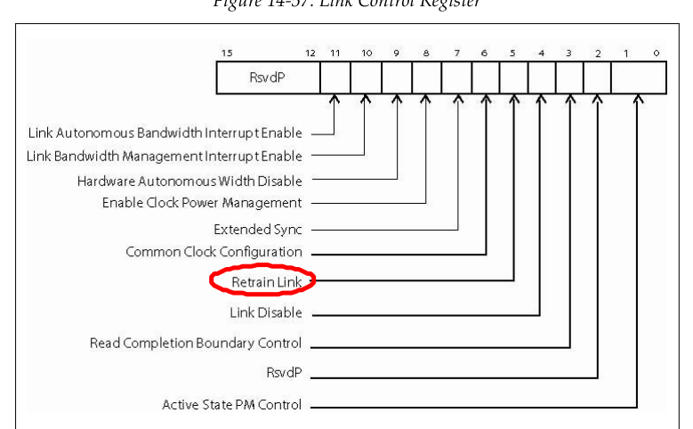

<a id="sec-14-7"></a>
## 14.7 Link Initialization & Training | 链路初始化与训练

<table>
<thead><tr><th width="50%">🇬🇧 English</th><th width="50%">🇨🇳 中文</th></tr></thead>
<tbody>
<tr>
<td width="50%">

The slave must be able to detect an Electrical Idle on any Lane within 1ms of EIOS being received. Between the time EIOS is received and
Electrical Idle is actually detected, the Loopback Slave may receive a bit stream that is undefined by the encoding scheme, and it may loop
that back to the trans‐ mitter.

</td>
<td width="50%">

第 626 页。请注意,有两种情况:自主和带宽管理。自主意味着更改不是由可靠性问题引起的,而带宽管理意味着是。

</td>
</tr>
<tr>
<td width="50%">

## **Loopback.Exit** 

During this substate, the Loopback Master sends an EIOS for Ports that support only 2.5 GT/s and eight consecutive EIOSs for Ports that
support rates higher than 2.5 GT/s (optionally send 8 for the Ports that only support 2.5 GT/s, too), and then enter Electrical Idle on all
Lanes for 2ms.

- The Loopback Master must transition to Electrical Idle within TTX‐IDLE‐SET‐ TO‐IDLE[after sending the last EIOS. Note that the EIOS marks
the end of] the master’s transmit and compare operations. Any data received by the master after any EIOS is received is undefined and should
be ignored.

The loopback slave must enter Electrical Idle on all Lanes for 2ms but must echo back all Symbols received prior to detecting Electrical
Idle to ensure that the master sees the arrival of the EIOS as the end of the logical send and compare operation.

</td>
<td width="50%">

## **PCI Express Technology** 

_Figure 14-53: Bandwidth Notification Capability_ 

_Figure 14-54: Bandwidth Change Notification Bits_ 

一旦到达 Recovery.Speed 子状态,链路将在两个方向上置于 Electrical Idle 条件,并且内部更改速度。所选速度将是 TS1 和 TS2 的 Rate ID 字段中报告的最高共同支持的速度。在此示例中,结果为 5.0
GT/s,因此将更改为该速度。经过一段时间后,链路邻居都转换回 Recovery.RcvrLock 并通过再次发送 TS1 退出 Electrical Idle,如图 14-55(第 627 页)所示。当上游端口看到它们返回时,它转换为 Recovery.RcvrCfg
并开始发送 TS2,类似于之前。但是,这次未设置 Speed Change 位。最终,从未设置 Speed Change 位的下游端口也看到了 TS2 返回,此时状态机转换到 Recovery.Idle,然后返回 L0。

如果速度更改由于某种原因失败,则不允许组件在返回 L0 后至少 200ms 或直到链路伙伴通告支持更高速度之前(以先到者为准)再尝试该速度或更高的速度。

</td>
</tr>
<tr>
<td width="50%">

## _Exit to “Detect State”_ 

The next state will be Detect once the required EIOSs have been exchanged and the Lanes have been in Electrical Idle for 2ms.

</td>
<td width="50%">

## **速度更改的软件控制** 

软件无法控制硬件何时做出更改速度的决定,但可以限制或禁用此功能。限制它是通过设置 Link Control 2 Register(如图 14-56(第 628 页)所示)中的 Target Link Speed
值来实现的。这充当上游端口可用速度的上限,它将尝试维持该值或两个链路邻居都支持的最高速度,以较低者为准。软件还可以通过在上游组件中设置 Target Link Speed 然后设置 Link Control 寄存器(如图 14-57(第 629 页)所示)中的 Retrain
Link 位来强制使用特定速度。如前所述,任何基于硬件的链路速度或宽度更改都会通过 Link Bandwidth Notification Mechanism 通知软件。最后,可以通过设置 Hardware Autonomous Speed Disable 位来禁用速度更改机制。

_Figure 14-56: Link Control 2 寄存器_ 

_Figure 14-57: Link Control 寄存器_

</td>
</tr>
<tr>
<td width="50%">

## **Dynamic Bandwidth Changes** 

Higher data rates and wider Links for PCIe offer higher performance than pre‐ vious generations but use more power, too. Consequently, the
2.0 spec writers chose to include another pair of power management mechanisms that allow the hardware to adjust the Link speed and width on
the fly. These allow the Link to use the highest speed and widest possible Link when performance is needed, or to drop down to a lower speed
or narrower Link width or both to reduce power. There are two clear advantages to this method compared to changing the Link or Device power
state.

First, the Link is always able to communicate regardless of the changes, with a relatively short interruption in service to make the change.
Second, the power saving can be greater. For example, a x16 Link would almost certainly use less power operating as an active x1 Link than
as a x16 Link in L0s.

Secondly, in addition to power conservation, bandwidth reductions can also be used to resolve reliability problems. For example, it may be
that a high speed Link produces unacceptable reliability, in which case either Link component is allowed to remove the offending speed from
the list of supported speeds that it advertises. How a component makes that reliability determination is not speci‐

fied. Interestingly, components are also permitted to go into the Recovery state and advertise a different set of supported speeds without
requesting a speed change in the process.

Changing the Link Speed or Link Width requires the Link to be re‐trained. When the Link is in the L0 state, and the speed needs to be
changed, the LTSSM of the port desiring the speed change starts transmitting TS1s to its neighbor. Doing so results in the two involved
ports’ LTSSMs going through Recovery state where the Link speed is changed and then back to L0.

Similarly, the port that desires to change the Link width starts transmitting TS1s to its neighbor. Doing so results in the two involved
ports’ LTSSMs going through Recovery state then Configuration state where the Link width is changed. The LTSSM finally returns to L0 with
the new Link width established.

Because the LTSSM is involved in dynamic Link bandwidth management, it makes sense to discuss the two aspects of Link bandwidth management,
dynamic Link speed change and dynamic Link width change in the following sections. Let’s consider these two options separately, starting
with Link speed changes.

</td>
<td width="50%">

## **Dynamic Link Width Changes** 

用于更改链路速度的相同基本操作也可用于更改链路宽度,尽管由于涉及更多 LTSSM 步骤,该序列稍微更复杂。在启用链路宽度更改之前,软件需要注意的一件重要事情是链路邻居是否支持从窄链路恢复到宽链路(称为 Upconfiguring the Link)。设备在训练期间发送的 TS2
的 Rate ID 字段的位 6 中报告此能力,如图 14-58(第 630 页)所示。如果组件不支持此功能,则意味着更改到较窄的链路宽度将是单向事件,并且仅适用于链路上存在可靠性问题的情况。

</td>
</tr>
<tr>
<td width="50%">

## **Dynamic Link Speed Changes** 

By way of review, the LTSSM states are illustrated in Figure 14‐45 on page 620 to make it easier to recall the flow of states. Although
according to the Gen1 specification, speed change was indicated to be performed in the Polling state, the subsequent Gen2 spec moved this
function to the Recovery state.

_Figure 14‐45: LTSSM Overview_ 


<br>


During the Polling state, TS1s are exchanged between Link neighbors, and these contain several kinds of information as shown in Figure 14‐46
on page 621. The most interesting part for us here is byte number 4, the Rate Identifier. Bits 1, 2 and 3 indicate which data rates are
available and the spec points out that 2.5 GT/s must always be supported, while 5.0 GT/s must also be supported if 8.0 GT/s is supported.

The meaning of bit 6 depends on whether the Port is facing upstream or down‐ stream and also on what LTSSM state the Port is in. However,
for the speed change case the options are reduced because it’s only meaningful coming from the Upstream Port and just indicates whether or
not the speed change is an autonomous event. “Autonomous” means that the Port is requesting this change for its own hardware‐specific
reasons and not because of a reliability issue. Bit 7 is used by the Upstream Port to request a speed change. These val‐ ues are very
similar in the TS2s, although bit 6 has another meaning now related to autonomous Link width changes that we’ll discuss later.

_Figure 14‐46: TS1 Contents_ 


<br>


_Figure 14‐47: TS2 Contents_ 


<br>

</td>
<td width="50%">

## **PCI Express Technology**

</td>
</tr>
<tr>
<td width="50%">

## **Upstream Port Initiates Speed Change** 

A speed change must be initiated by the Upstream Port (Port facing upstream), and is accomplished by transitioning to the Recovery state.
The substates of the Recovery state are shown in Figure 14‐48 on page 622 and the part of interest for this discussion is highlighted by the
oval. The discussion that follows here is a relatively high‐level overview of the entire speed change process and doesn’t get into the
details of the LTSSM operation. To learn more about that, refer to the discussion called “Recovery State” on page 571.

_Figure 14‐48: Recovery Sub‐States_ 


<br>

</td>
<td width="50%">

## **链路宽度更改示例** 

考虑图 14-59(第 631 页)中连接到端点 (千兆以太网设备) 的 Root Port 的示例。只有上游端口将发起此更改,并且它像之前一样通过进入 Recovery 状态来开始。但是,这次未设置 Speed Change
位。为了确定新的链路宽度是什么,上游端口将需要告诉下游端口从 Recovery 状态转换为 Configuration 状态,然后再返回 L0,如图 14-60(第 631 页)所示。Configuration 状态中有几个子状态,其简化版本如图 14-61(第 632
页)所示。我们将介绍该序列,以清楚地了解步骤的工作原理。

</td>
</tr>
<tr>
<td width="50%">

## **Speed Change Example** 

To illustrate the process, consider the speed change example shown in Figure 14‐49 on page 623. Note that the Equalization substate has been
removed in this example to make the diagrams simpler and easier to follow. The example shows a change from 2.5 GT/s to 5.0 GT/s and so the
Equalization substate is not used anyway. A change to 8.0 GT/s would go through the same process but would just add a trip through the
Equalization substate at the end of the process. To

learn more about the Equalization process, refer to “Recovery.Equalization” on page 587. 

The Endpoint in this example, which can only have an Upstream Port, is shown connected to a Root Complex, which can only have Downstream
Ports. Only the Upstream Port can initiate the speed change process, and it does so because its _Directed Speed Change_ flag was set earlier
based on some hardware‐specific con‐ ditions. To start the sequence, it changes its LTSSM to the Recovery state, enters the
Recovery.RcvrLock substate and sends TS1s with the Speed Change bit set and listing the speeds that it will support, as shown in Figure
14‐49 on page 623. When the Downstream Port sees the incoming TS1s, it also changes to the Recovery state and begins sending TS1s back.
Since the Speed Change bit was set in the incoming TS1s, that will set the _Directed Speed Change_ flag in the Root Port and the outgoing
TS1s will also have that bit set. The speed that the Link will attempt to use will be the highest commonly‐supported speed so, if a Device
wants to use a lower speed it would simply not list the higher speeds as being supported at this time.

_Figure 14‐49: Speed Change ‐ Initiated_ 


<br>


When the Upstream Port detects the TS1s coming back, its state machine changes to the Recovery.RcvrCfg substate and it begins to send TS2s
that still have the Speed Change bit set, as illustrated in Figure 14‐50 on page 624. These

TS2s will now also have the Autonomous Change bit set if this change was not caused by a reliability problem on the Link. When the
Downstream Port sees incoming TS2s, it also changes to the Recovery.RcvrCfg substate and returns TS2s with the Speed Change bit set.
However, the Autonomous Change bit is reserved in the TS2s for Downstream Ports during Recovery.

_Figure 14‐50: Speed Change ‐ Part 2_ 


<br>


Once each Port has seen 8 consecutive TS2s with the Speed Change bit set, they know that the next step will be to go to the Recovery.Speed
substate, as shown in Figure 14‐51 on page 625. At this point, the Downstream Port needs to regis‐ ter the setting of the Autonomous Change
bit in the incoming TS2s. To support this, some extra fields have been added to the PCIe Capability registers.

The status bits for Link bandwidth changes are found in the Link Status regis‐ ter, shown in Figure 14‐52 on page 625. Status changes can
also be used to gen‐ erate an interrupt to notify software of these events if the device is capable and has been enabled to do so. This
capability is reported by the Link Bandwidth Notification Capable bit, shown in Figure 14‐53 on page 626, and enabled by the Interrupt
Enable bits in the Link Control register, as shown in Figure 14‐54 on

</td>
<td width="50%">

## **PCI Express Technology** 

与之前一样,上游端口通过进入 Recovery 并发送 TS1 来启动此过程。这些未设置 Speed Change 位,如第 631 页的 Figure 14-59 中突出显示的示例所示,其中以太网设备在其上游端口上启动此过程。作为响应,下游端口发回 TS1,也清除了 Speed
Change 位。Link 和 Lane 编号仍显示为与上次训练链路时未更改。参考第 622 页的 Figure 14-48,下一个状态是 Recovery.RcvrCfg,在该状态中链路伙伴交换 TS2。

由于未请求速度更改,因此下一个状态是 Recovery.Idle。在该状态下,端口通常发送逻辑空闲符号(全零),下游端口会这样做,如图 14-63(第 634 页)所示。但是,上游端口被指示更改链路宽度,因此它不会发送预期的 Idle 符号。相反,它发送 Link 和 Lane
编号均为 PAD 的 TS1。下游端口识别出先前配置的 Lane 现在的 Lane 编号为 PAD,这会导致其转换为第一个 Configuration 子状态:Config.Linkwidth.Start。

</td>
</tr>
<tr>
<td width="50%">

</td>
<td width="50%">

## **PCI Express Technology**

</td>
</tr>
<tr>
<td width="50%">

</td>
<td width="50%">

## 下游端口现在通过发送具有原始协商的 Link 编号但所有 Lane 编号为 PAD 的 TS1 来启动下一步,如图 14-64(第 635 页)所示。上游端口在其希望"活动"的 Lane 上以匹配的 TS1 进行响应,但在其希望处于非活动状态的 Lane 上以 Link 和
Lane 编号均为 PAD 进行响应。当下游端口看到此响应时,它将转换为 Config.Linkwidth.Accept 子状态。请注意,这些 TS1 设置了 Autonomous Change 位。

</td>
</tr>

</tbody>
</table>

<p align="center"><b>Figure 14-51: 速度更改 - 第 3 部分</b></p>
<p align="center"></p>
<p align="center"><sub>📄 <a href="figures/chapter_14_Link_Initialization_Training/embedded/page0688_img1.png">Page 688</a></sub></p>


<p align="center"><b>Figure 14-55: 速度更改完成</b></p>
<p align="center"></p>
<p align="center"><sub>📄 <a href="figures/chapter_14_Link_Initialization_Training/embedded/page0684_img1.png">Page 684</a></sub></p>


<p align="center"><b>Figure 14-58: TS2 内容</b></p>
<p align="center"></p>
<p align="center"><sub>📄 <a href="figures/chapter_14_Link_Initialization_Training/embedded/page0685_img1.png">Page 685</a></sub></p>


<p align="center"><b>Figure 14-59: 链路宽度更改示例</b></p>
<p align="center"></p>
<p align="center"><sub>📄 <a href="figures/chapter_14_Link_Initialization_Training/embedded/page0687_img1.png">Page 687</a></sub></p>


<p align="center"><b>Figure 14-60: 链路宽度更改 LTSSM 序列</b></p>
<p align="center"></p>
<p align="center"><sub>📄 <a href="figures/chapter_14_Link_Initialization_Training/embedded/page0688_img1.png">Page 688</a></sub></p>


<p align="center"><b>Figure 14-61: 简化的 Configuration 子状态</b></p>
<p align="center"></p>
<p align="center"><sub>📄 <a href="figures/chapter_14_Link_Initialization_Training/embedded/page0684_img1.png">Page 684</a></sub></p>


<p align="center"><b>Figure 14-62: 链路宽度更改 - 开始</b></p>
<p align="center"></p>
<p align="center"><sub>📄 <a href="figures/chapter_14_Link_Initialization_Training/embedded/page0685_img1.png">Page 685</a></sub></p>


<p align="center"><b>Figure 14-63: 链路宽度更改 - Recovery.Idle</b></p>
<p align="center"></p>
<p align="center"><sub>📄 <a href="figures/chapter_14_Link_Initialization_Training/embedded/page0687_img1.png">Page 687</a></sub></p>


<p align="center"><b>Figure 14-64: 标记活动 Lane</b></p>
<p align="center"></p>
<p align="center"><sub>📄 <a href="figures/chapter_14_Link_Initialization_Training/embedded/page0688_img1.png">Page 688</a></sub></p>

<table>
<thead><tr><th width="50%">🇬🇧 English</th><th width="50%">🇨🇳 中文</th></tr></thead>
<tbody>
<tr>

</tr>
</tbody>
</table>

[⬆️ 返回目录](#本章目录-table-of-contents)

---


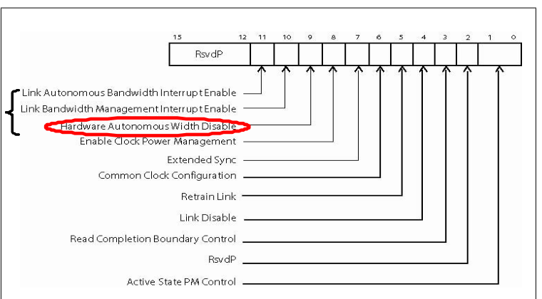

<a id="sec-14-8"></a>
## 14.8 Link Initialization & Training | 链路初始化与训练

<table>
<thead><tr><th width="50%">🇬🇧 English</th><th width="50%">🇨🇳 中文</th></tr></thead>
<tbody>
<tr>
<td width="50%">

page 626. Note that there are two cases: autonomous and bandwidth manage‐ men. Autonomous means the change was not caused by a reliability
problem, while bandwidth management means it was.

_Figure 14‐51: Speed Change ‐ Part 3_ 


<br>

</td>
<td width="50%">

Root Port 通过将其 TS1 更改为显示适合活动 Lane 的 Lane 编号,但对于看到非活动的所有 Lane 的 Link 和 Lane 编号使用 PAD 来响应。上游端口以相同的 TS1 进行响应,如图 14-65(第 636 页)所示,并且状态更改为
Config.Lanenum.Accept。此时,Root Port 更新状态位以显示检测到自主更改,并更改为 Config.Complete 子状态。

</td>
</tr>
<tr>
<td width="50%">

## **PCI Express Technology** 

_Figure 14‐53: Bandwidth Notification Capability_ 

_Figure 14‐54: Bandwidth Change Notification Bits_ 

Once the Recovery.Speed substate is reached, the Link is placed into the Electri‐ cal Idle condition in both directions and the speed is
changed internally. The speed chosen will be the highest commonly‐supported speed reported in the Rate ID field of the TS1s and TS2s. In
this example, that turns out to be 5.0 GT/s and so the change is made to that speed. After a timeout period, the Link neigh‐ bors both
transition back to Recovery.RcvrLock and exit Electrical Idle by send‐ ing TS1s again, as shown in Figure 14‐55 on page 627. When the
Upstream Port sees them coming back, it transitions to Recovery.RcvrCfg and begins sending TS2s, much like before. This time, though, the
Speed Change bit is not set. Even‐ tually TS2s are seen coming back from the Downstream Port that also don’t have the Speed Change bit set,
and at that point the state machines transition to the Recovery.Idle on their way back to L0.

If a speed change has fails for some reason, a component is not allowed to try that speed or a higher one for at least 200 ms after
returning to L0 or until the Link neighbor advertises support for a higher speed, whichever comes first.

_Figure 14‐55: Speed Change Finish_ 


<br>

</td>
<td width="50%">

## **PCI Express Technology**

</td>
</tr>
<tr>
<td width="50%">

## **Software Control of Speed Changes** 

Software is unable to control when hardware makes decisions about changing the speed but can limit or disable this capability. Limiting it
is accomplished by setting the Target Link Speed value in the Link Control 2 Register shown in Fig‐ ure 14‐56 on page 628. This acts as the
upper bound on the speeds available to

the Upstream Port, which will try to maintain that value or the highest speed supported by both Link neighbors, whichever is lower. Software
can also force a particular speed to be used by setting the Target Link Speed in the Upstream component and then setting the Retrain Link
bit in the Link Control register, shown in Figure 14‐57 on page 629. As mentioned earlier, software is notified of any hardware‐based Link
speed or width changes by the Link Bandwidth Noti‐ fication Mechanism. Finally, the speed change mechanism can be disabled by setting the
Hardware Autonomous Speed Disable bit.

_Figure 14‐56: Link Control 2 Register_ 

_Figure 14‐57: Link Control Register_

</td>
<td width="50%">

## 在下一步中,Root Port 开始在活动 Lane 上发送 TS2,并将非活动 Lane 置于 Electrical Idle。请记住,TS2 报告组件是否"支持 upconfigure",在此示例中,两个链路伙伴都支持此能力。端点发回相同的内容:活动 Lane 上的 TS2
和非活动 Lane 上的 Electrical Idle。看到这一点,Root Port 的状态机更改为 Config.Idle,并开始在活动 Lane 上发送 Logical Idle。端点以相同的内容进行响应,链路状态变回
L0。链路现在已准备好进行正常操作,尽管带宽已降低以节省功率。

与动态速度更改的情况一样,软件无法发起链路宽度更改,但它可以通过设置 Link Control 寄存器(如图 14-67(第 638 页)所示)中的相应位来禁用此机制。与速度更改情况不同,未定义允许设置特定链路宽度的软件机制。

</td>
</tr>
<tr>
<td width="50%">

## **Dynamic Link Width Changes** 

The same basic operation for changing the Link speed can also be used to change the Link width, although the sequence is a little more
complicated because more LTSSM steps are involved. One thing that’s important for soft‐ ware to note before enabling Link width changes is
whether the Link neighbor supports recovering from a narrow Link back to a wide Link (called Upconfig‐ uring the Link). Devices report this
ability in bit 6 of the Rate ID field of the TS2s they send during training, as shown in Figure 14‐58 on page 630. If a component doesn’t
support this, that would mean that changing to a narrower Link width would be a one‐way event and would only be suitable for the case of a
reliabil‐ ity problem on the Link.

_Figure 14‐58: TS2 Contents_ 


<br>

</td>
<td width="50%">

## **PCI Express Technology** 

_Figure 14-67: Link Control 寄存器_

</td>
</tr>
<tr>
<td width="50%">

## **Link Width Change Example** 

Consider the example in Figure 14‐59 on page 631 of a Root Port connected to an Endpoint (Gigabit Ethernet Device). Only the Upstream Port
will initiate this change, and it begins by going to the Recovery state as before. This time, though, the Speed Change bit is not set. To
sort out what the new Link width will be, the Upstream Port will need to tell the Downstream Port to transition from the Recovery state to
the Configuration state before going back to L0, as shown in Figure 14‐60 on page 631. There are several substates in the Configu‐ ration
state, and a simplified version of them is shown in Figure 14‐61 on page 632. We’ll go through the sequence to be clear on how the steps
work.

_Figure 14‐59: Link Width Change Example_ 


<br>


_Figure 14‐60: Link Width Change LTSSM Sequence_ 


<br>

</td>
<td width="50%">

## **相关配置寄存器** 

许多与链路初始化和训练相关的配置寄存器已在其内容描述时显示过,但在这里汇总它们似乎很好。

</td>
</tr>
<tr>
<td width="50%">

## **PCI Express Technology** 

_Figure 14‐61: Simplified Configuration Substates_ 


<br>


As before, the Upstream Port initiates this process by going to Recovery and sending TS1s. These don’t have the Speed Change bit set, as
highlighted in the example shown in Figure 14‐59 on page 631, where an Ethernet Device initiates this process on its Upstream Port. In
response, the Downstream Port sends TS1s back, also with the Speed Change bit cleared. Link and Lane numbers are still shown as being
unchanged from the last time the Link was trained. Referring back to Figure 14‐48 on page 622, the next state is Recovery.RcvrCfg during
which the Link partners exchange TS2s.

_Figure 14‐62: Link Width Change ‐ Start_ 


<br>


Since a speed change is not requested, the next state is Recovery.Idle. In that state the Ports normally send the logical idle symbols (all
zeros) and the Down‐ stream Port does so, as shown in Figure 14‐63 on page 634. However, the Upstream Port was directed to change the Link
width so it doesn’t send the expected Idle symbols. Instead, it sends TS1s with PAD for both the Link and Lane numbers. The Downstream Port
recognizes that a previously configured Lane now has a Lane number of PAD, and that causes it to transition to the first Configuration
substate: Config.Linkwidth.Start.

</td>
<td width="50%">

## **Link Capabilities 寄存器** 

Link Capabilities 寄存器如图 14-68(第 639 页)所示,每个位字段在以下小节中描述。

</td>
</tr>
<tr>
<td width="50%">

## _Figure 14‐63: Link Width Change ‐ Recovery.Idle_ 


<br>


The Downstream Port now initiates the next step by sending TS1s that have the originally negotiated Link number but PAD on all the Lane
numbers, as illus‐ trated in Figure 14‐64 on page 635. The Upstream Port responds with matching TS1s on the Lanes it wants to have “active”,
but with PAD for both Link and Lane numbers on the Lanes it wishes to have inactive. When the Downstream Port sees this response, it
transitions to the Config.Linkwidth.Accept substate. Note that the Autonomous Change bit is set for these TS1s.

_Figure 14‐64: Marking Active Lanes_ 


<br>

</td>
<td width="50%">

## ## **Max Link Speed [3:0]** 

这指示此端口的最大链路速度,并作为指向 Link Capabilities 2 寄存器 Supported Link Speeds Vector 中对应于最大链路速度的位位置的指针给出。已定义的编码为:

- 0001b - Supported Link Speeds Vector 字段位 0 

- 0010b - Supported Link Speeds Vector 字段位 1 

- 0011b - Supported Link Speeds Vector 字段位 2 

- 0100b - Supported Link Speeds Vector 字段位 3 

- 0101b - Supported Link Speeds Vector 字段位 4 

- 0110b - Supported Link Speeds Vector 字段位 5 

- 0111b - Supported Link Speeds Vector 字段位 6 

所有其他编码均保留。共享上游端口的多功能设备必须在所有 Function 中的此字段中报告相同的值。此寄存器为只读。

</td>
</tr>
<tr>
<td width="50%">

</td>
<td width="50%">

## **PCI Express Technology**

</td>
</tr>
<tr>
<td width="50%">

</td>
<td width="50%">

## **Maximum Link Width[9:4]** 

此字段指示 PCI Express 链路的最大宽度。定义的值有:

- 00 0000b: 保留 

- 00 0001b: x1 

- 00 0010b: x2 

- 00 0100b: x4 

- 00 1000b: x8 

- 00 1100b: x12 

- 01 0000b: x16 

- 10 0000b: x32 

所有其他编码均保留。共享上游端口的多功能设备必须在所有 Function 中的此字段中报告相同的值。此寄存器为只读。

</td>
</tr>
<tr>
<td width="50%">

</td>
<td width="50%">

## **Link Capabilities 2 寄存器** 

Link Capabilities 寄存器如图 14-68(第 639 页)所示,并显示 Link Capabilities 寄存器中的 Max Link Speed 字段所指向的 Supported Link Speeds Vector。此字段的值为:

- 位 0 = 2.5 GT/s 

- 位 1 = 5.0 GT/s 

- 位 2 = 8.0 GT/s 

- 位 6:3 RsvdP(保留并保留)。

</td>
</tr>
<tr>
<td width="50%">

</td>
<td width="50%">

## **Link Status 寄存器** 

Link Status 寄存器如图 14-39(第 597 页)所示。

</td>
</tr>
<tr>
<td width="50%">

</td>
<td width="50%">

## **Current Link Speed[3:0]:** 

此只读字段指示当前链路速度。当链路首次训练到 L0 时,速度始终为 2.5 GT/s。之后,如果可获得更高的共同支持的速度,LTSSM 将进入 Recovery 并尝试更改为该速度。此字段中的值与 Link Capabilities 寄存器中显示的 Max Link Speed
编码相同:

- 0001b - Supported Link Speeds Vector 字段位 0 

- 0010b - Supported Link Speeds Vector 字段位 1 

- 0011b - Supported Link Speeds Vector 字段位 2 

- 0100b - Supported Link Speeds Vector 字段位 3 

- 0101b - Supported Link Speeds Vector 字段位 4 

- 0110b - Supported Link Speeds Vector 字段位 5 

- 0111b - Supported Link Speeds Vector 字段位 6 

所有其他编码均保留。

请注意,当链路未启动时(LinkUp = 0b),此字段的值是未定义的。

</td>
</tr>
<tr>
<td width="50%">

</td>
<td width="50%">

## **Negotiated Link Width[9:4]** 

此字段指示链路宽度协商的结果。有七种可能的宽度,所有其他编码均保留。已定义的编码为:

- 00 0001b: 对于 x1。 

- 00 0010b: 对于 x2。 

- 00 0100b: 对于 x4。 

- 00 1000b: 对于 x8。 

- 00 1100b: 对于 x12。 

- 01 0000b: 对于 x16。 

- 10 0000b: 对于 x32。 

所有其他编码均保留。请注意,当链路未启动时(LinkUp = 0b),此字段的值是未定义的。

</td>
</tr>
<tr>
<td width="50%">

</td>
<td width="50%">

## **PCI Express Technology**

</td>
</tr>
<tr>
<td width="50%">

</td>
<td width="50%">

## **Undefined[10]** 

当前未定义,此位在早期规范版本中由硬件在发生链路训练错误时设置。它在 LTSSM 成功进入 L0 时被清除。规范指出,软件可以向此位写入任何值,但必须忽略从中读取的任何值。

</td>
</tr>
<tr>
<td width="50%">

</td>
<td width="50%">

## **Link Training[11]** 

此只读位指示 LTSSM 正在训练过程中。从技术上讲,它意味着 LTSSM 处于 Configuration 或 Recovery 状态,或者 Retrain Link 位已写入 1b 但链路训练尚未开始。当 LTSSM 退出 Configuration 或 Recovery
状态时,此位由硬件清除。由于这必须在链路训练进行时对软件可见,因此它仅对面向下游的端口有意义。因此,对于端点、桥接器上游端口和交换机上游端口,此位不适用并保留。对于它们,此位必须硬连线为 0b。

</td>
</tr>
<tr>
<td width="50%">

</td>
<td width="50%">

## **Link Control 寄存器** 

Link Control 寄存器如图 14-71(第 644 页)所示,其中有三个字段对我们来说是有意义的。

</td>
</tr>
<tr>
<td width="50%">

</td>
<td width="50%">

## **Link Disable** 

当设置为 1 时,链路被禁用。直观地说,此位不适用,对于端点、桥接器上游端口和交换机上游端口是保留的,因为即使链路被禁用,它也必须可由软件访问。写入此位后,任何读取立即反映写入的值,与链路状态无关。清除此位后,软件必须小心遵守有关 Conventional Reset 后首次
Configuration 读取的时序要求(参见第 846 页的"Reset Exit")。

</td>
</tr>
<tr>
<td width="50%">

</td>
<td width="50%">

## **Retrain Link** 

只要认为有必要,例如用于错误恢复,此位允许软件发起链路重新训练。该位不适用于端点设备以及桥接器和交换机的上游端口,并为其保留。当设置为 1b 时,这将在 Configuration 写入请求完成返回之前将 LTSSM 定向到 Recovery 状态。

</td>
</tr>
<tr>
<td width="50%">

</td>
<td width="50%">

## **Extended Synch** 

就其对训练的影响而言,此位用于大幅延长两种情况下的时间,以帮助较慢的外部测试或分析硬件在链路恢复正常通信之前与之同步。其中一种是在退出 L0s 时,设置此位强制在进入 L0 之前传输 4096 个 FTS。另一种情况是在进入 Recovery.RcvrCfg 之前的
Recovery 状态中,它强制传输 1024 个 TS1。

</td>
</tr>
<tr>
<td width="50%">

</td>
<td width="50%">

## **PCI Express Technology**

</td>
</tr>
<tr>
<td width="50%">

</td>
<td width="50%">

## ## Part Five: 

# Additional System Topics

</td>
</tr>
<tr>
<td width="50%">

</td>
<td width="50%">

## _**15 Error Detection and Handling**_ 

## **The Previous Chapter**

</td>
</tr>

</tbody>
</table>

<p align="center"><b>Figure 14-65: 对 Lane 编号更改的响应</b></p>
<p align="center"></p>
<p align="center"><sub>📄 <a href="figures/chapter_14_Link_Initialization_Training/embedded/page0685_img1.png">Page 685</a></sub></p>


<p align="center"><b>Figure 14-66: 链路宽度更改 - 完成</b></p>
<p align="center"></p>
<p align="center"><sub>📄 <a href="figures/chapter_14_Link_Initialization_Training/embedded/page0687_img1.png">Page 687</a></sub></p>


<p align="center"><b>Figure 14-68: Link Capabilities 寄存器</b></p>
<p align="center"></p>
<p align="center"><sub>📄 <a href="figures/chapter_14_Link_Initialization_Training/embedded/page0688_img1.png">Page 688</a></sub></p>


<p align="center"><b>Figure 14-69: Link Capabilities 2 寄存器</b></p>
<p align="center"></p>
<p align="center"><sub>📄 <a href="figures/chapter_14_Link_Initialization_Training/embedded/page0684_img1.png">Page 684</a></sub></p>


<p align="center"><b>Figure 14-70: Link Status 寄存器</b></p>
<p align="center"></p>
<p align="center"><sub>📄 <a href="figures/chapter_14_Link_Initialization_Training/embedded/page0685_img1.png">Page 685</a></sub></p>


<p align="center"><b>Figure 14-71: Link Control 寄存器</b></p>
<p align="center"></p>
<p align="center"><sub>📄 <a href="figures/chapter_14_Link_Initialization_Training/embedded/page0687_img1.png">Page 687</a></sub></p>

<table>
<thead><tr><th width="50%">🇬🇧 English</th><th width="50%">🇨🇳 中文</th></tr></thead>
<tbody>
<tr>

</tr>
</tbody>
</table>

[⬆️ 返回目录](#本章目录-table-of-contents)

---

<a id="sec-14-9"></a>
## 14.9 Link Initialization & Training | 链路初始化与训练

<table>
<thead><tr><th width="50%">🇬🇧 English</th><th width="50%">🇨🇳 中文</th></tr></thead>
<tbody>
<tr>
<td width="50%">

The Root Port responds by changing its TS1s to show Lane numbers that are appropriate for the active Lanes, but PAD for the Link and Lane
numbers of all the Lanes that were seen to be inactive. The Upstream Port responds with the same TS1s, as shown in Figure 14‐65 on page 636,
and the state changes to Con‐ fig.Lanenum.Accept. At this point, the Root Port updates the status bit to show that an autonomous change was
detected and changes to the Config.Complete substate.

</td>
<td width="50%">

本章描述了物理层 (Physical Layer) 的链路训练和状态状态机 (LTSSM) 的操作。链路的初始化过程从电源开启或复位开始描述,直到链路达到完全可操作的 L0 状态,在该状态下发生正常的分组流量。此外,还讨论了链路电源管理状态 L0s、L1、L2 和 L3
以及状态转换。描述了在其中重新建立位锁、符号锁或块锁的 Recovery 状态。还讨论了用于链路带宽管理的链路速度和宽度更改。

</td>
</tr>
<tr>
<td width="50%">

## **PCI Express Technology**

</td>
<td width="50%">

## **本章** 

虽然始终注意最小化错误,但无法消除它们,因此检测和报告它们是一个重要的考虑因素。本章讨论了发生在 PCIe 端口或链路中的错误类型,如何检测、报告以及处理选项。由于 PCIe 被设计为与 PCI 错误报告向后兼容,因此包括对 PCI 错误处理方法的审查作为背景信息。然后我们专注于
PCIe 错误处理的可纠正、非致命和致命错误。

</td>
</tr>
<tr>
<td width="50%">

## _Figure 14‐65: Response to Lane Number Changes_ 


<br>


In the next step, the Root Port begins to send TS2s on the active Lanes and puts the inactive Lanes into Electrical Idle. Recall that the
TS2s report whether a com‐ ponent is “upconfigure capable” and in this example, both Link partners sup‐ port this capability. The Endpoint
sends back the same thing: TS2s on active Lanes and Electrical Idle on inactive Lanes. Seeing that, the Root Port’s state machine changes to
Config.Idle and it begins to send Logical Idle on the active Lanes. The Endpoint responds with the same thing and the Link state changes
back to L0. The Link is now ready for normal operation, albeit with a reduced bandwidth for power conservation.

_Figure 14‐66: Link Width Change ‐ Finish_ 


<br>


As was the case for dynamic speed changes, software can’t initiate Link width changes, but it can disable this mechanism by setting the bit
in the Link Control register shown in Figure 14‐67 on page 638. Unlike the speed change case, no software mechanism was defined to allow
setting a particular Link width.

</td>
<td width="50%">

## **下一章** 

下一章为系统电源管理的讨论提供整体上下文,并详细描述 PCIe 电源管理,它与 _PCI Bus PM Interface Spec_ 和 _Advanced Configuration and Power Interface_ (ACPI) 兼容。PCIe 定义了对
PCI-PM 规范的扩展,主要侧重于链路电源和事件管理。

</td>
</tr>
<tr>
<td width="50%">

## **PCI Express Technology** 

_Figure 14‐67: Link Control Register_

</td>
<td width="50%">

## **PCI Express Technology**

</td>
</tr>
<tr>
<td width="50%">

## **Related Configuration Registers** 

Many of the configuration registers that are relevant to Link Initialization and Training have been shown when their contents were described
earlier, but it seems good to summarize them here.

</td>
<td width="50%">

## **背景** 

与 PCI 的软件向后兼容性是 PCIe 的一个重要特性,这是通过保留已就位的 PCI 配置寄存器来实现的。PCI
在总线的每个传输阶段验证正确的奇偶校验以检查错误。检测到的错误记录在状态寄存器中,并且可以选择使用两个边带信号中的任一个进行报告:PERR#(奇偶校验错误)用于数据传输期间潜在可恢复的奇偶校验错误,SERR#(系统错误)用于通常不可恢复的更严重的问题。这两种类型可分类如下:

- 普通数据奇偶校验错误 — 通过 PERR# 报告 

- 多任务事务(特殊周期)期间的数据奇偶校验错误 — 通过 SERR# 报告 

- 地址和命令奇偶校验错误 — 通过 SERR# 报告 

- • 其他类型的错误(设备特定) — 通过 SERR# 报告 

应如何处理错误不在 PCI 规范的范围内,可能包括硬件支持或设备特定软件。例如,对内存的读取期间的数据奇偶校验错误可以通过检测条件并简单地重复请求在硬件中恢复。如果失败的操作未更改内存内容,则这将是安全的步骤。

如图 15-1(第 649 页)所示,两个错误引脚通常连接到芯片组,并用于在消费 PC 中向 CPU 发出信号。这些机器对成本非常敏感,因此它们通常没有足够的错误处理预算。因此,所选择的最终错误报告信号是从芯片组到处理器的 NMI(Non-Maskable
Interrupt)信号,指示需要立即关注的重大系统问题。大多数消费 PC 不包括这种情况的错误处理程序,因此系统将简单地停止以避免损坏,并且 BSOD(蓝屏死机)将通知操作员。SERR#
条件的示例是事务命令阶段期间看到的地址奇偶校验不匹配。这是潜在破坏性的情况,因为错误的目标可能会响应。如果发生这种情况并且 SERR# 报告它,恢复将很困难,并且可能需要大量软件开销。(要了解有关 PCI 错误处理的更多信息,请参阅 MindShare 的书 _PCI
System Architecture_ 。)

PCI-X 使用相同的两个错误报告信号,但定义具体的错误处理要求,具体取决于是否存在设备特定的错误处理软件。如果不存在此类处理程序,则所有奇偶校验错误都将使用 SERR# 报告。

</td>
</tr>
<tr>
<td width="50%">

## **Link Capabilities Register** 

The Link Capabilities Register is pictured in Figure 14‐68 on page 639 and each bit field is described in the subsections that follow.

</td>
<td width="50%">

## PCI-X 2.0 使用源同步时钟来实现更快的数据速率(高达 4GB/s)。该总线面向高端企业系统,因为它通常对于消费类机器来说过于昂贵。由于这些高性能系统还需要高可用性,规范作者选择通过添加纠错码 (ECC) 支持来改进错误处理。ECC
允许更强大的错误检测,并能够即时纠正单位错误。ECC 在最小化传输错误的影响方面非常有用。(要了解有关 PCI-X 错误处理的更多信息,请参阅 MindShare 的书 _PCI-X System Architecture_ 。)

PCIe 通过使用旧版配置寄存器中的错误状态位来记录与 PCI 相似的 PCIe 错误事件,从而保持与这些旧版机制的向后兼容性。这使旧版软件能够以其理解的术语查看 PCIe 错误事件,并允许它与 PCIe 硬件一起使用。有关这些寄存器的详细信息,请参阅第 674
页的"PCI-Compatible Error Reporting Mechanisms"。

</td>
</tr>
<tr>
<td width="50%">

## _Figure 14‐68: Link Capabilities Register_ 


<br>

</td>
<td width="50%">

## **PCI Express Technology**

</td>
</tr>
<tr>
<td width="50%">

## **Max Link Speed [3:0]** 

This indicates the maximum Link speed for this port, and is given as a pointer to a bit location in the Link Capabilities 2 register
Supported Link Speeds Vector that corresponds to the max Link speed. Defined encodings are:

- 0001b ‐ Supported Link Speeds Vector field bit 0 

- 0010b ‐ Supported Link Speeds Vector field bit 1 

- 0011b ‐ Supported Link Speeds Vector field bit 2 

- 0100b ‐ Supported Link Speeds Vector field bit 3 

- 0101b ‐ Supported Link Speeds Vector field bit 4 

- 0110b ‐ Supported Link Speeds Vector field bit 5 

- 0111b ‐ Supported Link Speeds Vector field bit 6 

All other encodings are reserved. Multi‐function devices sharing an Upstream Port must report the same value in this field in all Functions.
This register is Read Only.

</td>
<td width="50%">

## **PCIe 错误定义** 

规范使用四个关于错误的一般术语,在此处定义:

1. **错误检测 (Error Detection)** - 确定存在错误的过程。错误由代理作为本地问题的结果发现,例如接收到坏分组,或者因为它从另一个设备接收到指示错误的分组(例如中毒分组)。

2. **错误记录 (Error Logging)** - 根据检测到的错误在架构寄存器中设置适当的位,以帮助错误处理软件。

3. **错误报告 (Error Reporting)** - 通知系统存在错误条件。这可以采用将错误消息传递到根复合体的形式,假设设备已启用发送错误消息。根复合体在接收到错误消息时可以向系统发送中断。

4. **错误信号 (Error Signaling)** - 一个代理通过发送错误消息,或发送具有 UR(Unsupported Request)或 CA(Completer Abort)状态的完成,或对 TLP 进行
Poisoning(也称为错误转发),通知另一个代理的错误条件的过程。

</td>
</tr>
<tr>
<td width="50%">

## **Maximum Link Width[9:4]** 

This field indicates the maximum width of the PCI Express Link. The values that are defined are: 

- 00 0000b: Reserved 

- 00 0001b: x1 

- 00 0010b: x2 

- 00 0100b: x4 

- 00 1000b: x8 

- 00 1100b: x12 

- 01 0000b: x16 

- 10 0000b: x32 

All other encodings are reserved. Multi‐function devices sharing an Upstream Port must report the same value in this field in all Functions.
This register is Read Only.

</td>
<td width="50%">

## **PCIe 错误报告** 

为 PCIe 定义了两个错误报告级别。第一个是所有设备所需的基线功能。这包括对旧版错误报告的支持以及对 PCIe
错误报告的基本支持。第二个是可选的高级错误报告功能,它添加了一组新的配置寄存器,并跟踪更多有关已发生错误、严重程度以及在某些情况下甚至可以记录导致错误的分组的详细信息。

</td>
</tr>
<tr>
<td width="50%">

## **Link Capabilities 2 Register** 

The Link Capabilities Register is pictured in Figure 14‐68 on page 639 and shows the Supported Link Speeds Vector to which the Max Link
Speed field in the Link Capabilities register points. The values for this field are:

- Bit 0 = 2.5 GT/s 

- Bit 1 = 5.0 GT/s 

- Bit 2 = 8.0 GT/s 

- Bits 6:3 RsvdP (reserved and preserved). 

_Figure 14‐69: Link Capabilities 2 Register_ 


<br>

</td>
<td width="50%">

## **基线错误报告** 

在所有设备中需要两组配置寄存器来支持基线错误报告。这些在第 674 页的"基线错误检测和处理"中详细描述,此处汇总如下:

- PCI 兼容寄存器 — 这些是与 PCI 使用的相同寄存器,并为现有的 PCI 兼容软件提供向后兼容性。为了使其工作,PCIe 错误映射到 PCI 兼容错误,使它们对旧版软件可见。
- PCI Express 功能寄存器 — 这些寄存器仅对了解 PCIe 的较新软件有用,但它们提供专门针对 PCIe 软件的更多错误信息。

</td>
</tr>
<tr>
<td width="50%">

## **Link Status Register** 

The Link Status Register is pictured in Figure 14‐39 on page 597.

</td>
<td width="50%">

## **高级错误报告 (AER)** 

此可选的错误报告机制包括一组新的专用配置寄存器,可为错误处理软件提供更多信息以用于诊断和恢复问题。AER 寄存器映射到扩展配置空间中,并提供有关任何错误性质的更多信息。有关这些寄存器的详细说明,请参阅第 685 页的"Advanced Error Reporting
(AER)"。

</td>
</tr>
<tr>
<td width="50%">

## **Current Link Speed[3:0]:** 

This read‐only field indicates the current Link speed. The speed will always be 2.5 GT/s when the Link first trains to L0. After that, if a
higher commonly‐sup‐ ported speed is available, the LTSSM will go to Recovery and attempt to change to that speed. The values in this field
are the same as the Max Link Speed encod‐ ings shown in the Link Capabilities register:

- 0001b ‐ Supported Link Speeds Vector field bit 0 

- 0010b ‐ Supported Link Speeds Vector field bit 1 

- 0011b ‐ Supported Link Speeds Vector field bit 2 

- 0100b ‐ Supported Link Speeds Vector field bit 3 

- 0101b ‐ Supported Link Speeds Vector field bit 4 

- 0110b ‐ Supported Link Speeds Vector field bit 5 

- 0111b ‐ Supported Link Speeds Vector field bit 6 

All other encodings are reserved. 

Note that the value of this field is undefined when the Link is not up (LinkUp = 0b).

</td>
<td width="50%">

## **错误类别** 

根据硬件是否能够修复问题,错误分为两大类:可纠正 (Correctable) 和不可纠正 (Uncorrectable)。不可纠正类别进一步细分为软件是否可以修复问题:非致命 (Non-fatal) 和致命 (Fatal)。

- 可纠正错误 — 由硬件自动处理 

- 不可纠正错误 

- 非致命 — 由设备特定软件处理;链路仍可操作,可以在不丢失数据的情况下恢复 

- 致命 — 由系统软件处理;链路或设备无法正常工作,并且在不丢失数据的情况下不太可能恢复 

基于这些类别,错误处理软件可以分区为单独的处理程序以执行所需的操作。此类操作的范围可能从简单地监视可纠正错误的频率到在致命错误事件中重置整个系统。无论错误类型如何,软件都可以安排通知系统所有错误,以允许跟踪和记录它们。

</td>
</tr>
<tr>
<td width="50%">

## **Negotiated Link Width[9:4]** 

This field indicates the result of link width negotiation. There are seven possible widths, all other encodings are reserved. The defined
encodings are:

- 00 0001b: for x1. 

- 00 0010b for x2. 

- 00 0100b for x4. 

- 00 1000b for x8. 

- 00 1100b for x12. 

- 01 0000b for x16. 

- 10 0000b for x32. 

All other encodings are reserved. Note that the value of this field is undefined when the Link is not up (LinkUp = 0b).

</td>
<td width="50%">

## **可纠正错误** 

根据定义,可纠正错误在硬件中自动纠正。它们可能会通过增加延迟和消耗带宽来影响性能,但如果一切顺利,恢复是自动且快速的,因为它不依赖于软件干预,并且在此过程中不会丢失信息。这些错误不需要报告给软件,但这样做可以允许软件跟踪可能表明某些设备显示出即将发生故障迹象的错误趋势。

</td>
</tr>
<tr>
<td width="50%">

## **Undefined[10]** 

Currently undefined, this bit was previously set by hardware in earlier spec ver‐ sions when a Link Training Error had occurred. It was
cleared when the LTSSM successfully entered L0. The spec states that software can write any value to this bit but must ignore any value read
from it.

</td>
<td width="50%">

## **PCI Express Technology**

</td>
</tr>
<tr>
<td width="50%">

## **Link Training[11]** 

This read‐only bit indicates that the LTSSM is in the process of training. Techni‐ cally, it means the LTSSM is either in the Configuration
or Recovery state, or that the Retrain Link bit has been written to 1b but Link training has not yet begun. This bit is cleared by hardware
when the LTSSM exits the Configuration or Recovery state. Since this must be visible to software while Link Training is in progress, it only
has meaning for Ports that are facing downstream. Conse‐ quently, this bit is not applicable and reserved for Endpoints, bridge Upstream
Ports and Switch Upstream Ports. For them, this bit must be hardwired to 0b.

_Figure 14‐70: Link Status Register_ 


<br>

</td>
<td width="50%">

## **不可纠正错误** 

无法在硬件中自动纠正的错误称为不可纠正错误,这些错误的严重性为非致命或致命。

</td>
</tr>
<tr>
<td width="50%">

## **Link Control Register** 

The Link Control Register is pictured in Figure 14‐71 on page 644, and there are three fields in it that are interesting for us here.

</td>
<td width="50%">

## **非致命的不可纠正错误** 

非致命错误表明信息已丢失,但原因可能不是链路或设备的完整性。一个分组在某处失败,但链路继续正常运行,其他分组不受影响。由于链路仍在工作,因此可能可以恢复丢失的信息,但这将依赖于特定于实现的软件来处理。此类错误的示例是完成超时,其中已发送请求但在允许的时间内未返回完成。某处存在问题,但这可能只是交换机中的随机位错误,导致完成被错误路由。对于这种情况的恢复尝试可以像重新发出请求一样简单。

## **致命的不可纠正错误**

</td>
</tr>
<tr>
<td width="50%">

## **Link Disable** 

When set to one, the link is disabled. Intuitively, this bit isn’t applicable and is reserved for Endpoints, bridge Upstream Ports, and
Switch Upstream Ports because it must be accessible by software even when the Link is disabled. When this bit is written, any read
immediately reflects the value written, regardless of the Link state. After clearing this bit, software must be careful to honor the tim‐
ing requirements regarding the first Configuration Read after a Conventional Reset (see “Reset Exit” on page 846).

</td>
<td width="50%">

</td>
</tr>
<tr>
<td width="50%">

## **Retrain Link** 

This bit allows software to initiate Link re‐training whenever it is deemed nec‐ essary, as for error recovery. The bit is not applicable to
and is reserved for End‐ point devices and Upstream Ports of Bridges and Switches. When set to 1b, this directs the LTSSM to the Recovery
state before the completion of the Configura‐ tion write Request is returned.

</td>
<td width="50%">

</td>
</tr>
<tr>
<td width="50%">

## **Extended Synch** 

As it affects training, this bit is used to greatly extend the time spent in two situ‐ ations, for the purpose of assisting slower external
test or analysis hardware to synchronize with the Link before it resumes normal communication. One of these is when exiting L0s, where
setting this bit forces the transmission of 4096 FTSs prior to entering L0. The other case is in the Recovery state prior to enter‐ ing
Recovery.RcvrCfg, where it forces the transmission of 1024 TS1s.

</td>
<td width="50%">

</td>
</tr>
<tr>
<td width="50%">

## _Figure 14‐71: Link Control Register_ 


<br>

</td>
<td width="50%">

</td>
</tr>
<tr>
<td width="50%">

## Part Five: 

# Additional System Topics

</td>
<td width="50%">

</td>
</tr>
<tr>
<td width="50%">

## _**15 Error Detection and Handling**_ 

## **The Previous Chapter**

</td>
<td width="50%">

</td>
</tr>

</tbody>
</table>

<p align="center"><b>Figure 15-1: PCI 错误处理</b></p>
<p align="center"></p>
<p align="center"><sub>📄 <a href="figures/chapter_14_Link_Initialization_Training/embedded/page0685_img1.png">Page 685</a></sub></p>

<table>
<thead><tr><th width="50%">🇬🇧 English</th><th width="50%">🇨🇳 中文</th></tr></thead>
<tbody>
<tr>

</tr>
</tbody>
</table>

[⬆️ 返回目录](#本章目录-table-of-contents)

---

<a id="sec-14-10"></a>
## 14.10 Link Initialization & Training | 链路初始化与训练

<table>
<thead><tr><th width="50%">🇬🇧 English</th><th width="50%">🇨🇳 中文</th></tr></thead>
<tbody>
<tr>
<td width="50%">

This chapter describes the operation of the Link Training and Status State Machine (LTSSM) of the Physical Layer. The initialization process
of the Link is described from Power‐On or Reset until the Link reaches fully‐operational L0 state during which normal packet traffic occurs.
In addition, the Link power management states L0s, L1, L2, and L3 are discussed along with the state transi‐ tions. The Recovery state,
during which bit lock, symbol lock or block lock are re‐established is described. Link speed and width change for Link bandwidth management
is also discussed.

</td>
<td width="50%">

致命错误表明链路或设备已发生操作故障,导致不太可能恢复的数据丢失。对于这些情况,至少重置失败的链路或设备可能是任何恢复过程中的第一步,因为它显然由于某种原因无法运行。规范还邀请特定于实现的方法,其中软件可以尝试限制故障的影响,但它没有定义应采取的任何特定操作。此类错误的示例是接收器缓冲区溢出,在这种情况下,由于流控制跟踪计数器彼此不同步而丢失了信息。由于没有机制可以解决此问题,因此通常需要重置此链路。

</td>
</tr>
<tr>
<td width="50%">

## **This Chapter** 

Although care is always taken to minimize errors they can’t be eliminated, so detecting and reporting them is an important consideration.
This chapter dis‐ cusses error types that occur in a PCIe Port or Link, how they are detected, reported, and options for handling them.
Since PCIe is designed to be backward compatible with PCI error reporting, a review of the PCI approach to error han‐ dling is included as
background information. Then we focus on PCIe error han‐ dling of correctable, non‐fatal and fatal errors.

</td>
<td width="50%">

## **PCIe 错误检查机制** 

PCIe 错误检查的范围集中在与链路和分组传送相关的错误上,如图 15-2(第 653 页)所示。与链路传输无关的错误不通过 PCIe 错误处理机制报告,需要专有方法来报告它们,例如设备特定
中断。接口的每一层都包括错误检查功能,这些将在以下部分中汇总。

</td>
</tr>
<tr>
<td width="50%">

## **The Next Chapter** 

The next chapter provides an overall context for the discussion of system power management and a detailed description of PCIe power
management, which is compatible with the _PCI Bus PM Interface Spec_ and the _Advanced Configuration and Power Interface_ (ACPI). PCIe
defines extensions to the PCI‐PM spec that focus primarily on Link Power and event management.

</td>
<td width="50%">

## **CRC** 

在深入研究与层相关的错误处理之前,首先讨论 CRC(循环冗余校验)的概念会有所帮助,因为它是 PCIe 错误检查的组成部分。CRC 代码由发送器根据分组内容计算,并将其添加到分组中以进行传输。CRC 名称源自以下事实:此 _check_ 代码(从分组计算以检查错误)是
_redundant_(不向分组添加信息),并且源自 _cyclic_ 代码。虽然 CRC 不提供足够的信息来执行像 ECC(纠错码)那样的自动纠错,但它确实提供了强大的错误检测功能。CRC 也常用于串行传输中,因为它们擅长检测一串不正确的位。

</td>
</tr>
<tr>
<td width="50%">

## **Background** 

Software backward compatibility with PCI is an important feature of PCIe, and that’s accomplished by retaining the PCI configuration
registers that were already in place. PCI verified the correct parity on each transmission phase of the bus to check for errors. Detected
errors were recorded in the Status register and could optionally be reported with either of two side‐band signals: PERR# (Parity Error) for
a potentially recoverable parity fault during data transmis‐ sion, and SERR# (System Error) for a more serious problem that was usually not
recoverable. These two types can be categorized as follows:

- Ordinary data parity errors — reported via PERR# 

- Data parity errors during multi‐task transactions (special cycles) — reported via SERR# 

- Address and command parity errors — reported via SERR# 

- • Other types of errors (device‐specific) — reported via SERR# 

How the errors should be handled was outside the scope of the PCI spec and might include hardware support or device‐specific software. As an
example, a data parity error on a read from memory might be recovered in hardware by detecting the condition and simply repeating the
Request. That would be a safe step if the memory contents weren’t changed by the failed operation.

As shown in Figure 15‐1 on page 649, both error pins were typically connected to the chipset and used to signal the CPU in a consumer PC.
These machines were very cost sensitive, so they didn’t usually have the budget for much in the way of error handling. Consequently, the
resulting error reporting signal chosen was the NMI (Non‐Maskable Interrupt) signal from the chipset to the processor that indicated
significant system trouble requiring immediate attention. Most consumer PCs didn’t include an error handler for this condition, so the
system would simply be stopped to avoid corruption and the BSOD (Blue Screen Of Death) would inform the operator. An example of an SERR#
condition would be an address parity mismatch seen during the command phase of a transaction. This is a potentially destructive case because
the wrong target might respond. If that happened and SERR# reported it, recovery would be difficult and would probably require significant
software overhead. (To learn more about PCI error handling, refer to MindShare’s book _PCI System Architecture_ .)

PCI‐X uses the same two error reporting signals but defines specific error han‐ dling requirements depending on whether device‐specific
error handling soft‐ ware is present. If such a handler is not present, then all parity errors are reported with SERR#.

</td>
<td width="50%">

## **PCI Express Technology** 

CRC 在 PCIe 中有两种不同的使用情况。第一种是强制的 LCRC(Link CRC),在数据链路层 (Data Link Layer) 中为跨链路的每个 TLP 生成和检查。它旨在检测链路上的传输错误。

第二个是可选的 ECRC(端到端 CRC),它在发送方的事务层 (Transaction Layer) 中生成,并在分组的最终目标的事务层中进行检查。这旨在检测可能以其他方式保持静默的错误,例如当 TLP 通过像交换机这样的中间代理时,如图 15-3(第 654
页)所示。在此图示中,分组已安全到达交换机的下游端口,但当它在交换机内被存储或处理时发生位错误。LCRC 仅在链路上保护 TLP。一旦入口端口的数据链路层检查 LCRC,它就会将其从分组中删除,因为将在出口端口重新计算新的
LCRC(将包括新的序列号)。这意味着分组在交换机内未受保护。这就是拥有 ECRC 的目的。它在原始设备处计算,并且不被中间设备删除或重新计算。因此,如果目标设备正在检查 ECRC 并看到不匹配,则沿途中必定发生错误,即使没有看到 LCRC 错误。请注意,使用 ECRC
需要存在可选的高级错误报告寄存器,因为它们包含启用此功能的位。

</td>
</tr>
<tr>
<td width="50%">

## _Figure 15‐1: PCI Error Handling_ 


<br>


PCI‐X 2.0 uses source‐synchronous clocking to achieve faster data rates (up to 4GB/s). This bus targeted high‐end enterprise systems because
it was generally too expensive for consumer machines. Since these high‐performance systems also require high availability, the spec writers
chose to improve the error han‐ dling by adding Error‐Correcting Code (ECC) support. ECC allows more robust error detection and enables
correction of single‐bit errors on the fly. ECC is very helpful in minimizing the impact of transmission errors. (To learn more about PCI‐X
error handling, see MindShare’s book _PCI‐X System Architecture_ .)

PCIe maintains backward compatibility with these legacy mechanisms by using the error status bits in the legacy configuration registers to
record error events in PCIe that are analogous to those of PCI. That lets legacy software see PCIe error events in terms that it
understands, and allows it to operate with PCIe hardware. See “PCI‐Compatible Error Reporting Mechanisms” on page 674 for the details of
these registers.

</td>
<td width="50%">

## **按层的错误检查** 

传入分组的不同方面在接收器的不同层进行检查。某些错误检查被列为可选的。对于这些情况,如果错误发生但设计者选择不实现该形式的检查,则不会检测到它。

</td>
</tr>
<tr>
<td width="50%">

## **PCIe Error Definitions** 

The spec uses four general terms regarding errors, defined here: 

1. **Error Detection** ‐ the process of determining that an error exists. Errors are discovered by an agent as a result of a local problem,
such as receiving a bad packet, or because it received a packet signaling an error from another device (like a poisoned packet).

2. **Error Logging** ‐ setting the appropriate bits in the architected registers based on the error detected as an aid for error‐handling
software.

3. **Error Reporting** ‐ notifying the system that an error condition exists. This can take the form of an error Message being delivered to
the Root Complex, assuming the device is enabled to send error messages. The Root, in turn, can send an interrupt to the system when it
receives an error Message.

4. **Error Signaling** ‐ the process of one agent notifying another of an error con‐ dition by sending an error Message, or sending a
Completion with a UR (Unsupported Request) or CA (Completer Abort) status, or poisoning a TLP (also known as error forwarding).

</td>
<td width="50%">

## **物理层错误** 

到达接收器的分组首先到达物理层。在此级别必须检查一些事情,而其他一些可以可选地检查。链路训练也发生在该层,并且在该过程中可能出现各种问题,但这些问题以及物理层的其他详细信息在第 505 页的第 14
章"链路初始化和训练"中介绍。总之,物理层错误(也称为接收器错误或链路错误)包括以下情况:

- 使用 8b/10b 时,检查解码违规(检查必需) 

- 帧违规(对于 8b/10b 为可选,对于 128b/130b 为必需) 

- 弹性缓冲区错误(检查可选) 

- 丢失符号锁或 Lane 去偏移(检查可选) 

如果在检测到接收器错误时 TLP 正在进行中,则会丢弃它。为了解决错误,如果尚未挂起,则向数据链路层发出信号以发送 NAK。

</td>
</tr>
<tr>
<td width="50%">

## **PCIe Error Reporting** 

Two error reporting levels are defined for PCIe. The first is a Baseline capability required for all devices. This includes support for
legacy error reporting as well as basic support for reporting PCIe errors. The second is an optional Advanced Error Reporting Capability
that adds a new set of configuration registers and tracks many more details about which errors have occurred, how serious they are and in
some cases, can even record information about the packet that caused the error.

</td>
<td width="50%">

## **数据链路层错误** 

在物理层之后,传入分组接下来进入数据链路层,在那里检查几个可能的问题。这些条件的详细信息可以在第 317 页的第 10 章"Ack/Nak 协议"中找到。总之,错误是:

- TLP 的 LCRC 失败 

- TLP 的序列号违规 

- DLLP 的 16 位 CRC 失败 

- 链路层协议错误 

与物理层一样,如果在看到错误时 TLP 正在进行中,则会丢弃该 TLP,如果尚未挂起,则会安排 NAK。

发送器处也有一些数据链路层错误需要注意,包括 REPLAY_TIMER 过期和 REPLAY_NUM 计数器翻转。通过重放重放缓冲区的内容来处理超时,

</td>
</tr>
<tr>
<td width="50%">

## **Baseline Error Reporting** 

Two sets of configuration registers are required in all devices in support of Baseline error reporting. These are described in detail in
“Baseline Error Detec‐ tion and Handling” on page 674 and are summarized here:

- PCI‐compatible Registers — these are the same registers used by PCI and provide backward compatibility for existing PCI‐compatible
software. To make this work, PCIe errors are mapped to PCI‐compatible errors, making them visible to the legacy software.
- PCI Express Capability Registers — these registers will only be useful to newer software that is aware of PCIe, but they provide more
error information specifically for PCIe software.

</td>
<td width="50%">

## **PCI Express Technology** 

并增加 REPLAY_NUM 计数器。每当发送器接收到指示已取得前进的 ACK 或 NAK时(意味着它导致从重放缓冲区中清除一个或多个 TLP),定时器和计数器就会被重置。但是,如果未足够快地接收到 Ack 或 Nak,则将看到超时条件,这将导致重放。

</td>
</tr>
<tr>
<td width="50%">

## **Advanced Error Reporting (AER)** 

This optional error reporting mechanism includes a new and dedicated set of configuration registers that give error handling software more
information to work with in diagnosing and recovering from problems. The AER registers are mapped into the extended configuration space and
provide much more infor‐ mation about the nature of any errors. See “Advanced Error Reporting (AER)” on page 685 for a detailed description
of these registers.

</td>
<td width="50%">

## **事务层错误** 

最后,如果传入的 TLP 通过物理层和数据链路层中的所有检查,则它们最终将到达事务层,在那里检查:

- ECRC 失败(检查可选) 

- 格式错误的 TLP(分组格式中的错误) 

- 流控制协议违规 

- 不受支持的请求 

- 数据损坏(中毒分组) 

- 完成者中止(检查可选) 

- 接收器溢出(检查可选) 

与数据链路层一样,发送器事务层也有一些错误检查,例如:

- 完成超时 

- 意外完成(完成与挂起的请求不匹配)

</td>
</tr>
<tr>
<td width="50%">

## **Error Classes** 

Errors fall into two general categories based on whether hardware is able to fix the problem or not, Correctable and Uncorrectable. The
Uncorrectable category is further subdivided based on whether software can fix the problem, Non‐fatal and Fatal.

- Correctable errors — automatically handled by hardware 

- Uncorrectable errors 

- Non‐fatal — handled by device‐specific software; Link is still operational and recovery without data loss may be possible 

- Fatal — handled by system software; Link or Device is not working prop‐ erly and recovery without data loss is unlikely 

Based on these classes, error handling software can be partitioned into separate handlers to perform the actions required. Such actions
might range from simply monitoring the frequency of Correctable errors to resetting the entire system in the event of a Fatal error.
Regardless of the type of error, software may arrange for the system to be notified of all errors to allow tracking and logging them.

</td>
<td width="50%">

## **错误污染** 

如果设备对同一事务看到多个问题,则可能会出现问题。这可能导致报告多个错误(称为"错误污染")。为避免这种情况,报告的错误仅限于最显著的一个。例如,如果 TLP
在物理层具有接收器错误,则肯定会在数据链路层和事务层中发现错误,但报告所有错误只会增加混乱。最相关的是报告看到的第一错误。因此,如果在物理层中看到错误,则没有理由将分组转发到更高层。类似地,如果在数据链路层中看到错误,则不会将分组转发到事务层。一个级别的违规分组不会转发到下一个级别,而是被丢弃。

尽管如此,对于同一分组在事务层可能会看到多个错误。应仅按规范定义的优先级顺序报告最显著的一个。事务层错误优先级从最高到最低为:
- 不可纠正的内部错误 

- 接收器缓冲区溢出 

- 流控制协议错误 

- ECRC 检查失败 

- 格式错误的 TLP 

- AtomicOp Egress Blocked 

- TLP Prefix Blocked 

- ACS(访问控制服务)违规 

- MC(多播)阻止的 TLP 

- UR(不受支持的请求)、CA(完成者中止)或意外完成 

- 接收到中毒的 TLP 

例如,TLP 可能由于标头损坏而遇到 ECRC 故障。由于分组内的某些内容已损坏,因此它也可能被视为格式错误或可能是不受支持的请求。ECRC 故障是最高优先级,因为它意味着标头内容可能已损坏,因此,报告依赖于这些内容的错误毫无意义。

</td>
</tr>
<tr>
<td width="50%">

## **Correctable Errors** 

Correctable errors are, by definition, automatically corrected in hardware. They may impact performance by adding latency and consuming
bandwidth, but if all goes well, recovery is automatic and fast because it doesn’t depend on soft‐ ware intervention, and no information is
lost in the process. These errors aren’t

required to be reported to software, but doing so could allow software to track error trends that might indicate that some devices are
showing signs of immi‐ nent failure.

</td>
<td width="50%">

## **PCI Express 错误的来源** 

而不是单独考虑所有错误条件,有助于将它们分组到公共区域。

</td>
</tr>
<tr>
<td width="50%">

## **Uncorrectable Errors** 

Errors that can’t be automatically corrected in hardware are called Uncorrect‐ able, and these are either Non‐fatal or Fatal in severity.

</td>
<td width="50%">

## **ECRC 生成和检查** 

如前所述,ECRC 生成和检查需要存在可选的高级错误报告配置寄存器结构,如图 15-4(第 658 页)所示。配置软件检查此功能寄存器以确定 Function 中是否支持 ECRC。如果是,则对错误功能和控制寄存器的写入可用于启用它。

</td>
</tr>
<tr>
<td width="50%">

## **Non-fatal Uncorrectable Errors** 

Non‐fatal errors indicate that information has been lost but the cause was likely something other than the integrity of a Link or Device. A
packet failed some‐ where, but the Link continues to function correctly and other packets are unaf‐ fected. Since the Link is still working,
recovery of the lost information may be possible, but will depend on implementation‐specific software to handle it. An example of this error
type would be a Completion timeout, in which a Request was sent but no Completion was returned within the allowed time. Somewhere there was
an issue, but it could be something as simple as a random bit error within a Switch that caused the Completion to be routed incorrectly. An
attempt at recovery for this case could be as simple as re‐issuing the Request.

## **Fatal Uncorrectable Errors**

</td>
<td width="50%">

## **PCI Express Technology** 

启用了生成 ECRC 的设备会发起 TLP(请求或完成),根据分组的标头和数据部分计算 32 位 ECRC,并将其添加到分组的末尾。ECRC 被称为"端到端",因为其意图是它将在 TLP
的源处生成,并且永远不会被路径上的任何中间设备剥离或重新生成。路径中原始设备和接收设备之间的交换机允许检查和报告 ECRC 错误,但不是必需的。无论是否存在错误,交换机仍必须原样转发分组,以便最终目标设备可以评估 ECRC 并采取适当的步骤。如果交换机充当 TLP
的发起者或接收者,则它可以像普通设备一样参与 ECRC 生成和检查。有关交换机如何允许报告此类错误的更多信息,请参阅第 670 页的"Advisory Non-Fatal Errors"。

</td>
</tr>
<tr>
<td width="50%">

</td>
<td width="50%">

## **TLP Digest** 

如果启用了可选的 ECRC 功能,则在标头中设置一个称为 TD(TLP Digest)的特殊位,以指示它存在于分组的末尾(ECCRC 也称为 Digest)。分组标头中的 TD 位如图 15-5(第 659 页)所示。规范强调,在转发 TLP
时必须特别小心地处理此位,因为如果缺少它但存在 ECRC,反之亦然,则分组将被视为格式错误。

</td>
</tr>
<tr>
<td width="50%">

</td>
<td width="50%">

## **不包含在 ECRC 机制中的可变位** 

ECRC 是根据标头和数据的内容计算的。由于这些内容预计不会更改,因此在接收器处执行检查时,结果应相同。然而,事实证明,在分组传输过程中,两个标头位可以合法地更改:Type 字段的位 0 和 EP 位。Type 字段的位 0
可以在配置请求中更改,原因很简单,即在到达目标总线之前,请求将是 Type 1,然后将变为 Type 0。这涉及更改 Type 字段的位 0。如果中间设备检测到数据错误,EP 位也可以被合法地更改。例如,如果交换机转发
TLP,但它遭受某种内部错误导致数据损坏,则在通过出口端口传出时设置 EP 位是报告错误的一种方式(称为错误转发或数据中毒)。

由于这两个位可以在分组传输过程中更改,因此它们被称为"可变位",不能用于 ECRC 的生成或检查。相反,它们的值在 ECRC 生成和检查中始终假定为 1b,而不是使用实际值。这样,ECRC 不依赖于它们,并且将被正确地评估。

</td>
</tr>
<tr>
<td width="50%">

</td>
<td width="50%">

## **PCI Express Technology** 

检测到 ECRC 错误时所采取的操作超出规范的范围,但可能的选项将取决于错误是在请求中还是在完成中找到。

- **请求中的 ECRC** — 检测到 ECRC 错误的完成者必须设置 ECRC 错误状态位。它们也可以选择不为该请求返回完成,导致请求者的完成超时,请求者的软件可能选择重新调度该请求。

- **完成中的 ECRC** — 检测到 ECRC 错误的请求者必须设置 ECRC 错误状态位。除了标准错误报告机制之外,它们还可以选择使用特定于功能的中断将错误报告给它们的设备驱动程序。与之前一样,软件可能决定重新安排失败的请求。

在任何一种情况下,可能会将不可纠正的非致命错误消息发送到系统。如果是这样,则可能会访问设备驱动程序以检查 _Uncorrectable Error Status Register_ 中的状态位并了解错误的性质。如果可能,可以重新调度失败的请求,但可能需要其他步骤。

</td>
</tr>
<tr>
<td width="50%">

</td>
<td width="50%">

## **数据中毒** 

数据中毒,也称为错误转发,提供了一种可选方式让设备指示与 TLP 关联的数据已损坏。在这些情况下,分组标头中的 EP(Error Poisoned)位被设置以指示错误。EP 位如图 15-6(第 660 页)所示。

每当传输数据时,例如在写请求或带数据的完成中,这些数据的损坏可能会发生,这需要报告给目标设备。在每种情况下,分组都可以转发给接收者,但通过标头中的 EP 位标记为具有坏数据。细心的读者可能想知道为什么人们可能想要发送已知为坏的数据。碰巧的是,有些情况下这是有用的:

1. 如果请求导致返回带数据的完成,但该数据在从目标收集时遇到错误(例如内存中的奇偶校验或 ECC 失败),那么报告它的最佳方式是什么?一种方法是不发送完成,但是如果错误不以其他方式报告,则系统仅在请求者处看到完成超时。该响应没有多大帮助,因为任何数量的问题都可能导致该结果。

 - 另一方面,如果以设置中毒位的方式传送完成,则至少请求者可以看到到完成者的往返路径必须正确工作。因此,问题一定发生在完成者内部,或者在路径中的交换机中。将采取什么步骤将是特定于实现的,但比简单地完成超时更清楚地知道出了什么问题。

2. 它可用于报告中间问题。如果数据有效负载在通过交换机时被损坏,则仍可以转发分组并设置 EP 位以指示问题。

3. 目标设备可能可以接受有错误的数据。例如,音频输出设备需要接收及时的数据流才能正常工作。如果传入数据有错误,则后果很小(音频输出中的毛刺),并且恢复时间将足够长以引起明显的延迟,因此可以按原样接受数据,而不是尝试恢复数据。

4. 目标设备可能具有纠正数据的手段。数据可能可以直接恢复,或者目标可能具有重新创建其部分的方法,或者具有解决该问题的某种其他方法。

规范规定,数据中毒仅适用于与分组关联的数据有效负载(例如内存、配置或 I/O 写入和完成),而从不适用于 TLP 标头的内容。因此,如果接收器看到没有有效负载的中毒分组(EP=1)(例如中毒的内存读取),则其行为未定义。只能在设备的事务层执行中毒;数据链路层不检查或影响 TLP
标头的内容。

错误转发支持被声明为发送器可选的,并且对于接收器缺少这样的声明暗示它不是可选的。

</td>
</tr>
<tr>
<td width="50%">

</td>
<td width="50%">

## **PCI Express Technology** 

如果发送器支持它,则使用旧版 Command 寄存器中的 Parity Error Response 位启用它。这是因为中毒分组大致类似于 PCI 中的奇偶校验错误,因为 PCI
以这种方式报告坏数据。如果启用,接收到中毒分组可以通过错误消息报告给系统,并且如果存在可选的高级错误报告寄存器,也将设置 Poisoned TLP 状态位。

可以预期,不允许对控制位置的中毒写入修改目标中的内容。规范中给出的示例是配置写入、对控制寄存器的 IO 或内存写入以及
AtomicOp。接收到中毒分组的交换机必须将它们不变地转发到目标端口,尽管如果它们已启用,则必须将此分组报告为错误,以帮助软件确定错误发生的位置。接收到中毒的非发布请求的完成者预期将返回具有 UR(Unsupported Request)状态的完成。

</td>
</tr>
<tr>
<td width="50%">

</td>
<td width="50%">

## **拆分事务错误** 

在与非发布请求相关联的拆分事务期间可能发生各种故障。PCIe 在完成标头中定义了一个状态字段,允许完成者将某些错误报告回请求者。图 15-7(第 662 页)说明了该字段在完成标头中的位置,表 15-1(第 663
页)给出了可能的值。如表所示,仅定义了四种编码,其中两种表示错误情况。

_Table 15-1: 完成代码和描述_ 

|**状态代码**|**完成状态定义**|
|---|---|
|000b|成功完成 (SC)|
|001b|不受支持的请求 (UR) - 错误|
|010b|配置请求重试状态 (CRS)|
|011b|完成者中止 (CA) - 错误|
|100b - 111b|保留|

</td>
</tr>
<tr>
<td width="50%">

</td>
<td width="50%">

## **不受支持的请求 (UR) 状态** 

如果接收器不支持请求,则返回具有 UR 状态的完成。规范定义了许多可能导致 UR 状态的条件。一些示例是:

- 不支持请求类型(示例:对原生端点的 IO 请求或对原生端点的 MRdLk) 

- 带有不受支持或未定义消息代码的消息 

- 请求未引用映射到设备的地址空间 

- 请求地址未映射到交换机端口的地址范围内 

- 中毒写请求(EP=1)以完成者中的 I/O 或内存映射控制空间为目标。此类请求不得被允许修改该位置,而是由完成者丢弃并以具有 UR 状态的完成进行报告。

- 下游根或交换机端口接收到针对其辅助总线上不存在的设备的配置请求(例如,具有非零设备号的设备,除非启用 ARI)。该端口必须终止请求并返回具有 UR 状态的完成,因为下游设备号需要为零(除非启用 ARI,替代路由 ID 解释)。

- 在端点处接收到 Type 1 配置请求。 

- 使用保留的完成状态字段编码的完成必须解释为 UR。 

- 处于 D1、D2 或 D3hot 电源管理状态下的 Function 接收到除配置请求或消息之外的请求。 

- 标头中未设置 No Snoop 位的 TLP 被路由到其 VC Resource Capability 寄存器中设置了 Reject Snoop Transactions 位的端口。

</td>
</tr>
<tr>
<td width="50%">

</td>
<td width="50%">

## **PCI Express Technology**

</td>
</tr>
<tr>
<td width="50%">

</td>
<td width="50%">

## **完成者中止 (CA) 状态** 

可能发生多种情况,导致完成者将 CA 状态返回给请求者。一些示例是:

- 完成者收到无法在不违反其编程规则的情况下完成的请求。例如,某些 Function 可能被设计为仅允许以完整和对齐的方式访问某些寄存器(例如,4 字节寄存器可能需要 4 字节对齐访问)。以部分或未对齐方式访问其中一个寄存器的任何尝试(例如,仅读取 4
字节寄存器的两个字节)将失败。此类限制不是违反规范,而是与该 Function 的编程接口相关的合法约束。访问此类 Function 基于设备驱动程序了解如何访问其 Function 的期望。

</td>
</tr>

</tbody>
</table>

<p align="center"><b>Figure 15-2: PCI Express 错误检查和报告的范围</b></p>
<p align="center"></p>
<p align="center"><sub>📄 <a href="figures/chapter_14_Link_Initialization_Training/embedded/page0688_img1.png">Page 688</a></sub></p>


<p align="center"><b>Figure 15-3: ECRC 使用示例</b></p>
<p align="center"></p>
<p align="center"><sub>📄 <a href="figures/chapter_14_Link_Initialization_Training/embedded/page0684_img1.png">Page 684</a></sub></p>


<p align="center"><b>Figure 15-4: 错误相关配置寄存器的位置</b></p>
<p align="center"></p>
<p align="center"><sub>📄 <a href="figures/chapter_14_Link_Initialization_Training/embedded/page0685_img1.png">Page 685</a></sub></p>


<p align="center"><b>Figure 15-5: 完成标头中的 TLP Digest 位</b></p>
<p align="center"></p>
<p align="center"><sub>📄 <a href="figures/chapter_14_Link_Initialization_Training/embedded/page0687_img1.png">Page 687</a></sub></p>


<p align="center"><b>Figure 15-6: 完成标头中的错误/中毒位</b></p>
<p align="center"></p>
<p align="center"><sub>📄 <a href="figures/chapter_14_Link_Initialization_Training/embedded/page0688_img1.png">Page 688</a></sub></p>


<p align="center"><b>Figure 15-7: 完成标头内的完成状态字段</b></p>
<p align="center"></p>
<p align="center"><sub>📄 <a href="figures/chapter_14_Link_Initialization_Training/embedded/page0684_img1.png">Page 684</a></sub></p>

<table>
<thead><tr><th width="50%">🇬🇧 English</th><th width="50%">🇨🇳 中文</th></tr></thead>
<tbody>
<tr>

</tr>
</tbody>
</table>

[⬆️ 返回目录](#本章目录-table-of-contents)

---

<a id="sec-14-11"></a>
## 14.11 Link Initialization & Training | 链路初始化与训练

<table>
<thead><tr><th width="50%">🇬🇧 English</th><th width="50%">🇨🇳 中文</th></tr></thead>
<tbody>
<tr>
<td width="50%">

Fatal errors indicate that a Link or Device has had an operational failure, caus‐ ing data loss that is unlikely to be recovered. For these
cases, resetting at least the failed Link or Device will probably be the first step in any recovery process because it’s clearly not
operational for some reason. The spec also invites imple‐ mentation‐specific approaches, in which software may attempt to limit the effects
of the failure, but it doesn’t define any particular actions that should be taken. An example of this type of error would be a receiver
buffer overflow, in which case information has been lost because flow control tracking counters have gotten out of sync with each other.
Since there’s no mechanism to fix this, a reset of this Link will usually be required.

</td>
<td width="50%">

致命错误表明链路或设备已发生操作故障,导致不太可能恢复的数据丢失。对于这些情况,至少重置失败的链路或设备可能是任何恢复过程中的第一步,因为它显然由于某种原因无法运行。规范还邀请特定于实现的方法,其中软件可以尝试限制故障的影响,但它没有定义应采取的任何特定操作。此类错误的示例是接收器缓冲区溢出,在这种情况下,由于流控制跟踪计数器彼此不同步而丢失了信息。由于没有机制可以解决此问题,因此通常需要重置此链路。

</td>
</tr>
<tr>
<td width="50%">

## **PCIe Error Checking Mechanisms** 

The scope of PCIe error checking focuses on errors associated with the Link and packet delivery, as shown in Figure 15‐2 on page 653. Errors
that don’t pertain to Link transmission are not reported through PCIe error‐handling mechanisms and would need proprietary methods to report
them, such as device‐specific
interrupts. Each layer of the interface includes error checking capabilities, and these are summarized in the sections that follow. 

_Figure 15‐2: Scope of PCI Express Error Checking and Reporting_ 


<br>

</td>
<td width="50%">

## **PCIe 错误检查机制** 

PCIe 错误检查的范围集中在与链路和分组传送相关的错误上,如图 15-2(第 653 页)所示。与链路传输无关的错误不通过 PCIe 错误处理机制报告,需要专有方法来报告它们,例如设备特定
中断。接口的每一层都包括错误检查功能,这些将在以下部分中汇总。

</td>
</tr>
<tr>
<td width="50%">

## **CRC** 

Before diving into error handling as it relates to the layers, it will help to first discuss the concept of CRC (Cyclic Redundancy Check)
because it’s an integral part of PCIe error checking. A CRC code is calculated by the transmitter based on the contents of the packet and
adds it to the packet for transmission. The CRC name is derived from the fact that this _check_ code (calculated from the packet to check
for errors) is _redundant_ (adds no information to the packet), and is derived from _cyclic_ codes. Although a CRC doesn’t supply enough
information to do automatic error correction the way ECC (Error Correcting Code) can, it does provide robust error detection. CRCs are also
commonly used in serial transports because they’re good at detecting a string of incorrect bits.

</td>
<td width="50%">

## **CRC** 

在深入研究与层相关的错误处理之前,首先讨论 CRC(循环冗余校验)的概念会有所帮助,因为它是 PCIe 错误检查的组成部分。CRC 代码由发送器根据分组内容计算,并将其添加到分组中以进行传输。CRC 名称源自以下事实:此 _check_ 代码(从分组计算以检查错误)是
_redundant_(不向分组添加信息),并且源自 _cyclic_ 代码。虽然 CRC 不提供足够的信息来执行像 ECC(纠错码)那样的自动纠错,但它确实提供了强大的错误检测功能。CRC 也常用于串行传输中,因为它们擅长检测一串不正确的位。

</td>
</tr>
<tr>
<td width="50%">

## **PCI Express Technology** 

CRCs have two different usage cases in PCIe. One is the mandatory LCRC (Link CRC) generated and checked in the Data Link Layer for every TLP
that goes across a Link. It’s intended to detect transmission errors on the Link.

The second is the optional ECRC (End‐to‐end CRC) that’s generated in the Transaction Layer of the sender and checked in the Transaction
Layer of the ulti‐ mate target of the packet. This is intended to detect errors that might otherwise be silent, such as when a TLP passes
through an intermediate agent like a Switch, as shown in Figure 15‐3 on page 654. In this illustration, the packet arrived safely on the
downstream port of the Switch but while it was being stored or processed within the Switch a bit error occurred. The LCRC only pro‐ tects
TLPs while on the Link. Once the Data Link Layer of the Ingress Port checks the LCRC, it removes it from the packet because a new LCRC will
be cal‐ culated (which will include the new Sequence Number) at the Egress Port. This means that the packet is unprotected while inside the
Switch. This is the pur‐ pose of having an ECRC. It is calculated at the originating device and is not removed or recalculated by
intermediate devices. So if the target device is checking the ECRC and sees a mismatch, then there must have been an error somewhere along
the way even though no LCRC error was seen. Note that using the ECRC requires the presence of the optional Advanced Error Report‐ ing
registers, since they contain the bits to enable this functionality.

_Figure 15‐3: ECRC Usage Example_ 


<br>

</td>
<td width="50%">

## **PCI Express Technology** 

CRC 在 PCIe 中有两种不同的使用情况。第一种是强制的 LCRC(Link CRC),在数据链路层为跨链路的每个 TLP 生成和检查。它旨在检测链路上的传输错误。

第二个是可选的 ECRC(端到端 CRC),它在发送方的事务层生成,并在分组的最终目标的事务层中进行检查。这旨在检测可能以其他方式保持静默的错误,例如当 TLP 通过像交换机这样的中间代理时,如图 15-3(第 654
页)所示。在此图示中,分组已安全到达交换机的下游端口,但当它在交换机内被存储或处理时发生位错误。LCRC 仅在链路上保护 TLP。一旦入口端口的数据链路层检查 LCRC,它就会将其从分组中删除,因为将在出口端口重新计算新的
LCRC(将包括新的序列号)。这意味着分组在交换机内未受保护。这就是拥有 ECRC 的目的。它在原始设备处计算,并且不被中间设备删除或重新计算。因此,如果目标设备正在检查 ECRC 并看到不匹配,则沿途中必定发生错误,即使没有看到 LCRC 错误。请注意,使用 ECRC
需要存在可选的高级错误报告寄存器,因为它们包含启用此功能的位。

</td>
</tr>
<tr>
<td width="50%">

## **Error Checks by Layer** 

Different aspects of an incoming packet are checked in the different layers at the Receiver. Some error checking is listed as optional. For
those cases, if the error occurs but the designer has chosen not to implement that form of checking, it will not be detected.

</td>
<td width="50%">

## **按层的错误检查** 

传入分组的不同方面在接收器的不同层进行检查。某些错误检查被列为可选的。对于这些情况,如果错误发生但设计者选择不实现该形式的检查,则不会检测到它。

</td>
</tr>
<tr>
<td width="50%">

## **Physical Layer Errors** 

A packet arriving at the Receiver arrives at the Physical Layer first. There are a few things that must be checked at this level and others
that may optionally be checked. Link training also takes place at this layer, and a variety of problems may arise during that process but
those and other details of the Physical Layer are covered in Chapter 14, entitled ʺLink Initialization & Training,ʺ on page 505. In summary,
though, Physical Layer errors, also called Receiver Errors or Link Errors, include the following cases:

- When using 8b/10b, checking for decode violations (checking required) 

- Framing violations (optional for 8b/10b, required for 128b/130b) 

- Elastic buffer errors (checking optional) 

- Loss of symbol lock or Lane deskew (checking optional) 

If a TLP was in progress when a Receiver Error was detected, it is discarded. To resolve the error, the Data Link Layer is signaled to send
a NAK if one isn’t already pending.

</td>
<td width="50%">

## **物理层错误** 

到达接收器的分组首先到达物理层。在此级别必须检查一些事情,而其他一些可以可选地检查。链路训练也发生在该层,并且在该过程中可能出现各种问题,但这些问题以及物理层的其他详细信息在第 505 页的第 14
章"链路初始化和训练"中介绍。总之,物理层错误(也称为接收器错误或链路错误)包括以下情况:

- 使用 8b/10b 时,检查解码违规(检查必需) 

- 帧违规(对于 8b/10b 为可选,对于 128b/130b 为必需) 

- 弹性缓冲区错误(检查可选) 

- 丢失符号锁或 Lane 去偏移(检查可选) 

如果在检测到接收器错误时 TLP 正在进行中,则会丢弃它。为了解决错误,如果尚未挂起,则向数据链路层发出信号以发送 NAK。

</td>
</tr>
<tr>
<td width="50%">

## **Data Link Layer Errors** 

After the Physical Layer, incoming packets go next into the Data Link Layer, where they are checked for several possible problems. The
details of these con‐ ditions can be found in Chapter 10, entitled ʺAck/Nak Protocol,ʺ on page 317. In summary, the errors are:

- LCRC failure for TLPs 

- Sequence Number violation for TLPs 

- 16‐bit CRC failure for DLLPs 

- Link Layer Protocol errors 

As with the Physical Layer, if a TLP was in progress when an error is seen, the TLP is discarded and a NAK is scheduled if one isn’t already
pending.

There are some Data Link Layer errors to watch for at the transmitter, too, including REPLAY_TIMER expiring and the REPLAY_NUM counter
rolling over. A timeout is handled by replaying the contents of the Replay Buffer and

incrementing the REPLAY_NUM counter. The timer and counter are reset whenever an ACK or NAK arrives at the transmitter that indicates
forward progress has been made (meaning it results in clearing one or more TLPs from the Replay Buffer). But if an Ack or Nak isn’t received
quickly enough, the time‐ out condition is seen which will result in a replay.

</td>
<td width="50%">

## **数据链路层错误** 

在物理层之后,传入分组接下来进入数据链路层,在那里检查几个可能的问题。这些条件的详细信息可以在第 317 页的第 10 章"Ack/Nak 协议"中找到。总之,错误是:

- TLP 的 LCRC 失败 

- TLP 的序列号违规 

- DLLP 的 16 位 CRC 失败 

- 链路层协议错误 

与物理层一样,如果在看到错误时 TLP 正在进行中,则会丢弃该 TLP,如果尚未挂起,则会安排 NAK。

发送器处也有一些数据链路层错误需要注意,包括 REPLAY_TIMER 过期和 REPLAY_NUM 计数器翻转。通过重放重放缓冲区的内容来处理超时,

</td>
</tr>
<tr>
<td width="50%">

## **Transaction Layer Errors** 

Lastly, if incoming TLPs pass all the checks at the Physical and Data Link Lay‐ ers, they will finally reach the Transaction Layer, where
they are checked for:

- ECRC failure (checking optional) 

- Malformed TLP (error in packet format) 

- Flow Control Protocol violation 

- Unsupported Requests 

- Data Corruption (poisoned packet) 

- Completer Abort (checking optional) 

- Receiver Overflow (checking optional) 

As with the Data Link Layer, there are some error checks at the transmitter Transaction Layer, too, such as: 

- Completion Timeouts 

- Unexpected Completion (Completion does not match pending Request)

</td>
<td width="50%">

## **PCI Express Technology** 

并增加 REPLAY_NUM 计数器。每当发送器接收到指示已取得前进的 ACK 或 NAK 时(意味着它导致从重放缓冲区中清除一个或多个 TLP),定时器和计数器就会被重置。但是,如果未足够快地接收到 Ack 或 Nak,则将看到超时条件,这将导致重放。

</td>
</tr>
<tr>
<td width="50%">

## **Error Pollution** 

A problem can arise if a device sees several problems for the same transaction. This could result in several errors getting reported
(referred to as “Error Pollu‐ tion”). To avoid this, reported errors are limited to only the most significant one. For example, if a TLP has
a Receiver Error at the Physical Layer, it would certainly be found to have errors at the Data Link Layer and Transaction Layers, too, but
reporting them all would just add confusion. What is most relevant is reporting the first error that was seen. Consequently, if an error is
seen in the Physical Layer, there’s no reason to forward the packet to the higher layers. Similarly, if an error is seen in the Data Link
Layer, then the packet won’t be for‐ warded to the Transaction Layer. Offending packets at one level are not for‐ warded to the next level
but are dropped.

Still, multiple errors may be seen for the same packet at the Transaction Layer. Only the most significant one should be reported in the
order of priority as defined by the spec. Transaction Layer error priority from highest to lowest is:
- Uncorrectable Internal Error 

- Receiver Buffer Overflow 

- Flow Control Protocol Error 

- ECRC Check Failed 

- Malformed TLP 

- AtomicOp Egress Blocked 

- TLP Prefix Blocked 

- ACS (Access Control Services) Violation 

- MC (Multi‐cast) Blocked TLP 

- UR (Unsupported Request), CA (Completer Abort), or Unexpected Com‐ pletion 

- Poisoned TLP Received 

As an example, a TLP might experience an ECRC fault caused by a corrupted header. Since something was corrupted within the packet, it might
also be seen as Malformed or possibly as an Unsupported Request. The ECRC fault is the highest priority, since it means that the header
contents may have been cor‐ rupted, and due to this, there is no point in reporting errors that depend on those contents.

</td>
<td width="50%">

## **事务层错误** 

最后,如果传入的 TLP 通过物理层和数据链路层中的所有检查,则它们最终将到达事务层,在那里检查:

- ECRC 失败(检查可选) 

- 格式错误的 TLP(分组格式中的错误) 

- 流控制协议违规 

- 不受支持的请求 

- 数据损坏(中毒分组) 

- 完成者中止(检查可选) 

- 接收器溢出(检查可选) 

与数据链路层一样,发送器事务层也有一些错误检查,例如:

- 完成超时 

- 意外完成(完成与挂起的请求不匹配)

</td>
</tr>
<tr>
<td width="50%">

## **Sources of PCI Express Errors** 

Rather than consider all of the error conditions individually, it will be helpful to group them into common areas.

</td>
<td width="50%">

## **错误污染** 

如果设备对同一事务看到多个问题,则可能会出现问题。这可能导致报告多个错误(称为"错误污染")。为避免这种情况,报告的错误仅限于最显著的一个。例如,如果 TLP
在物理层具有接收器错误,则肯定会在数据链路层和事务层中发现错误,但报告所有错误只会增加混乱。最相关的是报告看到的第一错误。因此,如果在物理层中看到错误,则没有理由将分组转发到更高层。类似地,如果在数据链路层中看到错误,则不会将分组转发到事务层。一个级别的违规分组不会转发到下一个级别,而是被丢弃。

尽管如此,对于同一分组在事务层可能会看到多个错误。应仅按规范定义的优先级顺序报告最显著的一个。事务层错误优先级从最高到最低为:
- 不可纠正的内部错误 

- 接收器缓冲区溢出 

- 流控制协议错误 

- ECRC 检查失败 

- 格式错误的 TLP 

- AtomicOp Egress Blocked 

- TLP Prefix Blocked 

- ACS(访问控制服务)违规 

- MC(多播)阻止的 TLP 

- UR(不受支持的请求)、CA(完成者中止)或意外完成 

- 接收到中毒的 TLP 

例如,TLP 可能由于标头损坏而遇到 ECRC 故障。由于分组内的某些内容已损坏,因此它也可能被视为格式错误或可能是不受支持的请求。ECRC 故障是最高优先级,因为它意味着标头内容可能已损坏,因此,报告依赖于这些内容的错误毫无意义。

</td>
</tr>
<tr>
<td width="50%">

## **ECRC Generation and Checking** 

As mentioned earlier, ECRC generation and checking requires the optional Advanced Error Reporting configuration register structure to be
present, as shown in Figure 15‐4 on page 658. Configuration software checks for this capa‐ bility register to determine whether ECRCs are
supported in a Function. If it is, a write to the Error Capability and Control register can be used to enable it.

_Figure 15‐4: Location of Error‐Related Configuration Registers_ 


<br>


A device enabled to generate ECRCs originates a TLP (Request or Completion), computes the 32‐bit ECRC based on the header and data portions
of the packet and adds it to the end of the packet. The ECRC is called “end‐to‐end” because the intent is that it will be generated at the
TLP’s origin and never stripped off or regenerated by any intermediate device along its path. Switches in the path between the originating
and receiving devices are allowed to check and report ECRC errors but aren’t required to do so. Whether or not there is an error, a Switch
must still forward the packet unaltered so that the ultimate target device can evaluate the ECRC and take appropriate steps. If a Switch is
acting as the originator or recipient of the TLP it can participate like an ordinary device in ECRC generation and checking. For more on the
topic of how a Switch is allowed to report such errors, see “Advisory Non‐Fatal Errors” on page 670.
## **TLP Digest**

</td>
<td width="50%">

## **PCI Express 错误的来源** 

而不是单独考虑所有错误条件,有助于将它们分组到公共区域。

</td>
</tr>
<tr>
<td width="50%">

</td>
<td width="50%">

## **ECRC 生成和检查** 

如前所述,ECRC 生成和检查需要存在可选的高级错误报告配置寄存器结构,如图 15-4(第 658 页)所示。配置软件检查此功能寄存器以确定 Function 中是否支持 ECRC。如果是,则对错误功能和控制寄存器的写入可用于启用它。

</td>
</tr>
<tr>
<td width="50%">

</td>
<td width="50%">

## **PCI Express Technology** 

启用了生成 ECRC 的设备会发起 TLP(请求或完成),根据分组的标头和数据部分计算 32 位 ECRC,并将其添加到分组的末尾。ECRC 被称为"端到端",因为其意图是它将在 TLP
的源处生成,并且永远不会被路径上的任何中间设备剥离或重新生成。路径中原始设备和接收设备之间的交换机允许检查和报告 ECRC 错误,但不是必需的。无论是否存在错误,交换机仍必须原样转发分组,以便最终目标设备可以评估 ECRC 并采取适当的步骤。如果交换机充当 TLP
的发起者或接收者,则它可以像普通设备一样参与 ECRC 生成和检查。有关交换机如何允许报告此类错误的更多信息,请参阅第 670 页的"Advisory Non-Fatal Errors"。

</td>
</tr>
<tr>
<td width="50%">

</td>
<td width="50%">

## **TLP Digest** 

如果启用了可选的 ECRC 功能,则在标头中设置一个称为 TD(TLP Digest)的特殊位,以指示它存在于分组的末尾(ECRC 也称为 Digest)。分组标头中的 TD 位如图 15-5(第 659 页)所示。规范强调,在转发 TLP
时必须特别小心地处理此位,因为如果缺少它但存在 ECRC,反之亦然,则分组将被视为格式错误。

</td>
</tr>
<tr>
<td width="50%">

</td>
<td width="50%">

## **不包含在 ECRC 机制中的可变位** 

ECRC 是根据标头和数据的内容计算的。由于这些内容预计不会更改,因此在接收器处执行检查时,结果应相同。然而,事实证明,在分组传输过程中,两个标头位可以合法地更改:Type 字段的位 0 和 EP 位。Type 字段的位 0
可以在配置请求中更改,原因很简单,即在到达目标总线之前,请求将是 Type 1,然后将变为 Type 0。这涉及更改 Type 字段的位 0。如果中间设备检测到数据错误,EP 位也可以被合法地更改。例如,如果交换机转发
TLP,但它遭受某种内部错误导致数据损坏,则在通过出口端口传出时设置 EP 位是报告错误的一种方式(称为错误转发或数据中毒)。

由于这两个位可以在分组传输过程中更改,因此它们被称为"可变位",不能用于 ECRC 的生成或检查。相反,它们的值在 ECRC 生成和检查中始终假定为 1b,而不是使用实际值。这样,ECRC 不依赖于它们,并且将被正确地评估。

</td>
</tr>
<tr>
<td width="50%">

</td>
<td width="50%">

## **PCI Express Technology** 

检测到 ECRC 错误时所采取的操作超出规范的范围,但可能的选项将取决于错误是在请求中还是在完成中找到。

- **请求中的 ECRC** — 检测到 ECRC 错误的完成者必须设置 ECRC 错误状态位。它们也可以选择不为该请求返回完成,导致请求者的完成超时,请求者的软件可能选择重新调度该请求。

- **完成中的 ECRC** — 检测到 ECRC 错误的请求者必须设置 ECRC 错误状态位。除了标准错误报告机制之外,它们还可以选择使用特定于功能的中断将错误报告给它们的设备驱动程序。与之前一样,软件可能决定重新安排失败的请求。

在任何一种情况下,可能会将不可纠正的非致命错误消息发送到系统。如果是这样,则可能会访问设备驱动程序以检查 _Uncorrectable Error Status Register_ 中的状态位并了解错误的性质。如果可能,可以重新调度失败的请求,但可能需要其他步骤。

</td>
</tr>
<tr>
<td width="50%">

</td>
<td width="50%">

## **数据中毒** 

数据中毒,也称为错误转发,提供了一种可选方式让设备指示与 TLP 关联的数据已损坏。在这些情况下,分组标头中的 EP(Error Poisoned)位被设置以指示错误。EP 位如图 15-6(第 660 页)所示。

每当传输数据时,例如在写请求或带数据的完成中,这些数据的损坏可能会发生,这需要报告给目标设备。在每种情况下,分组都可以转发给接收者,但通过标头中的 EP 位标记为具有坏数据。细心的读者可能想知道为什么人们可能想要发送已知为坏的数据。碰巧的是,有些情况下这是有用的:

1. 如果请求导致返回带数据的完成,但该数据在从目标收集时遇到错误(例如内存中的奇偶校验或 ECC 失败),那么报告它的最佳方式是什么?一种方法是不发送完成,但是如果错误不以其他方式报告,则系统仅在请求者处看到完成超时。该响应没有多大帮助,因为任何数量的问题都可能导致该结果。

 - 另一方面,如果以设置中毒位的方式传送完成,则至少请求者可以看到到完成者的往返路径必须正确工作。因此,问题一定发生在完成者内部,或者在路径中的交换机中。将采取什么步骤将是特定于实现的,但比简单地完成超时更清楚地知道出了什么问题。

2. 它可用于报告中间问题。如果数据有效负载在通过交换机时被损坏,则仍可以转发分组并设置 EP 位以指示问题。

3. 目标设备可能可以接受有错误的数据。例如,音频输出设备需要接收及时的数据流才能正常工作。如果传入数据有错误,则后果很小(音频输出中的毛刺),并且恢复时间将足够长以引起明显的延迟,因此可以按原样接受数据,而不是尝试恢复数据。

4. 目标设备可能具有纠正数据的手段。数据可能可以直接恢复,或者目标可能具有重新创建其部分的方法,或者具有解决该问题的某种其他方法。

规范规定,数据中毒仅适用于与分组关联的数据有效负载(例如内存、配置或 I/O 写入和完成),而从不适用于 TLP 标头的内容。因此,如果接收器看到没有有效负载的中毒分组(EP=1)(例如中毒的内存读取),则其行为未定义。只能在设备的事务层执行中毒;数据链路层不检查或影响 TLP
标头的内容。

错误转发支持被声明为发送器可选的,并且对于接收器缺少这样的声明暗示它不是可选的。

</td>
</tr>
<tr>
<td width="50%">

</td>
<td width="50%">

## **PCI Express Technology** 

如果发送器支持它,则使用旧版 Command 寄存器中的 Parity Error Response 位启用它。这是因为中毒分组大致类似于 PCI 中的奇偶校验错误,因为 PCI
以这种方式报告坏数据。如果启用,接收到中毒分组可以通过错误消息报告给系统,并且如果存在可选的高级错误报告寄存器,也将设置 Poisoned TLP 状态位。

可以预期,不允许对控制位置的中毒写入修改目标中的内容。规范中给出的示例是配置写入、对控制寄存器的 IO 或内存写入以及
AtomicOp。接收到中毒分组的交换机必须将它们不变地转发到目标端口,尽管如果它们已启用,则必须将此分组报告为错误,以帮助软件确定错误发生的位置。接收到中毒的非发布请求的完成者预期将返回具有 UR(Unsupported Request)状态的完成。

</td>
</tr>
<tr>
<td width="50%">

</td>
<td width="50%">

## **拆分事务错误** 

在与非发布请求相关联的拆分事务期间可能发生各种故障。PCIe 在完成标头中定义了一个状态字段,允许完成者将某些错误报告回请求者。图 15-7(第 662 页)说明了该字段在完成标头中的位置,表 15-1(第 663
页)给出了可能的值。如表所示,仅定义了四种编码,其中两种表示错误情况。

_Table 15-1: 完成代码和描述_ 

|**状态代码**|**完成状态定义**|
|---|---|
|000b|成功完成 (SC)|
|001b|不受支持的请求 (UR) - 错误|
|010b|配置请求重试状态 (CRS)|
|011b|完成者中止 (CA) - 错误|
|100b - 111b|保留|

</td>
</tr>
<tr>
<td width="50%">

</td>
<td width="50%">

## **不受支持的请求 (UR) 状态** 

如果接收器不支持请求,则返回具有 UR 状态的完成。规范定义了许多可能导致 UR 状态的条件。一些示例是:

- 不支持请求类型(示例:对原生端点的 IO 请求或对原生端点的 MRdLk) 

- 带有不受支持或未定义消息代码的消息 

- 请求未引用映射到设备的地址空间 

- 请求地址未映射到交换机端口的地址范围内 

- 中毒写请求(EP=1)以完成者中的 I/O 或内存映射控制空间为目标。此类请求不得被允许修改该位置,而是由完成者丢弃并以具有 UR 状态的完成进行报告。

- 下游根或交换机端口接收到针对其辅助总线上不存在的设备的配置请求(例如,具有非零设备号的设备,除非启用 ARI)。该端口必须终止请求并返回具有 UR 状态的完成,因为下游设备号需要为零(除非启用 ARI,替代路由 ID 解释)。

- 在端点处接收到 Type 1 配置请求。 

- 使用保留的完成状态字段编码的完成必须解释为 UR。 

- 处于 D1、D2 或 D3hot 电源管理状态下的 Function 接收到除配置请求或消息之外的请求。 

- 标头中未设置 No Snoop 位的 TLP 被路由到其 VC Resource Capability 寄存器中设置了 Reject Snoop Transactions 位的端口。

</td>
</tr>
<tr>
<td width="50%">

</td>
<td width="50%">

## **PCI Express Technology**

</td>
</tr>
<tr>
<td width="50%">

</td>
<td width="50%">

## **完成者中止 (CA) 状态** 

可能发生多种情况,导致完成者将 CA 状态返回给请求者。一些示例是:

- 完成者收到无法在不违反其编程规则的情况下完成的请求。例如,某些 Function 可能被设计为仅允许以完整和对齐的方式访问某些寄存器(例如,4 字节寄存器可能需要 4 字节对齐访问)。以部分或未对齐方式访问其中一个寄存器的任何尝试(例如,仅读取 4
字节寄存器的两个字节)将失败。此类限制不是违反规范,而是与该 Function 的编程接口相关的合法约束。访问此类 Function 基于设备驱动程序了解如何访问其 Function 的期望。

</td>
</tr>

</tbody>
</table>

<p align="center"><b>Figure 15-2: PCI Express 错误检查和报告的范围</b></p>
<p align="center"></p>
<p align="center"><sub>📄 <a href="figures/chapter_14_Link_Initialization_Training/embedded/page0684_img1.png">Page 684</a></sub></p>


<p align="center"><b>Figure 15-3: ECRC 使用示例</b></p>
<p align="center"></p>
<p align="center"><sub>📄 <a href="figures/chapter_14_Link_Initialization_Training/embedded/page0685_img1.png">Page 685</a></sub></p>


<p align="center"><b>Figure 15-4: 错误相关配置寄存器的位置</b></p>
<p align="center"></p>
<p align="center"><sub>📄 <a href="figures/chapter_14_Link_Initialization_Training/embedded/page0687_img1.png">Page 687</a></sub></p>


<p align="center"><b>Figure 15-5: 完成标头中的 TLP Digest 位</b></p>
<p align="center"></p>
<p align="center"><sub>📄 <a href="figures/chapter_14_Link_Initialization_Training/embedded/page0688_img1.png">Page 688</a></sub></p>


<p align="center"><b>Figure 15-6: 完成标头中的错误/中毒位</b></p>
<p align="center"></p>
<p align="center"><sub>📄 <a href="figures/chapter_14_Link_Initialization_Training/embedded/page0684_img1.png">Page 684</a></sub></p>


<p align="center"><b>Figure 15-7: 完成标头内的完成状态字段</b></p>
<p align="center"></p>
<p align="center"><sub>📄 <a href="figures/chapter_14_Link_Initialization_Training/embedded/page0685_img1.png">Page 685</a></sub></p>

<table>
<thead><tr><th width="50%">🇬🇧 English</th><th width="50%">🇨🇳 中文</th></tr></thead>
<tbody>
<tr>

</tr>
</tbody>
</table>

[⬆️ 返回目录](#本章目录-table-of-contents)

---

<a id="sec-14-12"></a>
## 14.12 Link Initialization & Training | 链路初始化与训练

<table>
<thead><tr><th width="50%">🇬🇧 English</th><th width="50%">🇨🇳 中文</th></tr></thead>
<tbody>
<tr>
<td width="50%">

If the optional ECRC capability is enabled, a special bit called TD (TLP Digest) is set in the header to indicate that it’s present at the
end of the packet (the ECRC is also called the Digest). The TD bit in the packet header is shown in Figure 15‐ 5 on page 659. The spec
emphasizes that this bit must be treated with special care when forwarding a TLP because if it’s missing but the ECRC is present, or
vice‐versa, then the packet will be considered Malformed.

_Figure 15‐5: TLP Digest Bit in a Completion Header_ 


<br>

</td>
<td width="50%">

如果启用了可选的 ECRC 功能，则头标中称为 TD（TLP Digest，TLP 摘要）的一个特殊位被置位，以指示它在包的末尾存在（ECRC 也称为 Digest）。包头中的 TD 位在第 659 页的图 15‐5 中显示。规范强调在转发 TLP
时必须特别小心地处理此位，因为如果缺失但 ECRC 存在，反之亦然，那么该包将被视为格式错误（Malformed）。

_图 15‐5：完成头中的 TLP Digest 位_


<br>

</td>
</tr>
<tr>
<td width="50%">

## **Variant Bits Not Included in ECRC Mechanism** 

The ECRC is calculated based on the contents of the header and data. Since these are not expected to change, the result should be the same
when the check is performed at the receiver. However, it turns out that two header bits can legally change while the packet is in flight:
bit 0 of the Type field, and the EP bit. Bit 0 of the Type field can change in Configuration Requests for the simple rea‐ son that the
Request will be Type 1 until it has reached its destination bus, and then it will become Type 0. That involves changing bit 0 of the Type
field. The EP bit can also be legally changed by intermediate devices if they detect a data error. For example, if a Switch forwards a TLP
but it suffers an internal error of some kind that corrupts the data, setting the EP bit as it goes out the Egress Port is one way to report
the error (known as error forwarding or data poisoning).

Since these two bits can change while the packet is in flight they are called “variant bits” and cannot be used in the generation or
checking of ECRC. Instead, their values are always assumed to be 1b for ECRC generation and checking instead of using the actual values.
That way the ECRC doesn’t depend on them and will be correctly evaluated.

The actions taken when an ECRC error is detected are beyond the scope of the spec, but the possible choices will depend on whether the error
is found in a Request or a Completion.

- **ECRC in Request** — Completers that detect an ECRC error must set the ECRC error status bit. They may also choose not to return a
Completion for this Request, resulting in a Completion timeout at the Requester, whose software might then choose to reschedule the Request.

- **ECRC in Completion** — Requesters that detect an ECRC error must set the ECRC error status bit. Besides the standard error reporting
mechanism, they may also choose to report the error to their device driver with a Func‐ tion‐specific interrupt. As before, the software
might decide to reschedule the failed Request.

In either case, an Uncorrectable Non‐fatal error Message may be sent to the sys‐ tem. If so, the device driver would probably be accessed to
check the status bits in the _Uncorrectable Error Status Register_ and learn the nature of the error. If pos‐ sible, the failed Request may
be rescheduled, but other steps might be needed.

</td>
<td width="50%">

## **未包含在 ECRC 机制中的可变位**

ECRC 是基于头标和数据的内容计算的。由于这些预计不会更改，因此在接收器执行检查时结果应该是相同的。然而，事实上在包传输过程中，两个头标位可以合法地更改：Type 字段的位 0 和 EP 位。Type 字段的位 0 可以在配置请求中更改，原因很简单：请求在到达其目标总线之前将是
Type 1，然后变为 Type 0。这涉及更改 Type 字段的位 0。如果中间设备检测到数据错误，EP 位也可以被合法地更改。例如，如果交换机转发了 TLP，但它由于某种内部错误而使数据损坏，则在通过出口端口发出时设置 EP 位是报告错误的一种方法（称为错误转发或数据中毒）。

由于这两个位在包传输过程中可以更改，因此它们被称为"可变位"，不能用于 ECRC 的生成和检查。相反，它们的值在 ECRC 生成和检查时始终假定为 1b，而不是使用实际值。这样 ECRC 不依赖于它们，并且将被正确评估。

**PCI Express 技术**

检测到 ECRC 错误时所采取的操作超出了规范的范围，但可能的选择将取决于错误是在请求中还是在完成中发现的。

- **请求中的 ECRC** — 检测到 ECRC 错误的完成器必须设置 ECRC 错误状态位。它们也可以选择不为该请求返回完成，从而在请求方导致完成超时，其软件可能随后选择重新调度该请求。

- **完成中的 ECRC** — 检测到 ECRC 错误的请求方必须设置 ECRC 错误状态位。除了标准错误报告机制外，它们还可以选择使用特定功能的中断向其设备驱动程序报告错误。如前所述，软件可能决定重新调度失败的请求。

在任何情况下，都可以将不可恢复的非致命错误消息发送到系统。如果是这样，则可能需要访问设备驱动程序以检查 _Uncorrectable Error Status
Register_（不可恢复错误状态寄存器）中的状态位并了解错误的性质。如果可能，可以重新调度失败的请求，但可能需要其他步骤。

</td>
</tr>
<tr>
<td width="50%">

## **Data Poisoning** 

Data poisoning, also called Error Forwarding, provides an optional way for a device to indicate that the data associated with a TLP is
corrupted. In these cases, the EP (Error Poisoned) bit in the packet header is set to indicate the error. The EP bit is shown in Figure 15‐6
on page 660.

_Figure 15‐6: The Error/Poisoned Bit in a Completion Header_ 


<br>

Anytime data is transferred, such as in write Requests or Completions with data, corruption of that data could happen which needs to be
reported to the target device. In each of these cases, the packet can be forwarded to the recipient but marked as having bad data by the EP
bit in the header. The thoughtful reader may wonder why one might want to send data that is already known to be bad. As it happens, there
are some cases where it’s useful:

1. If a Request results in a Completion returned with data, but that data encountered an error as it was gathered from the target (like a
parity or ECC failure in memory), then what is the best way to report it? One approach would be not to send the Completion at all but, if
the error isn’t reported in some other way, the system only sees a Completion timeout at the Requester. That response isn’t very helpful
because any number of prob‐ lems might result in that outcome.

 - If, on the other hand, the Completion is delivered with the poisoned bit set, then at least the Requester can see that the round‐trip
path to the Completer must have been working correctly. Therefore, the problem must have occurred internally to the Completer or else in a
Switch that was in the path. What steps will be taken will be implementation specific, but more is known about what must have gone wrong
than if the Completion simply timed out.

2. It can be used to report an intermediate problem. If a data payload is cor‐ rupted while passing through a Switch, the packet can still
be forwarded with the EP bit set to indicate the problem.

3. It may be that the target device can accept the data with errors. As an exam‐ ple, an audio output device needs to receive a timely data
stream to work well. If incoming data has an error, the consequences are small (glitch in the audio output) and the time to recover would be
long enough to cause a noticeable delay, so it can be better to take it as is rather than attempting recovery of the data.

4. A target device might have a means of correcting the data. The data might be directly recoverable, or the target might have a means of
re‐creating parts of it, or have some other means of working around the problem.

The spec states that data poisoning applies only to the data payload associated with a packet (such as Memory, Configuration, or I/O writes
and Completions) and never to the contents of the TLP header. Consequently, a receiver’s behavior is undefined if it sees a poisoned packet
(EP=1) with no payload (like a poisoned memory read). Poisoning can only be done at the Transaction Layer of a device; the Data Link Layer
does not examine or affect the contents of the TLP header.

Error forwarding support is stated to be optional for transmitters, and the absence of such a statement for receivers implies that it’s not
optional for them.

</td>
<td width="50%">

## **数据中毒**

数据中毒（也称为错误转发）提供了一种可选方式，让设备指示与 TLP 关联的数据已损坏。在这些情况下，包头中的 EP（Error Poisoned，错误中毒）位被设置以指示错误。EP 位在第 660 页的图 15‐6 中显示。

_图 15‐6：完成头中的错误/中毒位_


<br>


**第 15 章：错误检测和处理**

任何时候传输数据（例如在写请求或带数据的完成中），都可能发生数据损坏，需要将其报告给目标设备。在这些情况下，包可以被转发给接收者，但通过头中的 EP 位标记为具有错误数据。细心的读者可能想知道为什么要发送已知错误的数据。事实是，有些情况下这是有用的：

1. 如果请求导致返回带数据的完成，但在从目标收集数据时遇到错误（例如内存中的奇偶校验或 ECC 故障），那么最好的报告方式是什么？一种方法是根本不发送完成，但如果错误未以其他方式报告，则系统仅在请求方看到完成超时。该响应不是很有帮助，因为任何数量的问题都可能导致该结果。

 - 另一方面，如果完成以中毒位被置位的方式传递，则请求方至少可以看到到完成器的往返路径必须已正常工作。因此，问题一定发生在完成器内部或路径中的交换机中。将采取哪些步骤是实现特定的，但比完成简单超时要更清楚地知道发生了什么问题。

2. 它可以用于报告中间问题。如果数据有效载荷在通过交换机时被损坏，则仍然可以转发包并将 EP 位置位以指示问题。

3. 目标设备可能能够接受有错误的数据。例如，音频输出设备需要接收及时的数据流才能良好工作。如果传入数据有错误，则后果很小（音频输出中的毛刺），并且恢复时间足够长以导致明显的延迟，因此最好按原样接收数据，而不是尝试恢复数据。

4. 目标设备可能有办法纠正数据。数据可能可直接恢复，或者目标可能有办法重新创建其某些部分，或者有其他方法可以解决该问题。

规范声明数据中毒仅适用于与包关联的数据有效负载（例如 Memory、Configuration 或 I/O 写以及完成），而从不适用于 TLP
头的内容。因此，如果接收器看到没有有效负载的中毒包（如中毒的内存读取），则其行为是未定义的。中毒只能由设备的事务层执行；数据链路层不检查或影响 TLP 头的内容。

错误转发支持对于发送器是可选的，而对于接收器缺少此类声明意味着它对它们不是可选的。

</td>
</tr>
<tr>
<td width="50%">

## **PCI Express Technology** 

If a transmitter supports it, it’s enabled with the Parity Error Response bit in the legacy Command register. That’s because a Poisoned
packet is roughly analo‐ gous to a parity error in PCI, since that’s how PCI reports bad data. Receipt of a poisoned packet may be reported
to the system with an error Message if enabled and, if the optional Advanced Error Reporting registers are present, will also set the
Poisoned TLP status bit.

As one might expect, poisoned writes to control locations are not allowed to modify the contents in the target. Examples given in the spec
are Configuration writes, IO or memory writes to control registers, and AtomicOps. Switches that receive poisoned packets must forward them
unchanged to the destination port although, if they’ve been enabled to do so, they must report this packet as an error to help software
determine where the error happened. Completers that receive a poisoned non‐posted Request are expected to return a Completion with a status
of UR (Unsupported Request).

</td>
<td width="50%">

## **PCI Express 技术**

如果发送器支持它，则通过传统 Command 寄存器中的 Parity Error Response 位启用它。这是因为中毒包大致类似于 PCI 中的奇偶校验错误，因为那是 PCI
报告错误数据的方式。如果已启用，则可以将接收到中毒包的情况通过错误消息报告给系统，并且如果存在可选的高级错误报告寄存器，则还将设置中毒 TLP 状态位。

可以预期的是，对控制位置的中毒写入不允许修改目标中的内容。规范中给出的示例包括配置写入、对控制寄存器的 IO 或内存写入，以及
AtomicOps。接收到中毒包的交换机必须将其原封不动地转发到目标端口，但如果它们已启用相应的错误报告功能，则必须将该包报告为错误，以帮助软件确定错误发生的位置。预期接收到中毒的非发布请求的完成器将返回状态为 UR（Unsupported Request，不支持的请求）的完成。

</td>
</tr>
<tr>
<td width="50%">

## **Split Transaction Errors** 

A variety of failures can occur during a split transaction associated with non‐ posted requests. PCIe defines a status field within the
Completion header that allows the Completer to report some errors back to the Requester. Figure 15‐7 on page 662 illustrates the location of
this field in a completion header and Table 15‐1 on page 663 gives the possible values. As the table shows, only four encodings are defined,
two of which represent error conditions.

_Figure 15‐7: Completion Status Field within the Completion Header_ 


<br>

_Table 15‐1: Completion Code and Description_ 

|**Status Code**|**Completion Status Definition**|
|---|---|
|000b|Successful Completion (SC)|
|001b|Unsupported Request (UR) ‐ error|
|010b|Configuration Request Retry Status (CRS)|
|011b|Completer Abort (CA) ‐ error|
|100b ‐ 111b|Reserved|

</td>
<td width="50%">

## **分离事务错误**

在与非发布请求相关联的分离事务期间可能会发生各种故障。PCIe 在完成头中定义了一个状态字段，允许完成器将某些错误报告回请求方。第 662 页的图 15‐7 说明了该字段在完成头中的位置，第 663 页的表 15‐1
给出了可能的值。如表所示，仅定义了四个编码，其中两个表示错误情况。

_图 15‐7：完成头中的完成状态字段_


<br>


**第 15 章：错误检测和处理**

_表 15‐1：完成代码及其描述_

|**状态码**|**完成状态定义**|
|---|---|
|000b|成功完成 (SC)|
|001b|不支持的请求 (UR) - 错误|
|010b|配置请求重试状态 (CRS)|
|011b|完成器中止 (CA) - 错误|
|100b - 111b|保留|

</td>
</tr>
<tr>
<td width="50%">

## **Unsupported Request (UR) Status** 

If a receiver doesn’t support a Request, it returns a Completion with UR status. The spec defines a number of conditions that could result
in a UR status. Some examples are:

- Request type not supported (example: IO Request to native Endpoint or MRdLk to native Endpoint) 

- Message with unsupported or undefined message code 

- Request does not reference address space mapped to the device 

- Request address isn’t mapped within a Switch Port’s address range 

- Poisoned write Request (EP=1) targets an I/O or Memory‐mapped control space in the Completer. Such Requests must not be allowed to modify
the location and are instead discarded by the Completer and reported with a Completion having a UR status.

- A downstream Root or Switch Port receives a configuration Request target‐ ing a device on its Secondary Bus that doesn’t exist (e.g. a
device with a non‐zero device number, unless ARI is enabled). The Port must terminate the Request and return a Completion with UR status
because the down‐ stream Device number is required to be zero (unless ARI, Alternative Rout‐ ing‐ID Interpretation, is enabled).

- Type 1 configuration Request is received at an Endpoint. 

- Completion using a reserved Completion Status field encoding must be interpreted as UR. 

- A function in the D1, D2, or D3hot power management state receives a Request other than a configuration Request or Message. 

- A TLP without the No Snoop bit set in its header is routed to a port that has the Reject Snoop Transactions bit set in its VC Resource
Capability register.

</td>
<td width="50%">

## **不支持的请求 (UR) 状态**

如果接收器不支持某个请求，则返回带有 UR 状态的完成。规范定义了许多可能导致 UR 状态的条件。一些示例是：

- 不支持请求类型（例如：对原生端点的 IO 请求或对原生端点的 MRdLk）

- 带有不受支持或未定义消息代码的消息

- 请求未引用映射到设备的地址空间

- 请求地址未映射到交换机端口的地址范围内

- 中毒的写请求（EP=1）目标是完成器中的 I/O 或内存映射的控制空间。此类请求不得允许修改该位置，而是由完成器丢弃，并报告带有 UR 状态的完成。

- 下游根或交换机端口接收到针对其辅助总线上不存在设备的配置请求（例如，具有非零设备号的设备，除非启用了 ARI）。端口必须终止该请求并返回带有 UR 状态的完成，因为下游设备号必须为零（除非启用了 ARI，即 Alternative Routing‐ID
Interpretation，备用路由 ID 解释）。

- 在端点接收到 Type 1 配置请求。

- 使用保留的完成状态字段编码的完成必须被解释为 UR。

- 处于 D1、D2 或 D3hot 电源管理状态的功能接收到除配置请求或消息以外的请求。

- 头中未设置 No Snoop 位的 TLP 被路由到其 VC 资源能力寄存器中设置了 Reject Snoop Transactions 位的端口。

</td>
</tr>
<tr>
<td width="50%">

## **Completer Abort (CA) Status** 

Several circumstances can occur that could result in a Completer returning this CA status to the Requester. Some examples are: 

- Completer receives a Request that it cannot complete without violating its programming rules. For example, some Functions may be designed
to only allow accesses to some registers in a complete and aligned manner (e.g. a 4‐ byte register may require a 4‐byte aligned access). Any
attempt to access one of these registers in a partial or misaligned fashion (e.g. reading only two bytes of a 4‐byte register) would fail.
Such restrictions are not violations of the spec, but rather legal constraints associated with the programming interface for this Function.
Access to such a Function is based on the expec‐ tation that the device driver understands how to access its Function.

</td>
<td width="50%">

## **PCI Express 技术**

</td>
</tr>
<tr>
<td width="50%">

</td>
<td width="50%">

## **完成器中止 (CA) 状态**

在某些情况下，可能导致完成器向请求方返回此 CA 状态。一些示例是：

- 完成器接收到一个无法在不违反其编程规则的情况下完成的请求。例如，某些功能可能设计为仅允许以完整和对齐的方式访问某些寄存器（例如，4 字节寄存器可能需要 4 字节对齐的访问）。以部分或不对齐的方式访问这些寄存器中的任何一个（例如，仅读取 4
字节寄存器中的两个字节）都将失败。此类限制不是违反规范，而是与该功能的编程接口相关的合法约束。对此类功能的访问基于设备驱动程序了解如何访问其功能的预期。

</td>
</tr>

</tbody>
</table>

[⬆️ 返回目录](#本章目录-table-of-contents)

---

<a id="sec-14-13"></a>
## 14.13 Link Initialization & Training | 链路初始化与训练

<table>
<thead><tr><th width="50%">🇬🇧 English</th><th width="50%">🇨🇳 中文</th></tr></thead>
<tbody>
<tr>
<td width="50%">

- Completer receives a Request that it cannot process because of some perma‐ nent error condition in the device. For example, a wireless LAN
card that won’t accept new packets because it can’t transmit or receive over its radio until an approved antenna is attached.

- Completer receives a Request for which it detects an ACS (Access Control Services) error. An example of this would be a Root Port that
implements the ACS registers and has ACS Translation Blocking enabled. If a memory Request is seen on that Port with anything other than the
default value in the AT field, it will be an ACS violation.

- PCIe‐to‐PCI Bridge may receive a Request that targets the PCI bus. PCI allows the target device to signal a target abort if it can’t
complete the Request due to some permanent condition or violation of the Function’s programming rules. In response, the bridge would return
a Completion with CA status.

A Completer that aborts a Request may report the error to the Root with a Non‐ fatal Error Message and, if the Request requires a
Completion, the status would be CA.

</td>
<td width="50%">

- Completer 收到一个由于设备中某些永久性错误状态而无法处理的请求 (Request)。例如，一张无线 LAN 卡因天线未获批而无法通过其无线电进行发送或接收，因此不接受新数据包。

- Completer 收到检测到 ACS (Access Control Services) 错误的请求。这种情况的一个例子是实现 ACS 寄存器的根端口 (Root Port) 启用了 ACS Translation Blocking。如果在该端口上看到 AT
字段不是默认值的内存请求，就会发生 ACS 违规。

- PCIe-to-PCI 桥 (Bridge) 可能收到一个目标为 PCI 总线的请求。PCI 允许目标设备在因某种永久性状态或函数 (Function) 编程规则被违反而无法完成请求时发出目标中止 (target abort)。作为响应，桥将返回一个 CA 状态的完成
(Completion)。

中止请求的 Completer 可以通过 Non-fatal Error Message 向根 (Root) 报告该错误，并且如果该请求需要完成，则状态将为 CA。

</td>
</tr>
<tr>
<td width="50%">

## **Unexpected Completion** 

When a Requester receives a Completion, it uses the transaction descriptor (Requester ID and Tag) to match it with an earlier Request. In
rare circum‐ stances, the transaction descriptor may not match any previous Request. This might happen because the Completion was mis‐routed
on its journey back to the intended Requester. An Advisory Non‐fatal Error Message can be sent by the device that receives the unexpected
Completion, but it’s expected that the correct Requester will eventually timeout and take the appropriate action, so that error Message
would be a low priority.

</td>
<td width="50%">

## **意外完成 (Unexpected Completion)**

当 Requester 收到完成时，它使用事务描述符 (Requester ID 和 Tag) 将其与先前的请求进行匹配。在极少数情况下，事务描述符可能不匹配任何先前的请求。这可能是因为完成在返回到指定 Requester 的途中被错误路由。收到意外完成的设备可以发送一个
Advisory Non-fatal Error Message，但预计正确的 Requester 最终会超时并采取适当的措施，因此该错误消息优先级较低。

**第 15 章：错误检测与处理**

</td>
</tr>
<tr>
<td width="50%">

## **Completion Timeout** 

For the case of a pending Request that never receives the Completion it’s expect‐ ing, the spec defines a Completion timeout mechanism. The
spec clearly intends this to detect when a Completion has no reasonable chance of returning; it should be longer than any normal expected
latencies.

The Completion timeout timer must be implemented by all devices that initiate Requests that expect Completions, except for devices that only
initiate configu‐ ration transactions. Note also that every Request waiting for Completions is timed independently, and so there must be a
way to track time for each out‐ standing transaction. The 1.x and 2.0 versions of the spec defined the permissi‐ ble range of the timeout
value as follows:

- It is strongly recommended that a device not timeout earlier than 10ms after sending a Request; however, if the device requires greater
granularity a tim‐ eout can occur as early as 50μs.

- Devices must time‐out no later than 50ms. 

Beginning with the 2.1 spec revision, the Device Control Register 2 was added to the PCI Express Capability Block to allow software
visibility and control of the timeout values, as shown in Figure 15‐8 on page 665.

_Figure 15‐8: Device Control Register 2_ 


<br>


If Requests need multiple Completions to return the requested data, a single Completion won’t stop the timer. Instead, the timer continues
to run until all the data has been returned regardless of how many Completions are needed. If only part of the data has been returned when
the timeout occurs, the Requester may discard or keep that data.

</td>
<td width="50%">

## **完成超时 (Completion Timeout)**

对于永不收到其所期望的完成的待处理请求，规范定义了一种完成超时机制。规范明确地将其用于检测完成没有合理机会返回的情况；它应当长于任何正常预期的延迟。

完成超时计时器必须由所有发起期望完成的请求的设备实现，但只发起配置事务的设备除外。另请注意，每个等待完成的请求都是独立计时的，因此必须有一种方法为每个未完成的事务单独计时。规范的 1.x 和 2.0 版本定义了超时值的允许范围，如下所示：

- 强烈建议设备在发出请求后不少于 10ms 才超时；但是，如果设备需要更精细的粒度，超时可以早至 50µs。

- 设备必须不迟于 50ms 超时。

从 2.1 规范版本开始，在 PCI Express Capability Block 中增加了 Device Control Register 2，以便软件可见和控制超时值，如图 15-8 在第 665 页所示。

_图 15-8：Device Control Register 2_

**==> 图片 [152 x 122] 已省略 <==**


如果请求需要多个完成才能返回所请求的数据，单个完成不会停止计时器。相反，计时器会持续运行，直到所有数据都已返回，无论需要多少个完成。如果在超时时仅返回了部分数据，Requester 可以丢弃或保留这些数据。

</td>
</tr>
<tr>
<td width="50%">

## **Link Flow Control Related Errors** 

Prior to forwarding the packet to the Data Link Layer for transmission, the Transaction Layer must check Flow Control (FC) credits to ensure
that the receive buffers of the Link neighbor have sufficient room to hold it. Flow Con‐ trol violations may occur, and they are considered
uncorrectable. Protocol viola‐ tions related to Flow Control can detected by and associated with the port receiving the Flow Control
information. Some examples are given here:

- Link partner fails to advertise at least the minimum number of FC credits defined by the spec during FC initialization for any Virtual
Channel.

- Link partner advertises more than the allowed maximum number of FC credits (up to 2047 unused credits for data payload and 127 unused
credits for headers).

- Receipt of FC updates containing non‐zero values in credit fields that were initially advertised as infinite. 

- A receive buffer overflow, resulting in lost data. This check is optional but a detected violation is considered to be a Fatal error.

</td>
<td width="50%">

## **链路流控相关错误 (Link Flow Control Related Errors)**

在将数据包转发到数据链路层进行传输之前，事务层 (Transaction Layer) 必须检查流控 (Flow Control, FC)
信用，以确保链路邻居的接收缓冲区有足够的空间容纳它。可能发生流控违规，这些违规被认为是不可纠正的。与流控相关的协议违规可由接收流控信息的端口检测到并与之关联。以下给出了一些示例：

- 链路伙伴在任意虚通道 (Virtual Channel) 的 FC 初始化期间未公布规范所定义的至少最小数量的 FC 信用。

- 链路伙伴公布的 FC 信用超过允许的最大数量（数据负载最多 2047 个未使用信用，标头最多 127 个未使用信用）。

- 收到的 FC 更新在初始被通告为无限的信用字段中包含非零值。

- 接收缓冲区溢出，导致数据丢失。此检查是可选的，但检测到的违规被认为是致命 (Fatal) 错误。

</td>
</tr>
<tr>
<td width="50%">

## **Malformed TLP** 

TLPs arriving in the Transaction Layer are checked for violations of the packet formatting rules. A violation in the packet format is
considered a Fatal error because it means the transmitter has made a grievous mistake in protocol, such as failing to properly maintain its
counters, and the result is that it’s no longer performing as expected. Some examples of a packet being considered mal‐ formed (badly
formed) include the following:

- Data payload exceeds Max payload size. 

- Data length does not match length specified in the header. 

- Memory start address and length combine to cause a transaction to cross a naturally‐aligned 4KB boundary. 

- TLP Digest (TD field) indication doesn’t correspond with packet size (ECRC is unexpectedly missing or present). 

- Byte Enable violation. 

- Undefined Type field values. 

- Completion that violates the Read Completion Boundary (RCB) value. 

- Completion with status of Configuration Request Retry Status in response to a Request other than a configuration Request. 

- Traffic Class field contains a value not assigned to an enabled Virtual Chan‐ nel (this is also known as TC Filtering). 
- I/O and Configuration Request violations (checking optional) ‐ examples: TC field, Attr[1:0], and the AT field must all be zero, while the
Length field must have a value of one.

- Interrupt emulation messages sent downstream (checking optional). 

- TLP received with a TLP Prefix error: 

 - 

 - TLP Prefix but no TLP Header 

- End‐to‐End TLP Prefixes preceding Local Prefixes 

- Local TLP Prefix type not supported 

- 

 - More than 4 End‐to‐End TLP Prefixes 

 - More End‐to‐End TLP Prefixes than are supported 

- Transaction type requiring use of TC0 has a different TC value: 

 - 

 - I/O Read or Write Requests and corresponding Completions 

- Configuration Read or Write Requests and corresponding Completions 

- — Error Messages 

- INTx messages 

- Power Management messages 

- Unlock messages 

- Slot Power messages 

- LTR messages 

- 

 - OBFF messages 

- AtomicOp operand doesn’t match an architected value. 

- AtomicOp address isn’t naturally aligned with operand size. 

- Routing is incorrect for transaction type (e.g., transactions requiring routing to Root Complex detected moving away from Root Complex).

</td>
<td width="50%">

## **格式错误的 TLP (Malformed TLP)**

到达事务层的 TLP 会检查其是否违反数据包格式规则。数据包格式的违规被认为是致命错误，因为这意味着发送方在协议上犯了严重错误（例如未能正确维护其计数器），其结果是它不再按预期执行。以下是一些被视为格式错误（malformed）的数据包示例：

- 数据负载超过最大有效负载大小 (Max payload size)。

- 数据长度与标头中指定的长度不匹配。

- 内存起始地址和长度组合导致事务跨越自然对齐的 4KB 边界。

- TLP Digest（TD 字段）指示与数据包大小不对应（ECRC 意外缺失或存在）。

- 字节使能 (Byte Enable) 违规。

- 未定义的 Type 字段值。

- 违反读完成边界 (Read Completion Boundary, RCB) 值的完成。

- 对非配置请求的响应中包含 Configuration Request Retry Status 状态的完成。

- Traffic Class 字段包含未分配给已启用虚通道的值（也称为 TC 过滤）。

**第 15 章：错误检测与处理**

- I/O 和 Configuration 请求违规（检查可选）— 示例：TC 字段、Attr[1:0] 和 AT 字段必须全部为零，而 Length 字段必须具有值 1。

- 下游发送的中断仿真消息（检查可选）。

- 收到的 TLP 带有 TLP Prefix 错误：

 - 

 - TLP Prefix 但无 TLP Header

- End-to-End TLP Prefix 位于 Local Prefix 之前

- 不支持的 Local TLP Prefix 类型

- 

 - 超过 4 个 End-to-End TLP Prefix

 - End-to-End TLP Prefix 多于所支持的数量

- 需要使用 TC0 的事务类型具有不同的 TC 值：

 - 

 - I/O Read 或 Write 请求以及相应的完成

- Configuration Read 或 Write 请求以及相应的完成

- — Error Messages

- INTx messages

- Power Management messages

- Unlock messages

- Slot Power messages

- LTR messages

- 

 - OBFF messages

- AtomicOp 操作数与架构化值不匹配。

- AtomicOp 地址未与操作数大小自然对齐。

- 事务类型的路由不正确（例如，需要路由到根复合体的事务被发现远离根复合体）。

</td>
</tr>
<tr>
<td width="50%">

## **Internal Errors**

</td>
<td width="50%">

## **内部错误 (Internal Errors)**

</td>
</tr>
<tr>
<td width="50%">

## **The Problem** 

The first versions of the PCIe spec did not include a mechanism for reporting errors within a device that were unrelated to transactions on
the interface itself. For Endpoints this wasn’t really a problem because they have a vendor‐specific device driver associated with them that
can detect and report internal errors. However, Switches are considered system resources that are managed by the OS, and typically don’t
have software to help with internal error detection. In high‐end systems, the ability to contain errors is important, so Switch vendors
created proprietary means of handling internal errors. Unfortunately, since dif‐ ferent vendor solutions were incompatible with each other,
the end result was that they were seldom used.

</td>
<td width="50%">

## **问题 (The Problem)**

PCIe 规范的早期版本不包括报告设备内与接口本身事务无关的错误机制。对于端点 (Endpoint) 而言这并不是真正的问题，因为它们具有关联的供应商特定的设备驱动程序，可以检测和报告内部错误。然而，交换机 (Switch)
被视为由操作系统管理的系统资源，通常没有软件来帮助进行内部错误检测。在高端系统中，遏制错误的能力很重要，因此交换机供应商创建了专有的内部错误处理方法。不幸的是，由于不同供应商的解决方案互不兼容，最终结果是它们很少被使用。

</td>
</tr>
<tr>
<td width="50%">

## **The Solution** 

To alleviate this situation, a standardized internal error reporting option was added with the 2.1 spec version. The definition of what
constitutes an internal error is beyond the scope of the spec, but they can be reported as either Cor‐ rected or Uncorrectable Internal
Errors.

A Corrected Internal Error means an error was masked or worked around by the hardware with no loss of information or improper behavior. An
example would be an ECC error on an internal memory location that was corrected auto‐ matically. On the other hand, an Uncorrectable
Internal Error means improper operation has resulted with potential data loss, such as a parity error on an internal memory location.
Reporting internal errors is optional and, if it is used, the AER (Advanced Error Reporting) registers must be present to support it.

</td>
<td width="50%">

## **解决方案 (The Solution)**

为了缓解这种情况，2.1 规范版本中增加了标准化的内部错误报告选项。什么构成内部错误的定义超出了规范的范围，但它们可以报告为已纠正 (Corrected) 或未纠正 (Uncorrectable) 的内部错误。

Corrected Internal Error 意味着硬件已屏蔽或绕过错误，没有信息丢失或行为不当。例如内部存储位置上的 ECC 错误被自动纠正。另一方面，Uncorrectable Internal Error
意味着操作不当已导致潜在的数据丢失，例如内部存储位置上的奇偶校验错误。报告内部错误是可选的，如果使用它，则必须存在 AER (Advanced Error Reporting) 寄存器以支持它。

</td>
</tr>
<tr>
<td width="50%">

## **How Errors are Reported**

</td>
<td width="50%">

## **如何报告错误 (How Errors are Reported)**

</td>
</tr>
<tr>
<td width="50%">

## **Introduction** 

PCI Express includes three methods of reporting errors, as shown below. The first two, Completions and poisoned packets, were covered
earlier, so our next topic will be the error Messages.

- Completions — Completion Status reports errors back to the Requester 

- Poisoned Packet — reports bad data in a TLP to the receiver 

- Error Message — reports errors to the host (software)

</td>
<td width="50%">

## **介绍 (Introduction)**

PCI Express 包含三种报告错误的方法，如下所示。前两种（完成和被毒化的数据包）已在前文介绍，所以我们的下一个主题将是错误消息 (Error Messages)。

- Completions — 完成状态 (Completion Status) 向 Requester 报告错误

- Poisoned Packet — 向接收方报告 TLP 中的坏数据

- Error Message — 向主机（软件）报告错误

</td>
</tr>
<tr>
<td width="50%">

## **Error Messages** 

PCIe eliminated the sideband signals from PCI and replaced them with Error Messages. These Messages provide information that could not be
conveyed with the PERR# and SERR# signals, such as identifying the detecting Function and indicating the severity of the error. Figure 15‐9
illustrates the Error Message format. Note that they’re routed to the Root Complex for handling. The Mes‐ sage Code defines the type of
Message being signaled. Not surprisingly, the spec defines three types of error Messages, as shown in Table 15‐2.
_Table 15‐2: Error Message Codes and Description_ 


<br>


## **Advisory Non-Fatal Errors**

</td>
<td width="50%">

## **错误消息 (Error Messages)**

PCIe 取消了 PCI 的边带信号，并用 Error Messages 替代。这些消息提供了 PERR# 和 SERR# 信号无法传达的信息，例如识别检测的函数并指示错误的严重程度。图 15-9 说明了错误消息格式。请注意，它们被路由到根复合体 (Root Complex)
进行处理。Message Code 定义了正在发信号的消息类型。毫不奇怪，规范定义了三种类型的错误消息，如表 15-2 所示。

**第 15 章：错误检测与处理**

_表 15-2：错误消息代码与描述_

**==> 图片 [389 x 479] 已省略 <==**


## **建议性非致命错误 (Advisory Non-Fatal Errors)**

</td>
</tr>

</tbody>
</table>

[⬆️ 返回目录](#本章目录-table-of-contents)

---

<a id="sec-14-14"></a>
## 14.14 Link Initialization & Training | 链路初始化与训练

<table>
<thead><tr><th width="50%">🇬🇧 English</th><th width="50%">🇨🇳 中文</th></tr></thead>
<tbody>
<tr>
<td width="50%">

Since we’ve just seen that both types of Uncorrectable errors will need software attention, it sounds counter‐intuitive to say that there
are cases where it’s prefer‐ able that a device not report Non‐Fatal errors it detects, but there are. These cases are predominantly based
on the role of the detecting agent (Requester, Completer, or Intermediate device) and the type of error. The problem is that multiple
devices might report an error caused by the same event and, on some platforms, sending one of the Non‐Fatal Error Messages (ERR_NONFATAL)
can prevent software from properly handling the error. For example, if an End‐ point reports an error, its device driver will be called to
service the situation. However, if a Switch reports an error first for the same transaction, system soft‐ ware might be called to
investigate and might not understand what the driver was trying to accomplish or what would be the optimal response.

That example illustrates that some detecting agents aren’t the best ones to deter‐ mine the ultimate disposition of the error and shouldn’t
send an uncorrectable message. Instead, such an agent can signal an advisory notification to software with ERR_COR. This avoids confusion
about the source of the uncorrectable error but still gives software a little more information about what happened. Eventually, the
appropriate detecting agent will send the ERR_NONFATAL message whenever it sees the error. Beginning with the 1.1 spec revision, a new field
was added in the PCI Express Device Capabilities register to indicate sup‐ port for this capability as shown in Figure 15‐10 on page 670.
This bit must be set for every agent that is compliant with the 1.1 spec or later.

_Figure 15‐10: Device Capabilities Register_ 


<br>

In spite of the reasons just described, software might want to stop operation as soon as some advisory errors are seen by an intermediate
device. Since newer devices will always perform role‐based error reporting, an override mechanism is needed. To handle this case, software
can escalate the severity of the advisory errors from Non‐Fatal to Fatal in the AER (Advanced Error Reporting) registers. Since there is no
“advisory fatal” case, the error will now be reported as a Fatal Error (ERR_FATAL), if enabled, regardless of the role of the device.

</td>
<td width="50%">

当根收到 Error Message 时，它采取的操作部分由 Root Control 寄存器中的设置决定。图 15-18 描述了此寄存器并突出显示了指定是否应将收到的 Error Message 报告为 System Error 的三个字段。在一些基于 x86
的系统中，如果错误被启用以触发 System Error，则可能会发出 NMI (Non-Maskable Interrupt)。

通过标准寄存器无法配置报告 Error Message 的其他选项。最可能的情况是向处理器发出将调用错误处理程序 (Error Handler) 的中断，它可能会记录错误并尝试清除问题。

**第 15 章：错误检测与处理**

_图 15-18：Root Control 寄存器_

**==> 图片 [313 x 142] 已省略 <==**

</td>
</tr>
<tr>
<td width="50%">

## **Advisory Non-Fatal Cases** 

The spec lists five situations for which an advisory message (ERR_COR) is pre‐ ferred over a ERR_NONFATAL message. In each of these cases,
the detecting agent will handle the error as an Advisory Non‐Fatal Error. This means that a Non‐Fatal condition will be handled by sending
an ERR_COR, assuming the agent has AER registers and has enabled ERR_COR. If it doesn’t have AER reg‐ isters or ERR_COR was not enabled, it
sends no Error Message. The five cases are as follows:

1. Completer sent a Completion with UR or CA Status. The expectation in this case is that the Requester will have a mechanism to handle the
error when it sees the offending Completion and will be the best agent to send whatever Error Messages are needed. A ERR_NONFATAL message
from the Compl‐ eter would just be confusing, so it must be handled as Advisory Non‐Fatal (ERR_COR).

 - Curiously, there is no PCIe mechanism for the Requester to report that it received a Completion with this status. Instead, a
design‐specific method like an interrupt will be needed to get device driver attention. An important example of this happens when the Root
Complex receives a Completion with UR or CA status in response to a Configuration Read Request. On some platforms the response is to return
all 1’s to software for this case, to support backward compatibility with PCI enumeration (configuration probing) software.

2. Intermediate device detected an error. This case comes up in systems that employ Switches because a detecting agent may not be the final
destination for a TLP. As an example of this, consider Figure 15‐11 on page 672, show‐ ing a poisoned packet delivered through an
intermediate Switch. The TLP is seen as a Non‐Fatal error by the Switch but it can only signal an ERR_COR message instead (as long as it’s
enabled to do so). To explore this concept a little more, why wouldn’t we want the Switch to report ERR_NONFATAL? One reason is seen by
looking at error tracking in the AER registers. Figure 15‐12 on page 672 shows the AER registers that track the Source ID (BDF of the
sending device) of Error Messages coming into a Root Port and we can see that there’s only one space available for

</td>
<td width="50%">

## **链路错误 (Link Errors)**

链路故障通常在物理层检测到，并传送到数据链路层。对于下游设备，如果链路遇到 Fatal
错误且无法正常运行，则无法向主机报告错误。在这些情况下，错误必须由上游设备报告。如果软件可以将错误隔离到给定链路，则处理不可纠正错误（或防止将来发生不可纠正错误）的一个步骤是重新训练链路。Link Control 寄存器包括一个允许软件强制链路重新训练的位，如图 15-19 在第
684 页所示。如果这解决了问题，则操作会在很少停机的情况下恢复。

_图 15-19：Link Control 寄存器 — 强制链路重新训练_

**==> 图片 [297 x 260] 已省略 <==**


一旦请求重新训练后，软件可以轮询 Link Status 寄存器中的 _Link Training_ 位以查看训练何时完成。图 15-20 突出显示此状态位。当此位为 1b
时，链路仍处于重新训练过程中（或尚未开始重新训练）。一旦物理层报告链路处于活动状态（意味着训练过程已成功完成），硬件将清除此位。

**第 15 章：错误检测与处理**

_图 15-20：Link Status 寄存器中的链路训练状态_

**==> 图片 [360 x 167] 已省略 <==**

</td>
</tr>
<tr>
<td width="50%">

## **PCI Express Technology** 

uncorrectable errors. If multiple uncorrectable errors are seen, that fact will be noted but only the first source ID will be saved since it
is considered to be the probable cause of subsequent errors. It’s important, therefore, that uncorrectable errors come from the most
appropriate device to report them. It’s worth noting that it’s still helpful for intermediate devices to report ERR_COR, because it allows
software to determine where the error was first detected.

_Figure 15‐11: Role‐Based Error Reporting Example_ 


<br>


_Figure 15‐12: Advanced Source ID Register_ 


<br>

As another example, 1.0a devices that have the UR Reporting Enable bit cleared but don’t have the Role‐Based Error Reporting capability are
unable to report any error Messages when a UR error is detected (for posted or non‐posted Requests). In contrast, a 1.1‐compliant or later
Completer that has the SERR# Enable bit set will send an ERR_NONFATAL or ERR_FATAL message for bad posted Requests, even if the Unsupported
Request Report‐ ing Enable bit is clear, so as to avoid silent data corruption. But it won’t send an error Message for non‐posted Requests
received, so as to support the PCI‐compatible configuration method of probing with configuration reads. It’s recommended that software keep
the UR Error Reporting Enable bit clear for devices that are not capable of Role‐Based Error Reporting, but set it for those that are. That
way, UR errors are reported on bad posted requests, but not for bad non‐posted requests like configuration probing transactions, and
backward compatibility with older software is main‐ tained.

The spec also mentions that poisoned TLPs sent to the Root will be handled in the same way if the Root is acting as an intermediate agent,
but there is one exception: If the Root doesn’t support Error Forwarding, it will be unable to communicate the poisoned error with the TLP
and must report this as a Non‐Fatal error instead.

3. Destination device received a poisoned TLP. Normally, Endpoints would report the Non‐Fatal error in this case, but there’s an exception
to this rule: If the ultimate destination device is able to handle the poisoned data in a way that allows for continued operation, it must
treat this case as an Advi‐ sory Non‐Fatal Error instead.

 - An example of this behavior might be an audio device that receives stream‐ ing data that has been poisoned. In this situation, the data
may be accepted even though it’s known to be corrupted because pausing the audio flow long enough to get software attention and take
remedial action would be a worse alternative than allowing a glitch in the sound output.

4. Requester experienced a Completion Timeout. This is a similar case to the previous one; if the Requester has a means of continuing
operation in spite of the problem then it must treat this as an Advisory Non‐Fatal Error. A simple work‐around for the Requester in this
case would simply be to send the request again and hope for better results this time. Clearly, this would only make sense if the previous
request did not cause any side effects, but Requesters are permitted to do this as often as they like (although the spec says the number of
retries must be finite).

5. Unexpected completion received. This must be handled as an Advisory Non‐Fatal Error. The reason is that it was probably caused by a
mis‐routed Completion and the original Requester will eventually report a Completion timeout. To allow that other Requester to attempt a
retry of the failed

request, it’s important that the one that sees the Unexpected Completion not send an Non‐Fatal message.

</td>
<td width="50%">

## **高级错误报告 (AER, Advanced Error Reporting)**

图 15-21 在第 686 页所示的高级错误报告结构允许更复杂的错误处理。这些寄存器提供以下一些附加功能：

- 更好地粒度地记录实际发生的错误类型

- 控制指定每种不可纠正错误类型的严重性

- 支持记录有错误的数据包的标头

- 标准化根的控制以中断形式报告收到的 Error Message

- 识别 PCIe 拓扑中错误的来源

- 能够屏蔽报告个别类型的错误

</td>
</tr>
<tr>
<td width="50%">

## **Baseline Error Detection and Handling** 

This section defines the required support for detecting and reporting PCI Express errors. Compliant devices must include: 

- PCI‐Compatible support — required to honor PCI‐compatible error control and status fields for older software that has no awareness of PCI
Express.

- PCI Express Error reporting — uses standard PCIe structures to for error control and status which can be used by newer software that does
have knowledge of PCI Express.

</td>
<td width="50%">

## **PCI Express Technology**

_图 15-21：Advanced Error Capability 结构_

|Root Ports &<br>Root Complex<br>Event Collectors<br>Functions<br>that support<br>TLP Prefixes|Root Error Command<br>Root Error
Status<br>Uncorr. Error Source ID<br>Corr. Error Source ID<br>TLP Prefix Log
Register<br>00h<br>04h<br>08h<br>0Ch<br>10h<br>14h<br>18h<br>1Ch<br>2Ch<br>30h<br>34h<br>38h<br>PCIe Extended
CapabilityRegister<br>Uncorrectable Error Status Register<br>Uncorrectable Error Mask Register<br>Uncorrectable Error
SeverityRegister<br>Correctable Error Status Register<br>Correctable Error Mask Register<br>Advanced Error Capability and Control
Register<br>Header Log Register|
|---|---|

</td>
</tr>
<tr>
<td width="50%">

## **PCI-Compatible Error Reporting Mechanisms**

</td>
<td width="50%">

## **Advanced Error Capability and Control**

让我们从查看 Advanced Error Capability and Control 寄存器开始对 AER 的讨论。端到端 CRC (ECRC) 生成和检查需要 AER，并且此寄存器（如图 15-22 在第 687 页所示）报告

**第 15 章：错误检测与处理**

此设备是否支持 ECRC。如果支持，配置软件可以通过设置适当的位来启用（并强制）使用它。

此寄存器的低 5 位包含 First Error Pointer，由硬件在更新 Uncorrectable Error 状态位时设置。共有 32 个状态位，First Error Pointer 指示哪个未屏蔽的 Uncorrectable Error
是首先被检测到的，即当所有其他状态位仍为 0 时设置了哪个状态位。第一个错误是最有趣的，因为其他错误可能是由第一个错误引起的。

_图 15-22：Advanced Error Capability and Control 寄存器_

|_图 15-22：Advanced Error Capability and Control 寄存器_|_图 15-22：Advanced Error Capability and Control 寄存器_|_图 15-22：Advanced Error Capability
and Control 寄存器_|_图 15-22：Advanced Error Capability and Control 寄存器_|_图 15-22：Advanced Error Capability and Control 寄存器_|_图 15-22：Advanced
Error Capability and Control 寄存器_|_图 15-22：Advanced Error Capability and Control 寄存器_|_图 15-22：Advanced Error Capability and Control 寄存器_|_图
15-22：Advanced Error Capability and Control 寄存器_|_图 15-22：Advanced Error Capability and Control 寄存器_|_图 15-22：Advanced Error Capability and
Control 寄存器_|_图 15-22：Advanced Error Capability and Control 寄存器_|_图 15-22：Advanced Error Capability and Control 寄存器_|_图 15-22：Advanced Error
Capability and Control 寄存器_|
|---|---|---|---|---|---|---|---|---|---|---|---|---|---|
|||||||||||||||
|RsvdP<br>ECRC Check Enable(RWS)<br>ECRC Check Capable(RO)<br>ECRC Generation Enable(RWS)<br>ECRC Generation Capable(RO)<br>Multiple Header
Recording Capable(RO)<br>Multiple Header Recording Enable(RWS<br>TLP Prefix Log Present(ROS)<br>31|||||First Error<br>Pointer
(ROS)<br><br>)<br>0<br>4<br>5<br>6<br>7<br>8<br>9<br>10<br>11<br>12|||||||||
||RsvdP||||||||||||First Error<br>Pointer (ROS)|
|||||||||||||||
|||||||||||||||
|||||||||||||||
|||||||||||||||
|||||||||||||||
|||||||||||||||


从 2.1 规范版本开始，此功能得到增强，允许跟踪多个错误。因此，如果多个错误状态位已被设置和清除，那么其含义实际上更像"最旧错误指针"（Oldest Error
Pointer）。当相应的状态位被软件清除时，指针由硬件更新，此时它指向下一个检测到的错误（有关不可纠正错误的列表，请参见第 691 页的图 15-25）。有趣的是，如果该错误已被多次检测，则下一个错误可能再次是相同的错误，其结果是更新的指针仍指示相同的值。

由于可以在 Uncorrectable Status 寄存器中记录多个错误，因此存储多个标头也将非常有帮助。硬件必须被设计为能够记录至少一个标头，但允许支持更多。如果支持，则 Multiple Header Recording Capable 位将被设置，并且 Multiple
Header Recording Enable 位可用于启用存储多个标头。每当 First Error Pointer 指示未设置或未实现的状态位位置时，这意味着没有更多不可纠正错误需要处理。

此寄存器中的最后一位 TLP Prefix Log Present 指示 TLP Prefix Log 寄存器是否包含 First Error Pointer 指示的不可纠正错误的有效信息。

此寄存器中的字段以及其他 AER 寄存器具有各种特征，缩写如下：

- RO — Read Only，由硬件设置

- ROS — Read Only and Sticky（见下一节关于 sticky 位）

- RsvdP — Reserved and Preserved。这些位不得用于任何目的，但软件必须小心维护它们包含的任何值。

- RsvdZ — Reserved and Zero。不得用于任何目的，并且必须始终写入零的位。

- RWS — Readable, Writeable and Sticky

- • RW1CS — Readable, Write 1 to Clear, and Sticky

</td>
</tr>
<tr>
<td width="50%">

## **General** 

PCI Express errors are mapped into the original PCI configuration register bits for backward compatibility, allowing error status and
control to be accessible to PCI‐compliant software. To understand the features available from the PCI‐ compatible point of view, consider
the error‐related bits of the Command and Status registers located within the Configuration header. Some of the field defi‐ nitions have
been modified to reflect the related PCIe error conditions and reporting mechanisms. The PCI Express errors tracked by the PCI‐compatible
registers are:

- Transaction Poisoning/Error Forwarding (synonymous to data parity error in PCI) 

- Completer Abort (CA) detected by a Completer (synonymous to Target Abort in PCI) 

- Unsupported Request (UR) detected by a Completer (synonymous to Mas‐ ter Abort in PCI) 

As mentioned earlier, the PCI mechanism for reporting errors is the assertion of PERR# (data parity errors) and SERR# (unrecoverable
errors). The PCI Express mechanisms for reporting these events are the Completion Status values in Completions and Error Messages to the
Root.

</td>
<td width="50%">

## **处理粘性位 (Handling Sticky Bits)**

几个 AER 寄存器字段采用 sticky
位，这意味着重置不会清除其内容。所有其他寄存器字段在重置时都强制为默认值，但这些不会。这是一个好主意，因为链路可能遇到无法在不复位的情况下清除的故障。如果问题出在失败链路的下游设备中，则在链路再次工作之前其寄存器内容不可用，重置将实现这一点。但是如果寄存器被重置清除，则信息将丢失。为了解决这个问题，sticky
位通过重置保持错误状态信息可用。具体来说，sticky 位将在 FLR (Function Level Reset)、热复位 (Hot Reset) 和热重启 (Warm Reset) 中存活下来，因为有电源使其保持活动状态。如果有像 Vaux
这样的辅助电源在主电源关闭时使其保持活动状态，则它们甚至可以在冷复位 (Cold Reset) 中存活。

</td>
</tr>
<tr>
<td width="50%">

## **Legacy Command and Status Registers** 

Figure 15‐13 on page 675 illustrates the Command register and the location of the error‐related fields. These bits are set to enable
baseline error reporting under control of PCI‐compatible software. Table 15‐3 defines the specific effects of each bit.

_Figure 15‐13: Command Register in Configuration Header_ 


<br>


**第 15 章：错误检测与处理**

尽管有上述原因，软件可能希望一旦中间设备检测到某些建议性错误就立即停止操作。由于较新的设备将始终执行基于角色的错误报告，因此需要一种覆盖机制。为了处理这种情况，软件可以在 AER (Advanced Error Reporting) 寄存器中将建议性错误的严重性从
Non-Fatal 升级为 Fatal。由于没有"建议性致命"的情况，如果启用，无论设备的角色如何，错误现在都将报告为致命错误 (ERR_FATAL)。

</td>
<td width="50%">

## **高级可纠正错误处理 (Advanced Correctable Error Handling)**

高级错误报告提供了记录已检测到哪些特定可纠正错误的能力。这些错误可用于向主机系统发起 Correctable Error Message。尽管系统操作继续正常进行，但报告可纠正错误可能很有用，因为它允许系统软件查看哪些组件出现问题并预测它们将来是否可能完全失败。

**第 15 章：错误检测与处理**

</td>
</tr>
<tr>
<td width="50%">

## **建议性非致命情况 (Advisory Non-Fatal Cases)**

规范列出了五种情况，其中建议性消息 (ERR_COR) 优于 ERR_NONFATAL 消息。在每种情况下，检测代理将把错误作为 Advisory Non-Fatal Error 处理。这意味着假设代理具有 AER 寄存器并已启用 ERR_COR，将通过发送 ERR_COR
来处理 Non-Fatal 条件。如果没有 AER 寄存器或未启用 ERR_COR，则不发送 Error Message。这五种情况如下：

1. Completer 发送了 UR 或 CA 状态的完成。在这种情况下，预期是 Requester 在看到违规的完成时将具有处理错误的机制，并且将是发送所需的任何 Error Message 的最佳代理。来自 Completer 的 ERR_NONFATAL
消息只会引起混淆，因此必须将其作为 Advisory Non-Fatal (ERR_COR) 处理。

 - 奇怪的是，没有 PCIe 机制供 Requester 报告它收到了具有此状态的完成。相反，将需要一种特定于设计的方法（如中断）来获得设备驱动程序的关注。当根复合体收到对 Configuration Read Request 的具有 UR 或 CA
状态的完成响应时，会发生这种情况的重要示例。在某些平台上，对此情况的响应是向软件返回全 1，以支持与 PCI 枚举（配置探测）软件的向后兼容性。

2. 中间设备检测到错误。这种情况出现在使用交换机的系统中，因为检测代理可能不是 TLP 的最终目的地。作为一个例子，考虑图 15-11 在第 672 页，显示通过中间交换机传递的被毒化数据包。TLP 被交换机视为 Non-Fatal 错误，但它只能发出 ERR_COR
消息代替（只要它已启用）。为了进一步探讨这个概念，为什么我们不希望交换机报告 ERR_NONFATAL？其中一个原因可以通过查看 AER 寄存器中的错误跟踪看出。图 15-12 在第 672 页显示了跟踪进入根端口 (Root Port) 的 Error Message 的源
ID（发送设备的 BDF）的 AER 寄存器，我们可以看到，对于

</td>
<td width="50%">

## **高级可纠正错误状态 (Advanced Correctable Error Status)**

可纠正错误将自动在 Advanced Correctable Error Status 寄存器（如图 15-23 在第 689 页所示）中设置相应的位，无论该错误是否通过 Error Message 报告。这些位通过软件向位位置写入"1"来清除，因此被指定为 RW1CS。

_图 15-23：Advanced Correctable Error Status 寄存器_

|31|31||16|15|14|13|12|11|9|8|8|7|7|6|6|5||1|0|0||
|---|---|---|---|---|---|---|---|---|---|---|---|---|---|---|---|---|---|---|---|---|---|
|||RsvdZ||||||RsvdZ|||||||||RsvdZ|||||
|||Header Log Overflow Status||||||||||||||||||||
|||Corrected Internal Error Status||||||||||||||||||||
|||Advisory Non-Fatal Error Status||||||||||||||||||||
|||Replay Timer Timeout Status||||||||||||||||||||
|||REPLAY_NUM Rollover Status||||||||||||||||||||
|||Bad DLLP Status||||||||||||||||||||
|||Bad TLP Status||||||||||||||||||||
|||Receiver Error Status||||||||||||||||||||
||||注意：所有位被指定为 RW1CS||||||||||||||||||||

</td>
</tr>
<tr>
<td width="50%">

## **PCI Express Technology**

不可纠正错误只有一个可用空间。如果看到多个不可纠正的错误，则将注意到这一事实，但仅保存第一个源 ID，因为它被认为是后续错误的可能原因。因此，重要的是不可纠正的错误来自最合适的报告设备。值得注意的是，中间设备报告 ERR_COR
仍然是有帮助的，因为它允许软件确定错误最初是在哪里检测到的。

_图 15-11：基于角色的错误报告示例_

**==> 图片 [230 x 219] 已省略 <==**


_图 15-12：Advanced Source ID Register_

**==> 图片 [333 x 77] 已省略 <==**


**第 15 章：错误检测与处理**

作为另一个示例，清除了 UR Reporting Enable 位但没有基于角色的错误报告功能的 1.0a 设备在检测到 UR 错误（对于 posted 或 non-posted 请求）时无法报告任何错误消息。相比之下，符合 1.1 或更高版本的 Completer 如果设置了
SERR# Enable 位，则会针对错误的 posted 请求发送 ERR_NONFATAL 或 ERR_FATAL 消息，即使清除了 Unsupported Request Reporting Enable 位也是如此，以避免静默数据损坏。但它不会为收到的
non-posted 请求发送错误消息，以支持通过配置读取进行探测的 PCI 兼容配置方法。建议软件对那些不具备基于角色的错误报告功能的设备保持清空 UR Error Reporting Enable 位，但对具备该功能的设备则设置该位。这样，UR 错误会在错误的 posted
请求上报告，但不会在像配置探测事务这样的错误的 non-posted 请求上报告，并且保持了与旧软件的向后兼容性。

规范还提到，发送到根 (Root) 的被毒化的 TLP 在根充当中间代理时将以相同方式处理，但有一个例外：如果根不支持 Error Forwarding，它将无法通过 TLP 传达被毒化的错误，而必须将其报告为 Non-Fatal 错误。

3. 目标设备收到被毒化的 TLP。通常，端点会在这种情况下报告 Non-Fatal 错误，但此规则有一个例外：如果最终目标设备能够以允许继续操作的方式处理被毒化数据，则它必须将这种情况视为 Advisory Non-Fatal Error。

 - 这种行为的一个例子可能是收到已被毒化的流数据的音频设备。在这种情况下，即使已知数据已损坏，数据也可能会被接受，因为暂停音频流足够长的时间以引起软件注意并采取补救措施将是比允许声音输出中出现故障更糟糕的替代方案。

4. Requester 经历了 Completion Timeout。这与前一种情况类似；如果 Requester 有尽管出现问题仍能继续操作的方法，则它必须将其视为 Advisory Non-Fatal Error。在这种情况下，Requester
的简单解决方法将只是重新发送请求并希望这次有更好的结果。显然，只有在先前的请求没有引起任何副作用时这才有意义，但允许 Requester 根据需要执行此操作（尽管规范规定重试次数必须是有限的）。

5. 收到意外完成。这必须作为 Advisory Non-Fatal Error 处理。原因可能是由错误路由的完成引起的，并且原始 Requester 最终将报告完成超时。为了允许该其他 Requester 尝试重试失败

请求，看到意外完成的那一个不发送 Non-Fatal 消息是很重要的。

</td>
<td width="50%">

</td>
</tr>
<tr>
<td width="50%">

## **基线错误检测与处理 (Baseline Error Detection and Handling)**

本节定义了检测和报告 PCI Express 错误所需的支持。兼容设备必须包括：

- PCI 兼容支持 — 必须遵守 PCI 兼容错误控制和状态字段，以便不感知 PCI Express 的旧软件使用。

- PCI Express 错误报告 — 使用标准 PCIe 结构进行错误控制和状态，可供了解 PCI Express 的较新软件使用。

</td>
<td width="50%">

</td>
</tr>
<tr>
<td width="50%">

## **PCI 兼容错误报告机制 (PCI-Compatible Error Reporting Mechanisms)**

</td>
<td width="50%">

</td>
</tr>
<tr>
<td width="50%">

## **概述 (General)**

为了向后兼容，PCI Express 错误被映射到原始的 PCI 配置寄存器位，允许 PCI 兼容软件访问错误状态和控制。要从 PCI 兼容的角度了解可用的功能，请考虑配置头中 Command 和 Status 寄存器的错误相关位。一些字段定义已被修改，以反映相关的 PCIe
错误条件和报告机制。由 PCI 兼容寄存器跟踪的 PCI Express 错误包括：

- Transaction Poisoning/Error Forwarding（与 PCI 中的数据奇偶校验错误同义）

- 由 Completer 检测到的 Completer Abort (CA)（与 PCI 中的 Target Abort 同义）

- 由 Completer 检测到的 Unsupported Request (UR)（与 PCI 中的 Master Abort 同义）

如前所述，PCI 的错误报告机制是 PERR#（数据奇偶校验错误）和 SERR#（不可恢复错误）的断言。PCI Express 报告这些事件的机制是完成中的 Completion Status 值和到根的 Error Message。

**第 15 章：错误检测与处理**

</td>
<td width="50%">

</td>
</tr>
<tr>
<td width="50%">

## **传统 Command 和 Status 寄存器 (Legacy Command and Status Registers)**

图 15-13 在第 675 页说明了 Command 寄存器以及错误相关字段的位置。设置这些位是为了在 PCI 兼容软件的控制下启用基线错误报告。表 15-3 定义了每个位的具体作用。

_图 15-13：配置头中的 Command 寄存器_

**==> 图片 [390 x 396] 已省略 <==**


_表 15-3：Command 寄存器中与错误相关的字段（续）_

|**Name**|**Description**|
|---|---|
|Parity Error Response|设置此位可启用在 Status 寄存器的 Master Data Pari...|


图 15-14 在第 676 页说明了 Configuration Status 寄存器以及错误相关位字段的位置。表 15-4 在第 677 页定义了设置每个位的情况以及启用错误报告时设备采取的操作。

_图 15-14：配置头中的 Status 寄存器_

**==> 图片 [304 x 220] 已省略 <==**


**第 15 章：错误检测与处理**

_表 15-4：Status 寄存器中与错误相关的字段_

|**Error-Related Bit**|**Description**|
|---|---|
|Detected Parity Error|由接收到被毒化 TLP 的端口设置。无论 Parity Error Res...|
|Signalled System Error|由已使用 ERR_FATAL 或 ERR_NONFATAL 报告了 Unc...|
|Received Master Abort|由收到具有 UR (Unsupported Request) 状态的完成的...|
|Received Target Abort|由收到具有 CA (Completer Abort) 状态的完成的 Req...|
|Signaled Target Abort|由将请求（posted 或 non-posted）作为 Completer...|
|Master Data Parity Error|对于 Type 0 标头（例如 Endpoints），如果设置了 Command 寄存器中的 Parity Error Response 位<br>并且它发起了被毒化的请求或收到了被毒化的完成，则设置此位。<br>对于 Type
1 标头（例如 Switches 和 Root Ports），如果设置了 Command 寄存器中的 Parity Error Response 位<br>并且它发起了向上游移动的被毒化请求或收到了向下游移动的被毒化完成，则设置此位。|

</td>
<td width="50%">

</td>
</tr>
<tr>
<td width="50%">

## **基线错误处理 (Baseline Error Handling)**

基线功能需要使用 PCI Express Capability 结构。这些寄存器包括错误检测和处理字段，相对于仅使用 PCI 兼容错误处理所能实现的，它们提供了关于错误性质以及是否报告它的更细粒度。

图 15-15 在第 678 页说明了 PCI Express Capability 结构。这些寄存器中的一些提供以下支持：

- 启用/禁用错误报告（错误消息生成）

- 提供错误状态

- 提供链路训练状态和发起链路重新训练

_图 15-15：PCI Express Capability 结构_

**==> 图片 [336 x 315] 已省略 <==**

</td>
<td width="50%">

</td>
</tr>
<tr>
<td width="50%">

## **启用/禁用错误报告 (Enabling/Disabling Error Reporting)**

Device Control 寄存器允许软件启用四种错误事件的三种不同 Error Message 的生成，Device Status 寄存器允许软件查看检测到的错误。四种错误情况是：

**第 15 章：错误检测与处理**

- Correctable Errors

- Non-Fatal Errors

- Fatal Errors

- Unsupported Request Errors

请注意，此处识别的唯一特定错误是 Unsupported Request。虽然 Unsupported Request 在技术上是 Non-Fatal 错误的子集，并且在报告时甚至通过 ERR_NONFATAL 消息发出信号，但它有自己的启用和状态位。这是因为在系统枚举期间将发生
Unsupported Request（每当尝试从系统中实际不存在的函数读取配置空间时），但它们不得报告为错误。枚举软件可能具有非常有限的错误处理能力，如果需要停止并处理错误，它可能会失败。因此，软件不希望在 UR 情况下生成错误消息，但希望了解可能检测到的任何其他
Non-Fatal 错误。（有关枚举期间 Unsupported Request 的更多详细信息，请参见第 105 页的"发现 Function 的存在或不存在"部分。）

表 15-5 在第 679 页列出了每种错误类型及其关联的错误分类。

_表 15-5：错误的默认分类_

|**Classification & Severity**|**Name of Error**|**Layer Detected**|
|---|---|---|
|Correctable|Receiver Error|Physical|
|Correctable|Bad TLP|Link|
|Correctable|Bad DLLP|Link|
|Correctable|Replay Number Rollover|Link|
|Correctable|Replay Timer Timeout|Link|
|Correctable|Advisory Non-Fatal Error|Transaction|
|Correctable|Corrected Internal Error||
|Correctable|Header Log Overflow|Transaction|
|Uncorrectable - Non Fatal|Poisoned TLP Received|Transaction|
|Uncorrectable - Non Fatal|ECRC Check Failed|Transaction|


_表 15-5：错误的默认分类（续）_

|**Classification & Severity**|**Name of Error**|**Layer Detected**|
|---|---|---|
|Uncorrectable - Non Fatal|Unsupported Request|Transaction|
|Uncorrectable - Non Fatal|Completion Timeout|Transaction|
|Uncorrectable - Non Fatal|Completer Abort|Transaction|
|Uncorrectable - Non Fatal|Unexpected Completion|Transaction|
|Uncorrectable - Non Fatal|ACS Violation|Transaction|
|Uncorrectable - Non Fatal|MC Blocked TLP|Transaction|
|Uncorrectable - Non Fatal|AtomicOps Egress Blocked|Transaction|
|Uncorrectable - Non Fatal|TLP Prefix Blocked|Transaction|
|Uncorrectable - Fatal|Uncorrectable Internal Error<br>(optional)||
|Uncorrectable - Fatal|Surprise Down (optional)|Link|
|Uncorrectable - Fatal|Receiver Overflow (optional)|Transaction|
|Uncorrectable - Fatal|DLL Protocol Error|Link|
|Uncorrectable - Fatal|Receiver Overflow|Transaction|
|Uncorrectable - Fatal|Flow Control Protocol Error|Transaction|
|Uncorrectable - Fatal|Malformed TLP|Transaction|


**Device Control Register.** 在 Device Control 寄存器（如图 15-16 在第 681 页所示）中设置位可启用发送相应的 Error Message 以报告错误。Unsupported Request 错误被指定为 Non-Fatal
错误，并通过 Non-Fatal Error Message 报告，但仅当设置了 _UR Reporting Enable_ 位时。

为了使函数实际发送错误消息，需要在 Device Control 寄存器中设置相应的启用位，或对于 Fatal 和 Non-Fatal 错误，应设置 SERR# Enable。对于 Uncorrectable Errors，如果 Command Register 中的 SERR#
Enable 位已设置或 Device Control 寄存器中相应的启用位已设置，则将发送适当的错误消息（ERR_FATAL 或 ERR_NONFATAL）。

**第 15 章：错误检测与处理**

对于 Correctable Errors，函数仅当 Device Control 寄存器中的 _Correctable Error Reporting Enable_ 位已设置时才会发送 ERR_COR 消息。无法通过 PCI 兼容机制控制启用 ERR_COR
消息，这很合理，因为在 PCI 中，没有可纠正错误的概念。

_图 15-16：与错误处理相关的 Device Control 寄存器字段_

**==> 图片 [357 x 231] 已省略 <==**


**Device Status Register.** 每当检测到与其分类关联的错误时，Device Status 寄存器（如图 15-17 在第 682 页所示）中的错误状态位即被设置，无论 Device Control 寄存器中错误报告启用位的设置如何。由于
Unsupported Request 错误被视为 Non-Fatal 错误，因此当这些错误发生时，_Non-Fatal Error Detected_ 状态位和 _Unsupported Request Detected_
状态位都将被设置。与其他几个状态位一样，这些是"粘性的"（Sticky）（其值不会通过重置事件清除，因此即使需要重置才能使链路正常工作以读取状态，它们也可用于诊断问题）。

_图 15-17：与错误处理相关的 Device Status 寄存器位字段_

**==> 图片 [337 x 160] 已省略 <==**

</td>
<td width="50%">

</td>
</tr>
<tr>
<td width="50%">

## **根对错误消息的响应 (Root's Response to Error Message)**

</td>
</tr>
</tbody>
</table>

[⬆️ 返回目录](#本章目录-table-of-contents)

---

<a id="sec-14-15"></a>

</td>
<td width="50%">

</td>
</tr><table>
<thead><tr><th width="50%">🇬🇧 English</th><th width="50%">🇨🇳 中文</th></tr></thead>
<tbody>
<tr>
<td width="50%">

## 14.15 Link Initialization & Training | 链路初始化与训练

<table>
<thead><tr><th>🇬🇧 English</th><th style="background-color:#e8e8e8">🇨🇳 中文</th></tr>
</tbody>
</table></thead>
<tbody>
<tr>
<td width="50%">

15 11 10 9 8 7 6 5 4 3 2 1 0<br>Reserved 0 0 0 0 0<br>Interrupt Disable<br>Fast Back-to-back Enable *<br>SERR# Enable<br>Stepping Control
*<br>Parity Error Response<br>VGA Palette Snoop Enable *<br>Mem Write & Invalidate Enable *<br>Special Cycles *<br>Bus Master
Enable<br>Memory Space Enable<br>IO Space Enable<br>* Not used in PCIe, these must be set to zero<br>Table 15‐3: Error‐Related Fields in
Command Register<br>Name Description<br>SERR# Enable Setting this bit enables sending ERR_FATAL and ERR_NONFATAL<br>error messages to the
Root Complex. These are considered roughly<br>analogous to asserting the System Error (SERR#) signal in PCI.<br>For Type 1 headers
(bridges), this bit controls the forwarding of<br>ERR_FATAL and ERR_NONFATAL error messages from the sec‐<br>ondary interface to the primary
interface.<br>This field has no affect over ERR_COR messages.<br>_Table 15‐3: Error‐Related Fields in Command Register (Continued)_

|**Name**|**Description**|
|---|---|
|Parity Error<br>Response|Setting this bit enables logging of poisoned TLPs in the Master Data<br>Parity Error bit in the Status
register.<br>Poisoned packets indicate bad data and are roughly analogous to a<br>PCI parity error.|


Figure 15‐14 on page 676 illustrates the Configuration Status register and the location of the error‐related bit fields. Table 15‐4 on page
677 defines the circum‐ stances under which each bit is set and the actions taken by the device when error reporting is enabled.

_Figure 15‐14: Status Register in Configuration Header_ 


<br>

_Table 15‐4: Error‐Related Fields in Status Register_ 

|**Error‐Related Bit**|**Description**|
|---|---|
|Detected Parity Error|Set by the port that receives a poisoned TLP. This status<br>bit is updated regardless of the state of the Parity
Error<br>Response bit.|
|Signalled System Error|Set by a port that has reported an Uncorrectable Error<br>with ERR_FATAL or ERR_NONFATAL and the SERR#<br>enable bit
in the Command register was set.|
|Received Master Abort|Set by a Requester that receives a Completion with sta‐<br>tus of UR (Unsupported Request). This is
considered<br>analogous to a PCI master abort because the target did<br>not “claim the transaction”.|
|Received Target Abort|Set by a Requester that receives a Completion with sta‐<br>tus of CA (Completer Abort). This is analogous to a
PCI<br>target abort in that the target has had a programming<br>violation or internal error condition.|
|Signaled Target Abort|Set by the Completer that handled a request (either<br>posted or non‐posted) as a Completer Abort. If it was
a<br>non‐posted request, then a Completion with a Comple‐<br>tion Status of CA is sent.|
|Master Data Parity Error|For Type 0 headers (e.g., Endpoints), this bit is set if the<br>Parity Error Response bit in the Command register
is<br>set AND it either initiates a poisoned request OR<br>receives a poisoned completion.<br>For Type 1 headers (e.g., Switches and Root
Ports), this<br>bit is set if the Parity Error Response bit in the Com‐<br>mand register is set AND it either initiates a
poisoned<br>request heading upstream OR receives a poisoned com‐<br>pletion heading downstream.|

</td>
<td width="50%">

</td>
</tr>
<tr>
<td width="50%">

## **Baseline Error Handling** 

The Baseline capability requires the use of the PCI Express Capability structure. These registers include error detection and handling
fields that provide finer granularity regarding the nature of an error and whether to report it or not than what is possible with just
PCI‐compatible error handling.

Figure 15‐15 on page 678 illustrates the PCI Express Capability structure. Some of these registers provide support for: 

- Enabling/disabling error reporting (Error Message Generation) 

- Providing error status 

- Providing link training status and initiating link re‐training 

_Figure 15‐15: PCI Express Capability Structure_ 


<br>

</td>
<td width="50%">

</td>
</tr>
<tr>
<td width="50%">

## **Enabling/Disabling Error Reporting** 

The Device Control registers allow software to enable generation of three differ‐ ent Error Messages for four error events, and Device
Status registers allow it to see which error has been detected. The four error cases are:
- Correctable Errors 

- Non‐Fatal Errors 

- Fatal Errors 

- Unsupported Request Errors 

Note that the only specific error identified here is the Unsupported Request. Although an Unsupported Request is technically a subset of
Non‐Fatal errors, and, when reported, is even signaled with an ERR_NONFATAL message, it has its own enable and status bits. Thatʹs because
during system enumeration Unsupported Requests are going to happen (whenever an attempt it made to read config space from a Function that
doesnʹt actually exist in the system) but they must not be reported as errors. The enumeration software may have very limited error‐handling
capability and if it was required to stop and service an error it might fail. Therefore, the software doesnʹt want error messages gener‐
ated for the UR case during that time, but does want to know about any other Non‐Fatal errors that may be detected. (See the section titled
“Discovering the Presence or Absence of a Function” on page 105 for more details on Unsup‐ ported Requests during enumeration.)

Table 15‐5 on page 679 lists each error type and its associated error classifica‐ tion. 

_Table 15‐5: Default Classification of Errors_ 

|**Classification & Severity**|**Name of Error**|**Layer Detected**|
|---|---|---|
|Correctable|Receiver Error|Physical|
|Correctable|Bad TLP|Link|
|Correctable|Bad DLLP|Link|
|Correctable|Replay Number Rollover|Link|
|Correctable|Replay Timer Timeout|Link|
|Correctable|Advisory Non‐Fatal Error|Transaction|
|Correctable|Corrected Internal Error||
|Correctable|Header Log Overflow|Transaction|
|Uncorrectable ‐ Non Fatal|Poisoned TLP Received|Transaction|
|Uncorrectable ‐ Non Fatal|ECRC Check Failed|Transaction|


_Table 15‐5: Default Classification of Errors (Continued)_ 

|**Classification & Severity**|**Name of Error**|**Layer Detected**|
|---|---|---|
|Uncorrectable ‐ Non Fatal|Unsupported Request|Transaction|
|Uncorrectable ‐ Non Fatal|Completion Timeout|Transaction|
|Uncorrectable ‐ Non Fatal|Completer Abort|Transaction|
|Uncorrectable ‐ Non Fatal|Unexpected Completion|Transaction|
|Uncorrectable ‐ Non Fatal|ACS Violation|Transaction|
|Uncorrectable ‐ Non Fatal|MC Blocked TLP|Transaction|
|Uncorrectable ‐ Non Fatal|AtomicOps Egress Blocked|Transaction|
|Uncorrectable ‐ Non Fatal|TLP Prefix Blocked|Transaction|
|Uncorrectable ‐ Fatal|Uncorrectable Internal Error<br>(optional)||
|Uncorrectable ‐ Fatal|Surprise Down (optional)|Link|
|Uncorrectable ‐ Fatal|Receiver Overflow (optional)|Transaction|
|Uncorrectable ‐ Fatal|DLL Protocol Error|Link|
|Uncorrectable ‐ Fatal|Receiver Overflow|Transaction|
|Uncorrectable ‐ Fatal|Flow Control Protocol Error|Transaction|
|Uncorrectable ‐ Fatal|Malformed TLP|Transaction|


**Device Control Register.** Setting bits in the Device Control Register, shown in Figure 15‐16 on page 681, enables sending the
corresponding Error Messages to report errors. Unsupported Request errors are specified as Non‐Fatal errors and are reported via a Non‐Fatal
Error Message, but only when the _UR Reporting Enable_ bit is set.

In order for a Function to actually send an error message, either the corre‐ sponding enable bit in the Device Control register needs to be
set, or for Fatal and Non‐Fatal errors, the SERR# Enable should be set. For Uncorrect‐ able Errors, if either the SERR# Enable bit in the
Command Register is set OR the corresponding enable bit in the Device Control register is set, the appropriate error message will be sent
(ERR_FATAL or ERR_NONFATAL).
For Correctable Errors, a Function will only send the ERR_COR message if the _Correctable Error Reporting Enable_ bit in the Device Control
register is set. There is no control to enable ERR_COR messages from the PCI‐Compatible mechanisms, which makes sense because in PCI, there
was no concept of correctable errors.

_Figure 15‐16: Device Control Register Fields Related to Error Handling_ 


<br>


**Device Status Register.** An error status bit is set in the Device Status reg‐ ister, shown in Figure 15‐17 on page 682, anytime an error
associated with its classification is detected, regardless of the setting of the error reporting enable bits in the Device Control Register.
Because Unsupported Request errors are considered Non‐Fatal Errors, when these errors occur both the _Non‐Fatal Error Detected_ status bit
and the _Unsupported Request Detected_ sta‐ tus bit will be set. Like several other status bits, these are “Sticky” (their val‐ ues are not
cleared by a reset event so they’ll be available for diagnosing problems even if a reset was needed to get the Link working well enough to
read the status).

_Figure 15‐17: Device Status Register Bit Fields Related to Error Handling_ 


<br>


## **Root’s Response to Error Message**

</td>
<td width="50%">

</td>
</tr>

</tbody>
</table>

[⬆️ 返回目录](#本章目录-table-of-contents)

---

<a id="sec-14-16"></a>
## 14.16 Link Initialization & Training | 链路初始化与训练

<table>
<thead><tr><th width="50%">🇬🇧 English</th><th width="50%">🇨🇳 中文</th></tr></thead>
<tbody>
<tr>
<td width="50%">

When an Error Message is received by the Root, the action it takes is determined in part by the settings in the Root Control Register.
Figure 15‐18 depicts this reg‐ ister and highlights the three fields that specify whether a received Error Mes‐ sage should be reported as
System Error. In some x86‐based systems, it’s likely that an NMI (Non‐Maskable Interrupt) will be signaled if the error is enabled to
trigger a System Error.

Other options for reporting Error Messages are not configurable via standard registers. The most likely scenario is that an interrupt will
be signaled to the processor that will call an Error Handler, which may log the error and attempt to clear the problem.
_Figure 15‐18: Root Control Register_ 


<br>

</td>
<td width="50%">

- Receiver Error (optional) — 物理层检测到传入数据包中的错误。该数据包在物理层被丢弃，分配给它的任何缓冲区空间被释放，并通知链路层发生了接收错误。

- Bad TLP — 数据链路层检测到具有错误 LCRC、序列号乱序或错误置空的数据包。在每种情况下，链路层丢弃该数据包并向发送方报告 Nak DLLP，从而触发 TLP 重传。

- Bad DLLP — 数据链路层注意到传入的 DLLP 具有 16 位 CRC 错误，因此该数据包被丢弃。预期随后将出现相同类型的 DLLP 以补偿其包含的信息。

- REPLAY_NUM Rollover — 在数据链路层，一组 TLP 已连续四次发送未成功（没有 Ack），并且此计数器已回滚至零。硬件将自动重新训练链路以尝试清除故障状态，然后通过重放 Replay Buffer 的内容重新开始序列。

</td>
</tr>
<tr>
<td width="50%">

## **Link Errors** 

Link failures are typically detected in the Physical Layer and communicated to the Data Link Layer. For a downstream device, if the link has
incurred a Fatal error and is not operating correctly, it can’t report the error to the host. For these cases, the error must be reported by
the upstream device. If software can isolate errors to a given link, one step in handling an uncorrectable error (or to prevent future
uncorrectable errors) is to retrain the Link. The Link Control Register includes a bit that allows software to force the Link to retrain, as
shown inFig‐ ure 15‐19 on page 684. If that solves the problem, operation resumes with little downtime.

_Figure 15‐19: Link Control Register ‐ Force Link Retraining_ 


<br>


Having once requested retraining, software can poll the _Link Training_ bit in the Link Status Register to see when training has completed.
Figure 15‐20 high‐ lights this status bits. When this bit is 1b, the Link is still in the retraining pro‐ cess (or has yet to start
retraining). Hardware will clear this bit once the Physical Layer reports the Link as active meaning the training process has completed
successfully.
_Figure 15‐20: Link Training Status in the Link Status Register_ 


<br>

</td>
<td width="50%">

## **PCI Express Technology**

- Replay Timer Timeout — 在数据链路层，已发送的 TLP 在超时期限内未收到确认（Ack 或 Nak）。硬件自动重放所有未确认的 TLP，这意味着 Replay Buffer 中的所有数据包。

- Advisory Non-Fatal Error — 在对应的 Uncorrectable Error Status 寄存器中记录这些情况的检测（见第 670 页的"Advisory Non-Fatal Errors"）并在此作为可纠正错误。如果启用，它也可能生成
Correctable Error Message。

- Corrected Internal Error (optional) — 检测到设备内部的错误，但它已被纠正或绕过而不会导致不当行为。

- Header Log Overflow (optional) — 已达到可在标头日志中存储的最大标头数。如果未在 Advanced Error Capability and Control 寄存器中设置 Multiple Header Recording Enable
位，则该数字仅为 1。

</td>
</tr>
<tr>
<td width="50%">

## **Advanced Error Reporting (AER)** 

The Advanced Error Reporting Structure illustrated in Figure 15‐21 on page 686 allows for much more sophisticated error handling. These
registers provide several additional features:

- Better granularity in logging the actual type of error that occurred 

- Control to specify the severity of each uncorrectable error type 

- Support for logging the header of packets that had errors 

- Standardizing control for the Root to report received Error Messages with an interrupt 

- Identifying the source of the error in the PCIe topology 

- Ability to mask reporting individual types of errors

</td>
<td width="50%">

## **高级可纠正错误屏蔽 (Advanced Correctable Error Masking)**

可纠正错误报告由 Device Control 寄存器中的 Correctable Error Enable 位集中控制，但也由 Correctable Mask 寄存器（如图 15-24
所示）单独控制。屏蔽位的默认状态是清零的，这意味着当检测到任何可纠正错误时，如果已启用（意味着已设置 Correctable Error Enable 位），则可以传递 ERR_COR 消息。但是，软件可以选择设置此屏蔽寄存器中的位以防止在检测到那些特定错误时发送消息。

_图 15-24：Advanced Correctable Error Mask 寄存器_

**==> 图片 [353 x 173] 已省略 <==**


**第 15 章：错误检测与处理**

</td>
</tr>
<tr>
<td width="50%">

## **PCI Express Technology** 

_Figure 15‐21: Advanced Error Capability Structure_ 

|Root Ports &<br>Root Complex<br>Event Collectors<br>Functions<br>that support<br>TLP Prefixes|Root Error Command<br>Root Error
Status<br>Uncorr. Error Source ID<br>Corr. Error Source ID<br>TLP Prefix Log
Register<br>00h<br>04h<br>08h<br>0Ch<br>10h<br>14h<br>18h<br>1Ch<br>2Ch<br>30h<br>34h<br>38h<br>PCIe Extended
CapabilityRegister<br>Uncorrectable Error Status Register<br>Uncorrectable Error Mask Register<br>Uncorrectable Error
SeverityRegister<br>Correctable Error Status Register<br>Correctable Error Mask Register<br>Advanced Error Capability and Control
Register<br>Header Log Register|
|---|---|

</td>
<td width="50%">

## **高级不可纠正错误处理 (Advanced Uncorrectable Error Handling)**

对于不可纠正错误，AER 提供了跟踪已发生的特定错误的能力，控制是否应将其视为 Fatal 或 Non-Fatal，并选择它是否将导致向根发送 Uncorrectable Error Message。

</td>
</tr>
<tr>
<td width="50%">

## **Advanced Error Capability and Control** 

Let’s begin our discussion of AER by looking at the Advanced Error Capability and Control register. End‐to‐End CRC (ECRC) generation and
checking requires AER, and this register, shown in Figure 15‐22 on page 687, reports
whether this device supports it. If so, configuration software can enable (and force) its use by setting the appropriate bits. 

The five low‐order bits of this register contain the First Error Pointer, set by hardware when the Uncorrectable Error status bits are
updated. There are 32 status bits and the First Error Pointer indicates which of the unmasked, Uncor‐ rectable Errors was detected first,
meaning which status bit was set when all the other status bits were still 0. The first error is the most interesting because the others may
have been caused by the first one.

_Figure 15‐22: The Advanced Error Capability and Control Register_ 

|_Figure 15‐22: The Advanced Error Capability and Control Register_|_Figure 15‐22: The Advanced Error Capability and Control
Register_|_Figure 15‐22: The Advanced Error Capability and Control Register_|_Figure 15‐22: The Advanced Error Capability and Control
Register_|_Figure 15‐22: The Advanced Error Capability and Control Register_|_Figure 15‐22: The Advanced Error Capability and Control
Register_|_Figure 15‐22: The Advanced Error Capability and Control Register_|_Figure 15‐22: The Advanced Error Capability and Control
Register_|_Figure 15‐22: The Advanced Error Capability and Control Register_|_Figure 15‐22: The Advanced Error Capability and Control
Register_|_Figure 15‐22: The Advanced Error Capability and Control Register_|_Figure 15‐22: The Advanced Error Capability and Control
Register_|_Figure 15‐22: The Advanced Error Capability and Control Register_|_Figure 15‐22: The Advanced Error Capability and Control
Register_|
|---|---|---|---|---|---|---|---|---|---|---|---|---|---|
|||||||||||||||
|RsvdP<br>ECRC Check Enable(RWS)<br>ECRC Check Capable(RO)<br>ECRC Generation Enable(RWS)<br>ECRC Generation Capable(RO)<br>Multiple Header
Recording Capable(RO)<br>Multiple Header Recording Enable(RWS<br>TLP Prefix Log Present(ROS)<br>31|||||First Error<br>Pointer
(ROS)<br><br>)<br>0<br>4<br>5<br>6<br>7<br>8<br>9<br>10<br>11<br>12|||||||||
||RsvdP||||||||||||First Error<br>Pointer (ROS)|
|||||||||||||||
|||||||||||||||
|||||||||||||||
|||||||||||||||
|||||||||||||||
|||||||||||||||


Beginning with the 2.1 spec revision, this capability was enhanced to allow tracking multiple errors. For that reason, if multiple error
status bits have been set and cleared, the meaning really becomes more like an “Oldest Error Pointer” instead. The pointer is updated by
hardware when the corresponding status bit is cleared by software, at which time it points to whichever error was detected next (see Figure
15‐25 on page 691 for the list of uncorrectable errors). Interestingly, the next error may be the same one again if that error had been
detected multiple times, with the result that the updated pointer still indicates the same value.

Since multiple errors can be recorded in the Uncorrectable Status register, it would be very helpful to store multiple headers, too.
Hardware must be designed to log at least one header, but is allowed to support more. If it does, the Multiple Header Recording Capable bit
will be set and the Multiple Header Recording Enable bit can be used to enable storing more than one. Whenever the First Error Pointer
indicates a status bit position that is not set or is not implemented, it means there are no more uncorrectable errors to service.

The last bit in this register, TLP Prefix Log Present, indicates whether the TLP Prefix Log registers contain valid information for the
uncorrectable error indi‐ cated by the First Error Pointer.

The fields in this register and the other AER registers have various characteris‐ tics, which are abbreviated as follows: 

- RO — Read Only, set by hardware 

- ROS — Read Only and Sticky (see the next section on sticky bits) 

- RsvdP ‐ Reserved and Preserved. These bits must not be used for any pur‐ pose, but software must be careful to maintain whatever values
they con‐ tain.

- RsvdZ ‐ Reserved and Zero. Bits that must not be used for any purpose and must always be written to zeros. 

- RWS — Readable, Writeable and Sticky 

- • RW1CS — Readable, Write 1 to Clear, and Sticky

</td>
<td width="50%">

## **高级不可纠正错误状态 (Advanced Uncorrectable Error Status)**

当发生不可纠正错误时，该寄存器中的相应位由硬件自动设置（请参见第 691 页的图 15-25），无论该错误是否将报告给根。如果发生多个错误，硬件将为每个错误设置相应的位，并将首先在 Advanced Error Capability and Control 寄存器的 First
Error Pointer 字段中记录哪一个。也有可能在对第一个错误进行服务之前检测到同一错误的多个实例。符合 2.1 规范版本或更高版本的硬件将能够跟踪设计特定数量的此类情况。

_图 15-25：Advanced Uncorrectable Error Status 寄存器_

**==> 图片 [366 x 184] 已省略 <==**


以下列表从右到左描述了每个寄存器位：

- Undefined — 以前，该第一位表示物理层的链路训练失败，但该含义已在规范的 1.1 版本中删除

</td>
</tr>
<tr>
<td width="50%">

## **Handling Sticky Bits** 

Several AER register fields employ sticky bits, which means that a reset won’t clear their contents. All other register fields are forced to
default values on a reset, but these are not. This is a good idea because a Link may encounter a fail‐ ure that can’t be cleared without a
reset. If the problem is in the downstream device of the failed Link, its register contents are unavailable until the Link is working again,
which the reset will accomplish. But if the registers were cleared by the reset then the information is lost. To solve this problem, sticky
bits keep error status information available through a reset. Specifically, sticky bits will survive an FLR (Function Level Reset), a Hot
Reset, and a Warm Reset because power is available to keep them active. They may even survive a Cold Reset if a secondary power source like
Vaux is available to keep them active when the main power is shut off.

</td>
<td width="50%">

## **PCI Express Technology**

的规范。现在软件必须忽略此位中的任何值，但可以向其写入任何值。不再需要此信息，因为位 5（Surprise Down Error）现在在更广泛的含义中包含相同的信息：链路未在物理层通信。

- Data Link Protocol Errors — 由数据链路层协议错误引起，包括 Ack/Nak 重试机制。例如，发送方收到的 Ack 或 Nak 的序列号不对应于未确认的 TLP 或 ACKD_SEQ 编号。

- Surprise Down — 如果物理层报告 LinkUp = 0b（链路不再通信）意外地发生，则这将被视为错误，除非它是允许的异常。例如，如果已设置 Link Disable 位，则 LinkUp 将被清除是预期的，并且这种情况不会是错误。此位仅对 Downstream
Ports 有效，因为如果链路不起作用，将无法从 Upstream Port 读取状态。

- Poisoned TLP — 看到的 TLP 设置了 EP 位。

- Flow Control Protocol Error (optional) — 与流控机制失败相关的错误。示例：接收方报告超过 2047 个数据信用。

- Completion Timeout — 在发送 non-posted 请求后，在所需的时间内未收到完成。

- Completer Abort (optional) — Completer 由于请求问题或 Completer 失败而无法完成请求。

- Unexpected Completion — Requester 收到与任何正在等待完成的请求都不匹配的完成。

- Receiver Overflow (optional) — 到达的 TLP 多于 Receive Buffer 容纳的空间，导致溢出错误。

- Malformed TLP — 由与收到的 TLP 标头相关的错误引起（请参见第 666 页的"Malformed TLP"）。

- ECRC Error (optional) — 由接收方的 ECRC 检查失败引起。

- • Unsupported Request Error — Completer 不支持该请求。请求格式正确且没有其他错误，但无法由 Completer 完成，可能是因为它对该设备是无效命令。

- ACS Violation — 在收到的 posted 或 non-posted 请求中看到访问控制错误。

- Uncorrectable Internal Error — 设备内部检测到的错误无法由硬件自身纠正或绕过。

- MC Blocked TLP — 指定用于多播路由的 TLP 被阻止。例如，Egress Port 可被编程为阻止任何到达的具有未翻译地址的 MC 命中（请参见第 896 页的"Routing Multicast TLPs"）。

- AtomicOp Egress Blocked — 路由元素的 Egress Port 可被编

**第 15 章：错误检测与处理**

 - 程为阻止 AtomicOps 被转发到不应看到它们的代理（请参见第 897 页的"AtomicOps"）。

- TLP Prefix Blocked Error — 路由元素的 Egress Port 可被编程为不转发包含 End-to-End TLP Prefix 的 TLP。如果他们然后看到其中一个，他们将丢弃 TLP 并报告此错误。有关详细信息，请参见第 899 页的"TPH
(TLP Processing Hints)"。

回想一下，Capability and Control Register 中的 First Error Pointer 指示自指针上次更新以来哪个未屏蔽的不可纠正错误是第一个到达的。错误处理软件可以读取指针以找出首先要调查的错误。例如，如果指针值为 18d，则表示
Uncorrectable Status 寄存器中的位 18 位置是首先的，这是一个 Malformed TLP。一旦该错误已被处理，软件会向状态寄存器中的位 18 写入 1 以清除该事件，从而将 First Error Pointer 更新为下一个最近的错误

</td>
</tr>
<tr>
<td width="50%">

## **Advanced Correctable Error Handling** 

Advanced Error Reporting provides the ability to record which specific correct‐ able errors have been detected. These errors can be used to
initiate a Correctable Error Message to the host system. Although system operation continues nor‐ mally, reporting correctable errors can be
useful because it allows system soft‐ ware to see which components are having trouble and to predict whether they may fail completely in the
future.

</td>
<td width="50%">

## **选择不可纠正错误的严重性 (Selecting Uncorrectable Error Severity)**

软件可以在此寄存器中选择是否应将不可纠正错误视为 Fatal，从而允许针对不同应用以不同方式处理错误。例如，Poisoned TLP 默认情况下将是 Non-Fatal 条件，并在某些情况下被视为 Advisory Non-Fatal
错误，如前所述。但是软件可以通过将其严重性位设置为 1 来将其升级为 Fatal，然后它将不再是建议性情况。默认严重性值在图 15-26 在第 694 页的各个位字段中说明（1 = Fatal，0 = Non-Fatal）。如果已启用且未屏蔽，那些被选为 Non-Fatal
的错误将导致向根复合体发送 ERR_NONFATAL 消息，那些被选为 Fatal 的错误将导致 ERR_FATAL 消息。

_图 15-26：Advanced Uncorrectable Error Severity 寄存器_

**==> 图片 [376 x 183] 已省略 <==**

</td>
</tr>
<tr>
<td width="50%">

## **Advanced Correctable Error Status** 

Correctable errors will automatically set the corresponding bit in the Advanced Correctable Error Status register, shown in Figure 15‐23 on
page 689, regardless of whether the error is reported with an Error Message. These bits are cleared by software writing a “1” to the bit
position, hence the designation RW1CS.

_Figure 15‐23: Advanced Correctable Error Status Register_ 

|31|31||16|15|14|13|12|11|9|8|8|7|7|6|6|5||1|0|0||
|---|---|---|---|---|---|---|---|---|---|---|---|---|---|---|---|---|---|---|---|---|---|
|||RsvdZ||||||RsvdZ|||||||||RsvdZ|||||
|||Header Log Overflow Status||||||||||||||||||||
|||Corrected Internal Error Status||||||||||||||||||||
|||Advisory Non-Fatal Error Status||||||||||||||||||||
|||Replay Timer Timeout Status||||||||||||||||||||
|||REPLAY_NUM Rollover Status||||||||||||||||||||
|||Bad DLLP Status||||||||||||||||||||
|||Bad TLP Status||||||||||||||||||||
|||Receiver Error Status||||||||||||||||||||
||||Note: all bits designated RW1CS|||||||||||||||||||

</td>
<td width="50%">

## **不可纠正错误屏蔽 (Uncorrectable Error Masking)**

软件可以使用 Advanced Uncorrectable Error Mask 寄存器（如图 15-27 在第 694 页所示）屏蔽单个错误，因此它们不会导致错误消息被发送。默认情况是允许每种类型的错误消息（所有屏蔽位都被清除）。

_图 15-27：Advanced Uncorrectable Error Mask 寄存器_

**==> 图片 [369 x 187] 已省略 <==**


**第 15 章：错误检测与处理**

## **标头记录 (Header Logging)**

</td>
</tr>

</tbody>
</table>

[⬆️ 返回目录](#本章目录-table-of-contents)

---

<a id="sec-14-17"></a>
## 14.17 Link Initialization & Training | 链路初始化与训练

<table>
<thead><tr><th width="50%">🇬🇧 English</th><th width="50%">🇨🇳 中文</th></tr></thead>
<tbody>
<tr>
<td width="50%">

- Receiver Error (optional) — Physical Layer detected an error in the incom‐ ing packet. The packet is discarded at the Physical Layer, any
buffer space allocated to it is released, and the Link Layer is informed that a receive error occurred.

- Bad TLP — Data Link Layer detected a packet with a bad LCRC, an out‐of‐ sequence Sequence Number or an incorrectly nullified packet. In
each case, the Link Layer discards the packet and reports a Nak DLLP to the transmit‐ ter, triggering a TLP replay.

- Bad DLLP — Data Link Layer noticed an incoming DLLP had a 16‐bit CRC failure so the packet is dropped. A subsequent DLLP of the same type
is expected to make up for the information it contained.

- REPLAY_NUM Rollover — At the Data Link Layer, a set of TLPs have been sent without success (no Ack) four times in a row and this counter
has rolled over back to zero. Hardware will automatically retrain the link in an attempt to clear the failure condition, then start the
sequence again by replaying the contents of the Replay Buffer.

</td>
<td width="50%">

Advanced Error Reporting 结构的 4DW 部分用于存储发生未屏蔽、不可纠正错误的收到 TLP 的标头。由于当物理层或数据链路层未看到 TLP 出现问题时，标头记录才有用，因此可能性数量有限，如表 15-6 在第 695 页所示。如前所述，当实现可选的
AER 功能时，硬件必须能够记录至少一个标头，尽管它可能支持记录更多。

当 First Error Pointer 有效时，标头日志包含相应错误的标头（如果它是由传入的 TLP 引起的）。更新 Uncorrectable Error Status 寄存器将导致 Header Log
寄存器也按顺序更新为下一个值，这意味着下一个被检测到的不可纠正错误。由于硬件只能跟踪有限数量的标头，因此软件必须足够快地处理不可纠正的错误以避免耗尽标头空间。如果达到标头日志容量，则这本身就是一个可纠正的错误（Header Log
Overflow）。如果超出支持的日志寄存器数量，或者如果未设置 Multiple Header Log Enable 位且在检测到新的不可纠正错误时 First Error Pointer 已有效，则可能会发生这种情况。

_表 15-6：可以使用 Header Log 寄存器的错误_

|**错误名称**|**默认分类**|
|---|---|
|Poisoned TLP Received|Uncorrectable - NonFatal|
|ECRC Check Failed|Uncorrectable - NonFatal|
|Unsupported Request|Uncorrectable - NonFatal|
|Completer Abort|Uncorrectable - NonFatal|
|Unexpected Completion|Uncorrectable - NonFatal|
|ACS Violation|Uncorrectable - NonFatal|
|Malformed TLP|Uncorrectable - Fatal|

</td>
</tr>
<tr>
<td width="50%">

## **PCI Express Technology** 

- Replay Timer Timeout — At the Data Link Layer, transmitted TLPs have not received an acknowledgement (Ack or Nak) within the timeout
period. Hardware automatically replays all unacknowledged TLPs, meaning all packets in the Replay Buffer.

- Advisory Non‐Fatal Error — Detection of these cases (see “Advisory Non‐ Fatal Errors” on page 670) is logged in the corresponding
Uncorrectable Error Status register and as a correctable error here. It may also generate a Correctable Error Message, if enabled.

- Corrected Internal Error (optional) — An error internal to the device was detected, but it was corrected or worked around without causing
improper behavior.

- Header Log Overflow (optional) — The maximum number of headers that can be stored in the header log has been reached. The number is just
one if the Multiple Header Recording Enable bit is not set in the Advanced Error Capability and Control register.

</td>
<td width="50%">

## **根复合体错误跟踪和报告 (Root Complex Error Tracking and Reporting)**

根复合体是 PCIe 拓扑中设备的所有错误消息的目标。根收到的错误会更新状态寄存器，并在启用时可能报告给主机系统。

</td>
</tr>
<tr>
<td width="50%">

## **Advanced Correctable Error Masking** 

Correctable Error reporting is controlled collectively by the Correctable Error Enable bit in the Device Control register, but also
individually by the Correct‐ able Mask register, illustrated in Figure 15‐24. The default state of the mask bits is cleared, meaning an
ERR_COR message can be delivered when any correct‐ able errors are detected if they’ve been enabled (meaning the Correctable Error Enable
bit is set). However, software may choose to set bits in this mask register to prevent a message from being sent when those specific errors
are detected.

_Figure 15‐24: Advanced Correctable Error Mask Register_ 


<br>

</td>
<td width="50%">

## **根复合体错误状态寄存器 (Root Complex Error Status Registers)**

当根收到错误消息时，它会在 Root Error Status 寄存器（如图 15-28 在第 697 页所示）中设置状态位。该寄存器指示收到的错误类型以及是否已收到相同类型的多个错误。请注意，在 Root Port
本身检测到的错误也会设置这些状态位，就好像该端口已向自身发送了错误消息一样。状态位为：

- ERR_COR Received

- Multiple ERR_COR Received — 收到 ERR_COR 消息，或在 ERR_COR Received 位已设置时检测到未屏蔽的根端口可纠正错误。

- ERR_FATAL/NONFATAL Received

- Multiple ERR_FATAL/NONFATAL Received — 收到 ERR_FATAL 或 ERR_NONFATAL 消息，或在 ERR_FATAL/NONFATAL Received 位已设置时检测到未屏蔽的根端口不可纠正错误。

系统可能为 Correctable、Non-Fatal 和 Fatal 错误实现单独的软件错误处理程序，因此该寄存器包括用于区分不可纠正错误是 Fatal 还是 Non-Fatal 的位：

- 如果收到的第一个 Uncorrectable Error Message 是 Fatal，则"First Uncorrectable Fatal"位也会与"Fatal Error Message Received"位一起设置。

- 如果收到的第一个 Uncorrectable Error Message 是 Non-Fatal，则设置"Non-fatal Error Message Received"位。（如果随后的 Uncorrectable Error 是 Fatal，则将设置"Fatal
Error Message Received"位，但由于"First Uncorrectable Fatal"保持清零，软件知道第一个 Uncorrectable Error 是 Non-Fatal）。

**第 15 章：错误检测与处理**

_图 15-28：Root Error Status 寄存器_

**==> 图片 [327 x 143] 已省略 <==**


最后，可能已（在 Root Error Command 寄存器中）启用中断以作为检测到这些事件之一的结果发送到主机系统。为了支持这一点，此寄存器中的 5 位 Interrupt Message Number 提供了要使用的 MSI 或 MSI-X 向量号，共有 32 种可能。对于
MSI，该号是距基本数据模式的偏移。对于 MSI-X，它表示要使用的表条目，并且必须是前 32 个中的一个，即使代理支持超过 32 个。此只读值由硬件设置，并且必须在分配给设备的 MSI 消息数更改时自动更新。

</td>
</tr>
<tr>
<td width="50%">

## **Advanced Uncorrectable Error Handling** 

For uncorrectable errors, AER provides the ability to track which specific error has occurred, control whether it should be considered Fatal
or Non‐Fatal, and choose whether it will result in an Uncorrectable Error Message being sent to the Root.

</td>
<td width="50%">

## **Advanced Source ID 寄存器 (Advanced Source ID Register)**

软件错误处理程序可能需要读取和清除检测和报告错误的设备中的状态寄存器。为此，错误消息包含报告该错误类型的第一个设备的 ID（Bus:Dev:Func）。如果尚未设置 ERR_FATAL/NONFATAL 位（意味着这是第一个），则 Source ID 寄存器从消息中为传入的
ERR_FATAL/NONFATAL 消息捕获该 ID。类似地，第一个收到的 ERR_COR 消息的 Source ID 也被捕获，如图 15-29 在第 698 页所示。

_图 15-29：Advanced Source ID 寄存器_

**==> 图片 [327 x 47] 已省略 <==**

</td>
</tr>
<tr>
<td width="50%">

## **Advanced Uncorrectable Error Status** 

When an uncorrectable error occurs, the corresponding bit in this register is automatically set by hardware (see Figure 15‐25 on page 691)
regardless of whether the error will be reported to the Root. If multiple errors occur, hard‐ ware will set the corresponding bit for each
error and will record which one was first in the First Error Pointer field of the Advanced Error Capability and Con‐ trol register. It may
even happen that multiple instances of the same error are detected before the first one can be serviced. Hardware that is compliant with the
2.1 spec revision or later will be able to keep track of a design‐specific num‐ ber of those cases.

_Figure 15‐25: Advanced Uncorrectable Error Status Register_ 


<br>


The following list describes each of the register bits from right to left: 

- Undefined — Previously, this first bit represented a link training failure at the Physical Layer, but that meaning was removed with the
1.1 revision of

</td>
<td width="50%">

## **根错误命令寄存器 (Root Error Command Register)**

根复合体对三种错误类别中的每一种都有单独的启用位，以控制该错误类型是否将生成中断以调用错误处理程序，如图 15-30 在第 698 页所示。生成的中断将是 MSI 或 MSI-X，如"根复合体错误状态寄存器"中第 696
页所述。一旦收到中断，被调用的错误处理程序可能首先读取根复合体状态寄存器以确定错误的性质，然后转到错误的源 BDF 读取标准状态寄存器以及可能的设备特定寄存器以确定发生了什么以及应如何处理。

_图 15-30：Advanced Root Error Command 寄存器_

**==> 图片 [332 x 93] 已省略 <==**

</td>
</tr>
<tr>
<td width="50%">

## **PCI Express Technology** 

the spec. Software must now ignore any value in this bit but may write any value to it. This information was no longer needed because bit 5,
Surprise Down Error, now includes the same information in a broader meaning: the Link is not communicating at the Physical Layer.

- Data Link Protocol Errors — Caused by Data Link Layer protocol errors including the Ack/Nak retry mechanism. For example, a transmitter
receives an Ack or Nak whose sequence number doesn’t correspond to an unacknowledged TLP or to the ACKD_SEQ number.

- Surprise Down — If the Physical Layer reports LinkUp = 0b (Link is no longer communicating) unexpectedly, this will be seen as an error
unless it was an allowed exception. For example, if the Link Disable bit has already been set, then it’s expected that LinkUp will be
cleared and this condition won’t be an error. This bit is only valid for Downstream Ports, which makes sense because it won’t be possible to
read status from an Upstream Port if the Link isn’t working.

- Poisoned TLP — TLP was seen that had the EP bit set. 

- Flow Control Protocol Error (optional) — Errors associated with failures of the Flow Control mechanism. Example: receiver reports more
than 2047 data credits.

- Completion Timeout — A Completion is not received within the required amount of time after a non‐posted request was sent. 

- Completer Abort (optional) — Completer cannot fulfill a Request due to problems with the Request or failure of the Completer. 

- Unexpected Completion — Requester receives a Completion that doesn’t match any Requests that are awaiting a Completion. 

- Receiver Overflow (optional) — More TLPs have arrived than the Receive Buffer had room to accept, resulting in an overflow error. 

- Malformed TLP — Caused by errors associated with a received TLP header (see “Malformed TLP” on page 666). 

- ECRC Error (optional) — Caused by an ECRC check failure at the Receiver. 

- • Unsupported Request Error — Completer does not support the Request. Request is correctly formed and had no other errors, but cannot be
fulfilled by the Completer, perhaps because it’s an invalid command for this device.

- ACS Violation — Access control error was seen in a received posted or non‐ posted request. 

- Uncorrectable Internal Error — An internal error detected in the device could not be corrected or worked around by the hardware itself. 

- MC Blocked TLP — A TLP designated for Multi‐Cast routing was blocked. For example, an Egress Port can be programmed to block any MC hits
that arrive with untranslated addresses (see “Routing Multicast TLPs” on page 896).

- AtomicOp Egress Blocked — Egress Ports of routing elements can be pro‐ 
 - grammed to block AtomicOps from being forwarded to agents that shouldn’t see them (see “AtomicOps” on page 897). 

- TLP Prefix Blocked Error — Egress Ports of routing elements can be pro‐ grammed not to forward TLPs containing End‐to‐End TLP Prefixes. If
they then see one, they’ll drop the TLP and report this error. For more on this, see “TPH (TLP Processing Hints)” on page 899.

Recall that the First Error Pointer in the Capability and Control Register indi‐ cates which unmasked uncorrectable error was the first to
arrive since the pointer was last updated. Error handling software can read the pointer to find out which error to investigate first. As an
example, if the pointer value is 18d, that means bit position 18 in the Uncorrectable Status register was first, which is a Malformed TLP.
Once that error has been serviced, software writes a one to bit 18 in the status register to clear that event, which updates the First Error
Pointer to the next‐most‐recent error

</td>
<td width="50%">

## **错误记录和报告摘要 (Summary of Error Logging and Reporting)**

规范包括第 699 页的图 15-31 中的流程图，显示了函数在检测到错误时采取的操作。虚线内的部分突出显示了存在可选 AER 功能结构时添加的项目。

**第 15 章：错误检测与处理**

_图 15-31：函数内错误处理流程图_

**==> 图片 [327 x 391] 已省略 <==**

</td>
</tr>
<tr>
<td width="50%">

## **Selecting Uncorrectable Error Severity** 

Software can select whether or not uncorrectable errors should be considered Fatal in this register, allowing errors to be treated
differently for different appli‐ cations. For example, a Poisoned TLP will be a Non‐Fatal condition by default, and is treated as an
Advisory Non‐Fatal error in some cases, as discussed ear‐ lier. But software can escalate it to Fatal by setting its severity bit to one and
then it will no longer be an advisory case. The default severity values are illus‐ trated in the individual bit fields of Figure 15‐26 on
page 694 (1 = Fatal, 0 = Non‐ Fatal). If they are enabled and not masked, those errors selected as Non‐Fatal will cause an ERR_NONFATAL
message to be sent to the Root Complex, and those selected as Fatal will cause an ERR_FATAL message.

_Figure 15‐26: Advanced Uncorrectable Error Severity Register_ 


<br>

</td>
<td width="50%">

## **软件错误调查的示例流程 (Example Flow of Software Error Investigation)**

现在我们已经了解了 PCIe 中定义的用于检测、记录和报告错误的所有机制，值得看看软件将如何找到并使用此信息来确定如何处理报告的错误。

</td>
</tr>
<tr>
<td width="50%">

## **Uncorrectable Error Masking** 

Software can mask out individual errors so they won’t cause an error message to be sent by using the Advanced Uncorrectable Error Mask
register, shown in Figure 15‐27 on page 694. The default condition is to allow Error Messages for each type of error (all mask bits are
cleared).

_Figure 15‐27: Advanced Uncorrectable Error Mask Register_ 


<br>

## **Header Logging**

</td>
<td width="50%">

## **PCI Express Technology**

本示例将假设发起函数及其上游根端口都支持 AER。如果没有 AER 支持，则用于错误记录的标准寄存器非常有限。

本示例中使用的系统如图 15-32 在第 701 页所示。根端口的 BDF 为 0:28:0，并已启用以在收到 ERR_FATAL 或 ERR_NONFATAL 消息时生成中断。我们将按照错误处理软件将采取的步骤来确定已发生什么错误、在哪里发生以及在哪些数据包中检测到它们。

由于来自根端口 0:28:0 的中断，已调用错误处理软件。下面的步骤只是一个示例，但说明了错误处理软件收集错误信息的过程。

1. 软件根据使用的中断向量知道调用错误处理程序的是根端口 0:28:0。由于使用 MSI 或 MSI-X 中断来报告错误，因此每个根端口将具有自己唯一的一组中断向量。

2. 错误处理程序读取 0:28:0 上 AER 结构的 Root Error Status 寄存器，以确定根端口已收到哪些类型的错误消息。该寄存器中的值为 0800_007Ch，表示此根端口未收到任何 ERR_COR 消息，但已收到 ERR_FATAL 和
ERR_NONFATAL 消息，并且它收到的第一个不可纠正的错误消息是 ERR_FATAL。

3. 下一步是确定此根端口下的哪个 BDF 发送了第一个不可纠正错误。然后，软件读取根端口的 Source ID 寄存器，并找到值 0500_0000h，这表示第一个不可纠正错误的源 BDF 为 5:0:0。

4. 现在软件知道根端口 0:28:0 收到的第一个不可纠正错误是从 BDF 5:0:0 发起的 Fatal 错误。有了此信息，软件然后去读取 BDF 5:0:0 上的 Uncorrectable Error Status 寄存器，以查看在该 BDF
上已发生哪些特定的不可纠正错误。从该读取返回的值是 0004_1000h，这意味着此 BDF 已检测到至少一个 Malformed TLP 和至少一个 Poisoned TLP。但错误处理程序真正关心的是哪个先发生，因为那就是要首先处理的。

5. 为了确定多个不可纠正错误中哪个先发生，软件然后读取 5:0:0 的 Advanced Error Capability and Control 寄存器，并找到值 0000_0012h，其 First Error Pointer 值为 12h，表示第一个不可纠正错误是
Malformed TLP（位 18d），而不是 Poisoned TLP（位 12d）。

**第 15 章：错误检测与处理**

_图 15-32：错误调查示例系统_

</td>
</tr>

</tbody>
</table>

[⬆️ 返回目录](#本章目录-table-of-contents)

---
<a id="sec-14-18"></a>
## 14.18 Link Initialization & Training | 链路初始化与训练

<table>
<thead><tr><th width="50%">🇬🇧 English</th><th width="50%">🇨🇳 中文</th></tr></thead>
<tbody>
<tr>
<td width="50%">

A 4DW portion of the Advanced Error Reporting structure is used for storing the header of a received TLP that incurs an unmasked,
uncorrectable error. Since header logging is only useful when a TLP has been received with a prob‐ lem that wasn’t seen by the Physical or
Data Link Layers, the number of possi‐ bilities is limited, as shown in Table 15‐6 on page 695. As mentioned earlier, when the optional AER
capability is implemented, hardware is required to be able to log at least one header, though it may support logging more.

When the First Error Pointer is valid, the header log contains the header for the corresponding error if it was caused by an incoming TLP.
Updating the Uncor‐ rectable Error Status register will cause the Header Log registers to also update to the next value in sequence, meaning
the next uncorrectable error that was detected. Since the hardware can only track a limited number of headers, it’s important that software
service uncorrectable errors quickly enough to avoid running out of header space. If the header log capacity is reached, that’s a cor‐
rectable error in itself (Header Log Overflow). This could happen if the number of supported log registers is exceeded or if the Multiple
Header Log Enable bit is not set and the First Error Pointer is already valid when a new uncorrectable error is detected.

_Table 15‐6: Errors That Can Use Header Log Registers_ 

|**Name of Error**|**Default Classification**|
|---|---|
|Poisoned TLP Received|Uncorrectable ‐ NonFatal|
|ECRC Check Failed|Uncorrectable ‐ NonFatal|
|Unsupported Request|Uncorrectable ‐ NonFatal|
|Completer Abort|Uncorrectable ‐ NonFatal|
|Unexpected Completion|Uncorrectable ‐ NonFatal|
|ACS Violation|Uncorrectable ‐ NonFatal|
|Malformed TLP|Uncorrectable ‐ Fatal|

</td>
<td width="50%">

**==> 图片 [379 x 417] 已省略 <==**


6. 现在错误处理程序知道 5:0:0 处的第一个不可纠正错误是 Malformed TLP，它可以检查 Header Log 寄存器以查看格式错误的数据包的标头，因为这是记录标头的错误之一。在读取 Header Log 寄存器时，它找到以下四个双字：

 - 6000_8080h — 1st DW

 - 0000_04FFh — 2nd DW

 - FB80_1000h — 3rd DW

 - 0000_0001h — 4th DW

7. 对这 4 个 DW 的评估将格式错误的数据包标识为：Memory Write，4DW 标头，TC=0，TD=1，EP=0，Attr=0，AT=0，Length=80h（128 DW 或 512 字节），Requester ID=0:0:0，Tag=4，Byte
Enables=FFh，Address=1_FB80_1000h。数据包的标头看起来都是正确的，并且每个字段都使用有效的编码，因此软件必须深入挖掘以发现为什么它被视为 Malformed TLP。在本例中，假设在进一步检查 5:0:0 上的配置空间后，软件发现为此函数启用的
Max Payload Size 为 256 字节，但此数据包包含 512 字节。这是目标设备（在本例中为 5:0:0）将视为 Malformed TLP 的情况。

如果您想验证您对此错误调查过程的了解，请继续评估在 4:0:0 上检测到的第一个不可纠正错误是什么。

如果您喜欢冒险并希望在真实系统（例如您的台式机或笔记本电脑）上检查此类信息，您可以通过下载 MindShare Arbor 软件（www.mindshare.com/arbor）来执行此操作。您可以在基于 x86 的计算机上运行它，它将扫描您的系统并显示每个可见的 PCI
兼容设备，并解码其配置空间以方便解释。

</td>
</tr>
<tr>
<td width="50%">

## **Root Complex Error Tracking and Reporting** 

The Root Complex is the target of all error Messages from devices in a PCIe topology. Errors received by the Root update status registers
and may be reported to the host system if enabled to do so.

</td>
<td width="50%">

## _**16 电源管理 (Power Management)**_

</td>
</tr>
<tr>
<td width="50%">

## **Root Complex Error Status Registers** 

When the Root receives an error Message, it sets status bits within the Root Error Status register (Figure 15‐28 on page 697). This register
indicates the type of error received and whether multiple errors of the same type have been received. Note that an error detected in the
Root Port itself will set these status bits, too, as if the port had sent itself an error message. The status bits are:

- ERR_COR Received 

- Multiple ERR_COR Received ‐ received an ERR_COR message, or detected an unmasked Root Port correctable error with the ERR_COR Received bit
already set.

- ERR_FATAL/NONFATAL Received 

- Multiple ERR_FATAL/NONFATAL Received ‐ received an ERR_FATAL or ERR_NONFATAL message or detected an unmasked Root Port uncorrect‐ able
error with the ERR_FATAL/NONFATAL Received bit already set.

It’s possible for a system to implement separate software error handlers for Cor‐ rectable, Non‐Fatal, and Fatal errors, so this register
includes bits to differenti‐ ate whether Uncorrectable errors were Fatal or Non‐Fatal:

- If the first Uncorrectable Error Message received is Fatal the “First Uncor‐ rectable Fatal” bit is also set along with the “Fatal Error
Message Received” bit.

- If the first Uncorrectable Error Message received is Non‐Fatal the “Non‐ fatal Error Message Received” bit is set. (If a subsequent
Uncorrectable Error is Fatal, the “Fatal Error Message Received” bit will be set, but because the “First Uncorrectable Fatal” remains
cleared, software knows that the first Uncorrectable Error was Non‐Fatal).
_Figure 15‐28: Root Error Status Register_ 


<br>


Finally, an interrupt may have been enabled (in the Root Error Command regis‐ ter) to be sent to the host system as a result of detecting
one of these events. To support that, the 5‐bit Interrupt Message Number in this register supplies the MSI or MSI‐X vector number to be
used, and there are 32 possibilities. For MSI, the number is the offset from the base data pattern. For MSI‐X, it represents the table entry
to be used, and must be one of the first 32 even if the agent supports more than 32. This read‐only value is set by hardware and must be
automati‐ cally updated if the number of MSI messages assigned to the device changes.

</td>
<td width="50%">

## **上一章 (The Previous Chapter)**

上一章讨论了 PCIe 端口或链路上发生的错误类型、如何检测、报告以及处理它们的选项。由于 PCIe 旨在与 PCI 错误报告向后兼容，因此 PCI 错误处理方法作为背景信息也包含在内。然后我们重点介绍了 PCIe 对可纠正、非致命和致命错误的错误处理。

</td>
</tr>
<tr>
<td width="50%">

## **Advanced Source ID Register** 

Software error handlers may need to read and clear status registers in the device that detected and reported the error. To facilitate this,
the error Messages contain the ID (Bus:Dev:Func) of the first device reporting that error type. The Source ID register captures that ID from
the Message for an incoming ERR_FATAL/NONFATAL message if the ERR_FATAL/NONFATAL bit isn’t already set (meaning this is the first one).
Similarly, the Source ID of the first received ERR_COR message is captured, too, as shown in Figure 15‐29 on page 698.

_Figure 15‐29: Advanced Source ID Register_ 


<br>

</td>
<td width="50%">

## **本章 (This Chapter)**

本章提供了系统电源管理讨论的整体背景以及 PCIe 电源管理的详细描述，该管理兼容 _PCI Bus PM Interface Spec_ 和 _Advanced Configuration and Power Interface_ (ACPI)。PCIe 定义了对 PCI-PM
规范的扩展，主要侧重于链路电源和事件管理。还提供了 OnNow 计划、ACPI 和 Windows 操作系统参与的概述。

</td>
</tr>
<tr>
<td width="50%">

## **Root Error Command Register** 

The Root Complex has separate enable bits for each of the three error categories to control whether that error type will generate an
interrupt to call an error han‐ dler as shown in Figure 15‐30 on page 698. The interrupt that is generate will either be an MSI or MSI‐X as
discussed in “Root Complex Error Status Regis‐ ters” on page 696. Once the interrupt is received, the called error handler would probably
first read the Root Complex status registers to determine the nature of the error, and then go down to the source BDF of the error to read
standard sta‐ tus register as well as possibly device‐specific registers to determine what occurred and how it should be handled.

_Figure 15‐30: Advanced Root Error Command Register_ 


<br>

</td>
<td width="50%">

## **下一章 (The Next Chapter)**

下一章详细介绍了 PCIe 函数生成中断的不同方式。旧的 PCI 模型使用引脚执行此操作，但在串行模型中边带信号是不希望的，因此支持带内 MSI (Message-Signaled Interrupts) 机制是强制性的。PCI INTx# 引脚操作仍可被仿真以支持使用 PCIe
INTx 消息的传统系统。PCI 旧版 INTx# 方法和较新版本的 MSI/MSI-X 都被描述。

</td>
</tr>
<tr>
<td width="50%">

## **Summary of Error Logging and Reporting** 

The spec includes the flow chart in Figure 15‐31 on page 699 that shows the actions taken by a Function when an error is detected. The part
inside the dashed line highlights the items that are added when the optional AER capabil‐ ity structure is present.
_Figure 15‐31: Flow Chart of Error Handling Within a Function_ 


<br>

</td>
<td width="50%">

## **介绍 (Introduction)**

PCI Express 电源管理 (PM) 定义了四个主要支持领域：

- **PCI 兼容 PM** . PCIe 电源管理与 PCI-PM 和 ACPI 规范在硬件和软件上兼容。此支持要求所有函数都包含 PCI Power Management Capability 寄存器，允许软件通过使用 Configuration 请求在软件控制下在 PM
状态之间转换函数。这在 2.1 规范版本中通过添加 Dynamic Power Allocation (DPA) 进行了修改，这是另一组寄存器，为 D0 电源状态添加了几个子状态，为软件提供了更细粒度的 PM 机制。

- **Native PCIe Extensions** . 这些定义了链路的自主、基于硬件的活动状态电源管理 (ASPM)，以及唤醒系统的机制、报告电源管理事件 (PME) 的消息事务，以及计算和报告低功耗到活动状态延迟的方法。

- **Bandwidth Management.** 2.1 规范版本增加了硬件自动改变链路宽度或链路数据速率或两者兼而有之的能力以改善功耗。这允许在需要时实现高性能，并在性能较低可接受时保持低功耗使用。即使带宽管理被视为电源管理主题，我们也会在"链路初始化与训练"章节的第
618 页的"动态带宽变化"部分中描述此功能，因为它涉及 LTSSM。

- **Event Timing Optimization.** 外围设备发起总线主事件或中断而不考虑系统电源状态会导致其他系统组件保持高功率状态以为它们提供服务，从而导致功耗高于必要的水平。这种缺陷在 2.1 规范中通过添加两种新机制得到了纠正：Optimized Buffer
Flush and Fill (OBFF)，它允许系统通知外围设备当前的系统电源状态；以及 Latency Tolerance Reporting (LTR)，它允许设备报告它们此时可以容忍的服务延迟。

本章分为几个主要部分：

1. 第一部分是关于电源管理的入门知识，并涵盖了系统软件在控制电源管理功能方面的作用。本讨论仅考虑 Windows 操作系统的观点，因为它是 PC 最常见的观点，不描述其他操作系统。

**第 16 章：电源管理**

2. 第二部分"函数电源管理"在第 713 页讨论了使用 PCI-PM 能力寄存器将函数置于其低功耗设备状态的方法。请注意，某些寄存器定义被 PCIe 函数修改或未使用。

3. "活动状态电源管理 (ASPM)"在第 735 页描述了基于硬件的自主链路电源管理。软件确定要为环境启用哪个 ASPM 级别，可能通过读取将为该函数产生的恢复延迟值，但之后电源转换的时序由硬件控制。软件不控制转换，并且无法看到链路处于哪个电源状态。

4. "软件发起的链路电源管理"在第 760 页讨论了当软件更改设备的电源状态时强制执行的链路电源管理。

5. "链路唤醒协议和 PME 生成"在第 768 页描述了设备如何请求软件将它们返回到活动状态以便它们可以对事件进行服务。当设备的电源被移除时，如果要监视事件并向系统发出唤醒信号以恢复电源并重新激活链路，则必须存在辅助电源。

6. 最后，描述事件计时功能，包括 OBFF 和 LTR。

</td>
</tr>
<tr>
<td width="50%">

## **Example Flow of Software Error Investigation** 

Now that we know all the mechanisms defined in PCIe for detecting, logging and reporting errors, it is worthwhile to look at how software
would find and use this information to determine how to handle a reported error.

</td>
<td width="50%">

## **电源管理入门 (Power Management Primer)**

_PCI Bus PM Interface spec_ 描述了 PCIe 所需的电源管理寄存器。这些寄存器允许 OS 直接管理函数的电源环境。与其深入详细描述，不如让我们首先描述此功能在系统整体背景中的适用位置。

</td>
</tr>
<tr>
<td width="50%">

## **PCI Express Technology** 

This example is going to assume that both the originating Function as well as the Root Port upstream of it both support AER. Without AER
support, the stan‐ dardized registers for error logging are very limited.

The system used for this example is shown in Figure 15‐32 on page 701. The Root Port has a BDF of 0:28:0 and was enabled to generate an
interrupt when it receives either an ERR_FATAL or ERR_NONFATAL message. We are going to follow the steps of error handling software would
take to determine what errors have occurred, where they occurred and what packets were they detected in.

The error handling software has been called because of an interrupt from Root Port 0:28:0. The steps below are just an example, but
illustrate the process of error handling software gathering error information.

1. Software knows it was Root Port 0:28:0 that called the error handler based on the interrupt vector used. Since MSI or MSI‐X interrupts
are used to report errors, each Root Port will have their own unique set of interrupt vectors.

2. The error handler reads the Root Error Status register of the AER structure on 0:28:0 to determine what types of error messages have been
received by the Root Port. The value in that register is 0800_007Ch which indicates that this Root Port has not received any ERR_COR
messages, but has received both ERR_FATAL and ERR_NONFATAL messages and the first uncorrect‐ able error message that it received was an
ERR_FATAL.

3. The next step is to determine which BDF beneath this Root Port sent the first uncorrectable error. Software then reads the Source ID
register of the Root Port and finds the value 0500_0000h, which indicates that the source BDF of the first uncorrectable error was 5:0:0.

4. Now software knows that the first uncorrectable error received by Root Port 0:28:0 was a Fatal error that originated from BDF 5:0:0. With
this information, software then goes and reads the Uncorrectable Error Status register on BDF 5:0:0 to see which specific uncorrectable
errors have occurred on that BDF. The value returned from that read is 0004_1000h which means that this BDF has detected at least one
Malformed TLP and at least one Poi‐ soned TLP. But what the error handler really cares about is which one occurred first, because that’s the
one that should be handled first.

5. To determine which of the multiple uncorrectable errors occurred first, soft‐ ware then reads the Advanced Error Capability and Control
register of 5:0:0 and finds the value 0000_0012h which has a First Error Pointer value of 12h meaning that the first uncorrectable error was
a Malformed TLP (bit 18d) and not the Poisoned TLP (bit 12d).
_Figure 15‐32: Error Investigation Example System_

</td>
<td width="50%">

## **PCI PM 基础 (Basics of PCI PM)**

本节概述了 Windows OS 如何与其他主要软件和硬件元素交互以管理各个设备以及整个系统的功耗。表 16-1 在第 706 页介绍了此过程中涉及的主要元素，并提供了它们如何相互关联的非常基本的描述。值得注意的是，PCI 电源管理规范和 ACPI 规范都未规定操作系统使用的
PM 策略。但是，它们确实定义了用于控制函数功耗的寄存器（以及一些数据结构）。

</td>
</tr>
<tr>
<td width="50%">

</td>
<td width="50%">

## **PCI Express Technology**

_表 16-1：PC PM 中涉及的主要软件/硬件元素_

|**元素**|**职责**|
|---|---|
|OS|通过向 ACPI 驱动程序、设备驱动程序和 PCI Express 总线驱...|
|ACPI Driver|管理不遵守行业标准规范的嵌入式系统设备的配置、电源管理和热控制。这方面的示例包括芯片组特定寄存器、系统板特定寄存器以控制电源平面等。PCIe 函数（嵌入式或其他）中的 PM 寄存器由 PCI PM 规范定义，因此不由 ACPI 驱动程序管理，而是由
PCI Express Bus Driver 管理（请参见此表中的条目）。|

</td>
</tr>

</tbody>
</table>

[⬆️ 返回目录](#本章目录-table-of-contents)

---

\newpage

# 📘 第 15 章　错误检测与处理 (Chapter 15. Error Detection and Handling)

**MindShare PCI Express Technology 3.0 — Comprehensive Guide to Generations 1.x, 2.x and 3.0**

> 📁 **Source chunks**: `chunks/chunk0316.md` ... `chunks/chunk0322.md`
> 🎨 **Format**: 中英对照双语 · 中文灰底 (PCIe 6.2 Spec 模板)

---

## 📑 本章目录 (Table of Contents)

- [15.1 Error Detection and Handling — 错误检测与处理](#sec-15-1)
- [15.2 Error Detection and Handling — 错误检测与处理](#sec-15-2)
- [15.3 Error Detection and Handling — 错误检测与处理](#sec-15-3)
- [15.4 Error Detection and Handling — 错误检测与处理](#sec-15-4)
- [15.5 Error Detection and Handling — 错误检测与处理](#sec-15-5)
- [15.6 Error Detection and Handling — 错误检测与处理](#sec-15-6)
- [15.7 Error Detection and Handling — 错误检测与处理](#sec-15-7)

<a id="sec-15-1"></a>
## 15.1 Error Detection and Handling | 错误检测与处理

<table>
<thead><tr><th width="50%">🇬🇧 English</th><th width="50%">🇨🇳 中文</th></tr></thead>
<tbody>
<tr>
<td width="50%">


<br>


6. Now that the error handler knows that the first uncorrectable error at 5:0:0 was a Malformed TLP, it can check the Header Log register to
see the header of the packet that was malformed, since this is one of the errors where a header is recorded. In reading the Header Log
register it finds these four doublewords:

 - 6000_8080h ‐ 1st DW 

 - 0000_04FFh ‐ 2nd DW 

 - FB80_1000h ‐ 3rd DW 

 - 0000_0001h ‐ 4th DW 

7. The evaluation of those 4 DWs identifies the malformed packet as: Memory Write, 4DW header, TC=0, TD=1, EP=0, Attr=0, AT=0, Length=80h
(128 DWs or 512 bytes), Requester ID=0:0:0, Tag=4, Byte Enables=FFh, Address=1_FB80_1000h. The header of the packet all looks correct and
every field uses valid encod‐ ings, so software must dig a little deeper to discover why this was treated as a Malformed TLP. In this
example, let’s assume that after further inspection of config space on 5:0:0, software discovers that the Max Payload Size enabled for this
Function is 256 bytes, but this packet contained 512 bytes. This is a condition that will be treated as a Malformed TLP by the target
device, in this case 5:0:0.

If you would like verify your knowledge of this error investigation process, go ahead and evaluate what the first uncorrectable error
detected on 4:0:0 was.

If you’re feeling adventurous and would like to check out this type of info on a real system, say your desktop or laptop, you can do so by
downloading the MindShare Arbor software (www.mindshare.com/arbor). You can run this on an x86‐based machine and it will scan your system
and display every visible PCI‐compatible device with its configuration space decoded for easy interpreta‐ tion.

</td>
<td width="50%">

|Device Driver|**Class driver** 可以与属于其编写要控制的设备 Class 内的任何设备一起工作。它不是为特定供应商编写的事实意味着它不具有设备接口的位级别知识。当它需要发出命令或检查设备的状态时，它会向由特定设备供应商提供的
**Miniport** 驱动程序发出请求。<br>设备驱动程序还不了解特定于该设备类型的特定总线实现的设备特性。例如，它不会理解 PCIe 函数的配置寄存器集。**PCI Express Bus Driver** 是与那些寄存器通信的对象。<br>当它从 OS 接收到控制
PCIe 设备电源状态的请求时，它会将请求传递给 PCI Express Bus Driver。<br>• 当从 OS 接收到断电其设备的请求时，设备驱动程序保存其关联函数的设备特定寄存器的内容（换句话说，上下文保存），然后将请求传递给 PCI Express Bus
Driver 以更改设备的电源状态。<br>• 反之，当接收到重新为设备供电的请求时，设备驱动程序将请求传递给 PCI Express Bus Driver 以更改设备的电源状态。在 PCI Express Bus Driver
重新为设备供电后，设备驱动程序然后将上下文恢复到函数的设备特定寄存器。|
|Miniport Driver|**由设备供应商提供**，它接收来自 Class driver 的请求并将其转换为对设备寄存器集的正确系列访问。|


**第 16 章：电源管理**

_表 16-1：PC PM 中涉及的主要软件/硬件元素（续）_

|**元素**|**职责**|
|---|---|
|PCI Express Bus<br>Driver|此驱动程序**对所有符合 PCI Express 的设备是通用的**。它**管理它们的电源状态和配置寄存器**，但不具有函数的设备特定寄存器集的知识（该知识由设备驱动程序用于与设备寄存器集通信的 Miniport Driver
拥有）。它从设备驱动程序接收请求以更改设备的电源管理逻辑的状态。例如：<br>• 当接收到断电设备的请求时，此驱动程序负责保存函数的 PCI Express 配置寄存器的上下文。然后它禁用设备作为 Requester 运行或作为目标响应的能力，并写入函数的 PM
寄存器以更改其状态。<br>• 反之，当必须重新为设备供电时，PCI Express Bus Driver 写入 PCI Express 函数的 PM 寄存器以更改其状态，然后将函数的配置寄存器恢复到其原始状态。|
|PCI Express PM 寄存器，位于每个函数的配置空间中。|**这些寄存器的位置、格式和用法由 PCIe 规范定义**。PCI Exp...|
|System Board 电源平面和总线时钟控制逻辑|此逻辑的实现和控制通常是系统板设计特定的，因此**由 ACPI Driver 控制**（在 OS 指导下）。|

</td>
</tr>
<tr>
<td width="50%">

## _**16 Power Management**_

</td>
<td width="50%">

## **ACPI 规范定义总体 PM (ACPI Spec Defines Overall PM)**

ACPI (Advanced Configuration and Power Interface) 规范最初是几年前由几家公司共同编写的，旨在为计算平台中的 OSPM (OS-level Power Management)
提供行业标准。当时电源管理以专有方式在不同的平台上处理，这使得供应商难以协调他们的工作。此外，平台特定代码并不总是与 OS 操作完全兼容或不知道所有系统条件或策略考虑。ACPI 通过定义系统电源状态、硬件寄存器和软件交互以实现基于 OS 的电源管理来帮助这些领域。关于 ACPI
的详细描述超出了本书的范围，但对概念和术语的介绍将是有帮助的。

</td>
</tr>
<tr>
<td width="50%">

## **The Previous Chapter** 

The previous chapter discusses error types that occur in a PCIe Port or Link, how they are detected, reported, and options for handling
them. Since PCIe is designed to be backward compatible with PCI error reporting, a review of the PCI approach to error handling is included
as background information. Then we focus on PCIe error handling of correctable, non‐fatal and fatal errors.

</td>
<td width="50%">

## **系统 PM 状态 (System PM States)**

表 16-2 在第 708 页定义了参考功耗的整个系统的可能状态。"Working"、"Sleep" 和 "Soft Off" 状态在 OnNow Design Initiative 文档中定义。

_表 16-2：由 OnNow Design Initiative 定义的系统 PM 状态_

|**Power State**|**Description**|
|---|---|
|Working<br>(G0/S0)|系统完全运行。|
|Sleeping<br>(G1)|系统似乎已关闭并且功耗已降低。返回到"Working"状态所需的时间与所选节能级别成反比。<br>• S1 — 缓存刷新，CPU 停止<br>• S2 — 与 S1 相同，只是现在 CPU 已断电。不常用，因为它并不比 S3 好多少。<br>•
S3 —（也称为"挂起到 RAM"或"待机"）这与 S2 相同，只是系统上下文保存在内存中并且更多系统已关闭。当系统唤醒时，CPU 开始完整的引导过程，但发现在 CMOS 内存中设置了指示其从 RAM 重新加载上下文的标志，因此程序执行可以非常快速地恢复。<br>• S4
—（也称为"挂起到磁盘"或"休眠"）类似于 S3，除了现在系统将系统上下文复制到磁盘，然后从系统中移除电源，包括主存储器。这提供了更好的节能效果，但重新启动时间将更长，因为在恢复程序执行之前必须从磁盘恢复上下文。|
|Soft Off (G2/S5)|系统似乎已关闭并且功耗最小。它需要完全重新启动才能返回到"Working"...|
|Mechanical<br>Off (G3)|系统已与所有电源断开连接，并且没有可用的电源。|


**第 16 章：电源管理**

</td>
</tr>
<tr>
<td width="50%">

## **This Chapter** 

This chapter provides an overall context for the discussion of system power management and a detailed description of PCIe power management,
which is compatible with the _PCI Bus PM Interface Spec_ and the _Advanced Configuration and Power Interface_ (ACPI). PCIe defines
extensions to the PCI‐PM spec that focus primarily on Link Power and event management. An overview of the OnNow Initiative, ACPI, and the
involvement of the Windows OS is also pro‐ vided.

</td>
<td width="50%">

## **设备 PM 状态 (Device PM States)**

ACPI 还定义了设备级别的 PM 状态，列于表 16-3 在第 709 页。表 16-3 在第 709 页以略微不同的形式呈现相同的信息。必须为 PCIe 设备实现支持这些设备状态的寄存器。

_表 16-3：OnNow 设备级 PM 状态的定义_

|**State**|**Description**|
|---|---|
|D0|**Mandatory**。设备完全运行并使用系统的全部功率。2.1 规范...|
|D1|**Optional**。低功耗状态，其中设备上下文可能丢失也可能不会丢失。没有给出此状态的定义，但它将表示比 D0 更低且比 D2 更高的功耗状态。|
|D2|**Optional**。大概是比 D1 更低的功耗状态，可实现更大的节能，但会产生更长的恢复延迟，并可能导致设备丢失一些上下文。|
|D3|**Mandatory**。设备准备好断电，并且无论电源是否实际关闭，上下文都可能会丢失。恢复时间将比 D2 长，但在此状态下可以正常地从设备中移除电源。|

</td>
</tr>
<tr>
<td width="50%">

## **The Next Chapter** 

The next chapter details the different ways that PCIe Functions can generate interrupts. The old PCI model used pins for this, but side‐band
signals are undesirable in a serial model so support for the in‐band MSI (Message‐Signaled Interrupts) mechanism was made mandatory. The PCI
INTx# pin operation can still be emulated in support of a legacy system using PCIe INTx messages. Both the PCI legacy INTx# method and the
newer versions of MSI/MSI‐X are described.

</td>
<td width="50%">

## **设备上下文的定义 (Definition of Device Context)**

**概述 (General).** 在正常操作期间，设备的操作状态不断变化。设备驱动程序可能写入或读取其寄存器，或者设备上的本地处理器可能执行影响其与系统交互的代码。给定时刻的设备状态包括：

- 其配置寄存器的内容。

- 其本地存储器和 IO 寄存器的状态。

- 如果它包含处理器，那么当前程序指针和其他寄存器的内容将包括在内。

此状态信息称为 _设备上下文_ (device context)。如果将设备 PM 状态更改为更具攻击性的级别，则其中一些或全部可能会丢失。如果不维护上下文信息，则设备在返回到 D0（完全运行）状态时将无法正常运行。

**PME Context.** 如果 OS 启用调制解调器以唤醒系统进行来电，然后关闭系统电源，则设备唤醒上下文需要在该时间内在本地保留。芯片组保留足够的电源以允许它监视这些事件。为了支持此功能，PCIe 调制解调器必须实现包括以下内容的配置寄存器：

- PME 消息能力。

- PME 启用/禁用控制位。

- PME 状态位，指示设备是否已发送 PME 消息。

- 一个或多个设备特定的控制位，可选择性地启用或禁用各种可导致设备发送 PME 消息的设备特定事件。

- 相应的设备特定状态位，指示设备发出 PME 消息的原因。

</td>
</tr>
<tr>
<td width="50%">

## **Introduction** 

PCI Express power management (PM) defines four major areas of support: 

- **PCI‐Compatible PM** . PCIe power management is hardware and software compatible with the PCI‐PM and ACPI specs. This support requires
that all Functions include the PCI Power Management Capability registers, allow‐ ing software to transition a Function between PM states
under software control through the use of Configuration requests. This was modified in the 2.1 spec revision with the addition of Dynamic
Power Allocation (DPA), another set of registers that added several substates to the D0 power state to give software a finer‐grained PM
mechanism.

- **Native PCIe Extensions** . These define autonomous, hardware‐based Active State Power Management (ASPM) for the Link, as well as
mechanisms for waking the system, a Message transaction to report Power Management Events (PME), and a method for calculating and reporting
the low‐power‐to‐active‐state latency.

- **Bandwidth Management.** The 2.1 spec revision added the ability for hard‐ ware to automatically change either the Link width or Link
data rate or both to improve power consumption. This allows high performance when needed and keeps power usage low when lower performance is
acceptable. Even though Bandwidth Management is considered a Power Management topic, we describe this capability in the section “Dynamic
Bandwidth Changes” on page 618 in the “Link Initialization & Training” chapter because it involves the LTSSM.

- **Event Timing Optimization.** Peripheral devices that initiate bus master events or interrupts without regard to the system power state
cause other system components to stay in high power states to service them, resulting in higher power consumption than would be necessary.
This shortcoming was corrected in the 2.1 spec by adding two new mechanisms: Optimized Buffer Flush and Fill (OBFF), which lets the system
inform peripherals about the current system power state, and Latency Tolerance Reporting (LTR), which allows devices to report the service
delay they can tolerate at the moment.

This chapter is segmented into several major sections: 

1. The first part is a primer on power management in general and covers the role of system software in controlling power management
features. This discussion only considers the Windows Operating System perspective since it’s the most common one for PCs, and other OSs are
not described.
2. The second section, “Function Power Management” on page 713, discusses the method for putting Functions into their low‐power device
states using the PCI‐PM capability registers. Note that some of the register definitions are modified or unused by PCIe Functions.

3. “Active State Power Management (ASPM)” on page 735 describes the hard‐ ware‐based autonomous Link power management. Software determines
which level of ASPM to enable for the environment, possibly by reading the recovery latency values that will be incurred for that Function,
but after that the timing of the power transitions is controlled by hardware. Software doesn’t control the transitions and is unable to see
which power state the Link is in.

4. “Software Initiated Link Power Management” on page 760 discusses the Link power management that is forced when software changes the power
state of a device.

5. “Link Wake Protocol and PME Generation” on page 768 describes how Devices may request that software return them to the active state so
they can service an event. When power has been removed from a Device, auxil‐ iary power must be present if it is to monitor events and
signal a Wakeup to the system to get power restored and reactivate the Link.

6. Finally, event‐timing features are described, including OBFF and LTR.

</td>
<td width="50%">

## **设备类特定 PM 规范 (Device-Class-Specific PM Specs)**

**默认设备类规范 (Default Device Class Spec).** 如前所述，ACPI 提供了四种可能的设备电源状态（D0 到 D3）。它还定义了所有设备类型必须实现的最低 PM 状态，如表 16-4 在第 710 页所列。

_表 16-4：默认设备类 PM 状态_

|**State**|**Description**|
|---|---|
|D0|设备已打开，正在全功率运行，并且完全运行。|
|D1|此可选状态仅定义为比 D0 功耗更低。它不常用。|
|D2|此可选状态仅定义为比 D1 功耗更低。它不常用。|
|D3|设备消耗尽可能少的功率，主电源可以关闭。唯一的要求是，在电源仍然开启时，设...|


**第 16 章：电源管理**

**设备类特定 PM 规范 (Device Class-Specific PM Specs).** 除了 _默认设备类规范_ 强制要求的电源状态之外，某些设备类可能需要中间电源状态（D1 和/或 D2）或在特定电源状态下表现出某些共同特征。

与特定设备类关联的规则可在 Microsoft 硬件开发人员网站上的 _设备类电源管理规范_ 中找到。例如，以下类的设备类电源管理规范存在：

- Audio

- Communications

- Display

- Input

- Network

- PC Card

- Storage

</td>
</tr>
<tr>
<td width="50%">

## **Power Management Primer** 

The _PCI Bus PM Interface spec_ describes the power management registers required for PCIe. These permit the OS to manage the power
environment of a Function directly. Rather than dive into a detailed description, let’s start by describing where this capability fits in
the overall context of the system.

</td>
<td width="50%">

## **电源管理策略所有者 (Power Management Policy Owner)**

设备的 PM 策略所有者定义为对设备的 PM 状态进行决策的软件模块。在 Windows 环境中，策略所有者是与该类的设备关联的特定于类的驱动程序。

</td>
</tr>
<tr>
<td width="50%">

## **Basics of PCI PM** 

This section provides an overview of how a Windows OS interacts with other major software and hardware elements to manage the power usage of
individ‐ ual devices and the system as a whole. Table 16‐1 on page 706 introduces the major elements involved in this process and provides a
very basic description of how they relate to each other. It should be noted that neither the PCI Power Management spec nor the ACPI spec
dictate the PM policies that the OS uses. They do, however, define the registers (and some data structures) that are used to control the
power usage of a Function.

</td>
<td width="50%">

## **PCI Express 电源管理与 ACPI (PCI Express Power Management vs. ACPI)**

</td>
</tr>
<tr>
<td width="50%">

## **PCI Express Technology** 

_Table 16‐1: Major Software/Hardware Elements Involved In PC PM_ 

|**Element**|**Responsibility**|
|---|---|
|OS|Directs**overall system power management**by sending requests to the<br>ACPI Driver, device driver, and the PCI Express Bus Driver.
Applica‐<br>tions that are power conservation‐aware interact with the OS to accom‐<br>plish device power management.|
|ACPI Driver|Manages configuration, power management, and thermal control of<br>embedded system devices that don’t adhere to an
industry‐standard<br>spec. Examples of this include chipset‐specific registers, system<br>board‐specific registers to control power planes,
etc. The PM registers<br>within PCIe Functions (embedded or otherwise) are defined by the PCI<br>PM spec and are therefore not managed by
the ACPI driver, but rather<br>by the PCI Express Bus Driver (see entry in this table).|

</td>
<td width="50%">

## **PCI Express 总线驱动程序访问 PM 寄存器 (PCI Express Bus Driver Accesses PM Registers)**

如表 16-1 在第 706 页和图 16-1 在第 712 页所示，PCI Express Bus Driver 了解 PM 配置寄存器的位置、格式和用法。当 OS 需要更改 PCIe 设备的电源状态或确定其状态和能力时，将调用它。其他示例包括：

- IEEE 1394 Bus Driver，它了解如何使用 1394 电源管理规范中定义的 PM 寄存器。

- USB Bus Driver，它了解如何使用 USB 电源管理规范中定义的 PM 寄存器。

</td>
</tr>

</tbody>
</table>

[⬆️ 返回目录](#本章目录-table-of-contents)

---


<a id="sec-15-2"></a>
## 15.2 Error Detection and Handling | 错误检测与处理

<table>
<thead><tr><th width="50%">🇬🇧 English</th><th width="50%">🇨🇳 中文</th></tr></thead>
<tbody>
<tr>
<td width="50%">

|Device Driver|The**Class driver**can work with any device that falls within the Class of<br>devices that it was written to control. The
fact that it’s not written for a<br>specific vendor means that it doesn’t have bit‐level knowledge of the<br>device’s interface. When it
needs to issue a command to or check the sta‐<br>tus of the device, it issues a request to the**Miniport**driver supplied by<br>the vendor
of the specific device.<br>The device driver also doesn’t understand device characteristics that are<br>peculiar to a specific bus
implementation of that device type. As an<br>example, it won’t understand a PCIe Function’s configuration register<br>set. The**PCI Express
Bus Driver**is the one to communicate with those<br>registers.<br>When it receives requests from the OS to control the power state of
a<br>PCIe device, it passes the request to the PCI Express Bus Driver.<br>• When a request to power down its device is received from the OS,
the<br>device driver saves the contents of its associated Function’s<br>device‐specific registers (in other words, a context save) and
then<br>passes the request to the PCI Express Bus Driver to change the power<br>state of the device.<br>• Conversely, when a request to
re‐power the device is received, the<br>device driver passes the request to the PCI Express Bus Driver to<br>change the power state of the
device. After the PCI Express Bus Driver<br>has re‐powered the device, the device driver then restores the context<br>to the Function’s
device‐specific registers.|
|Miniport Driver|**Supplied by the vendor of a device**, it receives requests from the Class<br>driver and converts them into the proper
series of accesses to the<br>device’s register set.|


_Table 16‐1: Major Software/Hardware Elements Involved In PC PM (Continued)_ 

|**Element**|**Responsibility**|
|---|---|
|PCI Express Bus<br>Driver|This driver is**generic to all PCI Express‐compliant devices**. It**manages**<br>**their power states and
configuration registers**, but does not have<br>knowledge of a Function’s device‐specific register set (that knowledge is<br>possessed by
the Miniport Driver that the device driver uses to commu‐<br>nicate with the device’s register set). It receives requests from the
device<br>driver to change the state of the device’s power management logic. For<br>example:<br>• When a request to power down the device is
received, this driver is<br>responsible for saving the context of the Function’s PCI Express con‐<br>figuration registers. It then disables
the ability of the device to act as a<br>Requester or respond as a target and writes to the Function’s PM regis‐<br>ters to change its
state.<br>• Conversely, when the device must be re‐powered, the PCI Express<br>Bus Driver writes to the PCI Express Function’s PM registers
to change<br>its state and then restores the Function’s configuration registers to<br>their original state.|
|PCI Express PM regis‐<br>ters within each Func‐<br>tion’s configuration<br>space.|**The location, format and usage of these registers is
defined by the**<br>**PCIe spec**. The PCI Express Bus Driver understands this spec and there‐<br>fore is the entity responsible for
accessing a Function’s PM registers<br>when requested to do so by the Function’s device driver.|
|System Board power<br>plane and bus clock<br>control logic|The implementation and control of this logic is typically system
board<br>design‐specific and is therefore**controlled by the ACPI Driver**(under<br>OS direction).|

</td>
<td width="50%">

## **ACPI 驱动程序控制非标准嵌入式设备 (ACPI Driver Controls Non-Standard Embedded Devices)**

系统板上嵌入了寄存器集不遵守任何特定行业标准规范的设备。启动时，BIOS 通过 **ACPI tables**（也称为 **namespace**）向 OS 报告这些设备。当 OS 需要与这些设备中的任何一个通信时，它会调用 ACPI Driver，该 Driver
执行与设备关联的称为 **Control Method** 的处理程序。该处理程序也在 ACPI 表中找到，并由平台设计者使用称为 ACPI Source Language 或 **ASL** 的特殊解释性语言编写。然后将 ASL 代码编译为 ACPI Machine
Language 或 **AML**。请注意，AML 不是特定于处理器的机器语言。它是 ASL 源代码的标记化（即压缩）版本。ACPI Driver 包含一个 AML 标记解释器，允许它"执行"Control Method。

_图 16-1：OS、设备驱动程序、总线驱动程序、PCI Express 寄存器和 ACPI 之间的关系_

**==> 图片 [348 x 236] 已省略 <==**


**第 16 章：电源管理**

</td>
</tr>
<tr>
<td width="50%">

## **ACPI Spec Defines Overall PM** 

The ACPI (Advanced Configuration and Power Interface) spec was first written several years ago as a joint effort by several companies to
provide industry stan‐ dards for OSPM (OS‐level Power Management) in compute platforms. Power management at that time was being handled in
proprietary ways on different platforms and that made it difficult for vendors to coordinate their efforts. In addition, platform‐specific
code wasn’t always fully compatible with OS opera‐ tions or aware of all the system conditions or policy considerations. ACPI helped in
these areas by defining system power states, hardware registers and software interactions to accomplish OS‐based power management. A
detailed description of ACPI is beyond the scope of this book, but an introduction to the concepts and terminology will be helpful.

</td>
<td width="50%">

## **函数电源管理 (Function Power Management)**

PCI Express 函数需要支持电源管理，并且必须实现多个寄存器和相关位字段，如下所述。

</td>
</tr>
<tr>
<td width="50%">

## **System PM States** 

Table 16‐2 on page 708 defines the possible states of the overall system with ref‐ erence to power consumption. The “Working”, “Sleep”, and
“Soft Off” states are defined in the OnNow Design Initiative documents.

_Table 16‐2: System PM States as Defined by the OnNow Design Initiative_ 

|**Power State**|**Description**|
|---|---|
|Working<br>(G0/S0)|The system is fully operational.|
|Sleeping<br>(G1)|The system appears to be off and power consumption has been<br>reduced. The amount of time it takes to return to the
“Working” state<br>is inversely proportional to the selected level of power conservation.<br>• S1 ‐ caches flushed, CPU halted<br>• S2 ‐
same as S1 except that now CPU is powered off. Not commonly<br>used because it’s not much better than S3.<br>• S3 ‐ (also called “Suspend to
RAM” or “Standby”) This is the same<br>as S2 except that the system context is saved in memory and more<br>of the system is shut down. When
the system wakes up the CPU<br>begins the full boot process but finds flags set in the CMOS mem‐<br>ory that direct it to reload the context
from RAM instead, and thus<br>program execution can be resumed very quickly.<br>• S4 ‐ (also called “Suspend to Disk” or “Hibernate”)
Similar to S3,<br>except that now the system copies the system context to disk, and<br>then removes power from the system, including main
memory.<br>This gives better power savings but the restart time will be longer<br>because the context must be restored from the disk before
resuming<br>program execution.|
|Soft Off<br>(G2/S5)|The system appears to be off and power consumption is minimal. It<br>requires a full reboot to return to the “Working”
state because the<br>contents of memory have been lost, but there is still some power avail‐<br>able to do the wakeup, such as by pressing
the “Power” button on the<br>system.|
|Mechanical Off (G3)|The system has been disconnected from...|

</td>
<td width="50%">

## **PM Capability 寄存器集 (The PM Capability Register Set)**

PCI-PM 规范定义了 Power Management Capability 配置寄存器。这些寄存器对于 PCI 是可选的，但对于 PCIe 是必需的，并且位于 PCI 兼容配置空间中，Capability ID 为 01h。软件可以执行以下序列来定位这些寄存器：

1. 函数的 **Configuration Status 寄存器**的位 4 应被设置，指示函数配置头的 dword 13d 第一个字节中的 Capabilities Pointer 有效。读取 **Capabilities Pointer
寄存器**会得到函数的链表能力寄存器的第一个偏移量。

2. 如果该偏移处的 dword 的最低有效字节包含 **Capability ID 01h**（请参见第 713 页的图 16-2），则这是 PM 寄存器集。紧跟 Capability ID 字节之后的字节是 _Pointer to Next Capability_
字段，它给出配置空间中下一个 Capability 的偏移量（如果有）。非零值是有效指针，而值 00h 指示链表的结束。所有 PM 寄存器的描述可在第 724 页的"PCI-PM 寄存器的详细描述"中找到。

_图 16-2：PCI Power Management Capability 寄存器集_

**==> 图片 [367 x 62] 已省略 <==**

</td>
</tr>
<tr>
<td width="50%">

## **Device PM States** 

ACPI also defines the PM states at the device level, which are listed in Table 16‐3 on page 709. Table 16‐3 on page 709 presents the same
information in a slightly different form. The registers that support these device states must be implemented for PCIe devices.

_Table 16‐3: OnNow Definition of Device‐Level PM States_ 

|**State**|**Description**|
|---|---|
|D0|**Mandatory**. Device is fully operational and uses full power from the sys‐<br>tem. The 2.1 spec revision added another set of
registers to support 32<br>substates under D0 referred to as Dynamic Power Allocation registers.|
|D1|**Optional**. Low‐power state in which device context may or may not be<br>lost. No definition for this state is given, but it would
represent a lower<br>power state than D0 and higher than D2|
|D2|**Optional**. Presumably a lower power state than D1 that attains greater<br>power savings, but would incur a longer recovery delay and
may cause<br>Device to lose some context.|
|D3|**Mandatory**. Device is prepared for loss of power and context may be lost<br>whether the power actually goes off or not. Recovery time
will be longer<br>than for D2, but power can be removed from the device gracefully in this<br>state.|

</td>
<td width="50%">

## **设备 PM 状态 (Device PM States)**

每个 PCI Express 函数必须支持全开 D0 状态和全关 D3 状态，而 D1 和 D2 是可选的。以下各节描述了可能的 PM 状态。

</td>
</tr>
<tr>
<td width="50%">

## **Definition of Device Context** 

**General.** During normal operation, the operational state of a Device is con‐ stantly changing. A device driver may write or read its
registers, or a local processor on the Device may execute code that affects its interaction with the system. The state of the device at a
given instant in time includes:

- The contents of its configuration registers. 

- The state of its local memory and IO registers. 

- If it contains a processor, then the current program pointer and contents of its other registers would be included. 

This state information is referred to as the _device context_ . Some or all of this may be lost if the Device PM state is changed to a more
aggressive level. If the context information is not maintained, the Device won’t operate cor‐ rectly when it returns to the D0 (fully
operational) state.

**PME Context.** If the OS enables a modem to wake the system for an incoming call and then powers down the system, the Device wake‐up con‐
text will need to be retained locally during that time. The chipset retains enough power to allow it to monitor for these events. To support
this fea‐ ture, a PCIe modem must implement configuration registers including:

- PME Message capability. 

- PME enable/disable control bit. 

- PME status bit indicating whether the device has sent a PME message. 

- ‐ One or more device‐specific control bits that selectively enable or dis‐ able various device‐specific events that can cause the device
to send a PME message.

- Corresponding device‐specific status bits that indicate why the device issued a PME message.

</td>
<td width="50%">

## **D0 状态 — 全开 (D0 State—Full On)**

**Mandatory.** 在这种状态下，没有节能效果，设备完全运行。所有 PCIe 函数必须支持 D0 状态，从技术上讲有两个子状态：D0 Uninitialized 和 D0 Active。ASPM 硬件控制可以在设备处于此状态时更改链路电源。表 16-5 在第 714
页总结了 D0 状态下的 PM 策略。

**D0 Uninitialized.** 函数在基本复位后或在某些情况下在软件将其从 D3hot 转换为 D0 时进入 D0 Uninitialized。通常，寄存器返回到其默认状态。在此状态下，函数表现出以下特征：

- 它仅响应配置事务。

- 其 Command 寄存器启用位都返回到其默认状态，意味着它无法发起事务或充当内存或 IO 事务的目标。

**D0 Active.** 一旦函数已被软件配置和启用，它就处于 D0 Active 状态并完全运行。

_表 16-5：D0 电源管理策略_

|**Link PM**<br>**State**|**Function PM**<br>**State**|**Registers or**<br>**State that must**<br>**be
valid**|**Power**|**Actions**<br>**permitted to**<br>**Function**|**Actions**<br>**permitted by**<br>**Function**|
|---|---|---|---|---|---|
|L0|D0 un-initialized|PME context **|< 10W|PCI Express config transac- tions.|None|
|L0<br>L0s (required)*<br>L1 (optional)*|D0 active|all|full|Any PCI<br>Express trans-<br>action.|Any transac-<br>tion, interrupt,<br>or PME.
**|
|L2/L3|D0 active|N/A***||||


* Active State Power Management

- ** If PME supported in this state.

- *** This combination of Bus/Function PM states not allowed.

</td>
</tr>
<tr>
<td width="50%">

## **Device-Class-Specific PM Specs** 

**Default Device Class Spec.** As mentioned earlier, ACPI gives four pos‐ sible device power states (D0 ‐ through ‐ D3). It also defines the
minimum PM states that all device types must implement, as listed in Table 16‐4 on page 710.

_Table 16‐4: Default Device Class PM States_ 

|**State**|**Description**|
|---|---|
|D0|Device is on, is running at full power, and is fully operational.|
|D1|This optional state is only defined a...|
|D2|This optional state is only defined a...|
|D3|Device consumes the minimum possible power and main power may be<br>turned off. The only requirement is that, while power is still on,
the device<br>must be able to service a configuration command to re‐enter D0. Power<br>can be removed from the device in this state, and the
device will experi‐<br>ence a hardware reset when power is restored.|


**Device Class‐Specific PM Specs.** Above and beyond the power states mandated by the _Default Device Class Spec_ , certain device classes
may require the intermediate power states (D1 and/or D2) or exhibit certain common characteristics in a particular power state.

The rules associated with a particular device class are found in the _Device Class Power Management Specs_ available on Microsoft’s Hardware
Develop‐ ers’ web site. For example, Device Class Power Management Specs exist for the following classes:

- Audio 

- Communications 

- Display 

- Input 

- Network 

- PC Card 

- Storage

</td>
<td width="50%">

## **动态功率分配 (DPA, Dynamic Power Allocation)**

**Optional**. 基础规范的 2.1 版本添加了另一个可选功能，为 D0 定义了另外 32 个子状态并描述了它们的特征。这旨在促进设备驱动程序、操作系统和执行中应用之间关于电源管理的协商，部分原因是某些函数的设备驱动程序不能很好地处理
PM。该模型的一个优点是设备在技术上仍保持在 D0 状态，因此可以以降低的能力继续操作，而不是像 D1 或更低状态那样离线。

DPA 寄存器仅在设备电源状态处于 D0 时适用，并且不适用于状态 D1-D3。最多可以定义 32 个子状态，并且它们必须从零到最大值连续编号。子状态 0
是初始默认值，表示函数能够消耗的最大功率。软件不需要按顺序在子状态之间转换，甚至不需要等到先前的转换完成后再请求子状态的另一个更改。因此，当函数完成子状态更改时，它必须检查配置的子状态，并且如果它们不匹配，则它必须开始更改为配置的值。支持 DPA 的寄存器（如图 16-3 在第
715 页所示）位于增强配置空间中。

_图 16-3：动态功率分配寄存器_

**==> 图片 [265 x 155] 已省略 <==**


DPA 能力寄存器（如图 16-4 在第 716 页所示）包含与子状态关联的多个有趣的值。Substate_Max 数指示描述了多少个子状态，并且数字必须从零连续递增到该值。给出了两个 Transition Latency Values，每个子状态将通过 Latency
Indicator 寄存器与其中一个相关联；该寄存器包含每个可能子状态的一位；如果设置了该位，则使用 Transition Latency Value 1，否则使用 Value 0。延迟值给出从任何其他子状态转换到该子状态所需的最长时间。

子状态。延迟值乘以 Transition Latency Units 以毫秒为单位给出时间。类似地，Power Allocation Scale 值给出每个子状态中使用的功率的乘数，以瓦特表示。对于每个定义的子状态，DPA Power Allocation Array 中的 32
位字段描述了该状态下使用的功率。其中第一个位于偏移 010h，其余在后续 dwords 中实现。

_图 16-4：DPA Capability 寄存器_

**==> 图片 [311 x 104] 已省略 <==**


DPA Control 寄存器的低 5 位由软件写入以设置新的子状态，当前子状态可以从 Status 寄存器读取，如图 16-5 在第 716 页所示。请注意，Status 寄存器的位 8 指示是否已启用 DPA 子状态的使用，但它被标记为 RW1C（Read, Write 1
to Clear），这意味着软件可以清除此位但不能设置它。DPA 在复位后默认启用，如果软件不打算使用 DPA，则需要通过向该位写入 1 来禁用它。

_图 16-5：DPA Status 寄存器_

**==> 图片 [298 x 93] 已省略 <==**

</td>
</tr>
<tr>
<td width="50%">

## **Power Management Policy Owner** 

A Device’s PM policy owner is defined as the software module that makes deci‐ sions regarding the PM state of a device. In a Windows
environment, the policy owner is the class‐specific driver associated with devices of that class.

</td>
<td width="50%">

## **D1 状态 — 浅睡眠 (D1 State—Light Sleep)**

**Optional**. 在进入此状态之前，软件必须确保所有未完成的 non-posted 请求都已收到其相关的完成。这可以通过轮询 PCI Express Capability 块的 Device Status 寄存器中的 Transactions Pending
位来实现；当该位清零时，可以安全地进行。在这种轻节能状态下，函数不会发起请求，PME Messages 除外（如果已启用）。D1 状态的其他特征包括：

- 当设备进入 D1 状态时，链路被强制进入 L1 电源状态。

- 在此状态下接受配置和消息请求，但所有其他请求必须作为 Unsupported Requests 处理，并且所有完成可选择性地作为 Unexpected Completions 处理。

- 如果错误是由传入请求引起的并且启用了报告，则可以在此状态下发送 Error Message。如果发生不同类型的错误（例如 Completion timeout），则消息将不会发送，直到设备返回到 D0 状态。

- 函数可以重新激活链路并发送 PME 消息（如果支持并在此状态下已启用），以通知软件函数已发生需要恢复电源的事件。

- 函数可能在此状态下丢失其上下文。如果丢失并且设备支持 PME，则它必须至少在 D1 状态下维护其 PME 上下文（请参见第 710 页的"PME Context"）。

- 函数必须返回到 D0 Active PM 状态才能完全运行。

表 16-6 列出了 D1 状态下的 PM 策略。

_表 16-6：D1 电源管理策略_

</td>
</tr>
<tr>
<td width="50%">

## **PCI Express Power Management vs. ACPI**

</td>
<td width="50%">

</td>
</tr>
<tr>
<td width="50%">

## **PCI Express Bus Driver Accesses PM Registers** 

As indicated in Table 16‐1 on page 706 and Figure 16‐1 on page 712, the PCI Express Bus Driver understands the location, format and usage of
the PM con‐ figuration registers. It’s called when the OS needs to change the power state of a PCIe device or determine its status and
capabilities. Other examples include:

- The IEEE 1394 Bus Driver, which understands how to use the PM registers defined in the 1394 Power Management spec. 

- The USB Bus Driver, which understands how to use the PM registers defined in the USB Power Management spec.

</td>
<td width="50%">

</td>
</tr>

</tbody>
</table>

[⬆️ 返回目录](#本章目录-table-of-contents)

---


<a id="sec-15-3"></a>
## 15.3 Error Detection and Handling | 错误检测与处理

<table>
<thead><tr><th width="50%">🇬🇧 English</th><th width="50%">🇨🇳 中文</th></tr></thead>
<tbody>
<tr>
<td width="50%">

## **ACPI Driver Controls Non-Standard Embedded Devices** 

There are devices embedded on the system board whose register sets do not adhere to any particular industry standard spec. At boot time, the
BIOS reports these devices to the OS via the **ACPI tables** , also referred to as the **namespace** . When the OS needs to communicate with
any of these devices, it calls the ACPI Driver, which executes a handler called a **Control Method** associated with the device. The handler
is also found in the ACPI tables and is written by the plat‐ form designer using a special interpretive language called ACPI Source Lan‐
guage, or **ASL** . The ASL code is then compiled into ACPI Machine Language, or **AML** . Note that AML is not a processor‐specific machine
language. It’s a token‐ ized (i.e., compressed) version of the ASL source code. An ACPI Driver incorpo‐ rates an AML token interpreter that
allows it to “execute” a Control Method.

_Figure 16‐1: Relationship of OS, Device Drivers, Bus Driver, PCI Express Registers, and ACPI_ 


<br>

</td>
<td width="50%">

|**Link PM**<br>**State**|**Function PM**<br>**State**|**Registers or**<br>**State that**<br>**must be
valid**|**Power**|**Actions permitted to**<br>**Function**|**Actions permitted**<br>**by Function**|
|---|---|---|---|---|---|
|L1|D1|Device<br>class-specific<br>registers<br>and PME<br>context.*|D0<br>unini-<br>tial-<br>ized|Config Requests and<br>Messages. Link
transi-<br>tions back to L0 to ser-<br>vice the request.|PME Messages.**<br>Though not typi-<br>cally permitted,<br>they would
require<br>the Link to transi-<br>tion back to L0.|
|L2-L3||NA *||||


* This combination of Bus/Function PM states not allowed.

- ** If PME supported in this state.

</td>
</tr>
<tr>
<td width="50%">

## **Function Power Management** 

PCI Express Functions are required to support power management, and several registers and related bit fields must be implemented as
discussed below.

</td>
<td width="50%">

## **D2 状态 — 深睡眠 (D2 State—Deep Sleep)**

**Optional**. 在进入此状态之前，软件必须确保所有未完成的 non-posted 请求都已收到其相关的完成。这可以通过轮询 PCI Express Capability 块的 Device Status 寄存器中的 Transactions Pending 位来实现；

当位清零时，可以安全地进行。这种电源状态提供比 D1 更深但比 D3hot 状态少的节能。与 D1 中一样，函数不会发起请求（PME Message 除外）或不充当配置以外请求的目标。软件仍必须能够在此状态下访问函数的配置寄存器。

D2 状态的其他特征包括：

- 在进入此状态之前，软件必须确保所有未完成的 non-posted 请求都已收到其相关的完成。这可以通过轮询 PCIe Capability 块的 Device Status 寄存器中的 Transactions Pending
位来实现。可能会发生完成永远不会返回的情况，在这种情况下，软件应等待足够长的时间以确保它们永远不会返回。

- 当设备转换为 D2 状态时，链路状态必须转换为 L1。

- • 在此状态下接受配置和消息请求，但所有其他请求必须作为 Unsupported Requests 处理，并且所有完成可选择性地作为 Unexpected Completions 处理。

- 如果错误是由传入请求引起的并且启用了报告，则可以在此状态下发送 Error Message。如果发生不同类型的错误（例如 Completion timeout），则消息将不会发送，直到设备返回到 D0 状态。

- 函数可以发送 PME 消息（如果支持并已启用），以通知软件它需要恢复电源以处理事件。

- 函数可能在此状态下丢失其上下文。如果丢失并且设备支持 PME 消息，则它必须至少为此目的维护其 PME 上下文。

- 函数必须返回到 D0 Active 状态才能完全运行。

表 16-7 在第 719 页说明了 D2 状态下的 PM 策略。

**第 16 章：电源管理**

_表 16-7：D2 电源管理策略_

|**Link PM**<br>**State**|**Function PM**<br>**State**|**Registers**<br>**and/or State**<br>**that must
be**<br>**valid**|**Power**|**Actions permitted**<br>**to Function**|**Actions permitted**<br>**by Function**|
|---|---|---|---|---|---|
|L1|D2|Device<br>class-specific<br>registers<br>and PME con-<br>text. *|next higher<br>supported PM<br>state orD0<br>uninitialized.|Config
Requests<br>and transactions<br>permitted by<br>device class (typi-<br>cally none).<br>This requires the<br>Link to transition<br>back to
L0|PME Messages.*<br>Though not typi-<br>cally permitted,<br>they would require<br>the Link to transi-<br>tion back to L0.|
|L2/L3||N/A**||||


- If PME supported in this state.

- ** This combination of Bus/Function PM states not allowed.

</td>
</tr>
<tr>
<td width="50%">

## **The PM Capability Register Set** 

The PCI‐PM spec defines the Power Management Capability configuration reg‐ isters. These registers were optional for PCI, but required for
PCIe, and are located in the PCI‐compatible configuration space with a Capability ID of 01h. Software can perform the following sequence to
locate these registers:

1. Bit 4 of the Function’s **Configuration Status register** should be set, indicat‐ ing that the Capabilities Pointer in the first byte of
dword 13d of the Func‐ tion’s configuration Header is valid. Reading the **Capabilities Pointer register** gives the offset to the first of
the Function’s linked list of capability registers.

2. If the least significant byte of the dword at that offset contains **Capability ID 01h (** see Figure 16‐2 on page 713), this is the PM
register set. The byte immediately following the Capability ID byte is the _Pointer to Next Capabil‐ ity_ field that gives the offset in
configuration space of the next Capability (if there is one). A non‐zero value is a valid pointer, while a value of 00h indi‐ cates the end
of the linked list. A description of all the PM registers can be found in “Detailed Description of PCI‐PM Registers” on page 724.

_Figure 16‐2: PCI Power Management Capability Register Set_ 


<br>

</td>
<td width="50%">

## **D3 — 全关 (D3—Full Off)**

**Mandatory**. 所有函数必须支持 D3 状态。这是最深的状态，节能最大化。当软件将此电源状态写入设备时，它进入 **D3hot** 状态，这意味着电源仍然存在。从设备中移除电源 (Vcc) 会将其置于 **D3cold** 状态，并将链路置于 L2（如果有辅助电源
(Vaux) 可用），如果没有则置于 L3。

**D3Hot 状态 (Mandatory).** 软件通过将适当的值写入其 Power Mgt Control and Status Register (PMCSR) 的 PowerState 字段，将函数置于 D3hot。在此状态下，函数只能发起 PME 或
PME_TO_ACK 消息，并且只能响应配置请求或 PME_Turn_Off 消息。软件必须能够在设备处于 D3hot 状态时访问函数的配置寄存器，即使只是为了能够将状态更改回 D0。D3hot 的其他特征包括：

- 在进入此状态之前，软件必须确保所有未完成的 non-posted 请求都已收到其相关的完成。这可以通过轮询 PCIe Capability 块的 Device Status 寄存器中的 Transactions Pending
位来实现。可能会发生完成永远不会返回的情况，在这种情况下，软件应等待足够长的时间以确保它们永远不会返回。

- 当函数更改为 D3hot 时，链路被强制进入 L1 状态。

</td>
</tr>
<tr>
<td width="50%">

## **Device PM States** 

Each PCI Express Function must support the full‐on D0 state and the full‐off D3 state, while D1 and D2 are optional. The sections that
follow describe the possi‐ ble PM states.

</td>
<td width="50%">

## **PCI Express Technology**

- 允许函数发送 PME 消息以通知 PM 软件其需要返回到完全活动状态（假设它支持在 D3hot 状态下生成 PM 事件并已启用）。

- 函数上下文在进入此状态时可能会丢失，如果电源关闭，规范假定所有上下文都将丢失。另一方面，如果在软件启动返回 D0 之前电源从未关闭，则可以维护上下文。在早期规范版本中，这是不可能的；从 D3hot 更改为 D0 涉及软复位并且所有寄存器都重新初始化。但是，该规范的 1.2
版本添加了一个新的功能位，称为"No Soft Reset"，以指示函数在这种情况下不会执行软复位。为了能够在 D3hot 状态下生成 PME 消息，设备必须维护其 PME 上下文（请参见第 710 页的"PME Context"）。

函数在两种情况下退出 D3hot 状态：

- 如果从设备中移除了 Vcc，则它从 D3hot 转换到 D3cold。

- 软件可以写入函数的 PMCSR 寄存器的 PowerState 字段以将其 PM 状态更改为 D0。当编程退出 D3hot 并返回到 D0 时，函数返回到 D0 Uninitialized PM 状态。可能需要也可能不需要复位。表 16-8 在第 721 页列出了 D3hot
状态下的 PM 策略。

**第 16 章：电源管理**

_表 16-8：D3hot 电源管理策略_

|**Bus PM**<br>**State**|**Function PM**<br>**State**|**Registers**<br>**and/or State**<br>**that must**<br>**be
valid**|**Power**|**Actions permitted**<br>**to Function**|**Actions permitted**<br>**by Function**|
|---|---|---|---|---|---|
|L1|D3hot|PME con-<br>text. **|next higher<br>supported PM<br>state orD0<br>uninitialized.|PCI Express config<br>transactions<br>&
PME_Turn_Off<br>broadcast<br>message***<br>(These can only<br>occur after the Link<br>transitions back to<br>its L0 state.|PME
message**<br>PME_TO_ACK<br>message***<br>PM_Enter_L23<br>DLLP***<br>(These can occur<br>only after the Link<br>returns to L0)|
|L2/L3 Ready||L2/L3 Ready entered following the PME...|
|L2/L3||NA *||||


- This combination of Bus/Function PM states not allowed.

** If PME supported in this state.

*** See "L2/L3 Ready Handshake Sequence" on page 764 for details regarding the sequence.

**D3Cold 状态 (Mandatory)**. 每个 PCI Express 函数在从函数中移除电源 (Vcc) 时进入 D3Cold PM 状态。当电源恢复时，设备必须被复位或生成内部复位，从而将其从 D3Cold 带至 D0 Uninitialized。能够生成 PME
的函数必须在此状态下以及转换为 D0 状态时维护 PME 上下文。由于移除电源才能进入此状态，因此如果函数要维护 PME 上下文，则必须具有可用的辅助电源。然后，当设备进入 D0 Uninitialized 时，它可以生成 PME
消息以通知系统唤醒事件（如果它有能力并已启用）。有关辅助电源的更多信息，请参见第 775 页的"Auxiliary Power"。

表 16-9 在第 722 页说明了 D3Cold 状态下的 PM 策略。

</td>
</tr>
<tr>
<td width="50%">

## **D0 State—Full On** 

**Mandatory.** In this state, no power conservation is in effect and the device is fully operational. All PCIe Functions must support the D0
state and there are technically two substates: D0 Uninitialized and D0 Active. ASPM hard‐ ware control can change the Link power while the
Device is in this state. Table 16‐5 on page 714 summarizes the PM policies in the D0 state.

**D0 Uninitialized.** A Function enters D0 Uninitialized after a Fundamen‐ tal Reset or, in some cases, when software transitions it from
D3hot to D0. Usually, the registers are returned to their default state. In this state, the Function exhibits the following characteristics:

- It only responds to configuration transactions. 

- Its Command register enable bits are all returned to their default states, meaning it cannot initiate transactions or act as the target of
memory or IO transactions.

**D0 Active.** Once the Function has been configured and enabled by soft‐ ware, it is in the D0 Active state and is fully operational. 

_Table 16‐5: D0 Power Management Policies_ 

|**Link PM**<br>**State**|**Function PM**<br>**State**|**Registers or**<br>**State that must**<br>**be
valid**|**Power**|**Actions**<br>**permitted to**<br>**Function**|**Actions**<br>**permitted by**<br>**Function**|
|---|---|---|---|---|---|
|L0|D0 un‐initialized|PME context **|< 10W|PCI Express config transac‐ tions.|None|
|L0<br>L0s (required)*<br>L1 (optional)*|D0 active|all|full|Any PCI<br>Express trans‐<br>action.|Any transac‐<br>tion, interrupt,<br>or PME.
**|
|L2/L3|D0 active|N/A***||||


* Active State Power Management 

- ** If PME supported in this state. 

- *** This combination of Bus/Function PM states not allowed.

</td>
<td width="50%">

## **PCI Express Technology**

_表 16-9：D3cold 电源管理策略_

|**Bus PM**<br>**State**|**Function PM**<br>**State**|**Registers**<br>**and/or State**<br>**that must
be**<br>**valid**|**Power**|**Actions**<br>**permitted to**<br>**Function**|**Actions permitted**<br>**by Function**|
|---|---|---|---|---|---|
|L2|D3cold|PME<br>context*|AUX<br>Power|Bus reset only|Signal Beacon<br>or WAKE#**|
|L3||None|||None|


- If PME supported in this state.

** The method used to signal a wake to restore clock and power depends on the form factor.

</td>
</tr>
<tr>
<td width="50%">

## **Dynamic Power Allocation (DPA)** 

**Optional** . The 2.1 revision of the base spec added another optional capability that defines 32 more substates for D0 and describes their
characteristics. This was intended to facilitate negotiation regarding power management between a
device driver, OS, and an executing application, partly because some Functions don’t have device drivers that handle PM well. One advantage
of this model is that the Device technically still remains in the D0 state and may therefore be able to continue operating in a reduced
capacity instead of going offline as would be caused by a change to the D1 or lower state.

DPA registers only apply when the Device power state is in D0 and aren’t appli‐ cable in states D1‐D3. Up to 32 substates can be defined,
and they must be con‐ tiguously numbered from zero to the maximum value. Substate 0 is the initial default value and represents the maximum
power the Function is capable of consuming. Software is not required to transition between substates in sequen‐ tial order or even wait
until a previous transition is completed before requesting another change in the substate. Consequently, when a Function has completed a
substate change it must check the configured substate and, if they don’t match, it must begin changing to the configured value. The
registers to support DPA, illustrated in Figure 16‐3 on page 715, are found in the Enhanced configuration space.

_Figure 16‐3: Dynamic Power Allocation Registers_ 


<br>


The DPA capability register, shown in Figure 16‐4 on page 716, contains several interesting values associated with the substates. The
Substate_Max number indicates how many substates are described, and the numbers must increment contiguously from zero to that value. Two
Transition Latency Values are given and each substate will be associated with one or the other by the Latency Indica‐ tor register. which
contains one bit for each possible substate; if that bit is set Transition Latency Value 1 is used, otherwise Value 0 is used. The latency
value gives the maximum time required to transition into that substate from any other

substate. The latencies are multiplied by the Transition Latency Units to give the time in milliseconds. Similarly, the Power Allocation
Scale value gives the multi‐ plier for the power used in each substate, expressed in watts. For each defined substate, a 32‐bit field in the
DPA Power Allocation Array describes the power used for that state. The first one of these is located at offset 010h, and the rest are
implemented in subsequent dwords.

_Figure 16‐4: DPA Capability Register_ 


<br>


The low‐order five bits of the DPA Control register are written by software to set a new substate, and the current substate can be read from
the Status register, as shown in Figure 16‐5 on page 716. Notice that bit 8 of the Status register indi‐ cates whether the use of DPA
substates has been enabled but it’s labeled as RW1C (Read, Write 1 to Clear), meaning software can clear this bit but can’t set it. DPA is
enabled by default after a reset, and software would need to disable it by writing a one to this bit if it did not intend to use DPA.

_Figure 16‐5: DPA Status Register_ 


<br>

</td>
<td width="50%">

## **函数 PM 状态转换 (Function PM State Transitions)**

图 16-6 说明了 PCIe 函数的 PM 状态转换。表 16-10 在第 723 页提供了每个转换的描述。表 16-11 在第 724 页从硬件和软件角度说明了从一个状态到另一个状态的转换。

_图 16-6：PCIe 函数 D 状态转换_

**==> 图片 [192 x 195] 已省略 <==**


**第 16 章：电源管理**

_表 16-10：函数状态转换的描述_

|**From State**|**To State**|**Description**|
|---|---|---|
|D0<br>Uninitialized|D0 Active|函数已完全配置并由其驱动程序启用。|
|D0 Active|D1|软件将 PMCSR PowerState 写入 D1。|
||D2|软件将 PMCSR PowerState 写入 D2。|
||D3hot|软件将 PMCSR PowerState 写入 D3hot。|
|D1|D0 Active|软件将 PMCSR PowerState 写入 D0。|
||D2|软件将 PMCSR PowerState 写入 D2。|
||D3hot|软件将 PMCSR PowerState 写入 D3hot。|
|D2|D0 Active|软件将 PMCSR PowerState 写入 D0。|
||D3hot|软件将 PMCSR PowerState 写入 D3hot。|
|D3hot|D3cold|从函数中移除电源。|
||D0<br>Uninitialized|软件将 PMCSR PowerState 写入 D0。|
|D3cold|D0<br>Uninitialized|将电源恢复到函数。|


_表 16-11：函数状态转换延迟_

|**Initial State**|**Next State**|**Minimum software-guaranteed delays**|
|---|---|---|
|D0|D1|0|
|D0 or D1|D2|从新状态设置到首次访问（包括配置访问）的 200μs。|
|D0, D1, or D2|D3hot|从新状态设置到首次访问的 10ms。|
|D1|D0|0|
|D2|D0|从新状态设置到首次访问的 200μs。|
|D3hot|D0|从新状态设置到首次访问的 10ms。|
|D3cold|D0||

</td>
</tr>
<tr>
<td width="50%">

## **D1 State—Light Sleep** 

**Optional** . Before going into this state, software must ensure that all outstanding non‐posted Requests have received their associated
Completions. This can be achieved by polling the Transactions Pending bit in the Device Status register of
the PCI Express Capability block; when the bit is cleared to zero, it’s safe to pro‐ ceed. In this light power conservation state the
Function won’t initiate Requests except PME Messages, if enabled. Other characteristics of the D1 state include:

- Link is forced to the L1 power state when the Device goes into the D1 state. 

- Configuration and Message Requests are accepted in this state, but all other Requests must be handled as Unsupported Requests and all
completions may optionally be handled as Unexpected Completions.

- If an error is caused by an incoming Request and reporting it is enabled, an Error Message may be sent while in this state. If a different
type of error occurs (such as a Completion timeout), the message won’t be sent until the Device is returned to the D0 state.

- The Function may reactivate the Link and send a PME message, if sup‐ ported and enabled in this state, to notify software that the
Function has experienced an event requiring that power be restored.

- The Function may or may not lose its context in this state. If it does and the device supports PME, it must at least maintain its PME
context (see “PME Context” on page 710) while in this state.

- The Function must be returned to the D0 Active PM state in order to be fully operational. 

Table 16‐6 lists the PM policies while in the D1 state. 

_Table 16‐6: D1 Power Management Policies_

</td>
<td width="50%">

## **PCI-PM 寄存器的详细描述 (Detailed Description of PCI-PM Registers)**

_PCI Bus PM Interface spec_ 定义了在 PCIe 函数中实现的 PM 寄存器（请参见图 16-7）。配置软件可以确定 PM 能力并控制其属性。

_图 16-7：PCI 函数的 PM 寄存器_

</td>
</tr>

</tbody>
</table>

[⬆️ 返回目录](#本章目录-table-of-contents)

---

<a id="sec-15-4"></a>
## 15.4 Error Detection and Handling | 错误检测与处理

<table>
<thead><tr><th width="50%">🇬🇧 English</th><th width="50%">🇨🇳 中文</th></tr></thead>
<tbody>
<tr>
<td width="50%">

|**Link PM**<br>**State**|**Function PM**<br>**State**|**Registers or**<br>**State that**<br>**must be
valid**|**Power**|**Actions permitted to**<br>**Function**|**Actions permitted**<br>**by Function**|
|---|---|---|---|---|---|
|L1|D1|Device<br>class‐specific<br>registers<br>and PME<br>context.*|D0<br>unini‐<br>tial‐<br>ized|Config Requests and<br>Messages. Link
transi‐<br>tions back to L0 to ser‐<br>vice the request.|PME Messages.**<br>Though not typi‐<br>cally permitted,<br>they would
require<br>the Link to transi‐<br>tion back to L0.|
|L2‐L3||NA *||||


* This combination of Bus/Function PM states not allowed. 

- ** If PME supported in this state.

</td>
<td width="50%">

|**Capability ID**<br>**01h**<br>**Pointer to**<br>**Next Capability**<br>1st Dword<br>2nd Dword<br>0<br>7<br>8<br>15<br>16<br>31<br>**Power
Management Capabilities**<br>**(PMC)**<br>**Data Register**<br>**Bridge Support**<br>**Extensions**<br>**(PMCSR_BSE)**<br>**Control/Status
Register**<br>**(PMCSR)**|**Capability ID**<br>**01h**<br>**Pointer to**<br>**Next Capability**<br>1st Dword<br>2nd
Dword<br>0<br>7<br>8<br>15<br>16<br>31<br>**Power Management Capabilities**<br>**(PMC)**<br>**Data Register**<br>**Bridge
Support**<br>**Extensions**<br>**(PMCSR_BSE)**<br>**Control/Status Register**<br>**(PMCSR)**|**Capability ID**<br>**01h**<br>**Pointer
to**<br>**Next Capability**<br>1st Dword<br>2nd Dword<br>0<br>7<br>8<br>15<br>16<br>31<br>**Power Management
Capabilities**<br>**(PMC)**<br>**Data Register**<br>**Bridge Support**<br>**Extensions**<br>**(PMCSR_BSE)**<br>**Control/Status
Register**<br>**(PMCSR)**|**Capability ID**<br>**01h**<br>**Pointer to**<br>**Next Capability**<br>1st Dword<br>2nd
Dword<br>0<br>7<br>8<br>15<br>16<br>31<br>**Power Management Capabilities**<br>**(PMC)**<br>**Data Register**<br>**Bridge
Support**<br>**Extensions**<br>**(PMCSR_BSE)**<br>**Control/Status Register**<br>**(PMCSR)**|
|---|---|---|---|
|**Power Management Capabilities** **(...||**Pointer to** **Next Capability**|**Capability ID** **01h**|
|**Data Register**|**Bridge Support** **Extensions** **(...|**Control/Status Register** **(PMCSR)**|

</td>
</tr>
<tr>
<td width="50%">

## **D2 State—Deep Sleep** 

**Optional** . Before going into this state, software must ensure that all outstanding non‐posted Requests have received their associated
Completions. This can be achieved by polling the Transactions Pending bit in the Device Status register of

the PCI Express Capability block; when the bit is cleared to zero, it’s safe to pro‐ ceed. This power state provides deeper power
conservation than D1 but less than the D3hot state. As in D1, the Function won’t initiate Requests (except a PME Message) or act as the
target of Requests other than configuration. Soft‐ ware must still be able to access the Function’s configuration registers in this state.

Other characteristics of the D2 state include: 

- Before going into this state, software must ensure that all outstanding non‐posted Requests have received their associated Completions.
This can be achieved by polling the Transactions Pending bit in the Device Status register of the PCIe Capability block. It could happen
that the Completions will never be returned and, in that case, software should wait long enough to ensure they never will be returned.

- Link state must transition to L1 when the Device transitions to the D2 state. 

- • Configuration and Message Requests are accepted in this state, but all other Requests must be handled as Unsupported Requests and all
completions may optionally be handled as Unexpected Completions.

- If an error is caused by an incoming Request and reporting it is enabled, an Error Message may be sent while in this state. If a different
type of error occurs (such as a Completion timeout), the message won’t be sent until the Device is returned to the D0 state.

- Function may send a PME message, if supported and enabled, to notify software that it needs power restored to handle an event. 

- The Function may or may not lose its context in this state. If it does and the device supports PME messages, it must at least maintain its
PME context for this purpose.

- The Function must return to the D0 Active state to be fully operational. 

Table 16‐7 on page 719 illustrates the PM policies while in the D2 state. 
_Table 16‐7: D2 Power Management Policies_ 

|**Link PM**<br>**State**|**Function PM**<br>**State**|**Registers**<br>**and/or State**<br>**that must
be**<br>**valid**|**Power**|**Actions permitted**<br>**to Function**|**Actions permitted**<br>**by Function**|
|---|---|---|---|---|---|
|L1|D2|Device<br>class‐specific<br>registers<br>and PME con‐<br>text. *|next higher<br>supported PM<br>state orD0<br>uninitialized.|Config
Requests<br>and transactions<br>permitted by<br>device class (typi‐<br>cally none).<br>This requires the<br>Link to transition<br>back to
L0|PME Messages.*<br>Though not typi‐<br>cally permitted,<br>they would require<br>the Link to transi‐<br>tion back to L0.|
|L2/L3||N/A**||||


- If PME supported in this state. 

- ** This combination of Bus/Function PM states not allowed.

</td>
<td width="50%">

## **PM Capabilities (PMC) 寄存器 (PM Capabilities (PMC) Register)**

此 16 位只读寄存器的字段在表 16-12 中描述。

**第 16 章：电源管理**

_表 16-12：PMC 寄存器位分配_

|**Bit(s)**|**Description**|
|---|---|
|31:27|**PME_Support** 字段。指示函数能够在哪些 PM 状态下发送 PME 消息。位中的零表示在相应 PM 状态下不支持 PME 通知。<br>**Bit**<br> **对应于 PM 状态**<br>27 D0<br>28 D1<br>29
D2<br>30 D3hot<br>31 D3cold（函数需要辅助电源用于 PME 逻辑和通过信标或 WAKE# 引脚的唤醒信令）<br>支持从 D3cold 唤醒的系统还必须支持辅助电源，并且必须使用它来发出唤醒信号。<br>对于在根和交换机端口中实现的虚拟 PCI-PCI
桥，必须将位 31、30 和 27 设置为 1b。这是转发 PME 消息的端口所必需的。|
|26|**D2_Support** 位。1 = 函数支持 D2 PM 状态。|
|25|**D1_Support** 位。1 = 函数支持 D1 PM 状态。|

</td>
</tr>
<tr>
<td width="50%">

## **D3—Full Off** 

**Mandatory** . All Functions must support the D3 state. This is the deepest state and power conservation is maximized. When software writes
this power state to the Device, it goes to the **D3hot** state, meaning power is still applied. Remov‐ ing power (Vcc) from the Device puts
it into the **D3cold** state and the Link into L2, if a secondary power source (Vaux) is available, or L3 if it’s not.

**D3Hot State. (Mandatory** .) Software puts a Function into D3hot by writing the appropriate value into the PowerState field of its Power
Mgt Control and Status Register (PMCSR). In this state, the Function can only initiate PME or PME_TO_ACK Messages, and can only respond to
configuration Requests or the PME_Turn_Off Message. Software must be able to access the Function’s configuration registers while the device
is in the D3hot state, if only to be able to change the state back to D0. Other characteristics of D3hot include:

- Before going into this state, software must ensure that all outstanding non‐posted Requests have received their associated Completions.
This can be achieved by polling the Transactions Pending bit in the Device Status register of the PCIe Capability block. It could happen
that the Completions will never be returned and, in that case, software should wait long enough to ensure they never will be returned.

- The Link is forced to the L1 state when the Function changes to D3hot.

</td>
<td width="50%">

## **PCI Express Technology**

_表 16-12：PMC 寄存器位分配（续）_

|**Bit(s)**|**Description**|
|---|---|
|24:22|**Aux_Current** 字段。对于支持从 D3cold 状态生成 PME 消息的函数，此字段报告对函数的 3.3Vaux 电源（请参见第 775 页的"Auxiliary Power"）的当前需求（由保留 PME
上下文信息的函数逻辑提出）。此信息供软件用于确定可同时启用 PME 生成的函数数量（基于每个函数从系统 3.3Vaux 电源汲取的电流总量以及电源的供电能力）。<br>•<br>如果函数不支持从 D3cold PM 状态内进行 PME
通知，则此字段未实现并且在读取时始终返回零。或者，由 PCI Express 定义的新功能允许不支持 PME 的设备在 Device Control 寄存器中由 _Aux Power PM Enable_ 位启用时报告它们汲取的辅助电流。<br>•<br>如果函数实现 Data
寄存器（请参见第 731 页的"Data Register"），则此字段在读取时始终返回零。然后 Data 寄存器在报告函数的 3.3Vaux 电流要求时优先于此字段。<br>•<br>如果函数支持从 D3cold 状态进行 PME 通知并且不实现 Data 寄存器，则
Aux_Current 字段报告函数的 3.3Vaux 电流要求。编码如下：<br> **Bit**<br> **24 23 22 最大所需电流**<br>1 1 1 375mA<br>1 1 0 320mA<br>1 0 1 270mA<br>1 0 0 220mA<br>0
1 1 160mA<br>0 1 0 100mA<br>0 0 1 55mA<br>0 0 0 0mA|


**第 16 章：电源管理**

_表 16-12：PMC 寄存器位分配（续）_

|**Bit(s)**|**Description**|
|---|---|
|21|**设备特定初始化 (DSI)** 位。此位中的 1 指示在进入 D0 Uninitialized 状态后立即，该函数需要超出其 PCI 配置标头寄存器设置的额外配置，然后 Class 驱动程序才能使用该函数。<br>Microsoft OS 不使用此位。而是由
Class 驱动程序进行确定和初始化。|
|20|保留。|
|19|**PME Clock** 位。不适用于 PCI Express。必须硬连线为 0。|
|18:16|**Version** 字段。此字段指示函数符合的 PCI Bus PM ...|

</td>
</tr>
<tr>
<td width="50%">

## **PCI Express Technology** 

- The Function is allowed to send a PME message to notify PM software of its need to be returned to the fully active state (assuming it
supports genera‐ tion of PM events in the D3hot state and has been enabled to do so).

- Function context may be lost when going to this state and if the power is turned off the spec assumes all context will be lost. On the
other hand, if the power never goes off before software initiates a return to D0 the context could be maintained. In earlier spec versions
that wasn’t possible; changing from D3hot to D0 involved a soft reset and all the registers were re‐initial‐ ized. However, the 1.2 revision
of that spec added a new capability bit called “No Soft Reset” to indicate that the Function would not do a soft reset in that case. To be
able to generate PME messages in the D3hot state, a Device must maintain its PME context (see “PME Context” on page 710).

The Function exits from the D3hot state under two circumstances: 

- If Vcc is removed from the device, it transitions from D3hot to D3cold. 

- Software can write to the PowerState field of the Function’s PMCSR register to change its PM state to D0. When programmed to exit D3hot
and return to D0, the Function returns to the D0 Uninitialized PM state. A reset may or may not be required. Table 16‐8 on page 721 lists
the PM policies while in the D3hot state.
_Table 16‐8: D3hot Power Management Policies_ 

|**Bus PM**<br>**State**|**Function PM**<br>**State**|**Registers**<br>**and/or State**<br>**that must**<br>**be
valid**|**Power**|**Actions permitted**<br>**to Function**|**Actions permitted**<br>**by Function**|
|---|---|---|---|---|---|
|L1|D3hot|PME con‐<br>text. **|next higher<br>supported PM<br>state orD0<br>uninitialized.|PCI Express config<br>transactions<br>&
PME_Turn_Off<br>broadcast<br>message***<br>(These can only<br>occur after the Link<br>transitions back to<br>its L0 state.|PME
message**<br>PME_TO_ACK<br>message***<br>PM_Enter_L23<br>DLLP***<br>(These can occur<br>only after the Link<br>returns to L0)|
|L2/L3 Ready||L2/L3 Ready entered following the PME...|
|L2/L3||NA *||||


- This combination of Bus/Function PM states not allowed. 

** If PME supported in this state. 

*** See “L2/L3 Ready Handshake Sequence” on page 764 for details regarding the sequence. 

**D3Cold State. Mandatory** . Every PCI Express Function enters the D3Cold PM state upon removal of power (Vcc) from the Function. When
power is restored, the device must be reset or generate an internal reset, taking it from D3Cold to D0 Uninitialized. A Function capable of
generating a PME must maintain PME context while in this state and when transitioning to the D0 state. Since power was removed to arrive at
this state, the Function must have an auxiliary power source available if it is to maintain the PME context. Then, when the device goes to
D0 Uninitialized, it can generate a PME message to inform the system of a wakeup event, if it’s capable and enabled to do so. For more on
auxiliary power, refer to “Auxiliary Power” on page 775.

Table 16‐9 on page 722 illustrates the PM policies while in the D3Cold state.

</td>
<td width="50%">

## **PM Control and Status Register (PMCSR)**

此寄存器是所有 PCI Express 设备所需的，具有多种用途，如下所述。表 16-13 在第 728 页提供了 PMCSR 位字段的描述。

- 如果函数实现 PME 功能，则 PME Enable 位允许软件启用或禁用函数断言 PME 消息或 WAKE# 信号的能力，Status 位反映是否已发生 PME。

- 如果实现了可选的 Data 寄存器（请参见第 731 页的"Data Register"），则使用两个字段允许软件选择可通过 Data 寄存器读取的信息，并提供 Data 寄存器值的缩放乘数。

- 可以读取寄存器的 PowerState 字段以确定函数的当前 PM 状态，并可以写入以将函数置于新的 PM 状态。

</td>
</tr>
<tr>
<td width="50%">

## **PCI Express Technology** 

_Table 16‐9: D3cold Power Management Policies_ 

|**Bus PM**<br>**State**|**Function PM**<br>**State**|**Registers**<br>**and/or State**<br>**that must
be**<br>**valid**|**Power**|**Actions**<br>**permitted to**<br>**Function**|**Actions permitted**<br>**by Function**|
|---|---|---|---|---|---|
|L2|D3cold|PME<br>context*|AUX<br>Power|Bus reset only|Signal Beacon<br>or WAKE#**|
|L3||None|||None|


- If PME supported in this state. 

** The method used to signal a wake to restore clock and power depends on the form factor.

</td>
<td width="50%">

## **PCI Express Technology**

_表 16-13：PM Control/Status Register (PMCSR) 位分配_

|**Bit(s)**|**Value at**<br>**Reset**|**Read/**<br>**Write**|**Description**|
|---|---|---|---|
|31:24|all<br>zeros|Read<br>Only|请参见第 731 页的"Data Register"。|
|23|zero|Read<br>Only|在 PCI Express 中未使用|
|22|zero|Read<br>Only|在 PCI Express 中未使用|
|21:16|all<br>zeros|Read<br>Only|保留|
|15|See<br>Descrip<br>tion.|Read,<br>Write<br>one to<br>clear,<br>Sticky<br>RW1CS|**PME_Status** 位。**Optional**：仅当函数支持 PME
通知时实现，否则为零。<br>此位反映函数是否已经历 PME（即使此寄存器中的 PME_En 位已禁用函数发送 PME 消息的能力）。如果设置为 1，则函数已经历 PME。软件通过向其写入 1 来清除此位。<br>复位后，如果函数不支持 D3cold 中的
PME，则此位为零。如果函数支持 D3cold 中的 PME，则此位在初始 OS 引导时是不确定的，但之后反映函数是否已经历 PME。<br>如果函数支持来自 D3cold 的
PME，则该位的状态必须保持不变，即使电源丢失或函数被复位（粘性位）。这意味着辅助电源在这些条件下保持该逻辑处于活动状态（请参见第 775 页的"Auxiliary Power"）。|


**第 16 章：电源管理**

_表 16-13：PM Control/Status Register (PMCSR) 位分配（续）_

|**Bit(s)**|**Value at**<br>**Reset**|**Read/**<br>**Write**|**Description**|
|---|---|---|---|
|14:13|Device-<br>specific|Read<br>Only|**Data_Scale** 字段。**Optional**。如果函数未实现 Data 寄存器，则此字段硬连线返回零。<br>如果实现了 Data 寄存器，则 Data_Scale
字段是必需的，并且必须是表示其乘数的只读值。Data_Scale 字段的值和解释取决于由 Data_Select 字段选择要通过 Data 寄存器查看的数据项。|
|12:9|0000b|Read/<br>Write|**Data_Select** 字段。**Optional**。如果函数未实现 Data 寄存器，则此字段硬连线返回零。<br>如果实现了 Data 寄存器，则 Data_Select
是必需的读/写字段。放置在此寄存器中的值选择要在 Data 寄存器中查看的数据。然后该值必须乘以从 Data_Scale 字段读取的值。|

</td>
</tr>
<tr>
<td width="50%">

## **Function PM State Transitions** 

Figure 16‐6 illustrates the PM state transitions for a PCIe Function. Table 16‐10 on page 723 provides a description of each transition.
Table 16‐11 on page 724 illustrates the transitions from one state to another from both a hardware and a software perspective.

_Figure 16‐6: PCIe Function D‐State Transitions_ 


<br>

_Table 16‐10: Description of Function State Transitions_ 

|**From State**|**To State**|**Description**|
|---|---|---|
|D0 Uninitialized|D0 Active|Function has been completely configur...|
|D0 Active|D1|Software writes the PMCSR PowerState to D1.|
||D2|Software writes the PMCSR PowerState to D2.|
||D3hot|Software writes the PMCSR PowerState to D3hot.|
|D1|D0 Active|Software writes the PMCSR PowerState to D0.|
||D2|Software writes the PMCSR PowerState to D2.|
||D3hot|Software writes the PMCSR PowerState to D3hot.|
|D2|D0 Active|Software writes the PMCSR PowerState to D0.|
||D3hot|Software writes the PMCSR PowerState to D3hot.|
|D3hot|D3cold|Power is removed from the Function.|
||D0<br>Uninitialized|Software writes the PMCSR PowerState to D0.|
|D3cold|D0<br>Uninitialized|Power is restored to the Function.|


_Table 16‐11: Function State Transition Delays_ 

|**Initial State**|**Next State**|**Minimum software‐guaranteed delays**|
|---|---|---|
|D0|D1|0|
|D0 or D1|D2|200s from new state setting to first...|
|D0, D1, or D2|D3hot|10ms from new state setting to first access.|
|D1|D0|0|
|D2|D0|200s from new state setting to first access.|
|D3hot|D0|10ms from new state setting to first access.|
|D3cold|D0||

</td>
<td width="50%">

## **PCI Express Technology**

_表 16-13：PM Control/Status Register (PMCSR) 位分配（续）_

|**Bit(s)**|**Value at**<br>**Reset**|**Read/**<br>**Write**|**Description**|
|---|---|---|---|
|8|See<br>Descrip<br>tion.|Read/<br>Write|**PME_En** 位。**Optional**。<br>1 = 在事件发生时启用函数发送 PME 消息的能力。<br>0 = 禁用。<br>如果函数不支持从任何电源状态生成
PME，则此位在读取时始终返回零。<br>复位后，如果函数不支持来自 D3cold 的 PME，则此位为零。如果函数支持来自 D3cold 的 PME：<br>• 此位在初始 OS 引导时是不确定的。<br>• 否则，它启用或禁用函数在发生 PME 时是否可以发送 PME
消息。<br>如果函数支持来自 D3cold 的 PME，则该位的状态必须在函数保持在 D3cold 状态期间以及从 D3cold 转换为 D0 Uninitialized 状态期间保持不变。这意味着 PME 逻辑必须使用辅助电源在这些条件下为此逻辑供电。|
|7:2|all<br>zeros|Read<br>Only|保留|
|1:0|00b|Read/<br>Write|**PowerState** 字段。**Mandatory**。软件使用此字段读取函数的当前 PM 状态或写入新的 PM 状态。如果软件选择函数不支持的 PM 状态，则写入正常完成，但数据被丢弃且不发生状态更改。<br> **1 0
PM 状态**<br>0 0 D0<br>0 1 D1<br>1 0 D2<br>1 1 D3hot|


**第 16 章：电源管理**

</td>
</tr>
<tr>
<td width="50%">

## **Detailed Description of PCI-PM Registers** 

The _PCI Bus PM Interface spec_ defines the PM registers (see Figure 16‐7) that are implemented in PCIe Functions. Configuration software
can determine the PM capabilities and control its properties.

_Figure 16‐7: PCI Function’s PM Registers_

</td>
<td width="50%">

## **Data 寄存器 (Data Register)**

**Optional, read-only**。请参见第 732 页的图 16-8。Data 寄存器是一个 8 位只读寄存器，为软件提供以下信息：

- 在所选 PM 状态下消耗的功率；用于功率预算。

- 在所选 PM 状态下耗散的功率；用于管理热环境。

- 可以通过此寄存器报告任何类型的数据，但 PCI-PM 规范仅为其定义了功率消耗和功率耗散信息。

如果实现了 Data 寄存器，则还必须实现 PMCSR 寄存器的 Data_Select 和 Data_Scale 字段，并且不能实现 PMC 寄存器的 Aux_Current 字段。

**确定 Data 寄存器的存在 (Determining Presence of the Data Register).** 软件可以执行以下过程来检查 Data 寄存器的存在：

1. 将值 0000b 写入 PMCSR 寄存器的 Data_Select 字段。

2. 从 Data 寄存器或 PMCSR 寄存器的 Data_Scale 字段读取。非零值表示 Data 寄存器以及 PMCSR 寄存器的 Data_Scale 和 Data_Select 字段已实现。如果读取值为零，请转到步骤 4。

</td>
</tr>

</tbody>
</table>

[⬆️ 返回目录](#本章目录-table-of-contents)

---

<a id="sec-15-5"></a>
## 15.5 Error Detection and Handling | 错误检测与处理

<table>
<thead><tr><th width="50%">🇬🇧 English</th><th width="50%">🇨🇳 中文</th></tr></thead>
<tbody>
<tr>
<td width="50%">

|**Capability ID**<br>**01h**<br>**Pointer to**<br>**Next Capability**<br>1st Dword<br>2nd Dword<br>0<br>7<br>8<br>15<br>16<br>31<br>**Power
Management Capabilities**<br>**(PMC)**<br>**Data Register**<br>**Bridge Support**<br>**Extensions**<br>**(PMCSR_BSE)**<br>**Control/Status
Register**<br>**(PMCSR)**|**Capability ID**<br>**01h**<br>**Pointer to**<br>**Next Capability**<br>1st Dword<br>2nd
Dword<br>0<br>7<br>8<br>15<br>16<br>31<br>**Power Management Capabilities**<br>**(PMC)**<br>**Data Register**<br>**Bridge
Support**<br>**Extensions**<br>**(PMCSR_BSE)**<br>**Control/Status Register**<br>**(PMCSR)**|**Capability ID**<br>**01h**<br>**Pointer
to**<br>**Next Capability**<br>1st Dword<br>2nd Dword<br>0<br>7<br>8<br>15<br>16<br>31<br>**Power Management
Capabilities**<br>**(PMC)**<br>**Data Register**<br>**Bridge Support**<br>**Extensions**<br>**(PMCSR_BSE)**<br>**Control/Status
Register**<br>**(PMCSR)**|**Capability ID**<br>**01h**<br>**Pointer to**<br>**Next Capability**<br>1st Dword<br>2nd
Dword<br>0<br>7<br>8<br>15<br>16<br>31<br>**Power Management Capabilities**<br>**(PMC)**<br>**Data Register**<br>**Bridge
Support**<br>**Extensions**<br>**(PMCSR_BSE)**<br>**Control/Status Register**<br>**(PMCSR)**|
|---|---|---|---|
|**Power Management Capabilities** **(...||**Pointer to** **Next Capability**|**Capability ID** **01h**|
|**Data Register**|**Bridge Support** **Extensions** **(...|**Control/Status Register** **(PMCSR)**|

</td>
<td width="50%">

3. 如果 Data_Select 字段的当前值是 1111b 以外的值，请转到步骤 4。如果 Data_Select 字段的当前值为 1111b，则所有可能的 Data 寄存器值都已被扫描并返回零，这表明 Data 寄存器和 PMCSR 寄存器的 Data_Scale 和
Data_Select 字段都未实现。

4. 增加 Data_Select 字段的内容并返回步骤 2。由于数据选择字段只有 4 位，因此完整的扫描需要测试 16 个可能的 select 值并查看是否看到数据和缩放寄存器的任何非零值。

**Data 寄存器的操作 (Operation of the Data Register).** 返回的信息通常是函数在最坏情况下的功率消耗和功率耗散特性在各 PM 状态下的静态副本（如设备数据表中列出）。要使用 Data 寄存器，程序员使用以下序列：

1. 将值写入 PMCSR 寄存器的 Data_Select 字段（请参见第 733 页的表 16-14），以选择要通过 Data 寄存器查看的数据项。

2. 从 Data 寄存器和 PMCSR 寄存器的 Data_Scale 字段读取数据值。

3. 将值乘以缩放因子。

**多功能设备 (Multi-Function Devices).** 在多功能 PCI Express 设备中，每个函数必须提供其自己的功率信息。所有函数通用逻辑的功率信息通过函数零的 Data 寄存器报告（请参见表 16-14 中第 733 页的 Data Select
Value = 8）。

**虚拟 PCI-to-PCI 桥功率数据 (Virtual PCI-to-PCI Bridge Power Data).** 规范未指定根复合体或交换机中 PCI-to-PCI 桥函数中的数据字段使用。但是，为了保持 PCI-PM
兼容性，桥必须报告它们消耗的功率信息。软件可以在交换机的每个端口读取虚拟 PPB Data 寄存器，以确定交换机在每个电源状态消耗的功率。

_图 16-8：PM 寄存器_

|**Capability ID**<br>**01h**<br>**Pointer to**<br>**Next Capability**<br>1st Dword<br>2nd Dword<br>0<br>7<br>8<br>15<br>16<br>31<br>**Power
Management Capabilities**<br>**(PMC)**<br>**Data Register**<br>**Bridge Support**<br>**Extensions**<br>**(PMCSR_BSE)**<br>**Control/Status
Register**<br>**(PMCSR)**|**Capability ID**<br>**01h**<br>**Pointer to**<br>**Next Capability**<br>1st Dword<br>2nd
Dword<br>0<br>7<br>8<br>15<br>16<br>31<br>**Power Management Capabilities**<br>**(PMC)**<br>**Data Register**<br>**Bridge
Support**<br>**Extensions**<br>**(PMCSR_BSE)**<br>**Control/Status Register**<br>**(PMCSR)**|**Capability ID**<br>**01h**<br>**Pointer
to**<br>**Next Capability**<br>1st Dword<br>2nd Dword<br>0<br>7<br>8<br>15<br>16<br>31<br>**Power Management
Capabilities**<br>**(PMC)**<br>**Data Register**<br>**Bridge Support**<br>**Extensions**<br>**(PMCSR_BSE)**|**Capability
ID**<br>**01h**<br>**Pointer to**<br>**Next Capability**<br>1st Dword<br>2nd Dword<br>0<br>7<br>8<br>15<br>16<br>31<br>**Power Management
Capabilities**<br>**(PMC)**<br>**Data Register**<br>**Bridge Support**<br>**Extensions**<br>**(PMCSR_BSE)**<br>**Control/Status
Register**<br>**(PMCSR)**|
|---|---|---|---|
|**Power Management Capabilities** **(...||**Pointer to** **Next Capability**|**Capability ID** **01h**|
|**Data Register**|**Bridge Support** **Extensions** **(...|**Control/Status Register** **(PMCSR)**|


**第 16 章：电源管理**

_表 16-14：Data 寄存器解释_

|**Data Select Value**|**Data Reported in**<br>**Data Register**|**Interpretation of Data**<br>**Scale Field in
PMCSR**|**Units/**<br>**Accuracy**|
|---|---|---|---|
|00h|D0 中消耗的功率|00b = 未知<br>01b = 乘以 0.1<br>10b = 乘以 0.01<br>11b = 乘以 0.001|Watts|
|01h|D1 中消耗的功率|||
|02h|D2 中消耗的功率|||
|03h|D3 中消耗的功率|||
|04h|D0 中耗散的功率|||
|05h|D1 中耗散的功率|||
|06h|D2 中耗散的功率|||
|07h|D3 中耗散的功率|||
|08h|在多功能 PCI 设备中，Function 0 指示包中所有函数通用逻辑消耗的功率。|||
|09h-0Fh|保留供多功能设备中 Function 0 将来使用。|保留|TBD|
|08h-0Fh|在单功能设备和多功能设备中 Function 0 以外的函数中保留。|||

</td>
</tr>
<tr>
<td width="50%">

## **PM Capabilities (PMC) Register** 

The fields of this 16‐bit read‐only register are described in Table 16‐12. 
_Table 16‐12: The PMC Register Bit Assignments_ 

|**Bit(s)**|**Description**|
|---|---|
|31:27|**PME_Support**field. Indicates in which PM states the Function is capable<br>of sending a PME message. A zero in a bit indicates PME
notification is<br>not supported in the respective PM state.<br>**Bit**<br> **Corresponds to PM State**<br>27 D0<br>28 D1<br>29 D2<br>30
D3hot<br>31 D3cold(Function requires aux power for PME logic<br>and Wake signaling via beacon or WAKE# pin)<br>Systems that support wake
from D3coldmust also support aux power and<br>must use it to signal the wakeup.<br>Bits 31, 30, and 27 must be set to 1b for virtual PCI‐PCI
Bridges imple‐<br>mented within Root and Switch Ports. This is required for ports that for‐<br>ward PME Messages.|
|26|**D2_Support**bit. 1 = Function supports the D2 PM state.|
|25|**D1_Support**bit. 1 = Function supports the D1 PM state.|

</td>
<td width="50%">

## **链路电源管理介绍 (Introduction to Link Power Management)**

我们刚刚看到软件如何将设备置于多个设备电源状态之一，现在让我们考虑 PCIe 如何也管理链路电源。设备电源和链路电源相互关联，如表 16-15 在第 734 页所示。另请注意下游和上游设备之间的关系，可以总结为：上游设备或链路不能处于比其下方更具攻击性的节能状态。原因是为了

便于及时传送来自端点的数据包，如果上游设备处于较低功率状态，则其流量将被延迟。每个关系描述如下：

**D0** — 设备已完全通电，通常处于 L0 链路状态。在不离开此状态的情况下，通过使用 DPA 子状态（请参见第 714 页的"Dynamic Power Allocation (DPA)"），以及使用基于硬件的链路电源管理（请参见第 735 页的"Active State
Power Management (ASPM)"了解更多详细信息），可以使用一些节能。

**D1 和 D2** — 当软件将设备状态更改为 D1 或 D2 时，链路必须自动转换为 L1 状态。由于两个链路伙伴都参与此操作，因此存在握手机制以确保有序地完成操作。

**D3hot** — 当软件将设备置于 D3 状态时，链路会自动转换为 L1，就像转换为 D1 和 D2 状态一样。现在软件可以选择移除参考时钟和电源，将设备置于 D3cold。但在此之前，预期系统将启动握手过程，通过将链路置于 L2/L3 Ready 状态来准备链路。

**D3cold** — 在这种状态下，主电源和参考时钟已关闭。但是，辅助电源 (VAUX) 可能可用，允许设备向系统发出唤醒事件。如果可用，链路状态将处于 L2。如果主电源被移除但 VAUX 不可用，则链路将处于 L3。表 16-16 在第 735
页提供了有关链路电源状态的更多信息。

_表 16-15：设备和链路电源状态之间的关系_

|**Downstream** **Component D-State**|**Permissible Upstream** **Component ...|**Permissible** **Interconnect State**|
|---|---|---|
|D0|D0|L0, L0s & L1 (optional)|
|D1|D0-D1|L1|
|D2|D0-D2|L1|
|D3 hot|D0-D3 hot|L1, L2/L3 Ready|
|D3 cold|D0-D3 cold|L2 (AUX Pwr), L3|


**第 16 章：电源管理**

</td>
</tr>
<tr>
<td width="50%">

## **PCI Express Technology** 

_Table 16‐12: The PMC Register Bit Assignments (Continued)_ 

|**Bit(s)**|**Description**|
|---|---|
|24:22|**Aux_Current**field. For a Function that supports generation of the PME<br>message from the D3coldstate, this field reports the
current demand made<br>upon the 3.3Vaux power source (see “Auxiliary Power” on page 775) by<br>the Function’s logic that retains the PME
context information. This infor‐<br>mation is used by software to determine how many Functions can simul‐<br>taneously be enabled for PME
generation (based on the total amount of<br>current each draws from the system 3.3Vaux power source and the power<br>sourcing capability of
the power source).<br>•<br>If the Function does not support PME notification from within the<br>D3coldPM state, this field is not
implemented and always returns zero<br>when read. Alternatively, a new feature defined by PCI Express per‐<br>mits devices that do not
support PMEs to report the amount of Aux<br>current they draw when enabled by the_Aux Power PM Enable_bit<br>within the Device Control
register.<br>•<br>If the Function implements the Data register (see “Data Register” on<br>page 731), this field always returns zeros when
read. The Data register<br>then takes precedence over this field in reporting the 3.3Vaux current<br>requirements for the
Function.<br>•<br>If the Function supports PME notification from the D3coldstate and<br>does not implement the Data register, then the
Aux_Current field<br>reports the 3.3Vaux current requirements for the Function. It is<br>encoded as follows:<br> **Bit**<br> **24 23 22 Max
Current Required**<br>1 1 1 375mA<br>1 1 0 320mA<br>1 0 1 270mA<br>1 0 0 220mA<br>0 1 1 160mA<br>0 1 0 100mA<br>0 0 1 55mA<br>0 0 0 0mA|


_Table 16‐12: The PMC Register Bit Assignments (Continued)_ 

|**Bit(s)**|**Description**|
|---|---|
|21|**Device‐Specific Initialization (DSI)**bit. A one in this bit indicates that<br>immediately after entry into the D0 Uninitialized
state, the Function<br>requires additional configuration above and beyond setup of its PCI con‐<br>figuration Header registers before the
Class driver can use the Function.<br>Microsoft OSs do not use this bit. Rather, the determination and initializa‐<br>tion is made by the
Class driver.|
|20|Reserved.|
|19|**PME Clock**bit. Does not apply to PCI Express. Must be hardwired to 0.|
|18:16|**Version**field. This field indicates the version of the PCI Bus PM Interface<br>spec that the Function complies
with.<br>**Bit**<br> **18 17 16 Complies with Spec Version**<br>0 0 1 1.0<br>0 1 0 1.1 (required by PCI Express)|

</td>
<td width="50%">

## _表 16-16：链路电源状态特性_

|**State**|**Description**|**Software**<br>**Directed?**|**Active State**<br>**Link
PM**|**Ref.**<br>**Clocks**|**Main Power**|**PLL**|**Vaux**|
|---|---|---|---|---|---|---|---|
|L0|Fully Active|Yes (D0)|On|On|On|On|On/Off|
|L0s|Standby|No|Yes<br>(D0)|On|On|On|On/Off|
|L1|Low Power<br>Standby|Yes*<br>(D1-D3 hot)|Yes(option)<br>(D0)|On|On|On/Off|On/Off|
|L2/L3 Ready|Staging for power removal|Yes PME_Turn_Off handshake|No|On|On|On/Off|On/Off|
|L2|Low Power<br>Sleep|Yes**|No|Off|Off|Off|On|
|L3|Off<br>(Zero Power)|N/A|N/A|Off|Off|Off|Off|


- L1 状态是由于 PM 软件将设备置于 D1、D2 或 D3 状态或由 ASPM 下的硬件控制而进入的。

- ** 规范将 L2 状态描述为软件定向。表中的其他 L 状态被列为软件定向，因为软件启动到这些状态的转换。例如，当软件启动设备电源状态更改为 D1、D2 或 D3 时，设备必须通过进入 L1 状态来响应。然后软件通过发起 PME_Turn_Off 消息来启动到 L2/L3
Ready 状态的转换。最后，软件在设备已转换为 L2/L3 Ready 状态后启动从设备中移除电源。由于 Vaux 电源在 L2 中可用，因此可以发出唤醒事件以通知软件。

</td>
</tr>
<tr>
<td width="50%">

## **PM Control and Status Register (PMCSR)** 

This register, required for all PCI Express Devices, serves several purposes as described below. Table 16‐13 on page 728 provides a
description of the PMCSR bit fields.

- If the Function implements PME capability, a PME Enable bit permits soft‐ ware to enable or disable the Function’s ability to assert the
PME message or WAKE# signal, and a Status bit reflects whether or not a PME has occurred.

- If the optional Data register is implemented (see “Data Register” on page 731), two fields are used to permit software to select which
information can be read through the Data register, and provide the scaling multi‐ plier for the Data register value.

- The register’s PowerState field can be read to determine the current PM state of the Function and written to place the Function into a new
PM state.

</td>
<td width="50%">

## **活动状态电源管理 (ASPM, Active State Power Management)**

ASPM 是一种基于硬件的链路节能机制，仅在设备处于 D0 设备电源状态时适用。进入和退出 ASPM 状态由硬件根据实现特定的标准发起；软件无法控制或观察此操作，只能使用配置寄存器位启用或禁用它（请参见第 744 页的图 16-15）。

为 ASPM 定义了两个低功耗状态：

1. L0s (standby state) — 此状态提供大量节能，但仍允许快速的进入和退出延迟。这主要是通过将发送器置于电气空闲条件来实现的。在早期规范版本中，对该状态的支持以前是所有 PCIe 设备所必需的，但在 3.0 规范中它变为可选的。

2. L1 ASPM — L1 的目标是在可接受较长进入和退出延迟的情况下实现比 L0s 更大的节能。例如，在此状态下，两个发送器同时进入电气空闲。在 3.0 规范中，对该状态的支持仍然是可选的，就像在早期规范中一样。

</td>
</tr>
<tr>
<td width="50%">

## **PCI Express Technology** 

_Table 16‐13: PM Control/Status Register (PMCSR) Bit Assignments_ 

|**Bit(s)**|**Value at**<br>**Reset**|**Read/**<br>**Write**|**Description**|
|---|---|---|---|
|31:24|all<br>zeros|Read<br>Only|See “Data Register” on page 731.|
|23|zero|Read<br>Only|Not used in PCI Express|
|22|zero|Read<br>Only|Not used in PCI Express|
|21:16|all<br>zeros|Read<br>Only|Reserved|
|15|See<br>Descrip<br>tion.|Read,<br>Write<br>one to<br>clear,<br>Sticky<br>RW1CS|**PME_Status**bit.**Optional**: only implemented if
the<br>Function supports PME notification, otherwise zero.<br>This bit reflects whether the Function has experienced<br>a PME (even if the
PME_En bit in this register has dis‐<br>abled the Function’s ability to send a PME message). If<br>set to one, the Function has experienced
a PME. Soft‐<br>ware clears this bit by writing a one to it.<br>After reset, this bit is zero if the Function doesn’t sup‐<br>port PME in
D3cold. If the Function does support PME<br>in D3cold, this bit is indeterminate at initial OS boot<br>time but after that reflects whether
the Function has<br>experienced a PME.<br>If the Function supports PME from D3cold, the state of<br>this bit must persist even if power is
lost or the Func‐<br>tion is reset (a sticky bit). This implies that an auxil‐<br>iary power source keeps this logic active during
these<br>conditions (see “Auxiliary Power” on page 775).|


_Table 16‐13: PM Control/Status Register (PMCSR) Bit Assignments (Continued)_ 

|**Bit(s)**|**Value at**<br>**Reset**|**Read/**<br>**Write**|**Description**|
|---|---|---|---|
|14:13|Device‐<br>specific|Read<br>Only|**Data_Scale**field.**Optional**. If the Function does not<br>implement the Data register this field
is hardwired to<br>return zeros.<br>If the Data register is implemented, the Data_Scale<br>field is mandatory and must be a read‐only value
rep‐<br>resenting the multiplier for it. The value and interpre‐<br>tation of the Data_Scale field depends on the data<br>item selected to
be viewed through the Data register<br>by the Data_Select field.|
|12:9|0000b|Read/<br>Write|**Data_Select**field.**Optional**. If the Function does not<br>implement the Data register, this field is
hardwired to<br>return zeros.<br>If the Data register is implemented, Data_Select is a<br>mandatory read/write field. The value placed in
this<br>register selects the data to be viewed in the Data regis‐<br>ter. That value must then be multiplied by the value<br>read from the
Data_Scale field.|

</td>
<td width="50%">

## **电气空闲 (Electrical Idle)**

由于将发送器置于电气空闲是 ASPM 的核心部分，因此讨论其工作方式将会有所帮助。当发送器的差分信号 (TxD+ 和 TxD-) 进入电气空闲条件时，它停止信号传输，并将其电压保持在非常接近共模电压的位置，差分电压为
0V。信号转换消耗功率，因此在链路上停止它们可以节省功率，同时仍允许在 L0 状态期间相当快地恢复正常链路活动。根据节能程度，链路处于 L0s 或 L1 状态。在此期间，发送器可以选择保持低阻抗状态或通过关闭其端接逻辑变为高阻抗以节省更多功率。除了 L0s 和 L1
之外，当链路已被禁用时，电气空闲也将生效。

</td>
</tr>
<tr>
<td width="50%">

## **PCI Express Technology** 

_Table 16‐13: PM Control/Status Register (PMCSR) Bit Assignments (Continued)_ 

|**Bit(s)**|**Value at**<br>**Reset**|**Read/**<br>**Write**|**Description**|
|---|---|---|---|
|8|See<br>Descrip<br>tion.|Read/<br>Write|**PME_En**bit.**Optional**.<br>1 = enable Function’s ability to send PME messages<br>when an event
occurs.<br>0 = disable.<br>If the Function does not support the generation of<br>PMEs from any power state, this bit always return<br>zero
when read.<br>After reset, this bit is zero if the Function doesn’t sup‐<br>port PME from D3cold. If the Function supports PME<br>from
D3cold:<br>• this bit is indeterminate at initial OS boot time.<br>• otherwise, it enables or disables whether the Func‐<br>tion can send a
PME message in case a PME occurs.<br>If the Function supports PME from D3cold, the state of<br>this bit must persist while the Function
remains in the<br>D3coldstate and during the transition from D3coldto<br>the D0 Uninitialized state. This implies that the PME<br>logic must
use an aux power source to power this<br>logic during these conditions.|
|7:2|all<br>zeros|Read<br>Only|Reserved|
|1:0|00b|Read/<br>Write|**PowerState**field.**Mandatory**. Software uses this field<br>to read the current PM state of the Function or write
a<br>new PM state. If software selects a PM state not sup‐<br>ported by the Function, the write completes normally<br>but the data is
discarded and no state change occurs.<br> **1 0 PM State**<br>0 0 D0<br>0 1 D1<br>1 0 D2<br>1 1 D3hot|

</td>
<td width="50%">

## **发送器进入电气空闲 (Transmitter Entry to Electrical Idle)**

希望进入电气空闲条件的发送器必须首先通知链路伙伴，以便缺乏进一步的信号不会被误解为错误。它们通过发送 EIOS (Electrical Idle Ordered-Set) 然后快速停止传输并将链路输出驱动器置于三态来执行此操作。EIOS
的外观取决于正在使用的编码方法，如以下各节所述。发送最后一个 EIOS 后，发送器必须在 8ns 内进入电气空闲并保持至少 20ns，无论数据速率如何。电气空闲期间允许的差分峰值电压必须在 0 和 20mV
峰值之间，无论数据速率如何，以减少接收器将线路上的噪声误解为有效信号的机会。（有关这些时序和电压参数的更多信息，请参见第 489 页的表 13-3。）

**第 16 章：电源管理**

**Gen1/Gen2 模式编码 (Gen1/Gen2 Mode Encoding).** 对于 Gen1/Gen2 模式，EIOS 形式如图 16-9 在第 737 页所示。必须发送所有四个符号，但接收器仅需要看到两个 IDL 控制字符即可识别此条件。

_图 16-9：Gen1/Gen2 模式 EIOS 模式_

**==> 图片 [134 x 100] 已省略 <==**

</td>
</tr>
<tr>
<td width="50%">

## **Data Register** 

**Optional, read‐only** . Refer to Figure 16‐8 on page 732. The Data register is an 8‐bit, read‐only register that provides software with
the following information:

- Power consumed in the selected PM state; useful in power budgeting. 

- Power dissipated in the selected PM state; useful in managing the thermal environment. 

- Any type of data could be reported through this register, but the PCI‐PM spec only defines power consumption and power dissipation
information for it.

If the Data register is implemented, the Data_Select and Data_Scale fields of the PMCSR registers must also be implemented, and the
Aux_Current field of the PMC register must not be implemented.

**Determining Presence of the Data Register.** Software can perform the following procedure to check for the presence of the Data register: 

1. Write a value of 0000b into the Data_Select field of the PMCSR register. 

2. Read from either the Data register or the Data_Scale field of the PMCSR register. A non‐zero value indicates that the Data register as
well as the Data_Scale and Data_Select fields of the PMCSR registers are imple‐ mented. If a value of zero is read, go to step 4.

</td>
<td width="50%">

</td>
</tr>

</tbody>
</table>

[⬆️ 返回目录](#本章目录-table-of-contents)

---
<a id="sec-15-6"></a>
## 15.6 Error Detection and Handling | 错误检测与处理

<table>
<thead><tr><th width="50%">🇬🇧 English</th><th width="50%">🇨🇳 中文</th></tr></thead>
<tbody>
<tr>
<td width="50%">

3. If the current value of the Data_Select field is a value other than 1111b, go to step 4. If the current value of the Data_Select field is
1111b, all pos‐ sible Data register values have been scanned and returned zero, indicat‐ ing that neither the Data register nor the
Data_Scale and Data_Select fields of the PMCSR registers are implemented.

4. Increment the content of the Data_Select field and go back to step 2. Since the data select field is only 4 bits, a complete scan
requires testing 16 possible select values and looking to see if any non‐zero values are seen for the data and scale registers.

**Operation of the Data Register.** The information returned is typically a static copy of the Function’s worst‐case power consumption and
power dis‐ sipation characteristics in the various PM states (as listed in the Device’s data sheet). To use the Data register, the
programmer uses the following sequence:

1. Write a value into the Data_Select field (see Table 16‐14 on page 733) of the PMCSR register to select the data item to be viewed through
the Data register.

2. Read the data value from Data register and the Data_Scale field of the PMCSR register. 

3. Multiply the value by the scaling factor. 

**Multi‐Function Devices.** In a multi‐function PCI Express device, each Function must supply its own power information. The power
information for the logic common to all the Functions is reported through Function zero’s Data register (see Data Select Value = 8 in Table
16‐14 on page 733).

**Virtual PCI‐to‐PCI Bridge Power Data.** The spec doesn’t specify data field use in PCI‐to‐PCI bridge Functions in a Root Complex or
Switch. But, to maintain PCI‐PM compatibility, bridges must report the power information they consume. Software could read the virtual PPB
Data registers at each port of a switch to determine the power consumed by the switch in each power state.

_Figure 16‐8: PM Registers_ 

|**Capability ID**<br>**01h**<br>**Pointer to**<br>**Next Capability**<br>1st Dword<br>2nd Dword<br>0<br>7<br>8<br>15<br>16<br>31<br>**Power
Management Capabilities**<br>**(PMC)**<br>**Data Register**<br>**Bridge Support**<br>**Extensions**<br>**(PMCSR_BSE)**<br>**Control/Status
Register**<br>**(PMCSR)**|**Capability ID**<br>**01h**<br>**Pointer to**<br>**Next Capability**<br>1st Dword<br>2nd
Dword<br>0<br>7<br>8<br>15<br>16<br>31<br>**Power Management Capabilities**<br>**(PMC)**<br>**Data Register**<br>**Bridge
Support**<br>**Extensions**<br>**(PMCSR_BSE)**<br>**Control/Status Register**<br>**(PMCSR)**|**Capability ID**<br>**01h**<br>**Pointer
to**<br>**Next Capability**<br>1st Dword<br>2nd Dword<br>0<br>7<br>8<br>15<br>16<br>31<br>**Power Management
Capabilities**<br>**(PMC)**<br>**Data Register**<br>**Bridge Support**<br>**Extensions**<br>**(PMCSR_BSE)**<br>**Control/Status
Register**<br>**(PMCSR)**|**Capability ID**<br>**01h**<br>**Pointer to**<br>**Next Capability**<br>1st Dword<br>2nd
Dword<br>0<br>7<br>8<br>15<br>16<br>31<br>**Power Management Capabilities**<br>**(PMC)**<br>**Data Register**<br>**Bridge
Support**<br>**Extensions**<br>**(PMCSR_BSE)**<br>**Control/Status Register**<br>**(PMCSR)**|
|---|---|---|---|
|**Power Management Capabilities** **(...||**Pointer to** **Next Capability**|**Capability ID** **01h**|
|**Data Register**|**Bridge Support** **Extensions** **(...|**Control/Status Register** **(PMCSR)**|


_Table 16‐14: Data Register Interpretation_ 

|**Data Select Value**|**Data Reported in**<br>**Data Register**|**Interpretation of Data**<br>**Scale Field in
PMCSR**|**Units/**<br>**Accuracy**|
|---|---|---|---|
|00h|Power consumed in D0|00b = unknown 01b = multiply by 0.1 1...|Watts|
|01h|Power consumed in D1|||
|02h|Power consumed in D2|||
|03h|Power consumed in D3|||
|04h|Power dissipated in D0|||
|05h|Power dissipated in D1|||
|06h|Power dissipated in D2|||
|07h|Power dissipated in D3|||
|08h|In a multi‐function PCI<br>device, Function 0 indi‐<br>cates power consumed<br>by logic common to all<br>Functions in the
pack‐<br>age.|||
|09h‐0Fh|Reserved for future use of Function 0...|Reserved|TBD|
|08h‐0Fh|Reserved in single‐func‐ tion devices...|

</td>
<td width="50%">

**Gen3 模式编码 (Gen3 Mode Encoding).** 对于 Gen3 模式，EIOS 是一个 Ordered Set 块，由 Ordered Set Sync Header (01b) 后跟 16 个字节（均为 66h）组成，如图 16-10 在第 737
页所示。奇怪的是，如果发送器将直接进入电气空闲但不要求完成块，则允许在 Symbol 13 后停止（在 Symbol 14 或 15 中的任何位置）。原因是允许内部时钟因 128b/130b 编码而与 Symbol 边界不一致的情况。此截断不会在接收器处引起问题，因为它只需要看到
EIOS 的 Symbol 0-3 即可识别它。

_图 16-10：Gen3 模式 EIOS 模式_

**==> 图片 [110 x 153] 已省略 <==**

</td>
</tr>
<tr>
<td width="50%">

## **Introduction to Link Power Management** 

We’ve just seen how software can put Devices into one of several device power states, now let’s consider how PCIe also manages Link power.
Device power and Link power are related to each other, as shown in Table 16‐15 on page 734. Note also the relationship between downstream
and upstream devices, which can be summarized by saying that an upstream Device or Link cannot be in a more aggressive power‐conserving
state than the one below it. The reason is to

facilitate timely delivery of packets from the Endpoints, whose traffic would be delayed if upstream devices were in a lower power state.
Each relationship is described below:

**D0** — Device is fully powered and typically in the L0 Link state. Some power conservation is available without leaving this state by
using DPA substates (see “Dynamic Power Allocation (DPA)” on page 714), and by using the hard‐ ware‐based Link power management (see “Active
State Power Management (ASPM)” on page 735 for more details).

**D1 & D2** — When software changes the device state to D1 or D2, the Link must automatically transition to the L1 state. Since both Link
partners are involved in this operation there is a handshake mechanism to ensure that things are done in an orderly fashion.

**D3hot** — When software places a device into the D3 state, the Link automati‐ cally transitions to L1 just as it does when going to the D1
and D2 states. Soft‐ ware may now choose to remove the reference clock and power, putting the device into D3cold. But, before doing that,
it’s expected that the system will ini‐ tiate a handshake process to prepare the Links by putting them into the L2/L3 Ready state.

**D3cold** — In this state, main power and the reference clock have been turned off. However, auxiliary power (VAUX) may be available,
allowing the device to sig‐ nal a wakeup event to the system. If it is, the Link state will be in L2. If main power is removed but VAUX is
not available, the Link will be in L3. Table 16‐16 on page 735 provides additional information regarding the Link power states.

_Table 16‐15: Relationship Between Device and Link Power States_ 

|**Downstream** **Component D‐State**|**Permissible Upstream** **Component ...|**Permissible** **Interconnect State**|
|---|---|---|
|D0|D0|L0, L0s & L1 (optional)|
|D1|D0‐D1|L1|
|D2|D0‐D2|L1|
|D3 hot|D0‐D3 hot|L1, L2/L3 Ready|
|D3 cold|D0‐D3 cold|L2 (AUX Pwr), L3|

</td>
<td width="50%">

## **发送器退出电气空闲 (Transmitter Exit from Electrical Idle)**

当发送器被指示退出电气空闲时，它采取的步骤取决于正在使用的数据速率（见下文）。但是，它必须在不到 8ns 的时间内通过发送 FTS 或 TS1/TS2 恢复传输，导致转换回 L0 全开状态。

**Gen1 模式.** 对于 2.5 GT/s，该过程很简单：它开始使用有效的差分信号发送 TS1 或 FTS，这些将用于通知接收方有关更改。接收方检测到电压高于 squelch 阈值并开始评估传入信号。

**Gen2 模式.** 当使用 5.0 GT/s 时，信号变化非常快，以至于它们没有时间达到更高的电压电平。这使得快速检测电压何时变化回操作值变得更加困难。为了使这更容易，定义了 EIEOS (Electrical Idle Exit Ordered Set)
以提供较低频率的序列。第 739 页的图 16-11 中所示的用于 8b/10b 编码的 EIEOS 使用重复的 K28.7 控制字符显示为 5 个 1 后跟 5 个 0
的重复字符串。这提供了允许更容易看到更高信号电压的低频信号。事实上，规范规定此模式保证接收器将正确检测电气空闲的退出，这是加扰数据无法做到的。EIEOS 将在以下条件下发送：

- 在进入 Configuration.Linkwidth.Start 或 Recovery.RcvrLock 状态后的第一个 TS1 之前。

- 在 Configuration.Linkwidth.Start、Recovery.RcvrLock 或 Recovery.RcvrCfg 状态下发送每 32 个 TS1 或 TS2 之后。在 Recovery.RcvrCfg 状态下发送 EIEOS 或接收到第一个 TS2
时，TS1/TS2 计数被重置为零。

**第 16 章：电源管理**

_图 16-11：Gen1/Gen2 模式 EIEOS 符号模式_

**==> 图片 [100 x 150] 已省略 <==**


**Gen3 模式.** 8 GT/s 速率也需要 EIEOS，原因与 5.0 GT/s 相同。不过现在，Ordered Set 采用块的形式，如图 16-12 在第 740 页所示。像以前一样，它在 00h 和 FFh 的交替字节中给出低频模式，显示为 8 个零后跟 8 个 1
的重复字符串。

此外，发送 EIEOS 是为了允许 LTSSM Recovery 状态期间的接收方建立块锁定，之后链路转换为 L0 状态。请参见第 411 页的"Block Alignment"部分和第 438 页的"Achieving Block Alignment"部分。

在 Gen3 模式下，EIEOS 将在以下情况发送：

- 在进入 Configuration.Linkwidth.Start 或 Recovery.RcvrLock 状态后的第一个 TS1 之前。

- 在 EDS Framing Token 之后当数据流结束且未发送 EIOS 且 LTSSM 未进入 Recovery.RcvrLock 时。

- 发送 TS1 或 TS2 时每 32 个 TS1/TS2 之后。在以下情况下，计数被重置为零：

- 

 - 发送了 EIEOS

- 在 Recovery.RcvrCfg 或 Configuration.Complete LTSSM 状态下接收到第一个 TS2

- 在均衡序列的阶段 2 中的下游端口，或在阶段 3 中的上游端口，收到两个设置了 Reset EIEOS Interval Count 位的 TS1。

- 在均衡序列期间每 2[16] 个 TS1 之后，如果 Reset EIEOS Interval Count 位已阻止其发送。规范规定，允许设计通过在加扰 LFSR 与其种子值匹配后的 2 个 TS1 内发送 EIEOS 来满足此要求。

- 作为 FTS 序列、Compliance Pattern 或 Modified Compliance 模式的一部分。

_图 16-12：128b/130b EIEOS 块_

**==> 图片 [138 x 176] 已省略 <==**

</td>
</tr>
<tr>
<td width="50%">

## _Table 16‐16: Link Power State Characteristics_ 

|**State**|**Description**|**Software**<br>**Directed?**|**Active State**<br>**Link
PM**|**Ref.**<br>**Clocks**|**Main Power**|**PLL**|**Vaux**|
|---|---|---|---|---|---|---|---|
|L0|Fully Active|Yes (D0)|On|On|On|On|On/Off|
|L0s|Standby|No|Yes<br>(D0)|On|On|On|On/Off|
|L1|Low Power<br>Standby|Yes*<br>(D1‐D3 hot)|Yes(option)<br>(D0)|On|On|On/Off|On/Off|
|L2/L3 Ready|Staging for power removal|Yes PME_Turn_Off handshake|No|On|On|On/Off|On/Off|
|L2|Low Power<br>Sleep|Yes**|No|Off|Off|Off|On|
|L3|Off<br>(Zero Power)|N/A|N/A|Off|Off|Off|Off|


- The L1 state is entered either due to PM software placing a device into the D1, D2, or D3 states or under hardware control with ASPM. 

- ** The spec describes the L2 state as being software directed. The other L‐states in the table are listed as software directed because
software initiates the transition into these states. For example, when software initiating a device power state change to D1, D2, or D3
devices must respond by enter‐ ing the L1 state. Software then causes the transition to the L2/L3 Ready state by initiating a PME_Turn_Off
message. Finally, software initiates the removal of power from a device after the device has transitioned to the L2/ L3 Ready state. Because
Vaux power is available in L2, a wakeup event can be signaled to notify software.

</td>
<td width="50%">

## **接收器进入电气空闲 (Receiver Entry to Electrical Idle)**

当发送器进入电气空闲时，链路伙伴的接收器根据数据速率进行响应，如以下各节所述。收到 EIOS
通知接收器即将发生这种情况，使其准备检测实际发生的情况。当接收器检测到此条件时，它会停止错误逻辑以防止报告由链路上不可靠活动引起的错误，并启动其电气空闲退出检测器，以便在发送器再次开始发送数据时准备好恢复正常活动。有两种电气空闲检测选项：

**检测电气空闲电压 (Detecting Electrical Idle Voltage).** 一旦收到 EIOS，预期发送器将很快停止传输。在 1.x 规范版本中，接收器通过观察传入电压已降至有效信号阈值以下来检测到这一点。在 2.5 GT/s
时这并不太困难，但它需要消耗空间和功率的 squelch 检测电路。

**第 16 章：电源管理**

**推断电气空闲 (Inferring Electrical Idle).** 然而，在较高频率下，信号变得越来越衰减，使得 squelch 检测逻辑难以区分电平。对于 8.0 GT/s 尤其如此，预期接收器可能需要在内部执行均衡以恢复良好的信号。为了缓解这些检测问题，2.0
规范引入了允许接收器推断链路何时进入电气空闲条件而不是测试电压电平的概念。在此模型中，缺少预期事件用于指示链路不在发信号，因此可以假定处于电气空闲，如表 16-17 所列。解释一下，Flow Control Updates 在链路处于 L0 时应定期到达，并且 SOS
也以某些时定期出现。为简单起见，允许接收器检查这些条件中的一个或另一个或两者。在链路训练期间，TS1 和 TS2 应定期到达，因此它们的缺席也可以被解释为链路处于空闲。对于表中的最后两行，可能根本未接收到
Symbol，这也将被理解为链路处于空闲。由于电气空闲是针对整个链路而不是独立针对 Lane 进行的，因此不需要每个 Lane 测量这些时间。相反，LTSSM 可以仅对该链路上所有 Lane 共同使用一个计时器。

_表 16-17：电气空闲推断条件_

|State|2.5GT/s|5.0 GT/s|8.0 GT/s|
|---|---|---|---|
|L0|在 128μs 窗口中缺少 FC Update 或 SOS|||
|Recovery.RcvrCfg|在 1280 UI 间隔中缺少 TS1 或 TS2||在 4ms 窗口中缺少 TS1 或 TS2|
|Recovery.Speed (successful_speed_ neg...|在 1280 UI 间隔中缺少 TS1 或 TS2||在 4680 UI 间隔中缺少 TS1 或 TS2|
|Recovery.Speed (successful_speed_ neg...|在 2000 UI 间隔中缺少电气空闲退出|在 16000 UI 间隔中缺少电气空闲退出|
|Loopback.Active<br>(as a slave)|在 128μs 窗口中缺少电气空闲退出|N/A|N/A|


接收器如何识别 EIOS 也取决于编码方案。对于 Gen1/Gen2 模式，当接收器看到三个 IDL 符号中的两个时，它会识别 EIOS。对于 Gen3 模式，当传入块的 Symbol 0-3 与 EIOS 模式匹配时，它会被识别。

</td>
</tr>
<tr>
<td width="50%">

## **Active State Power Management (ASPM)** 

ASPM is a hardware‐based Link power conservation mechanism that only applies while the device is in the D0 device power state. Transitions
into and out of ASPM states are initiated by hardware based on implementation‐specific cri‐ teria; software can’t control or observe this
operation, it can only enable or dis‐ able it using configuration register bits (see Figure 16‐15 on page 744).

Two low power states are defined for ASPM: 

1. L0s (standby state) — This state provide substantial power savings but still allows quick entry and exit latencies. The main way this is
done is by put‐ ting the Transmitter into the Electrical Idle condition. Support for this state was previously required for all PCIe devices
in the earlier spec versions, but in the 3.0 spec it became optional.

2. L1 ASPM — The goal for L1 is to achieve greater power conservation than L0s for situations where longer entry and exit latencies are
acceptable. For example, in this state both Transmitters go into Electrical Idle at the same time. Support for this state continues to be
optional in the 3.0 spec as it was in the earlier specs.

</td>
<td width="50%">

## **接收器退出电气空闲 (Receiver Exit from Electrical Idle)**

接收器检测电压差异以表示恢复正常信令。当差分峰峰值电压超过电气空闲检测阈值时，将检测到电气空闲退出，对于所有数据速率，该阈值允许设置在 65 和 175mV 之间。

在 2.5 GT/s 时不需要任何其他操作，但在较高数据速率下，接收器不必依赖此检测电路，除非在某些 LTSSM 状态下接收 EIEOS 或在 5.0 GT/s 下 FTS 序列传输之前的四个 EIE 符号期间。为便于检测电气空闲退出而发送的 EIEOS
的数量和时序取决于链路状态。有关详细信息，请参见第 735 页的"Active State Power Management (ASPM)"。

在电气空闲期间，接收器的 PLL 失去时钟同步。当发送器退出电气空闲时，它会发送 FTS 以退出 L0s，或发送 TS1/TS2 以退出所有其他链路状态。这样做提供了 CDR 逻辑所需的转换密度，以重新同步接收器 PLL 并实现位锁定和符号锁定或块对齐。

图 16-13 说明链路状态转换并突出显示 L0、L0s 和 L1 之间的转换。请注意，从 L0s 到 L1 没有直接路径，因此必须将链路返回到 L0 状态才能在它们之间进行更改。

_图 16-13：ASPM 链路状态转换_

**==> 图片 [274 x 157] 已省略 <==**


**第 16 章：电源管理**

Link Capability 寄存器指定设备对 Active State Power Management 的支持。图 16-14 说明此寄存器中的 _ASPM Support_ 字段。在早期规范版本中，并非所有 4 个选项都可用，但 2.1 规范填补了所有这些选项。请注意，位
22 指示是否所有选项都可用。

_图 16-14：ASPM Support_

**==> 图片 [360 x 188] 已省略 <==**


软件可以通过 Link Control 寄存器的 _Active State PM Control_ 字段启用和禁用 ASPM，如图 16-15 在第 744 页所示。可能的设置列于第 743 页的表 16-18 中。注：规范建议对用于等时事务的路径中的所有组件禁用
ASPM，如果与 ASPM 相关的额外延迟超过等时事务的限制。

_表 16-18：Active State Power Management Control 字段定义_

|**Setting**|**Description**|
|---|---|
|00b|L0s 和 L1 ASPM 禁用|
|01b|L0s 启用，L1 禁用|


_表 16-18：Active State Power Management Control 字段定义（续）_

|**Setting**|**Description**|
|---|---|
|10b|L1 启用，L0s 禁用|
|11b|L0s 和 L1 都启用|


_图 16-15：Active State PM Control 字段_

**==> 图片 [296 x 269] 已省略 <==**

</td>
</tr>
<tr>
<td width="50%">

## **Electrical Idle** 

Since putting a Transmitter into Electrical Idle is a central part of ASPM, it will help to discuss how doing so works. When a Transmitter’s
differential signals (TxD+ and TxD‐) goes into the Electrical Idle condition, it stops signaling and instead holds its voltage very close to
the common mode voltage with a differ‐ ential voltage of 0 V. Signal transitions consume power, so stopping them on the Link gives power
savings while still allowing a fairly quick resumption back to normal Link activity during which it is said to be in the L0 state. Depending
on the degree of power savings, the Link is either in the L0s or L1 state. During this time, the transmitter may choose to remain in the
low‐impedance state or change to high impedance by turning off its termination logic to save more power. In addition to L0s and L1,
Electrical Idle will also be in effect when the Link has been disabled.

</td>
<td width="50%">

## **L0s 状态 (L0s State)**

L0s 是一种只能在硬件控制下进入的链路电源状态，并应用于链路的单个方向。例如，传统基于 PC 的系统中的大量流量是由于函数向主系统内存发送数据而产生的。因此，上游 Lane 承载大量流量，而下游 Lane 可能承载很少。这些下游 Lane 可以在空闲总线时段进入 L0s
状态以节省功率。

**第 16 章：电源管理**

</td>
</tr>
<tr>
<td width="50%">

## **Transmitter Entry to Electrical Idle** 

Transmitters that wish to enter the Electrical Idle condition must first inform the Link partner so the lack of further signaling won’t be
misinterpreted as an error. They do that by sending the EIOS (Electrical Idle Ordered‐Set) and then quickly ceasing transmission and
tri‐stating the Link output drivers. What the EIOS looks like depends on the encoding method in use, as described in the following sections.
Once the last EIOS has been sent, the Transmitter must enter Electrical Idle within 8ns and remain in that mode for at least 20ns,
regardless of the data rate. The differential peak voltage allowed during Electrical Idle must be between 0 and 20mV peak, again regardless
of the data rate, to reduce the chance of the Receiver misinterpreting noise on the line as a valid signal. (See Table 13‐3 on page 489 for
more on these timing and voltage parameters.)
**Gen1/Gen2 Mode Encoding.** For Gen1/Gen2 mode, the EIOS takes the form shown in Figure 16‐9 on page 737. All four Symbols must be sent,
but the Receiver only needs to see two IDL control characters to recognize this condition.

_Figure 16‐9: Gen1/Gen2 Mode EIOS Pattern_ 


<br>

</td>
<td width="50%">

## **进入 L0s (Entry into L0s)**

发送器在检测到实现特定的空闲时间后启动从 L0 到 L0s 的更改。

**进入 L0s.** 进入是基于检测到链路空闲时间段来管理链路的单个方向的。端口需要在检测到不超过 7μs 的空闲时间后进入 L0s。

端点和交换机的空闲定义不同。这样做的原因是希望最小化恢复时间，因为链路恢复时间通过交换机传播。例如，如果交换机上游端口处于低功率状态并且现在看到活动，则意味着 TLP
可能正在向交换机传送。数据包需要路由到哪里？它将转到下游端口之一，但是不是等待接收数据包并确定哪个端口将作为目标然后再开始唤醒它，最低延迟的方法是唤醒所有下游端口，以便最终成为目标的那个端口能够尽快就绪。

关于空闲时间的基本规则：

- **Endpoint Port 或 Root Port**：

 - 没有待发送的 TLP，或者暂时由于缺乏流控信用而被阻止。

 - 没有待发送的 DLLP。

- **Upstream Switch Port**：

 - 所有下游端口的接收 Lane 都已处于 L0s。

 - 没有待发送的 TLP，或者暂时由于缺乏流控信用而被阻止。

 - 没有待发送的 DLLP。

- **Downstream Switch Port**：

 - 交换机的 Upstream Port 的接收 Lane 处于 L0s。

 - 没有待发送的 TLP，或者暂时由于缺乏流控信用而被阻止。

 - 没有待发送的 DLLP

事务层和数据链路层不知道物理层发送器是否已进入 L0s，但触发到 L0s 的转换的空闲条件必须从事务层和链路层连续报告给物理层，以便它可以及时做出有关此的决策。请注意，端口必须始终容忍其接收器上的 L0s，即使软件已禁用 ASPM。这允许链路另一端的启用了 ASPM
的设备仍然将链路的一侧转换为 L0s 状态。

**必须传送流控信用 (Flow Control Credits Must be Delivered).** 有资格作为空闲时间的一种情况是由于 FC 信用不足而阻止的待处理 TLP。当收到允许传送待处理 TLP 的流控信用时，发送端口必须启动返回 L0。此外，如果与 L0s
中的发送器关联的接收缓冲区使附加的流控信用可用，则发送器必须返回 L0 并将 FC_Update DLLP 传送给邻居。

**发送器启动进入 L0s (Transmitter Initiates Entry to L0s).** 当发送器观察到足够的空闲时间时，它通过向接收器发送"electrical idle"有序集 (EIOS) 并停止传输来强制从 L0 转换到
L0s。发送器和接收器现在处于其电气空闲状态并且已降低功耗。发送器和接收器之间的同步已丢失，并且将需要重新训练以进行恢复。规范要求接收器中的 PLL 逻辑必须保持活动（通电），以允许从 L0s 快速恢复到 L0。

</td>
</tr>
<tr>
<td width="50%">

</td>
<td width="50%">

## **退出 L0s 状态 (Exit from L0s State)**

如果发送器检测到空闲条件不再成立，则它必须启动从 L0s 到 L0 的退出。规范鼓励设计人员监视给出 L0s 退出即将发生的早期指示的事件，并启动恢复过程以加速转换回 L0。例如，如果端口的接收器收到 non-posted
请求，则发送器知道它很快将被要求发送完成作为响应。因此，发送器可以提前开始退出过程，以便在被要求传送完成时链路状态是 L0。

**发送器启动 L0s 退出 (Transmitter Initiates L0s Exit).** 要退出 L0s，发送器发送一个或多个 Fast Training Sequence (FTS) 有序集。链路伙伴的接收器所需的这些数量在链路训练期间较早传达（训练中使用的 TS1
和 TS2 中的 N_FTS 字段）。在发送所请求数量的 FTS 后，传送一个 SOS。接收器应该能够建立位锁定和符号锁定或块锁定，并应准备好恢复正常操作。

**接收 L0s 退出的交换机采取的操作 (Actions Taken by Switches that Receive L0s Exit).** 在一个端口上接收到 L0s 到 L0 转换序列的交换机也可能需要对其其他端口启动 L0s 退出。考虑以下两种具体情况：

- **Switch Downstream Port 接收 L0s 到 L0 转换.** 交换机必须在其上游端口上发出 L0s 到 L0 的信号（如果它当前处于 L0s 状态），因为从端点或下游交换机上来的数据包很可能需要向上游复合体发送。

**第 16 章：电源管理**

- **Switch Upstream Port 接收 L0s 到 L0 转换.** 交换机必须对当前处于 L0s 状态的所有下游端口发出 L0s 到 L0 的转换信号，因为它不想等到数据包到达才开始唤醒目标路径。

由软件对设备电源状态的更改而置于 L1 的交换机端口保持不受 L0s 到 L0 转换的影响。但是，一旦上游链路已完成到 L0 的转换，随后的事务可能以此端口为目标，导致从 L1 到 L0 的转换。

</td>
</tr>
<tr>
<td width="50%">

</td>
<td width="50%">

## **L1 ASPM 状态 (L1 ASPM State)**

可选的 L1 ASPM 状态提供比 L0s 更深的节能，但具有更大的恢复延迟。此状态导致链路的两个方向都进入 L1 状态，并导致每个设备内的链路和事务层停用。

通过上游端口（例如来自端点或交换机的上游端口）请求进入此状态（上游端口如图 16-16 所示带阴影）。下游端口响应此请求，并通过与下游组件的协商过程同意进入 L1 或拒绝该请求。退出 L1 ASPM 可以由下游或上游端口启动。

_图 16-16：仅上游端口启动 L1 ASPM_

</td>
</tr>
<tr>
<td width="50%">

</td>
<td width="50%">

## **下游组件决定进入 L1 ASPM (Downstream Component Decides to Enter L1 ASPM)**

规范并未精确定义端点或交换机的上游端口决定尝试进入 L1 ASPM 状态的所有条件，但确实建议一种情况可能是当链路的两侧都处于 L0s 状态达到预设时间量时。给出的要求包括：

- 支持并启用 ASPM L1 进入

- 已满足进入 L1 的设备特定要求

- 没有待发送的 TLP

- 没有待发送的 DLLP

- 如果下游组件是交换机，则在交换机上游端口可以启动 L1 进入之前，交换机的所有下游端口必须处于 L1 或更高的节能状态。

</td>
</tr>
<tr>
<td width="50%">

</td>
<td width="50%">

## **进入 L1 ASPM 所需的协商 (Negotiation Required to Enter L1 ASPM)**

由于从 L1 ASPM 恢复需要更长的延迟，因此采用协商过程以确保链路另一端的端口启用了 L1 ASPM 并准备好进入它。协商涉及发送几个数据包：

- PM_Active_State_Request_L1 DLLP — 由下游端口发出以启动协商过程。

- PM_Request_Ack DLLP — 当上游端口满足其进入 L1 ASPM 的所有要求时由上游端口返回。

- PM_Active_State_Nak 消息 TLP — 当上游端口无法进入 L1 ASPM 状态时由上游端口返回。

上游组件可能接受或可能不接受到 L1 ASPM 状态的转换。以下场景描述了导致两种条件的各种情况。

</td>
</tr>
<tr>
<td width="50%">

</td>
<td width="50%">

## **场景 1：两个端口都准备好进入 L1 ASPM 状态 (Scenario 1: Both Ports Ready to Enter L1 ASPM State)**

图 16-17 在第 750 页总结了必须发生以启用到 L1 ASPM 状态转换的事件序列。本场景假设两个方向上的所有事务都已完成，并且在新事务要求出现之前不出现。

**下游组件请求 L1 状态 (Downstream Component Requests L1 State).** 如果下游组件希望转换为 L1 状态，则它可以在完成以下步骤后发送进入 L1 的请求：

**第 16 章：电源管理**

1. TLP 调度在事务层被阻止。

2. 链路层已收到先前发送的最后一个 TLP 的确认，并且重放缓冲区为空。

3. 足够的流控信用可用，以允许为任何 FC 类型发送最大可能的数据包。这确保组件可以在退出 L1 状态后立即发出 TLP。

然后下游组件传送 PM_Active_State_Request_L1 以通知上游组件请求进入 L1 状态。这将被重复发送，直到上游组件响应 — 要么是 PM_Request_ACK DLLP，要么是 PM_Active_State_NAK 消息。

**上游组件对 L1 ASPM 请求的响应 (Upstream Component Response to L1 ASPM Request).** 下游端口（即面向下游的上游组件的端口）必须接受进入低功耗 L1 状态的请求（如果所有以下条件都为真）：

- 该端口支持 ASPM L1 进入并已启用

- 没有 TLP 调度用于传输

- 没有 Ack 或 Nak DLLP 调度用于传输

**上游组件确认进入 L1 的请求 (Upstream Component Acknowledges Request to Enter L1).** 上游

组件发送 PM_Request_ACK 以通知下游组件其同意在以下操作后进入 L1 ASPM 状态：

1. 阻止任何新 TLP 的调度。

2. 收到先前发送的最后一个 TLP 的确认（意味着其重放缓冲区为空）。

3. 确保有足够的流控信用可用于发送任何 FC 类型的最大可能的数据包，以便它可以在退出 L1 状态后立即发出 TLP。

然后上游组件连续发送 PM_Request_Ack，直到它在其接收 Lane 上检测到 EIOS，表明下游设备已进入电气空闲。

**下游组件看到确认 (Downstream Component Sees Acknowledgement).** 当下游组件看到 PM_Request_Ack 时，它停止发送 PM_Active_State_Request_L1，禁用 DLLP 和 TLP 传输，发送 EIOS
并将其发送 Lane 置于电气空闲。

**上游组件接收电气空闲 (Upstream Component Receives Electrical Idle).** 当上游组件接收到 EIOS 时，它停止发送 PM_Request_Ack DLLP，

禁用 DLLP 和 TLP 传输，发送 EIOS 并将其自己的发送 Lane 置于电气空闲。

_图 16-17：进入 L1 Active State PM 所需的协商序列_

**==> 图片 [371 x 344] 已省略 <==**

</td>
</tr>

</tbody>
</table>

[⬆️ 返回目录](#本章目录-table-of-contents)

---

<a id="sec-15-7"></a>
## 15.7 Error Detection and Handling | 错误检测与处理

<table>
<thead><tr><th width="50%">🇬🇧 English</th><th width="50%">🇨🇳 中文</th></tr></thead>
<tbody>
<tr>
<td width="50%">

**Gen3 Mode Encoding.** For Gen3 mode, the EIOS is an Ordered Set block that consists of an Ordered Set Sync Header (01b) followed by 16
bytes that are all 66h, as shown in Figure 16‐10 on page 737. Curiously, a Transmitter is not required to finish the block if it will go
directly to Electrical Idle but is allowed to stop after Symbol 13 (anywhere in Symbol 14 or 15). The reason is to allow for the case where
an internal clock doesn’t line up with the Sym‐ bol boundaries due to 128b/130b encoding. This truncation won’t cause a problem at the
Receiver because it only needs to see Symbols 0 ‐ 3 of the EIOS to recognize it.

_Figure 16‐10: Gen3 Mode EIOS Pattern_ 


<br>

</td>
<td width="50%">

**Gen3 模式编码 (Gen3 Mode Encoding).** 对于 Gen3 模式，EIOS 是一个 Ordered Set 块，由 Ordered Set Sync Header (01b) 后跟 16 个字节（均为 66h）组成，如图 16-10 在第 737
页所示。奇怪的是，如果发送器将直接进入电气空闲但不要求完成块，则允许在 Symbol 13 后停止（在 Symbol 14 或 15 中的任何位置）。原因是允许内部时钟因 128b/130b 编码而与 Symbol 边界不一致的情况。此截断不会在接收器处引起问题，因为它只需要看到
EIOS 的 Symbol 0-3 即可识别它。

_图 16-10：Gen3 模式 EIOS 模式_

**==> 图片 [110 x 153] 已省略 <==**

</td>
</tr>
<tr>
<td width="50%">

## **Transmitter Exit from Electrical Idle** 

When a Transmitter is instructed to exit from Electrical Idle, the steps it takes depend on the data rate in use (see below). However, it
must resume transmis‐ sion within less than 8ns by sending FTSs or TS1/TS2s causing transition back to the L0 full‐on state.

**Gen1 Mode.** For 2.5 GT/s, the process is simple: it begins using valid dif‐ ferential signals to send the TS1s or FTSs that will serve to
inform the Receiver about the change. The Receiver detects the voltage as being above the squelch threshold and begins to evaluate the
incoming signal.

**Gen2 Mode.** When using 5.0 GT/s, the signals are changing so quickly that they don’t have time to reach the higher voltage levels. That
makes it more difficult to quickly detect when the voltages have changed back to the oper‐ ational values. To make this easier, the EIEOS
(Electrical Idle Exit Ordered Set), was defined to provide a lower‐frequency sequence. The EIEOS for 8b/ 10b encoding, shown in Figure 16‐11
on page 739, uses repeated K28.7 con‐ trol characters to appear as a repeating string of 5 ones followed by 5 zeros. This gives the
low‐frequency signal that allows the higher signal voltages that are more readily seen. In fact, the spec states that this pattern guaran‐
tees that the Receiver will properly detect an exit from Electrical Idle, some‐ thing that scrambled data cannot do. The EIEOS is to be sent
under the following conditions:

- Before the first TS1 after entering the Configuration.Linkwidth.Start or Recovery.RcvrLock state. 

- After every 32 TS1s or TS2s are sent in Configuration.Linkwidth.Start, Recovery.RcvrLock, or Recovery.RcvrCfg states. The TS1/TS2 count is
reset to zero whenever an EIEOS is sent or the first TS2 is received in the Recovery.RcvrCfg state.
_Figure 16‐11: Gen1/Gen2 Mode EIEOS Symbol Pattern_ 


<br>


**Gen3 Mode.** An EIEOS is needed for 8 GT/s rate too and for the same rea‐ son as for 5.0 GT/s. Now, though, the Ordered Set takes the form
of a block, as shown in Figure 16‐12 on page 740. As before, it gives a low‐frequency pattern in alternating bytes of 00h and FFh, which
appears as a repeating string of 8 zeros followed by 8 ones.

In addition, EIEOS is sent so as to allow a receiver during LTSSM Recovery state to establish Block Lock after which the Link transitions to
the L0 state. See the section “Block Alignment” on page 411 and “Achieving Block Align‐ ment” on page 438.

In Gen3 mode, EIEOS is to be sent: 

- Before the first TS1 after entering the Configuration.Linkwidth.Start or Recovery.RcvrLock state. 

- Immediately after an EDS Framing Token when a Data Stream is end‐ ing if an EIOS is not being sent and the LTSSM is not entering Recov‐
ery.RcvrLock.

- After every 32 TS1s/TS2s whenever TS1s or TS2s are sent. The count is reset to zero when: 

- 

 - an EIEOS is sent 

- the first TS2 is received while in either the Recovery.RcvrCfg or Config‐ uration.Complete LTSSM state 

- a Downstream Port in Phase 2 of the Equalization sequence, or an Upstream Port in Phase 3, receives two TS1s with the Reset EIEOS Inter‐
val Count bit set.

- After every 2[16] TS1s during the Equalization sequence, if the Reset EIEOS Interval Count bit has prevented it from being sent. The spec
states that designs are allowed to satisfy this requirement by sending and EIEOS within 2 TS1s of the scrambling LFSR matching its seed
value.

- As part of an FTS sequence, Compliance Pattern, or Modified Compliance pattern. 

_Figure 16‐12: 128b/130b EIEOS Block_ 


<br>

</td>
<td width="50%">

## **发送器退出电气空闲 (Transmitter Exit from Electrical Idle)**

当发送器被指示退出电气空闲时，它采取的步骤取决于正在使用的数据速率（见下文）。但是，它必须在不到 8ns 的时间内通过发送 FTS 或 TS1/TS2 恢复传输，导致转换回 L0 全开状态。

**Gen1 模式.** 对于 2.5 GT/s，该过程很简单：它开始使用有效的差分信号发送 TS1 或 FTS，这些将用于通知接收方有关更改。接收方检测到电压高于 squelch 阈值并开始评估传入信号。

**Gen2 模式.** 当使用 5.0 GT/s 时，信号变化非常快，以至于它们没有时间达到更高的电压电平。这使得快速检测电压何时变化回操作值变得更加困难。为了使这更容易，定义了 EIEOS (Electrical Idle Exit Ordered Set)
以提供较低频率的序列。第 739 页的图 16-11 中所示的用于 8b/10b 编码的 EIEOS 使用重复的 K28.7 控制字符显示为 5 个 1 后跟 5 个 0
的重复字符串。这提供了允许更容易看到更高信号电压的低频信号。事实上，规范规定此模式保证接收器将正确检测电气空闲的退出，这是加扰数据无法做到的。EIEOS 将在以下条件下发送：

- 在进入 Configuration.Linkwidth.Start 或 Recovery.RcvrLock 状态后的第一个 TS1 之前。

- 在 Configuration.Linkwidth.Start、Recovery.RcvrLock 或 Recovery.RcvrCfg 状态下发送每 32 个 TS1 或 TS2 之后。在 Recovery.RcvrCfg 状态下发送 EIEOS 或接收到第一个 TS2
时，TS1/TS2 计数被重置为零。

**第 16 章：电源管理**

_图 16-11：Gen1/Gen2 模式 EIEOS 符号模式_

**==> 图片 [100 x 150] 已省略 <==**


**Gen3 模式.** 8 GT/s 速率也需要 EIEOS，原因与 5.0 GT/s 相同。不过现在，Ordered Set 采用块的形式，如图 16-12 在第 740 页所示。像以前一样，它在 00h 和 FFh 的交替字节中给出低频模式，显示为 8 个零后跟 8 个 1
的重复字符串。

此外，发送 EIEOS 是为了允许 LTSSM Recovery 状态期间的接收方建立块锁定，之后链路转换为 L0 状态。请参见第 411 页的"Block Alignment"部分和第 438 页的"Achieving Block Alignment"部分。

在 Gen3 模式下，EIEOS 将在以下情况发送：

- 在进入 Configuration.Linkwidth.Start 或 Recovery.RcvrLock 状态后的第一个 TS1 之前。

- 在 EDS Framing Token 之后当数据流结束且未发送 EIOS 且 LTSSM 未进入 Recovery.RcvrLock 时。

- 发送 TS1 或 TS2 时每 32 个 TS1/TS2 之后。在以下情况下，计数被重置为零：

- 

 - 发送了 EIEOS

- 在 Recovery.RcvrCfg 或 Configuration.Complete LTSSM 状态下接收到第一个 TS2

- 在均衡序列的阶段 2 中的下游端口，或在阶段 3 中的上游端口，收到两个设置了 Reset EIEOS Interval Count 位的 TS1。

- 在均衡序列期间每 2[16] 个 TS1 之后，如果 Reset EIEOS Interval Count 位已阻止其发送。规范规定，允许设计通过在加扰 LFSR 与其种子值匹配后的 2 个 TS1 内发送 EIEOS 来满足此要求。

- 作为 FTS 序列、Compliance Pattern 或 Modified Compliance 模式的一部分。

_图 16-12：128b/130b EIEOS 块_

**==> 图片 [138 x 176] 已省略 <==**

</td>
</tr>
<tr>
<td width="50%">

## **Receiver Entry to Electrical Idle** 

When a Transmitter enters Electrical Idle, the Link partner’s Receiver responds based on the data rate, as described in the following
sections. Receipt of an EIOS informs the Receiver that this is going to happen, preparing it to detect when it actually does happen. When
the Receiver detects this condition it de‐gates the error logic to prevent reporting errors caused by unreliable activity on the Link and
arms its Electrical Idle Exit detector so it will be ready to resume normal activity when the Transmitter begins to send data again. There
are two Electri‐ cal Idle detection options.:

**Detecting Electrical Idle Voltage.** Once an EIOS has been received, the expectation is that the Transmitter will cease transmission very
quickly. In the 1.x spec versions Receivers detect this by observing that the incoming voltage has dropped below the threshold of a valid
signal. This isn’t too dif‐ ficult at 2.5 GT/s but it requires a squelch detect circuit that consumes space and power.
**Inferring Electrical Idle.** However, at higher frequencies the signal becomes increasingly attenuated, making it difficult for squelch
detect logic to distinguish the levels. This is especially true for 8.0 GT/s, where it’s expected that the Receiver may need to perform
equalization internally to recover a good signal. To alleviate these detection problems, the 2.0 spec introduced the concept of allowing a
Receiver to infer when the Link has gone to the Electrical Idle condition rather than testing the voltage level. In this model, the absence
of expected events is used to indicate that the Link is not signaling and can therefore be assumed to be in Electrical Idle, as listed in
Table 16‐17. By way of explanation, Flow Control Updates should arrive regularly while the Link is in L0, and SOSs are expected with certain
timing, too. For simplicity, a Receiver is allowed to check for one or the other or both of these conditions. During Link training the TS1s
and TS2s should arrive regularly, so their absence can also be taken to mean that the Link is Idle. For the last two rows of the table,
though, it’s possible that no Symbols have been received at all, and that will also be understood to mean the Link is Idle. Since Electrical
Idle takes place for the overall Link and not for Lanes independently, there’s no need for each Lane to measure these times. Instead, an
LTSSM can just use one timer in common for all the Lanes on that Link.

_Table 16‐17: Electrical Idle Inference Conditions_ 

|State|2.5GT/s|5.0 GT/s|8.0 GT/s|
|---|---|---|---|
|L0|Absence of an FC Update or SOS in a 128s window|||
|Recovery.RcvrCfg|Absence of a TS1 or TS2 in a 1280 UI ...||Absence of a TS1 or TS2 in a 4ms window|
|Recovery.Speed<br>(successful_speed_<br>negotiation = 1b)|Absence of a TS1 or TS2 in a 1280 UI<br>interval||Absence of a TS1<br>or TS2 in a
4680<br>UI interval|
|Recovery.Speed<br>(successful_speed_<br>negotiation = 0b)|Absence of an exit<br>from Electrical Idle<br>in a 2000 UI interval|Absence of an
exit from Electrical<br>Idle in a 16000 UI interval||
|Loopback.Active (as a slave)|Absence of an exit from Electrical Id...|N/A|N/A|


How the EIOS is recognized at the Receiver also depends on the encoding scheme. For Gen1/Gen2 mode, a receiver recognizes an EIOS when it
sees two of the three IDL Symbols. For Gen3 mode, it’s recognized when Symbols 0‐3 of the incoming block match the EIOS pattern.

</td>
<td width="50%">

## **接收器进入电气空闲 (Receiver Entry to Electrical Idle)**

当发送器进入电气空闲时，链路伙伴的接收器根据数据速率进行响应，如以下各节所述。收到 EIOS
通知接收器即将发生这种情况，使其准备检测实际发生的情况。当接收器检测到此条件时，它会停止错误逻辑以防止报告由链路上不可靠活动引起的错误，并启动其电气空闲退出检测器，以便在发送器再次开始发送数据时准备好恢复正常活动。有两种电气空闲检测选项：

**检测电气空闲电压 (Detecting Electrical Idle Voltage).** 一旦收到 EIOS，预期发送器将很快停止传输。在 1.x 规范版本中，接收器通过观察传入电压已降至有效信号阈值以下来检测到这一点。在 2.5 GT/s
时这并不太困难，但它需要消耗空间和功率的 squelch 检测电路。

**第 16 章：电源管理**

**推断电气空闲 (Inferring Electrical Idle).** 然而，在较高频率下，信号变得越来越衰减，使得 squelch 检测逻辑难以区分电平。对于 8.0 GT/s 尤其如此，预期接收器可能需要在内部执行均衡以恢复良好的信号。为了缓解这些检测问题，2.0
规范引入了允许接收器推断链路何时进入电气空闲条件而不是测试电压电平的概念。在此模型中，缺少预期事件用于指示链路不在发信号，因此可以假定处于电气空闲，如表 16-17 所列。解释一下，Flow Control Updates 在链路处于 L0 时应定期到达，并且 SOS
也以某些时定期出现。为简单起见，允许接收器检查这些条件中的一个或另一个或两者。在链路训练期间，TS1 和 TS2 应定期到达，因此它们的缺席也可以被解释为链路处于空闲。对于表中的最后两行，可能根本未接收到
Symbol，这也将被理解为链路处于空闲。由于电气空闲是针对整个链路而不是独立针对 Lane 进行的，因此不需要每个 Lane 测量这些时间。相反，LTSSM 可以仅对该链路上所有 Lane 共同使用一个计时器。

_表 16-17：电气空闲推断条件_

|State|2.5GT/s|5.0 GT/s|8.0 GT/s|
|---|---|---|---|
|L0|在 128μs 窗口中缺少 FC Update 或 SOS|||
|Recovery.RcvrCfg|在 1280 UI 间隔中缺少 TS1 或 TS2||在 4ms 窗口中缺少 TS1 或 TS2|
|Recovery.Speed (successful_speed_ neg...|在 1280 UI 间隔中缺少 TS1 或 TS2||在 4680 UI 间隔中缺少 TS1 或 TS2|
|Recovery.Speed (successful_speed_ neg...|在 2000 UI 间隔中缺少电气空闲退出|在 16000 UI 间隔中缺少电气空闲退出|
|Loopback.Active<br>(as a slave)|在 128μs 窗口中缺少电气空闲退出|N/A|N/A|


接收器如何识别 EIOS 也取决于编码方案。对于 Gen1/Gen2 模式，当接收器看到三个 IDL 符号中的两个时，它会识别 EIOS。对于 Gen3 模式，当传入块的 Symbol 0-3 与 EIOS 模式匹配时，它会被识别。

</td>
</tr>
<tr>
<td width="50%">

## **Receiver Exit from Electrical Idle** 

Receivers detect a voltage difference to signify a resumption of normal signal‐ ing. An exit from Electrical Idle will be detected when the
differential peak‐to‐peak voltage exceeds the Electrical Idle Detect threshold, which is allowed to be set between 65 and 175mV for all data
rates.

At 2.5 GT/s nothing more is needed, but at higher rates Receivers don’t have to rely on this detection circuit except when receiving EIEOS
during certain LTSSM states or during the four EIE Symbols that precede transmission of an FTS sequence at 5.0 GT/s. The number and timing
of EIEOSs to facilitate detec‐ tion of Electrical Idle exit depends on the Link state. For more on this, see “Active State Power Management
(ASPM)” on page 735.

In Electrical Idle, the Receiver’s PLL looses clock synchronization. When the Transmitter exits Electrical Idle, it sends FTSs to exit from
L0s, or TS1/TS2s to exit from all other Link states. Doing so supplies the needed transition density for the CDR logic to re‐synchronize the
receiver PLL and achieve Bit Lock and Symbol Lock or Block Alignment.

Figure 16‐13 illustrates the Link state transitions and highlights the transitions between L0, L0s, and L1. Note that there is no direct
path from L0s to L1, so the Link must be returned to the L0 state before changing between them.

_Figure 16‐13: ASPM Link State Transitions_ 


<br>

The Link Capability register specifies a device’s support for Active State Power Management. Figure 16‐14 illustrates the _ASPM Support_
field within this regis‐ ter. In earlier spec versions, not all 4 options were available, but the 2.1 spec filled in all of them. Note that
bit 22 indicates whether all the options are avail‐ able.

_Figure 16‐14: ASPM Support_ 


<br>


Software can enable and disable ASPM via the _Active State PM Control_ field of the Link Control Register as illustrated in Figure 16‐15 on
page 744. The possi‐ ble settings are listed in Table 16‐18 on page 743. Note: The spec recommends that ASPM be disabled for all components
in a path used for Isochronous trans‐ actions if the additional latencies associated with ASPM exceed the limits of the isochronous
transactions.

_Table 16‐18: Active State Power Management Control Field Definition_ 

|**Setting**|**Description**|
|---|---|
|00b|L0s and L1 ASPM disabled|
|01b|L0s enabled and L1 disabled|


_Table 16‐18: Active State Power Management Control Field Definition (Continued)_ 

|**Setting**|**Description**|
|---|---|
|10b|L1 enabled and L0s disabled|

</td>
<td width="50%">

## **接收器退出电气空闲 (Receiver Exit from Electrical Idle)**

接收器检测电压差异以表示恢复正常信令。当差分峰峰值电压超过电气空闲检测阈值时，将检测到电气空闲退出，对于所有数据速率，该阈值允许设置在 65 和 175mV 之间。

在 2.5 GT/s 时不需要任何其他操作，但在较高数据速率下，接收器不必依赖此检测电路，除非在某些 LTSSM 状态下接收 EIEOS 或在 5.0 GT/s 下 FTS 序列传输之前的四个 EIE 符号期间。为便于检测电气空闲退出而发送的 EIEOS
的数量和时序取决于链路状态。有关详细信息，请参见第 735 页的"活动状态电源管理 (ASPM)"。

在电气空闲期间，接收器的 PLL 失去时钟同步。当发送器退出电气空闲时，它会发送 FTS 以退出 L0s，或发送 TS1/TS2 以退出所有其他链路状态。这样做提供了 CDR 逻辑所需的转换密度，以重新同步接收器 PLL 并实现位锁定和符号锁定或块对齐。

图 16-13 说明链路状态转换并突出显示 L0、L0s 和 L1 之间的转换。请注意，从 L0s 到 L1 没有直接路径，因此必须将链路返回到 L0 状态才能在它们之间进行更改。

_图 16-13：ASPM 链路状态转换_

**==> 图片 [274 x 157] 已省略 <==**


**第 16 章：电源管理**

Link Capability 寄存器指定设备对活动状态电源管理 (Active State Power Management) 的支持。图 16-14 说明此寄存器中的 _ASPM Support_ 字段。在早期规范版本中，并非所有 4 个选项都可用，但 2.1
规范填补了所有这些选项。请注意，位 22 指示是否所有选项都可用。

_图 16-14：ASPM Support_

**==> 图片 [360 x 188] 已省略 <==**


软件可以通过 Link Control 寄存器的 _Active State PM Control_ 字段启用和禁用 ASPM，如图 16-15 在第 744 页所示。可能的设置列于第 743 页的表 16-18 中。注：规范建议对用于等时事务的路径中的所有组件禁用
ASPM，如果与 ASPM 相关的额外延迟超过等时事务的限制。

_表 16-18：Active State Power Management Control 字段定义_

|**Setting**|**Description**|
|---|---|
|00b|L0s 和 L1 ASPM 禁用|
|01b|L0s 启用，L1 禁用|


_表 16-18：Active State Power Management Control 字段定义（续）_

|**Setting**|**Description**|
|---|---|
|10b|L1 启用，L0s 禁用|
|11b|L0s 和 L1 都启用|


_图 16-15：Active State PM Control 字段_

**==> 图片 [296 x 269] 已省略 <==**

</td>
</tr>
<tr>
<td width="50%">

</td>
<td width="50%">

## **L0s 状态 (L0s State)**

L0s 是一种只能在硬件控制下进入的链路电源状态，并应用于链路的单个方向。例如，传统基于 PC 的系统中的大量流量是由于函数向主系统内存发送数据而产生的。因此，上游 Lane 承载大量流量，而下游 Lane 可能承载很少。这些下游 Lane 可以在空闲总线时段进入 L0s
状态以节省功率。

**第 16 章：电源管理**

</td>
</tr>
<tr>
<td width="50%">

</td>
<td width="50%">

## **进入 L0s (Entry into L0s)**

发送器在检测到实现特定的空闲时间后启动从 L0 到 L0s 的更改。

**进入 L0s.** 进入是基于检测到链路空闲时间段来管理链路的单个方向的。端口需要在检测到不超过 7μs 的空闲时间后进入 L0s。

端点和交换机的空闲定义不同。这样做的原因是希望最小化恢复时间，因为链路恢复时间通过交换机传播。例如，如果交换机上游端口处于低功率状态并且现在看到活动，则意味着 TLP
可能正在向交换机传送。数据包需要路由到哪里？它将转到下游端口之一，但是不是等待接收数据包并确定哪个端口将作为目标然后再开始唤醒它，最低延迟的方法是唤醒所有下游端口，以便最终成为目标的那个端口能够尽快就绪。

关于空闲时间的基本规则：

- **Endpoint Port 或 Root Port**：

 - 没有待发送的 TLP，或者暂时由于缺乏流控信用而被阻止。

 - 没有待发送的 DLLP。

- **Upstream Switch Port**：

 - 所有下游端口的接收 Lane 都已处于 L0s。

 - 没有待发送的 TLP，或者暂时由于缺乏流控信用而被阻止。

 - 没有待发送的 DLLP。

- **Downstream Switch Port**：

 - 交换机的 Upstream Port 的接收 Lane 处于 L0s。

 - 没有待发送的 TLP，或者暂时由于缺乏流控信用而被阻止。

 - 没有待发送的 DLLP

事务层和数据链路层不知道物理层发送器是否已进入 L0s，但触发到 L0s 的转换的空闲条件必须从事务层和链路层连续报告给物理层，以便它可以及时做出有关此的决策。请注意，端口必须始终容忍其接收器上的 L0s，即使软件已禁用 ASPM。这允许链路另一端的启用了 ASPM
的设备仍然将链路的一侧转换为 L0s 状态。

**必须传送流控信用 (Flow Control Credits Must be Delivered).** 有资格作为空闲时间的一种情况是由于 FC 信用不足而阻止的待处理 TLP。当收到允许传送待处理 TLP 的流控信用时，发送端口必须启动返回 L0。此外，如果与 L0s
中的发送器关联的接收缓冲区使附加的流控信用可用，则发送器必须返回 L0 并将 FC_Update DLLP 传送给邻居。

**发送器启动进入 L0s (Transmitter Initiates Entry to L0s).** 当发送器观察到足够的空闲时间时，它通过向接收器发送"electrical idle"有序集 (EIOS) 并停止传输来强制从 L0 转换到
L0s。发送器和接收器现在处于其电气空闲状态并且已降低功耗。发送器和接收器之间的同步已丢失，并且将需要重新训练以进行恢复。规范要求接收器中的 PLL 逻辑必须保持活动（通电），以允许从 L0s 快速恢复到 L0。

</td>
</tr>
<tr>
<td width="50%">

</td>
<td width="50%">

## **退出 L0s 状态 (Exit from L0s State)**

如果发送器检测到空闲条件不再成立，则它必须启动从 L0s 到 L0 的退出。规范鼓励设计人员监视给出 L0s 退出即将发生的早期指示的事件，并启动恢复过程以加速转换回 L0。例如，如果端口的接收器收到 non-posted
请求，则发送器知道它很快将被要求发送完成作为响应。因此，发送器可以提前开始退出过程，以便在被要求传送完成时链路状态是 L0。

**发送器启动 L0s 退出 (Transmitter Initiates L0s Exit).** 要退出 L0s，发送器发送一个或多个 Fast Training Sequence (FTS) 有序集。链路伙伴的接收器所需的这些数量在链路训练期间较早传达（训练中使用的 TS1
和 TS2 中的 N_FTS 字段）。在发送所请求数量的 FTS 后，传送一个 SOS。接收器应该能够建立位锁定和符号锁定或块锁定，并应准备好恢复正常操作。

**接收 L0s 退出的交换机采取的操作 (Actions Taken by Switches that Receive L0s Exit).** 在一个端口上接收到 L0s 到 L0 转换序列的交换机也可能需要对其其他端口启动 L0s 退出。考虑以下两种具体情况：

- **Switch Downstream Port 接收 L0s 到 L0 转换.** 交换机必须在其上游端口上发出 L0s 到 L0 的信号（如果它当前处于 L0s 状态），因为从端点或下游交换机上来的数据包很可能需要向上游复合体发送。

**第 16 章：电源管理**

- **Switch Upstream Port 接收 L0s 到 L0 转换.** 交换机必须对当前处于 L0s 状态的所有下游端口发出 L0s 到 L0 的转换信号，因为它不想等到数据包到达才开始唤醒目标路径。

由软件对设备电源状态的更改而置于 L1 的交换机端口保持不受 L0s 到 L0 转换的影响。但是，一旦上游链路已完成到 L0 的转换，随后的事务可能以此端口为目标，导致从 L1 到 L0 的转换。

</td>
</tr>
<tr>
<td width="50%">

</td>
<td width="50%">

## **L1 ASPM 状态 (L1 ASPM State)**

可选的 L1 ASPM 状态提供比 L0s 更深的节能，但具有更大的恢复延迟。此状态导致链路的两个方向都进入 L1 状态，并导致每个设备内的链路和事务层停用。

通过上游端口（例如来自端点或交换机的上游端口）请求进入此状态（上游端口如图 16-16 所示带阴影）。下游端口响应此请求，并通过与下游组件的协商过程同意进入 L1 或拒绝该请求。退出 L1 ASPM 可以由下游或上游端口启动。

_图 16-16：仅上游端口启动 L1 ASPM_

</td>
</tr>
<tr>
<td width="50%">

</td>
<td width="50%">

## **下游组件决定进入 L1 ASPM (Downstream Component Decides to Enter L1 ASPM)**

规范并未精确定义端点或交换机的上游端口决定尝试进入 L1 ASPM 状态的所有条件，但确实建议一种情况可能是当链路的两侧都处于 L0s 状态达到预设时间量时。给出的要求包括：

- 支持并启用 ASPM L1 进入

- 已满足进入 L1 的设备特定要求

- 没有待发送的 TLP

- 没有待发送的 DLLP

- 如果下游组件是交换机，则在交换机上游端口可以启动 L1 进入之前，交换机的所有下游端口必须处于 L1 或更高的节能状态。

</td>
</tr>
<tr>
<td width="50%">

</td>
<td width="50%">

## **进入 L1 ASPM 所需的协商 (Negotiation Required to Enter L1 ASPM)**

由于从 L1 ASPM 恢复需要更长的延迟，因此采用协商过程以确保链路另一端的端口启用了 L1 ASPM 并准备好进入它。协商涉及发送几个数据包：

- PM_Active_State_Request_L1 DLLP — 由下游端口发出以启动协商过程。

- PM_Request_Ack DLLP — 当上游端口满足其进入 L1 ASPM 的所有要求时由上游端口返回。

- PM_Active_State_Nak 消息 TLP — 当上游端口无法进入 L1 ASPM 状态时由上游端口返回。

上游组件可能接受或可能不接受到 L1 ASPM 状态的转换。以下场景描述了导致两种条件的各种情况。

</td>
</tr>
<tr>
<td width="50%">

</td>
<td width="50%">

## **场景 1：两个端口都准备好进入 L1 ASPM 状态 (Scenario 1: Both Ports Ready to Enter L1 ASPM State)**

图 16-17 在第 750 页总结了必须发生以启用到 L1 ASPM 状态转换的事件序列。本场景假设两个方向上的所有事务都已完成，并且在新事务要求出现之前不出现。

**下游组件请求 L1 状态 (Downstream Component Requests L1 State).** 如果下游组件希望转换为 L1 状态，则它可以在完成以下步骤后发送进入 L1 的请求：

**第 16 章：电源管理**

1. TLP 调度在事务层被阻止。

2. 链路层已收到先前发送的最后一个 TLP 的确认，并且重放缓冲区为空。

3. 足够的流控信用可用，以允许为任何 FC 类型发送最大可能的数据包。这确保组件可以在退出 L1 状态后立即发出 TLP。

然后下游组件传送 PM_Active_State_Request_L1 以通知上游组件请求进入 L1 状态。这将被重复发送，直到上游组件响应 — 要么是 PM_Request_ACK DLLP，要么是 PM_Active_State_NAK 消息。

**上游组件对 L1 ASPM 请求的响应 (Upstream Component Response to L1 ASPM Request).** 下游端口（即面向下游的上游组件的端口）必须接受进入低功耗 L1 状态的请求（如果所有以下条件都为真）：

- 该端口支持 ASPM L1 进入并已启用

- 没有 TLP 调度用于传输

- 没有 Ack 或 Nak DLLP 调度用于传输

**上游组件确认进入 L1 的请求 (Upstream Component Acknowledges Request to Enter L1).** 上游

组件发送 PM_Request_ACK 以通知下游组件其同意在以下操作后进入 L1 ASPM 状态：

1. 阻止任何新 TLP 的调度。

2. 收到先前发送的最后一个 TLP 的确认（意味着其重放缓冲区为空）。

3. 确保有足够的流控信用可用于发送任何 FC 类型的最大可能的数据包，以便它可以在退出 L1 状态后立即发出 TLP。

然后上游组件连续发送 PM_Request_Ack，直到它在其接收 Lane 上检测到 EIOS，表明下游设备已进入电气空闲。

**下游组件看到确认 (Downstream Component Sees Acknowledgement).** 当下游组件看到 PM_Request_Ack 时，它停止发送 PM_Active_State_Request_L1，禁用 DLLP 和 TLP 传输，发送 EIOS
并将其发送 Lane 置于电气空闲。

**上游组件接收电气空闲 (Upstream Component Receives Electrical Idle).** 当上游组件接收到 EIOS 时，它停止发送 PM_Request_Ack DLLP，

禁用 DLLP 和 TLP 传输，发送 EIOS 并将其自己的发送 Lane 置于电气空闲。

_图 16-17：进入 L1 Active State PM 所需的协商序列_

**==> 图片 [371 x 344] 已省略 <==**

</td>
</tr>

</tbody>
</table>

[⬆️ 返回目录](#本章目录-table-of-contents)

---

\newpage

# 📘 第 16 章　电源管理 (Chapter 16. Power Management)

**MindShare PCI Express Technology 3.0 — Comprehensive Guide to Generations 1.x, 2.x and 3.0**

> 📁 **Source chunks**: `chunks/chunk0323.md` ... `chunks/chunk0331.md`
> 🎨 **Format**: 中英对照双语 · 中文灰底 (PCIe 6.2 Spec 模板)

---

## 📑 本章目录 (Table of Contents)

- [16.1 Power Management — 电源管理](#sec-16-1)
- [16.2 Power Management — 电源管理](#sec-16-2)
- [16.3 Power Management — 电源管理](#sec-16-3)
- [16.4 Power Management — 电源管理](#sec-16-4)
- [16.5 Power Management — 电源管理](#sec-16-5)
- [16.6 Power Management — 电源管理](#sec-16-6)
- [16.7 Power Management — 电源管理](#sec-16-7)
- [16.8 Power Management — 电源管理](#sec-16-8)
- [16.9 Power Management — 电源管理](#sec-16-9)

<a id="sec-16-1"></a>
## 16.1 Power Management | 电源管理

<table>
<thead><tr><th width="50%">🇬🇧 English</th><th width="50%">🇨🇳 中文</th></tr></thead>
<tbody>
<tr>
<td width="50%">

|11b|Both L0s and L1 enabled|


_Figure 16‐15: Active State PM Control Field_ 


<br>

</td>
<td width="50%">

|11b|L0s 和 L1 都启用|


_图 16-15：Active State PM Control 字段_

**==> 图片 [296 x 269] 已省略 <==**

</td>
</tr>
<tr>
<td width="50%">

## **L0s State** 

L0s is a Link power state that can only be entered under hardware control and is applied to a single direction of the Link. For example, a
large volume of traffic in conventional PC‐based systems results from Functions sending data to main system memory. As a result, the
upstream lanes carry heavy traffic while the downstream lanes may carry very little. These downstream lanes can enter the L0s state to
conserve power during stretches of idle bus time.

</td>
<td width="50%">

## **L0s 状态 (L0s State)**

L0s 是一种只能在硬件控制下进入的链路电源状态，并应用于链路的单个方向。例如，传统基于 PC 的系统中的大量流量是由于函数向主系统内存发送数据而产生的。因此，上游 Lane 承载大量流量，而下游 Lane 可能承载很少。这些下游 Lane 可以在空闲总线时段进入 L0s
状态以节省功率。

**第 16 章：电源管理**

</td>
</tr>
<tr>
<td width="50%">

## **Entry into L0s** 

A Transmitter initiates a change from L0 to L0s after detecting a period of idle time that is implementation specific. 

**Entry into L0s.** Entry is managed for a single direction of the Link based on detecting a period of Link idle time. Ports are required to
enter L0s after detecting idle time of no greater than 7μs.

Idle is defined differently for Endpoints and Switches. The reason for this is a desire to minimize recovery time as Link recovery time
propagates through Switches. For example, if a Switch upstream port was in a low power state and now sees activity, it means that a TLP is
probably on its way down to the Switch. Where will the packet need to be routed? It will go to one of the downstream ports, but rather than
wait to receive the packet and determine which port will be the target before starting to wake it up, the lowest‐latency approach would be
to wake all the downstream ports so that the one that turns out to be the target will be ready as quickly as possi‐ ble.

Basic rules regarding idle time: 

- **Endpoint Port or Root Port** : 

 - No TLPs are pending transmission or a lack of Flow Control credits is temporarily blocking them. 

 - No DLLPs are pending transmission. 

- **Upstream Switch Port** : 

 - The receive lane of all downstream ports are already in L0s. 

 - No TLPs are pending transmission or a lack of Flow Control credits is temporarily blocking them. 

 - No DLLPs are pending transmission. 

- **Downstream Switch Port** : 

 - The Switch’s Upstream Port’s Receive Lanes are in L0s. 

 - No TLPs are pending transmission or a lack of Flow Control credits is temporarily blocking them. 

 - No DLLPs are pending for transmission 

The Transaction and Data Link Layers are unaware of whether the Physical Layer transmitter has entered L0s, but the idle conditions that
trigger a tran‐ sition to L0s must be continuously reported from the Transaction and Link layers to the Physical Layer so it can make timely
choices about this. Note that a port must always tolerate L0s on its receiver, even if software has dis‐ abled ASPM. This allows a device at
the other end of the Link that is enabled for ASPM to still transition one side of the Link to the L0s state.

**Flow Control Credits Must be Delivered.** One situation that qualifies as idle time is a pending TLP that is blocked due to insufficient
FC credits. When flow control credits are received that allow delivery of the pending TLP, the transmitting port must initiate a return to
L0. Also, if the receive buffer associated with the transmitter in L0s makes additional flow control credits available, the transmitter must
return to L0 and deliver the FC_Update DLLP to the neighbor.

**Transmitter Initiates Entry to L0s.** When sufficient idle time has been observed by a Transmitter, it forces a transition from L0 to L0s
by sending an “electrical idle” ordered set (EIOS) to the receiver and stopping transmission. The transmitter and receiver are now in their
electrical idle states and have reduced power consumption. Synchronization between the trans‐ mitter and receiver has been lost and
retraining will be required for recov‐ ery. The spec requires that the PLL logic in the receiver must remain active (powered) to allow quick
recovery from L0s back to L0.

</td>
<td width="50%">

## **进入 L0s (Entry into L0s)**

发送器在检测到实现特定的空闲时间后启动从 L0 到 L0s 的更改。

**进入 L0s.** 进入是基于检测到链路空闲时间段来管理链路的单个方向的。端口需要在检测到不超过 7μs 的空闲时间后进入 L0s。

端点和交换机的空闲定义不同。这样做的原因是希望最小化恢复时间，因为链路恢复时间通过交换机传播。例如，如果交换机上游端口处于低功率状态并且现在看到活动，则意味着 TLP
可能正在向交换机传送。数据包需要路由到哪里？它将转到下游端口之一，但是不是等待接收数据包并确定哪个端口将作为目标然后再开始唤醒它，最低延迟的方法是唤醒所有下游端口，以便最终成为目标的那个端口能够尽快就绪。

关于空闲时间的基本规则：

- **Endpoint Port 或 Root Port**：

 - 没有待发送的 TLP，或者暂时由于缺乏流控信用而被阻止。

 - 没有待发送的 DLLP。

- **Upstream Switch Port**：

 - 所有下游端口的接收 Lane 都已处于 L0s。

 - 没有待发送的 TLP，或者暂时由于缺乏流控信用而被阻止。

 - 没有待发送的 DLLP。

- **Downstream Switch Port**：

 - 交换机的 Upstream Port 的接收 Lane 处于 L0s。

 - 没有待发送的 TLP，或者暂时由于缺乏流控信用而被阻止。

 - 没有待发送的 DLLP

事务层和数据链路层不知道物理层发送器是否已进入 L0s，但触发到 L0s 的转换的空闲条件必须从事务层和链路层连续报告给物理层，以便它可以及时做出有关此的决策。请注意，端口必须始终容忍其接收器上的 L0s，即使软件已禁用 ASPM。这允许链路另一端的启用了 ASPM
的设备仍然将链路的一侧转换为 L0s 状态。

**必须传送流控信用 (Flow Control Credits Must be Delivered).** 有资格作为空闲时间的一种情况是由于 FC 信用不足而阻止的待处理 TLP。当收到允许传送待处理 TLP 的流控信用时，发送端口必须启动返回 L0。此外，如果与 L0s
中的发送器关联的接收缓冲区使附加的流控信用可用，则发送器必须返回 L0 并将 FC_Update DLLP 传送给邻居。

**发送器启动进入 L0s (Transmitter Initiates Entry to L0s).** 当发送器观察到足够的空闲时间时，它通过向接收器发送"electrical idle"有序集 (EIOS) 并停止传输来强制从 L0 转换到
L0s。发送器和接收器现在处于其电气空闲状态并且已降低功耗。发送器和接收器之间的同步已丢失，并且将需要重新训练以进行恢复。规范要求接收器中的 PLL 逻辑必须保持活动（通电），以允许从 L0s 快速恢复到 L0。

</td>
</tr>
<tr>
<td width="50%">

## **Exit from L0s State** 

If the transmitter detects that the idle condition is no longer true, it must initiate the exit from L0s to L0. The spec encourages
designers to monitor events that give an early indication that an L0s exit is imminent and start the recovery pro‐ cess to speed up the
transition back to L0. For example, if the Receiver of the port receives a non‐posted Request, the Transmitter knows that it will soon be
asked to send a Completion in response. Consequently, the Transmitter can go ahead and start the exit process so the Link state is L0 by the
time it is asked to deliver the Completion.

**Transmitter Initiates L0s Exit.** To exit L0s, the Transmitter sends one or more Fast Training Sequence (FTS) Ordered Sets. The number of
these required by the Link partner’s Receiver was communicated earlier during Link training (N_FTS field in the TS1s and TS2s used in
training). After sending the requested number of FTSs, one SOS is delivered. The receiver should be able to establish bit lock and symbol
lock or Block lock, and should be ready to resume normal operation.

**Actions Taken by Switches that Receive L0s Exit.** A switch that receives an L0s to L0 transition sequence on one port may also need to
ini‐ tiate an L0s exit to other of its ports. Two specific cases are considered:

- **Switch Downstream Port Receives L0s to L0 transition.** The switch must signal an L0s to L0 on its upstream port if it is currently in
the L0s state because the packet coming up from the Endpoint or downstream switch will most likely need to go upstream to the Root Complex.

- **Switch Upsteam Port Receives L0s to L0 transition.** The switch must signal an L0s to L0 transition on all downstream ports currently in
the L0s state because it doesn’t want to wait until the packet arrives to begin waking the target path.

Switch ports that were put into L1 by a software change to the device power state remain unaffected by L0s to L0 transitions. However, once
the upstream Link has completed the transition to L0, a subsequent transaction may target this port, causing a transition from L1 to L0.

</td>
<td width="50%">

## **退出 L0s 状态 (Exit from L0s State)**

如果发送器检测到空闲条件不再成立，则它必须启动从 L0s 到 L0 的退出。规范鼓励设计人员监视给出 L0s 退出即将发生的早期指示的事件，并启动恢复过程以加速转换回 L0。例如，如果端口的接收器收到 non-posted
请求，则发送器知道它很快将被要求发送完成作为响应。因此，发送器可以提前开始退出过程，以便在被要求传送完成时链路状态是 L0。

**发送器启动 L0s 退出 (Transmitter Initiates L0s Exit).** 要退出 L0s，发送器发送一个或多个 Fast Training Sequence (FTS) 有序集。链路伙伴的接收器所需的这些数量在链路训练期间较早传达（训练中使用的 TS1
和 TS2 中的 N_FTS 字段）。在发送所请求数量的 FTS 后，传送一个 SOS。接收器应该能够建立位锁定和符号锁定或块锁定，并应准备好恢复正常操作。

**接收 L0s 退出的交换机采取的操作 (Actions Taken by Switches that Receive L0s Exit).** 在一个端口上接收到 L0s 到 L0 转换序列的交换机也可能需要对其其他端口启动 L0s 退出。考虑以下两种具体情况：

- **Switch Downstream Port 接收 L0s 到 L0 转换.** 交换机必须在其上游端口上发出 L0s 到 L0 的信号（如果它当前处于 L0s 状态），因为从端点或下游交换机上来的数据包很可能需要向上游复合体发送。

**第 16 章：电源管理**

- **Switch Upstream Port 接收 L0s 到 L0 转换.** 交换机必须对当前处于 L0s 状态的所有下游端口发出 L0s 到 L0 的转换信号，因为它不想等到数据包到达才开始唤醒目标路径。

由软件对设备电源状态的更改而置于 L1 的交换机端口保持不受 L0s 到 L0 转换的影响。但是，一旦上游链路已完成到 L0 的转换，随后的事务可能以此端口为目标，导致从 L1 到 L0 的转换。

</td>
</tr>
<tr>
<td width="50%">

## **L1 ASPM State** 

The optional L1 ASPM state provides deeper power savings than L0s, but has a greater recovery latency. This state results in both directions
of the Link going into the L1 state and results in Link and Transaction layer deactivation within each device.

Entry into this state is requested by an upstream port, such as from an Endpoint or the upstream port of a switch (upstream ports are shaded
as shown in Figure 16‐16). The downstream port responds to this request and either agrees to go into L1 or rejects the request through a
negotiation process with the down‐ stream component. Exiting L1 ASPM can be initiated by either the downstream or upstream port.

_Figure 16‐16: Only Upstream Ports Initiate L1 ASPM_

</td>
<td width="50%">

## **L1 ASPM 状态 (L1 ASPM State)**

可选的 L1 ASPM 状态提供比 L0s 更深的节能，但具有更大的恢复延迟。此状态导致链路的两个方向都进入 L1 状态，并导致每个设备内的链路和事务层停用。

通过上游端口（例如来自端点或交换机的上游端口）请求进入此状态（上游端口如图 16-16 所示带阴影）。下游端口响应此请求，并通过与下游组件的协商过程同意进入 L1 或拒绝该请求。退出 L1 ASPM 可以由下游或上游端口启动。

_图 16-16：仅上游端口启动 L1 ASPM_

</td>
</tr>
<tr>
<td width="50%">

## **Downstream Component Decides to Enter L1 ASPM** 

The spec does not precisely define all conditions under which an Endpoint or upstream port of a switch decides to attempt entry into the L1
ASPM state but does suggest that one case might be when both sides of the Link have been in L0s for a preset amount of time. The
requirements given include:

- ASPM L1 entry is supported and enabled 

- Device‐specific requirements for entering L1 have been satisfied 

- No TLPs are pending transmission 

- No DLLPs are pending transmission 

- If the downstream component is a switch, then all of the switch’s down‐ stream ports must be in the L1 or higher power conservation state
before the upstream port can initiate L1 entry.

</td>
<td width="50%">

## **下游组件决定进入 L1 ASPM (Downstream Component Decides to Enter L1 ASPM)**

规范并未精确定义端点或交换机的上游端口决定尝试进入 L1 ASPM 状态的所有条件，但确实建议一种情况可能是当链路的两侧都处于 L0s 状态达到预设时间量时。给出的要求包括：

- 支持并启用 ASPM L1 进入

- 已满足进入 L1 的设备特定要求

- 没有待发送的 TLP

- 没有待发送的 DLLP

- 如果下游组件是交换机，则在交换机上游端口可以启动 L1 进入之前，交换机的所有下游端口必须处于 L1 或更高的节能状态。

</td>
</tr>
<tr>
<td width="50%">

## **Negotiation Required to Enter L1 ASPM** 

Because of the longer latency required to recover from L1 ASPM, a negotiation process is employed to ensure that the port at the other end
of the Link is enabled for L1 ASPM and is prepared to enter it. The negotiation involves send‐ ing several packets:

- PM_ Active_State_Request_L1 DLLP — issued by the downstream port to start the negotiation process. 

- PM_ Request_Ack DLLP — returned by the upstream port when all of its requirements to enter L1 ASPM have been satisfied. 

- PM_Active_State_Nak message TLP — returned by the upstream port when it is unable to enter the L1 ASPM state. 

The upstream component may or may not accept the transition to the L1 ASPM state. The following scenarios describe a variety of
circumstances that result in both conditions.

</td>
<td width="50%">

## **进入 L1 ASPM 所需的协商 (Negotiation Required to Enter L1 ASPM)**

由于从 L1 ASPM 恢复需要更长的延迟，因此采用协商过程以确保链路另一端的端口启用了 L1 ASPM 并准备好进入它。协商涉及发送几个数据包：

- PM_Active_State_Request_L1 DLLP — 由下游端口发出以启动协商过程。

- PM_Request_Ack DLLP — 当上游端口满足其进入 L1 ASPM 的所有要求时由上游端口返回。

- PM_Active_State_Nak 消息 TLP — 当上游端口无法进入 L1 ASPM 状态时由上游端口返回。

上游组件可能接受或可能不接受到 L1 ASPM 状态的转换。以下场景描述了导致两种条件的各种情况。

</td>
</tr>
<tr>
<td width="50%">

## **Scenario 1: Both Ports Ready to Enter L1 ASPM State** 

Figure 16‐17 on page 750 summarizes the sequence of events that must occur to enable transition to the L1 ASPM state. This scenario assumes
that all transac‐ tions have completed in both directions and no new transaction requirements emerge during the negotiation.

**Downstream Component Requests L1 State.** If the downstream com‐ ponent wishes to transition to the L1 state, it can send the request to
enter L1 after the following steps have completed:

1. TLP scheduling is blocked at the Transaction Layer. 

2. The Link Layer has received acknowledgement for the last TLP it had previously sent and the replay buffer is empty. 

3. Sufficient flow control credits are available to allow transmission of the largest possible packet for any FC type. This ensures that the
compo‐ nent can issue a TLP immediately upon exiting the L1 state.

The downstream component then delivers the PM_ Active_State_Request_L1 to notify the upstream component of the request to enter the L1
state. This is sent repeatedly until the upstream component responds — either a PM_Request_ACK DLLP or a PM_Active_State_NAK message.

**Upstream Component Response to L1 ASPM Request.** Down‐ stream ports (i.e., ports of an upstream component that face downward) must accept
a request to enter a low power L1 state if all of the following conditions are true:

- The Port supports ASPM L1 entry and is enabled to do so 

- No TLP is scheduled for transmission 

- No Ack or Nak DLLP is scheduled for transmission 

**Upstream Component Acknowledges Request to Enter L1.** The 

upstream component sends a PM_Request_ACK to notify the downstream component of its agreement to enter the L1 ASPM state after it: 

1. Block scheduling of any new TLPs. 

2. Receive acknowledgement for the last TLP previously sent (meaning its replay buffer is empty). 

3. Ensure enough flow control credits are available to send the largest possible packet for any FC type so that it can issue a TLP
immediately after exiting the L1 state.

The Upstream component then sends PM_Request_Ack continuously until it detects the EIOS on its receive lanes, indicating that the downstream
device has entered Electrical Idle.

**Downstream Component Sees Acknowledgement.** When the Down‐ stream component sees the PM_Request_Ack, it stops sending the
PM_Active_State_Request_L1, disables DLLP and TLP transmission, sends the EIOS and places its transmit lanes into Electrical Idle.

**Upstream Component Receives Electrical Idle.** When the Upstream component receives the EIOS, it stops sending the PM_Request_Ack DLLP, 

disables DLLP and TLP transmission, sends EIOS and places its own trans‐ mit lanes into Electrical Idle. 

_Figure 16‐17: Negotiation Sequence Required to Enter L1 Active State PM_ 


</td>
<td width="50%">

## **场景 1：两个端口都准备好进入 L1 ASPM 状态 (Scenario 1: Both Ports Ready to Enter L1 ASPM State)**

图 16-17 在第 750 页总结了必须发生以启用到 L1 ASPM 状态转换的事件序列。本场景假设两个方向上的所有事务都已完成，并且在新事务要求出现之前不出现。

**下游组件请求 L1 状态 (Downstream Component Requests L1 State).** 如果下游组件希望转换为 L1 状态，则它可以在完成以下步骤后发送进入 L1 的请求：

**第 16 章：电源管理**

1. TLP 调度在事务层被阻止。

2. 链路层已收到先前发送的最后一个 TLP 的确认，并且重放缓冲区为空。

3. 足够的流控信用可用，以允许为任何 FC 类型发送最大可能的数据包。这确保组件可以在退出 L1 状态后立即发出 TLP。

然后下游组件传送 PM_Active_State_Request_L1 以通知上游组件请求进入 L1 状态。这将被重复发送，直到上游组件响应 — 要么是 PM_Request_ACK DLLP，要么是 PM_Active_State_NAK 消息。

**上游组件对 L1 ASPM 请求的响应 (Upstream Component Response to L1 ASPM Request).** 下游端口（即面向下游的上游组件的端口）必须接受进入低功耗 L1 状态的请求（如果所有以下条件都为真）：

- 该端口支持 ASPM L1 进入并已启用

- 没有 TLP 调度用于传输

- 没有 Ack 或 Nak DLLP 调度用于传输

**上游组件确认进入 L1 的请求 (Upstream Component Acknowledges Request to Enter L1).** 上游

组件发送 PM_Request_ACK 以通知下游组件其同意在以下操作后进入 L1 ASPM 状态：

1. 阻止任何新 TLP 的调度。

2. 收到先前发送的最后一个 TLP 的确认（意味着其重放缓冲区为空）。

3. 确保有足够的流控信用可用于发送任何 FC 类型的最大可能的数据包，以便它可以在退出 L1 状态后立即发出 TLP。

然后上游组件连续发送 PM_Request_Ack，直到它在其接收 Lane 上检测到 EIOS，表明下游设备已进入电气空闲。

**下游组件看到确认 (Downstream Component Sees Acknowledgement).** 当下游组件看到 PM_Request_Ack 时，它停止发送 PM_Active_State_Request_L1，禁用 DLLP 和 TLP 传输，发送 EIOS
并将其发送 Lane 置于电气空闲。

**上游组件接收电气空闲 (Upstream Component Receives Electrical Idle).** 当上游组件接收到 EIOS 时，它停止发送 PM_Request_Ack DLLP，

禁用 DLLP 和 TLP 传输，发送 EIOS 并将其自己的发送 Lane 置于电气空闲。

_图 16-17：进入 L1 Active State PM 所需的协商序列_

**==> 图片 [371 x 344] 已省略 <==**

</td>
</tr>

</tbody>
</table>

[⬆️ 返回目录](#本章目录-table-of-contents)

---


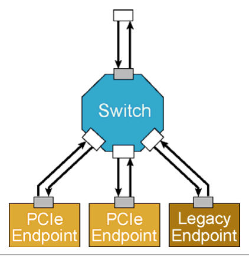

<a id="sec-16-2"></a>
## 16.2 Power Management | 电源管理

<table>
<thead><tr><th width="50%">🇬🇧 English</th><th width="50%">🇨🇳 中文</th></tr></thead>
<tbody>
<tr>
<td width="50%">

## **Scenario 2: Upstream Component Transmits TLP Just Prior to Receiving L1 Request** 

This scenario presumes that the upstream component has just been instructed by its core logic to send a TLP downstream before it receives
the request to enter L1 from the downstream device. Several negotiation rules define the actions to ensure that this situation is managed
correctly.

**TLP Must Be Accepted by Downstream Component.** Note that after the downstream device sends the PM_Active_State_L1 DLLP it must wait for a
response from the upstream component. While waiting, the down‐ stream component must be able to accept TLPs and DLLPs from the upstream
device. Although it won’t send any TLPs, it must be able to send DLLPs as needed, such as ACKs for incoming TLPs. In this case, two possi‐
bilities exist:

- an ACK is returned to verify successful receipt of the TLP. 

- a NAK is returned if a TLP transmission error is detected. The resulting retry of the TLP is allowed during the L1 negotiation. 

**Upstream Component Receives Request to Enter L1.** The spec requires that the upstream component immediately accept or reject the request
to enter the L1 state. However, it further states that prior to sending a PM_Request_ACK it must:

1. Block scheduling of new TLPs 

2. Wait for acknowledgement of the last TLP previously sent, if necessary, and retry TLPs that receive a NAK, unless a Link Acknowledgement
timeout condition occurs.

Once all outstanding TLPs have been acknowledged, and all other condi‐ tions are satisfied, the upstream device must return a PM_Request_ACK
DLLP.

</td>
<td width="50%">

## **场景 2：上游组件在收到 L1 请求前刚发送 TLP**

本场景假设上游组件在其核心逻辑指示下要在收到来自下游设备的 L1 进入请求之前向下游发送一个 TLP。有几条协商规则定义了相关动作，以确保该情形能被正确处理。

**第 16 章：电源管理**

**TLP 必须被下游组件接受。** 注意下游设备在发送 PM_Active_State_L1 DLLP 之后必须等待来自上游组件的响应。在等待期间，下游组件必须能够接受来自上游设备的 TLP 和 DLLP。尽管它不会发送任何 TLP，它必须能够根据需要发送
DLLP，例如对收到的 TLP 进行 ACK。在这种情况下，存在两种可能：

- 返回 ACK 以确认 TLP 已被成功接收。

- 如果检测到 TLP 传输错误，则返回 NAK。对该 TLP 的重试在 L1 协商期间是允许的。

**上游组件收到进入 L1 的请求。** 规范要求上游组件必须立即接受或拒绝该进入 L1 状态的请求。然而规范进一步规定：在发送 PM_Request_ACK 之前，它必须：

1. 阻塞对新 TLP 的调度

2. 等待之前发送的最后一个 TLP 的确认（如果需要），并对收到 NAK 的 TLP 进行重试，除非发生 Link Acknowledgement 超时条件。

一旦所有未完成的 TLP 都已被确认，并且所有其他条件都满足，上游设备必须返回 PM_Request_ACK DLLP。

</td>
</tr>
<tr>
<td width="50%">

## **Scenario 3: Downstream Component Receives TLP During Negotiation** 

During the negotiation sequence the downstream device may be instructed to send a new TLP upstream. However, a device that begins the L1
ASPM negotia‐ tion process must block new TLP scheduling. This prevents a race condition between going into L1 and sending a new TLP that
would prevent entry into L1. Consequently, once the downstream device has scheduled delivery of the PM_Request_L1 it must complete the
transition to L1 if a PM_Request_ACK is received. Sending a new TLP will have to wait until L1 has been entered, after which the device can
initiate a transition from L1 back to L0 to send the TLP.

</td>
<td width="50%">

## **场景 3：下游组件在协商期间收到 TLP**

在协商过程中，下游设备可能会被指示向上游发送一个新的 TLP。然而，开始 L1 ASPM 协商过程的设备必须阻塞新的 TLP 调度。这可以防止进入 L1 和发送新 TLP 之间的竞态条件——后者会阻止进入 L1。因此，下游设备一旦调度了 PM_Request_L1
的发送，如果收到 PM_Request_ACK，就必须完成向 L1 的转换。发送新的 TLP 必须等到已进入 L1 之后，此后设备可以发起从 L1 回到 L0 的转换来发送该 TLP。

</td>
</tr>
<tr>
<td width="50%">

## **Scenario 4: Upstream Component Receives TLP During Negotiation** 

If the upstream component needs to send a TLP or DLLP after sending the PM_Request_Ack, it must first complete the transition to L1. It can
then initiate a change from L1 to L0 to send the packet.

</td>
<td width="50%">

## **场景 4：上游组件在协商期间收到 TLP**

如果上游组件在发送 PM_Request_Ack 之后需要发送 TLP 或 DLLP，它必须首先完成向 L1 的转换。然后它可以从 L1 发起变到 L0 的状态变更来发送该包。

</td>
</tr>
<tr>
<td width="50%">

## **Scenario 5: Upstream Component Rejects L1 Request** 

Figure 16‐18 on page 752 summarizes the negotiation sequence when the upstream component rejects the request to enter the L1 ASPM state. The
negoti‐ ation begins normally as the downstream component requests L1. However, the upstream device returns a PM_Active_State_Nak TLP to
reject the request. The reasons for rejecting the request to enter L1 include:

- L1 ASPM not supported or software has not enabled this feature 

- One or more TLPs are scheduled for transfer across the Link 

- ACK or NAK DLLPs are scheduled for transfer 

Once the rejection message has been sent, the upstream component can con‐ tinue sending TLPs and DLLPs as needed. The rejection tells the
downstream component that L1 is not an option at present, and so it must transition to L0s instead, if possible.

_Figure 16‐18: Negotiation Sequence Resulting in Rejection to Enter L1 ASPM State_ 


<br>

</td>
<td width="50%">

## **场景 5：上游组件拒绝 L1 请求**

第 752 页的图 16-18 总结了上游组件拒绝进入 L1 ASPM 状态的请求时的协商序列。当下游组件请求 L1 时，协商正常开始。然而，上游设备返回 PM_Active_State_Nak TLP 来拒绝该请求。拒绝进入 L1 的原因包括：

- 不支持 L1 ASPM 或软件未启用此特性

- 一个或多个 TLP 已被调度以通过该 Link 传输

- ACK 或 NAK DLLP 已被调度以传输

拒绝消息发送后，上游组件可以根据需要继续发送 TLP 和 DLLP。拒绝消息告知下游组件 L1 当前不可用，因此它必须改为转换到 L0s（如果可能）。

_图 16-18：协商序列导致拒绝进入 L1 ASPM 状态_


<br>


**第 16 章：电源管理**

</td>
</tr>
<tr>
<td width="50%">

## **Exit from L1 ASPM State** 

Either component can initiate the transition from L1 back to L0 when it needs to use the Link. The procedure is the same in either case and
doesn’t involve any negotiation. When switches are involved in exiting from L1 the spec requires that other switch ports in the ASPM low
power states must also transition to the L0 state if they are in the possible path of the packet that will be sent. These issues are
discussed in subsequent sections.

**L1 ASPM Exit Signaling.** The spec states that exit from L1 is invoked by exiting electrical idle, which begins by sending TS1s. The
receiving port responds by sending TS1s back to the originating device and the Physical Layer follows its LTSSM protocol to complete the
Recovery state and return the Link to L0. Refer to“Recovery State” on page 571 for details.

**Switch Receives L1 Exit from Downstream Component.** As pic‐ tured in Figure 16‐19, the Switch must respond to L1 exit on the down‐ stream
port by returning TS1s and, within 1μs (from signal L1 Exit downstream), it must also exit L1 on its upstream Link if it was in that state.

</td>
<td width="50%">

## **退出 L1 ASPM 状态**

任一组件都可以在需要使用该 Link 时发起从 L1 回到 L0 的转换。两种情况下过程相同，且不涉及任何协商。当交换机参与退出 L1 时，规范要求交换机处于 ASPM 低功耗状态的其他端口，如果它们位于将发送包的潜在路径上，也必须转换到 L0 状态。这些问题将在后续章节中讨论。

**L1 ASPM 退出信令。** 规范规定退出 L1 通过退出电气空闲来发起，方法为发送 TS1。接收端口通过回送 TS1 给发起设备作为响应，物理层遵循其 LTSSM 协议以完成 Recovery 状态并将 Link 返回到 L0。有关详细信息，请参见第 571
页的"Recovery State"。

**交换机收到来自下游组件的 L1 退出。** 如图 16-19 所示，交换机必须通过回送 TS1 来响应下游端口上的 L1 退出，并且在 1μs 内（从信号 L1 Exit 下游起），如果其上游 Link 处于该状态，它也必须退出 L1。

</td>
</tr>
<tr>
<td width="50%">

## **PCI Express Technology** 

_Figure 16‐19: Switch Behavior When Downstream Component Signals L1 Exit_ 


<br>


Presumably the reason the downstream component is transitioning back to L0 is because it’s preparing to send a TLP upstream. Since L1 exit
latencies are relatively long, a switch “must not wait until its Downstream Port Link has fully exited to L0 before initiating an L1 exit
transition on its Upstream Port Link.” This prevents accumulated latencies that would otherwise result if all L1 to L0 transitions occurred
in a sequential fashion.

**Switch Receives L1 Exit from Upstream Component.** In this case, the switch must respond with TS1s back upstream, and within 1μs it must
also send TS1s to all downstream ports that are in the L1 ASPM state to return them to L0. As in the previous example, the goal is to
minimize the

overall exit latency of returning to the L0 state for every Link in the path from the initiator to the target of the transaction. Figure
16‐20 on page 755 summarizes these requirements. The Link between Switch F and EndPoint (EP) E is in the L1 state because software put EP E
into the D1 state, which caused the Link to transition to L1. Only Links in the L1 ASPM state are transitioned to L0 as a result of the Root
Complex (RC) initiating the exit from L1 ASPM.

_Figure 16‐20: Switch Behavior When Upstream Component Signals L1 Exit_ 


<br>

</td>
<td width="50%">

## **PCI Express Technology**

_图 16-19：下游组件发出 L1 退出信号时交换机的行为_


<br>


可以推测，下游组件转换回 L0 的原因是它正准备向上游发送 TLP。由于 L1 退出延迟相对较长，交换机"不能等到其下游端口链路完全退出到 L0 之后才在上游端口链路上发起 L1 退出转换。"这可以防止延迟的累积，否则当所有 L1 到 L0 的转换按顺序发生时会造成延迟累积。

**交换机收到来自上游组件的 L1 退出。** 在这种情况下，交换机必须通过向上游回送 TS1 进行响应，并且在 1μs 内还必须向处于 L1 ASPM 状态的所有下游端口发送 TS1，以使它们返回 L0。与上例一样，目标是将发起方与事务目标之间路径上每条 Link 返回 L0
状态的整体退出延迟降至最小。第 755 页的图 16-20 总结了这些要求。Switch F 和端点 (EP) E 之间的 Link 处于 L1 状态，因为软件将 EP E 置于 D1 状态，这导致该 Link 转换到 L1。只有处于 L1 ASPM 状态的 Link
才会因根复合体 (RC) 发起退出 L1 ASPM 而转换到 L0。

_图 16-20：上游组件发出 L1 退出信号时交换机的行为_


<br>

</td>
</tr>
<tr>
<td width="50%">

## **ASPM Exit Latency** 

PCI Express provides mechanisms to ensure that the ASPM exit latencies for L0s and L1 don’t exceed the requirements of the devices. All
devices report their L0s and L1 exit latencies, and Endpoints also report the total acceptable latency they can tolerate for this when
performing accesses to and from the Root Com‐ plex. This acceptable latency is based on the data buffer size within the device. If the chain
of devices that reside between the Endpoint and target device have a total latency that exceeds the acceptable latency reported by the
Endpoint, software can disable ASPM for a given Endpoint.

The exit latencies reported by a device will change depending on whether the devices on each end of a Link share a common reference clock or
not. Conse‐ quently, the Link Status register includes a bit called _Slot Clock_ that specifies whether the component uses an external
reference clock provided by the plat‐ form, or an independent reference clock (perhaps generated internally). Soft‐ ware checks these bits
in devices at both ends of each Link to determine whether they both use it and thus share a common clock. If so, software sets the _Common
Clock_ bit to report this in both devices. Figure 16‐21 on page 757 illus‐ trates the registers and related bit fields involved in managing
the ASPM exit latency.

</td>
<td width="50%">

## **ASPM 退出延迟**

PCI Express 提供了多种机制以确保 L0s 和 L1 的 ASPM 退出延迟不超过设备的要求。所有设备都会报告其 L0s 和 L1
退出延迟，端点还会报告其在访问根复合体时所能容忍的总延迟。该可接受延迟基于设备内的数据缓冲区大小。如果位于端点和目标设备之间的设备链路的总延迟超过了端点所报告的可接受延迟，软件可以为给定的端点禁用 ASPM。

设备所报告的退出延迟将根据 Link 两端的设备是否共享公共参考时钟而变化。因此，Link Status 寄存器包含一个名为 _Slot Clock_ 的位，它指定该组件是使用平台提供的外部参考时钟还是使用独立参考时钟（可能由内部产生）。软件检查每条 Link
两端设备的这些位，以确定它们是否都使用它并因此共享公共时钟。如果是，则软件设置 _Common Clock_ 位以在两个设备中报告此情况。第 757 页的图 16-21 说明了管理 ASPM 退出延迟所涉及的寄存器和相关位字段。

</td>
</tr>
<tr>
<td width="50%">

## **Reporting a Valid ASPM Exit Latency** 

Because the clock configuration affects the exit latency that a device will experi‐ ence, devices must report the source of their reference
clock via the _Slot Clock_ status bit within the Link Status register. This bit is initialized by the component to report the source of its
reference clock. If this bit is set to 1, the clock uses the platform generated reference clock and if it’s cleared (0) an independent clock
is used.

</td>
<td width="50%">

## **报告有效的 ASPM 退出延迟**

由于时钟配置会影响设备经历的退出延迟，设备必须通过 Link Status 寄存器中的 _Slot Clock_ 状态位报告其参考时钟的来源。此位由组件初始化以报告其参考时钟的来源。如果该位置 1，则表示时钟使用平台生成的参考时钟；如果清零（0），则使用独立时钟。

如果系统固件或软件确定 Link 上的两个组件都使用平台时钟，那么两个设备内的参考时钟将同相。这导致从 L0s 和 L1 的退出延迟更短，并在 Link Control 寄存器的 _Common Clock_
字段中报告。然后组件必须更新其报告的退出延迟以反映正确的值。注意，如果时钟不是公共的，则默认值将是正确的，无需进一步操作。

**L0s 退出延迟更新。** L0s 的退出延迟在 Link Capability 寄存器中报告，基于默认假设（即不存在公共时钟实现）。L0s 退出延迟也在 Link 训练期间使用的 TS1 中报告，作为退出 L0s 所需的 FTS 有序集的数量
(N_FTS)。如果软件随后检测到公共时钟实现，则设置 Common Clock 字段并写入 Link Control 寄存器的 _Retrain Link_ 位，以强制 Link 训练重新进行。在重训练期间，将报告新的 N_FTS 值，并在 Link Capability
寄存器的 _L0s Latency_ 字段中报告。

**L1 退出延迟更新。** 在 Link 重训练之后，新的值也将在 _L1 Latency_ 字段中报告。

_图 16-21：用于 ASPM 退出延迟管理和报告的配置寄存器_

</td>
</tr>
<tr>
<td width="50%">

</td>
<td width="50%">

## **计算从端点到根复合体的延迟**

第 759 页的图 16-22 展示了一个端点，其事务必须经过两个交换机才能到达根复合体。假设路径中的所有 Link 都处于 L1 状态，我们以端点 B 需要向主存发送数据包为例。

1. 首先，它通过在 T 时刻在其 Link 上发起 TS1 有序集来开始唤醒序列。EP B 的 L1 退出延迟最大为 8μs，但 Switch C 的最大退出延迟为 16μs。因此，该 Link 的退出延迟为 16μs。

2. 在检测到 Link B/C 上的 L1 退出后 1μs 内，Switch C 在 T+1μs 时在 Link C/F 上发出 L1 退出信号。

3. Link C/F 在 16μs 内完成从 L1 的退出，在 T+17μs 时完成。

4. Switch F 在检测到来自 Switch C 的 L1 退出后 1μs 内（T+2μs）向根复合体发出从 L1 退出的信号。

5. Link F/RC 在 8μs 内完成从 L1 的退出，在 T+10μs 完成。

6. 将目标路径转换回 L0 的总延迟 = T+17μs。

**第 16 章：电源管理**

_图 16-22：总 L1 延迟示例_


<br>

</td>
</tr>
<tr>
<td width="50%">

</td>
<td width="50%">

## **软件发起的链路电源管理**

当软件发起配置写以更改电源状态以节能时，设备必须通过将其 Link 转换到相应的低功耗状态来响应。

</td>
</tr>
<tr>
<td width="50%">

</td>
<td width="50%">

## **D1/D2/D3 和 L1 状态 Hot**

规范要求，当设备内的所有 Function 已被置于任何低功耗状态（D1、D2 或 D3hot）时，设备必须发起到 L1 状态的转换，如图 16-23 所示。设备因软件发起对设备的配置访问或设备发起的事件而返回 L0。

_图 16-23：软件将设备的电源级别从 D0 更改时设备转换到 L1_


<br>


在收到对 PMCSR 寄存器中 _Power State_ 字段的配置写时，设备通过向上游组件发送 PM_Enter_L1 DLLP 来发起从 L0 到 L1 的更改。

</td>
</tr>
<tr>
<td width="50%">

</td>
<td width="50%">

## **进入 L1 状态**

将 Link 置于 L1 状态的过程如图 16-24（见第 762 页）所示。图中的步骤在以下列表中有更详细的描述：

1. 一旦设备识别出其所有 Function 都处于 D2 状态，它必须准备将 Link 转换到 L1。这从阻塞新 TLP 的调度开始。

**第 16 章：电源管理**

2. 来自下游端点的 TLP 在收到进入 D2 的请求之前可能尚未被确认。设备必须在所有未完成的 TLP 都被确认后才能响应更改 Link 电源的请求。换句话说，在进入 L1 状态之前，Replay Buffer 必须为空。

3. 由于返回 Link 到其活动状态的延迟较长，设备必须能够在返回活动状态时立即发送一个最大尺寸的 TLP。由于缺少流控信用可能会阻塞该操作，端点必须在进入 L1 之前累积足够的信用，以允许为每种流控类型发送所支持的最大包。

4. 当上述要求都已满足时，端点向上游设备发送 PM_Enter_L1 DLLP。这指示上游组件将 Link 置于 L1。PM_Enter_L1 被重复发送，直到从上游设备收到 PM_Request_ACK DLLP。

5. 当上游组件收到 PM_Enter_L1 时，它通过执行步骤 6、7 和 8 开始其准备工作。这与下游组件在发出 L1 转换信号之前执行的准备工作相同。

6. 所有新 TLP 的调度被阻塞。

7. 如果之前的 TLP 尚未被确认，上游设备将等待，直到 Replay Buffer 中的所有事务都被确认。

8. 必须积累足够的流控信用以确保可以为每种流控类型发送最大的 TLP。

9. 上游组件发送 PM_Request_ACK DLLP 以确认它已准备好进入 L1 状态。此 DLLP 被重复发送，直到收到 Electrical Idle 有序集，表明它已被接受。

10. 当下游组件收到确认时，它发送 EIOS 并将其发送通道置于电气空闲（发送器处于 Hi-Z 状态）。

11. 上游组件识别 EIOS 并将其发送通道置于电气空闲。该 Link 此时已进入 L1 状态。

_图 16-24：将 Link 从 L0 转换到 L1 状态的过程_


<br>

</td>
</tr>
<tr>
<td width="50%">

</td>
<td width="50%">

## **退出 L1 状态**

L1 状态的退出可以由上游或下游组件发起，如下所述。本节还总结了用于退出 L1 的信令协议。

**上游组件发起。** 软件可能需要使用当前处于低功耗状态的设备，这意味着电源管理软件必须发出一个配置写，以将其电源状态改回 D0。当配置请求准备好从上游组件（根端口或下游交换机端口）发送时，该端口将退出电气空闲状态并发起重新训练以将 Link 返回到

**第 16 章：电源管理**

L0 状态。一旦 Link 处于活动状态，配置写就可以被传送到设备以将其转换回 D0，此时它已准备好供正常使用。

**下游组件发起 L1 到 L0 的转换。** 在 L1 状态下，参考时钟和电源仍会施加到 Link 上的设备。这允许将下游设备设计为监视外部事件，并在发生电源管理事件 (PME) 时触发。在传统的 PCI 中，这是通过边带 PME#
信号报告的，系统板逻辑通常使用它来生成中断以通知 CPU 需要将设备恢复到完全运行状态。PCIe 取消了边带信号，而是发送带内消息来报告 PME（详见第 769 页的"PME Message"）。

**L1 退出协议。** 在 L1 状态下，Link 的两个方向都处于电气空闲状态。设备通过改变电气空闲并发送 TS1 来发出退出 L1 的信号。当 Link 邻居检测到退出电气空闲时，它会回送 TS1。此序列触发两个设备进入 Recovery
状态，当该状态完成其操作后，两个设备都将返回 L0 状态。

</td>
</tr>
<tr>
<td width="50%">

</td>
<td width="50%">

## **L2/L3 Ready — 移除链路电源**

一旦软件已将设备内的所有 Function 置于 D3hot 状态，就可以安全地从设备移除电源。一个典型的应用是将系统中的所有设备置于
D3，然后从所有设备移除电源以实现最低功耗。然而，规范并未给出实际用于移除时钟和电源的机制的详细信息，也不要求遵循特定顺序，从而允许各种实现方式。

准备设备以移除电源的状态转换涉及先进入 L1 然后返回 L0 再到达 L2/L3 Ready 状态的预备步骤，如图 16-25（见第 764 页）所示。

_图 16-25：与准备设备以移除参考时钟和电源相关的链路状态转换_

</td>
</tr>
<tr>
<td width="50%">

</td>
<td width="50%">

## **L2/L3 Ready 握手序列**

当转换到 L2/L3 Ready 状态时，规范确实要求一个握手序列。这确保了所有设备都准备好移除参考时钟和电源，并且也确保在移除电源时，正在发送到根复合体的带内 PME 消息不会被意外丢失。

</td>
</tr>

</tbody>
</table>

[⬆️ 返回目录](#本章目录-table-of-contents)

---


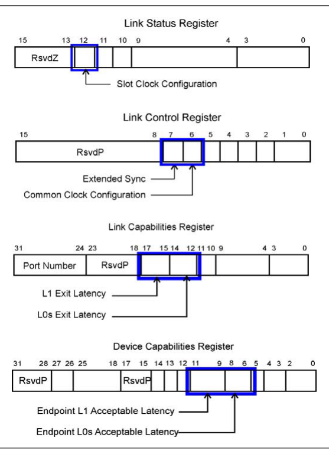

<a id="sec-16-3"></a>
## 16.3 Power Management | 电源管理

<table>
<thead><tr><th width="50%">🇬🇧 English</th><th width="50%">🇨🇳 中文</th></tr></thead>
<tbody>
<tr>
<td width="50%">

If system firmware or software determines that both components on the Link use the platform clock then the reference clocks within both
devices will be in phase. This results in shorter exit latencies from L0s and L1, and is reported in the _Common Clock_ field of the Link
Control register. Components must then update their reported exit latencies to reflect the correct value. Note that if the clocks are not
common then the default values will be correct and no further action is required.

**L0s Exit Latency Update.** Exit latency for L0s is reported in the Link Capability register based on the default assumption that a common
clock implementation does not exist. L0s exit latency is also reported in the TS1s

used during Link training as the number of FTS Ordered Sets (N_FTS) required to exit L0s. If software then detects a common clock
implementa‐ tion, it sets the Common Clock field writes to the _Retrain Link_ bit in the Link Control register to force Link training to
repeat. During retraining new N_FTS values are reported and in the _L0s Latency_ field of the Link Capabil‐ ity register.

**L1 Exit Latency Update.** Following Link retraining, new values will also be reported in the _L1 Latency_ field. 

_Figure 16‐21: Config. Registers for ASPM Exit Latency Management and Reporting_

</td>
<td width="50%">

如果系统固件或软件确定 Link 上的两个组件都使用平台时钟，那么两个设备内的参考时钟将同相。这导致从 L0s 和 L1 的退出延迟更短，并在 Link Control 寄存器的 _Common Clock_
字段中报告。然后组件必须更新其报告的退出延迟以反映正确的值。注意，如果时钟不是公共的，则默认值将是正确的，无需进一步操作。

**L0s 退出延迟更新。** L0s 的退出延迟在 Link Capability 寄存器中报告，基于默认假设（即不存在公共时钟实现）。L0s 退出延迟也在

**第 16 章：电源管理**

链路训练期间使用的 TS1 中报告，作为退出 L0s 所需的 FTS 有序集的数量 (N_FTS)。如果软件随后检测到公共时钟实现，则设置 Common Clock 字段并写入 Link Control 寄存器的 _Retrain Link_
位，以强制链路训练重新进行。在重训练期间，将报告新的 N_FTS 值，并在 Link Capability 寄存器的 _L0s Latency_ 字段中报告。

**L1 退出延迟更新。** 在 Link 重训练之后，新的值也将在 _L1 Latency_ 字段中报告。

_图 16-21：用于 ASPM 退出延迟管理和报告的配置寄存器_

</td>
</tr>
<tr>
<td width="50%">

## **Calculating Latency from Endpoint to Root Complex** 

Figure 16‐22 on page 759 illustrates an Endpoint whose transactions must trans‐ verse two switches to reach the Root Complex. Presuming that
all Links in the path are in the L1 state, let’s take the example that Endpoint B needs to send a packet to main memory.

1. First, it begins the wake sequence by initiating a TS1 ordered set on its Link at time “T.” The L1 exit latency for EP B is a maximum of
8μs, but Switch C has a maximum exit latency of 16μs. Therefore, the exit latency for this Link is 16μs.

2. Within 1μs of detecting the L1 exit on Link B/C, Switch C signals L1 exit on Link C/F at T+1μs. 

3. Link C/F completes its exit from L1 in 16μs, at T+17μs. 

4. Switch F signals an exit from L1 to the Root Complex within 1μs of detect‐ ing L1 exit from Switch C (T+2μs). 

5. Link F/RC completes exit from L1 in 8μs, completing at T+10μs. 

6. Total latency to transition path to target back to L0 = T+17μs. 

_Figure 16‐22: Example of Total L1 Latency_ 


<br>

</td>
<td width="50%">

## **计算从端点到根复合体的延迟**

第 759 页的图 16-22 展示了一个端点，其事务必须经过两个交换机才能到达根复合体。假设路径中的所有 Link 都处于 L1 状态，我们以端点 B 需要向主存发送数据包为例。

1. 首先，它通过在 T 时刻在其 Link 上发起 TS1 有序集来开始唤醒序列。EP B 的 L1 退出延迟最大为 8μs，但 Switch C 的最大退出延迟为 16μs。因此，该 Link 的退出延迟为 16μs。

2. 在检测到 Link B/C 上的 L1 退出后 1μs 内，Switch C 在 T+1μs 时在 Link C/F 上发出 L1 退出信号。

3. Link C/F 在 16μs 内完成从 L1 的退出，在 T+17μs 时完成。

4. Switch F 在检测到来自 Switch C 的 L1 退出后 1μs 内（T+2μs）向根复合体发出从 L1 退出的信号。

5. Link F/RC 在 8μs 内完成从 L1 的退出，在 T+10μs 完成。

6. 将目标路径转换回 L0 的总延迟 = T+17μs。

**第 16 章：电源管理**

_图 16-22：总 L1 延迟示例_


<br>

</td>
</tr>
<tr>
<td width="50%">

## **Software Initiated Link Power Management** 

When software initiates configuration writes to change the power state for power conservation, devices must respond by transitioning their
Link to the corresponding low power state.

</td>
<td width="50%">

## **软件发起的链路电源管理**

当软件发起配置写以更改电源状态以节能时，设备必须通过将其 Link 转换到相应的低功耗状态来响应。

</td>
</tr>
<tr>
<td width="50%">

## **D1/D2/D3 and the L1 State Hot** 

The spec requires that when all Functions within a device have been placed into any of the low power states (D1, D2, or D3hot), the device
must initiate a transi‐ tion to the L1 state as shown in Figure 16‐23. A device returns to L0 as a result of software initiating a
configuration access to the device or a device initiated event.

_Figure 16‐23: Devices Transition to L1 When Software Changes their Power Level from D0_ 


<br>


Upon receiving a configuration write to the _Power State_ field of the PMCSR reg‐ ister, a device initiates the change from L0 to L1 by
sending a PM_Enter_L1 DLLP to the upstream component.

</td>
<td width="50%">

## **D1/D2/D3 和 L1 状态 Hot**

规范要求，当设备内的所有 Function 已被置于任何低功耗状态（D1、D2 或 D3hot）时，设备必须发起到 L1 状态的转换，如图 16-23 所示。设备因软件发起对设备的配置访问或设备发起的事件而返回 L0。

_图 16-23：软件将设备的电源级别从 D0 更改时设备转换到 L1_


<br>


在收到对 PMCSR 寄存器中 _Power State_ 字段的配置写时，设备通过向上游组件发送 PM_Enter_L1 DLLP 来发起从 L0 到 L1 的更改。

</td>
</tr>
<tr>
<td width="50%">

## **Entering the L1 State** 

The procedure to place the Link into an L1 state is illustrated in Figure 16‐24 on page 762. The steps in the figure are described in
greater detail in the following list:

1. Once a device recognizes that all its Functions are in the D2 state, it must prepare to transition the Link into L1. This begins with
blocking new TLPs from being scheduled.

2. A TLP may from the downstream Endpoint may not have been acknowledged prior to receiving the request to enter D2. The device must not
respond to a request to change the Link power until all outstanding TLPs have been acknowledged. In other words, the Replay Buffer must be
empty before proceeding to the L1 state.

3. Because of the long latencies involved in returning the Link to its active state, a device must be able to send a maximum‐sized TLP
immediately upon return to the active state. Since a lack of Flow Control credits could block this, the Endpoint must have sufficient
credits to permit transmission of the biggest packet supported for each Flow Control type before entering L1.

4. When the requirements listed above have been met, the Endpoint sends a PM_Enter_L1 DLLP to the upstream device. This instructs the
upstream component to put the Link into L1. The PM_Enter_L1 is repeated until a PM_Request_ACK DLLP is received from the upstream device.

5. When the upstream component receives PM_Enter_L1, it begins its prepa‐ ration by performing steps 6, 7, and 8. This is the same
preparation as per‐ formed by the downstream component prior to signaling the L1 transition.

6. All new TLP scheduling is blocked. 

7. In the event that a previous TLP has not yet been acknowledged, the upstream device will wait until all transactions in the Replay Buffer
have been acknowledged.

8. Sufficient Flow Control credits must be accumulated to ensure that the larg‐ est TLP can be transmitted for each Flow Control type. 

9. The upstream component sends a PM_Request_ACK DLLP to confirm that it’s ready to enter the L1 state. This DLLP is repeated until an
Electrical Idle ordered set is received, indicating that it’s been accepted.

10. When the downstream component receives the acknowledgement, it sends an EIOS and places its transmit lanes into electrical idle
(transmitter is in Hi‐Z state).

11. The upstream component recognizes the EIOS and places its transmit lanes into electrical idle. The Link has now entered the L1 state. 

_Figure 16‐24: Procedure Used to Transition a Link from the L0 to L1 State_ 


<br>

</td>
<td width="50%">

## **进入 L1 状态**

将 Link 置于 L1 状态的过程如图 16-24（见第 762 页）所示。图中的步骤在以下列表中有更详细的描述：

1. 一旦设备识别出其所有 Function 都处于 D2 状态，它必须准备将 Link 转换到 L1。这从阻塞新 TLP 的调度开始。

**第 16 章：电源管理**

2. 来自下游端点的 TLP 在收到进入 D2 的请求之前可能尚未被确认。设备必须在所有未完成的 TLP 都被确认后才能响应更改 Link 电源的请求。换句话说，在进入 L1 状态之前，Replay Buffer 必须为空。

3. 由于返回 Link 到其活动状态的延迟较长，设备必须能够在返回活动状态时立即发送一个最大尺寸的 TLP。由于缺少流控信用可能会阻塞该操作，端点必须在进入 L1 之前累积足够的信用，以允许为每种流控类型发送所支持的最大包。

4. 当上述要求都已满足时，端点向上游设备发送 PM_Enter_L1 DLLP。这指示上游组件将 Link 置于 L1。PM_Enter_L1 被重复发送，直到从上游设备收到 PM_Request_ACK DLLP。

5. 当上游组件收到 PM_Enter_L1 时，它通过执行步骤 6、7 和 8 开始其准备工作。这与下游组件在发出 L1 转换信号之前执行的准备工作相同。

6. 所有新 TLP 的调度被阻塞。

7. 如果之前的 TLP 尚未被确认，上游设备将等待，直到 Replay Buffer 中的所有事务都被确认。

8. 必须积累足够的流控信用以确保可以为每种流控类型发送最大的 TLP。

9. 上游组件发送 PM_Request_ACK DLLP 以确认它已准备好进入 L1 状态。此 DLLP 被重复发送，直到收到 Electrical Idle 有序集，表明它已被接受。

10. 当下游组件收到确认时，它发送 EIOS 并将其发送通道置于电气空闲（发送器处于 Hi-Z 状态）。

11. 上游组件识别 EIOS 并将其发送通道置于电气空闲。该 Link 此时已进入 L1 状态。

_图 16-24：将 Link 从 L0 转换到 L1 状态的过程_


<br>

</td>
</tr>
<tr>
<td width="50%">

## **Exiting the L1 State** 

An exit from the L1 state can be initiated by either the upstream or downstream component, as discussed below. This section also summarizes
the signaling pro‐ tocol used to exit L1.

**Upstream Component Initiates.** Software may need to use a device which is currently in a low‐power state, and that means the Power
Manage‐ ment software must issue a configuration write to change its power state back to D0. When the configuration Request is ready to be
sent from the upstream component (a Root Port or downstream Switch Port) the port will exit the electrical idle state and initiate
re‐training to return the Link to the

L0 state. Once the Link is active, the configuration write can be delivered to the device to transition it back to D0, at which point it’s
ready for normal use.

**Downstream Component Initiates L1 to L0 Transition.** In the L1 state the reference clock and power are still applied to devices on the
Link. That allows a downstream device to be designed to monitor external events and trigger a Power Management Event (PME) when it occurs.
In conven‐ tional PCI, this is reported by a side‐band PME# signal, and system board logic usually uses it to generate an interrupt that
informs the CPU of the need to bring the device back to full operation. PCIe eliminates the side‐ band signal and instead sends an in‐band
message to report the PME (see “The PME Message” on page 769 for details).

**The L1 Exit Protocol.** In the L1 state both directions of the Link are in the electrical idle state. A device signals an exit from L1 by
changing from elec‐ trical idle and sending TS1s. When the Link neighbor detects the exit from electrical idle it sends TS1s back. This
sequence triggers both devices to enter the Recovery state and, when that has completed its operation, both devices will have returned to
the L0 state.

</td>
<td width="50%">

## **退出 L1 状态**

L1 状态的退出可以由上游或下游组件发起，如下所述。本节还总结了用于退出 L1 的信令协议。

**上游组件发起。** 软件可能需要使用当前处于低功耗状态的设备，这意味着电源管理软件必须发出一个配置写，以将其电源状态改回 D0。当配置请求准备好从上游组件（根端口或下游交换机端口）发送时，该端口将退出电气空闲状态并发起重新训练以将 Link 返回到

**第 16 章：电源管理**

L0 状态。一旦 Link 处于活动状态，配置写就可以被传送到设备以将其转换回 D0，此时它已准备好供正常使用。

**下游组件发起 L1 到 L0 的转换。** 在 L1 状态下，参考时钟和电源仍会施加到 Link 上的设备。这允许将下游设备设计为监视外部事件，并在发生电源管理事件 (PME) 时触发。在传统的 PCI 中，这是通过边带 PME#
信号报告的，系统板逻辑通常使用它来生成中断以通知 CPU 需要将设备恢复到完全运行状态。PCIe 取消了边带信号，而是发送带内消息来报告 PME（详见第 769 页的"PME Message"）。

**L1 退出协议。** 在 L1 状态下，Link 的两个方向都处于电气空闲状态。设备通过改变电气空闲并发送 TS1 来发出退出 L1 的信号。当 Link 邻居检测到退出电气空闲时，它会回送 TS1。此序列触发两个设备进入 Recovery
状态，当该状态完成其操作后，两个设备都将返回 L0 状态。

</td>
</tr>
<tr>
<td width="50%">

## **L2/L3 Ready — Removing Power from the Link** 

Once software has placed all Functions within a Device into the D3hot state power can be safely removed from the device. A typical
application for this would be to place all devices in the system into D3 and then remove power from them all to achieve the lowest power
consumption. However, the spec does not give details of the actual mechanism that would be used to remove clock and power or require that a
particular sequence be followed, allowing for a variety of implementations.

The state transitions to prepare devices for power removal involve the prelimi‐ nary steps of entering L1 and then returning to L0 before
arriving at the L2/L3 Ready state as illustrated in Figure 16‐25 on page 764.

_Figure 16‐25: Link States Transitions Associated with Preparing Devices for Removal of the Reference Clock and Power_

</td>
<td width="50%">

## **L2/L3 Ready — 移除链路电源**

一旦软件已将设备内的所有 Function 置于 D3hot 状态，就可以安全地从设备移除电源。一个典型的应用是将系统中的所有设备置于
D3，然后从所有设备移除电源以实现最低功耗。然而，规范并未给出实际用于移除时钟和电源的机制的详细信息，也不要求遵循特定顺序，从而允许各种实现方式。

准备设备以移除电源的状态转换涉及先进入 L1 然后返回 L0 再到达 L2/L3 Ready 状态的预备步骤，如图 16-25（见第 764 页）所示。

_图 16-25：与准备设备以移除参考时钟和电源相关的链路状态转换_

</td>
</tr>
<tr>
<td width="50%">

## **L2/L3 Ready Handshake Sequence** 

The spec does require a handshake sequence when transitioning to the L2/L3 Ready state. This ensures that all devices are ready for
reference clock and power removal, and also that inband PME messages being sent to the Root Complex won’t accidentally be lost when power is
removed.

</td>
<td width="50%">

## **L2/L3 Ready 握手序列**

当转换到 L2/L3 Ready 状态时，规范确实要求一个握手序列。这确保了所有设备都准备好移除参考时钟和电源，并且也确保在移除电源时，正在发送到根复合体的带内 PME 消息不会被意外丢失。

</td>
</tr>

</tbody>
</table>

[⬆️ 返回目录](#本章目录-table-of-contents)

---


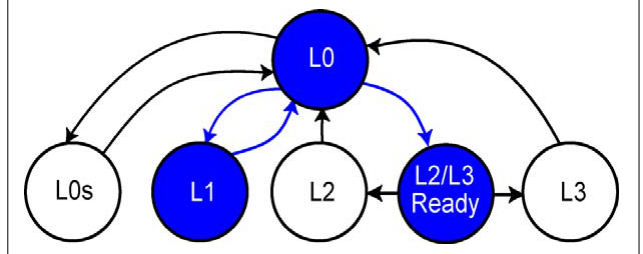

<a id="sec-16-4"></a>
## 16.4 Power Management | 电源管理

<table>
<thead><tr><th width="50%">🇬🇧 English</th><th width="50%">🇨🇳 中文</th></tr></thead>
<tbody>
<tr>
<td width="50%">

Consider the following example of the handshake sequence required for remov‐ ing the reference clock and power from PCIe devices in the
fabric. This example assumes a system‐wide power down is being initiated, but the sequence can also apply to individual devices. The steps
are summarized below and shown in Figure 16‐26 on page 766. The overall sequence is represented in two parts labeled A and B. The Link state
transitions involved in the complete sequence include:

- L0 ‐‐> L1 (when software places a device into D3) 

- L1 ‐‐> L0 (when software initiates a PME_Turn_Off message) 

- L0 ‐‐> L2/L3 Ready (resulting from the completion of the PME_Turn_Off handshake sequence, which culminates in a PM_Enter_L23 DLLP being
sent by the device and the Link going to electrical idle)

The following steps detail the sequence illustrated in Figure 16‐26 on page 766. 

1. Power Management software first places all Functions in the PCIe fabric into their D3 state. 

2. All devices transition their Links to the L1 state when they enter D3. 

3. Power Management software initiates a PME_Turn_Off TLP message, 

which is broadcast from all Root Complex ports to all devices. This prevents PME Messages from being lost in case they were in progress
upstream when power was removed. Note that delivery of this TLP causes each Link to transition back to L0 so it can be forwarded downstream.

4. All devices must receive and acknowledge the PME_Turn_Off message by returning a PME_TO_ACK TLP message while in the D3 state. 

5. Switches collect the PME_TO_ACK messages from all of their enabled downstream ports and forward just one aggregated PME_TO_ACK mes‐ sage
upstream toward the Root Complex. That’s because these messages have the routing attribute set as “Gather and Route to the Root”.

6. After sending the PME_TO_ACK, when it is ready to have the reference clock and power removed, devices send a PM_Enter_L23 DLLP repeatedly
until a PM_Request_ACK DLLP is returned. The Links that enter the L2/L3 Ready state last are those attached to the device originating the
PME_Turn_Off message (the Root Complex in this example).

7. The reference clock and power can finally be removed when all Links have transitioned to the L2/L3 state, but not sooner than 100ns after
that. If auxil‐ iary power (VAUX) is supplied to the devices, the Link transitions to L2. If no AUX power is available the Links will be in
the L3 state.

</td>
<td width="50%">

请考虑以下示例，展示从 PCIe 设备结构中移除参考时钟和电源所需的握手序列。本例假设正在发起系统范围的断电，但该序列也适用于单个设备。步骤如下汇总，并在第 766 页的图 16-26 中显示。整个序列由标记为 A 和 B 的两部分表示。完整序列中涉及的链路状态转换包括：

- L0 ‐‐> L1（当软件将设备置于 D3 时）

- L1 ‐‐> L0（当软件发起 PME_Turn_Off 消息时）

- L0 ‐‐> L2/L3 Ready（由 PME_Turn_Off 握手序列的完成引起，最终结果是由设备发送 PM_Enter_L23 DLLP，且链路进入电气空闲）

以下步骤详细描述了图 16-26（见第 766 页）中所示的序列。

1. 电源管理软件首先将 PCIe 结构中的所有 Function 置于其 D3 状态。

2. 当所有设备进入 D3 时，它们将其 Link 转换到 L1 状态。

3. 电源管理软件发起 PME_Turn_Off TLP 消息，

**第 16 章：电源管理**

该消息从所有根复合体端口广播到所有设备。这可以防止 PME 消息在上游进行时丢失。注意，此 TLP 的传递会导致每条 Link 转换回 L0，以便它可以向下游转发。

4. 所有设备必须通过在 D3 状态下返回 PME_TO_ACK TLP 消息来接收并确认 PME_Turn_Off 消息。

5. 交换机从其所有启用的下游端口收集 PME_TO_ACK 消息，并仅向上游向根复合体转发一个聚合的 PME_TO_ACK 消息。这是因为这些消息的路由属性设置为"Gather and Route to the Root"（收集并路由到根）。

6. 在发送 PME_TO_ACK 之后，当设备准备好移除参考时钟和电源时，设备会重复发送 PM_Enter_L23 DLLP，直到收到 PM_Request_ACK DLLP。最后进入 L2/L3 Ready 状态的 Link 是那些连接到发起 PME_Turn_Off
消息的设备（本例中为根复合体）的 Link。

7. 当所有 Link 都已转换到 L2/L3 状态时（但不早于此后 100ns），最终可以移除参考时钟和电源。如果为设备提供辅助电源（VAUX），则 Link 转换到 L2。如果没有 AUX 电源可用，则 Link 将处于 L3 状态。

</td>
</tr>
<tr>
<td width="50%">

## **PCI Express Technology** 

_Figure 16‐26: Negotiation for Entering L2/L3 Ready State_ 


<br>

</td>
<td width="50%">

## **PCI Express Technology**

_图 16-26：进入 L2/L3 Ready 状态的协商_


<br>


**第 16 章：电源管理**

</td>
</tr>
<tr>
<td width="50%">

## **Exiting the L2/L3 Ready State — Clock and Power Removed** 

As illustrated in the state diagram in Figure 16‐27, a device exits the L2/L3 Ready state when power is removed and has only two choices.
When VAUX is available the transition is to L2, otherwise the transition is to L3.

Link state transitions are normally controlled by the LTSSM in the Physical Layer. However, transitions to L2 and L3 result from main power
being removed and the LTSSM is not operational then. Consequently, the spec refers to L2 and L3 as pseudo‐states defined for explaining the
resulting condition of a device when power is removed.

_Figure 16‐27: State Transitions from L2/L3 Ready When Power is Removed_

</td>
<td width="50%">

## **退出 L2/L3 Ready 状态 — 时钟和电源被移除**

如图 16-27 中的状态图所示，当电源被移除时，设备退出 L2/L3 Ready 状态，只有两个选择。当 VAUX 可用时，转换为 L2；否则转换为 L3。

链路状态转换通常由物理层中的 LTSSM 控制。但是，到 L2 和 L3 的转换是由于主电源被移除而产生的，并且 LTSSM 在那时不工作。因此，规范将 L2 和 L3 称为伪状态 (pseudo-states)，用于解释当电源被移除时设备的最终状况。

_图 16-27：电源被移除时从 L2/L3 Ready 的状态转换_

</td>
</tr>
<tr>
<td width="50%">

## **The L2 State** 

Some devices are designed to monitor external events and initiate a wakeup sequence to restore power to handle them. Since main power is
removed, these device will need a power source like VAUX to be able to monitor the events and to signal a wakeup.

</td>
<td width="50%">

## **L2 状态**

一些设备被设计为监视外部事件并发起唤醒序列以恢复电源来处理这些事件。由于主电源已被移除，这些设备将需要 VAUX 之类的电源才能监视事件并发出唤醒信号。

</td>
</tr>
<tr>
<td width="50%">

## **The L3 State** 

In this state the device has no power and therefore no means of communication. Recovery from this state requires the system to restore power
and the reference clock. That causes devices to experience a fundamental reset, after which they’ll need be initialized by software to
return to normal operation.

</td>
<td width="50%">

## **L3 状态**

在此状态下，设备没有电源，因此无法通信。从此状态恢复需要系统恢复电源和参考时钟。这会导致设备经历基本复位，之后它们需要由软件初始化以恢复正常操作。

</td>
</tr>
<tr>
<td width="50%">

## **Link Wake Protocol and PME Generation** 

The wake protocol provides a method for an Endpoint to reactivate the upstream Link and request that software return it to D0 so it can
perform required operations. PCIe PM is designed to be compatible with PCI‐PM soft‐ ware, although the methods are different.

Rather than using a sideband signal, PCIe devices use an inband PME message to notify PM software of the need to return the device to D0.
The ability to gen‐ erate PME messages may optionally be supported in any of the low power states. Recall that a device reports which PM
states it supports for PME message delivery.

PME messages can only be delivered when the Link state is L0. The latency involved in reactivating the Link is based on a device’s PM and
Link state, but can include the following:

1. Link is in non‐communicating (L2) state — when a Link is in the L2 state it cannot communicate because the reference clock and main power
have been removed. No PME message can be sent until clock and power are restored, a Fundamental Reset is asserted, and the Link is
re‐trained. These events will be triggered when a device signals a wakeup. This may result in all Links being re‐awakened in the path
between the device needing to com‐ municate and the Root Complex.

2. Link is in communicating (L1) state — when a Link is in the L1 state clock and main power are still active; thus, a device simply exits
the L1 state, goes to the Recovery state to re‐train the Link, and returns the Link to L0. Once the Link is in L0 the PME message is
delivered. Note that the devices never send a PME message while in the L2/L3 Ready state because entry into that state only occurs after PME
notification has been turned off, in preparation for clock and power to be removed. (See “L2/L3 Ready Handshake Sequence” on page 764.)

3. PME is delivered (L0) — If the Link is in the L0 state, the device transfers the PME message to the Root Complex, notifying Power
Management soft‐ ware that the device has observed an event that requires the device be placed back into its D0 state. Note that the message
contains the Requester ID (Bus#, Device#, and Function#) of the device. This quickly informs soft‐ ware which device needs service.

</td>
<td width="50%">

## **链路唤醒协议和 PME 生成**

唤醒协议提供了一种方法，使端点能够重新激活上游 Link 并请求软件将其返回到 D0，以便它可以执行所需的操作。PCIe PM 旨在与 PCI-PM 软件兼容，尽管方法不同。

PCIe 设备不使用边带信号，而是使用带内 PME 消息来通知 PM 软件设备需要返回到 D0。生成 PME 消息的能力可以在任何低功耗状态下可选地支持。回想一下，设备报告它支持的用于 PME 消息传递的 PM 状态。

PME 消息只能在 Link 状态为 L0 时传递。重新激活 Link 所涉及的延迟基于设备的 PM 和 Link 状态，但可能包括以下内容：

1. Link 处于不可通信状态 (L2) — 当 Link 处于 L2 状态时，由于参考时钟和主电源已被移除，因此无法通信。在时钟和电源恢复、断言基本复位以及 Link 重新训练之前，无法发送任何 PME
消息。当设备发出唤醒信号时，将触发这些事件。这可能导致需要通信的设备与根复合体之间的路径上的所有 Link 都被重新唤醒。

2. Link 处于可通信状态 (L1) — 当 Link 处于 L1 状态时，时钟和主电源仍处于活动状态；因此，设备只需退出 L1 状态，进入 Recovery 状态以重新训练 Link，并将 Link 返回到 L0。一旦 Link 处于 L0，PME
消息就会被传递。注意，设备永远不会在 L2/L3 Ready 状态下发送 PME 消息，因为只有准备好移除时钟和电源时才会进入该状态，PME 通知已经关闭。（参见第 764 页的"L2/L3 Ready 握手序列"。）

3. PME 已传递 (L0) — 如果 Link 处于 L0 状态，则设备将 PME 消息传递给根复合体，通知电源管理软件设备已观察到需要将设备放回其 D0 状态的事件。注意，消息包含设备的请求者 ID（总线号、设备号和功能号）。这可以快速通知软件哪个设备需要服务。

**第 16 章：电源管理**

</td>
</tr>
<tr>
<td width="50%">

## **The PME Message** 

The PME message is delivered by devices that support PME notification. The message format is illustrated in Table 16‐28 on page 769. The
message may be initiated by a device in a low power state (D1, D2, D3hot, and D3cold) and is sent immediately upon return of the Link to L0.

_Figure 16‐28: PME Message Format_ 


<br>


The PME message is a Transaction Layer Packet that has the following charac‐ teristics: 

- TC and VC are zero (no QoS applies) 

- Routed implicitly to the Root Complex 

- Handled as Posted Transaction 

- Relaxed Ordering is not permitted, forcing all transactions in the fabric between the signaling device and the Root Complex to be
delivered to the Root Complex ahead of the PME message

</td>
<td width="50%">

## **PME 消息**

PME 消息由支持 PME 通知的设备传递。消息格式如图 16-28（第 769 页）所示。该消息可以由低功耗状态（D1、D2、D3hot 和 D3cold）中的设备发起，并在 Link 返回到 L0 时立即发送。

_图 16-28：PME 消息格式_


<br>


PME 消息是一个事务层数据包，具有以下特征：

- TC 和 VC 都为零（不应用 QoS）

- 隐式路由到根复合体

- 作为 Posted 事务处理

- 不允许使用 Relaxed Ordering，强制 fabric 中信号设备和根复合体之间的所有事务在 PME 消息之前传递到根复合体

</td>
</tr>
<tr>
<td width="50%">

## **The PME Sequence** 

Devices may support PME in any of the low power states as specified in the PM Capabilities register. This register also specifies the amount
of VAUX current used by the device if it supports wakeup in the D3cold state. The basic sequence of events associated with sending a PME to
software is specified below and pre‐ sumes that the device and system are enabled to generate PME and the Link has already been transitioned
to the L0 state:

1. The device issues the PME message on its upstream port. 

2. PME messages are implicitly routed to the Root Complex. Switches in the path transition their upstream ports to L0 if necessary and
forward the packet upstream.

3. A root port receives the PME and forwards it to the Power Management Controller. 

4. The controller informs power management software, typically with an interrupt. Software uses the Requester ID in the message to read and
clear the PME_Status bit in the PMCSR and return the device to the D0 state. Depending on the degree of power conservation, the PCI Express
driver may also need to restore the devices configuration registers.

5. PM Software may also call the device driver in the event that device context was lost as a result of being placed in a low power state.
If so, device soft‐ ware restores information within the device.

</td>
<td width="50%">

## **PME 序列**

设备可以在 PM Capabilities 寄存器中指定的任何低功耗状态下支持 PME。该寄存器还指定了设备在 D3cold 状态下支持唤醒时所使用的 VAUX 电流量。指定与向软件发送 PME 相关的事件的基本序列如下，并假设设备和系统能够生成 PME，并且 Link
已被转换到 L0 状态：

1. 设备在其上游端口上发出 PME 消息。

2. PME 消息被隐式路由到根复合体。路径中的交换机在必要时将其上游端口转换到 L0，并将数据包向上游转发。

3. 根端口接收 PME 并将其转发给电源管理控制器。

4. 控制器通知电源管理软件，通常通过中断。软件使用消息中的请求者 ID 来读取并清除 PMCSR 中的 PME_Status 位，并将设备返回到 D0 状态。根据节能程度，PCI Express 驱动程序可能还需要恢复设备的配置寄存器。

5. PM 软件可能也会调用设备驱动程序，以防设备上下文因被置于低功耗状态而丢失。如果是这样，设备软件将恢复设备内的信息。

</td>
</tr>
<tr>
<td width="50%">

## **PME Message Back Pressure Deadlock Avoidance**

</td>
<td width="50%">

## **PME 消息背压死锁避免**

</td>
</tr>
<tr>
<td width="50%">

## **Background** 

The Root Complex typically stores the PME messages it receives in a queue, and calls PM software to handle each one. A PME is held in this
queue until PM soft‐

ware reads the PME_Status bit from the requesting device’s PMCSR register. Once the configuration read transaction completes, this PME
message can be removed from the internal queue.

</td>
<td width="50%">

## **背景**

根复合体通常将其收到的 PME 消息存储在一个队列中，并调用 PM 软件来处理每一个。PME 在该队列中保留，

**第 16 章：电源管理**

直到软件从请求设备的 PMCSR 寄存器读取 PME_Status 位。配置读事务完成后，可以从内部队列中删除此 PME 消息。

</td>
</tr>
<tr>
<td width="50%">

## **The Problem** 

Deadlock can occur if the following scenario develops: 

1. Incoming PME Messages have filled the PME message queue but other PME messages have been issued downstream from the same root port. 

2. PM software initiates a configuration read request from the Root to read PME_Status from the oldest PME requester.

</td>
<td width="50%">

## **问题**

如果出现以下情形，则可能发生死锁：

1. 传入的 PME 消息已填满 PME 消息队列，但已有其他 PME 消息从同一根端口向下游发出。

2. PM 软件从根发起一个配置读请求以读取最早 PME 请求者的 PME_Status。

</td>
</tr>

</tbody>
</table>

[⬆️ 返回目录](#本章目录-table-of-contents)

---


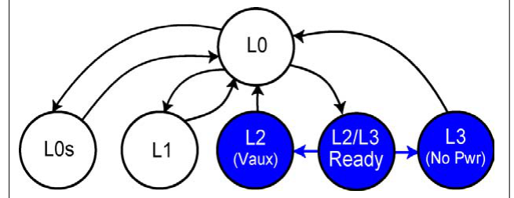

<a id="sec-16-5"></a>
## 16.5 Power Management | 电源管理

<table>
<thead><tr><th width="50%">🇬🇧 English</th><th width="50%">🇨🇳 中文</th></tr></thead>
<tbody>
<tr>
<td width="50%">

3. The corresponding split completion must push all previously posted PME messages ahead of it based on transaction ordering rules. 

4. The Root Complex cannot accept a new PME message because the queue is full, so the path is temporarily blocked. But that also means that
the read completion can’t reach the Root Complex to clear the older entry in the queue.

5. No progress can be made and deadlock occurs.

</td>
<td width="50%">

3. 相应的拆分完成必须基于事务排序规则将其之前的所有已发布 PME 消息推到其前面。

4. 根复合体无法接受新的 PME 消息，因为队列已满，因此路径被临时阻塞。但这也意味着读完成无法到达根复合体以清除队列中较旧的条目。

5. 没有任何进展，发生死锁。

</td>
</tr>
<tr>
<td width="50%">

## **The Solution** 

The problem is avoided if the Root Complex always accepts new PME mes‐ sages, even when they would overflow the queue. In this case, the
Root simply discards the later PME messages. To prevent a discarded PME message from being lost permanently, a device that sends a PME
message is required to mea‐ sure a time‐out interval, called the PME Service Time‐out. If the device’s PME_Status bit is not cleared with
100 ms (+ 50%/‐ 5%), it assumes its message must have been lost and it re‐issues the message.

</td>
<td width="50%">

## **解决方案**

如果根复合体始终接受新的 PME 消息，即使它们会使队列溢出，则可以避免此问题。在这种情况下，根只是丢弃后来的 PME 消息。为防止被丢弃的 PME 消息永久丢失，发送 PME 消息的设备必须测量一个称为 PME Service Time-out 的超时间隔。如果设备的
PME_Status 位未在 100ms (+ 50%/‐ 5%) 内被清除，则它假定其消息必定已丢失并重新发出该消息。

</td>
</tr>
<tr>
<td width="50%">

## **The PME Context** 

Devices that generate PME must continue to power portions of the device that are used for detecting, signaling, and handling PME events,
referred to collec‐ tively as the PME context. Devices that support PME in the D3cold state use aux‐ iliary power to maintain the PME
context when the main power is removed. Items that are typically part of the PME context include:

- PME_Status bit (required) — set when a device sends a PME message and cleared by PM software. Devices that support PME in the D3cold state
must implement the PME_Status bit as “sticky,” meaning that the value survives a fundamental reset.

</td>
<td width="50%">

## **PME 上下文**

生成 PME 的设备必须继续为设备中用于检测、发信号和处理 PME 事件的部分供电，这些部分统称为 PME 上下文。支持 D3cold 状态下 PME 的设备在主电源被移除时使用辅助电源来维护 PME 上下文。PME 上下文中通常包括的项目：

- PME_Status 位（必需）— 在设备发送 PME 消息时设置，由 PM 软件清除。支持 D3cold 状态下 PME 的设备必须将 PME_Status 位实现为"粘性"，这意味着该值在基本复位后仍然存在。

</td>
</tr>
<tr>
<td width="50%">

## **PCI Express Technology** 

- PME_Enable bit (required) — this bit must remain set to continue enabling a Function’s ability to generate PME messages and signal wakeup.
Devices that support PME in the D3cold state must implement PME_Enable as “sticky,” meaning that the value survives a fundamental reset.

- Device‐specific status information — for example, a device might preserve event status information in cases where several different types
of events can trigger a PME.

- Application‐specific information — for example, modems that initiate wakeup would preserve Caller ID information if supported.

</td>
<td width="50%">

## **PCI Express Technology**

- PME_Enable 位（必需）— 该位必须保持置位以继续启用 Function 生成 PME 消息和发出唤醒信号的能力。支持 D3cold 状态下 PME 的设备必须将 PME_Enable 实现为"粘性"，这意味着该值在基本复位后仍然存在。

- 设备特定的状态信息 — 例如，设备可能在有多种不同类型的事件可以触发 PME 的情况下保留事件状态信息。

- 应用程序特定的信息 — 例如，启动唤醒的调制解调器在支持时会保留来电显示信息。

</td>
</tr>
<tr>
<td width="50%">

## **Waking Non-Communicating Links** 

When a device that supports PME in the D3cold state needs to send a PME mes‐ sage, it must first transition the Link to L0. This is
sometimes referred to as a wakeup. PCI Express defines two methods of triggering the wakeup of non‐communicating Links:

- Beacon — an in‐band indicator driven by AUX power 

- • WAKE# Signal — a sideband signal driven by AUX power 

In both cases, PM software must be notified to restore main power and the ref‐ erence clock. This also causes a fundamental reset that
forces a device into the D0uninitialized state. Once the Link transitions to L0, the device sends the PME message. Since a reset is required
to re‐activate the Link, devices must maintain PME context across the reset sequence described above.

</td>
<td width="50%">

## **唤醒不可通信链路**

当支持 D3cold 状态下 PME 的设备需要发送 PME 消息时，它必须首先将 Link 转换到 L0。这有时称为唤醒。PCI Express 定义了触发不可通信链路唤醒的两种方法：

- Beacon — 由 AUX 电源驱动的带内指示符

- WAKE# 信号 — 由 AUX 电源驱动的边带信号

在这两种情况下，都必须通知 PM 软件以恢复主电源和参考时钟。这也会导致基本复位，迫使设备进入 D0uninitialized 状态。一旦 Link 转换到 L0，设备就会发送 PME 消息。由于需要复位才能重新激活 Link，设备必须跨上述复位序列维护 PME 上下文。

</td>
</tr>
<tr>
<td width="50%">

## **Beacon** 

This signaling mechanism is designed to operate on AUX power and doesn’t require much power. The beacon is simply a way of notifying the
upstream component that software should be notified of the wakeup request. When switches receive a beacon on a downstream port, they in turn
signal beacon on their upstream port. Ultimately, the beacon reaches the root complex, where it generates an interrupt that calls PM
software.

Some form‐factors require beacon support for waking the system while others don’t. The spec requires compliance with the form‐factor specs,
and doesn’t require beacon support for devices if their form‐factor doesn’t. However, for “universal” components designed for use in a
variety of form‐factors, beacon support is required. See “Beacon Signaling” on page 483 for details.

</td>
<td width="50%">

## **Beacon**

此信令机制被设计为在 AUX 电源上工作，且不需要太多电力。Beacon 仅仅是通知上游组件软件应被通知唤醒请求的一种方式。当交换机在下游端口上收到 beacon 时，它们会依次在其上游端口上发出 beacon。最终，beacon 到达根复合体，在那里它生成一个调用 PM
软件的中断。

某些外形尺寸要求 beacon 支持唤醒系统，而其他外形尺寸则不需要。规范要求符合外形尺寸规范，并且如果其外形尺寸不需要 beacon 支持，则不需要设备支持 beacon。但是，对于设计用于各种外形尺寸的"通用"组件，则需要 beacon 支持。有关详细信息，请参见第 483
页的"Beacon Signaling"。

**第 16 章：电源管理**

</td>
</tr>
<tr>
<td width="50%">

## **WAKE#** 

PCI Express provides a sideband signal called WAKE# as a alternative to the beacon that can be routed directly to the Root or to other
system logic to notify PM software. In spite of the desire to minimize the pin count of a Link, the moti‐ vation for adding this extra pin
is easy to understand. The reason is that a com‐ ponent must consume auxiliary power to be able to recognize a beacon on a downstream port
and then forward it to an upstream port. In a battery‐powered system auxiliary power is jealously guarded because it drains the battery even
when the system isn’t doing any work. The preferred solution in that case would be to bypass as many components as possible when delivering
the wakeup notification, and the WAKE# pin serves that purpose very well. On the other hand, if power is not a concern then the WAKE# pin
might be considered less desirable.

A hybrid implementation may also be used. In this case, WAKE# is sent to a switch, which in turn sends the beacon on its upstream port. The
options are illustrated in Figure 16‐29 on page 774 A and B. Note that when asserted, the WAKE# signal remains low until the PME_Status bit
is cleared by software.

This signal must be implemented by ATX or ATX‐based connectors and cards as well as by the mini‐card form factor. No requirement is
specified for embedded devices to use the WAKE# signal.

</td>
<td width="50%">

## **WAKE#**

PCI Express 提供了一个名为 WAKE# 的边带信号作为 beacon 的替代方案，可以直接路由到根或其他系统逻辑以通知 PM 软件。尽管希望最小化链路的引脚数，但添加此额外引脚的动机很容易理解。原因是组件必须消耗辅助电源才能识别下游端口上的
beacon，然后将其转发到上游端口。在电池供电的系统中，辅助电源受到严格保护，因为它即使在系统不工作时也会消耗电池电量。在这种情况下，首选的解决方案是在传递唤醒通知时绕过尽可能多的组件，而 WAKE# 引脚正好可以很好地满足此目的。另一方面，如果不担心功耗，那么 WAKE#
引脚可能就不那么理想了。

也可以使用混合实现。在这种情况下，WAKE# 被发送到交换机，而交换机又在其上游端口上发送 beacon。这些选项如图 16-29（第 774 页 A 和 B）所示。注意，当断言时，WAKE# 信号保持低电平，直到软件清除 PME_Status 位。

此信号必须由 ATX 或基于 ATX 的连接器以及插卡以及小型插卡外形尺寸实现。对于嵌入式设备使用 WAKE# 信号没有规定要求。

</td>
</tr>
<tr>
<td width="50%">

## **PCI Express Technology** 

_Figure 16‐29: WAKE# Signal Implementations_ 


<br>

</td>
<td width="50%">

## **PCI Express Technology**

_图 16-29：WAKE# 信号实现_


<br>


**第 16 章：电源管理**

</td>
</tr>
<tr>
<td width="50%">

## **Auxiliary Power** 

Devices that support PME in the D3cold state must support the wakeup sequence and are allowed by the PCI‐PM spec to consume the maximum
auxil‐ iary current of 375 mA (otherwise only 20mA). The amount of current they need is reported in the _Aux_Current_ field of the PM
Capability registers. Auxiliary power is enabled when the _PME_Enable_ bit is set within the PMCSR register.

PCI Express extends the use of auxiliary power beyond the limitations given by PCI‐PM. Now, any Device may consume the maximum auxiliary
current if enabled by setting the _Aux Power PM Enable_ bit of the Device Control register, illustrated in Figure 16‐30 on page 775. This
gives devices the opportunity to support other things like SM Bus while in a low power state. As in PCI‐PM the amount of current consumed by
a device is reported in the _Aux_Current_ field in the PMC register.

_Figure 16‐30: Auxiliary Current Enable for Devices Not Supporting PMEs_ 

|||15|14|12|11|10|9|8|7|5|4|3|2|1|0|
|---|---|---|---|---|---|---|---|---|---|---|---|---|---|---|---|
|||||||||||||||||
|Bridge Config. Retry Enable/||||||||||||||||
|Initiate Function-Level Reset||||||||||||||||
|Max Read Request Size||||||||||||||||
||Enable No Snoop|||||||||||||||
||Aux Power PM Enable|||||||||||||||
|Phantom Functions Enable||||||||||||||||
|Extended Tag Field Enable||||||||||||||||
||Max Payload Size|||||||||||||||
|Enable Relaxed Ordering||||||||||||||||
||Unsupported Request|||||||||||||||
||Reporting Enable|||||||||||||||
|Fatal|Error Reporting Enable|||||||||||||||
||Non-Fatal Error|||||||||||||||
||Reporting Enable|||||||||||||||
||Correctable Error|||||||||||||||
||Reporting Enable|||||||||||||||

</td>
<td width="50%">

## **辅助电源**

支持 D3cold 状态下 PME 的设备必须支持唤醒序列，并被 PCI-PM 规范允许消耗最大辅助电流 375mA（否则只能消耗 20mA）。它们所需的电流量在 PM Capability 寄存器的 _Aux_Current_ 字段中报告。当 PMCSR 寄存器中的
_PME_Enable_ 位被设置时，启用辅助电源。

PCI Express 扩展了辅助电源的使用，超出了 PCI-PM 给出的限制。现在，任何设备都可以在通过设置设备控制寄存器的 _Aux Power PM Enable_ 位启用时消耗最大辅助电流，如图 16-30（第 775 页）所示。这使设备有机会在低功耗状态下支持 SM
Bus 等其他功能。与 PCI-PM 中一样，设备消耗的电流量在 PMC 寄存器的 _Aux_Current_ 字段中报告。

_图 16-30：不支持 PME 的设备的辅助电流启用_

|||15|14|12|11|10|9|8|7|5|4|3|2|1|0|
|---|---|---|---|---|---|---|---|---|---|---|---|---|---|---|
|||||||||||||||||
|Bridge Config. Retry Enable/||||||||||||||||
|Initiate Function-Level Reset||||||||||||||||
|Max Read Request Size||||||||||||||||
||Enable No Snoop|||||||||||||||
||Aux Power PM Enable|||||||||||||||
|Phantom Functions Enable||||||||||||||||
|Extended Tag Field Enable||||||||||||||||
||Max Payload Size|||||||||||||||
|Enable Relaxed Ordering||||||||||||||||
||Unsupported Request|||||||||||||||
||Reporting Enable|||||||||||||||
|Fatal|Error Reporting Enable|||||||||||||||
||Non-Fatal Error|||||||||||||||
||Reporting Enable|||||||||||||||
||Correctable Error|||||||||||||||
||Reporting Enable|||||||||||||||

</td>
</tr>
<tr>
<td width="50%">

## **Improving PM Efficiency**

</td>
<td width="50%">

## **提高 PM 效率**

</td>
</tr>
<tr>
<td width="50%">

## **Background** 

As processors and other system components acquire better power management mechanisms, peripherals like PCIe components start to appear as a
bigger con‐ tributor to power consumption in PC systems. Earlier generations of PCIe allowed some software and hardware power management,
but coordinating PM decisions with the system was not a high priority and consequently soft‐ ware visibility and control was limited.

One problem that can arise from this lack of coordination happens when the system goes into a sleep state but the devices remain
operational. Such devices can initiate interrupts or DMA traffic that would require the system to wake up to handle them, even thought they
were low‐priority events, and thus defeat the goal of power conservation.

It can also happen that the system is unaware of how long the devices can afford to wait from the time they request system service (like a
memory read) until they get a response. Without that information, software is often forced to assume that the response time must always be
minimal and therefore power management policies can’t afford enough time to do much. However, if the sys‐ tem was aware of time windows when
a fast response was not needed, it could be more aggressive with power management and stay in a low power state for a longer time without
risking performance problems. The 2.1 spec revision added two new features to address these problems.

</td>
<td width="50%">

## **背景**

随着处理器和其他系统组件获得更好的电源管理机制，像 PCIe 组件这样的外围设备开始成为 PC 系统中较大的功耗贡献者。早期的 PCIe 几代允许一些软件和硬件电源管理，但与系统的 PM 决策协调并不是高优先级的，因此软件可见性和控制是有限的。

缺乏协调可能导致的一个问题是，当系统进入睡眠状态但设备仍保持运行状态时。这些设备可以发起中断或 DMA 流量，从而需要系统唤醒以处理它们，即使它们是低优先级事件，因此破坏了节能的目标。

系统也可能不知道设备在请求系统服务（如内存读取）到收到响应之间可以等待多长时间。如果不知道该信息，软件通常被迫假设响应时间必须始终最小，因此电源管理策略无法承担足够的时间来做更多工作。但是，如果系统知道何时不需要快速响应的时间窗口，则可以更积极地进行电源管理，并在不冒性能风险的情况下在低功耗状态下停留更长时间。2.1
规范修订版增加了两个新特性来解决这些问题。

</td>
</tr>
<tr>
<td width="50%">

## **OBFF (Optimized Buffer Flush and Fill)** 

The first of these mechanisms is Optimized Buffer Flush and Fill, which pro‐ vides a mechanism for Endpoints to be made aware of the system
power state and therefore the best times to do data transfers to and from the system.

</td>
<td width="50%">

## **OBFF（优化的缓冲区刷新与填充）**

第一个机制是优化缓冲区刷新和填充（Optimized Buffer Flush and Fill），它提供了一种机制，使端点能够了解系统电源状态，从而了解与系统进行数据传输的最佳时间。

</td>
</tr>
<tr>
<td width="50%">

## **The Problem** 

The problem with bus‐master capable devices is that if they’re not aware of the system power status, they may initiate transactions at times
when it would be better to wait. The diagram in Figure 16‐31 on page 777 illustrates the problem in simple terms: there are many components
initiating events and as a result,

the times without activity when the system is idle and can go to sleep are few and short‐lived. In contrast, Figure 16‐32 on page 777
illustrates an improve‐ ment in which the same events are grouped and serviced together so that the times when the system is idle enough to
go to sleep are both more frequent and of longer duration. Clearly, this would result in better power conservation and fortunately, it’s not
difficult to implement. PCIe components simply need to understand what they should do based on the system power state, and they’ll need a
way to learn what that state currently is.

_Figure 16‐31: Poor System Idle Time_ 


<br>


_Figure 16‐32: Improved System Idle Time_ 


<br>


## **The Solution**

</td>
<td width="50%">

## **问题**

能够进行总线主控的设备的问题在于，如果它们不了解系统电源状态，它们可能会在最好等待的时候发起事务。第 777 页的图 16-31 中的图示以简单的术语说明了该问题：有许多组件发起事件，因此，

**第 16 章：电源管理**

系统空闲且可以进入睡眠的时间很少且很短。相比之下，第 777 页的图 16-32 展示了一种改进，其中相同的事件被分组并一起处理，从而使系统空闲到足以进入睡眠的时间更频繁且持续时间更长。显然，这将带来更好的节能效果，而且幸运的是，实现起来并不困难。PCIe
组件只需了解它们应根据系统电源状态做什么，并且它们需要一种方法来了解当前的状态。

_图 16-31：较差的系统空闲时间_


<br>


_图 16-32：改进后的系统空闲时间_


<br>


## **解决方案**

</td>
</tr>

</tbody>
</table>

[⬆️ 返回目录](#本章目录-table-of-contents)

---


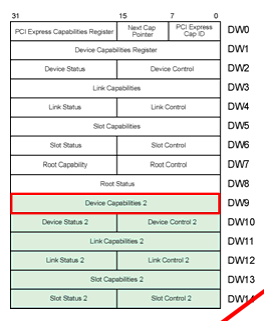

<a id="sec-16-6"></a>
## 16.6 Power Management | 电源管理

<table>
<thead><tr><th width="50%">🇬🇧 English</th><th width="50%">🇨🇳 中文</th></tr></thead>
<tbody>
<tr>
<td width="50%">

OBFF is an optional hint that a system can use to inform components about optimal time windows for traffic. It’s just a hint, though, so
bus‐master‐capable devices can still initiate traffic whenever they like. Of course, power consump‐ tion will be negatively affected if they
do, so overriding the OBFF hints should be avoided as much as possible. The information is communicated in one of two ways: by sending
messages to the Endpoints or by toggling the WAKE# pin. If both options are available, using the pin is strongly recommended because it
avoids the counter‐productive step of using excess power, possibly across sev‐ eral Links, to inform a component about the current system
power state. In fact, the OBFF message should only be used if the WAKE# pin is not available.

Figure 16‐33 on page 778 gives an example showing a mix of both communica‐ tion types. Using the pin is required if it’s available, but in
this example it’s not an option between the two switches. To work around this problem, the upper switch can translate the state received on
the WAKE# pin into a message going downstream. It should perhaps be noted here that switches are strongly encour‐ aged to forward all OBFF
indications downstream but not required to do so. It may be necessary, especially when using messages, to discard or collapse some
indications and that is permitted.

_Figure 16‐33: OBFF Signaling Example_ 


<br>


**Using the WAKE# Pin.** This pin, previously only used to inform the sys‐ tem that a component needed to have power restored, is given an
extra meaning as the simplest and lowest‐power option for communicating sys‐ tem power status to PCIe components. It’s optional, and the
protocol is fairly simple: the WAKE# pin toggles to communicate the system state. As seen in Figure 16‐34 on page 779, there are several
transitions but only three states, which are described below:

1. CPU Active ‐ system awake; all transactions OK. This is every compo‐ nent’s initial state. 

2. OBFF ‐ system memory path available; transfers to and from memory are OK, but other transactions should wait for a higher power state. 

3. Idle ‐ wait for a higher state before initiating. 

_Figure 16‐34: WAKE# Pin OBFF Signaling_ 


<br>


When the CPU Active or OBFF state is indicated, it’s recommended that the platform not return to the Idle state for at least 10  s so as to
give compo‐ nents enough time to deliver the packets they may have been queuing up while in the previous Idle state. However, since that
timing isn’t required, it’s also recommended that Endpoints not assume they’ll have a certain amount of time in a CPU Active or OBFF window.
Along the same lines, the platform is allowed to indicate that it’s going to Idle before it actually does

</td>
<td width="50%">

OBFF 是一个可选的提示，系统可以使用它来通知组件关于流量的最佳时间窗口。然而，它只是一个提示，因此能够进行总线主控的设备仍然可以随时发起流量。当然，如果它们这样做，功耗将受到负面影响，因此应尽可能避免覆盖 OBFF
提示。信息通过以下两种方式之一传达：通过向端点发送消息或通过切换 WAKE# 引脚。如果两种选择都可用，则强烈建议使用引脚，因为它避免了使用过多功率的反向步骤——可能跨多条 Link 来通知组件当前系统电源状态。事实上，仅当 WAKE# 引脚不可用时才应使用 OBFF 消息。

第 778 页的图 16-33 给出了一个混合使用两种通信类型的示例。如果 WAKE# 引脚可用，则必须使用，但在本例中，两台交换机之间没有该选项。为了解决此问题，上游交换机可以将 WAKE# 引脚上接收到的状态转换为向下游发送的消息。这里也许应该指出，强烈鼓励交换机将所有
OBFF 指示转发到下游，但不要求这样做。可能有必要，特别是在使用消息时，丢弃或合并某些指示，这是允许的。

_图 16-33：OBFF 信令示例_


<br>


**第 16 章：电源管理**

**使用 WAKE# 引脚。** 该引脚先前仅用于通知系统组件需要恢复电源，现在又被赋予了额外的含义，作为向 PCIe 组件传达系统电源状态的最简单、最低功耗的选项。它是可选的，协议相当简单：WAKE# 引脚切换以传达系统状态。如第 779 页的图 16-34
所示，存在多个转换但只有三个状态，描述如下：

1. CPU Active（CPU 活动）— 系统唤醒；所有事务 OK。这是每个组件的初始状态。

2. OBFF — 系统内存路径可用；与内存之间的传输 OK，但其他事务应等待更高的电源状态。

3. Idle（空闲）— 在发起之前等待更高的状态。

_图 16-34：WAKE# 引脚 OBFF 信令_


<br>


当指示 CPU Active 或 OBFF 状态时，建议平台至少 10μs 后不要返回到 Idle 状态，以便为组件提供足够的时间来传递它们可能在先前 Idle 状态期间排队的包。然而，由于不需要该时序，也建议端点不要假设它们将在 CPU Active 或 OBFF
窗口中拥有一定的时间。同样，平台被允许在实际进入 Idle 之前指示它将进入 Idle

</td>
</tr>
<tr>
<td width="50%">

## **PCI Express Technology** 

so as to give components advance notice that it’s time to finish. The case this early notice is specifically designed to avoid is having an
Endpoint start a transfer just as the platform goes to Idle, causing an immediate exit from the Idle state. The spec strongly recommends
that this should be the only reason for an early indication of the Idle state and also that this advance notice time should be as short as
possible.

Interestingly, the WAKE# pin can still be used for its original purpose of allowing a component to wake the system, and it’s no surprise
that this might confuse other components that are monitoring that pin for OBFF information. That could result in sub‐optimal behavior in
power or perfor‐ mance, but this is considered a recoverable situation so no steps were taken to guard against it. To cover all of these
cases, any time the signal is unclear the default state will be CPU Active.

**Using the OBFF Message.** As mentioned earlier, OBFF information can be communicated using a message, although it’s recommend that this
only be used if the WAKE# pin is not available. These messages only flow down‐ stream from the Root. The message contents are shown in
Figure 16‐35 on page 781, including the Routing type 100b (point‐to‐point) and an OBFF Code that gives the following values (all other codes
are reserved):

1. 1111b ‐ CPU Active 

2. 0001b ‐ OBFF 

3. 0000b ‐ Idle 

If a reserved code is received, components must treat it as “CPU Active.” If a Port receives an OBFF message but doesn’t support OBFF or
hasn’t enabled it yet, it must treat it as an Unsupported Request (Completion sta‐ tus UR).

_Figure 16‐35: OBFF Message Contents_ 


<br>


Support for OBFF is indicated via the Device Capability 2 register (Figure 16‐36 on page 782), and enabled using the Device Control 2
register (Figure 16‐37 on page 783). Note that both the pin and message options may be available. However, the pin method is preferred
because it is the lower power option.

Note that there are two variations for enabling a component to forward OBFF messages, and the difference between them has to do with
handling a targeted Link that’s not in L0. In Variation A, the message will only be sent if the Link is in L0. If it’s not, the message is
simply dropped to avoid the cost of waking the Link. This is preferred for Downstream Ports when the Device below it is not expected to have
time‐critical communication requirements and can indicate its need for non‐urgent attention by simply returning the Link to L0. For
Variation B, the message will always be for‐ warded and the Link will be returned to L0. This variation is preferred when the downstream
Device can benefit from timely notification of the platform state.

</td>
<td width="50%">

## **PCI Express Technology**

以便提前通知组件是时候完成了。设计此提前通知具体要避免的情况是：端点恰好在平台进入 Idle 时开始传输，导致立即退出 Idle 状态。规范强烈建议这应该是提前指示 Idle 状态的唯一原因，并且此提前通知时间应尽可能短。

有趣的是，WAKE# 引脚仍然可以用于其原始目的，即允许组件唤醒系统，并且毫不奇怪，这可能会使正在监视该引脚以获取 OBFF
信息的其他组件感到困惑。这可能导致电源或性能方面的次优行为，但这种情况被认为是可恢复的，因此没有采取任何措施来防范它。为了涵盖所有这些情况，每当信号不清楚时，默认状态将是 CPU Active。

**使用 OBFF 消息。** 如前所述，OBFF 信息可以使用消息来传达，但建议仅在 WAKE# 引脚不可用时使用。这些消息仅从根向下游流动。消息内容如图 16-35（第 781 页）所示，包括路由类型 100b（点对点）以及给出以下值的 OBFF 代码（所有其他代码保留）：

1. 1111b — CPU Active

2. 0001b — OBFF

3. 0000b — Idle

如果收到保留代码，组件必须将其视为"CPU Active"。如果端口收到 OBFF 消息但不支持 OBFF 或尚未启用 OBFF，则必须将其视为不支持的请求（完成状态 UR）。

**第 16 章：电源管理**

_图 16-35：OBFF 消息内容_


<br>


通过 Device Capability 2 寄存器（图 16-36，第 782 页）指示 OBFF 支持，并通过 Device Control 2 寄存器（图 16-37，第 783 页）启用
OBFF。请注意，引脚和消息选项都可能可用。但是，首选引脚方法，因为它是较低功耗的选项。

注意，启用组件以转发 OBFF 消息有两种变体，它们之间的区别在于处理不在 L0 中的目标 Link。在变体 A 中，仅当 Link 处于 L0 时才会发送消息。如果不是，则简单地丢弃该消息以避免唤醒 Link 的成本。当下面的设备预期没有时间紧迫的通信要求并可以通过简单地将
Link 返回到 L0 来指示其对非紧急关注的需要时，对于下游端口而言这是优选的。对于变体 B，消息将始终被转发，并且 Link 将返回到 L0。当下游设备可以从平台状态的及时通知中受益时，此变体是优选的。

</td>
</tr>
<tr>
<td width="50%">

## _Figure 16‐36: OBFF Support Indication_ 


<br>


When using WAKE#, enabling any Root Port to assert it is considered a glo‐ bal enable unless there are multiple WAKE# signals, in which case
only those associated with that Port are affected. When using the OBFF message, enabling a Root Port only enables the messages on that Port.
The expecta‐ tion in the spec is that all Root Ports would normally be enabled if any of them are, so as to ensure that the whole platform
was enabled. However, selectively enabling some Ports and not others is permitted.

When enabling Ports for OBFF, the spec recommends that all Upstream Ports be enabled before Downstream Ports, and Root Ports be enabled last
of all. For unpopulated hot plug slots this isn’t possible. For that case enabling OBFF using the WAKE# pin to the slot is permitted, but
it’s recom‐ mended that the Downstream Port above the slot not be enabled to deliver OBFF messages.

</td>
<td width="50%">

## _图 16-36：OBFF 支持指示_


<br>


当使用 WAKE# 时，启用任何根端口来断言它被视为全局启用，除非有多个 WAKE# 信号，在这种情况下，只有与该端口相关的那些信号才会受到影响。当使用 OBFF
消息时，仅启用根端口仅在该端口上启用消息。规范中的期望是：如果任何根端口被启用，则通常所有根端口都会被启用，以确保整个平台都已启用。但是，允许有选择地启用某些端口而不启用其他端口。

启用 OBFF 端口时，规范建议先启用所有上游端口，然后再启用下游端口，并最后启用根端口。对于未填充的热插拔插槽，这是不可能的。对于这种情况，允许使用插槽的 WAKE# 引脚启用 OBFF，但建议不要启用插槽上方下游端口以传送 OBFF 消息。

**第 16 章：电源管理**

</td>
</tr>
<tr>
<td width="50%">

## _Figure 16‐37: OBFF Enable Register_ 


<br>


Finally, let’s refer back to the earlier example in Figure 16‐33 on page 778 to consider what these registers might look like for that case.
The Downstream Port of the switch that connects to the lower switch will have a value for OBFF Support of 01b ‐ Message Only, while its
Upstream Port might have a value of 11b ‐ Both. These values might be hard coded into the device or hardware initialized in some other
fashion to make them visible to software after a reset. The Downstream Port would need to have an OBFF Enable value of 01b or 10b ‐ Enabled
with Message variation A or B so it could deliver an OBFF message. The Upstream Port would expect to have an OBFF Enable value of 11b ‐
Enabled with WAKE# signaling. The spec points out that when a switch is configured to use the different methods when going from one Port to
another, it’s required to make the translation and for‐ ward the indications.

</td>
<td width="50%">

## _图 16-37：OBFF 启用寄存器_


<br>


最后，让我们回到第 778 页图 16-33 中的早期示例，以考虑这些寄存器在该情况下可能是什么样子。连接到下交换机的交换机的下游端口的 OBFF Support 值为 01b — 仅消息，而其上游端口的值可能为 11b —
两者。这些值可能被硬编码到设备中或以其他方式由硬件初始化，以使其在复位后对软件可见。下游端口需要具有 01b 或 10b 的 OBFF Enable 值 — 启用了消息变体 A 或 B，以便它可以传递 OBFF 消息。上游端口将期望具有 11b 的 OBFF Enable 值 —
启用了 WAKE# 信令。规范指出，当交换机配置为从一个端口到另一个端口使用不同的方法时，需要进行翻译并转发指示。

</td>
</tr>
<tr>
<td width="50%">

## **LTR (Latency Tolerance Reporting)** 

The second new feature added to improve PM efficiency is called Latency Toler‐ ance Reporting (LTR). This optional capability allows devices
to report the delay they can tolerate when requesting service from the platform so that PM policies for platform resources like main memory
can take that into consider‐ ation. If software supports it, this provides good performance for devices when they need it and lower power
for the system when they don’t need a fast response. One simple way of using this information would be to allow the sys‐ tem to postpone
waking up to service a request as long as the latency tolerance was still met.

The meaning of “latency tolerance” is not made explicitly clear in the spec, but some things are mentioned that might play into it. For
example, the latency tol‐ erance may affect acceptable performance or it may impact whether the compo‐ nent will function properly at all.
Clearly, such a distinction would make a big difference in designing a PM policy. Similarly, the device may use buffering or other
techniques to compensate for latency sensitivity and knowledge of that would be useful for software.

## **LTR Registers**

</td>
<td width="50%">

## **LTR（延迟容忍报告）**

为提高 PM 效率而添加的第二个新特性称为延迟容忍报告（Latency Tolerance Reporting, LTR）。此可选功能允许设备在从平台请求服务时报告它们可容忍的延迟，以便像主存这样的平台资源的 PM
策略可以考虑这一点。如果软件支持，则当设备需要时提供良好的性能，而当它们不需要快速响应时则降低系统功耗。使用此信息的一个简单方法是允许系统在仍然满足延迟容忍度的情况下，推迟唤醒以服务请求。

规范中并未明确说明"延迟容忍"的含义，但提到了可能起作用的某些事项。例如，延迟容忍可能影响可接受的性能，或者可能影响组件是否能够正常运行。显然，这样的区别在设计 PM 策略时会产生很大的不同。同样，设备可以使用缓冲或其他技术来补偿延迟敏感性，了解这一点对于软件来说将是有用的。

## **LTR 寄存器**

</td>
</tr>

</tbody>
</table>

[⬆️ 返回目录](#本章目录-table-of-contents)

---


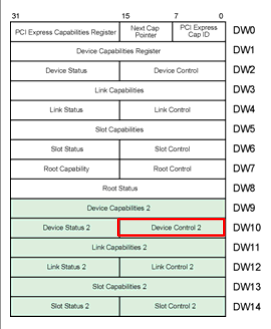

<a id="sec-16-7"></a>
## 16.7 Power Management | 电源管理

<table>
<thead><tr><th width="50%">🇬🇧 English</th><th width="50%">🇨🇳 中文</th></tr></thead>
<tbody>
<tr>
<td width="50%">

The LTR capability in a device is discovered using a new bit in the PCIe Device Capability 2 Register, as shown in Figure 16‐38 on page 785,
and enabled in the Device Control 2 Register, illustrated in Figure 16‐39 on page 785. The spec pre‐ scribes a sequence for enabling LTR,
too: devices closest to the Root must be enabled first, working down to the Endpoints. An Endpoint must not be enabled unless its associated
Root Port and all intermediate switches also sup‐ port LTR and have been enabled to service it. It’s permissible for some End‐ points to
support LTR while others do not. If a Root Port or switch Downstream Port receives an LTR message but doesn’t support it or hasn’t been
enabled yet, the message must be treated as an Unsupported Request. It’s recommended that Endpoints send an LTR message shortly after being
enabled to do so. It’s strongly recommended that Endpoints not send more than two LTR messages within any 500  s period unless required by
the spec. However, if they do, Downstream Ports must properly handle them and not generate an error based on that.

</td>
<td width="50%">

设备中的 LTR 能力通过 PCIe Device Capability 2 寄存器中的一位来发现，如图 16-38（第 785 页）所示，并在 Device Control 2 寄存器中启用，如图 16-39（第 785 页）所示。规范还规定了启用 LTR
的序列：必须先启用最接近根的设备，然后向下到端点。除非关联的根端口和所有中间交换机也支持 LTR 并已启用以服务它，否则不得启用端点。某些端点支持 LTR 而其他端点不支持是允许的。如果根端口或交换机下游端口收到 LTR
消息但不支持它或尚未启用它，则该消息必须被视为不支持的请求。建议端点在启用后不久发送 LTR 消息。强烈建议端点在任何 500μs 期间内发送的 LTR 消息不超过两条，除非规范要求。但是，如果它们这样做了，下游端口必须正确处理它们，并且不应基于此产生错误。

**第 16 章：电源管理**

</td>
</tr>
<tr>
<td width="50%">

## _Figure 16‐38: LTR Capability Status_ 


<br>


_Figure 16‐39: LTR Enable_ 


<br>


The target for LTR information is the Root Complex. Participating downstream devices all report their values but the Port just uses the
smallest value that was reported as the latency limit for all devices accessed through that Port. The Root is not required to honor
requested service latencies but is strongly encouraged to do so.

</td>
<td width="50%">

## _图 16-38：LTR 能力状态_


<br>

LTR 信息的目标是根复合体 (Root Complex)。参与的下游设备都会报告其值，但端口仅使用所报告的最小值作为通过该端口访问的所有设备的延迟限制。根不需要遵守请求的服务延迟，但强烈鼓励这样做。

</td>
</tr>
<tr>
<td width="50%">

## **LTR Messages** 

The LTR message itself has the format shown in Figure 16‐40 on page 788, where it can be seen that the Routing type 100b (point‐to‐point)
and the LTR message code is 0001 0000b. Two latency values are reported, one for Requests that must be snooped and another for Requests that
will not be snooped and therefore should complete more quickly. As seen in the diagram, the format for both is the same and includes the
following fields:

- Latency Value and Scale ‐ combine to give a value in the range from 1ns to about 34 seconds. Setting these fields to all zeros indicates
that any delay will affect the device and thus the best possible service is requested. The meaning of the latency is defined as follows:

 - For Read Requests, it’s the delay from sending the END symbol in the Request TLP until receiving the STP symbol in the first Completion
TLP for that Request.

 - For Write Requests, it relates to Flow Control back‐pressure. If a write has been issued but the next write can’t proceed due to a lack
of Flow Control credits, the latency is the time from the last symbol of that write (END) until the first symbol of the DLLP that gives more
credits (SDP). In other words, this represents the time within which the Root Port should be able to accept the next write.

- Requirement ‐ can be set for none, or one, or both to indicate whether that latency value is required. If a device doesn’t implement one
of these traffic types or has no service requirements for it, then this bit must be cleared for the associated field. If a device has
reported requirements but has since been directed into a device power state lower than D0, or if its LTR Enable bit has been cleared, the
device must send another LTR message reporting that these latencies are no longer required.

</td>
<td width="50%">

## **LTR 消息**

LTR 消息本身具有图 16-40（第 788 页）所示的格式，从图中可以看出，路由类型 100b（点对点）以及 LTR 消息代码为 0001
0000b。报告两个延迟值，一个用于必须侦听的请求，另一个用于不会被侦听因此应更快完成的请求。从图中可以看出，两者的格式相同，并包括以下字段：

- 延迟值和比例 — 组合给出范围从 1ns 到约 34 秒的值。将这些字段设置为全零表示任何延迟都会影响设备，因此请求最好的服务。延迟的含义定义如下：

 - 对于读请求，它是从请求 TLP 发送 END 符号到接收该请求的第一个完成 TLP 的 STP 符号之间的延迟。

 - 对于写请求，它与流控背压有关。如果已发出写但由于缺少流控信用而无法进行下一次写，则延迟是从该写的最后一个符号 (END) 到给予更多信用的 DLLP 的第一个符号 (SDP) 的时间。换句话说，这表示根端口应能接受下一次写的时间。

- Requirement（要求）— 可以为无、一个或两个设置，以指示是否需要该延迟值。如果设备未实现这些流量类型之一或对其没有服务要求，则该位必须为相关字段清零。如果设备已报告要求但此后被定向到低于 D0 的设备电源状态，或者其 LTR Enable
位已被清除，则设备必须发送另一条 LTR 消息，报告这些延迟不再需要。

</td>
</tr>
<tr>
<td width="50%">

## **Guidelines Regarding LTR Use** 

Endpoints have a few guidelines regarding the use of LTR: 

1. It’s recommended that they send an updated LTR message every time their service requirements change, and the spec spends some time going
over examples of this. The bottom line here is that devices need to take all the delays into account when making a change to the service
requirements. That accounting includes time for the reference clock to be restored if was turned off, for the Link to be brought back to L0,
for the LTR message to be delivered, and for the platform to prepare to handle the new requirement.

2. If the latency tolerance is being reduced, it’s recommended that the LTR message be sent far enough ahead of the first associated Request
to ensure that the platform is ready.

3. If the latency tolerance is being increased, then the LTR message to report that should immediately follow the final Request that used
the previous latency value.

4. To achieve the best overall platform power efficiency, it’s recommended that Endpoints buffer Requests as much as they can and then send
them in bursts that are as long as the Endpoint can support.

Multi‐Function Devices (MFDs) have a few rules of their own. For example, they must send a “conglomerated” LTR message as follows: 

1. Reported latency values must reflect the lowest values associated with any Function. The snoop and no‐snoop latencies could be associated
with differ‐ ent Functions, but if none of them have a requirement for snoop or no‐snoop traffic, then the requirement bit for that type
must not be set.

2. MFDs must send a new LTR message upstream if any of the Functions changes its values in a way that affects the conglomerated value. 

Switches have a similar set of rules related to LTR. Basically, they collect the messages from Downstream Ports that have been enabled to
use LTR and send a “conglomerated” message upstream according to the following rules:

1. If the Switch supports LTR, it must support it on all of its Ports. 

2. The Upstream Port is allowed to send LTR messages only when the LTR Enable bit is set or shortly after software has cleared it so it can
report that any previous requirements are no longer in effect.

3. The conglomerated LTR value is based on the lowest value reported by any participating Downstream Port. If the Requirement bit is clear,
or an invalid value is reported, the latency is considered effectively infinite.

4. If any Downstream Port reports that an LTR value is required, the Require‐ ment bit will be set for that type in the LTR message
forwarded upstream.

5. The LTR values reported upstream must take into account the latency of the Switch itself. If the Switch latency changes based on its
operational mode, it must not be allowed to exceed 20% of the minimum value reported on all Downstream Ports. The value reported on the
Upstream Port is the mini‐ mum reported value on all the Downstream Ports minus the Switch’s own latency, although the value can’t be less
than zero.

6. If a Downstream Port goes to DL_Down status, previous latencies for that Port must be treated as invalid. If that changes the
conglomerated values upstream then a new message must be sent to report that.

7. If a Downstream Port’s LTR Enable bit is cleared, any latencies associated with that Port must be considered invalid, which may also
result in a new LTR message being sent upstream.

8. If any Downstream Ports receive new LTR values that would change the conglomerated value, the Switch must send a new LTR message upstream
to report that.

Finally, the Root Complex also has a few rules related to LTR: 

1. The RC is allowed to delay processing of a device Request as long as it satis‐ fies the service requirements. One application of this
might be to buffer up several Requests from an Endpoint and service them all in a batch.

2. If the latency requirements are updated while a series of Requests is in progress, the new values must be comprehended by the RC prior to
servic‐ ing the next Request, and within less time than the previously reported latency requirements.

_Figure 16‐40: LTR Message Format_ 


<br>

</td>
<td width="50%">

## **关于 LTR 使用的指南**

端点有一些关于 LTR 使用的指南：

1. 建议它们在每次服务要求发生变化时发送更新的 LTR 消息，规范花了一些时间讨论了相关示例。这里的要点是，设备在对服务要求进行更改时需要考虑所有延迟。该计算包括恢复参考时钟（如果已关闭）所需的时间、将 Link 恢复到 L0 所需的时间、传递 LTR
消息所需的时间，以及平台准备处理新要求所需的时间。

2. 如果正在降低延迟容忍度，则建议在第一个相关请求之前足够早地发送 LTR 消息，以确保平台已准备好。

**第 16 章：电源管理**

3. 如果正在增加延迟容忍度，则报告该情况的 LTR 消息应紧跟在使用先前延迟值的最后一个请求之后。

4. 为实现最佳的整体平台电源效率，建议端点尽可能多地缓冲请求，然后以端点可以支持的尽可能长的突发方式发送它们。

多功能设备 (MFD) 有一些自己的规则。例如，它们必须按如下方式发送"合并"的 LTR 消息：

1. 报告的延迟值必须反映与任何 Function 关联的最低值。侦听和非侦听延迟可以与不同的 Function 相关联，但如果它们都没有对侦听或非侦听流量的要求，则该类型的 Requirement 位不得置位。

2. 如果任何 Function 以影响合并值的方式更改其值，则 MFD 必须向上游发送新的 LTR 消息。

交换机也有类似的一组与 LTR 相关的规则。基本上，它们从已启用 LTR 的下游端口收集消息，并根据以下规则向上游发送"合并"消息：

1. 如果交换机支持 LTR，则它必须在其所有端口上都支持 LTR。

2. 只有在设置了 LTR Enable 位时，或在软件清除它之后不久以报告任何先前的要求不再有效时，才允许上游端口发送 LTR 消息。

3. 合并的 LTR 值基于任何参与的下游端口报告的最低值。如果 Requirement 位清零或报告了无效值，则延迟被认为是有效地无限的。

4. 如果任何下游端口报告需要 LTR 值，则 Requirement 位将针对上游转发的 LTR 消息中的该类型置位。

5. 上游报告的 LTR 值必须考虑交换机本身的延迟。如果交换机延迟根据其操作模式而变化，则必须确保不超过所有下游端口报告的最小值的 20%。在上游端口上报告的值是所有下游端口报告的最小值减去交换机自身的延迟，但该值不能小于零。

6. 如果下游端口进入 DL_Down 状态，则该端口的先前延迟必须被视为无效。如果这改变了上游的合并值，则必须发送新消息以报告。

7. 如果下游端口的 LTR Enable 位被清除，则与该端口关联的任何延迟都必须被视为无效，这也可能导致向上游发送新的 LTR 消息。

8. 如果任何下游端口接收到会更改合并值的新 LTR 值，则交换机必须向上游发送新的 LTR 消息以报告。

最后，根复合体 (RC) 也有关于 LTR 的一些规则：

1. RC 可以延迟处理设备请求，只要它满足服务要求。一个应用可能是缓冲来自端点的多个请求并批量处理它们。

2. 如果在多个请求进行时更新了延迟要求，则新值必须在 RC 处理下一个请求之前被理解，并且时间应少于先前报告的延迟要求。

**第 16 章：电源管理**

</td>
</tr>
<tr>
<td width="50%">

## **LTR Example** 

To illustrate the concepts discussed so far, consider the example topology shown in Figure 16‐41 on page 789. Here, the Endpoint on the
lower left has delivered an LTR message to the Switch reporting a Snoop Latency requirement of 1200ns. At this point, none of the other
Endpoints connected to the Switch has reported an LTR value, so that becomes the conglomerated value to be reported upstream. However, the
Switch has an internal latency of 50ns so that must be subtracted from the value to be reported, resulting in the Upstream Port sending an
LTR message reporting 1150ns to the Root Port.

_Figure 16‐41: LTR Example_ 


<br>


Next, the Legacy Endpoint delivers an LTR message with a large latency requirement of 5000ns, as shown in Figure 16‐42 on page 790. Since
this is larger than the current conglomerate value for the Switch, no LTR message is sent for this case.

_Figure 16‐42: LTR ‐ Change but no Update_ 


<br>


In the next stage, the middle Endpoint reports its LTR value as 700ns. This is smaller than the current conglomerate value, so the Switch
calculates the new value of 650ns by subtracting its internal latency and forwards that upstream as an LTR message. That makes the current
latency requirement for that Root Port 650ns, as seen in Figure 16‐43 on page 791.

Finally, the Link to the middle Endpoint stops working for some reason as shown in Figure 16‐44 on page 791, and the Switch Port reports
DL_Down. Con‐ sequently, the LTR value for that Port must be considered invalid. Since its value was being used as the current conglomerate
value, the conglomerate will be updated to the lowest value that is still valid, which is the 1200ns reported by the left‐most Endpoint. The
Switch will then subtract its internal latency and report 1150ns to the Root Port with a new LTR message.

_Figure 16‐43: LTR ‐ Change with Update_ 


<br>

</td>
<td width="50%">

## **LTR 示例**

为了说明到目前为止讨论的概念，请考虑图 16-41（第 789 页）中所示的示例拓扑。这里，左下角的端点已向交换机传送了一条 LTR 消息，报告侦听延迟要求为 1200ns。此时，连接到交换机的其他端点都未报告 LTR
值，因此这将成为要向上游报告的合并值。但是，交换机的内部延迟为 50ns，因此必须从要报告的值中减去该值，结果上游端口向上游发送一条 LTR 消息，报告 1150ns 给根端口。

接下来，遗留端点传送了一条 LTR 消息，延迟要求较大，为 5000ns，如图 16-42（第 790 页）所示。由于这大于交换机的当前合并值，因此不会为此情况发送 LTR 消息。

在下一阶段，中间的端点将其 LTR 值报告为 700ns。这小于当前合并值，因此交换机通过减去其内部延迟来计算新值 650ns，并将其作为 LTR 消息转发到上游。这使得该根端口的当前延迟要求为 650ns，如图 16-43（第 791 页）所示。

最后，到中间端点的链路因某种原因停止工作，如图 16-44（第 791 页）所示，并且交换机端口报告 DL_Down。因此，该端口的 LTR 值必须被视为无效。由于其值被用作当前合并值，因此合并值将更新为仍然有效的最低值，即最左侧端点报告的
1200ns。然后交换机将减去其内部延迟，并通过新的 LTR 消息向根端口报告 1150ns。

**第 16 章：电源管理**

</td>
</tr>

</tbody>
</table>

<p align="center"><b>Figure 16-39: LTR Enable</b></p>
<p align="center"></p>
<p align="center"><sub>📄 <a href="figures/chapter_16_Power_Management/embedded/page0761_img1.png">Page 761</a></sub></p>


<p align="center"><b>Figure 16-40: LTR Message Format</b></p>
<p align="center"></p>
<p align="center"><sub>📄 <a href="figures/chapter_16_Power_Management/embedded/page0761_img1.png">Page 761</a></sub></p>


<p align="center"><b>Figure 16-41: LTR Example</b></p>
<p align="center"></p>
<p align="center"><sub>📄 <a href="figures/chapter_16_Power_Management/embedded/page0761_img1.png">Page 761</a></sub></p>


<p align="center"><b>Figure 16-42: LTR ‐ Change but no Update</b></p>
<p align="center"></p>
<p align="center"><sub>📄 <a href="figures/chapter_16_Power_Management/embedded/page0761_img1.png">Page 761</a></sub></p>


<p align="center"><b>Figure 16-43: LTR ‐ Change with Update</b></p>
<p align="center"></p>
<p align="center"><sub>📄 <a href="figures/chapter_16_Power_Management/embedded/page0761_img1.png">Page 761</a></sub></p>

<table>
<thead><tr><th width="50%">🇬🇧 English</th><th width="50%">🇨🇳 中文</th></tr></thead>
<tbody>
<tr>

</tr>
</tbody>
</table>

[⬆️ 返回目录](#本章目录-table-of-contents)

---


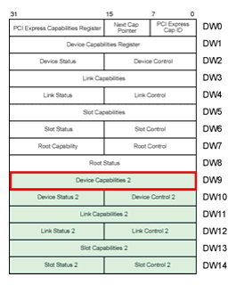

<a id="sec-16-8"></a>
## 16.8 Power Management | 电源管理

<table>
<thead><tr><th width="50%">🇬🇧 English</th><th width="50%">🇨🇳 中文</th></tr></thead>
<tbody>
<tr>
<td width="50%">

_Figure 16‐44: LTR ‐ Link Down Case_ 


<br>

</td>
<td width="50%">

## _**17 Interrupt Support**_

</td>
</tr>
<tr>
<td width="50%">

## _**17 Interrupt Support**_

</td>
<td width="50%">

## **上一章**

上一章提供了系统电源管理讨论的整体背景以及对 PCIe 电源管理的详细描述，电源管理与 _PCI Bus PM Interface Spec_ 以及 _Advanced Configuration and Power Interface_ (ACPI) 规范兼容。PCIe
定义了对 PCI-PM 规范的扩展，主要集中在链路电源和事件管理上。还提供了对 OnNow 计划、ACPI 以及 Windows 操作系统参与的概述。

</td>
</tr>
<tr>
<td width="50%">

## **The Previous Chapter** 

The previous chapter provides an overall context for the discussion of system power management and a detailed description of PCIe power
management, which is compatible with the _PCI Bus PM Interface Spec_ and the _Advanced Config‐ uration and Power Interface_ (ACPI) spec.
PCIe defines extensions to the PCI‐PM spec that focus primarily on Link Power and event management. An overview of the OnNow Initiative,
ACPI, and the involvement of the Windows OS is also provided.

</td>
<td width="50%">

## **本章**

本章描述 PCIe Function 可以生成中断的不同方式。旧的 PCI 模型使用引脚执行此操作，但在串行模型中边带信号是不可取的，因此带内 MSI（消息信号中断）机制的支持成为强制性要求。为了向后兼容软件，PCI INTx# 引脚操作仍然可以使用 PCIe INTx
消息进行模拟。PCI 旧式 INTx# 方法以及较新版本的 MSI/MSI-X 都进行了描述。

</td>
</tr>
<tr>
<td width="50%">

## **This Chapter** 

This chapter describes the different ways that PCIe Functions can generate interrupts. The old PCI model used pins for this, but sideband
signals are unde‐ sirable in a serial model so support for the inband MSI (Message Signaled Inter‐ rupt) mechanism was made mandatory. The
PCI INTx# pin operation can still be emulated using PCIe INTx messages for software backward compatibility reasons. Both the PCI legacy
INTx# method and the newer versions of MSI/MSI‐ X are described.

</td>
<td width="50%">

## **下一章**

下一章描述了为 PCIe 定义的三种类型的复位：基本复位（包括冷复位和热复位）、热复位和功能级复位 (FLR)。讨论了使用边带复位 PERST# 信号来生成系统复位，还讨论了描述的基于带内 TS1 的热复位。

</td>
</tr>
<tr>
<td width="50%">

## **The Next Chapter** 

The next chapter describes three types of resets defined for PCIe: Fundamental reset (consisting of cold and warm reset), hot reset, and
function‐level reset (FLR). The use of a sideband reset PERST# signal to generate a system reset is discussed, and so is the inband TS1
based Hot Reset described.

</td>
<td width="50%">

## **中断支持背景**

</td>
</tr>
<tr>
<td width="50%">

## **Interrupt Support Background**

</td>
<td width="50%">

## **概述**

PCI 体系结构支持来自外围设备的中断，作为提高其性能并减轻 CPU 必须轮询设备以确定何时需要服务的负担的一种手段。PCIe 在很大程度上从 PCI 继承了这种支持，允许软件向后兼容
PCI。我们在本章中提供有关系统中断处理的背景，但希望了解更多中断详细信息的读者鼓励查阅以下参考资料：

- 有关 PCI 中断的背景，请参阅 PCI 规范 3.0 版或 MindShare 教材的第 14 章：PCI System Architecture（www.mindshare.com）。

- 要了解有关 Local 和 IO APIC 的更多信息，请参阅 MindShare 教材：x86 Instruction Set Architecture。

</td>
</tr>
<tr>
<td width="50%">

## **General** 

The PCI architecture supported interrupts from peripheral devices as a means of improving their performance and offloading the CPU from the
need to poll devices to determine when they require servicing. PCIe inherits this support largely unchanged from PCI, allowing software
backwards compatibility to PCI. We provide a background to system interrupt handling in this chapter, but the reader who wants more details
on interrupts is encouraged to look into these references:

- For PCI interrupt background, refer to the PCI spec rev 3.0 or to chapter 14 of MindShare’s textbook: PCI System Architecture
(www.mindshare.com).

- To learn more about Local and IO APICs, refer to MindShare’s textbook: x86 Instruction Set Architecture.

</td>
<td width="50%">

## **两种中断传递方法**

PCI 使用路由到中央中断控制器的边带中断线。这种方法在简单的单 CPU 系统中运行良好，但存在一些缺点，这些缺点促使转移到一种称为 MSI（消息信号中断）的新方法，并带有一个称为 MSI-X（扩展）的扩展。

**旧式 PCI 中断传递** — 这种最初为 PCI 总线定义的机制由每个设备的最多四个信号或 INTx#（INTA#、INTB#、INTC# 和 INTD#）组成，如图 17-1（第 795 页）所示。在此模型中，引脚通过线或连接共享，它们最终将连接到 8259
PIC（可编程中断控制器）上的输入。当一个引脚被断言时，PIC 依次断言其到 CPU 的中断请求引脚，作为第 796 页"旧式模型"中描述的过程的一部分。

PCIe 支持此 PCI 中断功能以实现向后兼容性，但串行传输的设计目标是最小化引脚数。结果，INTx# 信号未作为边带引脚实现。相反，Function
可以生成带内中断消息数据包以指示引脚的断言或取消断言。这些消息充当"虚拟线路"，并以系统中的中断控制器（通常在根复合体中）为目标，如图 17-2（第 796 页）所示。该图还说明了使用

**第 17 章：中断支持**

引脚的旧 PCI 设备如何在 PCIe 系统中工作；桥将引脚的断言转换为向上游到根复合体的中断仿真消息 (INTx)。预期 PCIe 设备通常不需要使用 INTx 消息，但在撰写本文时，实际上它们经常这样做，因为尚未更新系统软件以支持 MSI。

_Figure 17-1: PCI Interrupt Delivery_

**— MSI 中断传递** MSI 通过使用内存写入来传递中断通知，从而消除了对边带信号的需要。术语"消息信号中断"可能会造成混淆，因为其名称中包含术语"消息"，这是 PCIe 中的 TLP 类型，但 MSI 中断是 Posted 内存写入而不是消息事务。MSI
内存写入仅通过它们寻址的目标地址与其他内存写入区分开，该地址通常由系统保留用于中断传递（例如，x86 基础系统传统上保留地址范围 FEEx_xxxxh 用于中断传递）。

图 17-2 说明了从各种类型的 PCIe 设备传递中断。所有 PCIe 设备都需要支持 MSI，但软件可能支持也可能不支持 MSI，在这种情况下，将使用 INTx 消息。图 17-2 还显示了 PCIe-to-PCI 桥如何需要将来自连接的 PCI 设备的边带中断转换为
PCIe 支持的 INTx 消息。

</td>
</tr>
<tr>
<td width="50%">

## **Two Methods of Interrupt Delivery** 

PCI used sideband interrupt wires that were routed to a central interrupt con‐ troller. This method worked well in simple, single‐CPU
systems, but had some shortcomings that motivated moving to a newer method called MSI (Message Signaled Interrupts) with an extension called
MSI‐X (eXtented).

**Legacy PCI Interrupt Delivery** — This original mechanism defined for the PCI bus consists of up to four signals per device or INTx#
(INTA#, INTB#, INTC#, and INTD#) as shown in Figure 17‐1 on page 795. In this model, the pins are shared by wire‐ORing them together, and
they’d eventually be connected to an input on the 8259 PIC (Programmable Interrupt Controller). When a pin is asserted, the PIC in turn
asserts its interrupt request pin to the CPU as part of a process described in “The Legacy Model” on page 796.

PCIe supports this PCI interrupt functionality for backward compatibility, but a design goal for serial transports is to minimize the pin
count. As a result, the INTx# signals were not implemented as sideband pins. Instead, a Function can generate an inband interrupt message
packet to indicate the assertion or deas‐ sertion of a pin. These messages act as “virtual wires”, and target the interrupt controller in
the system (typically in the Root Complex), as shown in Figure 17‐ 2 on page 796. This picture also illustrates how an older PCI device
using the
pins can work in a PCIe system; the bridge translates the assertion of a pin into an interrupt emulation message (INTx) going upstream to
the Root Complex. The expectation is that PCIe devices would not normally need to use the INTx messages but, at the time of this writing, in
practice they often do because sys‐ tem software has not been updated to support MSI.

_Figure 17‐1: PCI Interrupt Delivery_ 

**— MSI I nterrupt Delivery** MSI eliminates the need for sideband signals by using memory writes to deliver the interrupt notification. The
term “Message Signaled Interrupt” can be confusing because its name includes the term “Mes‐ sage” which is a type of TLP in PCIe, but an MSI
interrupt is a Posted Memory Write instead of a Message transaction. MSI memory writes are distinguished from other memory writes only by
the addresses they target, which are typi‐ cally reserved by the system for interrupt delivery (e.g., x86‐based systems tra‐ ditionally
reserve the address range FEEx_xxxxh for interrupt delivery).

Figure 17‐2 illustrates the delivery of interrupts from various types of PCIe devices. All PCIe devices are required to support MSI, but
software may or may not support MSI, in which case, the INTx messages would be used. Figure 17‐2 also shows how a PCIe‐to‐PCI Bridge is
required to convert sideband interrupts from connected PCI devices to PCIe‐supported INTx messages.

_Figure 17‐2: Interrupt Delivery Options in PCIe System_ 


<br>

</td>
<td width="50%">

## **旧式模型**

</td>
</tr>
<tr>
<td width="50%">

## **The Legacy Model**

</td>
<td width="50%">

## **概述**

为了说明旧式中断传递模型，请参考图 17-3（第 797 页）并考虑使用旧式中断引脚方法进行中断传递所涉及的常规步骤：

1. 设备通过向控制器断言其引脚来生成中断。在较旧的系统中，该控制器通常是具有 15 个 IRQ 输入和一个 INTR 输出的 Intel 8259 PIC。然后 PIC 将断言 INTR 以通知 CPU 一个或多个中断挂起。

**第 17 章：中断支持**

2. 一旦 CPU 检测到 INTR 的断言并准备好对其采取行动，它必须识别哪个中断实际需要服务，这是通过 CPU 在处理器总线上发出称为中断确认的特殊命令来完成的。

3. 该命令由系统路由到 PIC，PIC 返回一个称为中断向量的 8 位值，以报告当前挂起的最高优先级中断。每个 IRQ 输入的唯一向量先前已由系统软件编程。

4. 中断处理程序然后使用该向量作为中断表（由软件设置的区域，用于包含所有中断服务例程 ISR 的起始地址）中的偏移量，并获取在该位置找到的 ISR 起始地址。

5. 该地址将指向已设置为处理此中断的 ISR 的第一条指令。此处理程序将被执行，服务该中断并告诉其设备取消其 INTx# 线的断言，然后将控制权返回给先前被中断的任务。

</td>
</tr>
<tr>
<td width="50%">

## **General** 

To illustrate the legacy interrupt delivery model, refer to Figure 17‐3 on page 797 and consider the usual steps involved in interrupt
delivery using the legacy method of interrupt pins:

1. The device generates an interrupt by asserting its pin to the controller. In older systems this controller was typically an Intel 8259
PIC that had 15 IRQ inputs and one INTR output. The PIC would then assert INTR to inform the CPU that one or more interrupts were pending.
2. Once the CPU detects the assertion of INTR and is ready to act on it, it must identify which interrupt actually needs service, and that
is done by the CPU issuing a special command on the processor bus called an Interrupt Acknowledge.

3. This command is routed by the system to the PIC, which returns an 8‐bit value called the Interrupt Vector to report the highest priority
interrupt cur‐ rently pending. A unique vector would have been programmed earlier by system software for each IRQ input.

4. The interrupt handler then uses the vector as an offset into the Interrupt Table (an area set up by software to contain the start
addresses of all the Interrupt Service Routines, ISRs), and fetches the ISR start address it finds at that location.

5. That address would point to the first instruction of the ISR that had been set up to handle this interrupt. This handler would be
executed, servicing the interrupt and telling its device to deassert its INTx# line and then would return control to the previously
interrupted task.

_Figure 17‐3: Legacy Interrupt Example_ 


<br>

</td>
<td width="50%">

## **对多处理器的支持变更**

此模型在单 CPU 系统中运行良好，但有一个限制使其在多 CPU 系统中不是最优的。问题是 INTR 引脚只能连接到一个 CPU。如果存在多个处理器，则只有其中一个处理器将看到中断，并且必须为所有中断提供服务，而其他 CPU
看不到任何中断。为了获得最佳性能，此类系统实际上需要在所有处理器之间均匀分配系统任务，称为 SMP（对称多处理），但引脚模型不支持它。

为了实现更好的 SMP，需要一种新模型，为此，PIC 被修改为 IO APIC（高级可编程中断控制器）。IO APIC 被设计为具有一个称为 APIC 总线的单独小型总线，它可以通过该总线传递中断消息，如图 17-4（第 799
页）所示。在此模型中，消息包含中断向量号，因此不需要 CPU 将中断确认向下发送到 IO 世界以获取它。APIC 总线连接到处理器内称为本地 APIC
的新内部逻辑块。该总线在所有代理之间共享，任何代理都可以在其上发起消息，但出于我们的目的，有趣的部分是它用于来自外围设备的中断传递。现在可以通过软件静态分配这些中断以由不同的 CPU 服务、多个 CPU 服务，甚至可以由 IO APIC 动态分配。

**第 17 章：中断支持**

该模型称为 APIC 模型，多年来已经足够使用，但仍然依赖于来自外围设备的边带引脚。该模型的另一个限制是到 IO APIC 的 IRQ（中断请求线）数量。如果没有大量的 IRQ，外围设备必须共享 IRQ，这意味着每当该 IRQ
被断言时都会增加延迟，因为可能有多个设备可以断言它，并且软件必须评估所有这些设备。这种将多个 ISR 链接在一起的技术通常称为中断链接 (interrupt chaining)。最终，由于这个问题和另外一些小问题，又出现了另一个改进。

为什么不让外围设备本身直接向本地 APIC 发送中断消息？所需的只是一种通信路径，它已经以 PCI 总线和处理器总线的形式存在。因此，APIC 总线被消除，所有中断都以内存写入的形式传递到本地 APIC，称为 MSI 或消息信号中断。这些 MSI 针对系统理解为针对本地 APIC
的中断消息的特殊地址。（此特殊地址是

对于 x86 基础系统，传统上为 FEEx_xxxxh。）甚至 IO APIC 也被编程为使用内存写入 (MSI) 通过普通数据总线发送其中断通知。现在它只需通过数据总线发送针对所需处理器的本地 APIC 的内存地址的 MSI 内存写入，这具有通知处理器中断的效果。

该模型称为 xAPIC 模型，由于它不基于进入输入有限的中断控制器的边带信号，因此几乎消除了共享中断的需要。有关此模型的更多信息可以在第 827 页的"An MSI Solution"中找到。

</td>
</tr>
<tr>
<td width="50%">

## **Changes to Support Multiple Processors** 

This model works well for single‐CPU systems, but has a limitation that makes it sub‐optimal in a multi‐CPU system. The problem is that the
INTR pin can only be connected to one CPU. If multiple processors are present then only one of them will see the interrupts and will have to
service them all while the other CPUs won’t see any of them. To obtain the best performance, such systems really need an even distribution
of the system tasks across all the processors, referred to as SMP (Symmetric Multi‐Processing) but the pin model won’t sup‐ port it.

To achieve better SMP, a new model was needed, and toward this end the PIC was modified to become the IO APIC (Advanced Programmable
Interrupt Con‐ troller). The IO APIC was designed to have a separate small bus, called the APIC Bus, over which it could deliver interrupt
messages, as shown in Figure 17‐4 on page 799. In this model, the message contained the interrupt vector number, so there was no need for
the CPU to send an Interrupt Acknowledge down into the IO world to fetch it. The APIC Bus connected to a new internal logic block within the
processors called the Local APIC. The bus was shared among all the agents and any of them could initiate messages on it but, for our
purposes, the interesting part is its use for interrupt delivery from peripherals. Those interrupts could now be statically assigned by
software to be serviced by different CPUs, multiple CPUs or even dynamically assigned by the IO APIC.
_Figure 17‐4: APIC Model for Interrupt Delivery_ 


<br>


That model, known as the APIC model, was sufficient for several years but still depended on sideband pins from the peripheral devices to
work. Another limi‐ tation of this model was the number of IRQs (interrupt request lines) into the IO APIC. Without a very large number of
IRQs, peripheral devices had to share IRQs which means added latency anytime that IRQ is asserted because there could be multiple devices
that could have asserted it and software must evalu‐ ate all of them. This technique of linking multiple ISRs together was often referred to
as interrupt chaining. Eventually, because of this issue and a couple other minor issues, another improvement came along.

Why not have the peripheral devices themselves send interrupt messages directly to the Local APICs? All that is needed is a communications
path which already exists in the form of the PCI bus and the processor bus. So the APIC bus was eliminated and all interrupts were delivered
to the Local APICs in the form of memory writes, referred to as MSIs or Message Signaled Interrupts. These MSIs were targeting a special
address that the system understood to be an inter‐ rupt message targeting the Local APICs. (This special address address was tra‐

ditionally FEEx_xxxxh for x86‐based systems.) Even the IO APIC was programmed to send its interrupt notifications over the ordinary data bus
using memory writes (MSI). Now it simply sends an MSI memory write across the data bus targeting the memory address of the desired
processor’s Local APIC, and that has the effect of notifying the processor of the interrupt.

This model is known as the xAPIC model, and since it is not based on sideband signals which go into an interrupt controller with a limited
number of inputs, the need to share interrupts is almost eliminated. More information can be found about this model in “An MSI Solution” on
page 827.

</td>
<td width="50%">

</td>
</tr>

</tbody>
</table>

<p align="center"><b>Figure 16-44: LTR ‐ Link Down Case</b></p>
<p align="center"></p>
<p align="center"><sub>📄 <a href="figures/chapter_16_Power_Management/embedded/page0761_img1.png">Page 761</a></sub></p>


<p align="center"><b>Figure 17-2: Interrupt Delivery Options in PCIe System</b></p>
<p align="center"></p>
<p align="center"><sub>📄 <a href="figures/chapter_16_Power_Management/embedded/page0761_img1.png">Page 761</a></sub></p>


<p align="center"><b>Figure 17-3: Legacy Interrupt Example</b></p>
<p align="center"></p>
<p align="center"><sub>📄 <a href="figures/chapter_16_Power_Management/embedded/page0761_img1.png">Page 761</a></sub></p>


<p align="center"><b>Figure 17-4: APIC Model for Interrupt Delivery</b></p>
<p align="center"></p>
<p align="center"><sub>📄 <a href="figures/chapter_16_Power_Management/embedded/page0761_img1.png">Page 761</a></sub></p>

<table>
<thead><tr><th width="50%">🇬🇧 English</th><th width="50%">🇨🇳 中文</th></tr></thead>
<tbody>
<tr>

</tr>
</tbody>
</table>

[⬆️ 返回目录](#本章目录-table-of-contents)

---


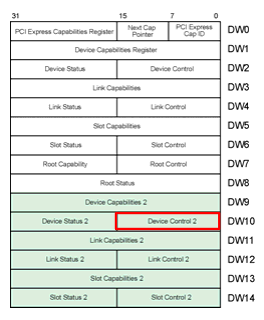

<a id="sec-16-9"></a>
## 16.9 Power Management | 电源管理

<table>
<thead><tr><th width="50%">🇬🇧 English</th><th width="50%">🇨🇳 中文</th></tr></thead>
<tbody>
<tr>
<td width="50%">

PCI added MSI support as an option years ago and PCIe made that capability a requirement. A peripheral that can generate MSI transactions on
its own opens new options for handling interrupts, such as giving each Function the ability to generate multiple unique interrupts instead
of just one.

</td>
<td width="50%">

多年前，PCI 将 MSI 支持作为可选项添加，而 PCIe 将该功能设为必需。能够自行生成 MSI 事务的外围设备为处理中断开辟了新的选择，例如赋予每个 Function 生成多个唯一中断的能力，而不仅仅是一个。

</td>
</tr>
<tr>
<td width="50%">

## **Legacy PCI Interrupt Delivery** 

This section provides more detail on legacy PCI interrupt delivery. Readers familiar with PCI may wish to proceed to “Virtual INTx
Signaling” on page 805 to learn more about how PCIe emulates this legacy model, or to “The MSI Model” on page 812 to learn more about that
method.

PCI devices that use interrupts have two options. They may use either: 

- INTx# active low‐level signals that can be shared and were defined in the original spec. 

- Message Signaled Interrupts that were added as an option with the 2.2 ver‐ sion of the spec. MSI needs no modification for use in a PCIe
system.

</td>
<td width="50%">

## **旧式 PCI 中断传递**

本节提供有关旧式 PCI 中断传递的更多详细信息。熟悉 PCI 的读者可能希望跳到第 805 页的"Virtual INTx Signaling"，以了解 PCIe 如何模拟此旧式模型，或者跳到第 812 页的"The MSI Model"以了解该方法。

使用中断的 PCI 设备有两种选择。它们可以使用：

- 原始规范中定义的、可共享的 INTx# 低电平有效信号。

- 随规范 2.2 版添加为可选项的消息信号中断。MSI 无需修改即可在 PCIe 系统中使用。

</td>
</tr>
<tr>
<td width="50%">

## **Device INTx# Pins** 

A PCI device can implement up to 4 INTx# signals (INTA#, INTB#, INTC#, and INTD#). More than one pin is available because PCI devices can
support up to 8 functions, each of which is allowed to drive one (but only one) interrupt pin. When PCI was developed, a typical system used
a chipset that included the 15‐ input 8259 PIC, so that’s how many IRQs (which map to interrupt vectors) that were available to the system.
However, many of those were already used for system purposes like the system timer, keyboard interrupt, mouse interrupt, and so on. In
addition, some pins were reserved for ISA cards that could still be plugged into these older systems. Consequently, the PCI spec writers
consid‐ ered that only four IRQs would reliably be available for their new bus, and so the spec only supported four interrupt pins. However,
as you probably know, there are typically more than four PCI devices on a PCI bus and even a single device could have more than four
functions inside, each wanting its own inter‐
rupt. These reasons are why the PCI interrupts were designed to be level‐sensi‐ tive and shareable. These signals could simply be wire‐ORed
together to get down to a handful of resulting outputs, each one representing interrupt requests. Since they are shared, when an interrupt
is detected, the interrupt handler software will need to go through the list of functions that are sharing the same pin and test to see
which ones need servicing.

</td>
<td width="50%">

## **设备 INTx# 引脚**

PCI 设备最多可以实现 4 个 INTx# 信号（INTA#、INTB#、INTC# 和 INTD#）。提供多个引脚是因为 PCI 设备最多可以支持 8 个功能，每个功能允许驱动一个（但只有一个）中断引脚。在开发 PCI 时，典型系统使用包含 15 输入 8259 PIC
的芯片组，因此系统可用的 IRQ 数量（映射到中断向量）就是那么多。但是，其中许多已被用于系统用途，如系统计时器、键盘中断、鼠标中断等。此外，某些引脚是为仍可插入这些较旧系统的 ISA 卡保留的。因此，PCI 规范编写者认为只有四个 IRQ
可以可靠地用于其新总线，因此规范仅支持四个中断引脚。但是，您可能知道，PCI 总线上通常有四个以上的 PCI 设备，甚至单个设备内部可以有四个以上的功能，每个都需要自己的中断。

**第 17 章：中断支持**

这些原因就是 PCI 中断被设计为电平敏感和可共享的原因。这些信号可以简单地线或在一起以获得少量结果输出，每个输出表示中断请求。由于它们是共享的，因此当检测到中断时，中断处理程序软件将需要遍历共享同一引脚的 Function 列表，并测试哪些需要服务。

</td>
</tr>
<tr>
<td width="50%">

## **Determining INTx# Pin Support** 

PCI functions indicate support for an INTx# signal in their configuration head‐ ers. The read‐only Interrupt Pin register illustrated in
Figure 17‐5 indicates whether an INTx# is supported by this function and if so, which interrupt pin will it assert when requesting an
interrupt.

_Figure 17‐5: Interrupt Registers in PCI Configuration Header_ 


<br>

</td>
<td width="50%">

## **确定 INTx# 引脚支持**

PCI Function 在其配置头中指示对 INTx# 信号的支持。图 17-5 中所示的只读中断引脚寄存器指示此 Function 是否支持 INTx#，如果是，将在请求中断时断言哪个中断引脚。

</td>
</tr>
<tr>
<td width="50%">

## **Interrupt Routing** 

The Interrupt Line register shown in Figure 17‐5 on page 801 gives the next information that a driver needs to know: the input pin of the
PIC to which this pin has been connected. The PIC is programmed by system software with a unique vector number for each input pin (IRQ). The
vector for the highest‐prior‐ ity interrupt asserted is reported to the processor who then uses that vector to index into a corresponding
entry in the interrupt vector table. This entry points to the interrupting device’s interrupt service routine which the processor exe‐
cutes.

The platform designer assigns the routing of INTx# pins from devices. They can be routed in a variety of ways, but ultimately each INTx# pin
connects to an input of the interrupt controller. Figure 17‐6 on page 803 illustrates an example in which several PCI device interrupts are
connected to the interrupt controller through a programmable router. All signals connected to a given input of the programmable router will
be directed to a specific input of the interrupt con‐ troller. Functions whose interrupts are routed to a common interrupt controller input
will all have the same Interrupt Line number assigned to them by plat‐ form software (typically firmware). In this example, IRQ15 has three
PCI INTx# inputs from different devices connected to it. Consequently, the functions using these INTx# lines will share IRQ15 and will
therefore all cause the controller to send the same vector when queried. That vector will have the three ISRs for the different Functions
chained together.

</td>
<td width="50%">

## **中断路由**

图 17-5（第 801 页）中所示的中断行寄存器提供了驱动程序需要了解的下一个信息：该设备的引脚已连接到的 PIC 的输入引脚。PIC
由系统软件编程，每个输入引脚（IRQ）具有唯一的向量号。所断言的最高优先级中断的向量被报告给处理器，然后处理器使用该向量索引到中断向量表中的相应条目。此条目指向中断设备的 ISR，处理器将执行它。

平台设计人员分配 INTx# 引脚来自设备的路由。它们可以以各种方式路由，但最终每个 INTx# 引脚都连接到中断控制器的输入。第 803 页的图 17-6 示出了一个示例，其中多个 PCI
设备中断通过可编程路由器连接到中断控制器。连接到给定可编程路由器输入的所有信号将被定向到中断控制器的特定输入。由平台软件（通常为固件）将其中断路由到公共中断控制器输入的 Function 将具有相同的中断行编号分配给它们。在此示例中，IRQ15 上连接了来自不同设备的三个 PCI
INTx# 输入。因此，使用这些 INTx# 线的 Function 将共享 IRQ15，因此它们都会导致控制器在被查询时发送相同的向量。该向量将具有链接在一起的不同 Function 的三个 ISR。

</td>
</tr>
<tr>
<td width="50%">

## **Associating the INTx# Line to an IRQ Number** 

Based on system requirements, the router is programmed to connect its four inputs to four available PIC inputs. Once this is done, the
routing of the INTx# pin associated with each function is known and the Interrupt Line number is written by software into each Function. The
value is ultimately read by the Function’s device driver so it will know which interrupt table entry it has been assigned. That’s the place
where the starting address of its ISR will be written, a process referred to as “hooking the interrupt”. When this function later gener‐
ates an interrupt, the CPU will receive the vector number that corresponds to the IRQ specified in the Interrupt Line register. The CPU uses
this vector to index into the interrupt vector table to fetch the entry point of the interrupt ser‐ vice routine associated with the
Function’s device driver.
_Figure 17‐6: INTx Signal Routing is Platform Specific_ 


<br>

</td>
<td width="50%">

## **将 INTx# 线关联到 IRQ 编号**

根据系统要求，对路由器进行编程以将其四个输入连接到四个可用的 PIC 输入。完成此操作后，与每个 Function 关联的 INTx# 引脚的路由是已知的，并且中断行号由软件写入每个 Function。该值最终由 Function
的设备驱动程序读取，以便知道已为其分配了哪个中断表条目。那就是将写入其 ISR 的起始地址的位置，此过程称为"挂接中断"。当此 Function 稍后生成中断时，CPU 将接收与中断行寄存器中指定的 IRQ 对应的向量号。CPU 使用此向量索引到中断向量表中，以获取与
Function 设备驱动程序关联的中断服务例程的入口点。

**第 17 章：中断支持**

</td>
</tr>
<tr>
<td width="50%">

## **INTx# Signaling** 

The INTx# lines are active‐low signals implemented as open‐drain with a pul‐ lup resistor provided on each line by the system. Multiple
devices connected to the same PCI interrupt request signal line can assert it simultaneously without damage.

When a Function signals an interrupt it also sets the Interrupt Status bit located in the Status register of the config header. This bit can
be read by system soft‐ ware to see if an interrupt is currently pending. (See Figure 17‐8 on page 805.)

**Interrupt Disable.** The 2.3 PCI spec added an Interrupt Disable bit (Bit 10) to the Command register of the config header. See Figure
17‐7 on page 804. The bit is cleared at reset permitting INTx# signal generation, but software may set it

to prevent that. Note that the Interrupt Disable bit has no effect on Message Sig‐ nalled Interrupts (MSI). MSIs are enabled via the Command
Register in the MSI Capability structure. Enabling MSI automatically has the effect of disabling interrupt pins or emulation.

**Interrupt Status.** The PCI 2.3 spec added a read‐only Interrupt Status bit to the configuration status register (pictured in Figure 17‐8
on page 805). A func‐ tion must set this status bit when an interrupt is pending. In addition, if the Interrupt Disable bit in the Command
register of the header is cleared (i.e. inter‐ rupts enabled), then the function’s INTx# signal is asserted when this status bit is set.
This bit is unaffected by the state of the Interrupt Disable bit.

_Figure 17‐7: Configuration Command Register — Interrupt Disable Field_ 


<br>

_Figure 17‐8: Configuration Status Register — Interrupt Status Field_ 


<br>

</td>
<td width="50%">

## **INTx# 信令**

INTx# 线是低电平有效信号，作为漏极开路实现，由系统在线上提供上拉电阻。连接到同一 PCI 中断请求信号线的多个设备可以同时断言它而不会损坏。

当 Function 发出中断信号时，它还会设置配置头的状态寄存器中的中断状态位。该位可由系统软件读取以查看当前是否有中断挂起。（参见第 805 页的图 17-8。）

**中断禁用。** 2.3 PCI 规范将中断禁用位（第 10 位）添加到配置头的命令寄存器中。参见第 804 页的图 17-7。该位在复位时清零，允许 INTx# 信号生成，但软件可以设置它

以防止这种情况。注意，中断禁用位对消息信号中断 (MSI) 没有影响。MSI 通过 MSI 能力结构中的命令寄存器启用。启用 MSI 自动具有禁用中断引脚或仿真的效果。

**中断状态。** PCI 2.3 规范将一个只读中断状态位添加到配置状态寄存器中（如图 17-8（第 805 页）所示）。Function 在中断挂起时必须设置此状态位。此外，如果配置头的命令寄存器中的中断禁用位被清零（即中断已启用），则当此状态位被设置时，Function 的
INTx# 信号被断言。此位不受中断禁用位状态的影响。

**第 17 章：中断支持**

</td>
</tr>
<tr>
<td width="50%">

## **Virtual INTx Signaling**

</td>
<td width="50%">

## **虚拟 INTx 信令**

</td>
</tr>
<tr>
<td width="50%">

## **General** 

If circumstances make the use of MSI not possible in a PCIe topology, the INTx signaling model would be used. Following are two examples of
devices that would need to be able to use INTx messages:

**PCIe‐to‐(PCI or PCI‐X) bridges** — Most PCI devices will use the INTx# pins because MSI support is optional for them. Since PCIe doesn’t
support sideband interrupt signaling, the inband messages are used instead. The interrupt con‐ troller understands the message and delivers
an interrupt request to the CPU which would include a pre‐programmed vector number.

**Boot Devices** — PC systems commonly use the legacy interrupt model during the boot sequence because MSI usually requires OS‐level
initialization. Gener‐ ally, a minimum of three subsystems are needed for booting: an output to the operator such as video, an input from
the operator which is typically the key‐ board, and a device that can be used to fetch the OS, typically a hard drive. PCIe devices involved
in initializing the system are called “boot devices.” Boot devices will use legacy interrupt support until the OS and device drivers are
loaded, after which it’s preferable they use MSI.

</td>
<td width="50%">

## **概述**

如果在 PCIe 拓扑中使用 MSI 不可能，则将使用 INTx 信令模型。以下是可能需要能够使用 INTx 消息的设备的两个示例：

**PCIe-to-(PCI or PCI-X) 桥** — 大多数 PCI 设备将使用 INTx# 引脚，因为 MSI 支持对它们是可选的。由于 PCIe 不支持边带中断信令，因此改用带内消息。中断控制器理解该消息并将中断请求传送到 CPU，其中将包括预编程的向量号。

**启动设备** — PC 系统通常在启动序列期间使用旧式中断模型，因为 MSI 通常需要操作系统级初始化。通常，引导至少需要三个子系统：到操作员的输出（例如视频）、来自操作员的输入（通常是键盘）以及可用于获取操作系统的设备（通常是硬盘驱动器）。参与初始化系统的 PCIe
设备称为"启动设备"。启动设备将使用旧式中断支持，直到加载操作系统和设备驱动程序，此后最好使用 MSI。

</td>
</tr>
<tr>
<td width="50%">

## **Virtual INTx Wire Delivery** 

Figure 17‐9 on page 806 illustrates a system with a PCIe Endpoint and a PCI Express‐to‐PCI Bridge. If we assume software has not enabled MSI
on the End‐ point, it will deliver interrupt requests with INTx messages. In this example, the bridge is propogating pin‐based interrupts
from connected PCI devices with INTx messages. As can be seen, the bridge sends an INTB messages to signal the assertion and deassertion of
its INTB# input from the PCI bus. The PCIe Endpoint is shown signaling an INTA using emulation messages. Note that INTx# signaling involves
two messages:

- **Assert_INTx** messages indicate a high‐to‐low transition (from inactive to active) of the virtual INTx# signal. 

- **Deassert_INTx** messages indicate a low‐to‐high transition. 

When a Function delivers an Assert_INTx message, it also sets its Interrupt Sta‐ tus bit in the Configuration Status register, just as it
would if it asserted the physical INTx# pin (see Figure 17‐8 on page 805).

_Figure 17‐9: Example of INTx Messages to Virtualize INTA#‐INTD# Signal Transitions_ 


</td>
<td width="50%">

## **虚拟 INTx 线传递**

图 17-9（第 806 页）说明了具有 PCIe 端点和 PCI Express-to-PCI 桥的系统。如果我们假设软件未在端点上启用 MSI，它将使用 INTx 消息传递中断请求。在此示例中，桥使用 INTx 消息传播来自所连接 PCI
设备的基于引脚的中断。可以看出，桥发送 INTB 消息以发出其来自 PCI 总线的 INTB# 输入的断言和取消断言信号。PCIe 端点显示使用仿真消息发出 INTA 信号。注意，INTx# 信令涉及两条消息：

- **Assert_INTx** 消息指示虚拟 INTx# 信号的高电平到低电平转换（从无效到有效）。

- **Deassert_INTx** 消息指示低电平到高电平转换。

当 Function 传递 Assert_INTx 消息时，它还会在配置状态寄存器中设置其中断状态位，就像它断言物理 INTx# 引脚一样（参见第 805 页的图 17-8）。

</td>
</tr>

</tbody>
</table>

<p align="center"><b>Figure 17-5: Interrupt Registers in PCI Configuration Header</b></p>
<p align="center"></p>
<p align="center"><sub>📄 <a href="figures/chapter_16_Power_Management/embedded/page0761_img1.png">Page 761</a></sub></p>


<p align="center"><b>Figure 17-6: INTx Signal Routing is Platform Specific</b></p>
<p align="center"></p>
<p align="center"><sub>📄 <a href="figures/chapter_16_Power_Management/embedded/page0761_img1.png">Page 761</a></sub></p>


<p align="center"><b>Figure 17-7: Configuration Command Register — Interrupt Disable Field</b></p>
<p align="center"></p>
<p align="center"><sub>📄 <a href="figures/chapter_16_Power_Management/embedded/page0761_img1.png">Page 761</a></sub></p>


<p align="center"><b>Figure 17-8: Configuration Status Register — Interrupt Status Field</b></p>
<p align="center"></p>
<p align="center"><sub>📄 <a href="figures/chapter_16_Power_Management/embedded/page0761_img1.png">Page 761</a></sub></p>


<p align="center"><b>Figure 17-9: Example of INTx Messages to Virtualize INTA#-INTD# Signal Transitions</b></p>
<p align="center"></p>
<p align="center"><sub>📄 <a href="figures/chapter_16_Power_Management/embedded/page0761_img1.png">Page 761</a></sub></p>

<table>
<thead><tr><th width="50%">🇬🇧 English</th><th width="50%">🇨🇳 中文</th></tr></thead>
<tbody>
<tr>

</tr>
</tbody>
</table>

[⬆️ 返回目录](#本章目录-table-of-contents)

---

> 🤖 Generated by `tools/merge_chapters.py`


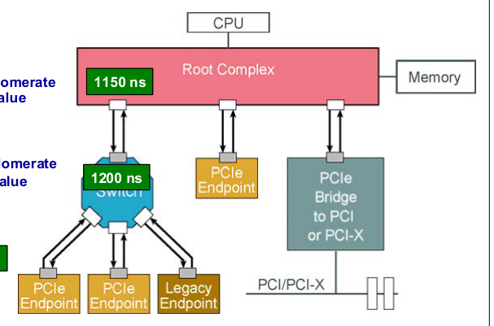

---


\newpage

# 📘 第 17 章　中断支持 (Chapter 17. Interrupt Support)

**MindShare PCI Express Technology 3.0 — Comprehensive Guide to Generations 1.x, 2.x and 3.0**

> 📁 **Source chunks**: `chunks/chunk0332.md` ... `chunks/chunk0340.md`
> 🎨 **Format**: 中英对照双语 · 中文灰底 (PCIe 6.2 Spec 模板)

---

## 📑 本章目录 (Table of Contents)

- [17.1 Interrupt Support — 中断支持](#sec-17-1)
- [17.2 Interrupt Support — 中断支持](#sec-17-2)
- [17.4 Interrupt Support — 中断支持](#sec-17-4)
- [17.5 Interrupt Support — 中断支持](#sec-17-5)
- [17.6 Interrupt Support — 中断支持](#sec-17-6)
- [17.7 Interrupt Support — 中断支持](#sec-17-7)

<a id="sec-17-1"></a>
## 17.1 Interrupt Support | 中断支持

<table>
<thead><tr><th width="50%">🇬🇧 English</th><th width="50%">🇨🇳 中文</th></tr></thead>
<tbody>
<tr>
<td width="50%">

CPU<br>Root Complex<br>Memory<br>Interrupt Controller<br>Switch<br>Assert_INTA Assert_INTB<br>Deassert_INTA Deassert_INTB<br>INTA#<br>PCIe
PCIe- INTB#<br>Endpoint PCI(X) INTC#INTD#<br>Bridge<br>PCI(X)<br>**Chapter 17: Interrupt Support**

</td>
<td width="50%">

CPU<br>
Root Complex<br>
Memory<br>
Interrupt Controller<br>
Switch<br>
Assert_INTA Assert_INTB<br>
Deassert_INTA Deassert_INTB<br>
INTA#<br>
PCIe PCIe- INTB#<br>
Endpoint PCI(X) INTC#INTD#<br>
Bridge<br>
PCI(X)<br>
**第 17 章：中断支持**

</td>
</tr>
<tr>
<td width="50%">

## **INTx Message Format** 

Figure 17‐10 on page 807 depicts the format of the INTx message header. The interrupt controller is the ultimate destination of these
messages, however the routing method employed is _not_ “Route to the Root Complex”, but is actually “Local ‐ Terminate at Receiver” as shown
in Figure 17‐10. There are two reasons for this. The first is because each bridge (including Switch Ports and Root Ports) along the upstream
path may map the virtual interrupt wire to a different vir‐ tual interrupt wire across the bridge (e.g., a Switch Port receives Assert_INTA
but maps it to Assert_INTB when propogating it upstream). More info about this INTx mapping can be found in “INTx Mapping” on page 808.

The second reason for the local routing type of these messages is due to the fact that we’re emulating a pin‐based signal. If a port
receives an assert interrupt message that maps to INTA on its primary side and it has already sent an Assert_INTA message upstream because
of a previous interrupt, then there is no reason to send another one. INTA is already seen as asserted. More info about this collapsing of
INTx messages can be found in “INTx Collapsing” on page 810.

_Figure 17‐10: INTx Message Format and Type_ 

|||||+0|+0|||||||||+1|+1|||||||||+2|+2|+3|+3|||||
|---|---|---|---|---|---|---|---|---|---|---|---|---|---|---|---|---|---|---|---|---|---|---|---|---|---|---|---|---|---|---|---|
||7|6|5|4|3|2|1|0||7||6|5|4|3|2||1|0|7|6||5|4|3|7 6 5 4 <br> 2 1 0|3|2|1|0||
|Byte 0|Fmt 0 0 1|||Type 1 0**1 0**||||**0**||R||TC|||R|At tr||R|T H|T D|E P||Attr||Length AT|
|Byte 4|||||Requester||||||||ID|||||||||||Tag||**Message**||**Code**||||
|Byte 8|||||||||||Reserved for INTx|||||||||||Messages||||||||||
|Byte 12|||||||||||Reserved for INTx|||||||||||Messages||||||||||
|**Local**|||**- Terminate**|||||||**at Receiver**|||||||||||||||**20h = Assert_INTA**|||||||
||||||||||||||||||||||||||**21h = Assert_INTB**|||||||
||||||||||||||||||||||||||**22h = Assert_INTC**|||||||
||||||||||||||||||||||||||**23h = Assert_INTD**|||||||
||||||||||||||||||||||||||**24h = Deassert_INTA**|||||||
||||||||||||||||||||||||||**25h = Deassert_INTB**|||||||
||||||||||||||||||||||||||**26h = Deassert_INTC**|||||||
||||||||||||||||||||||||||**27h = Deassert_INTD**|||||||

</td>
<td width="50%">

## **INTx 消息格式**

图 17-10（第 807 页）描述了 INTx 消息头的格式。中断控制器是这些消息的最终目的地，但是，所采用的路由方法_不是_"Route to the Root Complex"，而实际上是"Local ‐ Terminate at Receiver"，如图 17-10
所示。这有两个原因。第一个是因为沿上游路径的每个桥（包括交换机端口和根端口）可以将虚拟中断线映射到跨桥的不同虚拟中断线（例如，交换机端口收到 Assert_INTA 但在上游传播时将其映射到 Assert_INTB）。有关此 INTx 映射的更多信息，请参见第 808
页的"INTx Mapping"。

使用本地路由类型的第二个原因是由于我们正在模拟基于引脚的信号。如果端口收到映射到其主侧 INTA 的断言中断消息，并且由于先前的中断已经向上游发送了 Assert_INTA 消息，则没有理由再发送一条。INTA 已被视为已断言。有关 INTx 消息合并的更多信息，请参见第 810
页的"INTx Collapsing"。

_Figure 17-10: INTx Message Format and Type_

|||||+0|+0|||||||||+1|+1|||||||||+2|+2|+3|+3|||||
|---|---|---|---|---|---|---|---|---|---|---|---|---|---|---|---|---|---|---|---|---|---|---|---|---|---|---|---|---|---|---|
||7|6|5|4|3|2|1|0||7||6|5|4|3|2||1|0|7|6||5|4|3|7 6 5 4 <br> 2 1 0|3|2|1|0||
|Byte 0|Fmt 0 0 1|||Type 1 0**1 0**||||**0**||R||TC|||R|At tr||R|T H|T D|E P||Attr||Length AT|
|Byte 4|||||Requester||||||||ID|||||||||||Tag||**Message**||**Code**||||
|Byte 8|||||||||||Reserved for INTx|||||||||||Messages||||||||||
|Byte 12|||||||||||Reserved for INTx|||||||||||Messages||||||||||
|**Local**|||**- Terminate**|||||||**at Receiver**|||||||||||||||**20h = Assert_INTA**|||||||
||||||||||||||||||||||||||**21h = Assert_INTB**|||||||
||||||||||||||||||||||||||**22h = Assert_INTC**|||||||
||||||||||||||||||||||||||**23h = Assert_INTD**|||||||
||||||||||||||||||||||||||**24h = Deassert_INTA**|||||||
||||||||||||||||||||||||||**25h = Deassert_INTB**|||||||
||||||||||||||||||||||||||**26h = Deassert_INTC**|||||||
||||||||||||||||||||||||||**27h = Deassert_INTD**|||||||

</td>
</tr>
<tr>
<td width="50%">

## **Mapping and Collapsing INTx Messages**

</td>
<td width="50%">

## **INTx 消息的映射与合并**

</td>
</tr>
<tr>
<td width="50%">

## **INTx Mapping** 

Switches must adhere to the INTx mapping defined by the PCI spec, shown in Table 17‐1 on page 809. This mapping defines the virtual
connection that exists when interrupts are routed across a PCI‐to‐PCI bridge. The mapping is based on the INTx message type and the Device
number from the Requester ID field in the message.

Refer to Figure 17‐11 on page 810 for this example. The assert interrupt mes‐ sages received on the two downstream switch ports are both
INTA messages. The virtual PCI‐to‐PCI bridge at each of the ingress ports will map both INTA messages to INTA, meaning no change. This is
because the Device number of both originating Endpoint devices is zero (which is contained in the interrupt message itself as part of the
Requester ID, ReqID). Table 17‐1 shows that inter‐ rupts messages coming from Device 0 map to the same INTx message on the other side of the
bridge (i.e., internal to the Switch both INTA messages are mapped to INTA). So each downstream port will propogate the interrupt mes‐ sages
upstream without changing their virtual wire. However, the propogated interrupt messages no longer have the ReqID of the original requester,
they now have the ReqID of the port that is propogating the interrupt message.

Next, the upstream Switch Port receives the propogated interrupt messages. The INTA interrupt from port 2:1:0 is going to be mapped to an
INTB message when progopated upstream because the interrupt message indicates it came from Device 1 (ReqID 2:1:0). The other interrupt being
propogated by port 2:2:0 is going to be mapped to an INTC message when sent from the upstream Switch Port to the Root Port. Refer to Table
17‐1 to confirm these mappings.

The reason for this interrupt mapping is the same as it was for PCI: to avoid as much as possible having multiple functions sharing the same
INTx# pin. As stated previously, single function devices are required to use INTA if using leg‐ acy interrupts. So if all the Functions
downstream of a Root Port used INTA and there was no mapping across bridges, they would all be routed to the same IRQ. Which means anytime
one of the Functions asserted INTA, all the Functions would have to be checked. This would result in significant interrupt servicing
latencies for the Functions at the end of the list. This interrupt mapping method is a crude attempt at distributing interrupts (especially
INTA) across all four INTx virtual wires because each INTx virtual wire can be mapped to a separate IRQ at the interrupt controller.

_Table 17‐1: INTx Message Mapping Across Virtual PCI‐to‐PCI Bridges_ 

|**Device Number of** **Delivering INTx**|**INTx Message** **Type at Input**|**INTx Message** **Type at Output**|
|---|---|---|
|0, 4, 8, 12 etc.|INTA|INTA|
||INTB|INTB|
||INTC|INTC|
||INTD|INTD|
|1, 5, 9, 13 etc.|INTA|INTB|
||INTB|INTC|
||INTC|INTD|
||INTD|INTA|
|2, 6, 10, 14 etc.|INTA|INTC|
||INTB|INTD|
||INTC|INTA|
||INTD|INTB|
|3, 7, 11, 15 etc.|INTA|INTD|
||INTB|INTA|
||INTC|INTB|
||INTD|INTC|


_Figure 17‐11: Example of INTx Mapping_ 


<br>

</td>
<td width="50%">

## **INTx 映射**

交换机必须遵守 PCI 规范定义的 INTx 映射，如表 17-1（第 809 页）所示。该映射定义了当中断通过 PCI-to-PCI 桥路由时存在的虚拟连接。该映射基于 INTx 消息类型和消息的请求者 ID 字段中的设备号。

请参考第 810 页的图 17-11 作为此示例。在两个下游交换机端口上收到的断言中断消息都是 INTA 消息。每个入口端口处的虚拟 PCI-to-PCI 桥将两个 INTA 消息映射到 INTA，意味着没有变化。这是因为两个原始端点设备的设备号都为零（作为请求者 ID
ReqID 的一部分包含在中断消息本身中）。表 17-1 显示来自设备 0 的中断消息映射到桥另一侧的相同 INTx 消息（即，在交换机内部，两个 INTA 消息都映射到
INTA）。因此每个下游端口将在不改变其虚拟线路的情况下向上游传播中断消息。但是，传播的中断消息不再具有原始请求者的 ReqID，它们现在具有传播中断消息的端口的 ReqID。

接下来，上游交换机端口接收传播的中断消息。来自端口 2:1:0 的 INTA 中断在被传播到上游时将被映射到 INTB 消息，因为中断消息指示它来自设备 1（ReqID 2:1:0）。由端口 2:2:0 传播的另一个中断将在从上游交换机端口发送到根端口时映射到 INTC
消息。请参考表 17-1 确认这些映射。

进行此中断映射的原因与 PCI 中的原因相同：尽可能避免多个功能共享同一 INTx# 引脚。如前所述，单功能设备在使用旧式中断时必须使用 INTA。因此，如果根端口下游的所有 Function 都使用 INTA 并且桥上没有映射，则它们都将路由到同一 IRQ。这意味着每当其中一个
Function 断言 INTA 时，必须检查所有 Function。这将导致列表末尾的 Function 的中断服务延迟很大。这种中断映射方法是一种粗略的尝试，旨在将中断（尤其是 INTA）分布在所有四个 INTx 虚拟线上，因为每个 INTx
虚拟线可以在中断控制器处映射到单独的 IRQ。

**第 17 章：中断支持**

_Table 17-1: INTx Message Mapping Across Virtual PCI-to-PCI Bridges_

|**Device Number of** **Delivering INTx**|**INTx Message** **Type at Input**|**INTx Message** **Type at Output**|
|---|---|---|
|0, 4, 8, 12 etc.|INTA|INTA|
||INTB|INTB|
||INTC|INTC|
||INTD|INTD|
|1, 5, 9, 13 etc.|INTA|INTB|
||INTB|INTC|
||INTC|INTD|
||INTD|INTA|
|2, 6, 10, 14 etc.|INTA|INTC|
||INTB|INTD|
||INTC|INTA|
||INTD|INTB|
|3, 7, 11, 15 etc.|INTA|INTD|
||INTB|INTA|
||INTC|INTB|
||INTD|INTC|

</td>
</tr>
<tr>
<td width="50%">

## **INTx Collapsing** 

PCIe Switches must ensure that INTx messages are delivered upstream in the correct fashion. Specifically, interrupt routing of legacy PCI
implementations must be handled such that software can determine which interrupts are routed to which interrupt controller inputs. INTx#
lines may be wire‐ORed and be routed to the same IRQ input on the interrupt controller, and when multiple devices signal interrupts on the
same line, only the first assertion is seen by the interrupt controller. Similarly, when one of these devices deasserts its INTx# line, the
line remains asserted until the last one is turned off. These same princi‐ ples apply to PCIe INTx messages.

In some cases, however, two overlapping INTx messages may be mapped to the same INTx message by a virtual PCI bridge at the egress port,
requiring the messages to be collapsed. Consider the following example illustrated in Figure 17‐12 on page 811.

When the upstream Switch Port maps the interrupt messages for delivery on the upstream link, both interrupts will be mapped as INTB (based
on the device numbers of the downstream Switch Ports). Note that because these two over‐ lapping messages are the same they must be
collapsed.

Collapsing ensures that the interrupt controller will never receive two consecu‐ tive Assert_INTx or Deassert_INTx messages for the shared
interrupts. This is equivalent to INTx signals being wire‐ORed.

_Figure 17‐12: Switch Uses Bridge Mapping of INTx Messages_ 


<br>

</td>
<td width="50%">

## **INTx 合并**

PCIe 交换机必须确保 INTx 消息以正确的方式向上游传递。具体来说，必须处理旧式 PCI 实现的中断路由，以便软件可以确定哪些中断路由到哪个中断控制器输入。INTx# 线可以线或连接，并路由到中断控制器上的同一 IRQ
输入，当多个设备在同一线上发出中断信号时，中断控制器只会看到第一次断言。类似地，当这些设备之一取消其 INTx# 线的断言时，该线保持断言状态，直到最后一个被关闭为止。这些相同的原则也适用于 PCIe INTx 消息。

但是，在某些情况下，两个重叠的 INTx 消息可能被出口端口处的虚拟 PCI 桥映射到相同的 INTx 消息，这要求将消息合并。考虑下面图 17-12（第 811 页）所示的示例。

**第 17 章：中断支持**

当上游交换机端口映射用于在上游链路上传递的中断消息时，根据下游交换机端口的设备号，这两个中断都将映射为 INTB。注意，因为这两个重叠的消息是相同的，所以必须将它们合并。

合并可确保中断控制器永远不会为共享中断接收到两个连续的 Assert_INTx 或 Deassert_INTx 消息。这等效于 INTx 信号被线或连接。

</td>
</tr>
<tr>
<td width="50%">

## **INTx Delivery Rules** 

The rules associated with the delivery of INTx messages have some unique characteristics: 

- Assert_INTx and Deassert_INTx are only issued in the upstream direction. 

- Switches that are collapsing interrupts will only issue INTx messages upstream when there is a change of the interrupt status. 

- Devices on either side of a link must track the current state of INTA‐INTD assertion. 

- A Switch tracks the state of the four virtual wires for each of its downstream ports, and may present a collapsed set of virtual wires on
its upstream port.

- The Root Complex must track the state of the four virtual wires (A‐D) for each downstream port. 

- INTx signaling may be disabled with the Interrupt Disable bit in the Com‐ mand Register. 

- If any INTx virtual wires are active and device interrupts are then disabled, a corresponding Deassert_INTx message must be sent. 

- If a downstream Switch Port goes to DL_Down status, any active INTx vir‐ tual wires must be deasserted, and the upstream port updated
accordingly (Deassert_INTx message required if that INTx was in active state).

</td>
<td width="50%">

## **INTx 传递规则**

与 INTx 消息传递相关的规则具有一些独特特征：

- Assert_INTx 和 Deassert_INTx 仅在上游方向发出。

- 正在合并中断的交换机仅当中断状态发生变化时才向上游发出 INTx 消息。

- 链路任一侧的设备必须跟踪 INTA-INTD 断言的当前状态。

- 交换机跟踪其每个下游端口的四个虚拟线路的状态，并可在其上游端口上呈现一组合并的虚拟线路。

- 根复合体必须跟踪每个下游端口的四个虚拟线路（A-D）的状态。

- 可以使用命令寄存器中的中断禁用位来禁用 INTx 信令。

- 如果任何 INTx 虚拟线路处于活动状态，然后禁用了设备中断，则必须发送相应的 Deassert_INTx 消息。

- 如果下游交换机端口进入 DL_Down 状态，则必须取消任何活动的 INTx 虚拟线路的断言，并相应地更新上游端口（如果该 INTx 处于活动状态，则需要 Deassert_INTx 消息）。

</td>
</tr>
<tr>
<td width="50%">

## **The MSI Model** 

A PCIe Function indicates MSI support via the MSI Capability registers. Each Function must implement either the MSI Capability Structure or
the MSI‐X (eXtended MSI, see “The MSI‐X Model” on page 821) Capability Structure, or both. The MSI Capability registers are set up by
configuration software and include:

- Target memory address 

- Data Value to be written to that address 

- The number of unique messages that can be encoded into the data 

See “Memory Request Header Fields” on page 188 for a review of the Memory Write Transaction Header. Note that MSIs always have a data
payload of 1DW.

</td>
<td width="50%">

## **MSI 模型**

PCIe Function 通过 MSI Capability 寄存器指示 MSI 支持。每个 Function 必须实现 MSI Capability 结构或 MSI-X（扩展 MSI，参见第 821 页的"The MSI-X Model"）Capability
结构，或两者都实现。MSI Capability 寄存器由配置软件设置，包括：

- 目标内存地址

- 要写入该地址的数据值

- 可以编码到数据中的唯一消息数

有关内存写事务头的回顾，请参见第 188 页的"Memory Request Header Fields"。注意，MSI 始终具有 1DW 的数据有效负载。

</td>
</tr>
<tr>
<td width="50%">

## **The MSI Capability Structure** 

The MSI Capability Structure resides in the PCI‐compatible config space area (first 256 bytes). There are four variations of the MSI
Capability Structure based on whether it supports 64‐bit addressing or only 32‐bit and whether it supports

per vector masking or not. Native PCIe devices are required to support 64‐bit addressing. All four variations of the MSI Capability
Structure can be found in Figure 17‐13 on page 813.

_Figure 17‐13: MSI Capability Structure Variations_ 

|||32-bit Address|||||
|---|---|---|---|---|---|---|
||31|15<br>8<br>16||7|0||
|||Message Control<br>Next Capability<br>Pointer||Capability ID<br>(05h)||DW0|
|||Message Address [31:0]||||DW1|
|||Message Data||||DW2|
|||64-bit Address|||||
||31|15<br>8<br>16||7|0||
|||Message Control<br>Next Capability<br>Pointer||Capability ID<br>(05h)||DW0|
|||Message Address [31:0]||||DW1|
|||Message Address [63:32]||||DW2|
|||Message Data||||DW3|
|||32-bit Address with Per-Vector|Masking||||
||31|15<br>8<br>16||7|0||
|||Message Control<br>Next Capability<br>Pointer||Capability ID<br>(05h)||DW0|
|||Message Address [31:0]||||DW1|
|||Reserved<br>Message Data||||DW2|
|||Mask Bits||||DW3|
|||Pending Bits||||DW4|
|||64-bit Address with Per-Vector|Masking||||
||31|15<br>8<br>16||7|0||
|||Message Control<br>Next Capability<br>Pointer||Capability ID<br>(05h)||DW0|
|||Message Address [31:0]||||DW1|
|||Message Address [63:32]||||DW2|
|||Reserved<br>Message Data||||DW3|
|||Mask Bits||||DW4|

</td>
<td width="50%">

## **MSI 能力结构**

MSI 能力结构驻留在 PCI 兼容的配置空间区域（前 256 字节）。MSI Capability 结构有四种变体，基于它是否支持 64 位寻址或仅 32 位以及它是否支持

**第 17 章：中断支持**

每向量屏蔽 (per-vector masking)。原生 PCIe 设备需要支持 64 位寻址。MSI Capability 结构的所有四种变体都可以在图 17-13（第 813 页）中找到。

_Figure 17-13: MSI Capability Structure Variations_

|||32-bit Address|||||
|---|---|---|---|---|---|---|
||31|15<br>8<br>16||7|0||
|||Message Control<br>Next Capability<br>Pointer||Capability ID<br>(05h)||DW0|
|||Message Address [31:0]||||DW1|
|||Message Data||||DW2|
|||64-bit Address|||||
||31|15<br>8<br>16||7|0||
|||Message Control<br>Next Capability<br>Pointer||Capability ID<br>(05h)||DW0|
|||Message Address [31:0]||||DW1|
|||Message Address [63:32]||||DW2|
|||Message Data||||DW3|
|||32-bit Address with Per-Vector|Masking||||
||31|15<br>8<br>16||7|0||
|||Message Control<br>Next Capability<br>Pointer||Capability ID<br>(05h)||DW0|
|||Message Address [31:0]||||DW1|
|||Reserved<br>Message Data||||DW2|
|||Mask Bits||||DW3|
|||Pending Bits||||DW4|
|||64-bit Address with Per-Vector|Masking||||
||31|15<br>8<br>16||7|0||
|||Message Control<br>Next Capability<br>Pointer||Capability ID<br>(05h)||DW0|
|||Message Address [31:0]||||DW1|
|||Message Address [63:32]||||DW2|
|||Reserved<br>Message Data||||DW3|
|||Mask Bits||||DW4|

</td>
</tr>

</tbody>
</table>

<p align="center"><b>Figure 17-11: Example of INTx Mapping</b></p>
<p align="center">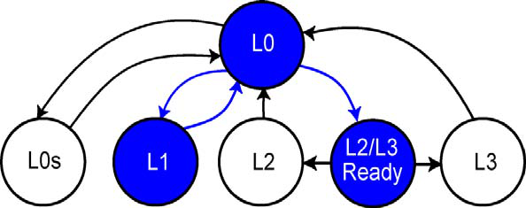</p>
<p align="center"><sub>📄 <a href="figures/chapter_17_Interrupt_Support/embedded/page0823_img1.png">Page 823</a></sub></p>


<p align="center"><b>Figure 17-12: Switch Uses Bridge Mapping of INTx Messages</b></p>
<p align="center"></p>
<p align="center"><sub>📄 <a href="figures/chapter_17_Interrupt_Support/embedded/page0826_img1.png">Page 826</a></sub></p>

<table>
<thead><tr><th width="50%">🇬🇧 English</th><th width="50%">🇨🇳 中文</th></tr></thead>
<tbody>
<tr>

</tr>
</tbody>
</table>

[⬆️ 返回目录](#本章目录-table-of-contents)

---
<a id="sec-17-2"></a>
## 17.2 Interrupt Support | 中断支持

<table>
<thead><tr><th width="50%">🇬🇧 English</th><th width="50%">🇨🇳 中文</th></tr></thead>
<tbody>
<tr>
<td width="50%">

|||Pending Bits||||DW5|
||||||||

</td>
<td width="50%">

**Cha ter 18: S stem Reset p y**

</td>
</tr>
<tr>
<td width="50%">

## **Capability ID** 

A Capability ID value of **05h** identifies the MSI capability and is a read‐only value.

</td>
<td width="50%">

## **热复位（带内复位）**

热复位通过从一个链路邻居向另一个链路邻居发送多个 TS1（其内容如图 18-2 所示）来带内传播，其中符号 5 的第 0 位置位。这些 TS1 在所有 Lane 上发送，使用先前协商的 Link 和 Lane 编号，持续 2ms。一旦发送完毕，热复位的发送器和接收器都将进入
Detect LTSSM 状态（参见第 612 页的"Hot Reset State"）。

_Figure 18-2: TS1 Ordered-Set Showing the Hot Reset Bit_

|_Figure 18-2: TS1 Ordered-Set Showing the Hot Reset Bit_|_Figure 18-2: TS1 Ordered-Set Showing the Hot Reset Bit_|_Figure 18-2: TS1
Ordered-Set Showing the Hot Reset Bit_|
|---|---|---|
||||
|**TS1**<br>TS ID<br>TS ID<br>TS ID<br>Train Ctl<br>Rate ID<br># FTS<br>Lane #<br>Link
#<br>COM<br>0<br>1<br>2<br>3<br>4<br>5<br>6<br>14<br>15<br>13|K28.5<br>D0.0-D31.7, K23.7 (0-255)<br>D0.0-D31.0, K23.7 (0-31)<br># of FTS
ordered sets required by<br>receiver to obtain bit and symbol lock<br>D10.2 for TS1 Identifier<br>D10.2 for TS1 Identifier<br>D10.2 for TS1
Identifier|**0** **=** **De-assert** **Disable** **Scrambling 1** **=** **Assert** **Disable** **Scrambling Bit**
**3 Reserved**<br>**Bit** **5:7**<br>**0** **=** **De-assert** **Compliance** **Receive 1** **=** **Assert** **Compliance**
**Receive Bit** **4 0** **=** **De-assert** **Loopback 1** **=** **Assert** **Loopback Bit** **2 0**
**=** **De-assert** **Disable** **Link 1** **=** **Assert** **Disable** **Link Bit** **1 0** **=** **De-assert**
**Hot** **Reset 1** **=** **Assert** **Hot** **Reset Bit** **0**<br>Training Control|
||||

热复位由软件通过设置桥的 Bridge Control 配置寄存器中的 Secondary Bus Reset 位来发起，如图 18-5（第 840
页）所示。因此，只有包含桥的设备（如根复合体或交换机）才能执行此操作。在其上游端口上收到热复位的交换机必须将其广播到其所有下游端口并复位自身。交换机下游接收热复位的所有设备将复位自身。

</td>
</tr>
<tr>
<td width="50%">

## **Next Capability Pointer** 

The second byte of the register is a read‐only value that gives the dword‐ aligned offset from the top of config space to the next
Capability Structure in the linked list of structures or else contains 00h to indicate the end of the linked list.

</td>
<td width="50%">

## **对接收热复位的响应**

- 设备的 LTSSM 经过 Recovery 和 Hot Reset 状态，然后回到 Detect 状态，在那里开始 Link 训练过程。

- 设备的所有状态机、硬件逻辑、端口状态和配置寄存器（粘性寄存器除外）都初始化为其默认条件。

</td>
</tr>
<tr>
<td width="50%">

## **Message Control Register** 

Figure 17‐14 on page 814 and Table 17‐2 on page 814 illustrate the layout and usage of the Message Control register. 

_Figure 17‐14: Message Control Register_ 


<br>


_Table 17‐2: Format and Usage of Message Control Register_ 

|**Bit(s)**|**Field Name**|**Description**|
|---|---|---|
|0|MSI Enable|Read/Write. State after reset is 0, indicating that the<br>device’s MSI capability is disabled.<br>• **0**= Function
is**disabled**from using**MSI**. It must<br>use MSI‐X or else INTx Messages.<br>• **1**= Function is**enabled**to use**MSI**to
request<br>service and won’t use MSI‐X or INTx Messages.|


_Table 17‐2: Format and Usage of Message Control Register (Continued)_ 

|**Bit(s)**|**Field Name**||**Description**|
|---|---|---|---|
|3:1|Multiple Message<br>Capable||Read‐Only. System software reads this field to<br>determine how many messages (interrupt vectors)<br>the
Function would like to use. The requested<br>number of messages is a power of two, therefore a<br>Function that would like three messages
must<br>request that four messages be allocated to it.<br>**Value**<br> **Number of Messages Requested**<br>000b 1<br>001b 2<br>010b
4<br>011b 8<br>100b 16<br>101b 32<br>110b Reserved<br>111b Reserved|
|6:4|Multiple Message<br>Enable||Read/Write. After system software reads the Multi‐<br>ple Message Capable field (previous row in
this<br>table) to see how many messages (interrupt vec‐<br>tors) are requested by the Function, it programs a<br>3‐bit value in this field
indicating the actual num‐<br>ber of messages allocated to the Function. The<br>number allocated can be equal to or less than the<br>number
actually requested. The state of this field<br>after reset is 000b.<br>**Value**<br> **Number of Messages Requested**<br>000b 1<br>001b
2<br>010b 4<br>011b 8<br>100b 16<br>101b 32<br>110b Reserved<br>111b Reserved|


_Table 17‐2: Format and Usage of Message Control Register (Continued)_ 

|**Bit(s)**|**Field Name**|**Description**|
|---|---|---|
|7|64‐bit Address<br>Capable|Read‐Only.<br>• 0 = Function does not implement the upper 32<br>bits of the Message Address register; only a
32‐<br>bit address is possible.<br>• 1 = Function implements the upper 32 bits of the<br>Message Address register and is capable of
gen‐<br>erating a 64‐bit memory address.|
|8|Per‐Vector<br>Masking Capable|Read‐Only.<br>• 0 = Function does not implement the Mask Bit<br>register or the Pending Bit register;
software<br>does NOT have the ability to mask individual<br>interrupts with this capability structure.<br>• 1 = Function does implement the
Mask Bit regis‐<br>ter or the Pending Bit register; software does<br>have the ability to mask individual interrupts<br>with this capability
structure.|
|15:9|Reserved|Read‐Only. Always zero.|

</td>
<td width="50%">

## **交换机在其下游端口上生成热复位**

交换机在以下情况下在其所有下游端口上生成热复位：

- 它在其上游端口上收到热复位

- 对于交换机或桥的上游端口，如果数据链路层报告 DL_Down 状态，则效果非常类似于热复位。当上游端口由于物理层或数据链路层无法恢复的错误而失去与上游设备的连接时，可能会发生这种情况。

- 软件设置与上游端口关联的 Bridge Control 配置寄存器的 "Secondary Bus Reset" 位，如图 18-3（第 838 页）所示。

</td>
</tr>
<tr>
<td width="50%">

## **Message Address Register** 

The lower two bits of the 32‐bit Message Address register are zero and cannot be changed, forcing the address assigned by software to be
dword aligned. Typ‐ ically, this would be the address of the Local APIC in the system CPU. In x86‐ based systems (Intel‐compatible), this
address has traditionally been FEEx_xxxxh where the lower 20 bits indicate which Local APIC is being tar‐ geted as well as some other info
about the interrupt itself. It is important to note that how the address is interpreted is platform specific and is not dictated in the PCI
or PCIe specs.

The register containing bits [63:32] of the Message Address are required for native PCI Express devices but is optional for legacy
endpoints. This register is present if Bit 7 of the Message Control register is set. If so, it is a read/write reg‐ ister used in
conjunction with the Message Address [31:0] register to enable a 64‐bit memory address for interrupt delivery from this Function.

</td>
<td width="50%">

## **桥将热复位转发到辅助总线**

如果诸如 PCI Express-to-PCI(-X) 桥之类的桥在其上游端口上检测到热复位，则它必须在其辅助 PCI(-X) 总线上断言 PRST# 信号，如图 18-4（第 839 页）所示。

</td>
</tr>
<tr>
<td width="50%">

## **Message Data Register** 

System software writes a base message data pattern into this 16‐bit, read/write register. When the Function generates an interrupt request,
it writes a 32‐bit data value to the memory address specified in the Message Address register. The upper 16 bits of this data are always set
to zero, while the lower 16 bits are supplied by the Message Data register.

If more than one message has been assigned to the Function, it modifies the lower bits (the number of modifiable bits depends on how many
messages have been assigned to the Function by configuration software) of the Message Data register value to form the appropriate value for
the event it wishes to report. As an example, refer to “Basics of Generating an MSI Interrupt Request” on page 820.

</td>
<td width="50%">

## **软件生成热复位**

软件通过向关联端口的配置头中的 Bridge Control 寄存器的 "Secondary Bus Reset" 位写入 1 后跟 0，在特定端口上生成热复位。

**Cha ter 18: S stem Reset p y**

端口的配置头（参见第 840 页的图 18-5）。考虑图 18-3（第 838 页）中所示的示例。软件设置 Switch A 的左侧下游端口的 "Secondary Bus Reset" 寄存器，导致它发送设置了热复位位的 TS1 有序集。Switch B
在其上游端口上接收此热复位并将其转发到其所有下游端口。

如果软件设置交换机的上游端口的 Secondary Bus Reset 位，则交换机会在其所有下游端口上生成热复位，如图 18-4（第 839 页）所示。这里，软件设置 Switch C 的上游端口的 Secondary Bus Reset
位，导致它在其所有下游端口上发送设置了热复位位的 TS1。PCIe-to-PCI 桥接收此热复位并通过断言 PRST# 将其转发到 PCI 总线。

设置 Secondary Bus Reset 位会导致端口的 LTSSM 转换到 Recovery 状态（有关 LTSSM 的更多信息，请参见第 519 页的"Overview of LTSSM States"），其中它生成设置了热复位位的 TS1。TS1 持续生成
2ms，然后端口退出到 Detect 状态，在那里它已准备好开始 Link 训练过程。

热复位 TS1 的接收者（始终是下游）也将进入 Recovery 状态。当它看到两个连续的设置了热复位位的 TS1 时，它将进入 Hot Reset 状态 2ms 超时，然后退出到 Detect。上游和下游端口都被初始化并最终处于 Detect 状态，准备开始 Link
训练。如果下游设备也是交换机或桥，它也会将热复位转发到其下游端口，如图 18-3（第 838 页）所示。

</td>
</tr>
<tr>
<td width="50%">

## **Mask Bits Register and Pending Bits Register** 

If the Function supports per‐vector masking (indicated in bit [8] of the Message Control register) then these registers are present. The max
number of interrupt messages (itnerrupt vectors) that can be requested and assigned to a Function using MSI is 32. So these two registers
are 32 bits in length with each potential interrupt message having its own mask and pending bit. If bit [0] of the Mask Bits register is
set, then interrupt message 0 is masked (this is the base vector from this Function). If bit [1] is set, then interrupt message 1 is masked
(this is the base vector + 1).

When an interrupt message is masked, the MSI for that vector cannot be sent. Instead, the corresponding Pending Bit is set. This allows
software to mask indi‐ vidual interrupts from a Function and then periodically poll the Function to see if there are any masked interrupts
that are pending.

If software clears a mask bit and the corresponding pending bit is set, the Func‐ tion must send the MSI request at that time. Once the
interrupt message has been sent, the Function would clear the pending bit.

</td>
<td width="50%">

## **软件可以禁用 Link**

软件还可以禁用 Link，强制其进入电气空闲状态并保持在那里，直到另行通知。在此处提及这一点的原因是，禁用 Link 还具有导致下游组件发生热复应的效果。禁用是通过设置下游端口的 Link Control 寄存器中的 Link Disable 位来实现的，如图 18-6（第
841 页）所示。这会导致端口进入 Recovery LTSSM 状态并开始发送设置了禁用位的 TS1。由于只能为下游端口控制这一点（如果 Link 已禁用），因此此位保留用于上游端口（例如端点或交换机的上游端口）。

**Cha ter 18: S stem Reset p y**

</td>
</tr>
<tr>
<td width="50%">

## **Basics of MSI Configuration** 

The following list specifies the steps taken by software to configure MSI inter‐ rupts for a PCI Express device. Refer to Figure 17‐15 on
page 819.

1. At startup time, enumeration software scans the system for all PCI‐compat‐ ible Functions (see “Single Root Enumeration Example” on page
109 for a discussion of the enumeration process).

</td>
<td width="50%">

## 当上游端口识别传入的设置了禁用位的 TS1 时，其物理层向链路层发出 LinkUp=0（假），并且所有 Lane 都进入电气空闲状态。2ms 超时后，上游端口将进入 Detect，但下游端口将保持在禁用的 LTSSM 状态，直到被指示退出该状态（例如通过清除 Link
Disable 位），因此 Link 将保持禁用状态，并且在此之前不会尝试训练。

</td>
</tr>
<tr>
<td width="50%">

## **PCI Express 3.0 Technology** 

2. Once a Function is discovered software reads the Capabilities List Pointer, to find the location of the first capability structure in the
linked list.

3. If the MSI Capability structure (Capability ID of 05h) is found in the list, software reads the Multiple Message Capable field in the
device’s Message Control register to determine how many event‐specific messages the device supports and if it supports a 64‐bit message
address or only 32‐bit. Software then allocates a number of messages equal to or less than that and writes that value into the Multiple
Message Enable field. At a minimum, one mes‐ sage will be allocated to the device.

4. Software writes the base message data pattern into the device’s Message Data register and writes a dword‐aligned memory address to the
device’s Message Address register to serve as the destination address for MSI writes.

5. Finally, software sets the MSI Enable bit in the device’s Message Control register, enabling it to generate MSI writes and disabling
other interrupt delivery options.

_Figure 17‐15: Device MSI Configuration Process_ 

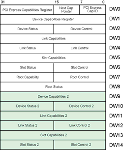

<br>

</td>
<td width="50%">

## ## **功能级复位 (FLR)**

FLR 功能允许软件仅复位多功能设备中的一个 Function，而不影响它们共享的 Link。强烈建议但不要求实现它，因此软件需要在尝试使用它之前通过检查 Device Capabilities 寄存器来确认其可用性，如图 18-8（第 843 页）所示。如果设置了
Function-Level Reset Capability 位，则可以通过简单设置 Device Control 寄存器中的 Initiate Function-Level Reset 位来启动 FLR，如图 18-9（第 843 页）所示。

**Cha ter 18: S stem Reset p y**

_Figure 18-8: Function-Level Reset Capability_

</td>
</tr>
<tr>
<td width="50%">

## **Basics of Generating an MSI Interrupt Request** 

Figure 17‐16 on page 821 illustrates the contents of an MSI Memory Write Trans‐ action Header and Data field. Key points include: 

- Format field must be 011b for native functions, indicating a 4DW header (64‐bit address) with Data, but it may be 010b for Legacy
Endpoints, indi‐ cating a 32‐bit address.

- The Attribute bits for No Snoop and Relaxed Ordering must be zero. 

- Length field must be 01h to indicate maximum data payload of 1DW. 

- First BE field must be 1111b, indicating valid data in all four bytes of the DW, even though the upper two bytes will always be zero for
MSI.

- Last BE field must be 0000b, indicating a single DW transaction. 

- Address fields within the header come directly from the address fields within the MSI Capability registers. 

- Lower 16 bits of the Data payload are derived from the data field within the MSI Capability registers.

</td>
<td width="50%">

## _Figure 18-9: Function-Level Reset Initiate Bit_

**843**

规范提到了一些示例，这些示例激发了添加 FLR 的动机：

1. 软件控制 Function 时可能会遇到问题，并且不再正常运行。防止数据损坏需要复位该 Function，但如果该设备中的其他 Function 仍在正常工作，那么仅复位有问题的那个就好了。

</td>
</tr>
<tr>
<td width="50%">

## **Multiple Messages** 

If system software allocated more than one message to the Function, the multi‐ ple values are created by modifying the lower bits of the
assigned Message Data value to send a different message for each device‐specific event type.

As an example, assume the following: 

- Four messages have been allocated to a device. 

- A data value of 49A0h has been assigned to the device’s Message Data reg‐ ister. 

- Memory address FEEF_F00Ch has been written into the device’s Message Address register. 

- When one of the four events occurs, the device generates a request by per‐ forming a dword write to memory address FEEF_F00Ch with a data
value of 0000_49A0h, 0000_49A1h, 0000_49A2h, or 0000_49A3h. In other words, the lower two bits of the data value are modified to specify
which event occurred. If this Function would have been allocated 8 messages, then the lower three bits could be modified. Also, the device
always uses 0000h for the upper 2 bytes of its message data value.

_Figure 17‐16: Format of Memory Write Transaction for Native‐Device MSI Delivery_ 

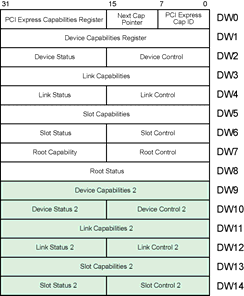

<br>

</td>
<td width="50%">

</td>
</tr>
<tr>
<td width="50%">

## **中断延迟**

从发出中断信号到软件服务设备的时间称为中断延迟。尽管有其优点，但与其他中断传递机制一样，MSI 不提供中断延迟保证。

</td>
<td width="50%">

</td>
</tr>
<tr>
<td width="50%">

## **MSI 可能导致错误**

由于 MSI 作为内存写事务传递，因此与 MSI 传递相关联的错误被处理为与任何其他内存写错误条件相同。有关 ECRC 错误的处理示例，请参见第 657 页的"ECRC Generation and Checking"。当然，令人担忧的是，如果错误导致 MSI
数据包未被识别，则处理器将看不到中断。如何处理这种情况不在 PCIe 规范的范围之内。

</td>
<td width="50%">

</td>
</tr>
<tr>
<td width="50%">

## **一些 MSI 规则和建议**

1. 规范的目的是系统软件将为 Function 分配互斥的消息，并且每条消息在传递到处理器时都将转换为独占的中断。

2. 每个 Function 不允许多个 MSI 能力寄存器集。

3. 读取消息地址寄存器会产生未定义的结果。

4. 保留的寄存器和位是只读的，并在读取时始终返回零。

5. 系统软件可以修改消息控制寄存器位，但设备本身被禁止这样做。换句话说，不允许通过"后门"机制修改这些位。

6. 至少将一条消息分配给每个设备（假设软件支持并计划在系统中使用 MSI）。

7. 系统软件不得写入包含消息数据寄存器的双字的上半部。

8. 如果设备多次写入相同的消息，则只能保证这些消息中的一条被服务。如果必须全部服务，则设备在上一次消息被服务之前不得再次生成相同的消息。

9. 如果设备具有多条分配的消息，并且它写入一系列不同的消息，则保证所有这些消息都将被服务。

</td>
<td width="50%">

</td>
</tr>
<tr>
<td width="50%">

## **基本系统外设的特殊注意事项**

中断也可能源自嵌入式旧式硬件，例如 IO Controller Hub 或 Super IO 设备。此类系统中通常需要的一些典型旧式设备包括：

- 串行端口

- 并行端口

- 键盘和鼠标控制器

- 系统计时器

- IDE 控制器

这些设备通常需要到 PIC 或 IO APIC 的特定 IRQ 线，以允许旧式软件正确地与它们交互。

使用 INTx 消息不能保证设备将收到它们所需的 IRQ 分配。以下示例说明了将支持适当的旧式中断分配的系统。

**第 17 章：中断支持**

</td>
<td width="50%">

</td>
</tr>
<tr>
<td width="50%">

## **旧式系统示例**

图 17-23（第 831 页）显示了一个较旧的 PCI Express 系统，其中包含通过专有 Hub 链路连接到根复合体的 IO Controller Hub (ICH)。ICH 中嵌入的 IO APIC 在其输入处收到中断请求时可以生成
MSI。在这种实现中，软件可以将旧式向量号分配给每个输入，以确保将调用正确的旧式软件。

此方法的优点是现有硬件可用于支持 PCIe 平台的旧式要求。该系统还要求在引导序列期间配置 MSI 子系统以供使用。如图所示的示例消除了对 INTx 消息的需求，除非 PCIe 扩展设备包含 PCI Express-to-PCI Bridge。

_Figure 17-23: PCI Express System with PCI-Based IO Controller Hub_


<br>

</td>
<td width="50%">

</td>
</tr>
<tr>
<td width="50%">

## _**18 系统复位**_

</td>
<td width="50%">

</td>
</tr>
<tr>
<td width="50%">

## **上一章**

上一章描述了 PCIe Function 可以生成中断的不同方式。旧的 PCI 模型使用引脚执行此操作，但在串行模型中边带信号是不可取的，因此带内 MSI（消息信号中断）机制的支持成为强制性要求。为了向后兼容软件，PCI INTx# 引脚操作仍然可以使用 PCIe INTx
消息进行模拟。PCI 旧式 INTx# 方法以及较新版本的 MSI/MSI-X 都进行了描述。

</td>
<td width="50%">

</td>
</tr>
<tr>
<td width="50%">

## **本章**

本章描述了为 PCIe 定义的四种类型的复位机制：冷复位、热复位、热复位和功能级复位。讨论了使用边带复位 PERST# 信号来生成系统复位，还讨论了用于生成热复位的带内 TS1。

</td>
<td width="50%">

</td>
</tr>
<tr>
<td width="50%">

## **下一章**

下一章描述了 PCI Express 热插拔模型。还为所有支持热插拔功能的设备和外形尺寸定义了标准使用模型。热插拔卡的电源也是一个问题，当在运行时向系统添加新卡时，重要的是要确保其电源需求不超过系统可以提供的能力。需要一种机制来查询和控制设备的电源要求，电源预算 (Power
Budgeting) 提供了这一点。

</td>
<td width="50%">

</td>
</tr>
<tr>
<td width="50%">

## **系统复位的两类**

PCI Express 规范描述了四种类型的复位机制。其中三种是早期 PCIe 规范的一部分，现在统称为**常规复位 (Conventional Resets)**，其中两种称为基本复位 (Fundamental Resets)。第四类和方法（随 2.0
规范修订版添加）称为**功能级复位 (Function Level Reset)**。

</td>
<td width="50%">

</td>
</tr>
<tr>
<td width="50%">

## **常规复位**

</td>
<td width="50%">

</td>
</tr>
<tr>
<td width="50%">

## **基本复位**

基本复位由硬件处理，并复位整个设备，重新初始化每个状态机以及所有硬件逻辑、端口状态和配置寄存器。该规则的一个例外是一组被标识为"粘性"的配置寄存器字段，这意味着它们保留其内容，除非所有电源都被移除。这使它们对于诊断需要复位才能使 Link
再次工作的问题非常有用，因为错误状态在复位后仍然存在，并且之后可供软件使用。如果主电源被移除但 Vaux 可用，那也将保持粘性位，但如果主电源和 Vaux 都丢失，则粘性位将与其他所有位一起被复位。

基本复位将在系统范围复位时发生，但也可以针对各个设备执行。

定义了两种类型的基本复位：

- **冷复位 (Cold Reset)**：当设备的主电源打开时产生的。循环电源将导致冷复位。

- **热复位（可选）(Warm Reset)**：通过系统特定的方式触发而不关闭主电源。例如，系统电源状态的变化可用于启动此操作。生成热复位的方法未由规范定义，因此系统设计人员将选择如何完成此操作。

当发生基本复位时：

- 对于正电压，接收器终端必须满足 ZRX-HIGH-IMP-DC-POS 参数。在 2.5 GT/s 时，这不低于 10KΩ。在更高的速度下，对于低于 200mv 的电压，它必须不低于 10KΩ，对于高于 200mv 的电压，必须为 20KΩ。这些是终端未通电时的值。

- 类似地，对于负电压，ZRX-HIGH-IMP-DC-NEG 参数在任何情况下都最小为 1KΩ。

- 发送器终端必须满足 Gen1 的 80 到 120Ω 以及 Gen2 和 Gen3 的最大 120Ω 的输出阻抗 ZTX-DIFF-DC，但可以将驱动器置于高阻抗状态。

- 发送器将直流共模电压保持在 0 到 3.6V 之间。

**Cha ter 18: S stem Reset p y**

当退出基本复位时：

- 当接收器终端启用时，接收器单端终端必须存在，以便接收器检测正常工作（Gen1 和 Gen2 为 40-60Ω，Gen3 为 50Ω±20%）。进入 Detect 时，共模阻抗必须在 50Ω±20% 的适当范围内。

- 必须在基本复位退出后 5ms 内重新启用其接收器终端 ZRX-DIFF-DC 的 100Ω，使其在训练期间可被邻居的发送器检测到。

- 发送器将直流共模电压保持在 0 到 3.6V 之间。

定义了两种传送基本复位的方法。首先，可以使用称为 PERST#（PCI Express 复位）的辅助边带信号来发信号。其次，当 PERST# 未提供给插卡或组件时，组件或插卡在电源循环时会自主生成基本复位。

</td>
<td width="50%">

</td>
</tr>
<tr>
<td width="50%">

## **PERST# 基本复位生成**

PCI Express 系统中的中央资源设备（例如芯片组）提供此复位。例如，第 836 页的图 18-1 中的 IO Controller Hub (ICH) 芯片可以根据系统电源的 POWERGOOD 信号的状态生成
PERST#，因为这指示主电源已打开并稳定。如果电源循环关闭，则 POWERGOOD 切换并导致 PERST# 断言和取消断言，从而导致冷复位。系统还可以提供通过其他方式切换 PERST# 的方法以实现热复位。

PERST# 信号馈送到主板上的所有 PCI Express 设备，包括连接器和图形控制器。设备可以选择使用 PERST#，但不是必需的。PERST# 还馈送到图中所示的 PCIe-to-PCI-X 桥。桥始终将其主（上游）总线上的复位转发到其辅助（下游）总线，因此 PCI-X
总线看到 RST# 被断言。

</td>
<td width="50%">

</td>
</tr>
<tr>
<td width="50%">

## **自主复位生成**

设备必须设计为在施加主电源时在硬件中生成自己的复位。规范未描述如何完成此操作，因此自复位机制可以内置到设备中或作为外部逻辑添加。例如，检测到上电的插卡可以使用该事件为其设备生成本地复位。如果设备检测到其电源超出指定限制，则还必须生成自主复位。

</td>
<td width="50%">

</td>
</tr>
<tr>
<td width="50%">

## **从 L2 低功耗状态唤醒链路**

作为需要自主复位的示例，其主电源已作为电源管理策略的一部分被关闭的设备如果被设计为发出唤醒信号，则可能能够请求恢复到全功率。当电源恢复时，必须对设备进行复位。系统的电源控制器可以向设备断言 PERST# 引脚，如图 18-1（第 836
页）所示，但如果它没有这样做，或者如果设备不支持 PERST#，则设备必须在感知到主电源重新施加时自主生成自己的基本复位。

_Figure 18-1: PERST# Generation_


<br>

</td>
</tr>
</tbody>
</table>

[⬆️ 返回目录](#本章目录-table-of-contents)

---
<a id="sec-17-3"></a>

</td>
<td width="50%">

</td>
</tr><table>
<thead><tr><th width="50%">🇬🇧 English</th><th width="50%">🇨🇳 中文</th></tr></thead>
<tbody>
<tr>
<td width="50%">

## 17.3 Interrupt Support | 中断支持

<table>
<thead><tr><th>🇬🇧 English</th><th style="background-color:#e8e8e8">🇨🇳 中文</th></tr>
</tbody>
</table></thead>
<tbody>
<tr>
<td width="50%">

**Cha ter 18: S stem Reset p y**

</td>
<td width="50%">

</td>
</tr>
<tr>
<td width="50%">

## **Hot Reset (In-band Reset)** 

A Hot Reset is propagated in‐band from one link neighbor to another by send‐ ing several TS1s (whose contents are shown in Figure 18‐2) with
bit 0 of symbol 5 asserted. These TS1s are sent on all Lanes, using the previously negotiated Link and Lane numbers, for 2 ms. Once it’s
been sent, the Transmitter and Receiver of the Hot Reset will both end up in the Detect LTSSM state (see “Hot Reset State” on page 612).

_Figure 18‐2: TS1 Ordered‐Set Showing the Hot Reset Bit_ 

|_Figure 18‐2: TS1 Ordered‐Set Showing the Hot Reset Bit_|_Figure 18‐2: TS1 Ordered‐Set Showing the Hot Reset Bit_|_Figure 18‐2: TS1
Ordered‐Set Showing the Hot Reset Bit_|
|---|---|---|
||||
|**TS1**<br>TS ID<br>TS ID<br>TS ID<br>Train Ctl<br>Rate ID<br># FTS<br>Lane #<br>Link
#<br>COM<br>0<br>1<br>2<br>3<br>4<br>5<br>6<br>14<br>15<br>13|K28.5<br>D0.0-D31.7, K23.7 (0-255)<br>D0.0-D31.0, K23.7 (0-31)<br># of FTS
ordered sets required by<br>receiver to obtain bit and symbol lock<br>D10.2 for TS1 Identifier<br>D10.2 for TS1 Identifier<br>D10.2 for TS1
Identifier|**0** **=** **De-assert** **Disable** **Scrambling 1** **=** **Assert** **Disable** **Scrambling Bit**
**3 Reserved**<br>**Bit** **5:7**<br>**0** **=** **De-assert** **Compliance** **Receive 1** **=** **Assert** **Compliance**
**Receive Bit** **4 0** **=** **De-assert** **Loopback 1** **=** **Assert** **Loopback Bit** **2 0**
**=** **De-assert** **Disable** **Link 1** **=** **Assert** **Disable** **Link Bit** **1 0** **=** **De-assert**
**Hot** **Reset 1** **=** **Assert** **Hot** **Reset Bit** **0**<br>**Training Control**|
||||


A hot reset is initiated in software by setting the Secondary Bus Reset bit in a bridge’s Bridge Control configuration register, as shown in
Figure 18‐5 on page 840. Consequently, only devices containing bridges, like the Root Complex or a Switch, can do this. A Switch that
receives hot reset on its Upstream Port must broadcast it to all of its Downstream Ports and reset itself. All devices down‐ stream of a
switch that receive the hot reset will reset themselves.

</td>
<td width="50%">

</td>
</tr>
<tr>
<td width="50%">

## **Response to Receiving Hot Reset** 

- The device’s LTSSM goes through the Recovery and Hot Reset state, and then back to the Detect state, where it starts the Link Training
process.

- • All of the device’s state machines, hardware logic, port states and configura‐ tion registers (except sticky registers) initialize to
their default conditions.

</td>
<td width="50%">

</td>
</tr>
<tr>
<td width="50%">

## **Switches Generate Hot Reset on Downstream Ports** 

A Switch generates a hot reset on all of its Downstream Ports when: 

- It receives a hot reset on its Upstream Port 

- For a Switch or Bridge Upstream Port, if the Data Link Layer reports a DL_Down state, the effect is very similar to a hot reset. This can
happen when the Upstream Port has lost its connection with an upstream device due to an error that is not recoverable by the Physical Layer
or Data Link Layer.

- Software sets the ‘Secondary Bus Reset’ bit of the Bridge Control configura‐ tion register associated with the Upstream Port, as shown in
Figure 18‐3 on page 838.

_Figure 18‐3: Switch Generates Hot Reset on One Downstream Port_ 


<br>

</td>
<td width="50%">

</td>
</tr>
<tr>
<td width="50%">

## **Bridges Forward Hot Reset to the Secondary Bus** 

If a bridge such as a PCI Express‐to‐PCI(‐X) bridge detects a hot reset on its Upstream Port, it must assert the PRST# signal on its
secondary PCI(‐X) bus, as illustrated in Figure 18‐4 on page 839.

</td>
<td width="50%">

</td>
</tr>
<tr>
<td width="50%">

## **Software Generation of Hot Reset** 

Software generates a Hot Reset on a specific port by writing a 1 followed by 0 to the ‘Secondary Bus Reset’ bit in the Bridge Control
register of that associated

**Cha ter 18: S stem Reset p y** 

port’s configuration header (see Figure 18‐5 on page 840). Consider the example shown in Figure 18‐3 on page 838. Software sets the
‘Secondary Bus Reset’ regis‐ ter of Switch A’s left Downstream Port, causing it to send TS1 Ordered Sets with the Hot Reset bit set. Switch
B receives this Hot Reset on its Upstream Port and forwards it to all its Downstream Ports.

_Figure 18‐4: Switch Generates Hot Reset on All Downstream Ports_ 


<br>


If software sets the Secondary Bus Reset bit of a Switch’s Upstream Port, then the switch generates a hot reset on all of its Downstream
Ports, as shown in Fig‐ ure 18‐4 on page 839. Here, software sets the Secondary Bus Reset bit in Switch C’s Upstream Port, causing it to
send TS1s with the Hot Reset bit set on all its Downstream Ports. The PCIe‐to‐PCI bridge receives this Hot Reset and for‐ wards it on to the
PCI bus by asserting PRST#.

Setting the Secondary Bus Reset bit causes a Port’s LTSSM to transition to the Recovery state (for more on the LTSSM, see “Overview of LTSSM
States” on page 519) where it generates the TS1s with the Hot Reset bit set. The TS1s are generated continuously for 2 ms and then the Port
exits to the Detect state where it is ready to start the Link training process.

The receiver of the Hot Reset TS1s (always downstream) will go to the Recovery state, too. When it sees two consecutive TS1s with the Hot
Reset bit set, it goes to the Hot Reset state for a 2ms timeout and then exits to Detect. Both Upstream and Downstream Ports are initialized
and end up in the Detect state, ready to begin Link training. If the downstream device is also a Switch or Bridge, it for‐ wards the Hot
Reset to its Downstream Ports as well, as shown in Figure 18‐3 on page 838.

_Figure 18‐5: Secondary Bus Reset Register to Generate Hot Reset_ 


<br>

</td>
<td width="50%">

</td>
</tr>
<tr>
<td width="50%">

## **Software Can Disable the Link** 

Software can also disable a Link, forcing it to go into Electrical Idle and remain there until further notice. The reason for mentioning
that at this point is that disabling the Link also has the effect of causing a Hot Reset on downstream components. Disabling is accomplished
by setting the Link Disable bit in the Link Control Register of the Downstream Port, shown in Figure 18‐6 on page 841. That causes the Port
to go to the Recovery LTSSM state and begin sending TS1s with the Disable bit set. Since this can only be controlled for Downstream Ports if
the Link has been disabled, this bit is reserved for Upstream Ports (such as Endpoints or Switch Upstream Ports).

**Cha ter 18: S stem Reset p y**

</td>
<td width="50%">

</td>
</tr>
<tr>
<td width="50%">

## _Figure 18‐6: Link Control Register_ 

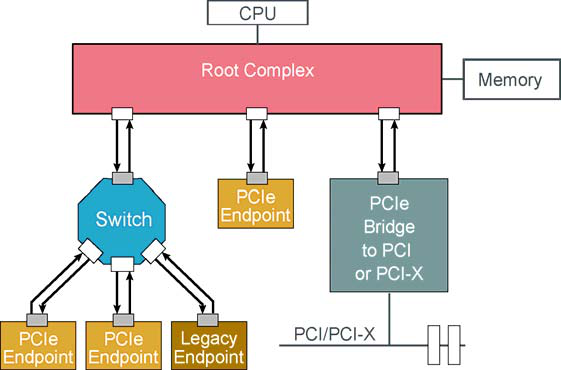

<br>


When the Upstream Port recognizes incoming TS1s with the Disabled bit set, its Physical Layer signals LinkUp=0 (false) to the Link Layer and
all the Lanes go to Electrical Idle. After a 2ms timeout, an Upstream Port will go to Detect, but a Downstream Port will remain in the
Disabled LTSSM state until directed to exit from it (such as by clearing the Link Disable bit), so the Link will remain dis‐ abled and will
not attempt training until then.

</td>
<td width="50%">

</td>
</tr>
<tr>
<td width="50%">

## _Figure 18‐7: TS1 Ordered‐Set Showing Disable Link Bit_ 


<br>

</td>
<td width="50%">

</td>
</tr>
<tr>
<td width="50%">

## **Function Level Reset (FLR)** 

The FLR capability allows software to reset just one Function within a multi‐ function device without affecting the Link that is shared by
them all. Its imple‐ mentation is strongly recommended but isn’t required, so software would need to confirm its availability before
attempting to use it by examining the Device Capabilities register, as shown in Figure 18‐8 on page 843. If the Function‐Level Reset
Capability bit is set, then an FLR can be initiated by simply setting the Ini‐ tiate Function‐Level Reset bit in the Device Control Register
as shown in Figure 18‐9 on page 843.

**Cha ter 18: S stem Reset p y** 

_Figure 18‐8: Function‐Level Reset Capability_

</td>
<td width="50%">

</td>
</tr>
<tr>
<td width="50%">

## _Figure 18‐9: Function‐Level Reset Initiate Bit_ 

**843** 

The spec mentions a few examples that motivate the addition of FLR: 

1. It can happen that software controlling a Function encounters a problem and is no longer operating correctly. Preventing data corruption
necessi‐ tates a reset of that Function, but if other Functions within that device are still working properly it would nice to be able to
reset just the one having trouble.

</td>
<td width="50%">

</td>
</tr>

</tbody>
</table>

<p align="center"><b>Figure 18-3: Switch Generates Hot Reset on One Downstream Port</b></p>
<p align="center"></p>
<p align="center"><sub>📄 <a href="figures/chapter_17_Interrupt_Support/embedded/page0850_img1.png">Page 850</a></sub></p>


<p align="center"><b>Figure 18-4: Switch Generates Hot Reset on All Downstream Ports</b></p>
<p align="center"></p>
<p align="center"><sub>📄 <a href="figures/chapter_17_Interrupt_Support/embedded/page0806_img1.png">Page 806</a></sub></p>


<p align="center"><b>Figure 18-5: Secondary Bus Reset Register to Generate Hot Reset</b></p>
<p align="center"></p>
<p align="center"><sub>📄 <a href="figures/chapter_17_Interrupt_Support/embedded/page0816_img1.png">Page 816</a></sub></p>


<p align="center"><b>Figure 18-6: Link Control Register</b></p>
<p align="center"></p>
<p align="center"><sub>📄 <a href="figures/chapter_17_Interrupt_Support/embedded/page0823_img1.png">Page 823</a></sub></p>


<p align="center"><b>Figure 18-7: TS1 Ordered-Set Showing Disable Link Bit</b></p>
<p align="center"></p>
<p align="center"><sub>📄 <a href="figures/chapter_17_Interrupt_Support/embedded/page0826_img1.png">Page 826</a></sub></p>

<table>
<thead><tr><th width="50%">🇬🇧 English</th><th width="50%">🇨🇳 中文</th></tr></thead>
<tbody>
<tr>

</tr>
</tbody>
</table>

[⬆️ 返回目录](#本章目录-table-of-contents)

---

<a id="sec-17-4"></a>
## 17.4 Interrupt Support | 中断支持

<table>
<thead><tr><th width="50%">🇬🇧 English</th><th width="50%">🇨🇳 中文</th></tr></thead>
<tbody>
<tr>
<td width="50%">

2. In a virtualized environment, where applications can migrate from one piece of hardware to another, it’s important that when an
application is moved off a Function that the Function doesn’t retain any information about what it was doing. This prevents information used
by one application that might be considered confidential from becoming visible to the new one running on that Function. The simplest way to
clean up after migrating the previous application is simply to reset the Function.

3. When software is rebuilding a software stack for a Function, it is sometimes necessary to first put the Function into an uninitialized
state. As before, avoiding a reset of all Functions sharing the Link is desirable.

Another feature doesn’t appear in the list of cases in the spec but is still a moti‐ vating factor in its own right. While a conventional
reset will re‐initialize every‐ thing within the device, it does not require that all external activity, such as traffic on a network
interface, must cease right away. FLR adds this requirement and is the only reset that does.

FLR resets the Function’s internal state and registers, making it quiescent, but doesn’t affect any sticky bits, or hardware‐initialized
bits, or link‐specific regis‐ ters like Captured Power, ASPM Control, Max_Payload_Size or Virtual Channel registers. If an outstanding
Assert INTx interrupt message was sent, a corre‐ sponding Deassert INTx message must be sent, unless that interrupt was shared by another
Function internally that still has it asserted. All external activity for that Function is required to cease when an FLR is received.

</td>
<td width="50%">

2. 在虚拟化环境中，应用程序可以从一个硬件迁移到另一个硬件，重要的是当应用程序从某个 Function 上移开时，该 Function 不会保留有关其正在执行的操作的任何信息。这可以防止一个应用程序使用的可能被视为机密的信息对在该 Function
上运行的新应用程序可见。在迁移先前的应用程序之后进行清理的最简单方法就是复位该 Function。

3. 当软件正在为某个 Function 重建软件堆栈时，有时需要首先将该 Function 置于未初始化状态。和以前一样，避免对共享 Link 的所有 Function 进行复位是可取的。

另一个特性未出现在规范的案例列表中，但它本身仍然是一个激励因素。虽然常规复位将重新初始化设备内的所有内容，但它不要求所有外部活动（如网络接口上的流量）立即停止。FLR 添加了此要求，并且是唯一这样做的复位。

FLR 复位 Function 的内部状态和寄存器，使其进入静止状态，但不会影响任何粘性位、硬件初始化的位或链路特定的寄存器（如 Captured Power、ASPM Control、Max_Payload_Size 或 Virtual Channel
寄存器）。如果已发送未完成的 Assert INTx 中断消息，则必须发送相应的 Deassert INTx 消息，除非该中断由内部仍然断言它的另一个 Function 共享。收到 FLR 时，该 Function 的所有外部活动都需要停止。

</td>
</tr>
<tr>
<td width="50%">

## **Time Allowed** 

A Function must complete an FLR within 100ms. However, software may need to delay initiating an FLR if there are any outstanding split
completions that haven’t yet been returned (indicated by the fact that the Transactions Pending bit remains set in the Device Status
register). In that case, software must either wait for them to finish before initiating the FLR, or wait 100ms after FLR before attempting
to re‐initialize the Function. If this isn’t managed, a potential data corruption problem arises: a Function may have split transactions
outstanding but a reset causes it to lose track of them. If they are returned later they could be

**Cha ter 18: S stem Reset p y** 

mistaken for responses to new requests that have been issued since the FLR. To avoid this problem, the spec recommends that software should:

1. Coordinate with other software that might access the Function to ensure it doesn’t attempt access during the FLR. 

2. Clear the entire Command register, thereby quiescing the Function. 

3. Ensure that previously‐requested Completions have been returned by poll‐ ing the Transactions Pending bit in the Device Status register
until it’s cleared or waiting long enough to be sure the Completions won’t ever be returned. How long would be long enough? If Completion
Timeouts are being used, wait for the timeout period before sending the FLR. If Comple‐ tion Timeouts are disabled, then wait at least
100ms.

4. Initiate the FLR and wait 100ms. 

5. Set up the Function’s configuration registers and enable it for normal opera‐ tion. 

When the FLR has completed, regardless of the timing, the Transaction Pending bit must be cleared.

</td>
<td width="50%">

## **允许的时间**

Function 必须在 100ms 内完成 FLR。但是，如果存在任何尚未返回的未完成拆分完成（由 Device Status 寄存器中的 Transactions Pending 位仍保持设置来表示），软件可能需要延迟发起 FLR。在这种情况下，软件必须等待它们完成后再发起
FLR，或在 FLR 后等待 100ms 然后再尝试重新初始化 Function。如果不进行此管理，则可能会出现潜在的数据损坏问题：Function 可能具有未完成的拆分事务，但复位会导致其失去对它们的跟踪。如果它们稍后返回，则它们可能被

**Cha ter 18: S stem Reset p y**

被误认为是自 FLR 以来已发出的新请求的响应。为避免此问题，规范建议软件应：

1. 与可能访问 Function 的其他软件协调，以确保它不会在 FLR 期间尝试访问。

2. 清除整个命令寄存器，从而使 Function 静止。

3. 通过轮询 Device Status 寄存器中的 Transactions Pending 位直到它被清除或等待足够长的时间以确保完成永远不会被返回，确保先前请求的完成已返回。等待多长时间才算足够长？如果正在使用 Completion Timeout，则在发送 FLR
之前等待超时期。如果禁用了 Completion Timeout，则等待至少 100ms。

4. 发起 FLR 并等待 100ms。

5. 设置 Function 的配置寄存器并启用它以进行正常操作。

FLR 完成后，无论时序如何，都必须清除 Transaction Pending 位。

</td>
</tr>
<tr>
<td width="50%">

## **Behavior During FLR** 

The spec writers chose to describe the behavior of a Function reset in fairly broad terms so as not to preclude any internal steps that
designers might wish to take. The following behaviors are listed in the spec:

- The Function must not appear to an external interface as though it was an initialized adapter with an active host. The steps to ensure
that all activity on external interfaces is terminated will be design specific. An example would be a network adapter that must not respond
to requests that would require an active host during this time.

- The Function must not retain any software‐readable state that might include secret information left behind by some previous use of the
Func‐ tion. For example, any internal memory must be cleared or randomized.

- The Function must be configurable as normal by the next driver. 

- The Function must return a completion for the configuration write that caused the FLR and then initiate the FLR. 

While an FLR is in progress: 

- Any requests that arrive are allowed to be silently discarded without log‐ ging them or signaling an error. Flow control credits must be
updated to maintain the link operation, though.

</td>
<td width="50%">

## **FLR 期间的行为**

规范编写者选择以相当宽泛的术语描述 Function 复位的行为，以免排除设计人员可能希望执行的任何内部步骤。规范中列出了以下行为：

- Function 在外部接口上不得显示为已初始化且具有活动主机的适配器。确保终止外部接口上的所有活动的步骤将特定于设计。一个示例是网络适配器，在此期间不得响应需要活动主机的请求。

- Function 不得保留任何软件可读的状态，其中可能包括先前使用 Function 时留下的秘密信息。例如，任何内部内存都必须被清除或随机化。

- Function 必须可以被下一个驱动程序正常配置。

- Function 必须为导致 FLR 的配置写返回完成，然后启动 FLR。

当 FLR 正在进行时：

- 到达的任何请求都允许被静默丢弃，而无需记录它们或发信号通知错误。但是必须更新流控信用以维持链路操作。

</td>
</tr>
<tr>
<td width="50%">

## **PCI Express Technology** 

- Incoming completions can be treated as Unexpected Completions or silently discarded without logging them or signaling an error. 

- The FLR itself must be completed within the time described above, but fur‐ ther initialization after that could take longer. If a
configuration Request comes in before initialization is completed, the Function must return a com‐ pletion with CRS (Configuration Retry
Status) status. Once a completion is returned with any other status, a CRS status will not be legal again until the Function is reset again.

</td>
<td width="50%">

## **PCI Express Technology**

- 收到的完成可以被视为意外完成或静默丢弃，而无需记录它们或发信号通知错误。

- FLR 本身必须在上述时间内完成，但此后的进一步初始化可能需要更长时间。如果在初始化完成之前收到配置请求，则 Function 必须返回具有 CRS（配置重试状态）状态的完成。一旦返回具有任何其他状态的完成，则在再次复位该 Function 之前，CRS 状态将不再合法。

</td>
</tr>
<tr>
<td width="50%">

## **Reset Exit** 

After exiting the reset state, Link Training and Initialization must begin within 20 ms. Devices may exit the reset state at different
times, since reset signaling is asynchronous, but must begin training within this time.

To allow reset components to perform internal initialization, system software must wait for at least 100 ms from the end of a reset before
attempting to send Configuration Requests to them. If software initiates a configuration request to a device after the 100 ms wait time, but
the device still hasn’t finished its self‐ini‐ tialization, it returns a Completion with status CRS. Since configuration Requests can only
be initiated by the CPU, the Completion will be returned to the Root Complex. In response, the Root may re‐issue the configuration Request
automatically or make the failure visible to software. The spec also states that software should only use 100ms wait periods if CRS Software
Visibility has been enabled, since long timeouts or processor stalls may otherwise result.

Devices are allowed a full 1.0 second (‐0%/+50%) after a reset before they must give a proper response to a configuration request.
Consequently, the system must be careful to wait that long before deciding that an unresponsive device is broken. This value is inherited
from PCI and the reason for this lengthy delay may be that some devices implement configuration space as a local memory that must be
initialized before it can be seen correctly by configuration software. Its initialization may involve copying the necessary information from
a slow serial EEPROM, and so it might take some time.

</td>
<td width="50%">

## **复位退出**

退出复位状态后，链路训练和初始化必须在 20ms 内开始。由于复位信令是异步的，因此设备可以在不同时间退出复位状态，但必须在此时间内开始训练。

为了允许复位组件执行内部初始化，系统软件必须在复位结束后等待至少 100ms，然后才能尝试向它们发送配置请求。如果软件在 100ms 等待时间之后向设备发起配置请求，但设备仍未完成其自初始化，则它将返回状态为 CRS 的完成。由于配置请求只能由 CPU
发起，因此完成将返回到根复合体。作为响应，根可能会自动重新发出配置请求或使失败对软件可见。规范还声明，软件仅在启用了 CRS Software Visibility 时才应使用 100ms 等待时间，因为否则可能导致长时间超时或处理器停滞。

设备在复位后被允许有完整的 1.0 秒（-0%/+50%）才能对配置请求给出适当的响应。因此，系统必须小心地等待那么长时间，然后才能确定无响应的设备已损坏。此值是从 PCI
继承的，之所以会有这么长的延迟，可能是因为某些设备将配置空间实现为本地内存，必须在配置软件能够正确查看它之前对其进行初始化。其初始化可能涉及从慢速串行 EEPROM 复制必要的信息，因此可能需要一些时间。

</td>
</tr>
<tr>
<td width="50%">

## _**19 Hot Plug and Power Budgeting**_

</td>
<td width="50%">

## _**19 热插拔和电源预算**_

</td>
</tr>
<tr>
<td width="50%">

## **The Previous Chapter** 

The previous chapter describes three types of resets defined for PCIe: Funda‐ mental reset (consisting of cold and warm reset), hot reset,
and function‐level reset (FLR). The use of a side‐band reset PERST# signal to generate a system reset is discussed, and so is the in‐band
TS1 based Hot Reset described.

</td>
<td width="50%">

## **上一章**

上一章描述了为 PCIe 定义的三种类型的复位：基本复位（包括冷复位和热复位）、热复位和功能级复位 (FLR)。讨论了使用边带复位 PERST# 信号来生成系统复位，还讨论了描述的基于带内 TS1 的热复位。

</td>
</tr>
<tr>
<td width="50%">

## **This Chapter** 

This chapter describes the PCI Express hot plug model. A standard usage model is also defined for all devices and form factors that support
hot plug capability. Power is an issue for hot plug cards, too, and when a new card is added to a system during runtime, it’s important to
ensure that its power needs don’t exceed what the system can deliver. A mechanism was needed to query the power requirements of a device
before giving it permission to operate. Power budgeting registers provide that.

</td>
<td width="50%">

## **本章**

本章描述了 PCI Express
热插拔模型。还为所有支持热插拔功能的设备和外形尺寸定义了标准使用模型。热插拔卡的电源也是一个问题，当在运行时向系统添加新卡时，重要的是要确保其电源需求不超过系统可以提供的能力。需要一种机制来在授予设备操作权限之前查询设备的电源要求。电源预算寄存器提供了这一点。

</td>
</tr>
<tr>
<td width="50%">

## **The Next Chapter** 

The next chapter describes the changes and new features that were added with the 2.1 revision of the spec. Some of these topics, like the
ones related to power management, are described in earlier chapters, but for others there wasn’t another logical place for them. In the end,
it seemed best to group them all together in one chapter to ensure that they were all covered and to help clarify what features are new.

</td>
<td width="50%">

## **下一章**

下一章描述了随规范的 2.1 修订版添加的更改和新功能。其中一些主题（如与电源管理相关的主题）在前面的章节中进行了描述，但对于其他主题，没有其他合乎逻辑的位置。最后，似乎最好将它们全部集中在一章中，以确保涵盖所有内容并帮助阐明哪些功能是新的。

</td>
</tr>
<tr>
<td width="50%">

## **Background** 

Some systems using PCIe require high availability or non‐stop operation. Online service suppliers require computer systems that experience
downtimes of just a few minutes a year or less. There are many aspects to building such sys‐ tems, but equipment reliability is clearly
important. To facilitate these goals PCIe supports the Hot Plug/Hot Swap solutions for add‐in cards that provide three important
capabilities:

1. a method of replacing failed expansion cards without turning the system off 2. keeping the O/S and other services running during the
repair 3. shutting down and restarting software associated with a failed device

Prior to the widespread acceptance of PCI, many proprietary Hot Plug solu‐ tions were developed to support this type of removal and
replacement of expansion cards. The original PCI implementation did not support hot removal and insertion of cards, but two standardized
solutions for supporting this capa‐ bility in PCI have been developed. The first is the Hot Plug PCI Card used in PC Server motherboard and
expansion chassis implementations. The other is called Hot Swap and is used in CompactPCI systems based on a passive PCI back‐ plane
implementation.

In both solutions, control logic is used to electrically isolate the card logic from the shared PCI bus. Power, reset, and clock are
controlled to ensure an orderly power down and power up of cards as they are removed and replaced, and sta‐ tus and power LEDs inform the
user when it’s safe to change a card.

Extending hot plug support to PCI Express cards is an obvious step, and designers have incorporated some Hot Plug features as “native” to
PCIe. The spec defines configuration registers, Hot Plug Messages, and procedures to sup‐ port Hot Plug solutions.

</td>
<td width="50%">

## **背景**

一些使用 PCIe 的系统需要高可用性或不间断操作。在线服务供应商要求计算机系统的停机时间仅为每年几分钟或更少。构建此类系统有很多方面，但设备可靠性显然很重要。为了实现这些目标，PCIe 支持用于插卡的热插拔/热更换 (Hot Plug/Hot Swap)
解决方案，提供三个重要功能：

1. 一种无需关闭系统即可更换故障扩展卡的方法
2. 在维修过程中保持操作系统和其他服务运行
3. 关闭并重新启动与故障设备关联的软件

在 PCI 被广泛接受之前，已开发出许多专有的热插拔解决方案以支持此类扩展卡的移除和更换。原始的 PCI 实现不支持卡的热移除和插入，但已经开发了两种用于在 PCI 中支持此功能的标准化解决方案。第一个是用于 PC 服务器主板和扩展机箱实现中的热插拔 PCI 卡。另一个称为热更换
(Hot Swap)，用于基于无源 PCI 背板实现的 CompactPCI 系统中。

在两种解决方案中，都使用控制逻辑将卡逻辑与共享 PCI 总线进行电气隔离。对电源、复位和时钟进行控制，以确保在移除和更换卡时对它们进行有序的断电和上电，并且状态和电源 LED 会在可以安全更换卡时通知用户。

将热插拔支持扩展到 PCI Express 卡是一个明显的步骤，设计人员已将一些热插拔功能作为 PCIe 的"原生"功能纳入。规范定义了配置寄存器、热插拔消息和支持热插拔解决方案的过程。

</td>
</tr>
<tr>
<td width="50%">

## **Hot Plug in the PCI Express Environment** 

PCIe Hot Plug is derived from the 1.0 revision of the Standard Hot Plug Con‐ troller spec (SHPC 1.0) for PCI. The goals of PCI Express Hot
Plug are to:

- Support the same “Standardized Usage Model” as defined by the Standard Hot Plug Controller spec. This ensures that the PCI Express hot
plug is identical from the user perspective to existing implementations based on the SHPC 1.0 spec
- Support the same software model implemented by existing operating sys‐ tems. However, an OS using a SHPC 1.0 compliant driver won’t work
with PCI Express Hot Plug controllers because they have a different program‐ ming interface.

The registers necessary to support a Hot Plug Controller are integrated into individual Root and Switch Ports. Under Hot Plug software
control, these con‐ trollers and the associated port interface must control the card interface signals to ensure orderly power down and
power up as cards are changed. To accom‐ plish that, they’ll need to:

- Assert and deassert the PERST# signal to the PCI Express card connector 

- • Remove or apply power to the card connector. 

- Selectively turn on or off the Power and Attention Indicators associated with a specific card connector to draw the user’s attention to
the connector and indicate whether power is applied to the slot.

- Monitor slot events (e.g. card removal) and report them to software via interrupts. 

PCI Express Hot‐Plug (like PCI) is designed as a “no surprises” Hot‐Plug meth‐ odology. In other words, the user is not normally allowed to
install or remove a PCI Express card without first notifying the system. Software then prepares both the card and slot and finally indicates
to the operator the status of the hot plug process and notification that installation or removal may now be per‐ formed.

## **Surprise Removal Notification**

</td>
<td width="50%">

## **PCI Express 环境中的热插拔**

PCIe 热插拔源自 1.0 版的 PCI 标准热插拔控制器规范 (SHPC 1.0)。PCI Express 热插拔的目标是：

- 支持与标准热插拔控制器规范定义的相同的"标准化使用模型"。这确保了从用户角度来看，PCI Express 热插拔与基于 SHPC 1.0 规范的现有实现相同。

**第 19 章：热插拔和电源预算**

- 支持现有操作系统实现的相同软件模型。但是，使用 SHPC 1.0 兼容驱动程序的操作系统将无法与 PCI Express 热插拔控制器一起使用，因为它们具有不同的编程接口。

支持热插拔控制器所需的寄存器集成到各个根端口和交换机端口中。在热插拔软件的控制下，这些控制器和关联的端口接口必须控制卡接口信号，以确保在更换卡时有序地进行断电和上电。为此，他们需要：

- 对 PCI Express 卡连接器断言和取消断言 PERST# 信号

- 移除或向卡连接器施加电源。

- 选择性地打开或关闭与特定卡连接器关联的电源指示灯和注意指示灯，以引起用户对连接器的注意并指示是否向插槽施加了电源。

- 监视插槽事件（例如卡的移除）并通过中断将它们报告给软件。

PCI Express 热插拔（如 PCI）被设计为"无意外"的热插拔方法。换句话说，通常不允许用户在不首先通知系统的情况下安装或移除 PCI Express 卡。然后软件准备卡和插槽，最后向操作员指示热插拔过程的状态以及可以执行安装或移除的通知。

## **意外移除通知**

</td>
</tr>

</tbody>
</table>

[⬆️ 返回目录](#本章目录-table-of-contents)

---

<a id="sec-17-5"></a>
## 17.5 Interrupt Support | 中断支持

<table>
<thead><tr><th width="50%">🇬🇧 English</th><th width="50%">🇨🇳 中文</th></tr></thead>
<tbody>
<tr>
<td width="50%">

Cards designed to the PCIe Card ElectroMechanical spec (CEM) implement card presence detect pins (PRSNT1# and PRSNT2#) on the connector.
These pins are shorter than the others so that they break contact first (when the card is removed from the slot). This can be used to give
advanced notice to software of a “surprise” removal, allowing time to remove power before the signals break contact.

</td>
<td width="50%">

符合 PCIe 卡电气机械规范 (CEM) 的卡在连接器上实现了卡存在检测引脚 (PRSNT1# 和 PRSNT2#)。这些引脚比其他引脚短，以便它们在卡从插槽中拔出时首先断开。这可以用于提前向软件通知"意外"移除，从而在信号断开之前有足够的时间断电。

</td>
</tr>
<tr>
<td width="50%">

## **Differences between PCI and PCIe Hot Plug** 

The elements needed to support hot plug are essentially the same in both PCI and PCIe hot plug solutions. Figure 19‐1 on page 850 shows the
PCI hardware and software elements required to support hot plug. PCI solutions implement a single standardized hot plug controller on the
system board that handled all the

</td>
<td width="50%">

## **PCI 与 PCIe 热插拔的区别**

支持热插拔所需的元素在 PCI 和 PCIe 热插拔解决方案中基本相同。第 850 页的图 19-1 显示了支持热插拔所需的 PCI 硬件和软件元素。PCI 解决方案在系统板上实现了一个标准化的热插拔控制器，用于处理总线上所有的

</td>
</tr>
<tr>
<td width="50%">

## **PCI Express Technology** 

hot plug slots on the bus. Isolation logic is needed in the PCI environment to electrically disconnect a card from the shared bus prior to
making changes to avoid glitching the signals on an active bus.

PCIe uses point‐to‐point connections (see Figure 19‐2 on page 851) that elimi‐ nate the need for isolation logic but require a separate hot
plug controller for each Port to which a connector is attached. A standardized software interface defined for each Root and Switch Port
controls hot plug operations.

_Figure 19‐1: PCI Hot Plug Elements_ 
_Figure 19‐2: PCI Express Hot‐Plug Elements_

</td>
<td width="50%">

## **PCI Express Technology**

热插拔插槽。在 PCI 环境中需要隔离逻辑 (Isolation Logic)，以便在更改之前将卡电气上与共享总线断开，避免在活动总线上对信号产生毛刺。

PCIe 使用点对点连接（参见第 851 页的图 19-2），这消除了对隔离逻辑的需求，但每个连接器所连接的端口都需要一个单独的热插拔控制器。为每个根端口 (Root Port) 和交换机端口 (Switch Port) 定义了一个标准化的软件接口，用于控制热插拔操作。

_图 19-1：PCI 热插拔元素_

**第 19 章：热插拔和功率预算**

_图 19-2：PCI Express 热插拔元素_

</td>
</tr>
<tr>
<td width="50%">

## **Elements Required to Support Hot Plug** 

As shown in Figure 19‐2 on page 851 there are several parts involved in making a hog‐plug environment work. For discussion, let’s break
these down into soft‐ ware and hardware elements.

</td>
<td width="50%">

## **支持热插拔所需的元素**

如第 851 页的图 19-2 所示，使热插拔环境工作涉及多个部分。为了便于讨论，我们将其分为软件和硬件元素。

</td>
</tr>
<tr>
<td width="50%">

## **Software Elements** 

The following table describes the major software elements that support Hot‐ Plug capability. 

_Table 19‐1: Introduction to Major Hot‐Plug Software Elements_ 

|**Software Element**|**Supplied by**|**Description**|
|---|---|---|
|User Interface|OS vendor|An OS‐supplied utility that permits the<br>user to request that a connector be pow‐<br>ered off to remove a card
or turned on to<br>use a card that has just been installed.|
|Hot‐Plug Service|OS vendor|A service that processes requests<br>(referred to as Hot‐Plug Primitives)<br>issued by the OS. This includes
requests<br>to:<br>• provide slot identifiers<br>• turn card power On or Off<br>• turn Attention Indicator On or Off<br>• read current power
of slot (On or Off)<br>The Hot‐Plug Service interacts with the<br>Hot‐Plug System Driver to satisfy the<br>requests. The interface (i.e.,
API) with<br>the Hot‐Plug System Driver is defined<br>by the OS vendor.|
|Standardized Hot‐<br>Plug System Driver|System Board<br>vendor or OS|Receives requests (Hot‐Plug Primitives)<br>from the Hot‐Plug Service
within the<br>OS. Interacts with the hardware Hot‐<br>Plug Controllers to accomplish requests.|


_Table 19‐1: Introduction to Major Hot‐Plug Software Elements (Continued)_ 

|**Software Element**|**Supplied by**|**Description**|
|---|---|---|
|Device Driver|Adapter card<br>vendor|Some Hot‐Plug‐specific capabilities<br>must be incorporated in a Hot‐Plug‐<br>capable device driver.
This includes:<br>• support for the**Quiesce**command.<br>• optional support of the**Pause**com‐<br>mand.<br>• Support for**Start**command
or<br>optional**Resume**command.|


A Hot‐Plug‐capable system may use an OS that doesn’t support Hot‐Plug capa‐ bility. In that case, although the system BIOS would contain
Hot‐Plug‐related software, the Hot‐Plug Service would not be present. Assuming that the user doesn’t attempt hot insertion or removal of a
card, the system will operate as a standard, non‐Hot‐Plug system:

- The system startup firmware must ensure that all Attention Indicators are Off. 

- The spec also states: “the Hot‐Plug slots must be in a state that would be appropriate for loading non‐Hot‐Plug system software.”

</td>
<td width="50%">

## **软件元素**

下表描述了支持热插拔功能的主要软件元素。

_表 19-1：主要热插拔软件元素介绍_

|**软件元素**|**提供方**|**描述**|
|---|---|---|
|用户界面|操作系统供应商|操作系统提供的实用程序，允许用户请求关闭某个连接器的电源以移除卡，或开启电源以使用刚刚安装的卡。|
|热插拔服务|操作系统供应商|处理操作系统发出的请求（称为热插拔原语 (Hot-Plug Primitives)）。这包括以下请求：<br>• 提供插槽标识符<br>• 开启或关闭卡电源<br>• 开启或关闭注意指示灯 (Attention Indicator)<br>•
读取插槽当前电源状态（开或关）<br>热插拔服务与热插拔系统驱动程序交互以满足这些请求。热插拔系统驱动程序的接口（即 API）由操作系统供应商定义。|
|标准化热插拔系统驱动程序|系统板供应商或操作系统|接收来自操作系统中热插拔服务的请求（热插拔原语）。与硬件热插拔控制器交互以完成请求。|


**第 19 章：热插拔和功率预算**

_表 19-1：主要热插拔软件元素介绍（续）_

|**软件元素**|**提供方**|**描述**|
|---|---|---|
|设备驱动程序|适配器卡供应商|一些热插拔特定的功能必须集成到支持热插拔的设备驱动程序中。这包括：<br>• 支持 **Quiesce**（静默）命令。<br>• 可选支持 **Pause**（暂停）命令。<br>• 支持 **Start**（启动）命令或可选的
**Resume**（恢复）命令。|


一个支持热插拔的系统可能使用不支持热插拔功能的操作系统。在这种情况下，尽管系统 BIOS 会包含热插拔相关软件，但热插拔服务将不存在。假设用户没有尝试热插拔或热移除卡，系统将以标准的非热插拔系统运行：

- 系统启动固件必须确保所有注意指示灯都处于关闭状态。

- 规范还规定："热插拔插槽必须处于适合加载非热插拔系统软件的状态。"

</td>
</tr>
<tr>
<td width="50%">

## **Hardware Elements** 

Table 19‐2 on page 853 lists the major hardware elements necessary to support PCI Express Hot‐Plug operation. 

_Table 19‐2: Major Hot‐Plug Hardware Elements_ 

|**Hardware Element**|**Description**|
|---|---|
|Hot‐Plug Controller|Receives and processes commands issued by the<br>Hot‐Plug System Driver. One Controller is associ‐<br>ated with each
Root or Switch Port that supports<br>hot plug operation. The PCIe spec defines a stan‐<br>dard software interface for the Hot‐Plug
Control‐<br>ler.|

</td>
<td width="50%">

## **硬件元素**

第 853 页的表 19-2 列出了支持 PCI Express 热插拔操作所需的主要硬件元素。

_表 19-2：主要热插拔硬件元素_

|**硬件元素**|**描述**|
|---|---|
|热插拔控制器|接收和处理由热插拔系统驱动程序发出的命令。每个支持热插拔操作的根端口或交换...|

</td>
</tr>
<tr>
<td width="50%">

## **PCI Express Technology** 

_Table 19‐2: Major Hot‐Plug Hardware Elements (Continued)_ 

|**Hardware Element**|**Description**|
|---|---|
|Card Slot Power Switching<br>Logic|Allows power to a slot to be turned on or off under<br>program control. Controlled by the Hot Plug
con‐<br>troller under the direction of the Hot‐Plug System<br>Driver.|
|Card Reset Logic|Hot Plug Controller drives the PERST#...|
|Power Indicator|Indicates whether power is currently active on the<br>connector. Controlled by the Hot Plug logic associ‐<br>ated with each
port and directed by the Hot Plug<br>System Driver.|
|Attention Indicator|Draws operator attention to a connector that needs<br>service. Controlled by the Hot Plug logic and<br>directed by the
Hot‐Plug System Driver.|
|Attention Button|Pressed by the operator to notify Hot...|
|Card Present Detect Pins|There are two of these: PRSNT1# is located at one<br>end of the card slot and PRSNT2# at the opposite<br>end.
These pins are shorter than the others so that<br>they disconnect first when a card is removed. The<br>system board ties PRSNT1# to ground
and con‐<br>nects PRSNT2# as an input to the Hot‐Plug Con‐<br>troller with a pull‐up resistor. Additional PRSNT2#<br>pins are defined for
wider connectors to support<br>the insertion and recognition of shorter cards<br>installed into longer connectors. The card itself<br>shorts
PRSNT1# to PRSNT2#, so that the PRSNT2#<br>input is high if a card is not physically plugged in<br>or low if it is.|

</td>
<td width="50%">

## **PCI Express Technology**

_表 19-2：主要热插拔硬件元素（续）_

|**硬件元素**|**描述**|
|---|---|
|卡插槽电源开关逻辑|允许在程序控制下打开或关闭插槽的电源。由热插拔控制器根据热插拔系统驱动程序的指令控制。|
|卡复位逻辑|热插拔控制器根据热插拔系统驱动程序的指令，驱动特定插槽的 PERST# 信号。|
|电源指示灯|指示连接器当前是否有电源。由与每个端口关联的热插拔逻辑控制，并根据热插拔系统驱动程序的指令进行控制。|
|注意指示灯|引起操作员注意需要服务的连接器。由热插拔逻辑控制，并根据热插拔系统驱动程序的指令进行控制。|
|注意按钮|操作员按下以通知热插拔软件对卡的更改请求。|
|卡存在检测引脚|共有两个：PRSNT1# 位于卡插槽的一端，PRSNT2# 位于另一端。这些引脚比其他引脚短，以便在移除卡时首先断开。系统板将 PRSNT1# 接地，并将 PRSNT2# 作为输入连接到带上拉电阻的热插拔控制器。针对更宽的连接器定义了额外的 PRSNT2#
引脚，以支持将较短的卡插入较长的连接器。卡本身将 PRSNT1# 短接到 PRSNT2#，因此如果卡未物理插入，则 PRSNT2# 输入为高电平；如果卡已插入，则为低电平。|


**第 19 章：热插拔和功率预算**

</td>
</tr>
<tr>
<td width="50%">

## **Card Removal and Insertion Procedures** 

The descriptions of typical card removal and insertion that follow are intended to be introductory in nature. It should be noted that the
procedures described in the following sections assume that the OS, rather than the Hot‐Plug System Driver, is responsible for configuring a
newly‐installed device. If the Hot‐Plug System Driver has this responsibility, the Hot‐Plug Service will call the Hot‐ Plug System Driver
and instruct it to configure the newly‐installed device.

</td>
<td width="50%">

## **卡移除和插入过程**

下面对典型的卡移除和插入的描述旨在起入门作用。应当注意，以下部分中描述的过程假设由操作系统（而不是热插拔系统驱动程序）负责配置新安装的设备。如果热插拔系统驱动程序具有此责任，则热插拔服务将调用热插拔系统驱动程序并指示其配置新安装的设备。

</td>
</tr>
<tr>
<td width="50%">

## **On and Off States** 

A slot in the On state has the following characteristics: 

- Power is applied to the slot. 

- REFCLK is on. 

- The link is active or in an Active State Power Management state. 

- The PERST# signal is deasserted. 

A slot in the Off state has the following characteristics: 

- Power to the slot is turned off. 

- REFCLK is off. 

- The link is inactive. (Driver at the root of switch port is in Hi Z state) 

- The PERST# signal is asserted.

</td>
<td width="50%">

## **开和关状态**

处于开启 (On) 状态的插槽具有以下特征：

- 插槽已上电。

- REFCLK 处于开启状态。

- 链路处于活动状态或处于活动状态电源管理状态。

- PERST# 信号已取消断言。

处于关闭 (Off) 状态的插槽具有以下特征：

- 插槽电源已关闭。

- REFCLK 处于关闭状态。

- 链路处于非活动状态。（交换机端口根端口的驱动器处于 Hi-Z 状态）

- PERST# 信号已断言。

</td>
</tr>
<tr>
<td width="50%">

## **Turning Slot Off** 

Steps required to turn off a slot that is currently in the On state: 

1. Deactivate the link. This may involve issuing a EIOS to enter the Hi Z state. 

2. Assert the PERST# signal to the slot. 

3. Turn off REFCLK to the slot. 

4. Remove power from the slot.

</td>
<td width="50%">

## **关闭插槽**

关闭当前处于开启状态的插槽所需的步骤：

1. 停用链路。这可能涉及发出 EIOS 以进入 Hi-Z 状态。

2. 断言插槽的 PERST# 信号。

3. 关闭插槽的 REFCLK。

4. 切断插槽的电源。

</td>
</tr>
<tr>
<td width="50%">

## **Turning Slot On** 

Steps to turn on a slot that is currently in the off state: 

1. Apply power to the slot. 

2. Turn on REFCLK to the slot

</td>
<td width="50%">

## **打开插槽**

打开当前处于关闭状态的插槽的步骤：

1. 给插槽上电。

2. 打开插槽的 REFCLK

</td>
</tr>
<tr>
<td width="50%">

## **PCI Express Technology** 

3. Deassert the PERST# signal to the slot. The system must meet the setup and hold timing requirements (specified in the PCI Express spec)
relative to the rising edge of PERST#.

Once power and clock have been restored and PERST# removed, the physical layers at both ports will perform link training and initialization.
When the link is active, the devices will initialize VC0 (including flow control), making the link ready to transfer TLPs.

</td>
<td width="50%">

## **PCI Express Technology**

3. 取消断言插槽的 PERST# 信号。系统必须满足相对于 PERST# 上升沿的建立和保持时序要求（在 PCI Express 规范中规定）。

一旦电源和时钟恢复并且 PERST# 被移除，两端口的物理层将执行链路训练和初始化。当链路处于活动状态时，设备将初始化 VC0（包括流控），使链路准备好传输 TLP。

</td>
</tr>
<tr>
<td width="50%">

## **Card Removal Procedure** 

When a card is to be removed, a number of steps are needed to prepare software and hardware for safe removal of the card, and set the
indicators for the card being processed. The condition of the indicators during normal operation are:

- Attention Indicator (Amber or Yellow) — “Off” during normal operation. 

- Power Indicator (Green) — “On” during normal operation 

Software sends requests to the Hot Plug Controller using configuration writes that target the Slot Control Registers implemented by Hot‐Plug
capable ports. These control the power to the slot and the state of the indicators.

The sequence of events is as follows: 

1. The operator requests card removal by pressing the slot’s attention button or by using the system’s user interface to select the Physical
Slot number of the card to be removed. If the button was used, the Hot‐Plug Controller detects this event and delivers an interrupt to the
root complex. The inter‐ rupt directs the Hot Plug service to call the Hot Plug System Driver to read slot status information and detect the
Attention Button request.

2. Next, the Hot‐Plug Service commands the Hot‐Plug System Driver to blink the slot’s Power Indicator as visual feedback to the operator for
5 seconds. If this was initiated by pressing the Attention button, the operator can press the button a second time to cancel the request
during this 5‐second interval.

3. The Power Indicator continues to blink while the Hot Plug software vali‐ dates the request. If the card is currently in use for some
critical system operation, software may deny the request. In that case, it will issue a com‐ mand to the Hot Plug controller to turn the
Power Indicator back ON. The spec also recommends that software notify the operator, perhaps with a message or by logging an entry
indicating the reason the request was denied.
4. If the request is validated, the Hot‐Plug Service utility commands the card’s device driver to quiesce the device. That is, disable its
ability to generate new Requests and complete or terminate all outstanding Root or Switch Port requests.

5. Software then issues a command to disable the card’s Link via the Link Con‐ trol register in the Root or Switch Port to which the slot is
attached.

6. Next, software commands the Hot Plug Controller to turn the slot off. 

7. Following successful power down, software issues the Power Indicator Off Request to turn off the power indicator so the operator knows
the card may be removed.

8. The operator releases the Mechanical Retention Latch, if there is one, caus‐ ing the Hot Plug Controller to remove all switched signals
from the slot (e.g., SMBus and JTAG signals). The card can now be removed.

9. The OS deallocates the memory space, IO space, interrupt line, etc. that had been assigned to the device and makes these resources
available for assign‐ ment to other devices in the future.

</td>
<td width="50%">

## **卡移除过程**

当要移除卡时，需要执行多个步骤来准备软件和硬件以安全地移除卡，并为正在处理的卡设置指示灯。正常操作期间指示灯的状态为：

- 注意指示灯（琥珀色或黄色）— 正常操作期间"关闭"。

- 电源指示灯（绿色）— 正常操作期间"开启"

软件使用针对热插拔端口实现的 Slot Control 寄存器 (Slot Control Register) 进行配置写入，向热插拔控制器发送请求。这些请求控制插槽的电源和指示灯的状态。

事件顺序如下：

1. 操作员通过按下插槽的注意按钮或使用系统的用户界面选择要移除的卡的物理插槽号来请求移除卡。如果使用了按钮，则热插拔控制器会检测到此事件并向根复合体 (Root Complex) 发送中断。该中断指示热插拔服务调用热插拔系统驱动程序以读取插槽状态信息并检测注意按钮请求。

2. 接下来，热插拔服务命令热插拔系统驱动程序使插槽的电源指示灯闪烁，作为对操作员的视觉反馈，持续 5 秒钟。如果这是通过按下注意按钮发起的，则操作员可以在此 5 秒间隔内再次按下按钮以取消请求。

3. 电源指示灯在热插拔软件验证请求时继续闪烁。如果卡当前正用于某些关键的系统操作，则软件可能拒绝该请求。在这种情况下，它将向热插拔控制器发出命令以将电源指示灯重新打开。规范还建议软件通知操作员，例如通过消息或通过记录条目指示拒绝请求的原因。

**第 19 章：热插拔和功率预算**

4. 如果请求通过验证，热插拔服务实用程序命令卡的设备驱动程序静默 (Quiesce) 设备。即，禁止其生成新请求的能力，并完成或终止所有未完成的根端口或交换机端口请求。

5. 然后，软件通过其根端口或交换机端口的 Link Control 寄存器发出命令以禁用卡的链路。

6. 接下来，软件命令热插拔控制器关闭插槽。

7. 在成功断电之后，软件发出电源指示灯关闭请求以关闭电源指示灯，以便操作员知道可以移除卡。

8. 操作员释放机械固定闩锁 (Mechanical Retention Latch)（如果有的话），导致热插拔控制器从插槽中移除所有开关信号（例如 SMBus 和 JTAG 信号）。现在可以移除卡了。

9. 操作系统释放先前分配给设备的内存空间、IO 空间、中断线等，并使这些资源可供将来分配给其他设备使用。

</td>
</tr>
<tr>
<td width="50%">

## **Card Insertion Procedure** 

The procedure for installing a new card basically reverses the steps listed for card removal. The following steps assume that the slot was
left in the same state that it was in immediately after a card was removed from the connector (in other words, the Power Indicator is in the
Off state, indicating the slot is ready for card insertion).

The steps taken to Insert and enable a card are as follows: 

1. The operator installs the card and secures the MRL. If implemented, the MRL sensor will signal the Hot‐Plug Controller that the latch is
closed, causing switched auxiliary signals and Vaux to be connected to the slot.

2. Next, the operator notifies the Hot‐Plug Service that the card has been installed by pressing the Attention Button or using the Hot Plug
Utility pro‐ gram to select the slot.

</td>
<td width="50%">

## **卡插入过程**

安装新卡的过程基本上与卡移除的步骤相反。以下步骤假设插槽在卡刚被移除后保持相同的状态（换句话说，电源指示灯处于关闭状态，表示插槽已准备好插入卡）。

插入和启用卡所采取的步骤如下：

1. 操作员安装卡并固定 MRL。如果实现了 MRL 传感器，MRL 传感器将向热插拔控制器发出信号，表明闩锁已关闭，从而将开关辅助信号和 Vaux 连接到插槽。

2. 接下来，操作员通过按下注意按钮或使用热插拔实用程序选择插槽来通知热插拔服务卡已安装。

3. 如果按下了按钮，它会向热插拔控制器发出事件信号，导致状态寄存器位置位，并向根复合体发送系统中断。随后，热插拔软件从端口读取插槽状态并识别请求。

</td>
</tr>

</tbody>
</table>

[⬆️ 返回目录](#本章目录-table-of-contents)

---
<a id="sec-17-6"></a>
## 17.6 Interrupt Support | 中断支持

<table>
<thead><tr><th width="50%">🇬🇧 English</th><th width="50%">🇨🇳 中文</th></tr></thead>
<tbody>
<tr>
<td width="50%">

3. If the button was pressed, it signals the Hot Plug controller of the event, resulting in status register bits being set and causing a
system interrupt to be sent to the Root Complex. Subsequently, Hot Plug software reads slot status from the port and recognizes the request.

4. The Hot‐Plug Service issues a request to the Hot‐Plug System Driver com‐ manding the Hot Plug Controller to blink the slot’s Power
Indicator to inform the operator that the card must not be removed. The operator is granted a 5 second abort interval, from the time that
the indicators starts to blink, to abort the request by pressing the button a second time.

</td>
<td width="50%">

4. 热插拔服务向热插拔系统驱动程序发出请求，命令热插拔控制器使插槽的电源指示灯闪烁，以通知操作员不得移除卡。从指示灯开始闪烁之时起，操作员有 5 秒钟的中止时间窗口，可以通过再次按下按钮来中止请求。

</td>
</tr>
<tr>
<td width="50%">

## **PCI Express Technology** 

5. The Power Indicator continues to blink while Hot Plug software validates the request. Note that software may fail to validate the request
(e.g., the security policy settings may prohibit the slot being enabled). If the request is not validated, software will issue a command to
the Hot Plug controller to turn the Power Indicator back OFF. The spec recommends that software notify the operator via a message or by
logging an entry indicating the cause of the request denial.

6. The Hot‐Plug Service issues a request to the Hot‐Plug System Driver com‐ manding the Hot Plug Controller to turn the slot on. 

7. Once power is applied, software issues a command to turn the Power Indi‐ cator ON. 

8. Once link training is complete, the OS commands the Platform Configura‐ tion Routine to configure the card function(s) by assigning the
necessary resources.

9. The OS locates the appropriate driver(s) (using the Vendor ID and Device ID, or the Class Code, or the Subsystem Vendor ID and Subsystem
ID con‐ figuration register values as search criteria) for the function(s) within the PCI Express device and loads it (or them) into memory.

10. The OS then calls the driver’s initialization code entry point, causing the processor to execute the driver’s initialization code. This
code finishes the setup of the device and then sets the appropriate bits in the device’s PCI configuration Command register to enable the
device.

</td>
<td width="50%">

## **PCI Express Technology**

5. 在热插拔软件验证请求时，电源指示灯继续闪烁。请注意，软件可能无法验证请求（例如，安全策略设置可能禁止启用插槽）。如果请求未通过验证，软件将向热插拔控制器发出命令以将电源指示灯重新关闭。规范建议软件通过消息或通过记录条目指示拒绝请求的原因来通知操作员。

6. 热插拔服务向热插拔系统驱动程序发出请求，命令热插拔控制器打开插槽。

7. 一旦电源被应用，软件发出命令以打开电源指示灯。

8. 一旦链路训练完成，操作系统命令平台配置例程 (Platform Configuration Routine) 通过分配必要的资源来配置卡功能。

9. 操作系统定位适当的驱动程序（使用 Vendor ID 和 Device ID，或 Class Code，或 Subsystem Vendor ID 和 Subsystem ID 配置寄存器值作为搜索条件），为 PCI Express 设备内的功能加载驱动程序到内存中。

10. 然后，操作系统调用驱动程序的初始化代码入口点，使处理器执行驱动程序的初始化代码。此代码完成设备的设置，然后在设备的 PCI 配置 Command 寄存器中设置适当的位以启用设备。

</td>
</tr>
<tr>
<td width="50%">

## **Standardized Usage Model**

</td>
<td width="50%">

## **标准化使用模型**

</td>
</tr>
<tr>
<td width="50%">

## **Background** 

Systems based on the original 1.0 version of the PCI Hot Plug spec implemented hardware and software designs that varied widely because the
spec did not define standardized registers or user interfaces. Consequently, customers who purchased Hot Plug capable systems from different
vendors were confronted with a wide variation in user interfaces that required retraining operators when new systems were purchased.
Furthermore, every board designer was required to write software to manage their implementation‐specific hot plug controller. The 1.1
revision of the PCI Hot‐Plug Controller (HPC) spec defines:

- a standard user interface that eliminates retraining of operators 

- a standard programming interface for the hot plug controller, which per‐ mits a standardized hot plug driver to be incorporated into the
operating system. PCI Express implements registers not defined by the HPC spec,
hence the standard Hot Plug Controller driver implementations for PCI and PCI Express are slightly different.

</td>
<td width="50%">

## **背景**

基于原始 1.0 版本 PCI
热插拔规范的系统实现了差异很大的硬件和软件设计，因为该规范没有定义标准化的寄存器或用户界面。因此，从不同供应商购买支持热插拔的系统的客户面临着各种各样的用户界面差异，这需要在购买新系统时对操作员进行再培训。此外，每个板设计人员都需要编写软件来管理其实现特定的热插拔控制器。1.1
版本的 PCI 热插拔控制器 (HPC) 规范定义了：

- 一个标准的用户界面，可消除对操作员的再培训

- 热插拔控制器的标准编程接口，允许将标准化的热插拔驱动程序合并到操作系统中。PCI Express 实现了 HPC 规范中未定义的寄存器，

**第 19 章：热插拔和功率预算**

因此 PCI 和 PCI Express 的标准热插拔控制器驱动程序实现略有不同。

</td>
</tr>
<tr>
<td width="50%">

## **Standard User Interface** 

The user interface includes the following features: 

- Attention Indicator — shows the attention state of the slot with an LED that is on, off, or blinking. The spec defines the blinking
frequency as 1 to 2 Hz and 50% (+/‐ 5%) duty cycle. The state of this indicator is strictly under soft‐ ware control.

- Power Indicator (called Slot State Indicator in PCI HP 1.1) — shows the power status of the slot and also can be on, off, or blinking (at
1 to 2 Hz and 50% (+/‐ 5%) duty cycle). This indicator is controlled by software; however, the spec permits an exception in the event of a
hardware power fault condi‐ tion.

- Manually Operated Retention Latch and Optional Sensor — secures card within slot and notifies the system when the latch is released 

- Electromechanical Interlock (optional) — locks the card or retention latch to prevent the card from being removed while power is applied. 

- Software User Interface — allows operator to request hot plug operation 

- Attention Button — allows operator to manually request hot plug opera‐ tion. 

- Slot Numbering Identification — provides visual identification of slot on the board.

</td>
<td width="50%">

## **标准用户界面**

用户界面包括以下功能：

- 注意指示灯 — 使用 LED 显示插槽的注意状态，可以是开、关或闪烁。规范定义闪烁频率为 1 到 2 Hz，50%（+/- 5%）的占空比。此指示灯的状态完全在软件控制下。

- 电源指示灯（在 PCI HP 1.1 中称为 Slot State Indicator）— 显示插槽的电源状态，也可以是开、关或闪烁（1 到 2 Hz，50%（+/- 5%）的占空比）。此指示灯由软件控制；但是，规范允许在硬件电源故障事件下有例外。

- 手动操作固定闩锁和可选传感器 — 将卡固定在插槽内，并在闩锁释放时通知系统

- 电气机械互锁（可选）— 锁定卡或固定闩锁，以防止在施加电源时移除卡。

- 软件用户界面 — 允许操作员请求热插拔操作

- 注意按钮 — 允许操作员手动请求热插拔操作。

- 插槽编号标识 — 提供板上插槽的可视标识。

</td>
</tr>
<tr>
<td width="50%">

## **Attention Indicator** 

As mentioned in the previous section, the spec requires the system vendor to include an Attention Indicator associated with each Hot‐Plug
slot. This indica‐ tor must be located in close proximity to the corresponding slot and is yellow or amber in color. This Indicator draws
the attention of the end user to the slot for service. The spec makes a clear distinction between operational and validation errors and does
not permit the attention indicator to report validation errors. Validation errors are problems detected and reported by software prior to
beginning the hot plug operation. The behavior of the Attention Indicator is listed in Table 19‐3 on page 860.

_Table 19‐3: Behavior and Meaning of the Slot Attention Indicator_ 

|**Indicator Behavior**|**Attention State**|
|---|---|
|Off|Normal — Normal Operation|
|On|Attention — Hot Plug Operation Failed due to an oper‐<br>ational problem (e.g., problems with external cabling,<br>add‐in cards,
software drivers, and power faults)|
|Blinking|Locate — Slot is being identified at operator’s request|

</td>
<td width="50%">

## **注意指示灯**

如上一节所述，规范要求系统供应商为每个热插拔插槽关联一个注意指示灯。该指示灯必须位于相应插槽附近，颜色为黄色或琥珀色。此指示灯引起最终用户对插槽服务的注意。规范明确区分了操作错误和验证错误，并且不允许注意指示灯报告验证错误。验证错误是在开始热插拔操作之前由软件检测和报告的问题。注意指示灯的行为在第
860 页的表 19-3 中列出。

_表 19-3：插槽注意指示灯的行为和含义_

|**指示灯行为**|**注意状态**|
|---|---|
|关闭|正常 — 正常操作|
|开启|注意 — 由于操作问题导致热插拔操作失败（例如外部电缆问题、附加卡、软件驱动程序以及电源故障）|
|闪烁|定位 — 应操作员请求正在识别插槽|

</td>
</tr>
<tr>
<td width="50%">

## **Power Indicator** 

The power indicator simply reflects the state of main power at the slot, and is controlled by Hot Plug software. The color of this indicator
is green and is illu‐ minated when power to the slot is “on.”

The spec specifically prohibits Root or Switch Port hardware from changing the power indicator state autonomously as a result of power fault
or other events. A single exception to this rule allows a platform to detect stuck‐on power faults. A stuck‐on fault is simply a condition
in which commands issued to remove slot power are ineffective. If the system is designed to detect this condition the sys‐ tem may override
the Root or Switch Port’s command to turn the power indica‐ tor off and force it to remain on. This notifies the operator that the card
should not be removed from the slot. The spec further states that supporting stuck‐on faults is optional and, if handled via system
software, “the platform vendor must ensure that this optional feature of the Standard Usage Model is addressed via other software, platform
documentation, or by other means.”

The behavior of the power indicator and the related power states are listed in Table 19‐4 on page 861. Note that Vaux remains on and switch
signals are still connected until the retention latch is released or when the card is removed as detected by the Prsnt1# and Prsnt2#
signals.
_Table 19‐4: Behavior and Meaning of the Power Indicator_ 

|**Indicator Behavior**|**Power State**|
|---|---|
|Off|Power Off — it is safe to remove or insert a card. All power<br>has been removed as required for hot plug operation. Vaux is<br>only
removed when the Manual Retention Latch is released.|
|On|Power On — removal or insertion of a ...|
|Blinking|Power Transition — card removal or insertion is not allowed.<br>This state notifies the operator that software is
currently<br>removing or applying slot power in response to a hot plug<br>request.|

</td>
<td width="50%">

## **电源指示灯**

电源指示灯仅反映插槽上的主电源状态，由热插拔软件控制。此指示灯的颜色为绿色，当插槽电源"开启"时点亮。

规范明确禁止根端口或交换机端口硬件由于电源故障或其他事件而自动更改电源指示灯状态。允许平台检测卡住打开的电源故障的此规则有一个例外。卡住打开的故障只是指发出的用于移除插槽电源的命令无效的情况。如果系统设计为检测此情况，则系统可以覆盖根端口或交换机端口的关闭电源指示灯的命令，并强制其保持打开状态。这通知操作员不应从插槽中移除卡。规范进一步指出，支持卡住打开的故障是可选的，如果通过系统软件处理，"平台供应商必须确保通过其他软件、平台文档或其他方式解决标准化使用模型的可选功能。"

电源指示灯的行为和相关的电源状态在第 861 页的表 19-4 中列出。请注意，Vaux 保持开启并且开关信号仍然连接，直到释放固定闩锁或当通过 Prsnt1# 和 Prsnt2# 信号检测到卡被移除时。

**第 19 章：热插拔和功率预算**

_表 19-4：电源指示灯的行为和含义_

|**指示灯行为**|**电源状态**|
|---|---|
|关闭|断电 — 可以安全地移除或插入卡。所有电源已按照热插拔操作的要求被移除。仅当手动固定闩锁被释放时，Vaux 才被移除。|
|开启|上电 — 不允许移除或插入卡。插槽当前已上电。|
|闪烁|电源转换 — 不允许移除或插入卡。此状态通知操作员软件当前正在响应热插拔请求移除或应用插槽电源。|

</td>
</tr>
<tr>
<td width="50%">

## **Manually Operated Retention Latch and Sensor** 

The Manual Retention Latch (MRL) is required and holds PCI Express cards rig‐ idly in the slot. Each MRL can implement an optional sensor
that notifies the Hot‐Plug Controller that the latch has been closed or opened. The spec also allows a single latch that can hold down
multiple cards. Such implementations do not support the MRL sensor.

An MRL Sensor is a switch, optical device, or other type of sensor that reports whether the latch is closed or open. If an unexpected latch
release is detected, the port automatically disables the slot and notifies system software, although changing the state of the Power or
Attention indicators autonomously is not allowed.

The switched signals and auxiliary power (Vaux) must be automatically removed from the slot when the MRL Sensor indicates that the MRL is
open, and they must be restored to the slot when the MRL Sensor indicates that the latch is closed. The switched signals are Vaux, SMBCLK,
and SMBDAT.

The spec also describes an alternate method for removing Vaux and SMBus power when an MRL sensor is not present. The PRSNT#2 pin indicates
whether a card is physically installed into the slot and can be used to trigger the port to remove the switched signals.

</td>
<td width="50%">

## **手动操作固定闩锁和传感器**

手动固定闩锁 (MRL) 是必需的，可以将 PCI Express 卡牢固地固定在插槽中。每个 MRL 可以实现一个可选的传感器，用于通知热插拔控制器闩锁已关闭或已打开。规范还允许单个闩锁可以固定多张卡。此类实现不支持 MRL 传感器。

MRL 传感器是一个开关、光学设备或其他类型的传感器，用于报告闩锁是关闭还是打开。如果检测到意外的闩锁释放，则端口会自动禁用插槽并通知系统软件，尽管不允许自动更改电源或注意指示灯的状态。

当 MRL 传感器指示 MRL 打开时，必须自动从插槽中移除开关信号和辅助电源 (Vaux)，并且当 MRL 传感器指示闩锁已关闭时，必须将它们恢复到插槽。开关信号是 Vaux、SMBCLK 和 SMBDAT。

规范还描述了在不存在 MRL 传感器时移除 Vaux 和 SMBus 电源的替代方法。PRSNT#2 引脚指示卡是否物理安装在插槽中，可用于触发端口移除开关信号。

</td>
</tr>
<tr>
<td width="50%">

## **Electromechanical Interlock (optional)** 

The optional electromechanical card interlock mechanism provides a more sophisticated method of ensuring that a card is not removed while
power is applied to the slot. The spec does not define the specific nature of the interlock, but states that it can physically lock the
add‐in card or the MRL in place.

The lock mechanism is controlled via software; however, there is no specific programming interface defined for it. Instead, an interlock is
controlled by the same Port signal that enables main power to the slot.

</td>
<td width="50%">

## **电气机械互锁（可选）**

可选的电气机械卡互锁机制提供了一种更复杂的方法来确保在插槽施加电源时不会移除卡。规范未定义互锁的具体性质，但声明它可以在物理上锁定附加卡或 MRL。

锁定机制通过软件控制；但是，没有为其定义特定的编程接口。相反，互锁由启用插槽主电源的同一端口信号控制。

</td>
</tr>
<tr>
<td width="50%">

## **Software User Interface** 

An operator may use a software interface to request card removal or insertion. This interface is provided by system software, which also
monitors slots and reports status information to the operator. The spec states that the user interface is implemented by the Operating
System and consequently is beyond the scope of the spec.

The operator must be able to initiate operations at each slot independent of other slots. Consequently, the operator may initiate a hot‐plug
operation on one slot using the software user interface or attention button while a hot‐plug oper‐ ation on another slot is in process. This
can be done regardless of which inter‐ face the operator used to start the first Hot‐Plug operation.

</td>
<td width="50%">

## **软件用户界面**

操作员可以使用软件界面请求卡的移除或插入。该界面由系统软件提供，系统软件还监视插槽并向操作员报告状态信息。规范声明用户界面由操作系统实现，因此超出了规范的范围。

操作员必须能够在与其他插槽无关的情况下启动每个插槽的操作。因此，操作员可以使用软件用户界面或注意按钮在一个插槽上启动热插拔操作，而另一个插槽上的热插拔操作正在进行中。无论操作员使用哪个界面启动第一个热插拔操作，都可以这样做。

</td>
</tr>
<tr>
<td width="50%">

## **Attention Button** 

The Attention Button is a momentary‐contact push‐button switch, located near the corresponding Hot‐Plug slot or on a module. The operator
presses this but‐ ton to initiate a hot‐plug operation for this slot (e.g., card removal or insertion). Once the Attention Button is
pressed, the Power Indicator starts to blink. From the time the blinking begins the operator has 5 seconds to abort the Hot Plug operation
by pressing the button a second time.

The spec recommends that if an operation initiated by an Attention Button fails, the system software should notify the operator of the
failure. For example, a message explaining the nature of the failure can be reported or logged.

</td>
<td width="50%">

## **注意按钮**

注意按钮是一个瞬时接触的按钮开关，位于相应的热插拔插槽附近或模块上。操作员按下此按钮以启动此插槽的热插拔操作（例如，移除或插入卡）。按下注意按钮后，电源指示灯开始闪烁。从闪烁开始之时起，操作员有 5 秒钟的时间通过再次按下按钮来中止热插拔操作。

规范建议，如果由注意按钮发起的操作失败，则系统软件应通知操作员失败。例如，可以报告或记录解释失败性质的消息。

</td>
</tr>
<tr>
<td width="50%">

## **Slot Numbering Identification** 

Software and operators must be able to identify a physical slot based on its slot number. Each hot‐plug capable port must implement
registers that software uses to identify the physical slot number. The registers include a Physical Slot
number and a chassis number. The main chassis is always labeled chassis 0. The chassis numbers for other chassis must be non‐zero and are
assigned via the PCI‐to‐PCI bridge’s Chassis Number register.

</td>
<td width="50%">

## **插槽编号标识**

软件和操作员必须能够根据其插槽号识别物理插槽。每个支持热插拔的端口必须实现软件用于识别物理插槽号的寄存器。这些寄存器包括一个 Physical Slot

**第 19 章：热插拔和功率预算**

号和一个机箱号。主机箱始终标记为机箱 0。其他机箱的机箱号必须非零，并通过 PCI-to-PCI 桥的 Chassis Number 寄存器分配。

</td>
</tr>
<tr>
<td width="50%">

## **Standard Hot Plug Controller Signaling Interface** 

Figure 19‐3 on page 864 presents a more detailed view of the logic within Switch Ports, along with the signals routed between the slot and
the Port. The importance of the standardized Hot Plug Controller is the common software interface that allows the device driver to be
integrated into operating systems.

</td>
<td width="50%">

## **标准化热插拔控制器信令接口**

第 864 页的图 19-3 提供了交换机端口内逻辑的更详细视图，以及插槽和端口之间路由的信号。标准化热插拔控制器的重要性在于公共软件接口，允许设备驱动程序集成到操作系统中。

</td>
</tr>

</tbody>
</table>

[⬆️ 返回目录](#本章目录-table-of-contents)

---

<a id="sec-17-7"></a>
## 17.7 Interrupt Support | 中断支持

<table>
<thead><tr><th width="50%">🇬🇧 English</th><th width="50%">🇨🇳 中文</th></tr></thead>
<tbody>
<tr>
<td width="50%">

The PCIe spec, together with the Card ElectroMechanical (CEM) spec, defines the slot signals and the support required for Hot Plug PCI
Express. Following is a list of required and optional port interface signals needed to support the Stan‐ dard Usage Model:

- PWRLED# (required) — port output that controls state of Power Indicator 

- ATNLED# (required) — port output controls state of Attention Indicator 

- PWREN (required if reference clock is implemented) — port output that controls main power to slot 

- REFCLKEN# (required) — port output that controls delivery of reference clock to the slot 

- PERST# (required) — port output that controls PERST# at slot 

- PRSNT1# (required) — Grounded at the connector 

- PRSNT2# (required) — port input, pulled up on system board, that indi‐ cates presence of card in slot. 

- PWRFLT# (required) — port input that notifies the Hot‐Plug controller of a power fault condition detected by external logic 

- AUXEN# (required if AUX power is implemented) — port output that con‐ trols switched AUX signals and AUX power to slot when MRL is opened
and closed. The MRL# signal is required with AUX power is present.

- MRL# (required if MRL Sensor is implemented) — port input from the MRL sensor 

- BUTTON# (required if Attention Button is implemented) — port input indi‐ cating operator has pressed the Attention Button. 

_Figure 19‐3: Hot Plug Control Functions within a Switch_

</td>
<td width="50%">

PCIe 规范与卡电气机械 (CEM) 规范一起定义了插槽信号和支持热插拔 PCI Express 所需的支持。以下是支持标准化使用模型所需和可选的端口接口信号列表：

- PWRLED#（必需）— 端口输出，控制电源指示灯的状态

- ATNLED#（必需）— 端口输出，控制注意指示灯的状态

- PWREN（如果实现了参考时钟，则必需）— 端口输出，控制插槽的主电源

- REFCLKEN#（必需）— 端口输出，控制向插槽传送参考时钟

- PERST#（必需）— 端口输出，控制插槽的 PERST#

- PRSNT1#（必需）— 在连接器处接地

- PRSNT2#（必需）— 端口输入，在系统板上拉，指示插槽中存在卡。

- PWRFLT#（必需）— 端口输入，通知热插拔控制器外部逻辑检测到的电源故障条件

- AUXEN#（如果实现了 AUX 电源，则必需）— 端口输出，当 MRL 打开和关闭时，控制开关 AUX 信号和插槽的 AUX 电源。当存在 AUX 电源时，MRL# 信号是必需的。

- MRL#（如果实现了 MRL 传感器，则必需）— 来自 MRL 传感器的端口输入

- BUTTON#（如果实现了注意按钮，则必需）— 端口输入，指示操作员已按下注意按钮。

_图 19-3：交换机中的热插拔控制功能_

</td>
</tr>
<tr>
<td width="50%">

## **The Hot-Plug Controller Programming Interface** 

The standard programming interface to the Hot‐Plug Controller is provided via the PCI Express Capability register block, shown in Figure
19‐4 on page 865, where the Hot‐Plug related registers are highlighted. Hot Plug features are pri‐
marily found in the Slot Registers defined for Root and Switch Ports. The Device Capability register is also used in some implementations as
described later in this chapter.

_Figure 19‐4: PCIe Capability Registers Used for Hot‐Plug_ 


<br>

</td>
<td width="50%">

## **热插拔控制器编程接口**

如第 865 页的图 19-4 所示，热插拔控制器的标准编程接口通过 PCI Express Capability 寄存器块提供，其中突出显示了热插拔相关寄存器。热插拔特性主要

**第 19 章：热插拔和功率预算**

在为根端口和交换机端口定义的插槽寄存器中找到。Device Capability 寄存器也在某些实现中使用，如本章后面所述。

_图 19-4：用于热插拔的 PCIe Capability 寄存器_

**==> 图片 [263 x 305] 已故意省略 <==**

**----- 图片文字开始 -----**<br>
31 15 7 0<br>PCI Express Capabilities Register Next Cap Pointer PCI ExpressCap ID DW0<br>Device Capabilities Register DW1<br>Device Status
Device Control DW2<br>Link Capabilities DW3<br>Link Status Link Control DW4<br>Slot Capabilities DW5<br>Slot Status Slot Control DW6<br>Root
Capability Root Control DW7<br>Root Status DW8<br>Device Capabilities 2 DW9<br>Device Status 2 Device Control 2 DW10<br>Link Capabilities 2
DW11<br>Link Status 2 Link Control 2 DW12<br>Slot Capabilities 2 DW13<br>Slot Status 2 Slot Control 2 DW14<br>**----- 图片文字结束 -----**

</td>
</tr>
<tr>
<td width="50%">

## **Slot Capabilities** 

Figure 19‐5 on page 866 illustrates the slot capability register and bit fields. Hardware initializes all of these capability register
fields to reflect the features implemented by this port. This register applies to both card slots and rack mount implementations, except for
the indicators and attention button. Soft‐ ware must read from the device capability register within the module to deter‐ mine if indicators
and attention buttons are implemented. Table 19‐5 on page 866 lists and defines the slot capability fields.

_Figure 19‐5: Slot Capabilities Register_ 

||Hot Plug Surprise<br>Slot Power Limit Scale<br>5<br>0<br>6<br>7<br>31<br>14<br>3 2<br>4<br>15<br>16<br>18 17<br>19<br>Attention Button
Present<br>Power Controller Present<br>MRL Sensor Present<br>Attention Indicator Present<br>Electromechanical Interlock Present<br>Physical
Slot Number<br>Slot Power Limit Value<br>Hot Plug Capable<br>Power Indicator Present<br>No Command Completed Support|Hot Plug
Surprise<br>Slot Power Limit Scale<br>5<br>0<br>6<br>7<br>31<br>14<br>3 2<br>4<br>15<br>16<br>18 17<br>19<br>Attention Button
Present<br>Power Controller Present<br>MRL Sensor Present<br>Attention Indicator Present<br>Electromechanical Interlock Present<br>Physical
Slot Number<br>Slot Power Limit Value<br>Hot Plug Capable<br>Power Indicator Present<br>No Command Completed Support|
|---|---|---|
||**Bit(s)**|**Register Name and Description**|
|0|**Attention Button Present**— indicat...|
|1|**Power Controller Present**— indicat...|
||2|**MRL Sensor Present**— indicates the presence of a MRL Sensor on the<br>slot.|
|3|**Attention Indicator Present**— indi...|
|4|**Power Indicator Present**— indicate...|


_Table 19‐5: Slot Capability Register Fields and Descriptions (Continued)_ 

|**Bit(s)**|**Register Name and Description**|
|---|---|
|5|**Hot‐Plug Surprise**— indicates that it’s possible for the user to remove the<br>card from the system without prior notification. This
tells the OS to allow<br>for such removal without affecting continued software operation.|
|6|**Hot‐Plug Capable**— indicates that this slot supports hot plug operation.|
|14:7|**Slot Power Limit Value**— specifies the maximum power that can be sup‐<br>plied by this slot. This limit value is multiplied by the
scale specified in the<br>next field.|
|16:15|**Slot Power Limit Scale**— specifies...|
|17|**ElectroMechanical Interlock Present...|
|18|No Command Completed Support— indicates that this slot doesn’t gener‐<br>ate software notification when a command has been completed.
Earlier<br>versions sometimes took a long time to execute hot‐plug commands (for<br>example, sometimes taking a second or more to
communicate across an<br>I2C bus to turn the power on or off), and generated an interrupt when they<br>were finally done. When set this bit
means that this Port can accept writes<br>to all fields in the Slot Control register without delay, so there’s no need for<br>the
notification.|
|31:19|P**hysical Slot Number**— Indicates the physical slot number associated<br>with this port. It must be hardware initialized to a
number that is unique<br>within the chassis. Note that software will need this number to relate the<br>physical slot to the Logical Slot ID
(Bus, Device, & Function number for<br>this device).|

</td>
<td width="50%">

## **Slot Capabilities**

第 866 页的图 19-5 说明了插槽能力寄存器和位字段。硬件初始化所有这些能力寄存器字段以反映此端口实现的特性。除指示灯和注意按钮外，该寄存器适用于卡插槽和机架安装实现。软件必须从模块内的设备能力寄存器中读取以确定是否实现了指示灯和注意按钮。第 866 页的表 19-5
列出并定义了插槽能力字段。

_图 19-5：Slot Capabilities 寄存器_

||Hot Plug Surprise<br>Slot Power Limit Scale<br>5<br>0<br>6<br>7<br>31<br>14<br>3 2<br>4<br>15<br>16<br>18 17<br>19<br>Attention Button
Present<br>Power Controller Present<br>MRL Sensor Present<br>Attention Indicator Present<br>Electromechanical Interlock Present<br>Physical
Slot Number<br>Slot Power Limit Value<br>Hot Plug Capable<br>Power Indicator Present<br>No Command Completed Support|Hot Plug
Surprise<br>Slot Power Limit Scale<br>5<br>0<br>6<br>7<br>31<br>14<br>3 2<br>4<br>15<br>16<br>18 17<br>19<br>Attention Button
Present<br>Power Controller Present<br>MRL Sensor Present<br>Attention Indicator Present<br>Electromechanical Interlock Present<br>Physical
Slot Number<br>Slot Power Limit Value<br>Hot Plug Capable<br>Power Indicator Present<br>No Command Completed Support|
|---|---|---|
||**位**|**寄存器名称和描述**|
||0|**Attention Button Present（注意按钮存在）**— 指示机箱上插槽旁边存在注意按钮。|
||1|**Power Controller Present（电源控制器存在）**— 指示此插槽存在电源控制器。|
||2|**MRL Sensor Present（MRL 传感器存在）**— 指示插槽上存在 MRL 传感器。|
||3|**Attention Indicator Present（注意指示灯存在）**— 指示机箱上插槽旁边存在注意指示灯。|
||4|**Power Indicator Present（电源指示灯存在）**— 指示机箱上插槽旁边存在电源指示灯。|


**第 19 章：热插拔和功率预算**

_表 19-5：Slot Capability 寄存器字段和描述（续）_

|**位**|**寄存器名称和描述**|
|---|---|
|5|**Hot-Plug Surprise（热插拔意外）**— 指示用户无需事先通知即可从系统中移除卡。这告诉操作系统允许此类移除而不影响后续的软件操作。|
|6|**Hot-Plug Capable（支持热插拔）**— 指示此插槽支持热插拔操作。|
|14:7|**Slot Power Limit Value（插槽功率限值）**— 指定此插槽可以提供的最大功率。此限值乘以下一字段中指定的缩放比例。|
|16:15|**Slot Power Limit Scale（插槽功率限值缩放）**— 指定插槽功率限值的缩放因子。|
|17|**ElectroMechanical Interlock Present（电气机械互锁存在）**— 指示此插槽实现了电气机械互锁|
|18|**No Command Completed Support（无命令完成支持）**— 指示此插槽在命令完成时不生成软件通知。早期版本有时需要很长时间来执行热插拔命令（例如，有时需要一秒钟或更长时间通过 I2C
总线通信以打开或关闭电源），并在最终完成时生成中断。当设置此位时，意味着此端口可以无延迟地接受对 Slot Control 寄存器中所有字段的写入，因此不需要通知。|
|31:19|**Physical Slot Number（物理插槽号）**— 指示与此...|

</td>
</tr>
<tr>
<td width="50%">

## **Slot Power Limit Control** 

The spec provides a method for software to limit the amount of power con‐ sumed by a card installed into an expansion slot or backplane
implementation. The registers to support this feature are included in the Slot Capability register.

</td>
<td width="50%">

## **Slot Power Limit Control（插槽功率限制控制）**

规范提供了一种方法来限制软件对安装在扩展插槽或背板实现中的卡所消耗的功率。支持此功能的寄存器包含在 Slot Capability 寄存器中。

</td>
</tr>
<tr>
<td width="50%">

## **Slot Control** 

Software controls the Hot Plug events through the Slot Control register, shown in Figure 19‐6 on page 868. This register permits software to
enable various Hot Plug features and control hot plug operations. It’s also used to enable interrupt generation as well as enabling the
sources of Hot‐Plug events that can result in interrupt generation.

_Figure 19‐6: Slot Control Register_ 


<br>

_Table 19‐6: Slot Control Register Fields and Descriptions_ 

|**Bit(s)**|**Register Name and Description**|
|---|---|
|0|**Attention Button Pressed Enable.**When set, this bit enables the genera‐<br>tion of a hot‐plug interrupt (if enabled) or assertion of
the Wake# message,<br>when the attention button is pressed.|
|1|**Power Fault Detected Enable.**When set, enables generation of a hot‐plug<br>interrupt (if enabled) or Wake# message upon detection of a
power fault.|
|2|**MRL Sensor Changed Enable.**When set, enables generation of a hot‐<br>plug interrupt or Wake# (if enabled) message upon detection of a
MRL<br>sensor changed event.|
|3|**Presence Detect Changed Enable.**When set this bit enables the genera‐<br>tion of the hot‐plug interrupt or a Wake message when the
presence<br>detect changed bit in the Slot Status register is set.|
|4|**Command Completed Interrupt Enable.**When set, enables a Hot‐ Plug<br>interrupt to be generated that informs software that the hot‐plug
control‐<br>ler is ready to receive the next command.|
|5|**Hot‐Plug Interrupt Enable.**When se...|
|7:6|**Attention Indicator Control.**Writes to the field control the state of the<br>attention indicator and reads return the current state,
as follows:<br>• 00b = Reserved<br>• 01b = On<br>• 10b = Blink<br>• 11b = Off|
|9:8|**Power Indicator Control.**Writes to the field control the state of the power<br>indicator and reads return the current state, as
follows:<br>• 00b = Reserved<br>• 01b = On<br>• 10b = Blink<br>• 11b = Off|
|10|**Power Controller Control.**Writes to the field switch main power to the<br>slot and reads return the current state: 0b = Power On, 1b
= Power Off|


_Table 19‐6: Slot Control Register Fields and Descriptions (Continued)_ 

|**Bit(s)**|**Register Name and Description**|
|---|---|
|11|**Electromechanical Interlock Control ‐**If the interlock is implemented,<br>writing a 1b to this bit toggles the state of it while
writing a 0b has no<br>effect. Reading this bit always returns a 0b.|
|12|**Data Link Layer State Changed Enable**‐ If the Data Link Layer Link<br>Active Reporting capability is 1b, setting this bit enables
software notifica‐<br>tion when the Data Link Layer Link Active bit changes. If the Data Link<br>Layer Link Active Reporting capability is
0b, then this bit becomes read‐<br>only with a value of 0b.|

</td>
<td width="50%">

## **Slot Control（插槽控制）**

软件通过 Slot Control 寄存器控制热插拔事件，如图 19-6 所示（在第 868 页）。此寄存器允许软件启用各种热插拔功能并控制热插拔操作。它还用于启用中断生成以及启用可能导致中断生成的热插拔事件源。

_图 19-6：Slot Control 寄存器_

**==> 图片 [385 x 252] 已故意省略 <==**

**----- 图片文字开始 -----**<br>
15 13 12 11 10 9 8 7 6 5 4 3 2 1 0<br>RsvdP<br>Data Link Layer<br>State Changed Enable<br>Electromechanical<br>Interlock Control<br>Power
Controller Control<br>Power Indicator Control<br>Attention Indicator Control<br>Hot Plug Interrupt Enable<br>Command Completed Interrupt
Enable<br>Presence Detect Changed Enable<br>MRL Sensor Changed Enable<br>Power Fault Detected Enable<br>Attention Button Pressed
Enable<br>**----- 图片文字结束 -----**


**第 19 章：热插拔和功率预算**

_表 19-6：Slot Control 寄存器字段和描述_

|**位**|**寄存器名称和描述**|
|---|---|
|0|**Attention Button Pressed Enable（注意按...|
|1|**Power Fault Detected Enable（电源故障检测启...|
|2|**MRL Sensor Changed Enable（MRL 传感器变化...|
|3|**Presence Detect Changed Enable（存在检测...|
|4|**Command Completed Interrupt Enable（...|
|5|**Hot-Plug Interrupt Enable（热插拔中断启用）**。当设置时，启用热插拔中断的生成。|
|7:6|**Attention Indicator Control（注意指示灯控制...|
|9:8|**Power Indicator Control（电源指示灯控制）**。...|
|10|**Power Controller Control（电源控制器控制）**...|


_表 19-6：Slot Control 寄存器字段和描述（续）_

|**位**|**寄存器名称和描述**|
|---|---|
|11|**Electromechanical Interlock Control...|
|12|**Data Link Layer State Changed Enabl...|

</td>
</tr>
<tr>
<td width="50%">

## **Slot Status and Events Management** 

The Hot Plug Controller monitors a variety of events and reports these events to the Hot Plug System Driver. Software can use the “detected”
bits to determine which event has occurred, while the status bit identifies that nature of the change. The changed bits must be cleared by
software in order to detect a subse‐ quent change. Note that whether these events get reported to the system (via a system interrupt) is
determined by the related enable bits in the Slot Control Register.

_Figure 19‐7: Slot Status Register_ 


<br>

_Table 19‐7: Slot Status Register Fields and Descriptions_ 

|**Bit Location**|**Register Name and Description**|
|---|---|
|0|**Attention Button Pressed**— If the ...|
|1|**Power Fault Detected**— If a Power Controller that supports power<br>fault detection is implemented, this bit is set when it detects a
power<br>fault at this slot. The spec notes that it’s possible for a power fault to<br>be detected at any time, regardless of the Power
Control setting or<br>whether the slot is occupied.|

</td>
<td width="50%">

## **Slot Status and Events Management（插槽状态和事件管理）**

热插拔控制器监视各种事件并将这些事件报告给热插拔系统驱动程序。软件可以使用"已检测"位来确定已发生的事件，而状态位标识更改的性质。变化位必须由软件清除以检测后续变化。请注意，这些事件是否报告给系统（通过系统中断）由 Slot Control 寄存器中的相关启用位决定。

_图 19-7：Slot Status 寄存器_

**==> 图片 [386 x 204] 已故意省略 <==**

**----- 图片文字开始 -----**<br>
15 9 8 7 6 5 4 3 2 1 0<br>RsvdZ<br>Data Link Layer State Changed<br>Electromechanical Interlock Status<br>Presence Detect State<br>MRL
Sensor State<br>Command Completed<br>Presence Detect Changed<br>MRL Sensor Changed<br>Power Fault Detected<br>Attention Button
Pressed<br>**----- 图片文字结束 -----**


**第 19 章：热插拔和功率预算**

_表 19-7：Slot Status 寄存器字段和描述_

|**位位置**|**寄存器名称和描述**|
|---|---|
|0|**Attention Button Pressed（注意按钮按下）**— 如果实现了按钮，则在按下注意按钮时设置此位。|
|1|**Power Fault Detected（电源故障检测）**— 如果实...|

_表 19-7：Slot Status 寄存器字段和描述（续）_

|**位位置**|**寄存器名称和描述**|
|---|---|
|2|**MRL Sensor Changed（MRL 传感器变化）**— 如果...|
|3|**Presence Detect Changed（存在检测变化）**— 在 Presence Detect State 位中检测到变化时设置。|
|4|**Command Completed（命令完成）**— 如果 Slot Capabilities 寄存器中的 No Command Completed Support 位为
0b，则在热插拔命令完成且热插拔控制器准备好接受另一个命令时设置此位。从技术上讲，仅保证最后一个含义：控制器准备好接受另一个命令，无论前一个命令是否实际完成。|
|5|**MRL Sensor State（MRL 传感器状态）**— 当设置时...|
|6|**Presence Detect State（存在检测状态）**— 此位指示插槽中存在卡，并且对于实现插槽的所有下游端口都是必需的。其值是物理层检测逻辑和为此插槽实现的任何其他边带检测机制（例如 PRSNT1# 和
PRSNT2#）的逻辑"或"。它们之间的最大区别在于，引脚无需电源即可物理检测卡，因此可以在不恢复电源的情况下对其进行报告，而使用物理层检测逻辑则需要电源。|

</td>
</tr>
<tr>
<td width="50%">

</td>
<td width="50%">

## **Add-in Card Capabilities（附加卡能力）**

第 873 页的图 19-8 所示的 Device Capability 寄存器也具有与附加卡相关的字段，这些字段记录了热插拔控制器报告的插槽可用功率。无论以下哪种情况发生，都必须通过 Set_Slot_Power_Limit 消息自动传达此信息：

- 对 Slot Capabilities 寄存器的配置写入更改 Slot Power Limit Value 和 Slot Power Limit Scale 值。

- 链路从非 DL_UP 状态转换到 DL_Up 状态（除非 Slot Capabilities 寄存器尚未初始化）。

该消息使用消息中的值更新 Captured Slot Power Limit Value 和 Scale 寄存器，从而使此信息可供其设备驱动程序使用。

**第 19 章：热插拔和功率预算**

_图 19-8：Device Capabilities 寄存器_

**==> 图片 [386 x 235] 已故意省略 <==**

**----- 图片文字开始 -----**<br>
31 29 28 27 26 25 18 17 1615 14 12 11 9 8 6 5 4 3 2 0<br>RsvdP Undefined<br>Function-Level<br>Reset Capability<br>Captured Slot Power Limit
Scale<br>Captured Slot Power Limit Value<br>RsvdP<br>Role-Based Error Reporting<br>Endpoint L1 Acceptable Latency<br>Endpoint L0 Acceptable
Latency<br>Extended Tag Field Supported<br>Phantom Functions Supported<br>Max Payload Size Supported<br>**----- 图片文字结束 -----**

</td>
</tr>
<tr>
<td width="50%">

</td>
<td width="50%">

## **静默卡和驱动程序**

</td>
</tr>
<tr>
<td width="50%">

</td>
<td width="50%">

## **概述**

在从系统中移除卡之前，必须发生两件事：设备驱动程序必须停止访问卡，并且卡必须停止发起或响应新请求。如何实现这一点是操作系统特定的，但必须发生以下情况：

- 操作系统必须停止向设备的驱动程序发出新请求，或指示驱动程序停止接受新请求。

- 驱动程序必须终止或完成所有未完成的请求。

- 卡必须被禁止生成中断或请求。

当操作系统命令驱动程序静默自身及其设备时，操作系统不得期望设备保留在系统中（换句话说，可以将其移除而不用相同的卡替换）。

</td>
</tr>
<tr>
<td width="50%">

</td>
<td width="50%">

## **暂停驱动程序（可选）**

可选地，操作系统可以实现"Pause"（暂停）功能以临时停止驱动程序的活动，期望同一张卡将被重新插入。但是，如果在合理的时间内未重新安装卡，则必须静默驱动程序，然后将其从内存中移除。

作为一个示例，当前安装的卡正在失败或将被更高版本作为升级所替换。如果该操作在软件和操作角度看起来是无缝的，则驱动程序必须静默设备，保存当前上下文（寄存器内容、本地微控制器的堆栈和指令指针等），然后关闭插槽的电源。然后可以安装新卡并通电，然后，当其上下文被恢复时，它可以从中断处恢复正常操作。当然，如果旧卡已失败，则可能无法简单地恢复操作。

</td>
</tr>
<tr>
<td width="50%">

</td>
<td width="50%">

## **静默控制多个设备的驱动程序**

如果驱动程序控制多个卡并且它接收到来自操作系统的命令以使其针对特定卡的活动静默，则它必须仅静默其针对该卡和该卡本身的活动。

</td>
</tr>
<tr>
<td width="50%">

</td>
<td width="50%">

## **静默失败的卡**

如果卡已失败，则驱动程序可能无法完成先前向卡发出的请求。在这种情况下，驱动程序必须检测错误，终止请求而不完成，并尝试重置卡。

</td>
</tr>
<tr>
<td width="50%">

</td>
<td width="50%">

## **原语**

本节讨论热插拔软件元素及其之间传递的信息。有关软件元素及其相互关系的回顾，请参阅第 852 页的表
19-1。操作系统内的热插拔服务与热插拔系统驱动程序之间的通信采用请求的形式。规范未定义这些请求的确切格式，但定义了基本请求类型及其内容。由热插拔服务向热插拔系统驱动程序发出的每种请求类型称为 _原语_（primitive）。它们在第 875 页的表 19-8 中列出和描述。

**第 19 章：热插拔和功率预算**

_表 19-8：原语_

|**原语**|**参数**|**描述**|
|---|---|---|
|Query Hot-Plug System Driver（查询热插拔系统驱动程序）|**输入**：无|请求热插拔系统驱动程序返回其控制的插槽的一组逻辑插槽 ID。|
||**返回**：此驱动程序控制的插槽的逻辑插槽 ID 集合。||
|Set Slot Status（设置插槽状态）|**输入**：<br>• 逻辑插槽 ID<br>• 新插槽状态（开或关）。<br>• 新的注意指示灯状态。<br>• 新的电源指示灯状态。|此请求用于控制插槽和与每个插槽关联的注意指示灯。通过返回 Status Change
Successful 参数来指示请求成功完成。如果在尝试状态更改期间发生故障，则热插拔系统驱动程序应返回适当的故障消息（请参见中间列）。除非另有规定，否则卡应保持关闭状态。|
|**返回**：请求完成状态： • 状态更改成功 • 故障—频率错误 • 故...|
|Query Slot Status（查询插槽状态）|**输入**：逻辑插槽 ID|此请求返回所指示插槽的状态（如果存在卡）。热插拔系统驱动程序必须返回插槽电...|
||**返回**：<br>• 插槽状态（开或关）<br>• 卡功率要求。||


_表 19-8：原语（续）_

|**原语**|**参数**|**描述**|
|---|---|---|
|Async Notice of Slot Status Change（插槽状态更改的异步通知）|**输入**：逻辑插槽
ID|这是由规范定义的由热插拔系统驱动程序向热插拔服务发出的唯一原语。当驱动程序检测到插槽状态的非请求更改时发送。示例将是运行时电源故障或在没有警告的情况下在先前为空的插槽中安装了卡。|
||**返回**：无||

</td>
</tr>
<tr>
<td width="50%">

</td>
<td width="50%">

## **功率预算介绍**

PCI Express 功率预算能力的主要目标是为运行时添加到系统的 PCI Express 热插拔设备分配功率。这确保了系统可以为此类设备分配适量的功率和散热。

规范规定"对于以不需要热插拔的形态因素实现的 PCI Express 设备或集成在系统板上的设备，功率预算是可选的"。在撰写本文时发布的形态因素规范中没有要求支持热插拔或功率预算能力，但这些经常变化。

始终需要系统功率预算来支持所有系统板设备和附加卡。新能力提供了管理热插拔卡的预算过程的机制。每个形态因素规范定义了给定扩展插槽的最小和最大功率。例如，CEM
规范限制了完全启用之前扩展卡可以消耗的功率，但在启用之后，它可以使用为插槽指定的最大功率。如果没有功率预算能力寄存器，则系统设计人员负责保证功率已正确预算，并且有足够的散热可用于支持安装到连接器中的任何兼容卡。

规范定义了支持功率预算过程的配置寄存器，但没有定义功率预算方法和过程。下一节描述了将涉及功率预算的硬件和软件元素，包括指定的配置寄存器。

**第 19 章：热插拔和功率预算**

</td>
</tr>
<tr>
<td width="50%">

</td>
<td width="50%">

## **功率预算元素**

图 19-10 说明了热插拔卡的功率预算概念。功率预算、分配和报告过程中涉及的每个元素的角色被列出并描述如下：

- 用于电源管理的系统固件（在引导时使用）。

- 功率预算管理器（在运行时使用）。

- 扩展端口（卡插槽所连接的端口）。

- 附加设备（支持功率预算）。

</td>
</tr>
<tr>
<td width="50%">

</td>
<td width="50%">

## **系统固件**

由平台设计人员为特定系统编写，负责报告系统电源信息。规范建议将以下功率信息报告给 PCI Express 功率预算管理器，该管理器在运行时分配和验证功率消耗和散热：

- 系统可用的总功率。

- 由固件分配给系统设备的功率

- 系统中插槽的数量和类型。

固件还可以为支持功率预算能力寄存器集的 PCIe 设备分配功率，例如在引导时使用的热插拔设备。如第 878 页的图 19-9 所示的功率预算能力寄存器包含一个 System Allocated
位，由硬件初始化（通常由固件）以通知功率预算管理器该设备的功率已包含在系统功率分配中。如果是这种情况，则功率预算管理器仍需要读取并保存热插拔设备分配的功率信息，以防它们在运行时稍后被移除。

_图 19-9：功率预算寄存器_

**==> 图片 [379 x 171] 已故意省略 <==**

**----- 图片文字开始 -----**<br>
31 0<br>Offset<br>PCIe Extended Capability Header 00h<br>Data Select<br>RsvdP 04h<br>Register<br>Data Register 08h<br>Power Budget<br>RsvdP
0Ch<br>Capability Register<br>System Allocated Bit<br>Bit 0 of Power Budget Capability Register<br>**----- 图片文字结束 -----**

</td>
</tr>
<tr>
<td width="50%">

</td>
<td width="50%">

## **功率预算管理器**

它在操作系统安装时初始化，并从系统固件接收功率预算信息，尽管规范没有定义传递此信息的方法。该管理器负责为所有 PCI Express 设备分配功率，包括：

- 尚未由系统分配的 PCI Express 设备（包括支持功率预算的嵌入式设备）。

- 在引导时安装的热插拔设备。

- 在运行时添加的新设备。

</td>
</tr>
<tr>
<td width="50%">

</td>
<td width="50%">

## **扩展端口**

第 880 页的图 19-10 说明了一个热插拔端口，该端口必须实现 Slot Capabilities 寄存器中的 Slot Power Limit 和 Slot Power Scale
字段。固件或功率预算管理器必须使用表示此端口支持的最大功率的值加载这些字段。当软件写入这些字段时，端口会自动向设备传送 Set_Slot_Power_Limit 消息。这些字段也会在软件配置作为热插拔安装添加的新卡时被写入。

**第 19 章：热插拔和功率预算**

</td>
</tr>
<tr>
<td width="50%">

</td>
<td width="50%">

## 规范要求：

- 任何连接了插槽的下游端口（其 PCIe Capabilities 寄存器中的 Slot Implemented 位已设置）必须实现 Slot Capabilities 寄存器。

- 软件必须初始化连接到附加插槽的下游端口的 Slot Capabilities 寄存器的 Slot Power Limit Value 和 Scale 字段。

- 上游端口必须实现 Device Capabilities 寄存器。

- 当卡安装在插槽中且软件更新下游端口的功率限值和缩放值时，该端口将自动向已安装卡的上游端口发送 Set_Slot_Power_Limit 消息。

- 消息的接收方必须使用数据有效负载来限制其整个卡的功率使用，除非该卡永远不会超过相应电气机械规范中指定的最低值。

</td>
</tr>
<tr>
<td width="50%">

</td>
<td width="50%">

## **附加设备**

支持功率预算能力的扩展卡必须包括 Device Capabilities 寄存器中的 Slot Power Limit Value 和 Slot Limit Scale 字段，以及用于报告功率相关信息的功率预算能力寄存器集。

这些设备不得消耗超过形态因素规范指定的最低功率。一旦功率预算软件通过 Set_Slot_Power_Limit 消息分配了额外的功率，则设备可以消耗已指定的功率，但直到它已被配置和启用之后才可以。

**设备驱动程序** — 设备的软件驱动程序负责在启用设备之前验证是否有足够的功率可用于正确的设备操作。如果功率低于设备所需的功率，则设备驱动程序负责将此情况报告给更高级别的软件机构。

_图 19-10：涉及功率预算的元素_

**==> 图片 [371 x 480] 已故意省略 <==**

**----- 图片文字开始 -----**<br>
Operating<br>Firmware<br>Power Budgeting<br>System<br>Reports Power Budget Info<br>Device to Power Manager including:<br>Driver 1 Power
Budget<br>Manager<br>- Total system power budget<br>- Total power allocated to system<br> Devices board devices.<br>- Total number and type
of slots<br>PCIe<br>Bus Driver<br>Configures Ports<br>Root or Switch Port with Power Limit<br>Information<br>Slot Capabilities
Register<br>Hot-Plug<br>Controller 1 31 19 18 17 16 15 14 7 6 5 4 3 2 0<br>Physical Slot Number<br>Slot Power Scale<br>Slot Power
Value<br>PortPort<br>InterfaceInterface Root or Switch port<br>sends power limit<br>message to add-in card.<br>Device Capabilities
Register<br>31 28 27 26 25 18 17 15 14 13 12 11 9 8 6 5 4 3 2 0<br>RsvdP<br>Captured Slot Power Limit Value<br>Captured Slot Power Limit
Scale<br>Power Budget Capability Registers<br>31 0<br>PCIe Extended Capability Header<br>RsvdP Data Select Register<br>Data
Register<br>RsvdP Power Budget Capability<br>Register<br>Indicator Ctl Hot Plug Stat Hot Plug Ctl<br>**----- 图片文字结束 -----**


**第 19 章：热插拔和功率预算**

</td>
</tr>
<tr>
<td width="50%">

</td>
<td width="50%">

## **Slot Power Limit Control（插槽功率限制控制）**

软件负责确定允许扩展设备消耗的最大功率。此分配基于系统内的功率分区、热能力等。系统的功率和热限制的知识来自系统固件。固件或电源管理器负责将功率限制报告给每个扩展端口。

</td>
</tr>
<tr>
<td width="50%">

</td>
<td width="50%">

## **扩展端口提供插槽功率限制**

软件写入 Slot Capability 寄存器的 _Slot Power Limit Value_ 和 _Slot Power Limit Scale_ 字段以指定设备可以消耗的最大功率。软件需要指定反映规范定义的最大值之一的功率值。例如，CEM 规范的 2.0 版定义了表
19-9 中列出的功率使用情况。

关于这些值的一个有趣的事实是，标准高度的 x1 服务器卡在复位后限制为 10W，并且仅在被配置和启用后才允许使用全部 25W。类似地，x16 显卡将被限制为 25W，直到被配置和启用以使用全部 75W。

_表 19-9：系统板扩展插槽的最大功耗_

||**X1 链路**|**X1 链路**|**X4/X8 链路**|**X16 链路**|**X16 链路**|
|---|---|---|---|---|---|
|标准高度|10W （最大 - 桌面）|25W （最大 - 服务器）|25W（最大）|25W （最大 - 服务器）|75W （最大 - 显卡）|
|低剖面卡|10W（最大）||25W（最大）|25W（最大）||

除了基本 CEM 规范之外，还为更高功率设备定义了两个规范。首先是 PCIe x16 Graphics 150W-ATX Spec 1.0，它定义了一个能够从卡连接器汲取 75W 以及从单独的 3 针 ATX 电源连接器汲取另外 75W 的视频卡。第二个是 PCIe
225W/300W High Power CEM Spec 1.0，它通过添加另一个 3 针电源连接器以达到 225W 或 4 针 ATX 连接器以达到总共 300W 来扩展此功能。

</td>
</tr>
<tr>
<td width="50%">

</td>
<td width="50%">

## **PCI Express Technology**

当 Slot Power 寄存器由功率预算软件写入时，扩展端口向扩展设备发送 Set_Slot_Power_Limit 消息。此过程在第 882 页的图 19-11 中说明。

_图 19-11：插槽功率限制顺序_

**==> 图片 [367 x 229] 已故意省略 <==**

**----- 图片文字开始 -----**<br>
Root or Switch Port<br>Slot Capabilities Register<br>Hot-Plug<br>Controller 1 31 19 18 17 16 15 14 7 6 5 4 3 2 0<br>Physical Slot
Number<br>Slot Power Scale<br>Slot Power Value<br>PortPort<br>InterfaceInterface Root or Switch port<br>sends power limit<br>message to
add-in card.<br>Device Capabilities Register<br>31 28 27 26 25 18 17 15 14 13 12 9 8 6 5 4 3 2 0<br>RsvdP<br>Captured Slot Power Limit
Scale<br>Captured Slot Power Limit Value<br>Indicator Ctl Hot Plug Stat Hot Plug Ctl<br>**----- 图片文字结束 -----**


1. 当热插拔软件被通知卡插入请求时，电源和时钟恢复到插槽。

2. 热插拔软件调用配置和功率预算软件来配置和分配设备的功率。

3. 功率预算软件可以询问卡以确定其功率要求和特性。

4. 然后根据设备的要求和系统的能力分配功率。

5. 电源管理软件写入扩展端口内的 Slot Power Scale 和 Slot Power Value 字段。

6. 写入这些字段命令端口发送 Set_Slot_Power_Limit 消息以传送 Slot Power 字段的内容。

7. 插槽接收消息并更新其 Captured Slot Power Limit Value 和 Scale 字段。

8. 这些值限制了扩展设备在被其设备驱动程序启用后可以消耗的功率。

**第 19 章：热插拔和功率预算**

</td>
</tr>
<tr>
<td width="50%">

</td>
<td width="50%">

## **扩展设备限制功率消耗**

设备驱动程序从 Captured Slot Power Limit 和 Scale 字段读取值以验证可用功率是否足以操作设备。可能存在几种情况：

- 有足够的功率可用于全功能操作设备。在这种情况下，驱动程序通过写入配置 Command 寄存器来启用设备，允许设备消耗 Power Limit 字段中指定的限制功率。

- 可用功率足以操作设备但不能全功能操作。在这种情况下，驱动程序需要配置设备，使其消耗的功率不超过 Power Limit 字段中指定的功率。

- 可用功率不足以操作设备。在这种情况下，驱动程序不得启用卡，并且必须将功率不足的情况报告给上层软件，上层软件应相应地通知最终用户问题。

- 可用功率超过形态因素规范指定的最大功率。这种情况不应发生。但是，如果发生，则不允许设备消耗超过形态因素允许的最大功率。

- 可用功率低于形态因素规范指定的最低值。这违反了规范，该规范规定扩展端口"不得传输指示限制低于插槽形态因素的电气机械规范中指定的最低值的 Set_Slot_Power_Limit 消息。"

一些扩展设备可能消耗的功率低于其形态因素指定的最低限制。允许此类设备丢弃在 Set_Slot_Power_Limit 消息中传递的信息。当读取 Slot Power Limit Value 和 Scale 字段时，这些设备返回零。

</td>
</tr>
<tr>
<td width="50%">

</td>
<td width="50%">

## **功率预算能力寄存器集**

这些寄存器允许功率预算软件基于设备通过其功率预算数据选择和数据寄存器提供的信息更有效地分配功率。此功能类似于电源管理能力寄存器中的数据选择和数据字段。但是，功率预算寄存器向软件提供了更详细的信息，以帮助其确定运行时添加的扩展卡对系统功率预算和冷却要求的影响。通过此能力，设备可以报告其消耗的功率：

- 来自每个电源轨

- 在各种电源管理状态下

- 在不同的操作条件下

对于在系统板上实现的设备或不支持热插拔的扩展设备，这些寄存器不是必需的。第 884 页的图 19-12 说明了功率预算能力寄存器集，并显示了提供访问功率预算信息方法的数据选择和数据字段。

## **PCI Express Technology**

</td>
</tr>

</tbody>
</table>

[⬆️ 返回目录](#本章目录-table-of-contents)

---

\newpage

# 📘 第 18 章　延迟容忍度上报 (LTR) (Chapter 18. Latency Tolerance Reporting (LTR))

**MindShare PCI Express Technology 3.0 — Comprehensive Guide to Generations 1.x, 2.x and 3.0**

> 📁 **Source chunks**: `chunks/chunk0341.md` ... `chunks/chunk0343.md`
> 🎨 **Format**: 中英对照双语 · 中文灰底 (PCIe 6.2 Spec 模板)

---

## 📑 本章目录 (Table of Contents)

- [18.1 Latency Tolerance Reporting (LTR) — 延迟容忍度上报 (LTR)](#sec-18-1)
- [18.2 Latency Tolerance Reporting (LTR) — 延迟容忍度上报 (LTR)](#sec-18-2)

<a id="sec-18-1"></a>
## 18.1 Latency Tolerance Reporting (LTR) | 延迟容忍度上报 (LTR)

<table>
<thead><tr><th width="50%">🇬🇧 English</th><th width="50%">🇨🇳 中文</th></tr></thead>
<tbody>
<tr>
<td width="50%">

|2|**MRL Sensor Changed**— If an MRL Sensor is implemented, this is<br>set when a MRL Sensor state change is detected. If no sensor
is<br>present this bit will always be zero.|
|3|**Presence Detect Changed**— set when...|
|4|**Command Completed**— If the No Command Completed Support<br>bit in the Slot Capabilities register is 0b, then this bit is set when
a<br>hot plug command has completed and the Hot Plug Controller is<br>ready to accept another command. Technically, only this last
mean‐<br>ing is guaranteed: the controller is ready to accept another com‐<br>mand, regardless of whether the previous one has
actually<br>completed.|
|5|**MRL Sensor State**— when set, indic...|
|6|**Presence Detect State**— this bit indicates the presence of a card in a<br>slot and is required for all Downstream Ports that implement
a slot.<br>Its value is the logical “OR” of Physical Layer’s Detection logic and<br>any other side‐band detect mechanism implemented for the
slot<br>(such as PRSNT1# and PRSNT2#). The big difference between them<br>is that the pins require no power to physically detect the card
and<br>can thus report on it without needing the power restored, while<br>using the Physical Layer Detect logic does need power.|


_Table 19‐7: Slot Status Register Fields and Descriptions (Continued)_ 

|**Bit Location**|**Register Name and Description**|
|---|---|
|7|**Electromechanical Interlock Status**—If an Electromechanical Inter‐<br>lock is implemented, this bit indicates whether it is engaged
(1b) or<br>disengaged (0b).|
|8|**Data Link State Changed**— This bit is set when the Data Link<br>Layer Link Active bit in the Link Status register changes. In
response<br>to this event, software must read the Data Link Layer Link Active bit<br>to determine whether the Link is active before sending
configura‐<br>tion cycles to the hot plugged device.|

</td>
<td width="50%">

端点和根端口都可选地允许充当 AtomicOp 请求者和完成者，这可能看起来出乎意料，因为至少在 PC 中，这种事务通常仅由中央处理器发起。但是现代系统可以包括充当协处理器的端点，在这种情况下，它需要能够使用 AtomicOps 来正确处理协议。所有三个命令都支持 32 位和
64 位操作数，而 CAS 还支持 128 位操作数。实际使用的大小将在头部的 Length 字段中给出。具有对等访问功能的路由元素（如交换机端口和根端口）将需要支持 AtomicOp 路由功能，以便能够识别和路由这些请求。

很自然地会出现一个问题，即如何指示系统（根复合体）将生成这些新命令以响应处理器活动，因为可能没有直接类似的处理器总线命令。规范建议了两种方法。首先，根可以被设计为识别特定的处理器活动，并将其解释为响应"导出" PCIe
AtomicOp。其次，可以使用类似于传统配置访问所使用的方法的基于寄存器的方法。在这种情况下，一个寄存器可以给出目标地址，而另一个寄存器指定应生成的命令，两者的组合将生成请求。

可以通过 Device Capabilities 2 寄存器中三个新位的存在来识别 AtomicOp 完成者，如图 20-10（在第 899 页）所示。该寄存器的第 6 位还标识路由元素是否能够路由 AtomicOp。

**Cha ter 20: U dates for S ec Revision 2.1 p p p**

传统 PCI 当然不理解 AtomicOps，并且没有直接的方法将它们转换为 PCI 命令。因此，PCIe-to-PCI 桥不支持 AtomicOps。如果在该总线上需要原子访问，则必须使用传统的锁定协议来完成，并且规范声明 Locked Transactions 和
AtomicOps 可以在同一平台上同时运行。

_图 20-10：Device Capabilities 2 寄存器_

**==> 图片 [356 x 280] 已故意省略 <==**

**----- 图片文字开始 -----**<br>
31 24 23 22 21 20 19 14 13 12 11 10 9 8 7 6 5 4 3 0<br>RsvdP RsvdP<br>Max End-End<br>TLP Prefixes<br>End-End TLP<br>Prefix
Supported<br>Extended Fmt<br>Field Supported<br>TPH Completer Supported<br>LTR Mechanism Supported<br>No RO-enabled PR-PR Passing<br>128-bit
CAS Completer Supported<br>64-bit AtomicOp Completer Supported<br>32-bit AtomicOp Completer Supported<br>AtomicOp Routing Supported<br>ARI
Forwarding Supported<br>Completion Timeout Disable Supported<br>Completion Timeout Ranges Supported<br>**----- 图片文字结束 -----**

</td>
</tr>
<tr>
<td width="50%">

## **Add-in Card Capabilities** 

The Device Capability register, seen in Figure 19‐8 on page 873, also has fields relevant to add‐in cards that record the power reported by
the Hot Plug Con‐ troller as being available to their slot. This information must be communicated automatically with a Set_Slot_Power_Limit
Message whenever either of these takes place:

- A configuration write to the Slot Capabilities register changes the Slot Power Limit Value and Slot Power Limit Scale values. 

- The Link transitions from non‐DL_UP to DL_Up status (unless the Slot Capabilities register has not yet been initialized). 

The message updates the Captured Slot Power Limit Value and Scale registers with the values in the message, making this information readily
available to its device driver.
_Figure 19‐8: Device Capabilities Register_ 

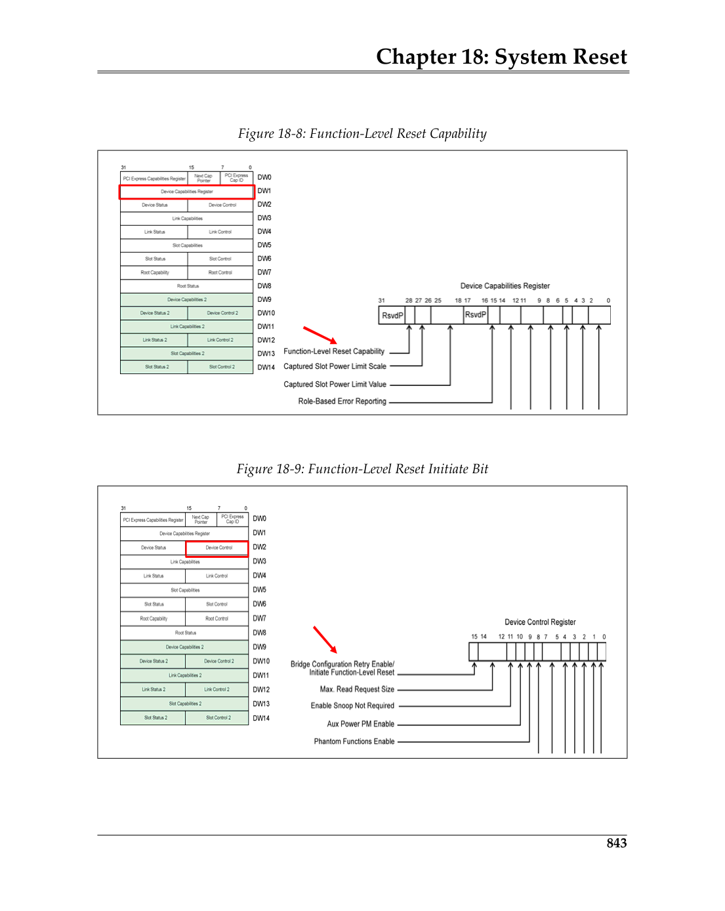

<br>

</td>
<td width="50%">

## **TPH (TLP 处理提示)**

添加有关系统应如何处理目标为内存空间的 TLP 的提示可以改善延迟和流量拥塞。规范将此特殊处理基本上描述为提供关于系统中多个可能的缓存位置中的哪一个是 TLP 临时副本的最佳位置的信息。

规范指出，由于为 TPH 描述的使用与缓存相关，因此通常使用目标为不可预取内存空间 (Non-prefetchable Memory Space) 的 TLP 是不合理的。如果需要这样的使用，则必须以某种方式保证缓存此类 TLP 不会引起不良副作用。

</td>
</tr>
<tr>
<td width="50%">

## **Quiescing Card and Driver**

</td>
<td width="50%">

## **TPH 示例**

**设备写入到主机读取**。为了帮助阐明 TPH 的动机，考虑第 901 页的图 20-11 所示的示例。这里端点正在将数据写入内存以供 CPU 稍后使用。序列如下：

1. 首先，端点发送一个内存写入 TLP，其中包含映射到系统内存的地址。数据包被路由到根复合体 (RC)。

2. RC 将此识别为对可缓存内存空间的访问，并在其窥探 CPU 缓存时暂停其进度。这可能导致从 CPU 的回写周期以在事务可以继续之前更新系统内存，这显示为步骤 2a。

3. 一旦任何回写完成，RC 允许写入更新系统内存。

4. 在某个时刻，端点通知 CPU 数据已传送。

5. 最后，CPU 从内存中获取数据以完成序列。

**Cha ter 20: U dates for S ec Revision 2.1 p p p**

_图 20-11：TPH 示例_

**==> 图片 [202 x 111] 已故意省略 <==**

**----- 图片文字开始 -----**<br>
4<br>2<br>e C)\ @ 5<br>2a<br>Roo! Complex @<br>3<br>1<br>lo [ |<br>**----- 图片文字结束 -----**


此序列有效，但通过在系统中添加中间缓存有改进性能的机会。为了说明这一点，考虑第 902 页的图 20-12 中所示的示例。从端点的角度来看，操作是相同的，但知道以不同方式处理它。现在的步骤如下：

1. 端点执行相同的内存写入，但这次包括 TPH 位。写入像以前一样通过交换机转发到 RC。

2. RC 理解此内存访问必须像以前一样窥探到 CPU。但是，一旦窥探处理完毕，RC 由 TPH 位通知将此 TLP 存储在中间缓存中，而不是转到系统内存。

3. 端点通知 CPU 数据项已传送。

4. CPU 从指定地址读取，但现在数据在中间缓存中找到，因此请求不会转到系统内存。这具有我们期望从缓存设计中获得的通常好处：更快的访问时间以及减少系统内存的流量。

这是一个简单的设备写入到主机读取 (DWHR) 示例，用于说明概念，但不难想象一个更复杂的系统，具有更大的拓扑，其中可以在交换机或其他位置放置其他缓存，以实现其他目标的相同好处。

_图 20-12：带系统缓存的 TPH 示例_

**==> 图片 [108 x 75] 已故意省略 <==**

**----- 图片文字开始 -----**<br>
3<br>2 4<br>OC @VlEl@<br>Rant Camnlayx<br>Cache<br>1<br>**----- 图片文字结束 -----**


**主机写入到设备读取**。为了说明相反方向的概念（称为主机写入到设备读取 (HWDR)），考虑第 903 页的图 20-13 中所示的示例。在此示例中，CPU 在第一步中启动一个内存写入，其地址针对 PCIe 端点。该数据包包含 TPH 位，告诉 RC
应将其存储在目标附近的中间缓存中，而不是上例中使用的 RC 中的缓存。在这种情况下，内置于交换机中的缓存用于此目的。然后在第二步中将 TLP 转发到目标端点。当数据不经常更新但经常被端点读取时，此模型是有益的。这允许通常会转到系统内存的多个内存读取由缓存处理，从而减轻从交换机到
RC 的链路以及到内存的路径的负载。

**Cha ter 20: U dates for S ec Revision 2.1 p p p**

_图 20-13：用于目标为端点的 TLP 的 TPH 使用_

**==> 图片 [353 x 326] 已故意省略 <==**

**----- 图片文字开始 -----**<br>
1<br>ox<br>oct Complex<br>Cache<br>rl i) i<br>PCle PCle<br>Cache<br>2<br>OWN: Endpoint Bridge<br>Yi i IN orto PCI-X PCI<br>§ EndpointPCle §§
EndpointLegacy PCI/PCI-X | |<br>Device to Device. One last example is illustrated in Figure 20‐14 on page<br>904, where two Endpoints
communicate with each other (called Device Read/<br>Write to Device Read/Write or D*D*) through a shared memory location that is<br>directed
by TPH bits to an intermediate cache. In this case, both may update dif‐<br>ferent locations that they need to handle as "read mostly", or
one Endpoint may<br>update data that the other needs to read several times. In both cases, using the<br>intermediate cache improves system
performance.<br>**----- 图片文字结束 -----**

</td>
</tr>
<tr>
<td width="50%">

## **General** 

Prior to removing a card from the system, two things must occur: the device driver must stop accessing the card, and the card must stop
initiating or responding to new Requests. How this is accomplished is OS‐specific, but the following must take place:

- The OS must stop issuing new requests to the device’s driver or instruct the driver to stop accepting new requests. 

- The driver must terminate or complete all outstanding requests. 

- The card must be disabled from generating interrupts or Requests. 

When the OS commands the driver to quiesce itself and its device, the OS must not expect the device to remain in the system (in other words,
it could be removed and not replaced with an identical card).

</td>
<td width="50%">

## **PCI Express Technology**

_图 20-14：端点之间的 TPH 使用_

**==> 图片 [34 x 9] 已故意省略 <==**

**----- 图片文字开始 -----**<br>
Cache<br>**----- 图片文字结束 -----**

</td>
</tr>
<tr>
<td width="50%">

## **Pausing a Driver (Optional)** 

Optionally, an OS could implement a “Pause” capability to temporarily stop driver activity in the expectation that the same card will be
reinserted. If the card is not reinstalled within a reasonable amount of time, however, the driver must be quiesced and then removed from
memory.

As an example, the currently‐installed card is failing or is being replaced with a later revision as an upgrade. If the operation is to
appear seamless from a soft‐ ware and operational perspective, the driver would have to quiesce the device, save the current context
(contents of registers, stack and instruction pointer of local micro‐controller, etc.) and turn off the power to the slot. The new card
could then be installed and powered, and then, when its context is restored, it could resume normal operation where it left off. Of course,
if the old card had failed, it may not be possible to simply resume operation.

</td>
<td width="50%">

## **TPH 头位**

TLP 头中的几位描述了如何使用提示。首先，如图 20-15（在第 905 页）顶部中间所示，TH（TLP 提示）位报告可选的 TPH 位是否正在用于 TLP。设置后，PH（处理提示位）指示下一级信息。

**Cha ter 20: U dates for S ec Revision 2.1 p p p**

_图 20-15：TPH 头位_

**==> 图片 [339 x 115] 已故意省略 <==**

**----- 图片文字开始 -----**<br>
+0 +1 +2 +3<br>7 6 5 4 3 2 1 0 7 6 5 4 3 2 1 0 7 6 5 4 3 2 1 0 7 6 5 4 3 2 1 0<br>At T T E<br>Byte 0 Fmt Type R TC R tr R H D P Attr AT
Length<br>Last DW 1st DW<br>Byte 4 Requester ID Tag BE BE<br>Byte 8 Address [63:32]<br>Byte 12 Address [31:2] PH<br>**----- 图片文字结束 -----**


当 TH 位置位时，PH 位（如图 20-15（在第 905 页）右下角所示）取代地址字段中原本保留的两个 LSB。对于 32 位地址，这些是字节 11 [1:0]，而对于所示的 64 位地址，它们是字节 15 [1:0]。其编码在第 905 页的表 20-1
中描述。这些提示由请求者根据对使用中的数据模式的了解来提供，而完成者自己很难推断出这些信息。

_表 20-1：PH 编码表_

|**PH [1:0]**|**处理提示**|**使用模型**|
|---|---|---|
|00b|双向数据结构|指示主机和设备的频繁读/写访问。|
|01b|请求者|D*D*（设备到设备传输）。指示设备的频繁读/写访问。星号表示任一设备都可以读取或写入。|
|10b|目标|DWHR，HWDR（设备到主机或主机到设备的传输）。指示主机的频繁读/写访问。|
|11b|带优先级的目标|与目标相同，但具有额外的时间重用优先级信息。指示主机的频繁读/写访问以及所访问数据的高时间局部性。|

</td>
</tr>
<tr>
<td width="50%">

## **Quiescing a Driver That Controls Multiple Devices** 

If a driver controls multiple cards and it receives a command from the OS to quiesce its activity with respect to a specific card, it must
only quiesce its activ‐ ity with that card and the card itself.

</td>
<td width="50%">

## **PCI Express Technology**

下一级信息是 Steering Tag 字节，它提供关于系统中缓存此 TLP 的最佳位置的系统特定信息。有趣的是，此字节在头中的位置取决于请求类型。对于 Posted Memory Writes，Tag 字段被重新用作 Steering Tag（不会返回完成，因此不需要
Tag），而对于 Memory Reads，两个 Byte Enable 字段被重新用于它（可预取读取不需要字节启用）。位的含义是实现特定的，但它们需要唯一地标识系统中所需缓存的位置。

规范中描述了 TPH 的两种格式，此级别的提示信息（TH + PH + 8 位 Steering Tag），称为基线 TPH (Baseline TPH)，是第一种，并且是提供 TPH 的所有请求所必需的。第二种格式使用 TLP 前缀来扩展 Steering
Tag（有关更多详细信息，请参阅第 908 页上的"TLP Prefixes"）。

## **Steering Tags**

</td>
</tr>
<tr>
<td width="50%">

## **Quiescing a Failed Card** 

If a card has failed, it may not be possible for the driver to complete requests previously issued to the card. In this case, the driver
must detect the error, ter‐ minate the requests without completion, and attempt to reset the card.

</td>
<td width="50%">

</td>
</tr>
<tr>
<td width="50%">

## **The Primitives** 

This section discusses the hot‐plug software elements and the information passed between them. For a review of the software elements and
their relation‐ ships to each other, refer to Table 19‐1 on page 852. Communications between the Hot‐Plug Service within the OS and the
Hot‐Plug System Driver is in the form of requests. The spec doesn’t define the exact format of these requests, but does define the basic
request types and their content. Each request type issued to the Hot‐Plug System Driver by the Hot‐Plug Service is referred to as a _primi‐
tive_ . They are listed and described in Table 19‐8 on page 875.
_Table 19‐8: The Primitives_ 

|**Primitive**|**Parameters**|**Description**|
|---|---|---|
|Query Hot‐Plug<br>System Driver|**Input**: None|Requests that the Hot‐Plug System<br>Driver return a set of Logical Slot<br>IDs for the
slots it controls.|
||**Return**: Set of Logical Slot<br>IDs for slots controlled by<br>this driver.||
|Set Slot Status|**Inputs**:<br>• Logical Slot ID<br>• New slot state (on or<br>off).<br>• New Attention Indica‐<br>tor state.<br>• New
Power Indicator<br>state.|This request is used to control the<br>slots and the Attention Indicator<br>associated with each slot.
Good<br>completion of a request is indicated<br>by returning the Status Change Suc‐<br>cessful parameter. If a fault is<br>incurred during
an attempted sta‐<br>tus change, the Hot‐Plug System<br>Driver should return the appropri‐<br>ate fault message (see middle col‐<br>umn).
Unless otherwise specified,<br>the card should be left in the off<br>state.|
||**Return**: Request comple‐<br>tion status:<br>• status change successful<br>• fault—wrong frequency<br>• fault—insufficient<br>power<br>•
fault—insufficient con‐<br>figuration resources<br>• fault—power fail<br>• fault—general failure||
|Query Slot<br>Status|**Input**: Logical Slot ID|This request returns the state of the<br>indicated slot (if a card is present).<br>The
Hot‐Plug System Driver must<br>return the Slot Power status infor‐<br>mation.|
||**Return**:<br>• Slot state (on or off)<br>• Card power require‐<br>ments.||


_Table 19‐8: The Primitives (Continued)_ 

|**Primitive**|**Parameters**|**Description**|
|---|---|---|
|Async Notice of<br>Slot Status<br>Change|**Input**: Logical Slot ID|This is the only primitive (defined<br>by the spec) that is issued to
the<br>Hot‐Plug Service by the Hot‐Plug<br>System Driver. It is sent when the<br>Driver detects an unsolicited<br>change in the state of a
slot. Exam‐<br>ples would be a run‐time power<br>fault or a card installed in a previ‐<br>ously‐empty slot with no warning.|
||**Return**: none||

</td>
<td width="50%">

</td>
</tr>
<tr>
<td width="50%">

## **Introduction to Power Budgeting** 

The primary goal of the PCI Express power budgeting capability is to allocate power for PCI Express hot plug devices that are added to the
system during runtime. This ensures that the system can allocate the proper amount of power and cooling for these devices.

The spec states that “power budgeting capability is optional for PCI Express devices implemented in a form factor which does not require hot
plug, or that are integrated on the system board.” None of the form factor specs released at the time of this writing required support for
hot plug or the power budgeting capability, but these change often.

System power budgeting is always required to support all system board devices and add‐in cards. The new capability provides mechanisms for
managing the budgeting process for a hot‐plug card. Each form factor spec defines the min and max power for a given expansion slot. For
example, the CEM spec limits the power an expansion card can consume prior to being fully enabled but, after it is enabled, it can consume
the maximum amount of power specified for the slot. In the absence of the power budgeting capability registers, the system designer is
responsible for guaranteeing that power has been budgeted cor‐ rectly and that sufficient cooling is available to support any compliant card
installed into the connector.

The spec defines the configuration registers to support the power budgeting process, but does not define the power budgeting methods and
processes. The next section describes the hardware and software elements that would be involved in power budgeting, including the specified
configuration registers.

</td>
<td width="50%">

</td>
</tr>
<tr>
<td width="50%">

## **The Power Budgeting Elements** 

Figure 19‐10 illustrates the concept of Power Budgeting for hot plug cards. The role of each element involved in the power budgeting,
allocation, and reporting process is listed and described below:

- System Firmware for Power Management (used during boot time). 

- Power Budget Manager (used during run time). 

- Expansion Ports (to which card slots are attached). 

- Add‐in Devices (Power Budget Capable).

</td>
<td width="50%">

</td>
</tr>
<tr>
<td width="50%">

## **System Firmware** 

Written by the platform designers the specific system, this is responsible for reporting system power information. The spec recommends the
following power information be reported to the PCI Express power budget manager, which allocates and verifies power consumption and
dissipation during runt‐ ime:

- Total system power available. 

- Power allocated to system devices by firmware 

- Number and type of slots in the system. 

Firmware may also allocate power to PCIe devices that support the power bud‐ geting capability register set, such as a hot‐plug device used
during boot time. The Power Budgeting Capability register, shown in Figure 19‐9 on page 878, contains a System Allocated bit that is
hardware initialized (usually by firm‐ ware) to notify the power budget manager that power for this device has already been included in the
system power allocation. If so, the Power Budget Manager still needs to read and save the power information for the hot‐plug devices that
were allocated in case they are later removed during runtime.

_Figure 19‐9: Power Budget Registers_ 


<br>

</td>
<td width="50%">

</td>
</tr>
<tr>
<td width="50%">

## **The Power Budget Manager** 

This initializes when the OS installs and receives power‐budget information from system firmware, although the spec does not define the
method for deliv‐ ering this information. This manager is responsible for allocating power for all PCI Express devices including:

- PCI Express devices that have not already been allocated by the system (including embedded devices that support power budgeting). 

- Hot‐plugged devices installed at boot time. 

- New devices added during runtime.

</td>
<td width="50%">

</td>
</tr>
<tr>
<td width="50%">

## **Expansion Ports** 

Figure 19‐10 on page 880 illustrates a hot plug port that must have the Slot Power Limit and Slot Power Scale fields within the Slot
Capabilities register implemented. The firmware or power budget manager must load these fields with a value that represents the maximum
amount of power supported by this Port. When software writes to these fields the Port automatically delivers a Set_Slot_Power_Limit message
to the device. These fields are also written when software configures a new card that has been added as a hot plug installation.

</td>
<td width="50%">

</td>
</tr>
<tr>
<td width="50%">

## Spec requirements: 

- Any Downstream Port that has a slot attached (the Slot Implemented bit in its PCIe Capabilities register is set) must implement the Slot
Capabilities register.

- Software must initialize the Slot Power Limit Value and Scale fields of the Slot Capabilities register of the Downstream Port that is
connected to an add‐in slot.

- Upstream Ports must implement the Device Capabilities register. 

- When a card is installed in a slot and software updates the power limit and scale values in the Downstream Port, that Port will
automatically send the Set_Slot_Power_Limit message to the Upstream Port on the installed card.

- The recipient of the Message must use the data payload to limit its power usage for the entire card, unless the card will never exceed the
lowest value specified in the corresponding electromechanical spec.

</td>
<td width="50%">

</td>
</tr>
<tr>
<td width="50%">

## **Add-in Devices** 

Expansion cards that support the power budgeting capability must include the Slot Power Limit Value and Slot Limit Scale fields within the
Device Capabilities register, and the Power Budgeting Capability register set for reporting power‐ related information.

These devices must not consume more than the lowest power specified by the form factor spec. Once power budgeting software allocates
additional power via the Set_Slot_Power_Limit message, the device can consume the power that has been specified, but not until it has been
configured and enabled.

**Device Driver** —The device’s software driver is responsible for verifying that sufficient power is available for proper device operation
prior to enabling it. If the power is lower than that required by the device, the device driver is respon‐ sible for reporting this to a
higher software authority.

_Figure 19‐10: Elements Involved in Power Budget_ 


<br>

</td>
<td width="50%">

</td>
</tr>
<tr>
<td width="50%">

## **Slot Power Limit Control** 

Software is responsible for determining the maximum power that an expansion device is allowed to consume. This allocation is based on the
power partitioning within the system, thermal capabilities, etc. Knowledge of the system’s power and thermal limits comes from system
firmware. The firmware or power man‐ ager is responsible for reporting the power limits to each expansion port.

</td>
<td width="50%">

</td>
</tr>
<tr>
<td width="50%">

## **Expansion Port Delivers Slot Power Limit** 

Software writes to the _Slot Power Limit Value_ and _Slot Power Limit Scale_ fields of the Slot Capability register to specify the maximum
power that can be con‐ sumed by the device. Software is required to specify a power value that reflects one of the maximum values defined by
the spec. For example, revision 2.0 of the CEM spec defines power usage as listed in Table 19‐9.

An interesting note about these values is that a standard‐height x1 server card is limited to 10W after a reset and is only allowed to use
the full 25W after it’s been configured and enabled. Similarly, a x16 graphics card will be limited to 25W until configured and enabled to
use the full 75W.

_Table 19‐9: Maximum Power Consumption for System Board Expansion Slots_ 

||**X1 Link**|**X1 Link**|**X4/X8 Link**|**X16 Link**|**X16 Link**|
|---|---|---|---|---|---|
|Standard Height|10W (max ‐ desktop)|25W (max ‐ server)|25W (max)|25W (max ‐ server)|75W (max ‐ graph‐ ics card)|
|Low Profile Card|10W (max)||25W (max)|25W (max)||


In addition to the base CEM spec, two more specs have been defined for higher‐ powered devices. First is the PCIe x16 Graphics 150W‐ATX Spec
1.0, which defines a video card that’s able to draw 75W from the card connector and another 75W from a separate 3‐pin ATX power connector.
The second is the PCIe 225W/300W High Power CEM Spec 1.0, which extends this by adding another 3‐pin power connector to achieve 225W, or a
4‐pin ATX connector that brings the total to 300W.

</td>
<td width="50%">

</td>
</tr>
<tr>
<td width="50%">

## **PCI Express Technology** 

When the Slot Power registers are written by power budget software, the expan‐ sion port sends a Set_Slot_Power_Limit message to the
expansion device. This procedure is illustrated in Figure 19‐11 on page 882.

_Figure 19‐11: Slot Power Limit Sequence_ 


<br>


1. When Hot Plug software is notified of a card insertion request, Power and Clock are restored to the slot. 

2. Hot Plug software calls configuration and power budgeting software to configure and allocate power to the device. 

3. Power budget software may interrogate the card to determine it's power requirements and characteristics. 

4. Power is then allocated based on the device's requirements and the system's capabilities 5. Power management software writes to the Slot
Power Scale and Slot Power Value fields within the expansion port.

6. Writes to these fields command the port to send the Set_Slot_Power_Limit message to convey the contents of the Slot Power fields. 

7. The slot receives the message and updates its Captured Slot Power Limit Value and Scale fields. 

8. These values limit the power that the expansion device can consume once it is enabled by its device driver.

</td>
<td width="50%">

</td>
</tr>
<tr>
<td width="50%">

## **Expansion Device Limits Power Consumption** 

The device driver reads the values from the Captured Slot Power Limit and Scale fields to verify that the power available is sufficient to
operate the device. Several conditions may exist:

- Enough power is available to operate the device at full capability. In this case, the driver enables the device by writing to the
configuration Com‐ mand register, permitting the device to consume power up to the limit spec‐ ified in the Power Limit fields.

- The power available is sufficient to operate the device but not at full capa‐ bility. In this case, the driver is required to configure
the device such that it consumes no more power than specified in the Power Limit fields.

- The power available is insufficient to operate the device. In this case, the driver must not enable the card and must report the
inadequate power con‐ dition to the upper software layers, which should in turn inform the end user of the problem.

- The power available exceeds the maximum power specified by the form factor spec. This condition should not occur. but, if it does, the
device is not permitted to consume power beyond the maximum permitted by the form factor.

- The power available is less than the lowest value specified by the form fac‐ tor spec. This is a violation of the spec, which states that
the expansion port “must not transmit a Set_Slot_Power_Limit Message that indicates a limit lower than the lowest value specified in the
electromechanical spec for the slotʹs form factor.”

Some expansion devices may consume less power than the lowest limit speci‐ fied for their form factor. Such devices are permitted to discard
the information delivered in the Set_Slot_Power_Limit Messages. When the Slot Power Limit Value and Scale fields are read, these devices
return zeros.

</td>
<td width="50%">

</td>
</tr>
<tr>
<td width="50%">

## **The Power Budget Capabilities Register Set** 

These registers permit power budgeting software to allocate power more effec‐ tively based on information provided by the device through its
power budget data select and data register. This feature is similar to the data select and data fields within the power management
capability registers. However, the power budget registers provide more detailed information to software to aid it in determining the effects
of expansion cards that are added during runtime on

</td>
<td width="50%">

</td>
</tr>
<tr>
<td width="50%">

## **PCI Express Technology** 

the system power budget and cooling requirements. Through this capability, a device can report the power it consumes: 

- from each power rail 

- in various power management states 

- in different operating conditions 

These registers are not required for devices implemented on the system board or on expansion devices that do not support hot plug. Figure
19‐12 on page 884 illustrates the power budget capabilities register set and shows the data select and data field that provide the method
for accessing the power budget information.

</td>
<td width="50%">

</td>
</tr>

</tbody>
</table>

[⬆️ 返回目录](#本章目录-table-of-contents)

---


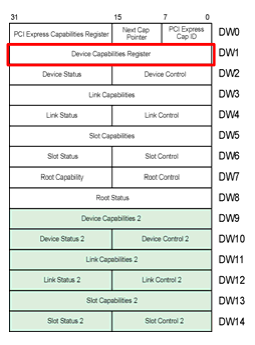

<a id="sec-18-2"></a>
## 18.2 Latency Tolerance Reporting (LTR) | 延迟容忍度上报 (LTR)

<table>
<thead><tr><th width="50%">🇬🇧 English</th><th width="50%">🇨🇳 中文</th></tr></thead>
<tbody>
<tr>
<td width="50%">

The power budget information is maintained within a table that consists of one or more 32‐bit entries. Each table entry contains power
budget information for the different operating modes supported by the device. Each table entry is selected via the data select field, and
the selected entry is then read from the data field. The index values start at zero and are implemented in sequential order. When a selected
index returns all zeros in the data field, the end of the power budget table has been located. Figure 19‐13 on page 885 illustrates the
format and types of information available from the data field.

_Figure 19‐12: Power Budget Capability Registers_ 


<br>

_Figure 19‐13: Power Budget Data Field Format and Definition_ 


<br>

</td>
<td width="50%">

这些值由软件编程到表中以在正常操作期间使用。规范建议该表位于 TPH Requester Capability 结构中，如图 20-16 所示（在第 906 页），但它也可以构建到 MSI-X 表中。对于给定的功能，只能使用这些表位置中的一个或另一个。位置在 Requester
Capability 寄存器的 ST Table Location 字段 [10:9] 中给出，如图 20-17 所示（在第 907 页）。这 2 位的编码在第 907 页的表 20-2 中显示。

_图 20-16：TPH Requester Capability 结构_

|31|15|0<br>7|
|---|---|
|PCI Express Capabilities Register|Next Cap<br>Pointer|PCI Express<br>Cap ID (17h)|
|TPH Requester Capability Register||
|TPH Requester Control Register||
|TPH ST Table（可选）<br>（大小由 ST 条目数决定）||


**Cha ter 20: U dates for S ec Revision 2.1 p p p**

_图 20-17：TPH Capability 和 Control 寄存器_

**==> 图片 [340 x 285] 已故意省略 <==**

**----- 图片文字开始 -----**<br>
TPH Requester Capability Register<br>31 27 26 16 15 11 10 9 8 7 3 2 1 0<br>RsvdP ST Table Size RsvdP RsvdP<br>ST Table Location<br>Extended
TPH Requester Supported<br>Device-Specific Mode Supported<br>Interrupt Vector Mode Supported<br>No ST Mode Supported<br>TPH Requester
Control Register<br>31 10 9 8 7 3 2 0<br>RsvdP RsvdP<br>TPH Requester Enable<br>ST Mode Select<br>**----- 图片文字结束 -----**


_表 20-2：ST 表位置编码_

|**位 [10:9]**|**ST 表位置**|
|---|---|
|00b|不存在|
|01b|位于 Requester Capability 结构中|
|10b|位于 MSI-X 表中|
|11b|保留|


Requester Capability 寄存器在位 [26:16] 中列出 ST Table 中的条目数。每个表条目宽 2 字节，在 TPH Capability 寄存器集中实现的 ST Table 如图 20-18（在第 908
页）所示，其中突出显示了条目零。Requester Capability 寄存器还描述了请求者支持哪些 ST 模式，以及 3 个 LSB：

- **No ST** — 对 ST 位使用零。在 TPH Requester Control 寄存器的 ST Mode Select 字段中选择，值为 000b 时。

- **Interrupt Vector** — 使用中断向量号作为表的偏移量，这意味着值包含在 MSI-X 表中。（ST Mode Select 值 = 001b。）

- **Device-Specific** — 使用设备特定的方法偏移到 TPH Capability 结构中的 ST Table，因为 ST 值位于其中。这是建议的实现，尽管给定的请求如何与特定 ST 条目相关联超出了规范的范围。（ST Mode Select 值 =
010b。）

- 所有其他 ST Mode Select 编码保留供将来使用。

_图 20-18：TPH Capability ST Table_

||31|24|23|16|15|8|7|0||
|---|---|---|---|---|---|---|---|---|---|
||ST Upper Entry (1)||ST|Lower Entry (1)|ST Upper Entry (0)||ST Lower Entry (0)|||
||ST Upper Entry (3)||ST|Lower Entry (3)|ST Upper Entry (2)||ST Lower Entry (2)|||
|||||||||||
|||ST Upper Entry|ST Lower Entry|||ST Upper Entry|ST Lower Entry||
|||(Table Size)||(Table Size)||(Table Size - 1)|(Table Size - 1)|||
|||||||||||

</td>
</tr>
<tr>
<td width="50%">

## _**20**_

</td>
<td width="50%">

## **TLP Prefixes**

如果需要，可以通过添加可选的 TLP 前缀来扩展 Steering Tag 位。当 TLP 给出一个或多个前缀时，头通过设置 Format 字段的最高有效位来报告它，如图 20-19（在第 909 页）所示。

**Cha ter 20: U dates for S ec Revision 2.1 p p p**

_图 20-19：TPH 前缀指示_

**==> 图片 [344 x 126] 已故意省略 <==**

**----- 图片文字开始 -----**<br>
+0 +1 +2 +3<br>7 6 5 4 3 2 1 0 7 6 5 4 3 2 1 0 7 6 5 4 3 2 1 0 7 6 5 4 3 2 1 0<br>Fmt At T T E<br>Byte 0 Type R TC R R Attr AT Length<br>1 0
0 tr H D P<br>Last DW 1st DW<br>Byte 4 Requester ID Tag<br>BE BE<br>Byte 8 Address [63:32]<br>Byte 12 Address [31:2] PH<br>**----- 图片文字结束
-----**

</td>
</tr>
<tr>
<td width="50%">

## _**Updates for Spec Revision 2.1**_

</td>
<td width="50%">

## **IDO（基于 ID 的排序）**

事务排序规则对于正确的流量流很重要，但有时不需要，并且在这些情况下可以改善延迟。特别是来自不同请求者的 TLP 之间不太可能有依赖关系，因此此功能允许软件启用它们以重新排序以提高性能。此操作的详细信息在第 301 页上名为"ID Based Ordering
(IDO)"的部分中描述。

</td>
</tr>
<tr>
<td width="50%">

## **Previous Chapter** 

The previous chapter describes the PCI Express hot plug model. A standard usage model is also defined for all devices and form factors that
support hot plug capability. Power is an issue for hot plug cards, too, and when a new card is added to a system during runtime, it’s
important to ensure that its power needs don’t exceed what the system can deliver. A mechanism was needed to query the power requirements of
a device before giving it permission to oper‐ ate. Power budgeting registers provide that.

</td>
<td width="50%">

## **ARI（替代路由 ID 解释）**

此可选功能的动机是增加端点可用的功能号数。设备号在 PCI 等共享总线架构中很有用，但在点对点架构中通常不需要。因此，规范编写者选择允许设备以不同方式解释 ID 路由命令的目标。这是通过将 Device number 定义为始终为零来实现的，然后允许 Function
number 使用 ID 中以前是 Device number 的 5 位。实际上，Device number 消失了，而 Function number 增加到 8 位。使用 ARI 的 TLP
的目标需要被启用以识别它，然后软件才能使用此功能，但路径中的路由元素不必意识到这一点。它们只查看总线号以确定路由。

</td>
</tr>
<tr>
<td width="50%">

## **This Chapter** 

This chapter describes the changes and new features that were added with the 2.1 revision of the spec. Some of these topics, like the ones
related to power management, are described in other chapters, but for others there wasn’t another logical place for them. In the end, it
seemed best to group them all together in one chapter to ensure that they were all covered and to help clarify what features were new.

</td>
<td width="50%">

## **电源管理改进**

有四项新增功能可提高系统有效管理电源的能力，它们在此处列出。所有这些内容均在第 16 章"电源管理"（第 703 页）中介绍。

</td>
</tr>
<tr>
<td width="50%">

## **The Next Chapter** 

The next section is the book appendix which includes topics such as: Debugging PCI Express Traffic using LeCroy Tools, Markets &
Applications of PCI Express Architecture, Implementing Intelligent Adapters and Multi‐Host Systems with PCI Express Technology, Legacy
Support for Locking and the book Glossary.

</td>
<td width="50%">

## **DPA（动态功率分配）**

一组新的扩展配置寄存器定义了 D0 以下最多 32 个子状态。这允许软件轻松地更改设备的电源状态，而不会产生一直转到 D1 设备电源状态的延迟惩罚。有关详细信息，请参阅第 714 页的"动态功率分配 (DPA)"。

</td>
</tr>
<tr>
<td width="50%">

## **Changes for PCIe Spec Rev 2.1** 

The 2.1 revision of the spec for PCIe introduced several changes to enhance per‐ formance or improve operational characteristics. It did not
add another data rate and that’s why it was considered an incremental revision. The modifica‐ tions can be grouped generally into four areas
of improvement: System Redun‐ dancy, Performance, Power Management, and Configuration.

</td>
<td width="50%">

## **LTR（延迟容忍报告）**

允许端点报告它们可以容忍的延迟以响应其请求，使系统软件能够就系统响应时间和睡眠状态做出更好的选择。有关详细信息，请参阅第 784 页的"LTR（延迟容忍报告）"。

</td>
</tr>
<tr>
<td width="50%">

## **System Redundancy Improvement: Multi-casting** 

The Multi‐casting capability allows a Posted Write TLP to be routed to more than one destination at the same time, allowing for things like
automatically making redundant copies of data or supporting multi‐headed graphics. As shown in Figure 20‐1 on page 888, a TLP sourced from
one Endpoint can be routed to multiple destinations based solely on its address. In this example, data is sent to the video port for display
while redundant copies of it are auto‐ matically routed to storage. There are other ways this activity could be sup‐ ported, of course, but
this is very efficient in terms of Link usage since it doesn’t require a recipient to re‐send the packet to secondary locations.

_Figure 20‐1: Multicast System Example_ 


<br>


This mechanism is only supported for posted, address‐routed Requests, such as Memory Writes, that contain data to be delivered and an
address that can be decoded to show which Ports should receive it. Non‐posted Requests will not be treated as Multicast even if their
addresses fall within the MultiCast address range. Those will be treated as unicast TLPs just as they normally would.

The setup for Multicast operation involves programming a new register block for each routing element and Function that will be involved,
called the Multi‐ cast Capability structure. The contents of this block are shown in Figure 20‐2 on page 889, where it can be seen that they
define addresses and also MCGs (Mul‐ tiCast Group numbers) that explain whether a Function should send or receive copies of an incoming TLP
or whether a Port should forward them. Let’s

**Cha ter 20: U dates for S ec Revision 2.1 p p p** 

describe these registers next and discuss how they’re used to create Multicast operations in a system. 

_Figure 20‐2: Multicast Capability Registers_ 

|20<br>31|19|19|16|15||0||||
|---|---|---|---|---|---|---|---|---|---|
|Next Extended Capability Offset||Version (1h)||PCIe Extended Capability ID (0012h fo...|
||||31|||||0|Offset|
|||||PCIe Enhanced Capability Header|||||00h|
|||||Multicast Control||Multicast Capability|||04h|
|MCGs this Function||||MC_Base_Address Register|||||08h<br>0Ch|
|is allowed to receive||||||||||
|or forward||||MC_Receive||Register|||10h<br>14h|
|MCGs this Function||||||||||
|must not send|||||||||18h|
|or forward||||MC_Block_All||Register|||1Ch|
|MCGs this Function<br>must not send or||||MC_Block_Untranslated Register|||||20h<br>24h|
|forward if the address||||||||||
|Root Ports and<br>is untranslated||||MC_Overlay_BAR|||||28h<br>2Ch|
|Switch Ports||||||||||

</td>
<td width="50%">

## **OBFF（优化缓冲区刷新和填充）**

类似地，允许系统报告端点应该或不应该启动 DMA 或中断流量的首选时间段，有助于协调系统睡眠时间并改善电源管理。有关详细信息，请参阅第 776 页的"OBFF（优化缓冲区刷新和填充）"。

</td>
</tr>
<tr>
<td width="50%">

## **Multicast Capability Registers** 

The Capability Header register at the top of the figure includes the Capability ID of 0012h, a 4‐bit Version number, and a pointer to the
next capability struc‐ ture in the linked list of registers.

</td>
<td width="50%">

## **ASPM 选项**

此更改只是允许设备在选择时支持无 ASPM 链路电源管理。在以前的规范版本中，对 L0s 的支持是强制性的，但现在它变为可选的。

**Cha ter 20: U dates for S ec Revision 2.1 p p p**

</td>
</tr>
<tr>
<td width="50%">

## **Multicast Capability** 

This register, shown in detail in Figure 20‐3 on page 890, contains several fields. The MC_Max_Group value defines how many Multicast Groups
this Function has been designed to support minus one, so that a value of zero means one

group is supported. The Window Size Requested, which is only valid for End‐ points and reserved in Switches and Root Ports, represents the
address size needed for this purpose as a power of two.

_Figure 20‐3: Multicast Capability Register_ 


<br>


Lastly, bit 15 indicates whether this Function supports regenerating the ECRC value in a TLP if forwarding it involved making address
changes to it. Refer to the section called “Overlay Example” on page 895 for more detail on this.

</td>
<td width="50%">

## **配置改进**

添加了一些配置寄存器以改进对设备的软件可见性和控制。

</td>
</tr>
<tr>
<td width="50%">

## **Multicast Control** 

This register, shown in Figure 20‐4 on page 890, contains the MC_Num_Group that is programmed with the number of Multicast Groups configured
by soft‐ ware for use by this Function. The default number is zero, and the spec notes that programming a value here that is greater than
the max value defined in the MC_Max_Group register will result in undefined behavior. The MC_Enable bit is used to enable the Multicast
mechanism for this component.

_Figure 20‐4: Multicast Control Register_ 


<br>


**Cha ter 20: U dates for S ec Revision 2.1 p p p**

</td>
<td width="50%">

## **内部错误报告**

这旨在为没有驱动程序来处理它们的设备（如交换机）提供一种标准化的方式来报告内部问题。它还添加了在错误结果时跟踪多个 TLP 头而不是像以前那样只跟踪一个的功能。本主题在第 667 页的关于错误的"内部错误"部分中介绍。

</td>
</tr>
<tr>
<td width="50%">

## **Multicast Base Address** 

The base address register, shown in Figure 20‐5 on page 891, contains the 64‐bit starting address of the Multicast Address range for this
component. The Multi‐ Cast Index Position register indicates the bit position within the address where the MultiCast Group (MCG) number is
to be found. When the address of an incoming TLP falls within the MultiCast address range starting at this Base Address, the logic will
offset into the address itself by the number of bit loca‐ tions given in the Index Position and interpret the next bits (up to 6 bits,
allow‐ ing up to 64 groups) as the MCG number for that TLP. The MCG number, in turn, will indicate whether the Port should forward a copy of
this TLP.

_Figure 20‐5: Multicast Base Address Register_ 


<br>


An example of locating the MCG within the address is shown in Figure 20‐6 on page 892. Here the Index Position value is 24, so the MCG is
found in address bits 25 to 30. Interestingly, since the base address doesn’t define the lower 12 bits of the address, the MC Index Position
must be 12 or greater to be valid. If it’s less than 12 and the MC_Enable bit is set, the component’s behavior will be unde‐ fined.

</td>
<td width="50%">

## **Resizable BAR**

这组新的扩展配置寄存器允许使用大量本地内存的设备报告它们是否可以使用更少的内存量，如果是，则可以接受的大小。知道查找它们的软件可以找到新的寄存器，如图 20-20（在第 912 页）所示，并根据系统内存和其他设备的竞争要求对它们进行编程以给出适合平台的内存大小。

这些寄存器的使用有一些规则：

1. 为避免混淆，仅当 Command 寄存器中的 Memory Enable 位已清除时，才应更改 BAR 大小。

2. 规范强烈建议功能不要通告比其有效使用的更大的 BAR。

3. 为了确保最佳性能，软件应分配将适用于系统的最大 BAR 大小。

</td>
</tr>
<tr>
<td width="50%">

## **PCI Express Technology** 

_Figure 20‐6: Position of Multicast Group Number_ 


<br>


## **MC Receive**

</td>
<td width="50%">

## **PCI Express Technology**

</td>
</tr>
<tr>
<td width="50%">

</td>
<td width="50%">

## _图 20-20：Resizable BAR 寄存器_

**==> 图片 [363 x 166] 已故意省略 <==**

**----- 图片文字开始 -----**<br>
31 20 19 16 15 0<br>Next Extended Version PCIe Extended Capability ID<br>Capability Offset (1h) (0015h for Resizable BAR)<br>31 0
Offset<br>PCIe Enhanced Capability Header 000h<br>Resizable BAR Capability Register (0) 004h<br>Register Pair<br>for each Reserved Resizable
BAR Control Register (0) 008h<br>supported<br>BAR …<br>Resizable BAR Capability Register (n) n*8 +4<br>Reserved Resizable BAR Control
Register (n) n*8 +8<br>**----- 图片文字结束 -----**

</td>
</tr>
<tr>
<td width="50%">

</td>
<td width="50%">

## **Capability Register**

此寄存器仅报告哪些 BAR 大小将适用于此功能。位 4 到 23 用于此目的，值如下所示：

- 位 4 — 1MB BAR 大小将适用于此功能

- 位 5 — 2MB

- 位 6 — 4MB

- ...

- 位 23 — 512GB 将适用于此功能

_图 20-21：Resizable BAR Capability 寄存器_

**==> 图片 [242 x 38] 已故意省略 <==**

**----- 图片文字开始 -----**<br>
31 24 23 4 3 0<br>RsvdP RsvdP<br>**----- 图片文字结束 -----**

</td>
</tr>
<tr>
<td width="50%">

</td>
<td width="50%">

## **Control Register**

此寄存器中的 BAR Index 字段报告此大小引用的 BAR（0 到 5 是可能的）。Number of Resizable BARs 字段仅对 Control

**Cha ter 20: U dates for S ec Revision 2.1 p p p**

Register 0 定义，并对其余所有保留。它告诉六个可能的 BAR 中实际上有多少个具有可调整的大小。最后，BAR Size 字段由软件编程以指定 BAR Index 字段指示的 BAR 所需的大小（0 = 1MB，1=2MB，2=4MB，...，19=512GB）。

_图 20-22：Resizable BAR Control 寄存器_

**==> 图片 [281 x 136] 已故意省略 <==**

**----- 图片文字开始 -----**<br>
31 13 12 8 7 5 4 3 2 0<br>RsvdP RsvdP<br>BAR Size (RW)<br>Number of Resizable<br>BARs (RO)<br>BAR Index (RO)<br>**----- 图片文字结束 -----**


一旦 Resizable 值被编程，枚举软件将能够像通常一样工作：将所有 F 写入每个 BAR 并读回它将报告所选的大小。请注意，如果大小值被更改，BAR 的内容将丢失，如果之前已设置，则需要重新编程。图 20-23（在第 914 页）突出显示了 Type 0 头的配置头空间中的
BAR 寄存器。

</td>
</tr>
<tr>
<td width="50%">

</td>
<td width="50%">

## _图 20-23：Type0 配置头中的 BAR_

**==> 图片 [160 x 273] 已故意省略 <==**

**----- 图片文字开始 -----**<br>
3 2 1 0 DW<br>Device Vendor 00<br>ID ID<br>Status Command 01<br>Register Register<br>Class Code Revision 02<br>ID<br>HeaderType LatencyTimer
CacheLineSize 03<br>04<br>Base Address 0<br>05<br>Base Address 1<br>06<br>Base Address 2<br>07<br>Base Address 3<br>08<br>Base Address
4<br>09<br>Base Address 5<br>10<br>CardBus CIS Pointer<br>Subsystem ID SubsystemVendor ID 11<br>Expansion ROM 12<br>Base Address<br>Reserved
CapabilitiesPointer 13<br>14<br>Max_Lat Min_Gnt InterruptPin InterruptLine 15<br>**----- 图片文字结束 -----**


## **简化的排序表**

</td>
</tr>

</tbody>
</table>

[⬆️ 返回目录](#本章目录-table-of-contents)

---

> 🤖 Generated by `tools/merge_chapters.py`


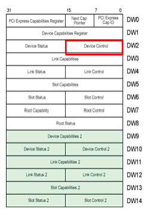

---


\newpage

# 📘 第 19 章　热插拔与功率预算 (Chapter 19. Hot Plug and Power Budgeting)

**MindShare PCI Express Technology 3.0 — Comprehensive Guide to Generations 1.x, 2.x and 3.0**

> 📁 **Source chunks**: `chunks/chunk0344.md` ... `chunks/chunk0346.md`
> 🎨 **Format**: 中英对照双语 · 中文灰底 (PCIe 6.2 Spec 模板)

---

## 📑 本章目录 (Table of Contents)

- [19.1 Hot Plug and Power Budgeting — 热插拔与功率预算](#sec-19-1)
- [19.2 Hot Plug and Power Budgeting — 热插拔与功率预算](#sec-19-2)
- [19.3 Hot Plug and Power Budgeting — 热插拔与功率预算](#sec-19-3)

<a id="sec-19-1"></a>
## 19.1 Hot Plug and Power Budgeting | 热插拔与功率预算

<table>
<thead><tr><th width="50%">🇬🇧 English</th><th width="50%">🇨🇳 中文</th></tr></thead>
<tbody>
<tr>
<td width="50%">

This 64‐bit register is a bit vector that indicates for which of the 64 MCGs this Function should accept a copy or this Port should forward
a copy. If the MCG value is found to be 47, for example, and bit 47 is set in this register, then this Function should receive it or this
Port should forward it.

</td>
<td width="50%">

此更改通过减少表中的条目数简化了事务排序表。基本上，它不再区分读取的完成或非发布写入的完成。这样做的动机是为了减少需要测试的案例数量。有关详细信息，请参阅第 288 页上名为"简化的排序规则表"的部分。

# 附录

</td>
</tr>
<tr>
<td width="50%">

## **MC Block All** 

This 64‐bit register indicates which MCGs an Endpoint Function is blocked from sending and which a Switch or Root Port is blocked from
forwarding. This can be programmed in a Switch or Root Port to prevent it from forwarding Mul‐ tiCast TLPs to an Endpoint that doesn’t
understand them, for example. A blocked TLP is considered an error condition, and how the error is handled is described in the next section.

</td>
<td width="50%">

## _**附录 A：**_

</td>
</tr>
<tr>
<td width="50%">

## **MC Block Untranslated** 

The meaning and use of this 64‐bit register is almost identical to the Block All register except that it doesn’t apply to TLPs whose AT
header field shows them to be translated. This mechanism can be used to set up a Multicast window that is protected in that it can only
receive translated addresses.

If a TLP is blocked because of the setting of either of these two blocking regis‐ ters, it’s handled as an MC Blocked TLP, meaning it gets
dropped and the Port

**Cha ter 20: U dates for S ec Revision 2.1 p p p** 

or Function logs and signals this as an error. Logging the error involves setting the Signaled Target Abort bit in its Status register or
its Secondary Status regis‐ ter, as appropriate. That’s barely enough information to be useful, though, so the spec highly recommends that
Advanced Error Reporting (AER) registers be implemented in Functions with Multicast capability to facilitate isolating and diagnosing
faults.

The spec notes that this register is required in all Functions that implement the MC Capability registers, but if an Endpoint Function
doesn’t implement the ATS (Address Translation Services) registers, the designer may choose to make these bits reserved.

</td>
<td width="50%">

## _**使用 LeCroy 工具调试 PCIe 流量**_

</td>
</tr>
<tr>
<td width="50%">

## **Multicast Example** 

At this point, an example will help to illustrate how these registers can be used to set up a multicast environment. To set this up, let’s
first give the relevant reg‐ isters some values:

- MC_Base_Address = 2GB (Starting address for the multicast range) 

- MC_Max_Group = 7 (Meaning 8 windows are possible for this design) 

- MC_Window_Size_Requested = 10 (Meaning 2[10] or 1KB size was requested by an Endpoint) 

- MC_Index_Position = 12 (Meaning the actual size of each window is 2[12] ) 

- MC_Num_Group = 5 (Meaning software only configured 6 of the available multicast windows). 

Based on those register settings, the image in Figure 20‐7 on page 894 illustrates the result. The multicast window range is shown starting
at 2GB and ranging as high as 2GB + 8 * (the window size). However, only 6 are enabled by software, so the actual multicast address range is
from 2GB to 2GB + 24KB. The windows are all the same size and correspond to the MCGs: MCG 0 is the first window, 1 is the next window, and
so on.

_Figure 20‐7: Multicast Address Example_ 

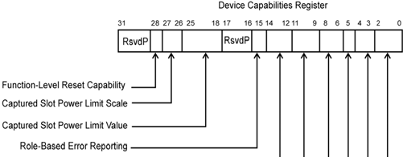

<br>

</td>
<td width="50%">

## Christopher Webb，LeCroy 公司

</td>
</tr>
<tr>
<td width="50%">

## **MC Overlay BAR** 

This last set of registers are required for Switch and Root Ports that implement Multicasting, but they’re not implemented in Endpoints. The
motivation for this BAR is that it allows two special cases. First, a Port can forward TLPs down‐ stream if they hit in a multicast window
even if the Endpoint wasn’t designed for multicasting. Second, a Port can forward multicast TLPs upstream to system memory. In both cases,
this is accomplished by replacing part of the Request’s address with an address that will be recognized by the target. Doing so allows a
single BAR in a component to serve as a target for both unicast and multicast writes even if it wasn’t designed with multicast capability.

As shown in Figure 20‐8 on page 895, this register block consists of an address that will be overlaid onto the outgoing TLP, and a 6‐bit
Overlay Size indicator. The size referred to here is simply the number of bits from the original 64‐bit address that will be retained, while
all the others will be replaced by the Over‐ lay BAR bits. The spec mistakenly refers to this in at least one place as the size in bytes,
but in other places it’s made clear that it is a bit number. Note that the overlay size value must be 6 or higher to enable the overlay
operation. If the size is given as 5 or lower, no overlay will take place and the address is unchanged.

**Cha ter 20: U dates for S ec Revision 2.1 p p p** 

_Figure 20‐8: Multicast Overlay BAR_ 


<br>

</td>
<td width="50%">

## **概述**

IO 总线架构从 PCI 到 PCI Express 的过渡对开发人员在验证和调试所需的工具类型方面产生了重大影响。

使用 PCI 等并行总线，信号的波形视图显示了足够的信息供开发人员解释总线的状态。用户可以目视检查波形并在心理上解码事务的类型、传输了多少数据，甚至传输的内容。

由于 PCI Express 数据包流量既被编码又被加扰，检查流量的波形视图对链路状态提供的信息非常少。链路速度可以从位时间的宽度推断，链路宽度可以从活动 lane 的数量推断。然而，用户无法目视解释符号对齐，更不用说数据包本身了。

一类新的工具发展起来，帮助开发人员可视化其现在的串行链路的状态。这些工具为用户执行反序列化、解码和解扰。乍一看这似乎足以满足开发人员的要求。但对于 PCI Express 而言，其他复杂性（如流控信用、lane 间偏移、极性反转和 lane 反转）也必须由这些工具作为理解
PCIe 协议的一部分来理解。

前硅和后硅调试都对工具有共同的需求。在本附录章节中，我们描述了可用于调试 PCI Express 互连的某些产品，包括前硅和后硅调试的视角。

</td>
</tr>
<tr>
<td width="50%">

## **Overlay Example** 

Now consider the case in which an address overlay is desired, as shown in Fig‐ ure 20‐9 on page 896. Here the address of a TLP to be
forwarded, ABCD_BEEFh, falls within the defined multicast range (also referred to as a multicast hit) and the egress Port has been
configured with valid values in the Overlay BAR.

The overlay case creates the unusual situation with the ECRC value that was mentioned earlier in the description of the Multicast Capability
register. If the TLP whose address is being changed by the overlay includes an ECRC, that value would be rendered incorrect by this change.
Switches and Root Ports optional support regenerating the ECRC based on the new address so that it still serves its purpose going forward.
If the routing agent does not support it, the ECRC is simply dropped and the TD header bit is forced to zero to avoid any confusion.

A potential problem can arise with ECRC regeneration. If the incoming TLP already had an error but the ECRC value is regenerated because the
address was modified, that would inadvertently hide the original error. To avoid that, the routing agent must verify the original ECRC
first. If it finds an error, it must force a bad ECRC on the outgoing TLP by inverting the calculated ECRC value before appending it to
ensure that the target will see it as an error condition.

_Figure 20‐9: Overlay Example_ 


<br>

</td>
<td width="50%">

## **前硅调试**

</td>
</tr>
<tr>
<td width="50%">

## **Routing Multicast TLPs** 

When a Switch or Root Port detects an MC hit (address falls within the MC range) normal routing is suspended. The MCG is extracted from the
address and is compared to the MC_Receive register of all the Ports to see which of them should forward a copy of this TLP. Ports whose
corresponding Receive register bit is set will forward a copy of the TLP unless their corresponding MC Blocked register bit is also set. If
no Ports forward the TLP and no Functions consume it, it is silently dropped. To prevent loops, a TLP is never forwarded back out on its
ingress Port, with the possible exception of an ACS case.

Endpoints extract the MCG and compare it with their Receive register. If there’s no match, the TLP is silently dropped. If the Endpoint
doesn’t support Multi‐ casting, it will treat the TLP as having an ordinary address.

**Cha ter 20: U dates for S ec Revision 2.1 p p p**

</td>
<td width="50%">

## **RTL 仿真视角**

在 RTL 仿真中，查看 FPGA 或 ASIC 信号的波形视图是最常见的调试方法。通过显示内部状态机的状态、监视 IO 在设备中的移动，或查看控制信号的状态；波形视图非常强大。但是，正如我们上面讨论的，PCI Express
链路在显示为波形时是不可理解的。必须进行额外的处理或解码才能理解此新链路。为了增强仿真工具，通常会添加 PCI Express 总线监视器来满足此需求。

</td>
</tr>
<tr>
<td width="50%">

## **Congestion Avoidance** 

The use of Multicasting will increase the amount of system traffic in proportion to the percentage of MC traffic, which leads to the risk of
packet congestion. To avoid creating backpressure, MC targets should be designed to accept MC traf‐ fic “at speed”, meaning with minimal
delay. To avoid oversubscribing the Links, MC initiators should limit their packet injection rate. A system designer would be wise to choose
components carefully to handle this. For example, using Switches and Root Ports whose buffers are big enough to handle the expected traffic,
and Endpoints that are able to accept their incoming MC packets quickly enough to avoid trouble.

</td>
<td width="50%">

## **PCI Express RTL 总线监视器**

PCI Express 总线监视器是一段代码，用户可以将其插入其 RTL 仿真中以帮助监视其 PCIe 链路的状态。至少，此监视器将输出基于文本的日志文件，其中包含有关链路状态变化和分组活动类型的信息。更复杂的监视器将执行实时合规性检查。许多供应商提供可购买的 IP
来执行此确切功能。然而，重点通常是合规性。在可视化流控信用、链路利用率或链路训练调试等方面提供的功能较少。

</td>
</tr>
<tr>
<td width="50%">

## **Performance Improvements** 

System performance is enhanced with the addition of four new features: 

1. AtomicOps to replace the legacy transaction locking mechanism 

2. TLP Processing Hints to allow software to suggest caching options 

3. ID‐Based Ordering to avoid unnecessary latency 

4. Alternative Routing‐ID Interpretation to increase the number of Functions available in a device.

</td>
<td width="50%">

## **RTL 矢量导出到 PETracer 应用程序**

LeCroy 已与许多领先的 PCIe 验证 IP 供应商合作，创建工具以进一步增强前硅 PCIe 流量的可视化和分析。这涉及使用供应商的总线监视器将原始符号流量导出到与专用 PCIe 分析仪硬件使用的同一 PETracer 应用程序。SimPASS PE 是 LeCroy
支持此导出的解决方案。

有关 LeCroy PETracer 应用程序及其功能的更多信息在"作为最后的手段，第 924 页的图 5 中所示的飞线探针可用于将协议分析仪附加到被测系统。这涉及将电阻式分流电路和连接器引脚焊接到 PCIe 走线上。此电路通常焊接到 PCIe 链路的 AC
耦合电容，因为它们通常是访问走线的唯一位置。探针电路焊接到 PCB 后，可以根据需要连接和移除分析仪探针。这种方法可用于几乎任何 PCIe 链路，但是连接的鲁棒性受限于添加探针的技术人员的技能。"第 924 页中描述。

</td>
</tr>
<tr>
<td width="50%">

## **AtomicOps** 

Processors that share resources or otherwise communicate with each other sometimes need uninterrupted, or “atomic”, access to system
resources to do things like testing and setting semaphores. On parallel processor buses this was accomplished by locking the bus with the
assertion of a Lock pin until the origi‐ nator completed the whole sequence (a read followed by a write), during which time other processors
were not allowed to initiate transactions on the bus. PCI included a Locked pin to apply this same model on the PCI bus as on the pro‐
cessor bus, allowing this protocol to used with peripheral devices.

This model worked but was slow on the shared processor bus and even worse when going onto the PCI bus. That’s one reason why PCIe limited
its use only to Legacy devices. However, the increasing use of shared processing in today’s PCs, such as graphics co‐processors and compute
accelerators, has brought this issue back to the fore because the different compute engines need to be able to share an atomic protocol. The
way this problem was resolved on PCIe was to introduce three new commands that can each do a series of things atomically

</td>
<td width="50%">

## **后硅调试**

</td>
</tr>
<tr>
<td width="50%">

## **PCI Express Technology** 

within the target device rather than requiring a series of separate uninterrupt‐ able commands on the interface. These new commands, called
AtomicOps, are:

1. FetchAdd (Fetch and Add) ‐ This Request contains an “add” value. It reads the target location, adds the “add”value to it, stores the
result in the target location and returns the original value of the target location. This could be used in support of atomically updating
statistics counters.

2. Swap (Unconditional Swap) ‐ This Request contains a “swap” value. It reads the target location, writes the “swap” value into it, and
returns the original target value. This could be useful for atomically reading and clear‐ ing counters.

3. CAS (Compare and Swap) ‐ This Request contains both a “compare” value and a “swap” value. It reads the target location, compares it
against the “compare” value and, if they’re equal, writes in the “swap” value. Finally, it returns the original value of the target
location. This can be useful as a “test and set” mechanism for managing semaphores.

</td>
<td width="50%">

## **示波器**

使用示波器调试 PCIe 链路通常侧重于链路的电气验证。最常见的用法是使用掩码叠加检查眼图以确定电气合规性。一个鲜为人知的合规性检查是检查电气空闲状态的进入和退出，以查看链路是否在传输电气空闲有序集后的所需时间段内进入共模电压。这些是最好使用示波器执行的 PCIe 合规性检查的
2 个示例，如图 1 所示（在第 920 页）。

随着 8.0 GT/s 操作的动态链路训练的添加，设备现在必须在 Recovery.EQ LTSSM 子状态期间训练发射机加重。目标是将发射机 EQ
设置为向接收机提供最佳信号眼。监视此动态均衡过程是另一个示波器的使用非常强大的示例。使用实时示波器，用户可以捕获此过程并在更改发射机设置时查看对波形的影响。这允许用户验证发射机是否确实作用于系数变化请求，但它还允许用户确定接收机是否已正确选择正确的设置。

对于链路的逻辑调试，当链路为 x1 或 x2 时，示波器最有用，因为您受到示波器可以采集的通道数的限制。检查 PCIe 流量的第一种方法是波形视图。与 RTL 波形查看器一样，在没有 SW 帮助执行 8b/10b
解码和解扰的情况下，几乎无法理解链路状态。幸运的是，更高级的示波器具有执行这些职责的 SW 包。为此正常工作，示波器必须具有深度捕获缓冲区并且必须看到 SKIP 有序集，以便它们可以破译字节对齐并使解扰器 LFSR 同步。

LeCroy 示波器可以将 PCIe 符号直接叠加到波形上，以增强流量的可见性。可以在屏幕上显示数据包符号的附加基于文本的列表，作为检查波形的附加方法。

LeCroy 最近宣布为其示波器产品线发布一个名为 ProtoSync 的 SW 包，允许用户将捕获的波形导出到 PETracer 应用程序。这是协议分析仪使用的同一 SW 包，其中包括下面描述的广泛的后处理功能。PETracer
软件可以独立于示波器硬件运行，通常在第二台显示器上。这允许对示波器波形显示的物理层数据与 PETracer 软件显示的逻辑层数据进行时间相关比较。

在示波器上捕获 8.0 GT/s 动态链路均衡并将此流量导出到 PETracer 应用程序是该解决方案最强大的主要示例。用户可以在 PETracer 中导航到发送 TX 系数变化请求的链路训练数据包，然后在示波器 SW
中识别此系数变化的应用位置。然后用户可以测量应用系数变化所花费的时间，并将其与 PCIe 规范中要求的时间进行比较。

_图 A-1：带 ProtoSync 软件选项的 LeCroy 示波器_

</td>
</tr>
<tr>
<td width="50%">

</td>
<td width="50%">

## **协议分析仪**

调试 PCIe 链路的一个日益增长的趋势是使用专用协议分析工具。协议分析仪与逻辑分析仪的区别在于它构建为支持特定协议，例如 PCIe。从硬件的角度来看，PCIe 协议分析仪经过优化以获取和存储 PCIe 流量。这从专用的 PCIe
插头探针开始，延伸到布线选择，并一直持续到内部硬件组件。为了恢复 PCIe 流量，使用专门的时钟和数据恢复电路，可以处理电气空闲转换、扩频调制，以及

**A endix A pp**

处理 128b/130b 编码中找到的游程长度。在反序列化之前，使用复杂的均衡电路来恢复信号眼。如果不理解 PCIe 恢复的复杂性，分析仪硬件将无法针对恢复复杂流量（如速度切换、动态链路宽度和低功率状态（如 L0s））进行优化。

除了选择适当的硬件组件来恢复 PCIe 流量之外，协议分析仪还包括 PCIe 特定的逻辑电路。该逻辑必须推断 PCIe 链路的状态并在各种 LTSSM
状态变化期间跟踪它。一旦链路状态被正确跟踪，专用数据包检查电路将根据用户编程的事件对传入数据包执行数据匹配。这些匹配器用于过滤流量以及执行停止流量捕获所需的触发功能。这些流量过滤器和深度跟踪缓冲区（通常为 4GB 到 8GB）的组合允许用户捕获比没有协议分析仪长得多的流量场景。

最后，协议分析仪最重要的部分是软件 GUI。通过使用专用 PCI Express 软件工具优化流量视图、后处理报告和硬件控制；可以执行非常全面的 PCI Express 特定分析。

</td>
</tr>
<tr>
<td width="50%">

</td>
<td width="50%">

## **逻辑分析仪**

一些逻辑分析仪提供 PCIe 特定的软件包。此软件将从逻辑分析仪硬件读取 PCI Express 捕获并对这些数据执行一些后处理。此分析包括解码、解扰和解码流量等基本内容。但是，这些 SW 工具不执行专用协议分析仪软件提供的许多丰富后处理功能。

</td>
</tr>
<tr>
<td width="50%">

</td>
<td width="50%">

## **使用协议分析仪探测选项**

要记录您的 PCIe 流量，您必须首先找到探测它的最佳方法。PCIe 最初是作为台式 PC 和服务器的附加卡形态因素开始的，但此后已经扩散到一系列令人眼花缭乱的标准和非标准形态因素。对于标准形态因素，最好的探测选项是专用插头。

插头是一种专用硬件，包括将 PCIe 流量的副本传递给分析仪硬件以进行捕获和分析所需的探测电路。这些插头是专门为其所放置的机械环境

和电气环境设计的。最常见的插头是"插槽插头"，如图 2 所示（在第 922 页）。该插头用于探测符合 CEM 标准的标准 PCIe 附加卡。

</td>
</tr>

</tbody>
</table>

[⬆️ 返回目录](#本章目录-table-of-contents)

---


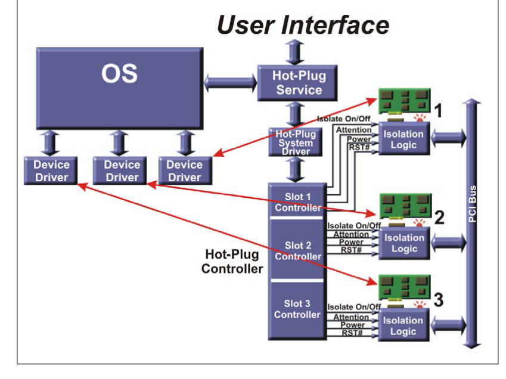

<a id="sec-19-2"></a>
## 19.2 Hot Plug and Power Budgeting | 热插拔与功率预算

<table>
<thead><tr><th width="50%">🇬🇧 English</th><th width="50%">🇨🇳 中文</th></tr></thead>
<tbody>
<tr>
<td width="50%">

Both Endpoints and Root Ports are optionally allowed to act as AtomicOp Requesters and Completers, which might seem unexpected because, in
PCs at least, this kind of transaction is usually only initiated by the central processor. But modern systems can include an Endpoint acting
as a co‐processor, in which case it would need to be able to use AtomicOps to properly handle the protocol. All three commands support
32‐bit and 64‐bit operands, while CAS also sup‐ ports 128‐bit operands. The actual size in use will be given in the Length field in the
header. Routing elements like Switch Ports and Root Ports with peer‐to‐peer access will need to support the AtomicOp routing capability to
be able to recog‐ nize and route these Requests.

A question naturally arises as to how the system (Root Complex) will be instructed to generate these new commands in response to processor
activity, since there may not be a directly‐analogous processor bus command. The spec suggests two approaches. First, the Root could be
designed to recognize specific processor activity and interpret that to “export” a PCIe AtomicOp in response. Second, a register‐based
approach similar to the one used for legacy Configura‐ tion access could be used. In that case, one register might give the target address
while another specified which command should be generated and the combina‐ tion of the two would generate the Request.

AtomicOp Completers can be identified by the presence of the three new bits in the Device Capabilities 2 register, as shown in Figure 20‐10
on page 899. Bit 6 of this register also identifies whether routing elements are capable of routing AtomicOps.

**Cha ter 20: U dates for S ec Revision 2.1 p p p** 

Legacy PCI does not comprehend AtomicOps, of course, and there is no straight‐forward way to translate them into PCI commands. For that
reason, PCIe‐to‐PCI bridges do not support AtomicOps. If atomic access is needed on that bus it would have to be done with the legacy locked
protocol and the spec states that Locked Transactions and AtomicOps can operate concurrently on the same platform.

_Figure 20‐10: Device Capabilities 2 Register_ 


<br>

</td>
<td width="50%">

选择插头时应小心，因为探测电路因供应商和最大 PCIe 链路速度施加的要求而异。例如，Gen3 插槽插头应包含允许动态链路训练过程正确通过探测器的探测电路。LeCroy Gen3
插槽插头使用线性电路来保持波形在通过探测器时的形状。这允许发射机的预加重在链路训练期间动态更改，同时允许接收机量化新设置的影响（无论是正面还是负面影响）。

_图 A-2：LeCroy PCI Express 插槽插头 x16_

LeCroy 还提供一系列其他专用插头，用于 ExpressCard、XMC、迷你卡、Express 模块、AMC 等形态因素。其中一些插头如图 3 所示（在第 923 页）。有关这些插头的完整列表，请参阅 LeCroy
网站：www.lecroy.com，因为此列表正在不断增长。

**A endix A pp**

_图 A-3：LeCroy XMC、AMC 和迷你卡插头_

对于无法从专用插头中受益的 PCIe 链路调试，第 923 页的图 4 所示的中段探针是次优选择。中段探针涉及在 PCB 上放置行业标准的探针几何形状。每个 PCIe 通道被路由到一对焊盘上，可以使用中段探针头进行探测。这些探针使用弹簧针或 C
形夹在被测系统和协议分析仪之间提供无焊接的机械连接。

_图 A-4：LeCroy PCI Express Gen3 中段探针_

作为最后的手段，第 924 页的图 5 所示的飞线探针可用于将协议分析仪附加到被测系统。这涉及将电阻式分流电路和连接器引脚焊接到 PCIe 走线上。此电路通常焊接到 PCIe 链路的 AC 耦合电容，因为它们通常是访问走线的唯一位置。探针电路焊接到 PCB
后，可以根据需要连接和移除分析仪探针。这种方法可用于几乎任何 PCIe 链路，但是连接的鲁棒性受限于添加探针的技术人员的技能。

_图 A-5：LeCroy PCI Express Gen2 飞线探针_

</td>
</tr>
<tr>
<td width="50%">

## **TPH (TLP Processing Hints)** 

Adding hints about how the system should handle TLPs targeting memory space can improve latency and traffic congestion. The spec describes
this special handling basically as providing information about which of several possible cache locations in the system would be the optimal
place for a temporary copy

of a TLP. The spec makes note of the fact that, since the usage described for TPH relates to caching, it wouldn’t usually make sense to use
them with TLPs target‐ ing Non‐prefetchable Memory Space. If such usage was needed, it would be essential to somehow guarantee that caching
such TLPs did not cause undesir‐ able side effects.

</td>
<td width="50%">

## **使用 PETracer 应用程序查看流量**

</td>
</tr>
<tr>
<td width="50%">

## **TPH Examples** 

**Device Write to Host Read.** To help clarify the motivation for TPH, con‐ sider the example shown in Figure 20‐11 on page 901. Here the
Endpoint is writing data into memory for later use by the CPU. The sequence is as follows:

1. First, the Endpoint sends a memory write TLP containing an address that maps to the system memory. The packet gets routed to the Root
Complex (RC).

2. The RC recognizes this as an access to a cacheable memory space and pauses its progress while it snoops the CPU cache. This may result in
a write‐back cycle from the CPU to update the system memory before the transaction can proceed, and this is shown as step 2a.

3. Once any write backs have finished, the RC allows the write to update the system memory. 

4. At some point, the Endpoint notifies the CPU about data delivery. 

5. Finally, the CPU fetches the data from memory to complete the sequence. 

**Cha ter 20: U dates for S ec Revision 2.1 p p p** 

_Figure 20‐11: TPH Example_ 


<br>


This sequence works but there’s an opportunity for performance improvement by adding an intermediate cache in the system. To illustrate
this, consider the example shown in Figure 20‐12 on page 902. From the perspective of the End‐ point, the operation is the same but the
knows to handle it a differently. The steps now are as follows:

1. The Endpoint does the same memory write but this time TPH bits are included. The write is forwarded to the RC by the Switch as before. 

2. The RC understands that this memory access must be snooped to the CPU as before. However, once the snoop has been handled, the RC is
informed by the TPH bits to store this TLP in an intermediate cache rather than going to system memory.

3. The Endpoint notifies the CPU that the data item has been delivered. 4. The CPU reads from the specified address, but now the data is
found in the intermediate cache and so the request does not go to system memory. This has the usual benefits we’d expect from a cache
design: faster access time as well as reduced traffic for the system memory.

This is a simple Device Write to Host Read (DWHR) example to illustrate the concept but it wouldn’t be hard to imagine a more complex system
with a much larger topology in which there could be other caches placed in Switches or other locations to achieve the same benefits for
other targets.

_Figure 20‐12: TPH Example with System Cache_ 


<br>


**Host Write to Device Read.** To illustrate the concept going the other way (called Host Write to Device Read or HWDR), consider the
example shown in Figure 20‐13 on page 903. In this example, the CPU initiates a memory write whose address targets the PCIe Endpoint in step
one. The packet contains TPH bits that tell the RC that it should be stored in an intermediate cache near the target, instead of the cache
in the RC that was used in the previous example. In this case a cache built into the Switch serves the purpose. The TLP is then for‐ warded
on to the target Endpoint in step two. This model is beneficial when the data is updated infrequently but read often by the Endpoint. That
allows sev‐ eral memory reads that would normally go to system memory to be handled by the cache instead, off loading both the Link from the
Switch to the RC and the path to memory.

**Cha ter 20: U dates for S ec Revision 2.1 p p p** 

_Figure 20‐13: TPH Usage for TLPs to Endpoint_ 


<br>

</td>
<td width="50%">

## **CATC 跟踪查看器**

使用 LeCroy PETracer 应用程序查看 PCI Express 流量的主要方法是 CATC
跟踪视图。该视图获取每个记录的数据包并将其分解为不同的数据包字段，以突出显示此数据包中包含的重要值。颜色和文本的混合用于可视地分类和解释每个数据包的目的。错误以红色突出显示，如图 6 所示（在第 925 页）。警告以黄色突出显示，便于识别流量或数据包字段中不符合规范的部分。

**A endix A pp**

</td>
</tr>
<tr>
<td width="50%">

## **PCI Express Technology** 

_Figure 20‐14: TPH Usage Between Endpoints_ 


<br>

</td>
<td width="50%">

## _图 A-6：带 ECRC 错误的 TLP 数据包_

除了解码和可视地分解每个数据包之外，分层显示允许对相关数据包进行逻辑分组。例如，在"链路级别"模式下，TLP 数据包与它们各自的 ACK 数据包分组。每个 TLP 被标识为隐式或显式 ACK 或 NAK。ACK DLLP 的示例如图 7 所示（在第 925 页）以及 ACK 的
TLP。

_图 A-7："链路级别"将 TLP 数据包与其链路层响应分组_

在"Split-Level"模式下（如图 8 所示，在第 926 页），CATC 跟踪视图组合拆分事务。例如，单个 TLP 读取可以与 1 个或多个完成 TLP
分组，以将大数据传输逻辑地显示为跟踪中的单行。为每个拆分级别事务提供数据量、起始地址以及性能指标。这允许用户绕过如何将大型内存事务分解为多个 TLP
数据包的细节，而是关注数据的内容。如果用户希望查看拆分事务的详细信息，分层显示可以显示组成此拆分事务的所有数据包的链路级别和/或数据包级别的细分。这种"深入研究"流量分析方法允许用户从总线上发生的事情的高级视图开始，并仅深入到用户感兴趣的流量区域。

_图 A-8："拆分级别"将完成与关联的非发布请求分组_

CATC 跟踪视图还支持"紧凑视图"，如图 9 所示（在第 927 页）。在此视图中，重复发送的数据包将折叠到单个单元格中。这对于折叠训练序列或流控初始化数据包非常有用。执行此折叠的软件算法也足够智能，可以折叠任何 SKIP
有序集。这创建了一个非常紧凑的链路训练过程视图，允许用户在不必滚动浏览数百个数据包的情况下检查链路训练数据包中的更改。

**A endix A pp**

_图 A-9："紧凑视图"折叠相关数据包以便于查看链路训练_

</td>
</tr>
<tr>
<td width="50%">

## **TPH Header Bits** 

Several bits in the TLP header describe how the hints are used. First, as shown in the middle at the top of Figure 20‐15 on page 905, the TH
(TLP Hints) bit reports whether the optional TPH bits are in use for the TLP. When set, the PH (Processing Hint bits) indicate the next
level of information.

**Cha ter 20: U dates for S ec Revision 2.1 p p p** 

_Figure 20‐15: TPH Header Bits_ 


<br>


When the TH bit is set the PH bits, shown at the bottom right of Figure 20‐15 on page 905, take the place of what were the two reserved LSBs
in the address field. For a 32‐bit address, these are byte 11 [1:0], while for the 64‐bit address shown, they are byte 15 [1:0]. Their
encoding is described in Table 20‐1 on page 905. These hints are provided by the Requester based on knowledge of the data pat‐ terns in use,
which is information that would be difficult for a Completer to deduce on its own.

_Table 20‐1: PH Encoding Table_ 

|**PH [1:0]**|**Processing Hint**|**Usage Model**|
|---|---|---|
|00b|Bi‐directional data structure|Indicates frequent read/write access ...|
|01b|Requester|D*D* (device‐to‐device transfers). Indicates fre‐<br>quent read/write access by device. The asterisk<br>means either device
could be reading or writing.|
|10b|Target|DWHR, HWDR (device‐to‐host or host‐to...|
|11b|Target with Priority|Same as Target but with additional temporal<br>re‐use priority information. Indicates frequent<br>read/write
access by Host and high temporal local‐<br>ity for accessed data.|

</td>
<td width="50%">

## **LTSSM 图**

为了进一步增强"深入研究"流量查看方法，PETracer 应用程序包括 LTSSM 图视图，如图 10 所示（在第 928 页）。调用此图时，SW 解析跟踪以查找链路训练部分并推断链路训练和状态状态机 (LTSSM) 的状态。结果是一个以非常高级的视图分解 LTSSM
状态转换的图。该图允许用户立即查看链路是否进入恢复状态。如果是这样，用户可以轻松识别链路的哪一侧启动了恢复，它进入恢复多少次，甚至链路速度或链路宽度是否由于恢复而降低。

LTSSM 图也是返回跟踪文件的活动链接。例如，如果用户单击恢复的条目，则跟踪文件将导航到跟踪文件中的该位置。这将允许用户查看恢复是否是由重复的 NAK 或由于块对齐丢失等原因引起的。

**927**

简而言之，当用户调试与链路训练、速度变化或低功率状态转换相关的问题时，LTSSM 会受到影响。通过检查 LTSSM 图，用户可以轻松识别这些链路状态变化是否发生，在哪里发生，并直接导航到它们以进行更快的分析。

_图 A-10：LTSSM 图显示跨跟踪的链路状态转换_

</td>
</tr>
<tr>
<td width="50%">

## **PCI Express Technology** 

The next level of information is the Steering Tag byte that provides system‐spe‐ cific information regarding the best place to cache this
TLP. Interestingly, the location of this byte in the header varies depending on the Request type. For Posted Memory Writes the Tag field is
repurposed to be the Steering Tag (no completion will be returned so the Tag isn’t needed), while for Memory Reads the two Byte Enable
fields are repurposed for it (byte enables are not needed for pre‐fetchable reads). The meaning of the bits is implementation specific but
they need to uniquely identify the location of the desired cache in the system.

Two formats for TPH are described in the spec and this level of hint information (TH + PH + 8‐bit Steering Tag), called Baseline TPH, is the
first and is required of all Requests that provide TPH. The second format uses TLP Prefixes to extend the Steering Tags (see “TLP Prefixes”
on page 908 for more detail).

## **Steering Tags**

</td>
<td width="50%">

## **流控信用跟踪**

在 PCI Express
中，流控信用跟踪尤其有问题。流控更新数据包不显示每个端点具有的信用数，而是显示总共使用了多少信用。这意味着每个端点必须保持每种类型的信用的运行计数器。有许多场景可能导致信用丢失，如果发生这种情况，链路最终将由于缺乏信用而无法传输数据。此类问题非常难以识别和调试。

LeCroy PETracer 应用程序具有一个信用跟踪 SW 工具，如图 11 所示（在第 929 页），以帮助此调试。如果跟踪包含 FC-Init 数据包，它将遍历跟踪并在每个 TLP 和 FC-Update 之后显示每个虚拟通道缓冲区类型的剩余信用量。

FC-Init 数据包在链路训练之后发送一次。因此，PETracer 应用程序允许用户在某个点设置初始信用值

**A endix A pp**

跟踪，SW 将计算剩余数据包的相对信用值。即使初始信用值由用户设置不当，具有查看相对信用的能力通常足以捕获流控问题。

_图 A-11：流控信用跟踪_

</td>
</tr>
<tr>
<td width="50%">

</td>
<td width="50%">

## **Bit Tracer**

一些调试情况无法通过深入研究检查流量的方法来解决。例如，如果链路设置不正确，则记录通常不可读。如果设备未正确加扰流量，或 10 位符号以相反顺序发送怎么办？对于这种情况，需要一个专注于示波器的波形视图和 CATC 跟踪视图之间分析的工具。这是 BitTracer 视图（图 12
所示，在第 930 页）最强大的地方。

BitTracer 视图允许用户查看链路上看到的原始流量。该软件允许用户将流量视为 10 位符号、加扰字节或未加扰字节。无效符号和不正确的运行差异以红色突出显示。

为了进一步确定流量可能出现的问题，BitTracer 工具添加了一个强大的后处理功能列表，可以修改流量。例如，在捕获后；用户可以反转给定通道的极性。一旦应用，用户可以看到 10 位符号现在是否在跟踪中正确表示。如果这清理了跟踪，则表明分析仪硬件的记录设置需要更改。

_图 A-12：Gen2 流量的 BitTracer 视图_

此外，可以修改通道排序。这对于确定通道反转是否导致不良捕获很有用。如果流量具有过多的通道间偏移，则 BitTracer 软件允许用户重新对齐流量。对于 Gen3 流量，可以一次应用 1 位偏移。本质上，这允许用户在捕获后修复 130 位块对齐。

在对数据应用更改之后，可以将全部或仅一部分数据导出到标准 CATC 跟踪视图中以进行更高级别的分析。此工作流对于早期启动期间的低级问题调试非常强大。举例来说，假设用户的设备正确训练链路，然后突然将极性反转应用于 1 个通道。这显然违反了规范，将导致链路重新训练。如果使用
BitTracer 工具捕获此流量，则用户可以轻松地将其识别为问题。此外，反转前后的流量部分可以导出到单独的跟踪文件中并在 CATC 跟踪视图中检查。

**A endix A pp**

</td>
</tr>
<tr>
<td width="50%">

</td>
<td width="50%">

## **分析概述**

如您所见，不同的流量视图对于调试某些故障情况可能是有益的。LeCroy 支持从许多来源将 PCIe 流量导入其高度复杂的 PETracer 软件。无论是 RTL 仿真、示波器捕获还是专用协议分析仪捕获，PETracer 都具有丰富的流量视图和报告，允许用户最好地了解其 PCIe
链路的健康状况和状态。

</td>
</tr>
<tr>
<td width="50%">

</td>
<td width="50%">

## **流量生成**

</td>
</tr>
<tr>
<td width="50%">

</td>
<td width="50%">

## **前硅**

为了在仿真中刺激 PCI Express 端点，可以从多个供应商处购买专用验证 IP。此 IP 将测试基本功能以及执行多个 PCIe 合规性检查。ASIC 开发人员当然有兴趣在流片之前发现并修复这些问题，这就是这些工具的价值所在。如果 PCIe 设计是在掩模成本不是问题的
FPGA 中实现的，则使用专用流量生成工具（如 LeCroy PETrainer 或 LeCroy PTC 卡）在硬件中执行这些合规性检查可能更具成本效益。

</td>
</tr>
<tr>
<td width="50%">

</td>
<td width="50%">

## **后硅**

## **Exerciser 卡**

</td>
</tr>

</tbody>
</table>

[⬆️ 返回目录](#本章目录-table-of-contents)

---


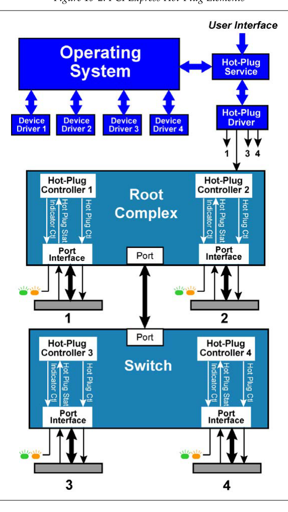

<a id="sec-19-3"></a>
## 19.3 Hot Plug and Power Budgeting | 热插拔与功率预算

<table>
<thead><tr><th width="50%">🇬🇧 English</th><th width="50%">🇨🇳 中文</th></tr></thead>
<tbody>
<tr>
<td width="50%">

These values are programmed by software into a table to be used during normal operation. The spec recommends that the table be located in
the TPH Requester Capability structure, shown in Figure 20‐16 on page 906, but it can alternatively be built into the MSI‐X table instead.
Only one or the other of these table loca‐ tions can be used for a given Function. The location is given in the ST Table Location field
[10:9] of the Requester Capability register, shown in Figure 20‐17 on page 907. The encoding of these 2 bits is shown in Table 20‐2 on page
907.

_Figure 20‐16: TPH Requester Capability Structure_ 

|31|15|0<br>7|
|---|---|---|
|PCI Express Capabilities Register|Next Cap<br>Pointer|PCI Express<br>Cap ID (17h)|
|TPH Requester Capability Register|||
|TPH Requester Control Register|||
|TPH ST Table (optional)<br>(Sized by number of ST entries)|||


**Cha ter 20: U dates for S ec Revision 2.1 p p p** 

_Figure 20‐17: TPH Capability and Control Registers_ 


<br>


_Table 20‐2: ST Table Location Encoding_ 

|**Bits [10:9]**|**ST Table Location**|
|---|---|
|00b|Not present|
|01b|Located in the Requester Capa‐<br>bility structure|
|10b|Located in the MSI‐X table|
|11b|Reserved|


The Requester Capability register lists the number of entries in the ST Table in bits [26:16]. Each table entry is 2 bytes wide, and the ST
Table implemented in the TPH Capability register set is shown in Figure 20‐18 on page 908, where entry zero is highlighted. The Requester
Capability register also describes which ST Modes are supported for the Requester with the 3 LSBs:

- **No ST** ‐ uses zeros for ST bits. Selected in the TPH Requester Control regis‐ ter’s ST Mode Select field when the value = 000b. 

- **Interrupt Vector** ‐ uses the interrupt vector number as the offset into the table, meaning the values are contained in the MSI‐X table.
(ST Mode Select value = 001b.)

- **Device‐Specific** ‐ uses a device‐specific method to offset into the ST Table in the TPH Capability structure because the ST values are
located there. This is the recommended implementation, although how a given Request is associated with a particular ST entry is outside the
scope of the spec. (ST Mode Select value = 010b.)

- All other ST Mode Select encodings are reserved for future use. 

_Figure 20‐18: TPH Capability ST Table_ 

||31|24|23|16|15|8|7|0||
|---|---|---|---|---|---|---|---|---|---|
||ST Upper Entry (1)||ST|Lower Entry (1)|ST Upper Entry (0)||ST Lower Entry (0)|||
||ST Upper Entry (3)||ST|Lower Entry (3)|ST Upper Entry (2)||ST Lower Entry (2)|||
|||||||||||
|||ST Upper Entry|ST Lower Entry|||ST Upper Entry|ST Lower Entry|||
|||(Table Size)||(Table Size)||(Table Size - 1)|(Table Size - 1)|||
|||||||||||

</td>
<td width="50%">

这些值由软件编程到表中以在正常运行期间使用。规范建议该表位于 TPH Requester Capability 结构中，如第 906 页的图 20‐16 所示，但也可以选择内置到 MSI‐X 表中。对于给定的功能，只能使用这两个表位置中的一个。该位置在 Requester
Capability 寄存器的 ST Table Location 字段 [10:9] 中给出，如第 907 页的图 20‐17 所示。这 2 位的编码在第 907 页的表 20‐2 中显示。

_图 20‐16：TPH Requester Capability 结构_

|31|15|0<br>7|
|---|---|
|PCI Express Capabilities Register|Next Cap<br>Pointer|PCI Express<br>Cap ID (17h)|
|TPH Requester Capability Register|||
|TPH Requester Control Register|||
|TPH ST Table (optional)<br>(Sized by number of ST entries)|||


**第 20 章：规范修订版 2.1 的更新**

_图 20‐17：TPH 能力和控制寄存器_


<br>


_表 20‐2：ST 表位置编码_

|**位 [10:9]**|**ST 表位置**|
|---|---|
|00b|不存在|
|01b|位于 Requester Capa‐<br>bility 结构中|
|10b|位于 MSI‐X 表中|
|11b|保留|


**PCI Express 技术**

Requester Capability 寄存器在位 [26:16] 中列出 ST 表中的条目数。每个表条目宽 2 字节，在 TPH Capability 寄存器集中实现的 ST 表在第 908 页的图 20‐18 中显示，其中突出显示了条目零。Requester
Capability 寄存器还描述了请求方支持哪些 ST 模式（通过低 3 位）：

- **No ST** - 对 ST 位使用零。在 TPH Requester Control 寄存器的 ST Mode Select 字段中当值 = 000b 时选择。

- **Interrupt Vector** - 使用中断向量号作为到表的偏移，这意味着值包含在 MSI‐X 表中。（ST Mode Select 值 = 001b。）

- **Device‐Specific** - 使用设备特定的方法偏移到 TPH Capability 结构中的 ST 表，因为 ST 值位于那里。这是推荐的实现方式，尽管如何将给定的请求与特定 ST 条目关联超出了规范的范围。（ST Mode Select 值 = 010b。）

- 所有其他 ST Mode Select 编码保留供将来使用。

_图 20‐18：TPH Capability ST 表_

||31|24|23|16|15|8|7|0||
|---|---|---|---|---|---|---|---|---|---|
||ST Upper Entry (1)||ST|Lower Entry (1)|ST Upper Entry (0)||ST Lower Entry (0)|||
||ST Upper Entry (3)||ST|Lower Entry (3)|ST Upper Entry (2)||ST Lower Entry (2)|||
|||||||||||
|||ST Upper Entry|ST Lower Entry|||ST Upper Entry|ST Lower Entry||
|||(Table Size)||(Table Size)||(Table Size - 1)|(Table Size - 1)|||
|||||||||||

</td>
</tr>
<tr>
<td width="50%">

## **TLP Prefixes** 

The Steering Tag bits can be extended with the addition of optional TLP Prefixes if needed. When one or more Prefixes are given with the
TLP, the header reports it by setting the most significant bit in the Format field, as shown in Figure 20‐19 on page 909.

**Cha ter 20: U dates for S ec Revision 2.1 p p p** 

_Figure 20‐19: TPH Prefix Indication_ 


<br>

</td>
<td width="50%">

## **TLP 前缀**

如果需要，可以通过添加可选的 TLP 前缀来扩展 Steering Tag 位。当 TLP 带有一个或多个前缀时，头通过设置 Format 字段的最高有效位来报告，如第 909 页的图 20‐19 所示。

**第 20 章：规范修订版 2.1 的更新**

_图 20‐19：TPH 前缀指示_


<br>

</td>
</tr>
<tr>
<td width="50%">

## **IDO (ID-based Ordering)** 

Transaction ordering rules are important for proper traffic flow, but there are times when it’s not necessary and latencies can be improved
in those cases. In particular, TLPs from different Requesters are very unlikely to have dependen‐ cies between them, so this feature allows
software to enable them to be re‐ordered for improved performance. The details of this operation are described in the section called “ID
Based Ordering (IDO)” on page 301.

</td>
<td width="50%">

## **IDO（基于 ID 的排序）**

事务排序规则对于正确的流量流动很重要，但有时不需要这些规则，在这些情况下可以改善延迟。特别是，来自不同请求方的 TLP 之间不太可能存在依赖关系，因此此功能允许软件启用它们以进行重新排序以提高性能。此操作的详细信息在第 301 页名为"基于 ID 的排序
(IDO)"的部分中描述。

</td>
</tr>
<tr>
<td width="50%">

## **ARI (Alternative Routing-ID Interpretation)** 

The motivation for this optional feature is to increase the number of Function numbers available to Endpoints. Device numbers were useful in
a shared‐bus architecture like PCI but are not usually needed in a point‐to‐point architecture. Consequently, the spec writers chose to
allow devices to interpret the destina‐ tion for ID‐routed commands differently. This was accomplished by defining the Device number to
always be zero and then allowing the Function number to use the 5 bits in the ID that were previously the Device number. Effectively, the
Device number goes away while the Function number grows to 8 bits. The tar‐ get for a TLP that uses ARI will need to be enabled to recognize
it before soft‐ ware can use this feature, but Routing elements in the path to it don’t have to be aware of this. They’re only looking at
the bus number to determine the routing.

</td>
<td width="50%">

## **ARI（备用路由 ID 解释）**

此可选功能的动机是增加端点可用的功能号。设备号在像 PCI 这样的共享总线架构中很有用，但在点对点架构中通常不需要。因此，规范编写者选择允许设备以不同的方式解释 ID 路由命令的目标。这是通过将设备号始终定义为零，然后允许功能号使用 ID 中以前是设备号的 5
位来实现的。实际上，设备号消失了，而功能号增加到 8 位。使用 ARI 的 TLP 的目标需要被启用以在使用此功能之前识别它，但路径中的路由元素不必知道这一点。它们仅查看总线号以确定路由。

**PCI Express 技术**

</td>
</tr>
<tr>
<td width="50%">

## **Power Management Improvements** 

There are four additions that improve the system’s ability to manage power effectively, and they are listed here. All of these are covered
in Chapter 16, enti‐ tled ʺPower Management,ʺ on page 703.

</td>
<td width="50%">

## **电源管理改进**

有四项新增功能可以改善系统有效管理电源的能力，在此列出。所有这些内容在第 703 页的第 16 章"电源管理"中介绍。

</td>
</tr>
<tr>
<td width="50%">

## **DPA (Dynamic Power Allocation** 

A new set of extended configuration registers defines up to 32 sub‐states below D0. This allows software to easily make changes to a
device’s power state with‐ out incurring the latency penalty of going all the way to the D1 device power state. To learn more on this, see
“Dynamic Power Allocation (DPA)” on page 714

</td>
<td width="50%">

## **DPA（动态功率分配）**

一组新的扩展配置寄存器定义了 D0 以下的最多 32 个子状态。这允许软件轻松地更改设备的电源状态，而无需承担一直转换到 D1 设备电源状态的延迟惩罚。要了解更多信息，请参阅第 714 页的"动态功率分配 (DPA)"。

</td>
</tr>
<tr>
<td width="50%">

## **LTR (Latency Tolerance Reporting)** 

Allowing Endpoints to report the latencies they can tolerate in response to their requests enables system software to make better choices
regarding system response time and sleep states. To learn more about this, see “LTR (Latency Tol‐ erance Reporting)” on page 784.

</td>
<td width="50%">

## **LTR（延迟容忍报告）**

允许端点报告它们可以容忍的延迟以响应其请求，使系统软件能够就系统响应时间和睡眠状态做出更好的选择。要了解更多信息，请参阅第 784 页的"LTR（延迟容忍报告）"。

</td>
</tr>
<tr>
<td width="50%">

## **OBFF (Optimized Buffer Flush and Fill)** 

Similarly, allowing the system to report the preferred time slots during which Endpoints should or should not initiate DMA or interrupt
traffic helps coordi‐ nate system sleep times and improve power management. For more on this, see “OBFF (Optimized Buffer Flush and Fill)”
on page 776.

</td>
<td width="50%">

## **OBFF（优化缓冲区刷新和填充）**

类似地，允许系统报告端点应该或不应该启动 DMA 或中断流量的首选时间段，有助于协调系统睡眠时间并改善电源管理。有关更多信息，请参阅第 776 页的"OBFF（优化缓冲区刷新和填充）"。

</td>
</tr>
<tr>
<td width="50%">

## **ASPM Options** 

This change simply permits devices to support no ASPM Link power manage‐ ment if they choose to do so. In the previous spec versions,
support for L0s was mandatory, but now it becomes optional.

**Cha ter 20: U dates for S ec Revision 2.1 p p p**

</td>
<td width="50%">

## **ASPM 选项**

此更改只是允许设备在选择这样做时支持没有 ASPM 链路电源管理。在以前的规范版本中，对 L0s 的支持是强制性的，但现在它变为可选的。

**第 20 章：规范修订版 2.1 的更新**

</td>
</tr>
<tr>
<td width="50%">

## **Configuration Improvements** 

A few configuration registers were added to improve software visibility and control of devices.

</td>
<td width="50%">

## **配置改进**

添加了一些配置寄存器以改善设备的软件可见性和控制。

</td>
</tr>
<tr>
<td width="50%">

## **Internal Error Reporting** 

This is intended to provide a standardized way of reporting internal problems for devices like switches that don’t have a driver to handle
that for them. It also adds the capability to track multiple TLP headers when they result in errors instead of just one as before. This
topic is covered in the section on errors called “Internal Errors” on page 667.

</td>
<td width="50%">

## **内部错误报告**

这旨在为像交换机这样没有驱动程序来处理此类问题的设备提供一种标准化的方式来报告内部问题。它还添加了在多个 TLP 头导致错误时跟踪多个 TLP 头（而不是像以前那样只有一个）的能力。本主题在名为第 667 页的"内部错误"的错误章节中介绍。

</td>
</tr>
<tr>
<td width="50%">

## **Resizable BARs** 

This new set of extended configuration registers allows devices that use a large amount of local memory to report whether they can work with
smaller amounts and, if so, what sizes are acceptable. Software that knows to look for them can find the new registers, shown in Figure
20‐20 on page 912, and program them to give the appropriate memory size for the platform based on the competing requirements of system
memory and other devices.

A few rules apply to the use of these registers: 

1. To avoid confusion, a BAR size should only be changed when the Memory Enable bit has been cleared in the Command register. 

2. The spec strongly recommends that Functions not advertise BARs that are bigger than they can effectively use. 

3. To ensure optimal performance, software should allocate the biggest BAR size that will work for the system.

</td>
<td width="50%">

## **可调整大小的 BAR**

这组新的扩展配置寄存器允许使用大量本地内存的设备报告它们是否可以处理较小的内存量，如果可以，什么大小是可接受的。知道查找它们的软件可以找到新寄存器（如第 912 页的图 20‐20 所示），并根据系统内存和其他设备的竞争要求，对它们进行编程以为平台提供适当的内存大小。

这些寄存器的使用适用一些规则：

1. 为避免混淆，只有在 Command 寄存器中的 Memory Enable 位已被清除时，才应更改 BAR 大小。

2. 规范强烈建议功能不要通告比它们可以有效使用的更大的 BAR。

3. 为了确保最佳性能，软件应分配将在系统上工作的最大 BAR 大小。

</td>
</tr>
<tr>
<td width="50%">

## **PCI Express Technology**

</td>
<td width="50%">

## **PCI Express 技术**

</td>
</tr>
<tr>
<td width="50%">

## _Figure 20‐20: Resizable BAR Registers_ 


<br>

</td>
<td width="50%">

## _图 20‐20：可调整大小的 BAR 寄存器_


<br>

</td>
</tr>
<tr>
<td width="50%">

## **Capability Register** 

This register simply reports which BAR sizes will work for this Function. Bits 4 to 23 are used for this and the values are as shown here: 

- Bit 4 ‐ 1MB BAR size will work for this Function 

- Bit 5 ‐ 2MB 

- Bit 6 ‐ 4MB 

- ... 

- Bit 23 ‐ 512GB will work for this Function 

_Figure 20‐21: Resizable BAR Capability Register_ 


<br>

</td>
<td width="50%">

## **Capability 寄存器**

此寄存器仅报告哪些 BAR 大小适用于此功能。位 4 到 23 用于此目的，值如下所示：

- 位 4 - 1MB BAR 大小适用于此功能

- 位 5 - 2MB

- 位 6 - 4MB

- ...

- 位 23 - 512GB 适用于此功能

_图 20‐21：可调整大小的 BAR Capability 寄存器_


<br>

</td>
</tr>
<tr>
<td width="50%">

## **Control Register** 

The BAR Index field in this register reports to which BAR this size refers (0 to 5 are possible). The Number of Resizable BARs field is only
defined for Control

**Cha ter 20: U dates for S ec Revision 2.1 p p p** 

Register zero and is reserved for all the others. It tells how many of the six pos‐ sible BARs actually have an adjustable size. Finally,
the BAR Size field is pro‐ grammed by software to specify the desired size the BAR indicated by the BAR Index field (0 = 1MB, 1=2MB, 2=4MB,
..., 19=512GB).

_Figure 20‐22: Resizable BAR Control Register_ 


<br>


Once the Resizable values have been programmed, then enumeration software will be able to work as it normally does: writing all F’s to each
BAR and reading it back will report the size that was selected. Note that if the size value is changed, the contents of the BAR will be lost
and will need to reprogrammed if it was previously set up. Figure 20‐23 on page 914 highlights the BAR registers in the configuration header
space for a Type 0 header.

</td>
<td width="50%">

## **Control 寄存器**

此寄存器中的 BAR Index 字段报告此大小所指的 BAR（0 到 5 是可能的）。Number of Resizable BARs 字段仅为 Control

**第 20 章：规范修订版 2.1 的更新**

寄存器零定义，并为所有其他寄存器保留。它说明了六个可能的 BAR 中实际有多少个具有可调整的大小。最后，BAR Size 字段由软件编程以指定由 BAR Index 字段指示的 BAR 的所需大小（0 = 1MB，1=2MB，2=4MB，...，19=512GB）。

_图 20‐22：可调整大小的 BAR Control 寄存器_


<br>


一旦对可调整大小的值进行了编程，则枚举软件将能够像往常一样工作：将所有 F 写入每个 BAR 然后回读将报告所选的大小。请注意，如果大小值已更改，则 BAR 的内容将丢失，如果先前已设置，则需要重新编程。图 20‐23（第 914 页）突出显示了 Type 0 头的配置头空间中的
BAR 寄存器。

**PCI Express 技术**

</td>
</tr>
<tr>
<td width="50%">

## _Figure 20‐23: BARs in a Type0 Configuration Header_ 


<br>


## **Simplified Ordering Table**

</td>
<td width="50%">

## _图 20‐23：Type0 配置头中的 BAR_


<br>


## **简化的排序表**

</td>
</tr>

</tbody>
</table>

[⬆️ 返回目录](#本章目录-table-of-contents)

---

> 🤖 Generated by `tools/merge_chapters.py`


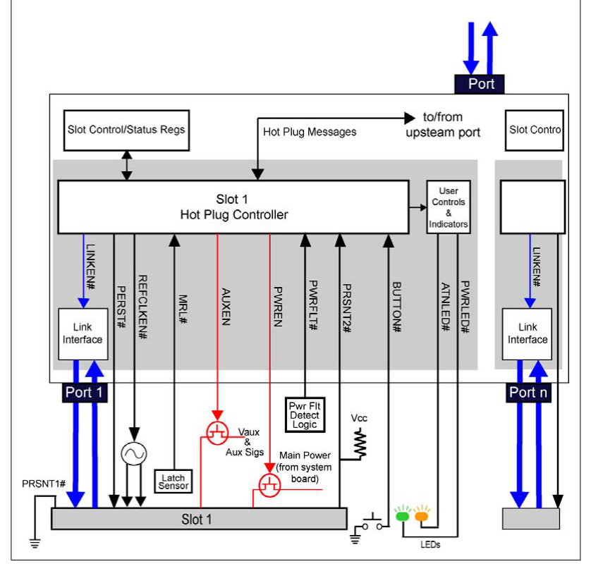

---


\newpage

# 📘 第 20 章　Spec 2.1 修订更新 (Chapter 20. Updates for Spec Revision 2.1)

**MindShare PCI Express Technology 3.0 — Comprehensive Guide to Generations 1.x, 2.x and 3.0**

> 📁 **Source chunks**: `chunks/chunk0347.md` ... `chunks/chunk0347.md`
> 🎨 **Format**: 中英对照双语 · 中文灰底 (PCIe 6.2 Spec 模板)

---

## 📑 本章目录 (Table of Contents)

- [20.1 Updates for Spec Revision 2.1 — Spec 2.1 修订更新](#sec-20-1)

<a id="sec-20-1"></a>
## 20.1 Updates for Spec Revision 2.1 | Spec 2.1 修订更新

<table>
<thead><tr><th width="50%">🇬🇧 English</th><th width="50%">🇨🇳 中文</th></tr></thead>
<tbody>
<tr>
<td width="50%">

This change simplifies the Transaction Ordering Table by reducing the number of entries in the table. Essentially, it no longer
distinguishes between comple‐ tions for reads or completions for non‐posted writes. The motivation for this was to reduce the number of
cases that needed to be tested. For more on this, see the section called “The Simplified Ordering Rules Table” on page 288.

# Appendices

</td>
<td width="50%">

最近，业界已融合到 PCIe 作为企业存储和固态驱动器 (SSD) 应用程序的统一互连技术。NVM HCI（一个行业联盟）发布了一个名为 NVM Express (NVMe) 的规范，该规范使用 PCIe 提供 SSD 应用程序所需的带宽。此外，T10 委员会已开始定义 SCSI
over PCIe (SOP) 协议，以利用 PCIe 技术能力实现高性能存储应用程序。此外，SATA 联盟最近宣布将 PCIe 用作其下一代 SATA 规范（称为 SATA Express (SATAe)）的互连。

</td>
</tr>
<tr>
<td width="50%">

## _**Appendix A:**_

</td>
<td width="50%">

## **服务器 SSD 模块中的 PCIe**

传统上，企业 SSD 模块附带 SAS、SATA 和光纤通道接口，但由于上述发展，大多数 SSD 控制器、模块和系统供应商已推出具有 PCIe 接口的产品。由于管理闪存的繁重负载，大多数 SSD 控制器达到其性能和容量峰值。在高性能应用程序中，使用多个 SSD 控制器（或
ASIC）并通过 PCIe 交换机聚合。图 0-4（在第 941 页）显示了 PCIe 交换机在 SSD 附加卡中的基本用法，该用法适用于任何卡或模块形态因素。

**第 : 附录 B：PCI 的市场与应用**

_图 0-4：SSD 附加卡中的 PCIe 交换机应用程序_

对于大型数据中心应用程序，SSD 附加卡安装在服务器主板中，如图 0-5（在第 941 页）以及通过 PCIe 交换机聚合的 IO 扩展框（图 6）所示。在服务器主板设计中，PCIe 交换机用于创建更多端口/插槽，以适应其他 SSD 模块以支持应用程序的需求。

_图 0-5：服务器主板使用 PCIe 交换机_

除提供连接外，PCIe 交换机还可用于通过 NT 桥接和 MR 功能提供冗余和故障转移。MR 交换机支持 1+N 故障转移能力，其中一个服务器/主机与 N 个服务器通信以检查心跳并在其中一个发生故障时启动故障转移。图 0-6（在第 942 页）中所示的服务器之一可以在 1+N
故障转移方案中用作其他服务器的备份。

_图 0-6：1+N 故障转移方案中的服务器故障转移_

</td>
</tr>
<tr>
<td width="50%">

## _**Debugging PCIe Traffic with LeCroy Tools**_

</td>
<td width="50%">

## **结论**

PCIe 互连技术已成为超越芯片到芯片互连的许多高端应用程序的有力竞争者，并有望用于外部 I/O 共享、服务器集群、I/O 扩展和 TOR 交换。当前的 8 GT/s 和下一代 (Gen4) 16 GT/s
线路速率、在单个高带宽端口中聚合多个通道的能力、故障转移能力、用于数据传输的嵌入式 DMA 以及 IO 共享/虚拟化提供了至少等于（如果不优于）InfiniBand 和以太网等接口的能力。

</td>
</tr>
<tr>
<td width="50%">

## Christoper Webb, LeCroy Corporation

</td>
<td width="50%">

## _**附录 C：**_

_**使用 PCI Express 技术实现智能适配器和多主机系统**_

</td>
</tr>
<tr>
<td width="50%">

## **Overview** 

The transition of IO bus architecture from PCI to PCI Express had a large impact on developers with respect to types of tools required for
validation and debug.

With parallel buses such as PCI, a waveform view of the signals shows enough information for the developer to interpret the state of the
bus. A user could visually examine a waveform and mentally decode the type of transactions, how much data is transferred, and even the
content of that transfer.

Since PCI Express packet traffic is both encoded and scrambled, examining a waveform view of the traffic provides very little information
about the state of the link. The speed of the link can be inferred from the width of the bit times, and the width of the link can be
inferred by the number of active lanes. How‐ ever, the user cannot visually interpret the symbol alignment, let alone the packets
themselves.

A new class of tools evolved to help developers visualize the state of their now serial links. These tools perform the de‐serialization,
decoding, and de‐scram‐ bling for the users. At first glance this would seem to be enough for the devel‐ oper. But for PCI Express
specifically, other complications such as flow control credits, lane‐to‐lane skew, polarity inversion, and lane reversal must also be
comprehended by these tools as part of understanding PCIe protocol.

Both pre‐ and post‐silicon debug share a common need for tools. In this appen‐ dix chapter, we describe some of the product offerings
available for debugging PCI Express interconnects, both from a pre and post silicon perspective.

</td>
<td width="50%">

## **Jack Regula、Danny Chi、Tim Canepa（PLX Technology, Inc.）**

</td>
</tr>
<tr>
<td width="50%">

## **Pre-silicon Debugging**

</td>
<td width="50%">

## **简介**

智能适配器、主机故障转移机制和多处理器系统是当今常见的三种使用模型，并有望随着下一代系统的市场需求变得更加普遍。尽管每个模型都是为了响应完全不同的市场需求而开发的，但它们都有一个共同的要求，即利用它们的系统需要在系统内共存多个处理器。本附录概述了 PCI Express
如何通过非透明桥接 (non-transparent bridging) 来满足这些需求。

由于使用智能适配器、主机故障转移和多主机技术的系统的广泛普及，PCI Express 硅供应商必须提供一种支持它们的手段。这实际上是一项相对低风险的努力；鉴于 PCI Express 与 PCI 软件兼容，而 PCI 系统早已实现了分布式处理。最明显的方法，也是 PLX
所倡导的方法，是为 PCI Express 模拟 PCI 空间中使用最广泛的实现。此策略允许系统设计人员不仅使用熟悉的实现，而且使用经过验证的方法，

并在他们从 PCI 迁移到 PCI Express 时可以提供重要的软件重用。本白皮书概述了多处理器 PCI Express 系统将如何使用 PCI 范例中建立的行业标准实践来实现。但是，首先，我们将定义不同的使用模型，并回顾 PCI
社区为满足这些需求而开发机制的成功努力。最后，我们将介绍 PCI Express 系统如何利用非透明桥接来为这些类型的系统提供所需的功能。

</td>
</tr>
<tr>
<td width="50%">

## **RTL Simulation Perspective** 

In RTL simulation, looking at a waveform view of an FPGA or an ASIC signal is the most common way to debug. By showing internal state
machine states, monitoring IO as it moves through the device, or seeing the state of control sig‐ nals; a waveform view is quite powerful.
But, as we discussed above, a PCI express link is not understandable when shown as a waveform. Additional pro‐ cessing or decoding must be
done to make sense of this new link. To augment the simulation tools, a PCI Express Bus Monitor is typically added to address this need.

</td>
<td width="50%">

## **使用模型**

</td>
</tr>
<tr>
<td width="50%">

## **PCI Express RTL Bus Monitor** 

A PCI Express Bus monitor is a piece of code which users insert in their RTL simulation to help monitor the state of their PCIe link. At
minimum, this moni‐ tor will output text based log files with information about link state changes and types of packet activity. More
complex monitors will perform real time compliance checking. A number of vendors provide purchasable IP which per‐ form this exact function.
The emphasis however is typically on compliance. Less functionality is provided with respect to visualization of things such as flow control
credits, link utilization, or link training debug.

</td>
<td width="50%">

## **智能适配器**

智能适配器通常是使用本地处理器来减轻主机任务的外围设备。智能适配器的示例包括 RAID 控制器、调制解调器卡以及执行安全和流处理等任务的内容处理刀片。通常，这些任务要么计算繁重，要么如果由主机执行则需要大量 I/O
带宽。通过向端点添加本地处理器，系统设计人员可以享受显著的增量性能。在 RAID 市场中，大量产品利用本地智能进行 I/O 处理。

智能适配器的另一个示例是电子商务刀片。由于通用主机处理器未针对 SSL 所需的对数数学进行优化，因此利用主机处理器执行 SSL 握手通常会将系统性能降低 90% 以上。此外，SSL 握手操作的要求之一是真正的随机数生成器。许多通用处理器没有此功能，因此实际上没有专用硬件就很难执行
SSL 握手。类似的示例在整个智能适配器市场中比比皆是；事实上，这种使用模型非常普遍，以至于对于许多应用程序来说，它已成为事实上的标准实现。

</td>
</tr>
<tr>
<td width="50%">

## **RTL vector export to PETracer Application** 

LeCroy has partnered with a number of the leading PCIe verification IP vendors to create tools to further enhance the visualization and
analysis of pre‐silicon PCIe traffic. This involves using the vendors Bus Monitor to export raw symbol traffic into the same PETracer
application used by the dedicated PCIe Analyzer hardware. SimPASS PE is LeCroy’s solution to supporting this export.

More information about LeCroy’s PETracer application and its features are described in the section “As a last resort, a flying lead probe
shown in Figure 5 on page 924 may be used to attach the protocol analyzer to the system under test. This involves soldering a resistive tap
circuit and connector pins to the PCIe traces. This circuitry is typically soldered to the AC coupling caps of the PCIe link as they are
often the only place to access the traces. Once the probe cir‐

**A endix A pp** 

cuitry is soldered to the PCB, the analyzer probe can be connected and removed as needed. This approach can be used on virtually any PCIe
link, however the robustness of the connection is limited by the skill of the technician adding the probe.” on page 924.

</td>
<td width="50%">

## **主机故障转移**

主机故障转移能力被设计到需要高可用性的系统中。高可用性已成为越来越重要的要求，尤其是在存储和通信平台中。确保整个系统保持运行状态的实际方法是提供冗余

**第 : 附录 C：实现智能适配**

对于所有组件。主机故障转移系统通常包括一个基于主机的系统，该系统连接到多个端点。此外，备份主机连接到系统并被配置为监视系统状态。当主主机发生故障时，备份主机处理器不仅必须识别故障，然后采取措施承担主要控制，移除失败的主机以防止进一步的破坏，重建系统状态，并在不丢失任何数据的情况下继续系统的运行。

</td>
</tr>
<tr>
<td width="50%">

## **Post-Silicon Debug**

</td>
<td width="50%">

## **多处理器系统**

多处理器系统通过允许多个计算引擎同时处理复杂问题的各个部分来提供更大的处理带宽。与利用主机故障转移的系统不同，其中备份处理器基本上是空闲的，多处理器系统利用所有引擎来提高计算吞吐量。这使得系统能够实现仅使用单个主机处理器无法实现的性能水平。多处理器系统通常由两个或多个完整的子系统组成，这些子系统可以通过特殊互连彼此传递数据。多主机系统的一个很好的示例是刀片服务器机箱。每个刀片都是一个完整的子系统，通常配备有自己的
CPU、直连存储和 I/O。

</td>
</tr>
<tr>
<td width="50%">

## **Oscilloscope** 

Use of an oscilloscope for debugging a PCIe link is typically focused on the elec‐ trical validation of the link. The most common usage is
examining an eye pat‐ tern with a mask overlay for determining electrical compliance. A lesser known compliance check is to examine the
entry and exit of electrical idle state to see if the link goes to the common mode voltage within the required time periods after an
electrical idle ordered set is transmitted. These are 2 examples of PCIe compliance checking which are best performed using an oscilloscope
such as shown in Figure 1 on page 920.

With the addition of dynamic link training for 8.0 GT/s operation, devices must now train the transmitter emphasis during the Recovery.EQ
LTSSM sub‐state. The goal is to set the transmitter EQ to provide the best signal eye to the receiver. Monitoring this dynamic equalization
process is another example where the use of an oscilloscope is quite powerful. With a real time oscilloscope, the user can capture this
process and see the impact on the waveform as trans‐ mitter settings are changed. This allows the user to verify that the transmitter is
indeed acting on the coefficient change requests, but it also allows the user to determine if the receiver has properly chosen the correct
setting.

For logical debug of the link, the oscilloscope is most useful when the link is x1 or x2 as you are limited by the number channels the scope
can acquire. The first method of examining PCIe traffic is a waveform view. As with the RTL wave‐ form viewer, there is little to understand
about the state of the link without SW help to perform 8b/10b decoding and de‐scrambling. Fortunately, more advanced oscilloscopes have SW
packages that perform these duties. For this to work properly, the scope must have deep capture buffers and must see the SKIP ordered sets
so that they can decipher the byte alignment and synchronize the de‐scrambler LFSR.

The LeCroy Oscilloscope can overlay PCIe symbols right onto the waveform for enhanced visibility of the traffic. An additional text based
listing of the packet symbols can be displayed on the screen as an additional method of examining the waveform.

</td>
<td width="50%">

## **使用 PCI 的多处理器实现的历史**

为了更好地理解为 PCI Express 提出的实现，首先需要了解 PCI 实现。

PCI 最初于 1992 年为个人计算机定义。由于当时 PC 的性质，协议架构师没有预料到对多处理器的需求。因此，他们设计系统时假设主机处理器将枚举整个内存空间。显然，如果添加另一个处理器，系统操作将失败，因为两个处理器都将尝试为系统请求提供服务。

随后发明了几种方法以适应使用 PCI 的多处理器功能要求。最流行的实现，也是本文针对 PCI Express 讨论的实现，是使用处理子系统之间的非透明桥接来隔离它们的内存空间。[1]

由于主机在首次上电或复位时不知道系统拓扑，因此它必须执行发现以了解存在的设备，然后将它们映射到内存空间中。为了支持标准发现和配置软件，PCI 规范定义了合规设备的控制和状态寄存器 (CSR) 的标准格式。标准 PCI-to-PCI 桥 CSR 头，称为 Type 1
头，包括主桥、次桥和从属总线号寄存器，当主机写入这些寄存器时，它们定义了桥另一侧设备的 CSR 地址。采用 Type 1 CSR 头的桥称为透明桥。

Type 0 头用于端点。Type 0 CSR 头包括用于从主机请求内存或 I/O 孔径的基地址寄存器 (BAR)。Type 1 和 Type 0 头都包括类代码寄存器，用于指示表示哪种桥或端点，并可在子类字段以及设备 ID 和供应商 ID 寄存器中获得更多信息。CSR
头格式和寻址规则允许处理器搜索 PCI 层次结构的所有分支，从主机桥向下到每个叶节点，读取它找到的每个设备的类代码寄存器，并在发现 PCI-to-PCI 桥时相应地分配总线号。发现完成后，主机知道哪些设备存在以及每个设备运行所需的内存和 I/O 空间。这些概念如图 C-0-1
所示。

1. 除非另有明确说明，使用 PCI 和 PCI Express 的多处理器系统的架构是相似的，可以互换使用。

**第 : 附录 C：实现智能适配**

_图 0-1：使用透明桥的枚举_

</td>
</tr>
<tr>
<td width="50%">

## **PCI Express Technology** 

LeCroy recently announced a SW package called ProtoSync for their oscillo‐ scope line which allows the user to export the captured waveform
into the PETracer application. This is the same SW package that the protocol analyzer uses which includes a wide range of post processing
capabilities described below. The PETracer software can run independently on the scope hardware, often on a second monitor. This allows time
correlated comparison of the physi‐ cal layer data presented by the scope waveform alongside the logic layer pre‐ sentation of data
presented by the PETracer software.

Capture of the 8.0 GT/s dynamic link equalization on the oscilloscope and exporting this traffic to the PETracer application is a prime
example where this solution is most powerful. The user can navigate PETracer to the link training packet where the TX coefficient change
request has been sent, then identify where this coefficient change was applied in the scope SW. The user can then measure the time it takes
for the coefficient change to be applied and compare this to the timing required in the PCIe spec.

_Figure A‐1: LeCroy Oscilloscope with ProtoSync Software Option_

</td>
<td width="50%">

## **在 PCI Express 基础系统中实现多主机/智能适配器**

到目前为止，我们的讨论仅限于一个具有一个内存空间的处理器。随着技术的发展，系统设计人员开始开发具有内置本地处理器的端点。这导致的问题是，主机处理器和智能适配器在上电或复位时都会尝试枚举整个系统，从而导致系统冲突，最终导致系统无法运行。[1]

1. 虽然我们使用智能端点作为示例，但我们应注意多主机系统也存在类似的问题。

</td>
</tr>
<tr>
<td width="50%">

## **Protocol Analyzer** 

A growing trend in debugging PCIe links is to use a dedicated protocol analysis tool. What separates a protocol analyzer from a logic
analyzer is that it is built to support a specific protocol such as PCIe. From a hardware perspective, a PCIe protocol analyzer is optimized
for acquiring and storing PCIe traffic. This starts from the dedicated PCIe interposer probes, continues to the cabling choice, and caries
through into the internal hardware components. For recover‐ ing PCIe traffic, specialized clock and data recovery circuits are used which
can handle the electrical idle transitions, spread spectrum modulation, as well as

**A endix A pp** 

handle the run lengths found in 128b/130b encoding. Sophisticated equalization circuits are used to recover the signal eye prior to
deserialization. Without com‐ prehending the complexities of PCIe recovery, the Analyzer hardware would not be optimized for recovering
complex traffic such as speed switching, dynamic link widths, and low power states such as L0s.

In addition to choosing appropriate hardware components for recovering PCIe traffic, a protocol analyzer includes logic circuitry which is
PCIe specific. This logic must infer the state of the PCIe link and follow it during various LTSSM state changes. Once the link state is
being properly followed, dedicated packet inspection circuits perform data matching against incoming packets to look for events programmed
by the user. These matchers are used for filtering of traffic as well as performing the trigger functionality needed for stopping the
traffic capture. A mixture of these traffic filters as well as deep trace buffers (often 4GB to 8GB in size) allow the user to capture
significantly longer traffic scenarios than would be possible without a protocol analyzer.

Finally, the most important piece of a protocol analyzer is the software GUI. By optimizing the traffic views, post processing reports, and
hardware controls with a dedicated PCI Express software tool; a very comprehensive set of PCI express specific analysis can be performed.

</td>
<td width="50%">

</td>
</tr>
<tr>
<td width="50%">

## **Logic Analyzer** 

Some logic analyzers offer PCIe specific software packages. This software will read the PCI express capture from the logic analyzer hardware
and perform some amount of post processing of this data. This analysis includes the basics such as decoding, de‐scrambling, and decoding of
the traffic. These SW tools do not perform many of the rich post processing features offered by dedicated pro‐ tocol analyzer software,
however.

</td>
<td width="50%">

</td>
</tr>
<tr>
<td width="50%">

## **Using a Protocol Analyzer Probing Option** 

To record your PCIe traffic you must first find the best method for probing it. PCIe started as an add‐in card form factor for desktop PC’s
and servers, but has since proliferated into a dizzying array of standard and non‐standard form fac‐ tors. For the standard form factors,
the best probe option is a dedicated inter‐ poser.

An Interposer is a dedicated piece of hardware which includes probe circuitry required for passing a copy of the PCIe traffic to the
Analyzer hardware for cap‐ ture and analysis. These interposers are designed specifically for the mechanical

</td>
<td width="50%">

</td>
</tr>
<tr>
<td width="50%">

## **PCI Express Technology** 

and electrical environments for which they are placed. The most common inter‐ poser is a “Slot Interposer” such as shown in Figure 2 on page
922. This inter‐ poser is used for probing standard CEM compliant PCIe add‐in cards.

</td>
<td width="50%">

</td>
</tr>

</tbody>
</table>

[⬆️ 返回目录](#本章目录-table-of-contents)

---

> 🤖 Generated by `tools/merge_chapters.py`


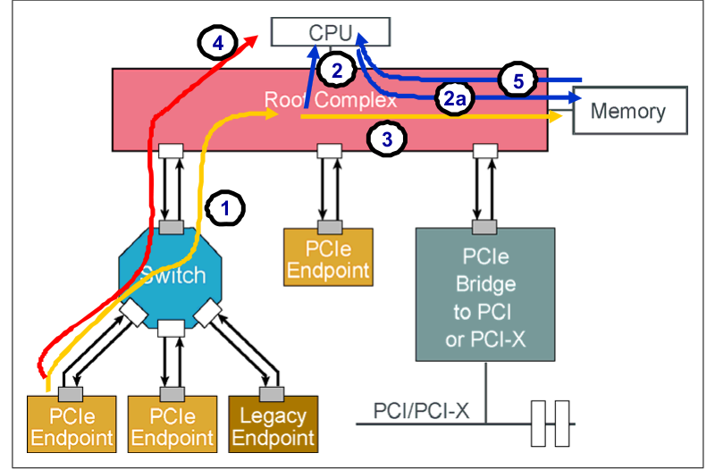

---


\newpage

# 📘 第 99 章　附录 (Chapter 99. Appendices)

**MindShare PCI Express Technology 3.0 — Comprehensive Guide to Generations 1.x, 2.x and 3.0**

> 📁 **Source chunks**: `chunks/chunk0348.md` ... `chunks/chunk0356.md`
> 🎨 **Format**: 中英对照双语 · 中文灰底 (PCIe 6.2 Spec 模板)

---

## 📑 本章目录 (Table of Contents)

- [99.1 Appendices — 附录](#sec-99-1)
- [99.2 Appendices — 附录](#sec-99-2)
- [99.3 Appendices — 附录](#sec-99-3)
- [99.4 Appendices — 附录](#sec-99-4)
- [99.5 Appendices — 附录](#sec-99-5)
- [99.6 Appendices — 附录](#sec-99-6)
- [99.7 Appendices — 附录](#sec-99-7)
- [99.8 Appendices — 附录](#sec-99-8)
- [99.9 Appendices — 附录](#sec-99-9)

<a id="sec-99-1"></a>
## 99.1 Appendices | 附录

<table>
<thead><tr><th width="50%">🇬🇧 English</th><th width="50%">🇨🇳 中文</th></tr></thead>
<tbody>
<tr>
<td width="50%">

Care should be taken when selecting an interposer as the probe circuitry varies by vendor and by requirements imposed by the max PCIe link
speed. For exam‐ ple, a Gen3 slot interposer should contain probe circuitry which allows the dynamic link training process to pass properly
through the probe. The LeCroy Gen3 slot interposer uses linear circuits to maintain the shape of the waveform as it passes through the
probe. This allows pre‐emphasis of the transmitter to be dynamically changed during link training while allowing the receiver to quan‐ tify
the impact of a new setting (either positive or negative impact).

_Figure A‐2: LeCroy PCI Express Slot Interposer x16_ 

LeCroy also offers a family of other dedicated interposers for form factors such as ExpressCard, XMC, Mini Card, Express Module, AMC, etc.
Some of these interposers are shown in Figure 3 on page 923. For a complete list of these inter‐ posers please refer to the LeCroy website:
www.lecroy.com as this list is con‐ stantly growing.

**A endix A pp** 

_Figure A‐3: LeCroy XMC, AMC, and Mini Card Interposers_ 

For debugging PCIe links which cannot benefit from a dedicated interposer, a mid‐bus probe shown in Figure 4 on page 923 is the next best
option. A mid‐bus probe involves placement of an industry standard probe geometry on the PCB. Each PCIe lane is routed to a pair of pads on
the footprint which can be probed using a mid‐bus probe head. These probes use spring pins or C clips for provid‐ ing solder free mechanical
attachment between the system under test and the protocol analyzer.

_Figure A‐4: LeCroy PCI Express Gen3 Mid‐Bus Probe_

</td>
<td width="50%">

在选择插接板 (interposer) 时需要谨慎,因为不同厂商以及最大 PCIe 链路速度所施加的不同要求会导致探针电路有所差异。例如,Gen3 插槽插接板应包含允许动态链路训练过程正确通过探针的探针电路。LeCroy Gen3
插槽插接板使用线性电路来保持波形在通过探针时的形状。这允许在链路训练期间动态改变发送端的预加重,同时允许接收端量化新设置的影响(无论是正面影响还是负面影响)。

_Figure A‐2: LeCroy PCI Express Slot Interposer x16_

LeCroy 还提供了一系列用于其他外形规格(如 ExpressCard、XMC、Mini Card、Express Module、AMC 等)的专用插接板。其中部分插接板如图 3 第 923 页所示。如需这些插接板的完整列表,请参阅 LeCroy
网站:www.lecroy.com,因为该列表在不断扩充。

**Appendix A**

_Figure A‐3: LeCroy XMC, AMC, and Mini Card Interposers_

对于无法使用专用插接板进行调试的 PCIe 链路,第 923 页图 4 所示的中段总线探针 (mid-bus probe) 是次优选择。中段总线探针涉及在 PCB 上放置一个业界标准的探针几何结构。每条 PCIe
通道被路由到封装上一对焊盘,可以使用中段总线探针头对其进行探测。这些探针使用弹簧针或 C 夹在被测系统与协议分析仪之间提供免焊接的机械连接。

_Figure A‐4: LeCroy PCI Express Gen3 Mid‐Bus Probe_

</td>
</tr>
<tr>
<td width="50%">

## **PCI Express Technology** 

As a last resort, a flying lead probe shown in Figure 5 on page 924 may be used to attach the protocol analyzer to the system under test.
This involves soldering a resistive tap circuit and connector pins to the PCIe traces. This circuitry is typ‐ ically soldered to the AC
coupling caps of the PCIe link as they are often the only place to access the traces. Once the probe circuitry is soldered to the PCB, the
analyzer probe can be connected and removed as needed. This approach can be used on virtually any PCIe link, however the robustness of the
connection is limited by the skill of the technician adding the probe.

_Figure A‐5: LeCroy PCI Express Gen2 Flying Lead Probe_

</td>
<td width="50%">

## **PCI Express Technology**

作为最后手段,可以使用第 924 页图 5 所示的飞线探针 (flying lead probe) 将协议分析仪连接到被测系统。这涉及将一个电阻式分流电路和连接器引脚焊接到 PCIe 走线上。由于 PCIe
链路的交流耦合电容通常是唯一可以接触到走线的地方,因此该电路通常焊接到交流耦合电容上。一旦探针电路焊接到 PCB 上,分析仪探针就可以根据需要进行连接和移除。这种方法几乎可以用于任何 PCIe 链路,但连接的稳固性受限于添加探针的技术人员的技能。

_Figure A‐5: LeCroy PCI Express Gen2 Flying Lead Probe_

</td>
</tr>
<tr>
<td width="50%">

## **Viewing Traffic Using the PETracer Application**

</td>
<td width="50%">

## **使用 PETracer 应用程序查看流量**

</td>
</tr>
<tr>
<td width="50%">

## **CATC Trace Viewer** 

The primary way to view PCI Express traffic with the LeCroy PETracer applica‐ tion is the CATC Trace view. This view takes each recorded
packet and breaks it down into different packet fields to highlight the important values contained in this packet. A mixture of colors and
text are used to visually categorize and explain the purpose of each packet. Errors are highlighted in red such as shown in Figure 6 on page
925. Warnings are highlighted in yellow making it easy to identify areas of traffic or fields in a packet which are non‐compliant.

**A endix A pp**

</td>
<td width="50%">

## **CATC Trace 查看器**

使用 LeCroy PETracer 应用程序查看 PCI Express 流量的主要方式是 CATC Trace
视图。该视图对每个记录的分组进行解析,将其分解为不同的分组字段,以突出该分组中包含的重要值。混合使用颜色和文本,以便直观地对每个分组进行分类并解释其用途。错误以红色高亮显示,如第 925 页图 6 所示。警告以黄色高亮显示,便于识别流量或分组字段中不符合规范的部分。

**Appendix A**

</td>
</tr>
<tr>
<td width="50%">

## _Figure A‐6: TLP Packet with ECRC Error_ 

In addition to decoding and visually breaking down each packet, a hierarchical display allows logical grouping of related packets. For
example, in “Link Level” mode, TLP packets are grouped with their respective ACK packet. Each TLP is identified as either implicitly or
explicitly ACK’d or NAK’d. An example of a ACK DLLP is shown in Figure 7 on page 925 along with the ACK’d TLP.

_Figure A‐7: “Link Level” Groups TLP Packets with their Link Layer Response_ 

In “Split‐Level” mode shown in Figure 8 on page 926, the CATC Trace view combines split transactions. For example, a single TLP read can be
grouped with 1 or more completion TLPs to logically show large data transfers as a sin‐ gle line in the trace. The amount of data, starting
address, as well as perfor‐ mance metrics are provided for each split level transaction. This allows the user to bypass the details of how
large memory transactions are broken into multiple TLP packets and rather focus on the contents of the data. If the user wishes to see the
details of the split transaction, the hierarchical display can show the link level and/or packet level breakdown of all the packets which
make up this split transaction. This “drill‐down” approach to traffic analysis allows the user to start from a high level view of what’s
happening on the bus and drill down only in the areas of traffic which are interesting to the user.

_Figure A‐8: “Split Level” Groups Completions with Associated Non‐Posted Request_ 

The CATC trace view also supports “Compact‐View” shown in Figure 9 on page 927. In this view, packets which are sent repeatedly are
collapsed into a single cell. This is very useful for collapsing Training Sequences or Flow Control Initialization packets. The software
algorithms which perform this collapse are smart enough to collapse any SKIP ordered sets as well. This creates a very compact view of the
link training process allowing the user to examine changes in the link training packets without scrolling through hundreds of packets.

**A endix A pp** 

_Figure A‐9: “Compact View” Collapses Related Packets for Easy Viewing of Link Training_

</td>
<td width="50%">

## _Figure A‐6: TLP Packet with ECRC Error_

除了对每个分组进行解码和直观分解之外,层次化显示还可以对相关分组进行逻辑分组。例如,在 "Link Level" (链路级) 模式下,TLP 分组与其对应的 ACK 分组被分组在一起。每个 TLP 被标识为隐式或显式 ACK 或 NAK。第 925 页图 7 显示了一个 ACK
DLLP 的示例以及被 ACK 的 TLP。

_Figure A‐7: "Link Level" Groups TLP Packets with their Link Layer Response_

在第 926 页图 8 所示的 "Split‐Level" (拆分级) 模式下,CATC Trace 视图组合了拆分事务。例如,单个 TLP 读操作可以与一个或多个完成 TLP
分组在一起,以便在跟踪中以单行逻辑地显示大数据传输。每个拆分级事务都提供数据量、起始地址以及性能指标。这允许用户绕过大型内存事务如何被分解为多个 TLP
分组的细节,而专注于数据的内容。如果用户希望查看拆分事务的细节,层次化显示可以显示构成该拆分事务的所有分组的链路级和/或分组级细分。这种 "drill-down" (向下钻取) 的流量分析方法允许用户从总线上的高级视图入手,仅在其感兴趣的流量区域进行深入分析。

</td>
</tr>
<tr>
<td width="50%">

## **LTSSM Graphs** 

To further enhance the “drill‐down” traffic viewing approach, the PETracer application includes an LTSSM graph view as shown in Figure 10 on
page 928. When this graph is invoked, the SW parses through the trace to find the link training sections and infers the state of the Link
Training and Status State Machine (LTSSM). The result is a graph which breaks down the LTSSM state transitions in a very high level view.
This graph allows the user to immediately see if the link went into a recovery state. If so, the user can easily identify which side of the
link initiated the recovery, how many times it entered recovery, and even if the link speed or link width decreased because of the recovery.

The LTSSM graph is also an active link back into the trace file. For example, if the user clicks on the entry to recovery, the trace file
will be navigated to that location in the trace file. This would allow the user to perhaps see if the recov‐ ery was caused by repeated NAKs
or for some other reason such as loss of block alignment.

**927** 

In short, when users are debugging issues related to link training, speed change, or low power state transitions, the LTSSM is affected. By
examining the LTSSM graph, the user can easily identify whether these link state changes occurred, where they occurred, and navigate
directly to them for faster analysis.

_Figure A‐10: LTSSM Graph Shows Link State Transitions Across the Trace_

</td>
<td width="50%">

## **PCI Express Technology**

_Figure A‐8: "Split Level" Groups Completions with Associated Non‐Posted Request_

CATC trace 视图还支持第 927 页图 9 所示的 "Compact‐View" (紧凑视图)。在该视图中,重复发送的分组被折叠为单个单元格。这对于折叠训练序列 (Training Sequences) 或流量控制初始化 (Flow Control
Initialization) 分组非常有用。执行此折叠的软件算法也足够智能,可以折叠任何 SKIP 有序集。这创建了一个非常紧凑的链路训练过程视图,允许用户检查链路训练分组中的变化,而不必滚动浏览数百个分组。

**Appendix A**

_Figure A‐9: "Compact View" Collapses Related Packets for Easy Viewing of Link Training_

</td>
</tr>
<tr>
<td width="50%">

## **Flow Control Credit Tracking** 

Flow control credit tracking is particularly problematic in PCI express. The flow control update packets do not show the number of credits
each endpoint has, rather it shows how many credits in total have been used. This means that each endpoint must keep a running counter of
credits for each type. There are a num‐ ber of scenarios where credits can be lost, and if this occurs, the link will eventu‐ ally be unable
to transmit data due to lack of credits. Such problems are very difficult to identify and debug.

The LeCroy PETracer application has a credit tracking SW tool shown in Figure 11 on page 929 to aid in this debug. If the trace contains
FC‐Init packets, it will walk through the trace and show the amount of remaining credits per virtual channel buffer type after each TLP and
FC‐Update.

FC‐Init packets are sent once after link training. Because of this, the PETracer application has the ability for the user to set initial
credit values at some point in

**A endix A pp** 

the trace and the SW will calculate the relative credit values for the remaining packets. Even if the initial credit values are set
improperly by the user, having the ability to see the relative credits is often enough to catch a flow control issue.

_Figure A‐11: Flow Control Credit Tracking_

</td>
<td width="50%">

## **LTSSM 图形**

为了进一步增强 "drill-down" 流量查看方法,PETracer 应用程序包含一个 LTSSM 图形视图,如第 928 页图 10 所示。当调用该图形时,软件会解析跟踪以查找链路训练部分,并推断链路训练和状态状态机 (LTSSM) 的状态。其结果是一个以非常高级的视图分解
LTSSM 状态转换的图形。该图形允许用户立即查看链路是否进入了恢复状态。如果进入恢复状态,用户可以轻松识别链路的哪一侧发起了恢复、进入恢复的次数,甚至是否由于恢复导致链路速度或链路宽度降低。

LTSSM 图形也是回到跟踪文件的活动链接。例如,如果用户单击进入恢复状态的条目,跟踪文件将导航到跟踪文件中该位置。这将允许用户查看恢复是否是由重复的 NAK 引起的,还是由于块对齐丢失等其他原因。

**927**

简而言之,当用户调试与链路训练、速率变化或低功耗状态转换相关的问题时,LTSSM 会受到影响。通过检查 LTSSM 图形,用户可以轻松识别这些链路状态变化是否发生、在何处发生,并直接导航到它们以加快分析速度。

_Figure A‐10: LTSSM Graph Shows Link State Transitions Across the Trace_

</td>
</tr>
<tr>
<td width="50%">

## **Bit Tracer** 

Some debug situations are not solved by a drill down approach to examining the traffic. For example if the link settings are incorrect, the
recording is often unreadable. What if a device is not properly scrambling the traffic, or the 10 bit symbols are sent in reverse order? For
this scenario, a tool which focuses on analysis between the waveform view of the scope and the CATC Trace view is needed. This is where the
BitTracer view shown in Figure 12 on page 930 is most powerful.

The BitTracer view allows the user to see raw traffic exactly as it was seen on the link. The software allows the user to see the traffic as
10 bit symbols, scrambled bytes, or unscrambled bytes. Invalid symbols and incorrect running disparity are highlighted in red.

</td>
<td width="50%">

## **流控制信用跟踪**

在 PCI Express
中,流控制信用跟踪特别具有挑战性。流控制更新分组并不显示每个端点拥有的信用数量,而是显示已使用的信用总数。这意味着每个端点必须为每种类型保持一个运行信用计数器。在许多场景中信用可能会丢失,如果发生这种情况,链路最终将由于缺乏信用而无法传输数据。这类问题非常难以识别和调试。

LeCroy PETracer 应用程序具有第 929 页图 11 所示的信用跟踪软件工具,以协助进行此调试。如果跟踪包含 FC-Init 分组,它将遍历跟踪并在每个 TLP 和 FC-Update 之后显示每个虚拟通道缓冲区类型的剩余信用量。

FC-Init 分组在链路训练之后发送一次。因此,PETracer 应用程序允许用户

**Appendix A**

在跟踪中的某个位置设置初始信用值,软件将计算剩余分组的相对信用值。即使用户设置初始信用值不正确,能够查看相对信用通常足以发现流控制问题。

_Figure A‐11: Flow Control Credit Tracking_

</td>
</tr>
<tr>
<td width="50%">

## **PCI Express Technology** 

To further determine what may be wrong with the traffic, the BitTracer tool adds a powerful list of post processing features which can
modify the traffic. For example, post capture; the user can invert the polarity of a given lane. Once applied, the user can see if the 10
bit symbols are now represented properly in the trace. If this cleans up the trace, it’s an indication that the recording settings for the
Analyzer hardware need to be changed.

_Figure A‐12: BitTracer View of Gen2 Traffic_ 

In addition, the lane ordering can be modified. This is useful for determining if lane reversal is causing a bad capture. If the traffic has
excessive lane to lane skew, the BitTracer software allows the user to re‐align the traffic. For Gen3 traf‐ fic, this skew can be applied 1
bit at a time. This essentially allows the user to fix the 130 bit block alignment post capture.

After applying changes to the data, all or just a portion of the data can be exported into the standard CATC Trace view for higher level
analysis. This workflow is very powerful for debugging low level issues during early bring‐ up. Let’s say for example, the user’s device
trains the link properly, and then suddenly applies polarity inversion to 1 lane. This is a clear violation of the spec and will cause the
link to retrain. If this traffic is captured with the BitTracer tool, the user could easily identify this as the problem. Additionally, the
portion of the traffic before and after the inversion could be exported into separate trace files and examined in the CATC Trace view.

**A endix A pp**

</td>
<td width="50%">

## **Bit Tracer**

某些调试情况无法通过对流量的向下钻取方法来解决。例如,如果链路设置不正确,记录通常无法读取。如果设备没有正确地对流量加扰,或者 10 bit 符号以相反的顺序发送,该怎么办?对于这种情况,需要一种专注于示波器的波形视图与 CATC Trace 视图之间分析的工具。这正是第 930
页图 12 所示的 BitTracer 视图最强大的地方。

BitTracer 视图允许用户查看链路上看到的原始流量。软件允许用户将流量视为 10 bit 符号、加扰字节或未加扰字节。无效符号和不正确的运行差异 (Running Disparity) 以红色高亮显示。

</td>
</tr>
<tr>
<td width="50%">

## **Analysis overview** 

As you can see, different traffic views can be beneficial for debugging certain failure conditions. LeCroy supports import of PCIe traffic
from many sources into its highly sophisticated PEtracer software. Whether the source is RTL simu‐ lation, an oscilloscope capture, or a
dedicated protocol analyzer capture, PETracer has a rich set of traffic views and reports which allow the user to best understand the health
and state of their PCIe link.

</td>
<td width="50%">

## **PCI Express Technology**

为了进一步确定流量可能出现的问题,BitTracer 工具添加了一系列强大的后处理功能,可以修改流量。例如,在采集后,用户可以反转给定通道的极性。一旦应用,用户可以查看 10 bit 符号现在是否在跟踪中正确表示。如果这清理了跟踪,则表明分析仪硬件的记录设置需要更改。

_Figure A‐12: BitTracer View of Gen2 Traffic_

此外,还可以修改通道排序。这对于确定通道反转是否导致不良捕获非常有用。如果流量存在过大的通道间偏移 (skew),BitTracer 软件允许用户重新对齐流量。对于 Gen3 流量,该偏移可以一次 1 bit 地应用。这实质上允许用户在采集后修复 130 bit 块对齐。

在对数据应用更改后,所有或仅一部分数据可以导出到标准 CATC Trace 视图中,以进行更高级别的分析。该工作流对于在早期 bring-up 期间调试低级问题非常强大。举例来说,假设用户的设备正确训练了链路,然后突然对 1
个通道应用极性反转。这明显违反规范,将导致链路重新训练。如果使用 BitTracer 工具捕获该流量,用户可以轻松将此识别为问题。此外,反转前后的流量部分可以导出到单独的跟踪文件中,并在 CATC Trace 视图中进行检查。

**Appendix A**

</td>
</tr>
<tr>
<td width="50%">

## **Traffic generation**

</td>
<td width="50%">

## **分析概述**

如您所见,不同的流量视图对于调试某些故障条件是有益的。LeCroy 支持从许多来源将 PCIe 流量导入其高度复杂的 PEtracer 软件。无论是 RTL 仿真、示波器捕获还是专用协议分析仪捕获,PETracer 都拥有一套丰富的流量视图和报告,允许用户最好地了解其 PCIe
链路的健康状况和状态。

</td>
</tr>
<tr>
<td width="50%">

## **Pre-Silicon** 

For stimulating a PCI Express endpoint in simulation, dedicated verification IP can be purchased from a number of vendors. This IP will test
for basic function‐ ality as well as perform a number of PCIe compliance checks. It is certainly in the interest of the ASIC developer to
find and fix these issues before tapeout, and this is where the value of these tools comes from. If the PCIe design is implemented in an
FPGA where mask costs are not an issue, it may be more cost effective to perform these compliance checks in hardware with a dedicated
traffic generation tool such as the LeCroy PETrainer or LeCroy PTC card.

</td>
<td width="50%">

## **流量生成**

</td>
</tr>
<tr>
<td width="50%">

## **Post-Silicon** 

## **Exerciser Card**

</td>
<td width="50%">

## **流片前 (Pre-Silicon)**

为了在仿真中激励 PCI Express 端点,可以从许多供应商处购买专用验证 IP。该 IP 将测试基本功能并执行许多 PCIe 一致性检查。ASIC 开发人员当然有兴趣在 tapeout 之前发现并修复这些问题,这正是这些工具的价值所在。如果 PCIe 设计在 FPGA
中实现,其中掩模成本不是问题,那么使用 LeCroy PETrainer 或 LeCroy PTC 卡等专用流量生成工具在硬件中执行这些一致性检查可能更具成本效益。

</td>
</tr>
<tr>
<td width="50%">

</td>
<td width="50%">

## **流片后 (Post-Silicon)**

## **Exerciser 卡**

</td>
</tr>

</tbody>
</table>

[⬆️ 返回目录](#本章目录-table-of-contents)

---


<a id="sec-99-2"></a>
## 99.2 Appendices | 附录

<table>
<thead><tr><th width="50%">🇬🇧 English</th><th width="50%">🇨🇳 中文</th></tr></thead>
<tbody>
<tr>
<td width="50%">

To thoroughly test the PCIe compliance and overall robustness of a PCIe design post‐silicon, a dedicated Exerciser card such as the LeCroy
PETrainer shown in Figure 13 on page 932 is used. This card allows the user to generate a wide range of compliant and non‐compliant traffic.
For example, if you place your PCIe card in a standard motherboard, you may be limited in the size of the TLP packets it will see. A
dedicated Exerciser card can generate TLP packets across the entire legal range of packet sizes.

Secondly, if you would like to test that a card issues a NAK in response to a TLP with a bad LCRC, it would not possible with the card
connected to compliant devices. They do not transmit bad packets. An Exerciser card can create a TLP with a bad LCRC, improper header
values, or end the TLP with an EDB symbol.

</td>
<td width="50%">

为了彻底测试 PCIe 设计的 PCIe 合规性和整体稳健性，使用了专用 Exerciser 卡，如图 13 所示（在第 932 页）的 LeCroy PETrainer。该卡允许用户生成各种合规和不合规的流量。例如，如果将 PCIe 卡放在标准主板中，则可能会限制它将看到的
TLP 数据包的大小。专用 Exerciser 卡可以跨数据包大小的整个合法范围生成 TLP 数据包。

其次，如果您想测试卡是否在响应具有坏 LCRC 的 TLP 时发出 NAK，则不可能将卡连接到合规设备。它们不传输坏数据包。Exerciser 卡可以创建具有坏 LCRC 的 TLP、不正确的头值，或以 EDB 符号结束 TLP。

如果您想测试您的卡在收到 NAK 时是否正确重放数据包，则可以使用 Exerciser 完成此操作。也许您想向某个 TLP 连续发出 4 个 NAK，以便启动链路恢复。此行为非常容易编程到 exerciser 卡中。

测试用例和失败方案的数量仅受您编写的脚本数量的限制。一旦编写，这些脚本可以重复用于测试您设计的新版本。分析仪 SW 可以记录这些会话并使用脚本确定响应是否正确。许多 LeCroy 客户已使用这些工具创建了大型回归测试库。

_图 A-13：LeCroy Gen3 PETrainer Exerciser 卡_

</td>
</tr>
<tr>
<td width="50%">

## **PCI Express Technology** 

If you would like to test that your card properly replay’s a packet when it receives a NAK, this can be done with an Exerciser. Perhaps you
would like to issue 4 NAKs in a row to a certain TLP so that link recovery is initiated. This behavior is all quite easy to program into the
exerciser card.

The number of test cases and failure scenarios is limited only by the number of scripts you write. Once written, these scripts can be
re‐used for testing new ver‐ sions of your design. The Analyzer SW can record these sessions and use script‐ ing to determine if the
response was correct. A number of LeCroy customers have created large libraries of regression tests using these tools.

_Figure A‐13: LeCroy Gen3 PETrainer Exerciser Card_

</td>
<td width="50%">

## **PTC 卡**

PCI SIG 已发布了一份特定的合规性测试列表，所有"合规"设备都必须通过这些测试。LeCroy 协议测试卡 (PTC) 是在 PCI SIG 合规性研讨会上执行这些测试所使用的硬件。用户可以从 LeCroy 购买 PTC 卡，如图 14 所示（在第 933
页），以预先测试其设备，确保它们将通过 PCI SIG 合规性测试。

LeCroy PTC 用于在 x1 链路宽度下测试根复合体或端点设备。链路速度可以是 Gen1 或 Gen2。

**A endix A pp**

_图 A-14：LeCroy Gen2 协议测试卡 (PTC)_

</td>
</tr>
<tr>
<td width="50%">

## **PTC card** 

The PCI SIG has published a specific list of compliance tests which all “Compli‐ ant” devices must pass. The LeCroy Protocol Test Card (PTC)
is the hardware used to perform these tests at the PCI SIG Compliance workshops. Users can purchase a PTC card from LeCroy shown in Figure
14 on page 933 to pre‐test their devices to ensure they will pass PCI SIG compliance testing.

The LeCroy PTC is used to test root complex or endpoint devices at x1 link widths. Link speeds can be either Gen1 or Gen2. 

**A endix A pp** 

_Figure A‐14: LeCroy Gen2 Protocol Test Card (PTC)_

</td>
<td width="50%">

## **结论**

如今，PCIe 开发人员可以使用各种工具来帮助调试其 PCIe 设计。由于 PCIe 标准的广泛采用，许多这些工具是专门为 PCIe 调试而设计的，包括解决许多 PCIe 设备面临的挑战的功能。

有关 LeCroy PCIe 工具产品的更多信息，请访问 LeCroy 网站 www.lecroy.com

</td>
</tr>
<tr>
<td width="50%">

## **Conclusion** 

Today, the PCIe developer has access to a wide range of tools to help debug their PCIe design. Thanks to the wide adoption of the PCIe
standard, many of these tools are designed specifically for PCIe debug and include features which address the challenges many PCIe devices
face.

For more information about the LeCroy PCIe tool offerings, please visit the LeCroy website www.lecroy.com

</td>
<td width="50%">

## _**附录 B：**_

</td>
</tr>
<tr>
<td width="50%">

## _**Appendix B:**_

</td>
<td width="50%">

## _**PCI Express 的市场与应用**_

Akber Kazmi（PLX Technology, Inc. 高级市场总监）

</td>
</tr>
<tr>
<td width="50%">

## _**Markets & Applications for PCI Express**_ 

Akber Kazmi (Senior Director Marketing, PLX Technology, Inc.)

</td>
<td width="50%">

## **简介**

自 20 世纪 90 年代初定义以来，PCI 已成为计算机历史上最成功的互连技术。最初用于个人计算机系统，PCI 架构已扩展到几乎每个计算平台类别，包括服务器、存储、通信和广泛的嵌入式控制应用。最重要的是，PCI 总线速度和宽度的每次进步都提供了向后兼容性。

尽管 PCI 架构如此成功，但多分支、并行、共享总线互连技术可以实现的目标是有限的。许多问题 — 时钟偏移、高引脚数、印刷电路板 (PCB) 中的走线布线限制、带宽和延迟要求、物理可扩展性以及需要在系统中支持各种应用的服务质量 (QoS) — 导致定义了 PCI Expressª
(PCIe) 架构。

PCIe 是 PCI 的天然继任者，开发用于提供先进的、高速串行互连技术的优势以及基于分层的分组架构，但保持与大型 PCI 软件基础的向后兼容性。关键目标是为各种未来平台提供优化的通用互连解决方案，包括桌面、服务器、工作站、存储、通信和嵌入式系统。

PCIe 于 2001 年推出后，已经历了三代增强。在第一代 (Gen1) 中，信号速率设定为 2.5 GT/s，后来增强到 5 GT/s (Gen2)，最终达到 8 GT/s (Gen3)。PCIe 规范允许将 2、4、8、12、16 或 32
条通道组合成单个端口。但是，今天可用的产品不支持 12 和 32 通道宽度的端口。重要的是，所有 PCIe Gen2 和 Gen3 设备都需要在速度上向后兼容上一代。

业界已经推出并完全采用了 PCIe Gen3 产品，同时 PCI 特别兴趣小组 (PCI-SIG) 正在分析 Gen4 的信号速率（速度）。PCIe Gen4 的目标是将 Gen3 的速度加倍，达到 16 GT/s。

PCIe 交换机有多种尺寸，从 3 到 96 条通道，从 3 到 24 个端口，其中每个端口可以是 1、2、4、8 或 16 条通道宽。Gen3 单通道将提供 1GB/s 的带宽，而 16 通道端口在每个方向上提供 16GB 的带宽。此外，PCIe 交换机供应商（如 PLX
Technology）已为其产品添加了 PCIe 规范中未包含的功能和改进，使它们能够区分其产品并为系统设计人员增加价值。这些功能提供了易用性、高性能、故障转移、错误检测、错误隔离和现场可升级性。

片上功能包括非透明 (NT) 桥接、对等通信、热插拔、直接内存访问 (DMA) 和错误检查/恢复。此外，调试功能（如数据包生成、接收器眼图测量、流量监控和实时流量中的错误注入）为设计人员提供了重要价值，从而实现早期系统启动。这些功能中的许多还可用于运行时性能改进和监控。

下一代 PCIe 交换机中包含的功能包括：

- **NT 桥接：** 允许两个主机/CPU 连接到同一 PCIe 交换机，同时在电气和逻辑上隔离。NT 桥接功能广泛用于需要隔离两个活动 CPU 或两个 CPU（其中一个活动而另一个被动）的系统。NT 功能允许两个主机 CPU
之间交换心跳，以便在其中任何一个发生故障时实现故障转移。

**第：附录 B：PCI 的市场与应用**

- **DMA：** PCIe 交换机中的片上 DMA 控制器为设计人员提供了重要价值，因为它使他们能够节省 CPU 周期，以便在对等方与 CPU 之间以及 I/O 之间移动数据。CPU 在移动数据方面的减少工作量提高了系统的整体性能，因为节省的 CPU
周期可用于运行应用程序而不是管理数据 I/O。

- **错误隔离：** 用户可以对某些错误事件编程触发器并由交换机响应。交换机的响应也可以编程为忽略、触发主机中断、关闭有错误的端口或关闭整个交换机。

- **数据包生成：** 通常，在不使用昂贵的分组生成器设备的情况下生成饱和 PCIe 端口的流量是困难的。PCIe 交换机现在具有饱和任何 PCIe 端口与所需流量（如事务层数据包）的能力，以检查系统的性能和稳健性。

</td>
</tr>
<tr>
<td width="50%">

## **Introduction** 

Since its definition in the early 1990s, PCI has emerged as the most successful interconnect technology ever used in computers. Originally
intended for per‐ sonal computer systems, the PCI architecture has expanded into virtually every computing platform category, including
servers, storage, communications, and a wide range of embedded control applications. Most important, each advance‐ ment in PCI bus speed and
width provided backward compatibility.

As successful as the PCI architecture was, there was a limit to what could be accomplished with a multi‐drop, parallel, shared‐bus
interconnect technology. A number of issues ‐‐ clock skew, high pin count, trace routing restrictions in printed circuit boards (PCB),
bandwidth and latency requirements, physical scalability, and the need to support Quality of Service (QoS) within a system for a wide
variety of applications ‐‐ lead to the definition of the PCI Expressª (PCIe) architecture.

PCIe was the natural successor to PCI, and was developed to provide the advantages of a state‐of‐the‐art, high‐speed serial interconnect
technology with a packet‐based layered architecture, but maintain backward‐compatibility with the large PCI software infrastructure. The key
goal was to provide an opti‐ mized, universal interconnect solution for a wide variety of future platforms, including desktop, server,
workstation, storage, communications, and embed‐ ded systems.

</td>
<td width="50%">

## **PCI Express IO 虚拟化解决方案**

PCIe 技术最初被定义为单主机互连技术，但在过去几年中，已经开发了使 PCIe 适合多主机系统的新标准，作为数据中心和企业 IT 应用程序的交换结构技术。x86 CPU 和服务器平台上本地 PCIe 接口（端口）的存在使设计人员能够将 PCIe
用作中小型服务器集群的背板和结构技术。

2007 年，PCI-SIG 发布了单根 I/O 虚拟化 (SR-IOV) 规范，该规范使网络接口卡或主机总线适配器等单个物理资源能够在运行于一个主机上的多个虚拟机之间共享。这是在不同应用程序或虚拟机之间共享资源或 I/O 设备的最简单方法。

PCI-SIG 随后于 2008 年完成了其多根 I/O 虚拟化 (MR-IOV) 规范的工作，该规范将 PCIe 技术的使用从单根域扩展到多根域。MR-IOV 规范允许多个主机和多个系统映像同时使用单个 I/O 设备，如图 0-1 所示（在第 938
页）。此插图显示了一个多主机环境，其中具有 MR-IOV 功能的 NIC 和 HBA 通过 MR-IOV 交换机在多个服务器或虚拟机之间共享。

_图 0-1：MR-IOV 交换机使用_

为了实现 MR-IOV 规范，需要开发系统的三个组件 — MR-IOV PCIe 交换机、端点和管理软件。所有这三个组件必须同时可用并无缝工作。不幸的是，在规范开发四年后，没有一个硅供应商具有 MR-IOV 功能的 PCIe 交换机或端点。PCIe
交换机供应商通过供应商定义的功能并利用可用的 SR-IOV 端点提供为 MR-IOV 定义的能力的解决方案。

</td>
</tr>
<tr>
<td width="50%">

## **PCI Express 3.0 Technology** 

After its introduction in 2001, PCIe has gone through three generations of enhancements. In the first generation (Gen1), signaling rate was
set at 2.5 GT/s and later enhanced to 5 GT/s (Gen2) and eventually 8 GT/s (Gen3). The PCIe specification allows combining of 2, 4, 8, 12, 16
or 32 lanes into a single port. However, products available today do not support 12‐ and 32‐lane‐wide ports. It is important to note that
all PCIe Gen2 and Gen3 devices are required to be backward‐compatible in speed with that of the previous generation.

The industry has launched and has fully embraced PCIe Gen3 products, while at the same time the PCI Special Interest Group (PCI‐SIG) is
analyzing signaling rate (speed) for Gen4. The goal for PCIe Gen4 is to double the speed of Gen3, to 16 GT/s.

PCIe switches are available in an array of sizes, ranging from 3 to 96 lanes, and 3 to 24 ports where each port could be one, two, four,
eight or 16 lanes wide. A Gen3 single lane would provide 1GB/s of bandwidth, while a 16‐lane port offers 16GB bandwidth in each direction.
Additionally, PCIe switch vendors, such as PLX Technology, have added features and enhancement to their products that are not part of PCIe
specifications but enable them to differentiate their products and add value for the system designers. These features deliver ease of use,
higher performance, fail‐over, error detection, error isolation, and field‐upgrad‐ ability.

On‐chip features include non‐transparent (NT) bridging, peer‐to‐peer commu‐ nication, Hot‐Plug, direct memory access (DMA), and error
checking/recovery. Additionally debug features such as packet generation, receiver‐eye measure‐ ment, traffic monitoring, and error
injection in live traffic offer significant value to the designers, enabling early system bring‐up. Many of these features can also be used
for run‐time performance improvements and monitoring.

Features included in next generation of PCIe switches are: 

- **NT bridging:** Allows two hosts/CPUs to be connected to the same PCIe switch while electrically and logically isolated. The NT bridging
functions is broadly used in systems requiring isolation of two active CPUs or two CPUs where one is active and other is passive. The NT
functionality allows the exchange of heartbeat between the two host CPUs to enable fail‐over if one of them fails.

**Chapter : Appendix B: Markets & Applications for PCI** 

- **DMA:** An on‐chip DMA controller in a PCIe switch offers significant value to the designers as it enables them to spare CPU cycles to
move data between peers and the CPU to/from I/Os. The CPU’s reduced effort in mov‐ ing data boosts overall performance of the system as the
spared CPU cycles can be used to run applications rather than managing data I/O.

- **Error Isolation:** Users can program triggers for certain error events and response by the switch. The response of switch can also be
programmed to ignore, trigger a host interrupt, bring the port with errors down, or bring the entire switch down.

- **Packet Generation:** Generally, it is difficult to generate traffic that saturates a PCIe port without the use of expensive packet
generator equipment. PCIe switches now have the ability to saturate any PCIe port with desired traffic, such as transaction layer packets,
to check the performance and robustness of the system.

</td>
<td width="50%">

## **多根 (MR) PCIe 交换机解决方案**

PCIe 交换机供应商已创建了通过非透明桥接和多根 (MR) 功能提供多主机功能实现的交换机。这些 MR 交换机允许多个主机连接到单个交换设备，该设备可以在用户控制下进行划分，以使每个主机将连接到交换机的所需的下游端口集。

在 MR 交换机中，其中一个主机充当主站并将 I/O 分配给其他主机端口。每个主机独立于其他主机运行，并控制其域中的下游设备。图 0-2（在第 939 页）说明了 MR 交换机的内部架构，其中特定的下游端口集在管理控制下与特定的主机端口相关联。

**第：附录 B：PCI 的市场与应用**

_图 0-2：MR-IOV 交换机内部架构_

</td>
</tr>
<tr>
<td width="50%">

## **PCI Express IO Virtualization Solutions** 

The PCIe technology was initially defined as a single‐host interconnect technol‐ ogy but in last few years new standards have been developed
that make PCIe suitable for multi‐host systems as a switch fabric technology for data centers and enterprise IT applications. The presence
of native PCIe interfaces (ports) on x86 CPUs and servers platforms has enabled designers to use PCIe as backplane and fabric technology for
small to mid‐size server clusters.

In 2007, the PCI‐SIG released the Single‐Root I/O Virtualization (SR‐IOV) speci‐ fication that enables sharing of a single physical resource
such as a network interface card or host bus adapter in a PCIe system among multiple virtual machines running on one host. This is the
simplest approach to sharing resources or I/O devices among different applications or virtual machines.

The PCI‐SIG followed by completing, in 2008, work on its Multi‐Root I/O Virtu‐ alization (MR‐IOV) specification that extends the use of PCIe
technology from a single‐root domain to a multi‐root domain. The MR‐IOV specification enables the use of a single I/O device by multiple
hosts and multiple system images simultaneously, as illustrated in Figure 0‐1 on page 938. This illustration shows a multi‐host environment
where MR‐IOV capable NIC and HBA are shared across multiple servers or virtual machines via an MR‐IOV switch.

_Figure 0‐1: MR‐IOV Switch Usage_ 

In order to implement MR‐IOV specifications, three components of the system need to be developed – MR‐IOV PCIe switches, endpoints, and
management software. All three of these components must be available simultaneously and work seamlessly. Unfortunately, four years after the
specification was devel‐ oped, there is not a single silicon vendor that has MR‐IOV capable PCIe switch or end‐points. PCIe switch vendors
are offering solutions that provide capabili‐ ties defined for MR‐IOV through vendor‐defined features and utilizing avail‐ able SR‐IOV
end‐points.

</td>
<td width="50%">

## **超越芯片到芯片互连的 PCIe**

在 PCIe 部署的早期，该技术用作芯片到芯片互连，但现在 CPU、芯片组和 IO 上的 PCIe 接口的广泛可用性以及这些组件的广泛采用正在将其推向传统应用之外。在新一代应用中，PCIe 用于系统背板、交换结构、布线系统、存储/IO 扩展、IO 虚拟化、高性能计算 (HPC)
和服务器集群。图 0-3（在第 940 页）说明了在数据中心中 PCIe 用于高性能计算应用程序，其中机架中的服务器通过机架顶部 (TOR) PCIe 交换结构框进行集群。TOR PCIe 交换机可以通过以太网连接到网络，并通过 PCIe 链路连接到本地存储和计算资源。

盒外的 PCIe 连接取决于行业领导者以较低成本推出的 PCIe 铜缆或光缆。PCIe TOR 结构适用于服务器/计算集群，并可能取代 InfiniBand 成为 PCIe 作为结构增长时的生态系统。

_图 0-3：用于 HPC 应用程序的数据中心中的 PCIe_

## **SSD/存储 IO 扩展框**

</td>
</tr>
<tr>
<td width="50%">

## **Multi-Root (MR) PCIe Switch Solution** 

PCIe switch vendors have created switches that offer implementation of multi‐ host function through non‐transparent bridging and multi‐root
(MR) capabili‐ ties. These MR switches allow multiple hosts to be connected to a single switch‐ ing device, which can be portioned under
user control in such a way that each host will be connected to a desired set of downstream ports of the switch.

In the MR switches, one of the hosts acts as the master and assigns I/Os to other host ports. Each host operates independently of other
hosts and controls down‐ stream devices in its domain. Figure 0‐2 on page 939 illustrates the internal architecture of an MR switch, in
which particular sets of downstream ports are associated to particular host ports under management control.

**Chapter : Appendix B: Markets & Applications for PCI** 

_Figure 0‐2: MR‐IOV Switch Internal Architecture_

</td>
<td width="50%">

</td>
</tr>
<tr>
<td width="50%">

## **PCIe Beyond Chip-to-Chip Interconnect** 

In early stages of PCIe deployments the technology was used as a chip‐to‐chip interconnect but now broad availability of PCIe interfaces on
CPUs, chipsets and IOs and broad adoption of these components is pushing it beyond tradi‐ tional applications. In a new generation of
applications, PCIe is used in system backplanes, switch fabrics, cabling systems, storage/IO expansion, IO virtual‐ ization,
high‐performance computing (HPC), and server clusters. Figure 0‐3 on page 940 illustrates use of PCIe in a data center for high performance
compute application where servers in a rack are clustered through a top‐of‐rack (TOR) PCIe switch fabric box. The TOR PCIe switch can be
connected to the network through Ethernet and to local storage and compute resources through PCIe links.

PCIe connections out‐side the box depend on PCIe copper or optical cables that the leader in the industry are introducing at lower cost. The
PCIe TOR fabric is suitable for server/compute clustering and may replace InfiniBand as the eco‐ system for PCIe as fabric grows.

</td>
<td width="50%">

</td>
</tr>
<tr>
<td width="50%">

## **PCI Express 3.0 Technology** 

_Figure 0‐3: PCIe in a Data Center for HPC Applications_ 

## **SSD/Storage IO Expansion Boxes**

</td>
<td width="50%">

</td>
</tr>

</tbody>
</table>

[⬆️ 返回目录](#本章目录-table-of-contents)

---


<a id="sec-99-3"></a>
## 99.3 Appendices | 附录

<table>
<thead><tr><th width="50%">🇬🇧 English</th><th width="50%">🇨🇳 中文</th></tr></thead>
<tbody>
<tr>
<td width="50%">

Recently, the industry has converged towards PCIe as the unified interconnect technology for enterprise storage and solid state drive (SSD)
applications. The NVM HCI, an industry consortium, has released a specification called NVM Express (NVMe) that uses PCIe to provide the
bandwidth needed for SSD applications. Additionally, a T10 committee has embarked on defining SCSI over PCIe (SOP) protocol to take
advantage of PCIe technology capabilities for high‐performance storage applications. Furthermore, the SATA consortium recently announced
that it would use PCIe as the interconnect for its next‐gen‐ eration SATA specification called SATA Express (SATAe).

</td>
<td width="50%">

最近，业界已融合到 PCIe 作为企业存储和固态驱动器 (SSD) 应用程序的统一互连技术。NVM HCI（一个行业联盟）发布了一个名为 NVM Express (NVMe) 的规范，该规范使用 PCIe 提供 SSD 应用程序所需的带宽。此外，T10 委员会已开始定义 SCSI
over PCIe (SOP) 协议，以利用 PCIe 技术能力实现高性能存储应用程序。此外，SATA 联盟最近宣布将 PCIe 用作其下一代 SATA 规范（称为 SATA Express (SATAe)）的互连。

</td>
</tr>
<tr>
<td width="50%">

## **PCIe in SSD Modules for Servers** 

Traditionally, enterprise SSD modules have shipped with SAS, SATA and Fibre Channel interfaces but due to the above‐mentioned developments,
a large majority of SSD controller, module and system suppliers have introduced products with PCIe interfaces. Most SSD controllers peak
their performance and capacity due to a heavy load of managing flash. In high‐performance applica‐ tions, multiple SSD controllers (or
ASICs) are used and aggregated through a PCIe switch. Figure 0‐4 on page 941 shows a basic usage of a PCIe switch in an SSD add‐in card that
applies to any card or module form factor.

**Chapter : Appendix B: Markets & Applications for PCI** 

_Figure 0‐4: PCIe Switch Application in an SSD Add‐In Card_ 

For large data center applications, the SSD add‐in cards are installed in server motherboards as shown in Figure 0‐5 on page 941 and IO
expansion boxes (Fig‐ ure 6) aggregated through PCIe switches. In server motherboard designs, PCIe switches are utilized to create more
ports/slots that accommodate additional SSD modules to support the application’s needs.

_Figure 0‐5: Server Motherboard Use PCIe Switches_ 

In addition to providing connectivity, PCIe switches can be used for providing redundancy and failover through NT bridging and MR
functionality. The MR switches support 1+N failover capability, in which one server/host communi‐ cates with N number of servers to check
the heartbeat and initiate a failover if one of them fails. One of the servers illustrated in Figure 0‐6 on page 942 can be used as backup
for the others in 1+N failover scheme.

_Figure 0‐6: Server Failover in 1 + N Failover Scheme_

</td>
<td width="50%">

## **服务器 SSD 模块中的 PCIe**

传统上，企业 SSD 模块附带 SAS、SATA 和光纤通道接口，但由于上述发展，大多数 SSD 控制器、模块和系统供应商已推出具有 PCIe 接口的产品。由于管理闪存的繁重负载，大多数 SSD 控制器达到其性能和容量峰值。在高性能应用程序中，使用多个 SSD 控制器（或
ASIC）并通过 PCIe 交换机聚合。图 0-4（在第 941 页）显示了 PCIe 交换机在 SSD 附加卡中的基本用法，该用法适用于任何卡或模块形态因素。

**第：附录 B：PCI 的市场与应用**

_图 0-4：SSD 附加卡中的 PCIe 交换机应用程序_

对于大型数据中心应用程序，SSD 附加卡安装在服务器主板中，如图 0-5（在第 941 页）以及通过 PCIe 交换机聚合的 IO 扩展框（图 6）所示。在服务器主板设计中，PCIe 交换机用于创建更多端口/插槽，以适应其他 SSD 模块以支持应用程序的需求。

_图 0-5：服务器主板使用 PCIe 交换机_

除提供连接外，PCIe 交换机还可用于通过 NT 桥接和 MR 功能提供冗余和故障转移。MR 交换机支持 1+N 故障转移能力，其中一个服务器/主机与 N 个服务器通信以检查心跳并在其中一个发生故障时启动故障转移。图 0-6（在第 942 页）中所示的服务器之一可以在 1+N
故障转移方案中用作其他服务器的备份。

_图 0-6：1+N 故障转移方案中的服务器故障转移_

</td>
</tr>
<tr>
<td width="50%">

## **Conclusion** 

PCIe interconnect technology has become a serious contender for many high‐ end applications beyond chip–to‐chip interconnect and is expected
to be uti‐ lized in external I/O sharing, server clustering, I/O expansion and TOR switch‐ ing. The current 8 GT/s and next‐generation
(Gen4) 16 GT/s line rates, the ability to aggregate multiple lanes in single high‐bandwidth ports, fail‐over capabili‐ ties, embedded DMA
for data transfers, and IO sharing/virtualization provide capabilities that are at least equal to, if not superior to, interfaces such as
Infini‐ Band and Ethernet.

</td>
<td width="50%">

## **结论**

PCIe 互连技术已成为超越芯片到芯片互连的许多高端应用程序的有力竞争者，并有望用于外部 I/O 共享、服务器集群、I/O 扩展和 TOR 交换。当前的 8 GT/s 和下一代 (Gen4) 16 GT/s
线路速率、在单个高带宽端口中聚合多个通道的能力、故障转移能力、用于数据传输的嵌入式 DMA 以及 IO 共享/虚拟化提供了至少等于（如果不优于）InfiniBand 和以太网等接口的能力。

</td>
</tr>
<tr>
<td width="50%">

## _**Appendix C:**_ 

_**Implementing Intelligent Adapters and Multi‐Host Systems With PCI Express Technology**_

</td>
<td width="50%">

## _**附录 C：**_

_**使用 PCI Express 技术实现智能适配器和多主机系统**_

</td>
</tr>
<tr>
<td width="50%">

## **Jack Regula, Danny Chi, Tim Canepa (PLX Technology, Inc. )**

</td>
<td width="50%">

## **Jack Regula、Danny Chi、Tim Canepa（PLX Technology, Inc.）**

</td>
</tr>
<tr>
<td width="50%">

## **Introduction** 

Intelligent adapters, host failover mechanisms and multiprocessor systems are three usage models that are common today, and expected to
become more prev‐ alent as market requirements for next generation systems. Despite the fact that each of these was developed in response to
completely different market demands, all share the common requirement that systems that utilize them require multiple processors to co‐exist
within the system. This appendix out‐ lines how PCI Express can address these needs through non‐transparent bridg‐ ing.

Because of the widespread popularity of systems using intelligent adapters, host failover and multihost technologies, PCI Express silicon
vendors must pro‐ vide a means to support them. This is actually a relatively low risk endeavor; given that PCI Express is software
compatible with PCI, and PCI systems have long implemented distributed processing. The most obvious approach, and the one that PLX espouses,
is to emulate the most popular implementation used in the PCI space for PCI Express. This strategy allows system designers to use not only a
familiar implementation but one that is a proven methodology, and one

</td>
<td width="50%">

## **简介**

智能适配器、主机故障转移机制和多处理器系统是当今常见的三种使用模型，并有望随着下一代系统的市场需求变得更加普遍。尽管每个模型都是为了响应完全不同的市场需求而开发的，但它们都有一个共同的要求，即利用它们的系统需要在系统内共存多个处理器。本附录概述了 PCI Express
如何通过非透明桥接 (non-transparent bridging) 来满足这些需求。

由于使用智能适配器、主机故障转移和多主机技术的系统的广泛普及，PCI Express 硅供应商必须提供一种支持它们的手段。这实际上是一项相对低风险的努力；鉴于 PCI Express 与 PCI 软件兼容，而 PCI 系统早已实现了分布式处理。最明显的方法，也是 PLX
所倡导的方法，是为 PCI Express 模拟 PCI 空间中使用最广泛的实现。此策略允许系统设计人员不仅使用熟悉的实现，而且使用经过验证的方法，

并在他们从 PCI 迁移到 PCI Express 时可以提供重要的软件重用。本白皮书概述了多处理器 PCI Express 系统将如何使用 PCI 范例中建立的行业标准实践来实现。但是，首先，我们将定义不同的使用模型，并回顾 PCI
社区为满足这些需求而开发机制的成功努力。最后，我们将介绍 PCI Express 系统如何利用非透明桥接来为这些类型的系统提供所需的功能。

</td>
</tr>
<tr>
<td width="50%">

## **PCI Express 3.0 Technology** 

that can provide significant software reuse as they migrate from PCI to PCI Express.This paper outlines how multiprocessor PCI Express
systems will be implemented using industry standard practices established in the PCI para‐ digm. We first, however, will define the
different usage models, and review the successful efforts in the PCI community to develop mechanisms to accommo‐ date these requirements.
Finally, we will cover how PCI Express systems will utilize non‐transparent bridging to provide the functionality needed for these types of
systems.

</td>
<td width="50%">

## **使用模型**

</td>
</tr>
<tr>
<td width="50%">

## **Usage Models**

</td>
<td width="50%">

## **智能适配器**

智能适配器通常是使用本地处理器来减轻主机任务的外围设备。智能适配器的示例包括 RAID 控制器、调制解调器卡以及执行安全和流处理等任务的内容处理刀片。通常，这些任务要么计算繁重，要么如果由主机执行则需要大量 I/O
带宽。通过向端点添加本地处理器，系统设计人员可以享受显著的增量性能。在 RAID 市场中，大量产品利用本地智能进行 I/O 处理。

智能适配器的另一个示例是电子商务刀片。由于通用主机处理器未针对 SSL 所需的对数数学进行优化，因此利用主机处理器执行 SSL 握手通常会将系统性能降低 90% 以上。此外，SSL 握手操作的要求之一是真正的随机数生成器。许多通用处理器没有此功能，因此实际上没有专用硬件就很难执行
SSL 握手。类似的示例在整个智能适配器市场中比比皆是；事实上，这种使用模型非常普遍，以至于对于许多应用程序来说，它已成为事实上的标准实现。

</td>
</tr>
<tr>
<td width="50%">

## **Intelligent Adapters** 

Intelligent adapters are typically peripheral devices that use a local processor to offload tasks from the host. Examples of intelligent
adapters include RAID con‐ trollers, modem cards, and content processing blades that perform tasks such as security and flow processing.
Generally, these tasks are either computationally onerous or require significant I/O bandwidth if performed by the host. By add‐ ing a local
processor to the endpoint, system designers can enjoy significant incremental performance. In the RAID market, a significant number of
products utilize local intelligence for their I/O processing.

Another example of intelligent adapters is an ecommerce blade. Because gen‐ eral purpose host processors are not optimized for the
exponential mathematics necessary for SSL, utilizing a host processor to perform an SSL handshake typi‐ cally reduces system performance by
over 90%. Furthermore, one of the requirements for the SSL handshake operation is a true random number genera‐ tor. Many general purpose
processors do not have this feature, so it is actually difficult to perform SSL handshakes without dedicated hardware. Similar examples
abound throughout the intelligent adapter marketplace; in fact, this usage model is so prevalent that for many applications it has become
the de facto standard implementation.

</td>
<td width="50%">

## **主机故障转移**

主机故障转移能力被设计到需要高可用性的系统中。高可用性已成为越来越重要的要求，尤其是在存储和通信平台中。确保整个系统保持运行状态的实际方法是提供冗余

**第：附录 C：实现智能适配**

对于所有组件。主机故障转移系统通常包括一个基于主机的系统，该系统连接到多个端点。此外，备份主机连接到系统并被配置为监视系统状态。当主主机发生故障时，备份主机处理器不仅必须识别故障，然后采取措施承担主要控制，移除失败的主机以防止进一步的破坏，重建系统状态，并在不丢失任何数据的情况下继续系统的运行。

</td>
</tr>
<tr>
<td width="50%">

## **Host Failover** 

Host failover capabilities are designed into systems that require high availabil‐ ity. High availability has become an increasingly
important requirement, espe‐ cially in storage and communication platforms. The only practical way to ensure that the overall system remains
operational is to provide redundancy for

**Chapter : Appendix C: Implementing Intelligent Adapt-** 

all components. Host failover systems typically include a host based system attached to several endpoints. In addition, a backup host is
attached to the sys‐ tem and is configured to monitor the system status. When the primary host fails, the backup host processor must not
only recognize the failure, but then take steps to assume primary control, remove the failed host to prevent addi‐ tional disruptions,
reconstitute the system state, and continue the operation of the system without losing any data.

</td>
<td width="50%">

## **多处理器系统**

多处理器系统通过允许多个计算引擎同时处理复杂问题的各个部分来提供更大的处理带宽。与利用主机故障转移的系统不同，其中备份处理器基本上是空闲的，多处理器系统利用所有引擎来提高计算吞吐量。这使得系统能够实现仅使用单个主机处理器无法实现的性能水平。多处理器系统通常由两个或多个完整的子系统组成，这些子系统可以通过特殊互连彼此传递数据。多主机系统的一个很好的示例是刀片服务器机箱。每个刀片都是一个完整的子系统，通常配备有自己的
CPU、直连存储和 I/O。

</td>
</tr>
<tr>
<td width="50%">

## **Multiprocessor Systems** 

Multiprocessor systems provide greater processing bandwidth by allowing multiple computational engines to simultaneously work on sections of
a com‐ plex problem. Unlike systems utilizing host failover, where the backup proces‐ sor is essentially idle, multiprocessor systems
utilize all the engines to boost computational throughput. This enables a system to reach performance levels not possible by using only a
single host processor. Multiprocessor systems typi‐ cally consist of two or more complete sub‐systems that can pass data between themselves
via a special interconnect. A good example of a multihost system is a blade server chassis. Each blade is a complete subsystem, often
replete with its own CPU, Direct Attached Storage, and I/O.

</td>
<td width="50%">

## **使用 PCI 的多处理器实现的历史**

为了更好地理解为 PCI Express 提出的实现，首先需要了解 PCI 实现。

PCI 最初于 1992 年为个人计算机定义。由于当时 PC 的性质，协议架构师没有预料到对多处理器的需求。因此，他们设计系统时假设主机处理器将枚举整个内存空间。显然，如果添加另一个处理器，系统操作将失败，因为两个处理器都将尝试为系统请求提供服务。

随后发明了几种方法以适应使用 PCI 的多处理器功能要求。最流行的实现，也是本文针对 PCI Express 讨论的实现，是使用处理子系统之间的非透明桥接来隔离它们的内存空间。[1]

由于主机在首次上电或复位时不知道系统拓扑，因此它必须执行发现以了解存在的设备，然后将它们映射到内存空间中。为了支持标准发现和配置软件，PCI 规范定义了合规设备的控制和状态寄存器 (CSR) 的标准格式。标准 PCI-to-PCI 桥 CSR 头，称为 Type 1
头，包括主桥、次桥和从属总线号寄存器，当主机写入这些寄存器时，它们定义了桥另一侧设备的 CSR 地址。采用 Type 1 CSR 头的桥称为透明桥。

Type 0 头用于端点。Type 0 CSR 头包括用于从主机请求内存或 I/O 孔径的基地址寄存器 (BAR)。Type 1 和 Type 0 头都包括类代码寄存器，用于指示表示哪种桥或端点，并可在子类字段以及设备 ID 和供应商 ID 寄存器中获得更多信息。CSR
头格式和寻址规则允许处理器搜索 PCI 层次结构的所有分支，从主机桥向下到每个叶节点，读取它找到的每个设备的类代码寄存器，并在发现 PCI-to-PCI 桥时相应地分配总线号。发现完成后，主机知道哪些设备存在以及每个设备运行所需的内存和 I/O 空间。这些概念如图 C-0-1
所示。

1. 除非另有明确说明，使用 PCI 和 PCI Express 的多处理器系统的架构是相似的，可以互换使用。

**第：附录 C：实现智能适配**

_图 0-1：使用透明桥的枚举_

</td>
</tr>
<tr>
<td width="50%">

## **The History Multi-Processor Implementations Using PCI** 

To better understand the implementation proposed for PCI Express, one needs to first understand the PCI implementation. 

PCI was originally defined in 1992 for personal computers. Because of the nature of PCs at that time, the protocol architects did not
anticipate the need for multiprocessors. Therefore, they designed the system assuming that the host processor would enumerate the entire
memory space. Obviously, if another pro‐ cessor is added, the system operation would fail as both processors would attempt to service the
system requests.

1Several methodologies were subsequently invented to accommodate the requirement for multiprocessor capabilities using PCI. The most popular
imple‐ mentation, and the one discussed in this paper for PCI Express, is the use of non‐transparent bridging between the processing
subsystems to isolate their memory spaces.[1]

</td>
<td width="50%">

## **在 PCI Express 基础系统中实现多主机/智能适配器**

到目前为止，我们的讨论仅限于一个具有一个内存空间的处理器。随着技术的发展，系统设计人员开始开发具有内置本地处理器的端点。这导致的问题是，主机处理器和智能适配器在上电或复位时都会尝试枚举整个系统，从而导致系统冲突，最终导致系统无法运行。[1]

1. 虽然我们使用智能端点作为示例，但我们应注意多主机系统也存在类似的问题。

</td>
</tr>
<tr>
<td width="50%">

## **PCI Express 3.0 Technology** 

Because the host does not know the system topology when it is first powered up or reset, it must perform discovery to learn what devices are
present and then map them into the memory space. To support standard discovery and configu‐ ration software, the PCI specification defines a
standard format for Control and Status Registers (CSRs) of compliant devices. The standard PCI‐to‐PCI bridge CSR header, called a Type 1
header, includes primary, secondary and subordi‐ nate bus number registers that, when written by the host, define the CSR addresses of
devices on the other side of the bridge. Bridges that employ a Type 1 CSR header are called transparent bridges.

A Type 0 header is used for endpoints. A Type 0 CSR header includes base address registers (BARs) used to request memory or I/O apertures
from the host. Both Type 1 and Type 0 headers include a class code register that indicates what kind of bridge or endpoint is represented,
with further information avail‐ able in a subclass field and in device ID and vendor ID registers. The CSR header format and addressing
rules allow the processor to search all the branches of a PCI hierarchy, from the host bridge down to each of its leaves, reading the class
code registers of each device it finds as it proceeds, and assign‐ ing bus numbers as appropriate as it discovers PCI‐to‐PCI bridges along
the way. At the completion of discovery, the host knows which devices are present and the memory and I/O space each device requires to
function. These concepts are illustrated in Figure C ‐ 0‐1.

1. Unless explicitly noted, the architecture for multiprocessor systems using PCI and PCI Express are similar and may be used
interchangeably.

**Chapter : Appendix C: Implementing Intelligent Adapt-** 

_Figure 0‐1: Enumeration Using Transparent Bridges_

</td>
<td width="50%">

</td>
</tr>
<tr>
<td width="50%">

## **Implementing Multi-host/Intelligent Adapters in PCI Express Base Systems** 

Up to this point, our discussions have been limited to one processor with one memory space. As technology progressed, system designers began
developing end points with their own native processors built in. The problem that this caused was that both the host processor and the
intelligent adapter would, upon power up or reset, attempt to enumerate the entire system, causing sys‐ tem conflict and ultimately a
non‐functional system.[1]

1. While we are using an intelligent endpoint as the examples, we should note that a similar problem exists for multi-host systems. 

## **PCI Express 3.0 Technology**

</td>
<td width="50%">

</td>
</tr>

</tbody>
</table>

[⬆️ 返回目录](#本章目录-table-of-contents)

---


<a id="sec-99-4"></a>
## 99.4 Appendices | 附录

<table>
<thead><tr><th width="50%">🇬🇧 English</th><th width="50%">🇨🇳 中文</th></tr></thead>
<tbody>
<tr>
<td width="50%">

To get around this, architects designed non‐transparent bridges. A non‐trans‐ parent PCI‐to‐PCI Bridge, or PCI Express‐to‐PCI Express
Bridge, is a bridge that exposes a Type 0 CSR header on both sides and forwards transactions from one side to the other with address
translation, through apertures created by the BARs of those CSR headers. Because it exposes a Type 0 CSR header, the bridge appears to be an
endpoint to discovery and configuration software, eliminating potential discovery software conflicts. Each BAR on each side of the bridge
cre‐ ates a tunnel or window into the memory space on the other side of the bridge. To facilitate communication between the processing
domains on each side, the non‐transparent bridge also typically includes doorbell registers to send inter‐ rupts from each side of the
bridge to the other, and scratchpad registers accessi‐ ble from both sides.

A non‐transparent bridge is functionally similar to a transparent bridge in that both provide a path between two independent PCI buses (or
PCI Express links). The key difference is that when a non‐transparent bridge is used, devices on the downstream side of the bridge (relative
to the system host) are not visible from the upstream side. This allows an intelligent controller on the downstream side to manage the
devices in its local domain, while at the same time making them appear as a single device to the upstream controller. The path between the
two buses allows the devices on the downstream side to transfer data directly to the upstream side of the bus without directly involving the
intelligent controller in the data movement. Thus transactions are forwarded across the bus unfettered just as in a PCI‐to‐PCI Bridge, but
the resources responsible are hidden from the host, which sees a single device.

Because we now have two memory spaces, the PCI Express system needs to translate addresses of transactions that cross from one memory space
to the other. This is accomplished via Translation and Limit Registers associated with the BAR. See “Address Translation” on page 958 for a
detailed description; Fig‐ ure C‐0‐2 on page 949 provides a conceptual rendering of Direct Address Trans‐ lation. Address translation can be
done by Direct Address Translation (essentially replacement of the data under a mask), table lookup, or by adding an offset to an address.
Figure C‐0‐3 on page 950 shows Table Lookup Transla‐ tion used to create multiple windows spread across system memory space for packet
originated in a local I/O processor’s domain, as well as Direct Address Translation used to create a single window in the opposite
direction.

**Chapter : Appendix C: Implementing Intelligent Adapt-** 

_Figure 0‐2: Direct Address Translation_ 

_Figure 0‐3: Look Up Table Translation Creates Multiple Windows_

</td>
<td width="50%">

为了解决这个问题,架构师设计了非透明桥 (non-transparent bridge)。非透明 PCI-PCI 桥或 PCI Express-PCI Express 桥是一种在两侧都暴露 Type 0 CSR 头部的桥,并通过这些 CSR 头部的 BAR
创建的孔径将事务从一侧转发到另一侧,并进行地址转换。因为它暴露了 Type 0 CSR 头部,所以该桥在发现和配置软件看来是一个端点,从而消除了潜在的发现软件冲突。桥每一侧的每个 BAR
在桥的另一侧的内存空间中创建一个隧道或窗口。为了促进每侧处理域之间的通信,非透明桥通常还包括用于从桥的每一侧向另一侧发送中断的门铃寄存器 (doorbell register),以及可从两侧访问的暂存寄存器 (scratchpad register)。

非透明桥在功能上类似于透明桥,因为两者都提供两个独立 PCI 总线(或 PCI Express
链路)之间的路径。关键区别在于,当使用非透明桥时,桥的下游侧设备(相对于系统主机)从上游侧不可见。这允许下游侧的智能控制器管理其本地域中的设备,同时使它们在上游控制器看来表现为单个设备。两条总线之间的路径允许下游侧的设备直接将数据传输到总线的上游侧,而不直接涉及数据移动中的智能控制器。因此,事务像在
PCI-PCI 桥中一样无阻碍地跨总线转发,但负责的资源对主机隐藏,主机只看到一个设备。

因为我们现在有两个内存空间,PCI Express 系统需要转换从事务的地址从一个内存空间到另一个内存空间。这是通过与 BAR 关联的转换和限制寄存器 (Translation and Limit Registers) 来完成的。有关详细说明,请参阅第 958 页的
"地址转换";第 949 页的图 C-0-2 提供了直接地址转换 (Direct Address Translation) 的概念图。地址转换可以通过直接地址转换(基本上是在掩码下替换数据)、表查找 (table lookup) 或通过向地址添加偏移量来完成。第 950 页的图
C-0-3 显示了用于在本地 I/O 处理器域中创建跨系统内存空间的多个窗口的表查找转换,以及用于在相反方向上创建单个窗口的直接地址转换。

**Chapter: Appendix C: Implementing Intelligent Adapt-**

_Figure 0‐2: Direct Address Translation_

_Figure 0‐3: Look Up Table Translation Creates Multiple Windows_

</td>
</tr>
<tr>
<td width="50%">

## **Example: Implementing Intelligent Adapters in a PCI Express Base System** 

Intelligent adapters will be pervasive in PCI Express systems, and will likely be the most widely used example of systems with “multiple
processors”.

Figure C‐0‐4 on page 951 illustrates how PCI Express systems will implement intelligent adapters. The system diagram consists of a system
host, a root com‐ plex (the PCI Express version of a Northbridge), a three port switch, an example endpoint, and an intelligent add‐in card.
Similar to the system architecture, the add‐in card contains a local host, a root complex, a three port switch, and an

**Chapter : Appendix C: Implementing Intelligent Adapt-** 

example endpoint. However we should note two significant differences: the intelligent add‐in card contains an EEPROM, and one port of the
switch con‐ tains a back to back non‐transparent bridge.

_Figure 0‐4: Intelligent Adapters in PCI and PCI Express Systems_ 

Upon power up, the system host will begin enumerating to determine the topol‐ ogy. It will pass through the Root Complex and enter the first
switch (Switch A). Upon entering the topmost port, it will see a transparent bridge, so it will know to continue to enumerate. The host will
then poll the leftmost port and, upon finding a Type 0 CSR header, will consider it an endpoint and explore no deeper along that branch of
the PCI hierarchy. The host will then use the information in the endpoint’s CSR header to configure base and limit registers in bridges and
BARs in endpoints to complete the memory map for this branch of the system.

</td>
<td width="50%">

## **示例:在 PCI Express 基础系统中实现智能适配器**

智能适配器将在 PCI Express 系统中无处不在,并且很可能是具有 "多个处理器" 的系统中使用最广泛的示例。

第 951 页的图 C-0-4 说明了 PCI Express 系统将如何实现智能适配器。系统图由系统主机、根复合体 (Root Complex,PCI Express
版本的北桥)、三端口交换机、示例端点和智能附加卡组成。与系统架构类似,附加卡包含一个本地主机、一个根复合体、一个三端口交换机和

**Chapter: Appendix C: Implementing Intelligent Adapt-**

一个示例端点。但是我们应注意两个重大差异:智能附加卡包含一个 EEPROM,并且交换机的一个端口包含一个背对背的非透明桥。

_Figure 0‐4: Intelligent Adapters in PCI and PCI Express Systems_

上电时,系统主机将开始枚举以确定拓扑。它将通过根复合体并进入第一个交换机(交换机 A)。进入最顶部端口时,它将看到一个透明桥,因此它将知道继续枚举。然后,主机会轮询最左侧的端口,在找到 Type 0 CSR 头部后,会将其视为端点并且不再沿 PCI
层次结构的该分支进行更深入的探索。然后,主机将使用端点 CSR 头部中的信息来配置桥中的基址和限制寄存器以及端点中的 BAR,以完成系统该分支的内存映射。

</td>
</tr>
<tr>
<td width="50%">

## **PCI Express 3.0 Technology** 

The host will then explore the rightmost port of Switch A and read the CSR header registers associated with the top port of Switch B.
Because this port is a non‐transparent bridge, the host finds a Type 0 CSR header. The host processor therefore believes that this is an
endpoint and explores no deeper along that branch of the PCI hierarchy. The host reads the BARs of the top port of Switch B to determine the
memory requirements for windows into the memory space on the other side of the bridge. The memory space requirements can be preloaded from
an EEPROM into the BAR Setup Registers of Switch B’s non‐transparent port or can be configured by the processor that is local to Switch B
prior to allowing the system host to complete discovery.

Similar to the host processor power up sequence, the local host will also begin enumerating its own system. Like the system host processor,
it will allocate memory for end points and continue to enumerate when it encounters a trans‐ parent bridge. When the host reaches the
topmost port of Switch B, it sees a non‐transparent bridge with a Type 0 CSR header. Accordingly, it reads the BARs of the CSR header to
determine the memory aperture requirements, then terminates discovery along this branch of its PCI tree. Again, the memory aper‐ ture
information can be supplied by an EEPROM, or by the system host.

Communication between the two processor domains is achieved via a mailbox system and doorbell interrupts. The doorbell facility allows each
processor to send interrupts to the other. The mailbox facility is a set of dual ported registers that are both readable and writable by
both processors. Shared memory mapped mechanisms via the BARs may also be used for inter‐processor com‐ munication.

</td>
<td width="50%">

## **PCI Express 3.0 Technology**

然后,主机将探索交换机 A 的最右侧端口,并读取与交换机 B 顶部端口相关联的 CSR 头部寄存器。因为此端口是非透明桥,所以主机找到 Type 0 CSR 头部。因此,主机处理器认为这是一个端点,并且不再沿 PCI 层次结构的该分支进行更深入的探索。主机读取交换机 B
顶部端口的 BAR,以确定桥另一侧内存空间的窗口内存需求。内存空间需求可以从 EEPROM 预加载到交换机 B 非透明端口的 BAR 设置寄存器中,或者可以在允许系统主机完成发现之前由交换机 B 本地的处理器配置。

类似于主机处理器的上电序列,本地主机也将开始枚举其自己的系统。与系统主机处理器一样,它将为端点分配内存,并在遇到透明桥时继续枚举。当主机到达交换机 B 的最顶部端口时,它看到一个带有 Type 0 CSR 头部的非透明桥。因此,它读取 CSR 头部的 BAR
以确定内存孔径需求,然后终止沿 PCI 树的该分支的发现。同样,内存孔径信息可以由 EEPROM 或系统主机提供。

两个处理器域之间的通信通过邮箱系统 (mailbox system) 和门铃中断实现。门铃机制允许每个处理器向另一个发送中断。邮箱机制是一组双口寄存器,可由两个处理器读取和写入。也可以通过 BAR 的共享内存映射机制用于处理器间通信。

</td>
</tr>
<tr>
<td width="50%">

## **Example: Implementing Host Failover in a PCI Express System** 

Figure C‐0‐5 on page 953 illustrates how most PCI Express systems will imple‐ ment host failover. The primary host processor in this
illustration is on the left side of the diagram, with the backup host on the right side of the diagram. Like most systems with which we are
familiar, the host processor connects to a root complex. In turn, the root complex routes its traffic to the switch. In this exam‐ ple, the
switch has two ports to end points in addition to the upstream port for the primary host we have just described. Furthermore, this system
also has another processor, which is connected to the switch via another root complex.

**Chapter : Appendix C: Implementing Intelligent Adapt-** 

_Figure 0‐5: Host Failover in PCI and PCI Express Systems_ 

The switch ports to both processors need to be configurable to behave either as a transparent bridge or a non‐transparent bridge. An EEPROM
or strap pins on the switch can be used to initially bootstrap this configuration.

Under normal operation, upon power up, the primary host begins to enumerate the system. In our example, as the primary host processor begins
its discovery protocol through the fabric, it discovers the two end points, and their memory requirements, by sizing their BARs. When it
gets to the upper right port, it finds a Type 0 CSR header. This signifies to the primary host processor that it should not attempt
discovery on the far side of the associated switch port. As in the previous example, the BARs associated with the non‐transparent switch
port may have been configured by EEPROM load prior to discovery or might be con‐ figured by software running on the local processor.

</td>
<td width="50%">

## **示例:在 PCI Express 系统中实现主机故障切换 (failover)**

第 953 页的图 C-0-5 说明了大多数 PCI Express 系统将如何实现主机故障切换 (host
failover)。在该图示中,主主机处理器在图的左侧,备份主机在图的右侧。与我们熟悉的大多数系统一样,主机处理器连接到根复合体。根复合体又将其流量路由到交换机。在该示例中,交换机除了我们刚刚描述的主主机的上游端口外,还有两个连接到端点的端口。此外,该系统还有另一个处理器,通过另一个根复合体连接到交换机。

**Chapter: Appendix C: Implementing Intelligent Adapt-**

_Figure 0‐5: Host Failover in PCI and PCI Express Systems_

交换机的两个主机端口需要可配置为表现为透明桥或非透明桥。可以使用交换机上的 EEPROM 或配置引脚 (strap pin) 来初始引导此配置。

在正常操作期间,上电时,主主机开始枚举系统。在我们的示例中,当主主机处理器通过结构 (fabric) 开始其发现协议时,它发现两个端点及其内存需求,方法是对其 BAR 进行大小调整。当到达右上方端口时,它找到 Type 0 CSR
头部。这向主主机处理器表明不应在与该交换机端口相关联的远侧尝试发现。与前面的示例一样,与非透明交换机端口相关联的 BAR 可能已通过发现之前的 EEPROM 加载进行配置,或者可能由本地处理器上运行的软件进行配置。

</td>
</tr>
<tr>
<td width="50%">

## **PCI Express 3.0 Technology** 

Again, similar to the previous example, the backup processor powers up and begins to enumerate. In this example, the backup processor
chipset consists of the root complex and the backup processor only. It discovers the non‐transpar‐ ent switch port and terminates its
discovery there. It is keyed by EEPROM loaded Device ID and Vendor ID registers to load an appropriate driver.

During the course of normal operation, the host processor performs all of its normal duties as it actively manages the system. In addition,
it will send mes‐ sages to the backup processor called heartbeat messages. Heartbeat messages are indications of the continued good health
of the originating processor. A heartbeat message might be as simple as a doorbell interrupt assertion, but typ‐ ically would include some
data to reduce the possibility of a false positive. Checkpoint and journal messages are alternative approaches to providing the backup
processor with a starting point, should it need to take over. In the jour‐ nal methodology, the backup is provided with a list or journal of
completed transactions (in the application specific sense, not in the sense of bus transac‐ tions). In the checkpoint methodology, the
backup is periodically provided with a complete system state from which it can restart if necessary. The heartbeat’s job is to provide the
means by which the backup processor verifies that the host processor is still operational. Typically this data provides the latest
activities and the state of all the peripherals.

If the backup processor fails to receive timely heartbeat messages, it will begin assuming control. One of its first tasks is to demote the
primary port to prevent the failed processor from interacting with the rest of the system. This is accom‐ plished by reprogramming the CSRs
of the switch using a memory mapped view of the switch’s CSRs provided via a BAR in the non‐transparent port. To take over, the backup
processor reverses the transparent/non‐transparent modes at both its port and the primary processor’s port and takes down the link to the
primary processor. After cleaning up any transactions left in the queues or left in an incomplete state as a result of the host failure, the
backup processor reconfigures the system so that it can serve as the host. Finally, it uses the data in the checkpoint or journal messages
to restart the system.

**Chapter : Appendix C: Implementing Intelligent Adapt-**

</td>
<td width="50%">

## **PCI Express 3.0 Technology**

同样,类似于前面的示例,备份处理器上电并开始枚举。在此示例中,备份处理器芯片组仅由根复合体和备份处理器组成。它发现非透明交换机端口并在其处终止其发现。它由 EEPROM 加载的 Device ID 和 Vendor ID 寄存器作为键加载适当的驱动程序。

在正常操作过程中,主机处理器执行其所有正常职责,同时主动管理系统。此外,它将向备份处理器发送称为心跳消息 (heartbeat messages)
的消息。心跳消息是源自处理器持续良好健康状态的指示。心跳消息可能像门铃中断断言一样简单,但通常会包含一些数据以减少误报的可能性。检查点 (Checkpoint) 和日志 (journal)
消息是为备份处理器提供起始点的替代方法,以防它需要接管。在日志方法中,备份将获得已完成事务的列表或日志(在应用程序特定意义上,而不是在总线事务意义上)。在检查点方法中,备份定期获得一个完整的系统状态,必要时可以从该状态重新启动。心跳的工作是提供备份处理器验证主机处理器仍可操作的机制。通常,这些数据提供最新的活动和所有外围设备的状态。

如果备份处理器未能及时收到心跳消息,它将开始接管控制。其首要任务之一是降级主端口,以防止失败的处理器与系统的其余部分交互。这是通过使用通过非透明端口中的 BAR 提供的交换机 CSR 的内存映射视图来重新编程交换机的 CSR
来完成的。为了接管,备份处理器在其端口和主处理器端口处反转透明/非透明模式,并断开与主处理器的链路。在清理队列中留下的或由于主机失败而处于未完成状态的事务之后,备份处理器重新配置系统,以使其可以作为主机提供服务。最后,它使用检查点或日志消息中的数据来重新启动系统。

**Chapter: Appendix C: Implementing Intelligent Adapt-**

</td>
</tr>
<tr>
<td width="50%">

## **Example: Implementing Dual Host in a PCI Express Base System** 

Figure C‐0‐6 on page 955 illustrates how PCI Express systems might implement a dual host system[1] . In this example, the leftmost blocks
are a typically com‐ plete system, with the rightmost blocks being a separate subsystem. As previ‐ ously discussed, connecting the leftmost
and rightmost diagram is a set of non‐ transparent bridges.

_Figure 0‐6: Dual Host in a PCI and PCI Express System_ 

Upon power up, both processors will begin enumerating. As before, the hosts will search out the endpoints by reading the CSR and then
allocate memory

1. Back to back non-transparent (NT) ports are unnecessary but occur as a result of the use of identical single board computers for both
hosts. A transparent backplane fabric would typically be interposed between the two NT ports.

</td>
<td width="50%">

## **示例:在 PCI Express 基础系统中实现双主机 (Dual Host)**

第 955 页的图 C-0-6 说明了 PCI Express 系统可能如何实现双主机 (dual host) 系统[1]。在该示例中,最左侧的模块是一个典型的完整系统,最右侧的模块是一个单独的子系统。如前所述,连接最左侧和最右侧图的是一组非透明桥。

_Figure 0‐6: Dual Host in PCI and PCI Express System_

上电时,两个处理器都将开始枚举。和以前一样,主机将通过读取 CSR 搜索端点,然后

1. 背对背非透明 (NT) 端口是不必要的,但由于为两个主机使用相同的单板计算机而出现。通常在两个 NT 端口之间插入透明背板结构。

适当地分配内存。当主机在其各自的私有交换机中遇到非透明桥端口时,它们将假定它是端点,并使用 EEPROM 中的数据分配资源。两个系统都将使用上面描述的门铃和邮箱寄存器相互通信。

</td>
</tr>
<tr>
<td width="50%">

## **PCI Express 3.0 Technology** 

appropriately. When the hosts encounter the non‐transparent bridge port in each of their private switches, they will assume it is an
endpoint and, using the data in the EEPROM, allocate resources. Both systems will use the doorbell and mailbox registers described above to
communicate with each other.

</td>
<td width="50%">

</td>
</tr>

</tbody>
</table>

[⬆️ 返回目录](#本章目录-table-of-contents)

---


<a id="sec-99-5"></a>
## 99.5 Appendices | 附录

<table>
<thead><tr><th width="50%">🇬🇧 English</th><th width="50%">🇨🇳 中文</th></tr></thead>
<tbody>
<tr>
<td width="50%">

2 The dual‐host system model may be extended to a fully redundant dual star system by using additional switches to dual‐port the hosts and
line cards into a redundant fabric as shown in Figure C‐0‐7 on page 957. This is particularly attractive to vendors who employ chassis based
systems for their flexibility, scalability and reliability.

Two host cards are shown. Host A is the primary host of Fabric A and the sec‐ ondary host of Fabric B. Similarly, Host B is the primary host
of Fabric B and the secondary host of Fabric A.

Each host is connected to the fabric it serves via a transparent bridge/switch port and to the fabric for which it provides only backup via
a non‐transparent bridge/switch port. These non‐transparent ports are used for host‐to‐host com‐ munications and also support cross‐domain
peer‐to‐peer transfers where address maps do not allow a more direct connection.

</td>
<td width="50%">

## **双主机系统模型**

2 通过使用额外的交换机将主机和线卡双端口接入冗余结构 (redundant fabric),可以将双主机 (dual-host) 系统模型扩展为完全冗余的双星型 (dual star) 系统,如第 957 页的图 C-0-7
所示。这对于使用基于机箱的系统的供应商特别有吸引力,因为其具有灵活性、可扩展性和可靠性。

3 系统中包含两块主机卡。主机 A 是结构 A 的主用主机,也是结构 B 的备用主机。同样,主机 B 是结构 B 的主用主机,也是结构 A 的备用主机。

4 每台主机通过一个透明桥/交换机端口连接到其主服务的结构,通过一个非透明桥/交换机端口连接到其仅提供备份的结构。这些非透明端口用于主机间的通信,并支持跨域的对等传输(当地址映射不允许更直接的连接时)。

</td>
</tr>
<tr>
<td width="50%">

## **Chapter : Appendix C: Implementing Intelligent Adapt-** 

_Figure 0‐7: Dual‐Star Fabric_

</td>
<td width="50%">

## **Chapter: Appendix C: Implementing Intelligent Adapt-**

_Figure 0‐7: Dual‐Star Fabric_

</td>
</tr>
<tr>
<td width="50%">

## **Summary** 

Through non‐transparent bridging, PCI Express Base offers vendors the ability to integrate intelligent adapters and multi‐host systems into
their next genera‐ tion designs. This appendix demonstrated how these features will be deployed using de‐facto standard techniques adopted
in the PCI environment and showed how they would be utilized for various applications. Because of this, we can expect this methodology to
become the industry standard in the PCI Express paradigm.

</td>
<td width="50%">

## **摘要**

通过非透明桥接,PCI Express Base 为供应商提供了将智能适配器和多主机系统集成到其下一代设计中的能力。本附录演示了如何使用在 PCI 环境中采用的业界事实标准技术来部署这些功能,并展示了如何将其用于各种应用。因此,我们可以预期此方法将成为 PCI Express
范例中的行业标准。

</td>
</tr>
<tr>
<td width="50%">

## **Address Translation** 

This section provides an in‐depth description of how systems that use non‐ transparent bridges communicate using address translation. We
provide details about the mechanism by which systems determine not only the size of the mem‐ ory allocated, but also about how memory
pointers are employed. Implementa‐ tions using both Direct Address Translation as well as Lookup Table Based Address Translation are
discussed. By using the same standardized architec‐ tural implementation of non transparent bridging popularized in the PCI para‐ digm into
the PCI Express environment, interconnect vendors can speed market adoption of PCI Express into markets requiring intelligent adapters, host
failover and multihost capabilities.

The transparent bridge uses base and limit registers in I/O space, non‐prefetch‐ able memory space, and prefetchable memory space to map
transactions in the downstream direction across the bridge. All downstream devices are required to be mapped in contiguous address regions
such that a single aperture in each space is sufficient. Upstream mapping is done via inverse decoding relative to the same registers. A
transparent bridge does not translate the addresses of for‐ warded transactions/packets.

The non‐transparent bridges use the standard set of BARs in their Type 0 CSR header to define apertures into the memory space on the other
side of the bridge. There are two sets of BARs: one on the Primary side and one on the Sec‐ ondary. BARs define resource apertures that
allow the forwarding of transac‐ tions to the opposite (other side) interface.

For each BAR bridge there exists a set of associated control and setup registers usually writable from the other side of the bridge. Each
BAR has a “setup” reg‐ ister, which defines the size and type of its aperture, and an address translation register. Some bars also have a
limit register that can be used to restrict its aper‐ ture’s size. These registers need to be programmed prior to allowing access from
outside the local subsystem. This is typically done by software running on a local processor or by loading the registers from EEPROM.

In PCI Express, the Transaction ID fields of packets passing through these aper‐ tures are also translated to support Device ID routing.
These Device IDs are used to route completions to non‐posted requests and ID routed messages.

The transparent bridge forwards CSR transactions in the downstream direction according to the secondary and subordinate bus number
registers, converting Type 1 CSRs to Type 0 CSRs as required. The non‐transparent bridge accepts only those CSR transactions addressed to it
and returns an unsupported request response to all others.

**Chapter : Appendix C: Implementing Intelligent Adapt-**

</td>
<td width="50%">

## **地址转换 (Address Translation)**

本节提供使用非透明桥的系统如何使用地址转换进行通信的深入描述。我们提供有关系统如何确定不仅分配的内存大小,还提供有关如何使用内存指针的机制的详细信息。将讨论使用直接地址转换和基于查找表的地址转换的实现。通过将 PCI 范例中流行的非透明桥接的相同标准化架构实现引入 PCI
Express 环境,互连供应商可以加快 PCI Express 在需要智能适配器、主机故障切换和多主机能力的市场中的应用。

透明桥在 I/O 空间、不可预取内存空间和可预取内存空间中使用基址和限制寄存器来映射下游方向跨桥的事务。所有下游设备都需要映射在连续的地址区域中,以至于每个空间中的单个孔径就足够了。上游映射是通过相对于相同寄存器的反向解码来完成的。透明桥不转换转发事务/分组的地址。

非透明桥在其 Type 0 CSR 头部中使用标准 BAR 集来定义到桥另一侧内存空间的孔径。BAR 有两组:一组在主侧 (Primary),另一组在次侧 (Secondary)。BAR 定义资源孔径,允许将事务转发到对侧(另一侧)接口。

对于每个 BAR 桥,存在一组关联的控制和设置寄存器,通常可从桥的另一侧写入。每个 BAR 都有一个 "设置" (setup) 寄存器,用于定义其孔径的大小和类型,以及一个地址转换寄存器 (address translation register)。某些 BAR 还具有限制寄存器
(limit register),可用于限制其孔径的大小。这些寄存器需要在允许从本地子系统外部访问之前进行编程。这通常由本地处理器上运行的软件或从 EEPROM 加载寄存器来完成。

在 PCI Express 中,通过这些孔径的分组的 Transaction ID 字段也被转换以支持 Device ID 路由。这些 Device ID 用于将完成路由到未发布请求和 ID 路由消息。

透明桥根据次级和从属总线号寄存器在下游方向转发 CSR 事务,根据需要将 Type 1 CSR 转换为 Type 0 CSR。非透明桥仅接受寻址到它的 CSR 事务,并对所有其他事务返回不支持请求响应。

**Chapter: Appendix C: Implementing Intelligent Adapt-**

</td>
</tr>
<tr>
<td width="50%">

## **Direct Address Translation** 

The addresses of all upstream and downstream transactions are translated (except BARs accessing CSRs). With the exception of the cases in
the following two sections, addresses that are forwarded from one interface to the other are translated by adding a Base Address to their
offset within the BAR that they landed in as seen in Figure C‐0‐8 on page 959. The BAR Base Translation Regis‐ ters are used to set up these
base translations for the individual BARs.

_Figure 0‐8: Direct Address Translation_

</td>
<td width="50%">

## **直接地址转换 (Direct Address Translation)**

所有上游和下游事务的地址都被转换(访问 CSR 的 BAR 除外)。除了以下两节中的情况之外,从一个接口转发到另一接口的地址通过将基地址 (Base Address) 添加到它们落在的 BAR 内的偏移量来转换,如第 959 页的图 C-0-8 所示。BAR Base
Translation Registers 用于为各个 BAR 设置这些基本转换。

_Figure 0‐8: Direct Address Translation_

</td>
</tr>
<tr>
<td width="50%">

## **Lookup Table Based Address Translation** 

Following the de facto standard adopted by the PCI community, PCI Express should provide several BARs for the purposes of allocating
resources. All BARs contain the memory allocation; however, in accordance with PCI industry con‐ ventions, BAR 0 contains the CSR
information whereas BAR1 contains I/O information, BAR 2 and BAR 3 are utilized for Lookup Table Based Translation. BAR 4 and BAR 5 are
utilized for Direct Address Translations.

On the secondary side, BAR3 uses a special lookup table based address transla‐ tion for transactions that fall inside its window as seen in
Figure C‐0‐9 on page 960. The lookup table provides more flexibility in secondary bus local addresses

to primary bus addresses. The location of the index field with the address bus is programmable to adjust aperture size. 

_Figure 0‐9: Lookup Table Based Translation_

</td>
<td width="50%">

## **基于查找表的地址转换 (Lookup Table Based Address Translation)**

按照 PCI 社区采用的事实标准,PCI Express 应提供几个 BAR 用于分配资源。所有 BAR 都包含内存分配;但是,根据 PCI 行业惯例,BAR 0 包含 CSR 信息,而 BAR 1 包含 I/O 信息,BAR 2 和 BAR 3 用于基于查找表的地址转换
(Lookup Table Based Translation)。BAR 4 和 BAR 5 用于直接地址转换 (Direct Address Translation)。

在次级侧,BAR 3 对落入其窗口内的事务使用特殊的基于查找表的地址转换,如第 960 页的图 C-0-9 所示。查找表在次级总线本地地址

到主总线地址方面提供更大的灵活性。索引字段在地址总线中的位置是可编程的,以调整孔径大小。

_Figure 0‐9: Lookup Table Based Translation_

</td>
</tr>
<tr>
<td width="50%">

## **Downstream BAR Limit Registers** 

The two downstream BARs on the primary side (BAR2/3 and BAR4/5) also have Limit registers, programmable from the local side, to further
restrict the size of the window they expose, as seen in Figure C‐0‐10 on page 961. BARs can only be assigned memory resources in “power of
two” granularity. The limit regis‐ ters provide a means to obtain better granularity by “capping” the size of the BAR within the “power of
two” granularity. Only transactions below the Limit registers are forwarded to the secondary bus. Transactions above the limit are discarded
or return 0xFFFFFFFF, or a master abort equivalent packet, on reads.

**Chapter : Appendix C: Implementing Intelligent Adapt-** 

_Figure 0‐10: Use of Limit Register_

</td>
<td width="50%">

## **下游 BAR 限制寄存器**

主侧的两个下游 BAR(BAR2/3 和 BAR4/5)也具有限制寄存器 (Limit register),可从本地侧编程,以进一步限制它们暴露的窗口大小,如第 961 页的图 C-0-10 所示。BAR 只能以 "2 的幂" 粒度分配内存资源。限制寄存器提供了一种通过在 "2
的幂" 粒度内 "上限" BAR 大小来获得更好粒度的方法。只有低于限制寄存器的交易才会转发到次级总线。超过限制的交易将被丢弃,或在读取时返回 0xFFFFFFFF,或主中止 (master abort) 等效分组。

**Chapter: Appendix C: Implementing Intelligent Adapt-**

_Figure 0‐10: Use of Limit Register_

</td>
</tr>
<tr>
<td width="50%">

## **Forwarding 64bit Address Memory Transactions** 

Certain BARs can be configured to work in pairs to provide the base address and translation for transactions containing 64‐bit addresses.
Transactions that hit within these 64‐bit BARs are forwarded using Direct Address Translation. As in the case of 32 bit transactions, when a
memory transaction is forwarded from the primary to the secondary bus, the primary address can be mapped to another address in the secondary
bus domain. The mapping is performed by substituting a new base address for the base of the original address.

A 64‐bit BAR pair on the system side of the bridge is used to translate a window of 64‐bit addresses in packets originated on the system
side of the bridge down below 232 in local space.

</td>
<td width="50%">

## **转发 64 位地址内存事务**

某些 BAR 可以配置为成对工作,以提供包含 64 位地址的事务的基地址和转换。命中这些 64 位 BAR 内的事务使用直接地址转换转发。与 32
位事务的情况一样,当内存事务从主总线转发到次级总线时,主地址可以映射到次级总线域中的另一个地址。该映射通过用新基地址替换原始地址的基地址来执行。

桥系统侧的 64 位 BAR 对用于将在桥系统侧发起且包含 64 位地址的分组窗口转换到本地空间中低于 2³² 的地址。

</td>
</tr>
<tr>
<td width="50%">

## _**Appendix D:**_

</td>
<td width="50%">

## _**Appendix D:**_

</td>
</tr>
<tr>
<td width="50%">

## _**Locked Transactions**_

</td>
<td width="50%">

## _**Locked Transactions**_

</td>
</tr>
<tr>
<td width="50%">

## **Introduction** 

Native PCI Express implementations do not support the old lock protocol. Sup‐ port for Locked transaction sequences only exists to support
legacy device soft‐ ware executing on the host processor that performs a locked RMW (read‐ modify‐write) operation on a memory location in a
legacy PCI device. This chapter defines the protocol defined by PCI Express for this legacy support of locked access sequences that target
legacy devices. Failure to support lock may result in deadlocks.

</td>
<td width="50%">

## **引言**

本机 PCI Express 实现不支持旧的锁定协议 (lock protocol)。对锁定事务序列 (Locked transaction sequences) 的支持仅用于支持在主机处理器上执行的旧版设备软件,该软件对旧版 PCI 设备中的内存位置执行锁定的
RMW(读-修改-写)操作。本章定义了 PCI Express 为旧版设备锁定访问序列的此旧版支持定义的协议。不支持锁定可能导致死锁。

</td>
</tr>
<tr>
<td width="50%">

## **Background** 

PCI Express supports atomic or uninterrupted transaction sequences (usually described as an atomic read‐modify‐write sequence) for legacy
devices only. Native PCIe devices don’t support this at all and will return a Completion with UR (Unsupported Request) status if they
receive a locked Request.

Locked operations consist of the basic RMW sequence, that is: 

1. One or more memory reads from the target location to obtain the value. 2. The modification of the data in a processor register. 

3. One or more writes to write the modified value back to the target memory location. 

This transaction sequence must be performed such that no other accesses are permitted to the target locations (or device) during the locked
sequence. This requires blocking other transactions during the operation. This can potentially result in deadlocks and poor performance.

The devices required to support locked sequences are: 

- The Root Complex. 

- Any Switches in the path to a Legacy Device that may be the target of a locked transaction series. 

- PCIe‐to‐PCI Bridge or PCIe‐to‐PCI‐X Bridge. 

- Any Legacy Device whose driver issues locked transactions to memory residing within the legacy device. 

Locking in the PCI environment is achieved by the use of the LOCK# signal. The equivalent functionality in PCIe is accomplished by using a
specific Request that emulates the LOCK# signal functionality.

</td>
<td width="50%">

## **背景**

PCI Express 仅支持旧版设备的原子或非中断事务序列(通常称为原子读-修改-写序列)。本机 PCIe 设备根本不支持此操作,如果它们收到锁定请求 (locked Request),将返回具有 UR (Unsupported Request) 状态的完成。

锁定操作由基本的 RMW 序列组成,即:

1. 从目标位置进行一次或多次内存读取以获取值。
2. 在处理器寄存器中修改数据。

3. 一次或多次写入以将修改后的值写回目标内存位置。

此事务序列必须以在锁定序列期间不允许对目标位置(或设备)进行其他访问的方式执行。这需要在操作期间阻塞其他事务。这可能导致死锁和性能下降。

需要支持锁定序列的设备包括:

- 根复合体 (Root Complex)。

- 通往旧版设备的路径中的任何交换机,这些设备可能是锁定事务系列的目标。

- PCIe-PCI 桥或 PCIe-PCI-X 桥。

- 任何驱动程序对驻留在旧版设备中的内存发出锁定事务的旧版设备。

PCI 环境中的锁定是通过使用 LOCK# 信号实现的。PCIe 中的等效功能通过使用模拟 LOCK# 信号功能的特定请求来完成。

</td>
</tr>
<tr>
<td width="50%">

## **The PCI Express Lock Protocol** 

The only source of lock supported by PCI Express is the system processor acting through the Root Complex. A locked operation is performed
between a Root Port and the Legacy Endpoint. In most systems, the legacy device is typically a PCI Express‐to‐PCI or PCI Express‐to‐PCI‐X
bridge. Only one locked sequence at a time is supported for a given hierarchical path.

Locked transactions are constrained to use only Traffic Class 0 and Virtual Channel 0. Transactions with other TC values that map to a VC
other than zero are permitted to traverse the fabric without regard to the locked operation, but transactions that map to VC0 are affected
by the lock rules described here.

</td>
<td width="50%">

## **PCI Express 锁定协议**

PCI Express 支持的唯一锁定源是通过根复合体 (Root Complex) 操作的系统处理器。锁定操作在根端口 (Root Port) 和旧版端点 (Legacy Endpoint) 之间执行。在大多数系统中,旧版设备通常是 PCI Express-PCI 或 PCI
Express-PCI-X 桥。对于给定的层次结构路径,一次仅支持一个锁定序列。

锁定事务仅限于使用流量类别 0 (Traffic Class 0) 和虚拟通道 0 (Virtual Channel 0)。映射到非零 VC 的具有其他 TC 值的事务可以穿越结构而不考虑锁定操作,但映射到 VC0 的事务受此处描述的锁定规则影响。

</td>
</tr>
<tr>
<td width="50%">

## **Lock Messages — The Virtual Lock Signal** 

PCI Express defines the following transactions that, together, act as a virtual wire and replace the LOCK# signal. 

- **Memory Read Lock Request** (MRdLk) — Originates a locked sequence. The first MRdLk transaction blocks other Requests in VC0 from
reaching the target device. One or more of these locked read requests may be issued during the sequence.

- **Memory Read Lock Completion with Data** (CplDLk) — Returns data and confirms that the path to the target is locked. A successful read
Completion that returns data for the first Memory Read Lock request results in the path between the Root Complex and the target device being
locked. That is, transactions traversing the same path from other ports are blocked from reaching either the root port or the target port.
Transactions being routed in buffers for VC1‐VC7 are unaffected by the lock.

**A endix D pp** 

- **Memory Read Lock Completion without Data** (CplLK) — A Completion without a data payload indicates that the lock sequence cannot
complete currently and the path remains unlocked.

- **Unlock Message** — An unlock message is issued by the Root Complex from the locked root port. This message unlocks the path between the
root port and the target port.

</td>
<td width="50%">

## **锁定消息 — 虚拟锁定信号**

PCI Express 定义以下事务,它们共同充当虚拟连线并替代 LOCK# 信号。

- **Memory Read Lock Request** (MRdLk) — 发起锁定序列。第一个 MRdLk 事务阻止 VC0 中的其他请求到达目标设备。在此序列期间可以发出一个或多个这些锁定读请求。

- **Memory Read Lock Completion with Data** (CplDLk) — 返回数据并确认到目标的路径已锁定。为第一个 Memory Read Lock
请求返回数据的成功读完成会导致根复合体和目标设备之间的路径被锁定。也就是说,来自其他端口的穿越相同路径的事务被阻止到达根端口或目标端口。在 VC1-VC7 的缓冲区中路由的事务不受锁定影响。

**Appendix D**

- **Memory Read Lock Completion without Data** (CplLK) — 没有数据有效负载的完成表明锁定序列当前无法完成,并且路径保持解锁状态。

- **Unlock Message** — 解锁消息由根复合体从锁定的根端口发出。此消息解锁根端口和目标端口之间的路径。

</td>
</tr>
<tr>
<td width="50%">

## **The Lock Protocol Sequence — an Example** 

This section explains the PCI Express lock protocol by example. The example includes the following devices: 

- The Root Complex that initiates the Locked transaction series on behalf of the host processor. 

- A Switch in the path between the root port and targeted legacy endpoint. 

- A PCI Express‐to‐PCI Bridge in the path to the target. 

- The target PCI device who’s Device Driver initiated the locked RMW.

</td>
<td width="50%">

## **锁定协议序列 — 示例**

本节通过示例解释 PCI Express 锁定协议。该示例包括以下设备:

- 代表主机处理器发起锁定事务系列的根复合体。

- 根端口和目标旧版端点之间的路径中的交换机。

- 到目标路径中的 PCI Express-PCI 桥。

- 其设备驱动程序发起锁定 RMW 的目标 PCI 设备。

</td>
</tr>

</tbody>
</table>

[⬆️ 返回目录](#本章目录-table-of-contents)

---


<a id="sec-99-6"></a>
## 99.6 Appendices | 附录

<table>
<thead><tr><th width="50%">🇬🇧 English</th><th width="50%">🇨🇳 中文</th></tr></thead>
<tbody>
<tr>
<td width="50%">

- A PCI Express endpoint is included to describe Switch behavior during lock. 

In this example, the locked operation completes normally. The steps that occur during the operation are described in the two sections that
follow.

</td>
<td width="50%">

- 包括一个 PCI Express 端点来描述锁定期间的交换机行为。

在此示例中,锁定操作正常完成。操作期间发生的步骤将在接下来的两节中描述。

</td>
</tr>
<tr>
<td width="50%">

## **The Memory Read Lock Operation** 

Figure E‐1 on page 967 illustrates the first step in the Locked transaction series (i.e., the initial memory read to obtain the semaphore): 

1. The CPU initiates the locked sequence (a Locked Memory Read) as a result of a driver executing a locked RMW instruction that targets a
PCI target.

2. The Root Port issues a Memory Read Lock Request from port 2. The Root Complex is always the source of a locked sequence. 

3. The Switch receives the lock request on its upstream port and forwards the request to the target egress port (3). The switch, upon
forwarding the request to the egress port, must block all requests from ports other than the ingress port (1) from being sent from the
egress port.

4. A subsequent peer‐to‐peer transfer from the illustrated PCI Express end‐ point to the PCI bus (switch port 2 to switch port 3) would be
blocked until the lock is cleared. Note that the lock is not yet established in the other direction. Transactions from the PCI Express
endpoint could be sent to the Root Complex.

</td>
<td width="50%">

## **内存读锁定操作**

第 967 页的图 E-1 说明了锁定事务系列的第一步(即获取信号量的初始内存读取):

1. CPU 由于执行针对 PCI 目标的锁定 RMW 指令的驱动程序而发起锁定序列(锁定内存读)。

2. 根端口从端口 2 发出内存读锁定请求。根复合体始终是锁定序列的源。

3. 交换机在上游端口接收锁定请求,并将该请求转发到目标出口端口(3)。交换机在将请求转发到出口端口时,必须阻止除入口端口(1)之外的端口的所有请求从出口端口发出。

4. 来自所示 PCI Express 端点到 PCI 总线的后续对等传输(交换机端口 2 到交换机端口 3)将被阻止,直到锁定被清除。请注意,锁定尚未在其他方向建立。来自 PCI Express 端点的事务可以发送到根复合体。

</td>
</tr>
<tr>
<td width="50%">

## **PCI Express Technology** 

5. The Memory Read Lock Request is sent from the Switch’s egress port to the PCI Express‐to‐PCI Bridge. This bridge will implement PCI lock
semantics (See the MindShare book entitled _PCI System Architecture, Fourth Edition_ , for details regarding PCI lock).

6. The bridge performs the Memory Read transaction on the PCI bus with the PCI LOCK# signal asserted. The target memory device returns the
requested semaphore data to the bridge.

7. Read data is returned to the Bridge and is delivered back to the Switch via a Memory Read Lock Completion with Data (CplDLk). 

8. The switch uses ID routing to return the packet upstream towards the host processor. When the CplDLk packet is forwarded to the upstream
port of the Switch, it establishes a lock in the upstream direction to prevent traffic from other ports from being routed upstream. The PCI
Express endpoint is completely blocked from sending any transaction to the Switch ports via the path of the locked operation. Note that
transfers between Switch ports not involved in the locked operation would be permitted (not shown in this example).

9. Upon detecting the CplDLk packet, the Root Complex knows that the lock has been established along the path between it and the target
device, and the completion data is sent to the CPU.

**A endix D pp** 

_Figure D‐1: Lock Sequence Begins with Memory Read Lock Request_ 


<br>

</td>
<td width="50%">

## **PCI Express Technology**

5. 内存读锁定请求从交换机的出口端口发送到 PCI Express-PCI 桥。该桥将实现 PCI 锁定语义(有关 PCI 锁定的详细信息,请参阅 MindShare 名为 *PCI System Architecture, Fourth Edition* 的书籍)。

6. 桥在 PCI 总线上执行内存读事务,并断言 PCI LOCK# 信号。目标内存设备将请求的信号量数据返回给桥。

7. 读数据返回到桥,并通过内存读锁定完成与数据 (CplDLk) 传递回交换机。

8. 交换机使用 ID 路由将分组向上游返回到主机处理器。当 CplDLk 分组被转发到交换机的上游端口时,它在上游方向建立锁定,以防止来自其他端口的流量被路由到上游。PCI Express
端点通过锁定操作的路径被完全阻止向交换机端口发送任何事务。请注意,未涉及锁定操作的交换机端口之间的传输将被允许(本例中未显示)。

9. 在检测到 CplDLk 分组时,根复合体知道锁定已沿其与目标设备之间的路径建立,并且完成数据被发送到 CPU。

**Appendix D**

</td>
</tr>
<tr>
<td width="50%">

## **Read Data Modified and Written to Target and Lock Completes** 

The device driver receives the semaphore value, alters it, and then initiates a memory write to update the semaphore within the memory of
the legacy PCI device. Figure E‐2 on page 969 illustrates the write sequence followed by the

Root Complex’s transmission of the Unlock message that releases the lock: 

10. The Root Complex issues the Memory Write Request across the locked path to the target device. 

11. The Switch forwards the transaction to the target egress port (3). The mem‐ ory address of the Memory Write must be the same as the
initial Memory Read request.

12. The bridge forwards the transaction to the PCI bus. 

13. The target device receives the memory write data. 

14. Once the Memory Write transaction is sent from the Root Complex, it sends an Unlock message to instruct the Switches and any PCI/PCI‐X
bridges in the locked path to release the lock. Note that the Root Complex presumes the operation has completed normally (because memory
writes are posted and no Completion is returned to verify success).

15. The Switch receives the Unlock message, unlocks its ports and forwards the message to the egress port that was locked to notify any
other Switches and/ or bridges in the locked path that the lock must be cleared.

16. Upon detecting the Unlock message, the bridge must also release the lock on the PCI bus. 

**A endix D pp** 

_Figure D‐2: Lock Completes with Memory Write Followed by Unlock Message_ 


<br>

</td>
<td width="50%">

## **读取数据修改并写入目标以及锁定完成**

设备驱动程序接收信号量值,对其进行修改,然后启动内存写入以更新旧版 PCI 设备内存中的信号量。第 969 页的图 E-2 说明了写序列,然后是

根复合体传输的释放锁定的 Unlock 消息:

10. 根复合体跨锁定路径向目标设备发出内存写请求。

11. 交换机将事务转发到目标出口端口(3)。内存写的内存地址必须与初始内存读请求相同。

12. 桥将事务转发到 PCI 总线。

13. 目标设备接收内存写数据。

14. 一旦内存写事务从根复合体发出,它就会发送 Unlock 消息,以指示锁定路径中的交换机和任何 PCI/PCI-X 桥释放锁定。请注意,根复合体假定操作已正常完成(因为内存写入已发布,并且没有返回完成以验证成功)。

15. 交换机接收 Unlock 消息,解锁其端口,并将该消息转发到已被锁定的出口端口,以通知锁定路径中的任何其他交换机和/或桥必须清除锁定。

16. 在检测到 Unlock 消息时,桥也必须释放 PCI 总线上的锁定。

**Appendix D**

</td>
</tr>
<tr>
<td width="50%">

## **Notification of an Unsuccessful Lock** 

A locked transaction series is aborted when the initial Memory Read Lock Request receives a Completion packet with no data (CplLk). This
means that the locked sequence must terminate because no data was returned. This could result from an error associated with the memory read
transaction, or perhaps the target device is busy and cannot respond at this time.

</td>
<td width="50%">

## **不成功锁定的通知**

当初始内存读锁定请求接收到没有数据的完成分组 (CplLk) 时,锁定事务系列被中止。这意味着锁定序列必须终止,因为没有返回数据。这可能是由与内存读事务相关联的错误引起的,或者目标设备正忙而无法在此刻响应。

</td>
</tr>
<tr>
<td width="50%">

## **Summary of Locking Rules** 

Following is a list of ordering rules that apply to the Root Complex, Switches, and Bridges.

</td>
<td width="50%">

## **锁定规则摘要**

以下是适用于根复合体、交换机和桥的排序规则列表。

</td>
</tr>
<tr>
<td width="50%">

## **Rules Related To the Initiation and Propagation of Locked Transactions** 

- Locked Requests which are completed with a status other than Successful Completion do not establish lock. 

- Regardless of the status of any of the Completions associated with a locked sequence, all locked sequences and attempted locked sequences
must be terminated by the transmission of an Unlock Message.

- MRdLk, CplDLk and Unlock semantics are allowed only for the default Traffic Class (TC0). 

- Only one locked transaction sequence attempt may be in progress at a given time within a single hierarchy domain. 

- Any device which is not involved in the locked sequence must ignore the Unlock Message. 

The initiation and propagation of a locked transaction sequence through the PCI Express fabric is performed as follows: 

- A locked transaction sequence is started with a MRdLk Request: 

 - Any successive reads associated with the locked transaction sequence must also use MRdLk Requests. 

 - The Completions for any successful MRdLk Request use the CplDLk Completion type, or the CPlLk Completion type for unsuccessful Requests. 

**A endix D pp** 

- If any read associated with a locked sequence is completed unsuccessfully, the Requester must assume that the atomicity of the lock is no
longer assured, and that the path between the Requester and Completer is no longer locked.

- All writes associated with a locked sequence must use MWr Requests. 

- The Unlock Message is used to indicate the end of a locked sequence. A Switch propagates Unlock Messages through the locked Egress Port. 

- Upon receiving an Unlock Message, a legacy Endpoint or Bridge must unlock itself if it is in a locked state. If it is not locked, or if
the Receiver is a PCI Express Endpoint or Bridge which does not support lock, the Unlock Message is ignored and discarded.

</td>
<td width="50%">

## **与锁定事务的发起和传播相关的规则**

- 以成功完成以外的状态完成的锁定请求不会建立锁定。

- 无论与锁定序列关联的任何完成的状态如何,所有锁定序列和尝试的锁定序列必须通过传输 Unlock 消息来终止。

- MRdLk、CplDLk 和 Unlock 语义仅允许默认流量类别 (TC0)。

- 在单个层次结构域内,一次只能进行一个锁定事务序列尝试。

- 任何未参与锁定序列的设备必须忽略 Unlock 消息。

锁定事务序列通过 PCI Express 结构的发起和传播按如下方式执行:

- 锁定事务序列以 MRdLk 请求开始:

 - 与锁定事务序列关联的任何后续读取也必须使用 MRdLk 请求。

 - 任何成功的 MRdLk 请求的完成使用 CplDLk 完成类型,或不成功请求的 CplLk 完成类型。

**Appendix D**

- 如果与锁定序列关联的任何读取未成功完成,则请求者必须假定锁定的原子性不再得到保证,并且请求者和完成者之间的路径不再被锁定。

- 与锁定序列关联的所有写入必须使用 MWr 请求。

- Unlock 消息用于指示锁定序列的结束。交换机通过锁定的出口端口传播 Unlock 消息。

- 在接收到 Unlock 消息时,如果旧版端点或桥处于锁定状态,则必须解锁自身。如果它未锁定,或者接收方是不支持锁定的 PCI Express 端点或桥,则 Unlock 消息将被忽略并丢弃。

</td>
</tr>
<tr>
<td width="50%">

## **Rules Related to Switches** 

Switches must detect transactions associated with locked sequences from other transactions to prevent other transactions from interfering
with the lock and potentially causing deadlock. The following rules cover how this is done. Note that locked accesses are limited to TC0,
which is always mapped to VC0.

- When a Switch propagates a MRdLk Request from an Ingress Port to the Egress Port, it must block all Requests which map to the default
Virtual Channel (VC0) from being propagated to the Egress Port. If a subsequent MRdLk Request is received at this Ingress Port addressing a
different Egress Port, the behavior of the Switch is undefined. Note that this sort of split‐lock access is not supported by PCI Express and
software must not cause such a locked access. System deadlock may result from such accesses.

- When the CplDLk for the first MRdLk Request is returned, if the Comple‐ tion indicates a Successful Completion status, the Switch must
block all Requests from all other Ports from being propagated to either of the Ports involved in the locked access, except for Requests
which map to channels other than VC0 on the Egress Port.

- The two Ports involved in the locked sequence must remain blocked until the Switch receives the Unlock Message (at the Ingress Port which
received the initial MRdLk Request)

 - The Unlock Message must be forwarded to the locked Egress Port. 

 - The Unlock Message may be broadcast to all other Ports. 

 - The Ingress Port is unblocked once the Unlock Message arrives, and the Egress Port(s) which were blocked are unblocked following the
transmission of the Unlock Message out of the Egress Port(s). Ports that were not involved in the locked access are unaffected by the Unlock
Message

</td>
<td width="50%">

## **与交换机相关的规则**

交换机必须从其他事务中检测与锁定序列关联的事务,以防止其他事务干扰锁定并可能导致死锁。以下规则涵盖了如何完成此操作。请注意,锁定访问仅限于 TC0,它始终映射到 VC0。

- 当交换机将 MRdLk 请求从入口端口传播到出口端口时,它必须阻止映射到默认虚拟通道 (VC0) 的所有请求被传播到出口端口。如果在该入口端口接收到寻址不同出口端口的后续 MRdLk 请求,则交换机的行为未定义。请注意,PCI Express
不支持这种拆分锁定访问,并且软件不得导致此类锁定访问。此类访问可能导致系统死锁。

- 当第一个 MRdLk 请求的 CplDLk 返回时,如果完成指示成功完成状态,则交换机必须阻止来自所有其他端口的所有请求被传播到锁定访问涉及的任一端口,但映射到出口端口上除 VC0 之外的通道的请求除外。

- 锁定序列涉及的两个端口必须保持阻塞,直到交换机接收到 Unlock 消息(在接收初始 MRdLk 请求的入口端口)

 - Unlock 消息必须转发到锁定的出口端口。

 - Unlock 消息可以广播到所有其他端口。

 - 入口端口在 Unlock 消息到达时解除阻塞,而被阻塞的出口端口在 Unlock 消息从出口端口传出后被解除阻塞。未参与锁定访问的端口不受 Unlock 消息的影响

</td>
</tr>
<tr>
<td width="50%">

## **Rules Related To PCI Express/PCI Bridges** 

The requirements for PCI Express/PCI Bridges are similar to those for Switches, except that, because these Bridges only use TC0 and VC0, all
other traffic is blocked during the locked access. Requirements on the PCI bus side are described in the MindShare book, _PCI System
Architecture, Fourth Edition._

</td>
<td width="50%">

## **与 PCI Express/PCI 桥相关的规则**

PCI Express/PCI 桥的要求类似于对交换机的要求,只是因为这些桥仅使用 TC0 和 VC0,所以在锁定访问期间所有其他流量都被阻塞。PCI 总线侧的要求在 MindShare 书籍 *PCI System Architecture, Fourth Edition*
中描述。

</td>
</tr>
<tr>
<td width="50%">

## **Rules Related To the Root Complex** 

A Root Complex is permitted to support locked transactions as a Requester. If locked transactions are supported, a Root Complex must follow
the rules already described to perform a locked access. The mechanism(s) used by the Root Complex to interface to the host processor’s FSB
(Front‐Side Bus) are out‐ side the scope of the spec.

</td>
<td width="50%">

## **与根复合体相关的规则**

允许根复合体 (Root Complex) 作为请求者支持锁定事务。如果支持锁定事务,根复合体必须遵循已描述的规则来执行锁定访问。根复合体用于连接到主机处理器 FSB (Front-Side Bus) 的机制超出了规范的范围。

</td>
</tr>
<tr>
<td width="50%">

## **Rules Related To Legacy Endpoints** 

Legacy Endpoints are permitted to support locked accesses, although their use is discouraged. If locked accesses are supported, legacy
Endpoints must handle them as follows:

- The legacy Endpoint becomes locked when it transmits the first Completion for the first read request of the locked transaction series
access with a Suc‐ cessful Completion status:

 - If the completion status is not Successful Completion, the legacy End‐ point does not become locked. 

 - Once locked, the legacy Endpoint must remain locked until it receives the Unlock Message.

</td>
<td width="50%">

## **与旧版端点相关的规则**

允许旧版端点支持锁定访问,尽管不鼓励使用。如果支持锁定访问,则旧版端点必须按如下方式处理它们:

- 当旧版端点以成功完成状态传输锁定事务系列访问的第一个读取请求的第一个完成时,它变为锁定状态:

 - 如果完成状态不是成功完成,则旧版端点不会变为锁定状态。

 - 一旦锁定,旧版端点必须保持锁定,直到它收到 Unlock 消息。

</td>
</tr>

</tbody>
</table>

<p align="center"><b>Figure D‐1: Lock Sequence Begins with Memory Read Lock Request</b></p>
<p align="center"></p>
<p align="center"><sub>📄 <a href="figures/chapter_99_Appendices/embedded/page0961_img1.png">Page 961</a></sub></p>


<p align="center"><b>Figure D‐2: Lock Completes with Memory Write Followed by Unlock Message</b></p>
<p align="center"></p>
<p align="center"><sub>📄 <a href="figures/chapter_99_Appendices/embedded/page0962_img1.png">Page 962</a></sub></p>

<table>
<thead><tr><th width="50%">🇬🇧 English</th><th width="50%">🇨🇳 中文</th></tr></thead>
<tbody>
<tr>

</tr>
</tbody>
</table>

[⬆️ 返回目录](#本章目录-table-of-contents)

---


<a id="sec-99-7"></a>
## 99.7 Appendices | 附录

<table>
<thead><tr><th width="50%">🇬🇧 English</th><th width="50%">🇨🇳 中文</th></tr></thead>
<tbody>
<tr>
<td width="50%">

- While locked, a legacy Endpoint must not issue any Requests using Traffic Classes which map to the default Virtual Channel (VC0). Note
that this requirement applies to all possible sources of Requests within the Endpoint, in the case where there is more than one possible
source of Requests. Requests may be issued using TCs which map to VCs other than VC0.

</td>
<td width="50%">

## **PCI Express 端点相关规则**

原生 PCI Express 端点不支持锁定。PCI Express 端点必须将 MRdLk 请求视为不支持的请求 (Unsupported Request)。

</td>
</tr>
<tr>
<td width="50%">

## **Rules Related To PCI Express Endpoints** 

Native PCI Express Endpoints do not support lock. A PCI Express Endpoint must treat a MRdLk Request as an Unsupported Request.

</td>
<td width="50%">

## _**术语表 (Glossary)**_

|**术语 (Term)**|**定义 (Definition)**|
|---|---|
|128b/130b Encoding|这与 8b/10b 意义上的编码不同。相反,发送端以块 (Block) 形式发送信息,每个块由一行的 16 个原始字节组成,前面有一个 2 位的同步 (Sync) 字段,用于指示该块应被视为数据块 (Data Block) 还是有序集块
(Ordered Set Block)。该方案从 Gen3 开始引入,主要是为了在不使时钟频率翻倍的情况下使链路带宽翻倍。它提供了更好的带宽利用率,但牺牲了 8b/10b 为接收器提供的一些优势。|
|8b/10b Encoding|多年前开发的编码方案,如今仍用于许多串行传输。它旨在帮助接收器从输入信号中...|
|ACK/NAK Protocol|确认/否定确认 (Acknowledge/Negative Acknowledge) 机制,数据链路层通过该机制报告 TLP 在传输过程中是否发生任何错误。如果发生错误,则向发送方返回 NAK 以请求重传失败的 TLP。否则,返回 ACK
以表明一个或多个 TLP 已安全到达。|
|ACPI|高级配置与电源接口 (Advanced Configuration and Power Interface)。规定各种系统和设备电源状态。|
|ACS|访问控制服务 (Access Control Services)。|

</td>
</tr>
<tr>
<td width="50%">

## _**Glossary**_ 

|**Term**|**Definition**|
|---|---|
|128b/130b Encoding|This isn’t encoding in the same sense as 8b/10b. Instead,<br>the transmitter sends information in Blocks that
consist<br>of 16 raw bytes in a row, preceded by a 2‐bit Sync field<br>that indicates whether the Block is to be considered as a<br>Data
Block or an Ordered Set Block. This scheme was<br>introduced with Gen3, primarily to allow the Link band‐<br>width to double without
doubling the clock rate. It pro‐<br>vides better bandwidth utilization but sacrifices some<br>benefits that 8b/10b provided for receivers.|
|8b/10b Encoding|Encoding scheme developed many years ago that’s used<br>in many serial transports today. It was designed to
help<br>receivers recover the clock and data from the incoming<br>signal, but it also reduces available bandwidth at the<br>receiver by 20%.
This scheme is used with the earlier<br>versions of PCIe: Gen1 and Gen2.|
|ACK/NAK Protocol|The Acknowledge/Negative Acknowledge mechanism<br>by which the Data Link Layer reports whether TLPs<br>have experienced
any errors during transmission. If so, a<br>NAK is returned to the sender to request a replay of the<br>failed TLPs. If not, an ACK is
returned to indicate that<br>one or more TLPs have arrived safely.|
|ACPI|Advanced Configuration and Power Inte...|
|ACS|Access Control Services.|

</td>
<td width="50%">

## **PCI Express Technology**

|**术语 (Term)**|**定义 (Definition)**|
|---|---|
|ARI|替代路由 ID 解释 (Alternative Routing-ID In...|
|ASPM|活跃状态电源管理 (Active State Power Manageme...|
|AtomicOps|原子操作 (Atomic Operations);在 2.1 规范修订版中添加的三个新请求。它们执行多个保证在目标设备内不间断进行的操作。|
|Bandwidth Management|硬件发起的链路速度或宽度更改,目的是节约电力或提高可靠性。|
|BAR|基地址寄存器 (Base Address Register)。由功能 (Function) 用于指示其本地内存和 IO 空间的类型和大小。|
|Beacon|低频带内信号,由主电源已关闭的设备使用,以表明已发生需要恢复电源的事件。当链路处于 L2 状态时,该信号可通过链路发送。|
|BER|误码率 (Bit Error Rate or Ratio);基于在一定时间内看到的传输误码数来衡量信号完整性。|
|Bit Lock|在接收器处获取发送器的精确时钟频率的过程。这在 CDR 逻辑中完成,是链路训练 (Link Training) 的第一步。|
|Block|由 Gen3 发送器发送的 130 位单元,由 2 位同步字段 (Sync Field) 后跟一组 16 个字节组成。|

</td>
</tr>
<tr>
<td width="50%">

## **PCI Express Technology** 

|**Term**|**Definition**|
|---|---|
|ARI|Alternative Routing‐ID Interpretation; optional feature<br>that allows Endpoints to have more Functions that the 8<br>allowed
normally.|
|ASPM|Active State Power Management: When enabled, this<br>allows hardware to make changes to the Link power<br>state from L0 to L0s or L1
or both.|
|AtomicOps|Atomic Operations; three new Requests added with the<br>2.1 spec revision. These carry out multiple operations<br>that are
guaranteed to take place without interruption<br>within the target device.|
|Bandwidth Management|Hardware‐initiated changes to Link sp...|
|BAR|Base Address Register. Used by Functi...|
|Beacon|Low‐frequency in‐band signal used by Devices whose<br>main power has been shut off to signal that an event has<br>occurred for which
they need to have the power<br>restored. This can be sent across the Link when the Link<br>is in the L2 state.|
|BER|Bit Error Rate or Ratio; a measure of...|
|Bit Lock|The process of acquiring the transmitter’s precise clock<br>frequency at the receiver. This is done in the CDR logic<br>and is one
of the first steps in Link Training.|
|Block|The 130‐bit unit sent by a Gen3 trans...|


**Glossar y** 

|**Term**|**Definition**|
|---|---|
|Block Lock|Finding the Block boundaries at the Receiver when<br>using 128b/130b encoding so as to recognize incoming<br>Blocks. The process
involves three phases. First, search<br>the incoming stream for an EIEOS (Electrical Idle Exit<br>Ordered Set) and adjust the internal Block
boundary to<br>match it. Next, search for the SDS (Start Data Stream)<br>Ordered Set. After that, the receiver is locked into the<br>Block
boundary.|
|Bridge|A Function that acts as the interface between two buses.<br>Switches and the Root Complex will implement bridges<br>on their Ports
to enable packet routing, and a bridge can<br>also be made to connect between different protocols,<br>such as between PCIe and PCI.|
|Byte Striping|Spreading the output byte stream acro...|
|CC|Credits Consumed: Number of credits a...|
|CDR|Clock and Data Recovery logic used to recover the<br>Transmitter clock from the incoming bit stream and then<br>sample the bits to
recognize patterns. For 8b/10b, that<br>pattern, found in the COM, FTS, and EIEOS symbols,<br>allows the logic to acquire Symbol Lock. For
128b/130b<br>the EIEOS sequence is used to acquire Block Lock by<br>going through the three phases of locking.|
|Character|Term used to describe the 8‐bit values to be communi‐<br>cated between Link neighbors. For Gen1 and Gen2, these<br>are a mix of
ordinary data bytes (labeled as D characters)<br>and special control values (labeled as K characters). For<br>Gen3 there are no control
characters because 8b/10b<br>encoding is no longer used. In that case, the characters<br>all appear as data bytes.|

</td>
<td width="50%">

## _**术语表 (Glossary)**_

|**术语 (Term)**|**定义 (Definition)**|
|---|---|
|Block Lock|在使用 128b/130b 编码时,在接收器处找到块 (Block) 边界以便识别传入的块。该过程涉及三个阶段。首先,在输入流中搜索 EIEOS (电气空闲退出有序集,Electrical Idle Exit Ordered Set)
并调整内部块边界以匹配它。接下来,搜索 SDS (开始数据流,Start Data Stream) 有序集。之后,接收器被锁定到块边界。|
|Bridge|充当两个总线之间接口的 Function (功能)。交换机 (Switch...|
|Byte Striping|将输出字节流分布到所有可用 Lane 上。每当发送字节时,都使用所有可用的 Lane。|
|CC|已消耗信用 (Credits Consumed):发送方在计算流控制时已使用的信用数。|
|CDR|时钟数据恢复 (Clock and Data Recovery) 逻辑,用于从输入比特流中恢复发送器时钟,然后对比特进行采样以识别模式。对于 8b/10b,在 COM、FTS 和 EIEOS 符号中找到的模式允许逻辑获取符号锁定 (Symbol Lock)。对于
128b/130b,EIEOS 序列用于通过三个锁定阶段来获取块锁定 (Block Lock)。|
|Character|用于描述要在链路邻居之间通信的 8 位值的术语。对于 Gen1 和 Gen2,这些是普通数据字节 (标记为 D 字符) 和特殊控制值 (标记为 K 字符) 的混合。对于 Gen3,因为不再使用 8b/10b
编码,没有控制字符。在这种情况下,字符都显示为数据字节。|

</td>
</tr>
<tr>
<td width="50%">

## **PCI Express Technology** 

|**Term**|**Definition**|
|---|---|
|CL|Credit Limit: Flow Control credits seen as available from<br>the transmitter’s perspective. Checked to verify whether<br>enough credits
are available to send a TLP.|
|Control Character|These are special characters (labeled as “K” characters)<br>used in 8b/10b encoding that facilitate Link training
and<br>Ordered Sets. They are not used in Gen3, where there is<br>no distinction between characters.|
|Correctable Errors|Errors that are corrected automatical...|
|CR|Credits Required ‐ this is the sum of CC and PTLP.|
|CRC|Cyclic Redundancy Code; added to TLPs and DLLPs to<br>allow verifying error‐free transmission. The name means<br>that the patterns are
cyclic in nature and are redundant<br>(they don’t add any extra information). The codes don’t<br>contain enough information to permit
automatic error<br>correction, but provide robust error detection.|
|Cut‐Through Mode|Mechanism by which a Switch allows a TLP to pass<br>through, forwarded from an ingress Port to an egress<br>Port without
storing it first to check for errors. This<br>involves a risk, since the TLP may be found to have<br>errors after part of it has already
been forwarded to the<br>egress Port. In that case, the end of the packet is modi‐<br>fied in the Data Link Layer to have an LCRC value that
is<br>inverted from what it should be, and also modified at<br>the Physical Layer to have an End Bad (EDB) framing<br>symbol for 8b/10b
encoding or an EDB token for 128b/<br>130b encoding. The combination tells the receiver that<br>the packet has been nullified and should be
discarded<br>without sending an ACK/NAK response.|
|Data Characters|Characters (labeled as “D” characters) that represent<br>ordinary data and are distinguished from control char‐<br>acters
in 8b/10b. For Gen3, there is no distinction<br>between characters.|


**Glossar y** 

|**Term**|**Definition**|
|---|---|
|Data Stream|The flow of data Blocks for Gen3 operation. The stream<br>is entered by an SDS (Start of Data Stream Ordered Set)<br>and exited
with an EDS (End of Data Stream token).<br>During a Data Stream, only data Blocks or the SOS are<br>expected. When any other Ordered Sets
are needed, the<br>Data Stream must be exited and only re‐entered when<br>more data Blocks are ready to send. Starting a Data<br>Stream is
equivalent to entering the L0 Link state, since<br>Ordered Sets are only sent while in other LTSSM states,<br>like Recovery.|
|De‐emphasis|The process of reducing the transmitter voltage for<br>repeated bits in a stream. This has the effect of de‐<br>emphasizing the
low‐frequency components of the sig‐<br>nal that are known to cause trouble in a transmission<br>medium and thus improves the signal
integrity at the<br>receiver.|
|Digest|Another name for the ECRC (End‐to‐End CRC) value<br>that can optionally be appended to a TLP when it’s cre‐<br>ated in the
Transaction Layer.|
|DLCMSM|Data Link Control and Management State Machine;<br>manages the Link Layer training process (which is pri‐<br>marily Flow Control
initialization).|
|DLLP|Data Link Layer Packet. These are created in the Data<br>Link Layer and are forwarded to the Physical Layer but<br>are not seen by the
Transaction Layer.|
|DPA|Dynamic Power Allocation; a new set of configuration<br>registers with the 2.1 spec revision that defines 32 power<br>substates under
the D0 device power state, making it<br>easier for software to control device power options.|
|DSP (Downstream Port)|Port that faces downstream, like a Root Port or a Switch<br>Downstream Port. This distinction is meaningful in
the<br>LTSSM because the Ports have assigned roles during<br>some states.|

</td>
<td width="50%">

## **PCI Express Technology**

|**术语 (Term)**|**定义 (Definition)**|
|---|---|
|CL|信用限制 (Credit Limit):从发送方角度看,流控制信用被视为可用。检查以验证是否有足够信用可用于发送 TLP。|
|Control Character|这些是在 8b/10b 编码中使用的特殊字符 (标记为 "K" 字符),有...|
|Correctable Errors|由硬件自动更正且不需要软件关注的错误。|
|CR|所需信用 (Credits Required) - 这是 CC 和 PTLP 的总和。|
|CRC|循环冗余校验 (Cyclic Redundancy Code);添加到 T...|
|Cut-Through Mode|交换机 (Switch) 允许 TLP 通过的机制,从入口端口转发到出口端口,无需先存储以检查错误。这涉及风险,因为在部分内容已转发到出口端口后,TLP 可能被发现存在错误。在这种情况下,在数据链路层中修改数据包末尾,使其具有与应有的 LCRC
值相反的值,并在物理层中修改以在 8b/10b 编码中具有 End Bad (EDB) 帧符号,或在 128b/130b 编码中具有 EDB 令牌。该组合告诉接收器该数据包已作废 (nullified),应在不发送 ACK/NAK 响应的情况下丢弃。|
|Data Characters|表示普通数据的字符 (标记为 "D" 字符),在 8b/10b 中与控制字符区分开。对于 Gen3,字符之间没有区别。|

</td>
</tr>
<tr>
<td width="50%">

## **PCI Express Technology** 

|**Term**|**Definition**|
|---|---|
|ECRC|End‐to‐End CRC value, optionally appended to a TLP<br>when it’s created in the Transaction Layer. This enables a<br>receiver to verify
reliable packet transport from source to<br>destination, regardless of how many Links were crossed<br>to get there.|
|Egress Port|Port that has outgoing traffic.|
|Elastic Buffer|Part of the CDR logic, this buffer enables the receiver to<br>compensate for the difference between the transmitter<br>and
receiver clocks.|
|EMI|Electro‐Magnetic Interference: the emitted electrical<br>noise from a system. For PCIe, both SSC and scrambling<br>are used to attack
it.|
|Endpoint|PCIe Function that is at the bottom o...|
|Enumeration|The process of system discovery in which software reads<br>all of the expected configuration locations to learn
which<br>PCI‐configurable Functions are visible and thus present<br>in the system.|
|Equalization|The process of adjusting Tx and Rx values to compen‐<br>sate for actual or expected signal distortion through
the<br>transmission media. For Gen1 and Gen2, this takes the<br>form of Tx De‐emphasis. For Gen3, an active evaluation<br>process is
introduced to test the signaling environment<br>and adjust the Tx settings accordingly, and optional Rx<br>equalization is mentioned.|
|Flow Control|Mechanism by which transmitters avoid the risk of hav‐<br>ing packets rejected at a receiver due to lack of buffer<br>space.
The receiver sends periodic updates about avail‐<br>able buffer space and the transmitter verifies that<br>enough is available before
attempting to send a packet.|
|FLR|Function‐Level Reset|


**Glossar y** 

|**Term**|**Definition**|
|---|---|
|Framing Symbols|The “start” and “end” control charact...|
|Gen1|Generation 1, meaning designs created...|
|Gen1, Gen2, Gen3|Abbreviations for the revisions of th...|
|Gen2|Generation 2, meaning designs created...|
|Gen3|Generation 3, meaning designs created...|
|IDO|ID‐based Ordering; when enabled, this allows TLPs<br>from different Requesters to be forwarded out of order<br>with respect to each
other. The goal is to improve latency<br>and performance.|
|Implicit Routing|TLPs whose routing is understood without reference to<br>an address or ID. Only Message requests have the option<br>to use
this type of routing.|
|Ingress Port|Port that has incoming traffic.|
|ISI|Inter‐Symbol Interference; the effect...|

</td>
<td width="50%">

## _**术语表 (Glossary)**_

|**术语 (Term)**|**定义 (Definition)**|
|---|---|
|Data Stream|Gen3 操作的数据块流。该流由 SDS (数据流开始有序集) 进入,并以 EDS (数据流结束令牌) 退出。在数据流期间,只期望数据块或 SOS。当需要任何其他有序集时,必须退出数据流,仅在有更多数据块准备好发送时重新进入。启动数据流等同于进入 L0
链路状态,因为有序集仅在其他 LTSSM 状态 (如 Recovery) 中发送。|
|De-emphasis|降低流中重复比特的发送器电压的过程。这具有去加重信号中已知会在传输介质中引起问题的低频分量的效果,从而改善接收器处的信号完整性。|
|Digest|ECRC (端到端 CRC,End-to-End CRC) 值的另一个名称...|
|DLCMSM|数据链路控制和管理状态机 (Data Link Control and M...|
|DLLP|数据链路层数据包 (Data Link Layer Packet)。这些在数据链路层中创建并转发到物理层,但事务层不可见。|
|DPA|动态功率分配 (Dynamic Power Allocation);2.1...|
|DSP (Downstream Port)|面向下游的端口,如根端口 (Root Port) 或交换机下游端口 (Sw...|

</td>
</tr>
<tr>
<td width="50%">

</td>
<td width="50%">

## **PCI Express Technology**

|**术语 (Term)**|**定义 (Definition)**|
|---|---|
|ECRC|端到端 CRC (End-to-End CRC) 值,可在 TLP 在事务...|
|Egress Port|具有传出流量的端口。|
|Elastic Buffer|CDR 逻辑的一部分,该缓冲区使接收器能够补偿发送器和接收器时钟之间的差异。|
|EMI|电磁干扰 (Electro-Magnetic Interference):...|
|Endpoint|位于 PCI 倒置树 (Inverted-Tree) 结构底部的 PCIe Function。|
|Enumeration|系统发现过程,其中软件读取所有预期的配置位置以了解哪些 PCI 可配置 Function 可见并因此存在于系统中。|
|Equalization|调整 Tx 和 Rx 值以补偿通过传输介质的实际或预期信号失真的过程。对于 Gen1 和 Gen2,这采用 Tx 去加重 (De-emphasis) 的形式。对于 Gen3,引入主动评估过程来测试信令环境并相应地调整 Tx 设置,并提及可选的 Rx
均衡。|
|Flow Control|发送器避免由于接收器缓冲区空间不足而导致数据包被拒绝的风险的机制。接收器定...|
|FLR|功能级复位 (Function-Level Reset)|

</td>
</tr>
<tr>
<td width="50%">

</td>
<td width="50%">

## _**术语表 (Glossary)**_

|**术语 (Term)**|**定义 (Definition)**|
|---|---|
|Framing Symbols|在 8b/10b 编码中使用的 "开始" 和 "结束" 控制字符,指示 TLP 或 DLLP 的边界。|
|Gen1|第 1 代 (Generation 1),指设计为符合 PCIe 规范 1.x 版本的设计。|
|Gen1, Gen2, Gen3|PCIe 规范修订的缩写。Gen1 = 修订 1.x,Gen2 = 修订 2.x,Gen3 = 修订 3.0|
|Gen2|第 2 代 (Generation 2),指设计为符合 PCIe 规范 2.x 版本的设计。|
|Gen3|第 3 代 (Generation 3),指设计为符合 PCIe 规范 3.x 版本的设计。|
|IDO|基于 ID 的排序 (ID-based Ordering);启用后,允许来自不同请求者的 TLP 彼此失序转发。目标是改善延迟和性能。|
|Implicit Routing|TLP 的路由在不参考地址或 ID 的情况下即可理解。只有消息 (Message) 请求可以选择使用这种类型的路由。|
|Ingress Port|具有传入流量的端口。|
|ISI|符号间干扰 (Inter-Symbol Interference);由其前面的最近比特对比特时间造成的影响。|

</td>
</tr>

</tbody>
</table>

[⬆️ 返回目录](#本章目录-table-of-contents)

---


<a id="sec-99-8"></a>
## 99.8 Appendices | 附录

<table>
<thead><tr><th width="50%">🇬🇧 English</th><th width="50%">🇨🇳 中文</th></tr></thead>
<tbody>
<tr>
<td width="50%">

|Lane|The two differential pairs that allow a transmit and<br>receive path of one bit between two Ports. A Link can<br>consist of just one
Lane or it may contain as many as 32<br>Lanes.|
|Lane‐to‐Lane Skew|Difference in arrival times for bits on different Lanes.<br>Receivers are required to detect this and correct it
inter‐<br>nally.|
|Legacy Endpoint|An Endpoint that carries any of three legacy items for‐<br>ward: support for IO transactions, support for local
32‐<br>bit‐only prefetchable memory space, or support for the<br>locked transactions.|

</td>
<td width="50%">

|Lane|允许两个端口之间一位的发送和接收路径的两对差分线。链路 (Link) 可以仅由一条 Lane 组成,也可以包含多达 32 条 Lane。|
|Lane-to-Lane Skew|不同 Lane 上比特到达时间的差异。要求接收器检测到这种差异并在内部进行纠正。|
|Legacy Endpoint|携带以下三种遗留项目之一的端点:支持 IO 事务、支持本地仅 32 位可预...|

</td>
</tr>
<tr>
<td width="50%">

## **PCI Express Technology** 

|**Term**|**Definition**|
|---|---|
|LFSR|Linear‐Feedback Shift Register; creat...|
|Link|Interface between two Ports, made up of one or more<br>Lanes.|
|LTR|Latency‐Tolerance Reporting; mechanism that allows<br>devices to report to the system how quickly they need to<br>get service when they
send a Request. Longer latencies<br>afford more power management options to the system.|
|LTSSM|Link Training and Status State Machin...|
|Non‐posted Request|A Request that expects to receive a C...|
|Non‐prefetchable<br>Memory|Memory that exhibits side effects when read. For exam‐<br>ple, a status register that automatically self‐clears
when<br>read. Such data is not safe to prefetch since, if the<br>requester never requested the data and it was discarded,<br>it would be
lost to the system. This was an important<br>distinction for PCI bridges, which had to guess about the<br>data size on reads. If they knew
it was safe to specula‐<br>tively read ahead in the memory space, they could guess<br>a larger number and achieve better efficiency. The
dis‐<br>tinction is much less interesting for PCIe, since the exact<br>byte count for a transfer is included in the TLP, but<br>maintaining
it allows backward compatibility.|
|Nullified Packet|When a transmitter recognizes that a packet has an error<br>and should not have been sent, the packet can be
“nulli‐<br>fied”, meaning it should be discarded and the receiver<br>should behave as if it had never been sent. This problem<br>can arise
when using “cut‐through” operation on a<br>Switch.|


**Glossar y** 

|**Term**|**Definition**|
|---|---|
|OBFF|Optimized Buffer Flush and Fill; mechanism that allows<br>the system to tell devices about the best times to initiate<br>traffic. If
devices send requests during optimal times<br>and not during other times system power management<br>will be improved.|
|Ordered Sets|Groups of Symbols sent as Physical Layer communica‐<br>tion for Lane management. These often consist of just<br>control
characters for 8b/10b encoding. They are created<br>in the Physical Layer of the sender and consumed in the<br>Physical Layer of the
receiver without being visible to<br>the other layers at all.|
|PCI|Peripheral Component Interface. Desig...|
|PCI‐X|PCI eXtended. Designed to correct the...|
|PME|Power Management Event; message from ...|
|Poisoned TLP|Packet whose data payload was known to be bad when<br>it was created. Sending the packet with bad data can be<br>helpful as an
aid to diagnosing the problem and deter‐<br>mining a solution for it.|
|Polarity Inversion|The receiver’s signal polarity is permitted to be con‐<br>nected backwards to support cases when doing so<br>would
simplify board layout. The receiver is required to<br>detect this condition and internally invert the signal to<br>correct it during Link
Training.|
|Port|Input/output interface to a PCIe Link.|
|Posted Request|A Request packet for which no completion is expected.<br>There are only two such requests defined by the spec:<br>Memory
Writes and Messages.|

</td>
<td width="50%">

## **PCI Express Technology**

|**术语 (Term)**|**定义 (Definition)**|
|---|---|
|LFSR|线性反馈移位寄存器 (Linear-Feedback Shift Register);创建用于加扰 (scrambling) 的伪随机模式。|
|Link|两个端口之间的接口,由一条或多条 Lane 组成。|
|LTR|延迟容忍报告 (Latency-Tolerance Reporting);...|
|LTSSM|链路训练和状态状态机 (Link Training and Status ...|
|Non-posted Request|期望接收完成包 (Completion) 作为响应的请求。例如,任何读请求都是非发布 (non-posted) 的。|
|Non-prefetchable Memory|读取时具有副作用的内存。例如,读取时自动自清的状态寄存器。这种数据不能安全地预取 (prefetch),因为如果请求者从未请求该数据并且该数据被丢弃,它将对系统丢失。这对于 PCI
桥很重要,它们必须猜测读取的数据大小。如果它们知道可以推测性地预先读取内存空间,它们可以猜测一个较大的数字并实现更好的效率。这种区别对于 PCIe 来说不那么重要,因为传输的确切字节数包含在 TLP 中,但保持它允许向后兼容性。|
|Nullified Packet|当发送器识别出数据包有错误并且不应被发送时,该数据包可以被 "作废" (nullified),这意味着应丢弃它并且接收器应表现得好像它从未被发送过一样。在交换机 (Switch) 上使用 "直通" (cut-through)
操作时可能会出现此问题。|

</td>
</tr>
<tr>
<td width="50%">

## **PCI Express Technology** 

|**Term**|**Definition**|
|---|---|
|Prefetchable Memory|Memory that has no side‐effects as a result of being read.<br>That property makes it safe to prefetch since, if it’s
dis‐<br>carded by the intermediate buffer, it can always be read<br>again later if needed. This was an important distinction<br>for PCI
bridges, which had to guess about the data size<br>on reads. Prefetchable space allowed speculatively read‐<br>ing more data and gave a
chance for better efficiency.<br>The distinction is much less interesting for PCIe, since<br>the exact byte count for a transfer is included
in the TLP,<br>but maintaining it allows backward compatibility.|
|PTLP|Pending TLP ‐ Flow Control credits needed to send the<br>current TLP.|
|QoS|Quality of Service; the ability of the PCIe topology to<br>assign different priorities for different packets. This<br>could just mean
giving preference to packets at arbitra‐<br>tion points, but in more complex systems, it allows mak‐<br>ing bandwidth and latency guarantees
for packets.|
|Requester ID|The configuration address of the Requester for a transac‐<br>tion, meaning the BDF (Bus, Device, and Function num‐<br>ber)
that corresponds to it. This will be used by the<br>Completer as the return address for the resulting com‐<br>pletion packet.|
|Root Complex|The components that act as the interface between the<br>CPU cores in the system and the PCIe topology. This can<br>consist of
one or more chips and may be simple or com‐<br>plex. From the PCIe perspective, it serves as the root of<br>the inverted tree structure that
backward‐compatibility<br>with PCI demands.|
|Run Length|The number of consecutive ones or zeros in a row. For<br>8b/10b encoding the run length is limited to 5 bits. For<br>128b/130b,
there is no defined limit, but the modified<br>scrambling scheme it uses is intended to compensate for<br>that.|


**Glossar y** 

|**Term**|**Definition**|
|---|---|
|Scrambling|The process of randomizing the output bit stream to<br>avoid repeated patterns on the Link and thus reduce<br>EMI. Scrambling
can be turned off for Gen1 and Gen2 to<br>allow specifying patterns on the Link, but it cannot be<br>turned off for Gen3 because it does
other work at that<br>speed and the Link is not expected to be able to work<br>reliably without it.|
|SOS|Skip Ordered Set ‐ used to compensate...|
|SSC|Spread‐Spectrum Clocking. This is a method of reducing<br>EMI in a system by allowing the clock frequency to vary<br>back and forth
across an allowed range. This spreads the<br>emitted energy across a wider range of frequencies and<br>thus avoids the problem of having too
much EMI energy<br>concentrated in one particular frequency.|
|Sticky Bits|Status bits whose value survives a reset. This characteris‐<br>tic is useful for maintaining status information when<br>errors
are detected by a Function downstream of a Link<br>that is no longer operating correctly. The failed Link<br>must be reset to gain access to
the downstream Func‐<br>tions, and the error status information in its registers<br>must survive that reset to be available to software.|
|Switch|A device containing multiple Downstre...|
|Symbol|Encoded unit sent across the Link. For 8b/10b these are<br>the 10‐bit values that result from encoding, while for<br>128b/130b
they’re 8‐bit values.|
|Symbol Lock|Finding the Symbol boundaries at the Receiver when<br>using 8b/10b encoding so as to recognize incoming Sym‐<br>bols and thus
the contents of packets.|
|Symbol time|The time it takes to send one symbol ...|

</td>
<td width="50%">

## _**术语表 (Glossary)**_

|**术语 (Term)**|**定义 (Definition)**|
|---|---|
|OBFF|优化缓冲区刷新和填充 (Optimized Buffer Flush an...|
|Ordered Sets|作为物理层 (Physical Layer) 通信发送的符号组,用于 La...|
|PCI|外设组件互连 (Peripheral Component Interface)。旨在取代 PC 中早期使用的总线设计,如 ISA。|
|PCI-X|PCI 扩展 (PCI eXtended)。旨在纠正 PCI 的缺点并实现更高的速度。|
|PME|电源管理事件 (Power Management Event);来自设备的指示需要电源相关服务的消息。|
|Poisoned TLP|数据负载在创建时已知为坏的数据包。在数据包中发送错误数据可能有助于诊断问题并确定解决方案。|
|Polarity Inversion|允许接收器的信号极性反向连接,以支持简化板布局的情况。要求接收器在链路训练...|
|Port|PCIe 链路的输入/输出接口。|
|Posted Request|不期望完成包的数据包请求。规范中只定义了两种这样的请求:内存写 (Memory Writes) 和消息 (Messages)。|

</td>
</tr>
<tr>
<td width="50%">

## **PCI Express Technology** 

|**Term**|**Definition**|
|---|---|
|TLP|Transaction Layer Packet. These are c...|
|Token|Identifier of the type of information...|
|TPH|TLP Processing Hints; these help syst...|
|UI|Unit Interval; the time it takes to s...|
|Uncorrectable Errors|Errors that can’t be corrected by hardware and thus will<br>ordinarily require software attention to resolve.
These<br>are divided into Fatal errors ‐ those that render further<br>Link operation unreliable, and Non‐fatal errors ‐ those<br>that do not
affect the Link operation in spite of the prob‐<br>lem that was detected.|
|USP|Upstream Port, meaning a Port that faces upstream, as<br>for an Endpoint or a Switch Upstream Port. This distinc‐<br>tion is meaningful
in the LTSSM because the Ports have<br>assigned roles during Configuration and Recovery.|


**Glossar y** 

|**Term**|**Definition**|
|---|---|
|Variables|A number of flags are used to communicate events and<br>status between hardware layers. These are specific to<br>state
transitions in the hardware are not usually visible<br>to software. Some examples:<br>—<br>LinkUp ‐ Indication from the Physical Layer to
the<br>Data Link Layer that training has completed and<br>the Physical Layer is now operational.<br>—<br>idle_to_rlock_transitioned ‐ This
counter tracks<br>the number of times the LTSSM has transitioned<br>from Configuration.Idle to the Recovery.RcvrLock<br>state. Any time the
process of recognizing TS2s to<br>leave Configuration doesn’t work, the LTSSM tran‐<br>sitions to Recovery to take appropriate steps. If
it<br>still doesn’t work after 256 passes through Recovery<br>(counter reaches FFh), then it goes back to Detect to<br>start over. It may be
that some Lanes are not work‐<br>ing.|
|WAKE#|Side‐band pin used to signal to the system that the<br>power should be restored. It’s used instead of the Beacon<br>in systems where
power conservation is an important<br>consideration.|

</td>
<td width="50%">

## **PCI Express Technology**

|**术语 (Term)**|**定义 (Definition)**|
|---|---|
|Prefetchable Memory|读取时没有副作用的内存。该属性使其可以安全地预取 (prefetch),因为如果它被中间缓冲区丢弃,以后需要时始终可以再次读取。这对于 PCI 桥很重要,它们必须猜测读取的数据大小。可预取 (Prefetchable)
空间允许推测性地读取更多数据并提供更好效率的机会。对于 PCIe 来说,这种区别不那么重要,因为传输的确切字节数包含在 TLP 中,但保持它允许向后兼容性。|
|PTLP|挂起的 TLP (Pending TLP) - 发送当前 TLP 所需的流控制 (Flow Control) 信用。|
|QoS|服务质量 (Quality of Service);PCIe 拓扑为不同数...|
|Requester ID|事务的请求者的配置地址,意思是与请求者对应的 BDF(总线、设备和功能号)...|
|Root Complex|充当系统中 CPU 内核和 PCIe 拓扑之间接口的组件。这可以由一个或多...|
|Run Length|连续 1 或 0 的数量。对于 8b/10b 编码,游程长度限制为 5 位...|

</td>
</tr>
<tr>
<td width="50%">

## _**Numerics**_ 

128b/130b 43 128b/130b Encoding 973 1x Packet Format 374, 375 3DW Header 152 3-Tap Transmitter Equalization 585 4DW Headers 152 4x Packet
Format 374 8.0 GT/s 410 8b/10b 42 8b/10b Decoder 367 8b/10b Encoder 366 8b/10b Encoding 973

</td>
<td width="50%">

## _**术语表 (Glossary)**_

|**术语 (Term)**|**定义 (Definition)**|
|---|---|
|Scrambling|随机化输出比特流以避免链路上重复模式从而减少 EMI 的过程。对于 Gen...|
|SOS|跳过有序集 (Skip Ordered Set) - 用于补偿 Tx 和 Rx 之间的轻微频率差异。|
|SSC|扩频时钟 (Spread-Spectrum Clocking)。这是一种通...|
|Sticky Bits|其值在复位后仍然保留的状态位。当错误由链路下游的 Function (功能...|
|Switch|包含多个下游端口 (Downstream Ports) 和一个上游端口 (Upstream Port) 的设备,能够在端口之间路由流量。|
|Symbol|跨链路发送的编码单位。对于 8b/10b,这些是编码产生的 10 位值,对于 128b/130b,它们是 8 位值。|
|Symbol Lock|在使用 8b/10b 编码时,在接收器处查找符号边界以识别传入符号,从而识别数据包的内容。|
|Symbol time|在链路上发送一个符号所花的时间 - Gen1 为 4ns,Gen2 为 2ns,Gen3 为 1ns。|

</td>
</tr>
<tr>
<td width="50%">

## _**A**_ 

AC Coupling 468 ACK 318 Ack 311 ACK DLLP 75, 312 ACK/NAK DLLP 312 ACK/NAK Latency 328 ACK/NAK Protocol 318, 320, 329, 973 Ack/Nak Protocol
74 ACKD_SEQ Count 323 ACKNAK_Latency_Timer 328, 343 ACPI 711, 973 ACPI Driver 706 ACPI Machine Language 712 ACPI Source Language 712 ACPI
spec 705 ACPI tables 712 ACS 973 Active State Power Management 405, 735 Address Routing 158 Address Space 121 Address Translation 958, 959
Advanced Correctable Error Reporting 690 Advanced Correctable Error Status 689 Advanced Correctable Errors 688 Advanced Error Reporting 685
Advanced Source ID Register 697 Advanced Uncorrectable Error Handling 691 Advanced Uncorrectable Error Status 691 Aggregate Bandwidth 408
Alternative Routing-ID Interpretation 909 AML 712 AML token interpreter 712 Arbitration 20, 270 Arbor 117 Architecture Overview 39 ARI 909,
974 ASL 712 ASPM 735, 742, 910, 974 ASPM Exit Latency 756, 757 Assert_INTx messages 806 Async Notice of Slot Status Change 876

AtomicOp 150 AtomicOps 897, 974 Attention Button 854, 862 Attention Indicator 854, 859 Aux_Current field 726 

## _**B**_

</td>
<td width="50%">

## **PCI Express Technology**

|**术语 (Term)**|**定义 (Definition)**|
|---|---|
|TLP|事务层包 (Transaction Layer Packet)。这些在事务层 (Transaction Layer) 中创建并通过其他层传递。|
|Token|在 Gen3 速度下运行时,数据流期间传递的信息类型的标识符。|
|TPH|TLP 处理提示 (TLP Processing Hints);这些帮助系统路由代理做出选择以改善延迟和流量拥塞。|
|UI|单位间隔 (Unit Interval);在链路上发送一位所花的时间 - Gen1 为 0.4ns,Gen2 为 0.2ns,Gen3 为 0.125ns。|
|Uncorrectable Errors|无法由硬件纠正的错误,因此通常需要软件关注才能解决。这些分为致命错误 (F...|
|USP|上游端口 (Upstream Port),即面向上游的端口,例如端点 (Endpoint) 或交换机上游端口 (Switch Upstream Port)。这种区别在 LTSSM 中是有意义的,因为端口在配置 (Configuration) 和恢复 (Recovery)
期间具有分配的角色。|

</td>
</tr>
<tr>
<td width="50%">

</td>
<td width="50%">

## _**术语表 (Glossary)**_

|**术语 (Term)**|**定义 (Definition)**|
|---|---|
|Variables|使用多个标志在硬件层之间传递事件和状态。这些特定于硬件中的状态转换,通常对软件不可见。一些例子:<br>—<br>LinkUp - 从物理层 (Physical Layer) 到数据链路层 (Data Link Layer)
的指示,表示训练已完成,物理层现在处于运行状态。<br>—<br>idle_to_rlock_transitioned - 此计数器跟踪 LTSSM 从 Configuration.Idle 转换到 Recovery.RcvrLock 状态的次数。每当识别 TS2 以离开
Configuration 的过程无法工作时,LTSSM 转换到 Recovery 以采取适当的步骤。如果在 256 次通过 Recovery 后仍无法工作(计数器达到 FFh),则返回 Detect 重新开始。可能是某些 Lane 不工作。|
|WAKE#|带外 (Side-band) 引脚,用于向系统发出应恢复电源的信号。在需要重要节能的系统中,它代替 Beacon 使用。|

</td>
</tr>
<tr>
<td width="50%">

</td>
<td width="50%">

## **PCI Express Technology**

</td>
</tr>
<tr>
<td width="50%">

</td>
<td width="50%">

## _**数字 (Numerics)**_

128b/130b 43 128b/130b Encoding 973 1x Packet Format 374, 375 3DW Header 152 3-Tap Transmitter Equalization 585 4DW Headers 152 4x Packet
Format 374 8.0 GT/s 410 8b/10b 42 8b/10b Decoder 367 8b/10b Encoder 366 8b/10b Encoding 973

</td>
</tr>
<tr>
<td width="50%">

</td>
<td width="50%">

## _**A**_

AC Coupling 468 ACK 318 Ack 311 ACK DLLP 75, 312 ACK/NAK DLLP 312 ACK/NAK Latency 328 ACK/NAK Protocol 318, 320, 329, 973 Ack/Nak Protocol
74 ACKD_SEQ Count 323 ACKNAK_Latency_Timer 328, 343 ACPI 711, 973 ACPI Driver 706 ACPI Machine Language 712 ACPI Source Language 712 ACPI
spec 705 ACPI tables 712 ACS 973 Active State Power Management 405, 735 Address Routing 158 Address Space 121 Address Translation 958, 959
Advanced Correctable Error Reporting 690 Advanced Correctable Error Status 689 Advanced Correctable Errors 688 Advanced Error Reporting 685
Advanced Source ID Register 697 Advanced Uncorrectable Error Handling 691 Advanced Uncorrectable Error Status 691 Aggregate Bandwidth 408
Alternative Routing-ID Interpretation 909 AML 712 AML token interpreter 712 Arbitration 20, 270 Arbor 117 Architecture Overview 39 ARI 909,
974 ASL 712 ASPM 735, 742, 910, 974 ASPM Exit Latency 756, 757 Assert_INTx messages 806 Async Notice of Slot Status Change 876

AtomicOp 150 AtomicOps 897, 974 Attention Button 854, 862 Attention Indicator 854, 859 Aux_Current field 726

## _**B**_

</td>
</tr>

</tbody>
</table>

[⬆️ 返回目录](#本章目录-table-of-contents)

---


<a id="sec-99-9"></a>
## 99.9 Appendices | 附录

<table>
<thead><tr><th width="50%">🇬🇧 English</th><th width="50%">🇨🇳 中文</th></tr></thead>
<tbody>
<tr>
<td width="50%">

Bandwidth 42 Bandwidth Congestion 281 Bandwidth Management 974 BAR 126, 960, 974 Base Address Registers 126 Base and Limit Registers 136 BDF
85 Beacon 483, 772, 974 BER 974 BIOS 712, 853 Bit Lock 78, 395, 507, 742, 974 Bit Tracer 929 Block 974 Block Alignment 435 Block Encoding
410 Block Lock 507, 975 Boost 476 Bridge 975 Bus 85 Bus Master 20 Bus Number register 93 Byte Count Modified 201 Byte Enables 181 Byte
Striping 371, 372, 373, 975 byte striping 371 Byte Striping logic 365 Byte Un-Striping 402 _**C**_ Capabilities List bit 818 Capabilities
Pointer register 713 Capability ID 713, 814 Capability Structures 88 Card Connector Power Switching Logic 854 Card Insertion 855 Card
Insertion Procedure 857 Card Present 854 Card Removal 855 Card Removal Procedure 856 Card Reset Logic 854 CC 975 CDR 435, 437, 975 Character
79, 366, 975 CL 976 Class driver 706 Clock Requirements 452 Code Violation 400 Coefficients 584 Cold Reset 834

COM 386 Common-Mode Noise Rejection 452 Completer 33 Completer Abort 664 Completion Packet 197 Completion Status 200 Completion Time-out 665
Completion TLP 184 Completions 196, 218 Compliance Pattern 537 Compliance Pattern - 8b/10b 529 Configuration 85 Configuration Address Port
92, 93 Configuration Address Space 88 Configuration Cycle Generation 26 Configuration Data Port 92, 93 Configuration Headers 50
Configuration Read 151 Configuration Read Access 104 Configuration Register Space 27, 89 Configuration Registers 90 Configuration Request
Packet 193 Configuration Requests 99, 192 Configuration Space 122 Configuration State 520, 540 Configuration Status Register 676
Configuration Status register 713 Configuration Transactions 91 Configuration Write 151 Configuration.Complete 562 Configuration.Idle 566
Configuration.Lanenum.Accept 560 Configuration.Lanenum.Wait 559 Configuration.Linkwidth.Accept 558 Configuration.Linkwidth.Start 553
Congestion Avoidance 897 Continuous-Time Linear Equalization 493 Control Character 976 Control Character Encoding 386 Control Method 712
Conventional Reset 834 Correctable Errors 651, 976 CR 976 CRC 976 CRD 383 Credit Allocated Count 229 Credit Limit counter 228
CREDIT_ALLOCATED 229 Credits Consumed counter 228 Credits Received Counter 229 CREDITS_RECEIVED 229 CTLE 493, 494 Current Running Disparity
383 Cursor Coefficient 584 Cut-Through 354 Cut-Through Mode 976

_**D**_ D0 709, 710, 714, 734 D0 Active 714 D0 Uninitialized 714 D1 709, 710, 716, 734 D1_Support bit 725 D2 709, 710, 717, 734 D2_Support
bit 725 D3 709, 710, 719 D3cold 721, 734 D3hot 719, 734 Data Characters 976 Data Link Layer 55, 72 Data Link Layer Packet 72 Data Link Layer
Packet Format 310 Data Link Layer Packets 73 Data Poisoning 660 Data Register 731 Data Stream 977 Data_Scale field 729 Data_Select field 729
DC Common Mode 462 DC Common Mode Voltage 466 DC Common-Mode Voltage 467 Deadlock Avoidance 303 Deassert_INTx messages 806 Debugging PCIe
Traffic 917 Decision Feedback Equalization 495 De-emphasis 450, 468, 469, 471, 476, 977 De-Scrambler 367 Deserializer 395 De-Skew 399 Detect
State 519, 522 Detect.Active 524 Detect.Quiet 523 Device 85 Device Capabilities 2 Register 899 Device Capabilities Register 873 Device
Context 709 Device Core 59 Device core 55 Device Driver 706 device driver 853 Device Layers 54 Device PM States 713 device PM states 709
Device Status Register 681 Device-Specific Initialization (DSI) bit 727 DFE 493, 495, 497 Differential Driver 389 Differential Receiver 393,
435, 451 Differential Signaling 463 Differential Signals 44 Differential Transmitter 451 Digest 180, 977 Direct Address Translation 949

Disable State 521, 613 Discrete Time Linear Equalizer 493 Discrete-Time Linear Equalizer 494 Disparity 383 Disparity Error Detection 400
DLCMSM 977 DLE 493, 494 DLL 437 DLLP 73, 170, 238, 308, 311, 977 DLLP Elements 307 DMA 937 DPA 910, 977 Driver Characteristics 489 DSI bit
727 DSP 977 D-State Transitions 722 Dual Simplex 363 Dual-Simplex 40 Dual-Star Fabric 957 Dynamic Bandwidth Changes 618 Dynamic Link Speed
Changes 619 Dynamic Link Width Changes 629 Dynamic Power Allocation 910

</td>
<td width="50%">

Bandwidth 42 Bandwidth Congestion 281 Bandwidth Management 974 BAR 126, 960, 974 Base Address Registers 126 Base and Limit Registers 136 BDF
85 Beacon 483, 772, 974 BER 974 BIOS 712, 853 Bit Lock 78, 395, 507, 742, 974 Bit Tracer 929 Block 974 Block Alignment 435 Block Encoding
410 Block Lock 507, 975 Boost 476 Bridge 975 Bus 85 Bus Master 20 Bus Number register 93 Byte Count Modified 201 Byte Enables 181 Byte
Striping 371, 372, 373, 975 byte striping 371 Byte Striping logic 365 Byte Un-Striping 402

</td>
</tr>
<tr>
<td width="50%">

## _**E**_ 

ECRC 63, 180, 978 ECRC Generation and Checking 657 EDB 373, 387 Egress Port 978 EIE 387 EIEOS 389, 739, 740 EIOS 388, 737 Elastic Buffer
366, 435, 978 Electrical Idle 388, 736, 738, 741 Electrical Idle Exit Ordered Set 389 Electrical Idle Ordered Set 388 EMI 77, 978 Encoding
410 END 373, 387 Endpoint 978 End-to-End CRC 180 Enhanced Configuration Access Mechanism 96 Enumeration 51, 104, 978 Equalization 474, 978
Equalization - Phase 0 578 Equalization - Phase 1 581 Equalization - Phase 2 583 Equalization - Phase 3 586 Equalization Control 513
Equalization Control Registers 579 Equalizer 475 Equalizer Coefficients 479 Error Classifications 651 Error Handling 282, 699 Error
Isolation 937 Error Messages 209, 668

ESD 459 ESD standards 448 Exerciser Card 931 Extended Configuration Space 89 Eye Diagram 486

</td>
<td width="50%">

## _**C**_

Capabilities List bit 818 Capabilities Pointer register 713 Capability ID 713, 814 Capability Structures 88 Card Connector Power Switching
Logic 854 Card Insertion 855 Card Insertion Procedure 857 Card Present 854 Card Removal 855 Card Removal Procedure 856 Card Reset Logic 854
CC 975 CDR 435, 437, 975 Character 79, 366, 975 CL 976 Class driver 706 Clock Requirements 452 Code Violation 400 Coefficients 584 Cold
Reset 834

COM 386 Common-Mode Noise Rejection 452 Completer 33 Completer Abort 664 Completion Packet 197 Completion Status 200 Completion Time-out 665
Completion TLP 184 Completions 196, 218 Compliance Pattern 537 Compliance Pattern - 8b/10b 529 Configuration 85 Configuration Address Port
92, 93 Configuration Address Space 88 Configuration Cycle Generation 26 Configuration Data Port 92, 93 Configuration Headers 50
Configuration Read 151 Configuration Read Access 104 Configuration Register Space 27, 89 Configuration Registers 90 Configuration Request
Packet 193 Configuration Requests 99, 192 Configuration Space 122 Configuration State 520, 540 Configuration Status Register 676
Configuration Status register 713 Configuration Transactions 91 Configuration Write 151 Configuration.Complete 562 Configuration.Idle 566
Configuration.Lanenum.Accept 560 Configuration.Lanenum.Wait 559 Configuration.Linkwidth.Accept 558 Configuration.Linkwidth.Start 553
Congestion Avoidance 897 Continuous-Time Linear Equalization 493 Control Character 976 Control Character Encoding 386 Control Method 712
Conventional Reset 834 Correctable Errors 651, 976 CR 976 CRC 976 CRD 383 Credit Allocated Count 229 Credit Limit counter 228
CREDIT_ALLOCATED 229 Credits Consumed counter 228 Credits Received Counter 229 CREDITS_RECEIVED 229 CTLE 493, 494 Current Running Disparity
383 Cursor Coefficient 584 Cut-Through 354 Cut-Through Mode 976

</td>
</tr>
<tr>
<td width="50%">

## _**F**_ 

Failover 942, 944, 952 FC Initialization 223 FC Initialization Sequence 223 FC_Init1 224 FC_Init2 225 FC_Update 238 First DW Byte Enables
178, 181 Flow Control 72, 76, 215, 217, 299, 928, 978 Flow Control Buffer 217, 229 Flow Control Buffers 217 Flow Control Credits 216, 219
Flow Control Elements 227, 231 Flow Control Initialization 227, 230, 237 Flow Control Packet 239 Flow Control Packet Format 314 Flow Control
Update Frequency 239 Flow Control Updates 237 FLR 842, 844, 845, 978 Flying Lead Probe 924 Format Field 179 Framing Symbols 171, 979 FTS 387
FTS Ordered Set 388 FTSOS 388 Function 85 Function Level Reset 842, 843 Function PM State Transitions 722 Function State Transition Delays
724 Fundamental Reset 834

</td>
<td width="50%">

## _**D**_

D0 709, 710, 714, 734 D0 Active 714 D0 Uninitialized 714 D1 709, 710, 716, 734 D1_Support bit 725 D2 709, 710, 717, 734 D2_Support bit 725
D3 709, 710, 719 D3cold 721, 734 D3hot 719, 734 Data Characters 976 Data Link Layer 55, 72 Data Link Layer Packet 72 Data Link Layer Packet
Format 310 Data Link Layer Packets 73 Data Poisoning 660 Data Register 731 Data Stream 977 Data_Scale field 729 Data_Select field 729 DC
Common Mode 462 DC Common Mode Voltage 466 DC Common-Mode Voltage 467 Deadlock Avoidance 303 Deassert_INTx messages 806 Debugging PCIe
Traffic 917 Decision Feedback Equalization 495 De-emphasis 450, 468, 469, 471, 476, 977 De-Scrambler 367 Deserializer 395 De-Skew 399 Detect
State 519, 522 Detect.Active 524 Detect.Quiet 523 Device 85 Device Capabilities 2 Register 899 Device Capabilities Register 873 Device
Context 709 Device Core 59 Device core 55 Device Driver 706 device driver 853 Device Layers 54 Device PM States 713 device PM states 709
Device Status Register 681 Device-Specific Initialization (DSI) bit 727 DFE 493, 495, 497 Differential Driver 389 Differential Receiver 393,
435, 451 Differential Signaling 463 Differential Signals 44 Differential Transmitter 451 Digest 180, 977 Direct Address Translation 949

Disable State 521, 613 Discrete Time Linear Equalizer 493 Discrete-Time Linear Equalizer 494 Disparity 383 Disparity Error Detection 400
DLCMSM 977 DLE 493, 494 DLL 437 DLLP 73, 170, 238, 308, 311, 977 DLLP Elements 307 DMA 937 DPA 910, 977 Driver Characteristics 489 DSI bit
727 DSP 977 D-State Transitions 722 Dual Simplex 363 Dual-Simplex 40 Dual-Star Fabric 957 Dynamic Bandwidth Changes 618 Dynamic Link Speed
Changes 619 Dynamic Link Width Changes 629 Dynamic Power Allocation 910

</td>
</tr>
<tr>
<td width="50%">

## _**G**_ 

Gen1 43, 77, 979 Gen2 43, 77, 979 Gen3 44, 77, 407, 979 Gen3 products 936

</td>
<td width="50%">

## _**E**_

ECRC 63, 180, 978 ECRC Generation and Checking 657 EDB 373, 387 Egress Port 978 EIE 387 EIEOS 389, 739, 740 EIOS 388, 737 Elastic Buffer
366, 435, 978 Electrical Idle 388, 736, 738, 741 Electrical Idle Exit Ordered Set 389 Electrical Idle Ordered Set 388 EMI 77, 978 Encoding
410 END 373, 387 Endpoint 978 End-to-End CRC 180 Enhanced Configuration Access Mechanism 96 Enumeration 51, 104, 978 Equalization 474, 978
Equalization - Phase 0 578 Equalization - Phase 1 581 Equalization - Phase 2 583 Equalization - Phase 3 586 Equalization Control 513
Equalization Control Registers 579 Equalizer 475 Equalizer Coefficients 479 Error Classifications 651 Error Handling 282, 699 Error
Isolation 937 Error Messages 209, 668

ESD 459 ESD standards 448 Exerciser Card 931 Extended Configuration Space 89 Eye Diagram 486

</td>
</tr>
<tr>
<td width="50%">

## _**H**_ 

handler 712 Hardware Based Fixed Arbitration 256 Hardware Fixed VC Arbitration 257 Hardware-Fixed Port Arbitration 265 Header Type 0 29
Header Type 1 28 Header Type/Format Field 178 High Speed Signaling 451 host/PCI bridge 94 Hot Plug 847, 852

Hot Plug Controller 863 Hot Plug Elements 852 Hot Plug Messages 211 Hot Reset 839 Hot Reset State 521, 612 Hot-Plug 116, 853 Hot-Plug
Controller 853, 864 hot-plug primitives 874 Hot-Plug Service 852 Hot-Plug System Driver 852 HPC Applications 940 Hub Link 32

</td>
<td width="50%">

## _**F**_

Failover 942, 944, 952 FC Initialization 223 FC Initialization Sequence 223 FC_Init1 224 FC_Init2 225 FC_Update 238 First DW Byte Enables
178, 181 Flow Control 72, 76, 215, 217, 299, 928, 978 Flow Control Buffer 217, 229 Flow Control Buffers 217 Flow Control Credits 216, 219
Flow Control Elements 227, 231 Flow Control Initialization 227, 230, 237 Flow Control Packet 239 Flow Control Packet Format 314 Flow Control
Update Frequency 239 Flow Control Updates 237 FLR 842, 844, 845, 978 Flying Lead Probe 924 Format Field 179 Framing Symbols 171, 979 FTS 387
FTS Ordered Set 388 FTSOS 388 Function 85 Function Level Reset 842, 843 Function PM State Transitions 722 Function State Transition Delays
724 Fundamental Reset 834

</td>
</tr>
<tr>
<td width="50%">

## _**I**_ 

ID Based Ordering 301 ID Routing 155 ID-based Ordering 301, 909, 979 IDL 387 IDO 301, 302, 909, 979 IEEE 1394 Bus Driver 711 Ignored
Messages 211 Implicit Routing 148, 979 In-band Reset 837 Infinite Credits 221 Infinite Flow Control Credits 219 Ingress Port 979 InitFC1-Cpl
312 InitFC1-NP 311 InitFC1-P DLLP 311 InitFC2-Cpl 312 InitFC2-NP 312 InitFC2-P 312 Intelligent Adapters 943, 944, 951 Internal Error
Reporting 911 Interrupt Disable 803 Interrupt Latency 829 interrupt latency 829 Interrupt Line Register 802 Interrupt Pin Register 801
Interrupt Status 804 Inter-symbol Interference 469 INTx Interrupt Messages 206 INTx Interrupt Signaling 206 INTx Message Format 807 INTx#
Pins 800 INTx# Signaling 803 IO 126 IO Address Spaces 122 IO Range 141 IO Read 151 IO Requests 184 IO Virtualization 937 IO Write 151 ISI
979 Isochronous Packets 279 Isochronous Support 272 Isochronous Transaction Support 272

</td>
<td width="50%">

## _**G**_

Gen1 43, 77, 979 Gen2 43, 77, 979 Gen3 44, 77, 407, 979 Gen3 products 936

</td>
</tr>
<tr>
<td width="50%">

## _**J**_ 

Jitter 485, 487

</td>
<td width="50%">

## _**H**_

handler 712 Hardware Based Fixed Arbitration 256 Hardware Fixed VC Arbitration 257 Hardware-Fixed Port Arbitration 265 Header Type 0 29
Header Type 1 28 Header Type/Format Field 178 High Speed Signaling 451 host/PCI bridge 94 Hot Plug 847, 852

Hot Plug Controller 863 Hot Plug Elements 852 Hot Plug Messages 211 Hot Reset 839 Hot Reset State 521, 612 Hot-Plug 116, 853 Hot-Plug
Controller 853, 864 hot-plug primitives 874 Hot-Plug Service 852 Hot-Plug System Driver 852 HPC Applications 940 Hub Link 32

</td>
</tr>
<tr>
<td width="50%">

## _**L**_ 

L0 State 500, 520, 568 L0s 744 L0s Receiver State Machine 605 L0s State 520, 603, 744 L0s Transmitter State Machine 603 L1 ASPM 736, 747 L1
ASPM Negotiation 748 L1 ASPM State 747 L1 State 520, 607, 760 L2 State 521, 609, 767 L2/L3 Ready 767 L2/L3 Ready state 763, 764 Lane 40, 78,
365, 979 Lane # 511 Lane Number Negotiation 543, 547 Lane Reversal 507 Lane-Level Encoding 410 Lane-to-Lane de-skew 78 Lane-to-Lane Skew 979
Last DW Byte Enables 178, 181 Latency Tolerance Reporting 910 LCRC 63, 325, 329 LeCroy 922, 923, 933 LeCroy Tools 917 Legacy Endpoint 816,
979 Legacy Endpoints 972 LFSR 980 Link 40, 980 Link # 511 Link Capabilities 2 Register 640 Link Capability Register 743 Link Configuration -
Failed Lane 549 Link Control 841 Link Data Rate 509 Link data rate 78 Link Equalization 577 Link Errors 683 Link Flow Control-Related Errors
666 Link Number Negotiation 542, 546 Link Power Management 733 Link Status Register 641 Link Training and Initialization 78 Link Training
and Status State Machine (LTSSM) 518 Link Upconfigure Capability 512 Link Width 507 Link width 78 Link Width Change 570 Link Width Change
Example 630 Lock 964 Locked Reads 66 Locked Transaction 209

Locked Transactions 963 Logic Analyzer 921 Logical Idle Sequence 370 Loopback Master 615 Loopback Slave 616 Loopback State 521, 613
Loopback.Active 617 Loopback.Entry 614 Loopback.Exit 618 Low-priority VC Arbitration 255 LTR 784, 910, 980 LTR Messages 786 LTR Registers
784 LTSSM 507, 518, 839, 927, 980

</td>
<td width="50%">

## _**I**_

ID Based Ordering 301 ID Routing 155 ID-based Ordering 301, 909, 979 IDL 387 IDO 301, 302, 909, 979 IEEE 1394 Bus Driver 711 Ignored
Messages 211 Implicit Routing 148, 979 In-band Reset 837 Infinite Credits 221 Infinite Flow Control Credits 219 Ingress Port 979 InitFC1-Cpl
312 InitFC1-NP 311 InitFC1-P DLLP 311 InitFC2-Cpl 312 InitFC2-NP 312 InitFC2-P 312 Intelligent Adapters 943, 944, 951 Internal Error
Reporting 911 Interrupt Disable 803 Interrupt Latency 829 interrupt latency 829 Interrupt Line Register 802 Interrupt Pin Register 801
Interrupt Status 804 Inter-symbol Interference 469 INTx Interrupt Messages 206 INTx Interrupt Signaling 206 INTx Message Format 807 INTx#
Pins 800 INTx# Signaling 803 IO 126 IO Address Spaces 122 IO Range 141 IO Read 151 IO Requests 184 IO Virtualization 937 IO Write 151 ISI
979 Isochronous Packets 279 Isochronous Support 272 Isochronous Transaction Support 272

</td>
</tr>
<tr>
<td width="50%">

## _**M**_ 

Malformed TLP 666 Memory Address Space 122 Memory Read 150 Memory Read Lock 150 Memory Request Packet 188 Memory Requests 188 Memory Write
150 Memory Writes 69 Message 151 Message Address Register 816 Message Address register 816, 818 Message Control Register 814 Message Control
register 814, 818 Message Data register 817, 818 Message Request Packet 203 Message Requests 70, 203 Message Writes 70 Messages 148 Mid-Bus
Probe 923 MindShare Arbor 117 Miniport Driver 706 MMIO 123 Modified Compliance Pattern 537 Modified Compliance Pattern - 8b/10b 532 MR-IOV
937, 939 MSI Capability Register 812 MSI Configuration 817 Multicast 893, 896 Multicast Capabilities 163 Multicast Capability Registers 889
Multi-casting 888 Multi-Function Arbitration 272 Multi-Host System 96 Multi-Host Systems 943 Multiple Message Capable field 818 Multiple
Messages 820 Multi-Root 938 Multi-Root Enumeration 114 Multi-Root System 97, 116

</td>
<td width="50%">

## _**J**_

Jitter 485, 487

</td>
</tr>
<tr>
<td width="50%">

## _**N**_ 

N_FTS 511 Nak 311 NAK_SCHEDULED Flag 327 namespace 712 Native PCI Express Endpoints 972 NEXT_RCV_SEQ 313, 326, 341 Noise 485 Non-Posted 150
non-posted 60 Non-posted Request 980 Non-Posted Transactions 65, 218 Non-prefetchable 123 Non-prefetchable Memory 980 Non-Prefetchable Range
139 North Bridge 21 NP-MMIO 126, 139 NT bridging 936 Nullified Packet 388, 689, 980

</td>
<td width="50%">

## _**L**_

L0 State 500, 520, 568 L0s 744 L0s Receiver State Machine 605 L0s State 520, 603, 744 L0s Transmitter State Machine 603 L1 ASPM 736, 747 L1
ASPM Negotiation 748 L1 ASPM State 747 L1 State 520, 607, 760 L2 State 521, 609, 767 L2/L3 Ready 767 L2/L3 Ready state 763, 764 Lane 40, 78,
365, 979 Lane # 511 Lane Number Negotiation 543, 547 Lane Reversal 507 Lane-Level Encoding 410 Lane-to-Lane de-skew 78 Lane-to-Lane Skew 979
Last DW Byte Enables 178, 181 Latency Tolerance Reporting 910 LCRC 63, 325, 329 LeCroy 922, 923, 933 LeCroy Tools 917 Legacy Endpoint 816,
979 Legacy Endpoints 972 LFSR 980 Link 40, 980 Link # 511 Link Capabilities 2 Register 640 Link Capability Register 743 Link Configuration -
Failed Lane 549 Link Control 841 Link Data Rate 509 Link data rate 78 Link Equalization 577 Link Errors 683 Link Flow Control-Related Errors
666 Link Number Negotiation 542, 546 Link Power Management 733 Link Status Register 641 Link Training and Initialization 78 Link Training
and Status State Machine (LTSSM) 518 Link Upconfigure Capability 512 Link Width 507 Link width 78 Link Width Change 570 Link Width Change
Example 630 Lock 964 Locked Reads 66 Locked Transaction 209

Locked Transactions 963 Logic Analyzer 921 Logical Idle Sequence 370 Loopback Master 615 Loopback Slave 616 Loopback State 521, 613
Loopback.Active 617 Loopback.Entry 614 Loopback.Exit 618 Low-priority VC Arbitration 255 LTR 784, 910, 980 LTR Messages 786 LTR Registers
784 LTSSM 507, 518, 839, 927, 980

</td>
</tr>
<tr>
<td width="50%">

## _**O**_ 

OBFF 776, 910, 981 OBFF Messages 213 OnNow Design Initiative 707 Optimized Buffer Flush and Fill 776, 910, 981 Optimized Buffer Flush and
Fill Messages 213 Ordered Sets 981 Ordered-Sets 370 Ordering Rules 287 Ordering Rules Table 288, 289 Ordering Table 914 Oscilloscope 919

</td>
<td width="50%">

## _**M**_

Malformed TLP 666 Memory Address Space 122 Memory Read 150 Memory Read Lock 150 Memory Request Packet 188 Memory Requests 188 Memory Write
150 Memory Writes 69 Message 151 Message Address Register 816 Message Address register 816, 818 Message Control Register 814 Message Control
register 814, 818 Message Data register 817, 818 Message Request Packet 203 Message Requests 70, 203 Message Writes 70 Messages 148 Mid-Bus
Probe 923 MindShare Arbor 117 Miniport Driver 706 MMIO 123 Modified Compliance Pattern 537 Modified Compliance Pattern - 8b/10b 532 MR-IOV
937, 939 MSI Capability Register 812 MSI Configuration 817 Multicast 893, 896 Multicast Capabilities 163 Multicast Capability Registers 889
Multi-casting 888 Multi-Function Arbitration 272 Multi-Host System 96 Multi-Host Systems 943 Multiple Message Capable field 818 Multiple
Messages 820 Multi-Root 938 Multi-Root Enumeration 114 Multi-Root System 97, 116

</td>
</tr>
<tr>
<td width="50%">

## _**P**_ 

Packet Format 151 Packet Generation 937 Packet-Based Protocol 169 Packet-based Protocol 46 PAD 386 Pause command 853, 874 Pausing a Driver
874 PCI 981 PCI Bus Driver 706, 707, 711 PCI Bus PM Interface Specification 705 PCI Express 39 PCI PM 705 PCI power management 647, 703, 793
PCI Transaction Model 18 PCI-Based System 11 PCI-Compatible Error Reporting 674 PCIe System 53, 54 PCI-X 981 PERST# 835, 849 PETracer 918,
924

</td>
<td width="50%">

## _**N**_

N_FTS 511 Nak 311 NAK_SCHEDULED Flag 327 namespace 712 Native PCI Express Endpoints 972 NEXT_RCV_SEQ 313, 326, 341 Noise 485 Non-Posted 150
non-posted 60 Non-posted Request 980 Non-Posted Transactions 65, 218 Non-prefetchable 123 Non-prefetchable Memory 980 Non-Prefetchable Range
139 North Bridge 21 NP-MMIO 126, 139 NT bridging 936 Nullified Packet 388, 689, 980

</td>
</tr>
<tr>
<td width="50%">

</td>
<td width="50%">

## _**O**_

OBFF 776, 910, 981 OBFF Messages 213 OnNow Design Initiative 707 Optimized Buffer Flush and Fill 776, 910, 981 Optimized Buffer Flush and
Fill Messages 213 Ordered Sets 981 Ordered-Sets 370 Ordering Rules 287 Ordering Rules Table 288, 289 Ordering Table 914 Oscilloscope 919

</td>
</tr>
<tr>
<td width="50%">

</td>
<td width="50%">

## _**P**_

Packet Format 151 Packet Generation 937 Packet-Based Protocol 169 Packet-based Protocol 46 PAD 386 Pause command 853, 874 Pausing a Driver
874 PCI 981 PCI Bus Driver 706, 707, 711 PCI Bus PM Interface Specification 705 PCI Express 39 PCI PM 705 PCI power management 647, 703, 793
PCI Transaction Model 18 PCI-Based System 11 PCI-Compatible Error Reporting 674 PCIe System 53, 54 PCI-X 981 PERST# 835, 849 PETracer 918,
924

</td>
</tr>

</tbody>
</table>

[⬆️ 返回目录](#本章目录-table-of-contents)

---

> 🤖 Generated by `tools/merge_chapters.py`


---


\newpage

# 📘 第 100 章　索引 (Chapter 100. Index)

**MindShare PCI Express Technology 3.0 — Comprehensive Guide to Generations 1.x, 2.x and 3.0**

> 📁 **Source chunks**: `chunks/chunk0357.md` ... `chunks/chunk0358.md`
> 🎨 **Format**: 中英对照双语 · 中文灰底 (PCIe 6.2 Spec 模板)

---

## 📑 本章目录 (Table of Contents)

- [100.1 Index — 索引](#sec-100-1)
- [100.2 Index — 索引](#sec-100-2)

<a id="sec-100-1"></a>
## 100.1 Index | 索引

<table>
<thead><tr><th width="50%">🇬🇧 English</th><th width="50%">🇨🇳 中文</th></tr></thead>
<tbody>
<tr>
<td width="50%">

PETrainer 932 Physical Layer 55, 76 Physical Layer Electrical 449 PLL 435, 437 PLX Technology 935, 943 PM Capabilities (PMC) Register 724 PM
Capability Registers 713 PM Control/Status (PMCSR) Register 727 PM Registers 724, 732 PM_Active_State_Request_L1 311 PM_Enter_L1 DLLP 311
PM_Enter_L23 311 PM_Request_Ack 311 PMC Register 724 PMCSR 727, 728 PMCSR Register 727 PME 981 PME Clock bit 727 PME Context 710 PME
Generation 768 PME Message 769 PME_En bit 730 PME_Status bit 728 PME_Support field 725 P-MMIO 126, 137 Poisoned TLP 981 Polarity Inversion
78, 508, 981 Polling State 519, 525 Polling.Active 526 Polling.Compliance 529 Polling.Configuration 527 Port 981 Port Arbitration 261, 265
Port Arbitration Table 267 Port Arbitration Tables 263 Post-Cursor Coefficient 584 Posted 150 posted 60 Posted Request 981 Posted
Transactions 218 Posted Writes 69 Post-Silicon 931 Post-Silicon Debug 919 Power Budget Capabilities Register 883 Power Budget Capability
Registers 884 Power Budget Registers 878 Power Budgeting 847, 876 Power Indicator 854, 860 Power Management 76, 703, 711 power management
647, 703, 793 Power Management DLLP 313 Power Management DLLP Packet 313 Power Management Message 208 Power Management Messages 208 Power
Management Policy Owner 711 power management register set 713, 724 Power Management States 500 PowerState field 730

Pre-Cursor Coefficient 584 Prefetchable 123 Prefetchable Memory 982 Prefetchable Range 137 Presets 478 Pre-shoot 476 Pre-Silicon 931
Pre-silicon Debugging 918 Primitives 852 Primitives, hot-plug 852, 874 Producer/Consumer Model 290 Producer/Consumer model 290 Protocol
Analyzer 920 PTC card 932 PTLP 982

_**Q**_ QoS 70, 245, 272, 982 Quality of Service 70, 245 Query Hot-Plug System Driver 875 Query Slot Status 875 quiesce 873 Quiesce command
853 Quiescing Card 873 Quiescing Card and Driver 873 Quiescing Driver 873

</td>
<td width="50%">

PETrainer 932 Physical Layer 55, 76 Physical Layer Electrical 449 PLL 435, 437 PLX Technology 935, 943 PM Capabilities (PMC) Register 724 PM
Capability Registers 713 PM Control/Status (PMCSR) Register 727 PM Registers 724, 732 PM_Active_State_Request_L1 311 PM_Enter_L1 DLLP 311
PM_Enter_L23 311 PM_Request_Ack 311 PMC Register 724 PMCSR 727, 728 PMCSR Register 727 PME 981 PME Clock bit 727 PME Context 710 PME
Generation 768 PME Message 769 PME_En bit 730 PME_Status bit 728 PME_Support field 725 P-MMIO 126, 137 Poisoned TLP 981 Polarity Inversion
78, 508, 981 Polling State 519, 525 Polling.Active 526 Polling.Compliance 529 Polling.Configuration 527 Port 981 Port Arbitration 261, 265
Port Arbitration Table 267 Port Arbitration Tables 263 Post-Cursor Coefficient 584 Posted 150 posted 60 Posted Request 981 Posted
Transactions 218 Posted Writes 69 Post-Silicon 931 Post-Silicon Debug 919 Power Budget Capabilities Register 883 Power Budget Capability
Registers 884 Power Budget Registers 878 Power Budgeting 847, 876 Power Indicator 854, 860 Power Management 76, 703, 711 power management
647, 703, 793 Power Management DLLP 313 Power Management DLLP Packet 313 Power Management Message 208 Power Management Messages 208 Power
Management Policy Owner 711 power management register set 713, 724 Power Management States 500 PowerState field 730

Pre-Cursor Coefficient 584 Prefetchable 123 Prefetchable Memory 982 Prefetchable Range 137 Presets 478 Pre-shoot 476 Pre-Silicon 931
Pre-silicon Debugging 918 Primitives 852 Primitives, hot-plug 852, 874 Producer/Consumer Model 290 Producer/Consumer model 290 Protocol
Analyzer 920 PTC card 932 PTLP 982

</td>
</tr>
<tr>
<td width="50%">

## _**R**_ 

Rate ID 512 Ratios 478 Receive Buffer 403 Receive Logic 366, 392 Receiver Characteristics 492, 497 Recovery Process 572 Recovery State 520,
571 Recovery State - Entry 572 Recovery.Equalization 587 Recovery.RcvrCfg 574, 575, 576, 598 Recovery.RcvrLock 573, 576 Recovery.Speed 575,
595 Refclk 455 Relaxed Ordering 286, 296, 299 Replay Mechanism 74 Replay Timer 690 Request TLP 184 Request Types 59 Requester 33 Requester
ID 982 Reset 846 Resizable BARs 135, 911 Resume command 853 Retention Latch 861 Retention Latch Sensor 861 Retry 21 RO 297 Root Complex 91,
109, 147, 163, 668,

696, 812, 972, 982 Root Complex Error Status 696 Root Error Command Register 698 Routing Elements 147 Routing Mechanisms 155 RST# 854 RTL
Simulation 918 Run Length 982 Rx Buffer 403 Rx Clock 435 Rx Clock Recovery 394, 437 Rx Equalization 493 Rx Preset Hint Encodings 580

</td>
<td width="50%">

## _**Q**_

QoS 70, 245, 272, 982 Quality of Service 70, 245 Query Hot-Plug System Driver 875 Query Slot Status 875 quiesce 873 Quiesce command 853
Quiescing Card 873 Quiescing Card and Driver 873 Quiescing Driver 873

</td>
</tr>
<tr>
<td width="50%">

## _**S**_ 

Scrambler 366, 377 Scrambler implementation 379 Scrambling 983 SDP 373, 387 Secondary Bus Reset 840 Sequence Number 326 Serial Transport 41
Serializer 389 Service Interval 279 Set Slot Power Limit Message 210 Set Slot Status 875 Severity of Error 693 Short Circuit Requirements
459 SHPC 1.0 848 SI 278 Signal Attenuation 485 Simplified Ordering Rule 287 Simplified Ordering Table 914 Single Host System 94 Single-Root
System 113 SKIP 386, 387 SKIP ordered set 392 Skip Ordered Set 983 SKP 386 SKP Ordered Set 389 Slot Capabilities 865 Slot Capabilities
Registers 865 Slot Control 868 Slot Control Register 869 Slot Numbering 862 Slot Numbering Identification 862 Slot Power Limit Control 867,
881 Slot Power Limit Message 210 Slot Status 870 Soft Off 708 SOS 389, 983 South Bridge 11 Spec Revision 2.1 887 Speed Change 568 Speed
Change Example 576, 622 Speed Changes - Software 627 Split Transaction Protocol 149

SR-IOV 937 SSC 983 SSC Modulation 455 SSD Modules 940 Start command 853 Sticky Bits 688, 983 STP 373, 387 Strict Priority VC Arbitration 253
Strong Ordering 286 Subordinate Bus Number register 93 Surprise Removal 849 Surprise Removal Notification 849 Switch 269, 278, 938, 971, 983
Switch Arbitration 269 Switch Port 57 Switch Routing 161 Switches 941 Symbol 366, 983 Symbol Lock 78, 396, 507, 983 Symbol time 983 Symbols
381 Sync Header 364 System PM States 708 System Reset 833

</td>
<td width="50%">

## _**R**_

Rate ID 512 Ratios 478 Receive Buffer 403 Receive Logic 366, 392 Receiver Characteristics 492, 497 Recovery Process 572 Recovery State 520,
571 Recovery State - Entry 572 Recovery.Equalization 587 Recovery.RcvrCfg 574, 575, 576, 598 Recovery.RcvrLock 573, 576 Recovery.Speed 575,
595 Refclk 455 Relaxed Ordering 286, 296, 299 Replay Mechanism 74 Replay Timer 690 Request TLP 184 Request Types 59 Requester 33 Requester
ID 982 Reset 846 Resizable BARs 135, 911 Resume command 853 Retention Latch 861 Retention Latch Sensor 861 Retry 21 RO 297 Root Complex 91,
109, 147, 163, 668,

696, 812, 972, 982 Root Complex Error Status 696 Root Error Command Register 698 Routing Elements 147 Routing Mechanisms 155 RST# 854 RTL
Simulation 918 Run Length 982 Rx Buffer 403 Rx Clock 435 Rx Clock Recovery 394, 437 Rx Equalization 493 Rx Preset Hint Encodings 580

</td>
</tr>
<tr>
<td width="50%">

## _**T**_ 

Target 21, 22 TBWRR 266, 279 TC 247, 285, 287 TC to VC Mapping 249 TC/VC Mapping 248, 252 Time-Based, Weighted Round Robin Arbitration 266
TLP 60, 61, 170, 172, 984 TLP Elements 169 TLP Header 154 TLP Header Format 175 TLP Prefixes 908 TLP Processing Hints 899, 984 TLP Routing
145, 147 TLP Structure 174 Token 984 token 712 TPH 899, 900, 984 TPH Capability 907 TPH Control 907 Trace Viewer 924 Traffic Class 71, 174,
176, 183, 247, 248 Training Control 512 Training Examples 542 Training Sequence 1 369 Transaction Attributes 183 Transaction Descriptor 182
Transaction ID 183 Transaction Layer 55, 59 Transaction Layer Packet 60, 172 Transaction Ordering 71, 285

Transaction Routing 121 Transaction Stalls 300 Transactions 150 Transactions Pending Buffer 228 Translating Slot IDs 873 Transmission Loss
468 Transmit Logic 364, 368 TS1 388 TS1 and TS2 Ordered Sets 510 TS1 Ordered-Set 842 Turning Slot Off 855 Turning Slot On 855 Tx Buffer 368,
435 Tx Clock 390 Tx Equalization 448 Tx Equalization Tolerance 448 Tx Preset Encodings 579 Tx Signal Skew 390 Type 0 Configuration Request
99 Type 1 Configuration Request 100 Type 1 configuration transaction 93 Type Field 179

WDM Device Driver 706 Weak Ordering 286, 299 Weighted Round Robin Arbitration 256 Weighted Round Robin Port Arbitration 265 Weighted Round
Robin VC Arbitration 257 Working state 708 Write Transaction 68 WRR 256

</td>
<td width="50%">

## _**S**_

Scrambler 366, 377 Scrambler implementation 379 Scrambling 983 SDP 373, 387 Secondary Bus Reset 840 Sequence Number 326 Serial Transport 41
Serializer 389 Service Interval 279 Set Slot Power Limit Message 210 Set Slot Status 875 Severity of Error 693 Short Circuit Requirements
459 SHPC 1.0 848 SI 278 Signal Attenuation 485 Simplified Ordering Rule 287 Simplified Ordering Table 914 Single Host System 94 Single-Root
System 113 SKIP 386, 387 SKIP ordered set 392 Skip Ordered Set 983 SKP 386 SKP Ordered Set 389 Slot Capabilities 865 Slot Capabilities
Registers 865 Slot Control 868 Slot Control Register 869 Slot Numbering 862 Slot Numbering Identification 862 Slot Power Limit Control 867,
881 Slot Power Limit Message 210 Slot Status 870 Soft Off 708 SOS 389, 983 South Bridge 11 Spec Revision 2.1 887 Speed Change 568 Speed
Change Example 576, 622 Speed Changes - Software 627 Split Transaction Protocol 149

SR-IOV 937 SSC 983 SSC Modulation 455 SSD Modules 940 Start command 853 Sticky Bits 688, 983 STP 373, 387 Strict Priority VC Arbitration 253
Strong Ordering 286 Subordinate Bus Number register 93 Surprise Removal 849 Surprise Removal Notification 849 Switch 269, 278, 938, 971, 983
Switch Arbitration 269 Switch Port 57 Switch Routing 161 Switches 941 Symbol 366, 983 Symbol Lock 78, 396, 507, 983 Symbol time 983 Symbols
381 Sync Header 364 System PM States 708 System Reset 833

</td>
</tr>
<tr>
<td width="50%">

## _**U**_ 

UI 984 Uncorrectable Error Reporting 694 Uncorrectable Errors 984 Uncorrectable Fatal Errors 652 Uncorrectable Non-Fatal Errors 652
Unexpected Completion 664 Unit Interval 984 Unlock Message 209 Unsupported Request 663 UpdateFC-Cpl 312 UpdateFC-NP 312 UpdateFC-P 312 USB
Bus Driver 711 USP 984

</td>
<td width="50%">

## _**T**_

Target 21, 22 TBWRR 266, 279 TC 247, 285, 287 TC to VC Mapping 249 TC/VC Mapping 248, 252 Time-Based, Weighted Round Robin Arbitration 266
TLP 60, 61, 170, 172, 984 TLP Elements 169 TLP Header 154 TLP Header Format 175 TLP Prefixes 908 TLP Processing Hints 899, 984 TLP Routing
145, 147 TLP Structure 174 Token 984 token 712 TPH 899, 900, 984 TPH Capability 907 TPH Control 907 Trace Viewer 924 Traffic Class 71, 174,
176, 183, 247, 248 Training Control 512 Training Examples 542 Training Sequence 1 369 Transaction Attributes 183 Transaction Descriptor 182
Transaction ID 183 Transaction Layer 55, 59 Transaction Layer Packet 60, 172 Transaction Ordering 71, 285

Transaction Routing 121 Transaction Stalls 300 Transactions 150 Transactions Pending Buffer 228 Translating Slot IDs 873 Transmission Loss
468 Transmit Logic 364, 368 TS1 388 TS1 and TS2 Ordered Sets 510 TS1 Ordered-Set 842 Turning Slot Off 855 Turning Slot On 855 Tx Buffer 368,
435 Tx Clock 390 Tx Equalization 448 Tx Equalization Tolerance 448 Tx Preset Encodings 579 Tx Signal Skew 390 Type 0 Configuration Request
99 Type 1 Configuration Request 100 Type 1 configuration transaction 93 Type Field 179

WDM Device Driver 706 Weak Ordering 286, 299 Weighted Round Robin Arbitration 256 Weighted Round Robin Port Arbitration 265 Weighted Round
Robin VC Arbitration 257 Working state 708 Write Transaction 68 WRR 256

</td>
</tr>
<tr>
<td width="50%">

## _**V**_ 

Variables 985 VC 216, 247, 287 VC Arbitration 252, 257 VC Buffers 301 Vendor Specific 311 Vendor Specific DLLP 311 Vendor-Defined Message
210 Virtual Channel 218, 258, 301 Virtual Channel Arbitration Table 258 Virtual Channel Capability Registers 246 Virtual Channels 247

</td>
<td width="50%">

## _**U**_

UI 984 Uncorrectable Error Reporting 694 Uncorrectable Errors 984 Uncorrectable Fatal Errors 652 Uncorrectable Non-Fatal Errors 652
Unexpected Completion 664 Unit Interval 984 Unlock Message 209 Unsupported Request 663 UpdateFC-Cpl 312 UpdateFC-NP 312 UpdateFC-P 312 USB
Bus Driver 711 USP 984

</td>
</tr>
<tr>
<td width="50%">

## _**W**_ 

WAKE# Signal 772 WAKE# signal 773 Warm Reset 834

</td>
<td width="50%">

## _**V**_

Variables 985 VC 216, 247, 287 VC Arbitration 252, 257 VC Buffers 301 Vendor Specific 311 Vendor Specific DLLP 311 Vendor-Defined Message
210 Virtual Channel 218, 258, 301 Virtual Channel Arbitration Table 258 Virtual Channel Capability Registers 246 Virtual Channels 247

</td>
</tr>
<tr>
<td width="50%">

## World Leader in PCI Express[®] **P** ro oco **t l T** es an **t d V** er **ifi** ca **ti** on 

LeCroy leads the protocol test and verification market with the most advanced and widest range of protocol test tools available on the
market today. LeCroy’s dedication to PCI Express development and test is demonstrated by our history of being first-to-market with new test
capabilities to help you to be first-to-market with new PCI Express products. Among our **accomplishments are:**

- First PCIe® 1.0 Protocol Analyzer 

- First PCIe 2.0 Protocol Analyzer 

- First PCIe 2.0 Exerciser 

- First PCIe 2.0 Protocol Test Card 

- First PCIe 3.0 Protocol Analyzer 

- First PCIe 3.0 Device Emulator 

- First PCIe 3.0 Host Emulator 

- First PCIe 3.0 Active Interposer 

- First PCIe 3.0 MidBus Probe 

- First PCIe 3.0 ExpressModule Interposer 

- First to support NVM Express 

LeCroy provides you the widest range of test tools and specialty probes to simplify and accelerate test and debug of all PCI Express
products, providing tools with capabilities and price points to meet any customer’s test requirements and budget.

**==> picture [446 x 149] intentionally omitted <==**


**==> picture [71 x 34] intentionally omitted <==**


For more information on LeCroy protocol verification solutions, please contact your Regional Sales Engineer: 1-800-909-7211 or 408-653-1262;
or PSGsales@lecroy.com

**. . www lecroy com**

</td>
<td width="50%">

## _**W**_

WAKE# Signal 772 WAKE# signal 773 Warm Reset 834

</td>
</tr>
<tr>
<td width="50%">

## **MindShare Live Training and Self-Paced Training** 

|**Intel Architecture**<br>•<br>Intel Ivy Bridge Processor<br>•<br>Intel 64 (x86) Architecture<br>•<br>Intel QuickPath Interconnect
(QPI)<br>•<br>Computer Architecture|**Virtualization Technology**<br>•<br>PC Virtualization<br>•<br>IO Virtualization|
|---|---|
|**AMD Architecture**<br>•<br>MD Opteron Processor (Bulldozer)<br>•<br>MD64 Architecture|**IO Buses**<br>•<br>PCI Express 3.0<br>•<br>USB
3.0 / 2.0<br>•<br>xHCI for USB|
|**Firmware Technology**<br>•<br>UEFI Architecture<br>•<br>BIOS Essentials|**Storage Technology**<br>•<br>SAS Architecture<br>•<br>Serial
ATA Architecture<br>•<br>NVMe Architecture|
|**ARM Architecture** • ARM Architecture|**Memory Technology** • odern DRAM A...|
|**Graphics Architecture** • Graphics ...|**High Speed Design** • High Speed De...|
|**Programming**<br>•<br>X86 Architecture Programming<br>•<br>X86 Assembly Language Basics<br>•<br>OpenCL Programming|**Surface-Mount
Technology (SMT)**<br>•<br>SMT Manufacturing<br>•<br>SMT Testing|


Are your company’s technical training needs being addressed in the most effective manner? 

MindShare has over 25 years experience in conducting technical training on cutting‐edge technologies. We understand the challenges companies
have when searching for quality, effective training which reduces the students’ time away from work and provides cost‐effective
alternatives. MindShare offers many flexible solutions to meet those needs. Our courses are taught by highly‐skilled, enthusiastic,
knowledgeable and experienced instructors. We bring life to knowledge through a wide variety of learn‐ ing methods and delivery options.

MindShare offers numerous courses in a self‐paced training format (eLearning). We’ve taken our 25+ years of experience in the technical
training industry and made that knowledge available to you at the click of a mouse.

**training@mindshare.com** 

**1‐800‐633‐1440** 

**www.mindshare.com**

</td>
<td width="50%">

## **World Leader in PCI Express® 协议测试和验证**

LeCroy 在协议测试和验证市场处于领先地位,提供当今市场上最先进和最广泛的协议测试工具。LeCroy 对 PCI Express 开发和测试的奉献体现在我们一直率先在市场上推出新的测试能力,以帮助您率先推出新的 PCI Express 产品。**我们的成就包括:**

- 第一款 PCIe® 1.0 协议分析仪

- 第一款 PCIe 2.0 协议分析仪

- 第一款 PCIe 2.0 Exerciser

- 第一款 PCIe 2.0 协议测试卡

- 第一款 PCIe 3.0 协议分析仪

- 第一款 PCIe 3.0 设备仿真器

- 第一款 PCIe 3.0 主机仿真器

- 第一款 PCIe 3.0 主动插入器

- 第一款 PCIe 3.0 MidBus 探针

- 第一款 PCIe 3.0 ExpressModule 插入器

- 第一个支持 NVM Express

LeCroy 为您提供最广泛的测试工具和专用探针,以简化和加速所有 PCI Express 产品的测试和调试,提供具有各种功能和价格点的工具以满足任何客户的测试要求和预算。

**==> picture [446 x 149] intentionally omitted <==**


**==> picture [71 x 34] intentionally omitted <==**


有关 LeCroy 协议验证解决方案的更多信息,请联系您的区域销售工程师:1-800-909-7211 或 408-653-1262;或 PSGsales@lecroy.com

**. . www lecroy com**

</td>
</tr>
<tr>
<td width="50%">

## The Ultimate Tool to View, Edit and Verify Configuration Settings of a Computer 

BY 

MindShare Arbor is a computer system debug, validation, analysis and learning tool that allows the user to read and write any memory, IO or
configuration space address. The data from these address spaces can be viewed in a clean and informative style as well as checked for
configuration errors and non-optimal settings.

</td>
<td width="50%">

## **MindShare 现场培训和自学培训**

|**Intel Architecture**<br>•<br>Intel Ivy Bridge 处理器<br>•<br>Intel 64 (x86) 架构<br>•<br>Intel QuickPath Interconnect
(QPI)<br>•<br>计算机架构|**Virtualization Technology**<br>•<br>PC 虚拟化<br>•<br>IO 虚拟化|
|---|---|
|**AMD Architecture**<br>•<br>AMD Opteron 处理器 (Bulldozer)<br>•<br>AMD64 架构|**IO Buses**<br>•<br>PCI Express 3.0<br>•<br>USB 3.0 /
2.0<br>•<br>xHCI for USB|
|**Firmware Technology** • UEFI 架构 • B...|**Storage Technology** • SAS 架构 • Ser...|
|**ARM Architecture**<br>•<br>ARM 架构|**Memory Technology**<br>•<br>现代 DRAM 架构|
|**Graphics Architecture** • 图形硬件架构|**High Speed Design** • 高速设计 • EMI/EMC|
|**Programming** • X86 架构编程 • X86 汇编语言...|**Surface-Mount Technology (SMT)** • ...|


您公司的技术培训需求是否以最有效的方式得到满足?

MindShare 在尖端技术的技术培训方面拥有超过 25 年的经验。我们了解公司在寻找高质量、有效培训时面临的挑战,这些培训可以减少学生远离工作的时间,并提供具有成本效益的替代方案。MindShare
提供许多灵活的解决方案来满足这些需求。我们的课程由技能高超、热情、知识渊博、经验丰富的讲师教授。我们通过广泛的学习方法和交付方式赋予知识以生命。

MindShare 以自学培训格式 (eLearning) 提供众多课程。我们将 25 年以上的技术培训行业经验带到了您面前,只需单击鼠标即可获得这些知识。

**training@mindshare.com**

**1‐800‐633‐1440**

**www.mindshare.com**

</td>
</tr>
<tr>
<td width="50%">

## View Reference Info 

MindShare Arbor is an excellent reference tool to quickly look at standard PCI, PCI-X and PCIe structures. All the register and field
definitions are up-to-date with the PCI Express 3.0. x86, ACPI and USB reference info will be coming soon as well.

</td>
<td width="50%">

## 查看、编辑和验证计算机配置设置的终极工具

BY

MindShare Arbor 是一种计算机系统调试、验证、分析和学习工具,允许用户读取和写入任何内存、IO 或配置空间地址。这些地址空间的数据可以以清晰且信息丰富的方式查看,以及检查配置错误和非最佳设置。

</td>
</tr>
<tr>
<td width="50%">

## Decoding Standard and Custom Structures from a Live System 

MindShare Arbor can perform a scan of the system it is running on to record the config space from all PCI-visible functions and show it in a
clean and intuitive decoded format. In addition to scanning PCI config space, MindShare Arbor can also be directed to read any memory
address space and IO address space and display the collected data in the same decoded fashion.

## Run Rule Checks of Standard and Custom Structures

</td>
<td width="50%">

## 查看参考信息

MindShare Arbor 是一个优秀的参考工具,可快速查看标准 PCI、PCI-X 和 PCIe 结构。所有寄存器和字段定义都是最新的 PCI Express 3.0。x86、ACPI 和 USB 参考信息也将很快推出。

</td>
</tr>
<tr>
<td width="50%">

</td>
<td width="50%">

## 从实时系统解码标准和自定义结构

MindShare Arbor 可以对其运行的系统执行扫描,以记录所有 PCI 可见功能的配置空间,并以清晰直观的解码格式显示。除了扫描 PCI 配置空间外,MindShare Arbor 还可以被指示读取任何内存地址空间和 IO 地址空间,并以相同的解码方式显示收集的数据。

## 运行标准和自定义结构的规则检查

</td>
</tr>

</tbody>
</table>

[⬆️ 返回目录](#本章目录-table-of-contents)

---


<a id="sec-100-2"></a>
## 100.2 Index | 索引

<table>
<thead><tr><th width="50%">🇬🇧 English</th><th width="50%">🇨🇳 中文</th></tr></thead>
<tbody>
<tr>
<td width="50%">

In addition to capturing and displaying headers and capability structures from PCI config space, Arbor can also check the settings of each
field for errors (e.g. violates the spec) and non-optimal values (e.g. a PCIe link trained to something less than its max capability).
MindShare Arbor has scores of these checks built in and can be run on any system scan (live or saved). Any errors or warnings are flagged
and displayed for easy evaluation and debugging. MindShare Arbor allows users to create their own rule checks to be applied to system scans.
These rule checks can be for any structure, or set of structures, in PCI config space, memory space or IO space. The rule checks are written
in JavaScript. (Python support coming soon.)

</td>
<td width="50%">

除了捕获和显示 PCI 配置空间的头和能力结构外,Arbor 还可以检查每个字段的设置是否有错误(例如违反规范)和非最佳值(例如 PCIe 链路训练到低于其最大能力)。MindShare Arbor
内置了数十个这样的检查,可以对任何系统扫描(实时或保存的)运行。任何错误或警告都会被标记并显示,以便轻松评估和调试。MindShare Arbor 允许用户创建自己的规则检查以应用于系统扫描。这些规则检查可以针对 PCI 配置空间、内存空间或 IO
空间中的任何结构或结构集。规则检查以 JavaScript 编写。(即将支持 Python。)

</td>
</tr>
<tr>
<td width="50%">

## Write Capability 

MindShare Arbor provides a very simple interface to directly edit a register in PCI config space, memory address space or IO address space.
This can be done in the decoded view so you see what the meaning of each bit, or by simply writing a hex value to the target location.

</td>
<td width="50%">

## **写入能力**

MindShare Arbor 提供了一个非常简单的界面来直接编辑 PCI 配置空间、内存地址空间或 IO 地址空间中的寄存器。这可以在解码视图中完成,因此您可以看到每一位的含义,或者只需将十六进制值写入目标位置即可。

</td>
</tr>
<tr>
<td width="50%">

## Saving System Scans (XML) 

After a system scan has been performed, MindShare Arbor allows saving of that system's scanned data (PCI config space, memory space and IO
space) all in a single file to be looked at later or sent to a colleague. The scanned data in these Arbor system scan files (.ARBSYS files)
are XML-based and can be looked at with any text editor or web browser. Even scans performed with other tools can be easily converted to the
Arbor XML format and evaluated with MindShare Arbor.

</td>
<td width="50%">

## **保存系统扫描 (XML)**

执行系统扫描后,MindShare Arbor 允许将该系统扫描的数据(PCI 配置空间、内存空间和 IO 空间)全部保存在单个文件中,以便稍后查看或发送给同事。这些 Arbor 系统扫描文件(.ARBSYS 文件)中的扫描数据是基于 XML 的,可以使用任何文本编辑器或 Web
浏览器查看。甚至使用其他工具执行的扫描也可以轻松转换为 Arbor XML 格式,并使用 MindShare Arbor 进行评估。

</td>
</tr>
<tr>
<td width="50%">

## ARBOR 

**==> picture [9 x 6] intentionally omitted <==**

</td>
<td width="50%">

## **ARBOR**

**==> picture [9 x 6] intentionally omitted <==**

</td>
</tr>
<tr>
<td width="50%">

## **The Ultimate Tool to View, Edit and Verify Configuration Settings of a Computer** 

**==> picture [246 x 277] intentionally omitted <==**

</td>
<td width="50%">

## **查看、编辑和验证计算机配置设置的终极工具**

**==> picture [246 x 277] intentionally omitted <==**

</td>
</tr>
<tr>
<td width="50%">

## **Feature List** 

- Scan config space for all PCI-visible functions in system 

- Run standard and custom rule checks to find errors and non-optimal settings 

- Write to any config space location, memory address or IO address 

- View standard and non-standard structures in a decoded format 

- Import raw scan data from other tools (e.g. lspci) to view in Arbor’s decoded format 

- Decode info included for standard PCI, PCI-X and PCI Express structures 

- Decode info included for some x86-based structures and devicespecific registers 

- Create decode files for structures in config space, memory address space and IO space 

- Save system scans for viewing later or on other systems 

**==> picture [104 x 24] intentionally omitted <==**


- All decode files and saved system scans are XML-based and open-format

</td>
<td width="50%">

## **功能列表**

- 扫描系统中所有 PCI 可见功能的配置空间

- 运行标准和自定义规则检查以查找错误和非最佳设置

- 写入任何配置空间位置、内存地址或 IO 地址

- 以解码格式查看标准和非标准结构

- 导入其他工具(例如 lspci)的原始扫描数据以在 Arbor 的解码格式中查看

- 解码信息包括标准 PCI、PCI-X 和 PCI Express 结构

- 解码信息包括一些基于 x86 的结构和设备特定寄存器

- 为配置空间、内存地址空间和 IO 空间中的结构创建解码文件

- 保存系统扫描以供以后或其他系统查看

**==> picture [104 x 24] intentionally omitted <==**


- 所有解码文件和保存的系统扫描都是基于 XML 的开放格式

</td>
</tr>
<tr>
<td width="50%">

## **COMING SOON** 

Decoded view of x86 structures (MSRs, ACPI, Paging, Virtualization, etc.) 

**mindshare.com | 800.633.1440 | training@mindshare.com**

</td>
<td width="50%">

## **即将推出**

x86 结构的解码视图(MSR、ACPI、分页、虚拟化等)

**mindshare.com | 800.633.1440 | training@mindshare.com**

</td>
</tr>

</tbody>
</table>

[⬆️ 返回目录](#本章目录-table-of-contents)

---

> 🤖 Generated by `tools/merge_chapters.py`


---


\newpage


---

> 🤖 **Build**: `python3 build_book.py` (reads chapter_index.json, concatenates fixed chapter MDs)
> 📊 **Source**: `MindShare_PCI Express Technology 3.0.pdf` (1110 pages, 48 MB)
